# GVINS: Tightly Coupled GNSS–Visual–Inertial Fusion for Smooth and Consistent State Estimation

Shaozu Cao , Xiuyuan Lu , and Shaojie Shen

Abstract—Visual–inertial odometry (VIO) is known to suffer from drifting, especially over long-term runs. In this article, we present GVINS, a nonlinear optimization-based system that tightly fuses global navigation satellite system (GNSS) raw measurements with visual and inertial information for real-time and drift-free state estimation. Our system aims to provide accurate global six-degree-of-freedom estimation under complex indoor–outdoor environments, where GNSS signals may be intermittent or even inaccessible. To establish the connection between global measurements and local states, a coarse-to-fine initialization procedure is proposed to efficiently calibrate the transformation online and initialize GNSS states from only a short window of measurements. The GNSS code pseudorange and Doppler shift measurements, along with visual and inertial information, are then modeled and used to constrain the system states in a factor graph framework. For complex and GNSS-unfriendly areas, the degenerate cases are discussed and carefully handled to ensure robustness. Thanks to the tightly coupled multisensor approach and system design, our system fully exploits the merits of three types of sensors and is able to seamlessly cope with the transition between indoor and outdoor environments, where satellites are lost and reacquired. We extensively evaluate the proposed system by both simulation and real-world experiments, and the results demonstrate that our system substantially suppresses the drift of the VIO and preserves the local accuracy in spite of noisy GNSS measurements. The versatility and robustness of the system are verified on large-scale data collected in challenging environments. In addition, experiments show that our system can still benefit from the presence of only one satellite, whereas at least four satellites are required for its conventional GNSS counterparts.

Index Terms—Localization, simultaneous localization and mapping (SLAM), sensor fusion, state estimation.

## I. INTRODUCTION

OCALIZATION is an essential functionality for many unmanned aerial vehicle navigation, and augmented reality. As a state estimation problem, it has been extensively studied using various sensors. Among the approaches, sensor fusion has become increasingly popular in recent years, because it brings about accurate and robust state estimation by leveraging the complementary properties of each sensor.

Cameras provide rich visual information with only a low cost and small footprint, thus attracting much attention from both the computer vision and robotics areas. Enhanced by an inertial measurement unit (IMU), visual–inertial navigation (VIN) systems typically give more accurate and robust performance than their vision-only counterparts. Nevertheless, both the camera and the IMU operate in the local frame, and it has been proven that a VIN system has four unobservable directions [1], with three in global translation and one in global rotation about the gravity vector. Thus, error accumulation in estimation, also known as drift, is inevitable. In contrast, the global navigation satellite system (GNSS) provides a drift-free and globally aware solution for localization tasks and has been extensively used in various scenarios. GNSS civil signals are publicly available and convey the range information between the receiver and satellites. With at least four satellites tracked simultaneously, the receiver is able to obtain its unique coordinates in the global Earth frame. However, GNSS solutions are generally noisy and are even unavailable in cluttered or indoor environments.

Considering the complementary characteristics between VIN systems and the GNSS, it seems natural that improvements in smoothness, consistency, and robustness can be made by fusing information from both systems together. Despite many benefits, a number of challenges exist in the process. First, a stable initialization from the noisy GNSS measurement is indispensable. Among the quantities that need to be initialized, the four-degreeof-freedom (DoF) transformation between the local VIN frame and the global GNSS frame is of utmost importance to associate the global measurements with the local states. Unlike the camera–IMU extrinsic calibration, this transformation cannot be calculated preliminarily in an offline manner because it varies every time the VIN system is launched. Additionally, one-shot alignment using a portion of the sequence does not work well since the drift of the fusion system makes the alignment invalid under GNSS outages. Second, the GNSS measurement is not at the same order of precision as the VIN system, and various error sources exist during the GNSS signal propagation. In practice, the code pseudorange measurement used for global localization is only of meter-level precision, whereas the VIN system can provide estimation results of centimeter accuracy over a short range. Consequently, the fusion will be susceptible to the noisy GNSS measurement if not handled properly. Third, degenerate cases are witnessed when the system undergoes particular patterns of motion (e.g., pure rotation) or the number of locked satellites is insufficient. An example could be a transition from an indoor to an outdoor environment, during which all satellites are lost and gradually reacquired.

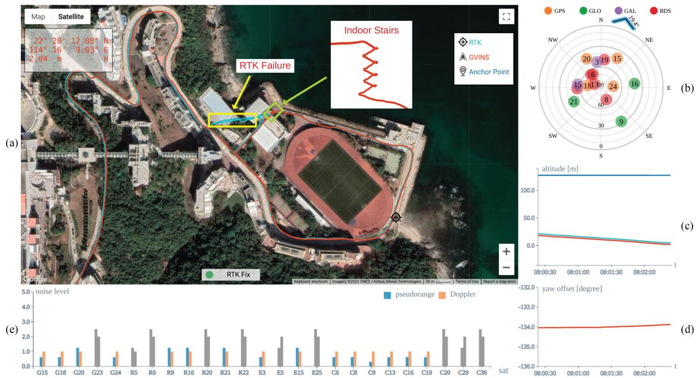  
Fig. 1. Snapshot of our system in a complex indoor–outdoor environment. The global estimation result is plotted on Google Maps directly and aligns well with the ground truth RTK trajectory, as shown in (a). (b) Depicts the distribution of satellites, with the tangential direction representing the azimuth and radial direction being the elevation angle. The blue arrow is a compass-like application, which indicates the global yaw orientation of the camera. Subplots (c) and (d) illustrate the altitude information and the local-ENU yaw offset, respectively. The measurement noise level of each tracked satellite is shown in (e). Note that there is an obvious failure on the RTK trajectory when we walk on indoor stairs, while our system can still perform global estimation even in the indoor environment.

To address the aforementioned issues, we propose a nonlinear optimization-based system to tightly fuse GNSS raw measurements (code pseudorange and Doppler frequency shift) with visual and inertial data for accurate and drift-free state estimation. The four-DoF transformation between the local and global frames is recovered via a coarse-to-fine approach in the initialization phase and is further optimized subsequently. To incorporate noisy GNSS raw measurements, all GNSS constraints are formulated under a probabilistic factor graph, in which all states are jointly optimized. In addition, degenerate cases are discussed and carefully handled to enhance robustness. Thanks to the tightly coupled approach and system design, our system fully exploits the complementary properties among the GNSS, visual, and inertial measurements and is able to provide locally smooth and globally consistent estimation even in complex environments, as shown in Fig. 1. We highlight the contributions of this article as follows:

1) an online coarse-to-fine approach to initialize GNSS– visual–inertial states;

2) an optimization-based tightly coupled approach to fuse visual–inertial data with multiconstellation GNSS raw measurements under the probabilistic framework;

3) a real-time estimator, which is able to provide driftfree six-DoF global estimation in complex environments, where GNSS signals may be largely intercepted or even inaccessible;

4) an extensive evaluation of the proposed system in both simulation and real-world environments.

For the benefit of the research community, the proposed system,1 along with well-synchronized datasets,2 has been open-sourced.

The rest of this work is structured as follows. In Section II, we review existing relevant works. Section III describes the notation and coordinate system involved in our system. In Section IV, we briefly introduce the relevant background of the GNSS. Section V shows the structure and workflow ofthe proposed system. The problem formulation and methodology are illustrated in Section VI. In Section VII, we address the GNSS initialization issues and discuss several degenerate cases that degrade the performance of our system. The experiment setup and evaluation are given in Section VIII. Finally, Section IX concludes this article.

## II. RELATED WORK

State estimation via a multisensor fusion approach has been proven to be effective and robust, and there is extensive literature on this topic. Among the approaches, we are particularly interested in the combination ofsmall-size and low-cost sensors, such as cameras, IMUs, and GNSS receivers, to produce a real-time accurate estimation in an unknown environment.

The fusion of visual and inertial measurement in a tightly coupled manner can be classified into either filter-based methods or optimization-based methods. The multistate constraint Kalman filter (MSCKF) [2] is an excellent filter-based state estimator, which utilizes the geometric constraints between multiple camera poses to efficiently optimize the system states. Extending MSCKF, Li and Mourikis [3] make improvements to its accuracy and consistency, and Wu et al. [4] aim to overcome its numerical stability issue, especially on mobile devices. Compared with the filter-based approach, the nonlinear batch optimization method can achieve better performance by relinearization at the expense of computational cost. OKVIS [5] utilizes a keyframe-based sliding window optimization approach for state estimation, while VINS-Mono [6] also optimizes system states within the sliding window, but is more complete, with online relocalization and pose graph optimization. Since the camera and the IMU only impose local relative constraints among states, accumulated drift is a critical issue in a VIN system, especially over long-term operation.

As GNSS provides absolute measurement in the global Earth frame, incorporating GNSS information is a natural way to reduce accumulated drift. In terms of loosely coupled manner, the authors of [7] and [8] describe state estimation systems, which fuse GNSS solutions with visual and inertial data under the extended Kalman filter (EKF) framework. Shen et al. [9] propose an unscented Kalman filter algorithm that fuses visual, inertial, LiDAR, and GNSS solutions to produce a smooth and consistent trajectory in different environments. The methods in [10] and [11] and our previously proposed VINS-Fusion [12] fuse the results from local visual–inertial odometry (VIO) with GNSS solutions under the optimization framework. In [13], Li et al. combine the results from precise point positioning (PPP) [14] with stereo VIO to achieve low-drift estimation. Both the GNSS code and phase measurements are used in their formulation, and precise satellite products are utilized to improve the accuracy. All aforementioned works rely on a GNSS solution to perform estimation; therefore, system failure will occur once the GNSS solution is highly corrupted or unavailable in the situation where the number of tracked satellites is below four.

In the line of literature examining tightly coupled GNSS– visual approaches, Gakne and K. O’Keefe [15] tightly fuse GNSS code pseudorange data and visual measurements from a sky-pointing camera in the EKF framework. The image from the upward-facing camera is segmented as sky and nonsky areas, the latter ofwhich are used for feature detection and matching. In addition, only GNSS signals coming from the sky direction are used, so as to avoid the potential multipath effect. However, the upward-facing camera means that the system cannot work in an open-sky scenario and is only suitable for urban environments. In addition, the transformation between the local vehicle frame and the global frame is assumed known. In [16], Schreiber et al. propose a system that tightly combines the stereo visual odometry with the GNSS code pseudorange and Doppler shift measurements using the EKF framework. Three driving tests with moderate distance are conducted to evaluate their system.

However, only horizontal errors are reported in their first data sequence, and the majority of their experiments are just qualitatively analyzed.

Other works focus on tightly fusing GNSS raw measurement with visual and inertial information. The authors of [17]–[19] combine camera, IMU, and GNSS RTK measurements under the EKF framework for localization. The RTK solution, which usually has centimeter-level accuracy, requires a static GNSS reference station with the known position as infrastructure. The authors of[20] and [21] investigate the performance ofthe fusion system in a cluttered urban environment, where less than four satellites are tracked. However, the transformation between local and global frames is not handled, and the scale oftheir real-world experiments is limited. In addition, the results of the underlying VIN system in [21], as tested in standalone mode, show large drift over a short period of time. Recently, we found a similar work [22] to ours that tightly fuses GNSS raw measurements with visual–inertial SLAM. A root-mean-square error (RMSE) of 14.33 m is reported on the longest sequence (5.9 km) in the evaluation, while the value is only 4.51 m for our system, even on a more challenging urban driving sequence with a total distance of 22.9 km. In GNSS-unfriendly areas where the number of GNSS measurements becomes insufficient, Liu et al. [22] drop all GNSS measurements, which may still benefit the estimator, as shown in our experiments. In addition, the indoor environments within the sequence, such as tunnels, cannot be handled by the system in [22], which again limits the potential of the tightly coupled multisensor fusion approach.

Therefore, we aim to build a robust and accurate state estimator with GNSS raw measurements and visual and inertial data tightly fused. By leveraging the global measurement from the GNSS, the accumulated error from the visual–inertial system will be eliminated, and the transformation between the local and global frames will be estimated without any offline calibration. The system is able to work in complex indoor and outdoor environments and achieves local smoothness and global consistency.

## III. NOTATION AND DEFINITIONS

## A. Frames

The spatial frames involved in our system consist of the following.

1) Sensorframe: The sensor frame is attached to the sensor and is a local frame, in which the sensor reports its readings. In our system, sensor frames are the camera frame $( \cdot ) ^ { c }$ and the IMU frame $( \cdot ) ^ { i }$ , and we choose the IMU frame as our estimation target frame and denote it as the body frame $( \cdot ) ^ { b }$

2) Local worldframe: We represent the conventional frame in which the visual–inertial system operates as the local world frame $( \cdot ) ^ { w }$ . In the VIN system, the origin of the local world frame is arbitrarily set, and the z-axis is often chosen to be gravity aligned, as illustrated in Fig. 2.

3) Earth-centered, Earth-fixed (ECEF) frame: The ECEF frame $( \cdot ) ^ { e }$ is a Cartesian coordinate system that is fixed with respect to the Earth. As shown in Fig. 2, the origin of the ECEF frame is attached to the center of mass of the Earth. The $x y$ plane coincides with Earth’s equatorial plane, with the x-axis pointing to the prime meridian. The z-axis is chosen to be perpendicular to Earth’s equatorial plane in the direction of the geographical North Pole. Finally, the y-axis is taken to make the ECEF frame a right-handed coordinate system. In this article, we use the WGS84 realization of the ECEF frame.

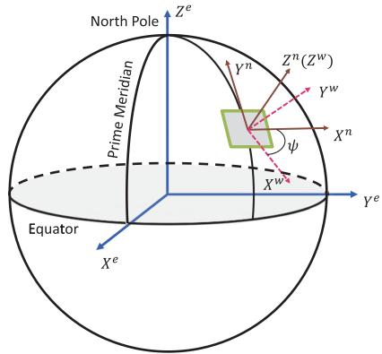  
Fig. 2. Illustration of the ECEF (·)e, ENU $( \cdot ) ^ { n }$ , and local world $( \cdot ) ^ { w }$ frames. Both the z-axes of the ENU and local world frames are gravity aligned, and there is a yaw offset ψ between the two frames.

4) ENU frame: In order to connect the local world and global ECEF frames, a semiglobal frame, ENU, is introduced. The x-, y- and z-axes of the ENU frame $( \cdot ) ^ { n }$ point to the east, north, and upward direction, respectively (see Fig. 2). Given a point in the ECEF frame, a unique ENU frame can be determined, with its origin sitting on that point. Note that the z-axis of the ENU frame is also gravity aligned.

5) Earth-centered inertial (ECI)frame: The ECI frame is an inertial coordinate system with the center of mass of the Earth as its origin. The three axes of the ECI frame $( \cdot ) ^ { E }$ are taken to point in fixed directions with respect to the stars, i.e., do not rotate with Earth. The GNSS signal travels in a straight line in the ECI frame, which can greatly simplify the formulation. In this article, the ECI frame is formed by freezing the ECEF frame at the time of reception of the GNSS signal.

In terms of temporal frames, GNSS data are tagged in the GNSS time system (for example, GPS time), while visual and inertial measurements are marked in the local time system. We assume that these two time systems are aligned beforehand and do not distinguish them accordingly.

## B. Notation

In this article, we use $\mathbf { R } _ { a } ^ { z }$ and $\mathbf { p } _ { a } ^ { z }$ to denote the rotational and translational parts of the transformation from frame a to frame $z .$ For the rotational part, the corresponding Hamilton quaternion $\mathbf { q } _ { a } ^ { z }$ is also used, with ⊗ representing its multiplication operation. We use a subscript to refer to a moving frame at a specific time instance. For example, $\mathbf { R } _ { a _ { + } } ^ { z }$ stands for the rotation from the moving frame a at time t to the fixed frame z.

For constant quantities, we use $\mathbf { g } ^ { w }$ to represent the gravity vector in the local world frame. c is the speed of light in vacuum and $\omega _ { E }$ stands for the angular velocity of the Earth.

## C. States

The system states to be estimated include the following:

1) the position $\mathbf { p } _ { b } ^ { w }$ and orientation $\mathbf { q } _ { b } ^ { w }$ of the body frame with respect to the local world frame;

2) the velocity $\mathbf { v } _ { b } ^ { w }$ , accelerometer bias $ { \mathbf { b } } _ { a }$ and gyroscope bias $\mathbf { b } _ { w } ;$

3) the inverse depth $\rho$ for each feature;

4) the yaw offset ψ between the local world frame and the ENU frame, receiver clock bias δt, and receiver clock drifting rate δ ˙t. Because our system supports all four GNSS systems, namely, GPS, GLONASS, Galileo, and BeiDou, their clock biases are estimated separately. Note that the receiver clock drifting rate for each constellation is the same.

Our system adopts a sliding window optimization approach and the states X inside the window can be summarized as

$$
\mathcal { X } = [ \mathbf { x } _ { 0 } , \mathbf { x } _ { 1 } , . . . , \mathbf { x } _ { n } , \rho _ { 0 } , \rho _ { 1 } , . . . , \rho _ { m } , \psi ]\tag{1a}
$$

$$
\begin{array} { r } { { \bf x } _ { k } = \left[ { \bf p } _ { b _ { t _ { k } } } ^ { w } , { \bf v } _ { b _ { t _ { k } } } ^ { w } , { \bf q } _ { b _ { t _ { k } } } ^ { w } , { \bf b } _ { a } , { \bf b } _ { w } , \delta { \bf t } , \dot { \delta t } \right] , \quad k \in [ 0 , n ] } \end{array}\tag{1b}
$$

$$
\delta \mathbf { t } = [ \delta t _ { G } , \delta t _ { R } , \delta t _ { E } , \delta t _ { C } ]\tag{1c}
$$

where n is the window size and $m$ is the number of feature points in the window. The four components in $\delta \mathbf { t }$ correspond to the receiver’s clock biases with respect to the times of GPS, GLONASS, Galileo, and BeiDou, respectively.

## IV. GNSS FUNDAMENTALS

Since our system requires GNSS raw measurement processing, background knowledge about the GNSS is necessary. In this section, we first give an overview of the GNSS. Then, two types of raw measurements, namely, code pseudorange and Doppler shift, are introduced and modeled. Finally, the principle of the single point positioning (SPP) algorithm for global localization is described at the end of this section.

## A. GNSS Overview

The GNSS, as its name suggests, is a satellite-based system, which is capable of providing global localization services. Currently, there are four independent and fully operational GNSS systems, namely, GPS, GLONASS, Galileo, and BeiDou. The navigation satellites in each GNSS system continuously broadcast radio signals, from which the receiver can uniquely identify the satellites and retrieve the navigation messages. Taking the GPS L1C signal as an example, the final transmitted signal is composed of three layers, as illustrated in Fig. 3. The navigation message contains parameters of the orbit, corrections of the clock error, coefficients of ionospheric delay, and other information related to the satellite’s status. The orbit parameters, also known as ephemeris, contain 14 variables and are used to calculate the satellite’s ECEF coordinates at a particular time. The satellite’s clock error is modeled as a second-order polynomial, i.e., with three parameters. Each satellite is assigned a unique pseudorandom noise (PRN) code that repeats every 1 ms. The 50-bit/s navigation message is first exclusive-ORed with the PRN code and then used to modulate the high-frequency carrier signal. After receiving the signal, the receiver obtains the Doppler shift (see Section IV-C) by measuring the frequency difference between it and the designed signal. The code pseudorange measurement (see Section IV-B) is inferred from the PRN code shift, which indicates the propagation time. Finally, the navigation message is uncovered by a reverse demodulation process.

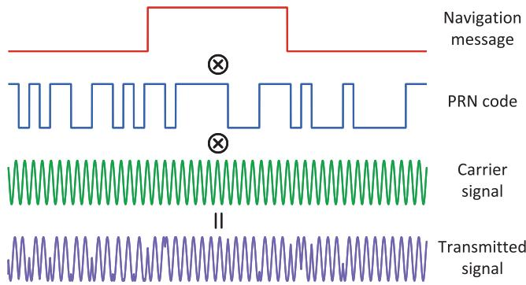  
Fig. 3. Hierarchical structure of the GPS L1C signal. The navigation message first mixes with the satellite-specific PRN code, and then, the resulting sequence is used to modulate the high-frequency carrier signal. The final signal is transmitted by the satellite and captured by the receiver, which applies a reverse process to obtain the measurement and retrieve the message.

## B. Code Pseudorange Measurement

Upon the reception of the signal, the time of flight (ToF) of the signal is measured from the PRN code shift. By multiplying the ToF with the speed of light, the receiver obtains the code pseudorange measurement, which is prefixed with “pseudo” because it contains not only the geometric distance between the satellite and the receiver, but also various errors that appear during the signal generation, propagation and processing.

The error source on the satellite side mainly consists of the satellite orbit and the clock error. The orbit error comes from the influence of other celestial objects, which are not precisely modeled by the ephemeris, and the clock error is the result of the satellite’s imperfect onboard atomic clock with respect to the standard system time. The orbit and clock errors are monitored and constantly corrected by the system control segment. During the propagation from the satellite to the receiver, the signal goes through the ionosphere and the troposphere, where the speed of the electromagnetic signal is no longer the same as that under vacuum, and as a result, the signal is delayed according to the atmospheric components and propagation path. The phenomenon that the signal reaches the receiver in different ways, which is known as the multipath effect, may occur and add extra delay, especially for low-elevation satellites. When the signal arrives, the ToF is calculated by comparing the signal transmission time, which is marked by the satellite’s atomic clock, with the receiver’s less accurate local clock time. Thus, the range information is also offset by the receiver clock error with respect to the GNSS system time. The code pseudorange measurement can be modeled as

$$
\begin{array} { c } { { \tilde { P } _ { r } ^ { s } = \| \mathbf { p } _ { s } ^ { E } - \mathbf { p } _ { r } ^ { E } \| + c \left( \zeta _ { s } ^ { T } \delta \mathbf { t } - \Delta t ^ { s } \right) } } \\ { { + T _ { r } ^ { s } + I _ { r } ^ { s } + M _ { r } ^ { s } + \epsilon _ { r } ^ { s } } } \end{array}\tag{2}
$$

where $\mathbf { p } _ { s } ^ { E }$ and $\mathbf { p } _ { r } ^ { E }$ are the ECI coordinates of the satellite s and receiver r, respectively; $\zeta _ { s }$ is designed to be $\mathrm { ~ a ~ 4 ~ } \times \mathrm { ~ 1 ~ }$ indicator vector, with the corresponding satellite constellation entity being 1 and other three entities being 0; $\Delta t ^ { s }$ is the satellite’s clock error, which can be calculated from the broadcast navigation message; and $T _ { r } ^ { s }$ and $I _ { r } ^ { s }$ stand for the tropospheric and the ionospheric delay, respectively. We use $M _ { r } ^ { s }$ to denote the delay caused by the multipath effect and $\epsilon _ { r } ^ { s }$ for the measurement noise. Here, the delay terms $T _ { r } ^ { s } , I _ { r } ^ { s }$ , and $M _ { r } ^ { s }$ are expressed in the unit of length, i.e., multiplied by c.

## C. Doppler Measurement

The Doppler frequency shift is measured from the difference between the received carrier signal and the designed one, and it reflects the receiver–satellite relative motion along the signal propagation path. Due to the characteristics of the GNSS signal structure, the accuracy of the Doppler measurement is usually an order of magnitude higher than that of the code pseudorange. The Doppler shift is modeled as

$$
\Delta \tilde { f } _ { r } ^ { s } = - \frac { 1 } { \lambda } \left[ \pmb { \kappa } _ { r } ^ { s T } \big ( \pmb { v } _ { s } ^ { E } - \mathbf { v } _ { r } ^ { E } \big ) + c ( \dot { \delta t } - \dot { \Delta t } ^ { s } ) \right] + \eta _ { r } ^ { s }\tag{3}
$$

where $\mathbf { v } _ { r } ^ { E }$ and $\mathbf { v } _ { s } ^ { E }$ represent the receiver’s and satellite’s velocity expressed in the ECI frame, respectively. We use λ to denote the wavelength of the carrier signal and $\kappa _ { r } ^ { s }$ for the unit vector from the receiver to the satellite in the ECI frame. $\dot { \Delta t ^ { s } }$ is the drift rate of the satellite clock error, which is reported in the navigation message, and finally, $\eta _ { r } ^ { s }$ represents the Doppler measurement noise.

## D. SPP Algorithm

The SPP algorithm utilizes code pseudorange measurements to determine the three-DoF global position of the GNSS receiver via trilateration. Thus, in theory, the coordinates of the receiver can be obtained with the aid of three different satellites. However, as mentioned in Section IV-B, the code pseudorange measurement is offset by the receiver clock bias. Because the receiver’s clock bias can cause an error of hundreds of kilometers, it must be estimated along with the location in order to get a reasonable result. To this end, at least four code pseudorange measurements are required to fully constrain the three-DoF global position and receiver clock bias. Because different navigation systems use different time references, there exists a clock offset between the different systems. Additional measurements are needed in order to estimate the intersystem clock offset if the satellites are from multiple constellations. To summarize, at least (N + 3) satellites are required to be simultaneously tracked in order to uniquely localize the receiver, where N is the number of constellations among the tracked satellites.

After collecting enough measurements, the constraints from (2) are stacked together to form a series of equations with $\mathbf { p } _ { r } ^ { E }$ and δt unknown. Corrections are applied to the code pseudorange measurement, making it only a function of $\mathbf { p } _ { r } ^ { E }$ and $\delta \mathbf { t } .$ In our system, the tropospheric delay $T _ { r } ^ { s }$ is estimated by the Saastamoinen model [23], while the ionospheric delay $I _ { r } ^ { s }$ is computed using the Klobuchar model [24] and parameters in the ephemeris. By excluding the low-elevation satellites, we ignore the delay $M _ { r } ^ { s }$ caused by the multipath effect. In practice, more than $( N + 3 )$ measurements will be used, and the solution is obtained by minimizing the sum of the squared residuals. As shown in [25], the noise of the SPP solution not only depends on the measurement noise, but also has a relationship with the geometric distribution of satellites. The simplified 2-D case in Fig. 4 shows the effect of satellite distribution on the noise characteristic of the final solution. Thus, the performance of the SPP algorithm will be better with evenly distributed satellites, even with the measurement noise unchanged.

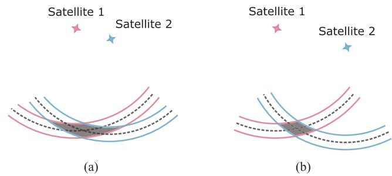  
Fig. 4. (a) and (b). Simplified 2-D illustration of how satellite distribution affects the uncertainty of an SPP solution. Here, we assume that the times between the receiver and the satellite are synchronized. Thus, two satellites are enough for localization. The dashed line represents the ground truth range, while the area in between the two solid lines denotes possible noisy measurement. The uncertainties of the SPP solutions are represented by the shadows.

## V. SYSTEM OVERVIEW

The structure of our proposed system is illustrated in Fig. 5. The estimator takes raw GNSS, IMU, and camera measurements as input and applies necessary preprocessing on each type of measurement afterwards. As in [6], the IMU measurements are preintegrated, and sparse feature points are detected and tracked from the image sequence. For the GNSS raw data, we first filter out low-elevation and unhealthy satellites, which are prone to errors. To reject unstable satellite signals, only satellites that are continuously locked for a certain number of epochs are allowed to enter the system. Because the ephemeris data are acquired via a slow satellite–receiver wireless link (50 bit/s on GPS $\mathrm { L } 1 { \mathrm { C } } ) .$ , a GNSS measurement is unusable until its corresponding ephemeris is fully transmitted. After the preprocessing phase, all measurements are ready for the estimator. Before performing optimization, an initialization phase is necessary to properly initialize the system states of the nonlinear estimator.

The initialization starts with a vision-only structure from motion (SfM), from which an up-to-similarity motion and structure are jointly estimated. Then, the VI initialization is performed by aligning the trajectory from the IMU to the SfM result in order to recover the scale, velocity, gravity, and IMU bias. After the VI initialization is finished, a coarse-to-fine GNSS initialization process is conducted. At first, a coarse anchor localization result is obtained by the SPP algorithm. Then, the local and global frames are associated in the yaw alignment stage using the local velocity from the VI initialization and GNSS Doppler measurement. Finally, the initialization phase ends with anchor refinement, which utilizes the accurate local trajectory and imposes clock constraints to further refine the anchor’s global position.

After the initialization phase, the GNSS degeneration cases are checked and carefully handled to ensure robust performance. Then, constraints from all measurements are formulated to jointly estimate system states within the sliding window under the nonlinear optimization framework. Note that our system is naturally degraded to VIO if the GNSS is not available or cannot be properly initialized. To ensure real-time performance and handle visual–inertial degenerate motions, the two-way marginalization strategy [26], which selects the frame to remove based on a parallax test, is also applied after each optimization.

## VI. PROBABILISTIC FORMULATION

In this section, we first formulate and derive our state estimation problem under a probabilistic framework. The whole problem is formulated as a factor graph, and measurements from sensors form a series of factors, which, in turn, constrain the system states. Each type of factor in the probabilistic graph will be discussed in detail through this section. Note that the formulations of the visual and inertial factors are inherited from [6], [26], and [27] and are, thus, not a contribution of this work. The relevant content is included only for the completeness of this article.

## A. Maximum a Posteriori Estimation

We define the optimum system state as one that maximizes the posterior probability given all the measurements. Assuming that all measurements are independent of each other and the noise with each measurement is zero-mean Gaussian distributed, the maximum aposteriori (MAP) estimation problem can be further transformed to minimizing the sum of a series of costs, with each cost corresponding to one specific measurement

$$
\begin{array} { l } { { \displaystyle \mathcal { X } ^ { \star } = \mathrm { a r g m a x } _ { \mathcal { X } } p ( \mathcal { X } | \mathbf { z } ) } } \\ { { \displaystyle \quad = \mathrm { a r g m a x } _ { \mathcal { X } } p ( \mathcal { X } ) p ( \mathbf { z } | \mathcal { X } ) } } \\ { { \displaystyle \quad = \mathrm { a r g m a x } _ { \mathcal { X } } p ( \mathcal { X } ) \prod _ { i = 1 } ^ { n } p ( \mathbf { z } _ { i } | \mathcal { X } ) } } \\ { { \displaystyle \quad = \mathrm { a r g m i n } _ { \mathcal { X } } \left\{ \left\| \mathbf { r } _ { p } - \mathbf { H } _ { p } \mathcal { X } \right\| ^ { 2 } + \sum _ { i = 1 } ^ { n } \left\| \mathbf { r } ( \mathbf { z } _ { i } , \mathcal { X } ) \right\| _ { \mathbf { P } _ { i } } ^ { 2 } \right\} } } \end{array}\tag{4}
$$

where z stands for the aggregation of $n$ independent sensor measurements and $\{ \mathbf { r } _ { p } , \mathbf { H } _ { p } \}$ encapsulates the prior information of the system state. $\mathbf { r } ( \cdot )$ denotes the residual function of each measurement and $\| \cdot \| _ { \mathbf { P } }$ is the Mahalanobis norm.

Note that this formulation naturally fits with the factor graph representation [28]. Thus, we decompose our optimization problem as individual factors that relate states and measurements.

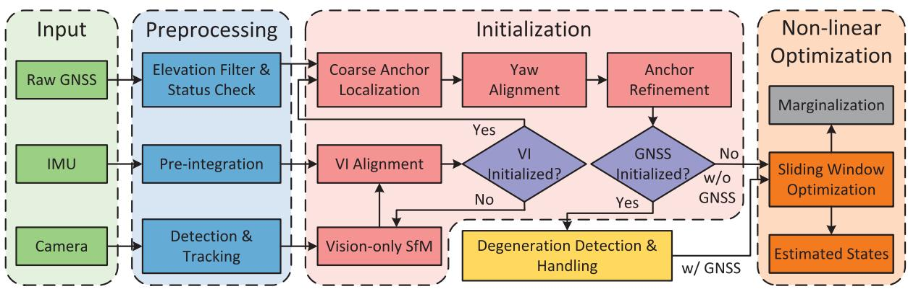  
Fig. 5. Diagram above shows the workflow of our proposed system. At first, measurements from all sensors are preprocessed before going into follow-up procedures. In the initialization stage, visual–inertial initialization is accomplished by aligning the inertial information with the result of vision-only SfM. If the visual and inertial trajectories are successfully aligned, a coarse-to-fine process is performed in order to initialize the GNSS states. The system monitors and handles GNSS degeneration cases once GNSS states are involved. Finally, constraints from all measurements within the sliding window are optimized by the nonlinear optimization. Note that if GNSS states cannot be initialized, our system can still work in the visual–inertial mode. A marginalization strategy is also adopted to ensure real-time estimation.

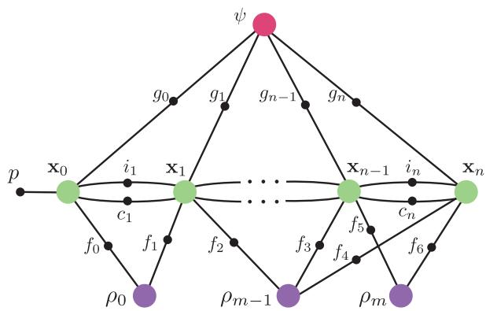  
Fig. 6. Factor graph representation of the optimization problem in our system, where system states are denoted by large colored circles and factors are represented by small black circles. The factors from various measurements consist of inertial factor i, visual factor $f ,$ code pseudorange and Doppler factor $^ { g , }$ and clock factor c. A prior factor $p$ is used to constrain the first pose of the local world frame.

Fig. 6 shows the factor graph of our system. Besides factors derived from measurements, a prior factor is used to constrain the four unobservable directions of the initial pose of the local world frame, and later, it will become a densely connected prior as we marginalize old frames. In the following, we will discuss each factor in detail.

## B. Inertial Factor

The measurements involved in the inertial factor consist of the biased, noisy linear acceleration, and angular velocity of the platform. As the accelerometer operates near Earth’s surface, the linear acceleration measurement also contains a gravity component. The Coriolis and centrifugal forces due to Earth’s rotation are ignored in the IMU’s formulation considering the noisy measurement of the low-cost IMU. Thus, the inertial measurement can be modeled as

$$
\tilde { \mathbf { a } } _ { t } = \mathbf { a } _ { t } + \mathbf { b } _ { a _ { t } } + \mathbf { R } _ { w } ^ { b _ { t } } \mathbf { g } ^ { w } + \mathbf { n } _ { a }\tag{5a}
$$

$$
\tilde { \omega } _ { t } = \omega _ { t } + \mathbf { b } _ { w _ { t } } + \mathbf { n } _ { w }\tag{5b}
$$

where $\{ \tilde { \mathbf { a } } _ { t } , \tilde { \omega } _ { t } \}$ is the output of the IMU at time t, and $\left\{ \mathbf { a } _ { t } , \omega _ { t } \right\}$ stands for the linear acceleration and angular velocity of the platform in the IMU sensor frame. The additive noises ${ \bf n } _ { a }$ and $\mathbf { n } _ { w }$ are assumed to be zero-mean Gaussian distributed, i.e., $\mathbf { n } _ { a } \sim \mathcal { N } ( \mathbf { 0 } , \pmb { \Sigma } _ { a } )$ and $\mathbf { n } _ { w } \sim \mathcal { N } ( \mathbf { 0 } , \pmb { \Sigma } _ { w } )$ . The slowly varying biases associated with the accelerometer and the gyroscope are modeled as a random walk, as follows:

$$
\dot { \mathbf b } _ { a _ { t } } = { \mathbf n } _ { b _ { a } } , \dot { \mathbf b } _ { w _ { t } } = { \mathbf n } _ { b _ { w } }\tag{6}
$$

with $\mathbf { n } _ { b _ { a } } \sim \mathcal { N } ( \mathbf { 0 } , \pmb { \Sigma } _ { b _ { a } } )$ and $\mathbf { n } _ { b _ { w } } \sim \mathcal { N } ( \mathbf { 0 } , \pmb { \Sigma } _ { b _ { w } } )$

In practice, the frequency of the IMU is often an order of magnitude higher than that of the camera. Thus, it is computationally intractable to estimate each state of the IMU measurements. To overcome this problem, the IMU preintegration approach [27] is adopted to aggregate multiple measurements into a single one. For inertial measurements within the time interval $[ t _ { k } , t _ { k + 1 } ]$ , the derived measurements are computed as

$$
\boldsymbol { \alpha } _ { b _ { t _ { k + 1 } } } ^ { b _ { t _ { k } } } = \iint _ { t \in [ t _ { k } , t _ { k + 1 } ] } \mathbf { R } _ { b _ { t } } ^ { b _ { t _ { k } } } ( \tilde { \mathbf { a } } _ { t } - \mathbf { b } _ { a _ { t } } ) d t ^ { 2 }\tag{7a}
$$

$$
\boldsymbol { \beta } _ { b _ { t _ { k + 1 } } } ^ { b _ { t _ { k } } } = \int _ { t \in [ t _ { k } , t _ { k + 1 } ] } \mathbf { R } _ { b _ { t } } ^ { b _ { t _ { k } } } ( \tilde { \mathbf { a } } _ { t } - \mathbf { b } _ { a _ { t } } ) d t\tag{7b}
$$

$$
\gamma _ { b _ { t _ { k + 1 } } } ^ { b _ { t _ { k } } } = \int _ { t \in [ t _ { k } , t _ { k + 1 } ] } \frac 1 2 \Omega ( \tilde { \omega } _ { t } - { \bf b } _ { w _ { t } } ) \gamma _ { b _ { t } } ^ { b _ { t _ { k } } } d t\tag{7c}
$$

with

$$
\Omega ( \omega ) = \left[ \begin{array} { c c } { - | \omega | _ { \times } } & { \omega } \\ { - \omega ^ { T } } & { 0 } \end{array} \right] , \quad | \omega | _ { \times } = \left[ \begin{array} { c c c } { 0 } & { - \omega _ { z } } & { \omega _ { y } } \\ { \omega _ { z } } & { 0 } & { - \omega _ { x } } \\ { - \omega _ { y } } & { \omega _ { x } } & { 0 } \end{array} \right] .\tag{8}
$$

Here, $b _ { t _ { k } }$ stands for the body frame at time $t _ { k }$ , and $\{ \alpha , \beta , \gamma \}$ encapsulates the relative position, velocity, and rotation information between frame $b _ { t _ { k } }$ and $b _ { t _ { k + 1 } }$ and can be constructed without the initial position, velocity, and rotation profiles given the IMU biases. Finally, the residual that relates the system states and preintegrated IMU measurements can be formulated as

$$
\begin{array} { r l } & { [ \partial \Omega _ { b _ { k + 1 } ^ { k } } ^ { b _ { k } } ] } \\ & { [ E _ { \bar { a } } \big ( \frac { \bar { a } _ { k } ^ { \bar { a } _ { k } } } { \bar { a } _ { k + 1 } } , \mathcal { X } \big ) - [ \displaystyle { \frac { \partial \bar { b } \bar { a } _ { k } ^ { \bar { b } _ { k + 1 } } } { \partial \bar { b } _ { k + 1 } ^ { \bar { b } _ { k + 1 } } } } ] } \\ & { [ \displaystyle { \frac { \partial \bar { b } \bar { a } _ { k } ^ { \bar { b } _ { k } } } { \partial \bar { b } _ { k + 1 } } } ] } \\ & { \qquad \quad \delta \mathrm { b } _ { 0 } } \\ &  = [ \begin{array} { c } { \mathrm { R } _ { w ^ { k } } ^ { \bar { b } _ { k } } \big ( \mathrm { p } _ { b _ { k + 1 } } ^ { \bar { b } _ { k } } - \mathrm { p } _ { b _ { k } } ^ { \bar { b } _ { k } } + \mathrm { ~ } \bar { a } ^ { \bar { ~ } } \mathrm { g } ^ { \bar { a } _ { k } } \big ) \big ( \delta \mathrm { D } _ { \bar { b } } ^ { 2 } - \mathrm { v } _ { b _ { k } } ^ { \bar { b } _ { k } } \big ( \Delta _ { b _ { k + 1 } ^ { k } } \big ) - \delta \mathrm { b } _ { \bar { b } _ { k + 1 } ^ { \bar { b } _ { k } } } ^ { \bar { b } _ { k } } - \mathrm { f } \big ( \delta \mathrm { D } _ { \bar { b } } ^ { 2 } - \mathrm { v } _ { b _ { k + 1 } } ^ { \bar { b } _ { k } } \big ) } \\  \qquad \mathrm { R } _ { w ^ { k } } ^ { \bar { b } _ { k } } \big ( \mathrm { v } _ { b _ { k + 1 } } ^ { \bar { b } _ { k } } + \mathrm { ~ } \bar { a } ^ { \bar { ~ } \mathrm { g } ^ { \bar { a } _ { k } } } \big ( \end{array} \end{array}\tag{9}
$$

where $\delta \pmb { \theta } _ { b _ { t _ { k + 1 } } } ^ { b _ { t _ { k } } }$ represents the relative rotation error in the 3-D Euclidean space, and the operator $\left[ . \right] _ { x y z }$ returns the imaginary part of a quaternion.

## C. Visual Factor

The visual measurement used in our system is a group of sparse feature points extracted from image frames. The strong corners [29] within the image are detected as feature points and are further tracked by the iterative Lucas–Kanade method [30]. After distortion correction [31] is applied to feature points, the projection process can be modeled as

$$
\widetilde { \mathcal { P } } = \pi _ { c } ( \mathbf { R } _ { b } ^ { c } ( \mathbf { R } _ { w } ^ { b } \mathbf { x } ^ { w } + \mathbf { p } _ { w } ^ { b } ) + \mathbf { p } _ { b } ^ { c } ) + \mathbf { n } _ { c }\tag{10}
$$

where $\widetilde { \mathcal { P } } = [ u , v ] ^ { T }$ is the feature coordinates in the image plane, and $\mathbf { x } ^ { w }$ is the corresponding 3-D landmark position in the local world frame, $\pi _ { c } ( \cdot )$ represents the camera projection function, and $\mathbf { n } _ { c }$ is the measurement noise. Thus, if a feature l with inverse depth $\rho _ { l }$ in frame i is observed again in frame $j ,$ , the residual that relates two frames can be expressed as

$$
\begin{array} { r l } & { \mathbf { r } _ { \mathcal { C } } ( \widetilde { \mathbf { z } } _ { l } , \mathcal { X } ) = \mathcal { \widetilde { P } } _ { l } ^ { c _ { t _ { j } } } - \pi _ { c } ( \hat { \mathbf { x } } _ { l } ^ { c _ { t _ { j } } } ) } \\ & { \hat { \mathbf { x } } _ { l } ^ { c _ { t _ { j } } } = \mathbf { R } _ { b } ^ { c } ( \mathbf { R } _ { w } ^ { b _ { t _ { j } } } ( \mathbf { R } _ { b _ { t _ { i } } } ^ { w } ( \mathbf { R } _ { c } ^ { b } \frac { 1 } { \rho _ { l } } \pi _ { c } ^ { - 1 } ( \mathcal { \widetilde { P } } _ { l } ^ { c _ { t _ { i } } } ) + \mathbf { p } _ { c } ^ { b } ) + } \\ & { \qquad \mathbf { p } _ { b _ { t _ { i } } } ^ { w } ) + \mathbf { p } _ { w } ^ { b _ { t _ { j } } } ) + \mathbf { p } _ { b } ^ { c } } \end{array}\tag{11a}
$$

(11b)

where $\{ \mathbf { R } _ { c } ^ { b } , \mathbf { t } _ { c } ^ { b } \}$ is the transformation between the IMU and the camera.

## D. Code Pseudorange Factor

Consider a GNSS receiver r, which locks a navigation satellite s. It measures the code shift to obtain the code pseudorange information, as illustrated in (2). The satellite clock error and atmospheric delay are compensated for using the models described in Section IV-D. In our system, the code pseudorange noise $\epsilon _ { r } ^ { s }$ is assumed to be zero-mean Gaussian distributed, i.e., $\epsilon _ { r } ^ { s } \sim N ( 0 , \sigma _ { r , \mathrm { p r } } ^ { s } )$ , where the variance $\sigma _ { r , \mathrm { p r } } ^ { s }$ is modeled as

$$
\sigma _ { r , \mathrm { p r } } ^ { s } = \frac { n _ { s } \times n _ { \mathrm { p r } } } { \sin ^ { 2 } \theta _ { \mathrm { e l } } } .\tag{12}
$$

Here, $n _ { s }$ is the broadcast satellite space accuracy index, and $n _ { \mathrm { p r } }$ is the code pseudorange measurement noise index reported by the receiver. $\theta _ { \mathrm { e l } }$ represents the satellite elevation angle at the view of the receiver, and there are two reasons for this denominator term. First, it can suppress the noise caused by the GNSS multipath effect that usually occurs on low-elevation satellites. Second, the ionospheric delay obtained by the Klobuchar model, which is widely adopted by navigation systems, still contains error of up to 50% [24]. As low-elevation satellites will suffer from a significant ionospheric delay, the denominator term can also reduce the error coming with the ionospheric compensation.

Locations in the ECEF frame can be transformed into the local world frame via an anchor point, at which an ENU frame is built. Given the ECEF coordinates of the anchor point, the rotation from the ENU frame to the ECEF frame is

$$
\mathbf { R } _ { n } ^ { e } = \left[ \begin{array} { c c c } { - \sin \lambda } & { - \sin \phi \cos \lambda } & { \cos \phi \cos \lambda } \\ { \cos \lambda } & { - \sin \phi \sin \lambda } & { \cos \phi \sin \lambda } \\ { 0 } & { \cos \phi } & { \sin \phi } \end{array} \right]\tag{13}
$$

where $\phi$ and λ are the latitude and longitude of the reference point in the geographic coordinate system, respectively. The one-DoF rotation between the ENU and the local world frame $\mathbf { R } _ { w } ^ { n }$ is given by the yaw offset $\psi .$ . Then, the relationship between the ECEF and local world coordinates of the receiver’s antenna can be expressed as

$$
\mathbf { p } _ { r } ^ { e } = \mathbf { R } _ { n } ^ { e } \mathbf { R } _ { w } ^ { n } ( \mathbf { p } _ { r } ^ { w } - \mathbf { p } _ { \mathrm { a n c } } ^ { w } ) + \mathbf { p } _ { \mathrm { a n c } } ^ { e } .\tag{14}
$$

In our implementation, we set the anchor point to the origin of the local world frame, i.e., the origin of the local world frame coincides with the origin of the ENU frame, as illustrated in Fig. 2. Thus, $\mathbf { p } _ { \mathrm { a n c } } ^ { w }$ , the anchor’s coordinates in the local world frame, becomes a zero vector. The position of the receiver’s antenna in the local world frame can be associated with the system states by

$$
\mathbf { p } _ { r } ^ { w } = \mathbf { p } _ { b } ^ { w } + \mathbf { R } _ { b } ^ { w } \mathbf { p } _ { r } ^ { b }\tag{15}
$$

where $ { \mathbf { p } } _ { r } ^ { b }$ is the offset of the antenna expressed in the body frame.

So far, we are able to compute the ECEF coordinates of the receiver’s antenna at any time given the corresponding system states. Because the GNSS measurements are time tagged by the receiver, we define the ECI frame to be coincident with the ECEF frame at the signal reception time. In this way, we have ${ \bf p } _ { r } ^ { E } = { \bf p } _ { r } ^ { e }$ when the signal arrives at the receiver. On the other hand, the satellite’s position in the ECEF frame at the signal transmission time, which we denote as $\mathbf { p } _ { s } ^ { e ^ { \prime } }$ , can be obtained by the broadcast ephemeris and code pseudorange measurement. As a result of Earth’s rotation, the ECEF frame when the signal leaves the satellite $( \cdot ) ^ { e ^ { \prime } }$ is different from the one when the signal arrives $( \cdot ) ^ { e }$ . Thus, the satellite’s position needs to be transformed to the ECI frame (also the ECEF frame at reception time) by

$$
\mathbf { p } _ { s } ^ { E } = \mathbf { R } _ { z } \left( - \omega _ { E } t _ { f } \right) \mathbf { p } _ { s } ^ { e ^ { \prime } }\tag{16}
$$

where $\mathbf { R } _ { z } ( \theta )$ represents a rotation about the z-axis of the ECI frame with magnitude θ, and $t _ { f }$ is the ToF of the GNSS signal.

In the end, the residual of a code pseudorange measured in $t _ { k }$ which connects system states $\{ \mathbf { p } _ { b _ { t _ { k } } } ^ { w } , \mathbf { q } _ { b _ { t _ { k } } } ^ { w } , \delta \mathbf { t } _ { k } , \psi \}$ and satellite $s _ { j } .$ , can be formulated as

$$
r _ { \mathcal { P } } ( \tilde { \mathbf { z } } _ { r _ { k } } ^ { s _ { j } } , \mathcal { X } ) = \| \mathbf { R } _ { z } ( - \omega _ { E } t _ { f } ) \mathbf { p } _ { s _ { j } } ^ { e ^ { \prime } } - \mathbf { p } _ { r _ { k } } ^ { E } \| + c ( \zeta _ { s _ { j } } ^ { T } \delta \mathbf { t } _ { k } - \Delta t ^ { s _ { j } } ) +
$$

$$
T _ { r _ { k } } ^ { s _ { j } } + I _ { r _ { k } } ^ { s _ { j } } - \tilde { P } _ { r _ { k } } ^ { s _ { j } }\tag{17}
$$

where $r _ { k }$ stands for the GNSS receiver at time $t _ { k }$

## E. Doppler Factor

The Doppler frequency shift, as shown in (3), is a result of the relative velocity along the line of the signal propagation path between the receiver and the satellite. Similar to the code pseudorange noise, the Doppler measurement noise $\eta _ { r , \mathrm { d p } } ^ { s }$ is assumed to be Gaussian distributed, and the corresponding variance is modeled as

$$
\sigma _ { r , \mathrm { d p } } ^ { s } = \frac { n _ { s } \times n _ { \mathrm { d p } } } { \sin ^ { 2 } \theta _ { \mathrm { e l } } }\tag{18}
$$

where $n _ { \mathrm { d p } }$ is the measurement noise index reported by the receiver. The receiver’s velocity in the ECEF frame can be obtained from the local world velocity via

$$
{ \bf v } _ { r } ^ { e } = { \bf R } _ { n } ^ { e } { \bf R } _ { w } ^ { n } { \bf v } _ { b } ^ { w } .\tag{19}
$$

By defining the ECI frame as the ECEF frame at reception time, we have ${ \bf v } _ { r } ^ { E } = { \bf v } _ { r } ^ { e }$ . Then, the satellite’s velocity in the signal-transmission ECEF frame, ${ \bf v } _ { s } ^ { e ^ { \prime } }$ , can be transformed to the ECI frame by

$$
\mathbf { v } _ { s } ^ { E } = \mathbf { R } _ { z } \left( - \omega _ { E } { t } _ { f } \right) \mathbf { v } _ { s } ^ { e ^ { \prime } } .\tag{20}
$$

Finally, the residual related to the Doppler measurement in $t _ { k }$ which connects system states $\{ \mathbf { p } _ { b _ { t _ { k } } } ^ { w } , \mathbf { v } _ { b _ { t _ { k } } } ^ { w } , \dot { \delta t } _ { k } , \psi \}$ and satellite $s _ { j } ,$ , can be formulated as

$$
\begin{array} { c } { r _ { \mathcal { D } } ( \tilde { \mathbf { z } } _ { r _ { k } } ^ { s _ { j } } , \mathcal { X } ) = \displaystyle \frac { 1 } { \lambda } \kappa _ { r _ { k } } ^ { s _ { j } T } ( \mathbf { v } _ { s _ { j } } ^ { E } - \mathbf { v } _ { r _ { k } } ^ { E } ) + } \\ { \displaystyle \frac { c } { \lambda } ( \dot { \delta t } _ { k } - \Delta \dot { t } ^ { s _ { j } } ) + \Delta \tilde { f } _ { r _ { k } } ^ { s _ { j } } . } \end{array}\tag{21}
$$

## F. Receiver Clock Factors

The receiver clock biases at $t _ { k }$ and $t _ { k + 1 }$ are connected by the relation

$$
\delta \mathbf { t } _ { k } = \delta \mathbf { t } _ { k - 1 } + \mathbf { 1 } _ { 4 \times 1 } \int _ { t _ { k - 1 } } ^ { t _ { k } } { \dot { \delta t } } d t\tag{22}
$$

where ${ \bf 1 } _ { n \times m }$ stands for an n-by-m all-ones matrix, and the residual in the discrete case is

$$
\mathbf { r } _ { \mathcal { T } } ( \tilde { \mathbf { z } } _ { k - 1 } ^ { k } , \mathcal { X } ) = \delta \mathbf { t } _ { k } - \delta \mathbf { t } _ { k - 1 } - \mathbf { 1 } _ { 4 \times 1 } \dot { \delta } t _ { k - 1 } \tau _ { k - 1 } ^ { k }\tag{23}
$$

where $\tau _ { k - 1 } ^ { k }$ is the time difference between measurement $k -$ 1 and k. The covariance matrix associated with this residual is defined as a 4-by-4 diagonal matrix $\mathbf { D } _ { t , k }$ , with its elements describing the discretization error.

The GNSS receiver clock drift rate, on the other hand, is determined by the frequency stability of the receiver clock. A temperature-controlled crystal oscillator (TCXO) is often chosen as the clock source on low-cost GNSS receivers. Due to the noise characteristic of the TCXO, the receiver clock drift rate is modeled as a random walk process. Thus, the residual becomes

$$
r _ { \mathcal { W } } ( \tilde { \mathbf { z } } _ { k - 1 } ^ { k } , \mathcal { X } ) = \dot { \delta t } _ { k } - \dot { \delta t } _ { k - 1 } .\tag{24}
$$

The corresponding variance $\sigma _ { d t , k }$ is determined by the stability of the clock frequency drift.

## VII. GNSS INITIALIZATION AND DEGENERATION

The state estimation process described in the last section is nonlinear with respect to the system states. Thus, its performance heavily relies on the initial values. With online initialization, the initial states can be well recovered from an unknown situation, without any assumptions or manual intervention. During the system operation, the estimator may also encounter imperfect situations, such as failures or degeneration of some sensors. As there is already extensive literature on the topics of initialization and degeneration with respect to the visual–inertial system, we limit the scope of this section to the GNSS part of our system. In the following, we first introduce the proposed coarse-to-fine GNSS initialization approach, and then, we discuss several scenarios that degrade the performance of our system.

## A. Initialization

As previously mentioned, an anchor point with known global and local coordinates is necessary to fuse the global GNSS measurement with the local visual and inertial information. As the anchor point is already set to the origin of the local world frame, the ECEF coordinates of the local world origin need to be calibrated beforehand. In addition, the yaw offset ψ between the ENU and the local world frame, which brings nonlinearity into the system, also needs a reasonable initial value in order to converge at the nonlinear optimization stage. In this article, we propose a multistage GNSS-VI initialization procedure to online calibrate the anchor point and the yaw offset. Before the GNSS-VI initialization, we assume that the VIO has been successfully initialized, i.e., the gravity vector, initial velocity, initial IMU bias, and scale have obtained initial values [32]. After that, a smooth trajectory in the local world frame is formed and is ready to be used in the GNSS-VI initialization phase. The GNSS-VI initialization procedure requires at least four satellites to be tracked (if all satellites belong to a single system and (N + 3) if N satellite systems are involved). In addition, a minimum distance of 4 m is also required to obtain reliable initial quantities. As illustrated in Fig. 7, the online GNSS-VI initialization is conducted in a coarse-to-fine manner and consists of three steps.

1) Coarse Anchor Point Localization: First, a coarse ECEF location is obtained by the GNSS SPP algorithm without any prior information. The SPP algorithm takes all code pseudorange measurements from the most recent epoch as input.

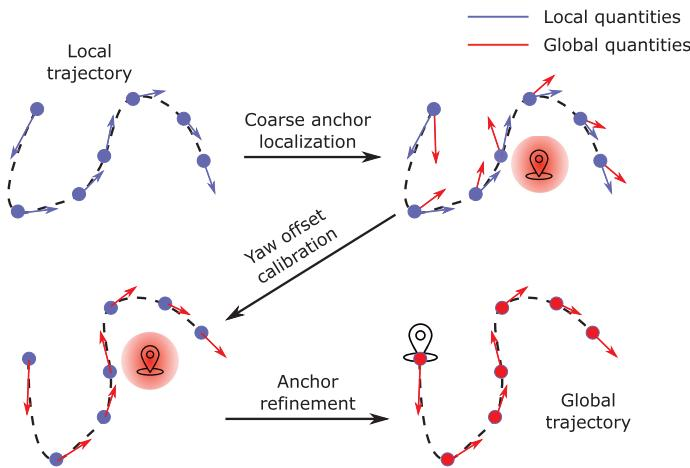  
Fig. 7. Illustration of the proposed coarse-to-fine initialization process. The module takes the local position and velocity result from the VIO and outputs the corresponding trajectory in the global ECEF frame.

2) Yaw Offset Calibration: In the second step, we calibrate the yaw offset between the ENU frame and the local world frame using the less noisy Doppler measurement. The initial yaw offset and the receiver clock drift rate are obtained through the following optimization problem:

$$
\underset { \delta t , \psi } { \mathrm { m i n i m i z e } } \sum _ { k = 1 } ^ { n } \sum _ { j = 1 } ^ { p _ { k } } \left\| r _ { \mathcal { D } } ( \widetilde { \mathbf { z } } _ { r _ { k } } ^ { s _ { j } } , \mathcal { X } ) \right\| _ { \sigma _ { r _ { k } , \mathrm { d p } } ^ { s _ { j } } } ^ { 2 }\tag{25}
$$

where n is the sliding window size and $p _ { k }$ is the number of satellites observed in the kth epoch inside the window. Here, we fix the velocity $\mathbf { v } _ { b } ^ { w }$ to the result from the VIO and assume that $\dot { \delta t _ { k } }$ is constant within the window. The coarse anchor location obtained from the first step is used to calculate the direction vector $\kappa _ { r } ^ { s }$ and rotation $\mathbf { R } _ { n } ^ { e }$ . Since $\kappa _ { r } ^ { s }$ and $\mathbf { R } _ { n } ^ { e }$ are not sensitive to the receiver’s location, a coarse anchor point location is sufficient. The parameters to be estimated only include the yaw offset $\psi$ and the average clock bias drift rate $\dot { \delta t }$ within the window. After this step, the transformation between the ENU frame and local world frame is fully calibrated.

3) Anchor Point Refinement: Finally, we are ready to refine the previous coarse anchor point and align the local world trajectory with that in the ECEF frame. Different from the first step, the position result from the VIO is used as prior information. The following problem is optimized over the sliding window measurements:

$$
\begin{array} { l } { \displaystyle \underset { \delta \mathbf { t } , \mathbf { p } _ { \mathrm { a c } } ^ { e } } { \mathrm { m i n i m i z e } } \left( \sum _ { k = 1 } ^ { n } \sum _ { j = 1 } ^ { p _ { k } } { \left\| { r _ { \mathcal { P } } } ( \tilde { \mathbf { z } } _ { r _ { k } } ^ { s _ { j } } , \boldsymbol { \mathcal { X } } ) \right\| _ { \sigma _ { r _ { k } , \mathrm { p r } } ^ { s _ { j } } } ^ { 2 } } \right. } \\ { \displaystyle \left. + \sum _ { k = 1 } ^ { n } { \left\| \mathbf { r } _ { \mathcal { T } } ( \tilde { \mathbf { z } } _ { k - 1 } ^ { k } , \boldsymbol { \mathcal { X } } ) \right\| _ { \mathbf { D } _ { t , k } } ^ { 2 } } \right) . } \end{array}\tag{26}
$$

The anchor point location and the receiver clock biases associated with each GNSS epoch are refined through the optimization of the above problem. After this step, the anchor point, i.e., the origin of the ENU frame, is set to the origin of the local world frame. Finally, the initialization phase of the entire estimator is finished, and all necessary quantities have been assigned initial values.

## B. Degenerate Cases

There is no doubt that our fusion system will perform best in an open area, where GNSS signals are stable and satellites are well distributed. In the following, we will discuss several situations, which may degrade the performance of our system.

1) Low-Speed Movement: Since the noise level of Doppler shift measurement is an order of magnitude lower than that of the code pseudorange, the yaw offset between the local world frame and the ENU frame can be well constrained by a short window of Doppler shift measurements. Once the velocity of the GNSS receiver is below the noise level of the Doppler shift, the estimated yaw offset may be corrupted by the measurement noise. In addition, low-speed movement also implies that the translational distance within the window is short, and thus, the yaw estimation may be affected by the code pseudorange as well. In an extreme case where the platform experiences a rotationonly movement, the GNSS cannot provide any information on the rotational directions, and, in turn, the yaw component will drift, the same as in the VIO. Thus, we fix the yaw offset variable if the average velocity inside the window is below the threshold $v _ { \mathrm { t h s } }$ . In our system, $v _ { \mathrm { t h s } }$ is set to 0.3 m/s, which holds for a normal pedestrian.

2) Less Than Four Satellites Being Tracked: If the number of satellites being tracked is less than four, the SPP or loosely coupled approaches will fail to resolve the receiver’s location. However, with the help of the tightly coupled structure, our system is still able to make use of available satellites and subsequently update the state vector. Later, in Section VIII-B, we will investigate the performance degradations under various satellite configurations.

3) No GNSS Signal: In indoor or cluttered environments, where the GNSS signal is totally unavailable, the states related to global information, namely, the yaw offset $\psi ,$ receiver clock bias $\delta \mathbf { t } ,$ and drift rate $\begin{array} { r } { \dot { \delta t } , } \end{array}$ are no longer observable. However, the constraints from (23) and (24) are still kept during the optimization. The clock drift rate of the low-cost receivers is quite stable, as we found in a receiver static test. Thus, the (near)optimum clock drift rate is maintained by the constraint from (24). Similarly, the receiver bias is propagated by the constraint from (23), which, in turn, provides a good initial value when the GNSS signal is reacquired. This mechanism improves the stability of our fusion system when the GNSS signal is intermittent and eliminates the need for reinitialization when the signal is lost and then reacquired.

## VIII. EXPERIMENTAL RESULTS

We conduct both simulation and real-world experiments to verify the performance of our proposed system. In this section, we compare our system against VINS-Mono [6], VINS-Fusion [12] (Monocular+IMU+GNSS), and RTKLIB [33]. Since we are only interested in the real-time estimation results, the loop function of VINS-Mono and VINS-Fusion, which optimizes the pose graph based on revisited scenes, is disabled. We use $\mathrm { R T K L I B } ^ { 3 }$ to compute the GNSS SPP solution and feed the obtained GNSS location to VINS-Fusion for a loosely coupled result. The window size of our system, as well as that of VINS-Mono and VINS-Fusion, is set to 10. Table I lists the maximum velocity and overall RTK fixed rate in each experiment. All experiments in this section are performed on a desktop PC with an Intel i7-8700K at 3.7 GHz and 32-GB memory.

TABLE I  
VELOCITY AND RTK FIXED RATE PROFILES IN EACH EXPERIMENT
<table><tr><td colspan="3">maximum velocity [m/s] RTK fixed rate [%]</td></tr><tr><td>Simulation</td><td>10.000</td><td>N/A</td></tr><tr><td>Sports field</td><td>1.676</td><td>100 %</td></tr><tr><td>Indoor-outdoor</td><td>2.108</td><td>81.3 %</td></tr><tr><td>Urban driving</td><td>21.424</td><td>84.7 %</td></tr></table>

TABLE II

INITIALIZATION QUALITY METRICS IN SIMULATION AND REAL-WORLD EXPERIMENTS
<table><tr><td></td><td>Yaw offset error [degree] Anchor point error [m]</td><td></td></tr><tr><td>Simulation</td><td>0.183</td><td>0.635</td></tr><tr><td>Sports field</td><td>0.35</td><td>1.491</td></tr><tr><td>Indoor-outdoor</td><td>0.478</td><td>4.370</td></tr><tr><td>Urban driving</td><td>2.490</td><td>4.816</td></tr></table>

## A. Simulation

1) Setup: The simulation environment is a $3 0 \times 3 0 \times 3 0$ m cube with randomly generated 3-D landmarks. These landmarks are projected to a 10-Hz virtual camera with a $7 5 ^ { \circ }$ horizontal field of view (FoV) and $5 5 ^ { \circ }$ vertical FoV, which, in turn, generates around 100 visible features per frame. An additional white noise term with a standard deviation of 0.5 pixels is added to all feature points. A virtual 200-Hz IMU is rigidly connected to the camera and moves along a predesigned 3-D path. The standard deviation associated with the white noise of the accelerometer and the gyroscope is set $\mathrm { { t o } 0 . 0 5 \ m / s ^ { 2 } }$ and 0.005 rad/s, respectively, and the standard deviation of the accelerometer and the gyroscope bias random walk is set to $3 . 5 \times 1 0 ^ { - 4 } \mathrm { m / s } ^ { 3 }$ and $3 . 5 \times 1 0 ^ { - 5 } \ \mathrm { r a d / s ^ { 2 } }$ respectively. In the meantime, a 10-Hz virtual GNSS receiver generates code pseudorange and Doppler shift measurements using the past or real-time broadcast ephemeris data. The standard deviation of the code pseudorange and Doppler white noise shift is set to 1 m and 0.5 Hz $( \sim 0 . 1$ m/s equivalent), respectively. The simulation experiment lasts for 30 min, with a trajectory over 10 km.

2) Result: In the simulation environment, GNSS-VI is initialized immediately after visual–inertial alignment since the system does not need to wait for ephemerides. The initialization quality, which we measure by the error of the local-ENU yaw offset and anchor point, is presented in Table II. Fig. 8 shows the relative pose error (RPE) [34] with respect to the evaluation distance. As can be seen from Fig. 8, the relative error of VINS-Mono increases with the evaluation distance in both the translational and rotational directions. In terms of the rotational directions, the error mainly comes from its yaw component. This indicates that VINS-Mono suffers from accumulated drift in the four unobservable directions, x, y, z, and yaw. The error of VINS-Fusion exhibits a similar tendency when the evaluation distance is short and remains at a constant level when the distance increases further. This implies that VINS-Fusion is able to bound the accumulated drift by loosely incorporating the GNSS solution. However, the magnitude of its relative error is much larger compared with the results of VINS-Mono and GVINS. Thus, the smoothness of the estimator is highly affected by the noisy GNSS measurement. Thanks to the tightly coupled approach we adopt, our proposed system combines the advantages of both VINS-Mono and VINS-Fusion. On the one hand, the relative error is comparable to that of VINS-Mono for the short range, and thus, the smoothness is preserved. On the other hand, the error no longer accumulates in all directions; therefore, the global consistency is also guaranteed.

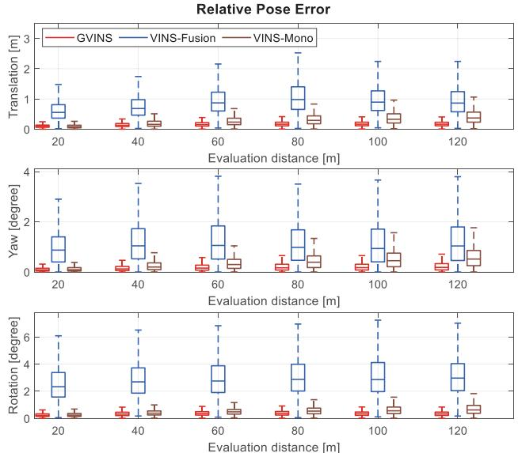  
Fig. 8. RPE of GVINS, VINS-Fusion, and VINS-Mono with respect to the evaluation distance on the simulation environment. The top two graphs correspond to the four unobservable directions (x, y, z, and yaw) of the VIO, and the bottom is the overall relative rotation error.

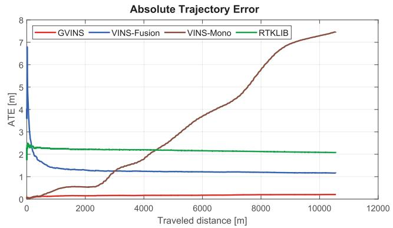  
Fig. 9. ATE of GVINS, VINS-Fusion, VINS-Mono, and RTKLIB with respect to the traveled distance in the simulation environment.

Fig. 9 depicts the absolute trajectory error (ATE) along with he traveled distance. The error plot of VINS-Mono keeps increasing as a result of accumulated drift, while it remains constant for the three other approaches. The ATE of the RTK-LIB SPP algorithm shows the noise level of the GNSS code pseudorange measurement, and VINS-Fusion is able to reduce the magnitude of the ATE by combining the result from the VIO in a loosely coupled manner. By tightly fusing GNSS raw measurements and visual–inertial data in a unified framework, our algorithm effectively suppresses the noise of the GNSS signal and keeps the ATE at a low level. The final RMSE of each approach is shown in Table III.

TABLE III  
COMPARISON OF RMSE [M] STATISTICS FOR DIFFERENT APPROACHES IN THE SIMULATION ENVIRONMENT
<table><tr><td></td><td>GVINS</td><td>VINS-Fusion</td><td>VINS-Mono</td><td>RTKLIB</td></tr><tr><td>Simulation</td><td>0.202</td><td>1.162</td><td>7.471</td><td>2.076</td></tr><tr><td>Sports field</td><td>0.806</td><td>2.149</td><td>8.537</td><td>2.835</td></tr><tr><td>Indoor-outdoor</td><td>3.700</td><td>6.905</td><td>36.651</td><td>6.036</td></tr><tr><td>Urban driving</td><td>4.508</td><td>N/A</td><td>N/A</td><td>11.106</td></tr></table>

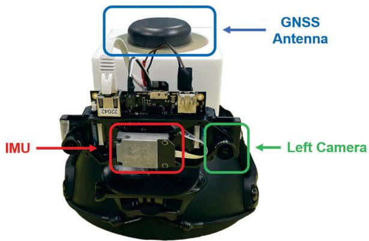  
Fig. 10. Equipment used in our real-world experiments is a helmet with a VI-Sensor and a u-blox ZED-F9P attached. The camera and IMU measurements are well synchronized by the VI-Sensor itself. The PPS signal from the GNSS receiver is used to trigger the VI-Sensor to align the global time with the local time.

## B. Real-World Experiments

As illustrated in Fig. 10, the device used in our real-world experiments is a helmet with a VI-Sensor [35] and a u-blox ZED-F9P GNSS receiver4 attached. The detailed specifications of each sensor are shown in Table IV. Although the VI-Sensor provides two cameras as a stereo pair, we only use the left one for all experiments. The u-blox ZED-F9P is a low-cost multiband receiver with multiconstellation support. In addition, the ZED-F9P has an internal RTK engine, which is capable of providing the receiver’s location at an accuracy of 1 cm in an open area. The real-time RTCM stream from a nearby base station is fed to the ZED-F9P receiver for the ground truth RTK solution. In terms of time synchronization, the camera and the IMU are synchronized by the VI-Sensor, and the local time is aligned with the global GNSS time via the pulse per second (PPS) signal of the ZED-F9P and hardware trigger of the VI-Sensor.

TABLE IV  
SENSOR SPECIFICATIONS FOR DEVICES USED IN REAL-WORLD ENVIRONMENT
<table><tr><td>Sensor Type/Item</td><td>Value</td><td>Unit</td></tr><tr><td>Camera</td><td></td><td></td></tr><tr><td>Sensor</td><td>Aptina MT9V034</td><td></td></tr><tr><td>Shutter</td><td>Global shutter</td><td></td></tr><tr><td>Resolution</td><td>752 × 480</td><td>pixel</td></tr><tr><td>Horizontal field of view</td><td>98</td><td>degree</td></tr><tr><td>Vertical field of view</td><td>73</td><td>degree</td></tr><tr><td>Frequency</td><td>20</td><td>Hz</td></tr><tr><td>IMU</td><td></td><td></td></tr><tr><td>Sensor</td><td>ADIS16448</td><td></td></tr><tr><td>Frequency</td><td>200</td><td>Hz</td></tr><tr><td>Gyroscope noise density</td><td> $7 . 0 \times 1 0 ^ { - 3 }$ </td><td> $^ { \circ } / s \ \mathrm { H z } ^ { - 0 . 5 }$ </td></tr><tr><td>Accelerometer noise density</td><td> $6 . 6 \times 1 0 ^ { - 4 }$ </td><td> $m s ^ { - 2 } ~ \mathrm { H z ^ { - 0 . 5 } }$ </td></tr><tr><td>GNSS</td><td></td><td></td></tr><tr><td>Receiver</td><td>u-blox ZED-F9P</td><td></td></tr><tr><td>Antenna</td><td>Tallysman TW3882</td><td></td></tr><tr><td>Raw measurement frequency</td><td>10</td><td>Hz</td></tr><tr><td>RTK solution frequency</td><td>10</td><td>Hz</td></tr></table>

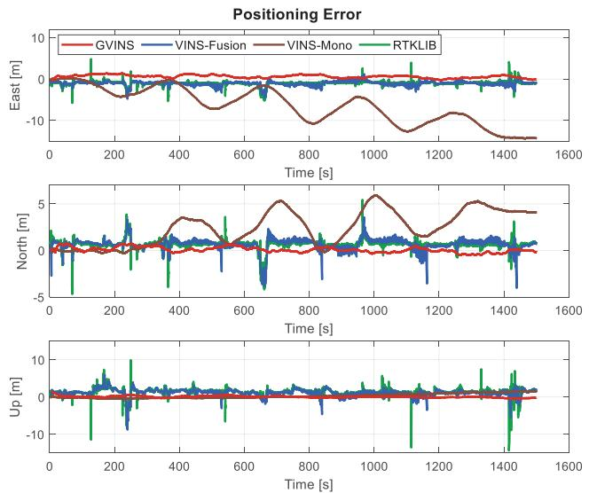  
Fig. 11. Positioning error of GVINS, VINS-Fusion, VINS-Mono, and RTK-LIB in the sports field experiment. The three graphs correspond to the three directions of the ENU frame. The results from GVINS, VINS-Fusion, and RTKLIB are compared directly against the RTK ground truth without any alignment, while the results from VINS-Mono are aligned to the ground truth trajectory beforehand.

1) Sports Field Experiment: This experiment is conducted on a campus sports field, where we move along an athletics track for five laps. The sports field is a typical outdoor environment, with an open area on one side and buildings on the other. During the experiment, most of the satellites are well locked, and the status of RTK remains fixed throughout the whole path. In this experiment, the global consistency of our estimator is examined against the repeated trajectory, and the unstable signal near buildings also poses challenges for the local smoothness of the results.

In this experiment, GNSS-VI is initialized in 4.1 s after the visual–inertial alignment is finished. The positioning error of this experiment is plotted against the ENU axes, as depicted in Fig. 11. A reference point, which is used to transform the ECEF 4[Online]. Available: https://www.u-blox.com/en/product/zed-f9p-module result into an ENU frame, is arbitrarily selected on the sports field. Since VINS-Fusion, RTKLIB, and our system can directly output estimation results in the ECEF frame, we do not apply any alignment for their trajectories. For VINS-Mono, which only gives results in the local frame, we perform a four-DoF alignment between its trajectory and the ENU path of RTK using the first 2000 poses. Note that the global positioning results from VINS-Fusion, RTKLIB, and our system suffer from a certain bias due to satellites’ orbit error, inaccurate atmospheric delay modeling, and multipath effect, while those of VINS-Mono do not have this issue because of the prealignment we performed.

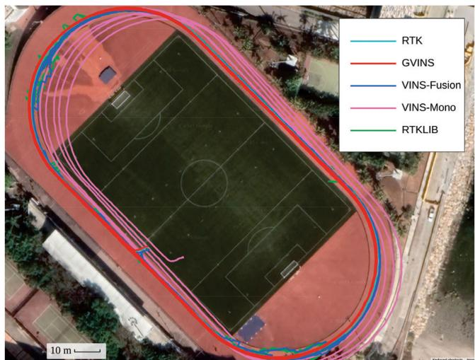  
Fig. 12. Trajectory of RTK, GVINS, VINS-Fusion, VINS-Mono, and RTK-LIB in the sports field experiment. The resulting trajectory of our proposed system is smooth and aligns well with that of the RTK.

From Fig. 11, we see that VINS-Mono suffers from drifting in all three directions. In addition, the periodic fluctuations on horizontal directions (east and north) imply an obvious drift in the yaw estimation. On the other hand, the SPP solution from RTKLIB does not drift at all, but is highly affected by the noisy GNSS measurement. The error of VINS-Fusion is bounded as a result of combining the global information from the SPP result. However, the local accuracy oscillates significantly, and the local smoothness is ruined in the meantime. As a comparison, the positioning error of our proposed system does not grow with the traveled distance and is always maintained at a low level. Meanwhile, the error varies slowly and continuously, which also indicates that our system effectively suppresses the noise from unstable GNSS signals.

Table III lists the RMSE of each method, and Fig. 12 shows the final trajectories on Google Maps. The resulting five laps of our system overlap with each other and align well with those of the RTK. Through this experiment, we show that our system is able to achieve global consistency by suppressing drifts of the VIO and also preserves the local smoothness under noisy GNSS conditions.

2) Insufficient Satellite Experiment: Based on the data sequence of the sports field experiment, we further investigate the degenerate case where the number of tracked satellites is less than four. Normally, about 20 satellites are locked in this sequence; therefore, we intentionally remove most of the satellites in the nonlinear optimization phase in order to test the system behavior. Starting from the zero-satellite setting, we sequentially add satellites G2, G13, and G5, which are well tracked during the experiment, to the system to simulate the one-, two-, and three-satellite situations. In this experiment, we only use satellites from a single constellation (GPS) because the general case where M satellites come from N constellations is equivalent to the (M − N + 1) single-constellation case due to unknown clock offsets between different systems. It is worth mentioning that our system naturally degrades to VIO when no satellites are available.

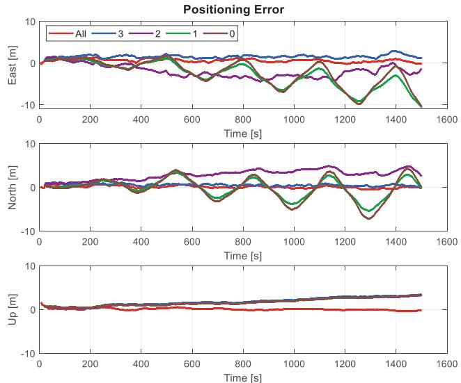  
Fig. 13. Positioning error of our proposed system in situations, where the number of locked satellites is insufficient. In the “All” setting, the system utilizes all available (around 20) satellites to perform estimation. The digits “3,” “2,” and “1” correspond to cases where only that number of satellites are used in the system. When the number becomes “0,” our system does not use any satellite and degrades to VIO.

The positioning error with five different settings is illustrated in Fig. 13. Obviously, our system performs best in the normal setting, where all available satellites are used for estimation. In the upward direction, the errors of the other four configurations accumulate in a similar manner. This indicates that the drift in the upward direction can no longer be eliminated with three satellites or fewer. In terms of the horizontal directions, no accumulated error and only a small bias occur for the threesatellite setting, which means that our system is still able to suppress drift in the easterly, northerly, and yaw directions. If the number of satellites is further reduced to two, the horizontal positioning error starts growing with the traveled distance, and we observe small periodic fluctuations in the northerly direction, which coincides with the case of the VIO. This implies that the drift in the horizontal plane occurs and the yaw error also emerges, although the magnitude is very small. Finally, with the one-satellite configuration, accumulated errors occur on all four unobservable directions of the VIO. However, the error of the yaw component is still smaller than that of the VIO, which can be inferred from the amplitude of the sine-wave-like error curve.

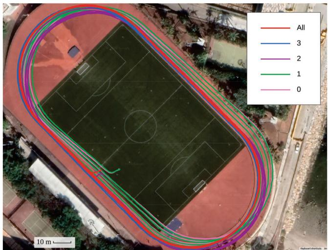  
Fig. 14. Trajectories of our proposed system with different satellite configurations. GVINS performs best by utilizing all available satellites (“All”) and degrades to VIO with the zero satellite configuration (“0”). A small bias occurs when only three satellites are used (“3”), and translational drift emerges when the satellite number is further reduced to two (“2”). If there is only one satellite available (“1”), the yaw estimation starts to drift as well, but with a smaller magnitude than for the VIO (0 satellites).

The final trajectories with different satellite settings are shown in Fig. 14. Through this experiment, we claim that our system gradually degrades to different extents when the number of locked satellites varies from three to zero. However, the proposed system outperforms pure VIO in all settings, which indicates that our tight-fusion approach can still gain information from limited satellites.

3) Indoor–Outdoor Experiment: This experiment, through which we aim to test the robustness of our system, is performed in a complex indoor–outdoor environment. The path of this experiment goes through many challenging scenarios, which may bring failure to a single-sensor-based system. For example, no features are detected and tracked in dim or bright areas, and the GNSS signal is highly corrupted or totally unavailable in cluttered or indoor environments. In addition, the path is similar to one in a typical exploration task, where no large loops exist. Thus, drifting is inevitable for any visual–inertial SLAM system. The overall distance of the resulting trajectory is over 3 km, and the altitude change is around 130 m.

The GNSS-VI initialization takes 9.0 s in this experiment, with the majority of the time spent waiting for GNSS navigation messages. Fig. 15 shows the ENU positioning error on the indoor–outdoor sequence. During this experiment, the RTK ground truth is no longer always available because of the GNSSunfriendly environment. Thus, we only make a comparison with segments where RTK is in a fixed state. The gaps around 300 s correspond to times when we were under a bridge and passing through woods, which blocked the sky, and those around 1200 and 1800 s correspond to a situation where we were going up a set of indoor stairs. The results of VINS-Fusion are not shown in Fig. 15 because of huge errors and oscillations. It can be observed from the figure that VINS-Mono still experiences large accumulated errors on the horizontal and yaw directions, while the error in the upward direction is smaller than that in the previous experiment because of the altitude excitation on this sequence. The results ofRTKLIB, although it does not drift, vary significantly around the ground truth value. These oscillations indicate the condition of the GNSS signal and severely affect the performance of VINS-Fusion. Our proposed system outperforms the other three approaches in terms of positioning error and overcomes the harsh conditions brought by the noisy GNSS measurement. The results of our system still show a bias in the upward direction because of the imperfect GNSS modeling and various error sources, while the upward error of VINS-Mono starts from zero because of the prealignment.

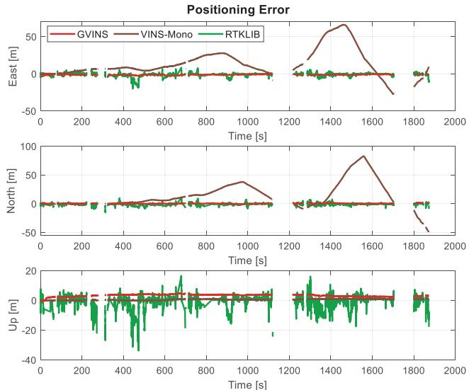  
Fig. 15. Positioning error of GVINS, VINS-Mono, and RTKLIB in the complex indoor–outdoor experiment. We only make a comparison with the RTK fixed solutions, so the gaps in the figure correspond to situations where ground truth is unavailable. The result for VINS-Fusion is not shown because of huge errors and oscillations.

The final trajectories of RTK, aligned VINS-Mono, and our system are shown in Fig. 16. The figure shows that both VINS-Mono and our proposed system work well across the whole sequence, although obvious drift occurs in the results of VINS-Mono. The discontinuities on the trajectory of RTK are the result of the cluttered and indoor environment. The trajectory of our system follows the RTK result well and can be effectively estimated even in GNSS-unfriendly areas.

Although the duration for which RTK fails is short relative to the whole sequence, the impact can be significant. As shown in Fig. 17, the positioning result from RTK is smooth and aligns well with that of GVINS when the GNSS is reliable. However, the solution achieved by RTK results in an error of up to 80 m during GNSS outages, and such behavior can be catastrophic for any location-based tasks. The final RMSE of all four approaches is shown in Table III.

4) GNSS Factor Experiment: Based on the previous indoor– outdoor sequence, we further investigate the role of each GNSS measurement (i.e., code pseudorange and Doppler shift) on the performance of our proposed system. By removing the corresponding graph factor after the initialization phase, we obtain the positioning error on the code pseudorange-only and Doppleronly configurations, as depicted in Fig. 18. In the situation where we only employ the Doppler shift measurement, an obvious drift occurs, as the system no longer has global position constraints. In addition, the initialization error, which is inevitable because we initialize the system from only a short window of measurements, cannot be eliminated and subsequently acts like a bias. If we instead conduct the code pseudorange-only optimization, the system behaves like a normal GVINS, i.e., the system does not drift anymore and the initialization error can be eliminated after a short period. However, as the code pseudorange measurement tends to be noisy and receiver clock biases are no longer constrained by the Doppler shift, the smoothness of the estimation result is affected by the unstable signal, as shown in the magnified portion of Fig. 18. Through this experiment, we show that the code pseudorange measurement is the key to eliminating the accumulated drift of the VIO. However, with the aid of the Doppler shift measurement, the estimation result tends to be smoother under unstable GNSS conditions.

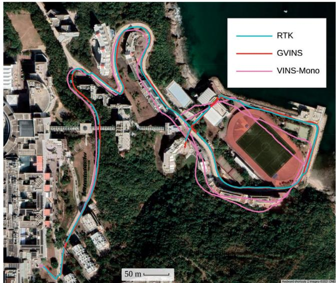

Fig. 16. Final trajectories in the complex indoor–outdoor experiment. The results of RTKLIB and VINS-Fusion are not plotted because of large noise and jitter. The discontinuities on the RTK path are the result of poor GNSS signal and fixed-loss events.  
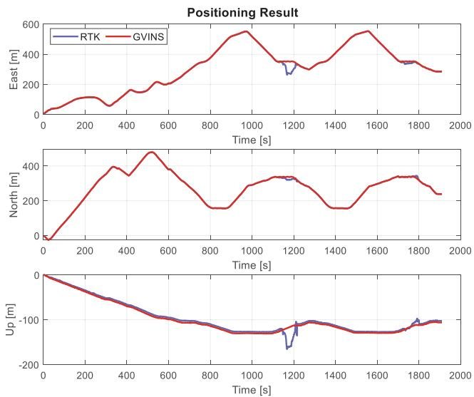  
Fig. 17. Positioning results of RTK and GVINS in the complex indoor–outdoor experiment.

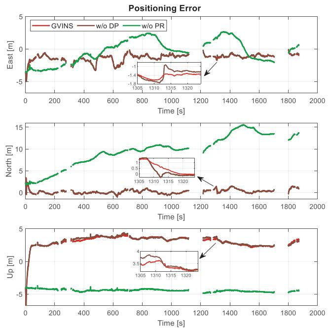  
Fig. 18. Positioning error of normal GVINS, GVINS w/o Doppler factor and GVINS w/o code pseudorange factor.

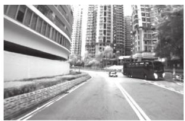  
(a)

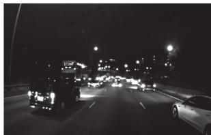  
(b)  
Fig. 19. Two image samples illustrating challenging situations in the urban driving experiment. In the left image, the GNSS receiver is surrounded by highrise buildings, where the multipath effect is obvious. The right image shows a highly dynamic scenario with low illumination and a high traffic flow on an expressway. (a) Urban canyon. (b) Dynamic and dark scene.

5) Urban Driving Experiment: In this experiment, we test our system with a challenging urban driving scenario in one of the most populous districts of Hong Kong. The experiment begins at dusk and lasts over 40 min until complete darkness, with a total distance of 22.9 km. The data sequence covers heterogeneous situations, such as day and night, urban canyons and open sky outdoors, etc. The challenging cases, including high-rise buildings, low illumination, fast movement, and highly dynamic environments, are impracticable for a single-sensorbased algorithm. Two image samples from the data sequence are shown in Fig. 19.

During the experiment, GNSS outages occur constantly even in the outdoor environments because of the traffic signs and bridges above the road. In addition, a severe multipath effect is observed on the GNSS measurements when the receiver is surrounded by high-rise buildings in urban canyons. Thus, a robust norm is applied on the code pseudorange and Doppler shift factors to reweight GNSS outliers.

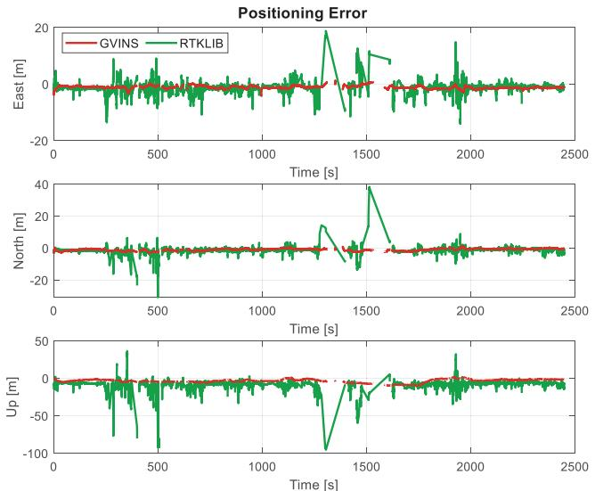  
Fig. 20. Positioning error of GVINS, VINS-Mono, and RTKLIB in the urban driving experiment. The gaps in the figure correspond to RTK’s nonfixed status. The results of VINS-Fusion and VINS-Mono are not shown because of failure.

On this sequence, VINS-Mono, which only relies on visual and inertial sensors to perform estimation, fails at 1200 s when the sky becomes dark and many vehicles pass by. The failure of VINS-Mono occurs at 54% of the total distance, with an RMSE of 760.22 m indicating a large drift. The loosely coupled GNSS–visual–inertial algorithm, VINS-Fusion, does not explicitly show any failures. However, huge oscillations are observed in its results, with the corresponding RMSE in the order of105 m. Thus, we also mark the results of VINS-Fusion as a failure case.

In this experiment, GNSS-VI is successfully initialized within 2.0 s after the visual–inertial initialization has finished. Fig. 20 shows the positioning error of GVINS and RTKLIB on three axes of the ENU frame, respectively. The extreme errors from the results of RTKLIB, which we define as above 100 m, are not shown, in order to limit the scale of the plot. The large-magnitude oscillations of RTKLIB on this data sequence clearly illustrate the terrible quality of the GNSS signal in the harsh environment, especially around 400 and 1350 s, when the receiver is surrounded by high-rise buildings and the multipath effect is severe. Our proposed system, GVINS, survives through the whole sequence, which again proves the robustness of our system. The slowly varying and well-bounded positioning error of GVINS in Fig. 20 shows the local smoothness and global consistency properties of the proposed method.

Fig. 21 illustrates the positioning results of RTK and GVINS. We see that the trajectory of our system aligns well with that of RTK on the horizontal directions. Since we do not perform any alignment on the results of GVINS, an obvious bias, in addition to varying error, can be observed on the vertical direction. The RMSE of GVINS and RTKLIB is also included in Table III, and the fields of VINS-Mono and VINS-Fusion are marked as N/A because of failures.

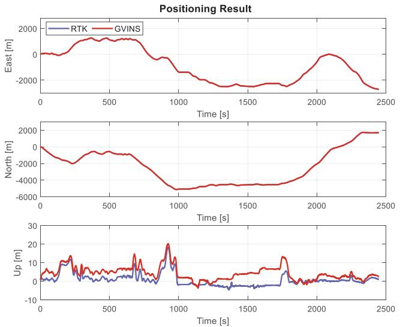  
Fig. 21. Positioning results of RTK and GVINS in the challenging urban driving experiment.

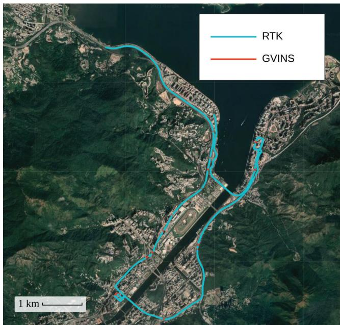  
Fig. 22. Trajectories of RTK and GVINS in the urban driving experiment. The two paths totally align with each other. The trajectory of RTK is plotted on the top of that of GVINS so that the RTK nonfixed status can be clearly shown by the discontinuities.

The final trajectories on Google Maps are depicted in Fig. 22, where the RTK result is plotted on top of that of GVINS. Note that GNSS outages occur constantly, even on an open-sky expressway because of the traffic signs and viaducts. By stacking the trajectory ofRTK on top ofthat ofGVINS, the discontinuities on the path of RTK, corresponding to the RTK nonfixed status over a long distance, are clearly illustrated in Fig. 22. Due to the large scale of the map, the frequent short-term RTK outages cannot be observed from the figure.

In terms of the computation time, the feature detection and tracking, which are same for VINS-Mono, VINS-Fusion, and GVINS, costs 7.28 ms per frame. The window optimization of

VINS-Mono takes 21.76 ms on average. For VINS-Fusion, the time spent on pose graph optimization grows as the traveled distance increases. The lower limit is 1.12 ms at the beginning, and the upper bound is 1018.46 ms in the end, with an average value of404.83 ms. In contrast, our proposed GVINS only needs 21.91 ms for the window optimization, thanks to the tightly coupled and sliding-window approaches we adopt. Considering the 20-Hz camera we use in our experiments, our system can safely run in real time, while obvious lags may be observed in the case of VINS-Fusion as the traveled distance grows.

## IX. CONCLUSION

In this article, we proposed a tightly coupled state estimation method that fuses measurements from a camera, IMU, and GNSS receiver under a nonlinear optimization-based framework. Our system started with an initialization phase, during which a coarse-to-fine procedure was employed to calibrate online the transformation between the local and global frames. In the optimization phase, GNSS raw measurements were modeled and formulated using the probabilistic factor graph. The degenerate cases were considered and carefully handled to keep the system robust in complex environments. We conducted experiments in both simulation and real-world environments to evaluate the performance of our system, and the results showed that our system effectively eliminates the accumulated drift and preserves the local accuracy of a typical VIO system.

Future work consists of a theoretical analysis for various degenerate scenarios. We aim to build an online observabilityaware state estimator, which can deal with complex environments and possible sensor failure. In addition, we are also interested in reducing the absolute positioning error by combining GNSS measurements from different frequency bands [36] or using PPP techniques to handle distributed localization tasks in swarm systems.

## REFERENCES

[1] G. Huang, M. Kaess, and J. J. Leonard, “Towards consistent visual-inertial navigation,” in Proc. IEEE Int. Conf. Robot. Autom., Hong Kong, 2014, pp. 4926–4933.

[2] A. I. Mourikis and S. I. Roumeliotis, “A multi-state constraint Kalman filter for vision-aided inertial navigation,” in Proc. IEEE Int. Conf. Robot. Autom., Rome, Italy, 2007, pp. 3565–3572.

[3] M. Li and A. I. Mourikis, “High-precision, consistent EKF-based visualinertial odometry,” Int. J. Robot. Res., vol. 32, no. 6, pp. 690–711, May 2013.

[4] K. Wu, A. Ahmed, G. A. Georgiou, and S. I. Roumeliotis, “A square root inverse filter for efficient vision-aided inertial navigation on mobile devices,” in Proc. Robot.: Sci. Syst. Conf., Rome, Italy, 2015, p. 2.

[5] S. Leutenegger, S. Lynen, M. Bosse, R. Siegwart, and P. Furgale, “Keyframe-based visual-inertial odometry using nonlinear optimization,” Int. J. Robot. Res., vol. 34, no. 3, pp. 314–334, Mar. 2015.

[6] T. Qin, P. Li, and S. Shen, “VINS-Mono: A robust and versatile monocular visual-inertial state estimator,” IEEE Trans. Robot., vol. 34, no. 4, pp. 1004–1020, Aug. 2018.

[7] C. V. Angelino, V. R. Baraniello, and L. Cicala, “UAV position and attitude estimation using IMU, GNSS and camera,” in Proc. Int. Conf. Inf. Fusion, Singapore, 2012, pp. 735–742.

[8] S. Lynen, M. W. Achtelik, S. Weiss, M. Chli, and R. Siegwart, “A robust and modular multi-sensor fusion approach applied to MAV navigation,” in Proc. IEEE/RSJ Int. Conf. Intell. Robots Syst., Tokyo, Japan, 2013, pp. 3923–3929.

[9] S. Shen, Y. Mulgaonkar, N. Michael, and V. Kumar, “Multi-sensor fusion for robust autonomous flight in indoor and outdoor environments with a rotorcraft MAV,” in Proc. IEEE Int. Conf. Robot. Autom., Hong Kong, 2014, pp. 4974–4981.

[10] R. Mascaro, L. Teixeira, T. Hinzmann, R. Siegwart, and M. Chli, “GOMSF: Graph-optimization based multi-sensor fusion for robust UAV pose estimation,” in Proc. IEEE Int. Conf. Robot.Autom., Brisbane, QLD, Australia, 2018, pp. 1421–1428.

[11] Y. Yu, W. Gao, C. Liu, S. Shen, and M. Liu, “A GPS-aided omnidirectional visual-inertial state estimator in ubiquitous environments,” in Proc. IEEE/RSJ Int. Conf. Intell. Robots Syst., Macau, China, 2019, pp. 7750– 7755.

[12] T. Qin, S. Cao, J. Pan, and S. Shen, “A general optimization-based framework for global pose estimation with multiple sensors,” 2019, arXiv:1901.03642.

[13] X. Li, X. Wang, J. Liao, X. Li, S. Li, and H. Lyu, “Semi-tightly coupled integration of multi-GNSS PPP and S-VINS for precise positioning in GNSS-challenged environments,” Satell. Navigat., vol. 2, no. 1, pp. 1–14, Jan. 2021.

[14] J. Zumberge, M. Heflin, D. Jefferson, M. Watkins, and F. Webb, “Precise point positioning for the efficient and robust analysis of GPS data from large networks,” J. Geophys. Res. Solid Earth, vol. 102, no. B3, pp. 5005–5017, Mar. 1997.

[15] P. V. Gakne and K. O’Keefe, “Tightly-coupled GNSS/vision using a skypointing camera for vehicle navigation in urban areas,” Sensors, vol. 18, no. 4, Apr. 2018, Art. no. 1244.

[16] M. Schreiber, H. Königshof, A.-M. Hellmund, and C. Stiller, “Vehicle localization with tightly coupled GNSS and visual odometry,” in Proc. IEEE Intell. Veh. Symp., Gothenburg, Sweden, 2016, pp. 858–863.

[17] D. P. Shepard and T. E. Humphreys, “High-precision globally-referenced position and attitude via a fusion of visual SLAM, carrier-phase-based GPS, and inertial measurements,” in Proc. IEEE/ION Position Location Navigat. Symp., Monterey, CA, USA, 2014, pp. 1309–1328.

[18] T. Li, H. Zhang, Z. Gao, X. Niu, and N. El-Sheimy, “Tight fusion of a monocular camera, MEMS-IMU, and single-frequency multi-GNSS RTK for precise navigation in GNSS-challenged environments,” Remote Sens., vol. 11, no. 6, Mar. 2019, Art. no. 610.

[19] J. E. Yoder, P. A. Iannucci, L. Narula, and T. E. Humphreys, “Multiantenna vision-and-inertial-aided CDGNSS for micro aerial vehicle pose estimation,” in Proc. Int. Tech. Meeting Satell. Div. Inst. Navigat., 2020, pp. 2281–2298.

[20] A. Soloviev and D. Venable, “Integration of GPS and vision measurements for navigation in GPS-challenged environments,” in Proc. IEEE/ION Position Location Navigat. Symp., Indian Wells, CA, USA, 2010, pp. 826–833.

[21] D. H. Won, E. Lee, M. Heo, S. Sung, J. Lee, and Y. J. Lee, “GNSS integration with vision-based navigation for low GNSS visibility conditions,” GPS Solutions, vol. 18, no. 2, pp. 177–187, Mar. 2014.

[22] J. Liu, W. Gao, and Z. Hu, “Optimization-based visual-inertial SLAM tightly coupled with raw GNSS measurements,” in Proc. IEEE Int. Conf. Robot. Autom., Xi’an, China, 2021, pp. 11612–11618.

[23] J. Saastamoinen, “Contributions to the theory of atmospheric refraction,” Bull. Geodesique, vol. 105, no. 1, pp. 279–298, Sep. 1972.

[24] J. A. Klobuchar, “Ionospheric time-delay algorithm for single-frequency GPS users,” IEEE Trans. Aerosp. Electron. Syst., vol. AES-23, no. 3, pp. 325–331, May 1987.

[25] E. D. Kaplan and C. J. Hegarty, Understanding GPS/GNSS: Principles and Applications, 3rd ed. Boston, MA, USA: Artech House, 2017.

[26] S. Shen, N. Michael, and V. Kumar, “Tightly-coupled monocular visualinertial fusion for autonomous flight of rotorcraft MAVs,” in Proc. IEEE Int. Conf. Robot. Autom., Seattle, WA, USA, May 2015, pp. 5303–5310.

[27] C. Forster, L. Carlone, F. Dellaert, and D. Scaramuzza, “On-manifold preintegration for real-time visual-inertial odometry,” IEEE Trans. Robot., vol. 33, no. 1, pp. 1–21, Aug. 2017.

[28] F. Kschischang, B. Frey, and H.-A. Loeliger, “Factor graphs and the sumproduct algorithm,” IEEE Trans. Inf. Theory, vol. 47, no. 2, pp. 498–519, Feb. 2001.

[29] J. Shi and C. Tomasi, “Good features to track,” in Proc. IEEE Conf. Comput. Vis. Pattern Recognit., Seattle, WA, USA, 1994, pp. 593–600.

[30] B. D. Lucas and T. Kanade, “An iterative image registration technique with an application to stereo vision,” in Proc. Int. Joint Conf. Artif. Intell., Vancouver, BC, Canada, 1981, pp. 674–679.

[31] L. Heng, B. Li, and M. Pollefeys, “CamOdoCal: Automatic intrinsic and extrinsic calibration of a rig with multiple generic cameras and odometry,” in Proc. IEEE/RSJ Int. Conf. Intell. Robots Syst., Tokyo, Japan, 2013, pp. 1793–1800.

[32] T. Qin and S. Shen, “Robust initialization of monocular visual-inertial estimation on aerial robots,” in Proc. IEEE/RSJ Int. Conf. Intell. Robots Syst., Vancouver, BC, Canada, 2017, pp. 4225–4232.

[33] T. Takasu and A. Yasuda, “Development ofthe low-cost RTK-GPS receiver with an open source program package RTKLIB,” in Proc. Int. Symp. GPS/GNSS, Jeju, South Korea, 2009, vol. 1, pp. 1–6.

[34] A. Geiger, P. Lenz, and R. Urtasun, “Are we ready for autonomous driving? The KITTI vision benchmark suite,” in Proc. IEEE Conf. Comput. Vis. Pattern Recognit., Providence, RI, USA, 2012, pp. 3354–3361.

[35] J. Nikolic et al., “A synchronized visual-inertial sensor system with FPGA pre-processing for accurate real-time SLAM,” in Proc. IEEE Int. Conf. Robot. Autom., Hong Kong, 2014, pp. 431–437.

[36] G. Blewitt, “An automatic editing algorithm for GPS data,” Geophys. Res. Lett., vol. 17, no. 3, pp. 199–202, Mar. 1990.

  
Shaozu Cao received the B.Eng. degree in software engineering from Xi’an Jiaotong University, Xi’an, China, in 2016. He is currently working toward the Ph.D. degree with the Hong Kong University of Science and Technology, Hong Kong, under the supervision of Prof. Shaojie Shen.

His research interests include state estimation, sensor fusion, localization and mapping.

Xiuyuan Lu received the B.Eng. degree in computer science in 2020 from the Hong Kong University of Science and Technology, Hong Kong, where he is currently working toward the Ph.D. degree in electronic and computer engineering.

His research interests include event-based vision and visual odometry/simultaneous localization and mapping.

Shaojie Shen received the B.Eng. degree in electronic engineering from the Hong Kong University of Science and Technology, Hong Kong, in 2009, and the M.S. degree in robotics and the Ph.D. degree in electrical and systems engineering from the University of Pennsylvania, Philadelphia, PA, USA, in 2011 and 2014, respectively.

He was with the Department of Electronic and Computer Engineering, Hong Kong University of Science and Technology in September 2014 as an Assistant Professor, and was promoted to an Asso-

ciate Professor in 2020. His research interests include the areas of robotics and unmanned aerial vehicles, with focus on state estimation, sensor fusion, computer vision, localization and mapping, and autonomous navigation in complex environments.