# Kimera-Multi: Robust, Distributed, Dense Metric-Semantic SLAM for Multi-Robot Systems

Yulun Tian , Yun Chang , Fernando Herrera Arias , Carlos Nieto-Granda , Jonathan P. How , Fellow, IEEE, and Luca Carlone

Abstract—Multi-robot simultaneous localization and mapping (SLAM) is a crucial capability to obtain timely situational awareness over large areas. Real-world applications demand multi-robot SLAM systems to be robust to perceptual aliasing and to operate under limited communication bandwidth; moreover, it is desirable for these systems to capture semantic information to enable highlevel decision-making and spatial artificial intelligence. This article presents Kimera-Multi, a multi-robot system that: 1) is robust and capable of identifying and rejecting incorrect inter- and intrarobot loop closures resulting from perceptual aliasing; 2) is fully distributed and only relies on local (peer-to-peer) communication to achieve distributed localization and mapping; and 3) builds a globally consistent metric-semantic 3-D mesh model of the environment in real time, where faces of the mesh are annotated with semantic labels. Kimera-Multi is implemented by a team of robots equipped with visual-inertial sensors. Each robot builds a local trajectory estimate and a local mesh using Kimera. When communication is available, robots initiate a distributed place recognition and robust pose graph optimization protocol based on a distributed graduated nonconvexity algorithm. The proposed protocol allows the robots to improve their local trajectory estimates by leveraging inter-robot loop closures while being robust to outliers. Finally, each robot uses its improved trajectory estimate to correct the local mesh using mesh deformation techniques. We demonstrate Kimera-Multi in photo-realistic simulations, SLAM benchmarking datasets, and challenging outdoor datasets collected using ground robots. Both real and simulated experiments involve long trajectories (e.g., up to 800 m per robot). The experiments show that Kimera-Multi: 1) outperforms the state of the art in terms of robustness and accuracy; 2) achieves estimation errors comparable to a centralized SLAM system while being fully distributed; 3) is parsimonious in terms of communication bandwidth; 4) produces accurate metric-semantic 3-D meshes; and 5) is modular and can also be used for standard

3-D reconstruction (i.e., without semantic labels) or for trajectory estimation (i.e., without reconstructing a 3-D mesh).

Index Terms—Multi-robot systems, simultaneous localization and mapping, robot vision systems.

## I. INTRODUCTION

ULTI-ROBOT collaborative simultaneous localization research, due to its capability to provide situational awareness over large-scale environments for extended periods of time. Such capability is fundamental for various applications, such as factory automation, search and rescue, intelligent transportation, planetary exploration, and surveillance and monitoring in military and civilian endeavors.

In this work, we advance state-of-the-art collaborative SLAM by developing a system that enables real-time estimation of dense metric-semantic 3-D mesh models under realistic constraints on communication bandwidth. The 3-D mesh captures the complete and dense geometry of the environment that the robots operate in. Furthermore, by annotating the mesh with human-understandable semantic labels (e.g., “building,” “road,” and “object”), our system provides high-level abstractions of the environment that are necessary to enable next-generation spatial perception [1] (or spatial artificial intelligence [2]) and high-level decision-making. In single-robot SLAM, metric-semantic models have been employed in pioneering work, such as SLAM++ [3] and SemanticFusion [4]. Recent work includes systems that can build metric-semantic 3-D models in real time using a multicore CPU, including Kimera [1] and Voxblox++ [5]. In multi-robot SLAM, many existing systems rely on sparse landmarks (see, e.g., [6] and [7]). While these systems excel at collaborative localization, they do not provide a complete solution to dense mapping, which is required by critical navigation tasks, such as collision avoidance and motion planning. On the other hand, recent multi-robot systems begin to leverage semantic information to aid collaborative SLAM, but the underlying representations are still sparse (e.g., objects [8], [9]). Recent work [10] employs dense semantic segmentation, but the approach is limited to pairwise matching of local maps. Overall, there has not been a complete multi-robot system for dense metric-semantic SLAM, partially due to the additional communication and computation costs involved in building such a model. This work closes this gap by developing a collaborative metric-semantic SLAM system.

Furthermore, the proposed system is fully distributed and is capable of operating under realistic communication constraints.

In addition, this work aims to improve the robustness of collaborative SLAM for operations in challenging real-world environments. In practice, perceptual aliasing caused by similarlooking scenes often results in wrong inter-robot data associations (i.e., outlier loop closures), which, in turn, cause catastrophic failures of standard estimation back-ends. In multi-robot SLAM, this issue is further complicated by the lack of a common reference frame and a global outlier-free odometry backbone. While recent work has proposed several robust estimation techniques for collaborative SLAM, they either rely too heavily on initialization [11], [12] or employ heuristic search methods [13], [14], which can cause low recall (i.e., missing correct loop closures). This work addresses this challenge by developing a robust distributed back-end based on graduated nonconvexity (GNC) [15].

Contributions: The primary contribution of this work is Kimera-Multi, a fully distributed system for multi-robot dense metric-semantic SLAM. Our system enables a team of robots to collaboratively estimate a semantically annotated 3-D mesh model of the environment in real time. Each robot runs Kimera [16] to process onboard visual-inertial sensor data and obtain local trajectory and 3-D mesh estimates. When communication becomes available, a fully distributed procedure is triggered to perform inter-robot place recognition, relative pose estimation, and robust distributed trajectory estimation. From the jointly optimized trajectory estimates, each robot performs real-time local mesh deformation to correct local mapping drift and improve global map consistency. The implementation of Kimera-Multi is modular and allows different components to be disabled or replaced. Fig. Fig. 1 demonstrates Kimera-Multi on a three-robot collaborative SLAM dataset collected at Medfield, MA, USA.

The second technical contribution of this work is a new two-stage methodfor outlier-robust distributed pose graph optimization (PGO), which serves as the distributed back-end of Kimera-Multi. The first stage initializes robots’ local trajectories in a global reference frame by using GNC [15] to estimate relative transformations between the coordinate frames of pairs of robots. This method is robust to outlier loop closures and, furthermore, is efficient because it does not require iterative communication. The second stage solves the full robust PGO problem. For this purpose, we present a distributed extension of GNC built on top of the state-of-the-art Riemannian blockcoordinate descent (RBCD) solver [17]. Compared to prior techniques, our approach achieves more robust and accurate trajectory estimation and is less sensitive to parameter tuning.

Our third contribution is an extensive experimental evaluation. We present quantitative evaluations of Kimera-Multi on a collection of large-scale photo-realistic simulations and SLAM benchmarking datasets. In addition, we demonstrate Kimera-Multi on challenging real-world datasets collected by autonomous ground robots. Our results show that Kimera-Multi: 1) provides more robust and accurate distributed trajectory estimation compared to alternative techniques employed in prior work [13], [14]; 2) achieves estimation accuracy that is similar to a centralized system while being fully distributed; 3) is communication-efficient and achieves as much as 70% communication reduction compared to baseline centralized systems; 4) builds accurate metric-semantic 3-D meshes; and 5) is modular and allows different features such as mesh reconstruction and semantic annotation to be disabled according to user needs.

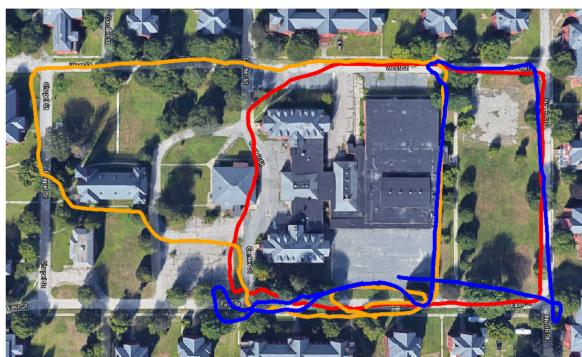  
(a)

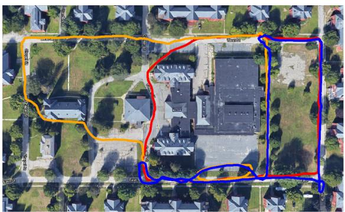

(b)  
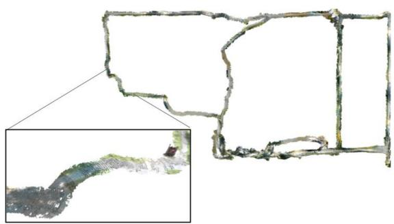  
(c)  
Fig. 1. Demonstration of Kimera-Multi in a three-robot collaborative SLAM dataset collected at Medfield, Massachusetts, USA. Total trajectory length (including all robots) is 2188 meters. (a) Trajectory estimate from Kimera-VIO is affected by estimation drift. (b) Kimera-Multi achieves accurate and robust trajectory estimation. (c) Kimera-Multi also produces an optimized 3D mesh of the environment.

Novelty with respect toprevious work [18]: An earlier version of Kimera-Multi was presented in [18], but the present article extends that work with two new contributions. First, we develop an outlier-robust andfully distributed trajectory estimation method based on GNC. In [18], we used an incremental extension of pairwise consistency maximization (PCM) [13] to reject outlier loop closures. However, PCM employs a graph-theoretic formulation and, in practice, relies on heuristic maximum clique search, which causes low recall. In this work, we show that the proposed distributed graduated nonconvexity (D-GNC) method outperforms PCM in terms of robustness and accuracy and is less sensitive to parameter tuning. The second new contribution is a set of additional experimental evaluations. These include a comprehensive evaluation of different robust distributed PGO techniques (see Section VII-A), evaluations on additional photo-realistic simulations and benchmarking datasets (see Section VII-B), and evaluations on two new challenging outdoor datasets (see Figs. Fig. 1 and 14) collected using autonomous ground robots (see Section VII-C).

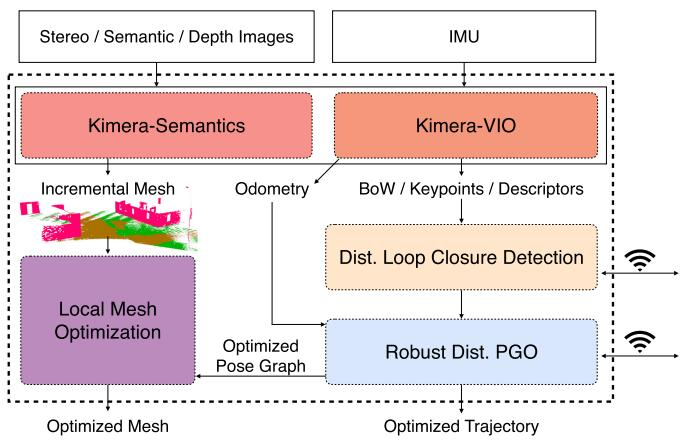  
Fig. 2. Kimera-Multi: system architecture. Each robot runs Kimera (including Kimera-VIO and Kimera-Semantics) to estimate local trajectory and mesh. Robots then communicate to perform distributed loop closure detection and robust distributed PGO. Given the optimized trajectory, each robot performs LMO.

α  
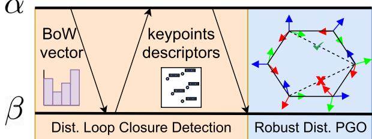  
Fig. 3. Communication protocol and data flow between pair of robots.

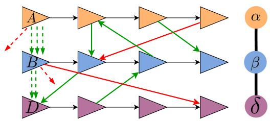  
Fig. 4. Robust distributed initialization. Left: Three-robot scenario with local reference frames A, B, D, each coinciding with the first pose of the corresponding robot. Between every pair of robots, inlier loop closures (−→) lead to similar estimates for the alignment between frames (--). Each outlier loop closure (−→) produces an outlier frame alignment (--), which can be rejected with GNC. Right: Corresponding robot-level spanning tree.

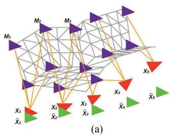

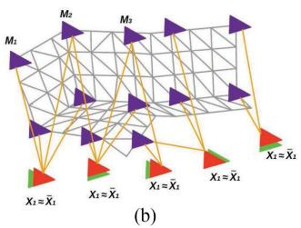  
Fig. 5. LMO deformation graph including mesh vertices (violet) and keyframe vertices (red). Edges connect two mesh vertices that are adjacent in the mesh (gray links), as well as mesh vertices with the keyframe vertices they are observed in (orange links). The green poses denote optimized poses from distributed PGO. (a) Undeformed mesh. (b) Deformed mesh.

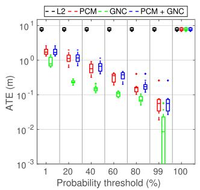  
(a)

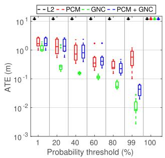  
(b)

Fig. 6. Single-robot tests. Comparisons between solvers on single-robot synthetic PGO problems across ten Monte Carlo runs. (a) Outlier ratio: 10%. (b) Outlier ratio: 70%.  
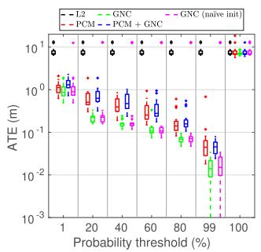  
(a)

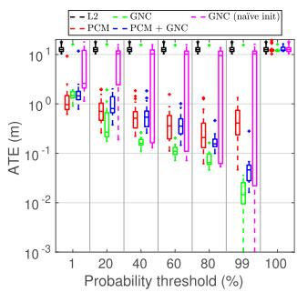  
(b)  
Fig. 7. Multi-robot tests. Comparisons between solvers on three-robot synthetic PGO problems across ten Monte Carlo runs. (a) Outlier ratio: 10%. (b) Outlier ratio: 70%.

## II. RELATED WORK

## A. Metric-Semantic SLAM

In recent years, single-robot SLAM research is steadily moving toward systems that can build metric-semantic maps [4], [5], [16], [19]–[30]. Related research efforts include systems building voxel-based models [4], [23]–[29], Euclidean signed distance field (ESDF) and meshes [5], [16], [31], or 3-D scene graphs [30]. In this work, we build our multi-robot metricsemantic SLAM system on top of Kimera [16], which provides accurate real-time visual-inertial odometry (VIO) and lightweight mesh reconstruction.

In the multi-robot SLAM literature, the majority of approaches have focused on dense geometric representations (e.g., occupancy maps [32]) or sparse landmark maps [6], [33]; see [34] and the references therein. Recent work begins to incorporate sparse objects or dense semantic information in multi-robot perception. Choudhary et al. [8] use class labels to associate objects within a multi-robot pose graph SLAM framework. Tchuiev and Indelman [9] develop a distributed object-based SLAM method that leverages the coupling between object classification and pose estimation. Yue et al. [10] leverage dense semantic segmentation to perform relative localization and map matching between pairs of robots. In [18], we present an early version of Kimera-Multi and demonstrated it as the first fully distributed system for multi-robot dense metric-semantic SLAM. The present article extends [18] with a new outlierrobust distributed PGO algorithm and additional experimental evaluations.

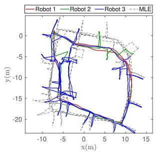  
(a)

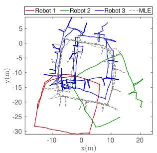  
(b)

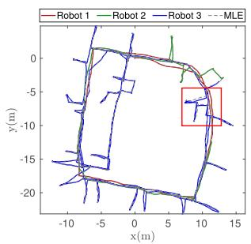  
(c)

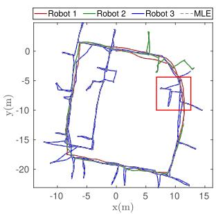  
(d)

Fig. 8. Comparing final trajectory estimates of different techniques under 70% outlier loop closures. All methods use the same probability threshold of 99%. (a) PCM (ATE = 2.24 m). (b) GNC (naïve init) (ATE = 11.59 m). (c) PCM + GNC (ATE = 0.09 m). (d) GNC (ATE = 0.003 m).  
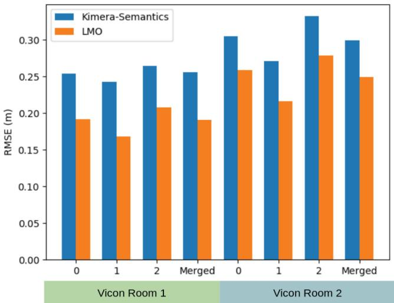

Fig. 9. Metric reconstruction evaluation on the Euroc sequences. Mesh error (in meters) for the 3-D meshes by Kimera-Semantics and Kimera-Multi’s LMO.  
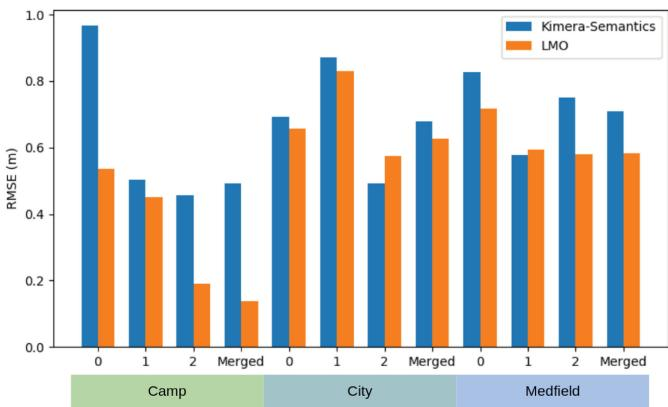  
Fig. 10. Metric reconstruction evaluation on the Camp, City, and Medfield simulator datasets. Mesh error (in meters) for the 3-D meshes by Kimera-Semantics and Kimera-Multi’s LMO.

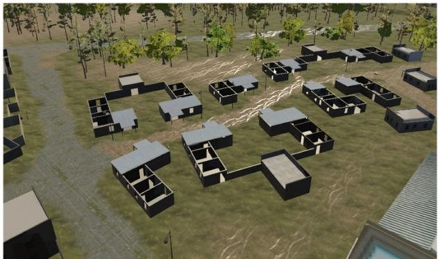

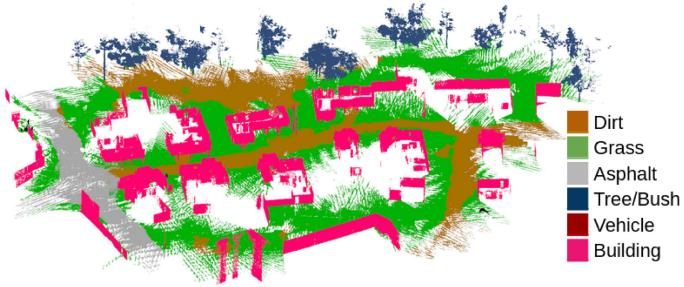  
Fig. 11. Dense metric-semantic 3-D mesh model generated by Kimera-Multi with three robots in the simulated Camp scene.

## B. Distributed Loop Closure Detection

Inter-robot loop closures are critical to align the trajectories of the robots in a common reference frame and to improve their trajectory estimates. In a centralized visual SLAM system (see, e.g., [35]), robots transmit a combination of global descriptors (e.g., bag-of-words (BoW) vectors [36], [37] and learned full-image descriptors [38]) and local visual features (see, e.g., [39] and [40]) to a central server that performs centralized place recognition and geometric verification (GV). Recent work develops distributed and communication-efficient paradigms for inter-robot loop closure detection. Cieslewski and Scaramuzza [41] propose an efficient method for distributed visual place recognition, based on splitting and distributing BoW visual features [36]. A subsequent approach is developed in [7] and [42] based on clustering and distributing NetVLAD [38] descriptors. A complementary line of work develops efficient methods for distributed GV. Giamou et al. [43] develop a method to verify a set of candidate inter-robot loop closures using minimum data exchange. Tian et al. [44], [45] consider distributed GV under communication and computation budgets and develop near-optimal communication policies based on submodular optimization.

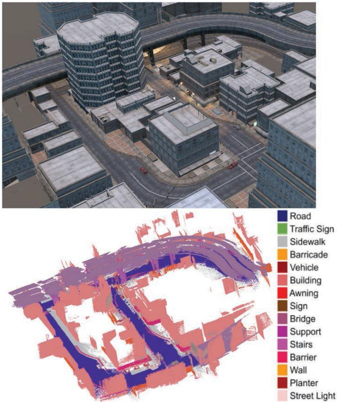

Fig. 12. Dense metric-semantic 3-D mesh model generated by Kimera-Mult with three robots in the simulated City scene.  
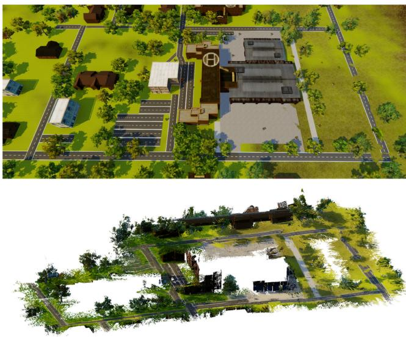  
Fig. 13. Dense metric 3-D mesh model generated by Kimera-Multi with three robots in the simulated Medfield scene.

## C. Distributed PGO

PGO is commonly used as the estimation backbone of state-of-the-art SLAM systems. Centralized approaches for multi-robot PGO collect all measurements at a central station, which computes the trajectory estimates for all the robots [12], [46]–[49]. In parallel, considerable efforts have been made to design distributed PGO methods. Cunningham et al. [6], [33] use Gaussian elimination to exchange marginals over the separator poses. Another family of approaches are based on distributed gradient descent [50]–[52]. Aragues et al. [53] use a distributed Jacobi approach to estimate 2-D poses. Choudhary et al. [8] propose a two-stage approach that uses the distributed Gauss–Seidel (DGS) method to initialize rotation estimates and solve a single Gauss–Newton iteration. This method is also implemented as the distributed back-end in recent decentralized SLAM systems [7], [14]. Recently, Fan and Murphey [54] propose a majorization–minimization method that adapts Nesterov’s acceleration technique to achieve significant empirical speedup. Tian et al. [17] develop the RBCD method that can be similarly accelerated and, furthermore, propose a distributed global optimality verification method based on accelerated power iteration. The conference version of Kimera-Multi [18] uses RBCD as the distributed back-end. A subsequent work [55] develops distributed PGO with convergence guarantees under asynchronous communication.

## D. Robust PGO

Standard least squares formulation of PGO is susceptible to outlier loop closures that can severely impact trajectory estimation. To mitigate the effect of outliers in single-robot SLAM, early methods are based on RANSAC [56], branch and bound [57], and M-estimation (see [58] and [59]). Sünderhauf and Protzel [60] develop a method to deactivate outliers using binary variables. Agarwal et al. [61] build on the same idea and develop the dynamic covariance scaling method. Hartley et al. [62] and Casafranca et al. [63] propose to minimize the -1-norm of residual errors. Chatterjee and Govindu [64], [65] develop iteratively reweighted least squares (IRLS) methods to solve rotation averaging using a family of robust cost functions. Hu et al. [66] develop similar IRLS methods for single-robot SLAM. Olson and Agarwal [67] and Pfingsthorn and Birk [68], [69] consider multimodal distributions for the noise. Lajoie et al. [70] and Carlone and Calafiore [71] develop global solvers based on convex relaxations. A separate line ofwork investigates consensus maximization formulations that seek to identify the maximal set of mutually consistent inliers [72]–[74]. Recently, Yang et al. [15] have developed GNC that optimizes a sequence of increasingly nonconvex surrogate cost functions and demonstrated state-of-the-art performance on robust PGO problems.

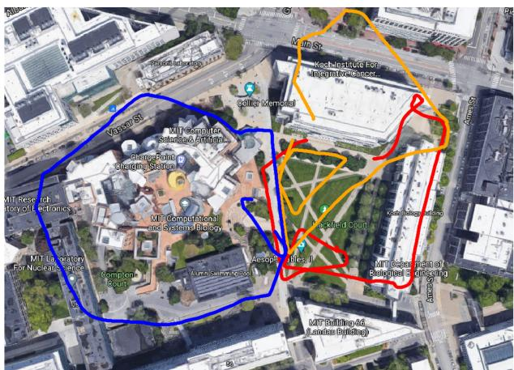  
(a)

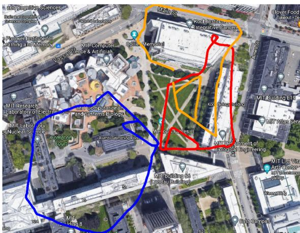  
(b)

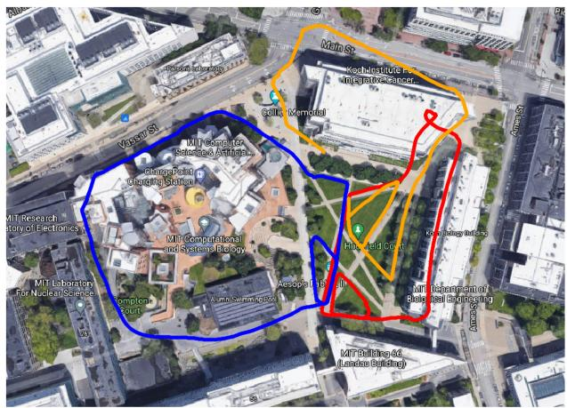  
(c)

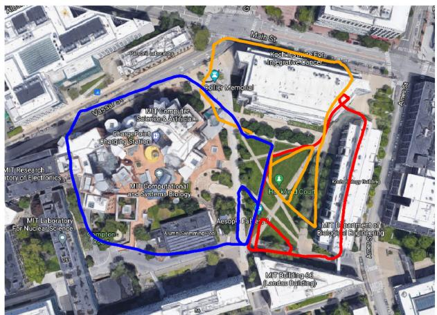  
(d)  
Fig. 14. Stata experiment. (a) Trajectory estimate from Kimera-VIO. (b) Trajectory estimate produced by Kimera-Multi, using D-GNC with the default approximate variable updates. (c) Trajectory estimate produced by Kimera-Multi, using D-GNC with full variable updates. (d) Trajectory estimate produced by centralized GNC.

In multi-robot SLAM, Indelman et al. [11] and Dong et al. [12] apply expectation–maximization to find consistent interrobot loop closures and estimate initial relative transformations between robots. Mangelson et al. [13] design the PCM approach to perform robust map merging between pairs of robots. Lajoie et al. [14] develop the DOOR-SLAM system, which implements an extended version of PCM as the outlier rejection method before distributed trajectory estimation. The recent NeBula system [75] also employs PCM within a centralized collaborative SLAM architecture. In this work, we develop a fully distributed extension of GNC [15] and demonstrate that our method outperforms PCM in terms of robustness and accuracy.

## III. SYSTEM OVERVIEW

In Kimera-Multi, each robot runs the fully decentralized metric-semantic SLAM system shown in Fig. 2. The system consists of four main modules: 1) local (single-robot) Kimera; 2) distributed loop closure detection; 3) robust distributed trajectory estimation via PGO; and 4) local mesh optimization (LMO). Among these modules, distributed loop closure detection and robust distributed PGO are the only ones that involve communication between robots. Fig. 3 shows the data flow between these modules.

Kimera [1] runs onboard each robot and provides real-time local trajectory and mesh estimation. In particular, Kimera-VIO [16] serves as the VIO module, which processes raw stereo images and inertial measurement unit (IMU) data to obtain an estimate of the odometric trajectory of the robot. Kimera-Semantics [16] processes depth images (possibly obtained from RGB-D cameras or by stereo matching) and 2- D semantic segmentations [76] and produces a dense metricsemantic 3-D mesh using the VIO pose estimates. In addition, Kimera-VIO computes a BoW representation of each keyframe using ORB features and DBoW2 [37], which is used for distributed loop closure detection. Interested readers are referred to [1] and [16] for more technical details.

Distributed loop closure detection (see Section IV) is executed whenever two robots α and β are within communication range. The robots exchange BoW descriptors of the keyframes they collected. When the robots find a pair of matching descriptors (typically corresponding to observations of the same place), they perform relative pose estimation using standard GV techniques. The relative pose corresponds to a putative inter-robot loop closure and is used during robust distributed trajectory estimation.

Robust distributed trajectory estimation (see Section V) solves for the optimal trajectory estimates of all robots in a global reference frame, by performing robust distributed PGO using odometric measurements from Kimera-VIO and all putative loop closures detected so far. At the beginning, a robust initialization scheme is used to find coarse relative transformations between robots’ reference frames. Then, a robust optimization procedure based on a distributed extension of GNC [15] using the RBCD solver [17] is employed to simultaneously select inlier loop closures and recover optimal trajectory estimates. Compared to the incremental PCM technique [13] used in the conference version of Kimera-Multi [18], our new approach enables more robust and accurate trajectory estimation and is less sensitive to parameter tuning.

LMO (see Section VI) is executed after the robust distributed trajectory estimation stage. This module performs a local processing step that deforms the mesh at each robot to enforce consistency with the trajectory estimate resulting from distributed PGO.

Kimera-Multi is implemented in C++ and uses the Robot Operating System [77] as a communication layer between robots and between the modules executed on each robot. The system runs online using a CPU and is modular, thus allowing modules to be replaced or removed. For instance, the system can also produce a dense metric mesh if semantic labels are not available or only produce the optimized trajectory if the dense reconstruction is not required by the user.

## IV. DISTRIBUTED LOOP CLOSURE DETECTION

This section describes the front-end of Kimera-Multi, which is responsible for detecting inter-robot loop closures between pairs of robots. The information flow is summarized in Fig. 3. When communication becomes available, robot $\alpha$ initiates the distributed loop closure detection process, by sending global descriptors of its new keyframes since the last rendezvous to the other robot $\beta .$ We implement these descriptors as BoW vectors using the DBoW2 library [37]. Upon receiving the BoW vectors, robot $\beta$ searches within its own keyframes for candidate matches whose normalized visual similarity scores exceed a threshold $( \ge 0 . 1$ in our code). When a potential loop closure is identified, the robots perform standard GV to estimate the relative transformation between the two matched keyframes. In our implementation, robot $\beta$ first requests the 3-D keypoints and associated descriptors of the matched keyframe from robot α (see Fig. 3). Subsequently, robot $\beta$ computes putative correspondences by matching the two sets of feature descriptors using nearest neighbor search implemented in OpenCV [78]. From the putative correspondences, robot $\beta$ attempts to compute the relative transformation using Nistér’s five-point method [79] and Arun’s three-point method [80] combined with RANSAC [56]. Both techniques are implemented in the OpenGV library [81]. If GV succeeds with more than five correspondences, the loop closure is accepted and sent to the robust distributed trajectory estimation module.

## V. ROBUST DISTRIBUTED TRAJECTORY ESTIMATION

In Kimera-Multi, the robots estimate their trajectories by collaboratively solving a PGO problem using the entire team’s odometry measurements and intra-robot and inter-robot loop closures. Some of these loop closures may be outliers (due to, e.g., perceptual aliasing), and thus, we need an outlier-robust method for solving PGO. In the earlier version of Kimera-Mult [18], we used an incremental variant of PCM [13] for outlier rejection via maximum clique computation prior to trajectory estimation. However, even with parallelization [82], the runtime of exact maximum clique search exceeds 10 s already in graphs with 700 loop closures, which is not practical for our application. For this reason, in practice, PCM has to rely on heuristic maximum clique algorithms and, thus, often exhibits poor recall, as shown in Section VII-A.

In this article, we propose a new distributed approach for robust trajectory estimation based on GNC [15]. The main idea in GNC is to start from a convex approximation of the robust cost function and then gradually introduce the nonconvexity to prevent convergence to spurious solutions. While, in general, GNC does not require an initial guess [15], it has been observed that global solvers for 3-D SLAM (e.g., SE-Sync [83]) become too slow in the presence of outliers [74]. For this reason, in [74], local optimization is performed instead at each iteration of GNC (starting from an outlier-free initial guess), and this approach has been shown to be very effective. In single-robot SLAM, one can easily obtain an outlier-free initial guess by chaining together odometry measurements. In the multi-robot case, there is no odometry between different robots’ poses, and the challenge, thus, becomes building an initial guess that is insensitive to outliers.

To address the aforementioned challenge, the proposed D-GNC approach involves two stages. In the first stage (see Section V-B), we use an outlier-robust and communication-efficient method to initialize robots’ trajectories in a global reference frame. In the second stage (see Section V-C), we develop a fully distributed procedure to execute GNC, using the RBCD distributed solver as a subroutine. Algorithm 1 provides the pseudocode of D-GNC.

## A. Background: GNC

We start by providing a brief review of GNC [15], [84]. One challenge associated with classical M-estimation [85], [86] is that the employed robust cost function $\rho$ can be highly nonconvex, hence making local search techniques sensitive to the initial guess. The key idea behind GNC is to optimize a sequence of easier (i.e., less nonconvex) surrogate cost functions that gradually converges to the original robust cost function. Each surrogate problem takes the same form as classical M-estimation

$$
\operatorname* { m i n } _ { x \in \mathcal { X } } \sum _ { i } \rho _ { \mu } ( r _ { i } ( x ) )\tag{1}
$$

Algorithm 1: Distributed Graduated Nonconvexity.   
Input:   
- Initial trajectory estimates in local frames of each   
robot   
- Odometry and intra-robot and inter-robot loop   
closures that each robot is involved in   
- Threshold c¯ of truncated least squares cost   
Output:   
- Optimized trajectory estimate of each robot in global   
frame   
1: Robust initialization: robots communicate to initialize   
trajectory estimates in a global reference frame (see   
Section V-B).   
2: In parallel, each robot initializes GNC weights for its   
local intra and inter-robot loop closures $w _ { i } = 1 , \forall i .$   
3: while not converged do   
4: Variable update: with fixed weights, robots   
communicate to execute RBCD for $T$ iterations   
(default $T = 1 5 )$   
5: Weight update: in parallel, each robot updates GNC   
weights for intra-robot loop closures and inter-robot   
loop closures it is involved in.   
6: Parameter update: in parallel, each robot updates the   
control parameter $\mu .$   
7: end while

where $r _ { i } : \mathcal { X }  \mathbb { R }$ is the residual error associated with the ith measurement. The sequence of surrogate functions $\rho _ { \mu }$ , parameterized by control parameter $\mu ,$ satisfies that for some given constants $\mu _ { 0 }$ and $\mu _ { 1 } \colon 1 )$ for $\mu \to \mu _ { 0 }$ , the function $\rho _ { \mu }$ is convex, and 2) for $\mu \to \mu _ { 1 } , \rho _ { \mu }$ converges to the original (nonconvex) robust cost function $\rho .$ In practice, one initializes $\mu$ near $\mu _ { 0 }$ and gradually updates its value to approach $\mu _ { 1 }$ as optimization proceeds.

For each instance of (1), GNC reformulates the problem using the Black–Rangarajan duality [84], which states that under certain technical conditions (satisfied by all common choices of robust cost functions), (1) is equivalent to the following optimization problem:

$$
\operatorname* { m i n } _ { x \in { \mathcal { X } } , w _ { i } \in [ 0 , 1 ] } \sum _ { i } \left[ w _ { i } r _ { i } ^ { 2 } ( x ) + \Phi _ { \rho _ { \mu } } ( w _ { i } ) \right]\tag{2}
$$

where $w _ { i } \in [ 0 , 1 ]$ is a scalar weight associated with the ith measurement. In (2), the outlier process $\Phi _ { \rho _ { \mu } } ( w _ { i } )$ introduces a penalty term for each $w _ { i }$ , and its expression depends on the chosen robust cost function $\rho$ and the control parameter $\mu .$ Similar to the classical IRLS scheme, GNC performs alternating minimization over the variable x and weights $w _ { i }$ to optimize (2), but in the meantime also updates the control parameter $\mu$

1) Variable Update: Minimize (2) with respect to x with fixed weights $w _ { i }$ . This amounts to solving a standard weighted least-squares problem

$$
x ^ { \star } \in \underset { x \in \mathcal { X } } { \arg \operatorname* { m i n } } \sum _ { i } w _ { i } r _ { i } ^ { 2 } ( x ) .\tag{3}
$$

2) Weight Update: Minimize (2) with respect to w with fixed variable x. The corresponding update for each $w _ { i }$ has a closed-form expression that depends on the current robust surrogate function $\rho _ { \mu } ;$ see [15, Proposition 3-4].

3) Parameter Update: Update $\mu$ by a constant factor to approach $\mu _ { 1 }$

The control parameter $\mu$ is initialized at a value close to $\mu _ { 0 }$ In the absence of a better guess, all weights are initialized to one (i.e., all measurements are considered inliers initially). Then, the steps above are repeated until $\mu$ approaches $\mu _ { 1 }$

## B. Robust Distributed Initialization

To optimize the pose graph, we first need to initialize all robot poses in a shared (global) coordinate frame (see Algorithm 1, line 1). Each robot can readily initialize its trajectory in its local reference frame by chaining odometry measurements. To express these local initial guesses in the global reference frame, however, we must estimate the relative pose between the local reference frames.

1) Pairwise Coordinate Frame Estimation: First, let us see how this can be done between two robots α and $\beta ,$ with local reference frames A and B, respectively. Consider a loop closure between the ith pose of α and jth pose of $\beta ,$ denoted as $\widetilde { \boldsymbol { X } } _ { \beta _ { j } } ^ { \alpha _ { i } } \in \mathrm { S E } ( 3 )$ . Denote the odometric estimates of pose i and j (in the local frames of the two robots) as $\widehat { \mathbf { X } } _ { \alpha _ { i } } ^ { A } , \widehat { \mathbf { X } } _ { \beta _ { i } } ^ { B } \in \mathrm { S E } ( 3 )$ By combining these pose estimates with the loop closure, we obtain a noisy estimate of the relative transformation between frames A and B

$$
\widehat { \pmb X } _ { B _ { i j } } ^ { A } \triangleq \widehat { \pmb X } _ { \alpha _ { i } } ^ { A } \widetilde { \pmb X } _ { \beta _ { j } } ^ { \alpha _ { i } } \left( \widehat { \pmb X } _ { \beta _ { j } } ^ { B } \right) ^ { - 1 }\tag{4}
$$

where the subscript of $\widehat { \pmb { X } } _ { B _ { i } } ^ { A }$ indicates that this estimate is computed using loop closure $( i , j )$ . From (4), we see that each inter-robot loop closure provides a candidate alignment for the reference frames A and B. Furthermore, candidate alignments produced by inlier loop closures are expected to be in mutual agreement; see Fig. 4 and also [11]. To obtain a reliable estimate of the true relative transformation, we thus formulate and solve the following robust pose averaging problem:

$$
\widehat { \pmb X } _ { B } ^ { A } \in \arg \operatorname* { m i n } \sum _ { \pmb X \in \mathrm { S E } ( 3 ) } \rho ( r _ { i j } ( \pmb X ) )\tag{5}
$$

where $\rho : \mathbb { R } $ R is the truncated least squares (TLS) robust cost function [15], and $L _ { \alpha , \beta }$ is the set of inter-robot loop closures between robot α and $\beta .$ Each residual measures the geodesic distance between the to-be-computed average pose $\boldsymbol { X }$ and the measurement $\widehat { \pmb { X } } _ { B _ { i , } } ^ { A }$

$$
r _ { i j } ( \boldsymbol { X } ) \triangleq \left. \boldsymbol { X } \boxed { X } \boldsymbol { \widehat { X } } _ { B _ { i j } } ^ { A } \right. _ { \Sigma }\tag{6}
$$

where $\Sigma \in \mathbb { S } _ { + + } ^ { 6 }$ is a fixed covariance matrix. In our implementation, we use a diagonal covariance with a standard deviation of 0.1 rad for rotation and 0.5 m for translation. Between a given pair of robots, one robot can solve (5) locally using GNC [15] without extra communication (since each robot already has access to all loop closures it is involved in) and transmits the solution to the other robot. In practice, we use the GNC implementation available in Georgia Tech Smoothing and Mapping (GTSAM) [87], which uses Levenberg–Marquardt (LM) (initialized at identity pose) in each GNC variable update to solve (5).

2) Multi-robot Coordinate Frame Estimation: The above pairwise procedure can be executed repeatedly to express all local reference frames (and trajectory estimates) in a global frame while being robust to outliers. To do so, we first choose an arbitrary spanning tree in the robot-level dependence graph [17], whose vertices correspond to robots, and edges represent the presence of at least one inter-robot loop closure between the two corresponding robots (see Fig. 4). Note that the spanning tree induces a unique path between any two robots. Without loss of generality, we select an arbitrary robot α and use its reference frame A as the global frame. For each remaining robot $\beta ,$ we need to obtain its relative transformation to the global frame $\widehat { \pmb { X } } _ { B } ^ { A } \in \mathrm { S E } ( 3 )$ . This is done by traversing the unique path in the robot-level spanning tree from α to $\beta$ and composing all estimated pairwise transformations computed using (5) along the way. In practice, this procedure can be performed in a fully distributed fashion, by incrementally growing the robot-level spanning tree from α using local communication. Finally, each robot $_ { \beta }$ uses its corresponding $\widehat { \pmb X } _ { B } ^ { A }$ to express its initial trajectory in the global frame. Note that our distributed PGO approach does not require the robots to share these initial trajectory estimates, but only requires them to be expressed in a shared global frame at each robot.

## C. Robust Distributed PGO

Following the initialization stage, robots perform robust distributed PGO to obtain optimal trajectory estimates while simultaneously rejecting outlier loop closures. Let $X _ { \alpha _ { i } } =$ $( R _ { \alpha _ { i } } , t _ { \alpha _ { i } } ) \in \mathrm { S E } ( 3 )$ denote the ith pose of robot α in the global frame. We aim to optimize all pose variables using all odometric measurements and putative loop closures

$$
\begin{array} { r l } { \underset { X _ { \alpha _ { i } } \in \mathbb { S E } ( 3 ) } { \operatorname* { m i n } } } & { \underset { \stackrel { \alpha \in \mathbb { R } } { \underbrace { \sum } } } { \sum } \underset { i = 1 } { \overset { n _ { \alpha } - 1 } { \sum } } r _ { \alpha _ { i } } ( X _ { \alpha _ { i } } , \pmb { X } _ { \alpha _ { i + 1 } } ) ^ { 2 } + } \\ & { \underset { \stackrel { \mathrm { ( o d o m e t r y ) } } { \underbrace { \sum } } } { \sum } \rho \left( r _ { \beta _ { i } } ^ { \alpha _ { i } } ( \pmb { X } _ { \alpha _ { i } } , \pmb { X } _ { \beta _ { i } } ) \right) } \\ & { \underset { \stackrel { \mathrm { ( o t , } \beta _ { j } ) \in L } { \operatorname { l o o p } { \operatorname { c l o s u r e s } } } } { \underbrace { \mathrm { l o o p ~ c l o s u r e s } } } } \end{array}\tag{7}
$$

where $\mathcal { R } = \{ \alpha , \beta , \dots \}$ denotes the set of robots, $n _ { \alpha }$ is the total number of poses of robot $\alpha ,$ and the set of loop closures L includes both intrarobot and inter-robot loop closures. Each residual error in $( 7 )$ corresponds to a single relative pose measurement in the global pose graph, where the residual error is measured using the chordal distance. For example, the residual corresponding to a loop closure is given by [83]

$$
\begin{array} { r } { r _ { \beta _ { i } } ^ { \alpha _ { i } } ( \mathbf { X } _ { \alpha _ { i } } , \mathbf { X } _ { \beta _ { j } } ) \triangleq \left( w _ { R } \left. \pmb { R } _ { \beta _ { j } } - \pmb { R } _ { \alpha _ { i } } \widetilde { \pmb { R } } _ { \beta _ { j } } ^ { \alpha _ { i } } \right. _ { F } ^ { 2 } + \right. } \\ { \left. w _ { t } \left. \pmb { t } _ { \beta _ { j } } - \pmb { t } _ { \alpha _ { i } } - \pmb { R } _ { \alpha _ { i } } \widetilde { \pmb { t } } _ { \beta _ { j } } ^ { \alpha _ { i } } \right. _ { 2 } ^ { 2 } \right) ^ { 1 / 2 } } \end{array}\tag{8}
$$

where $\widetilde { \pmb { X } } _ { \beta _ { i } } ^ { \alpha _ { i } } = ( \widetilde { \pmb { R } } _ { \beta _ { i } } ^ { \alpha _ { i } } , \widetilde { \pmb { t } } _ { \beta _ { i } } ^ { \alpha _ { i } } ) \in \mathrm { S E } ( 3 )$ is the observed noisy trans-formation, and $\because { \mathrm { { } } \overrightarrow { \mathrm { { } } w _ { t } } } { \mathrm { ~ } } > 0$ specify measurement precisions. We employ the standard quadratic cost for odometric measurements as they are outlier-free. For loop closures, we choose $\rho$ to be the TLS function as in Section V-B.

To solve (7), we develop a fully distributed variant of GNC, which uses the RBCD solver [17] as the workhorse during iterative optimization. Recall from Section V-A that GNC alternates between variable (i.e., trajectory) updates and weight updates. In the following, we discuss how each of these two operations is performed in the distributed setup.

1) Variable Update: In this case, the variable update step becomes an instance of standard (weighted) PGO

$$
\begin{array} { r l } { \underset { { \pmb X } _ { \alpha _ { i } } \in \mathbb { R } , \forall i } { \mathrm { m i n } } } & { \displaystyle \sum _ { \alpha \in \mathcal { R } } \sum _ { i = 1 } ^ { n _ { \alpha } - 1 } r _ { \alpha _ { i } } ( { \pmb X } _ { \alpha _ { i } } , { \pmb X } _ { \alpha _ { i + 1 } } ) ^ { 2 } + } \\ & { \displaystyle \sum _ { ( \alpha _ { i } , \beta _ { j } ) \in { \cal L } } w _ { \beta _ { j } } ^ { \alpha _ { i } } \cdot r _ { \beta _ { i } } ^ { \alpha _ { i } } ( { \pmb X } _ { \alpha _ { i } } , { \pmb X } _ { \beta _ { j } } ) ^ { 2 } . } \end{array}\tag{9}
$$

Compared to (7), terms including the robust cost function $\rho$ (corresponding to the loop closures) are replaced by weighted squared residuals; see also (3). We apply the RBCD solver [17] for distributed optimization of (9) (see Algorithm 1, line 4). In short, RBCD operates on the rank-restricted relaxation [83] of (9) and subsequently projects the solution to the special Euclidean group. In our implementation, we set the default rank relaxation to 5. RBCD is a fully decentralized algorithm, in which each robot $\alpha \in \mathcal R$ is responsible for estimating its own trajectory $X _ { \alpha } \triangleq \{ X _ { \alpha _ { i } } , i = 1 , \dots , n _ { \alpha } \}$ . During execution, robots alternate to update their trajectories by relying on partial information exchange with their teammates. Specifically, at each iteration, in which robot α updates its trajectory, it needs to communicate once with its neighboring robots (i.e., robots that share inter-robot loop closures with robot α), where the communication can be either direct or relayed by other robots. Furthermore, robot α only needs to receive neighboring robots “public poses” (i.e., poses that share inter-robot loop closures with robot α). This property allows RBCD to preserve privacy and saves communication effort over the remaining poses. The main advantages of RBCD over the previous DGS method [8] lies in the fact that it has provable convergence guarantees. Moreover, RBCD can be used as an anytime algorithm, since each iteration is guaranteed to improve over the previous iterates by reducing the PGO cost function, while DGS requires completing rotation estimation before initiating pose estimation. We refer interested readers to [17] for complete details about RBCD.

In the original (centralized) GNC algorithm, each variable update step is solved to full convergence using a global solver or local search technique. In the distributed setup, however, solving each instance of (9) to full convergence can be slow, due to the first-order nature of typical distributed optimization methods (including both RBCD and DGS). To develop a more practical and efficient approach, we relax the convergence requirements and allow approximate solutions during variable updates. Specifically, we only apply RBCD for a fixed number of iterations to refine the trajectory estimates based on the current weights. In our implementation, we set the number of iterations to 15 by default. The resulting trajectories are then used to warm start the next variable update step. As measurement weights converge, our approach also allows the trajectory estimates to converge to relatively high precision.

2) Weight Update: In the original GNC paper [15], it has been shown that the weight update for each residual function using TLS only depends on the current residual error $\widehat { \boldsymbol { r } _ { i } }$ , control parameter $\mu ,$ and the threshold c¯ of the TLS cost

$$
w _ { i }  \{ \begin{array} { l l } { 0 , } & { \mathrm { i f } \hat { r } _ { i } ^ { 2 } \in [ \frac { \mu + 1 } { \mu } \bar { c } ^ { 2 } , + \infty ] } \\ { \frac { \bar { c } } { \hat { r } _ { i } } \sqrt { \mu ( \mu + 1 ) } - \mu , } & { \mathrm { i f } \hat { r } _ { i } ^ { 2 } \in [ \frac { \mu } { \mu + 1 } \bar { c } ^ { 2 } , \frac { \mu + 1 } { \mu } \bar { c } ^ { 2 } ] } \\ { 1 , } & { \mathrm { i f } \hat { r } _ { i } ^ { 2 } \in [ 0 , \frac { \mu } { \mu + 1 } \bar { c } ^ { 2 } ] } \end{array}\tag{10}
$$

See [15, Proposition 4] for more details. The weight update step is particularly suitable for distributed computation, as (10) suggests that this operation can be performed independently and in parallel for each residual function (i.e., loop closure). We leverage this insight to implement a fully distributed weight update scheme (see Algorithm 1, line 5). Specifically, each robot first updates weights associated with its internal loop closures in parallel. Then, for each inter-robot loop closure, one of the two involved robots computes the updated weight and subsequently transmits the new weight to the other robot. After the weight update stage, each robot also updates its local copy of the control parameter $\mu$ so that the sequence of surrogate cost functions gradually converges to the original TLS function (see Algorithm 1, line 6).

## VI. LOCAL MESH OPTIMIZATION

This section describes how to perform local correction of the 3-D mesh in response to a loop closure. Kimera-Semantics builds the 3-D mesh from the Kimera-VIO (odometric) estimate. However, since distributed PGO described in previous section improves the accuracy of the trajectory estimate by enforcing loop closures, it is desirable to correct the mesh according to the optimized trajectory estimate (i.e., each time distributed PGO is executed). Here, we propose an approach for mesh optimization based on deformation graphs [88]. Deformation graphs are a model from computer graphics that deforms a given mesh in order to anchor points in this mesh to user-defined locations while ensuring that the mesh remains locally rigid; deformation graphs are typically used for 3-D animations, where one wants to animate a 3-D object while ensuring it moves smoothly and without artifacts [88].

Creating the Deformation Graph: In our approach, we create a unified deformation graph, including a simplified mesh and a pose graph of trajectory keyframes. The process is illustrated in Fig. 5. The intuition is that the “anchor points” in [88] will be the keyframes in our trajectory. More specifically, while Kimera-Semantics builds a local 3-D mesh for each robot α using pose estimates from Kimera-VIO, we keep track of the subset of 3-D mesh vertices seen in each keyframe from Kimera-VIO. To build the deformation graph, we first subsample the mesh from Kimera-Semantics to obtain a simplified mesh. We simplify the mesh with an online vertex clustering method by storing the vertices of the mesh in an octree data structure; as the mesh grows, the vertices in the same voxel of the octree are merged and degenerate faces and edges are removed. The voxel size is tuned according to the environment or the dataset. Then, the vertices of this simplified mesh and the corresponding keyframe poses are added as vertices in the deformation graph; we are going to refer to the corresponding vertices in the deformation graph as mesh vertices and keyframe vertices. Moreover, we add two types of edges to the deformation graph: mesh edges (corresponding to pairs of mesh vertices sharing a face in the simplified mesh) and keyframe edges (connecting a keyframe with the set of mesh vertices it observes).

For each mesh vertex k in the deformation graph, we assign a transformation $M _ { k } = ( R _ { k } ^ { M } , t _ { k } ^ { M } )$ , where $\bar { \mathbfcal { R } _ { k } ^ { M } } \bar { \mathbf { \xi } } \in \mathrm { S O ( 3 ) }$ and $t _ { k } ^ { M } \in \mathbb { R } ^ { 3 }$ ; $M _ { k }$ defines a local coordinate frame, where $\scriptstyle R _ { k }$ is initialized to the identity and $\mathbf { \Delta } _ { t _ { k } }$ is initialized to the position $\mathbf {  { g } } _ { k }$ of the mesh vertex from Kimera-Semantics (i.e., without accounting for loop closures). We also assign a pose $X _ { i } = ( R _ { k } ^ { x } , t _ { k } ^ { x } )$ to each keyframe vertex i. The pose is initialized to the pose estimates from Kimera-VIO.

Optimizing the Deformation Graph: The goal is to correct the mesh on each robot in response to changes in the keyframe poses (due to PGO). Toward this goal, we need to adjust the poses (and the mesh vertex positions) to “anchor” the keyframe poses to the latest estimates from distributed PGO, as shown in Fig. 5. Let us denote the optimized poses from distributed PGO as ${ \bar { X } } _ { i } .$ , and call $n$ the number of keyframes in the trajectory and m the total number of mesh vertices in the deformation graph. Following [88], we compute updated poses $X _ { i }$ and $M _ { k }$ of the vertices in the deformation graph by solving the following local optimization problem at each robot:

$$
\begin{array} { r l } { \displaystyle \underset { X _ { 1 } , \ldots , X _ { n } \in \mathrm { S E } ( 3 ) } { \mathrm { a r g ~ m i n } } } & { \displaystyle \sum _ { i = 0 } ^ { n } | | X _ { i } \boxplus \bar { X } _ { i } | | _ { \Sigma _ { x } } ^ { 2 } } \\ { \displaystyle M _ { 1 } , \ldots , M _ { m } \in \mathrm { S E } ( 3 ) } & { \displaystyle \sum _ { i = 0 } ^ { m } | | R _ { i } ^ { M } ( g _ { l } - g _ { k } ) + t _ { k } ^ { M } - t _ { l } ^ { M } | | _ { \Sigma } ^ { 2 } } \\ { \displaystyle + \sum _ { k = 0 } ^ { m } \sum _ { l \in \mathcal { N } ^ { M } ( k ) } | | R _ { k } ^ { M } ( g _ { l } - g _ { k } ) + t _ { k } ^ { M } - t _ { l } ^ { M } | | _ { \Sigma } ^ { 2 } } \\ { \displaystyle + \sum _ { i = 0 } ^ { n } \sum _ { l \in \mathcal { N } ^ { M } ( i ) } | | R _ { i } ^ { x } \tilde { g } _ { i l } + t _ { i } ^ { x } - t _ { l } ^ { M } | | _ { \Sigma } ^ { 2 } } \end{array}\tag{11}
$$

where $\mathbf {  { g } } _ { k }$ denotes the nondeformed position of vertex k in the deformation graph, $\widetilde { \mathbf { g } } _ { i l }$ denotes the nondeformed position of vertex l in the coordinate frame of keyframe $i , \mathcal { N } ^ { M } \bar { ( k ) }$ denotes all the mesh vertices in the deformation graph connected to vertex $k ,$ and  denotes a tangent space representation of the relative pose between Xi and X¯ i [89, 7.1]. Intuitively, the first term in the minimization (11) enforces (“anchors”) the poses of each keyframe $X _ { i }$ to match the optimized poses ${ \bar { X } } _ { i }$ from distributed PGO. The second term enforces local rigidity of the mesh by minimizing the mismatch with respect to the nondeformed configuration ${ \mathbf { } } g _ { k } .$ . The third term enforces local rigidity of the relative positions between keyframes and mesh vertices by minimizing the mismatch with respect to the nondeformed configuration in the local frame of pose $X _ { i } .$ We optimize (11) using an LM method in GTSAM [87].

Since the deformation graph contains a subsampled version of the original mesh, after the optimization, we retrieve the location of the remaining vertices as in [88]. In particular, the positions of the vertices of the complete mesh are obtained as affine transformations of nodes in the deformation graph

$$
\widetilde { \pmb { v } } _ { i } = \sum _ { j = 1 } ^ { m } s _ { j } ( \pmb { v } _ { i } ) [ \pmb { R } _ { j } ^ { M } ( \pmb { v } _ { i } - \pmb { g } _ { j } ) + \pmb { t } _ { j } ^ { M } ]\tag{12}
$$

where ${ \mathbf { } } v _ { i }$ indicates the original vertex positions and $\widetilde { \boldsymbol { v } } _ { i }$ are the new deformed positions. The weights $s _ { j }$ are defined as

$$
s _ { j } ( \pmb { v } _ { i } ) = \left( 1 - | | \pmb { v } _ { i } - \pmb { g } _ { j } | | / d _ { \operatorname* { m a x } } \right) ^ { 2 }\tag{13}
$$

and then normalized to sum to one. Here, $d _ { \mathrm { m a x } }$ is the distance to the $k + 1$ nearest node, as described in [88] (we set k = 4).

Note that the Kimera-Semantics mesh also includes semantic labels as an attribute for each node in the mesh, which remain untouched in the mesh deformation.

## VII. EXPERIMENTS

In this section, we perform extensive evaluations of Kimera-Multi. Our results show that Kimera-Multi provides robust and accurate estimation of trajectories and metric-semantic meshes, is efficient in terms of communication usage, and is flexible thanks to its modularity. The rest of this section is organized as follows. In Section VII-A, we analyze the robustness of Kimera-Multi in numerical experiments. In Section VII-B, we evaluate the quality of trajectory estimates and metric-semantic reconstruction in photo-realistic simulations and benchmarking datasets. Finally, in Section VII-C, we demonstrate Kimera-Multi on two challenging real-world datasets collected by ground robots.

## A. PGO Robustness Analysis

In this section, we evaluate different robust trajectory estimation techniques on synthetic datasets with varying ratios of outlier loop closures. Our results demonstrate the importance of robust initialization for multi-robot PGO. Furthermore, we show that alternative technique based on PCM [13] has low recall (i.e., missing correct loop closures). Overall, we show that the proposed D-GNC method achieves the best performance and is not sensitive to parameter tuning.

1) Single-Robot Experiments: To offer additional insights and contrast with the multi-robot analysis later, we first perform ablation studies on single-robot synthetic datasets. We simulate 2-D PGO problems contaminated by outliers using the INTEL dataset [90]. To generate outlier loop closures, we randomly select pairs of nonadjacent poses in the original pose graph and add relative measurements with uniformly random rotations and translations. For translations, we sample each coordinate uniformly at random within the domain [−10, 10] m.

The following trajectory estimation techniques are compared: 1) L2: standard least squares optimization using LM; 2) PCM: outlier rejection with pairwise consistency maximization [13] using the approximate maximum clique solver [82] followed by LM; 3) GNC: graduated nonconvexity [15]; and 4) PCM + GNC: PCM outlier rejection followed by GNC. Both LM and GNC are implemented in GTSAM [87]. All methods start from the odometry initial guess. Note that both PCM and GNC require the user to specify a confidence level (in the form of a probability threshold) that determines the maximum residual of inliers. We vary this probability threshold and compare different techniques across the entire spectrum.

Fig. 6 shows the absolute trajectory errors (ATEs) with respect to the maximum likelihood estimate, computed using the outlierfree pose graph. Results are collected over ten Monte Carlo runs. Standard LM optimization is not robust even under 10% outlier loop closures [see Fig. 6(a)]. In many cases, PCM tends to be overly conservative and reject inliers (due to approximate maximum clique search), which leads to an increase in the trajectory error. The same issue also negatively impacts the performance of PCM + GNC (blue), since rejected inliers cannot be recovered. On the other hand, GNC (green) achieves smaller error across the entire spectrum. Under 70% outliers [see Fig. 6(b)], PCM has larger errors especially at higher probability thresholds (e.g., 99%), indicating that the method is unable to reject all outliers. In this case, applying subsequent GNC helps to improve the performance of PCM. However, also in this case, applying GNC alone consistently achieves the best performance over the entire range of probability thresholds. This result suggests that GNC should be the method ofchoice in single-robot PGO independent from the parameter tuning.

2) Multi-robot Experiments: In multi-robot PGO, there is no longer an outlier-free initial guess (i.e., odometry), which is crucial for the strong performance of GNC observed in the single-robot case. We investigate this issue in the next experiment and demonstrate the robust initialization scheme proposed in Section V-B as an effective solution. Similar to the previous experiment, we use the INTEL dataset with the same outlier model described previously. The pose graph is divided into three segments with approximately equal lengths to simulate a three-robot collaborative SLAM scenario.

We compare two variants of GNC using different initial guesses. The first variant uses the proposed robust initialization scheme and is labeled as “GNC” in Fig. 7 (green). The second variant uses a naïve initialization formed using the local odometry ofeach robot and randomly sampled inter-robot loop closures between pairs of robots; see (4). This variant is labeled as “GNC (naïve init)” in Fig. 7 (magenta). When PCM is used, we sample inter-robot loop closures from the inlier set returned by PCM. All problems are solved using a centralized implementation based on GTSAM [87]. Distributed experiments will be presented in the next section.

Fig. 7 reports ATE results across ten Monte Carlo runs. With 10% outlier loop closures [see Fig. 7(a)], it is less likely that the naïve initialization is affected by outliers. Consequently, the two variants of GNC have similar performance in most cases, but naïve initialization still causes occasional failures (magenta outliers). The failure cases correspond to instances when the initial guess was accidentally built using an outlier loop closure. The problem caused by incorrect initialization becomes more evident under 70% outlier loop closures [see Fig. 7(b)], where naïve initialization fails in the majority of instances. This is because under 70% outliers, the naïve initial guess is almost always contaminated by wrong loop closures, which severely affects the performance of GNC. In comparison, using PCM helps to avoid catastrophic failures, but PCM still exhibits low recall as in the single-robot case. Finally, the proposed robust initialization effectively corrects the wrong initial guess, and applying GNC from the robust initialization (green) consistently outperforms other techniques.

To provide additional insights over the performance of different techniques, Fig. 8 shows qualitative comparisons of final trajectory estimates on a random problem instance with 70% outliers. All techniques use the same probability threshold of 99%. Under this setting, PCM [see Fig. 8(a)] fails to reject all outlier loop closures. As a result, its solution is distorted when compared to the maximum likelihood estimate. When applying GNC from naïve initialization [see Fig. 8(b)], the method fails to recover any inlier loop closures due to incorrect initialization that causes the variable update to converge to wrong estimates. Fig. 8(c) and (d) shows that applying either PCM or robust initialization to correct the initial guess before applying GNC can effectively resolve the problem. Between this two approaches, however, our proposed robust initialization produces lower trajectory error, which can also be seen by comparing the trajectory estimates within the red box. This is because PCM incorrectly removes inlier loop closures during outlier rejection, which causes a loss of accuracy that cannot be recovered by GNC.

## B. Evaluation in Simulation and Benchmarking Datasets

We evaluate Kimera-Multi in three photo-realistic simulation environments (Medfield, City, Camp), developed by the Army Research Laboratory Distributed and Collaborative Intelligent Systems and Technology (DCIST) Collaborative Research Alliance [91]. In addition, we also evaluate on three real-world environments (Vicon Room 1, Vicon Room 2, Machine Hall) from the EuRoc dataset [92]. Among all datasets, Machine Hall contains five sequences, which are used to simulate collaborative SLAM with five robots. The simulation and Vicon Room datasets contain three sequences that are used to simulate a three-robot scenario. In our experiments in this section and Section VII-C, we run Kimera-Multi in a setting, where robots are constantly in communication range, which means that interrobot loop closures are established at the earliest possible time. In future work, we plan to further improve our implementation and test our system in scenarios where communication is intermittent.

1) Trajectory Estimation Results: We first evaluate the accuracy of different distributed trajectory estimation techniques. In this experiment, we use Kimera-VIO to process raw sensor data, and it is, thus, hard to obtain accurate covariance information for all measurements. In our implementation, we use a fixed isotropic covariance for each residual in PGO, with a standard deviation of 0.01 rad for rotation and 0.1 m for translation. Moreover, we use a relatively conservative probability threshold of 50% for all robust estimation techniques. We compare the following distributed solvers: 1) L2: standard PGO (least squares optimization) using RBCD [17]; 2) PCM: outlier rejection with PCM [13], followed by RBCD; 3) D-GNC (NI): proposed D-GNC method starting from a naïve initial guess that combines local odometry of each robot with randomly sampled inter-robot loop closures between pairs of robots; 4) PCM + D-GNC: outlier rejection with PCM, followed by D-GNC; 5) D-GNC: the proposed D-GNC method with robust initialization; 6) D-GNC (ES): an “early stopped” version of D-GNC that terminates after 50 total RBCD updates; and 7) centralized GNC from GTSAM [87].

Table I reports the final ATE of each method when evaluated against the ground truth. Note that the total trajectory length varies significantly across datasets, which also causes ATE to vary. Due to the existence of outlier loop closures, standard least squares optimization (L2) gives large errors. PCM improves over the L2 results, but still yields large errors on a subset of datasets. The proposed D-GNC method achieves significantly lower trajectory errors on all datasets. Similar to the synthetic experiments (see Section VII-A), we observe that applying GNC after PCM (“PCM + D-GNC” in the table) always leads to suboptimal performance compared to the proposed approach, due to the low recall of PCM. On the Medfield simulation, applying D-GNC from naïve initialization fails. In this case, the naïve initialization is wrong due to the selection of an outlier loop closure. This creates an error in the initial alignment of robots’ reference frames which D-GNC is unable to correct. Finally, we observe that on three of the datasets, applying early stopping (ES) leads to lower error compared to full optimization (distributed or centralized). In this experiment, estimation errors are computed with respect to the ground-truth trajectories, which are, in general, different from the true (unknown) maximum likelihood estimate. In summary, the proposed D-GNC method achieves the best performance, and applying ES does not significantly affect the accuracy of trajectory estimation, which remains comparable to the centralized GNC.

2) Communication Usage and Solution Runtime: In Table II, we compare the communication usage of Kimera-Multi with two baseline centralized architectures that either transmit all images or keypoints. Data payloads used by Kimera-Multi are divided into three parts: place recognition (exchanging BoW vectors), GV (exchanging keypoints and descriptors), and distributed PGO. The front-end (first two modules) consumes more communication than the back-end (distributed PGO). Overall, our results demonstrate that Kimera-Multi is communication-efficient. For instance, on the Vicon Room 2 dataset, our system achieves a communication reduction of 70% compared to the baseline centralized system that transmits all keypoints and descriptors. On the other hand, the system does not achieve equally significant communication reduction on the Machine Hall dataset. Compared to other datasets, the increased number of robots in Machine Hall results in more data transmission. In particular, the loose thresholds for loop closure detection lead to increased data transmission during the GV stage. Further communication reduction may be achieved by employing recent communication-efficient methods for distributed place recognition [7], [42] and GV [44], [45].

TABLE I  
ATE IN METERS WITH RESPECT TO GROUND-TRUTH TRAJECTORIES
<table><tr><td rowspan=1 colspan=1></td><td rowspan=1 colspan=1>Length [m]</td><td rowspan=1 colspan=1>L2</td><td rowspan=1 colspan=1>PCM</td><td rowspan=1 colspan=1>D-GNC (NI)</td><td rowspan=1 colspan=1>PCM + D-GNC</td><td rowspan=1 colspan=1>D-GNC</td><td rowspan=1 colspan=1>D-GNC (ES)</td><td rowspan=1 colspan=1>Centralized GNC</td></tr><tr><td rowspan=1 colspan=1>Medfield</td><td rowspan=1 colspan=1>2396</td><td rowspan=1 colspan=1>64.2</td><td rowspan=1 colspan=1>12.5</td><td rowspan=1 colspan=1>57.4</td><td rowspan=1 colspan=1>4.64</td><td rowspan=1 colspan=1>3.92</td><td rowspan=1 colspan=1>4.32</td><td rowspan=1 colspan=1>3.88</td></tr><tr><td rowspan=1 colspan=1>City</td><td rowspan=1 colspan=1>1213</td><td rowspan=1 colspan=1>3.58</td><td rowspan=1 colspan=1>1.57</td><td rowspan=1 colspan=1>0.91</td><td rowspan=1 colspan=1>1.08</td><td rowspan=1 colspan=1>0.85</td><td rowspan=1 colspan=1>0.76</td><td rowspan=1 colspan=1>1.00</td></tr><tr><td rowspan=1 colspan=1>Camp</td><td rowspan=1 colspan=1>1037</td><td rowspan=1 colspan=1>11.9</td><td rowspan=1 colspan=1>1.37</td><td rowspan=1 colspan=1>0.97</td><td rowspan=1 colspan=1>1.09</td><td rowspan=1 colspan=1>0.96</td><td rowspan=1 colspan=1>0.75</td><td rowspan=1 colspan=1>1.33</td></tr><tr><td rowspan=1 colspan=1>Vicon Room 1</td><td rowspan=1 colspan=1>211</td><td rowspan=1 colspan=1>1.17</td><td rowspan=1 colspan=1>1.00</td><td rowspan=1 colspan=1>0.34</td><td rowspan=1 colspan=1>0.45</td><td rowspan=1 colspan=1>0.35</td><td rowspan=1 colspan=1>0.21</td><td rowspan=1 colspan=1>0.36</td></tr><tr><td rowspan=1 colspan=1>Vicon Room 2</td><td rowspan=1 colspan=1>206</td><td rowspan=1 colspan=1>1.87</td><td rowspan=1 colspan=1>1.56</td><td rowspan=1 colspan=1>0.46</td><td rowspan=1 colspan=1>0.62</td><td rowspan=1 colspan=1>0.47</td><td rowspan=1 colspan=1>0.48</td><td rowspan=1 colspan=1>0.43</td></tr><tr><td rowspan=1 colspan=1>Machine Hall</td><td rowspan=1 colspan=1>466</td><td rowspan=1 colspan=1>1.92</td><td rowspan=1 colspan=1>1.76</td><td rowspan=1 colspan=1>0.48</td><td rowspan=1 colspan=1>0.70</td><td rowspan=1 colspan=1>0.41</td><td rowspan=1 colspan=1>0.49</td><td rowspan=1 colspan=1>0.52</td></tr></table>

For each dataset, we also report the total trajectory length (including all robots). L2: standard least squares optimization using LM; PCM: pairwise consistency maximization [13]; D-GNC: proposed distributed trajectory estimation method (using robust initialization); NI: naïve initialization; ES: early stopping. For reference, we also report the ATE of centralized GNC (colored in gray).

TABLE II  
COMMUNICATION USAGE AND SOLUTION RUNTIME
<table><tr><td rowspan=2 colspan=1>Dataset</td><td rowspan=2 colspan=1># Poses</td><td rowspan=2 colspan=1># Edges</td><td rowspan=1 colspan=6>Communication [MB]</td><td rowspan=1 colspan=3>Runtime [sec]</td></tr><tr><td rowspan=1 colspan=1>PR</td><td rowspan=1 colspan=1>GV</td><td rowspan=1 colspan=1>DPGO</td><td rowspan=1 colspan=1>Total</td><td rowspan=1 colspan=1>Centralized(Images)</td><td rowspan=1 colspan=1>Centralized(Keypoints)</td><td rowspan=1 colspan=1>Distributed</td><td rowspan=1 colspan=1>Distributed (ES)</td><td rowspan=1 colspan=1>Centralized</td></tr><tr><td rowspan=1 colspan=1>Medfield</td><td rowspan=1 colspan=1>2918</td><td rowspan=1 colspan=1>3104</td><td rowspan=1 colspan=1>22.6</td><td rowspan=1 colspan=1>41.5</td><td rowspan=1 colspan=1>1.8</td><td rowspan=1 colspan=1>65.9</td><td rowspan=1 colspan=1>2113</td><td rowspan=1 colspan=1>141</td><td rowspan=1 colspan=1>29.2</td><td rowspan=1 colspan=1>5.9</td><td rowspan=1 colspan=1>4.4</td></tr><tr><td rowspan=1 colspan=1>City</td><td rowspan=1 colspan=1>3212</td><td rowspan=1 colspan=1>4173</td><td rowspan=1 colspan=1>16.2</td><td rowspan=1 colspan=1>44.5</td><td rowspan=1 colspan=1>8.8</td><td rowspan=1 colspan=1>69.5</td><td rowspan=1 colspan=1>2326</td><td rowspan=1 colspan=1>155</td><td rowspan=1 colspan=1>22.1</td><td rowspan=1 colspan=1>4.5</td><td rowspan=1 colspan=1>3.2</td></tr><tr><td rowspan=1 colspan=1>Camp</td><td rowspan=1 colspan=1>5088</td><td rowspan=1 colspan=1>5200</td><td rowspan=1 colspan=1>39.2</td><td rowspan=1 colspan=1>19.7</td><td rowspan=1 colspan=1>0.5</td><td rowspan=1 colspan=1>59.4</td><td rowspan=1 colspan=1>3685</td><td rowspan=1 colspan=1>246</td><td rowspan=1 colspan=1>43.2</td><td rowspan=1 colspan=1>9.1</td><td rowspan=1 colspan=1>4.4</td></tr><tr><td rowspan=1 colspan=1>Vicon Room 1</td><td rowspan=1 colspan=1>1693</td><td rowspan=1 colspan=1>2788</td><td rowspan=1 colspan=1>9.5</td><td rowspan=1 colspan=1>14.7</td><td rowspan=1 colspan=1>3.6</td><td rowspan=1 colspan=1>27.8</td><td rowspan=1 colspan=1>1226</td><td rowspan=1 colspan=1>81.7</td><td rowspan=1 colspan=1>8.9</td><td rowspan=1 colspan=1>2.2</td><td rowspan=1 colspan=1>3.1</td></tr><tr><td rowspan=1 colspan=1>Vicon Room 2</td><td rowspan=1 colspan=1>1738</td><td rowspan=1 colspan=1>2335</td><td rowspan=1 colspan=1>11.5</td><td rowspan=1 colspan=1>10.2</td><td rowspan=1 colspan=1>2.7</td><td rowspan=1 colspan=1>24.4</td><td rowspan=1 colspan=1>1259</td><td rowspan=1 colspan=1>83.9</td><td rowspan=1 colspan=1>11.7</td><td rowspan=1 colspan=1>3.2</td><td rowspan=1 colspan=1>1.7</td></tr><tr><td rowspan=1 colspan=1>Machine Hall</td><td rowspan=1 colspan=1>3261</td><td rowspan=1 colspan=1>5196</td><td rowspan=1 colspan=1>46.0</td><td rowspan=1 colspan=1>76.8</td><td rowspan=1 colspan=1>22.9</td><td rowspan=1 colspan=1>145.7</td><td rowspan=1 colspan=1>2362</td><td rowspan=1 colspan=1>157</td><td rowspan=1 colspan=1>20.5</td><td rowspan=1 colspan=1>2.5</td><td rowspan=1 colspan=1>6.3</td></tr></table>

The data payloads induced by Kimera-Multi are further divided into three modules: place recognition (PR) that exchanges bag-of-word vectors, GV that transmits keypoints and feature descriptors, and distributed pose graph optimization (DPGO). Centralized communication and runtime are colored in gray.

In addition, Table II reports the runtime of D-GNC and also compares with the centralized solver (implemented in GTSAM [87]). Our method has reasonable runtime (approximately 10 s) for the smaller Vicon Room datasets. For the larger datasets, D-GNC requires more time for full convergence. Nevertheless, applying ES effectively keeps the runtime close to its centralized counterpart, without heavily compromising estimation accuracy.

3) Metric-Semantic Mesh Quality: We use the ground-truth point clouds available in the EuRoc Vicon Room 1 and 2 datasets, and the ground-truth mesh (and its semantic labels) available in the DCIST simulator to evaluate the accuracy of the 3-D metric-semantic mesh built by Kimera-Semantics and the impact of the LMO. For evaluation, the estimated and ground-truth meshes are sampled with a uniform density of 103 points/m2, as in [16]. The resulting semantically labeled point clouds are then registered using the iterative closest point (ICP) [93] implementation in Open3D [94]. Then, we calculate the mean distance between each point in the ground-truth point cloud to its nearest neighbor in the estimated point cloud to obtain the metric accuracy of the 3-D mesh. In addition, we evaluate the semantic reconstruction accuracy by calculating the percentage of correctly labeled points [16] relative to the ground truth using the correspondences given by ICP. Figs. 9 and 10 report the metric accuracy of the individual meshes constructed by each robot as well as the merged global mesh, and Table III shows the semantic reconstruction accuracy in the simulator (EuRoc does not provide ground-truth semantics). In general, the metric-semantic mesh accuracy improves after LMO for both individual and merged 3-D meshes, demonstrating the effectiveness of LMO in conjunction with our distributed trajectory optimization. The dense metric-semantic meshes are shown in Figs. 11 and 12. In the case when semantic labels are unavailable, we are still able to generate the mesh, colored by the RGB image colors, as shown in Fig. 13, for the experiment in the simulator portraying the Medfield scene.

TABLE III SEMANTIC RECONSTRUCTION EVALUATION
<table><tr><td>Dataset</td><td>Robot ID</td><td>Kimera-Semantics (%)</td><td>LMO (%)</td></tr><tr><td rowspan="5">Camp</td><td>0</td><td>81.6</td><td>96.2</td></tr><tr><td>1</td><td>92.8</td><td>98.1</td></tr><tr><td>2</td><td>82.8</td><td>96.1</td></tr><tr><td>Merged</td><td>79.4</td><td>95.2</td></tr><tr><td>0</td><td>77.1</td><td>77.7</td></tr><tr><td rowspan="4">City</td><td>1</td><td>80.7</td><td>83.1</td></tr><tr><td>2</td><td>71.4</td><td>70.6</td></tr><tr><td>Merged</td><td></td><td></td></tr><tr><td></td><td>76.1</td><td>78.8</td></tr></table>

Semantic labels accuracy before and after correction by LMO in the DCIST simulator.

TABLE IV  
LOOP CLOSURE STATISTICS ON OUTDOOR DATASETS
<table><tr><td rowspan=1 colspan=1></td><td rowspan=1 colspan=1>Robot 0Robot</td><td rowspan=1 colspan=1>1Robot</td><td rowspan=1 colspan=1>2</td><td rowspan=1 colspan=1></td><td rowspan=1 colspan=1></td><td rowspan=1 colspan=1>Robot 0Robot</td><td rowspan=1 colspan=1>1Robot</td><td rowspan=1 colspan=1>2</td></tr><tr><td rowspan=1 colspan=1>Robot 0</td><td rowspan=1 colspan=1>1/1</td><td rowspan=1 colspan=1>11/41</td><td rowspan=1 colspan=1>27/53</td><td rowspan=1 colspan=1></td><td rowspan=1 colspan=1>Robot 0</td><td rowspan=1 colspan=1>391/416</td><td rowspan=1 colspan=1>1/2</td><td rowspan=1 colspan=1>1/1</td></tr><tr><td rowspan=1 colspan=1>Robot 1</td><td rowspan=1 colspan=1></td><td rowspan=1 colspan=1>79/114</td><td rowspan=1 colspan=1>340/707</td><td rowspan=1 colspan=1>Robot</td><td rowspan=1 colspan=1>1</td><td rowspan=1 colspan=1></td><td rowspan=1 colspan=1>217/271</td><td rowspan=1 colspan=1>0/0</td></tr><tr><td rowspan=1 colspan=1>Robot 2</td><td rowspan=1 colspan=1></td><td rowspan=1 colspan=1></td><td rowspan=1 colspan=1>172/182</td><td rowspan=1 colspan=1></td><td rowspan=1 colspan=1>Robot 2</td><td rowspan=1 colspan=1></td><td rowspan=1 colspan=1></td><td rowspan=1 colspan=1>57/76</td></tr></table>

(a) Medfield experiment  
(b) Stata experiment  
For each pair of robots, we show the number of loop closures accepted by D-GNC over the total number of putative loop closures (including outliers). Diagonal entries correspond to intrarobot loop closures.

## C. Evaluation in Large-Scale Outdoor Datasets

1) Experimental Setup: We demonstrate Kimera-Multi on two challenging outdoor datasets, collected using a Clearpath Jackal UGV equipped with a forward-facing RealSense D435i RGBD Camera and IMU. The first dataset was collected at the Medfield State Hospital, Medfield, MA, USA (see Fig. 1). Three sets of trajectories were recorded, with the longest trajectory being 860 m in length. The second dataset was collected around the Ray and Maria Stata Center, Massachusetts Institute of Technology (see Fig. 14) and also includes three different trajectories with each trajectory being over 500 m in length. In both Figs. 1 and 14, the red, orange, and blue trajectories correspond to robots with ID 0, 1, and 2, respectively. Both sets of experiments are challenging and include many similar-looking scenes that induce spurious loop closures.

2) Results and Discussions: Table IV reports statistics about loop closures on the outdoor datasets. Specifically, for each pair of robots, we report the number of loop closures accepted by D-GNC over the total number of detected loop closures (including outliers). Diagonal entries in the table correspond to intrarobot loop closures. Both datasets contain many outlier loop closures, which are successfully rejected by D-GNC. Compared to Medfield, the Stata dataset contains significantly fewer interrobot loop closures, which makes distributed PGO particularly challenging.

In order to evaluate estimation accuracy in the absence of ground-truth trajectories, we measure end-to-end errors as in [95]. In particular, we design each individual robot trajectory to start and finish at the same place and then compute the final end-to-end position errors. The end-to-end error is not equivalent to the ATE, but still provides useful information about the final estimation drift on each trajectory. Table V compares the endto-end errors of Kimera-VIO, Kimera-Multi (using D-GNC to estimate trajectories), and centralized result (solved using GNC in GTSAM [87]). To complement the quantitative result, we also provide qualitative visualizations of the optimized trajectories and meshes in Figs. 1 and 14.

On the Medfield dataset (see Fig. 1), Kimera-VIO accumulates a drift of approximately 15–25 m on each trajectory sequence. We note that the drift is mostly in the vertical direction, hence only partially visible in Fig. Fig. 1(a). Through loop closures and robust distributed PGO, Kimera-Multi significantly reduces the error and, furthermore, achieves the same performance as the centralized solver, as shown in Table V. In this case, the global pose graph has 15 650 poses in total (including all robots). D-GNC uses a total of 100 RBCD iterations, which takes 53 s. Further runtime reduction may be achieved by decreasing the rate at which keyframes are created. In summary, our trajectory estimation results together with the final optimized mesh shown in Fig. 1(c) demonstrate the effectiveness of the proposed system.

TABLE V  
TRAJECTORY LENGTHS AND END-TO-END ERRORS IN METERS ON OUTDOOR DATASETS
<table><tr><td>Dataset</td><td>Robot ID</td><td>Length [m]</td><td>Kimera-VIO</td><td>Kimera-Multi</td><td>Centralized</td></tr><tr><td rowspan="3">Medfield</td><td>0</td><td>600</td><td>18.74</td><td>0.01</td><td>0.01</td></tr><tr><td>1</td><td>860</td><td>14.84</td><td>0.13</td><td>0.13</td></tr><tr><td>2</td><td>728</td><td>24.55</td><td>0.09</td><td>0.09</td></tr><tr><td rowspan="3">Stata</td><td>0</td><td>515</td><td>49.02</td><td>0.03</td><td>0.01</td></tr><tr><td>1</td><td>570</td><td>24.19</td><td>33.13</td><td>21.56</td></tr><tr><td>2</td><td>610</td><td>29.35</td><td>1.26</td><td>1.17</td></tr></table>

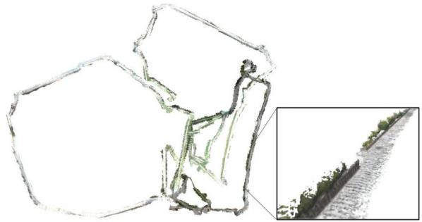  
Fig. 15. Stata experiment. Optimized mesh produced by Kimera-Multi corresponding to trajectory estimate shown in Fig. 14(c).

In comparison, the Stata dataset (see Fig. 14) is more challenging, partially due to the lack of enough inter-robot loop closures (see Table IV b). Kimera-VIO accumulates higher drifts, as shown in Fig. 14(a) and Table V. Fig. 14(b) shows the Kimera-Multi trajectory estimates produced using the default settings of D-GNC (see Algorithm 1). In this case, the global pose graph has 11 184 poses in total. D-GNC uses 120 RBCD iterations, which takes 50 s. We observe that while the orange and red trajectory estimates are qualitatively correct, the blue trajectory is not correctly aligned in the global frame. This is because with the approximate variable updates of D-GNC (presented in Section V-C), the only inter-robot loop closure with the blue trajectory is rejected. Additionally, with fewer inter-robot loop closures, RBCD generally converges at a slower rate. To resolve this issue, we increase the number of RBCD iterations within each variable update, hence making D-GNC more similar to the centralized GNC algorithm. With this change, D-GNC uses a total of 2000 RBCD iterations, which takes 14 minutes. However, the final trajectory estimates [see Fig. 14(c)] are significantly improved and are close to centralized GNC [see Fig. 14(d)]. The corresponding end-to-end errors are also close to centralized GNC, as shown in Table V. Fig. 15 shows the optimized mesh produced by Kimera-Multi corresponding to the trajectory estimates shown in Fig. 14(c). In this experiment, the difficulty faced by Kimera-Multi is primarily due to the lack of inter-robot loop closures (see Table IV b). In the future, we plan to further improve the loop closure detection module to gain better performance in similar visually challenging scenarios.

## VIII. CONCLUSION

In this article, we presented Kimera-Multi, a distributed multi-robot systemfor robust and dense metric-semantic SLAM. Our system advances state-of-the-art multi-robot perception by estimating 3-D mesh models that capture both dense geometry and semantic information of the environment. Kimera-Multi is fully distributed: each robot performs independent navigation, using Kimera to estimate local trajectories and meshes in real time. When communication becomes available, robots engage in local communication to detect loop closures and perform distributed trajectory estimation. From the globally optimized trajectory estimates, each robot performs LMO to refine its local map. We also presented D-GNC, a novel two-stage method for robust distributed PGO, which serves as the estimation backbone of Kimera-Multi and outperforms prior outlier rejection methods.

We performed extensive evaluation of Kimera-Multi, using a combination of photo-realistic simulations, indoor SLAM benchmarking datasets, and large-scale outdoor datasets. Our results demonstrated that Kimera-Multi: 1) provides robust and accurate trajectory estimation while being fully distributed; 2) estimates 3-D meshes with improved metric-semantic accuracy compared to inputs from Kimera; and 3) is communicationefficient and achieves significant communication reductions compared to baseline centralized systems.

## ACKNOWLEDGMENT

The authors would like to gratefully acknowledge Dominic Maggio for assistance during outdoor data collection.

## REFERENCES

[1] A. Rosinol et al., “Kimera: From SLAM to spatial perception with 3D dynamic scene graphs,” Int. J. Robot. Res., 2021. [Online]. Available: https://arxiv.org/pdf/2101.06894.pdf

[2] A. J. Davison, “FutureMapping: The computational structure of spatial AI systems,” 2018, arXiv:1803.11288.

[3] R. F. Salas-Moreno, R. A. Newcombe, H. Strasdat, P. H. J. Kelly, and A. J. Davison, “SLAM++: Simultaneous localisation and mapping at the level of objects,” in Proc. IEEE Conf. Comput. Vis. Pattern Recognit., 2013, pp. 1352–1359.

[4] J. McCormac, A. Handa, A. J. Davison, and S. Leutenegger, “SemanticFusion: Dense 3D semantic mapping with convolutional neural networks,” in Proc. IEEE Int. Conf. Robot. Autom., 2017, pp. 4628–4635.

[5] M. Grinvald et al., “Volumetric instance-aware semantic mapping and 3D object discovery,” IEEE Robot. Autom. Lett., vol. 4, no. 3, pp. 3037–3044, Jul. 2019.

[6] A. Cunningham, M. Paluri, and F. Dellaert, “DDF-SAM: Fully distributed SLAM using constrained factor graphs,” in Proc. IEEE/RSJ Int. Conf. Intell. Robots Syst., 2010, pp. 3025–3030.

[7] T. Cieslewski, S. Choudhary, and D. Scaramuzza, “Data-efficient decentralized visual SLAM,” in Proc. IEEE Int. Conf. Robot. Autom., 2018, pp. 2466–2473.

[8] S. Choudhary, L. Carlone, C. Nieto, J. Rogers, H. Christensen, and F. Dellaert, “Distributed mapping with privacy and communication constraints: Lightweight algorithms and object-based models,” Int. J. Robot. Res., vol. 36, no. 12, pp. 1286–1311, 2017.

[9] V. Tchuiev and V. Indelman, “Distributed consistent multi-robot semantic localization and mapping,” IEEE Robot. Autom. Lett., vol. 5, no. 3, pp. 4649–4656, Jul. 2020.

[10] Y. Yue, C. Zhao, M. Wen, Z. Wu, and D. Wang, “Collaborative semantic perception and relative localization based on map matching,” in Proc. IEEE/RSJ Int. Conf. Intell. Robots Syst., 2020, pp. 6188–6193.

[11] V. Indelman, E. Nelson, N. Michael, and F. Dellaert, “Multi-robot pose graph localization and data association from unknown initial relative poses via expectation maximization,” in Proc. IEEE Int. Conf. Robot. Autom., 2014, pp. 593–600.

[12] J. Dong, E. Nelson, V. Indelman, N. Michael, and F. Dellaert, “Distributed real-time cooperative localization and mapping using an uncertainty-aware expectation maximization approach,” in Proc. IEEE Int. Conf. Robot. Autom., Seattle, WA, USA, May 2015, pp. 5807–5814.

[13] J. G. Mangelson, D. Dominic, R. M. Eustice, and R. Vasudevan, “Pairwise consistent measurement set maximization for robust multi-robot map merging,” in Proc. IEEE Int. Conf. Robot. Autom., 2018, pp. 2916–2923.

[14] P. Lajoie, B. Ramtoula, Y. Chang, L. Carlone, and G. Beltrame, “DOOR-SLAM: Distributed, online, and outlier resilient SLAM for robotic teams,” IEEE Robot. Autom. Lett., vol. 5, no. 2, pp. 1656–1663, Apr. 2020.

[15] H. Yang, P. Antonante, V. Tzoumas, and L. Carlone, “Graduated nonconvexity for robust spatial perception: From non-minimal solvers to global outlier rejection,” IEEE Robot. Autom. Lett., vol. 5, no. 2, pp. 1127–1134, Apr. 2020.

[16] A. Rosinol, M. Abate, Y. Chang, and L. Carlone, “Kimera: An open-source library for real-time metric-semantic localization and mapping,” in Proc. IEEE Int. Conf. Robot. Autom., 2020, pp. 1689–1696.

[17] Y. Tian, K. Khosoussi, D. M. Rosen, and J. P. How, “Distributed certifiably correct pose-graph optimization,” IEEE Trans. Robot., vol. 37, no. 6, pp. 2137–2156, Dec. 2021.

[18] Y. Chang, Y. Tian, J. How, and L. Carlone, “Kimera-Multi: A system for distributed multi-robot metric-semantic simultaneous localization and mapping,” in Proc. IEEEInt. Conf. Robot.Autom., 2021, pp. 11210–11218.

[19] K. Tateno, F. Tombari, I. Laina, and N. Navab, “CNN-SLAM: Real-time dense monocular SLAM with learned depth prediction,” in Proc. IEEE Conf. Comput. Vis. Pattern Recognit., 2017, pp. 6565–6574.

[20] K.-N. Lianos, J. L. Schönberger, M. Pollefeys, and T. Sattler, “VSO: Visual semantic odometry,” in Proc. Eur. Conf. Comput. Vis., 2018, pp. 246–263.

[21] J. Dong, X. Fei, and S. Soatto, “Visual-inertial-semantic scene representation for 3D object detection,” IEEE Conf. Comput. Vis. Pattern Recognit., 2017, pp. 3567–3577.

[22] J. Behley et al., “SemanticKITTI: A. dataset for semantic scene understanding of LiDAR sequences,” in Proc. IEEE/CVF Int. Conf. Comput. Vis., 2019, pp. 9296–9306.

[23] L. Zheng et al., “Active scene understanding via online semantic reconstruction,” Comput. Graphics Forum (Proc. PG 2019), vol. 38, no. 7, pp. 103–114, 2019.

[24] K. Tateno, F. Tombari, and N. Navab, “Real-time and scalable incremental segmentation on dense SLAM,” in Proc. IEEE/RSJ Int. Conf. Intell. Robots Syst., 2015, pp. 4465–4472.

[25] C. Li, H. Xiao, K. Tateno, F. Tombari, N. Navab, and G. D. Hager, “Incremental scene understanding on dense SLAM,” in Proc. IEEE/RSJ Int. Conf. Intell. Robots Syst., 2016, pp. 574–581.

[26] J. McCormac, R. Clark, M. Bloesch, A. J. Davison, and S. Leutenegger, “Fusion++: Volumetric object-level SLAM,” in Proc. Int. Conf. 3D Vis., 2018, pp. 32–41.

[27] M. Runz, M. Buffier, and L. Agapito, “MaskFusion: Real-time recognition, tracking and reconstruction of multiple moving objects,” in Proc. IEEE Int. Symp. Mixed Augmented Reality, 2018, pp. 10–20.

[28] M. Rünz and L. Agapito, “Co-Fusion: Real-time segmentation, tracking and fusion of multiple objects,” in Proc. IEEE Int. Conf. Robot. Autom., 2017, pp. 4471–4478.

[29] B. Xu, W. Li, D. Tzoumanikas, M. Bloesch, A. Davison, and S. Leutenegger, “MID-Fusion: Octree-based object-level multi-instance dynamic SLAM,” in Proc. IEEE Int. Conf. Robot. Autom., 2019, pp. 5231–5237.

[30] A. Rosinol, A. Gupta, M. Abate, J. Shi, and L. Carlone, “3D dynamic scene graphs: Actionable spatial perception with places, objects, and humans,” in Proc. Robot.: Sci. Syst. Conf., 2020. [Online]. Available: http://www. roboticsproceedings.org/rss16/p079.html

[31] A. Rosinol, T. Sattler, M. Pollefeys, and L. Carlone, “Incremental visualinertial 3D mesh generation with structural regularities,” in Proc. IEEE Int. Conf. Robot. Autom., 2019, pp. 8220–8226.

[32] M. J. Schuster, K. Schmid, C. Brand, and M. Beetz, “Distributed stereo vision-based 6D localization and mapping for multi-robot teams,” J. Field Robot., vol. 36, no. 2, pp. 305–332, 2019.

[33] A. Cunningham, V. Indelman, and F. Dellaert, “DDF-SAM 2.0: Consistent distributed smoothing and mapping,” in Proc. IEEE Int. Conf. Robot. Autom., Karlsruhe, Germany, May 2013, pp. 5220–5227.

[34] G. S. Saeedi, M. Trentini, M. L. Seto, and H. Li, “Multiple-robot simultaneous localization and mapping: A review,” J. Field Robot., vol. 33, no. 1, pp. 3–46, 2016.

[35] P. Schmuck and M. Chli, “CCM-SLAM: Robust and efficient centralized collaborative monocular simultaneous localization and mapping for robotic teams,” J. Field Robot., vol. 36, no. 4, pp. 763–781, 2018.

[36] J. Sivic and A. Zisserman, “Video Google: A text retrieval approach to object matching in videos,” in Proc. 9th Int. Conf. Comput. Vis., 2003, pp. 1470–1477.

[37] D. Gálvez-López and J. D. Tardós, “Bags of binary words for fast place recognition in image sequences,” IEEE Trans. Robot., vol. 28, no. 5, pp. 1188–1197, Oct. 2012.

[38] R. Arandjelovic, P. Gronat, A. Torii, T. Pajdla, and J. Sivic, “NetVLAD: CNN architecture for weakly supervised place recognition,” in Proc. IEEE Conf. Comput. Vis. Pattern Recognit., 2016, pp. 5297–5307.

[39] D. Lowe, “Object recognition from local scale-invariant features,” in Proc. Int. Conf. Comput. Vis., 1999, pp. 1150–1157.

[40] H. Bay, T. Tuytelaars, and L. V. Gool, “SURF: Speeded up robust features,” in Proc. Eur. Conf. Comput. Vis., 2006, pp. 404–417.

[41] T. Cieslewski and D. Scaramuzza, “Efficient decentralized visual place recognition using a distributed inverted index,” IEEE Robot. Autom. Lett., vol. 2, no. 2, pp. 640–647, Apr. 2017.

[42] T. Cieslewski and D. Scaramuzza, “Efficient decentralized visual place recognition from full-image descriptors,” in Proc. Int. Symp. Multi-Robot Multi-Agent Syst., 2017, pp. 78–82.

[43] M. Giamou, K. Khosoussi, and J. P. How, “Talk resource-efficiently to me: Optimal communication planning for distributed loop closure detection,” in Proc. IEEE Int. Conf. Robot. Autom., 2018, pp. 1–9.

[44] Y. Tian, K. Khosoussi, M. Giamou, J. P. How, and J. Kelly, “Nearoptimal budgeted data exchange for distributed loop closure detection,” in Proc. Robot.: Sci. Syst. Conf., 2018. [Online]. Available: http://www. roboticsproceedings.org/rss14/p71.html

[45] Y. Tian, K. Khosoussi, and J. P. How, “A resource-aware approach to collaborative loop-closure detection with provable performance guarantees,” Int. J. Robot. Res., vol. 40, pp. 1212–1233, 2021.

[46] L. Andersson and J. Nygards, “C-SAM: Multi-robot SLAM using square root information smoothing,” in Proc. IEEE Int. Conf. Robot. Autom., 2008, pp. 2798–2805.

[47] B. Kim et al., “Multiple relative pose graphs for robust cooperative mapping,” in Proc. IEEE Int. Conf. Robot. Autom., Anchorage, AK, USA, May 2010, pp. 3185–3192.

[48] T. Bailey, M. Bryson, H. Mu, J. Vial, L. McCalman, and H. Durrant-Whyte, “Decentralised cooperative localisation for heterogeneous teams of mobile robots,” in Proc. IEEE Int. Conf. Robot. Autom., Shanghai, China, May 2011, pp. 2859–2865.

[49] M. Lazaro, L. Paz, P. Pinies, J. Castellanos, and G. Grisetti, “Multi-robot SLAM using condensed measurements,” in Proc. IEEE Int. Conf. Robot. Autom., 2011, pp. 1069–1076.

[50] J. Knuth and P. Barooah, “Collaborative localization with heterogeneous inter-robot measurements by Riemannian optimization,” in Proc. IEEE Int. Conf. Robot. Autom., 2013, pp. 1534–1539.

[51] R. Tron and R. Vidal, “Distributed 3-D localization of camera sensor networks from 2-D image measurements,” IEEE Trans. Autom. Control, vol. 59, no. 12, pp. 3325–3340, Dec. 2014.

[52] E. Cristofalo, E. Montijano, and M. Schwager, “GeoD: Consensus-based geodesic distributed pose graph optimization,” 2020, arXiv:2010.00156.

[53] R. Aragues, L. Carlone, G. Calafiore, and C. Sagues, “Multi-agent localization from noisy relative pose measurements,” in Proc. IEEE Int. Conf. Robot. Autom., 2011, pp. 364–369.

[54] T. Fan and T. Murphey, “Majorization minimization methods to distributed pose graph optimization with convergence guarantees,” 2020, arXiv:2003.05353.

[55] Y. Tian, A. Koppel, A. S. Bedi, and J. P. How, “Asynchronous and parallel distributed pose graph optimization,” IEEE Robot. Autom. Lett., vol. 5, no. 4, pp. 5819–5826, Oct. 2020.

[56] M. Fischler and R. Bolles, “Random sample consensus: A paradigm for model fitting with application to image analysis and automated cartography,” Commun. ACM, vol. 24, pp. 381–395, 1981.

[57] J. Neira and J. Tardós, “Data association in stochastic mapping using the joint compatibility test,” IEEE Trans. Robot. Autom., vol. 17, no. 6, pp. 890–897, Dec. 2001.

[58] M. Bosse, G. Agamennoni, and I. Gilitschenski, “Robust estimation and applications in robotics,” Found. Trends Robot., vol. 4, no. 4, pp. 225–269, 2016.

[59] R. Hartley, J. Trumpf, Y. Dai, and H. Li, “Rotation averaging,” Int. J. Comput. Vis., vol. 103, no. 3, pp. 267–305, 2013.

[60] N. Sünderhauf and P. Protzel, “Switchable constraints for robust pose graph SLAM,” in Proc. IEEE/RSJ Int. Conf. Intell. Robots Syst., 2012, pp. 1879– 1884.

[61] P. Agarwal, G. D. Tipaldi, L. Spinello, C. Stachniss, and W. Burgard, “Robust map optimization using dynamic covariance scaling,” in Proc. IEEE Int. Conf. Robot. Autom., 2013, pp. 62–69.

[62] R. Hartley, K. Aftab, and J. Trumpf, “L1 rotation averaging using the Weiszfeld algorithm,” in Proc. IEEE Conf. Comput. Vis. Pattern Recognit., 2011, pp. 3041–3048.

[63] J. Casafranca, L. Paz, and P. Piniés, “A back-end $\ell _ { 1 }$ norm based solution for factor graph SLAM,” in Proc. IEEE/RSJ Int. Conf. Intell. Robots Syst., 2013, pp. 17–23.

[64] A. Chatterjee and V. M. Govindu, “Efficient and robust large-scale rotation averaging,” in Proc. Int. Conf. Comput. Vis., 2013, pp. 521–528.

[65] A. Chatterjee and V. M. Govindu, “Robust relative rotation averaging,” IEEE Trans. Pattern Anal. Mach. Intell., vol. 40, no. 4, pp. 958–972, Apr. 2018.

[66] G. Hu, K. Khosoussi, and S. Huang, “Towards a reliable SLAM back-end,” in Proc. IEEE/RSJ Int. Conf. Intell. Robots Syst., 2013, pp. 37–43.

[67] E. Olson and P. Agarwal, “Inference on networks of mixtures for robust robot mapping,” in Proc. Robot.: Sci. Syst. Conf., 2012, pp. 313–320.

[68] M. Pfingsthorn and A. Birk, “Simultaneous localization and mapping with multimodal probability distributions,” Int. J. Robot. Res., vol. 32, no. 2, pp. 143–171, 2013.

[69] M. Pfingsthorn and A. Birk, “Generalized graph SLAM: Solving local and global ambiguities through multimodal and hyperedge constraints,” Int. J. Robot. Res., vol. 35, no. 6, pp. 601–630, 2016.

[70] P. Lajoie, S. Hu, G. Beltrame, and L. Carlone, “Modeling perceptual aliasing in SLAM via discrete-continuous graphical models,” IEEE Robot. Autom. Lett., vol. 4, no. 2, pp. 1232–1239, Apr. 2019.

[71] L. Carlone and G. Calafiore, “Convex relaxations for pose graph optimization with outliers,” IEEE Robot. Autom. Lett., vol. 3, no. 2, pp. 1160–1167, Apr. 2018.

[72] L. Carlone, A. Censi, and F. Dellaert, “Selecting good measurements via -1 relaxation: A convex approach for robust estimation over graphs,” in Proc. IEEE/RSJ Int. Conf. Intell. Robots Syst., 2014, pp. 2667–2674.

[73] M. Graham, J. How, and D. Gustafson, “Robust incremental SLAM with consistency-checking,” in Proc. IEEE/RSJ Int. Conf. Intell. Robots Syst., Sep. 2015, pp. 117–124.

[74] P. Antonante, V. Tzoumas, H. Yang, and L. Carlone, “Outlier-robust estimation: Hardness, minimally tuned algorithms, and applications,” IEEE Trans. Robot., 2021, pp. 1–21, doi: 10.1109/TRO.2021.3094984.

[75] A. Agha et al., “NeBula: Quest for robotic autonomy in challenging environments; TEAM CoSTAR at the DARPA Subterranean Challenge,” 2021, arXiv:2103.11470.

[76] A. Garcia-Garcia, S. Orts-Escolano, S. Oprea, V. Villena-Martinez, and J. García-Rodríguez, “A review on deep learning techniques applied to semantic segmentation,” 2017, arXiv:1704.06857.

[77] M. Quigley et al., “ROS: An open-source robot operating system,” in Proc. ICRA Workshop Open Source Softw., Kobe, Japan, 2009, p. 5.

[78] G. Bradski, “The OpenCV library,” Dr Dobb’s J. Softw. Tools, vol. 25, no. 11, pp. 120–123, 2000.

[79] D. Nistér, “An efficient solution to the five-point relative pose problem,” IEEE Trans. Pattern Anal. Mach. Intell., vol. 26, no. 6, pp. 756–770, Jun. 2004.

[80] K. Arun, T. Huang, and S. Blostein, “Least-squares fitting of two 3-D point sets,” IEEE Trans. Pattern Anal. Mach. Intell., vol. PAMI-9, no. 5, pp. 698–700, Sep. 1987.

[81] L. Kneip and P. Furgale, “OpenGV: A unified and generalized approach to real-time calibrated geometric vision,” in Proc. IEEE Int. Conf. Robot. Autom., 2014, pp. 1–8.

[82] R. A. Rossi, D. F. Gleich, and A. H. Gebremedhin, “Parallel maximum clique algorithms with applications to network analysis,” SIAM J. Sci. Comput., vol. 37, no. 5, pp. C589–C616, 2015.

[83] D. Rosen, L. Carlone, A. Bandeira, and J. Leonard, “SE-Sync: A certifiably correct algorithm for synchronization over the special Euclidean group,” Int. J. Robot. Res., vol. 38, pp. 95–125, 2019.

[84] M. J. Black and A. Rangarajan, “On the unification of line processes, outlier rejection, and robust statistics with applications in early vision,” Int. J. Comput. Vis., vol. 19, no. 1, pp. 57–91, 1996.

[85] P. Huber, Robust Statistics. New York, NY, USA: Wiley, 1981.

[86] Z. Zhang, “Parameter estimation techniques: A tutorial with application to conic fitting,” Image Vis. Comput., vol. 15, no. 1, pp. 56–76, 1997.

[87] F. Dellaert et al., “Georgia Tech Smoothing and Mapping (GTSAM),” 2019. [Online]. Available: https://gtsam.org/

[88] R. W. Sumner, J. Schmid, and M. Pauly, “Embedded deformation for shape manipulation,” in Proc. ACM Trans. Graph, vol. 26, no. 3, New York, NY, USA: Association for Computing Machinery, Jul. 2007, pp. 80–es.

[89] T. Barfoot, State Estimation for Robotics. Cambridge, U.K.: Cambridge Univ. Press, 2017.

[90] L. Carlone and A. Censi, “From angular manifolds to the integer lattice: Guaranteed orientation estimation with application to pose graph optimization,” IEEE Trans. Robot., vol. 30, no. 2, pp. 475–492, Apr. 2014.

[91] Army Research Laboratory, “Distributed and Collaborative Intelligent Systems and Technology Collaborative Research Alliance (DCIST CRA),” 2020. [Online]. Available: https://www.dcist.org/

[92] M. Burri et al., “The EuRoC micro aerial vehicle datasets,” Int. J. Robot. Res., vol. 35, no. 10, pp. 1157–1163, 2016.

[93] P. J. Besl and N. D. McKay, “A method for registration of 3-D shapes,” IEEE Trans. Pattern Anal. Mach. Intell., vol. 14, no. 2, pp. 239–256, Feb. 1992.

[94] Q.-Y. Zhou, J. Park, and V. Koltun, “Open3D: A modern library for 3D data processing,” 2018, arXiv:1801.09847.

[95] C. Forster, L. Carlone, F. Dellaert, and D. Scaramuzza, “On-manifold preintegration for real-time visual-inertial odometry,” IEEE Trans. Robot., vol. 33, no. 1, pp. 1–21, Feb. 2017.

Yulun Tian received the B.A. degree in computer science from the University of California Berkeley, Berkeley, CA, USA, in 2017, and the S.M. degree in aeronautics and astronautics in 2019 from the Massachusetts Institute of Technology, Cambridge, MA, USA, where he is currently working toward the Ph.D. degree in aeronautics and astronautics.

His current research interests include distributed optimization and estimation with applications to localization and mapping in multi-agent systems.

Mr. Tian received a 2020 Honorable Mention from IEEE ROBOTICS AND AUTOMATION LETTERS.

  
robot systems.

Yun Chang received the B.S. degree in aerospace engineering and the M.S. degree in aeronautics and astronautics in 2019 and 2021, respectively, from the Massachusetts Institute of Technology (MIT), Cambridge, MA, USA, where he is currently working toward the Ph.D. degree with the Department of Aeronautics and Astronautics and the Laboratory for Information and Decision Systems.

He is a member of the SPARK Lab, led by Prof. Luca Carlone. His research interests include robust localization and mapping with applications to multi-

Mr. Chang is a recipient of the MIT AeroAstro Andrew G. Morsa Memorial Award in 2019 and the Henry Webb Salisbury Award in 2019.

Fernando Herrera Arias received the S.B. degree in computer science and engineering and the M.Eng. degree in electrical engineering and computer science from the Massachusetts Institute of Technology, Cambridge, MA, USA, in 2020 and 2021, respectively.

He is currently a Software Engineer with Cruise, San Francisco, CA, USA. He is a Former Member of the SPARK Lab, led by Prof. Luca Carlone. As part of this team, his work included the evaluation of neural networks for loop-closure detection in simultaneous

localization and mapping systems. His current work focuses on vehicle dynamics for self-driving cars.

Carlos Nieto-Granda received the B.S. degree in electronics systems from the Tecnológico de Monterrey, Campus Estado de Mexico, Mexico, in 2007, the M.S. degree in computer science from the Georgia Institute of Technology, Atlanta, GA, USA, in 2012, and the Ph.D. degree in intelligent systems, robotics, and control from the University of California San Diego, San Diego, CA, USA, in 2020.

He is currently a Postdoctoral Fellow with the Computational and Information Sciences Directorate, U.S. Army Combat Capabilities Development Com-

mand, U.S. Army Research Laboratory, Adelphi, MD, USA. His research interests include autonomous exploration, coordination, and decision-making for heterogeneous multi-robot teams focusing on state estimation, sensor fusion, computer vision, localization and mapping, autonomous navigation, and contro in complex environments.

Jonathan P. How (Fellow, IEEE) received the B.A.Sc. degree in engineering science (aerospace) from the University of Toronto, Toronto, ON, Canada, in 1987, and the S.M. and Ph.D. degrees in aeronautics and astronautics from the Massachusetts Institute of Technology (MIT), Cambridge, MA, USA, in 1990 and 1993, respectively.

In 2000, he joined MIT, where he is currently the Richard C. Maclaurin Professor of Aeronautics and Astronautics. Prior to this, he was an Assistant

Professor with Stanford University, Stanford, CA, USA.

Dr. How was the Recipient of the American Institute of Aeronautics and Astronautics (AIAA) Best Paper in Conference Awards in 2011, 2012, and 2013, the IROS Best Paper Award on Cognitive Robotics in 2019, the AIAA Intelligent Systems Award in 2020, and the IEEE Control Systems Society Distinguished Member Award in 2020. He was the Editor-in-Chief for IEEE Control Systems Magazine from 2015 to 2019. He is a Fellow of the AIAA. He was elected to the National Academy of Engineering in 2021.

Luca Carlone received the B.S. and S.M. degrees in mechatronics from the Polytechnic University of Turin, Turin, Italy, in 2006 and 2008, respectively, the S.M. degree in automation engineering from the Polytechnic University of Milan, Milan, Italy, in 2008, and the Ph.D. degree in robotics from the Polytechnic University of Turin in 2012.

He is currently the Leonardo Career Development Associate Professor with the Department of Aeronautics and Astronautics, Massachusetts Institute of Technology (MIT), Cambridge, MA, USA, where he is also a Principal Investigator with the Laboratory for Information and Decision Systems (LIDS). From 2013 to 2015, he was a Postdoctoral Fellow with the Georgia Institute of Technology, Atlanta, GA, USA. In 2015, he joined LIDS as a Postdoctoral Associate, where he became a Research Scientist in 2016. His research interests include nonlinear estimation, numerical and distributed optimization, and probabilistic inference, applied to sensing, perception, and decision-making in single- and multi-robot systems. His work includes semina results on certifiably correct algorithms for localization and mapping, as well as approaches for visual-inertial navigation and distributed mapping.

Dr. Carlone is a Recipient of the Best Student Paper Award at 2021 IEEE/RSJ International Conference on Intelligent Robots and Systems, the Best Paper Award in Robot Vision at 2020 IEEE International Conference on Robotics and Automation, a 2020 Honorable Mention from IEEE ROBOTICS AND AU-TOMATION LETTERS, a Track Best Paper Award at the 2021 IEEE Aerospace Conference, the 2017 IEEE TRANSACTIONS ON ROBOTICS King-Sun Fu Memorial Best Paper Award, the Best Paper Award at 2016 International Workshop on the Algorithmic Foundations of Robotics, and the Best Student Paper Award at the 2018 IEEE Symposium on VLSI Circuits. He was the Best Paper Finalist at 2015 Robotics: Science and Systems Conference (RSS) and RSS 2021. He is also a Recipient of the National Science Foundation CAREER Award in 2021, the RSS Early Career Award in 2020, the Google Daydream in 2019, the Amazon Research Award in 2020, and the MIT AeroAstro Vickie Kerrebrock Faculty Award in 2020.