# LCDNet: Deep Loop Closure Detection and Point Cloud Registration for LiDAR SLAM

Daniele Cattaneo , Matteo Vaghi , and Abhinav Valada

Abstract—Loop closure detection is an essential component of simultaneous localization and mapping (SLAM) systems, which reduces the drift accumulated over time. Over the years, several deep learning approaches have been proposed to address this task; however, their performance has been subpar compared to handcrafted techniques, especially while dealing with reverse loops. In this article, we introduce the novel loop closure detection network (LCDNet) that effectively detects loop closures in light detection and ranging (LiDAR) point clouds by simultaneously identifying previously visited places and estimating the six degrees of freedom relative transformation between the current scan and the map. LCDNet is composed of a shared encoder, a place recognition head that extracts global descriptors, and a relative pose head that estimates the transformation between two point clouds. We introduce a novel relative pose head based on the unbalanced optimal transport theory that we implement in a differentiable manner to allow for end-to-end training. Extensive evaluations of LCDNet on multiple real-world autonomous driving datasets show that our approach outperforms state-of-the-art loop closure detection and point cloud registration techniques by a large margin, especially while dealing with reverse loops. Moreover, we integrate our proposed loop closure detection approach into a LiDAR SLAM library to provide a complete mapping system and demonstrate the generalization ability using different sensor setup in an unseen city.

Index Terms—Deep learning, loop closure detection, place recognition, point cloud registration, simultaneous localization and mapping (SLAM).

## I. INTRODUCTION

IMULTANEOUS localization and mapping (SLAM) is an S essential task for autonomous mobile robots as it is a critical precursor for other tasks in the navigation pipeline. A failure in the SLAM system will adversely affect all the subsequent tasks and negatively impact the functioning of the robot. Therefore, improving the robustness of SLAM systems has garnered significant interest from both industry and academia in the past decades, as demonstrated by the widespread adoption in many fields such as self-driving cars [1], unmanned aerial vehicles [2], agricultural robots [3], and autonomous marine vehicles [4]. The goal of any SLAM system is to build a map of an unknown environment by exploiting onboard sensor data [such as global positioning system (GPS), cameras, light detection and ranging (LiDAR), and inertial measurement units (IMUs)] and, at the same time, localize the robot within the built map.

A typical SLAM pipeline consists of three main components: 1) consecutive scan alignment in which subsequent scans are aligned by leveraging information such as odometry, scan matching, or IMUs information; 2) loop detection to identify places that were previously visited; and 3) loop closure to align the current scan to the previously visited place and accordingly correct the map. Since the first step by itself usually drifts over time due to its incremental nature, the map will no longer be consistent when the robot navigates through a place that was previously visited. Therefore, steps 2) and 3) are employed to reduce the accumulated drift by adding a new constraint to the pose graph when a loop is detected. Subsequently, all the previous poses are corrected according to this constraint, thus generating a consistent map.

Although several vision-based SLAM systems have been proposed [5], [6], and their loop closure methods often fail in case of strong variation due to illumination, appearance, or viewpoint changes. LiDARs, on the other hand, are invariant to illumination changes and provide an accurate geometric reconstruction of the surrounding environment. Hence, they are often preferred over cameras for SLAM approaches due to their inherent robustness. Standard LiDAR-based loop detection methods extract local keypoints [7], [8] or global handcrafted descriptors [9], [10] and compare the descriptor of the current scan with that of previous scans to identify loops. However, most of these approaches require an ad hoc function to compare the descriptors of two point clouds, which drastically impacts the runtime when the number of past scans increases.

Driven by the significant strides achieved by deep neural networks (DNNs) in different fields, many recent works [11]–[15] employ DNNs to address the loop detection task in LiDARbased SLAM systems. While these approaches are generally faster than handcrafted methods, their performance is not on par with these state-of-the-art methods, especially in the case of reverse loops. Another challenge faced while detecting a loop closure is related to aligning the current point cloud with the built map. A common approach is to leverage standard techniques for scan matching such as the iterative closest point (ICP) [16] algorithm or one of its variants [17]–[19]. Although ICP is generally able to successfully align two point clouds when they are relatively similar and close, it can fall in local minima when the initial pose between the point clouds is very different. This is often the case when faced with reverse direction loops. To overcome this problem, some methods also provide an estimate of the rotation between the two point clouds. This estimate can then be used as an initial guess in the ICP algorithm to aid the alignment to converge to the correct solution.

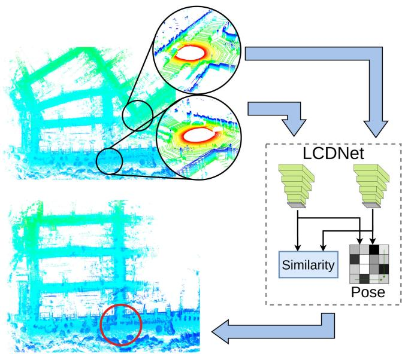  
Fig. 1. Our proposed LCDNet detects loops by computing the similarity between two point clouds and predicting the relative pose between them. This is a crucial component of any SLAM system, as it reduces the drift accumulated over time.

Several recent works [20]–[23] have been proposed to address the point cloud registration task by leveraging the advancement in deep learning. Although these approaches achieve impressive results in registering single objects and outperform standard techniques, the protocol used to test these approaches only consider a relatively small initial rotation misalignment (up to 45<sup>◦</sup>). However, the point clouds can be rotated by 180<sup>◦</sup> in the loop closure task. Recent work has shown that some of these methods have a very low success rate when the initial misalignment is larger than 120<sup>◦</sup> [20].

In this article, we propose the novel LCDNet for loop closure detection which performs both loop detection and point cloud registration (see Fig. 1). Our method combines the ability of DNNs to extract distinctive features from point clouds, with algorithms from the transport theory for feature matching. LCDNet is composed of a shared backbone that extracts point features, followed by the place recognition head that extracts global descriptors and the relative pose head that estimates the transformation between two point clouds. One of the core components of our LCDNet is the unbalanced optimal transport (UOT) algorithm that we implement in a differentiable manner. UOT allows us to effectively match the features extracted from the two point clouds, reject outliers, and handle occluded points, while still being able to train the network in an end-to-end manner. As opposed to existing loop closure detection methods that estimate the relative yaw rotation between two point clouds, our proposed LCDNet estimates the full six degrees of freedom (DoF) relative transformation under driving conditions between them which significantly helps the subsequent ICP refinement to converge faster.

We train our proposed LCDNet on sequences from the KITTI odometry [24] and KITTI-360 [25] datasets and evaluate it on the unseen sequences on both datasets. Moreover, we found that there is a lack of a standard protocol for evaluating loop closure detection methods in the existing literature. Different works evaluated their approaches using different metrics such as precision–recall curve, average precision (AP), receiver operating characteristic curve, recall@k, and maximum F1-score. Even among the methods that use the same metric for evaluation, there are still substantial differences in the other parameters chosen for computing the metrics, which makes the performance of existing methods not directly comparable. For example, the definition of a true loop can span from scans within 3 m [14] up to scans within 15 m [15]. Therefore, in this work, we evaluate existing state-of-the-art approaches using a uniform evaluation protocol to provide a fair comparison. Exhaustive comparisons demonstrate that our proposed LCDNet outperforms both handcrafted methods as well as DNN-based methods and achieves state-of-the-art performance on both loop closure detection and point cloud registration tasks. Furthermore, we present detailed ablation studies on the architectural topology of LCDNet and also present results from integrating LCDNet into a recent LiDAR SLAM library [26]. Additionally, we demonstrate the generalization ability of our proposed approach using experiments with a different sensor setup from an autonomous driving scenario in a completely different city.

The main contributions of this work can be summarized as follows.

1) We propose LCDNet, a novel approach for loop closure detection that effectively detects reverse loops.

2) We propose an end-to-end trainable relative pose regression network based on the UOT theory that can register two point clouds that only partially overlap and with an arbitrary initial misalignment.

3) We comprehensively evaluate existing state-of-the-art loop closure detection methods using a uniform evaluation protocol, perform extensive evaluations of LCDNet on multiple autonomous driving datasets, and present detailed ablation studies that demonstrate the efficacy of our contributions.

4) We study the generalization ability of our approach to unseen environments and different sensor setups by evaluating LCDNet on our own recorded dataset around the city of Freiburg, Germany.

5) We integrate our network into a SLAM library to provide a complete system for localization and mapping and we make the code, the entire SLAM system, and the evaluation tools publicly available at http://rl.uni-freiburg.de/ research/lidar-slam-lc.

The rest of the article is organized as follows. We review existing methods that are related to our approach in Section II. In Section III, we detail our proposed LCDNet and the integration into the SLAM system. We then present experiments that demonstrate the effectiveness and robustness of LCDNet in Section IV. Finally, we present our conclusions in Section V.

## II. RELATED WORKS

In this section, we provide an overview of the state-of-theart techniques for vision-based and LiDAR-based loop closure detection, followed by methods for point cloud registration.

1) Loop Closure Detection: Techniques for loop closure detection can primarily be categorized into visual and LiDAR-based methods. Traditionally, vision-based techniques for loop closure detection rely on handcrafted features for identifying and representing relevant parts of scenes depicted within images and exploit a bag-of-words model to combine them [5], [6]. In the last few years, deep learning approaches [27], [28] have been proposed which achieve successful results. These techniques employ DNN for computing global descriptors to provide a compact representation of images and perform direct comparisons between descriptors for searching matches between similar places. Recently, [29] proposed a novel approach that employs DNNs for extracting local features from intermediate layers and organizes them in a word-pairs model. Although vision-based methods achieve impressive performance, they are not robust against adverse environmental situations such as challenging light conditions and appearance variations that can arise during long-term navigation. As loop closure detection is a critical task within SLAM systems, in this work, we exploit LiDARs for the sensing modality since they provide more reliable information even in challenging conditions in which visual systems fail.

3-D LiDAR-based techniques have gained significant interest in the last decade, as LiDARs provide rich 3-D information of the environment with high accuracy and their performance is not affected by illumination changes. Similar to vision-based approaches, LiDAR-based techniques also exploit local features. Most methods use 3-D keypoints [30], [31] that are organized in a bag-of-words model for matching point clouds [7]. The authors in [8] propose a keypoint-based approach in which a nearest neighbor voting paradigm is employed to determine if a set of keypoints represent a previously visited location. Recently, [32] proposes a voxel-based method that divides a 3-D scan into voxels and extracts multiple features from them through different modalities, followed by learning the importance of voxels and types of features.

Another category of techniques represents point clouds through global descriptors. The authors in[9] propose an approach that directly produces point clouds fingerprints. In particular, this method relies on density signatures extracted from multiple projections of 3-D point clouds on different 2-D planes. The work [10] introduces a novel global descriptor called Scan Context that exploits bird-eye-view (BEV) representation of a point cloud together with a space partitioning procedure to encode the 2.5-D information within an image. In a similar approach, [33] proposes a method to extract binary signature images from 3-D point clouds by employing LoG-Gabor filtering with thresholding operations to obtain a descriptor. The main drawback of these approaches is that they require an ad hoc function to compare the global descriptor of two point clouds, which drastically impacts the runtime when the number of scans to compare increases.

Recently, DNN-based techniques have also been proposed for computing descriptors from 3-D point clouds. The authors in [11] propose PointNetVLAD which is composed of Point-Net [34] with a NetVLAD layer [27] and yields compact descriptors. The authors in[12] propose OREOS which computes 2-D projection of point clouds on cylindrical planes and is subsequently fed into a DNN that computes global descriptors and estimate their yaw discrepancy. More recently, the OverlapNet [13] architecture was introduced, which estimates the overlap and relative yaw angle between a pair of point clouds. The overlap estimate is then used for detecting loop closures while the yaw angle estimation is provided to the ICP algorithm as the initial guess for the point clouds alignment. While DNN-based methods are generally faster than classical techniques and show promising results in sequences that contain loops only in the same direction, their performance drastically decreases when they are faced with reverse loops.

Recently, techniques that exploit graph structures by matching semantic graphs have been proposed [14], [15]. These approaches first extract semantic information and perform instance retrieval, followed by defining graph vertices on the object centroids. Subsequently, features are extracted by considering handcrafted descriptors or by processing nodes through a dynamic graph CNN [35]. Finally, loop closures are identified by comparing vertices between graphs. However, computing the exact correspondences between two graphs is still an open problem and existing methods are only suitable when a few vertices are considered or they can only provide an approximated solution [36]. In this work, we exploit recent advancements in deep learning and propose a DNN-based approach for detecting loop closure by combining high-level voxel features with fine-grained point features. Our approach effectively detects loops in challenging scenarios such as reverse loops and outperforms state-of-the-art handcrafted and learning-based techniques. Point Cloud Registration: Point cloud registration represents the task of finding a rigid transformation to accurately align a pair of point clouds. The ICP algorithm [16] is one standard method that is often employed to tackle this task. Although ICP is one of the most popular methods, the main drawback concerns the initial rough alignment of point clouds which is required to reach an acceptable solution, and the algorithm complexity which increases drastically with the number of points. Other methods tackle the registration problem globally without requiring a rough initial alignment. Traditionally, these techniques exploit local features [37] for finding matches between point clouds and employ algorithms such as random sample consensus (RANSAC) [38] for estimating the final transformation. However, the presence of noise in the input data and outliers generated from incorrect matches can lead to an inaccurate result. To address these problems, [39] proposes a global registration approach that ensures fast and accurate alignment, even in the presence of many outliers.

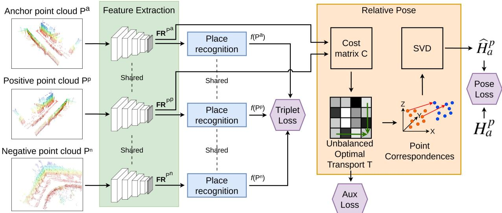  
Fig. 2. Overview of our proposed LCDNet which is composed of a shared feature extractor (green), a place recognition head (blue) that generates global descriptors, and a relative pose head (orange) that estimates the transformation between two point clouds. We use three loss functions to train LCDNet (triplet loss, aux loss, and pose loss) which are depicted in purple. The topology of the feature extractor is further illustrated in Fig. 3.

Recent years have also seen the introduction of deep learning methods that tackle the registration problem. A typical approach is to employ a DNN for extracting features that are then used in the later stages to perform point clouds alignment. The authors in [20] propose such an approach known as PointNetLK, which exploits the PointNet [34] architecture for feature extraction and employs a variation of the Lucas and Kanade algorithm [40] to perform registration. Deep closest point (DCP) [23] is another approach that employs a Siamese architecture, attention modules and differentiable singular value decomposition (SVD) to regress a rigid transform for aligning two input point clouds. Recently, [21] proposes a DNN-based method called RPM-Net which is inspired by robust point matching (RPM). RPM-Net employs two different neural networks to extract features and predict annealing parameters that are required for RPM. However, these methods are only capable ofaligning point clouds that are relatively close to each other (up to 45<sup>◦</sup> rotation misalignment) and completely fail to register point clouds that are more than 120<sup>◦</sup> apart [20]. In contrast to the aforementioned methods, the approach that we propose in this work does not require any initial guess as input and can handle both outliers and occluded points. Moreover, unlike existing DNN-based methods, our approach effectively aligns point clouds with arbitrary initial rotation misalignment.

## III. TECHNICAL APPROACH

In this section, we detail our proposed LCDNet for loop closure detection and point cloud registration from LiDAR point clouds. An overview of the proposed approach is depicted in Fig. 2. The network consists of three main components: feature extraction, global descriptor head, and 6-DoF relative pose estimation head. We first describe each of the aforementioned components and the associated loss functions for training, followed by the approach for integrating LCDNet into the SLAM system.

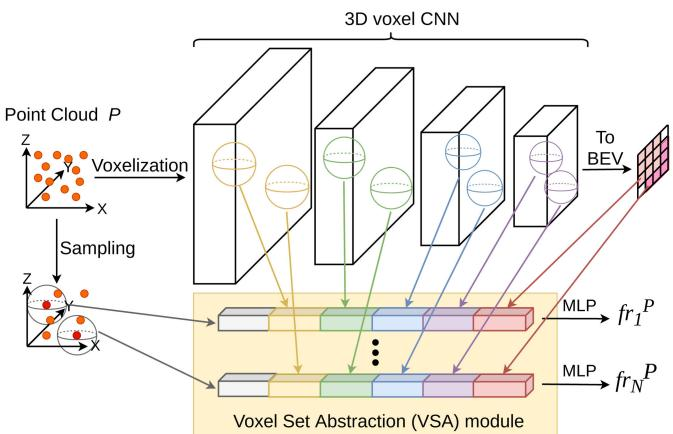  
Fig. 3. Network topology of the PV-RCNN architecture that we build upon for feature extractor component of our proposed LCDNet.

## A. Feature Extraction

We build the feature extractor stream of our network based upon the pointvoxel-RCNN (PV-RCNN) [41] architecture that was proposed for 3-D object detection. PV-RCNN effectively combines the ability of voxel-based methods for extracting highlevel features, with fine-grained features provided by PointNettype architectures. We make several changes to the standard architecture to adapt it to our task. We illustrate the topology of our adapted PV-RCNN in Fig. 3.

The input to the network is a point cloud $\boldsymbol { P } \in \mathbb { R } ^ { J x 4 }$ (J points with four values each: x, y, z, and intensity). The output of our feature extractor network is a set of N keypoints feature $\mathbf { F R } ^ { P } = \{ f r _ { 1 } ^ { P } , ~ . . . , f r _ { N } ^ { P } \}$ , where $f r _ { i } ^ { P } \in \mathbb { R } ^ { \bar { D } }$ is the

D-dimensional feature vector for the ith keypoint. Since we are interested in the feature extraction, and not in the object detection head, we only use the 3-D voxel DNN and the voxel set abstraction (VSA) module, and we discarded the region proposal network, the region of interest (ROI)-grid pooling, and the fully connected layers toward the end of the architecture. The 3-D voxel DNN first converts the point cloud into a voxel grid of size $L \times W \times H .$ , where voxel features are averaged across all the points that lay within the same voxel. Subsequently, we extract a feature pyramid using sparse 3-D convolutions and downsampling. In particular, we use four pyramid blocks composed of 3-D sparse convolutions, with downsampling rates of 1×, 2×, 4×, and 8×, respectively. Finally, we convert the coarsest feature map into a 2-D BEV feature map by stacking the features along the Z-axis.

The VSA module, on the other hand, aggregates all the pyramid feature maps together with the BEV feature map and the input point cloud into a small set of N keypoint features. To do so, we first downsample the point cloud using the farthest point sampling (FPS) algorithm [42] to select N uniformly distributed keypoints. The VSA module is an extension of the set abstraction (SA) level [43]. The standard SA aggregate neighbors point features in the raw point cloud, whereas the VSA aggregate neighbors voxel features in the 3-D sparse feature map. For every selected keypoint $k p _ { i }$ and every layer l of the pyramid feature map, the keypoint features $f _ { i } ^ { l }$ are computed as

$$
f _ { i } ^ { l } = \mathbf { M P } ( \mathbf { M L P } ( \mathcal { M } ( S _ { i } ^ { l } ) ) )\tag{1}
$$

where MP is the max-pooling operation, MLP denotes a multilayer perceptron (MLP), and M randomly samples the set of neighbor voxel features $S _ { i } ^ { l } .$ , which is computed as

$$
S _ { i } ^ { l } = \left\{ \left[ f v o x _ { j } ^ { l } ; v _ { j } ^ { l } - k p _ { i } \right] ; \mathrm { s . t . } \left\| v _ { j } ^ { l } - k p _ { i } \right\| ^ { 2 } < r \right\}\tag{2}
$$

where $f v o x _ { j } ^ { l }$ is the feature of the voxel $j$ at level $l , v _ { j } ^ { l }$ denotes the coordinates of the voxel $j$ at level l, and r is the neighbor radius. This operation is performed at every level of the pyramid to yield

$$
f _ { i } ^ { \mathrm { p v } } = \left[ f _ { i } ^ { 1 } , f _ { i } ^ { 2 } , f _ { i } ^ { 3 } , f _ { i } ^ { 4 } \right] .\tag{3}
$$

We perform a similar operation for the input raw point cloud as well as the BEV feature map, yielding the aggregated keypoint features

$$
\begin{array} { r } { f _ { i } ^ { \mathrm { 3 D } } = \left[ f _ { i } ^ { \mathrm { p v } } , f _ { i } ^ { \mathrm { r a w } } , f _ { i } ^ { \mathrm { b e v } } \right] . } \end{array}\tag{4}
$$

Lastly, we employ an MLP on the aggregated keypoint features to generate the final keypoint feature vectors as

$$
f r _ { i } = \mathbf { M L P } ( f _ { i } ^ { \mathrm { 3 D } } ) .\tag{5}
$$

As opposed to the original PV-RCNN that processes only the points that lay in the camera field of view (FOV), we require the full $3 6 0 ^ { \circ }$ surrounding view. Therefore, we use a voxel grid size of $\pm 7 0 . 4 \mathrm { m } , \pm 7 0 . 4 \mathrm { m }$ , and [−1 m, 3 m] in the x, y, and z dimensions, respectively. We use a voxel size of $0 . 1 \mathrm { m } \times 0 . 1 \mathrm { m } \times 0 . 1 \mathrm { m }$ . We demonstrate the ability of our feature extractor in generating discriminative keypoint features by comparing it with different state-of-the-art backbones in the ablation studies presented in Section IV-F. Moreover, we also investigate the best choice for the dimensionality $D$ of the keypoint features.

## B. Global Descriptor

In order to generate a global descriptor for a given point cloud, we aggregate the keypoints’ feature set $\mathbf { F } \mathbf { R } ^ { P }$ obtained from the feature extractor into a compact G-dimensional vector. To do so, we first employ the NetVLAD layer [27] which converts the $( N \times D )$ -dimensional $\mathbf { F } \mathbf { R } ^ { P }$ set into a $( K \times D )$ -dimensional vector $\mathbf { \Delta V } ( \mathbf { F R } ^ { P } )$ by learning a set of K cluster centers $\{ c _ { 1 } , \ . . . , c _ { K } \} , c _ { k } \in \mathbb { R } ^ { D }$ . NetVLAD mimics the original vector of locally aggregated descriptor (VLAD) [44] using differentiable operations. It replaces the k-means clustering with learnable clusters and replacing the hard assignment with a soft assignment defined as

$$
a _ { k } ( f r _ { i } ^ { P } ) = \frac { e ^ { { \bf w } _ { k } ^ { \top } f r _ { i } ^ { P } + b _ { k } } } { \sum _ { k ^ { \prime } = 1 } ^ { K } e ^ { { \bf w } _ { k ^ { \prime } } ^ { \top } f r _ { i } ^ { P } + b _ { k ^ { \prime } } } }\tag{6}
$$

where ${ \bf w } _ { k } \in \mathbb { R } ^ { D }$ and $b _ { k } \in \mathbb { R }$ are the learnable weights and bias. In practice, $a _ { k } ( f r _ { i } ^ { P } )$ represents the probability of assigning the feature vector $f r _ { i } ^ { \dot { P } }$ to the cluster center $c _ { k }$ . The final NetVLAD descriptor $\mathbf { V } ( \bar { \mathbf { F } } \bar { \mathbf { R } } ^ { P } ) = [ \mathbf { V } _ { 1 } ( \mathbf { F } \mathbf { R } ^ { P } ) , \mathbf { \Omega } . . . , \mathbf { V } _ { K } ( \mathbf { F } \mathbf { R } ^ { P } ) ]$ is computed by combining the original VLAD formulation with the soft assignment defined in (6) as

$$
\mathbf { V } _ { k } ( \mathbf { F R } ^ { P } ) = \sum _ { i = 1 } ^ { N } a _ { k } ( f r _ { i } ^ { P } ) ( f r _ { i } ^ { P } - c _ { k } ) .\tag{7}
$$

We use the NetVLAD layer instead of max-pooling employed in PointNet [34], as it has demonstrated superior performance for point cloud retrieval [11]. To further reduce the dimensionality of the final global descriptor, we employ a simple MLP that compresses the $( K \times D )$ )-dimensional vector ${ \bf V } ( { \bf F } { \bf \bar { R } } ^ { P } )$ into a Gdimensional compact descriptor. We then obtain the final global descriptor $f ( P ) \in \mathbb { R } ^ { G }$ by employing the context gating (CG) module [45] on the output of the MLP. The CG module reweights the output of the MLP using a self-attention mechanism as

$$
Y ( X ) = \sigma ( W X + b ) \odot X\tag{8}
$$

where X is the MLP output, σ is the elementwise sigmoid operation,  is the elementwise multiplication, and W and b are the weights and bias of the MLP. The CG module captures dependencies among features by down-weighting or up-weighting features based on the context while considering the full set of features as a whole, thus focusing the attention on more discriminative features.

## C. Relative Pose Estimation

Given two point clouds P and S, the third component of our architecture estimates the 6-DoF transformation to align the source point cloud P with the target point cloud S under driving conditions. We perform this task by matching the keypoints features $\mathbf { F } \mathbf { R } ^ { P }$ and $\mathbf { F } \mathbf { R } ^ { S }$ computed using our feature extractor from Section III-A. Due to the sparse nature of LiDAR point clouds and the keypoint sampling step which is performed in the feature extractor, a point in $P$ might not have a single matching point in S, but it can lay in between two or more points in S. Therefore, a one-to-one mapping is not desirable in our task.

In order to address this problem, we employ the Sinkhorn algorithm [46], which can be used to approximate the optimal transport (OT) theory in a fast, highly parallelizable and differentiable manner. Recent work has shown benefits of using the Sinkhorn algorithm with DNNs for several tasks such as feature matching [47], scene flow [48], shape correspondence [49], and style transfer [50]. The discrete Kantorovich formulation of the OT is defined as

$$
T { \mathrm { = } } \underset { A \in \mathbb { R } ^ { N \times N } } { \operatorname { a r g m i n } } \left. \sum _ { i , j } C _ { i j } A _ { i j } ; \mathrm { ~ s . t . } A \mathrm { ~ i s ~ d o u b l y ~ s t o c h a s t i c } \right.\tag{9}
$$

where $C _ { i j }$ is the cost of matching the ith point in $P$ to the jth point in S. In order to employ the Sinkhorn algorithm, we add an entropic regularization term

$$
T = \underset { A \in \mathbb { R } ^ { N \times N } } { \arg \operatorname* { m i n } } \left\{ \sum _ { i , j } C _ { i j } A _ { i j } + \lambda A _ { i j } \left( \log A _ { i j } - 1 \right) \right\}\tag{10}
$$

where λ is a parameter that controls the sparseness of the mapping (as $\lambda  0 , T$ converges to a one-to-one mapping). However, both (9) and (10) are subject to A being a doubly stochastic matrix (mass preservation constraint), i.e., every point in $\mathbf { F } \mathbf { R } ^ { P }$ has to be matched to one or more points in $\mathbf { F } \mathbf { R } ^ { S }$ , and vice versa. In our point cloud matching task, some points in $\mathbf { F } \mathbf { R } ^ { P }$ might not have a matching in $\mathbf { F } \bar { \mathbf { R } } ^ { S }$ , for example, when a car is present in one point cloud but is absent in the other or in the case of occlusions. Therefore, we need to relax the mass prevention constraint. One common approach to overcome this problem is by adding a dummy point in both $P$ and S (i.e., add a dummy row and column to A). Another way is to reformulate the problem as UOT which allows mass creation and destruction and is defined as

$$
\begin{array} { l } { { T = \underset { A \in \mathbb { R } ^ { N \times N } } { \mathrm { a r g ~ m i n } } \left\{ \left( \displaystyle \sum _ { i , j } C _ { i j } A _ { i j } + \lambda A _ { i j } \left( \log A _ { i j } - 1 \right) \right) \right. } } \\ { { \left. \qquad + \rho \left( K L \left( \displaystyle \sum _ { i } A _ { i j } | U ( 1 , N ) \right) \right. \right. } } \\ { { \left. \qquad \left. + K L \left( \displaystyle \sum _ { j } A _ { i j } | U ( 1 , N ) \right) \right) \right\} } } \end{array}\tag{11}
$$

where KL is the Kullback–Leibler divergence, U is the discrete uniform distribution, and $\rho$ is a parameter that controls how much mass is preserved. The UOT formulation, compared to the standard OT, reduces the negative effect caused by incorrect point matching and is more robust to the stochasticity induced by keypoint sampling [51]. A recent extension to the Sinkhorn algorithm [52] that approximates the UOT is shown in Algorithm 1. We set the cost matrix C as cosine distance between the keypoints’ features $C _ { i j } = 1 - F R _ { i } ^ { P } { \cdot } F R _ { j } ^ { S } \big / \| F R _ { i } ^ { P } \| \| F R _ { j } ^ { S } \|$ . Instead of setting λ and $\rho$ manually, we learn them using backpropagation.

```perl
Algorithm 1: Unbalanced Optimal Transport
Data: Cost matrix C, number of iterations $L ,$
parameters λ and $\rho$
Result: Unbalanced Optimal Transport $T$
begin
$K \gets e ^ { - C / \lambda }$
$a  \mathbb { 1 } _ { N } / N$
$b \gets \mathbb { 1 } _ { N } / N$
$\nu  \mathbb { 1 } _ { N } / N$
for $i \gets 1$ to L do
$u \gets [ a \oslash ( K \nu ) ] ^ { \rho / ( \rho + \lambda ) }$
$\nu  \bar { [ } b \circ ( K ^ { \top } u ) ] ^ { \rho / ( \rho + \lambda ) }$
end
$T \gets u \odot K \odot \nu ^ { \intercal }$
end
```

Where $\oslash$ is the elementwise division, and  is the elementwise multiplication.

Once we estimate the UOT T, which represents the set of soft correspondence between keypoints’ features $\mathbf { F } \mathbf { R } ^ { P }$ and $\mathbf { F R } ^ { S } .$ together with their respective 3-D keypoints’ coordinates $P$ and S, we compute for every keypoint $p _ { j } \in P$ its projected coordinates in $S$ as

$$
\hat { s } _ { j } = \frac { \sum _ { k = 1 } ^ { K } T _ { j k } s _ { k } } { \sum _ { k = 1 } ^ { K } T _ { j k } } .\tag{12}
$$

Finally, to estimate the rigid body transformation between the original point cloud P and its projection $\hat { S }$ in S, we use the weighted SVD. Since both Algorithm 1 and SVD are differentiable, we train our relative pose head in an end-to-end manner by comparing the predicted transformation $\widehat { H } _ { P } ^ { S }$ with the groundtruth transformation $H _ { P } ^ { S }$

Once the network has been trained, we replace the UOTbased relative position head with a RANSAC-based registration method that exploits the features extracted by our network to find correspondences. In this way, we can train the network in an end-to-end manner and, at the same time, estimate accurate relative poses using the robust RANSAC estimator during inference.

## D. Loss Function

We train our global descriptors using the triplet loss [53]. Given an anchor point cloud $P ^ { a }$ , a positive sample $P ^ { p }$ (point cloud of the same place), and a negative sample $P ^ { n }$ (point cloud ofa different place), the triplet loss enforces the distance between the descriptors ofpositive samples to be smaller than the distance between negative sample descriptors. More formally, the triplet loss is defined as

$$
{ \mathcal { L } } _ { \mathrm { t r p } } = [ d ( f ( P ^ { a } ) , f ( P ^ { p } ) ) - d ( f ( P ^ { a } ) , f ( P ^ { n } ) ) + m ) ] _ { + }\tag{13}
$$

where $d ( \cdot )$ is a distance function, m is the desired separation margin, and $[ x ] _ { + }$ means max $( 0 , x )$

Instead of selecting the triplets in advance (offline mining) for every anchor in the batch, we randomly select a positive sample, and we select the negative sample randomly from all the samples in the batch that depict a different place (online negative mining). We compute the relative pose transformation only for positive pairs, and we train the model by comparing the anchor point cloud $P ^ { a } = \{ p _ { 1 } ^ { a } , . . . , p _ { J } ^ { a } \}$ transformed using the predicted transformation $\widehat { H } _ { a } ^ { p }$ and the groundtruth transformation $H _ { a } ^ { p }$ as

$$
\mathcal { L } _ { \mathrm { p o s e } } = \frac { 1 } { J } \sum _ { j = 1 } ^ { J } \left| \widehat { H } _ { a } ^ { p } p _ { j } ^ { a } - H _ { a } ^ { p } p _ { j } ^ { a } \right| .\tag{14}
$$

We add an auxiliary loss on the matches estimated by the UOT T as

$$
\mathcal { L } _ { \mathrm { O T } } = \frac { 1 } { J } \sum _ { j = 1 } ^ { J } \left. \frac { \sum _ { k = 1 } ^ { K } T _ { j k } p _ { k } ^ { p } } { \sum _ { k = 1 } ^ { K } T _ { j k } } - H _ { a } ^ { p } p _ { j } ^ { a } \right. .\tag{15}
$$

The final loss function is a linear combination of the three aforementioned components

$$
\mathcal { L } _ { \mathrm { t o t a l } } = \mathcal { L } _ { \mathrm { t r p } } + \mathcal { L } _ { \mathrm { p o s e } } + \beta \mathcal { L } _ { \mathrm { O T } }\tag{16}
$$

where $\beta$ is the loss balancing term which we empirically set to 0.05. Consequently, due to the combination of triplet loss, UOT, and data augmentation, the shared feature extractor learns to yield distinctive, rotation, and translation invariant keypoints features through backpropagation.

## E. SLAM System

We integrate our proposed LCDNet into a recently proposed SLAM system, namely LIO-SAM [26] which achieves state-ofthe-art performance on large-scale outdoor environments. LIO-SAM is a tightly coupled LiDAR inertial odometry framework built atop a factor graph. The framework takes a LiDAR point cloud and IMU measurements as input. It includes four types of constraints that are added to the factor graph: IMU preintegration, LiDAR odometry, GPS measurements (optional), and loop closure. In order to reduce the computational complexity, LIO-SAM selectively chooses LiDAR scans as keyframes only when the robot moves more than a predefined threshold since the last saved keyframe. The scans in between two keyframes are then discarded. We replaced the Euclidean distance-based loop closure detection provided in LIO-SAM with our LCDNet. From a technical perspective, for every keyframe $\mathbb { F } _ { i }$ added to the LIO-SAM factor graph, we compute and store its global descriptor $f ( \mathbb { F } _ { i } )$ in a database. When a new keyframe $\mathbb { F } _ { i + 1 }$ is added to the graph, we retrieve the point cloud with the most similar descriptor (excluding the past M keyframes) from the database

$$
W = \underset { j \in \{ 1 , \dots , i - M \} } { \arg \operatorname* { m i n } } \left\| f ( \mathbb { F } _ { i + 1 } ) - f ( \mathbb { F } _ { j } ) \right\| .\tag{17}
$$

If the distance between the two descriptors is below a certain threshold $\ " \mathrm { t h } , \ "$ we set $\mathbb { F } _ { W }$ as a loop candidate, and we estimate the 6-DoF transformation between the two point clouds $\widehat { H } _ { i + 1 } ^ { W }$ provided by the relative pose head as described in Section III-C. Finally, we further refine the transformation using ICP with $\widehat { H } _ { i + 1 } ^ { W }$ as initial guess, and we add the loop closure factor to the pose graph only if the ICP fitness score is higher than a threshold $\mathrm { { t h } } _ { \mathrm { { i c p } } } .$ . By using this additional geometric consistency check, we can discard the few remaining false positive detection. It is important to note that no IMU or GPS measurements are used in the loop detection step.

## IV. EXPERIMENTAL EVALUATION

In this section, we first describe the datasets that we evaluate on, followed by the implementation details and the training protocol that we employ. We then present quantitative and qualitative results from experiments that are designed to demonstrate that our proposed LCDNet can:

1) effectively detect loop closures even in challenging condition such as loops in the reverse direction;

2) align two point clouds without any prior initial guess;

3) robustly align point clouds that only partly overlap;

4) provide an accurate initial guess for further ICP alignment;

5) integrate with an existing SLAM system to provide a fully featured localization and mapping framework;

6) generalize to unseen environments.

## A. Datasets

We evaluate our proposed approach on three different autonomous driving datasets. We detail the list ofsequences that we use for training and testing, together with the respective number of loop closures and route direction of revisited places in Table I. Note that we do not include the sequences without loops.

KITTI: The KITTI odometry dataset [24] contains 11 sequences with LiDAR point clouds and groundtruth poses, six of which contain loops. However, the groundtruth for some of these sequences is not aligned to nearby loop closures. Therefore, we use the groundtruth provided with the SemanticKITTI dataset [54] which is consistent for all the sequences. Most of the KITTI odometry sequences contain loop closures from the same driving direction, except for sequence 08 which contains reverse loop closures. We evaluate our approach on sequences 00 and 08 as they contain the highest number of loops and reverse loops, respectively.

KITTI-360: The recently released KITTI-360 dataset [25] consists of nine sequences, six of which contain loops. KITTI-360 contains more loops and reverse loops than the standard KITTI dataset (see Table I). We evaluate our approach on two of the sequences in KITTI-360 that contain the highest number of loop closures: sequence 02 and sequence 09.

Freiburg: We recorded our own dataset by driving around the city of Freiburg, Germany, across different days. We used a car equipped with a Velodyne HDL-64E LiDAR sensor and an Applanix POS LV positioning system. The resulting dataset includes many loops, both from the same and reverse directions. Moreover, differently from the KITTI and KITTI-360 datasets, our Freiburg dataset includes many dynamic objects. The Freiburg dataset is thus used to evaluate the generalization ability of our approach to a different city, different sensor setup, and across different days by training the models on KITTI and KITTI-360 and evaluating them on our own dataset collected in Freiburg, without any retraining or fine-tuning.

TABLE I  
STATISTICS OF EVALUATION DATASETS
<table><tr><td></td><td colspan="6">KITTI</td><td colspan="6">KITTI-360</td><td>Freiburg</td></tr><tr><td></td><td>00</td><td>05</td><td>06</td><td>07</td><td>08</td><td>09</td><td>00</td><td>02</td><td>04</td><td>05</td><td>06</td><td>09</td><td></td></tr><tr><td>Num. of scans</td><td>4541</td><td>2761</td><td>1101</td><td>1101</td><td>4071</td><td>1591</td><td>10514</td><td>18235</td><td>11052</td><td>6291</td><td>9186</td><td>13247</td><td>25612</td></tr><tr><td>Num. of loops</td><td>790</td><td>492</td><td>69</td><td>97</td><td>334</td><td>18</td><td>2452</td><td>4690</td><td>2218</td><td>2008</td><td>2433</td><td>4670</td><td>13851</td></tr><tr><td>Num. of pairs</td><td>10499</td><td>6534</td><td>2138</td><td>2497</td><td>2960</td><td>252</td><td>24499</td><td>43894</td><td>21165</td><td>20361</td><td>22822</td><td>53858</td><td>~411M</td></tr><tr><td>Route direction</td><td>Same</td><td>Same</td><td>Same</td><td>Same</td><td>Reverse</td><td>Same</td><td>Both</td><td>Both</td><td>Both</td><td>Both</td><td>Both</td><td>Both</td><td>Both</td></tr><tr><td>% Reverse Loops</td><td>3%</td><td>5%</td><td>0%</td><td>0%</td><td>100%</td><td>0%</td><td>67%</td><td>87%</td><td>92%</td><td>88%</td><td>61%</td><td>46%</td><td>20%</td></tr></table>

## B. Implementation and Training Details

Following [10], we consider two point clouds as a real loop if the distance between the groundtruth poses is less than 4 m. Moreover, we do not search for loop candidates in the past 50 scans to avoid detecting loops in nearby scans. We train LCDNet on sequences 05, 06, 07, and 09 of the KITTI dataset, validate it on sequences 00 and 08, and test it on the KITTI-360 dataset. We also train a second model, denoted as LCDNet<sub>†</sub>, which is trained on sequences 00, 04, 05, and 06 of the KITTI-360 dataset, validated on sequences 02 and 09, and tested on the KITTI dataset.

We train all models for 150 epochs on a server with 4 NVIDIA TITAN RTX GPUs, using a batch size of 24 positive pairs. We use the ADAM optimizer to update the weights of the network, with an initial learning rate of 0.004 which is halved after epochs 40 and 80 and a weight decay of $5 \cdot 1 0 ^ { - 6 }$ . In all the experiments, if not otherwise specified, we set the number of keypoints $N =$ 4096, the intermediate feature dimension $D = 6 4 0 ,$ , the output feature dimension $G = 2 5 6 .$ , the number of NetVLAD clusters K 64, the triplet margin $m = 0 . 5 .$ , and the distance function in (13) as the L2 distance. The number ofiterations for the Sinkhorn algorithm is set to $L = 5$

In order to help the network to learn viewpoint-invariant features, we apply a random rigid body transformation to each point cloud, with a maximum translation of [±1.5 m] on the xand y-axes, and [±0.25 m] on the z-axis; the maximum rotation of $[ \pm 1 8 0 ^ { \circ } ]$ for the yaw (to simulate loop closures from different directions), and [±3<sup>◦</sup>] for roll and pitch.

## C. Evaluation of Loop Closure Detection

To evaluate the loop closure detection performance of LCD-Net, we use precision–recall curves and the AP metric under two different evaluation protocols.

Protocol 1: In the first protocol, we evaluate our approach in a real loop closure setting. For each scan i of the sequence, we compute the similarity between the global descriptor $f ( P ^ { i } )$ and the descriptor ofall the previous scans, excluding the nearby scan as detailed in Section IV-A. We select scan j with the highest similarity as the loop candidate, and if the similarity between the two descriptors is higher than a threshold “th,” then we consider the pair $( i , j )$ as a loop. In such a case, we further check the distance of the groundtruth poses between the two scans: If the distance is less than 4 m, then we consider it as a true positive, and as a false positive otherwise. On the other hand, if the similarity is lower than the threshold, but if a scan within 4 m around the current scan i exists, then we consider it as a false negative.

Protocol 2: In the second protocol, for each scan, we take into account all the previous scans, not only the one with the highest similarity. For every pair of scans, if the similarity between the two descriptors is higher than the threshold, we consider the pair as loop closure, and we compare against the groundtruth to compute precision and recall. Although in a real-world loop closure application, only the most similar scan matters, if an approach is able to detect loops when the scans are very similar but fails in more challenging scenarios (such as occlusions), this will not be reflected in the protocol 1 results. In protocol 2, on the other hand, all pairs of scans are considered, and, thus, approaches that better deal with challenging situations will achieve better results. Also in this protocol, we ignore nearby scans to avoid matching consecutive scans.

In both protocols, by varying the threshold “th,” we obtain a set of pairs (precision and recall) that we use to generate the precision–recall curve and to compute the AP.

We compare our approach with state-of-the-art handcrafted methods: M2DP [9], scan-context [10], intensity scan-context (ISC) [55], and LiDAR-IRIS [33], as well as DNN-based methods OverlapNet [13] and semantic graph place recognition (SG\_PR) [14]. For all these approaches, we used the official code published by the respective authors and the pretrained models that are provided by the authors for DNN-based methods. OverlapNet only provides the model trained with geometric information, and we refer to this model as OverlapNet (Geo). All the DNN-based methods except for LCDNet<sub>†</sub> are trained on the KITTI dataset as described in Section IV-A and evaluated individually on sequences from both KITTI and KITTI-360 datasets.

We present results with the AP metric for protocol 1 and protocol 2 in Table II. The best method is highlighted in bold and the second best is underlined. Moreover, we present the precision–recall curves for both protocols in Fig. 4. We observe that while most approaches achieve satisfactory results in detecting loop closures in the same direction [see Fig. 4(a)], this is not the case for reverse loops as shown in Fig. 4(b). M2DP and SG\_PR completely fail on the KITTI sequence 08; scan-context, OverlapNet (Geo), and LiDAR-Iris also show a strong decrease in performance when dealing with reverse loops. For instance, the previous state-of-the-art method scan-context achieved an AP of 0.96 in sequence 00 of the KITTI dataset (which contains only same direction loops), and 0.65 in sequence 08. Our proposed LCDNet, on the other hand, performs equally well for both reverse and same direction loops, achieving an AP of 0.94 and 0.97, respectively. This is even more noticeable in the results using protocol 2 where all the other approaches show a substantial decrease in performance, while our LCDNet achieves an AP score that is even better for detecting reverse loops than the same direction loops. We also observe that the model trained on the KITTI-360 dataset (LCDNet<sub>†</sub>) achieves the best performance on all the sequences, thereby setting the new state of the art on both KITTI and KITTI-360.

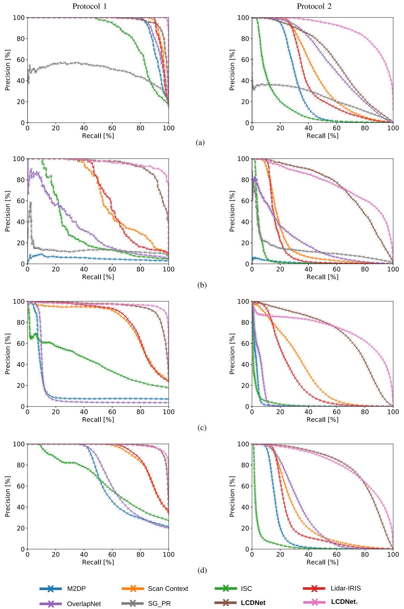  
Fig. 4. Comparison of loop closure detection precision–recall curves on (a) and (b) KITTI and (c) and (d) on KITTI-360 datasets evaluated using both protocols. Our proposed $\bar { \mathrm { L C D N e t } } _ { \dagger }$ achieves the best performance in all the experiments, followed by our LCDNet as the second best method. The improvement over previous state-of-the-art approaches is even more prominent when dealing with reverse direction loops, as observed in (b).

TABLE II  
COMPARISON WITH THE STATE OF THE ART IN TERMS OF THE AVERAGE PRECISION EVALUATED ON THE KITTI AND KITTI-360 DATASETS
<table><tr><td rowspan="3" colspan="2">Method</td><td colspan="4">Protocol 1</td><td colspan="4"></td></tr><tr><td colspan="2">KITTI</td><td colspan="2">KITTI-360</td><td colspan="2">KITTI</td><td colspan="2">KITTI-360</td></tr><tr><td>00</td><td>08</td><td>02</td><td>09</td><td>00</td><td>08</td><td>02</td><td>09</td></tr><tr><td rowspan="4">Hanted</td><td>M2DP [9]</td><td>0.93</td><td>0.05</td><td>0.15</td><td>0.66</td><td>0.31</td><td>0.01</td><td>0.03</td><td>0.17</td></tr><tr><td>Scan Context [10]</td><td>0.96</td><td>0.65</td><td>0.81</td><td>0.90</td><td>0.47</td><td>0.21</td><td>0.32</td><td>0.31</td></tr><tr><td>ISC [55]</td><td>0.83</td><td>0.31</td><td>0.41</td><td>0.65</td><td>0.14</td><td>0.05</td><td>0.03</td><td>0.04</td></tr><tr><td>LiDAR-Iris [33]</td><td>0.96</td><td>0.64</td><td>0.83</td><td>0.91</td><td>0.42</td><td>0.17</td><td>0.25</td><td>0.26</td></tr><tr><td rowspan="4">-NNN- base</td><td>OverlapNet [13]</td><td>0.95</td><td>0.32</td><td>0.14</td><td>0.70</td><td>0.60</td><td>0.20</td><td>0.05</td><td>0.33</td></tr><tr><td>SG_PR [14]</td><td>0.49</td><td>0.13</td><td></td><td></td><td>0.23</td><td>0.13</td><td></td><td></td></tr><tr><td>LCDNet</td><td>0.97</td><td>0.94</td><td>0.95</td><td>0.98</td><td>0.62</td><td>0.73</td><td>0.69</td><td>0.79</td></tr><tr><td> $\mathbf { L C D N e t } _ { \dagger }$ </td><td>0.998</td><td>0.96</td><td>0.97</td><td>0.99</td><td>0.89</td><td>0.76</td><td>0.73</td><td>0.80</td></tr></table>

## D. Evaluation of Relative Pose Estimation

In this section, we evaluate the relative pose estimation between two point clouds. Our proposed LCDNet provides a full 6-DoF transformation under driving conditions between two point clouds. However, scan-context, ISC, LiDAR-Iris, and OverlapNet only provide an estimation of the yaw angle. As M2DP and SG\_PR do not provide any information about the relative pose, we do not include them in the results presented in this section. Moreover, we compare our approach with state-of-theart handcrafted methods for point cloud registration: ICP [16] using point-to-point and point-to-plane distances, RANSAC with fast point feature histograms (FPFH) features [37], and fast global registration (FGR) [39], all implemented in the Open3D library [57], and TEASER++ [56] using the official implementation. We also compare with DNN-based methods RPM-Net [21], DCP [23], and product of cross-attention matrices (PCAM) [22]. To provide a fair comparison, we trained all the latter DNNbased approaches on the same data, following the same protocol, and using the same number of keypoints used to train our LCDNet. Following [58], for the aforementioned handcrafted methods, we first downsample the point clouds using a voxel size of 0.3 m, while the latter DNN-based methods and our LCDNet perform point cloud registration using 4096 sampled points, which is a much sparser representation. Scan-context, LiDAR-Iris, ISC, and OverlapNet, on the other hand, operate on spherical projections ofthe points, and, thus, they process almost all the points in the original cloud. We evaluate two versions of our method. The first one, denoted as LCDNet(fast), leverages the output of the UOT-based relative position head to estimate the transformation. In the second version, denoted as LCDNet, we replace the UOT-based head with a RANSAC estimator, as described in Section III-C. The models trained on KITTI-360 are denoted as LCDNet<sub>†</sub> (fast) and $L C D N e t _ { \dagger }$ , respectively. We also evaluate the performance of LCDNet followed by a further ICP registration. We report the latter evaluation only as a reference to show the best alignment achievable. Finally, we further investigate whether TEASER++ is a better pose estimator by replacing RANSAC in LCDNet.

We evaluate all the methods in terms of success rate (percentage of successfully aligned pairs), translation error (TE), and rotation error (RE) averaged over successful pairs as well as over all the positive pairs. We consider two pairs to be aligned successfully if the final TE is below $5 ^ { \circ }$ and 2 m, respectively. The results on the KITTI and KITTI-360 datasets are reported in Tables III and IV. We observe that LiDAR-Iris achieves the best performance among the handcrafted methods and PCAM demonstrates superior results compared to existing DNN-based approaches when dealing with same and reverse direction pairs. However, as opposed to the other methods, PCAM only performs point cloud registration and do not provide any information regarding loop closure detection. Whereas, our proposed LCDNet and $\mathrm { L C D N e t _ { \dagger } }$ achieve the highest success rates and lowest REs compared to all the methods, with a success rate of 100% in three out of four sequences. PCAM, on the other hand, achieves the lowest TEs in most sequences but is not robust to registration under partial overlap, as we discuss in Section IV-E. The fast versions of our method achieve results comparable with, and in some sequences even better than, existing approaches, while being much faster than most point cloud registration methods, as we discuss in Section IV-H. We observe that by replacing RANSAC in LCDNet and LCDNet with TEASER++, the success rates decrease and the TEs significantly increase, while the REs remain similar. During our experimental evaluations, we also observed that while the rotation and translation invariance obtained by our LCDNet primarily arise from our data augmentation scheme, many existing loop closure detection approaches (not reported in the comparison) did not converge at all when trained with the same scheme. Therefore, we argue that data augmentation by itself is not sufficient, and a well-designed architecture and loss function are necessary to achieve invariance.

## E. Partial Overlap

In this section, we evaluate the ability of LCDNet in detecting loops and regressing the relative pose between point clouds that only overlap partially. To do so, we follow the same evaluation protocol that we use in Section IV-C (protocol 1) and Section IV-D. We simulate partial overlapping pairs by removing a random section of each point cloud. We compare LCDNet against state-of-the-art approaches on the sequence 08 of the KITTI dataset under two settings: by removing a random 45<sup>◦</sup> and 90<sup>◦</sup> sector, respectively. Table V reports the results of this experiment in terms of AP, success rate, mean TE, and mean RE. Although the AP of LCDNet drops moderately when a 90<sup>◦</sup> section is removed, LCDNet<sub>†</sub> still achieves an AP higher than all the existing approaches evaluated on the complete overlap test (Table II). We observe that PCAM, which achieves remarkable results in the full overlap registration test, struggles when dealing with partial overlapping point clouds with a success rate that drops from 95% to 56%, a TE that increases from 0.41 to 3.32 m, and a RE that raises from $6 . 0 1 ^ { \circ }$ to 34.64<sup>◦</sup>. LCDNet and LCDNet<sub>†</sub>, on the other hand, retain an almost perfect success rate and slightly lower translation and REs.

COMPARISON OF RELATIVE POSE ERRORS (ROTATION AND TRANSLATION) BETWEEN POSITIVE PAIRS ON THE KITTI DATASET  
TABLE III
<table><tr><td rowspan="2" colspan="2">Approach</td><td colspan="3">Seq. 00</td><td colspan="3">Seq. 08</td></tr><tr><td>Success</td><td>TE [m] (succ. / all)</td><td>RE [deg] (succ. / all)</td><td>Success</td><td>TE [m] (succ. / all)</td><td>RE [deg] (succ. / all)</td></tr><tr><td rowspan="9">Hated</td><td>Scan Context* [10]</td><td>97.66%</td><td>- / -</td><td>1.34 /  1.92</td><td>98.21%</td><td>- 1 -</td><td>1.71 / 3.11</td></tr><tr><td>ISC* [55]</td><td>32.07%</td><td>- 1 -</td><td>1.39 / 2.13</td><td>81.28%</td><td>-1 -</td><td>2.07  / 6.27</td></tr><tr><td>LiDAR-Iris* [33]</td><td>98.83%</td><td>- / -</td><td>0.65  /  1.69</td><td>99.29%</td><td>- / -</td><td>0.93  /  1.84</td></tr><tr><td>ICP (P2p) [16]</td><td>35.57%</td><td>0.97  /  2.08</td><td>1.36 / 8.98</td><td>0%</td><td>- / 2.43</td><td>- / 160.46</td></tr><tr><td>ICP (P2pl) [16]</td><td>35.54%</td><td>1.00 / 2.11</td><td>1.39 / 8.99</td><td>0%</td><td>- / 2.44</td><td>- / 160.45</td></tr><tr><td>RANSAC [37]</td><td>33.95%</td><td>0.98 / 2.75</td><td>1.37 / 12.01</td><td>15.61%</td><td>1.33 / 4.57</td><td>1.79 / 37.31</td></tr><tr><td>FGR [39]</td><td>34.54%</td><td>0.98 /  5972.31</td><td>1.2 / 12.79</td><td>17.16%</td><td>1.32 / 35109.13</td><td>1.76 / 28.98</td></tr><tr><td>TEASER++ [56]</td><td>34.06%</td><td>0.98 /  2.72</td><td>1.33 / 15.85</td><td>17.13%</td><td>1.34 / 3.83</td><td>1.93 / 29.19</td></tr><tr><td>OverlapNet* [13]</td><td>83.86%</td><td>- / -</td><td>1.28 / 3.89</td><td>0.10%</td><td>- / -</td><td>2.03  /  65.45</td></tr><tr><td rowspan="4">DNN-bsed</td><td>RPMNet [21]</td><td>47.31%</td><td>1.05 / 2.07</td><td>0.60 /  1.88</td><td>27.80%</td><td>1.28 /  2.42</td><td>1.77 / 13.13</td></tr><tr><td>DCP [23]</td><td>50.71%</td><td>0.98 /  1.83</td><td>1.14 / 6.61</td><td>0%</td><td>- / 4.01</td><td>- / 161.24</td></tr><tr><td>PCAM [22]</td><td>99.68%</td><td>0.07  / 0.08</td><td>0.35 / 0.74</td><td>94.90%</td><td>0.19 / 0.41</td><td>0.51  / 6.01</td></tr><tr><td>LCDNet (fast)</td><td>93.03%</td><td>0.65 / 0.77</td><td>0.86 /  1.07</td><td>60.71%</td><td>1.02 / 1.62</td><td>1.65 / 3.13</td></tr><tr><td rowspan="4">Ous</td><td>LCDNet</td><td>100%</td><td>0.11 / 0.11</td><td>0.12 / 0.12</td><td>100%</td><td>0.15 / 0.15</td><td>0.34 / 0.34</td></tr><tr><td>LCDNet+ (fast)</td><td>99.79%</td><td>0.28 / 0.29</td><td>0.30 / 0.30</td><td>88.51%</td><td>0.66 / 0.93</td><td>1.00 / 1.31</td></tr><tr><td>LCDNet</td><td>100%</td><td>0.14 / 0.14</td><td>0.14 / 0.14</td><td>100%</td><td>0.18 /  0.18</td><td>0.36 / 0.36</td></tr><tr><td>LCDNet + ICP</td><td>100%</td><td>0.04 / 0.04</td><td>0.09 / 0.09</td><td>100%</td><td>0.09 / 0.09</td><td>0.33 / 0.33</td></tr><tr><td rowspan="4"></td><td>LCDNet4 + ICP</td><td>100%</td><td>0.04 / 0.04</td><td>0.08 /  0.08</td><td>100%</td><td>0.07  / 0.07</td><td>0.32 / 0.32</td></tr><tr><td>LCDNet + TEASER</td><td>94.39%</td><td>0.66 /  0.77</td><td>0.09 / 0.10</td><td>71.99%</td><td>1.05 /  1.62</td><td>0.33 / 0.35</td></tr><tr><td>LCDNet+ + TEASER</td><td>99.78%</td><td>0.28 / 0.29</td><td>0.09 / 0.09</td><td>89.39%</td><td>0.67 / 0.93</td><td>0.33 / 0.34</td></tr><tr><td></td><td></td><td></td><td></td><td></td><td></td><td></td></tr></table>

<sup>∗</sup>These approaches only estimate the rotation between two point clouds and, therefore, are not directly comparable with the other approaches which estimate the full 6-DoF transformation under driving conditions.

TABLE IV  
COMPARISON OF RELATIVE POSE ERRORS (ROTATION AND TRANSLATION) BETWEEN POSITIVE PAIRS ON THE KITTI-360 DATASET
<table><tr><td rowspan="2" colspan="2">Approach</td><td colspan="3">Seq. 02</td><td colspan="3">Seq. 09</td></tr><tr><td>Success</td><td>TE [m] (succ. / all)</td><td>RE [deg] (succ. / all)</td><td>Success</td><td>TE [m] (succ. / all)</td><td>RE [deg] (succ. / all)</td></tr><tr><td rowspan="9">Hanited</td><td>Scan Context* [10]</td><td>92.31%</td><td>- 1 -</td><td>1.60 / 5.49</td><td>95.25%</td><td>- 1 -</td><td>1.40 / 6.80</td></tr><tr><td>ISC* [55]</td><td>83.15%</td><td>- 1 -</td><td>1.71 /  3.44</td><td>86.26%</td><td>- / -</td><td>1.51  / 7.08</td></tr><tr><td>LiDAR-Iris* [33]</td><td>96.54%</td><td>- / -</td><td>1.07  /  2.24</td><td>97.63%</td><td>- / -</td><td>0.72 /  3.80</td></tr><tr><td>ICP (P2p) [16]</td><td>4.19%</td><td>1.10 / 2.26</td><td>1.74 /  149.76</td><td>21.24%</td><td>1.06 / 2.22</td><td>1.34 / 66.34</td></tr><tr><td>ICP (P2pl) [16]</td><td>4.19%</td><td>1.11 / 2.30</td><td>1.18 /  149.39</td><td>21.29%</td><td>1.07  / 2.24</td><td>1.38 / 66.23</td></tr><tr><td>RANSAC [37]</td><td>24.78%</td><td>1.24 / 3.67</td><td>1.83 / 32.22</td><td>29.69%</td><td>1.12 / 3.14</td><td>1.48 /  23.42</td></tr><tr><td>FGR [39]</td><td>27.92%</td><td>1.23 / 6758.87</td><td>1.85 /  18.16</td><td>30.46%</td><td>1.12 / 6011.39</td><td>1.44 /  17.35</td></tr><tr><td>TEASER++ [56]</td><td>27.02%</td><td>1.25 / 3.16</td><td>1.83 /  19.16</td><td>30.32%</td><td>1.14 / 2.91</td><td>1.46 /  19.22</td></tr><tr><td>OverlapNet* [13]</td><td>11.42%</td><td>- / -</td><td>1.79 / 76.74</td><td>54.33%</td><td>- / -</td><td>1.38 / 33.62</td></tr><tr><td rowspan="3">DN-bsed</td><td>RPMNet [21]</td><td>37.99%</td><td>1.18 / 2.26</td><td>1.30 / 5.97</td><td>41.42%</td><td>1.13 / 2.21</td><td>1.02 / 3.95</td></tr><tr><td>DCP [23]</td><td>5.62%</td><td>1.09 / 3.14</td><td>1.36 /  149.27</td><td>30.10%</td><td>1.04 /  2.30</td><td>1.06 / 64.86</td></tr><tr><td>PCAM [22]</td><td>97.46%</td><td>0.20 / 0.30</td><td>0.75 /  1.36</td><td>99.78%</td><td>0.12 / 0.13</td><td>0.51  /  0.64</td></tr><tr><td rowspan="5">OUurs</td><td>LCDNet (fast)</td><td>83.92%</td><td>0.84 /  1.10</td><td>1.28 /  1.67</td><td>89.49%</td><td>0.76 /  0.94</td><td>0.99 / 1.19</td></tr><tr><td>LCDNet</td><td>98.62%</td><td>0.28 /  0.32</td><td>0.32 / 0.35</td><td>100%</td><td>0.18 / 0.18</td><td>0.20 / 0.20</td></tr><tr><td>LCDNet÷ (fast)</td><td>89.07%</td><td>0.40  /  0.45</td><td>0.57  / 0.62</td><td>98.87%</td><td>0.43 / 0.44</td><td>0.59  /  0.63</td></tr><tr><td>LCDNet÷</td><td>98.55%</td><td>0.27 / 0.32</td><td>0.32 / 0.34</td><td>100%</td><td>0.20 / 0.20</td><td>0.22 / 0.22</td></tr><tr><td>LCDNet + ICP</td><td>98.51%</td><td>0.20 / 0.25</td><td>0.24 / 0.27</td><td>100%</td><td>0.10 / 0.10</td><td>0.15 / 0.15</td></tr><tr><td></td><td>LCDNet÷ + ICP</td><td>98.51%</td><td>0.20 / 0.25</td><td>0.24 / 0.27</td><td>100%</td><td>0.11 / 0.11</td><td>0.15 / 0.15</td></tr><tr><td></td><td>LCDNet + TEASER</td><td>86.63%</td><td>0.85 / 1.10</td><td>0.40 / 0.52</td><td>90.57%</td><td>0.76 /  0.94</td><td>0.22 / 0.25</td></tr><tr><td></td><td>LCDNet+ + TEASER</td><td>98.06%</td><td>0.40 /  0.45</td><td>0.37  /  0.45</td><td>99.10%</td><td>0.43 /  0.44</td><td>0.22 / 0.23</td></tr></table>

<sup>∗</sup>These approaches only estimate the rotation between two point clouds and, therefore, are not directly comparable with the other approaches that estimate the full 6-DoF transformation under driving conditions.

TABLE V  
COMPARISON OF LOOP CLOSURE DETECTION (AP) AND RELATIVE POSE ERRORS (ROTATION AND TRANSLATION) UNDER PARTIAL OVERLAP ON THE SEQUENCE 08 OF THE KITTI DATASET
<table><tr><td rowspan="2" colspan="2">Approach</td><td colspan="4"> $4 5 ^ { \circ }$ </td><td colspan="4">90°</td></tr><tr><td>AP</td><td>Success</td><td>TE [m] (all)</td><td>RE [deg] (all)</td><td>AP</td><td>Success</td><td>TE [m] (all)</td><td>RE [deg] (all)</td></tr><tr><td rowspan="9">Hanted</td><td>Scan Context* [10]</td><td>0.52</td><td>27.33%</td><td></td><td>57.70</td><td>0.40</td><td>17.40%</td><td></td><td>72.05</td></tr><tr><td>LiDAR-Iris* [33]</td><td>0.43</td><td>97.84%</td><td></td><td>2.78</td><td>0.22</td><td>96.28%</td><td></td><td>5.13</td></tr><tr><td>ICP (P2p) [16]</td><td></td><td>0%</td><td>2.42</td><td>160.46</td><td></td><td>0%</td><td>2.42</td><td>160.46</td></tr><tr><td>ICP (P2pl) [16]</td><td></td><td>0%</td><td>2.45</td><td>160.46</td><td></td><td>0%</td><td>2.45</td><td>160.42</td></tr><tr><td>RANSAC [37]</td><td></td><td>15.51%</td><td>4.88</td><td>43.77</td><td></td><td>13.78%</td><td>5.50</td><td>48.74</td></tr><tr><td>FGR [39]</td><td></td><td>16.55%</td><td>44439.37</td><td>30.30</td><td></td><td>14.49%</td><td>235332.54</td><td>34.20</td></tr><tr><td>TEASER++ [56]</td><td></td><td>16.42%</td><td>4.03</td><td>30.32</td><td></td><td>15.98%</td><td>4.37</td><td>34.99</td></tr><tr><td>OverlapNet* [13]</td><td>0.09</td><td>1.11%</td><td></td><td>70.69</td><td>0.01</td><td>0.68%</td><td></td><td>85.68</td></tr><tr><td>PCAM [22]</td><td></td><td>84.67%</td><td>1.04</td><td>11.80</td><td></td><td>55.62%</td><td>3.32</td><td>34.64</td></tr><tr><td rowspan="2">Ous</td><td>LCDNet</td><td>0.79</td><td>100%</td><td>0.20</td><td>0.38</td><td>0.59</td><td>99.93%</td><td>0.24</td><td>0.46</td></tr><tr><td>LCDNet÷</td><td>0.83</td><td>100%</td><td>0.19</td><td>0.36</td><td>0.70</td><td>100%</td><td>0.21</td><td>0.37</td></tr></table>

<sup>∗</sup>These approaches only estimate the rotation between two point clouds and, therefore, are not directly comparable with the other approaches that estimate the full 6-DoF transformation under driving conditions.

We also investigated the MulRan dataset [59] for this experiment, as the LiDAR mounted on their vehicle is obstructed by the radar sensor for approximately $7 0 ^ { \circ }$ rear FOV. Therefore, in reverse direction scenarios, the scans share only a very limited overlap. In preliminary evaluations, all the considered approaches failed in detecting reverse loops. We argue that this is a limitation of all scan-to-scan methods and that scan-to-map approaches should be considered in these scenarios.

## F. Ablation Studies

In this section, we present ablation studies on the different architectural components of our proposed LCDNet. All the models presented in this section are trained on the KITTI dataset and evaluated on the sequence 08 using the AP, mean RE, and mean TE metrics. We choose sequence 08 as the validation set since it is the most challenging sequence, containing only reverse direction loops. Since RANSAC does not influence the training of the network, in this section the rotation and TEs are computed using the LCDNet(fast) version.

We first compare our feature extractor built upon PV-RCNN presented in Section III-A with three different backbones: the widely adopted feature extractor PointNet [34], the dynamic graph CNN EdgeConv [35], and the recent state-of-the-art semantic segmentation network RandLA-Net [60]. We modified all backbones in order to output a feature vector of size D 640 for N <sub>=</sub> 4096 points, similar to our backbone. We report results in Table VI. The ability of our feature extractor presented in Section III-A to combine high-level features from the 3-D voxel DNN with fine-grained details provided by the PointNet-based

TABLE VI  
ABLATION STUDY ON THE BACKBONE NETWORK ARCHITECTURE
<table><tr><td>Backbone</td><td>AP</td><td>TE [m]</td><td>RE [deg]</td></tr><tr><td>PointNet [34]</td><td>0.67</td><td>5.15</td><td>34.14</td></tr><tr><td>EdgeConv [35]</td><td>0.52</td><td>5.44</td><td>16.85</td></tr><tr><td>RandLA-Net [60]</td><td>0.55</td><td>3.55</td><td>20.08</td></tr><tr><td>PVRCNN [41]</td><td>0.94</td><td>1.62</td><td>3.13</td></tr></table>

VSA layer is demonstrated by the superior performance compared to other backbones, outperforming them in every metric by a large margin. Our backbone built upon PV-RCNN achieves an AP of 0.94 compared to 0.67 achieved by the second best backbone. For relative pose estimation, PV-RCNN achieves a mean RE of 3.13<sup>◦</sup> and a mean TE of 1.62 m compared to 16.85<sup>◦</sup> achieved by EdgeConv and 3.55 m achieved by RandLA-Net.

In Table VII, we present ablation studies on the architecture of the relative pose head, the dimensionality of the extracted point features, the effect of the auxiliary OT loss presented in (15), and the number of keypoints. We first compare our UOT-based relative pose head presented in Section III-C with an MLP that directly regresses the rotation and translation, similar to [12]. In particular, we train three models using different rotation representations. The first model, MLP(sin-cos), uses two parameters to represent the rotation: the sine and cosine of the yaw angle. MLP(quat) represents the rotation as unit quaternions, and MLP(bingham) uses the Bingham representation proposed in [61]. From the first set of rows in Table VII, we observe that our proposed relative pose head significantly outperforms the MLP-based heads, especially in the rotation estimation. Our proposed relative pose head achieves a mean RE of $3 . 1 3 ^ { \circ }$ compared to $2 1 . 0 5 ^ { \circ }$ achieved by the best MLP model. Moreover, the UOT-based head favors keypoint features that are rotation and translation invariant, thus enabling the backbone to learn more discriminative features, consequently also improving the loop closure detection performance. The MLP-based heads, on the other hand, require rotation specific features in order to predict the transformation, which hinders the performance of the place recognition head, which can be observed from the lower AP achieved by these models.

TABLE VII  
ABLATION STUDY ON THE DIFFERENT ARCHITECTURAL COMPONENTS OF OUR LCDNET EVALUATED ON SEQUENCE 08 OF THE KITTI DATASET
<table><tr><td>Relative Pose Head</td><td>Feature Size D</td><td>Auxiliary Loss</td><td>Num Keypoints</td><td>AP</td><td>TE [m]</td><td>RE [deg]</td></tr><tr><td>UOT MLP (sin-cos) MLP (quat) MLP (bingham)</td><td>640</td><td>√</td><td>4096</td><td>0.94 0.75 0.78 0.75</td><td>1.62 2.14 2.43 2.27</td><td>3.13 21.05 35.16 22.69</td></tr><tr><td>UOT</td><td>640 128 64 32</td><td>√</td><td>4096</td><td>0.94 0.92 0.92</td><td>1.62 1.85 1.99</td><td>3.13 3.19 3.33</td></tr><tr><td>UOT</td><td>640</td><td>√ x</td><td>4096</td><td>0.86 0.94 0.83</td><td>2.23 1.62 6.00</td><td>4.09 3.13 4.71</td></tr><tr><td>UOT</td><td>640</td><td>√</td><td>8192 4096 2048 1024 512</td><td>0.94 0.94 0.85 0.69 0.50</td><td>1.28 1.62 4.68 5.17 4.79</td><td>1.99 3.13 3.73 4.75 4.85</td></tr></table>

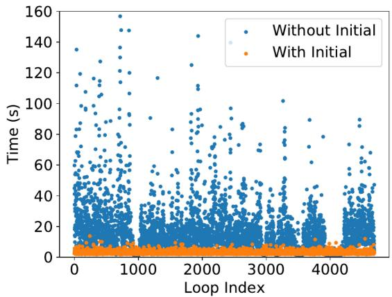

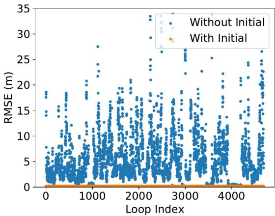  
Fig. 5. Comparison of time (left) and RMSE (right) between ICP without initial guess and ICP with the LCDNet prediction as the initial guess on the sequence 02 of the KITTI-360 dataset. Results on other sequences show similar behavior and are, thus, not reported for brevity. The initial guess provided by our LCDNet significantly reduces both runtime and final error on sequences containing reverse loops.

Subsequently, we study the influence of the dimensionality of point features on the performance of our approach. We train four models by varying dimensionality D as 640, 128, 64, and 32. From the results shown in the second set of rows in Table VII, we observe that the performances decrease with lowering the dimensionality D.

We evaluate the performance ofLCDNet without the auxiliary loss presented in (15). From the results shown in the third set of rows of Table VII, we observe that when training without the OT loss, the performance in terms of AP and relative transformation decreases significantly. This demonstrates that the auxiliary OT loss enables the network to learn more distinctive features, which benefits the performance of both loop closure detection and relative transformation estimation.

Finally, in the last set of rows of Table VII, we compare the performance of LCDNet to changes in the number of selected keypoints N. Predictably, the performances increase with adding more keypoints. However, the AP does not improve when increasing the number of keypoints to 8192. Therefore, due to the higher memory and computation required, we use 4096 keypoints in our final model.

## G. ICP With Initial Guess

In this experiment, we evaluate the performance of employing LCDNet as an initial guess for further refinement using ICP. We compare the runtime and the final root mean square error (RMSE) of ICP without any initial guess and ICP with LCDNet relative pose estimate as an initial guess. The time of ICP with initial guess also includes the network inference time. Results from this experiment are presented in Fig. 5 and two qualitative results are shown in Fig. 6. While only dealing with the same direction loops, ICP achieves satisfactory results and the initial guess does not improve the performance significantly. However, when reverse loops are present, ICP often fails in accurately registering the two point clouds. In this case, the initial guess from our LCDNet greatly reduces both the runtime and final errors of ICP as observed in Fig. 5.

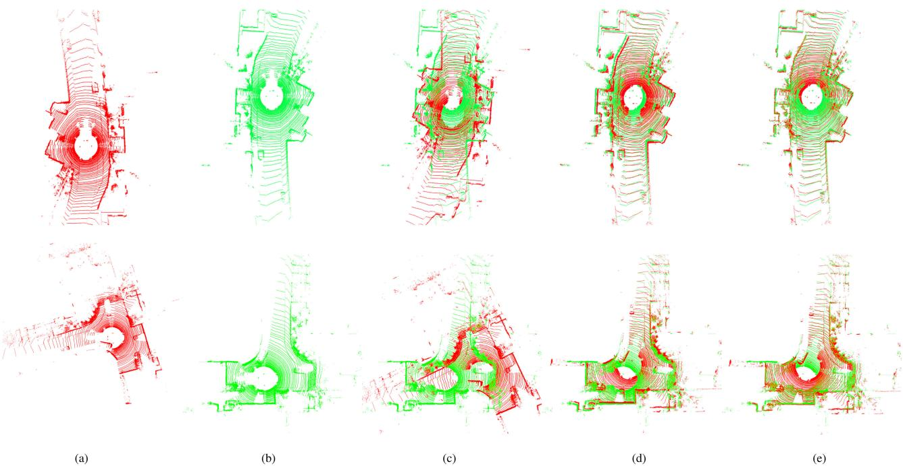  
Fig. 6. Qualitative comparison of ICP alignment with and without using the LCDNet prediction as an initial guess. ICP alone (c) is not able to register the (a) source and the (b) target when the initial rotation misalignment is high. Whereas, our LCDNet effectively aligns them (d). The final ICP alignment with the prediction of our LCDNet as the initial guess further improve the results (e).

TABLE VIII  
COMPARISON OF RUNTIME ANALYSIS FOR THE LOOP CLOSURE TASK
<table><tr><td>Method</td><td>Descriptor Extraction [ms]</td><td>Pairwise Comparison [ms]</td><td>Map Querying [ms]</td><td>GPU Required</td></tr><tr><td>M2DP [9]</td><td>169.28</td><td>0.01</td><td>5</td><td>x</td></tr><tr><td>SC [10]</td><td>3.66</td><td>0.11</td><td>2000</td><td>x</td></tr><tr><td>SC-50 [10]</td><td>3.66</td><td>0.11</td><td>6.96</td><td>x</td></tr><tr><td>ISC [55]</td><td>1.97</td><td>0.53</td><td>9000</td><td>x</td></tr><tr><td>LiDAR-Iris [33]</td><td>8.13</td><td>5.39</td><td>98000</td><td>x</td></tr><tr><td>OverlapNet [13]</td><td>16.00</td><td>6.00</td><td>109000</td><td>√</td></tr><tr><td>LCDNet</td><td>94.60</td><td>0.01</td><td>5</td><td>√</td></tr></table>

From Fig. 6, we see that ICP fails when the rotation misalignment between the two point clouds is significant. On the other hand, LCDNet accurately aligns these two point clouds and it improves the results even further while using ICP with LCDNet prediction as initial guess. On average, ICP with LCDNet initial guess is four times faster than ICP without any initial guess and achieves an RMSE which is 22 times lower. Note that in the results presented in Fig. 5, we use the whole point clouds to perform the registration with ICP.

TABLE IX  
COMPARISON OF RUNTIME ANALYSIS FOR THE POINT CLOUD REGISTRATION TASK
<table><tr><td>Method</td><td>Descriptor Extract. [ms]</td><td>Pairwise Reg. [ms]</td><td>Total [ms]</td><td>GPU</td></tr><tr><td>SC [10]</td><td>3.66</td><td>0.11</td><td>7.43</td><td>x</td></tr><tr><td>ISC [55]</td><td>1.97</td><td>0.53</td><td>4.47</td><td>x</td></tr><tr><td>Hated LiDAR-Iris [33]</td><td>8.13</td><td>5.39</td><td>21.65</td><td>x</td></tr><tr><td>ICP (P2p) [16]</td><td></td><td>25.53</td><td>25.53</td><td>x</td></tr><tr><td>ICP (P2pl) [16]</td><td>8.16</td><td>35.83</td><td>52.15</td><td>x</td></tr><tr><td>RANSAC [37]</td><td>24.99</td><td>299.66</td><td>349.64</td><td>x</td></tr><tr><td>FGR [39]</td><td>24.99</td><td>188.74</td><td>238.72</td><td>x</td></tr><tr><td>TEASER++ [56]</td><td>24.99</td><td>94.89</td><td>144.87</td><td>x</td></tr><tr><td>OverlapNet [13] DN-bsed</td><td>16.00</td><td>6.00</td><td>38.00</td><td>√</td></tr><tr><td>RPMNet [21]</td><td>366.75</td><td>121.29</td><td>854.79</td><td>√</td></tr><tr><td>DCP [23]</td><td>19.56</td><td>78.76</td><td>117.88</td><td>√</td></tr><tr><td>PCAM [22]</td><td>187.71</td><td>80.77</td><td>456.18</td><td>√</td></tr><tr><td>Ous</td><td>LCDNet (fast)</td><td>4.70</td><td>193.9</td><td>√</td></tr><tr><td>LCDNet</td><td>94.60 94.60</td><td>1135</td><td>1324.2</td><td>√</td></tr></table>

TABLE X

COMPARISON WITH THE STATE OF THE ART ON DATA FROM THE GENERALIZATION EXPERIMENTS IN FREIBURG
<table><tr><td>Method</td><td>AP</td></tr><tr><td>M2DP [9]</td><td>0.60</td></tr><tr><td>Scan Context [10]</td><td>0.74</td></tr><tr><td>Hated ISC [55]</td><td>0.38</td></tr><tr><td>LiDAR-Iris [33]</td><td>0.73</td></tr><tr><td></td><td>OverlapNet [13] 0.59</td></tr><tr><td>DN- base LCDNet</td><td>0.79</td></tr><tr><td>LCDNet</td><td>0.88</td></tr></table>

LCDNet  
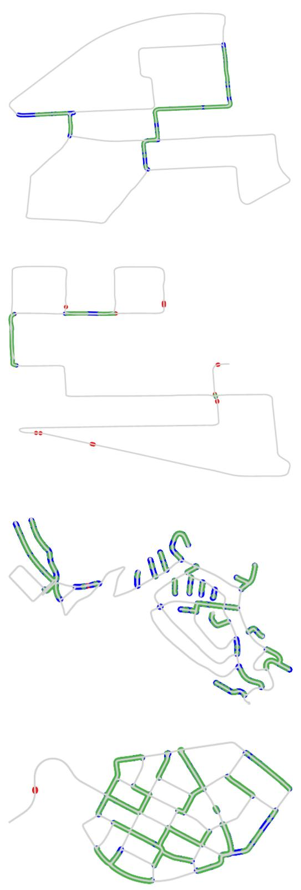  
(a)  
(b)  
(c)

LCDNet†  
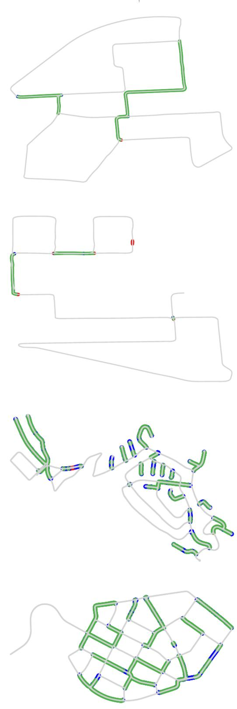  
Fig. 7. Qualitative loop closure detection results of LCDNet on (a) and (b) KITTI and (c) and (d) KITTI-360 datasets. Green points are true positive detections, red points are false positive, and blue points are false negative. The left column shows results of LCDNet trained on the KITTI dataset, while the right column shows results of LCDNet trained on the KITTI-360 dataset. While both LCDNet and LCDNet effectively detects loops in all the sequences, LCDNet further reduces the number of false positive and false negative detections.  
(d)

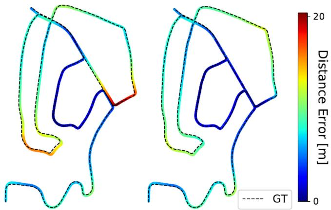  
Fig. 8. Performance of LIO-SAM with the original loop closure detection method (left) compared to our approach (right) on sequence 02 of the KITTI dataset.

## H. Runtime Analysis

In this section, we compare the runtime of LCDNet with existing state-of-the-art approaches for loop detection. All experiments were performed on a system with an Intel i7-6850 K CPU and an NVIDIA GTX 1080 ti GPU. We use the official implementation of existing approaches as described in Sections IV-C and IV-D. Results from this experiment are presented in Table VIII in which the descriptor extraction time also includes the preprocessing required by the respective method. The pairwise comparison represents the time required to compare the descriptors of two point clouds. In the map querying column, we report the time for comparing the descriptor of one scan with that of all the previous scans in the KITTI-360 sequence 02, which amounts to 18 235 comparisons in total. For methods that do not require an ad hoc function to compare descriptors (LCDNet and M2DP), we use the efficient FAISS library [62] for similarity search in order to build and query the map. Scan-context also introduces the ring key descriptors which enable fast search for finding loop candidates, at the expense of detection performances. We also report the runtime of scan-context using the ring key, denoted as Scan Context-50. However, it is important to note that the results reported in Section IV-C were computed without the ring key.

As shown in Table VIII, the methods that require an ad hoc comparison function (ISC, LiDAR-Iris, and OverlapNet) are not suited for real-time applications since they require up to 100 s to perform a single query. Whereas, LCDNet queries more than 18 000 scans in 5 ms. Although it is possible to further reduce the time required to query the map when integrating the loop closure approaches in a SLAM system, such as using the covariancebased radius search [13], in this experiment, we evaluate the runtime in the case where no prior information about the current pose is available.

We report the runtime for aligning two point clouds by LCDNet and existing approaches in Table IX. For methods that perform both loop closure and point cloud alignment (SC, ISC, LiDAR-IRIS, OverlapNet, and LCDNet), the descriptor extraction time is shared between the two tasks. While LCDNet (fast) is faster than most DNN-based approaches for point cloud registration (RPM-Net and PCAM), LCDNet is slightly slower than RPM-Net. On the other hand, some approaches are much faster than both LCDNet and LCDNet (fast); however, they either only estimate a 1-DoF transformation (SC, ISC, and LiDAR-Iris) or achieve unsatisfactory performances (ICP, RANSAC, FGR, TEASER++, and DCP). It is important to note that the point cloud registration task does not need to run in real time since it is only required after a loop closure is detected. Moreover, LCDNet is the only method that performs both loop closure detection and 6-DoF point cloud registration under driving conditions.

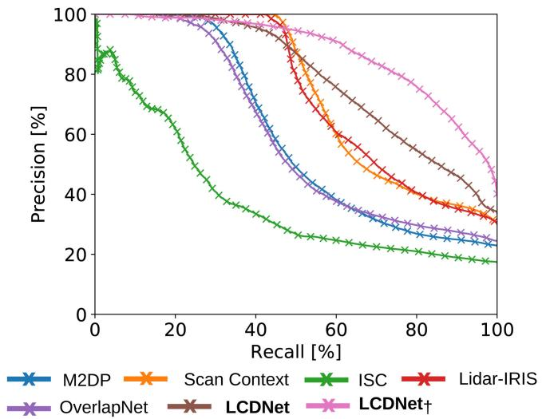  
Fig. 9. Comparison of precision–recall curves evaluated using protocol 1 on data from the generalization experiments in Freiburg.

## I. Qualitative Results

We present the qualitative results from LCDNet and LCDNet<sub>†</sub> on sequences from both the KITTI and KITTI-360 datasets in Fig. 7. We show the true positive, false positive, and false negative scans overlaid with the respective groundtruth trajectories. We observe that while LCDNet effectively detects same direction and reverse direction loops, it also fails to detect some loops (false negative) and detects some loops where there should be no loops (false positive). LCDNet further improves the performance by reducing the number of false positives and false negatives, while still maintaining accurate true positive detections. On the KITTI sequence 08, LCDNet yields some false negative detections that are almost completely eliminated by LCDNet<sub>†</sub>, although few false positive scans are still detected. On sequence 02 of the KITTI-360 dataset, LCDNet presents a large amount of false negatives which are significantly reduced by LCDNet<sub>†</sub>. Similarly, on the KITTI-360 sequence 09, LCDNet presents a few false positive detections that are completely eliminated by LCDNet<sub>†</sub>.

## J. Evaluation ofComplete SLAM System

We integrate our proposed approach into LIO-SAM [26], which is a recent state-of-the-art LiDAR SLAM system, by replacing its loop closure detection pipeline with LCDNet.

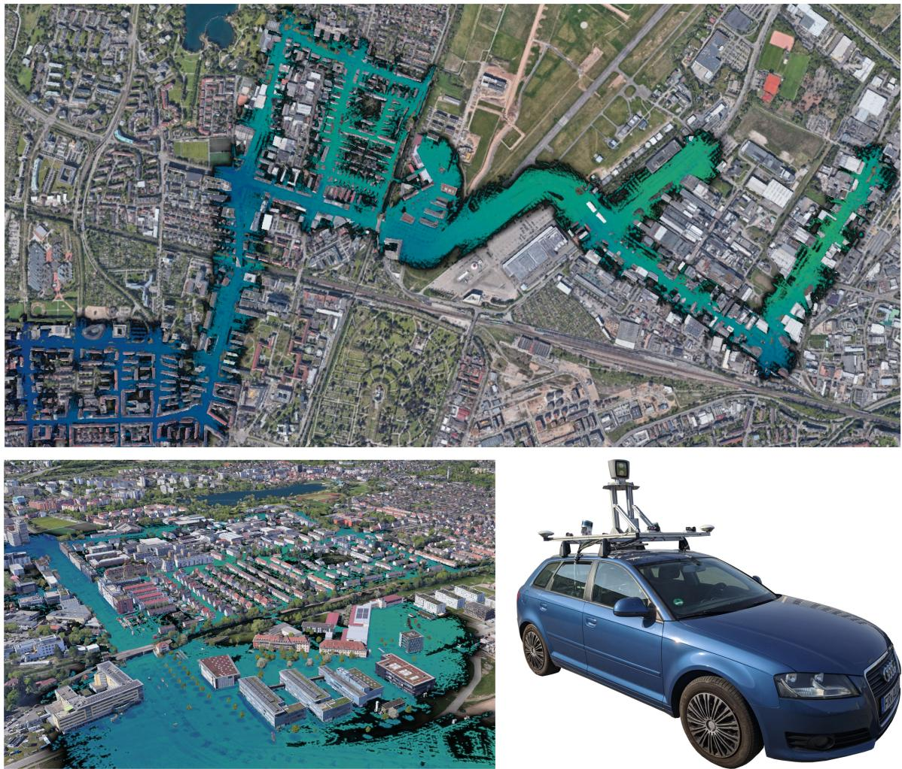  
Fig. 10. Qualitative results of our approach on data from the generalization experiments in Freiburg. The final map generated from LIO-SAM integrated with our LCDNet is overlaid on the georeferenced aerial images. Image on the top shows the entire map, while the images in the bottom show zoomed-in segments and the car used to collect the dataset. The color of the point cloud is based on the Z-coordinates of the points from lowest (blue) to highest (green).

We evaluate the entire SLAM system on the sequence 02 of the KITTI dataset. In particular, we evaluate LIO-SAM integrated with LCDNet and we compare it with the original LIO-SAM. We observed that our approach detects loop closures where the original LIO-SAM fails to do so due to the presence of the accumulated drift. In Fig. 8, we report the results obtained with both SLAM systems and show the distance error between LIO-SAM keyframes and groundtruth poses. We can observe that the high error (red) associated with the path of the original LIO-SAM is caused by the failed loop closure detection since the system drifts significantly along the z-dimension. Conversely, LCDNet detects such loops, performs the closure, and improves the overall performance of LIO-SAM.

We publicly release the integrated LIO-SAM system with our LCDNet at http://rl.uni-freiburg.de/research/lidar-slam-lc.

## K. Generalization Analysis

Finally, in this section, we evaluate the generalization ability of our proposed LCDNet by analyzing the performance in unseen environments and on different robot platforms. We evaluate both LCDNet and LCDNet<sub>†</sub> in real-world experiments in Freiburg using a car with a rack of LiDAR sensors mounted on the roof as shown in Fig. 10 (bottom right). Note that in these experiments, we do not retrain or fine-tune LCDNet and LCDNet on any data from Freiburg. The KITTI and KITTI-360 datasets on which we trained our models on were primarily recorded in narrow roads, but the streets of Freiburg also include dual carriageways; therefore, we increase the range at which two scans are considered to be a real loop from 4 to 10 m. In Fig. 9, we compare the precision–recall curves of our approach with handcrafted and DNN-based methods using protocol 1 (Section IV-C). We do not report results using protocol 2 for this experiment as there are more than 400 million positive pairs in this trajectory.

As shown in Table X, scan-context achieves the best performance among the handcrafted methods, with an AP of 0.74. Nevertheless, our LCDNet and LCDNet<sub>†</sub> outperform all the other approaches achieving an AP of 0.79 and 0.88, respectively. Since the data from Freiburg consists of many reverse loops, existing approaches often fail to detect them, leading to a decrease in their performance. Our approach demonstrates exceptional performance even though it has never seen scans from Freiburg during training. Moreover, we employ our modified version of LIO-SAM to generate the trajectory and the map of the experimental runs in Freiburg. In Fig. 10, we show the resulting map overlaid on the aerial image. The results show that the map is well-aligned with the aerial image and there is no evidence of any drift. This demonstrates that our LCDNet effectively corrects the accumulated drift. It is important to note that the precision–recall curve and the AP of our LCDNet are computed based only on the global descriptor extracted by the place recognition head. However, in the modified SLAM system, we additionally perform a consistency check (Section III-E) based on the transformation predicted by the relative pose head which further discard the remaining false positive detections.

TABLE XI  
COMPARISON OF RELATIVE POSE ERRORS (ROTATION AND TRANSLATION) BETWEEN POSITIVE PAIRS ON THE FREIBURG DATASET
<table><tr><td>Approach</td><td>Success</td><td>TE [m] (succ. / all)</td><td>RE [deg] (succ. / all)</td></tr><tr><td>Scan Context [10]</td><td>59.30%</td><td>- / -</td><td>1.36 / 52.70</td></tr><tr><td>ISC [55]</td><td>55.51%</td><td>- / -</td><td>1.52 / 51.02</td></tr><tr><td>Hated LiDAR-Iris [33]</td><td>69.95%</td><td> $\mathrm { ~ - ~ } / \mathrm { ~ - ~ }$ </td><td>1.52 / 51.02</td></tr><tr><td>ICP (P2p) [16]</td><td>29.06%</td><td> $0 . 8 3 \mathrm { ~ / ~ } 2 . 6 0$ </td><td>1.21 / 89.79</td></tr><tr><td>ICP (P2pl) [16]</td><td>28.73%</td><td> $0 . 8 8 \mathrm { ~ / ~ } 2 . 6 2$ </td><td>1.22 / 89.83</td></tr><tr><td>RANSAC [37]</td><td>29.96%</td><td>1.01  / 3.54</td><td>1.34 / 31.29</td></tr><tr><td>FGR [39]</td><td>27.72%</td><td> $0 . 9 7 \ / \ 3 1 3 2 5 8$ </td><td>1.27  /  13.46</td></tr><tr><td>TEASER++ [56]</td><td>29.49%</td><td>0.99 /  3.37</td><td>1.31 / 11.94</td></tr><tr><td>DN-bsed</td><td>OverlapNet [13]</td><td>42.79% - / -</td><td>1.31  / 70.91</td></tr><tr><td>RPMNet [21] DCP [23]</td><td>32.05%</td><td>0.87  /  2.57</td><td>1.09 / 46.99</td></tr><tr><td></td><td>12.25%</td><td>1.26 / 5.22</td><td>1.19 / 87.04</td></tr><tr><td>PCAM [22]</td><td>92.49%</td><td>0.40 /  0.67</td><td>0.50 / 4.28</td></tr><tr><td>Ous LCDNet  $\mathrm { L C D N e t } _ { \dagger }$ </td><td>98.94%</td><td>0.39 / 0.42</td><td>0.32 / 0.37</td></tr><tr><td></td><td>99.81%</td><td>0.28 / 0.28</td><td>0.18 / 0.18</td></tr><tr><td> $\mathrm { L C D N e t } + \mathrm { I C P }$ </td><td>99.79%</td><td>0.22 / 0.23</td><td>0.16 / 0.16</td></tr><tr><td> $\mathrm { L C D N e t _ { \dagger } } + \mathrm { I C P }$ </td><td>99.86%</td><td>0.21  / 0.22</td><td>0.14 /  0.14</td></tr><tr><td> $\mathrm { L C D N e t + T E A S E R }$ </td><td>33.61%</td><td>1.09 /  3.74</td><td> $0 . 1 7 ~ / ~ 0 . 4 2$ </td></tr><tr><td> $\mathrm { L C D N e t _ { \vec { \tau } } + T E A S E R }$ </td><td>33.37%</td><td>1.15 / 4.45</td><td> $0 . 1 3 / \ : 0 . 2 7$ </td></tr></table>

Finally, we also exploit the Freiburg dataset to demonstrate the point cloud alignment ability of our approach in new environments. Since we do not have an accurate pose for each LiDAR frame, we generate groundtruth transformations using the GPS poses and ICP and discarding pairs that produce an inaccurate alignment. First, for each frame, we identify possible pairs by considering its neighbors within a distance of 10 m. In order to avoid the pairs that are composed of consecutive frames, given a point cloud, we discard the previous and the following $n = 1 0 0$ frames. Second, for each pair, we compute the yaw angle difference $\Delta _ { \mathrm { y a w } }$ and define three difficulty levels. Then, for each frame, we select a random pair for every category whenever possible. We set the maximum number of ICP iterations $n _ { \mathrm { i c p } } = 1 0 0 0$ , and we only consider pairs with a fitness score fit $> = 0 . 6$ and an inlier correspondences rmse $< = 0 . 3  { \mathrm { m } }$ Finally, we randomly sample the resulting pairs to have about the same number of same direction and reverse direction loops. The resulting number of pairs amounts to 4246, of which 2106 are reverse loops.

The results reported in Table XI show that our LCDNet effectively generalizes to new environments for the point cloud registration task. LCDNet and $\mathrm { L C D N e t _ { \dagger } }$ achieve a success rate of 98.94% and 99.81%, respectively, compared to the second best method that achieves 92.49%. The overall mean TE of $\mathrm { L C D N e t _ { \dagger } }$ is more than two times smaller, and the RE is an order of magnitude lower than PCAM.

## V. CONCLUSION

In this article, we presented the novel LCDNet architecture for loop closure detection and point cloud registration. LCDNet is composed of a shared feature extractor built upon the PV-RCNN network, a place recognition head that captures discriminative global descriptors, and a novel differentiable relative pose head based on the UOT theory which effectively aligns two point clouds without any prior information regarding their initial misalignment. We identified a discrepancy in the evaluation protocols of existing methods; therefore, we performed uniform evaluations ofstate-of-the-art handcrafted as well as DNN-based loop closure detection methods.

We presented extensive evaluations of LCDNet on the KITTI odometry and KITTI-360 datasets, which demonstrates that our approach sets the new state-of-the-art and successfully detects loops even in challenging conditions such as reverse direction loops, where existing methods fail. Our LCDNet<sub>†</sub> achieves an $\mathbf { A P }$ of 0.96 on the sequence 08 of the KITTI dataset which contains only reverse direction loops, compared to 0.65 AP of the previous state-of-the-art method. Our proposed relative pose head demonstrates impressive results, outperforming existing approaches for point clouds registration and loop closure detection as well as different heads based on the standard MLPs. Our LCDNet aligns opposite direction point clouds with an average RE of 0.34<sup>◦</sup> and 0.15 m for the translation components, compared to $1 . 8 4 ^ { \circ }$ and 0.41 m achieved by LiDAR-IRIS and PCAM, respectively. Moreover, LCDNet is robust to partial overlapping point cloud, retaining a 100% success rate when removing a $9 0 ^ { \circ }$ sector from each point cloud, while the second best method drops from 95% to 55%. We also showed that the relative pose prediction from our approach can further be refined using ICP for accurate registration. We integrated our LCDNet with LIO-SAM to provide a complete SLAM system which can detect loops even in the presence of strong drift. Additionally, we demonstrated the generalization ability of our approach by evaluating it on the data from experiments using a different robotic platform and in an unseen city from that which was used for training. Finally, we made the code and the SLAM system publicly available to encourage research in this direction.

## ACKNOWLEDGMENT

The authors would like to thank Johan Vertens for his assistance in the data collection.

## REFERENCES

[1] D. Cattaneo, D. G. Sorrenti, and A. Valada, “CMRNet++: Map and camera agnostic monocular visual localization in LiDAR maps,” in Proc. Int. Conf. Robot. Automat. Workshop Emerg. Learn. Algorithmic Methods Data Assoc. Robot., 2020.

[2] M. Mittal, R. Mohan, W. Burgard, and A. Valada, “Vision-based autonomous UAV navigation and landing for urban search and rescue,” in Proc. Int. Symp. Robot. Res., 2019, pp. 575–592.

[3] N. F. Tanke et al., “Automation of hydroponic installations using a robot with position based visual feedback,” in Proc. Int. Conf. Agricultural Eng. CIGR-Ageng, 2012, Art. no. C1429.

[4] A. Valada, P. Velagapudi, B. Kannan, C. Tomaszewski, G. Kantor, and P. Scerri, “Development of a low cost multi-robot autonomous marine surface platform,” in Proc. Field Serv. Robot., 2014, pp. 643–658.

[5] R. Mur-Artal, J. M. M. Montiel, and J. D. Tardós, “ORB-SLAM: A versatile and accurate monocular SLAM system,” IEEE Trans. Robot., vol. 31, no. 5, pp. 1147–1163, Oct. 2015.

[6] M. Cummins and P. Newman, “Fab-map: Probabilistic localization and mapping in the space of appearance,” Int. J. Robot. Res., vol. 27, no. 6, pp. 647–665, 2008.

[7] B. Steder, M. Ruhnke, S. Grzonka, and W. Burgard, “Place recognition in 3D scans using a combination of bag of words and point feature based relative pose estimation,” in Proc. Int. Conf. Intell. Robots Syst., 2011, pp. 1249–1255.

[8] M. Bosse and R. Zlot, “Place recognition using keypoint voting in large 3D LiDAR datasets,” in Proc. Int. Conf. Robot. Automat., 2013, pp. 2677–2684.

[9] L. He, X. Wang, and H. Zhang, “M2DP: A novel 3D point cloud descriptor and its application in loop closure detection,” in Proc. Int. Conf. Intell. Robots Syst., 2016, pp. 231–237.

[10] G. Kim, S. Choi, and A. Kim, “Scan context++: Structural place recognition robust to rotation and lateral variations in urban environments,” IEEE Trans. Robot., to be published, doi: 10.1109/TRO.2021.3116424.

[11] M. A. Uy and G. Hee Lee, “PointNetVLAD: Deep point cloud based retrieval for large-scale place recognition,” in Proc. IEEE Conf. Comput. Vis. Pattern Recognit., 2018, pp. 4470–4479.

[12] L. Schaupp, M. Bürki, R. Dubé, R. Siegwart, and C. Cadena, “Oreos: Oriented recognition of 3D point clouds in outdoor scenarios,” in Proc. Int. Conf. Intell. Robots Syst., 2019, pp. 3255–3261.

[13] X. Chen, T. Läbe, A. Milioto, T. Röhling, J. Behley, and C. Stachniss, “OverlapNet: A siamese network for computing LiDAR scan similarity with applications to loop closing and localization,” Auton. Robots, vol. 46, pp. 61–81, 2021.

[14] X. Kong et al., “Semantic graph based place recognition for 3D point clouds,” in Proc. Int. Conf. Intell. Robots Syst., 2020, pp. 8216–8223.

[15] Y. Zhu, Y. Ma, L. Chen, C. Liu, M. Ye, and L. Li, “Gosmatch: Graphof-semantics matching for detecting loop closures in 3D LiDAR data,” in Proc. Int. Conf. Intell. Robots Syst., 2020, pp. 5151–5157.

[16] Z. Zhang, “Iterative point matching for registration of free-form curves and surfaces,” Int. J. Comput. Vis., vol. 13, no. 2, pp. 119–152, 1994.

[17] A. Segal, D. Haehnel, and S. Thrun, “Generalized-ICP,” Robot.: Sci. Syst., vol. 2, no. 4, p. 435, 2009. [Online]. Available: http://www. roboticsproceedings.org/rss05/p21.html

[18] J. Yang, H. Li, D. Campbell, and Y. Jia, “Go-ICP: A globally optimal solution to 3D ICP point-set registration,” IEEE Trans. PatternAnal. Mach. Intell., vol. 38, no. 11, pp. 2241–2254, Nov. 2016.

[19] G. Agamennoni, S. Fontana, R. Y. Siegwart, and D. G. Sorrenti, “Point clouds registration with probabilistic data association,” in Proc. Int. Conf. Intell. Robots Syst., 2016, pp. 4092–4098.

[20] Y. Aoki, H. Goforth, R. A. Srivatsan, and S. Lucey, “PointNetLK: Robust & efficient point cloud registration using PointNet,” in Proc. IEEE Conf. Comput. Vis. Pattern Recognit., 2019, pp. 7156–7165.

[21] Z. J. Yew and G. H. Lee, “RPM-Net: Robust point matching using learned features,” in Proc. IEEE Conf. Comput. Vis. Pattern Recognit., 2020, pp. 11824–11833.

[22] A.-Q. Cao, G. Puy, A. Boulch, and R. Marlet, “PCAM: Product of crossattention matrices for rigid registration of point clouds,” in Proc. Int. Conf. Comput. Vis., 2021, pp. 13229–13238.

[23] Y. Wang and J. M. Solomon, “Deep closest point: Learning representations for point cloud registration,” in Proc. Int. Conf. Comput. Vis., 2019, pp. 3523–3532.

[24] A. Geiger, P. Lenz, and R. Urtasun, “Are we ready for autonomous driving? The Kitti vision benchmark suite,” in Proc. IEEE Conf. Comput. Vis. Pattern Recognit., 2012, pp. 3354–3361.

[25] J. Xie, M. Kiefel, M.-T. Sun, and A. Geiger, “Semantic instance annotation of street scenes by 3D to 2D label transfer,” in Proc. IEEE Conf. Comput. Vis. Pattern Recognit., 2016, pp. 3688–3697.

[26] T. Shan, B. Englot, D. Meyers, W. Wang, C. Ratti, and R. Daniela, “LIO-SAM: Tightly-coupled LiDAR inertial odometry via smoothing and mapping,” in Proc. Int. Conf. Intell. Robots Syst., 2020, pp. 5135–5142.

[27] R. Arandjelovic, P. Gronat, A. Torii, T. Pajdla, and J. Sivic, “NetVLAD: CNN architecture for weakly supervised place recognition,” in Proc. IEEE Conf. Comput. Vis. Pattern Recognit., 2016, pp. 5297–5307.

[28] X. Zhang, Y. Su, and X. Zhu, “Loop closure detection for visual slam systems using convolutional neural network,” in Proc. Int. Conf. Automat. Comput., 2017, pp. 1–6.

[29] Q. Liu and F. Duan, “Loop closure detection using CNN words,” Intell. Serv. Robot., vol. 12, no. 4, pp. 303–318, 2019.

[30] J. Knopp, M. Prasad, G. Willems, R. Timofte, and L. Van Gool, “Hough transform and 3D surf for robust three dimensional classification,” in Proc. Eur. Conf. Comput. Vis., 2010, pp. 589–602.

[31] Y. Zhong, “Intrinsic shape signatures: A shape descriptor for 3D object recognition,” in Proc. Int. Conf. Comput. Vis. Workshops, 2009, pp. 689–696.

[32] S. Siva, Z. Nahman, and H. Zhang, “Voxel-based representation learning for place recognition based on 3D point clouds,” in Proc. Int. Conf. Intell. Robots Syst., 2020, pp. 8351–8357.

[33] Y. Wang, Z. Sun, J. Yang, and H. Kong, “LiDAR IRIS for loop-closure detection,” in Proc. Int. Conf. Intell. Robots Syst., 2020, pp. 5769–5775.

[34] C. R. Qi, H. Su, K. Mo, and L. J. Guibas, “PointNet: Deep learning on point sets for 3D classification and segmentation,” in Proc. IEEE Conf. Comput. Vis. Pattern Recognit., 2017, pp. 652–660.

[35] Y. Wang, Y. Sun, Z. Liu, S. E. Sarma, M. M. Bronstein, and J. M. Solomon, “Dynamic graph CNN for learning on point clouds,” ACM Trans. Graph., vol. 38, no. 5, pp. 1–12, 2019.

[36] T. Bailey, E. M. Nebot, J. K. Rosenblatt, and H. F. Durrant-Whyte, “Data association for mobile robot navigation: A graph theoretic approach,” in Proc. Int. Conf. Robot. Automat., 2000, pp. 2512–2517.

[37] R. B. Rusu, N. Blodow, and M. Beetz, “Fast point feature histograms (FPFH) for 3D registration,” in Proc. Int. Conf. Robot. Automat., 2009, pp. 3212–3217.

[38] M. A. Fischler and R. C. Bolles, “Random sample consensus: A paradigm for model fitting with applications to image analysis and automated cartography,” Commun. ACM, vol. 24, no. 6, pp. 381–395, 1981.

[39] Q.-Y. Zhou, J. Park, and V. Koltun, “Fast global registration,” in Proc. Eur. Conf. Comput. Vis., B. Leibe, J. Matas, N. Sebe, and M. Welling, Eds. Cham, Switzerland: Springer, 2016, pp. 766–782.

[40] B. D. Lucas and T. Kanade, “An iterative image registration technique with an application to stereo vision,” in Proc. Int. Joint Conf. Artif. Intell., 1981, pp. 674–679.

[41] S. Shi et al., “PV-RCNN: Point-Voxel feature set abstraction for 3D object detection,” in Proc. IEEE Conf. Comput. Vis. Pattern Recognit., 2020, pp. 10529–10538.

[42] T. F. Gonzalez, “Clustering to minimize the maximum intercluster distance,” Theor. Comput. Sci., vol. 38, pp. 293–306, 1985.

[43] C. R. Qi, L. Yi, H. Su, and L. J. Guibas, “PointNet++: Deep hierarchical feature learning on point sets in a metric space,” in Proc. Adv. Neural Inf. Process. Syst., 2017, pp. 5099–5108.

[44] H. Jégou, M. Douze, C. Schmid, and P. Pérez, “Aggregating local descriptors into a compact image representation,” in Proc. IEEE Conf. Comput. Vis. Pattern Recognit., 2010, pp. 3304–3311.

[45] A. Miech, I. Laptev, and J. Sivic, “Learnable pooling with context gating for video classification,” 2017, arXiv:1706.06905.

[46] R. Sinkhorn, “A relationship between arbitrary positive matrices and doubly stochastic matrices,” Ann. Math. Statist., vol. 35, no. 2, pp. 876–879, 1964.

[47] P.-E. Sarlin, D. DeTone, T. Malisiewicz, and A. Rabinovich, “SuperGlue: Learning feature matching with graph neural networks,” in Proc. IEEE Conf. Comput. Vis. Pattern Recognit., 2020, pp. 4937–4946.

[48] G. Puy, A. Boulch, and R. Marlet, “FLOT: Scene flow on point clouds guided by optimal transport,” in Proc. Eur. Conf. Comput. Vis., 2020, pp. 527–544.

[49] M. Eisenberger, A. Toker, L. Leal-Taixé, and D. Cremers, “Deep shells: Unsupervised shape correspondence with optimal transport,” in Proc. Adv. Neural Inf. Process. Syst., vol. 33, 2020, pp. 10491–10502.

[50] N. Kolkin, J. Salavon, and G. Shakhnarovich, “Style transfer by relaxed optimal transport and self-similarity,” in Proc. IEEE Conf. Comput. Vis. Pattern Recognit., 2019, pp. 10043–10052.

[51] K. Fatras, T. Séjourné, R. Flamary, and N. Courty, “Unbalanced minibatch optimal transport; applications to domain adaptation,” in Proc. Int. Conf. Mach. Learn., 2021, pp. 3186–3197.

[52] L. Chizat, G. Peyré, B. Schmitzer, and F.-X. Vialard, “Scaling algorithms for unbalanced optimal transport problems,” Math. Comput., vol. 87, no. 314, pp. 2563–2609, 2018.

[53] F. Schroff, D. Kalenichenko, and J. Philbin, “FaceNet: A unified embedding for face recognition and clustering,” in Proc. IEEE Conf. Comput. Vis. Pattern Recognit., 2015, pp. 815–823.

[54] J. Behley et al., “SemanticKITTI: A dataset for semantic scene understanding of LiDAR sequences,” in Proc. Int. Conf. Comput. Vis., 2019, pp. 9297–9307.

[55] H. Wang, C. Wang, and L. Xie, “Intensity scan context: Coding intensity and geometry relations for loop closure detection,” in Proc. Int. Conf. Robot. Automat., 2020, pp. 2095–2101.

[56] H. Yang, J. Shi, and L. Carlone, “TEASER: Fast and certifiable point cloud registration,” IEEE Trans. Robot., vol. 37, no. 2, pp. 314–333, Apr. 2021.

[57] Q.-Y. Zhou, J. Park, and V. Koltun, “Open3D: A modern library for 3D data processing,” 2018, arXiv:1801.09847.

[58] C. Choy, W. Dong, and V. Koltun, “Deep global registration,” in Proc. IEEE Conf. Comput. Vis. Pattern Recognit., 2020, pp. 2511–2520.

[59] G. Kim, Y. S. Park, Y. Cho, J. Jeong, and A. Kim, “MulRan: Multimodal range dataset for urban place recognition,” in Proc. Int. Conf. Robot. Automat., 2020, pp. 6246–6253.

[60] Q. Hu et al., “RandLA-Net: Efficient semantic segmentation of large-scale point clouds,” in Proc. IEEE Conf. Comput. Vis. Pattern Recognit., 2020, pp. 11108–11117.

[61] V. Peretroukhin, M. Giamou, D. M. Rosen, W. N. Greene, N. Roy, and J. Kelly, “A smooth representation of SO(3) for deep rotation learning with uncertainty,” Robot.: Sci. Syst., 2020. [Online]. Available: http://www. roboticsproceedings.org/rss16/p007.html

[62] J. Johnson, M. Douze, and H. Jégou, “Billion-scale similarity search with GPUs,” IEEE Trans. Big Data, vol. 7, no. 3, pp. 535–547, Jul. 2021.

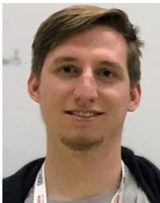  
Daniele Cattaneo received the M.S. and Ph.D. degrees in computer science from the University of Milano-Bicocca, Milan, Italy, in 2016 and 2020, respectively.

He is currently a Postdoctoral Researcher with the Robotic Learning Lab, University of Freiburg, Freiburg, Germany, headed by Abhinav Valada. His research interest includes deep learning for robotic perception and state estimation, with a focus on sensor fusion, cross-modal matching, and domain generalization.

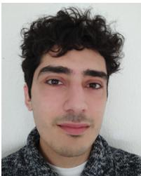  
learning, and robotics.


Matteo Vaghi received the B.S. and M.S. degrees in computer science in 2016 and 2019, respectively, from the University of Milano-Bicocca, Milan, Italy, where he is currently working toward the Ph.D. degree in Computer Science.

He was a junior Research Assistant with the IRALab Research Group, University of Milano-Bicocca in 2019 and 2020. His research focuses on the development of techniques for addressing the vehicle localization problem in urban areas. In particular, his main research topics are computer vision, deep

Abhinav Valada received the M.S. degree in robotics from Carnegie Mellon University, Pittsburgh, PA, USA, in 2013 and the Ph.D. degree in computer science from the University of Freiburg, Freiburg, Germany, in 2019.

He is currently an Assistant Professor and Director with the Robot Learning Lab, University of Freiburg. He is a Member of the Department of Computer Science, a Principal Investigator with the BrainLinks-BrainTools Center, and a Founding Faculty of the European Laboratory for Learning and Intelligent

Systems (ELLIS) unit, Freiburg, Germany. His research interests include the intersection of robotics, machine learning, and computer vision with a focus on tackling fundamental robot perception, state estimation, and control problems using learning approaches in order to enable robots to reliably operate in complex and diverse domains.

Dr. Valada is a Scholar of the ELLIS Society, a DFG Emmy Noether Fellow, and a Co-Chair of the IEEE RAS TC on Robot Learning.