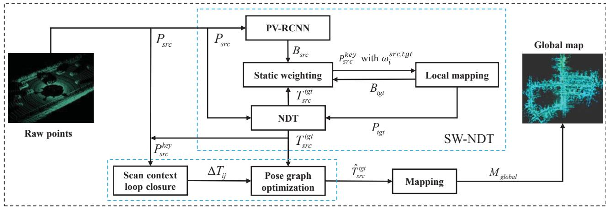
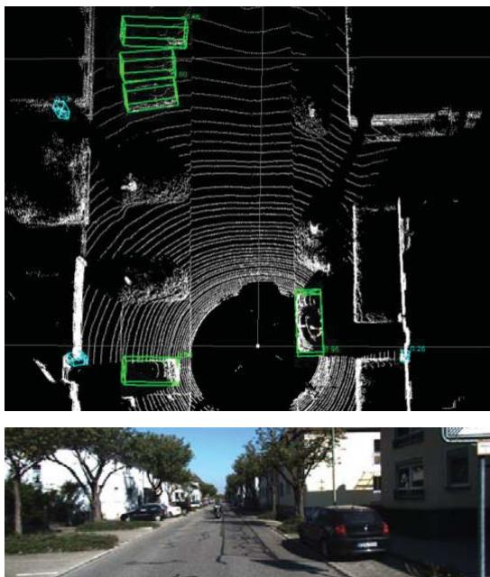
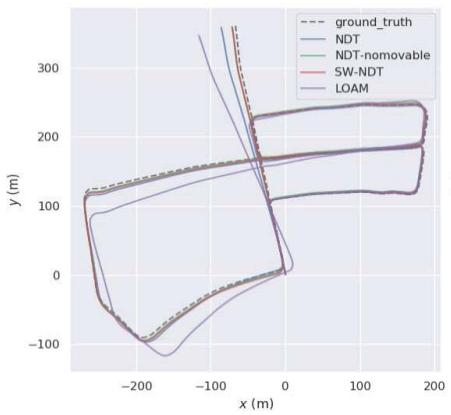
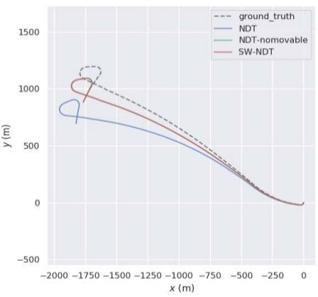
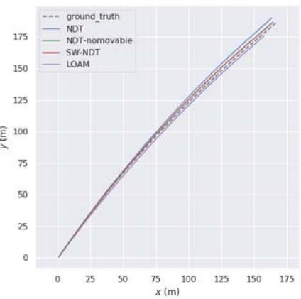
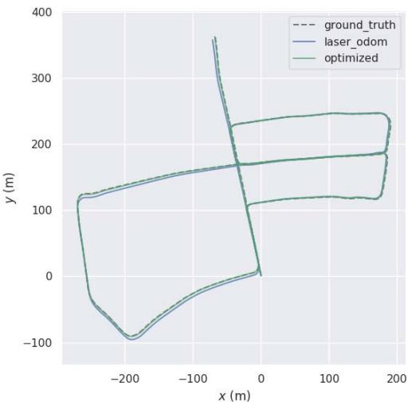
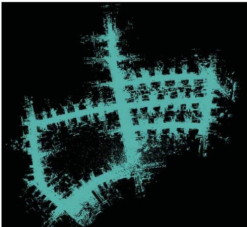
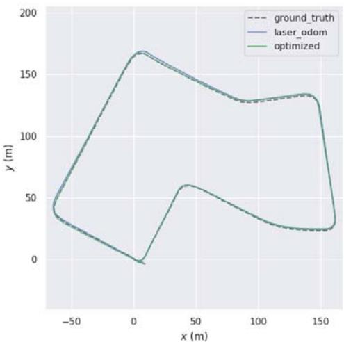
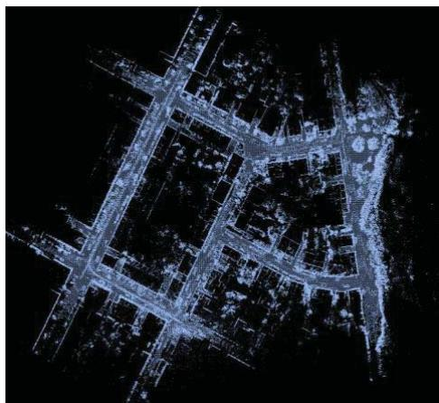

# Lidar-based Simultaneous Localization and Mapping in Dynamic Environments

Binbin Feng

Chunyun Fu

Lizhou Liao

College of Mechanical and Vehicle

College of Mechanical and Vehicle

College of Mechanical and Vehicle

Engineering

Engineering

Engineering

Chongqing University

Chongqing University

Chongqing, China

Chongqing University

Chongqing, China

fengbinbin@cqu.edu.cn

Chongqing, China

fuchunyun@cqu.edu.cn

liaolizhou@cqu.edu.cn

Yun Zhu

School of Computer Science

Shaanxi Normal University

Xi'an, China

yunzhu@snnu.edu.cn

Abstract—In this paper, we propose a method of simultaneous localization and mapping (SLAM) based on Lidar, which can improve the accuracy of vehicle pose estimation in a dynamic environment. This method is composed of three modules. The first module is a Lidar odometry with static weight, namely Static Weight Normal Distribution Transform (SW-NDT). Static weight describes the probability that a point cloud belongs to a static object. To reduce the adverse effects of point clouds generated by dynamic objects on pose estimation, static weights are added to Normal Distribution Transform (NDT). The second module is back-end optimization. Scan Context is applied to detect whether a closed loop is formed between the current and historical frames. If a closed loop is detected, pose graph optimization is performed to optimize the poses of all key frames in the closed loop. The third module joins point clouds of the key frames to form a global map according to the optimized poses. For validation of the method proposed in this paper, KITTI dataset is utilized. The results show that the method proposed herein outperforms the other three methods in positioning accuracy.

Keywords—Lidar SLAM, dynamic environment, static weight, Normal Distribution Transform

## I. INTRODUCTION

Simultaneous localization and mapping is an important feature of autonomous vehicles [1], and it is a prerequisite for path planning and control of the vehicles. In recent years, many SLAM methods based on vision [2] and Lidar [3] have been proposed in the literature. Compared with cameras, Lidar can provide more accurate depth information and is insensitive to lighting conditions.

Lidar SLAM estimates the pose of a vehicle through point cloud matching between consecutive frames, and simultaneously obtains the environmental information of the vehicle. In addition to point cloud matching, featurebased matching and multi-sensor fusion matching are also common methods used in matching between frames. For feature-based matching, LOAM [3] is a typical solution that extracts corner points with larger curvature and surface points with smaller curvature in a point cloud and then minimizes distances from the corner points to the line and from the surface points to the surface to realize pose estimation. W. S. Grant et al. [4] extracted planar features from a point cloud in a structured environment, and realized matching between frames by solving a least square problem. For direct point cloud matching, there are many approaches, including ICP [5] that estimates the relative pose by minimizing the distance from point to point, GICP [6] that estimates the relative pose by minimizing the distance from face to face, and NDT [7] that maximizes the probability density function to estimate relative transformation. For multi-sensor fusion matching, Lidar and IMU are mostly fused for matching between frames, and the fusion can be either loosely coupled fusion [8] and tightly coupled fusion [9]. Generally, use of fusion matching renders more accurate results than use of merely point cloud matching.

However, pose estimation between consecutive frames by using the above-mentioned methods is all based on the assumption that the running scene is a static environment or there are no moving objects in the running scene, which is unrealistic in practical applications [1]. Observation points on the moving objects will lead to erroneous data associations in the matching process between consecutive frames, and further make the pose estimation results largely deviated or non-convergent. In addition, presence of moving objects in the environment will cause missed and false detections in loop detection of SLAM.

In response to the above problems, we propose a Lidar SLAM method suitable for dynamic environments. Upon pose estimation by using this method, the motion state of surrounding objects is determined during operation of egovehicle to avoid interference of moving objects. For the purpose of this paper: (1) A lidar odometry method with static weight of point cloud called Static Weight Normal

  
Fig. 1. Pipeline of our 3D Lidar simultaneous localization and mapping system.

Distribution Transform (SW-NDT) is proposed on the basis of NDT [7]; (2) The loop detection algorithm [10] is used to optimize vehicle poses in the closed loop, then point clouds of multiple key frames are merged into a global map according to the optimized pose.

The rest of this paper is organized as follows: The second section introduces the SLAM method proposed in this article. The third section shows quantitative and qualitative evaluation of the method proposed herein based on KITTI dataset. The fourth section provides a summarization of this paper.

## II. LIDAR-BASED ODOMETRY AND MAPPING

## A. Overview

An overview of the proposed method is illustrated in Fig 1. Firstly, PV-RCNN [11] is used to detect objects $B _ { s r c }$ with possible movement from original point cloud $P _ { s r c } ,$ including vehicles, pedestrians and bicycles, among others. Secondly, the vehicle pose of the current frame $T _ { s r c } ^ { t g t }$ is calculated by SW-NDT in a frame-to-submap'way. The static weight $\omega _ { i } ^ { s r c , t g t }$ of each observation point on objects in the environment is calculated according to the vehicle pose of current frame to determine the probability of the point belonging to a static object. Key frame $\dot { P } _ { s r c } ^ { k e y }$ is introduced – the current frame is selected as the new key frame if the spatial distance between the current frame and the previous key frame is greater than the specified threshold. The key frame point cloud with static weights is added to the local. map $\setminus $ for registration of the next frame point cloud. The pose matching part with static weights is named as SW-NDT. Thirdly, Scan Context [10] is used to detect whether a closed loop has been formed based on the vehicle poses of multiple key frames and point cloud with static weights. If a closed loop is detected, pose graph optimization [12] is performed to optimize poses in the closed loop. Lastly, point clouds of all key frames are joined according to the optimized poses $\hat { T } _ { s r c } ^ { t g t }$ to form a global map $M _ { g l o b a l }$

  
Fig. 2. Use of PV-RCNN to detect the bounding boxes of objects with possible motion.

## B. Calculation of static weights

Observation point clouds in an environment include point clouds from static objects and point clouds from dynamic objects. Point clouds of two consecutive frames can be used to calculate the relative pose transformation of a vehicle. When the point cloud of the current frame is transformed to the coordinate system of the previous frame through the transformation matrix, point clouds of static objects such as buildings, road signs and trees in the scene can completely overlap, but those of dynamic objects cannot. The deviation of point clouds between frames in case of dynamic objects is used to define the static weight that measures the probability of an object being in the static state.

The static weights of a source point cloud can be estimated by comparing the source point cloud $P _ { s r c }$ and the target point cloud $P _ { t g t }$ . The static weight of the i-th point is expressed as $\omega _ { i } ^ { s r c , t g i ^ { s ^ { \prime } } }$ The source point cloud here is the current frame point cloud, and the target point cloud is a local map formed by joining point clouds of multiple previous key frames. PV-RCNN is used to detect objects that have possible motion in each frame, such as vehicles, pedestrians and bicycles. The i-th object can be represented by using a boundingboxexpressed as $\begin{array} { r } { b _ { i } = [ x , y , z , d x , d y , } \end{array}$ dz, heading], where the first three items locate the center point in the Lidar coordinate system of the current frame, the fourth to sixth items represent the size of the bounding box, and the last item indicates the orientation of the bounding box.

If all objects are rigid, then all observation points of each object have the same motion state. Based on this assumption, the entire motion state of the object can be characterized by the motion state of the bounding box center point. The static weight of the i-th bounding box center point in the current frame can be calculated according to the equation (1):

$$
\begin{array} { r } { \omega _ { i , b } ^ { s r c , t g t } = \left( \frac { \varsigma } { 1 2 } \right) ^ { d _ { i } } } \end{array}\tag{1}
$$

where $d _ { i } = \left\| T _ { s r c } ^ { t g t } b _ { i , s r c } ( 1 : 3 ) - b _ { i , t g t } ( 1 : 3 ) \right\|$ $T _ { s r c } ^ { t g t }$ is the pose of the current"frame, and $b _ { i , t g t }$ is the bounding box on the local map that corresponds to the bounding box of the current frame. $b _ { i , t g t }$ is also the bounding box that has the shortest cosine distance from $T _ { s r c } ^ { t g t } b _ { i , s r c }$ within a certain range on the local map. (1 : 3) means to take the first three elements of the vector. Static weight calculation of a point cloud is shown in Algorithm 1.

Algorithm 1: Static weighting for point cloud   
Input:   
- current frame point cloud $P _ { s r c }$   
- object bounding boxes in current frame $B _ { \it { s r c } }$   
- local map point cloud $P _ { t g t }$   
- object bounding boxes in local map $B _ { t g t }$   
- current frame transformation $T _ { s r c } ^ { t g t }$   
Output:   
- static weights $\omega _ { i } ^ { s r c , t g t }$ for $P _ { s r c }$   
1: for $b _ { i , s r c } \in B _ { s r c }$ do   
2: Transform $b _ { i , s r c }$ to the local map $T _ { s r c } ^ { t g t } b _ { i , s r c }$   
3: Perform nearest neighbor search to get set $B _ { i , t g t }$   
4: for $b _ { i , t g t } \in B _ { i , t g t }$ do   
5: Calculate distance between $T _ { s r c } ^ { t g t } b _ { i , s r c }$ and $b _ { i , t g t }$   
6: Get ${ b } _ { i , t g t } ^ { * }$ with the shortest distance   
7: end for   
8: Get Euclidean distance $d _ { i }$ between ${ b } _ { i , t g t } ^ { * }$ (1:3)   
and $T _ { s r c } ^ { t g t } b _ { i , s r c } ( 1 : 3 )$   
9: Estimate static weight $\omega _ { i , b } ^ { s r c , t g t }$ for $b _ { i , s r c }$   
10: end for   
11: for $p _ { i , s r c } \in P _ { s r c }$ do   
12: Assign $\omega _ { i , b } ^ { s r c , t g t }$ to all points in the box   
13: end for

## C. NDT with static weights

Normal Distribution Transform (NDT) [7] uses Lidar odometry for pose estimation and realizes inter-frame pose transformation by maximizing the probability density function. Compared with ICP methods [5, 6] that use geometric features to achieve registration, NDT has stronger robustness. Based on the conventional NDT, static weight is introduced and Static Weight Normal Distribution Transform (SW-NDT) is proposed in the present work to suppress the adverse effects of observation point clouds of dynamic objects.

The SW-NDT can be used to estimate the Lidar pose of the current frame $T _ { s r c } ^ { t g t }$ , with the point cloud of the current frame $P _ { s r c }$ as the source point cloud, and a local map with static weights $\left. P _ { t g t } , \omega ^ { s r c , t g t } \right.$ as the target point cloud. With reference to the conventional NDT [7], SW-NDT calculates the coordinate mean $\mu _ { k }$ and covariance matrix $\Sigma _ { k }$ of all points in each cell of the target point cloud. The mean static weight of all points in the cell is also calculated. The static weight of the i-th cell ω, can be expressed as:

$$
\omega _ { i } { = } \frac { 1 } { m } \sum _ { k = 1 } ^ { m } \omega _ { k } ^ { s r c , t g t }\tag{2}
$$

where $\left\{ \omega _ { k } ^ { s r c , t g t } , k = 1 , \cdots , m \right\}$ are the static weights of all the points in a cell. If a point in the current frame falls into a cell with a smaller static weight after being transformed according to the pose, then the point is deemed to have the tendency to move. The NDT algorithm [7] is used to maximize the product of the probability density functions of all the points in the current frame, so as to obtain the optimal pose. This expression can be described as follows [7]:

$$
T _ { s r c } ^ { t g t * } = \underset { T _ { s r c } ^ { t g t } } { \arg \operatorname* { m a x } } \prod _ { k = 1 } ^ { n } f \left( T _ { s r c } ^ { t g t } p _ { k } \right)\tag{3}
$$

where $T _ { s r c } ^ { t g t } \in S E ( 3 )$ is the Lidar pose of the current frame to be optimized, $T _ { s r c } ^ { t g t } p _ { k }$ means to transform the point $p _ { k }$ of the current frame to a point in the local map, $f ( \cdot )$ is a probability density function used to describe the probability distribution of points in the cell, and n is the number of points after down-sampling in the point cloud of the current frame. Considering outliers in the point cloud of current frame that will increase the error and addition of static weights, the problem of SW-NDT can be converted to a minimization problem as follows [7]:

$$
T _ { s r c } ^ { t g t * } = \underset { T _ { s r c } ^ { t g t } } { \mathrm { a r g m i n } } \sum _ { k = 1 } ^ { n } \omega _ { i } \tilde { f } \left( T _ { s r c } ^ { t g t } p _ { k } \right)\tag{4}
$$

with

$$
\widetilde { f } \left( T _ { s r c } ^ { t g t } p _ { k } \right) = d _ { 1 } \exp \left( - \frac { d _ { 2 } \left( T _ { s r c } ^ { t g t } p _ { k } - \mu _ { k } \right) ^ { T } \Sigma _ { k } ^ { - 1 } \left( T _ { s r c } ^ { t g t } p _ { k } - \mu _ { k } \right) } { 2 } \right)\tag{5}
$$

where $\omega _ { i }$ is the static weight of the cell where the transformed point $T _ { s r c } ^ { t g t } p _ { k }$ is located, $d _ { \mathrm { { 1 } } }$ and $d _ { 2 }$ are constants. Solution by using the above optimization method is consistent with the conventional NDT [7].

  
(a) Trajectories of dataset 0018

  
(b) Trajectories of dataset 0042

  
Fig. 3. Comparison between trajectories of SW-NDT and other methods using the KITTI dataset.  
(c) Trajectories of dataset 0004

Calculation of the front-end lidar odometry is shown in Algorithm 2. For inter-frame matching, key frame is introduced in the present work. The first frame of point cloud is taken as a key frame, with the static weights of all points in the point cloud set to 1 (namely all points in the environment are supposed to be static). When it comes to a frame that has the Manhattan distance to the previous key frame exceeding the threshold, this frame is selected as a new key frame. The first 20 key frames are transformed into the world coordinate system according to their corresponding poses to form a local map. When receiving a new frame of observation point cloud, SW-NDT calculates the Lidar pose of the current frame. The static weights of the objects detected by PV-RCNN are calculated according to the current pose. Then the pose of the current frame and the static weight of the point cloud are added to the local map for use in subsequent frame matching.

## D. Pose correction based on loop closure

Poses obtained by using Lidar odometry are subject to cumulative errors because the pose of a frame is estimated relative to the pose of previous frames. In order to reduce the cumulative error, in this work, the above-mentioned Lidar odometry is integrated into a pose graph-based SLAM system [12]. Pose constraints between consecutive frames in the pose graph come from the Lidar odometry that adds the relative pose constraints between two frames to the pose graph when a loop is detected.

In the present work, Scan Context [10] is applied for loop detection to determine whether the current frame has the same observation point cloud with the previous frame. If the point cloud of a frame is described as a matrix, then the similarity between point clouds of the two frames can be expressed as [10]:

$$
d ( I ^ { q } , I ^ { c } ) = \frac { 1 } { N _ { s } } \sum _ { j = 1 } ^ { N _ { s } } \left( 1 - \frac { c _ { j } ^ { q } \cdot c _ { j } ^ { c } } { \| c _ { j } ^ { q } \| \left\| c _ { j } ^ { c } \right\| } \right)\tag{6}
$$

where $I ^ { q }$ and $I ^ { c }$ represent the scan context of the current frame and the previous frame, $c _ { j } ^ { q }$ and $c _ { _ { j } } ^ { c }$ denote the j-th column of matrix $I ^ { q }$ and $I ^ { c }$ , and $ { N _ { s } } ^ { \prime }$ represents the number of columns in the matrix. For more details, interested readers are referred to Scan Context [10]

Algorithm 2 : Lidar odometry   
Input:   
- current frame point cloud $P _ { s r c }$   
- local map point cloud $P _ { t g t }$   
Output:   
- the pose of the current frame: $T _ { s r c } ^ { t g t }$   
1: Use PV-RCNN to get object bounding boxes $B _ { s r c }$   
2: if the first frame then   
3: Set the static weight of all points $\omega _ { i } ^ { s r c , t g t }$ to 1   
4: Fix the current frame pose as the origin   
5: Add $P _ { s r c }$ to $P _ { t g t }$ as a key frame $P _ { s r c } ^ { k e y }$   
6: else   
7: Set the static weight of all points $\omega _ { i } ^ { s r c , t g t }$ to 1   
8: for $b _ { i , s r c } \in B _ { s r c }$ do   
9: if $b _ { i , s r c } ^ { s c o r e } > 0 . 5$ then   
10: Extract the point cloud in $b _ { i , s r c }$   
11: end if   
12: end for   
13: Get $T _ { s r c } ^ { t g t }$ by SW-NDT   
14: if Manhattan distance between $T _ { s r c } ^ { t g t }$ and   
$T _ { l a s t } ^ { k e y } >$ 2m then   
15:Select $P _ { s r c }$ as the new key frame $P _ { s r c } ^ { k e y }$   
16: else Abandon $P _ { s r c }$   
17: end if   
18: Estimate $\omega _ { i } ^ { s r c , t g t }$ of $P _ { s r c }$ using algorithm 1   
19: Add $P _ { s r c }$ with $\omega _ { i } ^ { s r c , t g t }$ to $P _ { t g t }$   
20: if the size of $P _ { t g t } > 2 0$ then   
21:Abandon the previous key frame   
22: end if   
23: end if

If a loop is formed between the i-th frame and the j-th frame, SW-NDT is used to calculate the relative pose $\Delta T _ { i j }$ between these two frames to constrain poses of the remaining key frames in the closed loop. The logic of pose graph optimization is to minimize residual errors by adjusting states (poses). Residual errors are the difference between the relative poses obtained by Lidar odometry and the relative poses obtained by loop detection [10]. The Jacobian matrix of every residual error with respect to states is established, and the Gauss Newton method is used in G2O [13] to minimize the errors, so as to obtain the optimized poses. Lastly, the point cloud of each frame is transformed into the world coordinate system based on the optimized poses to generate a global map.

  
(a) Trajectories of dataset 0018

  
(b) Point cloud map of dataset 0018

  
(c) Trajectories of dataset 0027

  
(d) Point cloud map of dataset 0027  
Fig.4. Vehicle trajectories and global point cloud maps. The blue and green trajectories represent the results of SW-NDT and the results after back-end optimization, respectively. The global maps are on the right.

## III. EVALUATION OF EXPERIMENTAL RESULTS

The SW-NDT method proposed in this paper is verified based on the commonly used KITTI dataset [14], including four data subsets, i.e. 2011\_09\_30\_drive\_0018\_synced, 2011\_09\_30\_drive\_0027\_synced, 2011\_10\_03\_drive\_00- 42-\_synced, 2011\_09\_29\_drive\_0004\_synced (hereinafter referred to as 0018, 0027, 0042 and 0004 respectively). The SW-NDT is further compared with NDT without considering dynamic objects [7], NDT-nomovable with all potential dynamic objects removed and classic LOAM [3].

The results of comparison suggest that the SW-NDT outperforms the other methods in pose estimation and environment mapping of an autonomous vehicle in an outdoor environment with moving objects.

Besides, the absolute trajectory error (ATE) [15] between the pose estimated by the Lidar odometry and the ground truth is used to measure performance of the odometry. The ground truth required for the calculation comes from the inertial navigation information from the KITTI dataset.

## A. Odometry performance verification (no loop detection)

This section relates to verifying the proposed SW-NDT odometry without loop detection. Corresponding qualitative and quantitative analyses are shown in Fig. 3 and Table 1. The scene according to subsets 0018 and 0027 is a residential area with a large number of structured buildings and stationary vehicles, as well as some dynamic vehicles. It can be seen from Table 1 that compared to NDT and NDT-nomovable, the SW-NDT method proposed in this paper can achieve more accurate localization. The scene according to subset 0042 is a highway environment, where the ego vehicle and its surrounding vehicles are all running fast and bushes are the only feature along both sides of the highway, causing large errors to the matching algorithm. From Fig 3 and Table 1, it can be seen that localization with LOAM is impossible in this environment, while SW-NDT is the most accurate with the least ATE compared with NDT and NDT-nomovable. The scene according to subset 0004 is a road connecting urban and suburban areas, with bushes as the only feature along both sides. SW-NDT also works well in this scene. In all the above scenario where the existence of dynamic objects in the environment may cause erroneous data association between frames, the SW-NDT can achieve more accurate localization by reducing the impact of dynamic objects.

## B. Loop closure detection and optimization

This section relates to verifying the proposed SW-NDT odometry with loop detection and back-end optimization. Because there is no loop in the 0042 and 0004 subsets, so subsets 0018 and 0027 are used in this section. It can be seen from Tables 1 and 2 that all odometry methods achieve more accurate localization after back-end optimization, compared to using Lidar odometry only. According to Table 2, SW-NDT produces a lower error than other methods using 0027, but results in a slightly higher error using 0018. It can be known from the trajectory of SW-NDT before and after optimization and the generated point cloud map (shown in Fig. 4) that the localization error becomes smaller after optimization.

TABLE I. ACCURACY COMPARISION BETWEEN FOUR LIDAR ODOMETRY METHODS WITHOUT LOOP CLOSURE
<table><tr><td colspan="4">ATE (trans in m) RMSE</td></tr><tr><td>Datasets</td><td>0018 0027</td><td>0042</td><td>0004</td></tr><tr><td>NDT</td><td>3.98 1.13</td><td>36.45</td><td>0.40</td></tr><tr><td>NDT-nomovable</td><td>2.36 0.72</td><td>18.52</td><td>0.35</td></tr><tr><td>SW-NDT</td><td>2.01 0.67</td><td>18.14</td><td>0.35</td></tr><tr><td>LOAM</td><td>8.52 1.65</td><td>fail</td><td>1.26</td></tr></table>

The bold numbers indicate the best results among the four methods.

TABLE II. ACCURACY COMPARISION BETWEEN FOUR LIDAR ODOMETRY METHODS WITH BACK-END OPTIMIZATION
<table><tr><td colspan="2">ATE (trans in m) RMSE</td></tr><tr><td>Datasets</td><td>0018 0027</td></tr><tr><td>NDT</td><td>0.59 0.46</td></tr><tr><td>NDT-nomovable</td><td>0.57 0.42</td></tr><tr><td>SW-NDT</td><td>0.63 0.35</td></tr><tr><td>LOAM</td><td>0.63 0.54</td></tr></table>

The bold numbers indicate the best results among the four methods.

## IV. CONCLUSION

This paper proposes a Lidar-based SLAM method suitable for dynamic environments. The core of this method is a Lidar odometry with static weight, referred to as SW-NDT. The static weight introduced is to measure the possibility of point cloud movement. Static point clouds tend to be used in the localization process, so as to prevent point clouds generated by moving objects from causing erroneous data association. The SLAM method proposed in this article has been verified based on KITTI dataset to prove its accuracy and validity.

[1] C. Cadena, L. Carlone, H. Carrillo, Y. Latif, D. Scaramuzza, J. Neira, I. Reid, and J. J. Leonard. "Past, Present, and Future of Simultaneous Localization and Mapping: Toward the Robust-Perception Age," IEEE Transactions on Robotics, vol. 32, no. 6, pp. 1309-1332, Dec. 2016.

[2] R. Mur-Artal and J.D. Tardós, "ORB-SLAM2: An Open-Source SLAM System for Monocular, Stereo, and RGB-D Cameras," IEEÉ Transactions on Robotics, vol. 33, no. 5, pp. 1255-1262, Oct. 2017.

[3] J. Zhang and S. Singh. "LOAM: Lidar Odometry and Mapping in Real-time". Robotics: Science and Systems, 2014.

[4] W. S. Grant, R. C. Voorhies and L. Itti, "Finding planes in LiDAR point clouds for real-time registration,"ÍEEE/RSJ International Conference on Intelligent Robots and Systems 2013, pp. 4347-4354.

[5] P .J. Besl and N.D. McKay, "A Method for Registration of 3D Shapes," IEEE Transactions on Pattern Analysis and Machine Intelligence, vol.14, no. 2, pp. 239-256, Feb. 1992.

[6] A. Segal, D. Haehnel, and S. Thrun, "Generalized-ICP," Proceedings of Robotics: Science and Systems, 2009.

[7] M. Magnusson, A. Lilienthal, and T. Duckett. Scan registration for autonomous mining vehicles using 3D-NDT. Journal ofField Robotics, vol. 24, no. 10, pp. 803-827, 2007.

[8] M. Demir and K. Fujimura, "Robust Localization with Low-Mounted Multiple LiDARs in Urban Environments," IEEE Intelligent Transportation Systems Conference (ITSC), 2019, pp. 3288-3293.

[9] H. Ye, Y. Chen and M. Liu, "Tightly Coupled 3D Lidar Inertial Odometry and Mapping," International Conference on Robotics and Automation (ICRA), 2019, pp. 3144-3150.

[10] G. Kim and A. Kim, "Scan Context: Egocentric Spatial Descriptor for Place Recognition Within 3D Point Čloud Map,"IEEE/RSJ International Conference on Intelligent Robots and Systems (IROS), 2018, pp. 4802-4809.

[11] S. Shi, C. Guo, L. Jiang,Z. Wang, J. Shi, X. Wang, and H. Li. "PV-RCNN: Point-Voxel Feature Set Abstraction for 3D Object Detection," IEEE/CVF Conference on Computer Vision and Pattern Recognition (CVPR), 2020, pp. 10526- 10535.

[12] G. Grisetti, R. Kümmerle, C. Stachniss, and W. Burgard, "A Tutorial on Graph-Based SLAM,"IEEE Intelligent Transportation Systems Magazine, vol. 2, no. 4, pp. 31- 43,2010.

[13] R. Kümmerle, G. Grisetti, H. Strasdat, K. Konolige, and W. Burgard, "G2o: A general framework for graph optimization," IEEE International Conference on Robotics and Automation, 2011, pp. 3607-3613.

[14] A. Geiger, P. Lenz, C. Stiller, and R. Urtasun. "Vision meets robotics: The KITTI dataset". International Journal of Robotics Research, vol. 32, no. 11, pp. 1231-1237, 2013.

[15] J. Sturm, N. Engelhard, F. Endres, W. Burgard, and D. Cremers, "A benchmark for the evaluation of RGB-D SLAM systems," IEEE/RSJ International Conference on Intelligent Robots and Systems, 2012, pp. 573-580.