# MR-TopoMap: Multi-Robot Exploration Based on Topological Map in Communication Restricted Environment

Zhaoliang Zhang , Graduate Student Member, IEEE, Jincheng Yu , Jiahao Tang, Yuanfan Xu , and Yu Wang , Fellow, IEEE

Abstract—Multi-robot exploration in unknown environments is a fundamental task for a multi-robot system, involving inter-robot communication through messages among the robots. However, in a restricted communication environment, the limited communication resources become the system’s bottleneck due to a large amount of data in the occupancy grid map. Hence, to enhance multi-agent exploration in communication-constrained environments, this letter develops a method to build topological maps while the robot moves in the environment and an exploration strategy based on the created topological map. The latter map comprises a set of vertices and edges connecting the vertices, where each vertex represents a specific area embedded with a descriptor extracted by visually observing this area and recognizing it utilizing descriptors. Each robot has its local grid map stored for path planning, not shared between them. Considering the exploration task, a robot’s ability to choose a proper direction depends on the other robot’s locations and the unexplored areas. Our exploration framework is evaluated on the Gazebo simulator and real robots, increasing the exploration efficiency by 23%∼77%. Compared with the occupancy grid map scheme, our method’s data transfer is reduced by 84% 90%.

Index Terms—Multi-robot SLAM, multi-robot systems, mapping.

## I. INTRODUCTION

XPLORATION tasks require the robot to move in an sponding map, which has always been a fundamental task in an autonomous robot system. Employing multiple robots to explore an area cooperatively improves exploration efficiency due to enhanced perception, requiring each robot to know the relative poses (RelPose) of the other robots. Such multi-robot systems commonly rely on distributed Simultaneous Localization and Mapping (DSLAM) schemes to calculate the robot’s relative pose. A typical DSLAM system transfers: 1) place descriptors for place recognition (PR), 2) sensor data to calculate the relative poses, and 3) each robot’s submap for map merging [1], [2]. However, a multi-robot system’s bottleneck is communication. The intensity of WiFi signal varies greatly with distance [3], and communication cannot be guaranteed. Under some extreme environments, for example, underwater, the applicable method such as acoustic communication is hard to exceed 100 Kbps [4]. Meanwhile, the required data transmission is 2 Mbps for occupancy grid maps [5], and communication becomes the bottleneck of the system.

Recent exploration methods build the environment’s occupancy grid map, which, regardless of the communication data type, has the largest volume accounting for around 70% of all traffic [6]. Since the map involves the most communicationconsuming module, previous works tried to optimize the map sharing process in communication-constrained environments. For example, the Gaussian Mixture Model (GMM) Map represents the environment by employing only some parameter sets but imposes a substantial computational burden. Moreover, a topological map comprises a set of vertices that represent a certain area, and the involved edges connect the vertices to indicate connectivity. Hence, creating a topological map [7] is feasible in multi-robot exploration tasks and is appealing under communication-restricted conditions due to the small amount of data transferred. Nevertheless, limited information prohibits robots from solely relying on topological maps to avoid obstacles and decide where to move next.

Therefore, this letter proposes a new form of a topological map and utilizes it to build a multi-robot exploration system. Fig. 1 presents a robot using a panoramic camera to build the topological map (Section III-A). Every time the robot considers it has moved to a new place based on visual observation, it creates a vertex to represent the place. Guiding the robot towards the desired place involves creating a local occupancy grid using LiDAR, which is not transferred among robots. The robot also detects the unexplored directions of the vertex based on the local grid map around the vertex and then stores them into the vertex as the exploration guidance (Section III-B). If the robot creates a new vertex or an edge, it sends it to the other robots. Moreover, the robot receives the vertices and edges from other robots to generate their topological maps locally. If a vertex from another robot has a similar vertex descriptor in its map, it merges the maps (Section III-C). Only the newly built vertices and edges are transferred among all robots, significantly reducing data transmission. Finally, while exploring the environment, the robot updates the topological map (Section III-E).

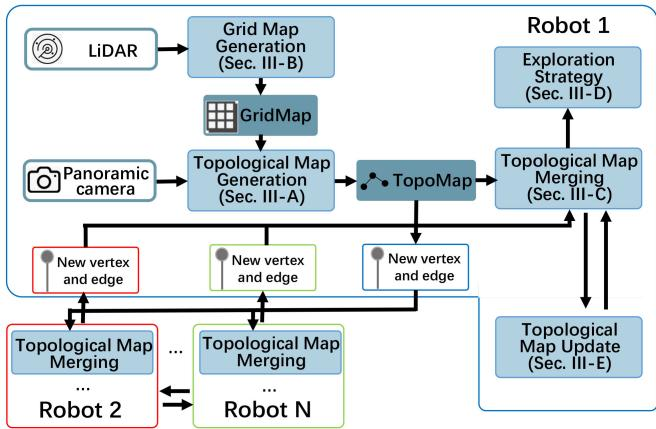  
Fig. 1. The proposed system’s overview. Among different robots, only newly built vertices and edges are transferred.

The main contributions of our work are:

\- A multi-robot exploration framework based on a topological map, aiming to reduce the communication traffic volume among robots by 84% 90%.

\- An exploration strategy based on the created topological map increasing exploration efficiency by 35% 47%.

\- Verifying our method’s robustness on a real robot platform.

The remainder of this letter is organized as follows. Section II discusses the related work, while Section III introduces the proposed topological map building process and exploration strategy. Section IV presents the experimental results and, finally, Section V concludes this work and discusses future research directions.

## II. RELATED WORK

## A. DSLAM

A recent survey [8] lists the ten main challenges in a multirobot SLAM system, and recent works focus on solving the uncertainty of relative poses, complexity, and closing loops. Moreover, place recognition has been an important part of closing loops, with a current trend being recognizing the same place by exploiting place descriptors. Specifically, existing methods utilize 3D LiDARs and point-cloud based PR methods, such as SegMatch [1], [9]. Regarding image data, NetVLAD [10] has been used to extract a descriptor [2], [11], or Bag of Words [12] to extract a descriptor from image feature points [13].

Map transmission is an important part of a multi-robot exploration system, as it is essential to share the explored area among all robots. Current exploration methods usually make use of occupancy grid map [14]. However, the data volume of the gird maps increases rapidly as task execution progresses, increasing the communication load.

To the best of our knowledge, there is not much works put on the communication problem as the major issue in a multi-robot exploration system. A possible solution could be the robot sending data for pose estimation only if the place descriptor succeeded in sending information to only one robot [2]. Alternatively, Tian et al. [13] proposes a fully distributed SLAM system that transfers the data locally, saving 70% communication compared to centralized systems. Yu et al. [6] sent the submap to the system’s robots without transmitting the descriptors for PR and the sensor data required to calculate the relative pose. In this case, each robot performs PR and calculates its relative pose based on the submap, reducing the communication traffic. Though efforts have been made, the occupancy grid map still has the problem of a huge communication volume.

Other forms of maps can also be used to save communication bandwidth. The Gaussian Mixture Model (GMM) map [15], [16] is employed to map the environment, saving communication traffic. Nevertheless, GMM mapping requires massive computational resources [17], which cannot be satisfied on mobile robots. Additionally, each robot usually samples the models as points for path planning to perform further computations, resulting in redundant calculations.

## B. Topological Map

Topological maps have been used in the field of robots for a long time, typically extracting such maps from satellite views [18] to assist robot deployment [19]. For example, Hiller et al. [20] extracted topological maps from occupancy grid maps to enhance intuitive human-robot collaboration. It should be noted that a topological map can also complete the exploration task [21].

Xu et al. [22] proposed a hierarchical topological map presentation to improve the performance of long-term path planning and use the occupancy grid map for obstacle avoidance. Ravankar et al. [23] created a hybrid map containing the topological and grid maps for exploration in large areas. Moreover, utilizing visual observation to determine whether the robot enters a new place and builds a vertex has also been explored [24]. In this method, the robot adopts a strategy trained via reinforcement learning. However, current methods do not support multi-robot exploration, and therefore these techniques do not consider communication.

Bayer et al. [25] uses a topological map to meet the lowbandwidth communication condition in multi-robot exploration tasks. Every time one robot generates a new vertex, it sends it to the other robots avoiding substantially increasing the transmitted data amount while the map grows. However, this method requires the robot’s relative poses to be a priori known and the robots have a common reference frame established at the start, thus is unsuitable for the scenario where robots explore an area from a different starting point. In [26] the authors suggest detecting the corridors and corners to generate the topological map by using a frontier-based exploration algorithm. Nevertheless, the robots must have the same initial position in this method, which might be unfeasible depending on the scenario.

For exploration tasks, most of the existing works rely on the grid-map-based method, such as Rapidly-exploring Random

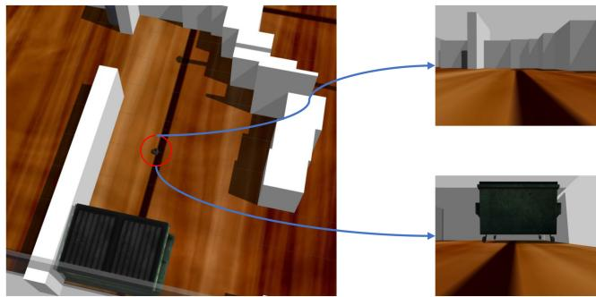  
Fig. 2. Different views ofthe same place, as observed from different directions.

Trees (RRT) family [27], [28], the Artificial Potential Field (APF) family [29], [30]. Moreover, Multi-robot Multi-target Potential Field (MMPF) method has been proposed in recent years as an application of APF under multi-robot condition [6]. However, all of these methods do not apply to topological-mapbased exploration. Thus, new exploration strategy is required.

## III. METHODOLOGY

This work proposes a multi-robot exploration system utilizing a topological map. The system’s overview is illustrated in Fig. 1. In this section, the details of the exploration framework will be introduced.

## A. Topological Map

The proposed system involves the robots sharing topological maps of the explored area, aiming to complete the tasks cooperatively. Moreover, our system employs visual information to decide whether the robot moves into a new place. However, if the robot passes the same place from two different directions, it is very likely to obtain a different observation (Fig. 2) failing to recognize the place. Therefore, we use panoramic view, details are described in Section IV.

The topological map generation flow is illustrated in Fig. 3. Our technique performs place recognition exploiting an image retrieval algorithm [31] and the network remaps the input image to a vector, acting as a descriptor. The larger the descriptors’ inner product, the more likely the pictures are taken from the same place. If the input image’s descriptor does not match with the descriptors of any vertices in the map, then a new vertex is built, and the descriptor ofthe current visual observation is stored in the vertex. After that, the robot needs to crop the surrounding area map (the part surrounded by a black dashed frame in the grid map), detects the frontiers (the points marked as red), find the unexplored directions in this area.

One vertex contains the information presented in Table I, while an edge contains only the information to identify the vertices it is linked with, as shown in Table II.

The flow of the map building is shown in Algorithm 1, function “CalFeatrue” extracts an image to a vector, function “InnerProduct” calculates the inner product of two vectors.

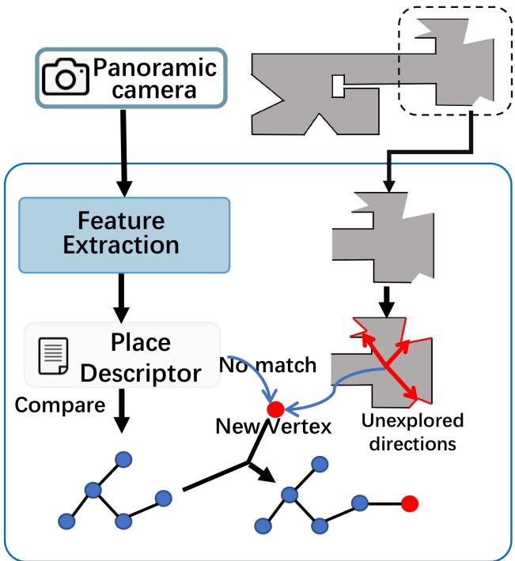  
Fig. 3. Topological map generation flow. The robot uses the visual input to determine whether it moves to a new place. If it does, then a new vertex is generated. Grid map is used to detect unexplored directions.

TABLE I  
THE INFORMATION ONE VERTEX CONTAINS
<table><tr><td rowspan=1 colspan=1>N</td><td rowspan=1 colspan=1>robot name</td></tr><tr><td rowspan=1 colspan=1>id</td><td rowspan=1 colspan=1>the id of the vertex in this robot</td></tr><tr><td rowspan=1 colspan=1>position</td><td rowspan=1 colspan=1>the position of the vertex in the coordinate systemof current robot</td></tr><tr><td rowspan=1 colspan=1>desc</td><td rowspan=1 colspan=1>descriptor of this vertex</td></tr><tr><td rowspan=1 colspan=1>L</td><td rowspan=1 colspan=1>a list, contains the unexplored directions of this vertex</td></tr></table>

TABLE II

THE INFORMATION ONE EDGE CONTAINS, VERTEX1 AND VERTEX2 DENOTE THE VERTICES THAT AN EDGE LINKED WITH
<table><tr><td rowspan=1 colspan=1>N1</td><td rowspan=1 colspan=1>robot name of vertex1</td></tr><tr><td rowspan=1 colspan=1>id1</td><td rowspan=1 colspan=1>the id of the vertex1</td></tr><tr><td rowspan=1 colspan=1>N2</td><td rowspan=1 colspan=1>robot name of vertex2</td></tr><tr><td rowspan=1 colspan=1>id2</td><td rowspan=1 colspan=1>the id of the vertex2</td></tr></table>

## B. Occupancy Grid Map for Obstacle Avoidance

It is challenging to guide the robot to the desired place by solely using the topological map because it ignores environmental details. This problem is solved by implementing a singlerobot SLAM scheme on each robot to generate the occupancy grid map. In this work, we adopt Cartographer [32] as the SLAM module to create in real-time an occupancy grid map of the explored area. As illustrated in Fig. 3, it is also used to detect the unexplored directions. The exploration strategy determines which direction to choose, and the robot moves to the given direction avoiding the obstacles in the grid map. The complete strategy is discussed in detail in the following subsection. It should be noted that the grid map is only used to detect the unexplored directions and guide the robot in the environment,

Algorithm 1: Topological Map Building.   
Input: Panoramic view V, position in its own coordinate   
system position, occupancy grid map of the robot M,   
threshold of place recognition $^ { t h }$   
1: last\_vertex = NULL   
2: while exploration does not end do   
3: max\_score = 0, matched\_vertex = NULL   
4: desc = CalFeature(V)   
5: for vertex $\mathrm { v } _ { i }$ in topological map do   
6: score = InnerProduct(vi.desc, desc)   
7: if max\_score $<$ score then   
8: max\_score = score   
9: matched\_vertex = vi   
10: end if   
11: end for   
12: if max\_score < th then   
13: Create new node $\nu ^ { \prime }$   
14: v.desc = desc, v.position = position   
15: Cut the map m around current area in M   
16: Detect the unexplored directions in m and add   
them in $\mathrm { v ^ { \prime } }$   
17: Add $\mathrm { \Delta v ^ { \prime } }$ to topological map and add a edge $\mathrm { e ^ { \prime } }$   
between $\mathrm { \Delta v ^ { \prime } }$ and last\_vertex   
18: Send $\mathrm { \Delta v ^ { \prime } }$ and $\mathrm { e ^ { \prime } }$ to other robots   
19: last\_vertex = v   
20: else   
21: if matched\_vertex != last\_vertex then   
22: Add an edge $\mathrm { e ^ { \prime } }$ between matched\_vertex and   
last\_vertex   
23: Send $\mathrm { e ^ { \prime } }$ to other robots   
24: last\_vertex = matched\_vertex   
25: end if   
26: end if   
27: end while

and it is not transferred during the robots’ communication;   
therefore, the data transmission volume does not increase.

## C. Map Merging

The robots share the explored area by communicating the topological map. However, if the robot sends the entire map every time, the communication volume increases as the exploration tasks move on. Nevertheless, each robot only needs to broadcast the newly created vertex or edge to the other robots in our system.

In a typical multi-robot SLAM system, once the two robots meet the same place, they calculate their relative pose by transferring the sensor data. However, in our system, the sensor data is not shared. If two vertices are considered matched using the descriptors, it does not mean that their positions in the environment are the same but the distance between them is not long, i.e., it can be considered they are in the same place.

Let the current robot be robot1. Once the robot receives the vertex or edge from another robot, i.e., robot2, it initially compares the vertex’s descriptor with all the descriptors of its map. If one of the robot’s vertices is matched with the received vertex, robot1 put the vertex or edge into locally stored map of robot2, and calculate the geometric transformation $T _ { i } ^ { \alpha }$ of two maps (line 10 of Algorithm 2). After merging the map with robot2, once robot1 receives a vertex or an edge from robot2 afterward, it adds it to the merged map.

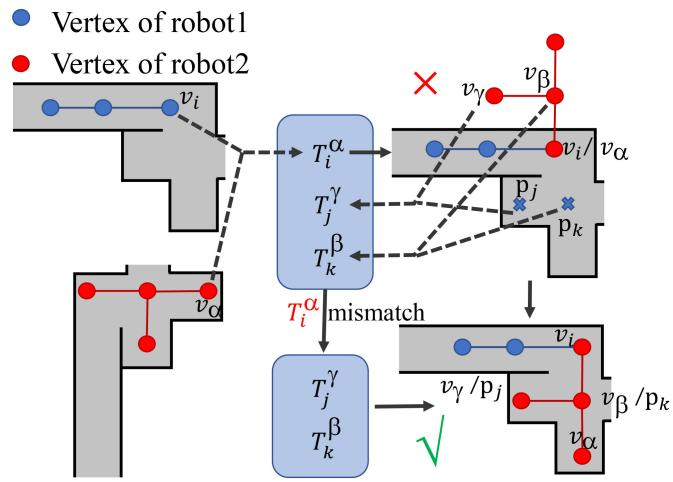  
Fig. 4. The situation that mismatch occurs.

Algorithm 2: Map Merging.   
Input: Input: A vertex $\nu _ { \alpha }$ and an edge $e _ { \alpha }$ newly built by   
another robot, threshold of place recognition th   
1: M is the map of self, $M ^ { \prime }$ is the map of the other robot   
2: max\_score = 0, matched\_vertex = NULL   
3: for vertex $\nu _ { i }$ in M do   
4: score = InnerProduct(v .desc, $\nu _ { \alpha }$ .desc)   
5: if max\_score < score then   
6: max\_score = score   
7: matched\_vertex = v   
8: end if   
9: end for   
10: if max\_score $> t h$ & M has not merged with M then   
11: $T _ { i } ^ { \alpha }$ = matched\_vertex.position - $\nu _ { \alpha \cdot }$ position   
12: Merge M and $M ^ { \prime } { . }$ , the common vertices are $\mathrm { v } _ { i }$ and $\nu ^ { \prime }$   
13: end if

Sometimes the mismatch error occurs, as shown in Fig. 4, $v _ { i }$ of robot1 mismatches with $\nu _ { \alpha }$ of robot2, the geometric transformation is $T _ { i } ^ { \alpha }$ (line 10 in Algorithm 2), outputs a wrong map shown in the upper-right. The robots are unaware ofthe mismatch at first but could correct it later. Take robot1 as an example. If it moves to a place $p _ { j }$ where robot2 has explored, the visual view will match with a vertex $( v _ { \gamma } )$ built by robot2, and transformation $T _ { j } ^ { \gamma }$ is put into the transformation list. Similarly, other transformations will be added. When three or more transformations are calculated, as in [6], the one which is deviated from the mean value is detected, in our example, is $T _ { i } ^ { \alpha }$ as it comes from a mismatch. Then the robots realize the maps were mistakenly merged previously and corrected them with other matches.

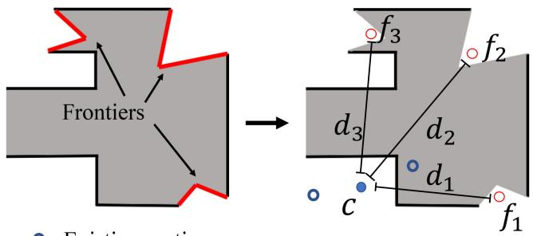

(a) Before map merging.  
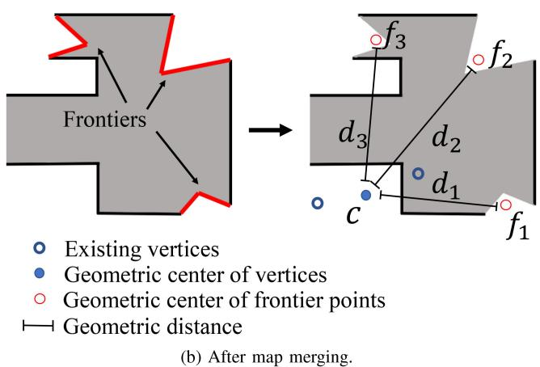  
Fig. 5. The robot only knows the center of itself before map merging, while after merging it obtains the other robots’ centers.

## D. Exploration Strategy

The robot is required to select an unexplored direction to head to. If the robot selects an unexplored direction, it sets a goal that has a certain distance from the current position to the chosen direction on its grid map and tries to reach the goal. Thus, a strategy is required to choose the direction among the candidates.

1) Before Map Merging: Before a robot meets other robots, it adopts a greedy strategy by calculating the center of the existing vertices every time a new vertex is added. Once a new vertex is built and frontiers are detected, the center points of each cluster are calculated $( f _ { 1 } \sim f _ { 3 }$ in Fig. 5(a)). Then the robot calculates distances $d _ { 1 } \sim d _ { 3 }$ between the centers (c in Fig. 5(a)) and $f _ { 1 } \sim$ $f _ { 3 } ,$ , the direction which has the longest distance is the next one to be explored. This method forces the robot to move as far as possible from the explored area to arrive at unexplored regions rapidly.

2) After Map Merging: After a robot merges its map with the other robots’ maps, it considers the vertex position of the other robots. Since a vertex contains the robot’s name, the robot can identify which vertices belong to each robot, acquiring each robot’s “center”. However, the “centers” are not identical to the robots’ centers, as the common vertices can not be calculated and can only present the area explored by another robot. To clarify, let the current robot be robot1 with its vertex center $c _ { 1 }$ and the other robots’ centers be $c _ { 2 }$ and $c _ { 3 }$ . Suppose the distance between $\mathrm { c _ { 1 } }$ and $f _ { 1 }$ is $d _ { 1 1 }$ and between $c _ { 1 }$ and $f _ { 2 }$ be $d _ { 1 2 }$ . We wish the robot to explore an area far from the already explored area, i.e., the robot must move far away from the other robots, and thus we adopt a weighted score $s _ { n _ { i } }$ to evaluate the unexplored direction i:

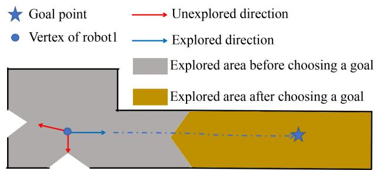

(a) Situation1: The robot chooses a new goal if it reaches the goal without building a new vertex.  
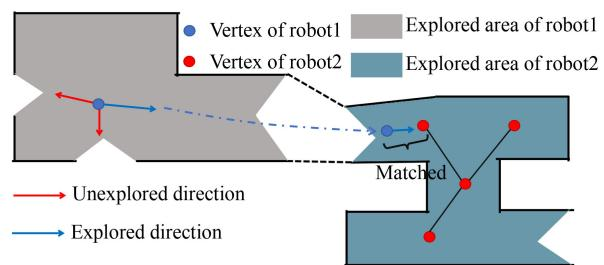  
(b) Situation2: The robot chooses a new goal if it merges its map with the other robots maps.  
Fig. 6. The situation where the robot chooses a new direction to move.

$$
s _ { n _ { i } } = w \times d _ { n i } + \sum _ { j = 0 , j \ne n } ^ { N } { \frac { ( 1 - w ) } { N - 1 } } \times d _ { j i }\tag{1}
$$

Where N is the total number of robots in the environment, and w is the weight defining how close the robot moves from the other robots’ centers, in our experiment, we adopt 0.5. Based on the proposed method, the robot n chooses the direction with the highest score $s _ { n _ { i } }$ . Thus, during the exploration, we place the other robots as far away as possible, i.e., we dispatch the robot to the direction far from the vertex centers of other robots.

3) Renew the Direction: On the robot’s way to fulfill the goal, it may change the direction it moves based on new information. If the robot builds a new vertex, it chooses a new unexplored direction based on the new vertex. However, sometimes the robot may reach its goal without building a new vertex on its way (Fig. 6(a)). In that case, it will choose a new direction towards the next goal. If the robot finds a place that another robot has explored, it merges its maps to theirs (Fig. 6(b)) and selects a new direction to move.

As the exploration moves on, the robot might go through the already-explored area. However, due to the already built vertices, it would not build a new one or merge the map with other robots to change its goal and trapped in the explored area. To avoid such a situation, if the robot detects it continually moves into the area of three existing vertices in current map, it will change the goal to another area to mitigate duplicate exploration.

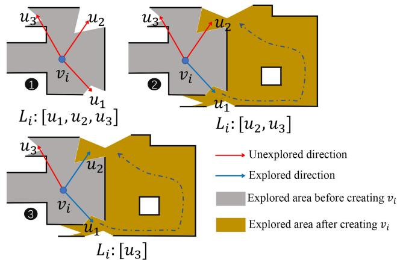  
Fig. 7. If the robot moves to the position close to the unexplored direction of a formerly built vertex, the moving direction is set as “explored”.

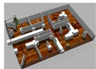

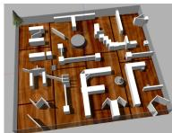

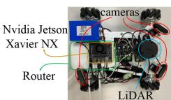  
(c) Real robot  
Fig. 8. The test environment in Gazebo and real robot.

Under the situation mentioned above, the robot chooses the nearest vertex and a new direction by utilizing the strategy mentioned in Section III-D1 and Section III-D2.

## E. Map Update

During exploration, the robot updates the topological map. As depicted in Fig. 7, suppose the vertex $\nu _ { i }$ has three unexplored areas stored in list $L _ { i } .$ . The robot chooses to explore $u _ { 1 }$ and deletes $u _ { 1 }$ from $L _ { i }$ . Next, the robot reaches the $\mathbf { u } _ { 2 } .$ , and ifthe robot is close enough to the $\mathrm { { u _ { 2 } } ^ { \prime } \mathrm { { s } } }$ center, the $\mathbf { u } _ { 2 }$ direction is set as an explored direction and is deleted from $L _ { i }$ . The exploration terminates if no vertex has an unexplored direction.

## IV. EXPERIMENT RESULT

## A. Panoramic Camera, Simulation Environment and Real Robot

1) Panoramic Camera: Our system’s place recognition relies on visual observation. As mentioned in Section III-B, the robot uses a panoramic camera to capture a 360◦ observation. During the simulation, the robot uses four RGB cameras with a 90◦ Field of View (FOV), placed in a squared configuration. In the experiments involving real robots, we apply the similar idea, each robot uses three cameras of 120◦ FOV.

2) Simulation Environment: We use the Gazebo [33] simulator to build two simulation environment as depicted in Fig. 8(a) and Fig. 8(b), where the small region is 391 $\mathrm { m ^ { 2 } }$ and the large one is $6 6 1 ~ \mathrm { m ^ { 2 } }$ . The simulation robot is a burger turtlebot, which besides cameras, it has a 360◦ laser scanner (7 m range).

TABLE III  
AREA COVERAGE USING DIFFERENT EXPLORATION METHODS
<table><tr><td rowspan=2 colspan=1>2*</td><td rowspan=1 colspan=2>Small Env</td><td rowspan=1 colspan=2>Large Env</td></tr><tr><td rowspan=1 colspan=1>1 robot</td><td rowspan=1 colspan=1>2 robots</td><td rowspan=1 colspan=1>1 robot</td><td rowspan=1 colspan=1>2 robots</td></tr><tr><td rowspan=1 colspan=1>RRT</td><td rowspan=1 colspan=1>99.7%</td><td rowspan=1 colspan=1>99.8%</td><td rowspan=1 colspan=1>98.5%</td><td rowspan=1 colspan=1>99.2%</td></tr><tr><td rowspan=1 colspan=1>MMPF</td><td rowspan=1 colspan=1>99.8%</td><td rowspan=1 colspan=1>99.7%</td><td rowspan=1 colspan=1>99.1%</td><td rowspan=1 colspan=1>98.6%</td></tr><tr><td rowspan=1 colspan=1>TOPO</td><td rowspan=1 colspan=1>99.1%</td><td rowspan=1 colspan=1>99.5%</td><td rowspan=1 colspan=1>95.6%</td><td rowspan=1 colspan=1>95.2%</td></tr></table>

3) Real Robot: We also implement our system on real robots equipped with an RPLIDAR A1 LIDAR device and three RGB cameras with 120◦ FOV creating a panoramic view. The robot uses NVIDIA Jetson Xavier NX as computation platform. Finally, each robot has a separate router to guarantee stable communication conditions. The picture of our robot is shown in Fig. 8(c).

## B. Exploration Evaluation

1) Baseline and Criteria: To evaluate the efficiency of our exploration method, we challenge it against RRT-based method [28], and an APF-based method called MMPF [6] in the same environment, and test the exploration time and trajectory length. The exploration time refers to the time from the robot’s departure to the exploration completion, while the trajectory length is the sum of all robots’ trajectories.

The baseline methods rely on the occupancy grid map stops, as long as there is no frontier in the map. However, our method exploits the unexplored directions and thus does not ensure the robots cover the entire area. Hence, we also run an occupancy grid map merging program during the test to test the exploration completeness. Note that this program is just for evaluation, as it is not a part of our exploration system. Once we obtain a merged grid map while exploring the topological map, it is compared with the maps generated by the RRT and MMPF methods to demonstrate our method’s area coverage.

As illustrated in Table III, the grid-map-based methods almost cover the whole environment. Our method covers most of the area but not all of it. Since the our method does not merge the grid maps, estimating the whole occupancy coverage is hard. However, a cover rate higher than 90% could be considered that the basic information of the environment is known [14]. In order to compare with the baseline fairly, the experiment tests the exploration time and the trajectory length at the same coverage rate, 99% for the small environment and 95% for the large environment.

2) Result: For a single robot exploration scenario, as shown in Fig. 9(a), our system explores the small environment 1.31 faster than RRT and 1.23 faster than MMPF, while the trajectory lengths are almost same. Considering the large environment, our system explores the area 1.16 faster and travels 13.29% less than RRT and is 1.77 faster and travels 1.39% more than MMPF.

Considering the multi-robot test, in the small environment, the robots employing the topological map explore the region 2.02 faster than RRT and save 16.67% of the trajectory length, and

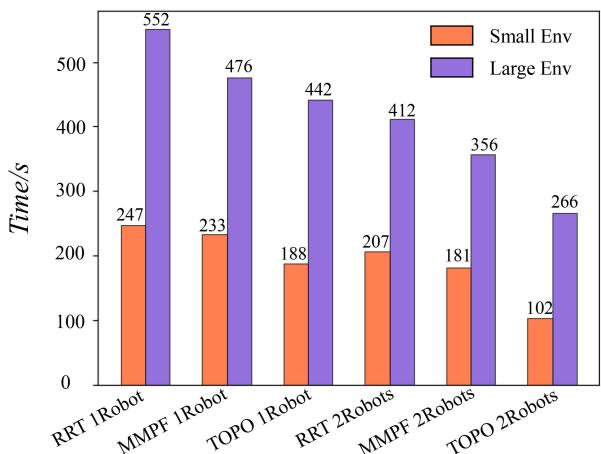  
(a) Exploration Time Comparison

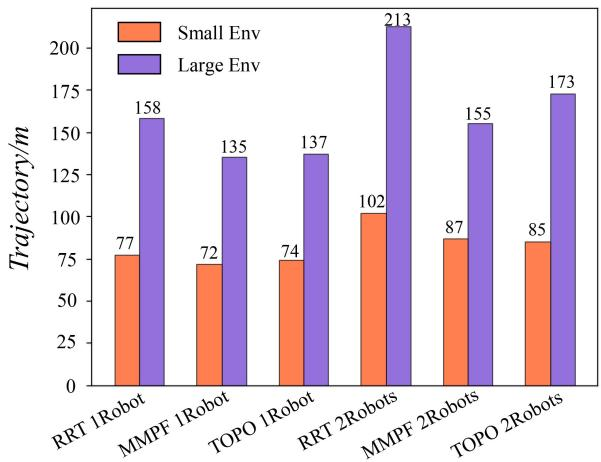  
(b) Trajectory Length Comparison.  
Fig. 9. Comparison of RRT, MMPF and topological method.

1.07 faster than MMPF using more 1.48% of the trajectory. In the large environment, our system performs 1.54 faster exploration and travels 18.78% less than RRT and is 1.34 faster than MMPF traveling 11.61% more. The performance improves because the robot only selects a new goal after building a new vertex, prohibiting the path from changing frequently and thus affording the robot to move faster to reach the goal without continuously adjusting its motion. Additionally, our method has a longer trajectory length than MMPF in the large environment because our policy imposes robots to move as far as possible to find new areas quickly. Thus some areas nearby the robot’s path may be temporarily ignored and explored later. Once most of the environment has been explored, the robot will travel within regions that have already been explored. The methods based on the grid map push the map’s frontier gradually, presenting shorter trajectories. Despite that, our method still has the shortest exploration time.

## C. Communication Evaluation

In this section, we evaluate the data volume transferred among the robots. In typical DSLAM systems, the descriptors for PR involve various information, including the keypoints or raw sensor data, even when the same place is detected. In recent methods the robot share the sensor data through the submap [1] (ScanPerSubmap) or only send sensor data after the keyframes are matched [2], [11] (ScanPerMatch). Moreover, in SMMR [6] only the submap in PNG format is shared that could be used for PR and relative pose estimation. Nevertheless, in the proposed system, the robots only transfer the newly built vertices and edges, substantially reducing the transferred data volume. Each vertex contains the ID, place recognition (PR), position, and unexplored directions (UD) information types, with Table IV presenting the data transmission between two robots in both test environments. A standard DSLAM scheme transfers descriptors and data to calculate the relative poses and submaps, while SMMR transfers only the submap. Unlike current trends, our system transfers the vertices and edges of the topological map. Compared with the grid map methods, our system saves the communication traffic by 84% 90%.

TABLE IV  
DATA TRANSMISSION BETWEEN TWO ROBOTS
<table><tr><td rowspan=2 colspan=1>2*</td><td rowspan=2 colspan=1>2*Method</td><td rowspan=1 colspan=4>Data Transmission(KB)</td></tr><tr><td rowspan=1 colspan=1>PR</td><td rowspan=1 colspan=1>RelPose</td><td rowspan=1 colspan=1>Submap</td><td rowspan=1 colspan=1>Total</td></tr><tr><td rowspan=5 colspan=1>5*Small</td><td rowspan=1 colspan=1>ScanPerSubmap</td><td rowspan=1 colspan=1>56.3</td><td rowspan=1 colspan=1>79.2</td><td rowspan=1 colspan=1>357.5</td><td rowspan=1 colspan=1>493</td></tr><tr><td rowspan=1 colspan=1>ScanPerMatch</td><td rowspan=1 colspan=1>56.3</td><td rowspan=1 colspan=1>20.2</td><td rowspan=1 colspan=1>357.5</td><td rowspan=1 colspan=1>434</td></tr><tr><td rowspan=1 colspan=1>OnlySubmap</td><td rowspan=1 colspan=1>0</td><td rowspan=1 colspan=1>0</td><td rowspan=1 colspan=1>357.5</td><td rowspan=1 colspan=1>357.5</td></tr><tr><td rowspan=1 colspan=1></td><td rowspan=1 colspan=1>PR</td><td rowspan=1 colspan=1>Position&amp;UD2</td><td rowspan=1 colspan=1>ID&amp;Edge</td><td rowspan=1 colspan=1>Total</td></tr><tr><td rowspan=1 colspan=1>TopologicalMap</td><td rowspan=1 colspan=1>64</td><td rowspan=1 colspan=1>7.5</td><td rowspan=1 colspan=1>3.3</td><td rowspan=1 colspan=1>77.3</td></tr></table>

<table><tr><td rowspan=1 colspan=1></td><td rowspan=1 colspan=1></td><td rowspan=1 colspan=1>PR</td><td rowspan=1 colspan=1>RelPose</td><td rowspan=1 colspan=1>Submap</td><td rowspan=1 colspan=1>Total</td></tr><tr><td rowspan=5 colspan=1>5*Large</td><td rowspan=1 colspan=1>ScanPerSubmap</td><td rowspan=1 colspan=1>163.5</td><td rowspan=1 colspan=1>250.2</td><td rowspan=1 colspan=1>990</td><td rowspan=1 colspan=1>1403.7</td></tr><tr><td rowspan=1 colspan=1>ScanPerMatch</td><td rowspan=1 colspan=1>163.5</td><td rowspan=1 colspan=1>155.4</td><td rowspan=1 colspan=1>990</td><td rowspan=1 colspan=1>1308.9</td></tr><tr><td rowspan=1 colspan=1>OnlySubmap</td><td rowspan=1 colspan=1>0</td><td rowspan=1 colspan=1>0</td><td rowspan=1 colspan=1>990</td><td rowspan=1 colspan=1>990</td></tr><tr><td rowspan=1 colspan=1></td><td rowspan=1 colspan=1>PR</td><td rowspan=1 colspan=1>Position&amp;UD</td><td rowspan=1 colspan=1>ID&amp;Edge</td><td rowspan=1 colspan=1>Total</td></tr><tr><td rowspan=1 colspan=1>TopologicalMap</td><td rowspan=1 colspan=1>112</td><td rowspan=1 colspan=1>13.1</td><td rowspan=1 colspan=1>10.2</td><td rowspan=1 colspan=1>135.3</td></tr></table>

1Geometric position of the vertex under the coordinate system of current robot.  
2 Unexplored directions.

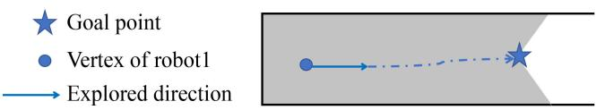  
Fig. 10. If the threshold is set two low, the robot might reach the goal but build no vertex and have no idea where to move next.

## D. Threshold Discussion

In our system, the topological map setup and merging processes heavily rely on the threshold of the image retrieval algorithm. The robot chooses a new viewpoint to move after building a new vertex. As shown in Fig. 10, the robot might reach its original goal without building a new vertex if the vertex is set too low. Thus a new goal will not be generated. As illustrated in Fig. 11, the exploration task fails if the threshold is reduced to 0.65. If the threshold is set too high, though two vertices in different maps could represent the same place without being at the exact same position, these vertices are not matched due to the high threshold. If the threshold is set to 1, the map merging will fail. As shown in Fig. 11, as the threshold increases, the data transmission increases because the vertices become dense, but the exploration time does not decrease significantly. In our experiment, the threshold is 0.75.

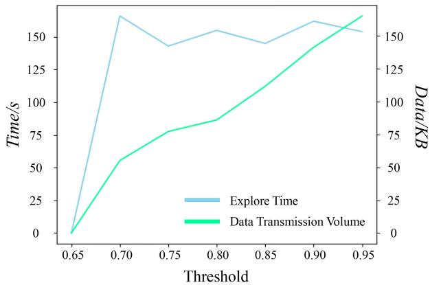  
Fig. 11. Impact of threshold th mentioned in Algorithms 1 and 2 to exploration.

## V. CONCLUSION & FUTURE WORK

This letter proposes an exploration method based on topological maps, reducing the communication load by 90% compared with a typical DSLAM system and 86% compared with a communication-optimized system. Moreover, for exploration tasks, our system is more appealing against RRT and MMPF saving 50% and 43% exploration time compared to RRT and MMPF, respectively.

Our system heavily relies on the image retrieval algorithm and the PR parameters. Hence, future work will investigate other place recognition methods relying on visual observation. And edges will be used for graph matching to improve the map merging algorithm. Moreover, our system will also be expanded to an aerial-ground robotic system.

## REFERENCES

[1] R. Dubé, A. Gawel, H. Sommer, J. Nieto, R. Siegwart, and C. Cadena, “An online multi-robot SLAM system for 3D LiDARs,” in Proc. IEEE/RSJ Int. Conf. Intell. Robots Syst., 2017, pp. 1004–1011.

[2] T. Cieslewski, S. Choudhary, and D. Scaramuzza, “Data-efficient decentralized visual SLAM,” in Proc. IEEE Int. Conf. Robot. Automat., 2018, pp. 2466–2473.

[3] J. Güldenring, P. Gorczak, M. Patchou, C. Arendt, J. Tiemann, and C. Wietfeld, “SKATES: Interoperable multi-connectivity communication module for reliable search and rescue robot operation,” in Proc. 16th Int. Conf. Wireless Mobile Comput., Network. Commun., 2020, pp. 7–13.

[4] Y. Kida, M. Deguchi, and T. Shimura, “Experimental result for a high-rate underwater acoustic communication in deep sea for a manned submersible shinkai6500,” J. Mar. Acoust. Soc. Jpn., vol. 45, no. 4, pp. 197–203, 2018.

[5] W. Tabib, K. Goel, J. Yao, M. Dabhi, C. Boirum, and N. Michael, “Real-time information-theoretic exploration with gaussian mixture model maps,” in Proc. Robot.: Sci. Syst., 2019, pp. 1–9.

[6] J. Yu et al., “SMMR-explore: Submap-based multi-robot exploration system with multi-robot multi-target potential field exploration method,” in Proc. IEEE Int. Conf. Robot. Automat., 2021, pp. 8779–8785.

[7] I. M. Rekleitis, G. Dudek, and E. E. Milios, “Multi-robot exploration of an unknown environment, efficiently reducing the odometry error,” in Proc. Int. Joint Conf. Artif. Intell., 1997, pp. 1340–1346.

[8] S. Saeedi, M. Trentini, M. Seto, and H. Li, “Multiple-robot simultaneous localization and mapping: A review,” J. Field Robot., vol. 33, no. 1, pp. 3–46, 2016.

[9] R. Dubé, D. Dugas, E. Stumm, J. Nieto, R. Siegwart, and C. Cadena, “SegMatch: Segment based place recognition in 3D point clouds,” in Proc. IEEE Int. Conf. Robot. Automat., 2017, pp. 5266–5272.

[10] R. Arandjelovic, P. Gronat, A. Torii, T. Pajdla, and J. Sivic, “NetVLAD: CNN architecture for weakly supervised place recognition,” in Proc. IEEE Conf. Comput. Vis. Pattern Recognit., 2016, pp. 5297–5307.

[11] P.-Y. Lajoie, B. Ramtoula, Y. Chang, L. Carlone, and G. Beltrame, “DOOR-SLAM: Distributed, online, and outlier resilient SLAM for robotic teams,” IEEE Robot. Automat. Lett., vol. 5, no. 2, pp. 1656–1663, Apr. 2020.

[12] H. Jégou, M. Douze, C. Schmid, and P. Pérez, “Aggregating local descriptors into a compact image representation,” in Proc. IEEE Comput. Soc. Conf. Comput. Vis. Pattern Recognit., 2010, pp. 3304–3311.

[13] Y. Tian, Y. Chang, F. H. Arias, C. Nieto-Granda, J. P. How, and L. Carlone, “Kimera-multi: Robust, distributed, dense metric-semantic SLAM for multi-robot systems,” 2021, arXiv:2106.14386.

[14] Y. Xu et al., “Explore-bench: Data sets, metrics and evaluations for frontier-based and deep-reinforcement-learning-based autonomous exploration,” in Proc. Int. Conf. Robot. Automat., 2022, pp. 6225–6231, doi: 10.1109/ICRA46639.2022.9812344.

[15] E. Javanmardi, M. Javanmardi, Y. Gu, and S. Kamijo, “Autonomous vehicle self-localization based on probabilistic planar surface map and multi-channel LiDAR in urban area,” in Proc. IEEE 20th Int. Conf. Intell. Transp. Syst., 2017, pp. 1–8.

[16] M. Corah, C. O’Meadhra, K. Goel, and N. Michael, “Communicationefficient planning and mapping for multi-robot exploration in large environments,” IEEE Robot. Automat. Lett., vol. 4, no. 2, pp. 1715–1721, Apr. 2019.

[17] N. P. Kumar, S. Satoor, and I. Buck, “Fast parallel expectation maximization for Gaussian mixture models on GPUs using CUDA,” in Proc. 11th IEEE Int. Conf. High Perform. Comput. Commun., 2009, pp. 103–109.

[18] Z. Li, J. D. Wegner, and A. Lucchi, “Topological map extraction from overhead images,” in Proc. IEEE/CVF Int. Conf. Comput. Vis., 2019, pp. 1715–1724.

[19] R. J. Alitappeh, G. A. Pereira, A. R. Araújo, and L. C. Pimenta, “Multirobot deployment using topological maps,” J. Intell. Robotic Syst., vol. 86, no. 3/4, pp. 641–661, 2017.

[20] M. Hiller, C. Qiu, F. Particke, C. Hofmann, and J. Thielecke, “Learning topometric semantic maps from occupancy grids,” in Proc. IEEE/RSJ Int. Conf. Intell. Robots Syst., 2019, pp. 4190–4197.

[21] I. M. Rekleitis, V. Dujmovic, and G. Dudek, “Efficient topological exploration,” in Proc. IEEE Int. Conf. Robot. Automat., 1999, pp. 676–681.

[22] X. Xu, C. Wang, Y. Wang, and R. Xiong, “Hitmap: A hierarchical topological map representation for navigation in unknown environments,” 2021, arXiv:2109.09293.

[23] A. A. Ravankar, A. Ravankar, T. Emaru, and Y. Kobayashi, “A hybrid topological mapping and navigation method for large area robot mapping,” in Proc. 56th Annu. Conf. Soc. Instrum. Control Engineers Jpn., 2017, pp. 1104–1107.

[24] D. S. Chaplot, R. Salakhutdinov, A. Gupta, and S. Gupta, “Neural topological SLAM for visual navigation,” in Proc. IEEE/CVF Conf. Comput. Vis. Pattern Recognit., 2020, pp. 12875–12884.

[25] J. Bayer and J. Faigl, “Decentralized topological mapping for multi-robot autonomous exploration under low-bandwidth communication,” in Proc. Eur. Conf. Mobile Robots, 2021, pp. 1–7.

[26] A. Marjovi and L. Marques, “Multi-robot topological exploration using olfactory cues,” in Distributed Autonomous Robotic Systems. Berlin/Heidelberg, Germany: Springer, 2013, pp. 47–60.

[27] S. M. LaValle et al., “Rapidly-exploring random trees: A new tool for path planning,” Comput. Sci. Dept., Iowa State Univ., Nov. 1998.

[28] H. Umari and S. Mukhopadhyay, “Autonomous robotic exploration based on multiple rapidly-exploring randomized trees,” in Proc. IEEE/RSJ Int. Conf. Intell. Robots Syst., 2017, pp. 1396–1402.

[29] C. W. Warren, “Global path planning using artificial potential fields,” in Proc. IEEE Int. Conf. Robot. Automat., 1989, pp. 316–317.

[30] C. Wang, L. Meng, T. Li, C. W. De Silva, and M. Q.-H. Meng, “Towards autonomous exploration with information potential field in 3D environments,” in Proc. 18th Int. Conf. Adv. Robot., 2017, pp. 340–345.

[31] F. Radenovi´c, G. Tolias, and O. Chum, “Fine-tuning CNN image retrieval with no human annotation,” IEEE Trans. Pattern Anal. Mach. Intell., vol. 41, no. 7, pp. 1655–1668, Jul. 2019.

[32] W. Hess, D. Kohler, H. Rapp, and D. Andor, “Real-time loop closure in 2D LIDAR SLAM,” in Proc. IEEE Int. Conf. Robot. Automat., 2016, pp. 1271–1278.

[33] N. Koenig and A. Howard, “Design and use paradigms for gazebo, an open-source multi-robot simulator,” in Proc. IEEE/RSJ Int. Conf. Intell. Robots Syst., 2004, vol. 3, pp. 2149–2154.