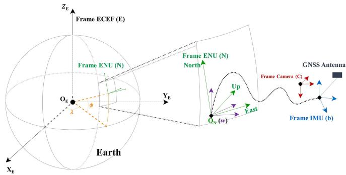
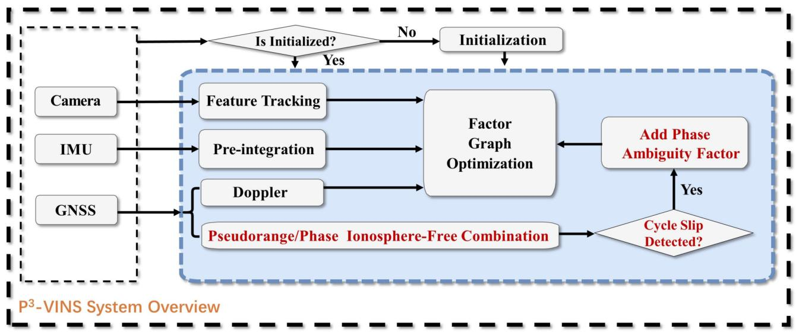
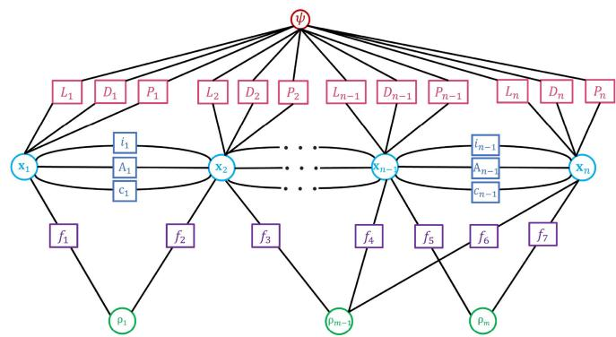
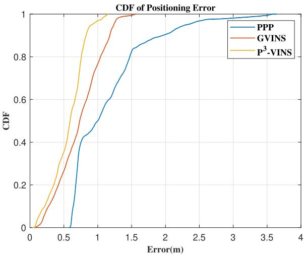
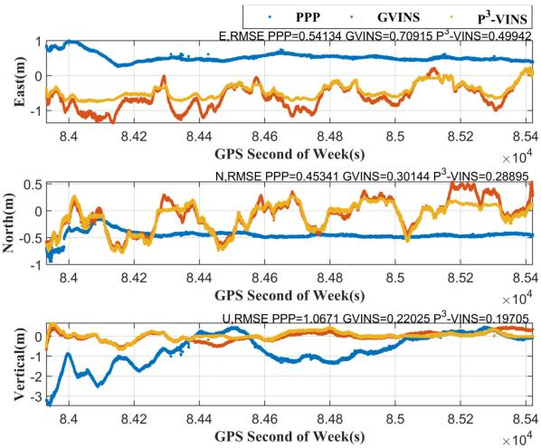
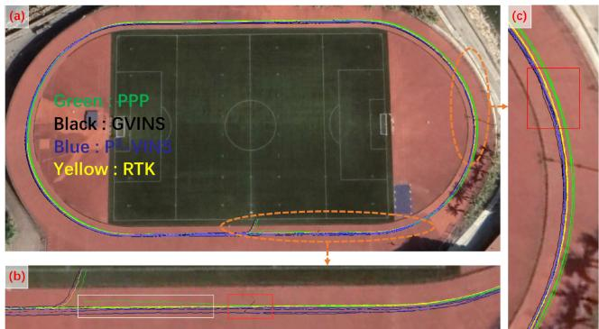
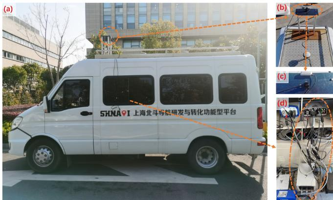
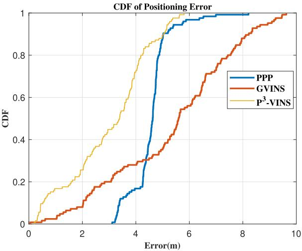
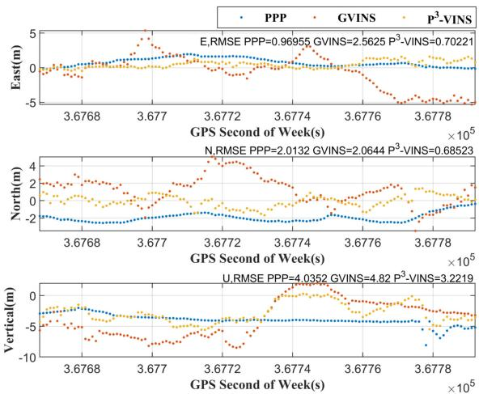
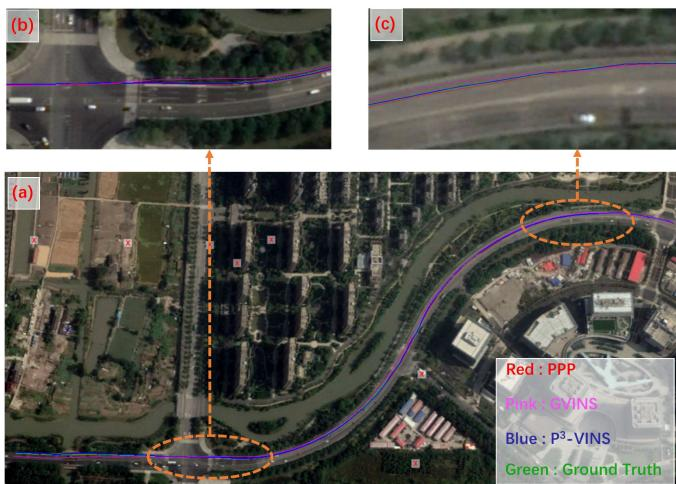

# P3-VINS: Tightly-Coupled PPP/INS/Visual SLAM Based on Optimization Approach

Tao Li , Ling Pei , Senior Member, IEEE, Yan Xiang, Wenxian Yu , Senior Member, IEEE, and Trieu-Kien Truong, Life Fellow, IEEE

Abstract—Precise Point Positioning (PPP), a cutting edge GNSS technology, can achieve high-precision positioning without base station assistance. Visual-Inertial Odometry (VIO) realizes a more robust local pose estimation than Visual-SLAM. Based on PPP and VIO, we propose a tightly-coupled PPP/INS/Visual SLAM system, P3-VINS. It fuses GNSS raw measurements (pseudorange, carrier phase, and Doppler) with visual and inertial information for accurate and robust state estimation. All raw data is modelled and optimized under a factor graph framework. To eliminate ionospheric effects and utilize carrier phase measurements, P3-VINS uses the ionosphere-free (IF) model by dual-frequency observations and adds phase ambiguity into the estimated states. Finally, P3-VINS is evaluated on both public datasets and real-world experiments. It significantly outperforms benchmarks (GVINS and PPP) in terms of accuracy and smoothness. This result demonstrates that the high precision carrier phase substantially helps the GNSS/INS/Visual SLAM system reduce noise and improve accuracy.

Index Terms—PPP, INS, SLAM, Visual-Inertial Odometry, Tightly-Coupled Navigation System, Sensor Fusion.

## I. INTRODUCTION

C AMERA is an essential sensor in unmanned systems. Visual Simultaneous Localization and Mapping (SLAM) is a technology that enables ego-motion estimation only using the camera. There are a number of Visual-SLAM systems such as ORB-SLAM [1], DSO [2], SVO [3], StructSLAM [4], and LSD-SLAM [5]. Among them, ORB-SLAM is based on the indirect method with feature points. StructSLAM is also based on the indirect method but uses structural feature lines instead offeature points. DSO and LSD-SLAM both utilize the direct methods. And SVO uses the semi-direct method. However, Visual-SLAM relies heavily on the rich features in the environment and easily fails in the open scene with sparse features.

Visual-Inertial Odometry (VIO) achieves more robust pose estimation by introducing Inertial Measurement Unit (IMU)

in Visual-SLAM systems. There are two main categories of the VIO fusion algorithms, including filter-based methods and optimization-based ones. The traditional filter-based VIO algorithm always has the dimension explosion problem when putting all the feature points into the state vector. Fortunately, Multi-State Constraint Kalman Filter (MSCKF), a famous filter-based VIO algorithm, can solve the dimension explosion problem. OpenVINS [6], R-VIO [7], StructVIO [8], and LARVIO [9] are all VIO systems based on MSCKF. Famous optimizationbased VIO systems include VINS-Mono [10], OKVIS [11] and ORB-SLAM3 [12], etc. Although the optimization-based VIO system can reduce some of the accumulated errors through loop closure, it still drifts as the distance becomes long.

In contrast to Visual-SLAM and VIO, Global Navigation Satellite System (GNSS) is drift-free and achieves absolute positions in Earth-centered Earth-fixed (ECEF) coordinate system. But the performance of GNSS is significantly impeded by multipath [13]. Single Point Positioning (SPP), Real Time Differential Positioning (RTD), Real Time Kinematic Positioning (RTK) [14], and Precise Point Positioning (PPP) [15] are the four main positioning modes of GNSS. Among them, only PPP can obtain decimeter-level positioning results without requiring the assistance of a base station. However, it suffers from a long convergence time compared with RTK [16] and the re-convergence of PPP is also difficult. Inertial Navigation System (INS) can assist PPP to mitigate these problems in some ways, but cannot overcome them completely.

As stated above, PPP and VIO are complementary as their different application scenarios, which is our motivation to fuse PPP/INS/Visual-SLAM. The major contributions of our paper are summarized as follows:

\- we propose an optimization-based and tightly-coupled approach called P3-VINS to fuse VIO with PPP under the factor graph framework.

\- P3-VINS uses the ionosphere-free (IF) model of pseudorange and carrier phase by dual-frequency observations and adds phase ambiguity into estimated states.

\- P3-VINS is evaluated on public datasets first. Then we setup a vehicle-based GNSS/IMU/Camera system to test P3-VINS.

The remaining paper is organized as follows: Section II introduces an overview of related work. Detail of the proposed P3-VINS is provided in Section III. Section IV describes the experimental setup and presents the results. Finally, the paper concludes a brief summary in Section V.

## II. RELATED WORK

## A. Loosely-Coupled Approaches

VINS-Fusion [17] is a general optimization-based framework for multiple sensors, such as GNSS, magnetometer, and barometer, etc, loosely coupling with VIO. Gong et al. propose a system modified from VINS-Fusion to adaptively fuse GNSS and VIO [18]. They utilize an IMU pre-integration based depth uncertainty estimation method to evaluate the accuracy of VIO. In [19], Wang et al. present a loosely-coupled framework of PPP and stereo VIO based on VINS-Fusion. DVIGO [20] fuses the measurements from the four complementary but asynchronous sensors (stereo camera, IMU, magnetometer, and GNSS) based on the direct sparse method. In [21], Lee et al. propose a loosely-coupled GNSS-aided VIO system by the MSCKF framework. He et al. [22] extend VINS-Mono with absolute localization methods like GNSS with a Kalman-filter-based algorithm to provide global state estimation. In [23], Yu et al. present a tightly-coupled nonlinear optimization method for visual and inertial measurements with loosely-coupled GPS refinement for accurate odometry generation. The advantage of loosely-coupled approach is that it is easier to implement. But it can not take full advantage of the observation.

## B. Tightly-Coupled Approaches

Tightly-coupled approaches are more effective and robust than loosely-coupled ones when the satellite availability is limited or the satellites are poorly distributed. Gong et al. present a joint graph-optimization formulation on the manifold to tightly couple GNSS pseudorange and visual measurements in [24]. Li et al. [25] tightly couple the raw measurements from the single-frequency multi-GNSS RTK, IMU, and monocular camera through MSCKF, combined with the double-differenced GNSS measurement model to update the filter. Liu et al. propose an approach that tightly couples vision, IMU, and raw GNSS measurements including pseudorange and Doppler shift in an optimization-based framework in [26]. The initialization of [26] considers the scale parameter of VIO due to its scale drift in degenerate cases [27]. More recently, a system called GVINS in [28] is proposed with the open-source code. Compared with [26], GVINS has an online coarse-to-fine approach to initialize GNSS-visual-inertial states. In addition, GVINS takes into account engineering challenges such as time synchronization, electromagnetic interference, and receiver clock jump. However, GVINS does not use GNSS measurements combination and carrier phase observation to reduce the positioning errors.

## III. METHODOLOGY

In this section, the coordinate frames and notations of our paper are presented first. Next, we introduce the overview of $\mathrm { P ^ { 3 } - V I N S }$ including its states and factor graph. At last, we focus on describing three factors of $\mathrm { P ^ { 3 } - V I N S }$ , which are pseudorange factor, carrier phase factor, and phase ambiguity factor.

  
Fig. 1. Diagram of Coordinate Frames.

TABLE I  
GLOSSARY OF NOTATION
<table><tr><td>Symbol</td><td>Meaning</td><td>Symbol</td><td>Meaning</td></tr><tr><td>E</td><td>ECEF</td><td>N</td><td>ENU Frame</td></tr><tr><td>b</td><td>IMU Frame</td><td>W</td><td>VIO (local world) Frame</td></tr><tr><td> $\mathbf { p _ { A } ^ { B } }$ </td><td>Translation Vector from Frame A to Frame B</td><td>RB (qB)</td><td>Rotation Matrix (Quarternion) from Frame A to Frame B</td></tr><tr><td> $P$ </td><td>Pseudorange</td><td>L</td><td>Carrier Phase</td></tr><tr><td> $d t$ </td><td>Clock Bias</td><td>àt</td><td>Clock Drifting Rate</td></tr><tr><td>I</td><td>Ionospheric Delay</td><td>f</td><td>Carrier Frequency</td></tr><tr><td>N</td><td>Phase Ambiguity</td><td>|x|</td><td>x&#x27;s 2-norm</td></tr></table>

## A. Coordinate Frames and Notations

The coordinate frames and notations involved in this letter are clarified below. ECEF (Frame $\mathbf { E } ,$ see Fig. 1) is the coordinate frame, where the GNSS receiver works generally. The East-North-Up (ENU) coordinate system is marked as Frame N. When Frame N is used, we have to choose a point on the Earth as the origin. The X-axis points East and the Y-axis points North. The Z-axis is perpendicular to the X-Y plane, thereby forming a right-handed coordinate system. The IMU frame is marked as Frame b with IMU’s center being the origin. The initial IMU frame is marked as Frame ${ \bf { b } } _ { 0 }$ and the IMU frame at time k is marked as Frame $\mathbf { b } _ { k }$ . The frame where VIO operates is marked as Frame w, which means the local world frame. The origin of Frame w is the same as Frame N’s. Since VIO can estimate the pitch and roll angles in Frame N, only 1-DOF rotation exists between Frame w and Frame N. The Camera frame is marked as Frame C, with Camera’s center being the origin. The X-axis points to the right along the Camera horizontal axis, the Z-axis points forward along the Camera longitudinal axis, and the Y-axis is perpendicular to the X-Z plane, forming a right-handed coordinate system.

For the convenience of reading, all the involved coordinate frames and the important notations used in this letter are summarized in Table I.

  
Fig. 2. Overview of P3-VINS.

## B. Overview ofP3-VINS

All the modules involved in the proposed P3-VINS are presented in Fig. 2. The modules with red text are the differences between P3-VINS and GVINS. The initialization part of $\mathrm { P ^ { 3 } } .$ VINS is identical to the three steps of GVINS from coarse to fine.

P3-VINS adopts a sliding window optimization manner. Therefore, at the beginning of this subsection, P3-VINS’ states inside the sliding window are summarized as follows:

$$
\begin{array} { r l } & { \mathbf { X } = \left[ \mathbf { x } _ { 1 } , \mathbf { x } _ { 2 } , \cdot \cdot \cdot \mathbf { x } _ { n } , \rho _ { 1 } , \rho _ { 2 } , \cdot \cdot \cdot \rho _ { m } , \psi \right] , } \\ & { \mathbf { x } _ { k } = \left[ \mathbf { p } _ { \mathbf { b } _ { k } } ^ { \mathbf { w } } , \mathbf { v } _ { \mathbf { b } _ { k } } ^ { \mathbf { w } } , \mathbf { q } _ { \mathbf { b } _ { k } } ^ { \mathbf { w } } , \mathbf { b } _ { a } , \mathbf { b } _ { g } , d \mathbf { t } _ { r } , d \dot { t } _ { r } , N _ { 1 } , N _ { 2 } , \cdot \cdot \cdot N _ { s _ { k } } \right] , } \\ & { \qquad k \in [ 1 , n ] , } \\ & { d \mathbf { t } _ { r } = \left[ d t _ { r G } , d t _ { r R } , d t _ { r E } , d t _ { r C } \right] , } \end{array}\tag{1}
$$

where $\mathbf { p } _ { \mathbf { b } _ { k } } ^ { \mathbf { w } }$ is the position of the body frame to the local world frame, $\mathbf { q } _ { \mathbf { b } _ { k } } ^ { \mathbf { w } }$ is the orientation of the body frame to the local world frame, $\mathbf { v } _ { \mathbf { b } _ { k } } ^ { \mathbf { w } ^ { \mathrm { - } } }$ is the velocity, $ { \mathbf { b } } _ { a }$ is the accelerometer bias, ${ \bf b } _ { g }$ is the gyroscope bias, $\rho$ is the inverse depth for each feature, ψ is the yaw offset between Frame w and Frame N, dt is receiver clock bias, $\dot { d t _ { r } }$ is receiver clock drifting rate, $d t _ { r G }$ is receiver clock bias of GPS, $d t _ { r R }$ is receiver clock bias of GLONASS, $d t _ { r E }$ is receiver clock bias of Galileo, $d t _ { r C }$ is receiver clock bias of BeiDou, n is the window size, m is the number of feature points in the window, N is the phase ambiguity, and $s _ { k }$ is the number of observed satellites at time k.

The factor graph of $\mathrm { P ^ { 3 } - V I N S }$ is plotted in Fig. 3, where the boxes represent observations and the circles represent states. Fig. 3 includes inertial factor (i), visual factor (f), Doppler factor (D), receiver clock factor (c), pseudorange factor (P), carrier phase factor (L), and phase ambiguity factor (A). Among them, inertial factor, visual factor, Doppler factor, and receiver clock factor have been described detailedly in GVINS [28]. Therefore, we only give a brief introduction to them. The IMU pre-integration approach [29] is utilized to build inertial factor in

  
Fig. 3. Factor graph representation of P3-VINS.

Fig. 3. The visual measurements used are feature points extracted from image frames. After feature points are extracted, optical flow is applied to track them. Reprojection error of the same feature points in the different frames is used to build the visual factor in Fig. 3. Doppler frequency shift can be used to calculate the relative velocity along the line of the signal propagation path between receiver and satellite by estimating the receiver clock drift rate meanwhile. In addition, ψ can be calculated from the velocity. Therefore, the Doppler frequency shift has a constraint on ψ in the factor graph. The receiver clock factor contains two kinds of states to estimate: receiver clock biases and receiver clock drift rate. The receiver clock biases are built up by a constant velocity model. The receiver clock drift rate is modelled as a random walk process.

## C. PPP With IF Model

In the past decades, researchers have developed many models for PPP such as IF model and UofC model [30], each of which requires both pseudorange and high-precision carrier phase observations. For dual-frequency GNSS receivers, the IF model is always utilized to eliminate the first-order ionospheric delay by a linear combination of dual-frequency pseudorange and carrier phase observations. The raw PPP observations between receiver r and satellite s on frequency $f _ { 1 }$ and $f _ { 2 }$ are given by

$$
\left\{ \begin{array} { l } { P _ { 1 } = \rho _ { r } ^ { s } + c d t _ { r } - c d t ^ { s } + T + I _ { 1 } + b _ { r , 1 } - b _ { 1 } ^ { s } + \varepsilon _ { P _ { 1 } } } \\ { L _ { 1 } = \rho _ { r } ^ { s } + c d t _ { r } - c d t ^ { s } + T - I _ { 1 } + \lambda _ { 1 } \left( N _ { 1 } + B _ { r , 1 } - B _ { 1 } ^ { s } \right) } \\ { \qquad + \varepsilon _ { L _ { 1 } } } \\ { P _ { 2 } = \rho _ { r } ^ { s } + c d t _ { r } - c d t ^ { s } + T + I _ { 2 } + b _ { r , 2 } - b _ { 2 } ^ { s } + \varepsilon _ { P _ { 2 } } } \\ { L _ { 2 } = \rho _ { r } ^ { s } + c d t _ { r } - c d t ^ { s } + T - I _ { 2 } + \lambda _ { 2 } \left( N _ { 2 } + B _ { r , 2 } - B _ { 2 } ^ { s } \right) } \\ { \qquad + \varepsilon _ { L _ { 2 } } , } \end{array} \right.\tag{2}
$$

where $P$ and $L$ denote the pseudorange and carrier phase observations in meters, respectively. $\rho _ { r } ^ { s }$ is the true geometric range between receiver r and satellite s. c is the speed of light. $d t _ { r }$ is the GNSS receiver clock error which is a parameter that needs to be estimated. $d t ^ { s }$ is the clock bias of satellite s which can be eliminated by precise clock products. $T$ is the tropospheric delay. I is the ionospheric delay. λ is the wavelength. $b _ { r }$ and $b ^ { s }$ are the receiver and satellite code hardware biases, respectively. $b _ { r }$ can be absorbed in receiver clock error. But the $b _ { r }$ in GPS, GLONASS, Galileo, and BDS is different. Since $b ^ { s }$ cannot be absorbed, it must be corrected by Differential Code Biases (DCB). $B _ { r }$ and $B ^ { s }$ are the receiver and satellite carrier phase hardware biases, respectively. $B _ { r }$ and $B ^ { s }$ are also called the uncalibrated phase delays $\left( \mathrm { U P D } \right)$ which are within 0.5 cycles. Since we adopt a float solution strategy in PPP, $B _ { r }$ and $B ^ { s }$ are absorbed by phase ambiguity and then can be ignored. N is the phase ambiguity. ε represents the noise. Since first-order ionospheric delay is proportional to the square of the frequency, we can get the $\mathrm { I F }$ combination equations as

$$
\left\{ \begin{array} { l l } { P _ { I F } = \frac { f _ { 1 } ^ { 2 } } { f _ { 1 } ^ { 2 } - f _ { 2 } ^ { 2 } } P _ { 1 } - \frac { f _ { 2 } ^ { 2 } } { f _ { 1 } ^ { 2 } - f _ { 2 } ^ { 2 } } P _ { 2 } } \\ { L _ { I F } = \frac { f _ { 1 } ^ { 2 } } { f _ { 1 } ^ { 2 } - f _ { 2 } ^ { 2 } } L _ { 1 } - \frac { f _ { 2 } ^ { 2 } } { f _ { 1 } ^ { 2 } - f _ { 2 } ^ { 2 } } L _ { 2 } , } \end{array} \right.\tag{3}
$$

where $P _ { I F }$ and $L _ { I F }$ are not affected by first-order ionospheric delay. $b ^ { s }$ of $P _ { I F }$ needs to be corrected by DCB when the frequency or code of the service side is different from the receiver. Other corrections such as the phase center offsets (PCO) [31], phase center variations (PCV) [31], phase windup [32], relativistic delays [33], Sagnac effect [34], the earth tide [32], and ocean tide loading [32] can be precisely corrected according to existing models. Satellite orbit error is also be eliminated by precise orbit products in PPP.

## D. Pseudorange Factor and Carrier Phase Factor

The observations of pseudorange factor and carrier phase factor have been constructed by (3). Then the residual of pseudorange and carrier phase measurement in time k of satellite s can be formulated as (4) and (5), respectively.

$$
r _ { P _ { I F } } \left( \tilde { \mathbf { z } _ { k } } ^ { s } , \mathbf { X } \right) = \mathbf { \left| p _ { } ^ { E } - R _ { N } ^ { E } R _ { w } ^ { N } \right|} \mathbf { p _ { b } ^ { w } } - \mathbf { p _ { w } ^ { E } }  + c d t _ { r } - P _ { I F , k } ^ { s } .\tag{4}
$$

$$
\begin{array} { r l } & { r _ { L _ { I F } } \left( \tilde { \mathbf { z } _ { k } } ^ { s } , \mathbf { X } \right) = \left| \mathbf { p } _ { s } ^ { \mathbf { E } } - \mathbf { R } _ { \mathbf { N } } ^ { \mathbf { E } } \mathbf { R } _ { \mathbf { w } } ^ { \mathbf { N } } \mathbf { p } _ { \mathbf { b } _ { k } } ^ { \mathbf { w } } - \mathbf { p } _ { \mathbf { w } } ^ { \mathbf { E } } \right| } \\ & { ~ + c d t _ { r } + \lambda N _ { s } - L _ { I F , k } ^ { s } . } \end{array}\tag{5}
$$

In particular, it is important to point out that $P _ { I F , k } ^ { s }$ and $L _ { I F , k } ^ { s }$ in Eqs.(4) and (5) are after error corrections. Since we adopt a float solution strategy in $\mathrm { P ^ { 3 } - V I N S } , B _ { r }$ and $B ^ { s }$ can be absorbed by phase ambiguity and are not needed to be corrected. $\mathbf { R } _ { \mathbf { w } } ^ { \mathbf { N } } .$

$\mathbf { p } _ { \mathbf { b } _ { k } } ^ { \mathbf { w } } , d t _ { r } .$ , and $N _ { s }$ are the variables that needs to be estimated. Because VIO can estimate the pitch and roll angles in Frame N, ${ \mathbf { R } } _ { \mathbf { w } } ^ { \mathbf { N } }$ is only related to ψ, the yaw offset between Frame w and Frame $\mathbf { N } . \mathbf { p _ { w } ^ { E } }$ means the coordinates of Frame w’s origin in Frame E.

## E. Phase Ambiguity Factor

Many reasons such as signal block, low SNR of signal, and failure of receiver or satellite may cause discontinuity of the carrier phase named as cycle slip. In this letter, Melbourne-Wübbena (MW) combianation [35] [36] and Geometry-Free (GF) combianation [37] are used to detect cycle slip.

The MW combination is

$$
\mathbf { M } \mathbf { W } = { \frac { f _ { 1 } - f _ { 2 } } { f _ { 1 } + f _ { 2 } } } \left( { \frac { P _ { 1 } } { \lambda _ { 1 } } } + { \frac { P _ { 2 } } { \lambda _ { 2 } } } \right) - \left( L _ { 1 } - L _ { 2 } \right) = N _ { 1 } - N _ { 2 } .\tag{6}
$$

From (6), if there is no cycle slip at time k and $k + 1 , \mathrm { M W } _ { k + 1 }$ will equals to $\mathbf { M W } _ { k }$ . But if the cycle slip on $f _ { 1 }$ equals to or is close to that on $f _ { 2 }$ , this method will fail. Therefore, we use GF combination to prevent this happening.

The GF combination is given by

$$
\mathrm { G F } = \lambda _ { 1 } L _ { 1 } - \lambda _ { 2 } L _ { 2 } = \lambda _ { 1 } N _ { 1 } - \lambda _ { 2 } N _ { 2 } + \left( 1 - \frac { f _ { 1 } ^ { 2 } } { f _ { 2 } ^ { 2 } } \right) I _ { 1 } .\tag{7}
$$

As seen in, (7), if there is no cycle slip at time k and $k + 1$ $\mathrm { G F } _ { k + 1 } \ – \ \mathrm { G F } _ { k }$ is only influenced by ionospheric delay. When the ionosphere is stable, $\mathrm { G F } _ { k + 1 } - \mathrm { G F } _ { k }$ can detect cycle slip. But when the ratio of the cycle slip on $f _ { 1 }$ to the cycle slip on $f _ { 2 }$ is close to $\frac { \lambda _ { 2 } } { \lambda _ { 1 } }$ , GF combination fails.

Considering the mathematical characteristics of MW and GF, when neither the MW combination nor the GF combination detects a cycle slip, it can be regarded that no cycle slip occurs and the phase ambiguity remains constant. Thus, the corresponding phase ambiguity of one satellite is modelled as a random walk process when there is no cycle slip and the residual of it is given by

$$
r _ { N } \left( \tilde { \mathbf { z } } _ { k - 1 } ^ { k } , \mathbf { X } \right) = N _ { k } - N _ { k - 1 } .\tag{8}
$$

If there are cycle slips happen at time k, the corresponding phase ambiguity should be re-initialized. In our paper, the phase ambiguity re-initialization is completed by pseudorange and carrier phase observation function, that is (2).

## IV. EXPERIMENT AND ANALYSIS

In this section, we test the proposed $\mathrm { P ^ { 3 } } .$ -VINS system both on the public datasets and real-world experiments.

The positioning error metrics used to assess the performance ofP3-VINS are Mean Absolute Error (MAE), Root Mean Square Error (RMSE), Maximum Error (Max), and Standard deviation (Std) of errors. These error metrics are defined as follows:

Let X and $\tilde { X }$ represent the ground truth and estimated result, respectively. The MAE is calculated by the following equation:

$$
\mathrm { M A E } ( \tilde { \mathrm { X } } , \mathrm { X } ) = \frac { 1 } { m } \sum _ { i = 1 } ^ { m } \left| \tilde { \mathrm { X } } ^ { ( \mathrm { i } ) } - \mathrm { X } ^ { ( \mathrm { i } ) } \right| .\tag{9}
$$

TABLE II  
P3-VINS RESULTS IN PUBLIC DATASET EXPERIMENTS
<table><tr><td colspan="2">PPP GVINS [28]  $\mathrm { P } ^ { 3 }$  -VINS</td></tr><tr><td>MAE(m) 1.14</td><td>0.73 0.56</td></tr><tr><td>RMSE(m) ) 1.28</td><td>0.80 0.61</td></tr><tr><td>Max(m) 3.64</td><td>1.57 1.16</td></tr><tr><td>Std(m) 0.58</td><td>0.32 0.24</td></tr></table>

  
Fig. 4. CDF of Positioning Error in Public Dateset.

Also, the RMSE is calculated by:

$$
\mathrm { R M S E } ( \tilde { \mathrm { X } } , \mathrm { X } ) = \sqrt { \frac { 1 } { m } \sum _ { i = 1 } ^ { m } \left( \tilde { \mathrm { X } } ^ { ( \mathrm { i } ) } - \mathrm { X } ^ { ( \mathrm { i } ) } \right) ^ { 2 } } .\tag{10}
$$

Finally, the Std is given by

$$
\mathrm { S t d } = \sqrt { \frac { 1 } { m } \sum _ { i = 1 } ^ { m } \left( \Big | \tilde { \mathrm { X } } ^ { ( \mathrm { i } ) } - \mathrm { X } ^ { ( \mathrm { i } ) } \Big | - \mathrm { M A E } \right) ^ { 2 } } .\tag{11}
$$

In this section, we compare P3-VINS with GVINS [28] and PPP. We employ RTKLIB [38] to compute the PPP solution. RTKLIB is an open-source program package for standard and precise positioning only with the GNSS data. Both of P3-VINS and GVINS fuse the data from GNSS, IMU, and camera.

## A. Public Dataset Experiments

In this experiment, the sports field sequence in GVINS-Dataset [28] is utilized to test P3-VINS. The sensors of this dataset contain u-blox ZED-F9P, Aptina MT9V034, and Analog Devices ADIS 16448 IMU. In addition, u-blox ZED-F9P utilizes its internal RTK engine to receive Radio Technical Commission for Maritime Services (RTCM) stream from the base station and provide the ground truth. All sensors are mounted on a helmet worn by a pedestrian.

Table II lists the statistics of this experiment, which shows that $\mathrm { P ^ { 3 } - V I N S }$ outperforms in every metric.

In order to show the error distribution more clearly, the Cumulative Distribution Function (CDF) of their errors in Fig. 4 are further analyzed. We find that the curve of $\mathrm { \bf { P } } ^ { 3 } .$ -VINS in Fig. 4 is always in the upper left corner of the graph. This means that P3-VINS performs best in every error probability distribution.

  
Fig. 5. ENU Positioning Error in Public Dateset.

  
Fig. 6. Final Trajectories in Public Dateset.

The positioning error of this experiment is plotted against ENU axes as depicted in Fig. 5.

According to Table II and Fig. 5, the main reason for PPP’s error being large is that PPP varies greatly in the vertical direction. This is because satellite observations are all from the zenith direction, which leads to the poor geometric distribution in the vertical direction. On the other hand, the east and north directions have a better geometric distribution. After PPP converges, its error curve in the east and north is smooth. Indeed, GVINS can reduce the error in the vertical direction better with the help of camera and IMU. However, the noise of GVINS is bigger than that of PPP in east and north directions. P3-VINS incorporated with the advantages of PPP and GVINS yields the best performance in all directions.

All of positioning results are plotted on the map as shown in Fig. 6-(a). The parts with red rectangles in Fig. 6-(b) and (c) show that GVINS still suffers from the noise of pseudorange. On the other hand, PPP is very smooth, but it takes a long time to converge. The vertical direction in Fig. 5 and the part with white rectangle in Fig. 6-(b) reflects the situation that PPP has not completely converged. P3-VINS makes full use of the advantages of PPP and GVINS to get a smoother trajectory with less bias.

  
Fig. 7. The Equipment Used in Real-World Experiments.

TABLE III  
P3-VINS RESULTS IN REAL-WORLD EXPERIMENTS
<table><tr><td colspan="2">PPP GVINS [28] P3-VINS</td></tr><tr><td>MAE(m) 4.55</td><td>5.36 3.01</td></tr><tr><td>RMSE(m) 4.61</td><td>5.84 3.37</td></tr><tr><td>Max(m) 8.21</td><td>9.63 5.81</td></tr><tr><td>Std(m) 0.73</td><td>2.33 1.52</td></tr></table>

## B. Real-World Experiments

In this experiment, we set up a GNSS/IMU/Camera system as shown in Fig. 7. On our experimental vehicle, there is a Visual-Inertial Sensor (RealSense D435i) and a GNSS receiver (u-blox ZED-F9P) employed to collect the data as depicted in Fig. 7-(b) and (c). Fig. 7-(d) shows that NovAtel SPAN-IMU-ISA-100 C is used to collect the GNSS and IMU raw data of the rover. And the GNSS raw data of the base station is also collected at the same time. After this, the collected data is then processed by Inertial-Explorer software with the PPK (Post Processed Kinematic)/INS integrated navigation algorithm to obtain highprecision positions. By the way, there is a sky-pointing fish-eye camera mounted for future research as can be seen in Fig. 7-(c).

The statistics of results are presented in Table III. It shows that P3-VINS outperforms in MAE, RMSE, and Max metrics. PPP performs best at Std, which reflects the smoothness. Even so, P3-VINS is still better than GVINS in terms of Std, proving that adding carrier phase factor and phase ambiguity factor improves the smoothness of the trajectory.

The CDF figure of this experiment is also plotted in Fig. 8. We can conclude that PPP does not converge from Fig. 8 since its minimum error is about 3 m. This phenomenon is normal, because the whole experiment time is only about 2 minutes and not enough for PPP to converge. P3-VINS does not have this problem, indicating that VIO does help PPP. Due to the effects from the noises of pseudorange, the GVINS has inferior performance in this experiment.

The positioning errors of this experiment are plotted against ENU axes as depicted in Fig. 9. PPP errors are concentrated in the range of 4-5 meters. This phenomenon is actually caused by the slow convergence process of PPP, especially in the vertical direction.

  
Fig. 8. CDF of Positioning Error in Real-World Experiments.

  
Fig. 9. ENU Positioning Error in Real-World Experiments.

All results are plotted on the map as shown in Fig. 10-(a). The details are shown in Fig. 10-(b) and Fig. 10-(c), respectively. The experimental vehicle was driven on the far right side of the road so that the trees would have a non-negligible impact on the satellite signal. In this environment, the GVINS positioning results are noisy even in the horizontal direction, which can be dangerous for autonomous driving applications. PPP is optimal in smoothness, but its convergence is slow. P3-VINS combines the advantages of the two, hereby obtaining more accurate positioning results.

## V. CONCLUSION

This letter is aimed at proposing P3-VINS to improve the positioning performance of GNSS/INS/Visual SLAM system. In order to achieve P3-VINS, we have done the following work:

Firstly, carrier phase factor and phase ambiguity factor have been added into GVINS. Secondly, the dual-frequency ionosphere-free model is applied in order to eliminate the ionospheric influence. It is shown that the performance of $\mathrm { P ^ { 3 } }$ -VINS is superior to PPP and GVINS in both public datasets and real-world experiments.

  
Fig. 10. Final Trajectories in Real-World Experiments.

In the future, it is expected that the sky-pointing fish-eye camera can be used for identifying the sky. Then we can delete the satellites in non-sky regions to improve GNSS/INS/Visual SLAM system. And UPD is not considered so that only float phase ambiguity is estimated in $\mathrm { P ^ { 3 } - V I N S }$ . With the help of UPD, phase ambiguity is expected to be fixed in the PPP/INS/Visual SLAM system and the positioning accuracy may be further improved.

## REFERENCES

[1] R. Mur-Artal, J. M. M. Montiel, and J. D. Tardós, “ORB-SLAM: A versatile and accurate monocular SLAM system,” IEEE Trans. Robot., vol. 31, no. 5, pp. 1147–1163, Oct. 2015.

[2] J. Engel, V. Koltun, and D. Cremers, “Direct sparse odometry,” IEEE Trans. Pattern Anal. Mach. Intell., vol. 40, no. 3, pp. 611–625, Mar. 2018.

[3] C. Forster, M. Pizzoli, and D. Scaramuzza, “SVO: Fast semi-direct monocular visual odometry,” in Proc. IEEE Int. Conf. Robot. Automat., 2014, pp. 15–22.

[4] H. Zhou, D. Zou, L. Pei, R. Ying, P. Liu, and W. Yu, “StructSLAM: Visual SLAM with building structure lines,” IEEE Trans. Veh. Technol., vol. 64, no. 4, pp. 1364–1375, Apr. 2015.

[5] J. Engel, T. Schps, and D. Cremers, “LSD-SLAM: Large-scale direct monocular SLAM,” in Proc. Eur. Conf. Comput. Vis., Springer, Cham, 2014, pp. 834–849.

[6] P. Geneva, K. Eckenhoff, W. Lee, Y. Yang, and G. Huang, “OpenVINS: A research platform for visual-inertial estimation,” in Proc. IEEE Int. Conf. Robot. Automat., 2020, pp. 4666–4672.

[7] Z. Huai and G. Huang, “Robocentric visual-inertial odometry,” in Proc. IEEE/RSJ Int. Conf. Intell. Robots Syst., 2018, pp. 6319–6326.

[8] D. Zou, Y. Wu, L. Pei, H. Ling, and W. Yu, “StructVIO: Visual-inertial odometry with structural regularity of man-made environments,” IEEE Trans. Robot., vol. 35, no. 4, pp. 999–1013, Aug. 2019.

[9] X. Qiu, H. Zhang, and W. Fu, “Lightweight hybrid visual-inertial odometry with closed-form zero velocity update,” Chin. J. Aeronaut., vol. 33, no. 12, pp. 3344–3359, 2020.

[10] T. Qin, P. Li, and S. Shen, “VINS-Mono: A robust and versatile monocular visual-inertial state estimator,” IEEE Trans. Robot., vol. 34, no. 4, pp. 1004–1020, Aug. 2018.

[11] S. Leutenegger, S. Lynen, M. Bosse, R. Siegwart, and P. Furgale, “Keyframe-based visual–inertial odometry using nonlinear optimization,” Int. J. Robot. Res., vol. 34, no. 3, pp. 314–334, 2014.

[12] C. Campos, R. Elvira, J. J. G. Rodríguez, J. M. Montiel, and J. D. Tardós, “ORB-SLAM3: An accurate open-source library for visual, visual–inertial, and multimap SLAM,” IEEE Trans. Robot., vol. 37, no. 6, pp. 1874–1890, Dec. 2021.

[13] X. Chen, D. He, and L. Pei, “BDS B1I multipath channel statistical model comparison between static and dynamic scenarios in dense urban canyon environment,” Satell. Navigation, vol. 1, no. 1, pp. 1–16, 2020.

[14] R. B. Langley, “RTK GPS,” Gps World, vol. 9, no. 9, pp. 70–76, 1998.

[15] J. F. Zumberge, M. B. Heflin, D. C. Jefferson, M. M. Watkins, and F. H. Webb, “Precise point positioning for the efficient and robust analysis of GPS data from large networks,” J. Geophysical Res. Solid Earth, vol. 102, no. B3, pp. 5005–5017, 1997.

[16] Y. Xiang, Y. Gao, and Y. Li, “Reducing convergence time of precise point positioning with ionospheric constraints and receiver differential code bias modeling,” J. Geodesy, vol. 94, no. 1, pp. 1–13, 2020.

[17] T. Qin, S. Cao, J. Pan, and S. Shen, “A general optimization-based framework for global pose estimation with multiple sensors,” 2019, arXiv:1901.03642.

[18] Z. Gong et al., “Graph-based adaptive fusion of GNSS and VIO under intermittent GNSS-degraded environment,” IEEE Trans. Instrum. Meas., vol. 70, pp. 1–16, 2021.

[19] X. Li, X. Wang, J. Liao, X. Li, and H. Lyu, “Semi-tightly coupled integration of multi-GNSS PPP and S-VINS for precise positioning in GNSSchallenged environments,” Satell. Navigation, vol. 2, no. 1, pp. 1–14, 2021.

[20] Z. Wang, M. Li, D. Zhou, and Z. Zheng, “Direct sparse stereo visualinertial global odometry,” in Proc. IEEE Int. Conf. Robot. Automat., 2021, pp. 14403–14409.

[21] W. Lee, K. Eckenhoff, P. Geneva, and G. Huang, “Intermittent GPS-aided VIO: Online initialization and calibration,” in Proc. IEEE Int. Conf. Robot. Automat., 2020, pp. 5724–5731.

[22] M. He and R. R. Rajkumar, “Extended VINS-MONO: A systematic approach for absolute and relative vehicle localization in large-scale outdoor environments,” in Proc. IEEE/RSJ Int. Conf. Intell. Robots Syst., 2021, pp. 4861–4868.

[23] Y. Yu, W. Gao, C. Liu, S. Shen, and M. Liu, “A GPS-aided omnidirectional visual-inertial state estimator in ubiquitous environments,” in Proc. IEEE/RSJ Int. Conf. Intell. Robots Syst., 2019, pp. 7750–7755.

[24] Z. Gong, R. Ying, F. Wen, J. Qian, and P. Liu, “Tightly coupled integration ofGNSS and vision SLAM using 10-DoF optimization on manifold,” IEEE Sensors J., vol. 19, no. 24, pp. 12105–12117, Dec. 2019.

[25] T. Li, H. Zhang, Z. Gao, X. Niu, and N. El-Sheimy, “Tight fusion of a monocular camera, MEMS-IMU, and single-frequency multi-GNSS RTK for precise navigation in GNSS-challenged environments,” Remote Sens., vol. 11, no. 6, 2019, Art. no. 610.

[26] J. Liu, W. Gao, and Z. Hu, “Optimization-based visual-inertial SLAM tightly coupled with raw GNSS measurements,” in Proc. IEEE Int. Conf. Robot. Automat., 2021, pp. 11612–11618.

[27] K. J. Wu, C. X. Guo, G. Georgiou, and S. I. Roumeliotis, “Vins on wheels,” in Proc. IEEE Int. Conf. Robot. Automat., 2017, pp. 5155–5162.

[28] S. Cao, X. Lu, and S. Shen, “GVINS: Tightly coupled GNSS–visual– inertial fusion for smooth and consistent state estimation,” IEEE Trans. Robot., to be published, doi: 10.1109/TRO.2021.3133730.

[29] C. Forster, L. Carlone, F. Dellaert, and D. Scaramuzza, “On-manifold preintegration for real-time visual–inertial odometry,” IEEE Trans. Robot., vol. 33, no. 1, pp. 1–21, Feb. 2017.

[30] Y. Gao and X. Shen, “A new method for carrier-phase-based precise point positioning,” Navigation, vol. 49, no. 2, pp. 109–116, 2002.

[31] B. Görres, J. Campbell, M. Becker, and M. Siemes, “Absolute calibration of GPS antennas: Laboratory results and comparison with field and robot techniques,” GPS Solutions, vol. 10, no. 2, pp. 136–145, 2006.

[32] P. Héroux and J. Kouba, “Gps precise point positioning using IGS orbit products,” Phys. Chem. Earth Part A Solid Earth Geodesy, vol. 26, no. 6–8, pp. 573–578, 2001.

[33] N. Ashby, “Relativity in the global positioning system,” Living Rev. Relativity, vol. 6, no. 1, pp. 1–42, 2003.

[34] N. Ashby, “The sagnac effect in the global positioning system,” inRelativity in Rotating Frames. Dordrecht, The Netherlands: Springer, 2004, pp. 11–28.

[35] W. Melbourne, “The case for ranging in GPS-based geodetic systems,” in Proc. 1st Int. Symp. Precise Positioning GPS, 1985, pp. 373–386.

[36] G. Wubbena, “Software developments for geodetic positioning with GPS using TI 4100 code and carrier measurements,” in Proc. 1st Int. Symp. Precise Positioning Glob. Positioning Syst. US Dept. Commerce, 1985, pp. 403–412.

[37] C. Goad, “Precise positioning with the global position system,” in Proc. 3rd Int. Symp. Inertial Technol. Surveying Geodesy, 1985, pp. 745–756.

[38] T. Takasu and A. Yasuda, “Development of the low-cost RTK-GPS receiver with an open source program package RTKLIB,” in Proc. Int. Symp. GPS/GNSS, 2009, vol. 1, pp. 1–6.