# Plenoxels: Radiance Fields without Neural Networks

Sara Fridovich-Keil\* Alex Yu\* Benjamin Recht

Matthew Tancik Angjoo Kanazawa

Qinhong Chen

UC Berkeley

## Abstract

We introduce Plenoxels (plenoptic voxels), a system for photorealistic view synthesis. Plenoxels represent a scene as a sparse 3D grid with spherical harmonics. This representation can be optimized from calibrated images via gradient methods and regularization without any neural components. On standard, benchmark tasks, Plenoxels are optimized two orders of magnitude faster than Neural Radiance Fields with no loss in visual quality. For video and code, please see https://alexyu.net/plenoxels.

## 1. Introduction

A recent body of research has capitalized on implicit, coordinate-based neural networks as the 3D representation to optimize 3D volumes from calibrated 2D image supervision. In particular, Neural Radiance Fields (NeRF) [28] demonstrated photorealistic novel viewpoint synthesis, capturing scene geometry as well as view-dependent effects. This impressive quality, however, requires extensive computation time for both training and rendering, with training lasting more than a day and rendering requiring 30 seconds per frame, on a single GPU. Multiple subsequent papers [9, 10,21,37,38,59] reduced this computational cost for rendering, but single GPU training still requires multiple hours, a bottleneck that limits the practical application of photorealistic volumetric reconstruction.

In this paper, we show that we can train a radiance field from scratch, without neural networks, while maintaining NeRF quality and reducing optimization time by two orders of magnitude. We provide a custom CUDA [31] implementation that capitalizes on the model simplicity to achieve substantial speedups. Our typical optimization time on a single Titan RTX GPU is 11 minutes on bounded scenes (compared to roughly 1 day for NeRF, more than a 100× speedup) and 27 minutes on unbounded scenes (compared to roughly 4 days for NeRF++ [60], again more than a 100× speedup). Although our implementation is not optimized for fast rendering, we can render novel viewpoints at interactive rates (15 fps). If faster rendering is desired, our optimized Plenoxel model can be converted into a PlenOctree [59].

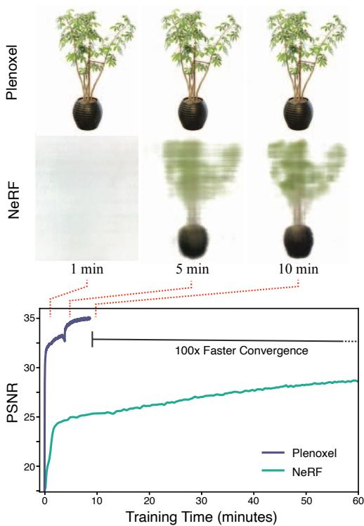  
Figure 1. Plenoxel: Plenoptic Volume Elements for fast optimization of radiance fields. We show that direct optimization of a fully explicit 3D model can match the rendering quality of modern neural based approaches such as NeRF while optimizing over two orders of magnitude faster.

Specifically, we propose an explicit volumetric representation, based on a view-dependent sparse voxel grid without any neural networks. Our model can render photorealistic novel viewpoints and be optimized end-to-end from calibrated 2D photographs, using the differentiable rendering loss on training views along with a total variation regularizer.

We call our model Plenoxel for plenoptic volume elements, as it consists of a sparse voxel grid in which each voxel stores density and spherical harmonic coefficients, which model view dependence [1]. By interpolating these coefficients, Plenoxels achieve a continuous model of the plenoptic function [1]: the light at every position and in every direction inside a volume. To achieve high resolution on a single GPU, we prune empty voxels and follow a coarse to fine optimization strategy. Although our core model is a bounded voxel grid, we show that unbounded scenes can be modeled by using normalized device coordinates (for forward-facing scenes) or by surrounding our grid with multisphere images to encode the background (for 360° scenes).

Our method reveals that photorealistic volumetric reconstruction can be approached using standard tools from inverse problems: a data representation, a forward model, a regularization function, and an optimizer. Our method shows that each of these components can be simple and state of the art results can still be achieved. Our experiments suggest the key element of Neural Radiance Fields is not the neural network but the differentiable volumetric renderer.

## 2. Related Work

Classical Volume Reconstruction. We begin with a brief overview of classical methods for volume reconstruction, focusing on those which find application in our work. The most common classical methods for volume rendering are voxel grids [7,14,19,22,43–45,53,54] and multi-plane images (MPIs) [27,34,48,49,58,62]. Voxel grids are capable of representing arbitrary topologies but can be memory limited at high resolution. One approach for reducing the memory requirement for voxel grids is to encode hierarchical structure, for instance using octrees [12,40,52,55] (see [17] for a survey); we use an even simpler sparse array structure. Using these grid-based representations combined with some form of interpolation [54] produces a continuous representation that can be arbitrarily resized using standard signal processing methods (see [32] for reference). We combine this classical sampling and interpolation paradigm with the forward volume rendering formula introduced by Max [24] (based on work from Kajiya and Von Herzen [13] and used in NeRF) to directly optimize a 3D grid from indirect 2D observations. We further extend these classical approaches by modeling view dependence, which we accomplish by optimizing spherical harmonic coefficients for each color channel at each voxel. Spherical harmonics are a standard basis for functions over the sphere, and have been used previously to represent view dependence [4,36,47,58,59].

Neural Volume Reconstruction. Recently, dramatic improvements in neural volume reconstruction have renewed interest in this direction. Neural representations were first used to model occupancy [6,23, 26] and signed distance to an object's surface [33, 50], and perform novel view synthesis from 3D point clouds [2, 18, 42,57]. Several papers extended this idea to model a 3D scene using only calibrated 2D image supervision via a differentiable volume rendering formulation [22,28,45,46]. NeRF [28] in particular produces impressive results but requires more than a day for full training, and about half an minute to render a full 800 × 800 image, because every rendered pixel requires evaluating a coordinate-based MLP at hundreds of sample locations along the corresponding ray. Many papers have since extended the capabilities of NeRF, including modeling the background in 360° views [60] and incorporating anti-aliasing for multiscale rendering [3]. We extend our Plenoxel method to unbounded 360° scenes using a background model inspired by NeRF++ [60].

Of these methods, Neural Volumes [22] is the most similar to ours in that it uses a voxel grid with interpolation, but optimizes this grid through a convolutional neural network and applies a learned warping function to improve the effective resolution (of a 1283 grid). We show that the voxel grid can be optimized directly and high resolution can be achieved by pruning and coarse to fine optimization, without any neural networks or warping functions.

Accelerating NeRF. In light of the substantial computational requirements of NeRF for both training and rendering, many recent papers have proposed methods to improve efficiency, particularly for rendering. Among these methods are some that achieve speedup by subdividing the 3D volume into regions that can be processed more efficiently [21, 37]. Other speedup approaches have focused on a range of computational and pre- or post-processing methods to remove bottlenecks in the original NeRF formulation. JAXNeRF [8], a JAX [5] reimplementation of NeRF, offers a speedup for both training and rendering via parallelization across many GPUs or TPUs. AutoInt [20] restructures the coordinatebased MLP to compute ray integrals exactly, for more than 10× faster rendering with a small loss in quality. Learned Initializations [51] employs meta-learning on many scenes to start from a better MLP initialization, for both > 10× faster training and better priors when per-scene data is limited. Other methods [15,29,35] achieve speedup by predicting a surface or sampling near the surface, reducing the number of samples necessary for rendering each ray.

Another approach is to pretrain a NeRF (or similar model) and then extract it into a different data structure that can support fast inference [9, 10,38,59]. In particular, PlenOctrees [59] extracts a NeRF variant into a sparse voxel grid in which each voxel represents view-dependent color using spherical harmonic coefficients. Because the extracted PlenOctree can be further optimized, this method can speed up training by roughly 3×, and because it uses an efficient GPU octree implementation without any MLP evaluations, it achieves > 3000× rendering speedup. Our method extends PlenOctrees to perform end-to-end optimization of a sparse voxel representation with spherical harmonics, offering much faster training (two orders of magnitude speedup compared to NeRF). Our Plenoxel model is a generalization of PlenOctrees to support sparse plenoptic voxel grids of arbitrary resolution (not necessary powers of two) with the ability to perform trilinear interpolation, which is easier to implement with this sparse voxel structure.

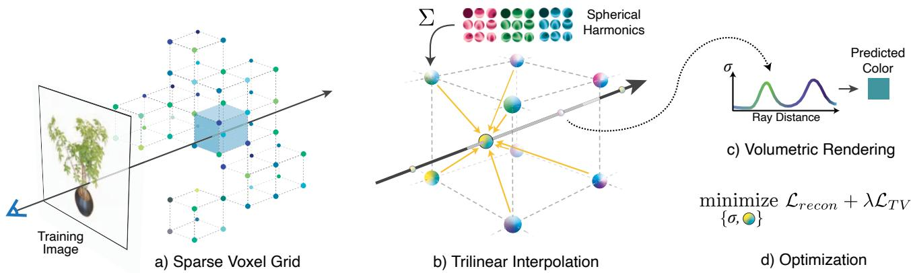  
Figure 2. Overview of our sparse Plenoxel model. Given a set of images of an object or a scene, we optimize a (a) sparse voxel (“Plenoxel") grid with density and spherical harmonic coefficients at each voxel. To render a ray, we (b) compute the color and opacity of each sample point via trilinear interpolation of the neighboring voxel coefficients. We integrate the color and opacity of these samples using (c) differentiable volume rendering, following the recent success of NeRF [28]. The voxel coefficients can then be (d) optimized using the standard MSE reconstruction loss relative to the training images, along with a total variation regularizer.

## 3. Method

Our model is a sparse voxel grid in which each occupied voxel corner stores a scalar density σ and a vector of spherical harmonic (SH) coefficients for each color channel. From here on we refer to this representation as Plenoxels. The density and color at an arbitrary position and viewing direction are determined by trilinearly interpolating the values stored at the neighboring voxels and evaluating the spherical harmonics at the appropriate viewing direction. Given a set of calibrated images, we optimize our model directly using the rendering loss on training rays. Our model is illustrated in Fig. 2 and described in detail below.

## 3.1. Volume Rendering

We use the same differentiable model for volume rendering as in NeRF, where the color of a ray is approximated by integrating over samples taken along the ray:

$$
\hat { C } ( \mathbf { r } ) = \sum _ { i = 1 } ^ { N } T _ { i } \big ( 1 - \mathrm { e x p } ( - \sigma _ { i } \delta _ { i } ) \big ) \mathbf { c } _ { i }\tag{1}
$$

$$
\begin{array} { r l } { \mathrm { w h e r e } \quad } & { { } T _ { i } = \mathrm { e x p } \left( - \displaystyle \sum _ { j = 1 } ^ { i - 1 } \sigma _ { j } \delta _ { j } \right) } \end{array}\tag{2}
$$

Ti represents how much light is transmitted through ray r to sample i, $( 1 - \exp ( - \sigma _ { i } \delta _ { i } ) )$ denotes how much light is contributed by sample $i , \sigma _ { i }$ denotes the density of sample i, and $\mathbf { c } _ { i }$ denotes the color of sample i, with distance $\delta _ { i }$ to the next sample. Although this formula is not exact (it assumes single-scattering [13] and constant values between samples [24]), it is differentiable and enables updating the 3D model based on the error of each training ray.

## 3.2. Voxel Grid with Spherical Harmonics

Similar to PlenOctrees [59], we use a sparse voxel grid for our geometry model. However, for simplicity and ease of implementing trilinear interpolation, we do not use an octree for our data structure. Instead, we store a dense 3D index array with pointers into a separate data array containing values for occupied voxels only. Like PlenOctrees, each occupied voxel stores a scalar density σ and a vector of spherical harmonic coefficients for each color channel. Spherical harmonics form an orthogonal basis for functions defined over the sphere, with low degree harmonics encoding smooth (more Lambertian) changes in color and higher degree harmonics encoding higher-frequency (more specular) effects. The color of a sample $\mathbf { c } _ { i }$ is simply the sum of these harmonic basis functions for each color channel, weighted by the corresponding optimized coefficients and evaluated at the appropriate viewing direction. We use spherical harmonics of degree 2, which requires 9 coefficients per color channel for a total of 27 harmonic coefficients per voxel. We use degree 2 harmonics because PlenOctrees found that higher order harmonics confer only minimal benefit.

Plenoxel grid uses trilinear interpolation to define a continuous plenoptic function throughout the volume. This is in contrast to PlenOctrees, which assumes that the density and spherical harmonic coefficients remain constant inside each voxel. This difference turns out to be an important factor in successfully optimizing the volume, as we discuss below. All coefficients (for density and spherical harmonics) are optimized directly, without any special initialization or pretraining with a neural network.

## 3.3. Interpolation

The density and color at each sample point along each ray are computed by trilinear interpolation of density and harmonic coefficients stored at the nearest 8 voxels. We find that trilinear interpolation significantly outperforms a simpler nearest neighbor interpolation; see Tab. 1. The benefits of interpolation are twofold: interpolation increases the effective resolution by representing sub-voxel variations in color and density, and interpolation produces a continuous function approximation that is critical for successful optimization. Both of these effects are evident in Tab. 1: doubling the resolution of a nearest-neighbor-interpolating Plenoxel closes much of the gap between nearest neighbor and trilinear interpolation at a fixed resolution, yet some gap remains due to the difficulty of optimizing a discontinuous model. Indeed, we find that trilinear interpolation is more stable with respect to variations in learning rate compared to nearest neighbor interpolation (we tuned the learning rates separately for each interpolation method in Tab. 1, to provide close to the best number possible for each setup).

<table><tr><td></td><td>PSNR ↑</td><td>SSIM↑</td><td>LPIPS ↓</td></tr><tr><td>Trilinear,  $2 5 6 ^ { 3 }$ </td><td>30.57</td><td>0.950</td><td>0.065</td></tr><tr><td>Trilinear,  $1 2 8 ^ { 3 }$ </td><td>28.46</td><td>0.926</td><td>0.100</td></tr><tr><td>Nearest Neighbor,  $2 5 6 ^ { 3 }$ </td><td>27.17</td><td>0.914</td><td>0.119</td></tr><tr><td>Nearest Neighbor,  $1 2 8 ^ { 3 }$ </td><td>23.73</td><td>0.866</td><td>0.176</td></tr></table>

Table 1. Ablation over interpolation method. Results are averaged over the 8 NeRF synthetic scenes. We find that trilinear interpolation provides dual benefits of improving effective resolution and improving optimization, such that trilinear interpolation at resolution $\boldsymbol { 1 2 8 ^ { 3 } }$ outperforms nearest neighbor interpolation at $2 5 6 ^ { 3 }$

## 3.4. Coarse to Fine

We achieve high resolution via a coarse-to-fine strategy that begins with a dense grid at lower resolution, optimizes, prunes unnecessary voxels, refines the remaining voxels by subdividing each in half in each dimension, and continues optimizing. For example, in the synthetic case, we begin with $2 5 6 ^ { 3 }$ resolution and upsample to $5 1 2 ^ { 3 }$ . We use trilinear interpolation to initialize the grid values after each voxel subdivision step. In fact, we can resize between arbitrary resolutions using trilinear interpolation. Voxel pruning is performed using the method from PlenOctrees [59], which applies a threshold to the maximum weight $T _ { i } ( 1 \mathrm { - e x p } ( \mathrm { - } \sigma _ { i } \delta _ { i } ) )$ of each voxel over all training rays (or, alternatively, to the density value in each voxel). Due to trilinear interpolation, naively pruning can adversely impact the the color and density near surfaces since values at these points interpolate with the voxels in the immediate exterior. To solve this issue, we perform a dilation operation so that a voxel is only pruned if both itself and its neighbors are deemed unoccupied.

## 3.5. Optimization

We optimize voxel densities and spherical harmonic coefficients with respect to the mean squared error (MSE) over rendered pixel colors, with total variation (TV) regularization [41]. Specifically, our base loss function is:

$$
\mathscr { L } = \mathscr { L } _ { r e c o n } + \lambda _ { T V } \mathscr { L } _ { T V }\tag{3}
$$

Where the MSE reconstruction loss $\mathcal { L } _ { r e c o n }$ and the total variation regularizer $\mathcal { L } _ { T V }$ are:

$$
\begin{array} { r l } & { \mathcal { L } _ { r e c o n } = \displaystyle \frac { 1 } { | \mathcal { R } | } \sum _ { \mathbf { r } \in \mathcal { R } } \| C ( \mathbf { r } ) - \hat { C } ( \mathbf { r } ) \| _ { 2 } ^ { 2 } } \\ & { \quad \mathcal { L } _ { T V } = \displaystyle \frac { 1 } { | \mathcal { V } | } \sum _ { \mathbf { v } \in \mathcal { V } \atop \displaystyle \frac { V \in [ D ] } { d \in [ D ] } } \sqrt { \Delta _ { x } ^ { 2 } ( \mathbf { v } , d ) + \Delta _ { y } ^ { 2 } ( \mathbf { v } , d ) + \Delta _ { z } ^ { 2 } ( \mathbf { v } , d ) } } \end{array}
$$

with $\Delta _ { x } ^ { 2 } ( \mathbf { v } , d )$ shorthand for the squared difference between the dth value in voxel $\mathbf { v } : = ( i , j , k )$ and the dth value in voxel $( i + 1 , j , k )$ normalized by the resolution, and analogously for $\Delta _ { y } ^ { 2 } ( \mathbf { v } , d )$ and $\Delta _ { z } ^ { 2 } ( \mathbf { v } , d )$ , where D is the total number of density and spherical harmonic (SH) coefficients stored at each voxel. In practice we use different weights for SH coefficients and σ values. These weights are fixed for each scene type (bounded, forward-facing, and 360°).

For faster iteration, we use a stochastic sample of the rays R to evaluate the MSE term and a stochastic sample of the voxels V’ to evaluate the TV term in each optimization step. We use the same learning rate schedule as JAXNeRF and Mip-NeRF [3,8], but tune the initial learning rate separately for density and harmonic coefficients. The learning rate is fixed for all scenes in all datasets in the main experiments.

Directly optimizing voxel coefficients is a challenging problem for several reasons: there are many values to optimize (the problem is high-dimensional), the optimization objective is nonconvex due to the rendering formula, and the objective is poorly conditioned. Poor conditioning is typically best resolved by using a second order optimization algorithm (e.g. as recommended in [30]), but this is practically challenging to implement for a high-dimensional optimization problem because the Hessian is too large to easily compute and invert in each step. Instead, we use RM-SProp [11] to ease the ill-conditioning problem without the full computational complexity of a second-order method.

## 3.6. Unbounded Scenes

With minor modifications, Plenoxels extend to real, unbounded scenes, both forward-facing and 360°. For forwardfacing scenes, we use normalized device coordinates, as defined in the original NeRF paper [28].

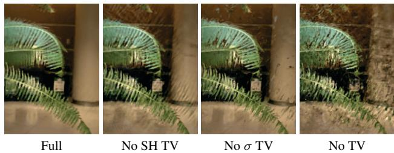  
Figure 3. Ablation over TV regularization. Clear artifacts are visible in the forward-facing scenes without TV on both σ and SH coefficients, although PSNR does not always reflect this.

Background model. For 360° scenes, we augment our sparse voxel grid foreground representation with a multisphere image (MSI) background model, which also uses learned voxel colors and densities with trilinear interpolation within and between spheres. Note that this is effectively the same as our foreground model, except the voxels are warped into spheres using the simple equirectangular projection (voxels index over sphere angles θ and φ). We place 64 spheres linearly in inverse radius from 1 to ∞ (we pre-scale the inner scene to be approximately contained in the unit sphere). To conserve memory, we store only rgb channels for the colors (only zero-order SH) and store all layers sparsely by using density thresholding as in our main model. This is similar to the background model in NeRF++ [60].

## 3.7. Regularization

We illustrate the importance of TV regularization in Fig. 3. In addition to TV regularization, which encourages smoothness and is used on all scenes, for certain types of scenes we also use additional regularizers.

On the real, forward-facing and 360° scenes, we use a sparsity prior based on the Cauchy loss from SNeRG [10]:

$$
\mathcal { L } _ { s } = \lambda _ { s } \sum _ { i , k } \log \left( 1 + 2 \sigma ( \mathbf { r } _ { i } ( t _ { k } ) ) ^ { 2 } \right)\tag{4}
$$

where $\sigma ( \mathbf { r } _ { i } ( t _ { k } ) )$ denotes the density of sample k along training ray i. In each minibatch of optimization on forwardfacing scenes, we evaluate this loss term at each sample on each active ray. This is also similar to the sparsity loss used in PlenOctrees [59] and encourages voxels to be empty, which helps to save memory.

On the real, 360° scenes, we also use a beta distribution regularizer on the accumulated foreground transmittance of each ray in each minibatch. This loss term, following Neural Volumes [22], promotes a clear foreground-background decomposition by encouraging the foreground to be either fully opaque or empty. This beta loss is:

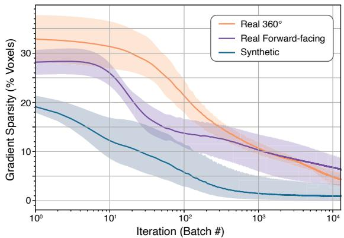  
Figure 4. Gradient sparsity. The gradient becomes very sparse spatially within the first 12800 batches (one epoch for the synthetic scenes), with as few as 1% of the voxels updating per batch in the synthetic case. This enables efficient training via sparse parameter updates. The solid lines show the mean and the shaded regions show the full range of values among all scenes of each type.

$$
\mathcal { L } _ { \beta } = \lambda _ { \beta } \sum _ { \bf r } \left( \log ( T _ { F G } ( \bf r ) ) + \log ( 1 - T _ { F G } ( \bf r ) ) \right)\tag{5}
$$

where r are the training rays and $T _ { F G } ( { \bf r } )$ is the accumulated foreground transmittance (between 0 and 1) of ray r.

## 3.8. Implementation

Since sparse voxel volume rendering is not wellsupported in modern autodiff libraries, we created a custom PyTorch CUDA [31] extension library to achieve fast differentiable volume rendering. We also provide a slower, higher-level JAX [5] implementation. The speed of our implementation is possible in large part because the gradient of our Plenoxel model becomes very sparse very quickly, as shown in Fig. 4. Within the first 1-2 minutes of optimization, fewer than 10% of the voxels have nonzero gradients.

## 4. Results

We present results on synthetic, bounded scenes; real, unbounded, forward-facing scenes; and real, unbounded, 360° scenes. We include time trial comparisons with prior work, showing dramatic speedup in training compared to all prior methods (alongside real-time rendering). Quantitative comparisons are presented in Tab. 2, and visual comparisons are shown in Fig. 1, Fig. 6, Fig. 7, and Fig. 8. Our method achieves quality results after even the first epoch of optimization, less than 1.5 minutes, as shown in Fig. 5.

We also present the results from various ablation studies of our method. In the main text we present average results (PSNR, SSIM [56], and VGG LPIPS [61]) over all scenes of each type; full quantitative and visual results on each

JAXNeRF [8,28]

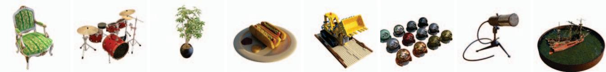  
Figure 5. 1 minute, 20 seconds. Results on the synthetic scenes after 1 epoch of optimization, an average of 1 minute and 20 seconds.

<table><tr><td></td><td colspan="3">PSNR ↑ SSIM ↑ LPIPS↓</td><td>Train Time</td></tr><tr><td>Ours</td><td>31.71</td><td>0.958</td><td>0.049</td><td>11 mins</td></tr><tr><td>NV [22]</td><td>26.05</td><td>0.893</td><td>0.160</td><td>&gt;1 day</td></tr><tr><td>JAXNeRF [8,28]</td><td>31.85</td><td>0.954</td><td>0.072</td><td>1.45 days</td></tr><tr><td>Ours</td><td>26.29</td><td>0.839</td><td>0.210</td><td>24 mins</td></tr><tr><td>LLFF [27]</td><td>24.13</td><td>0.798</td><td>0.212</td><td>*</td></tr><tr><td>JAXNeRF [8,28]</td><td>26.71</td><td>0.820</td><td>0.235</td><td>1.62 days</td></tr><tr><td>Ours</td><td>20.40</td><td>0.696</td><td>0.420</td><td>27 mins</td></tr><tr><td>NeRF++ [60]</td><td>20.49</td><td>0.648</td><td>0.478</td><td>~4 days</td></tr></table>

Table 2. Results. Top: average over the 8 synthetic scenes from NeRF; Middle: the 8 real, forward-facing scenes from NeRF; Bottom: the 4 real, 360° scenes from Tanks and Temples [16]. 4 of the synthetic scenes train in under 10 minutes. \*LLFF requires pretraining a network to predict MPIs for each view, and then can render novel scenes without further training; this pretraining is amortized across all scenes so we do not include it in the table.

scene, and full experimental details (hyperparameters, etc.) are included in the supplement.

## 4.1. Synthetic Scenes

Our synthetic experiments use the 8 scenes from NeRF: chair, drums, ficus, hotdog, lego, materials, mic, and ship. Each scene includes 100 ground truth training views with 800 × 800 resolution, from known camera positions distributed randomly in the upper hemisphere facing the object. Each scene is evaluated on 200 test views, also with resolution 800 × 800 and known inward-facing camera positions in the upper hemisphere. We provide quantitative comparisons in Tab. 2 and visual comparisons in Fig. 6.

We compare our method to Neural Volumes (NV) [22], a prior grid-based method with a 3D convolutional network, and JAXNeRF [8, 28]. For Neural Volumes we use values reported in [28]; for JAXNeRF we report results from our own rerunning, fixing its centered pixel bug [3]. Our method achieves comparable quality compared to the best baseline, while training in an average of 11 minutes per scene on a single GPU and supporting interactive rendering.

## 4.2. Real Forward-Facing Scenes

We extend our method to unbounded, forward-facing scenes by using normalized device coordinates (NDC), as derived in NeRF [28]. Our method is otherwise identical to the version we use on bounded, synthetic scenes, except that we use TV regularization (with a stronger weight) throughout the optimization. This change is likely necessary because of the reduced number of training views for these scenes, as described in Sec. 4.4.

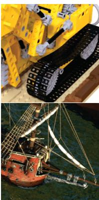  
Ground Truth

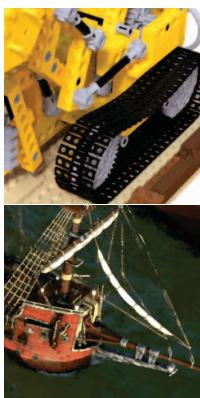

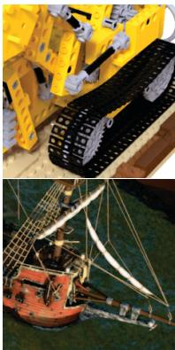  
Figure 6. Synthetic, bounded scenes. Example results on the lego and ship synthetic scenes from NeRF [28].

Our forward-facing experiments use the same 8 scenes as in NeRF, 5 of which are originally from LLFF [27]. Each scene consists of 20 to 60 forward-facing images captured by a handheld cell phone with resolution 1008 × 756, with 718 of the images used for training and the remaining 118 of the images reserved as a test set.

We compare our method to Local Light Field Fusion (LLFF) [27], a prior method that uses a 3D convolutional network to predict a grid for each input view, and JAXNeRF. We provide quantitative comparisons in Tab. 2 and visual comparisons in Fig. 7.

## 4.3. Real 360° Scenes

We extend our method to real, unbounded 360° scenes by surrounding our sparse voxel grid with an multi-sphere image (MSI, based on multi-plane images introduced by [62]) background model, in which each background sphere is also a simple voxel grid with trilinear interpolation (both within each sphere and between adjacent layers).

Our 360° experiments use 4 scenes from the Tanks and Temples dataset [16]: M60, playground, train, and truck. For each scene, we use the same train/test split as [39].

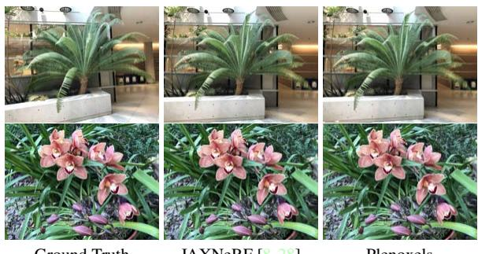  
Ground Truth  
JAXNeRF [8,28]  
Plenoxels  
Figure 7. Real, forward-facing scenes. Example results on the fern and orchid forward-facing scenes from NeRF.

We compare our method to NeRF++ [60], which augments NeRF with a background model to represent unbounded scenes. We present quantitative comparisons in Tab. 2 and visual comparisons in Fig. 8.

## 4.4. Ablation Studies

In this section, we perform extensive ablation studies of our method to understand which features are core to its success, with such a simple model. In Tab. 1, we show that continuous (in our case, trilinear) interpolation is responsible for dramatic improvement in fidelity compared to nearest neighbor interpolation (i.e. constant within each voxel) [59].

In Tab. 3, we consider how our method handles a dramatic reduction in training data, from 100 views to 25 views, on the 8 synthetic scenes. We compare our method to NeRF and find that, despite its lack of complex neural priors, by increasing TV regularization our method can outperform NeRF even in this limited data regime. This ablation also sheds light on why our model performs better with higher TV regularization on the real forward-facing scenes compared to the synthetic scenes: the real scenes have many fewer training images, and the stronger regularizer helps our optimization extend smoothly to sparsely-supervised regions.

We also ablate over the resolution of our Plenoxel grid in Tab. 4 and the rendering formula in Tab. 5. The rendering formula from Max [24] yields a substantial improvement compared to that of Neural Volumes [22], perhaps because it is more physically accurate (as discussed further in the supplement). The supplement also includes ablations over the learning rate schedule and optimizer demonstrating Plenoxel optimization to be robust to these hyperparameters.

## 5. Discussion

We present a method for photorealistic scene modeling and novel viewpoint rendering that produces results with comparable fidelity to the state-of-the-art, while taking orders of magnitude less time to train. Our method is also strikingly straightforward, shedding light on the core elements that are necessary for solving 3D inverse problems: a differentiable forward model, a continuous representation (in our case, via trilinear interpolation), and appropriate regularization. We acknowledge that the ingredients for this method have been available for a long time, however nonlinear optimization with tens of millions of variables has only recently become accessible to the computer vision practitioner.

<table><tr><td>PSNR ↑ SSIM ↑ LPIPS ↓</td></tr><tr><td>Ours: 100 images (low TV) 31.71</td><td>0.958 0.050 0.081</td></tr><tr><td>NeRF: 100 images [28]</td><td>31.01 0.947</td></tr><tr><td>Ours: 25 images (low TV) 26.88</td><td>0.911 0.099</td></tr><tr><td>Ours: 25 images (high TV)</td><td>28.25 0.932</td></tr><tr><td>NeRF: 25 images [28] 27.78</td><td>0.078 0.925 0.108</td></tr></table>

Table 3. Ablation over the number of views. By increasing our TV regularization, we exceed NeRF fidelity even when the number of training views is only a quarter of the full dataset. Results are averaged over the 8 synthetic scenes from NeRF.
<table><tr><td>Resolution</td><td>PSNR↑</td><td>SSIM↑</td><td>LPIPS ↓</td></tr><tr><td>5123</td><td>31.71</td><td>0.958</td><td>0.050</td></tr><tr><td>2563</td><td>30.57</td><td>0.950</td><td>0.065</td></tr><tr><td>1283</td><td>28.46</td><td>0.926</td><td>0.100</td></tr><tr><td>643</td><td>26.11</td><td>0.892</td><td>0.139</td></tr><tr><td>323</td><td>23.49</td><td>0.859</td><td>0.174</td></tr></table>

Table 4. Ablation over the Plenoxel grid resolution. Results are averaged over the 8 synthetic scenes from NeRF.
<table><tr><td>Rendering Formula</td><td>PSNR ↑</td><td>SSIM ↑ LPIPS ↓</td><td></td></tr><tr><td>Max [24], used in NeRF [28]</td><td>30.57</td><td>0.950</td><td>0.065</td></tr><tr><td>Neural Volumes [22]</td><td>27.54</td><td>0.906</td><td>0.201</td></tr></table>

Table 5. Comparison of different rendering formulas. We compare the rendering formula from Max [24] (used in NeRF and our main method) to the one used in Neural Volumes [22], which uses absolute instead of relative transmittance. Results are averaged over the 8 synthetic scenes from NeRF.

Limitations and Future Work. As with any underdetermined inverse problem, our method is susceptible to artifacts. Our method exhibits different artifacts than neural methods, as shown in Fig. 9, but both methods achieve similar quality in terms of standard metrics (as presented in Sec. 4). Future work may be able to adjust or mitigate these remaining artifacts by studying different regularization priors and/or more physically accurate differentiable rendering functions.

Although we report all of our results for each dataset with a fixed set of hyperparameters, there is no optimal a priori setting of the TV weight $\lambda _ { T V }$ . Better results may be obtained by tuning this parameter on a scene-by-scene basis, which is possible due to our fast training time. This is expected because the scale, smoothness, and number of training views varies between scenes.

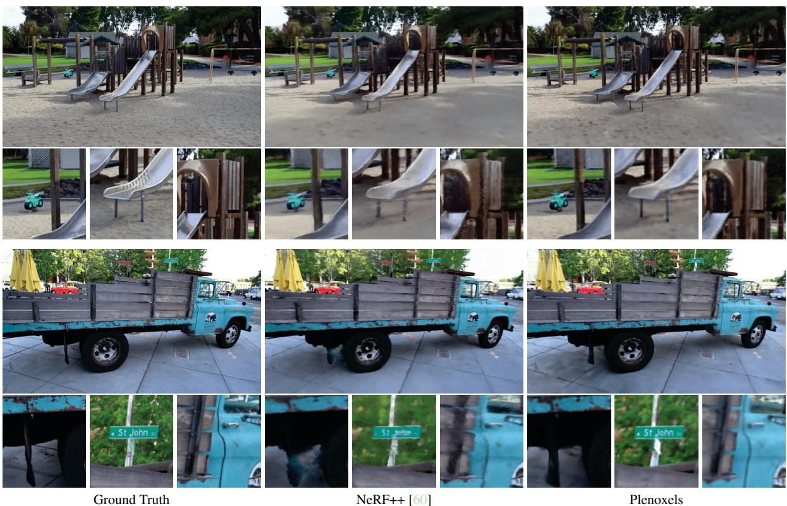  
Figure 8. Real, 360° scenes. Example results on the playground and truck 360° scenes from Tanks and Temples [16].

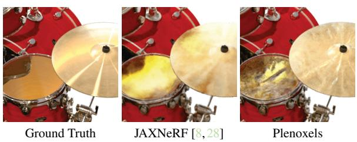  
Figure 9. Artifacts. JAXNeRF and Plenoxel exhibit slightly different artifacts, as shown here in the specularities in the synthetic drums scene. Note that some artifacts are unavoidable for any underdetermined inverse problem, but the specific artifacts vary depending on the priors induced by the model and regularizer.

Our method should extend naturally to support multiscale rendering with proper anti-aliasing through voxel conetracing, similar to the modifications in Mip-NeRF [3]. Another easy addition is tone-mapping to account for white balance and exposure changes [42], which we expect would help especially in the real 360° scenes. A hierarchical data structure (such as an octree) may provide additional speedup compared to our sparse array implementation, provided that differentiable interpolation is preserved.

Since our method is two orders of magnitude faster than NeRF, we believe that it may enable downstream applications currently bottlenecked by the performance of NeRF–for example, multi-bounce lighting and 3D generative models across large databases of scenes. By combining our method with additional components such as camera optimization and large-scale voxel hashing, it may enable a practical pipeline for end-to-end photorealistic 3D reconstruction.

## Acknowledgements

We note that Utkarsh Singhal and Sara Fridovich-Keil previously tried a related idea with point clouds. Additionally, we would like to thank Ren Ng for helpful suggestions and Hang Gao for reviewing the paper draft. The project is generously supported in part by the CONIX Research Center, sponsored by DARPA; Google research faculty award to Angjoo Kanazawa; Benjamin Recht's ONR awards N00014-20-1- 2497 and N00014-18-1-2833, NSF CPS award 1931853, and the DARPA Assured Autonomy program (FA8750-18- C-0101). SFK and MT are supported by the NSF GRFP.

## References

[1] Edward H. Adelson and James R. Bergen. The plenoptic function and the elements of early vision. In Computational Models of Visual Processing, pages 3–20. MIT Press, 1991. 2

[2] Kara-Ali Aliev, Artem Sevastopolsky, Maria Kolos, Dmitry Ulyanov, and Victor Lempitsky. Neural point-based graphics. In Computer Vision–ECCV 2020: 16th European Conference, Glasgow, UK, August 23–28, 2020, Proceedings, Part XXII 16, pages 696–712. Springer, 2020. 2

[3] Jonathan T. Barron, Ben Mildenhall, Matthew Tancik, Peter Hedman, Ricardo Martin-Brualla, and Pratul P. Srinivasan. Mip-NeRF: A multiscale representation for anti-aliasing neural radiance fields, 2021. 2, 4, 6, 8, 1

[4] R. Basri and D.W. Jacobs. Lambertian reflectance and linear subspaces. IEEE Transactions on Pattern Analysis and Machine Intelligence, 25(2):218–233, 2003. 2

[5] James Bradbury, Roy Frostig, Peter Hawkins, Matthew James Johnson, Chris Leary, Dougal Maclaurin, George Necula, Adam Paszke, Jake VanderPlas, Skye Wanderman-Milne, and Qiao Zhang. JAX: composable transformations of Python+NumPy programs, 2018. 2, 5

[6] Zhiqin Chen and Hao Zhang. Learning implicit fields for generative shape modeling, 2019. 2

[7] Christopher B. Choy, Danfei Xu, JunYoung Gwak, Kevin Chen, and Silvio Savarese. 3d-r2n2: A unified approach for single and multi-view 3d object reconstruction, 2016. 2

[8] Boyang Deng, Jonathan T. Barron, and Pratul P. Srinivasan. JaxNeRF: an efficient JAX implementation of NeRF, 2020. 2, 4, 6, 7, 8, 5, 9, 10

[9] Stephan J. Garbin, Marek Kowalski, Matthew Johnson, Jamie Shotton, and Julien Valentin. Fastnerf: High-fidelity neural rendering at 200fps, 2021. 1, 2

[10] Peter Hedman, Pratul P. Srinivasan, Ben Mildenhall, Jonathan T. Barron, and Paul Debevec. Baking neural radiance fields for real-time view synthesis, 2021. 1, 2, 5

[11] Geoffrey Hinton. RMSProp. 4, 1, 2

[12] Christian Häne, Shubham Tulsiani, and Jitendra Malik. Hierarchical surface prediction for 3d object reconstruction, 2017. 2

[13] James T. Kajiya and Brian P Von Herzen. Ray tracing volume densities. In Proceedings of the 11th Annual Conference on Computer Graphics and Interactive Techniques, SIGGRAPH '84, page 165–174, New York, NY, USA, 1984. Association for Computing Machinery. 2, 3

[14] Abhishek Kar, Christian Häne, and Jitendra Malik. Learning a multi-view stereo machine, 2017. 2

[15] Petr Kellnhofer, Lars Jebe, Andrew Jones, Ryan Spicer, Kari Pulli, and Gordon Wetzstein. Neural lumigraph rendering, 2021.2

[16] Arno Knapitsch, Jaesik Park, Qian-Yi Zhou, and Vladlen Koltun. Tanks and temples: Benchmarking large-scale scene reconstruction. ACM Trans. Graph., 36(4), July 2017. 6, 8, 4

[17] Aaron Knoll. A survey of octree volume rendering methods, 2006.2

[18] Christoph Lassner and Michael Zollhöfer. Pulsar: Efficient sphere-based neural rendering. In IEEE/CVF Conference on

Computer Vision and Pattern Recognition (CVPR), June 2021. 2

[19] M. Levoy. Display of surfaces from volume data. IEEE Computer Graphics and Applications, 8(3):29–37, 1988. 2

[20] David B. Lindell, Julien N. P. Martel, and Gordon Wetzstein. Autoint: Automatic integration for fast neural volume rendering, 2021. 2

[21] Lingjie Liu, Jiatao Gu, Kyaw Zaw Lin, Tat-Seng Chua, and Christian Theobalt. Neural sparse voxel fields, 2021. 1, 2

[22] Stephen Lombardi, Tomas Simon, Jason Saragih, Gabriel Schwartz, Andreas Lehrmann, and Yaser Sheikh. Neural volumes. ACM Transactions on Graphics, 38(4):1–14, Jul 2019. 2, 5, 6, 7, 3

[23] Julien N. P. Martel, David B. Lindell, Connor Z. Lin, Eric R. Chan, Marco Monteiro, and Gordon Wetzstein. Acorn: Adaptive coordinate networks for neural scene representation, 2021. 2

[24] N. Max. Optical models for direct volume rendering. IEEE Transactions on Visualization and Computer Graphics, 1(2):99–108, 1995. 2, 3, 7

[25] Duane Merrill and NVIDIA Corporation. CUB: Cooperative primitives for CUDA C++, 2021. 1

[26] Lars Mescheder, Michael Oechsle, Michael Niemeyer, Sebastian Nowozin, and Andreas Geiger. Occupancy networks: Learning 3d reconstruction in function space, 2019. 2

[27] Ben Mildenhall, Pratul P. Srinivasan, Rodrigo Ortiz-Cayon, Nima Khademi Kalantari, Ravi Ramamoorthi, Ren Ng, and Abhishek Kar. Local light field fusion: Practical view synthesis with prescriptive sampling guidelines, 2019. 2, 6, 8

[28] Ben Mildenhall, Pratul P Srinivasan, Matthew Tancik, Jonathan T Barron, Ravi Ramamoorthi, and Ren Ng. Nerf: Representing scenes as neural radiance fields for view synthesis. In European conference on computer vision, pages 405–421. Springer, 2020. 1, 2, 3, 5, 6, 7, 8, 9, 10

[29] T. Neff, P. Stadlbauer, M. Parger, A. Kurz, J. H. Mueller, C. R. A. Chaitanya, A. Kaplanyan, and M. Steinberger. Donerf: Towards real-time rendering of compact neural radiance fields using depth oracle networks. Computer Graphics Forum, 40(4):45–59, Jul 2021. 2

[30] Jorge Nocedal and Stephen J. Wright. Numerical Optimization. Springer, New York, NY, USA, second edition, 2006. 4

[31] NVIDIA, Péter Vingelmann, and Frank H.P. Fitzek. Cuda, release: 10.2.89, 2020. 1, 5

[32] Alan V. Oppenheim and Ronald W. Schafer. Discrete-Time Signal Processing. Prentice Hall Press, USA, 3rd edition, 2009.2

[33] Jeong Joon Park, Peter Florence, Julian Straub, Richard Newcombe, and Steven Lovegrove. DeepSDF: Learning continuous signed distance functions for shape representation, 2019. 2

[34] Eric Penner and Li Zhang. Soft 3d reconstruction for view synthesis. ACM Transactions on Graphics (TOG), 36:1 – 11, 2017.2

[35] Martin Piala and Ronald Clark. TermiNeRF: Ray termination prediction for efficient neural rendering, 2021. 2

[36] Ravi Ramamoorthi and Pat Hanrahan. On the relationship between radiance and irradiance: determining the illumination from images of a convex lambertian object. JOSA A, 18(10):2448–2459, 2001. 2

[37] Daniel Rebain, Wei Jiang, Soroosh Yazdani, Ke Li, Kwang Moo Yi, and Andrea Tagliasacchi. Derf: Decomposed radiance fields, 2020. 1, 2

[38] Christian Reiser, Songyou Peng, Yiyi Liao, and Andreas Geiger. KiloNeRF: Speeding up neural radiance fields with thousands of tiny mlps, 2021. 1, 2

[39] Gernot Riegler and Vladlen Koltun. Free view synthesis, 2020.7

[40] Gernot Riegler, Ali Osman Ulusoy, and Andreas Geiger. Octnet: Learning deep 3d representations at high resolutions, 2017.2

[41] Leonid I Rudin and Stanley Osher. Total variation based image restoration with free local constraints. In Proceedings of 1st International Conference on Image Processing, volume 1, pages 31–35. IEEE, 1994. 4

[42] Darius Rückert, Linus Franke, and Marc Stamminger. Adop: Approximate differentiable one-pixel point rendering, 2021. 2,8

[43] Seitz, Steven, Kutulakos, and Kiriakos. A theory of shape by space carving. 01 2000. 2

[44] S.M. Seitz and C.R. Dyer. Photorealistic scene reconstruction by voxel coloring. In Proceedings of IEEE Computer Society Conference on Computer Vision and Pattern Recognition, pages 1067–1073, 1997. 2

[45] Vincent Sitzmann, Justus Thies, Felix Heide, Matthias Nießner, Gordon Wetzstein, and Michael Zollhöfer. Deepvoxels: Learning persistent 3d feature embeddings, 2019. 2

[46] Vincent Sitzmann, Michael Zollhöfer, and Gordon Wetzstein. Scene representation networks: Continuous 3d-structureaware neural scene representations, 2020. 2

[47] Peter-Pike Sloan, Jan Kautz, and John Snyder. Precomputed radiance transfer for real-time rendering in dynamic, low-frequency lighting environments. ACM Trans. Graph., 21(3):527–536, July 2002. 2

[48] Pratul P. Srinivasan, Richard Tucker, Jonathan T. Barron, Ravi Ramamoorthi, Ren Ng, and Noah Snavely. Pushing the boundaries of view extrapolation with multiplane images, 2019.2

[49] Richard Szeliski and Polina Golland. Stereo matching with transparency and matting. International Journal of Computer Vision, 32:45–61, 2004. 2

[50] Towaki Takikawa, Joey Litalien, Kangxue Yin, Karsten Kreis, Charles Loop, Derek Nowrouzezahrai, Alec Jacobson, Morgan McGuire, and Sanja Fidler. Neural geometric level of detail: Real-time rendering with implicit 3d shapes, 2021. 2

[51] Matthew Tancik, Ben Mildenhall, Terrance Wang, Divi Schmidt, Pratul P. Srinivasan, Jonathan T. Barron, and Ren Ng. Learned initializations for optimizing coordinate-based neural representations, 2021. 2

[52] Maxim Tatarchenko, Alexey Dosovitskiy, and Thomas Brox. Octree generating networks: Efficient convolutional architectures for high-resolution 3d outputs, 2017. 2

[53] Shubham Tulsiani, Tinghui Zhou, Alexei A. Efros, and Jitendra Malik. Multi-view supervision for single-view reconstruction via differentiable ray consistency, 2017. 2

[54] Craig Upson and Michael Keeler. V-buffer: Visible volume rendering. SIGGRAPH Comput. Graph., 22(4):59–64, jun 1988.2

[55] Peng-Shuai Wang, Yang Liu, Yu-Xiao Guo, Chun-Yu Sun, and Xin Tong. O-cnn. ACM Transactions on Graphics, 36(4):1–11, Jul 2017. 2

[56] Zhou Wang, A.C. Bovik, H.R. Sheikh, and E.P. Simoncelli. Image quality assessment: from error visibility to structural similarity. IEEE Transactions on Image Processing, 13(4):600–612, 2004. 5

[57] Olivia Wiles, Georgia Gkioxari, Richard Szeliski, and Justin Johnson. Synsin: End-to-end view synthesis from a single image, 2020. 2

[58] Suttisak Wizadwongsa, Pakkapon Phongthawee, Jiraphon Yenphraphai, and Supasorn Suwajanakorn. Nex: Real-time view synthesis with neural basis expansion, 2021. 2

[59] Alex Yu, Ruilong Li, Matthew Tancik, Hao Li, Ren Ng, and Angjoo Kanazawa. PlenOctrees for real-time rendering of neural radiance fields. In ICCV, 2021. 1, 2, 3, 4, 5, 7

[60] Kai Zhang, Gernot Riegler, Noah Snavely, and Vladlen Koltun. NeRF++: Analyzing and improving neural radiance fields, 2020. 1, 2, 5, 6, 7, 8, 4, 11

[61] Richard Zhang, Phillip Isola, Alexei A Efros, Eli Shechtman, and Oliver Wang. The unreasonable effectiveness of deep features as a perceptual metric. In CVPR, 2018. 5

[62] Tinghui Zhou, Richard Tucker, John Flynn, Graham Fyffe, and Noah Snavely. Stereo magnification: Learning view synthesis using multiplane images, 2018. 2, 6