# RDC-SLAM: A Real-Time Distributed Cooperative SLAM System Based on 3D LiDAR

Yuting Xie , Yachen Zhang , Long Chen , Senior Member, IEEE, Hui Cheng , Member, IEEE, Wei Tu , Member, IEEE, Dongpu Cao , Member, IEEE, and Qingquan Li

Abstract— To improve the accuracy and efficiency of 3D LiDAR mapping, real-time cooperative SLAM has been considered to explore large and complex areas. To merge the individual maps from multiple robots, it is crucial to identify the common areas and obtain alternative matches between them. However, data transmission, especially in sparse networks with narrow bandwidth and limited range, is a challenging issue for the above problem. Since the distribution manner is suitable for limited communication, we proposed a common framework of 3D real-time distributed cooperative SLAM to fill the community gap. Assuming that each robot can communicate with others, the presented framework consists of four key modules: place recognition, relative pose estimation, distributed graph optimization, and communication. Meanwhile, we developed a complete real-time distributed cooperative SLAM system, called RDC-SLAM, by integrating state-of-the-art components into the framework. For computation and data transmission efficiency, descriptor-based registration is used instead of the conventional point cloud matching. An intensity-based descriptor is developed to perform the place recognition and obtain the alternative matches, while an eigenvalue-based segment descriptor is applied to further refine the relative pose estimations between these alternative matches. A distributed graph optimization method is utilized to obtain the maximum likelihood of multi-trajectory estimation. A communication protocol is also designed to associate data among robots that are easy to deploy and have low network requirements. The RDC-SLAM is validated by real-world experiments and exhibits superior performance concerning accuracy, computation efficiency, and data efficiency.

Index Terms— 3D LiDAR, cooperative SLAM, distributed system.

## I. INTRODUCTION

ping (SLAM) problem has continued to draw considerable attention in the robotic community due to its fundamental importance for robots to execute tasks in unknown environments [1]. SLAM is referred to as the ability of robots to extract information from surroundings to build maps and simultaneously utilize the map for self-localization.

The main sensors now used for SLAM on robots are LiDAR and vision sensors. The vision sensors play an essential role in intelligent vehicles [2], [3]. However, due to the wide field of view in horizontal directions (e.g., 360◦ for the full view) and high precision in distance measurements, LiDAR sensors have become more popular than vision sensors for robotic systems and autonomous driving fields [4]. Therefore, numerous LiDAR-based SLAM approaches have been explored over the years.

The most commonly employed SLAM approaches are deployed on one single robot to explore the unknown environment, and numerous effective solutions are available. However, since resources, including the storage and power of one single robot, are limited in practical applications, it may not be possible to collect enough information from the entire environment with one robot at once, especially in large-scale scenarios. An effective way to solve the above problems is to introduce a multi-robot array.

The multi-robot systems offer advantages of efficiency and robustness, which make them more suitable, especially for time-critical and high robustness tasks. Research on multirobot SLAM, or cooperative SLAM, has been motivated in recent years. In cooperative SLAM, each robot in the robot team explores part of the entire environment, which contains overlapped areas. These overlapped areas could be used to establish a consistent coordinate system between robots. The several individual maps established by each robot could be merged to produce a complete global map for the explored unknown environment.

In addition to the above subproblems, one crucial challenge faced by cooperative SLAM in practice is the limitation of the network. Online cooperative SLAM means that data from each robot is shared over the communication network. In large-scale scenarios with no infrastructure to guarantee global communication, the system will face significant limits on the bandwidth and transmission distance. The limitations make it necessary for the system to share the data required for collaboration with maximum efficiency in a short communication period. In consideration of the aforementioned communication limitations, we built a real-time distributed cooperative SLAM system.

In this paper, the proposed system consists of three steps to establish a global map by distributively leveraging existing

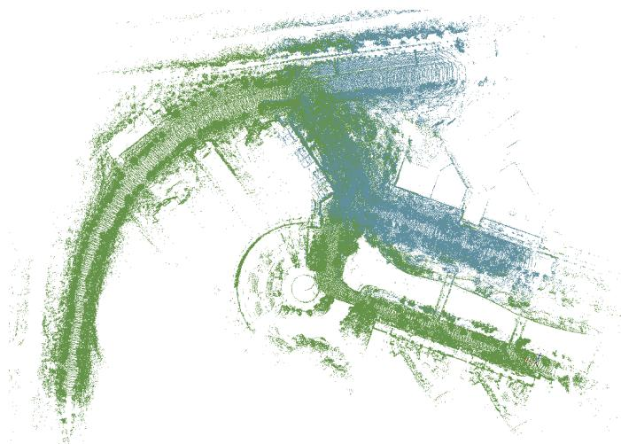  
Fig. 1. A demonstration of the final global map in the SYSU Campus dataset. Point cloud in different colors represents data collected from different robots.

SLAM techniques. First, similar places are recognized as bridges between each robot. Next, the relative pose estimation is computed through the recognized relative places. Finally, a distributed graph optimization approach is used to merge the local maps generated by all robots. The merged global map, as Fig.1, is presented as a combination of all data. During these steps, a well-designed communication protocol is designed for the proposed system. The communication protocol is based on point-to-point and short-distance wireless networks, which could meet real-time requirements for multiple mobile devices with low communication bandwidth. The primary contributions of this paper are as follows:

1) A real-time distributed cooperative SLAM system based on 3D LiDAR is proposed and open-sourced.1

2) A well-designed and easy-to-deploy communication protocol for the data-efficient distributed SLAM system is generated.

3) The proposed system is tested and verified by real-world experiments.

The organization of this paper is as follows. Section II describes the related work for cooperative SLAM and distributed system. Section III provides notation and task descriptions. Section IV presents the proposed cooperative SLAM method. Section V describes the communication protocol which implements the distributed deployment. Section VI provides the evaluation results. Section VII concludes this paper with future work.

## II. RELATED WORK

Generally, a real-time distributed cooperative SLAM system primarily focuses on two tasks: cooperative SLAM and distributed system. Since the above tasks have been explored in a diversity of literature in recent years, we only provide a brief overview of each of them in this section.

There are several kinds of research focus on LiDAR-based cooperative SLAM in recent years. In [5], the multiple robots only use the 2D LiDAR to complement the relative place of the map, which cannot be utilized to improve the state estimation due to a lack of back-end implementation. In [6], an offline city-scale mapping method for multiple vehicles is proposed, displaying a high quality and low computational efficiency. Google’s cartographer [7] is applied to fuse multiple trajectories, which focuses on updating old trajectories by new trajectories. In [8], an online 3D centralized cooperative SLAM system is implemented by gathering local data and providing feedback to local robots.

The most common approach for cooperative SLAM is focusing on pose estimation and map merging between each robot. There are two main primary types of 3D LiDAR point cloud registration: full-point alignment and descriptor-based methods. The full-point alignment methods are primarily based on the general algorithms of iterative closest point (ICP) [9] and normal distribution transform (NDT) [10]. Compared with these variations, the descriptor-based methods have advantages in computational efficiency and data efficiency. Descriptorbased methods can be divided into three categories: point feature description [11]–[13], object feature description [14], and global feature description [15], [16]. These methods compress data by highly generalizing the information of a feature point, an object, or the whole point cloud into a vector. Among these, the global feature descriptor is a high generalization of the entire scene, while the object-level and the point-level descriptors extract local information. Thus, the global descriptor effectively matches full scenes and is usually applied for place recognition [15], [16], which is a prerequisite for data alignment. The other descriptors are used for local areas: they work well for relative pose estimation with geometric verification [14], [17] and function in place recognition with the help of the voting strategy [18]. Besides full-point alignment and descriptor-based methods, the pose can be estimated by sensor fusion with better accuracy [19], [20], which could be estimated by the Kalman Filter method [21]–[23]. And the deep learning method could also be used for the SLAM and navigation [24]–[26].

Map merging is crucial for the cooperative SLAM task to merge every individual map to generate a global map. The map merging techniques could be divided into two categories: direct map merging and indirect map merging [27]. The direct map merging method is used to obtain relative poses between submaps by employing robot-to-robot measurements and then stitching submaps directly into the global map with the calculated transformation matrix. The indirect map merging method focuses on achieving global consistency by proper fusion of all observations instead of merely overlaying observations together. For the consistent estimation of global states, graph-based optimization [28] has become the most popular technique. The adoption of graph-based optimization for distributed systems has also recently been an active field [29]–[31]. However, it has not been integrated into a cooperative SLAM system based on 3D LiDAR until now. In [31], the amount of data transition, which scales only linearly with trajectory overlap, is significantly reduced compared to DDF-SAM2.0 [30], which scales quadratically.

Generally, an online cooperative SLAM system can be centralized, decentralized or distributed [32]. As mentioned before, a predefined central node gathers all collected data and performs tasks in a centralized system. The majority of related research on cooperative SLAM is based on this kind of system setup, such as [33], [34]. However, due to the network’s high requirements and heavy computational burden on the central node, centralized schemes are difficult and high cost when deployed in large scale scenarios. In a decentralized system, each robot is regarded as a central node to gather all information and perform the complete task’s computation. Compared to the centralized scheme, the computational burden and the communication burden are both significantly increased in the decentralized system. In a distributed system, the computational load is divided among robots, which makes it more flexible than the former system. However, several cooperative slam systems utilize the distributed stategy [5], [35]; as far as we know, few employ 3D LiDAR. To fill the gap for online distributed cooperative SLAM based on 3D LiDAR, we developed a complete and tractable system based on the above dominant strategies involving the descriptor-based data association method and a Distributed Gauss-Seidel (DGS) based back-end algorithm [31]. Compared with current LiDAR-based cooperative SLAM systems, our system presents the advantages of no auxiliary equipment need, high computation efficiency and low amounts of data transmission to effectively satisfy the requirements of time-critical missions in deployed environments with no communication infrastructure, such as secure and rescue (SaR) tasks.

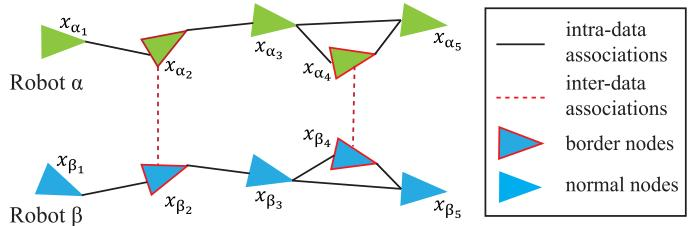  
Fig. 2. The pose graph of multiple robots. The triangles represent the pose nodes, while the colors identify different robots.

## III. NOTATIONS AND TASK DESCRIPTION

Let $\Omega = \{ \alpha , \beta , \gamma , \dots \}$ represent the set of robots in our proposed cooperative SLAM system. Use the pose graph to demonstrate all relevant elements of the system, as illustrated in Fig.2. A pose graph consists of nodes and edges. Nodes present states of the system and represent robot poses, denoted as $X \ = \ \left\{ x _ { \alpha , i } , x _ { \alpha , j } , \ldots , x _ { \beta , i } , \ldots , x _ { \gamma , i } , \ldots \right\}$ where $x _ { a , i }$ indi--cates the pose of robot α at time i, $x \in S E \left( 3 \right)$

Each pose x include a rotation $\begin{array} { r } { R \in \begin{array} { r l } { S O \left( 3 \right) } \end{array} } \end{array}$ and a translation $t \in \ R ^ { 3 }$ , written as $\begin{array} { r } { \boldsymbol { x } ~ = ~ ( \boldsymbol { R } , t ) } \end{array}$ . Additionally, nodes are usually accompanied by sensor data collected in related poses. Edges, denoted as $\mathcal { E } ,$ are constraints, also called associations, between two nodes and represent measurements $\overline { { Z } } = \left\{ \overline { { z } } _ { \beta _ { i } } ^ { \alpha _ { i } } \vert \left( \alpha _ { i } , \beta _ { j } \right) \in \mathcal { E } \right\}$ . We divide the associations into two  categories: the intra-data associations, which connect nodes of one single robot, and the inter-data associations, which link nodes of different robots. We refer to nodes involved in inter-data associations as border nodes. This system aims to obtain the best estimate of X that satisfies the maximum likelihood of all measurements as follows:

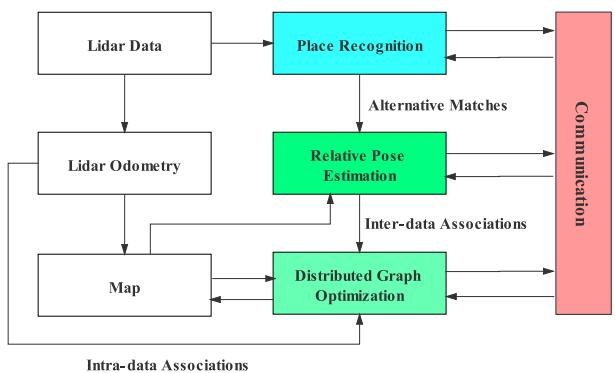  
Fig. 3. Framework for the proposed RDC-SLAM approach. The system performs in a distributed manner. For each individual, when the new LiDAR data comes in, the LiDAR odometry module calculates local odometry to produce intra-data associations and the place recognition module produces candidate matches between laser scans from different robots. The relative pose module further refines the transformation between the candidate matches to obtain the intra-data associations. Finally, the distributed graph optimization module integrates the inter-data associations and intra-data associations to update the map. Notablely, the consistency of multiple local maps are coordinated through communication.

$$
\begin{array} { r l } { \pmb { x } ^ { \star } } & { = \pmb { \mathrm { \arg \operatorname* { m a x } } } \displaystyle \prod _ { \pmb { x } } \mathcal { L } \left( \overline { { z } } _ { \beta _ { j } } ^ { a _ { i } } | \pmb { x } \right) } \\ & { = \overline { { z } } _ { \beta _ { j } } ^ { a _ { i } } \doteq \left( \overline { { R } } _ { \beta _ { j } } ^ { a _ { i } } , \overline { { t } } _ { \beta _ { j } } ^ { a _ { i } } \right) } \\ & { \qquad \le \pmb { \mathrm { \verb " ~ \left\{ \overline { { R } } _ { \beta _ { j } } ^ { a _ { i } } = \left( R _ { a _ { i } } \right) ^ { \top } R _ { \beta _ { j } } R _ { \epsilon } \right. } } } \\ & { \qquad \left. \overline { { t } } _ { \beta _ { i } } ^ { a _ { i } } = \left( R _ { \alpha _ { i } } \right) ^ { \top } \left( t _ { \beta _ { j } } - t _ { \alpha _ { i } } \right) + t _ { \epsilon } \right. } \end{array}\tag{1}
$$

(2)

where, $\overline { { \boldsymbol { z } } } _ { \beta _ { j } } ^ { \alpha _ { i } }$ is the relative pose measurement including the rotation measurement $\overline { { \pmb { R } } } _ { \beta _ { i } } ^ { \alpha _ { i } }$ which means the rotation attitude between robot $\beta$ at time j and robot α at time i with the measurement noise $\pmb { R } _ { \epsilon }$ , and the translation measurement $\overline { { \pmb { t } } } _ { \beta _ { j } } ^ { \alpha _ { i } }$ with the noise $t _ { \epsilon } ~ [ 3 1 ]$

Assuming that the rotation noise follows the Von-Mises distribution [36] with concentration parameter $\omega _ { R } ^ { 2 }$ , while the translation noise follows a zero-mean Gaussian distribution with covariance $\omega _ { t } ^ { 2 } \mathbf { I } _ { 3 }$ . The Von-Mises distribution is also called isotropic Langevin distribution, which is used for the rotational measurements errors [37]. The ML estimation of X can be viewed as the solution to the following optimization problem:

$$
\begin{array} { c } { { \displaystyle \operatorname* { m i n } _ { \mathbf { t } _ { \alpha _ { i } } \in \mathbb { R } ^ { 3 } } \displaystyle \sum _ { ( \alpha _ { i } , \beta _ { j } ) \in \varepsilon } \omega _ { t } ^ { 2 } \Delta \vert \vert \Delta \mathbf { T } \vert \vert ^ { 2 } + \frac { \omega _ { R } ^ { 2 } } { 2 } \vert \vert \Delta \mathbf { R } \vert \vert _ { F } ^ { 2 } } } \\ { { \displaystyle \mathbf { R } _ { \alpha _ { i } } \in S O ( 3 ) } } \\ { { \forall \alpha \in \Omega , \forall i } } \\ { { \displaystyle s . t . \left. \Delta \mathbf { T } = \mathbf { t } _ { \beta _ { j } } - \mathbf { t } _ { \alpha _ { i } } - \mathbf { R } _ { \alpha _ { i } } \mathbf { \overline { { t } } } _ { \beta _ { j } } ^ { \alpha _ { i } } \right. } } \\ { { \displaystyle \left. \Delta \mathbf { R } = \mathbf { R } _ { \beta _ { j } } - \mathbf { R } _ { \alpha _ { i } } \mathbf { \overline { { R } } } _ { \beta _ { j } } ^ { \alpha _ { i } } \right. } } \end{array}\tag{3}
$$

In the Eq. 3, we use the chordal distance || R $| | _ { F } ^ { 2 }$ to quantify the rotation errors, the details could be referred from [37], [38].

## IV. SYSTEM ARCHITECTURE

This section introduces details of the RDC-SLAM. The system, which consists of a team of robots deployed with a 3D LiDAR, operates on the raw sensor data directly and achieves globally consistent localization and mapping.

Under the consideration of easy deployment, we handle communication among robots by a point-to-point wireless network, which does not rely on communication infrastructure setup. Though offering irreplaceable practical advantages, the wireless network has limited communication bandwidth, and the communication range varies with environment structure and the specific protocol (WiFi, Bluetooth, etc.). Besides, the stability of data transmission is affected by packet size. The smaller the packet, the more stable the transmission is. Therefore, due to the network setup, the system must meet the following requirements:

1) Each robot should communicate with at least one other robot once.

2) Low data transmission.

RDC-SLAM performs in a distributed manner where the computation load is shared among robots. Each robot performs procedures described in Fig.3. When a new laser scan taken by 3D LiDAR arrives, it is fed to the LiDAR odometry (LO) and the place recognition (PR) module. The PR module extracts a compact description of the laser scan and with occasional communication, produces candidate matches between laser scans from different robots. The LO module computes sequential constraints and loop closure constraints to generate a map for localization. The relative pose (RP) module extracts information from the parts of the map at candidate matches to further refine the transformation between corresponding scans or to reject candidate matches. The distributed graph optimization (DGO) module receives initial guesses from the map, inter-data associations from the RP module and intra-data associations from the LO module to update the map by consistently estimating multi-trajectories through communication. This system works continuously as new LiDAR data is acquired.

Robots share information during the encounters (which means that they are in the communication range). To meet system requirements, modules involved in communication should ensure the system’s performance with low data transmission. The rest of this section will introduce the information compression methods and cooperative data processing methods in detail.

## A. Place Recognition

The place recognition module explores alternative matches between nodes of each robot, which involve common areas. The conventional methods for place recognition are to attempt to perform registration among all point clouds to find the alternative nodes of the common areas for two individual robots. However, these methods always consume large amounts of time and computational resources. To achieve a real-time SLAM system, the time consumption of the PR module should be reduced as much as possible. Therefore, a global descriptor based on intensity, called DELIGHT, is applied to reduce time consumption [15].

The intensity of each point is the strength of reflection from a surface, which can be captured by 3D LiDAR from the surroundings. The DELIGHT descriptor is composed of histograms of intensity within m non-overlapped bins. These bins are obtained by spherical partitions along the radial, elevation and azimuth axes, as sketched in Fig. 4. A sphere can be divided into 8 bins according to the orientation of the three axes. To obtain the valid points, the sensor range $r _ { 1 }$ is used to select the points from the original point clouds. The closer points can be selected by the range threshold $r _ { 2 }$ as an inner sphere. The rest of the valid point cloud is called as the outer sphere. Therefore, the points can be divided into two spheres and m = 16 bins. In each bin, we assign the values of the intensity(0 − 255) into $I _ { b i n s }$ equal slots and produce the histogram.

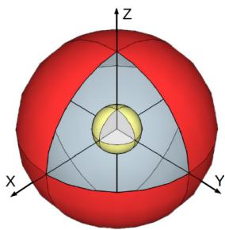  
Fig. 4. The structure of the DELIGHT descriptor. The space is divided by spherical partitions along the radial, elevation and azimuth axes. In this paper, 2 divisions in the radial (yellow indicates the inner sphere and red indicates the outer sphere), 4 divisions in elevation, 2 divisions in azimuth and totally 16 bins.

The coordinate system of the point clouds is established according to the posture of sensors at each node. To reduce the estimation error caused by sensor posture, the following two procedures are applied for the whole point cloud: 1) We normalize the point cloud so that the point cloud origin is at the same position under the same environment. 2) We artificially define the positive direction of the axes in the local coordinate system.

In the original DELIGHT descriptor, the local reference frame is obtained by a Principal Component Analysis (PCA) of all surrounding points within the support, where ambiguity in axes directions exists. There are 4 possible reference frames corresponding to 4 different sequences of bins, resulting in 4 different versions of the descriptor. To eliminate the ambiguity and define a unique local reference frame, we count the number of points in the two spheres divided by the x −z plane and set the larger value as the positive Y-axis. The positive Z-axis could be determined according to the direction of gravity. Therefore, we can determine the direction of each axis in the right-handed system. According to the two procedures before, the estimation error caused by the sensor postures can be effectively reduced.

As for the similarity assessment, as proposed in [15], the following chi-squared test is leveraged to assess the distance between the histograms of descriptor A and descriptor B for bin i .

$$
S _ { A B } ^ { i } = \sum _ { k = 1 } ^ { I _ { b i n s } } \frac { 2 \cdot ( A ( k ) - B ( k ) ) ^ { 2 } } { A ( k ) + B ( k ) }\tag{4}
$$

In each bin, we calculate the histogram of intensity from 1 to $I _ { b i n s }$ . The similarity metric of the two descriptors is equal to the average distance of all corresponding histograms. We can then calculate the similarity value for

two frames as follows:

$$
S _ { A B } = \frac { \sum _ { i = 1 } ^ { m } S _ { A B } ^ { i } } { m }\tag{5}
$$

Therefore, we can obtain alternative matches by selecting each node pair’s smaller similarity values for two individual robots. For one frame $F _ { i } ^ { \alpha }$ from one robot, the alternative matches processed by this module are selected as $S _ { \beta }$ for another robot.

## B. Relative Pose Estimation

In the previous procedure, we merely obtained the alternative matched frames. The transformations of these matched still need to be calculated to establish accurate inter-data associations. Therefore, the relative pose estimation is executed to determine the accurate transformations with less time and computational cost.

First, the point cloud is divided into several segments. Segmentation is performed by a range image based method proposed in [39], which has extremely small computation demand and works well for sparse point clouds. In this method, two different points are regarded as belonging to different segments when the angle, which is defined as the angle between the line connecting the two points and the laser beam of the further away point, is small enough. These segments are part of the original point cloud and highlight the core information of the point cloud.

Next, the eigenvalue-based segment description, which is presented as a vector V and consists of factors computed from the segment’s eigenvalues $e _ { 1 } , e _ { 2 }$ and $\scriptstyle { e _ { 3 } , }$ , is applied for all of the divided segments to compress the data size. These descriptors can not only represent the segments but also reduce the size of the frame. Segment matching is then performed through fast nearest neighbor search (KNN) with the number of selected neighbors $K _ { k n n }$ and distance threshold $T _ { k n n }$ in the space of the eigenvalue-based descriptor by a FLANN tree. The segments of two individual frames may correspond to each other to reduce the estimation error.

Then, a geometric verification process based on RANSAC obtains clusters which satisfy geometric consistency (GC) with a resolution threshold $T _ { r e s }$ and minimal cluster size $T _ { m i n } .$ Finally, a new inter-data association is created according to the achieved relative transformation.

The algorithm of the RP module is shown in Algorithm.1. $F _ { i } ^ { \alpha }$ indicates the frame i from robot α and $F _ { j } ^ { \beta ^ { \mathbf { \setminus } } }$ indicates the frame $j$ from robot $\beta . \ \xi _ { F _ { i } ^ { \beta } } ^ { F _ { i } ^ { \alpha } }$ indicates the transformation between these two frames. $S ^ { \beta }$ indicates the alternative matches from robot $\beta ,$ while $N _ { S ^ { \beta } }$ indicates the number of the alternative matches. Segment(·) refers to the segmentation procedure in the first step. $S e g ^ { \alpha }$ and $S e g ^ { \beta }$ represent the divided segments, while $N _ { i } ^ { \alpha }$ and $N _ { j } ^ { \beta }$ denote the numbers of divided segments for each robot. Descriptor(·) indicates the eigenvalue-based segment description in the second step. $V ^ { \alpha }$ and $V ^ { \beta }$ represent the vectors of the descriptor for each segment. K NN(·) indicates the search procedure in the third step. Geometric(·) means the geometric verification to obtain the transformation. Finally, the transformation for the inter-data association is calculated between the two frames.

Algorithm 1 Algorithm for Relative Pose Estimation   
Input: $F _ { i } ^ { \alpha }$ and $S ^ { \beta }$   
Output: $\dot { \varsigma } _ { F _ { i } ^ { \beta } } ^ { F _ { i } ^ { \alpha } } , j \in S ^ { \beta }$   
1: $( N _ { i } ^ { \alpha }$ , Segα)= Segment $( F _ { i } ^ { \alpha } )$   
2: for $t = 0$ to $N _ { S ^ { \beta } }$ do   
3: $j = S ^ { \beta } ( t )$   
4: $( N _ { j } ^ { \beta } , S e g ^ { \beta } ) = \mathrm { S e g m e n t } ( F _ { j } ^ { \beta } )$   
5: for every segment do   
6: $V ^ { \alpha } = \operatorname { D e s c r i p t o r } ( S e g ^ { \alpha } )$   
7: $V ^ { \beta } = \mathrm { D e s c r i p t o r } ( S e \bar { g } ^ { \beta } )$   
8: end forα   
9: $\xi _ { { \cal F } _ { \bot } ^ { \beta } } ^ { { \cal F } _ { i } ^ { \alpha } } = G e o m e t r i c ( V ^ { \alpha } , K N N ( V ^ { \alpha } ) , T _ { r e s } , T _ { m i n } )$   
10: end for

## C. Distributed Graph Optimization

For a cooperative SLAM system, a front-end system used to associate data from different robots and a back-end system used to consistently estimate the global states of all robots are crucial to determining the system’s performance.

In the last two procedures, we can calculate the relative pose transformation between different frames through two kinds of descriptors. Therefore, we can acquire both inter-data associations and intra-data associations. To produce a complete and accurate global map from multiple robots, the DGO module is utilized to obtain the ML multi-trajectory estimates, as proposed in [31]. Each robot estimates its local trajectory using only measurements involving border node poses shared with other robots. The amount of data transmission for this module scales merely linearly on the number of border nodes.

A two-stage strategy is applied to solve the above distributed graph optimization problem, as shown in Eq. (3). The first stage shown as Eq. (6a) computes the rotation of all multiple robots by solving the second part of Eq. (3). The second stage shown as Eq. (6b) computes the full pose transformation through single Gauss-Newton iteration [40] by solving Eq. (3). The results of the two stages could both be shown as follows:

$$
( \mathbf { A _ { r } ^ { T } } \mathbf { A _ { r } } ) \mathbf { r } = \mathbf { A _ { r } ^ { T } } \mathbf { b _ { r } }\tag{6a}
$$

$$
( \mathbf { A _ { p } ^ { T } } \mathbf { A _ { p } } ) \mathbf { p } = \mathbf { A _ { p } ^ { T } } \mathbf { b _ { p } }\tag{6b}
$$

The original nonconvex problem is approximated as a sequence of linear least-squares subproblems, which can be easily implemented in a distributed manner since the unknown state vector can be partitioned into subvectors related to one single trajectory. The two linear subproblems can be rearranged according to the following general form:

$$
H y = g \Leftrightarrow { \left[ \begin{array} { l l l } { H _ { a \alpha } } & { H _ { \alpha \beta } } & { . . . } \\ { H _ { \beta \alpha } } & { H _ { \beta \beta } } & { . . . } \\ { \vdots } & { \vdots } & { \ddots } \end{array} \right] } { \left[ \begin{array} { l } { { \mathbf { y } } _ { \alpha } } \\ { { \mathbf { y } } _ { \beta } } \\ { \vdots } \end{array} \right] } = { \left[ \begin{array} { l } { g _ { \alpha } } \\ { g _ { \beta } } \\ { \vdots } \end{array} \right] }\tag{7}
$$

where the vector y presents the unknown position vector p or unknown rotation vector r. On the right of Eq. (7), we partition y as $\pmb { y } = \left[ \pmb { y } _ { \alpha } , \pmb { y } _ { \beta } , \dots \right] ^ { T }$ , such that ${ \bf y } _ { a }$ describes positions or rotations of robot $\alpha .$ . Similarly, the square matrix H and the vector $\pmb { g }$ are partitioned according to the block structure of $\mathbf { \nabla } _ { y . }$

Further, taking the contribution of ${ \bf y } _ { a }$ out of the sum, Eq. (7) can be rewritten as follows:

$$
\pmb { H } _ { \alpha \alpha } \pmb { y } _ { \alpha } = - \sum _ { \delta \in \Omega \backslash \{ \alpha \} } \pmb { H } _ { \alpha \delta } \pmb { y } _ { \delta } + \pmb { g } _ { \alpha } \forall \alpha \in \Omega\tag{8}
$$

Leveraging the Distributed Gauss-Seidel algorithm [31], the problem can be solved by iterations. Starting at an arbitrary initial estimate, each robot α in the system obeys the following update rule at the k-th iteration:

$$
\pmb { y } _ { \alpha } ^ { ( k + 1 ) } = \pmb { H } _ { \alpha \alpha } ^ { - 1 } \left( - \sum _ { \delta \in \Omega _ { \alpha } ^ { + } } \pmb { H } _ { \alpha \delta } \pmb { y } _ { \delta } ^ { ( k + 1 ) } - \sum _ { \delta \in \Omega _ { \alpha } ^ { - } } \pmb { H } _ { \alpha \delta } \pmb { y } _ { \delta } ^ { ( k ) } + \pmb { g } _ { \alpha } \right)\tag{9}
$$

where $\Omega _ { \alpha } ^ { + }$ donates the set of robots that has completed the k-th iteration and $\Omega _ { \alpha } ^ { - }$ donates the set of robots that still have to perform the update, excluding the robot α. When converging to a fixed point, the obtained y is indeed the linear system’s solution, which is shown as Eq. (7). For more details of formula derivation, please refer to [31].

Since the optimization method includes two stages and goes through an iterative process, inconsistent global state estimates occur at the end of the first stage and between iterations. Besides, the DGO module cannot incorporate newly included nodes between iterations. Simultaneously modifying the pose graph by the LO module and the DGO module will lead to state estimation conflicts. Motivated by ideas for version control tools, we deploy optimistic concurrency control into the distributed robot system, similarly to [35], [41], [42]. We make the DGO module operate on one copy of the pose graph instead of the original one. Every time the graph optimization cycle begins, the start moment is recorded to prevent newly added nodes after this moment from joining in the optimization process. The optimized estimates are merged into the original pose graph until the distributed graph optimization algorithm converges after several iterations.

## D. Communication Protocol

Considering the aforementioned communication limitations and real-time requirements, the communication protocol needs to be well designed and easy-to-deployed. In this system, each robot periodically sends ping messages to identify neighbor robots based on the response messages.

The information sharing between multiple robots is going to start since there are response messages. The communication messages from multiple robots are synchronized by the proposed protocol, as shown in Fig.5. For clarity, we just select two robots as an example, but it should be noted that our communication protocol could be used in multiple robots.

When new LiDAR data is captured by the robot $^ { a , }$ the PR module produces a descriptor to compress the raw point cloud and restore it in a local descriptor tree, which is introduced in Section III-A. And the communication messages of these descriptors are sent as P R\_MSG. Once another robot $\beta$ receives P R\_MSG from its neighbor robot $\alpha ,$ the PR module is triggered to retrieve the most similar descriptor in the descriptor tree. The most similar eigenvalue-based segment descriptor around the nodes corresponds to the most similar place in the map. Meanwhile, encapsulating the eigenvalue-based segment descriptor with related nodes into a relative pose message is R P\_MSG, and sending the RP\_MSG out. When robot α receives RP\_MSG, the corresponding eigenvalue based segment descriptors are extracted, and the RP module computes relative poses using the descriptors to establish new inter-data associations. Once new inter-data associations are created, the DGO module is triggered to update maps through several times of sharing border node poses, which is spread as DG O\_MSG. If there is no data captured by the multiple robots, the whole system will send the FIN message to terminate communication in this cycle. At the end of each communication cycle, each robot keeps a globally consistent state.

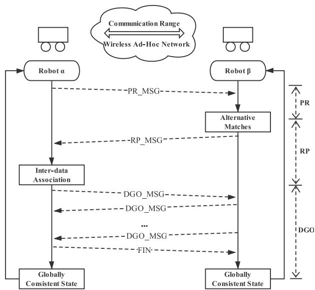  
Fig. 5. The communication protocol for the system: PR\_MSG means the messages in the PR module, RP\_MSG means the messages in the RP module, DGO\_MSG means the messages in the DGO module, and FIN means the final message to terminate the communication.

To reduce redundant transmission and improve communication robustness, packet loss and retransmission should be considered. Referring to the timeout retransmission in network protocols, a timer is started when one message is sent out. And if no message feedback is received within a certain period, the message will be sent again. One request message will not be sent repeatedly when the corresponding request message has been received to avoid redundant computation in bi-direction. The state transition diagram is shown in Fig.6.

## V. EXPERIMENTS

Here, we verify our proposed real-time distributed cooperative SLAM system by tests in real-world environments. The performance of RDC-SLAM is quantitatively analyzed on the publically available KITTI dataset [43]. Meanwhile, to validate the capability of RDC-SLAM in a challenging unstructured environment, which is closer to actual outdoor scenarios of robotic applications than the urban transport scene in KITTI, we collected an outdoor dataset in the SYSU campus and also evaluated the developed system.

The system is implemented in C++ as a ROS package. The following experiments were performed on multiple computers, and each, equipped with an Intel i7-8550U CPU @1.80GHz · 8 and 8GB of DDR3 RAM, takes charge of computation on ptember 16,2026 at 03:44:01 UTC from IEEE Xplore. Restrictions apply.

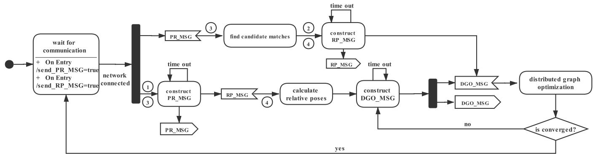  
Fig. 6. State diagram for the communication protocol. 1 represents the transition condition: [send\_P R\_MSG], 2 represents the transition condition: [send\_R P\_MSG], 3 represents the action: /send\_P R\_MSG = false, 4 represents the action: /send\_R P\_MSG = false.

one single robot. These computers are set to the same network segment, and the communication between computers/robots is based on an AdHoc wireless network.

## A. Experimental Setup

1) Scenarios: The KITTI dataset is composed of real data collected from various road scenes. Since KITTI actually is not customized for verification of distributed SLAM, we selected one large scale sequence and modified it to meet the needs for the experimental setup. We divided the KITTI sequence 05 into two sub-sequences with equal durations, which lasts 2.2km and 287s. And we simultaneously playback the two sub-sequences to simulate the multiple robot scenario. To study whether the system performance is affected under short-distance transmission conditions, we play one sub-sequence reversely so that the simulated robots can encounter and communicate at some point, even in shortdistance communication.

Besides, in order to further verify the algorithm, we collect data from an unstructured tree-lined trail in the SYSU Campus by two real robots as a supplementary dataset. The SYSU Campus dataset is collected by using two robots equipped with velodyne VLP-16. The robots were simultaneously controlled by two persons that steered them manually in the SYSU campus. The robots communicated through a wireless network and each of them was performing the RDC-SLAM system. To reproduce the experiment, we recorded the dataset containing the own measurements (GPS data and LiDAR data) into two bags, one lasted 182s, and the other lasted 135s, which allows us to reproduce the experiment off-board.

2) Details and System Parameterization: Since the system’s design focuses on the ability of cooperative processing of multiple trajectories, the above content does not involve the specific implementation of the LiDAR odometry module. Any available single SLAM method can be used. In the experiment, we applied Lego-loam [44] as the LiDAR odometry module.

Besides, the parameters used in our experiments are listed in Table.I. These parameters include: (1) the inner sphere radius (r1), outer sphere radius (r2), the intensity bins $\left( I _ { b i n s } \right)$ and similarity threshold $( T _ { S _ { A B } } )$ in place recognition, (2) the distance threshold $\left( T _ { k n n } \right)$ , number of nearest neighbors $\left( K _ { k n n } \right)$ , the geometric consistency resolution threshold $\left( T _ { r e s } \right)$ and minimal cluster size $( T _ { m i n } )$ in segment-based registration, (3) the connection distance $( d _ { c p } )$

TABLE I  
PARAMETERS FOR TWO SCENARIOS
<table><tr><td rowspan=1 colspan=1>Scenarios</td><td rowspan=1 colspan=1> $\overline { { I _ { b i n s } } }$ </td><td rowspan=1 colspan=1> $\overline { { T _ { S _ { A B } } } }$ </td><td rowspan=1 colspan=1> $T _ { k n n }$ </td><td rowspan=1 colspan=1> $\overline { { K _ { k n n } } }$ </td><td rowspan=1 colspan=1> $\overline { { T _ { r e s } } }$ </td><td rowspan=1 colspan=1> $\overline { { T _ { m i n } } }$ </td><td rowspan=1 colspan=1> $\overline { { d _ { c p } } }$ </td></tr><tr><td rowspan=1 colspan=1>KITTI</td><td rowspan=1 colspan=1>32</td><td rowspan=1 colspan=1>100</td><td rowspan=1 colspan=1>0.2</td><td rowspan=1 colspan=1>3</td><td rowspan=1 colspan=1>0.1m</td><td rowspan=1 colspan=1>8</td><td rowspan=1 colspan=1>200m</td></tr><tr><td rowspan=1 colspan=1>SYSU Campus</td><td rowspan=1 colspan=1>128</td><td rowspan=1 colspan=1>200</td><td rowspan=1 colspan=1>2</td><td rowspan=1 colspan=1>8</td><td rowspan=1 colspan=1>0.65m</td><td rowspan=1 colspan=1>10</td><td rowspan=1 colspan=1>100m</td></tr></table>

TABLE II

ATE IN TWO EXPERIMENTS
<table><tr><td rowspan=1 colspan=1>Scenarios</td><td rowspan=1 colspan=1>KITTI</td><td rowspan=1 colspan=1>SYSU Campus</td></tr><tr><td rowspan=1 colspan=1>ATE(m)</td><td rowspan=1 colspan=1>0.0604</td><td rowspan=1 colspan=1>0.1256</td></tr></table>

TABLE III

TIMING OF EACH MODULE, PRESENTED AS “CONSUMED TIME(PERCENTAGE)”
<table><tr><td rowspan=1 colspan=1>Scenarios</td><td rowspan=1 colspan=1>Modules</td><td rowspan=1 colspan=1>PR(%)</td><td rowspan=1 colspan=1>RP(%)</td><td rowspan=1 colspan=1>DGO(%)</td><td rowspan=1 colspan=1>Total(fps)</td></tr><tr><td rowspan=2 colspan=1>KITTI</td><td rowspan=1 colspan=1>Robot α</td><td rowspan=1 colspan=1>0.03</td><td rowspan=1 colspan=1>5.18</td><td rowspan=1 colspan=1>1.51</td><td rowspan=1 colspan=1>143.89</td></tr><tr><td rowspan=1 colspan=1>Robotβ</td><td rowspan=1 colspan=1>0.04</td><td rowspan=1 colspan=1>1.48</td><td rowspan=1 colspan=1>3.51</td><td rowspan=1 colspan=1>144.22</td></tr><tr><td rowspan=2 colspan=1>SYSU Campus</td><td rowspan=1 colspan=1>Robot α</td><td rowspan=1 colspan=1>0.05</td><td rowspan=1 colspan=1>0.83</td><td rowspan=1 colspan=1>1.60</td><td rowspan=1 colspan=1>181.7</td></tr><tr><td rowspan=1 colspan=1>Robotβ</td><td rowspan=1 colspan=1>0.24</td><td rowspan=1 colspan=1>0.38</td><td rowspan=1 colspan=1>2.75</td><td rowspan=1 colspan=1>134.97</td></tr></table>

## B. Map Quality

Fig. 7 illustrates how the RDC-SLAM works, which takes the KITTI dataset as an example. In the beginning, robots separately build their own map in their local reference frame. When the first inter-data association is built, trajectories are merged into the consistent global frame. After the first inter-data association establishes connections between local reference frames, any newly added inter-data associations function in eliminating cumulative errors. The final result in the KITTI dataset is presented in Fig. 7(d). Also, the mapping result of the SYSU Campus dataset is demonstrated in Fig. 1. As expected, the merged maps both achieve global consistency.

To quantitatively analyse the quality of the reconstructed map, we utilized the absolute trajectory error (ATE), which compares the reconstructed trajectory to the actual trajectory (ground truth), as an accuracy metric. ATE in the two experiments is listed in Table. II. The results demonstrate that the produced trajectories achieve spatial accuracy of 0.1256 meters in the SYSU Campus dataset and 0.0604 meters in the KITTI dataset.

## C. Computation Efficiency

The total time consumed in each module is presented in Table. III. And to show the time-varying computation cost, the accumulative timing of Robot α in the KITTI experiment is pictured in Fig. 8. For the KITTI dataset, each robot consumed less than 10 seconds of computation time for cooperative calculation in approximately 150 seconds of operations, which indicates the low additional computation cost compared to only performing LiDAR odometry for a single SLAM. Similar performance in the SYSU Campus dataset: the computation time of modules involved cooperative calculation takes up less than 8% of the total operation time in the KITTI experiment while accounts for less than 4% in the SYSU Campus dataset, which is both low proportion.

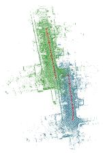

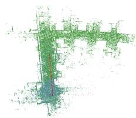

(a)  
(b)  
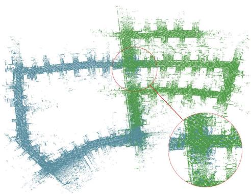

(c)  
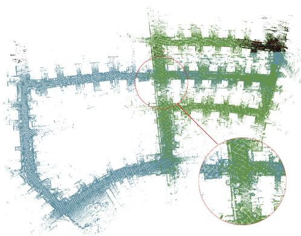  
(d)  
Fig. 7. A demonstration of RDC-SLAM. (a)At t=10s, trajectories in its local frame of reference. $( \mathrm { b } ) \mathrm { A t } ~ \mathrm { t = } 1 3 \mathrm { s } ,$ the first inter-data association was built, and trajectories changed to the consistent global frame. (c)At t=102s, inconsistency occurred (in red circle) due to cumulative drift. (d)The final trajectories for the KITTI sequence 05. Since the second inter-data association is built at t=106s, the error is eliminated and the problem of inconsistency in (c) is solved.

## D. Communication Protocol

The communication protocol is the highlight of our proposed RDC-SLAM system. In this section, we will analyze the protocol from two aspects: data efficiency and connection distance.

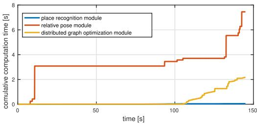  
Fig. 8. The commutative computation time of each module in Robot α for the SYSU Campus dataset.

TABLE IV  
IMPACT OF NETWORK CONNECTION DISTANCE
<table><tr><td>Connection distance(m)</td><td>ATE(m)</td><td>Total transmitted(KB)</td></tr><tr><td>Global coverage</td><td>0.0612</td><td>372</td></tr><tr><td>200</td><td>0.0604</td><td>323</td></tr><tr><td>100</td><td>0.0618</td><td>276</td></tr><tr><td>50</td><td>0.0876</td><td>53</td></tr><tr><td>None connection</td><td>0.0676</td><td>0</td></tr></table>

1) Data Efficiency: Data transmission is presented in Fig. 9. They directly show the total amount of data transmission in each module and the time-varying bandwidth. For the KITTI dataset, our RDC-SLAM results in less than 350KB of data transmitted over 145 seconds of operations. The raw data size is over 5GB, even if it is compressed with binary compression. Similarly, for the SYSU Campus dataset, less than 400KB data is transmitted while the raw data size is about 2.5GB. Notably, there is a decrease in the data compression rate in the second experiment due to the increase in the number of DELIGHT intensity bins to adapt to a more complex environment and sparser data. This increase causes more data from the PR module to be transmitted and leads to time-saving in the RP module since the accuracy in the PR module is improved, and less wrong candidate matches are passed to the RP module referring to Table.III.

2) Impact ofNetwork Connection Distance: Table. IV illustrates how the distance of the network connection affects the accuracy and data transmission amount, which takes the KITTI dataset as an example. The variation of connection distance is simulated with the help of the ground truth given by GPS. The result of “none connection” is obtained by directly merging results from a single SLAM system with initial GPS priors. It is worth noting that in addition to the 50 meters communication range, the accuracy in other communication range setups is all improved compared to the result from a single SLAM. After the first inter-data association establishes the relationship between the coordinate systems, any newly added inter-data associations are used to improve the state’s error, which is illustrated in Fig. 7(c)(d). When the communication distance is “global coverage”, 200 meters and 100 meters, the result accuracy is similar. It can be seen that the communication distance has little effect on accuracy. To some extent, it can even reduce the amount of data transmission. When the communication distance is set to be 50 meters, the accuracy is decreased. Given that the KITTI dataset is collected by the high-speed car, this accuracy reduction is due to that the connection time is too short to perform one distributed graph optimization cycle. Thus, it is the connection time, not the connection distance, that affects the accuracy. Therefore, under the condition of limited network distance, RDC-SLAM works. But if we make robots cross each other slowly to extend communication time, it will improve the performance.

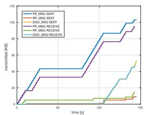  
(a) KITTI

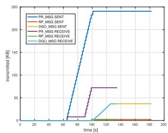  
(b) SYSU Campus  
Fig. 9. Total data transmission in Robot α.

## VI. CONCLUSION

In this paper, we propose a real-time distributed cooperative SLAM system based on 3D LiDAR called RDC-SLAM, which significantly reduces the pressure of communication bandwidth and time consumption between multiple robots. This system is built in a distributed manner and proposed with elaborate communication rules to integrate state-of-art components. The front end is responsible for the acquisition of intra-data associations and inter data associations, which are fed to the back end, while the back end of RDC-SLAM is based on a distributed graph optimization algorithm, and each robot maintains only states related to itself. We prove that the algorithm correctly fuses information from multiple robots without prior information, advantageous in consistent results, computation efficiency, and low data transmission. Especially, the proposed cooperative SLAM can adopt to short-distance, short-term communication conditions and achieve comparable performance. In the future, we are interested in further increasing accuracy and expanding the size of the robot team. The increase in the scale of the robot array will put more stringent tests on the algorithm, where we expect to push the research into a further level.

## REFERENCES

[1] H. Durrant-Whyte and T. Bailey, “Simultaneous localization and mapping: Part I,” IEEE Robot. Autom. Mag., vol. 13, no. 2, pp. 99–110, Jun. 2006.

[2] L. Li, J. Song, F.-Y. Wang, W. Niehsen, and N.-N. Zheng, “IVS 05: New developments and research trends for intelligent vehicles,” IEEE Intell. Syst., vol. 20, no. 4, pp. 10–14, Jul. 2005.

[3] Z. Li, L. Li, and Y. Zhang, “IVS 09: Future research in vehicle vision systems,” IEEE Intell. Syst., vol. 24, no. 6, pp. 62–65, Nov. 2009.

[4] Y. Zhang, L. Chen, Z. X. Yuan, and W. Tian, “3D cooperative mapping for connected and automated vehicles,” IEEE Trans. Ind. Electron., vol. 67, no. 8, pp. 6649–6658, Sep. 2019.

[5] M. T. Lazaro, L. M. Paz, P. Pinies, J. A. Castellanos, and G. Grisetti, “Multi-robot SLAM using condensed measurements,” in Proc. IEEE/RSJ Int. Conf. Intell. Robots Syst. (IROS), Nov. 2013, pp. 1069–1076.

[6] S. Yang, X. Zhu, X. Nian, L. Feng, X. Qu, and T. Ma, “A robust pose graph approach for city scale LiDAR mapping,” in Proc. IEEE/RSJ Int. Conf. Intell. Robots Syst. (IROS), Oct. 2018, pp. 1175–1182.

[7] W. Hess, D. Kohler, H. Rapp, and D. Andor, “Real-time loop closure in 2D LiDAR SLAM,” in Proc. IEEE Int. Conf. Robot. Automat. (ICRA), May 2016, pp. 1271–1278.

[8] R. Dubé, A. Gawel, H. Sommer, J. Nieto, R. Siegwart, and C. Cadena, “An online multi-robot SLAM system for 3D LiDARs,” in Proc. IEEE/RSJ Int. Conf. Intell. Robots Syst. (IROS), Sep. 2017, pp. 1004–1011.

[9] D. Borrmann, J. Elseberg, K. Lingemann, A. Nüchter, and J. Hertzberg, “Globally consistent 3D mapping with scan matching,” Robot. Auto. Syst., vol. 56, no. 2, pp. 130–142, 2008.

[10] P. Biber and W. Strasser, “The normal distributions transform: A new approach to laser scan matching,” in Proc. IEEE/RSJ Int. Conf. Intell. Robots Syst. (IROS), Oct. 2003, pp. 2743–2748.

[11] P. Scovanner, S. Ali, and M. Shah, “A 3-dimensional sift descriptor and its application to action recognition,” in Proc. 15th Int. Conf. Multimedia (MULTIMEDIA), 2007, pp. 357–360.

[12] R. B. Rusu, N. Blodow, and M. Beetz, “Fast point feature histograms (FPFH) for 3D registration,” in Proc. IEEE Int. Conf. Robot. Automat., May 2009, pp. 3212–3217.

[13] F. Tombari, S. Salti, and L. Di Stefano, “Unique signatures of histograms for local surface description,” in Proc. Eur. Conf. Comput. Vis. (ECCV). Crete, Greece: Springer, 2010, pp. 356–369.

[14] R. Dubé, D. Dugas, E. Stumm, J. Nieto, R. Siegwart, and C. Cadena, “SegMatch: Segment based place recognition in 3d point clouds,” in Proc. IEEE Int. Conf. Robot. Automat. (ICRA). May 2017, pp. 5266–5272.

[15] K. P. Cop, P. V. K. Borges, and R. Dube, “Delight: An efficient descriptor for global localisation using LiDAR intensities,” in Proc. IEEE Int. Conf. Robot. Automat. (ICRA), May 2018, pp. 3653–3660.

[16] T. Röhling, J. Mack, and D. Schulz, “A fast histogram-based similarity measure for detecting loop closures in 3-D LiDAR data,” in Proc. IEEE/RSJ Int. Conf. Intell. Robots Syst. (IROS), Sep. 2015, pp. 736–741.

[17] Z. J. Yew and G. H. Lee, “3DFeat-Net: Weakly supervised local 3D features for point cloud registration,” in Proc. Eur. Conf. Comput. Vis. (ECCV). Munich, Germany: Springer, 2018, pp. 630–646.

[18] M. Bosse and R. Zlot, “Place recognition using keypoint voting in large 3D LiDAR datasets,” in Proc. IEEE Int. Conf. Robot. Automat., May 2013, pp. 2677–2684.

[19] I. Toroslu and M. Dogan, “Effective sensor fusion of a mobile robot for SLAM implementation,” in Proc. 4th Int. Conf. Control, Automat. Robot. (ICCAR), Apr. 2018, pp. 76–81.

[20] J. K. Hackett and M. Shah, “Multi-sensor fusion: A perspective,” in Proc. IEEE Int. Conf. Robot. Automat. (ICRA), May 1990, pp. 1324–1330.

[21] M. P. Muresan, I. Giosan, and S. Nedevschi, “Stabilization and validation of 3D object position using multimodal sensor fusion and semantic segmentation,” Sensors, vol. 20, no. 4, p. 1110, Feb. 2020.

[22] G. Welch et al., “An introduction to the Kalman filter,” SIGGRAPH, Course, Tech. Rep. 27599-23175, 2001, vol. 8, p. 41.

[23] E. A. Wan, R. Van Der Merwe, and S. Haykin, “The unscented Kalman filter,” Kalman Filtering Neural Netw., vol. 5, pp. 221–280, Sep. 2001.

[24] L. Chen, Q. Wang, X. Lu, D. Cao, and F.-Y. Wang, “Learning driving models from parallel end-to-end driving data set,” Proc. IEEE, vol. 108, no. 2, pp. 262–273, Feb. 2019.

[25] L. Chen, W. Zhan, W. Tian, Y. He, and Q. Zou, “Deep integration: A multi-label architecture for road scene recognition,” IEEE Trans. Image Process., vol. 28, no. 10, pp. 4883–4898, May 2019.

[26] L. Chen, L. Fan, J. Chen, D. Cao, and F. Wang, “A full density stereo matching system based on the combination of cnns and slantedplanes,” IEEE Trans. Syst., Man, Cybern. Syst. (TSMCS), vol. 50, no. 99, pp. 1–12, Nov. 2017.

[27] H.-C. Lee, S.-H. Lee, T.-S. Lee, D.-J. Kim, and B.-H. Lee, “A survey of map merging techniques for cooperative-SLAM,” in Proc. Int. Conf. Ubiquitous Robots Ambient Intell. (URAI), Nov. 2012, pp. 285–287.

[28] R. Kümmerle, G. Grisetti, H. Strasdat, K. Konolige, and W. Burgard, “G2O: A general framework for graph optimization,” in Proc. IEEE Int. Conf. Robot. Automat. (ICRA), May 2011, pp. 3607–3613.

[29] A. Cunningham, M. Paluri, and F. Dellaert, “DDF-SAM: Fully distributed SLAM using constrained factor graphs,” in Proc. IEEE/RSJ Int Conf. Intell. Robots Syst., Oct. 2010, pp. 3025–3030.

[30] A. Cunningham, V. Indelman, and F. Dellaert, “DDF-SAM 2.0: Consistent distributed smoothing and mapping,” in Proc. IEEE Int. Conf. Robot. Automat., May 2013, pp. 5220–5227.

[31] S. Choudhary, L. Carlone, C. Nieto, J. Rogers, H. I. Christensen, and F. Dellaert, “Distributed trajectory estimation with privacy and communication constraints: A two-stage distributed gauss-seidel approach,” in Proc. IEEE Int. Conf. Robot. Automat. (ICRA), May 2016, pp. 5261–5268.

[32] S. Saeedi, M. Trentini, M. Seto, and H. Li, “Multiple-robot simultaneous localization and mapping: A review,” J. Field Robot., vol. 33, no. 1, pp. 3–46, 2016.

[33] L. Riazuelo, J. Civera, and J. M. M. Montiel, “C2TAM: A cloud framework for cooperative tracking and mapping,” Robot. Auto. Syst., vol. 62, no. 4, pp. 401–413, Apr. 2014.

[34] G. Mohanarajah, V. Usenko, M. Singh, R. D’Andrea, and M. Waibel, “Cloud-based collaborative 3D mapping in real-time with low-cost robots,” IEEE Trans. Autom. Sci. Eng., vol. 12, no. 2, pp. 423–431, Apr. 2015.

[35] T. Cieslewski, S. Choudhary, and D. Scaramuzza, “Data-efficient decentralized visual SLAM,” in Proc. IEEE Int. Conf. Robot. Automat. (ICRA), May 2018, pp. 2466–2473.

[36] C. Forbes, M. Evans, N. Hastings, and B. Peacock, “Von Mises distribution,” in Statistical Distribution, 4th ed. Hoboken, NJ, USA: Wiley, 2000, pp. 191–192.

[37] N. Boumal, A. Singer, P.-A. Absil, and V. D. Blondel, “Cramer-rao bounds for synchronization of rotations,” Inf. Inference, vol. 3, no. 1, pp. 1–39, Mar. 2014.

[38] L. Carlone, D. M. Rosen, G. Calafiore, J. J. Leonard, and F. Dellaert, “Lagrangian duality in 3D SLAM: Verification techniques and optimal solutions,” in Proc. IEEE/RSJ Int. Conf. Intell. Robots Syst. (IROS), Sep. 2015, pp. 125–132.

[39] M. Himmelsbach, F. V. Hundelshausen, and H.-J. Wuensche, “Fast segmentation of 3D point clouds for ground vehicles,” in Proc. IEEE Intell. Vehicles Symp. (IVS), Jun. 2010, pp. 560–565.

[40] K. Madsen, H. B. Nielsen, and O. Tingleff, “Methods for non-linear least squares problems,” AP Lambert Academic Publishing, Republic of Moldova, 2004.

[41] T. Cieslewski, S. Lynen, M. Dymczyk, S. Magnenat, and R. Siegwart, “Map API–scalable decentralized map building for robots,” in Proc. IEEE Int. Conf. Robot. Automat. (ICRA), May 2015, pp. 6241–6247.

[42] M. Gadd and P. Newman, “Checkout my map: Version control for fleetwide visual localisation,” in Proc. IEEE/RSJ Int. Conf. Intell. Robots Syst. (IROS), Oct. 2016, pp. 5729–5736.

[43] A. Geiger, P. Lenz, and R. Urtasun, “Are we ready for autonomous driving? The KITTI vision benchmark suite,” in Proc. IEEE Conf. Comput. Vis. Pattern Recognit., Jun. 2012, pp. 3354–3361.

[44] T. Shan and B. Englot, “LeGO-LOAM: Lightweight and groundoptimized LiDAR odometry and mapping on variable terrain,” in Proc. IEEE/RSJ Int. Conf. Intell. Robots Syst. (IROS), Oct. 2018, pp. 4758–4765.

  
Yuting Xie received the B.S. degree from Sun Yat-sen University, Guangzhou, China, in 2018, where she is currently pursuing the Ph.D. degree with the School of Data and Computer Science, under the supervision of Long Chen. She is recently focusing on cooperative SLAM based on 3D LIDAR. Her research interest includes SLAM.

Yachen Zhang received the B.S. degree from Sun Yat-sen University, Guangzhou, China, in 2018, where he is currently pursuing the M.S. degree with the School of Data and Computer Science, under the supervision of Long Chen. He is recently focusing on cooperative mapping based on 3D LIDAR. His research interests include SLAM and 3D LIDAR.

Long Chen (Senior Member, IEEE) received the B.Sc. degree in communication engineering and Ph.D. the degree in signal and information processing from Wuhan University, Wuhan, China. He is currently an Associate Professor with the School of Data and Computer Science, Sun Yat-sen University, Guangzhou, China. His research interests include autonomous driving, robotics, and artificial intelligence, where he has contributed more than 70 publications. He serves as an Associate Editor for IEEE TRANSACTIONS ON INTELLIGENT TRANSPORTATION SYSTEMS.

Hui Cheng (Member, IEEE) received the B.Eng. degree in electrical engineering from Yanshan University, Qinhuangdao, the M.Phil. degree in electrical and electronic engineering from The Hong Kong University of Science and Technology, and the Ph.D. degree in electrical and electronic engineering from The University of Hong Kong. She worked as a Post-Doctoral Fellow at The Chinese University of Hong Kong from August 2006 to December 2007. She is currently a Professor with the School of Data and Computer Science, Sun Yat-sen University,

Guangzhou. Her research interests include intelligent robots and networked control systems.

Wei Tu (Member, IEEE) received the Ph.D. degree in photogrammetry and remote sensing from Wuhan University, Wuhan, China, in 2013. He is currently an Associate Professor at the Shenzhen Key Laboratory of Spatial Smart Sensing and Service and the Department of Urban Informatics, Research Institute of Smart Cities, Shenzhen University. He is also a Visiting Scholar at the Senseable City Laboratory, Massachusetts Institute of Technology. His research interests include urban informatics, big data driven human activity and mobility, and trajectory analytic.

Dongpu Cao (Member, IEEE) received the Ph.D. degree from Concordia University, Canada, in 2008. He is currently the Canada Research Chair in driver cognition and automated driving. He is also an Associate Professor and the Director of the Waterloo Cognitive Autonomous Driving (CogDrive) Laboratory, University of Waterloo, Canada. He has contributed more than 180 publications, two books, and one patent. His current research interests include driver cognition, automated driving, and cognitive autonomous driving. He received the SAE

Arch T. Colwell Merit Award in 2012 and three Best Paper Awards from the ASME and IEEE conferences. He serves as an Associate Editor for IEEE TRANSACTIONS ON VEHICULAR TECHNOLOGY, IEEE TRANSACTIONS ON INTELLIGENT TRANSPORTATION SYSTEMS, IEEE/ASME TRANSACTIONS ON MECHATRONICS, IEEE TRANSACTIONS ON INDUSTRIAL ELECTRON-ICS, and ASME Journal of Dynamic Systems, Measurement and Control. He was a Guest Editor for Vehicle System Dynamics and IEEE TRANSAC-TIONS ON SYSTEMS, MAN, AND CYBERNETICS: SYSTEMS. He serves on the SAE Vehicle Dynamics Standards Committee and acts as the Co-Chair of IEEE ITSS Technical Committee on Cooperative Driving.

Qingquan Li received the M.S. degree in survey engineering and the Ph.D. degree in photogrammetry and remote sensing from the Wuhan Technical University of Surveying and Mapping, Wuhan, China, in 1988 and 1998, respectively. He is currently the President of Shenzhen University, Shenzhen, China, and the Director of the Guangdong Key Laboratory of Urban Informatics, Shenzhen University. His research interests include photogrammetry, remote sensing, mobile mapping, and intelligent transportation systems.