# Robust Odometry and Mapping for Multi-LiDAR Systems With Online Extrinsic Calibration

Jianhao Jiao , Graduate Student Member, IEEE, Haoyang Ye , Graduate Student Member, IEEE, Yilong Zhu, and Ming Liu , Senior Member, IEEE

Abstract—Combining multiple LiDARs enables a robot to maximize its perceptual awareness of environments and obtain sufficient measurements, which is promising for simultaneous localization and mapping (SLAM). This article proposes a system to achieve robust and simultaneous extrinsic calibration, odometry, and mapping for multiple LiDARs. Our approach starts with measurement preprocessing to extract edge and planar features from raw measurements. After a motion and extrinsic initialization procedure, a sliding window-based multi-LiDAR odometry runs onboard to estimate poses with an online calibration refinement and convergence identification. We further develop a mapping algorithm to construct a global map and optimize poses with sufficient features together with a method to capture and reduce data uncertainty. We validate our approach’s performance with extensive experiments on 10 sequences (4.60-km total length) for the calibration and SLAM and compare it against the state of the art. We demonstrate that the proposed work is a complete, robust, and extensible system for various multi-LiDAR setups. The source code, datasets, and demonstrations are available at: https://ram-lab.com/file/site/mloam.

Index Terms—Autonomous driving, calibration and identification, sensor fusion, simultaneous localization and mapping (SLAM).

## I. INTRODUCTION

## A. Motivation

IMULTANEOUS localization and mapping (SLAM) is es-S sential to a wide range of applications, such as scene reconstruction, robotic exploration, and autonomous driving [1]– [3]. Approaches that use only a LiDAR have attracted much attention from the research community due to their accuracy

and reliability in range measurements. However, LiDAR-based methods commonly suffer from data sparsity and limited vertical field of view (FOV) in real-world applications [4]. For instance, LiDARs’ points distribute loosely, which induces a mass of empty regions between two nearby scans. This characteristic usually causes state estimation to degenerate in structureless environments, such as narrow corridors and stairs [5]. Recently, owing to the decreasing price of sensors, we have seen a growing trend of deploying multi-LiDAR systems on practical robotic platforms [6]–[11]. Compared with a single-LiDAR setup, the primary improvement of multi-LiDAR systems is the significant enhancement on the sensing range and density of measurements. This benefit is practically useful for self-driving cars since we have to address the critical blind spots created by the vehicle body. Thus, we consider multi-LiDAR systems in this article.

## B. Challenges

Despite their great advantages in environmental perception, a number of issues affect the development of SLAM using a multi-LiDAR setup.

1) Precise and Flexible Extrinsic Calibration: Recovering the multi-LiDAR transformations for a new robotic platform is complicated. In many cases, professional users have to calibrate sensors in human-made surroundings [12] carefully. This requirement increases the cost to deploy and maintain a multi-LiDAR system for field robots.

It is desirable that the system can self-calibrate the extrinsics in various environments online. As shown in [13]–[15], benefiting from the simultaneous estimation of extrinsics and ego-motion, the working scope of visual–inertial systems has been expanded to drones and vessels in outdoor scenes. These approaches continuously perform calibration during the mission to guarantee the objective function to be always “optimal.” However, this process typically requires environmental or motion constraints to be fully observable. Otherwise, the resulting extrinsics may become suboptimal or unreliable. Thus, we have to fix the extrinsics if they are accurate, which creates a demand for online calibration with a convergence identification. In order to cope with the centimeter-level calibration error and unexpected changes on extrinsics over time, it is also beneficial to model the extrinsic perturbation for multi-LiDAR systems.

2) Low Pose Drift: To provide accurate poses in real time, state-of-the-art (SOTA) LiDAR-based methods [16]–[18] commonly solve SLAM by two algorithms: 1) odometry and 2) mapping. These algorithms are designed to estimate poses in a coarse-to-fine fashion. Based on the original odometry algorithm, an approach that fully exploits multi-LiDAR measurements within a local window is required. The increasing constraints help to prevent degeneracy or failure of frame-toframe registration. The subsequent mapping algorithm runs at a relatively low frequency and is given plenty of feature points and many iterations for better results. However, as we identify in Section VIII, many SOTA approaches neglect the fact that uncertain points in the global map limit the accuracy. To minimize this adverse effect, we must develop a method to capture map points’ uncertainties and reject outliers.

## C. Contributions

To tackle these challenges, we propose M-LOAM, a robust system for Multi-LiDAR extrinsic calibration, real-time Odometry, and Mapping. Without manual intervention, our system can start with several extrinsic-uncalibrated LiDARs, automatically calibrate their extrinsics, and provide accurate poses as well as a globally consistent map. Our previous work [5] proposed sliding window-based odometry to fuse LiDAR points with high-frequency IMU measurements. That framework inspires this article, where we try to solve the problem of multi-LiDAR fusion. In addition, we introduce a motion-based approach [4] to initialize extrinsics, and employ the tools in [19] to represent uncertain quantities. Our design of M-LOAM presents the following contributions.

1) Automatic initialization that computes all critical states, including motion between consecutive frames as well as extrinsics for subsequent phases. It can start at arbitrary positions without any prior knowledge of the mechanical configuration or calibration objects (see Section VI).

2) Online self-calibration with a general convergence criterion is executed simultaneously with the odometry. It has the capability to monitor the convergence and trigger termination in a fully unsupervised manner (see Section VII-B).

3) Sliding-window-based odometry fully exploits information from multiple LiDARs. This implementation can be explained as small-scale frame-to-map registration, which further reduces the drift accumulated by the consecutive frame-to-frame odometry (see Section VII-C).

4) Mapping with a two-stage approach captures and propagates uncertain quantities from sensor noise, degenerate pose estimation, and extrinsic perturbation. This approach enables the mapping process with an awareness of uncertainty and helps us to maintain the consistency of a global map as well as boost the robustness of a system for long-duration navigation tasks (see Section VIII).

To the best of our knowledge, M-LOAM is the first complete solution to multi-LiDAR calibration and SLAM. The system is evaluated under extensive experiments on both handheld devices and autonomous vehicles, covering various scenarios from indoor offices to outdoor urban roads, and outperforms the SOTA LiDAR-based methods. Regarding the calibration on diverse platforms, our approach achieves an extrinsic accuracy of centimeters in translation and decidegrees in rotation. For the SLAM in different scales, M-LOAM has been successfully applied to provide accurate poses and map results. Fig. 1 visualizes M-LOAM’s output at each stage. To benefit the research community, we publicly release our code, implementation details, and the multi-LiDAR datasets.

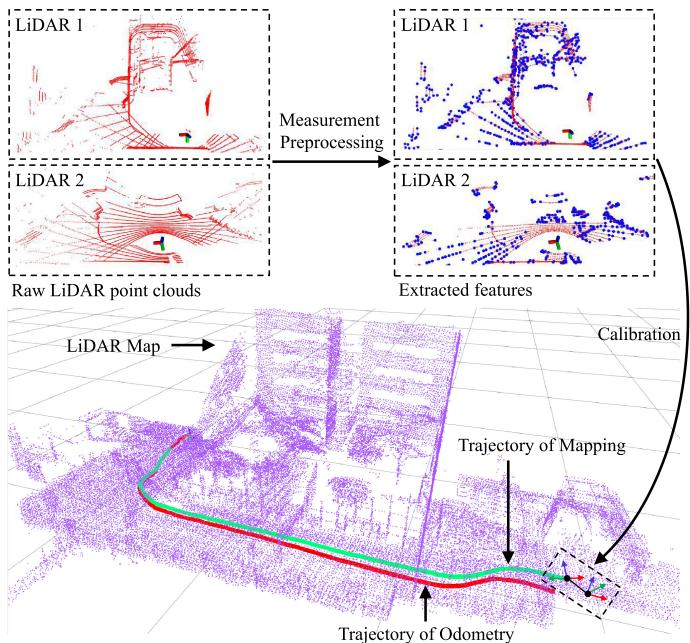  
Fig. 1. We visualize the immediate results of M-LOAM. The raw point clouds perceived by different LiDARs are denoised and extracted with edge (blue dots) and planar (red dots) features, which are shown at the top-right position. The proposed online calibration is performed to obtain accurate extrinsics. After that, the odometry and mapping algorithms use these features to estimate poses. The trajectory of the mapping (green) is more accurate than that of the odometry (red).

## D. Organization

The rest of the article is organized as follows. Section II reviews the relevant literature. Section III formulates the problem and provides basic concepts. Section IV gives the overview of the system. Section V describes the preprocessing module on LiDAR measurements. Section VI introduces the motion and extrinsic initialization procedure. Section VII presents the tightly coupled, sliding-window-based multi-LiDAR odometry (M-LO) with online calibration refinement. The uncertaintyaware multi-LiDAR mapping algorithm is introduced in Section VIII, followed by experimental results in Section IX. In Section X, we provide a discussion about the proposed system. Finally, Section XI concludes this article.

## II. RELATED WORK

Scholarly works on SLAM and extrinsic calibration are extensive. In this section, we briefly review relevant results on LiDAR-based SLAM and online calibration methods for multisensor systems.

## A. LiDAR-Based SLAM

Generally, many SOTA are developed from the iterative closest point (ICP) algorithm [20]–[23], into which the methods including measurement preprocessing, degeneracy prediction, and sensor fusion are incorporated. These works have pushed the current LiDAR-based systems to become fast, robust, and feasible to large-scale environments.

1) Measurement Preprocessing: As the front-end of a system, the measurement preprocessing encodes point clouds into a compact representation. We categorize related algorithms into either dense or sparse methods. As a typical dense method, SuMa [24] demonstrates the advantages of utilizing surfelbased maps for registration and loop detection. Its extended version [25] incorporates semantic constraints into the original cost function. The process of matching dense pixel-to-pixel correspondences makes the method computationally intensive, thus requiring dedicated hardware (GPU) for real-time operation. These approaches are not applicable to our cases since we have to frequently perform the registration on a CPU.

Sparse methods prefer to extract geometric features from raw measurements and are, thus, supposed to have real-time performance. Grant et al. [26] proposed a plane-based registration, whereas Velas et al. [27] represented point clouds as collar line segments. Compared to them, LOAM [16] has fewer assumptions about sensors and surroundings. It selects distinct points from both edge lines and local planar patches. Recently, several following methods have employed ground planes [17], [28], visual detection [29], probabilistic grid maps [30], good features [31], or directly used dense scanners [18], [32], [33] to improve the performance of sparse approaches in noisy or structureless environments. To limit the computation time when more LiDARs are involved, we extract the sparse edge and planar features like LOAM. But differently, we represent their residuals in a more concise and unified way.

2) Degeneracy in State Estimation: The geometric constraints of features are formulated as a state-estimation problem. Different methods have been proposed to tackle the degeneracy issue. Zhang et al. [34] defined a factor, which is equal to the minimum eigenvalue of information matrices, to determine the system degeneracy. They also proposed a technique called solution remapping to update variables in well-conditioned directions. This technique was further applied to tasks including localization, registration, pose graph optimization, and inspection of sensor failures [35]–[37]. To quantify a nonlinear system’s observability, Rong et al. [38] computed the condition number of the empirical observability Gramian matrix. Since our problem linearizes the objective function as done in Zhang et al. [34], we introduce the solution remapping to update states. Additionally, our online calibration method employs the degeneracyfactor as a quantitative metric of the extrinsic calibration.

3) Multisensor Fusion: Utilizing multiple sensors to improve the motion-tracking performance of single-LiDAR odometry is promising. Most existing works on LiDAR-based fusion combine visual or inertial measurements. The simplest way to deal with multimodal measurements is the loosely coupled fusion, where each sensor’s pose is estimated independently. For example, LiDAR-IMU fusion is usually done by the extended Kalman filter (EKF) [39]–[41]. Tightly coupled algorithms that optimize sensors’ poses by jointly exploiting all measurements have become increasingly prevalent in the community. They are usually done by either the EKF [42]–[44] or batch optimization [5], [45]–[48]. Besides multimodal sensor fusion, another domain is to explore the fusion of multiple LiDARs (unimodel), which is still an open problem.

Multiple LiDARs improve a system by maximizing the sensing coverage against extreme occlusion. Inspired by the success of tightly coupled algorithms, we achieve a sliding-window estimator to optimize states of multiple LiDARs. This mode has great advantages for multi-LiDAR fusion.

## B. Multisensor Calibration

Precise extrinsic calibration is important to any multisensor system. Traditional methods [12], [49]–[51] have to run an adhoc calibration procedure before a mission. This tedious process needs to be repeated whenever there is slight perturbation on the structure. A more flexible solution to estimate these parameters is combined with SLAM-based techniques. Here, extrinsics are treated as one of the state variables and optimized along with sensors’ poses. This scheme is also applicable to some nonstationary parameters, such as robot kinematics, IMU biases, and time offsets.

Kummerle et al. [52] pioneered a hypergraph optimization framework to calibrate an onboard laser scanner with wheel encoders. Their experiments reveal that online correction of parameters leads to consistent and accurate results. Teichman et al. [53], meanwhile, proposed an iterative SLAM-fitting pipeline to resolve the distortion of two RGB-D cameras. To recover spatial offsets of a multicamera system, Heng et al. [54] formulated the problem as a bundle adjustment, whereas Ouyang et al. [55] employed the Ackermann steering model of vehicles to constrain extrinsics. As presented in [47], [56]–[58], the online estimation of time offsets among sensors is crucial to IMU-centric systems. Qin et al. [56] utilized reprojection errors of visual features to formulate the temporal calibration problem, whereas Qiu et al. [58] proposed a more general method to calibrate heterogeneous sensors by analyzing sensors’ motion correlation.

This article implicitly synchronizes the time of multiple Li-DARs with an hardware-based external clock and explicitly focuses on the extrinsic calibration. Our approach consists of an online procedure to achieve flexible multi-LiDAR extrinsic calibration. To monitor the convergence of estimated extrinsics, we propose a general criterion. In addition, we model the extrinsic perturbation to reduce its negative effect for long-term navigation tasks.

## III. PROBLEM STATEMENT

We formulate M-LOAM in terms of the maximum likelihood estimation (MLE). The MLE leads to a nonlinear optimization problem where the inverse of the Gaussian covariances weights the residual functions. Before delving into details of M-LOAM, we first introduce some basic concepts. Section III-A presents notations. Section III-B introduces the MLE, and Section III-C describes suitable models to represent uncertain measurements in $\mathbb { R } ^ { 3 }$ and transformations in SE(3). Finally, Section III-D briefly presents the implementation of the MLE with approximate Gaussian noise in M-LOAM.

TABLE I NOMENCLATURE
<table><tr><td>Notation</td><td>Explanation</td></tr><tr><td></td><td>Coordinate System and Pose Representation</td></tr><tr><td> $( ) ^ { w } , ( ) ^ { b } , ( ) ^ { l ^ { i } }$ </td><td>Frame of the world, primary sensor, and  $i ^ { t h }$  LiDAR point cloud</td></tr><tr><td> $( ) ^ { l _ { k } ^ { i } }$ </td><td>Frame of the  $i ^ { t h }$  LiDAR while taking the  $k ^ { t h }$ </td></tr><tr><td> $I$ </td><td>Number of LiDARs in a multi-LiDAR system</td></tr><tr><td> $\mathbf { p } , \mathbf { p } _ { h }$ </td><td>3D Point in  $\mathbb { R } ^ { 3 }$  and homogeneous coordinates</td></tr><tr><td> $\mathbf { x }$ </td><td>State vector Translation vector in  $\mathbb { R } ^ { 3 }$ </td></tr><tr><td> $\mathbf { t }$ </td><td>Hamilton quaternion</td></tr><tr><td> $\mathbf { q }$   $\mathbf { R }$ </td><td></td></tr><tr><td> $\mathbf { T }$ </td><td>Rotation matrix in the Lie group  $S O ( 3 )$  Transformation matrix in the Lie group SE(3)</td></tr><tr><td> $\xi , \zeta , \theta$ </td><td>Gaussian noise variable</td></tr><tr><td> $\pmb { \Sigma }$ </td><td>Covariance matrix of residuals</td></tr><tr><td> $\mathbf { Z }$ </td><td>Covariance matrix of LiDAR depth measurement noise</td></tr><tr><td> $\Xi$ </td><td>Covariance matrix of pose noise</td></tr><tr><td></td><td>Odometry and Mapping</td></tr><tr><td> $\mathcal { F }$ </td><td>Features extracted from raw point clouds</td></tr><tr><td> $\varepsilon , \mathcal { H }$ </td><td>Edge and planar subset of extracted features</td></tr><tr><td> $L , \Pi$ </td><td>Edge line and planar patch</td></tr><tr><td> $[ \mathbf { w } , d ]$ </td><td>Coefficient vector of a planar patch</td></tr><tr><td> $\mathcal { M }$ </td><td></td></tr><tr><td> $\mathcal { G }$ </td><td>Local map Global map</td></tr><tr><td></td><td></td></tr><tr><td> $\lambda$ </td><td>Degeneracy factor</td></tr></table>

## A. Notations and Definitions

The nomenclature is shown in Table I. We consider a system that consists of one primary LiDAR and multiple auxiliary LiDARs. The primary LiDAR defines the base frame, and we use $( ) ^ { l ^ { 1 } } / ( ) ^ { b }$ to indicate it. The frames of the auxiliary LiDARs are denoted by $\left( \right) ^ { l ^ { i , i > 1 } }$ . We denote $\mathcal { F }$ as the set of available features extracted from the LiDARs’ raw measurements. Each feature is represented as a point in 3-D space: $\mathbf { p } = [ x , y , z ] ^ { \top }$ . The state vector, composed of translational and rotational parts, is denoted by $\mathbf { x } = [ \mathbf { t } , \mathbf { q } ]$ where t is a $3 \times 1$ vector, and q is the Hamilton quaternion. But in the case that we need to rotate a vector, we use the $3 \times 3$ rotation matrix R in the Lie group SO(3). We can convert q into R with the Rodrigues formula [59]. Section VIII associates uncertainty with poses on the vector space, where we use the $4 \times 4$ transformation matrix T in the Lie group SE(3) to represent a pose. A rotation matrix and translation vector can be associated with a transformation matrix as $\begin{array} { r } { \mathbf { T } = \left[ \mathbf { R } \quad \mathbf { p } \right] } \\ { \mathbf { 0 } ^ { \top } \quad 1 \Big ] } \end{array}$

## B. Maximum Likelihood Estimation

We formulate the pose and extrinsic estimation of a multi-LiDAR system as an MLE problem [60]

$$
{ \hat { \mathbf { x } } } _ { k } = \operatorname * { a r g m a x } _ { \mathbf { x } _ { k } } p ( \mathcal { F } _ { k } | \mathbf { x } _ { k } ) = \operatorname * { a r g m i n } _ { \mathbf { x } _ { k } } f ( \mathbf { x _ { k } } , \mathcal { F } _ { k } )\tag{1}
$$

where $\mathcal { F } _ { k }$ represents the available features at the kth frame, $\mathbf { x } _ { k }$ is the state to be optimized, and $f ( \cdot )$ is the objective function. Assuming the measurement model to be subjected to Gaussian noise [3], problem (1) becomes a nonlinear least-squares (NLS) problem

$$
\hat { \mathbf { x } } _ { k } = \underset { \mathbf { x } _ { k } } { \arg \operatorname* { m i n } } \sum _ { i = 1 } ^ { m } \rho \left( \big | \big | \mathbf { r } ( \mathbf { x } _ { k } , \mathbf { p } _ { k i } ) \big | \big | _ { \mathbf { \Sigma } _ { i } } ^ { 2 } \right)\tag{2}
$$

where $\rho ( \cdot )$ is the robust Huber loss to handle outliers $[ 6 1 ] , \mathbf { r } ( \cdot )$ is the residual function, and $\Sigma _ { i }$ is the covariance matrix. Iterative methods such as Gauss–Newton or Levenberg–Marquardt can often be used to solve this NLS problem. These methods locally linearize the objective function by computing the Jacobian w.r.t. $\mathbf { x } _ { k }$ as $\mathbf { J } = \partial f / \partial \mathbf { x } _ { k }$ . Given an initial guess, $\mathbf { x } _ { k }$ is iteratively optimized by usage of J until converging to a local minima. At the final iteration, the least-squares covariance of the state is calculated as $\Xi = \Lambda ^ { - 1 }$ [62], where $\mathbf { \Delta } \mathbf { \Lambda } \mathbf { \Lambda } \mathbf { \Lambda } \mathbf { \Lambda } \mathbf { \Lambda } \mathbf { \Lambda } \mathbf { \Lambda } \mathbf { \Lambda } \mathbf { \Lambda } \mathbf { \Lambda } \mathbf { \Lambda } \mathbf { \Lambda } \mathbf { \Lambda } \mathbf { \Lambda } \mathbf { \Lambda } \mathbf { \Lambda } \mathbf { \Lambda } \mathbf { \Lambda } \mathbf { \Lambda } \mathbf { \Lambda } \mathbf { \Lambda } \mathbf { \Lambda } \mathbf { \Lambda } \mathbf { \Lambda } \mathbf { \Lambda } \mathbf { \Lambda } \mathbf { \Lambda } \mathbf { \Lambda } \mathbf { \Lambda } \mathbf { \Lambda } \mathbf { \Lambda } \mathbf { \Lambda } \mathbf { \Lambda } \mathbf { \Lambda } \mathbf { \Lambda } \mathbf { \Lambda } \mathbf { \Lambda } \mathbf { \Lambda } \mathbf { \Lambda } \mathbf { \Lambda } \mathbf { \Lambda } \mathbf { \Lambda } \mathbf { \Lambda } \mathbf { \Lambda } \mathbf { \Lambda } \mathbf { \Lambda } \mathbf { \Lambda } \mathbf { \Lambda } \mathbf { \Lambda } \mathbf { \Lambda } \mathbf { \Lambda } \mathbf { \Lambda } \mathbf { \Lambda } \mathbf { \Lambda } \mathbf { \Lambda }$ is called the information matrix.

## C. Uncertainty Representation

We employ the tools in [19] to represent data uncertainty. We first represent a noisy LiDAR point as

$$
\bf p = \bar { p } + \boldsymbol { \zeta } , \boldsymbol { \zeta } \sim \mathcal { N } ( \bf 0 , Z )\tag{3}
$$

where p¯ is a noise-free vector, $\zeta \in \mathbb { R } ^ { 3 }$ is a small Gaussian perturbation variable with zero mean, and Z is a noise covariance of LiDAR measurements. To make (3) compatible with transformation matrices $( { \mathrm { i } } . { \mathrm { e } } . , { \mathbf { p } } _ { h } ^ { \prime } = { \mathbf { T } } { \mathbf { p } } _ { h } )$ , we also express it with $4 \times 1$ homogeneous coordinates

$$
\mathbf { p } _ { h } = \left[ \bar { \mathbf { p } } \right] + \mathbf { D } \boldsymbol { \zeta } = \bar { \mathbf { p } } _ { h } + \mathbf { D } \boldsymbol { \zeta } , \boldsymbol { \zeta } \sim \mathcal { N } ( \mathbf { 0 } , \mathbf { Z } )\tag{4}
$$

where D is a matrix that converts a $3 \times 1$ vector into homogeneous coordinates. As investigated in [63], the LiDARs’ depth measurement error (also called sensor noise) is primarily affected by the target distances. Z is simply set as a constant matrix.1 We, then, define a random variable in $S E ( 3 )$ with a small perturbation according $\mathrm { t o } ^ { 2 }$

$$
\mathbf { T } = \exp ( \pmb { \xi } ^ { \wedge } ) \bar { \mathbf { T } } , \pmb { \xi } \sim \mathcal { N } ( \mathbf { 0 } , \boldsymbol { \Xi } )\tag{5}
$$

where $\bar { \mathbf T }$ is a noise-free transformation and $\pmb { \xi } \in \mathbb { R } ^ { 6 }$ is the small perturbation variable with covariance $\Xi .$ . This representation allows us to store the mean transformation as T¯ and use $\boldsymbol { \xi }$ for perturbation on the vector space. We consider that Ξ indicates following two practical error sources.

1) Degenerate Pose Estimation arises from cases such as lack of geometrical structures in poorly constrained environments [34]. It typically makes poses uncertain in their degenerate directions [62], [64]. Existing works resort to model-based and learning-based [65] methods to estimate pose covariances in the context of ICP or vibration, impact, and temperature drift during long-term operation.

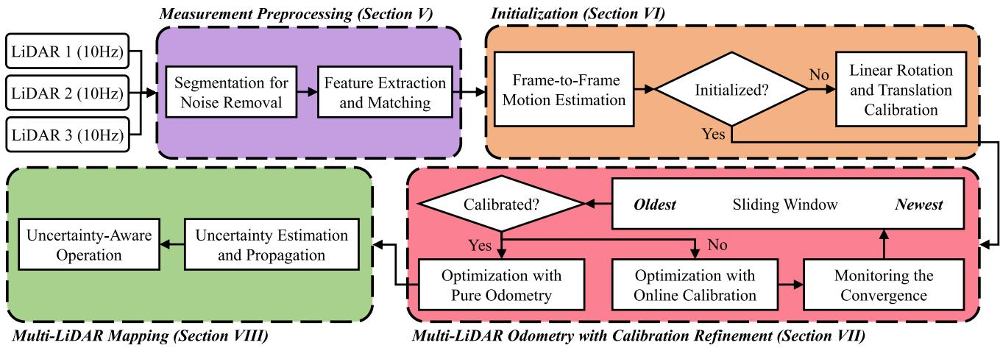  
Fig. 2. Block diagram illustrating the full pipeline of the proposed M-LOAM system. The system starts with measurement preprocessing (see Section V). The initialization module (see Section VI) initializes values for the subsequent nonlinear optimization-based multi-LiDAR odometry with calibration refinement (see Section VII). According to the convergence of calibration, the optimization is divided into two subtasks: 1) Online calibration and 2) pure odometry. If the calibration converges, we can skip the extrinsic initialization and refinement steps, and enter the pure odometry and mapping phase. The uncertainty-aware multi-LiDAR mapping (see Section VIII) maintains a globally consistent map to decrease the odometry drift and remove noisy points.

2) Extrinsic Perturbation always exists due to calibration errors [12]. Wide baseline sensors such as stereocameras, especially, suffer even more extrinsic deviations than standard sensors. Such perturbation is detrimental to the measurement accuracy [66], [67] of multisensor systems but is hard to measure.

The computation of Ξ is detailed in Section VIII.

## D. MLE With Approximate Gaussian Noise in M-LOAM

We extend the MLE to design multiple M-LOAM estimators to solve the robot poses and extrinsics in a coarse-to-fine fashion. The most important step is to approximate the Gaussian noise covariance Σ to realistic measurement models. Based on the discussion in Section III-C, we identify that three sources oferror may make landmarks uncertain: 1) sensor noise, 2) degenerate pose estimation, and 3) extrinsic perturbation. The frame-toframe motion estimation (see Section VI-A) is approximately subjected to the sensor noise. The tightly coupled odometry (see Section VII-C) establishes a local map for the pose optimization. We should propagate pose uncertainties onto each map point. Nevertheless, this operation is often time-consuming (around 10–20 ms) if more LiDARs and sliding windows are involved. To guarantee the real-time odometry, we do not compute the pose uncertainty here. We simply set Σ = Z as the covariance of residuals. In mapping, we are given sufficient time for an accurate pose and a global map. Therefore, we consider all uncertainty sources. Section VIII explains how the pose uncertainty affects the mapping precision and Σ is propagated.

## IV. SYSTEM OVERVIEW

We make following three assumptions to simplify the system design.

1) LiDARs are synchronized, meaning that the temporal latency among different LiDARs is almost zero.

2) The platform undergoes sufficient rotational and translational motion in the period of calibration initialization.

3) The local map of the primary LiDAR should share an overlapping FOV with auxiliary LiDARs for feature matching in refinement to shorten the calibration phase. This can be achieved by moving the robot.

Fig. 2 presents the pipeline of M-LOAM. The system starts with measurement preprocessing (see Section V), in which edge and planar features are extracted and tracked from denoised point clouds. The initialization module (see Section VI) provides all necessary values, including poses and extrinsics, for bootstrapping the subsequent nonlinear optimization-based M-LO. The M-LO fuses multi-LiDAR measurements to optimize the odometry and extrinsics within a sliding window. Ifthe extrinsics already converge, we skip the extrinsic initialization as well as refinement steps and enter the pure odometry and mapping phase. The probabilistic mapping module (see Section VIII) constructs a global map with sufficient features to eliminate the odometry drift. The odometry and mapping run concurrently in two separated threads.

## V. MEASUREMENT PREPROCESSING

We implement three sequential steps to process LiDARs’ raw measurements. We first segment point clouds into many clusters to remove noisy objects and, then, extract edge and planar features. To associate features between consecutive frames, we match a series of correspondences. In this section, each LiDAR is handled independently.

## A. Segmentationfor Noise Removal

With knowing the vertical scanning angles of a LiDAR, we can project the raw point cloud onto a range image without data loss. In the image, each valid point is represented by a pixel. The pixel value records the Euclidean distance from a point to the origin. We apply the segmentation method proposed in [68] to group pixels into many clusters. We assume that two neighboring points in the horizontal or vertical direction belong to the same object if their connected line is roughly perpendicular $\mathrm { ( > 6 0 ^ { \circ } ) }$ to the laser beam. We employ the breadth-first search algorithm to traverse all pixels, ensuring a constant time complexity. We discard small clusters since they may offer unreliable constraints in optimization.

## B. Feature Extraction and Matching

We are interested in extracting the general edge and planar features. We follow the work by Zhang and S. Singh [16] to select a set of feature points from measurements according to their curvatures. The set of extracted features $\mathcal { F }$ consists of two subsets: 1) edge subset (high curvature) $\mathcal { E }$ and 2) planar subset (low curvature) H. Both E and H consist of a portion of features that are the most representative. We further collect edge points from $\mathcal { E }$ with the highest curvature and planar points from H with the lowest curvature. These points form two new sets: 1) $\hat { \mathcal { E } }$ and 2) $\mathcal { \hat { H } } .$ . The next step is to determine feature correspondences between two consecutive frames, $( ) ^ { l _ { k - 1 } ^ { i } }  ( ) ^ { l _ { k } ^ { i } }$ , to construct geometric constraints. For each point in $\hat { \mathcal { E } } ^ { l _ { k } ^ { i } }$ , two closest neighbors from $\mathcal { E } ^ { l _ { k - 1 } ^ { i } }$ are selected as the edge correspondences. For a point in $\hat { \mathcal { H } } ^ { l _ { k } ^ { i } }$ , the three closest points to $\mathcal { H } ^ { l _ { k - 1 } ^ { i } }$ that form a plane are selected as the planar correspondences.

## VI. INITIALIZATION

Optimizing states of multiple LiDARs is highly nonlinear and needs initial guesses. This section introduces our motion and extrinsic initialization approach, which does not require any prior mechanical configuration of the sensor suite. It also does not involve any manual effort, making it particularly useful for autonomous robots.

## A. Scan-Based Motion Estimation

With found correspondences between two successive frames of each LiDAR, we estimate the frame-to-frame transformation by minimizing residual errors of all features. As illustrated in Fig. 3, the residuals are formulated by both edge and planar correspondences. Let xk be the relative transformation between two scans of a LiDAR at the kth frame. Regarding planar features, for a point $\mathbf { p } \in \hat { \mathcal { H } } ^ { l _ { k } ^ { i } }$ , if Π is the corresponding planar patch, the planar residual is computed as

$$
\mathbf { r } _ { \mathcal { H } } ( \mathbf { x } _ { k } , \mathbf { p } , \Pi ) = a \mathbf { w } , a = \mathbf { w } ^ { \top } ( \mathbf { R } _ { k } \mathbf { p } + \mathbf { t } _ { k } ) + d\tag{6}
$$

where a is the point-to-plane Euclidean distance and $[ \mathbf { w } , d ]$ is the coefficient vector of Π. Then, for an edge point $\mathbf { p } \in \hat { \mathcal { E } } ^ { l _ { k } ^ { i } }$ , if L is the corresponding edge line, we define the edge residual as

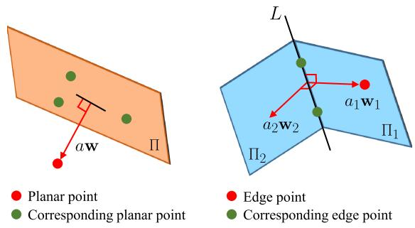  
Fig. 3. Planar and edge residuals. The red dot indicates the reference point and the green dots are its corresponding points.

a combination of two planar residuals using (6) as

$$
\mathbf { r } _ { \mathcal { E } } ( \mathbf { x } _ { k } , \mathbf { p } , L ) = \left[ \mathbf { r } _ { \mathcal { H } } ( \mathbf { x } _ { k } , \mathbf { p } , \Pi _ { 1 } ) , \ \mathbf { r } _ { \mathcal { H } } ( \mathbf { x } _ { k } , \mathbf { p } , \Pi _ { 2 } ) \right]\tag{7}
$$

where $[ \mathbf { w } _ { 1 } , d _ { 1 } ]$ and $[ \mathbf { w } _ { 2 } , d _ { 2 } ]$ are the coefficients of $\Pi _ { 1 }$ and Π , $\mathbf { w } _ { 1 }$ coincides with the projection direction from L to p, and $\Pi _ { 2 }$ is perpendicular to Π1 s.t. $\mathbf { w } _ { 2 } \bot \mathbf { w } _ { 1 }$ , and $\mathbf { w } _ { 2 } \bot L$ . The aforementioned definitions are different from that of LOAM [16], and show two benefits. First, the edge residuals offer additional constraints to the states. Furthermore, the residuals are represented as vectors, not scalars, allowing us to multiply a $3 \times 3$ covariance matrix. We minimize the sum of all residual errors to obtain the MLE as

$$
\begin{array} { r l } & { \hat { { \mathbf x } } _ { k } = \underset { { \mathbf x } _ { k } } { \arg \operatorname* { m i n } } \ \sum _ { { \mathbf p } \in \mathcal { \hat { F } } ^ { l _ { k } ^ { i } } } \rho \left( \left\| { \mathbf r } _ { \mathcal { F } } ( { \mathbf x } _ { k } , { \mathbf p } ) \right\| _ { { \mathbf { \Sigma } } _ { \mathbf { p } } } ^ { 2 } \right) } \\ & { } \\ & { { \mathbf r } _ { \mathcal { F } } ( { \mathbf x } _ { k } , { \mathbf p } ) = \left\{ { \mathbf r } _ { \mathcal { F } } ( { \mathbf x } _ { k } , { \mathbf p } , L ) \quad \mathrm { i f ~ } { \mathbf p } \in \mathcal { \hat { E } } ^ { l _ { k } ^ { i } } \right. } \\ & { { \mathbf r } _ { \mathcal { F } } ( { \mathbf x } _ { k } , { \mathbf p } , \Pi ) \quad \mathrm { i f ~ } { \mathbf p } \in \mathcal { \hat { H } } ^ { l _ { k } ^ { i } } } \end{array}\tag{8}
$$

where the Jacobians of $\mathbf { r } _ { \mathcal { F } } ( \cdot )$ are detailed in Appendix A.

In practice, points are skewed after a movement on LiDARs with a rolling-shutter scan. After solving the incremental motion $\mathbf { x } _ { k } .$ , we correct points’ positions by transforming them into the last frame $( \bar { ) } ^ { l _ { k - 1 } ^ { i } }$ . Let $t _ { k - 1 }$ and $t _ { k }$ be the start and end time of a LiDAR scan, respectively. For a point p captured at $t \in ( t _ { k - 1 } , t _ { k } ]$ , it is transformed $\mathrm { a s } ^ { 3 }$

$$
\mathbf { p } ^ { l _ { k - 1 } ^ { i } } = \mathbf { R } _ { k } ^ { \tau } \mathbf { p } + \mathbf { t } _ { k } ^ { \tau } , \tau = \frac { t - t _ { k - 1 } } { t _ { k } - t _ { k - 1 } }\tag{9}
$$

where the rotation and translation are linearly interpolated [5]

$$
\mathbf { R } _ { k } ^ { \tau } = \exp ( \phi _ { k } ^ { \wedge } ) ^ { \tau } = \exp ( \tau \phi _ { k } ^ { \wedge } ) , \mathbf { t } _ { k } ^ { \tau } = \tau \mathbf { t } _ { k } .\tag{10}
$$

## B. Calibration of Multi-LiDAR System

The initial extrinsics are obtained by aligning motion sequences of two sensors. This is known as solving the hand-eye calibration problem AX = XB, where A and B are the historical transformations of two sensors and X is their extrinsics. As the robot moves, the following equations of the ith LiDAR should hold for any k

$$
\mathbf { R } _ { l _ { k } ^ { i } } ^ { l _ { k - 1 } ^ { i } } \mathbf { R } _ { l ^ { i } } ^ { b } = \mathbf { R } _ { l ^ { i } } ^ { b } \mathbf { R } _ { b _ { k } } ^ { b _ { k - 1 } }\tag{11}
$$

$$
( \mathbf { R } _ { l _ { k } ^ { i } } ^ { l _ { k - 1 } ^ { i } } - \mathbf { I } _ { 3 } ) \mathbf { t } _ { l ^ { i } } ^ { b } = \mathbf { R } _ { l ^ { i } } ^ { b } \mathbf { t } _ { b _ { k } } ^ { b _ { k - 1 } } - \mathbf { t } _ { l _ { k } ^ { i } } ^ { l _ { k - 1 } ^ { i } }\tag{12}
$$

where the original problem is decomposed into the rotational and translational components according to [14]. We implement this method to initialize the extrinsics online.

1) Rotation Initialization: We rewrite (11) as a linear equation by employing the quaternion

$$
\begin{array} { r l } & { \mathbf { q } _ { l _ { k } ^ { i } } ^ { l _ { k - 1 } ^ { i } } \otimes \mathbf { q } _ { l _ { l } ^ { i } } ^ { b } = \mathbf { q } _ { l _ { l } ^ { i } } ^ { b } \otimes \mathbf { q } _ { b _ { k } } ^ { b _ { k - 1 } } } \\ { \Rightarrow } & { \left[ \mathbf { Q } _ { 1 } ( \mathbf { q } _ { l _ { k - 1 } ^ { i } } ^ { l _ { k } ^ { i } } ) - \mathbf { Q } _ { 2 } ( \mathbf { q } _ { b _ { k } } ^ { b _ { k - 1 } } ) \right] \mathbf { q } _ { l _ { l } ^ { i } } ^ { b } = \mathbf { Q } _ { k } ^ { k - 1 } \mathbf { q } _ { l _ { i } ^ { i } } ^ { b } } \end{array}\tag{13}
$$

where ⊗ is the quaternion multiplication operator and $\mathbf { Q } _ { 1 } ( \cdot )$ and $\mathbf { Q } _ { 2 } ( \cdot )$ are the matrix representations for left and right quaternion multiplication, respectively [59]. Stacking (13) from multiple time intervals, we form an overdetermined linear system as

$$
\left[ \begin{array} { c } { \begin{array} { c } { w _ { 1 } ^ { 0 } \cdot { \bf Q } _ { 1 } ^ { 0 } } \\ { \vdots } \\ { w _ { K } ^ { K - 1 } \cdot { \bf Q } _ { K } ^ { K - 1 } } \end{array} } \end{array} \right] _ { 4 K \times 4 } = { \bf Q } _ { K } { \bf q } _ { l ^ { i } } ^ { b } = { \bf 0 } _ { 4 K \times 4 }\tag{14}
$$

where K is the number of constraints, and $w _ { k } ^ { k - 1 }$ are robust weights defined as the angle in the angle-axis representation of the residual quaternion

$$
\begin{array} { r l } & { w _ { k } ^ { k - 1 } = \rho ^ { \prime } ( \phi ) , \phi = 2 \arctan \big ( \lvert \lvert \mathbf { q } _ { x y z } \rvert \rvert , q _ { w } \big ) } \\ & { \mathbf { q } = ( \check { \mathbf { q } } _ { l ^ { i } } ^ { b } ) ^ { * } \otimes ( \mathbf { q } _ { l _ { k } ^ { i } } ^ { l _ { k - 1 } ^ { i } } ) ^ { * } \otimes \check { \mathbf { q } } _ { l ^ { i } } ^ { b } \otimes \mathbf { q } _ { b _ { k } } ^ { b _ { k - 1 } } } \end{array}\tag{15}
$$

where $\rho ^ { \prime } ( \cdot )$ is the derivative of the Huber loss, $\check { \mathbf { q } } _ { l ^ { i } } ^ { b }$ is the currently estimated extrinsic rotation, and $\mathbf { q } ^ { * }$ is the inverse of q. Subject to $\| \mathbf { q } _ { l ^ { i } } ^ { b } \| = 1$ , we find the closed-form solution of (14) using SVD. For the full observability of 3-DoF rotation, sufficient motion excitations are required. Under sufficient constraints, the null space of $\mathbf { Q } _ { K }$ should be rank one. This means that we only have one zero singular value. Otherwise, the null space of $\mathbf { Q } _ { K }$ may be larger than one due to degenerate motions on one or more axes. Therefore, we need to ensure that the second small singular value $\sigma _ { \mathrm { m i n 2 } }$ is large enough by checking whether this condition is achieved. We set a threshold $\sigma _ { \mathbf { R } }$ , and terminate the rotation calibration if $\sigma _ { \mathrm { m i n 2 } } > \sigma _ { \mathbf { R } }$ . The increasing data grows the row of $\mathbf { Q } _ { K }$ rapidly. To bound the computational time, we use a priority queue [69] with the length $K = 3 0 0$ to incrementally store historical constraints. Constraints with the smallest rotation are removed.

2) Translation Initialization: Once the rotational calibration is finished, we construct a linear system from (12) by incorporating all the available data as

$$
\begin{array} { r }  \left[ \begin{array} { c } { \mathbf { R } _ { l _ { 1 } ^ { i } } ^ { l _ { 0 } ^ { i } } - \mathbf { I } _ { 3 } } \\ { \vdots } \\ { \vdots } \\  \mathbf { R } _ { l _ { K } ^ { i } } ^ { l _ { K - 1 } ^ { i } } - \mathbf { I } _ { 3 } \right] _ { 3 K \times 3 } \quad \mathbf { t } _ { l ^ { i } } ^ { b } = \left[ \begin{array} { c } { \hat { \mathbf { R } } _ { l ^ { i } } ^ { b } \mathbf { t } _ { b _ { 1 } } ^ { b _ { 0 } } - \mathbf { t } _ { l _ { 1 } ^ { i } } ^ { l _ { 0 } ^ { i } } } \\ { \vdots } \\ { \vdots } \\ { \hat { \mathbf { R } } _ { l ^ { i } } ^ { b } \mathbf { t } _ { b _ { K } } ^ { b _ { K - 1 } } - \mathbf { t } _ { l _ { K } ^ { i } } ^ { l _ { K - 1 } ^ { i } } \end{array} \right] _ { 3 K \times 1 } } \end{array} \end{array}\tag{16}
$$

where $\mathbf { t } _ { l ^ { i } } ^ { b }$ is obtained by applying the least-squares approach. However, the translation at the z-axis is unobservable if the robot motion is planar. In this case, we set $t _ { z } = 0$ and rewrite (16) by removing the $z -$ component of $\mathbf { t } _ { l ^ { i } } ^ { b }$ . Unlike [4], our method cannot initialize t by leveraging ground planes and must recover it in the refinement phase (see Section VII-B).

## VII. TIGHTLY COUPLED MULTI-LIDAR ODOMETRY WITHCALIBRATION REFINEMENT

Taking the initial guesses as input, we propose a tightly coupled M-LO to optimize all states within a sliding window. This procedure is inspired by the recent success of bundle adjustment, graph-based formation, and marginalization in multisensor systems [5], [15], [70].

## A. Formulation

The full state vector in the sliding window is defined as

$$
\begin{array} { r l } & { \mathcal { X } = [ \mathcal { X } _ { f } , \qquad \mathcal { X } _ { v } , \qquad \mathcal { X } _ { e } ] } \\ & { \quad = [ \mathbf { x } _ { 1 } , \ldots , \mathbf { x } _ { p } , \mathbf { x } _ { p + 1 } , \ldots , \mathbf { x } _ { N + 1 } , \mathbf { x } _ { l ^ { 2 } } ^ { b } , \ldots , \mathbf { x } _ { l ^ { I } } ^ { b } ] } \\ & { \mathbf { x } _ { k } = [ \mathbf { t } _ { b _ { k } } ^ { w } , \mathbf { q } _ { b _ { k } } ^ { w } ] , \ k \in [ 1 , N + 1 ] } \\ & { \mathbf { x } _ { l ^ { i } } ^ { b } = [ \mathbf { t } _ { l ^ { i } } ^ { b } , \mathbf { q } _ { l ^ { i } } ^ { b } ] , \ i \in [ 1 , I ] } \end{array}\tag{17}
$$

where $\mathbf { x } _ { k }$ is the state of the primary sensor in the world frame at different timestamps, $\mathbf { x } _ { l ^ { i } } ^ { b }$ represents the extrinsics from the primary LiDAR to auxiliary LiDARs, and $N + 1$ is the number of states in the window. To establish data association to constrain these states, we build local maps.

Fig. 4 visualizes the graph-based formulation. We use p to index the pivot state of the window and set $\mathbf { x } _ { p }$ as the origin of the local map. With the relative transformations from the pivot frame to other frames, the map is constructed by concatenating with features at the first N frames, i.e., $\mathcal { F } ^ { l _ { k } ^ { i } } , k \in [ 1 , N ]$ . The local feature map of the ith LiDAR, which consists of the local edge map and local planar map, is denoted by $\mathcal { M } ^ { l ^ { i } }$ . We split X into three groups: $\mathcal { X } _ { f } , \mathcal { X } _ { v }$ , and $\mathcal { X } _ { e } . \mathcal { X } _ { f } = [ { \bf x } _ { 1 } , . . . , { \bf x } _ { p } ]$ are considered as the fixed, accurate states. $\mathcal { X } _ { v } = [ \mathbf { x } _ { p + 1 } , \dots , \mathbf { x } _ { N + 1 } ]$ are considered as the variables which are updated recursively during optimization. $\mathcal { X } _ { e } = [ \mathbf { x } _ { l ^ { 2 } } ^ { b } , \ldots \mathbf { \mu } , \mathbf { x } _ { l ^ { I } } ^ { b } ]$ are the extrinsics. Their setting depends on the convergence of the online calibration. We minimize the sum of all residual errors within the sliding window to obtain a MAP estimation as

$$
\hat { \mathcal { X } } = \underset { \mathcal { X } } { \arg \operatorname* { m i n } } \left\{ \left\| \mathbf { r } _ { p r i } ( \mathcal { X } ) \right\| ^ { 2 } + f _ { \mathcal { M } } ( \mathcal { X } ) \right\}\tag{18}
$$

where $\mathbf { r } _ { \mathrm { p r i } } ( \mathcal { X } )$ is the prior term from the state marginalization defined in Section VII-E and $f _ { \mathcal { M } } ( \mathcal { X } )$ is the sum of map-based residual errors. The Jacobians of (18) are given in Appendix A. Different from the frame-to-frame estimation in Section VI-A, the presented sliding-window estimator jointly optimizes all states in the window. This approach outputs more accurate results since the local map provides dense and reliable correspondences. If sensors are precisely calibrated, the constraints from other LiDARs are also used. According to the convergence ofcalibration, we divide the problem into two subtasks: 1) online calibration (variable $\mathcal { X } _ { e } )$ and 2) pure odometry (fixed Xe). At each task, the definition of $f _ { \mathcal { M } } ( \mathcal { X } )$ is different, and we present the details in Sections VII-B and VII-C.

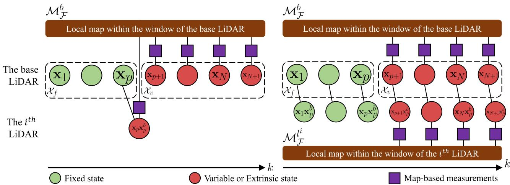  
Fig. 4. Illustration of a graphical model for a sliding-window estimator $( p = 3 , N = 6 )$ with online calibration (left) and pure odometry (right). $\mathcal { M } _ { \mathcal { F } } ^ { b } ( \mathcal { M } _ { \mathcal { F } } ^ { l ^ { i } } )$ is the local map of the base (ith) LiDAR. It consists of transformed and merged feature points captured by the base (ith) LiDAR from the first N frames in the window. Note that the extrinsics are optimized in the online calibration while they are fixed in the pure odometry.

## B. Optimization With Online Calibration

We exploit the map-based measurements to refine the coarse initialization results. Here, we treat the calibration as a registration problem. $f _ { \mathcal { M } } ( \mathcal { X } )$ is divided into two functions w.r.t. $\mathcal { X } _ { v }$ and $\mathcal { X } _ { e } .$ . For states in $\mathcal { X } _ { v }$ , the constraints are constructed from correspondences between features of the primary sensor at the latest frames, i.e., $\mathcal { F } ^ { b _ { k } } , k \in \left[ p + 1 , N + 1 \right]$ and those of the primary local map, $\mathrm { i . e . , } M ^ { b }$ . For states in $\mathcal { X } _ { e }$ , the constraints are built up from correspondences between features of auxiliary LiDARs at the pth frame, $\mathrm { i . e . , } \mathcal { F } ^ { l _ { p } ^ { i } }$ and the map $\mathcal { M } ^ { b }$

The correspondences between $\mathcal { F } ^ { b _ { k } }$ and $\mathcal { M } ^ { b }$ are found using the method in [16]. KD-Tree is used for fast indexing in a map. 1) For each edge point, we find a set of its nearest points in the local edge map within a specific region. This set is denoted by S, and its covariance is then computed. The eigenvector associated with the largest value implies the direction of the corresponding edge line. By calculating the mean of S, the position of this line is also determined. 2) For each planar point, the coefficients of the corresponding plane in the local planar map are obtained by solving a linear system such as ws $+ d = 0 , \forall \mathbf { s } \in { \mathcal { S } }$ . Similarly, we find correspondences between $\mathcal { F } ^ { l _ { p } ^ { i } }$ and $\mathcal { M } ^ { b }$ . Finally, we define the objective as the sum of all measurement residuals for the online calibration as

$$
\begin{array} { r l } { f _ { \mathcal M } ( \mathcal X ) = f _ { \mathcal M } ( \mathcal X _ { v } ) + f _ { \mathcal M } ( \mathcal X _ { e } ) } & { } \\ { = \displaystyle \sum _ { k = p + 1 } ^ { N + 1 } \sum _ { \mathbf { p } \in \mathcal { F } ^ { b } _ { k } } \rho \left( \left\| \mathbf { r } _ { \mathcal F } ( \mathbf x _ { p } ^ { - 1 } \mathbf x _ { k } , \mathbf p ) \right\| _ { \mathbf { \Sigma } _ { \mathbf { p } } } ^ { 2 } \right) } & { } \\ { + } & { \displaystyle \sum _ { i = 2 } ^ { I } \sum _ { \mathbf { p } \in \mathcal { F } ^ { i _ { p } } } \rho \left( \left\| \mathbf { r } _ { \mathcal F } ( \mathbf x _ { l } ^ { b } , \mathbf p ) \right\| _ { \mathbf { \Sigma } _ { \mathbf { p } } } ^ { 2 } \right) } \end{array}\tag{19}
$$

where $\mathbf { x } _ { p } ^ { - 1 } \mathbf { x } _ { k }$ defines the relative transformation from the pivot frame to the kth frame.

## C. Optimization With Pure Odometry

Once we finish the online calibration by fulfilling the convergence criterion (see Section VII-D), the optimization with pure odometry given accurate extrinsics is then performed. In this case, we do not optimize the extrinsics, and utilize all available map-based measurement to improve the single-LiDAR odometry. We incorporate constraints between features of all LiDARs and local maps into the cost function as

$$
\begin{array} { r l } & { f _ { \mathcal M } ( \mathcal X ) = f _ { \mathcal M } ( \mathcal X _ { v } ) } \\ & { \quad \quad = \displaystyle \sum _ { k = p + 1 } ^ { N + 1 } \sum _ { \mathbf { p } \in \mathcal F ^ { b _ { k } } } \rho \left( \left\| \mathbf { r } _ { \mathcal F } ( \mathbf x _ { p } ^ { - 1 } \mathbf x _ { k } , \mathbf p ) \right\| _ { \Sigma _ { \mathrm { p } } } ^ { 2 } \right) } \\ & { \quad \quad \quad + \displaystyle \sum _ { i = 2 } ^ { I } \sum _ { k = p + 1 } ^ { N + 1 } \sum _ { \mathbf { p } \in \mathcal F ^ { l _ { k } ^ { i } } } \rho \left( \left\| \mathbf { r } _ { \mathcal F } ( \mathbf x _ { p } ^ { - 1 } \mathbf x _ { k } \mathbf x _ { l ^ { i } } ^ { b } , \mathbf p ) \right\| _ { \Sigma _ { \mathrm { p } } } ^ { 2 } \right) } \end{array}\tag{20}
$$

where $\mathbf { x } _ { p } ^ { - 1 } \mathbf { x } _ { k } \mathbf { x } _ { l i } ^ { b }$ is the transformation from the primary LiDAR at the pivot frame to auxiliary LiDARs at the kth frame.

## D. Monitoring the Convergence of Calibration

While working on the online calibration in an unsupervised way, it is of interest to decide whether calibration converges. After the convergence, we fix the extrinsics. This is beneficial to our system since both the odometry and mapping are given more geometric constraints from auxiliary LiDARs for more accurate poses. As derived in [34], the degeneracy factor λ, which is the smallest eigenvalue of the information matrix, reveals the condition of an optimization-based state-estimation problem. Motivated by this work, we use λ to indicate whether our problem contains sufficient constraints or not for accurate extrinsics. The detailed pipeline to update extrinsics and monitor the convergence is summarized in Algorithm 1. The algorithm takes the function $f _ { \mathcal M } ( \cdot )$ defined in (19) as well as the current extrinsics as input, and returns the optimized extrinsics. On line 4, we compute λ from the information matrix ofthe cost function.

Algorithm 1: Monitoring Calibration Convergence.   
Input: objective $f _ { \mathcal { M } } ( \cdot )$ , current extrinsics $\check { \mathbf { x } } \triangleq \mathbf { x } _ { l ^ { i } } ^ { b }$   
Output: optimal extrinsics 文, covariance matrix $\Xi _ { c a l i b }$   
1 Denote L the set of all eligible estimates;   
2 if calibration is ongoing then   
3 Linearize $f _ { \mathcal { M } }$ at $\check { \mathbf { x } }$ to obtain $\begin{array} { r } { \pmb { \Lambda } = \big ( \frac { \partial f _ { \mathcal { M } } } { \partial \mathbf { x } } \big ) ^ { \top } \frac { \partial f _ { \mathcal { M } } } { \partial \mathbf { x } } } \end{array}$   
4 Compute the smallest eigenvalue λ of $\Lambda ;$   
5 if $\underline { { \lambda > \lambda _ { c a l i b } } }$ then   
6 Set  as the current extrinsics of the system;   
7 $\mathcal { L }  \mathcal { L } \cup \check { \mathbf { x } } ;$   
8 if $| \mathcal { L } | > \mathcal { L } _ { c a l i b }$ then   
9 $\hat { \mathbf { x } } \gets E [ \mathbf { x } ]$ as the mean;   
10 $\mathbf { \bar { \mathbf { \rho } } } _ { \Xi _ { c a l i b } } \gets \dot { C } o v [ \mathbf { x } ]$ as the covariance;   
11 Stop the online calibration;   
12 return $\hat { \mathbf { x } } , \Xi _ { c a l i b }$

On lines 5–7, the extrinsics are updated if λ is larger than a threshold. On line 8, we use the number ofcandidate extrinsics to check the convergence. On lines 9–10, the convergence criterion is met, and the termination is thus triggered. We then compute the sampling mean of L as the resulting extrinsics and the sampling covariance as the calibration covariance.

## E. Marginalization

We apply the marginalization technique to remove the oldest variable states in the sliding window. The marginalization is a process to incorporate historical constraints as a prior into the objective, which is an essential step to maintain the consistency of odometry and calibration results. In our system, $\mathbf { x } _ { p }$ is the only state to be marginalized after each optimization. By applying the Schur complement, we obtain the linear information matrix $\boldsymbol { \Lambda } _ { r r } ^ { * }$ and residual $\mathbf { g } _ { r } ^ { * }$ w.r.t. the remaining states. The prior residuals are formulated as $\| \mathbf { r } _ { p r i } \| ^ { 2 } = \mathbf { g } _ { r } ^ { * \top } \mathbf { \Lambda } _ { r r } ^ { * - 1 } \mathbf { g } _ { r } ^ { * }$ . Appendix B provides some mathematical foundations.

## VIII. UNCERTAINTY-AWARE MULTI-LIDAR MAPPING

We first review the pipeline of the mapping module of typical LiDAR SLAM systems [16]–[18]. Taking the prior odometry as input, the algorithm constructs a global map and refines the poses with enough constraints. This is done by minimizing the sum of all map-based residual errors as

$$
\hat { \mathbf { x } } _ { b _ { k } } ^ { w } = \underset { \mathbf { x } _ { b _ { k } } ^ { w } } { \arg \operatorname* { m i n } } \sum _ { i = 1 } ^ { I } \sum _ { \mathbf { p } \in \mathcal { F } ^ { l _ { k } ^ { i } } } \rho \left( \left\| \mathbf { r } _ { \mathcal { F } } ( \mathbf { x } _ { b _ { k } } ^ { w } \mathbf { x } _ { l ^ { i } } ^ { b } , \mathbf { p } ) \right\| _ { \mathbf { \Sigma } _ { \mathbf { p } } } ^ { 2 } \right)\tag{21}
$$

where $\mathcal { F } ^ { l _ { k } ^ { i } }$ are the input features while perceiving the kth point cloud, $\mathcal G _ { \mathcal F } ^ { w _ { k } }$ is the global map, and $\mathbf { x } _ { b _ { k } } ^ { w } \mathbf { x } _ { l ^ { i } } ^ { b }$ denotes the state of the ith LiDAR. We use the method in Section VII-B to find correspondences between $\mathcal { F } ^ { l _ { k } ^ { i } }$ and $\mathcal { G } _ { \mathcal { F } } ^ { w _ { k } }$ . After solving (21), the resulting pose is used to transform current features into the world frame, and add them into the map. To reduce the computational and memory complexity, the map is also downsized using a voxel grid filter [71]. However, the precision of optimization depends on the map quality. Fig. 5 visualizes the occurrence of noisy map points (also called landmarks) transformed by the uncertain pose. We believe that three sources of uncertainties make map points noisy: 1) sensor noise, 2) degenerate pose estimation, and 3) extrinsic perturbation.

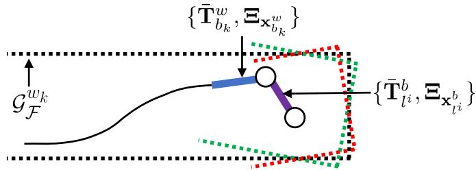  
Fig. 5. Illustration of the mapping process and occurrence of noisy map points. The black curve represents historical poses. The blue curve indicates the current pose of the primary LiDAR. The purple curve shows the extrinsics from the primary LiDAR to the auxiliary LiDAR. With the pose and extrinsics, input features (red and green dots) are transformed and added into the global map (black dots). The noisy poses make new map points uncertain.

In the next section, we propagate the uncertainties of LiDAR points and poses (represented as transformation matrices) on map points. As a result, each map point is modeled as an i.i.d Gaussian variable. We then propose an uncertainty-aware approach to improve the robustness and accuracy of the multi-LiDAR mapping algorithm.

## A. Uncertainty Propagation

Continuing the preliminaries in Section III-C, we now compute Ξ. The mapping poses are optimized by solving the NLS problem (21). We directly calculate the inverse of the information matrix, i.e., $\Xi _ { \mathbf { x } _ { b _ { k } } ^ { w } } = \mathbf { A } ^ { - 1 }$ , as the covariance. The setting of the extrinsic covariances depends on a specific situation. We generally define the extrinsic covariance as

$$
\begin{array} { r } { \Xi _ { \mathbf { x } _ { l i } ^ { b } } = \alpha \cdot \Xi _ { \mathrm { c a l i b } } , \xi _ { l ^ { i } } ^ { b } \sim \mathcal { N } ( \mathbf { 0 } , \Xi _ { \mathbf { x } _ { l i } ^ { b } } ) } \end{array}\tag{22}
$$

where $\xi _ { l ^ { i } } ^ { b }$ is the perturbation variable of extrinsics, $\Xi _ { \mathrm { c a l i b } }$ is the calibration covariance calculated according to Algorithm 1, and α is a scaling parameter allowing us to increase the magnitude of the covariance. If a multi-LiDAR system has been recently calibrated, we set $\alpha = 1$ , whereas if the system has been used for a long time and not recalibrated, there should be small extrinsic deviations on LiDARs, and α is set to be larger. It has an implicit relation with time and external impact, and temperature drift. Given the mean pose of the primary sensor, the mean extrinsics, and their covariances, we then compute the mean poses of other LiDARs and the covariances, i.e., $\{ \mathbf { T } _ { l _ { k } ^ { i } } ^ { w } , \Xi _ { l _ { k } ^ { i } } ^ { w } \}$ . This is a problem about compounding two noisy poses. We follow the fourth-order approximation in [19] to calculate them. And then, we need to pass the Gaussian uncertainty of a point through a noisy transformation to produce a new landmark $\mathbf { y } \in \mathcal { G } _ { \mathcal { F } } ^ { w _ { k + 1 } }$ with the mean and covariance as {y¯, Σ}. By transforming a point into

the world frame, we have

$$
\begin{array} { r } { \mathbf { y } \triangleq \mathbf { T } _ { l _ { k } ^ { i } } ^ { w } \mathbf { p } _ { h } = \exp ( \pmb { \xi } _ { e l _ { k } ^ { i } } ^ { w \wedge } ) \bar { \mathbf { T } } _ { l _ { k } ^ { i } } ^ { w } ( \bar { \mathbf { p } } _ { h } + \mathbf { D } \boldsymbol { \zeta } ) } \\ { \approx \left( \mathbf { I } + \pmb { \xi } _ { l _ { k } ^ { i } } ^ { w \wedge } \right) \bar { \mathbf { T } } _ { l _ { k } ^ { i } } ^ { w } ( \bar { \mathbf { p } } _ { h } + \mathbf { D } \boldsymbol { \zeta } ) } \end{array}\tag{23}
$$

where we keep the first-order approximation of the exponential map. If we multiply out the equation and retain only the firstorder terms, we have

$$
\mathbf { y } \approx \mathbf { h } + \mathbf { H } \theta\tag{24}
$$

where

$$
\mathbf { h } = \bar { \mathbf { T } } _ { l _ { k } ^ { i } } ^ { w } \bar { \mathbf { p } } _ { h } , \qquad \mathbf { H } = \left[ ( \bar { \mathbf { T } } _ { l _ { k } ^ { i } } ^ { w } \bar { \mathbf { p } } _ { h } ) ^ { \odot } \quad \bar { \mathbf { T } } _ { l _ { k } ^ { i } } ^ { w } \mathbf { D } \right]\tag{25}
$$

$$
\pmb { \theta } = [ \pmb { \xi } _ { l _ { k } ^ { i } } ^ { w ^ { \top } } , \pmb { \zeta } ^ { \top } ] ^ { \top } , \pmb { \theta } \sim \mathcal { N } ( \mathbf { 0 } , \boldsymbol { \Theta } ) , \ \boldsymbol { \Theta } = \mathrm { d i a g } ( \Xi _ { l _ { k } ^ { i } } ^ { w } , \mathbf { Z } )
$$

and the operator  converts a $4 \times 1$ column into a $4 \times 6$ matrix

$$
\left[ \boldsymbol { \varepsilon } \right] ^ { \odot } = \left[ \eta \mathbf { I } - \boldsymbol { \varepsilon } ^ { \wedge } \right] , \boldsymbol { \varepsilon } \in \mathbb { R } ^ { 3 } , \eta = 1 .\tag{26}
$$

All perturbation variables are embodied in θ in $\mathbb { R } ^ { 9 }$ . The covariance $\boldsymbol { \Theta } = \mathrm { d i a g } ( \boldsymbol { \Xi } _ { l _ { k } ^ { i } } ^ { w } , { \bf Z } )$ denotes the combined uncertainties of sensor readings, estimated poses, and extrinsics. Linearly transformed by H, y is Gaussian with the mean $\bar { \mathbf { y } }$ and covariance Σ as

$$
\begin{array} { r } { \bar { \bf y } = { \bf h } , \quad \Sigma = { \bf H } \Theta { \bf H } ^ { \top } . } \end{array}\tag{27}
$$

We follow the work in [72] to use the trace, i.e., $\operatorname { t r } ( \Sigma )$ , to quantify the magnitude of a covariance.

## B. Uncertainty-Aware Operation

The original mapping algorithm is integrated with three additional steps to boost its performance and robustness. In the last section, we show that the covariances of all map points are propagated by considering three sources of error. First, problem (21) is integrated with the propagated covariance in (27). This operation lets the cost function take the pose uncertainty and extrinsic perturbation into account. As a result, a point that stays near the origin should have a high weight. Moreover, the primary LiDAR tends to have more confidence than auxiliary LiDARs given the extrinsic covariances.

At the last iteration of the optimization, $\Xi _ { \mathbf { x } _ { b _ { k } } ^ { w } }$ is equal to the inverse of the new information matrix. Second, the uncertainty of each point after transformation is repropagated. We filter out outliers if $\operatorname { t r } ( \Sigma )$ is larger than a threshold. Finally, we modify the original voxel grid filter to downsize the global map in a probabilistic way. The modified filter samples points for each cube according to their covariances. Let $\{ \mathbf { y } _ { i } , \pmb { \Sigma } _ { i } \}$ be the ith point in a cube, and M be the number of points in the cube. The sampled mean and covariance of a cube are

$$
\bar { \mathbf { y } } = \sum _ { i = 1 } ^ { M } w _ { i } \mathbf { y } _ { i } , ~ \Sigma = \sum _ { i = 1 } ^ { M } w _ { i } ^ { 2 } \Sigma _ { i }\tag{28}
$$

where w is the threshold, and $\begin{array} { r } { w _ { i } = \frac { w - \mathrm { t r } ( \pmb { \Sigma } _ { i } ) } { \sum _ { i = 1 } ^ { m } [ w - \mathrm { t r } ( \pmb { \Sigma } _ { i } ) ] } } \end{array}$ is a normalized weight.

## IX. EXPERIMENT

We perform simulated and real-world experiments on three platforms to test the performance of M-LOAM. First, we calibrate multi-LiDAR systems on all the presented platforms. The proposed algorithm is compared with SOTA methods, and two evaluation metrics are introduced. Second, we demonstrate the SLAM performance of M-LOAM in various scenarios covering indoor environments and outdoor urban roads. Moreover, to evaluate the sensibility of M-LOAM against extrinsic error, we test it on the handheld device and vehicle under different levels of extrinsic perturbation. Finally, we provide a study to comprehensively evaluate M-LOAM’s performance and computation time with different LiDAR combinations.

## A. Implementation Details

We use the PCL library [71] to process point clouds and the Ceres Solver [73] to solve nonlinear least-squares problems. In experiments that are not specified, our algorithm is executed on a desktop with an i7 CPU@4.20 GHz and 32 GB RAM. Three platforms with different multi-LiDAR systems are tested: 1) a simulated robot, 2) a handheld device, and 3) a vehicle. The LiDARs on real platforms are synchronized with the external GPS clock triggered at an ns-level accuracy.

1) The Simulated Robot (SR) is built on the Gazebo [74]. Two 16-beam LiDARs are mounted on a mobile robot for testing. We build a closed simulated rectangular room. We use the approach from the work in [75] to set the LiDAR configuration for maximizing the sensing coverage. We moved the robot in the room at an average speed of $0 . 5 ^ { \sim }$ m/s. The ground-truth extrinsics and poses are provided.

2) The Real Handheld Device (RHD) is made for handheld tests and shown in Fig. 6. Its configuration is similar to that of the SR. Besides two ${ \mathrm { V L P - } } 1 6 { \mathrm { s } } , { } ^ { 4 }$ we also install a mini computer (Intel NUC) for data collection and a camera (mvBlueFOX-MLC200 w) for recording test scenes. We used this device to collect data on the campus with an average speed of 2˜m/s.

3) The Real Vehicle (RV) is a vehicle for autonomous logistic transportation [11]. We conduct experiments on this platform to demonstrate that our system also performs well in large-scale, challenging outdoor environments. As shown in Fig. 7, four $\mathrm { R S - L i D A R } { - } 1 6 \mathrm { s } ^ { 5 }$ are rigidly mounted at the top, front, left, and right positions. We drove the vehicle through urban roads at an average speed of 3˜m/s. Ground-truth poses are obtained from a coupled LiDAR-GPS-encoder localization system that was proposed in [48] and [76].

Table II shows the parameters that are empirically set. σR, $\lambda _ { \mathrm { c a l i b } }$ , and $\mathcal { L } _ { \mathrm { c a l i b } }$ are the convergence thresholds in calibration. Setting the last two parameters requires a preliminary training process, which is detailed in the supplementary material [77]. p and N are the size of the local map and the sliding window in the odometry, respectively. w is the threshold of filtering uncertain points in mapping, and α is the scale of the extrinsic covariance. We set $\alpha = 1 0$ for the case of injecting large perturbation in Section IX-D. Otherwise, $\alpha = 1$

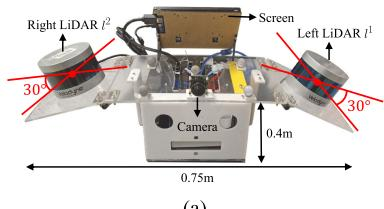  
(a)

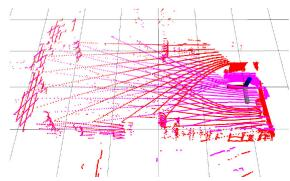  
(b)  
Fig. 6. (a) Real handheld device for indoor tests. Two VLP-16 s are mounted at the left and right sides, respectively. The attached camera is used to record test scenes. (b) Calibrated point cloud consists of points from the left (red) and right (pink) LiDARs. (a) Real handheld device. (b) Calibrated point cloud.

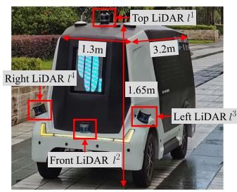  
(a)

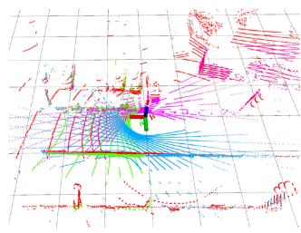  
(b)  
Fig. 7. (a) RV for large-scale, outdoor tests. Four RS-16 s are mounted at the top, front, left, and right positions, respectively. (b) Calibrated point cloud consists of points from the top (red), front (green), left (blue), and right (pink) LiDARs. (a) RV. (b) Calibrated point cloud.

TABLE II  
PARAMETERS FOR CALIBRATION AND SLAM
<table><tr><td> $\sigma _ { \mathbf { R } }$ </td><td> $\lambda _ { c a l i b }$ </td><td> $\mathcal { L } _ { c a l i b }$ </td><td>N</td><td>p</td><td>w</td><td>α</td></tr><tr><td>0.25</td><td>70</td><td>25</td><td>4</td><td>2</td><td>100</td><td>≥1</td></tr></table>

## B. Performance ofCalibration

1) Evaluation Metrics: We introduce following two metrics to assess the LiDAR calibration results from different aspects.

1) Error Compared With Ground truth (EGT) computes the distance between the ground truth and the estimated values in terms of rotation and translation as

$$
\begin{array} { r l } & { \mathrm { E G T } _ { \mathbf { R } } = \left\| \ln ( \mathbf { R } _ { \mathrm { g t } } \mathbf { R } _ { \mathrm { e s t } } ^ { - 1 } ) ^ { \vee } \right\| } \\ & { ~ \mathrm { E G T } _ { \mathbf { t } } = \left\| \mathbf { t } _ { \mathrm { g t } } - \mathbf { t } _ { \mathrm { e s t } } \right\| . } \end{array}\tag{29}
$$

2) Mean Map Entropy (MME) is proposed to measure the compactness of a point cloud [78]. It has been explored as a standard metric to assess the quality of registration if ground truth is unavailable [79]. Given a calibrated point cloud, the normalized mean map entropy is

$$
\mathrm { M M E } = \frac { 1 } { m } \sum _ { i = 1 } ^ { m } \ln \left[ \operatorname* { d e t } ( 2 \pi e \cdot { \bf C _ { p } } _ { i } ) \right]\tag{30}
$$

where m is the size of the point cloud and $\mathbf { C _ { p } } _ { i }$ is the sampling covariance within a local radius r around $\mathbf { p } _ { i }$ . For each calibration case, we select 10 consecutive frames of point clouds that contain many planes and compute their average MME values for evaluation.

Since the perfect ground truth is unknown in real-world applications, we use the results of “PS-Calib” [12] as the “relative ground truth” to compute the EGT. PS-Calib is a wellunderstood, target-based calibration approach, which should have similar or superior accuracy to our method [80]. Another metric is the MME, which computes the score in an unsupervised way. It can be interpreted as an information-theoretic measure of the compactness of a point cloud.

2) Calibration Results: The multi-LiDAR systems of all the presented platforms are calibrated by our methods. To initialize the extrinsics, we manually move these platforms with sufficient rotations and translations. Table III reports the resulting extrinsics, where two simulated cases (same extrinsics, different motions) and two real-world cases are tested. Due to limited space, we only demonstrate the calibration between the top LiDAR and front LiDAR on the vehicle. Our method is denoted by “Proposed (Ini.+Ref.),” which is compared with an offline multi-LiDAR calibration approach [4] (“Auto-Calib”). Although Auto-Calib follows a similar initialization-refinement procedure to obtain the extrinsics, it is different from our algorithm in several aspects. For example, Auto-Calib only uses planar features in refinement. And it assumes that LiDARs’ views should have large overlapping regions. The hand-eye-based initial (“Proposed (Ini.)”), uncalibrated (“W/O Calib”), CAD (“CAD model” for real platforms), and ground-truth (“GT”) extrinsics are also provided for reference.

Our hand-eye-based method successfully initializes the rotation offset $( < 9 ^ { \circ } )$ for all cases, but fails to recover the translation offset $( > 0 . 3 \mathrm { \tilde { ~ } m } )$ on the SR and RV. Both the simulated robot and vehicle have to perform planar movement with a long distance for initialization, making the recovery of the $x \mathrm { - } , y \mathrm { - }$ -translation poor due to the drift of motion estimation. The planar movement also causes the z-translation to be unobservable. But we can move the RHD in 6-DoF and rapidly gather rich constraints. Its initialization results are, thus, good. Regarding the online refinement, our algorithm outperforms Auto-Calib and demonstrates comparable performance with PS-Calib in terms of the EGT $( < 3 ^ { \circ } \mathrm { a n d } < 0 . 0 7 \mathrm { \tilde { ~ } m } )$ and MME metrics. Based on these results, we conclude that the initialization phase can provide coarse rotational estimates, and the refinement for precise extrinsics is required.

We explicitly show the test on the RHD in detail. In Fig. 8, we plot all MME values over different frames of calibrated point clouds, where the results are consistent with Table III. Whether r is set to $0 . 3 \mathrm { o r } 0 . 4 \mathrm { ~ \tilde { ~ } m }$ , our method always has a better score than Auto-Calib. Fig. 9 illustrates the calibration process, with the trajectory of the sensor suite shown in Fig. 10. This process is divided into three sequential phases: Phase 1 (extrinsic initialization, Section VI-B), Phase 2 (odometry with extrinsic refinement, Section VII-B), and Phase 3 (pure odometry and mapping, Section VII-C).

TABLE III CALIBRATED EXTRINSICS
<table><tr><td rowspan="2">Case</td><td rowspan="2">Method</td><td colspan="3">Rotation [deg]</td><td colspan="3">Translation [m]</td><td rowspan="2">EGTR [deg, ↓]</td><td rowspan="2">EGTt [m, ↓]</td><td colspan="2">MME[↓]</td></tr><tr><td>x</td><td>y</td><td>z</td><td>x</td><td>y</td><td>z</td><td></td><td>r = 0.3m r = 0.4m</td></tr><tr><td rowspan="6">SRI-kh)</td><td>Auto-Calib</td><td>6.134</td><td>1.669</td><td>0.767</td><td>0.001</td><td>-0.635</td><td>-0.083</td><td>33.911</td><td>0.209</td><td>-2.016</td><td>-2.463</td></tr><tr><td>Proposed (Ini.)</td><td>44.154</td><td>7.062</td><td>1.024</td><td>-0.027</td><td>-0.719</td><td>0.000</td><td>8.229</td><td>0.328</td><td>-2.240</td><td>-2.685</td></tr><tr><td>Proposed (Ini.+Ref.)</td><td>40.870</td><td>0.397</td><td>0.237</td><td>-0.012</td><td>-0.475</td><td>-0.206</td><td>0.997</td><td>0.018</td><td>2.690</td><td>3.073</td></tr><tr><td>PS-Calib</td><td>40.021</td><td>-0.005</td><td>-0.010</td><td>0.001</td><td>-0.476</td><td>-0.218</td><td>0.037</td><td>0.003</td><td>-2.730</td><td>-3.115</td></tr><tr><td>W/O Calib</td><td>0.000</td><td>0.000</td><td>0.000</td><td>0.000</td><td>0.000</td><td>0.000</td><td>40.000</td><td>0.525</td><td>-2.358</td><td>-2.704</td></tr><tr><td>GT</td><td>40.000</td><td>0.000</td><td>0.000</td><td>0.000</td><td>-0.477</td><td>-0.220</td><td></td><td></td><td>-2.733</td><td>-3.111</td></tr><tr><td rowspan="6">SRt-ht)</td><td>Auto-Calib</td><td>4.680</td><td>-1.563</td><td>0.647</td><td>0.032</td><td>-0.751</td><td>-0.022</td><td>35.337</td><td>0.339</td><td>-2.336</td><td>-2.447</td></tr><tr><td>Proposed (Ini.)</td><td>40.854</td><td>3.517</td><td>0.285</td><td>-0.019</td><td>-0.667</td><td>0.000</td><td>3.632</td><td>0.291</td><td>-2.607</td><td>-2.804</td></tr><tr><td>Proposed (Ini.+Ref.)</td><td>38.442</td><td>0.111</td><td>-0.037</td><td>0.000</td><td>-0.504</td><td>-0.205</td><td>1.549</td><td>0.030</td><td>3.016</td><td>3.192</td></tr><tr><td>PS-Calib</td><td>40.021</td><td>-0.005</td><td>-0.010</td><td>0.001</td><td>-0.476</td><td>-0.218</td><td>0.0365</td><td>0.003</td><td>-3.113</td><td>-3.306</td></tr><tr><td>W/O Calib</td><td>0.000</td><td>0.000</td><td>0.000</td><td>0.000</td><td>0.000</td><td>0.000</td><td>40.000</td><td>0.525</td><td>-2.875</td><td>-2.878</td></tr><tr><td>GT</td><td>40.000</td><td>0.000</td><td>0.000</td><td>0.000</td><td>-0.477</td><td>-0.220</td><td></td><td></td><td>-3.117</td><td>-3.313</td></tr><tr><td rowspan="5">RH- Ih)</td><td>Auto-Calib</td><td>7.183</td><td>-3.735</td><td>33.329</td><td>0.653</td><td>-2.006</td><td>-0.400</td><td>44.312</td><td>1.612</td><td>-3.612</td><td>-2.711</td></tr><tr><td>Proposed (Ini.)</td><td>36.300</td><td>0.069</td><td>-3.999</td><td>0.113</td><td>-0.472</td><td>-0.103</td><td>6.443</td><td>0.112</td><td>-3.664</td><td>-2.839</td></tr><tr><td>Proposed (Ini.+Ref.)</td><td>37.545</td><td>-0.376</td><td>0.773</td><td>0.066</td><td>-0.494</td><td>-0.113</td><td>2.491</td><td>0.064</td><td>3.681</td><td>-2.862</td></tr><tr><td>CAD Model</td><td>40.000</td><td>0.000</td><td>0.000</td><td>0.000</td><td>-0.456</td><td>-0.122</td><td>2.077</td><td>0.092</td><td>-3.662</td><td>-2.833</td></tr><tr><td>W/O Calib</td><td>0.000</td><td>0.000</td><td>0.000</td><td>0.000</td><td>0.000</td><td>0.000</td><td>40.000</td><td>0.560</td><td>-3.696</td><td>-2.868</td></tr><tr><td></td><td>PS-Calib</td><td>39.629</td><td>-1.664</td><td>1.193</td><td>0.033</td><td>-0.540</td><td>-0.142</td><td></td><td></td><td>-3.696</td><td>-2.868</td></tr><tr><td rowspan="8">RAVP-ont)</td><td></td><td></td><td></td><td></td><td></td><td></td><td></td><td></td><td></td><td></td><td></td></tr><tr><td>Auto-Calib Proposed (Ini.)</td><td>-19.634 1.320</td><td>21.610 7.264</td><td>-3.481 3.011</td><td>-0.130</td><td>-0.282</td><td>-0.850</td><td>22.852 3.217</td><td>0.791 1.433</td><td>-2.705 -2.721</td><td>-2.282</td></tr><tr><td>Proposed (Ini.+Ref.)</td><td>-2.057</td><td>6.495</td><td>2.133</td><td>-0.324 0.528</td><td>0.227</td><td>0.000</td><td>0.274</td><td>0.081</td><td>2.885</td><td>-2.332 2.370</td></tr><tr><td>CAD Model</td><td>0.000</td><td>10.000</td><td>0.000</td><td>0.795</td><td>-0.036 0.000</td><td>-1.102 -1.364</td><td>4.505</td><td>0.351</td><td>-2.771</td><td>-2.312</td></tr><tr><td>W/O Calib</td><td>0.000</td><td>0.000</td><td>0.000</td><td>0.000</td><td>0.000</td><td>0.000</td><td>7.227</td><td>1.252</td><td>-2.785</td><td>-2.306</td></tr><tr><td>PS-Calib</td><td>-1.817</td><td>6.629</td><td>2.134</td><td>0.536</td><td>0.039</td><td>-1.131</td><td></td><td></td><td>-2.902</td><td>-2.416</td></tr><tr><td></td><td></td><td></td><td></td><td></td><td></td><td></td><td></td><td></td><td></td><td></td></tr></table>

↓ indicates that the lower the value, the better the score.  
Boldface values indicate the best results.

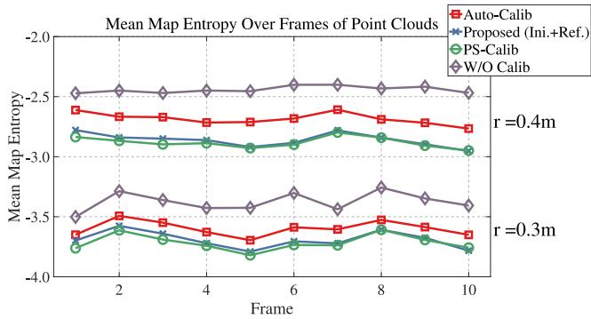  
Fig. 8. MME values over 10 consecutive frames of point clouds that are calibrated by different approaches on the RHD platform. The lower the value, the better the score for a method.

Phase 1 starts with recovering the rotational offsets without prior knowledge about the mechanical configuration. It exits when the second small singular value of QK is larger than a threshold. The translational components are then computed. Phase 2 performs a nonlinear optimization to jointly refine the extrinsics. This process may last for a prolonged period if there are not sufficient environmental constraints. However, our sliding-window-based marginalization scheme can ensure a bounded complexity program to consistently update the extrinsics. The convergence condition is monitored with the degeneracy factor (see Section VII-D) and number of candidates. After convergence, we turn OFF the calibration and enter Phase 3 that is evaluated in Section IX-C.

We also evaluate the sensitivity of our refinement method to different levels of initial guesses: the CAD model as well as rough rotational and translational initialization. Quantitative results can be found in the supplementary material [77].

## C. Performance of SLAM

We evaluate M-LOAM on both simulated and real-world sequences that are collected by the SR, RHD, and RV platforms. The multi-LiDAR systems are calibrated with our online approach (see Section VII-B). The detailed extrinsics can be found on the first, third, and fourth rows in Table III. We compare M-LOAM with two SOTA, open-source LiDAR-based algorithms: A-LOAM6 (the advanced implementation of LOAM [16]) and LEGO-LOAM7 [17]. Both of them directly take the calibrated and merged point clouds as input. In contrast, our method formulates the sliding-window estimator to fuse point clouds.

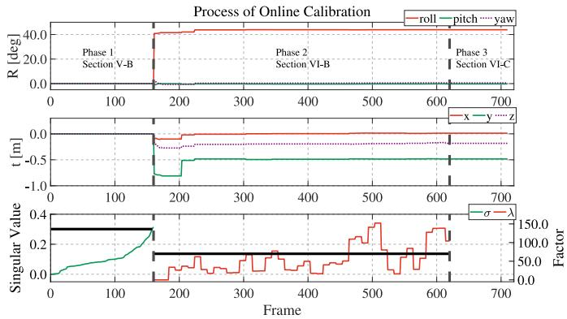  
Fig. 9. Detailed illustration of the whole calibration process, including the initialization and optimization with online calibration on the RHD. Different phases are separated by bold dashed lines. In Phase 1, the initial rotation and translation are estimated with the singular value-based exit criteria (see Section VI-B). In Phase 2, the nonlinear optimization-based calibration refinement process is performed. The convergence is determined by the degeneracyfactor (see Section VII-D). Phase 3 only optimizes the LiDAR odometry with fixed extrinsics. The black lines in the bottom plot indicate the setting thresholds σR and $\lambda _ { \mathrm { c a l i b } }$ , which are defined in Section VII-D.

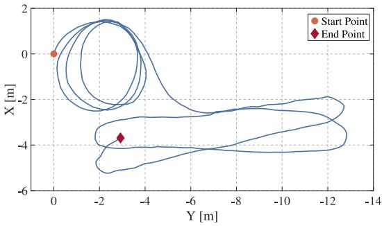  
Fig. 10. Calibration trajectory of the sensor suite estimated by M-LO on the RHD. The dot and diamond indicate the start and end points, respectively.

There are many differences in detail among these methods, as presented in the technical sections. Overall, our system is more complete with online calibration, uncertainty estimation, and probabilistic mapping. LEGO-LOAM is a ground-optimized system and requires LiDARs to be horizontally installed. It easily fails on the SR and RV. We, thus, provide its results only on the RV sequences for a fair comparison. The results estimated by parts of M-LOAM are also provided. These are denoted by M-LO and M-LOAM-wo-ua, indicating our proposed odometry (see Section VII-C) and the complete M-LOAM without the awareness of uncertainty (see Section VIII-B), respectively. To fulfill the real-time requirement, we run the odometry at 10 Hz and the mapping at 5 Hz.

1) Simulated Experiment: We move the SR to follow five paths with the same start point to verify our method. Each sequence is performed with 10-trial SLAM tests, and at each trial, zero-mean Gaussian noises with an SD of0.05˜m are added onto the point clouds. The ground-truth and the estimated trajectories of M-LOAM are plotted in Fig. 11. The absolute trajectory error (ATE) on all sequences is shown in Table IV, as evaluated in terms of root-mean-square error (RMSE) [81]. All sequences are split into either an easy or hard level according to their length. First, M-LO outperforms A-LO around 4 − 10 orders of magnitudes, which shows that the sliding-window estimator can refine the frame-to-frame odometry. Second, we observe that the mapping module greatly refines the odometry module. Third, M-LOAM outperforms other methods in most cases. This is due to two main reasons. 1) The small calibration error may potentially affect the map quality and degrade M-LOAM-wo-ua’s and A-LOAM’s performance. 2) The estimates from A-LO do not provide a good pose prior to A-LOAM. Since the robot has to turn around in the room for exploration, A-LOAMs mapping error accumulates rapidly and, thus, makes the optimized poses worse. This explains why A-LOAM has large error in SR04hard and SR05hard. One may argue that A-LOAM has less rotational error than other methods on SR02easy – SR04hard. We explain that A-LOAM uses ground points to constrain the roll and pitch angles, whereas M-LOAM tends to filter them out.

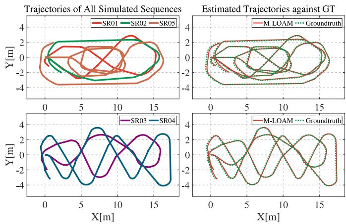  
Fig. 11. (Left) Trajectories of the SR01-SR05 sequences with different lengths. (Right) M-LOAMs trajectories compared against the ground truth.

TABLE IV  
ATE [81] ON SIMULATED SEQUENCES
<table><tr><td rowspan="2"></td><td rowspan="2">Metric Sequence Length M-LO</td><td rowspan="2"></td><td rowspan="2">M-LOAM</td><td rowspan="2">M-LOAM</td><td rowspan="2">A-LO</td><td rowspan="2">A-LOAM</td></tr><tr><td>-wo-ua</td></tr><tr><td rowspan="5">[]m]</td><td>SR01easy</td><td>40.6m 0.482</td><td>0.041</td><td>0.041</td><td>2.504</td><td>0.060</td></tr><tr><td>SR02easy</td><td>y 39.1m 0.884</td><td>0.034</td><td>0.034</td><td>3.721</td><td>0.060</td></tr><tr><td>SR03hard 49.2m 0.838</td><td></td><td>0.032</td><td>0.032</td><td>4.738</td><td>0.059</td></tr><tr><td>SR04hard 74.2m 0.757</td><td></td><td>0.032</td><td>0.032</td><td>2.083</td><td>0.388</td></tr><tr><td>SR05hard 81.2m 0.598</td><td></td><td>0.033</td><td>0.033</td><td>4.841</td><td>0.208</td></tr><tr><td rowspan="4">MS] deg]</td><td>SR01easy</td><td>40.6m 3.368</td><td>0.824</td><td>0.676</td><td>26.484</td><td>0.751</td></tr><tr><td>SR02easy 39.1m 7.971</td><td></td><td>1.070</td><td>0.882</td><td>37.903</td><td>0.576</td></tr><tr><td>SR03hard 49.2m 6.431</td><td></td><td>0.994</td><td>0.865</td><td>38.923</td><td>0.750</td></tr><tr><td>SR04hard 74.2m 5.728</td><td></td><td>0.919</td><td>0.772</td><td>21.027</td><td>0.711</td></tr><tr><td></td><td>SR05hard 81.2m 6.509</td><td></td><td>0.754</td><td>0.554</td><td>87.999</td><td>2.250</td></tr></table>

Boldface values indicate the best results.

We show the results of SR05hard in detail. The estimated trajectories are shown in Fig. 12. A-LOAM has a few defects in the marked box region and at the tail of their trajectories, whereas M-LOAM-wo-ua’s trajectory nearly overlaps with that of M-LOAM. The relative pose errors (RPE) evaluated in [81] are shown in Fig. 13. In this plot, M-LOAM has lower rotation and translation errors than others over a long distance.

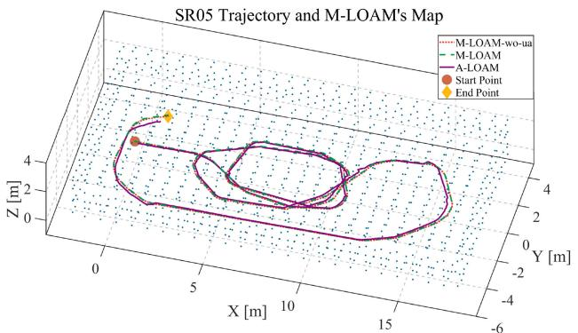  
Fig. 12. Trajectories on SR05 of M-LOAM-wo-ua, M-LOAM, and A-LOAM and the map constructed by M-LOAM. A-LOAM has a few defects, whereas M-LOAM-wo-ua’s trajectory nearly overlaps with that of M-LOAM.

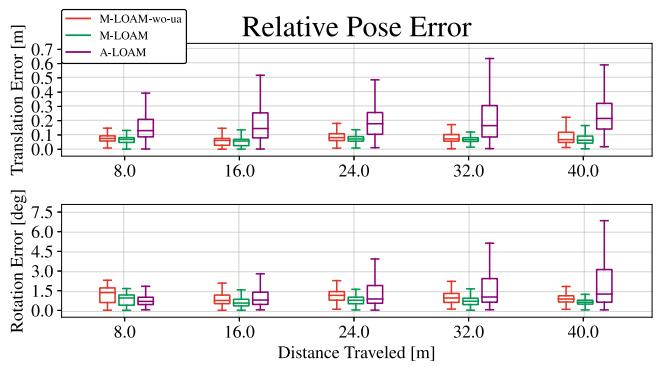  
Fig. 13. Mean RPE on SR05 with 10 trials. For the distance 40˜m, the median values of the relative translation and rotation error of M-LOAM-wo-ua, M-LOAM, and A-LOAM are (0.87◦, 0.07 m), (0.62◦, 0.06˜m), and (1.26◦, 0.22 m), respectively.

2) Indoor Experiment: We used the handheld device to collect four sequences called RHD01corridor, RHD02lab, RHD03garden, and RHD04building to test our approach.

The first experiment is done in a long and narrow corridor. As emphasized in [62], this is a typical poorly constrained environment. Here, we show that the uncertainty-aware operation is beneficial to our system. In Fig. 14, we illustrate the sample poses of M-LOAM and the generated map on RHD01corridor. These ellipses represent the size of the pose covariances. A large radius indicates that the pose in the x-, z-directions of each mapping step is uncertain. This is mainly caused by the fact that only a small set of points scan the walls and ceiling, which cannot provide enough constraints. Map points become uncertain due to noisy transformations. The uncertainty-aware operation of M-LOAM is able to capture and discard uncertain points. This leads to a map with a reasonably good signal-to-noise ratio, which generally improves the precision of optimization. This is the reason why M-LOAM outperforms M-LOAM-wo-ua.

We conduct more experiments to demonstrate the performance of M-LOAM on other RHD sequences. For evaluation, these datasets contain at least a closed loop. Our results of RHD02lab are shown in Fig. 15. This sequence contains two loops in a lab region. Fig. 15(a) shows M-LOAM’s map, and Fig. 15(b) shows the trajectories estimated by different methods. Both M-LOAM-wo-ua and A-LOAM accumulates significant drift at the x-, y-, z-directions after two loops, whereas M-LOAMs results are almost drift free. Fig. 15(c) shows the estimated poses and map points in the first loop. The covariances of the poses and points evaluated by M-LOAM are visible as ellipses and colored dots in the figure. Besides the corridor in scene 1, we also mark the well-conditioned environment in scene 2 for comparison. Fig. 15(d) shows the scene pictures. The results fit our previous explanation that the points in scene 1 are uncertain because of noisy poses. In contrast, scene 2 has more constraints for estimating poses, making the map points certain.

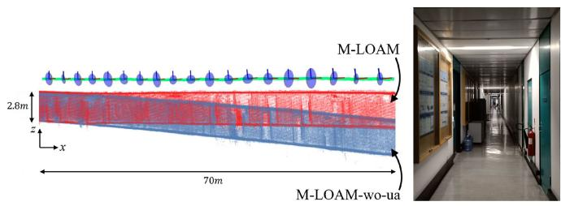  
(a)  
(b)  
Fig. 14. (a) Side view of sample poses with covariances estimated by M-LOAM and generated map on RHD01corridor. The below blue map is created by M-LOAM-wo-ua. The upper red map is created with M-LOAM. The covariances of pose calculated by M-LOAM are visualized as blue ellipses. A large radius represents a high uncertainty of a pose. The pose estimates in the x-, z-direction are degenerate and uncertain, making the map points on the ceiling and ground noisy. M-LOAM is able to maintain the map quality by smoothing the noisy points. (b) Scene image. (a) Poses and the map with covariance visualization. (b) Scene image.

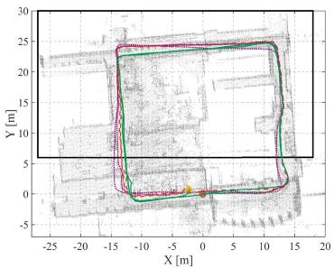  
(a)

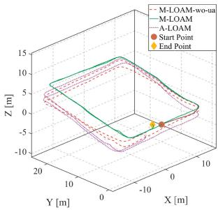  
(b)

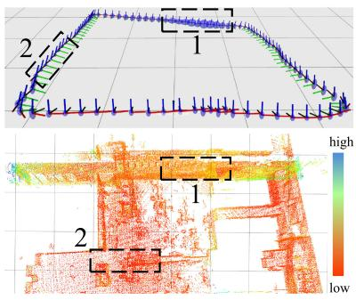  
(c)

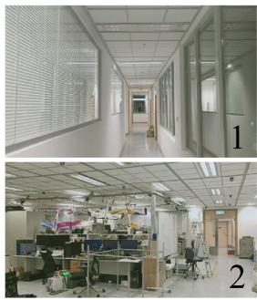  
(d)  
Fig. 15. Results on RHD02lab. (a) Map generated in a laboratory and estimated trajectories (from right to left). The black box is the region shown in the bottom figures. Two loops are in this sequence. (b) Trajectories in another viewpoint. (c) Visualization of poses and map points uncertainty. The grid size is 5 m. Covariances of poses are represented as blue ellipses. The larger the radius, the higher the uncertainty. The uncertainty of a point is measured by the trace of its covariance. The larger the trace, the higher the uncertainty. The marked regions indicate the degenerate (scene 1) and well-conditioned (scene 2) pose estimation respectively. With compounded uncertainty propagation, the map points in scene 1 become uncertain. (d) Scene images. (a) Map and trajectories. (b) Trajectories. (c) Pose and map points with uncertainties. (d) Scene images.

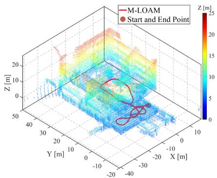  
(a)

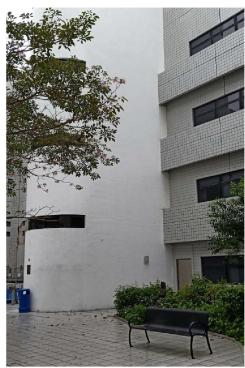  
(b)

Fig. 16. Results of RHD03garden. (a) Map generated in a garden, and the trajectory estimated by M-LOAM. The colors of the points vary from blue to red, indicating the altitude changes (0˜ to 23˜m) (b) Scene images. (a) Map and M-LOAMs trajectory. (b) Scene image.  
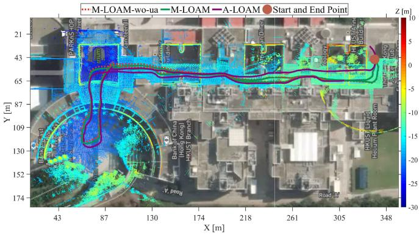  
Fig. 17. Mapping results of RHD04building that goes through the HKUST academic buildings and the trajectories estimated by different methods (total length is 700˜m). The map is aligned with Google Maps. The colors of the points vary from blue to red, indicating the altitude changes (0˜ to 40˜m).

Fig. 16 shows the results of RHD03garden. Since the installation of LiDARs on the RHD has a large roll angle, the areas over a 20-m height are scanned. Another experiment is carried out in a longer sequence. This dataset lasts for 12 min, and the total length is about 700˜m. The estimated trajectories and M-LOAMs map are aligned with Google Map in Fig. 17. Both M-LOAM-wo-ua and M-LOAM provide more accurate and consistent results than A-LOAM.

Finally, we evaluate the pose drift of methods with 10 repeated trials on RHD02–RHD04. We employ the point-to-plane ICP [20] to measure the distance between the start and end point. This ground truth distance is used to compare with that of the estimates, and the mean relative drift is listed in Table V. Both M-LOAM-wo-ua and M-LOAM achieve a similar accuracy on

TABLE V
<table><tr><td></td><td>Sequence Length M-LO</td><td></td><td>M-LOAM -wo-ua</td><td>M-LOAM</td><td>A-LO</td><td>A-LOAM</td></tr><tr><td>RHD02</td><td>197m 3.82%</td><td></td><td>0.29%</td><td></td><td>0.07%14.18%</td><td>1.13%</td></tr><tr><td>RHD03</td><td>164m 0.88%</td><td></td><td>0.029%</td><td>0.044%</td><td>5.31%</td><td>0.32%</td></tr><tr><td>RHD04</td><td>695m 7.30%</td><td></td><td>0.007%</td><td>0.003%34.02%</td><td></td><td>6.03%</td></tr></table>

Boldface values indicate the best results.

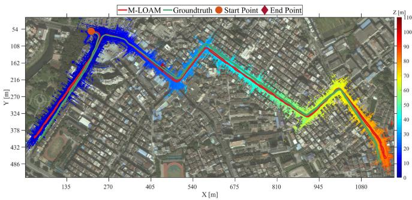  
Fig. 18. Mapping results of urban road and estimated trajectory against the ground truth on the RV sequence (total length is 3.23˜km). The colors of the points vary from blue to red, indicating the altitude changes (−5 to 105˜m).

RHD03 and RHD04 since the surroundings of these sequences are almost well conditioned. We conclude that the uncertaintyaware operation is not really necessary in well-conditioned environments and well-calibrated sensors, but maximally reduces the negative effect of uncertainties.

3) Outdoor Experiment: The large-scale, outdoor sequence was recorded with the RV platform (see Fig. 7). This sequence covers an area around 1100˜m in length and 450˜m in width and has 110˜m in height changes. The total path length is about 3.23˜km. The data lasts for 38 min, and contains the 10-Hz point clouds from four LiDARs and 25-Hz ground-truth poses. This experiment is very significant to test the stability and durability of M-LOAM.

M-LOAMs trajectory against the ground truth and the built map is aligned with Google Map in Fig. 18. We present the RPE of M-LOAM, M-LOAM-wo-ua, A-LOAM, and LEGO-LOAM in Fig. 19. A-LOAM has the highest errors among them. Both M-LOAM-wo-ua and M-LOAM have competitive results with LEGO-LOAM. In addition, the outlier terms of M-LOAM are fewer than other methods. We, thus, extend our previous findings that the uncertainty-aware mapping has the capability to enhance the robustness of the system.

## D. Sensitivity to Noisy Extrinsics

In this section, we evaluate the sensitivity of M-LOAM to different levels of extrinsic perturbation. On the RHD and RV platforms, we test our method by setting the extrinsics with different levels of accuracy: CAD model, initialization, and perturbation injection. The experiment settings are listed in Table VI. The injected perturbation is the simulated shock on the ground truth extrinsics with [10, 10, 10]deg in roll, pitch, and yaw and [0.1, 0.1, 0.1]m along the x-, y-, and z-axis. We use RHD02lab and a partial sequence on RV to compare M-LOAM with the baseline methods. It should be noted that extrinsic calibration is turned OFF, and we only use the top and front LiDAR on the vehicle in experiments. The estimated trajectories under the largest perturbation are shown in Figs. 20 and 21 for different platforms. These methods are marked with “(inj).” We calculate the ATE in Table VI. Here, M-LOAMs trajectory on RHD02lab in Section IX-C2 is used to compute the error. We observe that all methods’ performance degrades along with the increasing extrinsic perturbation. But both M-LOAM-wo-ua and M-LOAM have smaller error. In particular, under the largest perturbation, M-LOAM is much more robust since it can track sensors’ poses.

TABLE VI  
ATE GIVEN DIFFERENT EXTRINSICS FROM BAD TO GOOD: INJECT PERTURBATION, INITIALIZATION, AND CAD MODEL
<table><tr><td rowspan="2">Case</td><td rowspan="2">Extrinsic Source</td><td colspan="3">Rotation [deg]</td><td colspan="3">Translation  $[ m ]$ </td><td colspan="4">ATE: RMSEt [m] (RMSER[deg])</td></tr><tr><td>x</td><td>y</td><td>z</td><td>x</td><td>y</td><td>z</td><td>M-LOAM-wo-ua</td><td>M-LOAM</td><td>A-LOAM</td><td>LEGO-LOAM</td></tr><tr><td rowspan="3">RHD (Left-Right)</td><td>Inject Perturbation</td><td>49.629</td><td>8.236</td><td>11.193</td><td>0.133</td><td>-0.440</td><td>-0.042</td><td>7.74(29.63)</td><td>0.88(8.10)</td><td>4.16(17.79)</td><td></td></tr><tr><td>Initialization</td><td>36.300</td><td>0.069</td><td>-3.999</td><td>0.113</td><td>-0.472</td><td>-0.103</td><td>0.90(6.46)</td><td>0.79(6.92)</td><td>1.11(6.44)</td><td></td></tr><tr><td>CAD Model</td><td>40.000</td><td>0.000</td><td>0.000</td><td>0.000</td><td>-0.456</td><td>-0.122</td><td>0.53(3.61)</td><td>0.20(2.43)</td><td>0.53(3.94)</td><td></td></tr><tr><td rowspan="3">RV (Top-Front)</td><td>Inject Perturbation</td><td>8.183</td><td>16.629</td><td>12.134</td><td>0.636</td><td>0.139</td><td>-1.031</td><td>0.75(4.05)</td><td>0.56(3.33)</td><td>17.85(15.46)</td><td>1.06(6.01)</td></tr><tr><td>Initialization</td><td>1.320</td><td>7.264</td><td>3.011</td><td>-0.324</td><td>0.227</td><td>0.000</td><td>0.67(3.45)</td><td>0.60(3.23)</td><td>11.72(8.37)</td><td>0.90(4.06)</td></tr><tr><td>CAD Model</td><td>0.000</td><td>10.000</td><td>0.000</td><td>0.795</td><td>0.000</td><td>-1.364</td><td>0.48(2.29)</td><td>0.43(2.56)</td><td>12.95(5.40)</td><td>0.73(2.44)</td></tr></table>

Boldface values indicate the best results.

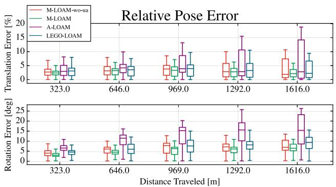  
Fig. 19. RPE on the RV sequence. For the 1616-m distance, the median values of the relative translation (in percentage) and rotation error of M-LOAM-woua, M-LOAM, A-LOAM, and LEGO-LOAM are (6.90◦, 1.87%), (6.45◦, 2.14%), (15.36◦, 2.80%), and (9.33◦, 2.23%) respectively.

## E. Single LiDAR Versus Multiple LiDARs

In this section, we explore the specific improvements in utilizing more LiDARs in M-LOAM. The RV platform has four LiDARs. We use One-, Two-, Three-, Four-LiDAR to denote the setups of l1, l1,2, l1,2,3, and $l ^ { 1 , 2 , 3 , 4 }$ , respectively [see Fig. 7(a)]. We also use x-Odom and x-Map to denote results provided by the odometry and mapping using different setups, respectively. The tests are carried out on the complete RV sequence. We first report statistics of the program in Table VII, including the average number of edge and planar features as well as average running time of measurement processing, optimization with pure odometry, and uncertainty-aware mapping. We see that the odometry time increases with more LiDARs because the system needs to handle more geometric constraints. This phenomenon does not appear in measurement preprocessing since we parallelize this module. The mapping time does not grow linearly because we use the voxel grid filter to bound the map’s complexity. We also provide the running time on an Intel NUC (i7 CPU@3.1 GHz) in the supplementary material [77], where the results are consistent with Table VII.

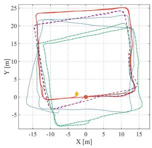  
(a)

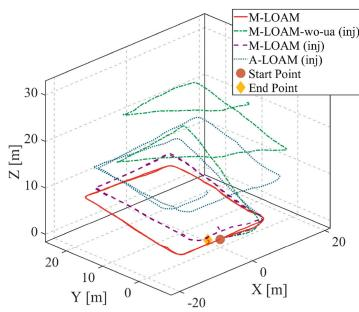  
(b)  
Fig. 20. Trajectories on RHD02lab with being injected by a large extrinsic perturbation. The detailed settings are shown in Table VI. (a) Trajectories in a down view. (b) Trajectories in another view.

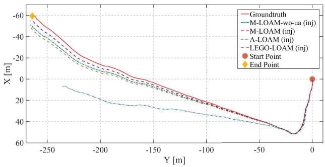  
Fig. 21. Trajectories on 341-m-length sequence (a part of the RV sequence) injected with a large extrinsic perturbation. The detailed settings are shown in Table VI.

TABLE VII  
AVERAGE FEATURE NUMBER AND RUNNING TIME ON A DESKTOP OF M-LOAM ON THE RV SEQUENCE WITH DIFFERENT LIDAR SETUPS
<table><tr><td>Setup</td><td>One-LiDAR Two-LiDAR Three-LiDAR Four-LiDAR</td><td></td><td></td><td></td></tr><tr><td>Edge features</td><td>1061</td><td>1366</td><td>1604</td><td>1851</td></tr><tr><td>Planar features</td><td>4721</td><td>5881</td><td>7378</td><td>8631</td></tr><tr><td>Measurement [ms]</td><td> $4 . 6 \pm 0 . 4$ </td><td> $4 . 8 \pm 0 . 5$ </td><td> $5 . 5 \pm 0 . 7$ </td><td> $6 . 0 \pm 0 . 7$ </td></tr><tr><td>Odometry [ms]</td><td> $2 7 \pm 5$ </td><td> $5 7 \pm 7$ </td><td> $6 9 \pm 7$ </td><td> $7 3 \pm 9$ </td></tr><tr><td>Mapping [ms]</td><td> $7 8 \pm 1 1$ </td><td> $9 1 \pm 1 3$ </td><td> $1 1 1 \pm 1 6$ </td><td> $1 2 6 \pm 1 5$ </td></tr></table>

\*Specifications: Intel i7 CPU@4.20 GHz and 32 GB RAM.

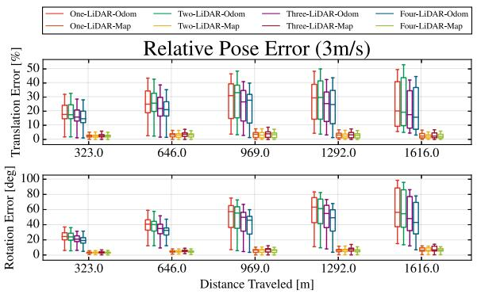  
(a)

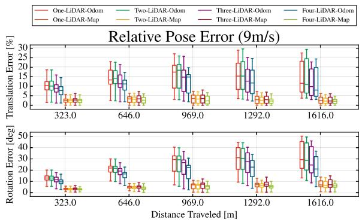  
(b)  
Fig. 22. RPE of M-LOAM on the RV sequence with different numbers of LiDARs in two cases. Better visualization in the colored version. (a) RPE in the case of 3m/s. From one to four LiDARs, the median values of the rotation and translation error (in percentage) in odometry are: (56.53◦, 20.19%), (54.53◦, 19.29%), (48.08◦, 17.57%), (42.96◦, 15.73%) respectively, whereas those in mapping are: (6.27◦, 2.35%), (6.26◦, 2.16%), (6.77◦, 2.32%), and (6.45◦, 2.14%) respectively. (b) RPE in the case of 9˜m/s. From one to four LiDARs, the median values of the rotation and translation error (in percentage) in odometry are: (29.38◦, 11.56%), (28.67◦, 11.00%), (24.60◦, 9.83%), (21.02◦, 8.01%) respectively, whereas those in the mapping are: (6.86◦, 2.42%), (6.43◦, 2.19%), (7.04◦, 2.24%), and (6.06◦, 2.11%), respectively.

To demonstrate that more features boost the system performance, we conduct experiments in two cases: 1) driving at a normal speed and 2) high speed. We use the original RV sequence in the first case. To simulate that the vehicle is moving faster in the second case, we extract one frame from every three frames to construct a new dataset. We evaluate the odometry and mapping of these setups in Fig. 22. The errors of the odometry decrease if more LiDARs are used. In the second case, the median values of Four-LiDAR-Odom are smaller than those of One-LiDAR-Odom around 8◦ relative rotation error and 3.5% translation error. But this improvement in mapping is small because the map already provides sufficient constraints. When the vehicle is moving at a higher speed, the global map becomes sparser. Consequently, the improvement of mapping on multiple LiDARs is noticeable. The boxplot of the Four-LiDAR setup has a smaller variance than others.

## X. DISCUSSION

## A. Main Advantages

We highlight that M-LOAM is a robust, reliable, and complete system to provide accurate calibration, odometry, and mapping results for different multi-LiDAR systems. We can extend M-LOAM to many types of LiDAR combinations, as shown in experiments. A typical application of M-LOAM is autonomous driving, where the multi-LiDAR system is gradually becoming a standard setup on vehicles. As verified in the experiments, the usage of multiple LiDARs boosts the SLAM performance in both robustness and accuracy. For other perception problems such as 3-D object detection [67] and tracking [82], the multi LiDAR systems are also beneficial.

As compared with the SOTA, M-LOAM introduces the sliding window-based tightly-coupled odometry to fuse multiple LiDARs and the uncertainty-aware mapping to maintain the globally consistent map with good noise-signal ratio. Furthermore, rather than operating calibrated and merged point clouds directly, it processes the multi-LiDAR measurements in an separate way. This design is advantageous in following aspects:

1) programs (e.g., segmentation and feature extraction) can be easily parallelized;

2) the LiDARs scan models can be used to generate a range image without data loss;

3) the extrinsic perturbation on the system can be formulated.

We consider that the aforementioned improvements enable M-LOAM to outperform A-LOAM on most sequences. Compared with LEGO-LOAM, which uses ground features, M-LOAM is more applicable to diverse applications. Nevertheless, integrating M-LOAM with the ground-optimization pipeline of LEGO-LOAM for mobile robots is encouraging.

The Gaussian distribution is our core hypothesis in modeling data uncertainty. Based on it, we use a tractable method to estimate covariances of poses (derived from information matrices) and extrinsics (given a sampling covariance after calibration). Even though these covariances are approximate, as shown in experiments, e.g., Fig. 20, the proposed uncertainty-aware operation significantly improves the robustness of M-LOAM against degeneracy and extreme extrinsic perturbation.

## B. Limitations

We recognize that the proposed calibration and SLAM methods have limitations. First, the calibration process requires some preset thresholds that are obtained from experiments. Its accuracy is not perfect for applications such as the high definition map construction construction. In practice, the errors should be smaller than 0.01˜m and 1◦. Otherwise, the calibration errors are proportionally propagated onto the map and deteriorate the map quality. This effect cannot be entirely eliminated even though the extrinsic perturbation is modeled by our method.

Second, our system utilizes several point cloud registrations in different phases to estimate states. As a typical nonconvex problem, registration requires correct correspondences and a good initial transformation. But LiDARs only produce a lowfrequency data stream, making this problem sometimes challenging. For example, when a robot moves and turns at a high frequency, our method barely tracks its poses. Also, we use the linear model to interpolate sensors’ poses, which cannot represent smooth or fast motion well. In these cases, it would be better to use high-order curves such as B-spline for interpolation [83].

Finally, we extract the simple edge and planar points from environments. However, these features present drawbacks in real tests. For instance, they only provide constraints in their perpendicular directions. In a long tunnel, where all planes are mostly parallel, M-LOAM may fail. Another example is that such features do not have enough recognition power to enable robust matching across frames with large viewpoint changes. As compared with surfel-based or visual features, they are less useful for tasks such as place recognition and relocalization.

## XI. CONCLUSION

In this article, we proposed a complete and robust solution for multi-LiDAR extrinsic calibration and SLAM. This approach contains several desirable features, including fast segmentation for noise removal, motion and extrinsic initialization, online extrinsic calibration with convergence identification, a tightly coupled M-LO, and uncertainty-aware multi-LiDAR mapping. We conducted extensive experiments covering scenarios from indoor offices to outdoor urban roads for evaluation. Our approach calibrated kinds of multi-LiDAR systems for different platforms. It yields accuracies in centimeters in translation and decidegrees in rotation and is comparable to a SOTA target-based method. For SLAM, the proposed system typically reaches a localization accuracy below 40 cm in medium-scale $( > 1 5 0 ^ { \sim } \mathrm { m } )$ scenarios and of a few meters in the large-scale urban roads $( > 3 . 2 \mathrm { \tilde { \ r m } ) }$ . For the benefit of the community, we made our implementation open source.

There are several directions for future research. Adding a loop-closure module into our system is desirable, which helps to correct the accumulated drift and maintain the global map [84]. Another research direction concerns object-centric SLAM. Two challenges are recently growing in the community. On the one hand, the widely used low-level geometric features are not representative and sensitive to viewpoint change. On the other hand, data sparsity and occlusion in LiDAR-based object detectors are the dominant bottlenecks. A possible solution to them is to develop a SLAM approach that can use object-level features to optimize both ego-motion and motion of dynamic objects. Trials on cameras or visual–inertial systems have been proposed in [85]–[87], whereas works on LiDARs are rare. Finally, extending our approach on calibration and uncertainty modeling to sensors in various modalities, e.g., IMUs [5], radars [9] and event-cameras [88], is promising. For instance, we can propagate the IMU noise model to predict pose uncertainties, or the proposed convergence criteria can be used for the extrinsic calibration of multimodal sensors.

## A. Jacobians ofResiduals

The state vector is defined as $\mathbf { x } = [ \mathbf { t } , \mathbf { q } ]$ . We convert $\mathbf { q }$ into a rotation matrix R by the Rodrigues formula [59]

$$
\mathbf { R } = ( q _ { w } ^ { 2 } - \mathbf { q } _ { x y z } ^ { \top } \mathbf { q } _ { x y z } ) \mathbf { I } + 2 \mathbf { q } _ { x y z } \mathbf { q } _ { x y z } ^ { \top } + 2 q _ { w } \mathbf { q } _ { x y z } ^ { \wedge }\tag{31}
$$

1) Jacobians of $\cdot _ { \mathbf { r } _ { \mathcal { H } } : }$ The residuals in (8) are rewritten as

$$
\begin{array} { r l } & { \mathbf { r } _ { \mathcal { H } } ( \mathbf { x } , \mathbf { p } ) = \left[ \mathbf { w } ^ { \top } ( \mathbf { R } \mathbf { p } + \mathbf { t } ) + d \right] \mathbf { w } } \\ & { \qquad = \mathrm { d i a g } ( \mathbf { w } ) \left[ \mathbf { w } \quad \mathbf { w } \quad \mathbf { w } \right] ^ { \top } \left( \mathbf { R } \mathbf { p } + \mathbf { t } \right) + d \mathbf { w } } \\ & { \qquad = \mathbf { W } ( \mathbf { R } \mathbf { p } + \mathbf { t } ) + d \mathbf { w } . } \end{array}\tag{32}
$$

Using the right disturbance: R $\exp ( \delta \phi ^ { \wedge } ) \approx \mathbf { R } ( \mathbf { I } + \delta \phi ^ { \wedge } )$ , the Jacobians of the rotation and translation are calculated as

$$
\begin{array} { r } { \frac { \partial \mathbf { r } _ { \mathcal { H } } ( \mathbf { x } , \mathbf { p } ) } { \partial \mathbf { x } } = [ \frac { \partial \mathbf { r } _ { \mathcal { H } } ( \mathbf { x } , \mathbf { p } ) } { \partial \mathbf { t } } , ~ \frac { \partial \mathbf { r } _ { \mathcal { H } } ( \mathbf { x } , \mathbf { p } ) } { \partial \mathbf { q } } ] } \\ { = [ \mathbf { W } , ~ - \mathbf { W } \mathbf { R } \mathbf { p } ^ { \wedge } , ~ \mathbf { 0 } _ { 3 \times 1 } ] . } \end{array}\tag{33}
$$

where the quaternion is updated according to $\delta \mathbf { q } \approx [ \frac { 1 } { 2 } \delta \phi , 1 ] ^ { \top }$

2) Jacobians of Residuals in $f _ { \mathcal { M } } f o r O n l i n \epsilon$ Calibration: The objective function in (19) has two terms: 1) $f _ { \mathcal { M } } ( \mathcal { X } _ { v } )$ and 2) $f _ { \mathcal M } ( \mathcal X _ { e } )$ . For the first term, the Jacobians are given by

$$
\frac { \partial \mathbf { r } _ { \mathcal { H } } ( \mathbf { x } _ { p } ^ { - 1 } \mathbf { x } _ { k } , \mathbf { p } ) } { \partial \mathbf { x } _ { k } } = [ \mathbf { W } \mathbf { R } _ { p } ^ { \top } , - \mathbf { W } \mathbf { R } _ { p } ^ { \top } \mathbf { R } _ { k } \mathbf { p } ^ { \wedge } , \mathbf { 0 } _ { 3 \times 1 } ]\tag{34}
$$

where $k \in [ p + 1 , N + 1 ]$ . Since the second term has the same form as (8), the Jacobians are given by (33) as

$$
\frac { \partial \mathbf { r } _ { \mathcal { H } } ( \mathbf { x } _ { l ^ { i } } ^ { b } , \mathbf { p } ) } { \partial \mathbf { x } _ { l ^ { i } } ^ { b } } = [ \mathbf { W } , \mathbf { \Lambda } - \mathbf { W } \mathbf { R } _ { l ^ { i } } ^ { b } \mathbf { p } ^ { \wedge } , \mathbf { 0 } _ { 3 \times 1 } ]\tag{35}
$$

where $i \in [ 2 , I ]$

3) Jacobians of Residuals in $f _ { \mathcal { M } }$ for Pure Odometry: The Jacobians of the residuals in (20) are computed as

$$
\begin{array} { r l } {  { \frac { \partial \mathbf { r } _ { \mathcal { H } } ( \mathbf { x } _ { p } ^ { - 1 } \mathbf { x } _ { k } \mathbf { x } _ { l ^ { i } } ^ { b } , \mathbf { p } ) } { \partial \mathbf { x } _ { k } } } \quad } & { } \\ & { = [ \mathbf { W } \mathbf { R } _ { p } ^ { \top } , \ - \mathbf { W } \mathbf { R } _ { p } ^ { \top } \mathbf { R } _ { k } ( \mathbf { R } _ { l ^ { i } } ^ { b } \mathbf { p } + \mathbf { t } _ { l ^ { i } } ^ { b } ) ^ { \wedge } , \ \mathbf { 0 } _ { 3 \times 1 } ] } \end{array}\tag{36}
$$

where $i \in [ 1 , I ]$ and $k \in [ p + 1 , N + 1 ]$

## B. Marginalization

The sliding-window estimator needs to marginalize out several states and add new states after optimization. For the whole state vector $x ,$ we denote ${ \mathcal { X } } _ { m }$ as the set of marginalized states and $\mathcal { X } _ { r }$ as the set of remaining states. By linearizing and expanding the cost function (18) at an initial point, we obtain the normal equation: $\mathbf { A } \delta { \mathcal { X } } = - \mathbf { g } ,$ , where $\begin{array} { r } { \mathbf { \Lambda } \mathbf { \Lambda } \mathbf { \Lambda } = \sum \mathbf { J } ^ { \top } \mathbf { \Sigma } \mathbf { \Sigma } ^ { - 1 } \mathbf { J } } \end{array}$ is the information matrix, $\mathbf { g } = \mathbf { J } ^ { \top } \mathbf { \Sigma } \mathbf { \Sigma } ^ { - 1 } \mathbf { r }$ . By representing the equation using block matrices, we have

$$
\begin{array} { r } { \left[ \begin{array} { l l } { \mathbf { \Delta } _ { m m } } & { \mathbf { \Delta } \mathbf { \Lambda } \mathbf { \Lambda } _ { m r } } \\ { \mathbf { \Delta } _ { r m } } & { \mathbf { \Delta } \mathbf { \Lambda } \mathbf { \Lambda } _ { r r } } \end{array} \right] \left[ \delta \mathcal { X } _ { m } \right] = - \left[ \begin{array} { l } { \mathbf { g } _ { m } } \\ { \mathbf { g } _ { r } } \end{array} \right] } \end{array}\tag{37}
$$

where we apply the Schur complement to yield

$$
\begin{array} { r } { \left[ \begin{array} { l l } { \mathbf { \Delta } _ { m m } } & { \mathbf { \Delta } \mathbf { \Lambda } \mathbf { \Lambda } _ { m r } } \\ { \mathbf { \Delta } \mathbf { 0 } } & { \mathbf { \Delta } \mathbf { \Lambda } \mathbf { \Lambda } _ { r r } ^ { * } } \end{array} \right] \left[ \delta \boldsymbol { \mathcal { X } } _ { m } \right] = - \left[ \begin{array} { l } { \mathbf { g } _ { m } } \\ { \mathbf { g } _ { r } ^ { * } } \end{array} \right] } \end{array}\tag{38}
$$

where

$$
\mathbf { \boldsymbol { \Lambda } } _ { r r } ^ { * } = \mathbf { \boldsymbol { \Lambda } } _ { r r } - \mathbf { \boldsymbol { \Lambda } } _ { r m } \mathbf { \boldsymbol { \Lambda } } _ { m m } ^ { - 1 } \mathbf { \boldsymbol { \Lambda } } _ { m r }
$$

$$
\mathbf { g } _ { r } ^ { * } = \mathbf { g } _ { r } - \mathbf { \Lambda } _ { r m } \mathbf { A } _ { m m } ^ { - 1 } \mathbf { g } _ { m } .\tag{39}
$$

The resulting $\boldsymbol { \Lambda } _ { r r } ^ { * }$ and $\mathbf { g } _ { r } ^ { * }$ encode the dependence of the marginalized states. Taking the linear residual into the next optimization, we can maintain the consistency of $\mathcal { X } _ { r }$ . Since the Ceres solver [73] uses Jacobians to update variables, when implementing the marginalization, we rewrite the information matrices using Jacobians. After obtaining $\boldsymbol { \Lambda } _ { r r } ^ { * }$ , we factorize it with eigenvalues and eigenvectors

$$
\mathbf { \Lambda } \mathbf { \Lambda } _ { r r } ^ { * } = \mathbf { P } \Psi \mathbf { P } ^ { \top } .\tag{40}
$$

Let $\mathbf { J } ^ { * } = \sqrt { \Psi } \mathbf { P } ^ { \top } , \mathbf { r } ^ { * } = \sqrt { \Psi ^ { - 1 } } \mathbf { P } ^ { \top } \mathbf { g } _ { r } ^ { * }$ , we have

$$
\mathbf { J } ^ { * ^ { \top } } \mathbf { J } ^ { * } = \mathbf { A } _ { r r } ^ { * } , ~ \mathbf { J } ^ { * ^ { \top } } \mathbf { r } ^ { * } = \mathbf { g } _ { r } ^ { * } .\tag{41}
$$

In the next optimization, the prior residual $\| \mathbf { r } _ { p r i } ( \mathcal { X } _ { r } ) \| ^ { 2 }$ is equal to $\| \mathbf { r } ^ { * } + \mathbf { J } ^ { * } \Delta \mathcal { X } _ { r } \| ^ { 2 }$ , where $\Delta { \mathcal X } _ { r }$ is the “distance” between the current state and initial state.

## ACKNOWLEDGMENT

The authors would like to thank members in HKUST Robotics Institute and Shenzhen Unity-Drive Innovation for the help and suggestions in algorithm development, temporal synchronization, and data collection. They would also like to thank the editors and anonymous reviewers of IEEE TRO for their suggestions, which led us to improve this article.

## REFERENCES

[1] S. Thrun, “Probabilistic robotics,” Commun. ACM, vol. 45, no. 3, pp. 52–57, 2002.

[2] C. Cadena et al., “Past, present, and future of simultaneous localization and mapping: Toward the robust-perception age,” IEEE Trans. Robot., vol. 32, no. 6, pp. 1309–1332, Dec. 2016.

[3] T. D. Barfoot, State Estimation for Robotics. Cambridge, U.K.: Cambridge Univ. Press, 2017.

[4] J. Jiao, Y. Yu, Q. Liao, H. Ye, R. Fan, and M. Liu, “Automatic calibration of multiple 3D LiDARs in urban environments,” in Proc. IEEE/RSJ Int. Conf. Intell. Robots Syst., 2019, pp. 15–20.

[5] H. Ye, Y. Chen, and M. Liu, “Tightly coupled 3D LiDAR inertial odometry and mapping,” in Proc. IEEE Int. Conf. Robot. Automat., 2019, pp. 3144– 3150.

[6] R. Kesten et al., “Lyft level 5 AV dataset 2019,” 2019. [Online]. Available: https://level5.lyft.com/dataset/

[7] P. Sun et al. “Scalability in perception for autonomous driving: Waymo open dataset,” in Proc. IEEE/CVF Conf. Comput. Vis. Pattern Recognit., 2020, pp. 2446–2454.

[8] S. Agarwal, A. Vora, G. Pandey, W. Williams, H. Kourous, and J. McBride, “Ford multi-AV seasonal dataset,” Int. J. Robot. Res., vol. 39, no. 12, pp. 1367–1376, 2020.

[9] D. Barnes, M. Gadd, P. Murcutt, P. Newman, and I. Posner, “The oxford radar robotcar dataset: A radar extension to the oxford robotcar dataset,” in Proc. IEEE Int. Conf. Robot. Automat., 2020, pp. 6433–6438.

[10] J. Geyer et al., “A2D2: Audi Autonomous Driving Dataset,” 2020. [Online]. Available: https://www.a2d2.audi

[11] T. Liu et al., “The role of the Hercules autonomous vehicle during the Covid-19 pandemic: An autonomous logistic vehicle for contactless goods transportation,” IEEE Robot. Automat. Mag., vol. 28, no. 1, pp. 48–58, Mar. 2021.

[12] J. Jiao et al., “A novel dual-LiDAR calibration algorithm using planar surfaces,” in Proc. IEEE Intell. Veh. Symp., 2019, pp. 1499–1504.

[13] M. Li, H. Yu, X. Zheng, and A. I. Mourikis, “High-fidelity sensor modeling and self-calibration in vision-aided inertial navigation,” in Proc. IEEE Int. Conf. Robot. Automat., 2014, pp. 409–416.

[14] Z. Yang and S. Shen, “Monocular visual-inertial fusion with online initialization and camera-IMU calibration,” in Proc. IEEE Int. Symp. Safety, Secur., Rescue Robot., 2015, pp. 1–8.

[15] T. Qin, P. Li, and S. Shen, “VINS-Mono: A robust and versatile monocular visual-inertial state estimator,” IEEE Trans. Robot., vol. 34, no. 4, pp. 1004–1020, Aug. 2018.

[16] J. Zhang and S. Singh, “LOAM: LiDAR odometry and mapping in realtime,” in Proc. Robot.: Sci. Syst., vol. 2, no. 9, 2014, p. 9.

[17] T. Shan and B. Englot, “LeGO-LOAM: Lightweight and ground-optimized LiDAR odometry and mapping on variable terrain,” in Proc. IEEE/RSJInt. Conf. Intell. Robots Syst., 2018, pp. 4758–4765.

[18] J. Lin and F. Zhang, “Loam livox: A fast, robust, high-precision LiDAR odometry and mapping package for LiDARs of small FOV,” in Proc. IEEE Int. Conf. Robot. Automat., 2020, pp. 3126–3131.

[19] T. D. Barfoot and P. T. Furgale, “Associating uncertainty with threedimensional poses for use in estimation problems,” IEEE Trans. Robot., vol. 30, no. 3, pp. 679–693, Jun. 2014.

[20] F. Pomerleau, F. Colas, R. Siegwart, and S. Magnenat, “Comparing ICP variants on real-world data sets,” Auton. Robots, vol. 34, no. 3, pp. 133–148, 2013.

[21] A. Segal, D. Haehnel, and S. Thrun, “Generalized-ICP,” Robot.: Sci. Syst., vol. 2, no. 4, 2009, Art. no. 435.

[22] J. Serafin and G. Grisetti, “NICP: Dense normal based point cloud registration,” in Proc. IEEE/RSJ Int. Conf. Intell. Robots Syst., 2015, pp. 742–749.

[23] M. Magnusson, A. Lilienthal, and T. Duckett, “Scan registration for autonomous mining vehicles using 3D-NDT,” J. Field Robot., vol. 24, no. 10, pp. 803–827, 2007.

[24] J. Behley and C. Stachniss, “Efficient Surfel-based SLAM using 3D laser range data in urban environments,” in Proc. Robot.: Sci. Syst., 2018.

[25] X. Chen, A. Milioto, E. Palazzolo, P. Giguére, J. Behley, and C. Stachniss, “SuMa++ : Efficient LiDAR-based semantic SLAM,” in Proc. IEEE/RSJ Int. Conf. Intell. Robots Syst., 2019, pp. 4530–4537.

[26] W. S. Grant, R. C. Voorhies, and L. Itti, “Finding planes in LiDAR point clouds for real-time registration,” in Proc. IEEE/RSJ Int. Conf. Intell. Robots Syst., 2013, pp. 4347–4354.

[27] M. Velas, M. Spanel, and A. Herout, “Collar line segments for fast odometry estimation from velodyne point clouds,” in Proc. IEEE Int. Conf. Robot. Automat., 2016, pp. 4486–4495.

[28] G. Pandey, S. Giri, and J. R. Mcbride, “Alignment of 3D point clouds with a dominant ground plane,” in Proc. IEEE/RSJ Int. Conf. Intell. Robots Syst., 2017, pp. 2143–2150.

[29] S. W. Chen et al., “SLOAM: Semantic LiDAR odometry and mapping for forest inventory,” IEEE Robot. Automat. Lett., vol. 5, no. 2, pp. 612–619, Apr. 2020.

[30] K. Ji et al., “CPFG-SLAM: A robust simultaneous localization and mapping based on LiDAR in off-road environment,” in Proc. IEEE Intell. Veh. Symp., 2018, pp. 650–655.

[31] J. Jiao et al., “Greedy-based feature selection for efficient LiDAR SLAM,” in Proc. IEEE Int. Conf. Robot. Automat., 2021.

[32] M. Bosse, R. Zlot, and P. Flick, “Zebedee: Design of a spring-mounted 3-D range sensor with application to mobile mapping,” IEEE Trans. Robot., vol. 28, no. 5, pp. 1104–1119, Oct. 2012.

[33] A. Pfrunder, P. V. Borges, A. R. Romero, G. Catt, and A. Elfes, “Real-time autonomous ground vehicle navigation in heterogeneous environments using a 3D LiDAR,” in Proc. IEEE/RSJ Int. Conf. Intell. Robots Syst., 2017, pp. 2601–2608.

[34] J. Zhang, M. Kaess, and S. Singh, “On degeneracy of optimization-based state estimation problems,” in Proc. IEEE Int. Conf. Robot.Automat., 2016, pp. 809–816.

[35] A. Hinduja, B.-J. Ho, and M. Kaess, “Degeneracy-aware factors with applications to underwater SLAM,” in Proc. IEEE/RSJ Int. Conf. Intell. Robots Syst., 2019, pp. 1293–1299.

[36] J. Zhang and S. Singh, “Enabling aggressive motion estimation at lowdrift and accurate mapping in real-time,” in Proc. IEEE Int. Conf. Robot. Automat., 2017, pp. 5051–5058.

[37] W. Zhen and S. Scherer, “Estimating the localizability in tunnel-like environments using LiDAR and UWB,” in Proc. Int. Conf. Robot. Automat., 2019, pp. 4903–4908.

[38] Z. Rong and N. Michael, “Detection and prediction of near-term state estimation degradation via online nonlinear observability analysis,” in Proc. IEEE Int. Symp. Saf., Secur., Rescue Robot., 2016, pp. 28–33.

[39] S. Lynen, M. W. Achtelik, S. Weiss, M. Chli, and R. Siegwart, “A robust and modular multi-sensor fusion approach applied to MAV navigation,” in Proc. IEEE/RSJ Int. Conf. Intell. Robots Syst.2013, pp. 3923–3929.

[40] G. Wan et al., “Robust and precise vehicle localization based on multisensor fusion in diverse city scenes,” in Proc. IEEE Int. Conf. Robot. Automat., 2018, pp. 4670–4677.

[41] S. Zhao, Z. Fang, H. Li, and S. Scherer, “A robust laser-inertial odometry and mapping method for large-scale highway environments,” in Proc. IEEE/RSJ Int. Conf. Intell. Robots Syst., 2019, pp. 1285–1292.

[42] X. Zuo, P. Geneva, Y. Yang, W. Lee, Y. Liu, and G. Huang, “LIC-Fusion: LiDAR-inertial-camera odometry,” in Proc. IEEE/RSJ Int. Conf. Intell. Robots Syst., 2019, pp. 5848–5854.

[43] C. Qin, H. Ye, C. E. Pranata, J. Han, and M. Liu, “LINS: A Lidar-Inertial State Estimator for Robust and Efficient Navigation,” in 2020 IEEE Int. Conf. Robot. Automation (ICRA), 2020, pp. 8899–8906, doi: 10.1109/ICRA40945.2020.9197567.

[44] G. Hemann, S. Singh, and M. Kaess, “Long-range GPS-denied aerial inertial navigation with LiDAR localization,” in Proc. IEEE/RSJ Int. Conf. Intell. Robots Syst., 2016, pp. 1659–1666.

[45] T. Lowe, S. Kim, and M. Cox, “Complementary perception for handheld SLAM,” IEEE Robot. Autom. Lett., vol. 3, no. 2, pp. 1104–1111, Apr. 2018.

[46] C. Le Gentil, T. Vidal-Calleja, and S. Huang, “IN2LAMA: Inertial LiDAR localisation and mapping,” in Proc. Int. Conf. Robot. Automat., 2019, pp. 6388–6394.

[47] C. Le Gentil, T. Vidal-Calleja, and S. Huang, “IN2LAAMA: Inertial LiDAR localization autocalibration and mapping,” IEEE Trans. Robot., vol. 37, no. 1, pp. 275–290, Feb. 2021.

[48] L. Zheng, Y. Zhu, B. Xue, M. Liu, and R. Fan, “Low-cost GPS-aided LiDAR state estimation and map building,” in Proc. IEEE Int. Conf. Imag. Syst. Techn., 2019, pp. 1–6.

[49] M. He, H. Zhao, F. Davoine, J. Cui, and H. Zha, “Pairwise LiDAR calibration using multi-type 3D geometric features in natural scene,” in Proc. IEEE/RSJ Int. Conf. Intell. Robots Syst., 2013, pp. 1828–1835.

[50] D.-G. Choi, Y. Bok, J.-S. Kim, and I. S. Kweon, “Extrinsic calibration of 2-D LiDARs using two orthogonal planes,” IEEE Trans. Robot., vol. 32, no. 1, pp. 83–98, Feb. 2016.

[51] B. Xue et al., “Automatic calibration of dual-LiDARs using two poles stickered with retro-reflective tape,” in Proc. IEEE Int. Conf. Imag. Syst. Techn., 2019, pp. 1–6.

[52] R. Kümmerle, G. Grisetti, and W. Burgard, “Simultaneous calibration, localization, and mapping,” in Proc. IEEE/RSJ Int. Conf. Intell. Robots Syst., 2011, pp. 3716–3721.

[53] A. Teichman, S. Miller, and S. Thrun, “Unsupervised intrinsic calibration of depth sensors via SLAM,” in Proc. Robot.: Sci. Syst., vol. 248, 2013, p. 3.

[54] L. Heng, G. H. Lee, and M. Pollefeys, “Self-calibration and visual SLAM with a multi-camera system on a micro aerial vehicle,” Auton. robots, vol. 39, no. 3, pp. 259–277, 2015.

[55] Z. Ouyang, L. Hu, Y. LU, Z. W. Wang, X. Peng, and L. Kneip, “Online calibration of exterior orientations of a vehicle-mounted surround-view camera system,” in Proc. IEEE Int. Conf. Robot.Automat., 2020, pp. 4990– 4996.

[56] T. Qin and S. Shen, “Online temporal calibration for monocular visualinertial systems,” in Proc. IEEE/RSJ Int. Conf. Intell. Robots Syst., 2018, pp. 3662–3669.

[57] C. Le Gentil, T. Vidal-Calleja, and S. Huang, “3D LiDAR-IMU calibration based on upsampled preintegrated measurements for motion distortion correction,” in Proc. IEEE Int. Conf. Robot. Automat., 2018, pp. 2149– 2155.

[58] K. Qiu, T. Qin, J. Pan, S. Liu, and S. Shen, “Real-time temporal and rotational calibration of heterogeneous sensors using motion correlation analysis,” IEEE Trans. Robot., vol. 37, no. 2, pp. 587–602, Apr. 2021.

[59] J. Sola, “Quaternion kinematics for the error-state Kalman filter,” 2017, arXiv:1711.02508.

[60] V. Ila, L. Polok, M. Solony, P. Smrz, and P. Zemcik, “Fast covariance recovery in incremental nonlinear least-squares solvers,” in Proc. IEEE Int. Conf. Robot. Automat., 2015, pp. 4636–4643.

[61] M. Bosse et al. Robust Estimation and Applications in Robotics. Delft, The Netherlands: Now Publishers, 2016.

[62] A. Censi, “An accurate closed-form estimate of ICP’s covariance,” in Proc. IEEE Int. Conf. Robot. Automat, 2007, pp. 3167–3172.

[63] F. Pomerleau, A. Breitenmoser, M. Liu, F. Colas, and R. Siegwart, “Noise characterization of depth sensors for surface inspections,” in Proc. 2nd Int. Conf. Appl. Robot. Power Ind., 2012, pp. 16–21.

[64] M. Brossard, S. Bonnabel, and A. Barrau, “A new approach to 3D ICP covariance estimation,” IEEE Robot. Autom. Lett., vol. 5, no. 2, pp. 744–751, Apr. 2020.

[65] D. Landry, F. Pomerleau, and P. Giguere, “Cello-3D: Estimating the covariance of ICP in the real world,” in Proc. Int. Conf. Robot. Automat., 2019, pp. 8190–8196.

[66] W. Maddern, G. Pascoe, C. Linegar, and P. Newman, “1 year, 1000 km: The Oxford RobotCar dataset,” Int. J. Robot. Res., vol. 36, no. 1, pp. 3–15, 2017.

[67] J. Jiao, P. Yun, L. Tai, and M. Liu, “MLOD: Awareness of extrinsic perturbation in multi-LiDAR 3D object detection for autonomous driving,” in Proc. IEEE/RSJ Int. Conf. Intell. Robots Syst., 2020, pp. 10 556–10563.

[68] I. Bogoslavskyi and C. Stachniss, “Fast range image-based segmentation of sparse 3D laser scans for online operation,” in Proc. IEEE/RSJ Int. Conf. Intell. Robots Syst., 2016, pp. 163–169.

[69] T. H. Cormen, C. E. Leiserson, R. L. Rivest, and C. Stein, Introduction to Algorithms. Cambridge, MA, USA: MIT Press, 2009.

[70] S. Leutenegger, P. Furgale, V. Rabaud, M. Chli, K. Konolige, and R. Siegwart, “Keyframe-based visual-inertial SLAM using nonlinear optimization,” Int. J. Robot. Res., England, London, UK: SAGE Publications Sage, vol. 34, no. 3, pp. 314–334, 2015.

[71] R. B. Rusu and S. Cousins, “3D is here: Point Cloud Library (PCL),” in Proc. IEEE Int. Conf. Robot. Automat., 2011, pp. 1–4.

[72] Y. Kim and A. Kim, “On the uncertainty propagation: Why uncertainty on lie groups preserves monotonicity?” in Proc. IEEE/RSJ Int. Conf. Intell. Robots Syst., 2017, pp. 3425–3432.

[73] S. Agarwal et al. “Ceres Solver.” 2010, [Online]. Available: http://ceressolver.org

[74] N. Koenig and A. Howard, “Design and use paradigms for Gazebo, an open-source multi-robot simulator,” in Proc. IEEE/RSJ Int. Conf. Intell. Robots Syst., vol. 3, 2004, pp. 2149–2154.

[75] S. Mou, Y. Chang, W. Wang, and D. Zhao, “An optimal LiDAR configuration approach for self-driving cars,” 2018, arXiv:1805.07843.

[76] Y. Zhu, B. Xue, L. Zheng, H. Huang, M. Liu, and R. Fan, “Real-time, environmentally-robust 3D LiDAR localization,” in Proc. IEEE Int. Conf. Imag. Syst. Techn., 2019, pp. 1–6.

[77] J. Jiao, H. Ye, Y. Zhu, and M. Liu, “Supplementary material to: Robust odometry and mapping for multi-LiDAR systems with online extrinsic calibration,” Tech. Rep., 2020. [Online]. Available: https://ram-lab.com/ file/site/m-loam/supp.pdf

[78] D. Droeschel, J. Stückler, and S. Behnke, “Local multi-resolution representation for 6D motion estimation and mapping with a continuously rotating 3D laser scanner,” in Proc. IEEE Int. Conf. Robot. Automat., 2014, pp. 5221–5226.

[79] J. Razlaw, D. Droeschel, D. Holz, and S. Behnke, “Evaluation of registration methods for sparse 3D laser scans,” in Proc. Eur. Conf. Mobile Robots, 2015, pp. 1–7.

[80] K. Huang and C. Stachniss, “On geometric models and their accuracy for extrinsic sensor calibration,” in Proc. IEEE Int. Conf. Robot. Automat., 2018, pp. 1–9.

[81] Z. Zhang and D. Scaramuzza, “A tutorial on quantitative trajectory evaluation for visual (-inertial) odometry,” in Proc. IEEE/RSJ Int. Conf. Intell. Robots Syst., 2018, pp. 7244–7251.

[82] S. Zhang, D. Wang, F. Ma, C. Qin, Z. Chen, and M. Liu, “Robust pedestrian tracking in crowd scenarios using an adaptive GMM-based framework,” in Proc. IEEE/RSJ Int. Conf. Intell. Robots Syst., 2020, pp. 9992–9998.

[83] C. Park, P. Moghadam, J. Williams, S. Kim, S. Sridharan, and C. Fookes, “Elasticity meets continuous-time: Map-centric dense 3D LiDAR SLAM,” 2020, arXiv:2008.02274.

[84] X. Chen et al., “OverlapNet: Loop closing for LiDAR-based SLAM,” in Proc. Robot.: Sci. Syst., 2020.

[85] S. Yang and S. Scherer, “CubeSLAM: Monocular 3-D object SLAM,” IEEE Trans. Robot., vol. 35, no. 4, pp. 925–938, Aug. 2019.

[86] J. Zhang, M. Henein, R. Mahony, and V. Ila, “VDO-SLAM: A visual dynamic object-aware SLAM system,” 2020, arXiv:2005.11052.

[87] T. Qin, T. Chen, Y. Chen, and Q. Su, “AVP-SLAM: Semantic visual mapping and localization for autonomous vehicles in the parking lot,” in Proc. IEEE/RSJ Int. Conf. Intell. Robots Syst., 2020, pp. 5939–5945.

[88] G. Gallego et al., “Event-based vision: A survey,” IEEE Trans. Pattern Anal. Mach. Intell., 2020, pp. 1–1, to be published, doi: 10.1109/TPAMI.2020.3008413.

Jianhao Jiao (Graduate Student Member, IEEE) received the B.Eng. degree in instrument science from Zhejiang University, Hangzhou, China, in 2017. He is currently working toward the Ph.D. degree with the Department ofElectronic and Computer Engineering, Hong Kong University of Science and Technology Hong Kong, under the supervision of Prof. Ming Liu.

His research interests include state estimation, SLAM, sensor fusion, and computer vision.

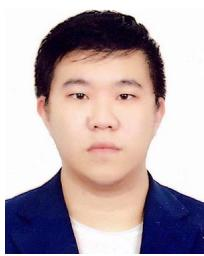

Yilong Zhu received the B.Sc. degree in instrument science from the Harbin Institute of Technology, Harbin, China, in 2017, and the M.S. degree in electrical engineering in 2018 from the Hong Kong University of Science and Technology, Hong Kong, where he is currently working toward the Ph.D. degree in robotics and artificial intelligence under the supervision of Prof. Ming Liu.

His research interests include SLAM, sensor fusion, and perception.

Mr. Zhu was the recipient of the Best Paper Finalist Award in 2019 IEEE International Conference on Robotics and Biomimetics.

Haoyang Ye (Graduate Student Member, IEEE) received the B.Eng. degree in automation from the College of Control Science and Engineering, Zhejiang University, Hangzhou, China, in 2016, and the Ph.D. degree from the Department of Electronic and Computer Engineering, Hong Kong University of Science and Technology, Hong Kong, in 2020, under the supervision of Prof. Ming Liu.

His research interests include state estimation for robotics, SLAM, multisensor fusion, and robot navigation.

Ming Liu (Senior Member, IEEE) received the B.A. degree in automation from Tongji University, Shanghai, China, in 2005, and the Ph.D. degree in robotics and artificial intelligence from the Department of Mechanical and Process Engineering, ETH Zurich, Zurich, Switzerland, in 2013, under the supervision of Prof. Roland Siegwart.

During his master’s study with Tongji University, he stayed one year with the Erlangen-Nunberg University and Fraunhofer Institute IISB, Erlangen, Germany, as a Master Visiting Scholar. He is currently with the Department of Electronic and Computer Engineering and the Department of Computer Science and Engineering, Robotics Institute, Hong Kong University of Science and Technology, Hong Kong, as an Associate Professor. His research interests include dynamic environment modeling, deep-learning for robotics, 3-D mapping, machine learning, and visual control.