# UV-SLAM: Unconstrained Line-Based SLAM Using Vanishing Points for Structural Mapping

Hyunjun Lim , Student Member, IEEE, Jinwoo Jeon , Student Member, IEEE, and Hyun Myung , Senior Member, IEEE

Abstract—In feature-based simultaneous localization and mapping (SLAM), line features complement the sparsity of point features, making it possible to map the surrounding environment structure. Existing approaches utilizing line features have primarily employed a measurement model that uses line re-projection. However, the direction vectors used in the 3D line mapping process cannot be corrected because the line measurement model employs only the lines’ normal vectors in the Plücker coordinate. As a result, problems like degeneracy that occur during the 3D line mapping process cannot be solved. To tackle the problem, this letter presents a UV-SLAM, which is an unconstrained line-based SLAM using vanishing points for structural mapping. This letter focuses on using structural regularities without any constraints, such as the Manhattan world assumption. For this, we use the vanishing points that can be obtained from the line features. The difference between the vanishing point observation calculated through line features in the image and the vanishing point estimation calculated through the direction vector is defined as a residual and added to the cost function of optimization-based SLAM. Furthermore, through Fisher information matrix rank analysis, we prove that vanishing point measurements guarantee a unique mapping solution. Finally, we demonstrate that the localization accuracy and mapping quality are improved compared to the state-of-the-art algorithms using public datasets.

Index Terms—Localization, mapping, SLAM, visual-inertial SLAM.

## I. INTRODUCTION

on point features because a point is the smallest unit that can express the characteristics of an image and has an advantage in low computation environment [1]. In addition, point features have been used for localization because they are easy to track. However, point features have several drawbacks [2]. First, point features are not robust in low-texture environments such as hallways. Moreover, they are weak against illumination change. Finally, point features are sparse, making it difficult to visualize the surrounding environment with a 3D map.

To supplement the point features, line-based methods have been proposed. Line features can additionally be used in environments with low textures, such as corridors. In addition, because the line consists of several points, there is a high probability that the characteristics will be maintained even when an illumination change occurs [5], [6]. Finally, because line features have structural regularities, the surrounding environment can be easily identified through 3D mapping [7].

With the above advantages, many studies have been conducted to apply line features to visual SLAM. First, a method using the Plücker coordinate and the orthonormal representation for representing 3D lines was proposed [8] to express a 3D line with a higher degree of freedom (DoF) than a 3D point. Based on this, line measurement model was defined in a similar way to the point measurement model. It re-projects a 3D line and calculates the difference from the new observed line. Most linebased algorithms adopt similar methods on existing point-based methods. Filtering-based approaches [9], [10] were developed from MSCKF [11]. Some optimization-based methods [12]– [14] exploited ORB-SLAM [15] and other approaches [2]–[4], [16] used VINS-Mono [17].

However, the above algorithms applying only line measurement model does not solve the problems in the 3D mapping of lines. Among the difficulties, a degeneracy problem occurs in the 3D mapping of line features. The degeneracy refers to a phenomenon in which 3D features cannot be uniquely determined through the triangulation offeatures [18]. When the observed 2D point is close to the epipole, a point feature cannot be determined as a single 3D point because the 3D point exists on the baseline. Similarly, when the observed 2D line passes close to the epipole, a line feature cannot be determined as a single 3D line because the 3D line exists on the epipolar plane. The mapping of line features is inaccurate because degeneracy occurs more frequently than point features do. However, because the line measurement model used in the existing algorithm employs only each line’s normal vector in the Plücker coordinate, their direction vectors cannot be corrected. Fig. 1 shows the comparison of top views of 3D line mapping results between ALVIO [3], [4] and the proposed algorithm with the LiDAR point clouds overlaid in a real corridor environment. The ALVIO has poor mapping result despite the lines having structural regularities as shown in Fig. 1(a).

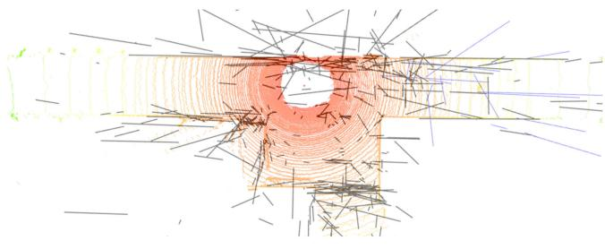  
(a)

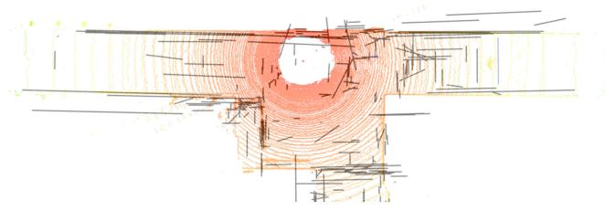  
(b)  
Fig. 1. Top views of 3D line mapping results with LiDAR point clouds overlaid in real corridor environment (a) ALVIO [3], [4]. (b) UV-SLAM.

In this letter, we propose a UV-SLAM, an algorithm that solves the above problems using the lines’ structural regularities as shown in Fig. 1(b). The main contributions of this letter are as follows:

\- To the best of our knowledge, the proposed UV-SLAM is the first optimization-based monocular SLAM using vanishing point measurements for structural mapping without any restriction such as camera motion and environment. In particular, our algorithm does not use the Manhattan world assumption in the process ofextracting the vanishing points and using them as measurements.

\- We define a novel residual term and Jacobian of the vanishing point measurements based on the most common methods of expressing 3D line features: the Plücker coordinate and the orthonormal representation.

\- We prove that the proposed method guarantees the observability of 3D lines through Fisher information matrix (FIM) rank analysis. Through this, problems that occur in the 3D mapping of line features are proven to be solved.

The rest of this letter is organized as follows. Section II gives a review of related works. Section III explains the proposed method in depth. Section IV analyzes the Fisher information matrix rank to prove the validity of the proposed method. Section V provides the experimental results. Finally, Section VI concludes by summarizing our contributions and discussing future work.

## II. RELATED WORKS

## A. Degeneracy of Line Features

Some works looked into the degeneracy for line features [19], [20]. In addition, Yang et al. investigated degenerate motions using two distinct line triangulation methods [10]. Subsequently, they analyzed various features’ observability and degenerate camera motions in the inertial measurement unit (IMU) aided navigation system [21]. However, when line degeneracy occurs in these investigations, all of the degenerate lines have been eliminated. As a result, there is a limitation in that information loss occurs due to the removed lines.

To handle degenerate lines, Ok et al. reconstructed 3D line segments using imaginary points when the lines are close to the epipolar line [22]. However, this approach can be used only when degenerate lines intersect with other lines, and it restricts applicability. Our previous work solved the degeneracy by using structural constraints in parallel conditions, investigating the fact that degenerate lines frequently occur in pure translation motions [4]. However, this method has a limitation in that it can be used only in pure translational motions. Therefore, in order to improve the quality of line mapping, a method that can be used independent of camera motion is required.

## B. Line-Based SLAM With Manhattan or Atlanta World Assumption

In [23], [24], rotation matrix was estimated using the Manhattan world assumption. Based on this, decoupled methods have been proposed to estimate the translation after calculating the rotation through the vanishing points [25]–[27]. In addition, some approaches applied line features to SLAM by using the Manhattan or Atlanta world assumption [28], [29]. These methods use a novel 2-DoF line representation to exploit lines with structural regularities only. Furthermore, there is a study using 2-DoF line representation to classify structural lines and non-structural lines [30]. However, as these approaches use structural lines with dominant direction only, they are practical only in an indoor environment where the assumptions are mostly correct. Therefore, there is a need for a novel algorithm that is not restricted by assumptions.

## C. Vanishing Point Measurements

Some approaches use vanishing point measurements without assumptions. In [31], parallel lines were clustered based on vanishing points. Then, residuals were constructed using the conditions that parallel lines should be in one plane and their cross product should be zero. However, accurate mapping results could not be obtained when the initial estimation was inaccurate as degeneracy occurred.

Moreover, there is a paper using vanishing points as an observation model. In [32], the residuals are defined to apply unbounded vanishing point measurements to line-based SLAM. Unfortunately, it does not provide a proof that vanishing point measurements improve the localization accuracy and line mapping results of line-based SLAM.

## III. PROPOSED METHOD

## A. Framework of Algorithm

The overall framework of the UV-SLAM is shown in Fig. 2. The proposed method is based on VINS-Mono [17], and the way IMU and point measurements are used is similar to it. The point features are extracted from Shi-Tomasi [33] and are tracked by KLT [34]. In addition, the IMU measurement model is defined by the pre-integration method [35]. Finally, our optimization-based method employs two-way marginalization with Schur complement [36].

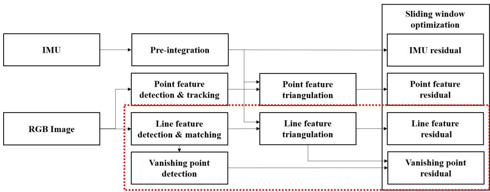  
Fig. 2. Block diagram illustrating the framework of UV-SLAM. The dashed box represents the newly added blocks in this letter. When an RGB image is received, detection and matching of line features are carried out. Afterward, the vanishing points are detected, and each line is clustered. After creating 3D lines through the triangulation process, the residuals of both the lines and the vanishing points are defined. Finally, localization and mapping results can be obtained through sliding window optimization.

To add line features to the monocular visual-inertial odometry (VIO) system, the line features are extracted from line segment detector (LSD) [37] and are tracked by line binary descriptor (LBD) [38]. Whereas 3D points can be intuitively expressed in $( x , y , z )$ , 3D lines require a complicated way to express themselves. Therefore, the proposed algorithm employs a Plücker coordinate and a orthonormal representation used in [8]. The Plücker coordinate is an intuitive way to represent 3D lines, and a 3D line is represented as follows:

$$
\mathbf { L } ( \mathbf { n } , \mathbf { d } ) ^ { \top } \in \mathbb { R } ^ { 6 } ,\tag{1}
$$

where n and d represent normal and direction vectors, respectively. The Plücker coordinate is used in the triangulation and re-projection process. Whereas 3D lines are actually 4-DoF, the lines in the Plücker coordinate are 6-DoF. Therefore, overparameterization problem occurs in the optimization process of VIO or visual SLAM. To solve this, the orthonormal representation is employed, which is a 4-DoF representation of lines. It is used in the optimization process and can be expressed as follows:

$$
\mathbf { o } = [ \psi , \phi ] ,\tag{2}
$$

where $\psi$ is the 3D line’s rotation matrix in Euler angles with respect to the camera coordinate system, and φ is the parameter representing the minimal distance from the camera center to the line. The conversion between the Plücker coordinate and the orthonormal representation is given in [8].

In addition, the UV-SLAM can determine whether the extracted lines have structural regularities or not. For vanishing point detection, the proposed algorithm use J-linkage [39], which can find multiple instances in the presence of noise and outliers. The overall process is as follows: First, vanishing point hypotheses are created through random sampling for all lines extracted from the image. Subsequently, after merging similar ones through comparison between the hypotheses, vanishing points are calculated. Because the J-linkage can find all possible vanishing points through the hypotheses, it can find more vanishing points than other algorithms with the Manhattan world assumption.

## B. State Definition

In this letter, $( \cdot ) ^ { w } , ( \cdot ) ^ { c }$ , and $( \cdot ) ^ { b }$ represent the world coordinate, camera coordinate, and body coordinate, respectively. In addition, $( \cdot ) _ { b } ^ { w }$ reflects the coordinate transformations of a rotation matrix, quaternion, or translation from the body coordinate to the world coordinate. The state vector used in our system is as follows:

$$
\begin{array} { r l } & { \mathcal { X } = [ \mathbf { x } _ { 0 } , \mathbf { x } _ { 1 } , \ldots , \mathbf { x } _ { I - 1 } , } \\ & { ~ \lambda _ { 0 } , \lambda _ { 1 } , \ldots , \lambda _ { J - 1 } , } \\ & { ~ \mathbf { o } _ { 0 } , \mathbf { o } _ { 1 } , \ldots , \mathbf { o } _ { K - 1 } ] , } \\ & { ~ \mathbf { x } _ { i } = [ \mathbf { p } _ { b _ { i } } ^ { w } , \mathbf { q } _ { b _ { i } } ^ { w } , \mathbf { v } _ { b _ { i } } ^ { w } , \mathbf { b } _ { a } , \mathbf { b } _ { g } ] , ~ i \in [ 0 , I - 1 ] , } \\ & { ~ \mathbf { o } _ { k } = [ \psi _ { k } , \phi _ { k } ] , ~ k \in [ 0 , K - 1 ] , } \end{array}\tag{3}
$$

where represents the entire state, and $\mathbf { x } _ { i }$ represents the body state in the i-th sliding window, which is made up of the following parameters: position, quaternion, velocity, and biases of the accelerometer and gyroscope. In addition, the entire state includes the inverse depths of point features, which are represented as $\lambda _ { j } , j \in [ 0 , J - 1 ]$ . In this letter, lines expressed in the orthonormal representations are newly added as o. I, J, and $K$ are the numbers of sliding window, point features, and line features, respectively.

## C. UV-Slam

Employing defined states in (3), the entire objective for optimization is as follows:

$$
\begin{array} { l } { \displaystyle \operatorname* { m i n } _ { \boldsymbol { x } } \left\{ \| \mathbf { r } _ { 0 } - \mathbf { J } _ { 0 } \boldsymbol { \mathcal { X } } \| ^ { 2 } + \sum _ { i \in B } \| \mathbf { r } _ { I } ( \mathbf { z } _ { b _ { i + 1 } } ^ { b _ { i } } , \boldsymbol { \mathcal { X } } ) \| _ { \Sigma _ { b _ { i + 1 } } ^ { b _ { i } } } ^ { 2 } \right. } \\ { \displaystyle \quad + \sum _ { ( i , j ) \in { \mathcal { P } } } \rho _ { p } \| \mathbf { r } _ { p } ( \mathbf { z } _ { p _ { j } } ^ { c _ { i } } , \boldsymbol { \mathcal { X } } ) \| _ { \Sigma _ { p _ { j } } ^ { c _ { i } } } ^ { 2 } + \sum _ { ( i , k ) \in { \mathcal { L } } } \rho _ { l } \| \mathbf { r } _ { l } ( \mathbf { z } _ { l _ { k } } ^ { c _ { i } } , \boldsymbol { \mathcal { X } } ) \| _ { \Sigma _ { l _ { k } } ^ { c _ { i } } } ^ { 2 } } \\ { \displaystyle \quad + \sum _ { ( i , k ) \in { \mathcal { V } } } \rho _ { v } \| \mathbf { r } _ { v } ( \mathbf { z } _ { v _ { k } } ^ { c _ { i } } , \boldsymbol { \mathcal { X } } ) \| _ { \Sigma _ { v _ { k } } ^ { c _ { i } } } ^ { 2 } \Bigg \} , } \end{array}
$$

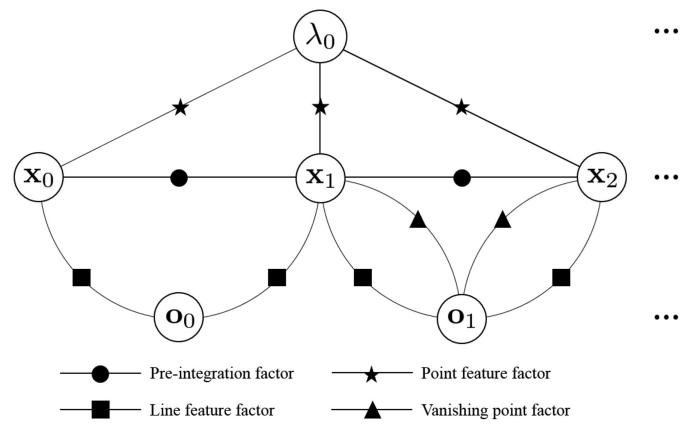  
Fig. 3. An example of a factor graph for UV-SLAM. For $\mathbf { o } _ { 0 } .$ , only the line feature factor is used as a nonstructural line. Therefore, only line feature factor is employed. On the other hand, o1 is a line with structural regularity and both line feature factor and the vanishing point factor are used.

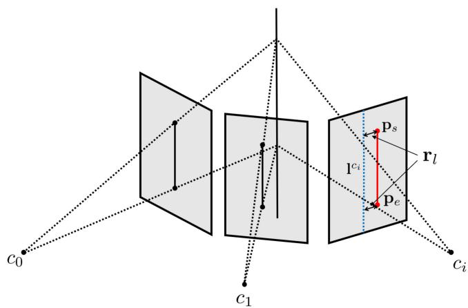  
Fig. 4. Illustration of line residual. The red solid and blue dashed lines on the image represent observation and re-projected estimation, respectively. The 3D line obtained from triangulation is re-projected into a new frame. Afterward, the distance between both endpoints of the observed line and the re-projected line is defined as the residual $\mathbf { r } _ { l }$ of the line.

where $\mathbf { r } _ { 0 } , \mathbf { r } _ { I } , \mathbf { r } _ { p } , \mathbf { r } _ { l } ,$ and $\mathbf { r } _ { v }$ represent marginalization, IMU, point, line, and vanishing point measurement residuals, respectively. In addition, $\mathbf { z } _ { b _ { i + 1 } } ^ { b _ { i } } , \mathbf { z } _ { p _ { j } } ^ { c _ { i } } , \mathbf { z } _ { l _ { k } } ^ { c _ { i } }$ , and $\mathbf { z } _ { v _ { k } } ^ { c _ { i } }$ stand for observations ofIMU, point, line, and vanishing point, respectively; is the set of all pre-integrated IMU measurements in a sliding window; ${ \mathcal { P } } _ { : }$ $\mathcal { L }$ and are the sets of point, line, and vanishing point measurements in observed frames; and $\Sigma _ { b _ { i + 1 } } ^ { b _ { i } } , \Sigma _ { p _ { j } } ^ { c _ { i } } , \Sigma _ { l _ { k } } ^ { c _ { i } }$ and $\Sigma _ { v _ { k } } ^ { c _ { i } }$ represent IMU, point, line, and vanishing point measurement covariance matrices, respectively. $\rho _ { p } , \rho _ { l }$ , and $\rho _ { v }$ mean loss functions of the point, line, and vanishing point measurements, respectively. $\rho _ { p }$ and $\rho _ { l }$ are set to the Huber norm function [40] and $\rho _ { v }$ is set to the inverse tangent function because of the vanishing point measurement model’s unbound problem. An example of the factor graph for the defined cost function is shown in Fig. 3. If there is no vanishing point measurement for a specific line, only the line feature factor is used as in the case of $\mathbf { o } _ { 0 }$ . If a specific line has corresponding vanishing point measurement, the line feature and vanishing point factors are employed as in the case of $\mathbf { o } _ { 1 }$ . For the optimization process, Ceres Solver [41] is used.

## D. Line Measurement Model

First, the re-projection of the 3D line L in the Plücker coordinate is as follows:

$$
\begin{array} { r l } & { \mathbf { l } ^ { c } = \Bigg [ l _ { 1 } \Bigg ] } \\ & { \mathbf { l } ^ { c } = \Bigg [ l _ { 2 } \Bigg ] = \mathbf { K } ^ { \prime } \mathbf { n } ^ { c } = f _ { x } f _ { y } ( \mathbf { K } ^ { - 1 } ) ^ { \top } \mathbf { n } ^ { c } } \\ & { \qquad = \left[ \begin{array} { l l l } { f _ { y } } & { 0 } & { 0 } \\ { 0 } & { f _ { x } } & { 0 } \\ { - f _ { y } c _ { x } } & { - f _ { x } c _ { y } } & { f _ { x } f _ { y } } \end{array} \right] \mathbf { n } ^ { c } = \mathbf { n } ^ { c } , } \end{array}\tag{5}
$$

where l, K and K represent the re-projected line, the projection matrix of a line feature, and the camera’s intrinsic parameter, respectively. $( f _ { x } , f _ { y } )$ and $( c _ { x } , c _ { y } )$ denote image’s focal lengths and principal points, respectively. Because the proposed algorithm applies to a normalized plane, K and $\mathbf { K } ^ { \prime }$ are identity matrices. As a result, the re-projected line is equal to the normal vector in the proposed method.

As shown in Fig. 4, the residual of the line measurement model is defined as the following re-projection error:

$$
\begin{array} { r } { \mathbf { r } _ { l } = \left[ \begin{array} { l } { d ( \mathbf { p } _ { s } , \mathrm { l } ^ { c } ) } \\ { d ( \mathbf { p } _ { e } , \mathrm { l } ^ { c } ) } \end{array} \right] , } \end{array}\tag{6}
$$

where

$$
\begin{array} { c } { { d ( { \bf p } , { \bf l } ^ { c } ) = \frac { { \bf p } ^ { \top } { \bf l } ^ { c } } { l _ { d } } , l _ { d } = \sqrt { l _ { 1 } ^ { 2 } + l _ { 2 } ^ { 2 } } , } } \\ { { { \bf p } _ { s } = ( u _ { s } , v _ { s } , 1 ) , { \bf p } _ { e } = ( u _ { e } , v _ { e } , 1 ) , } } \end{array}\tag{7}
$$

and $\mathbf { r } _ { l }$ denotes the line residual and d denotes the distance between both endpoints of the observed line and the re-projected line. $\mathbf { p } _ { s }$ and $\mathbf { p } _ { e }$ are the endpoints of the observed line in the image. The corresponding Jacobian matrix with respect to the 3D line can be represented by the body state change, δx, and the orthonormal representation change, $\delta \mathbf { o } .$ , as follows:

$$
{ \bf J } _ { l } = \frac { \partial { \bf r } _ { l } } { \partial { \bf l } ^ { c } } \frac { \partial { \bf l } ^ { c } } { \partial { \bf L } ^ { c } } \left[ \frac { \partial { \bf L } ^ { c } } { \partial \delta { \bf x } } \quad \frac { \partial { \bf L } ^ { c } } { \partial { \bf L } ^ { w } } \frac { \partial { \bf L } ^ { w } } { \partial \delta { \bf o } } \right] ,\tag{8}
$$

with

$$
\begin{array} { r l } & { \frac { \partial \mathbb { E } } { \partial \mathbb { E } } = \left[ \frac { - i _ { 1 } ( \mathbf { F } _ { \delta } ^ { \star } \mathbf { F } _ { \delta } ^ { \star } \mathbf { F } _ { \delta } ^ { \star } ) } { \hbar \frac { \partial } { \partial \tau _ { \delta } ^ { \star } } } + \frac { \partial \mathbf { t } _ { \delta } } { \partial \tau _ { \delta } ^ { \star } } - \frac { \partial \mathbf { t } _ { \delta } \mathbf { F } _ { \delta } ^ { \star } \mathbf { F } _ { \delta } ^ { \star } } { \hbar \frac { \partial } { \partial \tau _ { \delta } ^ { \star } } } + \frac { \mathbf { t } _ { \delta } ^ { \star } } { \hbar \frac { \partial } { \partial \tau _ { \delta } ^ { \star } } } \frac { \partial \mathbf { t } _ { \delta } ^ { \star } } { \partial \tau _ { \delta } ^ { \star } } \right] } \\ & { \frac { \partial \mathbf { F } _ { \delta } ^ { \star } } { \partial \tau _ { \delta } ^ { \star } } = \left[ \frac { - i _ { 1 } ( \mathbf { F } _ { \delta } ^ { \star } \mathbf { F } _ { \delta } ^ { \star } \mathbf { F } _ { \delta } ^ { \star } ) } { \hbar \frac { \partial } { \partial \tau _ { \delta } ^ { \star } } } + \frac { \hbar \mathbf { F } _ { \delta } ^ { \star } } { \hbar \frac { \partial } { \partial \tau _ { \delta } ^ { \star } } } - \frac { i _ { 2 } ( \mathbf { F } _ { \delta } ^ { \star } \mathbf { F } _ { \delta } ^ { \star } \mathbf { F } _ { \delta } ^ { \star } ) } { \hbar \frac { \partial } { \partial \tau _ { \delta } ^ { \star } } } - \frac { \hbar \mathbf { F } _ { \delta } ^ { \star } } { \hbar \frac { \partial } { \partial \tau _ { \delta } ^ { \star } } } \frac { \partial \mathbf { t } _ { \delta } ^ { \star } } { \partial \tau _ { \delta } ^ { \star } } \right] } \\ &  \frac  \partial \mathbf \end{array}\tag{9}
$$

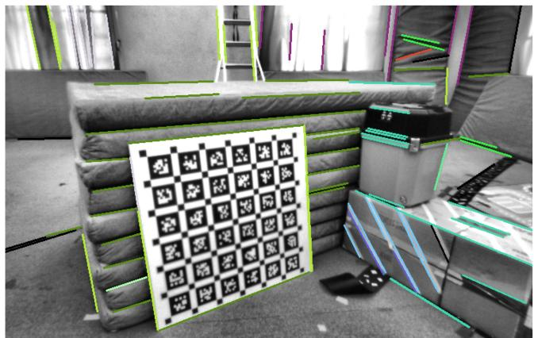  
Fig. 5. Image of clustered lines using vanishing points. The lines with the same vanishing point are expressed in the same color. Usually, three or more vanishing points can be extracted using J-linkage.

where

$$
\begin{array} { r l } & { \mathbf { U } = \Big [ \mathbf { u } _ { 1 } \quad \mathbf { u } _ { 2 } \quad \mathbf { u } _ { 3 } \Big ] = \Big [ \frac { \mathbf { n } } { \| \textbf { n } \| } \quad \frac { \mathbf { d } } { \| \textbf { d } \| } \quad \frac { \mathbf { n } \times \mathbf { d } } { \| \textbf { n } \times \mathbf { d } \| } \Big ] , } \\ & { \mathbf { w } = \Big [ { w } _ { 1 } \Big ] = \frac { 1 } { \sqrt { \| \textbf { n } \| ^ { 2 } + \| \textbf { d } \| ^ { 2 } } } \Big [ \| \textbf { n } \| \Big ] , } \end{array}\tag{10}
$$

and $ { \mathcal { T } } _ { c } ^ { b }$ is a transformation matrix from the camera coordinate to the body coordinate in the Plücker coordinate.

## E. Vanishing Point Measurement Model

After the vanishing points are calculated, the observed line features use the corresponding vanishing points as new observations. An example of clustering lines through vanishing points is shown in Fig. 5. The lines with the same vanishing point are expressed in the same color.

To estimate the vanishing points, the point on the 3D line is expressed in a homogeneous coordinate as follows [18]:

$$
\mathbf { V } ( t ) = \mathbf { V } _ { 0 } + t \mathbf { D } = \left[ \begin{array} { c } { x _ { 0 } + t d _ { 1 } } \\ { y _ { 0 } + t d _ { 2 } } \\ { z _ { 0 } + t d _ { 3 } } \\ { 1 } \end{array} \right] , t \in ( 0 , \infty ) ,\tag{11}
$$

where

$$
\begin{array} { r l } & { \mathbf { V } _ { 0 } = \left[ x _ { 0 } \quad y _ { 0 } \quad z _ { 0 } \quad 1 \right] ^ { \top } , } \\ & { \mathbf { D } = \left[ \mathbf { d } ^ { c } \top , 0 \right] ^ { \top } = \left[ d _ { 1 } , d _ { 2 } , d _ { 3 } , 0 \right] ^ { \top } , } \end{array}\tag{12}
$$

and $\mathbf { V } _ { 0 }$ represents a point on the 3D line. Then, the vanishing point equals the projection of a point at infinity on the 3D line as follows:

$$
\begin{array} { r } { \mathbf { v } ^ { c } = \left[ v _ { 1 } \right] \begin{array} { l } { v _ { 1 } } \\ { v _ { 2 } } \\ { v _ { 3 } } \end{array} = \operatorname* { l i m } _ { t \to \infty } \mathbf { P } ( \mathbf { V } _ { 0 } + t \mathbf { D } ) = \mathbf { K } \mathbf { d } ^ { c } = \mathbf { d } ^ { c } , } \end{array}\tag{13}
$$

where $\mathbf { P } = \mathbf { K } [ \mathbf { I } | \mathbf { 0 } ]$ is a camera projection matrix. In the UV-SLAM, the vanishing point from the line is equal to the direction vector of the line. The vanishing point estimation is calculated by the intersection of the $\mathbf { v } ^ { c }$ and the image plane, as shown in

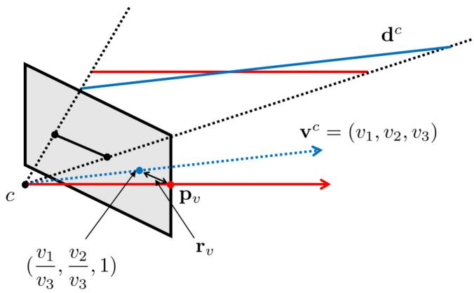  
Fig. 6. Illustration of the vanishing point residual. The points where the red solid and blue dashed lines intersect with the image represent observation and estimation, respectively. In vanishing point estimation, the direction vector of the line is used. The vanishing point difference between the observation from the observed line and the estimation from the 3D line is defined as the residual.

Fig. 6. Finally, the vanishing point residual is as follows:

$$
\mathbf { r } _ { v } = \mathbf { p } _ { v } - { \frac { 1 } { v _ { 3 } } } { \Bigg [ } v _ { 1 } { \Bigg ] } ,\tag{14}
$$

where $\mathbf { r } _ { v }$ and $\mathbf { p } _ { v }$ represent the vanishing point residual and the vanishing point observation, respectively. The corresponding Jacobian matrix with respect to the vanishing point can be obtained in terms of δx and δo as follows:

$$
{ \bf J } _ { v } = \frac { \partial { \bf r } _ { v } } { \partial { \bf v } ^ { c } } \frac { \partial { \bf v } ^ { c } } { \partial { \bf L } ^ { c } } \left[ \frac { \partial { \bf L } ^ { c } } { \partial \delta { \bf x } } \quad \frac { \partial { \bf L } ^ { c } } { \partial { \bf L } ^ { w } } \frac { \partial { \bf L } ^ { w } } { \partial \delta { \bf o } } \right]\tag{15}
$$

where

$$
\begin{array} { l } { { \displaystyle { \frac { \partial \mathbf { r } _ { v } } { \partial \mathbf { v } ^ { c } } } = \left[ \begin{array} { l l l } { { \displaystyle - { \frac { 1 } { v _ { 3 } } } } } & { { 0 } } & { { \displaystyle { \frac { v _ { 1 } } { v _ { 3 } ^ { 2 } } } } } \\ { { 0 } } & { { \displaystyle { - \frac { 1 } { v _ { 3 } } } } } & { { \displaystyle { \frac { v _ { 2 } } { v _ { 3 } ^ { 2 } } } } } \end{array} \right] _ { 2 \times 3 } } , } \\ { { \displaystyle { \frac { \partial \mathbf { v } ^ { c } } { \partial { \mathbf { L } ^ { c } } } } = \left[ \mathbf { 0 } _ { 3 \times 3 } } & { { \mathbf { K } } \right] _ { 3 \times 6 } } . } \end{array}\tag{16}
$$

## IV. FISHER INFORMATION MATRIX RANK ANALYSIS

We rigorously analyze the observability of line features through Fisher information matrix (FIM) rank analysis. If the FIM is singular, the system is unobservable [42]. Some approaches employed the fact the Jacobian matrix used in the FIM calculation must satisfy the full column rank condition for the FIM to satisfy nonsingularity [43], [44]. We also use this approach to analyze the observability of the proposed method.

First, the FIM of the line measurement in the orthonormal representation is as follows:

$$
\mathbf { H } _ { l } ^ { \delta \mathbf { o } } = \mathbf { J } _ { l } ^ { \delta \mathbf { o } \top } \pmb { \Omega } _ { l } ^ { \delta \mathbf { o } } \mathbf { J } _ { l } ^ { \delta \mathbf { o } } ,\tag{17}
$$

where

$$
\begin{array} { l } { \displaystyle { \bf J } _ { l } ^ { \delta \mathbf { o } } = \frac { \partial { \bf r } _ { l } } { \partial { \bf l } ^ { c } } \frac { \partial { \bf l } ^ { c } } { \partial { \bf L } ^ { c } } \frac { \partial { \bf L } ^ { c } } { \partial { \bf L } ^ { w } } \frac { \partial { \bf L } ^ { w } } { \partial \delta { \bf o } } } \\ { \displaystyle = \left[ 0 \begin{array} { c c c } { 0 } & { j _ { l _ { 1 2 } } } & { j _ { l _ { 1 3 } } } & { j _ { l _ { 1 4 } } } \\ { 0 } & { j _ { l _ { 2 2 } } } & { j _ { l _ { 2 3 } } } & { j _ { l _ { 2 4 } } } \end{array} \right] , } \end{array}\tag{18}
$$

and $j _ { l _ { p q } }$ is the non-zero element in the p-th row and the q-th column of $\mathbf { J } _ { l } ^ { \delta \mathbf { o } }$ , which is obtained by substituting (9) into (18).

$\Omega _ { l } ^ { \delta \mathbf { o } }$ represents the inverse of covariance matrix of the line observation. Because $\frac { \partial \mathbf { l } ^ { c } } { \partial \mathbf { L } ^ { c } } , \frac { \partial \mathbf { L } ^ { c } } { \partial \mathbf { L } ^ { w } }$ , and $\frac { \partial \mathbf { L } ^ { w } } { \partial \delta \mathbf { o } }$ are full rank matrices from (9), the rank of $\mathbf { J } _ { l } ^ { \delta \mathbf { o } }$ is determined by $\frac { \partial \mathbf { r } _ { l } } { \partial \mathbf { l } ^ { c } }$ in (18). From (9), the maximum rank of ∂rl∂lc is $^ { 2 , }$ , and the case in which the rank becomes 1 is as follows:

$$
\frac { l _ { 2 } } { l _ { 1 } } = \frac { v _ { s } - v _ { e } } { u _ { s } - u _ { e } } .\tag{19}
$$

However, because a line in the orthonormal representation has four parameters, the observability of the line cannot be guaranteed with the line measurement model alone. To solve this problem, a new observation on the line other than both endpoints is introduced as follows:

$$
\mathbf { p } _ { l } = \alpha \mathbf { p } _ { s } + ( 1 - \alpha ) \mathbf { p } _ { e } , \alpha \in ( 0 , 1 ) ,\tag{20}
$$

where pl represents the new observation. However, despite adding a new observation, the rank of $\mathbf { J } _ { l } ^ { \delta \mathbf { o } }$ is up to 2. Therefore, the line features using only the line measurement model are still not observable. From a new perspective, we propose to calculate the FIM with the vanishing point measurements. The FIM of the vanishing point measurement in the orthonormal representation is as follows:

$$
\mathbf { H } _ { v } ^ { \delta \mathbf { o } } = \mathbf { J } _ { v } ^ { \delta \mathbf { o } \top } \pmb { \Omega } _ { v } ^ { \delta \mathbf { o } } \mathbf { J } _ { v } ^ { \delta \mathbf { o } } ,\tag{21}
$$

where

$$
\begin{array} { l } { { \displaystyle { \bf J } _ { v } ^ { \delta \mathbf { o } } = \frac { \partial { \bf r } _ { v } } { \partial { \bf v } ^ { c } } \frac { \partial { \bf v } ^ { c } } { \partial { \bf L } ^ { c } } \frac { \partial { \bf L } ^ { c } } { \partial { \bf L } ^ { w } } \frac { \partial { \bf L } ^ { w } } { \partial \delta { \bf o } } } \ ~ } \\ { { \displaystyle ~ = \ \left[ j _ { v _ { 1 1 } } \quad 0 \quad j _ { v _ { 1 3 } } \quad j _ { v _ { 1 4 } } \right] , } \ ~ } \\  { \displaystyle ~ j _ { v _ { 2 1 } } \quad 0 \quad j _ { v _ { 2 3 } } \quad j _ { v _ { 2 4 } } } \end{array}\tag{22}
$$

and $j _ { v _ { p q } }$ is the non-zero element in the p-th row and the q-th column of $\mathbf { J } _ { v } ^ { \delta \mathbf { o } }$ , which is obtained by substituting (16) into (22). $\Omega _ { v } ^ { \delta \mathbf { o } }$ represents the inverse of covariance matrix of the vanishing point observation. Similarly, all matrices are full rank except $\overline { { \frac { \partial \mathbf { r } _ { v } } { \partial \mathbf { v } ^ { c } } } }$ . Therefore, the rank of $\mathbf { J } _ { v } ^ { \delta \mathbf { o } }$ is 2, which can be obtained from the rank of $\frac { \partial \mathbf { r } _ { v } } { \partial \mathbf { v } ^ { c } }$ in (16).

By eigenvalue decomposition, the FIM considering both the line measurement and the vanishing point measurement can be obtained as follows:

$$
\begin{array} { r l } & { \mathbf H ^ { \delta \mathbf { o } } = \mathbf H _ { l } ^ { \delta \mathbf { o } } + \mathbf H _ { v } ^ { \delta \mathbf { o } } } \\ & { \qquad = \mathbf J _ { l } ^ { \delta \mathbf { o } \top } \boldsymbol \Omega _ { l } ^ { \delta \mathbf { o } } \mathbf J _ { l } ^ { \delta \mathbf { o } } + \mathbf J _ { v } ^ { \delta \mathbf { o } \top } \boldsymbol \Omega _ { v } ^ { \delta \mathbf { o } } \mathbf J _ { v } ^ { \delta \mathbf { o } } } \\ & { \qquad = \mathbf J ^ { \delta \mathbf { o } \top } \boldsymbol \Omega ^ { \delta \mathbf { o } } \mathbf J ^ { \delta \mathbf { o } } , } \end{array}\tag{23}
$$

where

$$
\mathbf { J } ^ { \delta \mathbf { o } } = \left[ \begin{array} { c c c c } { 0 } & { j _ { l _ { 1 2 } } } & { j _ { l _ { 1 3 } } } & { j _ { l _ { 1 4 } } } \\ { 0 } & { j _ { l _ { 2 2 } } } & { j _ { l _ { 2 3 } } } & { j _ { l _ { 2 4 } } } \\ { j _ { v _ { 1 1 } } } & { 0 } & { j _ { v _ { 1 3 } } } & { j _ { v _ { 1 4 } } } \\ { j _ { v _ { 2 1 } } } & { 0 } & { j _ { v _ { 2 3 } } } & { j _ { v _ { 2 4 } } } \end{array} \right] ,
$$

$$
\Omega ^ { \delta \mathbf { o } } = \left[ \begin{array} { c c } { \Omega _ { l } ^ { \delta \mathbf { o } } } & { 0 } \\ { 0 } & { \Omega _ { v } ^ { \delta \mathbf { o } } } \end{array} \right] .\tag{24}
$$

At this time, the rows of the line measurement and the vanishing point measurement are independent in $\mathbf { J } ^ { \delta \mathbf { o } }$ . Therefore, the rank of $\mathbf { J } ^ { \delta \mathbf { o } }$ is 4, except for the case of (19). We can confirm that the line features become fully observable by additionally using the vanishing point meausrement model.

TABLE I  
TRANSLATIONAL RMSE WITHOUT LOOP CLOSING FOR THE EUROC DATASETS (UNIT: M)
<table><tr><td>Translation RMSE</td><td>VINS-Mono</td><td>PL-VINS</td><td>ALVIO</td><td>Our method in [4]</td><td>UV-SLAM</td></tr><tr><td>MH_01_easy</td><td>0.159</td><td>0.164</td><td>0.148</td><td>0.142</td><td>0.139</td></tr><tr><td>MH_02_easy</td><td>0.140</td><td>0.174</td><td>0.136</td><td>0.126</td><td>0.094</td></tr><tr><td>MH_03_medium</td><td>0.225</td><td>0.187</td><td>0.209</td><td>0.198</td><td>0.189</td></tr><tr><td>MH_04_difficult</td><td>0.408</td><td>0.335</td><td>0.389</td><td>0.301</td><td>0.261</td></tr><tr><td>MH_05_difficult</td><td>0.312</td><td>0.347</td><td>0.317</td><td>0.293</td><td>0.188</td></tr><tr><td>V1_01_easy</td><td>0.094</td><td>0.071</td><td>0.085</td><td>0.087</td><td>0.067</td></tr><tr><td>V1_02_medium</td><td>0.115</td><td>0.086</td><td>0.075</td><td>0.072</td><td>0.070</td></tr><tr><td>V1_03_difficult</td><td>0.203</td><td>0.152</td><td>0.200</td><td>0.156</td><td>0.109</td></tr><tr><td>V2_01_easy</td><td>0.099</td><td>0.090</td><td>0.094</td><td>0.098</td><td>0.085</td></tr><tr><td>V2_02_medium</td><td>0.161</td><td>0.120</td><td>0.133</td><td>0.103</td><td>0.112</td></tr><tr><td>V2_03_difficult</td><td>0.341</td><td>0.278</td><td>0.288</td><td>0.277</td><td>0.213</td></tr></table>

## V. EXPERIMENTAL RESULTS

The experiments were carried out on an Intel Core i7-9700 K processor with 32 GB of RAM. Using the EuRoC micro aerial vehicle (MAV) datasets [45], we tested the state-of-the-art algortihms and the UV-SLAM. Each dataset offers a varied level of complexity depending on factors like lighting, texture, and MAV speed. Therefore, the datasets were appropriate to validate the performance of the proposed method.

We compared the localization accuracy of the proposed method with that of VINS-Mono which is our base algorithm. In addition, we also compared PL-VINS [16], ALVIO, and our previous work which use line features on top of VINS-Mono. The parameters of compared algorithms are set to the default values in the open-source codes. We employed the rpg trajectory evaluation tool [46]. Table I shows the translational root mean square error (RMSE) for the EuRoC datasets. The proposed method has better performance than state-ofthe-art algorithms in all datasets. In particular, the proposed algorithm shows 32.3%, 23.8%, 26.4%, and 17.6% smaller average error than VINS-Mono, PL-VINS, ALVIO, and our previous work, respectively. More accurate results could be obtained in the proposed algorithm because the line features become fully observable using the vanishing point measurements. The results for trajectory, rotation error, and translation error of V2\_02\_medium in the EuRoC datasets are shown in Fig. 7.

In addition, the mapping results for MH\_05\_difficult and V2\_01\_easy in the EuRoC datasets are shown in Fig. 8. In the case of ALVIO, the quality of mapping is low due to degenerate lines. In our previous work, degenerate lines were corrected only in pure translational camera motion. Noteworthily, lines’ direction vectors are aligned thanks to the vanishing point measurements in UV-SLAM. All top views of the line mapping results for the EuRoC datasets are available at: https://github.com/url-kaist/UV-SLAM/blob/main/mapping\_ result.pdf.

The average runtime is about 53.528 ms for the frontend and 47.086 ms for the backend for the EuRoC datasets. UV-SLAM has only about 3 ms longer frontend runtime than other algorithms because it extracts vanishing points. Moreover, the runtime of the backend corresponding to optimization is similar to those of other algorithms. This is because the proposed vanishing point measurement model does not use new parameters.

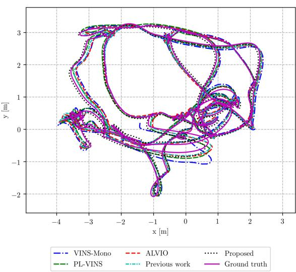  
(a)

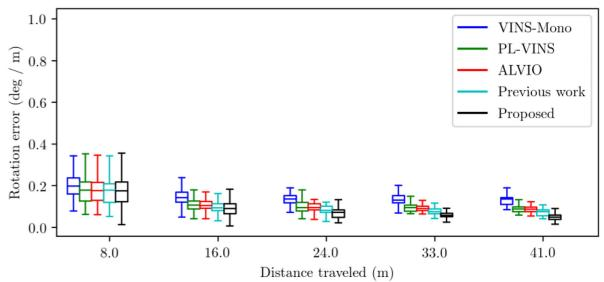

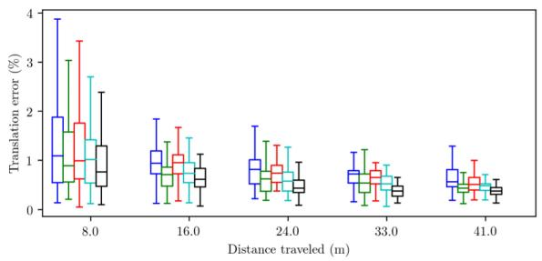  
(b)

Fig. 7. The top views of (a) trajectory and (b) boxplot of RMSE according to distance traveled for VINS-Mono, PL-VINS, ALVIO, our previous work [4], and UV-SLAM for V2\_02\_medium in the EuRoC datasets.  
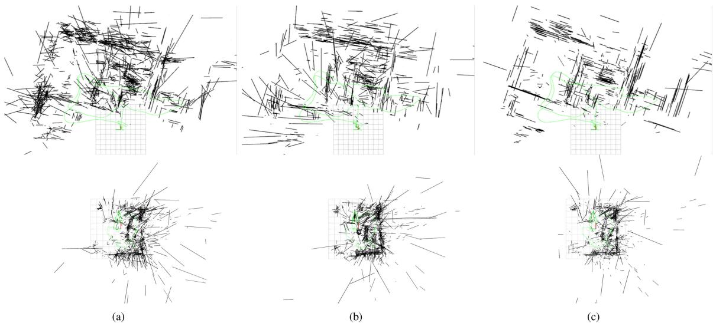  
Fig. 8. The top views of line mapping results of (a) ALVIO, (b) our previous work [4], and (c) UV-SLAM for MH\_05\_difficult (top) and V2\_01\_easy (bottom) in the EuRoC datasets.

## VI. CONCLUSION

In summary, we proposed UV-SLAM, which is the unconstrained line-based SLAM using the vanishing point measurements. The proposed method can be used without any assumptions such as the Manhattan or Atlanta world. We calculated the residual and Jacobian matrices of the vanishing point measurements. Through FIM rank analysis, we verified that line’s observability is guaranteed by introducing the vanishing point measurements into the existing method. In addition, we showed that localization accuracy and mapping quality have increased through quantitative and qualitative comparisons with state-ofthe-art algorithms. For future work, we will implement mesh or pixel-wise mapping through sparse line mapping from the proposed algorithm.

## REFERENCES

[1] J. Jeon, S. Jung, E. Lee, D. Choi, and H. Myung, “Run your visual-inertial odometry on NVIDIA jetson: Benchmark tests on a micro aerial vehicle,” IEEE Robot. Automat. Lett., vol. 6, no. 3, pp. 5332–5339, Jul. 2021.

[2] Y. He, J. Zhao, Y. Guo, W. He, and K. Yuan, “PL-VIO: Tightly-coupled monocular visual-inertial odometry using point and line features,” Sensors, vol. 18, no. 4, 2018, Art. no. 1159.

[3] K. Jung, Y. Kim, H. Lim, and H. Myung, “ALVIO: Adaptive line and point feature-based visual inertial odometry for robust localization in indoor environments,” in Proc. Int. Conf. Robot Intell. Technol. Appl., 2020, pp. 171–184, https://arxiv.org/abs/2012.15008

[4] H. Lim, Y. Kim, K. Jung, S. Hu, and H. Myung, “Avoiding degeneracy for monocular visual SLAM with point and line features,” in Proc. IEEE Int. Conf. Robot. Automat., 2021, pp. 11675–11681.

[5] D. G. Kottas and S. I. Roumeliotis, “Efficient and consistent vision-aided inertial navigation using line observations,” in Proc. IEEE Int. Conf. Robot. Automat., 2013, pp. 1540–1547.

[6] X. Kong, W. Wu, L. Zhang, and Y. Wang, “Tightly-coupled stereo visualinertial navigation using point and line features,” Sensors, vol. 15, no. 6, pp. 12 816–12833, 2015.

[7] G. Zhang, J. H. Lee, J. Lim, and I. H. Suh, “Building a 3-D line-based map using stereo SLAM,” IEEE Trans. Robot., vol. 31, no. 6, pp. 1364–1377, Dec. 2015.

[8] A. Bartoli and P. Sturm, “Structure-from-motion using lines: Representation, triangulation, and bundle adjustment,” Comput. Vis. Image Understanding, vol. 100, no. 3, pp. 416–441, 2005.

[9] F. Zheng, G. Tsai, Z. Zhang, S. Liu, C.-C. Chu, and H. Hu, “Trifo-VIO: Robust and efficient stereo visual inertial odometry using points and lines,” in Proc. IEEE/RSJ Int. Conf. Intell. Robots Syst., 2018, pp. 3686–3693.

[10] Y. Yang, P. Geneva, K. Eckenhoff, and G. Huang, “Visual-inertial odometry with point and line features,” in Proc. IEEE/RSJ Int. Conf. Intell. Robots Syst., 2019, pp. 2447–2454.

[11] A. I. Mourikis and S. I. Roumeliotis, “A multi-state constraint kalman filter for vision-aided inertial navigation,” in Proc. IEEE Int. Conf. Robot. Automat, 2007, pp. 3565–3572.

[12] A. Pumarola, A. Vakhitov, A. Agudo, A. Sanfeliu, and F. Moreno-Noguer, “PL-SLAM: Real-time monocular visual SLAM with points and lines,” in Proc. IEEE Int. Conf. Robot. Automat., 2017, pp. 4503–4508.

[13] X. Zuo, X. Xie, Y. Liu, and G. Huang, “Robust visual SLAM with point and line features,” in Proc. IEEE/RSJ Int. Conf. Intell. Robots Syst., 2017, pp. 1775–1782.

[14] S. J. Lee and S. S. Hwang, “Elaborate monocular point and line SLAM with robust initialization,” in Proc. IEEE Int. Conf. Comput. Vis., 2019, pp. 1121–1129.

[15] R. Mur-Artal, J. M. M. Montiel, and J. D. Tardos, “ORB-SLAM: A versatile and accurate monocular SLAM system,” IEEE Trans. Robot., vol. 31, no. 5, pp. 1147–1163, Oct. 2015.

[16] Q. Fu, J. Wang, H. Yu, I. Ali, F. Guo, and H. Zhang, “PL-VINS: Real-time monocular visual-inertial SLAM with point and line,” 2020, arXiv:2009.07462.

[17] T. Qin, P. Li, and S. Shen, “VINS-mono: A robust and versatile monocular visual-inertial state estimator,” IEEE Trans. Robot., vol. 34, no. 4, pp. 1004–1020, Aug. 2018.

[18] R. Hartley and A. Zisserman, Multiple View Geometry in Computer Vision. Cambridge, U.K.: Cambridge Univ. Press, 2003.

[19] T. Sugiura, A. Torii, and M. Okutomi, “3D surface reconstruction from point-and-line cloud,” in Proc. Int. Conf. 3D Vis., 2015, pp. 264–272.

[20] H. Zhou, D. Zhou, K. Peng, W. Fan, and Y. Liu, “SLAM-based 3D line reconstruction,” in Proc. World Congr. Intell. Control Automat., 2018, pp. 1148–1153.

[21] Y. Yang and G. Huang, “Observability analysis of aided INS with heterogeneous features of points, lines, and planes,” IEEE Trans. Robot., vol. 35, no. 6, pp. 1399–1418, Dec. 2019.

[22] A. ö. Ok, J. D. Wegner, C. Heipke, F. Rottensteiner, U. Sörgel, and V. Toprak, “Accurate reconstruction of near-epipolar line segments from stereo aerial images,” Photogrammetrie-Fernerkundung-Geoinformation, no. 4, pp. 345–358, 2012.

[23] P. Kim, B. Coltin, and H. J. Kim, “Low-drift visual odometry in structured environments by decoupling rotational and translational motion,” in Proc. IEEE Int. Conf. Robot. Automat., 2018, pp. 7247–7253.

[24] “Indoor RGB-D compass from a single line and plane,” in Proc. IEEE Conf. Comput. Vis. Pattern Recognit., 2018, pp. 4673–4680.

[25] Y. Li, N. Brasch, Y. Wang, N. Navab, and F. Tombari, “Structure-SLAM: Low-drift monocular SLAM in indoor environments,” IEEE Robot. Automat. Lett., vol. 5, no. 4, pp. 6583–6590, Oct. 2020.

[26] Y. Li, R. Yunus, N. Brasch, N. Navab, and F. Tombari, “RGB-D SLAM with structural regularities,” in Proc. IEEE Int. Conf. Robot. Automat., 2020, pp. 11 581–11 587.

[27] R. Yunus, Y. Li, and F. Tombari, “ManhattanSLAM: Robust planar tracking and mapping leveraging mixture of manhattan frames,” in Proc. IEEE Int. Conf. Robot. Automat., 2021, pp. 6687–6693.

[28] H. Zhou, D. Zou, L. Pei, R. Ying, P. Liu, and W. Yu, “StructSLAM: Visual SLAM with building structure lines,” IEEE Trans. Veh. Technol., vol. 64, no. 4, pp. 1364–1375, Apr. 2015.

[29] D. Zou, Y. Wu, L. Pei, H. Ling, and W. Yu, “StructVIO: Visual-inertial odometry with structural regularity of man-made environments,” IEEE Trans. Robot., vol. 35, no. 4, pp. 999–1013, Aug. 2019.

[30] B. Xu, P. Wang, Y. He, Y. Chen, Y. Chen, and M. Zhou, “Leveraging structural information to improve point line visual-inertial odometry,” arXiv preprint arXiv:2105.04064, 2021.

[31] J. Lee and S.-Y. Park, “PLF-VINS: Real-time monocular visual-inertial SLAM with point-line fusion and parallel-line fusion,” IEEE Robot. Automat. Lett., vol. 6, no. 4, pp. 7033–7040, Oct. 2021.

[32] J. Ma, X. Wang, Y. He, X. Mei, and J. Zhao, “Line-based stereo SLAM by junction matching and vanishing point alignment,” IEEE Access, vol. 7, pp. 181800–181811, 2019.

[33] J. Shi et al., “Good features to track,” in Proc. IEEE Conf. Comput. Vis. Pattern Recognit., 1994, pp. 593–600.

[34] C. Tomasi and T. Kanade, “Detection and tracking of point,” Int. J. Comput. Vis., vol. 9, pp. 137–154, 1991.

[35] C. Forster, L. Carlone, F. Dellaert, and D. Scaramuzza, “On-manifold preintegration for real-time visual-inertial odometry,” IEEE Trans. Robot., vol. 33, no. 1, pp. 1–21, Feb. 2017.

[36] G. Sibley, L. Matthies, and G. Sukhatme, “Sliding window filter with application to planetary landing,” J. Field Robot., vol. 27, no. 5, pp. 587–608, 2010.

[37] R. G. Von Gioi, J. Jakubowicz, J.-M. Morel, and G. Randall, “LSD: A fast line segment detector with a false detection control,” IEEE Trans. Pattern Anal. Mach. Intell., vol. 32, no. 4, pp. 722–732, Apr. 2010.

[38] L. Zhang and R. Koch, “An efficient and robust line segment matching approach based on LBD descriptor and pairwise geometric consistency,” J. Vis. Commun. Image Representation, vol. 24, no. 7, pp. 794–805, 2013.

[39] R. Toldo and A. Fusiello, “Robust multiple structures estimation with J-linkage,” in Proc. Euro. Conf. Comput. Vision, Springer, 2008, pp. 537–547.

[40] P. J. Huber, “Robust estimation of a location parameter,” in Breakthroughs in Statistics. Berlin, Germany: Springer, 1992, pp. 492–518.

[41] S. Agarwal, K. Mierle, and Others, “Ceres solver,” Accessed on: Sep. 09, 2021. [Online], Available: http://ceres-solver.org

[42] Y. Bar-Shalom, X. R. Li, and T. Kirubarajan, Estimation With Applications to Tracking and Navigation: Theory, Algorithms, and Software. Hoboken, NJ, USA: Wiley, 2004.

[43] Z. Wang and G. Dissanayake, “Observability analysis of SLAM using fisher information matrix,” in Proc. IEEE Int. Conf. Control, Automation, Robot. Vis., 2008, pp. 1242–1247.

[44] S.-M. Lee, J. Jung, S. Kim, I.-J. Kim, and H. Myung, “DV-SLAM (dualsensor-based vector-field SLAM) and observability analysis,” IEEE Trans. Ind. Electron., vol. 62, no. 2, pp. 1101–1112, Feb. 2015.

[45] M. Burri et al., “The EuRoC micro aerial vehicle datasets,” Int. J. Robot. Res., vol. 35, no. 10, pp. 1157–1163, 2016.

[46] Z. Zhang and D. Scaramuzza, “A tutorial on quantitative trajectory evaluation for visual (-inertial) odometry,” in Proc. IEEE/RSJ Int. Conf. Intell. Robots Syst., 2018, pp. 7244–7251.