# Unsupervised Estimation of Monocular Depth and VO in Dynamic Environments via Hybrid Masks

Qiyu Sun , Yang Tang , Senior Member, IEEE, Chongzhen Zhang , Chaoqiang Zhao ,

Feng Qian , and Jürgen Kurths

Abstract— Deep learning-based methods have achieved remarkable performance in 3-D sensing since they perceive environments in a biologically inspired manner. Nevertheless, the existing approaches trained by monocular sequences are still prone to fail in dynamic environments. In this work, we mitigate the negative influence of dynamic environments on the joint estimation of depth and visual odometry (VO) through hybrid masks. Since both the VO estimation and view reconstruction process in the joint estimation framework is vulnerable to dynamic environments, we propose the cover mask and the filter mask to alleviate the adverse effects, respectively. As the depth and VO estimation are tightly coupled during training, the improved VO estimation promotes depth estimation as well. Besides, a depth-pose consistency loss is proposed to overcome the scale inconsistency between different training samples of monocular sequences. Experimental results show that both our depth prediction and globally consistent VO estimation are state of the art when evaluated on the KITTI benchmark. We evaluate our depth prediction model on the Make3D dataset to prove the transferability of our method as well.

Index Terms— Depth estimation, dynamic scene, global consis tency, visual odometry (VO).

## I. INTRODUCTION

ception [1]–[4]. As we know, a reliable sensing method is necessary as it builds a solid foundation for the following accurate control and smart decision-making [5]–[10]. Prior visualbased works estimate depth through geometrical clues, and thus they are sensitive to changing environments [11], [12].

On the contrary, biological systems are adaptable to changing environments. Thus, we estimate the depth via neural networks to imitate the working pattern of biological systems, as illustrated in Fig. 1. The neural networks model biological systems in perception and process the information contained in environments in a biological inspired way. They take image sequences as input, which work like the eyes of a human, and then output the depth maps and visual odometry (VO) by forming a nonlinear mapping through the cooperation of the neurons [13], which are similar to human cerebrums.

For alleviating the dependence on expensive ground truth, some unsupervised methods have been proposed for depth estimation [14]–[16]. These methods employ a view reconstruction strategy [17] to build a self-supervised signal using stereo image pairs or consecutive monocular image sequences. Unsupervised monocular methods are particularly attractive, since they are free from the necessary calibration of stereo setups, thus having a wider range of training data [14], [18]. They estimate an additional ego-motion between two adjacent images, known as VO estimation, along with the depth map during training when compared to the stereo settings. However, there still exist some problems in the unsupervised monocular framework, as shown in Fig. 2. First, unpredictable dynamic factors, like moving objects, view occlusions, and photometric changes, are unavoidable in environments, the influence of both the VO estimation and view reconstruction process. This is because both the view reconstruction process and VO estimation rely on accurate correspondences of adjacent images, and these dynamic factors result in the unmatching of adjacent images. Second, the estimated ego-motion suffers from the scale inconsistency between different training samples, since previous unsupervised monocular systems take independent short snippets of sequences as training samples [19].

In this article, we focus on the two above-mentioned issues in unsupervised monocular systems. Though some previous works put forward different masks to alleviate the influence of uncertain dynamic factors in environments on view reconstruction [14], [15], [19], [20], they neglect the adverse impact of the dynamic factors on VO estimation. In view of this, we deal with dynamic factors in environments from the perspective of both view reconstruction and VO estimation. We propose hybrid masks, as highlighted in red in Fig. 2, including the cover mask to mitigate the adverse effects on VO estimation, and the filter mask to diminish the negative impacts on view reconstruction. Since the depth and VO estimation are tightly coupled during training, a modified solution to VO estimation helps to improve the performance of depth estimation as well.

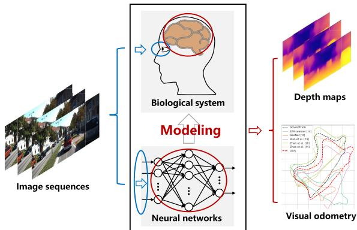

Fig. 1. Illustration of our biologically inspired method. Our method models a biological system by neural networks, the inputs of the neural networks model human eyes, as highlighted with blue circles, and the neutrons model a human cerebrum, as highlighted with red circles. The perception system modeled by the neural networks takes image sequences as input and outputs the estimation of depth maps and VO.  
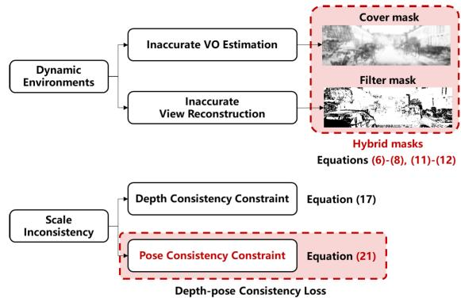  
Fig. 2. Main challenges in the unsupervised estimation of monocular depth and VO.

The VO estimation network compares two input adjacent images, which is called a target–source pair and builds the correspondences between them to estimate the ego-motion. Ideally, the estimated ego-motion is accurate when the differences in the target–source pair are caused merely by the motion of a camera. However, dynamic factors occur in environments unavoidably, which leads to some unmatched areas in image pairs and perturbs the ego-motion estimation. To improve the VO estimation in dynamic environments, we propose a CoverNet to preprocess the training target–source pairs before the ego-motion estimation. The potential unmatched regions between target–source pairs will be covered up before they are used for ego-motion estimation. To provide the supervisory signal for the CoverNet, we propose a pixel-wise filter mask. Our filter mask picks out the dynamic pixels by comparing the error of each pixel with the average error of view reconstruction. If the reconstruction error of a pixel is larger than the average error, we regard this pixel as an outlier needed to be filtered out. Apart from being used as the supervisory signal for the CoverNet, our filter mask implicitly diminishes the negative impacts on view reconstruction when calculating the reconstruction loss.

To tackle the issue of scale-inconsistency in predicted relative poses, our approach introduces a depth-pose consistency constraint. Unlike Bian et al. [19], who merely took the consistency of predicted depth into consideration, we propose two constraints on both predicted depth and relative poses. Our depth-pose consistency constraint is inspired by tight coupling between depth and pose in monocular systems during training. The two constraints enforce the predicted pose and depth to be consistent among different training samples separately and have a mutual promotion due to the joint training. Our ablation experiments also demonstrate that the proposed hybrid masks are effectual in global consistent VO estimation.

The main learning setup of our work is based on [14]. We introduce a monocular system that jointly estimates the depth map and VO. Our method provides a more reliable prediction for VO estimation and entitles our system to the capacity of being more adaptive to dynamic surroundings via hybrid masks. The depth-pose consistency constraint is designed to make full use of the predicted relative poses and depth maps simultaneously to obtain a consistent scale over different training samples. Note that all the strategies introduced in this article are tangential and can be applied either separately or jointly. In Section III, we will introduce them individually, and ablation experiments are conducted to demonstrate their individual or joint effectiveness. Experiments conducted on the public KITTI dataset [21] testify the substantial improvements yielded by our strategies and experiments conducted on Make3D [22] prove the transferability of our method.

We summarize our main contributions as follows.

1) We introduce hybrid masks, including the cover mask and the filter mask, to alleviate the adverse influence of dynamic environments on VO estimation and view reconstruction, respectively.

2) A depth-pose consistency constraint is proposed to impose reciprocal restrictions on both the predicted poses and depth maps to overcome the scale inconsistency between different training samples.

3) The performance of our depth estimation model is proved to be state of the art when tested on the common KITTI benchmark [21]. Meanwhile, the achieved scaleconsistent VO results and full camera motion trajectories are comparable to up-to-date methods.

With respect to the organization of this article, besides the introduction, Section II revisits some related works of depth and VO estimation. In Section III, we elaborate our major method and improvements. In Section VI, experimental results are presented and ablation studies are conducted to prove the effectiveness of our model. In Section V, we conclude our work and provide some plans for future research.

## II. RELATED WORKS

Traditional methods solve the scene understanding tasks with geometrical clues [11], [23]. Valid features are extracted and matched from images, followed by geometric verification [24] and bundle adjustment [25]. Unfortunately, these methods frequently fail in some challenging environments, e.g., low texture and view occlusions [26]. To overcome this kind of dilemma, numerous approaches take advantage of deep convolutional neural networks (DCNNs), especially for dense depth estimation. Our previous overviews have conducted a comprehensive insight into some representative works [1], [4], [5].

## A. Supervised Learning Methods for 3-D Understanding

Eigen et al. [27] and Liu et al. [28] unfold a new era for developing a totally different model for pixel-wise depth map regression using DCNNs and achieve outstanding performance. Eigen et al. [27] attempt to deal with depth estimation, surface normal prediction, and semantic labeling problem together via a multiscale deep network. Liu et al. [28] formulate depth estimation into a continuous conditional random field (CRF) learning problem because the depth values and CRF share the continuous characteristics. Following their works, Kuznietsov et al. [29] proposed a semisupervised method using sparse ground-truth depth collected by LiDAR, together with the photo-consistent constraint by the view reconstruction under a stereo setup. Liu et al. [30] introduce a collaborative deconvolutional neural network to jointly estimate depth and semantic segmentation. These supervised methods predict pixel value of depth through DCNNs and train networks by minimizing the predicted values and their corresponding ground truth. Nevertheless, such kind of supervised methods have a severe dependence on expensive ground truth [27]–[29].

## B. Unsupervised Learning From Stereo Images

For alleviating the reliance on ground truth, Garg et al. [31] use a novel view synthesis based on epipolar geometry inferences. With stereo image pairs as input, a network is trained by minimizing the photometric differences between the left image and the synthesized one from the corresponding right image. Later on, numerous new paradigms using stereo pairs come into view. Godard et al. [18] exploit a left-right consistency constraint for depth estimation further. Zhan et al. [16] and Li et al. [32] exploit both spatial and temporal photometric warp errors, thus recovering the absolute scale of VO estimation. More recently, Zhao et al. [33] proposed a geometryaware symmetric domain adaptation framework to train the network with synthetic images transferred by CycleGAN [34] and real data simultaneously.

## C. Unsupervised Learning From Monocular Video Sequences

Since it is unavoidable for stereo systems to conduct a complicated camera calibration before training, Zhou et al. [14] proposed a novel method trained on monocular sequences. They warp an image from its adjacent frames to form the unsupervised signal by estimating depth and camera’s egomotion jointly. Then, Yin and Shi [15] and Zou et al. [35] added optical flow estimation to the joint learning and explore a geometric consistency to build an auxiliary supervisory signal. In particular, Yin and Shi [15] formed a forward–backward consistency check and Zou et al. [35] impose a cross-task optical flow consistency constraint. Afterward, several works dig into the common sense hidden in depth estimation. Godard et al. [20] proposed three main improvements, a minimum reprojection loss, a full-resolution multiscale sampling method, and an auto-masking loss, to improve the accuracy of the monocular depth estimation to a great extent. Johnston and Carneiro [36] introduced the self-attention and discrete disparity prediction module for a more reasonable depth prediction. Furthermore, several innovations in network architectures arise. Wang et al. [37] used recurrent neural networks (RNNs) to extract more information in video sequences by multiview image reprojection, obtaining better results for depth and VO estimation. Ranjan et al. [38] introduced a competitive collaboration (CC) framework to address several interconnected problems simultaneously. Guizilini et al. [39] proposed a novel deep network architecture using 3-D convolutions, called PackNet, which can achieve a more detailed image reconstruction.

To handle the dynamic factors, some works introduce different masks to reduce the negative effects on the joint estimation during reconstruction loss computation [14], [15], [19], [20]. We note that these works merely try to make amends for changing environments in the view reconstruction process, while the dynamic factors influence the system not only during the view reconstruction, but also during the VO estimation. Thus, we propose hybrid masks to lessen the impact of dynamic environments in both of the two procedures. Since the training samples in monocular systems are snippets split from full sequences, the scale ambiguity occurs in each split and these scale factors differ from each other. Thus, the monocular systems mentioned above are unable to estimate the global VO due to the different absolute scales of training samples. Bian et al. [19] tackled this challenge by presenting a geometric consistency loss and have achieved a comparable VO result with the model trained from stereo images. Following [19], our method tackles the issue of scale inconsistency with the proposed depth-pose consistency loss and it is inspired by the joint training process. By imposing separate constraints on the predicted depth and poses, the constraints can work in a cooperative way to achieve better performances. The ablation experiments demonstrate the validity of both of our hybrid masks and depth-pose consistency loss.

## III. METHODS

## A. Method Overview

In this work, we jointly estimate the single view depth and VO, and our goal is to endow the system higher tolerance toward dynamic environments. As demonstrated in Fig. 3, our framework contains three subnetworks: 1) the DepthNet for estimating the depth of a monocular image; 2) the PoseNet for estimating the ego-motion between a target–source pair; and 3) the CoverNet which aims to output a cover mask used for the preprocessing of the input of the PoseNet. Our work is aimed at designing a monocular system that is adaptive and has a high tolerance to dynamic environments, achieving better depth estimation results and a globally consistent VO. We improve the performance of the unsupervised monocular systems with the proposed hybrid masks to conduct a proactive refinement of the input of the PoseNet and dismiss the dynamic regions during view reconstruction. Besides, we aim to overcome the issue of scale inconsistency and try to draw the full camera motion trajectories. Thus, apart from the primary supervisory signal comes from view reconstruction, a depthpose consistency loss is utilized to take advantage of the geometric constraints.

Therefore, our loss function can be divided into four major components: the photometric consistency loss ${ \mathcal L } _ { \mathrm { p c } }$ for view reconstruction, the mask loss ${ \mathcal { L } } _ { \mathrm { m } }$ aims to improve the robustness of the system, the depth-pose consistency loss ${ \mathcal { L } } _ { \mathrm { d p c } }$ to obtain a global scale consistent VO, and the depth smooth loss $\mathcal { L } _ { \mathrm { s m } }$ to ensure the value of the predicted depth is continuous. To sum up, our total loss function can be formulated as follows:

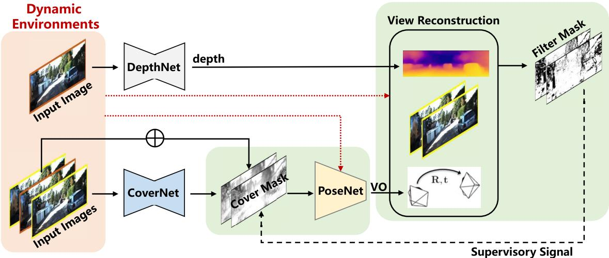  
Fig. 3. Illustration of our framework. Our hybrid masks, composed of the filter mask $M _ { f }$ and the cover mask $M _ { c } ,$ are highlighted. The whole pipeline consists of three subnetworks, the DepthNet, the PoseNet, and the CoverNet. The DepthNet takes a single image as input and outputs the estimated depth map. The CoverNet takes a target–source pair as input and estimates the cover mask under the guidance of the filter mask, which is calculated by mathematical derivation. The PoseNet takes the target–source pair preprocessed by the cover mask as input and outputs the relative pose between the target–source pair. Dynamic environments lead to inaccurate VO estimation and view reconstruction, and our hybrid masks alleviate the negative influences of dynamic environments

$$
{ \mathcal { L } } _ { \mathrm { t o t a l } } = \sum _ { l } ( { \mathcal { L } } _ { \mathrm { p c } } + \lambda _ { \mathrm { m } } { \mathcal { L } } _ { \mathrm { m } } + \lambda _ { \mathrm { d p c } } { \mathcal { L } } _ { \mathrm { d p c } } + \lambda _ { \mathrm { s m } } { \mathcal { L } } _ { \mathrm { s m } } )\tag{1}
$$

where $\lambda _ { \mathrm { m } } , \lambda _ { \mathrm { d p c } } , \lambda _ { \mathrm { s m } }$ represent the weights of ${ \mathcal { L } } _ { \mathrm { m } } , { \mathcal { L } } _ { \mathrm { d p c } } , { \mathcal { L } } _ { \mathrm { s m } } ,$ respectively. The subscript l indexes the scale factor of the estimated depth map. The same to the previous work [14], l equals 4 in our framework. Note that before calculating the loss in each scale, our method resizes all the involved images, depth maps, and masks in the loss function to the same size as the input images like Godard et al. [20].

## B. Photometric Consistency and Smoothness Loss

1) Photometric Consistency Loss: Like [14], we adopt the principle of photometric consistency in view reconstruction as the fundamental supervisory signal. In our method, the training sequences are split into three-frame snippets as training samples. Given a snippet, denoted as $( I _ { t - 1 } , \ I _ { t } , \ I _ { t + 1 } )$ , it has two target–source pairs. For convenience, we name $I _ { t }$ as the target view, and for $I _ { t - 1 }$ and $I _ { t + 1 }$ , we call them the source views $( I _ { s } )$ Each frame in a snippet will be fed into the DepthNet and each target–source pair will be concentrated in channel as the input of the PoseNet. For every pixel coordinate $p _ { t }$ in the target view, we search its corresponding pixel coordinate $p _ { s }$ in the source view by projection. Then, the pixel value $\tilde { I _ { s } } ( p )$ in the warped target view is calculated by the differentiable bilinear sampling mechanism [17], as shown in Fig. 4. A combination of the $L _ { 1 }$ norm and the structural similarity index (SSIM) [40] is adopted to calculate the photometric consistency loss, just the same as [15] and [18]. Then, the photometric consistency loss for each target–source pair is formulated as

$$
\begin{array} { r l } & { \mathcal { L } _ { \mathrm { p c } } ( I _ { t } , \tilde { I } _ { s } ) = \displaystyle \sum _ { p } \bigg ( \alpha \frac { 1 - \mathrm { S S I M } \big ( I _ { t } ( p ) , \tilde { I } _ { s } ( p ) \big ) } { 2 } } \\ & { \qquad \quad + ( 1 - \alpha ) \big \| I _ { t } ( p ) - \tilde { I } _ { s } ( p ) \big \| _ { 1 } \bigg ) . } \end{array}\tag{2}
$$

In this work, we employ the SSIM with a $3 \times 3$ block filter instead of a Gaussian model to simplify computation, and set $\alpha ~ = ~ 0 . 8 5$ [18]. Note that Fig. 4 contains both the photometric consistency loss in this subsection and the depthpose consistency loss introduced in Section III-D.

Following Godard et al. [20], we adopt the per-pixel minimum reprojection loss $\mathcal { L } _ { \mathrm { p c } } ^ { \prime }$ and the auto-mask $\mu$ to make our pipeline more robust to occlusions and moving objects

$$
\mathcal { L } _ { \mathrm { p c } } ^ { \prime } = \operatorname* { m i n } \big ( \mathcal { L } _ { \mathrm { p c } } \big ( I _ { t } , \tilde { I } _ { s } \big ) \big ) ,\tag{3}
$$

$$
\mu _ { \mathrm { I } } = \left\{ \begin{array} { l l } { 1 , } & { \operatorname* { m i n } \left( \mathcal { L } _ { \mathrm { p c } } ( I _ { t } , I _ { s } ) \right) > \operatorname* { m i n } \left( \mathcal { L } _ { \mathrm { p c } } \left( I _ { t } , \tilde { I } _ { s } \right) \right) } \\ { 0 , } & { \operatorname* { m i n } \left( \mathcal { L } _ { \mathrm { p c } } ( I _ { t } , I _ { s } ) \right) \leqslant \operatorname* { m i n } \left( \mathcal { L } _ { \mathrm { p c } } \left( I _ { t } , \tilde { I } _ { s } \right) \right) } \end{array} \right.\tag{4}
$$

where $s \in \{ t - 1 , t + 1 \}$ and the subscript I of $\mu$ indicates that $\mu _ { \mathrm { I } }$ is the auto-mask for the reconstruction error of images.

2) Smoothness Loss: As we know, depth values tend to be close numerically in the same object and depth discontinuities often occur in the pixel gradients of images. Hence, our method adds an edge-aware term [18] to ensure the depth prediction more reasonable like previous works [18] and [20]

$$
\mathcal { L } _ { \mathrm { s m } } = \big | \hat { \sigma } _ { x } d _ { t } ^ { * } \big | \mathrm { e } ^ { - | \hat { \sigma } _ { x } I _ { t } | } + \big | \hat { \sigma } _ { y } d _ { t } ^ { * } \big | \mathrm { e } ^ { - \big | \hat { \sigma } _ { y } I _ { t } \big | }\tag{5}
$$

where $d _ { t } ^ { * } = d _ { t } / \bar { d } _ { t }$ represents mean-normalized inverse depth and e is the natural logarithm.

## C. Hybrid Masks

Our hybrid masks have two components, the cover mask $M _ { c }$ and the filter mask $M _ { f } ,$ , as illustrated in Fig. 3.

1) Cover Mask: The 3-D surroundings are composed of static backgrounds and moving objects, while the PoseNet presumes that the contents of a scene change only due to the camera’s own motion. Thus, the moving objects may perturb the estimation of the camera’s ego-motion. In other words, the PoseNet is sensitive to the unexpected moving objects in surroundings. As a result, covering up the dynamic factors (or called the outliers for VO estimation) in environments in advance is essential for VO estimation, and, in turn, promoting the estimation of depth through the joint learning. In particular, we grasp the challenge through the CoverNet, which takes target–source pairs as input and outputs the cover mask $M _ { c }$ The target–source pairs will be refined by the cover mask before being fed into the PoseNet. Therefore, the PoseNet will have a higher tolerance to dynamic environments. Then, the input of the PoseNet is

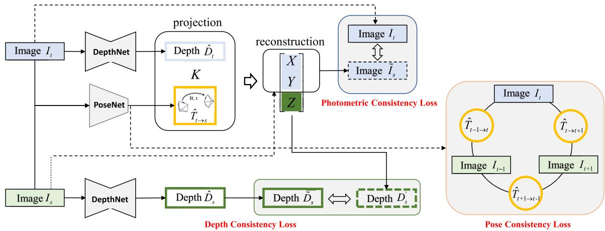  
Fig. 4. Our photometric and depth-pose consistency constraint. The photometric consistency loss is the photometric error between the warp image $\tilde { I } _ { s }$ and the target image $\mathbf { \dot { \rho } } _ { I _ { t } } ^ { } .$ . The depth consistency loss is calculated by the difference between the projected depth $\mathbf { \bar { \rho } } _ { D _ { s } ^ { \prime } }$ and the warped depth $\tilde { D } _ { s }$ . The pose consistency loss is obtained in the three-frame snippet by guaranteeing the transformation matrixes between each other are closely coupled.

$$
I ^ { \prime } = M _ { c } \cdot I\tag{6}
$$

where $I ^ { \prime } , I ,$ and $M _ { c }$ denote the input of the PoseNet, the input of the CoverNet, and our cover mask, respectively.

2) Filter Mask: The filter mask $M _ { f }$ is proposed to filter out the outliers during photometric consistency loss calculation, and it can provide the supervisory signal for the training of CoverNet as well. We calculate the filter mask by a simple mathematical derivation. The main idea roots in the characteristic of the outliers that the photometric consistency losses in these pixels are larger than in other normal pixels. A reference value is calculated by averaging the whole loss value. When the loss in a particular pixel has a larger value when compared to the reference value to a certain threshold, the pixel will be identified as an outlier. Since whether a pixel is an outlier or not is binary, our mask is binary, so $M _ { f } \in \{ 0 , 1 \}$ , and we set $M _ { f } = 0$ when the corresponding pixel is judged as an outlier, i.e.,

$$
M _ { f } ( I _ { t } , \tilde { I } _ { s } ) = \left\{ \begin{array} { l l } { 1 , } & { \mathcal { L } _ { \mathrm { p c } } \big ( I _ { t } , \tilde { I } _ { s } \big ) \leqslant \beta \cdot \bar { \mathcal { L } } _ { \mathrm { p c } } \big ( I _ { t } , \tilde { I } _ { s } \big ) } \\ { 0 , } & { \mathcal { L } _ { \mathrm { p c } } \big ( I _ { t } , \tilde { I } _ { s } \big ) > \beta \cdot \bar { \mathcal { L } } _ { \mathrm { p c } } \big ( I _ { t } , \tilde { I } _ { s } \big ) } \end{array} \right.\tag{7}
$$

where $\bar { \mathcal { L } } _ { \mathrm { { p c } } }$ is the average value of $\mathcal { L } _ { \mathrm { p c } } . \ \beta$ represents the tolerance to the outliers and here we set $\beta = 1 . 5$ empirically.

Besides, when we calculate the view reconstruction loss, the existence of outliers will degrade the performance of the network and our filter mask $M _ { f }$ can be utilized as a pixel-wise weight to reduce the influence of outliers. Then, the photometric consistency loss ${ \mathcal { L } } _ { \mathrm { p c } }$ in (2) can be updated using the filter mask $M _ { \mathrm { f } }$ in (7), the auto-mask $\mu _ { \mathrm { I } }$ in (4) and the minimum reprojection loss $\mathcal { L } _ { \mathrm { p c } } ^ { \prime }$ in (3). We combine our proposed filter mask $M _ { \mathrm { f } }$ with the auto-mask $\mu _ { \mathrm { I } }$ and the minimum reprojection loss $\mathcal { L } _ { \mathrm { p c } } ^ { \prime }$ proposed in [20]:

$$
\mathcal { L } _ { \mathrm { p c } } = \sum _ { s \in \{ t - 1 , t + 1 \} } \left( M _ { f } \left( I _ { t } , \tilde { I } _ { s } \right) \cdot \mathcal { L } _ { \mathrm { p c } } \left( I _ { t } , \tilde { I } _ { s } \right) \right) + \mu _ { I } \cdot \mathcal { L } _ { \mathrm { p c } } ^ { \prime } .\tag{8}
$$

3) Mask Loss: Since the value of $\beta$ is adjusted through an experience-driven attempt, it is probable that we cannot pick up the most suitable value as the threshold of outliers tolerance. To this end, we add a regularization term, denoted as ${ \mathcal { L } } _ { \mathrm { f m } } .$ , to alleviate the disadvantages brought by a small value of the appointed $\beta .$ The regularization term encourages nonzero predictions of the filter mask by minimizing the binary cross entropy (BCE) loss $\mathcal { L } _ { \mathrm { B C E } }$ [in (10)] between the filter mask and a constant label 1 in every pixel of the filter mask, i.e.,

$$
\mathcal { L } _ { \mathrm { f m } } = \mathcal { L } _ { \mathrm { B C E } } ( M _ { \mathrm { f } } , 1 _ { i \times j } )\tag{9}
$$

$$
\mathcal { L } _ { \mathrm { B C E } } ( x , y ) = - \frac { 1 } { n } \sum _ { i } \bigl [ y _ { i } \log x _ { i } + ( 1 - y _ { i } ) \log ( 1 - x _ { i } ) \bigr ]\tag{10}
$$

where $i \times j$ is the size of $M _ { \mathrm { f } }$ , n represents the number of the elements in x and $y ,$ and log is the logarithm function. Intuitively speaking, the smaller $\beta$ is, the pixel-wise value of $M _ { f }$ is more likely to be zero, leading to a smaller ${ \mathcal L } _ { \mathrm { p c } }$ and a larger ${ \mathcal { L } } _ { \mathrm { f m } }$ . Thus, there exists a game between the photometric consistency loss $\mathcal { L } _ { \mathrm { p c } }$ and the regularization term ${ \mathcal { L } } _ { \mathrm { f m } } .$ The existence of ${ \mathcal { L } } _ { \mathrm { f m } }$ mitigates the negative influence of an improper value of $\beta$ and helps the framework to converge to a satisfactory balance.

As mentioned before, our cover mask $M _ { c }$ predicts the potential outliers under the guidance of the corresponding filter mask $M _ { f } .$ . Different from the filter mask, the value of our cover mask is continuous between zero and one, rather than a binary value, in order to retain more information for pose estimation. More specifically, the CoverNet is trained by minimizing the BCE loss [in (10)] between the predicted value of the cover mask and the value of the filter mask in every corresponding pixel. The pixel-wise differences between the predicted cover mask $M _ { \mathrm { c } }$ and the calculated filter mask $M _ { \mathrm { f } }$ form the optimization objective of CoverNet during training, denoted as ${ \mathcal { L } } _ { \mathrm { c m } }$

$$
\mathcal { L } _ { \mathrm { c m } } = \mathcal { L } _ { \mathrm { B C E } } ( M _ { \mathrm { c } } , M _ { \mathrm { f } } ) .\tag{11}
$$

Then, the mask loss ${ \mathcal { L } } _ { \mathrm { m } }$ is obtained. It consists of two components, the regularization term ${ \mathcal { L } } _ { \mathrm { f m } }$ for the filter mask and the ${ \mathcal { L } } _ { \mathrm { c m } } .$ so the mask loss ${ \mathcal { L } } _ { \mathrm { m } }$ is calculated as follows:

$$
\begin{array} { r } { \mathcal { L } _ { \mathrm { m } } = \mathcal { L } _ { \mathrm { f m } } + \mathcal { L } _ { \mathrm { c m } } . } \end{array}\tag{12}
$$

## D. Depth-Pose Consistency Loss

In monocular systems, the issue of scale ambiguity exists due to a lack of absolute scale. For unsupervised monocular systems with short snippets as training samples, the global scale recovery is more challenging. On account of the lack of necessary constraints between different training samples, the absolute scale factors of training samples are different from each other. Such a kind of difference leads to a large translational and rotational error in global VO. To this end, we propose a depth-pose consistency loss to eliminate the scale inconsistency, which consists of two parts, the depth consistency loss ${ \mathcal { L } } _ { \mathrm { d c } }$ and the pose consistency loss ${ \mathcal { L } } _ { \mathrm { p o c } }$

$$
\mathcal { L } _ { \mathrm { d p c } } = \lambda _ { \mathrm { d c } } \mathcal { L } _ { \mathrm { d c } } + \lambda _ { \mathrm { p o c } } \mathcal { L } _ { \mathrm { p o c } }\tag{13}
$$

where the $\lambda _ { \mathrm { d c } }$ and $\lambda _ { \mathrm { p o c } }$ are the weight of ${ \mathcal { L } } _ { \mathrm { d c } }$ and ${ \mathcal { L } } _ { \mathrm { p o c } } .$ respectively. The framework of our depth-pose consistency constraint is highlighted in Fig. 4.

1) Depth Consistency Loss: The depth consistency loss is inspired by the projection process, which is formulated by [14]

$$
D _ { s } ^ { \prime } ( P _ { s } ) P _ { s } = \hat { T } _ { t  s } \hat { D } _ { t } ( P _ { t } ) P _ { t }\tag{14}
$$

where $D _ { s } ^ { \prime } ( P _ { s } ) P _ { s }$ indicates the 3-D coordinate for point $P _ { s }$ in source view. $\hat { D } _ { t }$ and $\hat { T } _ { t  s }$ represent the predicted depth of the target view by the DepthNet and the relative pose, respectively.

For convenience, we denote the 3-D coordinate $D _ { s } ^ { \prime } ( P _ { s } ) P _ { s }$ in the format of vector, $\mathbf { \Psi } ^ { \pmb { \nu } } = [ X , Y , Z ] ^ { T }$ . The corresponding pixel coordinate of the source view mentioned above is calculated by conducting a normalization to the camera plane and the third component of v is supposed to be the depth of the source view. To be more specific,

$$
P _ { s } = [ X / Z , Y / Z , 1 ] ^ { T }
$$

$$
\begin{array} { r } { D _ { s } ^ { \prime } ( P _ { s } ) = Z . } \end{array}\tag{15}
$$

(16)

Like Bian et al. [19], we make full use of the 3-D structure information generated along with the coordinate calculated by projection, which is usually ignored, to formulate a depth consistency loss. As demonstrated in Fig. 4, with the predicted depth $\hat { D } _ { t }$ and the relative pose $\hat { T } _ { t  s } .$ , the depth map of an image $I _ { s }$ is inferred as $D _ { s } ^ { \prime } .$ . We assume that the depth map $D _ { s } ^ { \prime }$ generated by projection should be identical to the warped depth map $\tilde { D } _ { s } , \ \tilde { D } _ { s }$ is obtained by warping the depth map $\hat { D } _ { s } ,$ which is predicted by the DepthNet, to align with the projected depth map $D _ { s } ^ { \prime }$ using the bilinear sampling. Therefore, the depth consistency loss ${ \mathcal { L } } _ { \mathrm { d c } }$ is calculated by the $L _ { 1 }$ norm in the following equation:

$$
\mathcal { L } _ { \mathrm { d c } } \bigl ( \tilde { D } _ { s } , D _ { s } ^ { \prime } \bigr ) = \sum _ { p } \bigl \| \tilde { D } _ { s } ( p ) - D _ { s } ^ { \prime } ( p ) \bigr \| _ { 1 } .\tag{17}
$$

Additionally, since the estimated depth maps are troubled with outliers as well, the depth consistency loss can be updated as like the photometric loss in (8)

$$
\mathcal { L } _ { \mathrm { d c } } = \sum _ { s \in \{ t - 1 , t + 1 \} } \big ( M _ { f } \big ( I _ { t } , \tilde { I } _ { s } \big ) \cdot \mathcal { L } _ { \mathrm { d c } } \big ( \tilde { D } _ { s } , D _ { s } ^ { \prime } \big ) \big ) + \mu _ { \mathrm { D } } \cdot \mathcal { L } _ { \mathrm { d c } } ^ { \prime }\tag{18}
$$

where $M _ { \mathrm { f } }$ is the filter mask, $\mu _ { \mathrm { D } }$ is the auto-mask for depth maps and $\mathcal { L } _ { \mathrm { d c } } ^ { \prime }$ is the minimum reprojection loss for depth,

which are shown in (7), (19), and (20)

$$
\begin{array} { r l } & { \mathcal { L } _ { \mathrm { d c } } ^ { \prime } = \operatorname* { m i n } \big ( \mathcal { L } _ { \mathrm { d c } } \big ( D _ { s } ^ { \prime } , \tilde { D } _ { s } \big ) \big ) } \\ & { } \\ & { \mu _ { \mathrm { D } } = \{ 1 , \ \operatorname* { m i n } \big ( \mathcal { L } _ { \mathrm { d c } } \big ( \hat { D } _ { t } , \tilde { D } _ { s } \big ) \big ) > \operatorname* { m i n } \big ( \mathcal { L } _ { \mathrm { d c } } \big ( D _ { s } ^ { \prime } , \tilde { D } _ { s } \big ) \big )  } \\ & {  0 , \ \operatorname* { m i n } \big ( \mathcal { L } _ { \mathrm { d c } } \big ( \hat { D } _ { t } , \tilde { D } _ { s } \big ) \big ) \leqslant \operatorname* { m i n } \big ( \mathcal { L } _ { \mathrm { d c } } \big ( D _ { s } ^ { \prime } , \tilde { D } _ { s } \big ) \big ) . } \end{array}\tag{19}
$$

(20)

2) Pose Consistency Loss: The depth consistency loss mentioned above takes advantage of the 3-D information of view synthesis to ensure that the estimation of VO is globally consistent implicitly. Meanwhile, the pose consistency loss is employed to enforce the predicted relative poses between three consecutive frames to be invertible explicitly. As shown in Fig. 4, for a training snippet denoted as $( I _ { t - 1 } , I _ { t } , I _ { t + 1 } )$ , their relative transformation matrixes $T _ { t - 1  t } , T _ { t  t + 1 } , T _ { t + 1  t - 1 } ,$ , can be predicted by the PoseNet, respectively. Then the pose consistency loss ${ \mathcal { L } } _ { \mathrm { p o c } }$ can be simply formulated as

$$
\mathcal { L } _ { \mathrm { p o c } } = T _ { t - 1  t } \cdot T _ { t  t + 1 } - T _ { t - 1  t + 1 } .\tag{21}
$$

${ \mathcal { L } } _ { \mathrm { p o c } }$ makes sense in that it is established on the basis of the relative pose transformation $T _ { t - 1  t } \cdot T _ { t  t + 1 } = T _ { t - 1  t + 1 }$

## IV. EXPERIMENTS

## A. Datasets

1) KITTI: Our method uses the common benchmark KITTI [21] as the training dataset for the convenience of comparison. The dataset consists of stereo images collected from driving scenarios with the resolution of 1242 × 375. The corresponding ground truth of pose and depth is acquired by light detection and ranging (LIDAR) and inertial measurement unit (IMU). Eigen et al. [27] divide KITTI into two subsets, composed of 32 and 29 scenes, respectively, called Eigen split. For depth, we use 39 810 monocular triplets for training, 4424 triplets for validation, and 697 representative frames for testing, the same as previous works [14] and [20]. For the pose, we use the Sequences 00 to 08 on the KITTI Odometry dataset for training and the Sequences 09 and 10 for testing just follow the previous works [14] and [20] as well.

2) Make3D: Furthermore, in order to testify the transferability of our model, experiments are conducted on the Make3D dataset [22], which contains 534 images in a resolution of $2 2 7 2 \times 1 7 0 4$ , along with their corresponding depth maps in a resolution of $5 5 \times 3 0 5$ . The Make3D is split into a training set with 400 images and a testing set with 134 images. In our experiments, we test our model on the testing split of Make3D, just the same as in [14].

## B. Implementation Details

The network is implemented in the Pytorch [45] framework and uses Adam [46] for optimization. It takes about 25 h for training using a single RTX 8000 GPU for 20 epochs with a batch size of $^ { 1 2 , }$ and the learning rate is set to $1 0 ^ { - 4 }$ During training, we resize the training images to a resolution of $6 4 0 \times 1 9 2$ for ablation study to save time and resize images to a resolution of $1 0 2 4 \times 3 2 0$ when we train the full model.

As mentioned before, our framework includes three subnetworks. Both the DepthNet and the CoverNet adopt the architecture of the widely used U-Net [47], which has an encoder–decoder architecture with skip connections. The PoseNet consists of an encoding part which is the same as the DepthNet and a different decoding part to output the 6 DoF relative poses. The three subnetworks share the same encoder structure of ResNet18 [48], which contains 11 million trainable parameters. In order to speed up the training process and improve the accuracy of our networks, we utilize the weights pretrained on ImageNet [49] as the initial weight inspired by Godard et al. [20] and Girshick et al. [50]. The data argument is done as [20]. For the loss weightings in our loss function, we fixed the hyperparameters of the different loss components to $\lambda _ { \mathrm { m } } = 0 . 2 , \lambda _ { \mathrm { d c } } = 0 . 2 , \lambda _ { \mathrm { p o c } } = 0 . 5 , \lambda _ { \mathrm { d p c } } = 1 , \lambda _ { \mathrm { s m } } = 0 . 0 0 1 _  $

TABLE I  
COMPARISON OF OUR MONOCULAR DEPTH PREDICTION RESULTS WITH SOME STATE-OF-THE-ART APPROACHES ON EIGEN SPLIT [27]. FOR THE SUPERVISION, LABEL “DEPTH,” “POSE,” AND “NO” REPRESENT TRAINING DATA WITH DIFFERENT SUPERVISION SIGNALS: THE PIXEL GROUND TRUTH OF DEPTH, STEREO IMAGE PAIRS, AND MONOCULAR IMAGE SEQUENCES, RESPECTIVELY. WE EVALUATE THE RESULTS WITH A MAXIMUM DEPTH OF BOTH 80 m CAP AND 50 m CAP
<table><tr><td rowspan="2">Method</td><td rowspan="2">Supervision</td><td rowspan="2">Cap</td><td colspan="3">Abs Rel Sq Rel RMSE</td><td colspan="3">RMSE log  $\overline { { { \delta < 1 . 2 5 } } } \quad \delta < 1 . 2 5 ^ { 2 } \quad \delta < 1 . 2 5 ^ { 3 }$ </td></tr><tr><td colspan="3">Lower is better</td><td colspan="3">Higher is better</td></tr><tr><td>Eigen et al. [27] Godard et al. [18] SfM-Learner [14] GeoNet [15]</td><td>Depth Pose No No</td><td>80m 80m 80m 80m 80m</td><td>0.190 0.148 0.183</td><td>1.515 1.344 1.595</td><td>7.156 5.927</td><td>0.270 0.247</td><td>0.692 0.803</td><td>0.899 0.967 0.922 0.964</td></tr><tr><td></td><td></td><td></td><td>0.155</td><td>1.296</td><td>6.709 5.857 5.869</td><td>0.270 0.233 0.241</td><td>0.734 0.902 0.793 0.931</td><td>0.959 0.973</td></tr><tr><td>Zhan et al. [16] DF-Net [35]</td><td>Pose No</td><td>80m</td><td>0.144 0.150</td><td>1.391 1.124</td><td>5.507 0.223</td><td>0.803 0.806</td><td>0.928 0.933</td><td>0.969 0.973</td></tr><tr><td>Struct2depth [41]</td><td>No</td><td>80m</td><td>0.141 1.026</td><td>5.291</td><td>0.215</td><td>0.816</td><td>0.945</td><td>0.979</td></tr><tr><td>CC [38]</td><td></td><td></td><td></td><td></td><td></td><td></td><td></td><td></td></tr><tr><td></td><td>No</td><td>80m</td><td>0.140</td><td>1.070</td><td>5.326</td><td>0.217</td><td>0.826</td><td>0.941 0.975</td></tr><tr><td>Alex et al. [42]</td><td>No</td><td>80m</td><td>0.133</td><td>1.126 5.515</td><td></td><td>0.231</td><td>0.826 0.934</td><td>0.969</td></tr><tr><td>Bian et al. [19]</td><td>No</td><td>80m 0.137</td><td>1.089</td><td>5.439</td><td>0.217</td><td>0.830</td><td>0.942</td><td>0.975</td></tr><tr><td>Li et al. [43]</td><td>No</td><td>80m 0.150</td><td>1.127</td><td>5.564</td><td>0.229</td><td>0.823</td><td>0.936</td><td>0.974</td></tr><tr><td>Monodepth2 [20]</td><td>No</td><td>80m 0.115</td><td>0.882</td><td>4.701</td><td>0.190</td><td>0.879</td><td>0.961</td><td>0.982</td></tr><tr><td>Zhao et al. [44]</td><td>No</td><td>80m 0.113</td><td>0.704</td><td>4.581</td><td>0.184</td><td>0.871</td><td>0.961</td><td>0.984</td></tr><tr><td>Ours(1024×320)</td><td>No</td><td>80m</td><td>0.110 0.791</td><td>4.557</td><td>0.184</td><td>0.887</td><td>0.964</td><td>0.983</td></tr><tr><td>Garg et al. [31]</td><td>Pose</td><td>50m</td><td>0.169</td><td>1.080 5.104</td><td></td><td>0.273</td><td>0.740 0.904</td><td>0.962</td></tr><tr><td>SfM-Learner [14]</td><td>No</td><td>50m</td><td>0.201</td><td>1.391</td><td>5.181</td><td>0.264</td><td>0.696 0.900</td><td>0.966</td></tr><tr><td>GeoNet [15]</td><td>No</td><td>50m 0.147</td><td>0.936</td><td>4.348</td><td>0.218</td><td>0.810</td><td>0.941</td><td>0.977</td></tr><tr><td>Zhan et al. [16]</td><td>Pose</td><td>50m</td><td>0.135 0.905</td><td>4.366</td><td>0.225</td><td>0.818</td><td>0.937</td><td>0.973</td></tr><tr><td>Alex et al. [42]</td><td>No</td><td>50m</td><td>0.126</td><td>0.832 4.172</td><td>0.217</td><td>0.840</td><td>0.941</td><td>0.973</td></tr><tr><td>Li et al. [43]</td><td>No</td><td>50m</td><td>0.146</td><td>0.927 4.107</td><td>0.216</td><td>0.819</td><td>0.943</td><td>0.981</td></tr><tr><td>Ours</td><td>No</td><td>50m</td><td>0.104</td><td>0.595 3.464</td><td>0.174</td><td>0.899</td><td>0.968</td><td>0.985</td></tr><tr><td></td><td></td><td></td><td></td><td></td><td></td><td></td><td></td><td></td></tr></table>

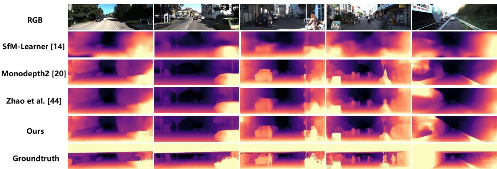  
Fig. 5. Visualization results of our depth prediction network. Our model is skill in detailed depth recovery, including cars and pedestrians, when compared to other methods.

## C. Performance on KITTI

In this subsection, both our monocular depth and VO estimation models are evaluated on KITTI [21]. Our approach yields satisfactory improvements on both depth and global consistent scale VO estimation when compared to some stateof-the-art methods. We evaluate our monocular depth model on the Eigen split [27] and the quantitative results are shown in Table I. Different evaluation indicators are considered in Table I, including Abs Rel, Sq Rel, RMSE, RMSE log, and

Accuracy, just the same as previous work [14]. The qualitative results are illustrated in Fig. 5. It is obvious that our model is skilled in object reconstruction and provides a distinct margin prediction. For example, our model has an aptitude for car and pedestrian recovery when compared to other methods, as illustrated in Fig. 5. The predicted results of our model shown in Table I and Fig. 5 are trained with images in a resolution of 1024 × 320. Besides, we visualize our proposed hybrid masks in Fig. 6. Experimental results show that our method is state of the art when compared to other monocular systems.

To demonstrate our advantage in global VO estimation, we merge the predicted relative transformation matrixes to obtain the full trajectories of the Sequences 09 and 10 on KITTI. Before the evaluation, we align the obtained full trajectories with ground truth using evo.1 Table II compares the average translational and rotational errors of the Sequences 09 and 10 on the KITTI odometry dataset. As can be seen in Table II, our monocular based odometry learning method outperforms several related monocular based methods [14]–[16], [19], and is even better than a stereo based system [16]. Fig. 7 plots the full camera-moving trajectories of the Sequences 09 and 10 for comparison using evo, and demonstrates the effectiveness of our method in obtaining a globally consistent scale VO. The trajectories obtained by our method are closely coincident with the ground truth. The experimental results demonstrate that the proposed monocular system can deal with the issue of scale inconsistency that exists in unsupervised monocular systems.

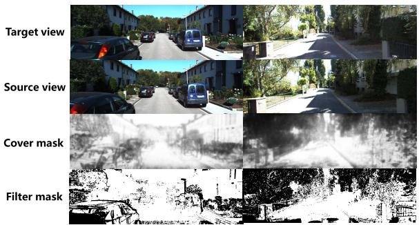  
Fig. 6. Examples of our proposed hybrid masks, composed of a cover mask $M _ { \mathrm { c } }$ and a filter mask Mf. The cover mask and the filter mask aim to alleviate the adverse effect of dynamic environments on VO estimation and view reconstruction process, respectively.

## D. Ablation Studies

In this subsection, we validate the effectiveness of our proposed strategies, which are used to improve the accuracy of depth estimation or to achieve a globally consistent VO estimation. We evaluate our model on KITTI [21] and demonstrate that our proposed method shows a satisfactory performance in improving the joint learning of depth and VO in an unsupervised monocular setting. All the ablation experiments are conducted on the KITTI dataset and our results are given in Tables III and IV.

1) Depth Estimation: Ablation experiments are conducted to verify the effectiveness filter mask $M _ { \mathrm { f } }$ designed to deal with the outliers when calculating the photometric consistency loss; 2) our cover mask $M _ { \mathrm { c } }$ used to preprocess the input of the PoseNet to cover up the dynamic objects and other potential outliers, thus achieving a more accurate VO estimation which is adaptive to changing environments; and 3) the depth-pose consistency constraint $L _ { \mathrm { d p c } }$ , which can be decomposed into the depth consistency constraint $L _ { \mathrm { d c } }$ and the pose consistency constraint $L _ { \mathrm { p o c } }$ , to decrease the scale inconsistency in different training samples. Quantitative results are presented in Table III to verify the efficiency of each component proposed in our method with regard to the depth estimation.

The “baseline” in Table III refers to the model consisting of two subnetworks, the DepthNet and the PoseNet. The objective function of the baseline is the combination of a simple photometric consistency loss ${ \mathcal L } _ { \mathrm { p c } }$ mentioned in (2) and the smooth loss $\mathcal { L } _ { \mathrm { s m } }$ in (5). The M , $M _ { \mathrm { c } } , \mathcal { L } _ { \mathrm { d c } } , \mathcal { L } _ { \mathrm { p o c } }$ in Table III represent the filter mask, the cover mask, the depth consistency constraint and the pose consistency constraint strategy, respectively. To prove the effectiveness of our filter mask, we compare our filter mask with the self-discovered mask [19], denoted as $M _ { s }$ in Table III. Since the self-discovered mask is calculated according to the depth consistency constraint, we compare our mask with the self-discovered mask by adding the depth consistency loss ${ \mathcal { L } } _ { \mathrm { d c } }$ to the “baseline” for fairness. The ablation experiments are conducted with a resolution of $6 4 0 \times 1 9 2$ to save time. The full model trained on the resolution of $1 0 2 4 \times 3 2 0$ is also provided in Table I. We evaluate every improved element in the presented monocular system individually and remove each of them from the full system to demonstrate their effect in an indirect way. As we can see from Table III, the accuracy of the baseline is the worst among all the models and all the strategies we proposed help to improve the accuracy of the system. Besides, the comparison of our filter mask and the self-discovered mask [19] demonstrates the advantage of our filter mask. Since the self-discovered mask is calculated according to the predicted depth and the depth may be inaccurate in some pixels, the corresponding mask value can be affected. On the contrary, our filter mask was calculated according to the average reconstruction error is more robust to the pixels with inaccurate predictions, thus obtaining better performance. Note that the $L _ { \mathrm { d c } }$ and $L _ { \mathrm { p o c } }$ do not improve the performance of depth estimation to a large extent, this is because both $L _ { \mathrm { d c } }$ and $L _ { \mathrm { p o c } }$ are designed to ensure a globally consistency VO estimation. The combination of all the strategies, called the full model here, achieves the best performance unsurprisingly.

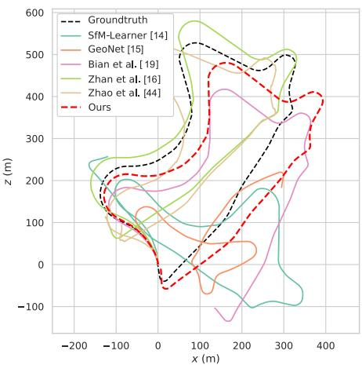

(a)  
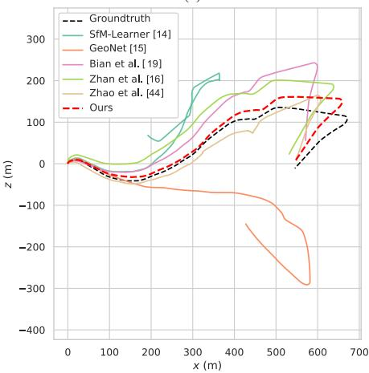  
(b)  
Fig. 7. Qualitative trajectories on the testing Sequences 09 and 10 are plotted. Our method is compared with some classical monocular systems and a stereo system. As shown in the figure, our method is state-of-the-art in full trajectories estimation and even outperforms the stereo system. (a) Full trajectory of Sequence 09. (b) Full trajectory of Sequence 10.

TABLE II  
OUR VO RESULTS EVALUATED IN SEQUENCES 09 AND 10 ON KITTI ODOMETRY DATASET. tERR IS AVERAGE TRANSLATIONAL DRIFT ERROR AND $r _ { \mathrm { E R R } }$ IS AVERAGE ROTATIONAL DRIFT ERROR. OUR RESULT OUTPERFORMS THE STATE-OF-THE-ART APPROACHES
<table><tr><td>Method</td><td>Seq 09  $\left| t _ { e r r } ( \mathcal { V } _ { 0 } ) \stackrel { \cdot } { r _ { e r r } } ( \mathrm { d e g / m } ) \right.$ </td><td>Seq 10 terr(%) rerr(deg/m)</td></tr><tr><td>ORB-SLAM [51]</td><td>15.30 0.26</td><td>3.68 0.48</td></tr><tr><td>SfM-Learner [14]</td><td>17.84 6.78</td><td>37.91 17.78</td></tr><tr><td>GeoNet [15]</td><td>41.47 13.14</td><td>32.74 13.12</td></tr><tr><td>Zhan et al. [16]</td><td>11.93 3.91</td><td>12.45 3.46</td></tr><tr><td>ConvLSTM [37]</td><td>9.88 3.40</td><td>12.24 5.20</td></tr><tr><td>Bian et al. [19]</td><td>11.2 3.35</td><td>10.1 4.96</td></tr><tr><td>Zhao et al. [44]</td><td>7.21 0.56</td><td>11.43 2.57</td></tr><tr><td>Ours</td><td>7.14 2.32</td><td>7.72 2.27</td></tr></table>

TABLE III  
COMPARISON AMONGST VARIANTS OF OUR MODEL OVER EIGEN SPLIT [27]. THE PROPOSED STRATEGY MODULES ARE PROVED TO BE EFFECTIVE
<table><tr><td rowspan="2"></td><td rowspan="2"></td><td rowspan="2"> $M _ { f } \left| \boldsymbol { M } _ { c } \right| L _ { \mathrm { d c } } \left| L _ { \mathrm { p o c } } \right.$ </td><td rowspan="2"></td><td rowspan="2"></td><td colspan="2">Abs Rel Sq Rel RMSE RMSE log</td><td colspan="2">δ &lt; 1.25 δ &lt; 1.252  $\overline { { \delta < 1 . 2 5 ^ { 3 } } }$ </td></tr><tr><td></td><td>Lower is better</td><td>Higher is better</td><td></td></tr><tr><td>baseline</td><td></td><td></td><td></td><td></td><td>0.143</td><td>1.681 5.566 0.227</td><td>0.848</td><td>0.945 0.973</td></tr><tr><td>baseline  $\overline { { + ~ M _ { f } } }$ </td><td>√</td><td></td><td></td><td></td><td>0.135 1.301</td><td>5.281 0.213</td><td>0.851 0.950</td><td>0.977</td></tr><tr><td>baseline  $\overline { { + \ M _ { c } } }$ </td><td></td><td> $\overline { { \checkmark } }$ </td><td></td><td></td><td>0.137 1.285</td><td>5.321 0.221</td><td>0.843 0.947</td><td>0.975</td></tr><tr><td>Baseline +  $\overline { { M _ { f } + M _ { c } } }$ </td><td> $\overline { { \checkmark } }$ </td><td> $\checkmark$ </td><td></td><td></td><td>0.130 1.108</td><td>5.249 0.210</td><td>0.852 0.950</td><td>0.978</td></tr><tr><td>Baseline  $+ \overline { { L _ { \mathrm { d c } } } }$ </td><td></td><td></td><td> $\overline { { \checkmark } }$ </td><td></td><td>0.138 1.323</td><td>5.384 0.221</td><td>0.846 0.946</td><td>0.974</td></tr><tr><td>Baseline +  $\scriptstyle L _ { \mathrm { p o c } }$ </td><td></td><td></td><td></td><td> $\overline { { \checkmark } }$ </td><td>0.141 1.471</td><td>5.507 0.226</td><td>0.846 0.945</td><td>0.974</td></tr><tr><td>baseline +  $\overline { { L _ { \mathrm { d c } } + M _ { s } \ [ 1 9 ] } }$ </td><td></td><td></td><td> $\overline { { \checkmark } }$ </td><td></td><td>0.135 1.107</td><td>5.220 0.211</td><td>0.842 0.949</td><td>0.977</td></tr><tr><td>baseline +  $\overline { { L _ { \mathrm { d c } } + M _ { f } } }$ </td><td> $\overline { { \checkmark } }$ </td><td></td><td> $\checkmark$ </td><td></td><td>0.131 1.099</td><td>5.241 0.209</td><td>0.852 0.952</td><td>0.978</td></tr><tr><td>Ours w/o  $\overline { { \boldsymbol { M } _ { f } } }$  and  $\overline { { M _ { c } } }$ </td><td></td><td></td><td> $\overline { { \checkmark } }$ </td><td> $\overline { { \checkmark } }$ </td><td>0.118 0.890</td><td>4.869 0.195</td><td>0.871</td><td>0.958 0.981</td></tr><tr><td>Ours w/o  $\overline { { L _ { \mathrm { d c } } } }$  and  $\underline { { L _ { \mathrm { p o c } } } }$ </td><td> $\overline { { \checkmark } }$ </td><td> $\overline { { \checkmark } }$ </td><td></td><td></td><td>0.119 0.898</td><td>4.880 0.196</td><td>0.869</td><td>0.958 0.981</td></tr><tr><td>Ours wlo M f</td><td></td><td> $\overline { { \checkmark } }$ </td><td> $\overline { { \checkmark } }$ </td><td> $\overline { { \checkmark } }$ </td><td>0.117 0.872</td><td>4.868 0.195</td><td>0.870 0.958</td><td>0.982</td></tr><tr><td>Ours w/o  $\overline { { M _ { c } } }$ </td><td>√</td><td></td><td> $\checkmark$ </td><td> $\overline { { \checkmark } }$ </td><td>0.118 0.901</td><td>4.881 0.194</td><td>0.871</td><td>0.958 0.981</td></tr><tr><td>Ours w/o  $\overline { { L _ { \mathrm { d c } } } }$ </td><td>√</td><td> $\overline { { \checkmark } }$ </td><td></td><td> $\checkmark$ </td><td>0.117 0.874</td><td>4.847 0.195</td><td>0.872 0.959</td><td>0.981</td></tr><tr><td>Ours w/o  $\overline { { L _ { \mathrm { p o c } } } }$ </td><td>√</td><td>√</td><td>√</td><td></td><td>0.117 0.892</td><td>4.859 0.194</td><td>0.874 0.958</td><td>0.981</td></tr><tr><td>Ours full (640×192)</td><td>√</td><td>√</td><td>√</td><td>7</td><td>0.117 0.863</td><td>4.813 0.192</td><td>0.871</td><td>0.959 0.982</td></tr></table>

TABLE IV

ABLATION STUDIES ON THE GLOBALLY CONSISTENT $\mathrm { V O } . t _ { e r r }$ IS AVERAGE TRANSLATIONAL DRIFT ERROR AND $r _ { e r r }$ IS AVERAGE ROTATIONAL DRIFT ERROR
<table><tr><td rowspan=1 colspan=1>Method</td><td rowspan=1 colspan=1>Seq 09 $| t _ { e r r } ( \% )$ rerr(deg/m)</td><td rowspan=1 colspan=1>Seq 10 $t _ { e r r } ( \% ) ~ r _ { e r r } ( \mathrm { d e g / m } )$ </td></tr><tr><td rowspan=1 colspan=1>base</td><td rowspan=1 colspan=1>15.02    3.43</td><td rowspan=1 colspan=1>12.73    5.58</td></tr><tr><td rowspan=1 colspan=1>base + Mh</td><td rowspan=1 colspan=1>9.22    2.52</td><td rowspan=1 colspan=1>8.38    3.78</td></tr><tr><td rowspan=1 colspan=1> ${ \overline { { \mathrm { b a s e } + M _ { h } + 0 . 5 \ { \mathscr { L } } _ { \mathrm { d c } } } } }$ </td><td rowspan=1 colspan=1>8.57    2.77</td><td rowspan=1 colspan=1>7.56    3.14</td></tr><tr><td rowspan=1 colspan=1> $\overline { { \mathrm { b a s e } + M _ { h } + 0 . 2 \mathcal { L } _ { \mathrm { p o c } } } }$ </td><td rowspan=1 colspan=1>7.16     1.91</td><td rowspan=1 colspan=1>8.98    3.79</td></tr><tr><td rowspan=1 colspan=1>Ours $( 0 . 5 \mathcal { L } _ { \mathrm { d c } } + 0 . 2 \mathcal { L } _ { \mathrm { p o c } } )$ </td><td rowspan=1 colspan=1>7.14    2.32</td><td rowspan=1 colspan=1>7.72    2.27</td></tr><tr><td rowspan=1 colspan=1>Ours $\overline { { ( 2 \mathcal { L } _ { \mathrm { d c } } + 0 . 2 \mathcal { L } _ { \mathrm { p o c } } ) } }$ </td><td rowspan=1 colspan=1>6.69    2.27</td><td rowspan=1 colspan=1>6.69    2.19</td></tr><tr><td rowspan=1 colspan=1> $\overline { { \mathrm { O u r s } \ ( 0 . 5 \mathcal { L } _ { \mathrm { d c } } + 0 . 5 \mathcal { L } _ { \mathrm { p o c } } ) } }$ </td><td rowspan=1 colspan=1>6.10    1.95</td><td rowspan=1 colspan=1>5.89    1.91</td></tr></table>

2) Globally Consistent VO: Then, we verify the effectiveness of the proposed depth-pose consistency constraint in regard to VO. We also make an investigation to explore whether the proposed hybrid masks have an influence on the VO estimation. Our goal is to obtain a globally consistent VO which is free from the scale inconsistency between different training samples. Thus, we evaluate the impact of the depth-pose consistency loss ${ \mathcal { L } } _ { \mathrm { d p c } } ,$ , and separate it into the depth consistency loss ${ \mathcal { L } } _ { \mathrm { d c } }$ and the pose consistency loss ${ \mathcal { L } } _ { \mathrm { p o c } }$ to validate the effectiveness of each part of ${ \mathcal { L } } _ { \mathrm { d p c } }$ . Our quantitative results are presented in Table IV. The “base” refers to our full framework without both of the proposed depth-pose consistency loss ${ \mathcal { L } } _ { \mathrm { d p c } }$ and hybrid masks $M _ { h }$ . The “Ours” refers to our full model with all the proposed strategies. As illustrated in Table IV, all of the depth consistency loss, the pose consistency loss, and the masks improve the results. Besides, we change the weight of ${ \mathcal { L } } _ { \mathrm { d c } }$ and ${ \mathcal { L } } _ { \mathrm { p o c } }$ . The results demonstrate that when we impose a more powerful constraint on either ${ \mathcal { L } } _ { \mathrm { d c } }$ or ${ \mathcal { L } } _ { \mathrm { p o c } }$ , the result of the global VO estimation can be more

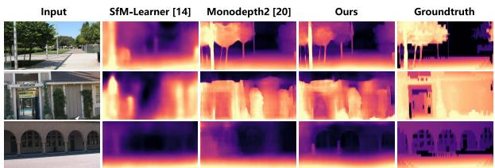  
Fig. 8. Visualization of our predictions on Make3D dataset. TABLE V

DEPTH ESTIMATION RESULTS TESTED ON MAKE3D. THE BEST RESULTSOF SUPERVISED METHODS ARE UNDERLINED AND THE BEST RESULTSOF UNSUPERVISED APPROACHES ARE HIGHLIGHTED IN BOLD
<table><tr><td>Method</td><td>Supervision</td><td>Abs Rel</td><td>Sq Rel</td><td>RMSE</td><td>RMSE log</td></tr><tr><td>Karsch [52]</td><td>Depth</td><td>0.428</td><td>5.079</td><td>8.389</td><td>0.149</td></tr><tr><td>Liu [53] Laina [54]</td><td>Depth Pose</td><td>0.475 0.204</td><td>6.562 1.840</td><td>10.05 5.683</td><td>0.165</td></tr><tr><td>Monodepth [18]</td><td>Pose</td><td>0.544</td><td>10.94</td><td>11.760</td><td>0.084 0.193</td></tr><tr><td>SfM-Learner [14]</td><td>No</td><td>0.383</td><td>5.321</td><td>10.470</td><td>0.478</td></tr><tr><td>DDVO [55]</td><td>No</td><td>0.387</td><td>4.720</td><td>8.090</td><td>0.204</td></tr><tr><td>Monodepth2 [20]</td><td>No</td><td>0.322</td><td>3.589</td><td>7.417</td><td>0.163</td></tr><tr><td></td><td></td><td></td><td></td><td></td><td></td></tr><tr><td>Ours</td><td>No</td><td>0.334</td><td>3.520</td><td>7.391</td><td>0.167</td></tr></table>

satisfactory, which implicitly proves the effectiveness of our method. Finally, to achieve a balance between the depth and pose estimation results, we set $\lambda _ { \mathrm { d c } } = 0 . 2$ and $\lambda _ { \mathrm { p o c } } = 0 . 5$ in our full model during training.

## E. Transferability of Depth Estimation

To evaluate the transferability of our monocular depth estimation model, we estimate the depth maps of the images in the Make3D dataset [22] with our model trained on the KITTI dataset. It means that our model has never seen any images in Make3D before. The depth estimation results are shown in Fig. 8 and Table V. Since there exists a domain shift between KITTI and Make3D, the performance of our model on Make3D still has a lot of room for improvement. Even so, our method shows a satisfactory performance when compared with the state-of-the-art works.

## V. CONCLUSION AND DISCUSSIONS

In this work, we jointly estimate depth and VO in an unsupervised monocular setup and aim to strengthen the monocular system via hybrid masks. Particularly, we propose a cover mask to cover up the potential outliers before VO estimation to obtain a more accurate VO estimation. Besides, the filter mask can filter out the outliers when calculating the view reconstruction loss. In addition, we propose a depth-pose consistency loss to explore geometric restrictions between different training samples, thus enforcing the global scale to verge on a consistent scale eventually. We achieve state-of-the-art performance in depth prediction and a globally consistent VO on KITTI benchmark. Our ablation experiments in Section IV-D show the effectiveness of our method. For future works, we intend to improve the transferability of our method and try to explore the fusion of multisensors, such as IMU, to overcome the scale ambiguity in monocular systems. We will also explore how to combine RNNs with our work to make full use of multiple view information, since the temporal information contains in video sequences can help improve the estimation.

## REFERENCES

[1] C. Zhao, Q. Sun, C. Zhang, Y. Tang, and F. Qian, “Monocular depth estimation based on deep learning: An overview,” Sci. China Technol. Sci., vol. 63, no. 9, pp. 1612–1627, Sep. 2020.

[2] E. Protas, J. D. Bratti, J. F. O. Gaya, P. Drews, and S. S. C. Botelho, “Visualization methods for image transformation convolutional neural networks,” IEEE Trans. Neural Netw. Learn. Syst., vol. 30, no. 7, pp. 2231–2243, Jul. 2018.

[3] Y. Yuan, L. Mou, and X. Lu, “Scene recognition by manifold regularized deep learning architecture,” IEEE Trans. Neural Netw. Learn. Syst., vol. 26, no. 10, pp. 2222–2233, Oct. 2015.

[4] C. Zhang et al., “When autonomous systems meet accuracy and transferability through AI: A survey,” Patterns, vol. 1, no. 4, Jul. 2020, Art. no. 100050.

[5] Y. Tang et al., “An overview of perception and decision-making in autonomous systems in the era of learning,” 2020, arXiv:2001.02319. [Online]. Available: http://arxiv.org/abs/2001.02319

[6] M. Xue, Y. Tang, W. Ren, and F. Qian, “Practical output synchronization for asynchronously switched multi-agent systems with adaption to fast-switching perturbations,” Automatica, vol. 116, Jun. 2020, Art. no. 108917.

[7] J. A. Villacorta-Atienza and V. A. Makarov, “Neural network architecture for cognitive navigation in dynamic environments,” IEEE Trans. Neural Netw. Learn. Syst., vol. 24, no. 12, pp. 2075–2087, Dec. 2013.

[8] Y. Kang, S. Chen, X. Wang, and Y. Cao, “Deep convolutional identifier for dynamic modeling and adaptive control of unmanned helicopter,” IEEE Trans. Neural Netw. Learn. Syst., vol. 30, no. 2, pp. 524–538, Feb. 2019.

[9] Y. Wang, Y. Song, M. Krstic, and C. Wen, “Fault-tolerant finite time consensus for multiple uncertain nonlinear mechanical systems under single-way directed communication interactions and actuation failures,” Automatica, vol. 63, pp. 374–383, Jan. 2016.

[10] Y. Song, Y. Wang, J. Holloway, and M. Krstic, “Time-varying feedback for regulation of normal-form nonlinear systems in prescribed finite time,” Automatica, vol. 83, pp. 243–251, Sep. 2017.

[11] S. Ullman, “The interpretation of structure from motion,” Proc. Roy. Soc. London B, Biol. Sci., vol. 203, no. 1153, pp. 405–426, Jan. 1979.

[12] R. Benosman, T. Manière, and J. Devars, “Multidirectional stereovision sensor, calibration and scenes reconstruction,” in Proc. 13th Int. Conf. Pattern Recognit., vol. 1, 1996, pp. 161–165.

[13] Y.-D. Song, X. Huang, and Z.-J. Jia, “Dealing with the issues crucially related to the functionality and reliability of NN-associated control for nonlinear uncertain systems,” IEEE Trans. Neural Netw. Learn. Syst., vol. 28, no. 11, pp. 2614–2625, Nov. 2017.

[14] T. Zhou, M. Brown, N. Snavely, and D. G. Lowe, “Unsupervised learning of depth and ego-motion from video,” in Proc. IEEE Conf. Comput. Vis. Pattern Recognit. (CVPR), Jul. 2017, pp. 1851–1858.

[15] Z. Yin and J. Shi, “GeoNet: Unsupervised learning of dense depth, optical flow and camera pose,” in Proc. IEEE/CVF Conf. Comput. Vis. Pattern Recognit., Jun. 2018, pp. 1983–1992.

[16] H. Zhan, R. Garg, C. S. Weerasekera, K. Li, H. Agarwal, and I. M. Reid, “Unsupervised learning of monocular depth estimation and visual odometry with deep feature reconstruction,” in Proc. IEEE/CVF Conf. Comput. Vis. Pattern Recognit., Jun. 2018, pp. 340–349.

[17] M. Jaderberg et al., “Spatial transformer networks,” in Proc. Adv. Neural Inf. Process. Syst. (NIPS), 2015, pp. 2017–2025.

[18] C. Godard, O. M. Aodha, and G. J. Brostow, “Unsupervised monocular depth estimation with left-right consistency,” in Proc. IEEE Conf. Comput. Vis. Pattern Recognit. (CVPR), Jul. 2017, pp. 270–279.

[19] J. Bian et al., “Unsupervised scale-consistent depth and ego-motion learning from monocular video,” in Proc. Adv. Neural Inf. Process. Syst. (NIPS), 2019, pp. 35–45.

[20] C. Godard, O. M. Aodha, M. Firman, and G. Brostow, “Digging into self-supervised monocular depth estimation,” in Proc. IEEE/CVF Int. Conf. Comput. Vis. (ICCV), Oct. 2019, pp. 3828–3838.

[21] A. Geiger, P. Lenz, and R. Urtasun, “Are we ready for autonomous driving? The KITTI vision benchmark suite,” in Proc. IEEE Conf. Comput. Vis. Pattern Recognit., Jun. 2012, pp. 3354–3361.

[22] A. Saxena, M. Sun, and A. Y. Ng, “Make3D: Learning 3D scene structure from a single still image,” IEEE Trans. Pattern Anal. Mach. Intell., vol. 31, no. 5, pp. 824–840, May 2008.

[23] C. Cadena et al., “Past, present, and future of simultaneous localization and mapping: Toward the robust-perception age,” IEEE Trans. Robot., vol. 32, no. 6, pp. 1309–1332, Dec. 2016.

[24] J. L. Schonberger and J.-M. Frahm, “Structure-from-motion revisited,” in Proc. IEEE Conf. Comput. Vis. Pattern Recognit. (CVPR), Jun. 2016, pp. 4104–4113.

[25] B. Triggs, P. F. McLauchlan, R. I. Hartley, and A. W. Fitzgibbon, “Bundle adjustment—A modern synthesis,” in Proc. Int. Workshop Vis. Algorithms, 1999, pp. 298–372.

[26] R. Gomez-Ojeda, Z. Zhang, J. Gonzalez-Jimenez, and D. Scaramuzza, “Learning-based image enhancement for visual odometry in challenging HDR environments,” in Proc. IEEE Int. Conf. Robot. Autom. (ICRA), May 2018, pp. 805–811.

[27] D. Eigen, C. Puhrsch, and R. Fergus, “Depth map prediction from a single image using a multi-scale deep network,” in Proc. Adv. Neural Inf. Process. Syst. (NIPS), 2014, pp. 2366–2374.

[28] F. Liu, C. Shen, G. Lin, and I. Reid, “Learning depth from single monocular images using deep convolutional neural fields,” IEEE Trans. Pattern Anal. Mach. Intell., vol. 38, no. 10, pp. 2024–2039, Oct. 2015.

[29] Y. Kuznietsov, J. Stuckler, and B. Leibe, “Semi-supervised deep learning for monocular depth map prediction,” in Proc. IEEE Conf. Comput. Vis. Pattern Recognit. (CVPR), Jul. 2017, pp. 6647–6655.

[30] J. Liu, Y. Wang, Y. Li, J. Fu, J. Li, and H. Lu, “Collaborative deconvolutional neural networks for joint depth estimation and semantic segmentation,” IEEE Trans. Neural Netw. Learn. Syst., vol. 29, no. 11, pp. 5655–5666, Nov. 2018.

[31] R. Garg, V. K. Bg, G. Carneiro, and I. Reid, “Unsupervised cnn for single view depth estimation: Geometry to the rescue,” in Proc. Eur. Conf. Comput. Vis. (ECCV), 2016, pp. 740–756.

[32] R. Li, S. Wang, Z. Long, and D. Gu, “UnDeepVO: Monocular visual odometry through unsupervised deep learning,” in Proc. IEEE Int. Conf. Robot. Autom. (ICRA), May 2018, pp. 7286–7291.

[33] S. Zhao, H. Fu, M. Gong, and D. Tao, “Geometry-aware symmetric domain adaptation for monocular depth estimation,” in Proc. IEEE/CVF Conf. Comput. Vis. Pattern Recognit. (CVPR), Jun. 2019, pp. 9788–9798.

[34] J.-Y. Zhu, T. Park, P. Isola, and A. A. Efros, “Unpaired image-to-image translation using cycle-consistent adversarial networks,” in Proc. IEEE Int. Conf. Comput. Vis. (ICCV), Oct. 2017, pp. 2223–2232.

[35] Y. Zou, Z. Luo, and J.-B. Huang, “DF-Net: Unsupervised joint learning of depth and flow using cross-task consistency,” in Proc. Eur. Conf. Comput. Vis. (ECCV), 2018, pp. 36–53.

[36] A. Johnston and G. Carneiro, “Self-supervised monocular trained depth estimation using self-attention and discrete disparity volume,” in Proc. IEEE/CVF Conf. Comput. Vis. Pattern Recognit. (CVPR), Jun. 2020, pp. 4756–4765.

[37] R. Wang, S. M. Pizer, and J.-M. Frahm, “Recurrent neural network for (un-) supervised learning of monocular video visual odometry and depth,” in Proc. IEEE/CVF Conf. Comput. Vis. Pattern Recognit. (CVPR), Jun. 2019, pp. 5555–5564.

[38] A. Ranjan et al., “Competitive collaboration: Joint unsupervised learning of depth, camera motion, optical flow and motion segmentation,” in Proc. IEEE/CVF Conf. Comput. Vis. Pattern Recognit. (CVPR), Jun. 2019, pp. 12240–12249.

[39] V. Guizilini, R. Ambrus, S. Pillai, A. Raventos, and A. Gaidon, “3D packing for self-supervised monocular depth estimation,” in Proc. IEEE/CVF Conf. Comput. Vis. Pattern Recognit. (CVPR), Jun. 2020, pp. 2485–2494.

[40] Z. Wang, A. C. Bovik, H. R. Sheikh, and E. P. Simoncelli, “Image quality assessment: From error visibility to structural similarity,” IEEE Trans. Image Process., vol. 13, no. 4, pp. 600–612, Apr. 2004.

[41] V. Casser, S. Pirk, R. Mahjourian, and A. Angelova, “Depth prediction without the sensors: Leveraging structure for unsupervised learning from monocular videos,” in Proc. AAAI Conf. Artif. Intell., vol. 33, 2019, pp. 8001–8008.

Authorized licensed use limited to: Jiangnan University. Downloaded on September 16,2026 at 03:45:59 UTC from IEEE Xplore. Restrictions apply.

[42] A. Wong and S. Soatto, “Bilateral cyclic constraint and adaptive regularization for unsupervised monocular depth prediction,” in Proc. IEEE/CVF Conf. Comput. Vis. Pattern Recognit. (CVPR), Jun. 2019, pp. 5644–5653.

[43] S. Li, F. Xue, X. Wang, Z. Yan, and H. Zha, “Sequential adversarial learning for self-supervised deep visual odometry,” in Proc. IEEE/CVF Int. Conf. Comput. Vis. (ICCV), Oct. 2019, pp. 2851–2860.

[44] W. Zhao, S. Liu, Y. Shu, and Y.-J. Liu, “Towards better generalization: Joint depth-pose learning without PoseNet,” in Proc. IEEE/CVF Conf. Comput. Vis. Pattern Recognit. (CVPR), Jun. 2020, pp. 9151–9161.

[45] A. Paszke et al., “Automatic differentiation in PyTorch,” in Proc. Adv. Neural Inf. Process. Syst. (NIPS) Workshop, 2017.

[46] D. P. Kingma and J. Ba, “Adam: A method for stochastic optimization,” 2014, arXiv:1412.6980. [Online]. Available: http://arxiv. org/abs/1412.6980

[47] O. Ronneberger, P. Fischer, and T. Brox, “U-Net: Convolutional networks for biomedical image segmentation,” in Proc. Int. Conf. Med. Image Comput. Comput.-Assist. Intervent., 2015, pp. 234–241.

[48] K. He, X. Zhang, S. Ren, and J. Sun, “Deep residual learning for image recognition,” in Proc. IEEE Conf. Comput. Vis. Pattern Recognit. (CVPR), Jun. 2016, pp. 770–778.

[49] O. Russakovsky et al., “ImageNet large scale visual recognition challenge,” Int. J. Comput. Vis., vol. 115, no. 3, pp. 211–252, Dec. 2015.

[50] R. Girshick, J. Donahue, T. Darrell, and J. Malik, “Rich feature hierarchies for accurate object detection and semantic segmentation,” in Proc. IEEE Conf. Comput. Vis. Pattern Recognit., Jun. 2014, pp. 580–587.

[51] R. Mur-Artal, J. M. M. Montiel, and J. D. Tardós, “ORB-SLAM: A versatile and accurate monocular SLAM system,” IEEE Trans. Robot., vol. 31, no. 5, pp. 1147–1163, Oct. 2015.

[52] K. Karsch, C. Liu, and S. B. Kang, “Depth transfer: Depth extraction from video using non-parametric sampling,” IEEE Trans. Pattern Anal. Mach. Intell., vol. 36, no. 11, pp. 2144–2158, Nov. 2014.

[53] M. Liu, M. Salzmann, and X. He, “Discrete-continuous depth estimation from a single image,” in Proc. IEEE Conf. Comput. Vis. Pattern Recognit., Jun. 2014, pp. 716–723.

[54] I. Laina, C. Rupprecht, V. Belagiannis, F. Tombari, and N. Navab, “Deeper depth prediction with fully convolutional residual networks,” in Proc. 4th Int. Conf. 3D Vis. (DV), Oct. 2016, pp. 239–248.

[55] C. Wang, J. M. Buenaposada, R. Zhu, and S. Lucey, “Learning depth from monocular videos using direct methods,” in Proc. IEEE/CVF Conf. Comput. Vis. Pattern Recognit., Jun. 2018, pp. 2022–2030.

  
Qiyu Sun received the B.S. degree in automation from East China University of Science and Technology, Shanghai, China, in 2019, where she is currently pursuing the Ph.D. degree with Control Science and Engineering.

Her fields of interest include 3-D scene understanding, domain adaptation, and deep learning.

Yang Tang (Senior Member, IEEE) received the B.S. and Ph.D. degrees in electrical engineering from Donghua University, Shanghai, China, in 2006 and 2010, respectively.

From 2008 to 2010, he was a Research Associate with The Hong Kong Polytechnic University, Hong Kong. From 2011 to 2015, he was a Post-Doctoral Researcher with the Humboldt University of Berlin, Berlin, Germany, and with the Potsdam Institute for Climate Impact Research, Potsdam, Germany. Since 2015, he has been a Professor

with the East China University of Science and Technology, Shanghai. His current research interests include distributed estimation/control/optimization, cyber–physical systems, hybrid dynamical systems, computer vision, reinforcement learning, and their applications.

Prof. Tang was a recipient of the Alexander von Humboldt Fellowship and has been the ISI Highly Cited Researchers Award by Clarivate Analytics from 2017. He is a Senior Board Member of Scientific Reports, an Associate Editor of IEEE TRANSACTIONS ON NEURAL NETWORKS AND LEARNING SYS-TEMS, IEEE TRANSACTIONS ON EMERGING TOPICS IN COMPUTATIONAL INTELLIGENCE, IEEE TRANSACTIONS ON CIRCUITS AND SYSTEMS I: REGULAR PAPERS and IEEE Systems Journal, etc.

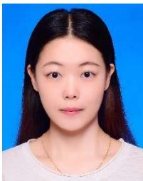

Chongzhen Zhang received the B.S. degree from Nanjing Forestry University, Nanjing, China, in 2018, and the M.S. degree from East China University of Science and Technology, Shanghai, China, in 2021.

Her current research interests include image processing, generative adversarial networks, and computer vision.

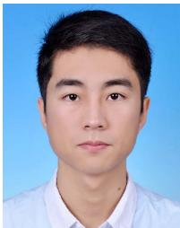

Chaoqiang Zhao received the B.S. degree in automation from East China University of Science and Technology, Shanghai, China, in 2018. He is currently pursuing the Ph.D. degree with Control Science and Engineering.

His research interests include visual odometry, stereo vision, and deep learning.

Feng Qian received the B.S. degree in chemical automation and meters from Nanjing Institute of Chemical Technology, Nanjing, China, in 1982, and the M.S. and Ph.D. degrees in automation from East China Institute of Chemical Technology, Shanghai, China, in 1988 and 1995, respectively.

He was the Director of the Automation Institute, East China University of Science and Technology, from 1999 to 2001, and was the Head of the Scientific and Technical Department from 2001 to 2006. He is currently the Vice President of the

East China University of Science and Technology, the Director of the Key Laboratory of Advanced Control and Optimization for Chemical Processes, Ministry of Education, Shanghai, and the Director of the Process System Engineering Research Center, Ministry of Education, Shanghai. His current research interests include modeling, control, optimization, and integration of petrochemical complex industrial processes and their industrial applications, neural network theory, and real-time intelligent control technology and its applications to the ethylene, PTA, PET, and refining industries.

Prof. Qian is a member of the China Instrument and Control Society, the Chinese Association of Higher Education, and China’s PTA Industry Association. He is also an Academician of the Chinese Academy of Engineering.

Jürgen Kurths studied mathematics at the University of Rostock, Rostock, Germany. He received the Ph.D. degree from the GDR Academy of Sciences, Berlin, Germany, in 1983.

He was a Full Professor with the University of Potsdam, Potsdam, Germany, from 1994 to 2008. He has been a Professor of nonlinear dynamics at the Humboldt University, Berlin, and the Chair of the Research Domain Complexity Science of the Potsdam Institute for Climate Impact Research, since 2008. He has published more than 600 articles that

are cited more than 49 000 times (H-index: 101). His primary research interests include synchronization, complex networks, and time series analysis and their applications in earth sciences, physiology, engineering, infrastructure and others.

Dr. Kurths is a Fellow of the American Physical Society and a Fellow of the Network Science Society in 2021. He became a member of the Academia Europaea in 2010 and of the Royal Society of Edinburgh in 2021. He received an Alexander von Humboldt Research Award in 2005, the Richardson award from the European Geoscience Union in 2013, and the 1000 Talent award for foreign experts (China) in 2015. He received eight Honorary Doctorates and Honorary Professors. He is the Editor-in-Chief of CHAOS – A Journal of Nonlinear Science and editor of about ten further journals, such as Europhysics Letters, Nonlinear Dynamics, etc.