# WF-SLAM: A Robust VSLAM for Dynamic Scenarios via Weighted Features

Yuanhong Zhong , Senior Member, IEEE, Shuangshuang Hu , Guan Huang, Long Bai , and Qimin Li

—The assumption of a static environment is typical in many visual simultaneous localization and mapping (VSLAM) systems. However dynamic objects in open scenes will mislead feature associationand even fail to match, which reduces the accuracy of localization. For dynamic scenarios, a robust visual SLAM system that utilizes weighted features, namely, named WF-SLAM is proposed in this paper, which is based on ORB-SLAM2. First, WF-SLAM applies the tightly coupled semantic and geometric dynamic target detection algorithm to obtain the dynamic information in the scene. Then, WF-SLAM defines feature point weights and initializes them with the dynamic information. Finally, the pose

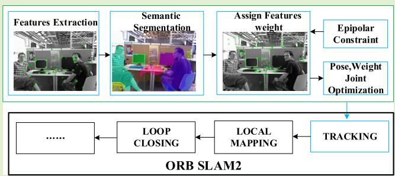

optimization in ORB-SLAM2 is changed to weight-based joint optimization. WF-SLAM significantly decreases mismatch and improves the accuracy of localization. Experiments are performed on the benchmark RGB-D dataset TUM and realworld scenarios, and the results demonstrate that WF-SLAM realizes significant improvements in term of localization accuracy compared to ORB-SLAM2 in dynamic environments and a more robust performance compared with state-ofthe-art dynamic SLAM methods.

— SLAM, dynamic scenes, semantic segmentation, weighted features.

## I. INTRODUCTION

their ego-state and perceive the surrounding environment. SLAM regards localization and mapping as a single task, and it constructs the unknown environment and estimates the locations of robots in the scene with self-contained sensors. Due to the advantages of rich image texture information and low hardware cost, visual SLAM has been widely applied to robots [1], UGVs [2], AR/VR [3], UAVs [4] and other areas [5].

However, most SLAM systems are based on the static assumption, namely that the environment is static and will not affect the localization and mapping task. The static assumption is almost always violated in open environments because dynamic objects, such as walking pedestrians, and driving vehicles, will inevitably be present. These dynamic objects will change the image information, thereby leading to incorrect data association and reducing the accuracy of localization. In addition, once dynamic information is loaded into the map, it will cause “ghosting” [6], thereby affecting the visualization and reuse of the map. Conditional SLAM [7], [8] regards the dynamic objects as fake data and filters them by RANSAC [9], but RANSAC will fail when there are too many dynamic targets. Some methods combine the results of semantic segmentation and geometric methods to detect dynamic objects. Based on the semantic segmentation results, semantic movable objects can be classified, while geometric methods detect moving objects. One approach is to remove outliers by combining their respective results, as in [10]. However, the above method will delete objects that move semantically but are not actually moving, thereby resulting in excessive detection. Another approach is to remove objects that are both classified as moving. There may be actual moving but semantically static objects that have not been removed, and the performance will be insufficient. Additionally, due to the uncertainty of the detection algorithm, deleting all dynamic points may result in the loss of useful information, which is also the reason why many dynamic SLAM algorithms have poor performance in static scenes. Therefore, the adoption of a more accurate detection algorithm and more reasonable processing strategies for dynamic targets is of urgent necessity.

Dynamic objects can be roughly divided into moving objects and movable objects. Semantic segmentation takes advantage of image information to segment the target and generate category labels, which indicate the possibility of the object becoming a movable target. Based on a rough estimate of camera pose, geometric methods detect moving targets by computing geometric relations between adjacent images to determine the motion states of feature points. However, the potential dynamic feature points in the scene will result in inaccurate pose estimation, and the segmentation accuracy will not be enough. Considering that semantic labels can provide prior information for feature point selection, we tightly couple semantic and epipolar constraints [11] to detect dynamic targets. To reasonably process each dynamic target, we first integrate the semantic information to determine whether the dynamic point processing strategy is necessary. If so, different processing strategies are adopted for the semantically dynamic and static targets. Our contributions can be summarized as follows:

• We design and implement a dynamic target detection framework that combines the advantages of epipolar constraints [11] and semantic segmentation. It tightly couples semantic and geometric information, embeds the result of semantic segmentation into the calculation process of geometric segmentation, and enables accurate detection of dynamic targets.

• We integrate the detection algorithm into the ORB-SLAM2 system to improve the tracking thread. Based on the detection results, different weights are assigned to semantically static and semantically dynamic feature points, and the pose and weights are jointly optimized, which greatly improves the accuracy and robustness of localization in dynamic scenes.

• Quantitative and qualitative experiments are carried out on the public RGB-D dataset TUM and in real-world scenarios. The localization accuracy of WF-SLAM in dynamic scenarios has been greatly improved compared to ORB-SLAM2, and WF-SLAM is more robust than the state-of-the-art dynamic SLAM algorithms.

The remainder of this paper is organized as follows. We discuss related work in Section II. Section III introduces the key technical aspects of our framework in detail. Section IV presents the experimental results of the dynamic SLAM system Finally, the conclusions of this study are presented in Section V. The source code for our approach and videos are available at https://github.com/NancyHu3245/WF-SLAM.

## II. RELATED WORK

## A. Most Current SLAM Approaches in Dynamic Environments

For dynamic scenes, most traditional SLAM systems are based on the static assumption, which regards dynamic objects as false data and filter them out in localization and mapping. LSD-SLAM [8], ORB-SLAM2 [7] and other frameworks adopt RANSAC to randomly generate hypotheses and score them and the optimal hypotheses are iteratively optimized. During each iteration, the inner and outer points are identified according to distance from the polar lines. However, RANSAC will fail when there are too many dynamic objects [12].

## B. Dynamic SLAM

In recent years, deep learning has flourished and has been widely used in image segmentation [13], [14], medical disease diagnosis [15], [16] and other fields. Some papers propose semantic segmentation models based on deep learning for dynamic SLAM. SLAMANTIC [17] assigns dynamic factors to each 3D map points, and divides them into static, static-dynamic and dynamic categories based on dynamic factor. Wang K et al. [18] not only filtered dynamic targets with semantic information, but also proposed a general framework in which SLAM localization and semantic segmentation promote each other to improve the performance. Fang B et al. [19] proposed using semantic information to construct semantic descriptors and applying a knowledge graph to detect and remove dynamic targets to improve the accuracy of localization.

Semantic segmentation can provide accurate category information for visual SLAM, but it can only detect movable objects, and edge detection is not sufficiently accurate. J. Cheng et al. [20] propose to calculate the LK sparse optical flow between two image frames [21] to detect dynamic objects, and only static feature points were selected for the relative pose estimation. M. C. Bakkay et al. [22] made use of an improved scene flow to detect dynamic objects. In this approach, the region growing segmentation algorithm is adopted to achieve dynamic and static separation of the scene, thereby avoiding mismatching. These methods judge the motion state of the target by using the geometric relations between image frames, which is called geometric motion segmentation. Geometric motion segmentation can detect moving objects, but its implementation is based on accurate feature point matching and appropriate dynamic and static thresholds; hence it is not as accurate as semantic segmentation.

Semantic segmentation and geometric motion segmentation each have their own advantages and disadvantages. Combining the two methods is a reasonable strategy for detect dynamic targets, and many related theoretical studies have been conducted. DDL-SLAM [23] adopts the DUNet [24] network to implement pixelwise semantic segmentation and combines semantic information with multi-view geometry to detect dynamic objects. In addition, the static scene map that is generated by DDL-SLAM can be used to inpaint the occluded background of dynamic objects in the image. DynaSLAM [25], which was proposed by Bescos Bert, supports monocular, stereo and RGB-D cameras, and uses Mask R-CNN [13] to detect and remove moving objects. In RGB-D mode, semantic segmentation results are combined with multi-view geometric model for detection. DS-SLAM [10] runs SegNet [14] and a motion consistency check in parallel. The dynamic features that both methods regard as external points are filtered out. DynaSLAM and DS-SLAM are fused in the result layer via a loose coupling approach. Although this approach is more flexible in the choice of geometric and semantic segmentation methods, it does not make full use of semantic information to implement more accurate dynamic target detection. Therefore, this paper adopts the tightly coupled paradigm to further improve the accuracy and robustness of localization.

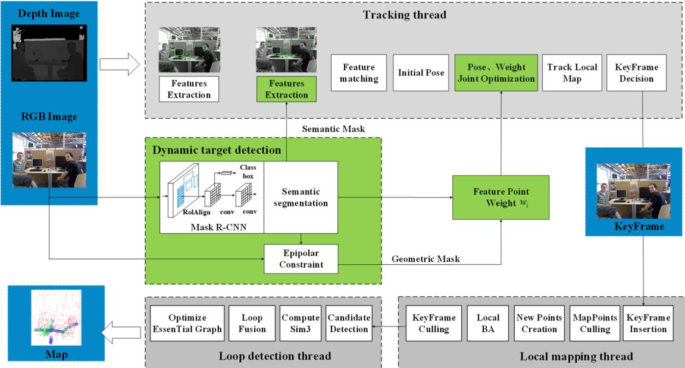  
Fig. 1. The overall framework of WF-SLAM. Local mapping and loop closing thread are consistent with ORB SLAM2. The green boxes are our contributions.

## III. SYSTEM INTRODUCTION

## A. Framework of WF-SLAM

ORB-SLAM2 is an outstanding visual SLAM system. It has high accuracy and robustness in static scenes, but it is difficult to adapt to dynamic scenes. Therefore, we improve the original ORB-SLAM2 with the objectives of enhancing its handling of dynamic environment, expanding its application scope and improving its performance. A visual SLAM system in dynamic scenes should realize accurate detection and reasonable processing of dynamic objects. To overcome the problems that are encountered in dynamic scenarios, we take RGB-D images as input and add a dynamic target detection module into the tracking thread of ORB-SLAM2, which improves the selection strategy of feature points and jointly optimizes the weight and pose. Moreover, ORB-SLAM2 is selected as the basic framework instead of ORB-SLAM3 [26] because the performance improvement of the latter is largely attributed to the introduction of IMU into the multisensor fusion strategy. Although this is a feasible approach for dynamic SLAM, we hope to study purely visual dynamic SLAM at the algorithmic level. The overall framework of the improved visual SLAM system is illustrated in Fig. 1, which consists of four parts: dynamic target detection, tracking, local mapping and loop detection. Each part will be briefly summarized in the following paragraphs.

Dynamic target detection utilizes semantic segmentation and an epipolar constraint [11] in a tightly coupled paradigm, which takes RGB images as input, implements semantic segmentation to obtain semantic masks as a priori information, and applies an epipolar constraint [11] in polar geometry to generate a geometric mask similar to semantic segmentation. Finally, the semantic mask and geometric mask are combined to determine the dynamic targets. After feature extraction, the tracking thread first determines whether the dynamic target processing strategy is needed according to the semantic mask. If this strategy is necessary, it then selects feature points and assigns weights to the reserved feature points according to the semantic mask and geometric mask. Finally, in the pose optimization stage, the undifferentiated optimization of the original SLAM system replaced with joint optimization of the feature point weights and camera pose estimation. The local mapping and loop detection threads remain the same as those of the original SLAM system. The local mapping deals with key frames and management maps, while loop detection uses bag-of-words to detect loops to eliminate the cumulative drift of pose estimation [7].

## B. Semantic Segmentation as Prior Information

For the input image sequence, WF-SLAM first adopts Mask R-CNN [13] trained on the MS COCO [27] dataset to implement semantic segmentation to generate semantic masks. The network structure of Mask R-CNN is improved based on Faster-RCNN [28] and FCN [29]. Faster-RCNN uses a region proposal network (RPN) to generate a highquality region of interest (ROI), and then extracts image features from each candidate ROI using RoIPooL. Finally, classification and boundary box regression are performed. The FCN is an end-to-end network that realizes accurate semantic segmentation by convolution and deconvolution. Mask R-CNN adds a segmentation mask prediction branch to each ROI to extend the Faster-RCNN network. This new branch is parallel to the original classification branch and the boundary box regression branch. The mask branch is essentially a small FCN network for pixelwise mask prediction [13].

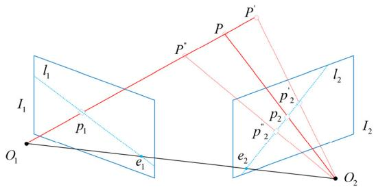  
Fig. 2. $O _ { 1 }$ and $O _ { 2 }$ are the optical centers of two image frames $I _ { 1 }$ and $I _ { 2 } .$ For a 3D point $P ,$ the projection point on image frame $I _ { 1 }$ is $p _ { 1 } .$ , and the projection point on image frame $\dot { I _ { 2 } }$ is $p _ { 2 }$ . The plane that is determined by $O _ { 1 } , O _ { 2 }$ and $P$ is called the polar -plane π. The intersection lines of π, $\dot { I _ { 1 } }$ and $I _ { 2 }$ are polar lines $I _ { 1 }$ and $I _ { 2 } ,$ respectively.

We input an original RGB image $I \in R ^ { m \times n \times 3 }$ to Mask R-CNN, and output the mask mask $\in \ b { R } ^ { m \times n \times l }$ , target detection score and class ID, where l is the number of detected targets and each channel of the mask is a binary matrix that corresponds to the target., According to human prior information, as in DS-SLAM [10] and DynaSLAM [25], we assume that some objects that can move actively are dynamic targets based on their class ID, such as people, and cars. Others are semantically static targets, such as books, computers and trees. Finally, a two-dimensional binary semantic mask is obtained by combining the binary matrices of all channels, which is denoted as mas ${ \bf \nabla } : k _ { s e g } \in { \cal R } ^ { m \times n }$

## C. Semantic and Geometric Tightly Coupled Dynamic Object Detection

After segmenting images by Mask R-CNN, we can classify most of the dynamic objects in the environment. However, the accuracy of edge segmentation needs to be improved. Moreover, some semantically static but actually moving objects cannot be detected in this step, such as a book shaking on hands. The geometric method can compensate for the above two problems. Geometric motion segmentation uses the epipolar constraint [11] in polar geometry to judge whether a feature point is static or dynamic, namely, static feature points satisfy the epipolar constraint, while dynamic feature points violate this constraint. The polar constraint can be illustrated in Fig. 2.

When the depth information of $P$ is unknown, it can only be determined that P is located on the extension line of $O _ { 1 }$ and $p _ { 1 }$ , but the specific position is unknown. Thus, it can only be inferred that $p _ { 2 }$ moves on the polar line l2 that corresponds to $I _ { 2 }$ . Their spatial position relationship can be expressed by the fundamental matrix F as follows:

$$
p _ { 2 } ^ { T } F p _ { 1 } = 0\tag{1}
$$

After solving for the matrix $F ,$ for the feature points $p _ { 1 } =$ $[ u _ { 1 } , \upsilon _ { 1 } , 1 ] ^ { T }$ , if the corresponding matching feature point $p _ { 2 }$ is static, the polar constraint must be satisfied. However, due to the uncertainty of feature extraction and F matrix estimation, $p _ { 2 }$ may not fall accurately on the polar line, but very close to it. Therefore, whether feature point $p _ { 2 }$ is static or dynamic can be determined by calculating the polar distance between matching point $p _ { 2 }$ and polar line $l _ { 2 }$

Algorithm 1 Tightly Coupled Dynamic Target Detection   
Input: last image frame $I _ { 1 }$ , current image frame $I _ { 2 }$   
Output: semantic mask mas $k _ { s e g } ,$ geometric mask mas $k _ { g e g }$   
1. Generate semantic mask: mas $k _ { s e g } =$   
$C a l c M a s k R C N N ( I _ { 2 } )$   
2. Extract and match features points:   
$\{ p 1 , p 2 \} C a l c O p t i c a l F l o w P y L K ( I 1 , I 2 ) ;$   
3. Remove semantic dynamic points pairs $\{ p _ { 1 } ^ { \prime } , p _ { 2 } ^ { \prime } \}$   
4. Estimate the $F$   
$F = C a l c F$ undamental $M a t r i c ( \{ p _ { 1 } ^ { \prime } , p _ { 2 } ^ { \prime } \} ) ;$   
5. for each feature point $\{ p _ { 1 } , p _ { 2 } \}$ in   
6.Calculate the polar distance:   
$d _ { e p i p o l a r } = F i n d E p i p o l a r D i s ( p _ { 1 } , p _ { 2 } , F ) ;$   
7. if $d _ { e p i p o l a r } >$ threshold then:   
8. mas $k _ { g e g } ( p _ { 2 } ) = 0$   
9. else: $m a s k _ { g e g } ( p _ { 2 } ) = 1$   
10.end if   
11.end for

The main strategy of the motion segmentation method that is based on the epipolar constraint is to estimate the matrix $F ,$ , and at least four pairs of matching feature points are needed in the process. Feature point matching can usually be realized by optical flow [30]. However, in the scene of a dynamic object, if the feature points that are selected by optical flow are located on the dynamic object, the estimate of the matrix F will be inaccurate, and calculation of the right polar distance to implement motion segmentation will not be possible. Since semantic segmentation can provide a priori information about the object category, we adopt tightly coupled semantic segmentation and geometric motion segmentation to detect the dynamic objects. Specifically, the mask that is generated by semantic segmentation is integrated into the calculation process of geometric motion segmentation to ensure that the feature points that are used to estimate matrix $F$ are semantically static. Finally, the detection results of semantic segmentation and geometric motion segmentation are fused together. This tightly coupled dynamic target detection method is summarized as Algorithm 1.

After semantic segmentation, a binary mask mas $k _ { s e g }$ of size $m \times n$ will be obtained. A mask value of 1 is assigned to pixels that correspond to semantically static objects, while a mask value of 0 is assigned to pixels of semantically dynamic objects. After feature points are extracted and matched by LK sparse optical flow, Algorithm 1 compares feature point pairs $\{ p _ { 1 } , p _ { 2 } \}$ and semantic masks ma $\cdot k _ { s e g }$ pixel by pixel. The semantically dynamic feature point pairs that correspond to semantic mask values of 0 are filtered out, and only semantically static feature points are used to estimate the fundamental matrix $I _ { 1 }$ . The polar distance of a feature point and a polar line is defined as the linear distance between the feature point and the polar line. For feature point $p _ { 1 } = [ u _ { 1 } , \upsilon _ { 1 } , 1 ] ^ { T }$ , in image frame $I _ { 1 }$ , the projection point after the space transformation of the fundamental matrix F is located on the polar line $l _ { 2 } = [ A , B , C ] ^ { T }$ , and the polar line can be expressed as:

$$
\left[ A , B , C \right] ^ { T } = F [ u _ { 1 } , \upsilon _ { 1 } , 1 ] ^ { T }\tag{2}
$$

Therefore, the polar distance between feature point $p _ { 2 }$ and polar line $l _ { 2 }$ in image frame $I _ { 2 }$ is expressed as

$$
d _ { e p i p o l a r } = \frac { \left| p _ { 2 } ^ { T } F p _ { 1 } \right| } { \sqrt { \left\| A \right\| ^ { 2 } + \left\| B \right\| ^ { 2 } } } = \frac { \left| p _ { 2 } ^ { T } [ A , B , C ] ^ { T } \right| } { \sqrt { \left\| A \right\| ^ { 2 } + \left\| B \right\| ^ { 2 } } }\tag{3}
$$

In this paper, the polar distance threshold that distinguishes dynamic and static feature points is set to 1 pixel. Similar to semantic segmentation, tightly coupled dynamic target detection produces a binary geometric mask $m a s k _ { g e g }$ , where 1 denotes the geometric static state and 0 denotes geometric dynamic state.

## D. Semantic Fused Tacking Thread

The tracking thread of the ORB-SLAM2 system first extracts and matches the feature points and then initializes the camera pose by selecting the motion model. Based on the matched feature points, the camera pose that is estimated by BA optimization [31] is evaluated. BA optimizes the camera orientation R and position t by minimizing the sum of the reprojection errors between matched 3-D points $X _ { i }$ in world coordinates and keypoints $x _ { i }$ of all feature points in the image frame:

$$
\{ R ^ { * } , t ^ { * } \} = \arg \operatorname* { m i n } _ { R , t } \frac { 1 } { 2 } \sum _ { i = 1 } ^ { n } \| x _ { i } - \pi ( R X _ { i } + t ) \| _ { 2 } ^ { 2 }\tag{4}
$$

where π represents the projection from three-dimensional coordinates to the pixel coordinate system and $R ^ { * }$ and $t ^ { * }$ represent the optimized pose. In ORB-SLAM2, all feature points are used to optimize the pose regardless of the motion state, and contribute equally to the reprojection error. In dynamic scenes, the matched feature points will inevitably contain the feature points of dynamic objects, and the reprojection error of such feature points will have a negative impact on pose estimation.

Based on the results of dynamic target detection, the weightbased feature point is defined in this paper, and the pose and weight are estimated by BA joint optimization The weight $w _ { i }$ of feature point $p _ { i } ( u , v )$ indicates the reliability of $p _ { i } .$ The larger the value is, the more reliable it is. For semantically static and semantically dynamic feature points, we used different strategies to define $w _ { i } \colon$

$$
w _ { i } = \left\{ \begin{array} { l } { { \alpha ^ { * } m a s k _ { s e g } ( u , \upsilon ) + \beta ^ { * } m a s k _ { s e g } ( u , \upsilon ) , } } \\ { { \mathrm { ~ i f ~ s e m a n t i c ~ s t a t i c ~ } } } \\ { { 0 , } } \\ { { \mathrm { ~ i f ~ s e m a n t i c ~ d y n a m i c ~ } } } \end{array} \right.\tag{5}
$$

Variables α and $\beta$ are the contribution proportions of the semantic mask and geometric mask, respectively, to the weight of feature points, which must satisfy $\alpha + \beta = 1$ . We can directly judge semantically dynamic feature points as dynamic and filter them during BA optimization, which is equivalent to setting α to 0 and $\beta$ to 1. For semantically static feature points, the weights are determined by the semantic mask and geometric mask. In implementation, similar to the tightly coupled estimation matrix $F ,$ the matched feature point pairs are compared with the semantic mask pixel by pixel. The semantic dynamic feature points are deleted, the semantic static feature points are retained, and the weights of the feature points are initialized via Formula (5). Both α and $\beta$ have an initial value of 0.5. Then, the weight is updated through the subsequent BA optimization. Through the above approach, the logarithms of the feature points that participate in the BA optimization process can be reduced, thereby increasing the efficiency.

We multiply the reprojection error by the initialized weights of the feature points, and sum the results. Via multiplication with the weights, the contributions of the feature points to the objective function can be reasonably allocated according to the reliability of the feature points. Feature points with larger weights are more reliable, so they contribute more to the objective function, while feature points with smaller weights contribute less. The optimization variables are changed from the original camera pose to the weights of the feature points and the camera pose. The optimized weights of the feature points can more accurately represent the reliability of the points, which can further serve high-level applications, such as trajectory prediction of dynamic targets. In this paper, the joint BA optimization with the weights of feature points is called joint optimization based on weighted features, and its objective function is updated based on the weighted reprojection error:

$$
\{ R ^ { * } , t ^ { * } , w _ { i } ^ { * } \} = \underset { R , t , w _ { i } } { \arg \operatorname* { m i n } } \frac { 1 } { 2 } w _ { i } \sum _ { i = 1 } ^ { n } \| x _ { i } - \pi ( R X _ { i } + t ) \| _ { 2 } ^ { 2 }\tag{6}
$$

The weight-based joint optimization approach can be regarded as the joint BA, which can usually be solved by the Gauss-Newton or Levenburg-Marquardt method. In our paper, we use the Levenburg-Marquardt method in the G2O library, but the partial derivatives of each error term with respect to the optimization variables need to be manually calculated. If the pose ξ,3-D point in camera coordinate system $\boldsymbol { P } ^ { \star } =$ $[ X , Y , \bar { Z } ] ^ { T }$ , its corresponding pixel coordinate $[ u _ { i } , v _ { i } ]$ and the camera internal parameters $f _ { x } , f _ { y } , c _ { x } , c _ { y }$ are all known, the partial derivatives of the camera pose and the weights of the feature points are calculated via Equations 7 and 8, as shown at the bottom of the next page.

However, although our method integrates semantic and geometric dynamic detection, the final detection result is not perfect, especially in static environments. Due to the inaccuracy of the dynamic SLAM detection algorithm, some useful information may be deleted and the accuracy of localization may be reduced. Therefore, the improved tracking thread in this paper calculates the ratio of dynamic feature points to all feature points according to the semantic mask before implementing the above processing and measurement strategy. If this ratio value is smaller than a threshold τ , the original ORB-SLAM2 is sufficient for dealing with the dynamic information in the image, and the feature point filtering step can be omitted. In this paper, the threshold is set to 0.7.

## IV. EXPERIMENTS

To evaluate the effectiveness and practicability of the WF-SLAM system in dynamic scenes, this paper conducts experiments on the RGB-D TUM dataset [32] and real-world scenes and compares WF-SLAM with the original ORB-SLAM2 and other dynamic SLAM algorithms.

To quantitatively evaluate the performance of the WF-SLAM system, we take Absolute Trajectory Error (ATE) and Relative Pose Error (RPE) [32] as our evaluation indices. RPE can be decomposed into the Relative Translational Error (RTE) and Relative Rotational Error (RRE) [32]. ATE is defined as the difference between the estimated pose and the real pose, which can intuitively reflect the accuracy of the algorithm and the continuity of the global trajectory. The Root Mean Squared Error (RMSE) of ATE value is usually adopted as the measurement standard, and of course, the Mean and Median can also be used. The RPE mainly describes the accuracy of the pose difference between two frames that are separated by a fixed time. It can directly measure the rotation and shift drift of the odometry, and the RMSE value is usually adopted.

In addition, we refer to the percentage improvement η that is defined in DS-SLAM [10] to evaluate the performance improvement of WF-SLAM relative to the original ORB-SLAM2. o represents the value of the original ORB SLAM2 system, and θ represents the value of the WF-SLAM system.

$$
\eta = \frac { o - \theta } { o } \times 1 0 0 \%\tag{9}
$$

## A. Evaluation on the TUM Dataset

The TUM RGB-D dataset consists of 39 video sequences, which were collected with a Microsoft Kinect sensor at 30 Hz in various indoor scenes. Each sequence is composed of 640×480 RGB images, depth maps and real trajectory values. There are 9 sequences in the dynamic objects category of the TUM dataset, including walking, sitting and desk\_with\_person sequences. The walking sequences capture a scene of two people walking in an office, while the sitting sequence describes a scene of two people sitting at a desk talking and gesturing. They represent typical scenes with high dynamics and low dynamics, respectively. For fair comparison with other advanced SLAM systems, we consider four highly-dynamic scene sequences and two low dynamic scene sequences, where xyz, rpy, halfsphere and static correspond to the four types of camera ego-motions.

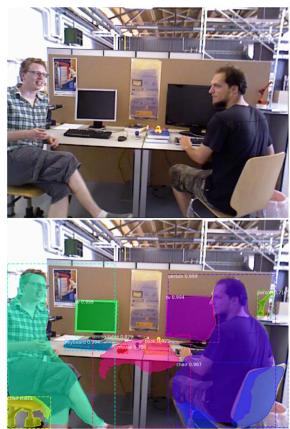

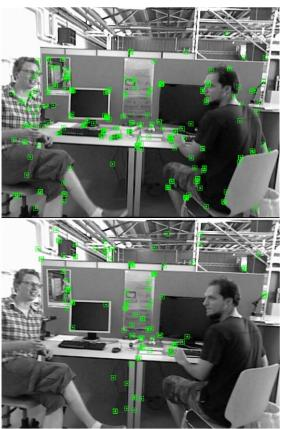  
Fig. 3. Selection of feature points on sequence walking\_xyz.

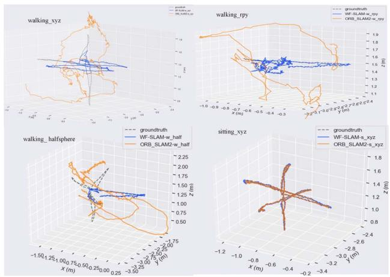  
Fig. 4. Comparison of ORB-SLAM2 and WF-SLAM camera trajectories on several sequences.

In this paper, the ORB-SLAM2 and WF-SLAM systems are evaluated on the selected image sequences, and the experimental results are compared. First, we conduct experiment to observe and compare the distributions of feature points and estimate the camera trajectory. Fig. 3 compares the distributions of feature points in the walking\_xyz sequence of highly dynamic scenes, and shows the input RGB image, ORB-SLAM2 feature point distribution, Mask R-CNN output and WF-SLAM feature point distribution. The WF-SLAM system can better distinguish dynamic objects, and almost all feature points fall on the static part, while the feature points in ORB-SLAM2 include people in motion. Fig. 4 shows the

$$
\begin{array} { r l } & { \frac { \hat { c } e } { \hat { \sigma } \xi } = \frac { \hat { \sigma } e } { \hat { \sigma } P ^ { * } } = - w _ { i } \left[ \begin{array} { c c c c c } { \frac { X Y } { Z ^ { 2 } } f _ { x } } & { - ( 1 + \frac { X ^ { 2 } } { Z ^ { 2 } } ) f _ { x } } & { \frac { Y } { Z } f _ { x } } & { - \frac { 1 } { Z } f _ { x } } & { 0 } & { \frac { X } { Z ^ { 2 } } f _ { x } } \\ { ( 1 + \frac { X ^ { 2 } } { Z ^ { 2 } } ) f _ { y } } & { - \frac { X Y } { Z ^ { 2 } } f _ { y } } & { - \frac { X } { Z } f _ { y } } & { 0 } & { - \frac { 1 } { Z } f _ { y } } & { \frac { X } { Z ^ { 2 } } f _ { y } } \\ { \frac { X Y } { Z ^ { 2 } } f _ { x } - b f \frac { Y } { Z ^ { 2 } } } & { - ( 1 + \frac { X ^ { 2 } } { Z ^ { 2 } } ) f _ { x } + b f \frac { Y } { Z ^ { 2 } } } & { \frac { Y } { Z } f _ { x } } & { - \frac { 1 } { Z } f _ { x } } & { 0 } & { \frac { X } { Z ^ { 2 } } f _ { x } - b f \frac { 1 } { Z } } \end{array} \right] } \\ & { \frac { \hat { c } e } { \hat { \sigma } w _ { i } } = \left[ \begin{array} { c } { u _ { i } - ( \frac { X } { Z } f _ { x } + c _ { x } ) } \\ { v _ { i } - ( \frac { Y } { Z } f _ { y } + c _ { y } ) } \\ { u _ { i } - ( \frac { X } { Z } f _ { x } + c _ { x } - \frac { b f } { Z ^ { 2 } } ) } \end{array} \right] } \end{array}\tag{7}
$$

(8)

TABLE I  
ATE(m) COMPARISON OF THE WF-SLAM SYSTEM AGAINST ORB-SLAM2
<table><tr><td rowspan="2">Sequence</td><td colspan="3">ORB-SLAM2[7]</td><td colspan="3">WF-SLAM(Ours)</td><td colspan="3">Improvements[%]</td></tr><tr><td>RMSE</td><td>Mean</td><td>Median</td><td>RMSE</td><td>Mean</td><td>Median</td><td>RMSE</td><td>Mean</td><td>Median</td></tr><tr><td>walking_xyz</td><td>0.7508</td><td>0.6707</td><td>0.7201</td><td>0.0127</td><td>0.0111</td><td>0.0100</td><td>98.30</td><td>98.35</td><td>98.61</td></tr><tr><td>walking_rpy</td><td>0.8158</td><td>0.7327</td><td>0.6622</td><td>0.0252</td><td>0.0206</td><td>0.0164</td><td>96.91</td><td>97.19</td><td>97.52</td></tr><tr><td>walking_static</td><td>0.3362</td><td>0.3063</td><td>0.2583</td><td>0.0068</td><td>0.0060</td><td>0.0056</td><td>97.98</td><td>98.04</td><td>97.80</td></tr><tr><td>walking_halfsphere</td><td>0.4132</td><td>0.3751</td><td>0.3371</td><td>0.0244</td><td>0.0217</td><td>0.0174</td><td>94.74</td><td>95.36</td><td>96.68</td></tr><tr><td>sitting_ xyz</td><td>0.0092</td><td>0.0080</td><td>0.0073</td><td>0.0087</td><td>0.0075</td><td>0.0067</td><td>5.43</td><td>6.25</td><td>8.22</td></tr><tr><td>sitting_halfsphere</td><td>0.0215</td><td>0.0174</td><td>0.0152</td><td>0.0171</td><td>0.0136</td><td>0.0111</td><td>20.47</td><td>21.84</td><td>26.97</td></tr></table>

TABLE II

RMSE OF RTE(◦) AND RRE(◦/100M) COMPARISON OF WF-SLAM AGAINST ORB-SLAM2
<table><tr><td rowspan="2">sequence</td><td colspan="2">ORB-SLAM2[7]</td><td colspan="2">WF-SLAM</td><td colspan="2">Improvements[%]</td></tr><tr><td>RTE</td><td>RRE</td><td>RTE</td><td>RRE</td><td>RTE</td><td>RRE</td></tr><tr><td>walking_xyz</td><td>1.0917</td><td>21.0322</td><td>0.0180</td><td>0.5626</td><td>98.35</td><td>97.33</td></tr><tr><td>walking_rpy</td><td>1.1913</td><td>21.3882</td><td>0.0362</td><td>0.8610</td><td>96.96</td><td>95.97</td></tr><tr><td>walking_static</td><td>0.4817</td><td>8.7091</td><td>0.0098</td><td>0.2786</td><td>97.97</td><td>96.80</td></tr><tr><td>walking halfsphere</td><td>0.6338</td><td>15.8089</td><td>0.0358</td><td>0.6877</td><td>94.35</td><td>95.64</td></tr><tr><td>sitting_xyz</td><td>0.0132</td><td>0.5750</td><td>0.0128</td><td>0.5742</td><td>3.03</td><td>0.14</td></tr><tr><td>sitting_halfsphere</td><td>0.0312</td><td>0.7350</td><td>0.0240</td><td>0.7164</td><td>23.08</td><td>25.31</td></tr></table>

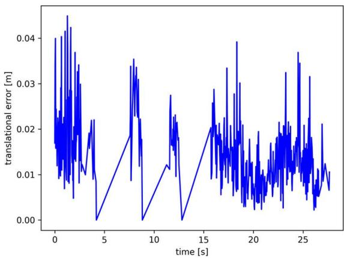

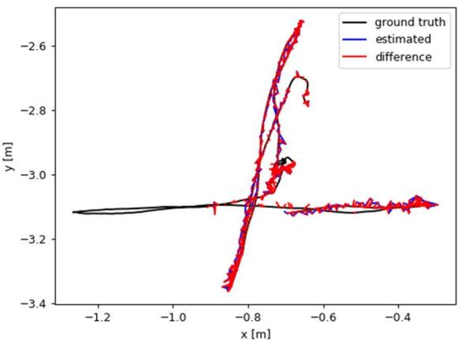  
Fig. 5. Performance of the WF-SLAM system on sequence walking\_xyz. The figure on the left shows the RPE curve, while that on the right shows the ATE.

comparison results between the estimated camera trajectories and the real trajectories of the two systems. Three -dimensional trajectories are used to intuitively reflect the system estimation accuracy. The better the estimated trajectories fit the real trajectories, the more accurate the corresponding system is. In low dynamic video sequences, such as sitting\_xyz, the trajectories that are estimated by the ORB-SLAM2 and WF-SLAM systems are close to the real trajectories. However, in highly dynamic sequences, such as walking\_xyz, the trajectory that is estimated by WF-SLAM can better fit the real trajectory, while the estimated trajectory of ORB-SLAM2 is quite different from the real trajectory. The reason is that RANSAC, which is used by ORB-SLAM2 can identify dynamic elements as outer points in low dynamic scenarios, but fails in highly dynamic scenarios, and WF-SLAM system can also distinguish dynamic targets effectively in dynamic scenarios.

To quantitatively evaluate the performance of the system, we compare and analyze the ATE and RPE of ORB-SLAM2 and WF-SLAM, as well as their respective improvement percentages. In Table I, RMSE, mean, median, and standard deviation values that correspond to ATE indices and their respective percentages of improvement are presented for the two systems. In Table II, RMSE RPE and RMSE RTE results and percentages of improvement are recorded. According to the tables, the WF-SLAM system realizes greater improvements on highly dynamic sequences, such as walking\_xyz and walking\_rpy, than ORB-SLAM2. For the ATE index, the percentage of RMSE increase reaches 98.30%. The maximum percentage improvements of RMSE RTE and RMSE RRE are 98.35% and 97.33%, respectively. In addition, we found that WF-SLAM realizes less improvement on relatively static sequences, such as the sitting\_xyz sequence in the table. We believe that the original ORB-SLAM2 system can cope with static scenes well, based on its small RMSE ATE, RPE and RRE index values; hence, the accuracy improvement by the algorithm that is proposed in this paper is limited. Fig. 5 presents the ATE and RPE curves of the WF-SLAM system on the highly dynamic walking\_xyz sequence. As shown in the figure, the errors of both remain within a small range.

TABLE III  
RMSE ATE (M) COMPARISON AGAINST SOTA DYNAMIC SLAM
<table><tr><td>Sequence</td><td>SLAMANTIC[17]</td><td>Wang [18]</td><td>Fang[19]</td><td>DynaSLAM[25]</td><td>DS-SLAM[10]</td><td>WF-SLAM</td></tr><tr><td>walking_xyz</td><td>0.016</td><td>0.0190</td><td>0.0164</td><td>0.015</td><td>0.0247</td><td>0.0127</td></tr><tr><td>walking_rpy</td><td>0.043</td><td></td><td></td><td>0.035</td><td>0.4442</td><td>0.0252</td></tr><tr><td>walking_static</td><td>0.008</td><td>0.0059</td><td>0.0104</td><td>0.006</td><td>0.0081</td><td>0.0068</td></tr><tr><td>walking_halfsphere</td><td>0.027</td><td>0.0285</td><td>0.0923</td><td>0.025</td><td>0.0303</td><td>0.0244</td></tr><tr><td>sitting_xyz</td><td>0.012</td><td>0.0098</td><td>0.0088</td><td>0.015</td><td></td><td>0.0087</td></tr><tr><td>sitting_halfsphere</td><td>0.016</td><td>0.0217</td><td>0.0145</td><td>0.017</td><td></td><td>0.0171</td></tr></table>

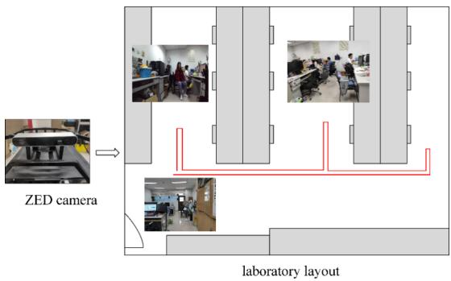  
Fig. 6. Real scene environment layout and motion trajectory (the red solid line indicates the real approximate motion trajectory).

In addition, we compare the WF-SLAM system and stateof-the-art dynamic SLAM algorithms, including SLAMAN-TIC [17], Wang K [18], Fang B [19], DS-SLAM [10] and DynaSLAM [25]. The RMSE ATE results on several sequences are recorded in Table III. The results of the first five are based on the data that are provided in the original papers. The comparative analysis of Table III shows that the overall error of WF-SLAM system is the smallest, with the smallest error on the four sequences and the third smallest error on the sequence walking\_static. However, the errors of all SLAM systems on the walking\_static sequence are small.

## B. Evaluation in Real Environments

To further evaluate the practicability of the WF-SLAM system, we integrate it into ROS [33] and conduct experiments on real-world scenarios. As shown in Fig. 6, real-world RGB and depth images were captured by ZED at a frame rate of 30 fps and a resolution of 2560∗720. The top view of the collection scene is a standard rectangle, and an “E” shaped corridor is set aside after the experimental equipment, tables and chairs are placed. In addition, the scene contains people in motion to test the robustness of the SLAM system under dynamic scenes. In Fig. 6, the ZED camera is on the left, and the laboratory layout is on the right. The gray part represents large obstacles such as tables, chairs and cabinets, and the red line is the tracked motion trajectory during the acquisition.

First, we focus on evaluating the distribution of the feature points of the WF-SLAM system in the real scene, namely, evaluating whether any feature points are located in the dynamic object. Fig. 7 shows the distribution of feature points of the WF-SLAM system for several image sequences. For all scenes in the figure, the WF-SLAM system can well identify dynamic targets and select feature points of static objects, thereby providing reliable feature points for subsequent pose estimation of SLAM. Fig. 8 compares the extracted feature points from the ORB-SLAM2 and WF-SLAM systems, which are the ORB-SLAM2 feature points, Mask R-CNN output and WF-SLAM system feature points. As shown in the figure, a large proportion of the ORB-SLAM2 system’s feature points are located on pedestrians, while WF-SLAM can identify dynamic targets well, and no feature points fall on pedestrians.

TABLE IV  
AVERAGE RUNNING TIME OF EACH MAIN FUNCTIONAL MODULE OF WF-SLAM (MS)
<table><tr><td>Sequence</td><td>Semantic segmentation</td><td>Target detection</td><td>BA joint optimization</td></tr><tr><td>walking xyz</td><td>25.18</td><td>85.76</td><td>174.07</td></tr></table>

Moreover, we evaluate the trajectory that is estimated by the camera. Since there is no accurate camera track in the real world, we visualize the camera track and conduct an intuitive comparative analysis. Fig. 9 shows the trajectory comparison results of the ORB-SLAM2 and WF-SLAM systems. The results of the former system are represented by a blue line, while those of the latter system are presented by a gray dotted line. As shown in the figure, the trajectory of ORB-SLAM2 is far from the real trajectory, and the trajectory completely deviates from the real trajectory after the second turn. The reason is that there are people with a large range of motion in the image at the second turn, which affects its localization performance. The WF-SLAM system can detect the moving target and eliminate its influence; hence the estimated trajectory is greatly improved compared to that of ORB-SLAM2, and it basically coincides with the real trajectory.

## C. Efficiency Analysis

Additionally, we evaluated the time consumption of the WF-SLAM system. All experiments are run on an Intel I7-8700K processor, with a 3.2 GHz main frequency and 15.6 GB memory, and a GTX1080TI GPU is used to assist in acceleration. The operating system is Ubuntu 16.04.

We consider the running time results of the walking\_xyz image sequence as an example. Five experiments are carried out and the average value is calculated. The ORB-SLAM2 [7] system runs in real time, with a single running time of 53.78 ms. However, both the WF-SLAM algorithm and dynamic SLAM algorithm DynaSLAM [25] in this paper are improved on ORB-SLAM2 to adapt to dynamic scenarios with high complexity and suitable for offline operation mode. The total running times of the WF-SLAM system and DynaSLAM system are 310.65 ms and 679 ms respectively. The time consumption of the WF-SLAM system is shorter than DynaSLAM. Table IV presents the average running time of each major module of the WF-SLAM system. The BA joint optimization module and target detection module are the most and second-most time-consuming modules. In the future, the running time can be shortened via hardware support.

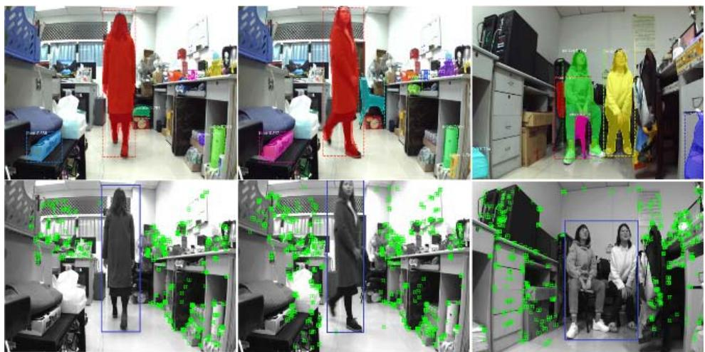

Fig. 7. Feature point selection of the WF-SLAM system from multiple perspectives.  
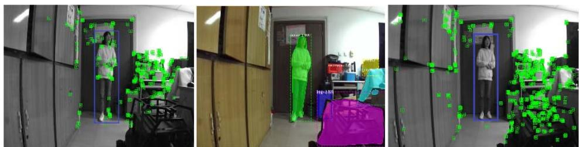  
Fig. 8. Selection of feature points in the real world(from left to right, ORB-SLAM2 feature points,Mask R-CNN output and WF-SLAM feature points).

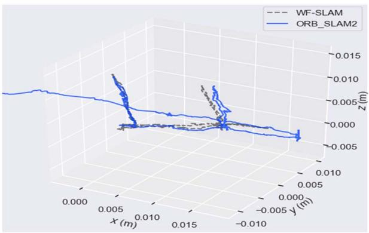  
Fig. 9. The trajectories of ORB-SLAM2 and WF-SLAM in real scenarios.

## V. CONCLUSION

In this paper, a visual SLAM system that is based on weighted features is proposed. It adds a dynamic object detection module that is based on ORB-SLAM2 and improves the tracking thread based on the detection results. Dynamic target detection combines the advantages of semantic segmentation and geometric motion segmentation and adopts the tightly coupled paradigm to implement accurate detection. The tracking part initializes the feature point weights with the detection results and jointly optimizes the weights of the feature points and pose to improve the localization accuracy and robustness of SLAM system in dynamic environments. Qualitative and quantitative experiments on the TUM dataset show that WF-SLAM can accurately identify dynamic objects. Compared with other dynamic SLAM systems, the overall localization accuracy is also competitive. Future work on the WF-SLAM system can be summarized into three aspects. First, WF-SLAM has a longer running time than ORB-SLAM2, so it needs to be further improved. Second, multiple frames can be considered to provide more robust dynamic feature point detection. Finally, the information of dynamic objects is very useful in high level applications such as humancomputer interaction, trajectory prediction and decision planning. The optimized weight of feature points in the WF-SLAM system can be further used for high-level applications.

## REFERENCES

[1] J. An, H. Mou, R. Lu, and Y. Li, “Localization and navigation analysis of mobile robot based on SLAM,” J. Phys., Conf. Ser., vol. 1827, no. 1, Mar. 2021, Art. no. 012089.

[2] T. T. O. Takleh, N. A. Bakar, S. A. Rahman, R. Hamzah, and Z. A. Aziz, “A brief survey on SLAM methods in autonomous vehicle,” Int. J. Eng. Technol., vol. 7, no. 4, pp. 38–43, 2018.

[3] Y. Sato, K. Minemoto, M. Nemoto, and T. Torii, “Construction of virtual reality system for radiation working environment reproduced by gamma-ray imagers combined with SLAM technologies,” Nucl. Instrum. Methods Phys. Res. A, Accel. Spectrom. Detect. Assoc. Equip., vol. 976, Oct. 2020, Art. no. 164286.

[4] S. Yang, S. A. Scherer, X. Yi, and A. Zell, “Multi-camera visual SLAM for autonomous navigation of micro aerial vehicles,” Robot. Auton. Syst., vol. 93, pp. 116–134, Jul. 2017.

[5] A. Li, X. Ruan, J. Huang, X. Zhu, and F. Wang, “Review of visionbased simultaneous localization and mapping,” in Proc. IEEE 3rd Inf. Technol., Netw., Electron. Autom. Control Conf. (ITNEC), Mar. 2019, pp. 117–123.

[6] O. Miksik and V. Vineet, “Live reconstruction of large-scale dynamic outdoor worlds,” in Proc. CVPR Workshops, 2019, pp. 1–10.

[7] R. Mur-Artal and J. D. Tardós, “ORB-SLAM2: An open-source SLAM system for monocular, stereo, and RGB-D cameras,” IEEE Trans. Robot., vol. 33, no. 5, pp. 1255–1262, Oct. 2017.

[8] J. Engel, T. Schöps, and D. Cremers, “LSD-SLAM: Large-scale direct monocular SLAM,” in Proc. Eur. Conf. Comput. Vis., 2014, pp. 834–849.

[9] M. A. Fischler and R. C. Bolles, “Random sample consensus: A paradigm for model fitting with applications to image analysis and automated cartography,” Commun. ACM, vol. 24, no. 6, pp. 381–395, 1981.

[10] C. Yu et al., “DS-SLAM: A semantic visual SLAM towards dynamic environments,” in Proc. IEEE/RSJ Int. Conf. Intell. Robots Syst. (IROS), Oct. 2018, pp. 1168–1174.

[11] R. Hartley and A. Zisserman, Multiple View Geometry in Computer Vision. Cambridge, U.K.: Cambridge Univ. Press, 2003.

[12] M. R. U. Saputra, A. Markham, and N. Trigoni, “Visual SLAM and structure from motion in dynamic environments: A survey,” ACM Comput. Surv., vol. 51, no. 2, pp. 1–36, Mar. 2019.

[13] K. He, G. Gkioxari, P. Dollar, and R. B. Girshick, “Mask R-CNN,” in Proc. Int. Conf. Comput. Vis., 2017, pp. 2961–2969.

[14] V. Badrinarayanan, A. Kendall, and R. Cipolla, “SegNet: A deep convolutional encoder-decoder architecture for image segmentation,” IEEE Trans. Pattern Anal. Mach. Intell., vol. 39, no. 12, pp. 2481–2495, Dec. 2017.

[15] S.-H. Wang, Z. Zhu, and Y.-D. Zhang, “PSCNN: PatchShuffle convolutional neural network for COVID-19 explainable diagnosis,” Frontiers Public Health, vol. 9, Oct. 2021, Art. no. 768278.

[16] S.-H. Wang, M. A. Khan, and Y.-D. Zhang, “VISPNN: VGG-inspired stochastic pooling neural network,” Comput., Mater. Continua, vol. 70, no. 2, pp. 3081–3097, 2022.

[17] M. Schorghuber, D. Steininger, Y. Cabon, M. Humenberger, and M. Gelautz, “SLAMANTIC—Leveraging semantics to improve VSLAM in dynamic environments,” in Proc. IEEE/CVF Int. Conf. Comput. Vis. Workshop, Oct. 2019, pp. 1–10.

[18] K. Wang et al., “A unified framework for mutual improvement of SLAM and semantic segmentation,” in Proc. Int. Conf. Robot. Autom. (ICRA), May 2019, pp. 5224–5230.

[19] B. Fang, G. Mei, X. Yuan, L. Wang, Z. Wang, and J. Wang, “Visual SLAM for robot navigation in healthcare facility,” Pattern Recognit., vol. 113, May 2021, Art. no. 107822.

[20] J. Cheng, Y. Sun, W. Chi, C. Wang, H. Cheng, and M. Q.-H. Meng, “An accurate localization scheme for mobile robots using optical flow in dynamic environments,” in Proc. IEEE Int. Conf. Robot. Biomimetics (ROBIO), Dec. 2018, pp. 723–728.

[21] A. Bruhn, J. Weickert, and C. Schnörr, “Lucas/Kanade meets Horn/Schunck: Combining local and global optic flow methods,” Int. J. Comput. Vis., vol. 61, no. 3, pp. 211–231, 2005.

[22] M. C. Bakkay, M. Arafa, and E. Zagrouba, “Dense 3D SLAM in dynamic scenes using kinect,” in Proc. Iberian Conf. Pattern Recognit. Image Anal. Cham, Switzerland: Springer, 2015, pp. 121–129.

[23] Y. Ai, T. Rui, M. Lu, L. Fu, S. Liu, and S. Wang, “DDL-SLAM: A robust RGB-D SLAM in dynamic environments combined with deep learning,” IEEE Access, vol. 8, pp. 162335–162342, 2020.

[24] Q. Jin, Z. Meng, T. D. Pham, Q. Chen, L. Wei, and R. Su, “DUNet: A deformable network for retinal vessel segmentation,” 2018, arXiv:1811.01206.

[25] B. Bescos, J. M. Fácil, J. Civera, and J. L. Neira, “DynaSLAM: Tracking, mapping, and inpainting in dynamic scenes,” IEEE Robot. Autom. Lett., vol. 3, no. 4, pp. 4076–4083, Oct. 2018.

[26] C. Campos, R. Elvira, J. J. G. Rodríguez, J. M. M. Montiel, and J. D. Tardós, “ORB-SLAM3: An accurate open-source library for visual, visual-inertial and multi-map SLAM,” 2020, arXiv:2007.11898.

[27] T.-Y. Lin et al., “Microsoft COCO: Common objects in context,” in Proc. Eur. Conf. Comput. Vis. Cham, Switzerland: Springer, 2014, pp. 740–755.

[28] S. Ren, K. He, R. Girshick, and J. Sun, “Faster R-CNN: Towards real-time object detection with region proposal networks,” IEEE Trans. Pattern Anal. Mach. Intell., vol. 39, no. 6, pp. 1137–1149, Jun. 2017.

[29] J. Long, E. Shelhamer, and T. Darrell, “Fully convolutional networks for semantic segmentation,” in Proc. IEEE Conf. Comput. Vis. Pattern Recognit., Jun. 2015, pp. 3431–3440.

[30] G. Bradski and A. Kaehler, Learning OpenCV: Computer Vision With the OpenCV Library. Sebastopol, CA, USA: O’Reilly Media, 2008.

[31] C. Engels, H. Stewenius, and D. Nistér, “Bundle adjustment rules,” Photogramm. Comput. Vis., vol. 2, no. 32, pp. 1–6, 2006.

[32] J. Sturm, N. Engelhard, F. Endres, W. Burgard, and D. Cremers, “A benchmark for the evaluation of RGB-D SLAM systems,” in Proc. IEEE/RSJ Int. Conf. Intell. Robots Syst., Oct. 2012, pp. 573–580.

[33] M. Quigley et al., “ROS: An open-source robot operating system,” in Proc. IEEE Int. Conf. Robot. Automat. (ICRA), Jan. 2009, p. 5.

Yuanhong Zhong (Senior Member, IEEE) received the B.S. degree in communications engineering and the M.S. and Ph.D. degrees in communication and information systems from Chongqing University, Chongqing, China, in 2003, 2006, and 2011, respectively. He is currently an Associate Professor with the School of Microelectronics and Communication Engineering, Chongqing University. His research interests include the computer vision, machine learning, and intelligent unmanned systems.

Shuangshuang Hu received the B.S. degree from the School of Microelectronics and Communication Engineering, Chongqing University, Chongqing, China, in 2019. She is currently pursuing the M.S. degree in vehicle engineering with Chongqing University. Her current research interests include simultaneous localization and mapping dynamic SLAM.

Guan Huang received the B.S. degree from the School of Microelectronics and Communication Engineering in 2018 and the M.S. degree from the School of Automobile Collaboration and Innovation Center, Chongqing University, Chongqing, China, in 2021.

Long Bai received the Ph.D. degree from the Northwest University of Technology, Shaanxi, China, in 2012. He is currently a Professor and a Ph.D. Supervisor with the School of Mechanical and Transportation Engineering, Chongqing University. His research interests include the bionic and special intelligent robots, autonomous intelligent unmanned systems, and medical surgery and rehabilitation robots.

Qimin Li received the Ph.D. degree from the School of Mechanical Manufacturing Equipment and Automation, Zhejiang University, Zhejiang, China, in 2006. He is currently an Associate Professor with the State Key Laboratory of Mechanical Transmission, Chongqing University. His research interests include SLAM and robotics.