ORIGINAL ARTICLE

# YOLO-SLAM: A semantic SLAM system towards dynamic environment with geometric constraint

Wenxin Wu1 • Liang Guo1 • Hongli Gao1 • Zhichao You1 • Yuekai Liu1 • Zhiqiang Chen

Received: 25 February 2021 / Accepted: 15 November 2021 / Published online: 8 January 2022   
- The Author(s), under exclusive licence to Springer-Verlag London Ltd., part of Springer Nature 2021

## Abstract

Simultaneous localization and mapping (SLAM), as one of the core prerequisite technologies for intelligent mobile robots, has attracted much attention in recent years. However, the traditional SLAM systems rely on the static environment assumption, which becomes unstable for the dynamic environment and further limits the real-world practical applications. To deal with the problem, this paper presents a dynamic-environment-robust visual SLAM system named YOLO-SLAM. In YOLO-SLAM, a lightweight object detection network named Darknet19-YOLOv3 is designed, which adopts a lowlatency backbone to accelerate and generate essential semantic information for the SLAM system. Then, a new geometric constraint method is proposed to filter dynamic features in the detecting areas, where dynamic features can be distinguished by utilizing the depth difference with Random Sample Consensus (RANSAC). YOLO-SLAM composes the object detection approach and the geometric constraint method in a tightly coupled manner, which is able to effectively reduce the impact of dynamic objects. Experiments are conducted on the challenging dynamic sequences of TUM dataset and Bonn dataset to evaluate the performance of YOLO-SLAM. The results demonstrate that the RMSE index of absolute trajectory error can be significantly reduced to 98.13% compared with ORB-SLAM2 and 51.28% compared with DS-SLAM, indicating that YOLO-SLAM is able to effectively improve stability and accuracy in the highly dynamic environment.

Keywords Visual SLAM - Dynamic environment - Object detection - Geometric constraint

## 1 Introduction

In the past years, mobile robots and automatic driving technology have made significant progress. Simultaneous localization and mapping (SLAM) as a prerequisite technology for many robotic applications is attracting widespread interest in this field [1–3]. SLAM technology plays an important role in robot positioning estimation and mapping establishment, which can help robots to position themselves in an unknown environment without any prior information and could simultaneously create a map of the surroundings [4, 5]. The position information helps robots to know where they are in the process of moving, even the place where robots have never been there. The map allows robots to restore essential environmental information that can be applied for the relocation process when robots come back to the same place.

SLAM can be subdivided into laser-based SLAM and visual-based SLAM according to the different sensors used [6]. Visual SLAM, whose main sensor is a camera, commonly including monocular camera, stereo camera and RGB-D camera, has been extensively explored [7]. That’s because images can store wider scene information than laser sensors. After data mining, the obtained information can be widely used in object detection, semantic segmentation, or disease diagnosis [8, 9]. The visual SLAM has developed over thirty years and becomes quite mature in some specific scenarios. Some advanced visual SLAM systems have achieved pretty decent performances, such as ORB-SLAM2 [10], LSD-SLAM [11], RGBD-SLAM-V2 [12].

However, most of the traditional SLAM systems are fragile when confronted with some extreme environments, such as the dynamic or rough environment. The dynamic environment [13] refers to the scene where moving objects appear. At present, most existing algorithms based on the static environment assumption only allow little dynamic points to appear. When dynamic objects take up a large part of an image, the accuracy and robustness of the traditional SLAM system will meet great challenges. The reason for system instability is that the number of dynamic points in the images leads to wrong data association and vastly disturbs the position in the tracking process, many attempts have been spent on satisfying these unnecessary constraints caused by mismatched points. Consequently, to improve the stability and accuracy of the SLAM system, it is vital to find an effective way to remove dynamic points from all extracted ones [14].

In this paper, we propose a robust SLAM system named YOLO-SLAM to reduce the impact of moving objects in a dynamic environment. To availably identify dynamic feature points, we take both the advantage of deep learning in scene understanding and the intrinsic geometric depth information of feature points. The design of the two parts can help the SLAM system to perceive the environment from both semantic and geometric levels, and obtain a high-level understanding of surroundings. The main contributions of this paper are summarized as follows:

1. A lightweight Darknet19-YOLOv3 object detection network is designed and constructed into the SLAM system, which is able to generate essential semantic information for locating dynamic objects.

2. A new geometric constraint method is proposed to availably distinguish dynamic feature points from the area where dynamic objects appear.

3. A semantic visual SLAM system named YOLO-SLAM is successfully constructed based on ORB-SLAM2, which can effectively improve the accuracy and robustness of the system in a dynamic environment.

The rest of this paper is structured as follows: Sect. 2 reviews the related work of other researchers. Section 3 introduces the framework of YOLO-SLAM in detail and describes the proposed method. Section 4 reports the experiment results evaluated on the TUM dataset and Bonn dataset. Finally, the conclusion and future work are declared in Sect. 5.

## 2 Related works

Many researchers in recent years have focused on the problem of the robustness of SLAM system towards dynamic environment. The main challenge to solve that problem is how to detect and filter dynamic features effectively, which means should prevent the tracking process from employing the features extracted from moving objects. There are many existing works trying to achieve that purpose, which can be generally classified into three categories: geometry method, deep learning method, and the combination of geometry and deep learning method.

In the geometry method, it assumes that only static features satisfy the model of geometric constraint, while dynamic features do not. It is always accomplished by utilizing the characteristics of dynamic objects moving in the static background. Kim et al. [15] proposed a nonparametric model used in the background subtraction, and regarded the ego-motion of the camera, used depth scenes to compute the background model along with motion estimation by images. Li et al. [16] chose depth edge points to find correspondence and designed a static weighting method to down-weight the impact of dynamic points. Wang et al. [17] applied the fundamental matrix to detect the inconsistency of feature points and then clustered the depth image. When outliers in the cluster area exceed the threshold, the area will be identified as moving a object. Cheng et al. [18] proposed a sparse motion removal mode which according to the similarity and difference between consecutive frames to detect dynamic regions. However, the geometry method generally needs a predefined threshold to determine whether the feature points are dynamic or static, which easily causes excessive recognition or insufficient recognition.

In the deep learning method, it usually adopts state-ofthe-art technology in the deep learning area [19] to generate necessary semantic information, such as object detection and semantic segmentation technology. Li et al. [20] used SegNet, which is a famous semantic segmentation network, to segment images and then be further processed to distinguish dynamic objects. Zhang et al. [21] adopted YOLO [22–24] to recognize objects in the environment and built a semantic map to filter dynamic feature points to improve the accuracy of the system. Liu et al. [25] adopted different kinds of semantic segmentation methods to detect dynamic objects and remove outliers. The deep learning method would be useful when dynamic objects in the environment are known in advance. However, the deep learning method heavily relies on the quality of the network [26, 27]. The networks with a simple architecture may not be able to effectively identify dynamic objects in some situations, while the complex network architecture may slow down the system operation speed.

In the combination of geometry and deep learning method, it takes advantage of the above two methods. Deep learning firstly provides semantic prior information about dynamic objects and subsequently, geometric constraints are further refined to filter features where dynamic objects appear. Yu et al. [28] proposed a semantic system named DS-SLAM, which reduces the impact of dynamic objects by combining semantic segmentation and optical flow method. DynaSLAM was put forward by Bescos et al. [29], which applied a CNN to segment the prior dynamic objects in the images and uses a multi-view geometry model to recheck. Zhao et al. [30] adopted the Mask-RCNN network to discover the contour of the potentially dynamic objects and then inspected the consistency of optical flow to detect the real state of the dynamic area. Yang et al. [31] first used an object detection model to detect the predefined dynamic objects and then adopted multi-view constraints to confirm dynamic pixel in-depth image. The combination of geometry and deep learning method commonly can achieve good performance. But there are still some minor problems, such as deep learning is time-consuming when segmenting dynamic objects out and traditional geometric constraint needs more than one view to generate, which limits the application in case of initialization or previous frame loss.

It is noted that the current literatures mainly prefer to adopt the combination of geometry and deep learning method. In terms of deep learning, it likes to use semantic segmentation, and in terms of geometry, multi-view geometry is preferred. However, semantic segmentation such as SegNet and Mask-RCNN is time-consuming, and multi-view geometry requires multi-frame images. This makes the SLAM system suffer real-time and stability challenges in practical applications. To meet the challenge, the main insights and contributions of this paper are summarized as follows. In our approach, deep learning and geometric constraint are organized in a tightly coupled manner. The lightweight object detection network modified on YOLOv3 is able to reduce the time consuming of the SLAM system and the geometric constraint method can effectively filter dynamic features only using one image information. These designs make SLAM system more practical and stable.

## 3 Proposed method

In this section, the overall architecture of YOLO-SLAM which is proposed for a dynamic environment will be introduced in detail. The presentation of this system mainly comes from three aspects. Firstly, the framework of YOLO-SLAM is specifically illustrated. It consists of five threads that run in parallel: object detection thread, dynamic features screening thread, tracking thread, local mapping thread, and loop closing thread. Secondly, an object detection thread will be individually declared, which provides prior semantic information for the dynamic environment. Finally, a new method of screening dynamic feature points will be emphatically introduced and analyzed. The method uses the depth message from the RGB-D image to further distinguish dynamic feature points from static ones.

## 3.1 Framework of YOLO-SLAM

The proposed YOLO-SLAM is based on traditional ORB-SLAM2 which has excellent performance under the hypothesis of a static environment. At present, ORB-SLAM2 is always considered as one of the most outstanding SLAM systems that based on the feature points extracting method. It mainly contains three parallel threads in ORB-SLAM2: tracking, local mapping, and loop closing. The combination of the three threads leads to a global consistency of the camera trajectories and maps in realtime. To take advantage of ORB-SLAM2, it is adopted as the basis in YOLO-SLAM. The overview of YOLO-SLAM is shown in Fig. 1, where the bounding box donates the position of dynamic objects in the image and the static feature represents that the dynamic feature has been screened through the proposed method.

In YOLO-SLAM, object detection thread and dynamic features screening thread are added among the original ORB-SLAM2 system. The purpose of embedding the two extra threads is to filter those feature points which are extracted by ORB-SLAM2 and existing both dynamic and static feature points. Only the static feature points can be used to estimate the camera motion trajectories, dynamic feature points will import some unpredictable errors. The two extra threads proposed in YOLO-SLAM can remove dynamic features effectively. The object detection thread is built on a revised version of YOLOv3 to provide semantic information from dynamic objects. Dynamic features screening thread serves as distinguishing dynamic feature points utilizing the geometrical depth message.

When the YOLO-SLAM system works, the object detection thread generates bounding boxes for these dynamic objects, like walking person (in the most indoor environments), by using a lightweight version of YOLOv3. The bounding boxes can locate most probably the position where dynamic feature points occurred in an image. Then, extracting ORB features for each frame. After extracting, feature points are mixed with dynamic and static ones. The subsequent process in the dynamic features screening thread is to produce pure static feature points, which receive the information from bounding boxes and then subdivide feature points into dynamic and static ones by using the method of geometric depth RANSAC (random sample consensus). Then local mapping thread and loop closing thread can only employ static features to construct sparse map and detect loop constraint, which keeps the same as the original ORB-SLAM2 system. The detailed process of removing dynamic feature points can be seen in Fig. 2.

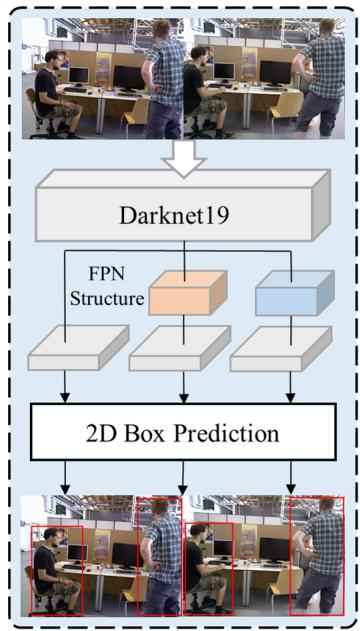  
(a)

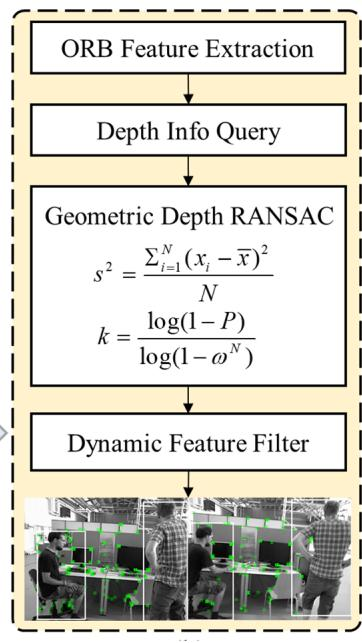  
(b)  
Fig. 1 The framework of YOLO-SLAM. It can be subdivided into three parts. Part (a) represents the object detection thread, Part (b) denotes the dynamic features screening thread and Part (c) contains the tracking thread, local mapping thread, and loop closing thread

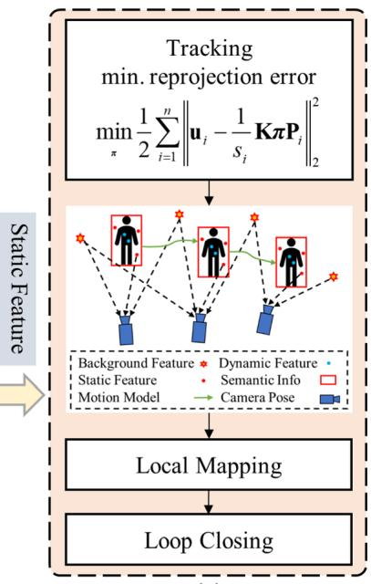  
(c)  
which are the same as ORB-SLAM2. Part (a) and Part (b) are constructed before the tracking thread to reduce the impact of moving objects in dynamic environment

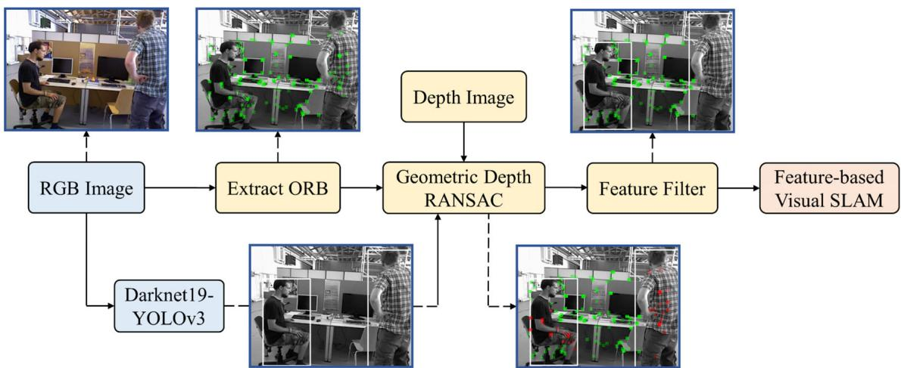  
Fig. 2 The process of removing dynamic feature points. Firstly, detecting objects that are predefined as dynamic and performing ORB features extraction of the entire RGB image. Then apply geometric  
depth constraint to filter out these dynamic features which are labeled by the red color. Finally, only static feature points are retained for pose estimation

## 3.2 Lightweight object detection

In the object detection thread, the YOLO algorithm is employed as the role of providing indispensable semantic information in a dynamic environment. YOLOv3 has been available for many years and now it is still widely used due to its stronger robustness of detection performance [32]. In this paper, considering the balance of accuracy and speed, the backbone of YOLOv3 is changed from Darknet-53 to Darknet-19. Darknet-19 is a lightweight feature extraction network, the structure of Darknet-19 and Darknet-53 can be seen in Fig. 3. The comparison table between different backbones tested on ImageNet can be seen in Table 1. Although Darknet-53 can achieve the highest accuracy of image classification at Top-1 and Top-5 accuracy, it widely slowed down the speed of the image processing. The slim version of the backbone in YOLOv3 is able to reach a faster speed in object detection and maintain a certain degree of accuracy.

<table><tr><td>Type</td><td>Filters</td><td>Size/Stride</td><td>output</td></tr><tr><td>Convolutional</td><td>32</td><td>3X3</td><td>224 x 224</td></tr><tr><td>Maxpool</td><td></td><td>2 x 2/2</td><td> $1 1 2 \times 1 1 2$ </td></tr><tr><td>Convolutional</td><td>64</td><td>3X3</td><td> $1 1 2 \times 1 1 2$ </td></tr><tr><td>Maxpool</td><td></td><td>2 x 2/2</td><td>56 x56</td></tr><tr><td>Convolutional</td><td>128</td><td>3X3</td><td>56x56</td></tr><tr><td>Convolutional</td><td>64</td><td>1X1</td><td>56x56</td></tr><tr><td>Convolutional</td><td>128</td><td>3X3</td><td>56x56</td></tr><tr><td>Maxpool</td><td></td><td>2 x 2/2</td><td>28 x 28</td></tr><tr><td>Convolutional</td><td>256</td><td>3X3</td><td>28 x 28</td></tr><tr><td>Convolutional</td><td>128</td><td>1X1</td><td>28 x 28</td></tr><tr><td>Convolutional</td><td>256</td><td>3X3</td><td>28 x 28</td></tr><tr><td>Maxpool</td><td></td><td>2 x 2/2</td><td>14 x 14</td></tr><tr><td>Convolutional</td><td>512</td><td>3X3</td><td>14 x 14</td></tr><tr><td>Convolutional</td><td>256</td><td>1X1</td><td>14 x 14</td></tr><tr><td>Convolutional</td><td>512</td><td>3X3</td><td>14 x 14</td></tr><tr><td>Convolutional</td><td>256</td><td>1X1</td><td>14 x 14</td></tr><tr><td>Convolutional</td><td>512</td><td>3X3</td><td>14 x 14</td></tr><tr><td>Maxpool</td><td></td><td>2 x 2/2</td><td>7x7</td></tr><tr><td>Convolutional</td><td>1024</td><td>3X3</td><td>7x7</td></tr><tr><td>Convolutional</td><td>512</td><td>1X1</td><td>7x7</td></tr><tr><td>Convolutional</td><td>1024</td><td>3X3</td><td>7x7</td></tr><tr><td>Convolutional</td><td>512</td><td>1X1</td><td>7x7</td></tr><tr><td>Convolutional</td><td>1024</td><td>3X3</td><td>7x7</td></tr><tr><td>Convolutional</td><td>1000</td><td>1X1</td><td>7x7</td></tr><tr><td>Avgpool</td><td></td><td>Global</td><td>1000</td></tr><tr><td>Softmax</td><td></td><td></td><td></td></tr></table>

(a) Darknet-19

<table><tr><td colspan="2">Type</td><td>Filters</td><td>Size/Stride</td><td>output</td></tr><tr><td rowspan="6"></td><td>Convolutional</td><td>32</td><td>3x3</td><td>256 x 256</td></tr><tr><td>Convolutional</td><td>64</td><td>3x 3/2</td><td>128 x 128</td></tr><tr><td>Convolutional</td><td>32</td><td>1x1</td><td></td></tr><tr><td>Convolutional</td><td>64</td><td>3x3</td><td></td></tr><tr><td>Residual</td><td></td><td></td><td>128 x 128</td></tr><tr><td>Convolutional</td><td>128</td><td>3 x 3/2</td><td>64 x 64</td></tr><tr><td rowspan="4">2x</td><td>Convolutional</td><td>64</td><td>1x1</td><td></td></tr><tr><td>Convolutional</td><td>128</td><td>3x3</td><td></td></tr><tr><td>Residual</td><td></td><td></td><td>64 x 64</td></tr><tr><td>Convolutional</td><td>256</td><td>3 x 3/2</td><td>32x 32</td></tr><tr><td rowspan="3">8x</td><td>Convolutional</td><td>128</td><td>1x1</td><td></td></tr><tr><td>Convolutional</td><td>256</td><td>3x3</td><td></td></tr><tr><td>Residual</td><td></td><td></td><td>32x32</td></tr><tr><td colspan="2">Convolutional</td><td>512</td><td>3 x 3/2</td><td>16 x 16</td></tr><tr><td rowspan="3">8x</td><td>Convolutional</td><td>256</td><td>1x1</td><td></td></tr><tr><td>Convolutional</td><td></td><td>3x3</td><td></td></tr><tr><td>Residual</td><td>512</td><td></td><td>16 x 16</td></tr><tr><td colspan="2"></td><td></td><td></td><td>8x8</td></tr><tr><td rowspan="5">4x</td><td>Convolutional</td><td>1024</td><td>3x 3/2</td><td></td></tr><tr><td>Convolutional</td><td>512</td><td>1x1</td><td></td></tr><tr><td>Convolutional</td><td>1024</td><td>3x3</td><td></td></tr><tr><td>Residual</td><td></td><td></td><td>8x8</td></tr><tr><td>Avgpool Connected</td><td></td><td>Global</td><td></td></tr><tr><td>Softmax</td><td></td><td></td><td>1000</td><td></td></tr></table>

(b) Darknet-53

Fig. 3 The structure of Darknet-19 and Darknet-53  
Table 1 Comparison of different backbones tested on ImageNet
<table><tr><td>Backbone</td><td>Top-1 accuracy</td><td>Top-5 accuracy</td><td>Weights size/MB</td><td>FPS</td></tr><tr><td>VGG-16 [33]</td><td>70.5</td><td>90.0</td><td>528</td><td>106</td></tr><tr><td>Resnet-101 [34]</td><td>77.1</td><td>93.7</td><td>160</td><td>53</td></tr><tr><td>Darknet-53 [24]</td><td>77.2</td><td>93.8</td><td>159</td><td>78</td></tr><tr><td>Darknet-19 [23]</td><td>74.1</td><td>91.8</td><td>80</td><td>171</td></tr></table>

The bold represents that has achieved the best experimental performance in this evaluation index compared with other schemes

The structure of the modified version of YOLOv3 can be seen in Fig. 4, which is named Darknet19-YOLOv3. The network was trained in advance on the PASCAL VOC 2007 and 2012 dataset, which is usually used in the computer vision domain. The important hyperparameters of darknet19-YOLOv3 are set as follows: batch = 64, subdivision = 16, width = 416, height = 416, channels = 3, momentum = 0.9, decay = 0.0005, saturation = 1.5, exposure = 1.5, hue = 0.1, learning rate = 0.001, max batches = 10,000, epoch = 100. The loss function of Darknet19-YOLOv3 can be defined as follows:

$$
L o s s = E r r o r _ { c o o r d } + E r r o r _ { i o u } + E r r o r _ { c l s }\tag{ð1Þ}
$$

Errorcoord denotes the coordinate prediction error of the bounding box, which is described as follows:

$$
\begin{array} { c } { { E r r o r { _ { c o o r d } } = \lambda _ { c o o r d } \displaystyle \sum _ { i = 0 } ^ { S \times S } \sum _ { j = 0 } ^ { B } I _ { i j } ^ { o b j } ( 2 - w _ { i } \times h _ { i } ) [ ( x _ { i } - \hat { x _ { i } } ) ^ { 2 } + ( y _ { i } - \hat { y _ { i } } ) ^ { 2 } ] } } \\ { { +  \lambda _ { c o o r d } \displaystyle \sum _ { i = 0 } ^ { S \times S } \sum _ { j = 0 } ^ { B } I _ { i j } ^ { o b j } ( 2 - w _ { i } \times h _ { i } ) [ ( w _ { i } - \hat { w _ { i } } ) ^ { 2 } + ( h _ { i } - \hat { h _ { i } } ) ^ { 2 } ] } } \end{array}\tag{ð2Þ}
$$

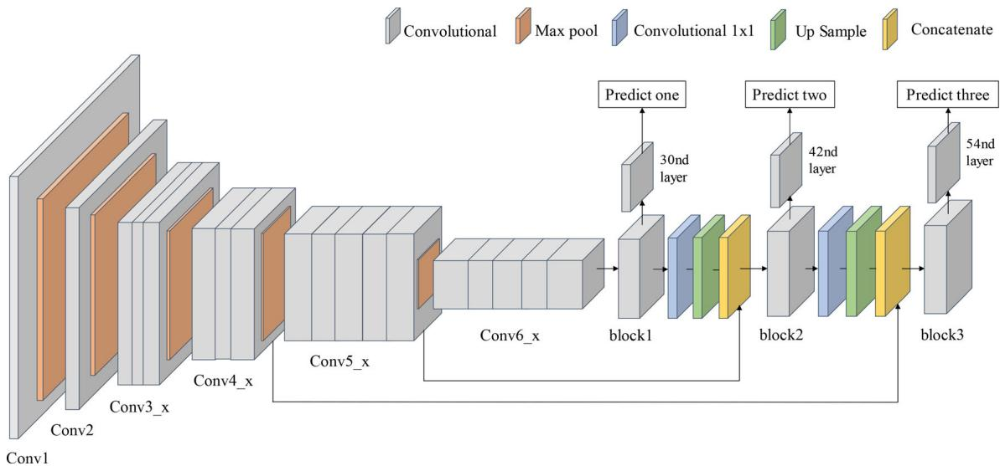  
Fig. 4 The structure of the lightweight Darknet19-YOLOv3. The backbone network is replaced with Darknet-19, while retaining the feature pyramid networks that can predict from three different scales

where $\lambda _ { c o o r d }$ is the weight of coordinate prediction error, $S \times S$ is the number of grid cells, B is the number of bounding boxes for each grid cell. $I _ { i j } ^ { o b j }$ represents whether the $i j _ { t h }$ bounding box is responsible for the truth box prediction. $( \hat { x _ { i } } , \hat { \mathbf { y } } _ { i } , \hat { w } _ { i } , \hat { h _ { i } } )$ are the prediction values of the four coordinates, $\left( { { x } _ { i } } , { { y } _ { i } } , { { w } _ { i } } , { { h } _ { i } } \right)$ are true values. In this paper, $\lambda _ { c o o r d }$ is set to 5 for increasing the influence of coordinate prediction error according to the original YOLOv3.

$E r r o r _ { i o u }$ denotes the IOU prediction error, which is described as follows:

$$
\begin{array} { r } { E r r o r _ { i o u } = - \displaystyle \sum _ { i = 0 } ^ { S \times S } \sum _ { j = 0 } ^ { B } I _ { i j } ^ { o b j } [ \hat { C } _ { i } \log ( C _ { i } ) + ( 1 - \hat { C } _ { i } ) \log ( 1 - C _ { i } ) ] } \\ { - \lambda _ { n o o b j } \displaystyle \sum _ { i = 0 } ^ { S \times S } \sum _ { j = 0 } ^ { B } I _ { i j } ^ { n o o b j } [ \hat { C } _ { i } \log ( C _ { i } ) + ( 1 - \hat { C } _ { i } ) \log ( 1 - } \end{array}\tag{ð3Þ}
$$

where $\lambda _ { n o o b j }$ is set to 0.5 for weakening the influence of grid cells without an object. $\hat { C _ { i } }$ is the prediction confidence value, $C _ { i }$ is the true confidence value.

$E r r o r _ { c l s }$ denotes the classification prediction error, which is described as follows:

$$
E r r o r _ { c l s } = - \sum _ { i = 0 } ^ { S \times S } I _ { i j } ^ { o b j } \sum _ { c \in c l a s s } [ \hat { p _ { i } } ( c ) \log ( p _ { i } ( c ) ) + ( 1 - \hat { p _ { i } } ( c ) ) \log ( 1\tag{ð4Þ}
$$

where c is the number of classes, $\hat { p _ { i } } ( c )$ is the prediction probability value that the object belongs to the classc. It uses binary cross-entropy to calculate the loss. Cross-entropy is preferred for classification tasks, which measures the distance between the actual probabilities and the expected probabilities. The use of cross-entropy enables the network weights to be updated faster and avoids the local optimal problem.

When the Darknet19-YOLOv3 network works, the image size will be normalized to $4 1 6 \times 4 1 6$ pixel, 3 channels. Then, the image is passed to the convolutional neural network Darknet-19 for extracting features. Subsequently, Darknet19-YOLOv3 makes detection at three different scales, and down-sample the feature map by 32, 16 and 8, respectively. Then the $1 \times 1$ detection kernel is applied on the three convolutional layers to obtain the final detected results. The shape of the detection kernel is $1 \times 1$ $\mathrm { ~ x ~ } ( \mathbf { B } \mathrm { ~ x ~ } ( 4 + 1 + \mathbf { C } ) )$ , where letter B represents the number of bounding boxes in a cell can predict, number 4 represents four bounding box parameters, number 1 represents Þ Ci whether an object exists in this grid, letter C represents the number of the object class. In this system, the number of bounding boxes in a cell (B) is equal to 3, the number of object classes (C) is set to 1. Because in the indoor environment, people are the most likely moving objects [28, 29, 35]. The final detection kernel is $1 \times 1 \times 1 8$

The first detection occurs on the 30nd layer of Darknet19-YOLOv3. After the $1 \times 1$ detection kernel, the output shape of predict one is $1 3 \times 1 3 \times 1 8$ . Then the feature map of the 27th layer is expanded to dimensions of ${ \overline { { 2 } } } \ell ^ { j } \dot { \big \langle } ^ { c } \dot { \ 2 } \dot { 6 }$ after a few convolutional layers and up sampling. The second detection is made by 42nd layer, yielding the output dimensions of predict two of $2 6 \times 2 6 \times 1 8$ . The third detection is at 54th layer, producing the feature map of the predicted three of $5 2 \times 5 2 \times 1 8$ . Finally, employ the IOU (Intersection Over Union) and NMS (Non-Max Suppression) to avoid selecting overlapping boxes. Once the detected result of the object category is people, the feature points extracted on the people will be regarded as outliers and will be eliminated immediately.

## 3.3 Dynamic features screening

For the SLAM systems which are based on the feature points method, the quality of feature points determines the overall system stability and performance. Dynamic feature points will import errors in trajectory estimation and damage map quality. Therefore, a strict strategy of feature points selection has been proposed in YOLO-SLAM, which is a tightly coupled approach between semantic prior and geometric depth message. After getting through the object detection module, semantic information can be acquired and will return a category to which the object belongs and four coordinates to form a rectangle that indicates where the object occurs in an image. In some papers, such as Liu [36], Xiao [37], they chose to remove all the feature points falling in bounding boxes directly. That’s a simple way to reduce the interference of dynamic points, but this method also deletes many static points that remain contained inside bounding boxes. The reduction of static feature points may weaken the constraint of feature matches and cause a limitation for solving a more precise solution. Especially, when the detection box takes up more than two-thirds of the current frame, there are a few feature points for system tracking and thus may lead to failure in the SLAM system.

In our system, a new approach is properly proposed to solve this problem, which can utilize geometric depth information from the depth image. Some depth images acquired by the RGB-D camera can be seen in Fig. 5. In the depth images, it’s obvious to distinguish the contour of an object by depth difference. With the help of the depth image, the remaining stationary features in the bounding box can be separated through the depth-RANSAC method. RANSAC (Random Sample Consensus) is a way to calculate the mathematical model from a set of sample data sets containing abnormal data and can obtain effective data through this model. This approach depends on three assumptions:

1. People are the most likely moving objects and occupy most of the bounding box.

2. Feature points that appear on a person have little difference in depth value.

3. In the bounding box, the depth difference is obvious between people and surrounding objects.

The first assumption declares the applicable environment for the YOLO-SLAM system, which is mostly an indoor environment. The second assumption is based on the fact that a person is flat and its depth value fluctuates over a small range. The third assumption states that outliers belonging to people are the majority compared with the number of inliers and can be easily distinguished. By observing the environment, these assumptions were satisfied most of the time.

The depth-RANSAC algorithm to screen outliers based on the above three assumptions can be described in Algorithm 1. Firstly, finding feature points within the bounding box and store the points in a set. Then enter a loop until the number of iterations is no less than the predefined number. In the loop, arbitrarily select two feature points that are extracted in the bounding box and calculate the variance between these two points as the depth-RANSAC math model. Then traverse all the remaining points to find suitable ones where the variance is in the right range. Subsequently, a set of feature points can be obtained. And when the traversal ends, the set containing the most interior points will be selected, which was eventually identified as outliers appearing within the contour of dynamic objects. Finally, these selected points were screened from the whole extracted feature points. After that, all the remaining points can be deemed as stationary ones and will eventually improve the position accuracy of the SLAM system.

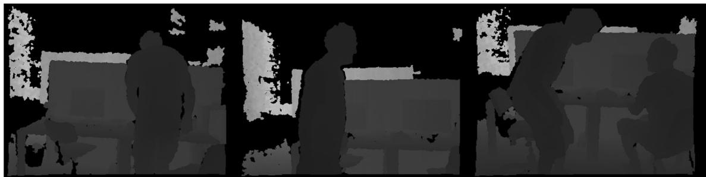  
Fig. 5 Some depth images acquired by RGB-D camera

ALGORITHM I

DYNAMIC FEATURES SCREENING   
Technique: Depth-RANSAC method   
Input: Semantic information from modified YOLOv3, box i; The extracted ORB feature   
points, P1 ; Variance threshold, nThre ; The initial number of iterations for each   
bounding box, k ; The depth image, DImg ;   
Output: The set of dynamic feature points, S ;   
1: Finding initial feature points, P2 = FindPoints WithinBoundingBox (box \_i, P1) ;   
2: The maximum number of inliers, nbestInliers = 0 ; The iteration count value,   
nIter = 0 ;   
3: while (nIter < k )   
4: The number of inliers, nInliers = 0; The temporary set of dynamic points, S1 = 0 ;   
5: Choose any two points,   
var1 = CalcInitialDepthVariance(Dpoint1, Dpoint2);   
6: For each of the remaining points in P2 do:   
7: Add the point to calculate, var2 = CalcDepthVariance (var1, Dpoint3);   
8: If (var2 < nThre ) then   
9: + + nInliers ;   
10: Append point3 to S1 ;   
11: End If   
12: End For   
13: If (nInliers > nbestInliers ) then   
14: k =UpdateItersValue();   
15: nbestInliers = nInliers ;   
16: S = S1;   
17: End If   
18: ++nIter;   
19: End While   
20: Return ;

The depth-RANSAC math model, which can be described as follow:iterati ns for each bounding box k can be estimated as follows:

$$
s ^ { 2 } = \frac { \Sigma _ { i = 1 } ^ { N } ( x _ { i } - \overline { { x } } ) ^ { 2 } } { N }\tag{ð5Þ}
$$

where $s ^ { 2 }$ represents the variance, N is the number of points selected to estimate the model each time, $x _ { i }$ represents the depth of the selected points and x is the average depth value of points set.

The fluctuation variance threshold nThre is set to 0.43 tested on TUM datasets and the appropriate number of

Assume that the percentage of ‘‘inliers’’ in the overall points is x:

$$
\omega = \frac { n _ { i n l i e r s } } { n _ { i n l i e r s } + n _ { o u t l i e r s } }\tag{ð6Þ}
$$

When each time using N points to calculate the RAN-SAC model, the probability that at least one outlier exists in the selected points is $1 - \omega ^ { N }$ . In the case of iterating k times, $\left( 1 - \omega ^ { N } \right) ^ { k }$ represents the probability that at least one outlier is sampled for k consecutive iterations. Using P to indicate the probability that the points randomly selected from the points set are all inliers during the k iterations. There is an equation as follow:

$$
1 - P = \left( 1 - \omega ^ { N } \right) ^ { k }\tag{ð7Þ}
$$

Then, take the logarithm of both sides of Eq. (7), and get:

$$
k = { \frac { \log ( 1 - P ) } { \log ( 1 - \omega ^ { N } ) } }\tag{ð8Þ}
$$

where x is a prior value, P is the predefined probability that hopes RANSAC to calculate the correct model, then the number of iterations k can be calculated. In our method, k is an adaptive value, which is set to an infinite number of iterations at the beginning and then uses the current inliers ratio x to estimate the number of iterations k when each time the model parameter estimation is updated.

## 4 Experimental results

In this section, the performance of YOLO-SLAM towards dynamic scenes will be introduced in detail. The property of YOLO-SLAM is evaluated on the public TUM dataset [38] and Bonn dataset [39], later time consumption will also be analyzed. Furthermore, the comparison against previous state-of-the-art dynamic SLAM solutions, such as DS-SLAM, will be presented to demonstrate the efficiency of our system. The hardware platform in this experiment to train the YOLO model [40] is NVIDIA GeForce GTX 1660Ti and the SLAM system is running on a laptop with Intel Core i5-4288U CPU, 3.7 GB memory and Ubuntu 18.04 operating system, without GPU acceleration.

## 4.1 Performance evaluation on TUM RGB-D dataset

The TUM RGB-D dataset was proposed by the TUM Computer Vision Group in 2012, which is frequently used in the SLAM domain [6]. The dataset was collected by Kinect camera, including depth image, RGB image, and ground truth data. According to different usage scenarios, the dataset is divided into several sequences, such as sitting, walking, and desk. The description of TUM dataset sequences is shown in Table 2. In our experiment, walking sequences are the main target used which contains two people walking through an office scene. This sequence is intended to evaluate quickly moving dynamic objects. And sitting sequences are also used as supplementary which contain two people sitting in front of a desk and moving a little bit occasionally. This sequence is intended to evaluate slowly moving dynamic objects. Figure 6 shows the feature points extraction results of ORB-SLAM2 and YOLO-SLAM in TUM dataset.

The estimated trajectories for sequences were compared with the ground truth to evaluate the performance of SLAM system. The absolute trajectory error (ATE) and the relative pose error (RPE) are frequently utilized as the error metric [38]. The ATE is well-suited for measuring the global consistency of the trajectory, while the RPE is wellsuited for measuring the translation and rotation drift. Figure 7 shows ATE and RPE diagrams calculated from the original ORB-SLAM2 and the proposed YOLO-SLAM. Both the two sequences selected from TUM dataset are belonged to high dynamic sequences so that the system performance can be better evaluated. From a qualitative point of view, it’s obvious to see that the camera trajectory estimated by YOLO-SLAM coincides more with the ground truth trajectory compared against ORB-SLAM2. Both the ATE and RPE are limited to a low level with our approach. Figure 8 shows the three-dimensional trajectory of camera motion estimated by YOLO-SLAM.

The quantitative comparison results in different sequences are shown in Tables 3–6. The root mean square error (RMSE) and standard deviation error (S.D.) are applied as the evaluation index. RMSE represents the deviation between the estimated value and the truth value, S.D. reflects the dispersion of the estimated camera trajectory.

Table 3 reflects the impact of object detection thread or dynamic features screening thread added separately or together on system performance. The RMSE index of absolute trajectory error is adopted to evaluate the performance of the proposed system. The original ORB-SLAM2 is as the baseline. YOLO-SLAM (D) is the system in which only darknet19-yolov3 detects dynamic objects and then eliminates all features among the detected bounding boxes. YOLO-SLAM (G) applies the depth-RANSAC method to the whole image to screen features without particularly considering dynamic objects. YOLO-SLAM (D ? G) stands for the system we eventually adopted in which darknet19-yolov3 and depth-RANSAC are employed together. In YOLO-SLAM (D ? G), the positions of dynamic objects are detected firstly, and then only dynamic features are screened among detected bounding boxes. As shown in Table 3, YOLO-SLAM (D ? G) achieves the highest accuracy due to the fact that as many dynamic feature points as possible are eliminated and as many static feature points as possible are retained in this system.

As we can see from Tables 4–6, the improvement of YOLO-SLAM in terms of ATE and RPE compared against ORB-SLAM2, DS-SLAM and RDS-SLAM is significantly obvious. ORB-SLAM2 is the foundation of our system, DS-SLAM and RDS-SLAM are two of the best SLAM solutions for a dynamic environment in recent years.

Table 2 The description of TUM dataset sequences
<table><tr><td>Sequences name</td><td>Duration/s</td><td>Length/m</td><td>Description</td></tr><tr><td>fr3_walking_xyz</td><td>28.83</td><td>5.791</td><td>The camera moved along three directions (xyz) while keeping the same orientation</td></tr><tr><td>fr3_walking_static</td><td>24.83</td><td>0.282</td><td>The camera has been kept in place</td></tr><tr><td>fr3_walking_rpy</td><td>30.61</td><td>2.698</td><td>The camera rotated along the principal axes (roll-pitch-yaw) at the same position</td></tr><tr><td>fr3_walking_half</td><td>35.81</td><td>7.686</td><td>The camera moved on a small half sphere of one-meter diameter</td></tr><tr><td>fr3_sitting_static</td><td>23.63</td><td>0.259</td><td>The camera has been kept in place</td></tr></table>

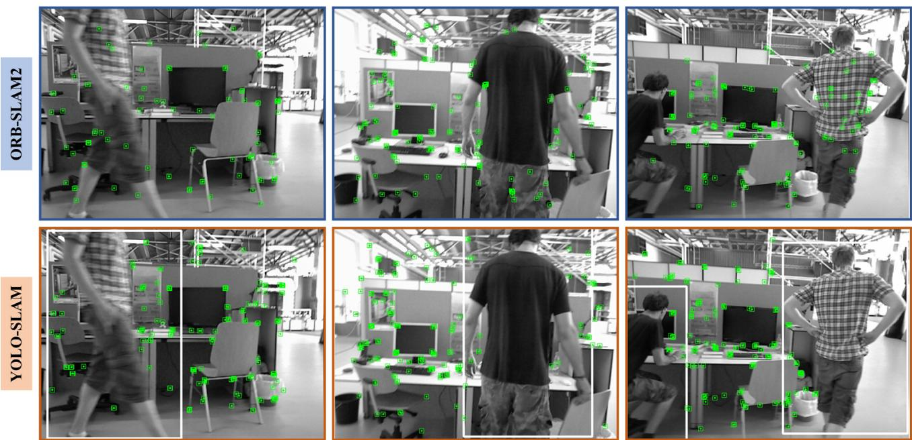  
Fig. 6 The feature points extraction results of ORB-SLAM2 and YOLO-SLAM in TUM dataset. The white bounding box is the position of dynamic object identified by Darknet19-YOLOv3. There are few feature points remain on the dynamic object in YOLO-SLAM

In Table 4 of ATE results, compared with ORB-SLAM2, the promotion of RMSE and S.D. can reach up to 98.06%, 98.14% in high dynamic sequences and 24.14%, 23.26% in low dynamic sequences. Figures 9 and 10 show the RMSE and S.D. index results of ATE in the form of the bar chart intuitively. In some sequences, such as fr3\_walking\_xyz, fr3\_walking\_static, fr3\_walking\_half, and fr3\_sitting\_static, the absolute trajectory error has been reduced by one or two orders of magnitude, reaching millimeter-level or centimeter-level accuracy. That’s because the semantic information generated by Darknet19- YOLOv3 can effectively identify dynamic feature points. And due to the RANSAC method [41], static feature points are retained as much as possible. As for DS-SLAM, the improvement of RMSE and S.D. can also amount to 51.28%, 57.40% in fr3\_walking\_rpy sequence. Although we noticed that the promotion of YOLO-SLAM in fr3\_sitting\_static sequence does not behave as well as the other four walking sequences. That’s because DS-SLAM already can handle low dynamic sequences well and has performed a high level of positioning accuracy, the improvement of YOLO-SLAM is limited. Compared with RDS-SLAM, it can be observed that the performance of YOLO-SLAM is better than RDS-SLAM in most datasets and has a lower absolute trajectory error, except for the fr3\_walking\_rpy sequence. That is because people have a 45-degree rotation in the fr3\_walking\_rpy dataset, which causes the effect of the object detection network to be inferior to semantic segmentation used in RDS-SLAM and thus some dynamic feature points are not effectively eliminated.

According to Table 5 and 6 of the RPE results. Two aspects of translation and rotation drift can be seen that the tendency of error decrease is similar to ATE. The system performs extremely well in high dynamic sequences and only has a little limitation in low dynamic scenes. The

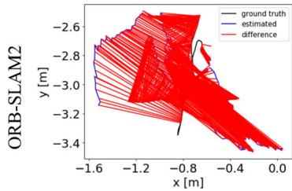  
(a)

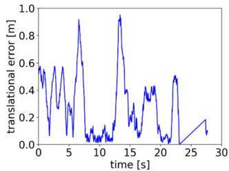  
(b)

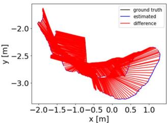

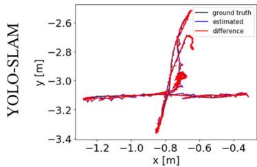

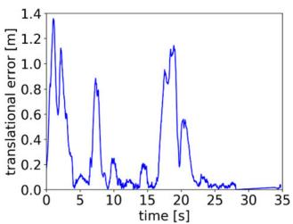

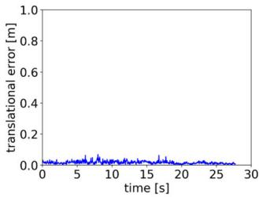  
(e)  
(f)

(c)  
(d)  
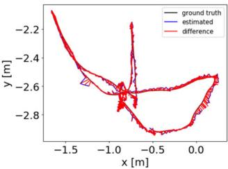  
(g)

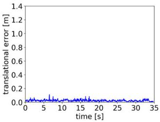  
(h)

Fig. 7 The ATE and RPE results of ORB-SLAM2 and YOLO-SLAM. The diagrams (a)(b)(e)(f) are computed through the fr3\_walking\_xyz sequence, while the counterpart diagrams (c)(d)(g)(h) are computed  
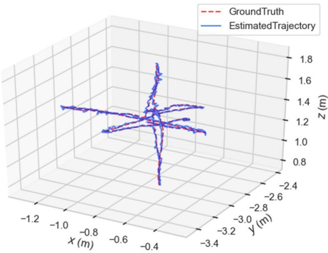  
(a)

by fr3\_walking\_halfsphere sequence. The graphs (a)(c)(e)(g) are ATE results and (b)(d)(f)(h) are RPE results  
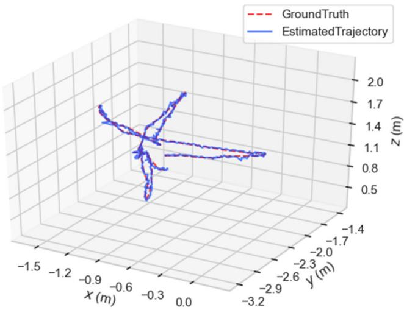  
(b)  
Fig. 8 The three-dimensional trajectory of camera motion estimated by YOLO-SLAM. Diagram (a) comes from fr3\_walking\_xyz sequence and (b) comes from fr3\_walking\_halfsphere sequence  
Table 3 The ATE (m) results of ablation experiments of YOLO-SLAM using different methods, where letter D stands for darknet19-yolov3 method and letter G represents depth-ransac method

$$
\mathrm { f r } 3 _ { - } \mathrm { w } _ { - } \mathrm { x y z }
$$

$$
\mathrm { f r } 3 \_ \mathrm { W \_ s t a t i c }
$$

$$
\mathrm { f r } 3 _ { - } \mathrm { w } _ { - } \mathrm { r p y }
$$

$$
\mathrm { f r } 3 \_ \mathrm { w \_ h a l f }
$$

$$
\mathrm { f r } 3 \_ \mathrm { s \_ s t a t i c }
$$

<table><tr><td></td><td></td><td>0.7521</td><td>0.3900</td><td>0.8705</td><td>0.4863</td><td>0.0087</td></tr><tr><td>V</td><td></td><td>0.0159</td><td>0.0172</td><td>0.2753</td><td>0.0313</td><td>0.0124</td></tr><tr><td></td><td>V</td><td>0.1437</td><td>0.1136</td><td>0.7671</td><td>0.3023</td><td>0.0125</td></tr><tr><td>V</td><td>V</td><td>0.0146</td><td>0.0073</td><td>0.2164</td><td>0.0283</td><td>0.0066</td></tr></table>

The bold represents that has achieved the best experimental performance in this evaluation index compared with other schemes

Table 4 Results of metric absolute trajectory error (ATE)
<table><tr><td rowspan="2">Sequences</td><td colspan="2">ORB-SLAM2</td><td colspan="2">DS-SLAM</td><td colspan="2">RDS-SLAM</td><td colspan="2">YOLO-SLAM (Ours)</td><td colspan="2">Improvements against ORB-SLAM2</td></tr><tr><td>RMSE</td><td>S.D</td><td>RMSE</td><td>S.D</td><td>RMSE</td><td>S.D</td><td>RMSE</td><td>S.D</td><td>RMSE (%)</td><td>S.D. (%)</td></tr><tr><td>fr3_walking_xyz</td><td>0.7521</td><td>0.3759</td><td>0.0247</td><td>0.0161</td><td>0.0571</td><td>0.0229</td><td>0.0146</td><td>0.0070</td><td>98.06</td><td>98.14</td></tr><tr><td>fr3_walking_static</td><td>0.3900</td><td>0.1602</td><td>0.0081</td><td>0.0036</td><td>0.0206</td><td>0.012</td><td>0.0073</td><td>0.0035</td><td>98.13</td><td>97.82</td></tr><tr><td>fr3_walking_rpy</td><td>0.8705</td><td>0.4520</td><td>0.4442</td><td>0.2350</td><td>0.1604</td><td>0.0873</td><td>0.2164</td><td>0.1001</td><td>75.14</td><td>77.85</td></tr><tr><td>fr3_walking_half</td><td>0.4863</td><td>0.2290</td><td>0.0303</td><td>0.0159</td><td>0.0807</td><td>0.0454</td><td>0.0283</td><td>0.0138</td><td>94.18</td><td>93.97</td></tr><tr><td>fr3_sitting_static</td><td>0.0087</td><td>0.0043</td><td>0.0065</td><td>0.0033</td><td>0.0084</td><td>0.0043</td><td>0.0066</td><td>0.0033</td><td>24.14</td><td>23.26</td></tr></table>

The bold represents that has achieved the best experimental performance in this evaluation index compared with other schemes

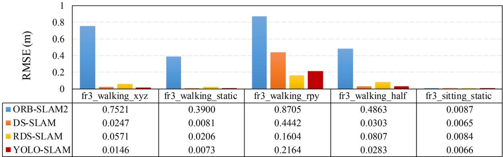  
Fig. 9 The RMSE index of absolute trajectory error (ATE)

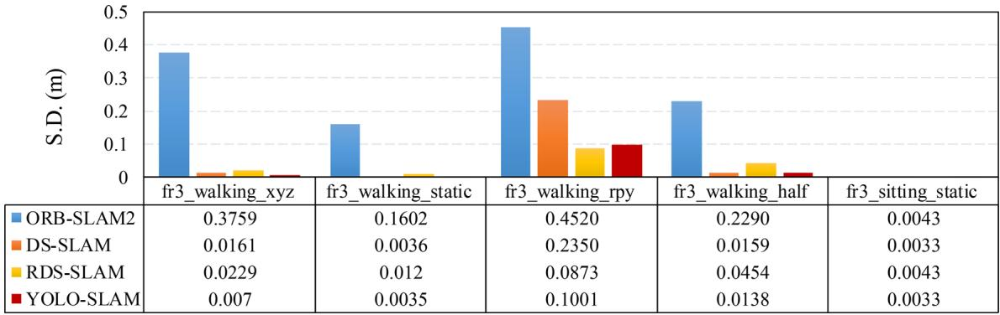  
Fig. 10 The S.D. index of absolute trajectory error (ATE)

Table 5 Results of metric translation drift (RPE)
<table><tr><td rowspan="2">Sequences</td><td colspan="2">ORB-SLAM2</td><td colspan="2">DS-SLAM</td><td colspan="2">RDS-SLAM</td><td colspan="2">YOLO-SLAM (Ours)</td><td colspan="2">Improvements against ORB-SLAM2</td></tr><tr><td>RMSE</td><td>S.D</td><td>RMSE</td><td>S.D</td><td>RMSE</td><td>S.D</td><td>RMSE</td><td>S.D</td><td>RMSE (%)</td><td>S.D. (%)</td></tr><tr><td>fr3_walking_xyz</td><td>0.4124</td><td>0.2684</td><td>0.0333</td><td>0.0229</td><td>0.0426</td><td>0.0317</td><td>0.0194</td><td>0.0097</td><td>41.74</td><td>57.64</td></tr><tr><td>fr3_walking_static</td><td>0.2162</td><td>0.1962</td><td>0.0102</td><td>0.0048</td><td>0.0221</td><td>0.0149</td><td>0.0094</td><td>0.0044</td><td>7.84</td><td>8.33</td></tr><tr><td>fr3_walking_rpy</td><td>0.4249</td><td>0.3166</td><td>0.1503</td><td>0.1168</td><td>0.1320</td><td>0.1067</td><td>0.0933</td><td>0.0736</td><td>37.92</td><td>36.99</td></tr><tr><td>fr3_walking_half</td><td>0.3550</td><td>0.2810</td><td>0.0297</td><td>0.0152</td><td>0.0482</td><td>0.036</td><td>0.0268</td><td>0.0124</td><td>9.76</td><td>18.42</td></tr><tr><td>fr3_sitting_static</td><td>0.0095</td><td>0.0046</td><td>0.0078</td><td>0.0038</td><td>0.0123</td><td>0.0070</td><td>0.0089</td><td>0.0044</td><td>-14.10</td><td>-15.79</td></tr></table>

The bold represents that has achieved the best experimental performance in this evaluation index compared with other schemes

Table 6 Results of metric rotation drift (RPE)
<table><tr><td rowspan="2">Sequences</td><td colspan="2">ORB-SLAM2</td><td colspan="2">DS-SLAM</td><td colspan="2">RDS-SLAM</td><td colspan="2">YOLO-SLAM (Ours)</td><td colspan="2">Improvements against ORB-SLAM2</td></tr><tr><td>RMSE</td><td>S.D</td><td>RMSE</td><td>S.D</td><td>RMSE</td><td>S.D</td><td>RMSE</td><td>S.D</td><td>RMSE (%)</td><td>S.D. (%)</td></tr><tr><td>fr3_walking_xyz</td><td>7.7432</td><td>4.9895</td><td>0.8266</td><td>0.5826</td><td>0.9222</td><td>0.6509</td><td>0.5984</td><td>0.3655</td><td>92.27</td><td>92.67</td></tr><tr><td>fr3_walking_static</td><td>3.8958</td><td>3.5095</td><td>0.2690</td><td>0.1182</td><td>0.4944</td><td>0.3112</td><td>0.2623</td><td>0.1104</td><td>93.27</td><td>96.85</td></tr><tr><td>fr3_walking_rpy</td><td>8.0802</td><td>5.9499</td><td>3.0042</td><td>2.3065</td><td>13.1693</td><td>12.0103</td><td>1.8238</td><td>1.4611</td><td>77.43</td><td>75.44</td></tr><tr><td>fr3_walking_half</td><td>7.3744</td><td>5.7558</td><td>0.8142</td><td>0.4101</td><td>1.8828</td><td>1.5250</td><td>0.7534</td><td>0.3564</td><td>89.78</td><td>93.81</td></tr><tr><td>fr3_sitting_static</td><td>0.2881</td><td>0.1244</td><td>0.2735</td><td>0.1215</td><td>0.3338</td><td>0.1706</td><td>0.2709</td><td>0.1209</td><td>5.97</td><td>2.81</td></tr></table>

The bold represents that has achieved the best experimental performance in this evaluation index compared with other schemes

results also indicate that YOLO-SLAM has a small trajectory drift and achieves excellent performance in handling dynamic scenarios.

## 4.2 Performance evaluation on Bonn RGB-D dynamic dataset

The Bonn RGB-D dynamic dataset was released by Photogrammetry & Robotics Lab of Bonn University in 2019, which contains 24 dynamic sequences. In the sequences, people perform different activities, such as crowds of people walking, moving boxes, synchronous movement, and so on. For each scene, the ground truth trajectory of the camera is supplied, which is recorded by an Optitrack Prime 13 motion capture system. Nine representative sequences from the Bonn dataset are selected for the performance evaluation experiment. The ‘‘crowd’’ sequences represent a scene where three people walk around randomly in an indoor environment. The ‘‘moving no box’ sequences are the scene where a person moves the noobstructing box from the ground to the table. The ‘‘person tracking’’ sequences are that the camera tracks a person walking slowly. The ‘‘synchronous’’ sequences depict the scene where two people move at the same speed and direction. These nine sequences record the highly dynamic scenes, which seriously interfere with traditional SLAM systems. The ORB feature extraction results of YOLO-SLAM on the Bonn dataset can be seen in Fig. 11.

To further evaluate the accuracy and performance of our system, three state-of-the-art SLAM systems: ORB-SLAM2, StaticFusion [42] and ReFusion [39] are conducted as the comparison schemes, on the Bonn RGB-D dynamic dataset. ORB-SLAM2 is as the benchmark of traditional SLAM systems. StaticFusion propose static/dynamic segmentation based on probability to handle moving objects in a dynamic environment. ReFusion put forward the truncated signed distance function and employ leverage color information to estimate the pose of the camera in dynamic scenes.

Table 7. shows the statistical results of the RMSE index of absolute trajectory error on the Bonn dataset. It can be observed that YOLO-SLAM outperforms the others in most sequences and achieve the lowest ATE of 0.007 in synchronous2 sequence. The average ATE error reduction rate of YOLO-SLAM can reach 90.67%, compared with ORB-SLAM. Only in crowd2 sequence, YOLO-SLAM does not perform as well as other solutions. That’s because people carry and deliver the laptop while walking in the crowd2 sequence. The dynamic feature points extracted on the laptop are not been effectively eliminated. Generally speaking, YOLO-SLAM performs well in most sequences, which confirms again the accuracy and the robustness of YOLO-SLAM in a highly dynamic environment.

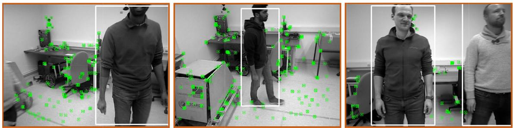  
Fig. 11 The feature extraction results of YOLO-SLAM on Bonn dataset

Table 7 Absolute Trajectory Error (RMSE) [m] on Bonn dataset
<table><tr><td>Sequences</td><td>ORB-SLAM2</td><td>StaticFusion</td><td>ReFusion</td><td>YOLO-SLAM (Ours)</td></tr><tr><td>crowd</td><td>0.878</td><td>3.586</td><td>0.204</td><td>0.033</td></tr><tr><td>crowd2</td><td>1.483</td><td>0.215</td><td>0.155</td><td>0.423</td></tr><tr><td>crowd3</td><td>1.183</td><td>0.168</td><td>0.137</td><td>0.069</td></tr><tr><td>moving_no_box</td><td>0.408</td><td>0.141</td><td>0.071</td><td>0.027</td></tr><tr><td>moving_no_box2</td><td>0.084</td><td>0.364</td><td>0.179</td><td>0.035</td></tr><tr><td>person_tracking</td><td>0.722</td><td>0.484</td><td>0.289</td><td>0.157</td></tr><tr><td>person_tracking2</td><td>0.983</td><td>0.626</td><td>0.463</td><td>0.037</td></tr><tr><td>synchronous</td><td>1.186</td><td>0.446</td><td>0.441</td><td>0.014</td></tr><tr><td>synchronous2</td><td>1.325</td><td>0.027</td><td>0.022</td><td>0.007</td></tr></table>

Table 8 The time-consuming cost
<table><tr><td>Systems</td><td colspan="3">Tasks for tracking each frame (ms)</td><td>Total time (ms)</td><td>Hardware platform</td></tr><tr><td>ORB- SLAM2</td><td>ORB feature extraction 21.69</td><td>Pose prediction 3.15</td><td>Track local map 11.53</td><td>36.37</td><td>Intel Core i5-4288U CPU</td></tr><tr><td>DS-SLAM</td><td>ORB feature extraction 9.38</td><td>Move consistency check 29.51</td><td>Semantic segmentation 37.57</td><td>76.46</td><td>Intel i7 CPU, P4000 GPU</td></tr><tr><td>RDS-SLAM</td><td>Segmentation and mask generation 205.42</td><td>Update moving probability 0.17</td><td>Semantic-based optimization 0.54</td><td>206.13</td><td>GeForce RTX 2080Ti GPU</td></tr><tr><td>YOLO- SLAM</td><td>ORB feature extraction 22.52</td><td>Object detection 651.53</td><td>Dynamic features screening 22.04</td><td>696.09</td><td>Intel Core i5-4288U CPU</td></tr></table>

## 4.3 Time Analysis

In real-world applications, the time cost is an important index to evaluate the quality of a SLAM system. The timeconsuming cost of different SLAM systems is shown in Table 8, which are tested on TUM datasets. As for YOLO-SLAM, the object detection thread spent the most time, followed by ORB feature extraction, the minimum of timeconsuming is dynamic features screening. Although the YOLO\_SLAM can not achieve real-time processing currently, we think that the object detection thread is the main reason that slows down the processing speed, which can be improved by applying better computing equipment instead of only Inter Core i5-4288U CPU in our experiment.

## 5 Conclusion and future work

In this paper, a new SLAM system named YOLO-SLAM has been proposed to reduce the impact of dynamic objects. YOLO-SLAM is constructed based on ORB-SLAM2 with two designed threads, namely, the object detection thread and dynamic features screening thread. For the object detection thread, a lightweight version of YOLOv3 is presented to provide necessary semantic information in a dynamic environment, which replaces the backbone network from darknet-53 to darknet-19 and results in a fasterdetecting speed. Furthermore, for the dynamic features screening thread, the screening method named depth-RANSAC is proposed to accept semantic information and remove those feature points extracted within the contour of dynamic objects.

Based on the open-access TUM RGB-D dataset and Bonn dynamic dataset, the proposed YOLO-SLAM achieves over 90% ATE and RPE error reduction in most sequences, compared to the original ORB-SLAM2. Compared with the state-of-the-art SLAM system DS-SLAM and RDS-SLAM, our scheme also keeps ahead in those highly dynamic sequences. The results indicate that YOLO-SLAM has an outstanding and reliable performance in robustness, accuracy, and stability in the dynamic environment. The proposed YOLO-SLAM explores the possibility for mobile robots to run in a real environment with potentially a large number of moving objects, such as food delivery service robots in a restaurant environment.

However, there are still some ongoing works in YOLO-SLAM. For example, the object detection thread would suffer from performance degradation with the object appearing in a non-regular form, such as a walking person at an angle of 45 degrees because of the camera rotation. Additionally, the storage format of the map in YOLO-SLAM is a point cloud map, which may not be suitable for more complicated high-level tasks. Therefore, we would focus on improving the robustness of YOLO-SLAM under extreme conditions, and constructing the dense octo-tree map into our system to accommodate a wider range of requirements.

Acknowledgments Wenxin Wu and Zhichao You contributed equally to this work, as the co-first author of this article. This research was supported in part by the National Natural Science Foundation of China under Grant 51775452, Grant 51905452, in part by Fundamental Research Funds for Central Universities under Grant 2682019CX35, 2682017ZDPY09, in part by China Postdoctoral Science Foundation under Grant 2019M663549, in part by Planning Project of Science & Technology Department of Sichuan Province under Grant 2019YFG0353, and in part by Local Development Foundation guided by the Central Government under Grant 2020ZYD012.

Funding National Natural Science Foundation of China,51905452,- Liang Guo,51775452, Hongli Gao,Local Development Fundatoin guided by the Central Government, 2020ZYD012, Liang Guo,China Postdoctoral Science Foundation,2019M663549, Liang Guo,Planning Project of Science & Technology Department of Sichuan Province under Grant, 2019YFG0353,Hongli Gao, The Fundamental Research Funds for the Cener Universities,2682019CX35, Hongli Gao, 2682017ZDPY09, Hongli Gao

## Declaration

Conflict of interest The authors declare that they have no known competing financial interests or personal relationships that could have appeared to influence the work reported in this paper. The contribution of this paper is our original work, and all authors have agreed to the submission of this work to this journal. The paper has not been published and is not under consideration for publication by another journal.

## References

1. Scona R, Nobili S, Petillot YR, Fallon M (2017) Direct visual SLAM fusing proprioception for a humanoid robot. In: IEEE International Conference on Intelligent Robots and Systems

2. Aladem M, Rawashdeh SA (2018) Lightweight visual odometry for autonomous mobile robots. Sensors (Switzerland). https://doi. org/10.3390/s18092837

3. Giubilato R, Chiodini S, Pertile M, Debei S (2019) An evaluation of ROS-compatible stereo visual SLAM methods on a nVidia Jetson TX2. Meas J Int Meas Confed. https://doi.org/10.1016/j. measurement.2019.03.038

4. Cadena C, Carlone L, Carrillo H et al (2016) Past, present, and future of simultaneous localization and mapping: Toward the

robust-perception age. IEEE Trans Robot. https://doi.org/10. 1109/TRO.2016.2624754

5. Montiel JMM (2015) ORB-SLAM: A Versatile and Accurate Monocular 31:1147–1163

6. Pumarola A, Vakhitov A, Agudo A et al (2017) PL-SLAM: Realtime monocular visual SLAM with points and lines. Proc IEEE Int Conf Robot Autom. https://doi.org/10.1109/ICRA.2017. 7989522

7. Fuentes-Pacheco J, Ruiz-Ascencio J, Rendo´n-Mancha JM (2012) Visual simultaneous localization and mapping: a survey. Artif Intell Rev 43:55–81. https://doi.org/10.1007/s10462-012-9365-8

8. Li P, Qin T, Shen S (2018) Stereo Vision-Based Semantic 3D Object and Ego-Motion Tracking for Autonomous Driving. Lect Notes Comput Sci (including Subser Lect Notes Artif Intell Lect Notes Bioinformatics) 11206 LNCS:664–679. https://doi.org/10. 1007/978-3-030-01216-8\_40

9. Siddiqui MK, Islam MZ, Kabir MA (2019) A novel quick seizure detection and localization through brain data mining on ECoG dataset. Neural Comput Appl. https://doi.org/10.1007/s00521- 018-3381-9

10. Mur-Artal R, Tardos JD (2017) ORB-SLAM2: An Open-Source SLAM System for Monocular, Stereo, and RGB-D Cameras. IEEE Trans Robot 33:1255–1262. https://doi.org/10.1109/TRO. 2017.2705103

11. Engel J, Scho¨ps T, Cremers D (2014) LSD-SLAM: Large-Scale Direct monocular SLAM. Lect Notes Comput Sci (including Subser Lect Notes Artif Intell Lect Notes Bioinformatics) 8690 LNCS:834–849. https://doi.org/10.1007/978-3-319-10605-2\_54

12. Endres F, Hess J, Sturm J et al (2014) 3-D Mapping with an RGB-D camera. IEEE Trans Robot 30:177–187. https://doi.org 10.1109/TRO.2013.2279412

13. Saputra MRU, Markham A, Trigoni N (2018) Visual SLAM and structure from motion in dynamic environments: A survey. ACM Comput Surv. https://doi.org/10.1145/3177853

14. Wang CC, Thorpe C (2002) Simultaneous localization and mapping with detection and tracking of moving objects. Proc - IEEE Int Conf Robot Autom 3:2918–2924. https://doi.org/10. 1109/robot.2002.1013675

15. Kim DH, Kim JH (2016) Effective background model-based RGB-D dense visual odometry in a dynamic environment. IEEE Trans Robot 32:1565–1573. https://doi.org/10.1109/TRO.2016. 2609395

16. Li S, Lee D (2017) RGB-D SLAM in Dynamic Environments Using Static Point Weighting. IEEE Robot Autom Lett 2:2263–2270. https://doi.org/10.1109/LRA.2017.2724759

17. Wang R, Wan W, Wang Y, Di K (2019) A new RGB-D SLAM method with moving object detection for dynamic indoor scenes. Remote Sens. https://doi.org/10.3390/rs11101143

18. Cheng J, Wang C, Meng MQH (2020) Robust Visual Localization in Dynamic Environments Based on Sparse Motion Removal. IEEE Trans Autom Sci Eng 17:658–669. https://doi. org/10.1109/TASE.2019.2940543

19. Liu Y, Liu Y, Gao H et al (2020) A Data-Flow Oriented Deep Ensemble Learning Method for Real-Time Surface Defect Inspection. IEEE Trans Instrum Meas. https://doi.org/10.1109/ TIM.2019.2957849

20. Li F, Li W, Chen W et al (2020) A Mobile Robot Visual SLAM System with Enhanced Semantics Segmentation. IEEE Access 8:25442–25458. https://doi.org/10.1109/ACCESS.2020.2970238

21. Zhang L, Wei L, Shen P et al (2018) Semantic SLAM based on object detection and improved octomap. IEEE Access 6:75545–75559. https://doi.org/10.1109/ACCESS.2018.2873617

22. Redmon J, Divvala S, Girshick R, Farhadi A (2016) You only look once: Unified, real-time object detection. Proc IEEE Compu Soc Conf Comput Vis Pattern Recognit 2016-Decem:779–788. https://doi.org/10.1109/CVPR.2016.91

23. Redmon J, Farhadi A (2017) YOLO9000: Better, faster, stronger. Proc - 30th IEEE Conf Comput Vis Pattern Recognition, CVPR 2017 2017-Janua:6517–6525. https://doi.org/10.1109/CVPR. 2017.690

24. Redmon J, Farhadi A (2018) YOLOv3: An Incremental Improvement

25. Liu Y, Miura J (2021) RDS-SLAM: Real-Time Dynamic SLAM Using Semantic Segmentation Methods. IEEE Access. https://doi. org/10.1109/ACCESS.2021.3050617

26. Guo L, Lei Y, Li N et al (2018) Neurocomputing Machinery health indicator construction based on convolutional neural networks considering trend burr. Neurocomputing 292:142–150. https://doi.org/10.1016/j.neucom.2018.02.083

27. Tan Y, Guo L, Gao H, Zhang L (2021) Network: A Method for Intelligent Fault Diagnosis Between Artificial and Real Damages. 70:

28. Yu C, Liu Z, Liu XJ et al (2018) DS-SLAM: A Semantic Visual SLAM towards Dynamic Environments. IEEE Int Conf Intell Robot Syst. https://doi.org/10.1109/IROS.2018.8593691

29. Bescos B, Facil JM, Civera J, Neira J (2018) DynaSLAM: Tracking, Mapping, and Inpainting in Dynamic Scenes. IEEE Robot Autom Lett 3:4076–4083. https://doi.org/10.1109/LRA. 2018.2860039

30. Zhao L, Liu Z, Chen J et al (2019) A Compatible Framework for RGB-D SLAM in Dynamic Scenes. IEEE Access 7:75604–75614. https://doi.org/10.1109/ACCESS.2019.2922733

31. Yang D, Bi S, Wang W et al (2019) DRE-SLAM: Dynamic RGB-D Encoder SLAM for a Differential-Drive Robot. Remote Sens. https://doi.org/10.3390/rs11040380

32. Li P, Zhao W (2020) Image fire detection algorithms based on convolutional neural networks. Case Stud Therm Eng. https://doi. org/10.1016/j.csite.2020.100625

33. Simonyan K, Zisserman A (2015) Very deep convolutional networks for large-scale image recognition. In: 3rd International Conference on Learning Representations, ICLR 2015 - Conference Track Proceedings

34. He K, Zhang X, Ren S, Sun J (2016) Deep residual learning for image recognition. In: Proceedings of the IEEE Computer Society Conference on Computer Vision and Pattern Recognition. pp 770–778

35. Zhao L, Liu Z, Chen J et al (2019) A Compatible Framework for RGB-D SLAM in Dynamic Scenes. IEEE Access. https://doi.org 10.1109/ACCESS.2019.2922733

36. Liu G, Zeng W, Feng B, Xu F (2019) DMS-SLAM: A genera visual SLAM system for dynamic scenes with multiple sensors. Sensors (Switzerland). https://doi.org/10.3390/s19173714

37. Xiao L, Wang J, Qiu X et al (2019) Dynamic-SLAM: Semantic monocular visual localization and mapping based on deep learning in dynamic environment. Rob Auton Syst 117:1–16. https://doi.org/10.1016/j.robot.2019.03.012

38. Sturm J, Engelhard N, Endres F et al (2012) A benchmark for the evaluation of RGB-D SLAM systems. IEEE Int Conf Intell Robot Syst. https://doi.org/10.1109/IROS.2012.6385773

39. Palazzolo E, Behley J, Lottes P et al (2019) ReFusion: 3D Reconstruction in Dynamic Environments for RGB-D Cameras Exploiting Residuals. IEEE Int Conf Intell Robot Syst. https:// doi.org/10.1109/IROS40897.2019.8967590

40. Everingham M, Van Gool L, Williams CKI et al (2010) The pascal visual object classes (VOC) challenge. Int J Comput Vis 88:303–338. https://doi.org/10.1007/s11263-009-0275-4

41. Raguram R, Chum O, Pollefeys M et al (2013) USAC: A universal framework for random sample consensus. IEEE Trans Pattern Anal Mach Intell 35:2022–2038. https://doi.org/10.1109/ TPAMI.2012.257

42. Scona R, Jaimez M, Petillot YR, et al (2018) StaticFusion: Background Reconstruction for Dense RGB-D SLAM in Dynamic Environments. In: Proceedings - IEEE International Conference on Robotics and Automation

Publisher’s Note Springer Nature remains neutral with regard to jurisdictional claims in published maps and institutional affiliations.