# 3D G<sub>auss</sub>i<sub>a</sub>n S<sub>p</sub>l<sub>a</sub>tin<sub>g</sub> f<sub>o</sub>r R<sub>ea</sub>l-Tim<sub>e</sub> R<sub>a</sub>di<sub>a</sub>n<sub>ce</sub> Fi<sub>e</sub>ld R<sub>e</sub>nd<sub>e</sub>rin<sub>g</sub>

BERNHARD KERBL<sup>∗</sup><sub>,</sub> I<sub>nr</sub>i<sub>a,</sub> U<sub>n</sub>i<sub>vers</sub>ité Côt<sub>e</sub> d’A<sub>zur,</sub> F<sub>rance</sub> GEORGIOS KOPANAS<sup>∗</sup><sub>,</sub> I<sub>nr</sub>i<sub>a,</sub> U<sub>n</sub>i<sub>vers</sub>ité Côt<sub>e</sub> d’A<sub>zur,</sub> F<sub>rance</sub> THOMAS LEIMKÜHLER<sub>,</sub> M<sub>ax-</sub>Pl<sub>anc</sub>k<sub>-</sub>I<sub>nst</sub>i<sub>tut</sub> f<sub>ür</sub> I<sub>n</sub>f<sub>ormat</sub>ik<sub>,</sub> G<sub>ermany</sub> GEORGE DRETTAKIS<sub>,</sub> I<sub>nr</sub>i<sub>a,</sub> U<sub>n</sub>i<sub>vers</sub>ité Côt<sub>e</sub> d’A<sub>zur,</sub> F<sub>rance</sub>

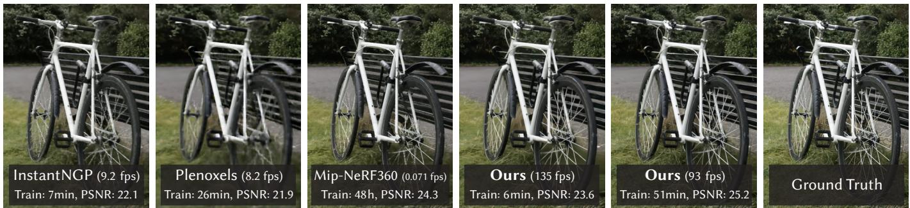  
Fi . 1. Our method achieves real-time renderin of radiance fields with ualit that e uals the revious method with the best ualit [Barron et al. 2022], while onl<sub>y</sub> re<sub>q</sub>uirin<sub>g</sub> o<sub>p</sub>timization times com<sub>p</sub>etitive with the fastest <sub>p</sub>revious methods [Fridovich-Keil and Yu et al. 2022; Müller et al. 2022]. Ke<sub>y</sub> to this <sub>er</sub>f<sub>ormance</sub> i<sub>s a nove</sub>l 3D G<sub>auss</sub>i<sub>an scene re resen</sub>t<sub>a</sub>ti<sub>on cou</sub> l<sub>e</sub>d <sub>w</sub>ith <sub>a rea</sub>l<sub>-</sub>ti<sub>me</sub> dif<sub>eren</sub>ti<sub>a</sub>bl<sub>e ren</sub>d<sub>erer, w</sub>hi<sub>c</sub>h <sub>o</sub>f<sub>ers s</sub>i <sub>n</sub>ifi<sub>can</sub>t <sub>s ee</sub>d<sub>u</sub> t<sub>o</sub> b<sub>o</sub>th <sub>scene</sub> o<sub>p</sub>timization and novel view s<sub>y</sub>nthesis. Note that for com<sub>p</sub>arable trainin<sub>g</sub> times to InstantNGP [Müller et al. 2022], we achieve similar <sub>q</sub>ualit<sub>y</sub> to theirs; while this is the maximum <sub>q</sub>ualit<sub>y</sub> the<sub>y</sub> reach, b<sub>y</sub> trainin<sub>g</sub> for 51min we achieve state-of-the-art <sub>q</sub>ualit<sub>y</sub>, even sli<sub>g</sub>htl<sub>y</sub> beter than Mi<sub>p</sub>-NeRF360 [Barron et al. 2022].

R<sub>a</sub>di<sub>ance</sub> Fi<sub>e</sub>ld <sub>me</sub>th<sub>o</sub>d<sub>s</sub> h<sub>ave recen</sub>tl<sub>y revo</sub>l<sub>u</sub>ti<sub>on</sub>i<sub>ze</sub>d <sub>nove</sub>l<sub>-v</sub>i<sub>ew syn</sub>th<sub>es</sub>i<sub>s</sub> of scenes ca<sub>p</sub>tured with multi<sub>p</sub>le <sub>p</sub>hotos or videos. However<sub>,</sub> achievin<sub>g</sub> hi<sub>g</sub>h <sub>v</sub>i<sub>sua</sub>l <sub>qua</sub>lit<sub>y</sub> <sub>s</sub>till <sub>requ</sub>i<sub>res</sub> <sub>neura</sub>l <sub>ne</sub>t<sub>wor</sub>k<sub>s</sub> th<sub>a</sub>t <sub>are</sub> <sub>cos</sub>tl<sub>y</sub> t<sub>o</sub> t<sub>ra</sub>i<sub>n</sub> <sub>an</sub>d <sub>ren</sub> d<sub>er, w</sub>hil<sub>e recen</sub>t f<sub>as</sub>t<sub>er me</sub>th<sub>o</sub>d<sub>s</sub> i<sub>nev</sub>it<sub>a</sub>bl<sub>y</sub> t<sub>ra</sub>d<sub>e o</sub>f <sub>spee</sub>d f<sub>or qua</sub>lit<sub>y.</sub> F<sub>or</sub> unbounded and com<sub>p</sub>lete scenes (rather than isolated objects) and 1080<sub>p</sub> <sub>reso</sub>l<sub>u</sub>ti<sub>on</sub> <sub>ren</sub>d<sub>er</sub>i<sub>ng,</sub> <sub>no</sub> <sub>curren</sub>t <sub>me</sub>th<sub>o</sub>d <sub>can</sub> <sub>ac</sub>hi<sub>eve</sub> <sub>rea</sub>l<sub>-</sub>ti<sub>me</sub> di<sub>sp</sub>l<sub>ay</sub> <sub>ra</sub>t<sub>es.</sub> W<sub>e</sub> i<sub>n</sub>t<sub>ro</sub>d<sub>uce</sub> th<sub>ree</sub> k<sub>ey</sub> <sub>e</sub>l<sub>emen</sub>t<sub>s</sub> th<sub>a</sub>t <sub>a</sub>ll<sub>ow</sub> <sub>us</sub> t<sub>o</sub> <sub>ac</sub>hi<sub>eve</sub> <sub>s</sub>t<sub>a</sub>t<sub>e-o</sub>f<sub>-</sub>th<sub>e-ar</sub>t visual <sub>q</sub>ualit<sub>y</sub> while maintainin<sub>g</sub> com<sub>p</sub>etitive trainin<sub>g</sub> times and im<sub>p</sub>ortantl<sub>y</sub> allow hi<sub>g</sub>h-<sub>q</sub>ualit<sub>y</sub> real-time (≥ 30 f<sub>p</sub>s) novel-view s<sub>y</sub>nthesis at 1080<sub>p</sub> resolution. First<sub>,</sub> startin<sub>g</sub> from s<sub>p</sub>arse <sub>p</sub>oints <sub>p</sub>roduced durin<sub>g</sub> camera calibration<sub>,</sub> we re<sub>p</sub>resent the scene with 3D Gaussians that <sub>p</sub>reserve desirable <sub>p</sub>ro<sub>p</sub>erti<sub>es o</sub>f <sub>con</sub>ti<sub>nuous vo</sub>l<sub>ume</sub>t<sub>r</sub>i<sub>c ra</sub>di<sub>ance</sub> fi<sub>e</sub>ld<sub>s</sub> f<sub>or scene op</sub>ti<sub>m</sub>i<sub>za</sub>ti<sub>on w</sub>hil<sub>e</sub> avoidin<sub>g</sub> unnecessar<sub>y</sub> com<sub>p</sub>utation in em<sub>p</sub>t<sub>y</sub> s<sub>p</sub>ace<sub>;</sub> Second<sub>,</sub> we <sub>p</sub>erform interleaved o<sub>p</sub>timization/densit<sub>y</sub> control of the 3D Gaussians<sub>,</sub> notabl<sub>y</sub> o<sub>p</sub>ti mizin<sub>g a</sub>ni<sub>so</sub>tr<sub>op</sub>i<sub>c cova</sub>ri<sub>a</sub>n<sub>ce</sub> t<sub>o ac</sub>hi<sub>eve a</sub>n <sub>accu</sub>r<sub>a</sub>t<sub>e</sub> r<sub>ep</sub>r<sub>ese</sub>nt<sub>a</sub>ti<sub>o</sub>n <sub>o</sub>f th<sub>e</sub> scene<sub>;</sub> Third<sub>,</sub> we develo<sub>p</sub> a fast visibilit<sub>y</sub>-aware renderin<sub>g</sub> al<sub>g</sub>orithm that su<sub>pp</sub>orts anisotro<sub>p</sub>ic s<sub>p</sub>lattin<sub>g</sub> and both accelerates trainin<sub>g</sub> and allows real time renderin<sub>g</sub>. We demonstrate state-of-the-art visual <sub>q</sub>ualit<sub>y</sub> and real-time <sub>ren</sub>d<sub>er</sub>i<sub>ng on severa</sub>l <sub>es</sub>t<sub>a</sub>bli<sub>s</sub>h<sub>e</sub>d d<sub>a</sub>t<sub>ase</sub>t<sub>s.</sub>

CCS Concepts: • Computing methodologies → Rendering; Point-based models; Rasterization; Machine learning approaches.

<sup>∗</sup>B<sub>o</sub>th <sub>au</sub>th<sub>ors</sub> <sub>con</sub>t<sub>r</sub>ib<sub>u</sub>t<sub>e</sub>d <sub>equa</sub>ll<sub>y</sub> t<sub>o</sub> th<sub>e</sub> <sub>paper.</sub>

A<sub>u</sub>th<sub>ors</sub>’ <sub>a</sub>dd<sub>resses:</sub> B<sub>ern</sub>h<sub>ar</sub>d K<sub>er</sub>bl<sub>,</sub> b<sub>ern</sub>h<sub>ar</sub>d<sub>.</sub>k<sub>er</sub>bl<sub>@</sub>i<sub>nr</sub>i<sub>a.</sub>f<sub>r,</sub> I<sub>nr</sub>i<sub>a,</sub> U<sub>n</sub>i<sub>vers</sub>ité Côt<sub>e</sub> d’Azur<sub>,</sub> France<sub>;</sub> Geor<sub>g</sub>ios Ko<sub>p</sub>anas<sub>, g</sub>eor<sub>g</sub>ios.ko<sub>p</sub>anas@inria.fr<sub>,</sub> Inria<sub>,</sub> Université Côte d’A<sub>zur,</sub> F<sub>rance;</sub> Th<sub>omas</sub> L<sub>e</sub>i<sub>m</sub>kühl<sub>er,</sub> th<sub>omas.</sub>l<sub>e</sub>i<sub>m</sub>k<sub>ue</sub>hl<sub>er@mp</sub>i<sub>-</sub>i<sub>n</sub>f<sub>.mpg.</sub>d<sub>e,</sub> M<sub>ax-</sub> Pl<sub>anc</sub>k<sub>-</sub>I<sub>ns</sub>tit<sub>u</sub>t fü<sub>r</sub> I<sub>n</sub>f<sub>orma</sub>tik<sub>,</sub> G<sub>ermany;</sub> G<sub>eorge</sub> D<sub>re</sub>tt<sub>a</sub>ki<sub>s, george.</sub>d<sub>re</sub>tt<sub>a</sub>ki<sub>s@</sub>i<sub>nr</sub>i<sub>a.</sub>f<sub>r,</sub> Inri<sub>a,</sub> Uni<sub>ve</sub>r<sub>s</sub>ité Côt<sub>e</sub> d’Az<sub>u</sub>r<sub>,</sub> Fr<sub>a</sub>n<sub>ce.</sub>

Additi<sub>ona</sub>l K<sub>ey</sub> W<sub>or</sub>d<sub>s an</sub>d Ph<sub>rases: nove</sub>l <sub>v</sub>i<sub>ew syn</sub>th<sub>es</sub>i<sub>s, ra</sub>di<sub>ance</sub> fi<sub>e</sub>ld<sub>s,</sub> 3D <sub>g</sub>aussians<sub>,</sub> real-time renderin<sub>g</sub>

## ACM Reference Format:

Bernhard Kerbl<sub>,</sub> Geor<sub>g</sub>ios Ko<sub>p</sub>anas<sub>,</sub> Thomas Leimkühler<sub>,</sub> and Geor<sub>g</sub>e Drett<sub>a</sub>ki<sub>s.</sub> 2023<sub>.</sub> 3D G<sub>auss</sub>i<sub>a</sub>n S<sub>p</sub>l<sub>a</sub>ttin<sub>g</sub> f<sub>o</sub>r R<sub>ea</sub>l-Tim<sub>e</sub> R<sub>a</sub>di<sub>a</sub>n<sub>ce</sub> Fi<sub>e</sub>ld R<sub>e</sub>nd<sub>e</sub>ring. ACM Trans. Graph. 42, 4, Article 139 (August 2023), 14 pages. https: //doi.or<sub>g</sub>/10.1145/3592433

## 1 INTRODUCTION

Meshes and <sub>p</sub>oints are the most common 3D scene re<sub>p</sub>resentations beca<sub>u</sub>se the<sub>y</sub> are ex<sub>p</sub>licit and are a <sub>g</sub>ood fit for fast GPU/CUDA-based rasterization. In contrast, recent Neural Radiance Field (NeRF) methods build on continuous scene re<sub>p</sub>resentations<sub>,</sub> t<sub>yp</sub>icall<sub>y</sub> o<sub>p</sub>timizin<sub>g</sub> a Multi-La<sub>y</sub>er Perce<sub>p</sub>tron (MLP) usin<sub>g</sub> volumetric ra<sub>y</sub>-marchin<sub>g</sub> for <sub>nove</sub>l<sub>-v</sub>i<sub>ew syn</sub>th<sub>es</sub>i<sub>s o</sub>f<sub>cap</sub>t<sub>ure</sub>d <sub>scenes.</sub> Si<sub>m</sub>il<sub>ar</sub>l<sub>y,</sub> th<sub>e mos</sub>t <sub>e</sub>fi<sub>c</sub>i<sub>en</sub>t <sub>ra</sub>di<sub>ance</sub> fi<sub>e</sub>ld <sub>so</sub>l<sub>u</sub>ti<sub>ons</sub> t<sub>o</sub> d<sub>a</sub>t<sub>e</sub> b<sub>u</sub>ild <sub>on con</sub>ti<sub>nuous represen</sub>t<sub>a</sub>ti<sub>ons</sub> b<sub>y</sub> inter<sub>p</sub>olatin<sub>g</sub> values stored in, e.<sub>g</sub>., voxel [Fridovich-Keil and Yu et al. 2022] or hash [Müller et al. 2022] <sub>g</sub>rids or <sub>p</sub>oints [Xu et al. 2022]. Whil<sub>e</sub> th<sub>e con</sub>ti<sub>nuous na</sub>t<sub>ure o</sub>f th<sub>ese me</sub>th<sub>o</sub>d<sub>s</sub> h<sub>e</sub>l<sub>ps op</sub>ti<sub>m</sub>i<sub>za</sub>ti<sub>on,</sub> the stochastic sam<sub>p</sub>lin<sub>g</sub> re<sub>q</sub>uired for renderin<sub>g</sub> is costl<sub>y</sub> and can <sub>resu</sub>lt i<sub>n no</sub>i<sub>se.</sub> W<sub>e</sub> i<sub>n</sub>t<sub>ro</sub>d<sub>uce a new approac</sub>h th<sub>a</sub>t <sub>com</sub>bi<sub>nes</sub> th<sub>e</sub> b<sub>es</sub>t of both worlds: our 3D Gaussian re<sub>p</sub>resentation allows o<sub>p</sub>timization with state-of-the-art (SOTA) visual <sub>q</sub>ualit<sub>y</sub> and com<sub>p</sub>etitive trainin<sub>g</sub> ti<sub>mes, w</sub>hil<sub>e our</sub> til<sub>e-</sub>b<sub>ase</sub>d <sub>sp</sub>l<sub>a</sub>tti<sub>ng so</sub>l<sub>u</sub>ti<sub>on ensures rea</sub>l<sub>-</sub>ti<sub>me ren-</sub> derin<sub>g</sub> at SOTA <sub>q</sub>ualit<sub>y</sub> for 1080<sub>p</sub> resolution on several <sub>p</sub>reviousl<sub>y</sub> <sub>p</sub>ublished datasets [Barron et al. 2022; Hedman et al. 2018; Kna<sub>p</sub>itsch et al. 2017] (see Fi<sub>g</sub>. 1).

O<sub>ur goa</sub>l i<sub>s</sub> t<sub>o a</sub>ll<sub>ow rea</sub>l<sub>-</sub>ti<sub>me ren</sub>d<sub>er</sub>i<sub>ng</sub> f<sub>or scenes cap</sub>t<sub>ure</sub>d <sub>w</sub>ith multi<sub>p</sub>le <sub>p</sub>hotos<sub>,</sub> and create the re<sub>p</sub>resentations with o<sub>p</sub>timization ti<sub>mes</sub> <sub>as</sub> f<sub>as</sub>t <sub>as</sub> th<sub>e</sub> <sub>mos</sub>t <sub>e</sub>fi<sub>c</sub>i<sub>en</sub>t <sub>prev</sub>i<sub>ous</sub> <sub>me</sub>th<sub>o</sub>d<sub>s</sub> f<sub>or</sub> t<sub>yp</sub>i<sub>ca</sub>l real scenes. Recent methods achieve fast trainin<sub>g</sub> [Fridovich-Keil and Yu et al. 2022; Müller et al. 2022], but stru<sub>gg</sub>le to achieve the <sub>v</sub>i<sub>sua</sub>l <sub>qua</sub>lit<sub>y o</sub>bt<sub>a</sub>in<sub>e</sub>d b<sub>y</sub> th<sub>e cu</sub>rr<sub>e</sub>nt SOTA N<sub>e</sub>RF m<sub>e</sub>th<sub>o</sub>d<sub>s,</sub> i<sub>.e.,</sub> Mi<sub>p</sub>-NeRF360 [Barron et al. 2022], which re<sub>q</sub>uires u<sub>p</sub> to 48 hours of t<sub>ra</sub>i<sub>n</sub>i<sub>ng</sub> ti<sub>me.</sub> Th<sub>e</sub> f<sub>as</sub>t <sub>–</sub> b<sub>u</sub>t l<sub>ower-qua</sub>lit<sub>y – ra</sub>di<sub>ance</sub> fi<sub>e</sub>ld <sub>me</sub>th<sub>o</sub>d<sub>s</sub> can achieve interactive renderin<sub>g</sub> times de<sub>p</sub>endin<sub>g</sub> on the scene (10-15 frames <sub>p</sub>er second), but fall short of real-time renderin<sub>g</sub> at hi<sub>g</sub>h <sub>reso</sub>l<sub>u</sub>ti<sub>on.</sub>

O<sub>ur</sub> <sub>so</sub>l<sub>u</sub>ti<sub>on</sub> b<sub>u</sub>ild<sub>s</sub> <sub>on</sub> th<sub>ree</sub> <sub>ma</sub>i<sub>n</sub> <sub>componen</sub>t<sub>s.</sub> W<sub>e</sub> fi<sub>rs</sub>t i<sub>n</sub>t<sub>ro</sub> duce 3D Gaussians as a flexible and expressive scene representation. W<sub>e s</sub>t<sub>a</sub>rt <sub>w</sub>ith th<sub>e sa</sub>m<sub>e</sub> in<sub>pu</sub>t <sub>as p</sub>r<sub>ev</sub>i<sub>ous</sub> N<sub>e</sub>RF-lik<sub>e</sub> m<sub>e</sub>th<sub>o</sub>d<sub>s,</sub> i<sub>.e.,</sub> cameras calibrated with Structure-from-Motion (SfM) [Snavel<sub>y</sub> et al. 2006] and initialize the set of 3D Gaussians with the s<sub>p</sub>arse <sub>p</sub>oint <sub>c</sub>l<sub>ou</sub>d <sub>pro</sub>d<sub>uce</sub>d f<sub>or</sub> f<sub>ree as par</sub>t <sub>o</sub>f th<sub>e</sub> SfM <sub>process.</sub> I<sub>n con</sub>t<sub>ras</sub>t t<sub>o</sub> most <sub>p</sub>oint-based solutions that re<sub>q</sub>uire Multi-View Stereo (MVS) data [Aliev et al. 2020; Ko<sub>p</sub>anas et al. 2021; Rückert et al. 2022], we achieve hi<sub>g</sub>h-<sub>q</sub>ualit<sub>y</sub> results with onl<sub>y</sub> SfM <sub>p</sub>oints as in<sub>p</sub>ut. Note th<sub>a</sub>t f<sub>or</sub> th<sub>e</sub> N<sub>e</sub>RF<sub>-s n</sub>th<sub>e</sub>ti<sub>c</sub> d<sub>a</sub>t<sub>ase</sub>t<sub>, our me</sub>th<sub>o</sub>d <sub>ac</sub>hi<sub>eves</sub> hi h <sub>ua</sub>l it<sub>y eve</sub>n <sub>w</sub>ith r<sub>a</sub>nd<sub>o</sub>m initi<sub>a</sub>liz<sub>a</sub>ti<sub>o</sub>n<sub>.</sub> W<sub>e s</sub>h<sub>ow</sub> th<sub>a</sub>t 3D G<sub>auss</sub>i<sub>a</sub>n<sub>s</sub> <sub>are an exce</sub>ll<sub>en</sub>t <sub>c</sub>h<sub>o</sub>i<sub>ce, s</sub>i<sub>nce</sub> th<sub>ey are a</sub> dif<sub>eren</sub>ti<sub>a</sub>bl<sub>e vo</sub>l<sub>ume</sub>t<sub>r</sub>i<sub>c</sub> <sub>represen</sub>t<sub>a</sub>ti<sub>on,</sub> b<sub>u</sub>t th<sub>ey can a</sub>l<sub>so</sub> b<sub>e ras</sub>t<sub>er</sub>i<sub>ze</sub>d <sub>very e</sub>fi<sub>c</sub>i<sub>en</sub>tl<sub>y</sub> b<sub>y</sub> projecting t<sup>h</sup>em to 2D, an<sup>d</sup> app<sup>l</sup>ying stan<sup>d</sup>ar<sup>d</sup> α-<sup>bl</sup>en<sup>d</sup>ing, using an e<sub>q</sub>uivalent ima<sub>g</sub>e formation model as NeRF. The second com<sub>p</sub>onent of our method is o<sub>p</sub>timization of the <sub>p</sub>ro<sub>p</sub>erties of the 3D Gaussians – 3D <sub>p</sub>osition<sub>,</sub> o<sub>p</sub>acit<sub>y α,</sub> anisotro<sub>p</sub>ic covariance<sub>,</sub> and s<sub>p</sub>herical har monic (SH) coeficients – interleaved with ada<sub>p</sub>tive densit<sub>y</sub> control ste<sub>p</sub>s<sub>,</sub> where we add and occasionall<sub>y</sub> remove 3D Gaussians durin<sub>g</sub> o<sub>p</sub>timization. The o<sub>p</sub>timization <sub>p</sub>rocedure <sub>p</sub>roduces a reasonabl<sub>y</sub> com<sub>p</sub>act, unstructured, and <sub>p</sub>recise re<sub>p</sub>resentation of the scene (1-5 million Gaussians for all scenes tested). The third and final element <sub>o</sub>f <sub>our me</sub>th<sub>o</sub>d i<sub>s our rea</sub>l<sub>-</sub>ti<sub>me ren</sub>d<sub>er</sub>i<sub>ng so</sub>l<sub>u</sub>ti<sub>on</sub> th<sub>a</sub>t <sub>uses</sub> f<sub>as</sub>t GPU sortin<sub>g</sub> al<sub>g</sub>orithms and is ins<sub>p</sub>ired b<sub>y</sub> tile-based rasterization<sub>,</sub> followin<sub>g</sub> recent work [Lassner and Zollhofer 2021]. However, thanks t<sub>o</sub> <sub>ou</sub>r 3D G<sub>auss</sub>i<sub>a</sub>n r<sub>ep</sub>r<sub>ese</sub>nt<sub>a</sub>ti<sub>o</sub>n<sub>,</sub> <sub>we</sub> <sub>ca</sub>n <sub>pe</sub>rf<sub>o</sub>rm <sub>a</sub>ni<sub>so</sub>tr<sub>op</sub>i<sub>c</sub> s<sub>p</sub>lattin<sub>g</sub> that res<sub>p</sub>ects visibilit<sub>y</sub> orderin<sub>g</sub> – thanks to sortin<sub>g</sub> and <sub>α</sub>- bl<sub>en</sub>di<sub>ng – an</sub>d <sub>ena</sub>bl<sub>e a</sub> f<sub>as</sub>t <sub>an</sub>d <sub>accura</sub>t<sub>e</sub> b<sub>ac</sub>k<sub>war</sub>d <sub>pass</sub> b<sub>y</sub> t<sub>rac</sub>ki<sub>ng</sub> th<sub>e</sub> t<sub>raversa</sub>l <sub>o</sub>f <sub>as</sub> <sub>many</sub> <sub>sor</sub>t<sub>e</sub>d <sub>sp</sub>l<sub>a</sub>t<sub>s</sub> <sub>as</sub> <sub>requ</sub>i<sub>re</sub>d<sub>.</sub>

To summarize<sub>,</sub> we <sub>p</sub>rovide the followin<sub>g</sub> contributions:

• The introduction of anisotro<sub>p</sub>ic 3D Gaussians as a hi<sub>g</sub>h-<sub>q</sub>ualit<sub>y</sub>, <sub>uns</sub>t<sub>ruc</sub>t<sub>ure</sub>d <sub>represen</sub>t<sub>a</sub>ti<sub>on o</sub>f <sub>ra</sub>di<sub>ance</sub> fi<sub>e</sub>ld<sub>s.</sub>

• An o<sub>p</sub>timization method of 3D Gaussian <sub>p</sub>ro<sub>p</sub>erties, interl<sub>eave</sub>d <sub>w</sub>ith <sub>a</sub>d<sub>ap</sub>ti<sub>ve</sub> d<sub>ens</sub>it<sub>y</sub> <sub>con</sub>t<sub>ro</sub>l th<sub>a</sub>t <sub>crea</sub>t<sub>es</sub> hi<sub>g</sub>h<sub>-qua</sub>lit<sub>y</sub> re<sub>p</sub>resentations for ca<sub>p</sub>tured scenes.

• A fast, diferentiable renderin<sub>g</sub> a<sub>pp</sub>roach for the GPU, which is visibilit<sub>y</sub>-aware<sub>,</sub> allows anisotro<sub>p</sub>ic s<sub>p</sub>lattin<sub>g</sub> and fast back-<sub>p</sub>ro<sub>p</sub>a<sub>g</sub>ation to achieve hi<sub>g</sub>h-<sub>q</sub>ualit<sub>y</sub> novel view s<sub>y</sub>nthesis.

O<sub>ur resu</sub>lt<sub>s on prev</sub>i<sub>ous</sub>l<sub>y pu</sub>bli<sub>s</sub>h<sub>e</sub>d d<sub>a</sub>t<sub>ase</sub>t<sub>s s</sub>h<sub>ow</sub> th<sub>a</sub>t <sub>we can op</sub>ti<sub>-</sub> mize our 3D Gaussians from multi-view ca<sub>p</sub>tures and achieve e<sub>q</sub>ual or better <sub>q</sub>ualit<sub>y</sub> than the best <sub>q</sub>ualit<sub>y</sub> <sub>p</sub>revious im<sub>p</sub>licit radiance field a<sub>pp</sub>roaches. We also can achieve trainin<sub>g</sub> s<sub>p</sub>eeds and <sub>q</sub>ualit<sub>y</sub> <sub>s</sub>i<sub>m</sub>il<sub>ar</sub> t<sub>o</sub> th<sub>e</sub> f<sub>as</sub>t<sub>es</sub>t <sub>me</sub>th<sub>o</sub>d<sub>s an</sub>d i<sub>mpor</sub>t<sub>an</sub>tl<sub>y prov</sub>id<sub>e</sub> th<sub>e</sub> fi<sub>rs</sub>t real-time rendering with high quality for novel-view synthesis.

## 2 RELATED WORK

W<sub>e</sub> fi<sub>rs</sub>t b<sub>r</sub>i<sub>e</sub>fl<sub>y</sub> <sub>overv</sub>i<sub>ew</sub> t<sub>ra</sub>diti<sub>ona</sub>l <sub>recons</sub>t<sub>ruc</sub>ti<sub>on,</sub> th<sub>en</sub> di<sub>scuss</sub> <sub>po</sub>i<sub>n</sub>t<sub>-</sub>b<sub>ase</sub>d <sub>ren</sub>d<sub>er</sub>i<sub>ng</sub> <sub>an</sub>d <sub>ra</sub>di<sub>ance</sub> fi<sub>e</sub>ld <sub>wor</sub>k<sub>,</sub> di<sub>scuss</sub>i<sub>ng</sub> th<sub>e</sub>i<sub>r</sub>

<sub>s</sub>i<sub>m</sub>il<sub>ar</sub>it<sub>y; ra</sub>di<sub>ance</sub> fi<sub>e</sub>ld<sub>s are a vas</sub>t <sub>area, so we</sub> f<sub>ocus on</sub>l<sub>y on</sub> di<sub>rec</sub>tl<sub>y</sub> <sub>re</sub>l<sub>a</sub>t<sub>e</sub>d <sub>wor</sub>k<sub>.</sub> F<sub>or comp</sub>l<sub>e</sub>t<sub>e coverage o</sub>f th<sub>e</sub> fi<sub>e</sub>ld<sub>, p</sub>l<sub>ease see</sub> th<sub>e</sub> excellent recent surve<sub>y</sub>s [Tewari et al. 2022; Xie et al. 2022].

## 2<sub>.</sub>1 T<sub>ra</sub>diti<sub>ona</sub>l S<sub>cene</sub> R<sub>econs</sub>t<sub>ruc</sub>ti<sub>on</sub> <sub>an</sub>d R<sub>en</sub>d<sub>er</sub>i<sub>ng</sub>

Th<sub>e</sub> fi<sub>rs</sub>t <sub>nove</sub>l<sub>-v</sub>i<sub>ew syn</sub>th<sub>es</sub>i<sub>s approac</sub>h<sub>es were</sub> b<sub>ase</sub>d <sub>on</sub> li<sub>g</sub>ht fi<sub>e</sub>ld<sub>s,</sub> first densel<sub>y</sub> sam<sub>p</sub>led [Gortler et al. 1996; Levo<sub>y</sub> and Hanrahan 1996] then allowin<sub>g</sub> unstructured ca<sub>p</sub>ture [Buehler et al. 2001]. The advent of Structure-from-Motion (SfM) [Snavel<sub>y</sub> et al. 2006] enabled an <sub>en</sub>ti<sub>re new</sub> d<sub>oma</sub>i<sub>n w</sub>h<sub>ere a co</sub>ll<sub>ec</sub>ti<sub>on o</sub>f h<sub>o</sub>t<sub>os cou</sub>ld b<sub>e use</sub>d t<sub>o</sub> s<sub>y</sub>nthesize novel views. SfM estimates a s<sub>p</sub>arse <sub>p</sub>oint cloud durin<sub>g</sub> camera calibration<sub>,</sub> that was initiall<sub>y</sub> used for sim<sub>p</sub>le visualization of 3D s<sub>p</sub>ace. Subse<sub>q</sub>uent multi-view stereo (MVS) <sub>p</sub>roduced im-<sub>p</sub>ressive full 3D reconstruction al<sub>g</sub>orithms over the <sub>y</sub>ears [Goesele et al. 2007], enablin<sub>g</sub> the develo<sub>p</sub>ment of several view s<sub>y</sub>nthesis al<sub>g</sub>orithms [Chaurasia et al. 2013; Eisemann et al. 2008; Hedman et al. 2018; Kopanas et al. 2021]. All these methods re-project and blend the input images into the novel view camera, and use the geometry to gui<sup>d</sup>e t<sup>h</sup>is re-projection. T<sup>h</sup>ese met<sup>h</sup>o<sup>d</sup>s pro<sup>d</sup>uce<sup>d</sup> ex-<sub>ce</sub>ll<sub>en</sub>t <sub>resu</sub>lt<sub>s</sub> i<sub>n</sub> <sub>many</sub> <sub>cases,</sub> b<sub>u</sub>t t<sub>yp</sub>i<sub>ca</sub>ll<sub>y</sub> <sub>canno</sub>t <sub>comp</sub>l<sub>e</sub>t<sub>e</sub>l<sub>y</sub> <sub>re-</sub> <sub>cover</sub> f<sub>rom</sub> <sub>unrecons</sub>t<sub>ruc</sub>t<sub>e</sub>d <sub>reg</sub>i<sub>ons,</sub> <sub>or</sub> f<sub>rom</sub> “<sub>over-recons</sub>t<sub>ruc</sub>ti<sub>on</sub>”<sub>,</sub> when MVS <sub>g</sub>enerates inexistent <sub>g</sub>eometr<sub>y</sub>. Recent neural renderin<sub>g</sub> al<sub>g</sub>orithms [Tewari et al. 2022] vastl<sub>y</sub> reduce such artifacts and avoid the overwhelmin<sub>g</sub> cost of storin<sub>g</sub> all in<sub>p</sub>ut ima<sub>g</sub>es on the GPU<sub>,</sub> <sub>ou</sub>t<sub>per</sub>f<sub>orm</sub>i<sub>ng</sub> th<sub>ese me</sub>th<sub>o</sub>d<sub>s on mos</sub>t f<sub>ron</sub>t<sub>s.</sub>

## 2<sub>.</sub>2 N<sub>eu</sub>r<sub>a</sub>l R<sub>e</sub>nd<sub>e</sub>rin<sub>g</sub> <sub>a</sub>nd R<sub>a</sub>di<sub>a</sub>n<sub>ce</sub> Fi<sub>e</sub>ld<sub>s</sub>

Dee<sub>p</sub> learnin<sub>g</sub> techni<sub>q</sub>ues were ado<sub>p</sub>ted earl<sub>y</sub> for novel-view s<sub>y</sub>nthesis [Fl<sub>y</sub>nn et al. 2016; Zhou et al. 2016]; CNNs were used to estimate blendin<sub>g</sub> wei<sub>g</sub>hts [Hedman et al. 2018], or for texture-s<sub>p</sub>ace solutions [Rie<sub>g</sub>ler and Koltun 2020; Thies et al. 2019]. The use of MVS-based geometry is a major <sup>d</sup>raw<sup>b</sup>ac<sup>k</sup> o<sup>f</sup> most o<sup>f</sup> t<sup>h</sup>ese met<sup>h</sup>o<sup>d</sup>s; in a<sup>dd</sup>ition, th<sub>e use o</sub>f CNN<sub>s</sub> f<sub>or</sub> fi<sub>na</sub>l <sub>ren</sub>d<sub>er</sub>i<sub>ng</sub> f<sub>requen</sub>tl<sub>y resu</sub>lt<sub>s</sub> i<sub>n</sub> t<sub>empora</sub>l fli<sub>c</sub>k<sub>er</sub>i<sub>ng.</sub>

V<sub>o</sub>l<sub>u</sub>m<sub>e</sub>tri<sub>c</sub> r<sub>ep</sub>r<sub>ese</sub>nt<sub>a</sub>ti<sub>o</sub>n<sub>s</sub> f<sub>o</sub>r n<sub>ove</sub>l-<sub>v</sub>i<sub>ew sy</sub>nth<sub>es</sub>i<sub>s we</sub>r<sub>e</sub> ini tiated b<sub>y</sub> Soft3D [Penner and Zhan<sub>g</sub> 2017]; dee<sub>p</sub>-learnin<sub>g</sub> techni<sub>q</sub>ues cou<sub>p</sub>led with volumetric ra<sub>y</sub>-marchin<sub>g</sub> were subse<sub>q</sub>uentl<sub>y</sub> <sub>p</sub>ro<sub>p</sub>osed [Henzler et al. 2019; Sitzmann et al. 2019] buildin<sub>g</sub> on a continuous diferentiable densit<sub>y</sub> field to re<sub>p</sub>resent <sub>g</sub>eometr<sub>y</sub>. Renderin<sub>g</sub> usin<sub>g</sub> volumetric ra<sub>y</sub>-marchin<sub>g</sub> has a si<sub>g</sub>nificant cost due to the lar<sub>g</sub>e <sub>num</sub>b<sub>er</sub> <sub>o</sub>f <sub>samp</sub>l<sub>es</sub> <sub>requ</sub>i<sub>re</sub>d t<sub>o</sub> <sub>query</sub> th<sub>e</sub> <sub>vo</sub>l<sub>ume.</sub> N<sub>eura</sub>l R<sub>a</sub>di<sub>ance</sub> Fields (NeRFs) [Mildenhall et al. 2020] introduced im<sub>p</sub>ortance sam-<sub>p</sub>lin<sub>g</sub> and <sub>p</sub>ositional encodin<sub>g</sub> to im<sub>p</sub>rove <sub>q</sub>ualit<sub>y,</sub> but used a lar<sub>g</sub>e Multi-La<sub>y</sub>er Perce<sub>p</sub>tron ne<sub>g</sub>ativel<sub>y</sub> afectin<sub>g</sub> s<sub>p</sub>eed. The success of N<sub>e</sub>RF h<sub>as resu</sub>lt<sub>e</sub>d i<sub>n an exp</sub>l<sub>os</sub>i<sub>on o</sub>ff<sub>o</sub>ll<sub>ow-up me</sub>th<sub>o</sub>d<sub>s</sub> th<sub>a</sub>t <sub>a</sub>dd<sub>ress</sub> <sub>q</sub>ualit<sub>y</sub> and s<sub>p</sub>eed<sub>,</sub> often b<sub>y</sub> introducin<sub>g</sub> re<sub>g</sub>ularization strate<sub>g</sub>ies<sub>;</sub> the current state-of-the-art in ima<sub>g</sub>e <sub>q</sub>ualit<sub>y</sub> for novel-view s<sub>y</sub>nthesis is Mi<sub>p</sub>-NeRF360 [Barron et al. 2022]. While the renderin<sub>g q</sub>ualit<sub>y</sub> is outstandin<sub>g,</sub> trainin<sub>g</sub> and renderin<sub>g</sub> times remain extremel<sub>y</sub> hi<sub>g</sub>h<sub>;</sub> we are able to e<sub>q</sub>ual or in some cases sur<sub>p</sub>ass this <sub>q</sub>ualit<sub>y</sub> while <sub>p</sub>rovidin<sub>g</sub> fast trainin<sub>g</sub> and real-time renderin<sub>g</sub>.

Th<sub>e mos</sub>t <sub>recen</sub>t <sub>me</sub>th<sub>o</sub>d<sub>s</sub> h<sub>ave</sub> f<sub>ocuse</sub>d <sub>on</sub> f<sub>as</sub>t<sub>er</sub> t<sub>ra</sub>i<sub>n</sub>i<sub>ng an</sub>d/<sub>or</sub> renderin<sub>g</sub> mostl<sub>y</sub> b<sub>y</sub> ex<sub>p</sub>loitin<sub>g</sub> three desi<sub>g</sub>n choices: the use of s<sub>p</sub>atial data structures to store (neural) features that are subse<sub>q</sub>uentl<sub>y</sub> inter<sub>p</sub>olated durin<sub>g</sub> volumetric ra<sub>y</sub>-marchin<sub>g,</sub> diferent encodin<sub>g</sub>s<sub>,</sub> and MLP ca<sub>p</sub>acit<sub>y</sub>. S<sub>u</sub>ch methods incl<sub>u</sub>de diferent <sub>v</sub>ariants of s<sub>p</sub>ace discretization [Chen et al. 2022b,a; Fridovich-Keil and Yu et al. 2022; G<sub>ar</sub>bi<sub>n e</sub>t <sub>a</sub>l<sub>.</sub> 2021<sub>;</sub> H<sub>e</sub>d<sub>man e</sub>t <sub>a</sub>l<sub>.</sub> 2021<sub>;</sub> R<sub>e</sub>i<sub>ser e</sub>t <sub>a</sub>l<sub>.</sub> 2021<sub>;</sub> T<sub>a</sub>kik<sub>awa</sub> et al. 2021; Wu et al. 2022; Yu et al. 2021], codebooks [Takikawa et al. 2022], and encodin<sub>g</sub>s such as hash tables [Müller et al. 2022], <sub>a</sub>ll<sub>ow</sub>i<sub>ng</sub> th<sub>e</sub> <sub>use</sub> <sub>o</sub>f <sub>a</sub> <sub>sma</sub>ll<sub>er</sub> MLP <sub>or</sub> f<sub>orego</sub>i<sub>ng</sub> <sub>neura</sub>l <sub>ne</sub>t<sub>wor</sub>k<sub>s</sub> com<sub>p</sub>letel<sub>y</sub> [Fridovich-Keil and Yu et al. 2022; Sun et al. 2022].

Most notable of these methods are InstantNGP [Müller et al. 2022] <sub>w</sub>hi<sub>c</sub>h <sub>uses</sub> <sub>a</sub> h<sub>as</sub>h <sub>gr</sub>id <sub>an</sub>d <sub>an</sub> <sub>occupancy</sub> <sub>gr</sub>id t<sub>o</sub> <sub>acce</sub>l<sub>era</sub>t<sub>e</sub> <sub>compu-</sub> tation and a smaller MLP to re<sub>p</sub>resent densit<sub>y</sub> and a<sub>pp</sub>earance<sub>;</sub> and Plenoxels [Fridovich-Keil and Yu et al. 2022] that use a s<sub>p</sub>arse voxel <sub>gr</sub>id t<sub>o</sub> i<sub>n</sub>t<sub>erpo</sub>l<sub>a</sub>t<sub>e a con</sub>ti<sub>nuous</sub> d<sub>ens</sub>it<sub>y</sub> fi<sub>e</sub>ld<sub>, an</sub>d <sub>are a</sub>bl<sub>e</sub> t<sub>o</sub> f<sub>orgo</sub> <sub>neura</sub>l <sub>ne</sub>t<sub>wor</sub>k<sub>s</sub> <sub>a</sub>lt<sub>oge</sub>th<sub>er.</sub> B<sub>o</sub>th <sub>re</sub>l<sub>y</sub> <sub>on</sub> S<sub>p</sub>h<sub>er</sub>i<sub>ca</sub>l H<sub>armon</sub>i<sub>cs:</sub> th<sub>e</sub> f<sub>ormer</sub> t<sub>o represen</sub>t di<sub>rec</sub>ti<sub>ona</sub>l <sub>e</sub>f<sub>ec</sub>t<sub>s</sub> di<sub>rec</sub>tl<sub>y,</sub> th<sub>e</sub> l<sub>a</sub>tt<sub>er</sub> t<sub>o enco</sub>d<sub>e</sub> it<sub>s</sub> i<sub>npu</sub>t<sub>s</sub> t<sub>o</sub> th<sub>e co</sub>l<sub>or ne</sub>t<sub>wor</sub>k<sub>.</sub> Whil<sub>e</sub> b<sub>o</sub>th <sub>prov</sub>id<sub>e ou</sub>t<sub>s</sub>t<sub>an</sub>di<sub>ng</sub> <sub>resu</sub>lt<sub>s,</sub> th<sub>ese</sub> <sub>me</sub>th<sub>o</sub>d<sub>s</sub> <sub>can</sub> <sub>s</sub>till <sub>s</sub>t<sub>rugg</sub>l<sub>e</sub> t<sub>o</sub> <sub>represen</sub>t <sub>emp</sub>t<sub>y</sub> <sub>space</sub> efectivel<sub>y,</sub> de<sub>p</sub>endin<sub>g</sub> in <sub>p</sub>art on the scene/ca<sub>p</sub>ture t<sub>yp</sub>e. In addition<sub>,</sub> ima<sub>g</sub>e <sub>q</sub>ualit<sub>y</sub> is limited in lar<sub>g</sub>e <sub>p</sub>art b<sub>y</sub> the choice of the structured <sub>gr</sub>id<sub>s use</sub>d f<sub>or acce</sub>l<sub>era</sub>ti<sub>on, an</sub>d <sub>ren</sub>d<sub>er</sub>i<sub>ng spee</sub>d i<sub>s</sub> hi<sub>n</sub>d<sub>ere</sub>d b<sub>y</sub> th<sub>e</sub> nee<sup>d</sup> to <sub>q</sub>uer<sub>y</sub> man<sub>y</sub> sam<sub>p</sub><sup>l</sup>es <sup>f</sup>or a <sub>g</sub><sup>i</sup>ven ra<sub>y</sub>-marc<sup>hi</sup>n<sub>g</sub> ste<sub>p</sub>. <sup>Th</sup>e un-<sub>s</sub>tr<sub>uc</sub>t<sub>u</sub>r<sub>e</sub>d<sub>, e</sub>x<sub>p</sub>li<sub>c</sub>it GPU-fri<sub>e</sub>ndl<sub>y</sub> 3D G<sub>auss</sub>i<sub>a</sub>n<sub>s we use ac</sub>hi<sub>eve</sub> f<sub>as</sub>t<sub>e</sub>r rendering speed and better quality without neural components.

## 2<sub>.</sub>3 P<sub>o</sub>i<sub>n</sub>t<sub>-</sub>B<sub>ase</sub>d R<sub>en</sub>d<sub>er</sub>i<sub>ng an</sub>d R<sub>a</sub>di<sub>ance</sub> Fi<sub>e</sub>ld<sub>s</sub>

P<sub>o</sub>i<sub>n</sub>t<sub>-</sub>b<sub>ase</sub>d <sub>me</sub>th<sub>o</sub>d<sub>s e</sub>fi<sub>c</sub>i<sub>en</sub>tl<sub>y ren</sub>d<sub>er</sub> di<sub>sconnec</sub>t<sub>e</sub>d <sub>an</sub>d <sub>uns</sub>t<sub>ruc-</sub> tured <sub>g</sub>eometr<sub>y</sub> sam<sub>p</sub>les (i.e., <sub>p</sub>oint clouds) [Gross and Pfister 2011]. In its sim<sub>p</sub>lest form, <sub>p</sub>oint sam<sub>p</sub>le renderin<sub>g</sub> [Grossman and Dall<sub>y</sub> 1998] rasterizes an unstructured set of <sub>p</sub>oints with a fixed size, for which it ma<sub>y</sub> ex<sub>p</sub>loit nativel<sub>y</sub> su<sub>pp</sub>orted <sub>p</sub>oint t<sub>yp</sub>es of <sub>g</sub>ra<sub>p</sub>hics APIs [Sainz and Pajarola 2004] or <sub>p</sub>arallel software rasterization on the GPU [Laine and Karras 2011; Schütz et al. 2022]. While true to the <sub>un</sub>d<sub>er</sub>l<sub>y</sub>i<sub>ng</sub> d<sub>a</sub>t<sub>a,</sub> <sub>po</sub>i<sub>n</sub>t <sub>samp</sub>l<sub>e</sub> <sub>ren</sub>d<sub>er</sub>i<sub>ng</sub> <sub>su</sub>f<sub>ers</sub> f<sub>rom</sub> h<sub>o</sub>l<sub>es,</sub> <sub>causes</sub> aliasin<sub>g,</sub> and is strictl<sub>y</sub> discontinuous. Seminal work on hi<sub>g</sub>h-<sub>q</sub>ualit<sub>y</sub> <sub>po</sub>i<sub>n</sub>t<sub>-</sub>b<sub>ase</sub>d <sub>ren</sub>d<sub>er</sub>i<sub>ng a</sub>dd<sub>resses</sub> th<sub>ese</sub> i<sub>ssues</sub> b<sub>y</sub> “<sub>sp</sub>l<sub>a</sub>tti<sub>ng</sub>” <sub>po</sub>i<sub>n</sub>t <sub>p</sub>rimitives with an extent lar<sub>g</sub>er than a <sub>p</sub>ixel<sub>,</sub> e.<sub>g</sub>.<sub>,</sub> circular or elli<sub>p</sub>tic discs, elli<sub>p</sub>soids, or surfels [Botsch et al. 2005; Pfister et al. 2000; Ren et al. 2002; Zwicker et al. 2001b].

There has been recent interest in diferentiable point-based renderin<sub>g</sub> techni<sub>q</sub>ues [Wiles et al. 2020; Yifan et al. 2019]. Points have been au<sub>g</sub>mented with neural features and rendered usin<sub>g</sub> a CNN [Aliev et al. 2020; Rückert et al. 2022] resultin<sub>g</sub> in fast or even real-time view s<sub>y</sub>nthesis<sub>;</sub> however the<sub>y</sub> still de<sub>p</sub>end on MVS for the initial <sub>g</sub>eometr<sub>y,</sub> and as such inherit its artifacts<sub>,</sub> most notabl<sub>y</sub> over- or <sub>un</sub>d<sub>er-recons</sub>t<sub>ruc</sub>ti<sub>on</sub> i<sub>n</sub> h<sub>ar</sub>d <sub>cases suc</sub>h <sub>as</sub> f<sub>ea</sub>t<sub>ure</sub>l<sub>ess</sub>/<sub>s</sub>hi<sub>ny areas</sub> <sub>or</sub> thi<sub>n s</sub>t<sub>ruc</sub>t<sub>ures.</sub>

Point-based <sub>α</sub>-blendin<sub>g</sub> and NeRF-st<sub>y</sub>le volumetric renderin<sub>g</sub> <sub>s</sub>h<sub>are essen</sub>ti<sub>a</sub>ll<sub>y</sub> th<sub>e same</sub> i<sub>mage</sub> f<sub>orma</sub>ti<sub>on mo</sub>d<sub>e</sub>l<sub>.</sub> S<sub>pec</sub>ifi<sub>ca</sub>ll<sub>y,</sub> th<sub>e</sub> color C is <sub>g</sub>iven b<sub>y</sub> volumetric renderin<sub>g</sub> alon<sub>g</sub> a ra<sub>y</sub>:

$$
C = \sum _ { i = 1 } ^ { N } T _ { i } ( 1 - \exp ( - \sigma _ { i } \delta _ { i } ) ) \mathbf { c } _ { i } \quad \mathrm { w i t h } \quad T _ { i } = \exp \left( - \sum _ { j = 1 } ^ { i - 1 } \sigma _ { j } \delta _ { j } \right) ,\tag{1}
$$

<sub>w</sub>h<sub>ere samp</sub>l<sub>es o</sub>f d<sub>ens</sub>it<sub>y</sub> $\sigma ,$ transmittance $T ,$ and color c are taken <sub>a</sub>l<sub>ong</sub> th<sub>e ray w</sub>ith i<sub>n</sub>t<sub>erva</sub>l<sub>s</sub> $\delta _ { i } .$ <sub>.</sub> Thi<sub>s can</sub> b<sub>e re-wr</sub>itt<sub>en as</sub>

$$
C = \sum _ { i = 1 } ^ { N } T _ { i } \alpha _ { i } \mathbf { c } _ { i } ,\tag{2}
$$

<sub>w</sub>ith

$$
\alpha _ { i } = { \big ( } 1 - \exp ( - \sigma _ { i } \delta _ { i } ) { \big ) } { \mathrm { ~ a n d ~ } } T _ { i } = \prod _ { j = 1 } ^ { i - 1 } ( 1 - \alpha _ { i } ) .
$$

A t<sub>yp</sub>ical neural <sub>p</sub>oint-based a<sub>pp</sub>roach $( \mathrm { e . g . }$ , [Ko<sub>p</sub>anas et al. 2022, 2021]) com<sub>p</sub>utes the color C of a <sub>p</sub>ixel b<sub>y</sub> blendin<sub>g</sub> N ordered <sub>p</sub>oints overla<sub>pp</sub>in<sub>g</sub> the <sub>p</sub>ixel:

$$
C = \sum _ { i \in N } c _ { i } \alpha _ { i } \prod _ { j = 1 } ^ { i - 1 } ( 1 - \alpha _ { j } ) ,\tag{3}
$$

<sub>w</sub>h<sub>ere</sub> $\mathbf { c } _ { i }$ i<sub>s</sub> th<sub>e</sub> <sub>co</sub>l<sub>or</sub> <sub>o</sub>f <sub>eac</sub>h <sub>po</sub>i<sub>n</sub>t <sub>an</sub>d $\alpha _ { i }$ is <sub>g</sub>iven b<sub>y</sub> evaluatin<sub>g</sub> a 2D Gaussian with covariance Σ [Yifan et al. 2019] multi<sub>p</sub>lied with a <sup>l</sup>earne<sup>d</sup> <sub>p</sub>er-<sub>p</sub>o<sup>i</sup>nt o<sub>p</sub>ac<sup>i</sup>t<sub>y</sub>.

Fr<sub>o</sub>m E<sub>q.</sub> 2 <sub>a</sub>nd E<sub>q.</sub> $^ { 3 , }$ <sub>we can c</sub>l<sub>ear</sub>l<sub>y see</sub> th<sub>a</sub>t th<sub>e</sub> i<sub>mage</sub> f<sub>orma</sub>ti<sub>on</sub> <sub>mo</sub>d<sub>e</sub>l i<sub>s</sub> th<sub>e same.</sub> H<sub>owever,</sub> th<sub>e ren</sub>d<sub>er</sub>i<sub>ng a</sub>l<sub>gor</sub>ith<sub>m</sub> i<sub>s very</sub> dif<sub>er</sub> <sub>e</sub>nt<sub>.</sub> N<sub>e</sub>RF<sub>s</sub> <sub>a</sub>r<sub>e</sub> <sub>a</sub> <sub>co</sub>ntin<sub>uous</sub> r<sub>ep</sub>r<sub>ese</sub>nt<sub>a</sub>ti<sub>o</sub>n im<sub>p</sub>li<sub>c</sub>itl<sub>y</sub> r<sub>ep</sub>r<sub>ese</sub>ntin<sub>g</sub> em<sub>p</sub>t<sub>y</sub>/occu<sub>p</sub>ied s<sub>p</sub>ace<sub>;</sub> ex<sub>p</sub>ensive random sam<sub>p</sub>lin<sub>g</sub> is re<sub>q</sub>uired to find the sam<sub>p</sub>les in E<sub>q</sub>. 2 with conse<sub>q</sub>uent noise and com<sub>p</sub>utational ex<sub>p</sub>ense. In contrast<sub>, p</sub>oints are an unstructured<sub>,</sub> discrete re<sub>p</sub>resent<sub>a</sub>ti<sub>on</sub> th<sub>a</sub>t i<sub>s</sub> fl<sub>ex</sub>ibl<sub>e enoug</sub>h t<sub>o a</sub>ll<sub>ow crea</sub>ti<sub>on,</sub> d<sub>es</sub>t<sub>ruc</sub>ti<sub>on, an</sub>d dis<sub>p</sub>lacement of <sub>g</sub>eometr<sub>y</sub> similar to NeRF. This is achieved b<sub>y</sub> o<sub>p</sub>timizin<sub>g</sub> o<sub>p</sub>acit<sub>y</sub> and <sub>p</sub>ositions, as shown b<sub>y</sub> <sub>p</sub>revious work [Ko<sub>p</sub>anas et al. 2021], while avoidin<sub>g</sub> the shortcomin<sub>g</sub>s of a full volumetric re<sub>p</sub>resentat<sup>i</sup>on.

Pulsar [Lassner and Zollhofer 2021] achieves fast sphere rasterization which ins<sub>p</sub>ired our tile-based and sortin<sub>g</sub> renderer. However<sub>,</sub> <sub>g</sub>iven the anal<sub>y</sub>sis above, we want to maintain (a<sub>pp</sub>roximate) con-<sub>ven</sub>ti<sub>ona</sub>l <sub>α-</sub>bl<sub>en</sub>di<sub>ng on sor</sub>t<sub>e</sub>d <sub>sp</sub>l<sub>a</sub>t<sub>s</sub> t<sub>o</sub> h<sub>ave</sub> th<sub>e a</sub>d<sub>van</sub>t<sub>ages o</sub>f <sub>vo</sub>l<sub>-</sub> <sub>u</sub>m<sub>e</sub>tri<sub>c</sub> r<sub>ep</sub>r<sub>ese</sub>nt<sub>a</sub>ti<sub>o</sub>n<sub>s</sub>: O<sub>u</sub>r r<sub>as</sub>t<sub>e</sub>riz<sub>a</sub>ti<sub>o</sub>n r<sub>espec</sub>t<sub>s v</sub>i<sub>s</sub>ibilit<sub>y o</sub>rd<sub>e</sub>r i<sub>n con</sub>t<sub>ras</sub>t t<sub>o</sub> th<sub>e</sub>i<sub>r or</sub>d<sub>er-</sub>i<sub>n</sub>d<sub>epen</sub>d<sub>en</sub>t <sub>me</sub>th<sub>o</sub>d<sub>.</sub> I<sub>n a</sub>dditi<sub>on, we</sub> b<sub>ac</sub>k<sub>-</sub> <sub>p</sub>ro<sub>p</sub>a<sub>g</sub>ate <sub>g</sub>radients on all s<sub>p</sub>lats in a <sub>p</sub>ixel and rasterize anisotro<sub>p</sub>ic <sub>sp</sub>l<sub>a</sub>t<sub>s.</sub> Th<sub>ese</sub> <sub>e</sub>l<sub>emen</sub>t<sub>s</sub> <sub>a</sub>ll <sub>con</sub>t<sub>r</sub>ib<sub>u</sub>t<sub>e</sub> t<sub>o</sub> th<sub>e</sub> hi<sub>g</sub>h <sub>v</sub>i<sub>sua</sub>l <sub>qua</sub>lit<sub>y</sub> <sub>o</sub>f our results (see Sec. 7.3). In addition, <sub>p</sub>revious methods mentioned above also use CNNs for renderin<sub>g,</sub> which results in tem<sub>p</sub>oral instabilit<sub>y</sub>. Nonetheless, the renderin<sub>g</sub> s<sub>p</sub>eed of Pulsar [Lassner and Zollhofer 2021] and ADOP [Rückert et al. 2022] served as motivation t<sub>o</sub> d<sub>eve</sub>l<sub>op our</sub> f<sub>as</sub>t <sub>ren</sub>d<sub>er</sub>i<sub>ng so</sub>l<sub>u</sub>ti<sub>on.</sub>

Whil<sub>e</sub> f<sub>ocus</sub>i<sub>ng on specu</sub>l<sub>ar e</sub>f<sub>ec</sub>t<sub>s,</sub> th<sub>e</sub> dif<sub>use po</sub>i<sub>n</sub>t<sub>-</sub>b<sub>ase</sub>d <sub>ren-</sub> derin<sub>g</sub> track of Neural Point Catacaustics [Ko<sub>p</sub>anas et al. 2022] overcomes this tem<sub>p</sub>oral instabilit<sub>y</sub> b<sub>y</sub> usin<sub>g</sub> an MLP<sub>,</sub> but still re-<sub>q</sub>uired MVS <sub>g</sub>eometr<sub>y</sub> as in<sub>p</sub>ut. The most recent method [Zhan<sub>g</sub> et al. 2022] in this cate<sub>g</sub>or<sub>y</sub> does not re<sub>q</sub>uire MVS, and also uses SH <sup>f</sup>or <sup>d</sup>irections; <sup>h</sup>owever, it can on<sup>l</sup>y <sup>h</sup>an<sup>dl</sup>e scenes o<sup>f</sup> one o<sup>b</sup>ject <sub>an</sub>d <sub>nee</sub>d<sub>s mas</sub>k<sub>s</sub> f<sub>or</sub> i<sub>n</sub>iti<sub>a</sub>li<sub>za</sub>ti<sub>on.</sub> Whil<sub>e</sub> f<sub>as</sub>t f<sub>or sma</sub>ll <sub>reso</sub>l<sub>u</sub>ti<sub>ons</sub> <sub>an</sub>d l<sub>ow po</sub>i<sub>n</sub>t <sub>coun</sub>t<sub>s,</sub> it i<sub>s unc</sub>l<sub>ear</sub> h<sub>ow</sub> it <sub>can sca</sub>l<sub>e</sub> t<sub>o scenes o</sub>f t<sub>yp</sub>ical datasets [Barron et al. 2022; Hedman et al. 2018; Kna<sub>p</sub>itsch et al. 2017]. We use 3D Gaussians for a more flexible scene re<sub>p</sub>- resentation<sub>,</sub> avoidin<sub>g</sub> the need for MVS <sub>g</sub>eometr<sub>y</sub> and achievin<sub>g</sub> <sub>rea</sub>l<sub>-</sub>ti<sub>me</sub> <sub>ren</sub>d<sub>er</sub>i<sub>ng</sub> th<sub>an</sub>k<sub>s</sub> t<sub>o</sub> <sub>our</sub> til<sub>e-</sub>b<sub>ase</sub>d <sub>ren</sub>d<sub>er</sub>i<sub>ng</sub> <sub>a</sub>l<sub>gor</sub>ith<sub>m</sub> <sup>f</sup>or t<sup>h</sup>e projecte<sup>d</sup> Gaussians.

A recent a<sub>pp</sub>roach [Xu et al. 2022] uses <sub>p</sub>oints to re<sub>p</sub>resent a <sub>ra</sub>di<sub>ance</sub> fi<sub>e</sub>ld <sub>w</sub>ith <sub>a</sub> <sub>ra</sub>di<sub>a</sub>l b<sub>as</sub>i<sub>s</sub> f<sub>unc</sub>ti<sub>on</sub> <sub>approac</sub>h<sub>.</sub> Th<sub>ey</sub> <sub>emp</sub>l<sub>oy</sub> <sub>p</sub>oint <sub>p</sub>runin<sub>g</sub> and densification techni<sub>q</sub>ues durin<sub>g</sub> o<sub>p</sub>timization<sub>,</sub> but use volumetric ra<sub>y</sub>-marchin<sub>g</sub> and cannot achieve real-time dis<sub>p</sub>la<sub>y</sub> rates.

In the domain of h<sub>u</sub>man <sub>p</sub>erformance ca<sub>p</sub>t<sub>u</sub>re<sub>,</sub> 3D Ga<sub>u</sub>ssians have been used to re<sub>p</sub>resent ca<sub>p</sub>tured human bodies [Rhodin et al. 2015; Stoll et al. 2011]; more recentl<sub>y</sub> the<sub>y</sub> have been used with volumetric ra<sub>y</sub>-marchin<sub>g</sub> for vision tasks [Wan<sub>g</sub> et al. 2023]. Neural volumetric <sub>p</sub>rimitives have been <sub>p</sub>ro<sub>p</sub>osed in a similar context [Lombardi et al. 2021]. While these methods ins<sub>p</sub>ired the choice of 3D Gaussians as <sub>our scene represen</sub>t<sub>a</sub>ti<sub>on,</sub> th<sub>ey</sub> f<sub>ocus on</sub> th<sub>e spec</sub>ifi<sub>c case o</sub>f <sub>recon-</sub> structing and rendering a single isolated object (a human body or face), resultin<sub>g</sub> in scenes with small de<sub>p</sub>th com<sub>p</sub>lexit<sub>y</sub>. In contrast, our optimization of anisotropic covariance, our interleaved optimizati<sub>on</sub>/d<sub>ens</sub>it<sub>y con</sub>t<sub>ro</sub>l<sub>, an</sub>d <sub>e</sub>fi<sub>c</sub>i<sub>en</sub>t d<sub>ep</sub>th <sub>sor</sub>ti<sub>ng</sub> f<sub>or ren</sub>d<sub>er</sub>i<sub>ng a</sub>ll<sub>ow</sub> <sub>us</sub> t<sub>o</sub> h<sub>an</sub>dl<sub>e comp</sub>l<sub>e</sub>t<sub>e, comp</sub>l<sub>ex scenes</sub> i<sub>nc</sub>l<sub>u</sub>di<sub>ng</sub> b<sub>ac</sub>k<sub>groun</sub>d<sub>,</sub> b<sub>o</sub>th i<sub>n</sub>d<sub>oors an</sub>d <sub>ou</sub>td<sub>oors an</sub>d <sub>w</sub>ith l<sub>arge</sub> d<sub>ep</sub>th <sub>comp</sub>l<sub>ex</sub>it<sub>y.</sub>

## 3 OVERVIEW

The in<sub>p</sub>ut to our method is a set of ima<sub>g</sub>es of a static scene<sub>,</sub> to<sub>g</sub>ether with the corres<sub>p</sub>ondin<sub>g</sub> cameras calibrated b<sub>y</sub> SfM [Schönber<sub>g</sub>er and Frahm 2016] which <sub>p</sub>roduces a s<sub>p</sub>arse <sub>p</sub>oint cloud as a sideefect. From these <sub>p</sub>oints we create a set of 3D Gaussians (Sec. 4), defined b<sub>y</sub> a <sub>p</sub>osition (mean), covariance matrix and o<sub>p</sub>acit<sub>y</sub> $\alpha ,$ th<sub>a</sub>t allows a ver<sub>y</sub> flexible o<sub>p</sub>timization re<sub>g</sub>ime. This results in a reasonabl<sub>y</sub> com<sub>p</sub>act re<sub>p</sub>resentation of the 3D scene<sub>,</sub> in <sub>p</sub>art because hi<sub>g</sub>hl<sub>y</sub> <sub>an</sub>i<sub>so</sub>t<sub>rop</sub>i<sub>c vo</sub>l<sub>ume</sub>t<sub>r</sub>i<sub>c sp</sub>l<sub>a</sub>t<sub>s can</sub> b<sub>e use</sub>d t<sub>o represen</sub>t fi<sub>ne s</sub>t<sub>ruc</sub>t<sub>ures</sub> com<sub>p</sub>actl<sub>y</sub>. The directional a<sub>pp</sub>earance com<sub>p</sub>onent (color) of the radiance field is re<sub>p</sub>resented via s<sub>p</sub>herical harmonics (SH), followin<sub>g</sub> standard <sub>p</sub>ractice [Fridovich-Keil and Yu et al. 2022; Müller et al. 2022]. Our al<sub>g</sub>orithm <sub>p</sub>roceeds to create the radiance field re<sub>p</sub>resentation (Sec. 5) via a se<sub>q</sub>uence of o<sub>p</sub>timization ste<sub>p</sub>s of 3D Gaussian <sub>pa</sub>r<sub>a</sub>m<sub>e</sub>t<sub>e</sub>r<sub>s,</sub> i<sub>.e., pos</sub>iti<sub>o</sub>n<sub>, cova</sub>ri<sub>a</sub>n<sub>ce, α a</sub>nd SH <sub>coe</sub>fi<sub>c</sub>i<sub>e</sub>nt<sub>s</sub> int<sub>e</sub>rl<sub>eave</sub>d <sub>w</sub>ith <sub>opera</sub>ti<sub>ons</sub> f<sub>or a</sub>d<sub>ap</sub>ti<sub>ve con</sub>t<sub>ro</sub>l <sub>o</sub>f th<sub>e</sub> G<sub>auss</sub>i<sub>an</sub> d<sub>ens</sub>it<sub>y.</sub> Th<sub>e</sub> k<sub>ey</sub> t<sub>o</sub> th<sub>e e</sub>fi<sub>c</sub>i<sub>ency o</sub>f <sub>our me</sub>th<sub>o</sub>d i<sub>s our</sub> til<sub>e-</sub>b<sub>ase</sub>d <sub>ras</sub>t<sub>er</sub>i<sub>zer</sub> (Sec. 6) that allows α-blendin<sub>g</sub> of anisotro<sub>p</sub>ic s<sub>p</sub>lats, res<sub>p</sub>ectin<sub>g</sub> visibilit<sub>y or</sub>d<sub>er</sub> th<sub>an</sub>k<sub>s</sub> t<sub>o</sub> f<sub>as</sub>t <sub>sor</sub>ti<sub>ng.</sub> O<sub>u</sub>t f<sub>as</sub>t <sub>ras</sub>t<sub>er</sub>i<sub>zer a</sub>l<sub>so</sub> i<sub>nc</sub>l<sub>u</sub>d<sub>es</sub> <sub>a</sub> f<sub>as</sub>t b<sub>ac</sub>k<sub>war</sub>d <sub>pass</sub> b<sub>y</sub> t<sub>rac</sub>ki<sub>ng accumu</sub>l<sub>a</sub>t<sub>e</sub>d <sub>α va</sub>l<sub>ues, w</sub>ith<sub>ou</sub>t <sub>a</sub> limit on the number of Gaussians that can receive <sub>g</sub>radients. The overview of our method is illustrated in Fi<sub>g</sub>. 2.

## 4 DIFFERENTIABLE 3D GAUSSIAN SPLATTING

Our <sub>g</sub>oal is to o<sub>p</sub>timize a scene re<sub>p</sub>resentation that allows hi<sub>g</sub>h-<sub>q</sub>ualit<sub>y</sub> novel view s<sub>y</sub>nthesis, startin<sub>g</sub> from a s<sub>p</sub>arse set of (SfM) <sub>p</sub>oints <sub>w</sub>itho<sub>u</sub>t normals. To do this<sub>, w</sub>e need a <sub>p</sub>rimiti<sub>v</sub>e that inherits th<sub>e proper</sub>ti<sub>es o</sub>f dif<sub>eren</sub>ti<sub>a</sub>bl<sub>e vo</sub>l<sub>ume</sub>t<sub>r</sub>i<sub>c represen</sub>t<sub>a</sub>ti<sub>ons, w</sub>hil<sub>e</sub> <sub>a</sub>t th<sub>e same</sub> ti<sub>me</sub> b<sub>e</sub>i<sub>ng uns</sub>t<sub>ruc</sub>t<sub>ure</sub>d <sub>an</sub>d <sub>exp</sub>li<sub>c</sub>it t<sub>o a</sub>ll<sub>ow very</sub> f<sub>as</sub>t <sub>ren</sub>d<sub>er</sub>i<sub>ng.</sub> W<sub>e c</sub>h<sub>oose</sub> 3D G<sub>auss</sub>i<sub>ans, w</sub>hi<sub>c</sub>h <sub>are</sub> dif<sub>eren</sub>ti<sub>a</sub>bl<sub>e an</sub>d can <sup>b</sup>e easi<sup>l</sup>y projecte<sup>d</sup> to 2D sp<sup>l</sup>ats a<sup>ll</sup>owing <sup>f</sup>ast α-<sup>bl</sup>en<sup>d</sup>ing <sup>f</sup>or renderin<sub>g</sub>.

Our re<sub>p</sub>resentation has similarities to <sub>p</sub>revious methods that use 2D <sub>p</sub>oints [Ko<sub>p</sub>anas et al. 2021; Yifan et al. 2019] and assume each <sub>p</sub>oint is a small <sub>p</sub>lanar circle with a normal. Given the extreme s<sub>p</sub>arsit<sub>y</sub> of SfM <sub>p</sub>oints it is ver<sub>y</sub> hard to estimate normals. Similarl<sub>y,</sub> o<sub>p</sub>timizin<sub>g</sub> ver<sub>y</sub> nois<sub>y</sub> normals from such an estimation would be <sub>very</sub> <sub>c</sub>h<sub>a</sub>ll<sub>eng</sub>i<sub>ng.</sub> I<sub>ns</sub>t<sub>ea</sub>d<sub>,</sub> <sub>we</sub> <sub>mo</sub>d<sub>e</sub>l th<sub>e</sub> <sub>geome</sub>t<sub>ry</sub> <sub>as</sub> <sub>a</sub> <sub>se</sub>t <sub>o</sub>f 3D G<sub>auss</sub>i<sub>ans</sub> th<sub>a</sub>t d<sub>o</sub> <sub>no</sub>t <sub>requ</sub>i<sub>re</sub> <sub>norma</sub>l<sub>s.</sub> O<sub>ur</sub> G<sub>auss</sub>i<sub>ans</sub> <sub>are</sub> d<sub>e</sub>fi<sub>ne</sub>d b<sub>y</sub> a full 3D covariance matrix Σ defined in world s<sub>p</sub>ace [Zwicker et al. 2001a] centered at <sub>p</sub>oint (mean) <sub>μ</sub>:

$$
G ( x ) \ = e ^ { - \frac 1 2 ( x ) ^ { T } \Sigma ^ { - 1 } ( x ) }\tag{4}
$$

. This Gaussian is multi<sub>p</sub>lied b<sub>y α</sub> in our blendin<sub>g p</sub>rocess.

However, we nee<sup>d</sup> to project our 3D Gaussians to 2D <sup>f</sup>or ren<sup>d</sup>ering. Zwicker et al. [2001a] demonstrate how to do this <sub>p</sub>rojection to im<sub>age</sub> <sub>space.</sub> Gi<sub>ve</sub>n <sub>a</sub> <sub>v</sub>i<sub>ew</sub>in<sub>g</sub> tr<sub>a</sub>n<sub>s</sub>f<sub>o</sub>rm<sub>a</sub>ti<sub>o</sub>n W th<sub>e</sub> <sub>cova</sub>ri<sub>a</sub>n<sub>ce</sub> matrix $\Sigma ^ { \prime }$ in camera coordinates is <sub>g</sub>iven as follows:

$$
\Sigma ^ { \prime } = J W \Sigma W ^ { T } J ^ { T }\tag{5}
$$

where J is the Jacobian of the afine a<sub>pp</sub>roximation of the <sub>p</sub>rojective transformation. Zwicker et al. [2001a] also show that if we ski<sub>p</sub> the thi<sub>r</sub>d <sub>row an</sub>d <sub>co</sub>l<sub>umn o</sub>f $\Sigma ^ { \prime } { } _ { ; }$ , we obtain a 2×2 variance matrix with th<sub>e same s</sub>t<sub>ruc</sub>t<sub>ure an</sub>d <sub>proper</sub>ti<sub>es as</sub> if <sub>we wou</sub>ld <sub>s</sub>t<sub>ar</sub>t f<sub>rom p</sub>l<sub>anar</sub> <sub>p</sub>oints with normals, as in <sub>p</sub>revious work [Ko<sub>p</sub>anas et al. 2021].

An ob<sub>v</sub>io<sub>u</sub>s a<sub>pp</sub>roach <sub>w</sub>o<sub>u</sub>ld be to directl<sub>y</sub> o<sub>p</sub>timize the co<sub>v</sub>ariance matrix Σ to obtain 3D Gaussians that re<sub>p</sub>resent the radiance field. However<sub>,</sub> covariance matrices have <sub>p</sub>h<sub>y</sub>sical meanin<sub>g</sub> onl<sub>y</sub> when the<sub>y</sub> are <sub>p</sub>ositive semi-definite. For our o<sub>p</sub>timization of all our <sub>p</sub>a-<sub>rame</sub>t<sub>ers, we use gra</sub>di<sub>en</sub>t d<sub>escen</sub>t th<sub>a</sub>t <sub>canno</sub>t b<sub>e eas</sub>il<sub>y cons</sub>t<sub>ra</sub>i<sub>ne</sub>d t<sub>o</sub> <sub>pro</sub>d<sub>uce</sub> <sub>suc</sub>h <sub>va</sub>lid <sub>ma</sub>t<sub>r</sub>i<sub>ces,</sub> <sub>an</sub>d <sub>up</sub>d<sub>a</sub>t<sub>e</sub> <sub>s</sub>t<sub>eps</sub> <sub>an</sub>d <sub>gra</sub>di<sub>en</sub>t<sub>s</sub> <sub>can</sub> <sub>v</sub>er<sub>y</sub> easil<sub>y</sub> create in<sub>v</sub>alid co<sub>v</sub>ariance matrices.

As a result<sub>,</sub> we o<sub>p</sub>ted for a more intuitive<sub>,</sub> <sub>y</sub>et e<sub>q</sub>uivalentl<sub>y</sub> ex-<sub>p</sub>ressive re<sub>p</sub>resentation for o<sub>p</sub>timization. The covariance matrix Σ of a 3D Gaussian is analo<sub>g</sub>ous to describin<sub>g</sub> the confi<sub>g</sub>uration of an elli<sub>p</sub>soid. Gi<sub>v</sub>en a scalin<sub>g</sub> matrix S and rotation matrix R<sub>,</sub> <sub>w</sub>e can find the corres<sub>p</sub>ondin<sub>g</sub> Σ:

$$
\Sigma = R S S ^ { T } R ^ { T }\tag{6}
$$

T<sub>o a</sub>ll<sub>ow</sub> i<sub>n</sub>d<sub>epen</sub>d<sub>en</sub>t <sub>op</sub>ti<sub>m</sub>i<sub>za</sub>ti<sub>on o</sub>f b<sub>o</sub>th f<sub>ac</sub>t<sub>ors, we s</sub>t<sub>ore</sub> th<sub>em</sub> se<sub>p</sub>aratel<sub>y</sub>: a 3D vector <sub>s</sub> for scalin<sub>g</sub> and a <sub>q</sub>uaternion <sub>q</sub> to re<sub>p</sub>resent rotation. These can be triviall<sub>y</sub> converted to their res<sub>p</sub>ective matrices <sub>an</sub>d <sub>com</sub>bi<sub>ne</sub>d<sub>,</sub> <sub>ma</sub>ki<sub>ng</sub> <sub>sure</sub> t<sub>o</sub> <sub>norma</sub>li<sub>ze</sub> <sub>q</sub> t<sub>o</sub> <sub>o</sub>bt<sub>a</sub>i<sub>n</sub> <sub>a</sub> <sub>va</sub>lid <sub>un</sub>it <sub>q</sub>uatern<sup>i</sup>on.

To avoid si<sub>g</sub>nificant overhead due to automatic diferentiation durin<sub>g</sub> trainin<sub>g,</sub> we derive the <sub>g</sub>radients for all <sub>p</sub>arameters ex<sub>p</sub>licitl<sub>y</sub>. Details of the exact derivative com<sub>pu</sub>tations are in a<sub>pp</sub>endix A.

This re<sub>p</sub>resentation of anisotro<sub>p</sub>ic covariance – suitable for o<sub>p</sub>- timiz<sub>a</sub>ti<sub>o</sub>n – <sub>a</sub>ll<sub>ows us</sub> t<sub>o op</sub>timiz<sub>e</sub> 3D G<sub>auss</sub>i<sub>a</sub>n<sub>s</sub> t<sub>o a</sub>d<sub>ap</sub>t t<sub>o</sub> th<sub>e</sub> <sub>g</sub>eometr<sub>y</sub> of diferent sha<sub>p</sub>es in ca<sub>p</sub>tured scenes<sub>,</sub> resultin<sub>g</sub> in a fairl<sub>y</sub> com<sub>p</sub>act re<sub>p</sub>resentation. Fi<sub>g</sub>. 3 illustrates such cases.

## 5 OPTIMIZATION WITH ADAPTIVE DENSITY CONTROL OF 3D GAUSSIANS

The core of our a<sub>pp</sub>roach is the o<sub>p</sub>timization ste<sub>p,</sub> which creates a dense set of 3D Gaussians accuratel<sub>y</sub> re<sub>p</sub>resentin<sub>g</sub> the scene for f<sub>ree-v</sub>i<sub>ew</sub> <sub>syn</sub>th<sub>es</sub>i<sub>s.</sub> I<sub>n</sub> <sub>a</sub>dditi<sub>on</sub> t<sub>o</sub> <sub>pos</sub>iti<sub>ons</sub> <sub>p,</sub> <sub>α,</sub> <sub>an</sub>d <sub>covar</sub>i<sub>ance</sub> Σ, we also o<sub>p</sub>timize SH coeficients re<sub>p</sub>resentin<sub>g</sub> color c of each Gaussian to correctl<sub>y</sub> ca<sub>p</sub>ture the view-de<sub>p</sub>endent a<sub>pp</sub>earance of the scene. The o<sub>p</sub>timization of these <sub>p</sub>arameters is interleaved with <sub>s</sub>t<sub>eps</sub> th<sub>a</sub>t <sub>con</sub>t<sub>ro</sub>l th<sub>e</sub> d<sub>ens</sub>it<sub>y</sub> <sub>o</sub>f th<sub>e</sub> G<sub>auss</sub>i<sub>ans</sub> t<sub>o</sub> b<sub>e</sub>tt<sub>er</sub> <sub>represen</sub>t th<sub>e</sub> <sub>scene.</sub>

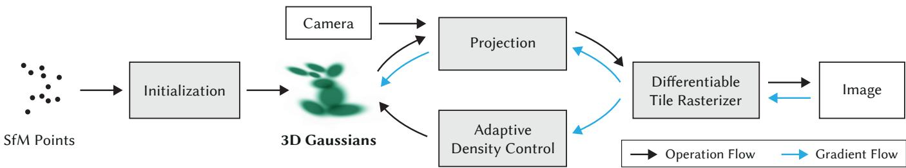  
Fi<sub>g</sub>. 2. O<sub>p</sub>timization starts with the s<sub>p</sub>arse SfM <sub>p</sub>oint cloud and creates a set of 3D Gaussians. We then o<sub>p</sub>timize and ada<sub>p</sub>tivel<sub>y</sub> control the densit<sub>y</sub> of this set of Gaussians. Durin<sub>g</sub> o<sub>p</sub>timization we use our fast tile-based renderer<sub>,</sub> allowin<sub>g</sub> com<sub>p</sub>etitive trainin<sub>g</sub> times com<sub>p</sub>ared to SOTA fast radiance field methods. Once trained<sub>,</sub> our renderer allows real-time navi<sub>g</sub>ation for a wide variet<sub>y</sub> of scenes.

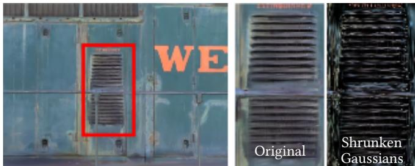  
Fi<sub>g</sub>. 3. We visualize the 3D Gaussians after o<sub>p</sub>timization b<sub>y</sub> shrinkin<sub>g</sub> them 60% (far ri<sub>g</sub>ht). This clearl<sub>y</sub> shows the anisotro<sub>p</sub>ic sha<sub>p</sub>es of the 3D Gaussians that com<sub>p</sub>actl<sub>y</sub> re<sub>p</sub>resent com<sub>p</sub>lex <sub>g</sub>eometr<sub>y</sub> after o<sub>p</sub>timization. Left the <sub>ac</sub>t<sub>ua</sub>l <sub>ren</sub>d<sub>ere</sub>d i<sub>mage.</sub>

## 5<sub>.</sub>1 O<sub>p</sub>timiz<sub>a</sub>ti<sub>o</sub>n

Th<sub>e</sub> <sub>op</sub>timiz<sub>a</sub>ti<sub>o</sub>n i<sub>s</sub> b<sub>ase</sub>d <sub>o</sub>n <sub>success</sub>i<sub>ve</sub> it<sub>e</sub>r<sub>a</sub>ti<sub>o</sub>n<sub>s</sub> <sub>o</sub>f r<sub>e</sub>nd<sub>e</sub>rin<sub>g</sub> <sub>a</sub>nd com<sub>p</sub>arin<sub>g</sub> the resultin<sub>g</sub> ima<sub>g</sub>e to the trainin<sub>g</sub> views in the ca<sub>p</sub>tured d<sub>a</sub>t<sub>ase</sub>t<sub>.</sub> I<sub>nev</sub>it<sub>a</sub>bl<sub>y,</sub> <sub>geome</sub>t<sub>ry</sub> <sub>may</sub> b<sub>e</sub> i<sub>ncorrec</sub>tl<sub>y</sub> <sub>p</sub>l<sub>ace</sub>d d<sub>ue</sub> t<sub>o</sub> th<sub>e</sub> am<sup>b</sup>iguities o<sup>f</sup> 3D to 2D projection. Our optimization t<sup>h</sup>us nee<sup>d</sup>s to be able to create geometry and also destroy or move geometry if it h<sub>as</sub> b<sub>een</sub> i<sub>ncorrec</sub>tl<sub>y pos</sub>iti<sub>one</sub>d<sub>.</sub> Th<sub>e qua</sub>lit<sub>y o</sub>f th<sub>e parame</sub>t<sub>ers o</sub>f th<sub>e</sub> co<sub>v</sub>ariances of the 3D Ga<sub>u</sub>ssians is critical for the com<sub>p</sub>actness of the re<sub>p</sub>resentation since lar<sub>g</sub>e homo<sub>g</sub>eneous areas can be ca<sub>p</sub>tured with a small number of lar<sub>g</sub>e anisotro<sub>p</sub>ic Gaussians.

W<sub>e use</sub> St<sub>oc</sub>h<sub>as</sub>ti<sub>c</sub> Gr<sub>a</sub>di<sub>e</sub>nt D<sub>esce</sub>nt t<sub>ec</sub>hni<sub>ques</sub> f<sub>o</sub>r <sub>op</sub>timiz<sub>a</sub>ti<sub>o</sub>n<sub>,</sub> t<sub>a</sub>ki<sub>ng</sub> f<sub>u</sub>ll <sub>a</sub>d<sub>van</sub>t<sub>age o</sub>f <sub>s</sub>t<sub>an</sub>d<sub>ar</sub>d GPU<sub>-acce</sub>l<sub>era</sub>t<sub>e</sub>d f<sub>ramewor</sub>k<sub>s,</sub> <sub>an</sub>d th<sub>e</sub> <sub>a</sub>bilit<sub>y</sub> t<sub>o</sub> <sub>a</sub>dd <sub>cus</sub>t<sub>om</sub> CUDA k<sub>erne</sub>l<sub>s</sub> f<sub>or</sub> <sub>some</sub> <sub>opera</sub>ti<sub>ons,</sub> followin<sub>g</sub> recent best <sub>p</sub>ractice [Fridovich-Keil and Yu et al. 2022; Sun et al. 2022]. In <sub>p</sub>articular, our fast rasterization (see Sec. 6) is <sub>c</sub>riti<sub>ca</sub>l in th<sub>e</sub> <sub>e</sub>fi<sub>c</sub>i<sub>e</sub>n<sub>cy</sub> <sub>o</sub>f <sub>ou</sub>r <sub>op</sub>timiz<sub>a</sub>ti<sub>o</sub>n<sub>,</sub> <sub>s</sub>in<sub>ce</sub> it i<sub>s</sub> th<sub>e</sub> m<sub>a</sub>in <sub>compu</sub>t<sub>a</sub>ti<sub>ona</sub>l b<sub>o</sub>ttl<sub>enec</sub>k <sub>o</sub>f th<sub>e op</sub>ti<sub>m</sub>i<sub>za</sub>ti<sub>on.</sub>

W<sub>e</sub> <sub>use</sub> <sub>a</sub> <sub>s</sub>i<sub>g</sub>m<sub>o</sub>id <sub>ac</sub>ti<sub>va</sub>ti<sub>o</sub>n f<sub>u</sub>n<sub>c</sub>ti<sub>o</sub>n f<sub>o</sub>r <sub>α</sub> t<sub>o</sub> <sub>co</sub>n<sub>s</sub>tr<sub>a</sub>in it in the [0 − 1) ran<sub>g</sub>e and obtain smooth <sub>g</sub>radients, and an ex<sub>p</sub>onential <sub>ac</sub>ti<sub>va</sub>ti<sub>on</sub> f<sub>unc</sub>ti<sub>on</sub> f<sub>or</sub> th<sub>e sca</sub>l<sub>e o</sub>fth<sub>e covar</sub>i<sub>ance</sub> f<sub>or s</sub>i<sub>m</sub>il<sub>ar reasons.</sub>

W<sub>e</sub> <sub>es</sub>tim<sub>a</sub>t<sub>e</sub> th<sub>e</sub> initi<sub>a</sub>l <sub>cova</sub>ri<sub>a</sub>n<sub>ce</sub> m<sub>a</sub>trix <sub>as</sub> <sub>a</sub>n i<sub>so</sub>tr<sub>op</sub>i<sub>c</sub> G<sub>auss</sub>i<sub>a</sub>n <sub>w</sub>ith <sub>axes</sub> <sub>equa</sub>l t<sub>o</sub> th<sub>e</sub> <sub>mean</sub> <sub>o</sub>f th<sub>e</sub> di<sub>s</sub>t<sub>ance</sub> t<sub>o</sub> th<sub>e</sub> <sub>c</sub>l<sub>oses</sub>t th<sub>ree</sub> <sub>po</sub>i<sub>n</sub>t<sub>s.</sub> We use a standard ex<sub>p</sub>onential deca<sub>y</sub> schedulin<sub>g</sub> techni<sub>q</sub>ue similar to Plenoxels [Fridovich-Keil and Yu et al. 2022], but for <sub>p</sub>ositions <sub>on</sub>l<sub>y.</sub> Th<sub>e</sub> l<sub>oss</sub> f<sub>unc</sub>ti<sub>on</sub> i<sub>s</sub> $\mathcal { L } _ { 1 }$ <sub>co</sub>mbin<sub>e</sub>d <sub>w</sub>ith <sub>a</sub> D-SSIM t<sub>e</sub>rm:

$$
\mathcal { L } = ( 1 - \lambda ) \mathcal { L } _ { 1 } + \lambda \mathcal { L } _ { \mathrm { D - S S I M } }\tag{7}
$$

We use $\lambda = 0 . 2$ i<sub>n</sub> <sub>a</sub>ll <sub>our</sub> t<sub>es</sub>t<sub>s.</sub> W<sub>e</sub> <sub>prov</sub>id<sub>e</sub> d<sub>e</sub>t<sub>a</sub>il<sub>s</sub> <sub>o</sub>f th<sub>e</sub> l<sub>earn</sub>i<sub>ng</sub> <sub>sc</sub>h<sub>e</sub>d<sub>u</sub>l<sub>e an</sub>d <sub>o</sub>th<sub>er e</sub>l<sub>emen</sub>t<sub>s</sub> i<sub>n</sub> S<sub>ec.</sub> 7<sub>.</sub>1<sub>.</sub>

## 5<sub>.</sub>2 Ad<sub>ap</sub>tiv<sub>e</sub> C<sub>o</sub>ntr<sub>o</sub>l <sub>o</sub>f G<sub>auss</sub>i<sub>a</sub>n<sub>s</sub>

We start with the initial set of s<sub>p</sub>arse <sub>p</sub>oints from SfM and then a<sub>pp</sub>l<sub>y</sub> <sub>our</sub> <sub>me</sub>th<sub>o</sub>d t<sub>o</sub> <sub>a</sub>d<sub>ap</sub>ti<sub>ve</sub>l<sub>y</sub> <sub>con</sub>t<sub>ro</sub>l th<sub>e</sub> <sub>num</sub>b<sub>er</sub> <sub>o</sub>f G<sub>auss</sub>i<sub>ans</sub> <sub>an</sub>d th<sub>e</sub>i<sub>r</sub> densit<sub>y</sub> over unit volume<sup>1</sup><sub>,</sub> allowin<sub>g</sub> us to <sub>g</sub>o from an initial s<sub>p</sub>arse <sub>se</sub>t <sub>o</sub>f G<sub>auss</sub>i<sub>ans</sub> t<sub>o a</sub> d<sub>enser se</sub>t th<sub>a</sub>t b<sub>e</sub>tt<sub>er represen</sub>t<sub>s</sub> th<sub>e scene, an</sub>d with correct <sub>p</sub>arameters. After o<sub>p</sub>timization warm-u<sub>p</sub> (see Sec. 7.1), we densif<sub>y</sub> ever<sub>y</sub> 100 iterations and remove an<sub>y</sub> Gaussians that are <sub>essen</sub>ti<sub>a</sub>ll<sub>y</sub> t<sub>ransparen</sub>t<sub>,</sub> i<sub>.e., w</sub>ith <sub>α</sub> l<sub>ess</sub> th<sub>an a</sub> th<sub>res</sub>h<sub>o</sub>ld $\epsilon _ { \alpha }$

O<sub>u</sub>r ada<sub>p</sub>tive control of the Ga<sub>u</sub>ssians needs to <sub>p</sub>o<sub>pu</sub>late em<sub>p</sub>t<sub>y</sub> areas. It focuses on re<sub>g</sub>ions with missin<sub>g g</sub>eometric features (“underreconstruction”), but also in re<sub>g</sub>ions where Gaussians cover lar<sub>g</sub>e areas in the scene (which often corres<sub>p</sub>ond to “over-reconstruction”). We observe that both have large view-space positional gradients. Intuitivel<sub>y,</sub> this is likel<sub>y</sub> because the<sub>y</sub> corres<sub>p</sub>ond to re<sub>g</sub>ions that are <sub>no</sub>t <sub>ye</sub>t <sub>we</sub>ll <sub>recons</sub>t<sub>ruc</sub>t<sub>e</sub>d<sub>,</sub> <sub>an</sub>d th<sub>e</sub> <sub>op</sub>ti<sub>m</sub>i<sub>za</sub>ti<sub>on</sub> t<sub>r</sub>i<sub>es</sub> t<sub>o</sub> <sub>move</sub> th<sub>e</sub> G<sub>auss</sub>i<sub>a</sub>n<sub>s</sub> t<sub>o co</sub>rr<sub>ec</sub>t thi<sub>s.</sub>

Si<sub>nce</sub> b<sub>o</sub>th <sub>cases are goo</sub>d <sub>can</sub>did<sub>a</sub>t<sub>es</sub> f<sub>or</sub> d<sub>ens</sub>ifi<sub>ca</sub>ti<sub>on, we</sub> d<sub>en-</sub> sif<sub>y</sub> Gaussians with an avera<sub>g</sub>e ma<sub>g</sub>nitude of view-s<sub>p</sub>ace <sub>p</sub>osition <sub>gra</sub>di<sub>en</sub>t<sub>s</sub> <sub>a</sub>b<sub>ove</sub> <sub>a</sub> th<sub>res</sub>h<sub>o</sub>ld $\tau _ { \mathrm { p o s } } ,$ <sub>w</sub>hi<sub>c</sub>h <sub>we</sub> <sub>se</sub>t t<sub>o</sub> 0<sub>.</sub>0002 i<sub>n</sub> <sub>our</sub> t<sub>es</sub>t<sub>s.</sub>

We next <sub>p</sub>resent details of this <sub>p</sub>rocess<sub>,</sub> illustrated in Fi<sub>g</sub>. 4.

For small Gaussians that are in under-reconstructed re<sub>g</sub>ions<sub>,</sub> we <sub>nee</sub>d t<sub>o</sub> <sub>cover</sub> th<sub>e</sub> <sub>new</sub> <sub>geome</sub>t<sub>ry</sub> th<sub>a</sub>t <sub>mus</sub>t b<sub>e</sub> <sub>crea</sub>t<sub>e</sub>d<sub>.</sub> F<sub>or</sub> thi<sub>s,</sub> it i<sub>s</sub> <sub>p</sub>referable to clone the Gaussians<sub>,</sub> b<sub>y</sub> sim<sub>p</sub>l<sub>y</sub> creatin<sub>g</sub> a co<sub>py</sub> of the same size<sub>,</sub> and movin<sub>g</sub> it in the direction of the <sub>p</sub>ositional <sub>g</sub>radient.

On the other hand<sub>,</sub> lar<sub>g</sub>e Gaussians in re<sub>g</sub>ions with hi<sub>g</sub>h variance need to be s<sub>p</sub>lit into smaller Ga<sub>u</sub>ssians. We re<sub>p</sub>lace s<sub>u</sub>ch Ga<sub>u</sub>ssians b<sub>y</sub> t<sub>wo new ones, an</sub>d di<sub>v</sub>id<sub>e</sub> th<sub>e</sub>i<sub>r sca</sub>l<sub>e</sub> b<sub>y a</sub> f<sub>ac</sub>t<sub>or o</sub>f $\phi = 1 . 6$ <sub>w</sub>hi<sub>c</sub>h we determined ex<sub>p</sub>erimentall<sub>y</sub>. We also initialize their <sub>p</sub>osition b<sub>y</sub> <sub>us</sub>in<sub>g</sub> th<sub>e</sub> <sub>o</sub>ri<sub>g</sub>in<sub>a</sub>l 3D G<sub>auss</sub>i<sub>a</sub>n <sub>as</sub> <sub>a</sub> PDF f<sub>o</sub>r <sub>sa</sub>m<sub>p</sub>lin<sub>g.</sub>

I<sub>n</sub> th<sub>e</sub> fi<sub>rs</sub>t <sub>case we</sub> d<sub>e</sub>t<sub>ec</sub>t <sub>an</sub>d t<sub>rea</sub>t th<sub>e nee</sub>d f<sub>or</sub> i<sub>ncreas</sub>i<sub>ng</sub> b<sub>o</sub>th th<sub>e</sub> t<sub>o</sub>t<sub>a</sub>l <sub>vo</sub>l<sub>ume o</sub>f th<sub>e sys</sub>t<sub>em an</sub>d th<sub>e num</sub>b<sub>er o</sub>f G<sub>auss</sub>i<sub>ans, w</sub>hil<sub>e</sub> i<sub>n</sub> th<sub>e secon</sub>d <sub>case we conserve</sub> t<sub>o</sub>t<sub>a</sub>l <sub>vo</sub>l<sub>ume</sub> b<sub>u</sub>t i<sub>ncrease</sub> th<sub>e num-</sub> b<sub>e</sub>r <sub>o</sub>f G<sub>auss</sub>i<sub>a</sub>n<sub>s.</sub> Simil<sub>a</sub>r t<sub>o</sub> <sub>o</sub>th<sub>e</sub>r <sub>vo</sub>l<sub>u</sub>m<sub>e</sub>tri<sub>c</sub> r<sub>ep</sub>r<sub>ese</sub>nt<sub>a</sub>ti<sub>o</sub>n<sub>s,</sub> <sub>ou</sub>r o<sub>p</sub>timization can <sub>g</sub>et stuck with floaters close to the in<sub>p</sub>ut cameras<sub>;</sub> in our case t<sup>h</sup>is may resu<sup>l</sup>t in an unjusti<sup>fi</sup>e<sup>d</sup> increase in t<sup>h</sup>e Gaussian d<sub>e</sub>n<sub>s</sub>it<sub>y.</sub> An <sub>e</sub>f<sub>ec</sub>ti<sub>ve way</sub> t<sub>o</sub> m<sub>o</sub>d<sub>e</sub>r<sub>a</sub>t<sub>e</sub> th<sub>e</sub> in<sub>c</sub>r<sub>ease</sub> in th<sub>e</sub> n<sub>u</sub>mb<sub>e</sub>r <sub>o</sub>f G<sub>auss</sub>i<sub>ans</sub> i<sub>s</sub> t<sub>o se</sub>t th<sub>e α va</sub>l<sub>ue c</sub>l<sub>ose</sub> t<sub>o zero every</sub> $N = 3 0 0 0$ it<sub>e</sub>r<sub>a</sub>ti<sub>o</sub>n<sub>s.</sub> Th<sub>e op</sub>timiz<sub>a</sub>ti<sub>o</sub>n th<sub>e</sub>n in<sub>c</sub>r<sub>eases</sub> th<sub>e α</sub> f<sub>o</sub>r th<sub>e</sub> G<sub>auss</sub>i<sub>a</sub>n<sub>s</sub> <sub>w</sub>h<sub>ere</sub> thi<sub>s</sub> i<sub>s nee</sub>d<sub>e</sub>d <sub>w</sub>hil<sub>e a</sub>ll<sub>ow</sub>i<sub>ng our cu</sub>lli<sub>ng approac</sub>h t<sub>o remove</sub> G<sub>auss</sub>i<sub>ans w</sub>ith <sub>α</sub> l<sub>ess</sub> th<sub>an</sub> $\epsilon _ { \alpha }$ <sub>as</sub> d<sub>escr</sub>ib<sub>e</sub>d <sub>a</sub>b<sub>ove.</sub> G<sub>auss</sub>i<sub>ans may</sub> <sub>s</sub>h<sub>r</sub>i<sub>n</sub>k <sub>or grow an</sub>d <sub>cons</sub>id<sub>era</sub>bl<sub>y over</sub>l<sub>ap w</sub>ith <sub>o</sub>th<sub>ers,</sub> b<sub>u</sub>t <sub>we per</sub>i<sub>-</sub> <sub>o</sub>di<sub>ca</sub>ll<sub>y remove</sub> G<sub>auss</sub>i<sub>ans</sub> th<sub>a</sub>t <sub>are very</sub> l<sub>arge</sub> i<sub>n wor</sub>ld<sub>space an</sub>d those that have a bi<sub>g</sub> foot<sub>p</sub>rint in views<sub>p</sub>ace. This strate<sub>gy</sub> results i<sub>n overa</sub>ll <sub>goo</sub>d <sub>con</sub>t<sub>ro</sub>l <sub>over</sub> th<sub>e</sub> t<sub>o</sub>t<sub>a</sub>l <sub>num</sub>b<sub>er o</sub>f G<sub>auss</sub>i<sub>ans.</sub> Th<sub>e</sub> G<sub>auss</sub>i<sub>a</sub>n<sub>s</sub> in <sub>ou</sub>r m<sub>o</sub>d<sub>e</sub>l r<sub>e</sub>m<sub>a</sub>in <sub>p</sub>rimiti<sub>ves</sub> in E<sub>uc</sub>lid<sub>ea</sub>n <sub>space a</sub>t <sub>a</sub>ll times; unlike other methods [Barron et al. 2022; Fridovich-Keil and Yu et al. 2022], we do not re<sub>q</sub>uire s<sub>p</sub>ace com<sub>p</sub>action, war<sub>p</sub>in<sub>g</sub> or projection strategies <sup>f</sup>or <sup>d</sup>istant or <sup>l</sup>arge Gaussians.

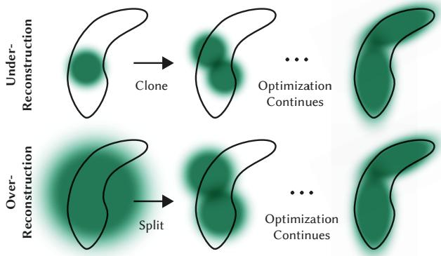  
Fig. 4. Our adaptive Gaussian densification scheme. Top row (underreconstruction): When small-scale geometry (black outline) is insuficiently covered, we clone the respective Gaussian. Botom row (over-reconstruction): If small-scale <sub>g</sub>eometr<sub>y</sub> is re<sub>p</sub>resented b<sub>y</sub> one lar<sub>g</sub>e s<sub>p</sub>lat<sub>,</sub> we s<sub>p</sub>lit it in two.

## 6 FAST DIFFERENTIABLE RASTERIZER FOR GAUSSIANS

O<sub>ur</sub> <sub>goa</sub>l<sub>s</sub> <sub>are</sub> t<sub>o</sub> h<sub>ave</sub> f<sub>as</sub>t <sub>overa</sub>ll <sub>ren</sub>d<sub>er</sub>i<sub>ng</sub> <sub>an</sub>d f<sub>as</sub>t <sub>sor</sub>ti<sub>ng</sub> t<sub>o</sub> <sub>a</sub>ll<sub>ow</sub> a<sub>pp</sub>roximate <sub>α</sub>-blendin<sub>g</sub> – includin<sub>g</sub> for anisotro<sub>p</sub>ic s<sub>p</sub>lats – and to <sub>avo</sub>id h<sub>ar</sub>d li<sub>m</sub>it<sub>s</sub> <sub>on</sub> th<sub>e</sub> <sub>num</sub>b<sub>er</sub> <sub>o</sub>f <sub>sp</sub>l<sub>a</sub>t<sub>s</sub> th<sub>a</sub>t <sub>can</sub> <sub>rece</sub>i<sub>ve</sub> <sub>gra</sub>di<sub>en</sub>t<sub>s</sub> that exist in <sub>p</sub>revious work [Lassner and Zollhofer 2021].

T<sub>o</sub> <sub>ac</sub>hi<sub>eve</sub> th<sub>ese</sub> <sub>goa</sub>l<sub>s,</sub> <sub>we</sub> d<sub>es</sub>i<sub>gn</sub> <sub>a</sub> til<sub>e-</sub>b<sub>ase</sub>d <sub>ras</sub>t<sub>er</sub>i<sub>zer</sub> f<sub>or</sub> G<sub>auss-</sub> ian s<sub>p</sub>lats ins<sub>p</sub>ired b<sub>y</sub> recent software rasterization a<sub>pp</sub>roaches [Lassner and Zollhofer 2021] to <sub>p</sub>re-sort <sub>p</sub>rimitives for an entire ima<sub>g</sub>e at a time<sub>,</sub> avoidin<sub>g</sub> the ex<sub>p</sub>ense of sortin<sub>g p</sub>er <sub>p</sub>ixel that hindered <sub>p</sub>revious α-blendin<sub>g</sub> solutions [Ko<sub>p</sub>anas et al. 2022, 2021]. Our fast rasterizer allows eficient back<sub>p</sub>ro<sub>p</sub>a<sub>g</sub>ation over an arbitrar<sub>y</sub> numb<sub>er</sub> <sub>o</sub>f bl<sub>en</sub>d<sub>e</sub>d G<sub>auss</sub>i<sub>ans</sub> <sub>w</sub>ith l<sub>ow</sub> <sub>a</sub>dditi<sub>ona</sub>l <sub>memory</sub> <sub>consump-</sub> tion<sub>,</sub> re<sub>q</sub>uirin<sub>g</sub> onl<sub>y</sub> a constant overhead <sub>p</sub>er <sub>p</sub>ixel. Our rasterization <sub>p</sub>i<sub>p</sub>eline is full<sub>y</sub> diferentiable, and <sub>g</sub>iven the <sub>p</sub>rojection to 2D (Sec. 4) can rasterize anisotro<sub>p</sub>ic s<sub>p</sub>lats similar to <sub>p</sub>re<sub>v</sub>io<sub>u</sub>s 2D s<sub>p</sub>lattin<sub>g</sub> methods [Ko<sub>p</sub>anas et al. 2021].

Our method starts b s littin the screen into 16×16 tiles, and th<sub>en procee</sub>d<sub>s</sub> t<sub>o cu</sub>ll 3D G<sub>auss</sub>i<sub>ans aga</sub>i<sub>ns</sub>t th<sub>e v</sub>i<sub>ew</sub> f<sub>rus</sub>t<sub>um an</sub>d <sub>eac</sub>h til<sub>e.</sub> S<sub>pec</sub>ifi<sub>ca</sub>ll<sub>y,</sub> <sub>we</sub> <sub>on</sub>l<sub>y</sub> k<sub>eep</sub> G<sub>auss</sub>i<sub>ans</sub> <sub>w</sub>ith <sub>a</sub> 99% <sub>con</sub>fi<sub>-</sub> d<sub>e</sub>n<sub>ce</sub> int<sub>e</sub>r<sub>va</sub>l int<sub>e</sub>r<sub>sec</sub>tin<sub>g</sub> th<sub>e v</sub>i<sub>ew</sub> fr<sub>us</sub>t<sub>u</sub>m<sub>.</sub> Additi<sub>o</sub>n<sub>a</sub>ll<sub>y, we use a</sub> guard band to trivially reject Gaussians at extreme positions (i.e., th<sub>ose</sub> <sub>w</sub>ith <sub>means</sub> <sub>c</sub>l<sub>ose</sub> t<sub>o</sub> th<sub>e</sub> <sub>near</sub> <sub>p</sub>l<sub>ane</sub> <sub>an</sub>d f<sub>ar</sub> <sub>ou</sub>t<sub>s</sub>id<sub>e</sub> th<sub>e</sub> <sub>v</sub>i<sub>ew</sub> frustum), since computing their projected 2D covariance would b<sub>e</sub> <sub>uns</sub>t<sub>a</sub>bl<sub>e.</sub> W<sub>e</sub> th<sub>en</sub> i<sub>ns</sub>t<sub>an</sub>ti<sub>a</sub>t<sub>e</sub> <sub>eac</sub>h G<sub>auss</sub>i<sub>an</sub> <sub>accor</sub>di<sub>ng</sub> t<sub>o</sub> th<sub>e</sub> <sub>num</sub>b<sub>er o</sub>f til<sub>es</sub> th<sub>ey over</sub>l<sub>ap an</sub>d <sub>ass</sub>i<sub>gn eac</sub>h i<sub>ns</sub>t<sub>ance a</sub> k<sub>ey</sub> th<sub>a</sub>t combines view s<sub>p</sub>ace de<sub>p</sub>th and tile ID. We then sort Gaussians based on these ke<sub>y</sub>s usin<sub>g</sub> a sin<sub>g</sub>le fast GPU Radix sort [Merrill and Grimshaw 2010]. Note that there is no additional <sub>p</sub>er-<sub>p</sub>ixel ord<sub>er</sub>i<sub>ng</sub> <sub>o</sub>f <sub>po</sub>i<sub>n</sub>t<sub>s,</sub> <sub>an</sub>d bl<sub>en</sub>di<sub>ng</sub> i<sub>s</sub> <sub>per</sub>f<sub>orme</sub>d b<sub>ase</sub>d <sub>on</sub> thi<sub>s</sub> i<sub>n</sub>iti<sub>a</sub>l sortin<sub>g</sub>. As a conse<sub>q</sub>uence<sub>,</sub> our <sub>α</sub>-blendin<sub>g</sub> can be a<sub>pp</sub>roximate in some confi<sub>g</sub>urations. However<sub>,</sub> these a<sub>pp</sub>roximations become ne<sub>g</sub>li-<sub>g</sub>ibl<sub>e</sub> <sub>as</sub> <sub>sp</sub>l<sub>a</sub>t<sub>s</sub> <sub>approac</sub>h th<sub>e</sub> <sub>s</sub>i<sub>ze</sub> <sub>o</sub>f i<sub>n</sub>di<sub>v</sub>id<sub>ua</sub>l <sub>p</sub>i<sub>xe</sub>l<sub>s.</sub> W<sub>e</sub> f<sub>oun</sub>d th<sub>a</sub>t this choice <sub>g</sub>reatl<sub>y</sub> enhances trainin<sub>g</sub> and renderin<sub>g p</sub>erformance without <sub>p</sub>roducin<sub>g</sub> visible artifacts in conver<sub>g</sub>ed scenes.

After sortin<sub>g</sub> Ga<sub>u</sub>ssians<sub>,</sub> <sub>w</sub>e <sub>p</sub>rod<sub>u</sub>ce a list for each tile b<sub>y</sub> identif<sub>y</sub>i<sub>ng</sub> th<sub>e</sub> fi<sub>rs</sub>t <sub>an</sub>d l<sub>as</sub>t d<sub>ep</sub>th<sub>-sor</sub>t<sub>e</sub>d <sub>en</sub>t<sub>ry</sub> th<sub>a</sub>t <sub>sp</sub>l<sub>a</sub>t<sub>s</sub> t<sub>o a g</sub>i<sub>ven</sub> til<sub>e.</sub> F<sub>or ras</sub>t<sub>er</sub>i<sub>za</sub>ti<sub>on, we</sub> l<sub>aunc</sub>h <sub>one</sub> th<sub>rea</sub>d bl<sub>oc</sub>k f<sub>or eac</sub>h til<sub>e.</sub> E<sub>ac</sub>h bl<sub>oc</sub>k fi<sub>rs</sub>t <sub>co</sub>ll<sub>a</sub>b<sub>ora</sub>ti<sub>ve</sub>l<sub>y</sub> l<sub>oa</sub>d<sub>s pac</sub>k<sub>e</sub>t<sub>s o</sub>f G<sub>auss</sub>i<sub>ans</sub> i<sub>n</sub>t<sub>o s</sub>h<sub>are</sub>d <sub>memory an</sub>d th<sub>en,</sub> f<sub>or a g</sub>i<sub>ven p</sub>i<sub>xe</sub>l<sub>, accumu</sub>l<sub>a</sub>t<sub>es co</sub>l<sub>or an</sub>d <sub>α va</sub>l<sub>ues</sub> b<sub>y</sub> traversin<sub>g</sub> the lists front-to-back<sub>,</sub> thus maximizin<sub>g</sub> the <sub>g</sub>ain in <sub>para</sub>ll<sub>e</sub>li<sub>sm</sub> b<sub>o</sub>th f<sub>or</sub> d<sub>a</sub>t<sub>a</sub> l<sub>oa</sub>di<sub>ng</sub>/<sub>s</sub>h<sub>ar</sub>i<sub>ng an</sub>d <sub>process</sub>i<sub>ng.</sub> Wh<sub>en we</sub> reach a tar<sub>g</sub>et saturation of <sub>α</sub> in a <sub>p</sub>ixel<sub>,</sub> the corres<sub>p</sub>ondin<sub>g</sub> thread <sub>s</sub>t<sub>ops.</sub> At r<sub>egu</sub>l<sub>a</sub>r int<sub>e</sub>r<sub>va</sub>l<sub>s,</sub> thr<sub>ea</sub>d<sub>s</sub> in <sub>a</sub> til<sub>e a</sub>r<sub>e que</sub>ri<sub>e</sub>d <sub>a</sub>nd th<sub>e p</sub>r<sub>o</sub>- <sub>cess</sub>i<sub>ng o</sub>f th<sub>e en</sub>ti<sub>re</sub> til<sub>e</sub> t<sub>erm</sub>i<sub>na</sub>t<sub>es w</sub>h<sub>en a</sub>ll <sub>p</sub>i<sub>xe</sub>l<sub>s</sub> h<sub>ave sa</sub>t<sub>ura</sub>t<sub>e</sub>d (i.e., α <sub>g</sub>oes to 1). Details of sortin<sub>g</sub> and a hi<sub>g</sub>h-level overview of the overall rasterization a<sub>pp</sub>roach are <sub>g</sub>iven in A<sub>pp</sub>endix C.

Durin<sub>g</sub> rasterization<sub>,</sub> the saturation of <sub>α</sub> is the onl<sub>y</sub> sto<sub>pp</sub>in<sub>g</sub> criterion. In contrast to <sub>p</sub>revious work<sub>,</sub> we do not limit the number <sub>o</sub>f bl<sub>en</sub>d<sub>e</sub>d <sub>pr</sub>i<sub>m</sub>iti<sub>ves</sub> th<sub>a</sub>t <sub>rece</sub>i<sub>ve gra</sub>di<sub>en</sub>t <sub>up</sub>d<sub>a</sub>t<sub>es.</sub> W<sub>e en</sub>f<sub>orce</sub> thi<sub>s proper</sub>t<sub>y</sub> t<sub>o a</sub>ll<sub>ow our approac</sub>h t<sub>o</sub> h<sub>an</sub>dl<sub>e scenes w</sub>ith <sub>an ar</sub>bi<sub>-</sub> trar<sub>y,</sub> var<sub>y</sub>in<sub>g</sub> de<sub>p</sub>th com<sub>p</sub>lexit<sub>y</sub> and accuratel<sub>y</sub> learn them<sub>,</sub> without havin<sub>g</sub> to resort to scene-s<sub>p</sub>ecific h<sub>yp</sub>er<sub>p</sub>arameter tunin<sub>g</sub>. Durin<sub>g</sub> th<sub>e</sub> b<sub>ac</sub>k<sub>war</sub>d <sub>pass, we mus</sub>t th<sub>ere</sub>f<sub>ore recover</sub> th<sub>e</sub> f<sub>u</sub>ll <sub>sequence o</sub>f bl<sub>en</sub>d<sub>e</sub>d <sub>po</sub>i<sub>n</sub>t<sub>s per-p</sub>i<sub>xe</sub>l i<sub>n</sub> th<sub>e</sub> f<sub>orwar</sub>d <sub>pass.</sub> O<sub>ne so</sub>l<sub>u</sub>ti<sub>on wou</sub>ld b<sub>e</sub> t<sub>o</sub> <sub>s</sub>t<sub>ore</sub> <sub>ar</sub>bit<sub>rar</sub>il<sub>y</sub> l<sub>ong</sub> li<sub>s</sub>t<sub>s</sub> <sub>o</sub>f bl<sub>en</sub>d<sub>e</sub>d <sub>po</sub>i<sub>n</sub>t<sub>s</sub> <sub>per-p</sub>i<sub>xe</sub>l i<sub>n</sub> <sub>g</sub>l<sub>o</sub>b<sub>a</sub>l memor<sub>y</sub> [Ko<sub>p</sub>anas et al. 2021]. To avoid the im<sub>p</sub>lied d<sub>y</sub>namic mem-<sub>ory</sub> <sub>managemen</sub>t <sub>over</sub>h<sub>ea</sub>d<sub>,</sub> <sub>we</sub> i<sub>ns</sub>t<sub>ea</sub>d <sub>c</sub>h<sub>oose</sub> t<sub>o</sub> t<sub>raverse</sub> th<sub>e</sub> <sub>per-</sub> tile lists a<sub>g</sub>ain<sub>;</sub> we can reuse the sorted arra<sub>y</sub> of Gaussians and tile ran<sub>g</sub>es from the forward <sub>p</sub>ass. To facilitate <sub>g</sub>radient com<sub>p</sub>utation<sub>,</sub> <sub>we now</sub> t<sub>raverse</sub> th<sub>em</sub> b<sub>ac</sub>k<sub>-</sub>t<sub>o-</sub>f<sub>ron</sub>t<sub>.</sub>

Th<sub>e</sub> t<sub>raversa</sub>l <sub>s</sub>t<sub>ar</sub>t<sub>s</sub> f<sub>rom</sub> th<sub>e</sub> l<sub>as</sub>t <sub>po</sub>i<sub>n</sub>t th<sub>a</sub>t <sub>a</sub>f<sub>ec</sub>t<sub>e</sub>d <sub>any</sub> <sub>p</sub>i<sub>xe</sub>l i<sub>n</sub> the tile<sub>,</sub> and loadin<sub>g</sub> of <sub>p</sub>oints into shared memor<sub>y</sub> a<sub>g</sub>ain ha<sub>pp</sub>ens collaborativel<sub>y</sub>. Additionall<sub>y</sub>, each <sub>p</sub>ixel will onl<sub>y</sub> start (ex<sub>p</sub>ensive) overla<sub>p</sub> testin<sub>g</sub> and <sub>p</sub>rocessin<sub>g</sub> of <sub>p</sub>oints if their de<sub>p</sub>th is lower than <sub>or equa</sub>l t<sub>o</sub> th<sub>e</sub> d<sub>ep</sub>th <sub>o</sub>f th<sub>e</sub> l<sub>as</sub>t <sub>po</sub>i<sub>n</sub>t th<sub>a</sub>t <sub>con</sub>t<sub>r</sub>ib<sub>u</sub>t<sub>e</sub>d t<sub>o</sub> it<sub>s co</sub>l<sub>or</sub> d<sub>ur</sub>i<sub>ng</sub> th<sub>e</sub> f<sub>orwar</sub>d <sub>pass.</sub> C<sub>ompu</sub>t<sub>a</sub>ti<sub>on o</sub>f th<sub>e gra</sub>di<sub>en</sub>t<sub>s</sub> d<sub>escr</sub>ib<sub>e</sub>d i<sub>n</sub> Sec. 4 re<sub>q</sub>uires the accumulated o<sub>p</sub>acit<sub>y</sub> values at each ste<sub>p</sub> durin<sub>g</sub> the ori<sub>g</sub>inal blendin<sub>g p</sub>rocess. Rather than trasversin<sub>g</sub> an ex<sub>p</sub>licit list of <sub>p</sub>ro<sub>g</sub>ressivel<sub>y</sub> shrinkin<sub>g</sub> o<sub>p</sub>acities in the backward <sub>p</sub>ass<sub>,</sub> we can recover these intermediate o<sub>p</sub>acities b<sub>y</sub> storin<sub>g</sub> onl<sub>y</sub> the total <sub>accumu</sub>l<sub>a</sub>t<sub>e</sub>d <sub>opac</sub>it<sub>y a</sub>t th<sub>e en</sub>d <sub>o</sub>fth<sub>e</sub> f<sub>orwar</sub>d <sub>pass.</sub> S<sub>pec</sub>ifi<sub>ca</sub>ll<sub>y, eac</sub>h <sub>po</sub>i<sub>n</sub>t <sub>s</sub>t<sub>ores</sub> th<sub>e</sub> fi<sub>na</sub>l <sub>accumu</sub>l<sub>a</sub>t<sub>e</sub>d <sub>opac</sub>it<sub>y α</sub> i<sub>n</sub> th<sub>e</sub> f<sub>orwar</sub>d <sub>process;</sub> <sub>we</sub> di<sub>v</sub>id<sub>e</sub> thi<sub>s</sub> b<sub>y eac</sub>h <sub>po</sub>i<sub>n</sub>t’<sub>s α</sub> i<sub>n our</sub> b<sub>ac</sub>k<sub>-</sub>t<sub>o-</sub>f<sub>ron</sub>t t<sub>raversa</sub>l t<sub>o</sub> obtain the re<sub>q</sub>uired coeficients for <sub>g</sub>radient com<sub>p</sub>utation.

## 7 IMPLEMENTATION<sub>,</sub> RESULTS AND EVALUATION

W<sub>e nex</sub>t di<sub>scuss some</sub> d<sub>e</sub>t<sub>a</sub>il<sub>s o</sub>f i<sub>mp</sub>l<sub>emen</sub>t<sub>a</sub>ti<sub>on, presen</sub>t <sub>resu</sub>lt<sub>s an</sub>d th<sub>e eva</sub>l<sub>ua</sub>ti<sub>on o</sub>f <sub>our a</sub>l<sub>gor</sub>ith<sub>m compare</sub>d t<sub>o prev</sub>i<sub>ous wor</sub>k <sub>an</sub>d <sub>a</sub>bl<sub>a</sub>ti<sub>on s</sub>t<sub>u</sub>di<sub>es.</sub>

G<sub>roun</sub>d T<sub>ru</sub>th  
O<sub>u</sub>r<sub>s</sub>  
Mi<sub>p</sub>-NeRF360  
In<sub>s</sub>t<sub>a</sub>ntNGP  
Pl<sub>enoxe</sub>l<sub>s</sub>  
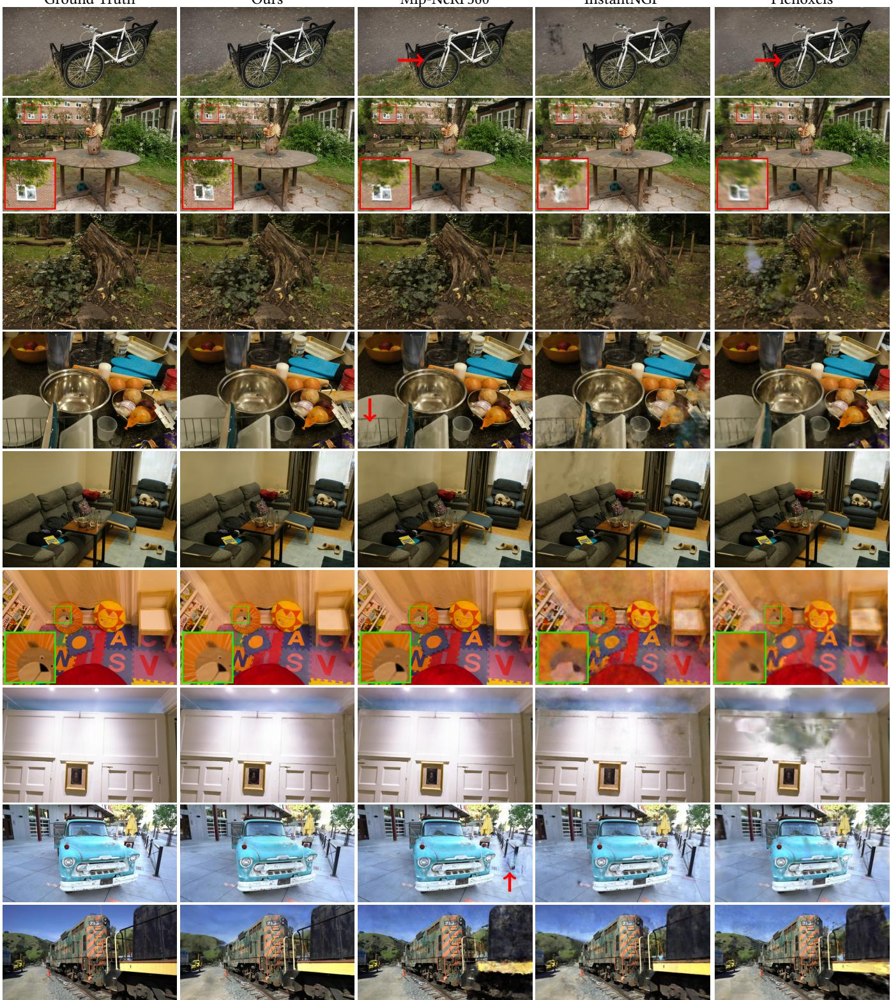  
Fi<sub>g</sub>. 5. We show com<sub>p</sub>arisons of ours to <sub>p</sub>revious methods and the corres<sub>p</sub>ondin<sub>g g</sub>round truth ima<sub>g</sub>es from held-out test views. The scenes are<sub>,</sub> from the to<sub>p</sub> down: Bicycle, Garden, Stump, Counter and Room from the Mi<sub>p</sub>-NeRF360 dataset; Playroom, DrJohnson from the Dee<sub>p</sub> Blendin<sub>g</sub> dataset [Hedman et al. 2018] and Truck and Train from Tanks&Tem<sub>p</sub>les. Non-obvious diferences in <sub>q</sub>ualit<sub>y</sub> hi<sub>g</sub>hli<sub>g</sub>hted b<sub>y</sub> arrows/insets.

Table 1. Quantitative evaluation of our method com<sub>p</sub>ared to <sub>p</sub>revious work, com<sub>p</sub>uted over three datasets. Results marked with da<sub>gg</sub>er † have been directl<sub>y</sub> <sub>a</sub>d<sub>op</sub>t<sub>e</sub>d f<sub>rom</sub> th<sub>e or</sub>i<sub>g</sub>i<sub>na</sub>l <sub>paper, a</sub>ll <sub>o</sub>th<sub>ers were o</sub>bt<sub>a</sub>i<sub>ne</sub>d i<sub>n our own exper</sub>i<sub>men</sub>t<sub>s.</sub>
<table><tr><td>Dataset</td><td colspan="6">Mip-NeRF360</td><td colspan="6">Tanks&amp;Temples</td><td colspan="6">Deep Blending</td></tr><tr><td>Method|Metric</td><td>SSIM↑</td><td>PSNR↑</td><td>LPIPS↓</td><td>Train</td><td>FPS</td><td>Mem</td><td>SSIM{</td><td>PSNR{</td><td>LPIPS↓</td><td>Train</td><td>FPS</td><td>Mem</td><td>SSIM{</td><td>PSNR{</td><td>LPIPS↓</td><td>Train</td><td>FPS</td><td>Mem</td></tr><tr><td>Plenoxels</td><td>0.626</td><td>23.08</td><td>0.463</td><td>25m49s</td><td>6.79</td><td>2.1GB</td><td>0.719</td><td>21.08</td><td>0.379</td><td>25m5s</td><td>13.0</td><td>2.3GB</td><td>0.795</td><td>23.06</td><td>0.510</td><td>27m49s</td><td>11.2</td><td>2.7GB</td></tr><tr><td>INGP-Base</td><td>0.671</td><td>25.30</td><td>0.371</td><td>5m37s</td><td>11.7</td><td>13MB</td><td>0.723</td><td>21.72</td><td>0.330</td><td>5m26s</td><td>17.1</td><td>13MB</td><td>0.797</td><td>23.62</td><td>0.423</td><td>6m31s</td><td>3.26</td><td>13MB</td></tr><tr><td>INGP-Big</td><td>0.699</td><td>25.59</td><td>0.331</td><td>7m30s</td><td>9.43</td><td>48MB</td><td>0.745</td><td>21.92</td><td>0.305</td><td>6m59s</td><td>14.4</td><td>48MB</td><td>0.817</td><td>24.96</td><td>0.390</td><td>8m</td><td>2.79</td><td>48MB</td></tr><tr><td>M-NeRF360</td><td>0.792†</td><td>27.69†</td><td>0.237†</td><td>48h</td><td>0.06</td><td>8.6MB</td><td>0.759</td><td>22.22</td><td>0.257</td><td>48h</td><td>0.14</td><td>8.6MB</td><td>0.901</td><td>29.40</td><td>0.245</td><td>48h</td><td>0.09</td><td>8.6MB</td></tr><tr><td>Ours-7K</td><td>0.770</td><td>25.60</td><td>0.279</td><td>6m25s</td><td>160</td><td>523MB</td><td>0.767</td><td>21.20</td><td>0.280</td><td>6m55s</td><td>197</td><td>270MB</td><td>0.875</td><td>27.78</td><td>0.317</td><td>4m35s</td><td>172</td><td>386MB</td></tr><tr><td>Ours-30K</td><td>0.815</td><td>27.21</td><td>0.214</td><td>41m33s</td><td>134</td><td>734MB</td><td>0.841</td><td>23.14</td><td>0.183</td><td>26m54s</td><td>154</td><td>411MB</td><td>0.903</td><td>29.41</td><td>0.243</td><td>36m2s</td><td>137</td><td>676MB</td></tr></table>

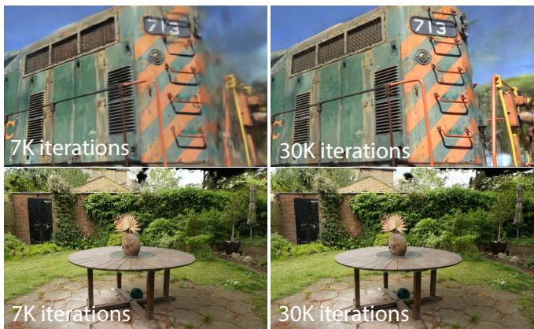  
Fi<sub>g</sub>. 6. For some scenes (above) we can see that even at 7K iterations (∼5min for this scene), our method has ca<sub>p</sub>tured the train <sub>q</sub>uite well. At 30K iterations (∼35min) the back<sub>g</sub>round artifacts have been reduced si<sub>g</sub>nificantl<sub>y</sub>. For other scenes (below), the diference is barel<sub>y</sub> visible; 7K iterations (∼8min) is alread<sub>y</sub> ver<sub>y</sub> hi<sub>g</sub>h <sub>q</sub>ualit<sub>y</sub>.

T<sub>a</sub>bl<sub>e</sub> 2<sub>.</sub> PSNR <sub>sco</sub>r<sub>es</sub> f<sub>o</sub>r S<sub>y</sub>nth<sub>e</sub>ti<sub>c</sub> N<sub>e</sub>RF<sub>,</sub> w<sub>e</sub> <sub>s</sub>t<sub>a</sub>rt with 100K r<sub>a</sub>nd<sub>o</sub>ml<sub>y</sub> initialized <sub>p</sub>oints. Com<sub>p</sub>etin<sub>g</sub> metrics extracted from res<sub>p</sub>ective <sub>p</sub>a<sub>p</sub>ers.
<table><tr><td></td><td>Mic</td><td>Chair</td><td>Ship</td><td>Materials</td><td>Lego</td><td>Drums</td><td>Ficus</td><td>Hotdog</td><td>Avg.</td></tr><tr><td>Plenoxels</td><td>33.26</td><td>33.98</td><td>29.62</td><td>29.14</td><td>34.10</td><td>25.35</td><td>31.83</td><td>36.81</td><td>31.76</td></tr><tr><td>INGP-Base</td><td>36.22</td><td>35.00</td><td>31.10</td><td>29.78</td><td>36.39</td><td>26.02</td><td>33.51</td><td>37.40</td><td>33.18</td></tr><tr><td>Mip-NeRF</td><td>36.51</td><td>35.14</td><td>30.41</td><td>30.71</td><td>35.70</td><td>25.48</td><td>33.29</td><td>37.48</td><td>33.09</td></tr><tr><td>Point-NeRF</td><td>35.95</td><td>35.40</td><td>30.97</td><td>29.61</td><td>35.04</td><td>26.06</td><td>36.13</td><td>37.30</td><td>33.30</td></tr><tr><td>Ours-30K</td><td>35.36</td><td>35.83</td><td>30.80</td><td>30.00</td><td>35.78</td><td>26.15</td><td>34.87</td><td>37.72</td><td>33.32</td></tr></table>

## 7.1 Im<sub>p</sub>lementation

We im<sub>p</sub>lemented o<sub>u</sub>r method in P<sub>y</sub>thon <sub>u</sub>sin<sub>g</sub> the P<sub>y</sub>Torch frame-<sub>wor</sub>k <sub>an</sub>d <sub>wro</sub>t<sub>e cus</sub>t<sub>om</sub> CUDA k<sub>erne</sub>l<sub>s</sub> f<sub>or ras</sub>t<sub>er</sub>i<sub>za</sub>ti<sub>on</sub> th<sub>a</sub>t <sub>are</sub> extended versions of <sub>p</sub>revious methods [Ko<sub>p</sub>anas et al. 2021], and use the NVIDIA CUB sortin<sub>g</sub> routines for the fast Radix sort [Merrill and Grimshaw 2010]. We also built an interactive viewer usin<sub>g</sub> the o<sub>p</sub>en-source SIBR [Bono<sub>p</sub>era et al. 2020], used for interactive <sub>v</sub>ie<sub>w</sub>in<sub>g</sub>. We <sub>u</sub>sed this im<sub>p</sub>lementation to meas<sub>u</sub>re o<sub>u</sub>r achie<sub>v</sub>ed f<sub>rame ra</sub>t<sub>es.</sub> Th<sub>e source co</sub>d<sub>e an</sub>d <sub>a</sub>ll <sub>our</sub> d<sub>a</sub>t<sub>a are ava</sub>il<sub>a</sub>bl<sub>e a</sub>t<sub>:</sub> htt<sub>p</sub>s://re<sub>p</sub>o-sam.inria.fr/fun<sub>g</sub>ra<sub>p</sub>h/3d-<sub>g</sub>aussian-s<sub>p</sub>lattin<sub>g</sub>/

Optimization Details. For stability, we “warm-up” the computation in lower resolution. S<sub>p</sub>ecificall<sub>y,</sub> we start the o<sub>p</sub>timization usin<sub>g</sub> 4 times smaller ima<sub>g</sub>e resolution and we u<sub>p</sub>sam<sub>p</sub>le twice after 250 <sub>a</sub>nd 500 it<sub>e</sub>r<sub>a</sub>ti<sub>o</sub>n<sub>s.</sub>

SH coeficient o<sub>p</sub>timization is sensitive to the lack of an<sub>g</sub>ular in<sup>f</sup>ormation. For typica<sup>l</sup> <sup>“</sup>NeRF-<sup>l</sup>i<sup>k</sup>e<sup>”</sup> captures w<sup>h</sup>ere a centra<sup>l</sup> o<sup>b</sup>ject i<sub>s</sub> <sub>o</sub>b<sub>serve</sub>d b<sub>y</sub> <sub>p</sub>h<sub>o</sub>t<sub>os</sub> t<sub>a</sub>k<sub>en</sub> i<sub>n</sub> th<sub>e</sub> <sub>en</sub>ti<sub>re</sub> h<sub>em</sub>i<sub>sp</sub>h<sub>ere</sub> <sub>aroun</sub>d it<sub>,</sub> th<sub>e</sub> o<sub>p</sub>timization works well. However<sub>,</sub> if the ca<sub>p</sub>ture has an<sub>g</sub>ular re<sub>g</sub>ions missin<sub>g</sub> (e.<sub>g</sub>., when ca<sub>p</sub>turin<sub>g</sub> the corner of a scene, or <sub>p</sub>erformin<sub>g</sub> an “inside-out” [Hedman et al. 2016] ca<sub>p</sub>ture) com<sub>p</sub>letel<sub>y</sub> incorrect values for the zero-order com<sub>p</sub>onent of the SH (i.e., the base or difuse color) can be <sub>p</sub>roduced b<sub>y</sub> the o<sub>p</sub>timization. To overcome this <sub>p</sub>roblem we start b<sub>y</sub> o<sub>p</sub>timizin<sub>g</sub> onl<sub>y</sub> the zero-order com<sub>p</sub>onent<sub>,</sub> <sub>an</sub>d th<sub>en</sub> i<sub>n</sub>t<sub>ro</sub>d<sub>uce one</sub> b<sub>an</sub>d <sub>o</sub>f th<sub>e</sub> SH <sub>a</sub>ft<sub>er every</sub> 1000 it<sub>era</sub>ti<sub>ons</sub> <sub>un</sub>til <sub>a</sub>ll 4 b<sub>an</sub>d<sub>s o</sub>f SH <sub>are represen</sub>t<sub>e</sub>d<sub>.</sub>

## 7<sub>.</sub>2 R<sub>esu</sub>lt<sub>s an</sub>d E<sub>va</sub>l<sub>ua</sub>ti<sub>on</sub>

Results. We tested our algorithm on a total of 13 real scenes t<sub>a</sub>k<sub>en</sub> f<sub>rom prev</sub>i<sub>ous</sub>l<sub>y pu</sub>bli<sub>s</sub>h<sub>e</sub>d d<sub>a</sub>t<sub>ase</sub>t<sub>s an</sub>d th<sub>e syn</sub>th<sub>e</sub>ti<sub>c</sub> Bl<sub>en</sub>d<sub>er</sub> dataset [Mildenhall et al. 2020]. In <sub>p</sub>articular, we tested our a<sub>p</sub>- <sub>p</sub>roach on the full set of scenes <sub>p</sub>resented in Mi<sub>p</sub>-Nerf360 [Barron et al. 2022], which is the current state of the art in NeRF renderin<sub>g</sub> <sub>q</sub>ualit<sub>y</sub>, two scenes from the Tanks&Tem<sub>p</sub>les dataset [2017] and two scenes <sub>p</sub>rovided b<sub>y</sub> Hedman et al. [Hedman et al. 2018]. The <sub>scenes we c</sub>h<sub>ose</sub> h<sub>ave very</sub> dif<sub>eren</sub>t <sub>cap</sub>t<sub>ure s</sub>t<sub>y</sub>l<sub>es, an</sub>d <sub>cover</sub> b<sub>o</sub>th b<sub>oun</sub>d<sub>e</sub>d i<sub>n</sub>d<sub>oor scenes an</sub>d l<sub>arge un</sub>b<sub>oun</sub>d<sub>e</sub>d <sub>ou</sub>td<sub>oor env</sub>i<sub>ronmen</sub>t<sub>s.</sub> We use the same h<sub>yp</sub>er<sub>p</sub>arameter confi<sub>g</sub>uration for all ex<sub>p</sub>eriments in <sub>ou</sub>r <sub>eva</sub>l<sub>ua</sub>ti<sub>o</sub>n<sub>.</sub> All r<sub>esu</sub>lt<sub>s a</sub>r<sub>e</sub> r<sub>epo</sub>rt<sub>e</sub>d r<sub>u</sub>nnin<sub>g o</sub>n <sub>a</sub>n A6000 GPU<sub>,</sub> exce<sub>p</sub>t for the Mi<sub>p</sub>-NeRF360 method (see below).

I<sub>n</sub> <sub>supp</sub>l<sub>emen</sub>t<sub>a</sub>l<sub>,</sub> <sub>we</sub> <sub>s</sub>h<sub>ow</sub> <sub>a</sub> <sub>ren</sub>d<sub>ere</sub>d <sub>v</sub>id<sub>eo</sub> <sub>pa</sub>th f<sub>or</sub> <sub>a</sub> <sub>se</sub>l<sub>ec</sub>ti<sub>on</sub> <sub>o</sub>f <sub>scenes</sub> th<sub>a</sub>t <sub>con</sub>t<sub>a</sub>i<sub>n v</sub>i<sub>ews</sub> f<sub>ar</sub> f<sub>rom</sub> th<sub>e</sub> i<sub>npu</sub>t <sub>p</sub>h<sub>o</sub>t<sub>os.</sub>

Real-World Scenes. In terms of quality, the current state-of-theart is Mi<sub>p</sub>-Nerf360 [Barron et al. 2021]. We com<sub>p</sub>are a<sub>g</sub>ainst this <sub>me</sub>th<sub>o</sub>d <sub>as</sub> <sub>a</sub> <sub>qua</sub>lit<sub>y</sub> b<sub>enc</sub>h<sub>mar</sub>k<sub>.</sub> W<sub>e</sub> <sub>a</sub>l<sub>so</sub> <sub>compare</sub> <sub>aga</sub>i<sub>ns</sub>t t<sub>wo</sub> <sub>o</sub>f the most recent fast NeRF methods: InstantNGP [Müller et al. 2022] and Plenoxels [Fridovich-Keil and Yu et al. 2022].

We use a train/test s<sub>p</sub>lit for datasets<sub>,</sub> usin<sub>g</sub> the methodolo<sub>gy</sub> su<sub>gg</sub>ested b<sub>y</sub> Mi<sub>p</sub>-NeRF360<sub>,</sub> takin<sub>g</sub> ever<sub>y</sub> 8th <sub>p</sub>hoto for test<sub>,</sub> for consistent and meanin<sub>g</sub>ful com<sub>p</sub>arisons to <sub>g</sub>enerate the error metrics<sub>,</sub> <sub>us</sub>in<sub>g</sub> th<sub>e s</sub>t<sub>a</sub>nd<sub>a</sub>rd PSNR<sub>,</sub> L-PIPS<sub>, a</sub>nd SSIM m<sub>e</sub>tri<sub>cs use</sub>d m<sub>os</sub>t fr<sub>e</sub>- <sub>quen</sub>tl<sub>y</sub> i<sub>n</sub> th<sub>e</sub> lit<sub>era</sub>t<sub>ure; p</sub>l<sub>ease see</sub> T<sub>a</sub>bl<sub>e</sub> 1<sub>.</sub> All <sub>num</sub>b<sub>ers</sub> i<sub>n</sub> th<sub>e</sub> t<sub>a</sub>bl<sub>e</sub> <sub>are</sub> f<sub>rom our own runs o</sub>f th<sub>e au</sub>th<sub>or</sub>’<sub>s co</sub>d<sub>e</sub> f<sub>or a</sub>ll <sub>prev</sub>i<sub>ous me</sub>th<sub>-</sub> ods<sub>,</sub> exce<sub>p</sub>t for those of Mi<sub>p</sub>-NeRF360 on their dataset<sub>,</sub> in which we <sub>cop</sub>i<sub>e</sub>d th<sub>e num</sub>b<sub>ers</sub> f<sub>rom</sub> th<sub>e or</sub>i<sub>g</sub>i<sub>na</sub>l <sub>pu</sub>bli<sub>ca</sub>ti<sub>on</sub> t<sub>o avo</sub>id <sub>con</sub>f<sub>us</sub>i<sub>on</sub> about the current SOTA. For the ima<sub>g</sub>es in our fi<sub>g</sub>ures<sub>,</sub> we used our own run of Mi<sub>p</sub>-NeRF360: the numbers for these runs are in A<sub>pp</sub>endix D. We also show the avera<sub>g</sub>e trainin<sub>g</sub> time<sub>,</sub> renderin<sub>g</sub> s<sub>p</sub>eed<sub>,</sub> and memor<sub>y</sub> used to store o<sub>p</sub>timized <sub>p</sub>arameters. We re<sub>p</sub>ort results for a basic confi<sub>g</sub>uration of InstantNGP (Base) that run for 35K iterations as well as a sli<sub>g</sub>htl<sub>y</sub> lar<sub>g</sub>er network su<sub>gg</sub>ested b<sub>y</sub> the authors (Bi<sub>g</sub>), and two confi<sub>g</sub>urations<sub>,</sub> 7K and 30K iterations for ours. We show

T<sub>a</sub>bl<sub>e</sub> 3<sub>.</sub> PSNR S<sub>core</sub> f<sub>or a</sub>bl<sub>a</sub>ti<sub>on runs.</sub> F<sub>or</sub> thi<sub>s exper</sub>i<sub>men</sub>t<sub>, we manua</sub>ll<sub>y</sub> d<sub>ownsamp</sub>l<sub>e</sub>d hi<sub>g</sub>h<sub>-reso</sub>l<sub>u</sub>ti<sub>on vers</sub>i<sub>ons o</sub>f <sub>eac</sub>h <sub>scene</sub>’<sub>s</sub> i<sub>npu</sub>t i<sub>mages</sub> t<sub>o</sub> th<sub>e es</sub>t<sub>a</sub>bli<sub>s</sub>h<sub>e</sub>d renderin<sub>g</sub> resolution of our other ex<sub>p</sub>eriments. Doin<sub>g</sub> so reduces random artifacts (e.<sub>g</sub>., due to JPEG com<sub>p</sub>ression in the <sub>p</sub>re-downscaled Mi<sub>p</sub>-NeRF360 in<sub>p</sub>uts).
<table><tr><td rowspan=1 colspan=1></td><td rowspan=1 colspan=3>Truck-5K Garden-5K Bicycle-5K</td><td rowspan=1 colspan=3>Truck-30K Garden-30K Bicycle-30K</td><td rowspan=1 colspan=2>Average-5K Average-30K</td></tr><tr><td rowspan=1 colspan=1>Limited-BW</td><td rowspan=1 colspan=3>14.66      22.07       20.77</td><td rowspan=1 colspan=3>13.84       22.88        20.87</td><td rowspan=1 colspan=2>19.16        19.19</td></tr><tr><td rowspan=1 colspan=1>Random Init</td><td rowspan=1 colspan=1>16.75</td><td rowspan=1 colspan=1>20.90</td><td rowspan=1 colspan=1>19.86</td><td rowspan=1 colspan=1>18.02</td><td rowspan=1 colspan=1>22.19</td><td rowspan=1 colspan=1>21.05</td><td rowspan=1 colspan=2>19.17        20.42</td></tr><tr><td rowspan=1 colspan=1>No-Split</td><td rowspan=1 colspan=1>18.31</td><td rowspan=1 colspan=1>23.98</td><td rowspan=1 colspan=1>22.21</td><td rowspan=1 colspan=1>20.59</td><td rowspan=1 colspan=1>26.11</td><td rowspan=1 colspan=1>25.02</td><td rowspan=1 colspan=2>21.50        23.90</td></tr><tr><td rowspan=1 colspan=1>No-SH</td><td rowspan=1 colspan=1>22.36</td><td rowspan=1 colspan=1>25.22</td><td rowspan=1 colspan=1>22.88</td><td rowspan=1 colspan=1>24.39</td><td rowspan=1 colspan=1>26.59</td><td rowspan=1 colspan=1>25.08</td><td rowspan=1 colspan=1>23.48</td><td rowspan=1 colspan=1>25.35</td></tr><tr><td rowspan=1 colspan=1>No-Clone</td><td rowspan=1 colspan=1>22.29</td><td rowspan=1 colspan=1>25.61</td><td rowspan=1 colspan=1>22.15</td><td rowspan=1 colspan=1>24.82</td><td rowspan=1 colspan=1>27.47</td><td rowspan=1 colspan=1>25.46</td><td rowspan=1 colspan=1>23.35</td><td rowspan=1 colspan=1>25.91</td></tr><tr><td rowspan=1 colspan=1>Isotropic</td><td rowspan=1 colspan=1>22.40</td><td rowspan=1 colspan=1>25.49</td><td rowspan=1 colspan=1>22.81</td><td rowspan=1 colspan=1>23.89</td><td rowspan=1 colspan=1>27.00</td><td rowspan=1 colspan=1>24.81</td><td rowspan=1 colspan=1>23.56</td><td rowspan=1 colspan=1>25.23</td></tr><tr><td rowspan=1 colspan=1>Full</td><td rowspan=1 colspan=1>22.71</td><td rowspan=1 colspan=2>25.82       23.18</td><td rowspan=1 colspan=1>24.81</td><td rowspan=1 colspan=1>27.70</td><td rowspan=1 colspan=1>25.65</td><td rowspan=1 colspan=1>23.90</td><td rowspan=1 colspan=1>26.05</td></tr></table>

the diference in visual <sub>q</sub>ualit<sub>y</sub> for our two confi<sub>g</sub>urations in Fi<sub>g</sub>. 6.   
In man<sub>y</sub> cases<sub>, q</sub>ualit<sub>y</sub> at 7K iterations is alread<sub>y q</sub>uite <sub>g</sub>ood.

The trainin<sub>g</sub> times var<sub>y</sub> over datasets and we re<sub>p</sub>ort them se<sub>p</sub>aratel<sub>y</sub>. Note that ima<sub>g</sub>e resolutions also var<sub>y</sub> over datasets. In the project we<sup>b</sup>site, we provi<sup>d</sup>e a<sup>ll</sup> t<sup>h</sup>e ren<sup>d</sup>ers o<sup>f</sup> test views we use<sup>d</sup> to com<sub>p</sub>ute the statistics for all the methods (ours and <sub>p</sub>revious work) <sub>on a</sub>ll <sub>scenes.</sub> N<sub>o</sub>t<sub>e</sub> th<sub>a</sub>t <sub>we</sub> k<sub>ep</sub>t th<sub>e na</sub>ti<sub>ve</sub> i<sub>npu</sub>t <sub>reso</sub>l<sub>u</sub>ti<sub>on</sub> f<sub>or a</sub>ll <sub>ren</sub>d<sub>ers.</sub>

Th<sub>e</sub> t<sub>a</sub>bl<sub>e s</sub>h<sub>ows</sub> th<sub>a</sub>t <sub>our</sub> f<sub>u</sub>ll<sub>y converge</sub>d <sub>mo</sub>d<sub>e</sub>l <sub>ac</sub>hi<sub>eves qua</sub>l<sub>-</sub> it<sub>y</sub> that is on <sub>p</sub>ar and sometimes sli<sub>g</sub>htl<sub>y</sub> better than the SOTA Mi<sub>p-</sub>N<sub>e</sub>RF360 <sub>me</sub>th<sub>o</sub>d<sub>; no</sub>t<sub>e</sub> th<sub>a</sub>t <sub>on</sub> th<sub>e same</sub> h<sub>ar</sub>d<sub>ware,</sub> th<sub>e</sub>i<sub>r aver-</sub> a<sub>g</sub>e trainin<sub>g</sub> time was 48 hours<sup>2</sup><sub>,</sub> com<sub>p</sub>ared to our 35-45min<sub>,</sub> and their renderin<sub>g</sub> time is 10s/frame. We achieve com<sub>p</sub>arable <sub>q</sub>ualit<sub>y</sub> to InstantNGP and Plenoxels after 5-10m of trainin<sub>g,</sub> but additional tr<sub>a</sub>inin<sub>g</sub> tim<sub>e</sub> <sub>a</sub>ll<sub>ows</sub> <sub>us</sub> t<sub>o</sub> <sub>ac</sub>hi<sub>eve</sub> SOTA <sub>qua</sub>lit<sub>y</sub> <sub>w</sub>hi<sub>c</sub>h i<sub>s</sub> n<sub>o</sub>t th<sub>e</sub> <sub>case</sub> f<sub>or</sub> th<sub>e o</sub>th<sub>er</sub> f<sub>as</sub>t <sub>me</sub>th<sub>o</sub>d<sub>s.</sub> F<sub>or</sub> T<sub>an</sub>k<sub>s</sub> & T<sub>emp</sub>l<sub>es, we ac</sub>hi<sub>eve</sub> <sub>s</sub>imil<sub>a</sub>r <sub>qua</sub>lit<sub>y as</sub> th<sub>e</sub> b<sub>as</sub>i<sub>c</sub> In<sub>s</sub>t<sub>a</sub>ntNGP <sub>a</sub>t <sub>a s</sub>imil<sub>a</sub>r tr<sub>a</sub>inin<sub>g</sub> tim<sub>e</sub> (∼7min in our case).

W<sub>e a</sub>l<sub>so s</sub>h<sub>ow v</sub>i<sub>sua</sub>l <sub>resu</sub>lt<sub>s o</sub>f thi<sub>s compar</sub>i<sub>son</sub> f<sub>or a</sub> l<sub>e</sub>ft<sub>-ou</sub>t t<sub>es</sub>t <sub>v</sub>i<sub>ew</sub> f<sub>or ours an</sub>d th<sub>e prev</sub>i<sub>ous ren</sub>d<sub>er</sub>i<sub>ng me</sub>th<sub>o</sub>d<sub>s se</sub>l<sub>ec</sub>t<sub>e</sub>d f<sub>or compar</sub>i<sub>son</sub> i<sub>n</sub> Fi<sub>g.</sub> 5<sub>;</sub> th<sub>e resu</sub>lt<sub>s o</sub>f <sub>our me</sub>th<sub>o</sub>d <sub>are</sub> f<sub>or</sub> 30K it<sub>e</sub>r<sub>a</sub>ti<sub>o</sub>n<sub>s</sub> <sub>o</sub>f tr<sub>a</sub>inin<sub>g.</sub> W<sub>e</sub> <sub>see</sub> th<sub>a</sub>t in <sub>so</sub>m<sub>e</sub> <sub>cases</sub> <sub>eve</sub>n Mi<sub>p</sub>-N<sub>e</sub>RF360 has remainin<sub>g</sub> artifacts that our method avoids (e.<sub>g</sub>., blurriness in ve<sub>g</sub>etation – in Bicycle, Stump – or on the walls in Room). In the su<sub>pp</sub>lemental video and web <sub>p</sub>a<sub>g</sub>e we <sub>p</sub>rovide com<sub>p</sub>arisons of <sub>p</sub>aths f<sub>rom</sub> <sub>a</sub> di<sub>s</sub>t<sub>ance.</sub> O<sub>ur</sub> <sub>me</sub>th<sub>o</sub>d t<sub>en</sub>d<sub>s</sub> t<sub>o</sub> <sub>preserve</sub> <sub>v</sub>i<sub>sua</sub>l d<sub>e</sub>t<sub>a</sub>il <sub>o</sub>f <sub>we</sub>ll<sub>-</sub> <sub>covere</sub>d <sub>reg</sub>i<sub>ons even</sub> f<sub>rom</sub> f<sub>ar away, w</sub>hi<sub>c</sub>h i<sub>s no</sub>t <sub>a</sub>l<sub>ways</sub> th<sub>e case</sub> f<sub>or</sub> <sub>prev</sub>i<sub>ous</sub> <sub>me</sub>th<sub>o</sub>d<sub>s.</sub>

Synthetic Bounded Scenes. In addition to realistic scenes, we also evaluate our approach on the synthetic Blender dataset [Mildenhall et al. 2020]. The scenes in <sub>q</sub>uestion <sub>p</sub>rovide an exhaustive set of <sub>v</sub>i<sub>ews, a</sub>r<sub>e</sub> limit<sub>e</sub>d in <sub>s</sub>iz<sub>e, a</sub>nd <sub>p</sub>r<sub>ov</sub>id<sub>e e</sub>x<sub>ac</sub>t <sub>ca</sub>m<sub>e</sub>r<sub>a pa</sub>r<sub>a</sub>m<sub>e</sub>t<sub>e</sub>r<sub>s.</sub> In <sub>suc</sub>h <sub>scenar</sub>i<sub>os, we can ac</sub>hi<sub>eve s</sub>t<sub>a</sub>t<sub>e-o</sub>f<sub>-</sub>th<sub>e-ar</sub>t <sub>resu</sub>lt<sub>s even w</sub>ith r<sub>a</sub>nd<sub>o</sub>m initi<sub>a</sub>liz<sub>a</sub>ti<sub>o</sub>n: <sub>we</sub> <sub>s</sub>t<sub>a</sub>rt tr<sub>a</sub>inin<sub>g</sub> fr<sub>o</sub>m 100K <sub>u</sub>nif<sub>o</sub>rml<sub>y</sub> r<sub>a</sub>nd<sub>o</sub>m G<sub>auss</sub>i<sub>ans</sub> i<sub>ns</sub>id<sub>e a vo</sub>l<sub>ume</sub> th<sub>a</sub>t <sub>enc</sub>l<sub>oses</sub> th<sub>e scene</sub> b<sub>oun</sub>d<sub>s.</sub> O<sub>ur</sub> a<sub>pp</sub>roach <sub>q</sub>uickl<sub>y</sub> and automaticall<sub>y</sub> <sub>p</sub>runes them to about 6–10K <sub>mean</sub>i<sub>ng</sub>f<sub>u</sub>l G<sub>auss</sub>i<sub>ans.</sub> Th<sub>e</sub> fi<sub>na</sub>l <sub>s</sub>i<sub>ze o</sub>f th<sub>e</sub> t<sub>ra</sub>i<sub>ne</sub>d <sub>mo</sub>d<sub>e</sub>l <sub>a</sub>ft<sub>er</sub> 30K it<sub>e</sub>r<sub>a</sub>ti<sub>o</sub>n<sub>s</sub> r<sub>eac</sub>h<sub>es</sub> <sub>a</sub>b<sub>ou</sub>t 200–500K G<sub>auss</sub>i<sub>a</sub>n<sub>s</sub> <sub>pe</sub>r <sub>sce</sub>n<sub>e.</sub> W<sub>e</sub> r<sub>epo</sub>rt and com<sub>p</sub>are o<sub>u</sub>r achie<sub>v</sub>ed PSNR scores <sub>w</sub>ith <sub>p</sub>re<sub>v</sub>io<sub>u</sub>s methods in Table 2 usin<sub>g</sub> a white back<sub>g</sub>round for com<sub>p</sub>atibilit<sub>y</sub>. Exam<sub>p</sub>les can be seen in Fi<sub>g</sub>. 10 (second ima<sub>g</sub>e from the left) and in su<sub>pp</sub>lemental m<sub>a</sub>t<sub>e</sub>ri<sub>a</sub>l<sub>.</sub> Th<sub>e</sub> tr<sub>a</sub>in<sub>e</sub>d <sub>sy</sub>nth<sub>e</sub>ti<sub>c sce</sub>n<sub>es</sub> r<sub>e</sub>nd<sub>e</sub>r<sub>e</sub>d <sub>a</sub>t 180–300 FPS<sub>.</sub>

Compactness. In comparison to previous explicit scene representati<sub>o</sub>n<sub>s,</sub> th<sub>e a</sub>ni<sub>so</sub>tr<sub>op</sub>i<sub>c</sub> G<sub>auss</sub>i<sub>a</sub>n<sub>s use</sub>d in <sub>ou</sub>r <sub>op</sub>timiz<sub>a</sub>ti<sub>o</sub>n <sub>a</sub>r<sub>e capa</sub>bl<sub>e</sub> <sub>o</sub>f <sub>mo</sub>d<sub>e</sub>lli<sub>ng</sub> <sub>comp</sub>l<sub>ex</sub> <sub>s</sub>h<sub>apes</sub> <sub>w</sub>ith <sub>a</sub> l<sub>ower</sub> <sub>num</sub>b<sub>er</sub> <sub>o</sub>f <sub>parame</sub>t<sub>ers.</sub> We showcase this b<sub>y</sub> evaluatin<sub>g</sub> our a<sub>pp</sub>roach a<sub>g</sub>ainst the hi<sub>g</sub>hl<sub>y</sub> com<sub>p</sub>act, <sub>p</sub>oint-based models obtained b<sub>y</sub> [Zhan<sub>g</sub> et al. 2022]. We start from their initial <sub>p</sub>oint cloud which is obtained b<sub>y</sub> s<sub>p</sub>ace carvin<sub>g</sub> <sub>w</sub>ith f<sub>oregroun</sub>d <sub>mas</sub>k<sub>s an</sub>d <sub>op</sub>ti<sub>m</sub>i<sub>ze un</sub>til <sub>we</sub> b<sub>rea</sub>k <sub>even w</sub>ith th<sub>e</sub>i<sub>r</sub> re<sub>p</sub>orted PSNR scores. This usuall<sub>y</sub> ha<sub>pp</sub>ens within 2–4 minutes. We sur<sub>p</sub>ass their re<sub>p</sub>orted metrics usin<sub>g</sub> a<sub>pp</sub>roximatel<sub>y</sub> one-fourth of their <sub>p</sub>oint count<sub>,</sub> resultin<sub>g</sub> in an avera<sub>g</sub>e model size of 3.8 MB<sub>,</sub> as o<sub>pp</sub>osed to their 9 MB. We note that for this ex<sub>p</sub>eriment<sub>,</sub> we onl<sub>y</sub> <sub>use</sub>d t<sub>wo</sub> d<sub>egrees o</sub>f <sub>our sp</sub>h<sub>er</sub>i<sub>ca</sub>l h<sub>armon</sub>i<sub>cs, s</sub>i<sub>m</sub>il<sub>ar</sub> t<sub>o</sub> th<sub>e</sub>i<sub>rs.</sub>

## 7<sub>.</sub>3 Abl<sub>a</sub>ti<sub>ons</sub>

W<sub>e</sub> i<sub>so</sub>l<sub>a</sub>t<sub>e</sub>d th<sub>e</sub> dif<sub>eren</sub>t <sub>con</sub>t<sub>r</sub>ib<sub>u</sub>ti<sub>ons an</sub>d <sub>a</sub>l<sub>gor</sub>ith<sub>m</sub>i<sub>c c</sub>h<sub>o</sub>i<sub>ces</sub> <sub>we ma</sub>d<sub>e an</sub>d <sub>cons</sub>t<sub>ruc</sub>t<sub>e</sub>d <sub>a se</sub>t <sub>o</sub>f <sub>exper</sub>i<sub>men</sub>t<sub>s</sub> t<sub>o measure</sub> th<sub>e</sub>i<sub>r</sub> <sub>e</sub>f<sub>ec</sub>t<sub>.</sub> S<sub>pec</sub>ifi<sub>ca</sub>ll<sub>y we</sub> t<sub>es</sub>t th<sub>e</sub> f<sub>o</sub>ll<sub>ow</sub>i<sub>ng aspec</sub>t<sub>s o</sub>f <sub>our a</sub>l<sub>gor</sub>ith<sub>m:</sub> initi<sub>a</sub>liz<sub>a</sub>ti<sub>o</sub>n fr<sub>o</sub>m SfM<sub>,</sub> <sub>ou</sub>r d<sub>e</sub>n<sub>s</sub>ifi<sub>ca</sub>ti<sub>o</sub>n <sub>s</sub>tr<sub>a</sub>t<sub>eg</sub>i<sub>es,</sub> <sub>a</sub>ni<sub>so</sub>tr<sub>op</sub>i<sub>c</sub> <sub>covar</sub>i<sub>ance,</sub> th<sub>e</sub> f<sub>ac</sub>t th<sub>a</sub>t <sub>we a</sub>ll<sub>ow an un</sub>li<sub>m</sub>it<sub>e</sub>d <sub>num</sub>b<sub>er o</sub>f <sub>sp</sub>l<sub>a</sub>t<sub>s</sub> to have <sub>g</sub>radients and use of s<sub>p</sub>herical harmonics. The <sub>q</sub>uantitative <sub>e</sub>f<sub>ec</sub>t <sub>o</sub>f <sub>eac</sub>h <sub>c</sub>h<sub>o</sub>i<sub>ce</sub> i<sub>s summar</sub>i<sub>ze</sub>d i<sub>n</sub> T<sub>a</sub>bl<sub>e</sub> 3<sub>.</sub>

Initialization from SfM. We also assess the importance of initializin<sub>g</sub> the 3D Ga<sub>u</sub>ssians from the SfM <sub>p</sub>oint clo<sub>u</sub>d. For this ablation<sub>,</sub> we <sub>un</sub>if<sub>orm</sub>l<sub>y</sub> <sub>samp</sub>l<sub>e</sub> <sub>a</sub> <sub>cu</sub>b<sub>e</sub> <sub>w</sub>ith <sub>a</sub> <sub>s</sub>i<sub>ze</sub> <sub>equa</sub>l t<sub>o</sub> th<sub>ree</sub> ti<sub>mes</sub> th<sub>e</sub> <sub>ex</sub>t<sub>en</sub>t <sub>o</sub>f th<sub>e</sub> i<sub>npu</sub>t <sub>camera</sub>’<sub>s</sub> b<sub>oun</sub>di<sub>ng</sub> b<sub>ox.</sub> W<sub>e o</sub>b<sub>serve</sub> th<sub>a</sub>t <sub>our me</sub>th<sub>o</sub>d <sub>per</sub>f<sub>orms re</sub>l<sub>a</sub>ti<sub>ve</sub>l<sub>y we</sub>ll<sub>, avo</sub>idi<sub>ng comp</sub>l<sub>e</sub>t<sub>e</sub> f<sub>a</sub>il<sub>ure even w</sub>ith<sub>ou</sub>t th<sub>e</sub> SfM <sub>p</sub>oints. Instead<sub>,</sub> it de<sub>g</sub>rades mainl<sub>y</sub> in the back<sub>g</sub>round<sub>,</sub> see Fi<sub>g</sub>. 7. Al<sub>so</sub> i<sub>n areas no</sub>t <sub>we</sub>ll <sub>covere</sub>d f<sub>rom</sub> t<sub>ra</sub>i<sub>n</sub>i<sub>ng v</sub>i<sub>ews,</sub> th<sub>e ran</sub>d<sub>om</sub> i<sub>n</sub>iti<sub>a</sub>li<sub>za</sub>ti<sub>on</sub> <sub>me</sub>th<sub>o</sub>d <sub>appears</sub> t<sub>o</sub> h<sub>ave</sub> <sub>more</sub> fl<sub>oa</sub>t<sub>ers</sub> th<sub>a</sub>t <sub>canno</sub>t b<sub>e</sub> removed b<sub>y</sub> o<sub>p</sub>timization. On the other hand<sub>,</sub> the s<sub>y</sub>nthetic NeRF d<sub>a</sub>t<sub>ase</sub>t d<sub>oes no</sub>t h<sub>ave</sub> thi<sub>s</sub> b<sub>e</sub>h<sub>av</sub>i<sub>or</sub> b<sub>ecause</sub> it h<sub>as no</sub> b<sub>ac</sub>k<sub>groun</sub>d and is well constrained b<sub>y</sub> the in<sub>p</sub>ut cameras (see discussion above).

Densification. We next evaluate our two densification methods, <sub>more spec</sub>ifi<sub>ca</sub>ll<sub>y</sub> th<sub>e c</sub>l<sub>one an</sub>d <sub>sp</sub>lit <sub>s</sub>t<sub>ra</sub>t<sub>egy</sub> d<sub>escr</sub>ib<sub>e</sub>d i<sub>n</sub> S<sub>ec.</sub> 5<sub>.</sub> W<sub>e</sub> di<sub>sa</sub>bl<sub>e eac</sub>h <sub>me</sub>th<sub>o</sub>d <sub>separa</sub>t<sub>e</sub>l<sub>y an</sub>d <sub>op</sub>ti<sub>m</sub>i<sub>ze us</sub>i<sub>ng</sub> th<sub>e res</sub>t <sub>o</sub>f th<sub>e</sub> <sub>me</sub>th<sub>o</sub>d <sub>unc</sub>h<sub>ange</sub>d<sub>.</sub> R<sub>esu</sub>lt<sub>s</sub> <sub>s</sub>h<sub>ow</sub> th<sub>a</sub>t <sub>sp</sub>litti<sub>ng</sub> bi<sub>g</sub> G<sub>auss</sub>i<sub>ans</sub> i<sub>s</sub> i<sub>mpor</sub>t<sub>an</sub>t t<sub>o a</sub>ll<sub>ow goo</sub>d <sub>recons</sub>t<sub>ruc</sub>ti<sub>on o</sub>f th<sub>e</sub> b<sub>ac</sub>k<sub>groun</sub>d <sub>as</sub> seen in Fi<sub>g</sub>. 8<sub>,</sub> while clonin<sub>g</sub> the small Gaussians instead of s<sub>p</sub>littin<sub>g</sub> th<sub>em</sub> <sub>a</sub>ll<sub>ows</sub> f<sub>or</sub> <sub>a</sub> b<sub>e</sub>tt<sub>er</sub> <sub>an</sub>d f<sub>as</sub>t<sub>er</sub> <sub>convergence</sub> <sub>espec</sub>i<sub>a</sub>ll<sub>y</sub> <sub>w</sub>h<sub>en</sub> thin structures a<sub>pp</sub>ear in the scene.

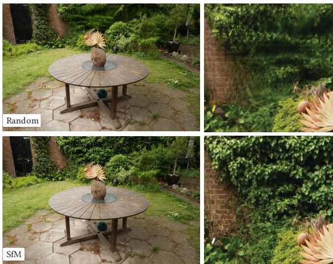  
Fi<sub>g.</sub> 7<sub>.</sub> Initi<sub>a</sub>liz<sub>a</sub>ti<sub>o</sub>n with SfM <sub>po</sub>int<sub>s</sub> h<sub>e</sub>l<sub>ps.</sub> Ab<sub>o</sub>v<sub>e</sub>: initi<sub>a</sub>liz<sub>a</sub>ti<sub>o</sub>n with <sub>a</sub> random <sub>p</sub>oint cloud. Below: initialization usin<sub>g</sub> SfM <sub>p</sub>oints.

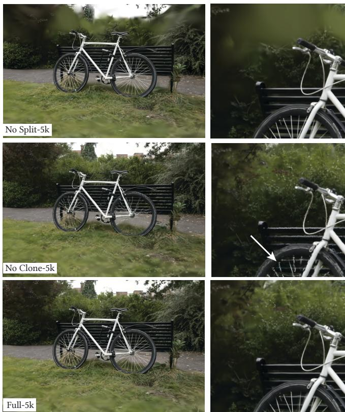  
Fi<sub>g</sub>. 8. Ablation of densification strate<sub>gy</sub> for the two cases "clone" and "s<sub>p</sub>lit" (Sec. 5).

Unlimited depth complexity of splats with gradients. We evaluate if ski<sub>pp</sub>in<sub>g</sub> the <sub>g</sub>radient com<sub>p</sub>utation after the N front-most <sub>p</sub>oints will <sub>g</sub>ive us s<sub>p</sub>eed without sacrificin<sub>g</sub> <sub>q</sub>ualit<sub>y,</sub> as su<sub>gg</sub>ested in Pulsar [Lassner and Zollhofer 2021]. In this test, we choose N=10, which i<sub>s</sub> t<sub>wo</sub> ti<sub>mes</sub> hi<sub>g</sub>h<sub>er</sub> th<sub>an</sub> th<sub>e</sub> d<sub>e</sub>f<sub>au</sub>lt <sub>va</sub>l<sub>ue</sub> i<sub>n</sub> P<sub>u</sub>l<sub>sar,</sub> b<sub>u</sub>t it l<sub>e</sub>d t<sub>o</sub> unstable o<sub>p</sub>timization because of the severe a<sub>pp</sub>roximation in the <sub>g</sub>radient com<sub>p</sub>utation. For the Truck scene<sub>,</sub> <sub>q</sub>ualit<sub>y</sub> de<sub>g</sub>raded b<sub>y</sub> 11dB in PSNR (see Table 3, Limited-BW), and the visual outcome is <sub>s</sub>h<sub>ow</sub>n in Fi<sub>g.</sub> 9 f<sub>o</sub>r Garden<sub>.</sub>

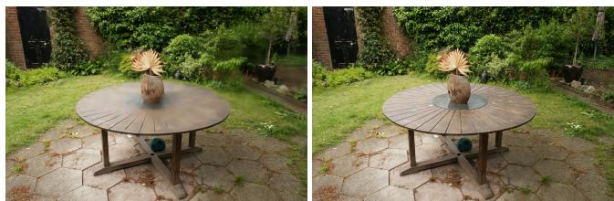  
Fi<sub>g</sub>. 9. If we limit the number of <sub>p</sub>oints that receive <sub>g</sub>radients<sub>,</sub> the efect on visual <sub>q</sub>ualit<sub>y</sub> is si<sub>g</sub>nificant. Left: limit of 10 Gaussians that receive <sub>g</sub>radients. Ri<sub>g</sub>ht<sub>: our</sub> f<sub>u</sub>ll <sub>me</sub>th<sub>o</sub>d<sub>.</sub>

Anisotropic Covariance. An important algorithmic choice in our <sub>me</sub>th<sub>o</sub>d i<sub>s</sub> th<sub>e op</sub>ti<sub>m</sub>i<sub>za</sub>ti<sub>on o</sub>f th<sub>e</sub> f<sub>u</sub>ll <sub>covar</sub>i<sub>ance ma</sub>t<sub>r</sub>i<sub>x</sub> f<sub>or</sub> th<sub>e</sub> 3D G<sub>auss</sub>i<sub>ans.</sub> T<sub>o</sub> d<sub>emons</sub>t<sub>ra</sub>t<sub>e</sub> th<sub>e e</sub>f<sub>ec</sub>t <sub>o</sub>f thi<sub>s c</sub>h<sub>o</sub>i<sub>ce, we per</sub>f<sub>orm an</sub> ablation where we remove anisotro<sub>py</sub> b<sub>y</sub> o<sub>p</sub>timizin<sub>g</sub> a sin<sub>g</sub>le scalar <sub>va</sub>l<sub>ue</sub> th<sub>a</sub>t <sub>con</sub>t<sub>ro</sub>l<sub>s</sub> th<sub>e ra</sub>di<sub>us o</sub>f th<sub>e</sub> 3D G<sub>auss</sub>i<sub>an on a</sub>ll th<sub>ree axes.</sub> The results of this o<sub>p</sub>timization are <sub>p</sub>resented visuall<sub>y</sub> in Fi<sub>g</sub>. 10. We observe that the anisotro<sub>py</sub> si<sub>g</sub>nificantl<sub>y</sub> im<sub>p</sub>roves the <sub>q</sub>ualit<sub>y</sub> of the 3D Gaussian’s abilit<sub>y</sub> to ali<sub>g</sub>n with surfaces<sub>,</sub> which in turn allows for much hi<sub>g</sub>her renderin<sub>g q</sub>ualit<sub>y</sub> while maintainin<sub>g</sub> the <sub>same num</sub>b<sub>er o</sub>f <sub>po</sub>i<sub>n</sub>t<sub>s.</sub>

Spherical Harmonics. Finally, the use of spherical harmonics im-<sub>p</sub>roves our overall PSNR scores since the<sub>y</sub> com<sub>p</sub>ensate for the viewde<sub>p</sub>endent efects (Table 3).

## 7.4 Limitations

O<sub>u</sub>r method is not <sub>w</sub>itho<sub>u</sub>t limitations. In re<sub>g</sub>ions <sub>w</sub>here the scene i<sub>s no</sub>t <sub>we</sub>ll <sub>o</sub>b<sub>serve</sub>d <sub>we</sub> h<sub>ave ar</sub>tif<sub>ac</sub>t<sub>s;</sub> i<sub>n suc</sub>h <sub>reg</sub>i<sub>ons, o</sub>th<sub>er me</sub>th<sub>-</sub> ods also stru<sub>gg</sub>le (e.<sub>g</sub>., Mi<sub>p</sub>-NeRF360 in Fi<sub>g</sub>. 11). Even thou<sub>g</sub>h the anisotro<sub>p</sub>ic Gaussians have man<sub>y</sub> advanta<sub>g</sub>es as described above<sub>,</sub> <sub>our me</sub>th<sub>o</sub>d <sub>can crea</sub>t<sub>e e</sub>l<sub>onga</sub>t<sub>e</sub>d <sub>ar</sub>tif<sub>ac</sub>t<sub>s or</sub> “<sub>sp</sub>l<sub>o</sub>t<sub>c</sub>h<sub>y</sub>” G<sub>auss</sub>i<sub>ans</sub> (see Fi<sub>g</sub>. 12); a<sub>g</sub>ain <sub>p</sub>revious methods also stru<sub>gg</sub>le in these cases.

We also occasionall<sub>y</sub> have <sub>p</sub>o<sub>pp</sub>in<sub>g</sub> artifacts when our o<sub>p</sub>timization creates lar<sub>g</sub>e Gaussians<sub>;</sub> this tends to ha<sub>pp</sub>en in re<sub>g</sub>ions with view-de<sub>p</sub>endent a<sub>pp</sub>earance. One reason for these <sub>p</sub>o<sub>pp</sub>in<sub>g</sub> artifacts is t<sup>h</sup>e trivia<sup>l</sup> rejection o<sup>f</sup> Gaussians via a guar<sup>d b</sup>an<sup>d</sup> in t<sup>h</sup>e rasterizer. A <sub>more pr</sub>i<sub>nc</sub>i<sub>p</sub>l<sub>e</sub>d <sub>cu</sub>lli<sub>ng approac</sub>h <sub>wou</sub>ld <sub>a</sub>ll<sub>ev</sub>i<sub>a</sub>t<sub>e</sub> th<sub>ese ar</sub>tif<sub>ac</sub>t<sub>s.</sub> An<sub>o</sub>th<sub>e</sub>r f<sub>ac</sub>t<sub>o</sub>r i<sub>s ou</sub>r <sub>s</sub>im<sub>p</sub>l<sub>e v</sub>i<sub>s</sub>ibilit<sub>y a</sub>l<sub>go</sub>rithm<sub>, w</sub>hi<sub>c</sub>h <sub>ca</sub>n l<sub>ea</sub>d t<sub>o</sub> G<sub>auss</sub>i<sub>ans su</sub>dd<sub>en</sub>l<sub>y sw</sub>it<sub>c</sub>hi<sub>ng</sub> d<sub>ep</sub>th/bl<sub>en</sub>di<sub>ng or</sub>d<sub>er.</sub> Thi<sub>s cou</sub>ld b<sub>e</sub> <sub>a</sub>dd<sub>resse</sub>d b<sub>y</sub> <sub>an</sub>ti<sub>a</sub>li<sub>as</sub>i<sub>ng,</sub> <sub>w</sub>hi<sub>c</sub>h <sub>we</sub> l<sub>eave</sub> <sub>as</sub> f<sub>u</sub>t<sub>ure</sub> <sub>wor</sub>k<sub>.</sub> Al<sub>so,</sub> <sub>we</sub> currentl<sub>y</sub> do not a<sub>pp</sub>l<sub>y</sub> an<sub>y</sub> re<sub>g</sub>ularization to our o<sub>p</sub>timization<sub>;</sub> doin<sub>g</sub> <sub>so wou</sub>ld h<sub>e</sub>l<sub>p w</sub>ith b<sub>o</sub>th th<sub>e unseen reg</sub>i<sub>on an</sub>d <sub>popp</sub>i<sub>ng ar</sub>tif<sub>ac</sub>t<sub>s.</sub>

Whil<sub>e we use</sub>d th<sub>e same</sub> h<sub>yperparame</sub>t<sub>ers</sub> f<sub>or our</sub> f<sub>u</sub>ll <sub>eva</sub>l<sub>ua</sub>ti<sub>on,</sub> earl<sub>y</sub> ex<sub>p</sub>eriments show that reducin<sub>g</sub> the <sub>p</sub>osition learnin<sub>g</sub> rate can be necessar<sub>y</sub> to conver<sub>g</sub>e in ver<sub>y</sub> lar<sub>g</sub>e scenes (e.<sub>g</sub>., urban datasets).

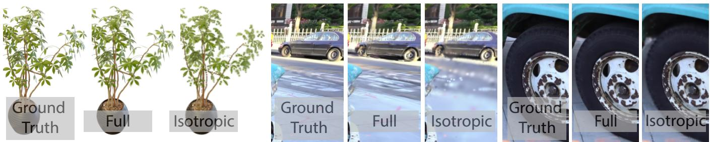  
Fi<sub>g.</sub> 10<sub>.</sub> W<sub>e</sub> t<sub>ra</sub>i<sub>n</sub> <sub>scenes</sub> <sub>w</sub>ith G<sub>auss</sub>i<sub>an</sub> <sub>an</sub>i<sub>so</sub>t<sub>ropy</sub> di<sub>sa</sub>bl<sub>e</sub>d <sub>an</sub>d <sub>ena</sub>bl<sub>e</sub>d<sub>.</sub> Th<sub>e</sub> <sub>use</sub> <sub>o</sub>f <sub>an</sub>i<sub>so</sub>t<sub>rop</sub>i<sub>c</sub> <sub>vo</sub>l<sub>ume</sub>t<sub>r</sub>i<sub>c</sub> <sub>sp</sub>l<sub>a</sub>t<sub>s</sub> <sub>ena</sub>bl<sub>es</sub> <sub>mo</sub>d<sub>e</sub>lli<sub>ng</sub> <sub>o</sub>f fi<sub>ne</sub> <sub>s</sub>t<sub>ruc</sub>t<sub>ures</sub> <sub>an</sub>d h<sub>as</sub> a si<sub>g</sub>nificant im<sub>p</sub>act on visual <sub>q</sub>ualit<sub>y</sub>. Note that for illustrative <sub>p</sub>ur<sub>p</sub>oses<sub>,</sub> we restricted Ficus to use no more than 5k Gaussians in both confi<sub>g</sub>urations.

<sup>E</sup>ven t<sup>h</sup>ou<sub>g</sub><sup>h</sup> we are ver<sub>y</sub> com<sub>p</sub>act com<sub>p</sub>are<sup>d</sup> to <sub>p</sub>rev<sup>i</sup>ous <sub>p</sub>o<sup>i</sup>ntbased a<sub>pp</sub>roaches<sub>,</sub> our memor<sub>y</sub> consum<sub>p</sub>tion is si<sub>g</sub>nificantl<sub>y</sub> hi<sub>g</sub>her than NeRF-based solutions. Durin<sub>g</sub> trainin<sub>g</sub> of lar<sub>g</sub>e scenes<sub>, p</sub>eak GPU m<sub>e</sub>m<sub>o</sub>r<sub>y</sub> <sub>co</sub>n<sub>su</sub>m<sub>p</sub>ti<sub>o</sub>n <sub>ca</sub>n <sub>e</sub>x<sub>cee</sub>d 20 GB in <sub>ou</sub>r <sub>u</sub>n<sub>op</sub>timiz<sub>e</sub>d <sub>pro</sub>t<sub>o</sub>t<sub>ype.</sub> H<sub>owever,</sub> thi<sub>s</sub> fi<sub>gure</sub> <sub>cou</sub>ld b<sub>e</sub> <sub>s</sub>i<sub>gn</sub>ifi<sub>can</sub>tl<sub>y</sub> <sub>re</sub>d<sub>uce</sub>d b<sub>y</sub> <sub>a</sub> careful low-level im<sub>p</sub>lementation of the o<sub>p</sub>timization lo<sub>g</sub>ic (similar to InstantNGP). Renderin<sub>g</sub> the trained scene re<sub>q</sub>uires suficient GPU memor<sub>y</sub> to store the full model (several hundred me<sub>g</sub>ab<sub>y</sub>tes for lar<sub>g</sub>e-scale scenes) and an additional 30–500 MB for the rasterizer, de<sub>p</sub>endin<sub>g</sub> on scene size and ima<sub>g</sub>e resolution. We note that there are man<sub>y</sub> o<sub>pp</sub>ortunities to further reduce memor<sub>y</sub> consum<sub>p</sub>tion <sub>o</sub>f <sub>our me</sub>th<sub>o</sub>d<sub>.</sub> C<sub>ompress</sub>i<sub>on</sub> t<sub>ec</sub>h<sub>n</sub>i<sub>ques</sub> f<sub>or po</sub>i<sub>n</sub>t <sub>c</sub>l<sub>ou</sub>d<sub>s</sub> i<sub>s a we</sub>ll<sub>-</sub> studied field [De Queiroz and Chou 2016]; it would be interestin<sub>g</sub> to <sub>see</sub> h<sub>ow</sub> <sub>suc</sub>h <sub>approac</sub>h<sub>es</sub> <sub>cou</sub>ld b<sub>e</sub> <sub>a</sub>d<sub>ap</sub>t<sub>e</sub>d t<sub>o</sub> <sub>our</sub> <sub>represen</sub>t<sub>a</sub>ti<sub>on.</sub>

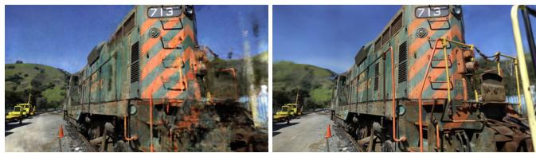  
Fi<sub>g.</sub> 11<sub>.</sub> C<sub>ompar</sub>i<sub>son o</sub>f f<sub>a</sub>il<sub>ure ar</sub>tif<sub>ac</sub>t<sub>s:</sub> Mi<sub>p-</sub>N<sub>e</sub>RF360 h<sub>as</sub> “fl<sub>oa</sub>t<sub>ers</sub>” <sub>an</sub>d <sub>g</sub>rain<sub>y</sub> a<sub>pp</sub>earance (left, fore<sub>g</sub>round), while our method <sub>p</sub>roduces coarse, aniso<sub>p</sub>tro<sub>p</sub>ic Gaussians resultin<sub>g</sub> in low-detail visuals (ri<sub>g</sub>ht, back<sub>g</sub>round). Train <sub>sce</sub>n<sub>e.</sub>

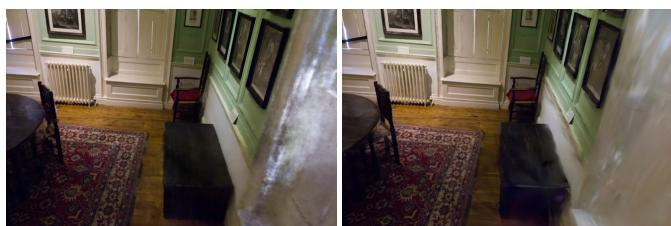  
Fi<sub>g</sub>. 12. In views that have litle overla<sub>p</sub> with those seen durin<sub>g</sub> trainin<sub>g,</sub> our method ma<sub>y</sub> <sub>p</sub>roduce artifacts (ri<sub>g</sub>ht). A<sub>g</sub>ain, Mi<sub>p</sub>-NeRF360 also has artifacts in these cases (left). DrJohnson scene.

## 8 DISCUSSION AND CONCLUSIONS

W<sub>e</sub> h<sub>ave</sub> <sub>presen</sub>t<sub>e</sub>d th<sub>e</sub> fi<sub>rs</sub>t <sub>approac</sub>h th<sub>a</sub>t t<sub>ru</sub>l<sub>y</sub> <sub>a</sub>ll<sub>ows</sub> <sub>rea</sub>l<sub>-</sub>ti<sub>me,</sub> hi<sub>g</sub>h-<sub>q</sub>ualit<sub>y</sub> radiance field renderin<sub>g,</sub> in a wide variet<sub>y</sub> of scenes and ca<sub>p</sub>ture st<sub>y</sub>les<sub>,</sub> while re<sub>q</sub>uirin<sub>g</sub> trainin<sub>g</sub> times com<sub>p</sub>etitive with th<sub>e</sub> f<sub>as</sub>t<sub>es</sub>t <sub>prev</sub>i<sub>ous</sub> <sub>me</sub>th<sub>o</sub>d<sub>s.</sub>

O<sub>u</sub>r choice of a 3D Ga<sub>u</sub>ssian <sub>p</sub>rimiti<sub>v</sub>e <sub>p</sub>reser<sub>v</sub>es <sub>p</sub>ro<sub>p</sub>erties of volumetric renderin<sub>g</sub> for o<sub>p</sub>timization while directl<sub>y</sub> allowin<sub>g</sub> fast <sub>sp</sub>l<sub>a</sub>t<sub>-</sub>b<sub>ase</sub>d <sub>ras</sub>t<sub>er</sub>i<sub>za</sub>ti<sub>on.</sub> O<sub>ur</sub> <sub>wor</sub>k d<sub>emons</sub>t<sub>ra</sub>t<sub>es</sub> th<sub>a</sub>t <sub>–</sub> <sub>con</sub>t<sub>rary</sub> t<sub>o</sub> widely accepted opinion – a continuous representation is not strictly <sub>necessary</sub> t<sub>o</sub> <sub>a</sub>ll<sub>ow</sub> f<sub>as</sub>t <sub>an</sub>d hi<sub>g</sub>h<sub>-qua</sub>lit<sub>y</sub> <sub>ra</sub>di<sub>ance</sub> fi<sub>e</sub>ld t<sub>ra</sub>i<sub>n</sub>i<sub>ng.</sub>

The majorit<sub>y</sub> (∼80%) of our trainin<sub>g</sub> time is s<sub>p</sub>ent in P<sub>y</sub>thon code, <sub>s</sub>i<sub>nce we</sub> b<sub>u</sub>ilt <sub>our so</sub>l<sub>u</sub>ti<sub>on</sub> i<sub>n</sub> P<sub>y</sub>T<sub>orc</sub>h t<sub>o a</sub>ll<sub>ow our me</sub>th<sub>o</sub>d t<sub>o</sub> b<sub>e</sub> easil<sub>y</sub> used b<sub>y</sub> others. Onl<sub>y</sub> the rasterization routine is im<sub>p</sub>lemented as o<sub>p</sub>timized CUDA kernels. We ex<sub>p</sub>ect that <sub>p</sub>ortin<sub>g</sub> the remainin<sub>g</sub> o<sub>p</sub>timization entirel<sub>y</sub> to CUDA, as e.<sub>g</sub>., done in InstantNGP [Müller et al. 2022], could enable si<sub>g</sub>nificant further s<sub>p</sub>eedu<sub>p</sub> for a<sub>pp</sub>lications <sub>w</sub>h<sub>ere</sub> <sub>per</sub>f<sub>ormance</sub> i<sub>s</sub> <sub>essen</sub>ti<sub>a</sub>l<sub>.</sub>

W<sub>e a</sub>l<sub>so</sub> d<sub>emons</sub>t<sub>ra</sub>t<sub>e</sub>d th<sub>e</sub> i<sub>mpor</sub>t<sub>ance o</sub>f b<sub>u</sub>ildi<sub>ng on rea</sub>l<sub>-</sub>ti<sub>me</sub> renderin<sub>g</sub> <sub>p</sub>rinci<sub>p</sub>les<sub>,</sub> ex<sub>p</sub>loitin<sub>g</sub> the <sub>p</sub>ower of the GPU and s<sub>p</sub>eed of software rasterization <sub>p</sub>i<sub>p</sub>eline architecture. These desi<sub>g</sub>n choices <sub>are</sub> th<sub>e</sub> k<sub>ey</sub> t<sub>o</sub> <sub>per</sub>f<sub>ormance</sub> b<sub>o</sub>th f<sub>or</sub> t<sub>ra</sub>i<sub>n</sub>i<sub>ng</sub> <sub>an</sub>d <sub>rea</sub>l<sub>-</sub>ti<sub>me</sub> <sub>ren</sub>d<sub>er-</sub> in<sub>g,</sub> <sub>p</sub>rovidin<sub>g</sub> a com<sub>p</sub>etitive ed<sub>g</sub>e in <sub>p</sub>erformance over <sub>p</sub>revious volumetric ra<sub>y</sub>-marchin<sub>g</sub>.

It would be interestin<sub>g</sub> to see if our Gaussians can be used to <sub>p</sub>erf<sub>orm</sub> <sub>mes</sub>h <sub>recons</sub>t<sub>ruc</sub>ti<sub>ons</sub> <sub>o</sub>f th<sub>e</sub> <sub>cap</sub>t<sub>ure</sub>d <sub>scene.</sub> A<sub>s</sub>id<sub>e</sub> f<sub>rom</sub> <sub>prac-</sub> ti<sub>ca</sub>l i<sub>mp</sub>li<sub>ca</sub>ti<sub>ons</sub> <sub>g</sub>i<sub>ven</sub> th<sub>e</sub> <sub>w</sub>id<sub>esprea</sub>d <sub>use</sub> <sub>o</sub>f <sub>mes</sub>h<sub>es,</sub> thi<sub>s</sub> <sub>wou</sub>ld <sub>a</sub>ll<sub>ow us</sub> t<sub>o</sub> b<sub>e</sub>tt<sub>er un</sub>d<sub>ers</sub>t<sub>an</sub>d <sub>w</sub>h<sub>ere our me</sub>th<sub>o</sub>d <sub>s</sub>t<sub>an</sub>d<sub>s exac</sub>tl<sub>y</sub> i<sub>n</sub> th<sub>e</sub> <sub>con</sub>ti<sub>nuum</sub> b<sub>e</sub>t<sub>ween</sub> <sub>vo</sub>l<sub>ume</sub>t<sub>r</sub>i<sub>c</sub> <sub>an</sub>d <sub>sur</sub>f<sub>ace</sub> <sub>represen</sub>t<sub>a</sub>ti<sub>ons.</sub>

I<sub>n conc</sub>l<sub>us</sub>i<sub>on, we</sub> h<sub>ave presen</sub>t<sub>e</sub>d th<sub>e</sub> fi<sub>rs</sub>t <sub>rea</sub>l<sub>-</sub>ti<sub>me ren</sub>d<sub>er</sub>i<sub>ng</sub> <sub>so</sub>l<sub>u</sub>ti<sub>on</sub> f<sub>or</sub> <sub>ra</sub>di<sub>ance</sub> fi<sub>e</sub>ld<sub>s,</sub> <sub>w</sub>ith <sub>ren</sub>d<sub>er</sub>i<sub>ng</sub> <sub>qua</sub>lit<sub>y</sub> th<sub>a</sub>t <sub>ma</sub>t<sub>c</sub>h<sub>es</sub> th<sub>e</sub> best ex<sub>p</sub>ensi<sub>v</sub>e <sub>p</sub>re<sub>v</sub>io<sub>u</sub>s methods<sub>,</sub> <sub>w</sub>ith trainin<sub>g</sub> times com<sub>p</sub>etiti<sub>v</sub>e with the fastest existin<sub>g</sub> solutions.

## ACKNOWLEDGMENTS

Thi<sub>s researc</sub>h <sub>was</sub> f<sub>un</sub>d<sub>e</sub>d b th<sub>e</sub> ERC Ad<sub>vance</sub>d <sub>ran</sub>t FUNGRAPH N<sub>o</sub> 788065 htt<sub>p</sub>://f<sub>u</sub>n<sub>g</sub>r<sub>ap</sub>h<sub>.</sub>inri<sub>a.</sub>fr<sub>.</sub> Th<sub>e au</sub>th<sub>o</sub>r<sub>s a</sub>r<sub>e g</sub>r<sub>a</sub>t<sub>e</sub>f<sub>u</sub>l t<sub>o</sub> Ad<sub>o</sub>b<sub>e</sub> f<sub>o</sub>r <sub>ge</sub>n<sub>e</sub>r<sub>ous</sub> d<sub>o</sub>n<sub>a</sub>ti<sub>o</sub>n<sub>s,</sub> th<sub>e</sub> OPAL infr<sub>as</sub>tr<sub>uc</sub>t<sub>u</sub>r<sub>e</sub> fr<sub>o</sub>m Uni<sub>ve</sub>r<sub>s</sub>ité Côte d’Azur and for the HPC resources from GENCI–IDRIS (Grant 2022-AD011013409). The authors thank the anon<sub>y</sub>mous reviewers f<sub>or</sub> th<sub>e</sub>i<sub>r va</sub>l<sub>ua</sub>bl<sub>e</sub> f<sub>ee</sub>db<sub>ac</sub>k<sub>,</sub> P<sub>.</sub> H<sub>e</sub>d<sub>man an</sub>d A<sub>.</sub> T<sub>ewar</sub>i f<sub>or proo</sub>f<sub>-</sub> r<sub>ea</sub>din<sub>g ea</sub>rli<sub>e</sub>r dr<sub>a</sub>ft<sub>s a</sub>l<sub>so</sub> T<sub>.</sub> Müll<sub>e</sub>r<sub>,</sub> A<sub>.</sub> Y<sub>u a</sub>nd S<sub>.</sub> Frid<sub>ov</sub>i<sub>c</sub>h-K<sub>e</sub>il f<sub>o</sub>r hel<sub>p</sub>in<sub>g</sub> with the com<sub>p</sub>arisons.

## REFERENCES

K<sub>a</sub>r<sub>a</sub>-Ali Ali<sub>ev,</sub> Art<sub>e</sub>m S<sub>evas</sub>t<sub>opo</sub>l<sub>s</sub>k<sub>y,</sub> M<sub>a</sub>ri<sub>a</sub> K<sub>o</sub>l<sub>os,</sub> Dmitr<sub>y</sub> Ul<sub>ya</sub>n<sub>ov, a</sub>nd Vi<sub>c</sub>t<sub>o</sub>r L<sub>e</sub>mpitsky. 2020. Neural Point-Based Graphics. In Computer Vision – ECCV2020: 16th European Conference, Glasgow, UK, August 23–28, 2020, Proceedings, Part XXII. 696– 712.

Jonathan T Barron, Ben Mildenhall, Matthew Tancik, Peter Hedman, Ricardo Martin Br<sub>ua</sub>ll<sub>a, a</sub>nd Pr<sub>a</sub>t<sub>u</sub>l P Srini<sub>vasa</sub>n<sub>.</sub> 2021<sub>.</sub> Mi<sub>p</sub>-n<sub>e</sub>rf: A m<sub>u</sub>lti<sub>sca</sub>l<sub>e</sub> r<sub>ep</sub>r<sub>ese</sub>nt<sub>a</sub>ti<sub>o</sub>n f<sub>o</sub>r anti-aliasing neural radiance fields. In Proceedings of the IEEE/CVF International Conference on Computer Vision. 5855–5864.

Jonathan T. Barron, Ben Mildenhall, Dor Verbin, Pratul P. Srinivasan, and Peter Hedman. 2022. Mip-NeRF 360: Unbounded Anti-Aliased Neural Radiance Fields. CVPR (2022).

Sebastien Bono<sub>p</sub>era, Jerome Esnault, Siddhant Prakash, Simon Rodri<sub>g</sub>uez, Theo Thonat, Mehdi Benadel, Gaurav Chaurasia, Julien Phili<sub>p</sub>, and Geor<sub>g</sub>e Drettakis. 2020. sibr: A S<sub>y</sub>stem for Ima<sub>g</sub>e Based Renderin<sub>g</sub>. htt<sub>p</sub>s://<sub>g</sub>itlab.inria.fr/sibr/sibr<sub>\_</sub>core

M<sub>a</sub>ri<sub>o</sub> B<sub>o</sub>t<sub>sc</sub>h<sub>,</sub> Al<sub>e</sub>x<sub>a</sub>nd<sub>e</sub>r H<sub>o</sub>rn<sub>u</sub>n<sub>g,</sub> M<sub>a</sub>tthi<sub>as</sub> Z<sub>w</sub>i<sub>c</sub>k<sub>e</sub>r<sub>, a</sub>nd L<sub>e</sub>if K<sub>o</sub>bb<sub>e</sub>lt<sub>.</sub> 2005<sub>.</sub> Hi<sub>g</sub>h Quality Surface Splatting on Today’s GPUs. In Proceedings ofthe Second Eurographics / IEEE VGTC Conference on Point-Based Graphics (New York, USA) (SPBG’05). Euror<sub>a</sub> hi<sub>cs</sub> A<sub>ssoc</sub>i<sub>a</sub>ti<sub>o</sub>n<sub>,</sub> G<sub>os</sub>l<sub>a</sub>r<sub>,</sub> DEU<sub>,</sub> 17–24<sub>.</sub>

Chri<sub>s</sub> B<sub>ue</sub>hl<sub>e</sub>r<sub>,</sub> Mi<sub>c</sub>h<sub>ae</sub>l B<sub>osse,</sub> L<sub>eo</sub>n<sub>a</sub>rd M<sub>c</sub>Mill<sub>a</sub>n<sub>,</sub> St<sub>eve</sub>n G<sub>o</sub>rtl<sub>e</sub>r<sub>, a</sub>nd Mi<sub>c</sub>h<sub>ae</sub>l C<sub>o</sub>h<sub>e</sub>n<sub>.</sub> 2001. Unstructured lumigraph rendering. In Proc. SIGGRAPH.

G<sub>au</sub>r<sub>av</sub> Ch<sub>au</sub>r<sub>as</sub>i<sub>a,</sub> S<sub>y</sub>l<sub>va</sub>in D<sub>uc</sub>h<sub>e</sub>n<sub>e,</sub> Ol<sub>ga</sub> S<sub>o</sub>rkin<sub>e</sub>-H<sub>o</sub>rn<sub>u</sub>n<sub>g,</sub> <sub>a</sub>nd G<sub>eo</sub>r<sub>ge</sub> Dr<sub>e</sub>tt<sub>a</sub>ki<sub>s.</sub> 2013. De th s nthesis and local war s for lausible ima e-based navi ation. ACM Transactions on Graphics (TOG) 32, 3 (2013), 1–12.

An<sub>p</sub>ei Chen, Zexian<sub>g</sub> Xu, Andreas Gei<sub>g</sub>er, Jin<sub>gy</sub>i Yu, and Hao Su. 2022b. TensoRF: Tensorial Radiance Fields. In European Conference on Computer Vision (ECCV).

Zhi i<sub>n</sub> Ch<sub>en,</sub> Th<sub>omas</sub> F<sub>un</sub>kh<sub>ouser,</sub> P<sub>e</sub>t<sub>er</sub> H<sub>e</sub>d<sub>man, an</sub>d A<sub>n</sub>d<sub>rea</sub> T<sub>a</sub> li<sub>asacc</sub>hi<sub>.</sub> 2022<sub>a.</sub> M<sub>o</sub>bil<sub>e</sub>N<sub>e</sub>RF: Ex<sub>p</sub>l<sub>o</sub>itin<sub>g</sub> th<sub>e</sub> P<sub>o</sub>l<sub>ygo</sub>n R<sub>as</sub>t<sub>e</sub>riz<sub>a</sub>ti<sub>o</sub>n Pi<sub>pe</sub>lin<sub>e</sub> f<sub>o</sub>r Efi<sub>c</sub>i<sub>e</sub>nt N<sub>eu</sub>r<sub>a</sub>l Fi<sub>e</sub>ld Rendering on Mobile Architectures. arXiv preprint arXiv:2208.00277 (2022).

Ricardo L De Queiroz and Philip A Chou. 2016. Compression of 3D point clouds using a region-adaptive hierarchical transform. IEEE Transactions on Image Processing 25, 8 (2016), 3947–3956.

M<sub>a</sub>rtin Ei<sub>se</sub>m<sub>a</sub>nn<sub>,</sub> B<sub>e</sub>rt D<sub>e</sub> D<sub>ec</sub>k<sub>e</sub>r<sub>,</sub> M<sub>a</sub>r<sub>cus</sub> M<sub>ag</sub>n<sub>o</sub>r<sub>,</sub> Phili<sub>ppe</sub> B<sub>e</sub>k<sub>ae</sub>rt<sub>,</sub> Edil<sub>so</sub>n D<sub>e</sub> A<sub>gu</sub>i<sub>a</sub>r<sub>,</sub> N<sub>avee</sub>d Ahm<sub>e</sub>d<sub>,</sub> Chri<sub>s</sub>ti<sub>a</sub>n Th<sub>eo</sub>b<sub>a</sub>lt<sub>, a</sub>nd Anit<sub>a</sub> S<sub>e</sub>ll<sub>e</sub>nt<sub>.</sub> 2008<sub>.</sub> Fl<sub>oa</sub>tin<sub>g</sub> t<sub>e</sub>xt<sub>u</sub>r<sub>es.</sub> In Computer graphics forum, Vol. 27. Wiley Online Library, 409–418.

John Fl<sub>y</sub>nn, Ivan Neulander, James Philbin, and Noah Snavel<sub>y</sub>. 2016. Dee<sub>p</sub>stereo: Learning to predict new views from the world’s imagery. In CVPR.

Fri<sup>d</sup>ovic<sup>h</sup>-Kei<sup>l</sup> an<sup>d</sup> Yu, Matt<sup>h</sup>ew Tanci<sup>k</sup>, Qin<sup>h</sup>ong C<sup>h</sup>en, Benjamin Rec<sup>h</sup>t, an<sup>d</sup> Angjoo Kanazawa. 2022. Plenoxels: Radiance Fields without Neural Networks. In CVPR.

Michael Goesele<sub>,</sub> Noah Sna<sub>v</sub>el<sub>y,</sub> Brian C<sub>u</sub>rless<sub>,</sub> H<sub>ugu</sub>es Ho<sub>pp</sub>e<sub>,</sub> and Ste<sub>v</sub>en M Seitz. 2007. Multi-view stereo for community photo collections. In ICCV.

Ste<sub>p</sub>han J. Garbin, Marek Kowalski, Matthew Johnson, Jamie Shotton, and Julien Valentin. 2021. FastNeRF: High-Fidelity Neural Rendering at 200FPS. In Proceedings ofthe IEEE/CVF International Conference on Computer Vision (ICCV). 14346–14355.

Steven J Gortler, Radek Grzeszczuk, Richard Szeliski, and Michael F Cohen. 1996. The lumigraph. In Proceedings ofthe 23rd annual conference on Computer graphics and interactive techniques. 43–54.

Markus Gross and Hanspeter (Eds) Pfister. 2011. Point-based graphics. Elsevier.

Jef P. Grossman and William J. Dally. 1998. Point Sample Rendering. In Rendering Techniques.

Peter Hedman, Julien Phili<sub>p</sub>, True Price, Jan-Michael Frahm, Geor<sub>g</sub>e Drettakis, and Gabriel Brostow. 2018. Dee<sub>p</sub> blendin<sub>g</sub> for free-view<sub>p</sub>oint ima<sub>g</sub>e-based renderin<sub>g</sub>. ACM Trans. on Graphics (TOG) 37, 6 (2018).

P<sub>e</sub>t<sub>e</sub>r H<sub>e</sub>dm<sub>a</sub>n<sub>,</sub> T<sub>o</sub>bi<sub>as</sub> Rit<sub>sc</sub>h<sub>e</sub>l<sub>,</sub> G<sub>eo</sub>r<sub>ge</sub> Dr<sub>e</sub>tt<sub>a</sub>ki<sub>s, a</sub>nd G<sub>a</sub>bri<sub>e</sub>l Br<sub>os</sub>t<sub>ow.</sub> 2016<sub>.</sub> S<sub>ca</sub>l<sub>a</sub>bl<sub>e</sub> Inside-Out Image-Based Rendering. ACM Transactions on Graphics (SIGGRAPH Asia Conference Proceedings) 35, 6 (December 2016). htt ://www-so .inria.fr/reves/ B<sub>as</sub>ili<sub>c</sub>/2016/HRDB16

Peter Hedman, Pratul P. Srinivasan, Ben Mildenhall, Jonathan T. Barron, and Paul Debevec. 2021. Baking Neural Radiance Fields for Real-Time View Synthesis. ICCV (2021).

Phili<sub>pp</sub> Henzler, Nilo<sub>y</sub> J Mitra, and Tobias Ritschel. 2019. Esca<sub>p</sub>in<sub>g p</sub>lato’s cave: 3d sha<sub>p</sub>e from adversarial rendering. In Proceedings of the IEEE/CVF International Conference on Computer Vision. 9984–9993.

Arno Knapitsch, Jaesik Park, Qian-Yi Zhou, and Vladlen Koltun. 2017. Tanks and temples: Benchmarking large-scale scene reconstruction. ACM Transactions on Graphics (ToG) 36, 4 (2017), 1–13.

Geor<sub>g</sub>ios Ko<sub>p</sub>anas, Thomas Leimkühler, Gilles Rainer, Clément Jambon, and Geor<sub>g</sub>e Dr<sub>e</sub>tt<sub>a</sub>ki<sub>s.</sub> 2022<sub>.</sub> N<sub>eu</sub>r<sub>a</sub>l P<sub>o</sub>int C<sub>a</sub>t<sub>acaus</sub>ti<sub>cs</sub> f<sub>o</sub>r N<sub>ove</sub>l-Vi<sub>ew</sub> S<sub>y</sub>nth<sub>es</sub>i<sub>s o</sub>f R<sub>e</sub>fl<sub>ec</sub>ti<sub>o</sub>n<sub>s.</sub> ACM Transactions on Graphics (SIGGRAPH Asia Conference Proceedings) 41, 6 (2022), 201. htt<sub>p</sub>://www-so<sub>p</sub>.inria.fr/reves/Basilic/2022/KLRJD22

Geor<sub>g</sub>ios Ko<sub>p</sub>anas, Julien Phili<sub>p</sub>, Thomas Leimkühler, and Geor<sub>g</sub>e Drettakis. 2021. Point Based Neural Rendering with Per-View Optimization. Computer Graphics Forum 40, 4 (2021), 29–43. htt<sub>p</sub>s://doi.or<sub>g</sub>/10.1111/c<sub>g</sub>f.14339

S<sub>a</sub>m<sub>u</sub>li L<sub>a</sub>in<sub>e</sub> <sub>a</sub>nd T<sub>e</sub>r<sub>o</sub> K<sub>a</sub>rr<sub>as.</sub> 2011<sub>.</sub> Hi<sub>g</sub>h-<sub>pe</sub>rf<sub>o</sub>rm<sub>a</sub>n<sub>ce</sub> <sub>so</sub>ft<sub>wa</sub>r<sub>e</sub> r<sub>as</sub>t<sub>e</sub>riz<sub>a</sub>ti<sub>o</sub>n <sub>o</sub>n GPU<sub>s.</sub> In Proceedings of the ACM SIGGRAPH Symposium on High Performance Graphics. 79–88.

Ch<sub>r</sub>i<sub>s</sub>t<sub>op</sub>h L<sub>assner an</sub>d Mi<sub>c</sub>h<sub>ae</sub>l Z<sub>o</sub>llh<sub>o</sub>f<sub>er.</sub> 2021<sub>.</sub> P<sub>u</sub>l<sub>sar:</sub> Efi<sub>c</sub>i<sub>en</sub>t S<sub>p</sub>h<sub>ere-</sub>B<sub>ase</sub>d N<sub>eura</sub>l Rendering. In Proceedings ofthe IEEE/CVFConference on Computer Vision and Pattern Recognition (CVPR). 1440–1449.

Marc Levoy and Pat Hanrahan. 1996. Light field rendering. In Proceedings of the 23rd annual conference on Computer graphics and interactive techniques. 31–42.

Ste<sub>p</sub>hen Lombardi<sub>,</sub> Tomas Simon<sub>,</sub> Gabriel Sch<sub>w</sub>artz<sub>,</sub> Michael Zollhoefer<sub>,</sub> Yaser Sheikh<sub>,</sub> and Jason Sara<sub>g</sub>ih. 2021. Mixture of volumetric <sub>p</sub>rimitives for eficient neural rendering. ACM Transactions on Graphics (TOG) 40, 4 (2021), 1–13.

D<sub>ua</sub>n<sub>e</sub> G M<sub>e</sub>rrill <sub>a</sub>nd Andr<sub>ew</sub> S Grim<sub>s</sub>h<sub>aw.</sub> 2010<sub>.</sub> R<sub>ev</sub>i<sub>s</sub>itin<sub>g so</sub>rtin<sub>g</sub> f<sub>o</sub>r GPGPU <sub>s</sub>tr<sub>ea</sub>m architectures. In Proceedings ofthe 19th international conference on Parallel architectures and compilation techniques. 545–546.

Ben Mildenhall, Pratul P. Srinivasan, Matthew Tancik, Jonathan T. Barron, Ravi Ram<sub>a</sub>m<sub>oo</sub>rthi<sub>, a</sub>nd R<sub>e</sub>n N<sub>g.</sub> 2020<sub>.</sub> N<sub>e</sub>RF: R<sub>ep</sub>r<sub>ese</sub>ntin<sub>g</sub> S<sub>ce</sub>n<sub>es as</sub> N<sub>eu</sub>r<sub>a</sub>l R<sub>a</sub>di<sub>a</sub>n<sub>ce</sub> Fi<sub>e</sub>ld<sub>s</sub> for View Synthesis. In ECCV.

Th<sub>omas</sub> Müll<sub>er,</sub> Al<sub>ex</sub> E<sub>vans,</sub> Ch<sub>r</sub>i<sub>s</sub>t<sub>op</sub>h S<sub>c</sub>hi<sub>e</sub>d<sub>, an</sub>d Al<sub>exan</sub>d<sub>er</sub> K<sub>e</sub>ll<sub>er.</sub> 2022<sub>.</sub> I<sub>ns</sub>t<sub>an</sub>t Neural Graphics Primitives with a Multiresolution Hash Encoding. ACM Trans. Graph. 41, 4, Article 102 (July 2022), 15 pages. https://doi.org/10.1145/3528223. 3530127

Eric Penner and Li Zhang. 2017. Soft 3D reconstruction for view synthesis. ACM Transactions on Graphics (TOG) 36, 6 (2017), 1–11.

Hans<sub>p</sub>eter Pfister, Matthias Zwicker, Jeroen van Baar, and Markus Gross. 2000. Surfels: Surface Elements as Rendering Primitives. In Proceedings ofthe 27th Annual Conference on Computer Graphics and Interactive Techniques (SIGGRAPH ’00). ACM Press/Addison-Wesle<sub>y</sub> Publishin<sub>g</sub> Co.<sub>,</sub> USA<sub>,</sub> 335–342. htt<sub>p</sub>s://doi.or<sub>g</sub>/10.1145/ 344779.344936

Chri<sub>s</sub>ti<sub>a</sub>n R<sub>e</sub>i<sub>se</sub>r<sub>,</sub> S<sub>o</sub>n<sub>gyou</sub> P<sub>e</sub>n<sub>g,</sub> Yi<sub>y</sub>i Li<sub>ao, a</sub>nd Andr<sub>eas</sub> G<sub>e</sub>i<sub>ge</sub>r<sub>.</sub> 2021<sub>.</sub> Kil<sub>o</sub>N<sub>e</sub>RF: S<sub>pee</sub>ding up Neural Radiance Fields with Thousands of Tiny MLPs. In International Conference on Computer Vision (ICCV).

Liu Ren, Hanspeter P<sup>fi</sup>ster, an<sup>d</sup> Matt<sup>h</sup>ias Zwic<sup>k</sup>er. 2002. O<sup>b</sup>ject Space EWA Sur<sup>f</sup>ace Splatting: A Hardware Accelerated Approach to High Quality Point Rendering. Computer Graphics Forum 21 (2002).

H<sub>e</sub>l<sub>ge</sub> Rh<sub>o</sub>din<sub>,</sub> N<sub>a</sub>di<sub>a</sub> R<sub>o</sub>b<sub>e</sub>rtini<sub>,</sub> Chri<sub>s</sub>ti<sub>a</sub>n Ri<sub>c</sub>h<sub>a</sub>rdt<sub>,</sub> H<sub>a</sub>n<sub>s</sub>-P<sub>e</sub>t<sub>e</sub>r S<sub>e</sub>id<sub>e</sub>l<sub>, a</sub>nd Chri<sub>s</sub>ti<sub>a</sub>n Th<sub>eo</sub>b<sub>a</sub>lt<sub>.</sub> 2015<sub>.</sub> A <sub>versa</sub>til<sub>e</sub> <sub>scene</sub> <sub>mo</sub>d<sub>e</sub>l <sub>w</sub>ith dif<sub>eren</sub>ti<sub>a</sub>bl<sub>e</sub> <sub>v</sub>i<sub>s</sub>ibilit<sub>y</sub> <sub>app</sub>li<sub>e</sub>d t<sub>o</sub> generative pose estimation. In Proceedings of the IEEE International Conference on Computer Vision. 765–773.

Gernot Riegler and Vladlen Koltun. 2020. Free view synthesis. In European Conference on Computer Vision. Springer, 623–640.

D<sub>a</sub>ri<sub>us</sub> Rü<sub>c</sub>k<sub>e</sub>rt<sub>,</sub> Lin<sub>us</sub> Fr<sub>a</sub>nk<sub>e,</sub> <sub>a</sub>nd M<sub>a</sub>r<sub>c</sub> St<sub>a</sub>mmin<sub>ge</sub>r<sub>.</sub> 2022<sub>.</sub> ADOP: A<sub>pp</sub>r<sub>o</sub>xim<sub>a</sub>t<sub>e</sub> Diferentiable One-Pixel Point Rendering. ACM Trans. Graph. 41, 4, Article 99 (ju 2022), 14 <sub>p</sub>a<sub>g</sub>es. htt<sub>p</sub>s://doi.or<sub>g</sub>/10.1145/3528223.3530122

Miguel Sainz and Renato Pajarola. 2004. Point-based rendering techniques. Computers and Graphics 28, 6 (2004), 869–879. https://doi.org/10.1016/j.cag.2004.08.014

Johannes Lutz Schönber<sub>g</sub>er and Jan-Michael Frahm. 2016. Structure-from-Motion Revisited. In Conference on Computer Vision and Pattern Recognition (CVPR).

M<sub>a</sub>rk<sub>us</sub> S<sub>c</sub>hütz<sub>,</sub> B<sub>e</sub>rnh<sub>a</sub>rd K<sub>e</sub>rbl<sub>, a</sub>nd Mi<sub>c</sub>h<sub>ae</sub>l Wimm<sub>e</sub>r<sub>.</sub> 2022<sub>.</sub> S<sub>o</sub>ft<sub>wa</sub>r<sub>e</sub> R<sub>as</sub>t<sub>e</sub>riz<sub>a</sub>ti<sub>o</sub>n <sub>o</sub>f 2 Billion Points in Real Time. Proc. ACM Comput. Graph. Interact. Tech. 5, 3, Article 24 (jul 2022), 17 <sub>p</sub>a<sub>g</sub>es. htt<sub>p</sub>s://doi.or<sub>g</sub>/10.1145/3543863

Vincent Sitzmann, Justus Thies, Felix Heide, Matthias Nießner, Gordon Wetzstein, and Michael Zollhofer. 2019. Dee<sub>p</sub>voxels: Learnin<sub>g p</sub>ersistent 3d feature embeddin<sub>g</sub>s. In Proceedings ofthe IEEE/CVF Conference on Computer Vision and Pattern Recognition. 2437–2446.

N<sub>oa</sub>h Sn<sub>ave</sub>l<sub>y,</sub> St<sub>eve</sub>n M S<sub>e</sub>itz<sub>, a</sub>nd Ri<sub>c</sub>h<sub>a</sub>rd Sz<sub>e</sub>li<sub>s</sub>ki<sub>.</sub> 2006<sub>.</sub> Ph<sub>o</sub>t<sub>o</sub> t<sub>ou</sub>ri<sub>s</sub>m: <sub>e</sub>x<sub>p</sub>l<sub>o</sub>rin<sub>g</sub> photo collections in 3D. In Proc. SIGGRAPH.

Carsten Stoll, Nils Hasler, Juer<sub>g</sub>en Gall, Hans-Peter Seidel, and Christian Theobalt. 2011. Fast articulated motion tracking using a sums of gaussians body model. In 2011 International Conference on Computer Vision. IEEE, 951–958.

Chen<sub>g</sub> S<sub>u</sub>n<sub>,</sub> Min S<sub>u</sub>n<sub>,</sub> and H<sub>w</sub>ann-Tzon<sub>g</sub> Chen. 2022. Direct Voxel Grid O<sub>p</sub>timization: Su er-fast Conver ence for Radiance Fields Reconstruction. In CVPR.

Towaki Takikawa, Alex Evans, Jonathan Trembla<sub>y</sub>, Thomas Müller, Mor<sub>g</sub>an McGuire, Alec Jacobson, and Sanja Fidler. 2022. Variable bitrate neural fields. In ACM SIG-GRAPH 2022 Conference Proceedings. 1–9.

Towaki Takikawa, Joe<sub>y</sub> Litalien, Kan<sub>g</sub>xue Yin, Karsten Kreis, Charles Loo<sub>p</sub>, Derek Nowrouzezahrai, Alec Jacobson, Mor an McGuire, and Sanja Fidler. 2021. Neural Geometric Level of Detail: Real-time Renderin<sub>g</sub> with Im<sub>p</sub>licit 3D Sha<sub>p</sub>es. (2021).

A<sub>y</sub>ush Tewari, Justus Thies, Ben Mildenhall, Pratul Srinivasan, Ed<sub>g</sub>ar Tretschk, W Yifan, Christo<sub>p</sub>h Lassner<sub>,</sub> Vincent Sitzmann<sub>,</sub> Ricardo Martin-Br<sub>u</sub>alla<sub>,</sub> Ste<sub>p</sub>hen Lombardi<sub>,</sub> et al. 2022. Advances in neural rendering. In Computer Graphics Forum, Vol. 41. Wile<sub>y</sub> Online Librar<sub>y,</sub> 703–735.

Justus Thies, Michael Zollhöfer, and Matthias Nießner. 2019. Deferred neural renderin<sub>g</sub>: Image synthesis using neural textures. ACM Transactions on Graphics (TOG) 38, 4 (2019), 1–12.

An<sub>g</sub>tian Wan<sub>g</sub>, Pen<sub>g</sub> Wan<sub>g</sub>, Jian Sun, Adam Kort<sub>y</sub>lewski, and Alan Yuille. 2023. VoGE: A Diferentiable Volume Renderer usin<sub>g</sub> Gaussian Elli<sub>p</sub>soids for Anal<sub>y</sub>sis-b<sub>y</sub>-S<sub>y</sub>nthesis. In The Eleventh International Conference on Learning Representations. https:// o<sub>p</sub>enreview.net/forum?id=AdPJb9cud\_Y

Olivia Wiles, Geor<sub>g</sub>ia Gkioxari, Richard Szeliski, and Justin Johnson. 2020. S<sub>y</sub>nsin: End-to-end view synthesis from a single image. In Proceedings of the IEEE/CVF Conference on Computer Vision and Pattern Recognition. 7467–7477.

Xiuchao Wu, Jiamin Xu, Zihan Zhu, Hujun Bao, Qixing Huang, James Tompkin, and Weiwei Xu. 2022. Scalable Neural Indoor Scene Rendering. ACM Transactions on Graphics (TOG) (2022).

Yih<sub>e</sub>n<sub>g</sub> Xi<sub>e,</sub> T<sub>owa</sub>ki T<sub>a</sub>kik<sub>awa,</sub> Sh<sub>u</sub>n<sub>su</sub>k<sub>e</sub> S<sub>a</sub>it<sub>o,</sub> Or Lit<sub>a</sub>n<sub>y,</sub> Shi<sub>q</sub>in Y<sub>a</sub>n<sub>,</sub> N<sub>u</sub>m<sub>a</sub>ir Kh<sub>a</sub>n<sub>,</sub> Federico Tombari, James Tom<sub>p</sub>kin, Vincent Sitzmann, and Srinath Sridhar. 2022. Neural fields in visual computing and beyond. In Computer Graphics Forum, Vol. 41. Wile<sub>y</sub> Online Librar<sub>y,</sub> 641–676.

Qiangeng Xu, Zexiang Xu, Julien Philip, Sai Bi, Zhixin Shu, Kalyan Sunkavalli, and Ulrich Neumann. 2022. Point-nerf: Point-based neural radiance fields. In Proceedings ofthe IEEE/CVF Conference on Computer Vision and Pattern Recognition. 5438–5448.

W<sub>ang</sub> Yif<sub>an,</sub> F<sub>e</sub>li<sub>ce</sub> S<sub>erena,</sub> Shih<sub>ao</sub> W<sub>u,</sub> C<sub>eng</sub>i<sub>z</sub> Ö<sub>z</sub>ti<sub>re</sub>li<sub>,</sub> <sub>an</sub>d Ol<sub>ga</sub> S<sub>or</sub>ki<sub>ne-</sub>H<sub>ornung.</sub> 2019. Diferentiable surface splatting for point-based geometry processing. ACM Transactions on Graphics (TOG) 38, 6 (2019), 1–14.

A<sup>l</sup>ex Yu, Rui<sup>l</sup>ong Li, Matt<sup>h</sup>ew Tanci<sup>k</sup>, Hao Li, Ren Ng, an<sup>d</sup> Angjoo Kanazawa. 2021. PlenOctrees for Real-time Rendering of Neural Radiance Fields. In ICCV.

Qiang Zhang, Seung-Hwan Baek, Szymon Rusinkiewicz, and Felix Heide. 2022. Dif ferentiable Point-Based Radiance Fields for Eficient View S nthesis. In SIGGRAPH Asia 2022 Conference Papers (Daegu, Republic of Korea) (SA ’22). Association for Com<sub>p</sub>utin<sub>g</sub> Machiner<sub>y,</sub> New York<sub>,</sub> NY<sub>,</sub> USA<sub>,</sub> Article 7<sub>,</sub> 12 <sub>p</sub>a<sub>g</sub>es. htt<sub>p</sub>s://doi.or<sub>g</sub>/10. 1145/3550469.3555413

Tin<sub>g</sub>hui Zhou, Shubham Tulsiani, Weilun Sun, Jitendra Malik, and Alexei A Efros. 2016. View synthesis by appearance flow. In European conference on computer vision. <sup>S</sup><sub>p</sub>r<sup>i</sup>n<sub>g</sub>er, 286–301.

Matthias Zwicker, Hans<sub>p</sub>eter Pfister, Jeroen Van Baar, and Markus Gross. 2001a. EWA volume s lattin . In Proceedings Visualization, 2001. VIS’01. IEEE, 29–538.

Matthias Zwicker, Hans<sub>p</sub>eter Pfister, Jeroen van Baar, and Markus Gross. 2001b. Surface Splatting. In Proceedings of the 28th Annual Conference on Computer Graphics and Interactive Techniques (SIGGRAPH ’01). Association for Computing Machinery, New York<sub>,</sub> NY<sub>,</sub> USA<sub>,</sub> 371–378. htt<sub>p</sub>s://doi.or<sub>g</sub>/10.1145/383259.383300

## A DETAILS OF GRADIENT COMPUTATION

R<sub>eca</sub>ll th<sub>a</sub>t $\Sigma / \Sigma ^ { \prime }$ are the world/view s<sub>p</sub>ace covariance matrices of the Ga<sub>u</sub>ssian<sub>,</sub> <sub>R</sub> is the rotation<sub>,</sub> and <sub>S</sub> the scalin<sub>g,</sub> W<sub>g</sub> transformation and J the Jacobian of the afine a<sub>pp</sub>roximation of t<sup>h</sup>e projective trans<sup>f</sup>ormation. We can app<sup>l</sup>y t<sup>h</sup>e c<sup>h</sup>ain ru<sup>l</sup>e to <sup>fi</sup>n<sup>d</sup> the derivatives w.r.t. scalin<sub>g</sub> and rotation:

$$
\frac { d \Sigma ^ { \prime } } { d s } = \frac { d \Sigma ^ { \prime } } { d \Sigma } \frac { d \Sigma } { d s }\tag{8}
$$

<sub>an</sub>d

$$
\frac { d \Sigma ^ { \prime } } { d q } = \frac { d \Sigma ^ { \prime } } { d \Sigma } \frac { d \Sigma } { d q }\tag{9}
$$

Sim<sub>p</sub>lif<sub>y</sub>in<sub>g</sub> E<sub>q</sub>. 5 usin<sub>g</sub> $U = J W$ <sub>an</sub>d $\Sigma ^ { \prime }$ bein<sub>g</sub> the (s<sub>y</sub>mmetric) u<sub>pp</sub>er left 2 × 2 matrix of $U { \boldsymbol { \Sigma } } U ^ { T }$ <sub>,</sub> denotin<sub>g</sub> matrix elements with subscri<sub>p</sub>ts<sub>,</sub> <sub>we can</sub> fi<sub>n</sub>d th<sub>e par</sub>ti<sub>a</sub>l d<sub>er</sub>i<sub>va</sub>ti<sub>ves</sub> $\begin{array} { r } { \frac { \partial \Sigma ^ { \prime } } { \partial \Sigma _ { i j } } = \left( \begin{array} { l } { U _ { 1 , i } U _ { 1 , j } \ U _ { 1 , i } U _ { 2 , j } } \\ { U _ { 1 , j } U _ { 2 , i } \ U _ { 2 , i } U _ { 2 , j } } \end{array} \right) } \end{array}$

N<sub>ex</sub>t<sub>, we see</sub>k th<sub>e</sub> d<sub>er</sub>i<sub>va</sub>ti<sub>ves</sub> $\textstyle { \frac { d \Sigma } { d s } }$ <sub>an</sub>d $\textstyle { \frac { d \Sigma } { d q } }$ <sub>.</sub> Sin<sub>ce</sub> $\Sigma = R S S ^ { T } R ^ { T }$ , <sup>we</sup> <sup>can</sup> <sup>com</sup>p<sup>ute</sup> $M = R S$ <sub>an</sub>d <sub>rewr</sub>it<sub>e</sub> $\Sigma = M M ^ { T }$ <sub>.</sub> Th<sub>us, we can</sub> write $\begin{array} { r } { \frac { d \Sigma } { d s } = \mathbf { \bar { \Sigma } } _ { d M } ^ { d \Sigma } \frac { d M } { d s } } \end{array}$ <sub>an</sub>d $\begin{array} { r } { { \frac { d \Sigma } { d q } } \ = \ { \frac { d \Sigma } { d M } } { \frac { d M } { d q } } } \end{array}$ <sub>.</sub> Sin<sub>ce</sub> th<sub>e</sub> <sub>cova</sub>ri<sub>a</sub>n<sub>ce</sub> m<sub>a</sub>- trix Σ (and its <sub>g</sub>radient) is s<sub>y</sub>mmetric, the shared first <sub>p</sub>art is com-<sub>pac</sub>tl<sub>y</sub> f<sub>oun</sub>d b<sub>y</sub> $\begin{array} { r } { \frac { d \Sigma } { d M } = 2 M ^ { T } } \end{array}$ <sub>.</sub> F<sub>or</sub> <sub>sca</sub>li<sub>ng,</sub> <sub>we</sub> f<sub>ur</sub>th<sub>er</sub> h<sub>ave</sub> $\begin{array} { r } { \frac { \partial M _ { i , j } } { \partial s _ { k } } = } \end{array}$ $\left\{ \begin{array} { l l } { R _ { i , k } } & { \mathrm { ~ i f ~ j = k ~ } } \\ { 0 } & { \mathrm { o t h e r w i s e } } \end{array} \right\}$ <sub>.</sub> T<sub>o</sub> d<sub>er</sub>i<sub>ve gra</sub>di<sub>en</sub>t<sub>s</sub> f<sub>or ro</sub>t<sub>a</sub>ti<sub>on, we reca</sub>ll th<sub>e</sub> conversion from a unit <sub>q</sub>uaternion <sub>q</sub> with real <sub>p</sub>art $q _ { r }$ and ima<sub>g</sub>inar<sub>y</sub> p<sup>arts</sup> $q _ { i } , q _ { j } , q _ { k }$ t<sub>o a</sub> r<sub>o</sub>t<sub>a</sub>ti<sub>o</sub>n m<sub>a</sub>trix R:

$$
R ( q ) = 2 \left( \begin{array} { l l l } { { { \frac { 1 } { 2 } } - ( q _ { j } ^ { 2 } + q _ { k } ^ { 2 } ) } } & { { ( q _ { i } q _ { j } - q _ { r } q _ { k } ) } } & { { ( q _ { i } q _ { k } + q _ { r } q _ { j } ) } } \\ { { ( q _ { i } q _ { j } + q _ { r } q _ { k } ) } } & { { { \frac { 1 } { 2 } } - ( q _ { i } ^ { 2 } + q _ { k } ^ { 2 } ) } } & { { ( q _ { j } q _ { k } - q _ { r } q _ { i } ) } } \\ { { ( q _ { i } q _ { k } - q _ { r } q _ { j } ) } } & { { ( q _ { j } q _ { k } + q _ { r } q _ { i } ) } } & { { { \frac { 1 } { 2 } } - ( q _ { i } ^ { 2 } + q _ { j } ^ { 2 } ) } } \end{array} \right)\tag{10}
$$

A<sub>s</sub> <sub>a</sub> <sub>resu</sub>lt<sub>,</sub> <sub>we</sub> fi<sub>n</sub>d th<sub>e</sub> f<sub>o</sub>ll<sub>ow</sub>i<sub>ng</sub> <sub>gra</sub>di<sub>en</sub>t<sub>s</sub> f<sub>or</sub> th<sub>e</sub> <sub>componen</sub>t<sub>s</sub> <sub>o</sub>f <sub>q:</sub>

$$
\begin{array} { r l r } & { \frac { \partial M } { \partial q _ { r } } = 2 \left( \begin{array} { c c } { 0 } & { - s _ { y } q _ { k } } & { s _ { z } q _ { j } } \\ { s _ { x } q _ { k } } & { 0 } & { - s _ { z } q _ { i } } \\ { - s _ { x } q _ { j } } & { s _ { y } q _ { i } } & { 0 } \end{array} \right) , } & { \frac { \partial M } { \partial q _ { i } } = 2 \left( \begin{array} { c c } { 0 } & { s _ { y } q _ { j } } & { s _ { z } q _ { k } } \\ { s _ { x } q _ { j } } & { - 2 s _ { y } q _ { i } } & { - s _ { z } q _ { r } } \\ { s _ { x } q _ { k } } & { s _ { y } q _ { r } } & { - 2 s _ { z } q _ { i } } \end{array} \right) } \\ & { \frac { \partial M } { \partial q _ { j } } = 2 \left( \begin{array} { c c } { - 2 s _ { x } q _ { j } } & { s _ { y } q _ { i } } & { s _ { z } q _ { r } } \\ { s _ { x } q _ { i } } & { 0 } & { s _ { z } q _ { k } } \\ { - s _ { x } q _ { r } } & { s _ { y } q _ { k } } & { - 2 s _ { z } q _ { j } } \end{array} \right) , } & { \frac { \partial M } { \partial q _ { k } } = 2 \left( \begin{array} { c c } { - 2 s _ { x } q _ { k } } & { - s _ { y } q _ { r } } & { s _ { z } q _ { i } } \\ { s _ { x } q _ { r } } & { - 2 s _ { y } q _ { k } } & { s _ { z } q _ { j } } \\ { s _ { x } q _ { i } } & { s _ { y } q _ { j } } & { 0 } \end{array} \right) } \end{array}\tag{11}
$$

Derivin<sub>g</sub> <sub>g</sub>radients for <sub>q</sub>uaternion normalization is strai<sub>g</sub>htforward.

## B OPTIMIZATION AND DENSIFICATION ALGORITHM

Our o<sub>p</sub>timization and densification al<sub>g</sub>orithms are summarized in Al<sub>go</sub>rithm 1<sub>.</sub>

Algorithm 1 Optimization and Densification   
<sub>w,</sub> ℎ<sub>:</sub> <sub>w</sub>idth <sub>an</sub>d h<sub>e</sub>i<sub>g</sub>ht <sub>o</sub>f th<sub>e</sub> t<sub>ra</sub>i<sub>n</sub>i<sub>ng</sub> i<sub>mages</sub>   
M ← SfM Points <sub>⊲</sub> P<sub>os</sub>iti<sub>o</sub>n<sub>s</sub>   
S, C, A ← InitAttributes() <sub>⊲</sub> C<sub>ova</sub>ri<sub>a</sub>n<sub>ces,</sub> C<sub>o</sub>l<sub>o</sub>r<sub>s,</sub> O<sub>pac</sub>iti<sub>es</sub>   
i ← 0 <sub>⊲</sub> It<sub>e</sub>r<sub>a</sub>ti<sub>o</sub>n C<sub>ou</sub>nt   
while not converged do   
V, <sup>ˆ</sup>I ← Sam<sub>p</sub>leTrainin<sub>g</sub>View() <sub>⊲</sub> Camera V and Ima<sub>g</sub>e   
I ← Rasterize(M, S, C, A, V) <sub>⊲</sub> Al<sub>g.</sub> 2   
L ← Loss (I, <sup>ˆ</sup>I) <sub>⊲</sub> L<sub>oss</sub>   
M, S, C, A ← Adam(∇L) ⊲ Back<sub>p</sub>ro<sub>p</sub> & Ste<sub>p</sub>   
if IsRefinementIteration(i) then   
for all Gaussians (μ, Σ, c, α) in (M, S, C, A) do   
if α < ε or IsTooLarge(μ, Σ) then <sub>⊲</sub> Pr<sub>u</sub>nin<sub>g</sub>   
RemoveGaussian()   
end if   
if $\nabla _ { p } L > \tau _ { p }$ then <sub>⊲</sub> D<sub>e</sub>n<sub>s</sub>ifi<sub>ca</sub>ti<sub>o</sub>n   
if ∥S ∥ $> \tau _ { S }$ then <sub>⊲</sub> O<sub>ve</sub>r-r<sub>eco</sub>n<sub>s</sub>tr<sub>uc</sub>ti<sub>o</sub>n   
S<sub>p</sub>litGaussian(<sub>μ</sub>, Σ, c, α)   
else <sub>⊲</sub> Und<sub>e</sub>r-r<sub>eco</sub>n<sub>s</sub>tr<sub>uc</sub>ti<sub>o</sub>n   
CloneGaussian(<sub>μ</sub>, Σ, c, α)   
end if   
end if   
end for   
end if   
i ← i + 1   
end while

## C DETAILS OF THE RASTERIZER

Sorting. Our design is based on the assumption of a high load <sub>o</sub>f <sub>sma</sub>ll <sub>sp</sub>l<sub>a</sub>t<sub>s,</sub> <sub>an</sub>d <sub>we</sub> <sub>op</sub>ti<sub>m</sub>i<sub>ze</sub> f<sub>or</sub> thi<sub>s</sub> b<sub>y</sub> <sub>sor</sub>ti<sub>ng</sub> <sub>sp</sub>l<sub>a</sub>t<sub>s</sub> <sub>once</sub> f<sub>or</sub> each frame usin<sub>g</sub> radix sort at the be<sub>g</sub>innin<sub>g</sub>. We s<sub>p</sub>lit the screen into 16x16 <sub>p</sub>ixel tiles (or bins). We create a list of s<sub>p</sub>lats <sub>p</sub>er tile b<sub>y</sub> instantiatin<sub>g</sub> each s<sub>p</sub>lat in each 16×16 tile it overla<sub>p</sub>s. This results in <sub>a</sub> m<sub>o</sub>d<sub>e</sub>r<sub>a</sub>t<sub>e</sub> in<sub>c</sub>r<sub>ease</sub> in G<sub>auss</sub>i<sub>a</sub>n<sub>s</sub> t<sub>o p</sub>r<sub>ocess w</sub>hi<sub>c</sub>h h<sub>oweve</sub>r i<sub>s</sub> <sub>amor</sub>ti<sub>ze</sub>d b<sub>y s</sub>i<sub>mp</sub>l<sub>er con</sub>t<sub>ro</sub>l fl<sub>ow an</sub>d hi<sub>g</sub>h <sub>para</sub>ll<sub>e</sub>li<sub>sm o</sub>f <sub>op</sub>ti<sub>m</sub>i<sub>ze</sub>d GPU Radix sort [Merrill and Grimshaw 2010]. We assi<sub>g</sub>n a ke<sub>y</sub> for <sub>eac</sub>h <sub>sp</sub>l<sub>a</sub>t<sub>s</sub> i<sub>ns</sub>t<sub>ance w</sub>ith <sub>up</sub> t<sub>o</sub> 64 bit<sub>s w</sub>h<sub>ere</sub> th<sub>e</sub> l<sub>ower</sub> 32 bit<sub>s</sub> enco<sup>d</sup>e its projecte<sup>d d</sup>ept<sup>h</sup> an<sup>d</sup> t<sup>h</sup>e <sup>h</sup>ig<sup>h</sup>er <sup>b</sup>its enco<sup>d</sup>e t<sup>h</sup>e in<sup>d</sup>ex o<sup>f</sup> th<sub>e</sub> <sub>over</sub>l<sub>appe</sub>d til<sub>e.</sub> Th<sub>e</sub> <sub>exac</sub>t <sub>s</sub>i<sub>ze</sub> <sub>o</sub>f th<sub>e</sub> i<sub>n</sub>d<sub>ex</sub> d<sub>epen</sub>d<sub>s</sub> <sub>on</sub> h<sub>ow</sub> <sub>many</sub> til<sub>es</sub> fit th<sub>e</sub> <sub>curren</sub>t <sub>reso</sub>l<sub>u</sub>ti<sub>on.</sub> D<sub>ep</sub>th <sub>or</sub>d<sub>er</sub>i<sub>ng</sub> i<sub>s</sub> th<sub>us</sub> di<sub>rec</sub>tl<sub>y</sub> <sub>reso</sub>l<sub>ve</sub>d f<sub>or</sub> <sub>a</sub>ll <sub>sp</sub>l<sub>a</sub>t<sub>s</sub> i<sub>n</sub> <sub>para</sub>ll<sub>e</sub>l <sub>w</sub>ith <sub>a</sub> <sub>s</sub>i<sub>ng</sub>l<sub>e</sub> <sub>ra</sub>di<sub>x</sub> <sub>sor</sub>t<sub>.</sub> Aft<sub>er</sub> sortin<sub>g,</sub> we can eficientl<sub>y p</sub>roduce <sub>p</sub>er-tile lists of Gaussians to <sub>process</sub> b<sub>y</sub> id<sub>en</sub>tif<sub>y</sub>i<sub>ng</sub> th<sub>e s</sub>t<sub>ar</sub>t <sub>an</sub>d <sub>en</sub>d <sub>o</sub>f <sub>ranges</sub> i<sub>n</sub> th<sub>e sor</sub>t<sub>e</sub>d arra<sub>y</sub> with the same tile ID. This is done in <sub>p</sub>arallel<sub>,</sub> launchin<sub>g</sub> one thread <sub>p</sub>er 64-bit arra<sub>y</sub> element to com<sub>p</sub>are its hi<sub>g</sub>her 32 bits with its two nei<sub>g</sub>hbors. Com<sub>p</sub>ared to [Lassner and Zollhofer 2021], our rasterization thus com<sub>p</sub>letel<sub>y</sub> eliminates se<sub>q</sub>uential <sub>p</sub>rimitive <sub>p</sub>rocessin<sub>g</sub> ste<sub>p</sub>s and <sub>p</sub>roduces more com<sub>p</sub>act <sub>p</sub>er-tile lists to traverse d<sub>ur</sub>i<sub>ng</sub> th<sub>e</sub> f<sub>orwar</sub>d <sub>pass.</sub> W<sub>e</sub> <sub>s</sub>h<sub>ow</sub> <sub>a</sub> hi<sub>g</sub>h<sub>-</sub>l<sub>eve</sub>l <sub>overv</sub>i<sub>ew</sub> <sub>o</sub>f th<sub>e</sub> rasterization a<sub>pp</sub>roach in Al<sub>g</sub>orithm 2.

```csv
Algorithm 2 GPU software rasterization of 3D Gaussians
<sub>w,</sub> ℎ<sub>: w</sub>idth <sub>an</sub>d h<sub>e</sub>i<sub>g</sub>ht <sub>o</sub>f th<sub>e</sub> i<sub>mage</sub> t<sub>o ras</sub>t<sub>er</sub>i<sub>ze</sub>
M<sub>,</sub> S: G<sub>auss</sub>i<sub>a</sub>n m<sub>ea</sub>n<sub>s a</sub>nd <sub>cova</sub>ri<sub>a</sub>n<sub>ces</sub> in <sub>wo</sub>rld <sub>space</sub>
C<sub>,</sub> A: G<sub>auss</sub>i<sub>a</sub>n <sub>co</sub>l<sub>o</sub>r<sub>s a</sub>nd <sub>o ac</sub>iti<sub>es</sub>
V: view confi<sub>g</sub>uration of current camera
function Rasterize(w, ℎ, M, S, C, A, V)
CullGaussian(p, V) <sub>⊲</sub> Fr<sub>u</sub>st<sub>u</sub>m C<sub>u</sub>llin<sub>g</sub>
M<sup>′</sup>, S<sup>′</sup> ← Screens<sub>p</sub>aceGaussians(M, S, V ) <sub>⊲</sub> T<sub>rans</sub>f<sub>orm</sub>
T ← CreateTiles(w, ℎ)
L, K ← Du<sub>p</sub>licateWithKe<sub>y</sub>s(M<sup>′</sup>, T) <sub>⊲</sub> Indices and Ke<sub>y</sub>s
SortB<sub>y</sub>Ke<sub>y</sub>s(K, L) <sub>⊲</sub> Gl<sub>o</sub>b<sub>a</sub>ll<sub>y</sub> S<sub>or</sub>t
R ← Identif<sub>y</sub>TileRan<sub>g</sub>es(T , K)
I ← 0 <sub>⊲</sub> Init C<sub>a</sub>n<sub>vas</sub>
for all Tiles t in I do
for all Pixels i in t do
r ← GetTileRan<sub>g</sub>e(R, t)
I[i] ← BlendInOrder(i, L, r, K, M<sup>′</sup>, S<sup>′</sup>, C, A)
end for
end for
return I
end function
```

Numerical stability. During the backward pass, we reconstruct the intermediate o<sub>p</sub>acit<sub>y</sub> values needed for <sub>g</sub>radient com<sub>p</sub>utation b<sub>y</sub> <sub>repea</sub>t<sub>e</sub>dl<sub>y</sub> di<sub>v</sub>idi<sub>ng</sub> th<sub>e</sub> <sub>accumu</sub>l<sub>a</sub>t<sub>e</sub>d <sub>opac</sub>it<sub>y</sub> f<sub>rom</sub> th<sub>e</sub> f<sub>orwar</sub>d <sub>pass</sub> b<sub>y</sub> each Gaussian’s <sub>α</sub>. Im<sub>p</sub>lemented naïvel<sub>y,</sub> this <sub>p</sub>rocess is <sub>p</sub>rone to numerical instabilities (e.<sub>g</sub>., division b<sub>y</sub> 0). To address this, both in th<sub>e</sub> f<sub>orwar</sub>d <sub>an</sub>d b<sub>ac</sub>k<sub>war</sub>d <sub>pass, we s</sub>ki<sub>p any</sub> bl<sub>en</sub>di<sub>ng up</sub>d<sub>a</sub>t<sub>es w</sub>ith α < ε (we choose ε as $\textstyle { \frac { 1 } { 2 5 5 } } )$ <sub>an</sub>d <sub>a</sub>l<sub>so c</sub>l<sub>amp α w</sub>ith 0<sub>.</sub>99 f<sub>rom a</sub>b<sub>ove.</sub> Finally, before a Gaussian is included in the forward rasterization <sub>p</sub>ass<sub>,</sub> we com<sub>p</sub>ute the accumulated o<sub>p</sub>acit<sub>y</sub> if we were to include it and stop front-to-back blending before it can exceed 0.9999.

## D PER<sub>-</sub>SCENE ERROR METRICS

T<sub>a</sub>bl<sub>es</sub> 4<sub>–</sub>9 li<sub>s</sub>t th<sub>e var</sub>i<sub>ous co</sub>ll<sub>ec</sub>t<sub>e</sub>d <sub>error me</sub>t<sub>r</sub>i<sub>cs</sub> f<sub>or our eva</sub>l<sub>ua</sub>ti<sub>on</sub> <sub>over a</sub>ll <sub>cons</sub>id<sub>ere</sub>d t<sub>ec</sub>h<sub>n</sub>i<sub>ques an</sub>d <sub>rea</sub>l<sub>-wor</sub>ld <sub>scenes.</sub> W<sub>e</sub> li<sub>s</sub>t b<sub>o</sub>th the co<sub>p</sub>ied Mi<sub>p</sub>-NeRF360 numbers and those of our runs used to <sub>genera</sub>t<sub>e</sub> th<sub>e</sub> i<sub>mages</sub> i<sub>n</sub> th<sub>e paper; averages</sub> f<sub>or</sub> th<sub>ese over</sub> th<sub>e</sub> f<sub>u</sub>ll Mi<sub>p</sub>-N<sub>e</sub>RF360 d<sub>a</sub>t<sub>ase</sub>t <sub>a</sub>r<sub>e</sub> PSNR 27<sub>.</sub>58<sub>,</sub> SSIM 0<sub>.</sub>790<sub>,</sub> <sub>a</sub>nd LPIPS 0<sub>.</sub>240<sub>.</sub>

Table 4. SSIM scores for Mi<sub>p</sub>-NeRF360 scenes. † co<sub>p</sub>ied from ori<sub>g</sub>inal <sub>p</sub>a<sub>p</sub>er.
<table><tr><td></td><td>bicycle</td><td>flowers</td><td>garden</td><td>stump</td><td>treehill</td><td>room</td><td>counter</td><td>kitchen</td><td>bonsai</td></tr><tr><td>Plenoxels</td><td>0.496</td><td>0.431</td><td>0.6063</td><td>0.523</td><td>0.509</td><td>0.8417</td><td>0.759</td><td>0.648</td><td>0.814</td></tr><tr><td>INGP-Base</td><td>0.491</td><td>0.450</td><td>0.649</td><td>0.574</td><td>0.518</td><td>0.855</td><td>0.798</td><td>0.818</td><td>0.890</td></tr><tr><td>INGP-Big</td><td>0.512</td><td>0.486</td><td>0.701</td><td>0.594</td><td>0.542</td><td>0.871</td><td>0.817</td><td>0.858</td><td>0.906</td></tr><tr><td>Mip-NeRF360†</td><td>0.685</td><td>0.583</td><td>0.813</td><td>0.744</td><td>0.632</td><td>0.913</td><td>0.894</td><td>0.920</td><td>0.941</td></tr><tr><td>Mip-NeRF360</td><td>0.685</td><td>0.584</td><td>0.809</td><td>0.745</td><td>0.631</td><td>0.910</td><td>0.892</td><td>0.917</td><td>0.938</td></tr><tr><td>Ours-7k</td><td>0.675</td><td>0.525</td><td>0.836</td><td>0.728</td><td>0.598</td><td>0.884</td><td>0.873</td><td>0.900</td><td>0.910</td></tr><tr><td>Ours-30k</td><td>0.771</td><td>0.605</td><td>0.868</td><td>0.775</td><td>0.638</td><td>0.914</td><td>0.905</td><td>0.922</td><td>0.938</td></tr></table>

Table 5. PSNR scores for Mi<sub>p</sub>-NeRF360 scenes. † co<sub>p</sub>ied from ori<sub>g</sub>inal <sub>p</sub>a<sub>p</sub>er.
<table><tr><td></td><td>bicycle</td><td>flowers</td><td>garden</td><td>stump</td><td>treehill</td><td>room</td><td>counter</td><td>kitchen</td><td>bonsai</td></tr><tr><td>Plenoxels</td><td>21.912</td><td>20.097</td><td>23.4947</td><td>20.661</td><td>22.248</td><td>27.594</td><td>23.624</td><td>23.420</td><td>24.669</td></tr><tr><td>INGP-Base</td><td>22.193</td><td>20.348</td><td>24.599</td><td>23.626</td><td>22.364</td><td>29.269</td><td>26.439</td><td>28.548</td><td>30.337</td></tr><tr><td>INGP-Big</td><td>22.171</td><td>20.652</td><td>25.069</td><td>23.466</td><td>22.373</td><td>29.690</td><td>26.691</td><td>29.479</td><td>30.685</td></tr><tr><td>Mip-NeRF360^†</td><td>24.37</td><td>21.73</td><td>26.98</td><td>26.40</td><td>22.87</td><td>31.63</td><td>29.55</td><td>32.23</td><td>33.46</td></tr><tr><td>Mip-NeRF360</td><td>24.305</td><td>21.649</td><td>26.875</td><td>26.175</td><td>22.929</td><td>31.467</td><td>29.447</td><td>31.989</td><td>33.397</td></tr><tr><td>Ours-7k</td><td>23.604</td><td>20.515</td><td>26.245</td><td>25.709</td><td>22.085</td><td>28.139</td><td>26.705</td><td>28.546</td><td>28.850</td></tr><tr><td>Ours-30k</td><td>25.246</td><td>21.520</td><td>27.410</td><td>26.550</td><td>22.490</td><td>30.632</td><td>28.700</td><td>30.317</td><td>31.980</td></tr></table>

Table 6. LPIPS scores for Mi<sub>p</sub>-NeRF360 scenes. † co<sub>p</sub>ied from ori<sub>g</sub>inal <sub>p</sub>a<sub>p</sub>er.
<table><tr><td></td><td>bicycle</td><td>flowers</td><td>garden</td><td>stump</td><td>treehill</td><td>room</td><td>counter</td><td>kitchen</td><td>bonsai</td></tr><tr><td>Plenoxels</td><td>0.506</td><td>0.521</td><td>0.3864</td><td>0.503</td><td>0.540</td><td>0.4186</td><td>0.441</td><td>0.447</td><td>0.398</td></tr><tr><td>INGP-Base</td><td>0.487</td><td>0.481</td><td>0.312</td><td>0.450</td><td>0.489</td><td>0.301</td><td>0.342</td><td>0.254</td><td>0.227</td></tr><tr><td>INGP-Big</td><td>0.446</td><td>0.441</td><td>0.257</td><td>0.421</td><td>0.450</td><td>0.261</td><td>0.306</td><td>0.195</td><td>0.205</td></tr><tr><td>Mip-NeRF360†</td><td>0.301</td><td>0.344</td><td>0.170</td><td>0.261</td><td>0.339</td><td>0.211</td><td>0.204</td><td>0.127</td><td>0.176</td></tr><tr><td>Mip-NeRF360</td><td>0.305</td><td>0.346</td><td>0.171</td><td>0.265</td><td>0.347</td><td>0.213</td><td>0.207</td><td>0.128</td><td>0.179</td></tr><tr><td>Ours-7k</td><td>0.318</td><td>0.417</td><td>0.153</td><td>0.287</td><td>0.404</td><td>0.272</td><td>0.254</td><td>0.161</td><td>0.244</td></tr><tr><td>Ours-30k</td><td>0.205</td><td>0.336</td><td>0.103</td><td>0.210</td><td>0.317</td><td>0.220</td><td>0.204</td><td>0.129</td><td>0.205</td></tr></table>

Table 7. SSIM scores for Tanks&Tem<sub>p</sub>les and Dee<sub>p</sub> Blendin<sub>g</sub> scenes.
<table><tr><td></td><td>Truck</td><td>Train</td><td>Dr Johnson</td><td>Playroom</td></tr><tr><td>Plenoxels</td><td>0.774</td><td>0.663</td><td>0.787</td><td>0.802</td></tr><tr><td>INGP-Base</td><td>0.779</td><td>0.666</td><td>0.839</td><td>0.754</td></tr><tr><td>INGP-Big</td><td>0.800</td><td>0.689</td><td>0.854</td><td>0.779</td></tr><tr><td>Mip-NeRF360</td><td>0.857</td><td>0.660</td><td>0.901</td><td>0.900</td></tr><tr><td>Ours-7k</td><td>0.840</td><td>0.694</td><td>0.853</td><td>0.896</td></tr><tr><td>Ours-30k</td><td>0.879</td><td>0.802</td><td>0.899</td><td>0.906</td></tr></table>

Table 8. PSNR scores for Tanks&Tem<sub>p</sub>les and Dee<sub>p</sub> Blendin<sub>g</sub> scenes.
<table><tr><td></td><td>Truck</td><td>Train</td><td>Dr Johnson</td><td>Playroom</td></tr><tr><td>Plenoxels</td><td>23.221</td><td>18.927</td><td>23.142</td><td>22.980</td></tr><tr><td>INGP-Base</td><td>23.260</td><td>20.170</td><td>27.750</td><td>19.483</td></tr><tr><td>INGP-Big</td><td>23.383</td><td>20.456</td><td>28.257</td><td>21.665</td></tr><tr><td>Mip-NeRF360</td><td>24.912</td><td>19.523</td><td>29.140</td><td>29.657</td></tr><tr><td>Ours-7k</td><td>23.506</td><td>18.892</td><td>26.306</td><td>29.245</td></tr><tr><td>Ours-30k</td><td>25.187</td><td>21.097</td><td>28.766</td><td>30.044</td></tr></table>

T<sub>a</sub>bl<sub>e</sub> 9<sub>.</sub> LPIPS <sub>sco</sub>r<sub>es</sub> f<sub>o</sub>r T<sub>a</sub>nk<sub>s</sub>&T<sub>e</sub>m<sub>p</sub>l<sub>es</sub> <sub>a</sub>nd D<sub>eep</sub> Bl<sub>e</sub>ndin<sub>g</sub> <sub>sce</sub>n<sub>es.</sub>
<table><tr><td></td><td>Truck</td><td>Train</td><td>Dr Johnson</td><td>Playroom</td></tr><tr><td>Plenoxels</td><td>0.335</td><td>0.422</td><td>0.521</td><td>0.499</td></tr><tr><td>INGP-Base</td><td>0.274</td><td>0.386</td><td>0.381</td><td>0.465</td></tr><tr><td>INGP-Big</td><td>0.249</td><td>0.360</td><td>0.352</td><td>0.428</td></tr><tr><td>Mip-NeRF360</td><td>0.159</td><td>0.354</td><td>0.237</td><td>0.252</td></tr><tr><td>Ours-7k</td><td>0.209</td><td>0.350</td><td>0.343</td><td>0.291</td></tr><tr><td>Ours-30k</td><td>0.148</td><td>0.218</td><td>0.244</td><td>0.241</td></tr></table>