# 4D Radar-Based Pose Graph SLAM With Ego-Velocity Pre-Integration Factor

Xingyi Li , Han Zhang , Member, IEEE, and Weidong Chen , Member, IEEE

Abstract—4D imaging radars (4D radars) provide point clouds with range, azimuth, elevation as well as Doppler velocity. They are much cheaper sensors than LiDARs and can operate under extreme weather conditions. However, its drawbacks of high noise and sparsity would pose great challenges for SLAM. In this paper, we present a 4D radar-based SLAM framework based on pose graph optimization. In order to get a cleaner radar point cloud for registration, the raw 4D radar data is first filtered to reduce ghost and random noise. Next, we estimate the linear and angular ego-velocity using the Doppler velocity. Based on this, we design a new ego-velocity pre-integration factor for pose graph optimization to achieve more accurate and robust pose estimation. Finally, a realworld dataset is collected in different challenging environments. The experimental results demonstrate the precision and robustness of our proposed framework.

Index Terms—SLAM, Data Sets for SLAM, Range Sensing, 4D Radar.

## I. INTRODUCTION

ILLIMETER wave (mmWave) radars have been widely (SLAM) [1], [2], [3], [4], [5], [6], [7], [8], [9], [10], [11], especially in autonomous driving. Compared to cameras or LiDARs, mmWave radars are robust to adverse weather and light conditions, ensuring consistent reliability in diverse environments. Moreover, mmWave radars are more affordable, making them popular for integration in autonomous vehicles. Recently, the latest mmWave radar sensors, 4D imaging radars (4D radars), have attracted increasing attention over conventional radars in autonomous driving.

Conventional radars can be categorized into two species: scanning radars and automotive radars [8]. In particular, scanning radars scan the environment in 360 degrees, providing 2D planar images without velocity information. While automotive radars have a smaller field of view (FoV) and offer sparse planar point clouds with relative radial Doppler velocity. Compared to conventional radars, 4D radars have a similar FoV to automotive radars, but provide a denser 3D point cloud with richer information, i.e., range, azimuth, elevation and Doppler velocity, as illustrated in Fig. 1. With additional information and increased resolution, 4D radars open up new opportunities for SLAM applications.

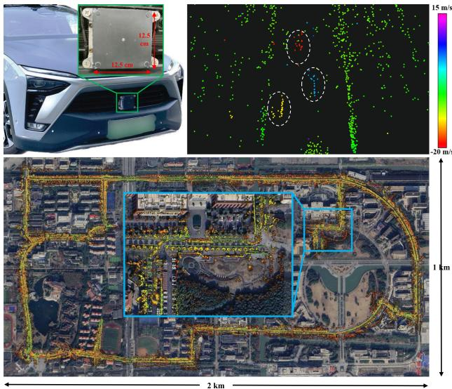  
Fig. 1. Top: 4D radar mounted in the front bumper of our vehicle (left) and 4D radar point cloud colored based on the Doppler velocity (right). The color of moving vehicles (in dashed circles) is distinguished from other static points. Bottom: Mapping result of our framework aligned with Google Earth satellite map. The end location is zoomed in and highlighted in a blue box.

However, there are two main challenges for developing 4D radar SLAM methods.

Due to the difference in data characteristics, conventional radar SLAM systems are no longer suitable for 4D radars. More specifically, scanning radar-based systems [1], [2], [3], [4], [5] typically employ vision-related methods on 2D images, which are not appropriate for the unique features of 4D radar point clouds. Moreover, automotive radarbased methods [6], [7], [8] do not consider the elevation information and the noise challenges associated with 4D radars. Therefore, it motivates us to develop a novel SLAM framework tailored for 4D radars.

To the best of our knowledge, there are limited public automotive datasets incorporating 4D radars. While there are a few existing datasets like Astyx [12] and View-of-Delft [13], they primarily focus on object detection and are not suitable for SLAM research (refer to Section II-B for more details). It greatly hampers the development of 4D radar SLAM in the community.

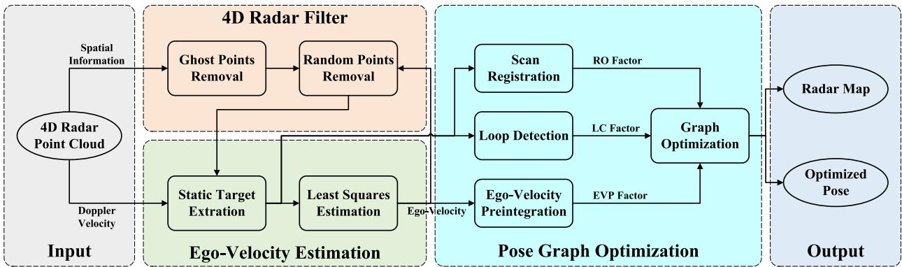  
Fig. 2. System overview of 4DRaSLAM. Given a 4D radar point cloud with spatial information (range, azimuth, elevation) and Doppler velocity, the spatial information is used in the 4D radar filter to reduce ghost and random points. Then we extract static points and estimate ego-velocity from the Doppler velocity. In the pose graph optimization module, radar odometry factor (RO factor), ego-velocity pre-integration factor (EVP factor), and loop closure factor (LC factor) are added to a pose graph. Finally, we estimate the vehicle poses and obtain a consistent global map after graph optimization.

In this paper, we present 4DRaSLAM, a framework for 4D radar SLAM, and release a real-world 4D radar dataset. Our 4DRaSLAM comprises three modules: 4D radar filter, egovelocity estimation, and pose graph optimization, as shown in Fig. 2. In particular, we design a filter to pre-process and denoise the original 4D radar data. Next, the ego-velocity is inferred from the Doppler velocity, which plays an essential role in the pose graph optimization to come. Consequently, in pose graph optimization, the radar odometry (RO) factor is implemented via scan registration based on normal distribution transform (NDT). Moreover, to achieve better accuracy against point cloud sparsity, we design an ego-velocity pre-integration factor and use it jointly with the aforementioned RO factor in the pose graph. Besides, we include the loop closure factor in the graph to reduce the cumulative drifts. The main contribution of our work is three-fold:

\- First, we propose an accurate and robust SLAM framework for 4D radars. To the best of our knowledge, this is the first research on 4D radar-only SLAM.

\- Second, we propose a filtering method to reduce 4D radar noise and an ego-velocity pre-integration factor to improve the pose graph optimization performance.

\- Finally, an open SLAM dataset1 has been collected in various environments. The robustness and accuracy of our SLAM framework is illustrated by experiments.

## II. RELATED WORK

## A. Radar Based SLAM

There are many extensive works investigating conventional radar-based odometry or SLAM, most of which focus on scanning radars. Cen and Newman [1] propose a new method to extract stable keypoints and perform scan matching using graph matching. Then in [2], Cen and Newman present a new odometry pipeline with improved keypoint detection, descriptors, and graph matching strategy. Hong et al. [3] demonstrate RadarSLAM, the first full radar-based graph SLAM framework which works well in adverse weather. Inspired by vision-based methods, SURF keypoints are extracted from scanning radar images and matched for pose estimation. Adolfsson et al. [4] employ conservative filtering and compute a sparse set of oriented surface points from scanning radar images. Park et al. [5] apply Fourier-Mellin transform to the Cartesian and log-polar radar images and use dense matching to estimate the relative motion from phase correlation. Some learning-based methods [9], [10], [11] are also developed for radar-based odometry or localization. However, these approaches are not applicable to 4D radar point clouds because they are based on conventional scanning radar images.

For conventional automotive radars, Kellner et al. [6] use a registration-free approach to estimate the 2 degrees of freedom (DoF) motion vector and detect stationary targets from the Doppler velocity. In [7], Kellner et al. further extend their work and optimize a full 2D vehicle motion state (3DoF) using multiple Doppler radars therein. In [8], Kung et al. present a radar odometry adapted to both scanning and automotive radars. They deploy the ego-velocity estimation method in [6] and combine multiple radar scans into a radar submap. Then, an NDT-based matching is applied to align two submaps.

The method of Kung et al. [8] is so far the most related work to ours since it is adapted to conventional radar point clouds and also leverages the estimated ego-velocity. Their work has been the state-of-the-art (SOTA) solution for automotive radar odometry. Though it is not dedicated for 4D radars, the method can indeed be adapted for 4D radar point clouds. Nevertheless, the radar submap is just a simple concatenation of consecutive radar scans based on ego-velocity, hence their performance strongly depends on the accuracy of ego-velocity estimation.

## B. 4D Radar Dataset

Currently, there are only a limited number of datasets which contain 4D radar sensors. The Astyx dataset [12] is a small dataset with only 545 frames and lacks positioning information. The View-of-Delft dataset [13] focuses on object detection, and its relatively small scale and absence of loop closure pose limitations for studying SLAM systems.

To address these limitations, we collected a SLAM dataset with loop closures which contains 4D radar and LiDAR point clouds and ground truth. We have driven over 20 km in different challenging environments, including an industrial zone and a campus. Our dataset will be publicly available to the community to facilitate research on 4D radars.

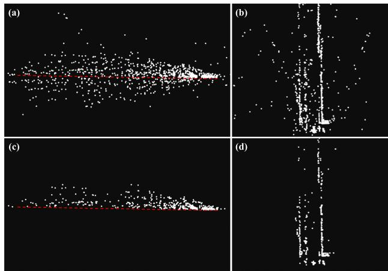  
Fig. 3. 4D radar point cloud before and after the 4D radar filter. (a) and (b): The end and top view of the original point cloud. (c) and (d): The end and top view of the filtered point cloud. The red dashed line indicates the extracted ground plane. The point cloud is much cleaner and more stable after the filter.

## III. METHODOLOGY

The proposed 4DRaSLAM system is shown in Fig. 2. It consists of three modules: 4D radar filter, ego-velocity estimation, and pose graph optimization. We will describe the details of each module later in this section.

## A. 4D Radar Filter

The raw 4D radar data is typically contaminated by noise and clutter. Due to multi-path rays and fictitious reflections, there are mainly two types of noise which would decrease the registration accuracy: ghost detections and random points [14]. According to their different characteristics, we design a 4D radar filter to remove most of the noisy points in the raw data, as shown in Algorithm 1. To this end, we first denote a 4D radar point cloud as $\mathcal { P } = \{ \mathbf { P } _ { i } \} , i \in \{ 1 , 2 , \ldots , n \}$ The position of each point in P is expressed as $\mathbf { P } _ { i } =$ $( x _ { i } , \bar { y _ { i } } , z _ { i } ) ^ { \mathsf { T } } = ( r _ { i } \cos \theta _ { i } \bar { \cos \varphi _ { i } } , r _ { i } \sin \theta _ { i } \cos \bar { \varphi _ { i } } , r _ { i } \sin \varphi _ { i } ) ^ { \mathsf { T } }$ where $r _ { i } , \theta _ { i } , \varphi _ { i }$ denotes the range, azimuth, elevation, respectively.

On the one hand, the ghost detections are false points under the ground due to multi-path rays, as shown in Fig. 3(a). We utilize a simple but effective method here to filter them out. For the current point cloud $\mathcal { P } _ { k }$ , we first keep only the points whose range is less than a threshold $\delta _ { r }$ and whose height is within $\delta _ { h }$ around the radar mounting height H. The rationale behind this is that only these points may contain ground points. Then we calculate the points’ normal vectors via Principal Component Analysis (PCA) [15]. Next, we retain only the points whose normal vectors are nearly vertical, denoted as $\mathcal { G } _ { k }$ . In other words, we keep the points for which the angle between the normal vector and the positive unit vector along the z-axis is less than $\delta _ { n } .$ Finally, we extract the ground points from $\mathcal { G } _ { k }$ by random sample consensus (RANSAC) [16] and thus removing the ghost points under the ground, as illustrated in Fig. 3(c).

On the other hand, the random points are unstable and flickering points which appear randomly. These points are typically false targets. Therefore, we can distinguish them from the real targets by identifying inconsistencies between two consecutive radar point clouds. More specifically, we first compute the translation $\mathbf { t } _ { k - 1 } = \widetilde { \mathbf { v } } _ { k - 1 } \Delta t$ and rotation $\mathbf { R } _ { k - 1 } = \mathrm { E x p } ( \bar { \widetilde { \omega } } _ { k - 1 } \Delta t )$ between the last point cloud $\mathcal { P } _ { k - 1 }$ and the current one $\mathcal { P } _ { k }$ where $\widetilde { \mathbf { v } } _ { k - 1 }$ and $\widetilde { \omega } _ { k - 1 }$ is the vehicle’s linear and angular velocity estimation for the last frame, Δt is the time interval between two frames, and $\mathrm { E x p } ( \cdot ) : \mathbb { R } ^ { 3 }  \mathrm { S O } ( 3 )$ ) is the exponential map. Then we transform the last point cloud to the current frame and use the transformed last point cloud $\mathcal { P } _ { k - 1 } ^ { \prime }$ to construct a k-dimensional tree for fixed-radius near neighbor search. If a point in $\mathcal { P } _ { k }$ does not have any neighbor points in $\mathcal { P } _ { k - 1 } ^ { \prime }$ within a certain radius $\delta _ { p } ,$ we classify this point as a random point and remove it. The 4D radar point clouds before and after removing random points are illustrated in Fig. 3(b) and Fig. 3(d).

Algorithm 1: 4D Radar Filter.   
Data: Current point cloud $\mathcal { P } _ { k } ,$ ,transformed last point   
cloud $\mathcal { P } _ { k - 1 } ^ { \prime } .$ , radar mounting height H, threshold   
$\delta _ { r } , \delta _ { h } , \tilde { \delta } _ { n } , \delta _ { p }$   
Result: Filtered current point cloud $\mathcal { P } _ { k } ^ { \prime }$   
for all $\mathbf { P } _ { i } \in \mathcal { P } _ { k }$ do   
if $\sqrt { x _ { i } ^ { 2 } + y _ { i } ^ { 2 } + z _ { i } ^ { 2 } } \leq \delta _ { r }$ then   
if $z _ { i } \in \left[ - H - \delta _ { h } , - H + \delta _ { h } \right]$ then   
Estimate the normalized upward normal   
vector $\mathbf { n } _ { i }$ by PCA [15]   
if $\mathbf { n } _ { i } \cdot ( 0 , 0 , \dot { 1 } ) ^ { \top } \ge$ cos $\delta _ { n }$ then   
$\mathcal { G } _ { k }  \mathbf { P } _ { i }$   
end   
end   
end   
end   
Fit the ground plane Ax + $B y + C z + D = 0$ from $\mathcal { G } _ { k }$   
using RANSAC [16]   
for all $\mathbf { P } _ { i } \in \mathcal { P } _ { k }$ do   
if $A x _ { i } + B y _ { i } + C z _ { i } + D \geq 0$ then   
${ N } _ { i } \gets \dot { \mathrm { S } }$ earch for neighbors in $\mathcal { P } _ { k - 1 } ^ { \prime }$ within $\delta _ { p }$   
if Ni ≠ ∅ then   
$\mathcal { P } _ { k } ^ { \prime } \gets \mathbf { P } _ { i }$   
end   
end   
end

## B. Ego-Velocity Estimation

In addition to the spatial information, 4D radar also measures the Doppler velocity of each point in the point cloud. The Doppler velocity is the relative velocity between the measured point and the radar along the radial direction. Based on this, we estimate a full 3D ego-velocity from the 4D radar point clouds, inspired by Kellner et al. [6], [7].

To this end, we denote the linear and angular ego-velocity estimation as ${ \widetilde { \mathbf { v } } } \in \mathbb { R } ^ { 3 }$ and $\widetilde { \omega } \in \mathbb { R } ^ { 3 }$ , respectively. In a filtered 4D radar point cloud $\mathcal { P } ^ { \prime } = \{ \mathbf { P } _ { i } ^ { \prime } \} , i \in \{ \bar { 1 , 2 , \dots , n } \}$ , for a static point $\mathbf { P } _ { i } ^ { \prime }$ in the world frame, its relative velocity to the radar is just the inverse of the radar velocity. Moreover, since the Doppler velocity $v _ { r , i }$ of point $\mathbf { P } _ { i } ^ { \prime }$ is the relative velocity along the radial direction $\mathbf { d } _ { i } = \left( \cos \theta _ { i } \right.$ cos $\varphi _ { i }$ , sin $\theta _ { i }$ cos $\varphi _ { i } , \sin \varphi _ { i } ) ^ { \mathsf { T } }$ the relation between the Doppler velocity and the radar velocity ${ \bf v } _ { s }$ is expressed as

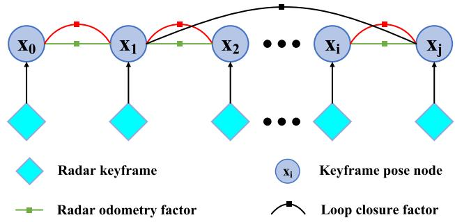  
Ego-velocity preintegration factor  
Fig. 4. Structure of our proposed pose graph. Once a radar keyframe is selected, a graph node associated with this keyframe is added to the graph. There are three factors in the pose graph: radar odometry factor, ego-velocity pre-integration factor, and loop closure factor.

$$
v _ { r , i } = - { \bf d } _ { i } \cdot { \bf v } _ { s } .\tag{1}
$$

In addition, assuming that the 4D radar is mounted on the vehicle rigidly, we express the radar velocity in the vehicle frame as

$$
\mathbf { v } _ { s } = \mathbf { R } _ { s } ^ { \mathsf { T } } ( \widetilde { \mathbf { v } } + \widetilde { \boldsymbol { \omega } } \times \mathbf { t } _ { s } ) ,\tag{2}
$$

where $\mathbf { t } _ { s }$ and $\mathbf { R } _ { s }$ - -is the radar mounting position and rotation in the vehicle frame.

For all m static points in a 4D radar point cloud, we substitute (2) into (1) and get

$$
- \left[ \begin{array} { c } { v _ { r , 1 } } \\ { \vdots } \\ { v _ { r , m } } \end{array} \right] = \left[ \begin{array} { c c } { \mathbf { d } _ { i } ^ { \top } } \\ { \vdots } \\ { \mathbf { d } _ { m } ^ { \top } } \end{array} \right] \mathbf { R } _ { s } ^ { \top } \left[ \mathbf { I } _ { 3 \times 3 } \quad - \mathbf { t } _ { s } ^ { \wedge } \right] \left[ \widetilde { \mathbf { v } } \right] ,\tag{3}
$$

where $\mathbf { t } _ { s } ^ { \wedge } \in \mathbb { R } ^ { 3 \times 3 }$ is the skew-symmetric matrix of vector $\mathbf { t } _ { s } .$

Notably, in practice, most points in the 4D radar point cloud are static in the world frame, and all the static points satisfy the model of (3). Hence we use the RANSAC [16] algorithm to discard the dynamic outliers and extract the static inliers. Then the ego-velocity is estimated through a simple least-squares estimation using only the static points.

## C. Pose Graph Optimization

After filtering the 4D radar point clouds and estimating the ego-velocity, we aim to achieve an accurate and robust pose estimate. To this end, three sub-modules are further developed: scan registration, ego-velocity pre-integration, and loop detection. Furthermore, we use a pose graph to fuse the pose estimate from the sub-modules (see Fig. 4) and perform the graph optimization jointly. The pose of each graph node is denoted by the rotation R and position p as $\mathbf { x } = \mathbf { \bar { ( R , p ) } } \in \mathrm { S E } ( 3 )$ . We estimate all the poses $\bar { \mathcal { X } } ^ { * } = \{ \mathbf { x } _ { i } \} , i \in \mathcal { K }$ by solving a nonlinear least square problem [17]:

$$
\mathcal { X } ^ { \ast } = \arg \operatorname* { m i n } _ { \mathcal { X } } \mathbf { e } _ { O } + \mathbf { e } _ { V } + \mathbf { e } _ { L } ,
$$

where K denotes all the graph nodes, $\mathbf { e } _ { O } , \mathbf { e } _ { V } , \mathbf { e } _ { L }$ are the errors of pose estimation from the sub-modules. The subsequent sections provide a detailed explanation of the three sub-modules.

1) Scan Registration: Scan registration estimates the relative transformation by matching radar point clouds. We propose a direct registration method based on scan-to-submap NDT matching [18], where a 4D radar point cloud is aligned to a keyframe submap.

Since the 4D radar point clouds are too sparse to reliably estimate poses by matching only two consecutive frames, we use a sliding window approach to build a denser radar submap from keyframes. More specifically, if the translation or rotation from the latest keyframe to the current point cloud exceeds a threshold, which is 1 m and 5 degrees in our experiments, we select this current frame as a new keyframe. Then the new keyframe is added to the submap and a node associated with it will be added to the pose graph consequently. When the number of the keyframes in the submap exceeds the window size, the oldest keyframe will be discarded. By this method, the radar submap represents the local environment features more clearly than a single radar point cloud and improves registration accuracy. It also improves the robustness when the point cloud overlap changes drastically.

Next, following the NDT registration routine [18], we divide the submap into grid cells and model the radar points in each cell as a local normal distribution. When computing the mean and covariance of the normal distribution, we include the probability density function of each point based on its uncertainty of measurement [19]. The benefit of such method is that it reduces the degeneration effect and makes full use of the cells even with very few radar points. Then we align the latest 4D radar point cloud with the radar submap to find the relative pose $\widetilde { \mathbf { x } } _ { i j } ^ { O }$ by minimizing the NDT cost function. Moreover, the relative pose $\widetilde { \mathbf { x } } _ { i j } ^ { O }$ between the adjacent graph nodes i and $j$ will serve as a radar odometry factor, while the error of the scan registration takes the form

$$
\mathbf { e } _ { O } = \sum _ { ( i , j ) \in \mathcal { K } } \| \mathbf { L o g } \left( \left( \widetilde { \mathbf { x } } _ { i j } ^ { O } \right) ^ { - 1 } \mathbf { x } _ { i } ^ { - 1 } \mathbf { x } _ { j } \right) \| _ { \Sigma _ { i j } ^ { O } } ^ { 2 } ,
$$

where $\Sigma _ { i j } ^ { O }$ is the corresponding covariance matrix, $\mathrm { L o g ( \cdot ) }$ $\mathrm { S E } ( 3 )  \bar { \mathbb { R } } ^ { 6 }$ is the logarithmic map.

2) Ego-Velocity Pre-Integration: Besides the scan registration, ego-velocity is another vital motion information source. We use it to impose additional reliable pose estimation and improve the accuracy and robustness of our SLAM framework. Inspired by the pre-integration of IMU measurements in [20], we propose an ego-velocity pre-integration method.

The estimated ego-velocity at time t, namely angular velocity $\widetilde { \omega } _ { t }$ and linear velocity $\widetilde { \mathbf { v } } _ { t } .$ , is affected by time varying white noise $\eta _ { t } ^ { \omega }$ and $\eta _ { t } ^ { v } \mathrm { i }$ :

$$
\widetilde { \omega } _ { t } = \omega _ { t } + \eta _ { t } ^ { \omega } ,\tag{4}
$$

$$
\widetilde { \mathbf { v } } _ { t } = \mathbf { R } _ { t } ^ { \mathsf { T } } \mathbf { w } \mathbf { v } _ { t } + \pmb { \eta } _ { t } ^ { v } ,\tag{5}
$$

where $\omega _ { t }$ and $\mathbf { \nabla } \mathbf { W } \mathbf { \nabla } \mathbf { V } _ { t }$ are the true angular and linear velocity in the world coordinate and $\mathbf { R } _ { t }$ is the vehicle’s rotation in the world coordinate. Assuming that $\omega _ { t }$ and $\mathbf { \nabla } _ { J } \mathbf { v } _ { t }$ remain constant in a short time interval $[ t , t + \Delta t ]$ , it follows for the position $\mathbf { p } _ { t + \Delta t }$ and rotation $\mathbf { R } _ { t + \Delta t }$ at time t + Δt that

$$
{ \bf R } _ { t + \Delta t } = { \bf R } _ { t } \mathrm { E x p } ( \omega _ { t } \Delta t ) \stackrel { ( 4 ) } { = } { \bf R } _ { t } \mathrm { E x p } \left( ( \widetilde { \omega } _ { t } - \eta _ { t } ^ { \omega } ) \Delta t \right) ,\tag{6}
$$

$$
\mathbf { p } _ { t + \Delta t } = \mathbf { p } _ { t } + \mathbf { w } \mathbf { v } _ { t } \Delta t \stackrel { \left( 5 \right) } { = } \mathbf { p } _ { t } + \mathbf { R } _ { t } \left( \widetilde { \mathbf { v } } _ { t } - \pmb { \eta } _ { t } ^ { v } \right) \Delta t .\tag{7}
$$

Since for each frame of point cloud between two consecutive keyframes at time i and j, we can get an ego-velocity estimation. For all $\Delta t$ intervals between time i and $j ,$ we iterate the egovelocity integration of (6) and (7) and get

$$
\mathbf { R } _ { j } = \mathbf { R } _ { i } \prod _ { k = i } ^ { j - 1 } \mathrm { E x p } \left( \left( \widetilde { \omega } _ { k } - \eta _ { k } ^ { \omega } \right) \Delta t \right) ,\tag{8}
$$

$$
\mathbf { p } _ { j } = \mathbf { p } _ { i } + \sum _ { k = i } ^ { j - 1 } \mathbf { R } _ { k } \left( \widetilde { \mathbf { v } } _ { k } - \pmb { \eta } _ { k } ^ { v } \right) \Delta t .\tag{9}
$$

Moreover, from (8) and (9), we can compute the relative rotation $\Delta \mathbf { R } _ { i j }$ between the nodes i and j as

$$
\begin{array} { r l } & { \Delta \mathbf { R } _ { i j } = \mathbf { R } _ { i } ^ { \mathsf { T } } \mathbf { R } _ { j } = \displaystyle \prod _ { k = i } ^ { j - 1 } \mathrm { E x p } \left( \left( \widetilde { \omega } _ { k } - \eta _ { k } ^ { \omega } \right) \Delta t \right) } \\ & { \quad = \displaystyle \prod _ { k = i } ^ { j - 1 } \mathrm { E x p } \left( \widetilde { \omega } _ { k } \Delta t \right) \displaystyle \prod _ { k = i } ^ { j - 1 } \mathrm { E x p } \left( - \Delta \widetilde { \mathbf { R } } _ { k + 1 , j } ^ { \mathsf { T } } \mathbf { J } _ { r , k } \eta _ { k } ^ { \omega } \Delta t \right) , } \\ & { \qquad \Delta \widetilde { \mathbf { R } } _ { i j } } \end{array}\tag{10}
$$

and the relative translation $\Delta { \bf p } _ { i j }$ as

$$
\begin{array} { l } { { \displaystyle \Delta { \bf p } _ { i j } = { \bf R } _ { i } ^ { \top } \left( { \bf p } _ { j } - { \bf p } _ { i } \right) = \sum _ { k = i } ^ { j - 1 } \Delta { \bf R } _ { i k } \left( \widetilde { \bf v } _ { k } - \eta _ { k } ^ { v } \right) \Delta t } \ ~ } \\ { { \displaystyle = \sum _ { k = i } ^ { j - 1 } \Delta \widetilde { \bf R } _ { i k } \widetilde { \bf v } _ { k } \Delta t - \sum _ { k = i } ^ { j - 1 } ( - \Delta \widetilde { \bf R } _ { i k } \widetilde { \bf v } _ { k } ^ { \wedge } \delta \phi _ { i k } \Delta t + \Delta \widetilde { \bf R } _ { i k } \eta _ { k } ^ { v } \Delta t ) } , } \end{array}\tag{11}
$$

where $\Delta \mathbf { R } _ { i k } = \mathbf { R } _ { i } ^ { \mathsf { T } } \mathbf { R } _ { k } , \mathbf { J } _ { r , k }$ is the right Jacobian of $\widetilde { \omega } _ { k } \Delta t , \widetilde { \mathbf v } _ { k } ^ { \wedge }$ is the skew-symmetric matrix of vector $\widetilde { \mathbf { v } } _ { k }$ - -. Intuitively speaking, $\Delta \mathbf { R } _ { i j }$ and $\Delta \mathbf { p } _ { i j }$ are additional constraints between the pose graph nodes i and $j ,$ , and we define them as an ego-velocity pre-integration factor. In (10) and (11), $\delta \phi _ { i j }$ and $\delta \mathbf { p } _ { i j }$ are the noise term of pre-integrated rotation and position, and they take the form

$$
\begin{array} { r l } & { \displaystyle \delta \phi _ { i j } = \sum _ { k = i } ^ { j - 1 } \Delta \widetilde { \mathbf { R } } _ { k + 1 , j } ^ { \intercal } \mathbf { J } _ { r , k } \eta _ { k } ^ { \omega } \Delta t , } \\ & { \displaystyle \delta { \mathbf { p } } _ { i j } = \sum _ { k = i } ^ { j - 1 } \left( - \Delta \widetilde { \mathbf { R } } _ { i k } \widetilde { \mathbf { v } } _ { k } ^ { \wedge } \delta \phi _ { i k } \Delta t + \Delta \widetilde { \mathbf { R } } _ { i k } \eta _ { k } ^ { v } \Delta t \right) . } \end{array}
$$

Since $\delta \phi _ { i j }$ is the linear combination of zero-mean Gaussian noise $\eta _ { k } ^ { \omega }$ , it is also zero-mean and Gaussian. Similarly, we can also conclude that $\delta \mathbf { p } _ { i j }$ is zero-mean and Gaussian. Now if we denote the Gaussian noise as $\pmb { \eta } _ { i j } ^ { V } \doteq [ \delta \phi _ { i j } ^ { \mathsf { T } } , \delta \mathbf { p } _ { i j } ^ { \mathsf { T } } ] ^ { \mathsf { T } }$ ∼ $\mathcal { N } ( \mathbf { 0 } _ { 6 \times 1 } , \boldsymbol { \Sigma } _ { i j } ^ { V } )$ , the error ofthe ego-velocity pre-integration takes the form

$$
\begin{array} { l } { { \displaystyle { \bf e } _ { V } = \sum _ { ( i , j ) \in { \cal K } } \| { \bf r } _ { i j } ^ { V } \| _ { { \bf \Sigma } _ { { \Sigma } _ { i j } ^ { V } } } ^ { 2 } } , } \\ { ~ } \\ { { \displaystyle { \bf r } _ { i j } ^ { V } = \left[ { \bf r } _ { \Delta { \bf R } _ { i j } } ^ { { \bf \Sigma } } \right] = \left[ \mathrm { L o g } \left( \Delta \widetilde { { \bf R } } _ { i j } ^ { \top } { \bf R } _ { i } ^ { \top } { \bf R } _ { j } \right) \right] } , } \\ { { \displaystyle { \bf R } _ { i } ^ { \top } \left( { \bf p } _ { j } - { \bf p } _ { i } \right) - \Delta \widetilde { { \bf p } } _ { i j } } } \end{array}
$$

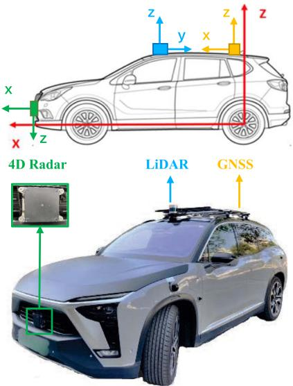  
Fig. 5. Our data collection platform. It’s equipped with a ZF 4D radar, a Hesai Panda128 LiDAR, and a GNSS integrated navigation system. Their mounting positions and the corresponding coordinate systems are illustrated in the upper figure.

where $\mathrm { L o g } ( \cdot ) : \mathrm { S O } ( 3 )  \mathbb { R } ^ { 3 }$ is the logarithmic map.

3) Loop Detection: Robust loop detection can recognize revisited places and is critical to reducing the cumulative drifts for radar SLAM. We adapt the Scan Context [21], which is originally proposed for LiDAR place recognition, to perform radar-based loop detection. For a detailed derivation of Scan Context, please refer to the description in therein.

Nevertheless, the original Scan Context divides a LiDAR point cloud into several bins and uses the maximum height of the points in each bin to encode the whole point cloud into an image. For the sparse radar data, although we have removed most noise by the proposed 4D radar filter, the maximum height of 4D radar points may still not reflect the actual maximum height in real world. Instead, we use the maximum intensity to encode the whole 4D radar point cloud, because the points with high intensity tend to be stable targets. Once a loop is detected, the relative pose between the current frame and the submap consisting of the detected loop frame along with the surrounding keyframes is computed by the scan registration in Section III-C1. Then we add the relative pose $\widetilde { \mathbf { x } } _ { k j } ^ { L }$ between the -nodes k and j to the pose graph as a loop closure factor, and the error of loop detection takes the form

$$
\mathbf { e } _ { L } = \sum _ { ( k , j ) \in \mathcal { L } } \left\| \mathrm { L o g } \left( \left( \widetilde { \mathbf { x } } _ { k j } ^ { L } \right) ^ { - 1 } \mathbf { x } _ { k } ^ { - 1 } \mathbf { x } _ { j } \right) \right\| _ { \Sigma _ { k j } ^ { L } } ^ { 2 } ,
$$

where $\mathcal { L }$ denotes all the loop closure nodes in the graph, $\Sigma _ { k j } ^ { L }$ is the corresponding covariance matrix, $\mathrm { L o g } ( \cdot ) : \mathrm { S E } ( 3 )  \mathbb { R } ^ { \breve { 6 } }$ is the logarithmic map.

## IV. EXPERIMENTS

## A. Dataset

The vehicle we used to collect our 4D radar dataset is shown in Fig. 5. It’s equipped with a ZF FRGen21 4D Radar, a Hesai Pandar128 LiDAR, and a NovAtel GNSS integrated navigation system. Our dataset is available at https://robotics.sjtu.edu.cn/ en/xwxshd/1203.html.

TABLE I  
SPECIFICATIONS OF THE 4D RADAR
<table><tr><td></td><td>Field</td><td>Resolution</td><td>Accuracy</td></tr><tr><td>Range</td><td>0-100 m</td><td>≤0.2 m</td><td>≤0.02 m</td></tr><tr><td>Azimuth</td><td> $- 7 5 ^ { \circ } - 7 5 ^ { \circ }$ </td><td>1.5°</td><td>0.15°</td></tr><tr><td>Elevation</td><td> $- 1 5 ^ { \circ } - 1 5 ^ { \circ }$ </td><td>1.5°</td><td>0.3°</td></tr><tr><td>Velocity</td><td> $- 4 0 { - } 4 0 ~ \mathrm { m / s }$ </td><td>0.1 m/s</td><td>0.01m/s</td></tr></table>

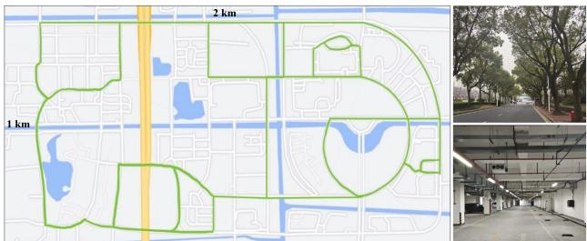  
Fig. 6. Left: The map of the campus. It covers an area of 2 km × 1 km. The green lines indicate the trajectories of our data collection. Right: Pictures of some challenging environments in our dataset, including a road with many trees and an underground parking lot on the campus.

\- The 4D radar is mounted in the middle of the front bumper. It has 12 transmitting antennas and 16 receiving antennas to generate a total of 192 channels and works in the frequency band from 76 GHz to 77 GHz. It obtains a frame of point cloud including about 400 to 1400 points every 60 ms. The main parameters are listed in Table I.

\- The LiDAR is mounted on the top of the vehicle. It scans at 10 Hz and gets 230400 points in each frame.

\- The GNSS system has a centimeter-level localization ability and provides the vehicle’s ground truth pose in the Universal Transverse Mercator (UTM) coordinate system, at a high frequency of 50 Hz.

We collect the dataset in different challenging scenes, including an industrial zone and the campus of Shanghai Jiao Tong University. During the data collection process, the average driving speed is under 30 km/h. Almost all collected data sequences contain loop closures. In particular,

\- the scale of the industrial zone is small. The narrow roads and the walls on both sides will cause more radar reflection noise; while

\- the campus is much larger, as shown in Fig. 6. There are more trees and dynamic objects like cars and pedestrians, hence the radar point clouds are sparser and more unstable. Moreover, we have also collected indoor data involving more reflection noise in an underground parking lot. The algorithm performance is also evaluated therein.

## B. Quantitative Evaluation

We conducted quantitative experiments to evaluate the pose estimation accuracy of our 4DRaSLAM. All experiments are run on a laptop with an AMD Ryzen5 5600 U @2.3 GHz and 16 GB RAM.

To compute the relative error (RE) results, we follow the famous KITTI odometry benchmark [22], which computes the mean translation and rotation errors from length 100 m to 800 m with a 100 m increment. Translation errors are in percentage (%), and rotation errors are in degrees per meter (deg/m). In addition, we also include the root-mean-square error (RMSE) of absolute trajectory error (ATE) in meters (m) to evaluate the global consistency of the estimated trajectory [23]. All quantitative results are listed in Table II in the format of “translation error (%) / rotation error (deg/m) / ATE (m)”.

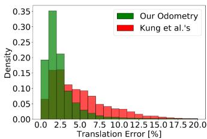

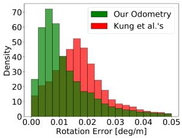  
Fig. 7. Density of translation error (left) and rotation error (right) distributions from our odometry and Kung et al.’s odometry [8].

In particular, we evaluated our system by comparing it with radar-based and LiDAR-based methods on six data sequences with GNSS ground truth. These sequences include three in the industrial zone (Industrial zone 1-3) and three in the campus scene (Campus 1-3). The first four sequences are in relatively small scales compared to the last two sequences.

1) Comparison With SOTA Radar Odometry: We compared our framework with the automotive radar odometry proposed by Kellner et al. [6], [7] and Kung et al. [8], as illustrated in Table II. Their algorithms are adapted so that they can work with 4D radar data. More specifically, we incorporate the elevation information into Kellner et al.’s method to extend it to 3D based on Section III-B. Regarding Kung et al.’s method, the elevation is excluded in NDT matching, resulting in a 2D pose estimation, thus we set its vertical errors to zero for a fair comparison.

Furthermore, since aforementioned methods are radar odometry without loop closure, we include our odometry results without loop closure to solely compare the odometry performance. Besides, a more detailed comparison of the RE distributions between our odometry and Kung et al.’s is given in Fig. 7. In addition, we plot the estimated trajectories of our SLAM and the ground truth in Fig. 8 to illustrate our localization performance in difference environments.

Based on the comparative results, our SLAM and odometry both perform effectively in different environments and significantly outperforms other SOTA radar-based methods.

2) Comparison With LiDAR SLAM: To compare with Li-DAR, we compute the errors of LiDAR SLAM SC-LeGO-LOAM [21], [24] on our LiDAR data, as illustrated in Table II. Except for the RE, the ATE results are also included, thus we can compare the global consistencies of radar and LiDAR full SLAM systems.

Based on the comparative results, our SLAM achieves comparable RE and ATE results even compared to LiDAR SLAM, despite the much sparser and noisier radar point clouds. Notably, the driving distances in the Campus 2 and Campus 3 data sequences are much longer, and the radar point clouds are less stable. These challenges cause the accuracy of other radar-based algorithms to drop dramatically. Nevertheless, we still achieve an accuracy close to LiDAR.

TABLE II  
COMPARISON OF THE RELATIVE ERRORS AND ABSOLUTE TRAJECTORY ERRORS (% / DEG/M / M) IN DIFFERENT SCENES
<table><tr><td rowspan="2">Method</td><td colspan="5">Sequence</td><td rowspan="2">Campus 3</td></tr><tr><td>Industrial zone 1</td><td>Industrial zone 2</td><td>Industrial zone 3</td><td>Campus 1</td><td>Campus 2</td></tr><tr><td>LiDAR SLAM [21], [24]</td><td>2.21 / 0.0078 / 3.84</td><td>1.56 / 0.0104 / 2.68</td><td>1.83 / 0.0097 / 2.15</td><td>1.96 / 0.0209 / 2.27</td><td>3.19 / 0.0120 / 2.57</td><td>2.68 / 0.0173 / 3.33</td></tr><tr><td></td><td></td><td></td><td></td><td></td><td></td><td>8.00 / 0.0355 / 92.19</td></tr><tr><td>Kellner et al.&#x27;s [6], [7] Kung et al.&#x27;s [8]</td><td>4.59 / 0.0191 / 13.34</td><td>3.09 / 0.0147 / 9.51</td><td>3.34 / 0.0182 / 5.60</td><td>3.71 / 0.0277 / 14.18 3.18 / 0.0275 / 10.16</td><td>8.34 / 0.0304 /  111.04</td><td>7.58 / 0.0388 / 82.08</td></tr><tr><td>Our Odometry</td><td>4.02 / 0.0192 / 10.76 2.66 / 0.0094 / 7.67</td><td>3.54 / 0.0141 / 8.90 2.10 / 0.0144 / 7.30</td><td>3.57 / 0.0168 / 6.32 2.41 / 0.0119 / 4.35</td><td>2.52 / 0.0253 / 4.14</td><td>7.49 / 0.0261  /  76.84 3.84 / 0.0194 / 10.22</td><td>3.29 / 0.0271 / 9.08</td></tr><tr><td>Our SLAM</td><td></td><td></td><td>2.25 / 0.0110 / 2.24</td><td>2.32 / 0.0216 / 2.28</td><td>3.13 / 0.0201 / 3.79</td><td>3.06 / 0.0245 / 3.83</td></tr><tr><td></td><td>2.49 / 0.0080 / 4.31</td><td>1.58 / 0.0094 / 3.86</td><td></td><td></td><td></td><td></td></tr></table>

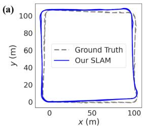

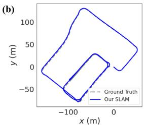

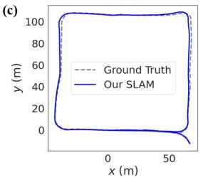

(d)  
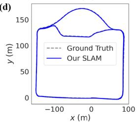

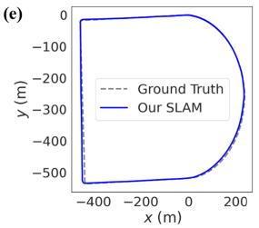

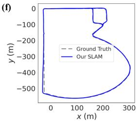  
Fig. 8. Estimated trajectories of 4DRaSLAM (Our SLAM) and ground truth. (a)-(f) correspond to Industrial zone 1-3 and Campus 1-3 respectively. Note that we set the figures to equal size to save space, but the axis ratios and actual scene sizes differ.

## C. Qualitative Experiments

1) Large-Scale Performance: In order to further study the robustness of 4DRaSLAM in a large-scale environment, we use Campus 4 sequence which has a length of over 9 km on the campus and goes through some GNSS-denied tunnels. Consequently, the ground truth is discontinuous and unreliable. We only use it to evaluate our system qualitatively.

To illustrate the mapping performance of our system, we align the map built from 4DRaSLAM with the Google Earth satellite map. As illustrated in Fig. 1, after a long driving distance of over 9 km, the radar map remains well-matched with the satellite map. It demonstrates that our SLAM system can perform well even in large-scale environment.

2) Indoor Performance: We test our odometry and SLAM on Parking lot sequence in an underground parking lot to evaluate its indoor performance. The enclosed environment and metallic structure lead to more noise in 4D radar data. Since the GNSS system cannot work underground, we select SC-LeGO-LOAM as the ground truth and compare the trajectories from different methods, as shown in Fig. 9. Our result is the closest one to the ground truth, even without loop closure. It shows the indoor applicability of our 4D radar SLAM framework.

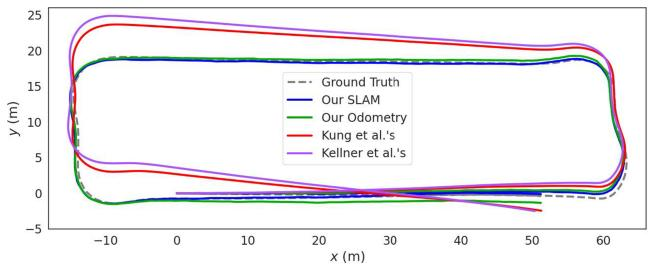  
Fig. 9. Comparison of different trajectories in the underground parking lot. The ground truth is provided by LiDAR SLAM.

TABLE III  
ABLATION STUDY RESULTS (% / DEG/M)
<table><tr><td></td><td></td><td>Sequence</td><td></td></tr><tr><td>Ours w/o filter</td><td>Industrial zone 2 1.93 / 0.0106</td><td>Campus 1 2.80 / 0.0255</td><td>Campus 3 3.28 / 0.0258</td></tr><tr><td>Ours w/o EVP factor</td><td>2.21  / 0.0137</td><td>3.13 / 0.0304</td><td>3.92 / 0.0275</td></tr><tr><td>Our SLAM</td><td>1.58 / 0.0094</td><td>2.32 / 0.0216</td><td>3.06 / 0.0245</td></tr></table>

## D. Ablation Study

We conduct ablation experiments to study the contribution of 4D radar filter and ego-velocity pre-integration factor. Following the KITTI metric, we compute the RE of our method without 4D radar filter (Ours w/o filter) and without the ego-velocity preintegration factor (Ours w/o EVP factor). For page limitation, the results on three representative sequences are given in Table III in the format of “translation error (%) / rotation error (deg/m)”, including Industrial zone 2 (industrial zone), Campus 1 (small campus scene) and Campus 3 (large campus scene). We also demonstrate the distribution of combined translation error in Fig. 10.

In conclusion, the 4D radar filter and the ego-velocity preintegration factor decrease the pose estimation error and improve our robustness by narrowing the error distribution. More specifically,

The 4D radar filter slightly enhances the accuracy of our 4DRaSLAM because it filters out the noisy points in the 4D radar point cloud, mainly affecting the scan registration sub-module. In addition, our proposed filter improves the quality of the 4D radar point clouds, resulting in a cleaner point cloud map for further applications.

\- The ego-velocity pre-integration factor significantly improves our system performance. The reason is that the registration results from the sparse 4D radar point clouds alone are unstable and have limited accuracy. The ego-velocity pre-integration provides an additional stable constraint for the pose graph optimization.

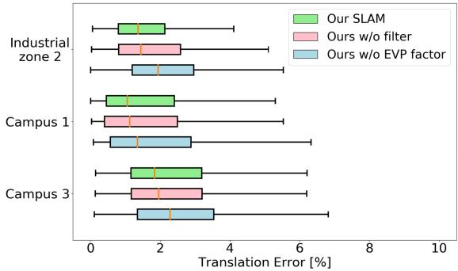  
Fig. 10. Translation error distribution of ablation experiments.

## V. CONCLUSION

In this letter, we present an accurate and robust 4D radar-based pose graph SLAM framework along with a 4D radar SLAM dataset. To address the issue of 4D radar noise, we propose a filtering method to reduce ghost and random points in the radar point clouds. Furthermore, we introduce a novel ego-velocity pre-integration factor to enhance the accuracy of the pose graph SLAM. Our framework outperforms the state-of-the-art automotive radar odometry method and works effectively in various challenging environments.

However, a limitation of our work is that we only use a single 4D radar without other sensors like IMU to further enhance the accuracy. In the future, we will focus on sensor fusion and 4D radar-based localization on a pre-built map.

## REFERENCES

[1] S. H. Cen and P. Newman, “Precise ego-motion estimation with millimeterwave radar under diverse and challenging conditions,” in Proc. IEEE Int. Conf. Robot. Automat., 2018, pp. 6045–6052.

[2] S. H. Cen and P. Newman, “Radar-only ego-motion estimation in difficult settings via graph matching,” in Proc. Int. Conf. Robot. Automat., 2019, pp. 298–304.

[3] Z. Hong, Y. Petillot, and S. Wang, “RadarSLAM: Radar based large-scale slam in all weathers,” in Proc. IEEE/RSJ Int. Conf. Intell. Robots Syst., 2020, pp. 5164–5170.

[4] D. Adolfsson, M. Magnusson, A. Alhashimi, A. J. Lilienthal, and H. Andreasson, “CFEAR Radarodometry - conservative filtering for efficient and accurate radar odometry,” in Proc. IEEE/RSJ Int. Conf. Intell. Robots Syst., 2021, pp. 5462–5469.

[5] Y. S. Park, Y.-S. Shin, and A. Kim, “Pharao: Direct radar odometry using phase correlation,” in Proc. IEEE Int. Conf. Robot. Automat., 2020, pp. 2617–2623.

[6] D. Kellner, M. Barjenbruch, J. Klappstein, J. Dickmann, and K. Dietmayer, “Instantaneous ego-motion estimation using Doppler radar,” in Proc. IEEE 16th Int. Conf. Intell. Transp. Syst., 2013, pp. 869–874.

[7] D. Kellner, M. Barjenbruch, J. Klappstein, J. Dickmann, and K. Dietmayer, “Instantaneous ego-motion estimation using multiple Doppler radars,” in Proc. IEEE Int. Conf. Robot. Automat., 2014, pp. 1592–1597.

[8] P.-C. Kung, C.-C. Wang, and W.-C. Lin, “A normal distribution transformbased radar odometry designed for scanning and automotive radars,” in Proc. IEEE Int. Conf. Robot. Automat., 2021, pp. 14417–14423.

[9] D. Barnes, R. Weston, and I. Posner, “Masking by moving: Learning distraction-free radar odometry from pose information,” in Proc. Conf. Robot Learn., 2020, pp. 303–316.

[10] D. Barnes and I. Posner, “Under the radar: Learning to predict robust keypoints for odometry estimation and metric localisation in radar,” in Proc. IEEE Int. Conf. Robot. Automat., 2020, pp. 9484–9490.

[11] K. Burnett, D. J. Yoon, A. P. Schoellig, and T. D. Barfoot, “Radar odometry combining probabilistic estimation and unsupervised feature learning,” in Proc. Robot.: Sci. Syst., 2021.

[12] M. Meyer and G. Kuschk, “Automotive radar dataset for deep learning based 3D object detection,” in Proc. 16th Eur. Radar Conf., 2019, pp. 129–132.

[13] A. Palffy, E. Pool, S. Baratam, J. F. P. Kooij, and D. M. Gavrila, “Multi-class road user detection with 31D radar in the view-of-delft dataset,” IEEE Robot. Automat. Lett., vol. 7, no. 2, pp. 4961–4968, Apr. 2022.

[14] A. Venon, Y. Dupuis, P. Vasseur, and P. Merriaux, “Millimeter wave FMCW RADARs for perception, recognition and localization in automotive applications: A survey,” IEEE Trans. Intell. Veh., vol. 7, no. 3, pp. 533–555, Sep. 2022.

[15] H. Abdi and L. J. Williams, “Principal component analysis,” Wiley Interdiscipl. Rev.: Comput. Statist., vol. 2, no. 4, pp. 433–459, 2010.

[16] M. A. Fischler and R. C. Bolles, “Random sample consensus: A paradigm for model fitting with applications to image analysis and automated cartography,” Commun. ACM, vol. 24, no. 6, pp. 381–395, 1981.

[17] F. Dellaert et al., “Factor graphs for robot perception,” Found. Trends Robot., vol. 6, no. 1/2, pp. 1–139, 2017.

[18] M. Magnusson, “The three-dimensional normal-distributions transform: An efficient representation for registration, surface analysis, and loop detection,” Ph.D. dissertation, School Sci. Technol., Örebro universitet, Örebro, Sweden, 2009.

[19] H. Hong and B. H. Lee, “Probabilistic normal distributions transform representation for accurate 3D point cloud registration,” in Proc. IEEE/RSJ Int. Conf. Intell. Robots Syst., 2017, pp. 3333–3338.

[20] C. Forster, L. Carlone, F. Dellaert, and D. Scaramuzza, “On-manifold preintegration for real-time visual–inertial odometry,” IEEE Trans. Robot., vol. 33, no. 1, pp. 1–21, Feb. 2017.

[21] G. Kim and A. Kim, “Scan context: Egocentric spatial descriptor for place recognition within 3D point cloud map,” in Proc. IEEE/RSJ Int. Conf. Intell. Robots Syst., 2018, pp. 4802–4809.

[22] A. Geiger, P. Lenz, and R. Urtasun, “Are we ready for autonomous driving? the kitti vision benchmark suite,” in Proc. IEEE Conf. Comput. Vis. Pattern Recognit., 2012, pp. 3354–3361.

[23] J. Sturm, N. Engelhard, F. Endres, W. Burgard, and D. Cremers, “A benchmark for the evaluation of RGB-D SLAM systems,” in Proc. IEEE/RSJ Int. Conf. Intell. Robots Syst., 2012, pp. 573–580.

[24] T. Shan and B. Englot, “LeGO-LOAM: Lightweight and ground-optimized Lidar odometry and mapping on variable terrain,” in Proc. IEEE/RSJ Int. Conf. Intell. Robots Syst., 2018, pp. 4758–4765.