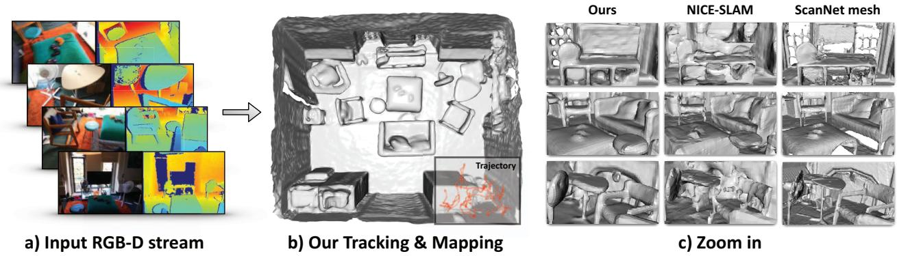
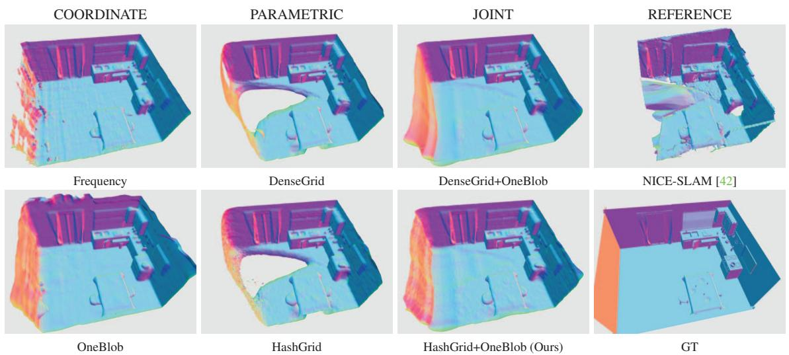
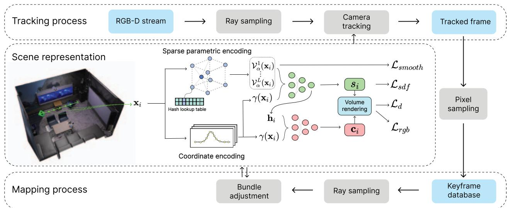
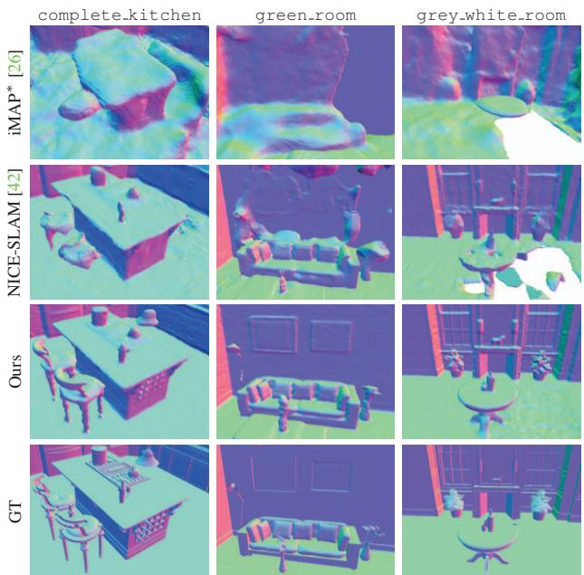
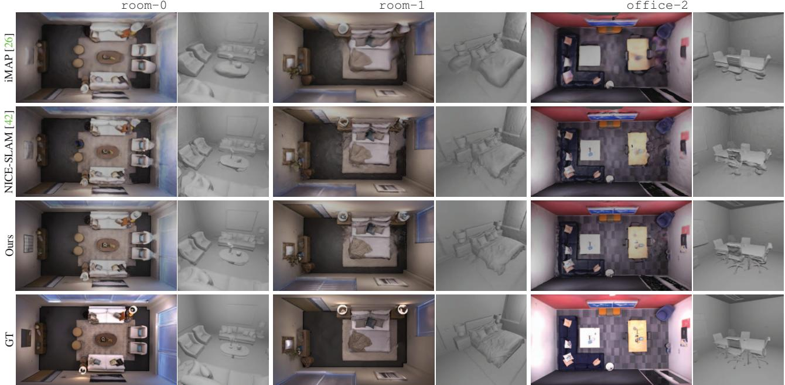
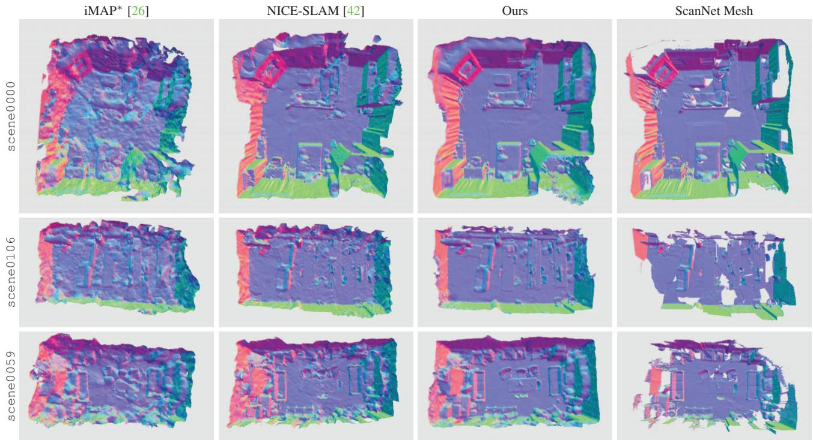
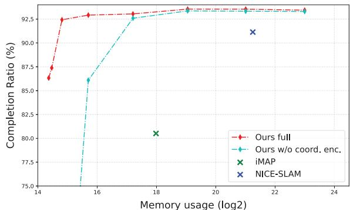

  
Figure 1. We present Co-SLAM, a neural RGB-D SLAM method that performs online tracking and mapping in real time. We propose a new hybrid representation based on a joint coordinate and sparse-parametric encoding with global bundle adjustment. Our method shows fast, high-fidelity scene reconstruction with efficient memory use and plausible hole-filling.

# Co-SLAM: Joint Coordinate and Sparse Parametric Encodings for Neural Real-Time SLAM

Hengyi Wang- Jingwen Wang- Lourdes Agapito Department of Computer Science, University College London hengyi wang 21 jingwen wang 17 l agapito @ucl ac uk

## Abstract

We present Co-SLAM, a neural RGB-D SLAM system based on a hybrid representation, thatperforms robust camera tracking and high-fidelity surface reconstruction in real time. Co-SLAM represents the scene as a multi-resolution hash-grid to exploit its high convergence speed and ability to represent high-frequency local features. In addition, Co-SLAM incorporates one-blob encoding, to encourage surface coherence and completion in unobserved areas. This joint parametric-coordinate encoding enables real-time and robust performance by bringing the best of both worlds: fast convergence and surface hole filling. Moreover, our ray sampling strategy allows Co-SLAM to perform global bundle adjustment over all keyframes instead of requiring keyframe selection to maintain a small number ofactive keyframes as competing neural SLAM approaches do. Experimental results show that Co-SLAM runs at 10 17Hz and achieves state-of-the-art scene reconstruction results, and competitive tracking performance in various datasets and benchmarks (ScanNet, TUM, Replica, Synthetic RGBD). Project page: https://hengyiwang github io/projects/CoSLAM

## 1. Introduction

Real-time joint camera tracking and dense surface reconstruction from RGB-D sensors has been a core problem in computer vision and robotics for decades. Traditional SLAM solutions exist that can robustly track the position of the camera while fusing depth and/or color measurements into a single high-fidelity map. However, they rely on handcrafted loss terms and do not exploit data-driven priors.

Recent attention has turned to learning-based models that can exploit the ability of neural network architectures to learn smoothness and coherence priors directly from data. Coordinate-based networks have probably become the most popular representation, since they can be trained to predict the geometric and appearance properties of any point in the scene in a self-supervised way, directly from images. The most notable example, Neural Radiance Fields (NeRF) [14], encodes scene density and color in the weights of a neural network. In combination with volume rendering, NeRF is trained to re-synthesize the input images and has a remarkable ability to generalize to nearby unseen views.

Coordinate-based networks embed input point coordinates into a high dimensional space, using sinusoidal or other frequency embeddings, allowing them to capture high-frequency details that are essential for high-fidelity geometry reconstruction [1]. Combined with the smoothness and coherence priors inherently encoded in the MLP weights, they constitute a good choice for sequential tracking and mapping [26]. However, the weakness of MLPbased approaches is the long training times required (sometimes hours) to learn a single scene. For that reason, recent real-time capable SLAM systems built on coordinate networks with frequency embeddings such as iMAP [26] need to resort to strategies to sparsify ray sampling and reduce tracking iterations to maintain interactive operation. This comes at the cost of loss of detail in the reconstructions which are oversmoothed (Fig. 5) and potential errors in camera tracking.

  
Figure 2. Illustration of the effect of different encodings on completion. COORDINATE based encodings achieve hole filling but require long training times. PARAMETRIC encodings allow fast training, but fail to complete unobserved regions. JOINT coordinate and para metric encoding (Ours) allows smooth scene completion and fast training. NICE-SLAM [42] uses a dense parametric encoding.

Optimizable feature grids, also known as parametric embeddings, have recently become a powerful alternative scene representation to monolithic MLPs, given their ability to represent high-fidelity local features and their extremely fast convergence (orders of magnitude faster) [7, 10, 15, 32, 40]. Recent efforts focus on sparse alternatives to these parametric embeddings such as octrees [28], tri-plane [2], hash-grid [15] or sparse voxel grid [12, 13] to improve the memory efficiency of dense grids. While these representations can be fast to train and are therefore well suited to real-time operation, they fundamentally lack the smoothness, and coherence priors inherent to MLPs and struggle with hole-filling in areas without observation. NICE-SLAM [42] is a recent example of a multi-resolution feature grid-based SLAM method. Although it does not suffer from over-smoothness and captures local detail (as shown in Fig. 2) it cannot perform hole-filling which might in turn lead to drift in camera pose estimation.

Our first contribution is to design a joint coordinate and sparse grid encoding for input points that brings together the benefits of both worlds to the real-time SLAM framework. On the one hand, the smoothness and coherence priors provided by coordinate encodings (we use one-blob [16] encoding), and on the other hand the optimization speed and local details of sparse feature encodings (we use hash grid [15]), resulting in more robust camera tracking and high-fidelity maps with better completion and hole filling.

Our second contribution relates to the bundle adjustment (BA) step in the joint optimization of the map and camera poses. So far, all neural SLAM systems [26, 42] perform BA using rays sampled from a very small subset of selected keyframes. Restricting the optimization to a very small number of viewpoints results in decreased robustness in camera tracking and increased computation due to the need for a keyframe-selection strategy. Instead, Co-SLAM performs global BA, sampling rays from all past keyframes, which results in an important boost in robustness and performance in pose estimation. In addition, we show that our BA optimization requires a fraction of the iterations of NICE-SLAM [42] to achieve similar errors. In practice, Co-SLAM achieves SOTA performance in camera tracking and 3D reconstruction while maintaining real time performance.

Co-SLAM runs at 15-17Hz on Replica and Synthetic RGB-D datasets [1], and 12-13Hz on ScanNet [5] and TUM [25] scenes — faster than NICE-SLAM (0.1- 1Hz) [42] and iMAP [26]. We perform extensive evaluations on various datasets (Replica [24], Synthetic RGBD [1], ScanNet [6], TUM [25]) where we outperform NICE-SLAM [42] and iMAP [26] in reconstruction and achieve better or at least on-par tracking accuracy.

## 2. Related Work

Dense Visual SLAM. Taking advantage of commodity depth sensors, KinectFusion [18] performs frame-to-model camera tracking via projective iterative-closest-point (ICP), and incrementally updates the scene geometry via TSDF-Fusion. Subsequent works focused on addressing the scalability issue by adopting more efficient data structures, such as surface elements (surfels) [35, 36], VoxelHashing [3, 9, 19] or Octrees [31,41]. While most works focus more heavily on scene reconstruction and only track per-frame poses, BAD-SLAM [21] proposes full direct bundle adjustment (BA) to jointly optimize keyframe (KF) poses and the dense 3D structure. Several recent works [11, 29, 30, 38] leverage deep learning to improve the accuracy and robustness of traditional SLAM, and even achieve dense reconstruction with monocular SLAM. While these approaches introduced some learned components, the scene representation and overall pipeline still follow traditional SLAM methods.

Neural Implicit Representations. Recently neural implicit representations [14] that encode 3D geometry and the appearance of a scene within the weights of a neural network have gained popularity due to their expressiveness and compactness. Among these works, NeRF [14] and its variants adopt coordinate encoding [16, 20] with MLPs and show impressive scene reconstruction using differentiable rendering. Given that coordinate encoding-based methods require lengthy training, many follow-up works [7, 10, 27] propose parametric encodings that increase parameter size but speed up the training. To improve the memory efficiency of parametric encoding-based methods, sparse parametric encodings, such as Octree [28], Tri-plane [2], or sparse voxel grid [12, 13, 15], have been proposed. While these methods focus on novel view synthesis, others instead focus on surface reconstruction from RGB images, with implicit surface representations and differentiable renderers [8, 33, 39, 40]. Other methods [1,26,32,37,42] use depth measurements as additional supervision for surface reconstruction.

Neural Implicit SLAM. iMAP [26] adopts an MLP representation to perform joint tracking and mapping in quasireal time. Smooth, plausible filling of unobserved regions is achieved thanks to the coherence priors inherent to the MLP. iMAP introduces elaborate keyframe selection and information-guided pixel sampling for speed, resulting in 10 Hz tracking and 2 Hz mapping. To reduce the computational overhead and improve scalability, NICE-SLAM [42] adopts a multi-level feature grid for scene representation. However, as feature grids only perform local updates, they fail to achieve plausible hole-filling. With Co-SLAM we aim to address both issues. To achieve realtime performance and memory-efficiency, while maintaining high-fidelity surface reconstruction and plausible hole filling, we propose to combine the use of coordinate and sparse parametric encodings for scene representation, and perform dense global bundle adjustment using rays sampled from all keyframes.

## 3. Method

Fig. 3 shows an overview of Co-SLAM. Given an input RGB-D stream $\{ I _ { t } \} _ { t = 1 } ^ { N } \{ D _ { t } \} _ { t = 1 } ^ { N }$ with known camera intrinsics $K \in \mathbb { R } ^ { 3 \times 3 }$ , we perform dense mapping and tracking by jointly optimizing camera poses $\{ \xi _ { t } \} _ { t = 1 } ^ { \bar { N } ^ { - } }$ and a neural scene representation $f _ { \theta } .$ . Specifically, our implicit representation maps world coordinates x into color c and truncated signed distance (TSDF) s values:

$$
f _ { \theta } ( \mathbf { x } ) \mapsto ( \mathbf { c } , s ) .\tag{1}
$$

Similar to most SLAM systems, the process is split into tracking and mapping. Initialization is performed by running a few training iterations on the first frame. For each subsequent frame, the camera pose is optimized first, initialized with a simple constant-speed motion model. A small fraction of pixels/rays are then sampled and copied to the global pixel-set. At each mapping iteration, global bundle adjustment is performed over a set of pixels randomly sampled from the global pixel-set, to jointly optimize the scene representation θ and all camera poses ξt .

## 3.1. Joint Coordinate and Parametric Encoding

Thanks to the coherence and smoothness priors inherent to MLPs, coordinate-based representations achieve highfidelity scene reconstruction. However, these methods often suffer from slow convergence and catastrophic forgetting, when optimized in a sequential setting. Instead, parametric encoding based methods improve the computational ef ficiency, but they fall short of hole filling and smoothness. Since both properties of speed and coherence are crucial for a real-world SLAM system, we propose a joint coordinate and parametric encoding that combines the best of both worlds: we adopt coordinate encoding for scene representation while using sparse parametric encoding to speed up training. Specifically, we use One-blob [16] encoding γ(x) instead of embedding spatial coordinates into multiple frequency bands. As scene representation we adopt a multiresolution hash-based feature grid [15] $\mathcal { V } _ { \alpha } = \{ \mathcal { V } _ { \alpha } ^ { l } \} _ { l = 1 } ^ { L }$ . The spatial resolution of each level is set between the coarsest $R _ { m i n }$ and the finest resolution $R _ { m a x }$ in a progressive manner. Feature vectors $\mathcal { V } _ { \alpha } ( \mathbf { x } )$ at each sampled point x are queried via trilinear interpolation. The geometry decoder outputs the predicted SDF value s and a feature vector h:

$$
f _ { \tau } ( \gamma ( \mathbf { x } ) , \mathcal { V } _ { \alpha } ( \mathbf { x } ) ) \mapsto ( \mathbf { h } , s ) .\tag{2}
$$

Finally, the color MLP predicts the RGB value:

$$
f _ { \phi } ( \gamma ( \mathbf { x } ) , \mathbf { h } ) \mapsto \mathbf { c } .\tag{3}
$$

Here $\theta ~ = ~ \{ \alpha , \phi , \tau \}$ are learnable parameters. Injecting the One-blob encoding in the hash-based multi-resolution feature grid representation, results in fast convergence, efficient memory use, and hole filling needed for online SLAM.

  
Figure 3. Overview of Co-SLAM. 1) Scene representation: using our new joint coordinate+parametric encoding, input coordinates are mapped to RGB and SDF values via two shallow MLPs. 2) Tracking: optimize per-frame camera poses $\xi _ { t }$ by minimizing losses. 3) Mapping: global bundle adjustment to jointly optimize the scene representation and camera poses taking rays sampled from all keyframes.

## 3.2. Depth and Color Rendering

Following [26, 42], we render depth and color by integrating the predicted values along the sampled rays. Specifically, given the camera origin o and ray direction $\mathbf { r } ,$ we uniformly sample M points ${ \bf x } _ { i } = { \bf o } + d _ { i } { \bf r } , i \in$ $\{ 1 , \dots , M \}$ with depth values $\{ t _ { 1 } , \ldots , t _ { M } \}$ and predicted colors $\{ \mathbf { c } _ { 1 } , \hdots , \mathbf { c } _ { M } \}$ and render color and depth as

$$
\hat { \mathbf { c } } = \frac { 1 } { \sum _ { i = 1 } ^ { M } w _ { i } } \sum _ { i = 1 } ^ { M } w _ { i } \mathbf { c } _ { i } , \quad \hat { d } = \frac { 1 } { \sum _ { i = 1 } ^ { M } w _ { i } } \sum _ { i = 1 } ^ { M } w _ { i } d _ { i } ,\tag{4}
$$

where $\{ w _ { i } \}$ are the computed weights along the ray. A conversion function is needed to convert predicted SDF $s _ { i }$ to weight $w _ { i } .$ . Instead of adopting the rendering equations proposed in Neus [33, 39], we follow the simple bell-shaped model of [1] and compute weights $w _ { i }$ directly by multiplying the two Sigmoid functions $\sigma ( \cdot )$

$$
w _ { i } = \sigma \left( \frac { s _ { i } } { t r } \right) \sigma \left( - \frac { s _ { i } } { t r } \right) ,\tag{5}
$$

where tr is the truncation distance.

Depth-guided Sampling. For sampling along each ray, we observe that importance sampling does not show significant improvement while slowing down our tracking and mapping. Instead, we use depth-guided sampling: In addition to $M _ { c }$ points uniformly sampled between near and f ar bound, for rays with a valid depth measurement, we further uniformly sample $M _ { f }$ near-surface points within the range $[ d - d _ { s } , d + d _ { s } ] _ { }$ , where $d _ { s }$ is a small offset.

## 3.3. Tracking and Bundle Adjustment

Objective Functions. Our tracking and bundle adjustment are performed via minimizing our objective functions with

respect to learnable parameters $\theta$ and camera parameters $\xi _ { t } .$ The color and depth rendering losses are $\ell _ { 2 }$ errors between the rendered results and observations:

$$
\mathcal { L } _ { r g b } = \frac { 1 } { N } \sum _ { n = 1 } ^ { N } ( \hat { \mathbf { c } } _ { n } - \mathbf { c } _ { n } ) ^ { 2 } , \mathcal { L } _ { d } = \frac { 1 } { | R _ { d } | } \sum _ { r \in R _ { d } } ( \hat { d } _ { r } - D [ u , v ] ) ^ { 2 } .\tag{6}
$$

where $R _ { d }$ is the set of rays that have a valid depth measurement, and u, v is the corresponding pixel on the image plane. To achieve accurate, smooth reconstructions with detailed geometry, we also apply approximate SDF and feature smoothness losses. Specifically, for samples within the truncation region, i.e. points where $| D [ u , v ] - d | \leq t r .$ we use the distance between the sampled point and its observed depth value as an approximation of the ground-truth SDF value for supervision:

$$
\mathcal { L } _ { s d f } = \frac { 1 } { \left| R _ { d } \right| } \sum _ { r \in R _ { d } } \frac { 1 } { \left| S _ { r } ^ { t r } \right| } \sum _ { p \in S _ { r } ^ { t r } } \left( s _ { p } - ( D [ u , v ] - d ) \right) ^ { 2 } .\tag{7}
$$

For points that are far from the surface $( ( D [ u , v ] - d | ) > t r )$ we apply a free-space loss which forces the SDF prediction to be the truncated distance tr:

$$
\mathcal { L } _ { f s } = \frac { 1 } { \vert { R _ { d } } \vert } \sum _ { r \in R _ { d } } \frac { 1 } { \vert { S _ { r } ^ { f s } } \vert } \sum _ { p \in S _ { r } ^ { f s } } ( s _ { p } - t r ) ^ { 2 } .\tag{8}
$$

To prevent the noisy reconstructions caused by hash collisions in unobserved free-space regions we perform additional regularization on the interpolated features $\begin{array} { r } { \nu _ { \alpha } ( \mathbf { x } ) ; } \end{array}$

$$
\mathcal { L } _ { s m o o t h } = \frac { 1 } { | \mathcal { G } | } \sum _ { { \bf x } \in \mathcal { G } } \Delta _ { x } ^ { 2 } + \Delta _ { y } ^ { 2 } + \Delta _ { z } ^ { 2 } ,\tag{9}
$$

where $\Delta _ { x , y , z } = \mathcal { V } _ { \alpha } ( \mathbf { x } + \epsilon _ { x , y , z } ) - \mathcal { V } _ { \alpha } ( \mathbf { x } )$ denotes the featuremetric difference between adjacent sampled vertices on the hash-grid along the three dimensions. Since performing regularization on the entire feature grid is computationally infeasible for real-time mapping, we only perform it in a small random region in each iteration.

Camera Tracking. We track the camera-to-world transformation matrix $\mathbf { T } _ { w c } = \exp \left( \xi _ { t } ^ { \wedge } \right) \in \mathbb { S E } ( 3 )$ at each frame t. When a new frame comes in, we first initialize the pose of the current frame i using constant speed assumption:

$$
\mathbf T _ { t } = \mathbf T _ { t - 1 } \mathbf T _ { t - 2 } ^ { - 1 } \mathbf T _ { t - 1 }\tag{10}
$$

Then, we select $N _ { t }$ pixels within the current frame and iteratively optimize the pose by minimizing our objective function with respect to the camera parameters $\xi _ { t }$

Bundle Adjustment. In neural SLAM, bundle adjustment usually consists of keyframe selection and joint optimization of camera poses and scene representation. Classic dense visual SLAM methods require saving keyframe (KF) images as the loss is formulated densely over all pixels. In contrast, the advantage of neural SLAM, as first shown by iMAP [26], is that BA can work with a sparse set of sampled rays. This is because the scene is represented as an implicit field using a neural network. However, iMAP and NICE-SLAM do not take full advantage of this - they still store full keyframe images following the classic SLAM paradigm and rely on keyframe selection (e.g. information gain, visual overlapping) to perform joint optimization on a small fraction of keyframes (usually less than 10).

In Co-SLAM, we go further and drop the need for storing full keyframe images or keyframe selection. Instead, we only store a subset of pixels (around 5%) to represent each keyframe. This allows us to insert new keyframes more frequently and maintain a much larger keyframe database. For joint optimization, we randomly sample a total number of $N _ { g }$ rays from our global keyframe list to optimize our scene representation as well as camera poses. The joint optimization is performed in an alternating fashion. Specifically, we firstly optimize the scene representation θ for $k _ { m }$ steps and update camera poses using the accumulated gradient on camera parameters ξt . Since each camera pose uses only 6 parameters, this approach can improve the robustness of camera pose optimization with negligible extra computational cost on gradient accumulation.

## 4. Experiments

## 4.1. Experimental Setup

Datasets. We evaluate Co-SLAM on a variety of scenes from four different datasets. Following iMAP and NICE-SLAM, we quantitatively evaluate the reconstruction quality on 8 synthetic scenes from Replica [24]. We also evaluate on 7 synthetic scenes from NeuralRGBD [1], which simulates noisy depth maps. For pose estimation, we evaluate the results on 6 scenes from ScanNet [5] with their ground truth pose obtained with BundleFusion [6], and 3 scenes from TUM RGB-D dataset [25] with their ground truth pose provided by a motion capture system.

Metrics. We evaluate the reconstruction quality using Depth L1 (cm), Accuracy (cm), Completion (cm), and Completion ratio (%) with a threshold of 5cm. Following NICE-SLAM [42], we remove the unobserved regions that are outside of any camera frustum. In addition, we also perform an extra mesh culling that removes the noisy points within the camera frustum but outside the target scene. We observe that all methods experience a performance gain with our mesh culling strategy. Please refer to our supplementary material for more details. For evaluation of camera tracking, we adopt ATE RMSE [25] (cm).

Baselines. We consider iMAP [26] and NICE-SLAM [42] as our main baselines for reconstruction quality and camera tracking. For a fair comparison, we evaluate iMAP and NICE-SLAM with the same mesh culling strategy as Co-SLAM. Note that iMAP denotes the iMAP reimplementation released by the NICE-SLAM [42] authors, which is much slower than the original implementation. To investigate the trade-off between accuracy and frame rate on real-world datasets, we report results of two versions of our method: Ours refers to our proposed approach (which achieves real-time operation) while $O u r s ^ { \dagger }$ indicates our method ran with twice as many tracking iterations.

Implementation Details. We run Co-SLAM on a desktop PC with a 3.60GHz Intel Core i7-12700K CPU and NVIDIA RTX 3090ti GPU. For experiments with default settings (Ours), which runs at 17 FPS on the Replica dataset, we use $N _ { t } ~ = ~ 1 0 2 4$ pixels with 10 iterations for tracking and 5% of pixels from every $5 ^ { t h }$ frame for global bundle adjustment. We sample $M _ { r } ~ = ~ 3 2$ regular points and $M _ { d } ~ = ~ 1 1$ depth points along each camera ray, with tr = 10cm. Please refer to supplementary materials for more specific settings on all datasets.

## 4.2. Evaluation of Tracking and Reconstruction

Replica dataset [24]. We evaluate on the same simulated RGB-D sequences as iMAP [26]. As shown in Tab. 1, our method achieves higher reconstruction accuracy and faster speed. Fig. 5 shows the qualitative results, from which we can observe that iMAP achieves plausible completion in unobserved areas but results are over-smoothed, while NICE-SLAM maintains more reconstruction details, but results contain some artifacts (e.g. the floors beside the bed, the back of the chairs). Co-SLAM successfully retains the advantages of both methods achieving consistent completion as well as high-fidelity reconstruction results.

Synthetic dataset [1]. We perform further experiments on the synthetic dataset from NeuralRGBD [1]. Unlike the

<table><tr><td>Dataset</td><td>Method</td><td>Depth L1 (cm).↓</td><td>Acc. (cm)↓</td><td>Comp. (cm)↓</td><td>Comp. Ratio↑</td><td>Tracking (ms) ↓</td><td>Mapping (ms) ↓</td><td>FPS↑</td><td>#param. ↓</td></tr><tr><td rowspan="4">Replica [24]</td><td>TSDF-Fusion [4]</td><td>6.36</td><td>1.62</td><td>3.94</td><td>83.93</td><td>N/A</td><td>N/A</td><td>N/A</td><td>16.8M</td></tr><tr><td>iMAP [23]</td><td>4.64</td><td>3.62</td><td>4.93</td><td>80.51</td><td>101 (200, 6)</td><td>448 (1000, 10)</td><td>9.9</td><td>0.26 M</td></tr><tr><td>NICE-SLAM [42]</td><td>1.90</td><td>2.37</td><td>2.64</td><td>91.13</td><td>78 (200, 10)</td><td>5470 (1000, 60)</td><td>0.91</td><td>17.4M</td></tr><tr><td>Ours</td><td>1.51</td><td>2.10</td><td>2.08</td><td>93.44</td><td>58 (1024, 10)</td><td>98 (2048, 10)</td><td>17.4</td><td>0.26 M</td></tr><tr><td rowspan="4">Synthetic RGBD [1]</td><td>TSDF-Fusion [4]</td><td>10.87</td><td>1.62</td><td>5.16</td><td>81.52</td><td>N/A</td><td>N/A</td><td>N/A</td><td>16.8M</td></tr><tr><td>iMAP* [23]</td><td>43.91</td><td>18.30</td><td>26.41</td><td>20.73</td><td>1550 (5000, 50)</td><td>14730 (5000, 300)</td><td>0.34</td><td>0.22 M</td></tr><tr><td>NICE-SLAM [42]</td><td>6.32</td><td>5.96</td><td>5.30</td><td>77.46</td><td>123 (1024, 10)</td><td>3792 (1000, 60)</td><td>1.31</td><td>3.11M</td></tr><tr><td>Ours</td><td>3.02</td><td>2.95</td><td>2.96</td><td>86.88</td><td>64 (1024, 10)</td><td>104 (2048, 10)</td><td>15.6</td><td>0.26 M</td></tr></table>

Table 1. Reconstruction quality and run-time memory comparison on Replica [24] and Synthetic-RGBD [1] with respective settings. TSDF-Fusion is reconstructed with poses estimated by Co-SLAM. Run-time is reported in time $( \# \mathrm { p } \bot \mathrm { x e l }$ #iter) for a comprehensive comparison. The model size is averaged across all scenes.
<table><tr><td rowspan=1 colspan=1></td><td rowspan=1 colspan=2>Method</td><td rowspan=1 colspan=1>Track. (ms) ↓ Map. (ms) ↓ FPS↑</td><td rowspan=1 colspan=1>#param. ↓</td></tr><tr><td rowspan=3 colspan=1>SCcanNet</td><td rowspan=3 colspan=2> $\operatorname { i M A P } ^ { \star }$ NICE-SLAMOurs†Ours</td><td rowspan=1 colspan=1> $3 0 . 4 \times 5 0 $      $4 4 . 9 \times 3 0 0$    0.37</td><td rowspan=1 colspan=1>0.2 M</td></tr><tr><td rowspan=2 colspan=1> $1 2 . 3 \times 5 0$       $1 2 5 . 3 \times 6 0$    0.68 $7 . 8 \times 2 0$       $2 0 . 2 \times 1 0$     6.4 $7 . 8 \times 1 0$       $2 0 . 2 \times 1 0$    12.8</td><td rowspan=1 colspan=1>10.3M0.8M</td></tr><tr><td rowspan=1 colspan=1>0.8M</td></tr><tr><td rowspan=4 colspan=1>TUM</td><td rowspan=4 colspan=2>iMAP*NICE-SLAMOurs†Ours</td><td rowspan=2 colspan=1> $2 9 . 6 \times 2 0 0$      $4 4 . 3 \times 3 0 0$    0.07 $4 7 . 1 \times 2 0 0$      $1 8 9 . 2 \times 6 0 $    0.08</td><td rowspan=1 colspan=1>0.2 M</td></tr><tr><td rowspan=1 colspan=1>101.6 M</td></tr><tr><td rowspan=1 colspan=1> $7 . 5 \times 2 0$       $1 9 . 0 \times 2 0$     6.7</td><td rowspan=1 colspan=1>1.6 M</td></tr><tr><td rowspan=1 colspan=1></td><td rowspan=1 colspan=1> $7 . 5 \times 1 0$        $1 9 . 0 \times 2 0$    13.3</td><td rowspan=1 colspan=1>1.6 M</td></tr></table>

Table 2. Run-time and memory comparison on ScanNet [5] and TUM-RGBD [25] with respective settings. Run-time is reported in ms $/ \mathrm { i t e r } \times \# \mathrm { i t e r }$ for a detailed comparison. NICE-SLAM and $\operatorname { i M A P } ^ { \star }$ run mapping at every frame on TUM-RGBD. Mapping happens every 5 frames in all other cases. The model size is averaged across all scenes.

  
Figure 4. Reconstruction results on Synthetic RGB-D dataset [1]. Our method can recover thin structures and achieve plausible scene completion given noisy depth measurement.

Replica dataset, it contains many thin structures and simulates the noise present in real depth sensor measurements. Quantitatively, our method significantly outperforms baseline methods (see Tab. 1) while still operating in real time (15 FPS). Fig. 4 shows some example qualitative results. Overall, Co-SLAM can capture fine details (e.g. wine bottles, chair legs, etc.) and produces complete and smooth reconstructions. NICE-SLAM yields less detailed and noisier reconstructions and cannot perform hole filling, while iMAP∗ lost track on some occasions.

<table><tr><td>Scene ID</td><td>0000</td><td>0059</td><td>0106</td><td>0169</td><td>0181</td><td>0207</td><td> $\operatorname { A v g } .$ </td></tr><tr><td>iMAP* [26]</td><td>55.95</td><td>32.06</td><td>17.50</td><td>70.51</td><td>32.10</td><td>11.91</td><td>36.67</td></tr><tr><td>NICE-SLAM [42]</td><td>8.64</td><td>12.25</td><td>8.09</td><td>10.28</td><td>12.93</td><td>5.59</td><td>9.63</td></tr><tr><td>Ours†</td><td>7.13</td><td>11.14</td><td>9.36</td><td>5.90</td><td>11.81</td><td>7.14</td><td>8.75</td></tr><tr><td>Ours</td><td>7.18</td><td>12.29</td><td>9.57</td><td>6.62</td><td>13.43</td><td>7.13</td><td>9.37</td></tr></table>

Table 3. ATE RMSE (cm) results of an average of 5 runs on Scan-Net. Co-SLAM achieves better or on-par performance compared to NICE-SLAM [42] with significantly faster optimization speed.

<table><tr><td></td><td>fr1/desk (cm)</td><td>fr2/xyz (cm)</td><td>fr3/office (cm)</td></tr><tr><td>iMAP [26]</td><td>4.9</td><td>2.0</td><td>5.8</td></tr><tr><td>iMAP* [26]</td><td>7.2</td><td>2.1</td><td>9.0</td></tr><tr><td>NICE-SLAM [42]</td><td>2.7</td><td>1.8</td><td>3.0</td></tr><tr><td>Ours†</td><td>2.4</td><td>1.7</td><td>2.4</td></tr><tr><td>Ours</td><td>2.7</td><td>1.9</td><td>2.6</td></tr><tr><td>BAD-SLAM [22]</td><td>1.7</td><td>1.1</td><td>1.7</td></tr><tr><td>Kintinuous [34]</td><td>3.7</td><td>2.9</td><td>3.0</td></tr><tr><td>ORB-SLAM2 [17]</td><td>1.6</td><td>0.4</td><td>1.0</td></tr></table>

Table 4. ATE RSME (cm) results on TUM RGB-D dataset. Our method achieves the best tracking performance among neural SLAM methods and maintains high-fidelity reconstruction.

ScanNet dataset [5]. We evaluate the camera tracking accuracy of Co-SLAM on 6 real-world sequences from ScanNet. The absolute trajectory error (ATE) is obtained by comparing predicted and ground-truth (generated by BundleFusion [6]) trajectories. Tab. 3 shows that quantitatively, our method achieves better tracking results in comparison to NICE-SLAM [42] with fewer tracking and mapping iterations while running at 6 12 Hz (see Tab. 2). Fig. 6 also shows Co-SLAM achieves better reconstruction quality with smoother results and finer details (e.g. bike).

TUM dataset [25]. We further evaluate the tracking accuracy on the TUM dataset [25]. As shown in Tab. 4, our method achieves competitive tracking performance at 13 FPS. By increasing the number of tracking iterations (Ours†), our method achieves the best tracking performance among neural SLAM methods, though at the expense of the FPS dropping to 6.7 (see Tab. 2). Although Co-SLAM still cannot outperform classic SLAM methods, it reduces the tracking performance gap between neural and classic methods, while improving the fidelity and completeness of the reconstructions.

  
Figure 5. Reconstruction results on Replica [24] dataset. In comparison to our baselines, our methods achieve accurate and high-quality scene reconstruction and completion on various scenes.

  
Figure 6. Reconstruction results on ScanNet [5]. In comparison to the previous methods, our reconstructions are smoother and contain more details thanks to our proposed joint encoding and global bundle adjustment strategy.

## 4.3. Performance Analysis

Run time and memory analysis. In our default setting (Ours), Co-SLAM can operate above 15Hz on a desktop PC with a 3.60GHz Intel Core i7-12700K CPU and NVIDIA RTX 3090ti GPU. For more challenging scenarios such as the ScanNet and TUM datasets, Co-SLAM still achieves 5  13Hz runtime. Fig. 7 shows reconstruction quality with respect to memory use. Thanks to the sparse parametric encoding, our method requires significantly less memory than NICE-SLAM [42] while operating in real time and achieving accurate reconstruction results. Surprisingly, we found that further compressing the memory footprint (increasing the chances of hash collisions), Co-SLAM still outperforms iMAP [26], suggesting that our joint encoding improves the representation power of single encoding. Note that this figure is for illustration purposes, so we use the same spatial resolution throughout our hash encoding. Ideally, one can reduce the spatial resolution further to minimize hash collisions and achieve a better reconstruction quality.

  
Figure 7. Completion ratio vs. model size for Co-SLAM w/ and w/o coordinate encoding. Each model corresponds to a different hash-table size. iMAP [26] and NICE-SLAM [42] shown for reference.

<table><tr><td></td><td>w/o hash enc.</td><td>w/o one-blob enc.</td><td>Full model</td></tr><tr><td>Acc. (cm.) ↓</td><td>3.69</td><td>2.13</td><td>2.10</td></tr><tr><td>Comp. (cm.)↓</td><td>3.43</td><td>2.13</td><td>2.08</td></tr><tr><td>Comp. Ratio ↑</td><td>82.49</td><td>93.17</td><td>93.44</td></tr></table>

Table 5. Ablation study on different encodings. Default hashtable size is 13. Our full model with joint encoding achieves better completion and more accurate reconstructions. See also Fig. 2.

Scene completion. Fig. 2 shows an illustration of hole filling using different encoding strategies on a small scene. Coordinate encoding-based methods achieve plausible completion at the cost of lengthy training times, while parametric encoding-based methods fail at hole filling due to their local nature. By applying our new joint encoding, we observe that smooth hole filling can be achieved and fine structures are preserved by Co-SLAM.

## 4.4. Ablations

Effect of joint coordinate and parametric encoding. Tab. 5 illustrates a quantitative evaluation using different encodings. Our full model leads to higher accuracy and better completion than using single encodings (only one-blob or only hash-encoding). In addition, Fig. 7 illustrates that when compressing the size of the hash lookup table, our full model with joint coordinate and parametric encoding is more robust in comparison to using a hash-based feature grid without the coordinate encoding.

<table><tr><td rowspan="2">Name</td><td colspan="2">KF selection</td><td colspan="3">#KF</td><td rowspan="2">Pose optim.</td><td rowspan="2">ATE (cm)</td><td rowspan="2">Std. (cm)</td></tr><tr><td>Local</td><td>Global</td><td>0</td><td>10</td><td>All</td></tr><tr><td>w/o BA</td><td></td><td></td><td>√</td><td></td><td></td><td></td><td>16.81</td><td>1.69</td></tr><tr><td>LBA</td><td></td><td></td><td></td><td>√</td><td></td><td>√</td><td>9.69</td><td>1.38</td></tr><tr><td>GBA-10</td><td></td><td>√</td><td></td><td>√</td><td></td><td>√</td><td>9.54</td><td>0.67</td></tr><tr><td>GBA</td><td></td><td>√</td><td></td><td></td><td>√</td><td>√</td><td>8.75</td><td>0.33</td></tr></table>

Table 6. Ablation of BA strategies on Co-SLAM: (LBA) BA with rays from 10 local keyframes; (GBA-10) BA with rays from 10 keyframes randomly selected from all keyframes; (GBA) BA with rays from all keyframes (our full method). All methods sample the same number of total rays per iteration (2048).

Effect of global bundle adjustment. Tab. 6 shows the average ATE of our SLAM method on the 6 ScanNet scenes using different BA strategies: (w/o BA) pure tracking; (LBA) BA with rays from 10 local keyframes, a similar strategy to NICE-SLAM; (GBA-10) BA using rays from only 10 keyframes randomly selected from all past keyframes; (GBA) denotes the global BA strategy of Co-SLAM. We observe that using rays from a small (10) number of keyframes (LBA and GBA-10) leads to higher ATE errors. However, when keyframes are chosen from the entire sequence (GBA-10), instead of locally (LBA) the standard deviation is greatly reduced. Sampling rays from all keyframes (GBA) is the best overall strategy, even when all methods sample the same number of total rays (2048).

## 5. Conclusion

We presented Co-SLAM, a dense real-time neural RGB-D SLAM system. We show that using a joint coordinate and parametric encoding with tiny MLPs as scene representation and training it with global bundle adjustment, achieves high-fidelity mapping and accurate tracking with plausible hole filling and efficient memory use.

Limitations. Co-SLAM relies on inputs from an RGB-D sensor and is therefore sensitive to illumination changes and inaccurate depth measurements. Instead of sampling keyframe pixels randomly, an information-guided pixel sampling strategy could be helpful to further reduce the number of pixels and improve the tracking speed. Incorporating loop closure could lead to further improvements.

## Acknowledgements

The research presented here has been supported by a sponsored research award from Cisco Research and the UCL Centre for Doctoral Training in Foundational AI under UKRI grant number EP/S021566/1. This project made use of time on Tier 2 HPC facility JADE2, funded by EPSRC (EP/T022205/1).

## References

[1] Dejan Azinovic, Ricardo Martin-Brualla, Dan B. Goldman,´ Matthias Nießner, and Justus Thies. Neural RGB-D surface reconstruction. In Proceedings ofthe IEEE/CVF Conference on Computer Vision and Pattern Recognition, pages 6290– 6301, 2022. 1, 2, 3, 4, 5, 6

[2] Eric R. Chan, Connor Z. Lin, Matthew A. Chan, Koki Nagano, Boxiao Pan, Shalini De Mello, Orazio Gallo, Leonidas J. Guibas, Jonathan Tremblay, and Sameh Khamis. Efficient geometry-aware 3D generative adversarial networks. In Proceedings of the IEEE/CVF Conference on Computer Vision and Pattern Recognition, pages 16123– 16133, 2022. 2, 3

[3] Jiawen Chen, Dennis Bautembach, and Shahram Izadi. Scalable real-time volumetric surface reconstruction. ACM Transactions on Graphics (ToG), 32(4):1–16, 2013. 3

[4] Brian Curless and Marc Levoy. A volumetric method for building complex models from range images. In Proceedings of the 23rd Annual Conference on Computer Graphics and Interactive Techniques, pages 303–312, 1996. 6

[5] Angela Dai, Angel X. Chang, Manolis Savva, Maciej Halber, Thomas Funkhouser, and Matthias Nießner. Scannet: Richly-annotated 3d reconstructions of indoor scenes. In Proceedings of the IEEE Conference on Computer Vision and Pattern Recognition, pages 5828–5839, 2017. 2, 5, 6, 7

[6] Angela Dai, Matthias Nießner, Michael Zollhofer, Shahram¨ Izadi, and Christian Theobalt. Bundlefusion: Real-time globally consistent 3d reconstruction using on-the-fly surface reintegration. ACM Transactions on Graphics (ToG), 36(4):1, 2017. 2, 5, 6

[7] Sara Fridovich-Keil, Alex Yu, Matthew Tancik, Qinhong Chen, Benjamin Recht, and Angjoo Kanazawa. Plenoxels: Radiance Fields Without Neural Networks. In Proceedings of the IEEE/CVF Conference on Computer Vision and Pattern Recognition, pages 5501–5510, 2022. 2, 3

[8] Haoyu Guo, Sida Peng, Haotong Lin, Qianqian Wang, Guofeng Zhang, Hujun Bao, and Xiaowei Zhou. Neural 3D Scene Reconstruction with the Manhattan-world Assumption. In Proceedings of the IEEE/CVF Conference on Computer Vision and Pattern Recognition, pages 5511–5520, 2022. 3

[9] Olaf Kahler, Victor Adrian Prisacariu, Carl Yuheng Ren, Xin¨ Sun, Philip H. S. Torr, and David William Murray. Very high frame rate volumetric integration of depth images on mobile devices. IEEE Trans. Vis. Comput. Graph., 21(11):1241– 1250, 2015. 3

[10] Animesh Karnewar, Tobias Ritschel, Oliver Wang, and Niloy Mitra. Relu fields: The little non-linearity that could. In ACM SIGGRAPH 2022 Conference Proceedings, pages 1–9, 2022. 2, 3

[11] L Koestler, N Yang, N Zeller, and D Cremers. Tandem: Tracking and dense mapping in real-time using deep multiview stereo. In Conference on Robot Learning (CoRL), 2021. 3

[12] Hai Li, Xingrui Yang, Hongjia Zhai, Yuqian Liu, Hujun Bao, and Guofeng Zhang. Vox-Surf: Voxel-based Implicit Surface

Representation. arXiv preprint arXiv:2208.10925, 2022. 2, 3

[13] Lingjie Liu, Jiatao Gu, Kyaw Zaw Lin, Tat-Seng Chua, and Christian Theobalt. Neural sparse voxel fields. Advances in Neural Information Processing Systems, 33:15651–15663, 2020. 2, 3

[14] Ben Mildenhall, Pratul P. Srinivasan, Matthew Tancik, Jonathan T. Barron, Ravi Ramamoorthi, and Ren Ng. Nerf: Representing scenes as neural radiance fields for view synthesis. In European Conference on Computer Vision, pages 405–421. Springer, 2020. 1, 3

[15] Thomas Muller, Alex Evans, Christoph Schied, and Alexan-¨ der Keller. Instant neural graphics primitives with a multiresolution hash encoding. ACM Transactions on Graphics, 41(4):102:1–102:15, July 2022. 2, 3

[16] Thomas Muller, Brian McWilliams, Fabrice Rousselle,¨ Markus Gross, and Jan Novak. Neural importance sampling. ´ ACM Transactions on Graphics (TOG), 38(5):1–19, 2019. 2, 3

[17] Raul Mur-Artal and Juan D. Tardos. Orb-slam2: An open- ´ source slam system for monocular, stereo, and rgb-d cameras. IEEE transactions on robotics, 33(5):1255–1262, 2017. 6

[18] Richard A Newcombe, Shahram Izadi, Otmar Hilliges, David Molyneaux, David Kim, Andrew J Davison, Pushmeet Kohli, Jamie Shotton, Steve Hodges, and Andrew Fitzgibbon. KinectFusion: Real-time dense surface mapping and tracking. In IEEE International Symposium on Mixed and Augmented Reality, pages 127–136, 2011. 2

[19] Matthias Nießner, Michael Zollhofer, Shahram Izadi, and¨ Marc Stamminger. Real-time 3D reconstruction at scale using voxel hashing. ACM Trans. Graph., 32(6):169:1–169:11, 2013. 3

[20] Nasim Rahaman, Aristide Baratin, Devansh Arpit, Felix Draxler, Min Lin, Fred Hamprecht, Yoshua Bengio, and Aaron Courville. On the spectral bias of neural networks. In International Conference on Machine Learning, pages 5301–5310. PMLR, 2019. 3

[21] Thomas Schops, Torsten Sattler, and Marc Pollefeys. BAD SLAM: Bundle adjusted direct RGB-D SLAM. In CVPR, 2019. 3

[22] Thomas Schops, Torsten Sattler, and Marc Pollefeys. Bad slam: Bundle adjusted direct rgb-d slam. In Proceedings of the IEEE/CVF Conference on Computer Vision and Pattern Recognition, pages 134–144, 2019. 6

[23] Vincent Sitzmann, Julien Martel, Alexander Bergman, David Lindell, and Gordon Wetzstein. Implicit neural representations with periodic activation functions. Advances in Neural Information Processing Systems, 33:7462–7473, 2020. 6

[24] Julian Straub, Thomas Whelan, Lingni Ma, Yufan Chen, Erik Wijmans, Simon Green, Jakob J. Engel, Raul Mur-Artal, Carl Ren, and Shobhit Verma. The Replica dataset: A digital replica of indoor spaces. arXiv preprint arXiv:1906.05797, 2019. 2, 5, 6, 7

[25] Jurgen Sturm, Nikolas Engelhard, Felix Endres, Wolfram¨ Burgard, and Daniel Cremers. A benchmark for the evaluation of RGB-D SLAM systems. In 2012 IEEE/RSJ Interna-

tional Conference on Intelligent Robots and Systems, pages 573–580. IEEE, 2012. 2, 5, 6

[26] Edgar Sucar, Shikun Liu, Joseph Ortiz, and Andrew J. Davison. iMAP: Implicit mapping and positioning in real-time. In Proceedings of the IEEE/CVF International Conference on Computer Vision, pages 6229–6238, 2021. 2, 3, 4, 5, 6, 7, 8

[27] Cheng Sun, Min Sun, and Hwann-Tzong Chen. Direct voxel grid optimization: Super-fast convergence for radiance fields reconstruction. In Proceedings ofthe IEEE/CVF Conference on Computer Vision and Pattern Recognition, pages 5459– 5469, 2022. 3

[28] Towaki Takikawa, Joey Litalien, Kangxue Yin, Karsten Kreis, Charles Loop, Derek Nowrouzezahrai, Alec Jacobson, Morgan McGuire, and Sanja Fidler. Neural geometric level of detail: Real-time rendering with implicit 3D shapes. In Proceedings of the IEEE/CVF Conference on Computer Vision and Pattern Recognition, pages 11358–11367, 2021. 2, 3

[29] K. Tateno, F. Tombari, I. Laina, and N. Navab. CNN-SLAM: Real-time dense monocular slam with learned depth prediction. In CVPR, 2017. 3

[30] Zachary Teed and Jia Deng. DROID-SLAM: Deep Visual SLAM for Monocular, Stereo, and RGB-D Cameras. Advances in neural information processing systems, 2021. 3

[31] Emanuele Vespa, Nikolay Nikolov, Marius Grimm, Luigi Nardi, Paul HJ Kelly, and Stefan Leutenegger. Efficient octree-based volumetric SLAM supporting signed-distance and occupancy mapping. RAL, 2018. 3

[32] Jingwen Wang, Tymoteusz Bleja, and Lourdes Agapito. Go-surf: Neural feature grid optimization for fast, highfidelity rgb-d surface reconstruction. arXiv preprint arXiv:2206.14735, 2022. 2, 3

[33] Peng Wang, Lingjie Liu, Yuan Liu, Christian Theobalt, Taku Komura, and Wenping Wang. Neus: Learning neural implicit surfaces by volume rendering for multi-view reconstruction. Advances in Neural Information Processing Systems, 2021. 3, 4

[34] Thomas Whelan, Michael Kaess, Maurice Fallon, Hordur Johannsson, John Leonard, and John McDonald. Kintinuous: Spatially extended kinectfusion. 2012. 6

[35] Thomas Whelan, Stefan Leutenegger, Renato F. Salas-Moreno, Ben Glocker, and Andrew J. Davison. ElasticFusion: Dense SLAM without a pose graph. In Robotics: Science and Systems, volume 11, 2015. 3

[36] Thomas Whelan, Renato F Salas-Moreno, Ben Glocker, Andrew J Davison, and Stefan Leutenegger. ElasticFusion: Real-time dense SLAM and light source estimation. In International Journal ofRobotics Research, volume 35, pages 1697–1716, 2016. 3

[37] Tong Wu, Jiaqi Wang, Xingang Pan, Xudong Xu, Christian Theobalt, Ziwei Liu, and Dahua Lin. Voxurf: Voxel-based Efficient and Accurate Neural Surface Reconstruction. arXiv preprint arXiv:2208.12697, 2022. 3

[38] Nan Yang, Lukas von Stumberg, Rui Wang, and Daniel Cremers. D3vo: Deep depth, deep pose and deep uncertainty for monocular visual odometry. In Proceedings of

the IEEE/CVF Conference on Computer Vision and Pattern Recognition, pages 1281–1292, 2020. 3

[39] Lior Yariv, Jiatao Gu, Yoni Kasten, and Yaron Lipman. Volume rendering of neural implicit surfaces. Advances in Neural Information Processing Systems, 34:4805–4815, 2021. 3, 4

[40] Zehao Yu, Songyou Peng, Michael Niemeyer, Torsten Sattler, and Andreas Geiger. Monosdf: Exploring monocular geometric cues for neural implicit surface reconstruction. Advances in Neural Information Processing Systems, 2022. 2, 3

[41] Ming Zeng, Fukai Zhao, Jiaxiang Zheng, and Xinguo Liu. Octree-based fusion for realtime 3d reconstruction. Graphical Models, 75(3):126–136, 2013. 3

[42] Zihan Zhu, Songyou Peng, Viktor Larsson, Weiwei Xu, Hujun Bao, Zhaopeng Cui, Martin R. Oswald, and Marc Pollefeys. Nice-slam: Neural implicit scalable encoding for slam. In Proceedings of the IEEE/CVF Conference on Computer Vision and Pattern Recognition, pages 12786–12796, 2022. 2, 3, 4, 5, 6, 7, 8