# D-LIOM: Tightly-Coupled Direct LiDAR-Inertial Odometry and Mapping

Zhong Wang , Lin Zhang , Senior Member, IEEE, Ying Shen , and Yicong Zhou , Senior Member, IEEE

Abstract—Simultaneous localization and mapping via LiDAR-Inertial fusion is a crucial technology in many automation-related applications. Recently, a number ofapproaches based on geometric features have evolved, yielding impressive results via tightlycoupled estimation. This sort of feature-based techniques, however, are inextricably linked to the scanning mechanism of the LiDAR, relying on stable feature detection, and thus are difficult to adapt to multi-LiDAR systems. A few “direct” solutions, on the other hand, register the raw point cloud with the built probability map, which is more computationally efficient and easy to be extended. But, the existing direct approaches are all loosely-coupled, lacking correction of the IMU biases, and thus only work well in 2D cases. To this end, we present D-LIOM, a tightly-coupled Direct LiDAR-Inertial Odometry and Mapping framework. In D-LIOM, a scan is directly registered to a probability submap, and the LiDAR odometry, the IMU pre-integration, and the gravity constraint are integrated to build a local factor graph in the submap’s time window, allowing the system to perform real-time high-precision pose estimation. Furthermore, to eliminate accumulated errors in time, we detect loops and adjust the sparse pose graph based on mutual matching of projected 2D submaps, allowing D-LIOM to run stably in large-scale scenes. In addition, to improve its flexibility to varied sensor combinations, D-LIOM supports multi-LiDAR inputs and facilitates the initialization with a common 6-axis IMU. Extensive experiments demonstrate that D-LIOM largely outperforms the existing state-of-the-art counterparts in mapping effect and localization accuracy as well as with high time efficiency. Lastly, to ensure that our results are entirely reproducible, all necessary data and codes are made open-source available. One introduction video can also be found on the online website.

Index Terms—LiDAR-Inertial odometry, SLAM, loop detection, data fusion.

IMULTANEOUS localization and mapping (SLAM) is a key technology in industrial automation, autonomous driving, and surveying and mapping [1]. In some GPS-denied scenarios, active sensors like LiDAR and IMU are frequently used to build SLAM systems. LiDAR has been widely adopted for SLAM system design because of its superior qualities of extended range, high accuracy, broad viewing angle, and luminosity insensitivity [2]–[5]. However, motion skewing and the difficulties of establishing the relationship between sparse point clouds have a significant adverse impact on the development of a LiDAR-SLAM system. Taking full advantage of the IMU’s instantaneous motion measuring capability will, of course, facilitate the pose estimation as well as boost the mapping performance. As a result, various studies have been explored in recent years to develop LiDAR-Inertial SLAM systems [6]–[11].1

## I. INTRODUCTION

Manuscript received 5 December 2021; revised 10 March 2022; accepted 14 April 2022. Date of publication 19 April 2022; date of current version 8 September 2023. This work was supported in part by the National Key Research and Development Project under Grant 2020YFB2103900, in part by the National Natural Science Foundation of China under Grants 61973235 and 61972285, in part by the Shanghai Science and Technology Innovation Plan under Grant 20510760400, in part by the Dawn Program of Shanghai Municipal Education Commission under Grant 21SG23, in part by the Shanghai Municipal Science and Technology Major Project under Grant 2021SHZDZX0100, and in part by the Fundamental Research Funds for the Central Universities. The Associate Editor coordinating the review ofthis manuscript and approving it for publication was Dr. Lu Fang. (Corresponding author: Lin Zhang.)

About data fusion: Usually, a SLAM system comprises two parts, a front-end and a back-end. The former estimates the carrier state in real time and the latter is designed to avoid the drift of the front-end in a lower frequency. In the front-end of a LiDAR-Inertial SLAM system, a fundamental issue is the manner of data fusion. Existing methods about this issue may be classified as loosely-coupled or tightly-coupled depending on whether the IMU biases are estimated during fusion. The loosely-coupled ones, for example, generally employ IMU measurements solely for initial value estimates or resort to the widely used mathematical tool, the Kalman filter, for data fusion [6], [7], [11]. These techniques are straightforward in concept and easy to implement, but they do not fully integrate the data from the two types of sensors. On the other hand, some emerging tightly-coupled approaches resort to Kalman filter [8], [12], [13] or joint optimization [9], [10], [14], [15] to estimate the state and IMU biases concurrently. Compared with the loosely-coupled ones, the tightly-coupled ones can achieve improved results thanks to the online estimation of the IMU biases.

Digital Object Identifier 10.1109/TMM.2022.3168423

About scan registration: Another important theme of the front-end of a LiDAR-Inertial SLAM system is how to register the arriving point cloud to previous scans. According to the adopted registration strategies, the existing appoaches can be roughly categorized into two types, feature-based ones and direct ones. Since Zhang and Singh developed LOAM based on line and surface feature points in 2014 [6], practically all state-of-the-art solutions, such as LeGO-LOAM [7], LINS [8], LIOM [9], and LIO-SAM [10], have been built based on the

Zhong Wang, Lin Zhang, and Ying Shen are with the School of Software Engineering, Tongji University, Shanghai 201804, China (e-mail: 2010194@tongji.edu.cn; cslinzhang@tongji.edu.cn; yingshen@tongji.edu.cn).

Yicong Zhou is with the Department of Computer and Information Science, University of Macau, Macau 999078, China (e-mail: yicongzhou@um.edu.mo).

stated features in LOAM. The correlation between the feature points of the previous and current scans is constructed in this type of feature-based techniques to conduct registration. Although these feature-based methods can directly establish the connection between points to aid scan-to-scan registration, they still suffer from several drawbacks. First, due to the sparseness of the point cloud scanned by LiDAR, the extraction of line points or surface points in LOAM, in fact, is highly coupled with the scanning pattern of the sensor. To apply the algorithm to a new type of sensor, the corresponding feature extraction module must be redesigned. For instance, Lin et al. extended LOAM to the Livox LiDAR in “LOAM-livox” [16]. Second, the feature extraction for each LiDAR must be done separately because of its coupled mechanism, making it hard to apply to multi-LiDAR systems. Some approaches, on the other hand, do not require the extraction of features, in which the registration is fulfilled in a “direct” way by transforming the original point cloud to obtain the maximum map probability. Kohlbrecher et al. [17], Olson et al. [18] and Hess et al. [11], for example, adopt a similar scan matching strategy, registering scans to maps using the Gaussian-Newton method, producing pleasing outcomes in the 2D case. Compared with the feature-based ones, a significant advantage of the direct schemes is that they can be adapted to any type of laser sensors and can be easily extended to multi-LiDAR systems. Moreover, the probability map constructed by the direct approach can be seamlessly used for upper-level applications such as path planning. However, in 3D case, because of the sensitivity of the system to initial values of poses, the existing loosely-coupled schemes based on direct registration still can not achieve satisfactory results.

About loop detection: In the back-end of a LiDAR-Inertial system, an efficient and automated loop detection is highly desired to eliminate the accumulated errors. In recent years, the rapid proliferation of computer vision technologies has given rise to a growing number of scan-to-scan loop detection algorithms which are specifically designed for 3D LiDAR SLAM. Scan context [19] and Iris [20], for example, achieve place recognition across scans by establishing a circular projected image and extracting location features from it. Or some work attempts to introduce deep learning technology to learn location features end-to-end [21]. However, there is a premise assumption in these algorithms. That is, the horizontal angle between the two scans where the loop occurs must be close enough. Otherwise, the success rate of loop detection will be considerably dropped. Aside from these scan-to-scan loop detection studies, several techniques aim to reduce accumulated errors at the system level of SLAM. For instance, Hess et al. establish loop constraints in [11] via brute-force scan-to-submap matching; the LOAM series [6], [8], [9] resort to low-frequency scan-to-map registration to eliminate cumulative errors; and LIO-SAM [10] detects a loop closure by an empirical distance threshold. However, all these system-level designs can not effectively detect loop closures, which will lead to the cumulative error still difficult to be eliminated in time when the system runs for a long time in large-scale scenes.

To summarize, for one aspect, the tightly-coupled fusion can achieve higher accuracy thanks to the estimation of the

IMU biases. Direct approaches, in another aspect, do not rely on a specific scanning pattern and have superior scalability to feature-based ones. However, the existing direct approaches are all loosely-coupled, which severely limits their performance in the 3D case. Therefore, in this article, we suggest performing real-time tightly-coupled pose estimation via direct registration. Furthermore, reliable and fast loop detection is urgently required in long-term SLAM, whereas establishing signatures directly from sparse point clouds is extremely challenging. A natural idea is that establishing location features from a relatively dense map with accumulated multi-frame point clouds should be feasible. To this end, we propose a loop detection strategy based on submap-to-submap matching. As a result, a tightly-coupled Direct LiDAR-Inertial Odometry and Mapping framework, termed D-LIOM, is yielded.

When developing the front-end of D-LIOM, the difficulty lies in how to properly combine the tightly-coupled optimization with the direct registration. We believe that reasonable estimates of the IMU biases will be complemented by an accurate registration of the point cloud and that the two can be alternated over time to fulfill deep fusion. To achieve this goal, the spatio-temporal synchronized incoming LiDAR data is first registered to a 3D probabilistic submap in a direct way instead of by extracting and matching features. Subsequently, to correct the IMU biases, we combine the IMU pre-integration and Li-DAR odometry estimated from the direct registration into a local factor graph in the time window of the submap. Besides, since the gravity can be explicitly estimated using the optimized Li-DAR odometry and IMU pre-integration, to limit the drift in the roll and pitch directions, we also perform online gravity estimation and take it as a priori factor to the local factor graph. As a result, by jointly optimizing the factor graph, the optimized states and biases can be obtained to de-screw the incoming scan and predict initial states for the next round of update. At D-LIOM’s back-end, benefiting from the online gravity estimate, we can precisely project the 3D gravity-aligned submap to the 2D horizontal plane. Further, resorting to the detection and matching technology of image feature points, we can efficiently detect loop closures and establish loop constraints via submapto-submap matching. Then, by optimizing the global pose graph, the accumulated errors can be eliminated in time. Last but not least, to improve the flexibility to different sensor configurations, our D-LIOM enables initialization with a common 6-axis IMU both under static and dynamic settings, as well as supports multi-LiDAR input benefiting from its direct registration nature.

To learn the performance of the proposed D-LIOM, we carried out extensive experiments on a self-collected dataset using a handheld device from campus environments, a public indoor dataset [22] gathered from an unmanned aerial vehicle (UAV), and a public dataset [23] collected from complex urban environments with a vehicle-mounted platform. Experimental results show that when the carrier rotates rapidly or the system works in large-scale scenes, D-LIOM largely outperforms the existing state-of-the-art counterparts, achieving more precise mapping results and higher localization accuracy as well as with high computing efficiency.

The characteristics of the proposed D-LIOM and our contributions can be summarized as follows:

1) At the front-end, we propose a tightly-coupled direct LiDAR-Inertial odometry, which registers scans to probabilistic submaps in a direct manner instead of employing feature extraction and matching, combines the IMU pre-integration, the LiDAR odometry, and the estimated gravity priori into a local factor graph and jointly estimates the associated states with low drifts in real time.

2) At the back-end, we propose a robust and effective loop detection approach via submap-to-submap matching. It greatly reduces the computational cost while having quite high precision and recall, which allows the back-end to optimize the global pose graph with a low delay and ensures long-term mapping consistency.

3) To support various sensor configurations, D-LIOM enables initialization with a common 6-axis IMU either when the carrier is static or in motion, which makes the estimated states gravity-aligned and enables D-LIOM to connect with the upper-level applications seamlessly. Besides, thanks to the inherent advantages of direct registration, D-LIOM can support multi-LiDAR input and make full use of data with complementary perspectives without an observable efficiency loss.

4) To evaluate D-LIOM, a handheld device is developed to gather data and D-LIOM’s effectiveness is fully demonstrated via comprehensive experiments. At last, to make our results fully reproducible and beneficial to the community, all the relevant codes and data have been made open-source available online.2

## II. RELATED WORK

In this part, we review the work highly related to our D-LIOM from the perspective of how a point cloud is registered to its previous scans.

## A. Direct Approaches

To date, LiDAR-Inertial SLAM systems based on direct registration are mostly designed for 2D situations, and they all mine IMU information via a loosely-coupled way. As a notable example, Kohlbrecher et al. proposed a 2D-SLAM system [17], which relies on high-precision LiDAR to achieve incremental mapping by directly registering 2D point clouds with the built probability map. In order to adapt the 2D-SLAM system to platforms moving in 3D (such as unmanned aerial vehicles), Kohlbrecher et al. resorted to a 9-axis IMU’s orientation measurement to project the observed points into the 2D plane. In a similar study [11], the well-known Cartographer is proposed by Hess et al., which integrates some typical techniques and skills of direct LiDAR SLAM and achieves fast and accurate front-end recursion by continuously constructing submaps and registering scans to the submaps with a direct manner. On its back-end, Hess et al. construct constraints by registering scans to submaps one by one, thus forming a sparse pose graph to optimize. By recursing and estimating IMU observations independently, Cartographer can predict the approximate pose from a 6-axis IMU. Benefiting from the fact that the IMU information is fused to some extent and the sparse pose adjustment introduced in its back-end, Cartographer is thus far the state-of-the-art 2D LiDAR-SLAM scheme. However, in the 3D case of Cartographer (abbreviated as Carto3D), on one hand, the IMU’s loosely-coupled recursion accuracy is insufficient, causing its front-end registration performance to deteriorate. On the other hand, neither its brute-force matching accuracy at the back-end nor its loop detection rate are high enough, resulting in a considerable drift in the system over time.

## B. Feature-Based Schemes

Different from the direct way of probabilistic registration between scans and existing maps, a large corpus of schemes try to estimate pose by extracting feature points, lines, or surfaces from laser point clouds. Among these feature-based methods, a milestone is LOAM proposed by Zhang and Singh [6]. At LOAM’s front-end, line and plane features are extracted via assigning thresholds to the curvatures of the LiDAR beams. With these features, a high-frequency scan-to-scan registration is conducted by optimizing point-to-line and point-to-plane error terms. At LOAM’s back-end, the accumulated error is eliminated by registering the incoming scan’s feature points to the built map’s feature points with a lower frequency. To adapt to embedded hardware, Shan et al. optimized the feature point extraction ofLOAM’s front-end, resulting in LeGO-LOAM [7], which improved the speed of inter-frame matching and enhanced the robustness of registration. The above-mentioned two schemes, however, suffer from considerably drop in performance when the carrier travels with fast motion due to the loosely fusion of the IMU data.

To fuse IMU information more deeply, recent years have witnessed a growing interest in the research for tightly-coupled fusion of LOAM features [6] and IMU data. According to the fusion strategies adopted, these tightly-coupled approaches can be roughly categorized as filter-based ones and optimization-based ones.

The filter-based schemes usually fuse IMU information by means of the Kalman filter. For instance, Qin et al. proposed LINS [8], which is based on the iterative error-state Kalman filter and makes use of LeGO-LOAM [7] to extract a scan’s feature. Its front-end recursively predicts the carrier’s pose and concurrently uses LiDAR observation to update the IMU biases, thus improving the relative localization accuracy. In line with the filter-based LINS, several work attempt to fuse Li-DAR, IMU and camera data in a unified framework [24]–[26]. In [24], Zuo et al. proposed a framework LIC-Fusion similar to MSCKF [27] (an error-state Kalman filter based visual-inertial odometry framework), using LiDAR measurements and camera observation to update the carrier state and IMU biases. In a recent work, LIC-Fusion 2.0 [25], the tracking technology from point to plane in a sliding window is introduced to extend LIC-Fusion [24]. Although these filter-based schemes are computationally efficient, their localization errors will accumulate rapidly with time due to the adverse influence of the low linearization accuracy.

Another branch of tightly-coupled schemes resort to joint optimization to fulfill the goal of effective data fusion. In [9], Ye et al. proposed LIOM, where the data fusion problem is casted as a multi-constraint optimization problem incorporating the inter-frame relative motion term, the IMU pre-integration term, and the error terms of laser feature points in a local sliding window, achieving the deep fusion of LiDAR and IMU. To eliminate accumulated errors, LIOM also resorts to the back-end “Mapping” mechanism in LOAM [6]. Despite the fact that the computation load is restricted in the local window, LIOM is still constrained by the enormous dimensions of the variables to be optimized. Moreover, it is still difficult to eliminate the long-term accumulated errors by only registering scans to local maps at its back-end. Recently, based on their previous work LeGO-LOAM [7], Shan et al. proposed LIO-SAM [10] by using “Smoothing and Mapping” which provides an efficient solution to the full SLAM problem by factorizing the sparse smoothing information matrix [14], [15]. LIO-SAM solves the SLAM problem by constructing two sub-graphs. At its front-end, LIO-SAM builds constraints between IMU pre-integration and keyframes corrected by map registration to optimize states. At its back-end, LIO-SAM builds a factor graph with the keyframe factor, the GPS factor, and the loop closure factor to eliminate accumulated errors. By decomposing the optimization problem, LIO-SAM corrects the recurrence error of the front-end by registering the keyframes to maps and triggering loop detection by an empirical distance threshold, achieving the best result of LiDAR-Inertial fusion to date. However, LIO-SAM’s success rate of loop detection is heavily affected by the empirical threshold, which largely degrades its actual performance in large-scale scenes as our experimental results reveal.

## III. METHODOLOGY

## A. Notation

To make the following discussions clearer, some notations utilized are defined here in advance.

Spatial Frames: We use $( \cdot ) ^ { w }$ to represent the world frame, $( \cdot ) ^ { b }$ to express the body frame (IMU frame), and $( \cdot ) ^ { l }$ to denote the LiDAR frame. The z-axis of the world frame is assumed to be vertical to the horizontal plane. And the initial node’s heading is taken as the yaw angle reference.

Superscript And Subscript: The lower right corner stands for the owner or reference time of the state quantity. The upper right corner denotes the reference coordinate system. The upper left corner implies some special attributes depending on the specific context.

States And Transformation: A rotation matrix R or a quaternion q is indiscriminately utilized to denote a 3D rotation. $_ p$ and v identify the 3D spatial position and velocity of the carrier, respectively. g represents the gravity. For compactness of expression, we use $_ { \mathbf { \delta T } }$ to denote the compound transformation of a rotation R and a translation t.

For a specific node $n _ { k }$ (with the same timestamp k of a corresponding LiDAR scan), its associated state to be estimated is defined as a tuple, $( { p } _ { b _ { k } } ^ { w } , { \pmb v } _ { b _ { k } } ^ { w } , { \pmb q } _ { b _ { k } } ^ { w } , { } ^ { a } b , { \omega } b )$ , where $^ a b$ and $\omega _ { b }$ are the biases of accelerometer and gyroscope measurements which are driven by random walk.

General Mathematical Symbols: $\| \cdot \|$ means to take the $l _ { 2 ^ { - } }$ norm of the operated variable. Exp denotes the mapping of an element in $\mathfrak { s o } ( 3 ) / \mathfrak { s e } ( 3 )$ to the special orthogonal/Euclidean group $\mathbb { S } \mathbb { O } ( 3 ) / \mathbb { S } \mathbb { E } ( 3 )$ , which conforms to,

$$
\begin{array} { r } { \mathrm { E x p : ~ } \mathfrak { s o } ( 3 ) \ni \phi  \mathrm { e x p ( \lfloor \phi \rfloor \times ) } \in \mathbb { S O } ( 3 ) } \\ { \mathfrak { s e } ( 3 ) \ni \xi  \mathrm { e x p ( \lfloor \xi \rfloor \times ) } \in \mathbb { S E } ( 3 ) . } \end{array}
$$

Given $\phi = [ \phi _ { x } , \phi _ { y } , \phi _ { z } ] ^ { T } , \rho \in \mathbb { R } ^ { 3 \times 1 }$ and $\pmb { \xi } = [ \phi ^ { T } , \rho ^ { T } ] ^ { T }$ , the operator $\lfloor \cdot \rfloor _ { \times }$ produces the matrices of the associated vectors $\mathrm { a s } ,$

$$
\begin{array} { r } { \lfloor \phi \rfloor _ { \times } = \left[ \begin{array} { c c c } { 0 } & { - \phi _ { z } } & { \phi _ { y } } \\ { \phi _ { z } } & { 0 } & { - \phi _ { x } } \\ { - \phi _ { y } } & { \phi _ { x } } & { 0 } \end{array} \right] \mathrm { ~ a n d ~ } \lfloor \pmb { \xi } \rfloor _ { \times } = \left[ \begin{array} { c c } { \lfloor \phi \rfloor _ { \times } } & { \rho } \\ { \mathbf { 0 } ^ { T } } & { 0 } \end{array} \right] . } \end{array}
$$

## B. Framework Overview

The overall framework of our D-LIOM is illustrated in Fig. 1. To help understand the functionality of the framework clearly, its key modules are briefly introduced beforehand.

First, all the input data need to be preprocessed before being allowed to flow into the subsequent steps. The point clouds of multiple LiDARs are aligned temporally and spatially with the primary LiDAR. Meanwhile, the IMU pre-integration between two scans is also obtained. When in initialization, we estimate the associated states and align the system with the world frame. After the system is initialized, the preprocessed data is fed into the front-end, a tightly-coupled direct LiDAR-Inertial odometry. By combining the factors oflaser odometry, IMU pre-integration and gravity priori, the front-end can perform high-precision realtime pose estimation. Lastly, the back-end receives the submaps constructed by the front-end, detects loop closures by submapto-submap matching, constructs and optimizes a global pose graph to eliminate accumulated errors.

## C. Measurement Preprocessing

1) IMU Pre-Integration: The raw acceleration and angular velocity readings of the IMU come from its local coordinate system b at any given time. The physical measurement model of an IMU is,

$$
\tilde { \pmb { a } } _ { b } ^ { b } = \pmb { R } _ { b } ^ { w } \sp { T } \big ( { \pmb { a } } _ { b } ^ { w } - { \pmb g } ^ { w } \big ) + { \mathbf \beta } ^ { a } { \pmb b } + { \mathbf \beta } ^ { a } { \pmb n } ,\tag{1}
$$

$$
\tilde { \omega } _ { b } ^ { b } = \omega _ { b } ^ { b } + { } ^ { \omega } b + { } ^ { \omega } n ,\tag{2}
$$

where $\tilde { \mathbf { \alpha } } _ { b } ^ { b }$ and $\tilde { \omega } _ { b } ^ { b }$ denote the measurements of the accelerometer and the gyroscope, respectively. ab and $\omega _ { b }$ are the biases of acceleration and angular velocity as defined in Sect. III-A, while an and ωn represent the measurement noise ofthe accelerometer and the gyroscope respectively.

If the initial state of the carrier in the world system is known, we can predict the state at time t theoretically according to the well-known Newton’s law via integrating the IMU readings. However, when we update an estimated historical state, all associated states must be re-integrated, which is extremely time-consuming and impractical. To cope with this problem, we resort to the “IMU pre-integration” [28] technology, which skillfully establishes the correlation between the relative motion and the raw IMU data. According to Forster’s results, the relationship among the IMU pre-integration, true states and noises conforms to,

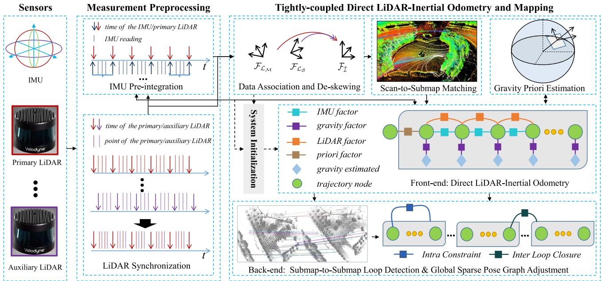  
Fig. 1. Framework overview of D-LIOM. In “Measurement Preprocessing,” the inputs from multiple LiDARs and an IMU are synchronized to the timestamp of the primary LiDAR, and the IMU pre-integration is used to predict the initial value of the relative motion between two scans. In “System Initialization,” all the starting states are roughly estimated and the system is aligned with the world frame. The front-end LiDAR-Inertial odometry receives the result of scan-to-submap matching, IMU pre-integration, and gravity estimation, constructs a factor graph within the time window of the submap, solves it in real time, estimates states, and updates the IMU biases. The back-end integrates the result of submap-to-submap loop detection, constructs a global pose graph, jointly adjusts the poses of submaps and nodes, and eliminates accumulated errors.

$$
\begin{array} { r l } & { \Delta \tilde { \pmb { R } } _ { b _ { j } } ^ { b _ { i } } \approx \pmb { R } _ { b _ { i } } ^ { w ^ { T } } \pmb { R } _ { b _ { j } } ^ { w } \mathrm { E x p } ( \delta \phi _ { b _ { j } } ^ { b _ { i } } ) , } \\ & { \Delta \tilde { \pmb { v } } _ { b _ { j } } ^ { b _ { i } } \approx \pmb { R } _ { b _ { i } } ^ { w ^ { T } } ( \pmb { v } _ { b _ { j } } ^ { w } - \pmb { v } _ { b _ { i } } ^ { w } - \pmb { g } ^ { w } \Delta t _ { i j } ) + \delta \pmb { v } _ { b _ { j } } ^ { b _ { i } } , } \\ & { \Delta \tilde { \pmb { p } } _ { b _ { j } } ^ { b _ { i } } \approx \pmb { R } _ { b _ { i } } ^ { w ^ { T } } \left( \pmb { p } _ { b _ { j } } ^ { w } - \pmb { p } _ { b _ { i } } ^ { w } - \pmb { v } _ { b _ { i } } ^ { w } \Delta t _ { i j } - \frac { 1 } { 2 } \pmb { g } ^ { w } \Delta t _ { i j } ^ { 2 } \right) + \delta \pmb { p } _ { b _ { j } } ^ { b _ { i } } , } \end{array}\tag{3}
$$

where, $\delta \phi _ { b _ { i } } ^ { b _ { j } } , \delta \pmb { v } _ { b _ { i } } ^ { b _ { j } }$ and $\delta \pmb { p } _ { b _ { i } } ^ { b _ { j } }$ are the Gaussian noises of the preintegration measurements.

2) LiDAR Data Synchronization and De-Skewing: Since Li-DAR data is collected via point-by-point scanning, it is necessary to synchronize each LiDAR point from two dimensions, temporal and spatial. That is to say, the point clouds of different LiDARs are first aligned according to a unified time reference. Then, the point clouds in the local coordinate system of each LiDAR are transformed to the same reference frame in the spatial dimension. Meanwhile, the de-skewing of each point should also be considered.

Time synchronization: Let’s assume that we have one primary LiDAR and several auxiliary LiDARs, and each LiDAR point has a corresponding timestamp (all modern multi-line Li-DARs have this attribute). As shown in the “LiDAR Synchronization” module in Fig. 1, we take the timestamps of the current scan and the previous scan of the primary LiDAR as reference, extract all the data points whose timestamps fall between the time interval from each auxiliary LiDAR, and reorder them together with the arriving scan’s points from the primary LiDAR according to their timestamps to obtain the fused point cloud.

Spatial synchronization and de-skewing: In the previous step of time synchronization, we have obtained the point cloud arranged in time order. At the same time, by pre-integrating the IMU readings between the time interval of the previous scan and the current scan, we can obtain the relative motion approximation from the last scan to the current scan, and perform de-skewing of the point cloud accordingly. Assume that the relative motion estimated from the IMU pre-integration and the state at the last scan is $\pmb { T } _ { b _ { t } } ^ { b _ { i } }$ . By applying the 3D transformation rule, the conversion from a LiDAR point $\pmb { p } _ { t } ^ { l _ { t } } \in \mathbb { R } ^ { 3 \times 1 }$ with timestamp of t to frame $b _ { i }$ can be written as $\begin{array} { r } { \pmb { P } _ { t } ^ { \hat { b } _ { i } } = \pmb { T } _ { b _ { t } } ^ { b _ { i } } \pmb { T } _ { l } ^ { b } [ \pmb { p } _ { t } ^ { l _ { t } T } , 1 ] ^ { T } } \end{array}$

## D. System Initialization

Two tasks must to be executed when performing initialization. One is to roughly estimate the initial states of the carrier (including the position, the velocity, the rotation and the IMU biases), and the other is to determine the gravity so as to align all the states to the world frame.

Considering that the carrier may be static or in motion when performing the initialization, we will discuss the initialization solutions for both of these two situations in the following two subsections.

1) Static Initialization: At still state, the acceleration measured by IMU should be opposite to the acceleration of the gravity. Assuming that the modulus of the gravity is known and constant to be G, the relative pose of IMU relative to the world frame, $R _ { b _ { 0 } } ^ { w }$ , can be obtained by aligning the acceleration mean vector with the reverse vector of the gravity in a short period. Besides, the average value of angular velocity measurements in this period can be regarded as a reasonable estimate of the gyroscope bias. Naturally, the position, the velocity, and the accelerometer bias are all initialized to 0. As a result, the initialization at static state can be accomplished by,

$$
\begin{array} { r l r } & { \hat { \pmb { R } } _ { b _ { 0 } } ^ { w } = \mathrm { R o t } ( \hat { \pmb { g } } ^ { b _ { 0 } } , - \pmb { g } ^ { w } ) , } & \\ & { \hat { \pmb { v } } _ { b _ { 0 } } ^ { w } = \mathbf { 0 } , \hat { p } _ { b _ { 0 } } ^ { w } = \mathbf { 0 } , \mathbf { \Phi } ^ { a } \hat { b } _ { b _ { 0 } } = \mathbf { 0 } , } & \\ & { \omega _ { \hat { b } _ { b _ { 0 } } } = \mathrm { A v g } \left( \sum _ { t } \tilde { \omega } \right) , \hat { \pmb { g } } ^ { b _ { 0 } } = \mathrm { A v g } \left( \sum _ { t } \tilde { a } \right) , } & \end{array}\tag{4}
$$

where $\operatorname { A v g } ( \cdot )$ calculates the mean of the measurements in the time window and $\operatorname { R o t } ( { \mathord { \cdot } } )$ returns the rotation matrix between two vectors, which is given by,

$$
\begin{array} { c } { c = \hat { \pmb g } ^ { b _ { 0 } } \times ( - \pmb g ^ { w } ) = \pmb g ^ { w } \times \hat { \pmb g } ^ { b _ { 0 } } , } \\ { \mathrm { R o t } ( \hat { \pmb g } ^ { b _ { 0 } } , - \pmb g ^ { w } ) = \pmb I + \left[ \pmb { c } \right] _ { \times } + \left\lfloor \pmb { c } \right\rfloor _ { \times } ^ { 2 } \displaystyle \frac { 1 + ( \hat { \pmb g } ^ { b _ { 0 } } \cdot \pmb g ^ { w } ) } { \left\| \pmb { c } \right\| ^ { 2 } } . } \end{array}\tag{5}
$$

2) Dynamic Initialization: Inspired by Mur-Artal & Tardøs’s approach [29] and Qin et al.’s work [30] designed for Visual-Inertial SLAM, in this part, we present a method to initialize a LiDAR-Inertial system when the carrier is moving.

Initialization of gyroscope bias: Ideally, if there is no biases in IMU data, the pre-integration of angular velocity should be close to the rotation estimated by LiDAR odometry. Based on this assumption, we establish a constraint equation to estimate the initial gyroscope bias.

To achieve the goal above-mentioned, the first step is to retrieve the relative transformation between two LiDAR scans. For scan-to-scan matching, the “Iterative Closest Point” (ICP) [31] and “Normal Distribution Transform” (NDT) [32] are two commonly utilized conventional methods. ICP iteratively establishes the point-to-point correspondence, while NDT optimizes the transformation parameters between point clouds by building probability voxels. Comparatively speaking, ICP is more sensitive to the initial alignment, while NDT is more robust to noise benefiting from its probability nature. Hence, we resort to NDT to obtain a reasonable estimate of the relative transformation. Meanwhile, the IMU pre-integration between two LiDAR scans can be obtained by Eq. 3. As a result, the optimal step to update the gyroscope bias, $\delta b _ { \omega } ^ { * } .$ , can be determined via,

$$
\delta \pmb { b } _ { \omega } ^ { * } = \arg \operatorname* { m i n } _ { \delta \pmb { b } _ { \omega } } \sum _ { \boldsymbol { k } } \| \hat { \pmb { q } } _ { l _ { 0 } } ^ { b _ { k } } \otimes \hat { \pmb { q } } _ { b _ { k + 1 } } ^ { l _ { 0 } } \otimes \Delta \tilde { \pmb { q } } _ { b _ { k } } ^ { b _ { k + 1 } } \| ^ { 2 } ,\tag{6}
$$

where $\Delta \tilde { { q } } _ { b _ { k } } ^ { b _ { k + 1 } }$ is the rotation quaternion of the pre-integration between the k-th scan and the (k + 1)-th scan, $\hat { \pmb q } _ { l _ { 0 } } ^ { b _ { k } }$ and $\hat { \pmb q } _ { b _ { k + 1 } } ^ { l _ { 0 } }$ are the rotations computed via the NDT registration, and the operator “ ” implies the compound rotation of the two operated quaternions.

When moving with a microscopic rotation, the following equation holds,

$$
\begin{array} { r } { \Delta \pmb q _ { b _ { k } } ^ { b _ { k + 1 } } \approx \Delta \tilde { \pmb q } _ { b _ { k } } ^ { b _ { k + 1 } } \otimes \left[ \frac { 1 } { 2 } \pmb { J } _ { b _ { \omega } } ^ { \Delta \tilde { \pmb q } } \delta \pmb { b } _ { \omega } \right] . } \end{array}\tag{7}
$$

The minimum of the rotation difference ( (6)) is a unit quaternion,

$$
\hat { \pmb q } _ { l _ { 0 } } ^ { b _ { k } } \otimes \hat { \pmb q } _ { b _ { k + 1 } } ^ { l _ { 0 } } \otimes \Delta \tilde { \pmb q } _ { b _ { k } } ^ { b _ { k + 1 } } = \left[ \mathbf { 1 } \right] ,\tag{8}
$$

so with (7), the objective function expressed by (6) can be further transformed into,

$$
\left[ \ L _ { \frac { 1 } { 2 } \pmb { J } _ { b _ { \omega } } ^ { \Delta \tilde { q } } \delta { \pmb b } _ { \omega } } \right] = \Delta \tilde { \pmb { q } } _ { b _ { k } } ^ { b _ { k + 1 } - 1 } \otimes \hat { \pmb { q } } _ { l _ { 0 } } ^ { b _ { k + 1 } } \otimes \hat { \pmb { q } } _ { b _ { k } } ^ { l _ { 0 } } \otimes \left[ \ L _ { \mathbf { 0 } } \right] .\tag{9}
$$

Furthermore, when considering only the imaginary part, we have,

$$
\pmb { J } _ { b _ { \omega } } ^ { \Delta \tilde { q } } \delta \pmb { b } _ { \omega } = 2 ( \Delta \tilde { \pmb { q } } _ { b _ { k } } ^ { b _ { k + 1 } - 1 } \otimes \hat { \pmb { q } } _ { l _ { 0 } } ^ { b _ { k + 1 } } \otimes \hat { \pmb { q } } _ { b _ { k } } ^ { l _ { 0 } } ) _ { 2 : 4 } .\tag{10}
$$

According to Forster et al.’s conclusion [28], the Jacobian $\boldsymbol { J } _ { b _ { \omega } } ^ { \Delta \tilde { q } }$ has the form,

$$
\pmb { J } _ { b _ { \omega } } ^ { \Delta \tilde { q } } = \sum _ { i = 0 } ^ { j - 1 } ( - \Delta \tilde { \pmb q } _ { b _ { i + 1 } } ^ { b _ { j } } \mathbf { J } _ { r } ( ( \tilde { \pmb { \omega } } _ { i } - ^ { \omega } \pmb { b } _ { 0 } ) \Delta t ) \Delta t ) ,\tag{11}
$$

where the subscript i and j indicate the index of IMU readings between the k-th and the $( k + 1 )$ -th LiDAR scan. And the right Jacobian $\mathrm { J } _ { r } ( \phi )$ can be calculated by,

$$
\mathrm { J } _ { r } ( \phi ) = I - \frac { 1 - \cos ( \| \phi \| ) } { \| \phi \| ^ { 2 } } + \frac { \| \phi \| - \sin ( \| \phi \| ) } { \| \phi \| ^ { 3 } } \lfloor \phi \rfloor _ { \times } ^ { 2 } .\tag{12}
$$

Consequently, using the results of (11) and (12), a rough estimation of the gyroscope bias can be obtained by establishing over-determined equations of (10) from multiple LIDAR scans and IMU readings in the window.

Initialization of pose, velocity and gravity: As analysed above, the transformation of each scan relative to its previous scan can be obtained by NDT matching [32]. If we take the first scan in the window as a reference, all scans in the window can be transformed to the reference frame of the first scan.

Denote the gravity vector in the first scan’s frame by $\mathbf { \nabla } _ { \mathbf { { g } } } l _ { 0 }$ Variables in the window, including the velocity of each node $\boldsymbol { v } _ { k } , \boldsymbol { k } \in [ i , j ]$ and the gravity $\mathbf { \nabla } _ { \mathbf { { g } } } l _ { 0 }$ , need to be estimated. The residual is defined as the error between the pre-integration $( \tilde { p } ,$ v˜) and the relative odometries estimated by NDT matching, and accordingly the following equations should hold,

$$
\begin{array} { r l } & { \left[ \delta p _ { b _ { k + 1 } } ^ { b _ { k } } \right] } \\ & { \left[ \delta v _ { b _ { k + 1 } } ^ { b _ { k } } \right] } \\ & { = \left[ \tilde { p } _ { b _ { k + 1 } } ^ { b _ { k } } - \hat { R } _ { l _ { 0 } } ^ { b _ { k } } ( \hat { p } _ { b _ { k + 1 } } ^ { l _ { 0 } } - \hat { p } _ { b _ { k } } ^ { l _ { 0 } } - \hat { R } _ { b _ { k } } ^ { l _ { 0 } } v _ { b _ { k } } ^ { b _ { k } } \Delta t _ { k } - \frac { 1 } { 2 } g ^ { l _ { 0 } } { \Delta t _ { k } } ^ { 2 } ) \right] } \\ & { \qquad \tilde { v } _ { b _ { k + 1 } } ^ { b _ { k } } - \hat { R } _ { l _ { 0 } } ^ { b _ { k } } ( \hat { R } _ { l _ { 0 } } ^ { b _ { k + 1 } } v _ { b _ { k + 1 } } ^ { b _ { k + 1 } } - \hat { R } _ { l _ { 0 } } ^ { b _ { k } } v _ { b _ { k } } ^ { b _ { k } } - g ^ { l _ { 0 } } { \Delta t _ { k } } ) } \end{array}\tag{13}
$$

In initialization, the relative motion estimated from LiDAR data and IMU pre-integration can be regarded as the same, i.e.,

$[ \delta \pmb { p } _ { b _ { k + 1 } } ^ { b _ { k } } , \delta \pmb { v } _ { b _ { k + 1 } } ^ { b _ { k } } ] ^ { T } = \mathbf { 0 }$ . Thus, (13) can be further transformed into a linear equation,

$$
\begin{array} { r l } & { \left[ - I \Delta t _ { k } \qquad 0 \qquad - \frac 1 2 \hat { R } _ { l _ { 0 } } ^ { b _ { k } } \Delta t _ { k } { } ^ { 2 } \right] \left[ \begin{array} { c } { { \boldsymbol v } _ { b _ { k } } ^ { b _ { k } } } \\ { { \boldsymbol v } _ { b _ { k + 1 } } ^ { b _ { k } } } \\ { { \boldsymbol g } ^ { l _ { 0 } } } \end{array} \right] } \\ & { = \left[ \Delta \tilde { \pmb { p } } _ { b _ { k + 1 } } ^ { b _ { k } } - { \boldsymbol p } _ { c } ^ { 0 } + \hat { R } _ { l _ { 0 } } ^ { b _ { k } } \hat { \pmb { R } } _ { b _ { k + 1 } } ^ { l _ { 0 } } { } \pmb { p } _ { c } ^ { b } - \hat { \pmb { R } } _ { l _ { 0 } } ^ { b _ { k } } ( \hat { \pmb { p } } _ { b _ { k + 1 } } ^ { l _ { 0 } } - \hat { \pmb { p } } _ { b _ { k } } ^ { l _ { 0 } } ) \right] . } \end{array}\tag{14}
$$

Moreover, for a specific location, the modulus $G$ of the gravity vector is generally known, so we also append the constraint, $\lVert \mathbf { \boldsymbol { g } } ^ { l _ { 0 } } \rVert = \bar { G } ,$ to (14).

In this way, the velocity of each node and the gravity with respect to the first node’s frame can be estimated by establishing (14) with the observed data from multiple nodes in the window. Furthermore, the position and rotation of all the nodes can be transformed to the world frame by calculating the pose of each node relative to the first node from the estimated $\mathbf { \nabla } _ { \mathbf { { g } } } l _ { 0 }$ and relative NDT transformations.

## E. Front-End: Direct LiDAR-Inertial Odometry

The goal of the front-end is to simultaneously construct a high-precision local submap and to accurately perform pose estimation in real time, which is a typical SLAM problem. To achieve this goal, in this part, we will first introduce the modeling of the SLAM problem, and then present how to incorporate the observed data into the model.

1) SLAM Via Quadratic Optimization: First, we briefly review how to cast a SLAM problem from its probability model to the corresponding quadratic optimization problem. The notations in this part follow the custom of Thrun et al.’s definition [33].

Assuming that the pose of the carrier at timestamp t is $\pmb { x } _ { t } = ( \pmb { p } _ { t } ^ { w T } , \pmb { v } _ { t } ^ { w T } , \pmb { q } _ { t } ^ { w T } ) ^ { T }$ , the map created is , and accordingly the states to be estimated for a full SLAM problem comprise all the involved poses and the map, namely ${ \mathbf { } } _ { { \mathbf { } } _ { 3 0 : t } } =$ $[ { \pmb x } _ { 0 } ^ { \hat { T } } , { \pmb x } _ { 1 } ^ { T } , \dots , { \pmb x } _ { t } ^ { T } , { \pmb \mathcal M } ^ { T } ] ^ { \hat { T } }$ . For a specific node with timestamp t, we denote its combined state with the map by $\mathbf { } _ { \mathbf { } ^ { } \mathbf { } ^ { } \mathbf { } ^ { } \mathbf { } ^ { } \mathbf { } ^ { } \mathbf { } ^ { } \mathbf { } \mathbf { } ^ { } \mathbf { } \mathbf { } \mathbf { } \mathbf { } \mathbf { } \mathbf { } \mathbf { } \mathbf { } \mathbf { } \mathbf { } \mathbf { } \mathbf { } \mathbf { } \mathbf { } \mathbf { } \mathbf { } \mathbf { } \mathbf { } \mathbf { } \mathbf { } \mathbf { } \mathbf { } \mathbf { } \mathbf { } \mathbf { } \mathbf { } \mathbf { } \mathbf { } \mathbf { } \mathbf { } \mathbf { } \mathbf { } \mathbf { } \mathbf { } \mathbf { } \mathbf { } \mathbf { } \mathbf { } \mathbf { } \mathbf { } \mathbf { } \mathbf { } \mathbf { } \mathbf { } \mathbf { } \mathbf { } \mathbf { } \mathbf { } \mathbf { } \mathbf { } \mathbf { } \mathbf { } \mathbf { } \mathbf { } \mathbf { } \mathbf { } \mathbf { } \mathbf { } \mathbf { } \mathbf { } \mathbf { } \mathbf { } \mathbf { } \mathbf { } \mathbf { } \mathbf { } \mathbf { } \mathbf { } \mathbf { } \mathbf { } \mathbf { } \mathbf { } \mathbf { } \mathbf { } \mathbf { } \mathbf { } \mathbf { } \mathbf { } \mathbf { } \mathbf { } \mathbf { } \mathbf { } \mathbf { } \mathbf { } \mathbf { } \mathbf { } \mathbf { } \mathbf { } \mathbf { } \mathbf { } \mathbf { } \mathbf { } \mathbf { } \mathbf { } \mathbf { } \mathbf { } \mathbf { } \mathbf \mathbf { } \mathbf { } \mathbf { } \mathbf { } \mathbf \mathbf { } \mathbf { } \mathbf { } \mathbf \mathbf { } \mathbf { } \mathbf \mathbf { } \mathbf { } \mathbf \mathbf { } \mathbf { } \mathbf \mathbf { } \mathbf \mathbf { } \mathbf \mathbf { } \mathbf \mathbf { } \mathbf \mathbf { } \mathbf \mathbf { } \mathbf \mathbf { } \mathbf \mathbf \quad \mathbf { } \mathbf \mathbf \quad } \mathbf \mathbf { \mathbf } \mathbf \mathbf \mathbf { \mathbf { } \mathbf \mathbf \mathbf \quad } \mathbf \mathbf \mathbf \mathbf { \mathbf \quad } \mathbf \mathbf \mathbf \mathbf  \mathbf \mathbf \mathbf { } \mathbf \mathbf \mathbf \mathbf \mathbf \mathbf \quad \mathbf \mathbf \quad \mathbf \mathbf \mathbf \quad \mathbf \mathbf \mathbf \mathbf \quad \mathbf \mathbf \mathbf $ $[ { \pmb x } _ { t } ^ { \dot { T } } , \dot { M } ^ { T } ] ^ { T }$ . According to the Bayesian law, the posterior of y can be expressed as,

$$
\begin{array} { l } { P ( \pmb { y } _ { 0 : t } | \pmb { z } _ { 1 : t } , \pmb { u } _ { 1 : t } ) } \\ {  { = \eta P ( \pmb { y } _ { 0 } ) \prod _ { t } [ P ( \pmb { x } _ { t } | \pmb { x } _ { t - 1 } , \pmb { u } _ { t } ) \prod _ { i } P ( ^ { i } z _ { t } | \pmb { y } _ { i } , ^ { i } c _ { t } ) ] , } } \end{array}\tag{15}
$$

where $z _ { 1 : t }$ denotes all the measurements, ${ } ^ { i } z _ { t }$ is the i-th measurement at timestamp $t , { ^ { i } c } _ { t }$ encodes the correspondence between ${ \ v { i } } _ { z _ { t } }$ and the landmarks in $\mathcal { M } , \pmb { u } _ { 1 : t }$ is the control input, η is the normalization coefficient, and $P ( \boldsymbol { y } _ { 0 } )$ implies the distribution of the initial state $\mathbf { \Gamma } ( { \pmb x } _ { 0 } )$ of the carrier and the map priori.

Usually, a SLAM process accompanies with control and observation inputs,

$$
\pmb { x } _ { t } = \mathrm { f } ( \pmb { u } _ { t } , \pmb { x } _ { t - 1 } ) + \mathbf { \ d } ^ { x } \pmb { n } ,\tag{16}
$$

$$
{ \bf \nabla } ^ { i } z _ { t } = \mathrm { h } ( { \bf y } _ { t } , { \bf \varphi } ^ { i } c _ { t } ) + { \bf \varphi } ^ { z } { \bf n } ,\tag{17}
$$

where $\mathrm { f } ( \cdot )$ and $\mathrm { h } ( \cdot )$ are generally nonlinear functions, while $^ x n$ and $z _ { n }$ are Gaussian noises of the state and the observation with covariance matrices $\mathbf { \Lambda } _ { \Lambda _ { t } }$ and $\Sigma _ { t } .$ , respectively.

Our goal is to estimate all the states which make (15) achieve its maximum probability. This MAP (Maximum A Posteriori) problem can be equivalently transformed into a function that maximizes the log-posterior probability, i.e.,

$$
\begin{array} { r l } & { y _ { 0 : t } ^ { * } = \arg \underset { y _ { 0 : t } } { \operatorname* { m a x } } \log P ( y _ { 0 : t } | z _ { 1 : t } , u _ { 1 : t } ) } \\ & { \quad \quad = \arg \underset { y _ { 0 : t } } { \operatorname* { m a x } } \log P ( { \boldsymbol x } _ { 0 } ) + \sum _ { t } [ \log P ( { \boldsymbol x } _ { t } | { \boldsymbol x } _ { t - 1 } , u _ { t } ) } \\ & { \quad \quad \quad + \sum _ { i } \log P ( ^ { i } z _ { t } | y _ { t } , ^ { i } c _ { t } ) ] . } \end{array}\tag{18}
$$

Further using (16) and (17), (18) is equivalent to,

$$
\begin{array} { r l } { \pmb { y } _ { 0 : t } ^ { * } = } & { \arg \underset { \pmb { y } _ { 0 : t } } { \operatorname* { m i n } } \pmb { x } _ { 0 } ^ { T } \Lambda _ { 0 } \pmb { x } _ { 0 } } \\ & { + \displaystyle \sum _ { t } ( \pmb { x } _ { t } - \mathrm { f } ( \pmb { u } _ { t } , \pmb { x } _ { t - 1 } ) ) ^ { T } \mathbf { A } _ { t } ^ { - 1 } ( \pmb { x } _ { t } - \mathrm { f } ( \pmb { u } _ { t } , \pmb { x } _ { t - 1 } ) ) } \\ & { + \displaystyle \sum _ { t } \sum _ { i } ( ^ { i } \pmb { z } _ { t } - \mathrm { h } ( \pmb { y } _ { t } , ^ { i } c _ { t } ) ) ^ { T } \Sigma _ { t } ^ { - 1 } ( ^ { i } \pmb { z } _ { t } - \mathrm { h } ( \pmb { y } _ { t } , ^ { i } c _ { t } ) ) , } \end{array}\tag{19}
$$

In practical applications, it is impossible to accurately calculate $\mathrm { f } ( \cdot )$ and $\mathrm { h } ( \cdot )$ in (19). A feasible alternative is to take their Taylor expansions at the current estimated values. That is,

$$
\mathrm { f } ( { \pmb u } _ { t } , { \pmb x } _ { t - 1 } ) \approx \mathrm { f } ( { \pmb u } _ { t } , { \pmb \mu } _ { t - 1 } ) + G _ { t } ( { \pmb x } _ { t - 1 } - { \pmb \mu } _ { t - 1 } ) ,\tag{20}
$$

$$
\mathrm { h } ( { \pmb y } _ { t } , \mathbf { \mu } ^ { i } c _ { t } ) \approx \mathrm { h } ( { \pmb \mu } _ { t } , \mathbf { \mu } ^ { i } c _ { t } ) + \mathbf { \mu } ^ { i } \mathbf { H } _ { t } ( { \pmb y } _ { t } - { \pmb \mu } _ { t } ) ,\tag{21}
$$

where $G _ { t }$ and ${ } ^ { i } { \cal H } _ { t }$ are Jacobian matrices of $\mathrm { f } ( \cdot )$ and $\mathrm { h } ( \cdot )$ , while $\pmb { \mu } _ { t }$ is the current estimate of the state vector $\mathbf { \mathscr { y } } _ { t }$ . Thus, substituting (20) and (21) into (19) yields,

$$
\begin{array} { r l } { y _ { 0 : t } ^ { * } = } & { \displaystyle \mathrm { a r g } \operatorname* { m i n } _ { y _ { 0 : t } } x _ { 0 } ^ { T } \Lambda _ { 0 } x _ { 0 } } \\ & { \phantom { \displaystyle \ } + \sum _ { t } x _ { t - 1 : t } ^ { T } ( - G _ { t } ^ { T } , \mathbf { 1 } ) ^ { T } \Lambda _ { t } ^ { - 1 } ( - G _ { t } ^ { T } , \mathbf { 1 } ) x _ { t - 1 : t } } \\ & { \phantom { \displaystyle \ } - 2 x _ { t - 1 : t } ^ { T } ( - G _ { t } ^ { T } , \mathbf { 1 } ) ^ { T } \Lambda _ { t } ^ { - 1 } [ \operatorname { f } ( u _ { t } , \mu _ { t - 1 } ) - G _ { t } \mu _ { t - 1 } ] } \\ & { \phantom { \displaystyle \ } + \sum _ { i } y _ { t } ^ { T } { } ^ { i } H _ { t } ^ { T } \Sigma _ { t } ^ { - 1 } { } ^ { i } H _ { t } y _ { t } } \\ & { \phantom { \displaystyle \ } - 2 y _ { t } ^ { T } { } ^ { i } H _ { t } ^ { T } \Sigma _ { t } ^ { - 1 } [ { ^ { i } z _ { t } } - \mathrm { h } ( \mu _ { t } , { ^ { i } { c _ { t } } } ) + { ^ { i } } H _ { t } \mu _ { t } ] , \quad ( 2 \pi \mathrm { m i n } ( H _ { t } ^ { T } , \mu _ { t } ) + H _ { t } ^ { T } \mu _ { t } ) , } \end{array}\tag{2}
$$

where $\pmb { x } _ { t - 1 : t }$ concatenates the poses at $t - 1$ and t into one vector.

Further, all quadratic terms in (22) can be collected into a matrix A, and its linear terms can be organized into a vector b in the same manner. Thus, the full SLAM problem can be expressed as a standard quadratic optimization problem,

$$
\delta \pmb { y } _ { 0 : t } ^ { * } = \arg \operatorname* { m i n } _ { \pmb { y } _ { 0 : t } } \left( \pmb { y } _ { 0 : t } ^ { T } \pmb { A } \pmb { y } _ { 0 : t } + 2 \pmb { y } _ { 0 : t } ^ { T } \pmb { b } \right) .\tag{23}
$$

Eventually, this quadratic optimization problem can be solved efficiently via numerical optimization approaches, such as the Gaussian-Newton algorithm or the Levenberg-Marquardt algorithm [34], [35].

In our case, IMU pre-integration essentially corresponds to the control input of the SLAM system, which has been introduced in detail in Section III-C1. Next, we focus on the factor construction of two measurement inputs, i.e., the LiDAR odometry and the gravity priori.

## 2) LiDAR Odometry Factor:

Submap representation: In 2D LiDAR SLAM, the 2D space is usually expressed as an occupied grid map [18], [33]. In the 3D case, it can be naturally extended to an occupied voxel map (OVM) [36]. In OVM, each element caches the state (o) of the voxel, and its stored value, $\begin{array} { r } { o d d ( v ) = \frac { P ( o = 1 ) } { P ( o = 0 ) } } \end{array}$ , is the ratio of the probability that the voxel is occupied $( o \doteq 1 )$ to free $( o = 0 )$

When a new observation z is generated, the ratio will be updated as $\begin{array} { r } { o d d ( v | z ) = \frac { P ( o = 1 | z ) } { P ( o = 0 | z ) } } \end{array}$ . Applying the Bayesian rule, we have,

$$
\begin{array} { l } { P ( o = 1 | z ) = \cfrac { P ( z | o = 1 ) P ( o = 1 ) } { P ( z ) } , } \\ { P ( o = 0 | z ) = \cfrac { P ( z | o = 0 ) P ( o = 0 ) } { P ( z ) } , } \end{array}\tag{24}
$$

hence yielding,

$$
o d d ( v | z ) = \frac { P ( o = 1 | z ) } { P ( o = 0 | z ) } = \frac { P ( z | o = 1 ) } { P ( z | o = 0 ) } o d d ( v ) .\tag{25}
$$

Further taking the logarithm of (25), we have,

$$
\log o d d ( v | z ) = \log \frac { P ( z | o = 1 ) } { P ( z | o = 0 ) } + \log o d d ( v ) .\tag{26}
$$

Moreover, the observed value has only states of hitting (1) or missing (0), namely,

$$
\begin{array} { r } { C _ { m i s s i n g } = \log \frac { P ( z = 0 | o = 1 ) } { P ( z = 0 | o = 0 ) } , } \\ { C _ { h i t t i n g } = \log \frac { P ( z = 1 | o = 1 ) } { P ( z = 1 | o = 0 ) } . } \end{array}\tag{27}
$$

Since $C _ { m i s s i n g }$ and $C _ { h i t t i n g }$ are all constant values, as a result, for the probability update of a voxel, it is only necessary to perform addition or subtraction as (26) reveals.

In order to save storage and update the map efficiently, we represent each submap as an octree, maintain a virtual space partition at the beginning, and allocate the actual memory only when real data is observed.

Scan-to-submap matching: Thanks to the real-time correction of the IMU biases, we can infer a reliable initial pose from the IMU readings. Therefore, the registration of a scan to a submap is carried out in a local range. Here, we give a 3D scan-to-submap matching approach.

Given a 3D point $\pmb { p } ^ { w }$ , its corresponding probability in the map M $( p ^ { w } )$ can be directly queried and its gradient $\nabla \mathrm { M } ( \pmb { p } ^ { w } ) =$ $\big [ \frac { \partial \bar { M } } { \partial x } , \frac { \partial \bar { M } } { \partial y } , \frac { \partial M } { \partial z } \big ] \big | _ { \pmb { p } ^ { w } }$ can be approximated by its six adjacent voxels in the map.

Assume that the associated Lie algebra of the current estimated pose is $\hat { \pmb { \xi } } = [ \hat { \pmb { \phi } } ^ { T } , \hat { \pmb { \rho } } ^ { T } ] ^ { T } \in \mathfrak { s e } ( 3 )$ . We regard the probability difference between the transformed point and the known map

as the residual term,

$$
\mathrm { R e s } ( \hat { \pmb \xi } ) = \sum _ { i } [ 1 - \mathrm { M } ( { \pmb T } _ { i } ( \hat { \pmb \xi } ) ) ] ^ { 2 } ,\tag{28}
$$

where $\operatorname { R e s } ( { \mathord { \cdot } } )$ calculates the residual with respect to the operated parameter, $\mathrm { M } ( \cdot )$ returns the probability of the associated voxel, and $\pmb { T } _ { i } ( \hat { \pmb { \xi } } )$ stands for transforming a LiDAR point $p _ { i } ^ { l }$ with the associated parameter $\hat { \pmb { \xi } } .$ , i.e., $\begin{array} { r } { T _ { i } ( \hat { \pmb { \xi } } ) = \mathrm { E x p } ( \hat { \pmb { \xi } } ) \left[ { \pmb { p } } _ { i } ^ { l } \right. \quad 1 ] ^ { { \hat { T } } } } \end{array}$ . Note that the result of $\pmb { T } _ { i } ( \hat { \pmb { \xi } } )$ is a homogeneous coordinate which is a vector in $\mathbb { R } ^ { 4 \times 1 }$ and whose last element is 1. When $\mathrm { M } ( \cdot ) \ \mathrm { o r } \ \bigtriangledown \mathrm { M } ( \cdot )$ acts on it, it will be implicitly converted into a non-homogeneous coordinate.

When there is an approximate initial value, the optimal $\delta \xi$ can be determined near the value to minimize Res(ˆξ). That is,

$$
\delta \pmb { \xi } ^ { * } = \arg \operatorname* { m i n } _ { \delta \pmb { \xi } } \sum _ { i } [ 1 - \mathrm { M } ( \pmb { T } _ { i } ( \pmb { \hat { \xi } } + \delta \pmb { \xi } ) ) ] ^ { 2 } .\tag{29}
$$

Carrying out the first-order Taylor expansion of (29) and applying the chain rule, we have,

$$
\delta \pmb { \xi } ^ { * } = \arg \operatorname* { m i n } _ { \delta \pmb { \xi } } \sum _ { i } \left[ 1 - \mathrm { M } ( \pmb { T } _ { i } ( \hat { \pmb { \xi } } ) ) - \bigtriangledown \check { \mathrm { M } } ( \pmb { T } _ { i } ( \hat { \pmb { \xi } } ) ) \frac { \partial \hat { \pmb { T } _ { i } } ( \pmb { \xi } ) } { \partial \pmb { \xi } } \delta \pmb { \xi } \right] ^ { 2 } ,\tag{30}
$$

where $( \cdot )$ appends an element 0 to the associated $1 \times 3$ vector and $\begin{array} { r } { \frac { \partial \hat { T _ { i } } ( \pmb { \xi } ) } { \partial \pmb { \xi } } = \frac { \partial T _ { i } ( \pmb { \xi } ) } { \partial \pmb { \xi } } \vert _ { \hat { \pmb { \xi } } } } \end{array}$ with a little bit abuse of notation. (30) reaches its minimum when the partial derivative to $\delta \xi$ is 0. Solving $\delta \xi$ at this time produces the corresponding Gaussian-Newton minimization equation,

$$
\delta \pmb { \xi } ^ { * } = \pmb { H } ^ { - 1 } \sum _ { i = 1 } \left[ \nabla \check { \mathrm { M } } ( \pmb { T } _ { i } ( \hat { \pmb { \xi } } ) ) \frac { \partial \hat { \pmb { T } _ { i } } ( \pmb { \xi } ) } { \partial \pmb { \xi } } \right] ^ { T } [ 1 - \mathrm { M } ( \pmb { T } _ { i } ( \hat { \pmb { \xi } } ) ) ] ,\tag{31}
$$

where

$$
\mathbf { \delta } \mathbf { H } = \left[ \bigtriangledown \check { \mathrm { M } } ( \mathbf { \mathit { T } } _ { i } ( \boldsymbol { \hat { \xi } } ) ) \frac { \partial \hat { \mathbf { \mathcal { T } } _ { i } } ( \boldsymbol { \xi } ) } { \partial \boldsymbol { \xi } } \right] ^ { T } \left[ \bigtriangledown \check { \mathrm { M } } ( \mathbf { \mathit { T } } _ { i } ( \boldsymbol { \hat { \xi } } ) ) \frac { \partial \hat { \mathbf { \mathcal { T } } _ { i } } ( \boldsymbol { \xi } ) } { \partial \boldsymbol { \xi } } \right] ,
$$

$$
\frac { \partial \hat { T _ { i } } ( \pmb     \xi ) } { \partial \pmb \xi } = \left[ \pmb { I } ^ { T } \frac { \partial \mathrm { E x p } ( \phi ) \pmb { p } _ { i } ^ { l } } { \partial \phi } \big | _ { \hat { \phi } } \right] .\tag{32}
$$

and the derivation of $\frac { \partial \mathrm { E x p } ( \phi ) \mathbf { \mathit { p } } _ { i } ^ { l } } { \partial \phi }$ is given in Section VI.

As a consequence, the optimized LiDAR odometry can be converted as a unitary factor to the local factor graph. The Jacobian of such a unitary factor with respect to the node’s pose is an identity matrix, and the associated covariance can be calculated by $\mathrm { V a r } ( \hat { \pmb { \xi } } ) = \sigma ^ { 2 } \cdot { \pmb { H } } ^ { - 1 }$ , where H can be calculated via (32) and σ is related to the accuracy of the LiDAR [37].

3) Gravity Priori Factor: After system initialization, we can roughly align the states to the world frame. However, the estimated gravity may suffer from a drift over time. To this end, we consider using the optimized states to dynamically estimate the gravity and taking it as a constraint to participate in the optimization of the subsequent nodes. In this way, the system is expected to keep low drift of roll and pitch angles under long-term operation. We will corroborate in experiments that this strategy plays a key role in improving the recall rate of the proposed loop detection strategy and accelerating the establishment of loop constraints.

Similar to the strategy in system initialization (Section III-D2), we take several optimized nodes in a local window to estimate the gravity online. But different from that, at this time, the velocity, pose and IMU biases of each node have been reasonably estimated. Hence, we regard them in (14) as known quantities. Thus, only the gravity vector is unknown, and the equation to be solved can be transformed into,

$$
\begin{array} { r l } & { \left[ - \frac { 1 } { 2 } \hat { \pmb { R } } _ { l _ { 0 } } ^ { b _ { k } } \Delta { t _ { k } } ^ { 2 } \right] \left[ \pmb { g } ^ { l _ { 0 } } \right] \approx } \\ & { - \hat { \pmb { R } } _ { l _ { 0 } } ^ { b _ { k } } \Delta t _ { k } \ } \end{array}\tag{33}
$$

where $\mathbf { \nabla } _ { \mathbf { \boldsymbol { g } } } l _ { 0 }$ is the gravity in the first scan’s frame ofthe window, $p _ { l } ^ { b }$ is the extrinsic translation between the LiDAR and IMU which is calibrated offline, and the variables with hat $\hat { \left( \cdot \right) }$ are computed from the optimized states in the window.

Assume that the estimated gravity of the k-th node is $\pmb { g } ^ { b _ { k } }$ . The residual term for node $n _ { k }$ is given by,

$$
\mathrm { R e s } ( R _ { b _ { k } } ^ { w } , \pmb { g } ^ { b _ { k } } ) = \frac { { } ^ { r p } R _ { b _ { k } } ^ { w } \pmb { g } ^ { b _ { k } } } { \| { } ^ { r p } R _ { b _ { k } } ^ { w } \pmb { g } ^ { b _ { k } } \| } - \frac { \pmb { g } ^ { w } } { \| \pmb { g } ^ { w } \| } ,\tag{34}
$$

where ${ } ^ { r p } R _ { b _ { k } } ^ { w }$ represents a rotation matrix that only contains $R _ { b _ { k } } ^ { w \ , } \mathrm { s }$ roll and pitch components, and its corresponding rotation vector is θ. Then, the partial derivative of the residual with respect to $\pmb { \theta }$ can be computed by (see Section A for derivation),

$$
\frac { \partial \mathrm { R e s } ( R _ { b _ { k } } ^ { w } , \pmb { g } ^ { b _ { k } } ) } { \partial \pmb { \theta } } = - \mathrm { E x p } ( \pmb { \theta } ) \lfloor \pmb { g } ^ { b _ { k } } \rfloor _ { \times } \mathrm { J } _ { r } ( \pmb { \theta } ) .\tag{35}
$$

Eventually, the gravity factor is taken as a unitary factor to the node. Its Jacobian with respect to the node’s rotation can be computed by (35), while its covariance can be reasonably estimated by numerical methods as suggested in [38].

## F. Back-End: Submap-to-Submap Loop Detection

To ensure the consistency of long-term mapping, we develop a pipeline to optimize the global pose graph at the back-end. Instead of directly brute-force matching scans to all submaps, in this section, we propose a strategy of fast loop detection and constraint construction by submap-to-submap matching.

Due to the sparsity of the 3D laser point cloud, it is difficult to design robust place features. However, by accumulating multiple scans, it is expected to extract stable place signatures easier. To this end, we consider extracting place features from the established submap instead of a single scan, and further using the feature point detection and matching technology to detect loop closures and construct geometric constraints.

1) Location Feature Extraction and Matching: Benefiting from the front-end tightly-coupled optimization, the relative poses of nodes within the submap are fairly accurate. Besides, each submap can be aligned with the gravity attributing to the gravity priori factor. Hence, we consider projecting submaps to the 2D horizontal plane to find loop closures instead of performing so directly in the 3D space.

Specifically, according to the estimated gravity, all 3D submaps are first projected to the horizontal plane to get their corresponding 2D submap set. Further, with the help of feature point detection technology, the descriptors corresponding to the visual features of each 2D submap can be established. Some detection operators of visual features, such as SIFT [39], SURF [40] and ORB [41] are widely applied. Among them, SIFT is a well-designed operator, however it has a high computational complexity, making the loop detection heavily delay. In recent years, although the ORB operator has been frequently used in visual SLAM, the generated submaps in our case, however, have a lot of noisy spots leading to too much false-alarms by ORB. Eventually, experiments have revealed that only SURF is capable of providing an acceptable balance of precision and speed.

After key point detection, the feature descriptor can be computed for each point. Thus, each submap can then be identified by its associated descriptor set. When performing loop detection, we resort to the “fast library for approximate nearest neighbors” (FLANN) [42] to match the descriptor sets of pairwise submaps. Once the number ofwell matched pairs exceeds a specific threshold, it is regarded that there is a loop closure between the two submaps.

2) Fast Loop Constraint Construction: Different from the qualitative loop detection approaches which only focus on place recognition [19]–[21], our projected 2D submap has accurate spatial information. That is, a 3-DoF transformation, $( { } ^ { o } x _ { s _ { i } } ^ { s _ { j } } , { } ^ { o } y _ { s _ { i } } ^ { s _ { j } } , \gamma )$ , can be obtained according to the matched pairs. This 3-DoF transformation can provide a reasonable initial value for more accurate scan-to-submap registration, which will greatly improve the computational efficiency of loop constraint construction. Besides, thanks to the online gravity estimation, the roll and pitch angles also have reasonable approximations already. Therefore, the only variable lacking approximate estimate is ${ } ^ { o } z _ { s _ { i } } ^ { s _ { j } }$ . So, next, we will first introduce the establishment of the 3-DoF transformation, and then discuss how to estimate a reasonable value of ${ } ^ { o } z _ { s _ { i } } ^ { s _ { j } }$

Submap-to-submap transformation estimation: If the gravity estimation of the submap is fairly accurate, the 2D submapto-submap transform will approximately conform to the 3-DoF rigid transformation,

$$
\begin{array} { r } { \left[ x ^ { s _ { j } } \right] = \left[ \cos ( \gamma ) \quad - \sin ( \gamma ) \right] \left[ x ^ { s _ { i } } \right] + \left[ ^ { o } x _ { s _ { i } } ^ { s _ { j } } \right] . } \\ { \left\lfloor y ^ { s _ { j } } \right\rfloor = \left[ \sin ( \gamma ) \quad \cos ( \gamma ) \right] \left[ y ^ { s _ { i } } \right] + \left[ ^ { o } y _ { s _ { i } } ^ { s _ { j } } \right] . } \end{array}\tag{36}
$$

There are three unknowns in (36), $( { } ^ { o } x _ { s _ { i } } ^ { s _ { j } } , { } ^ { o } y _ { s _ { i } } ^ { s _ { j } } , \gamma )$ , to be determined. Theoretically, at least two pairs of successfully matched points are needed. However, due to the complexity of the actual environment, the projected submap often has noises, which leads to outliers in the direct matched pairs. To deal with this problem, we iteratively estimate the 3-DoF transformation with the help of RANSAC [43], a commonly used robust random sampling consistency estimation algorithm.

In Fig. 2, an example is given to illustrate the concept of 2D submap-to-submap transformation. As shown, the feature pairs between submap (a) and submap (b) are represented by line segments in different colors, and the endpoints of those line segments are the corresponding SURF [40] feature points, while submap (c) is the result of transforming submap (a) with the 3-DoF transformation estimated by the matched pairs.

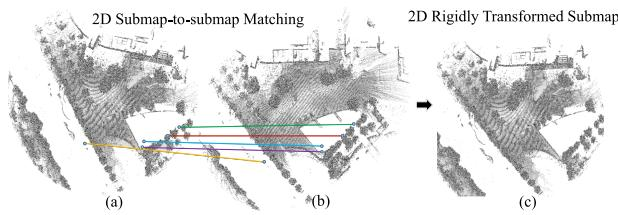  
Fig. 2. Projected submap-to-submap matching. 2D projected submaps with a loop closure are shown in sub-figures (a) and (b). The ends of each colored line segment are corresponding SURF points, and each colored line segment represents a pair of matched points. The 3-DoF transformation between these 2D submaps can be estimated using the matched feature pairs. By registering (a) to (b), we can get the transformed version of (a) as shown in (c).

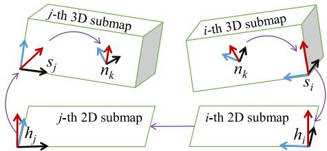  
Fig. 3. Steps of determining the 5-DoF transformation from a node $n _ { k }$ in submap s to submap $s _ { j }$ . With the estimated 2D transformation between the 2D submap i (whose frame is $h _ { i } )$ to 2D submap j (whose frame is $h _ { j } )$ , we can first transform $n _ { k }$ to $h _ { i }$ and then map it to $h _ { j } .$ Finally, because the transformation between $h _ { j }$ and $s _ { j }$ is known, the 5-DoF transformation of $n _ { k }$ in $s _ { j }$ can be obtained (only the vertical shift is left undetermined).

Node-to-submap constraint construction: To establish the loop constraint, it is necessary to transform the submap-tosubmap constraint obtained above into the node-to-submap constraint, so that a refined matching can be performed with the approximate 3D initial value.

Assume that the 3-DoF transformation $\pmb { T } _ { h _ { i } } ^ { h _ { j } }$ from the i-th 2D submap to the j-th 2D submap has been obtained as presented above. Denote the transformation from a submap’s coordinate system to its horizontal projection coordinate system by $\pmb { T } _ { s } ^ { h }$ , which has been determined during the submap construction. Thus, the transformation $\pmb { T } _ { n _ { k } } ^ { s _ { j } }$ , between a sampling node $n _ { k }$ in the submap i and the submap $j$ can be obtained by, $\pmb { T } _ { n _ { k } } ^ { s _ { j } } = \pmb { T } _ { h _ { i } } ^ { s _ { j } } \pmb { T } _ { h _ { i } } ^ { h _ { j } } \pmb { T } _ { s _ { i } } ^ { h _ { i } } \pmb { T } _ { n _ { k } } ^ { s _ { i } }$ . As an instance, Fig. 3 illustrates the steps of this transformation.

In this way, the approximate constraint from the node $n _ { k }$ to the submap $s _ { j }$ can be established based on the constraint between the projected 2D submaps. At this time, only ${ } ^ { o } z _ { s _ { i } } ^ { s _ { j } }$ is left without any information of initial value. The search for ${ } ^ { o } z _ { s _ { i } } ^ { s _ { j } }$ needs to be carried out in a large range. Similar to Hess et al. $\mathrm { ^ \circ s }$ approach [11], we resort to the branch-and-bound algorithm to achieve fast searching of ${ } ^ { o } z _ { s _ { i } } ^ { s _ { j } }$ . In contrast, their case has 4-DoF $( { } ^ { o } x _ { s _ { i } } ^ { s _ { j } } , { } ^ { o } y _ { s _ { i } } ^ { s _ { j } } , { } ^ { o } z _ { s _ { i } } ^ { s _ { j } } , \gamma )$ to be determined. Thanks to the initial value of the estimated 5-DoF transformation via submap matching, our computation can be greatly speeded up. Consequently, a 6-DoF initial transformation $\hat { \pmb { T } } _ { n _ { k } } ^ { s _ { j } }$ can be obtained.

Finally, making use of the approach described in Section III-E2, the scan at the node $n _ { k }$ can be precisely registered to the submap $s _ { j }$ after determining the 6-DoF $\hat { \pmb { T } } _ { n _ { k } } ^ { s _ { j } }$ . Further, the poses of all nodes and submaps can be easily adjusted thanks to the joint optimization of the global sparse pose graph. As a result, the system’s accumulated errors can be eliminated in time, thus allowing it to run more stably for a long time.

## IV. EXPERIMENT

In this part, we are going to answer three questions via extensive experiments, namely,

\- How is the mapping and localization performance of D-LIOM?

\- Can D-LIOM’s front-end run in real time? And can its back-end eliminate accumulated errors with a low delay?

\- Why the introduced loop detection strategy and gravity priori factor are important for D-LIOM?

To this end, on several datasets collected from various platforms in diverse-scale scenes, we first explore the performance of D-LIOM in localization and mapping from both qualitative and quantitative perspectives, then quantitatively analyze the time efficiency of the framework, and finally perform ablation studies on the specially designed modules.

## A. Experimental Protocols

1) Implementation: All modules in D-LIOM were implemented in C++. At the front-end, D-LIOM resorted to the factor graph optimization toolbox GTSAM to build and optimize the local factor graph. At the back-end, D-LIOM extracted and matched the feature points of 2D submaps using OpenCV, and optimized the global pose graph with Ceres-Solver. We made use of the communication mechanism of the popular robot operation system (ROS) to transmit messages among processes. Experiments were conducted on a workstation with two 2.4 GHz Intel Xeon E5-2620V3 CPUs and 32 GB RAM.

2) Datasets: The experimental datasets were collected from diverse scenes, namely, small-scale indoor buildings, mediumscale campus areas, and large-scale complex urban environments. Additionally, the test cases involved three typically encountered application platforms, i.e., handheld devices, unmanned aerial drones, and ground running vehicles. We believe that these datasets are quite challenging and qualified to examine the proposed framework’s robustness, versatility, and flexibility. The following parts will go over them one by one.

Self-collected dataset: As shown in Fig. 4(a), our selfdeveloped device for data acquisition is composed of a 16- line ROBOSENSE LiDAR with a frame rate of 10 Hz and a consumer-grade IMU which can report linear acceleration and angular readings at 400 Hz. We resorted to the method suggested in [44] to calibrate the extrinsics between the LiDAR and the IMU. The intrinsics of the IMU, its noise statistics, was provided by Woodman’s approach [45].

With the handheld gadget, we collected several data sequences in the structured spaces along with unstructured areas in Tongji campus and thereafter the established dataset was referred to as “TONGJI dataset”. All the specific characteristics of the data sequences are listed in Table I. Among them, sequences TJ-1, TJ-2, TJ-3, and TJ-4 were gathered during cycling, while TJ-5, a relatively smaller one, was collected during walking. With maximum angular velocities of 223◦/s and 232◦/s, the acquisitions of TJ-6 and TJ-7 were accompanied by a series of intensive rotational maneuvers. The collected TONGJI dataset now can be publicly accessed online.2

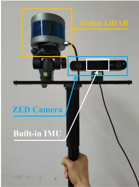

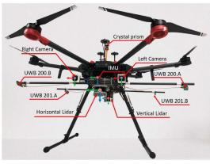

(a) Our handheld device  
(b) UAV-mounted  
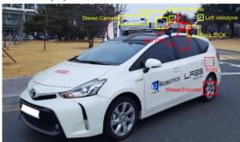  
(c) Vehicle-mounted  
Fig. 4. (a) Our self-developed handheld device is composed of a 16-line RO-BOSENSE LiDAR with a frame rate of 10 Hz and a built-in consumer-grade IMU with a frame rate of 400 Hz. (b) The UAV-mounted platform of the VI-RAL dataset [22]. (c) The vehicle-mounted platform of the Complex Urban Dataset [23].

TABLE I  
DETAILS OF THE TONGJI DATASET. “TRAJ. LEN.,” “LIN. VEL.,” AND “ANG. VEL.” ARE ABBREVIATIONS OF TRAJECTORY LENGTH, LINEAR VELOCITY, AND ANGULAR VELOCITY, RESPECTIVELY
<table><tr><td>Name</td><td>Traj. Len. Lin. Vel. (m)</td><td>(m/s)</td><td>Ang. Vel.  $( ^ { \circ } / s )$ </td><td> $\overline { { \mathrm { A r e a } } }$   $( 1 0 ^ { 4 } m ^ { 2 } )$ </td><td>Scans</td></tr><tr><td>TJ-1</td><td>3014.68</td><td>5.33</td><td>167.66</td><td>16.77</td><td>5090</td></tr><tr><td>TJ-2</td><td>3004.97</td><td>5.54</td><td>184.48</td><td>13.01</td><td>5562</td></tr><tr><td>TJ-3</td><td>3170.73</td><td>4.99</td><td>99.38</td><td>12.28</td><td>6516</td></tr><tr><td>TJ-4</td><td>3500.25</td><td>5.18</td><td>120.88</td><td>19.89</td><td>6392</td></tr><tr><td>TJ-5</td><td>1300.98</td><td>3.39</td><td>145.02</td><td>3.34</td><td>4452</td></tr><tr><td>TJ-6</td><td>134.83</td><td>2.85</td><td>223.45</td><td> $7 . 9 9 \times 1 0 ^ { - 4 }$ </td><td>440</td></tr><tr><td>TJ-7</td><td>117.36</td><td>2.99</td><td>232.45</td><td> $7 . 5 7 \times 1 0 ^ { - 4 }$ </td><td>383</td></tr></table>

Public datasets: Apart from the self-collected dataset, we also carried out experiments on two public datasets with reference values for experimental verification, which are the Complex Urban Dataset [23] and VIRAL [22].

The Complex Urban Dataset [23] was collected by a vehiclemounted platform (Fig. 4(c)), the main sensors of which were composed of two 16-line Velodyne LiDARs, an AHRS IMU, a GPS and several cameras. We examined our framework on the representative sequences of “Urban-09” and “Urban-10” since they contain high-rise buildings, multi-lane roads, abundant dynamic targets as well as sporadic GPS data.

The acquisition platform of VIRAL [22] was a DJI M600 UAV (Fig. 4(b)), which was equipped with two Ouster OS1- 16-gen-1 LiDARs and a VectorNav-VN100 IMU. Although the spatial physical range covered by VIRAL is relatively small, VI-RAL [22] is still a reasonable choice to some extent for verifying the performance of a multi-LiDAR system due to its complimentary perspectives of dual LiDARs.

TABLE II  
TRAITS OF D-LIOM AND ITS COMPETITORS
<table><tr><td></td><td>IMU Biases Estimation</td><td>Dynamic Initialization</td><td>Multi-LiDAR Input</td><td>Loop Detection</td></tr><tr><td>LOAM [6]</td><td>X</td><td>X</td><td>X</td><td>X</td></tr><tr><td>LIOM [9]</td><td>√</td><td>√</td><td>X</td><td>X</td></tr><tr><td>Carto3D [11]</td><td>X</td><td>X</td><td>√</td><td>√</td></tr><tr><td>LIO-SAM [10]</td><td>√</td><td>X</td><td>X</td><td>√</td></tr><tr><td>D-LIOM (Ours)</td><td>√</td><td>√</td><td>√</td><td>√</td></tr></table>

## B. Qualitative Analysis

1) Traits Comparison With Counterparts: At first, we qualitatively compare the characteristics of D-LIOM and the existing state-of-the-art frameworks (Carto3D [11], LOAM [6], LIOM [9] and LIO-SAM [10]) from four aspects:

\- whether to estimate the IMU biases?

\- whether to enable the dynamic initialization with a 6-axis IMU?

\- whether to support multi-LiDAR input?

\- whether to have automatic loop detection?

As Table II shows, among the evaluated frameworks, only our proposed D-LIOM has all four shining merits. On one hand, supporting automatic initialization of a 6-axis IMU and enabling multi-LiDAR input allow D-LIOM to have a strong adaptability to different sensor configurations. On the other hand, the online estimation of IMU biases and autonomous loop detection can also boost the localization and mapping performance of D-LIOM.

2) Reconstruction With Fast Rotation: By fusing IMU information, our D-LIOM can de-skew the incoming scan in real time. Meanwhile, the recursive value of initial pose makes the scan registration more accurate, improving mapping performance with fast motion. To check this point, we gathered several sequences with a series of aggressive rotation maneuvers (the maximum angular velocity encountered in these sequences was over $2 2 3 ^ { \circ } / s )$ by the self-developed handheld equipment (Fig. 4(a)), and recovered the corresponding 3D structures by LIO-SAM [10] and the proposed D-LIOM. As shown in the top row of Fig. 5, the fast motion trajectories at the two locations were drawn in blue curves. The 3D structures shown in the middle row were restored by the state-of-the-art scheme LIO-SAM, while the ones presented in the last row were established by our D-LIOM. As demonstrated, when in rapid rotation, D-LIOM has improved the clarity of the outlines, as well as the fineness of structural details such as windows and pillars. As for LIO-SAM, although it can roughly restore the spatial structure, its result looks fuzzier, implying that LIO-SAM’s mapping accuracy is actually poorer.

Additionally, we also attempted to evaluate Carto3D [11], LOAM [6], and LIOM [9] on these complicated datasets, but unfortunately, none of them can output reasonable results, so they are not depicted here.

3) Mapping in Structured and Unstructured Areas: Direct registration allows D-LIOM to have a strong adaptability to various environments. Meanwhile, the timely and accurate loop detection also enables D-LIOM to establish a consistent map. To verify these two claims, the mapping performance of D-LIOM in structured and unstructured areas is to be investigated in this part.

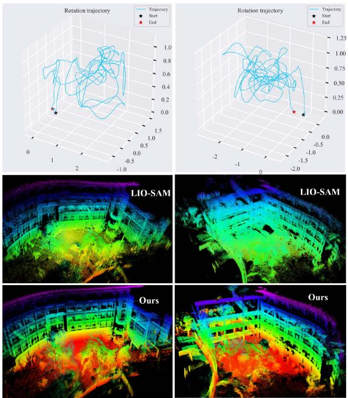  
Fig. 5. Reconstruction with fast rotation. The acquisition trajectories of TJ-6 and TJ-7 are depicted in the top row. The reconstruction results ofLIO-SAM [10] on the experimented data sequences are shown in the middle row, while our results are shown in the last row. By comparison, it can be found that when the carrier moves with rapid rotation, the restored structure by D-LIOM exhibits much sharper outlines and finer details.

Several challenging sequences, TJ-1 to TJ-4, of the TONGJI dataset were utilized to build maps with D-LIOM. As illustrated in Fig. 6, the maps created by D-LIOM can well restore the real spatial structures. Both structured and unstructured scenes can be accurately reconstructed from macroscopic structures (such as road, bridge, building outline, etc.) or microscopic local details (such as road lamp, ladder, trunk, etc.). Besides, the submap-to-submap loop detection enables D-LIOM to eliminate accumulated errors efficiently and achieve long-term mapping consistency. As shown in the partially-enlarged picture “G” in Fig. 6, it can be found that the building reconstructed after the loop was detected has a sharp outline, demonstrating that the results before and after the loop closure were in good agreement. As we have verified that D-LIOM can achieve pleasing mapping results on the four complex sequences (TJ-1, TJ-2, TJ-3, and TJ-4), those associated trajectories can be taken as approximate references for qualitative comparisons. Therefore, we evaluated the state-of-the-art competitors (Carto3D [11], LOAM [6], LIOM [9], and LIO-SAM [10]) on these sequences, aligned their estimated trajectories with those estimated by D-LIOM, and drew their results in Fig. 7. Note that LIOM [9] only ran successfully on TJ-3 and LOAM [6]’s positioning errors on TJ-2 and TJ-4 were too large, therefore the corresponding trajectories were not drawn in the corresponding subfigures.

From Fig. 7, it can be found that the long-term localization results of Carto3D (a framework based on direct registration) or feature-based LOAM, LIOM and LIO-SAM are usually quite poor. The possible reasons are as follows:

\- Although LOAM and LIOM alleviate the adverse effects of accumulated errors by registering the features of the incoming scan to past multi-frame features, when working in large-scale scenes, they inevitably suffer from drifts.

\- Due to the reduction in detection rate of keypoints and instability of feature extraction, feature-based solutions do not perform well in unstructured scenes. In such a case, the probabilistic direct registration is more robust comparatively.

\- The underlying cause of Carto3D’s unsatisfactory outcomes is the failure to detect loop closures correctly. Although Carto3D’s back-end performs a brute-force matching from scans to submaps, without a suitable initial value of the relative pose, its detection rate of loop closures is still very low.

4) Localization in Large-Scale Complex Urban Scenes: In this subsection, to learn the performance of our framework in pretty large-scale scenes, we examined D-LIOM on two challenging sequences, “Urban-09” and “Urban-10” of the Complex Urban Dataset [23], which were collected by a car equipped with two inclined LiDARs and an IMU. Each of these two sequences took about 1 h to collect and covered nearly 2 square kilometers.

Due to the occlusion of high-rise buildings in cities, GPS measurements in “Urban-09” and “Urban-10” were unstable and had unexpected errors, so we only take them as approximate references here. After trajectory alignment using the approach proposed by Umeyama [46], we drew the positioning results of D-LIOM in Fig. 8. As shown, although there are a few large deviations between located positions and GPS measurements, the trajectories of most positions are basically consistent with GPS, which implies that D-LIOM can still achieve high positioning accuracy comparable to GPS even though only active sensors are configured.

It is worth pointing out that we also attempted to examine Carto3D [11], LOAM [6], LIOM [9] and LIO-SAM [10] on these two challenging sequences, but all of them failed to produce meaningful results. The possible reason is that the tilt angles of the LiDARs installed on this vehicle platform were relatively large, while the carrier mainly moved in the horizontal direction, resulting in the lack of stable feature points, which had a fatal impact on these feature-based systems. By contrast, D-LIOM based on direct probabilistic matching is not limited by this restriction.

## C. Quantitative Analysis

To dive into deep quantitative analysis on D-LIOM, next, we first explore its positioning accuracy on the indoor dataset VI-RAL [22] and the self-collected dataset (Table I), and then evaluate its time efficiency.

1) Absolute Positioning Error: Although the VIRAL [22] dataset collected from an airborne platform has a few limitations, such as small spatial physical range and slow movement speed, it also has several special traits worthy of being taken as a benchmark to analyze a LiDAR-Inertial SLAM system. One is that VIRAL contains two LiDARs with complementary perspectives installed horizontally and vertically, and the other is that it has centimeter-level positioning ground truth. Therefore, we compared our D-LIOM with two state-of-the-art competitors, LIOM [9] and LIO-SAM [10], on VIRAL in terms of absolute positioning errors.

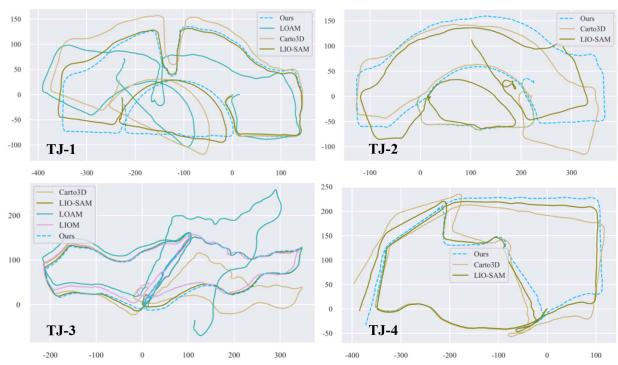

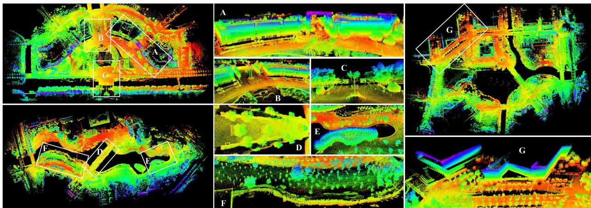  
Fig. 6. Mapping in structured and unstructured areas by D-LIOM. Left: mapping around man-made structures (top) and along a natural river (bottom). Middle: A F are partially enlarged drawings of the left, with clearly restored buildings, bridges, gardens, flagpoles, and bushes. Right: mapping for a hybrid scene with a combination of structured and unstructured areas. In G, it can be found that the building reconstructed after the loop was detected has a sharp outline, demonstrating that the results before and after the loop closure were in good agreement.

Fig. 7. Trajectories estimated by D-LIOM and its counterparts in four mediumsized areas. Evidently, only our D-LIOM has shown good localization results on all test sequences. Other methods either fail or can’t eliminate the accumulated errors in the long-term SLAM.  
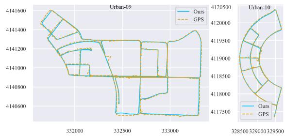  
Fig. 8. Localization results of D-LIOM in complex urban environments. Despite the fact that GPS is not very reliable under the shelter oftowering structures, the trajectories aligned with GPS show that our D-LIOM can nevertheless produce globally consistent localization results when running for a long time in large-scale scenes.

As LIOM and LIO-SAM only enable single LiDAR input, the horizontal LiDAR data of VIRAL was utilized to investigate the performance of LIOM and LIO-SAM, as well as our D-LIOM. Besides, since D-LIOM has a strong support for multi-LiDAR input, so we also examined it using both the horizontal and the vertical LiDAR data of VIRAL. For the convenience of description, D-LIOM explored with only the horizontal LiDAR is denoted by “Ours (H),” while D-LIOM experimented with dual-LiDAR data is denoted by “Ours (HV)”. The results are summarized in Table III.

TABLE III  
ABSOLUTE POSITIONING ERRORS (M). “OURS (H)” AND “OURS (HV)” MEAN D-LIOM WITH THE HORIZONTAL LIDAR INPUT OR BOTH THE HORIZONTAL AND VERTICAL LIDARS. OVER EACH TEST SEQUENCE, THE RESULT WITH THE SMALLEST ERROR IS IN BOLD. “W-AVG” MEANS THE WEIGHTED AVERAGE ERROR OF THE RELEVANT SEQUENCES
<table><tr><td>Data</td><td>Poses</td><td></td><td>LIOM [9] LIO-SAM [10]</td><td>Ours (H)</td><td>Ours (HV)</td></tr><tr><td>eee01</td><td>6616</td><td>1.06</td><td>0.10</td><td>0.23</td><td>0.09</td></tr><tr><td>eee02</td><td>5512</td><td>0.72</td><td>0.08</td><td>0.24</td><td>0.08</td></tr><tr><td>eee03</td><td>2990</td><td>1.03</td><td>0.12</td><td>0.11</td><td>0.10</td></tr><tr><td>nya01</td><td>7675</td><td>2.24</td><td>0.09</td><td>0.14</td><td>0.10</td></tr><tr><td>nya02</td><td>7679</td><td>1.97</td><td>0.12</td><td>0.14</td><td>0.10</td></tr><tr><td>nya03</td><td>7697</td><td>3.00</td><td>0.42</td><td>0.15</td><td>0.10</td></tr><tr><td>sbs01</td><td>5623</td><td>1.67</td><td>0.11</td><td>0.16</td><td>0.12</td></tr><tr><td>sbs02</td><td>6062</td><td>1.81</td><td>0.12</td><td>0.15</td><td>0.11</td></tr><tr><td>sbs03</td><td>5434</td><td>2.00</td><td>0.10</td><td>0.19</td><td>0.15</td></tr><tr><td>w-avg</td><td></td><td>1.82</td><td>0.15</td><td>0.17</td><td>0.10</td></tr></table>

As Table III shows, the positioning accuracy of D-LIOM on VIRAL [22] is one order of magnitude higher than that of feature-based LIOM [9]. While compared with the feature-based LIO-SAM [10], when only a horizontal LiDAR is used, the positioning accuracy of D-LIOM is slightly lower. The possible reason behind this phenomenon is that the accuracy of D-LIOM is related to the resolution of the probability submap. When the mapping range is relatively small and the carrier motion speed is slow (VIRAL is an indoor dataset which is collected from a slow-moving UAV), feature-based approaches which directly optimize the point-to-line and point-to-plane error terms are possible to obtain slightly finer matching results. When the system input is multi-LiDAR data with complementary perspectives, our D-LIOM improves the weighted positioning accuracy by

TABLE IV  
REVISITING ERRORS (M) OF COMPETING LiDAR-INERTIAL SLAM FRAMEWORKS ON SELF-COLLECTED TONGJI DATASET
<table><tr><td>Data</td><td>Carto3D</td><td>LOAM</td><td>LIOM</td><td>LIO-SAM</td><td>D-LIOM</td></tr><tr><td>TJ-1</td><td>14.70</td><td>90.33</td><td>failed</td><td>1.08</td><td>0.81</td></tr><tr><td>TJ-2</td><td>39.97</td><td>305.76</td><td>failed</td><td>27.87</td><td>0.65</td></tr><tr><td>TJ-3</td><td>34.89</td><td>129.80</td><td>22.81</td><td>14.16</td><td>0.59</td></tr><tr><td>TJ-4</td><td>52.76</td><td>380.10</td><td>failed</td><td>40.21</td><td>0.58</td></tr></table>

5 cm over LIO-SAM [10]. Not surprisingly, such a complementary perspective is critical for a LiDAR-Inertial SLAM system while running on unmanned aerial vehicles. When the carrier is close to the ground, a single LiDAR can provide sufficient observations in both horizontal and vertical directions, and thus this restriction will no longer exist.

2) Revisiting Error: Aside from exploring the absolute positioning accuracy on VIRAL [22], we demonstrated the superior performance of D-LIOM in more complicated environments on our TONGJI Dataset by comparing D-LIOM with the existing state-of-the-art schemes in terms of revisiting errors. To automatically generate the ground truth, we registered the point clouds around the revisited location by NDT matching [32] and took the relative pose of the successfully registered pair as the reference. After that, the difference between the relative pose of these two nodes estimated by each LiDAR-Inertial SLAM approach and the ground truth was taken as the revisiting error. Some counterparts, the Carto3D [11], LOAM [6], LIOM [9], and LIO-SAM [10] were evaluated for the purpose of comparison. The obtained results are presented in Table IV.

As Table IV presents, it can be seen that our D-LIOM achieves outstanding results on all the experimented sequences. First, compared with the loosely-coupled solutions [6], [11], our D-LIOM largely outperforms them. Second, compared with the tightly-coupled LIO-SAM [10] and LIOM [9], our D-LIOM is obviously lower in terms of the revisiting error. The underlying reason is that our loop detection can effectively eliminate accumulated errors in long-term mapping. In comparison, the loop detection of LIO-SAM relying on empirical distance threshold is vulnerable to failure at this time. Last, compared with Carto3D [11] based on direct registration, our D-LIOM is mainly improved in two aspects. One is that the IMU biases are corrected by real-time optimization. The other is that the submap-matching-based loop detection not only improves the detection rate of loop closures but also provides a more reasonable initial value of the relative pose, which further facilitates the following loop constraint establishment.

3) Time Cost: Time cost, as with localization and mapping accuracy, is a crucial metric for evaluating a SLAM system’s performance. To quantitatively analyse the processing speed of the proposed D-LIOM, the time costs of the modules “Odometry” and “Mapping” spent by LOAM [6], LIOM [9], LIO-SAM [10] and our D-LIOM in processing one scan of 16-line LiDAR and 64-line LiDAR were measured, respectively. It should be noted that our framework actually completes part of the mapping work (submap construction) at its front-end, while in the global pose graph adjustment phase of its back-end, only loop detection and global optimization are performed at intervals. Therefore, in the statistics of “Mapping” of D-LIOM, we summed all the back-end processing time and averaged it to each frame.

TABLE V  
COMPARISON OF TIME COSTS (MS)
<table><tr><td></td><td></td><td></td><td></td><td>LOAM LIOM LIO-SAM D-LIOM</td><td></td></tr><tr><td rowspan="2">16 lines</td><td>Odometry</td><td>55.6</td><td>684.7</td><td>25.9</td><td>27.5</td></tr><tr><td>Mapping</td><td>166.6</td><td>140.6</td><td>124.1</td><td>33.5</td></tr><tr><td rowspan="2">64 lines</td><td>Odometry</td><td>116.2</td><td>1181.1</td><td>47.2</td><td>54.5</td></tr><tr><td>Mapping</td><td>117.7</td><td>236.9</td><td>158.0</td><td>60.1</td></tr></table>

TABLE VI

REVISITING ERRORS (M) OF D-LIOM, D-LIOM $W o G$ (D-LIOM WITHOUT THE GRAVITY FACTOR), AND $\mathbf { D - L I O M } _ { W o L }$ (D-LIOM WITHOUT THE SUBMAP-TO-SUBMAP LOOP DETECTION)
<table><tr><td></td><td>TJ-1</td><td>TJ-2</td><td>TJ-3</td><td>TJ-4</td></tr><tr><td> $\overline { { { \bf D } { - } \mathrm { L I O M } _ { W o G } } }$ </td><td>7.14</td><td>0.65</td><td>0.59</td><td>11.45</td></tr><tr><td> ${ \mathrm { D - L I O M } } _ { W o L }$ </td><td>12.14</td><td>19.81</td><td>3.68</td><td>61.37</td></tr><tr><td>D-LIOM</td><td>0.81</td><td>0.65</td><td>0.59</td><td>0.58</td></tr></table>

According to Table V, in front-end “Odometry,” our D-LIOM spends much less time compared with LOAM and LIOM, and achieves comparable processing efficiency with LIO-SAM. At the back-end, thanks to our loop detection strategy, D-LIOM achieves close efficiency to its front-end, which is important for long-term mapping in large-scale scenes.

Moreover, when using multiple LiDARs, our D-LIOM can also work efficiently by downsampling conveniently. By contrast, the feature-based schemes, LOAM [6], LIOM [9], and LIO-SAM [10], must extract the features of each LiDAR’s scan separately and then perform downsampling. Since the main efficiency bottlenecks of this kind of schemes in “Odometry” are feature extraction and matching, they will inevitably suffer from efficiency decline.

At last, another point worthy of mention is that our D-LIOM and Carto3D [11] are both based on direct registration, and thus have comparable efficiency at the front-end. However, at the back-end, by contrast, our submap-matching-based loop detection can reduce much unnecessary processing on the one hand. On the other hand, the by-product of the submap matching (the initial value of the relative pose) can further improve the efficiency of the loop registration from a scan to a 3D submap.

## D. Ablation Study

Here, we verify the necessity of the introduced gravity priori factor and the proposed loop detection strategy for D-LIOM.

1) Gravity Priori Factor: To verify the usefulness of the gravity priori factor to D-LIOM, we compared the revisiting errors of D-LIOM with D-LIOM $W o G$ (when the gravity factor is disabled in D-LIOM) on the four sequences TJ-1 TJ-4, while keeping the rest settings fixed.

As Table VI presents, when the gravity factor is disabled, the localization performances of ${ \bf D - L I O M } _ { W o G }$ on TJ-1 and TJ-4 are obviously deteriorated. It can be inferred that the introduction of the gravity priori factor allows our D-LIOM to have a low drift in the direction of the gravity, thus ensuring the geometric accuracy of 2D submap projection, which ultimately guarantees the correct detection of loop closures and the improvement of the overall performance.

TABLE VII  
PRECISION AND RECALL OF OUR LOOP DETECTION
<table><tr><td colspan="2">Sample number</td><td colspan="2">Metric</td></tr><tr><td></td><td>true-positive false-positive false-negative</td><td></td><td>Precision Recall</td></tr><tr><td>231</td><td>23</td><td>11</td><td>90.94% 95.45%</td></tr></table>

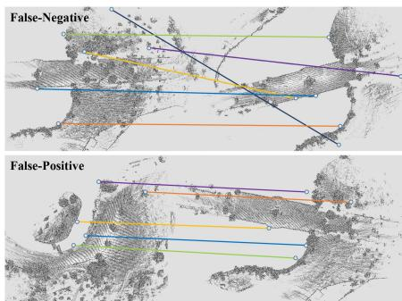  
Fig. 9. Typical failure cases of the submap-to-submap loop detection.

2) Loop Detection Module: We demonstrate how our submap-to-submap loop detection (termed S2SLD) in our framework affects the results by comparing D-LIOM with D-LIOM $W o L$ which disables S2SLD at D-LIOM’s back-end. The revisiting errors of ${ \bf D - L I O M } _ { W o L }$ and D-LIOM on TJ-1 TJ-4 are listed in the second row and the third row of Table VI, respectively. It can be seen that D-LIOM’s performance is improved a lot with S2SLD, verifying S2SLD’s effectiveness.

In addition, to have a deeper understanding of S2SLD, we analyse two commonly used metrics to evaluate its performance, Precision and Recall. Suppose that the correctly detected loop closures are denoted by true-positive (TP), the incorrectly identified loop closures are denoted by false-positive (FP), and the missed loop closures are denoted by false-negative (FN). Thus, the Precision and Recall are defined as follows,

$$
P r e c i s i o n = \frac { T P } { T P + F P } ,\tag{37}
$$

$$
R e c a l l = \frac { T P } { T P + F N } .\tag{38}
$$

On TJ-1 TJ-4, we match all submaps to detect loop closures according to the approach presented in Section III-F. The numbers of relevant samples and the two metrics are listed in Table VII. As shown, the proposed S2SLD achieves a very high Precision and Recall of 90.94% and 95.45% respectively, which ensures the long-term mapping consistency of D-LIOM.

## E. Failure Case Study

Although the loop detection of D-LIOM (S2SLD) has achieved quite high Recall and Precision, there is still a certain possibility of false detection or missed detection. Fig. 9 shows typical examples of false-negative and false-positive misjudged loop closures. It can be seen that the misjudgments mainly come from the mismatchings of feature points. In the false-negative example, the mismatching results in too large deviation of the estimated similarity transformation. In the false-positive one, the structures of high similarity between submaps lead to the misjudgment of S2SLD. Indeed, such cases are ineluctable only using low-level features. By extracting high-level information (such as semantic objects), S2SLD’s performance is expected to be improved. Nevertheless, it should also be noted that the falsepositive actually has relatively less adverse impact on D-LIOM than the false-negative. When a wrong loop closure is detected, it will be further filtered out during the precise scan-to-submap registration when establishing the loop constraint.

## F. Discussions on Potential Improvement

The potential improvement of D-LIOM lies in two aspects. Currently, the front-end ignores the time difference between the IMU and the LiDAR. The accuracy of LiDAR-Inertial odometry may be improved by explicitly estimating their time offset. Additionally, as analysed above, the submap-to-submap loop detection is deteriorated sometimes by mismatchings. By finding more robust features, such a negative impact is expected to be alleviated to some extent.

## V. CONCLUSION

In this article, we combine the benefits of direct registration with tightly-coupled joint optimization, yielding D-LIOM, a versatile, resilient, and accurate LiDAR-Inertial SLAM framework. The gravity factor, IMU pre-integration factor, and LiDAR odometry factor from direct registration are optimized together at the framework’s front-end to estimate the carrier’s states and correct the IMU biases in real time. In D-LIOM’s back-end, by projecting the gravity-aligned submaps to the 2D horizontal plane, loop closures are detected and loop constraints are built efficiently via submap-to-submap matching, allowing the system drift to be promptly eliminated. Besides, to improve the adaptability of the framework to diverse sensor configurations, we also propose an initialization approach that supports a LiDAR-Inertial SLAM system composed of multiple LiDARs and a common 6-axis IMU. Compared with the existing state-of-the-art competitors, D-LIOM achieves outstanding results, with more precise mapping structures as well as higher localization accuracy when the carrier moves with fast motion and works in large-scale environments.

## APPENDIX

Assuming that a vector $\pmb { a } \in \mathbb { R } ^ { 3 \times 1 }$ is left multiplied by a rotation matrix $R \in \mathbb { S O } ( 3 )$ (its corresponding rotation vector is $\alpha \in \mathfrak { s o } ( 3 ) )$ ), the Jacobian of Ra with respect to α can be obtained as follows:

$$
{ \begin{array} { r l } { { \frac { \partial \mathbb { E } \mathbb { N } ( \alpha ) a } { \partial \alpha } } = } & { \operatorname* { l i m } _ { \delta \alpha  0 } { \frac { \mathrm { E x p } ( \alpha + \delta \alpha ) a - \mathrm { E x p } ( \alpha ) a } { \delta \alpha } } } \\ & { = \operatorname* { l i m } _ { \delta \alpha  0 } { \frac { ( \mathrm { E x p } ( \alpha ) \mathrm { E x p } ( \gamma _ { \mathrm { r } } ( \alpha ) \delta \alpha ) - \mathrm { E x p } ( \alpha ) ) a } { \delta \alpha } } } \\ & { = \operatorname* { l i m } _ { \delta \alpha  0 } { \frac { ( \mathrm { E x p } ( \alpha ) ( I + \lfloor \mathrm { J } _ { \mathrm { r } } ( \alpha ) \delta \alpha \rfloor _ { \times } ) - \mathrm { E x p } ( \alpha ) ) a } { \delta \alpha } } } \\ & { = \operatorname* { l i m } _ { \delta \alpha  0 } { \frac { \mathrm { E x p } ( \alpha ) \lfloor \mathrm { J } _ { \mathrm { r } } ( \alpha ) \delta \alpha \rfloor _ { \times } u } { \delta \alpha } } } \\ & { = \operatorname* { l i m } _ { \delta \alpha  0 } { \frac { \mathrm { E x p } ( \alpha ) \lfloor \mathrm { J } _ { \mathrm { r } } ( \alpha ) \delta \alpha \rfloor _ { \times } u } { \delta \alpha } } } \\ & { = \operatorname* { l i m } _ { \delta \alpha  0 } - { \frac { \mathrm { E x p } ( \alpha ) \lfloor a \rfloor _ { \times } \operatorname { J } _ { \mathrm { r } } ( \alpha ) \delta \alpha } { \delta \alpha } } } \\ & { = - \mathrm { E x p } ( \alpha ) \lfloor a \rfloor _ { \times } \operatorname { J } _ { \mathrm { r } } ( \alpha ) , } \end{array} }
$$

where $\mathrm { J } _ { r } ( \alpha )$ is the right Jacobian which is given by (12).

## REFERENCES

[1] C. Cadena et al., “Past, present, and future ofsimultaneous localization and mapping: Toward the robust-perception age,” IEEE Trans. Robot., vol. 32, no. 6, pp. 1309–1332, Dec. 2016.

[2] L. Li, Z. Li, S. Liu, and H. Li, “Motion estimation and coding structure for inter-prediction of LiDAR point cloud geometry,” IEEE Trans. Multimedia, to be published, doi: 10.1109/TMM.2021.3119872 .

[3] M. Krivokuca, E. Miandji, C. Guillemot, and P. Chou, “Compression of plenoptic point cloud attributes using 6-D point clouds and 6-D transforms,” IEEE Trans. Multimedia, to be published, doi: 10.1109/TMM.2021.3129341.

[4] C. Lv, W. Lin, and B. Zhao, “Voxel structure-based mesh reconstruction from a 3D point cloud,” IEEE Trans. Multimedia, vol. 24, pp. 1815–1829, 2021.

[5] D. V. Nam and K. Gon-Woo, “Solid-state LiDAR based-SLAM: A concise review and application,” in Proc. IEEE Int. Conf. Big Data Smart Comput., Jeju Island, South Korea, 2021, pp. 302–305.

[6] J. Zhang and S. Singh, “LOAM: LiDAR odometry and mapping in realtime,” in Proc. Int. Conf. Robot. Sci. Syst., CA, USA, 2014, pp. 1–9.

[7] T. Shan and B. Englot, “LeGO-LOAM: Lightweight and ground-optimized LiDAR odometry and mapping on variable terrain,” in Proc. IEEE/RSJ Int. Conf. Intell. Robots Syst., Madrid, Spain, 2018, pp. 4758–4765.

[8] C. Qin et al., “LINS: A LiDAR-inertial state estimator for robust and efficient navigation,” in Proc. IEEE Int. Conf. Robot. Autom., Paris, France, May 2020, pp. 8899–8906.

[9] M. L. Haoyang Ye and Y. Chen, “Tightly coupled 3D LiDAR inertial odometry and mapping,” in Proc. IEEEInt. Conf. Robot.Autom., Montreal, Canada, May 2019, pp. 3144–3150.

[10] T. Shan et al., “LIO-SAM: Tightly-coupled LiDAR inertial odometry via smoothing and mapping,” in Proc. IEEE/RSJ Int. Conf. Intell. Robots Syst., Las Vegas, USA, 2020, pp. 5135–5142.

[11] W. Hess, D. Kohler, H. Rapp, and D. Andor, “Real-time loop closure in 2D LiDAR SLAM,” in Proc. IEEE Int. Conf. Robot. Autom., Stockholm, Sweden, May 2016, pp. 1271–1278.

[12] J. Sola, “Quaternion kinematics for the error-state Kalman filter,” Nov. 2017, arXiv:1711.02508.

[13] W. Xu and F. Zhang, “FAST-LIO: A fast, robust LiDAR-inertial odometry package by tightly-coupled iterated kalman filter,” IEEE Robot. Autom. Lett., vol. 6, no. 2, pp. 3317–3324, Apr. 2021.

[14] M. Kaess, A. Ranganathan, and F. Dellaert, “iSAM: Incremental smoothing and mapping,” IEEE Trans. Robot., vol. 24, no. 6, pp. 1365–1378, Dec. 2008.

[15] M. Kaess et al., “iSAM2: Incremental smoothing and mapping with fluid relinearization and incremental variable reordering,” in Proc. IEEE Int. Conf. Robot. Autom., Shanghai, China, 2011, pp. 3281–3288.

[16] J. Lin and F. Zhang, “Loam livox: A fast, robust, high-precision Li-DAR odometry and mapping package for LiDARs of small FoV,” in Proc. IEEE Int. Conf. Robot. Autom., Paris, France, May 2020, pp. 3126–3131.

[17] S. Kohlbrecher, O. Von Stryk, J. Meyer, and U. Klingauf, “A flexible and scalable SLAM system with full 3D motion estimation,” in Proc. IEEE Int. Symp. Saf. Secur. Rescue Robot., Kyoto, Japan, 2011, pp. 155–160.

[18] E. B. Olson, “Real-time correlative scan matching,” in Proc. IEEE Int. Conf. Robot. Autom., Kobe, Japan, 2009, pp. 4387–4393.

[19] G. Kim and A. Kim, “Scan context: Egocentric spatial descriptor for place recognition within 3D point cloud map,” in Proc. IEEE/RSJ Int. Conf. Intell. Robots Syst., Madrid, Spain, 2018, pp. 4802–4809.

[20] Y. Wang et al., “LiDAR iris for loop-closure detection,” in Proc. IEEE/RSJ Int. Conf. Intell. Robots Syst., Las Vegas, USA, 2020, pp. 5769–5775.

[21] X. Chen et al., “OverlapNet: A siamese network for computing LiDAR scan similarity with applications to loop closing and localization,” Auton. Robot., vol. 46, no. 1, pp. 61–81, Aug. 2021.

[22] T.-M. Nguyen et al., “NTU VIRAL: A visual-inertial-ranging-lidar dataset, from an aerial vehicle viewpoint,” Int. J. Robot. Res., Dec. 2021, doi: 10.1177/02783649211052312.

[23] J. Jeong, Y. Cho, Y.-S. Shin, H. Roh, and A. Kim, “Complex urban dataset with multi-level sensors from highly diverse urban environments,” Int. J. Robot Res., vol. 38, no. 6, pp. 642–657, Apr. 2019.

[24] X. Zuo, P. Geneva, W. Lee, Y. Liu, and G. Huang, “LIC-Fusion: LiDAR-Inertial-Camera odometry,” in Proc. IEEE/RSJ Int. Conf. Intell. Robots Syst., Macau, China, 2019, pp. 5848–5854.

[25] X. Zuo et al., “LIC-Fusion 2.0: LiDAR-inertial-camera odometry with sliding-window plane-feature tracking,” in Proc. IEEE/RSJ Int. Conf. Intell. Robots Syst., Las Vegas, USA, 2020, pp. 5112–5119.

[26] J. Lin, C. Zheng, W. Xu, and F. Zhang, “R2 LIVE: A robust, real-time, LiDAR-inertial-visual tightly-coupled state estimator and mapping,” IEEE Robot. Autom. Lett., vol. 6, no. 4, pp. 7469–7476, Oct. 2021.

[27] A. I. Mourikis and S. I. Roumeliotis, “A multi-state constraint Kalman filter for vision-aided inertial navigation,” in Proc. IEEE Int. Conf. Robot. Autom., Rome, Italy, Apr. 2007, pp. 3565–3572.

[28] C. Forster, L. Carlone, F. Dellaert, and D. Scaramuzza, “On-manifold preintegration for real-time visual-inertial odometry,” IEEE Trans. Robot., vol. 33, no. 1, pp. 1–21, Feb. 2017.

[29] R. Mur-Artal and J. D. Tardós, “Visual-inertial monocular SLAM with map reuse,” IEEE Robot. Autom. Lett., vol. 2, no. 2, pp. 796–803, Apr. 2017.

[30] T. Qin, P. Li, and S. Shen, “VINS-Mono: A robust and versatile monocular visual-inertial state estimator,” IEEE Trans. Robot., vol. 34, no. 4, pp. 1004–1020, Aug. 2018.

[31] P. Besl and N. D. McKay, “A method for registration of 3-D shapes,” IEEE Trans. Pattern Anal. Mach. Intell., vol. 14, no. 2, pp. 239–256, Feb. 1992.

[32] P. Biber and W. Strasser, “The normal distributions transform: A new approach to laser scan matching,” in Proc. IEEE/RSJ Int. Conf. Intell. Robots Syst., Las Vegas, USA, 2003, pp. 2743–2748.

[33] S. Thrun, W. Burgard, and D. Fox, Probabilistic Robotics (Intelligent Robotics and Autonomous Agents), 2nd ed., Cambridge, MA, USA: MIT Press, 2005.

[34] K. Levenberg, “A method for the solution of certain problems in least square,” Quart. Appl. Math., vol. 2, no. 2, pp. 164–168, 1944.

[35] D. W. Marquardt, “An algorithm for least-squares estimation of nonlinear parameter,” J. Appl. Math., vol. 11, no. 2, pp. 431–441, 1963.

[36] H. Armin, M. W. Kai, B. Maren, S. Cyrill, and B. Wolfram, “OctoMap: An efficient probabilistic 3D mapping framework based on octrees,” Auton. Robot., vol. 34, pp. 189–206, 2013.

[37] B. Antoni, G. Yolanda, and O. Gabriel, “On the use of likelihood fields to perform sonar scan matching localization,” Auton. Robot., vol. 26, pp. 203–222, 2009.

[38] E. A. Wan and R. van der Menve, “The unscented kalman filter for nonlinear estimation,” in Proc. IEEE Adapt. Syst. Signal Proc. Commun. Control Sympo., Lake Louise, Canada, 2000, pp. 153–158.

[39] D. G. Lowe, “Distinctive image features from scale-invariant keypoints,” Int. J. Comput. Vis., vol. 60, no. 2, pp. 91–110, Jan. 2004.

[40] H. Bay, T. Tuytelaars, and L. Van Gool, “SURF: Speeded up robust features,” in Proc. Eur. Conf. Comput. Vis., Graz, Austria, 2006, pp. 404–417.

[41] E. Rublee, V. Rabaud, K. Konolige, and G. Bradski, “ORB: An efficient alternative to SIFT or SURF,” in Proc. IEEE Int. Conf. Comput. Vis., Barcelona, Spain, 2011, pp. 2564–2571.

[42] M. Muja and D. G. Lowe, “Fast approximate nearest neighbors with automatic algorithm configuration,” in Proc. Int. Conf. Comput. Vis. Theory Appl., Lisboa, Potugal, 2009, pp. 331–340.

[43] M. A. Fischler and R. C. Bolles, “Random sample consensus: A paradigm for model fitting with applications to image analysis and automated cartography,” Commun. ACM, vol. 24, no. 6, pp. 381–395, Jun. 1981.

[44] J. Lv, J. Xu, K. Hu, Y. Liu, and X. Zuo, “Targetless calibration of LiDAR-IMU system based on continuous-time batch estimation,” in Proc. IEEE/RSJ Int. Conf. Intell. Robots Syst., Las Vegas, USA, 2021, pp. 9968–9975.

[45] O. J. Woodman, “An introduction to inertial navigation,” Univ. Cambridge, Comput. Lab., Tech. Rep. UCAM-CL-TR-696, Aug. 2007.

[46] S. Umeyama, “Least-squares estimation of transformation parameters between two point patterns,” IEEE Trans. Pattern Anal. Mach. Intell., vol. 13, no. 4, pp. 376–380, Apr. 1991.