# DGM-VINS: Visual–Inertial SLAM for Complex Dynamic Environments With Joint Geometry Feature Extraction and Multiple Object Tracking

Boyi Song , Xianfeng Yuan , Member, IEEE, Zhongmou Ying , Baojiang Yang Yong Song , and Fengyu Zhou

Abstract— Most current state-of-the-art simultaneous localization and mapping (SLAM) algorithms perform well in static environments. However, their applications in real-world scenarios are limited by the assumption that environments are static because their performance becomes unstable in complex dynamic environments. To enhance system stability and localization accuracy in complex dynamic scenes, this article presents a novel visual–inertial SLAM system called DGM-VINS. In DGM-VINS, a joint geometric dynamic feature extraction module (JGDFE) is designed, which can combine the advantages of multiple geometric constraints and effectively reduce the limitations of a single geometric constraint in the application process. In addition, a temporal instance segmentation module (TISM) is presented to establish the temporal correlation of instance objects in consecutive frames, which effectively addresses the instance segmentation issue in complex environments. The inertial measurement unit (IMU) is utilized for motion prediction and consistency detection to improve localization accuracy in challenging environments with weak textures. The proposed methodology is tested in various public datasets and actual scenarios, and the results demonstrate superior accuracy and robustness to existing methods in complex dynamic scenarios.

Index Terms— Complex dynamic environments, joint geometric feature extraction, robustness and localization accuracy, temporal multiobject tracking, visual–inertial simultaneous localization and mapping (SLAM).

## I. INTRODUCTION

S ONE of the fundamental technologies for intelligent mobile robots and autonomous vehicles, Simultaneous   
localization and mapping (SLAM) has recently attracted sub  
stantial attention. SLAM technology enables robots or intelli  
gent cars to position in unfamiliar environments and construct   
maps of their surroundings using multiple sensors, such as   
cameras and light detection and ranging (LiDAR). LiDAR

sensors are widely used in the field of autonomous driving due to their high precision and high resolution. However, laser sensors are generally expensive. In addition, the need for scene environment perception and semantic information in real applications is rapidly increasing. Therefore, visual SLAM (vSLAM) has gained increasing attention. vSLAM uses a camera as the main sensor to capture information in the environment, such as color and texture, and because of its low cost and high practicality, it is widely applied in robotics, autonomous driving, augmented reality, and so on. With the continuous development of SLAM technology, many stateof-the-art vSLAM frameworks, i.e., MonoSLAM [1], LSD-SLAM [2], PTAM [3], and ORB-SLAM1-3 [4], [5], [6], have been proposed. These frameworks employ monocular, stereo, and RGB-D cameras and additional sensors to extract and match feature points from acquired 2-D images. Subsequently, the computation of camera poses and mapping to 3-D space is performed to determine the specific 3-D locations of the pixel points to achieve localization and mapping in unknown environments.

Most advanced SLAM algorithms typically rely on the hypothesis of static landmarks. However, real-world environments contain various dynamic objects that can negatively impact pose estimation. Dynamic objects may result in misaligned feature associations and even match failure, degrading the overall localization accuracy. The accurate recognition of moving feature points is a prerequisite for improving accurate localization in dynamic environments. In vSLAM systems, the detection of moving objects can be mainly classified into two approaches: one relies on the geometric constraint differences between dynamic and static objects in the scene, while the other combines deep learning with geometric constraint methods.

Geometric constraint methods are based on an approximate estimation of camera pose and determine the motion state of feature points by calculating the geometric relationship between adjacent images to detect moving objects [7], [8]. However, it is usually challenging to detect a significant number of reliable and accurate dynamic feature points through geometric information alone.

With the continuous development of neural networks, many researchers have used geometric approaches combined with object detection or instance segmentation (e.g., Mask RCNN or SegNet) to reduce the adverse effects of dynamic objects and obtain robust SLAM systems in complex environments.

Semantic labeling can provide a priori information for feature point selection, and the use of pixel-level semantic segmentation can better identify dynamic features [9], [11]. However, this method only performs semantic recognition for single frames or keyframes without considering the temporal relationship of segmented instance objects, and there is a certain difficulty associated with detection in complex environments, especially under conditions of rapid camera movement and rotation, which leads to object tracking failure. In the case of missing detection or object tracking failure, the positional calculation is inaccurate.

To improve the performance of the SLAM system in complex dynamic environments, we present a robust localization method called DGM-VINS. The proposed approach addresses the limitations of geometric constraints by employing a joint geometric dynamic feature extraction strategy. In addition, DGM-VINS enhances the recognition of dynamic objects in complex scenes via the incorporation of a point-based temporal instance segmentation module (TISM), which adds temporal characteristics to instance objects, effectively solving dynamic object recognition problems in complex conditions. The main contributions of this article are summarized as follows.

1) To overcome the limitations of geometric constraints in complex scenes and camera motion, we propose a joint geometric dynamic feature extraction module (JGDFE), which leverages the consistency of geometric constraints among static feature points between two frames. The proposed JGDFE takes full advantage of vector consistency and epipolar constraints by using density-based spatial clustering of applications with noise (DBSCAN) clustering.

2) A TISM is presented that simplifies the tracking process by using points to track objects. By establishing displacement prediction between the center points of detected objects in different frames, a temporal association is built among the corresponding instance objects, solving instance segmentation problems in complex scenarios, and ensuring accurate recognition of dynamic objects.

3) Extensive contrast experiments are conducted on the public dataset OpenLORIS-Scene and TUM RGB-D as well as in real-world scenarios. The experimental results show that DGM-VINS is able to detect dynamic objects more effectively, with improved robustness and more accurate localization in complex dynamic environments.

The remainder of this article is organized as follows. Section II presents the work associated with SLAM in dynamic environments. Section III describes the proposed method and the overall system architecture. The experimental results and analysis are provided in Section IV. Finally, the conclusions and future works are summarized in Section V.

## II. RELATED WORK

The existing SLAM methods can be broadly divided into feature point-based, direct, and semidirect methods. Typical frameworks include ORB-SLAM1-3 [4], [5], [6], SVO [12], and LSD [2], which are generally implemented under the assumption of static scenes. The presence of dynamic objects, such as pedestrians, pets, and vehicles in the real world, can lead to mismatches or occlusions of tracking features, which can result in algorithm failure. To solve this problem, some dynamic SLAM algorithms use random sample consensus (RANSAC) to treat dynamic feature points as outliers [13], and other algorithms apply optical flow methods [14] and probability methods [15] to identify dynamic regions and then remove them. By calculating the reprojection error between clusters after clustering the depth map, Ji et al. [16] proposed an efficient geometric module that introduces depth information to identify dynamic regions in order to detect unknown moving objects. Long et al. [17] used the inconsistency between the motion of a rigid object plane and a static object surface to remove the dynamic region plane as an outlier. Li and Lee [18] introduced a static weighting method for edge points in keyframes to calculate the likelihood that a feature point belongs to a stable region. Dynam-SLAM [19] loosely couples the visual scene stream with an inertial measurement unit (IMU) for dynamic feature detection and then optimizes the data measured using tight coupling. Geometric information-based methods fully utilize the consistency of geometric constraints to address the issues caused by dynamic objects in complex scenes. However, these methods lack a high-level understanding of scenes and may have limitations under certain conditions, leading to a decrease in localization accuracy. For instance, when there is significant camera motion between consecutive frames or when the motion patterns of moving objects in the scene are complex, the effectiveness of geometric constraint-based methods is greatly compromised.

As deep learning technology advances, an increasing number of deep neural networks (DNNs) are being used in the field of semantic segmentation and object detection. In response, dynamic SLAM methods leverage the integration of geometry and deep learning to address the challenge of moving object recognition in dynamic environments. Some semantic dynamic SLAM algorithms use lightweight segmentation networks or object detection networks to provide a priori information for SLAM systems. For example, DS-SLAM [8] uses SegNet with motion consistency checks to remove outliers, thus reducing the influence of dynamic objects and improving accuracy and robustness in dynamic environments. DynaSLAM II [20] combines the 2-D bounding box commutated by CNN with the proposed BA optimization, enabling joint optimization of the static scene structure and dynamic object pose. Chang et al. [21] utilized a combination of a YOLACT lightweight instance segmentation network and geometric constraints to identify dynamic objects. Xie et al. [22] classified moving objects into active and passive objects and utilized deep learning methods and optical flow motion detection to identify each category. Deep learning-based methods take advantage of the strong learning abilities of DNNs to obtain necessary semantic information. However, this kind of method only processes single frames or keyframes without considering the temporal relationship of segmented results in different frames. In addition, detecting objects in complex environments poses significant challenges.

In addition to the abovementioned method, some researchers use multiobject tracking techniques to track moving objects ptember 16,2026 at 03:44:32 UTC from IEEE Xplore. Restrictions apply.

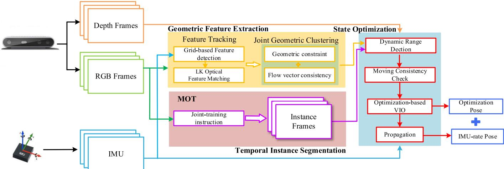  
Fig. 1. DGM-VINS framework consists of three threads, namely, geometric feature extraction, temporal instance segmentation, and back-end state optimization threads, which are performed in parallel and synchronously. The geometric feature extraction thread identifies dynamic feature points using feature point motion consistency and geometric characteristics, the temporal instance segmentation thread identifies dynamic objects using a joint segmentation network with temporal characteristics, and the state optimization thread integrates geometric feature information and object instance segmentation results and further determines dynamic features using image depth information. Pose estimation is performed using optimized stable static features and IMU preintegration results

individually. Multiobject tracking, as a key technology in computer vision, is also widely used in the field of dynamic SLAM. The initial multiobject tracking techniques were mainly based on inference and filtering; for example, Wang et al. [23] proposed SLAM and moving object tracking (SLAMMOT), which separates the estimation problem of both moving and static objects into two distinct estimations, enabling real-time updates in the detection and tracking of moving objects. Utilizing both visual information flow and depth information, Reddy et al. [24] introduced a semantic motion segmentation method to separate the modeling of static and dynamic objects.

In the past few years, MOT algorithms have started to move toward a data-driven deep learning approach; Chu et al. [25] used spatiotemporal maps to address the local occlusion problem in tracking and found the optimal object using an intensive search strategy for single-object tracking. Zhang et al. [26] presented the VDO-SLAM method, which utilizes semantic information to provide a priori knowledge for estimating the motion of rigid objects. DOT [27] first performs instance segmentation of the input binocular stereo image or RGB-D image, then segments each moving object independently via the object tracking module and motion judgment module, and finally updates the masks of static and dynamic regions to provide a priori information for the visual odometry (VO). DyOb-SLAM [28] combines the advantages of DynaSLAM and VDO-SLAM to distinguish the motion properties of objects in a scene. This approach leverages neural networks and dense optical flow to produce coefficient maps for static objects and estimate the velocity of dynamic objects over time. However, using bounding boxes to track object motion is computationally expensive and fails to accurately track objects when they are deformed, blurry, or occluded.

To address these issues, a novel visual–inertial SLAM method, namely, DGM-VINS for complex dynamic environments is proposed, and this method combines a JGDFE and a TISM. On the one hand, the presented JGDFE strategy takes full advantage of multiple geometric constraints, leading to more robust and accurate dynamic feature detection. On the other hand, DGM-VINS enhances the recognition of dynamic objects in complex scenes by incorporating a point-based Authorized licensed use limited to: Jiangnan University. Downloaded on S

TISM, which adds temporal characteristics to instance objects, effectively solving dynamic object recognition problems in complex environments. Extensive experimental results demonstrate that DGM-VINS significantly improves localization accuracy and robustness in complex dynamic environments.

## III. SYSTEM INTRODUCTION

## A. Overall Workflow

The framework presented in this article is named DGM-VINS, which is extended to the well-designed visual–inertial slam systems, i.e., VINS-Mono [29] and VINS-RGBD [30]. As shown in Fig. 1, the proposed DGM-VINS mainly consists of three modules, namely, a geometric feature extraction module, a TISM, and a back-end state optimization module, which run in parallel and synchronously. The color images are fed into the geometric feature extraction module and the TISM. The IMU performs preintegration between the consecutive frames for stability feature identification, motion consistency detection, and pose optimization.

In the geometric feature extraction module, FAST feature points in an image are extracted using grid-based feature detection. Next, feature tracking is performed using KLT optical flow and IMU preintegration. Outliers among the tracked feature points are filtered using DBSCAN clustering, which is based on the consistency of both the optical flow vector motion between consecutive frames and the epipolar constraints. The TISM incorporates the CenterTrack-based [31] and conditional convolutions for instance segmentation network [32] for multiobject instance tracking. The state optimization module integrates the feature information identified in the geometric feature recognition module with the dynamic objects segmented in the instance segmentation through a loose coupling process. In addition, the IMU preintegration and historical pose estimation results are incorporated in a motion consistency checking process to further identify potential dynamic features.

## B. Geometric Feature Extraction Module

1) Feature Matching and Grid-Based Feature Detection: For the input color images, KLT sparse optical flow is used to eptember 16,2026 at 03:44:32 UTC from IEEE Xplore. Restrictions apply.

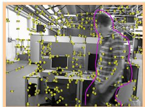

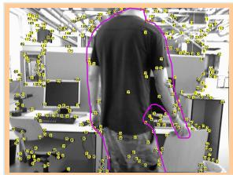

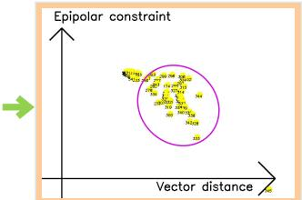

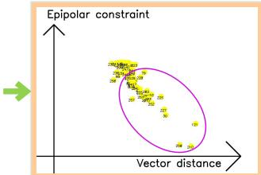

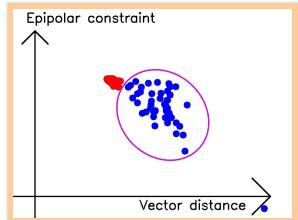

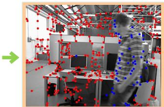

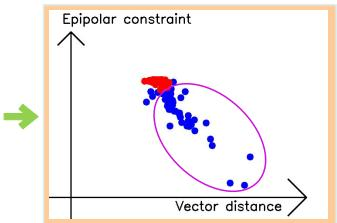

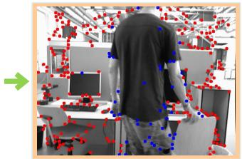

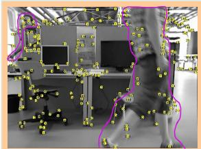  
(a)

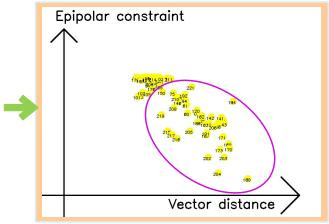  
(b)

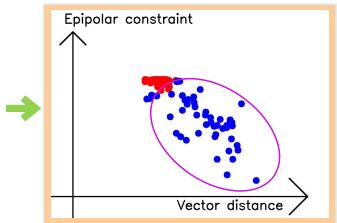  
(c)

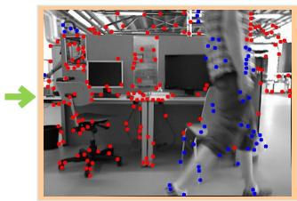  
(d)  
Fig. 2. Joint geometric dynamic feature extraction process. (a) Feature extraction. (b) Projection into geometric space. (c) DBSCAN clustering. (d) Dynamic feature extraction.

track feature points, and feature motion is predicted based on measuring the IMU between two adjacent frames. The tracking efficiency is improved by reducing the number of optical flow pyramid layers and providing a better initial position estimate for the extracted features. The IMU measurements between the current and subsequent frames are used to estimate the changes in the motion of feature points in the subsequent frames. This estimation serves as the initial position for the optical flow, and it is employed to locate the corresponding feature point in the subsequent frame. The stability of a feature point is determined by its consistency in tracking, both through the IMU measurements and the optical flow. To avoid duplication and aggregation in feature detection, masks are set at the center of stable and unstable feature points, respectively. New features are then extracted from the regions without masks to achieve a uniform distribution of features.

The feature extraction method of grid partitioning is used to continuously extract feature points from the grid while ensuring that a minimum quantity of features are extracted. Specifically, the image is divided into grids, and feature extraction is performed for each grid with insufficient feature matching instead of traversing the whole image to ensure stable feature points and improve feature extraction efficiency in long-term feature extraction. To prevent duplication and inefficiency in feature detection, a grid with weak texture or those covered by feature masks are skipped in the next frame, which facilitates the accuracy of feature detection and prevents unproductive detections.

2) Joint Geometric Dynamic Feature Extraction: After the feature detection process described above, stable feature points are tracked, but the motion states of the feature points are not yet clearly identified. In this article, we propose to use DBSCAN clustering to determine whether feature points are static or dynamic by combining geometric consistency and epipolar constraints, as shown in Fig. 2. For the matched feature points in the two frames, $p _ { i } = [ u _ { i } ^ { p } , v _ { i } ^ { p } , 1 ]$ and $q _ { i } =$ $[ u _ { i } ^ { q } , v _ { i } ^ { q } , 1 ]$ , the vector distance between the matching feature points in the image is

$$
d _ { v } = \sqrt { \left( u _ { i } ^ { p } - u _ { i } ^ { q } \right) ^ { 2 } + \left( v _ { i } ^ { p } - v _ { i } ^ { q } \right) ^ { 2 } } .\tag{1}
$$

The static feature point vector distance is consistent between two consecutive frames when only the camera is moving, while the dynamic feature points have different distances from the static points, as shown in Fig. 3(a). Vector consistency judgment is more applicable for camera flat motion (i.e., camera motion in a single direction), and static vector changes and dynamic vector changes have a more obvious distinction. However, as shown in Fig. 3(b), when the camera is rotated, the motion vectors of static feature points have different changes in direction and size due to the different rotation directions and rotation centers of the camera, which makes it impossible to accurately distinguish the motion properties of feature points.

According to the epipolar constraint diagram shown in Fig. 4, the epipolar constraint can be described as follows:

$$
E ( i ) = q _ { i } ^ { \mathrm { T } } l _ { 2 } = q _ { i } ^ { \mathrm { T } } F p _ { i } = 0\tag{2}
$$

where $l _ { 2 }$ is the epipolar line in the current frame that corresponds to $q _ { i }$ . The projection of $P$ on the image $I _ { 2 }$ of the second frame must lie on the epipolar line $l _ { 2 } .$ . However, the interference of dynamic objects makes (2) difficult to hold. For the epipolar line, $l = A x + B y + C = 0$ . The distance between the feature point $q _ { i }$ and the corresponding polar line l is given as

$$
d _ { i } = \frac { \left| A u _ { i } ^ { q } + B v _ { i } ^ { q } + C \right| } { \sqrt { A ^ { 2 } + B ^ { 2 } } } = \frac { \left| q _ { i } ^ { \mathrm { T } } F p _ { i } \right| } { \sqrt { A ^ { 2 } + B ^ { 2 } } } .\tag{3}
$$

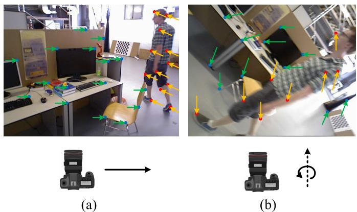  
Fig. 3. Vector variation consistency. (a) Camera’s translational motion and (b) camera’s rotational motion around the optical axis. The blue feature points in the figure indicate stable static points, while the unstable feature points are represented by red solid points. Green arrows indicate the vector changes of static feature points and orange arrows indicate the vector changes of dynamic points when the camera is moving.

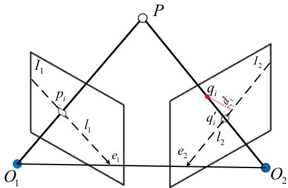  
Fig. 4. Epipolar constraint diagram. $p _ { i }$ is the preceding frame’s ith feature point, qi is the current frame’s matching feature, and $l _ { 1 }$ and $l _ { 2 }$ are the corresponding epipolar lines.

The epipolar constraint distance for static feature points is relatively small, while that for dynamic feature points tends to be significantly larger. However, the epipolar constraint distance between the two may also be small when the dynamic feature point moves along the epipolar line, resulting in an inaccurate recognition of the moving dynamic feature points. As shown in Fig. 2(b), by using the distances of the two geometric constraints of feature points as the x- and y-axes of a coordinate system, i.e., using the vector distance $d _ { v }$ between the corresponding matching feature points as the x-axis and the distance of the epipolar constraint $d _ { i }$ as the y-axis, static feature points, which have consistent geometric constraints in the scene, will cluster. Moreover, dynamic feature points, which have different motions, will be more dispersed. Therefore, we utilize the DBSCAN clustering method to integrate the advantages of the two geometric approaches, as shown in Algorithm 1. By representing the feature points in the density space using the epipolar constraint distance and the vector distance, the feature points in the space are clustered with DBSCAN. The outliers of clustering are the dynamic points to be eliminated.

## C. Temporal Instance Segmentation Module

1) Temporal Feature-Based Object Tracking: For the input image sequence, CenterTrack, which is a point-based joint detection and tracking framework without anchor frames, is used with a dynamic instance-aware network to form temporal instance segmentation. The object center is located using the CenterNet [33] detector in the tracking process, and the association between consecutive frames is established through a priori trajectory heatmap $H _ { t - 1 }$ based on point representation. The trained detector outputs the object center offset from the current frame to the previous frame, and greedy matching is conducted based on the predicted offset and the distance to the detected centroid in the previous frame, thus achieving object association. The CenterNet detector provides position, size, and confidence score information for tracking. During the tracking process, two consecutive frames and a single-channel heatmap that is generated according to the detection results of the previous image are input into the model. The peak position of the heatmap serves as the target point for the corresponding detection. To reduce the false alarm rate, a Gaussian kernel rendering approach is used for fuzzy processing.

Algorithm 1 Dynamic Feature Points Detection   
Input: Previous frame, ${ \overline { { F _ { 1 } } } } ;$ Previous frame’s feature points,   
$P _ { 1 } ;$ Current frame, $F _ { 2 } ;$ Epsilon, $\varepsilon ;$   
Minimum Points, n;   
Output: The set of outliers, $s ;$   
1: Current frame’s feature points $P _ { 2 } =$ CalcOpticalFlowPyr   
LK $( F _ { 1 } , F _ { 2 } , P _ { 1 } )$   
2: Remove outliers in $P _ { 2 }$   
3: F M = FindFundamentalMatrix(P1, P2)   
4: for each matched pairs p1, p2 in $P _ { 1 } , P _ { 2 }$ do   
5: D = CalcDistanceFromTwoPoints(p , p )   
6: I1 = FindEpipolarLine(p1, FM)   
7: $D _ { L } = C a l c D i s t a n c e F r$ omEpipolarLine $( p _ { 2 } , I _ { 1 } )$   
8: $C = C a l c D B S C A N C l u s t e r ( D _ { v } , D _ { L } , \varepsilon , n )$   
9: if C = −1 then   
10: Append $p _ { 2 }$ to S   
11: end if   
12: end for

To establish a temporal connection between detected objects, two additional output channels are added to predict 2-D offset vectors, which describe the x- or y-direction offset of each object’s position in the current frame relative to its position in the previous frame image. The temporal feature tracking process is shown in Fig. 5. The center point position of an object i at time t − 1 is $p _ { i } ^ { t - 1 }$ , the position at time t is $p _ { i } ^ { t } ,$ , and the real value of the center position offset of the ith object is $p _ { i } ^ { t } - p _ { i } ^ { t - 1 }$ . The loss function is constructed between the displacement feature map $\widehat { D }$ output by the network and the true value of the centroid displacement of all objects

$$
L _ { \mathrm { o f f } } = \frac { 1 } { N } \sum \bigg | \widehat { D } _ { p _ { i } ^ { ( t ) } } - \Big ( p _ { i } ^ { ( t - 1 ) } - p _ { i } ^ { ( t ) } \Big ) \bigg | .\tag{4}
$$

$L _ { \mathrm { o f f } }$ is learned using a regression target of the same size and position refinement, and a simple greedy matching algorithm is applied to associate objects across time. The tracking process leverages the temporal correlation between consecutive frames, avoiding the need for the reinitialization of lost remote trajectories and yielding a simple, efficient, and highly accurate detection and tracking methodology.

2) Instance Segmentation Network With Conditional Convolution: Compared with traditional instance segmentation networks, such as Mask RCNN, the dynamic instance-aware eptember 16,2026 at 03:44:32 UTC from IEEE Xplore. Restrictions apply.

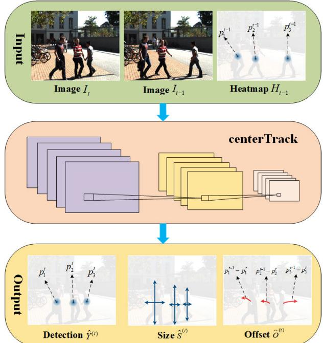  
Fig. 5. Tracking displacement prediction process. Images It and $I _ { t - 1 }$ denote the image at moment t and moment $t \ : - \ : 1 ,$ respectively. Heatmap $H _ { t - 1 }$ represents the object information detected at moment t − 1. The peak position $p _ { i } ^ { t - 1 }$ denotes object $i \ ' _ { \mathbf { S } }$ current position at moment $t - 1$ . Detection $\widehat { Y } ^ { ( t ) }$ denotes the output heatmap of the image at moment t. Size $\widehat { S } ^ { ( t ) }$ denotes the size of the output prediction object. Offset ${ \widehat { O } } ^ { ( t ) }$ indicates the displacement offset of the output. $p _ { i } ^ { t }$ denotes the current position of object i at moment t, and $p _ { i } ^ { t - 1 } - p _ { i } ^ { t }$ denotes the true value of the displacement magnitude of the ith object center point.

network [32] for dynamic object instance segmentation does away with the requirement for feature alignment and region of interest (ROI) cropping in instance segmentation by utilizing a fully convolutional network (FCN). The instance-sensitive mask header predicts the mask for each instance, and the filters in the mask header differ depending on the instance. K distinct mask headers are dynamically generated for an image with K instances, and each mask header includes the features of the object instance within its filters. Therefore, when the mask is fed, the network is triggered only for instance pixels, thereby generating the instance mask prediction. For a given input image, the network outputs the classification confidence $\pmb { p } _ { x , y }$ centerness score, prediction box $\mathbf { \Delta } _ { t _ { x , y } }$ , and generation parameters $\theta _ { x , y }$ through forward propagation. The instance segmentation network first obtains the detection bounding boxes using fully convolutional one-stage object detection (FCOS), eliminates the repeated detections, which exceed the threshold, and then generates a group of filters for the K instances that are maintained. The mask header utilizes the K group of filters, and a specific mask header is applied to the filters in an FCN manner to predict the instance masks.

## IV. EXPERIMENTS AND RESULTS

In this section, the publicly available datasets OpenLORIS-Scene [34] and TUM RGB-D [35] as well as real scenarios were used to evaluate the proposed approach. The public datasets provide ground-truth trajectories as well as sensor data to evaluate the system in complex dynamic environments. All the experiments were conducted on a laptop with Intel Core i7- 10870H CPU, 32-GB RAM, and Nvidia GTX 3070 GPU. The operating system was Ubuntu 18.04 with ROS melodic. For the quantitative evaluation, the accuracy was evaluated by the root-mean-square error (RMSE) of the absolute trajectory error (ATE) and relative positional error (RPE). The correctness rate (CR) [34] was used to calculate the estimated correct rate of the whole process and was used to assess the robustness of the proposed method. A RealSense D435i-based RGB-D camera was used to provide color images, depth information, and camera IMU-related information in the actual experiment.

## A. OpenLORIS-Scene Dataset

The OpenLORIS-Scene dataset provides robot data from many real environments, including cafe, corridor, office, home, and market, in five scenes and 22 sequences. These scene sequences include complex dynamic scenes, such as blurred images, images with dim lighting, featureless images, and images with significant environmental changes, which pose great challenges for robot localization. In the experiments, we thoroughly compared the proposed method with classical static SLAM algorithms (such as VINS-Mono [29], ORB-SLAM2 [5], and DSO [36]), the semantic dynamic SLAM system DS-SLAM [8], and the visual–inertial fusion SLAM system Dynamic\_VINS [37]. Fig. 6 shows our experimental results.

Among the five scenarios in OpenLORIS-Scene, the corridor and home scenarios contain completely featureless white walls and dimly changing scenes, which pose challenges for stability of robot tracking and positioning. There are many seated people in the cafe and office scenes, but their motion is not obvious. In contrast, the market scene contains a greater number of moving pedestrians and objects, and the object motion within the scene is more pronounced. This scene encompasses a diverse range of complex dynamic environments, including occlusion, overlap, and motion blur. In the quantitative experiments, the RMSE of an algorithm is calculated only for the results of successful tracking of the system. The longer the algorithm tracks are, the greater the accumulated error becomes, potentially leading to a higher calculated RMSE; however, this does not imply that the accuracy of the system is insufficient. Through a combined analysis of the RMSE of the RPE and ATE, as well as the CR of the system, it can be observed that the proposed approach exhibits a correct rate that is similar to that of Dynamic\_VINS but with smaller error. Although DS-SLAM can recognize some dynamic objects, it has poor robustness in complex environments due to purely vision-based feature tracking. The integration of IMU enhances the stability of the SLAM system in scenarios with weak textures and low features. The use of a combination of geometric feature extraction and temporal instance segmentation effectively eliminates moving objects and predicts their motion in dynamic scenes such as the market, which improves the robustness and accuracy of the method in complex dynamic scenarios.

## B. TUM Dataset

The TUM dataset, which is a more commonly used dataset for testing SLAM, provides depth images and RGB color images as well as ground-truth trajectories. We used four ptember 16,2026 at 03:44:32 UTC from IEEE Xplore. Restrictions apply.

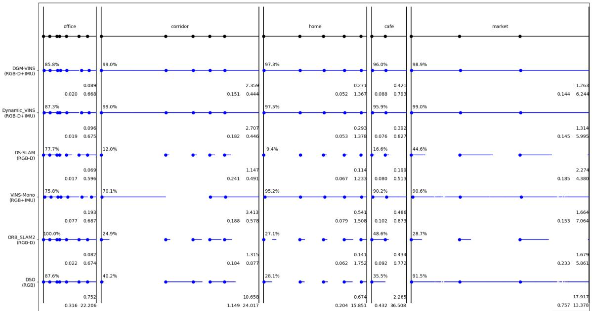  
Fig. 6. Test results of the OpenLORIS-Scene dataset. The lines and blue dots indicate successful tracking of the span and successful initialization. The average correct rate is indicated in the top-left corner, with larger numbers indicating more robust performance. The floating-point number in the first row in the lower right corner indicates the average ATE RMSE, with smaller numbers indicating greater accuracy. The two floating point numbers in the second row are the relative position errors of translation and rotation, respectively; a smaller error denotes greater accuracy. The longer the algorithm is successfully tracked, the more accumulated error there is, and it is somewhat misleading to simply consider ATE; on the other hand, it is misleading to simply consider CR accuracy.

TABLE I  
RESULTS OF ATE OF TUM (M)
<table><tr><td rowspan="2">sequence</td><td colspan="2">ORB-SLAM2</td><td colspan="2">DS-SLAM</td><td colspan="2">RDS-SLAM</td><td colspan="2">DGM-VINS</td><td colspan="2">Improvements against ORB-</td></tr><tr><td>RMSE</td><td>S.D</td><td>RMSE</td><td>S.D</td><td>RMSE</td><td></td><td></td><td>S.D</td><td>SLAM2</td><td>S.D</td></tr><tr><td>fr3_walking_xyz</td><td>0.7521</td><td>0.3759</td><td>0.0247</td><td>0.0161</td><td>0.0571</td><td>S.D 0.0229</td><td>RMSE 0.0361</td><td>0.0181</td><td>RMSE 95.20%</td><td>95.18%</td></tr><tr><td>fr3_walking_static</td><td>0.3900</td><td>0.1602</td><td>0.0081</td><td>0.0036</td><td>0.0206</td><td>0.0120</td><td>0.0133</td><td>0.0049</td><td>96.59%</td><td>96.94%</td></tr><tr><td>fr3_walking_half</td><td>0.4863</td><td>0.2290</td><td>0.0303</td><td>0.0159</td><td>0.0807</td><td>0.0454</td><td>0.0331</td><td>0.0153</td><td>93.19%</td><td>93.32%</td></tr><tr><td>fr3_walking_rpy</td><td>0.8705</td><td>0.4520</td><td>0.4442</td><td>0.2350</td><td>0.1604</td><td>0.0873</td><td>0.0707</td><td>0.0321</td><td>91.88%</td><td>92.90%</td></tr><tr><td>fr3_sitting_static</td><td>0.0087</td><td>0.0043</td><td>0.0065</td><td>0.0033</td><td>0.0084</td><td>0.0043</td><td>0.0054</td><td>0.0029</td><td>37.93%</td><td>32.56%</td></tr></table>

high dynamic sequences (fr3/walking) and one low dynamic sequence (fr3\_sitting\_static) to evaluate our system. In highly dynamic sequences, two people walk back and forth, perform some simple movements, and so on, and the camera has four different forms of motion: static, XYZ, hemispherical, and RPY. In the low dynamic stationary sequence, two people sit in a seat and occasionally make hand gestures.

The experimental results are presented in Tables I–III. We also present the data on the improvement of our proposed method compared with the original ORB-SLAM2, and the improvement data were computed based on the average RMSE across five sequences in the ablation experiment. The calculation method for the improvement values in the table is given as follows:

$$
\eta = \left( 1 - \frac { D } { O } \right) \times 1 0 0 \%\tag{5}
$$

where η represents the improvement value, D represents the value of DGM-VINS, and O represents the value of ORB-SLAM2.

It should be noted that since the TUM dataset does not contain IMU data, the results of our method shown in

Tables I–III are achieved using only VO with IMU integration disabled. The results of the comparative algorithms are derived from [38]. Tables I–III show that the performance of DS-SLAM is slightly better. Although our system is not designed in a purely VO manner, our system still performs well, especially under conditions of camera rotation along the main axis. In other scenarios, our method still significantly improves upon ORB-SLAM2. For our system, the average RMSE of ATE, T.RPE, and R.RPE in the walking sequence is 94.22%, 92.00%, and 89.50% higher than that of ORB-SLAM2, respectively. In addition, the improvements in mean standard deviation are 94.59%, 94.19%, and 92.70%. Fig. 7 shows the estimated trajectories of our system compared with ORB-SLAM2 in four highly dynamic sequences. ORB-SLAM2 cannot effectively handle the highly dynamic environment, while the estimated trajectory error of our system is significantly reduced.

To verify the effectiveness of each module in our proposed DGM-VINS, ablation experiments were conducted. The experimental results are presented in Table IV, from which we can see that the two proposed modules (JGDFE and TISM) can improve the performance of the SLAM system in complex dynamic environments to some extent, but when only one module is used, the accuracy is significantly decreased. The average RMSEs of the ATE for W/O JGDFE and W/O TISM, as well as DGM-VINS, outperform ORB-SLAM2 by 88.5%, 84.2%, and 93.7%, respectively, across five sequences. W/O TISM performs poorly in R.RPE, with an average RMSE of

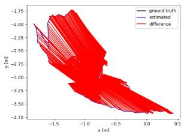  
(a)

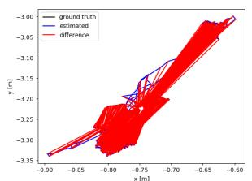  
(b)

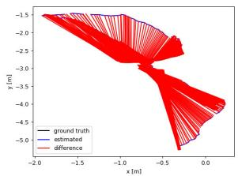  
(c)

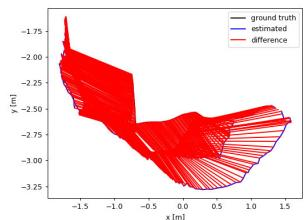  
(d)

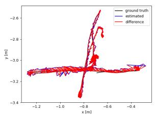  
(e)

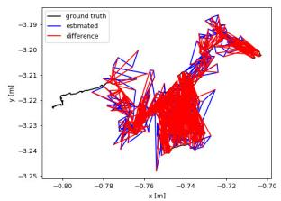  
(f)

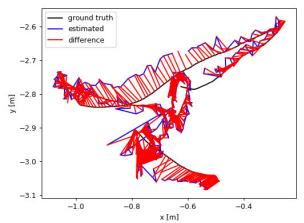  
(g)

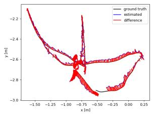  
(h)  
Fig. 7. Comparison of estimated trajectories of ORB-SLAM2 and the proposed method in four high dynamic sequences of TUM. The black line shows the true trajectory, the blue line shows the estimated trajectory, and the red line shows the error between the estimated and true trajectories. (a) ORB-S-LAM2: fr3\_walking\_xyz. (b) ORB-SLAM2: fr3\_walking\_static. (c) ORB-SLAM2: fr3\_walking\_rpy. (d) ORB-SLAM2: fr3\_walking\_half. (e) DGM-VINS: fr3\_walking\_xyz. (f) DGM-VINS: fr3\_walking\_static. (g) DGM-VINS: fr3\_walking\_rpy. (h) DGM-VINS: fr3\_walking\_half.

TABLE II  
RESULTS OF TRANSLATION RELATIVE POSITIONAL ERROR (T.RPE) [M/S]
<table><tr><td rowspan="2">sequence</td><td colspan="2">ORB-SLAM2</td><td colspan="2">DS-SLAM</td><td colspan="2">RDS-SLAM</td><td colspan="2">DGM-VINS</td><td colspan="2">Improvements against ORB-</td></tr><tr><td>RMSE</td><td>S.D</td><td>RMSE</td><td>S.D</td><td>RMSE</td><td></td><td></td><td>S.D</td><td>SLAM2</td><td></td></tr><tr><td>fr3_walking_xyz</td><td>0.4124</td><td>0.2684</td><td>0.0333</td><td>0.0229</td><td>0.0426</td><td>S.D 0.0317</td><td>RMSE 0.0288</td><td>0.0169</td><td>RMSE 93.02%</td><td>S.D 93.70%</td></tr><tr><td>fr3_walking_static</td><td>0.2162</td><td>0.1962</td><td>0.0102</td><td>0.0048</td><td>0.0221</td><td>0.0149</td><td>0.0111</td><td>0.0056</td><td>94.87%</td><td>97.15%</td></tr><tr><td>fr3_walking_half</td><td>0.3550</td><td>0.2810</td><td>0.0297</td><td>0.0152</td><td>0.0482</td><td>0.0360</td><td>0.0304</td><td>0.0153</td><td>91.44%</td><td>94.56%</td></tr><tr><td>fr3_walking_rpy</td><td>0.4249</td><td>0.3166</td><td>0.1503</td><td>0.1168</td><td>0.1320</td><td>0.1067</td><td>0.0482</td><td>0.0274</td><td>88.66%</td><td>91.35%</td></tr><tr><td>fr3 sitting static</td><td>0.0095</td><td>0.0046</td><td>0.0078</td><td>0.0038</td><td>0.0123</td><td>0.0070</td><td>0.0069</td><td>0.0036</td><td>27.37%</td><td>21.74%</td></tr></table>

TABLE III

RESULTS OF ROTATION RELATIVE POSITIONAL ERROR (R.RPE) [◦/S]
<table><tr><td rowspan="2">sequence</td><td colspan="2">ORB-SLAM2</td><td colspan="2">DS-SLAM</td><td colspan="2">RDS-SLAM</td><td colspan="2">DGM-VINS</td><td colspan="2">Improvements against ORB-</td></tr><tr><td>RMSE</td><td>S.D</td><td>RMSE</td><td></td><td></td><td></td><td></td><td></td><td></td><td>SLAM2</td></tr><tr><td>fr3_walking_xyz</td><td>7.7432</td><td>4.9895</td><td>0.8266</td><td>S.D 0.5826</td><td>RMSE 0.9222</td><td>S.D 0.6509</td><td>RMSE 0.6988</td><td>S.D 0.4084</td><td>RMSE 90.98%</td><td>S.D 91.81%</td></tr><tr><td>fr3_walking_static</td><td>3.8958</td><td>3.5095</td><td>0.2690</td><td>0.1182</td><td>0.4944</td><td>0.3112</td><td>0.3411</td><td>0.1864</td><td>91.24%</td><td>95.22%</td></tr><tr><td>fr3_walking_half</td><td>7.3744</td><td>5.7558</td><td>0.8142</td><td>0.4101</td><td>1.8828</td><td>1.5250</td><td>0.8616</td><td>0.4135</td><td>88.32%</td><td>92.82%</td></tr><tr><td>fr3_walking_rpy</td><td>8.0802</td><td>5.9499</td><td>3.0042</td><td>2.3065</td><td>13.1693</td><td>12.0103</td><td>1.0147</td><td>0.5395</td><td>87.44%</td><td>90.93%</td></tr><tr><td>fr3_sitting_static</td><td>0.2881</td><td>0.1244</td><td>0.2735</td><td>0.1215</td><td>0.3338</td><td>0.1706</td><td>0.2540</td><td>0.1140</td><td>11.84%</td><td>8.36%</td></tr></table>

TABLE IV

ABLATION EXPERIMENT RESULTS OF RMSE OF ATE [M], T.RPE [M/S], AND R.RPE [◦/S] ON TUM RGB-D DATASETS
<table><tr><td rowspan="2">sequence</td><td colspan="3">ORB-SLAM2</td><td colspan="3">W/O JGDFE</td><td colspan="3">W/O TISM</td><td colspan="3">DGM-VINS</td></tr><tr><td>ATE</td><td>T.RPE</td><td>R.RPE</td><td>ATE</td><td>T.RPE</td><td>R.RPE</td><td>ATE</td><td>T.RPE</td><td>R.RPE</td><td>ATE</td><td>T.RPE</td><td>R.RPE</td></tr><tr><td>fr3_walking_xyz</td><td>0.7521</td><td>0.4124</td><td>7.7432</td><td>0.0478</td><td>0.0327</td><td>0.7094</td><td>0.0543</td><td>0.0373</td><td>0.7176</td><td>0.0361</td><td>0.0288</td><td>0.6988</td></tr><tr><td>fr3_walking_static</td><td>0.3900</td><td>0.2162</td><td>3.8958</td><td>0.0787</td><td>0.0948</td><td>1.7826</td><td>0.0883</td><td>0.0645</td><td>1.6019</td><td>0.0133</td><td>0.0111</td><td>0.3411</td></tr><tr><td>fr3_walking_half</td><td>0.4863</td><td>0.3550</td><td>7.3744</td><td>0.0631</td><td>0.0420</td><td>0.9463</td><td>0.0692</td><td>0.0560</td><td>1.4410</td><td>0.0331</td><td>0.0304</td><td>0.8616</td></tr><tr><td>fr3_walking_rpy</td><td>0.8705</td><td>0.4249</td><td>8.0802</td><td>0.0903</td><td>0.0539</td><td>1.0336</td><td>0.1765</td><td>0.1132</td><td>2.3957</td><td>0.0707</td><td>0.0482</td><td>1.0147</td></tr><tr><td>fr3_sitting_static</td><td>0.0087</td><td>0.0095</td><td>0.2881</td><td>0.0087</td><td>0.0098</td><td>0.2592</td><td>0.0080</td><td>0.0091</td><td>0.2597</td><td>0.0054</td><td>0.0069</td><td>0.2540</td></tr><tr><td>Average RMSE</td><td>0.5015</td><td>0.2836</td><td>5.4763</td><td>0.0577</td><td>0.0466</td><td>0.9462</td><td>0.0793</td><td>0.0560</td><td>1.2832</td><td>0.0317</td><td>0.0251</td><td>0.6340</td></tr><tr><td>Improvement</td><td></td><td></td><td></td><td>88.5%</td><td>83.6%</td><td>82.7%</td><td>84.2%</td><td>80.3%</td><td>76.6%</td><td>93.7%</td><td>91.1%</td><td>88.4%</td></tr></table>

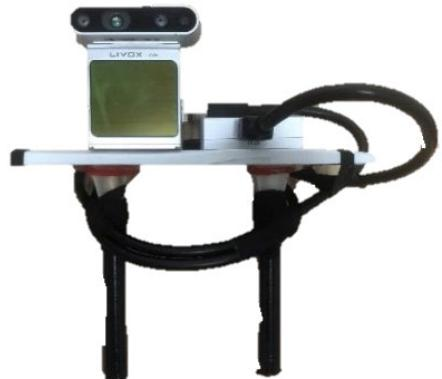  
Fig. 8. Information acquisition equipment with Realsense D435i and Livox Avia LiDAR.

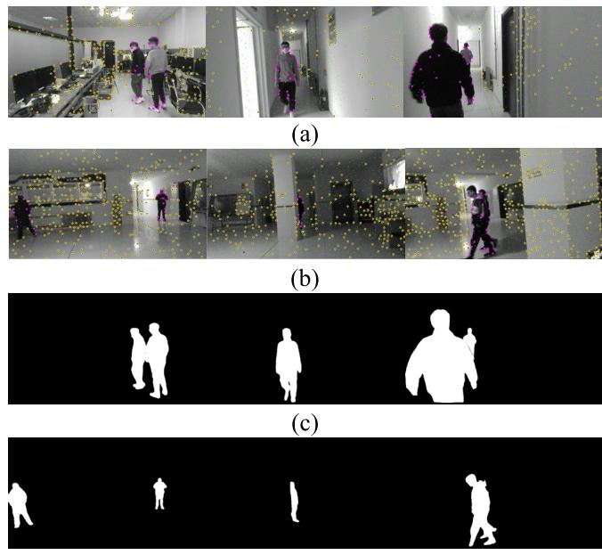  
(d)  
Fig. 9. Dynamic feature extraction results and the corresponding temporal instance segmentation masks in the complex dynamic environment. (a) Results of dynamic feature extraction in the indoor to a corridor. (b) Results of dynamic feature extraction in the hall. (c) Corresponding temporal instance segmentation masks in the indoor to a corridor. (d) Corresponding temporal instance segmentation masks in the hall.

1.2832 across five sequences, representing a 76.6% improvement over ORB-SLAM2. According to this discussion, without the joint geometric feature extraction module (W/O JGDFE), using only a mask generated by deep learning can result in the loss of some scene information, leading to a decrease in system accuracy. Without the TISM (W/O TISM), determining the motion properties of feature points only through geometric means could introduce incorrect constraints for some dynamic features, which reduces the accuracy of the system. The ablation experiments showed that by combining the joint geometric feature extraction module with a TISM, we can further extract geometric information from the scene and detect dynamic objects more accurately, thereby improving the accuracy of the system.

## C. Real-World Experiments

To demonstrate the effectiveness of the proposed scheme in the real world, we used the device shown in Fig. 8 to carry out experiments. This device utilizes a Realsense D435i to provide color information, depth information, and IMU data of the estimated trajectory of the system. In addition, a Livox Avia LiDAR was applied to synchronize data acquisition and provide the ground-truth trajectory for evaluating accuracy and robustness in terms of positional estimation in real-world scenarios. The experimental scenarios we chose are typical indoor environments: weakly textured, low-featured corridors, and spacious but poorly illuminated halls. Furthermore, the presence of individuals walking back and forth in the scene presents challenges for the camera’s position estimation.

TABLE V  
AVERAGE TIME OF EACH MODULE
<table><tr><td>Method</td><td>Feature Track- ing</td><td>Geometry Feature Detection</td><td>Semantic Mask</td><td>State Optimiza- tion</td></tr><tr><td>Times(ms)</td><td>13.872</td><td>13.086</td><td>136.539</td><td>25.797</td></tr></table>

TABLE VI

COMPARISON OF SEGMENTATION TIMES
<table><tr><td>Method</td><td>Instance Segmentation</td><td>Time(ms)</td></tr><tr><td>DynaSLAM [7]</td><td>Mask RCNN</td><td>195</td></tr><tr><td>Detect-SLAM [10]</td><td>SSD</td><td>310</td></tr><tr><td>Xie et al.[22]</td><td>Mask RCNN</td><td>225.8</td></tr><tr><td>RDS-SLAM [39]</td><td>Mask RCNN</td><td>200</td></tr><tr><td>DGM-VINS</td><td>CenterTrack+CondInst</td><td>136.5</td></tr></table>

Fig. 9 shows the geometric feature extraction process and the generation of semantic masks. The first two rows display the recognition results of stable and dynamic feature points in the corridor and hall scenes, respectively. Dynamic feature points located on the moving object are represented in purple, while stable feature points are marked in yellow. Some unstable feature points are also marked with red solid points in the tracking process. The last two rows show the corresponding instance segmentation results, which exhibit improved continuity in object detection due to the addition of temporal features. The proposed method yields more accurate feature recognition and segmentation results, especially in complex scenarios, such as scenes with overlap, motion blur, weak textures, and large changes in illumination.

To validate the accuracy of the positional estimation in a real-world scenario, we compared the estimated trajectory with the real trajectory obtained from the Livox Avia LiDAR, as shown in Fig. 10. The actual trajectory obtained from the Livox Avia LiDAR is represented by the black line, the estimated trajectory produced by the system is shown by the blue line, and the discrepancy between the estimated and real trajectory is illustrated by the red line. The first row shows the trajectory error between the estimated trajec tory and the ground-truth trajectory when transitioning from feature-rich indoor scenes to low-texture corridors using two different methods. The second row represents the trajectory error in a spacious hall with low lighting. Fig. 10(a) and (c) shows that the difference between trajectories of the proposed DGM-VINS and ground truth is very small, while

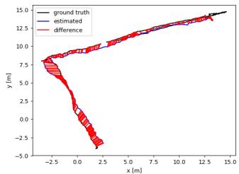  
(a)

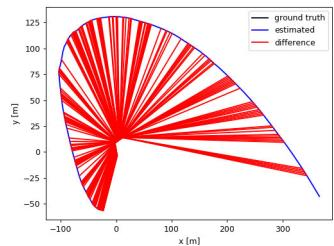  
(b)

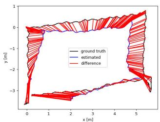  
(c)

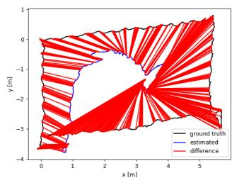  
(d)  
Fig. 10. Trajectory difference between the two systems and the ground truth in real scenarios. The black line indicates the real trajectory provided by LiDAR, the blue line system indicates the estimated trajectory, and the red line indicates the error between the estimated trajectory and the real trajectory. (a) Trajectory of the proposed DGM-VINS in the indoor to a corridor. (b) Trajectory of VINS-MONO in the indoor to a corridor. (c) Trajectory of the proposed method DGM-VINS in the hall. (d) Trajectory of VINS-MONO in the hall.

Fig. 10(b) and (d) shows that there is a clear distinction between the trajectories of VINS-MONO and ground truth. The real-world experimental results indicate that DGM-VINS achieves superior performance in terms of accuracy and robustness of localization in complex dynamic scenarios.

## D. Runtime Analysis

In practical applications, real time is an important index for evaluating SLAM systems. As shown in Table V, we test the average running time of each module for the first sequence in the cafe scenario of OpenLORIS-Sense. Table VI shows that instance segmentation takes the most time in our algorithm, but it is still more efficient than its competitors, which also apply the instance segmentation network. Furthermore, our instance segmentation is conducted independently of the overall system, and instance mask segmentation is not performed for every frame.

## V. CONCLUSION

In this study, we propose a semantic vision and inertial fusion SLAM algorithm that operates effectively in complex and dynamic environments. The proposed system enhances localization in challenging environments with low features and weak textures by utilizing the complementary strengths of the camera and IMU. The algorithm calculates dynamic feature points through joint geometric features and considers spatiotemporal correlations by incorporating temporal features into instance segmentation of dynamic objects, which can prevent missed detection and improve the detection success rate. The proposed algorithm was compared with several stateof-the-art dynamic SLAM methods on the OpenLORIS-Scene dataset, the TUM dataset, and in real-world scenarios. The experimental results verify the feasibility and effectiveness of the presented approach. In the future, we intend to further improve the system by optimizing instance segmentation for temporal object tracking, reducing instance segmentation time, and incorporating semantic mapping to enhance its interaction with the environment.

## REFERENCES

[1] A. J. Davison, I. D. Reid, N. D. Molton, and O. Stasse, “MonoSLAM: Real-time single camera SLAM,” IEEE Trans. Pattern Anal. Mach. Intell., vol. 29, no. 6, pp. 1052–1067, Jun. 2007.

[2] J. Engel, T. Schps, and D. Cremers, “LSD-SLAM: Large-scale direct monocular SLAM,” in Proc. 13th Eur. Conf. Comput. Vis. (ECCV), Sep. 2014, pp. 834–849.

[3] G. Klein and D. Murray, “Parallel tracking and mapping for small AR workspaces,” in Proc. 6th IEEE ACM Int. Symp. Mixed Augmented Reality, Nov. 2007, pp. 225–234.

[4] R. Mur-Artal, J. M. M. Montiel, and J. D. Tardós, “ORB-SLAM: A versatile and accurate monocular SLAM system,” IEEE Trans. Robot., vol. 31, no. 5, pp. 1147–1163, Oct. 2015.

[5] R. Mur-Artal and J. D. Tardós, “ORB-SLAM2: An open-source SLAM system for monocular, stereo, and RGB-D cameras,” IEEE Trans. Robot., vol. 33, no. 5, pp. 1255–1262, Oct. 2017.

[6] C. Campos, R. Elvira, J. J. G. Rodríguez, J. M. M. Montiel, and J. D. Tardós, “ORB-SLAM3: An accurate open-source library for visual, visual–inertial, and multimap SLAM,” IEEE Trans. Robot., vol. 37, no. 6, pp. 1874–1890, Dec. 2021.

[7] B. Bescos, J. M. Fácil, J. Civera, and J. Neira, “DynaSLAM: Tracking, mapping, and inpainting in dynamic scenes,” IEEE Robot. Autom. Lett., vol. 3, no. 4, pp. 4076–4083, Oct. 2018.

[8] C. Yu et al., “DS-SLAM: A semantic visual SLAM towards dynamic environments,” in Proc. IEEE/RSJ Int. Conf. Intell. Robots Syst. (IROS), Oct. 2018, pp. 1168–1174.

[9] Z. Pan, J. Hou, and L. Yu, “Optimization RGB-D 3-D reconstruction algorithm based on dynamic SLAM,” IEEE Trans. Instrum. Meas., vol. 72, pp. 1–13, 2023.

[10] F. Zhong, S. Wang, Z. Zhang, C. Chen, and Y. Wang, “Detect-SLAM: Making object detection and SLAM mutually beneficial,” in Proc. IEEE Winter Conf. Appl. Comput. Vis. (WACV), Mar. 2018, pp. 1001–1010.

[11] S. Cheng, C. Sun, S. Zhang, and D. Zhang, “SG-SLAM: A realtime RGB-D visual SLAM toward dynamic scenes with semantic and geometric information,” IEEE Trans. Instrum. Meas., vol. 72, pp. 1–12, 2023.

[12] C. Forster, M. Pizzoli, and D. Scaramuzza, “SVO: Fast semi-direct monocular visual odometry,” in Proc. IEEE Int. Conf. Robot. Autom. (ICRA), May 2014, pp. 15–22.

[13] M. A. Fischler and R. Bolles, “Random sample consensus: A paradigm for model fitting with applications to image analysis and automated cartography,” Commun. ACM, vol. 24, no. 6, pp. 381–395, 1981.

[14] I. A. Barsan, P. Liu, M. Pollefeys, and A. Geiger, “Robust dense mapping for large-scale dynamic environments,” in Proc. IEEE Int. Conf. Robot. Autom. (ICRA), May 2018, pp. 7510–7517.

[15] Y. Liu, Y. Wu, and W. Pan, “Dynamic RGB-D SLAM based on static probability and observation number,” IEEE Trans. Instrum. Meas., vol. 70, pp. 1–11, 2021.

[16] T. Ji, C. Wang, and L. Xie, “Towards real-time semantic RGB-D SLAM in dynamic environments,” in Proc. IEEE Int. Conf. Robot. Autom. (ICRA), May 2021, pp. 11175–11181.

[17] R. Long, C. Rauch, T. Zhang, V. Ivan, T. Lun Lam, and S. Vijayakumar, “RGB-D SLAM in indoor planar environments with multiple large dynamic objects,” 2022, arXiv:2203.02882.

[18] S. Li and D. Lee, “RGB-D SLAM in dynamic environments using static point weighting,” IEEE Robot. Autom. Lett., vol. 2, no. 4, pp. 2263–2270, Oct. 2017.

[19] H. Yin, S. Li, Y. Tao, J. Guo, and B. Huang, “Dynam-SLAM: An accurate, robust stereo visual-inertial SLAM method in dynamic environments,” IEEE Trans. Robot., vol. 39, no. 1, pp. 289–308, Feb. 2023.

[20] B. Bescos, C. Campos, J. D. Tardos, and J. Neira, “DynaSLAM II: Tightly-coupled multi-object tracking and SLAM,” IEEE Robot. Autom. Lett., vol. 6, no. 3, pp. 5191–5198, Jul. 2021.

[21] J. Chang, N. Dong, and D. Li, “A real-time dynamic object segmentation framework for SLAM system in dynamic scenes,” IEEE Trans. Instrum Meas., vol. 70, pp. 1–9, 2021.

[22] W. Xie, P. X. Liu, and M. Zheng, “Moving object segmentation and detection for robust RGBD-SLAM in dynamic environments,” IEEE Trans. Instrum. Meas., vol. 70, pp. 1–8, 2021.

[23] C.-C. Wang, C. Thorpe, S. Thrun, M. Hebert, and H. Durrant-Whyte, “Simultaneous localization, mapping and moving object tracking,” Int. J. Robot. Res., vol. 26, no. 9, pp. 889–916, Sep. 2007.

[24] N. D. Reddy, P. Singhal, V. Chari, and K. M. Krishna, “Dynamic body VSLAM with semantic constraints,” in Proc. IEEE/RSJ Int. Conf. Intell. Robots Syst. (IROS), Sep. 2015, pp. 1897–1904.

[25] Q. Chu, W. Ouyang, H. Li, X. Wang, B. Liu, and N. Yu, “Online multiobject tracking using CNN-based single object tracker with spatial– temporal attention mechanism,” in Proc. IEEE Int. Conf. Comput. Vis. (ICCV), Oct. 2017, pp. 4846–4855.

[26] J. Zhang, M. Henein, R. Mahony, and V. Ila, “VDO-SLAM: A visual dynamic object-aware SLAM system,” 2020, arXiv:2005.11052.

[27] I. Ballester, A. Fontán, J. Civera, K. H. Strobl, and R. Triebel, “DOT: Dynamic object tracking for visual SLAM,” in Proc. IEEE Int. Conf. Robot. Autom. (ICRA), May 2021, pp. 11705–11711.

[28] R. A. Wadud and W. Sun, “DyOb-SLAM : Dynamic object tracking SLAM system,” 2022, arXiv:2211.01941.

[29] T. Qin, P. Li, and S. Shen, “VINS-mono: A robust and versatile monocular visual-inertial state estimator,” IEEE Trans. Robot., vol. 34, no. 4, pp. 1004–1020, Aug. 2018.

[30] Z. Shan, R. Li, and S. Schwertfeger, “RGBD-inertial trajectory estimation and mapping for ground robots,” Sensors, vol. 19, no. 10, p. 2251, May 2019.

[31] X. Zhou, V. Koltun, and P. Krähenbühl, “Tracking objects as points,” in Proc. Eur. Conf. Comput. Vis. (ECCV), Aug. 2020, pp. 474–490.

[32] Z. Tian, C. Shen, and H. Chen, “Conditional convolutions for instance segmentation,” in Proc. Eur. Conf. Comput. Vis., vol. 2020, pp. 282–298.

[33] X. Zhou, D. Wang, and P. Krähenbühl, “Objects as points,” 2019, arXiv:1904.07850.

[34] X. Shi et al., “Are we ready for service robots? The OpenLORIS-scene datasets for lifelong SLAM,” in Proc. IEEE Int. Conf. Robot. Autom. (ICRA), May 2020, pp. 3139–3145.

[35] J. Sturm, N. Engelhard, F. Endres, W. Burgard, and D. Cremers, “A benchmark for the evaluation of RGB-D SLAM systems,” in Proc. IEEE/RSJ Int. Conf. Intell. Robots Syst., Oct. 2012, pp. 573–580.

[36] J. Engel, V. Koltun, and D. Cremers, “Direct sparse odometry,” IEEE Trans. Pattern Anal. Mach. Intell., vol. 40, no. 3, pp. 611–625, Mar. 2018.

[37] J. Liu, X. Li, Y. Liu, and H. Chen, “RGB-D inertial odometry for a resource-restricted robot in dynamic environments,” IEEE Robot. Autom. Lett., vol. 7, no. 4, pp. 9573–9580, Oct. 2022.

[38] W. Wu, L. Guo, H. Gao, Z. You, Y. Liu, and Z. Chen, “YOLO-SLAM: A semantic SLAM system towards dynamic environment with geometric constraint,” Neural Comput. Appl., vol. 34, no. 8, pp. 6011–6026, Apr. 2022.

[39] Y. Liu and J. Miura, “RDS-SLAM: Real-time dynamic SLAM using semantic segmentation methods,” IEEE Access, vol. 9, pp. 23772–23785, 2021.

  
Boyi Song received the B.S. degree in control theory and control engineering from Shandong University, Weihai, China, in 2020, where he is currently pursuing the M.S. degree in control engineering.

Zhongmou Ying received the B.S. degree in mechanical engineering from Huaqiao University, Quanzhou, China, in 2021. He is currently pursuing the M.S. degree in control science and engineering with Shandong University, Weihai, China.

His current research interests include visual SLAM and service robots.

Xianfeng Yuan (Member, IEEE) received the Ph.D. degree in control theory and control engineering from Shandong University, Jinan, China, in 2017.

Baojiang Yang received the B.S. degree from the North University of China, Taiyuan, China, in 2022. He is currently pursuing the M.S. degree in control science and engineering with Shandong University, Weihai, China.

From 2016 to 2017, he was a Visiting Ph.D. Student with Oklahoma State University, Stillwater, OK, USA. He is currently an Associate Professor with the School of Mechanical, Electrical and Information Engineering, Shandong University, Weihai, China. His research interests include machine learning, intelligent fault diagnosis, and robotics.

His current research interests include visual SLAM and visual navigation.

Yong Song received the Ph.D. degree from Shandong University, Jinan, China, in 2012.

He was a Post-Doctoral Researcher with Shandong University from 2013 to 2017 and a Visiting Scholar with the University of Guelph, Guelph, ON, Canada, from 2017 to 2018. He is currently a Professor with the School of Mechanical Electrical and Information Engineering, Shandong University. His research mainly focuses on machine learning and swarm robots.

His research interests include visual simultaneous localization and mapping (SLAM) and robotics.

Fengyu Zhou received the Ph.D. degree in control theory and control engineering from Tianjin University, Tianjin, China, in 2008.

He is currently a Professor with the School of Control Science and Engineering, Shandong University, Jinan, China. His research interests include robotics, machine learning, and fault diagnosis.