# Dynam-SLAM: An Accurate, Robust Stereo Visual-Inertial SLAM Method in Dynamic Environments

Hesheng Yin , Shaomiao Li , Yu Tao , Junlong Guo , and Bo Huang

Abstract—Most existing vision-based simultaneous localization and mapping (SLAM) systems and their variants still assume that the observation is absolutely static and cannot work well in dynamic environments. Here, we present the Dynam-SLAM (Dynam), a stereo visual-inertial SLAM system capable of robust, accurate, and continuous work in high dynamic environments. Our approach is devoted to loosely coupling the stereo scene flow with an inertial measurement unit (IMU) for dynamic feature detection and tightly coupling the dynamic and static features with the IMU measurements for nonlinear optimization. First, the scene flow uncertainty caused by measurement noise is modeled to derive the accurate motion likelihood of landmarks. Meanwhile, to cope with highly dynamic environments, we additionally construct the virtual landmarks based on the detected dynamic features. Then, we build a tightly coupled, nonlinear optimization-based SLAM system to estimate the camera state by fusing IMU measurements and feature observations. Finally, we evaluate the proposed dynamic feature detection module (DFM) and the overall SLAM system in various benchmark datasets. Experimental results show that the Dynam is almost unaffected by DFM and performs well in static EuRoC datasets. Dynam outperforms the current state-of-the-art visual and visual-inertial SLAM implementations in terms of accuracy and robustness in self-collected dynamic datasets. The average absolute trajectory error of Dynam in the dynamic benchmark datasets is 90% lower than that of VINS-Fusion, 84% lower than that of ORB-SLAM3, and 88% lower than that of Kimera.

Index Terms—Dynamic feature detection, simultaneous localization and mapping (SLAM), state estimation, visual-inertial system.

## I. INTRODUCTION

N THE past few decades, the vision-based simultaneous localization and mapping (SLAM) technique has been widely investigated [1], [2]. Vision sensors, such as monocular, binocular, RGB-D, and event cameras, are superior to lidar in terms of size, power, and cost. At the same time, the vision-centric multisensor (e.g., inertial measurement unit (IMU), GPS, and wheel odometer) fusion SLAM has also been rapidly developed. State estimation using the methods abovementioned can be called the vision-based SLAM technology, which has been widely used in robotic navigation [3], unmanned driving [4], and virtual reality [5]. The framework of the vision-based SLAM system has been well established and typically includes the visual odometer [6], optimizer [7], loop-closure detection [8], and mapping [9] threads. Some state-of-the-art visionbased SLAM systems have achieved good performance, such as the feature-based methods PTAM [10] and ORB-SLAM [11], the direct approaches LSD-SLAM [12] and DSO [13], and the multisensor fusion methods VINS-Fusion [14] and Kimera [15].

Most of the current vision-based SLAM research works assume that the environment traversed by the camera is entirely static [16], [17], which means that all landmarks observed by the camera should remain unchanged. However, this assumption is usually not valid in practical applications, as moving objects (e.g., pedestrians and cars) are inevitable and ubiquitous in the real world. The dynamic environment will produce many incorrect data associations, leading to severe state estimation errors in the SLAM system. As shown in Fig. 1, the estimated trajectory (with yellow arrow) from the static landmarks (with red circles) is not consistent with that (with red arrow) from all landmarks containing dynamic landmarks (with green circles). The latter deviates more from the ground truth (GT), and a completely wrong state estimate may be obtained when dynamic landmarks occupy a large proportion (e.g., more than 50%) of all observed landmarks. Therefore, we must adopt a robust algorithm to ensure that vision-based SLAM systems work accurately in real-world dynamic scenarios.

To address the abovementioned issue, we propose the Dynam-SLAM (Dynam), a stereo visual-inertial state estimator capable of robust, accurate, and continuous work in high dynamic environments. One of our core solutions is to loosely couple the stereo scene flow and IMU to detect dynamic landmarks. First, based on the disparity map and optical flow, we calculate the scene flow formed by two stereo image pairs of consecutive frames (see Section IV). Then, through the IMU preintegration, the accurate pose of two adjacent frames in a short time is estimated to provide an absolute scale for filtering the scene flow. The principle of dynamic feature detection is to distinguish between the dynamic and static states of landmarks through the motion likelihood of the scene flow (see Section V).

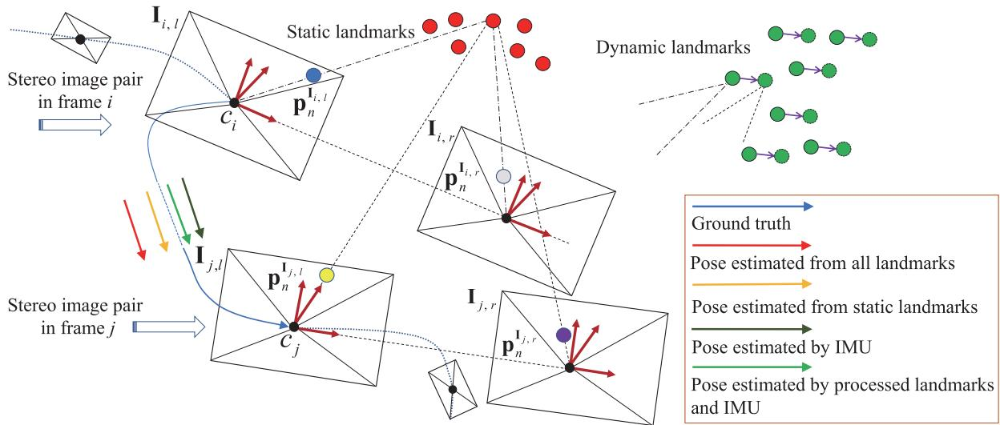  
Fig. 1. Working principle of our proposed Dynam-SLAM. Between the two time-consecutive image frames i and $j ,$ we loosely couple the stereo scene flow (see Section IV) and the IMU measurements for dynamic feature detection (see Section $\mathrm { V } ) .$ . Then, we tightly couple both the dynamic and static landmarks with IMU measurements to complete state estimation (see Section VII). $\mathbf { p } _ { n } ^ { \mathbf { I } _ { i , l } }$ (blue circle) indicates the $n ^ { t h } \left( n \in \mathbb { Z } \right)$ image feature point in ${ \mathbf { I } } _ { i , l }$ . The same meaning is also used for $\mathbf { p } _ { n } ^ { \mathbf { I } _ { i , \tau } }$ (gray circle), $\mathbf { p } _ { n } ^ { \mathbf { I } _ { j , \cdot } }$ l (yellow circle), and $\mathbf { p } _ { n } ^ { \mathbf { I } _ { j , \eta } }$ (purple circle), which represent the image feature points that matched with $\mathbf { p } _ { n } ^ { \mathbf { I } _ { i , l } }$ . The figure also illustrates the negative impact of dynamic landmarks on pose estimation. Red and green circles denote static and dynamic landmarks, respectively. The arrow segments of different colors connecting $\mathbf { C } _ { i , l }$ and $\mathbf { C } _ { j , l }$ indicate different pose estimation results.

Next, we use different specific methods to detect dynamic features (see Section VI). The normalized modulus method is initially used to detect the dynamic features. However, the detection is prone to errors due to the measurement noise and depth uncertainty in the scene flow construction. Hence, the uncertainty model of scene flow is further constructed, and the possible dynamic features are identified based on Mahalanobis distance [18] as a metric. This approach is robust because it considers all measurement uncertainties of scene flow.

Most methods will discard dynamic features to reduce their negative impact on the SLAM system when they are detected [19], [20]. Nevertheless, this is not conducive to the continuous work ofthe algorithm in a high dynamic environment. Therefore, the other core of our solution is the robust visual-inertial SLAM (VISLAM) system based on the tightly coupled nonlinear optimization in the sliding window (see Section VII). Under this framework, we propose a concept of virtual landmarks related to dynamic features and construct a nonlinear optimization model. The model tightly couples both dynamic and static features with the IMU measurements for state estimation. Besides, we use loop-closure detection to optimize the entire keyframe (KF) trajectory (see Section VIII).

Essentially, our method is designed to improve the adaptability of visual SLAM (VSLAM) in the dynamic environment and is also an extension of VISLAM. In the experimental part (see Section IX), we evaluate the dynamic feature detection module and the proposed pipeline in various experimental settings. The experimental results show that, compared with the state-of-theart VSLAM and VISLAM systems, our approach can effectively detect and utilize dynamic features and significantly improves the localization accuracy and robustness in the dynamic environment. To this end, we summarize our contributions as follows.

1) We propose a new SLAM method that loosely couples the stereo scene flow with the IMU for dynamic feature detection and tightly couples dynamic and static visual features with IMU measurements to construct the nonlinear optimization.

2) The uncertainty of the scene flow caused by the measurement noise is modeled. Based on the uncertainty model, the Mahalanobis distance is used to determine the motion likelihood of the landmarks accurately.

3) Based on the detected dynamic features, we construct the virtual landmarks. The static landmarks, virtual landmarks, and IMU measurements are tightly coupled in a sliding window to estimate the high-precision state of the camera in dynamic environments.

4) We provide a complete VISLAM system, which has been verified under different benchmark datasets. Experimental results show that Dynam is superior to the current state-ofthe-art VSLAM and VISLAM implementations in terms of accuracy and robustness in high dynamic environments.

The rest of this article is organized as follows. We discuss the related vision-based SLAM works that overcome dynamic environments in Section II. Section III provides an overview of the proposed system and explains the frames of reference and mathematical notations. The scene flow construction method is introduced in Section IV. Section V describes the basic principle of dynamic feature detection. Section VI presents different dynamic feature detection methods. The tightly coupled visual-inertial nonlinear optimization model is introduced in Section VII. Section VIII describes the implementation details in loop-closure detection. Experimental verifications and analysis are performed in Section IX. Finally, we make a summary and plan for future work in Section X.

## II. RELATED WORK

## A. Literature Classification

The dynamic environment is an inescapable problem for the current SLAM systems, and many approaches have been proposed to address this challenge. For the vision-based SLAM, we generally divide the state estimation methods in dynamic environments into two categories: the pure vision-based approach and the multisensor fusion approach. The pure vision-based approach relies solely on image information to process dynamic objects, such as the semantic segmentation method [21], geometric constraint method [22], and the fusion of the methods mentioned above. In contrast, the multisensor fusion method [23] uses multiple sensors to fuse information and thus reduce the dynamic impact brought by images.

## B. Semantic Segmentation Method

The semantic segmentation approach typically uses deep learning to recognize and determine the motion attributes of image pixels [24]. Yu et al. [25] proposed the DS-SLAM, which uses Caffe-based SegNet [26] to perform semantic segmentation on image pixels in real time. Scona et al. presented the Staticfusion [27] for robust and dense RGB-D SLAM in dynamic environments, which detects moving objects and reconstructs the background structure.

## C. Geometric Constraint Method

Techniques that rely on geometric constraints use specific geometric rules defined in multiview geometry [22], motion similarity [28], and self-motion constraints [29] to segment static and dynamic features. The geometric rules can be derived from epipolar lines, triangulation, fundamental matrix estimation, or reprojection error [16]. For example, Kundu et al. [30] used the epipolar line and “flow vector bound” constraints constructed by the wheel odometer to detect the dynamic features. Zou et al. [31] distinguished the static and dynamic features by the triangulation method. Narayana et al. [32] defined a probabilistic model as the similarity metric of the optical flow orientation, which automatically estimates the number of observed independent motions.

## D. Geometry and Semantic Fusion Method

The geometric constraint and semantic segmentation can be merged to deal with the dynamic features. Xiao et al. [33] proposed Dynamic-SLAM, which uses tightly coupled semantic and geometric information to remove dynamic features. Bescos et al. [34] proposed the DynaSLAM, which can detect moving objects through multiview geometry, Mask R-CNN [35], or a combination of both.

## E. Vision-centered Multisensor Fusion Method

Multisensor fusion methods perform dynamic recognition of visual features or objects through information provided by other types of sensors. Kim et al. [36] used IMU to perform rotation compensation on image frames and define the transformations of the features between two frames as corresponding motion vectors. Then, the speed sensor is used to filter the motion vector to obtain the static landmarks. The OD-SLAM [37] system proposed by Xu et al. used the wheel odometer to obtain static features and finally estimate a more accurate pose. Chavez-Garcia et al. [38] fused inputs from three types of sensor modules (lidar, radar, and camera) to detect and track dynamic features.

## F. Summary of Related Literature

The semantic segmentation method can obtain the pixel area where the dynamic object is located, and directly separate the dynamic feature and the static background. However, this method often fails to recognize incomplete contours (e.g., people or objects close to the camera) and dynamic objects that are not in the training category. The geometric constraint method only focuses on the visual features, resulting in fast calculation speed and relatively simple theoretical model. This method generally estimates the camera motion first and then uses the random sample consensus (RANSAC) algorithm to determine the removal ofdynamic features. However, when suffering a high dynamic environment, the initial transformation estimation will be determined by the dominant dynamic features. The previous analysis shows that when the moving object occupies a large proportion of the image, the vision-only-based method cannot correctly estimate the camera pose. Most vision-centric multisensor fusion methods do not effectively use dynamic features in highly dynamic environments, making the algorithms difficult to converge due to insufficient constraints.

In this article, we use the fusion of the camera and IMU to estimate the robot state in high dynamic environments. The precise preintegrated values of translational and orientational velocities provided by the high-frequency IMU can effectively distinguish the dynamic features, and the visual reprojection constraints can suppress the divergence and accumulated error caused by the IMU zero offsets.

## III. OVERVIEW

## A. Workflow

The pipeline of our Dynam-SLAM system is shown in Fig. 2. Four threads run parallel: measurement preprocessing, dynamic feature detection and processing, local visual-inertial bundle adjustment, and loop-closure detection. The measurement preprocessing thread is responsible for processing vision and IMU measurement data, including image feature extraction and tracking, stereo matching, and IMU preintegration. The dynamic feature detection and processing thread (DFT) is used for scene flow calculation (see Section IV), dynamic feature detection (see Sections V and VI), and virtual landmark construction (see Section VII-A). The local vision-inertial bundle adjustment thread (see Section VII-B) tightly couples the visual feature with IMU data and optimizes all state variables in the sliding window. Finally, the loop-closure detection thread (see Section VIII) performs the loop-closure constraints on the entire KF trajectory by retrieving feature correspondences.

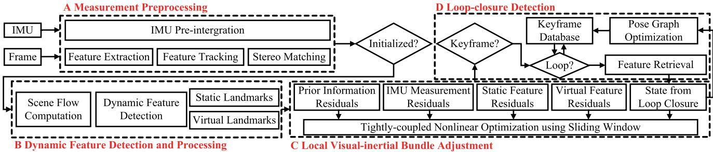  
Fig. 2. Overview of the Dynam-SLAM system. It implements four main threads, including measurement preprocessing, dynamic feature detection and processing, local visual-inertial bundle adjustment, and loop-closure detection.

## B. Notations

We now define the frames of reference and mathematical notations that we use throughout this article. In this study, we, respectively, use $\mathbb { R } , \mathbb { R } ^ { + }$ , and $\mathbb { Z }$ to denote the sets ofreal numbers, positive real numbers, and positive integers. $\mathbb { R } ^ { m }$ represents the m-dimension real vector space with $m \in \mathbb { Z }$

The special orthogonal group, which describes the group of rigid-body rotations in a 3-D space, is formally defined as

$$
\mathrm { S O } ( 3 ) = \left\{ \mathbf { R } \in \mathbb { R } ^ { 3 \times 3 } | \mathbf { R } \mathbf { R } ^ { \mathsf { T } } = \mathbf { I } ^ { 3 \times 3 } , \mathsf { d e t } ( \mathbf { R } ) = 1 \right\}\tag{1}
$$

where R denotes the rotation matrix.

The Hamiltonian unit quaternion can also express the 3-D rotation, which is written as

$$
\mathbf { q } = q _ { w } + q _ { x } \mathbf { i } + q _ { y } \mathbf { j } + q _ { z } \mathbf { k } = ( q _ { w } , \mathbf { q } _ { v } )\tag{2}
$$

where $q _ { w } \in \mathbb { R }$ and $\mathbf { q } _ { v } = ( q _ { x } , q _ { y } , q _ { z } ) \in \mathbb { R } ^ { 3 }$ are, respectively, the scalar and vector parts of q with $\| \mathbf { q } \| = 1$

We define S as the group consisting ofall unit quaternions. We use both the rotation matrix R and orientation quaternion q to represent the 3-D rotation. For state vectors, we generally utilize quaternions, while rotation matrices are quite convenient for rotating 3-D vectors. ⊗ represents the multiplication operation between two quaternions. The quaternion q is converted to the corresponding rotation matrix R as follows:

$$
\mathcal { R } ( \mathbf { q } ) = ( 2 q _ { w } ^ { 2 } - 1 ) \mathbf { I } ^ { 3 \times 3 } + 2 q _ { w } ( \mathbf { q } _ { v } ) _ { \times } + 2 \mathbf { q } _ { v } \mathbf { q } _ { v } ^ { \mathsf { T } } .\tag{3}
$$

The different frames of reference are defined in the following. We take $( \cdot ) ^ { w }$ as the world frame, $( \cdot ) ^ { c }$ is the camera frame, $( \cdot ) ^ { b }$ is the body frame, which we set to be the same as the IMU frame, $( \cdot ) ^ { \mathbf { I } }$ is the image frame, $b _ { i }$ represents the ith $( i \in \mathbb { Z } )$ IMU body frame, $c _ { i }$ is the camera frame while taking the ith stereo image pair, and $( \cdot ) _ { i , l / r }$ denotes the left or right frame of the ith stereo image pair, where when (·) is expressed as I and $c ,$ it represents the image and camera frame, respectively. As is customary in the field, we use the left camera frame as the base frame for the stereo camera, $\mathrm { i } . \mathrm { e } . , \ : c _ { i }$ is the same as $c _ { i , l }$ . The abovementioned image-related frame definitions are clearly plotted in Fig. 1.

In practice, we append the right-handed superscript and subscript to R and q for the relative rotation between frames, e.g., $\mathbf { R } _ { c } ^ { b } \in \mathrm { S O } ( 3 ) , \mathbf { q } _ { c } ^ { b } \in \mathbb { S }$ , and $\boldsymbol { \alpha } _ { c } ^ { b } \in \mathbb { R } ^ { 3 }$ are the rotation matrix, orientation quaternion, and translation vector from the IMU body frame to the camera frame, respectively. Some common definitions associated with feature points are as follows. $\mathbf { p } _ { n } ^ { \mathbf { I } _ { i , l } } \in \mathbb { R } ^ { 2 }$ indicates the nth $( n \in \mathbb { Z } )$ image feature point in image frame $\mathbf { I } _ { i , l } . \mathbf { P } _ { n } ^ { c _ { i } } \in \mathbb { R } ^ { 3 }$ denotes the nth landmark under camera frame ci. ${ \bf P } _ { n } ^ { w _ { i } } \in \mathbb { R } ^ { 3 }$ represents the world location of the nth landmark observed in the ith image. Finally, we denote $\tilde { \left( \cdot \right) }$ as the homogeneous coordinate of a vector, $\hat { \left( \cdot \right) }$ as the noisy measurement or estimate of a certain quantity, $\sigma _ { ( \cdot ) }$ as the standard deviation of a variable satisfying Gaussian distribution, and diag(·) as the diagonal matrix.

## IV. SCENE FLOW COMPUTATION

In this section, we describe the scene flow computation method. The scene flow is a 3-D vector field defined for each point motion on every surface in the world frame [39], which is a collection of motion vectors.

Given two time-consecutive stereo image pairs in frames i and j, as shown in Fig. 1, the origin of the world frame is assumed to be coincident with the left camera frame $c _ { j , l }$ . All the camera frames are right handed. The z-axis coincides with the optical axis of the left camera and points forward, the x-axis points to the right, and the y-axis points down. We assume the landmarks $\mathbf { P } _ { n } ^ { c _ { i } } = [ X _ { n } ^ { i } , Y _ { n } ^ { i } , Z _ { n } ^ { i } ] ^ { \intercal }$ and $\mathbf { P } _ { n } ^ { c _ { j } } = [ X _ { n } ^ { j } , Y _ { n } ^ { j } , Z _ { n } ^ { j } ] ^ { \intercal }$ are separately projected to image features $\mathbf { p } _ { n } ^ { \mathbf { I } _ { i , l } } , \mathbf { p } _ { n } ^ { \mathbf { I } _ { i , r } } , \mathbf { p } _ { n } ^ { \mathbf { I } _ { j , l } }$ , and $\mathbf { p } _ { n } ^ { \mathbf { I } _ { j , r } }$ . The pinhole camera model is used to give the relationships between landmarks and image features

$$
\begin{array} { r l } & { \mathbf { P } _ { n } ^ { c _ { i } } = Z _ { n } ^ { c _ { i } } \mathbf { K } ^ { - 1 } \tilde { \mathbf { p } } _ { n } ^ { \mathbf { I } _ { i , l } } } \\ & { \mathbf { P } _ { n } ^ { c _ { j } } = Z _ { n } ^ { c _ { j } } \mathbf { K } ^ { - 1 } \tilde { \mathbf { p } } _ { n } ^ { \mathbf { I } _ { j , l } } } \end{array}\tag{4}
$$

where $\mathbf { K } \in \mathbb { R } ^ { 3 \times 3 }$ is the camera’s intrinsic parameter matrix, $Z _ { n } ^ { c _ { i } } \in \mathbb { R } ^ { + }$ and $Z _ { n } ^ { c _ { j } } \in \mathbb { R } ^ { + }$ represent the depths of the 3-D landmarks in the camera frames $c _ { i }$ and $c _ { j } .$ , respectively.

To obtain the scene flow between adjacent frames, we match the features between image frame ${ \mathbf { I } } _ { i , l }$ and image frame $\mathbf { I } _ { j , l }$ using optical flow constraints and compute the disparity maps of the two stereo pairs. We extract the stereo image pairs in Fig. 1, as shown in Fig. 3, which provides two pairs of undistorted and rectified stereo images in frame i and frame j. If frame i is the initial frame, with the help of the Harris [40] corner detector, image features are extracted from the left image $\mathbf { I } _ { i , l }$ at different image pyramid scale levels; otherwise, the image features in the frame i will be taken by data association from the previous frames. This article does not specifically design methods for optical flow and disparity map computations, and we only use the results of the state-ofthe-art methods. Concretely, we use the Lucas–Kanade (LK) optical flow [41] and semiglobal matching (SGM) [42] methods to construct the mathematical constraints between image features ${ \bf p } _ { n } ^ { { \bf I } _ { i , l } } \left( x _ { n } ^ { i , l } , y _ { n } ^ { i , l } \right) , { \bf p } _ { n } ^ { { \bf I } _ { i , r } } \left( x _ { n } ^ { i , r } , y _ { n } ^ { i , r } \right) , { \bf p } _ { n } ^ { { \bf I } _ { j , l } } \left( x _ { n } ^ { j , l } , y _ { n } ^ { j , l } \right)$ , and $\mathbf { p } _ { n } ^ { \mathbf { I } _ { j , r } } \left( x _ { n } ^ { j , r } , y _ { n } ^ { j , r } \right)$ as follows:

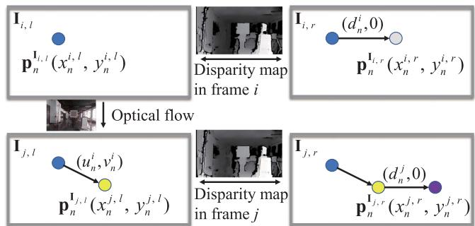  
Fig. 3. Optical flow and disparity constraints employed in scene flow.

$$
\left\{ \begin{array} { l } { x _ { n } ^ { i , r } = x _ { n } ^ { i , l } + d _ { n } ^ { i } } \\ { x _ { n } ^ { j , l } = x _ { n } ^ { i , l } + u _ { n } ^ { i } } \\ { y _ { n } ^ { j , l } = y _ { n } ^ { i , l } + v _ { n } ^ { i } } \\ { x _ { n } ^ { j , r } = x _ { n } ^ { j , l } + d _ { n } ^ { j } } \end{array} \right\}\tag{5}
$$

where $u _ { n } ^ { i } \triangleq u ( x _ { n } ^ { i , l } , y _ { n } ^ { i , l } , i )$ and $v _ { n } ^ { i } \triangleq v ( x _ { n } ^ { i , l } , y _ { n } ^ { i , l } , i )$ , respectively, represent the distributions of the optical flow estimation results for the feature point $\mathbf { p } _ { n } ^ { \mathbf { I } _ { i , l } }$ on the x-axis and y-axis. $d _ { n } ^ { i } \triangleq ( x _ { n } ^ { i , l } , y _ { n } ^ { i , l } , i )$ and $d _ { n } ^ { j } \triangleq d ( x _ { n } ^ { j , l } , y _ { n } ^ { j , l } , j )$ are the disparity values at point $\mathbf { p } _ { n } ^ { \mathbf { I } _ { i , l } }$ and point $\mathbf { p } _ { n } ^ { \mathbf { I } _ { j , l } }$

Combining (4) and (5), we can further calculate the 3-D location of the landmark $\mathbf { P } _ { n } ^ { c _ { i } }$

$$
\left( \begin{array} { c } { X _ { n } ^ { i } } \\ { Y _ { n } ^ { i } } \\ { Z _ { n } ^ { i } } \end{array} \right) { = } \frac { f b } { d _ { n } ^ { i } } \left( \begin{array} { c } { \frac { x _ { n } ^ { i , l } - c _ { x } } { f _ { x } } } \\ { \frac { y _ { n } ^ { i , l } - c _ { y } } { f _ { y } } } \\ { 1 } \end{array} \right)\tag{6}
$$

where the $f _ { x }$ (in pixels), $f _ { y }$ (in pixels), and f (in meters) are the camera’s focal lengths in the $x , y ,$ , and z-axis directions. $[ c _ { x } , c _ { y } ] ^ { \mathsf { T } }$ is the principal point (in pixels) of the image frame relative to the physical imaging plane. b (in meters) is the baseline distance.

The 3-D location of the landmark $\mathbf { P } _ { n } ^ { c _ { j } }$ could also be determined as follows:

$$
\binom { X _ { n } ^ { j } } { Y _ { n } ^ { j } } = \frac { f b } { d _ { n } ^ { j } } \left( \begin{array} { c } { \frac { x _ { n } ^ { i , l } + u _ { n } ^ { i } - c _ { x } } { f _ { x } } } \\ { \frac { y _ { n } ^ { i , l } + v _ { n } ^ { i } - c _ { y } } { f _ { y } } } \\ { 1 } \end{array} \right) .\tag{7}
$$

Assuming that the number of features extracted in frame i and successfully tracked in frame $j$ is $m \in \mathbb { Z }$ , the landmark sets under camera frame $c _ { i }$ and camera frame $c _ { j }$ can be expressed as $\mathbf { P } ^ { c _ { i } } = \{ \mathbf { P } _ { 1 } ^ { c _ { i } } , \mathbf { P } _ { 2 } ^ { c _ { i } } , . . . , \mathbf { P } _ { m } ^ { c _ { i } } \}$ and $\mathbf { P } ^ { c _ { j } } = \{ \mathbf { \bar { P } } _ { 1 } ^ { c _ { j } } , \mathbf { P } _ { 2 } ^ { c _ { j } } , . . . , \mathbf { P } _ { m } ^ { c _ { j } } \}$ According to the scene flow definition, we take $\mathbf { P } _ { n } ^ { c _ { i } }$ as the start point and $\mathbf { P } _ { n } ^ { c _ { j } }$ as the end point, and define the scene flow δMcj of two adjacent frames as follows:

$$
\delta \mathbf { M } ^ { c _ { j } } \triangleq \left\{ \begin{array} { l l } { \mathbf { P } _ { n } ^ { c _ { j } } - \mathcal { R } \left( \mathbf { q } _ { c _ { j } } ^ { c _ { i } } \right) \mathbf { P } _ { n } ^ { c _ { i } } - \pmb { \alpha } _ { c _ { j } } ^ { c _ { i } } , } \\ { \hphantom { \mathbf { M } } n \in ( 1 , m ) , \mathbf { P } _ { n } ^ { c _ { i } } \in \mathbb { R } ^ { 3 } , \mathbf { P } _ { n } ^ { c _ { j } } \in \mathbb { R } ^ { 3 } } \end{array} \right\}\tag{8}
$$

where $\mathbf { q } _ { c _ { i } } ^ { c _ { i } } \in \mathbb { S }$ and $\pmb { \alpha } _ { c _ { j } } ^ { c _ { i } } \in \mathbb { R } ^ { 3 }$ are the orientation quaternion and the translation vector from $c _ { i }$ to $c _ { j }$ , respectively.

## V. LOOSELY COUPLED VISUAL-INERTIAL DETECTION

This section mainly uses preintegrated IMU measurements to obtain the pose transformation between two adjacent frames, and loosely couples IMU measurements and scene flow to filter the motion vectors.

## A. IMU Preintegration between Two Consecutive Frames

Due to the different acquisition frequencies of the image and IMU data, it is necessary to integrate multiple raw gyroscope and accelerometer measurements to obtain the pose transformation between two image frames from the IMU.

Given two time instants $t _ { i }$ and $t _ { j }$ corresponding to camera frames $c _ { i }$ and $c _ { j }$ , the state vector $\mathbf { x } _ { i , j } \in \mathbb { R } ^ { 1 6 }$ of the IMU during the time interval $[ t _ { i } , t _ { j } ]$ can be defined as

$$
\mathbf { x } _ { i , j } = \left[ \alpha _ { b _ { j } } ^ { b _ { i } } , \beta _ { b _ { j } } ^ { b _ { i } } , \mathbf { q } _ { b _ { j } } ^ { b _ { i } } , \mathbf { b } _ { j } ^ { a } , \mathbf { b } _ { j } ^ { g } \right] ^ { \top }\tag{9}
$$

where $\pmb { \alpha } _ { b _ { i } } ^ { b _ { i } } \in \mathbb { R } ^ { 3 } , \beta _ { b _ { i } } ^ { b _ { i } } \in \mathbb { R } ^ { 3 }$ , and $\mathbf { q } _ { b _ { i } } ^ { b _ { i } } \in \mathbb { S }$ , respectively, denote the relative translation, velocity, and rotation from $b _ { i }$ to $b _ { j } .$ $\mathbf { b } _ { i } ^ { a } \in \mathbb { R } ^ { 3 }$ and $\mathbf { b } _ { j } ^ { g } \in \mathbb { R } ^ { 3 }$ are the biases of the raw gyroscope and accelerometer measurements, which are measured in $b _ { j }$

The IMU states, $\alpha _ { b _ { i } } ^ { b _ { i } } , \beta _ { b _ { i } } ^ { b _ { i } }$ , and $\mathbf { q } _ { b _ { i } } ^ { b _ { i } }$ , can be obtained through the preintegration method proposed in [14] and [43]

$$
\begin{array} { l } { { \displaystyle \alpha _ { b _ { j } } ^ { b _ { i } } = \iint _ { k \in \left( t _ { i } , t _ { j } \right) } \mathbf q _ { b _ { k } } ^ { b _ { i } } \left( \widehat { \mathbf a } _ { k } - \mathbf b _ { k } ^ { a } - \mathbf n _ { k } ^ { a } \right) \delta t ^ { 2 } } } \\ { { \displaystyle \beta _ { b _ { j } } ^ { b _ { i } } = \int k \epsilon ( t _ { i } , t _ { j } ) \mathbf q _ { b _ { k } } ^ { b _ { i } } \left( \widehat { \mathbf a } _ { k } - \mathbf b _ { k } ^ { a } - \mathbf n _ { k } ^ { a } \right) \delta t } } \\ { { \displaystyle q _ { b _ { j } } ^ { b _ { i } } = \int k \epsilon ( t _ { i } , t _ { j } ) \mathbf q _ { b _ { k } } ^ { b _ { i } } \otimes \left[ \begin{array} { c } { { 0 } } \\ { { \frac { 1 } { 2 } \left( \widehat { \omega } _ { k } - \mathbf b _ { k } ^ { g } - \mathbf n _ { k } ^ { g } \right) } } \end{array} \right] \delta t } } \end{array}\tag{10}
$$

where k is a discrete moment corresponding to a IMU measurement within $[ t _ { i } , t _ { j } ]$ . δt is the time interval between $b _ { i }$ and $b _ { j }$ $\hat { \omega } _ { k } \in \mathbb { R } ^ { 3 }$ and $\hat { \mathbf { a } } _ { k } \in \mathbb { R } ^ { 3 }$ are the raw angular velocity (in rad/s) and linear acceleration (in $\mathrm { m } / \mathrm { s } ^ { 2 } )$ in frame $b _ { k } . \mathbf { n } _ { k } ^ { a } \in \mathbb { R } ^ { 3 }$ and ${ \mathbf n } _ { k } ^ { g } \in \mathbb { R } ^ { 3 }$ are additive noises in acceleration and gyroscope measurements, which obey the Gaussian distributions, $\mathbf { n } _ { k } ^ { g } \sim \mathcal N ( 0 , \pmb { \sigma } _ { n _ { k } ^ { g } } ^ { 2 } )$ and $\mathbf { n } _ { k } ^ { a } \sim \mathcal N ( 0 , \pmb { \sigma } _ { n _ { k } ^ { a } } ^ { 2 } )$ . The gyroscope bias $\mathbf { b } _ { k } ^ { g }$ and accelerometer bias $\mathbf { b } _ { k } ^ { a }$ in frame $b _ { k }$ are modeled as random walks, and their derivatives are Gaussian, $\mathbf { b } _ { k } ^ { g \cdot } = \mathbf { n } _ { k } ^ { b g } , \mathbf { b } _ { k } ^ { a \cdot } = \mathbf { n } _ { k } ^ { b a } , \mathbf { n } _ { k } ^ { b g } \sim \mathcal { N } ( 0 , \pmb { \sigma } _ { n _ { k } ^ { b g } } ^ { 2 } )$ and $ { \mathbf { n } } _ { k } ^ { b a } \sim \mathcal { N } ( 0 , \sigma _ { n _ { k } ^ { b a } } ^ { 2 } )$

From (10), we can observe that the preintegration quantities are only related to the raw IMU measurements. According to Qin et al. [14], the continuous integration can be approximated by discrete integration (median integration). The updated formula of IMU preintegration can be given by

$$
\begin{array} { l } { { \alpha _ { b _ { k + 1 } } ^ { b _ { i } } = \alpha _ { b _ { k } } ^ { b _ { i } } + \beta _ { b _ { k } } ^ { b _ { i } } \delta t + \frac 1 2 \bar { \mathrm { a } } _ { k } \delta t ^ { 2 } } } \\ { { \beta _ { b _ { k + 1 } } ^ { b _ { i } } = \beta _ { b _ { k } } ^ { b _ { i } } + \bar { \mathrm { a } } _ { k } \delta t } } \\ { { \mathrm { q } _ { b _ { k + 1 } } ^ { b _ { i } } = q _ { b _ { k } } ^ { b _ { i } } \otimes \left[ \displaystyle \frac 1 2 \bar { \omega } _ { k } \delta t \right] } } \\ { { b _ { k + 1 } ^ { a } = b _ { k } ^ { a } + n _ { k } ^ { b a } \delta t } } \\ { { b _ { k + 1 } ^ { g } = b _ { k } ^ { g } + n _ { k } ^ { b g } \delta t , } } \end{array}\tag{11}
$$

where

$$
\begin{array} { r l } & { \bar { \boldsymbol { \omega } } _ { k } = \displaystyle \frac { 1 } { 2 } \left( \hat { \omega } _ { k } + \hat { \omega } _ { k + 1 } \right) - \mathbf { b } _ { k } ^ { g } } \\ & { \bar { \mathbf { a } } _ { k } = \displaystyle \frac { 1 } { 2 } \left( \mathbf { q } _ { b _ { k } } ^ { b _ { i } } \left( \hat { \mathbf { a } } _ { k } - \mathbf { b } _ { k } ^ { a } \right) + \mathbf { q } _ { b _ { k + 1 } } ^ { b _ { i } } \left( \hat { \mathbf { a } } _ { k + 1 } - \mathbf { b } _ { k } ^ { a } \right) \right) . } \end{array}\tag{12}
$$

The relative pose $\mathbf { q } _ { b _ { i } } ^ { b _ { i } } , \alpha _ { b _ { i } } ^ { b _ { i } }$ measured in the IMU body frame $b _ { j }$ can be derived through the iteration of (11).

## B. Dynamic Feature Detection

The preintegrated IMU measurements can be transformed from IMU body frame to camera frame through the extrinsic parameters $\mathbf { q } _ { c } ^ { b }$ and $\alpha _ { c } ^ { b } .$ . Thus, the pose transformation ${ \bf q } _ { c _ { j } } ^ { c _ { i } } , { \pmb { \alpha } } _ { c _ { j } } ^ { c _ { i } }$ of two adjacent frames can be given by

$$
\begin{array} { r l } & { \mathbf { q } _ { c _ { j } } ^ { c _ { i } } = \big ( \mathbf { q } _ { c } ^ { b } \big ) ^ { - 1 } \otimes \mathbf { q } _ { b _ { j } } ^ { b _ { i } } \otimes \mathbf { q } _ { c } ^ { b } } \\ & { \pmb { \alpha } _ { c _ { j } } ^ { c _ { i } } = \mathcal { R } \big ( \mathbf { q } _ { c } ^ { b } \big ) ^ { - 1 } \left( \mathcal { R } \big ( \mathbf { q } _ { b _ { j } } ^ { b _ { i } } \big ) \pmb { \alpha } _ { c } ^ { b } + \alpha _ { b _ { j } } ^ { b _ { i } } - \alpha _ { c } ^ { b } \right) . } \end{array}\tag{13}
$$

We can see from (8) and (13) that when the pose transformation $\mathbf { q } _ { c _ { j } } ^ { c _ { i } } , \alpha _ { c _ { j } } ^ { c _ { i } }$ between two frames is absolutely accurate, the scene flow modulus of a static landmark should be zero, while a dynamic landmark will generate a 3-D residual motion vector that starts as a solid green circle and ends as a dashed green circle, as shown in Fig. 1. Thus, we can loosely couple the stereo scene flow and IMU measurements to distinguish between the static and dynamic features because the scene flow reflects different motion likelihoods of features.

## VI. UNCERTAINTY MODEL CONSTRUCTION FOR SCENE FLOW

In the previous section, the principle of loosely coupled visual-inertial detection is presented. This section mainly describes dynamic feature detection methods based on this principle. The focus is on constructing an uncertainty model for the scene flow to derive the robust motion likelihood of the landmarks.

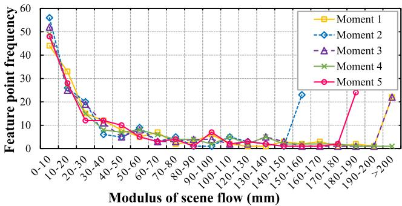  
Fig. 4. Scene flow modulus of sampled image frames at five random moments in a static environment. Best viewed in color.

## A. Normalized Modulus ofScene Flow

Based on (8), we calculate the modulus of scene flow for multiple random stereo image pairs in a static scene and plot the frequency distribution of features on different modulus intervals in Fig. 4. The modulus distribution of the scene flow is scattered, and the moduli of a considerable proportion of the features are not distributed near zero, which does not reflect the desired motion consistency. Further, we construct the scene flow from 3-D points on the normalized camera plane to eliminate the influences of depth noise. We divide both sides of (6) and (7) by $Z _ { i }$ and $Z _ { j }$ , respectively, and refer to the scene flow modulus constructed at this time as the normalized modulus. The normalized moduli of the scene flow in the static and dynamic environments are plotted in Fig. 5. Fig. 5(a) shows that the normalized modulus distribution in the static environment is more concentrated and tends to be close to zero. Fig. 5(b) presents the area where the normalized moduli of the dynamic features are concentratedly distributed (marked by the red rectangle). However, there is no clear boundary between the normalized moduli of dynamic and static features. Simultaneously, the concentrated distribution intervals of dynamic feature moduli in different scenarios are not uniform and walk randomly. Therefore, it is not suitable to use thresholding or clustering methods to detect dynamic features, especially in low dynamic environments.

The previous analysis shows that the normalized modulus method, which eliminates depth noise, can achieve a certain level of dynamic detection. However, depth noise is not the only factor that affects the detection results.

## B. Uncertainty Model Construction

From the previous section, we can perceive that once we calculate the 3-D motion vector for each feature, it is necessary to consider the uncertainty of the scene flow. This section aims to analyze the measurement sources that cause the scene flow error, define their uncertainties, and construct the uncertainty model for the scene flow.

According to the landmark locations derived from frames i and $j$ in (8), the measurement sources that cause the scene flow error can be attributed to two components. The first part is related to the location estimation of the landmark in frame j, i.e., the part determined by the vector $\mathcal { R } ( \mathbf { q } _ { c _ { j } } ^ { c _ { i } } ) \mathbf { P } _ { n } ^ { c _ { i } } + \pmb { \alpha } _ { c _ { j } } ^ { c _ { i } }$ , which can be written as $\mathbf { P } _ { e } ^ { j } \in \mathbb { R } ^ { 3 }$ . Referring to (6) and (13), we denote the measurement vector for the landmark estimation as

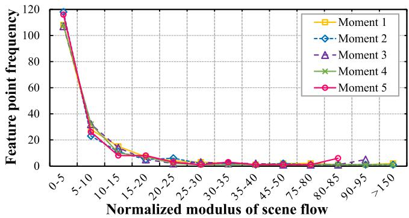  
(a)

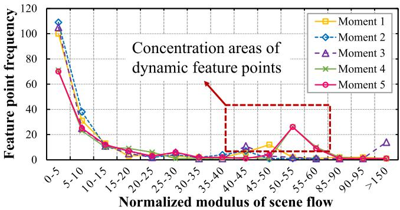  
(b)  
Fig. 5. Normalized scene flow modulus of the sample image frames at five random moments. (a) Normalized scene flow modulus in the static environment. (b) Normalized scene flow modulus in the dynamic environment. Best viewed in color.

$$
\mathbf { V } _ { e } ^ { j } = \left[ x _ { n } ^ { i , l } , y _ { n } ^ { i , l } , d _ { n } ^ { i } , q _ { w } , q _ { x } , q _ { y } , q _ { z } , \alpha _ { x } , \alpha _ { y } , \alpha _ { z } \right] ^ { \mathsf { T } } .\tag{14}
$$

We can see that the location estimation uncertainty related to $\mathbf { P } _ { e } ^ { j }$ comes from the position noise of the 2-D feature, the disparity estimation error, and the preintegration error of the IMU measurement. In particular, the feature position noise arises from initial feature extraction or continuous optical flow tracking. The extraction error of the initial feature is generated by pixel position quantization, whereas the optical flow tracking error is caused by the implementation of the LK tracker.

We assume that the image observations related to pixel quantization error all satisfy the zero-mean Gaussian random noise and are independent of each other, and the IMU preintegration measurements all meet the zero-mean Gaussian white noise. Then, the location estimation covariance of $\mathbf { P } _ { e } ^ { j }$ can be determined by the measurement noise matrix through the error propagation

$$
\begin{array} { r } { \sum _ { \mathbf { P } _ { e } ^ { j } } = \mathbf { J } _ { \mathbf { V } _ { e } ^ { j } } \mathbf { S } _ { \mathbf { P } _ { e } ^ { j } } \mathbf { J } _ { \mathbf { V } _ { e } ^ { j } } ^ { \mathsf { T } } } \end{array}\tag{15}
$$

where $\mathbf S _ { \mathbf { P } _ { e } ^ { j } } = \mathrm { d i a g } \big ( \sigma _ { x _ { n } ^ { i , l } } ^ { 2 } , \sigma _ { y _ { n } ^ { i , l } } ^ { 2 } , \sigma _ { d _ { n } ^ { i } } ^ { 2 } , \sigma _ { q _ { w } } ^ { 2 } , \sigma _ { q _ { x } } ^ { 2 } , \sigma _ { q _ { y } } ^ { 2 } , \sigma _ { q _ { z } } ^ { 2 } , \sigma _ { \alpha _ { x } } ^ { 2 } ,$ $\sigma _ { \alpha _ { y } } ^ { 2 } , \sigma _ { \alpha _ { z } } ^ { 2 } )$ is the measurement noise matrix related to $\mathbf { V } _ { e } ^ { j }$ $\mathbf { J } _ { \mathbf { V } _ { \mathrm { ~ c ~ } } ^ { j } } \in \mathbb { R } ^ { 3 \times 1 0 }$ is the Jacobian of $\mathbf { P } _ { e } ^ { j }$ with respect to $\mathbf { V } _ { e } ^ { j }$

The second measurement source that causes the scene flow error is related to the landmark observation in frame j, i.e., the part determined by Pcj in (8), which can be written as $\mathbf { P } _ { o } ^ { j } \in$ ${ \overline { { \mathbb { R } } } } ^ { 3 }$ . According to (7), we observe that the measurement errors associated with $\mathbf { P } ^ { c _ { j } }$ include feature location noise, optical flow estimation error, and disparity estimation error. We express the measurement vector for landmark observation as

$$
\mathbf { V } _ { o } ^ { j } = \left[ x _ { n } ^ { j , l } , y _ { n } ^ { j , l } , d _ { n } ^ { j } \right] ^ { \mathsf { T } } .\tag{16}
$$

Next, we will define the uncertainties of all relevant measurement sources.

1) Motion Estimation Uncertainty of IMU Preintegration: This section determines the motion estimation uncertainty of IMU preintegration between two adjacent frames through the covariance transmission. To obtain the variance of the preintegrated quantity formed by integrating multiple IMU data over a while, we first need to establish the linear recurrence relationship between the IMU noise and the preintegrated quantity. The recursive form of state error $\delta \mathbf { x } _ { i , k + 1 }$ to $\delta \mathbf { x } _ { i , k }$ is given by [14]

$$
\delta { \bf x } _ { i , k + 1 } { } ^ { 1 6 \times 1 } = { \bf F } ^ { 1 6 \times 1 6 } \delta { \bf x } _ { i , k } { } ^ { 1 6 \times 1 } + { \bf L } ^ { 1 6 \times 1 8 } { \bf n } ^ { 1 8 \times 1 }\tag{17}
$$

where $\mathbf { F }$ is the Jacobian of the state $\mathbf { x } _ { i , k + 1 }$ with respect to $\mathbf { x } _ { i , k } .$ L is the Jacobian of the state $\mathbf { x } _ { i } , \mathbf { \boldsymbol { k } } { + } 1$ with respect to the measurement noise vector n, $\mathbf { n } = [ \mathbf { n } _ { k } ^ { a } , \mathbf { n } _ { k } ^ { g } , \mathbf { n } _ { k + 1 } ^ { a } , \mathbf { n } _ { k + 1 } ^ { g } , \mathbf { n } _ { k } ^ { b a } , \mathbf { n } _ { k } ^ { b g } ] ^ { \intercal }$

The state error transmission in (17) is divided into two parts [43]: the state error at the current time is transmitted to the next time, and the state measurement noise at the current time is also transmitted to the next time. Thus, the preintegrated covariance recursive equation is

$$
\Sigma _ { { \mathbf { X } } _ { i , k + 1 } } ^ { 1 6 \times 1 6 } = { \mathbf { F } } ^ { 1 6 \times 1 6 } { \Sigma } _ { { \mathbf { X } } _ { i , k } } { \mathbf { F } } ^ { \mathsf { T } } + { \mathbf { L } } ^ { 1 6 \times 1 8 } { \Sigma } _ { \mathbf { n } } ^ { 1 8 \times 1 8 } { \mathbf { L } } ^ { \mathsf { T } }\tag{18}
$$

where $\Sigma _ { \mathbf { X } _ { i , k } }$ and $\Sigma _ { \mathbf { X } _ { i , k + 1 } }$ are the covariance matrices of state errors at time k and $k + 1$ , respectively. The initial value is $\Sigma _ { \mathbf { X } _ { i , i } } ,$ $\Sigma _ { \mathbf { X } _ { i , i } } = 0 . \Sigma _ { \mathbf { n } }$ is the diagonal covariance matrix of the measurement noise, $\Sigma _ { \mathbf { n } } = \mathrm { d i a g } \left( \sigma _ { \mathbf { n } _ { k } ^ { a } } ^ { 2 } , \sigma _ { \mathbf { n } _ { k } ^ { g } } ^ { 2 } , \sigma _ { \mathbf { n } _ { k + 1 } ^ { a } } ^ { 2 } , \sigma _ { \mathbf { n } _ { k + 1 } ^ { g } } ^ { 2 } , \sigma _ { \mathbf { n } _ { k } ^ { b a } } ^ { 2 } , \sigma _ { \mathbf { n } _ { k } ^ { b g } } ^ { 2 } \right)$

The covariance matrix $\Sigma _ { \Theta _ { i } ^ { i } } \in \mathbb { R } ^ { 7 \times 7 }$ related to state vector $\Theta _ { j } ^ { i } = \left[ \mathbf { q } _ { b _ { j } } ^ { b _ { i } } , \alpha _ { b _ { j } } ^ { b _ { i } } \right] ^ { \intercal }$ can be finally constructed

$$
\begin{array} { r } { \Sigma _ { \bigcirc _ { j } ^ { i } } = \mathrm { d i a g } \left( \sigma _ { q _ { w } } ^ { 2 } , \sigma _ { q _ { x } } ^ { 2 } , \sigma _ { q _ { y } } ^ { 2 } , \sigma _ { q _ { z } } ^ { 2 } , \sigma _ { \alpha _ { x } } ^ { 2 } , \sigma _ { \alpha _ { y } } ^ { 2 } , \sigma _ { \alpha _ { z } } ^ { 2 } \right) . } \end{array}\tag{19}
$$

2) Landmark Estimation Uncertainty: This section further analyzes the errors for the feature location and disparity estimation in (14). When features are extracted in an image, their location errors caused by pixel quantization are considered to obey the Gaussian distribution with a constant standard deviation [19]. Thus, if the feature is initially extracted in frame $i ,$ then $\sigma _ { x _ { n } ^ { i , l } } ^ { 2 } = \sigma _ { y _ { n } ^ { i , l } } ^ { 2 } = \sigma _ { p } ^ { 2 } ,$ where we take the pixel standard deviation $\sigma _ { p }$ as $\pm 1$ pixel. The propagation error of the feature location caused by the continuous optical flow tracking will be introduced in Section VI-B3.

The disparity estimation is taken from the dense disparity map calculated by the SGM algorithm. The SGM is a globally consistent energy minimization technique that can provide pixel-level accuracy for the disparity estimation on each feature. Therefore, to obtain accurate uncertainty in the disparity estimation, it is necessary to further estimate the disparity at subpixel resolution.

Theoretically, a ±1 pixel change in the estimated disparity will increase energy, and the minimum energy of subpixel accuracy may lie between pixels. In [44] and [45], the subpixel accuracy approximation is achieved by the local fitting of the parabola and symmetric first-order functions. The latter has been verified with good results in [46] and [47]. Hence, we use this method to acquire the uncertainty measure for the variance of the disparity estimate

$$
U _ { d _ { n } ^ { i } } \left( x _ { n } ^ { i , l } , y _ { n } ^ { i , l } \right) = \frac { 1 } { \Delta e }\tag{20}
$$

where $\Delta e$ is the larger of the two relative cost differences between the current and neighboring estimated energy.

The uncertainty measure in (20) can be viewed as the confidence in the disparity estimation [48]. Furthermore, the uncertainty of the disparity estimation can be approximated by a standard Gaussian distribution, and its variance can be linearly approximated as

$$
\sigma _ { d _ { n } ^ { i } } \left( x _ { n } ^ { i , l } , y _ { n } ^ { i , l } \right) = \sigma _ { 0 } + \lambda U _ { d _ { n } ^ { i } } \left( x _ { n } ^ { i , l } , y _ { n } ^ { i , l } \right)\tag{21}
$$

where $\sigma _ { 0 }$ and λ are two constant parameters. According to the experience in the actual parameter adjustment process, we set $\sigma _ { 0 } = 0 . 5$ and $\lambda = 0 . 0 1$

Afterward, the covariance matrix $\Sigma _ { \mathbf { P } ^ { c _ { i } } } \in \mathbb { R } ^ { 3 \times 3 }$ can be approximated by the Gaussian error propagation

$$
\begin{array} { r } { \Sigma _ { \mathbf { P } ^ { c _ { i } } } = \mathbf { J } _ { \mathbf { P } ^ { c _ { i } } } \mathrm { d i a g } \left( \sigma _ { x _ { n } ^ { i , l } } ^ { 2 } , \sigma _ { y _ { n } ^ { i , l } } ^ { 2 } , \sigma _ { d _ { n } ^ { i } } ^ { 2 } \right) \mathbf { J } _ { \mathbf { P } ^ { c _ { i } } } ^ { \top } } \end{array}\tag{22}
$$

where $\mathbf { J } _ { \mathbf { P } ^ { c _ { i } } } \in \mathbb { R } ^ { 3 \times 3 }$ represents the Jacobian matrix of $\mathbf { P } ^ { c _ { i } }$ with respect to vector $[ x _ { n } ^ { i , l } , { \bar { y } } _ { n } ^ { i , l } , d _ { n } ^ { i } ] ^ { \top }$

Since the location estimation of landmark $\mathbf { P } ^ { c _ { i } }$ in $\mathbf { P } _ { e } ^ { j }$ is not correlated with the IMU measurement $\Theta _ { j } ^ { i }$ , the covariance $\Sigma _ { \mathbf { P } _ { e } ^ { j } } \in$ $\mathbb { R } ^ { 3 \times 3 }$ of landmark estimation is finally derived by determining the respective effects of $\Sigma _ { \mathbf { P } ^ { c _ { i } } }$ and $\Sigma _ { \Theta _ { j } ^ { i } }$ on it

$$
\boldsymbol { \Sigma } _ { \mathbf { P } _ { e } ^ { j } } = \mathbf { J } _ { \mathbf { V } _ { e } ^ { j } } \left( \frac { \sum _ { \mathbf { P } ^ { c _ { i } } } \left| 0 ^ { 3 \times 7 } \right. } { 0 ^ { 7 \times 3 } \left| \boldsymbol { \Sigma } _ { \mathbf { Q } _ { j } ^ { i } } \right. } \right) \mathbf { J } _ { \mathbf { V } _ { e } ^ { j } } ^ { \mathsf { T } } .\tag{23}
$$

3) Landmark Observation Uncertainty: In Section VI-B2, the location error of the extracted feature has been analyzed. If the current feature is obtained by optical flow tracking instead of initial extraction, its location error comes from the optical flow estimation. The uncertainty estimation (confidence measure) methods for optical flow, including post-hoc, model-inherent (i.e., energy minimization models), and convolutional neural networks, are introduced in [49]. We use the uncertainty quantification method based on the tracking sensitivity proposed in [50] to estimate the feature tracking error. Supposing that $\boldsymbol { \mu } _ { n } = [ u _ { n } ^ { i } , v _ { n } ^ { i } ] ^ { \intercal }$ is the tracked translation of the LK between the initially extracted feature $\mathbf { p } _ { n } ^ { \mathbf { I } _ { i , l } }$ and the tracked feature $\mathbf { p } _ { n } ^ { \mathbf { I } _ { j , l } }$ , the optical flow constraint is given by

$$
\mathbf { p } _ { n } ^ { \mathbf { I } _ { j , l } } = \mathbf { p } _ { n } ^ { \mathbf { I } _ { i , l } } + \pmb { \mu } _ { n } .\tag{24}
$$

The LK tracker provides the following relationship by assuming a constant brightness

$$
J ( \mathbf { p } _ { n } ^ { \mathbf { I } _ { i , l } } ) = I \left( \mathbf { p } _ { n } ^ { \mathbf { I } _ { j , l } } \right)\tag{25}
$$

where $I ( \cdot )$ and $J ( \cdot )$ represent the intensity values of the pixels in image $\mathbf { I } _ { i , l }$ and $\mathbf { I } _ { j , l }$ , respectively.

Since the LK tracking process is inherently dependent on the local gray gradient about the estimated feature location, the uncertainty of the optical flow $\Sigma \pmb { \mu _ { n } } = \mathrm { d i a g } ( \sigma _ { u _ { n } ^ { i } } ^ { 2 } , \sigma _ { v _ { n } ^ { i } } ^ { 2 } )$ is related to the location uncertainty $\boldsymbol { \Sigma } _ { \mathbf { p } _ { n } ^ { + } , i }$ of the initial feature

$$
\Sigma _ { \pmb { \mu } _ { n } } = \left[ \pmb { \mu } _ { x } , \pmb { \mu } _ { y } \right] \Sigma _ { \mathbf { p } _ { n } ^ { \mathbf { I } _ { i , l } } } \left[ \pmb { \mu } _ { x } , \pmb { \mu } _ { y } \right] ^ { \mathsf { T } }\tag{26}
$$

where $\mu _ { x } , \mu _ { y } \in \mathbb { R } ^ { 2 }$ are the tracking sensitivities in the x-axis and y-axis directions.

Under the assumption of constant brightness, the sensitivity can be calculated by minimizing the local intensity variation on the search window

$$
{ \begin{array} { r } { \mu _ { x } = \left( \mathbf { A } ^ { \mathsf { T } } \mathbf { A } \right) ^ { - 1 } \mathbf { A } ^ { \mathsf { T } } \left( { \frac { \partial \mathbf { B } } { \partial x } } - { \frac { \partial \mathbf { A } } { \partial x } } \pmb { \mu } _ { n } \right) } \\ { \mu _ { y } = \left( \mathbf { A } ^ { \mathsf { T } } \mathbf { A } \right) ^ { - 1 } \mathbf { A } ^ { \mathsf { T } } \left( { \frac { \partial \mathbf { B } } { \partial y } } - { \frac { \partial \mathbf { A } } { \partial y } } \pmb { \mu } _ { n } \right) } \end{array} }\tag{27}
$$

where

$$
\mathbf { A } = { \left[ \begin{array} { l l } { { \frac { \partial \mathbf { p } _ { 1 } } { \partial x } } } & { { \frac { \partial \mathbf { p } _ { 1 } } { \partial y } } } \\ { \cdots } & { \cdots } \\ { { \frac { \partial \mathbf { p } _ { n } } { \partial x } } } & { { \frac { \partial \mathbf { p } _ { n } } { \partial y } } } \end{array} \right] } , \mathbf { B } = { \left[ \begin{array} { l } { I ( \mathbf { p } _ { 1 } ) - J ( \mathbf { p } _ { 1 } ) } \\ { \cdots } \\ { I ( \mathbf { p } _ { n } ) - J ( \mathbf { p } _ { n } ) } \end{array} \right] } ,\tag{28}
$$

where $\mathbf { p } _ { 1 } , \mathbf { p } _ { 2 } , . . . , \mathbf { p } _ { n } \in \mathbb { R } ^ { 2 }$ are image feature locations in the search window about the feature $\mathbf { p } _ { n } ^ { \mathbf { I } _ { i , l } }$

The uncertainty covariance $\Sigma \mathbf { p } _ { n } ^ { \mathbf { I } _ { j , l } } = \mathrm { d i a g } \left( \sigma _ { x _ { n } ^ { i , l } } ^ { 2 } , \sigma _ { y _ { n } ^ { i , l } } ^ { 2 } \right)$ of the tracked feature can be calculated from the initial feature during the propagation of the optical flow error

$$
\begin{array} { r } { \boldsymbol { \Sigma } _ { \mathbf { p } _ { n } ^ { \mathbf { I } _ { j } , l } } = \boldsymbol { \Sigma } _ { \mathbf { p } _ { n } ^ { \mathbf { I } _ { i } , l } } + \boldsymbol { \Sigma } _ { \pmb { \mu } _ { n } } + \boldsymbol { \Sigma } _ { \mathbf { p } _ { n } ^ { \mathbf { I } _ { i } , l } } [ \pmb { \mu } _ { x } , \pmb { \mu } _ { y } ] ^ { \top } + [ \pmb { \mu } _ { x } , \pmb { \mu } _ { y } ] \boldsymbol { \Sigma } _ { \mathbf { p } _ { n } ^ { \mathbf { I } _ { i } , l } } . } \end{array}
$$

The additive uncertainty $\Sigma _ { \mathbf { P } _ { \alpha } ^ { j } } \in \mathbb { R } ^ { 3 \times 3 }$ for landmark observation can be derived through error propagation

(29)

$$
\begin{array} { r } { \boldsymbol { \Sigma } _ { \mathbf { P } _ { o } ^ { j } } = \mathbf { J } _ { \mathbf { P } _ { o } ^ { j } } \mathrm { d i a g } \left( \sigma _ { x _ { n } ^ { j , l } } ^ { 2 } , \sigma _ { y _ { n } ^ { j , l } } ^ { 2 } , \sigma _ { d _ { n } ^ { j } } ^ { 2 } \right) \mathbf { J } _ { \mathbf { P } _ { o } ^ { j } } ^ { \top } } \end{array}\tag{30}
$$

where $\mathbf { J } _ { \mathbf { P } _ { \mathrm { ~ e ~ } } ^ { j } } \in \mathbb { R } ^ { 3 \times 3 }$ is the Jacobian of $\mathbf { P } _ { o } ^ { j }$ with respect to $\mathbf { V } _ { o } ^ { j } .$

Since the landmarks observed in frame j are not correlated with those estimated from frame i, we can finally obtain the total covariance $\boldsymbol { \Sigma } _ { \delta \mathbf { M } } \in \mathbb { R } ^ { 3 \times 3 }$ of the scene flow as follows:

$$
\Sigma _ { \delta \mathbf { M } } = \Sigma _ { \mathbf { P } _ { o } ^ { j } } + \Sigma _ { \mathbf { P } _ { e } ^ { j } } .\tag{31}
$$

## C. Detection by Motion Likelihoods

The covariance matrix concerning the uncertainty of the scene flow is constructed in the previous section. Based on the uncertainty model, the Mahalanobis distance is used to derive the accurate motion likelihood of the landmarks

$$
\xi _ { \delta \mathbf { M } } = \sqrt { \delta \mathbf { M } ^ { \mathsf { T } } \Sigma _ { \delta \mathbf { M } } ^ { - 1 } \delta \mathbf { M } } .\tag{32}
$$

The square of the Mahalanobis distance $\xi _ { \delta \mathbf { M } }$ obeys the $\chi ^ { 2 }$ distribution, and the quantile of the distribution can be used as a threshold to find outliers.

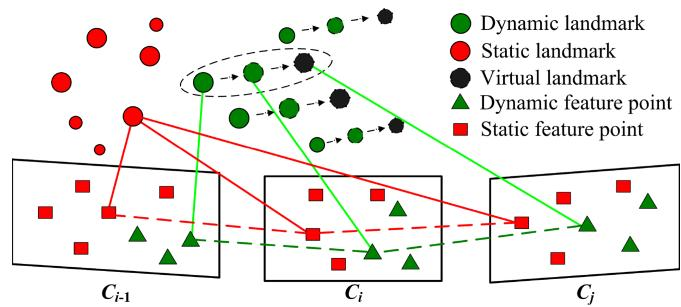  
Fig. 6. Schematic diagram of virtual landmark construction.

## VII. TIGHTLY COUPLED STEREO VISLAM

This section proposes a construction method of virtual landmarks related to dynamic features to improve the localization accuracy of Dynam in a high dynamic environment. Based on the tightly coupled visual-inertial system, the camera pose is estimated by the nonlinear optimization model.

## A. Virtual Landmarks Constructed From Dynamic Features

Since the large-proportion dynamic objects may appear in the field of view (FOV), the number of static features is scarce in the image. Although the IMU can provide accurate pose data in a short time interval, the sliding window cannot get enough visual constraints to suppress the IMU drift for a long time. Thus, we should improve the utilization of dynamic features rather than simply discarding them. Specifically, we further construct virtual landmarks after detecting dynamic features. The so-called virtual landmark is the spatial location of the corresponding landmark in the next frame predicted by the dynamic feature state of the current frame. As shown in Fig. $^ { 6 , }$ according to the pose of frame i and the motion model of the dynamic landmark (green triangle), the virtual landmark location (black circle) corresponding to the dynamic feature in frame $j$ can be predicted.

Due to the short time interval between two adjacent frames, it can be approximated that the dynamic landmark moves at a uniform speed in the world frame. Therefore, the movement change of the dynamic landmark between each adjacent frame can be considered the same, which can be given by

$$
\Delta \mathbf { M } _ { i } ^ { i - 1 } = \mathbf { P } _ { n } ^ { w _ { i } } - \mathbf { P } _ { n } ^ { w _ { i - 1 } }\tag{33}
$$

where $\mathbf { P } _ { n } ^ { w _ { i - 1 } }$ and $\mathbf { P } _ { n } ^ { w _ { i } }$ , respectively, represent the world locations of the nth landmarks observed in frame $i - 1$ and frame i, which are expressed as

$$
\begin{array} { r l } & { { \bf P } _ { n } ^ { w _ { i - 1 } } = { \bf R } _ { w } ^ { b _ { i - 1 } } \left( { \bf R } _ { b } ^ { c } { \bf P } _ { n } ^ { c _ { i - 1 } } + \alpha _ { b } ^ { c } \right) + { \bf p } _ { w } ^ { b _ { i - 1 } } } \\ & { ~ { \bf P } _ { n } ^ { w _ { i } } = { \bf R } _ { w } ^ { b _ { i } } \left( { \bf R } _ { b } ^ { c } { \bf P } _ { n } ^ { c _ { i } } + \alpha _ { b } ^ { c } \right) + { \bf p } _ { w } ^ { b _ { i } } . } \end{array}\tag{34}
$$

The predicted world location of the virtual landmark in frame j is given by

$$
\mathbf { P } _ { n } ^ { w _ { j } } = \mathbf { P } _ { n } ^ { w _ { i } } + \Delta \mathbf { M } _ { i } ^ { i - 1 } .\tag{35}
$$

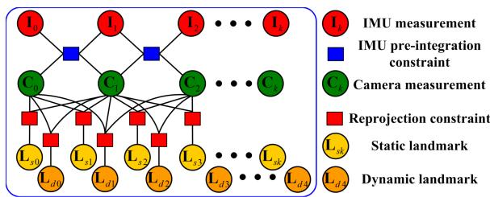  
Fig. 7. Factor graph structure of the sliding window. The IMU preintegration and the reprojection error factors of static and dynamic landmarks constrain the IMU measurements, visual ${ \mathrm { K F s } } ,$ and landmarks.

## B. Tightly coupled Nonlinear Optimization

This section builds a tightly coupled nonlinear optimizationbased stereo VISLAM that can estimate state variables by minimizing the residual items in the sliding window.

The target state vector χ to be optimized in the sliding window is defined as

$$
\begin{array} { r l r } & { \mathcal { X } = \left[ \mathbf { x } _ { 0 } , \mathbf { x } _ { 1 } , \ldots , \mathbf { x } _ { n } , \mathbf { x } _ { c } ^ { b } , \psi _ { 0 } , \psi _ { 1 } , \ldots , \psi _ { m } , \lambda _ { 0 } , \lambda _ { 1 } , \ldots \lambda _ { l } \right] } \\ & { \mathbf { x } _ { k } = \left[ \alpha _ { b _ { k } } ^ { w } , \beta _ { b _ { k } } ^ { w } , \mathbf { q } _ { b _ { k } } ^ { w } , \mathbf { b } _ { k } ^ { g } , \mathbf { b } _ { k } ^ { a } \right] } \\ & { \mathbf { x } _ { c } ^ { b } = \left[ \mathbf { q } _ { c } ^ { b } , \alpha _ { c } ^ { b } \right] } & { ( 3 6 } \end{array}
$$

where $\mathbf { x } _ { k }$ is the state of the IMU body aligned with the camera frame $c _ { k }$ , which includes position, velocity, and orientation in the world frame, and gyroscope and acceleration bias in the IMU body frame $b _ { k }$ . n is the total number of KFs. $\psi _ { m } \in \mathbb { R } ^ { + }$ and $\lambda _ { l } \in \mathbb { R } ^ { + }$ are, respectively, the inverse depths of the mth static feature and the lth dynamic feature from their first observations. m is the total number of static features, and l is that of dynamic features.

The residual for the dynamic feature observation $\mathbf { p } _ { n } ^ { \mathbf { I } _ { j , l } }$ in the image frame $\mathbf { I } _ { j , l }$ corresponding to the virtual landmark $\mathbf { P } _ { n } ^ { w _ { i } }$ is defined as

$$
\mathbf { r } _ { \mathcal { D } } \left( \hat { \mathbf { z } } _ { k } ^ { c _ { j } } , \pmb { \chi } \right) = \pi _ { c } \left( \mathbf { R } _ { c } ^ { b } ( \mathbf { R } _ { b _ { i } } ^ { w } \mathbf { P } _ { n } ^ { w _ { i } } + \pmb { \alpha } _ { b _ { i } } ^ { w } ) + \pmb { \alpha } _ { c } ^ { b } \right) - \mathbf { p } _ { n } ^ { \mathbf { I } _ { j } , { u } }\tag{37}
$$

where $\pi _ { c }$ is the projection function, which turns a spatial location in the camera frame to a pixel location in the image frame. ${ \bf R } _ { b _ { i } } ^ { w } \in  { \cal O }$ $\mathrm { S O ( 3 ) }$ and $\pmb { \alpha } _ { b _ { i } } ^ { w } \in \mathbb { R } ^ { 3 }$ are, respectively, the rotation matrix and the translation vector from the world frame to the IMU body frame $b _ { i }$

The factor graph constructed from each state variable and their mutual constraints in the sliding window is shown in Fig. 7. We minimize the sum of all measurement residuals, which consider the residual formulation of dynamic features, to get a maximum posteriori estimation

$$
\begin{array} { l } { \displaystyle \operatorname* { m i n } _ { x } \Bigg \{ \underbrace { | | \mathbf { r } _ { p } - \mathbf { H } _ { p } \boldsymbol { \chi } | | ^ { 2 } } _ { \mathbf { R } _ { p } } + \sum _ { k \in \mathcal { B } } | | \mathbf { r } _ { B } \left( \widehat { \pmb { z } } _ { b _ { k + 1 } } ^ { b _ { k } } , \boldsymbol { \chi } \right) | | _ { \mathbb { T } _ { \mathbb { X } _ { \mathbb { X } _ { k , k + 1 } } } } ^ { 2 } } \\ { + \displaystyle \sum _ { ( l , j ) \in \mathcal { S } } \rho \left( | | \mathbf { r } _ { \mathcal { S } } \left( \widehat { \pmb { z } } _ { k } ^ { c _ { j } } , \boldsymbol { \chi } \right) | | _ { \mathbf { P } _ { l } ^ { c _ { j } } } ^ { 2 } \right) } \\ { + \displaystyle \sum _ { ( m , j ) \in \mathcal { D } } \rho \Big ( \underbrace { | | \mathbf { r } _ { \mathcal { D } } \left( \widehat { \pmb { z } } _ { k } ^ { c _ { j } } , \boldsymbol { \chi } \right) | | _ { \mathbf { P } _ { m } ^ { c _ { j } } } ^ { 2 } } \Big ) \Bigg \} } \end{array}\tag{38}
$$

where $\mathbf { R } _ { p }$ is the residual term concerning the prior information $\{ \mathbf { r } _ { p } , \mathbf { H } _ { p } \}$ from marginalization. $\mathbf { R } _ { B }$ is the residual for the IMU preintegration measurement. $\Sigma _ { \mathbf { X } _ { k , k + 1 } }$ is the covariance of the IMU preintegrated noise. $\mathbf { R } _ { \mathcal { S } }$ is the reprojection residual term for the static feature observation. $\mathbf { P } _ { l } ^ { c _ { j } }$ is the lth static landmark in the camera frame $c _ { j } .$ RD is the reprojection residual term for the dynamic feature observation. $\mathbf { P } _ { m } ^ { \hat { c } _ { j } }$ is the mth virtual landmark in the camera frame $c _ { j } . ~ \rho ( \cdot )$ is the Huber kernel function. S and D are the sets of static and dynamic features that have been observed at least twice in the current sliding window, respectively.

In (38), both the static and dynamic features are brought into the local visual-inertial bundle adjustment process, which allows the system to effectively utilize the dynamic feature information of the image and further improves its accuracy and robustness in a highly dynamic environment. The entire nonlinear objective function is iteratively minimized using the Dogleg algorithm and the Dense–Schur linear solver implemented in Ceres Solver.1 In addition, we fix the number of frames in the sliding window to ten for real-time optimization.

## VIII. LOOP-CLOSURE DETECTION

We employ DBoW2 [51], a state-of-the-art bag-of-word (BoW) place recognition approach, for feature retrieval and loop-closure detection. The BoW is constructed based on the BRIEF binary descriptors [52] extracted for corner detectors. Since dynamic features may cause many failures for DBoW2 in recognizing previously visited scenes, we only use static features identified in KF to build the visual vocabularies and databases. DBoW2 returns previous KFs with the most similarity to the current KF as candidates for loop closure.

The BoW relies entirely on visual appearance without any geometric information, which may lead to an erroneous loopclosure detection. Thus, we further adopt the geometry-based consistency check to discard false positives once the loopclosure candidates are obtained. This check is achieved by recovering the relative transformation between the candidate and the current KFs in the loop-closure candidate. Specifically, we check the consistency using the following criterion. In the transformation estimate, the ratio of the inliers detected with the RANSAC-based perspective-n-point method is higher than 50%. In addition, the acquired translation and rotation of the relative pose cannot exceed 0.4 m and 4◦, respectively, as a large pose variation between the candidate and the current KFs usually indicates an incorrect loop closure. When all these criteria are satisfied, we treat this loop-closure candidate as a correct result and perform the global pose graph optimization.

## IX. EXPERIMENTAL VALIDATION

This section provides three sets of experimental results to evaluate the performance of our proposal. In the first set of tests (see Section IX-A), we perform different dynamic feature detection methods under various camera motions and dynamic scenarios to determine their effectiveness. In the second set of experiments (see Sections IX-B and IX-C), we comprehensively benchmark the Dynam system in the static EuRoC datasets and self-collected dynamic datasets of varying difficulty, and quantitatively compare the test results with those of state-of-the-art VSLAM and VISLAM methods to demonstrate the accuracy and robustness of our proposal. In the third set of experiments (see Section IX-D), we implement our proposed system in a challenging dynamic scene to evaluate its performance in a large-scale outdoor environment.

In all three sets of experiments, we use mobile robots equipped with $\mathrm { Z E D 2 ^ { 2 } }$ visual-inertial stereo cameras for data acquisition, where the camera includes a built-in IMU, barometer, magnetometer, and thermometer. The data collection is performed on an Nvidia Jetson AGX Xavier controller3 with an 8-core Carmel CPU running at 2.265 GHz and a 1 TB SSD. We collect stereo RGB images with 752×480 resolution at 20 Hz, and IMU measurements and GT poses at 200 Hz. The onboard computing runs on an Intel i9-9900K CPU at 3.6 GHz. The camera and IMU intrinsics, the camera-IMU spatial transform, and the time-offset between the camera and IMU measurements, introduced by the recording process, are calibrated using Kalibr.4

## A. Performance Assessment of Dynamic Feature Detection Methods

In this experiment, we focus on verifying the effectiveness of the proposed method in detecting dynamic targets with varying motion forms or states under a variety of camera movements.

1) Test Setup: To our knowledge, there is no wellestablished, publicly available dataset dedicated to providing accurate stereo and IMU data in dynamic environments, as well as GT at the pixel level for some dynamic targets, i.e., moving people, objects, or features. To this end, we set up multiple benchmark datasets according to the different motions ofsensors and dynamic targets. Referring to the TUM dataset [53], we set the following typical camera motions in the benchmark dataset: static, xyz, rpy, and halfsphere.

1) static: The camera is roughly fixed in place when the robot stops moving.

2) xyz: The camera moves along the x-y-z axes when the robot moves in a straight line.

3) rpy: The camera rotates along the roll–pitch–yaw axis as the robot rotates around its center.

4) halfsphere: The camera moves along a half-sphere-like trajectory when the robot moves around an object.

Simultaneously, the motion speed of dynamic objects and their proportion in the image are important factors that influence dynamic feature detection. In this context, the dynamic object proportion refers to the pixel distribution of dynamic objects within the image, so its difference will change the number of dynamic features among all extracted features. The following typical motions of the moving body are set in the experimental datasets: sitting, walking, running, keeping away, and compound movement.

TABLE I  
COMPARISONS OF RECALL $( \mathbb { R } ) ,$ PRECISION (P), AND F -SCORE (F ) FOR DYNAMIC FEATURE DETECTION ACROSS MULTIPLE EVALUATED METHODS UNDER SELF-COLLECTED DATASETS1
<table><tr><td rowspan=1 colspan=1>Dataset</td><td rowspan=1 colspan=3>RANSAC</td><td rowspan=1 colspan=3>Normalized modulus</td><td rowspan=1 colspan=3>Uncertainty model(Quantile threshold is $0 . 9 5 . )$ </td><td rowspan=1 colspan=3>Uncertainty model(Quantile threshold is 0.99.)</td></tr><tr><td rowspan=1 colspan=1></td><td rowspan=1 colspan=1>R</td><td rowspan=1 colspan=1>P</td><td rowspan=1 colspan=1>F1</td><td rowspan=1 colspan=1>R</td><td rowspan=1 colspan=1>P</td><td rowspan=1 colspan=1> $\overline { { \mathrm { F _ { 1 } } } }$ </td><td rowspan=1 colspan=1>R</td><td rowspan=1 colspan=1>P</td><td rowspan=1 colspan=1>F1</td><td rowspan=1 colspan=1>R</td><td rowspan=1 colspan=1>P</td><td rowspan=1 colspan=1>F1</td></tr><tr><td rowspan=1 colspan=1>s/static</td><td rowspan=1 colspan=1>0.902</td><td rowspan=1 colspan=1>0.416</td><td rowspan=1 colspan=1>0.569</td><td rowspan=1 colspan=1>0.922</td><td rowspan=1 colspan=1>0.702</td><td rowspan=1 colspan=1>0.797</td><td rowspan=1 colspan=1>0.955</td><td rowspan=1 colspan=1>0.962</td><td rowspan=1 colspan=1>0.958</td><td rowspan=1 colspan=1>0.952</td><td rowspan=1 colspan=1>0.969</td><td rowspan=1 colspan=1>0.960</td></tr><tr><td rowspan=1 colspan=1>s/h</td><td rowspan=1 colspan=1>0.911</td><td rowspan=1 colspan=1>0.369</td><td rowspan=1 colspan=1>0.525</td><td rowspan=1 colspan=1>0.903</td><td rowspan=1 colspan=1>0.459</td><td rowspan=1 colspan=1>0.609</td><td rowspan=1 colspan=1>0.937</td><td rowspan=1 colspan=1>0.913</td><td rowspan=1 colspan=1>0.925</td><td rowspan=1 colspan=1>0.931</td><td rowspan=1 colspan=1>0.958</td><td rowspan=1 colspan=1>0.944</td></tr><tr><td rowspan=1 colspan=1>w/static</td><td rowspan=1 colspan=1>0.325</td><td rowspan=1 colspan=1>0.423</td><td rowspan=1 colspan=1>0.368</td><td rowspan=1 colspan=1>0.921</td><td rowspan=1 colspan=1>0.638</td><td rowspan=1 colspan=1>0.754</td><td rowspan=1 colspan=1>0.969</td><td rowspan=1 colspan=1>0.965</td><td rowspan=1 colspan=1>0.967</td><td rowspan=1 colspan=1>0.948</td><td rowspan=1 colspan=1>0.961</td><td rowspan=1 colspan=1>0.954</td></tr><tr><td rowspan=1 colspan=1>w/xyz</td><td rowspan=1 colspan=1>0.422</td><td rowspan=1 colspan=1>0.365</td><td rowspan=1 colspan=1>0.391</td><td rowspan=1 colspan=1>0.896</td><td rowspan=1 colspan=1>0.607</td><td rowspan=1 colspan=1>0.724</td><td rowspan=1 colspan=1>0.921</td><td rowspan=1 colspan=1>0.931</td><td rowspan=1 colspan=1>0.926</td><td rowspan=1 colspan=1>0.916</td><td rowspan=1 colspan=1>0.957</td><td rowspan=1 colspan=1>0.936</td></tr><tr><td rowspan=1 colspan=1>w/rpy</td><td rowspan=1 colspan=1>0.371</td><td rowspan=1 colspan=1>0.397</td><td rowspan=1 colspan=1>0.384</td><td rowspan=1 colspan=1>0.854</td><td rowspan=1 colspan=1>0.688</td><td rowspan=1 colspan=1>0.762</td><td rowspan=1 colspan=1>0.931</td><td rowspan=1 colspan=1>0.921</td><td rowspan=1 colspan=1>0.926</td><td rowspan=1 colspan=1>0.911</td><td rowspan=1 colspan=1>0.935</td><td rowspan=1 colspan=1>0.923</td></tr><tr><td rowspan=1 colspan=1>w/h</td><td rowspan=1 colspan=1>0.393</td><td rowspan=1 colspan=1>0.306</td><td rowspan=1 colspan=1>0.344</td><td rowspan=1 colspan=1>0.912</td><td rowspan=1 colspan=1>0.498</td><td rowspan=1 colspan=1>0.644</td><td rowspan=1 colspan=1>0.939</td><td rowspan=1 colspan=1>0.917</td><td rowspan=1 colspan=1>0.928</td><td rowspan=1 colspan=1>0.918</td><td rowspan=1 colspan=1>0.951</td><td rowspan=1 colspan=1>0.934</td></tr><tr><td rowspan=1 colspan=1>r/static</td><td rowspan=1 colspan=1>0.362</td><td rowspan=1 colspan=1>0.421</td><td rowspan=1 colspan=1>0.389</td><td rowspan=1 colspan=1>0.932</td><td rowspan=1 colspan=1>0.687</td><td rowspan=1 colspan=1>0.791</td><td rowspan=1 colspan=1>0.962</td><td rowspan=1 colspan=1>0.938</td><td rowspan=1 colspan=1>0.950</td><td rowspan=1 colspan=1>0.944</td><td rowspan=1 colspan=1>0.953</td><td rowspan=1 colspan=1>0.948</td></tr><tr><td rowspan=1 colspan=1>r/xyz</td><td rowspan=1 colspan=1>0.252</td><td rowspan=1 colspan=1>0.373</td><td rowspan=1 colspan=1>0.301</td><td rowspan=1 colspan=1>0.896</td><td rowspan=1 colspan=1>0.473</td><td rowspan=1 colspan=1>0.619</td><td rowspan=1 colspan=1>0.958</td><td rowspan=1 colspan=1>0.942</td><td rowspan=1 colspan=1>0.950</td><td rowspan=1 colspan=1>0.939</td><td rowspan=1 colspan=1>0.971</td><td rowspan=1 colspan=1>0.955</td></tr><tr><td rowspan=1 colspan=1>r/rpy</td><td rowspan=1 colspan=1>0.298</td><td rowspan=1 colspan=1>0.233</td><td rowspan=1 colspan=1>0.262</td><td rowspan=1 colspan=1>0.914</td><td rowspan=1 colspan=1>0.402</td><td rowspan=1 colspan=1>0.558</td><td rowspan=1 colspan=1>0.932</td><td rowspan=1 colspan=1>0.919</td><td rowspan=1 colspan=1>0.925</td><td rowspan=1 colspan=1>0.929</td><td rowspan=1 colspan=1>0.951</td><td rowspan=1 colspan=1>0.940</td></tr><tr><td rowspan=1 colspan=1>r/h</td><td rowspan=1 colspan=1>0.316</td><td rowspan=1 colspan=1>0.255</td><td rowspan=1 colspan=1>0.282</td><td rowspan=1 colspan=1>0.891</td><td rowspan=1 colspan=1>0.423</td><td rowspan=1 colspan=1>0.574</td><td rowspan=1 colspan=1>0.928</td><td rowspan=1 colspan=1>0.927</td><td rowspan=1 colspan=1>0.927</td><td rowspan=1 colspan=1>0.915</td><td rowspan=1 colspan=1>0.921</td><td rowspan=1 colspan=1>0.918</td></tr><tr><td rowspan=1 colspan=1>k/static</td><td rowspan=1 colspan=1>0.389</td><td rowspan=1 colspan=1>0.402</td><td rowspan=1 colspan=1>0.395</td><td rowspan=1 colspan=1>0.268</td><td rowspan=1 colspan=1>0.358</td><td rowspan=1 colspan=1>0.307</td><td rowspan=1 colspan=1>0.941</td><td rowspan=1 colspan=1>0.953</td><td rowspan=1 colspan=1>0.947</td><td rowspan=1 colspan=1>0.942</td><td rowspan=1 colspan=1>0.978</td><td rowspan=1 colspan=1>0.960</td></tr><tr><td rowspan=1 colspan=1>k/xyz</td><td rowspan=1 colspan=1>0.411</td><td rowspan=1 colspan=1>0.376</td><td rowspan=1 colspan=1>0.393</td><td rowspan=1 colspan=1>0.256</td><td rowspan=1 colspan=1>0.201</td><td rowspan=1 colspan=1>0.225</td><td rowspan=1 colspan=1>0.952</td><td rowspan=1 colspan=1>0.937</td><td rowspan=1 colspan=1>0.944</td><td rowspan=1 colspan=1>0.938</td><td rowspan=1 colspan=1>0.941</td><td rowspan=1 colspan=1>0.939</td></tr><tr><td rowspan=1 colspan=1>c/static</td><td rowspan=1 colspan=1>0.278</td><td rowspan=1 colspan=1>0.365</td><td rowspan=1 colspan=1>0.316</td><td rowspan=1 colspan=1>0.914</td><td rowspan=1 colspan=1>0.616</td><td rowspan=1 colspan=1>0.736</td><td rowspan=1 colspan=1>0.976</td><td rowspan=1 colspan=1>0.929</td><td rowspan=1 colspan=1>0.952</td><td rowspan=1 colspan=1>0.965</td><td rowspan=1 colspan=1>0.989</td><td rowspan=1 colspan=1>0.977</td></tr><tr><td rowspan=1 colspan=1>c/h</td><td rowspan=1 colspan=1>0.241</td><td rowspan=1 colspan=1>0.294</td><td rowspan=1 colspan=1>0.265</td><td rowspan=1 colspan=1>0.896</td><td rowspan=1 colspan=1>0.384</td><td rowspan=1 colspan=1>0.538</td><td rowspan=1 colspan=1>0.917</td><td rowspan=1 colspan=1>0.895</td><td rowspan=1 colspan=1>0.906</td><td rowspan=1 colspan=1>0.912</td><td rowspan=1 colspan=1>0.955</td><td rowspan=1 colspan=1>0.933</td></tr></table>

1 The values we report are the median after ten executions. The bold text indicates the best results among all evaluated methods.

1) Sitting: A sitting person who makes partial body movements is described as a low-proportion dynamic target.

2) Walking: A person carrying objects (e.g., the box held by the person) walks in front of the camera lens. At this point, the dynamic targets occupy a large proportion of the image. In addition, the average walking speed of pedestrians is approximately 1 m/s. Therefore, we also regard this scenario as a low-speed dynamic scene.

3) Running: A person or object moving in front ofthe camera lens at an average speed of approximately 2∼5 m/s can be considered a high-speed dynamic target.

4) Keeping away: A person or object moves away from the camera lens in a direction that is approximately perpendicular to the camera lens.

5) Compound movement: The motion of a dynamic target relative to the camera can be decomposed horizontally into lateral motion (motion parallel to the camera lens) and longitudinal motion (motion perpendicular to the camera lens).

For brevity, we use the words h, $, \mathbf { s } , \mathbf { w } , \mathbf { r } , \mathbf { k } .$ , and c to denote halfsphere, sitting, walking, running, keeping away, and compound movement in the experimental datasets.

2) Quantitative Comparison: We use the evaluation indicators recall (R), precision (P), and F -score $( \mathrm { F _ { 1 } } )$ of the classic classification system to quantitatively compare the dynamic feature detection results of the three methods: RANSAC, normalized modulus, and uncertainty model with different quantile thresholds. Table I tabulates the experimental results in multiple self-collected datasets.

The results show that the RANSAC method can detect most outliers or wrong correspondences under low-proportion dynamic conditions. However, in the more challenging largeproportion dynamic scenes, quite a few correspondences belonging to moving objects are declared as inliers. As a result, the precision of the RANSAC method under the vast majority of datasets is not high. Compared with RANSAC, the normalized modulus method achieves higher recalls in almost all datasets.

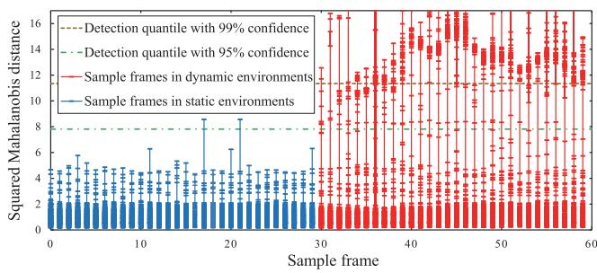  
Fig. 8. Mahalanobis distance distribution of scene flow.

Nevertheless, the precision of the method remains low in all datasets due to measurement noise or optical flow errors. Furthermore, the experimental results in datasets k/static and k/xyz show that although this method eliminates the depth noise, it also reduces the sensitivity of dynamic feature detection in the depth direction.

Compared with the RANSAC and normalized modulus methods, the uncertainty modeling approach significantly improves the detection recall, precision, and $_ \mathrm { F _ { 1 } - s c o r e }$ in all benchmark datasets. Most dynamic features are correctly detected in various challenging scenarios, and the detection results do not differ significantly for varying quantile thresholds. A lower threshold results in a higher recall value and generates many false positives. Conversely, a higher threshold reduces the recall value and produces more true positives. However, this gap is almost submerged in the local bundle adjustment, as the tightly coupled nonlinear optimization has strong robustness to small gaps in detection results. In conclusion, the uncertainty modeling approach is not affected by both camera and dynamic target motion when detecting dynamic features, and performs well in various dynamic scenarios.

Fig. 8 plots the Mahalanobis distance distribution of scene flow for multiple sampled frames in the w/xyz dataset, which visualizes the dynamic feature detection process of the uncertainty modeling approach. The detection quantile with 95% confidence for the $\bar { \chi } ^ { 2 }$ distribution with three degrees of freedom is 7.81, and the quartile with 99% confidence is 11.34. If the squared

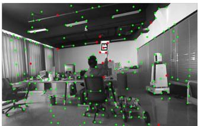

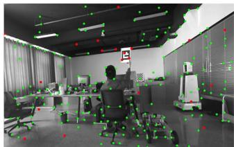  
(a)

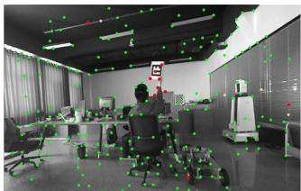

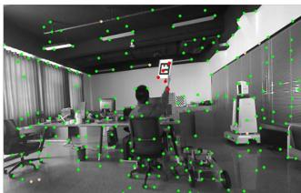

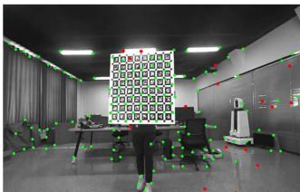

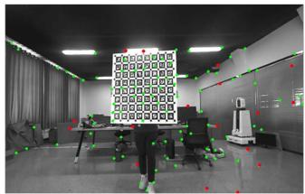  
(b)

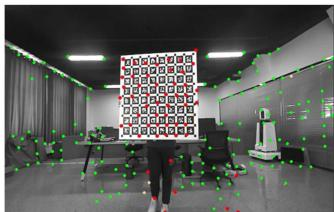

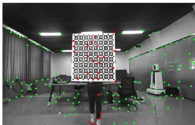

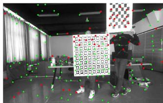

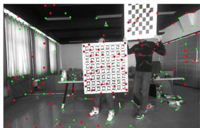  
(c)

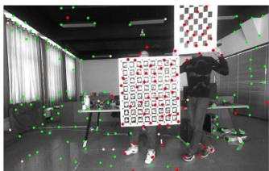

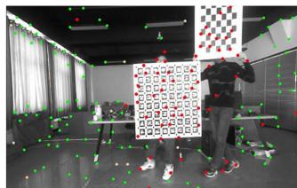  
Fig. 9. Dynamic feature detection effects of multiple evaluation methods under different benchmark datasets. (a) s/static dataset. (b) k/static dataset. (c) c/h dataset. The methods from left-hand side to right-hand side are RANSAC, normalized modulus, uncertainty model with quantile threshold 0.95, and uncertainty model with quantile threshold 0.99. To facilitate observation and comparison of detection results, we take the chessboard and ArUco calibration plate held by the person as the dynamic target in the above experimental datasets. The experiment video can be found in the multimedia attachment. Best viewed in color.

Mahalanobis distance ξ of a feature obtained from (32) exceeds the quantile 7.81 or 11.34, respectively, the probability of the feature belonging to the dynamic feature will reach 95% and 99%. In the static environment, the probability of most features being judged as dynamic is well below 95%. It is worth noting that the squared Mahalanobis distances of a few features exceed this critical value, which may be due to the mismatches or even tracking failures of these features during optical flow tracking. In the dynamic environment, the Mahalanobis distance distributions of static and dynamic features are significantly distinguished. The squared Mahalanobis distances of most static features are small, while those for the vast majority of dynamic features exceed 7.81, which facilitates the accurate detection of dynamic features. On the other hand, a rare number of features are identified as dynamic, with confidence levels ranging from 50% to 95%. We speculate that this ambiguity is caused by the sensitivity of the optical flow method to changes in illumination. As local illumination changes, especially in the case of accidental exposure, the uncertainty in optical flow tracking will increase, and the energy-based stereo matching algorithm will also be affected.

3) Qualitative Results: Fig. 9 qualitatively illustrates the dynamic feature detection results of the evaluated methods on several datasets. As Fig. 9(a) shows, the RANSAC method has good detection recall only under the low-proportion dynamic dataset s/static. Fig. 9(b) indicates that the normalized modulus method does not effectively detect the longitudinal motion of dynamic features. Furthermore, as shown in Fig. 9(c), the normalized modulus method achieves a high recall in the large-proportion dynamic scene but has many false positives caused by various measurement noises. As can also be seen in the above dataset, the tradeoff between recall and precision of the uncertainty model method varies slightly for different quantile thresholds. Moreover, the experimental video of dynamic feature detection in the Multimedia attachment shows that the uncertainty model approach misclassifies a few static features that fall near the contours of moving objects as dynamic at certain moments. This is mainly because the occlusion reduces the accuracy of optical flow estimation, which further leads to incorrect detection of dynamic features.

## B. Overall System Evaluation in Static Benchmark Datasets

In this section, the proposed pipelines w/ and w/o DFT are benchmarked and compared with the most relevant state-of-theart VISLAM systems in a few static scenes from the public benchmark dataset. The reason for this is to demonstrate that the proposed approach is not heavily affected by DFT and also performs well in static scenes.

1) Test Setup: Before working with dynamic datasets, we employ the public available EuRoC dataset [54] to validate the performance of the proposed pipeline in static scenes. The EuRoC consists of 11 stereo-inertial datasets collected with a micro aerial vehicle (MAV) flying in three different static scenes:

TABLE II  
RMSE ATE (M) COMPARISON IN THE STATIC EUROC DATASET FOR SEVERAL DIFFERENT METHODS1
<table><tr><td rowspan=2 colspan=1>Dataset</td><td rowspan=1 colspan=2>Our Method</td><td rowspan=1 colspan=3>Stereo-Inertial VISLAM</td></tr><tr><td rowspan=1 colspan=1>Dynam w/oDFT2</td><td rowspan=1 colspan=1>Dynam2</td><td rowspan=1 colspan=1>VINS-SI3</td><td rowspan=1 colspan=1>Kimera⁴</td><td rowspan=1 colspan=1>ORB3-SI⁵</td></tr><tr><td rowspan=1 colspan=1>MH_01</td><td rowspan=1 colspan=1>0.078</td><td rowspan=1 colspan=1>0.078</td><td rowspan=1 colspan=1>0.240</td><td rowspan=1 colspan=1>0.080</td><td rowspan=1 colspan=1>0.037</td></tr><tr><td rowspan=1 colspan=1>MH_02</td><td rowspan=1 colspan=1>0.066</td><td rowspan=1 colspan=1>0.067</td><td rowspan=1 colspan=1>0.180</td><td rowspan=1 colspan=1>0.090</td><td rowspan=1 colspan=1>0.031</td></tr><tr><td rowspan=1 colspan=1>MH_03</td><td rowspan=1 colspan=1>0.061</td><td rowspan=1 colspan=1>0.061</td><td rowspan=1 colspan=1>0.230</td><td rowspan=1 colspan=1>0.110</td><td rowspan=1 colspan=1>0.026</td></tr><tr><td rowspan=1 colspan=1>MH_04</td><td rowspan=1 colspan=1>0.077</td><td rowspan=1 colspan=1>0.077</td><td rowspan=1 colspan=1>0.390</td><td rowspan=1 colspan=1>0.150</td><td rowspan=1 colspan=1>0.059</td></tr><tr><td rowspan=1 colspan=1>MH_05</td><td rowspan=1 colspan=1>0.095</td><td rowspan=1 colspan=1>0.096</td><td rowspan=1 colspan=1>0.190</td><td rowspan=1 colspan=1>0.240</td><td rowspan=1 colspan=1>0.086</td></tr><tr><td rowspan=1 colspan=1>V1_01</td><td rowspan=1 colspan=1>0.052</td><td rowspan=1 colspan=1>0.052</td><td rowspan=1 colspan=1>0.100</td><td rowspan=1 colspan=1>0.050</td><td rowspan=1 colspan=1>0.037</td></tr><tr><td rowspan=1 colspan=1>V1_02</td><td rowspan=1 colspan=1>0.038</td><td rowspan=1 colspan=1>0.040</td><td rowspan=1 colspan=1>0.100</td><td rowspan=1 colspan=1>0.110</td><td rowspan=1 colspan=1>0.014</td></tr><tr><td rowspan=1 colspan=1>V1_03</td><td rowspan=1 colspan=1>0.042</td><td rowspan=1 colspan=1>0.051</td><td rowspan=1 colspan=1>0.110</td><td rowspan=1 colspan=1>0.120</td><td rowspan=1 colspan=1>0.023</td></tr><tr><td rowspan=1 colspan=1>V2_01</td><td rowspan=1 colspan=1>0.048</td><td rowspan=1 colspan=1>0.048</td><td rowspan=1 colspan=1>0.120</td><td rowspan=1 colspan=1>0.070</td><td rowspan=1 colspan=1>0.037</td></tr><tr><td rowspan=1 colspan=1>V2_02</td><td rowspan=1 colspan=1>0.055</td><td rowspan=1 colspan=1>0.056</td><td rowspan=1 colspan=1>0.100</td><td rowspan=1 colspan=1>0.100</td><td rowspan=1 colspan=1>0.014</td></tr><tr><td rowspan=1 colspan=1>V2_03</td><td rowspan=1 colspan=1>0.080</td><td rowspan=1 colspan=1>0.085</td><td rowspan=1 colspan=1>0.270</td><td rowspan=1 colspan=1>0.190</td><td rowspan=1 colspan=1>0.029</td></tr><tr><td rowspan=1 colspan=1>Avg</td><td rowspan=1 colspan=1>0.061</td><td rowspan=1 colspan=1>0.063</td><td rowspan=1 colspan=1>0.185</td><td rowspan=1 colspan=1>0.119</td><td rowspan=1 colspan=1>0.036</td></tr></table>

1 The bold text indicates the best results among all evaluated methods. Abbreviations: VINS-SI—VINS-Fusion with stereo-inertial configuration, ORB3-SI—ORB-SLAM3 with stereo-inertial configuration.  
2 Errors obtained by ourselves, running the source code ten times and then taking the median  
3,4,5 Errors reported at [14], [15], and [55], respectively.

two VICON rooms (V1 and V2) and a machine hall (MH). The 11 datasets are classified into easy, medium, and difficult groups, considering the varying challenges based on the flight dynamics, texture, illumination, etc. Meanwhile, each of these datasets provides the GT trajectory of the MAV flight.

For each of the EuRoC datasets, we benchmark our proposed pipelines w/ and w/o DFT and compare their trajectory estimates with those of the most related state-of-the-art VISLAM systems, including VINS-fusion with stereo-inertial configuration (VINS-SI) [14], ORB-SLAM3 with stereo-inertial configuration (ORB3-SI) [55], and Kimera [15]. Furthermore, we evaluate the trajectory estimation performance using the root mean square error (RMSE) of absolute trajectory error (ATE) [13]. The unit of ATE is m. We run each dataset ten times and take the median RMSE ATE as the final result, using the default calibration parameters provided by the EuRoC. Table II reports the median RMSE ATEs of different methods for each dataset.

2) Results and Evaluation: As given in Table II, the proposed pipelines w/ and w/o DFT successfully run all datasets and perform well in all EuRoC datasets. The Dynam w/o DFT has the lowest RMSE ATE in ten of the 11 datasets compared with the other methods except for ORB3-SI. Although ORB3-SI has the lowest RMSE ATEs in all 11 datasets, Dynam w/o DFT is the closest to ORB3-SI in terms of average value compared with VINS-SI and Kimera.

Meanwhile, the Dynam performs similarly with Dynam w/o DFT in all static EuRoC datasets because the Dynam behaves as a regular VISLAM system when the dynamic feature constraints are removed from the factor graph, as shown in Fig. 6. However, in the challenging datasets V1\_03 and V2\_03, the RMSE ATEs of Dynam are slightly larger than that of Dynam w/o DFT. This is mainly due to the fact that at certain moments in both datasets, severe motion blur reduces the accuracy of optical flow estimation and further affects the dynamic feature detection in Dynam. In general, although our proposed Dynam is built to overcome dynamic disturbances, it does not suffer significantly from DFT and performs similarly to the state-of-the-art VISLAM systems in static scenarios. The experimental videos of the proposed method in the EuRoC datasets MH\_03 and V1\_03 can be found in the Supplementary Material.

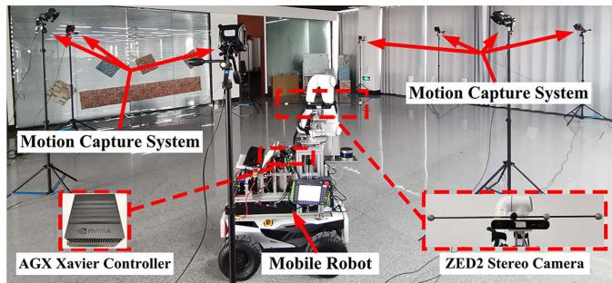  
Fig. 10. Hardware settings used in our collection of dynamic datasets.

## C. Overall System Evaluation in Dynamic Benchmark Datasets of Varying Difficulty

We further assess the performances of the proposed pipelines w/ and w/o DFT and other related state-of-the-art VSLAM and VISLAM systems in challenging dynamic scenarios. Our primary purpose is to verify the impact of different levels of dynamic complexity on the SLAM system and demonstrate the superiority of the proposed approach compared to other state-of-the-art methods in terms of accuracy and robustness.

1) Test Setup: As the purpose of this experiment is different from that of the dynamic feature detection experiment, we collect a set of dynamic datasets specifically for pipeline testing. We set up the dynamic benchmark datasets of varying difficulty, taking comprehensive account of the main real-life dynamic factors, including the proportion, motion speed, and on-camera frequency of dynamic objects (dynamic occurrence frequency) in the FOV. Based on the small/large proportion, slow/fast speed, and low/high on-camera frequency of the dynamic objects, we record eight different datasets, as shown in the Table III, which can be divided into three difficulty groups (easy, medium, and hard).

Fig. 10 presents an overview of this experimental setup. We use a mobile robot carrying a ZED2 camera to record benchmark datasets in a room with an approximate size of 10×10×4 m. The room is equipped with a NOKOV 3-D optical motion capture system,5 which provides GT of the camera trajectory with millimetric-level accuracy. To allow sufficient dynamic stimulation of the camera during data acquisition, we control the mobile robot to move slowly along the specified paths of different datasets with average translation and rotation velocities of around 10 cm/s and 5◦/s. Under the small-proportion dynamic condition, we carry the small-sized checkerboard (40×40 cm) and move about 2 m away from the camera lens. The created dynamic features do not exceed 50% of the total number of all extracted features and, in most cases, are less than 40%. In the large-proportion dynamic condition, we move the large-sized ArUco calibration plate (80×80 cm) at a distance of 0.5−1.5 m from the camera lens, and the dynamic features exceed 50% of the total number of all features, even reaching around 80% when the plate is closer to the camera at certain moments. The slow speed is set to almost 1 m/s and the fast greater than 2.5 m/s. For the on-camera frequency, we set the low frequency close to 0.2 Hz, i.e., dynamic objects move in front of the camera lens once every 5 s, while the high frequency is approximately twice as high as the low frequency.

TABLE III  
RMSE ATE (M) COMPARISON FOR MULTIPLE EVALUATED METHODS IN SELF-COLLECTED DYNAMIC BENCHMARK DATASETS OF VARYING DIFFICULTY1
<table><tr><td rowspan=2 colspan=1>Dataset</td><td rowspan=1 colspan=1>Our</td><td rowspan=1 colspan=1>Method</td><td rowspan=1 colspan=3>Stereo VSLAM</td><td rowspan=1 colspan=3>Stereo-Inertial VISLAM</td></tr><tr><td rowspan=1 colspan=1>Dynam</td><td rowspan=1 colspan=1>Dynamw/o DFT</td><td rowspan=1 colspan=1>ORB2-Stereo</td><td rowspan=1 colspan=1>VINS-Stereo</td><td rowspan=1 colspan=1>ORB3-Stereo</td><td rowspan=1 colspan=1>VINS-SI</td><td rowspan=1 colspan=1>ORB3-SI</td><td rowspan=1 colspan=1>Kimera</td></tr><tr><td rowspan=1 colspan=1>SFL_easySSL_easy</td><td rowspan=1 colspan=1>0.0480.059</td><td rowspan=1 colspan=1>0.2030.253</td><td rowspan=1 colspan=1>0.3170.323</td><td rowspan=1 colspan=1>0.5461.732</td><td rowspan=1 colspan=1>0.3300.360</td><td rowspan=1 colspan=1>0.2210.362</td><td rowspan=1 colspan=1>0.2970.321</td><td rowspan=1 colspan=1>0.3020.347</td></tr><tr><td rowspan=1 colspan=1>SFH_easy</td><td rowspan=1 colspan=1>0.055</td><td rowspan=1 colspan=1>0.343</td><td rowspan=1 colspan=1>0.322</td><td rowspan=1 colspan=1>0.540</td><td rowspan=1 colspan=1>0.308</td><td rowspan=1 colspan=1>0.311</td><td rowspan=2 colspan=1>0.2540.412</td><td rowspan=2 colspan=1>0.2260.487</td></tr><tr><td rowspan=1 colspan=1>SSH_med</td><td rowspan=1 colspan=1>0.078</td><td rowspan=1 colspan=1>0.598</td><td rowspan=1 colspan=1>0.422</td><td rowspan=1 colspan=1>4.367</td><td rowspan=1 colspan=1>0.332</td><td rowspan=1 colspan=1>0.373</td></tr><tr><td rowspan=1 colspan=1>LFL_med</td><td rowspan=1 colspan=1>0.081</td><td rowspan=1 colspan=1>0.619</td><td rowspan=1 colspan=1>0.801</td><td rowspan=1 colspan=1>13.278</td><td rowspan=1 colspan=1>0.764</td><td rowspan=1 colspan=1>0.526</td><td rowspan=1 colspan=1>0.447</td><td rowspan=1 colspan=1>0.573</td></tr><tr><td rowspan=1 colspan=1>LSL med</td><td rowspan=1 colspan=1>0.107</td><td rowspan=1 colspan=1>0.825</td><td rowspan=1 colspan=1>0.982</td><td rowspan=1 colspan=1></td><td rowspan=1 colspan=1>1.396</td><td rowspan=1 colspan=1>1.075</td><td rowspan=1 colspan=1>0.484</td><td rowspan=1 colspan=1>0.768</td></tr><tr><td rowspan=1 colspan=1>LFH_hard</td><td rowspan=1 colspan=1>0.087</td><td rowspan=1 colspan=1>0.514</td><td rowspan=1 colspan=1></td><td rowspan=1 colspan=1></td><td rowspan=1 colspan=1></td><td rowspan=1 colspan=1>0.988</td><td rowspan=1 colspan=1>0.897</td><td rowspan=1 colspan=1>0.961</td></tr><tr><td rowspan=1 colspan=1>LSH_hard</td><td rowspan=1 colspan=1>0.118</td><td rowspan=1 colspan=1>2.162</td><td rowspan=1 colspan=1></td><td rowspan=1 colspan=1></td><td rowspan=1 colspan=1></td><td rowspan=1 colspan=1>2.371</td><td rowspan=1 colspan=1>0.903</td><td rowspan=1 colspan=1>1.544</td></tr><tr><td rowspan=1 colspan=1>Avg2</td><td rowspan=1 colspan=1>0.079</td><td rowspan=1 colspan=1>0.690(↓89%)</td><td rowspan=1 colspan=1>0.528*</td><td rowspan=1 colspan=1>4.093*</td><td rowspan=1 colspan=1>0.582*</td><td rowspan=1 colspan=1>0.778(↓90%)</td><td rowspan=1 colspan=1>0.502(↓84%)</td><td rowspan=1 colspan=1>0.651(↓88%)</td></tr></table>

1 The values we report are the median after ten executions. A dash indicates that the SLAM system fails to estimate the full trajectory in this dataset. The bold text indicates the best results among all evaluated methods. Abbreviations: ORB2-Stereo—ORB-SLAM2 with stereo configuration, VINS-Stereo— VINS-Fusion with stereo configuration, ORB3-Stereo—ORB-SLAM3 with stereo configuration, VINS-SI—VINS-Fusion with stereo-inertial configuration, ORB3-SI—ORB-SLAM3 with stereo-inertial configuration, SSL (small proportion, slow motion, and low frequency), · · · , LFH (large proportion, fast motion, and high frequency).  
2 The average error of successful datasets for a given SLAM system. Systems that do not complete all datasets are denoted by\*.

TABLE IV  
RMSE RPE (TRANS. IN M/S, ROT. IN ◦/S) COMPARISON FOR MULTIPLE EVALUATED METHODS IN SELF-COLLECTED DYNAMIC BENCHMARK DATASETS OF VARYING DIFFICULTY1
<table><tr><td rowspan="5">Dataset</td><td colspan="2">Our Method</td><td colspan="3">Stereo VSLAM</td><td colspan="3">Stereo-Inertial VISLAM</td></tr><tr><td>Dynam</td><td>Dynam w/o DFT</td><td>ORB2- Stereo</td><td>VINS Stereo</td><td>ORB3- Stereo</td><td>VINS-SI</td><td>ORB3-SI</td><td>Kimera</td></tr><tr><td>Trans.</td><td>Trans.</td><td>Trans.</td><td>Trans.</td><td>Trans.</td><td>Trans.</td><td>Trans.</td><td>Trans.</td></tr><tr><td>Rot.</td><td>Rot.</td><td>Rot.</td><td>Rot.</td><td>Rot.</td><td>Rot.</td><td>Rot.</td><td>Rot.</td></tr><tr><td rowspan="3">SFL_easy</td><td>0.005</td><td>0.152</td><td>0.123</td><td>0.118</td><td>0.119</td><td>0.148</td><td>0.124</td><td>0.144</td></tr><tr><td>0.013</td><td>0.249</td><td>3.180</td><td>1.109</td><td>3.121</td><td>0.249</td><td>3.183</td><td>0.208</td></tr><tr><td>0.008</td><td>0.157</td><td>0.132</td><td>0.410</td><td>0.136</td><td>0.185</td><td>0.128</td><td>0.176</td></tr><tr><td rowspan="2">SSL_easy</td><td>0.131</td><td>0.270</td><td>3.004</td><td>4.265</td><td>3.002</td><td>0.266</td><td>2.989</td><td>0.305</td></tr><tr><td>0.010</td><td>0.156</td><td>0.114</td><td>0.120</td><td>0.116</td><td>0.156</td><td>0.114</td><td>0.167</td></tr><tr><td rowspan="2">SFH_easy</td><td>0.099</td><td>0.318</td><td>2.719</td><td>3.099</td><td>2.709</td><td>0.234</td><td>2.698</td><td>0.303</td></tr><tr><td>0.009</td><td>0.136</td><td>0.126</td><td>0.781</td><td></td><td>0.183</td><td></td><td></td></tr><tr><td rowspan="2">SSH_med</td><td>0.124</td><td>2.251</td><td>2.474</td><td>3.647</td><td>0.127</td><td>0.388</td><td>0.126</td><td>0.186 0.553</td></tr><tr><td>0.008</td><td>0.167</td><td>0.162</td><td></td><td>2.590</td><td></td><td>2.453</td><td></td></tr><tr><td rowspan="2">LFL_med</td><td>0.041</td><td>0.376</td><td>3.081</td><td>3.451</td><td>0.144</td><td>0.163</td><td>0.135</td><td>0.147</td></tr><tr><td></td><td>0.256</td><td></td><td>4.011</td><td>3.072</td><td>0.271</td><td>2.633</td><td>0.438</td></tr><tr><td rowspan="2">LSL_med</td><td>0.005 0.018</td><td>0.512</td><td>0.224 4.736</td><td></td><td>0.182</td><td>0.237</td><td>0.145</td><td>0.187</td></tr><tr><td>0.021</td><td>0.232</td><td></td><td></td><td>3.329</td><td>0.389</td><td>3.182</td><td>0.368</td></tr><tr><td rowspan="2">LFH_hard</td><td>0.118</td><td>0.391</td><td>–</td><td></td><td></td><td>0.224</td><td>0.139</td><td>0.197</td></tr><tr><td></td><td>0.361</td><td></td><td></td><td></td><td>0.285</td><td>3.215</td><td>0.368</td></tr><tr><td rowspan="2">LSH_hard</td><td>0.021 0.242</td><td>0.605</td><td></td><td></td><td></td><td>0.298</td><td>0.149</td><td>0.174</td></tr><tr><td></td><td></td><td>0.147*</td><td></td><td></td><td>0.448</td><td>3.240</td><td>0.598</td></tr><tr><td rowspan="2">Avg²</td><td>0.011</td><td>0.202(↓95%)</td><td>3.199*</td><td>0.976*</td><td>0.137*</td><td>0.199(↓94%)</td><td>0.133(↓92%)</td><td>0.172(↓94%)</td></tr><tr><td>0.098</td><td>0.622(↓84%)</td><td></td><td>3.226*</td><td>2.971*</td><td>0.316(↓69%)</td><td>2.949(↓97%)</td><td>0.393(↓75%)</td></tr></table>

1 The values we report are the median after ten executions. A dash indicates that the SLAM system fails to estimate the full trajectory in this dataset. The bold text indicates the best results among all evaluated methods. The abbreviations in the table are the same as in Tab. III.  
2 The average error of successful datasets for a given SLAM system. Systems that do not complete all datasets are denoted by \*.

Besides the VISLAM methods evaluated in Table II, we also test the related stereo VSLAM methods, including ORB-SLAM2 with stereo configuration (ORB2-Stereo) [11], VINS-Fusion with stereo configuration (VINS-Stereo) [14], and ORB-SLAM3 with stereo configuration (ORB3-Stereo) [55] in this experiment. To achieve a fair comparison, all tested SLAM methods use the same sensor calibration parameters and set the maximum number of features extracted per image to 800. Besides the RMSE ATE, we also use the RMSE of the relative pose error (RPE) to measure the accuracy of the comparative SLAM systems. The RPE includes translational (Trans.) and rotational (Rot.) errors, and its units are m/s and ◦/s. Tables III and IV, respectively, compare the RMSE ATEs and RPEs of the proposal with those of the state-of-the-art VSLAM and VIS-LAM approaches in benchmark datasets with varying difficulty levels.

Note that due to the inherent performance differences in the same SLAM system running on different datasets, it will be incorrect to accurately quantify the impact of dynamic factors on a SLAM system by insignificant ATE and RPE variations across varying datasets. However, we collect all datasets in the same experimental field and create each dynamic factor strictly so that there are no significant ATE and RPE changes in a particular SLAM system caused by nondynamic factors between different datasets. Thus, we can draw more reliable conclusions from the generally significant variation in the results of multiple methods.

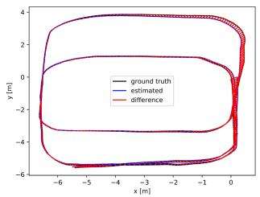  
(a)

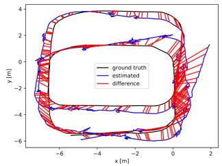

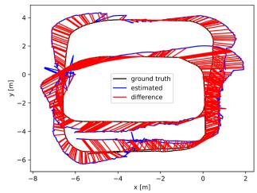

(b)  
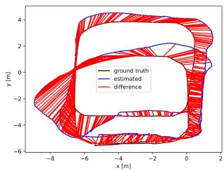

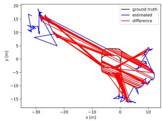

(e)  
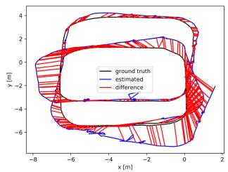  
(f)

(c)  
(d)  
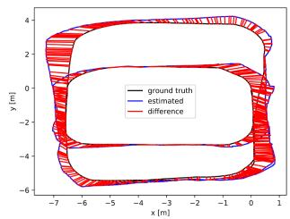  
(g)

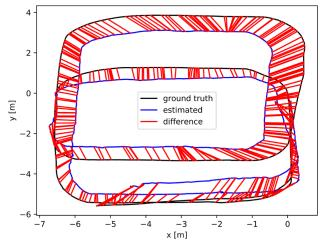  
(h)  
Fig. 11. ATE plots of multiple evaluated methods in the dynamic benchmark dataset. LSL\_med. (a) Dynam. (b) Dynam w/o DFT. (c) ORB2-Stereo. (d) VINS-Stereo. (e) ORB3-Stereo. (f) VINS-SI. (g) ORB3-SI. (h) Kimera. The red line represents the localization error. We only plot the trajectory error before the failure for methods that fail to run the entire dataset. The abbreviations in the figure are the same as in Table III.

2) Results and Evaluation: As given in Tables III and IV, Dynam successfully runs all datasets and achieves more accurate results than other evaluated systems in terms of RMSE ATE and RPE. All compared methods work successfully in the smallproportion dynamic conditions of the easy group, with smaller localization errors and odometer drifts than in the medium and hard groups. However, the VSLAM approaches still suffer a lot from dynamic shocks. VINS-Stereo has the largest RMSE ATEs among all methods. ORB2-Stereo performs similarly to ORB3-Stereo in most easy datasets, with minor RMSE ATEs but greater RMSE RPEs than VINS-Stereo. The VISLAM systems generally achieve better results than the VSLAM solutions due to the effective IMU constraint. The ATEs and rotational RPEs of VINS-SI are much smaller than that of VINS-Stereo. ORB3-SI has lower ATEs than ORB3-Stereo. Dynam w/o DFT, as well as Kimera, behaves similarly to VINS-SI in most cases. It is worth noting that due to the utility of DFT, Dynam vastly outperforms all comparative methods in both RMSE ATE and RPE.

With the increasing difficulty ofdatasets in the medium group, all the evaluated methods, except Dynam, lead to significant accuracy losses of pose estimation. In the dataset SSH\_med, the high on-camera frequency dramatically increases the RMSE ATEs of Dyanm w/o DFT and state-of-the-art SLAM systems with respect to the datasets in the easy group. In the datasets LFL\_med and LSL\_med, the RMSE ATEs soar significantly as the proportion of dynamic feature points increases, and the RMSE RPEs of some methods also rise considerably. Fig. 11 shows the details, in which the trajectory estimates of other evaluated methods remarkably diverge from the GT in LSL\_med, while the Dynam still tracks the GT tightly. In particular,

VINS-Stereo ultimately fails after several large-proportion dynamic shocks in LSL\_med.

For hard datasets with continuous, large-proportion dynamic objects, the Dynam still works well, while the other comparative approaches either yield worse RMSE ATEs and RPEs, or experience failures. The evaluated SLAM systems perform varyingly in the most challenging dataset LSH\_hard. Dynam w/o DFT and VINS-SI have the worst accuracy, and the RMSE ATEs of them are approximately ten times as high as those in the easiest dataset SFL\_easy. None of the VSLAM methods can estimate the complete trajectory. ORB3-SI is slightly better than VINS-SI and Kimera, resulting in a more than three times increase of RMSE ATE versus the corresponding result in SFL\_easy. Overall, the abovementioned experimental results suggest that SLAM may obtain a completely wrong state estimate when dynamic landmarks occupy a large proportion of all observed landmarks. As shown in Fig. 12, the compared state-of-the-art systems and the proposed pipeline w/o DFT perform poorly in LSH\_hard, leading to obvious trajectory errors and odometry drifts. However, the DFT of Dynam can overcome the dynamic shocks and generate trajectories with a minor error.

Comparing the RMSE ATEs in difficulty levels SSL and SFL, SSH and SFH, LSL and LFL, and LSH and LFH, respectively, we observe that the slow-to-fast motion changes of dynamic objects lead to varying degrees of reduction in RMSE ATE for all other compared SLAM systems with other dynamic factors being the same. This is most probably explained by the fact that when the camera moves slowly, the fast motion makes the same dynamic object have a shorter duration in the FOV and renders dynamic features more likely to be detected as outliers. Therefore, when the other dynamic factors remain consistent, we rank the difficulty level containing the slow motion of the dynamic object after the difficulty level containing the fast motion. In addition, since the large proportion and high oncamera frequency of dynamic objects have a significant impact on SLAM performance, we place the difficulty levels SFL, SSL, and SFH into the easy group, the difficulty levels SSH, LFL, and LSL into the middle group, and the difficulty levels LFH, LSH into the hard group.

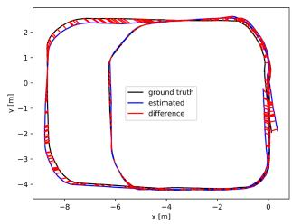  
(a)

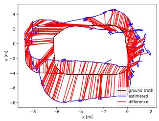  
(b)

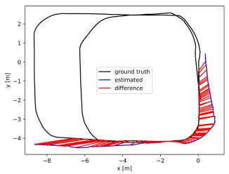

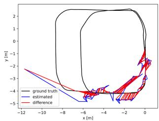

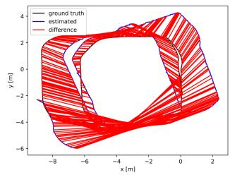  
(e)

(d)  
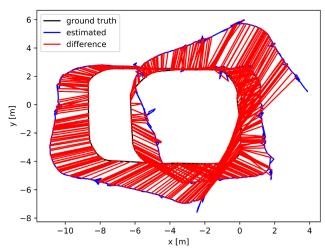  
(f)

(c)  
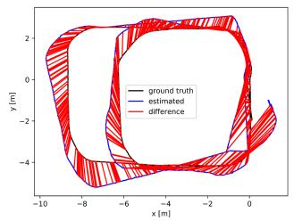  
(g)

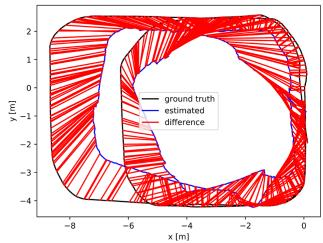  
(h)

Fig. 12. ATE plots of multiple evaluated methods in the dynamic benchmark dataset. LSH\_hard. (a) Dynam. (b) Dynam w/o DFT. (c) ORB2-Stereo (d) VINS-Stereo. (e) ORB3-Stereo. (f) VINS-SI. (g) ORB3-SI. (h) Kimera. The red line represents the localization error. We only plot the trajectory error before the failure for methods that fail to run the entire dataset. The abbreviations in the figure are the same as in Table III.  
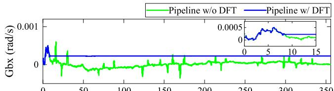

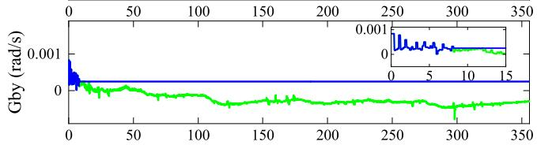

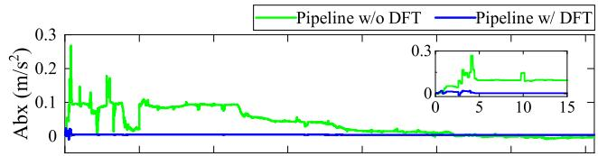

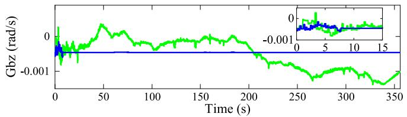  
(a)

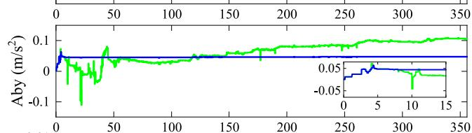

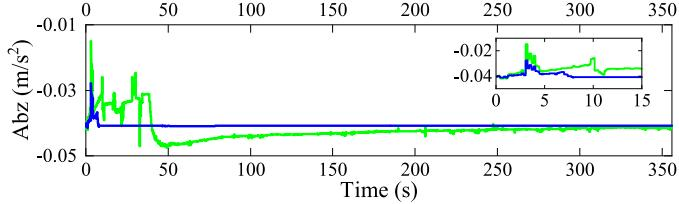  
(b)  
Fig. 13. Estimated gyroscope and accelerometer biases of the IMU body in the $x \mathrm { \cdot , y \mathrm { - } , }$ , and z-directions for the proposed pipelines w/ and w/o DFT. Abbreviations: Gbx, Gby, Gbz—gyroscope biases in the $x \mathrm { \cdot , \ y \mathrm { - } , }$ and z-directions; Abx, Aby, Abz—accelerometer biases in the x-, y-, and z-directions. (a) Estimated gyroscope biases of the proposed pipelines w/ and w/o DFT. (b) Estimated accelerometer biases of the proposed pipelines w/ and w/o DFT.

In overview, in most cases, the other compared methods are less effective for localization accuracy in all self-collected dynamic datasets of varying difficulty. In contrast, Dynam performs well in all datasets with a much lower average RMSE ATE and RPE than the other methods. The average RMSE ATE of Dynam is ∼90% (0.778→0.079) lower than that of VINS-SI, ∼84% (0.502→0.079) lower than that of ORB3-SI, and ∼88% (0.651→0.079) lower than that ofKimera, demonstrating the accuracy and robustness of the proposed method for pose estimation. Furthermore, by comparing the average RMSE ATEs and RPEs of the proposed pipelines w/ and w/o DFT, we observe that the DFT noticeably reduces the trajectory estimation error and odometer drift, reflecting the importance of DFT for consistent state estimation in dynamic environments of varying difficulty.

In particular, we also evaluate the estimated IMU biases and velocities for the proposed pipelines w/ and w/o DFT. Fig. 13 shows the estimates of the gyroscope and accelerometer biases in the dataset LSH\_hard. We observe that all estimates of the proposed pipeline w/ DFT converge to stable values within 10 s. Notably, the gyroscope and accelerometer bias curves oscillate violently in the first 8 s, which results from the insufficiently excited of at least two independent axes of the ZED2 camera during this period rather than caused by dynamic shocks. Nevertheless, the gyroscope and accelerometer bias curves of the proposed pipeline w/o DFT suffer severe oscillations in the operating range.

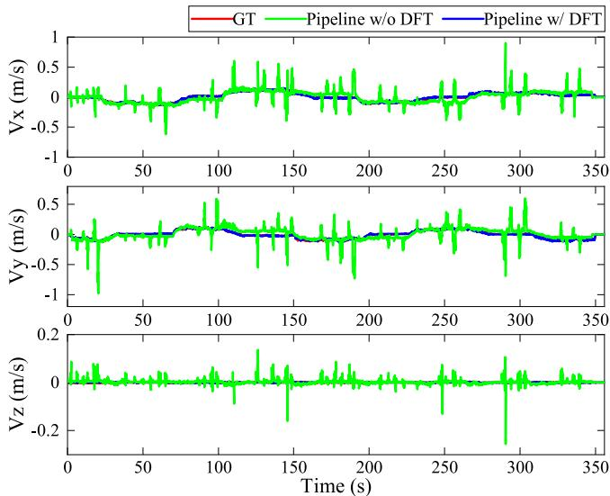  
Fig. 14. Compared with the GT values, the estimated IMU body velocities in the $x \mathrm { \cdot , \ y \mathrm { - } , }$ , and z-directions of the proposed pipelines w/ and w/o DFT. Abbreviations: $\mathrm { { V x , V y } , }$ , and Vz—velocities in the $x \mathrm { \cdot , \ : y \mathrm { - } , }$ , and z-directions.

TABLE V  
EXECUTION TIME STATISTICS
<table><tr><td>Thread</td><td>Modules</td><td>Times (ms)</td><td>Rate (Hz)</td></tr><tr><td>1</td><td>Measurement Preprocessing</td><td>20</td><td>30</td></tr><tr><td>2</td><td>Dynamic Feature Detection and Processing</td><td>55</td><td>11</td></tr><tr><td>3</td><td>Local Visual-Inertial Bundle Adjustment</td><td>50</td><td>12</td></tr><tr><td>4</td><td>Loop-closure Detection</td><td>200</td><td></td></tr></table>

Fig. 14 compares the velocity estimates of our approach with the GT values in the dataset LSH\_hard. The average velocities, derived from the NOKOV tracking positions and the time intervals ofadjacent IMU frames, are considered the GT values. Since the estimated velocities of the IMU body and GT are expressed in different reference frames, the estimates are transformed by the camera-IMU extrinsic matrix to best match the GT values. As shown in Fig. 14, the estimated velocities of the proposed pipeline w/ DFT follow the GT quite closely, while those of the proposed pipeline w/o DFT differ a lot from the GT. Overall, the estimates of IMU bias and velocity indicate the advantage of our DFT in improving the robustness of the proposed SLAM system in high dynamic scenes.

Table V tabulates the average execution time of the main modules in dynamic datasets of varying difficulty. Threads 1–4 represent measurement preprocessing, dynamic feature detection and processing, local visual-inertial bundle adjustment, and loop-closure detection of the Dynam framework in Fig. 2, respectively. Dynam requires up to 55 ms in thread 2 and 50 ms in thread 3. Since the loop-closure detection thread performs nonreal-time trajectory optimization at the SLAM back-end, its running rate is not considered. The bold Fig. 11 stands for the final pose update rate. With reference to the real-time standard in VINS-Mono, when the SLAM system runs at a rate exceeding 10 Hz, it can provide accurate position information as an output.

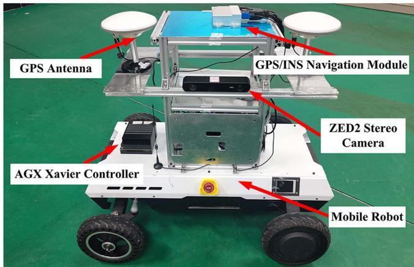  
Fig. 15. Hardware settings used in the outdoor localization experiment.

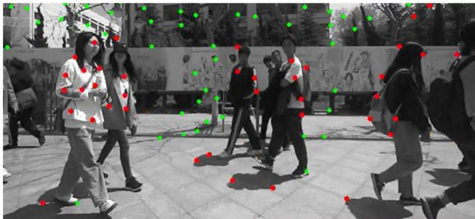  
Fig. 16. Example image of dynamic feature detection in the outdoor test filled with pedestrians. The test video can be found in the multimedia attachment.

## D. Localization in the Large-Scale Outdoor Scene

We apply the Dynam to the autonomous localization of a mobile robot in the large-scale outdoor scene, as shown in Fig. 15. In addition to the ZED2 stereo camera, the mobile robot is equipped with a differential GPS/INS navigation module that supports real-time kinematic6 technology, which can achieve centimeter-level location accuracy in outdoor areas with sufficient satellite coverage.

To test the reliability of Dynam for practical applications in dynamic environments, we set up a mixed indoor and outdoor experimental trajectory (rarely indoors) in the living area of the Harbin Institute of Technology campus. The trip starts from the student restaurant, passes through the apartment buildings, and finally returns to the starting position. The trajectory includes the most crowded streets on campus and the centers where people gather. The total length of the route is ∼867 m, and the acquired image sequence consists of 46 752 stereo frames with a duration of ∼25 min. Fig. 16 shows an example image of this large-scale test. We observe that our method can accurately and comprehensively detect dynamic features, even if they fall in the shadow of pedestrians.

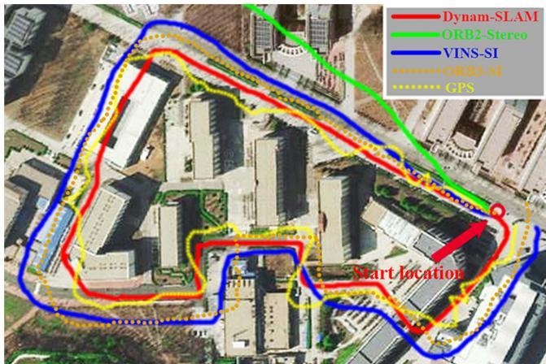  
Fig. 17. Comparison of robot trajectories estimated by Dynam-SLAM (in red), ORB2-Stereo (in green), VINS-SI (in blue), ORB3-SI (in orange), and GPS (in yellow). The abbreviations in the figure are the same as in Table III.

In addition, we test the trajectory tracking performance of Dynam. The estimated trajectories of ORB2-Stereo, VINS-SI, ORB3-SI, and the measured trajectories of GPS are used for the accuracy comparison. We align the final estimated trajectories with the Google satellite map, as shown in Fig. 17. It can be seen that our method successfully returns to the start location and accurately aligns with the map. Although there is no GT for comparison, the trajectory estimated by our method is very smooth in this large-scale test. The final drift of Dynam is ∼[0.12, 0.15, 0.09] m, resulting in 0.024% position drift, which is a negligible and acceptable drift compared with the total trajectory length. However, the trajectories of the other methods present obvious drifts in varying degrees. When encountering a high dynamic environment, ORB2-Stereo shows extremely unstable tracking, rapidly deviating from the actual route in a short period. Therefore, its trajectory cannot be entirely drawn on the map. VINS-SI and ORB3-SI also produce incorrect pose estimates in highly dynamic environments. Although the trajectories they estimated roughly draw the shape of the actual route, they do not overlap. The final drifts of VINS-SI and ORB3-SI are ∼[9.68, 15.14, 3.27] and ∼[8.12, 13.24, 2.11] m, respectively. GPS displays erratic position tracking, especially when approaching or passing through buildings.

## X. CONCLUSION

In this article, we present the Dynam-SLAM, a stereo VIS-LAM system capable of robust, accurate, and continuous work in highly dynamic environments. The system first couples the stereo scene flow with IMU to detect dynamic features. The uncertainty of the scene flow caused by the measurement noise is modeled to detect dynamic features accurately. Furthermore, to enable the method to cope with highly dynamic environments, we construct virtual landmarks based on the detected dynamic features and involve them in a tightly coupled nonlinear optimization process. We evaluate the performance of Dynam-SLAM in multiple benchmark datasets. The experimental results show that our approach can effectively detect the dynamic features under various camera motions and dynamic scenarios. Besides, compared with the state-of-the-art VSLAM and VISLAM implementations, the Dynam-SLAM is significantly superior in terms of accuracy and robustness in dynamic datasets. Finally, Dynam-SLAM has been validated in a challenging outdoor scenario, demonstrating its ability to reliably and effectively perform location tasks in unknown dynamic situations.

The proposed Dynam-SLAM still has limitations. The DFT detects dynamic features through the preintegration of IMU measurements. Therefore, in some cases, the quality of IMU data makes it difficult to distinguish between static and dynamic features. For instance, the vehicle’s vibration and the IMU bias during long-term vehicle standstill cause the low signal-to-noise ratio of the IMU measurement, and eventually leads to false detection of dynamic features. One possible solution to this problem is to improve the data quality of the IMU by using methods to reduce camera vibration and IMU noise. On the other hand, dynamic feature detection relies on the accuracy of optical flow estimates and can be affected by motion blur or occlusion. Hence, in the future, we will expand the hardware configuration to global shutter cameras with high acquisition frequencies and multiple cameras.

Moreover, we plan to compositely model scene flows of rich types of features, e.g., lines and planes. These are expected to enhance the robustness of the dynamic feature detection and the entire SLAM system to fast camera motion and occlusion. The current method also does not deal well with dynamic scenes undergoing nonrigid deformations or brightness variations, as these situations can cause errors in optical flow and disparity calculations. Notwithstanding its limitation, this study does suggest that dynamic feature detection by coupling stereo scene flow and IMU is a feasible approach. In addition, the performance of the tightly coupled SLAM system built on the identified dynamic features is greatly improved in high dynamic environments. These are also the major contributions of our work.

## REFERENCES

[1] C. Cadena et al., “Past, present, and future of simultaneous localization and mapping: Toward the robust-perception age,” IEEE Trans. Robot., vol. 32, no. 6, pp. 1309–1332, Dec. 2016.

[2] G. Bresson, Z. Alsayed, L. Yu, and S. Glaser, “Simultaneous localization and mapping: A survey of current trends in autonomous driving,” IEEE Trans. Intell. Veh., vol. 2, no. 3, pp. 194–220, Sep. 2017.

[3] H. Seok and J. Lim, “Rovins: Robust omnidirectional visual inertial navigation system,” IEEE Robot. Autom. Lett., vol. 5, no. 4, pp. 6225–6232, Oct. 2020.

[4] C. Zhai, M. Wang, Y. Yang, and K. Shen, “Robust vision-aided inertial navigation system for protection against ego-motion uncertainty of unmanned ground vehicle,” IEEE Trans. Ind. Electron., vol. 68, no. 12, pp. 12462–12471, Dec. 2021.

[5] P. Li, T. Qin, B. Hu, F. Zhu, and S. Shen, “Monocular visual-inertial state estimation for mobile augmented reality,” in Proc. IEEE Int. Symp. Mixed Augmented Reality, 2017, pp. 11–21.

[6] G. Costante and M. Mancini, “Uncertainty estimation for data-driven visual odometry,” IEEE Trans. Robot., vol. 36, no. 6, pp. 1738–1757, Dec. 2020.

[7] F. Bai, T. Vidal-Calleja, and S. Huang, “Robust incremental SLAM under constrained optimization formulation,” IEEE Robot. Autom. Lett., vol. 3, no. 2, pp. 1207–1214, Apr. 2018.

[8] A. R. Memon, H. Wang, and A. Hussain, “Loop closure detection using supervised and unsupervised deep neural networks for monocular SLAM systems,” Robot. Auton. Syst., vol. 126, Apr. 2020, Art. no. 103470.

[9] I. Cviši´c, J. Cesi´´ c, I. Markovi´c, and I. Petrovi´c, “Soft-SLAM: Computationally efficient stereo visual simultaneous localization and mapping for autonomous unmanned aerial vehicles,” J. Field Robot., vol. 35, no. 4, pp. 578–595, May 2018.

[10] G. Klein and D. Murray, “Parallel tracking and mapping for small ar workspaces,” in Proc. IEEE Int. Symp. Mixed Augmented Reality, 2007, pp. 225–234.

[11] R. Mur-Artal and J. D. Tardós, “ORB-SLAM2: An open-source SLAM system for monocular, stereo, and RGB-D cameras,” IEEE Trans. Robot., vol. 33, no. 5, pp. 1255–1262, Oct. 2017.

[12] J. Engel, T. Schöps, and D. Cremers, “LSD-SLAM: Large-scale direct monocular SLAM,” in Proc. Eur. Conf. Comput. Vis., 2014, pp. 834–849.

[13] J. Engel, V. Koltun, and D. Cremers, “Direct sparse odometry,” IEEE Trans. Pattern Anal. Mach. Intell., vol. 40, no. 3, pp. 611–625, Mar. 2018.

[14] T. Qin, P. Li, and S. Shen, “VINS-Mono: A robust and versatile monocular visual-inertial state estimator,” IEEE Trans. Robot., vol. 34, no. 4, pp. 1004–1020, Aug. 2018.

[15] A. Rosinol, M. Abate, Y. Chang, and L. Carlone, “Kimera: An open-source library for real-time metric-semantic localization and mapping,” in Proc. IEEE Int. Conf. Robot. Autom., 2020, pp. 1689–1696.

[16] M. R. U. Saputra, A. Markham, and N. Trigoni, “Visual SLAM and structure from motion in dynamic environments: A survey,” ACM Comput. Surv., vol. 51, no. 2, pp. 1–36, Feb. 2018.

[17] Y. Sun, M. Liu, and M. Q.-H. Meng, “Improving RGB-D SLAM in dynamic environments: A motion removal approach,” Robot. Auton. Syst., vol. 89, pp. 110–122, Mar. 2017.

[18] P. Lenz, J. Ziegler, A. Geiger, and M. Roser, “Sparse scene flow segmentation for moving object detection in urban environments,” in Proc. IEEE Intell. Veh. Symp., 2011, pp. 926–932.

[19] P. F. Alcantarilla, J. J. Yebes, J. Almazán, and L. M. Bergasa, “On combining visual SLAM and dense scene flow to increase the robustness of localization and mapping in dynamic environments,” in Proc. IEEE Int. Conf. Robot. Autom., 2012, pp. 1290–1297.

[20] Y. Sun, M. Liu, and M. Q.-H. Meng, “Motion removal for reliable RGB-D SLAM in dynamic environments,” Robot. Auton. Syst., vol. 108, pp. 115–128, Oct. 2018.

[21] Y. Guo, Y. Liu, A. Oerlemans, S. Lao, S. Wu, and M. S. Lew, “Deep learning for visual understanding: A review,” Neurocomputing, vol. 187, pp. 27–48, Apr. 2016.

[22] A. M. Andrew, “Multiple view geometry in computer vision,” Kybernetes, vol. 30, no. 9/10, pp. 1333–1341, Dec. 2001, doi: 10.1108/k.2001.30.9\_10.1333.2.

[23] S. Leutenegger, S. Lynen, M. Bosse, R. Siegwart, and P. Furgale, “Keyframe-based visual-inertial odometry using nonlinear optimization,” Int. J. Robot. Res., vol. 34, no. 3, pp. 314–334, Mar. 2015.

[24] A. Dosovitskiy et al., “FlowNet: Learning optical flow with convolutional networks,” in Proc. IEEE Int. Conf. Comput. Vis., 2015, pp. 2758–2766.

[25] C. Yu et al., “DS-SLAM: A semantic visual SLAM towards dynamic environments,” in Proc. IEEE/RSJ Int. Conf. Intell. Robots Syst., 2018, pp. 1168–1174.

[26] V. Badrinarayanan, A. Kendall, and R. Cipolla, “SegNet: A deep convolutional encoder-decoder architecture for image segmentation,” IEEE Trans. Pattern Anal. Mach. Intell., vol. 39, no. 12, pp. 2481–2495, Dec. 2017.

[27] R. Scona, M. Jaimez, Y. R. Petillot, M. Fallon, and D. Cremers, “Staticfusion: Background reconstruction for dense RGB-D SLAM in dynamic environments,” in Proc. IEEE Int. Conf. Robot. Autom., 2018, pp. 3849–3856.

[28] J.-Y. Kao, D. Tian, H. Mansour, A. Vetro, and A. Ortega, “Moving object segmentation using depth and optical flow in car driving sequences,” in Proc. IEEE Int. Conf. Image Process., 2016, pp. 11–15.

[29] D. Nistér, “An efficient solution to the five-point relative pose problem,” IEEE Trans. Pattern Anal. Mach. Intell., vol. 26, no. 6, pp. 756–770, Jun. 2004.

[30] A. Kundu, K. M. Krishna, and J. Sivaswamy, “Moving object detection by multi-view geometric techniques from a single camera mounted robot,” in Proc. IEEE/RSJ Int. Conf. Intell. Robots Syst., 2009, pp. 4306–4312.

[31] D. Zou and P. Tan, “CoSLAM: Collaborative visual SLAM in dynamic environments,” IEEE Trans. Pattern Anal. Mach. Intell., vol. 35, no. 2, pp. 354–366, Feb. 2013.

[32] M. Narayana, A. Hanson, and E. Learned-Miller, “Coherent motion segmentation in moving camera videos using optical flow orientations,” in Proc. IEEE Int. Conf. Comput. Vis., 2013, pp. 1577–1584.

[33] L. Xiao, J. Wang, X. Qiu, Z. Rong, and X. Zou, “Dynamic-SLAM: Semantic monocular visual localization and mapping based on deep learning in dynamic environment,” Robot. Auton. Syst., vol. 17, pp. 1–16, Jul. 2019.

[34] B. Bescos, J. M. Fácil, J. Civera, and J. Neira, “DynaSLAM: Tracking, mapping, and inpainting in dynamic scenes,” IEEE Robot. Autom. Lett., vol. 3, no. 4, pp. 4076–4083, Oct. 2018.

[35] K. He, G. Gkioxari, P. Dollár, and R. Girshick, “Mask R-CNN,” in Proc. IEEE Int. Conf. Comput. Vis., 2017, pp. 2980–2988.

[36] D.-H. Kim, S.-B. Han, and J.-H. Kim, “Visual odometry algorithm using an RGB-D sensor and imu in a highly dynamic environment,” in Proc. Int. Conf. Robot. Intell. Technol. Appl., 2015, pp. 11–26.

[37] H. Xu, C. Yang, and Z. Li, “Od-SLAM: Real-time localization and mapping in dynamic environment through multi-sensor fusion,” in Proc. Int. Conf. Adv. Robot. Mechatronics, 2020, pp. 172–177.

[38] R. O. Chavez-Garcia and O. Aycard, “Multiple sensor fusion and classification for moving object detection and tracking,” IEEE Trans. Intell. Transp. Syst., vol. 17, no. 2, pp. 525–534, Feb. 2016.

[39] S. Vedula, P. Rander, R. Collins, and T. Kanade, “Three-dimensional scene flow,” IEEE Trans. Pattern Anal. Mach. Intell., vol. 27, no. 3, pp. 475–480, Mar. 2005.

[40] L. Gueguen and M. Pesaresi, “Multi scale harris corner detector based on differential morphological decomposition,” Pattern Recognit. Lett., vol. 32, no. 14, pp. 1714–1719, Oct. 2011.

[41] G. Le Besnerais and F. Champagnat, “Dense optical flow by iterative local window registration,” in Proc. IEEE Int. Conf. Image Process., 2005, pp. 137–140, doi: 10.1109/ICIP.2005.1529706.

[42] H. Hirschmuller, “Accurate and efficient stereo processing by semi-global matching and mutual information,” in Proc. IEEE Conf. Comput. Vis. Pattern Recognit., 2005, pp. 807–814.

[43] C. Forster, L. Carlone, F. Dellaert, and D. Scaramuzza, “On-manifold preintegration for real-time visual-inertial odometry,” IEEE Trans. Robot., vol. 33, no. 1, pp. 1–21, Feb. 2017.

[44] H. Hirschmuller, “Stereo processing by semiglobal matching and mutual information,” IEEE Trans. Pattern Anal. Mach. Intell., vol. 30, no. 2, pp. 328–341, Feb. 2008.

[45] A. Wedel, T. Brox, T. Vaudrey, C. Rabe, U. Franke, and D. Cremers, “Stereoscopic scene flow computation for 3D motion understanding,” Int. J. Comput. Vis., vol. 95, no. 1, pp. 29–51, Oct. 2011.

[46] D. Zhou, V. Frémont, B. Quost, Y. Dai, and H. Li, “Moving object detection and segmentation in urban environments from a moving platform,” Imag. Vis. Comput., vol. 68, pp. 76–87, Dec. 2017.

[47] A. Wedel and D. Cremers, Stereo Scene Flow for 3D Motion Analysis. Berlin, Germany: Springer, 2011.

[48] V. Q. Dinh, V. D. Nguyen, and J. W. Jeon, “Robust matching cost function for stereo correspondence using matching by tone mapping and adaptive orthogonal integral image,” IEEE Trans. Image Process., vol. 24, no. 12, pp. 5416–5431, Dec. 2015.

[49] E. Ilg et al., “Uncertainty estimates and multi-hypotheses networks for optical flow,” in Proc. Eur. Conf. Comput. Vis., 2018, pp. 652–667.

[50] X. I. Wong and M. Majji, “Uncertainty quantification of Lucas Kanade feature track and application to visual odometry,” in Proc. IEEE Conf. Comput. Vis. Pattern Recognit. Workshops, 2017, pp. 950–958.

[51] D. Gálvez-López and J. D. Tardos, “Bags of binary words for fast place recognition in image sequences,” IEEE Trans. Robot., vol. 28, no. 5, pp. 1188–1197, Oct. 2012.

[52] M. Calonder, V. Lepetit, M. Ozuysal, T. Trzcinski, C. Strecha, and P. Fua, “Brief: Computing a local binary descriptor very fast,” IEEE Trans. Pattern Anal. Mach. Intell., vol. 34, no. 7, pp. 1281–1298, Jul. 2012.

[53] D. Schubert, T. Goll, N. Demmel, V. Usenko, J. Stückler, and D. Cremers, “The TUM VI benchmark for evaluating visual-inertial odometry,” in Proc. IEEE/RSJ Int. Conf. Intell. Robots Syst., 2018, pp. 1680–1687.

[54] M. Burri et al., “The EuRoC micro aerial vehicle datasets,” Int. J. Robot. Res., vol. 35, no. 10, pp. 1157–1163, Jan. 2016.

[55] C. Campos, R. Elvira, J. J. G. Rodríguez, J. M. M. Montiel, and J. D. Tardós, “ORB-SLAM3: An accurate open-source library for visual, visual-inertial, and multimap SLAM,” IEEE Trans. Robot., vol. 37, no. 6, pp. 1874–1890, Dec. 2021.

  
Hesheng Yin received the M.E. degree in mechanical engineering from Jiangnan University, Wuxi, China, in 2018. He is currently working toward the Ph.D. degree with the College of Electrical and Mechanical Engineering, Harbin Institute of Technology, Harbin, China.  
His current research interests include visual SLAM, multisensor fusion SLAM, and robot navigation.

Shaomiao Li received the B.E. degree in mechanical engineering from Jiangnan University, Wuxi, China, in 2017, and the M.E. degree in mechanical engineering from the Harbin Institute of Technology, Harbin, China, in 2020.

His research interests include multisensor fusion SLAM and unmanned driving.

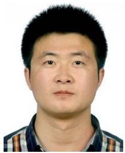

Junlong Guo received the B.S., M.S., and Ph.D. degrees in manufacturing engineering of aerospace vehicle from the Harbin Institute ofTechnology, Harbin, China, in 2011, 2013, and 2018, respectively.

He is currently an Associate Professor with the Department ofMechanical Engineering, Harbin Institute of Technology, Weihai, China. His research interests include the terramechanics and terradynamics, simulation, and motion control of wheeled mobile robots.

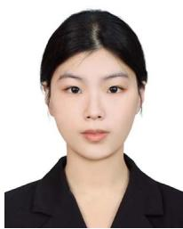

Yu Tao received the B.E. degree in electrical information engineering from the Harbin Institute of Technology, Harbin, China, in 2022. She is currently working toward the Ph.D. degree with the State Key Laboratory of Advanced Optical Communication Systems and Networks, Shanghai Jiao Tong University, Shanghai, China.

Bo Huang received the Ph.D. degree in mechanical engineering from the Harbin Institute of Technology, Harbin, China, in 2007.

He is currently a Professor with the Department of Mechanical Engineering, Harbin Institute of Technology. His research interests include the multisensor fusion SLAM and robot navigation.