# ESLAM: Efficient Dense SLAM System Based on Hybrid Representation of Signed Distance Fields

Mohammad Mahdi Johari Idiap Research Institute, EPFL mohammad.johari@idiap.ch

Camilla Carta ams OSRAM camilla.carta@ams-osram.com

Franc¸ois Fleuret University of Geneva, EPFL francois.fleuret@unige.ch

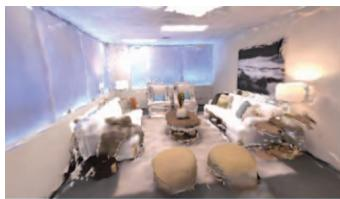  
iMAP\*

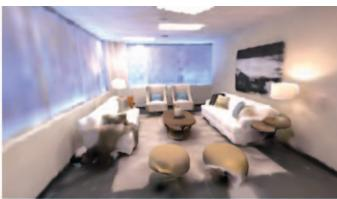  
NICE-SLAM

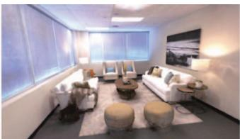  
ESLAM (ours)

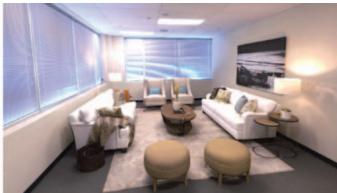  
Ground Truth

Figure 1. Our pre-train-free ESLAM model reconstructs scene details more accurately than existing works: iMAP∗ [59] and NICE SLAM [87], while it runs up to 10 faster (see Sec. 4.2 for runtime analysis). The ground truth image is rendered with ReplicaViewer [57].

## Abstract

We present ESLAM, an efficient implicit neural representation methodfor Simultaneous Localization and Mapping (SLAM). ESLAM reads RGB-D frames with unknown camera poses in a sequential manner and incrementally reconstructs the scene representation while estimating the current camera position in the scene. We incorporate the latest advances in Neural Radiance Fields (NeRF) into a SLAM system, resulting in an efficient and accurate dense visual SLAM method. Our scene representation consists of multiscale axis-aligned perpendicular feature planes and shallow decoders that, for each point in the continuous space, decode the interpolatedfeatures into Truncated Signed Distance Field (TSDF) and RGB values. Our extensive experiments on three standard datasets, Replica, ScanNet, and TUM RGB-D show that ESLAM improves the accuracy of 3D reconstruction and camera localization of state-of-theart dense visual SLAM methods by more than 50%, while it runs up to 10 faster and does not require any pre-training. Project page: https://www.idiap.ch/paper/eslam

## 1. Introduction

Dense visual Simultaneous Localization and Mapping (SLAM) is a fundamental challenge in 3D computer vision with several applications such as autonomous driving, robotics, and virtual/augmented reality. It is defined as constructing a 3D map of an unknown environment while simultaneously approximating the camera pose.

While traditional SLAM systems [16, 41, 45, 55, 76, 77] mostly focus on localization accuracy, recent learningbased dense visual SLAM methods [2, 11, 25, 35, 60, 64, 65, 67, 81, 86] provide meaningful global 3D maps and show reasonable but limited reconstruction accuracy.

Following the advent of Neural Radiance Fields (NeRF) [37] and the demonstration of their capacity to reason about the geometry of a large-scale scene [8, 13, 20, 22, 26, 75, 78] and reconstruct 3D surfaces [1, 29, 47, 48, 62, 71, 72, 82, 85], novel NeRF-based dense SLAM methods have been developed. In particular, iMAP [59] and NICE-SLAM [87] utilize neural implicit networks to achieve a consistent geometry representation.

IMAP [59] represents the geometry with a single huge MLP, similar to NeRF [37], and optimizes the camera poses during the rendering process. NICE-SLAM [87] improves iMAP by storing the representation locally on voxel grids to prevent the forgetting problem. Despite promising reconstruction quality, these methods are computationally demanding for real-time applications, and their ability to capture geometry details is limited. In addition, NICE-SLAM [87] uses frozen pre-trained MLPs, which limits its generalizability to novel scenes. We take NICE-SLAM [87] as a baseline and provide the following contributions:

• We leverage implicit Truncated Signed Distance Field (TSDF) [1] to represent geometry, which converges noticeably faster than the common rendering-based representations like volume density [59] or occupancy [87] and results in higher quality reconstruction.

• Instead of storing features on voxel grids, we propose employing multi-scale axis-aligned feature planes [6] which leads to reducing the memory footprint growth rate w.r.t. scene side-length from cubic to quadratic.

• We benchmark our method on three challenging datasets, Replica [57], ScanNet [12], and TUM RGB-D [58], to demonstrate the performance of our method in comparison to existing ones and provide an extensive ablation study to validate our design choices.

Thanks to the inherent smoothness of representing the scene with feature planes, our method produces higher-quality smooth surfaces without employing explicit smoothness loss functions like [70].

Concurrent with our work, the followings also propose Radiance Fields-based SLAM systems: iDF-SLAM [38] also uses TSDF, but it is substantially slower and less accurate than NICE-SLAM [87]. Orbeez-SLAM [10] operates in real-time at the cost of poor 3D reconstruction. Compromising accuracy and quality, MeSLAM [27] introduces a memory-efficient SLAM. MonoNeuralFusion [88] proposes an incremental 3D reconstruction model, assuming that ground truth camera postures are available. Lastly, NeRF-SLAM [54] presents a monocular SLAM system with hierarchical volumetric Neural Radiance Fields optimized using an uncertainty-based depth loss.

## 2. Related Work

Dense Visual SLAM. The ubiquity of cameras has made visual SLAM a field of major interest in the last decades. Traditional visual SLAM employs pixel-wise optimization of geometric and/or photometric constraints from image information. Depending on the information source, visual SLAM divides into three main categories: visualonly [15–17, 41, 45, 66], visual-inertial [3, 28, 39, 42, 53, 69] and RGB-D [5, 14, 23, 44] SLAM. Visual-only SLAM uses single or multi-camera setups but presents higher technical challenges compared to others. Visual-inertial information can improve accuracy, but complexifies the system and requires an extra calibration step. The advent of the Kinect brought popularity to RGB-D setups with improved performance but had drawbacks such as larger memory and power requirements, and limitation to indoor settings. Recently, learning-based approaches [2,11,30,31,67] have made great advances in the field, improving both accuracy and robustness compared to traditional methods.

Neural Implicit 3D Reconstruction. Neural Radiance Fields (NeRF) have impacted 3D Computer Vision applications, such as novel view synthesis [34, 36, 37, 68], surface reconstruction [46,49,71,72,82,83,85], dynamic scene representation [19,50–52], and camera pose estimation [21,32, 73, 79, 84]. The exploitation of neural implicit representations for 3D reconstruction at real-world scale is studied in [1, 4, 9, 29, 43, 63, 70, 74, 80]. The most related works to ours are iMAP [59] and NICE-SLAM [87]. IMAP [59] presents a NeRF-style dense SLAM system. NICE-SLAM [87] extends iMAP [59] by modeling the scene with voxel grid features and decoding them into occupancies using pre-trained MLPs. However, the generalizability of NICE-SLAM [87] to novel scenes is limited because of the frozen pre-trained MLPs. Another issue is the cubic memory growth rate of their model, which results in using low-resolution voxel grids and losing fine geometry details. In contrast, we employ compact plane-based features [6] which are directly decoded to TSDF, improving both efficiency and accuracy of localization and reconstruction.

## 3. Method

The overview of our method is shown in Fig. 2. Given a set of sequential RGB-D frames $\{ I _ { i } , D _ { i } \} _ { i = 1 } ^ { M } ,$ , our model predicts camera poses $\{ R _ { i } | t _ { i } \} _ { i = 1 } ^ { M }$ and an implicit TSDF $\phi _ { g }$ representation that can be used in marching cubes algorithm [33] to extract 3D meshes. We expect TSDF to denote the distance to the closest surface with a positive sign in the free space and a negative sign inside the surfaces. We employ normalized TSDF, such that it is zero on the surfaces and has a magnitude of one at the truncation distance T, which is a hyper-parameter. Sec. 3.1 describes how we represent a scene with axis-aligned feature planes. Sec. 3.2 walks through the rendering process, which converts raw representations into pixel depths and colors. Sec. 3.3 introduces our loss functions. And Sec. 3.4 provides the details of localization and reconstruction in our SLAM system.

## 3.1. Axis-Aligned Feature Planes

Although voxel grid-based NeRF architectures [18, 61, 70] exhibit rapid convergence, they struggle with cubical memory growing. Different solutions have been proposed to mitigate the memory growth issue [6, 7, 40]. Inspired by [6], we employ a tri-plane architecture (see Fig. 2), in which we store and optimize features on perpendicular axis-aligned planes. Mimicking the trend in voxel-based methods [7, 40, 61], we propose using feature planes at two scales, i.e. coarse and fine. Coarse-level representation allows efficient reconstruction of free space with fewer sample points and optimization iterations. Moreover, we suggest employing separate feature planes for representing geometry and appearance, which mitigates the forgetting problem for geometry reconstruction since appearance fluctuates more frequently in a scene than geometry.

Specifically, we use three coarse feature planes $\{ F _ { g - x y } ^ { c } ,$ $F _ { g - x z } ^ { c } , F _ { g - y z } ^ { c } \}$ and three fine ones $\{ F _ { g - x y } ^ { f } , F _ { g - x z } ^ { f } , F _ { g - y z } ^ { f } \}$ for representing the geometry. Similarly, three coarse $\{ F _ { a - x y } ^ { c } ,$ $F _ { a - x z } ^ { c } , F _ { a - y z } ^ { c } \}$ and three fine $\{ F _ { a - x y } ^ { f } , F _ { a - x z } ^ { f } , F _ { a - y z } ^ { f } \}$ planes are used for representing appearance of a scene. This architecture prevents model size from growing cubically with the scene side-length as is the case for voxel-based models.

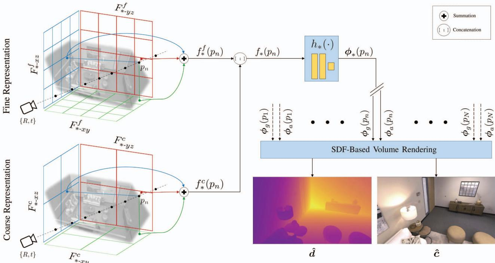  
Figure 2. The overview of ESLAM. Given the symmetry of our processes for geometry and appearance, we exhibit both processes on the same pipeline for simplicity. The symbol  represents both geometry g and appearance $a , e . g . , f _ { * } ( p _ { n } )$ ) can be either $f _ { g } ( p _ { n } )$ or $f _ { a } ( p _ { n } )$ . At an estimated camera pose $\{ R , t \}$ , we cast a ray for each pixel and sample N points $\{ p _ { n } \} _ { n = 1 } ^ { N }$ along it (Sec. 3.2). Each point $p _ { n }$ is projected onto the coarse and fine feature planes and bilinearly interpolates the four nearest neighbor features on each plane (Sec. 3.1). The interpolated features at each level are added together, and the results from both levels are concatenated together to form the inputs $\{ f _ { g } ( p _ { n } ) , f _ { a } ( p _ { n } ) \}$ of the decoders $\{ h _ { g } , h _ { a } \}$ (Sec. 3.1). The geometry decoder $h _ { g }$ estimates TSDF $\phi _ { g } ( p _ { n } )$ based on $f _ { g } ( p _ { n } )$ , and the appearance decoder $h _ { a }$ estimates the raw color $\phi _ { a } ( p _ { n } )$ based on $f _ { a } ( p _ { n } )$ for each point $p _ { n }$ (Sec. 3.1). Once TSDFs and raw colors of all points on a ray are generated, our SDF-based rendering process estimates the depth dˆand the color cˆ for each pixel (Sec. 3.2).

To reason about the geometry of a point p in the continuous space, we first project it onto all the geometry planes. The geometry feature $f _ { g } ( \boldsymbol { p } )$ for point p is then formed by 1) bilinearly interpolating the four nearest neighbors on each feature plane, 2) summing the interpolated coarse features and the fine ones respectively into the coarse output $f _ { g } ^ { c } ( \boldsymbol { p } )$ and fine output $f _ { g } ^ { f } ( \boldsymbol { p } )$ , and 3) concatenating the outputs together. Formally:

$$
\begin{array} { l l } { { f _ { g } ^ { c } ( p ) = F _ { g - x y } ^ { c } ( p ) + F _ { g - x z } ^ { c } ( p ) + F _ { g - y z } ^ { c } ( p ) } } \\ { { f _ { g } ^ { f } ( p ) = F _ { g - x y } ^ { f } ( p ) + F _ { g - x z } ^ { f } ( p ) + F _ { g - y z } ^ { f } ( p ) } } \\ { { f _ { g } ( p ) = [ f _ { g } ^ { c } ( p ) ; f _ { g } ^ { f } ( p ) ] } } \end{array}\tag{1}
$$

The appearance feature $f _ { a } ( p )$ is obtained similarly:

$$
\begin{array} { l l } { { f _ { a } ^ { c } ( p ) = F _ { a - x y } ^ { c } ( p ) + F _ { a - x z } ^ { c } ( p ) + F _ { a - y z } ^ { c } ( p ) } } \\ { { f _ { a } ^ { f } ( p ) = F _ { a - x y } ^ { f } ( p ) + F _ { a - x z } ^ { f } ( p ) + F _ { a - y z } ^ { f } ( p ) } } \\ { { f _ { a } ( p ) = [ f _ { a } ^ { c } ( p ) ; f _ { a } ^ { f } ( p ) ] } } \end{array}\tag{2}
$$

These features are decoded into TSDF $\phi _ { g } ( p )$ and raw color $\phi _ { a } ( p )$ values via shallow two-layer MLPs $\{ h _ { g } , h _ { a } \}$

$$
\phi _ { g } ( p ) = h _ { g } \left( f _ { g } ( p ) \right) \mathrm { a n d } \phi _ { a } ( p ) = h _ { a } \left( f _ { a } ( p ) \right)\tag{3}
$$

These raw TSDF and color outputs can be utilized for depth/color rendering as well as mesh extraction.

## 3.2. SDF-Based Volume Rendering

When processing input frame $i ,$ emulating the ray casting in NeRF [37], we select random pixels and calculate their corresponding rays using the current estimate of the camera pose $\{ R _ { i } | t _ { i } \}$ . For rendering the depths and colors of the rays, we first sample $N _ { s t r a t }$ samples on each ray by stratified sampling and then sample additional $N _ { i m p }$ points near surfaces. For pixels with ground truth depths, the $N _ { i m p }$ additional points are sampled uniformly inside the truncation distance $T$ w.r.t. the depth measurement, whereas for other pixels, $N _ { i m p }$ points are sampled with the importance sampling technique [34, 37, 59, 70] based on the weights computed for the stratified samples.

For all $N = N _ { s t r a t } + N _ { i m p }$ points on a ray $\{ p _ { n } \} _ { n = 1 } ^ { N } $ we query TSDF $\phi _ { g } ( p _ { n } )$ and raw color $\phi _ { a } ( p _ { n } )$ from our networks and use the SDF-Based rendering approach in

StyleSDF [47] to convert SDF values to volume densities:

$$
\pmb { \sigma } ( p _ { n } ) = \beta \cdot \mathrm { S i g m o i d } \left( - \beta \cdot \phi _ { g } ( p _ { n } ) \right)\tag{4}
$$

where $\beta$ is a learnable parameter that controls the sharpness of the surface boundary. Negative values of SDF push Sigmoid toward one, resulting in volume density inside the surface. The volume density then is used for rendering the color and depth of each ray:

$$
\begin{array} { c } { { w _ { n } = \displaystyle \exp \left( - \sum _ { k = 1 } ^ { n - 1 } \sigma ( p _ { k } ) \right) \left( 1 - \exp \left( - \sigma \left( p _ { n } \right) \right) \right) } } \\ { { \hat { c } = \displaystyle \sum _ { n = 1 } ^ { N } w _ { n } \phi _ { a } ( p _ { n } ) \quad \mathrm { a n d } \quad \hat { d } = \displaystyle \sum _ { n = 1 } ^ { N } w _ { n } z _ { n } } } \end{array}\tag{5}
$$

where $z _ { n }$ is the depth of point $p _ { n }$ w.r.t. the camera pose.

## 3.3. Loss Functions

One advantage of TSDF over other representations, such as occupancy, is that it allows us to use per-point losses, along with rendering ones. These losses account for the rapid convergence of our model. Following the practice in [1], assuming a batch of rays R with ground truth depths are selected, we define the free space loss as:

$$
\mathcal { L } _ { f s } = \frac { 1 } { | R | } \sum _ { r \in R } \frac { 1 } { | P _ { r } ^ { f s } | } \sum _ { p \in P _ { r } ^ { f s } } ( \phi _ { g } ( p ) - 1 ) ^ { 2 }\tag{6}
$$

where $P _ { r } ^ { f s }$ is a set of points on the ray r that lie between the camera center and the truncation region of the surface measured by the depth sensor. This loss function encourages TSDF $\phi _ { g }$ to have a value of one in the free space.

For sample points close to the surface and within the truncation region, we use the signed distance objective, which leverages the depth sensor measurement to approximate the signed distance field:

$$
\begin{array} { l } { \displaystyle \mathcal { L } _ { T } ( P _ { r } ^ { T } ) = } \\ { \displaystyle \frac { 1 } { | R | } \sum _ { r \in R } \frac { 1 } { | P _ { r } ^ { T } | } \sum _ { p \in P _ { r } ^ { T } } \left( z ( p ) + \phi _ { g } ( p ) \cdot T - D ( r ) \right) ^ { 2 } } \end{array}\tag{7}
$$

where $z ( p )$ is the planar depth of point $p$ w.r.t. camera, $T$ is the truncation distance, $D ( r )$ is the ray depth measured by the sensor, and $P _ { r } ^ { T }$ is a set of points on the ray r that lie in the truncation region, i.e. $| z ( p ) - D ( r ) | < T$ . We apply the same loss to all points in the truncation region, but we differentiate the importance of points that are closer to the surface in the middle of the truncation region $P _ { r } ^ { T - m }$ from those that are at the tail of the truncation region $P _ { r } ^ { T - t }$ Formally, we define $P _ { r } ^ { T - m }$ as a set of points that $| z ( p ) -$ $D ( r ) | < 0 . 4 T$ , and define $P _ { r } ^ { T - t } = P _ { r } ^ { T } - P _ { r } ^ { T - m }$ , then:

$$
\mathcal { L } _ { T - m } = \mathcal { L } _ { T } ( P _ { r } ^ { T - m } ) \mathrm { a n d } \mathcal { L } _ { T - t } = \mathcal { L } _ { T } ( P _ { r } ^ { T - t } )\tag{8}
$$

This enables us to decrease the importance of $\mathcal { L } _ { T - t }$ in mapping, which leads to having a smaller effective truncation distance, reducing artifacts in occluded areas, and reconstructing with higher accuracy while leveraging the entire truncation distance in camera tracking.

In addition to these two per-point loss functions, we also employ reconstruction losses. For pixels with ground truth depths, we impose consistency between the rendered depth and the depth measured by the sensor:

$$
\mathcal { L } _ { d } = \frac { 1 } { | R | } \sum _ { r \in R } \Big ( \hat { d } ( r ) - D ( r ) \Big ) ^ { 2 }\tag{9}
$$

Similarly, we impose consistency between the pixel colors and rendered colors:

$$
\mathcal { L } _ { c } = \frac { 1 } { \left| R \right| } \sum _ { r \in R } \left( \hat { \pmb { c } } ( r ) - \boldsymbol { I } ( r ) \right) ^ { 2 }\tag{10}
$$

where $I ( r )$ is the pixel color of ray $^ { r } .$

The global loss function of our method is defined as:

$$
\mathcal { L } = \lambda _ { f s } \mathcal { L } _ { f s } + \lambda _ { T - m } \mathcal { L } _ { T - m } + \lambda _ { T + } \mathcal { L } _ { T - t } + \lambda _ { d } \mathcal { L } _ { d } + \lambda _ { c } \mathcal { L } _ { c }\tag{11}
$$

where $\{ \lambda _ { f s } , \lambda _ { T - m } , \lambda _ { T - t } , \lambda _ { d } , \lambda _ { c } \}$ are the weighting coefficients. Note that $\mathcal { L } _ { c }$ is defined on all rays in a training batch, while other losses are only imposed on rays with ground truth measured depths. The global objective is the same for both mapping and tracking in our method, but the weighting coefficients are different.

## 3.4. Mapping and Tracking

Mapping. Our scene representation, i.e. the feature planes and MLP decoders, are randomly initialized at the beginning. With the first input frame $\{ I _ { 0 } , D _ { 0 } \}$ , we fix the camera pose and optimize the feature planes and MLP decoders to best represent the first frame. For subsequent inputs, we update the scene representation iteratively every k frames, and add the latest frame to the global keyframe list, following the practice in iMAP [59] and NICE-SLAM [87]. For mapping, we first choose R pixels randomly from W frames, which include the current frame, the previous two keyframes, and $W - 3$ frames randomly selected from the keyframe list. Then, we jointly optimize the feature planes, MLP decoders, and camera poses of the W selected frames using the loss functions introduced in Sec. 3.3. Unlike NICE-SLAM [87], our method does not require a stagedoptimization policy, and we simply optimize all scene parameters and camera poses simultaneously.

Tracking. The localization process of our method is initiated for each input frame. The current estimate of the camera parameters, represented by translation vectors and quaternion rotations [56] $\{ R | t \}$ , are optimized solely based on our global loss function (see Sec. 3.3) with the gradientbased Adam optimizer [24]. No second-order optimizers or manifold operations are employed for camera tracking in our method. We exclude rays with no ground truth depths and outlier pixels from each optimization step. A pixel is considered an outlier if the difference between its measured depth and rendered depth is ten times greater than the batch’s median rendered depth error.

<table><tr><td rowspan="2">Method</td><td colspan="4">Reconstruction (cm)</td><td colspan="2">Localization (cm)</td></tr><tr><td>Depth L1↓</td><td>Acc.↓</td><td>Comp.↓</td><td>Comp. Ratio (%)↑</td><td>ATE Mean↓ ATE RMSE↓</td><td></td></tr><tr><td> $\overline { { { \mathrm { i } { \bf M A P } ^ { * } \left[ 5 9 \right] } } }$ </td><td> $\overline { { 8 . 2 3 \pm 0 . 8 8 } }$ </td><td> $7 . 1 6 \pm 0 . 2 6$ </td><td> $\overline { { 5 . 8 3 \pm 0 . 2 7 } }$ </td><td> $\overline { { 6 7 . 1 7 \pm 2 . 7 0 } }$ </td><td> $\overline { { 2 . 5 9 \pm 0 . 5 8 } }$ </td><td> $\overline { { 3 . 4 2 \pm 0 . 8 7 } }$ </td></tr><tr><td>NICE-SLAM [87]</td><td> $3 . 2 9 \pm 0 . 3 3$ </td><td> $1 . 6 6 \pm 0 . 0 7$ </td><td> $1 . 6 3 \pm 0 . 0 5$ </td><td> $9 6 . 7 4 \pm 0 . 3 6$ </td><td> $1 . 5 6 \pm 0 . 2 9$ </td><td> $2 . 0 5 \pm 0 . 4 5$ </td></tr><tr><td>ESLAM (ours)</td><td> ${ \bf 1 . 1 8 \pm 0 . 0 5 }$ </td><td> $\mathbf { 0 . 9 7 \pm 0 . 0 2 }$ </td><td> $\mathbf { 1 . 0 5 \ : \pm 0 . 0 1 }$ </td><td> ${ \bf 9 8 . 6 0 \pm 0 . 0 7 }$ </td><td> ${ \bf 0 . 5 2 \pm 0 . 0 3 }$ </td><td> ${ \bf 0 . 6 3 \pm 0 . 0 5 }$ </td></tr></table>

Table 1. Quantitative comparison of our proposed ESLAM with existing NeRF-based dense visual SLAM models on the Replica dataset [57] for both reconstruction and localization accuracy. The results are the average and standard deviation of five runs on eight scenes of the Replica dataset [57]. Our method outperforms previous works by a high margin and has lower variances, indicating it is also more stable from run to run. The evaluation metrics for reconstruction are L1 loss (cm) between rendered and ground truth depth maps of 1000 random camera poses, reconstruction accuracy (cm), reconstruction completion (cm), and completion ratio (%). The evaluation metrics for localization are mean and RMSE of ATE (cm) [58]. For the details of the evaluations for each scene, refer to the supplementary It should also be noted that our method runs up to 10 faster on this dataset (see Sec. 4.2 for runtime analysis).

  
iMAP\*

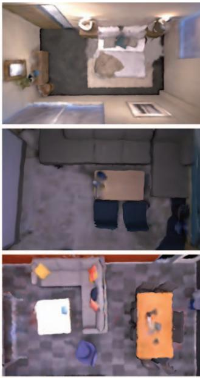  
NICE-SLAM

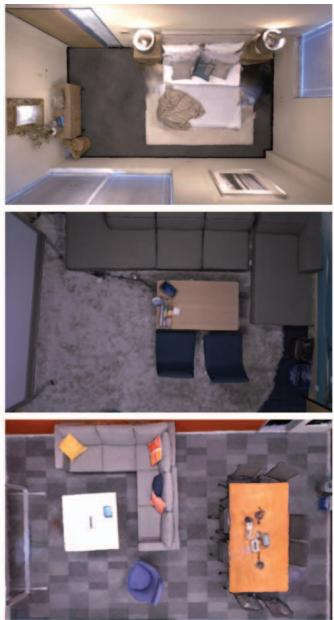  
ESLAM (ours)

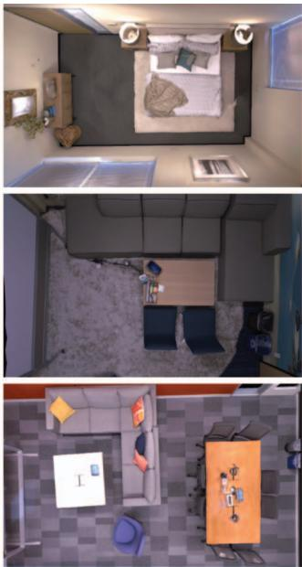  
Ground Truth  
Figure 3. Qualitative comparison of our proposed ESLAM method’s geometry reconstruction with existing NeRF-based dense visual SLAM models, iMAP∗ [59] and NICE-SLAM [87], on the Replica dataset [57]. Our method produces more accurate detailed geometry as well as higher-quality textures. The ground truth images are rendered with the ReplicaViewer software [57]. It should also be noted that our method runs up to 10 faster on this dataset (see Sec. 4.2 for runtime analysis). For further qualitative analysis on this dataset, as wel as videos demonstrating the localization and reconstruction process, refer to the supplementary.

## 4. Experiments

In this section, we validate that our method outperforms existing implicit representation-based methods in both localization and reconstruction accuracy on three standard benchmarks while running up to 10 faster.

Baselines. We compare our method to two existing state-of-the-art NeRF-based dense visual SLAM methods: iMAP [59] and NICE-SLAM [87]. Because iMAP is not open source, we use the iMAP∗ model in our experiment, which is the reimplementation of iMAP in [87].

Datasets. We evaluate our method on three standard 3D benchmarks: Replica [57], ScanNet [12], and TUM RGB-D [58] datasets. We select the same scenes for evaluation as NICE-SLAM [87].

Metrics. We borrow our evaluation metrics from NICE-SLAM [87]. For evaluating scene geometry, we use both 2D and 3D metrics. For the 2D metric, we render depth maps from 1000 random camera poses in each scene and calculate camera frustum or are occluded in all RGB-D frames. For evaluating camera localization, we use ATE [58].

<table><tr><td>Method</td><td>ATE</td><td> $\overline { { \mathrm { S c . ~ 0 0 0 0 } } }$ </td><td> $\overline { { S { \mathrm { c . ~ } } 0 0 5 9 } }$ </td><td> $\overline { { \mathrm { S c . ~ } 0 1 0 6 } }$ </td><td> $\overline { { S \mathrm { c } . 0 1 6 9 } }$ </td><td></td><td> $\overline { { S \mathrm { c } . 0 1 8 1 } }$ </td><td> $\overline { { \mathrm { S c . ~ } 0 2 0 7 } }$ </td><td>Ave.</td></tr><tr><td rowspan="2"> $\overline { { { \mathrm { i M A P } ^ { * } \ [ 5 9 ] } } }$ </td><td>Mean</td><td> $\overline { { 3 4 . 2 \pm 1 2 . 8 } }$ </td><td> $\overline { { 1 3 . 0 \pm 2 . 4 } }$ </td><td> $\overline { { 1 2 . 9 \pm 1 . 7 } }$ </td><td> $3 3 . 6 \pm 1 5 . 3$ </td><td></td><td> $2 0 . 8 \pm 3 . 8$ </td><td> $\overline { { 1 8 . 6 \pm 6 . 0 } }$ </td><td> $\overline { { 2 2 . 2 \pm 7 . 0 } }$ </td></tr><tr><td>RMSE</td><td> $4 2 . 7 \pm 1 6 . 6$ </td><td> $1 7 . 8 \pm 7 . 4$ </td><td> $1 5 . 0 \pm 1 . 7$ </td><td> $3 9 . 1 \pm 1 8 . 2$ </td><td></td><td> $2 4 . 7 \pm 5 . 8$ </td><td> $2 0 . 1 \pm 6 . 8$ </td><td> $2 6 . 6 \pm 9 . 4$ </td></tr><tr><td rowspan="2">NICE-SLAM [87]</td><td>Mean</td><td> $\overline { { 9 . 9 \pm \ : 0 . 4 } }$ </td><td> $1 1 . 9 \pm 1 . 8$ </td><td> $7 . 0 \pm 0 . 2$ </td><td> $\overline { { 9 . 2 \pm 1 . 0 } }$ </td><td></td><td> $1 2 . 2 \pm 0 . 3$ </td><td> $5 . 5 \pm 0 . 3$ </td><td> $9 . 3 \pm 0 . 7$ </td></tr><tr><td>RMSE</td><td> $1 2 . 0 \pm \ : \ : 0 . 5$ </td><td> $1 4 . 0 \pm 1 . 8$ </td><td> $7 . 9 \pm 0 . 2$ </td><td> $1 0 . 9 \pm . 1 . 1$ </td><td></td><td> $1 3 . 4 \pm 0 . 3$ </td><td> $6 . 2 \pm 0 . 4$ </td><td> $1 0 . 7 \pm 0 . 7$ </td></tr><tr><td rowspan="2">ESLAM (ours)</td><td>Mean</td><td> ${ \bf 6 . 5 \pm . 0 . 1 }$ </td><td> ${ \bf 6 . 4 \pm 0 . 4 }$ </td><td> ${ \bf 6 . 7 \pm 0 . 1 }$ </td><td> ${ \bf 5 . 9 \pm \mathrm { ~ \bf ~ 0 . 1 } }$ </td><td></td><td> ${ \bf 8 . 3 \pm 0 . 2 }$ </td><td> ${ \bf 5 . 4 \pm 0 . 1 }$ </td><td> ${ \bf 6 . 5 \pm 0 . 2 }$ </td></tr><tr><td>RMSE</td><td> $7 . 3 \pm \ : 0 . 2$ </td><td> ${ \bf 8 . 5 \pm 0 . 5 }$ </td><td> ${ \bf 7 . 5 \pm 0 . 1 }$ </td><td> ${ \bf 6 . 5 \pm . 0 . 1 }$ </td><td></td><td> ${ \bf 9 . 0 \pm 0 . 2 }$ </td><td> ${ \bf 5 . 7 \pm 0 . 1 }$ </td><td> ${ \bf 7 . 4 \pm 0 . 2 }$ </td></tr></table>

Table 2. Quantitative comparison of our proposed ESLAM method’s localization accuracy with existing NeRF-based dense visual SLAM models on the ScanNet dataset [12]. The results are the average and standard deviation of five runs on each scene of ScanNet [12]. Our method outperforms previous works and has lower variances, indicating it is also more stable from run to run. The evaluation metrics for localization are mean and RMSE of ATE (cm) [58]. It should also be noted that our method runs up to 6 faster on this dataset (see Sec. 4.2 for runtime analysis).

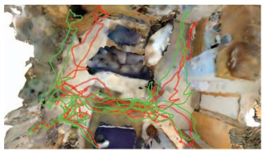

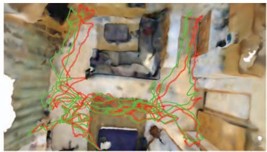

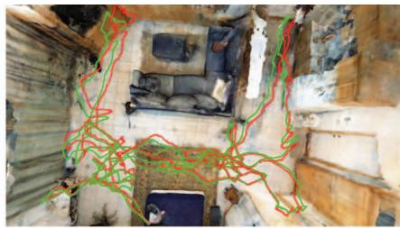

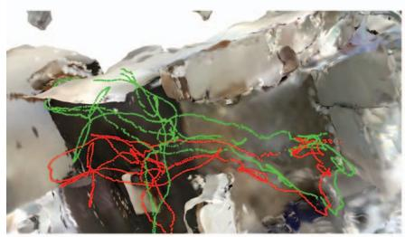

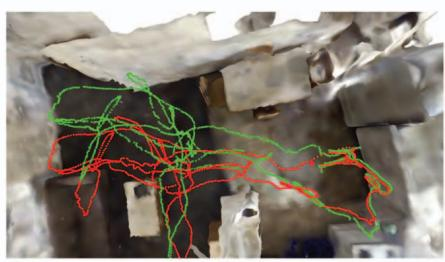

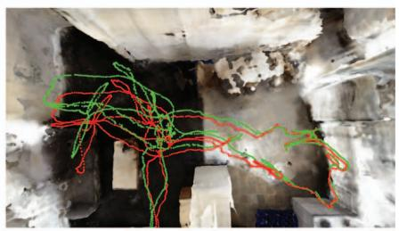

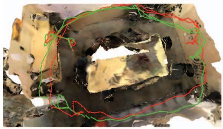  
iMAP\*

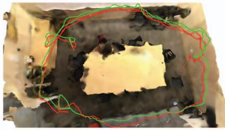  
NICE-SLAM

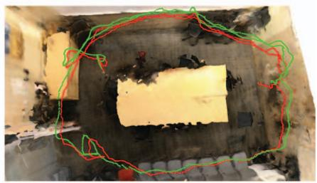  
ESLAM (ours)  
Figure 4. Qualitative comparison of our proposed ESLAM method’s localization accuracy with existing NeRF-based dense visual SLAM models, iMAP∗ [59] and NICE-SLAM [87], on the ScanNet dataset [12]. The ground truth camera trajectory is shown in green, and the estimated trajectory is shown in red. Our method predicts more accurate camera trajectories and does not suffer from drifting issues. It should also be noted that our method runs up to 6 faster on this dataset (see Sec. 4.2 for runtime analysis).

the L1 difference between depths from ground truth meshes and the reconstructed ones. For the 3D metrics, we consider reconstruction accuracy [cm], reconstruction completion [cm], and completion ratio [< 5 cm %]. For evaluating these metrics, we build a TSDF volume for a scene with a resolution of 1 cm and use the marching cubes algorithm [33] to obtain scene meshes. Before evaluating the 3D metrics for our method and for the baselines, we perform mesh culling as recommended in [1, 70]. For this purpose, we remove faces from a mesh that are not inside any

Implementation Details. The truncation distance T is set to 6 cm in our method. We employ coarse feature planes with a resolution of 24 cm for both geometry and appearance. For fine feature planes, we use a resolution of 6 cm for geometry and 3 cm for appearance. All feature planes have 32 channels, resulting in a 64-channel concatenated feature input for the decoders. The decoders are two-layer MLPs with 32 channels in the hidden layer. For the Replica [57] dataset, we sample $N _ { s t r a t } = 3 2$ points for stratified sampling and $N _ { i m p } = 8$ points for importance sampling on each ray. And for the ScanNet [12] and TUM RGB-D [58] datasets, we set $N _ { s t r a t } = 4 8$ and $N _ { i m p } = 8$

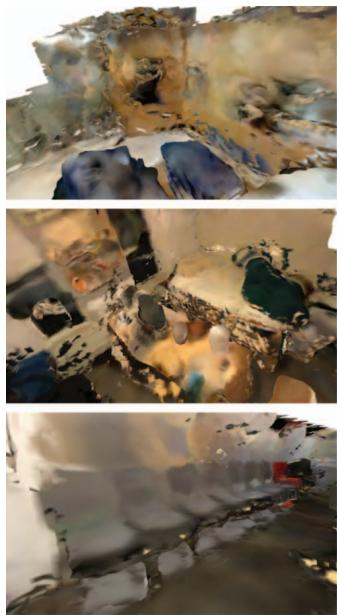  
iMAP\*

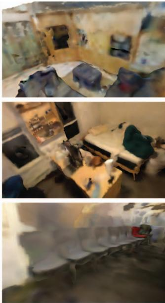  
NICE-SLAM

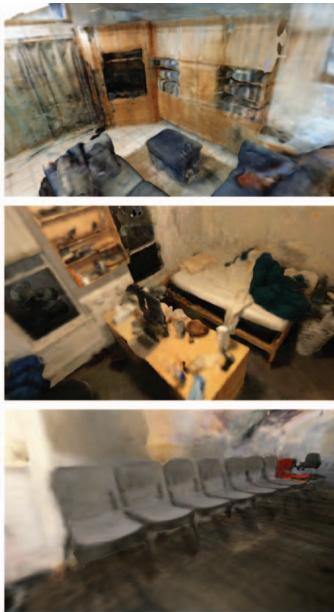  
ESLAM (ours)

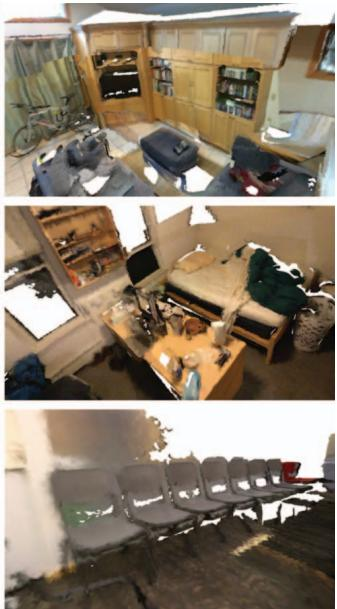  
Ground Truth  
Figure 5. Qualitative comparison of our proposed ESLAM method’s geometry reconstruction with existing NeRF-based dense visual SLAM models, iMAP∗ [59] and NICE-SLAM [87], on the ScanNet dataset [12]. Our method produces more accurate detailed geometry as well as higher-quality textures. The appearance of white backgrounds in ground truth meshes is due to the fact that the ground truth meshes of the ScanNet dataset [12] are incomplete. It should also be noted that our method runs up to 6 faster on this dataset (see Sec. 4.2 for runtime analysis).

We use different set of loss coefficients for mapping and tracking. During mapping we set $\lambda _ { f s } = 5 , \lambda _ { T - m } = 2 0 0 .$ $\lambda _ { T - t } = 1 0 , \lambda _ { d } = 0 . 1$ , and $\lambda _ { c } = 5 .$ And during tracking, we set $\lambda _ { f s } = 1 0 , \lambda _ { T - m } = 2 0 0 , \lambda _ { T - t } = 5 0 , \lambda _ { d } = 1$ , and $\lambda _ { c } = 5 .$ These coefficients are obtained by performing grid search in our experiments. For further details of our implementation, refer to the supplementary.

## 4.1. Experimental Results

Evaluation on Replica [57]. We provide the quantitative analysis of our experimental results on eight scenes of the Replica dataset [57] in Tab. 1. The numbers represent the average and standard deviation of the metrics for five independent runs. As shown in Tab. 1, our method outperforms the baselines for both reconstruction and localization accuracy. Our method also has lower variances, indicating that it is more stable and more robust than existing methods.

Qualitative analysis on the Replica dataset [57] is provided in Fig. 3. The results show that our method reconstructs the details of the scenes more accurately and produces fewer artifacts. Although it is not the focus of this paper, our method also produces higher-quality colors for the reconstructed meshes.

Evaluation on ScanNet [12]. We also benchmark ours and existing methods on multiple large scenes from Scan-Net [12] to evaluate and compare their scalability. For evaluating camera localization, we conduct five independent experiments on each scene and report the average and standard deviation of the mean and RMSE of ATE [58] in Tab. 2. As demonstrated in the table, our method’s localization is more accurate than existing methods. Our method is also considerably more stable from run to run as it has much lower standard deviations. We provide qualitative analysis of camera localization, along with geometry reconstruction, in Fig. 4. The results show that our method does not suffer from any large drifting and is more robust than existing methods.

Since the ground truth meshes of the ScanNet dataset [12] are incomplete, we only provide qualitative analysis for geometry reconstruction, similar to previous works. The qualitative comparison in Fig. 5 validates that our model reconstructs more precise geometry and detailed textures compared to existing approaches.

Evaluation on TUM RGB-D [58]. To further contrast the robustness of our method with the existing ones, we conduct an evaluation study on the real-world TUM RGB-D dataset [58]. Since there are no ground truth meshes for the scenes in this dataset, we only present the localization results in Tab. 3 and the qualitative analysis of rendered meshes in Fig. 6.

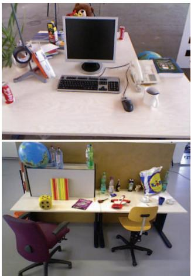  
Sample Image

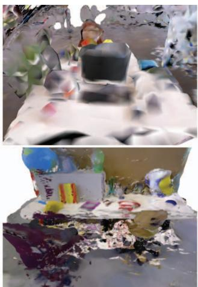  
iMAP\*

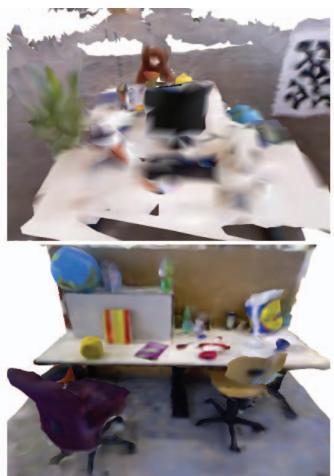  
NICE-SLAM

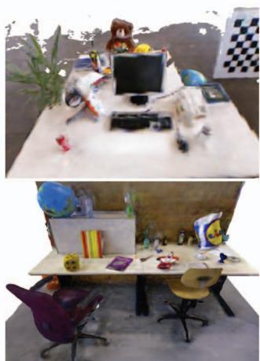  
ESLAM (ours)

Figure 6. Qualitative comparison of our proposed ESLAM method’s geometry reconstruction with existing NeRF-based dense visua SLAM models, iMAP∗ [59] and NICE-SLAM [87], on the TUM RGB-D dataset [58]. Our method produces more accurate detailed geometry as well as higher-quality textures. Since there are no ground truth meshes for this dataset, we depict a sample input image.
<table><tr><td></td><td>fr1/desk</td><td>fr2/xyz</td><td>fr3/office</td></tr><tr><td>iMAP* [59]</td><td>4.90</td><td>2.05</td><td>5.80</td></tr><tr><td>NICE-SLAM [87]</td><td>2.85</td><td>2.39</td><td>3.02</td></tr><tr><td>ESLAM (ours)</td><td>2.47</td><td>1.11</td><td>2.42</td></tr></table>

Table 3. Quantitative comparison of our proposed ESLAM method’s localization accuracy with existing NeRF-based dense visual SLAM models on the TUM RGB-D dataset [58]. The evaluation metric is ATE RMSE (cm) [58].
<table><tr><td rowspan=1 colspan=1></td><td rowspan=1 colspan=1>Method</td><td rowspan=1 colspan=1>SpeedFPT (s)</td><td rowspan=1 colspan=1>Memory# Param.   Grow. R.</td></tr><tr><td rowspan=1 colspan=1>Repica</td><td rowspan=1 colspan=1>iMAP* [59]NICE-SLAM [87]ESLAM (ours)</td><td rowspan=1 colspan=1>5.202.100.18</td><td rowspan=1 colspan=1>0.22 M  ?12.18M  O(L³)6.79 M  O(L2)</td></tr><tr><td rowspan=1 colspan=1>ScNet</td><td rowspan=1 colspan=1>iMAP* [59]NICE-SLAM [87]ESLAM (ours)</td><td rowspan=1 colspan=1>5.203.350.55</td><td rowspan=1 colspan=1>0.22 M  ?22.04M  O(L³)17.63 M  O(L2)</td></tr></table>

Table 4. Runtime analysis of our method in comparison with existing ones in terms of average frame processing time (FPT), number of parameters, and model size growth rate w.r.t. scene sidelength L. All methods are benchmarked with an NVIDIA GeForce RTX 3090 GPU on room0 of Replica [57] and scene0000 of ScanNet [12]. Our method is significantly faster and does not grow cubically in size w.r.t. scene side-length L. Note that iMAP [59] represents a whole scene in a single MLP, hence its small number of parameters. Accordingly, the scalability and growth rate of iMAP [59] w.r.t. the scene side-length L are also unclear.

## 4.2. Runtime Analysis

We evaluate the speed and size of our method in comparison with existing approaches in Tab. 4. We report the average frame processing time (FPT), the number of parameters of the model, and memory growth rate w.r.t. scene side-length for the scenes room0 of Replica [57] and scene0000 of ScanNet [12] datasets. All methods are benchmarked with an NVIDIA GeForce RTX 3090 GPU. The results indicate that our method is significantly faster than previous works on both datasets. Furthermore, in contrast to NICE-SLAM [87], our model size is smaller and does not grow cubically with the scene side-length.

## 5. Conclusion

We presented ESLAM, a dense visual SLAM approach that leverages the latest advances in the Neural Radiance Fields study to improve both the speed and accuracy of neural implicit-based SLAM systems. We proposed replacing the voxel grid representation with axis-aligned feature planes to prevent the model size from growing cubically with respect to the scene side-length. We also demonstrated that modeling the scene geometry with Truncated Signed Distance Field (TSDF) leads to efficient and high-quality surface reconstruction. We verified through extensive experiments that our approach outperforms existing methods significantly in both reconstruction and localization accuracy while running up to one order of magnitude faster.

ESLAM accepts and deals with the forgetting problem in exchange for memory preservation. Due to the structure of our feature plane representation, updating features to adapt to new geometry may affect previously reconstructed geometries. To address this issue, we keep track of previous keyframes and allocate a large portion of computation resources to retain and remember previously reconstructed regions. Although ESLAM is substantially faster than competing approaches, handling the forgetting problem more efficiently could further reduce frame processing time.

## Acknowledgement

This research was supported by ams OSRAM.

## References

[1] Dejan Azinovic, Ricardo Martin-Brualla, Dan B Goldman,´ Matthias Nießner, and Justus Thies. Neural rgb-d surface reconstruction. In Proceedings ofthe IEEE/CVF Conference on Computer Vision and Pattern Recognition, pages 6290– 6301, 2022. 1, 2, 4, 6

[2] Michael Bloesch, Jan Czarnowski, Ronald Clark, Stefan Leutenegger, and Andrew J Davison. Codeslam—learning a compact, optimisable representation for dense visual slam. In Proceedings of the IEEE conference on computer vision and pattern recognition, pages 2560–2568, 2018. 1, 2

[3] Michael Bloesch, Sammy Omari, Marco Hutter, and Roland Siegwart. Robust visual inertial odometry using a direct ekfbased approach. In 2015 IEEE/RSJ international conference on intelligent robots and systems (IROS), pages 298–304. IEEE, 2015. 2

[4] Aljaz Bozic, Pablo Palafox, Justus Thies, Angela Dai, and Matthias Nießner. Transformerfusion: Monocular rgb scene reconstruction using transformers. Advances in Neural Information Processing Systems, 34:1403–1414, 2021. 2

[5] Carlos Campos, Richard Elvira, Juan J Gomez Rodr´ ´ıguez, Jose MM Montiel, and Juan D Tard´ os. Orb-slam3: An accu-´ rate open-source library for visual, visual–inertial, and multimap slam. IEEE Transactions on Robotics, 37(6):1874– 1890, 2021. 2

[6] Eric R Chan, Connor Z Lin, Matthew A Chan, Koki Nagano, Boxiao Pan, Shalini De Mello, Orazio Gallo, Leonidas J Guibas, Jonathan Tremblay, Sameh Khamis, et al. Efficient geometry-aware 3d generative adversarial networks. In Proceedings of the IEEE/CVF Conference on Computer Vision and Pattern Recognition, pages 16123–16133, 2022. 1, 2

[7] Anpei Chen, Zexiang Xu, Andreas Geiger, Jingyi Yu, and Hao Su. Tensorf: Tensorial radiance fields. In European Conference on Computer Vision (ECCV), 2022. 2

[8] Anpei Chen, Zexiang Xu, Fuqiang Zhao, Xiaoshuai Zhang, Fanbo Xiang, Jingyi Yu, and Hao Su. Mvsnerf: Fast generalizable radiance field reconstruction from multi-view stereo. In Proceedings of the IEEE/CVF International Conference on Computer Vision, pages 14124–14133, 2021. 1

[9] Jaesung Choe, Sunghoon Im, Francois Rameau, Minjun Kang, and In So Kweon. Volumefusion: Deep depth fusion for 3d scene reconstruction. In Proceedings of the IEEE/CVF International Conference on Computer Vision, pages 16086– 16095, 2021. 2

[10] Chi-Ming Chung, Yang-Che Tseng, Ya-Ching Hsu, Xiang-Qian Shi, Yun-Hung Hua, Jia-Fong Yeh, Wen-Chin Chen, Yi-Ting Chen, and Winston H Hsu. Orbeez-slam: A realtime monocular visual slam with orb features and nerfrealized mapping. arXiv preprint arXiv:2209.13274, 2022. 2

[11] Jan Czarnowski, Tristan Laidlow, Ronald Clark, and Andrew J Davison. Deepfactors: Real-time probabilistic dense monocular slam. IEEE Robotics and Automation Letters, 5(2):721–728, 2020. 1, 2

[12] Angela Dai, Angel X Chang, Manolis Savva, Maciej Halber, Thomas Funkhouser, and Matthias Nießner. Scannet: Richly-annotated 3d reconstructions of indoor scenes. In

Proceedings ofthe IEEE conference on computer vision and pattern recognition, pages 5828–5839, 2017. 2, 5, 6, 7, 8

[13] Kangle Deng, Andrew Liu, Jun-Yan Zhu, and Deva Ramanan. Depth-supervised nerf: Fewer views and faster training for free. In Proceedings of the IEEE/CVF Conference on Computer Vision and Pattern Recognition, pages 12882– 12891, 2022. 1

[14] Felix Endres, Jurgen Hess, J¨ urgen Sturm, Daniel Cremers,¨ and Wolfram Burgard. 3-d mapping with an rgb-d camera. IEEE transactions on robotics, 30(1):177–187, 2013. 2

[15] Jakob Engel, Vladlen Koltun, and Daniel Cremers. Direct sparse odometry. IEEE transactions on pattern analysis and machine intelligence, 40(3):611–625, 2017. 2

[16] Jakob Engel, Thomas Schops, and Daniel Cremers. Lsd- ¨ slam: Large-scale direct monocular slam. In European conference on computer vision, pages 834–849. Springer, 2014. 1, 2

[17] Christian Forster, Matia Pizzoli, and Davide Scaramuzza. Svo: Fast semi-direct monocular visual odometry. In 2014 IEEE international conference on robotics and automation (ICRA), pages 15–22. IEEE, 2014. 2

[18] Sara Fridovich-Keil, Alex Yu, Matthew Tancik, Qinhong Chen, Benjamin Recht, and Angjoo Kanazawa. Plenoxels: Radiance fields without neural networks. In Proceedings of the IEEE/CVF Conference on Computer Vision and Pattern Recognition, pages 5501–5510, 2022. 2

[19] Chen Gao, Ayush Saraf, Johannes Kopf, and Jia-Bin Huang. Dynamic view synthesis from dynamic monocular video. In Proceedings of the IEEE/CVF International Conference on Computer Vision, pages 5712–5721, 2021. 2

[20] Ajay Jain, Matthew Tancik, and Pieter Abbeel. Putting nerf on a diet: Semantically consistent few-shot view synthesis. In Proceedings of the IEEE/CVF International Conference on Computer Vision, pages 5885–5894, 2021. 1

[21] Yoonwoo Jeong, Seokjun Ahn, Christopher Choy, Anima Anandkumar, Minsu Cho, and Jaesik Park. Self-calibrating neural radiance fields. In Proceedings of the IEEE/CVF International Conference on Computer Vision, pages 5846– 5854, 2021. 2

[22] Mohammad Mahdi Johari, Yann Lepoittevin, and Franc¸ois Fleuret. Geonerf: Generalizing nerf with geometry priors. In Proceedings of the IEEE/CVF Conference on Computer Vision and Pattern Recognition, pages 18365–18375, 2022. 1

[23] Christian Kerl, Jurgen Sturm, and Daniel Cremers. Dense¨ visual slam for rgb-d cameras. In 2013 IEEE/RSJ International Conference on Intelligent Robots and Systems, pages 2100–2106. IEEE, 2013. 2

[24] Diederik Kingma and Jimmy Ba. Adam: A method for stochastic optimization. International Conference on Learning Representations, 12 2014. 5

[25] Lukas Koestler, Nan Yang, Niclas Zeller, and Daniel Cremers. Tandem: Tracking and dense mapping in real-time using deep multi-view stereo. In Conference on Robot Learning, pages 34–45. PMLR, 2022. 1

[26] Adam R Kosiorek, Heiko Strathmann, Daniel Zoran, Pol Moreno, Rosalia Schneider, Sona Mokra, and´

Danilo Jimenez Rezende. Nerf-vae: A geometry aware 3d scene generative model. In International Conference on Machine Learning, pages 5742–5752. PMLR, 2021. 1

[27] Evgenii Kruzhkov, Alena Savinykh, Pavel Karpyshev, Mikhail Kurenkov, Evgeny Yudin, Andrei Potapov, and Dzmitry Tsetserukou. Meslam: Memory efficient slam based on neural fields. arXiv preprint arXiv:2209.09357, 2022. 2

[28] Stefan Leutenegger, Simon Lynen, Michael Bosse, Roland Siegwart, and Paul Furgale. Keyframe-based visual–inertial odometry using nonlinear optimization. The International Journal ofRobotics Research, 34(3):314–334, 2015. 2

[29] Kejie Li, Yansong Tang, Victor Adrian Prisacariu, and Philip HS Torr. Bnv-fusion: Dense 3d reconstruction using bi-level neural volume fusion. In Proceedings of the IEEE/CVF Conference on Computer Vision and Pattern Recognition, pages 6166–6175, 2022. 1, 2

[30] Ruihao Li, Sen Wang, and Dongbing Gu. Deepslam: A robust monocular slam system with unsupervised deep learning. IEEE Transactions on Industrial Electronics, 68(4):3577–3587, 2020. 2

[31] Ruihao Li, Sen Wang, Zhiqiang Long, and Dongbing Gu. Undeepvo: Monocular visual odometry through unsupervised deep learning. In 2018 IEEE international conference on robotics and automation (ICRA), pages 7286–7291. IEEE, 2018. 2

[32] Chen-Hsuan Lin, Wei-Chiu Ma, Antonio Torralba, and Simon Lucey. Barf: Bundle-adjusting neural radiance fields. In Proceedings of the IEEE/CVF International Conference on Computer Vision, pages 5741–5751, 2021. 2

[33] William E Lorensen and Harvey E Cline. Marching cubes: A high resolution 3d surface construction algorithm. ACM siggraph computer graphics, 21(4):163–169, 1987. 2, 6

[34] Ricardo Martin-Brualla, Noha Radwan, Mehdi SM Sajjadi, Jonathan T Barron, Alexey Dosovitskiy, and Daniel Duckworth. Nerf in the wild: Neural radiance fields for unconstrained photo collections. In Proceedings of the IEEE/CVF Conference on Computer Vision and Pattern Recognition, pages 7210–7219, 2021. 2, 3

[35] John McCormac, Ankur Handa, Andrew Davison, and Stefan Leutenegger. Semanticfusion: Dense 3d semantic mapping with convolutional neural networks. In 2017 IEEE International Conference on Robotics and automation (ICRA), pages 4628–4635. IEEE, 2017. 1

[36] Ben Mildenhall, Peter Hedman, Ricardo Martin-Brualla, Pratul P Srinivasan, and Jonathan T Barron. Nerf in the dark: High dynamic range view synthesis from noisy raw images. In Proceedings of the IEEE/CVF Conference on Computer Vision and Pattern Recognition, pages 16190–16199, 2022. 2

[37] Ben Mildenhall, Pratul P Srinivasan, Matthew Tancik, Jonathan T Barron, Ravi Ramamoorthi, and Ren Ng. Nerf: Representing scenes as neural radiance fields for view synthesis. In Computer Vision–ECCV 2020: 16th European Conference, Glasgow, UK, August 23–28, 2020, Proceedings, Part I, pages 405–421, 2020. 1, 2, 3

[38] Yuhang Ming, Weicai Ye, and Andrew Calway. idf-slam: End-to-end rgb-d slam with neural implicit mapping and

deep feature tracking. arXiv preprint arXiv:2209.07919, 2022. 2

[39] Anastasios I Mourikis and Stergios I Roumeliotis. A multistate constraint kalman filter for vision-aided inertial navigation. In Proceedings 2007 IEEE international conference on robotics and automation, pages 3565–3572. IEEE, 2007. 2

[40] Thomas Muller, Alex Evans, Christoph Schied, and Alexan-¨ der Keller. Instant neural graphics primitives with a multiresolution hash encoding. arXiv preprint arXiv:2201.05989, 2022. 2

[41] Raul Mur-Artal and Juan D Tardos. Orb-slam2: An open-´ source slam system for monocular, stereo, and rgb-d cameras. IEEE transactions on robotics, 33(5):1255–1262, 2017. 1, 2

[42] Raul Mur-Artal and Juan D Tard´ os. Visual-inertial monoc-´ ular slam with map reuse. IEEE Robotics and Automation Letters, 2(2):796–803, 2017. 2

[43] Zak Murez, Tarrence van As, James Bartolozzi, Ayan Sinha, Vijay Badrinarayanan, and Andrew Rabinovich. Atlas: Endto-end 3d scene reconstruction from posed images. In European conference on computer vision, pages 414–431. Springer, 2020. 2

[44] Richard A Newcombe, Shahram Izadi, Otmar Hilliges, David Molyneaux, David Kim, Andrew J Davison, Pushmeet Kohi, Jamie Shotton, Steve Hodges, and Andrew Fitzgibbon. Kinectfusion: Real-time dense surface mapping and tracking. In 2011 10th IEEE international symposium on mixed and augmented reality, pages 127–136. Ieee, 2011. 2

[45] Richard A Newcombe, Steven J Lovegrove, and Andrew J Davison. Dtam: Dense tracking and mapping in real-time. In 2011 international conference on computer vision, pages 2320–2327. IEEE, 2011. 1, 2

[46] Michael Oechsle, Songyou Peng, and Andreas Geiger. Unisurf: Unifying neural implicit surfaces and radiance fields for multi-view reconstruction. In Proceedings of the IEEE/CVF International Conference on Computer Vision, pages 5589–5599, 2021. 2

[47] Roy Or-El, Xuan Luo, Mengyi Shan, Eli Shechtman, Jeong Joon Park, and Ira Kemelmacher-Shlizerman. Stylesdf: High-resolution 3d-consistent image and geometry generation. In Proceedings of the IEEE/CVF Conference on Computer Vision and Pattern Recognition, pages 13503– 13513, 2022. 1, 4

[48] Joseph Ortiz, Alexander Clegg, Jing Dong, Edgar Sucar, David Novotny, Michael Zollhoefer, and Mustafa Mukadam. isdf: Real-time neural signed distance fields for robot perception. arXiv preprint arXiv:2204.02296, 2022. 1

[49] Jeong Joon Park, Peter Florence, Julian Straub, Richard Newcombe, and Steven Lovegrove. Deepsdf: Learning continuous signed distance functions for shape representation. In Proceedings of the IEEE/CVF conference on computer vision and pattern recognition, pages 165–174, 2019. 2

[50] Keunhong Park, Utkarsh Sinha, Jonathan T Barron, Sofien Bouaziz, Dan B Goldman, Steven M Seitz, and Ricardo Martin-Brualla. Nerfies: Deformable neural radiance fields. In Proceedings of the IEEE/CVF International Conference on Computer Vision, pages 5865–5874, 2021. 2

[51] Keunhong Park, Utkarsh Sinha, Peter Hedman, Jonathan T Barron, Sofien Bouaziz, Dan B Goldman, Ricardo Martin-Brualla, and Steven M Seitz. Hypernerf: A higherdimensional representation for topologically varying neural radiance fields. arXiv preprint arXiv:2106.13228, 2021. 2

[52] Albert Pumarola, Enric Corona, Gerard Pons-Moll, and Francesc Moreno-Noguer. D-nerf: Neural radiance fields for dynamic scenes. In Proceedings of the IEEE/CVF Conference on Computer Vision and Pattern Recognition, pages 10318–10327, 2021. 2

[53] Tong Qin, Peiliang Li, and Shaojie Shen. Vins-mono: A robust and versatile monocular visual-inertial state estimator. IEEE Transactions on Robotics, 34(4):1004–1020, 2018. 2

[54] Antoni Rosinol, John J Leonard, and Luca Carlone. Nerfslam: Real-time dense monocular slam with neural radiance fields. arXiv preprint arXiv:2210.13641, 2022. 2

[55] Thomas Schops, Torsten Sattler, and Marc Pollefeys. Bad slam: Bundle adjusted direct rgb-d slam. In Proceedings of the IEEE/CVF Conference on Computer Vision and Pattern Recognition, pages 134–144, 2019. 1

[56] Ken Shoemake. Animating rotation with quaternion curves. In Proceedings of the 12th annual conference on Computer graphics and interactive techniques, pages 245–254, 1985. 4

[57] Julian Straub, Thomas Whelan, Lingni Ma, Yufan Chen, Erik Wijmans, Simon Green, Jakob J. Engel, Raul Mur-Artal, Carl Ren, Shobhit Verma, Anton Clarkson, Mingfei Yan, Brian Budge, Yajie Yan, Xiaqing Pan, June Yon, Yuyang Zou, Kimberly Leon, Nigel Carter, Jesus Briales, Tyler Gillingham, Elias Mueggler, Luis Pesqueira, Manolis Savva, Dhruv Batra, Hauke M. Strasdat, Renzo De Nardi, Michael Goesele, Steven Lovegrove, and Richard Newcombe. The Replica dataset: A digital replica of indoor spaces. arXiv preprint arXiv:1906.05797, 2019. 1, 2, 5, 7, 8

[58] Jurgen Sturm, Nikolas Engelhard, Felix Endres, Wolfram¨ Burgard, and Daniel Cremers. A benchmark for the evaluation of rgb-d slam systems. In 2012 IEEE/RSJ international conference on intelligent robots and systems, pages 573–580. IEEE, 2012. 2, 5, 6, 7, 8

[59] Edgar Sucar, Shikun Liu, Joseph Ortiz, and Andrew J Davison. imap: Implicit mapping and positioning in real-time. In Proceedings of the IEEE/CVF International Conference on Computer Vision, pages 6229–6238, 2021. 1, 2, 3, 4, 5, 6, 7, 8

[60] Edgar Sucar, Kentaro Wada, and Andrew Davison. Nodeslam: Neural object descriptors for multi-view shape reconstruction. In 2020 International Conference on 3D Vision (3DV), pages 949–958. IEEE, 2020. 1

[61] Cheng Sun, Min Sun, and Hwann-Tzong Chen. Direct voxel grid optimization: Super-fast convergence for radiance fields reconstruction. In Proceedings ofthe IEEE/CVF Conference on Computer Vision and Pattern Recognition, pages 5459– 5469, 2022. 2

[62] Jiaming Sun, Xi Chen, Qianqian Wang, Zhengqi Li, Hadar Averbuch-Elor, Xiaowei Zhou, and Noah Snavely. Neural 3d reconstruction in the wild. In ACM SIGGRAPH 2022 Conference Proceedings, pages 1–9, 2022. 1

[63] Jiaming Sun, Yiming Xie, Linghao Chen, Xiaowei Zhou, and Hujun Bao. Neuralrecon: Real-time coherent 3d reconstruc-

tion from monocular video. In Proceedings ofthe IEEE/CVF Conference on Computer Vision and Pattern Recognition, pages 15598–15607, 2021. 2

[64] Niko Sunderhauf, Trung T Pham, Yasir Latif, Michael Mil-¨ ford, and Ian Reid. Meaningful maps with object-oriented semantic mapping. In 2017 IEEE/RSJ International Conference on Intelligent Robots and Systems (IROS), pages 5079– 5085. IEEE, 2017. 1

[65] Chengzhou Tang and Ping Tan. Ba-net: Dense bundle adjustment networks. In International Conference on Learning Representations, 2018. 1

[66] Keisuke Tateno, Federico Tombari, Iro Laina, and Nassir Navab. Cnn-slam: Real-time dense monocular slam with learned depth prediction. In Proceedings of the IEEE Conference on Computer Vision and Pattern Recognition (CVPR), July 2017. 2

[67] Zachary Teed and Jia Deng. Droid-slam: Deep visual slam for monocular, stereo, and rgb-d cameras. Advances in Neural Information Processing Systems, 34:16558–16569, 2021. 1, 2

[68] Dor Verbin, Peter Hedman, Ben Mildenhall, Todd Zickler, Jonathan T Barron, and Pratul P Srinivasan. Ref-nerf: Structured view-dependent appearance for neural radiance fields. In 2022 IEEE/CVF Conference on Computer Vision and Pattern Recognition (CVPR), pages 5481–5490. IEEE, 2022. 2

[69] Lukas Von Stumberg, Vladyslav Usenko, and Daniel Cremers. Direct sparse visual-inertial odometry using dynamic marginalization. In 2018 IEEE International Conference on Robotics and Automation (ICRA), pages 2510–2517. IEEE, 2018. 2

[70] Jingwen Wang, Tymoteusz Bleja, and Lourdes Agapito. Go-surf: Neural feature grid optimization for fast, highfidelity rgb-d surface reconstruction. arXiv preprint arXiv:2206.14735, 2022. 2, 3, 6

[71] Jiepeng Wang, Peng Wang, Xiaoxiao Long, Christian Theobalt, Taku Komura, Lingjie Liu, and Wenping Wang. Neuris: Neural reconstruction of indoor scenes using normal priors. arXiv preprint arXiv:2206.13597, 2022. 1, 2

[72] Peng Wang, Lingjie Liu, Yuan Liu, Christian Theobalt, Taku Komura, and Wenping Wang. Neus: Learning neural implicit surfaces by volume rendering for multi-view reconstruction. arXiv preprint arXiv:2106.10689, 2021. 1, 2

[73] Zirui Wang, Shangzhe Wu, Weidi Xie, Min Chen, and Victor Adrian Prisacariu. Nerf–: Neural radiance fields without known camera parameters. arXiv preprint arXiv:2102.07064, 2021. 2

[74] Silvan Weder, Johannes L Schonberger, Marc Pollefeys, and Martin R Oswald. Neuralfusion: Online depth fusion in latent space. In Proceedings of the IEEE/CVF Conference on Computer Vision and Pattern Recognition, pages 3162– 3172, 2021. 2

[75] Yi Wei, Shaohui Liu, Yongming Rao, Wang Zhao, Jiwen Lu, and Jie Zhou. Nerfingmvs: Guided optimization of neural radiance fields for indoor multi-view stereo. In Proceedings ofthe IEEE/CVF International Conference on Computer Vision, pages 5610–5619, 2021. 1

[76] Thomas Whelan, Michael Kaess, Maurice Fallon, Hordur Johannsson, John Leonard, and John McDonald. Kintinuous:

Spatially extended kinectfusion. In RSS Workshop on RGB-D: Advanced Reasoning with Depth Cameras, 2012. 1

[77] Thomas Whelan, Stefan Leutenegger, Renato Salas-Moreno, Ben Glocker, and Andrew Davison. Elasticfusion: Dense slam without a pose graph. In Robotics: Science and Systems (RSS). Robotics: Science and Systems, 2015. 1

[78] Xiuchao Wu, Jiamin Xu, Zihan Zhu, Hujun Bao, Qixing Huang, James Tompkin, and Weiwei Xu. Scalable neural indoor scene rendering. ACM Transactions on Graphics (TOG), 41(4):1–16, 2022. 1

[79] Yitong Xia, Hao Tang, Radu Timofte, and Luc Van Gool. Sinerf: Sinusoidal neural radiance fields for joint pose estimation and scene reconstruction. arXiv preprint arXiv:2210.04553, 2022. 2

[80] Zike Yan, Yuxin Tian, Xuesong Shi, Ping Guo, Peng Wang, and Hongbin Zha. Continual neural mapping: Learning an implicit scene representation from sequential observations. In Proceedings of the IEEE/CVF International Conference on Computer Vision, pages 15782–15792, 2021. 2

[81] Xingrui Yang, Yuhang Ming, Zhaopeng Cui, and Andrew Calway. Fd-slam: 3-d reconstruction using features and dense matching. In 2022 International Conference on Robotics and Automation (ICRA), page 8040–8046, 2022. 1

[82] Lior Yariv, Jiatao Gu, Yoni Kasten, and Yaron Lipman. Volume rendering of neural implicit surfaces. Advances in Neural Information Processing Systems, 34:4805–4815, 2021. 1, 2

[83] Lior Yariv, Yoni Kasten, Dror Moran, Meirav Galun, Matan Atzmon, Basri Ronen, and Yaron Lipman. Multiview neural surface reconstruction by disentangling geometry and ap pearance. Advances in Neural Information Processing Systems, 33:2492–2502, 2020. 2

[84] Lin Yen-Chen, Pete Florence, Jonathan T Barron, Alberto Rodriguez, Phillip Isola, and Tsung-Yi Lin. inerf: Inverting neural radiance fields for pose estimation. In 2021 IEEE/RSJ International Conference on Intelligent Robots and Systems (IROS), pages 1323–1330. IEEE, 2021. 2

[85] Jason Zhang, Gengshan Yang, Shubham Tulsiani, and Deva Ramanan. Ners: Neural reflectance surfaces for sparse-view 3d reconstruction in the wild. Advances in Neural Information Processing Systems, 34:29835–29847, 2021. 1, 2

[86] Shuaifeng Zhi, Michael Bloesch, Stefan Leutenegger, and Andrew J Davison. Scenecode: Monocular dense semantic reconstruction using learned encoded scene representations. In Proceedings of the IEEE/CVF Conference on Computer Vision and Pattern Recognition, pages 11776–11785, 2019. 1

[87] Zihan Zhu, Songyou Peng, Viktor Larsson, Weiwei Xu, Hujun Bao, Zhaopeng Cui, Martin R Oswald, and Marc Pollefeys. Nice-slam: Neural implicit scalable encoding for slam. In Proceedings of the IEEE/CVF Conference on Computer Vision and Pattern Recognition, pages 12786–12796, 2022. 1, 2, 4, 5, 6, 7, 8

[88] Zi-Xin Zou, Shi-Sheng Huang, Yan-Pei Cao, Tai-Jiang Mu, Ying Shan, and Hongbo Fu. Mononeuralfusion: Online monocular neural 3d reconstruction with geometric priors. arXiv preprint arXiv:2209.15153, 2022. 2