# Efficient and Consistent Bundle Adjustment on Lidar Point Clouds

Zheng Liu , Xiyuan Liu , Member, IEEE, and Fu Zhang , Member, IEEE

Abstract—Simultaneous determination ofsensor poses and scene geometry is a fundamental problem for robot vision that is often achieved by Bundle Adjustment (BA). This article presents an efficient and consistent bundle adjustment method for light detection and ranging (lidar) sensors. The method employs edge and plane features to represent the scene geometry, and directly minimizes the natural Euclidean distance from each raw point to the respective geometry feature. A nice property of this formulation is that the geometry features can be analytically solved, drastically reducing the dimension ofthe numerical optimization. To represent and solve the resultant optimization problem more efficiently, this paper then adopts and formalizes the concept of point cluster, which encodes all raw points associated to the same feature by a compact set of parameters, thepoint cluster coordinates. We derive the closed-form derivatives, up to the second order, of the BA optimization based on the point cluster coordinates and show their theoretical properties such as the null spaces and sparsity. Based on these theoretical results, this paper develops an efficient second-order BA solver. Besides estimating the lidar poses, the solver also exploits the second order information to estimate the pose uncertainty caused by measurement noises, leading to consistent estimates of lidar poses. Moreover, thanks to the use of point cluster, the developed solver fundamentally avoids the enumeration of each raw point in all steps of the optimization: cost evaluation, derivatives evaluation and uncertainty evaluation. The implementation of our method is open sourced to benefit the robotics community.

Index Terms—Bundle adjustment (BA), light detection and ranging (lidar), simultaneous localization and mapping (SLAM).

## I. INTRODUCTION

IGHT detection and ranging (lidar) has become an essenof autonomy [1], [2]. Enabled by the direct, dense, active and accurate (DDAA) depth measurements, lidar sensors have the ability to build a dense and accurate 3-D map of the environment in real-time and at a relatively low computational cost. These unique advantages have made lidar sensors essential to a variety of applications that require real-time, dense, and accurate 3-D mapping of the environment, such as autonomous driving [3], [4], unmanned aerial vehicle navigation [5], [6], [7], and realtime mobile mapping [8], [9], [10]. This trend becomes even more evident with recent developments in lidar technologies, which have enabled the commercialization and mass production of lightweight and high-performance solid-state lidars at a significantly lower cost [11], [12].

The central task of many lidar-based techniques, such as lidar-based odometry, simultaneous localization and mapping (SLAM), and multilidar calibration, is to register multiple point clouds, each measured by the lidar at different poses, into a consistent global point cloud map. However, the predominant point cloud registration methods, such as iterative closest point (ICP) [13] and its variants (e.g., generalized-ICP [14]), normal distribution transformation (NDT) [15], [16], and surfel registration [17], allow registration of two point clouds only. Such a pairwise registration leads to an incremental scan registration process for an odometry system (e.g., [17], [18], [19], [20]), which would rapidly accumulate drift, or a repeated pairwise registration process for 3-D mapping [21] or multilidar calibration [22], which would bring dramatic computation cost. All these necessitate an efficient concurrent multiple-scan registration technique.

Concurrent multiple lidar scan registration requires determining all lidar poses and the scene geometry simultaneously, a process referred to as bundle adjustment (BA) in computer vision. Compared to visual BA, which has been well-established in photogrammetry and played a fundamental role in various vital applications, including visual odometry (VO) [23], [24], [25], visual-inertial odometry (VIO) [26], [27], 3-D visual reconstruction [28], [29] and multicamera calibration [30], [31], lidar BA has a similarly fundamental role but is much less mature due to two major challenges. First, lidar has a long measuring range but low resolution between scanning lines. The measured point clouds are sparse (sometimes even not repeatedly [12]) distributed in a large 3-D space, making it difficult (almost impossible) to scan the same point feature in the space across different scans. This has fundamentally prevented the use of straightforward visual bundle adjustment formulation, which is largely based on point features benefiting from the high-resolution images accurately capturing individual point features. The second challenge lies in the large number of raw points (from tens of thousands to million points) collected by a practical lidar sensors. Processing all these points in the lidar BA is extremely computation intensive.

In this work, we propose an efficient and consistent BA framework specifically designed for lidar point clouds. The framework follows our previous work bundle adjustment for lidar mapping (BALM) [32], which formulates the lidar BA problem based on edge and plane features that are abundant in lidar scans. The BA formulation naturally minimizes the straightforward Euclidean distance of each point in a scan to the corresponding edge or plane, while the decision variables include the lidar poses and feature (edge and plane) parameters. Furthermore, it is shown that the geometry parameters (i.e., edge and plane) can be solved analytically, leading to an optimization that depends on the lidar poses only. Since the number of geometry features is often large, elimination of these geometry features from the optimization will drastically reduce the optimization dimension (hence time).

A key concept our proposed BA framework adopts and formalizes is the point cluster [33], [34], [35], which summarizes all points of a lidar scan associated with one feature by a compact set of parameters, point cluster coordinates. Based on the point cluster, we derive the closed-form derivatives (up to second order) of the BA optimization with respect to (w.r.t.) its decision variables (i.e., lidar poses). We prove that the formulated BA optimization and the closed-form derivatives can both be fully represented by the point cluster without enumerating the large number of individual points in a lidar scan. The removal of dependence on individual raw points drastically speeds up the evaluation of the cost function and derivatives, which further enables us to develop an efficient and consistent second-order solver, BALM2.0, which is also released on Github to benefit the community. Our experiment video is available on website.1

We conducted extensive evaluations of the proposed BA method. Simulation study shows that the BA method produces consistent lidar pose estimate. Exhaustive benchmark comparison on 19 real-world open sequences shows that the BA method produces consistently higher performance (pose estimation accuracy, mapping accuracy, and computation efficiency) than their other counterparts. We finally integrate the BA method in three vital lidar applications: lidar-inertial odometry, multilidar calibration, and global mapping, and show how their accuracy and/or computation efficiency are improved by the proposed BA.

## II. RELATED WORKS

## A. Multiview Registration

The bundle adjustment problem is similar to the multiview registration problem that has been previously researched [36], [37], [38], [39], [40], [41]. These methods all adopt a twolayer framework: the first layer estimates the relative poses of a selected set of scan pairs using the pairwise registration methods (e.g., ICP [13]). From the relative poses, the second layer constructs and solves a pose graph to obtain a maximum a posteriori estimate ofall lidar poses. Such a two-layer framework decouples the raw point registration from the global pose estimation, so that each raw point registration only involves a small amount of local points contained in the two scans (instead of all scans sharing overlaps) and the pose graph optimization only involves a small amount of constraints arising from the relative poses (instead of raw points). The net effect is a significant saving of time, hence being largely used in online lidar SLAM systems [42], [43]. However, the advantage in computation efficiency comes with fundamental limitation in accuracy: the pairwise scan registration only considers the overlap among two scans at a time, while the overlap is really shared by all scans and should be registered concurrently. Moreover, the pose graph optimization only considers constraints from the relative poses, while the mapping consistency indicated by the raw points are completely ignored. Consequently, it is usually difficult to produce (or even be aware of) a globally consistent map that is necessary for high-accuracy localization and mapping tasks.

Some early works in computer vision and computer graphics have proposed multiview registration methods that directly optimize the mapping consistency from multiple range images, aiming for consistent surface modeling of 3-D objects. The work of Blais and Levine [44] is a direct extension of the ICP method, it minimizes the Euclidean distance between a preknown control point in one scan to all matched control points in the rest of the scans. Within this framework, [45] uses a quaternion representation in the optimization, and [46] extends the distance between control points to the distance between surfaces around the respective control points. More recently, Zhu et al. [47] propose a two-step registration method: the first step uses a K-means clustering to cluster points from all scans, and the second step estimates the scan poses by minimizing the Euclidean distance between each point in a cluster to the centroid. Since these methods rely on point features in the scan, they require a densely populated point cloud (e.g., by depth camera) for extracting such salient point features. While this is not a problem for small object reconstruction for which these methods are designed, it is not the case for scene reconstruction, where the LiDAR measurements are very sparse (sometimes even nonrepetitive), as explained above.

## B. Bundle or Plane Adjustment

In recent years, researchers in the robotics community have shown increasing interests to address the bundle adjustment problem on (lidar) point clouds more formally. Kaess [48] exploits the plane features in the bundle adjustment and minimizes the difference between the plane measured in a scan and the plane predicted from the optimization variables: scan poses and plane parameters. This formulation was later integrated into a key-frame-based online SLAM system [49]. Since the method minimizes the plane-to-plane distance, it requires segmenting each scan and estimating the contained local planes in advance. Such plane segmentation and estimation usually require dense point clouds measured by RGB-D cameras on which the work was demonstrated.

A more formal bundle adjustment method on lidar point cloud, termed as the plannar (bundle) adjustment, was later proposed in [34], which minimizes the natural Euclidean distance between each point in a scan to the plane predicted from the scan poses and plane parameters (the optimization variables). Compared with plane-to-plane distance in [48], the point-to-plane metric is faster, more accurate, and more suitable for lidar sensors, where local plane segmentation or estimation are less reliable due to sparse point clouds. Moreover, the direct use of raw points in the point-to-plane metric could also lead to a more consistent estimate of the optimization variables by considering the measurement noises in the raw points. Then, the formulated nonlinear least square problem is solved by a Levenberg–Marquardt (LM) algorithm. To lower the computation load caused by the large number of points measurements associated with the same plane feature, [34] proposes a reduction technique to eliminate the enumeration of individual points in the evaluation of the residual and Jacobian. Furthermore, due to the very similar structure of the visual bundle adjustment, the proposed bundle adjustment is also compatible with the Schur complement trick [50], which eliminates the plane parameters in each iteration of the LM algorithm. This plane adjustment method is largely used in many online lidar SLAM systems developed subsequently [51], [52] or before [53], [54].

On the other hand, Ferrer [33] exploits plane features similar to [34] and minimizes any deviation of each raw point from the plane equation. The resultant optimization cost then reduces to the minimum eigenvalue of a covariance matrix and is thus termed as the Eigen-factor (EF). The author further derived the closed-form gradient of the cost function w.r.t. to both the scan poses and plane parameters and employed a gradient-based method to solve the optimization iteratively. Due to the secondorder nature of the eigenvalue (as confirmed in [32], see below), the gradient method converges very slowly (requiring a few hundreds of iterations) [33], [52].

Our previous work, BALM [32], takes another step towards more efficient bundle adjustment. Similar to [34], BALM minimizes the natural Euclidean distance between each point in a scan to the plane (i.e., point-to-plane metric). Based on this cost metric, BALM proved that all plane parameters can be analytically solved with closed-form solutions in advance, hence the large number of plane parameters can be completely removed from the resultant optimization. Such an elimination of plane parameters is analogous to the well-studied separable least-squares problem [55], [56], [57], [58] in general, but is specifically designed for the LiDAR BA problem. A prominent advantage of the feature elimination is the significant reduction of the optimization dimension, which poses a fundamental difference from all the previous plannar adjustment methods [34], [51], [52], [53] and visual bundle adjustment methods [50]. The feature elimination also removed the various issues caused by plane representation in the optimization, such as the normal constraints in the Hesse normal representation $( \mathbf { n } , d ) \ [ 3 4 ] ,$ singularity issue in the closest-point (CP) representation nd [51], [52], [53] and over-parameterization issue in the quaternion representation [48]. With the feature elimination, BALM further proved that the point-to-plane (or edge) distance is essentially the eigenvalues of the covariance matrix used in [33], thus unifying the two metrics in [33] and [34]. While both BALM and [33] eliminate the feature from the BA optimization, [33] uses a gradient method to solve this optimization, which leads to very slow convergence as reviewed above. In contrast, BALM [32] derived the second-order derivatives of the cost function and developed an LM-like second-order solver. The developed solver requires significantly less iterations to converge, achieving real-time sliding window optimization when integrated to lidar odometry and mapping (LOAM) [18]. A further advantage of BALM against previous method [33], [34], [53] is that the whole framework is naturally extendable to edge features besides plane features.

A major drawback of the BALM [32] is that the evaluation of the second-order derivatives including Jacobian and Hessian requires to enumerate each individual lidar point, leading to a computational complexity of $O ( N ^ { 2 } )$ where N is the number of points [52]. Consequently, the method is hard to be used in large-scale problems where the lidar points are huge in number. This problem is partially addressed in [35], which aggregates all points associated with the same plane feature in a scan in the scan local frame. However, to ensure convergence, [35] modifies the cost function by including an extra heuristic penalty term, which is not a true representation of the map consistency. Moreover, the cost function in [35] still involves the plane feature similar to [33], [34], [51], [52] and [53]. To lower the computation load caused by optimizing the large number offeature parameters, the method further fixes the feature parameters in the optimization, which could slow down the optimization speed.

Our BA formulation in this article is based on BALM [32], hence inheriting the fundamental feature elimination advantage when compared to [34], [51], [52], and [53], and the fast convergence advantage when compared to [33]. To address the computational complexity of $O ( N ^ { 2 } )$ in BALM, we adopt and formalize the concept of point cluster, which fundamentally eliminates the enumeration of each individual point in the evaluation of the cost function, Jacobian and Hessian matrix. Consequently, the computational complexity is irrelevant to both the feature dimension (similar to BALM [32]) and the point number (similar to [34] and [51]). The point cluster in our method is similar to the point aggregation used in [35] (and also used in [33] and [34]), but the overall BA formulation is fundamentally different: 1) it minimizes the true map consistency (the point-to-plane distance) without trading off with any other heuristic penalty; and 2) it performs exact feature elimination with rigorous proof instead of empirical fixation. Based on these nice theoretical results, we develop an efficient second-order solver, termed as BALM2.0. Besides solving the nominal lidar poses, the solver also estimates the uncertainty of the estimated lidar pose by leveraging the second-order derivative information, which is another new contribution compared with existing works.

## III. BUNDLE ADJUSTMENT FORMULATION AND OPTIMIZATION

In this chapter, we derive our BA formulation and optimization. First, following [32], we formulate the BA as minimizing the the point-to-plane (or point-to-edge) distance (Section III-A) and show that the feature parameters can be eliminated from the formulated optimization (Section III-B). Then, we introduce the point cluster in Section III-C, based on which the first- and second-order derivatives are derived in Section III-D. Based on these theoretical results, we present our second-order solver in Section III-E. Finally, in Section III-F, we show how to estimate the uncertainty of the BA solution. Throughout this article, we use notations summarized in Table I or otherwise specified in the context.

TABLE I NOMENCLATURES
<table><tr><td>Notation</td><td>Explanation</td></tr><tr><td>Rm×n</td><td>Set of m × n real matrices.</td></tr><tr><td>Sm×m</td><td>Set of m × m symmetric matrices.</td></tr><tr><td>田</td><td>Encapsulated &quot;boxplus&quot; operations on manifold.</td></tr><tr><td> $( \cdot ) _ { f }$ </td><td>Value of (·) expressed in lidar local frame,</td></tr><tr><td> $\bar { ( \cdot ) }$ </td><td>Value of (·) expressed in global frame.</td></tr><tr><td> $\lfloor \cdot \rfloor$ </td><td>Sk ew symmetric matrix of (·).</td></tr><tr><td>exp(·)</td><td>Exponential of (·), which could be a matrix.</td></tr><tr><td> $\mathbb { 1 } _ { i = j }$ </td><td>Indicator function which is equal  $\mathrm { t o } \ ^ { \ast } \mathrm { 1 } ^ { \ast } \ \mathrm { i f } \ i = j ,$ </td></tr><tr><td></td><td>otherwise equal  $\mathrm { ~ t o ~ } ^ { 6 6 } 0 ^ { 9 }$ </td></tr><tr><td> $M _ { f } , M _ { p }$ </td><td>Number of features and poses, respectively.</td></tr><tr><td> $( i , j , k$  l</td><td>Indexes of features, poses and points, respectively.</td></tr><tr><td></td><td>Index of eigenvalue and eigenvector of a matrix.</td></tr><tr><td> $^ { \mathrm { p , q } }$ </td><td>Indexes of (block) row and column in a matrix.</td></tr><tr><td>el</td><td>Vector in  $\mathbb { R } ^ { \dot { 4 } }$  with all elements being zeros except the l-th element being one  $( l \in \{ 1 , \breve { 2 } , 3 , 4 \} )$ </td></tr><tr><td> $\mathbf { S _ { P } }$ </td><td> $\mathbf { S } _ { \mathbf { P } } = \left[ \mathbf { I } _ { 3 \times 3 } \quad \mathbf { 0 } _ { 3 \times 1 } \right] \in \mathbb { R } ^ { 3 \times 4 }$ </td></tr><tr><td> $\mathbf { S _ { v } }$ </td><td> $\mathbf { S } _ { \mathbf { v } } = \left\lceil \mathbf { \bar { 0 } } _ { 1 \times 3 } \mathrm { ~ \quad ~ } 1 \right\rceil \in \mathbf { \bar { \mathbb { R } } } ^ { 1 \times 4 } .$ </td></tr><tr><td> ${ \bf E } _ { k l }$ </td><td></td></tr><tr><td></td><td> $\mathbf { E } _ { k l } = \mathbf { \check { e } } _ { k } \mathbf { e } _ { l } ^ { T } + \mathbf { \check { e } } _ { l } \mathbf { e } _ { k } ^ { T } \in \mathbb { S } ^ { 4 \times 4 } , \ k , l \in \{ 1 , 2 , 3 , 4 \} .$ </td></tr></table>

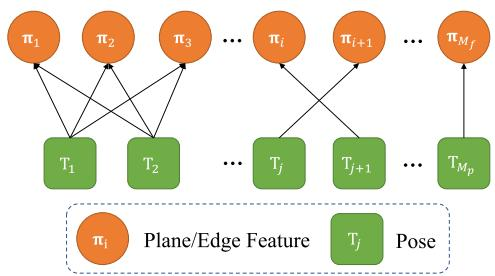  
Fig. 1. Factor graph representation of the bundle adjustment formulation.

## A. BA Formulation

Shown in Fig. 1, assume there are $M _ { f }$ features, each denoted by parameter $\pi _ { i } ( i = 1 , . . . , M _ { f } )$ , observed by $M _ { p }$ lidar poses, each denoted by $\mathbf { T } _ { j } = ( \mathbf { R } _ { j } , \mathbf { t } _ { j } ) \ ( j = 1 , . . . , M _ { p } )$ , the bundle adjustment refers to simultaneously determining all the lidar poses (denoted by $\mathbf { T } = ( \mathbf { T } _ { 1 } , \ldots , \mathbf { T } _ { M _ { p } } ) )$ and feature parameters (denoted by $\pi = ( \pi _ { 1 } , \ldots , \pi _ { M _ { f } } ) )$ , such that reconstructed map agrees with the lidar measurements to the best extent. Denote $c ( \pi _ { i } , \mathbf { T } )$ the map consistency due to the ith feature, a straightforward BA formulation is

$$
\operatorname* { m i n } _ { \mathbf { T } , \pi } \left( \sum _ { i = 1 } ^ { M _ { f } } c ( \pi _ { i } , \mathbf { T } ) \right) .\tag{1}
$$

In our BA formulation, we make use ofplane and edge features that are often abundant in lidar point cloud and minimize the natural Euclidean distance between each measured raw lidar point and its corresponding plane or edge feature. Specifically, assume a total number of $N _ { i j }$ lidar points are measured on the ith feature at the jth lidar pose, each denoted by $\mathbf { p } _ { f _ { i j k } } \ ( k =$ $1 , \ldots , N _ { i j } )$ . Its predicted location in the global frame is

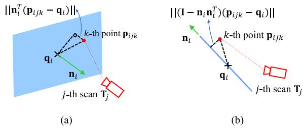  
Fig. 2. Plane and edge features used in the lidar BA. (a) Plane formulation. qi is a point in the plane and ni is the plane normal. (b) Line formulation. qi is a point on the edge and ni is the edge direction. (a) The i-th plane feature $\pi _ { i } = ( \mathbf { n } _ { i } , \mathbf { q } _ { i } )$ . (b) The i-th edge feature ${ \pmb \pi } _ { i } = ( { \bf n } _ { i } , { \bf q } _ { i } )$

$$
\mathbf { p } _ { i j k } = \mathbf { R } _ { j } \mathbf { p } _ { f _ { i j k } } + \mathbf { t } _ { j } .\tag{2}
$$

For a plane feature, it is parameterized by $\pi _ { i } = ( { \bf n } _ { i } , { \bf q } _ { i } )$ with ${ \bf n } _ { i }$ the plane normal vector and $\mathbf { q } _ { i }$ an arbitrary point on the plane, both in the global frame [see Fig. 2(a)]. Then, the Euclidean distance between a measured point $\mathbf { p } _ { f _ { i j k } }$ to the plane is $\| \mathbf { n } _ { i } ^ { T } ( \mathbf { p } _ { i j k } - \mathbf { q } _ { i } ) \| _ { 2 }$ . Aggregating the distance for all points observed in all poses leads to the total map consistency corresponding to this plane feature

$$
c ( \pmb { \pi } _ { i } , \mathbf { T } ) = \frac { 1 } { N _ { i } } \sum _ { j = 1 } ^ { M _ { p } } \sum _ { k = 1 } ^ { N _ { i j } } \left. \mathbf { n } _ { i } ^ { T } ( \mathbf { p } _ { i j k } - \mathbf { q } _ { i } ) \right. _ { 2 } ^ { 2 }\tag{3}
$$

where $\begin{array} { r } { N _ { i } = \sum _ { j = 1 } ^ { M _ { p } } N _ { i j } } \end{array}$ is the total number of lidar points ob-served on the plane feature by all poses.

For an edge feature, it is parameterized by $\pi _ { i } = ( { \bf n } _ { i } , { \bf q } _ { i } )$ with ${ \bf n } _ { i }$ the edge direction vector and $\mathbf { q } _ { i }$ an arbitrary point on the edge, both in the global frame [see Fig. 2(b)]. Then, the Euclidean distance between a measured point $\mathbf { p } _ { f _ { i j k } }$ to the edge is $\| ( \mathbf { I } - \mathbf { n } _ { i } \mathbf { n } _ { i } ^ { T } ) ( \mathbf { p } _ { i j k } - \mathbf { q } _ { i } ) \| _ { 2 }$ . Aggregating the distance for all points observed in all poses leads to the total map consistency corresponding to this edge feature

$$
c ( \pi _ { i } , { \bf T } ) = \frac { 1 } { N _ { i } } \sum _ { j = 1 } ^ { M _ { p } } \sum _ { k = 1 } ^ { N _ { i j } } \left\| ( { \bf I } - { \bf n } _ { i } { \bf n } _ { i } ^ { T } ) ( { \bf p } _ { i j k } - { \bf q } _ { i } ) \right\| _ { 2 } ^ { 2 }\tag{4}
$$

where $\begin{array} { r } { N _ { i } = \sum _ { j = 1 } ^ { M _ { p } } N _ { i j } } \end{array}$ is the total number of lidar points ob-served on the edge feature by all poses.

## B. Elimination of Feature Parameters

In this section, we show that in the BA optimization (1), the feature parameter π can really be solved with a closed-form solution. The key observation is that one cost item $c ( \pi _ { i } , \mathbf { T } )$ depends solely on one feature parameter, so that the feature parameter can be optimized independently. Concretely

$$
\operatorname* { m i n } _ { \mathbf { T } , \pi } \left( \sum _ { i = 1 } ^ { M _ { f } } c ( \pi _ { i } , \mathbf { T } ) \right) \ = \operatorname* { m i n } _ { \mathbf { T } } \left( \operatorname* { m i n } _ { \pi } \left( \sum _ { i = 1 } ^ { M _ { f } } c ( \pi _ { i } , \mathbf { T } ) \right) \right)
$$



$$
\mathrm {  ~ \Gamma ~ } = \operatorname* { m i n } _ { \bf T } \left( \sum _ { i = 1 } ^ { M _ { f } } \operatorname* { m i n } _ { \pi _ { i } } c ( \pi _ { i } , { \bf T } ) \right) .\tag{5}
$$

In case of a plane feature, we substitute (3) into $c ( \pi _ { i } , \mathbf { T } )$

$$
\begin{array} { c } { \displaystyle \operatorname* { m i n } _ { \pmb { \pi } _ { i } } c ( \pmb { \pi } _ { i } , \mathbf { T } ) = \displaystyle \operatorname* { m i n } _ { \pmb { \pi } _ { i } } \left( \frac { 1 } { N _ { i } } \sum _ { j = 1 } ^ { M _ { p } } \sum _ { k = 1 } ^ { N _ { i j } } { \left\| \mathbf { n } _ { i } ^ { T } ( \mathbf { p } _ { i j k } - \mathbf { q } _ { i } ) \right\| _ { 2 } ^ { 2 } } \right) } \\ { = \lambda _ { 3 } ( \mathbf { A } _ { i } ) , \mathrm { ~ w h e n ~ } \mathbf { n } _ { i } ^ { \star } = \mathbf { u } _ { 3 } ( \mathbf { A } _ { i } ) , \mathbf { q } _ { i } ^ { \star } = \bar { \mathbf { p } } _ { i } } \end{array}\tag{6}
$$

where $\lambda _ { l } ( \mathbf { A } _ { i } )$ denotes the lth largest eigenvalue of matrix $\mathbf { A } _ { i } ,$ $\mathbf { u } _ { l } ( \mathbf { A } _ { i } )$ denotes the corresponding eigenvector, the matrix $\mathbf { A } _ { i } ,$ and vector $\bar { \mathbf { p } } _ { i }$ are defined as

$$
\mathbf { A } _ { i } \triangleq \frac { 1 } { N _ { i } } \sum _ { j = 1 } ^ { M _ { p } } \sum _ { k = 1 } ^ { N _ { i j } } ( \mathbf { p } _ { i j k } - \bar { \mathbf { p } } _ { i } ) , \quad \bar { \mathbf { p } } _ { i } \triangleq \frac { 1 } { N _ { i } } \sum _ { j = 1 } ^ { M _ { p } } \sum _ { k = 1 } ^ { N _ { i j } } \mathbf { p } _ { i j k } .\tag{7}
$$

The proof will be given in Supplementary III-A [59]. Note that the optimal solution $\mathbf { q } _ { i } ^ { \star }$ in (6) is not unique, any deviation from $\mathbf { q } _ { i } ^ { \star }$ along a direction perpendicular to $\mathbf { n } _ { i } ^ { \star }$ will equally serve the optimal solution. However, these equivalent optimal solution will not change the plane nor the optimal cost (hence the results that follow next). Indeed, the point $\mathbf { q } _ { i } ^ { \star }$ could be an arbitrary point on the plane as it is defined to be.

In case of an edge feature, we substitute (4) into $c ( \pi _ { i } , \mathbf { T } )$

$$
\operatorname* { m i n } _ { \pmb { \pi } _ { i } } c ( \pmb { \pi } _ { i } , \mathbf { T } ) = \operatorname* { m i n } _ { \pmb { \pi } _ { i } } \left( \frac { 1 } { N _ { i } } \sum _ { j = 1 } ^ { M _ { p } } \sum _ { k = 1 } ^ { N _ { i j } } { \left\| { ( \mathbf { I } - \mathbf { n } _ { i } \mathbf { n } _ { i } ^ { T } ) ( \mathbf { p } _ { i j k } - \mathbf { q } _ { i } ) } \right\| _ { 2 } ^ { 2 } } \right)
$$

$$
\begin{array} { r } { = \lambda _ { 2 } ( \mathbf { A } _ { i } ) + \lambda _ { 3 } ( \mathbf { A } _ { i } ) ; \mathrm { ~ w h e n ~ } \mathbf { n } _ { i } ^ { \star } = \mathbf { u } _ { 1 } ( \mathbf { A } _ { i } ) , \mathbf { q } _ { i } ^ { \star } = \bar { \mathbf { p } } _ { i } . } \end{array}\tag{8}
$$

Again, the optimal solution $\mathbf { q } _ { i } ^ { \star }$ in (8) is not unique, any deviation from $\mathbf { q } _ { i } ^ { \star }$ along the direction $\mathbf { n } _ { i } ^ { \star }$ will equally serve the optimal solution. However, these equivalent optimal solution will not change the edge nor the optimal cost (hence the results that follow next).

As can be seen from (6) and (8), the parameter $\pi _ { i }$ for each feature, either it is a plane or edge, can be analytically solved and hence removed from the BA optimization process. Consequently, the original BA optimization in (1) reduces to

$$
\operatorname* { m i n } _ { \mathbf { T } } \left( \sum _ { i = 1 } ^ { M _ { f } } \lambda _ { l } ( \mathbf { A } _ { i } ) \right)\tag{9}
$$

where $l \in \{ 2 , 3 \}$ and we omitted the exact number of eigenvalues in the cost function for brevity.

Note that the matrix $\mathbf { A } _ { i }$ in (9) depends on the lidar pose T since each involved point $\mathbf { p } _ { i j k }$ depends on the pose [see (7) and (2)]. Hence the decision variables of the resultant optimization in (9) involve the lidar pose T only, which dramatically reduces the optimization dimension (hence computation time).

## C. Point Cluster

With the feature parameters eliminated, another difficulty remaining in the BA optimization (9) is that the evaluation of matrix Ai (and its Jacobian or Hessian necessary for developing a numerical solver) requires to enumerate every point observed at each lidar pose. Such an enumeration is extremely computationally expensive due to the large number of points in a lidar scan. In this section, we show such point enumeration can be avoided by point cluster, which is detailed as follows.

A point cluster is a finite point set denoted by set ${ \mathcal { C } } = \{ { \bf p } _ { k } \in$ $\mathbb { R } ^ { 3 } | k = 1 , \dots , n \}$ , the corresponding point cluster coordinate, denoted as ( ), is defined as

$$
\Re ( { \mathcal { C } } ) \triangleq \sum _ { k = 1 } ^ { n } { \Bigg [ } \mathbf { p } _ { k } { \Bigg ] } \left[ \mathbf { p } _ { k } ^ { T } \quad 1 \right] = { \Bigg [ } \mathbf { P } \quad \mathbf { v } { \Bigg ] } \in \mathbb { S } ^ { 4 \times 4 }
$$

$$
\mathbf { P } = \sum _ { k = 1 } ^ { n } \mathbf { p } _ { k } \mathbf { p } _ { k } ^ { T } , \mathbf { v } = \sum _ { k = 1 } ^ { n } \mathbf { p } _ { k }\tag{10}
$$

where $\mathbb { S } ^ { 4 \times 4 }$ denotes the set of $4 \times 4$ symmetric matrix.

A point cluster can be thought as a generalized point, for which a rigid transform could be applied. Similarly, we can define rigid transformation on a point cluster as follows.

Definition 1: (Rigid transform): Given a point cluster with point collection $\pmb { \mathcal { C } } = \{ \mathbf { p } _ { k } \in \mathbb { R } ^ { 3 } | k = 1 , \dots , n \}$ and a pose $\mathbf { T } =$ $\begin{array} { r l } { \bigg \lceil \mathbf { R } } & { { } \mathbf { t } \bigg \rceil _ { \epsilon ^ { } \mathit { S E } ( 3 ) } } \end{array}$ . The rigid transformation of the point cluster $^ { c , }$ denoted by $\mathbf { T } \circ c ,$ is defined as

$$
\mathbf { T } \circ \mathcal { C } \triangleq \{ \mathbf { R } \mathbf { p } _ { k } + \mathbf { t } \in \mathbb { R } ^ { 3 } | k = 1 , \dots , n \} .\tag{11}
$$

Besides rigid transformation, we also define cluster merging operation, as follows.

Definition 2: (Cluster merging): Given two point clusters with point collections $\mathcal { C } _ { 1 } = \{ \mathbf { p } _ { k } ^ { 1 } \in \mathbb { R } ^ { 3 } | k = 1 , \dots , n _ { 1 } \}$ and $\mathcal C _ { 2 } = \{ \mathbf { p } _ { k } ^ { \bar { 2 } } \in \mathbb { R } ^ { 3 } | k = 1 , \dots , n _ { 2 } \}$ in the same reference frame, respectively. The merged cluster, denoted by $c _ { 1 } \oplus c _ { 2 }$ , is defined as

$$
\pmb { \mathcal { C } } _ { 1 } \oplus \pmb { \mathcal { C } } _ { 2 } \triangleq \{ \mathbf { p } _ { k } ^ { l } \in \mathbb { R } ^ { 3 } | l = 1 , 2 ; k = 1 , \ldots , n _ { i } \} .\tag{12}
$$

Next we will show that the two operations defined above can be fully represented by their point cluster coordinates.

Theorem 1: Given a point cluster  and a pose $\mathbf { T } = { \left[ \begin{array} { l l } { \mathbf { R } } & { \mathbf { t } } \\ { 0 } & { 1 } \end{array} \right] } \in$ SE(3). The rigid transformation of the point cluster satisfies

$$
\Re ( \mathbf { T } \circ \pmb { \mathcal { C } } ) = \mathbf { T } \Re ( \pmb { \mathcal { C } } ) \mathbf { T } ^ { T } .\tag{13}
$$

Proof: See Supplementary III-B [59].



Theorem 2: Given two point clusters $c _ { 1 }$ and $c _ { 2 }$ in the same reference frame. The merged cluster satisfies

$$
\Re ( \pmb { C } _ { 1 } \oplus \pmb { C } _ { 2 } ) = \Re ( \pmb { C } _ { 1 } ) + \Re ( \pmb { C } _ { 2 } ) .\tag{14}
$$

Proof: See Supplementary III-C [59].

As can be seen, rigid transformation and cluster merging operations on point clusters can be represented by usual matrix multiplication and addition on the point cluster coordinates. A visual illustration of the two operations and their coordinate representations are shown in Fig. 3. These results are crucially important: Theorem 1 indicates that the point cluster can be constructed in one frame (e.g., local lidar frame) and transformed to another (e.g., the global frame) without enumerating each individual points; Theorem 2 indicates that two (and by induction more) point clusters can be further merged to form a new point cluster. A particular case of Theorem 2 is when the second point cluster contains a single point, indicating that the point cluster can be constructed incrementally as lidar points arrives sequentially.

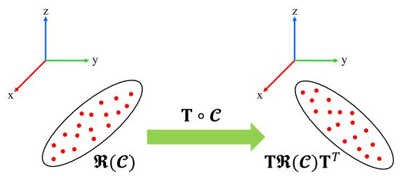

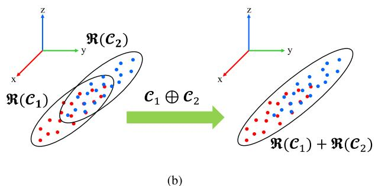  
Fig. 3. Two operations on point cluster. (a) Rigid transform. (b) Cluster merging.

Remark 1: The concept of point cluster and its two operations are not new and have been used in previous works such as [33], [34], and [35]. In this article, we formalized this concept by: 1) introducing the point cluster coordinate composing of P, v, and n as in (10); 2) formalizing the two operations—rigid transform and cluster merging; 3) explicitly showing the relation between point cluster operations and their coordinates.

Remark 2: A point set and its coordinate is not a one-to-one mapping. While it is obvious that the coordinate is uniquely determined from the point set as shown in (10), the reverse way does not hold: the point set cannot be recovered from its coordinate uniquely. Since different point sets may lead to the same coordinate, the raw points must be saved if a reclustering is needed.

Now, we apply the point cluster to the BA problem concerned in this article. To start with, we group all points on the same feature as a point cluster. For example, the point cluster for the ith feature is $\pmb { \mathcal { C } } _ { i } \triangleq \{ \mathbf { p } _ { i j k } | j = 1 , \dots , M _ { p } , k = 1 , \dots , N _ { i j } \}$ . Denote $\mathbf { C } _ { i }$ the coordinate of the point cluster, following (10), we obtain:

$$
\mathbf { C } _ { i } = \Re ( \mathcal { C } _ { i } ) \triangleq \sum _ { j = 1 } ^ { M _ { p } } \sum _ { k = 1 } ^ { N _ { i j } } \left[ \pmb { \mathrm { p } } _ { i j k } \right] \left[ \pmb { \mathrm { p } } _ { i j k } ^ { T } \quad 1 \right] = \left[ \pmb { \mathrm { P } } _ { i } \quad \mathbf { v } _ { i } \right]
$$

$$
\mathbf { P } _ { i } = \sum _ { j = 1 } ^ { M _ { p } } \sum _ { k = 1 } ^ { N _ { i j } } \mathbf { p } _ { i j k } \mathbf { p } _ { i j k } ^ { T } , \mathbf { v } _ { i } = \sum _ { j = 1 } ^ { M _ { p } } \sum _ { k = 1 } ^ { N _ { i j } } \mathbf { p } _ { i j k } .\tag{15}
$$

A key result we show now is that this point cluster coordinate $\mathbf { C } _ { i }$ is completely sufficient to represent the matrix Ai required

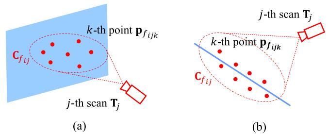  
Fig. 4. For the ith feature (either plane or edge), all points observed at the jth pose are clustered as a point cluster and is represented by $\mathbf { C } _ { f _ { i j } }$ in its local frame. (a) Plane feature. (b) Line feature.

in the BA optimization (9). According to (7), we have

$$
\begin{array} { l } { { \displaystyle { \bf A } _ { i } = \frac { 1 } { N _ { i } } \sum _ { j = 1 } ^ { M _ { p } } \sum _ { k = 1 } ^ { N _ { i j } } ( { \bf p } _ { i j k } - \bar { \bf p } _ { i } ) \big ( { \bf p } _ { i j k } - \bar { \bf p } _ { i } \big ) ^ { T } } \ ~ } \\ { { \displaystyle ~ = \frac { 1 } { N _ { i } } \sum _ { j = 1 } ^ { M _ { p } } \sum _ { k = 1 } ^ { N _ { i j } } ( { \bf p } _ { i j k } { \bf p } _ { i j k } ^ { T } ) - \bar { \bf p } _ { i } \bar { \bf p } _ { i } ^ { T } } \ ~ } \\ { { \displaystyle ~ = \frac { 1 } { N _ { i } } { \bf P } _ { i } - \frac { 1 } { N _ { i } ^ { 2 } } { \bf v } _ { i } { \bf v } _ { i } ^ { T } \triangleq { \bf A } ( { \bf C } _ { i } ) } } \end{array}\tag{16}
$$

where we denote Ai as a function of $\mathbf { C } _ { i }$ since the $\mathbf { A } _ { i }$ is fully represented (and uniquely determined) by $\mathbf { C } _ { i }$ . We slightly abuse the notation here by denoting the function as $\mathbf { A } ( \cdot )$

On the other hand, since the point set $c _ { i }$ is defined on points in the global frame, the coordinate $\mathbf { C } _ { i }$ is dependent on the lidar pose, which remains to be optimized. To explicitly parameterize the lidar pose, we note that

$$
\pmb { \mathcal { C } } _ { i } \triangleq \{ \mathbf { p } _ { i j k } | j = 1 , \dots , M _ { p } , k = 1 , \dots , N _ { i j } \}\tag{17}
$$

$$
= \cup _ { j = 1 } ^ { M _ { p } } \{ \mathbf { p } _ { i j k } | k = 1 , \ldots , N _ { i j } \}\tag{18}
$$

$$
\begin{array} { r } { \underline { { \mathbf { D e f . } } } 2 \oplus _ { j = 1 } ^ { M _ { p } } \pmb { C } _ { i j } , \pmb { C } _ { i j } \triangleq \{ \mathbf { p } _ { i j k } | k = 1 , \dots , N _ { i j } \} } \end{array}\tag{19}
$$

$$
\stackrel { \mathrm { D e f . 1 } } { = } \oplus _ { j = 1 } ^ { M _ { p } } \left( \mathbf { T } _ { j } \circ \mathcal { C } _ { f _ { i j } } \right) , \mathcal { C } _ { f _ { i j } } \triangleq \{ \mathbf { p } _ { f _ { i j k } } | k = 1 , \ldots , N _ { i j } \}\tag{20}
$$

where $\mathbf { p } _ { f _ { i j k } }$ is a point represented in the lidar local frame [see (2)], $c _ { i j }$ is the point set that is composed of all points on the ith feature (either plane or edge) observed at the jth lidar pose, and $c _ { f _ { i j } }$ is the same point set as $c _ { i j }$ , but represented in the lidar local frame (see Fig. 4).

The relation between the point cluster $c _ { i }$ and $ { \mathcal { C } } _ { f _ { i j } }$ shown in (20) will lead to a relation between their coordinates $\mathbf { C } _ { i }$ and $\mathbf { C } _ { f _ { i j } }$ as follows:

$$
\mathbf { C } _ { i } \overset { \mathtt { T h m . 2 } } { = } \sum _ { j = 1 } ^ { M _ { p } } \mathbf { C } _ { i j } \overset { \mathtt { T h m . 1 } } { = } \sum _ { j = 1 } ^ { M _ { p } } \mathbf { T } _ { j } \mathbf { C } _ { f _ { i j } } \mathbf { T } _ { j } ^ { T } .\tag{21}
$$

As a result, the BA optimization in (9) further reduces to

$$
\operatorname* { m i n } _ { \mathbf { T } _ { j } \in S E ( 3 ) , \forall j } \underbrace { \left( \sum _ { i = 1 } ^ { M _ { f } } \lambda _ { l } \left( \mathbf { A } \left( \sum _ { j = 1 } ^ { M _ { p } } \mathbf { T } _ { j } \mathbf { C } _ { f _ { i j } } \mathbf { T } _ { j } ^ { T } \right) \right) \right) } _ { c ( \mathbf { T } ) }\tag{22}
$$

where the function $\mathbf { A } ( \cdot )$ is defined in (16). Note that the cost function in (22) only requires the knowledge of point cluster coordinate $\mathbf { C } _ { f _ { i . j } }$ without enumerating each individual points. The coordinate $\mathbf { \bar { C } } _ { f _ { i j } }$ is computed as [following (10)]:

$$
\begin{array} { r l } & { \mathbf { C } _ { f _ { i j } } = \left[ \mathbf { P } _ { f _ { i j } } \quad \mathbf { v } _ { f _ { i j } } \right] } \\ & { \mathbf { \Lambda } } \\ & { \mathbf { P } _ { f _ { i j } } = \displaystyle \sum _ { k = 1 } ^ { N _ { i j } } \mathbf { p } _ { f _ { i j k } } \mathbf { p } _ { f _ { i j k } } ^ { T } , \quad \mathbf { v } _ { f _ { i j } } = \displaystyle \sum _ { k = 1 } ^ { N _ { i j } } \mathbf { p } _ { f _ { i j k } } } \end{array}\tag{23}
$$

which can be constructed during the feature association stage before the optimization. In particular, if the jth pose observes no point on the ith feature, $\mathbf { C } _ { f _ { i j } } = \mathbf { 0 } _ { 4 \times 4 }$ , which will naturally remove the dependence on the jth pose for the ith cost item as shown in (22).

Theorem 3: Given a matrix function $\mathbf { A } ( \mathbf { C } ) \triangleq { \frac { 1 } { N } } \mathbf { P } -$ $\scriptstyle { \frac { 1 } { N ^ { 2 } } } \mathbf { v } \mathbf { v } ^ { T }$ with $\mathbf { C } = \lceil \mathbf { P } \mathbf { \Psi }  \mathbf { \Psi } \mathbf { \Psi } \mathbf { \Psi } \mathbf { v } \rceil \in \mathbb { S } ^ { 4 \times 4 } , \lambda _ { l } ( \mathbf { A } )$ denotes the lth largest eigenvalue of A, then $\lambda _ { l } ( \mathbf { A } \mathbf { \bar { ( C ) } } )$ is invariant to any rigid transformation $\mathbf { T } _ { 0 } \in S E ( 3 )$ . That is

$$
\lambda _ { l } \left( \mathbf { A } \left( \mathbf { T } _ { 0 } \mathbf { C } \mathbf { T } _ { 0 } ^ { T } \right) \right) = \lambda _ { l } \left( \mathbf { A } \left( \mathbf { C } \right) \right) \quad \forall \mathbf { T } _ { 0 } \in S E ( 3 ) .\tag{24}
$$

Proof: See Supplementary III-D [59].

Theorem 3 implies that left multiplying all poses $\mathbf { T } _ { j } \quad \forall j$ , by the same transform $\mathbf { T } _ { 0 }$ does not change the optimization at all. That is, the BA optimization is invariant to the change of the global reference frame, which is the well-known gauge freedom in a bundle adjustment problem.

## D. First- and Second-Order Derivatives

As shown in the previous section, the BA optimization problem in (22) is completely equivalent to the original formulation (1), where each cost item standards for the squared Euclidean distance from a point to a plane (or edge). This squared distance is essentially a quadratic optimization, which requires the knowledge of the second-order information of the cost function for efficient solving. In this section, we derive such first- and second-order derivatives. Without loss of generality, we only discuss the ith feature, which contributes a cost item in the form of

$$
c _ { i } ( \mathbf { T } ) = \lambda _ { l } \left( \mathbf { A } \left( \sum _ { j = 1 } ^ { M _ { p } } \mathbf { T } _ { j } \mathbf { C } _ { f _ { i j } } \mathbf { T } _ { j } ^ { T } \right) \right)\tag{25}
$$

with $\mathbf { C } _ { f _ { i j } } \in \mathbb { R } ^ { 4 \times 4 }$ being a precomputed matrix [see (23)].

To derive the derivative of the cost item (25) w.r.t. the pose $\mathbf { T } _ { j }$ , which is an element of the Special Euclidean group $S E ( 3 )$ we parameterize its perturbation by a special addition, called boxplus (-operation). For the pose vector $\mathbf { T } = ( \dots , \mathbf { T } _ { j } , \dots )$ we define the the  operation as follows:

$$
\mathbf { T } \boxplus \delta \mathbf { T } \triangleq ( . . . , \mathbf { T } _ { j } \boxplus \delta \mathbf { T } _ { j } , . . . )\tag{26}
$$

$$
\mathbf { T } _ { j } \boxplus \delta \mathbf { T } _ { j } \triangleq ( \exp { ( \lfloor \delta \phi _ { j } \rfloor ) } \mathbf { R } _ { j } , \delta \mathbf { t } _ { j } + \exp { ( \lfloor \delta \phi _ { j } \rfloor ) } \mathbf { t } _ { j } )\tag{27}
$$

where $\delta { \bf T } \triangleq ( \operatorname { \mathrm { . ~ . ~ . ~ } } , \delta { \bf T } _ { j } , \operatorname { \mathrm { . ~ . ~ . ~ } } ) \in \mathbb { R } ^ { 6 M _ { \tau } }$ with $\delta \mathbf { T } _ { j } \triangleq ( \delta \phi _ { j } , \delta \mathbf { t } _ { j } ) \in$ $\mathbb { R } ^ { 6 } \quad \forall j \in { 1 , \dots , M _ { p } } ,$ , is the perturbation on the pose vector.

For a scalar function $f ( \mathbf { T } ) : S E ( 3 ) \times \ldots \times S E ( 3 ) \mapsto$ R, denote $\big ( \frac { \partial f ( \mathbf { T } ) } { \partial \mathbf { T } } \big ) \big ( \mathbf { T } _ { 0 } \big )$ its first-order derivative and $\big ( \frac { \partial f ^ { 2 } ( \mathbf { T } ) } { \partial \mathbf { T } ^ { 2 } } \big ) ( \mathbf { T } _ { 0 } )$ its second-order derivative, both at a chosen point of the input $\mathbf { T } _ { 0 } .$ . The  operation enables us to parameterize the input of function f(·), T, by its perturbation δT from a given point $\mathbf { T } _ { 0 } \mathbf { : }$ $\mathbf { T } = \mathbf { T } _ { 0 }$  δT. Since the map between T and $\delta \mathbf { T }$ is bijective if $\lVert \delta \phi _ { j } \rVert < \pi \quad \forall j$ , the scalar function $f ( \mathbf { T } )$ in terms of $\mathbf { T }$ can be equivalently written as a function $f ( \mathbf { T } _ { 0 } \boxplus \delta \mathbf { T } )$ in terms of $\delta \mathbf { T }$ As a consequence, the derivatives of $f ( \mathbf { T } )$ w.r.t. T at the point $\mathbf { T } _ { 0 }$ can be defined as the derivatives of $f ( \mathbf { T } _ { 0 } \boxplus \delta \mathbf { T } )$ w.r.t. δT at zero, where the latter is a normal derivative w.r.t. Euclidean vectors

$$
\left( \frac { \partial f ( \mathbf { T } ) } { \partial \mathbf { T } } \right) ( \mathbf { T } _ { 0 } ) \triangleq \left( \frac { \partial f ( \mathbf { T } _ { 0 } \boxplus \delta \mathbf { T } ) } { \delta \mathbf { T } } \right) ( \mathbf { 0 } )\tag{28}
$$

$$
\left( { \frac { \partial ^ { 2 } f ( \mathbf { T } ) } { \partial \mathbf { T } ^ { 2 } } } \right) ( \mathbf { T } _ { 0 } ) \triangleq \left( { \frac { \partial } { \partial \delta \mathbf { T } } } \left( { \frac { \partial f ( \mathbf { T } _ { 0 } \boxplus \delta \mathbf { T } ) } { \partial \delta \mathbf { T } } } \right) \right) ( \mathbf { 0 } )\tag{29}
$$

In the following discussion, we use T as the reference point to replace $\mathbf { T } _ { 0 }$ in the derivatives and omit it for the sake of notation simplification.

Based on the derivatives defined in (28) and (29), we have the following results for the first and second-order derivatives of the cost item (25).

Theorem 4: Given

1) Matrices $\mathbf { C } _ { j } = [ \mathbf { P } _ { j } \quad \mathbf { v } _ { j } ] _ { \ u { \mathbf { v } } _ { j } } \mathbf { \Psi } _ { j } =  , \ldots , M _ { p } .$

2) Poses $\mathbf { T } _ { j } \in S \bar { E ( 3 ) } , j = \bar { 1 } , \dotsc , M _ { p }$

3) A matrix $\mathbf { C } = \left| \begin{array} { l l } { \mathbf { P } } & { \mathbf { v } } \\ { \mathbf { v } ^ { T } } & { N } \end{array} \right| \triangleq \sum _ { j = 1 } ^ { M _ { p } } \mathbf { T } _ { j } \mathbf { C } _ { j } \mathbf { T } _ { j } ^ { T } \in \mathbb { S } ^ { 4 \times 4 } ,$ , which is the aggregation of $\mathbf { C } _ { j } .$ , and a matrix function $\mathbf { A } ( \mathbf { C } ) \triangleq$ $\begin{array} { r } { \frac { 1 } { N } \mathbf { P } - \frac { 1 } { N ^ { 2 } } \mathbf { v } \mathbf { v } ^ { T } \in \mathbb { S } ^ { 3 \times 3 } } \end{array}$

4) A function $\lambda _ { l } ( \mathbf { A } ( \mathbf { C } ) ) , \lambda _ { l } ( \mathbf { A } )$ denotes the lth $( l = 1 , 2 , 3 )$ largest eigenvalue of A with corresponding eigenvector ul.

The Jacobian matrix $\mathbf { J } _ { l }$ and Hessian matrix $\mathbf { H } _ { l }$ of the function $\lambda _ { l } ( \mathbf { A } ( \mathbf { C } ) )$ ) with respect to the poses T are

$$
\mathbf { J } _ { l } = \mathbf { g } _ { l l } \in \mathbb { R } ^ { 1 \times 6 M _ { p } }\tag{30}
$$

$$
\mathbf { H } _ { l } = \mathbf { W } _ { l } + \sum _ { k = 1 , k \neq l } ^ { 3 } \frac { 2 } { \lambda _ { l } - \lambda _ { k } } \mathbf { g } _ { k l } ^ { T } \mathbf { g } _ { k l } \in \mathbb { R } ^ { 6 M _ { p } \times 6 M _ { p } }\tag{31}
$$

where $\mathbf { g } _ { l l }$ is $\mathbf { g } _ { k l }$ with $k = l . \ \mathbf { g } _ { k l }$ and $\mathbf { W } _ { l }$ are matrices partitioned as

$$
\mathbf { g } _ { k l } = \left[ \ldots \quad \mathbf { g } _ { k l } ^ { j } \quad \ldots \right] \in \mathbb { R } ^ { 1 \times 6 M _ { p } }\tag{32}
$$

$$
\begin{array} { r } { \mathbf { W } _ { l } = \left[ \begin{array} { c c c } & { \vdots } & \\ { \hdots } & { \mathbf { W } _ { l } ^ { i j } } & { \hdots } \\ & { \vdots } & \\ & & { \vdots } \end{array} \right] \in \mathbb { R } ^ { 6 M _ { p } \times 6 M _ { p } } } \end{array}\tag{33}
$$

with block elements $\mathbf { g } _ { k l } ^ { j } \in \mathbb { R } ^ { 1 \times 6 } , \mathbf { W } _ { l } ^ { i j } \in \mathbb { R } ^ { 6 \times 6 } , \forall i , j \in \lbrace 1 , \dots ,$ $M _ { p } \}$ defined as

$$
\begin{array} { r } { \mathbf { g } _ { k l } ^ { j } = \frac { 1 } { N } \mathbf { u } _ { l } ^ { T } \mathbf { S } _ { \mathbf { P } } \left( \mathbf { T } _ { j } - \frac { 1 } { N } \mathbf { C } \mathbf { F } \right) \mathbf { C } _ { j } \mathbf { T } _ { j } ^ { T } \mathbf { V } _ { k } ^ { T } \quad } \\ { + \frac { 1 } { N } \mathbf { u } _ { k } ^ { T } \mathbf { S } _ { \mathbf { P } } \left( \mathbf { T } _ { j } - \frac { 1 } { N } \mathbf { C } \mathbf { F } \right) \mathbf { C } _ { j } \mathbf { T } _ { j } ^ { T } \mathbf { V } _ { l } ^ { T } } \end{array}\tag{34}
$$

$$
\begin{array} { c } { { \displaystyle { \bf W } _ { l } ^ { i j } = - \frac { 2 } { N ^ { 2 } } { \bf V } _ { l } { \bf T } _ { i } { \bf C } _ { i } { \bf F } { \bf C } _ { j } { \bf T } _ { j } ^ { T } { \bf V } _ { l } ^ { T } + \mathbb { 1 } _ { i = j } } } \\ { { \displaystyle \quad \quad \quad \cdot \left( \frac { 2 } { N } { \bf V } _ { l } { \bf T } _ { j } { \bf C } _ { j } { \bf T } _ { j } ^ { T } { \bf V } _ { l } ^ { T } + \left[ \mathbf { K } _ { l } ^ { j } \quad { \bf 0 } _ { 3 \times 3 } \right] \right) } } \end{array}\tag{35}
$$

$$
\mathbf { K } _ { l } ^ { j } = \frac { 1 } { N } \left\lfloor \mathbf { S _ { P } } \mathbf { T } _ { j } \mathbf { C } _ { j } \left( \mathbf { T } _ { j } - \frac { 1 } { N } \mathbf { C } \mathbf { F } \right) ^ { T } \mathbf { S _ { P } ^ { \cal T } } \mathbf { u } _ { l } \right\rfloor \left\lfloor \mathbf { u } _ { l } \right\rfloor
$$

$$
+ \frac { 1 } { N } \lfloor \mathbf { u } _ { l } \rfloor \left\lfloor \mathbf { S _ { P } } \mathbf { T } _ { j } \mathbf { C } _ { j } \left( \mathbf { T } _ { j } - \frac { 1 } { N } \mathbf { C } \mathbf { F } \right) ^ { T } \mathbf { S _ { P } ^ { } } \mathbf { u } _ { l } \right\rfloor\tag{36}
$$

$$
{ \bf { V } } _ { l } = \left[ \begin{array} { c c } { - \left. { \bf { u } } _ { l } \right] } & { { \bf { 0 } } _ { 3 \times 1 } } \\ { { \bf { 0 } } _ { 3 \times 3 } } & { { \bf { u } } _ { l } } \end{array} \right] \quad { \bf { F } } = \left[ \begin{array} { c c } { { \bf { 0 } } _ { 3 \times 3 } } & { { \bf { 0 } } _ { 3 \times 1 } } \\ { { \bf { 0 } } _ { 1 \times 3 } } & { 1 } \end{array} \right]\tag{37}
$$

$$
\mathbf { S _ { P } } = \ [ \mathbf { I } _ { 3 \times 3 } \quad \mathbf { 0 } _ { 3 \times 1 } ] \qquad \mathbb { 1 } _ { i = j } = \{ 1 , \quad i = j \atop 0 , \quad i \neq j  \ .\tag{38}
$$

Proof: See Supplementary III-E [59].



Corollary 4.1: The Jacobian matrix Jl and Hessian matrix $\mathbf { H } _ { l }$ in Theorem 4 satisfy that, for any l = 1, 2, 3

$$
\mathbf { J } _ { l } \cdot \delta \mathbf { T } = 0 , \quad \delta \mathbf { T } ^ { T } \cdot \mathbf { H } _ { l } \cdot \delta \mathbf { T } = 0
$$

$$
\forall \delta \mathbf { T } \in \boldsymbol { \mathcal { W } } \triangleq \{ \begin{array} { l } { [ \mathbf { w } ] } \\ { \vdots } \\  \mathbf { w } \end{array} \} \forall \mathbf { w } \in \mathbb { R } ^ { 6 } \}\tag{39}
$$

$$
\mathbf { J } _ { l } ^ { j } = \mathbf { 0 } _ { 1 \times 6 } , \mathrm { ~ i f ~ } \mathbf { C } _ { j } = \mathbf { 0 }\tag{40}
$$

$$
\mathbf { H } _ { l } ^ { i j } = \mathbf { 0 } _ { 6 \times 6 } , { \mathrm { ~ i f ~ } } \mathbf { C } _ { i } = \mathbf { 0 } { \mathrm { ~ o r ~ } } \mathbf { C } _ { j } = \mathbf { 0 }\tag{41}
$$

where $\mathbf { J } _ { l } ^ { j }$ is the jth column block of $\mathbf { J } _ { l }$ and $\mathbf { H } _ { l } ^ { i j }$ is the ith row, jth column block of Hl.

Proof: See Supplementary III-F [59].



Remark 3: (39) implies that the Jacobian and Hessian matrices have null space containing the space spanned by . This essentially means that the cost function (25) in the BA optimization does not change along the direction where all the poses are perturbed by the same quantity w, which agrees with gauge freedom stated in Theorem 3.

Remark 4: The results in (40) and (41) imply that the blocks in Jacobian and Hessian matrices are zeros and hence their computation can be saved if any of the related poses does not observe the current feature $( \mathrm { i . e . , ~ } \mathbf { C } _ { i } = \mathbf { 0 } ~ \mathrm { o r } ~ \mathbf { C } _ { j } = \mathbf { 0 } )$ . This sparse structure could save much computation time if a feature is observed only by a sparse set of poses.

Remark 5: The derivatives in Theorem 4 are obtained based on the pose perturbation defined in (26), which multiplies the perturbation δT on the left ofthe current pose (i.e., a perturbation in the global frame). If other perturbation (denoted by δT˘ ) is preferred (e.g., a perturbation in the local frame to integrate with other measurements such as IMU pre-integration), where $\delta \mathbf { T } = \mathbf { L } \delta \mathbf { \breve { T } }$ with L the Jacobian between the two perturbation parameterization, its first- and second-order derivatives can be computed as $\breve { \mathbf { J } } = \mathbf { J }$ · L and $\breve { \mathbf { H } } = \mathbf { L } ^ { T }$ · H · L, respectively. It can be seen that J˘ and H˘ preserves a nullspace of L ·  with defined in (39).

## E. Second-Order Solver

The Jacobin and Hessian matrix from Theorem 4 are computed for one cost item (25) that corresponds to one feature in the space. Denote $\mathbf { J } _ { i } , \mathbf { H } _ { i }$ the Jacobian and Hessian matrix for the ith feature (or cost item), to determine the incremental update $\Delta \mathbf { T }$ , we make use of the second order approximation of the total cost function c(T) in (22)

$$
c ( \mathbf { T } \boxplus \Delta \mathbf { T } ) \approx c ( \mathbf { T } ) + \mathbf { J } \Delta \mathbf { T } + { \frac { 1 } { 2 } } \Delta \mathbf { T } ^ { T } \mathbf { H } \Delta \mathbf { T }\tag{42}
$$

where $\begin{array} { r } { \mathbf { J } = \sum _ { i = 1 } ^ { M _ { f } } \mathbf { J } _ { i } , \mathbf { H } = \sum _ { i = 1 } ^ { M _ { f } } \mathbf { H } _ { i } } \end{array}$ . For any d $\in w$ , since $\mathbf { J } _ { i } \mathbf { d } = 0 , \mathbf { d } ^ { T } \mathbf { H } _ { i } \mathbf { d } = 0 \quad \forall i$ , we have $\mathbf { J } \mathbf { d } = 0$ and ${ \bf d } ^ { T } { \bf H } { \bf d } =$ $\begin{array} { r l } { 0 } & { { } \forall i , } \end{array}$ , which means that any additional update along d $\in { \boldsymbol { w } }$ does not change the approximation at all. One way to resolve the gauge freedom is fixing the first pose at its initial value throughout the optimization. That is, setting $\Delta \mathbf { T } _ { 1 } = \mathbf { 0 } \mathrm { i n } ( 4 2 )$ Then, setting the differentiation of the cost approximation in (42) w.r.t. ΔT (excluding $\Delta { \bf T } _ { 1 } )$ to zero leads to the optimal update $\Delta \mathbf { T } ^ { \star }$

$$
\Delta \mathbf { T } ^ { \star } = - \left( \mathbf { H } + \mu \mathbf { I } \right) ^ { - 1 } \mathbf { J } ^ { T }\tag{43}
$$

where we used a Levenberg–Marquardt (LM) algorithm-like method to reweight the gradient and Newton’s direction by the damping parameter $\mu .$ . The complete algorithm is summarized in Supplementary (Algorithm 1) with time analysis detailed in Supplementary (Section IV). Overall, the solver has a complexity of $O ( M _ { f } M _ { p } + M _ { f } M _ { p } ^ { 2 } + M _ { p } ^ { 3 } )$ , which is linear to the number of feature $M _ { f } ,$ , irrelevant to the number of points $N _ { : }$ , and cubic to the number of pose $M _ { p }$ . The term $M _ { f } M _ { p }$ and $M _ { f } M _ { p } ^ { 2 }$ are due to the calculation of Jacobian and Hessian, respectively, and the term $M _ { p } ^ { 3 }$ is due to (43).

## F. Covariance Estimation

Assume the solver converges to an optimal pose $\mathbf { T } ^ { \star }$ , it is often useful to estimate the confidence level of the estimated pose. Let Tgt be the ground-true pose, which is unknown, and $\delta \mathbf { T } ^ { \star }$ be the difference between the optimal estimate $\mathbf { T } ^ { \star }$ and the ground-true Tgt, where $\mathbf { T } ^ { \mathrm { g t } } = \mathbf { T } ^ { \star } \boxplus \delta \mathbf { T } ^ { \star }$ . The aim is to estimate the covariance of the error $\delta \mathbf { T } ^ { \star }$ , denoted by $\pmb { \Sigma } _ { \delta \mathbf { T } ^ { \star } }$

Ultimately, the estimation error $\delta \mathbf { T } ^ { \star }$ is caused by the measurement noise in each raw point. Denote $\mathbf { p } _ { f _ { i j k } } ^ { \mathrm { g t } }$ the ground-true location of the kth point observed on the ith feature at the jth lidar pose, with measurement noise $\delta \mathbf { p } _ { f _ { i j k } } \in \mathcal { N } ( \mathbf { 0 } , \boldsymbol { \Sigma } _ { \mathbf { p } _ { f _ { i j k } } } )$ , the measured point location, denoted by $\mathbf { p } _ { f _ { i j k } }$ , is

$$
\mathbf { p } _ { f _ { i j k } } = \mathbf { p } _ { f _ { i j k } } ^ { \mathrm { g t } } + \delta \mathbf { p } _ { f _ { i j k } } .\tag{44}
$$

Aggregating the ground-true points and the measured ones lead to the ground-true point cluster, denoted by $\mathbf { C } _ { f _ { i j k } } ^ { \mathrm { g t } }$ , and the

measured point cluster, denoted by $\mathbf { C } _ { f _ { i j k } }$ , respectively, [see (23)]:

$$
\mathbf { C } _ { f _ { i j } } ^ { \mathrm { g t } } = \left[ \begin{array} { c c } { \sum _ { k = 1 } ^ { N _ { i j } } \mathbf { p } _ { f _ { i j k } } ^ { \mathrm { g t } } ( \mathbf { p } _ { f _ { i j k } } ^ { \mathrm { g t } } ) ^ { T } } & { \sum _ { k = 1 } ^ { N _ { i j } } \mathbf { p } _ { f _ { i j k } } ^ { \mathrm { g t } } } \\ { \left( \sum _ { k = 1 } ^ { N _ { i j } } \mathbf { p } _ { f _ { i j k } } ^ { \mathrm { g t } } \right) ^ { T } } & { N _ { i j } } \end{array} \right]\tag{45}
$$

$$
\approx { \bf C } _ { f _ { i j } } - \delta { \bf C } _ { f _ { i j } } ,\tag{46}
$$

where

$$
\delta \mathbf { C } _ { f _ { i j } } = \sum _ { k = 1 } ^ { N _ { i j } } \mathbf { B } _ { f _ { i j k } } \delta \mathbf { p } _ { f _ { i j k } } , \quad \mathrm { s e e } \ \mathrm { S u p p l e m e n t a r y ~ I I I - G }\tag{47}
$$

which can be constructed in advance along with the point cluster $\mathbf { C } _ { f _ { i j } }$ during the feature associations stage.

In the following discussion, to simplify the notation, we denote $\mathbf { C } _ { f } ^ { \mathrm { g t } } = \{ \mathbf { C } _ { f _ { i , i } } ^ { \mathrm { g t } } \} , \mathbf { C } _ { f } = \{ \mathbf { C } _ { f _ { i j } } \} , \delta \hat { \mathbf { C } } _ { f } \overset { , } { = } \{ \delta \mathbf { C } _ { f _ { i j } } \}$ the groundtruth, measurements, and noises of all point clusters observed on any features at any lidar poses.

Although the ground-true pose $\mathbf { T } ^ { \mathrm { g t } }$ and point cluster ${ \bf C } _ { f } ^ { \mathrm { g t } }$ are unknown, they are genuinely the optimal solution of $( 2 2 )$ and hence the Jacobian evaluated there should be zero, i.e.,

$$
\mathbf { J } ^ { T } \left( \mathbf { T } ^ { \mathrm { g t } } , \mathbf { C } _ { f } ^ { \mathrm { g t } } \right) = \mathbf { 0 }\tag{48}
$$

where we wrote the Jacobian as an explicit function of the pose and point clusters. Now, we approximate the left hand side of (48) by its first order approximation

$$
\begin{array} { r l } & { \mathbf { J } ^ { T } ( \mathbf { T } ^ { \mathrm { g t } } , \mathbf { C } _ { f } ^ { \mathrm { g t } } ) = \mathbf { J } ^ { T } \left( \mathbf { T } ^ { \star } \boxplus \delta \mathbf { T } ^ { \star } , \mathbf { C } _ { f } - \delta \mathbf { C } _ { f } \right) = \mathbf { J } ^ { T } \left( \mathbf { T } ^ { \star } , \mathbf { C } _ { f } \right) \quad \mathrm { ~ t ~ } } \\ & { \qquad + \frac { \partial \mathbf { J } ^ { T } \left( \mathbf { T } ^ { \star } \boxplus \delta \mathbf { T } , \mathbf { C } _ { f } \right) } { \partial \delta \mathbf { T } } \delta \mathbf { T } ^ { \star } - \frac { \partial \mathbf { J } ^ { T } \left( \mathbf { T } ^ { \star } , \mathbf { C } _ { f } \right) } { \partial \mathbf { C } _ { f } } \delta \mathbf { C } _ { f } . } \end{array}\tag{49}
$$

Noticing that $\begin{array} { r } { \frac { \mathbf { J } ^ { T } ( \mathbf { T } ^ { \star } \boxplus \delta \mathbf { T } , \mathbf { C } _ { f } ) } { \partial \delta \mathbf { T } } = \mathbf { H } ( \mathbf { T } ^ { \star } , \mathbf { C } _ { f } ) } \end{array}$ , the Hessian matrix of (22) evaluated at $\bar { \mathbf { T } ^ { \star } }$ [also see (42)], we have

$$
\begin{array} { r l } & { \mathbf { 0 } = \mathbf { J } ^ { T } \left( \mathbf { T } ^ { \mathrm { g t } } , \mathbf { C } _ { f } ^ { \mathrm { g t } } \right) = \mathbf { J } ^ { T } \left( \mathbf { T } ^ { \star } , \mathbf { C } _ { f } \right) } \\ & { \quad \quad \quad + \mathbf { H } \cdot \delta \mathbf { T } ^ { \star } - \frac { \partial \mathbf { J } ^ { T } \left( \mathbf { T } ^ { \star } , \mathbf { C } _ { f } \right) } { \partial \mathbf { C } _ { f } } \delta \mathbf { C } _ { f } } \end{array}\tag{50}
$$

which implies

$$
\delta \mathbf { T } ^ { \star } = - \mathbf { H } ^ { - 1 } \mathbf { J } ^ { T } \left( \mathbf { T } ^ { \star } , \mathbf { C } _ { f } \right) + \mathbf { H } ^ { - 1 } \frac { \partial \mathbf { J } ^ { T } \left( \mathbf { T } ^ { \star } , \mathbf { C } _ { f } \right) } { \partial \mathbf { C } _ { f } } \delta \mathbf { C } _ { f } .\tag{51}
$$

Since $\mathbf { T } ^ { \star }$ is the converged solution using the measured cluster $\mathbf { C } _ { f }$ , they should lead to zero update, i.e., ${ \bf H } ^ { - 1 } { \bf J } ^ { T } ( { \bf T } ^ { \star } , { \bf C } _ { f } ) = { \bf 0 }$ [see (43) with zero $\mu$ at convergence]. Therefore

$$
\delta \mathbf { T } ^ { \star } = \mathbf { H } ^ { - 1 } \frac { \partial \mathbf { J } ^ { T } \left( \mathbf { T } ^ { \star } , \mathbf { C } _ { f } \right) } { \partial \mathbf { C } _ { f } } \delta \mathbf { C } _ { f } \sim \mathcal { N } \left( \mathbf { 0 } , \boldsymbol { \Sigma } _ { \delta \mathbf { T } ^ { \star } } \right)\tag{52}
$$

$$
\pmb { \Sigma } _ { \delta \mathbf { T } ^ { \star } } = \mathbf { H } ^ { - 1 } \frac { \partial \mathbf { J } ^ { T } \left( \mathbf { T } ^ { \star } , \mathbf { C } _ { f } \right) } { \partial \mathbf { C } _ { f } } \pmb { \Sigma } _ { \delta \mathbf { C } _ { f } } \frac { \mathbf { J } \left( \mathbf { T } ^ { \star } , \mathbf { C } _ { f } \right) } { \partial \mathbf { C } _ { f } } \mathbf { H } ^ { - T } .\tag{53}
$$

We defer the exact derivation and results of $\frac { \mathbf { J } ^ { T } ( \mathbf { T } ^ { \star } , \mathbf { C } _ { f } ) } { \partial \mathbf { C } _ { f } } \delta \mathbf { C } _ { f } ,$ $\mathbf { \Sigma } _ { \pmb { \Sigma } _ { \delta \mathbf { C } _ { j } } }$ and $\pmb { \Sigma } _ { \delta \mathbf { T } ^ { \star } }$ to Supplementary III-G [59]. Note that the evaluation of $\pmb { \Sigma } _ { \delta \mathbf { T } } .$ - only requires the covariance $\delta \mathbf { C } _ { f _ { i j } }$ , which has been constructed in advance according to (47), avoiding the enumeration of each raw point during the optimization.

## IV. IMPLEMENTATIONS

We implemented our proposed method in C++ and tested it in Unbuntu 20.04 running on a desktop equipped with Intel i7- 10750H CPU and 16 Gb RAM. Since the reduced optimization problem (22) is not in a standard least square problem, which existing solvers (e.g., Google Ceres [60]) applies to, we implemented the optimization algorithm with steps and parameters described in Supplementary (Algorithm 1). When solving the linear equation on Line 9 at each iteration, we use the LDLT Cholesky decomposition decomposition method implemented in Eigen library 3.3.7. The termination conditions on Line 19 are iteration number below $5 0 ~ \mathrm { ( i . e . , } ~ j _ { \mathrm { m a x } } = 5 0 \mathrm { ) }$ , rotation update below $1 0 ^ { - 6 }$ rad, and translation update below $1 0 ^ { - 6 }$ m.

## V. CONSISTENCY EVALUATION

This study aims to verify the consistency of the proposed BA method. That is, whether the estimated covariance $\mathbf { \Delta } \Sigma _ { \delta \mathbf { T } } ,$ from (53) agrees with the ground-true covariance of the pose estimation error $\delta \mathbf { T } ^ { \star }$ . As the ground-true covariance is unknown, we refer to a standard measure of consistency, the normalized estimation error squared (NEES) [61], [62], which is defined as follows:

$$
\eta = ( \delta \mathbf { T } ^ { \star } ) ^ { T } \boldsymbol { \Sigma } _ { \delta \mathbf { T } ^ { \star } } ^ { - 1 } \delta \mathbf { T } ^ { \star }
$$

where $\delta \mathbf { T } _ { j } ^ { \star }$ is the estimation error of the pose defined according to (27)

$$
\begin{array} { r l } & { \delta \mathbf { T } ^ { \star } \triangleq \left( \ldots , \delta \mathbf { T } _ { j } ^ { \star } , \ldots \right) \in \mathbb { R } ^ { 6 M _ { p } } } \\ & { \delta \mathbf { T } _ { j } ^ { \star } = \left[ \mathrm { L o g } \left( \mathbf { R } _ { j } ^ { \mathrm { g t } } \left( \mathbf { R } _ { j } ^ { \star } \right) ^ { T } \right) , \quad \mathbf { t } _ { j } ^ { \mathrm { g t } } - \mathbf { R } _ { j } ^ { \mathrm { g t } } ( \mathbf { R } _ { j } ^ { \star } ) ^ { T } \mathbf { t } _ { j } ^ { \star } \right] ^ { T } } \end{array}
$$

where the superscript $^ { \mathrm { 6 6 } } \mathrm { g t } ^ { \mathrm { 7 } }$ denotes the ground-true poses and $( \mathbf { R } _ { j } ^ { \star } , \mathbf { t } _ { j } ^ { \star } )$ denotes the estimated pose for the jth scan. Assume the pose estimate $( \mathbf { R } _ { j } ^ { \star } , \mathbf { t } _ { j } ^ { \star } )$ is unbiased $( \mathrm { i } . \mathrm { e } . , E ( \delta \mathbf { T } _ { i } ^ { \star } ) = \mathbf { 0 } )$ , if the computed covariance $\pmb { \Sigma } _ { \delta \mathbf { T } ^ { \star } }$ is the ground-truth, we can obtain the expectation

(54)

That is, if the solver is consistent, the expectation of NEES should be equal to the dimension of the optimization variable. If the expectation of NEES is far higher than the dimension, the estimator is over-confident (i.e., the computed covariance is less than the ground-truth). Conversely, it is conservative.

In practice, the expectation of NEES is evaluated by Monte Carlo method, where the NEES is computed for many runs and then averaged to produce the empirical expectation

$$
\bar { \eta } = \frac { 1 } { N } \sum _ { i = 1 } ^ { N } \eta ^ { ( i ) }
$$

where $\eta ^ { ( i ) }$ is the NEES computed at the ith Monte Carlo run.

To conduct the Monte Carlo evaluation, we simulate a 16-channel lidar along a rectangular trajectory in a cuboid semiclosed space shown in Fig. 5. The size ofthe space is 30 m ×

(a)

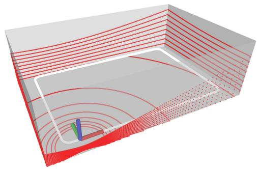  
Fig. 5. Simulation setup: A 16-channel lidar moves along a rectangular trajectory in a cuboid semiclosed space. The white line is the trajectory and the red lines are the laser points.

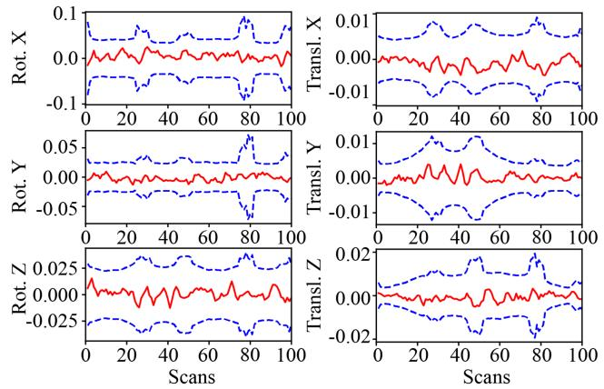  
Fig. 6. Error (red) of rotation (deg) and position (m) with 3σ bounds (blue) for one simulation run.

20 $\mathrm { m } \times 8$ m and the length of trajectory is about 92 m. 100 scans are equally sampled on the trajectory and the number of points in each scan is 28,800. To simulate realistic measurements, each point is corrupted with an independent isotropic Gaussian noise with multiple standard deviations $\sigma _ { p } \in \{ 0 . 0 5 , 0 . 1 0 , \ldots , 1 . 0 0 \}$ m and for each value of the standard deviation $\sigma _ { p } ,$ we performed 100 Monte Carlo experiments, leading to a total number of 2000 experiments. In each run, we compute the optimal pose estimate from the Supplementary (Algorithm 1) with the same parameters specified in Section IV and the covariance matrix from (53). The initial trajectory required by the algorithm is obtained by perturbing the ground-true trajectory with a Gaussian noise with standard deviation $\delta \phi = 2$ deg and $\delta t = 0 . 1$ m on each pose. To avoid unnecessary errors, we use the ground-true plane association across different scans and ignore the in-frame motion distortion in the simulation.

Fig. 6 shows orientation and position errors with the corresponding 3σ bounds in one Monte Carlo experiment with $\sigma _ { p } = 0 . 0 5$ m. As can be seen, the pose estimation errors are very small and they all remain within the 3σ bounds very well, which suggests that our new method is consistent.

Furthermore, we test the consistency of our BA method under different levels of point noise, where the standard deviation of a point noise ranges from $\sigma _ { p } = 0 . 0 5$ to 1 m. The results are shown in Fig. 7(a) for the NEES averaged over 100 runs for each noise level and in Fig. 7(b) for the average pose error. For better visualization, the average NEES is normalized by the pose dimension (i.e., 600 for 100 poses on the trajectory) in Fig. 7(a). As can be seen, the normalized average NEES is very close to one, which suggests that our method is consistent, when the point noise is up to 0.3 m. Beyond this noise level, the first order approximation in (50) no longer holds, which undermines the accuracy of the computed covariance. We should note that this noise level rarely occurs in actual lidar sensors, which are well below 0.1 m. Moreover, from Fig. 7(b), we can see that our method produces accurate pose estimation even when the point noise are unrealistically large [up to 1 m, see Fig. 7(c) for the point cloud map at this point noise level].

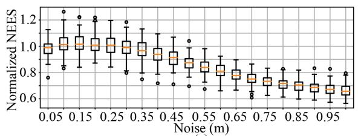

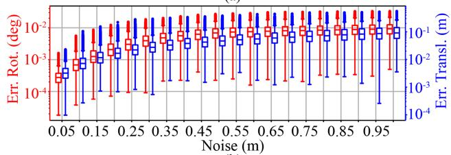  
(c)  
Fig. 7. (a) Normalized NEES averaged over 100 Monte Carlo runs at different point noise levels. The NEES is normalized by the pose dimension (i.e., 600) for better visualization. (b) Rotation (red) and translation (blue) errors at different point noise levels. (c) Point cloud map with ground-true poses at noise levels $\begin{array} { r } { \bar { \sigma } _ { p } = 0 . 0 5 , 0 . 5 , } \end{array}$ and 1 m, respectively.

## VI. BENCHMARK EVALUATION

In this section, we compare our method with other multiview registration methods for lidar point clouds. The experiment will be divided into two parts: Section VI-A evaluates all methods with known feature association on synthetic point clouds, and Section VI-B evaluates the overall BA pipeline including both optimization solver and feature association on various realworld open datasets.

To verify the effectiveness of our method, we compare it with four state-of-the-art methods that focus on the lidar bundle adjustment (or similar) problem: EF [33], BALM [32], plane adjustment (PA) [51], and bundle adjustment for multiview registration (BAREG) [35]. Among them, EF,2 BALM,3 BAREG4 are open sourced, so we use the available implementation on Github. PA is not available anywhere, so we re-implemented it in C++. To reduce the time cost of PA, we used the reduced Jacobian and residual technique in [34] (we derived it based on the cost function in (10) of [51]), which avoids the enumeration of each individual point. The re-implemented PA is solved by the Ceres solver with “DENSE\_SCHUR” [60], which leverages the Schur complement trick to reduce the linear equation dimension at each optimization iteration. To better exploit the separable structure reducing the solving time, we also compare with PA with inner iterations enabled in Ceres [denoted as “PA (inner)”].

For the solver parameters, our method and the reimplemented PA [and its variant PA (inner)] use the parameters specified in Section IV and [34], respectively, while EF, BALM, and BAREG use their default parameters as available on their open source implementation. All methods use the same termination condition shown in Section IV (i.e., maximal iteration number below 200, rotation update below $1 0 ^ { - 6 }$ rad, and translation update below $1 0 ^ { - 6 } \mathrm { m } )$ , except for EF, which we found it converges too slowly and hence set the maximal iteration steps to 2000. In addition to the open source version of BALM (denoted by BALM), which samples only three points from each plane to lower the computation load, we also evaluated another vision [denoted by BALM (full)] which keeps all the points on a plane and use the same default parameters as its open sourced version. All solvers use the same initial pose trajectories detailed later.

## A. Synthetic Point Cloud

To verify the effectiveness of the optimization solvers and their scalability to the number of pose $M _ { p }$ , number of feature $M _ { f }$ , and number ofpoints N per feature, we design a point-cloud generator which generates $M _ { f }$ random planes and $M _ { p }$ lidar scans at random poses. Each pose corresponds to one group of point-cloud whose number of points on each plane is $N .$ Hence, there are totally $N M _ { f }$ points at each scan. We use the ground-true plane association provided by the simulator. To mimic the real lidar point noises, we also corrupt the points sampled on each plane by an isotropic Gaussian noise with standard deviation $\sigma _ { p } = 0 . 0 5 \mathrm { m }$ , the typical noise level for existing lidar sensors. The initial poses are perturbed from the ground-true poses with errors randomly sampled from a Gaussian distribution. The base standard deviation of the Gaussian distribution is $\lVert \delta \phi \rVert = 0 . 1$ deg for rotation and $\| \delta \mathbf { t } \| = 1$ cm for translation. In the nominal settings, $M _ { f } = M _ { p } = N = 1 0 0$ and the initial pose error standard deviation is 10× the base value. From the nominal settings, we enumerate each of the $M _ { f } , M _ { p }$ and N at values {10, 30, 100, 300, 1000, 3000} and the initial pose error standard deviation at values 1×, 5×, 10×, 15×, 20×, 25× of the base value to investigate the performance of each solver at different scales. This makes a total number of 21 scenes. In each scene, the experiment is repeated for ten times with separately sampled poses, planes, and point noises, leading to a total 210 experiments.

1) Convergence: First we investigate the convergence performance of all methods. Fig. 8(a) and (b), respectively, shows the convergence of cost and point-to-plane distance in one repeat experiment with the nominal settings $( \mathrm { i . e . , ~ } M _ { f } = M _ { p } = N =$ 100 and initial pose error 10×). Since different method uses different cost function, to compare them in one figure, the cost value of each method is normalized by its initial cost and then it is rebased such that the converged cost value of all methods are aligned at the same value. Similarly, we normalize the pointto-plane distance by its initial value as well, which is valid to do because all methods have the same initial pose leading to the same initial point-to-plane distance. As can be seen, EF converes rather slowly and requires the most number of iterations. This is because EF optimizes a cost function similar to ours in (9), which is essentially a quadratic function, but uses only the gradient information for optimization. Indeed, slow convergence of the gradient descent method on a quadratic cost function is a very typical phenomenon [63]. PA, PA (inner), and BAREG converge fast at the beginning but slowly when approaching the final convergence value. This is because PA optimizes both the plane parameters and scan poses, leading to a very large number of optimization variables that significantly slow down the speed at convergence. PA (inner) converges faster than the original PA due to the inner iteration, but still slower than our method. For BAREG, the empirical fixation of plane parameters also causes the optimization to slow down. In contrast, BALM, BALM (full), and our method eliminates the plane parameters exactly and the resultant optimization problem is only in dimension of the pose number. Further leveraging the exact Hessian information in their optimization update, BALM, BALM (full), and our method converge in a few iterations, which often represent the fastest convergence.

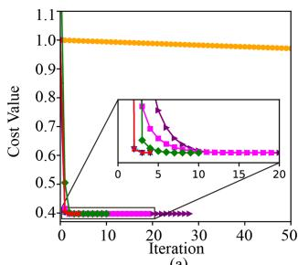

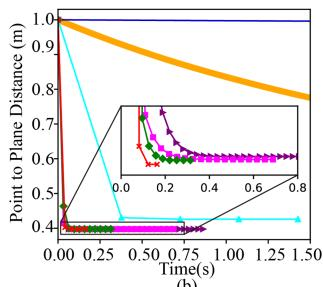  
(b)

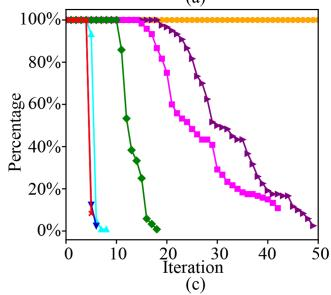

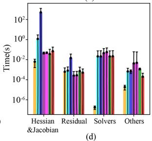  
EFBALM→BALM (full)→PAPA (inner)BAREG→Our  
Fig. 8. Convergence of different methods for BA optimization. (a) Cost value versus iterations in one repeat experiment with the nominal settings $M _ { f } = 1 0 0 .$ $M _ { p } = 1 0 0 , N = 1 0 0$ and initial pose error 10×. (b) Point-to-plane distance versus optimization time in one repeat experiment. (c) Iteration steps experienced by each method in all repeat experiments (i.e., 10) of all scenes (i.e., 21). The y-axis value represents how many experiments out of the 210 total experiments has experienced the iteration number indicated by the x-axis. (d) Breakdown of time spent on each iteration of all BA methods. The time is averaged among all experiments that all methods have participated.

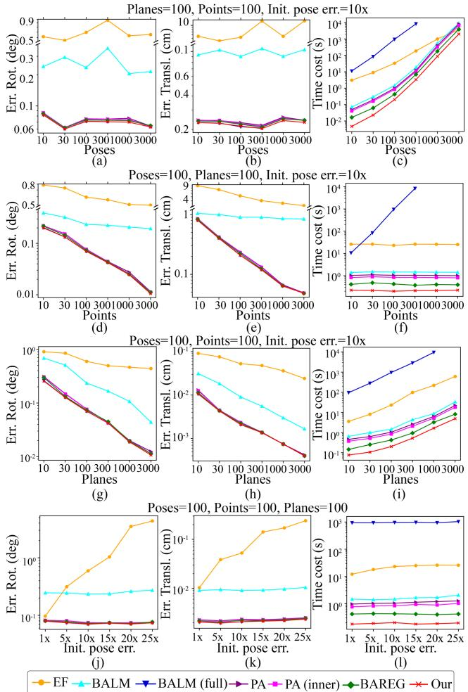  
Fig. 9. Benchmark results on synthetic point cloud.

Fig. 8(c) shows the iteration experienced by each BA optimization method, where for each data point, the y-axis value represents how many out of the total experiments experienced the iteration number indicated by the x-axis. As can be seen, the overall trend agrees with the results in Fig. 8(a) very well: our proposed method and BALM (full) require only four or five iterations, while BAREG, PA, and PA (inner) require up to 20, 40, and 50 iterations, respectively. EF requires even more iterations beyond 100.

Fig. 8(d) shows the computation time in each iteration. As can be seen, EF consumes the least time for each iteration due to the lack of Hessian computation and linear equation solving. BALM (full) consumes the most time since the computation of Jacobian, Hessian, and residuals require to enumerate each individual point, leading to a complexity of $O ( N ^ { 2 } )$ . The other methods, PA, PA (inner), BAREG, and ours, consume similar time for each iteration.

2) Accuracy: Fig. $9 ( \mathrm { a } ) , ( \mathrm { b } ) , ( \mathrm { d } ) , ( \mathrm { e } ) , ( \mathrm { g } ) , ( \mathrm { h } ) , ( \mathrm { j } )$ , and (k) shows the statistic values of the pose estimation accuracy in terms of rmse. In each subplot, we fix three parameters of $M _ { f } , M _ { p } , N$ and initial pose error at the nominal values and change the fourth parameter to investigate its effect on the pose accuracy. Since the error of EF is much larger than the others, we used a broken y-axis to better display all the RMSE. As can be seen, overall the accuracy increases with the points per plane N [in (d) and (e)] or number of plane features $M _ { f }$ [in (g) and (h)] since both increases the number of pose constraints. In contrast, no such monotonic accuracy improvement is found for the number of poses [in (a) and (b)] as the pose number increases because increasing the pose number itself does not gives more pose constraints. Likewise, the accuracy also remains similar for different initial poses error for all methods except EF, which did not converge at the maximum iteration number. Relatively speaking, our proposed method and BALM (full) achieves the same highest accuracy, since they essentially optimizes the same cost using the same exact Hessian information. The next best methods are BAREG, PA, and PA (inner). While optimizing the same point to plane distance with our method [and BALM (full)], PA has significantly more optimization variables, which cause a much slower convergence where the solution is still slightly premature at the preset iteration number. Although PA (inner) has used inner iterations to alleviate this problem, its iterations are still larger than our methods and BAREG. The next accurate method is BALM, which samples only three instead of all points [as in our method, BALM (full), BAREG, PA, and PA (inner)] and hence has higher rmse. Finally, EF has the highest rmse due to the very slow convergence, the solution is much premature even at the preset iteration number.

3) Computation Time: Finally, we show the total computation time of different solvers at different feature number $M _ { f } ,$ pose number $M _ { p }$ , point number N and initial pose error. The results are shown in Fig. 9(c),(f),(i), and (l). As can be seen, the time consumption of all methods increases with the number of poses $M _ { p }$ [see (c)) and plane features $M _ { f }$ (see (i)], which is reasonable since more poses or planes lead to a higher optimization dimension or more number of cost items, respectively. On the other hand, as the point number N increases [see (f)], the method BALM (full) increases rapidly since its time complexity involves $O ( N ^ { 2 } )$ while the rest methods (including ours) do not increase notably since they do not need to evaluate every raw point. For the effect of initial pose errors in [see (1)], they do not affect the solving time significantly.

Relatively speaking, our method achieves the lowest total computation time in all cases due to the small number of iteration numbers [see Fig. 8(c)] and low time-complexity per iteration [see Fig. 8(d)]. The next efficient method is BAREG, which has very low time-complexity per iteration due to the empirical feature parameter fixation but significantly more iteration numbers due to the same reason. Compared with our method, PA [and PA (inner)] has similar time complexity per iteration as discussed in Supplementary (Section IV), but requires more iterations to converge. Hence their time costs are a little higher than ours and BAREG. BALM requires more iterations than our method and more time in each iteration due to the enumeration ofthe sampled points. Collectively, it leads to a computation time higher than our method and also BAREG and PA [and PA (inner)]. The slow convergence problem is more severe in EF, leading to an even higher computation time. Finally, the most time-consuming method is BALM (full), which, although has very small iteration numbers, consumes large time in each iteration.

## B. Real-World Datasets

In this experiment, we conduct benchmark comparison on three real-world datasets. The first dataset is “Hilti” [64] which is a handheld SLAM dataset including indoor and outdoor environments. We use the lidar data collected by Ouster OS0-64 in the dataset. The ground-true lidar pose trajectory is captured by a total station or motion capture system. The second dataset “VIRAL” [65] is collected on an unmanned aerial vehicle (UAV) equipped with two 16-channel OS1 lidars. One lidar is horizontal and the other is vertical. We will use the horizontal one in this experiment. The ground-true positions are provided by a Leica Nova MS60 MultiStation tracking a crystal prism on the UAV. The last dataset “UrbanLoco” [66] is collected by a car driving on urban streets. The lidar is a Velodyne HDL 32E and the ground truth is given by the Novatel SPAN-CPT, a navigation system incorporating Real Time Kinematic (RTK) and precisional IMU measurements.

Two preprocessing are performed for all sequences: motion compensation and scan downsample. To compensate the points distortion caused by continuous lidar movements within a scan, we run a tightly coupled lidar-inertial odometry, FAST-LIO2 [19], which estimates the IMU bias (and other state variables) and compensates the point motion distortion in real-time. We kept all points in a scan whose distortion has been compensated by FAST-LIO2 and discard the odometry output. The processed data are then downsampled from the original 10 to 2 Hz for all sequences. This is because the BA methods need to process all scans at once, a 10 Hz scan rate causes prohibitively high computation load for all BA methods. The downsampling is also similar to the keyframe selection in common SLAM frameworks.

We compare our method with EF, BALM, PA, PA (inner), and BAREG. Noticing that the computation time of BALM (full) is prohibitively high due to the extremely large number of lidar points, we hence remove it from the benchmark comparison. For the rest methods, their solver parameters are kept the same for all sequences with values detailed in previous sections.

For feature association, we use the adaptive voxelization proposed in BALM [32], which registers all points in the world frame (using an initial trajectory) and recursively cuts the space into smaller subvoxels until the subvoxel contains only one feature (either plane or edge) that associates points from different scans. EF did not address the feature association problem and PA did not open relevant codes, so we use this method for them too. BAREG used a similar adaptive voxelization method but has its own implementation, so we retain its own implementation. All feature associations have the same set of parameters: the root voxel size L = 1 m for “Hilti” and L = 2 m for $^ { 6 6 } V I R A L ^ { 3 3 }$ and “UrbanLoco,” the maximum voxelization layer $l _ { \mathrm { m a x } } = 3 .$ the minimum number of points $n _ { \mathrm { m i n } } = 2 0$ for a feature test, and the feature test thresholds $\textstyle \gamma = { \frac { 1 } { 2 5 } }$

The above feature association method is able to extract and associate both plane and edge features. Since the other BA methods, including EF, PA [and PA (inner)], and BAREG, are only designed for plane features, we use only plane features for them. For our method, it is applicable to both plane and edge features, so we test two variants: the one with only plane features, denoted as “Ours,” for comparison with other BA methods, and the one with both plane and edge features, denoted as “Ours (edge).” Moreover, besides the default implementation of our method with double-precision numbers, we test the stability of our method with single-precision floating number implementation, denoted as “Ours(float).” Note that all other BA methods were implemented with double-precision.

In addition to the multiview registration methods, we also compare with classic pairwise registration methods, including ICP, generalized-ICP (GICP), and NDT offered in PCL library. We run the pairwise registration methods in an incremental manner, where each new scan is registered and merged to previous scans incrementally. To constrain the computation time, in each new scan registration, only the last 20 scans are used. The pose estimation from the ICP is then used as the initial trajectory for feature association and optimization of the BA methods, including EF, BALM, PA, PA (inner), BAREG, and ours.

1) Accuracy: Table II shows the ATE results. As can be seen, our method consistently achieves the best results in all 19 sequences even with single-precision. The next accurate method is PA (inner), PA and BAREG, followed by BALM and EF. This trend is in great agreement with the results on synthetic point cloud shown in Section VI-A-2. In particular, our method achieves an accuracy within a few centimeters in all sequences of “Hilti” and “VIRAL,” with only one exception (i.e., UzhArea2), which will be analyzed later. The centimeter level accuracy achieved by our method is at the same level of lidar point noises. Moreover, using only lidar measurements, our method achieved an average accuracy of 4.2 cm on all VIRAL dataset sequences, which outperforms the accuracy 4.7 cm reported in VIRAL-SLAM [65] that fuses all data from stereo camera, IMU, lidar, and UWB. The accuracy on “UrbanLoco” is lower (analyzed later) than other datasets, but still outperforms the other BA methods. Finally, we can notice that the BA methods [i.e., EF, BALM, PA, PA (inner), BAREG, and ours] generally outperforms the pairwise registration methods (i.e., ICP, GICP, and NDT) due to the full consideration of multiview constraints.

When comparing among different variants of our method, the single-precision implementation has a lower accuracy than double-precision as expected, but it offers significant time savings as discussed later. The incorporation of edge features leads to no noticeable accuracy improvement. The accuracy difference with and without edge features are as small as 6 mm. This is because in real-world point clouds, edge features extracted based on local smoothness (e.g., [18]) are very noisy because the laser pulse emitted by lidars can barely hit an edge exactly due to the limited angular resolution. The situation is further exacerbated when the edge is located at far or when the lidar has increased laser beam divergence, which creates many bleeding points behind an edge and degrades the edge points extraction more [67]. On the other hand, in real-world environments, edge features are often created by depth discontinuity at the edge of a foreground object, which meanwhile makes a good plane feature, so adding the edge feature does contribute many new effective constraints.

TABLE II  
ABSOLUTE TRAJECTORY ERROR (RMSE, METERS) FOR DIFFERENT METHODS
<table><tr><td>Datasets</td><td>Sequence</td><td>ICP</td><td>GICP</td><td>NDT</td><td>EF</td><td>BALM</td><td>PA</td><td>PA (inner)</td><td>BAREG</td><td>Ours (float)</td><td>Ours (edge)</td><td>Ours</td></tr><tr><td rowspan="6">Hilti</td><td>Basement1</td><td>0.058</td><td>0.063</td><td>0.076</td><td>0.047</td><td>0.042</td><td>0.038</td><td>0.036</td><td>0.040</td><td>0.0359</td><td>0.0361</td><td>0.0353</td></tr><tr><td>Basement4</td><td>0.084</td><td>0.089</td><td>0.098</td><td>0.071</td><td>0.058</td><td>0.048</td><td>0.045</td><td>0.054</td><td>0.0444</td><td>0.0448</td><td>0.0443</td></tr><tr><td>Campus2</td><td>0.105</td><td>0.109</td><td>0.124</td><td>0.080</td><td>0.066</td><td>0.058</td><td>0.054</td><td>0.063</td><td>0.0535</td><td>0.0530</td><td>0.0531</td></tr><tr><td>Construction2</td><td>0.108</td><td>0.104</td><td>0.113</td><td>0.086</td><td>0.068</td><td>0.060</td><td>0.059</td><td>0.063</td><td>0.0563</td><td>0.0577</td><td>0.0553</td></tr><tr><td>LabSurvey2</td><td>0.066</td><td>0.069</td><td>0.072</td><td>0.046</td><td>0.025</td><td>0.019</td><td>0.019</td><td>0.023</td><td>0.0185</td><td>0.0189</td><td>0.0181</td></tr><tr><td>UzhArea2</td><td>0.182</td><td>0.191</td><td>0.211</td><td>0.161</td><td>0.141</td><td>0.122</td><td>0.121</td><td>0.127</td><td>0.1205</td><td>0.1102</td><td>0.1171</td></tr><tr><td rowspan="9">VIRAL</td><td>eee01</td><td>0.159</td><td>0.163</td><td>0.172</td><td>0.102</td><td>0.073</td><td>0.052</td><td>0.040</td><td>0.061</td><td>0.0390</td><td>0.0401</td><td>0.0382</td></tr><tr><td>eee02</td><td>0.153</td><td>0.154</td><td>0.163</td><td>0.092</td><td>0.062</td><td>0.043</td><td>0.037</td><td>0.057</td><td>0.0362</td><td>0.0378</td><td>0.0356</td></tr><tr><td>eee03</td><td>0.171</td><td>0.175</td><td>0.180</td><td>0.113</td><td>0.081</td><td>0.056</td><td>0.053</td><td>0.068</td><td>0.0522</td><td>0.0548</td><td>0.0517</td></tr><tr><td>nya01</td><td>0.139</td><td>0.136</td><td>0.163</td><td>0.107</td><td>0.082</td><td>0.042</td><td>0.038</td><td>0.054</td><td>0.0368</td><td>0.0372</td><td>0.0362</td></tr><tr><td>nya02</td><td>0.160</td><td>0.159</td><td>0.124</td><td>0.097</td><td>0.067</td><td>0.050</td><td>0.048</td><td>0.061</td><td>0.0474</td><td>0.0472</td><td>0.0468</td></tr><tr><td>nya03</td><td>0.142</td><td>0.143</td><td>0.146</td><td>0.085</td><td>0.074</td><td>0.044</td><td>0.042</td><td>0.067</td><td>0.0418</td><td>0.0425</td><td>0.0413</td></tr><tr><td>sbs01</td><td>0.133</td><td>0.142</td><td>0.147</td><td>0.083</td><td>0.077</td><td>0.052</td><td>0.043</td><td>0.068</td><td>0.0397</td><td>0.0404</td><td>0.0385</td></tr><tr><td>sbs02</td><td>0.127</td><td>0.127</td><td>0.121</td><td>0.094</td><td>0.062</td><td>0.040</td><td>0.039</td><td>0.059</td><td>0.0378</td><td>0.0393</td><td>0.0377</td></tr><tr><td>sbs03</td><td>0.146</td><td>0.149</td><td>0.150</td><td>0.108</td><td>0.072</td><td>0.051</td><td>0.046</td><td>0.068</td><td>0.0440</td><td>0.0432</td><td>0.0427</td></tr><tr><td rowspan="4">UrbanLoco</td><td>0117</td><td>1.382</td><td>1.364</td><td>1.372</td><td>0.728</td><td>0.625</td><td>0.525</td><td>0.506</td><td>0.594</td><td>0.4964</td><td>0.5324</td><td>0.4956</td></tr><tr><td>0317</td><td>1.384</td><td>1.299</td><td>1.289</td><td>0.878</td><td>0.732</td><td>0.661</td><td>0.657</td><td>0.682</td><td>0.6491</td><td>0.6449</td><td>0.6488</td></tr><tr><td>0426-1</td><td>1.436</td><td>1.457</td><td>1.566</td><td>1.014</td><td>0.875</td><td>0.708</td><td>0.689</td><td>0.733</td><td>0.6891</td><td>0.7135</td><td>0.6886</td></tr><tr><td>0426-2</td><td>1.676</td><td>1.693</td><td>1.543</td><td>1.113</td><td>0.924</td><td>0.864</td><td>0.837</td><td>0.905</td><td>0.8322</td><td>0.8536</td><td>0.8223</td></tr><tr><td>Average</td><td></td><td>0.411</td><td>0.410</td><td>0.412</td><td>0.268</td><td>0.221</td><td>0.186</td><td>0.179</td><td>0.203</td><td>0.1775</td><td>0.1826</td><td>0.1763</td></tr></table>

The bold and italic values stand for the best and second-best results of each sequence, respectively.

It is noted that BAREG has an accuracy obviously lower than other methods [e.g., PA, PA (inner), and our method], which disagrees with results obtained previously from the synthetic data. The reason is that BAREG first extracts eigenvectors $\mathbf { u } _ { 1 }$ and u2 $( \lambda _ { 1 } > \lambda _ { 2 } > \lambda _ { 3 } )$ of points corresponding to a plane feature in each local lidar scan. The two eigenvectors were assumed to be normal to the true plane normal and hence used to construct a cost item $\lambda _ { 1 } \| \mathbf { R } \mathbf { u } _ { 1 } \cdot \mathbf { n } \| ^ { 2 } + \lambda _ { 2 } \| \mathbf { R } \mathbf { u } _ { 2 } \cdot \mathbf { n } \| ^ { 2 }$ in addition to the point to plane residual. The additional cost item could bias the optimization results if the extracted eigenvectors $\mathbf { u } _ { 1 }$ and $\mathbf { u } _ { 2 }$ are not accurate (i.e., they are not really perpendicular to the true plane normal), a presumption for the optimality of BAREG. Unfortunately, such optimality presumption did not hold well in real-world datasets, where the points density varies considerably: points on planes further from the sensor exhibit sparser distributions compared to those closer. This sparsity in distant planes leads to significant errors in the calculation of $\mathbf { u } _ { 1 }$ and $\mathbf { u } _ { 2 }$ . Moreover, in real-world datasets, due to the imperfections of plane extraction, the extracted planes utilized for BA optimization may not be perfect planes (e.g., slightly curved walls or ground), and the point noise cannot be guaranteed isotropic Gaussian noise. All these factors contribute to errors in the extracted $\mathbf { u } _ { 1 }$ and $\mathbf { u } _ { 2 }$ and bias the optimization results.

Now we investigate the performance degradation on “Urban-Loco” and the sequence UzhArea2 in “Hilti” more closely. For the “UrbanLoco” dataset, we found that the RTK ground-truth had some false sudden jumps, which contributes the large ATEs. This sudden jump may be caused by tall buildings in the crowded urban area which lowers the quality of the ground-truth. For the sequence UzhArea2, we register the point cloud with the ground-true pose trajectory and compare it with the point cloud registered with our BA method in Fig. 10. As can be seen, with the ground-true pose, points on the side wall are very blurry and points on the wall form a plane with standard deviation up to 15.3 cm [see Fig. 10(d)]; with the ground-true translation but with rotations optimized by our BA method, the points on the side wall are much thinner and form an apparent plane of standard deviation 6.8 cm [see Fig. 10(e)]; with poses fully optimized by our method, the points are even more consistent and the standard deviation is 1.7 cm [see Fig. 10(f)]. From these results, we suspect that the ground-truth may be affected by some unknown errors (e.g., marker position change during the data collection). Indeed, we found similar problem on this sequence also occurred in other works [68]. Moreover, the standard deviation of 1.7 cm achieved by our method is exactly the ranging accuracy of the lidar sensor, which confirms that our method achieves a mapping accuracy at the lidar noise level as if the sensor had no motion.

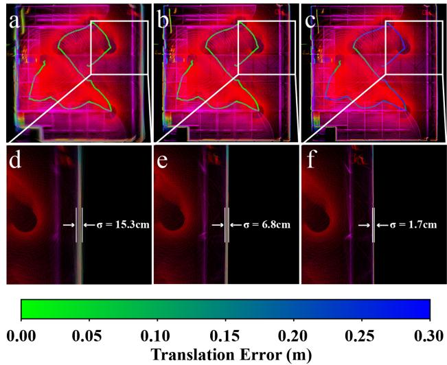  
Fig. 10. Point cloud map of the UzhArea2 sequence in $^ { \ast } H i l t i ^ { \ast }$ (a) Registered by ground-true pose trajectory. (b) Registered by ground-true position with rotation optimized by our BA method. (c) Registered by poses fully optimized by our BA method. (d), (e), and (f) points on one side wall in (a), (b), and (c), respectively.

TABLE III  
OCCUPIED CELLS OF POINT-CLOUD MAP FOR DIFFERENT METHODS
<table><tr><td>Datasets</td><td>Sequence</td><td>ICP</td><td>GICP</td><td>NDT</td><td>EF</td><td>BALM</td><td>PA</td><td>PA</td><td>BAREG</td><td>Ours</td><td>Ours</td><td>Ours</td></tr><tr><td></td><td></td><td>(inc.)</td><td>(inc.)</td><td>(inc.)</td><td>(inc.)</td><td>(inc.)</td><td>(inc.)</td><td>(inner) (inc.)</td><td>(inc.)</td><td>(float) (inc.)</td><td>(edge) (inc.)</td><td>(base)</td></tr><tr><td rowspan="6">Hilti</td><td>Basement1</td><td>+20300</td><td>+20954</td><td>+21354</td><td>+16692</td><td>+6285</td><td>+963</td><td>+332</td><td>+5864</td><td>+132</td><td>+257</td><td>391962</td></tr><tr><td>Basement4</td><td>+7826</td><td>+7283</td><td>+8178</td><td>+6683</td><td>+4762</td><td>+1028</td><td>+223</td><td>+3752</td><td>+112</td><td>+197</td><td>558823</td></tr><tr><td>Campus2</td><td>+14459</td><td>+15511</td><td>+21146</td><td>+8028</td><td>+2863</td><td>+977</td><td>+248</td><td>+2862</td><td>+68</td><td>-97</td><td>1319482</td></tr><tr><td>Construction2</td><td>+6235</td><td>+9371</td><td>+10032</td><td>+6397</td><td>+1789</td><td>+1047</td><td>+394</td><td>+986</td><td>+95</td><td>+181</td><td>979614</td></tr><tr><td>LabSurvey2</td><td>+1680</td><td>+3141</td><td>+6331</td><td>+5043</td><td>+1375</td><td>+410</td><td>+210</td><td>+1228</td><td>+83</td><td>+204</td><td>139682</td></tr><tr><td>UzhArea2</td><td>+9490</td><td>+9623</td><td>+10832</td><td>+6371</td><td>+2688</td><td>+734</td><td>+484</td><td>+2785</td><td>+102</td><td>+344</td><td>628951</td></tr><tr><td rowspan="9">VIRAL</td><td>eee01</td><td>+43185</td><td>+43439</td><td>+44578</td><td>+22731</td><td>+2564</td><td>+996</td><td>+392</td><td>+1321</td><td>+85</td><td>+289</td><td>1166482</td></tr><tr><td>eee02</td><td>+10339</td><td>+14573</td><td>+15848</td><td>+6985</td><td>+5938</td><td>+1538</td><td>+177</td><td>+5635</td><td>+91</td><td>+181</td><td>892168</td></tr><tr><td>eee03</td><td>+8584</td><td>+9419</td><td>+7418</td><td>+5720</td><td>+2016</td><td>+1823</td><td>+286</td><td>+1060</td><td>+193</td><td>+630</td><td>594921</td></tr><tr><td>nya01</td><td>+53004</td><td>+56370</td><td>+48669</td><td>+26087</td><td>+7368</td><td>+1717</td><td>+457</td><td>+4246</td><td>+46</td><td>+585</td><td>571365</td></tr><tr><td>nya02</td><td>+38056</td><td>+37718</td><td>+38435</td><td>+24752</td><td>+4710</td><td>+1980</td><td>+692</td><td>+3902</td><td>+238</td><td>+232</td><td>572960</td></tr><tr><td>nya03</td><td>+14282</td><td>+13896</td><td>+16325</td><td>+10688</td><td>+5922</td><td>+2178</td><td>+308</td><td>+2614</td><td>+172</td><td>+446</td><td>562583</td></tr><tr><td>sbs01</td><td>+10069</td><td>+12196</td><td>+16597</td><td>+9635</td><td>+4224</td><td>+2056</td><td>+1064</td><td>+3691</td><td>+319</td><td>+717</td><td>794228</td></tr><tr><td>sbs02</td><td>+16573</td><td>+16446</td><td>+21046</td><td>+10577</td><td>+9278</td><td>+3451</td><td>+488</td><td>+5238</td><td>+95</td><td>+502</td><td>808235</td></tr><tr><td>sbs03</td><td>+12257</td><td>+11154</td><td>+8974</td><td>+4682</td><td>+877</td><td>+1492</td><td>+687</td><td>+763</td><td>+481</td><td>+332</td><td>867174</td></tr><tr><td rowspan="4">UrbanLoco</td><td>0117</td><td>+46718</td><td>+47572</td><td>+50969</td><td>+16327</td><td>+7237</td><td>+3420</td><td>+1016</td><td>+5412</td><td>+98</td><td>+1987</td><td>1743775</td></tr><tr><td>0317</td><td>+37635</td><td>+33676</td><td>+41367</td><td>+20072</td><td>+13102</td><td>+4783</td><td>+1453</td><td>+8521</td><td>+103</td><td>+1011</td><td>1709823</td></tr><tr><td>0426-1</td><td>+9165</td><td>+10242</td><td>+13695</td><td>+9539</td><td>+2331</td><td>+1364</td><td>+525</td><td>+1026</td><td>+33</td><td>+1413</td><td>1632662</td></tr><tr><td>0426-2</td><td>+31870</td><td>+30461</td><td>+29568</td><td>+13827</td><td>+3428</td><td>+2021</td><td>+799</td><td>+4451</td><td>+472</td><td>+1252</td><td>2176302</td></tr><tr><td>Average</td><td></td><td>+21617</td><td>+21002</td><td>+22703</td><td>+12146</td><td>+4671</td><td>+1788</td><td>+539</td><td>+3439</td><td>+159</td><td>+561</td><td>953215</td></tr></table>

The bold and italic values stand for the best and second-best results of each sequence, respectively

2) Mapping Quality: A significant advantage of the BA method is the direct optimization of the map consistency (i.e., point-to-plane residuals). To evaluate the map quality without a ground-true map, we adopt a method proposed by Anton et al. [69]. The method cuts the space into small cells and then counts the number of cells that lidar points occupy. The less the occupied cells, the higher the map quality. This indicator is intuitive: if points from different scans are registered accurately, they should agree with each other to the best extent, hence occupying the minimum possible number of cells. Based on this method, Table III presents the number of occupied cell with size 0.1 m. To better show the difference among different methods, the number of occupied cells are subtracted by our method for each sequence. We show the number of occupied cells by our method and the difference value of other methods. As can be seen, our methods consistently achieved the best performance in all sequences and the next best is PA (inner), PA, and BAREG. This trend also agrees with the ATE results very well.

3) Computation Time: Finally, we compare the computation time. Since the pairwise registration methods, including ICP, GICP, and NDT, perform repetitive incremental registration at each scan reception, its computation time is very different from the BA methods that perform batch optimization on all scans at once. Therefore, we only compare the computation time of BA methods. Fig. 11 shows the convergence of all methods and Table IV shows the total optimization time. As can be seen, when all using double-precision, our method consumes the least computation time, about one fourth of the BAREG, one sixth of PA and PA (inner), one eighth of BALM, and one 20th of EF. The overall trend agrees well with the results on synthetic point cloud in Section VI-A-3 with explanations detailed therein. Besides, our single-precision implementation reduces 40% further optimization time while still outperforming the other BA methods as detailed in previous section. Finally, the inclusion of extra edge features increases the number of cost items, resulting in an increased optimization time.

4) Plane Merging: We further evaluate the performance of all BA methods at different number of plane features. To change the number of planes in real-world datasets, we develop a merging procedure in addition to the adaptive voxelization introduced in the experiment setup above. Starting from the root voxels, the adaptive voxelization recursively cuts the space into smaller subvoxels until the subvoxel contains only one plane feature. Then the merging process merges planes in small subvoxels into larger planes. The merging proceeds at different degrees denoted by i (see Fig. 12), where a plane is merged with planes within up to i − 1 layers of neighboring root voxels. In the merging process, the two candidate planes $\mathcal { P } _ { i }$ and $\mathcal { P } _ { j }$ must satisfy

$$
\left| \left. \mathbf { n } _ { i } , \mathbf { n } _ { j } \right. \right| < \epsilon _ { 1 }\tag{55}
$$

$$
d \Big \vert \langle \mathbf { c } _ { i } - \mathbf { c } _ { j } , \mathbf { n } _ { i } \rangle - \frac { \pi } { 2 } \Big \vert < \epsilon _ { 2 } \Big \vert \langle \mathbf { c } _ { i } - \mathbf { c } _ { j } , \mathbf { n } _ { j } \rangle - \frac { \pi } { 2 } \Big \vert < \epsilon _ { 2 }\tag{56}
$$

where n and c are the normal vector and center of a plane respectively, symbol · denotes the angle of two vectors, $\epsilon _ { 1 } = \epsilon _ { 2 } = 1 0 ^ { \circ }$ are two constants. If the condition is not satisfied, the neighboring plane will not be merged.

Given a merging degree i, we repeatedly merge planes starting from a seed plane randomly selected from the plane list. A merged plane will be removed from the list to avoid duplicate merging. Such procedure produces a new list of planes whose size are at most i · L with $L = 1$ or 2 m being the root voxel size. Larger merging degree i will lead to fewer number of planes but each with larger sizes.

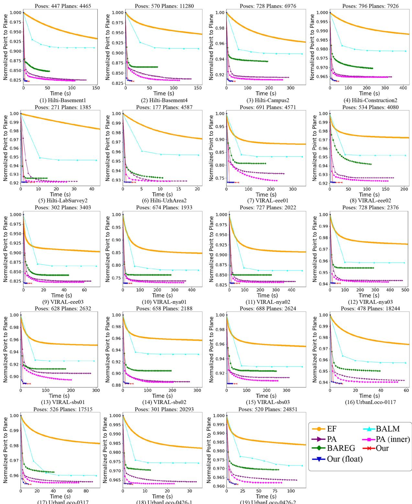  
Fig. 11. Point-to-plane distance versus optimization time in real-world datasets including Hilti, VIRAL, and UrbanLoco. All methods have the same initial pose (hence the same initial point-to-plane distance) and have their point-to-plane distance all normalized by the initial values.

Since the experimental results in the Sections VI-A and VI-B have proved the PA with inner iteration outperforms the original PA, we use the PA with inner iteration by default. The accuracy and computation time of all BA methods [including EF, BLAM, PA (inner), BAREG, and ours] at different merging degree i are shown in Fig. 13. The plane merging at different degrees leads to different computation time, so the time cost in the plot is the total time including adaptive voxelization, plane merging (if applicable), and BA optimization. As can be seen, our method consistently exhibits the highest accuracy and lowest time cost for all numbers of planes. Moreover, as the merging degree i increases, the number ofplanes is decreased accordingly, leading to fewer planes that also reduce the optimization time of all BA methods. The reduction in optimization time is often larger than the time increment for merging, hence the total computation time still decreases with the merging degree. On the other hand, the pose rmse of all methods all increase with the merging degree. This is because a larger merging degree introduces more bias to the optimization by merging planes not exactly on the same plane (e.g., slightly curved ground).

TABLE IV  
OPTIMIZATION TIME FOR DIFFERENT METHODS
<table><tr><td>Datasets</td><td>Sequence</td><td>EF</td><td>BALM</td><td>PA</td><td>PA (inner)</td><td>BAREG</td><td>Ours (float)</td><td>Ours (edge)</td><td>Ours</td></tr><tr><td rowspan="6">Hilti</td><td>Basement1</td><td>297.68</td><td>145.72</td><td>129.39</td><td>106.08</td><td>52.99</td><td>7.20</td><td>12.07</td><td>11.94</td></tr><tr><td>Basement4</td><td>231.37</td><td>151.45</td><td>135.88</td><td>111.39</td><td>65.67</td><td>12.72</td><td>17.25</td><td>17.01</td></tr><tr><td>Campus2</td><td>989.37</td><td>352.72</td><td>290.78</td><td>261.39</td><td>191.87</td><td>27.09</td><td>40.02</td><td>39.95</td></tr><tr><td>Construction2</td><td>1415.18</td><td>412.00</td><td>335.70</td><td>313.23</td><td>231.48</td><td>33.04</td><td>47.34</td><td>47.12</td></tr><tr><td>LabSurvey2</td><td>244.86</td><td>42.47</td><td>31.63</td><td>25.67</td><td>14.59</td><td>3.39</td><td>7.89</td><td>7.64</td></tr><tr><td>UzhArea2</td><td>153.43</td><td>20.25</td><td>17.10</td><td>12.60</td><td>10.60</td><td>2.16</td><td>4.32</td><td>4.08</td></tr><tr><td rowspan="10">VIRAL</td><td>eee01</td><td>1162.25</td><td>342.60</td><td>259.95</td><td>227.86</td><td>175.83</td><td>33.01</td><td>56.21</td><td>55.22</td></tr><tr><td>eee02</td><td>968.90</td><td>202.98</td><td>171.41</td><td>155.86</td><td>110.31</td><td>14.06</td><td>33.21</td><td>32.34</td></tr><tr><td>eee03</td><td>89.45</td><td>71.56</td><td>66.11</td><td>59.02</td><td>44.10</td><td>3.27</td><td>8.17</td><td>7.89</td></tr><tr><td>nya01</td><td>972.81</td><td>438.09</td><td>364.18</td><td>351.14</td><td>276.37</td><td>31.19</td><td>51.78</td><td>51.01</td></tr><tr><td>nya02</td><td>1307.53</td><td>468.30</td><td>422.34</td><td>394.28</td><td>268.28</td><td>30.04</td><td>65.69</td><td>65.19</td></tr><tr><td>nya03</td><td>1134.21</td><td>493.29</td><td>479.64</td><td>385.79</td><td>287.19</td><td>39.26</td><td>67.73</td><td>67.26</td></tr><tr><td>sbs01</td><td>818.50</td><td>291.77</td><td>278.02</td><td>200.21</td><td>177.46</td><td>21.82</td><td>38.93</td><td>37.80</td></tr><tr><td>sbs02</td><td>738.91</td><td>304.65</td><td>268.42</td><td>201.61</td><td>193.68</td><td>27.45</td><td>42.54</td><td>41.35</td></tr><tr><td>sbs03</td><td>855.22</td><td>377.82</td><td>312.31</td><td>254.52</td><td>237.45</td><td>23.45</td><td>52.05</td><td>51.55</td></tr><tr><td>0117</td><td>224.73</td><td>59.28</td><td>58.18</td><td>52.80</td><td>39.08</td><td>8.73</td><td>9.92</td><td>9.60</td></tr><tr><td rowspan="4">Urbanloco Average</td><td>0317</td><td>380.98</td><td>92.11</td><td>87.48</td><td>70.35</td><td>40.25</td><td>8.89</td><td>13.20</td><td>12.38</td></tr><tr><td>0426-1</td><td>138.75</td><td>33.91</td><td>32.92</td><td>22.90</td><td>12.29</td><td>3.70</td><td>5.77</td><td>4.31</td></tr><tr><td>0426-2</td><td>174.40</td><td>117.36</td><td>108.79</td><td>85.26</td><td>80.44</td><td>14.47</td><td>17.92</td><td>17.34</td></tr><tr><td></td><td>647.29</td><td>232.54</td><td>202.64</td><td>171.11</td><td>132.10</td><td>18.15</td><td>31.16</td><td>30.58</td></tr></table>

The bold and italic values stand for the best and second-best results of each sequence, respectively

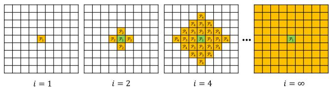  
Fig. 12. Plane merging at degree $i \colon { ^ { \ast } i = 1 } ^ { \ast }$ indicates only merging the planes in the same root voxel. ${ \bf \tilde { \Sigma } } { \bf \Sigma } ^ { \mathrm { a } } { \bf \Sigma } _ { i } = \mathrm { \bar { 2 } } { \bf \Sigma } ^ { \mathrm { , } \mathrm { , } }$ means merging maximum layers to $\mathcal { P } _ { 2 }$ and $\mathit { \check { i } } = 4 \mathit { \check { i } }$ means merging maximum layers to $\begin{array} { r } { \check { \mathcal { P } } _ { 4 } . \overset {  } { \cdot } i = \infty ^ { \gamma } } \end{array}$ means no boundary layer is specified, the merging can go as far as possible.

## VII. APPLICATIONS

Bundle adjustment is the central technique of many lidarbased applications. In this section, we show how our bundle adjustment method can effectively improve the accuracy or computation efficiency of three vital applications: lidar-inertial odometry, multilidar calibration, and global mapping. Constrained by the page limit, details about the incorporation of bundle adjustment method in these applications and its effectiveness in real-world experiments are presented in Section I of the supplementary materials [59].

## VIII. DISCUSSION

Here, we discuss the efficiency, accuracy, and extendability of the proposed bundle adjustment method.

## A. Efficiency

Our method achieved lower computation time than other state-of-the-art counterparts. The efficiency of our method are attributed to three interrelated and rigorously proved techniques that make fully use of the problem nature and lidar point cloud property. The first technique is the solving of feature parameters in a closed-form before the BA optimization. It allows the feature parameters to be removed from the optimization, which fundamentally reduces the optimization dimension to the dimension of the pose only, a phenomenon that did not exist before in visual bundle adjustment problem. The second technique is a second-order solver which fits the quadratic cost function naturally and leads to fast convergence in the iterative optimization. This is enabled by the analytical derivation of the closed-form Jacobian and Hessian matrices of the cost function. The third technique is the point cluster, which enables the aggregation of all raw points without enumerating each individual point in neither of the cost evaluation, derivatives evaluation, or uncertainty evaluation. Collectively, these three techniques lead to an BA optimization with much lower dimension and time complexity.

## B. Accuracy

Benefiting from the point cluster technique, our proposed method is able to exploit the information of all raw point measurements, achieving high pose estimation accuracy (a few centimeters) at the level of lidar measurement noise. Optimization from the raw lidar points also enables the developed method to estimate the uncertainty level of the estimated pose, which may be useful when this information is further fused with measurements from other sensors (e.g., IMU sensors). Moreover, by minimizing the Euclidean distance from each raw point to the corresponding feature, our method can reinforce the map consistency in a more direct manner than conventional pose graph optimization. While at a higher computation cost (due to the more complete consideration of features covisible in multiple scans), it considerably improves the mapping accuracy which is important for mapping applications. Due to this reason, our method is particularly useful for accuracy refinements from a baseline pose trajectory that can be obtained by an odometry or a pose graph optimization module. The second order optimization provides very fast convergence when the solution is near to the optimal value, preventing premature solutions.

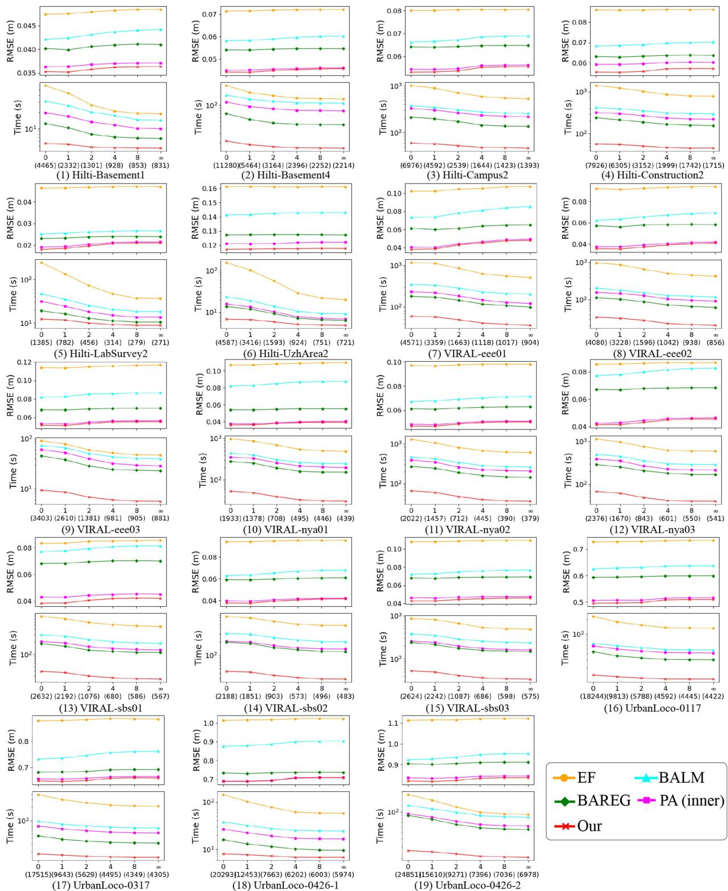  
Fig. 13. ATE and time cost of our method when merging planes at different degrees. The number $^ { \mathfrak { c } \mathfrak { c } } 0 ^ { \prime \prime } , ^ { \mathfrak { c } } 1 ^ { \prime \prime } , ^ { \mathfrak { c } } 2 ^ { \prime \prime } , ^ { \mathfrak { c } } 4 ^ { \prime \prime } , ^ { \mathfrak { c } } \infty ^ { \prime \prime }$ on the X-axis denotes the merging degree. The larger number in the parentheses below them are the number of planes corresponding to the merging degree.

## C. Extendability

As a basic technique for multiple scan registration, our proposed method can be easily be integrated with other formality of data, such as images and IMU measurements, by incorporating visual bundle adjustment factors and IMU preintegration factors [62] in the optimization. Moreover, besides the frame-based pose trajectory, which attaches each frame an independent pose to estimate, our method can also work with other forms of pose trajectories, such as continuous-time trajectories based on Splines [9], [70] or Gaussian Process models [71], [72], which have the capability to compensate the in-frame motion distortion. According to the chain rules, the derivatives of the BA cost with respect to the trajectory parameters will consist of two parts: the first is the derivative of the BA cost with respect to the pose of each point cluster as derived in this article, and the second part is the derivatives of the pose with respect to the trajectory parameters, which depends on the specific trajectories being used.

## IX. CONCLUSION

This article proposed a novel bundle adjustment method for lidar point cloud. The central of the proposed method was a point cluster technique, which aggregated all raw points into a compact set of parameters without enumerating each individual point. The article showed how the bundle adjustment problem can be represented by the point cluster and also derived the analytical form of the Jacobian and Hessian matrices based on the point cluster. Based on these derivations, the article developed a second-order solver, which estimated both the pose and the pose uncertainty. The developed BA method was open sourced to benefit the community.

Besides the technical developments, this article also made some theoretical contributions, including the formalization of the point cluster and its operations, revealing of the invariance property of the formulated BA optimization, the proof of null space and sparsity of the derived Jacobian and Hessan matrices, and the time complexity analysis of the proposed BA method and its comparison with others. These theoretical results served the foundation of our developed BA techniques.

The proposed methods and implementations were extensively verified in both simulation and real-world experiments, in terms of consistency, efficiency, accuracy, and robustness. In all evaluations, the proposed method achieved consistently higher accuracy while consuming significantly lower computation time. This article further demonstrated three applications of the BA techniques, including lidar-inertial odometry, multilidar calibration, and high-accuracy mapping. In all applications, the adoption of BA method could effectively improve the accuracy or the efficiency.

In the future, we would like to incorporate the BA method more tightly to the above applications and beyond. This would require more thorough considerations of many practical issues, such as point cloud motion compensation, removal of dynamic objects, tightly fusion with other formality of sensor data (e.g., IMU, camera), and module (e.g., loop closure).

## REFERENCES

[1] S. Thrun et al., “Stanley: The robot that won the Darpa grand challenge,” J. Field Robot., vol. 23, no. 9, pp. 661–692, 2006.

[2] C. Urmson et al., “Autonomous driving in urban environments: Boss and the urban challenge,” J. Field Robot., vol. 25, no. 8, pp. 425–466, 2008.

[3] J. Levinson et al., “Towards fully autonomous driving: Systems and algorithms,” in Proc. IEEE Intell. Veh. Symp., 2011, pp. 163–168.

[4] Y. Li and J. Ibanez-Guzman, “Lidar for autonomous driving: The principles, challenges, and trends for automotive lidar and perception systems,” IEEE Signal Process. Mag., vol. 37, no. 4, pp. 50–61, Jul. 2020.

[5] F. Gao, W. Wu, W. Gao, and S. Shen, “Flying on point clouds: Online trajectory generation and autonomous navigation for quadrotors in cluttered environments,” J. Field Robot., vol. 36, no. 4, pp. 710–733, 2019.

[6] F. Kong, W. Xu, Y. Cai, and F. Zhang, “Avoiding dynamic small obstacles with onboard sensing and computation on aerial robots,” IEEE Robot. Autom. Lett., vol. 6, no. 4, pp. 7869–7876, Oct. 2021.

[7] Y. Ren et al., “Bubble planner: Planning high-speed smooth quadrotor trajectories using receding corridors,” 2022, arXiv:2202.12177.

[8] B. Schwarz, “Mapping the world in 3D,” Nature Photon., vol. 4, no. 7, pp. 429–430, 2010.

[9] M. Bosse, R. Zlot, and P. Flick, “Zebedee: Design of a spring-mounted 3-D range sensor with application to mobile mapping,” IEEE Trans. Robot., vol. 28, no. 5, pp. 1104–1119, Oct. 2012.

[10] M. Helmberger, K. Morin, B. Berner, N. Kumar, G. Cioffi, and D. Scaramuzza, “The Hilti SLAM challenge dataset,” IEEE Robot. Autom. Lett., vol. 7, no. 3, pp. 7518–7525, Jul. 2022.

[11] D. Wang, C. Watkins, and H. Xie, “MEMS mirrors for lidar: A review,” Micromachines, vol. 11, no. 5, 2020, Art. no. 456.

[12] Z. Liu, F. Zhang, and X. Hong, “Low-cost retina-like robotic lidars based on incommensurable scanning,” IEEE/ASME Trans. Mechatron., vol. 27, no. 1, pp. 58–68, Feb. 2022.

[13] P. J. Besl and N. D. McKay, “Method for registration of 3-D shapes,” SPIE, vol. 1611, pp. 586–606, 1992.

[14] A. Segal, D. Haehnel, and S. Thrun, “Generalized-ICP,” in Proc. Robot.: Sci. Syst., Seattle, WA, USA, 2009, vol. 2, no. 4, pp. 435–442.

[15] P. Biber and W. Straßer, “The normal distributions transform: A new approach to laser scan matching,” in Proc. IEEE/RSJ Int. Conf. Intell. Robots Syst., 2003, vol. 3, pp. 2743–2748.

[16] M. Magnusson, “The three-dimensional normal-distributions transform: An efficient representation for registration, surface analysis, and loop detection,” Ph.D. dissertation, Örebro Univ., Orebro, Sweden, 2009.

[17] J. Behley and C. Stachniss, “Efficient surfel-based SLAM using 3D laser range data in urban environments,” in Proc. Robot.: Sci. Syst., 2018.

[18] J. Zhang and S. Singh, “LOAM: Lidar odometry and mapping in real-time,” in Proc. Robot.: Sci. Syst., Berkeley, CA, USA, 2014, vol. 2, no. 9, pp. 1–9.

[19] W. Xu, Y. Cai, D. He, J. Lin, and F. Zhang, “FAST-LIO2: Fast direct lidarinertial odometry,” IEEE Trans. Robot., vol. 38, no. 4, pp. 2053–2073, Aug. 2022.

[20] M. Yokozuka, K. Koide, S. Oishi, and A. Banno, “LiTAMIN2: Ultra light LiDAR-based slam using geometric approximation applied with KL-divergence,” in Proc. IEEE Int. Conf. Robot. Autom., 2021, pp. 11619–11625.

[21] H. Surmann, A. Nüchter, and J. Hertzberg, “An autonomous mobile robot with a 3D laser range finder for 3D exploration and digitalization of indoor environments,” Robot. Auton. Syst., vol. 45, no. 3/4, pp. 181–198, 2003.

[22] X. Liu and F. Zhang, “Extrinsic calibration of multiple lidars of small FOV in targetless environments,” IEEE Robot. Autom. Lett., vol. 6, no. 2, pp. 2036–2043, Apr. 2021.

[23] G. Klein and D. Murray, “Parallel tracking and mapping for small ar workspaces,” in Proc. IEEE ACM Int. Symp. Mixed Augmented Reality, 2007, pp. 225–234.

[24] R. Mur-Artal, J. M. M. Montiel, and J. D. Tardos, “ORB-SLAM: A versatile and accurate monocular SLAM system,” IEEE Trans. Robot., vol. 31, no. 5, pp. 1147–1163, Oct. 2015.

[25] R. Mur-Artal and J. D. Tardós, “ORB-SLAM2: An open-source SLAM system for monocular, stereo, and RGB-D cameras,” IEEE Trans. Robot., vol. 33, no. 5, pp. 1255–1262, Oct. 2017.

[26] T. Qin, P. Li, and S. Shen, “VINS-Mono: A robust and versatile monocular visual-inertial state estimator,” IEEE Trans. Robot., vol. 34, no. 4, pp. 1004–1020, Aug. 2018.

[27] C. Campos, R. Elvira, J. J. G. Rodríguez, J. M. Montiel, and J. D. Tardós, “ORB-SLAM3: An accurate open-source library for visual, visual–inertial, and multimap SLAM,” IEEE Trans. Robot., vol. 37, no. 6, pp. 1874–1890, Dec. 2021.

[28] J. L. Schönberger, E. Zheng, M. Pollefeys, and J.-M. Frahm, “Pixelwise view selection for unstructured multi-view stereo,” in Proc. Eur. Conf. Comput. Vis., 2016, pp. 501–518.

[29] P. Moulon, P. Monasse, R. Perrot, and R. Marlet, “OPENMVG: Open multiple view geometry,” in Proc. Int. Workshop Reproducible Res. Pattern Recognit., 2016, pp. 60–74.

[30] B. Li, L. Heng, K. Koser, and M. Pollefeys, “A multiple-camera system calibration toolbox using a feature descriptor-based calibration pattern,” in Proc. IEEE/RSJ Int. Conf. Intell. Robots Syst., 2013, pp. 1301–1307.

[31] A. Zaharescu, R. Horaud, R. Ronfard, and L. Lefort, “Multiple camera calibration using robust perspective factorization,” in Proc. IEEE 3rd Int. Symp. 3D Data Process., Visualization, Transmiss., 2006, pp. 504–511.

[32] Z. Liu and F. Zhang, “BALM: Bundle adjustment for lidar mapping,” IEEE Robot. Autom. Lett., vol. 6, no. 2, pp. 3184–3191, Apr. 2021.

[33] G. Ferrer, “Eigen-factors: Plane estimation for multi-frame and timecontinuous point cloud alignment,” in Proc. IEEE/RSJ Int. Conf. Intell. Robots Syst., 2019, pp. 1278–1284.

[34] L. Zhou, D. Koppel, H. Ju, F. Steinbruecker, and M. Kaess, “An efficient planar bundle adjustment algorithm,” in Proc. IEEE Int. Symp. Mixed Augmented Reality, 2020, pp. 136–145.

[35] H. Huang et al., “On bundle adjustment for multiview point cloud registration,” IEEE Robot. Autom. Lett., vol. 6, no. 4, pp. 8269–8276, Oct. 2021.

[36] R. Bergevin, M. Soucy, H. Gagnon, and D. Laurendeau, “Towards a general multi-view registration technique,” IEEE Trans. Pattern Anal. Mach. Intell., vol. 18, no. 5, pp. 540–547, May 1996.

[37] F. Lu and E. Milios, “Globally consistent range scan alignment for environment mapping,” Auton. Robots, vol. 4, no. 4, pp. 333–349, 1997.

[38] K. Pulli, “Multiview registration for large data sets,” in Proc. IEEE 2nd Int. Conf. 3-D Digit. Imag. Model., 1999, pp. 160–168.

[39] D. F. Huber and M. Hebert, “Fully automatic registration of multiple 3D data sets,” Image Vis. Comput., vol. 21, no. 7, pp. 637–650, 2003.

[40] D. Borrmann, J. Elseberg, K. Lingemann, A. Nüchter, and J. Hertzberg, “Globally consistent 3D mapping with scan matching,” Robot. Auton. Syst., vol. 56, no. 2, pp. 130–142, 2008.

[41] V. M. Govindu and A. Pooja, “On averaging multiview relations for 3D scan registration,” IEEE Trans. Image Process., vol. 23, no. 3, pp. 1289–1302, Mar. 2014.

[42] T. Shan, B. Englot, D. Meyers, W. Wang, C. Ratti, and D. Rus, “LIO-SAM: Tightly-coupled lidar inertial odometry via smoothing and mapping,” in Proc. IEEE/RSJ Int. Conf. Intell. Robots Syst., 2020, pp. 5135–5142.

[43] K. Koide, M. Yokozuka, S. Oishi, and A. Banno, “Globally consistent 3D lidar mapping with GPU-accelerated GICP matching cost factors,” IEEE Robot. Autom. Lett., vol. 6, no. 4, pp. 8591–8598, Oct. 2021.

[44] G. Blais and M. D. Levine, “Registering multiview range data to create 3D computer objects,” IEEE Trans. Pattern Anal. Mach. Intell., vol. 17, no. 8, pp. 820–824, Aug. 1995.

[45] R. Benjemaa and F. Schmitt, “A solution for the registration of multiple 3D point sets using unit quaternions,” in Proc. Eur. Conf. Comput. Vis., 1998, pp. 34–50.

[46] P. J. Neugebauer, “Reconstruction of real-world objects via simultaneous registration and robust combination ofmultiple range images,” Int. J. Shape Model., vol. 3, no. 01n02, pp. 71–90, 1997.

[47] J. Zhu, Z. Jiang, G. D. Evangelidis, C. Zhang, S. Pang, and Z. Li, “Efficient registration of multi-view point sets by K-means clustering,” Inf. Sci., vol. 488, pp. 205–218, 2019.

[48] M. Kaess, “Simultaneous localization and mapping with infinite planes,” in Proc. IEEE Int. Conf. Robot. Autom., 2015, pp. 4605–4611.

[49] M. Hsiao, E. Westman, G. Zhang, and M. Kaess, “Keyframe-based dense planar slam,” in Proc. IEEE Int. Conf. Robot. Autom., 2017, pp. 5110–5117.

[50] B. Triggs, P. F. McLauchlan, R. I. Hartley, and A. W. Fitzgibbon, “Bundle adjustment–A modern synthesis,” in Proc. Int. Workshop Vis. Algorithms, 1999, pp. 298–372.

[51] L. Zhou, S. Wang, and M. Kaess, “π-LSAM: Lidar smoothing and mapping with planes,” in Proc. IEEE Int. Conf. Robot. Autom., 2021, pp. 5751–5757.

[52] L. Zhou, D. Koppel, and M. Kaess, “LiDAR SLAM with plane adjustment for indoor environment,” IEEE Robot. Autom. Lett., vol. 6, no. 4, pp. 7073–7080, Oct. 2021.

[53] P. Geneva, K. Eckenhoff, Y. Yang, and G. Huang, “LIPS: LiDAR-inertial 3D plane SLAM,” in Proc. IEEE/RSJ Int. Conf. Intell. Robots Syst., 2018, pp. 123–130.

[54] A. J. Trevor, J. G. Rogers, and H. I. Christensen, “Planar surface SLAM with 3D and 2D sensors,” in Proc. IEEE Int. Conf. Robot. Autom., 2012, pp. 3041–3048.

[55] D. Strelow, “General and nested Wiberg minimization: L2 and maximum likelihood,” in Proc. Comput. Vis. 12th Eur. Conf. Comput. Vis., 2012, pp. 195–207.

[56] G. H. Golub and V. Pereyra, “The differentiation of pseudo-inverses and nonlinear least squares problems whose variables separate,” SIAM J. Numer. Anal., vol. 10, no. 2, pp. 413–432, 1973.

[57] T. Wiberg, “Computation of principal components when data are missing,” in Proc. 2nd Symp. Comput. Statist., 1976, pp. 229–236.

[58] A. Ruhe and P. A. Wedin, “Algorithms for separable nonlinear least squares˚ problems,” SIAM Rev., vol. 22, no. 3, pp. 318–337, 1980.

[59] Z. Liu, X. Liu, and F. Zhang, “Efficient and consistent bundle adjustment on lidar point clouds supplementary,” 2022. [Online]. Available: https://github.com/hku-mars/BALM/blob/master/Supplementary/ Supplementary.pdf

[60] S. Agarwal, K. Mierle, and T. C. S. Team, “Ceres solver,” 2022. [Online]. Available: https://github.com/ceres-solver/ceres-solver

[61] Y. Bar-Shalom, X. R. Li, and T. Kirubarajan, Estimation With Applications to Tracking and Navigation: Theory Algorithms and Software. New York, NY, USA: Wiley, 2004.

[62] C. Forster, L. Carlone, F. Dellaert, and D. Scaramuzza, “On-manifold preintegration for real-time visual–inertial odometry,” IEEE Trans. Robot., vol. 33, no. 1, pp. 1–21, Feb. 2017.

[63] S. Boyd, S. P. Boyd, and L. Vandenberghe, Convex Optimization. New York, NY, USA: Cambridge Univ. Press, 2004.

[64] M. Helmberger et al., “The Hilti SLAM challenge dataset,” 2021, arXiv:2109.11316.

[65] T.-M. Nguyen, S. Yuan, M. Cao, Y. Lyu, T. H. Nguyen, and L. Xie, “NTU viral: A visual-inertial-ranging-lidar dataset, from an aerial vehicle viewpoint,” Int. J. Robot. Res., vol. 41, 2021, Art. no. 02783649211052312.

[66] W. Wen et al., “UrbanLoco: A full sensor suite dataset for mapping and localization in urban scenes,” in Proc. IEEE Int. Conf. Robot. Autom., 2020, pp. 2310–2316.

[67] C. Yuan, X. Liu, X. Hong, and F. Zhang, “Pixel-level extrinsic self calibration of high resolution lidar and camera in targetless environments,” IEEE Robot. Autom. Lett., vol. 6, no. 4, pp. 7517–7524, Oct. 2021.

[68] M. Camurri, L. Zhang, D. Wisth, and M. Fallon, “Hilti SLAM challenge submission: Vilens and SLAM,” 2021. [Online]. Available: https://hilti-challenge.com/submissions/VILENS%20and%20SLAM, %20Oxford%20Robotics%20Institute/report.pdf.

[69] A. Filatov, A. Filatov, K. Krinkin, B. Chen, and D. Molodan, “2D SLAM quality evaluation methods,” in Proc. IEEE 21st Conf. Open Innov. Assoc., 2017, pp. 120–126.

[70] D. Droeschel and S. Behnke, “Efficient continuous-time slam for 3D lidarbased online mapping,” in Proc. IEEE Int. Conf. Robot. Autom., 2018, pp. 5000–5007.

[71] C. H. Tong, P. Furgale, and T. D. Barfoot, “Gaussian process Gauss– Newton for non-parametric simultaneous localization and mapping,” Int. J. Robot. Res., vol. 32, no. 5, pp. 507–525, 2013.

[72] C. Le Gentil, T. Vidal-Calleja, and S. Huang, “In2LAAMA: Inertial LiDAR localization autocalibration and mapping,” IEEE Trans. Robot., vol. 37, no. 1, pp. 275–290, Feb. 2021.

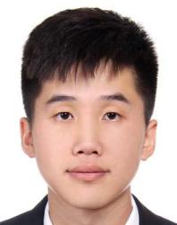  
Zheng Liu received the B.Eng. degree in automation from the Harbin Institute of Technology, Heilongjiang, China, in 2019. He is currently working toward the Ph.D. degree in robotics with the department of Mechanical Engineering, the University of Hong Kong, Hong Kong.

His research interests include lidar-based navigation and mapping.

Xiyuan Liu (Member, IEEE) received the B.Eng. degree in electronic and computer engineering and the M.Phil. degree in electronic and computer engineering from the Hong Kong University of Science and Technology, Hong Kong, in 2017 and 2019, respectively. He is currently working toward the Ph.D. degree in robotics with the department of Mechanical Engineering, the University of Hong Kong, Hong Kong.

His research interests include LiDAR mapping and sensor calibration.

Fu Zhang (Member, IEEE) received the B.E. degree in automation from the University of Science and Technology of China, Hefei, China, in 2011, and the Ph.D. degree in controls from the University of California, Berkeley, CA, USA, in 2015.

He joined the Department of Mechanical Engineering, The University of Hong Kong (HKU), Pokfulam, Hong Kong, as an Assistant Professor in 2018. His current research interests include robotics and controls, with focus on UAV design, navigation, control, and LiDAR-based simultaneous localization and mapping.