# Hybrid CNN-Transformer Features for Visual Place Recognition

Yuwei Wang , Graduate Student Member, IEEE, Yuanying Qiu , Peitao Cheng , and Junyu Zhang

Abstract— Visual place recognition is a challenging problem in robotics and autonomous systems because the scene undergoes appearance and viewpoint changes in a changing world. Existing state-of-the-art methods heavily rely on CNN-based architectures. However, CNN cannot effectively model image spatial structure information due to the inherent locality. To address this issue, this paper proposes a novel Transformer-based place recognition method to combine local details, spatial context, and semantic information for image feature embedding. Firstly, to overcome the inherent locality of the convolutional neural network (CNN), a hybrid CNN-Transformer feature extraction network is introduced. The network utilizes the feature pyramid based on CNN to obtain the detailed visual understanding, while using the vision Transformer to model image contextual information and aggregate task-related features dynamically. Specifically, the multi-level output tokens from the Transformer are fed into a single Transformer encoder block to fuse multi-scale spatial information. Secondly, to acquire the multi-scale semantic information, a global semantic NetVLAD aggregation strategy is constructed. This strategy employs semantic enhanced NetVLAD, imposing prior knowledge on the terms of the Vector of Locally Aggregated Descriptors (VLAD), to aggregate multi-level token maps, and further concatenates the multi-level semantic features globally. Finally, to alleviate the disadvantage that the fixed margin of triplet loss leads to the suboptimal convergence, an adaptive triplet loss with dynamic margin is proposed. Extensive experiments on public datasets show that the learned features are robust to appearance and viewpoint changes and achieve promising performance compared to state-of-the-arts.

Index Terms— Adaptive triplet loss, hybrid CNN-transformer, semantic NetVLAD aggregation, visual place recognition.

## I. INTRODUCTION

realize robot localization and navigation. It can not only accomplish the independent localization capability based on a prior map, but also complete the loop closure detection of simultaneous localization and mapping systems [1]. Therefore,

VPR has attracted extensive attention in the fields of robotics [2], [3] and computer vision [4], [5]. The goal of VPR is to identify where a robot visited previously, so that the robot can localize itself and correct the incremental drift of the robot’s pose during navigation [6]. Reliable place recognition is a great challenge for both robotic systems and self-driving cars to operate in real-world environments for long periods of time, due to changes in visual appearance, different viewpoints, and partial occlusions caused by dynamic objects.

VPR is generally treated as an image retrieval task [7], i.e., retrieving the top-ranked dataset image for each query image. Hence, the key part of VPR is how to effectively describe the image. In the past decade, the construction of feature descriptors using Convolutional Neural Networks (CNNs) has become the de-facto standard [8], [9], which shows that features extracted from well-trained CNNs are powerful for visual place recognition tasks. Further, to construct a more compact and capable image representation, aggregation operations like Vector of Locally Aggregated Descriptors (VLAD) [10] are integrated into CNNs. Currently, these kind of methods achieves state-of-the-art results. Arandjelovic et al. [4] proposed NetVLAD, which uses convolutional activations combined with trainable VLAD to form an end-to-end architecture. Recently, Ge et al. [11] introduced SFRS, which employs the backbone of NetVLAD and proposes a training scheme to handle the cases with limited overlap. However, these methods have a common weakness of using CNN to extract dense local features, because it is unfavorable for CNN-based methods to explicitly model long-range relationship. To this end, CNN needs to generate a large receptive field by continuously stacking down-sampling, which makes the network very deep. Notably, global modeling is critical for place recognition, especially in scenes with drastic viewpoint changes.

Fortunately, the emergence of Transformer [12] provides a flexible alternative architecture for CNNs with multi-head attention mechanism, which can effectively model long-range dependencies. Gkelios et al. [13] exploited the pre-trained Vision Transformer (ViT) [12] to generate global descriptors, which is the first work using the Transformer for image retrieval. It demonstrates that the Transformer features outperform CNN features. In order to employ the benefits of CNNs: local receptive fields, while keeping the advantages of Transformers: dynamic attention, and global context fusion, several approaches [14], [15] have emerged for other visual recognition tasks. More recently, Wu et al. [14] proposed CvT, which uses convolution operations to replace part of the structure in the Transformer. It illustrates that combining the two frameworks outperforms using only one of them. Henkel et al. [15] integrated EfficientNet into Swin Transformer [16] for landmark recognition and retrieval, which exhibits superior performance. Given the complementary strengths of CNN and Transformer, there has been little research [17] attempting to combine them for VPR. The novel Transformer-based VPR system proposed here combines the mutual strengths of CNN and Transformer approaches.

On the other hand, the existing methods [4], [11] mainly employ the single output representation of the model as the final global descriptor, and this limits improvements in performance on VPR tasks so far. Even though the approach [18] has adopted multi-scale feature fusion strategies to enhance feature representation, this effort only trains the network with the output of a single intermediate layer and then fuse the multi-scale features of the well-trained model. With this motivation, we perform end-to-end training on the fused multi-level hierarchical features for VPR. Moreover, the current approaches [4], [11] usually use pooling strategies to aggregate the feature activation extracted by CNN, and even further employ attention mechanism as the black box to weight local features on the basis of the above strategies [19], [20]. These techniques ignore the importance of prior knowledge and do not fully consider the local details, spatial context, and high-level semantic information contained in the image, and such feature cues are crucial for VPR. To this end, we integrate multi-scale local-spatial-semantic information through CNN, Transformer, and the semantic aggregation strategy, respectively.

To achieve the above goals, we elaborately design a novel Transformer-based VPR. Firstly, a hybrid CNN-Transformer feature extraction network is proposed to simultaneously obtain local feature details and global structure information from images. Convolutional layers of VGG-16 are used to extract the image pyramid features, which are further reshaped into 2D patches and input to the Swin Transformer to capture long-range associative features. With the help of Transformer’s self-attentive mechanism, task-related visual cues are automatically aggregated. Specifically, to obtain multi-scale spatial features, a single Transformer encoder block is used to fuse the multi-level token features from the Swin Transformer hierarchy structure. Then, the fused token features are chunked and separately reshaped into 2D token maps, which are aggregated using the global semantic NetVLAD aggregation strategy to obtain multi-scale semantic information. In which, semantic enhanced NetVLAD provides initial attention by selecting task-relevant salient visual cues based on the high-level prior knowledge. Finally, an adaptive triplet loss is introduced to train the end-to-end architecture, which forces the model to learn as many useful features as possible. Because negative samples with large geographic differences from the query image could have similar appearance features to the query image. Extensive experiments on public datasets show that the proposed method exhibit higher capacity than state-of-the-art techniques.

The main contributions of the proposed method are as follows:

(1) We propose a novel Transformer-based VPR architecture that combines low-level local details, spatial context, and high-level semantic information to improve the robustness for changes in appearance and viewpoint. Specifically, a hybrid CNN-Transformer feature extraction network is built to learn the visual pattern that takes into account local details and global dependencies.

(2) We develop a multi-scale fusion technique that generates multi-level locally-global descriptors from the hierarchical structure of hybrid CNN-Transformer, and then integrates multi-scale semantic cues via a semantic aggregation strategy. It gains improved performance over the single-scale methods.

(3) We design an adaptive triplet loss to improve the training effectiveness by dynamically adjusting the margin according to the different triplets of the training datasets.

The remainder of the paper is organized as follows: the related work is presented in Section II. The proposed method is systematically described in Section III. The comprehensive experimental analysis is performed in Section IV. Finally, the conclusion are given in Section V.

## II. RELATED WORK

## A. CNN-Based Features

VPR is a research hotspot in the field of robotics and computer vision. Early methods mainly employ handcrafted features [21], [22], [23], [24] combined with Bag of Words (BoW) [25], Fisher Vector (FV) [26] and VLAD [10]. Wang et al. [24] combined SIFT [27] and BRIEF [28] features to achieve real-time matching between images. Torii et al. [29] proposed DenseVLAD, which uses non-differentiable VLAD to aggregate dense SIFT features to obtain the global representation for place recognition. With the rise of deep learning, feature representation based on deep learning has become the current mainstream practice. Sünderhauf et al. [30] conducted a comprehensive evaluation of the output features of each layer of the pre-trained AlexNet. The experiments showed that intermediate layer features are more robust to illumination changes, while higher layer features are more robust to viewpoint changes and contain strong semantic information. Zhang et al. [31] pointed out that the CNN model is initialized with pre-trained weights and then fine-tuned on a specific dataset, which can significantly improve the generalization ability of the model. Pan et al. [32] used the linear combination weight to describe the topological relationship between CNN descriptors and its neighbors, thereby improving the robustness of image matching. Unlike the above studies, our method further captures the global contexts from the CNN descriptors through the Transformer, thus achieving both local details and global dependencies.

Based on the above works, NetBoW [33], NetVLAD [4] and NetFV [34] are integrated into a neural network to further encode convolutional features into a compact global descriptor. Notably, for NetFV, the generation process of the image features is assumed to be modeled by the Gaussian Mixture Model (GMM) [35], this is similar to FV. Furthermore, the gradient of the log-likelihood is used as discriminative representation. However, NetVLAD and VLAD count the distance information of the features to the cluster centers obtained by K-Means [36]. Overall, the most representative work is NetVLAD proposed by Arandjelovic et al. [4]. This method designs a trainable layer named NetVLAD, which can be inserted into any CNN architecture and can be trained end-to-end. Additionally, many variants of NetVLAD have emerged [11], [37]. For instance, Yu et al. [37] introduced the SPE-NetVLAD, which imposes spatial pyramids to NetVLAD [4] to obtain spatial structure information. Recently, Ge et al. [11] proposed SFRS, which uses the backbone of NetVLAD and during training, divides the image into parts and computes similarity scores from these parts. However, this method only aggregates CNN descriptors to form global descriptors. Due to the locality of CNN, it is difficult to effectively model structural information, which is crucial for VPR. To this end, we extend Transformer based on CNN to capture both local details and global information.

Besides, these methods [4], [11], [37] take all local feature cues into account in feature encoding without selecting task-relevant features. This makes the model vulnerable to disturbing local features, which can lead to learning sub-optimal feature representations. To select features from the distinctive regions of the image for feature embedding, many researchers add attention mechanisms to their models. Noh et al. [19] applied an attention mechanism to learn attention scores for the spatial locations of CNN feature maps, thereby allowing the model to focus on image regions of interest. Chen et al. [20] appended channel attention to the above spatial attention mechanism, which enables the model to pay attention to both important spatial and channel visual cues. Kim et al. [38] extended the Contextual Reweighting Network based on NetVLAD [4], using the spatial attention mechanism to make the model focus on the regional features that contribute to the place recognition task. Zhu et al. [39] presented an attention-based spatial pyramid network to suppress the influence of disturbing features by employing an attention mechanism.

Nevertheless, these works utilize the attention mechanism to impose black-box weights on local features, which lack interpretability. In addition, there are some studies that exploit semantic priors to artificially select task-relevant visual cues for feature embedding. Wang et al. [40] used the prior knowledge obtained from semantic segmentation to select task-related visual features for learning, thereby suppressing the effects of disturbing features such as dynamic objects and repetitive structures. Sünderhauf et al. [41] employed object detection technology to extract distinctive regions of the image for cross-matching to achieve place recognition. Peng et al. [42] proposed a Semantic Reinforced Attention Learning Network (SRALNet), which initializes the encoding spatial distribution with semantic priors for place recognition. This method separates a cluster into an informative area and multiple ambiguous areas, thereby highlighting representative features while suppressing disturbing features. Inspired by the above work, we build the global semantic aggregation module based on [42]. Unlike [42] which only takes single-scale CNN features as input, we globally aggregate multi-scale hybrid CNN-Transformer features.

## B. Transformer-Based Features

The field of computer vision has been dominated by CNNs for a long time. Since the self-attention mechanism in Transformer can effectively model image long-range dependencies, Transformer is considered as a feasible alternative architecture to CNNs in various vision tasks [14]. Currently, Transformer-based visual modeling tasks [12], [43], [44], [45], [46], [47], [48], [49], [50], [51], [52] have attracted strong interest. Dosovitskiy et al. [12] were the first to propose the Vision Transformer (ViT) for image classification, which demonstrated that pure Transformer architectures can achieve state-of-the-art results when the model is trained on sufficiently large datasets. Since ViT requires large-scale training datasets to perform well, Touvron et al. [48] presented DeiT, which further explores efficient training strategies for ViT. Liu et al. [16] introduced Swin Transformer, which limits the self-attention computation to non-overlapping local windows based on the shifted window scheme. At the same time, cross-window connections are allowed, which improves computational efficiency. Gkelios et al. [13] were the first to adopt ViT [12] for image retrieval, and experiments showed that this method can replace traditional CNN-based methods, creating a new era of image retrieval. El-Nouby et al. [53] proposed a Transformer-based framework for image retrieval, where they train the model with a metric learning objective that combines a contrastive loss with a differential entropy regularizer. Dai et al. [52] employed ViT [12] to enhance the global context understanding ability of the image, and realized the alignment of multiple specific regions between images through the self-attention mechanism of the Transformer, thereby the performance of visual localization was improved. However, due to the lack of inductive biases inherent to CNNs, so these Transformer-based methods rely on large-scale datasets for training.

To address the above issues, several works have modified the Transformer architecture by utilizing the CNN structure. Wu et al. [14] proposed the Convolutional Vision Transformer (CvT), which uses convolutional tokens and convolutional projections to replace part of the previous Transformer structure. Furthermore, a hierarchical multi-level structure is applied to gradually reduce the tokens sequence length and increase the feature dimension as the stage progresses, so that the tokens can represent more and more complex visual patterns on a larger and larger spatial footprint. Henkel et al. [15] combined EfficientNet with Swin Transformer for large-scale landmark recognition and retrieval, and the model won the Google Landmark Recognition 2021 competition. Inspired by the above works, we construct a hybrid CNN-Transformer feature extraction base network for VPR tasks, which simultaneously captures the detailed local cues and global context information of images by integrating CNN and Transformer. Moreover, the self-attention mechanism in Transformer is utilized to automatically aggregate task-relevant visual features. Importantly, unlike other NetVLAD-based studies [4], [11], [37], [42], the global semantic NetVLAD module we build utilizes the token maps of varying dimensions and sizes output by the hierarchical multi-level structure to model global semantic information.

The aforementioned methods have the limitation that only the single representation output from the model is used to build global descriptors. However, the different scale information from the same feature map and the different level features from the hierarchical structure contain important abstract characteristics about various aspects of the raw image [54]. Therefore, multi-representation integration is significant for VPR. To this end, existing techniques either extract multi-scale features [55], [56], [57], [58], [59] for the same level of feature maps, or fuse multi-level representations [17], [60], [61] from hierarchical structures to integrate the comprehensive attributes of the input image. Chen et al. [55] applied the spatial pyramid pooling to generate a global descriptor on the same feature map, thus enabling matching images across different viewpoints. Neubert et al. [59] proposed SP-Grid, which used compact superpixel segmentations to create a set of overlapping regions at multiple scales. Wang et al. [17] exploited a multi-level attention aggregation mechanism to generate global descriptors. Inspired by the above work, our proposed hybrid CNN-Transformer integrates multi-scale features from CNN and multi-level information of the hierarchical Transformer.

## C. Triplet Loss in VPR and Other Related Tasks

The triplet loss function has been extensively used in VPR tasks [4], [18] due to its proven excellent capabilities. Its purpose is to ensure a certain distance between positive and negative pairs through a fixed margin, and the above objective can be embodied within a triplet -query, positive, negative. In this way, the triplet loss makes similar semantic samples in the feature space closer to the query image than any semantically different negative samples. According to the characteristics of triplet sets building, the triplet loss is mainly divided into two categories: supervised learning and weakly supervised learning.

Earlier datasets used in VPR have ground truth, so researchers constructed triplet sets to train the neural network model specialized for VPR. Therefore, the above mentioned techniques are known as supervised learning-based VPR. Gomez-Ojeda et al. [62] built triplets based on KITTI Dataset [63], Alderley Dataset [64] and Nordland Dataset [65] to fine-tune CaffeNet [66] for VPR. This method trained the model using the datasets containing ground truth and was the first to train a network with the goal of VPR rather than other tasks. Experiments demonstrate that the feature learned is superior to the visual features learned with image classification as the goal. However, accurate and sufficient labels are often difficult to obtain in real-world situations [67]. Furthermore, in most scenarios, GPS data tends to be noisy, which also motivates the generation of weakly supervised VPR.

It is possible to gather enough training data by adopting weakly supervised learning for VPR. Arandjelovic et al. [4] employed the Pittsburgh dataset [68] to train the network with triplet loss [69]. Hausler et al. [18] employed the Pittsburgh dataset and the Mapillary street dataset [5] to train the proposed Patch-NetVLAD, which also took the triplet loss [69] as the optimization objective. The datasets mentioned by the above approaches have only rough geographic information and no precise labels. Exactly the weakly supervised learning makes large-scale VPR available, and this is more consistent with real-world application. Nonetheless, the traditional triplet loss stops learning once the distance between the query image and the negative candidate image is greater than the distance between the query image and the positive reference image by a fixed margin in the feature space.

To this end, Nguyen et al. [70] utilized the statistical characteristics of the training data to adaptively adjust the margin. Most recently, some other visual recognition tasks, such as facial expression recognition [71] and person reidentification [72], try to solve the above problems by adjusting the margin or adding additional loss terms. Notably, these methods are designed based on the intra-class and interclass characteristics of the single object such as expressions or people. This is different from the scene information of place recognition, its scene contents are more complex and changeable. Thus, it is necessary to redesign a triplet loss depending on the VPR task. So we introduce an adaptive triplet loss, which possesses a dynamic margin for each triplet, thus avoiding suboptimal convergence of the model.

## III. PROPOSED METHOD

To improve feature robustness in scenes with appearance and viewpoint changes, we propose a Transformer-based place recognition architecture for feature embedding, which integrates local details, spatial relationships, and semantic information. Fig. 1 shows the overall flowchart of our method. The implementation details of our method are elaborated below.

## A. Hybrid CNN-Transformer Feature Extraction

Differing from NetVLAD [4] that only uses CNN (e.g., VGG-16 [73] or AlexNet [74]) to extract image local descriptors, we first follow [17] to obtain a feature pyramid through VGG-16, and then further use Swin Transformer [16] to capture image global information. Benefiting from the self-attention mechanism and shifted window, Swin Transformer can efficiently model long-range dependencies between local features of images and automatically aggregate task-related visual cues. Especially in scenes with viewpoint changes, Swin Transformer can make up for the defect that CNN features are difficult to focus on global information.

As shown in Fig. 2, the input image $\mathbf { F } _ { 0 } \in \mathbb { R } ^ { H _ { 0 } \times W _ { 0 } \times C _ { 0 } }$ is first input into VGG-16 to obtain output feature maps ${ \bf F } _ { i } \in  { }$ $\mathbb { R } ^ { H _ { i } \times \dot { W _ { i } } \times C _ { i } } ( i = 1 , 2 , 3 )$ of Conv1\_2, Conv2\_2 and Conv3\_3 with the spatial resolution of $H _ { i } \times W _ { i }$ , and the channel is $C _ { i } .$ With a feature pyramid $\{ { \bf F } _ { 0 } , { \bf F } _ { 1 } , { \bf F } _ { 2 } , { \bf F } _ { 3 } \} , { \bf F } _ { i }$ is reshaped to the same number of N patches $\mathbf { F } _ { p } ^ { i } \in \mathbb { R } ^ { N \times \left( P _ { i } ^ { 2 } \bullet C _ { i } \right) } \left( i = 0 , 1 , 2 , 3 \right)$ of size $( P _ { i } , P _ { i } )$ . Where $N = { ^ { ( H _ { i } ^ { \prime } \times W _ { i } ) } } / _ { P ^ { 2 } } , P _ { 0 } = P _ { 1 }$ and $P _ { 1 } , P _ { 2 } , P _ { 3 }$ igradually halved as the depth of the convolutional layer increases, and $C _ { i }$ is 3, 64, 128 and 256 from shallow to deep. After that, the above patches are flattened and concatenated at the corresponding position (red area in Fig. 2) to obtain the feature sequence $\left\lceil \hat { \mathbf { F } } _ { p } ^ { 1 } , \hat { \mathbf { F } } _ { p } ^ { 2 } , \dots , \hat { \mathbf { F } } _ { p } ^ { N } \right\rceil$ . Then, according to (1), the linear projection $\mathbf { E } \in \mathbb { R } ^ { \sum \left( P _ { i } ^ { 2 } \times C _ { i } \right) \times D }$ is applied to the above feature sequence, projecting it to the desired dimension D of the Swin Transformer input sequence $\mathbf { Z } \in \mathbb { R } ^ { N \times D }$

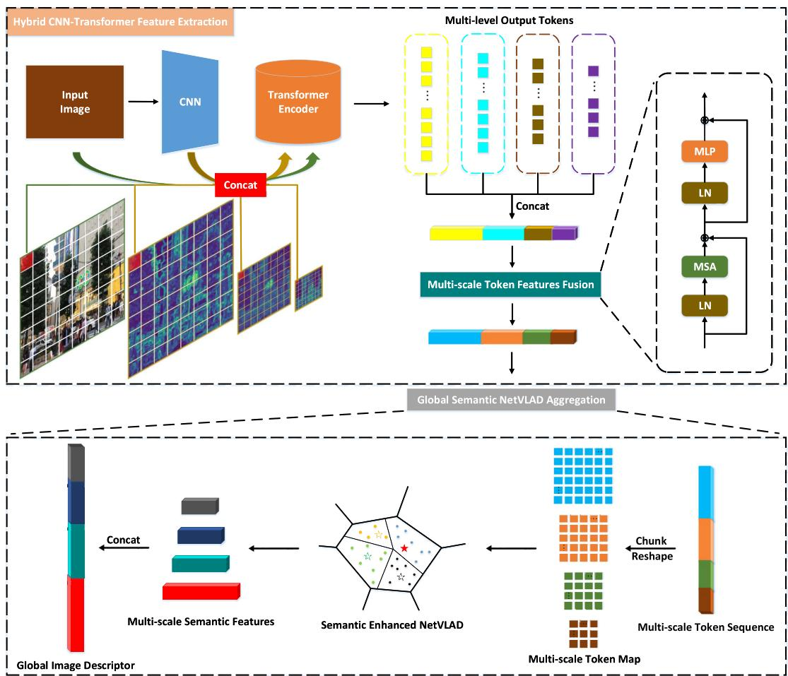  
Fig. 1. Overview of the proposed methods.The hybrid CNN-Transformer first obtains feature maps rich in local details through a shallow CNN, divides the input image and CNN feature maps into the same number of patches, and concatenates the patch features at the same spatial location to acquire pyramid features. Then the flattened feature sequence is input to the Transformer encoder to obtain multi-level output tokens from shallow to deep stages. Specifically, these token features are concatenated and fed into the multi-scale token features fusion module to model multi-level spatial contexts. Finally, the output token sequence is chunked and viewed as token maps, which are aggregated through the semantic enhanced NetVLAD layer to capture multi-scale semantic features, and these features are concatenated to gain global image descriptors for place recognition

$$
\mathbf { Z } = \left[ \hat { \mathbf { F } } _ { p } ^ { 1 } \mathbf { E } , \hat { \mathbf { F } } _ { p } ^ { 2 } \mathbf { E } , \cdot \cdot \cdot , \hat { \mathbf { F } } _ { p } ^ { N } \mathbf { E } \right]\tag{1}
$$

The sequence Z is then fed into the Swin Transformer to model long-range dependencies among local features of the CNN (see Fig. 2). Notably, the Multi-Layer Perceptron (MLP) head of Swin Transformer is discarded. As shown in Fig. 3, unlike the traditional Multi-Head Self Attention (MSA) of the Transformer (see Fig. 3(a)), the MSA of the Swin Transformer is constructed based on shifted windows. Fig. 3(b) presents two consecutive Swin Transformer blocks, where each Swin Transformer block alternately employs two sub-layers of MSA and MLP, with Layer Normalization (LN) before each sublayer, followed by residual connections after each sublayer. The regular Window-based Multi-Head Self Attention (W-MSA) and the Shifted Window-based Multi-Head Self Attention (SW-MSA) are respectively applied in two consecutive Swin Transformers. Formally, the consecutive Swin Transformer blocks can be formulated by (2)-(5).

$$
\hat { \mathbf { Z } } ^ { l } = { W } { \cdot } M S A \left( L N \left( { \mathbf { Z } } ^ { l - 1 } \right) \right) + { \mathbf { Z } } ^ { l - 1 }\tag{2}
$$

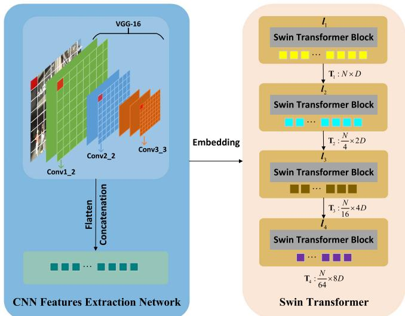  
Fig. 2. Schematic diagram of the hybrid CNN-Transformer feature extraction network. The left of the figure is the VGG-16 spatial pyramid convolutional feature extraction network. The green, blue and orange squares represent the Conv1, Conv2 and Conv3 layers of VGG-16, respectively. The right of the figure is the Swin Transformer model.

$$
\mathbf { Z } ^ { l } = M L P \left( L N \left( \hat { \mathbf { Z } } ^ { l } \right) \right) + \hat { \mathbf { Z } } ^ { l }\tag{3}
$$

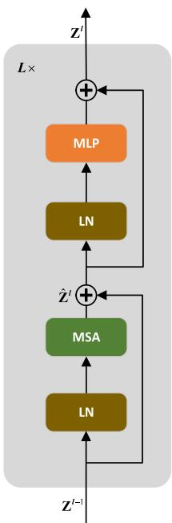

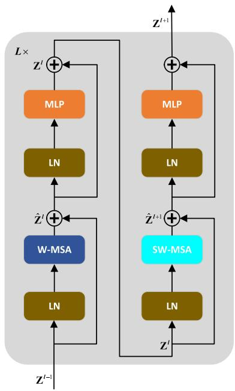  
(a)  
(b)  
Fig. 3. Diagram of the Swin Transformer block. (a) Traditional Transformer block. (b) Swin Transformer block, which includes two consecutive Transformer encoders. W-MSA and SW-MSA add the regular window and the shifted window to the MSA in (a), respectively.

$$
\hat { \mathbf { Z } } ^ { l + 1 } = S W { \boldsymbol { - } } M S A \left( L N \left( \mathbf { Z } ^ { l } \right) \right) + \mathbf { Z } ^ { l }\tag{4}
$$

$$
\mathbf { Z } ^ { l + 1 } = M L P \left( L N \left( \hat { \mathbf { Z } } ^ { l + 1 } \right) \right) + \hat { \mathbf { Z } } ^ { l + 1 }\tag{5}
$$

where $\hat { \mathbf { z } } ^ { l }$ and $\mathbf { Z } ^ { l }$ refer to the output features of S(W)-MSA and MLP from block l, respectively.

As shown in Fig. 2, Swin Transformer has a four-stage hierarchical structure from shallow to deep, in which the number of Swin Transformer blocks owned by each stage is $l _ { 1 } , l _ { 2 } , l _ { 3 } ,$ , and $l _ { 4 } ,$ , respectively. Specially, a feature pyramid $\{ \mathbf { T } _ { 1 } , \mathbf { T } _ { 2 } , \mathbf { T } _ { 3 } , \mathbf { T } _ { 4 } \}$ is obtained by patch merging strategy at each stage.

Since the global receptive field of the transformer increases with the depth [12], [17], the output token features are concatenated and input to the multi-scale token features fusion module to obtain spatial information of different scales. See in Fig. 1, output tokens from multi-level are concatenated into a long 1D token sequence, which are fed into a single Transformer block for multi-scale spatial fusion. The MSA in the multi-scale token features fusion module can efficiently model the long-range dependencies of tokens at any locations across different scales. After that, the fused token sequence is chunked into refined 1D token sequences $\bigl \{ \mathbf { T } _ { 1 } ^ { \prime } , \mathbf { T } _ { 2 } ^ { \prime } , \mathbf { T } _ { 3 } ^ { \prime } , \mathbf { T } _ { 4 } ^ { \prime } \bigr \}$ which contain rich spatial information from different scales.

## B. Global Semantic NetVLAD Aggregation

In order to aggregate multi-scale semantic information in feature embeddings, multi-scale token sequences $\left\{ \mathbf { T } _ { 1 } ^ { \prime } , \mathbf { T } _ { 2 } ^ { \prime } , \mathbf { T } _ { 3 } ^ { \prime } , \mathbf { T } _ { 4 } ^ { \prime } \right\}$ are first reshaped to 2D token maps respectively, and then the feature dimension is normalized using L2-Normalization. Finally, these token maps are fed separately to global semantic NetVLAD for aggregating global descriptors (see Fig. 1).

Algorithm 1 Global Semantic NetVLAD Aggregation   
Input: Multi-scale token sequences $\big \{ \mathbf { T } _ { 1 } ^ { \prime } , \mathbf { T } _ { 2 } ^ { \prime } , \dots , \mathbf { T } _ { N } ^ { \prime } \big \}$   
Output: Global descriptor $\mathbf { V } _ { g }$   
for $j = 1 , 2 , \dots , N$ do   
Reshape $\mathbf { T } _ { j } ^ { \prime }$ to $\mathbf { x } \in \mathbb { R } ^ { D \times H \times W }$   
Normalize x across $D$ dimension using L2-Normalization;   
Calculate the soft-assignment ak (xi ) for $H \ \times \ W$ D  
dimensional descriptors $\mathbf { X } _ { i }$ according to (6);   
Calculate the intra-cluster saliency weight $\beta _ { k } \left( \mathbf { x } _ { i } \right)$ for $H \times$   
W D-dimensional descriptors $\mathbf { X } _ { i }$ according to (8);   
Calculate the semantic enhanced NetVLAD aggregation   
descriptor $\mathbf { V } _ { j }$ according to (11);   
end for   
$\left\{ \mathbf { V } _ { 1 } , \mathbf { V } _ { 2 } , \ldots , \mathbf { V } _ { j } \right\}$ are first intra-normalized respectively,   
and then L2-normalization is performed on the individual   
flattened vectors to obtain $\left\{ \bar { \mathbf { V } } _ { 1 } ^ { * } , \mathbf { V } _ { 2 } ^ { * } , \ldots , \mathbf { V } _ { j } ^ { * } \right\}$ , and finally   
$\left\{ \begin{array} { l l } { \mathbf { V } _ { 1 } ^ { * } , \mathbf { V } _ { 2 } ^ { * } , \ldots , \mathbf { V } _ { j } ^ { * } \right\} } \\ { \mathbf { V } _ { g } ^ { * } ; } \end{array}$ are concatenated into global descriptors   
return $\mathrm { V } _ { g } ^ { * }$

Formally, for N D-dimensional local features, the vanilla NetVLAD is the concatenation of the sum of residuals between each local feature descriptor $\mathbf { X } _ { i }$ and K cluster centers $c _ { k }$ weighted by the soft-assignment $a _ { k } \left( \mathbf { x } _ { i } \right)$ (see 6), so that these local features are aggregated into the matrix V (see 7).

$$
a _ { k } \left( \mathbf { x } _ { i } \right) = \frac { e ^ { - \alpha \left\| \mathbf { x } _ { i } - \mathbf { c } _ { k } \right\| ^ { 2 } } } { \sum _ { j } ^ { k } e ^ { - \alpha \left\| \mathbf { x } _ { i } - \mathbf { c } _ { j } \right\| ^ { 2 } } }\tag{6}
$$

$$
V ( j , k ) = \sum _ { i = 1 } ^ { N } a _ { k } \left( \mathbf { x } _ { i } \right) ( x _ { i } ( j ) - c _ { k } ( j ) )\tag{7}
$$

where the constant $\alpha$ in (6) controls the decay of the response $e ^ { - \alpha \| \mathbf { x } _ { i } - \mathbf { c } _ { k } \| ^ { 2 } }$ with the distance $\| \mathbf { x } _ { i } - \mathbf { c } _ { k } \| ^ { 2 }$ , and the soft-assignment ak (xi ) represents the probability that the local feature $\mathbf { X } _ { i }$ belongs to the cluster center $\mathbf { c } _ { k }$ . In (7), xi (j ) and $c _ { k } \left( j \right)$ are the jth dimension of the ith local feature and the kth cluster center, respectively.

In the vanilla NetVLAD [4], the initialization of the model parameters is determined by the cluster centers, which are generated from arbitrary local features. Since local features are not all task-related, these cluster centers may be located in confusing regions, so seriously affect the place recognition performance. Therefore, this paper adopts the semantic enhanced NetVLAD introduced in [42] to select specified local features to initialize cluster centers.

To suppress the influence of misleading features in feature embeddings, [42] proposed an intra-class saliency weight $\beta _ { k } \left( { \bf x } _ { i } \right)$ based on ak (xi) to divide each cluster into a informative region and multiple ambiguous regions. Formally, according to Bayesian theory, $\beta _ { k } \left( \mathbf { x } _ { i } \right)$ refers to the probability that the local feature $\mathbf { X } _ { i }$ from the kth cluster is located in the

informative region I (see 8).

$$
\begin{array} { r l r } { \left. { \beta _ { k } \left( \mathbf { x } _ { i } \right) } \right)} \\ & { = P \left( I | \mathbf { x } _ { i } , \mathbf { c } _ { k } \right) } \\ & { = \frac { P \left( \mathbf { x } _ { i } \right| I , \mathbf { c } _ { k }  P \left( I | \mathbf { c } _ { k } \right) } { \sum _ { m = 1 } ^ { s } P \left( \mathbf { x } _ { i } | s _ { m } , \mathbf { c } _ { k } \right) P \left( s _ { m } | \mathbf { c } _ { k } \right) + P \left( \mathbf { x } _ { i } | I , \mathbf { c } _ { k } \right) P \left( I | \mathbf { c } _ { k } \right) } } \\ & { = \frac { e ^ { - \alpha \left\| \mathbf { x } _ { i } - \mathbf { c } _ { k } ^ { r } \right\| ^ { 2 } } } { \sum _ { m = 1 } ^ { s } e ^ { - \alpha \left\| \mathbf { x } _ { i } - \mathbf { c } _ { k m } ^ { s } \right\| ^ { 2 } } + e ^ { - \alpha \left\| \mathbf { x } _ { i } - \mathbf { c } _ { k } ^ { r } \right\| ^ { 2 } } } } & { \left( 8 \right) } \end{array}
$$

where $\mathbf { c } _ { k } ^ { r }$ represents the centroid of the informative region, and $\mathbf { c } _ { k } ^ { s }$ refers to the shadow centroid.

After (6) and (8) expand the square terms, the term $e ^ { - a \| \mathbf { x } _ { \mathrm { i } } \| }$ can be canceled between numerator and denominator. Let $\mathbf { w } _ { k r } \ = \ 2 \alpha \mathbf { c } _ { k } ^ { r } , \ b _ { k r } \ = \ - \alpha \lVert \mathbf { c } _ { k } ^ { r } \rVert ^ { 2 } , \ \mathbf { w } _ { k m } \ = \ 2 \alpha \mathbf { c } _ { k m } ^ { s }$ and $b _ { k m } =$ $- \alpha \| \mathbf { c } _ { k m } ^ { s } \| ^ { 2 }$ , (6) and (8) can be recalculated as (9) and (10)  respectively:

$$
a _ { k } \left( \mathbf { x } _ { i } \right) = \frac { e ^ { \mathbf { w } _ { k r } ^ { T } \mathbf { x } _ { i } + b _ { k r } } } { \sum _ { j } ^ { k } e ^ { \mathbf { w } _ { j r } ^ { T } \mathbf { x } _ { i } + b _ { k r } } }\tag{9}
$$

$$
\beta _ { k } \left( \mathbf { x } _ { i } \right) = \frac { e ^ { \mathbf { w } _ { k r } ^ { \mathrm { T } } \mathbf { x } _ { i } + b _ { k r } } } { \sum _ { m = 1 } ^ { S } e ^ { \mathbf { w } _ { k m } ^ { \mathrm { T } } \mathbf { x } _ { \mathrm { i } } + b _ { k m } } + e ^ { \mathbf { w } _ { k r } ^ { \mathrm { T } } \mathbf { x } _ { i } + b _ { k r } } }\tag{10}
$$

Through the redistribution of local features, $V ( j , k )$ can be redefined by double weights as:

$$
V ( j , k ) = \sum _ { i = 1 } ^ { N } a _ { k } \left( \mathbf { x } _ { i } \right) \beta _ { k } \left( \mathbf { x } _ { i } \right) \left( x _ { i } ( j ) - c _ { k } ^ { r } ( j ) \right)\tag{11}
$$

where {w}, {b} and {c} are the parameters that need to be learned. However, unlike [42], here $\{ \mathbf { V } _ { 1 } , \mathbf { V } _ { 2 } , \mathbf { V } _ { 3 } , \mathbf { V } _ { 4 } \}$ is obtained by (11) separately aggregating the hierarchical multi-scale token sequences $\{ \bar { \mathbf { T } } _ { 1 } ^ { \prime } , \bar { \mathbf { T } } _ { 2 } ^ { \prime } , \bar { \mathbf { T } } _ { 3 } ^ { \prime } , \bar { \mathbf { T } } _ { 4 } ^ { \prime } \}$ from the hybrid CNN-Transformer. To improve the feature robustness, V is firstly normalized using Intra-Normalization, then flattened into a vector, and finally the entire vector is normalized by L2- Normalization (see 12). Thus, $\{ \mathbf { V } _ { 1 } , \mathbf { V } _ { 2 } , \mathbf { V } _ { 3 } , \mathbf { V } _ { 4 } \}$ is processed by (12) to derive $\left\{ \mathbf { V } _ { 1 } ^ { * } , \mathbf { V } _ { 2 } ^ { * } , \mathbf { V } _ { 3 } ^ { * } , \mathbf { V } _ { 4 } ^ { * } \right\}$

$$
\mathbf { V } ^ { * } = L 2 N o r m \left( \mathbf { V } \right)\tag{12}
$$

We follow the initialization strategy of [42], the semantic enhanced NetVLAD is initialized with prior knowledge, and semantic priors of local features are obtained using the DeepLabV3+ [75] pre-trained on the Cityscapes dataset [76]. In particular, the last layer of activations before the softmax layer in DeepLabV3+ is first scaled by max pooling to the same size as the 2D token map of the $\mathbf { T } ^ { \prime }$ . Then the softmax prediction layer is applied to obtain the semantic labels of local features. Especially, local features with labels: building, road, tree, wall, signal, and pole are employed to generate K representative cluster centers $\mathbf { c } _ { k } ^ { r } ,$ while dynamic and mediocre objects such as person, vehicle, and sky are used to generate shadow candidates $\mathbf { c } _ { k } ^ { s } .$ . Same as [42], we select the top S shadow centroids with the closest Euclidean distance to the representative center in each cluster.

The algorithm to compute the image global descriptor $\mathbf { V } _ { g } ^ { * }$ is shown in Algorithm 1. Among them, we perform global concatenation of $\left\{ \mathbf { V } _ { 1 } ^ { * } , \mathbf { V } _ { 2 } ^ { * } , \mathbf { V } _ { 3 } ^ { * } , \mathbf { V } _ { 4 } ^ { * } \right\}$ to obtain $\mathbf { V } _ { g } ^ { * }$ (see 13). After that, we apply PCA with whitening and L2-normalization on $\mathbf { V } _ { g } ^ { * }$ to obtain $\mathbf { V } _ { g }$ (see 14).

$$
\mathbf { V } _ { g } ^ { * } = C o n c a t ( \left[ \mathbf { V } _ { 1 } ^ { * } , \mathbf { V } _ { 2 } ^ { * } , \mathbf { V } _ { 3 } ^ { * } , \mathbf { V } _ { 4 } ^ { * } \right] )\tag{13}
$$

$$
\mathbf { V } _ { g } = L 2 N o r m \left( P C A _ { W h i t e n } \left( \mathbf { V } _ { g } ^ { * } \right) \right)\tag{14}
$$

## C. Adaptive Triplet Loss

To learn the optimal image representation, the triplet loss [69] is often utilized in place recognition tasks [4], [18]. Its working principle is: in the feature embedding space, the Euclidean distance d between the query image representation $\mathbf { V } _ { g } ^ { q }$ and a positive reference image $\dot { \mathbf { V } _ { g } ^ { p } }$ is smaller than any negative candidate images $\left\{ \mathbf { V } _ { g } ^ { n } \right\}$ . Formally, the traditional triplet loss is defined as follows:

$$
L = \left[ d ^ { 2 } \left( \mathbf { V } _ { g } ^ { q } , \mathbf { V } _ { g } ^ { p } \right) - d ^ { 2 } \left( \mathbf { V } _ { g } ^ { q } , \mathbf { V } _ { g } ^ { n } \right) + m \right] _ { + }\tag{15}
$$

where $[ x ] _ { + } = m a x \left( x , 0 \right)$ , m is the margin. In addition, since large-scale place recognition datasets usually do not have precise label information, the positive sample $\dot { p _ { * } ^ { q } }$ that is closest to the query image and the negative samples $\{ n ^ { q } \}$ extracted by hard negative mining are often created as tuple sets to train the model based on GPS information. Each tuple $\left( q , p _ { * } ^ { q } , \{ n ^ { q } \} \right)$ includes a query image, a positive sample, and N negative samples. For each tuple, (15) can be further recalculated as:

$$
L _ { T } = \frac { 1 } { N } \sum _ { i = 1 } ^ { N } \left[ d ^ { 2 } \left( \mathbf { V } _ { g } ^ { q } , \mathbf { V } _ { g } ^ { p * } \right) - d ^ { 2 } \left( \mathbf { V } _ { g } ^ { q } , \mathbf { V } _ { g } ^ { n i } \right) + m \right] _ { + }\tag{16}
$$

To describe the working principle of (16) more explicitly, we describe it in another way. In III-B, the global feature vector $\mathbf { V } _ { g }$ is normalized, so that $\left. \mathbf { V } _ { g } ^ { q } \right. = \left. \mathbf { V } _ { g } ^ { p } \right. =$ $\begin{array} { r l r } { \left\| \mathbf { V } _ { g } ^ { n } \right\| } & { { } = } & { 1 } \end{array}$ . Thus, $\begin{array} { r l r } { d ^ { 2 } \left( \mathbf { V } _ { g } ^ { q } , \mathbf { V } _ { g } ^ { p } \right) } & { { } = } & { \left\| \mathbf { V } _ { g } ^ { q } - \mathbf { V } _ { g } ^ { p } \right\| _ { 2 } ^ { 2 } \ = } \end{array}$ $\begin{array} { r l r } { \left( { \bf V } _ { g } ^ { q } - { \bf V } _ { g } ^ { p } \right) ^ { \mathrm { T } } \left( { \bf V } _ { g } ^ { q } - { \bf V } _ { g } ^ { p } \right) } & { { } = } & { 2 - \ 2 \big ( { \bf V } _ { g } ^ { q } \big ) ^ { \mathrm { T } } { \bf V } _ { g } ^ { p } } \end{array}$ . Note that $\left( { \bf V } _ { g } ^ { q } \right) _ { - } ^ { T } { \bf V } _ { g } ^ { p } \ = \ \cos \left( { \bf V } _ { g } ^ { q } , { \bf V } _ { g } ^ { p } \right)$ , here let $\left( \mathbf { V } _ { g } ^ { q } \right) ^ { \mathrm { T } } \mathbf { V } _ { g } ^ { p } \ = \ \varphi ( q , p )$ $\left( \mathbf { V } _ { g } ^ { q } \right) ^ { \mathrm { T } } \mathbf { V } _ { g } ^ { n } = \varphi ( q , n )$ . In this way, we can convert (16) to a clear formulation (17), which is the same optimization as (16).

$$
L _ { T } ^ { * } = \frac { 1 } { N } \sum _ { i = 1 } ^ { N } \left[ \varphi \left( q , n _ { i } \right) - \varphi \left( q , p \right) + \frac { m } { 2 } \right] _ { + }\tag{17}
$$

where the feasible values of $\varphi ( q , p )$ and $\varphi ( q , n )$ are in [- $^ { 1 , 1 ] }$ , so we can derive that $\textstyle { \frac { m } { 2 } } \in [ 0 , 2 ]$ . Thus, the triplet loss in (17) becomes associated with cosine similarities $\varphi ( q , p )$ and $\varphi ( q , n )$ instead of depending on the L2 distance between $d ^ { 2 } \left( \mathbf { V } _ { g } ^ { q } , \mathbf { V } _ { g } ^ { p } \right)$ and $d ^ { 2 } \left( \mathbf { V } _ { g } ^ { q } , \mathbf { V } _ { g } ^ { n } \right)$ in (16). Therefore minimization of the triplet loss (16) corresponds to minimizing (17).

Under the constraint of the fixed margin $\frac { m } { 2 }$ of (17), an unexpectable case where the negative sample is too close to the positive sample is allowed to exist. Furthermore, when the positive sample is also close to the query image, this results in the negative sample being similar to the query image. On the other hand, the negative samples are those that fail to capture similarity to the query image in feature space, but these data are beneficial for the learning process. Hence once $\mathbf { V } _ { g } ^ { n }$ is close to $\mathbf { V } _ { g } ^ { p } .$ i.e. $\begin{array} { r } { \varphi ( q , p ) - \varphi ( q , n ) = \frac { m } { \gamma } } \end{array}$ , we have to drive $\mathbf { V } _ { g } ^ { n }$ away from ${ \bf V } _ { g } ^ { p } ~ ( \varphi ( q , p ) - \varphi ( q , n ) > \frac { \bar { m } } { 2 } )$

Obviously, increasing the value of the fixed margin $\frac { m } { 2 }$ can enlarge the distance between the negative sample and the query image, but we observe that when $\begin{array} { r } { \frac { m } { 2 } > 0 . 5 , } \end{array}$ , the model performance drops significantly. Consequently, we design a dynamic margin to adaptively change according to the characteristics of the training data. Given a tuple $\left( q , p _ { * } ^ { q } , \{ n ^ { q } \} \right)$ , the adaptive triplet loss dynamically changes the margin according to the cosine similarities $\varphi ( q , n )$ between each negative candidate image and the query image. Formally, for each negative sample $n ^ { q i }$ , the adaptive margin is defined as follows:

$$
m _ { a } ^ { i } = \frac { \varphi ( q , n ) _ { m a x } - \varphi ( q , n _ { i } ) + \alpha } { \varphi ( q , n ) _ { m a x } - \varphi ( q , n ) _ { m i n } + \beta }\tag{18}
$$

where $\varphi ( q , n ) _ { m a x }$ and $\varphi ( q , n ) _ { m i n }$ are the maximum and minimum cosine similarities between $\mathbf { V } _ { g } ^ { q }$ and $\mathbf { V } _ { g } ^ { n }$ in each tuple, respectively. The term $a \ \in \ [ 0 , 2 ]$ is applied to satisfy the restriction that the adaptive margin $m _ { a } ^ { i }$ lies in the range [0, 2]. The importance of the hyperparameter α is discussed in detail in $\mathrm { F i g . } 5 ,$ and the performance can be severely degraded when α is discarded. The $\beta$ is used to prevent the denominator from being 0. Overall, we aim to enforce the triplet constraint with the highest possible margin for each tuple, this progressively raises the margin according to the drop of $\varphi ( q , n )$ . Thus, the adaptive triplet loss can be calculated as:

$$
L _ { A } = \frac { 1 } { N } \sum _ { i = 1 } ^ { N } \Big [ \varphi ( q , n _ { i } ) - \varphi ( q , p ) + m _ { a } ^ { i } \Big ] _ { + }\tag{19}
$$

Under the constraint of (19), each $\left( q , p _ { * } ^ { q } , n ^ { q i } \right)$ possesses the highest possible margin $m _ { a } ^ { i }$ . However, (17) only allows a fixed margin $\frac { m } { 2 }$ regardless of any triplet. Accordingly, for $\varphi ( q , p ) - \varphi ( q , \bar { n ) } \ < \ \frac { m } { 2 }$ , the model undergoes learning, otherwise $\mathbf { V } _ { g } ^ { n }$ cannot facilitate the learning process. Importantly, our adaptive triplet loss assigns smaller margins $m _ { a }$ to $\mathbf { V } _ { g } ^ { n }$ with high similarity to $\mathbf { V } _ { g } ^ { q } .$ and these negative samples can facilitate the model to learn optimal features. This is because these negative samples are geographically distant from the query image, but may be pairs from different viewpoints of the same scene as the query image.

## IV. EXPERIMENTS

This section evaluates the performance of the proposed method with extensive experiments on the Pitts250K [68], Pitts30K [4], and Tokyo 24/7 [29] datasets. Our method is compared with state-of-the-arts, and the ablation study is also performed on the components of the proposed method.

## A. Datasets and Evaluation Metrics

This paper conducts experiments on three publicly available datasets that contain drastic appearance or viewpoint changes. An overview of the composition and scene information about these datasets is as follows:

Pitts250k [68]: This dataset contains 274 k images from Google Street View with 250 k dataset images and 24 k query images from different times. These images are divided into three subsets of train, val, and test with approximately the same number according to geographic location, and each subset has about 83 k dataset images and 8 k query images. The dataset contains drastic appearance and viewpoint changes caused by season, weather, and geographic distance.

Pitts30k [4]: The dataset is refined from Pitts250k [68], which contains 30 k dataset images and 22 k query images. This dataset has similar numbers of train, val, and test subsets, each with 10 k dataset images and 7 k query images, which are geographically distinct.

Tokyo24/7 [29]: This dataset contains 76 k dataset images from Google Street View and 315 query images captured by mobile phones. The dataset is an extremely challenging one with drastic viewpoint and appearance changes. The dataset images are taken during the day, and the query images spanned both day and night.

To evaluate the method performance, Recall@N [4], [29] is availed as the evaluation metric, i.e., if at least one retrieved top N dataset image is within 25 m of the ground truth of the query image, then the query image is considered as correctly identified. In addition, the percentages of correctly recognized queries (Recall) curves with respect to different N values are used to further evaluate the proposed method. Specifically, this section provides the examples of retrieval results for challenging query images.

## B. Implementation Details

This paper applies Conv1-Conv3 layers of VGG-16 to extract the CNN feature pyramid, where the patch size of the input image and Conv1\_1 is (4, 4). To further obtain the global information of the image, the Swin-B of the cropped MLP Head is extended based on VGG-16 to form a hybrid CNN-Transformer as the feature extraction base network. The number of four-stage Swin Transformer blocks of Swin-B is 2, 2, 18 and 2 respectively.

The employed VGG-16 and Swin Transformer are pre-trained on ImageNet [77], respectively. To initialize the parameters of the multi-scale token features fusion modul, we train 10 epochs on the Pitts30k-train dataset using the proposed AT-Loss for the hybrid CNN-Transformer feature extraction network after freezing the parameters of the pre-trained VGG-16 and Swin Transformer. Finally, An end-to-end framework consisting of the initialized hybrid CNN-Transformer feature extraction network and the global aggregation module is further finetuned to the Pitts30k-train dataset. We test the whole model on Pitts30ktest, Pitts250k-test and Tokyo24/7 datasets.

The input dimension D of the first stage of the Swin Transformer is 128. For a fair comparison, the number of cluster centers K in the VLAD variant of all models is set to 64. The dimension of the final global descriptor is given as 4096. In Pitts30k-train fine-tuning, we employ the SGD optimizer for 30 epochs using a cosine annealing scheduler with learning rate 0.0001, and momentum 0.9. All models compared in this paper are trained for 30 epochs. In the global semantic NetVLAD aggregation layer, we follow the same settings as in [42], in which S is set to 4. In the loss function, α and $\beta$ are set to 0.15 and 1e-8 respectively. For a fair comparison, this paper implements all models based on the PyTorch framework.

TABLE I  
PERFORMANCE COMPARISON OF STATE-OF-THE-ART METHODS AND OUR METHOD ON PITTS30K-TEST, PITTS250K-TEST AND TOKYO24/7 DATASETS. THE BACKBONE OF THE PROPOSED METHOD INCLUDES THREE TYPES OF VGG16 (CNN), SWIN-B (TRANSFORMER) AND HYBRID CNN-TRANSFORMER (HYBRID)
<table><tr><td rowspan="2">Method</td><td colspan="3">Pitts30k-test</td><td colspan="3">Pitts250k-test</td><td colspan="3">Tokyo24/7</td></tr><tr><td>R@1</td><td>R@5</td><td>R@10</td><td>R@1</td><td>R@5</td><td>R@10</td><td>R@1</td><td>R@5</td><td>R@10</td></tr><tr><td>DenseVLAD [29]</td><td>80.3</td><td>91.2</td><td>93.8</td><td>82.4</td><td>92.3</td><td>94.5</td><td>62.4</td><td>68.9</td><td>73.1</td></tr><tr><td>AP-GEM [78]</td><td>81.1</td><td>91.6</td><td>94.1</td><td>81.7</td><td>92.4</td><td>94.7</td><td>42.2</td><td>54.4</td><td>64.3</td></tr><tr><td>NetVLAD [4]</td><td>84.5</td><td>92.1</td><td>94.3</td><td>85.0</td><td>92.4</td><td>94.9</td><td>67.9</td><td>77.3</td><td>80.4</td></tr><tr><td>SPENetVLAD [37]</td><td>84.1</td><td>92.4</td><td>94.5</td><td>86.2</td><td>93.5</td><td>95.6</td><td>68.3</td><td>77.4</td><td>82.2</td></tr><tr><td>SFRS [11]</td><td>84.9</td><td>92.3</td><td>94.2</td><td>84.3</td><td>91.8</td><td>94.5</td><td>75.3</td><td>82.4</td><td>84.2</td></tr><tr><td>SRALNet [42]</td><td>84.7</td><td>92.6</td><td>94.9</td><td>85.8</td><td>93.7</td><td>95.0</td><td>69.1</td><td>80.3</td><td>82.9</td></tr><tr><td>Ours (CNN)</td><td>85.1</td><td>92.8</td><td>94.7</td><td>86.0</td><td>94.0</td><td>95.5</td><td>70.2</td><td>81.1</td><td>83.7</td></tr><tr><td>Ours (Transformer)</td><td>83.9</td><td>91.2</td><td>84.0</td><td>84.7</td><td>93.1</td><td>95.0</td><td>73.0</td><td>81.8</td><td>84.0</td></tr><tr><td>Ours (Hybrid)</td><td>86.3</td><td>93.6</td><td>95.3</td><td>87.5</td><td>94.3</td><td>96.1</td><td>78.9</td><td>84.2</td><td>88.4</td></tr></table>

## C. Comparison With State-of-the-Art Methods

To evaluate the overall performance of our method, we compare it with state-of-the-art methods based on global descriptor retrieval: NetVLAD [4], SPENetVLAD [37], SFRS [11], and SRALNet [42]. The paper also compares with DenseVLAD [29], which is based on traditional handcrafted features and non-differentiable VLAD. Besides, we compare against AP-GEM [78], which directly optimizes average precision using the listwise loss.

Table I provides the experimental results for the various methods. Specifically, according to the characteristics of the backbone, we provide three variants of the proposed method: CNN-based, Transformer-based and Hybrid CNN-Transformer-based. Unless otherwise stated, in the subsequent introduction, we name them as Ours (CNN), Ours (Transformer) and Ours (Hybrid), respectively. Notably, Ours (CNN) is the same as the backbone of NetVLAD, SPENetVLAD, SFRS and SRALNet. Moreover, Ours (CNN) employs the CNN output feature map as the input of the global semantic NetVLAD aggregation module. Additionally, the adaptive triplet loss is utilized to train Ours (CNN). As for Ours (Transformer), except that the input is replaced with the raw image instead of the CNN feature map, the output token map of the last layer is used for subsequent processing. Additionally, our proposed complete model, i.e. Ours (Hybrid), includes all the modules presented.

On all datasets, Ours (CNN) and all other methods consistently outperform AP-GEM and DenseVLAD. In most cases, Ours (CNN) exceeds all other compared methods. It can be seen that Ours (CNN) possesses better generalization capabilities than other CNN-based models. On Pitts30k-test and Pitts250k-test, Ours (CNN) consistently yields superior results than Ours (Transformer). However,the opposite results are obtained on Tokyo24/7. This indicates that Transformer can learn richer spatial information than CNN, which is good at capturing local details. Consequently, Transformer performs well in scenes with dramatic viewpoint changes. As expected,

TABLE II  
COMPUTATIONAL REQUIREMENTS FOR OUR METHOD. ALL METHODS ARE TRAINED ON THE PITTS30K-TRAIN DATASET USING 4 NVIDIA V100 GPUS, WHILE INFERENCE IS MEASURED ON AN NVIDIA V100 GPU. THE GLOBAL DESCRIPTORS OF ALL METHODS ARE 4096-DIMENSIONAL
<table><tr><td rowspan="2">Method</td><td colspan="2">Train (h)</td><td>Inference (ms)</td></tr><tr><td>per epoch</td><td>total</td><td>per query</td></tr><tr><td>NetVLAD</td><td>0.3</td><td>8.4</td><td>13.6</td></tr><tr><td>Ours</td><td>1.4</td><td>42.8</td><td>48.4</td></tr></table>

Ours (Hybrid) provides compelling results on Pitts30k-test, Pitts250k-test and Tokyo24/7, with absolute differences of 1.6%, 1.7%, and 9.8% on Recall@1 respectively in compared with the baseline SRALNet. This proves that hybrid CNN-Transformer features significantly improve task performances and AT-Loss is more suitable for place recognition.

Table II presents the training time of our method, it can be seen that our method is 5 times slower than NetVLAD in terms of the same total epochs. For each epoch, the duration of our method is 1.1 hours longer than that of NetVLAD. This further illustrates that the training cost of the Transformer is expensive. However, the inference time of our method on each query image is only 48.6ms. This means that once our model is trained well, it is desirable in practical applications. Moreover, our method is 3.6 times slower than NetVLAD in the inference stage. Nevertheless, the proposed method achieves the absolute gain of 11% in Recall@1 than NetVLAD on Tokyo24/7 dataset. These observations suggest that our method needs to be improved to meet practical applications, and the compression of the descriptors may be a trade-off between accuracy and computational consumption.

Fig. 4 provides additional qualitative results on Pittsburgh and Tokyo24/7 datasets respectively. We show some success cases of the proposed method where other competitive methods failed to retrieve the correct matches. Besides the success cases, we also include some failure cases where our method does not localize correctly. In Fig. 4(a), the query images in the Pittsburgh dataset have drastic appearance and viewpoint changes caused by season and weather. Note that for images containing large proportion of sky and repetitive structures, our method is able to retrieve correctly with high probability, while other state-of-the-art methods fail. As shown in Fig. 4(b), the query images in the Tokyo24/7 dataset have illumination changes, viewpoint changes, and partial occlusions incurred by people and cars. It can be seen that in the case of sparse recognizable features at night, our method can find the correct match, while other methods fail to retrieve the correct results. Overall, our method exhibits satisfactory performances compared to the other state-of-the-art methods. This reflects the robustness of the descriptors learned by the proposed model. However, our method is not always unbeatable, as can be seen in the last columns of Fig. 4(a) and Fig. 4(b), the performance edges of our method are particularly significant when the image contains large dense repetitive structures. Notably, these lacks of textured areas are prone to ambiguous descriptors. In other words, the descriptors of repeating structures are similar, resulting in a large number of mismatches during image retrieval. Additionally, the trees in the scene seriously occlude the distinguishing landmarks, thereby hardly yielding matchable feature points. Therefore, it is difficult for our model to capture distinguishable information to correctly retrieve matches.

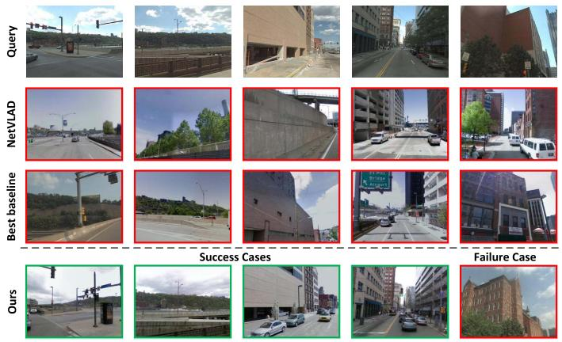  
(a) Pittsburgh

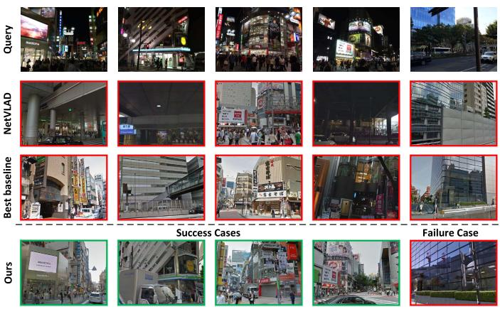  
(b) Tokyo24/7  
Fig. 4. Comparison of retrieval results for challenging queries on Pittsburgh and Tokyo24/7 datasets. The first row is the query images, the second to fourth rows are the top ranked images retrieved by NetVLAD, Best Baseline (SRALNet) and Our method, respectively. And each column corresponds to one test case. The green and red borders correspond to correct and incorrect retrievals, respectively. For the query images in the first four columns, we provide success cases of our method, and the failure case of the proposed method is given in the last column.

Inspired by SuperGlue [79], the above problem can be solved by modeling the matching relationship of each triplet < query, positive, negative> instead of constructing descriptors for a single image. Specifically, we can model the self-attention descriptors of intra-image by the proposed hybrid CNN-Transformer for each triplet, and then establish cross-attention features between images employing the Transformer to increase the matching specificity. Finally, the feature matching of the query and positive samples is used to achieve the purpose of filtering out outliers and adding specific matching points in the presence of repeated structures and partial occlusions.

## D. Ablation Studies

1) Hybrid CNN-Transformer and Multi-Scale Token Feature Fusion: To analyze the impact of varying levels of

TABLE III  
PERFORMANCE ANALYSIS OF TRANSFORMER OUTPUT TOKEN FEATURE FOR VARYING LEVELS ON PITTS30K-TEST AND TOKYO24/7 DATASETS. ALL EXPERIMENTS ONLY USE THE HYBRID CNN-TRANSFORMER ARCHITECTURE WITH PYRAMID VGG-16 AND SWIN-B, AND NO OTHER PROPOSED MODULES ARE ADDED. GLOBAL DESCRIPTORS ARE AGGREGATED BASED ON THE ORIGINAL NETVLAD
<table><tr><td rowspan="2">Stage</td><td colspan="3">Pitts30k-test</td><td colspan="2">Tokyo24/7</td></tr><tr><td>R@1</td><td>R@5</td><td>R@10</td><td>R@1 R@5</td><td>R@10</td></tr><tr><td> $S _ { 1 }$ </td><td>84.95</td><td>92.49</td><td>94.71</td><td>68.74 77.84</td><td>80.89</td></tr><tr><td> $S _ { 2 }$ </td><td>84.93</td><td>92.50</td><td>94.69</td><td>68.71 77.80</td><td>80.91</td></tr><tr><td> $S _ { 3 }$ </td><td>83.48</td><td>91.13</td><td>93.52</td><td>67.23 76.35</td><td>79.14</td></tr><tr><td> $S _ { 4 }$ </td><td>83.46</td><td>91.11</td><td>93.50</td><td>67.24 76.35</td><td>79.13</td></tr></table>

Transformer output token on performance, Table III gives the corresponding results. It can be seen that the lower-level stage output tokens have more superior results, while the performance of higher-level stage token features is slightly degraded. This shows that the lower-level features have rich detailed information, while the higher-level features have sufficient spatial context and abstract semantic information. It degrades the performance of higher stage outputs due to lack of local details, but there is only a slight drop in performance due to the presence of residual connections.

To future verify the effectiveness of hybrid CNN-Transformer and multi-scale token feature fusion on model performance, the NetVLAD with feature pyramid based VGG-16 (V) is used as the basic model. We perform ablation tests by gradually adding Single-level $( S _ { 1 } )$ Transformer features (ST), simple concatenated Multi-level Transformer features (MT), Multi-scale Token Feature Fusion (MF) and Semantic Enhancement (SE) to the base model. The quantitative results are presented in Table IV. It can be found that Ours(V) has a slight improvement in performance compared with baseline NetVLAD, which shows that the feature pyramid can contain rich low-level local feature information. Ours(V+ST) further improves the performance, which benefits from the advantage that the transformer can model long-range dependencies among local features of the image. The MT further boosts the model performance, and the multi-scale token features obtained by MF consistently improve the model performance. This is attributed to a simple and efficient Transformer block to further model multi-scale spatial information globally. On Pitts30k-test and Tokyo24/7, the model with semantic constraints achieves optimal performance with absolute raises of 2.5% and 9.7% respectively in compared with baseline on Recall@1, which illustrates the importance of semantic priors.

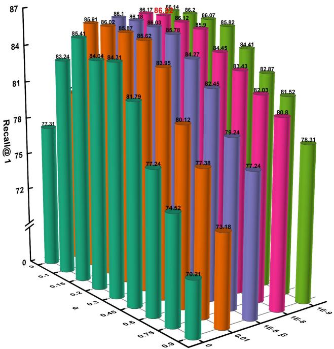  
(a) Pitts30k-test

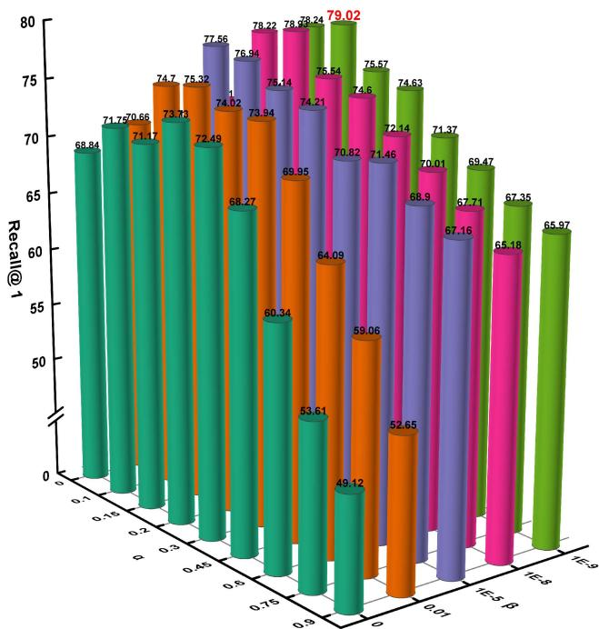  
(b) Tokyo24/7

Fig. 5. Determination of hyperparameters α and β in Adaptive Triplet Loss (AT-Loss) on the Pitts30k-test and Tokyo24/7 datasets. The Recall@1 for various combinations of hyperparameters is plotted using the 3D Cylinder, where we assign the same color to the cylinders under the same β. Therein, the value of Recall@1 corresponding to each cylinder is indicated, with the best results emphasized in red bold.  
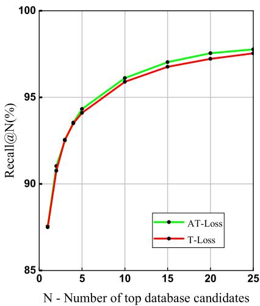  
(a) Pitts250k-test

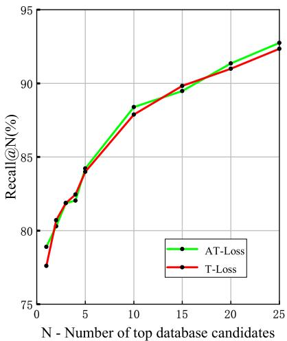  
(b) Tokyo24/7  
Fig. 6. Ablation study of T-Loss and AT-Loss on Pitts250k-test and Tokyo24/7 datasets. All experiments are tested with $\mathrm { O u r s } ( \mathrm { V } + \mathrm { M T } + \mathrm { M F } + \mathrm { S E } )$ tailed the above loss functions, respectively.

2) Adaptive Triplet Loss: We analyze the hyperparameters α and β in AT-Loss by exhaustive grid search, and the comparisons are is presented in Fig. 5. When $\alpha = 0 . 1 5$ and $\beta ~ = ~ 1 e \mathrm { ~ - ~ } 8 .$ , AT-Loss achieves the best performance on as illustrated in Fig. 5(b). We observe that when $\alpha = 0 . 1 5$ $\beta = 1 e - 8$ and $\beta = 1 e - 9$ perform close to each other on both datasets. For uniform comparison, we select $\alpha = 0 . 1 5$ and $\beta = 1 e - 8$ for the subsequent experiments.

TABLE IV  
ABLATION STUDY ON THE HYBRID CNN-TRANSFORMER FEATUREEXTRACTION NETWORK, MULTI-SCALE TOKEN FEATURE FUSIONMODULE AND GLOBAL SEMANTIC NETVLAD AGGREGATIONSTRATEGY ON TWO BENCHMARKS
<table><tr><td rowspan="2">Method</td><td colspan="3">Pitts250k-test</td><td colspan="3">Tokyo24/7</td></tr><tr><td>R@1</td><td>R@5</td><td>R@10</td><td>R@1</td><td>R@5</td><td>R@10</td></tr><tr><td>NetVLAD</td><td>85.0</td><td>92.4</td><td>94.9</td><td>67.9</td><td>77.3</td><td>80.4</td></tr><tr><td>Ours (V)</td><td>85.2</td><td>92.5</td><td>94.8</td><td>68.1</td><td>77.5</td><td>80.5</td></tr><tr><td>Ours (V+ST)</td><td>85.6</td><td>92.7</td><td>95.1</td><td>68.7</td><td>77.8</td><td>80.9</td></tr><tr><td>Ours (V+MT)</td><td>86.4</td><td>93.1</td><td>95.3</td><td>72.3</td><td>80.0</td><td>82.4</td></tr><tr><td>Ours (V+MT+MF)</td><td>87.0</td><td>93.5</td><td>95.7</td><td>74.7</td><td>82.1</td><td>83.9</td></tr><tr><td> $\mathrm { O u r s \ ( V + M T + M F + S E ) }$ </td><td>87.5</td><td>94.1</td><td>95.9</td><td>77.6</td><td>84.0</td><td>87.9</td></tr></table>

Pitts30k-test as shown in Fig. 5(a). Moreover, the best results are yielded when $\alpha = 0 . 1 5$ and $\beta = 1 e - 9$ on Tokyo24/7

To evaluate the performance of AT-Loss, we compare AT-Loss with T-Loss. Fig. 6 provides the analysis results. It can be seen that the performances of the two loss functions are close, but AT-Loss achieves better results. This is thanks to the fact that the adaptive margin can be dynamically changed with the data of each triplet in the dataset. Additionally, we can find that negative samples similar to the query image positively contribute to the model. This is because the parts of the negative samples and the query image are from the same scene but there is a difference in viewpoints caused by the geographical distance. These positive negative samples are effectively utilized by our AT-Loss to facilitate further learning of the model. Importantly, this further verifies that the continuous increase of fixed margins in T-Loss does not lead to a steady increase in performance.

## V. CONCLUSION

In this paper, we propose a Transformer-based approach for visual place recognition, which integrates local appearance details, spatial relationships, and semantic information to obtain robust global descriptors. Firstly, a hybrid CNN-Transformer feature extraction base network is constructed, which encodes the global context relationship among local features by inputting the CNN feature pyramid into the Swin Transformer. Specially, the multi-level output token features from Transformer are fed into a single Transformer encoder block to fuse multi-scale spatial information. And the task-related visual cues are automatically aggregated with the help of the self-attention mechanism in Transformer. Secondly, a global semantic NetVLAD aggregation strategy is introduced to adopt semantic enhanced NetVLAD to aggregate multi-level token maps, thereby obtaining multi-scale semantic information. Notably, semantic priors are introduced to select representative visual cues for global embedding, which provides interpretability for the model. Finally, the end-to-end neural network is built by combining the hybrid CNN-Transformer with the global semantic NetVLAD aggregation layer tailed with an adaptive triplet loss. Extensive experiments on Pitts30k, Pitts250k and Tokyo24/7 datasets show that our method achieves more satisfactory performance than existing state-of-the-art methods. Further, ablation studies reveal the contribution of each module in our method.

The proposed method can be generalized to other image retrieval tasks besides place recognition. There is also scope for our work to be further extended and improved. Here we provide some possible directions for future work. Firstly, while we built the feature extraction network using the classical CNN and Transformer, this may not be optimal. Therefore, it is worthwhile to refine the architecture of the hybrid CNN-Transformer to achieve a trade-off between performance and computational consumption. Secondly, although our method is based on global descriptors for image matching, the recent image retrieval approach [80] utilizing local features to refine global retrieval results could further improve place recognition performance. Hence, another potential future work is to further re-rank the global retrieval results via task-specific local features. Moreover, our approach aggregates features by learned VLAD clustering, this way, the global descriptors contain much redundant task-irrelevant information. Recently, [81] selected discriminative patch features to generate global descriptors by integrating all raw attention weights of the transformer, so it is expected to replace the cumbersome aggregation module by just concatenating features with high task contribution.

## REFERENCES

[1] H. Durrant-Whyte and T. Bailey, “Simultaneous localization and mapping: Part I,” IEEE Robot. Autom. Mag., vol. 13, no. 2, pp. 99–110, Jun. 2006.

[2] S. Garg, N. Suenderhauf, and M. Milford, “Semantic–geometric visual place recognition: A new perspective for reconciling opposing views,” Int. J. Robot. Res., vol. 41, no. 6, pp. 573–598, Apr. 2019.

[3] A. Khaliq, S. Ehsan, Z. Chen, M. Milford, and K. McDonald-Maier, “A holistic visual place recognition approach using lightweight CNNs for significant ViewPoint and appearance changes,” IEEE Trans. Robot., vol. 36, no. 2, pp. 561–569, Apr. 2020.

[4] R. Arandjelovi´c, P. Gronat, A. Torii, T. Pajdla, and J. Sivic, “NetVLAD: CNN architecture for weakly supervised place recognition,” in Proc. IEEE Conf. Comput. Vis. Pattern Recognit., Jul. 2016, pp. 5297–5307.

[5] F. Warburg, S. Hauberg, M. Lopez-Antequera, P. Gargallo, Y. Kuang, and J. Civera, “Mapillary street-level sequences: A dataset for lifelong place recognition,” in Proc. IEEE/CVF Conf. Comput. Vis. Pattern Recognit. (CVPR), Jun. 2020, pp. 2626–2635.

[6] X. Zhang, L. Wang, and Y. Su, “Visual place recognition: A survey from deep learning perspective,” Pattern Recognit., vol. 113, May 2021, Art. no. 107760.

[7] F. Liu et al., “Infrared and visible cross-modal image retrieval through shared features,” IEEE Trans. Circuits Syst. Video Technol., vol. 31, no. 11, pp. 4485–4496, Nov. 2021.

[8] Y. Hou, H. Zhang, and S. Zhou, “Convolutional neural network-based image representation for visual loop closure detection,” in Proc. IEEE Conf. Inf. Automat., Aug. 2015, pp. 2238–2245.

[9] A. S. Razavian, H. Azizpour, J. Sullivan, and S. Carlsson, “CNN features off-the-shelf: An astounding baseline for recognition,” in Proc. IEEE Conf. Comput. Vis. Pattern Recognit. Workshop, Jul. 2014, pp. 806–813.

[10] A. Babenko and V. Lempitsky, “Aggregating local deep features for image retrieval,” in Proc. IEEE Int. Conf. Comput. Vis. (ICCV), Dec. 2015, pp. 1269–1277.

[11] Y. Ge, H. Wang, F. Zhu, R. Zhao, and H. Li, “Self-supervising finegrained region similarities for large-scale image localization,” in Proc. Eur. Conf. Comput. Vis., Aug. 2020, pp. 369–386.

[12] A. Dosovitskiy et al., “An image is worth 16×16 words: Transformers for image recognition at scale,” 2020, arXiv:2010.11929.

[13] S. Gkelios, Y. Boutalis, and S. A. Chatzichristofis, “Investigating the vision transformer model for image retrieval tasks,” 2021, arXiv:2101.03771.

[14] H. Wu et al., “CvT: Introducing convolutions to vision transformers,” 2021, arXiv:2103.15808.

[15] C. Henkel, “Efficient large-scale image retrieval with deep feature orthogonality and hybrid-swin-transformers,” 2021, arXiv:2110.03786.

[16] Z. Liu et al., “Swin transformer: Hierarchical vision transformer using shifted Windows,” 2021, arXiv:2103.14030.

[17] R. Wang, Y. Shen, W. Zuo, S. Zhou, and N. Zheng, “TransVPR: Transformer-based place recognition with multi-level attention aggregation,” 2022, arXiv:2201.02001.

[18] S. Hausler, S. Garg, M. Xu, M. Milford, and T. Fischer, “Patch-NetVLAD: Multi-scale fusion of locally-global descriptors for place recognition,” in Proc. IEEE/CVF Conf. Comput. Vis. Pattern Recognit. (CVPR), Jun. 2021, pp. 14141–14152.

[19] H. Noh, A. Araujo, J. Sim, T. Weyand, and B. Han, “Large-scale image retrieval with attentive deep local features,” in Proc. IEEE Int. Conf. Comput. Vis., Oct. 2017, pp. 3456–3465.

[20] L. Chen et al., “SCA-CNN: Spatial and channel-wise attention in convolutional networks for image captioning,” in Proc. IEEE Conf. Comput. Vis. Pattern Recognit., Jun. 2017, pp. 5659–5667.

[21] H. Bay, A. Ess, T. Tuytelaars, and L. Van Gool, “Speeded-up robust features (SURF),” Comput. Vis. Image Understand., vol. 110, no. 3, pp. 346–359, Jan. 2008.

[22] D. G. Lowe, “Distinctive image features from scale-invariant keypoints,” Int. J. Comput. Vis., vol. 60, no. 2, pp. 91–110, Feb. 2004.

[23] E. Rublee, V. Rabaud, K. Konolige, and G. Bradski, “ORB: An efficient alternative to SIFT or SURF,” in Proc. IEEE Int. Conf. Comput., Nov. 2011, pp. 2564–2571.

[24] J. Wang, S. Zhong, L. Yan, and Z. Cao, “An embedded system-on-chip architecture for real-time visual detection and matching,” IEEE Trans. Circuits Syst. Video Technol., vol. 24, no. 3, pp. 525–538, Mar. 2014.

[25] M. Cummins and P. Newman, “FAB-MAP: Probabilistic localization and mapping in the space of appearance,” Int. J. Robot. Res., vol. 27, no. 6, pp. 647–665, 2008.

[26] F. Perronnin, Y. Liu, J. Sanchez, and H. Poirier, “Large-scale image retrieval with compressed Fisher vectors,” in Proc. IEEE Conf. Comput. Vis. Pattern Recognit. (CVPR). San Francisco, CA, USA, Jun. 2010, pp. 3384–3391.

[27] D. G. Lowe, “Distinctive image features from scale-invariant keypoints,” Int. J. Comput. Vis., vol. 60, no. 2, pp. 91–110, Mar. 2004.

[28] M. Calonder, V. Lepetit, M. Ozuysal, T. Trzcinski, C. Strecha, and P. Fua, “BRIEF: Computing a local binary descriptor very fast,” IEEE Trans. Pattern Anal. Mach. Intell., vol. 34, no. 7, pp. 1281–1298, Jul. 2012.

[29] A. Torii, R. Arandjelovi´c, J. Sivic, M. Okutomi, and T. Pajdla, “24/7 place recognition by view synthesis,” in Proc. IEEE Conf. Comput. Vis. Pattern Recognit. (CVPR), Jun. 2015, pp. 1808–1817.

[30] N. Sünderhauf, F. Dayoub, S. Shirazi, B. Upcroft, and M. Milford, “On the performance of ConvNet features for place recognition,” in Proc. IEEE/RSJ Int. Conf. Intell. Robot. Syst., Oct. 2015, pp. 4297–4304.

[31] N. Zhang, J. Donahue, R. Girshick, and T. Darrell, “Part-based R-CNNs for fine-grained category detection,” in Proc. Int. Conf. Eur. Conf. Comput. Vis. Cham, Switzerland, Jul. 2014, pp. 834–849.

[32] H. Pan, Y. Chen, Z. He, F. Meng, and N. Fan, “TCDesc: Learning topology consistent descriptors for image matching,” IEEE Trans. Circuits Syst. Video Technol., vol. 32, no. 5, pp. 2845–2855, May 2022.

[33] E.-J. Ong, S. S. Husain, M. Bober-Irizar, and M. Bober, “Deep architectures and ensembles for semantic video classification,” IEEE Trans. Circuits Syst. Video Technol., vol. 29, no. 12, pp. 3568–3582, Dec. 2019.

[34] A. Miech, I. Laptev, and J. Sivic, “Learnable pooling with context gating for video classification,” 2017, arXiv:1706.06905.

[35] N. Friedman and S. Russell, “Image segmentation in video sequences: A probabilistic approach,” in Proc. 13th Conf. Uncertainty Artif. Intell. San Francisco, CA, USA, Aug. 1997, pp. 175–181.

[36] I. MacQueen, “Some methods for classifiction and analysis of multivariate observations,” in Proc. 5th Symp. Math. Statist. Probab. Berkeley, CA, USA, Jan. 1967, pp. 281–297.

[37] J. Yu, C. Zhu, J. Zhang, Q. Huang, and D. Tao, “Spatial pyramidenhanced NetVLAD with weighted triplet loss for place recognition,” IEEE Trans. Neural Netw. Learn. Syst., vol. 31, no. 2, pp. 661–674, Feb. 2020.

[38] H. J. Kim, E. Dunn, and J.-M. Frahm, “Learned contextual feature reweighting for image geo-localization,” in Proc. IEEE Conf. Comput. Vis. Pattern Recognit., Jul. 2017, pp. 3251–3260.

[39] Y. Zhu, J. Wang, L. Xie, and L. Zheng, “Attention-based pyramid aggregation network for visual place recognition,” in Proc. 26th ACM Int. Conf. Multimedia, Oct. 2018, pp. 99–107.

[40] Y. Wang, Y. Qiu, P. Cheng, and X. Duan, “Robust loop closure detection integrating visual–spatial–semantic information via topological graphs and CNN features,” Remote Sens., vol. 12, no. 23, p. 3890, Nov. 2020.

[41] N. Sünderhauf et al., “Place recognition with convnet landmarks: Viewpoint-robust, condition-robust, training-free,” Robot. Sci. Syst. XI, vol. 33, no. 9, pp. 1–10, Jul. 2015.

[42] G. Peng, Y. Yue, J. Zhang, Z. Wu, X. Tang, and D. Wang, “Semantic reinforced attention learning for visual place recognition,” in Proc. IEEE Int. Conf. Robot. Autom. (ICRA), May 2021, pp. 13415–13422.

[43] N. Carion, F. Massa, G. Synnaeve, N. Usunier, A. Kirillov, and S. Zagoruyko, “End-to-end object detection with transformers,” in Proc. Eur. Conf. Comput. Vis. (ECCV), Aug. 2020, pp. 213–229.

[44] H. Chen et al., “Pre-trained image processing transformer,” in Proc. IEEE Conf. Comput. Vis. Pattern Recognit. (CVPR), Jun. 2021, pp. 12299–12310.

[45] Z. Dai, B. Cai, Y. Lin, and J. Chen, “UP-DETR: Unsupervised pretraining for object detection with transformers,” in Proc. IEEE/CVF Conf. Comput. Vis. Pattern Recognit., Jun. 2021, pp. 1601–1610.

[46] N. Parmar et al., “Image transformer,” in Proc. Int. Conf. Mach. Learn., Jul. 2018, pp. 4055–4064.

[47] Z. Sun, S. Cao, Y. Yang, and K. M. Kitani, “Rethinking transformerbased set prediction for object detection,” in Proc. IEEE/CVF Int. Conf. Comput. Vis., Oct. 2021, pp. 3611–3620.

[48] H. Touvron, M. Cord, M. Douze, F. Massa, A. Sablayrolles, and H. Jégou, “Training data-efficient image transformers & distillation through attention,” in Proc. Int. Conf. Mach. Learn. Vienna, Austria, Jul. 2021, pp. 10347–10357.

[49] H. Wang, Y. Zhu, H. Adam, A. Yuille, and L.-C. Chen, “Maxdeeplab: End-to-end panoptic segmentation with mask transformers,” in Proc. IEEE/CVF Conf. Comput. Vis. Pattern Recognit., Jun. 2021, pp. 5463–5474.

[50] Y. Wang et al., “End-to-end video instance segmentation with transformers,” in Proc. IEEE/CVF Conf. Comput. Vis. Pattern Recognit. (CVPR), Jun. 2021, pp. 8741–8750.

[51] F. Yang, H. Yang, J. Fu, H. Lu, and B. Guo, “Learning texture transformer network for image super-resolution,” in Proc. IEEE Conf. Comput. Vis. Pattern Recognit., Dec. 2020, pp. 5791–5800.

[52] M. Dai, J. Hu, J. Zhuang, and E. Zheng, “A transformer-based feature segmentation and region alignment method for UAV-view geolocalization,” IEEE Trans. Circuits Syst. Video Technol., vol. 32, no. 7, pp. 4376–4389, Jul. 2022, doi: 10.1109/TCSVT.2021.3135013.

[53] A. El-Nouby, N. Neverova, I. Laptev, and H. Jégou, “Training vision transformers for image retrieval,” 2021, arXiv:2102.05644.

[54] Y. Yang, Y. Zhuang, and Y. Pan, “Multiple knowledge representation for big data artificial intelligence: Framework, applications, and case studies,” Frontiers Inf. Technol. Electron. Eng., vol. 22, no. 12, pp. 1551–1558, 2021.

[55] Z. Chen et al., “Deep learning features at scale for visual place recognition,” in Proc. IEEE Int. Conf. Robot. Autom. (ICRA), May 2017, pp. 3223–3230.

[56] Y. Gong, L. Wang, R. Guo, and S. Lazebnik, “Multi-scale orderless pooling of deep convolutional activation features,” in Proc. 13th Eur. Conf. Comput. Vis. (ECCV). Zürich, Switzerland, Sep. 2014, pp. 392–407.

[57] R. Zhou, X. Chang, L. Shi, Y.-D. Shen, Y. Yang, and F. Nie, “Person reidentification via multi-feature fusion with adaptive graph learning,” IEEE Trans. Neural Netw. Learn. Syst., vol. 31, no. 5, pp. 1592–1601, May 2020.

[58] L. Zhu, H. Fan, Y. Luo, M. Xu, and Y. Yang, “Temporal cross-layer correlation mining for action recognition,” IEEE Trans. Multimedia, vol. 24, pp. 668–676, 2021.

[59] P. Neubert and P. Protzel, “Beyond holistic descriptors, keypoints, and fixed patches: Multiscale superpixel grids for place recognition in changing environments,” IEEE Robot. Autom. Lett., vol. 1, no. 1, pp. 484–491, Jan. 2016.

[60] M. Pu, Y. Huang, Y. Liu, Q. Guan, and H. Ling, “EDTER: Edge detection with transformer,” in Proc. IEEE/CVF Conf. Comput. Vis. Pattern Recognit. (CVPR), Jun. 2022, pp. 1402–1412.

[61] Z. Xu, Y. Yang, and A. G. Hauptmann, “A discriminative CNN video representation for event detection,” in Proc. 28th IEEE Conf. Comput. Vis. Pattern Recognit. Boston, MA, USA, Jun. 2015, pp. 1798–1807.

[62] R. Gomez-Ojeda, M. Lopez-Antequera, N. Petkov, and J. Gonzalez-Jimenez, “Training a convolutional neural network for appearance-invariant place recognition,” 2015, arXiv:1505.07428.

[63] A. Geiger, P. Lenz, and R. Urtasun, “Are we ready for autonomous driving? The KITTI vision benchmark suite,” in Proc. Int. Conf. Pattern Recognit., Jun. 2012, pp. 3354–3361.

[64] M. J. Milford and G. F. Wyeth, “SeqSLAM: Visual route-based navigation for sunny summer days and stormy winter nights,” in Proc. IEEE Int. Conf. Robot. Autom. Saint Paul, MN, USA, May 2012, pp. 1643–1649.

[65] N. Sünderhauf, P. Neubert, and P. Protzel, “Are we there yet? Challenging SeqSLAM on a 3000 km journey across all four seasons,” in Proc. IEEE Int. Conf. Robot. Autom. Workshop Long-Term Autonomy. Karlsruhe, Germany, May 2013, pp. 1–3.

[66] Y. Jia et al., “Caffe: Convolutional architecture for fast feature embedding,” in Proc. 22nd ACM Int. Conf. Multimedia, Jun. 2014, pp. 675–678.

[67] K. Chen, L. Yao, D. Zhang, X. Wang, X. Chang, and F. Nie, “A semisupervised recurrent convolutional attention model for human activity recognition,” IEEE Trans. Neural Netw. Learn. Syst., vol. 31, no. 5, pp. 1747–1756, May 2020.

[68] A. Torii, J. Sivic, M. Okutomi, and T. Pajdla, “Visual place recognition with repetitive structures,” IEEE Trans. Pattern Anal. Mach. Intell., vol. 37, no. 11, pp. 2346–2359, Nov. 2015.

[69] F. Schroff, D. Kalenichenko, and J. Philbin, “FaceNet: A unified embedding for face recognition and clustering,” in Proc. IEEE Conf. Comput. Vis. Pattern Recognit. (CVPR), Jun. 2015, pp. 815–823.

[70] K. Nguyen, H. H. Nguyen, and A. Tiulpin, “AdaTriplet: Adaptive gradient triplet loss with automatic margin learning for forensic medical image matching,” 2022, arXiv:2205.02849.

[71] W. Xie, H. Wu, Y. Tian, M. Bai, and L. Shen, “Triplet loss with multistage outlier suppression and class-pair margins for facial expression recognition,” IEEE Trans. Circuits Syst. Video Technol., vol. 32, no. 2, pp. 690–703, Feb. 2022.

[72] Z. Wang et al., “Robust video-based person re-identification by hierarchical mining,” IEEE Trans. Circuits Syst. Video Technol., early access, Apr. 27, 2021, doi: 10.1109/TCSVT.2021.3076097.

[73] K. Simonyan and A. Zisserman, “Very deep convolutional networks for large-scale image recognition,” 2014, arXiv:1409.1556.

[74] A. Krizhevsky, I. Sutskever, and G. E. Hinton, “ImageNet classification with deep convolutional neural networks,” in Proc. Adv. Neural Inf. Process. Syst. Stateline, NV, USA, Dec. 2012, pp. 1097–1105.

[75] L.-C. Chen, Y. Zhu, G. Papandreou, F. Schroff, and H. Adam, “Encoderdecoder with atrous separable convolution for semantic image segmentation,” in Proc. Eur. Conf. Comput. Vis. (ECCV), Sep. 2018, pp. 801–818.

[76] M. Cordts, “The cityscapes dataset for semantic urban scene understanding,” in Proc. IEEE Conf. Comput. Vis. Pattern Recognit., Jul. 2016, pp. 3213–3223.

[77] J. Deng, W. Dong, R. Socher, L.-J. Li, K. Li, and L. Fei-Fei, “ImageNet: A large-scale hierarchical image database,” in Proc. IEEE Conf. Comput. Vis. Pattern Recognit. (CVPR), Jun. 2009, pp. 248–255.

[78] J. Revaud, J. Almazan, R. Rezende, and C. D. Souza, “Learning with average precision: Training image retrieval with a listwise loss,” in Proc. IEEE/CVF Int. Conf. Comput. Vis. (ICCV), Oct. 2019, pp. 5107–5116.

[79] P.-E. Sarlin, D. DeTone, T. Malisiewicz, and A. Rabinovich, “Super-Glue: Learning feature matching with graph neural networks,” in Proc. IEEE/CVF Conf. Comput. Vis. Pattern Recognit., Jun. 2020, pp. 4938–4947.

[80] B. Cao, A. Araujo, and J. Sim, “Unifying deep local and global features for image search,” in Proc. Europ. Conf. Comput. Vis. Glasgow, U.K., Nov. 2020, pp. 726–743.

[81] J. He et al., “TransFG: A transformer architecture for fine-grained recognition,” 2021, arXiv:2103.07976.

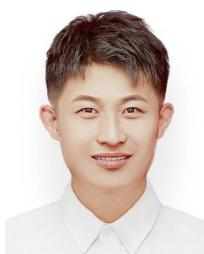

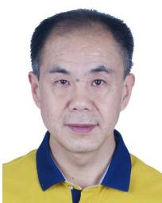  
Yuwei Wang (Graduate Student Member, IEEE) is currently pursuing the Ph.D. degree in mechatronic engineering from Xidian University, Xi’an, China. He is now working as a Visiting Ph.D. Student with the School of Electrical and Electronic Engineering, Nanyang Technological University, Singapore. His research interests include computer vision, machine learning, and artificial intelligence.

Yuanying Qiu received the B.E. and M.E. degrees from Northwestern Polytechnical University, Xi’an, China, in 1981 and 1987, respectively, and the Ph.D. degree from Xidian University, Xi’an, in 2002. From 1999 to 2000, he was with Shizuoka University, Shizuoka, Japan, as a Visiting Ph.D. Student. His research interests include mechatronics and CAD/CAE/CAM. In these areas, he has authored over 120 papers cited by SCI or EI, respectively. He received three National Science and Technology Progress Award, the First Prizes of Provincial, and

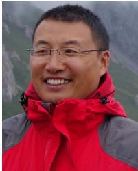

four Ministerial Science and Technology Awards. He was also nominated as the National 100 Best Ph.D. Dissertations Award.

Peitao Cheng received the B.E., M.E., and Ph.D. degrees in mechanical manufacturing and automation from Xidian University, Xi’an, China, in 2002, 2005, and 2018, respectively. Since 2005, he has been with the School of Mechano-Electronic Engineering, Xidian University. He is currently an Associate Professor of control theory and control engineering. His research interests include image processing, machine learning, and artificial intelligence.

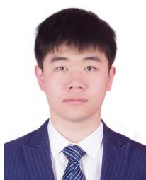

Junyu Zhang received the B.E. degree in transportation engineering from Binzhou University, Binzhou, China, in 2020. He is currently pursuing the M.E. degree with the School of Mechano-Electronic Engineering, Xidian University, Xi’an, China. His research interests include image processing, robotics, and SLAM.