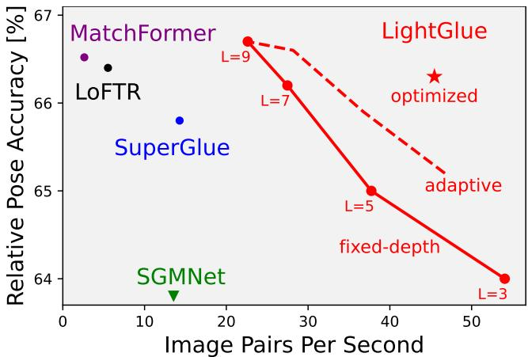
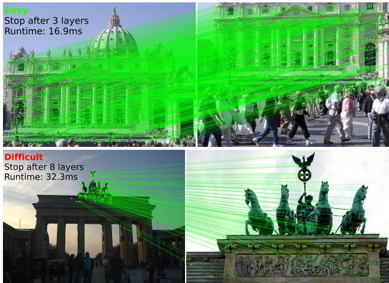
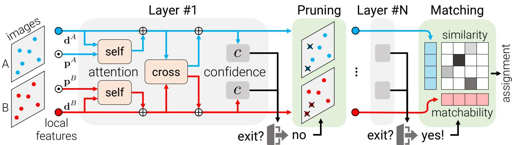
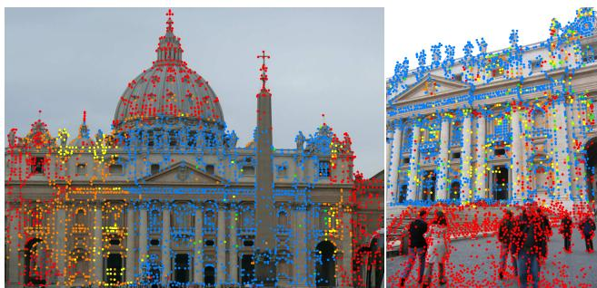
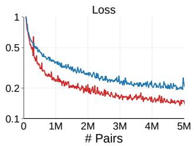
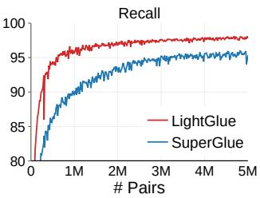
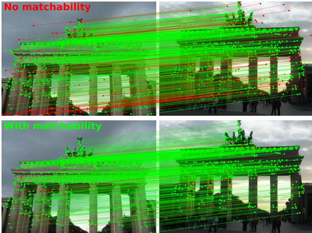
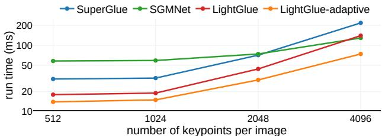

# LightGlue: Local Feature Matching at Light Speed

Philipp Lindenberger1 Paul-Edouard Sarlin1 Marc Pollefeys1,2

1 ETH Zurich 2 Microsoft Mixed Reality & AI Lab

## Abstract

We introduce LightGlue, a deep neural network that learns to match local features across images. We revisit multiple design decisions ofSuperGlue, the state ofthe art in sparse matching, and derive simple but effective improvements. Cumulatively, they make LightGlue more efficient – in terms ofboth memory and computation, more accurate, and much easier to train. One key property is that LightGlue is adaptive to the difficulty of the problem: the inference is much faster on image pairs that are intuitively easy to match, for example because of a larger visual overlap or limited appearance change. This opens up exciting prospects for deploying deep matchers in latency-sensitive applications like 3D reconstruction. The code and trained models are publicly available at github.com/cvg/LightGlue.

## 1. Introduction

Finding correspondences between two images is a fundamental building block of many computer vision applications like camera tracking and 3D mapping. The most common approach to image matching relies on sparse interest points that are matched using high-dimensional representations encoding their local visual appearance. Reliably describing each point is challenging in conditions that exhibit symmetries, weak texture, or appearance changes due to varying viewpoint and lighting. To reject outliers that arise from occlusion and missing points, such representations should also be discriminative. This yields two conflicting objectives, robustness and uniqueness, that are hard to satisfy.

To address these limitations, SuperGlue [54] introduced a new paradigm – a deep network that considers both images at the same time to jointly match sparse points and reject outliers. It leverages the powerful Transformer model [70] to learn to match challenging image pairs from large datasets. This yields robust image matching in both indoor and outdoor environments. SuperGlue is highly effective for visual localization in challenging conditions [57, 53, 56, 55] and generalizes well to other tasks like aerial matching [78], object pose estimation [66], and even fish re-identification [45].

These improvements are however computationally expensive, while the efficiency of image matching is critical for tasks that require a low latency, like tracking, or a high processing volume, like large-scale mapping. Additionally, SuperGlue, as with other Transformer-based models, is notoriously hard to train, requiring computing resources that are inaccessible to many practitioners. Follow-up works [7, 62] have thus failed to reach the performance of the original SuperGlue model. Yet, since its initial publication, Transformers have been extensively studied, improved, and applied to numerous language [16, 49, 12] and vision [17, 5, 27] tasks.

  
Figure 1. LightGlue matches sparse features faster and better than existing approaches like SuperGlue. Its adaptive stopping mechanism gives a fine-grained control over the speed vs. accuracy trade-off. Our final, optimized model ⋆ delivers an accuracy closer to the dense matcher LoFTR at an 8× higher speed, here in typical outdoor conditions.

In this paper, we draw on these insights to design Light-Glue, a deep network that is more accurate, more efficient, and easier to train than SuperGlue. We revisit its design decisions and combine numerous simple, yet effective, architecture modifications. We distill a recipe to train highperformance deep matchers with limited resources, reaching state-of-the-art accuracy within just a few GPU-days. As shown in Figure 1, LightGlue is Pareto-optimal on the efficiency-accuracy trade-off when compared to existing sparse and dense matchers.

Unlike previous approaches, LightGlue is adaptive to the difficulty of each image pair, which varies based on the amount of visual overlap, appearance changes, or discriminative information. Figure 2 shows that the inference is thus much faster on pairs that are intuitively easy to match than on challenging ones, a behavior that is reminiscent of how humans process visual information. This is achieved by 1) predicting a set of correspondences after each computational blocks, and 2) enabling the model to introspect them and predict whether further computation is required. LigthGlue also discards at an early stage points that are not matchable, thus focusing its attention on the covisible area.

  
Figure 2. Depth adaptivity. LigthGlue is faster at matching easy image pairs (top) than difficult ones (bottom) because it can stop at earlier layers when its predictions are confident.

Our experiments show that LightGlue is a plug-and-play replacement to SuperGlue: it predicts strong matches from two sets of local features, at a fraction of the run time. This opens up exciting prospects for deploying deep matchers in latency-sensitive applications like SLAM [43, 4] or reconstructing larger scenes from crowd-sourced data [24, 58, 37, 55]. The LightGlue model and its training code will be released publicly with a permissive license.

## 2. Related work

Matching images that depict the same scene or object typically relies on local features, which are sparse keypoints each associated with a descriptor of its local appearance. While classical algorithms rely on hand-crafted criteria and gradient statistics [39, 22, 3, 51], much of the recent research has focused on designing Convolutional Neural Networks (CNNs) for both detection [76, 15, 18, 50, 69] and description [40, 68]. Trained with challenging data, CNNs largely improve the accuracy and robustness of matching. Local features now come in many flavors: some are better localized [39], highly repeatable [15], cheap to store and match [52], invariant to specific changes [44], or ignore unreliable objects [69].

Local features are then matched with a nearest neighbor search in descriptor space. Because of non-matchable keypoints and imperfect descriptors, some correspondences are incorrect. Those are filtered out by heuristics, like Lowe’s ratio test [39] or the mutual check, inlier classifiers [42, 77], and by robustly fitting geometric models [21, 6]. This process requires extensive domain expertise and tuning and is prone to failure when conditions are too challenging. These limitations are largely solved by deep matchers.

Deep matchers are deep networks trained to jointly match local features and reject outliers given an input image pair. The first of its kind, SuperGlue [54] combines the expressive representations of Transformers [70] with optimal transport [46] to solve a partial assignment problem. It learns powerful priors about scene geometry and camera motion and is thus robust to extreme changes and generalizes well across data domains. Inheriting the limitations of early Transformers, SuperGlue is hard to train and its complexity grows quadratically with the number of keypoints.

Subsequent works make it more efficient by reducing the size of the attention mechanism. They restrict it to a small set of seed matches [7] or within clusters of similar keypoints [62]. This largely reduces the run time for large numbers of keypoints but yields no gains for smaller, standard input sizes. This also impairs the robustness in the most challenging conditions, failing to reach the performance of the original SuperGlue model. LightGlue instead brings large improvements for typical operating conditions, like in SLAM, without compromising on performance for any level of difficulty. This is achieved by dynamically adapting the network size instead of reducing its overall capacity.

Conversely, dense matchers like LoFTR [65] and followups [8, 73] match points distributed on dense grids rather than sparse locations. This boosts the robustness to impressive levels but is generally much slower because it processes many more elements. This limits the resolution of the input images and, in turn, the spatial accuracy of the correspon dences. While LightGlue operates on sparse inputs, we show that fair tuning and evaluation makes it competitive with dense matchers, for a fraction of the run time.

Making Transformers efficient has received significant attention following their success in language processing. As the memory footprint of attention is a major limitation to handling long sequences, many works reduce it using linear formulations [74, 30, 31] or bottleneck latent tokens [33, 28]. This enables long-range context but can impair the performance for small input sizes. Selective checkpointing [47] reduces the memory footprint of attention and optimizing the memory access also drastically speeds it up [13].

Other, orthogonal works instead adaptively modulate the network depth by predicting whether the prediction of a token at a given layer is final or requires further com putations [14, 19, 59] . This is mostly inspired by adaptive schemes developed for CNNs by the vision community [67, 75, 38, 20, 34, 71]. In Transformers, the type of positional encoding has a large impact on the accuracy. While absolute sinusoidal [70] or learned encodings [16, 49] were initially prevalent, recent works have studied relative encodings [60, 64] to stabilize the training and better capture long-range dependencies.

  
Figure 3. The LightGlue architecture. Given a pair of input local features (d, p), each layer augments the visual descriptors (•,•) with context based on self- and cross-attention units with positional encoding ⊙. A confidence classifier c helps decide whether to stop the inference. If few points are confident, the inference proceeds to the next layer but we prune points that are confidently unmatchable. Once a confident state if reached, LightGlue predicts an assignment between points based on their pariwise similarity and unary matchability.

LightGlue adapts some of these innovations to 2D feature matching and shows gains in both efficiency and accuracy.

## 3. Fast feature matching

Problem formulation: LightGlue predicts a partial assignment between two sets of local features extracted from images A and B, following SuperGlue. Each local feature i is composed of a 2D point position $\mathbf { p } _ { i } : = ( x , y ) _ { i } \in [ 0 , 1 ] ^ { 2 }$ , normalized by the image size, and a visual descriptor $\mathbf { d } _ { i } \in \mathbb { R } ^ { d }$ Images A and B have M and N local features, indexed by $\mathcal { A } : = \{ 1 , . . . , M \}$ and $\boldsymbol { B } : = \{ 1 , . . . , N \}$ , respectively.

We design LightGlue to output a set of correspondences $\mathcal { M } = \{ ( i , j ) \} \subset \mathcal { A } \times \mathcal { B }$ . Each point is matchable at least once, as it stems from a unique 3D point, and some keypoints are unmatchable, due to occlusion or non-repeatability. As in previous works, we thus seek a soft partial assignment matrix $\mathbf { P } \in [ 0 , 1 ] ^ { M \times N }$ between local features in A and B, from which we can extract correspondences.

Overview – Figure 3: LightGlue is made of a stack of L identical layers that process the two sets jointly. Each layer is composed of self- and cross-attention units that update the representation of each point. A classifier then decides, at each layer, whether to halt the inference, thus avoiding unnecessary computations. A lightweight head finally computes a partial assignment from the set of representations.

## 3.1. Transformer backbone

We associate each local feature i in image $I \in \{ A , B \}$ with a state $\mathbf { x } _ { i } ^ { I } \in \mathbb { R } ^ { d }$ . The state is initialized with the cor-

responding visual descriptor $\mathbf { x } _ { i } ^ { I }  \mathbf { d } _ { i } ^ { I }$ and subsequently updated by each layer. We define a layer as a succession of one self-attention and one cross-attention units.

Attention unit: In each unit, a Multi-Layer Perceptron (MLP) updates the state given a message $\mathbf { m } _ { i } ^ { \tilde { I }  S }$ aggregated from a source image $S \in \{ A , B \}$ :

$$
\mathbf { x } _ { i } ^ { I }  \mathbf { x } _ { i } ^ { I } + \mathrm { M L P } ( [ \mathbf { x } _ { i } ^ { I } \mid \mathbf { m } _ { i } ^ { I  S } ] ) \ \mathrm { ~ , ~ }\tag{1}
$$

where [· | ·] stacks two vectors. This is computed for all points in both images in parallel. In a self-attention unit, each image I pulls information from points of the same image and thus $S = I .$ . In a cross-attention unit, each image pulls information from the other image and $S = \{ A , B \} \backslash I .$

The message is computed by an attention mechanism as the weighted average of all states $j$ of image S:

$$
\mathbf { m } _ { i } ^ { I  S } = \sum _ { j \in S } \mathrm { S o f t m a x } ( a _ { i k } ^ { I S } ) _ { j } \mathbf { W } \mathbf { x } _ { j } ^ { S } \mathrm { ~ , ~ }\tag{2}
$$

where W is a projection matrix and $a _ { i j } ^ { I S }$ is an attention score between points i and $j$ of images I and S. How this score is computed differs for self- and cross-attention units.

Self-attention: Each point attends to all points of the same image. We perform the same following steps for each image I and thus drop the superscript I for clarity. For each point i, the current state $\mathbf { x } _ { i }$ is first decomposed into key and query vectors ki and $\mathbf { q } _ { i }$ via different linear transformations. We then define the attention score between points i and $j$ as

$$
a _ { i j } = { \bf q } _ { i } ^ { \top } { \bf R } \big ( { \bf p } _ { j } - { \bf p } _ { i } \big ) \ { \bf k } _ { j } \ ,\tag{3}
$$

where $\mathbf { R } ( \cdot ) \in \mathbb { R } ^ { d \times d }$ is a rotary encoding [64] of the relative position between the points. We partition the space into $d / 2$ 2D subspaces and rotate each of them by an angle corresponding, following Fourier Features [35], to the projection onto a learned basis $ { \mathbf { b } } _ { k } \in \mathbb { R } ^ { 2 }$

$$
\mathbf { R } ( \mathbf { p } ) = \left( \begin{array} { c c } { \hat { \mathbf { R } } ( \mathbf { b } _ { 1 } ^ { \top } \mathbf { p } ) } & { \mathbf { 0 } } \\ { \ddots } & \\ { \mathbf { 0 } } & { \hat { \mathbf { R } } ( \mathbf { b } _ { d / 2 } ^ { \top } \mathbf { p } ) } \end{array} \right) , \hat { \mathbf { R } } ( \theta ) = \left( \begin{array} { c c } { \cos \theta - \sin \theta } \\ { \sin \theta } & { \cos \theta } \end{array} \right) .\tag{4}
$$

Positional encoding is a critical part of attention as it allows addressing different elements based on their position. We note that, in projective camera geometry, the position of visual observations is equivariant w.r.t. a translation of the camera within the image plane: 2D points that stem from 3D points on the same fronto-parallel plane are translated in an identical way and their relative distance remains constant. This calls for an encoding that only captures the relative but not the absolute position of points.

The rotary encoding [64] enables the model to retrieve points j that are located at a learned relative position from i. The positional encoding is not applied to the value $\mathbf { v } _ { j }$ and thus does not spill into the state $\mathbf { x } _ { i }$ . The encoding is identical for all layers and is thus computed once and cached.

Cross-attention: Each point in I attends to all points of the other image S. We compute a key $\mathbf { k } _ { i }$ for each element but no query. This allows to express the score as

$$
a _ { i j } ^ { I S } = \mathbf { k } _ { i } ^ { I \top } \mathbf { k } _ { j } ^ { S } \overset { ! } { = } a _ { j i } ^ { S I } .\tag{5}
$$

We thus need to compute the similarity only once for both $I  S$ and $S  I$ messages. This trick has been previously referred to as bidirectional attention [72]. Since this step is expensive, with a complexity of $O ( N M d )$ , it saves a significant factor of 2. We do not add any positional information as relative positions are not meaningful across images.

## 3.2. Correspondence prediction

We design a lightweight head that predicts an assignment given the updated state at any layer.

Assignment scores: We first compute a pairwise score matrix $\mathbf { S } \in \mathbb { R } ^ { M \times N }$ between the points of both images:

$$
\mathbf { S } _ { i j } = \operatorname { L i n e a r } \left( \mathbf { x } _ { i } ^ { A } \right) ^ { \top } \operatorname { L i n e a r } \left( \mathbf { x } _ { j } ^ { B } \right) \quad \forall ( i , j ) \in \mathcal { A } \times \mathcal { B } ,\tag{6}
$$

where Linear(·) is a learned linear transformation with bias. This score encodes the affinity of each pair of points to be in correspondence, i.e. 2D projections of the same 3D point. We also compute, for each point, a matchability score as

$$
\sigma _ { i } = \mathrm { S i g m o i d } \left( \operatorname { L i n e a r } ( \mathbf { x } _ { i } ) \right) \in [ 0 , 1 ] \ .\tag{7}
$$

This score encodes the likelihood of i to have a corresponding point. A point that is not detected in the other image, $e . g$ . when occluded, is not matchable and thus has $\sigma _ { i } \to 0$

Correspondences: We combine both similarity and matchability scores into a soft partial assignment matrix P as

$$
\mathbf P _ { i j } = \sigma _ { i } ^ { A } \sigma _ { j } ^ { B } \operatorname { S o f t m a x } ( \mathbf S _ { k j } ) _ { i } \operatorname { S o f t m a x } ( \mathbf S _ { i k } ) _ { j }\tag{8}
$$

  
Figure 4. Point pruning. As LigthGlue aggregates context, it can find out early that some points (•) are unmatchable and thus exclude them from subsequent layers. Other, non-repeatable points are excluded in later layers: $\bullet  \circ  \bullet$ . This reduces the inference time and the search space (•) to ultimately find good matches fast.

A pair of points $( i , j )$ yields a correspondence when both points are predicted as matchable and when their similarity is higher than any other point in both images. We select pairs for which $\mathbf { P } _ { i j }$ is larger than a threshold τ and than any other element along both its row and column.

## 3.3. Adaptive depth and width

We add two mechanisms that avoid unnecessary computations and save inference time: i) we reduce the number of layers depending on the difficulty of the input image pair; ii) we prune out points that are confidently rejected early.

Confidence classifier: The backbone of LightGlue augments input visual descriptors with context. These are often reliable if the image pair is easy, i.e. has high visual overlap and little appearance changes. In such case, predictions from early layers are confident and identical to those of late layers. We can then output these predictions and halt the inference.

At the end of each layer, LightGlue infers the confidence of the predicted assignment of each point:

$$
c _ { i } = \mathrm { S i g m o i d } \left( \mathrm { M L P } ( \mathbf { x } _ { i } ) \right) \in [ 0 , 1 ] \ .\tag{9}
$$

A higher value indicates that the representation of i is reliable and final – it is confidently either matched or unmatchable. This is inspired by multiple works that successfully apply this strategy to language and vision tasks [59, 19, 67, 75, 38]. The compact MLP adds only 2% of inference time in the worst case but most often saves much more.

Exit criterion: For a given layer ℓ, a point is deemed confident if $c _ { i } > \lambda _ { \ell }$ . We halt the inference if a sufficient ratio α of all points is confident:

$$
\mathrm { e x i t } = \left( { \frac { 1 } { N + M } } \sum _ { I \in \{ A , B \} } \sum _ { i \in \mathbb { Z } } \mathbb { I } c _ { i } ^ { I } > \lambda _ { \ell } \mathbb { I } \right) > \alpha \ .\tag{10}
$$

We observe, as in [59], that the classifier itself is less confident in early layers. We thus decay $\lambda _ { \ell }$ throughout the layers based on the validation accuracy of each classifier. The exit threshold α directly controls the trade-off between accuracy and inference time.

Point pruning: When the exit criterion is not met, points that are predicted as both confident and unmatchable are unlikely to aid the matching of other points in subsequent layers. Such points are for example in areas that are clearly not covisible across the images. We therefore discard them at each layer and feed only the remaining points to the next one. This significantly reduces computation, given the quadratic complexity of attention, and does not impact the accuracy.

## 3.4. Supervision

We train LightGlue in two stages: we first train it to predict correspondences and only after train the confidence classifier. The latter thus does not impact the accuracy at the final layer or the convergence of the training.

Correspondences: We supervise the assignment matrix P with ground truth labels estimated from two-view transformations. Given a homography or pixel-wise depth and a relative pose, we wrap points from A to B and conversely. Ground truth matches M are pairs of points with a low reprojection error in both images and a consistent depth. Some points ${ \bar { A } } \subseteq A$ and ${ \bar { \boldsymbol { B } } } \subseteq { \boldsymbol { B } }$ are labeled as unmatchable when their reprojection or depth errors are sufficiently large with all other points. We then minimize the log-likelihood of the assignment predicted at each layer $\ell ,$ pushing LightGlue to predict correct correspondences early:

$$
\begin{array} { c } { { { \mathrm { l o s s } = - \displaystyle \frac { 1 } { L } \sum _ { \ell } \left( \displaystyle \frac { 1 } { | \mathcal { M } | } \sum _ { ( i , j ) \in { \mathcal { M } } } \log \ell \mathbf { P } _ { i j } \right. } } } \\ { { \displaystyle \qquad + \left. \frac { 1 } { 2 | \bar { \mathcal { M } } | } \sum _ { i \in \bar { \mathcal { A } } } \log \left( 1 - \ell \sigma _ { i } ^ { A } \right) \right. } } \\ { { \displaystyle \qquad + \left. \frac { 1 } { 2 | \bar { \mathcal { B } } | } \sum _ { j \in \bar { \mathcal { B } } } \log \left( 1 - \ell \sigma _ { j } ^ { B } \right) \right) ~ . } } \end{array}\tag{11}
$$

The loss is balanced between positive and negative labels.

Confidence classifier: We then train the MLP of Eq. (9) to predict whether the prediction of each layer is identical to the final one. Let ${ } ^ { \ell } m _ { i } ^ { A } \bar { \in } B \cup \{ \bullet \}$ be the index of the point in B matched to i at layer ℓ, with ${ \dot { \ell } } _ { m _ { i } ^ { A } = \bullet }$ if i is unmatchable. The ground truth binary label of each point is $[ [ \ell { m _ { i } ^ { A } } = { \ell { m _ { i } ^ { A } } } ] ]$ and identically for B. We then minimize the binary cross-entropy of the classifiers of layers $\ell \in \{ 1 , . . . , L - 1 \}$

## 3.5. Comparison with SuperGlue

LightGlue is inspired by SuperGlue but differs in aspects critical to its accuracy, efficiency, and ease of training.

Positional encoding: SuperGlue encodes the absolute point positions with an MLP and fuses them early with the descriptors. We observed that the model tends to forget this positional information throughout the layers. LightGlue instead relies on a relative encoding that is better comparable across images and is added in each self-attention unit. This makes it easier to leverage the positions and improves the accuracy of deeper layers.

  
Figure 5. Ease of training. The LightGlue architecture vastly improves the speed of convergence of the pre-training on synthetic homographies. After 5M image pairs (only 2 GPU-days), Light-Glue achieves -33% loss at the final layer and +4% match recall. SuperGlue requires over 7 days of training to reach a similar accuracy.

Prediction head: SuperGlue predicts an assignment by solving a differentiable optimal transport problem using the Sinkhorn algorithm [63, 46]. It consists in many iterations of row-wise and column-wise normalization, which is expensive in terms of both compute and memory. SuperGlue adds a dustbin to reject unmatchable points. We found that the dustbin entangles the similarity score of all points and thus yields suboptimal training dynamics. LightGlue disentangles similarity and matchability, which are much more efficient to predict. This also yields cleaner gradients.

Deep supervision: Because of how expensive Sinkhorn is, SuperGlue cannot make predictions after each layer and is supervised only at the last one. The lighter head of LightGlue makes it possible to predict an assignment at each layer and to supervise it. This speeds up the convergence and enables exiting the inference after any layer, which is key to the efficiency gains of LightGlue.

## 4. Details that matter

Recipe: LightGlue follows the supervised training setup of SuperGlue. We first pre-train the model with synthetic homographies sampled from 1M images [48]. Such augmentations provide full and noise-free supervision but require careful tuning. LightGlue is then fine-tuned with the MegaDepth dataset [36], which includes 1M crowd-sourced images de picting 196 tourism landmarks, with camera calibration and poses recovered by SfM and dense depth by multi-view stereo. Because large models easily overfit to such distinctive scenes, the pre-training is critical to the generalization of the model but was omitted in recent follow-ups [7, 62].

Training tricks: While the LightGlue architecture improves the training speed, stability, and accuracy, we found that some details have a large impact too. Figure 5 shows that this reduces the resources required to train a model compared to SuperGlue. This lowers the cost of training and makes deep matchers more accessible to the broader community.

Since the depth maps of MegaDepth are often incomplete, we also label points with a large epipolar error as unmatchable. Carefully tuning and annealing the learning rate boosts the accuracy. Training with more points also does: we use 2k per image instead of 1k. The batch size matters: we use gradient checkpointing [9] and mixed-precision to fit 32 image pairs on a single GPU with 24GB VRAM.

Implementation details: LightGlue has L=9 layers. Each attention unit has 4 heads. All representations have dimension d=256. Throughout the paper, run-time numbers labeled as optimized use an efficient implementation of selfattention [13]. More details are given in the Appendix.

We train LightGlue with both SuperPoint [15] and SIFT [39] local features but it is compatible with any other type. When fine-tuning the model on MegaDepth [36], we use the data splits of Sun et al. [65] to avoid training on scenes included in the Image Matching Challenge [29].

## 5. Experiments

We evaluate LightGlue for the tasks of homography estimation, relative pose estimation, and visual localization. We also analyze the impacts of our design decisions.

## 5.1. Homography estimation

We evaluate the quality of correspondences estimated by LightGlue on planar scenes of the HPatches [2] dataset. This dataset is composed of sequences of 5 image pairs, each under either illumination or viewpoint changes.

Setup: Following SuperGlue [54], we report the precision and recall compared to GT matches at a reprojection error of 3px. We also evaluate the accuracy of homographies estimated from the correspondences using robust and nonrobust solvers: RANSAC [21] and the weighted DLT [23]. For each image pair, we compute the mean reprojection error of the four image corners and report the area under the cumulative error curve (AUC) up to values of 1px and 5px. Following best practices in benchmarking [29] and unlike past works [54, 65], we use a state-of-the-art robust estimator [32] and extensively tune the inlier threshold for each method separately. We then report the highest scoring results.

Baselines: We follow the setup of [65] and resize all images such that their smaller dimension is equal to 480 pixels. We evaluate sparse matchers with 1024 local features extracted by SuperPoint [15]. We compare LightGlue against nearestneighbor matching with mutual check and the deep matchers SuperGlue [54] and SGMNet [7]. We use the official models trained on outdoor datasets [36, 61]. For reference, we also evaluate the dense matchers LoFTR [65], MatchFormer [73] and ASpanFormer [8], selecting only the top 1024 predicted matches for the sake of fairness.

<table><tr><td rowspan="2">features + matcher</td><td rowspan="2"></td><td rowspan="2">R</td><td rowspan="2">P</td><td colspan="2">AUC - RANSAC</td><td colspan="2">AUC - DLT</td></tr><tr><td>@1px</td><td>@5px</td><td>@1px</td><td>@5px</td></tr><tr><td rowspan="3">dese</td><td>LoFTR</td><td>=</td><td>92.7</td><td>41.5</td><td>78.8</td><td>38.5</td><td>70.6</td></tr><tr><td>MatchFormer</td><td></td><td>92.8</td><td>41.3</td><td>78.1</td><td>38.3</td><td>70.0</td></tr><tr><td>ASpanFormer</td><td>-</td><td>93.7</td><td>39.0</td><td>77.6</td><td>37.3</td><td>73.5</td></tr><tr><td rowspan="3">Suproint</td><td>NN+mutual</td><td>72.7</td><td>67.2</td><td>35.0</td><td>75.3</td><td>0.0</td><td>2.0</td></tr><tr><td>SuperGlue</td><td>94.9</td><td>87.4</td><td>38.3</td><td>79.3</td><td>33.8</td><td>76.7</td></tr><tr><td>SGMNet</td><td>95.5</td><td>83.0</td><td>38.6</td><td>79.0</td><td>31.7</td><td>76.0</td></tr><tr><td></td><td>LightGlue</td><td>94.3</td><td>88.9</td><td>38.3</td><td>79.6</td><td>35.9</td><td>78.6</td></tr></table>

Table 1. Homography estimation on HPatches. LightGlue yields better correspondences than sparse matchers, with the highest precision (P) and a high recall (R). This results in accurate homographies when estimated by RANSAC or even a faster least-squares solver (DLT). LightGlue is competitive with dense matchers like LoFTR.

Results: Table 1 shows that LightGlue yields correspondences with higher precision than and similar recall to SuperGlue and SGMNet. When estimating homographies with DLT, this results in much more accurate estimates than with other matchers. LightGlue thus makes DLT, a simple solver, competitive with the expensive and slower LO-RANSAC with non-linear refinement [32]. At a coarse threshold of 5px, LightGlue is also more accurate than LoFTR despite being constrained by sparse keypoints.

## 5.2. Relative pose estimation

We evaluate LightGlue for pose estimation in outdoor scenes that exhibit strong occlusion and challenging lighting and structural changes.

Setup: We use image pairs from the MegaDepth-1500 test set following the evaluation of [65]. The test set contains 1500 image pairs from two popular phototourism destinations: St. Peters Square and Reichstag. The data was collected in a way that the difficulty is balanced based on visual overlap. We evaluate our method on the downstream task of relative pose estimation.

We estimate an essential matrix both with vanilla RANSAC and LO-RANSAC with LM-refinement [32], respectively, and decompose them into a rotation and a translation. The inlier threshold is tuned for each approach on the test data – we think that this makes the comparison more fair as we do not evaluate RANSAC itself. Notably, for all dense baselines and SuperGlue, we found a threshold of 0.5 to work best with vanilla RANSAC (past research reported SuperGlue results with an inlier threshold of 1.0 [65]). We compute the pose error as the maximum angular error in rotation and translation and we report its AUC at 5°, 10°, and 20°.

Baselines: We extract 2048 local features per images, each resized such that its larger dimension is 1600 pixels. With SuperPoint [15] features, we compare LightGlue to nearestneighbor matching with mutual check and to the official implementations of SuperGlue [54] and SGMNet [7]. With DISK [69] we only evaluate against its own strong baseline, as no other trained matcher with DISK is publicly available.

<table><tr><td rowspan="2">features + matcher</td><td rowspan="2"></td><td colspan="2">RANSAC AUC LO-RANSAC AUC</td><td rowspan="2">time (ms)</td></tr><tr><td>5° / 10° / 20°</td><td></td></tr><tr><td rowspan="3">dense</td><td>LoFTR</td><td>52.8 / 69.2 / 81.2</td><td>66.4 / 78.6 / 86.5</td><td>181</td></tr><tr><td>MatchFormer</td><td>53.3 / 69.7 / 81.8</td><td>66.5 / 78.9 / 87.5</td><td>388</td></tr><tr><td>ASpanFormer</td><td>55.3 / 71.5 / 83.1</td><td>69.4 / 81.1 / 88.9</td><td>369</td></tr><tr><td>DI</td><td>NN+ratio LightGlue</td><td>38.1 / 55.4 / 69.6 43.5 / 61.0 / 75.3</td><td>57.2 / 69.5 / 78.6 61.3 / 74.3 / 83.8</td><td>7.4 44.5</td></tr><tr><td rowspan="5">Suprroont</td><td></td><td></td><td></td><td></td></tr><tr><td>NN+mutual</td><td>31.7 / 46.8 / 60.1</td><td>51.0 / 54.1 / 73.6</td><td>5.7</td></tr><tr><td>SuperGlue SGMNet</td><td>49.7 / 67.1 / 80.6</td><td>65.8 / 78.7 / 87.5</td><td>70.0</td></tr><tr><td></td><td>43.2 / 61.6 / 75.6</td><td>59.8 / 74.1 / 83.9</td><td>73.8</td></tr><tr><td>LightGlue adaptive</td><td>49.9 / 67.0 / 80.1 49.4 / 67.2 / 80.1</td><td>66.7 / 79.3 / 87.9 66.3 / 79.0 / 87.9</td><td>44.2 31.4</td></tr></table>

Table 2. Relative pose estimation. On the MegaDepth1500 dataset, LightGlue predicts more precise correspondences with higher pose accuracy (AUC), and speed than existing sparse matchers. It is competitive with dense matchers for a fraction of the inference time, and even outperforms LoFTR and MatchFormer with the superior LO-RANSAC estimator. The adaptive scheme greatly reduces the run time for only a minor loss of accuracy.

We also evaluate the recent, dense deep matchers LoFTR [65], MatchFormer [73], and ASpanFormer [8]. We carefully follow their respective evaluation setups and resize the input images such that their largest dimension is 840 pixels (LoFTR, MatchFormer) or 1152 pixels (ASpanFormer). Larger images would improve their accuracy, as with sparse features, but would incur prohibitive and unpractical run time and memory requirements.

Results: Table 2 shows that LightGlue largely outperforms the existing approaches SuperGlue and SGMNet on Super-Point features, and can greatly improve the matching accuracy over DISK local features. It yields better correspondences and more accurate relative poses and reduces the inference time by 30%. LightGlue typically predicts slightly fewer matches than SuperGlue but those are more accurate. By detecting confident predictions early in the model, the adaptive variant is over 2× faster than SuperGlue and SGMNet and still more accurate. With a carefully tuned LO-RANSAC and LM-refinement [32], LightGlue can achieve higher accuracy than some popular dense matcher which are between 5 and 11 times slower. Among the evaluated dense matchers, ASPANFormer is the most accurate. Considering trade-off between accuracy and speed, LightGlue outperforms all approaches by a large margin.

## 5.3. End-to-end Structure-from-Motion

We evaluate LightGlue for multi-view reconstruction on two recent benchmarks.

Setup: We use the standardized evaluation pipeline of the

<table><tr><td>features +</td><td></td><td>Task 1: Stereo Task 2: Multiview</td><td>Average</td></tr><tr><td>matcher</td><td>AUC 5°/ 10°</td><td>AUC 5°/ 10°</td><td>AUC 5°/ 10°</td></tr><tr><td>SP+SGMNet</td><td>29.6 / 43.0</td><td>60.2 / 71.6</td><td>44.9 / 57.3</td></tr><tr><td>SP+SuperGlue SP+LightGlue</td><td>36.5 / 50.5 36.7 / 50.7</td><td>63.3 / 73.8</td><td>49.9 / 62.2</td></tr><tr><td></td><td></td><td>63.6 / 74.4</td><td>50.2 / 62.6</td></tr><tr><td>DISK+NN+ratio</td><td>36.3 / 48.5</td><td>61.5 / 71.6</td><td>48.9 / 60.1</td></tr><tr><td>DISK+LightGlue</td><td>43.1 / 56.6</td><td>66.2 / 76.2</td><td>54.7 / 66.4</td></tr><tr><td>DISK (8K) +NN+ratio*</td><td>43.4 / 55.8</td><td>65.0 / 74.4 66.8 / 77.1</td><td>54.8 / 65.3</td></tr><tr><td>SP+SuperGlue* LoFTR-SfM</td><td>44.6 / 58.6 48.4 / 60.9</td><td>66.4 / 76.1</td><td>55.7 / 67.9</td></tr><tr><td></td><td>48.7 / 61.8</td><td>68.9 / 78.2</td><td>57.4 / 68.5</td></tr><tr><td>DISK (8K)+LightGlue</td><td></td><td></td><td>58.8 / 70.0</td></tr></table>

Table 3. IMC 2021 – Phototourism. \*DISK+NN and SP+SG use test-time augmentation while LightGlue does not. To compete with these tuned baselines, we just increase the number of keypoints, e.g. DISK (8K). LoFTR-SfM clusters dense matches with SuperPoint detections. LightGlue outperforms other sparse baselines both in the stereo and multiview task, and even surpasses tuned baselines from the public leaderboard by a large margin.

2021 Image Matching Challenge [25], and evaluate on the PhotoTourism test set with pseudo ground-truth poses. The stereo task evaluates relatives poses estimated from image pairs with a robust estimator. The multiview task runs incremental SfM [58] for small subsets of images, making the SfM problem much harder, and evaluates the final relative poses within each subset. We report the AUC of the pose error at the thresholds 5° and 10° , where the pose error is the maximum of the angular errors in rotation and translation.

Baselines : We compare our baseline on SuperPoint [15] and DISK [69] with their respective baselines in a clean setting and in a restricted keypoint setting (max 2048 detections). Furthermore, we compare our best scoring method on IMC 2021, DISK+LightGlue, with tuned versions of DISK [69], SuperPoint+SuperGlue [15, 54] as well as the SfM implementation of the dense matcher LoFTR [65]. In the stereo track, we use DEGENSAC [10, 11, 41] to estimate relative poses.

Results : Table 3 shows that LightGlue outperforms its respective baselines by a fair margin. DISK+LightGlue is better than SuperPoint+LightGlue on this benchmark because it learns to detect more repeatable keypoints. In addition, LightGlue performs matching significantly faster than all the baselines except for DISK+NN+ratio.

Results on Image Matching Challenge 2023: We compete in the IMC 2023 [26], which evaluates end-to-end Structure-from-Motion in terms of camera pose accuracy, averaged over multiple thresholds, with a diverse set of scenes beyond phototourism. We use the default recontruction pipeline of hloc [53] and retrieve 50 pairs per image using NetVLAD [1]. We average the results over 3 runs to reduce the impact of randomness in the reconstruction pipeline. On the public / private leaderboards, respectively, SuperPoint+SuperGlue achieves a score of 36.1 / 43.8 (%), while SuperPoint+LightGlue reaches 38.4 / 46.1, which is a +2.3% improvement. Ensembling DISK+LightGlue and SuperPoint+LightGlue further increases the score.

<table><tr><td rowspan="2">SuperPoint + matcher</td><td>Day</td><td>Night</td><td rowspan="2">pairs per second</td></tr><tr><td>(0.25m,2°) / (0.5m,5°) / (1.0m,10°)</td><td></td></tr><tr><td>SuperGlue</td><td>88.2 / 95.5 / 98.7</td><td>86.7 / 92.9 / 100</td><td>6.5</td></tr><tr><td>SGMNet</td><td>86.8 / 94.2 / 97.7</td><td>83.7 / 91.8 / 99.0</td><td>10.2</td></tr><tr><td>ClusterGNN</td><td>89.4 / 95.5 / 98.5</td><td>81.6 / 93.9 / 100</td><td>13*</td></tr><tr><td>LightGlue</td><td>89.2 / 95.4 / 98.5</td><td>87.8 / 93.9 / 100</td><td>17.2 / 26.1</td></tr></table>

Table 4. Outdoor visual localization. On the Aachen Day-Night dataset, LightGlue performs on par with SuperGlue but runs 2.5× faster, 4× when optimized. SGMNet and ClusterGNN are both slower and less robust on night-time images (\*approximation).

## 5.4. Outdoor visual localization

Setup: We evaluate long-term visual localization in challenging conditions using the large-scale Aachen Day-Night benchmark [57]. We follow the Hierarchical Localization framework with the hloc toolbox [53]. We first triangulate a sparse 3D point cloud from the 4328 daytime reference images, with known poses and calibration, using COLMAP [58]. For each of the 824 daytime and 98 nighttime queries, we retrieve 50 images with NetVLAD [1], match each of them, and estimate a camera pose with RANSAC and a Perspective-n-Point solver. We report the pose recall at multiple thresholds and the average throughput of the matching step during both mapping and localization.

Baselines: We extract up to 4096 features with Super-Point and match them with SuperGlue, SGMNet [7], ClusterGNN [62], and LightGlue with adaptive depth and width. Since the implementation of ClusterGNN is not publicly available, we report the accuracy found in the original paper and the time estimates kindly provided by the authors.

Results: Table 4 shows that LightGlue reaches a similar accuracy as SuperGlue but at a 2.5× higher throughput. The optimized variant, which leverages an efficient selfattention [13], increases the throughput by 4×. LightGlue thus matches up to 4096 keypoints in real time.

## 5.5. Insights

Ablation study: We validate our design decisions by evaluating LightGlue after its pre-training on the challenging synthetic homography dataset with extreme photometric augmentations. We train different variants with SuperPoint features and 5M samples, all within 4 GPU-days. We create a test set from the same augmentations applied to images unseen during training. We extract 512 keypoints from each. We also compare against SuperGlue, which we train with the same setup. More details are provided in the Appendix.

We report the ablation results in Table 5. Compared to SuperGlue, LightGlue converges significantly faster, and achieves +4% recall and +12% precision. Note that Super-Glue can achieve similar accuracies as LightGlue with a long-enough training, but the improved convergence makes it much more practical to train on new data.

<table><tr><td>architecture</td><td>precision</td><td>recall</td><td>time (ms)</td></tr><tr><td>SuperGlue</td><td>74.6</td><td>90.5</td><td>29.1</td></tr><tr><td>LightGlue (full)</td><td>86.8</td><td>96.3</td><td>19.4</td></tr><tr><td> a) no matchability</td><td>67.4</td><td>97.0</td><td>18.9</td></tr><tr><td> b) absolute positions</td><td>84.2</td><td>94.7</td><td>18.7</td></tr><tr><td> c) full cross-attention</td><td>86.6</td><td>96.1</td><td>22.8</td></tr><tr><td> d) early layer (#5/9)</td><td>78.1</td><td>92.7</td><td>11.9</td></tr></table>

Table 5. Ablation study on synthetic homographies. a-b) Both matchability and positional encoding improve the accuracy without impact on the time. c) The bidirectional cross-attention is faster without drop of accuracy. d) Thanks to the deep supervision, early layers yield good predictions on pairs with low difficulty.

Without the matchability classifier, the network loses its ability to discriminate between good and bad matches, as shown in Figure 6. Intuitively, the similarity matrix proposes many likely matches while the matchability filters incorrect proposals. Thus, our partial assignment can be viewed as an elegant fusion of mutual nearest neighbor search and a learned inlier classifier [42, 77]. This is significantly faster than solving the optimal transport problem of SuperGlue.

Replacing learned absolute positional encoding with rotary embeddings improves the accuracy, with a minor penalty on run time from rotating queries and keys at each selfattention layer. Using relative positions, LightGlue learns to match geometric patterns across images. Reminding the net work about positions at each layer improves the robustness of the network, resulting in +2% precision.

Bidirectional cross-attention is equally accurate as standard cross-attention, but saves 20% run time by only computing the similarity matrix once. Currently, the bottleneck is computing the softmax along two dimensions. With a dedicated bidirectional softmax kernel, plenty of redundant computations could be avoided.

Using deep supervision, also intermediate layers have meaningful outputs. Already after 5 layers, the network can predict robust matches, achieving > 90% recall. In the final layers, the network focuses on rejecting outliers, thus improving the match precision.

Adaptivity: By predicting matchability scores and confidences, we can adaptively reduce the computations during a forward-pass on a case-by-case basis. Table 6 studies the ef fectiveness of the two pruning mechanisms – adaptive depth and width – on MegaDepth image pairs for different ranges of visual overlap. For easy samples, such as the successive frames of a video, the network quickly converges and exits after a few layers, resulting in a 1.86× speedup. In cases of low visual overlap, e.g. loop closure, the network requires more layers to converge. It however rejects confident and unmatchable points early and leaves them out of the inputs to subsequent layers, thus avoiding unnecessary computations.

  
Figure 6. Benefit of the matchability. The matchability helps filter out outliers (red) that are visually similar, retaining only inlier correspondences (green).

<table><tr><td rowspan="2">metric</td><td colspan="3">difficulty</td><td rowspan="2">average</td></tr><tr><td>easy</td><td>medium</td><td>hard</td></tr><tr><td>average index of stopping layer ↓</td><td>4.7</td><td>5.5</td><td>6.9</td><td>5.7</td></tr><tr><td>ratio of unmatchable points (%) ↑</td><td>19.8</td><td>23.4</td><td>27.9</td><td>23.7</td></tr><tr><td>speedup over non-adaptive ↑</td><td>1.86</td><td>1.33</td><td>1.16</td><td>1.45</td></tr></table>

Table 6. Impact of adaptive depth and width. Early stopping helps most on smaller scenes, where the network stops after just half the layers. On harder scenes, the network requires more layers to converge, but smaller view overlap between image pairs allows the network to more aggressively prune the width of the network. Overall, adaptive depth- and width- pruning reduces the run time by 33% and is particularly effective on easy pairs.

  
Figure 7. Run time vs number of keypoints. The full LightGlue model is 35% faster than SuperGlue and the adaptive depth and width make it even faster. SGMNet is comparably fast only for 4k keypoints and above but is much slower for standard input sizes.

Efficiency: Figure 7 shows run times for different numbers of input keypoints. For up to 2K keypoints per image, which is a common setting for visual localization, LightGlue is faster than both SuperGlue [54] and SGMNet [7]. Adaptive pruning further reduces the run time for any input size.

## 6. Conclusion

This paper introduces LightGlue, a deep neural network trained to match sparse local features across images. Building on the success of SuperGlue, we combine the power of attention mechanisms with insights about the matching problem and with recent innovations in Transformer. We give this model the ability to introspect the confidence of its own predictions. This yields an elegant scheme that adapts the amount of computation to the difficulty of each image pair. Both its depth and width are adaptive: 1) the inference can stop at an early layer if all predictions are ready, and 2) points that are deemed not matchable are discarded early from further steps. The resulting model, LightGlue, is finally faster, more accurate, and easier to train than the long-unrivaled SuperGlue. In summary, LightGlue is a drop-in replacement with only benefits. The code will be released publicly for the benefit of the community.

Acknowledgments: We thank Mihai Dusmanu, Remi Pau-´ trat, and Shaohui Liu for their helpful feedback.

## References

[1] Relja Arandjelovic, Petr Gronat, Akihiko Torii, Tomas Pajdla, and Josef Sivic. NetVLAD: CNN architecture for weakly supervised place recognition. In CVPR, 2016. 7, 8

[2] Vassileios Balntas, Karel Lenc, Andrea Vedaldi, and Krystian Mikolajczyk. Hpatches: A benchmark and evaluation of handcrafted and learned local descriptors. In CVPR, 2017. 6

[3] Herbert Bay, Tinne Tuytelaars, and Luc Van Gool. SURF: Speeded up robust features. In ECCV, 2006. 2

[4] Cesar Cadena, Luca Carlone, Henry Carrillo, Yasir Latif, Davide Scaramuzza, Jose Neira, Ian Reid, and John J Leonard.´ Past, present, and future of simultaneous localization and mapping: Toward the robust-perception age. TRO, 32(6):1309– 1332, 2016. 2

[5] Mathilde Caron, Hugo Touvron, Ishan Misra, Herve J´ egou,´ Julien Mairal, Piotr Bojanowski, and Armand Joulin. Emerging Properties in Self-Supervised Vision Transformers. In ICCV, 2021. 1

[6] Luca Cavalli, Viktor Larsson, Martin Ralf Oswald, Torsten Sattler, and Marc Pollefeys. Handcrafted outlier detection revisited. In ECCV, 2020. 2

[7] Hongkai Chen, Zixin Luo, Jiahui Zhang, Lei Zhou, Xuyang Bai, Zeyu Hu, Chiew-Lan Tai, and Long Quan. Learning to match features with seeded graph matching network. ICCV, 2021. 1, 2, 5, 6, 7, 8, 9

[8] Hongkai Chen, Zixin Luo, Lei Zhou, Yurun Tian, Mingmin Zhen, Tian Fang, David McKinnon, Yanghai Tsin, and Long Quan. ASpanFormer: Detector-Free Image Matching with Adaptive Span Transformer. In ECCV, 2022. 2, 6, 7

[9] Tianqi Chen, Bing Xu, Chiyuan Zhang, and Carlos Guestrin. Training Deep Nets with Sublinear Memory Cost. arXiv:1604.06174, 2016. 6

[10] Ondˇrej Chum, Jiˇr´ı Matas, and Josef Kittler. Locally optimized RANSAC. In Joint Pattern Recognition Symposium, pages 236–243. Springer, 2003. 7

[11] Ondrej Chum, Tomas Werner, and Jiri Matas. Two-view geometry estimation unaffected by a dominant plane. In CVPR, 2005. 7

[12] Aaron Daniel Cohen, Adam Roberts, Alejandra Molina, Alena Butryna, Alicia Jin, Apoorv Kulshreshtha, Ben Hutchinson, Ben Zevenbergen, Blaise Hilary Aguera-Arcas, Chung ching Chang, Claire Cui, Cosmo Du, Daniel De Freitas Adi wardana, Dehao Chen, Dmitry (Dima) Lepikhin, Ed H. Chi, Erin Hoffman-John, Heng-Tze Cheng, Hongrae Lee, Igor Krivokon, James Qin, Jamie Hall, Joe Fenton, Johnny Soraker, Kathy Meier-Hellstern, Kristen Olson, Lora Mois Aroyo, Maarten Paul Bosma, Marc Joseph Pickett, Marcelo Amorim Menegali, Marian Croak, Mark D´ıaz, Matthew Lamm, Maxim Krikun, Meredith Ringel Morris, Noam Shazeer, Quoc V. Le, Rachel Bernstein, Ravi Rajakumar, Ray Kurzweil, Romal Thoppilan, Steven Zheng, Taylor Bos, Toju Duke, Tulsee Doshi, Vincent Y. Zhao, Vinodkumar Prabhakaran, Will Rusch, YaGuang Li, Yanping Huang, Yanqi Zhou, Yuanzhong Xu, and Zhifeng Chen. LaMDA: Language Models for Dialog Applications. arXiv:2201.08239, 2022. 1

[13] Tri Dao, Daniel Y. Fu, Stefano Ermon, Atri Rudra, and Christopher Re. FlashAttention: Fast and memory-efficient´ exact attention with IO-awareness. In NeurIPS, 2022. 2, 6, 8

[14] Mostafa Dehghani, Stephan Gouws, Oriol Vinyals, Jakob Uszkoreit, and Lukasz Kaiser. Universal Transformers. In ICLR, 2019. 2

[15] Daniel DeTone, Tomasz Malisiewicz, and Andrew Rabinovich. SuperPoint: Self-supervised interest point detection and description. In CVPR Workshop on Deep Learning for Visual SLAM, 2018. 2, 6, 7

[16] Jacob Devlin, Ming-Wei Chang, Kenton Lee, and Kristina Toutanova. BERT: pre-training of deep bidirectional transformers for language understanding. In NAACL-HLT, 2019. 1, 3

[17] Alexey Dosovitskiy, Lucas Beyer, Alexander Kolesnikov, Dirk Weissenborn, Xiaohua Zhai, Thomas Unterthiner, Mostafa Dehghani, Matthias Minderer, Georg Heigold, Sylvain Gelly, Jakob Uszkoreit, and Neil Houlsby. An Image is Worth 16x16 Words: Transformers for Image Recognition at Scale. In ICLR, 2021. 1

[18] Mihai Dusmanu, Ignacio Rocco, Tomas Pajdla, Marc Pollefeys, Josef Sivic, Akihiko Torii, and Torsten Sattler. D2-Net: A trainable CNN for joint detection and description of local features. In CVPR, 2019. 2

[19] Maha Elbayad, Jiatao Gu, Edouard Grave, and Michael Auli. Depth-Adaptive Transformer. In ICLR, 2020. 2, 4

[20] Michael Figurnov, Maxwell D Collins, Yukun Zhu, Li Zhang, Jonathan Huang, Dmitry Vetrov, and Ruslan Salakhutdinov. Spatially Adaptive Computation Time for Residual Networks. In CVPR, 2017. 3

[21] Martin A Fischler and Robert C Bolles. Random sample consensus: a paradigm for model fitting with applications to image analysis and automated cartography. Communications ofthe ACM, 24(6):381–395, 1981. 2, 6

[22] Christopher G Harris, Mike Stephens, et al. A combined corner and edge detector. In Alvey vision conference, 1988. 2

[23] Richard Hartley and Andrew Zisserman. Multiple view geometry in computer vision. Cambridge university press, 2003. 6

[24] Jared Heinly, Johannes L Schonberger, Enrique Dunn, and Jan-Michael Frahm. Reconstructing the World\* in Six Days \*(as Captured by the Yahoo 100 Million Image Dataset). In CVPR, 2015. 2

[25] CVPR 2021 Image Matching Challenge. https://www.cs.ubc.ca/research/ image-matching-challenge/. Accessed June 15, 2023. 7

[26] CVPR 2023 Image Matching Challenge. https://www.kaggle.com/competitions/ image-matching-challenge-2023/overview. Accessed June 15, 2023. 7

[27] Andrew Jaegle, Sebastian Borgeaud, Jean-Baptiste Alayrac, Carl Doersch, Catalin Ionescu, David Ding, Skanda Koppula, Daniel Zoran, Andrew Brock, Evan Shelhamer, Olivier J Henaff, Matthew Botvinick, Andrew Zisserman, Oriol Vinyals, and Joao Carreira. Perceiver IO: A general architecture for structured inputs & outputs. In ICLR, 2022. 1

[28] Andrew Jaegle, Felix Gimeno, Andrew Brock, Andrew Zisserman, Oriol Vinyals, and Joao Carreira. Perceiver: General˜ Perception with Iterative Attention. In ICML, 2021. 2

[29] Yuhe Jin, Dmytro Mishkin, Anastasiia Mishchuk, Jiri Matas, Pascal Fua, Kwang Moo Yi, and Eduard Trulls. Image Matching across Wide Baselines: From Paper to Practice. IJCV, 2020. 6

[30] A. Katharopoulos, A. Vyas, N. Pappas, and F. Fleuret. Transformers are RNNs: Fast Autoregressive Transformers with Linear Attention. In Proceedings of the International Conference on Machine Learning (ICML), 2020. 2

[31] Nikita Kitaev, Lukasz Kaiser, and Anselm Levskaya. Reformer: The Efficient Transformer. In ICLR, 2020. 2

[32] Viktor Larsson. PoseLib - Minimal Solvers for Camera Pose Estimation, 2020. 6, 7

[33] Juho Lee, Yoonho Lee, Jungtaek Kim, Adam Kosiorek, Seungjin Choi, and Yee Whye Teh. Set Transformer: A Framework for Attention-based Permutation-Invariant Neural Networks. In ICML, 2019. 2

[34] Xiaoxiao Li, Ziwei Liu, Ping Luo, Chen Change Loy, and Xiaoou Tang. Not all pixels are equal: Difficulty-aware semantic segmentation via deep layer cascade. In CVPR, 2017. 3

[35] Yang Li, Si Si, Gang Li, Cho-Jui Hsieh, and Samy Bengio. Learnable Fourier Features for Multi-dimensional Spatial Positional Encoding. In NeurIPS, 2021. 3

[36] Zhengqi Li and Noah Snavely. MegaDepth: Learning singleview depth prediction from internet photos. In CVPR, 2018. 5, 6

[37] Philipp Lindenberger, Paul-Edouard Sarlin, Viktor Larsson, and Marc Pollefeys. Pixel-Perfect Structure-from-Motion with Featuremetric Refinement. In ICCV, 2021. 2

[38] Zhuang Liu, Zhiqiu Xu, Hung-Ju Wang, Trevor Darrell, and Evan Shelhamer. Anytime Dense Prediction with Confidence Adaptivity. In ICLR, 2022. 3, 4

[39] David G Lowe. Distinctive image features from scaleinvariant keypoints. IJCV, 60(2):91–110, 2004. 2, 6

[40] Anastasiya Mishchuk, Dmytro Mishkin, Filip Radenovic, and Jiri Matas. Working hard to know your neighbor’s margins: Local descriptor learning loss. In NeurIPS, 2017. 2

[41] Dmytro Mishkin, Jiri Matas, and Michal Perdoch. Mods: Fast and robust method for two-view matching. Computer Vision and Image Understanding, 2015. 7

[42] Kwang Moo Yi, Eduard Trulls, Yuki Ono, Vincent Lepetit, Mathieu Salzmann, and Pascal Fua. Learning to find good correspondences. In CVPR, 2018. 2, 8

[43] Raul Mur-Artal, J. M. M. Montiel, and Juan D. Tard´ os. ORB-´ SLAM: a versatile and accurate monocular SLAM system. TRO, 31(5):1147–1163, 2015. 2

[44] Remi Pautrat, Viktor Larsson, Martin R. Oswald, and Marc´ Pollefeys. Online invariance selection for local feature descriptors. In ECCV, 2020. 2

[45] Malte Pedersen, Joakim Bruslund Haurum, Thomas B Moeslund, and Marianne Nyegaard. Re-identification of giant sunfish using keypoint matching. In Northern Lights Deep Learning Workshop, 2022. 1

[46] Gabriel Peyre and Marco Cuturi. Computational optimal´ transport. Foundations and Trends® in Machine Learning, 11(5-6):355–607, 2019. 2, 5

[47] Markus N. Rabe and Charles Staats. Self-attention Does Not Need $O ( n ^ { 2 } )$ Memory. arXiv:2112.05682, 2021. 2

[48] Filip Radenovic, Ahmet Iscen, Giorgos Tolias, Yannis´ Avrithis, and Ondˇrej Chum. Revisiting Oxford and Paris: Large-scale image retrieval benchmarking. In CVPR, 2018. 5

[49] Alec Radford and Karthik Narasimhan. Improving language understanding by generative pre-training. 2018. 1, 3

[50] Jerome Revaud, Philippe Weinzaepfel, Cesar De Souza, Noe´ Pion, Gabriela Csurka, Yohann Cabon, and Martin Humenberger. R2D2: Repeatable and reliable detector and descriptor. In NeurIPS, 2019. 2

[51] Edward Rosten and Tom Drummond. Machine learning for high-speed corner detection. In ECCV, 2006. 2

[52] Ethan Rublee, Vincent Rabaud, Kurt Konolige, and Gary R Bradski. ORB: An efficient alternative to SIFT or SURF. In ICCV, 2011. 2

[53] Paul-Edouard Sarlin, Cesar Cadena, Roland Siegwart, and Marcin Dymczyk. From coarse to fine: Robust hierarchical localization at large scale. In CVPR, 2019. 1, 7, 8

[54] Paul-Edouard Sarlin, Daniel DeTone, Tomasz Malisiewicz, and Andrew Rabinovich. SuperGlue: Learning feature matching with graph neural networks. In CVPR, 2020. 1, 2, 6, 7, 9

[55] Paul-Edouard Sarlin, Mihai Dusmanu, Johannes L. Schonberger, Pablo Speciale, Lukas Gruber, Viktor Larsson,¨ Ondrej Miksik, and Marc Pollefeys. LaMAR: Benchmarking Localization and Mapping for Augmented Reality. In ECCV, 2022. 1, 2

[56] Paul-Edouard Sarlin, Ajaykumar Unagar, Mans Larsson,˚ Hugo Germain, Carl Toft, Viktor Larsson, Marc Pollefeys, Vincent Lepetit, Lars Hammarstrand, Fredrik Kahl, and Torsten Sattler. Back to the Feature: Learning robust camera localization from pixels to pose. In CVPR, 2021. 1

[57] Torsten Sattler, Will Maddern, Carl Toft, Akihiko Torii, Lars Hammarstrand, Erik Stenborg, Daniel Safari, Masatoshi Okutomi, Marc Pollefeys, Josef Sivic, Fredrik Kahl, and Tomas

Pajdla. Benchmarking 6DOF outdoor visual localization in changing conditions. In CVPR, 2018. 1, 8

[58] Johannes Lutz Schonberger and Jan-Michael Frahm.¨ Structure-from-motion revisited. In CVPR, 2016. 2, 7, 8

[59] Tal Schuster, Adam Fisch, Jai Gupta, Mostafa Dehghani, Dara Bahri, Vinh Q. Tran, Yi Tay, and Donald Metzler. Confident Adaptive Language Modeling. In NeurIPS, 2022. 2, 4

[60] Peter Shaw, Jakob Uszkoreit, and Ashish Vaswani. Self-Attention with Relative Position Representations. In NAACL-HTL, 2018. 3

[61] Tianwei Shen, Zixin Luo, Lei Zhou, Runze Zhang, Siyu Zhu, Tian Fang, and Long Quan. Matchable image retrieval by learning from surface reconstruction. In ACCV, 2018. 6

[62] Yan Shi, Jun-Xiong Cai, Yoli Shavit, Tai-Jiang Mu, Wensen Feng, and Kai Zhang. ClusterGNN: Cluster-based coarse-tofine graph neural network for efficient feature matching. In CVPR, 2022. 1, 2, 5, 8

[63] Richard Sinkhorn and Paul Knopp. Concerning nonnegative matrices and doubly stochastic matrices. Pacific Journal of Mathematics, 1967. 5

[64] Jianlin Su, Yu Lu, Shengfeng Pan, Bo Wen, and Yunfeng Liu. RoFormer: Enhanced Transformer with Rotary Position Embedding. arXiv:2104.09864, 2021. 3, 4

[65] Jiaming Sun, Zehong Shen, Yuang Wang, Hujun Bao, and Xiaowei Zhou. LoFTR: Detector-free local feature matching with Transformers. CVPR, 2021. 2, 6, 7

[66] Jiaming Sun, Zihao Wang, Siyu Zhang, Xingyi He, Hongcheng Zhao, Guofeng Zhang, and Xiaowei Zhou. OnePose: One-shot object pose estimation without CAD models. In CVPR, 2022. 1

[67] Surat Teerapittayanon, Bradley McDanel, and H. T. Kung. BranchyNet: Fast inference via early exiting from deep neural networks. ICPR, 2016. 3, 4

[68] Yurun Tian, Xin Yu, Bin Fan, Fuchao Wu, Huub Heijnen, and Vassileios Balntas. SOSNet: Second Order Similarity Regularization for Local Descriptor Learning. In CVPR, 2019. 2

[69] Michał J Tyszkiewicz, Pascal Fua, and Eduard Trulls. DISK: Learning local features with policy gradient. In NeurIPS, 2020. 2, 7

[70] Ashish Vaswani, Noam Shazeer, Niki Parmar, Jakob Uszkoreit, Llion Jones, Aidan N Gomez, Łukasz Kaiser, and Illia Polosukhin. Attention is all you need. In NIPS, 2017. 1, 2, 3

[71] Thomas Verelst and Tinne Tuytelaars. Dynamic convolutions: Exploiting spatial sparsity for faster inference. In CVPR, 2020. 3

[72] Phil Wang. Bidirectional cross attention. https://github.com/lucidrains/ bidirectional-cross-attention. 4

[73] Qing Wang, Jiaming Zhang, Kailun Yang, Kunyu Peng, and Rainer Stiefelhagen. MatchFormer: Interleaving Attention in Transformers for Feature Matching. In ACCV, 2022. 2, 6, 7

[74] Sinong Wang, Belinda Z. Li, Madian Khabsa, Han Fang, and Hao Ma. Linformer: Self-Attention with Linear Complexity. arXiv:2006.04768, 2020. 2

[75] Yan Wang, Zihang Lai, Gao Huang, Brian H. Wang, Laurens van der Maaten, Mark E. Campbell, and Kilian Q. Weinberger.

Anytime Stereo Image Depth Estimation on Mobile Devices. ICRA, 2018. 3, 4

[76] Kwang Moo Yi, Eduard Trulls, Vincent Lepetit, and Pascal Fua. LIFT: Learned invariant feature transform. In ECCV, 2016. 2

[77] Jiahui Zhang, Dawei Sun, Zixin Luo, Anbang Yao, Lei Zhou, Tianwei Shen, Yurong Chen, Long Quan, and Hongen Liao. Learning two-view correspondences and geometry using order-aware network. In ICCV, 2019. 2, 8

[78] Lulin Zhang, Ewelina Rupnik, and Marc Pierrot-Deseilligny. Feature matching for multi-epoch historical aerial images. ISPRS Journal of Photogrammetry and Remote Sensing, 182:176–189, 2021. 1