# NeRF-LOAM: Neural Implicit Representation for Large-Scale Incremental LiDAR Odometry and Mapping

Junyuan Deng1\* Qi Wu1\* Xieyuanli Chen2† Songpengcheng Xia1 Zhen Sun¹ Guoqing Liu¹ Wenxian Yu¹ Ling Pei¹†

1Shanghai Key Laboratory of Navigation and Location Based Services, Shanghai Jiao Tong University 2College of Intelligence Science and Technology, National University of Defense Technology

## Abstract

Simultaneously odometry and mapping using LiDAR data is an important task for mobile systems to achieve full autonomy in large-scale environments. However, most existing LiDAR-based methods prioritize tracking quality over reconstruction quality. Although the recently developed neural radiance fields (NeRF) have shown promising advances in implicit reconstruction for indoor environments, the problem of simultaneous odometry and mapping for large-scale scenarios using incremental LiDAR data remains unexplored. To bridge this gap, in this paper, we propose a novel NeRF-based LiDAR odometry and mapping approach, NeRF-LOAM, consisting of three modules neural odometry, neural mapping, and mesh reconstruction. All these modules utilize our proposed neural signed distance function, which separates LiDAR points into ground and non-ground points to reduce Z-axis drift, optimizes odometry and voxel embeddings concurrently, and in the end generates dense smooth mesh maps of the environment. Moreover, this joint optimization allows our NeRF-LOAM to be pre-trained free and exhibit strong generalization abilities when applied to different environments. Extensive evaluations on three publicly available datasets demonstrate that our approach achieves state-of-the-art odometry and mapping performance, as well as a strong generalization in large-scale environments utilizing LiDAR data. Furthermore, we perform multiple ablation studies to validate the effectiveness of our network design. The implementation of our approach will be made available at https: //github.com/JunyuanDeng/NeRF-LOAM.

## 1. Introduction

Simultaneous odometry and mapping is an important component for autonomous mobile systems to achieve full autonomy in large-scale environments. It estimates the 6- degree-of-freedom poses of the vehicle and simultaneously builds a map of the environment, which are fundamental prerequisites for downstream tasks like path planning and collision avoidance. LiDAR sensors have been widely adopted for odometry and mapping due to their ability to provide precise range measurements and robustness to illumination changes. However, it can be argued that the current LiDAR odometry and mapping algorithms prioritize tracking quality over dense reconstruction quality, which may overlook the potential benefits of accurately capturing environmental geometry and generating high-fidelity reconstructions. Despite the popularity of LiDAR-based incremental pose estimation [15, 41, 26, 39], research on highlevel dense map reconstruction, especially deep-learningbased algorithms remains scarce.

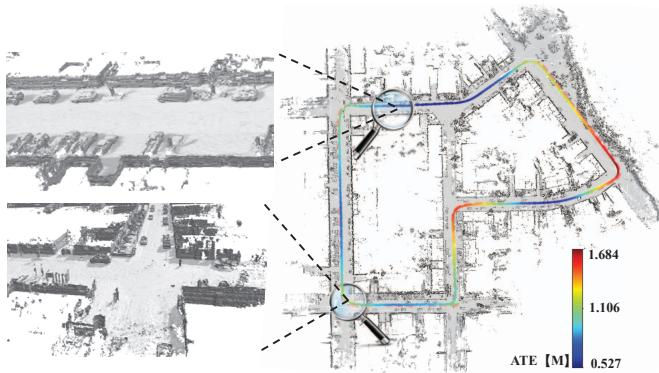  
Figure 1. Simultaneously odometry and dense mapping results on KITTI07. We present the reconstruction and the odometry result. The odometry results are colored by the absolute trajectory errors (ATE). Our proposed novel NeRF-LOAM accurately estimates the poses of a mobile system and reconstructs the dense mesh map of the outdoor large-scale environment.

Recently, neural radiance fields (NeRF) [32] has shown promising potentials in representing 3D scenes implicitly using a neural network and parallelly pose tracking methods [33, 51, 45]. Although such representation can achieve seminal reconstruction with accurate poses, they concentrate on indoor pose tracking and scene representation with RGB-D sensors. The sparsity of LiDAR data and the lack of RGB information present significant challenges for applying previous algorithms to LiDAR data in outdoor environments. Developing practical LiDAR-based algorithms to address these issues is currently a critical task.

To this end, we propose a novel NeRF-based LiDAR odometry and mapping method, dubbed NeRF-LOAM. It employs sparse octree-based voxels combined with neural implicit embeddings, decoded into a continuous signed distance function (SDF) by a neural implicit decoder. The embeddings, decoder, and poses are optimized simultaneously by minimizing the SDF errors. NeRF-LOAM targets the outdoor driving environments and separates the LiDAR points into ground and non-ground points, and a precise SDF for ground points can be obtained with the help of normals. Such an operation depresses Z-axis drift and smooths our dense 3D map. To tackle the incremental odometry and mapping under the unknown large-scale outdoor environment, a dynamic voxel embedding generation strategy without any pre-allocation or time-consuming loop is designed. Finally, we use key-scans to not only jointly refine the pose and the map but also relieve the catastrophic forgetting or pre-training process. Extensive experiments were conducted on three publicly available datasets. The experimental results demonstrate that our method attains stateof-the-art odometry and mapping performance in outdoor large-scale environments using LiDAR data.

To sum up, the contributions of our work are threefold:

1. To the best of our knowledge, our NeRF-LOAM is the first neural implicit odometry and mapping method for large-scale environments using LiDAR data.

2. We propose a novel neural SDF module combined with dynamic generation and key-scans refine strategy, which realizes a fast allocation of voxel embeddings in the octree and a high-fidelity 3D representation.

3. Based on the proposed online joint optimization, our method is pre-training free and generalizes well in different environments.

## 2. Related Work

Odometry and mapping in outdoor large-scale environments using LiDAR data has been investigated for decades. One of the primary methods is the iterative closest point (ICP) algorithm [3, 30], which directly aligns consecutive point clouds together and calculates the relative transformation between pairs of LiDAR scans. Tackling the sparsity of LiDAR data, Zhang and Singh [48] use point-toedge and point-to-plane distance to optimize the ICP error and achieve accurate odometry estimates. However, these types of algorithms mainly focus on odometry estimation, while the reconstructed map is coarse. The successive research [3, 31, 2, 8] also explores the scene geometry to get more accurate odometry results without considering the quality of the reconstruction map. Meanwhile, learningbased methods on LiDAR odometry [15, 41, 26, 39, 6] attract much attention. These methods employ a network to learn features from points or projected 2D images. However, they often require large data for training and cannot generalize well to other environments.

To represent the 3D scene, there are many techniques such as surfels [28], occupancy grids [10], triangle meshes [19, 7], and polynomial representations [14]. Traditionally, Poisson surface reconstruction [23, 24] provides geometrically accurate reconstruction. Newcombe et al. [12] popularizes the concept of truncated signed distance function (TSDF) and volumetric integration methods to reconstruct triangle meshes [13, 37]. Behley and Stachniss [2] use surfels to realize the reconstruction of 3D range sensors. For learning-based reconstruction, they usually focus on the small objects [20] or reconstruct directly from the point clouds [43]. The dense reconstruction from 3D incremental LiDAR data still remains to explore.

Compared to the existing 3D representations, the success of neural implicit representation [1, 18, 32, 40, 50] for novel view synthesis attach great attention, and many research investigates the possibility to use this concept realizing simultaneous localization and mapping (SLAM) [42, 46, 27, 33, 51, 45]. These neural SLAM use multilayer perceptrons (MLPs) to represent the entire scene and achieve seminal results. Extensive related works have been done such as the training and inference speed [18, 17], sparse training view [47, 5] and scene composition[49, 44]. However, they are mainly designed to process the image [25, 32] or RGBD inputs [9, 4] and are employed indoors. Extending them to LiDAR-based outdoor environments is hard to achieve because of the model limitation of simple MLPs and the sparsity character of LiDAR data. Although [45, 50] adopt an octree-based sparse grid with voxel embeddings and can be applied in larger areas, the pre-allocated embeddings or time-consuming loop to search the voxels is not available in outdoor for both odometry and mapping.

Unlike the above-mentioned methods, we propose a novel neural implicit odometry and mapping method for incremental LiDAR inputs under large-scale environments to obtain both dense 3D representation and accurate poses. We adopt voxel embeddings with an MLP decoder to represent the local geometry instead of the entire scene, which generalizes well in most environments. We also design a dynamic voxel embedding generation strategy to reduce processing time significantly as well as a key-scans refine strategy to improve the reconstruction quality.

## 3. Our Neural SDF

Before delving into the details of our NeRF-LOAM network, we first introduce a novel neural SDF module shown in Fig. 2, which plays a crucial role in all of our processes, including optimizing the poses, maps, and networks.

To realize the neural representation of large-scale outdoor incremental, the octree [21, 35, 34] structure is often adopted to recursively divide the scene into leaf nodes with basic scene units voxels. These axis-aligned voxels attach an $N _ { e }$ -dimension embedding at each vertex and share with neighbor voxels. The SDF values can be inferred from the embeddings through a neural network $F _ { \theta }$ Different from existing methods [45, 50], we treat the environments differently when optimizing the SDF values, e.g., ground and non-ground, and propose a novel loss function to realize more suitable neural SDF for LiDAR data in outdoor largescale environments.

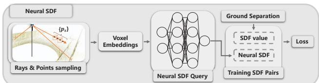  
Figure 2. The modified neural SDF. After the rays and points sampling, the voxel embeddings are fed to a network to query the neural SDF after ground separation.

Rays and points sampling. The first step in all of our processes is based on effective sampling. Instead of randomly selecting samples across the space or around the points, we first select rays that intersect with the currently allocated voxel and then select the points along the intersection part of the ray and voxels. Note that we set a hit number threshold of voxels $M _ { n }$ to avoid the influence of the unseen surface. Since the LiDAR rays are transformed by the scan pose $\mathbf { \nabla } T _ { i } .$ , each ray contains the pose information of the scan. This sampling strategy allows us to optimize the pose and voxel embeddings simultaneously.

Neural SDF value. For most visual-based NeRFs [1, 51], the scalar value like weight or color are obtained by differentiable rendering along the ray. Since the SDF is a direct method to represent the scene, the rendering method is unsuitable for LiDAR data in outdoor environments [50]. The neural SDF filed Ψ : $\mathbb { R } ^ { 3 } $ R can be represented by Eq. (1): each sampled point can be regressed via the trilinear interpolation of voxel embeddings:

$$
\Psi ( p _ { s } ) = F _ { \theta } ( \mathrm { T r i I n p o } ( p _ { s } , e _ { 1 } , . . . , e _ { n } ) ) ,\tag{1}
$$

where $p _ { s } = T _ { i } p _ { f }$ is the transformed sampled points by current scan pose $\mathbf { \delta } _ { \mathbf { \mathcal { T } } _ { i } }$ from the original point $p _ { f }$ in LiDAR coordinate, TriInpo $\left( p _ { s } , e _ { 1 } , . . . , e _ { n } \right)$ represents the trilinear interpolation of the sampled point $\pmb { p _ { s } }$ surrounded by n neighbor voxel embeddings, and $F _ { \theta }$ is the neural implicit network with parameter $\theta .$ Since all processes involved are differentiable, we can optimize the scan pose, voxel embeddings, and network parameters jointly through back projection. Because the voxel embeddings primarily store geometric information, our network does not require pre-training and can adjust online to different environments.

Training SDF pairs. The LiDAR sensors provide highly accurate range measurements, which allow us to compute the signed distance from the sampled points to the endpoints along the ray. This signed distance is often called the SDF value in many SLAM or mapping approaches [37, 13]. This approximation is generally acceptable for simple mapping or indoor SLAM tasks while leading to sub-optimal results when applied to outdoor SLAM as shown in Fig. 3. It illustrates the issue with the SDF approximation when used with a far LiDAR point. The blue line represents the true SDF value, while the red line is the SDF approximation. The difference between the two distances can be significant when the angle θ is close to $0 ^ { \circ }$ . This can decrease odometry quality due to the inaccurate SDF value. This problem is even more significant in the Z-axis, as there are fewer points in LiDAR scan to constrain Z-drift. While obtaining the normals of all LiDAR points can be challenging, the “smooth" ground allows access to the rectified SDF value.

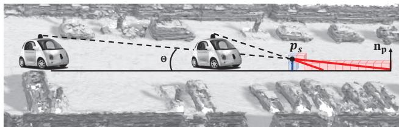  
Figure 3. The geometric information SDF value at point $p _ { s }$ should stay invariant w.r.t the view (blue line). While the approximated SDF is significantly different with view change (red line). The alignment of SDF forces the car to shift along the ray.

Therefore, we propose to first separate LiDAR points into ground points $\mathcal { G }$ and non-ground points $\mathcal { G } ^ { \mathcal { C } }$ . The SDF field Φ : $\mathbb { R } ^ { 3 } $ R can then be represented as:

$$
\Phi ( p _ { s } ) = \left\{ \begin{array} { l l } { ( \mathbf { p _ { s } } - \mathbf { p } ) \mathbf { n _ { p } } } & { \mathrm { i f } p \in \mathcal { G } } \\ { \| \mathbf { p _ { s } } - \mathbf { p } \| } & { \mathrm { e l s e } } \end{array} \right. ,\tag{2}
$$

where $\mathbf { p _ { s } }$ is the sampled point and p is the LiDAR point alone the ray, $\mathbf { n _ { p } }$ is the normal of point p.

Optimization. We train the network using the weighted sum of three different losses. The first free space loss forces the neural SDF of points between LiDAR and the positive truncation region $\mathcal { P } _ { f }$ to be truncation distance $T r \colon$

$$
\mathcal { L } _ { f } = \frac { 1 } { | P _ { f } | } \sum _ { i = 0 } ^ { | P _ { f } | } ( \Psi ( \pmb { p } _ { i } ) - T r ) ^ { 2 }\tag{3}
$$

The negative truncation region is beyond our consideration following the suggestion of [1] to avoid surface intersection ambiguities [40]. This loss plays an important role in removing dynamic objects. Secondly, we define an SDF loss of points within the truncation region $\mathcal { P } _ { s }$ to supervise the SDF estimates:

$$
\mathcal { L } _ { s } = \frac { 1 } { \vert P _ { s } \vert } \sum _ { i = 0 } ^ { \vert P _ { s } \vert } ( \Psi ( \pmb { p } _ { i } ) - \Phi ( \pmb { p } _ { i } ) ) ^ { 2 } .\tag{4}
$$

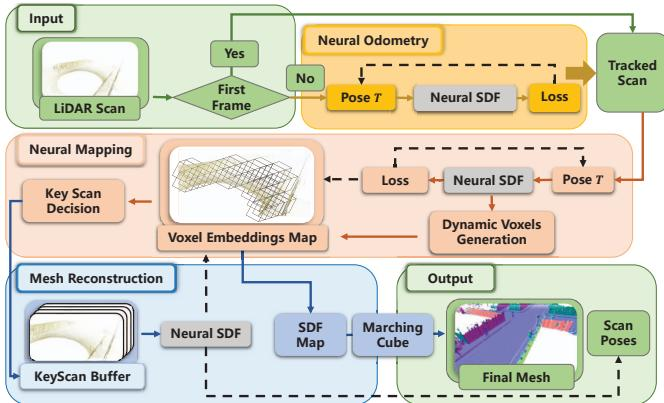  
Figure 4. Our NeRFLOAM Overview. The dashed line represents the back projection. Given a LiDAR stream, our approach outputs the poses of each scan and a reconstructed mesh map of the environment with three modules: 1) neural odometry takes the pre-processed scan and optimizes the pose via back projecting the queried neural SDF; 2) neural mapping jointly optimizes the voxel embeddings map and pose while selecting the key-scans; 3) keyscans refined map returns SDF value and the final mesh is reconstructed by marching cube.

Different to [27, 50] using a sigmoid function to increase the credits around the LiDAR points, we treat the points equally in this region for the reason that these points are all important for odometry. Finally, because the SDF values are differentiable and equal to one within the truncation area, we add an Eikonal loss:

$$
\mathcal { L } _ { e } = \frac { 1 } { | P _ { s } | } \sum _ { i = 0 } ^ { | P _ { s } | } ( \frac { \partial \Psi ( \pmb { p } _ { i } ) } { \partial \pmb { p } _ { i } } - 1 ) ^ { 2 } .\tag{5}
$$

## 4. NeRF-LOAM Framework

## 4.1. Overview

The architecture of our framework is illustrated in Fig. 4. Our method takes an incremental LiDAR stream as input and outputs a 3D reconstructed mesh with poses of each Li-DAR scan through three modules: neural odometry, neural mapping, and mesh reconstruction. The first two parts run parallel as frontend and backend, while the third runs separately to obtain a global mesh map and refined scan poses.

Given the incoming LiDAR scan $P _ { t } = \left\{ p _ { i } \in \mathbb { R } ^ { 3 } \right\} _ { i = } ^ { N }$ 1， the neural odometry estimates a 6-DoF Pose $\pmb { T } \in \tilde { S E } ( \tilde { 3 } )$ for that scan by minimizing the SDF error from a fixed implicit network $F _ { \theta }$ (see Sec. 4.2). The tracked scan is then fed to neural mapping, which utilizes the tracked pose $_ { \mathbf { T } }$ to transform the point cloud into the world coordinate system (see Sec. 4.3). The implicit map representation and pose are then jointly optimized. During mapping, we add a scan into the key-scan buffer after a certain distance or when the vehicle reaches a new area. This key-scan buffer maintains the long-map consistency but also enhances the mapping quality. Finally, the key scans are utilized to refine both the odometry and map results (see Sec. 4.4). The 3D mesh is reconstructed by the marching cube method [19] based on the SDF values predicted by our network. More details of each component are provided in the following sections.

## 4.2. Neural Odometry

For every incoming LiDAR scan $P _ { t }$ , we randomly select N rays and transform them into the world coordinate system. A set of points are sampled along the ray as described in Sec. 3. The pose and voxel embeddings are optimized by decreasing the loss.

For our neural odometry, the parameter which needs to be optimized is the 6-DoF pose $_ { \mathbf { \delta T } }$ in $S E ( 3 )$ space. All updates of the pose $\xi \in \mathfrak { s e } ( 3 )$ is performed in tangent space of $S E ( 3 )$ . The Lie-algebra representation enables us to update the pose by a gradient descent method. We randomly select N rays and transform them into the world coordinate system. Note that we use a constant move model to initialize our pose. This model can relieve our learning burden. We sample the points, compute the loss and optimize the pose via back-projection, as mentioned in Sec. 3. Here, the voxel embeddings and the network are obtained after the neural mapping process of the last tracked scan.

To tackle the problem of catastrophic forgetting when performing online incremental odometry, we freeze the network parameters after $K$ scans which does not decline our result because local geometry is mainly stored in voxels. The voxel embeddings and poses of the first K scans will be refined later by key scan refinement, detailed in Sec. 4.4.

## 4.3. Neural Mapping

Dynamic voxel embeddings generation. For neural mapping, we employ an octree-based approach to partition the scene. Following the odometry process, the estimated pose enables us to convert all points of the current scan into the world coordinate system. Subsequently, any points not in existing voxels are assigned to newly generated ones. These voxels are added to the octree along with their corresponding voxel embeddings. To quickly locate the desired embeddings, we encode the 3D voxel coordinates into a unique scalar value, namely the Morton code [35]. Although utilizing the code, the pre-allocate embeddings [34, 45] or time-consuming one by one search in hash table [50] is not suitable for our task, especially when it needs to retrieve hundreds of thousands of embeddings from a hash table containing millions of entries.

Inspired by the concept of a look-up table, we devise an efficient and scalable method for generating voxel embeddings dynamically, as outlined in Alg. 1. The lookup table is extended with the maximum Morton code to store the access information of voxels. The unvisited voxels will be assigned initialized embeddings and added to the embedding list while updating the look-up table by the current embedding number, eliminating time-consuming loop queries.

Algorithm 1: Dynamic Embeddings Generation.   
Input: Look-up list $\mathcal { L } ;$ Incoming voxels IDs $( \mathrm { i . e . , }$   
Morton code) $\mathcal { T } _ { v } ;$ Embedding list $\mathcal { L } _ { e }$   
Output: Embedding list $\mathcal { L } _ { e }$ with new embeddings;   
Updated look-up list ${ \mathcal { L } } .$   
1 m ←max(D), maximum index.   
2 $l \gets \mathrm { l e n } ( \mathcal { L } ) .$ length of the look-up list.   
3 $s \gets \mathrm { l e n } ( \mathcal { L } _ { e } ) ,$ length of the embeddings list.   
4 if m $> l$ then   
5 Extend the length of the look-up list to m,   
initialized with value -1.   
6 $\mathcal { T } _ { e }  \mathcal { L } [ \mathcal { T } _ { v } ]$ , look the embeddings IDs.   
7 ${ \mathcal { T } } _ { v } \gets \{ \dot { \mathcal { T } } _ { v } [ \dot { i } ] \ | \ { \mathcal { T } } _ { e } [ i ] = - 1 \}$ , unvisited voxels IDs.   
8 $l _ { v } \gets \mathrm { l e n } ( \mathcal { T } _ { v } )$ , length of unvisited voxels.   
9 $\mathcal { L } _ { e } ^ { \prime }  [ \mathbf { e _ { i } } | \mathbf { i } \in \{ \mathbf { 1 } , . . . , \mathbf { l _ { v } } \} ] ,$ , new embeddings.   
10 $\mathcal { L } _ { e } \gets \mathcal { L } _ { e } + \mathcal { L } _ { e } ^ { \prime } ,$ final embedding list.   
11 $\mathcal { L } [ \mathcal { T } _ { v } ] \gets [ s + 1 , . . . , s + l + v ]$ , update the look-up   
list.

Joint optimization of the map and pose. Similar to neural odometry, we sample the rays and points to calculate the loss. Here we mainly optimize the voxel embeddings while fine-tuning the poses.

## 4.4. Mesh Reconstruction

Key-scans selection and refinement. We maintain a key-scan buffer to relieve the catastrophic forgetting of the first K scans as well as improve the mapping quality. A key scan is added to the buffer if the number of newly added voxels $N _ { v }$ exceeds a threshold of $N _ { t }$ or the distance between the current scan and the last key-scan $d _ { f }$ is sufficiently large. The map and poses are in the end refined with all the key-scans in the buffer. This simple strategy is effective, as demonstrated in the mapping results in Sec. 5.5. Additionally, to improve the efficiency of the refinement process, only rays or LiDAR points within a truncation distance $d _ { t }$ based on the point density are included.

Final mesh and poses. After the key-scans refine, the map and the poses are well-trained and ready to output final results. Our modified SDF is continuous, so we can theoretically infer SDF values at an arbitrary position. We query the SDF values with the same fixed size (i.e., voxel size), and the final mesh is obtained via marching cube [19].

## 5. Experiments

## 5.1. Experimental Setup

Datasets. We evaluate our method and compare it with state-of-the-art (SOTA) methods using three publicly available outdoor LiDAR datasets, including MaiCity [36], Newer College [29], and KITTI odometry [11] datasets. MaiCity [36] contains 64-beam noise-free synthetic LiDAR scans in urban environments, and the ground truth map is provided. Newer College [29] contains a hand-carried Li-DAR sequence collected at Oxford University with motion distortion. To make it more challenging and the scans more distinctive, we take one out of every five. We compare our odometry and mapping results with provided ground truth trajectories and mesh maps by these two datasets. KITTI odometry [11] does not provide ground truth maps, so we present our odometry accuracy hereby qualitative mapping results.

Evaluation metric. We evaluate both the odometry and mapping performance of our method. For odometry accuracy, we present the root-mean-square error (RMSE) of absolute trajectory errors (ATEs) by $S E ( 3 )$ alignment. And for mapping accuracy, we use the commonly used reconstruction metrics adopted in most reconstruction method [22, 36, 50], i.e., accuracy, completion, Chamfer-L1 distance, and F-score, obtained by comparing the resulting mesh with ground truth.

Implemental details. The whole process shared network is an MLP consisting of 2 FC layers, and each layer has 256 hidden units. The length of our voxel embeddings is 16 with a voxel size 0.2 m. For sampling, we set the step size ratio to 0.2 for odometry and 0.5 for mapping and the truncation distance $T r \ = \ 0 . 3 \mathrm { { m } }$ To distinct the ground from the LiDAR points, we use the seminal work of [16]. More studies on our hyperparameter selection are presented in Sec. 5.5 and supplementary materials (see Sec. D).

## 5.2. Simultaneously Odometry & Mapping Results

The first experiment shows the simultaneous odometry and dense mapping results of our method compared with existing SOTA methods. For example, Poisson surface reconstruction SLAM method Puma [36], a TSDF fusion-based approach Vdbfusion [37], and an implicit neural networkbased map representation SHINE-Mapping [50]. Since both Vdbfusion and SHINE-Mapping only focus on dense mapping, we combine them with the current SOTA odometry method KissICP [38]. For fair comparison, we also show the results of our methods using KissICP poses. The results of all baseline methods are produced using their official open-source code with the same voxel size.

Tab. 1 shows our odometry mapping results on the MaiCity[36] and Newer College[29] datasets. As can be seen, our mapping process combined with KissICP outperforms all baselines on the MaiCity dataset and has comparable quality in the Newer College dataset. The corresponding qualitative results are demonstrated in Fig. 5. In the case of the MaiCity dataset, KissICP produces false pose estimates in the initial scans, which will lead to entangled mapping if there are no specific processes to remove these artifacts. Vdbfusion provides space carving to address this problem. However, it removes both the artifacts and important objects such as roads, trees, and cars. Shine-Mapping offers some improvement by removing certain artifacts. Our proposed method outperforms both of these techniques by effectively removing the majority of the artifacts and producing a smoother mapping result. Similar benefits can be observed in the Newer College dataset, where Vdbfusion removes the trajectory caused by a person holding a device, resulting in an incomplete map.

<table><tr><td rowspan="2">Method</td><td rowspan="2">Pose</td><td colspan="4">MaiCity</td><td colspan="4">Newer College</td></tr><tr><td>Map. Acc. ↓</td><td>Map. Comp. ↓</td><td>C-11. ↓</td><td>F-score (10cm) ↑</td><td>Map. Acc. ↓</td><td>Map. Comp. ↓</td><td>C-11. ↓</td><td>F-score (20cm) ↑</td></tr><tr><td>SHINE [50]</td><td rowspan="3">KissICP [38]</td><td>5.75</td><td>38.45</td><td>22.10</td><td>67.00</td><td>14.87</td><td>20.02</td><td>17.45</td><td>68.85</td></tr><tr><td>Vdbfusion [37]</td><td>4.95</td><td>46.79</td><td>25.87</td><td>68.15</td><td>14.03</td><td>25.46</td><td>19.75</td><td>69.50</td></tr><tr><td>Ours</td><td>4.16</td><td>37.20</td><td>20.67</td><td>73.31</td><td>14.31</td><td>24.39</td><td>19.35</td><td>68.70</td></tr><tr><td>Puma [36]</td><td rowspan="2">Odometry</td><td>7.89</td><td>9.14</td><td>8.51</td><td>68.04</td><td>15.30</td><td>71.91</td><td>43.60</td><td>57.27</td></tr><tr><td>Ours</td><td>5.69</td><td>11.23</td><td>8.46</td><td>77.26</td><td>12.89</td><td>22.21</td><td>17.55</td><td>74.37</td></tr></table>

Table 1. Simultaneously odometry & mapping results of different methods on MaiCity [36] and Newer College [29] datasets in terms of map accuracy, completion and Chamfer-L1 distance and F-scores.  
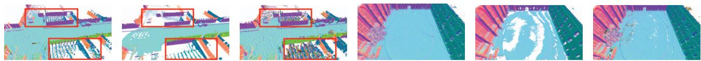  
(a) Ours with KissICP (b) Vdb with KissICP (c) Shine With KissICP (d) Ours with KissICP (e) Vdb with KissICP (f) Shine With KissICP Figure 5. The odometrey mapping results for different methods. The first three are on MaiCity [36] while the last three are on Newer College [29]. The artifacts are highlighted in Red boxes.

Compared to Puma, which involves both odometry and mapping processes, our approach also realizes both odometry and mapping using an implicit neural network and achieves superior performance in almost all metrics. In the MaiCity dataset, the slightly inaccurate trajectory of our method results in a larger distance compared to the completion distance, as also presented in Sec. 5.4. However, with a more precise trajectory in the Newer College dataset, our approach significantly outperforms Puma. These results are visually depicted in Fig. 6(d) and Fig. 6(e) for MaiCity, and Fig. 7(d) and Fig. 7(e) for Newer College. Although Puma appears more complete, the second row of the figures indicates that this comes at the expense of mapping accuracy. Also, on the Maicity dataset, we can see the ground folds for Puma as it tries to reconstruct a watertight surface and thus is influenced by surrounding objects. As shown on the Newer College dataset, Puma cannot remove the dynamic objects and insufficient points on the wall hinder a complete reconstruction.

## 5.3. Mapping Quality

To eliminate the influence of pose estimation and thoroughly investigate the mapping ability of different methods, we employ ground truth poses to reconstruct the mesh map of the environments. We compare our approach with two pure mapping methods, Shine-Mapping [50] and VdbFusion [37], and provide quantitative results in Tab. 2. As can be seen, our approach outperforms all baseline methods across almost all metrics when compared in terms of pure mapping ability. The superiority of our mapping approach is also evident in Fig. 6 and Fig. 7, where our reconstruction is the most complete, particularly in terms of the ground. The error maps enforce our claims by demonstrating the greater accuracy of our reconstruction. Note that in the Newer College dataset, we reconstruct every five scans, and the results indicate that our mapping process still performs well even with sparse and noisy observations.

## 5.4. Odometry Evaluation

As discussed, the quality of odometry largely influences the mapping quality. An accurate trajectory can directly improve the reconstruction result and avoid undesired artifacts. Here we present the results of our odometry compared with other non-learning-based and learning-based methods. As mapping methods like Shine-Mapping [50] and Vdbfusion [37] do not provide pose estimations, they are omitted from the comparison. For non-learning-based methods, we compare our odometry results with Puma [36], SuMA [2], and two registration algorithms based on ICP: point-topoint ICP [3] and generalized-ICP [31]. For learning-based methods, we adopt two SOTA algorithms with code available: DeLORA [26] and PWC-LONet [39]. For other codeunavailable learning-based methods like LO-Net [15] and DeepPCO [41], we report their quantitative results from their papers in our supplementary materials (see Sec. C) along with the above-mentioned methods.

We present the RMSE results in Tab. 3. Our method achieves comparable results to other methods on the synthetic MaiCity dataset and KITTI09 datasets while achieving the best performance on the Newer College. Notably, our method does not require any pre-training and exhibits strong generalization ability across different datasets, while pre-trained methods such as DeLORA and PWC-LONet, which are pre-trained on the KITTI dataset, exhibit worse performance on other datasets. Although PWC-LONet still obtains acceptable results on the MaiCity dataset, it almost fails on the Newer College dataset. More results on KITTI can be found in the supplementary materials (see Sec. C).

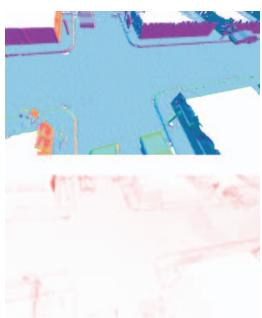  
(a) Ours with GT pose

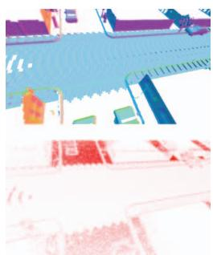  
(b) Vdb with GT pose

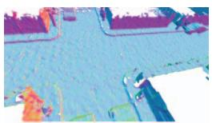

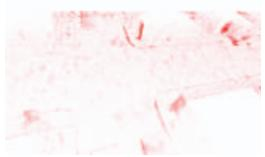  
(c) Shine With GT pose

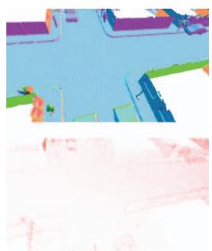  
(d) Our odometry mapping

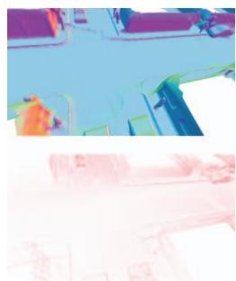  
(e) Puma odometry mapping

Figure 6. The mapping result with ground truth pose or odometry results on the MaiCity [36] dataset are shown in the first row. The second row presents the error maps with ground truth mesh as a reference, where the redder points mean larger error up to 25cm.  
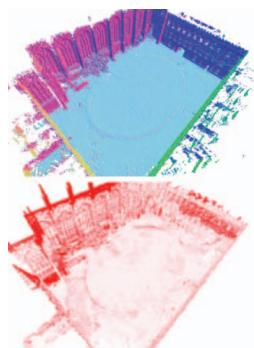  
(a) Ours with GT pose

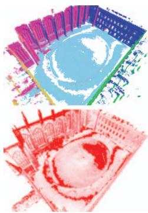  
(b) Vdb with GT pose

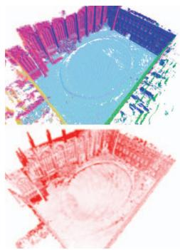  
(c) Shine With GT pose

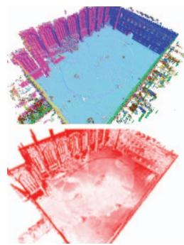  
(d) Our odomery mapping

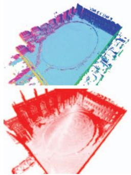  
(e) Puma odometry mapping  
Figure 7. The mapping result with ground truth pose or odometry results on the Newer College [29] dataset are shown in the first row. The second row presents the error maps with ground truth mesh as a reference, where the redder points mean larger error up to 25cm.

## 5.5. Ablation Study

Ground separation. We compare the performance of our method with and without ground separation and show the odometry and mapping accuracy in Tab. 4. For odometry accuracy, we see that RMSE error declines with ground separation for the MaiCity dataset and for Newer College, the approach even failed without ground separation. Moreover, when checking pose error in each axis (supplementary materials Sec. D), the trajectory with ground separation is consistent in the z-axis, while without ground separation, it diverges fast. For mapping accuracy, all mapping metrics indicate that our method achieves significantly better mapping results with ground separation. We can also see a clear improvement visually in Fig. 8. With ground separation, the “ripples effect" is suppressed and the holes are disappeared.

Key-scan refine strategy. We further analyze the effectiveness of our key-scan refine strategy and show the result in Tab. 4. The numerical results show improvement with key-scan refinement, and the visual improvement is even more significant, as shown Fig. 9. The key-scan refinement produces smoother and more complete results, as evidenced by the improved maps of roads, walls, and vehicles.

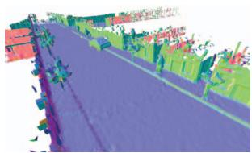  
(a) Map with ground separation

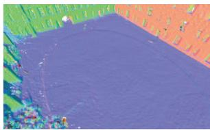  
(b) Map with ground separation

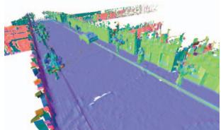

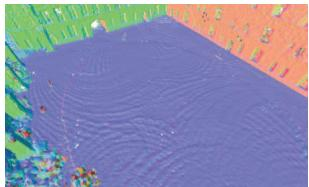  
(c) Map w/o ground separation  
(d) Map w/o ground separation  
Figure 8. Ablation study for ground separation in mapping using the pose provided by our neural odometry. With ground separation, the mapping result is neater and completer.

Voxel size. We analyze the mapping quality, memory consumption, and processing time v.s. the voxel size shown in Fig. 10. We text our NeRF-LOAM on an Intel Xeon CPU with 2.1 GHz and an Nvidia NVIDIA Titan RTX with 24 GB of memory. The results show that the mapping performance decreases as the voxel size exceeds 20 cm, while

<table><tr><td rowspan="2">Method</td><td rowspan="2">Pose</td><td colspan="4">MaiCity</td><td colspan="4">Newer College</td></tr><tr><td>Map. Acc. ↓</td><td>Map. Comp. ↓</td><td>C-11.↓</td><td>F-score ↑</td><td>Map. Acc. ↓</td><td>Map. Comp. ↓</td><td>C-11. ↓</td><td>F-score ↑</td></tr><tr><td>SHINE [50]</td><td rowspan="3">GT pose</td><td>4.17</td><td>5.30</td><td>4.74</td><td>89.67</td><td>8.32</td><td>14.36</td><td>11.34</td><td>90.65</td></tr><tr><td>Vdbfusion [37]</td><td>4.12 3.15</td><td>8.01</td><td>6.07</td><td>90.16</td><td>6.87</td><td>18.37</td><td>12.61</td><td>89.96</td></tr><tr><td>Ours</td><td></td><td>4.84</td><td>4.00</td><td>92.96</td><td>6.86</td><td>15.59</td><td>11.24</td><td>91.83</td></tr></table>

Table 2. The mapping results of the reconstruction quality on the MaiCity [36] and Newer College [29] dataset. The voxel size is 20 cm and F-score in % with a 10 cm error threshold.

<table><tr><td>Method</td><td>Mai00</td><td>Mai01</td><td>NC</td><td>KT09</td></tr><tr><td>ICP [3]</td><td>1.90</td><td>0.05</td><td>15.84</td><td>5.86</td></tr><tr><td>GICP [31]</td><td>1.24</td><td>0.13</td><td>1.02</td><td>34.25</td></tr><tr><td>Puma [36]</td><td>0.25</td><td>0.06</td><td>0.39</td><td>3.58</td></tr><tr><td>SuMA [2]</td><td>2.01</td><td>0.04</td><td>1.22</td><td>5.00</td></tr><tr><td>DeLORA [26]</td><td>57.57</td><td>5.12</td><td>4</td><td>29.09</td></tr><tr><td>PWC-LONet [39]</td><td>3.28</td><td>0.09</td><td>15.78</td><td>4.60</td></tr><tr><td>Ours</td><td>1.27</td><td>0.13</td><td>0.15</td><td>4.26</td></tr></table>

Table 3. RMSE results of odometry. Mai for MaiCity [36], NC for Newer College [29], KT for KITTI [11], “-" for failed

<table><tr><td>Dataset</td><td>Ground KF-ref.</td><td></td><td>RMSE↓</td><td>Acc.↓</td><td>Comp.↓</td><td>C-11.↓</td><td>F↑</td></tr><tr><td rowspan="4">MaiCity</td><td>x</td><td>x</td><td>0.20</td><td>6.15</td><td>69.64</td><td>37.90</td><td>49.39</td></tr><tr><td>x</td><td>√</td><td>0.20</td><td>6.13</td><td>70.48</td><td>38.30</td><td>48.78</td></tr><tr><td>√</td><td>x</td><td>0.17</td><td>5.93</td><td>11.49</td><td>8.71</td><td>76.15</td></tr><tr><td>√</td><td>√</td><td>0.17</td><td>5.69</td><td>11.23</td><td>8.46</td><td>77.26</td></tr><tr><td rowspan="4">Newer College</td><td>x</td><td>x</td><td>=</td><td>=</td><td>=</td><td>=</td><td>=</td></tr><tr><td>x</td><td>√</td><td></td><td></td><td></td><td></td><td></td></tr><tr><td>√</td><td>x</td><td>0.15</td><td>16.41</td><td>25.75</td><td>21.08</td><td>61.10</td></tr><tr><td>√</td><td>√</td><td>0.15</td><td>12.89</td><td>22.21</td><td>17.55</td><td>74.37</td></tr></table>

Table 4. Ablation study of our designs on Maicity [36], Newer College [29]. “-" stands for failed

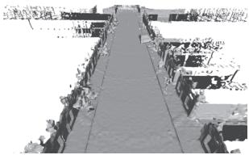  
(a) Mapping with key-scan refine

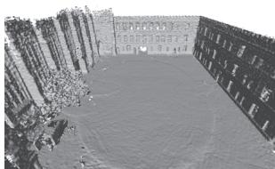  
(b) Mapping with key-scan refine

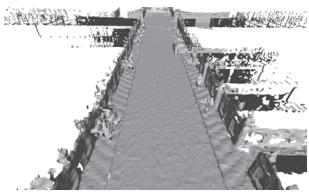  
(c) Mapping w/o key-scan refine

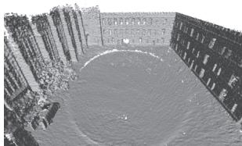  
(d) Mapping w/o key-scan refine  
Figure 9. Ablation study for key-scan refine in terms of mapping. The pose is obtained by the SLAM odometry. The key-scan refine makes the reconstruction result clearer.

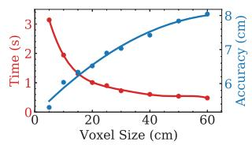

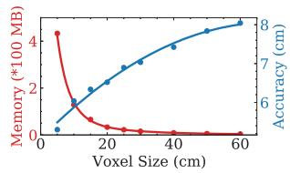  
(a) Time vs Acc. on Newer College (b) Me. vs Acc. on Newer College

Figure 10. Study on voxel size v.s. processing time, memory consumption and accuracy distance on Newer College [29].

processing time and memory consumption remain constant. Thus, we set the voxel size as 20 cm. More studies on parameters are provided in the appendix (see Sec. D).

## 6. Conclusion

In this paper, we presented a novel approach for simultaneous odometry and mapping using neural implicit representation with 3D LiDAR data. The devised NeRF-LOAM network tackles incremental LiDAR inputs in outdoor large-scale environments. It uses voxel embeddings to record the geometrical structure and avoids any pretraining, thus generalizing well in different situations. We further conceive a dynamic embedding generation, which realizes fast query and allocation to support outdoor largescale applications. Experiments conducted on simulated and real-world datasets showed that our approach reconstructs higher-quality 3D mesh maps compared to other learning-based or non-learning-based methods. Our method estimates at the same time an accurate pose and generalizes well without any offline pre-training.

Limitation and future work. Our NeRF-LOAM cannot currently operate in real-time with our unoptimized Python implementation. The primary bottleneck is the intersection query between the ray and the map. For future work, we can facilitate the runtime by using sliding windows or local searching based on the estimated odometry pose and optimize the code in C++. Additionally, we plan to combine our work with loop closures to handle drift in long-term tracking and mapping, ultimately achieving a full SLAM system.

Acknowledgements. This work was supported in part by the National Nature Science Foundation of China (NSFC) under Grant 62273229, and in part by ByteDance project under Grant CT20220323003446, and also in part by Shanghai Slamtec Co., Ltd., with whom completed in cooperation.

## References

[1] Dejan Azinović, Ricardo Martin-Brualla, Dan B Goldman, Matthias Nießner, and Justus Thies. Neural rgb-d surface reconstruction. In Proceedings of the IEEE/CVF Conference on Computer Vision and Pattern Recognition, pages 6290– 6301, 2022.

[2] Jens Behley and Cyrill Stachniss. Efficient surfel-based slam using 3d laser range data in urban environments. In Proc. of Robotics: Science and Systems (RSS), 2018.

[3] P.J. Besl and Neil D. McKay. A Method for Registration of 3D Shapes. IEEE Trans. on Pattern Analysis and Machine Intelligence (TPAMI), 14(2):239–256, 1992.

[4] Angel Chang, Angela Dai, Thomas Funkhouser, Maciej Halber, Matthias Niessner, Manolis Savva, Shuran Song, Andy Zeng, and Yinda Zhang. Matterport3d: Learning from rgbd data in indoor environments. International Conference on 3D Vision (3DV), 2017.

[5] Anpei Chen, Zexiang Xu, Fuqiang Zhao, Xiaoshuai Zhang, Fanbo Xiang, Jingyi Yu, and Hao Su. Mvsnerf: Fast generalizable radiance field reconstruction from multi-view stereo. In Proceedings of the IEEE/CVF International Conference on Computer Vision, pages 14124–14133, 2021.

[6] Xieyuanli Chen, Thomas Läbe, Lorenzo Nardi, Jens Behley, and Cyrill Stachniss. Learning an Overlap-based Observation Model for 3D LiDAR Localization. In Proc. of the IEEE/RSJ Int. Conf. on Intelligent Robots and Systems (IROS), 2020.

[7] Xieyuanli Chen, Ignacio Vizzo, Thomas Läbe, Jens Behley, and Cyrill Stachniss. Range Image-based LiDAR Localization for Autonomous Vehicles. In Proc. of the IEEE Intl. Conf. on Robotics & Automation (ICRA), 2021.

[8] Xieyuanli Chenn, Andres Milioto, Emanuele Palazzolo, Philippe Giguère, Jens Behley, and Cyrill Stachniss. SuMa++: Efficient LiDAR-based Semantic SLAM. In Proc. of the IEEE/RSJ Int. Conf. on Intelligent Robots and Systems (IROS), 2019.

[9] Angela Dai, Angel X. Chang, Manolis Savva, Maciej Halber, Thomas Funkhouser, and Matthias Nießner. Scannet: Richly-annotated 3d reconstructions of indoor scenes. In Proc. Computer Vision and Pattern Recognition (CVPR), IEEE, 2017.

[10] Alberto Elfes. Using occupancy grids for mobile robot perception and navigation. Computer, 1989.

[11] Andreas Geiger, Philip Lenz, and Raquel Urtasun. Are we ready for Autonomous Driving? The KITTI Vision Benchmark Suite. In Proc. of the IEEE Conf. on Computer Vision and Pattern Recognition (CVPR), 2012.

[12] Shahram Izadi, David Kim, Otmar Hilliges, David Molyneaux, Richard Newcombe, Pushmeet Kohli, Jamie Shotton, Steve Hodges, Dustin Freeman, Andrew Davison, and Andrew Fitzgibbon. KinectFusion: Real-time 3D Reconstruction and Interaction using a Moving Depth Camera. pages 559–568, 2011.

[13] Matthew Klingensmith, Ivan Dryanovski, Siddhartha S Srinivasa, and Jizhong Xiao. Chisel: Real time large scale 3d reconstruction onboard a mobile device using spatially

hashed signed distance fields. In Robotics: science and systems, volume 4. Citeseer, 2015.

[14] Ravikrishna Kolluri. Provably good moving least squares. ACM Transactions on Algorithms (TALG), 4(2):18, 2008.

[15] Qing Li, Shaoyang Chen, Cheng Wang, Xin Li, Chenglu Wen, Ming Cheng, and Jonathan Li. Lo-net: Deep real-time lidar odometry. In Proceedings of the IEEE/CVF Conference on Computer Vision and Pattern Recognition, pages 8473– 8482, 2019.

[16] Hyungtae Lim, Oh Minho, and Hyun Myung. Patchwork: Concentric zone-based region-wise ground segmentation with ground likelihood estimation using a 3d lidar sensor. IEEE Robotics and Automation Letters, 2021,

[17] David B. Lindell, Julien N. P. Martel, and Gordon Wetzstein. Autoint: Automatic integration for fast neural volume rendering. In 2021 IEEE/CVF Conference on Computer Vision and Pattern Recognitio (CVPR), 2021.

[18] Lingjie Liu, Jiatao Gu, Kyaw Zaw Lin, Tat-Seng Chua, and Christian Theobalt. Neural sparse voxel fields. Advances in Neural Information Processing Systems, 33:15651–15663, 2020.

[19] William E. Lorensen and Harvey E. Cline. Marching Cubes: a High Resolution 3D Surface Construction Algorithm. In Proc. of the Intl. Conf. on Computer Graphics and Interactive Techniques (SIGGRAPH), pages 163–169, 1987.

[20] Baorui Ma, Yu-Shen Liu, Matthias Zwicker, and Zhizhong Han. Surface reconstruction from point clouds by learning predictive context priors. In 2022 IEEE/CVF Conference on Computer Vision and Pattern Recognition (CVPR), pages 6316–6327, 2022.

[21] Donald Meagher. Octree Encoding: A New Technique for the Representation, Manipulation and Display of Arbitrary 3-D Objects by Computer. Technical Report, 1980.

[22] Lars Mescheder, Michael Oechsle, Michael Niemeyer, Sebastian Nowozin, and Andreas Geiger. Occupancy networks: Learning 3d reconstruction in function space. In Proc. of the IEEE/CVF Conf. on Computer Vision and Pattern Recognition (CVPR), 2019.

[23] Kazhdan Michael, Matthew Bolitho, and Hugues Hoppe. Poisson surface reconstruction. In Proceedings of the fourth Eurographics symposium on Geometry processing, volume 7, 2006.

[24] Kazhdan Michael and Hugues Hoppe. Screened poisson surface reconstruction. ACM Transactions on Graphics, 32(3):1–13, 2013.

[25] Ben Mildenhall, Pratul P. Srinivasan, Rodrigo Ortiz-Cayon, Nima Khademi Kalantari, Ravi Ramamoorthi, Ren Ng, and Abhishek Kar. Local light field fusion: Practical view synthesis with prescriptive sampling guidelines. ACM Transactions on Graphics (TOG), 2019.

[26] Julian Nubert, Shehryar Khattak, and Marco Hutter. Selfsupervised learning of lidar odometry for robotic applications. In IEEE International Conference on Robotics and Automation (ICRA). IEEE, 2021.

[27] Joseph Ortiz, Alexander Clegg, Jing Dong, Edgar Sucar, David Novotny, Michael Zollhoefer, and Mustafa Mukadam. isdf: Real-time neural signed distance fields for robot perception. arXiv preprint arXiv:2204.02296, 2022.

[28] Hanspeter Pfister, Matthias Zwicker, Jeroen van Baar, and Markus Gross. Surfels-surface elements as rendering primitives. In ACM Transactions on Graphics (Proc. ACM SIG-GRAPH), pages 335–342, 7/2000 2000.

[29] Milad Ramezani, Yiduo Wang, Marco Camurri, David Wisth, Matias Mattamala, and Maurice Fallon. The newer college dataset: Handheld lidar, inertial and vision with ground truth. In Proc. of the IEEE/RSJ Intl. Conf. on Intelligent Robots and Systems (IROS), 2020.

[30] Szymon M. Rusinkiewicz and Marc Levoy. Efficient variants of the icp algorithm. Proceedings Third International Conference on 3-D Digital Imaging and Modeling, pages 145– 152, 2001.

[31] Aleksandr Segal, Dirk Hähnel, and Sebastian Thrun. Generalized-ICP. In Proc. of Robotics: Science and Systems (RSS), 2009.

[32] Ben Mildenhalland Pratul P. Srinivasan, Matthew Tancik, Jonathan T. Barron, Ravi Ramamoorthi, and Ren Ng. NeRF: Representing Scenes as Neural Radiance Fields for View Synthesis. In Proc. of the Europ. Conf. on Computer Vision (ECCV), 2020.

[33] Edgar Sucar, Shikun Liu, Joseph Ortiz, and Andrew J. Davison. imap: Implicit mapping and positioning in real-time. In Proceedings of the IEEE/CVF International Conference on Computer Vision (ICCV), pages 6229–6238, October 2021.

[34] Towaki Takikawa, Joey Litalien, Kangxue Yin, Karsten Kreis, Charles Loop, Derek Nowrouzezahrai, Alec Jacobson, Morgan McGuire, and Sanja Fidler. Neural geometric level of detail: Real-time rendering with implicit 3d shapes. In Proceedings of the IEEE/CVF Conference on Computer Vision and Pattern Recognition (CVPR), pages 11358–11367, June 2021.

[35] Emanuele Vespa, Nikolay Nikolov, Marius Grimm, Luigi Nardi, Paul HJ Kelly, and Stefan Leutenegger. Efficient octree-based volumetric slam supporting signed-distance and occupancy mapping. IEEE Robotics and Automation Letters (RA-L), 3(2):1144–1151, 2018.

[36] Ignacio Vizzo, Xieyuanli Chen, Nived Chebrolu, Jens Behley, and Cyrill Stachniss. Poisson Surface Reconstruction for LiDAR Odometry and Mapping. In Proc. of the IEEE Intl. Conf. on Robotics & Automation (ICRA), 2021.

[37] Ignacio Vizzo, Tiziano Guadagnino, Jens Behley, and Cyrill Stachniss. Vdbfusion: Flexible and efficient tsdf integration of range sensor data. Sensors, 22(3), 2022.

[38] Ignacio Vizzo, Tiziano Guadagnino, Benedikt Mersch, Louis Wiesmann, Jens Behley, and Cyrill Stachniss. KISS-ICP: In Defense of Point-to-Point ICP – Simple, Accurate, and Robust Registration If Done the Right Way. IEEE Robotics and Automation Letters (RA-L), 8(2):1–8, 2023.

[39] Guangming Wang, Xinrui Wu, Zhe Liu, and Hesheng Wang. Pwclo-net: Deep lidar odometry in 3d point clouds using hierarchical embedding mask optimization. In Proceedings of the IEEE/CVF Conference on Computer Vision and Pattern Recognition (CVPR), pages 15910–15919, June 2021.

[40] Peng Wang, Lingjie Liu, Yuan Liu, Christian Theobalt, Taku Komura, and Wenping Wang. Neus: Learning neural implicit surfaces by volume rendering for multi-view reconstruction. arXiv preprint arXiv:2106.10689, 2021.

[41] Wei Wang, Muhamad Risqi U Saputra, Peijun Zhao, Pedro Gusmao, Bo Yang, Changhao Chen, Andrew Markham, and Niki Trigoni. Deeppco: End-to-end point cloud odometry through deep parallel neural network. In 2019 IEEE/RSJ International Conference on Intelligent Robots and Systems (IROS), pages 3248–3254. IEEE, 2019.

[42] Zirui Wang, Shangzhe Wu, Weidi Xie, Min Chen, and Victor Adrian Prisacariu. NeRF—-: Neural radiance fields without known camera parameters. arXiv preprint arXiv:2102.07064, 2021.

[43] Louis Wiesmann, Andres Milioto, Xieyuanli Chen, Cyrill Stachniss, and Jens Behley. Deep Compression for Dense Point Cloud Maps. IEEE Robotics and Automation Letters (RA-L), 6:2060–2067, 2021.

[44] Christopher Xie, Keunhong Park, Ricardo Martin-Brualla, and Matthew Brown. Fig-nerf: Figure-ground neural radiance fields for 3d object category modelling. In International Conference on 3D Vision (3DV), 2021.

[45] Xingrui Yang, Hai Li, Hongjia Zhai, Yuhang Ming, Yuqian Liu, and Guofeng Zhang. Vox-fusion: Dense tracking and mapping with voxel-based neural implicit representation. In 2022 IEEE International Symposium on Mixed and Augmented Reality (ISMAR), pages 499–507, 2022.

[46] Lin Yen-Chen, Pete Florence, Jonathan T. Barron, Alberto Rodriguez, Phillip Isola, and Tsung-Yi Lin. iNeRF: Inverting neural radiance fields for pose estimation. In IEEE/RSJ International Conference on Intelligent Robots and Systems (IROS), 2021.

[47] Alex Yu, Vickie Ye, Matthew Tancik, and Angjoo Kanazawa. pixelNeRF: Neural radiance fields from one or few images. In 2021 IEEE/CVF Conference on Computer Vision and Pattern Recognitio (CVPR), 2021.

[48] Ji Zhang and Sanjiv Singh. LOAM: Lidar Odometry and Mapping in Real-time. In Proc. of Robotics: Science and Systems (RSS), 2014.

[49] Kai Zhang, Gernot Riegler, Noah Snavely, and Vladlen Koltun. Nerf++: Analyzing and improving neural radiance fields. arXiv:2010.07492, 2020.

[50] Xingguang Zhong, Yue Pan, Jens Behley, and Cyrill Stachniss. Shine-mapping: Large-scale 3d mapping using sparse hierarchical implicit neural representations. In Proceedings of the IEEE International Conference on Robotics and Automation (ICRA), 2023.

[51] Zihan Zhu, Songyou Peng, Viktor Larsson, Weiwei Xu, Hujun Bao, Zhaopeng Cui, Martin R Oswald, and Marc Pollefeys. Nice-slam: Neural implicit scalable encoding for slam. In Proceedings of the IEEE/CVF Conference on Computer Vision and Pattern Recognition, pages 12786–12796, 2022.