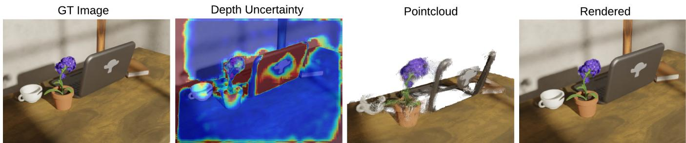
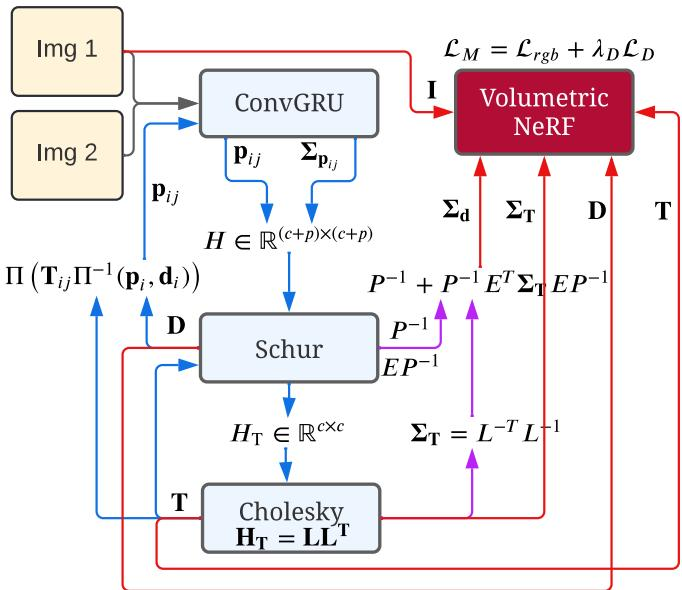
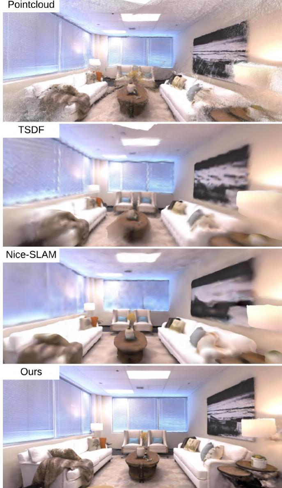
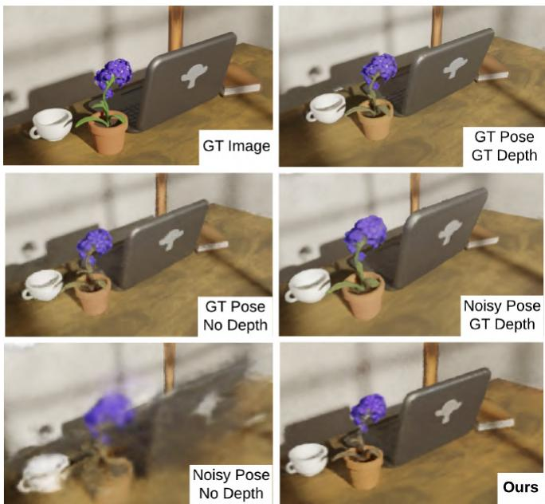
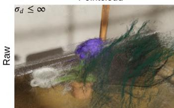
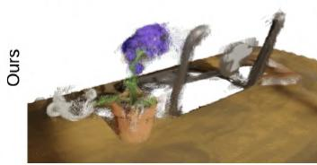
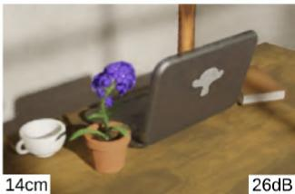
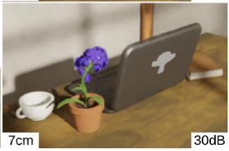
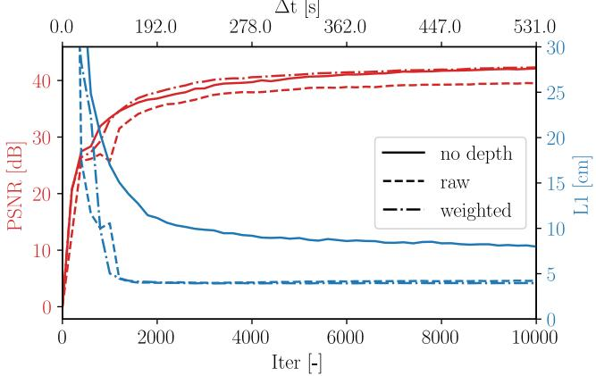

The authors are associated with Massachusetts Institute of Technology. {arosinol,jleonard,lcarlone}@mit.edu

# NeRF-SLAM: Real-Time Dense Monocular SLAM with Neural Radiance Fields

Antoni Rosinol and John J. Leonard and Luca Carlone

Abstract— We propose a novel geometric and photometric 3D mapping pipeline for accurate and real-time scene reconstruction from casually taken monocular images. To achieve this, we leverage recent advances in dense monocular SLAM and real-time hierarchical volumetric neural radiance fields. Our insight is that dense monocular SLAM provides the right information to fit a neural radiance field of the scene in realtime, by providing accurate pose estimates and depth-maps with associated uncertainty. Our proposed pipeline achieves better geometric and photometric accuracy than competing approaches (up to 178% better PSNR and 75% better L1 depth), while working in real-time and using only monocular images.

## I. INTRODUCTION

The ability to perform real-time 3D reconstruction from images alone has various applications in fields such as robotics, surveying, and gaming. Examples of such applications include autonomous vehicles, crop monitoring, and augmented reality.

3D reconstruction solutions are usually based on RGB-D or Lidar sensors, but reconstructing scenes from monocular imagery is more convenient. RGB-D cameras may fail under some conditions, such as under sunlight, and Lidar is heavier and more expensive compared to a monocular RGB camera. Stereo cameras simplify the depth estimation problem, but they require accurate calibration of the cameras, which is prone to miscalibration during practical operations. In contrast, monocular cameras are affordable, lightweight, and do not require complicated calibration procedures.

While monocular 3D reconstruction is challenging due to the absence of explicit measurements of the scene’s geometry, deep learning techniques have led to significant developments in monocular-based 3D reconstructions. Given that deep-learning currently achieves the best performance for optical flow [1], and depth [2] estimation, a plethora of works have tried to use deep-learning modules for SLAM. For example, using depth estimation networks from monoc ular images [3], multiple images, as in multi-view stereo [4], or using end-to-end neural networks [5].

However, even with the improvements due to deeplearning, building both geometrically and photometrically accurate 3D maps of the scene from a casually taken monocular video in real-time is not currently possible. In the remaining, we will refer to geometric and photometric maps as metric maps. Metric maps will be particularly useful for applications such as off-shore robotic inspection, that require reading signs and gauges, or to distinguish between pipes or cables with different colors.

Neural Radiance Fields (NeRFs ) have recently enabled 3D representations of the world that are photometrically accurate. Unfortunately, NeRFs are difficult to infer, given the costly volumetric rendering necessary to build a NeRF , leading to slow reconstructions. Further, NeRFs originally required ground-truth pose estimates to converge.

Nevertheless, recent work shows that it is possible to fit a radiance field in real-time given posed-images [6], while others show that the ground-truth poses are not strictly necessary [7], [8], as long as a sufficiently good initial estimate is given. Hence, real-time pose-free NeRF reconstructions could lead to metrically accurate 3D maps.

Despite this, a fundamental problem of NeRF representations, given no depth supervision, is that the parametrization of the surfaces by a density is prone to ‘floaters’, ghost geometry that appears because of bad initializations or convergence to bad local minima. It has been shown that adding depth supervision significantly improves the removal of this ghost geometry, and the depth signal leads to faster convergence of radiance fields [9].

Given these learnings, our insight is that having a dense monocular SLAM pipeline, that outputs close to perfect pose estimates, together with dense depth maps and uncertainty estimates, provides the right information for building neural radiance fields of the scene on the fly. Our experiments show that this is indeed possible, and that compared to other approaches we achieve more accurate reconstructions in less time.

Contributions We propose the first scene reconstruction pipeline combining the benefits of dense monocular SLAM and hierarchical volumetric neural radiance fields. Our approach builds accurate radiance fields from a stream of images, without requiring poses or depths as input, and runs in real-time. We achieve state-of-the-art performance on the Replica dataset for monocular approaches.

## II. RELATED WORK

## A. Dense SLAM

There are mainly two obstacles to achieve dense SLAM: (i) there is a significant computational burden due to the large number of depth variables to estimate, (ii) estimating the depth of the scene is difficult due to ambiguous or missing information, such as textureless surfaces or aliased images.

A solution to the computational complexity of dense SLAM is to separate the estimation of pose and depth. For instance, DTAM[10], which achieves dense SLAM, follows the same approach as sparse PTAM[11] by first tracking the camera pose and then estimating the depth in a decoupled manner. The second problem is also typically avoided by using RGB-D or Lidar sensors, that provide explicit depth measurements, or stereo cameras that simplify depth estimation.

  
Fig. 1. From left to right, input RGB image, estimated depth uncertainty, back-projected depth-maps into a pointcloud, after thresholding the depth by its uncertainty $( \sigma _ { d } \leq 1 . \mathsf { \tilde { 0 } } )$ for visualization, and our resulting neural radiance field, rendered from the same viewpoint as the input image. Our pipeline is capable of reconstructing neural radiance fields in real-time given only a stream of RGB images.

However, recent research shows impressive progress in both of these areas. To decrease the number of depth variables, CodeSLAM[5] optimizes the latent variables of an auto-encoder that outputs depth maps from images. By optimizing these latent variables, the dimensionality of the problem is significantly reduced, while the resulting depth maps remain dense. Tandem[4] reconstructs 3D scenes from monocular images by utilizing a pre-trained neural network for monocular depth estimation. Tandem then decouples the pose/depth problem by performing frame-to-model photometric tracking.

By adapting a dense optical flow estimator [1] to the problem of visual odometry, Droid-SLAM[12] achieves competitive results in a variety of challenging datasets (such as Euroc [13] and TartanAir [14] datasets), Droid-SLAM avoids the dimensionality problem by using downsampled depth maps that are subsequently upsampled using a learned upsampling operator. Rosinol et al. [15] further show that dense monocular SLAM can reconstruct faithful 3D meshes of the scene by weighting the depths estimated in dense SLAM by their marginal covariance, and subsequently fusing them in a volumetric representation. The resulting mesh is remarkably accurate, geometrically speaking, but due to the limitations of TSDF representations, their reconstruction lacks photometric detail and is not fully complete.

Our approach is inspired by the work from Rosinol et al. [15], where we replace the volumetric TSDF for a hierarchical volumetric neural radiance field as our map representation. By using radiance fields, our approach achieves photometrically accurate maps and improves the completeness of the reconstruction, while also allowing the optimization of poses and the map simultaneously.

## B. Neural Radiance Fields (NeRFs )

To enable photometrically accurate maps, NeRFs have proved to be a useful representation that allows to capture view-dependent effects while maintaining multi-view consistency. NeRF [16] is the seminal work that gave name to this representation, and sparked a revolution in terms of new papers that tried to improve several aspects, the most prominent ones being: reducing the training time to build a NeRF , and the improvement of the underlying 3D reconstruction.

While the vanilla NeRF approach, using one large MLP, requires hours of training to converge, several authors show that a smaller MLP, combined with 3D spatial data structures to partition the scene, leads to substantial speed-ups. In particular, NGLOD [17] proposes to use tiny MLPs in a volumetric grid, leading to faster reconstructions, but not quite real-time. Plenoxels [18] further improved the speed by parametrizing the directional encoding using spherical harmonics, while bypassing the use of an MLP. Finally, Instant-NGP[6] shows that with a hash-based hierarchical volumetric representation of the scene, it is possible to train a neural radiance field in real-time.

Several works also show how to improve the 3D reconstruction when using radiance fields. While a variety of works have proposed to replace the density field by a signed distance functions or other representations[19], [20], [21], [22], we are most interested on the insights related to the use of alternative supervisory signals to increase the convergence speed of NeRFs, as well as the quality of the underlying geometry [23], [20]. In particular, Mono-SDF [20] shows that state-of-the-art deep learning models for depth and normal estimation from monocular images provides useful information that can significantly improve the convergence speed and quality of the radiance field reconstruction.

Our work leverages these insights by using the information provided from dense SLAM, which estimates poses and dense depth maps. We also use the fact that dense SLAM outputs are probabilistic in nature, and use this information, which is typically discarded in current approaches, to weight the supervisory signals to fit a radiance field.

## C. SLAM with NeRFs

Another important axis of research in neural radiance fields is to remove its dependency on camera poses. This is particularly enticing for building NeRFs without having to process the data to get the camera poses of the images, a task that is usually long and is typically done using COLMAP[24].

iNeRF [25] was the first to show that it is possible to regress the camera pose given an already built NeRF of the scene. It also made evident that the basin of convergence for pose estimation is small, as it is typical from direct image alignment. Barf [7] further shows how to simultaneously fit a NeRF while estimating camera poses, given an inaccurate initial guess, by formulating the optimization as an iterative image alignment problem. They also propose to modulate NeRF ’s positional encoding (similarly to FourierFeatures[26]) to imitate coarse-to-fine approaches that improve the basin of convergence for direct approaches. Unfortunately, these approaches are too slow for online inference due to their choice of a large MLP as map representation.

iMap[27] and Nice-SLAM[28] subsequently showed how to build accurate 3D reconstructions, without the need for poses, by partially de-coupling pose and depth estimation, similarly to our approach, and by using RGB-D images. While iMAP used a single MLP for the whole scene, Nice-SLAM leveraged the learnings on volumetrically partitioning the space, as detailed above, to make inference faster and more accurate. Both approaches use depth from RGB-D cameras as input, instead, our work only uses monocular images.

Finally, VolBA [29], Orbeez-SLAM [30] and Abou-Chakra et al. [31] also use a hierarchical volumetric map for real-time SLAM, but this time from monocular images. VolBA uses a direct RGB loss for pose estimation and mapping, while Orbeez-SLAM and Abou-Chakra et al. use ORB-SLAM [32] to provide the initial poses. By using dense monocular SLAM, our approach both leverages an indirect loss for pose estimation, which is known to be more robust than direct image alignment, and has the ability to depthsupervise the radiance field, which is known to improve quality and convergence speed. Further, differently than other depth-supervised approaches [9], [33], [27], [34], [35], our depth loss is weighted by the depth’s marginal covariance, and the depth is estimated from optical-flow rather than measured by an RGB-D camera.

Overall, our work leverages recent work on dense monocular SLAM (Droid-SLAM[12]), probabilistic volumetric fusion (Rosinol et al. [15]), and hash-based hierarchical volumetric radiance fields (Instant-NGP [6]), to estimate geometric and photometric maps of the scene in real-time, without the need of depth images or poses.

## III. METHODOLOGY

The main idea of our approach is to supervise a neural radiance field using the output from dense monocular SLAM. Dense monocular SLAM can estimate dense depth maps and camera poses, while also providing uncertainty estimates for both depths and poses. With this information, we can train a radiance field with a dense depth loss weighted by the depths’ marginal covariances. By using real-time implementations of both dense SLAM and radiance field training, and by running these in parallel, we achieve realtime performance. Figure 2 shows the flow of information in our pipeline. We now explain our architecture, starting with our tracking frontend (Sec. III-A) and following with our mapping backend (Sec. III-B).

  
Fig. 2. The input to our pipeline consists of sequential monocular images (here represented as Img 1 & Img 2). Starting from the top-right, our architecture fits a NeRF using Instant-NGP [6], which we supervise using RGB images I, depths d, where the depths are weighted by their marginal covariance, $\pmb { \Sigma } _ { \mathbf { d } }$ . Inspired by Rosinol et al. [15], we compute these covariances from dense monocular SLAM. in our case we use Droid-SLAM [12]. We provide more details about the flow of information in Sec. III-A. In blue, we show Droid-SLAM’s [12] contributions and flow of information, similarly, in pink are Rosinol’s contribution [15], and in red, our contribution.

## A. Tracking: Dense SLAM with Covariances

We use as our tracking module Droid-SLAM [12], which provides dense depth maps and poses for every keyframe. Starting from a sequence of images, Droid-SLAM first computes the dense optical-flow $\mathbf { p } _ { i j }$ between pairs of frames i and j, using a similar architecture to Raft [1]. At the core of Raft is a Convolutional GRU (ConvGRU in Fig. 2) that, given the correlation between pairs of frames and a guess of the current optical flow $\mathbf { p } _ { i j }$ , computes a new flow $\mathbf { p } _ { i j }$ , as well as a weight $\pmb { \Sigma } _ { \mathbf { p } _ { i j } }$ for each optical flow measurement.

With these flows and weights as measurements, Droid-SLAM solves a dense bundle adjustment (BA) problem where the 3D geometry is parametrized as a set of inverse depth maps per keyframe. This parametrization of the structure leads to an extremely efficient way of solving the dense BA problem, which can be formulated as a linear leastsquares problem by linearizing the system of equations into the familiar cameras/depths arrow-like block-sparse Hessian $H \in \mathbb { R } ^ { ( c + p ) ^ { 2 } }$ , where c and $p$ are the dimensionality of the cameras and the points.

As can be seen in Fig. 2, to solve the linear least-squares problem, we take the Schur complement of the Hessian to compute the reduced camera matrix $H _ { T }$ , which does not depend on the depths, and has a much smaller dimensionality $\mathrm { o f } \ \bar { \mathbb { R } } ^ { c ^ { 2 } }$ . The resulting smaller problem over the camera poses is solved by taking the Cholesky factorization of $H _ { T } = L L ^ { T }$ where L is the lower-triangular Cholesky factor, and then solving for the poses T by front and back-substitution. As shown at the bottom of Fig. 2, given these poses T, we can solve for the depths d. Furthermore, given poses $T$ and depths $d ,$ Droid-SLAM proposed to compute the induced optical-flow and feeding it again as an initial guess to the ConvGRU network, as seen on the left side of Fig. 2, where Π and $\Pi ^ { - 1 }$ , are the projection and back-projection functions. The blue arrows in Fig. 2 show the tracking loop, and corresponds to Droid-SLAM.

Then, inspired by Rosinol et al. [15], we further compute the marginal covariances of both the dense depth maps and the poses from Droid-SLAM, purple arrows in Fig. 2. For this, we need to leverage the structure of the Hessian, which we block-partition as follows:

$$
\begin{array} { r } { H \mathbf { x } = \mathbf { b } , \left[ \begin{array} { l l } { C } & { E } \\ { E ^ { T } } & { P } \end{array} \right] \left[ \begin{array} { l } { \Delta \pmb { \xi } } \\ { \Delta \mathbf { d } } \end{array} \right] = \left[ \begin{array} { l } { \mathbf { v } } \\ { \mathbf { w } } \end{array} \right] , } \end{array}\tag{1}
$$

where H is the Hessian matrix, C is the block camera matrix, and P is the diagonal matrix corresponding to the inverse depths per pixel per keyframe. We represent by $\Delta \xi$ the delta updates on the lie algebra of the camera poses in $S E ( 3 )$ while ∆d is the delta update to the per-pixel inverse depths.

From this block-partitioning of the Hessian, we can efficiently calculate the marginal covariances for the dense depths $\pmb { \Sigma } _ { \mathbf { d } }$ and poses $\pmb { \Sigma } _ { \mathbf { T } }$ , as shown in [15]:

$$
\begin{array} { r l } & { \pmb { \Sigma _ { \mathbf { d } } } = P ^ { - 1 } + P ^ { - T } E ^ { T } \pmb { \Sigma _ { \mathbf { T } } } E P ^ { - 1 } } \\ & { \pmb { \Sigma _ { \mathbf { T } } } = ( L L ^ { T } ) ^ { - 1 } . } \end{array}\tag{2}
$$

We refer to [15] for details on how to compute these in realtime.

Finally, given all the information computed by the tracking module – the poses, the depths, their respective marginal covariances, as well as the input RGB images – we can optimize our radiance field’s parameters and refine the camera poses simultaneously.

## B. Mapping: Probabilistic Volumetric NeRF

Given the dense depth-maps for each keyframe, it is possible to depth-supervise our neural volume. Unfortunately, the depth-maps are extremely noisy due to their density, since even textureless regions are given a depth value. Figure 5 shows that the resulting pointcloud from dense monocular SLAM is particularly noisy and contains large outliers (‘raw pointcloud in Fig. 5). Supervising our radiance field given these depth-maps can lead to biased reconstructions, as shown in Fig. 5, and as discussed in Sec. IV-D.

Rosinol et al.[15] showed that the uncertainty of the depth estimates is an excellent signal to weight the depth values for classical TSDF volumetric fusion. Inspired by these results, we use the depth uncertainty estimation to weight the depth loss which we use to supervise our neural volume. Figure 1 shows the input RGB image, its corresponding depth-map uncertainty, the resulting pointcloud (after thresholding its uncertainty by $\sigma _ { d } \leq 1 . 0$ for visualization), and our results when using our uncertainty-weighted depth loss.

Given the uncertainty-aware losses, we formulate our mapping loss as:

$$
\mathcal { L } _ { M } \left( \mathbf { T } , \Theta \right) = \mathcal { L } _ { \mathrm { r g b } } \left( \mathbf { T } , \Theta \right) + \lambda _ { D } \mathcal { L } _ { \mathrm { D } } \left( \mathbf { T } , \Theta \right)\tag{3}
$$

which we minimize with respect to both poses T and neural parameters Θ, given hyper-parameter $\lambda _ { D }$ balancing depth and color supervision (we set $\lambda _ { D }$ to 1.0). In particular, our depth loss is given by:

$$
\mathcal { L } _ { \mathrm { D } } \left( \mathbf { T } , \Theta \right) = \| D - D ^ { \star } ( \mathbf { T } , \Theta ) \| _ { \Sigma _ { D } } ^ { 2 } ,\tag{4}
$$

where $D ^ { \star }$ is the rendered depth, and $D , \Sigma _ { D }$ are the dense depth and uncertainty as estimated by the SLAM frontend. We render the depth $D ^ { \star }$ as the expected ray termination distance, similarly to [16], [9]. Each depth per pixel is computed by sampling 3D positions along the pixel’s ray, evaluating the density $\sigma _ { i }$ at sample i, and alpha-compositing the resulting densities, similarly to standard volumetric rendering:

$$
d ^ { \star } = \sum _ { i } \mathcal { T } _ { i } \Big ( 1 - \exp \left( - \sigma _ { i } \delta _ { i } \right) \Big ) d _ { i } ,\tag{5}
$$

with $d _ { i }$ the depth of a sample i along the ray, and $\delta _ { i } \ =$ $d _ { i + 1 } - d _ { i }$ the distance between consecutive samples. $\sigma _ { i }$ is the volume density, generated by evaluating an MLP at the 3D world coordinate of sample i. We refer to [6] for more details on the inputs given to the MLP. Lastly, T is the accumulated transmittance along the ray up to sample i, defined as:

$$
\mathcal { T } _ { i } = \exp \Bigl ( - \sum _ { j < i } \sigma _ { j } \delta _ { j } \Bigr ) .\tag{6}
$$

Our color loss is defined as in the original NeRF [16]:

$$
\mathcal { L } _ { \mathrm { r g b } } \left( \mathbf { T } , \Theta \right) = \| \boldsymbol { I } - \boldsymbol { I } ^ { \star } ( \mathbf { T } , \Theta ) \| ^ { 2 } ,\tag{7}
$$

where $I ^ { \star }$ is the rendered color image, synthesized similarly to the depth image, by using volumetric rendering. Each color per pixel is likewise computed by sampling along the pixel’s ray and alpha-compositing the resulting densities and colors: $\begin{array} { r } { \sum _ { i } \mathcal { T } _ { i } \big ( 1 - \exp \left( - \sigma _ { i } \delta _ { i } \right) \big ) \mathbf { c } _ { i } } \end{array}$ , where $\mathcal { T } _ { i }$ is again the transmittance as in Eq. (6), and $\mathbf { c } _ { i }$ is the color estimated by the MLP. Both the density $\sigma _ { i }$ and the color $\mathbf { c } _ { i }$ are estimated simultaneously for a given sample i.

The mapping thread continuously minimizes our mapping loss function $\mathcal { L } _ { M } ( \mathbf { T } , \Theta ) \ ( \mathrm { E q . \ } ( 3 ) )$ . In Sec. IV, we show that this approach achieves impressive results while running in real-time.

## C. Architecture

Our pipeline consists of a tracking and a mapping thread, both running in real-time and in parallel. The tracking thread continuously minimizes the BA re-projection error for an active window of keyframes. The mapping thread always optimizes all of the keyframes received from the tracking thread, and does not have a sliding window of active frames.

The only communication between these threads happens when the tracking pipeline generates a new keyframe. On every new keyframe, the tracking thread sends the current keyframes’ poses with their respective images and estimated depth-maps, as well as the depths’ marginal covariances, to the mapping thread. Only the information currently available in the sliding optimization window of the tracking thread is sent to the mapping thread. The active sliding window of the tracking thread consists of at most 8 keyframes. The tracking thread generates a new keyframe as long as the mean opticalflow between the previous keyframe and the current frame is higher than a threshold (in our case 2.5 pixels).

Finally, the mapping thread is also in charge of rendering for interactive visualization of the reconstruction.

## D. Implementation Details

We perform all computations in Pytorch and CUDA, and use an RTX 2080 Ti GPU for all our experiments (11Gb of memory). We use Instant-NGP[6] as our hierarchical volumetric neural radiance field map, which we modify to add our proposed mapping loss ${ \mathcal { L } } _ { M }$ in Eq. (3). As our SLAM frontend, we use Droid-SLAM[12], and re-use their pretrained weights. We compute depth and pose uncertainties using Rosinol’s approach [15] which computes uncertainties in real-time. We use the same GPU for both tracking and mapping, although our approach allows the use of two separate GPUs for tracking and mapping.

## IV. RESULTS

In the following, we evaluate our approach against competing techniques, and provide ablation experiments to evaluate the improvements deriving from our proposed architecture and suggested uncertainty-aware loss.

## A. Datasets

We use two datasets for evaluation: the Cube-Diorama dataset [31] and the Replica dataset [36].

Cube-Diorama is a synthetic dataset generated with Blender, which provides ground-truth poses, depths, and images. Using this dataset, we are able to do accurate ablation experiments to evaluate the benefits of our proposed approach.

The Replica dataset provides real-world scenes which we use to evaluate and compare our approach with related work. The dataset consists of high quality 3D reconstructions of 5 offices and 3 apartments. For evaluation, we use the data generated by rendering a random trajectory of 2000 RGB and depth frames per scene (as generated by the authors of iMAP[27]). The rendered depth-maps can be considered ground-truth, since they have been rendered from the groundtruth mesh.

## B. Methods for Evaluation

The approaches we are comparing are classical TSDFfusion [37], probabilistic TSDF-Fusion from Rosinol et al. [15] (which we name σ-Fusion), iMAP [27], and Nice-SLAM [28]. This allows us to compare geometric and probabilistic approaches (TSDF-Fusion, σ-Fusion), as well as learning-based approaches (iMAP and Nice-SLAM).

TSDF-Fusion and σ-Fusion use a hash-based volumetric representation to fuse posed depth-maps estimated from our frontend. While TSDF-Fusion uses a uniform weight for the depth-maps, σ-Fusion uses the depth-maps uncertainties to weight down the depths, similarly to ours. iMAP uses one large MLP to represent the 3D scene, while Nice-SLAM uses hierarchical dense volumetric grids for mapping, similarly to our choice of hash-based hierarchical volumes.

Finally, both iMAP and Nice-SLAM use the depth-maps rendered from the ground-truth meshes as measurements, which leads to better results than what we would reasonably expect from a casually moving RGB-D camera. Therefore, we also evaluate Nice-SLAM without ground-truth depthmaps as supervisory signal.

  
Fig. 3. Qualitative results on the Replica office-0 dataset using different mapping approaches. From top to bottom, raw pointcloud from our frontend, TSDF reconstruction using σ-Fusion, Nice-SLAM’s results, and ours.

## C. Geometric and Photometric Accuracy

The Replica dataset allows us to evaluate the geometric and photometric quality of the different approaches. In particular, we use the L1 depth error between the estimated and the ground-truth depth-maps as a proxy for geometric accuracy (Depth L1), as well as the peak signal-to-noise ratio (PSNR) between the input RGB images and the rendered images for photometric accuracy.

Table I shows the results achieved by the different approaches we evaluate. The first two rows correspond to iMAP and Nice-SLAM under their default setup, with ground-truth depth used as supervisory signal. Nice-SLAM is superior to iMAP in terms of geometric and photometric accuracy. The following rows correspond to approaches that do not use the ground-truth depth-maps. We run TSDF-Fusion and σ- Fusion with the poses and depth-maps estimated by our frontend, with σ-Fusion further using the depths’ uncertainties. While σ-Fusion achieves better geometric reconstructions than TSDF-Fusion, both achieve poor photometric accuracy (we render the resulting 3D mesh extracted using marching cubes). We also run Nice-SLAM without ground-truth depth. As expected, Nice-SLAM’s results deteriorate when not using ground-truth depth, but it still achieves competitive results when compared to TSDF fusion, particularly in terms of photometric accuracy (PSNR). Finally, our approach achieves the best results in terms of photometric accuracy, and geometric accuracy by a substantial margin in most scenes. Compared to Nice-SLAM, we achieve up to 178% PSNR improvements in office-1, and up to 75% better L1 accuracy in room-2, with the best combined improvements seen in room-2 (135% better PSNR, 75% better L1).

<table><tr><td></td><td></td><td>room-0</td><td>room-1</td><td>room-2</td><td>office-0</td><td>office-1</td><td>office-2</td><td>office-3</td><td>office-4</td><td>Avg.</td></tr><tr><td rowspan="2">iMAP* [27] (GT depth)</td><td>Depth L1 [cm] ↓</td><td>5.70</td><td>4.93</td><td>6.94</td><td>6.43</td><td>7.41</td><td>14.23</td><td>8.68</td><td>6.80</td><td>7.64</td></tr><tr><td>PSNR [dB] ↑</td><td>5.66</td><td>5.31</td><td>5.64</td><td>7.39</td><td>11.89</td><td>8.12</td><td>5.62</td><td>5.98</td><td>6.95</td></tr><tr><td rowspan="2">Nice-SLAM [28] (GT depth)</td><td>Depth L1 [cm] ↓</td><td>2.53</td><td>3.45</td><td>2.93</td><td>1.51</td><td>0.93</td><td>8.41</td><td>10.48</td><td>2.43</td><td>4.08</td></tr><tr><td>PSNR [dB] ↑</td><td>29.90</td><td>29.12</td><td>19.80</td><td>22.44</td><td>25.22</td><td>22.79</td><td>22.94</td><td>24.72</td><td>24.61</td></tr><tr><td rowspan="2">TSDF-Fusion Res. = 256 (our depth)</td><td>Depth L1 [cm] ↓</td><td>23.51</td><td>20.94</td><td>23.34</td><td>14.11</td><td>10.50</td><td>30.89</td><td>28.92</td><td>22.83</td><td>21.88</td></tr><tr><td>PSNR [dB] ↑</td><td>3.43</td><td>4.51</td><td>5.57</td><td>11.16</td><td>15.92</td><td>4.86</td><td>5.68</td><td>5.46</td><td>7.07</td></tr><tr><td rowspan="2">σ-Fusion[15] Res. = 256 (our depth)</td><td>Depth L1 [cm] ↓</td><td>21.92</td><td>19.28</td><td>22.40</td><td>13.80</td><td>10.21</td><td>22.27</td><td>28.70</td><td>22.21</td><td>20.10</td></tr><tr><td>PSNR [dB] ↑</td><td>3.45</td><td>4.51</td><td>5.57</td><td>11.16</td><td>15.92</td><td>4.86</td><td>5.69</td><td>5.46</td><td>7.08</td></tr><tr><td rowspan="2">Nice-SLAM [28] (no depth)</td><td>Depth L1 [cm] ↓</td><td>11.12</td><td>9.42</td><td>19.03</td><td>11.12</td><td>10.24</td><td>16.36</td><td>21.33</td><td>14.81</td><td>14.18</td></tr><tr><td>PSNR [dB] ↑</td><td>18.15</td><td>18.22</td><td>17.82</td><td>20.23</td><td>19.14</td><td>15.22</td><td>16.12</td><td>17.24</td><td>17.76</td></tr><tr><td rowspan="2">Ours (our depth)</td><td>Depth L1 [cm] ↓</td><td>8.11</td><td>5.06</td><td>4.72</td><td>4.58</td><td>16.32</td><td>14.14</td><td>14.18</td><td>7.19</td><td>9.29</td></tr><tr><td>PSNR [dB] ↑</td><td>34.09</td><td>37.52</td><td>41.90</td><td>50.62</td><td>53.21</td><td>39.60</td><td>39.74</td><td>39.53</td><td>42.03</td></tr></table>

TABLE I  
GEOMETRIC (L1) AND PHOTOMETRIC (PSNR) RESULTS FOR THE REPLICA DATASET. IMAP AND NICE-SLAM ARE FIRST EVALUATED USING THEGROUND-TRUTH DEPTH FROM REPLICA AS SUPERVISION (TOP TWO ROWS). WE ALSO EVALUATE NICE-SLAM WHEN NOT USING GROUND-TRUTHDEPTH AS SUPERVISION FOR COMPARISON. TSDF-FUSION, σ-FUSION, AND OUR APPROACH ARE EVALUATED USING THE POSES AND DEPTHS FROMDENSE MONOCULAR SLAM, AS EXPLAINED IN SEC. III-A.

Figure 3 provides a qualitative comparison between the different map representations and approaches, where we render the different 3D representations for comparison. The top image is the raw pointcloud estimated by our frontend, where each 3D point is generated by back-projecting the pixel’s depth and colored using the pixel’s RGB values. The second image corresponds to the rendered 3D mesh extracted using marching cubes from the volumetric TSDF map built using σ-Fusion. The next two images are rendered images from Nice-SLAM and our approach.

Overall, our approach achieves noticeably better results than the other representations. Remarkably, while the TSDF representation (using σ-Fusion) uses the same pose, depth, and uncertainty estimates than our approach, it achieves significantly worst results compared to our approach.

  
Fig. 4. Impact on the performance when using depth supervision with and without ground-truth depth, and when initializing the poses with groundtruth or noisy poses; compared with our approach which estimates dense depths and poses. Results after 60s of convergence.

## D. Depth Loss Ablation

Depth supervision of neural radiance fields from raw depth-maps, either estimated from dense SLAM or coming from RGB-D, is prone to errors, because depth-maps are most often noisy and with outliers. For dense monocular SLAM, this is particularly problematic, since depth values are estimated even for textureless or aliased regions.

Fig. 4 shows that the ideal scenario is to use groundtruth pose and ground-truth depth for fast and accurate neural radiance field reconstruction (top-right image). If ground-truth depths are not provided, but ground-truth poses are available, the radiance field also converges, although at a slower pace (mid-left); this is the classical input for NeRF (posed images). Instead, if we provide noisy poses and no depth-maps, the radiance field does not converge in less than 60s (bottom-left), while using the ground-truth depth and noisy poses still leads to great results (mid-right). Our approach aims to reach this last result. The bottom-right image in Fig. 4 shows that our approach can achieve great results despite using noisy poses and depths, as long as these are weighted by their uncertainty.

In particular, in Fig. 5, we show that if the noisy depths (top-left image) are used as priors without weighting them by their covariance, the convergence is slower and biased. PSNR and L1-depth are worst by 4dB and 7cm, respectively, after 120s (top-right image). Instead, our approach is resilient to these depths, if we weight them by their marginal covariance (bottom-right image).

Fig. 5’s convergence plot shows that if we do not use depths, and only leverage the poses from our frontend, the photometric convergence is already good, showing that the pose estimates are sufficiently accurate for convergence. Nonetheless, the radiance field depth estimates are inaccurate (7.8cm L1 depth error after 500s). If we use our dense depths (‘raw’ in Fig. 5’s plot), the depth error reduces by almost half, to 4.1cm. Unfortunately, using depth without uncertainty weighting leads to worst PSNR (3dB) than when not using depths, as it may bias the geometry of the scene. Finally, weighting the frontend’s depth estimates achieves the best PSNR and L1 depth metrics: it achieves similar PSNR than when not using depths, while having the same L1 error than when using depths.

## E. Real-Time Performance

Our pipeline is capable of running at 12 frames per second, with images of 640 × 480 resolution. The tracking thread runs at 15 frames per second on average, creating around 10 keyframes per second, depending on the amount of motion. We add a keyframe every time the mean optical flow is larger than 2.5 pixels. The mapping thread runs at 10 frames per second on average. Overall, our pipeline is able to reconstruct the scene in real-time at 10 frames per second, by parallelizing camera tracking and radiance field reconstruction, and by using custom CUDA kernels.

## V. LIMITATIONS

Our approach requires ∼11Gb of GPU memory to operate, given that we use dense correlation volumes between pairs of images in the SLAM frontend and that we use hierarchical volumetric grids for mapping. The resulting memory requirements can be prohibitively large for robotics applications with low compute power, such as for drones.

Nevertheless, these memory requirements can be alleviated in two ways. On the one hand, correlation volumes can be computed on the fly, as noted in [1], reducing the need to store dense correlation volumes. On the other hand, the volumetric information can be streamed to the CPU for inactive regions, only loading to GPU a sliding window around the region of interest, similarly to [38].

  
Fig. 5. (Top-Left) Raw pointcloud estimated by the tracking frontend, (Bottom-Left) Pointcloud after thresholding the depth uncertainty $( \sigma _ { d } \ \leq$ 1.0) for visualization. (Right Column) Radiance field reconstructions after 120s of optimization, with and without depth weighting (top-right and bottom-right respectively). The convergence plot compares the PSNR and L1 depth metrics over time (∆t[s]) and iteration (Iter[-]) when not using depths, when using the raw depths without weighting, and using our approach. Room scene in Cube-Diorama dataset [31].

## VI. CONCLUSION

We show that dense monocular SLAM provides the ideal information for building a NeRF representation of a scene from a casually taken monocular video. The estimated poses and depth-maps from dense SLAM, weighted by their marginal covariance estimates, provide the ideal source of information to optimize a hierarchical hash-based volumetric neural radiance field. With our approach, users can generate a photometrically and geometrically accurate reconstruction of the scene in real-time.

Future work can leverage our approach to extend the definition of metric-semantic SLAM [39], which typically only considers geometric and semantic properties, by build ing representations that are also photometrically accurate. Beyond metric-semantic SLAM, our approach can be used as the mapping engine for high-level scene understanding, such as for building 3D Dynamic Scene Graphs [40], [41].

## ACKNOWLEDGMENTS

This work is partially funded by ‘la Caixa’ Foundation (ID 100010434), LCF/BQ/AA18/11680088 (A. Rosinol), ‘Rafael Del Pino’ Foundation (A. Rosinol), ARL DCIST CRA W911NF-17-2-0181, and ONR MURI grant N00014-19-1- 2571. We thank Bernardo Aceituno and Yen-Chen Lin for helpful discussions.

## REFERENCES

[1] Z. Teed and J. Deng, “Raft: Recurrent all-pairs field transforms for optical flow,” in European Conf. on Computer Vision (ECCV), 2020.

[2] Y. Yao, Z. Luo, S. Li, T. Fang, and L. Quan, “MVSNet: Depth inference for unstructured multi-view stereo,” in European Conf. on Computer Vision (ECCV), 2018.

[3] K. Tateno, F. Tombari, I. Laina, and N. Navab, “CNN-SLAM: Realtime dense monocular SLAM with learned depth prediction,” in IEEE Conf. on Computer Vision and Pattern Recognition (CVPR), 2017.

[4] L. Koestler, N. Yang, N. Zeller, and D. Cremers, “Tandem: Tracking and dense mapping in real-time using deep multi-view stereo,” in Conference on Robot Learning (CoRL), 2022.

[5] M. Bloesch, J. Czarnowski, R. Clark, S. Leutenegger, and A. J. Davison, “CodeSLAM: learning a compact, optimisable representation for dense visual SLAM,” in IEEE Conf. on Computer Vision and Pattern Recognition (CVPR), 2018.

[6] T. Muller, A. Evans, C. Schied, and A. Keller, “Instant neural graphics¨ primitives with a multiresolution hash encoding,” ACM Transactions on Graphics (SIGGRAPH), 2022.

[7] C.-H. Lin, W.-C. Ma, A. Torralba, and S. Lucey, “Barf: Bundleadjusting neural radiance fields,” in Intl. Conf. on Computer Vision (ICCV), 2021.

[8] S.-F. Chng, S. Ramasinghe, J. Sherrah, and S. Lucey, “Garf: Gaussian activated radiance fields for high fidelity reconstruction and pose estimation,” arXiv e-prints, 2022.

[9] K. Deng, A. Liu, J.-Y. Zhu, and D. Ramanan, “Depth-supervised NeRF: Fewer views and faster training for free,” in IEEE Conf. on Computer Vision and Pattern Recognition (CVPR), 2022.

[10] R. Newcombe, S. Lovegrove, and A. Davison, “DTAM: Dense tracking and mapping in real-time,” in Intl. Conf. on Computer Vision (ICCV), 2011.

[11] G. Klein and D. Murray, “Parallel tracking and mapping for small AR workspaces,” in IEEE and ACM Intl. Sym. on Mixed and Augmented Reality (ISMAR), 2007.

[12] Z. Teed and J. Deng, “Droid-SLAM: Deep visual SLAM for monocular, stereo, and RGB-D cameras,” Advances in Neural Information Processing Systems (NIPS), 2021.

[13] M. Burri, J. Nikolic, P. Gohl, T. Schneider, J. Rehder, S. Omari, M. Achtelik, and R. Siegwart, “The EuRoC micro aerial vehicle datasets,” Intl. J. of Robotics Research, 2016.

[14] W. Wang, D. Zhu, X. Wang, Y. Hu, Y. Qiu, C. Wang, Y. Hu, A. Kapoor, and S. Scherer, “TartanAir: A dataset to push the limits of visual SLAM,” in IEEE/RSJ Intl. Conf. on Intelligent Robots and Systems (IROS), 2020.

[15] A. Rosinol, J. Leonard, and L. Carlone, “Probabilistic Volumetric Fusion for Dense Monocular SLAM,” in IEEE Winter Conf. on Applications of Computer Vision (WACV), 2022.

[16] B. Mildenhall, P. P. Srinivasan, M. Tancik, J. T. Barron, R. Ramamoorthi, and R. Ng, “NeRF: Representing scenes as neural radiance fields for view synthesis,” in European Conf. on Computer Vision (ECCV), 2020.

[17] T. Takikawa, J. Litalien, K. Yin, K. Kreis, C. Loop, D. Nowrouzezahrai, A. Jacobson, M. McGuire, and S. Fidler, “Neural geometric level of detail: Real-time rendering with implicit 3D shapes,” in IEEE Conf. on Computer Vision and Pattern Recognition (CVPR), 2021.

[18] A. Yu, S. Fridovich-Keil, M. Tancik, Q. Chen, B. Recht, and A. Kanazawa, “Plenoxels: Radiance fields without neural networks,” arXiv preprint arXiv:2112.05131, 2021.

[19] M. Oechsle, S. Peng, and A. Geiger, “Unisurf: Unifying neural implicit surfaces and radiance fields for multi-view reconstruction,” in Intl. Conf. on Computer Vision (ICCV), 2021.

[20] Z. Yu, S. Peng, M. Niemeyer, T. Sattler, and A. Geiger, “MonoSDF: Exploring Monocular Geometric Cues for Neural Implicit Surface Reconstruction,” arXiv preprint arXiv:2206.00665, 2022.

[21] P. Wang, L. Liu, Y. Liu, C. Theobalt, T. Komura, and W. Wang, “Neus: Learning neural implicit surfaces by volume rendering for multi-view reconstruction,” Advances in Neural Information Processing Systems (NIPS), 2021.

[22] L. Yariv, J. Gu, Y. Kasten, and Y. Lipman, “Volume rendering of neural implicit surfaces,” Advances in Neural Information Processing Systems (NIPS), 2021.

[23] J. Wang, P. Wang, X. Long, C. Theobalt, T. Komura, L. Liu, and W. Wang, “Neuris: Neural reconstruction of indoor scenes using normal priors,” arXiv preprint arXiv:2206.13597, 2022.

[24] J. L. Schonberger and J.-M. Frahm, “Structure-from-motion revisited,” in IEEE Conf. on Computer Vision and Pattern Recognition (CVPR), 2016.

[25] L. Yen-Chen, P. Florence, J. Barron, A. Rodriguez, P. Isola, and T.-Y. Lin, “iNeRF: Inverting neural radiance fields for pose estimation,” in IEEE/RSJ Intl. Conf. on Intelligent Robots and Systems (IROS), 2021.

[26] M. Tancik, P. Srinivasan, B. Mildenhall, S. Fridovich-Keil, N. Raghavan, U. Singhal, R. Ramamoorthi, J. Barron, and R. Ng, “Fourier features let networks learn high frequency functions in low dimensional domains,” Advances in Neural Information Processing Systems (NIPS), 2020.

[27] E. Sucar, S. Liu, J. Ortiz, and A. J. Davison, “iMAP: Implicit mapping and positioning in real-time,” in IEEE Conf. on Computer Vision and Pattern Recognition (CVPR), 2021.

[28] Z. Zhu, S. Peng, V. Larsson, W. Xu, H. Bao, Z. Cui, M. R. Oswald, and M. Pollefeys, “Nice-SLAM: Neural implicit scalable encoding for SLAM,” in IEEE Conf. on Computer Vision and Pattern Recognition (CVPR), 2022.

[29] R. Clark, “Volumetric bundle adjustment for online photorealistic scene capture,” in IEEE Conf. on Computer Vision and Pattern Recognition (CVPR), 2022.

[30] C.-M. e. a. Chung, “Orbeez-SLAM: A Real-time Monocular Visual SLAM with ORB Features and NeRF-realized Mapping,” arXiv preprint arXiv:2209.13274, 2022.

[31] J. Abou-Chakra, F. Dayoub, and N. Sunderhauf, “Implicit object¨ mapping with noisy data,” arXiv preprint arXiv:2204.10516, 2022.

[32] R. Mur-Artal and J. D. Tardos, “ORB-SLAM2: an open-source SLAM´ system for monocular, stereo and RGB-D cameras,” IEEE Trans. Robotics, vol. 33, no. 5, pp. 1255–1262, 2017.

[33] L. Yen-Chen, P. Florence, J. T. Barron, T.-Y. Lin, A. Rodriguez, and P. Isola, “NeRF-Supervision: Learning Dense Object Descriptors from Neural Radiance Fields,” arXiv preprint arXiv:2203.01913, 2022.

[34] A. Dey, Y. Ahmine, and A. I. Comport, “Mip-NeRF RGB-D: Depth Assisted Fast Neural Radiance Fields,” arXiv preprint arXiv:2205.09351, 2022.

[35] D. Azinovic, R. Martin-Brualla, D. B. Goldman, M. Nießner, and´ J. Thies, “Neural RGB-D surface reconstruction,” in IEEE Conf. on Computer Vision and Pattern Recognition (CVPR), 2022.

[36] J. e. a. Straub, “The Replica dataset: A digital replica of indoor spaces,” 2019.

[37] B. Curless and M. Levoy, “A volumetric method for building complex models from range images,” in SIGGRAPH, 1996.

[38] T. Whelan, J. B. McDonald, M. Kaess, M. F. Fallon, H. Johannsson, and J. J. Leonard, “Kintinuous: Spatially extended Kinect-Fusion,” in RSS Workshop on RGB-D: Advanced Reasoning with Depth Cameras, Sydney, Australia, July 2012.

[39] A. Rosinol, A. Violette, M. Abate, N. Hughes, Y. Chang, J. Shi, A. Gupta, and L. Carlone, “Kimera: from SLAM to Spatial Perception with 3D Dynamic Scene Graphs,” Intl. J. of Robotics Research, 2021, (pdf).

[40] I. Armeni, O. Sener, A. Zamir, H. Jiang, I. Brilakis, M. Fischer, and S. Savarese, “3D semantic parsing of large-scale indoor spaces,” in IEEE Conf. on Computer Vision and Pattern Recognition (CVPR), 2016, pp. 1534–1543.

[41] A. Rosinol, A. Gupta, M. Abate, J. Shi, and L. Carlone, “3D Dynamic Scene Graphs: Actionable Spatial Perception with Places, Objects, and Humans,” in Robotics: Science and Systems (RSS), 2020, (pdf), (media), (video). [Online]. Available: http: //news.mit.edu/2020/robots-spatial-perception-0715