www.advintellsyst.com

# Point-LIO: Robust High-Bandwidth Light Detection and Ranging Inertial Odometry

Dongjiao He,\* Wei Xu, Nan Chen, Fanze Kong, Chongjian Yuan, and Fu Zhang

Herein, point light detection and ranging inertial odometry (LIO) is presented: a robust and high-bandwidth light detection and ranging (LiDAR) inertial odometry with the capability to estimate extremely aggressive robotic motions. Point-LIO has two key novelties. The first one is a point-by-point LIO framework that updates the state at each LiDAR point measurement. This framework allows an extremely high-frequency odometry output, significantly increases the odometry bandwidth, and fundamentally removes the artificial in-frame motion distortion. The second one is a stochastic process-augmented kinematic model which models the IMU measurement as an output. This new modeling method enables accurate localization and reliable mapping for aggressive motions even with inertial measurement unit (IMU) measurements saturated in the middle of the motion. Various real-world experiments are conducted for performance evaluation. Overall, Point-LIO is capable to provide accurate, high-frequency odometry (4–8 kHz) and reliable mapping under severe vibrations and aggressive motions with high angular velocity (75 rad s1) beyond the IMU measuring ranges. Furthermore, an exhaustive benchmark comparison is conducted. Point-LIO achieves consistently comparable accuracy and time consumption. Finally, two example applications ofPoint-LIO are demonstrated, one is a racing drone and the other is a self-rotating unmanned aerial vehicle, both have aggressive motions.

## 1. Introduction

Over the past decades, due to the direct, dense, active, and accurate measurements of depth, 3D light detection and ranging (LiDAR) sensors have been playing an increasingly important role in autonomous applications, such as view-based simultaneous localization and mapping (SLAM),[1,2] robotic exploration and inspection,[3,4] and autonomous driving.[5–8] Recent developments[9,10] in LiDAR technologies have enabled the commercialization and mass production of lightweight, costefficient, and high-performance LiDAR sensors, with the potential to benefit a range of existing and emerging applications such as autonomous navigation[11] and object detection.[12,13]

A fundamental requirement of LiDAR sensors applied in navigation tasks is to provide accurate position estimations for robot control and consistent and high-rate mappings for timely perception of the environment. By measuring points at an extremely high rate (e.g., millions per second), LiDAR sensors could enable considerably high-rate odometry and mapping, which allows the tracking of extremely high-speed motions. However, existing approaches are all based on a frame architecture similar to vision-based methods, where the points in a frame are processed periodically at a certain frame rate (e.g., 10 Hz). However, in reality, the LiDAR points are sampled sequentially at different time instants; accumulating these points into a frame will introduce artificial motion distortion and adversely affect the mapping result and odometry accuracy. The low frame rate also increases latency in the odometry and limits the attainable bandwidth, where the odometry bandwidth is defined in analogy to the bandwidth of a dynamic system, which is the frequency where the system gain drops below 0.707. An odometry bandwidth represents how fast a motion could be such that the odometry can estimate satisfactorily.

In this work, we address these issues by two key novel techniques: point-by-point state update and stochastic-processaugmented kinematic model. More specifically, our contributions are as follows: 1) We propose a point-wise LiDAR-inertial odometry (LIO) framework, which fuses a LiDAR point at its actual sampling time without accumulating into a frame. The elimination of points accumulation removes the in-frame motion distortion and allows high odometry output and mapping update at nearly the point sampling rate, which further enables the system to track very fast motions; 2) To further advance the system bandwidth beyond the inertial measurement unit (IMU) measuring range, we use a stochastic process model[14] to model the IMU measurements. Then, we augment this model into the system kinematics and treat the IMU measurements as system output. The stochastic process-augmented kinematic model allows the smooth estimation of system state, including angular velocity and linear acceleration, even when IMU saturates; 3) We integrate these two key techniques into a full tightly coupled LIO system, termed as Point-LIO. The system uses an on-manifold extended Kalman filter (EKF) to update the system state by fusing each LiDAR point or IMU data at its respective sampling time. By exploiting the system sparsity and linearity, the developed system achieves realtime state estimation even on low-power Advanced RISC (reduced instruction set computer) Machines (ARM)-based computer onboard a microaerial vehicle; and 4) The developed system is tested in various challenging real-world data collected by an emerging solid-state LiDAR with very small FoV. The results show the ability ofPoint-LIO on motion distortion compensation, high odometry output rate (4–8 kHz), and high bandwidth (>150 Hz). The system is also able to estimate states under extremely aggressive motions (of angular velocity more than 75 rad s1) with saturated IMU measurements after the initial stage. Furthermore, an exhaustive benchmark comparison on 12 sequences from various open LiDAR datasets shows that Point-LIO achieves consistently comparable accuracy and efficiency to other counterparts while costing fewer computation resources. Real-world applications on actual unmanned aerial vehicles (UAVs) are finally demonstrated.

The remaining article is organized as follows. In Section 2, we discuss relevant research works. We give an overview of the complete system pipeline in Section 3. Section 4 presents the system formulation, an EKF-based state estimator, and summarizes the algorithm. The evaluations of the system are presented in Section 5 and benchmark comparison on open datasets is reported in Section 6. Finally, applications of the system in real-world UAVs are shown in Section 7, followed by conclusions in Section 8.

## 2. Related Works

## 2.1. LiDAR(-inertial) Odometry

Many recent works on 3D LiDAR odometry and mapping are based on the LiDAR-odometry and mapping (LOAM) structure,[15] where raw LiDAR points are accumulated into a frame (also called a scan) to extract feature points (e.g., edge and plane). The extracted feature points are then registered to the previous scan to produce an odometry output at the scan rate (i.e., 10 Hz), and a few recent scans are accumulated into a small submap which is finally registered and merged to the global map at a lower rate (i.e., 1 Hz) to refine the LiDAR pose with respect to the map. The separate structure between scan to scan and scan to map in LOAM has been adopted in many follow-up works, such as Lego-LOAM,[16] which considers the constraints arising from the ground during the scan-to-scan match to improve the odometry accuracy, LINS,[17] which fuses the IMU data with scan registration, and others such as in refs. [18,19], which focus on the improvements of computation efficiency or accuracy.

While the separation between scan to scan and scan to map can significantly alleviate the computation load required for the odometry, the scan-to-scan registration in odometry often leads to quick drift accumulation. Moreover, scan-to-scan registration requires large overlaps between consecutive scans, which may not be available in small FoV solid-state LiDARs.[20] To address these problems, direct scan to map (or scan to local map) has been widely adopted, such as those based on point maps,[11,21] (G-) ICP,[22] NDT,[22] Surfel maps,[23–26] or voxel maps.[27] In particular, ref. [20] proposes a parallel scan-to-map method to deal with the small FoV problems ofsolid-state LiDARs. Ref. [28] fuses the IMU measurements into the scan-to-map registration in an efficient iterated Kalman filter framework. A key problem in the scan-tomap framework is how to maintain the map structure such that it can incrementally add points from new scans while allowing efficient queries. To address this problem, ref. [29] proposes an incremental k-d tree, ikd-Tree, as the map structure. Benefiting from this efficient incremental mapping structure, the system FAST-LIO2 is able to perform odometry and mapping in real time at 10 Hz for spinning LiDARs and 100 Hz for solid-state LiDARs, even on low-power ARM-based computers.

One major drawback of scan-to-map registration is that the odometry is estimated at the rate of the scan (or frame), limiting the odometry output frequency at the frame rate. The limited output frequency will cause a delay in the odometry equal to the scan duration. Furthermore, the limited state estimation rate will put an unnecessary upper bound for the odometry bandwidth due to the Nyquist–Shannon sampling theorem. This problem has been partially addressed in Lola-SLAM[30] and LLOL,[31] which propose to slice a scan to multiple subscans and register each to the map once it is received, achieving an odometry at 160 and 80 Hz, respectively. Compared with these methods (i.e., the scan-to-scan,[15–19] the scan-to-map,[11,21–26] and the sub-scan-to-map[30,31]), our proposed system is a point-to-map framework, which registers each individual point to the map once it is received. This point-to-map framework allows an odometry at the point sampling rate in theory and 4–8 kHz in practice. The unprecedented high-frequency state update reduces the latency down to microseconds while significantly increasing the odometry bandwidth.

## 2.2. Motion Distortion Compensation

As mentioned above, existing works on LiDAR (-inertial) odometry and mapping are almost all based on scans (i.e., frames), which will suffer from in-frame motion distortion resulting from the continuous LiDAR motion during a frame. To correct such distortion, compensation methods are often necessary. Most efforts assume a constant-velocity motion within the frame to compensate the motion distortion, such as in refs. [15,17–19,32–39]. The constant-velocity motion assumption is valid when the scan duration is short or the motion is gentle. But for very aggressive motions where the velocity may change during a scan, for example, in drone aerobatics, the constantvelocity method will often cause large drift or even failures in odometry.

Another popular method for motion compensation is based on continuous-time trajectory optimization, such as those based on B-Splines[26,40–42] and Gaussian process model.[43–45] Continuous-time trajectories allow the evaluation of pose at any time instant and hence can compensate the distortion of each individual point. However, continuous-time trajectory optimization is very time-consuming and often implemented offline.[41,42,44,45] Although there are some online implementations,[26,40,43] the odometry rate is often low (e.g., 10 Hz) to ensure real-time optimization. Moreover, they require to accumulate sufficient points for reliable trajectory parameter optimization, which introduces considerable odometry latency. The inherent smoothness of continuous-time trajectories also prevents the description of highly aggressive motions experienced by the robot.

Leveraging IMU measurements is another effective method for motion compensation.[29,46] These methods integrate the LiDAR pose using the IMU data within a frame to undistort the contained points. Due to the high frequency of IMU measurements (e.g., 200 Hz), the IMU-based motion compensation is quite effective for usual robot motions and even in fast-rolling drone maneuvers[29] (up to $1 2 4 2 ^ { \circ } \mathbf { s } ^ { - 1 } )$ . However, the method is still limited by the IMU frequency and also suffers from IMU measurement noises and bias estimation errors.

The ad-hoc motion compensation reviewed above is ultimately due to the frame-based odometry framework in existing methods. In our system, we fuse each individual LiDAR point at its true sampling time instead of accumulating points into a frame. The elimination of frame accumulation fundamentally removes the motion distortion from the very beginning, hence suffering from no drawbacks mentioned earlier.

## 2.3. Formulation of Inertial Measurements

To fuse IMU measurements with LiDAR point registration, two mainstream methods are often used, that is, loosely coupled and tightly coupled. Loosely coupled methods integrate the IMU measurements to obtain a pose prior estimation and use this prior estimation as an initial pose for the subsequent scan registration.[15,38,47–49] On the other hand, tightly coupled approaches fuse IMU measurements and LiDAR points in a joint optimization. Two implementations have been proposed for tightly coupled approaches: EKF based[17,29,50,51] and optimization based.[18,52,53] EKF-based methods[17,29,50,51] integrate the IMU measurements in an EKF’s propagation procedure to obtain pose estimates, which are subsequently fused with the LiDAR measurements in an EKF update step. In contrast, optimization-based methods preintegrate the IMU measurements to obtain the relative pose constraints and then fuse this preintegrated relative pose constraints with point registration errors.[18,52,53]

Tightly coupled methods often have higher robustness and accuracy than loosely-coupled methods. Yet, in all above tightly-coupled methods, IMU data are used as an input ofa kinematic model, so it can be propagated in the EKF propagation or pre-integrated for one frame duration.[54] Such EKF propagation or pre-integration would suffer from saturation problems if the robot motion exceeds the IMU measuring range. In other studies,[26,44,45] IMU data is used to provide measurements of the angular velocity and linear acceleration predicted from the continuous-time trajectory, based on which the trajectory parameters are optimized along with the LiDAR scan registration factors. Viewing IMU data as measurements of the model output could naturally deal with IMU saturation caused by aggressive motions, although this capability is limited by the continuoustime model as reviewed earlier. Our method is similar to other studies[26,44,45] by viewing IMU data as measurements of the model output but models the robot motion as a stochastic process, which is then augmented with the kinematics. Such a stochastic process-augmented kinematic model allows the IMU to update the state along with LiDAR points in an EKF framework. The developed system is able to deal with saturated IMU measurement in extremely aggressive motions, like vibration and high-speed motion. To the best of our knowledge, it has not been demonstrated in any prior work that the LiDAR-inertial systems could work with saturated IMU measurements.

## 3. System Overview

Our design philosophy is to truthfully recognize that 1) the LiDAR points are sequentially sampled at respective time, instead of as a frame sampled at the same time, and 2) IMU data are measurements, instead of the input, of the system. We fuse these two measurements in an on-manifold EKF framework[55] once the respective measurements (each LiDAR point or IMU data) are received.

The overview ofour designed system is shown in Figure 1; the sequentially sampled LiDAR points and IMU data are both used to update states at their respective time stamp, leading to an extremely high-rate odometry output, that is, 4–8 kHz in practice. In particular, for each LiDAR point received, a corresponding plane from the map is searched. If the point is matched with a plane fit from the points in the map, a residual is computed to update the system state using an on-manifold Kalman filter. The optimized pose finally registers the LiDAR point into global frame and merges to the map and then proceeds to the next measurement (LiDAR point or IMU data). Otherwise, ifthe point has no matched plane, it is directly added to the map by the Kalman filter-predicted pose. To enable fast plane correspondence search while admitting new registered points, we use an incremental k-d tree structure, ikd-Tree, originally developed in FAST-LIO2.[29] For each IMU measurement, the saturation check for each channel of the IMU is conducted separately, the channels that have saturated values would not be used for state update.

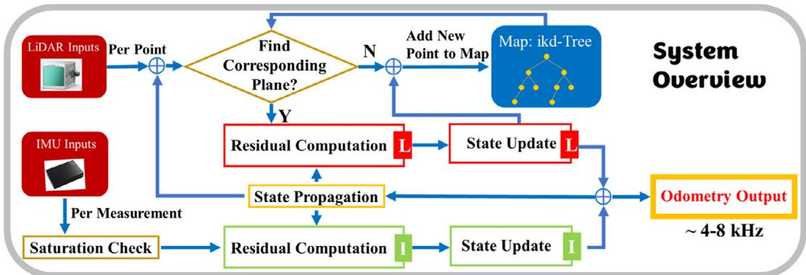  
Figure 1. System overview of Point-LIO. ⊕ indicates information addition.

## 4. State Estimation

The state estimation of Point-LIO is a tightly coupled onmanifold Kalman filter. Here, we briefly explain the essential formulations and workflow of the filter and refer readers $\mathrm { t o } ^ { [ 5 5 ] }$ for more detailed and theoretical explanations ofthe on-manifold Kalman filter.

## 4.1. Notations

To ease the explanation, we adopt notations as follows.

<table><tr><td>Symbol meaning</td><td>Meaning</td></tr><tr><td> $\mathbf { x } _ { k }$ </td><td>State x at the k-th measurement sampling time.</td></tr><tr><td>X</td><td>Ground-true value of state x.</td></tr><tr><td>x, x</td><td>Propagated and updated value of state x.</td></tr><tr><td> $\delta \mathbf { x }$ </td><td>Error between ground-true state x</td></tr><tr><td></td><td>and its estimation ê.</td></tr></table>

Furthermore, we introduce two encapsulated operations, ⊞ (“boxplus”) and its inverse ⊟ (“boxminus”) defined in ref. [55] to describe the system on a manifold ℳ of dimension n and parameterize the state error in Euclidean space ℝn. Also, these operations can describe the system state space model in discrete time more compactly. We refer readers to ref. [55] for more detailed definitions and derivations; in this article, we are only concerned with the manifold SO 3 and $\mathbb { R } ^ { n }$

$$
\begin{array} { r l } { \boxplus : } & { \mathcal { M } \times \mathbb { R } ^ { n } \to \mathcal { M } ; \quad \boxminus : \mathcal { M } \times \mathcal { M } \to \mathbb { R } ^ { n } } \\ { \operatorname { S O } ( 3 ) : } & { \mathbf { R } \boxplus \mathbf { r } = \mathbf { R } \cdot \operatorname { E x p } ( \mathbf { r } ) ; \quad \mathbf { R } _ { 1 } \boxplus \mathbf { R } _ { 2 } = \operatorname { L o g } ( \mathbf { R } _ { 2 } ^ { T } \cdot \mathbf { R } _ { 1 } ) } \\ { \mathbb { R } ^ { n } : } & { \mathbf { a } \boxplus \mathbf { b } = \mathbf { a } + \mathbf { b } ; \quad \mathbf { a } \boxplus \mathbf { b } = \mathbf { a } - \mathbf { b } } \end{array}
$$

where $\begin{array} { r } { \mathrm { E x p } ( \mathbf { r } ) = \mathbf { I } + \sin ( \| \mathbf { r } \| ) { \frac { \| \mathbf { r } \| } { \| \mathbf { r } \| } } + \left( 1 - \cos ( \| \mathbf { r } \| ) \right) { \frac { \| \mathbf { r } \| ^ { 2 } } { \| \mathbf { r } \| ^ { 2 } } } } \end{array}$ is the exponential map on ${ \mathrm { S O } } ( 3 )$ and Log is its inverse map. For a compound manifold $\mathcal { M } = \mathrm { S O } ( 3 ) \times \mathbb { R } ^ { n }$ that is the Cartesian product between the two submanifolds $\mathcal { M } = \mathrm { S O } ( 3 )$ and $\mathbb { R } ^ { n }$ we have

$$
\begin{array}{c} { \bf \Pi } _ { \bf { a } } ^ { [ { \bf { R } } ] }  \bigoplus _ { \bf { b } } { \bf { [ { \bf { b } } ] } } = { \bf { [ { \bf { R } } { \boxplus } { \bf { r } } _ { \bf { \bar { \alpha } } } } \\ { { \bf { a } } + { \bf { b } } } \end{array} ] } , { \bf { [ { \bf { R } } _ { 1 } ] } } \boxplus { \bf { [ { \bf { R } } _ { 2 } ] } } = { \bf { [ { \bf { R } } _ { 1 } \boxplus { \bf { R } } _ { 2 } ] } }\tag{1}
$$

## 4.2. Kinematic Model

We first derive the system model, which consists of a state transition model and a measurement model.

## 4.2.1. State Transition Model

Taking the IMU frame (denoted as I) as the body frame and the first IMU frame as the global frame (denoted as G), the continuous kinematic model is

$$
\begin{array} { r l } & { ^ { G } \dot { \bf R } _ { I } = { ^ { G } { \bf R } _ { I } } [ { ^ { I } \boldsymbol \omega } ] , ^ { G } \dot { \bf p } _ { I } = { ^ { G } { \bf v } _ { I } } , ^ { G } \dot { \bf v } _ { I } = { ^ { G } { \bf R } _ { I } } ^ { I } { \bf a } + { ^ { G } { \bf g } } , ^ { G } \dot { \bf g } = { \bf 0 } } \\ & { \dot { \bf b } _ { g } = { \bf n } _ { \mathrm { b } _ { g } } , \dot { \bf b } _ { a } = { \bf n } _ { \mathrm { b } _ { a } } , ^ { I } \dot { \bf \bf \omega } = { \bf w } _ { g } , ^ { I } \dot { \bf a } = { \bf w } _ { a } } \end{array}\tag{2}
$$

where ${ } ^ { G } \mathbf { R } _ { I } , { } ^ { G } \mathbf { p } _ { I } ,$ , and ${ \cal G } _ { { \bf v } _ { I } }$ represent the IMU attitude, position, and velocity in the global frame. $\mathbf { \omega } ^ { G } \mathbf { g }$ is the gravity vector in the global frame. ${ \bf b } _ { \mathrm { g } }$ and ${ \bf b } _ { \mathrm { a } }$ are random-walk IMU biases driven by Gaussian noises $\bar { \mathbf { n } } _ { \mathrm { b _ { g } } } \approx \mathcal { N } ( \mathbf { 0 } , \mathcal { Q } _ { \mathrm { b _ { g } } } )$ and $ { \mathbf { n } } _ {  { \mathrm { b } } _ { \mathrm { a } } } \approx \mathcal { N } ( \mathbf { 0 } , \mathcal { Q } _ {  { \mathrm { b } } _ { \mathrm { a } } } )$ , respectively. The notation ⌊a⌋ is the skew-symmetric cross product matrix ${ \bf o f a } \in \mathbb { R } ^ { 3 }$ $\mathbf { \omega } ^ { I } \mathbf { \omega } _ { \mathbf { \omega } }$ and $\mathbf { \delta } _ { I _ { \mathbf { \delta } } } ^ { I } ( \mathbf { \delta } _ { \mathbf { \hat { a } } }$ denote the angular velocity and acceleration of IMU in the body frame, that is, IMU frame. As proposed in ref. [14], a certain robot motion (the angular velocity Iω and linear acceleration $\mathbf { \lambda } ^ { I } ( \mathbf { a } )$ can always be viewed as a sample ofa collection or ensemble of signals, which enables us to describe, statistically, the robot motion by a random process. Moreover, as suggested in ref. [14], since the motion of robotic systems usually possesses certain smoothness (e.g., due to actuator delay), quick changes in angular velocities and accelerations are relatively unlikely and a N-th order integrator random process would often suffice the actual use. In particularly, we choose first-order integrator models driven by Gaussian noises ${ \bf w } _ { \mathrm { g } } \approx \mathcal { N } ( { \bf 0 } , \mathcal { Q } _ { \mathrm { g } } )$ and $\mathbf { w } _ { \mathrm { a } } \approx \mathcal { N } ( \mathbf { 0 } , \mathcal { Q } _ { \mathrm { a } } )$ to model the angular velocity Iω and linear acceleration ${ \mathbf { } } ^ { I } { \mathbf { a } } ,$ respectively.

The continuous model (2) is then discretized at each measurement step k. Denote $\Delta t _ { k }$ the current measurement interval, which is the time difference between the previous measurement (an IMU data or LiDAR point) and the current measurement (an IMU data or LiDAR point). The continuous model (2) is discretized by assuming the input holds constant for the interval $\Delta t _ { k }$ leading to

$$
\mathbf { x } _ { k + 1 } = \mathbf { x } _ { k } \boxed { \Delta t _ { k } } \left( \Delta t _ { k } \mathbf { f } \left( \mathbf { x } _ { k } , \mathbf { w } _ { k } \right) \right)\tag{3}
$$

where the manifold ℳ, function f, state and the process noise w are defined as

$$
\begin{array} { r l } & { \mathcal { M } \triangleq \mathrm { S O } ( 3 ) \times \mathbb { R } ^ { 2 1 } , \ : \mathrm { d i m } ( \mathcal { M } ) = 2 4 } \\ & { \mathbf { x } \triangleq \left[ ^ { G } \mathbf { R } _ { I } \quad ^ { G } \mathbf { p } _ { I } \quad ^ { G } \mathbf { v } _ { I } \quad \mathbf { b } _ { \mathbf { g } } \quad \mathbf { b } _ { \mathbf { a } } \quad ^ { G } \mathbf { g } \quad ^ { I } \mathbf { \Lambda } _ { \mathbf { 6 } } \quad ^ { I } \mathbf { a } \right] } \\ & { \mathbf { w } \triangleq \left[ \mathbf { n } _ { \mathrm { b } _ { \mathbf { g } } } \quad \mathbf { n } _ { \mathrm { b } _ { \mathbf { a } } } \quad \mathbf { w } _ { \mathbf { g } } \quad \mathbf { w } _ { \mathbf { a } } \right] \approx \mathcal { N } ( \mathbf { 0 } , \mathcal { Q } ) } \\ & { \mathbf { f } ( \mathbf { x } , \mathbf { w } ) \triangleq \left[ ^ { I } \boldsymbol { \omega } \quad ^ { G } \mathbf { v } _ { I } \quad ^ { G } \mathbf { R } _ { I } ^ { I } \mathbf { a } + ^ { G } \mathbf { \Lambda } _ { \mathbf { b } _ { \mathbf { g } } } \quad \mathbf { n } _ { \mathrm { b } _ { \mathbf { a } } } \quad \mathbf { n } _ { 3 \times 1 } \quad \mathbf { w } _ { \mathbf { g } } \quad \mathbf { w } _ { \mathbf { a } } \right] \in \mathbb { R } ^ { 2 4 } } \end{array}\tag{4}
$$

where $\mathcal { Q } = \mathrm { d i a g } ( \mathcal { Q } _ { \mathrm { b _ { g } } } , \mathcal { Q } _ { \mathrm { b _ { a } } } , \mathcal { Q } _ { \mathrm { g } } , \mathcal { Q } _ { \mathrm { a } } )$ is the covariance matrix ofthe process noise w.

## 4.2.2. Measurement Model

The system has two measurements, a LiDAR point or an IMU data (consists of angular velocity and acceleration measurements). These two measurements are often sampled and received by the system at different time, so we model them separately.

Assume that the LiDAR frame coincides with the body (i.e., IMU) frame or has precalibrated extrinsic, a LiDAR point ${ } ^ { I } { \bf p } _ { \mathrm { m } _ { k } }$ is equal as the true position in the local IMU coordinate frame ${ } ^ { I } { \bf p } _ { k } ^ { \mathrm { g t } }$ , which is unknown, contaminated by an additive Gaussian noise $\mathbf { n } _ { \mathrm { L } _ { k } } \approx \mathcal { N } ( \mathbf { 0 } , \mathcal { R } _ { \mathrm { L } _ { k } } )$ 0

$$
{ } ^ { I } { \bf p } _ { \mathrm { m } _ { k } } = { } ^ { I } { \bf p } _ { k } ^ { \mathrm { g t } } + { \bf n } _ { \mathrm { L } _ { k } }\tag{5}
$$

This true point, after projecting to the global frame using the true (yet unknown) IMU pose ${ \bf \nabla } ^ { G } { \bf T } _ { I _ { k } } = ( { \bf \nabla } ^ { G } { \bf R } _ { I _ { k } } , { \bf \nabla } ^ { G } { \bf p } _ { I _ { k } } )$ , should lie exactly on a local small plane patch in the map (see Figure 2), that is

$$
\begin{array} { r } { 0 = \underbrace { { \bf G } { \bf u } _ { k } ^ { T } \big ( { \bf \Sigma } ^ { G } { \bf T } _ { I _ { k } } \big ( ^ { I } { \bf p } _ { \mathrm { m } _ { k } } - { \bf n } _ { \mathrm { L } _ { k } } \big ) - { \bf \Sigma } ^ { G } { \bf q } _ { k } \big ) } _ { { \bf h } _ { \mathrm { L } } ( { \bf x } _ { k } , { \bf \Pi } ^ { I } { \bf p } _ { \mathrm { m } _ { k } } , { \bf n } _ { \mathrm { L } _ { k } } ) } } \end{array}\tag{6}
$$

where ${ \bf G } _ { { \bf u } _ { k } }$ is the normal vector ofthe corresponding plane and ${ \bf G } _ { { \bf q } _ { k } }$ is any point lying on the plane. Note that ${ ^ G } \mathbf { T } _ { I _ { k } }$ is contained in the state vector $\mathbf { \boldsymbol { x } } _ { k } . \mathbf { \nabla } ( 6 )$ imposes an implicit measurement model for the state vector $\mathbf { x } _ { k }$

The IMU measurement consists of angular velocity measurement $( ^ { I } \mathbf { \omega } _ { \mathrm { m } } )$ and acceleration measurement $( ^ { I } \mathbf { a } _ { \mathrm { m } } )$

$$
\begin{array} { r } { \Big [ ^ { I } \mathbf { \mathfrak { o } } _ { \mathrm { m } _ { k } } \Big ] = \underbrace { \Big [ ^ { I } \mathbf { \mathfrak { o } } _ { k } + \mathbf { b } _ { \mathrm { g } _ { k } } + \mathbf { n } _ { \mathrm { g } _ { k } } \Big ] } _ { \mathbf { \mathfrak { a } } _ { k } + \mathbf { b } _ { \mathrm { a } _ { k } } + \mathbf { n } _ { \mathrm { a } _ { k } } } } \end{array}\tag{7}
$$

where $\mathbf { n } _ { \mathrm { g } } \approx \mathcal { N } ( \mathbf { 0 } , \mathcal { R } _ { \mathrm { g } } )$ and $\mathbf { n } _ { \mathrm { a } } \approx \mathcal { N } ( \mathbf { 0 } , \mathcal { R } _ { \mathrm { a } } )$ are both Gaussian noises. Collectively, $\begin{array} { r } { \mathbf { n } _ { I } = [ \mathbf { n } _ { \mathrm { g } } ^ { T } \quad \mathbf { n } _ { \mathrm { a } } ^ { T } ] ^ { T } \approx \mathcal { N } ( \mathbf { 0 } , \mathcal { R } _ { I } ) = } \end{array}$ $\mathcal { N } ( \mathbf { 0 } , \mathrm { d i a g } ( \mathcal { R } _ { \mathrm { g } } , \mathcal { R } _ { \mathrm { a } } ) )$ is the measurement noise of the IMU. As shown, the two states ${ \bf { 6 0 } } , ~ { \bf { b } } _ { \mathrm { { g } } }$ (and similarly $\mathbf { a } , \mathbf { b } _ { \mathrm { a } } ) .$ , which are separate in the state Equation $( 2 )$ , are now correlated in the angular velocity measurement ${ \bf { \delta } } _ { \bf { { u } } } \mathbf { { \delta } } _ { \bf { { m } } }$ (or acceleration measurement a).

To sum, the measurement model of the system could be presented in the following compact form

$$
\begin{array} { r l } & { 0 = { \bf h } _ { \mathrm { L } } ( { \bf x } _ { k } , { \bf I } ^ { } { \bf p } _ { \mathrm { m } _ { k } } , { \bf n } _ { L _ { k } } ) } \\ & { \left[ { \boldsymbol \omega } _ { \mathrm { m } _ { k } } \right] } \\ & { \left[ { \bf \Pi } _ { { \bf a } _ { \mathrm { m } _ { k } } } ^ { I } \right] = { \bf h } _ { I } ( { \bf x } _ { k } , { \bf n } _ { I _ { k } } ) } \end{array}\tag{8}
$$

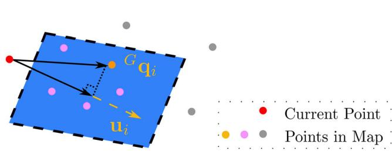  
Figure 2. Illustration of direct registration of LiDAR point to map. ${ \mathsf { c } } _ { \pmb { \mathsf { q } } _ { i } }$ and u refer to a point in the map and the normal vector of the plane in blue.

## 4.3. Extended Kalman Filter

A tightly coupled EKF is used for the state estimation of Point-LIO. The workflow of the EKF is presented in this section.

## 4.3.1. State Propagation

Assume that we have received measurements up to step k and the updated state at that time step is $\overline { { \mathbf { x } } } _ { k }$ along with the updated covariance matrix $\overline { { \mathbf { P } } } _ { k } .$ The state propagation from step k to next measurement step $k + 1$ follows directly the state transition model in Equation (3) by setting ${ \bf w } _ { k } = { \bf 0 }$

$$
\hat { \mathbf { x } } _ { k + 1 } = \overline { { \mathbf { x } } } _ { k } \boxed { \vphantom { \mathbf { x } } } \left( \Delta t _ { k } \mathbf { f } \left( \overline { { \mathbf { x } } } _ { k } , \mathbf { 0 } \right) \right)\tag{9}
$$

And the covariance is propagated as

$$
\begin{array} { r } { \hat { \bf P } _ { k + 1 } = { \bf F } _ { { \bf x } _ { k } } \overline { { \bf P } } _ { k } { \bf F } _ { { \bf x } _ { k } } ^ { T } + { \bf F } _ { { \bf w } _ { k } } \mathcal { Q } _ { k } { \bf F } _ { { \bf w } _ { k } } ^ { T } } \end{array}\tag{10}
$$

where $\mathcal { Q } _ { k }$ is the covariance ofthe process noise ${ \bf w } _ { k } ,$ and the matrices $\mathbf { F } _ { \mathbf { x } _ { k } } , \mathbf { F } _ { \mathbf { w } _ { k } }$ are computed as

$$
\begin{array} { l } { { \displaystyle { \bf F } _ { { \bf x } _ { k } } = \frac { \partial \left( { \bf x } _ { k + 1 } \boxplus \hat { { \bf x } } _ { k + 1 } \right) } { \partial \delta { \bf x } _ { k } } \bigg \vert _ { \delta { \bf x } _ { k } = 0 , { \bf w } _ { k } = { \bf 0 } } } } \\ { { \displaystyle ~ = \frac { \partial \left( \left( \left( \overline { { { \bf x } } } _ { k } \boxplus \delta { \bf x } _ { k } \right) \boxplus \left( \Delta t _ { k } { \bf f } \left( \overline { { { \bf x } } } _ { k } \boxplus \delta { \bf x } _ { k } , { \bf 0 } \right) \right) \right) \boxplus \left( \overline { { { \bf x } } } _ { k } \boxplus \left( \Delta t _ { k } { \bf f } \left( \overline { { { \bf x } } } _ { k } , { \bf 0 } \right) \right) \right) \right) } { \partial \delta { \bf x } _ { k } } } } \end{array}
$$

$$
\mathbf { \Sigma } = \left[ \begin{array} { c c c c c c c c c } { \mathbf { F } _ { 1 1 } } & { \mathbf { 0 } } & { \mathbf { 0 } } & { \mathbf { 0 } } & { \mathbf { 0 } } & { \mathbf { 0 } } & { \mathbf { I } \Delta t _ { k } } & { \mathbf { 0 } } \\ { \mathbf { 0 } } & { \mathbf { I } } & { \mathbf { I } \Delta t _ { k } } & { \mathbf { 0 } } & { \mathbf { 0 } } & { \mathbf { 0 } } & { \mathbf { 0 } } & { \mathbf { 0 } } \\ { \mathbf { F } _ { 3 1 } } & { \mathbf { 0 } } & { \mathbf { I } } & { \mathbf { 0 } } & { \mathbf { 0 } } & { \mathbf { I } \Delta t _ { k } } & { \mathbf { 0 } } & { \mathbf { F } _ { 3 8 } } \\ { \mathbf { 0 } } & { \mathbf { 0 } } & { \mathbf { 0 } } & { \mathbf { I } } & { \mathbf { 0 } } & { \mathbf { 0 } } & { \mathbf { 0 } } & { \mathbf { 0 } } \\ { \mathbf { 0 } } & { \mathbf { 0 } } & { \mathbf { 0 } } & { \mathbf { 0 } } & { \mathbf { I } } & { \mathbf { 0 } } & { \mathbf { 0 } } & { \mathbf { 0 } } \\ { \mathbf { 0 } } & { \mathbf { 0 } } & { \mathbf { 0 } } & { \mathbf { 0 } } & { \mathbf { 0 } } & { \mathbf { I } } & { \mathbf { 0 } } & { \mathbf { 0 } } \\ { \mathbf { 0 } } & { \mathbf { 0 } } & { \mathbf { 0 } } & { \mathbf { 0 } } & { \mathbf { 0 } } & { \mathbf { 0 } } & { \mathbf { I } } & { \mathbf { 0 } } \\ { \mathbf { 0 } } & { \mathbf { 0 } } & { \mathbf { 0 } } & { \mathbf { 0 } } & { \mathbf { 0 } } & { \mathbf { 0 } } & { \mathbf { 0 } } & { \mathbf { I } } \end{array} \right]
$$

$$
\begin{array} { r l } & { \mathbf { F } _ { \mathbf { w } _ { k } } = \frac { \partial ( \mathbf { x } _ { k + 1 } \boxplus \hat { \mathbf { x } } _ { k + 1 } ) } { \partial \mathbf { w } _ { k } } \bigg | _ { \delta \mathbf { x } _ { k } = 0 , \ : \mathbf { w } _ { k } = 0 } } \\ & { \quad \quad = \frac { \partial ( ( \overline { { \mathbf { x } } } _ { k } \boxplus ( \Delta t _ { k } \mathbf { f } ( \overline { { \mathbf { x } } } _ { k } , \mathbf { w } _ { k } ) ) ) ⨏ \big | \mathbf { x } _ { k } \boxplus ( \Delta t _ { k } \mathbf { f } ( \overline { { \mathbf { x } } } _ { k } , \mathbf { 0 } ) ) ) ) } { \partial \mathbf { w } _ { k } } } \end{array}
$$

$$
\mathbf { \Lambda } = { \left[ \begin{array} { l l l l l } { 0 } & { 0 } & { 0 } & { 0 } \\ { 0 } & { 0 } & { 0 } & { 0 } \\ { 0 } & { 0 } & { 0 } & { 0 } \\ { \mathbf { I } } & { 0 } & { 0 } & { 0 } \\ { 0 } & { \mathbf { I } } & { 0 } & { 0 } \\ { 0 } & { 0 } & { 0 } & { 0 } \\ { 0 } & { 0 } & { \mathbf { I } } & { 0 } \\ { 0 } & { 0 } & { \mathbf { 0 } } & { \mathbf { I } } \end{array} \right] }\tag{11}
$$

where $\mathbf { x } _ { k + 1 }$ is true value of state vector at time step $k + 1$ , and ${ \bf F } _ { 1 1 } = \mathrm { E x p } ( - ^ { I } \overline { { \bullet } } _ { k } \Delta t _ { k } ) , ~ { \bf F } _ { 3 8 } = ^ { G } \overline { { \bf R } } _ { I _ { k } } \Delta t _ { k }$

## 4.3.2. Residual Computation

LiDAR Measurement: With the predicted pose ${ } ^ { G } \hat { \mathbf { T } } _ { I _ { k + 1 } } = ( { } ^ { G } \hat { \mathbf { R } } _ { I _ { k + 1 } } , { } ^ { G } \hat { \mathbf { p } } _ { I _ { k + 1 } } )$ from the Kalman propagation (9), we project the measured LiDAR point ${ \bf \Pi } ^ { I } { \bf p } _ { { \bf m } _ { k } }$ m to the global frame ${ } ^ { G } \hat { \mathbf { p } } _ { k + 1 } = { } ^ { G } \hat { \mathbf { R } } _ { I _ { k + 1 } } { } ^ { I } \mathbf { p } _ { \mathbf { m } _ { k + 1 } } + { } ^ { G } \hat { \mathbf { p } } _ { I _ { k + 1 } }$ and search its nearest five points (within 5 m distance from $^ G \hat { \mathbf { p } } _ { k + 1 } )$ in the map organized by ikd-Tree. The found nearest-neighboring points are then used to fit a local small plane patch with normal vector $^ G { \bf u } _ { k + 1 }$ and centroid ${ { \bf \Lambda } ^ { G } } { \bf q } _ { k + 1 }$ , as shown in the measurement model (see Equation (6) and also Figure 2). If the five nearest points do not lie on the fit plane path (i.e., distance ofany point to the plane is larger than 0.1 m), current measurement ofLiDAR point $\hat { \mathbf { p } } _ { k + 1 }$ is directly merged into the map without residual computation or state update. Otherwise, if the local plane succeeds to fit, a residual $\left( \mathbf { r } _ { \mathrm { L } _ { k + 1 } } \right)$ is calculated according to Equation (8) as

$$
\begin{array} { r l } & { \mathbf { r } _ { \mathrm { L } _ { k + 1 } } = 0 - \mathbf { h } _ { \mathrm { L } } ( \hat { \mathbf { x } } _ { k + 1 } , ^ { I } \mathbf { p } _ { \mathrm { m } _ { k + 1 } } , \mathbf { 0 } ) } \\ & { \qquad = \mathbf { h } _ { \mathrm { L } } ( \mathbf { x } _ { k + 1 } , ^ { I } \mathbf { p } _ { \mathrm { m } _ { k + 1 } } , \mathbf { n } _ { \mathrm { L } _ { k + 1 } } ) - \mathbf { h } _ { \mathrm { L } } ( \hat { \mathbf { x } } _ { k + 1 } , ^ { I } \mathbf { p } _ { \mathrm { m } _ { k + 1 } } , \mathbf { 0 } ) } \\ & { \qquad \approx \mathbf { H } _ { \mathrm { L } _ { k + 1 } } \delta \mathbf { x } _ { k + 1 } + \mathbf { D } _ { \mathrm { L } _ { k + 1 } } \mathbf { n } _ { \mathrm { L } _ { k + 1 } } } \end{array}\tag{12}
$$

where $\begin{array} { r } { \delta \mathbf { x } _ { k + 1 } = \mathbf { x } _ { k + 1 } \ominus \hat { \mathbf { x } } _ { k + 1 } } \end{array}$ with $\mathbf { x } _ { k + 1 }$ being the true value of state vector at time step $k + 1$ , and

$$
\begin{array} { r l } & { \mathbf { H } _ { L _ { k + 1 } } = \frac { \partial \mathbf { h } _ { L } \left( \hat { \mathbf { x } } _ { k + 1 } \boxplus \delta \mathbf { x } , ^ { I } \mathbf { p } _ { m _ { k + 1 } } , \mathbf { 0 } \right) } { \partial \delta \mathbf { x } } \bigg \vert _ { \delta \mathbf { x } = 0 } } \\ & { \qquad = \left[ - ^ { G } \mathbf { u } _ { k + 1 } ^ { T } ^ { G } \hat { \mathbf { R } } _ { I _ { k + 1 } } \left. ^ { I } \mathbf { p } _ { m _ { k + 1 } } \right. ^ { G } \mathbf { u } _ { k + 1 } ^ { T } \quad \mathbf { 0 } _ { 1 \times 1 8 } \right] } \\ & { \mathbf { D } _ { L _ { k + 1 } } = \frac { \partial \mathbf { h } _ { L } \left( \hat { \mathbf { x } } _ { k + 1 } , ^ { I } \mathbf { p } _ { m _ { k + 1 } } , \mathbf { n } \right) } { \partial \mathbf { n } } \vert _ { \mathbf { n } = \mathbf { 0 } } = - ^ { G } \mathbf { u } _ { k + 1 } ^ { T } ^ { G } \hat { \mathbf { R } } _ { I _ { k + 1 } } } \end{array}\tag{13}
$$

IMU M t: For an IMU measurement, we first assess if any channel of the IMU is saturated by checking the gap between the current measurement and the rated measuring range. If the gap is too small, this channel of IMU measurement is discarded without updating the state. Then, acceleration and angular velocity measurements from unsaturated IMU channels are collected to calculate the IMU residual $( \mathbf { r } _ { I _ { k + 1 } } )$ according to Equation (7) (to simplify the notation, we use all six channel measurements here).

$$
\begin{array} { r l } & { \mathbf { r } _ { I _ { k + 1 } } = \left[ ^ { I _ { \mathbf { t } _ { 0 } } } \mathbf { { \sigma } } _ { \mathbf { m } _ { k + 1 } } ^ { } \right] ^ { T } - \mathbf { h } _ { I } ( \hat { \mathbf { x } } _ { k + 1 } , \mathbf { 0 } ) } \\ & { \qquad = \mathbf { h } _ { I } ( \mathbf { x } _ { k + 1 } , \mathbf { n } _ { I _ { k + 1 } } ) - \mathbf { h } _ { I } ( \hat { \mathbf { x } } _ { k + 1 } , \mathbf { 0 } ) } \\ & { \qquad = \mathbf { H } _ { I _ { k + 1 } } \delta \mathbf { x } _ { k + 1 } + \mathbf { D } _ { I _ { k + 1 } } \mathbf { n } _ { I _ { k + 1 } } } \end{array}\tag{14}
$$

where $\delta { \bf x } _ { k + 1 } = { \bf x } _ { k + 1 } \ominus \hat { \bf x } _ { k + 1 }$ with $\mathbf { x } _ { k + 1 }$ being the true value of state vector at time step k 1, and

$$
\begin{array} { l } { { \displaystyle { \bf H } _ { I _ { k + 1 } } = \frac { \partial { \bf h } _ { I } ( \hat { \bf x } _ { k + 1 } \boxplus \delta { \bf x } , { \bf 0 } ) } { \partial \delta { \bf x } } \bigg \vert _ { \delta \mathrm { x } = { \bf 0 } } = \lbrack { \bf 0 } _ { 6 \times 9 } \quad { \bf I } _ { 6 \times 6 } \quad { \bf 0 } _ { 6 \times 3 } \quad { \bf I } _ { 6 \times 6 } \rbrack } } \\ { { \displaystyle { \bf D } _ { I _ { k + 1 } } = \frac { \partial { \bf h } _ { 2 } ( \hat { \bf x } _ { k + 1 } , { \bf n } ) } { \partial { \bf n } } \bigg \vert _ { { \bf n } = { \bf 0 } } = { \bf I } _ { 6 \times 6 } } } \end{array}\tag{15}
$$

To sum, the residual, from either LiDAR point measurement the (12) or IMU measurement (14), is related to the state $\mathbf { x } _ { k + 1 }$ and the respective measurement noise by the following relation is

$$
\mathbf { r } _ { k + 1 } \approx \mathbf { H } _ { k + 1 } \delta \mathbf { x } _ { k + 1 } + \mathbf { D } _ { k + 1 } \mathbf { n } _ { k + 1 } , \qquad \mathbf { n } _ { k + 1 } \approx { \mathcal { N } } ( \mathbf { 0 } , { \mathcal { R } } _ { k + 1 } )\tag{16}
$$

where for a LiDAR point measurement we have $\mathbf { r } _ { k + 1 } = \mathbf { r } _ { \mathrm { L } _ { k + 1 } } , \mathbf { H } _ { k + 1 } = \mathbf { H } _ { \mathrm { L } _ { k + 1 } } , \mathbf { D } _ { k + 1 } = \mathbf { D } _ { \mathrm { L } _ { k + 1 } } , \mathcal { R } _ { k + 1 } = \mathcal { R } _ { \mathrm { L } _ { k + 1 } } ,$ and for an IMU measurement, we have $\mathbf { r } _ { k + 1 } = \mathbf { r } _ { I _ { k + 1 } } , \mathbf { H } _ { k + 1 } = \mathbf { H } _ { I _ { k + 1 } } ,$ $\mathbf { D } _ { k + 1 } = \mathbf { D } _ { I _ { k + 1 } } , \mathcal { R } _ { k + 1 } = \mathcal { R } _ { I _ { k + 1 } } .$

## 4.3.3. State Update

The propagated state $\hat { \mathbf { x } } _ { k + 1 }$ in (9) and covariance $\hat { \mathbf { P } } _ { k + 1 }$ in (10) impose a prior Gaussian distribution for the unknown state $\mathbf { x } _ { k + 1 }$ , as follows

$$
\delta \mathbf { x } _ { k + 1 } = \mathbf { x } _ { k + 1 } \ominus \hat { \mathbf { x } } _ { k + 1 } \approx \mathcal { N } ( \mathbf { 0 } , \hat { \mathbf { P } } _ { k + 1 } )\tag{17}
$$

The observation model (16) gives another Gaussian distribution for $\delta { \bf x } _ { k + 1 }$

$$
\begin{array} { r l } & { \mathbf { D } _ { k + 1 } \mathbf { n } _ { k + 1 } = \mathbf { r } _ { k + 1 } - \mathbf { H } _ { k + 1 } \delta \mathbf { x } _ { k + 1 } \approx \mathcal { N } ( \mathbf { 0 } , \overline { { \mathcal { R } } } _ { k + 1 } ) } \\ & { \overline { { \mathcal { R } } } _ { k + 1 } = \mathbf { D } _ { k + 1 } \mathcal { R } _ { k + 1 } \mathbf { D } _ { k + 1 } ^ { T } } \end{array}\tag{18}
$$

Then combining the prior distribution in (17) with the measurement model from (18) yields the posterior distribution of the state $\mathbf { x } _ { k + 1 }$ (which is represented by $\delta \mathbf { x } _ { k + 1 }$ equivalently).

$$
\underset { \delta \mathbf { x } _ { k + 1 } } { \mathrm { a r g m i n } } ( \| \mathbf { r } _ { k + 1 } - \mathbf { H } _ { k + 1 } \delta \mathbf { x } _ { k + 1 } \| _ { \overline { { \mathcal { R } } } _ { k + 1 } } ^ { 2 } + \| \delta \mathbf { x } _ { k + 1 } \| _ { \hat { \mathbf { P } } _ { k + 1 } } ^ { 2 } )\tag{19}
$$

where $\| \mathbf { x } \| _ { \mathbf { A } } ^ { 2 } = \mathbf { x } ^ { T } \mathbf { A } ^ { - 1 } \mathbf { x } .$ The optimization problem in (19) is a standard quadratic programming and the optimal solution $\delta \mathbf { x } _ { k + 1 } ^ { \mathrm { o } }$ can be easily obtained, which is essentially the Kalman update[56]

$$
\begin{array} { r l } & { \delta \mathbf { x } _ { k + 1 } ^ { \circ } = \mathbf { K } _ { k + 1 } \mathbf { r } _ { k + 1 } } \\ & { \mathbf { K } _ { k + 1 } = \mathbf { P } _ { k + 1 | k } \mathbf { H } _ { k + 1 } ^ { T } \mathbf { S } _ { k + 1 } ^ { - 1 } } \\ & { \mathbf { S } _ { k + 1 } = \mathbf { H } _ { k + 1 } \mathbf { P } _ { k + 1 | k } \mathbf { H } _ { k + 1 } ^ { T } + \overline { { \mathcal { R } } } _ { k + 1 } } \\ & { \mathbf { P } _ { k + 1 } = \left( \mathbf { I } - \mathbf { K } _ { k + 1 } \mathbf { H } _ { k + 1 } \right) \widehat { \mathbf { P } } _ { k + 1 } } \end{array}\tag{20}
$$

Then the update of $\mathbf { x } _ { k + 1 }$ is

$$
\overline { { \mathbf { x } } } _ { k + 1 } = \hat { \mathbf { x } } _ { k + 1 } \boxed { \mathbf { \boxdot { \delta x } } _ { k + 1 } ^ { 0 } }\tag{21}
$$

The updated state will be used in the next step propagation. To do so, we need also to estimate the covariance, denoted by $\overline { { \mathbf { P } } } _ { k + 1 }$ , of the error between the state estimate $\overline { { \mathbf { x } } } _ { k + 1 }$ and groundtruth $\mathbf { x } _ { k + 1 }$ defined as $\mathbf { x } _ { k + 1 } \boxminus \overline { { \mathbf { x } } } _ { k + 1 }$

$$
\begin{array} { r l } & { \mathbf { x } _ { k + 1 } \boxed { \pmb { \bar { x } } _ { k + 1 } = \left( \hat { \mathbf { x } } _ { k + 1 } \boxplus \delta \mathbf { x } _ { k + 1 } \right) \boxplus \bar { \mathbf { x } } _ { k + 1 } } } \\ & { \quad \approx \underbrace { \left( \hat { \mathbf { x } } _ { k + 1 } \boxplus \delta \mathbf { x } _ { k + 1 } ^ { 0 } \right) \boxplus \bar { \mathbf { x } } _ { k + 1 } } _ { = \mathbf { 0 } } + \mathbf { J } _ { k + 1 } ( \delta \mathbf { x } _ { k + 1 } - \delta \mathbf { x } _ { k + 1 } ^ { 0 } ) } \end{array}\tag{22}
$$

where $\boldsymbol { \mathrm { J } } _ { k + 1 }$ is the projection matrix

$$
\mathbf { J } _ { k + 1 } = \frac { \partial ( ( \hat { \mathbf { x } } _ { k + 1 } \boxplus \delta \mathbf { x } ) \boxplus \bar { \mathbf { x } } _ { k + 1 } ) } { \partial \delta \mathbf { x } } \bigg | _ { \delta \mathbf { x } = \delta \mathbf { x } _ { k + 1 } ^ { \circ } } = \left[ \begin{array} { l l } { \mathbf { A } ( \theta _ { k + 1 } ) ^ { - T } } & { \mathbf { 0 } _ { 3 \times 2 1 } } \\ { \mathbf { 0 } _ { 3 \times 2 1 } } & { \mathbf { I } _ { 2 1 \times 2 1 } } \end{array} \right]
$$

$$
\begin{array} { r } { \mathbf { A } ( \mathbf { u } ) ^ { - 1 } = \mathbf { I } - \frac { | \mathbf { u } | } { 2 } + \left( 1 - \frac { \| \mathbf { u } \| } { 2 } \cot \left( \frac { \| \mathbf { u } \| } { 2 } \right) \right) \frac { | \mathbf { u } | } { \| \mathbf { u } \| } , \theta _ { k + 1 } = { } ^ { G } \overline { { \mathbf { R } } } _ { I _ { k + 1 } } \bigtriangledown ^ { G } \hat { \mathbf { R } } _ { I _ { k + 1 } } } \end{array}\tag{23}
$$

and the covariance of $( \delta \mathbf { x } _ { k + 1 } - \delta \mathbf { x } _ { k + 1 } ^ { 0 } )$ is the inversion of the Hessian matrix in (19), which is also the matrix $\mathbf { P } _ { k + 1 }$ in (20). As a result, the covariance of $\mathbf { x } _ { k + 1 } \boxminus \bar { \mathbf { x } } _ { k + 1 }$ , according to (22), is

$$
\begin{array} { r l } { \overline { { \mathbf { P } } } _ { k + 1 } } & { { } = \boldsymbol { \mathrm { J } } _ { k + 1 } \mathbf { P } _ { k + 1 } \boldsymbol { \mathrm { J } } _ { k + 1 } ^ { T } } \end{array}\tag{24}
$$

© 2023 The Authors. Advanced Intelligent Systems published by Wiley-VCH GmbH

Algorithm 1. State Estimation at Step k 1.  
Input:   
Last odometry output $\overline { { \mathbf { x } } } _ { k }$ and $\overline { { \mathsf { P } } } _ { k } ,$   
A LiDAR point or an IMU measurement;   
Output:   
New odometry output $\overline { { \mathsf { x } } } _ { k + 1 } , \overline { { \mathsf { P } } } _ { k + 1 } ;$   
Workflow:   
1: State propagation from the last time step k to current time step k 1 via (9)   
and (10) to obtain state prediction $\hat { \mathbf { x } } _ { k + 1 }$ and its covariance $\hat { \mathsf { P } } _ { k + 1 }$   
2: if A LiDAR point then   
3: ${ } ^ { G } \hat { \pmb { \mathsf { p } } } _ { k + 1 } = { } ^ { G } \hat { \pmb { \mathsf { R } } } _ { I _ { k + 1 } } { } ^ { I } { \pmb { \mathsf { p } } } _ { m _ { k + 1 } } + { } ^ { G } \hat { \pmb { \mathsf { p } } } _ { I _ { k + 1 } } ;$   
4: if PlaneCorrespondenceExist $( ^ { G } \hat { { \pmb p } } _ { k + 1 } )$ then   
5: Compute $\mathbf { r } _ { L _ { k + 1 } } , \mathsf { H } _ { L _ { k + 1 } } , \mathsf { D } _ { L _ { k + 1 } }$ via (12), (13);   
6: Compute update state $\overline { { \mathbf { x } } } _ { k + 1 }$ via (20), (21);   
7: Compute update covariance $\overline { { \mathsf { P } } } _ { k + 1 }$ via (23), (24);   
8: Add the point transformed with the updated state $\overline { { \mathbf { x } } } _ { k + 1 }$ to the map;   
9: else   
10: Add point $^ G \hat { \pmb { p } } _ { k + 1 }$ into the map;   
11: else if   
12: else if An IMU measurement then   
13: if NoSaturation $( \mathbf { \omega } _ { \omega _ { m _ { k + 1 } } } ^ { I } , \mathbf { \omega } ^ { I } \mathbf { a } _ { m _ { k + 1 } } )$ then   
14: Compute $\boldsymbol { \mathsf { r } } _ { I _ { k + 1 } } , \boldsymbol { \mathsf { H } } _ { I _ { k + 1 } } , \boldsymbol { \mathsf { D } } _ { I _ { k + 1 } }$ via (14), (15);   
15: Compute update state $\overline { { \mathbf { x } } } _ { k + 1 }$ via (20), (21);   
16: Compute update covariance $\overline { { \mathsf { P } } } _ { k + 1 }$ via (23), (24);   
17: else if   
18: else if

The updated state $\overline { { \mathbf { x } } } _ { k + 1 }$ along with the covariance matrix $\overline { { \mathbf { P } } } _ { k + 1 }$ are used in propagation of the next measurement. The overall procedure ofour state estimation is summarized in Algorithm 1.

## 4.4. Analysis

In our proposed LIO framework, the state is updated by consuming each LiDAR point at its reception, leading to a point-wise odometry. This point-wise architecture is completely different from the existing frame-based LOAM frameworks[11,15–17,21,29–31] and enables an extremely high-rate odometry output that is ideally equal to the point rate of the LiDAR sensor (from hundreds of thousands to million points per second). The high-rate state update provides timely correction of the state estimate before the estimation error increases too large in the forward propagation step, leading to a potential high-bandwidth odometry that could even survive in extremely high-speed movements.

Another benefit of the point-wise LIO framework is the fundamental removal of in-frame motion distortion. The existing frame-based framework[11,15–17,21,29–31] accumulates the sequentially sampled points into a frame and uses to update the state by assuming the frame is sampled at the same time. Since the points in a frame are actually sampled at different times, this accumulation would cause motion distortion for points in a frame. To compensate such distortion, ad-hoc methods, such as IMU integration,[17,18,21,29,38,44,53,57] constant velocity assumption,[15,32–37,58] or continuous time trajectory,[26,45,52] must be used. In contrast, our point-wise LIO framework updates the state at each point’s true sampling time, suffering from no such motion distortion.

The second main difference of our LIO framework is how we model the IMU measurements. Unlike existing methods,[17,29,50,51] where the IMU measurements are modeled as the input to a kinematic model, we used a colored stochastic process to describe a robot’s dynamic behaviors, that is, angular velocity and acceleration in (2), and modeled the IMU measurements as the model output (7). Modeling the IMU measurements as the output provides an elegant way to cope with saturated IMU measurements, which allows the estimation of motion beyond the IMU measuring range.

In our system, we adopted an EKF, instead of an iterated Kalman filter used in frame-based methods such as FAST-$\mathrm { L I O } 2 ^ { [ 2 9 ] }$ and LINS.[17] This is because for the LiDAR measurement, the update rate is very high, so we do not need to iterate the state update exhaustively at each time step, while for IMU measurement, the measurement Equation (7) is essentially linear. The elimination ofiteration can effectively lower the time on state update. Moreover, since the state is updated by the LiDAR measurements at a point-by-point base, the measurement model of LiDAR points is of 1D, as shown in Equation (6). The lowdimension measurement equation along with the great sparsity (e.g., $\mathbf { F } _ { \mathbf { x } _ { k } } , \mathbf { F } _ { \mathbf { w } _ { k } }$ in (11), $\mathbf { H } _ { \mathrm { L } _ { k + 1 } }$ in (13) and $\mathbf { H } _ { I _ { k + 1 } }$ in (15)) in the system can also effectively lower the computation time.

## 5. Evaluation

In this section, we evaluate the performance of our developed system in three aspects: 1) removal of motion distortion; 2) high odometry frequency with high bandwidth; and 3) state estimation with saturated IMU measurements in the middle.

## 5.1. Implementation

The proposed Point-LIO is implemented in C and Robots Operating System (ROS). The EKF is implemented based on the IKFoM toolbox developed in our previous work.[55] We used the incremental k-d tree, ikd-Tree, developed in FAST-LIO2[29]) as our mapping structure with its default parameters: local map size L 2000 m, spatial downsample resolution l 0.25 m, the rebalancing thresholds of ikd-Tree are $\alpha _ { \mathrm { b a l } } = 0 . 6 , \alpha _ { \mathrm { d e l } } = 0 . 5$ , and the subtree size threshold for parallel rebuilding (in a second thread) is $N _ { \mathrm { m a x } } = 1 5 0 0$

Although our system is designed to perform state estimate after each LiDAR point reception, in practice, limited by the available drivers provided by LiDAR manufacturers, LiDAR points are packaged after accumulating a complete scan and then sent to the LIO systems. To cater for this practical limitation, Point-LIO sorts all LiDAR points and IMU data contained in a received package according to their respective timestamps. Then, the sorted data are processed one by one by Point-LIO.

In all the evaluations, we compare Point-LIO to a state-of-theart frame-based odometry, FAST-LIO2.[29] All the experiment results for FAST-LIO2 are collected using the public version ofFAST-LIO2 with its default parameter values (which are essentially also the values of our parameters as detailed earlier). Since FAST-LIO2 performs a spatial downsampling with resolution 0.3 for each received LiDAR scan, for a fair comparison, we also perform such spatial downsampling in Point-LIO before the data sorting and point-by-point update.

In addition, to study the effect of point-by-point update, we provide a system that only integrates this scheme but not applies the colored stochastic model as an ablation study. The ablation study system is the same as FAST-LIO2, which models the IMU measurements as the input to the system kinematic model, but differs in that the each individual LiDAR point in a scan is used to update the system sequentially as our proposed system does. This leads to a state update frequency similar to ours. In the following sections, we denote our developed system Point-LIO as “Point-LIO” and the above ablation-study system as “Point-LIO-input” to distinguish the role of IMU measurements in the two systems.

## 5.2. Platforms

To collect real-world data, we develop a sensor suite, shown in Figure 3a, which consists of a solid-state 3D LiDAR, Livox Avia, a first-person-view (FPV) camera, and five Vicon markers for ground-truth measurement. With a 70.4° (horizontal) 77.2° (vertical) circular FoV and an unconventional nonrepetitive scanning pattern, the Livox Avia LiDAR produces 230 000 Hz point measurements and a built-in IMU (model BMI088) producing 200 Hz IMU data. The points and IMU data are packaged at a frequency adjustable from 10 to 100 Hz. To produce different types of motion, three different platforms are constructed to carry the sensor suite, including a robot car (see Figure 3b), the RoboMaster 2019 AI developed by DJI Shenzhen, a rotating platform driven by a step motor (see Figure 3c), Nimotion STM4260A, and a pendulum (see Figure 3d).

## 5.3. Resolving Motion Distortion

To verify the effectiveness of the proposed point-by-point update scheme in addressing motion distortion, we collect some sequences using the robot car shown in Figure 3b. Three different scenes are tested, that is, the Belcher Bay Park (a unstructured scene), the Centennial Small Square of HKU (a semistructured scene), and a corridor in the Haking Wong building of HKU (a structured scene). The three sequences are denoted as “Park”, “Square”, and “Corridor”, respectively. In all sequences, the robot car returns to the starting point, which enables the drift computation. The LiDAR package frequency is 10 Hz.

One challenge ofthis experiment is the strong vibration when the robot car moves on the ground. Since the sensor suite is attached to the chassis without any vibration absorber, the vibration will directly pass to the sensor and cause severe jerky motions, as indicated by the built-in IMU data shown in Figure 4. When the robot car is stationary in the beginning, the MU measurements are stably small. As the car starts moving, the measurement of IMU changes rapidly.

## 5.3.1. Mapping Results

The mapping results of Park, Square, and Corridor are shown in Figure 5, 6, and 7 respectively. In each figure, we first present a global view of the final mapping results (i.e., subfigure (a)) and then focus on certain local areas (sub-figure (b)) containing large planes (e.g., a wall). We investigate the consistency of points on the wall (sub-figure (c)), from which we can compare the mapping accuracy of FAST-LIO2 (i.e., (b1), (c1)), Point-LIO-input (i.e., (b2), (c2)), and Point-LIO (i.e., (b3), (c3)). Finally, to show the in-frame motion distortion, points ofone scan (accumulation over one scan period 0.1 s) in the above-selected local areas are shown (sub-figure (d)) together with the further zoom-in (sub-figure (e)) for FAST-LIO2 (i.e., (d1), (e1)), Point-LIO-input (i.e., (d2), (e2)), and Point-LIO (i.e., (d3), (e3)), where the red points refer to registered LiDAR points in the current scan, and the white points are map results accumulated up to the current scan.

As shown in the sub-figures (c) of Figure 5, 6, and 7, the overall map of FAST-LIO2 (c1) is obviously thicker than the Point-LIO-input (c2), and Point-LIO (c3) produces a further thinner wall than the Point-LIO-input. The reason for this phenomenon lies in the in-frame motion compensation in each individual scan, as shown in subfigure (e) of Figure 5, 6, and 7. As shown, all red points around the selected wall are supposed to belong to the same plane, but they actually scatter off the wall for FAST-LIO2 (e1) due to the in-frame motion distortion. This in-frame distortion phenomenon for the Point-LIO-input and Point-LIO is much alleviated ((e2) and (e3)).

FAST-LIO2 uses a backward propagation based on IMU measurements to project all the points of a scan to the scan-end pose. This process is easily disturbed by the IMU measurement noises, biases estimation error, and the limited IMU sampling rate. In particular, caused by the sensor vibration, the acceleration and angular velocity change in a high rate even within one sample interval of the IMU, leading to large IMU propagation errors which assume that the angular velocity and acceleration are constant during one sampling interval. Moreover, the low frame rate (i.e., 10 Hz) also requires long-time (i.e., 100 ms) IMU propagation, which accumulates pose errors and results in large in-frame distortions as shown in subfigures (b1) and (c1).

(a)  
(b)  
(c)  
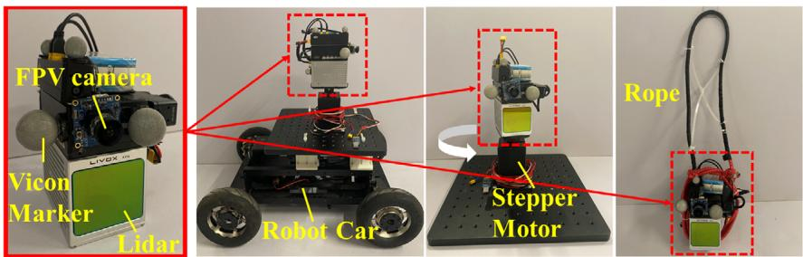  
(d)  
Figure 3. Experimental platforms for evaluations. a) The sensor suite consisting ofa Livox Avia LiDAR, a FPV camera, and five Vicon Markers. The sensor suite is carried by b) a robot car, c) a rotating platform driven by a step motor, and d) a pendulum.

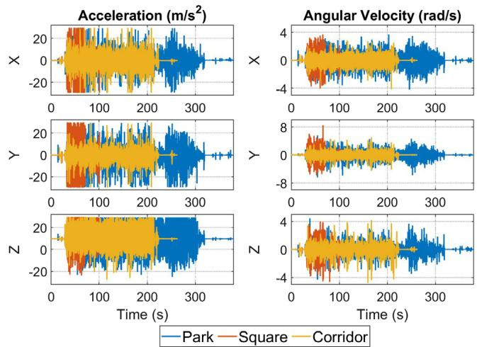  
Figure 4. Measurements of IMU for three robot car sequences, that is, Park, Square, and Corridor.

In contrast, Point-LIO fuses the LiDAR point at its true sampling time without any point accumulation, which fundamentally eliminates the motion distortion, as shown in subfigures (c2) for the Point-LIO-input and subfigure (c3) for the Point-LIO. Furthermore, when comparing the Point-LIO-input (c2) with the Point-LIO (c3) both with the point-by-point update scheme, the Point-LIO performs slightly better. This is because the Point-LIO-input still uses the IMU measurements to propagate the state (although for only one LiDAR point interval), hence still suffering from the IMU measurement noise and bias estimation errors. In contrast, the Point-LIO uses the filtered but not the raw data of IMU measurements to propagate the state, which slightly reduces the motion distortion as observed in (e3). The video of an example sequence, the Park, is available online https://youtu.be/oS83xUs42Uw.

## 5.3.2. Drift Results

The drifts of FAST-LIO2, Point-LIO-input, and Point-LIO are summarized in Table 1. Due to the imperfect operation of the

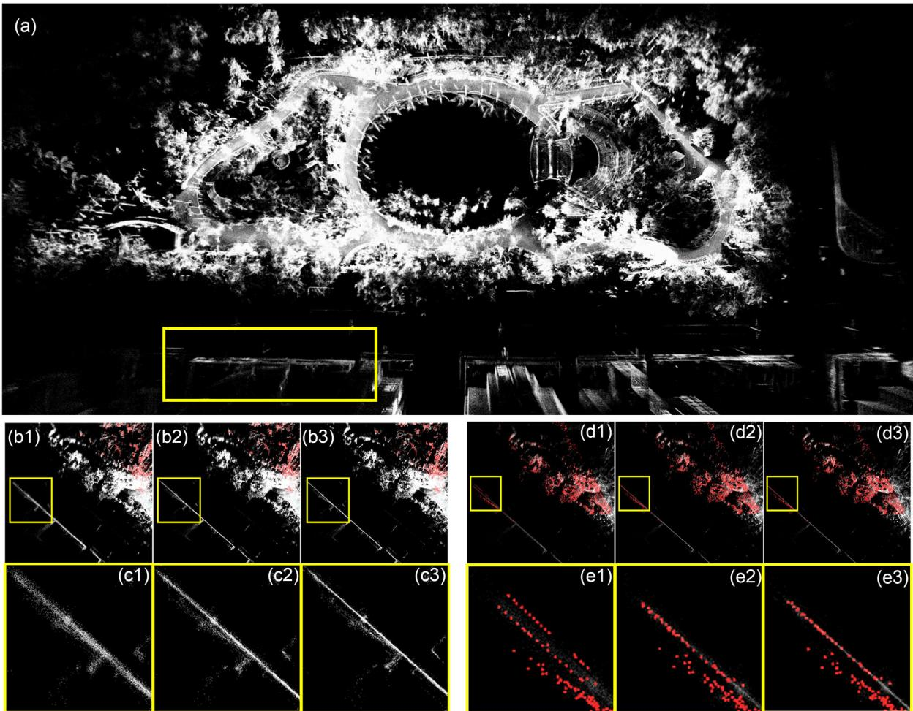  
Figure 5. Illustration of motion distortion for the Park sequence. a): Map result of the whole area of Point-LIO; b1–b3): Map results for a local area of FAST-LIO2, Point-LIO-input and Point-LIO, and their further zoom-in figures c1–c3); d1–d2): In-frame motion distortion of FAST-LIO2, Point-LIO-input and Point-LIO, and their zoom-ins e1–e3).

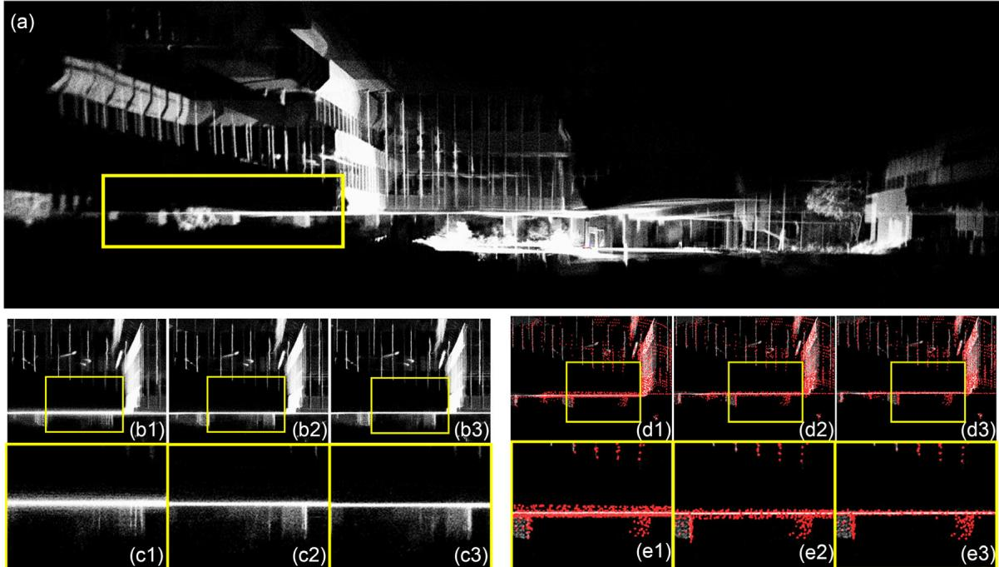  
Figure 6. Illustration of motion distortion for the Square sequence. a): Map result of the whole area of Point-LIO; b1–b3): Map results for a local area o FAST-LIO2, Point-LIO-input and Point-LIO, and their further zoom-in figures c1–c3); d1–d2): In-frame motion distortion of FAST-LIO2, Point-LIO-input and Point-LIO, and their zoom-ins e1–e3).

robot car, the distance between the starting and ending position is not exactly zero, but less than 10 cm. As shown, all the FAST-LIO2, Point-LIO-input, and Point-LIO have comparable drifts for Square and Corridor sequences, while for the Park sequence, FAST-LIO2 fails to return the starting point. This is because the Park is an unstructured environment, which makes the effect of motion distortion on odometry accuracy more evident.

## 5.4. High Odometry Output Frequency and High Bandwidth

We test the frequency of odometry output of FAST-LIO2, Point-LIO-input, and Point-LIO on an indoor dataset (denoted as “Odo”) collected using the rotating platform (see Figure 3c) by giving quickly varying speed commands to the step motor; the package rate ofLiDAR is 100 Hz in this experiment. Even though the dataset is collected with LiDAR rate of100 Hz, the framework of FAST-LIO2 is naturally extendable to higher-state update frequency by splitting one frame into multiples (but below the IMU rate 200 Hz). Thus we divide one LiDAR frame into two for FAST-LIO2. Figure 8 shows the distribution of the number of odometry output per second. The output frequency for FAST-LIO2 is 200 Hz, which is the frame rate. As comparison, output frequencies for the Point-LIO-input and the Point-LIO are in the range of 4 and 8 kHz, which are the number of points that pass the plane correspondence check.

To enable the bandwidth analysis, the above experiment is reconducted with ground-truth measurements from Vicon Tracker recorded at the highest frequency 300 Hz. Dividing system output (the yaw angle estimated from the odometry) by the system input (the ground-true yaw angle measured by the Vicon system), we obtain the magnitude response (dB) of FAST-LIO2,

Point-LIO-input, and Point-LIO, at different input frequencies, as shown in Figure 9. As can be seen, the magnitude response of FAST-LIO2 starts dropping when the input frequency is near 100 Hz, suggesting a 100 Hz bandwidth (see Table 2). 100 Hz is also the highest attainable bandwidth when the odometry output frequency is 200 Hz according to the Nyquist–Shannon sampling theorem. In contrast, both the Point-LIO-input and the Point-LIO have bandwidth larger than 150 Hz which is beyond the measuring capability of Vicon system.

## 5.5. Extremely Aggressive Motion with Saturated IMU Measurements

While the Point-LIO-input and Point-LIO have comparable performances so far, in this section, we show that the Point-LIO is able to track extremely aggressive motions even beyond the IMU measuring ranges. Two types of motion are produced in the experiments, one is spinning motion (denoted as “Satu-1”) and the other is circling in the space (denoted as “Satu-2”). Both experiments suffer from IMU saturation after initial stage caused by either the high spinning rate or the large centrifugal forces. To the best of our knowledge, no prior SLAM systems could cope with such aggressive motions or the saturated IMU measurements.

## 5.5.1. Spinning Motion

This experiment is conducted using the rotating platform placed in a cluttered laboratory environment (see Figure 10a1–a4). During the experiment, the sensor suite is rotated by the step motor under step angular speed commands, which increases from zero to a peak value step by step and then decreases to zero at the end. The resultant peak angular velocity is $7 5 \mathrm { r a d s } ^ { - 1 }$ (in yaw), which far exceeds the IMU measuring range, that is, 35 rad s1. The high angular velocity also causes a peak acceleration around 80 ${ \bf \check { m } } { \bf s } ^ { - 2 } ,$ also far beyond the IMU measuring range, that is, around 30 m $\mathbf { s } ^ { - 2 }$ . The onboard FPV images shown in Figure 10c1 and c2 give an illustration of the rotation in process.

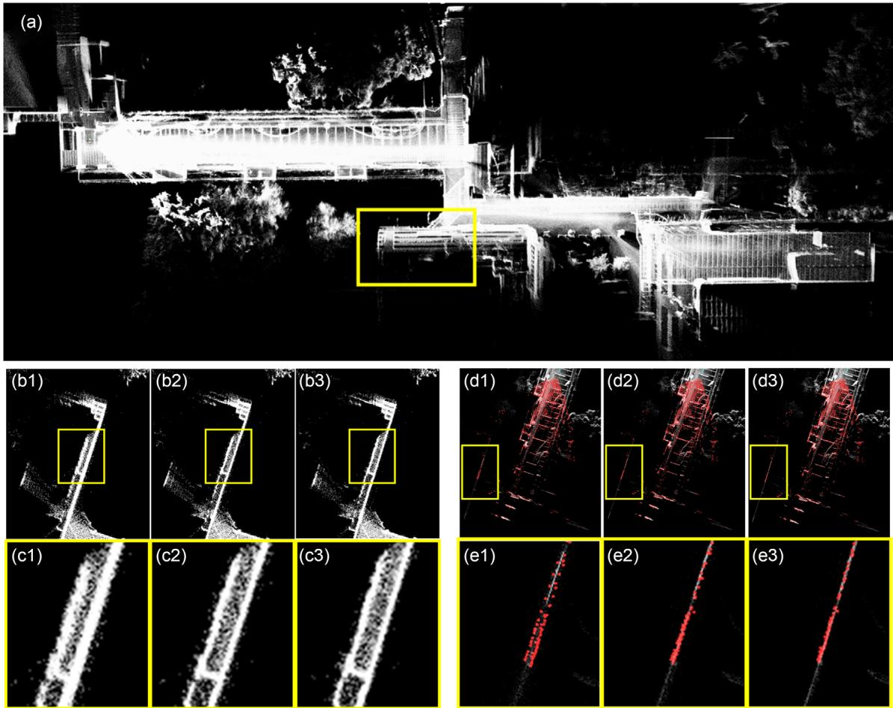  
Figure 7. Illustration ofmotion distortion for the Corridor sequence. a): Map result ofthe whole area ofPoint-LIO; b1–b3): Map results for a local area of FAST-LIO2, Point-LIO-input and Point-LIO, and their further zoom-in figures c1–c3); d1–d2): In-frame motion distortion of FAST-LIO2, Point-LIO-input and Point-LIO, and their zoom-ins e1–e3).

Table 1. Comparison of odometry drifts (meters).
<table><tr><td></td><td>FAST-LIO2</td><td>Point-LIO-input</td><td>Point-LIO</td></tr><tr><td>Park:</td><td>1.242</td><td>0.064</td><td>0.080</td></tr><tr><td>Square:</td><td>0.041</td><td>0.038</td><td>0.039</td></tr><tr><td>Corridor:</td><td>0.047</td><td>0.043</td><td>0.047</td></tr></table>

The mapping result of Point-LIO is shown in Figure 10b1, which shows a fairly consistent mapping of the environment, and the estimated ending position coincides with the starting position very well as shown in Figure 10b2. The estimated kinematic states, including rotation in Euler angles and position, are compared with the ground truth in Figure 11a, where the x axis is broken into three segments to zoom in the time period 84–85 s. The continuous rapid change of yaw is due to the continuous rotation driven by the step motor, and the sinusoidal-like fluctuations in positions are caused by the offset between the Vicon marker and the step motor shaft. As shown, the estimated yaw angle can closely track the actual ones in the whole process; the overall rotation and translation error (in terms of root mean square deviation [RMSE]) are 4.60° and 0.233 m, respectively. The slightly large RMSE of translation is mostly caused by the y-direction, where the constraints in this direction are insufficient from the beginning. Considering the extreme motions in the experiment, this translation error is well acceptable.

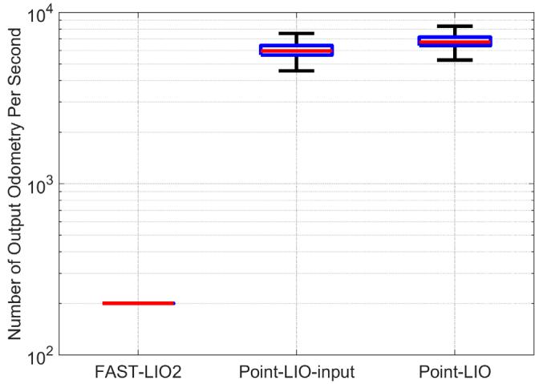  
Figure 8. Number of output odometry per second of FAST-LIO2 and Point-LIO-input and Point-LIO.

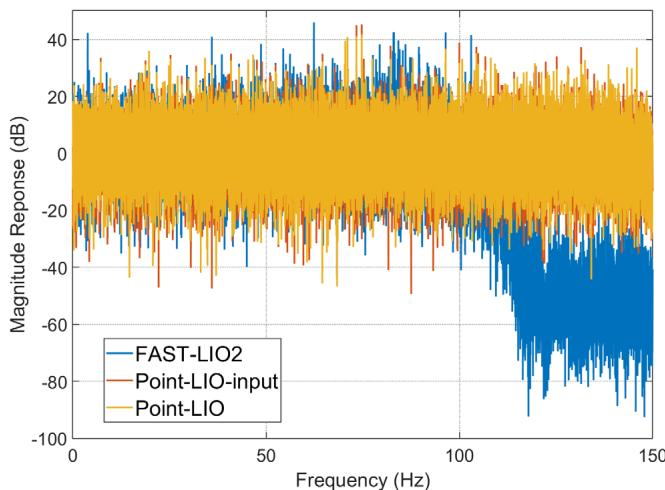  
Figure 9. Bandwidth analysis of FAST-LIO2, Point-LIO-input, and Point-LIO.

Table 2. Comparison of average frequency of odometry output (Hz) and bandwidth (Hz).
<table><tr><td></td><td>FAST-LIO2</td><td>Point-LIO-input</td><td>Point-LIO</td></tr><tr><td>Output Odo.:</td><td>200</td><td>6132</td><td>6955</td></tr><tr><td>Bandwidth:</td><td>100</td><td>&gt;150</td><td>&gt;150</td></tr></table>

Another benefit ofour Point-LIO is the capability ofestimating angular velocity and acceleration (which are states of our system and can hence be estimated by the Kalman filter) where the IMU is saturated. The estimation versus the IMU measurements are plotted in Figure 11b. As shown, during the time period 50–106 s, the IMU saturates (z-axis for gyroscope and y-axis for accelerometer), while our Point-LIO can still give a reasonable estimate. Outside this region, the estimation from our Point-LIO is in good agreement with the IMU measurements albeit some high-frequency components are filtered.

We further challenge Point-LIO by starting it at different initial angular speeds of the motor. As shown by the map results in Figure 12 and the RMSE of rotation in Table 3, when the initial angular velocity is below the IMU saturation value, that is, 35 rad s1, the Point-LIO is able to survive by constructing a reasonable map and state estimation. The quality of state estimation is slightly degraded when compared to the above case where the sensor starts from a stationary pose. This performance degradation is reasonable since the fast initial angular speed causes Point-LIO to build a biased map at the very beginning, which further misleads the subsequent state estimate. This also causes the RMSE of rotation to increase with the initial angular velocity, as shown in Table 3. When the initial angular velocity is beyond the IMU measuring range, Point-LIO fails due to the drastic large initial state estimate (e.g., the initial angular velocity estimate is set to zero while the actual is above 35 rad s1).

Finally, as a comparison, we run the FAST-LIO2 and Point-LIO-input on the same dataset, and the error comparisons of rotation and position are presented in Figure 13. As shown, the estimations of FAST-LIO2, Point-LIO-input, and Point-LIO have comparable rotation error during the first 50 s, where IMU works normally. From time 50 s, where IMU starts saturating, the estimations of FAST-LIO2 and Point-LIO-input start to diverge immediately for rotation, and the estimation of position also starts to drift and then diverge. In conclusion, the FAST-LIO2 as well as the Point-LIO-input fail to work under saturated IMU measurements while our proposed Point-LIO can survive if the saturation does not last from the beginning.

## 5.5.2. Circling Motion

This experiment is conducted using the pendulum in the same laboratory environment (see Figure 14d). In this experiment, the

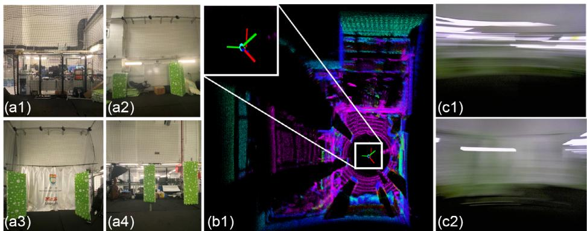  
Figure 10. Test environments of the spinning motion experiment and the mapping results of Point-LIO. a1–a4): Pictures of environment; b1): Map results of Point-LIO; c1–c2): Snaps of first-person-view camera during the experiment.

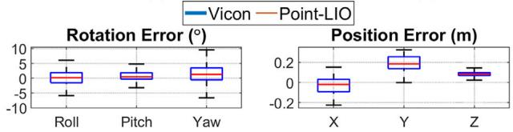

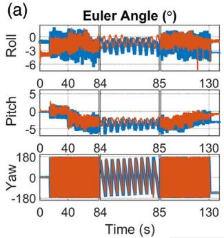

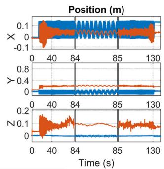

(b)  
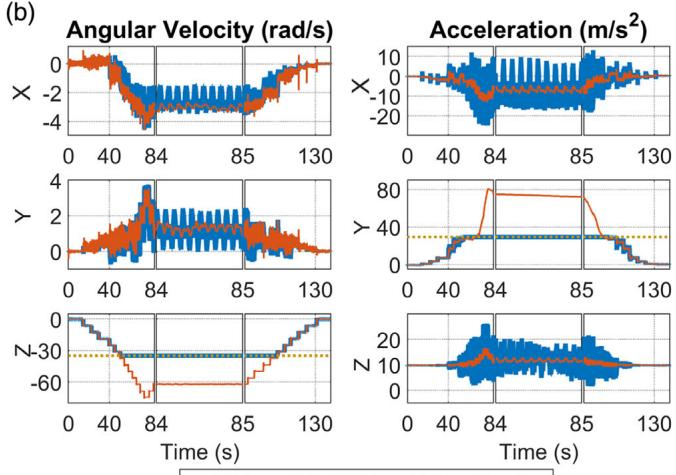  
—IMU—Point-LIO ………Saturation line  
Figure 11. a) Estimation results of Point-LIO for rotation in Euler angles and position of spinning motion experiment. b) Comparison of angular velocity and acceleration between estimation of Point-LIO and measurements from IMU. The gray dotted lines indicate the saturation values of the IMU.

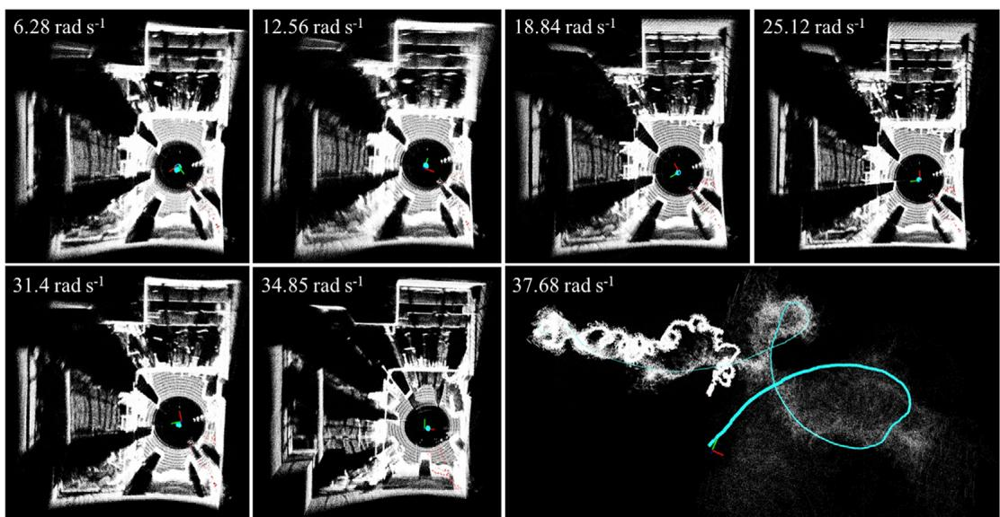  
Figure 12. Map results of Point-LIO starting with different angular velocities.

Table 3. Rotation RMSE (º) for Point-LIO starting with different angular velocities $( \boldsymbol { \mathsf { r a d } } \boldsymbol { \mathsf { s } } ^ { - 1 } )$ ).
<table><tr><td>Angular velocity at start  $[ \mathsf { r a d s } ^ { - 1 } ] \colon$ </td><td>6.28</td><td>12.56</td><td>18.84</td><td>25.12</td><td>31.40</td><td>34.85</td><td>37.68</td></tr><tr><td>RMSE of rotation [0]:</td><td>6.9</td><td>9.7</td><td>13.6</td><td>14.6</td><td>16.4</td><td>18.7</td><td>fail</td></tr></table>

sensor suite is tied to one end ofa rope that swings into a circling trajectory in the vertical plane (see Figure 14b). This motion causes an acceleration at the bottom of the circle up to $4 0 \mathrm { m } \mathrm { s } ^ { - 2 } ,$ which exceeds the IMU measuring range $3 0 \mathrm { m } \mathrm { s } ^ { - 2 } .$ FPV images shown in Figure 14e give an visual illustration of the motion. More details are shown in a video available online https://youtu.be/oS83xUs42Uw.

Qualitatively, Figure 14c1 and c2 shows the mapping results of our proposed Point-LIO. Since the LiDAR is facing front with a $7 0 . 4 ^ { \circ } \times 7 7 . 2 ^ { \circ }$ circular FoV, only one side of the laboratory is mapped. The estimated trajectory is shown in Figure 14a, which is in high agreement with the actual sensor path shown in Figure 14b.

Quantitatively, the estimated rotation in Euler angles and position are compared with ground-truth measured by Vicon in Figure 15a, where both the Euler angle estimation and the position estimation successfully demonstrate the 12 sequential circles. The RMSEs of the average rotation and translation errors are $4 . 4 2 ^ { \circ }$ and 0.0990 m, respectively. Figure 15b shows the estimated angular velocity and acceleration by the Point-LIO versus the IMU measurements. As shown, the estimations agree with the IMU measurements pretty well when those dynamic states are within the IMU measurements. Moreover, our Point-LIO can give reasonable acceleration estimates even when the IMU saturates. Figure 16 further shows the error comparison among the

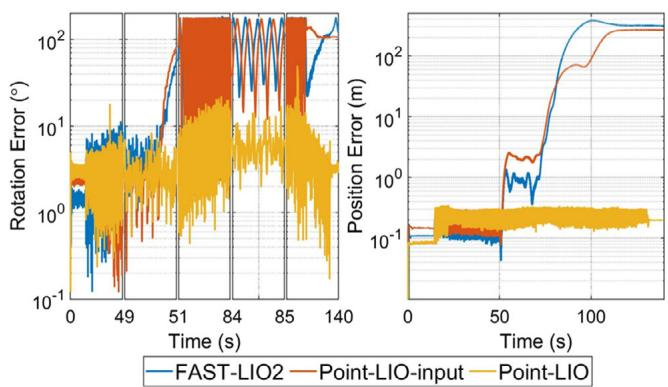  
Figure 13. Error comparison of FAST-LIO2, Point-LIO-input, and Point-LIO, for rotation and position estimations.

Point-LIO, the Point-LIO-input, and the frame-based odometry FAST-LIO2. Similar to the last experiment, our Point-LIO achieves consistently lower estimation errors than the other two due to the ability to cope with IMU saturation.

## 5.6. Real-Time Performance

The average time costs of each step of the Point-LIO-output for processing one scan of LiDAR points are shown in Figure 17, which are tested on an intel i7-based micro-UAV onboard computer, a DJI Manifold 2-C7 with a 1.8 GHz quad-core Intel i7-8550U CPU, and 8 GB RAM. The mapping includes searching of nearest points and adding of point to the map, which takes up the largest part of time consumption. Even the system states are updated at each LiDAR point, the time for EKF filtering including state propagation and update is less than 10 ms for 10 Hz sequences and less than 1 ms for 100 Hz sequences.

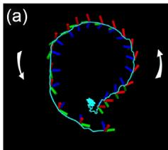

The average total time consumption for one scan is compared among FAST-LIO2, Point-LIO-input, and Point-LIO-output in

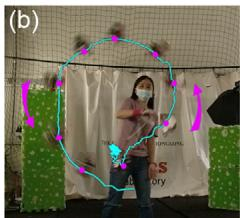

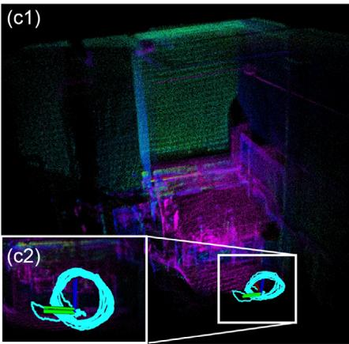

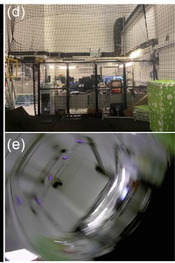  
Figure 14. Test environment of the circling motion experiment and the mapping results of Point-LIO. Trajectory captured by a third-person-view camera; c1–c2): Map results of Point-LIO; d): Environment picture; e): Snap of the first-person-view camera during the experiment.

(a)  
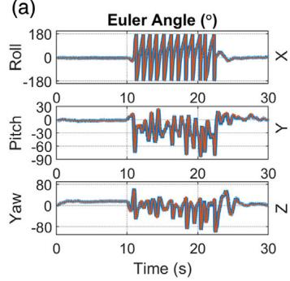

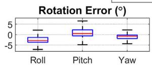

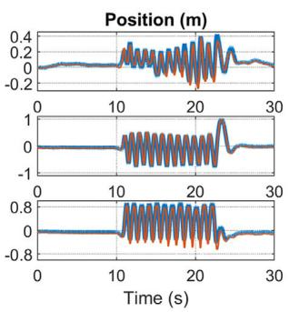  
(b)

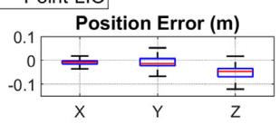

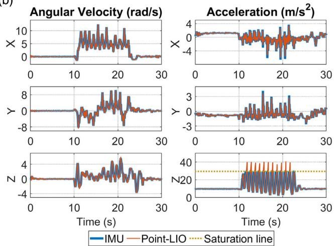  
Figure 15. a) Estimation results ofPoint-LIO for rotation in Euler angles and position ofthe circling motion experiment. b) Comparison ofangular velocity and acceleration between estimation of Point-LIO and measurements from IMU. The gray dotted lines refer to saturation values of the IMU.

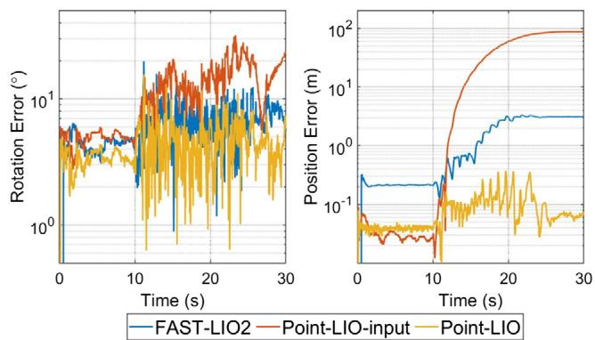

Figure 16. Error comparison of FAST-LIO2, Point-LIO-input, and Point-LIO.  
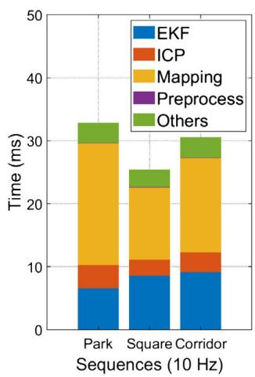

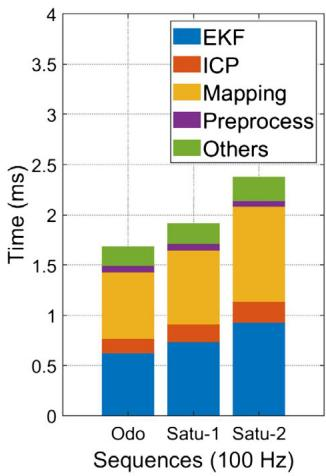  
Figure 17. Time usage in each step of Point-LIO.

Table 4. indicates that the LIO fails in those sequences. As can be seen, our Point-LIO, with either the Point-LIO-input (i.e., Point-LIO-input) or the output model (i.e., Point-LIO), has time consumption comparable to FAST-LIO2, and they all achieve real-time performance, that is, within 100 ms for 10 Hz sequences and within 10 ms for 100 Hz sequences. Finally, the average numbers of points processed per second (including those with and without plane correspondences) over all sequences are 33 710, and the average processing time per point is 9 us.

Table 4. Comparison of time consumption (milliseconds) per scan for Point-LIO and FAST-LIO2.
<table><tr><td colspan="2"></td><td>FAST-LIO2</td><td>Point-LIO-input</td><td>Point-LIO</td></tr><tr><td rowspan="3">10 Hz</td><td>Park:</td><td>39.84</td><td>32.09</td><td>32.94</td></tr><tr><td>Square:</td><td>21.89</td><td>25.20</td><td>25.41</td></tr><tr><td>Corridor:</td><td>28.36</td><td>28.76</td><td>30.59</td></tr><tr><td rowspan="3">100 Hz</td><td>Odo:</td><td>1.18</td><td>1.70</td><td>1.69</td></tr><tr><td>Satu-1:</td><td>一</td><td>-</td><td>1.92</td></tr><tr><td>Satu-2:</td><td>一</td><td>一</td><td>2.38</td></tr></table>

## 6. Benchmark Results

In this section, we test Point-LIO on various public sequences, which have more gentle motion without IMU saturation and compare it with other state-of-the-art LIO methods, including FAST-LIO2,[29] LILI-OM,[11] LIO-SAM,[21] and LINS.[17] The computation platform for benchmark comparison is the same lightweight UAV onboard computer as used in FAST-LIO2,[29] which is a DJI Manifold 2-C7 with a 1.8 GHz quad-core Intel i7-8550U CPU and 8 GB RAM; hence, the results for FAST-LIO2, LILI-OM, LIO-SAM, and LINS can be directly obtained from the original paper.[29] Since Point-LIO uses the same mapping structure as FAST-LIO2, for a fair comparison, we set the mapping parameters ofPoint-LIO to the default values ofFAST-LIO2 used in ref. [29], that is, the local map size $L = 1 0 0 0 \mathrm { m }$ , the LiDAR raw points are directly fed into state estimation after a 1:4 (one out offour LiDAR points) temporal downsampling and spatial downsample resolution l 0.5 m with rebalancing thresholds of ikd-Tree as $\alpha _ { \mathrm { b a l } } = 0 . 6 , ~ \alpha _ { \mathrm { d e l } } = 0 . 5 $ , and $N _ { \mathrm { m a x } } = 1 5 0 0 .$ For the EKF part of Point-LIO, the LiDAR measurement noise ofKalman filter is set as $\overline { { \mathcal { R } } } _ { k } = 1 0 ^ { - 2 } \cdot \mathbf { I }$ (see (18)). These parameter values are kept the same for all sequences.

We evaluate our method on the same 12 sequences used in FAST-LIO2,[29] which are drawn from 4 different public datasets, that is, “lili” from LILI-OM,[11] “utbm”,[59] “ulhk”,[60] and “liosam” from the work LIO-SAM.[21] Among them, “lili” uses a solid-state 3D LiDAR, Livox Horizon, while the other three datasets use the spinning LiDARs, that is, Velodyne HDL-32E LiDAR for “utbm” and “ulhk” and VLP-16 LiDAR for “liosam”. We refer the readers to ref. [29] for more detailed information about the dataset and the selected sequences.

## 6.1. Accuracy Evaluation

Similar to ref. [29], two criteria, the RMSE of average translation error (for sequences with good ground-true trajectory) and the end-to-end error (for sequences starting and ending at the same location), are used for the accuracy evaluation.

## 6.1.1. RMSE Benchmark

The RMSEs are computed using the same method of the publication[29] and reported in Table 5. Compared with other LIO methods, our Point-LIO achieves the best performances in 4 out of 5 sequences, especially an obvious improvement on utbm\_9, while it has a slightly higher RMSE in liosam\_1. The overall accuracy of our method is on par to (and most cases better than) the counterparts.

## 6.1.2. Drift Benchmark

The end-to-end errors are reported in Table 6. The overall trend is similar to the RMSE benchmark results, that our Point-LIO achieves the lowest drifts in 5 out of 7 sequences. The result for sequence lili\_8 is worse than LILI-OM and FAST-LIO2, which is because LILI-OM has tuned parameters for each of their own sequences “lili”, while parameters of Point-LIO are kept the same among all the sequences. Since lili\_8 has a much longer trajectory than the other two “lili” sequences, the drift caused by inappropriate parameters would accumulate along the following process and result in more than 10 m drift worse than FAST-LIO2. Also, Point-LIO shows slightly larger RMSE on sequence ulhk\_6 relative to FAST-LIO2 albeit the margin is very small.

Table 5. Comparison of RMSE (meters) for Point-LIO, FAST-LIO2, and other state-of-art LiDAR-inertial systems on public sequences. The smallest RMSE for each sequence is indicated in bold text.
<table><tr><td></td><td>utbm_8</td><td> $\mathsf { u t b } \mathsf { m } \_ { 9 }$ </td><td> $\mathsf { u t b m \_ l o }$ </td><td>ulhk_4</td><td>liosam_1</td></tr><tr><td>Point-LIO</td><td>23.77</td><td>26.35</td><td>15.70</td><td>2.17</td><td>5.24</td></tr><tr><td>FAST-LIO2</td><td>27.29</td><td>51.60</td><td>16.80</td><td>2.57</td><td>4.58</td></tr><tr><td>LILI-OM</td><td>59.48</td><td>782.11</td><td>17.59</td><td>2.29</td><td>18.78</td></tr><tr><td>LIO-SAM</td><td>一</td><td>一</td><td>一</td><td>3.52</td><td>4.75</td></tr><tr><td>LINS</td><td>48.17</td><td>54.35</td><td>60.48</td><td>3.11</td><td>880.92</td></tr></table>

Table 6. Comparison of drifts (meters) for Point-LIO, FAST-LIO2, and other state-of-art LiDAR-inertial systems on public sequences. The smallest drift for each sequence is indicated in bold text.
<table><tr><td></td><td>lili_6</td><td>lili_7</td><td>lili_8</td><td>ulhk_5</td><td>ulhk_6</td><td>liosam_2</td><td>liosam_3</td></tr><tr><td>Point-LIO</td><td>&lt;0.1</td><td>&lt;0.1</td><td>28.64</td><td>&lt;0.1</td><td>2.30</td><td>&lt;0.1</td><td>7.85</td></tr><tr><td>FAST-LIO2</td><td>&lt;0.1</td><td>1.63</td><td>17.39</td><td>0.39</td><td>&lt;0.1</td><td>&lt;0.1</td><td>9.50</td></tr><tr><td>LILI-OM</td><td>0.8</td><td>4.13</td><td>15.6</td><td>1.84</td><td>7.89</td><td>1.95</td><td>13.79</td></tr><tr><td>LIO-SAM</td><td>一</td><td>一</td><td>一</td><td>0.83</td><td>2.88</td><td>一</td><td>8.61</td></tr><tr><td>LINS</td><td>一</td><td>一</td><td>一</td><td>0.9</td><td>6.92</td><td>一</td><td>29.9</td></tr></table>

As can be seen from the above benchmark results, Point-LIO achieves higher accuracy in most sequences while for the rest, the margin from the best method is not significant. Considering the various types of LiDARs, environments, and moving platforms across all datasets and sequences, this effectively shows the accuracy and robustness of our method on real-world data.

## 6.2. Processing Time Evaluation

Table 7 shows the processing time of Point-LIO, FAST-LIO2, LILI-OM, LIO-SAM, and LINS in all the sequences. Both Point-LIO and the FAST-LIO2 integrate odometry and mapping together, where the map is updated immediately at each step the odometry is updated. Therefore, the total time (“Total” presented in Table 7) counts all possible procedures occurring in the odometry, including point-to-map-matching, state estimation, and mapping. On the other hand, LILI-OM, LIO-SAM, and LINS are all based on a separate architecture of odometry (including feature extraction and rough pose estimation) and mapping (such as back-end fusion in LILI-OM,[11] incremental smoothing and mapping in LIO-SAM,[21] and map-refining in LINS[17]), whose average processing time per LiDAR scan is summed up by those two parts (“Odo”. and “Map”. respectively presented in Table 7) when ranking the computation time.

As shown, our proposed method and FAST-LIO2 achieve the least computation time when compared with other methods.

Table 7. Comparison of time consumption (milliseconds) per scan for Point-LIO, FAST-LIO2, and other state-of-art LiDAR-inertial systems on public sequences. The shortest time consumption for each sequence is indicated in bold text.
<table><tr><td>Point-LIO</td><td>FAST-LIO2</td><td></td><td>LILI-OM</td><td></td><td>LIO-SAM</td><td></td><td>LINS</td></tr><tr><td></td><td>Total</td><td>Total</td><td>Odo.</td><td>Map.</td><td>Odo.</td><td>Map.</td><td>Odo. Map.</td></tr><tr><td>utbm_8</td><td>19.68</td><td>22.05</td><td>65.28</td><td>84.76</td><td>一</td><td>37.44 一</td><td>153.92</td></tr><tr><td>utbm_9</td><td>19.70</td><td>25.44</td><td>68.94</td><td>97.90</td><td>一 一</td><td>38.82</td><td>154.06</td></tr><tr><td>utbm_10</td><td>19.65</td><td>22.48</td><td>66.10</td><td>97.29</td><td></td><td>33.61</td><td>166.12</td></tr><tr><td>lili_6</td><td>14.19</td><td>12.56</td><td>68.95</td><td>58.46</td><td>一</td><td>一</td><td>1</td></tr><tr><td>lili_7</td><td>11.77</td><td>17.61</td><td>40.01</td><td>83.71</td><td>一</td><td></td><td>1</td></tr><tr><td>lili_6</td><td>10.57</td><td>15.31</td><td>61.80</td><td>79.11</td><td>一</td><td>一</td><td>一</td></tr><tr><td>ulhk_4</td><td>20.54</td><td>20.14</td><td>52.40</td><td>74.80</td><td>39.50</td><td>95.29 34.72</td><td>93.70</td></tr><tr><td>ulhk_5</td><td>35.71</td><td>23.90</td><td>53.56</td><td>47.68</td><td>25.68</td><td>127.63 28.01</td><td>99.13</td></tr><tr><td>ulhk_6</td><td>43.01</td><td>31.56</td><td>64.46</td><td>70.43</td><td>15.16</td><td>164.36 41.54</td><td>199.96</td></tr><tr><td>liosam_1</td><td>10.85</td><td>14.77</td><td>48.45</td><td>84.28</td><td>13.47</td><td>135.39 24.13</td><td>179.44</td></tr><tr><td>liosam_2</td><td>24.77</td><td>19.77</td><td>42.58</td><td>99.01</td><td>13.09</td><td>154.69 20.71</td><td>160.66</td></tr><tr><td>liosam_3</td><td>12.79</td><td>16.64</td><td>38.42</td><td>64.02</td><td>11.32</td><td>124.35 40.47</td><td>117.25</td></tr><tr><td>Average</td><td>20.27</td><td>20.19</td><td>55.91</td><td>78.45</td><td>19.70</td><td>133.62 33.27</td><td>147.14</td></tr></table>

When compared to FAST-LIO2, our method takes less time on 7 out of12 sequences. The average computation time ofthese two methods is very close. Note that, due to the frame-based architecture, FAST-LIO2 uses four threads to parallelize the nearest point search, while our method, due to the point-wise architecture, has to perform such operations sequentially. Still, our method takes comparable average computation time, suggesting fewer use ofthe computation resources, which could be reserved for other modules (e.g., planning, control). This computation efficiency is attributed to the great sparsity of the system and the elimination of iteration in the Kalman filter, as explained in Section 4.4.

In summary, Point-LIO has accuracy and computation efficiency comparable to FAST-LIO2, while costing fewer computation resources. In the meantime, the Point-LIO is significantly faster than the current state-of-the-art LIO algorithms, that is, LILI-OM, LIO-SAM, LINS, while achieving highly competitive or better accuracy.

## 7. Applications

In this section, we apply our proposed Point-LIO to the state estimation of two UAVs: one is on a racing quadrotor drone shown in Figure 18a which has a thrust-to-weight ratio up to 5.4. The high-thrust-weight ratio enables the drone to perform extremely agile motions. The other UAV is on an agile, single-actuated aircraft called self-rotating UAV, as shown in Figure 18b. The propeller blades are attached to the motor shaft through two passive hinges,[61,62] which, by modulating momentary acceleration and deceleration on the propeller rotation speed, is able to produce the roll and pitch moment necessary to stabilize the UAV’s attitude. Due to the uncompensated moment produced by the motor, the UAV will produce a high-rate continuous yaw rotation.

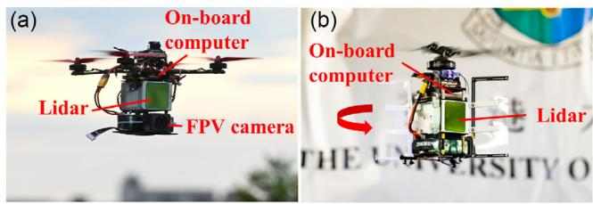  
Figure 18. Platforms for application. a) Racing drone; b) self-rotating UAV.

## 7.1. Racing Drone

As shown in Figure 18a, the racing drone is mounted with a Livox Avia LiDAR and a FPV camera. The LiDAR FoV is aligned to that ofthe FPV camera, based on which an expert human pilot manually controls the drone to perform extremely agile flight maneuvers. The flights are conducted above a farmland with vegetation, pond, and buildings (see Figure 19b,c). Several aggressive maneuvers are performed during the flight, including extremely fast rolling flips (see Figure 19e1–e3), cliff diving, and lateral accelerations. During the flip, the angular velocities reach 59.37 rad s1, which exceeds the IMU measuring range 35 rad s1. Readers can refer to the accompanying video https://youtu.be/oS83xUs42Uw for better visual illustration of the experiment.

We conducted two flights and our method succeeded on both of them. Due to the space limit, we present the results of one flight only. The mapping results are shown in Figure 19d1–d3; it is seen that the constructed map is consistent with easily distinguishable fine structures on the ground, such as trees and buildings. The estimation of rotation in Euler angles, position, and velocity are shown in Figure 20a, and the estimation of the angular velocities versus the IMU measurements are shown in Figure 20b. From these results, we can see that our method is able to estimate the drone’s states even with extremely aggressive motions. As noted, the maximum velocity on one axis reaches $1 4 . 6 3 \mathrm { m } \mathrm { s } ^ { - 1 }$ , maximum acceleration reaches $3 0 \mathrm { m } \mathrm { s } ^ { - 2 } ,$ , and angular velocity reaches 59 rad $\mathbf { s } ^ { - 1 }$ . Besides the extremely agile motion, the LiDAR also occasionally faces the sky, which causes no LiDAR measurements, during maneuvering. Still, our method is able to estimate the state stably.

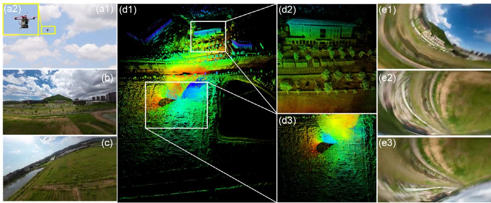  
Figure 19. Mapping results ofPoint-LIO. a1–a2): Picture ofthe UAV in flight; b,c): Environment pictures; d1–d3) Map results ofPoint-LIO; e1–e3): Snaps of the first-person-view camera during experiment.

(a)  
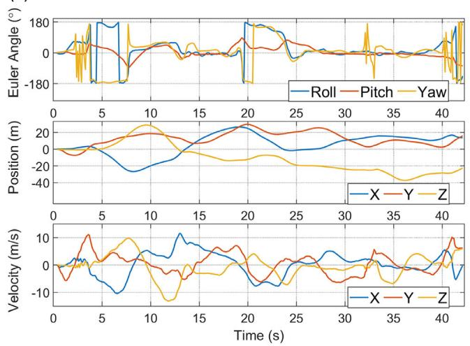

(b)  
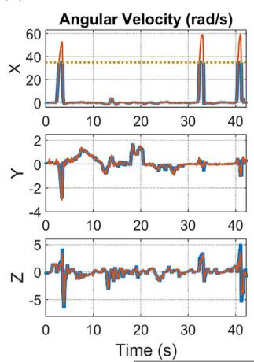

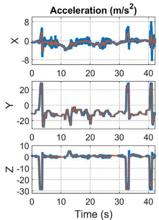  
IMU—Point-LIO……Saturation line  
Figure 20. a) State estimation of Point-LIO. b) Comparison of angular velocity and acceleration between estimation from Point-LIO and measurements from IMU. The gray dotted lines indicate saturation values of the IMU.

## 7.2. Self-Rotating UAV

Figure 18b presents the self-rotating UAV. As shown in this $\mathrm { f g \mathrm { . } }$ ure, the Livox Avia LiDAR is front, leading to a fast FoV change when the UAV undergoes continuous yaw rotation. We use the LiDAR built-in IMU and set the measuring range to $1 7 . 5 \mathrm { r a d } \mathrm { s } ^ { - 1 } .$ while the average yaw rate of the UAV is around $2 5 \mathrm { r a d s } ^ { - 1 }$ . The UAV is also equipped with a low-power, ARM-based computer, Khadas VIM3 Pro, which has 2.2 GHz quad-core Cortex-A73 CPU and 4 GB RAM. The onboard computer runs our Point-LIO to estimate the UAV state in real time. The estimated state is then fed to the flight controller, Pixhawk 4 Mini, to do the real-time control task. Two experiments are conducted using this UAV, one is an outdoor experiment outside the Haking Wong building of the University of Hong Kong, as shown in Figure 21a1 and a2, and the other is an indoor experiment in a cluttered laboratory shown in Figure 21b1 and b2.

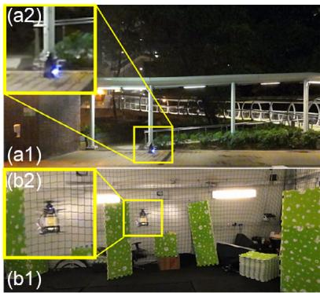

The real-time mapping results of the two experiments are shown in Figure 21, i.e., (c) for the outdoor experiment and (d) for the indoor experiment. It is seen that our method manages to build maps ofboth environments without noticeable mismatches. Figure 22a,b further show the estimation of the kinematic state (i.e., rotation, position, and velocity), angular velocity, and acceleration, respectively. The plots are enlarged during the time interval 53–55 s, to better show the estimation results. As shown, our method can produce stable state estimate that is in line with the IMU measurements, despite the IMU saturation in the middle and quick FoV changes caused by fast spinning. The average processing time per LiDAR package of our method is 14.63 ms while the package rate is 50 Hz, ensuring real-time performance. This is also confirmed by the experiments, where the controller is able to perform stable controlled flight with the state feedback from our method.

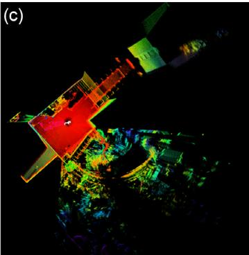

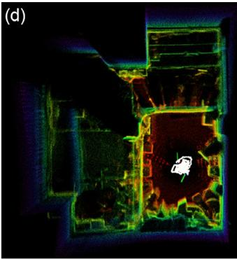  
Figure 21. Mapping results of Point-LIO. a1–a2): Pictures of the UAV during the outdoor experiment; b1–b2): Pictures of the UAV during the indoor experiment; c): Map results of Point-LIO for the outdoor experiment; d): Map results of Point-LIO for the outdoor experiment.

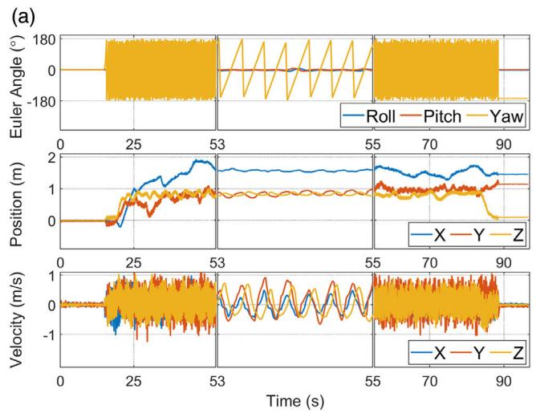

(b)  
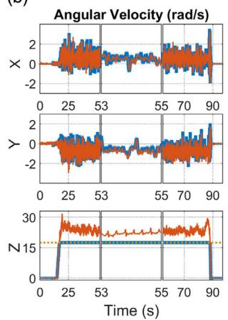

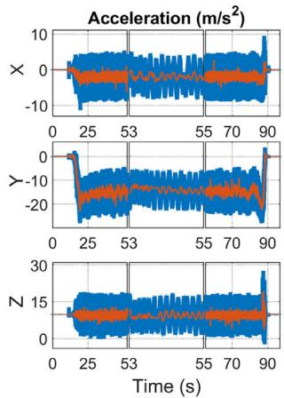  
—IMU—Point-LIO……Saturation line  
Figure 22. a) State estimation by the Point-LIO. b) Comparison of angular velocity and acceleration between estimation from Point-LIO and measurements from the IMU. The gray dotted lines indicate the saturation values of the IMU.

## 8. Conclusion

This article proposes Point-LIO, a robust and high-bandwidth LIO framework. The framework is based on a novel point-bypoint update scheme, which updates the system state at the true sampling time of each point without accumulating points into a frame. The elimination ofpoints accumulation removes the longstanding in-frame motion distortion and allows high-odometry output at nearly the point sampling rate (4–8 kHz), which further enables the system to track very fast motions. To further boost the system bandwidth beyond the IMU measuring range, a colored stochastic process is augmented into the kinematic model treating the IMU measurements as system output. The bandwidth, robustness, accuracy, and computation efficiency of the developed system are exhaustively tested in real-world experiments with extremely aggressive motions and public datasets with diversified LiDAR types, environments, and motion patterns. In all tests, Point-LIO achieves comparable computation efficiency and odometry accuracy to other state-of-the-art LIO algorithms while significantly boosting the system bandwidth.

As an odometry, Point-LIO could be used in various autonomous tasks, such as trajectory planning, control, and perception, especially in cases involving very fast ego-motions (e.g., in the presence of severe vibration and high angular or linear velocity) or requiring high-rate odometry output and mapping (e.g., for high-rate feedback control and perception).

## Acknowledgements

D.H. and W.X. contribute equally to this work. The authors would like to thank Livox Technology for the equipment support during the whole work. They would also like to thank Mr. Yunfan Ren, Mr. Fangcheng Zhu, and Mr. Yihang Li for help in the experiment. This work was supported by Information Science Academy of China Electronics Technology Group Corporation (ISA CETC), and the project number is 200010756.

## Conflict of Interest

The authors declare no conflict of interest.

## Data Availability Statement

The data that support the findings of this study are openly available in GitHub at https://github.com/hku-mars/Point-LIO.

## Keywords

aggressive motions, high bandwidths, point-by-point updates, sensor fusion, simultaneous localization and mapping

Received: December 26, 2022   
Revised: February 20, 2023   
Published online: April 7, 2023

[1] M. Bosse, R. Zlot, Int. J. Rob. Res. 2008, 27, 667.

[2] R. M. Eustice, H. Singh, J. J. Leonard, IEEE Trans. Rob. 2006, 22, 1100.

[3] F. Gao, W. Wu, W. Gao, S. Shen, J. Field Rob. 2019, 36, 710.

[4] F. Kong, W. Xu, Y. Cai, F. Zhang, IEEE Rob. Autom. Lett. 2021, 6, 7869.

[5] R. W. Wolcott, R. M. Eustice, Int. J. Rob. Res. 2017, 36, 292.

[6] J. Levinson, J. Askeland, J. Becker, J. Dolson, D. Held, S. Kammel, J. Z. Kolter, D. Langer, O. Pink, V. Pratt, in 2011 IEEE Intelligent Vehicles Symposium (IV), IEEE, Baden, Germany June 5–9 2011, pp. 163–168.

[7] S. Thrun, M. Montemerlo, H. Dahlkamp, D. Stavens, A. Aron, J. Diebel, P. Fong, J. Gale, M. Halpenny, G. Hoffmann, J. Field Rob. 2006, 23, 661.

[8] C. Urmson, J. Anhalt, D. Bagnell, C. Baker, R. Bittner, M. Clark, J. Dolan, D. Duggins, T. Galatali, C. Geyer,J. Field Rob. 2008, 25, 425.

[9] D. Wang, C. Watkins, H. Xie, Micromachines 2020, 11, 456.

[10] Z. Liu, F. Zhang, X. Hong, IEEE/ASME Trans. Mechatron. 2021, 27, 58.

[11] K. Li, M. Li, U. D. Hanebeck, IEEE Rob. Autom. Lett. 2021, 6, 5167.

[12] D. Frossard, S. Da Suo, S. Casas, J. Tu, R. Urtasun, in Conf. on Robot Learning, PMLR, London, UK November 8–11 2021, pp. 1174–1183.

[13] W. Han, Z. Zhang, B. Caine, B. Yang, C. Sprunk, O. Alsharif, J. Ngiam, V. Vasudevan, J. Shlens, Z. Chen, in European Conf. on Computer Vision, Springer, SEC, GLASGOW August 23–28 2020, pp. 423–441.

[14] W. Xu, D. He, Y. Cai, F. Zhang, IEEE Trans. Control Syst. Technol. 2022.

[15] J. Zhang, S. Singh, in Robotics: Science and Systems, Vol. 2, Berkeley, USA July 12–16 2014, pp. 1–9.

[16] T. Shan, B. Englot, in 2018 IEEE/RSJ Int. Conf. on Intelligent Robots and Systems (IROS), IEEE, Madrid, Spain October 1–5 2018, pp. 4758– 4765.

[17] C. Qin, H. Ye, C. E. Pranata, J. Han, S. Zhang, M. Liu, in 2020 IEEE Int. Conf. on Robotics and Automation (ICRA), IEEE 2020, pp. 8899–8906.

[18] H. Ye, Y. Chen, M. Liu, in 2019 Int. Conf. on Robotics and Automation (ICRA), IEEE, Montreal, Canada May 20–24 2019, pp. 3144–3150.

[19] Y. Pan, P. Xiao, Y. He, Z. Shao, Z. Li, in 2021 IEEE Int. Conf. on Robotics and Automation (ICRA), IEEE, Xi’an, China May 30–June 05 2021, pp. 11633–11640.

[20] J. Lin, F. Zhang, in 2020 IEEE Int. Conf. on Robotics and Automation (ICRA), IEEE, virtual, May 31–June 30 2020, pp. 3126–3131.

[21] T. Shan, B. Englot, D. Meyers, W. Wang, C. Ratti, D. Rus, in 2020 IEEE/RSJ Int. Conf. on Intelligent Robots and Systems (IROS), IEEE, Las Vegas, USA October 25–29 2020, pp. 5135–5142.

[22] A. Tagliabue, J. Tordesillas, X. Cai, A. Santamaria-Navarro, J. P. How, L. Carlone, A.-a. Agha-mohammadi, in Int. Symp. on Experimental Robotics, Springer 2020, pp. 380–390.

[23] C. Park, S. Kim, P. Moghadam, C. Fookes, S. Sridharan, in Proc. ofthe IEEE Int. Conf. on Computer Vision Workshops, Venice, Italy October 22–29 2017, pp. 2418–2426.

[24] J. Behley, C. Stachniss, Rob. Sci. Syst. 2018, 2018, 59.

[25] X. Chen, A. Milioto, E. Palazzolo, P. Giguere, J. Behley, C. Stachniss, in 2019 IEEE/RSJ Int. Conf. on Intelligent Robots and Systems (IROS), IEEE, Macau, China November 4–8 2019, pp. 4530–4537.

[26] J. Quenzel, S. Behnke, in 2021 IEEE/RSJ Int. Conf. on Intelligent Robots and Systems (IROS), IEEE, Prague, Czech Republic September 27– October 1 2021, pp. 5499–5506.

[27] C. Yuan, W. Xu, X. Liu, X. Hong, F. Zhang, IEEE Robot. 2022, 7, 8518..

[28] W. Xu, F. Zhang, IEEE Rob. Autom. Lett. 2021, 6, 3317.

[29] W. Xu, Y. Cai, D. He, J. Lin, F. Zhang, IEEE Trans. Rob. 2022.

[30] M. Karimi, M. Oelsch, O. Stengel, E. Babaians, E. Steinbach, IEEE Rob. Autom. Lett. 2021, 6, 2248.

[31] C. Qu, S. S. Shivakumar, W. Liu, C. J. Taylor, in 2022 Int. Conf. on Robotics and Automation (ICRA), IEEE, Philadelphia (PA), USA May 23–27 2022, pp. 4149–4155.

[32] S. Hong, H. Ko, J. Kim, in 2010 IEEE Int. Conf. on Robotics and Automation, IEEE, Anchorage, Alaska May 3–8 2010, pp. 1893–1898.

[33] F. Moosmann, C. Stiller, in 2011 IEEE Intelligent Vehicles Symp. (IV), IEEE, Baden-Baden, Germany June 5–9 2011, pp. 393–398.

[34] H. Dong, T. D. Barfoot, in Field and Service Robotics, Springer 2014, pp. 327–342.

[35] S. Anderson, T. D. Barfoot, in 2013 IEEE/RSJ Int. Conf. on Intelligent Robots and Systems, IEEE, Tokyo, Japan November 3–7 2013, pp. 2093–2099.

[36] C. H. Tong, T. D. Barfoot, in 2013 IEEE Int. Conf. on Robotics and Automation, IEEE, Karlsruhe, Germany May 6–10 2013, pp. 5204–5211.

[37] S. Anderson, T. D. Barfoot, in 2013 IEEE Int. Conf. on Robotics and Automation, IEEE, Karlsruhe, Germany May 6–10 2013, pp. 1033–1040.

[38] S. Zhao, Z. Fang, H. Li, S. Scherer, in 2019 IEEE/RSJ Int. Conf. on Intelligent Robots and Systems (IROS), IEEE, Macau, China November 4–8 2019, pp. 1285–1292.

[39] H. Wang, C. Wang, C.-L. Chen, L. Xie, in 2021 IEEE/RSJ Int. Conf. on Intelligent Robots and Systems (IROS), IEEE, Prague, Czech Republic September 27–October 1 2021, pp. 4390–4396.

[40] R. Zlot, M. Bosse, J. Field Rob. 2014, 31, 758.

[41] L. Kaul, R. Zlot, M. Bosse, J. Field Rob. 2016, 33, 103.

[42] D. Droeschel, S. Behnke, in 2018 IEEE Int. Conf. on Robotics and Automation (ICRA), IEEE, Brisbane, Australia May 21–25 2018, pp. 5000–5007.

[43] S. Anderson, T. D. Barfoot, in 2015 IEEE/RSJ Int. Conf. on Intelligent Robots and Systems (IROS), IEEE, Hamburg, Germany September 28– October 02 2015, pp. 157–164.

[44] C. Le Gentil, T. Vidal-Calleja, S. Huang, in 2019 Int. Conf. on Robotics and Automation (ICRA), IEEE, Montreal, Canada May 20–24 2019, pp. 6388–6394.

[45] C. Le Gentil, T. Vidal Calleja, S. Huang, IEEE Trans. Rob. 2020, 37, 275.

[46] Y. Zhang, IEEE Trans. Aerosp. Electron. Syst. 2022, 58, 2649.

[47] J. Tang, Y. Chen, X. Niu, L. Wang, L. Chen, J. Liu, C. Shi, J. Hyyppä, Sensors 2015, 15, 16710.

[48] J. Tang, Y. Chen, A. Jaakkola, J. Liu, J. Hyyppä, H. Hyyppä, Sensors 2014, 14, 11805.

[49] W. Zhen, S. Zeng, S. Soberer, in 2017 IEEE Int. Conf. on Robotics and Automation (ICRA), IEEE, Singapore, Singapore May 29–June 3 2017, pp. 6240–6245.

[50] G. Hemann, S. Singh, M. Kaess, in 2016 IEEE/RSJ Int. Conf. on Intelligent Robots and Systems (IROS), IEEE, Daejeon, Korea October 9–14 2016, pp. 1659–1666.

[51] J. A. Hesch, F. M. Mirzaei, G. L. Mariottini, S. I. Roumeliotis, in 2010 IEEE Int. Conf. on Robotics and Automation, IEEE, Anchorage, Alaska May 3–8 2010, pp. 5376–5382.

[52] C. Park, P. Moghadam, S. Kim, A. Elfes, C. Fookes, S. Sridharan, in 2018 IEEE Int. Conf. on Robotics and Automation (ICRA), IEEE, Brisbane, Australia May 21–25 2018, pp. 1206–1213.

[53] P. Geneva, K. Eckenhoff, Y. Yang, G. Huang, in 2018 IEEE/RSJ Int. Conf. on Intelligent Robots and Systems (IROS), IEEE, Madrid, Spain October 1–5 2018, pp. 123–130.

[54] C. Forster, L. Carlone, F. Dellaert, D. Scaramuzza, IEEE Trans. Rob. 2016, 33, 1.

[55] D. He, W. Xu, F. Zhang, IEEE Trans. Ind. Electron. 2023, 1, https://doi. org/10.1109/TIE.2023.3237872.

[56] B. M. Bell, F. W. Cathey, IEEE Trans. Autom. Control 1993, 38, 294.

[57] M. Montemerlo, S. Thrun, D. Koller, B. Wegbreit, AAAI/IAAI 2002, 593598.

[58] S. Scherer, J. Rehder, S. Achar, H. Cover, A. Chambers, S. Nuske, S. Singh, Auton. Rob. 2012, 33, 189.

[59] Z. Yan, L. Sun, T. Krajnk, Y. Ruichek, in 2020 IEEE/RSJ Int. Conf. on Intelligent Robots and Systems (IROS), IEEE, Las Vegas, USA October 25–29 2020, pp. 10697–10704.

[60] W. Wen, Y. Zhou, G. Zhang, S. Fahandezh-Saadi, X. Bai, W. Zhan, M. Tomizuka, L.-T. Hsu, in 2020 IEEE Int. Conf. on Robotics and Automation (ICRA), IEEE, virtual, May 31–June 30 2020, pp. 2310–2316.

[61] J. Paulos, M. Yim, in 2013 IEEE/RSJ Int. Conf. on Intelligent Robots and Systems, IEEE, Tokyo, Japan November 3–7 2013, pp. 1374–1379.

[62] Y. Qin, N. Chen, Y. Cai, W. Xu, F. Zhang, IEEE/ASME Trans. Mechatron. 2022.