# Point-SLAM: Dense Neural Point Cloud-based SLAM

Erik Sandstrom¨ 1\* Yue Li1\* Luc Van Gool1,2 Martin R. Oswald1,3 1ETH Zurich, Switzerland¨ 2KU Leuven, Belgium 3University of Amsterdam, Netherlands

## Abstract

We propose a dense neural simultaneous localization and mapping (SLAM) approach for monocular RGBD input which anchors the features of a neural scene representation in a point cloud that is iteratively generated in an input-dependent data-driven manner. We demonstrate that both tracking and mapping can be performed with the same point-based neural scene representation by minimizing an RGBD-based re-rendering loss. In contrast to recent dense neural SLAM methods which anchor the scene features in a sparse grid, our point-based approach allows dynamically adapting the anchor point density to the information density of the input. This strategy reduces runtime and memory usage in regions with fewer details and dedicates higher point density to resolve fine details. Our approach performs either better or competitive to existing dense neural RGBD SLAM methods in tracking, mapping and rendering accuracy on the Replica, TUM-RGBD and Scan-Net datasets. The source code is available at https:// github.com/eriksandstroem/Point-SLAM.

## 1. Introduction

Dense visual simultaneous localization and mapping (SLAM) is a long-standing problem in computer vision where dense maps have widespread applications in augmented and virtual reality (AR, VR), robot navigation and planning tasks [17], collision detection [7], detailed occlusion reasoning [46], and interpretation [72] of scene content which is vital for scene understanding and perception.

To estimate a dense map via SLAM, tracking and mapping steps have traditionally been employed with different scene representations which creates undesirable data redundancy and independence since the tracking is then often performed independently of the estimated dense map. Camera tracking is frequently done with sparse point clouds or depth maps, e.g. via frame-to-model tracking [36, 66, 6, 38, 21] and with incorporated loop closures [15, 77, 5]. For dense mapping the most common scene representations are voxel grids [36, 37], voxel hashing [38, 15, 21, 20], octrees [16, 49, 29], or point/surfel clouds [77, 5, 48]. The introduction of learned scene representations [42, 30, 8, 32] has led to rapid progress for learning-based online mapping methods [63, 64, 31, 18, 24, 41] and offline methods [43, 1, 57, 73]. However, most of these methods require ground truth depth or 3D for model training and may not generalize to unseen real-world scenarios at test time. To eliminate the potential domain gap between train and test time, recent SLAM methods rely on test time optimization via volume rendering [53, 69, 79]. Compared to traditional approaches, neural scene representations have attractive properties for mapping like improved noise and outlier handling [64], better hole filling and inpainting capabilities for unobserved scene parts [69, 79], and data compression [42, 58]. Like DTAM [37] or BAD-SLAM [48] recent neural SLAM methods [79, 69, 53] only use a single scene representation for both tracking and mapping but they rely either on a regular grid structure [79, 69] or a single MLP [53]. Inspired by BAD-SLAM [48], NICE-SLAM [79] and Point-NeRF [67], the research question we tackle in this work is:

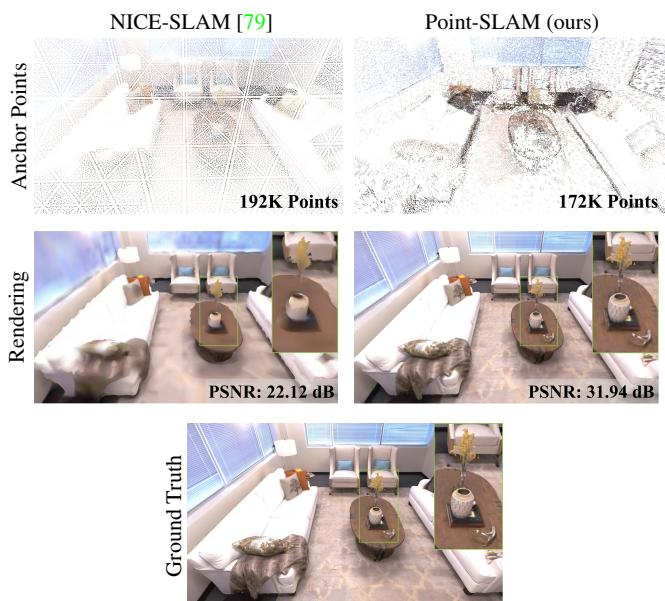  
Figure 1: Point-SLAM Benefits. Due to the spatially adaptive anchoring of neural features, Point-SLAM can encode high-frequency details more effectively than NICE-SLAM which leads to superior performance in rendering, reconstruction and tracking accuracy while attaining competitive runtime and memory usage. The first row shows the feature anchor points. For NICE-SLAM we show the centers of non-empty voxels located on a regular grid, while the density of anchor points for Point-SLAM depends on depth and image gradients. The row below depicts resulting renderings showing substantial differences on areas with highfrequency textures like the vase, blinds, floor or blanket.

## Can point-based neural scene representations be usedfor tracking and mappingfor real-time capable SLAM?

To this end, we introduce Point-SLAM, a point-based solution to dense RGBD SLAM, which allows for a dataadaptive scene encoding. The key ideas of our method are as follows: Instead of anchoring the feature points on a regular grid, our approach populates points adaptively depending on information density in the input data which allows for a better memory vs. accuracy trade-off. For rendering, we depart from the classical splatting technique used for surfels and instead aggregate neural point features in a ray-marching fashion. MLP decoders translate these features into scene geometry and color estimates. Tracking and mapping are performed alternatingly by minimizing an RGBD-based re-rendering loss. Different from grid-based approaches, we do not model free space and encode only little information around the surface. We evaluate our proposed method on a selection of indoor RGBD datasets and demonstrate state-of-the-art performance on dense neural RGBD SLAM in terms of tracking, rendering, and mapping - see Fig. 1 for exemplary results. In summary, our contributions include:

• We present Point-SLAM, a real-time capable dense RGBD SLAM approach which anchors neural features in a point cloud that grows iteratively in a data-driven manner during scene exploration. We demonstrate that the proposed neural point-based scene representation can be effectively used for both mapping and tracking.

• We propose a dynamic point density strategy which allows for computational and memory efficiency gains and trade reconstruction accuracy against speed and memory.

• Our approach shows clear benefits on a variety of datasets in terms of tracking, rendering and mapping accuracy.

## 2. Related Work

Dense Visual SLAM and Mapping. Curless and Levoy [13] laid the groundwork for many 3D reconstruction strategies that employ truncated signed distance functions (TSDF). Subsequent developments include KinectFusion [36] and more scalable techniques with voxel hashing [38, 21, 40], octrees [49], and pose robustness via sparse image features [4]. Further extensions involve tracking for SLAM [37, 48, 53, 79, 5, 70] which can also handle loop closures, like BundleFusion [15]. To address the issue of noisy depth maps, RoutedFusion [63] learns a fusion network that outputs the TSDF update of the volumetric grid. NeuralFusion [64] and DI-Fusion [18] extend this concept by learning the scene representation implicitly, resulting in better outlier handling. A number of recent works do not need depth input and accomplish dense online reconstruction from RGB cameras only [35, 10, 3, 50, 54, 47, 23]. Lately, methods relying on test time optimization have become popular due to their adaptability to test time constraints. For example, Continuous Neural Mapping [68] learns a representation of the scene by means of continually mapping from a sequence of depth maps. Neural Radiance Fields [32] inspired works for dense surface reconstruction [39, 59] and pose estimation [45, 25, 62, 2]. These works have led to full dense SLAM pipelines [69, 79, 53, 28], which represent the current most promising trend towards accurate and robust visual SLAM. See [80] for a survey on online RGBD reconstruction. In contrast to our work, none of the neural SLAM approaches supports an input-adaptive scene encoding with high fidelity.

Concurrent to our work, ESLAM [28] tackles RGBD SLAM with axis aligned feature planes and NICER-SLAM [78], NeRF-SLAM [45] and Orbeez-SLAM [12] focus on RGB-only SLAM.

Scene Representations. Most dense 3D reconstruction works can be separated into three categories: (1) gridbased, (2) point-based, (3) network-based. The grid-based representation is perhaps the most explored one and can be further split into methods using dense grids [79, 36, 63, 64, 13, 54, 3, 24, 11, 77, 76, 66, 81], hierarchical octrees [69, 49, 29, 6, 26] and voxel hashing [38, 21, 15, 60, 33] to save memory. One advantage of grids is that neighborhood look ups and context aggregations are fast and straightforward. As their main limitation, the grid resolution needs to be specified beforehand and cannot be trivially adapted during reconstruction, even for octrees. This can lead to a suboptimal resolution strategy where memory is wasted in areas with little complexity while not being able to resolve details beyond the resolution choice. Point-based representations offer a solution to the issues facing grids and have successfully been applied to 3D reconstruction [65, 48, 5, 12, 21, 22, 9, 74]. For example, analogous to the resolution in grids, the point density does not need to be specified beforehand and can inherently vary across the scene. Further, point sets can be trivially focused around the surface in order not to waste memory on modeling free space. The penalty for this flexibility is a more difficult neighborhood search problem as point sets lack connectivity structure. For dense SLAM,

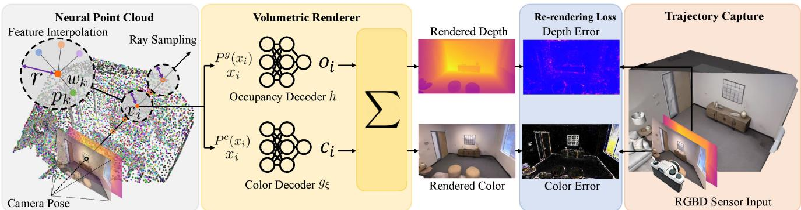  
Figure 2: Point-SLAM Architecture. Given an estimated camera pose, mapping is performed as follows. We first add a sparse set of neural points to the neural point cloud, and then render depth and color images via volume rendering along the ray. For each sampled pixel we sample a set of points $x _ { i }$ along the ray and extract the geometric and color features $( P ^ { g } ( x _ { i } )$ and $P ^ { c } ( x _ { i } )$ resp.) at $x _ { i }$ , using feature interpolation within the spherical search radius r. Each neural point location $p _ { k }$ is weighted by the distance $w _ { k }$ to the sampled point $x _ { i }$ . The features are passed to the occupancy and color decoders (h and $g _ { \xi }$ resp.) along with the point coordinate $x _ { i }$ to extract the occupancy $\mathbf { o } _ { i }$ and color $\mathbf { c _ { i } }$ . By imposing a depth and color re-rendering loss to the sensor input RGBD frame, the neural point features are optimized during mapping. Alternating to the mapping step, we perform tracking by optimizing the camera extrinsics while keeping the map fixed.

## 3. Method

neighborhood search can be accelerated by converting the 3D search problem into a 2D one by projecting the point set into a set of keyframes [65, 48]. A more elegant and faster solution is to register each point within a grid structure [67]. In this work, we argue that points provide a flexible representation that can benefit from a grid structure for fast neighborhood search. Contrary to previous pointor surfel-based SLAM approaches [65, 48, 5], we benefit from neural implicit features from which rendering is performed through volumetric alpha compositing. Networkbased methods for dense 3D reconstruction offer a continuous representation by modeling the global scene implicitly through coordinate-MLPs [1, 53, 59, 45, 41, 68, 71, 42, 30]. Benefiting from a simple formulation that is continuous and compressed, network-based methods can recover maps and textures of high quality, but are not suitable for online scene reconstruction for two main reasons: 1) they do not allow for local scene updates, 2) for growing scene size the network capacity cannot be increased at runtime. In this work, we adopt neural implicit representations popularized by network-based methods, but allow for scalability and local updates by anchoring neural point features in 3D space.

Outside the domain of the aforementioned three groups, a few works have studied other representations such as parameterized surface elements [56] and axis aligned feature planes [28, 43]. Parameterized surface elements generally struggle with formulating a flexible shape template while feature planes struggle with scene reconstructions containing multiple surfaces, due to their overly compressed representation. Therefore, we believe that these approaches are not suitable for dense SLAM. Instead we look to model our scene space as a collection of unordered points with corresponding optimizable features.

This section details how our neural point cloud is deployed as the sole representation for dense RGBD SLAM. Given an estimated camera pose, points are iteratively added to the scene as new areas are explored (Section 3.1). We make use of per-pixel image gradients to achieve a dynamic point density which aids in resolving fine details while compressing the representation elsewhere. We further detail how depth and color rendering is performed (Section 3.2), with which we minimize a re-rendering loss for both mapping and tracking (Section 3.3). An overview of our method is provided in Fig. 2.

## 3.1. Neural Point Cloud Representation

We define our neural point cloud as a set of N neural points

$$
\begin{array} { r } { P = \{ ( p _ { i } , f _ { i } ^ { g } , f _ { i } ^ { c } ) | i = 1 , . . . , N \} } \end{array} ,\tag{1}
$$

each anchored at location $p _ { i } \in \mathbb { R } ^ { 3 }$ and with a geometric and color feature descriptor $f _ { i } ^ { g } \in \mathbb { R } ^ { 3 2 }$ and $f _ { i } ^ { c } \in \mathbb { R } ^ { 3 2 }$

Point Adding Strategy. For every mapping phase and a given estimated camera pose, we sample X pixels uniformly across the image plane and Y pixels among the top 5Y pixels with the highest color gradient magnitude. Using the available depth information, the pixels are unprojected into 3D where we search for neighbors within a radius r. If no neighbors are found, we add three neural points along the ray, centered at the depth reading D and then offset by (1−ρ)D and $( 1 + \rho ) D$ with $\rho \in ( 0 , 1 )$ being a hyperparameter accounting for the expected depth noise. If neighbors are found, no points are added. We use a normally distributed initialization of the feature vectors. The three points act as a limited update band that is depth dependent in order to model the common noise characteristic of depth cameras. As more frames are processed, our neural point cloud grows progressively to represent the exploration of the scene, but converges to a bounded set of points when no new scene parts are visited. Contrary to many voxel-based representations, it is not required to specify any scene bounds before the reconstruction.

Dynamic Resolution. For computational and memory efficiency, we employ a dynamic point density across the scene. This allows Point-SLAM to efficiently model regions with few details while high point densities are imposed where it is needed to resolve fine details. We implement this by allowing the nearest neighbor search radius r to vary according to the color gradient observed from the sensor. We use a clamped linear mapping to define the search radius $r$ based on the color gradient:

$$
r ( u , v ) = \left\{ \begin{array} { l l } { r _ { l } } & { \mathrm { i f } \nabla I ( u , v ) \geq g _ { u } } \\ { \beta _ { 1 } \nabla I ( u , v ) + \beta _ { 2 } } & { \mathrm { i f } g _ { l } \leq \nabla I ( u , v ) \leq g _ { u } } \\ { r _ { u } } & { \mathrm { i f } \nabla I ( u , v ) \leq g _ { l } , } \end{array} \right.\tag{2}
$$

where $\nabla I ( u , v )$ denotes the gradient magnitude at the pixel location $( u , v )$ . We use a lower and upper bound $( r _ { l } , r _ { u } )$ for the search radius to control the compression level and memory usage. For more details about parameter choices, we refer to the supplementary material.

## 3.2. Rendering

To render depth and color, we adopt a volume rendering strategy. Given a camera pose with origin O, we sample a set of points $x _ { i }$ as

$$
x _ { i } = { \bf O } + z _ { i } { \bf d } , \quad i \in \{ 1 , . . . , M \} ,\tag{3}
$$

where $z _ { i } \in$ R is the point depth and $\textit { d } \in \mathbb { R } ^ { 3 }$ the ray direction. Specifically, we sample 5 points spread evenly between $( 1 - \rho ) D$ and $( 1 + \rho ) D$ , where $D$ is the sensor depth at the pixel to be rendered. This is in contrast to voxel-based frameworks [79, 69] which need to carve the empty space between the camera and the surface, thus requiring significantly more samples. For example, NICE-SLAM [79] uses 48 samples (16 around the surface and 32 between the camera and the surface). With fewer samples along the ray, we achieve a computational speed-up during rendering. After the points $x _ { i }$ have been sampled, the occupancies $\mathrm { o } _ { i }$ and colors $\mathbf { c } _ { i }$ are decoded using MLPs following [79] as

$$
\begin{array} { r } { \mathrm { o } _ { i } = h \big ( x _ { i } , P ^ { g } ( x _ { i } ) \big ) \qquad \mathbf { c } _ { i } = g _ { \xi } \big ( x _ { i } , P ^ { c } ( x _ { i } ) \big ) } \end{array} .\tag{4}
$$

We denote the geometry and color decoder MLPs by $h$ and $g _ { \xi }$ , respectively, where $\xi$ are the trainable parameters of $g .$ We use the same architecture for h and $g$ as [79] and use their provided pretrained and fixed middle geometric decoder h. The decoder input is the 3D point $x _ { i } ,$ to which we apply a learnable Gaussian positional encoding [55] to mitigate the limited band-width of MLPs, and the associated feature. We further denote $P ^ { g } ( x _ { i } )$ and $P ^ { c } ( x _ { i } )$ as the geometric and color features extracted at point $x _ { i }$ respectively. For each point $x _ { i }$ we use the corresponding per-pixel query radius $2 r ,$ , where r is computed according to Eq. (2). Within the radius $2 r ,$ we require to find at least two neighbors. Otherwise, the point is given zero occupancy. We use the closest eight neighbors and use inverse squared distance weighting for the geometric features, i.e.

$$
P ^ { g } ( x _ { i } ) = \sum _ { k } \frac { w _ { k } } { \sum _ { k } w _ { k } } f _ { k } ^ { g } \mathrm { w i t h } w _ { k } = \frac { 1 } { | | p _ { k } - x _ { i } | | ^ { 2 } } .\tag{5}
$$

For the color features, inspired by [67], we impose a nonlinear preprocessing on the extracted neighbor features $f _ { k } ^ { c }$ such that

$$
f _ { k , x _ { i } } ^ { c } = F _ { \theta } ( f _ { k } ^ { c } , p _ { k } - x _ { i } ) ,\tag{6}
$$

where $F$ is a one-layer MLP parameterized by $\theta ,$ with 128 neurons and softplus activations. We use the same Gaussian positional encoding for the relative point vector $( p _ { k } - x _ { i } )$ as used by the geometry and color decoders. This yields

$$
P ^ { c } ( x _ { i } ) = \sum _ { k } \frac { w _ { k } } { \sum _ { k } w _ { k } } f _ { k , x _ { i } } ^ { c } .\tag{7}
$$

For pixels without depth observation, we render by marching along the ray from the depth 30cm to $1 . 2 D _ { m a x }$ , where $D _ { m a x }$ is the maximum frame depth. We use 25 samples within this interval. This technique acts as a hole filling technique, but does not fill in arbitrarily large holes, which can cause large completion errors. Next, we describe how the per-point occupancies $_ { \mathrm { ~ \scriptsize ~ O ~ } i }$ and colors $\mathbf { c } _ { i }$ are used to render the per-pixel depth and color using volume rendering. We construct a weighting function, $\alpha _ { i }$ as described in Eq. (8). This weight represents the discretized probability that the ray terminates at point $x _ { i }$

$$
\alpha _ { i } = { \bf o _ { p } } _ { i } \prod _ { j = 1 } ^ { i - 1 } ( 1 - { \bf o _ { p } } _ { j } ) .\tag{8}
$$

The rendered depth is computed as the weighted average of the depth values along each ray, and equivalently for the color according to Eq. (9).

$$
\hat { D } = \sum _ { i = 1 } ^ { N } \alpha _ { i } z _ { i } , \quad \hat { I } = \sum _ { i = 1 } ^ { N } \alpha _ { i } \mathbf { c } _ { i }\tag{9}
$$

We also compute the variance along the ray as

$$
\hat { S } _ { D } = \sum _ { i = 1 } ^ { N } \alpha _ { i } \big ( \hat { D } - z _ { i } \big ) ^ { 2 }\tag{10}
$$

For more details, we refer to [79].

## 3.3. Mapping and Tracking

Mapping. During mapping, we render M pixels uniformly across the RGBD frame and minimize the re-rendering loss to the sensor reading $D$ and I as

$$
\mathcal { L } _ { m a p } = \sum _ { m = 1 } ^ { M } \lvert D _ { m } - \hat { D } _ { m } \rvert _ { 1 } + \lambda _ { m } \lvert I _ { m } - \hat { I } _ { m } \rvert _ { 1 } \mathrm { ~ , ~ }\tag{11}
$$

which combines a geometric $L _ { 1 }$ depth loss and a color $L _ { 1 }$ loss with hyperparameter $\lambda _ { m }$ for given ground truth values $\hat { D } _ { m } , \hat { I } _ { m }$ . The loss optimizes the geometric and color features $f ^ { g }$ and $f ^ { c }$ as well as the parameters $\xi$ and θ of the color decoder $g$ and interpolation decoder $F$ respectively. For each mapping phase, we first optimize using only the depth term in order to initialize the color optimization well. We then add the color loss for the remaining 60 $\%$ of iterations. Following the same strategy as [79], we make use of a database of keyframes to regularize the mapping loss. We sample a set of keyframes which have a significant overlap with the viewing frustum of the current frame and add pixel samples from the keyframes. More details are provided in the supplementary material.

Tracking. In a separate process to mapping, we perform tracking by optimizing the camera extrinsics {R, t} at each frame. We sample $M _ { t }$ pixels across the frame and initialize the new pose with a simple constant speed assumption that transforms the last known pose with the relative transformation between the second last pose and the last pose. The tracking loss $\mathcal { L } _ { \mathrm { t r a c k } }$ combines a color term weighted by $\lambda _ { t }$ and a geometric term weighted by the standard deviation of the depth prediction:

$$
\mathcal { L } _ { \mathrm { t r a c k } } = \sum _ { m = 1 } ^ { M _ { t } } \frac { | D _ { m } - \hat { D } _ { m } | _ { 1 } } { \sqrt { \hat { S } _ { D } } } + \lambda _ { t } | I _ { m } - \hat { I } _ { m } | _ { 1 }\tag{12}
$$

## 3.4. Exposure Compensation

For scenes with significant exposure changes between frames, we use an additional module to reduce color differences between corresponding pixels. Inspired by [44], we learn a per-image latent vector which is fed as input to an exposure MLP $G _ { \phi }$ with parameters $\phi .$ The network G is shared between frames and optimized at runtime. It outputs an affine transformation $( 3 \times 3$ matrix and $3 \times 1$ translation) which is used to transform the color prediction from Eq. (9) before being fed to the tracking or mapping loss. For more details see the supplementary material.

## 4. Experiments

We first describe our experimental setup and then evaluate our method against state-of-the-art dense neural RGBD SLAM methods on Replica [51] as well as the real world

TUM-RGBD [52] and the ScanNet [14] datasets. Further experiments and details are in the supplementary material.

Implementation Details. For efficient nearest neighborhood search, we use the FAISS library [19] which supports GPU processing. We use $\rho = 0 . 0 2$ on Replica and TUM-RGBD and $\rho ~ = ~ 0 . 0 4$ on ScanNet. We set $r _ { l } ~ = ~ 0 . 0 2 .$ $r _ { u } = 0 . 0 8 , g _ { u } = 0 . 1 5 , g _ { l } = 0 . 0 1$ and $\beta _ { 1 } = - \textstyle { \frac { 2 } { 3 } } , \beta _ { 2 } = \frac { 1 3 } { 1 5 0 }$ For all datasets, $X = 6 0 0 0 .$ . For Replica $Y = \mathrm { \bar { 1 } } 0 0 0$ and for ScanNet and TUM-RGBD $Y = 0$ . For tracking, we sample $M _ { t } = 1 . 5 K$ pixels uniformly on Replica. On TUM-RGBD and ScanNet, we first compute the top 75K pixels based on the image gradient magnitude and sample $M _ { t } = 5 K$ out of this set. For mapping, we sample uniformly $M = 5 K$ pixels for Replica and 10K pixels for TUM-RGBD and ScanNet. Although we specify a number of mapping iterations, we use an adaptive scheme which takes the number of newly added points into account. The number of mapping iterations is computed as $m _ { i } = m _ { i } ^ { d } n / 3 0 0$ , where $m _ { i } ^ { d }$ is the default mapping iterations and n is the number of added points. We clip $m _ { i }$ to lie within $[ 0 . 9 5 m _ { i } ^ { d } , 2 m _ { i } ^ { d } ]$ . This strategy speeds up mapping when few points are added and helps optimize frames with many new points. To mesh the scene, we render depth and color every fifth frame over the estimated trajectory and use TSDF Fusion [13] with voxel size 1 cm. See the supplementary material for more details.

Evaluation Metrics. The meshes, produced by marching cubes [27], are evaluated using the F-score which is the harmonic mean of the Precision (P) and Recall (R). We use a distance threshold of 1 cm for all evaluations. We further provide the depth L1 metric as in [79]. For tracking accuracy, we use ATE RMSE [52] and for rendering we provide the peak signal-to-noise ratio (PSNR), SSIM [61] and LPIPS [75]. Our rendering metrics are evaluated by rendering the full resolution image along the estimated trajectory every 5th frame. Unless otherwise written, we report the average metric of three runs on seeds 0, 1 and 2.

Datasets. The Replica dataset [51] comprises high-quality 3D reconstructions of a variety of indoor scenes. We utilize the publicly available dataset collected by Sucar et al. [53], which provides trajectories from an RGBD sensor. Further, we demonstrate that our framework can handle real-world data by using the TUM-RGBD dataset [52], as well as the ScanNet dataset [14]. The poses for TUM-RGBD were captured using an external motion capture system while Scan-Net uses poses from BundleFusion [15].

Baseline Methods. We primarily compare our method to existing state-of-the-art dense neural RGBD SLAM methods such as NICE-SLAM [79], Vox-Fusion [69] and ES-LAM [28]. We reproduce the results from [69] using the open source code and report the results as Vox-Fusion∗. For NICE-SLAM, we use 40 tracking iterations on Replica and mesh the scene at resolution 1cm for a fair comparison.

<table><tr><td>Method</td><td>Metric</td><td>Rm 0</td><td>Rm 1</td><td>Rm 2</td><td>Off 0</td><td>Off1</td><td>Off 2</td><td>Off 3</td><td>Off 4</td><td>Avg.</td></tr><tr><td></td><td>Depth L1 [cm] ↓</td><td>1.81</td><td>1.44</td><td>2.04</td><td>1.39</td><td>1.76</td><td>8.33</td><td>4.99</td><td>2.01</td><td>2.97</td></tr><tr><td>NICE-</td><td>Precision [%] ↑</td><td>45.86</td><td>43.76</td><td>44.38</td><td>51.40</td><td>50.80</td><td>38.37</td><td>40.85</td><td>37.35</td><td>44.10</td></tr><tr><td>SLAM [79]</td><td>Recall [%] ↑</td><td>44.10</td><td>46.12</td><td>42.78</td><td>48.66</td><td>53.08</td><td>39.98</td><td>39.04</td><td>35.77</td><td>43.69</td></tr><tr><td></td><td>F1 [%] ↑</td><td>44.96</td><td>44.84</td><td>43.56</td><td>49.99</td><td>51.91</td><td>39.16</td><td>39.92</td><td>36.54</td><td>43.86</td></tr><tr><td></td><td>Depth L1 [cm] ↓</td><td>1.09</td><td>1.90</td><td>2.21</td><td>2.32</td><td>3.40</td><td>4.19</td><td>2.96</td><td>1.61</td><td>2.46</td></tr><tr><td>Vox-</td><td>Precision [%] ↑</td><td>75.83</td><td>35.88</td><td>63.10</td><td>48.51</td><td>43.50</td><td>54.48</td><td>69.11</td><td>55.40</td><td>55.73</td></tr><tr><td>Fusion* [69]</td><td>Recall [%] ↑</td><td>64.89</td><td>33.07</td><td>56.62</td><td>44.76</td><td>38.44</td><td>47.85</td><td>60.61</td><td>46.79</td><td>49.13</td></tr><tr><td></td><td>F1 [%] ↑</td><td>69.93</td><td>34.38</td><td>59.67</td><td>46.54</td><td>40.81</td><td>50.95</td><td>64.56</td><td>50.72</td><td>52.20</td></tr><tr><td>ESLAM [28] Depth L1 [cm] ↓</td><td></td><td>0.97</td><td>1.07</td><td>1.28</td><td>0.86</td><td>1.26</td><td>1.71</td><td>1.43</td><td>1.06</td><td>1.18</td></tr><tr><td></td><td>Depth L1 [cm] ↓</td><td>0.53</td><td>0.22</td><td>0.46</td><td>0.30</td><td>0.57</td><td>0.49</td><td>0.51</td><td>0.46</td><td>0.44</td></tr><tr><td>Ours</td><td>Precision [%] ↑</td><td>91.95</td><td>99.04</td><td>97.89</td><td>99.00</td><td>99.37</td><td>98.05</td><td>96.61</td><td>93.98</td><td>96.99</td></tr><tr><td></td><td>Recall [%] ↑</td><td>82.48</td><td>86.43</td><td>84.64</td><td>89.06</td><td>84.99</td><td>81.44</td><td>81.17</td><td>78.51</td><td>83.59</td></tr><tr><td></td><td>F1 [%] ↑</td><td>86.90</td><td>92.31</td><td>90.78</td><td>93.77</td><td>91.62</td><td>88.98</td><td>88.22</td><td>85.55</td><td>89.77</td></tr></table>

(a)

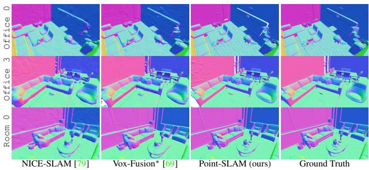  
(b)

Figure 3: Reconstruction Performance on Replica [51]. Fig. 3a: Our method is able to outperform all existing methods. Best results are highlighted as first , second , and third . Fig. 3b: Point-SLAM yields on average more precise reconstructions than existing methods, e.g. note the fidelity of the rough carpet reconstruction on Office 0.  
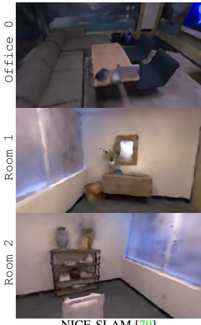  
NICE-SLAM [79]

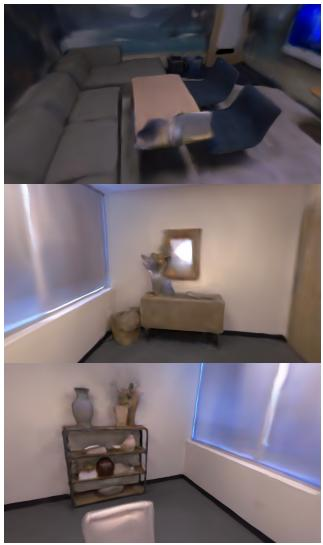  
Vox-Fusion∗ [69]

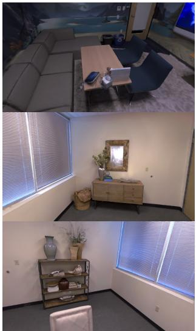  
Point-SLAM (ours)

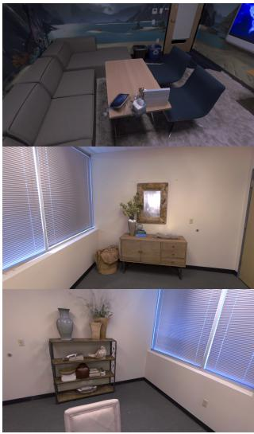  
Ground Truth  
Figure 4: Rendering Performance on Replica [51]. Thanks to the adaptive density of the neural point cloud, Point-SLAM is able encode more high-frequency details and to substantially increase the fidelity of the renderings. This is also supported by the quantitative results in Table 2.

<table><tr><td colspan="12">Method Rm 0 Rm 1 Rm 2 Off 0 Off 1 Off 2 Off 3 Off 4 Avg.</td></tr><tr><td>NICE-SLAM [79]</td><td>0.97</td><td>1.31</td><td>1.07</td><td>0.88</td><td>1.00</td><td>1.06</td><td>1.10</td><td>1.13</td><td>1.06</td></tr><tr><td>Vox-Fusion [69]</td><td>0.40</td><td>0.54</td><td>0.54</td><td>0.50</td><td>0.46</td><td>0.75</td><td>0.50</td><td>0.60</td><td>0.54</td></tr><tr><td>Vox-Fusion* [69]</td><td>1.37</td><td>4.70</td><td>1.47</td><td>8.48</td><td>2.04</td><td>2.58</td><td>1.11</td><td>2.94</td><td>3.09</td></tr><tr><td>ESLAM [28]</td><td>0.71</td><td>0.70</td><td>0.52</td><td>0.57</td><td>0.55</td><td>0.58</td><td>0.72</td><td>0.63</td><td>0.63</td></tr><tr><td>Point-SLAM (ours)</td><td>0.61</td><td>0.41</td><td>0.37</td><td>0.38</td><td>0.48</td><td>0.54</td><td>0.69</td><td>0.72</td><td>0.52</td></tr></table>

Table 1: Tracking Performance on Replica [51] (ATE RMSE ↓ [cm]). On average, we achieve better tracking than existing methods. The grayed numbers of [69] are from the paper that come from a single run which we could not reproduce. We report an average of 3 runs for all other methods in this table. Vox-Fusion∗ indicates recreated results.

ric reconstruction accuracy. We outperform all methods on all metrics and report an average improvement of 85 %, 82 % and 63 % on the depth L1 metric over NICE-SLAM, Vox-Fusion and ESLAM respectively. Fig. 3b compares the mesh reconstructions of NICE-SLAM [79], Vox-Fusion [69] and our method to the ground truth mesh. We find that our method is able to resolve fine details to a significantly greater extent than previous approaches. We attribute this to our neural point cloud which adapts the point density where it is needed (i.e. close to the surface and around fine details) and conserves memory in other areas.

## 4.1. Reconstruction

Fig. 3a compares our method to NICE-SLAM [79], Vox-Fusion [69] and ESLAM [28] in terms of the geomet-

## 4.2. Tracking

We report the tracking performance on the Replica dataset in Table 1. On average we outperform the existing methods. We believe this is due to the more accurate scene representation that the neural point cloud provides. We show that the performance of Point-SLAM transfers to real-world data by evaluating on the TUM-RGBD dataset in Table 3. We outperform all existing dense neural RGBD methods. Nevertheless, there is still a gap to traditional methods which employ more sophisticated tracking schemes including loop closures. Finally, Table 4 shows our tracking performance on some selected ScanNet scenes, where we activate the exposure compensation module. We achieve competitive performance on ScanNet, but find that this dataset is generally more complex due to motion blur and specularities. We believe our model is more sensitive to these effects if not modeled properly compared to $e . g .$ NICE-SLAM [79] and Vox-Fusion [69] which employ a large voxel size that leads to more averaging and a reduced sensitivity to specularities. We added a more detailed discussion to the supplementary material.

<table><tr><td>Method</td><td>Metric</td><td>Room 0</td><td>Room 1</td><td>Room 2</td><td>Office 0</td><td>Office 1</td><td>Office 2</td><td>Office 3</td><td>Office 4</td><td>Avg.</td></tr><tr><td rowspan="3">NICE-SLAM [79]</td><td>PSNR [dB] ↑</td><td>22.12</td><td>22.47</td><td>24.52</td><td>29.07</td><td>30.34</td><td>19.66</td><td>22.23</td><td>24.94</td><td>24.42</td></tr><tr><td>SSIM ↑</td><td>0.689</td><td>0.757</td><td>0.814</td><td>0.874</td><td>0.886</td><td>0.797</td><td>0.801</td><td>0.856</td><td>0.809</td></tr><tr><td>LPIPS↓</td><td>0.330</td><td>0.271</td><td>0.208</td><td>0.229</td><td>0.181</td><td>0.235</td><td>0.209</td><td>0.198</td><td>0.233</td></tr><tr><td rowspan="2">Vox-Fusion* [69]</td><td>PSNR [dB]↑</td><td>22.39</td><td>22.36</td><td>23.92</td><td>27.79</td><td>29.83</td><td>20.33</td><td>23.47</td><td>25.21</td><td>24.41</td></tr><tr><td>SSIM ↑</td><td>0.683</td><td>0.751</td><td>0.798</td><td>0.857</td><td>0.876</td><td>0.794</td><td>0.803</td><td>0.847</td><td>0.801</td></tr><tr><td rowspan="2"></td><td>LPIPS↓</td><td>0.303</td><td>0.269</td><td>0.234</td><td>0.241</td><td>0.184</td><td>0.243</td><td>0.213</td><td>0.199</td><td>0.236</td></tr><tr><td>PSNR [dB] ↑</td><td>32.40</td><td>34.08</td><td>35.50</td><td>38.26</td><td>39.16</td><td>33.99</td><td>33.48</td><td>33.49</td><td>35.17</td></tr><tr><td rowspan="2">Ours</td><td>SSIM↑</td><td>0.974</td><td>0.977</td><td>0.982</td><td>0.983</td><td>0.986</td><td>0.960</td><td>0.960</td><td>0.979</td><td>0.975</td></tr><tr><td>LPIPS↓</td><td>0.113</td><td>0.116</td><td>0.111</td><td>0.100</td><td>0.118</td><td>0.156</td><td>0.132</td><td>0.142</td><td>0.124</td></tr></table>

Table 2: Rendering Performance on Replica [51]. We outperform existing dense neural RGBD methods on the commonly reported rendering metrics. For NICE-SLAM [79] and Vox-Fusion [69] we take the numbers from [78]. For qualitative results, see Fig. 4.

<table><tr><td>Method</td><td>fr1/ fr1/ desk desk2</td><td></td><td>fr1/ fr2/ room xyz</td><td></td><td> $\tt f r 3 /$  office</td><td> $\operatorname { A v g } .$ </td></tr><tr><td>DI-Fusion [18]</td><td>4.4</td><td>N/A</td><td>N/A</td><td>2.0</td><td>5.8</td><td>N/A</td></tr><tr><td>NICE-SLAM [79]</td><td>4.26</td><td>4.99</td><td>34.49</td><td>31.73 (6.19) 3.87</td><td></td><td>15.87 (10.76)</td></tr><tr><td>Vox-Fusion* [69]</td><td>3.52</td><td>6.00</td><td>19.53</td><td>1.49</td><td>26.01</td><td>11.31</td></tr><tr><td>Point-SLAM (Ours) 4.34</td><td></td><td>4.54</td><td>30.921.31</td><td></td><td>3.48</td><td>8.92</td></tr><tr><td>BAD-SLAM [48]</td><td>1.7</td><td>N/A</td><td>N/A</td><td>1.1</td><td>1.7</td><td>N/A</td></tr><tr><td>Kintinuous [66]</td><td>3.7</td><td>7.1</td><td>7.5</td><td>2.9</td><td>3.0</td><td>4.84</td></tr><tr><td>ORB-SLAM2 [34]</td><td>1.6</td><td>2.2</td><td>4.7</td><td>0.4</td><td>1.0</td><td>1.98</td></tr><tr><td>ElasticFusion [65]</td><td>2.53</td><td>6.83</td><td>21.49</td><td>1.17</td><td>2.52</td><td>6.91</td></tr></table>

Table 3: Tracking Performance on TUM-RGBD [52] (ATE RMSE ↓ [cm]). Point-SLAM consistently outperforms existing dense neural RGBD methods (top part), and is reducing the gap to sparse tracking methods (bottom part). In parenthesis we report the average over only the successful runs.

<table><tr><td>Method</td><td>0000</td><td>0059</td><td>0106</td><td>0169 0181</td><td>0207</td><td>Avg.</td></tr><tr><td>DI-Fusion [18]</td><td>62.99</td><td>128.0018.50</td><td></td><td>75.80</td><td>87.88</td><td>100.19 78.89</td></tr><tr><td>NICE-SLAM [79]</td><td>12.00</td><td>14.00</td><td>7.90</td><td>10.90</td><td>13.40 6.20</td><td>10.70</td></tr><tr><td>Vox-Fusion [69]</td><td>8.39</td><td>N/A</td><td>7.44</td><td>6.53</td><td>12.205.57</td><td>N/A</td></tr><tr><td>Vox-Fusion* [69]</td><td>68.84</td><td>24.18</td><td>8.41</td><td></td><td>27.2823.309.41</td><td>26.90</td></tr><tr><td></td><td>(16.55)</td><td></td><td></td><td></td><td></td><td>(18.52)</td></tr><tr><td>Point-SLAM (Ours)</td><td>10.24</td><td>7.81</td><td>8.65</td><td></td><td>22.1614.779.54</td><td>12.19</td></tr></table>

Table 4: Tracking Performance on ScanNet [14] (ATE RMSE ↓ [cm]). All scenes are evaluated on the 00 trajectory. We take the numbers from [28] for NICE-SLAM. Tracking failed for one run on Vox-Fusion on scene 0000. In parenthesis we report the average over only the successful runs.

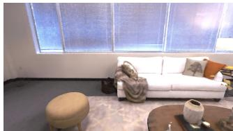  
Without $F _ { \theta } .$ . PSNR: 27.41

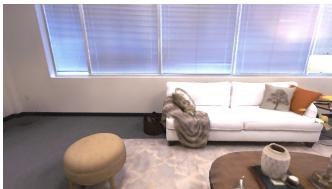  
With $F _ { \theta }$ . PSNR: 32.09  
Figure 5: Non-Linear Appearance Space. A non-linear preprocessing via $F _ { \theta }$ of the appearance features helps resolve high frequency textures like the blinds, the pot on the table and the tree print on the pillow.

## 4.3. Rendering

Table 2 compares rendering performance and shows improvements over existing dense neural RGBD SLAM methods. Fig. 4 shows examplary full resolution renderings where Point-SLAM yields more accurate details.

## 4.4. Further Statistical Evaluation

Non-Linear Appearance Space. We evaluate Point-SLAM on the Room 0 scene of the Replica dataset with and without the non-linear preprocessing network $F _ { \theta } .$ . Fig. 5 shows that a simple linear weighting of the features cannot resolve high frequency textures like the blinds while this can successfully be done when $F _ { \theta }$ is optimized during runtime. Quantitatively, we evaluate the PSNR over the entire trajectory and show a gain of 17% (32.09 vs. 27.41). We find that for higher tracking errors e.g. on TUM-RGBD [52] or ScanNet [14], the MLP $F _ { \theta }$ is not helpful and we disable it. High-frequency appearance can only be resolved with pixel accurate poses that align the frames correctly.

Color Ablation. We investigate the performance of our pipeline when the RGB input is not used for different settings. Table 5 reports performance metrics on Room 0. When no RGB is used for tracking, we find that the tracking performance degrades, which negatively affects the depth L1 metric and the rendering quality. The reconstruction performance is mainly determined by the depth input given good camera poses, but since RGB is useful in attaining better poses, we find that RGB information is helpful for both tracking and reconstruction.

<table><tr><td> $\mathbf { \Pi } _ { \mathrm { R G B } } ^ { \mathrm { M a p p i n g } }$ </td><td> $\mathbf { \Pi } _ { \mathrm { R G B } } ^ { \mathrm { T r a c k i n g } }$ </td><td> $\begin{array} { c } { { \tt A T E R M S E } } \\ { { \mathrm { [ c m ] \downarrow } } } \end{array}$ </td><td>Depth L1  $\mathrm { [ c m ] \downarrow }$ </td><td>F1 [%]↑</td><td>PSNR [dB]↑</td></tr><tr><td>x</td><td>X</td><td>0.59</td><td>0.38</td><td>91.37</td><td></td></tr><tr><td></td><td>x</td><td>0.67</td><td>0.38</td><td>91.49</td><td>30.43</td></tr><tr><td>J</td><td>V</td><td>0.36</td><td>0.35</td><td>91.29</td><td>32.15</td></tr></table>

Table 5: Color Ablation. The experiment shows that color information is valuable for tracking and marginally for reconstruction.

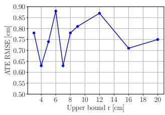  
(a)

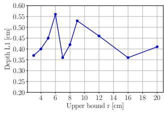

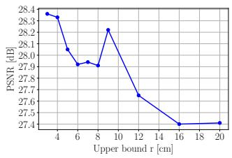  
(c)

(b)  
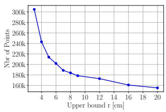  
(d)  
Figure 6: Dynamic Resolution Ablation. We show the performance metrics for varying upper bounds $r _ { u }$ of the search radius on the Room 0 scene. Our method is robust to compression regarding the tracking and mapping accuracy ((a) and (b) resp.). The rendering quality gradually degrades (c) while the memory usage starts to bottom out around $r _ { u } = 8$ cm. We thus choose $r _ { u } = 8$ cm for all experiments.

Dynamic Resolution Ablation. We show that our method is quite robust to the value of $r _ { u } ,$ the upper bound for the search radius. Figs. 6a to 6c display the ATE RMSE, depth L1 and the PSNR respectively as $r _ { u }$ is varied. The tracking and reconstruction metrics are quite robust to $r _ { u }$ while we see a gradual decrease in terms of the PSNR. Fig. 6d shows the total number of neural points at the end of frame capture, for each $r _ { u }$ . We find that the curve bottoms out around $r _ { u } =$ 8 cm, which is what we use for all experiments.

Memory and Runtime Analysis. We report runtime and memory usage on the Replica office 0 scene in Table 6. The tracking and mapping time is reported per iteration and frame. The decoder size denotes the memory footprint of all MLP networks and includes the networks $G _ { \phi }$ and $F _ { \theta } .$ The embedding size is the total memory footprint of the scene representation. The memory usage of Point-SLAM falls between NICE-SLAM an Vox-Fusion while the runtime is competitive. The runtimes were profiled on a single Nvidia RTX 2080 Ti while Vox-Fusion used an RTX 3090.

<table><tr><td>Method</td><td>/Iteration</td><td>Tracking Mapping /Iteration</td><td>Tracking /Frame</td><td>Mapping /Frame</td><td> $_ { \mathrm { S i z e } }$ </td><td>Decoder Embedding  $_ { \mathrm { s i z e } }$ </td></tr><tr><td>NICE-SLAM [79]</td><td>32 ms</td><td>182 ms</td><td>1.32 s</td><td>10.92 s</td><td>0.47 MB</td><td>95.86 MB</td></tr><tr><td>Vox-Fusion [69]</td><td>12 ms</td><td>55 ms</td><td>0.36 s</td><td>0.55 s</td><td>1.04 MB</td><td>0.149 MB</td></tr><tr><td>Point-SLAM (ours)</td><td>21 ms</td><td>33 ms</td><td>0.85 s</td><td>9.85 s</td><td>0.51 MB</td><td>27.23 MB</td></tr></table>

Table 6: Runtime and Memory Usage on Replica office 0. The decoder size is the memory of all MLP networks. The embedding size is the total memory of the scene representation. Our memory usage and runtime are competitive.

Limitations. While our framework demonstrates competitive tracking performance on TUM-RGBD and ScanNet, we believe that a more robust system can be built to handle depth noise, by allowing the point locations to be optimized on the fly. The local adaptation of point densities follows a simple heuristic and should ideally also be learned. We also think that many of our empirical hyperparameters can be made test time adaptive e.g. the keyframe selection strategy as well as the color gradient upper and lower bounds to determine the search radius. Finally, while our framework is able to substantially increase the rendering and reconstruction performance over the current state of the art, our system seems more sensitive to motion blur and specularities which we hope to address in future work.

## 5. Conclusion

We proposed Point-SLAM, a dense SLAM system which utilizes a neural point cloud for both mapping and tracking. The data-driven anchoring of features allows to better align them with actual surface locations and the proposed dynamic resolution strategy populates features depending on the input information density. Overall, this leads to a better balance of memory and compute resource usage and the accuracy of the estimated 3D scene representation. Our experiments demonstrate that Point-SLAM substantially outperforms existing solutions regarding the reconstruction and rendering accuracy while being competitive with respect to tracking as well as runtime and memory usage.

Acknowledgements. This work was supported by a VIVO collaboration project on real-time scene reconstruction and research grants from FIFA. We thank Danda Pani Paudel and Suryansh Kumar for fruitful discussions.

## References

[1] Dejan Azinovic, Ricardo Martin-Brualla, Dan B Goldman,´ Matthias Nießner, and Justus Thies. Neural rgb-d surface reconstruction. In IEEE/CVF Conference on Computer Vision and Pattern Recognition, pages 6290–6301, 2022. 1, 3

[2] Wenjing Bian, Zirui Wang, Kejie Li, Jia-Wang Bian, and Victor Adrian Prisacariu. Nope-nerf: Optimising neural radiance field with no pose prior. arXiv preprint arXiv:2212.07388, 2022. 2

[3] Aljaz Boˇ ziˇ c, Pablo Palafox, Justus Thies, Angela Dai,ˇ and Matthias Nießner. Transformerfusion: Monocular rgb scene reconstruction using transformers. arXiv preprint arXiv:2107.02191, 2021. 2

[4] E. Bylow, C. Olsson, and F. Kahl. Robust online 3d reconstruction combining a depth sensor and sparse feature points. In 2016 23rd International Conference on Pattern Recognition (ICPR), pages 3709–3714, 2016. 2

[5] Yan-Pei Cao, Leif Kobbelt, and Shi-Min Hu. Real-time highaccuracy three-dimensional reconstruction with consumer rgb-d cameras. ACM Transactions on Graphics (TOG), 37(5):1–16, 2018. 1, 2, 3

[6] Jiawen Chen, Dennis Bautembach, and Shahram Izadi. Scalable real-time volumetric surface reconstruction. ACM Transactions on Graphics (ToG), 32(4):1–16, 2013. 1, 2

[7] Timothy Chen, Preston Culbertson, and Mac Schwager. Catnips: Collision avoidance through neural implicit probabilistic scenes, 2023. 1

[8] Zhiqin Chen and Hao Zhang. Learning implicit fields for generative shape modeling. In IEEE/CVF conference on computer vision and pattern recognition, pages 5939–5948, 2019. 1

[9] Hae Min Cho, HyungGi Jo, and Euntai Kim. Spslam: Surfel-point simultaneous localization and mapping. IEEE/ASME Transactions on Mechatronics, 27(5):2568– 2579, 2021. 2

[10] Jaesung Choe, Sunghoon Im, Francois Rameau, Minjun Kang, and In So Kweon. Volumefusion: Deep depth fusion for 3d scene reconstruction. In IEEE/CVF International Conference on Computer Vision (ICCV), pages 16086–16095, October 2021. 2

[11] Sungjoon Choi, Qian-Yi Zhou, and Vladlen Koltun. Robust reconstruction of indoor scenes. In IEEE Conference on Computer Vision and Pattern Recognition, pages 5556– 5565, 2015. 2

[12] Chi-Ming Chung, Yang-Che Tseng, Ya-Ching Hsu, Xiang-Qian Shi, Yun-Hung Hua, Jia-Fong Yeh, Wen-Chin Chen, Yi-Ting Chen, and Winston H Hsu. Orbeez-slam: A realtime monocular visual slam with orb features and nerfrealized mapping. arXiv preprint arXiv:2209.13274, 2022. 2

[13] Brian Curless and Marc Levoy. Volumetric method for building complex models from range images. In SIGGRAPH Conference on Computer Graphics. ACM, 1996. 2, 5

[14] Angela Dai, Angel X. Chang, Manolis Savva, Maciej Halber, Thomas Funkhouser, and Matthias Nießner. ScanNet: Richly-annotated 3D reconstructions of indoor scenes. In

Conference on Computer Vision and Pattern Recognition (CVPR). IEEE/CVF, 2017. 5, 7

[15] Angela Dai, Matthias Nießner, Michael Zollhofer, Shahram¨ Izadi, and Christian Theobalt. Bundlefusion: Real-time globally consistent 3d reconstruction using on-the-fly surface reintegration. ACM Transactions on Graphics (ToG), 36(4):1, 2017. 1, 2, 5

[16] Simon Fuhrmann and Michael Goesele. Fusion of depth maps with multiple scales. ACM Trans. Graph., 30(6):148:1–148:8, 2011. 1

[17] Christian Hane, Christopher Zach, Jongwoo Lim, Ananth¨ Ranganathan, and Marc Pollefeys. Stereo depth map fusion for robot navigation. In 2011 IEEE/RSJ International Conference on Intelligent Robots and Systems, pages 1618–1625. IEEE, 2011. 1

[18] Jiahui Huang, Shi-Sheng Huang, Haoxuan Song, and Shi-Min Hu. Di-fusion: Online implicit 3d reconstruction with deep priors. In IEEE/CVF Conference on Computer Vision and Pattern Recognition, pages 8932–8941, 2021. 1, 2, 7

[19] Jeff Johnson, Matthijs Douze, and Herve J´ egou. Billion-´ scale similarity search with GPUs. IEEE Transactions on Big Data, 7(3):535–547, 2019. 5

[20] Olaf Kahler, Victor Prisacariu, Julien Valentin, and David¨ Murray. Hierarchical voxel block hashing for efficient integration of depth images. IEEE Robotics and Automation Letters, 1(1):192–197, 2015. 1

[21] Olaf Kahler, Victor Adrian Prisacariu, Carl Yuheng Ren, Xin¨ Sun, Philip H. S. Torr, and David William Murray. Very high frame rate volumetric integration of depth images on mobile devices. IEEE Trans. Vis. Comput. Graph., 21(11):1241– 1250, 2015. 1, 2

[22] Maik Keller, Damien Lefloch, Martin Lambers, Shahram Izadi, Tim Weyrich, and Andreas Kolb. Real-time 3d reconstruction in dynamic scenes using point-based fusion. In International Conference on 3D Vision (3DV), pages 1–8. IEEE, 2013. 2

[23] Heng Li, Xiaodong Gu, Weihao Yuan, Luwei Yang, Zilong Dong, and Ping Tan. Dense rgb slam with neural implicit maps. arXiv preprint arXiv:2301.08930, 2023. 2

[24] Kejie Li, Yansong Tang, Victor Adrian Prisacariu, and Philip HS Torr. Bnv-fusion: Dense 3d reconstruction using bi-level neural volume fusion. In IEEE/CVF Conference on Computer Vision and Pattern Recognition, pages 6166– 6175, 2022. 1, 2

[25] Chen Hsuan Lin, Wei Chiu Ma, Antonio Torralba, and Simon Lucey. BARF: Bundle-Adjusting Neural Radiance Fields. In International Conference on Computer Vision (ICCV). IEEE/CVF, 2021. 2

[26] Lingjie Liu, Jiatao Gu, Kyaw Zaw Lin, Tat-Seng Chua, and Christian Theobalt. Neural sparse voxel fields. Advances in Neural Information Processing Systems, 33:15651–15663, 2020. 2

[27] William E Lorensen and Harvey E Cline. Marching cubes: A high resolution 3d surface construction algorithm. ACM siggraph computer graphics, 21(4):163–169, 1987. 5

[28] Mohammad Mahdi Johari, Camilla Carta, and Franc¸ois Fleuret. Eslam: Efficient dense slam system based on hy-

brid representation of signed distance fields. arXiv e-prints, pages arXiv–2211, 2022. 2, 3, 5, 6, 7

[29] Nico Marniok, Ole Johannsen, and Bastian Goldluecke. An efficient octree design for local variational range image fusion. In German Conference on Pattern Recognition (GCPR), pages 401–412. Springer, 2017. 1, 2

[30] Lars Mescheder, Michael Oechsle, Michael Niemeyer, Sebastian Nowozin, and Andreas Geiger. Occupancy networks: Learning 3d reconstruction in function space. In IEEE/CVF conference on computer vision and pattern recognition, pages 4460–4470, 2019. 1, 3

[31] Marko Mihajlovic, Silvan Weder, Marc Pollefeys, and Martin R Oswald. Deepsurfels: Learning online appearance fusion. In IEEE/CVF Conference on Computer Vision and Pattern Recognition, pages 14524–14535, 2021. 1

[32] Ben Mildenhall, Pratul P. Srinivasan, Matthew Tancik, Jonathan T. Barron, Ravi Ramamoorthi, and Ren Ng. NeRF: Representing Scenes as Neural Radiance Fields for View Synthesis. In European Conference on Computer Vision (ECCV). CVF, 2020. 1, 2

[33] Thomas Muller, Alex Evans, Christoph Schied, and Alexan-¨ der Keller. Instant neural graphics primitives with a multiresolution hash encoding. arXiv preprint arXiv:2201.05989, 2022. 2

[34] Raul Mur-Artal and Juan D. Tardos. ORB-SLAM2: An Open-Source SLAM System for Monocular, Stereo, and RGB-D Cameras. IEEE Transactions on Robotics, 33(5):1255–1262, 2017. 7

[35] Zak Murez, Tarrence van As, James Bartolozzi, Ayan Sinha, Vijay Badrinarayanan, and Andrew Rabinovich. Atlas: Endto-end 3d scene reconstruction from posed images. In Computer Vision–ECCV 2020: 16th European Conference, Glasgow, UK, August 23–28, 2020, Proceedings, Part VII 16, pages 414–431. Springer, 2020. 2

[36] Richard A Newcombe, Shahram Izadi, Otmar Hilliges, David Molyneaux, David Kim, Andrew J Davison, Pushmeet Kohli, Jamie Shotton, Steve Hodges, and Andrew W Fitzgibbon. Kinectfusion: Real-time dense surface mapping and tracking. In ISMAR, volume 11, pages 127–136, 2011. 1, 2

[37] Richard A Newcombe, Steven J Lovegrove, and Andrew J Davison. Dtam: Dense tracking and mapping in real-time. In International Conference on Computer Vision (ICCV), 2011. 1, 2

[38] Matthias Nießner, Michael Zollhofer, Shahram Izadi, and¨ Marc Stamminger. Real-time 3d reconstruction at scale using voxel hashing. ACM Transactions on Graphics (TOG), 32, 11 2013. 1, 2

[39] Michael Oechsle, Songyou Peng, and Andreas Geiger. UNISURF: Unifying Neural Implicit Surfaces and Radiance Fields for Multi-View Reconstruction. In International Conference on Computer Vision (ICCV). IEEE/CVF, 2021. 2

[40] Helen Oleynikova, Zachary Taylor, Marius Fehr, Roland Siegwart, and Juan I. Nieto. Voxblox: Incremental 3d euclidean signed distance fields for on-board MAV planning. In 2017 IEEE/RSJ International Conference on Intelligent Robots and Systems, IROS 2017, Vancouver, BC, Canada, September 24-28, 2017, pages 1366–1373. IEEE, 2017. 2

[41] Joseph Ortiz, Alexander Clegg, Jing Dong, Edgar Sucar, David Novotny, Michael Zollhoefer, and Mustafa Mukadam. isdf: Real-time neural signed distance fields for robot perception. arXiv preprint arXiv:2204.02296, 2022. 1, 3

[42] Jeong Joon Park, Peter Florence, Julian Straub, Richard Newcombe, and Steven Lovegrove. Deepsdf: Learning continuous signed distance functions for shape representation. In IEEE/CVF conference on computer vision and pattern recognition, pages 165–174, 2019. 1, 2, 3

[43] Songyou Peng, Michael Niemeyer, Lars Mescheder, Marc Pollefeys, and Andreas Geiger. Convolutional Occupancy Networks. In European Conference Computer Vision (ECCV). CVF, 2020. 1, 3

[44] Konstantinos Rematas, Andrew Liu, Pratul P. Srinivasan, Jonathan T. Barron, Andrea Tagliasacchi, Thomas Funkhouser, and Vittorio Ferrari. Urban Radiance Fields. In Conference on Computer Vision and Pattern Recognition (CVPR). IEEE/CVF, 2021. 5

[45] Antoni Rosinol, John J. Leonard, and Luca Carlone. NeRF-SLAM: Real-Time Dense Monocular SLAM with Neural Radiance Fields. arXiv, 2022. 2, 3

[46] James Ross, Oscar Mendez, Avishkar Saha, Mark Johnson, and Richard Bowden. Bev-slam: Building a globallyconsistent world map using monocular vision. In 2022 IEEE/RSJ International Conference on Intelligent Robots and Systems (IROS), pages 3830–3836. IEEE, 2022. 1

[47] Mohamed Sayed, John Gibson, Jamie Watson, Victor Prisacariu, Michael Firman, and Clement Godard. Simplere-´ con: 3d reconstruction without 3d convolutions. In European Conference on Computer Vision, pages 1–19. Springer, 2022. 2

[48] Thomas Schops, Torsten Sattler, and Marc Pollefeys. BAD SLAM: Bundle adjusted direct RGB-D SLAM. In CVF/IEEE Conference on Computer Vision and Pattern Recognition (CVPR), 2019. 1, 2, 3, 7

[49] Frank Steinbrucker, Christian Kerl, and Daniel Cremers. Large-scale multi-resolution surface reconstruction from rgb-d sequences. In IEEE International Conference on Computer Vision, pages 3264–3271, 2013. 1, 2

[50] Noah Stier, Alexander Rich, Pradeep Sen, and Tobias Hollerer. Vortx: Volumetric 3d reconstruction with trans-¨ formers for voxelwise view selection and fusion. In 2021 International Conference on 3D Vision (3DV), pages 320–330. IEEE, 2021. 2

[51] Julian Straub, Thomas Whelan, Lingni Ma, Yufan Chen, Erik Wijmans, Simon Green, Jakob J Engel, Raul Mur-Artal, Carl Ren, Shobhit Verma, et al. The replica dataset: A digital replica of indoor spaces. arXiv preprint arXiv:1906.05797, 2019. 5, 6, 7

[52] Jurgen Sturm, Nikolas Engelhard, Felix Endres, Wolfram¨ Burgard, and Daniel Cremers. A benchmark for the evaluation of RGB-D SLAM systems. In International Conference on Intelligent Robots and Systems (IROS). IEEE/RSJ, 2012. 5, 7

[53] Edgar Sucar, Shikun Liu, Joseph Ortiz, and Andrew J. Davison. iMAP: Implicit Mapping and Positioning in Real-Time. In International Conference on Computer Vision (ICCV). IEEE/CVF, 2021. 1, 2, 3, 5

[54] Jiaming Sun, Yiming Xie, Linghao Chen, Xiaowei Zhou, and Hujun Bao. Neuralrecon: Real-time coherent 3d reconstruction from monocular video. In IEEE/CVF Conference on Computer Vision and Pattern Recognition, pages 15598– 15607, 2021. 2

[55] Matthew Tancik, Pratul Srinivasan, Ben Mildenhall, Sara Fridovich-Keil, Nithin Raghavan, Utkarsh Singhal, Ravi Ramamoorthi, Jonathan Barron, and Ren Ng. Fourier features let networks learn high frequency functions in low dimensional domains. Advances in Neural Information Processing Systems, 33:7537–7547, 2020. 4

[56] Maria Vakalopoulou, Guillaume Chassagnon, Norbert Bus, Rafael Marini, Evangelia I Zacharaki, M-P Revel, and Nikos Paragios. Atlasnet: multi-atlas non-linear deep networks for medical image segmentation. In International Conference on Medical Image Computing and Computer-Assisted Intervention, pages 658–666. Springer, 2018. 3

[57] Jingwen Wang, Tymoteusz Bleja, and Lourdes Agapito. Gosurf: Neural feature grid optimization for fast, high-fidelity rgb-d surface reconstruction. In International Conference on 3D Vision, 2022. 1

[58] Jiepeng Wang, Peng Wang, Xiaoxiao Long, Christian Theobalt, Taku Komura, Lingjie Liu, and Wenping Wang. Neuris: Neural reconstruction of indoor scenes using normal priors. In Computer Vision–ECCV 2022: 17th European Conference, Tel Aviv, Israel, October 23–27, 2022, Proceedings, Part XXXII, pages 139–155. Springer, 2022. 2

[59] Peng Wang, Lingjie Liu, Yuan Liu, Christian Theobalt, Taku Komura, and Wenping Wang. NeuS: Learning Neural Implicit Surfaces by Volume Rendering for Multi-view Reconstruction. In Advances in Neural Information Processing Systems (NeurIPS), 2021. 2, 3

[60] Yiming Wang, Qin Han, Marc Habermann, Kostas Daniilidis, Christian Theobalt, and Lingjie Liu. Neus2: Fast learning of neural implicit surfaces for multi-view reconstruction. arXiv preprint arXiv:2212.05231, 2022. 2

[61] Zhou Wang, Alan C Bovik, Hamid R Sheikh, and Eero P Simoncelli. Image quality assessment: from error visibility to structural similarity. IEEE transactions on image processing, 13(4):600–612, 2004. 5

[62] Zirui Wang, Shangzhe Wu, Weidi Xie, Min Chen, and Victor Adrian Prisacariu. Nerf–: Neural radiance fields without known camera parameters. arXiv preprint arXiv:2102.07064, 2021. 2

[63] Silvan Weder, Johannes Schonberger, Marc Pollefeys, and Martin R Oswald. Routedfusion: Learning real-time depth map fusion. In IEEE/CVF Conference on Computer Vision and Pattern Recognition, pages 4887–4897, 2020. 1, 2

[64] Silvan Weder, Johannes L Schonberger, Marc Pollefeys, and Martin R Oswald. Neuralfusion: Online depth fusion in latent space. In IEEE/CVF Conference on Computer Vision and Pattern Recognition, pages 3162–3172, 2021. 1, 2

[65] Thomas Whelan, Stefan Leutenegger, Renato Salas-Moreno, Ben Glocker, and Andrew Davison. Elasticfusion: Dense slam without a pose graph. In Robotics: Science and Systems (RSS), 2015. 2, 3, 7

[66] Thomas Whelan, John McDonald, Michael Kaess, Maurice Fallon, Hordur Johannsson, and John J. Leonard. Kintinu-

ous: Spatially extended kinectfusion. In Proceedings ofRSS ’12 Workshop on RGB-D: Advanced Reasoning with Depth Cameras, 2012. 1, 2, 7

[67] Qiangeng Xu, Zexiang Xu, Julien Philip, Sai Bi, Zhixin Shu, Kalyan Sunkavalli, and Ulrich Neumann. Point-nerf: Point-based neural radiance fields. In IEEE/CVF Conference on Computer Vision and Pattern Recognition, pages 5438– 5448, 2022. 2, 3, 4

[68] Zike Yan, Yuxin Tian, Xuesong Shi, Ping Guo, Peng Wang, and Hongbin Zha. Continual neural mapping: Learning an implicit scene representation from sequential observations. In IEEE/CVF International Conference on Computer Vision (ICCV), pages 15782–15792, October 2021. 2, 3

[69] Xingrui Yang, Hai Li, Hongjia Zhai, Yuhang Ming, Yuqian Liu, and Guofeng Zhang. Vox-fusion: Dense tracking and mapping with voxel-based neural implicit representation. In IEEE International Symposium on Mixed and Augmented Reality (ISMAR), pages 499–507. IEEE, 2022. 1, 2, 4, 5, 6, 7, 8

[70] Xingrui Yang, Yuhang Ming, Zhaopeng Cui, and Andrew Calway. Fd-slam: 3-d reconstruction using features and dense matching. In 2022 International Conference on Robotics and Automation (ICRA), pages 8040–8046. IEEE, 2022. 2

[71] Lior Yariv, Jiatao Gu, Yoni Kasten, and Yaron Lipman. Volume rendering of neural implicit surfaces. Advances in Neural Information Processing Systems, 34:4805–4815, 2021. 3

[72] Chao Yu, Zuxin Liu, Xin-Jun Liu, Fugui Xie, Yi Yang, Qi Wei, and Qiao Fei. Ds-slam: A semantic visual slam towards dynamic environments. In 2018 IEEE/RSJ International Conference on Intelligent Robots and Systems (IROS), pages 1168–1174. IEEE, 2018. 1

[73] Zehao Yu, Songyou Peng, Michael Niemeyer, Torsten Sattler, and Andreas Geiger. Monosdf: Exploring monocular geometric cues for neural implicit surface reconstruction. In Advances in Neural Information Processing Systems (NeurIPS), 2022. 1

[74] Heng Zhang, Guodong Chen, Zheng Wang, Zhenhua Wang, and Lining Sun. Dense 3d mapping for indoor environment based on feature-point slam method. In 2020 the 4th International Conference on Innovation in Artificial Intelligence, pages 42–46, 2020. 2

[75] Richard Zhang, Phillip Isola, Alexei A Efros, Eli Shechtman, and Oliver Wang. The unreasonable effectiveness of deep features as a perceptual metric. In IEEE conference on computer vision and pattern recognition, pages 586–595, 2018. 5

[76] Qian-Yi Zhou and Vladlen Koltun. Dense scene reconstruction with points of interest. ACM Transactions on Graphics (ToG), 32(4):1–8, 2013. 2

[77] Qian-Yi Zhou, Stephen Miller, and Vladlen Koltun. Elastic fragments for dense scene reconstruction. In IEEE International Conference on Computer Vision, pages 473–480, 2013. 1, 2

[78] Zihan Zhu, Songyou Peng, Viktor Larsson, Zhaopeng Cui, Martin R Oswald, Andreas Geiger, and Marc Pollefeys. Nicer-slam: Neural implicit scene encoding for rgb slam. arXiv preprint arXiv:2302.03594, 2023. 2, 7

[79] Zihan Zhu, Songyou Peng, Viktor Larsson, Weiwei Xu, Hujun Bao, Zhaopeng Cui, Martin R Oswald, and Marc Pollefeys. Nice-slam: Neural implicit scalable encoding for slam. In IEEE/CVF Conference on Computer Vision and Pattern Recognition, pages 12786–12796, 2022. 1, 2, 4, 5, 6, 7, 8

[80] Michael Zollhofer, Patrick Stotko, Andreas G¨ orlitz, Chris-¨ tian Theobalt, Matthias Nießner, Reinhard Klein, and Andreas Kolb. State of the art on 3d reconstruction with rgb-d cameras. In Computer graphics forum, volume 37, pages 625–652. Wiley Online Library, 2018. 2

[81] Zi-Xin Zou, Shi-Sheng Huang, Yan-Pei Cao, Tai-Jiang Mu, Ying Shan, and Hongbo Fu. Mononeuralfusion: Online monocular neural 3d reconstruction with geometric priors. arXiv preprint arXiv:2209.15153, 2022. 2