APPLICATION OF SOFT COMPUTING

# Regional feature fusion for on-road detection of objects using camera and 3D-LiDAR in high-speed autonomous vehicles

Qingyu Wu1 • Xiaoxiao Li1 • Kang Wang2 • Hazrat Bilal3

Accepted: 14 September 2023 / Published online: 3 October 2023   
- The Author(s), under exclusive licence to Springer-Verlag GmbH Germany, part of Springer Nature 2023

## Abstract

Autonomous vehicles require accurate, and fast decision-making perception systems to know the driving environment. The 2D object detection is critical in allowing the perception system to know the environment. However, 2D object detection lacks depth information, which are crucial for understanding the driving environment. Therefore, 3D object detection is essential for the perception system of autonomous vehicles to predict the location of objects and understand the driving environment. The 3D object detection also faces challenges because of scale changes, and occlusions. Therefore in this study, a novel object detection method is presented that fuses the complementary information of 2D and 3D object detection to accurately detect objects in autonomous vehicles. Firstly, the aim is to project the 3D-LiDAR data into image space. Secondly, the regional proposal network (RPN) to produce a region of interest (ROI) is utilised. The ROI pooling network is used to map the ROI into ResNet50 feature extractor to get a feature map of fixed size. To accurately predict the dimensions of all the objects, we fuse the features of the 3D-LiDAR with the regional features obtained from camera images. The fused features from 3D-LiDAR and camera images are employed as input to the faster-region based convolution neural network (Faster-RCNN) network for the detection of objects. The assessment results on the KITTI object detection dataset reveal that the method can accurately predict car, van, truck, pedestrian and cyclist with an average precision of 94.59%, 82.50%, 79.60%, 85.31%, 86.33%, respectively, which is better than most of the previous methods. Moreover, the average processing time of the proposed method is only 70 ms which meets the real-time demand of autonomous vehicles. Additionally, the proposed model runs at 15.8 frames per second (FPS), which is faster than state-ofthe-art fusion methods for 3D-LiDAR and camera.

Keywords Autonomous vehicle - Object detection - 3D LIDAR - CNN - Feature extraction - Regional features

## 1 Introduction

An autonomous vehicle is a type of intelligent car that mainly depends on the computer system and sensor system inside the vehicle to achieve mobility. Autonomous vehicles incorporate autonomous control architecture, artificial intelligence, visual computing, and a variety of other technologies. Recently, autonomous vehicles (AVs) received more popularity, due to their promise to improve driving comfort and decrease vehicle collisions (Ni et al. 2022). AVs will greatly increase driver safety and comfort while reducing vehicle environmental impact. AVs have the potential to reduce human errors which are responsible for 90% of road traffic accidents. The ability of AVs to sense their environment using sensors like cameras, LiDAR, and radars allows them to recognise objects in their surrounding and perform real-time decisions to prevent collisions and provide safe driving. Despite the capabilities of AVs they require appropriate route and motion planning, decision making, and vehicle control on the road that is shared by other cars. (Wang et al. 2021).

An AV consists of different core systems including perception, planning and control systems. The perception system performs perception of the environment and localization which are essential for the proper and reliable function of two other systems. Information about the environment is obtained through several sensors fitted on the AV. This information is processed by machine learning algorithms and converted into semantic information (Li et al. 2022). The detection of surrounding objects is one of the fundamental functions of AVs, which perceive the nature of an object and its orientation and pose. This information is used by planning and control systems of the AVs. Object detection is of two types, two dimensional (2D) and three-dimensional (3D) detections. The 2D detection methods lack depth information on objects which is necessary for planning (Wang et al. 2023). The 3D methods generate a third dimension that provides information for location, size, and depth objects. This method detects the orientation of objects and draws a bounding box detection are not well developed and need improvement 3D object detection, a stereo image with a 3D point clou is used to provide depth information about the objects. Besides, the orientation of multiple cameras and the bird’s eye view generated by LiDAR is a great challenge in the 3D detection of objects (Muhammad et al. 2021).

The 3D LiDAR is the most widely used sensor in the perceptual systems of AVs. It is a sen hat examines the surroundings by sending a laser beam, recording the reflection, and calculati g t e distance travelled by each . These sensors are capable of recognising targets at a distance with accurate depth and have night vision capabilities (Carranza-Garcı´a et al. 2021). In object detection for self-driving vehicles, the 3D LIDAR can obtain the orientation of detected objects, camera and is more stable under different environmental settings (Kiran et al. June 2022). However, its efficiency and performance decrease in severe weather conditions. Like LiDAR cameras are also used in AVs to provide information about the shapes and textures of objects (Cai et al. 2021). This information are employed to find the location of objects, detect the geometry of the lanes and traffic signs. In AVs, the camera typically collect the front scene of the AVs. The camera is less costly and can provide quality images for classification of objects. However, cameras suffer from different intensity levels and cannot

capture three-dimensional orientation and geometry of objects (Kumar et al. April 2023).

To obtain accurate detection of objects in driving environments, an alternative approach is to combine the information of 3D LIDAR and cameras. These combined information are used to detect objects with each sensor separately and subsequently combines these detections. The 3D LiDAR can be used to provide depth information, whereas cameras provide the position and colour of objects (Jamuna et al. 2022). As a result, the objects can be visualised in the real world by converting information from a 3D to 2D image. To detect distinct characteristics in LiDAR point clouds and camera i , a precise correspondence relationship between the sensors is required. For this purpose, this study presents a multi-object detection method that extracts discriminant features from a 3D-LIDAR and camera and employs a Fast R-Convolutional neural network classifier for the detection of

The 3D iDAR point cloud is projected into a 2D sparse depth map to produce the Laser data and image with a similar resolution and aligned them in space and time.

Discriminant features are extracted from the 3D-LiDAR and camera images using separate regional proposal networks and fused at the feature levels which reduces the volume of data, saves the processing time and enhances the detection efficiency of the Faster R-CNN.

• The method obtains high performance for on-road object detection in different environmental conditions including sunny, rainy and night environments.

The rest of the manuscript is structured as follows: Sect. 2 provides details of the related works. Section 3 illustrates the proposed method for object detection. In Sect. 4, the obtained results are evaluated and compared with the state-of-the-art objection detection methods for AVs. In Sect. 5 the results are discussed and Sect. 6 provides a conclusion of the proposed work.

## 2 Related work

Object detection is one of the most significant tasks that is required to be performed accurately in AVs. Perceiving the environment of the AV is a requirement for correct path selection and detection of other vehicles and objects. AVs can perceive the environment using LiDAR, camera or a combination of sensors. Nevertheless, there are still many great challenges. For example, automotive cameras do not provide sufficient noise reduction or protection, and under severe light conditions, they can be blinded or permanently damaged, which will further lead to the failure of camerabased object detection (Peng et al. 2021). Strong light is common in daily traffic flow and some special light can also cause damage to the camera. Unfavourable environmental conditions, such as direct sunlight, fog, and heavy rain, have a negative impact on LiDAR sensors. In some cases, the detecting system may perceive pedestrians as road-free zones, resulting in a crash. Therefore, further research is required in AVs to detect objects reliably and in real time (Kaican et al. 2022).

With the advent of advanced deep learning techniques, camera images has been successfully used in object detection and several self-driving systems. Li et al. (2021) devised a method for detecting scenes for AVs. An anchor filtering process was presented and an artificial neural network (ANN) model was established for 3D object detection. The depth information was acquired from images to assist the self-driving robotic cars. Enager et al. (Ennajar et al. 2021) presented a common object detection method for AV driving and focused on 2D object detection. Huang et al. (2021) compared YoloV3 and YoloV5 and established a driving detection system, to make excellent decision-making for the reduction of traffic accidents. Li et al. (2022) proposed a modified convolutional block method to detect objects in AVs. The module was the detection ability for cars and pedestrians. The auth Wang et al. (2023) proposed a module called Global Pe ceptual Feature Extractor (GPFE) to achieve high accuracy for object detection and robustness. They enhanced the detection accuracy of the GPFE module for scene classification with variable intensity.

The 3D LiDAR has been a promising sensor-based AVs. Yuan et al. (2022) proposed a new method, called Temporal-Channel of objects from 3D LiDAR data. The gate mechanis is used to filter unnecessary information and obtain a dense and acute presentation for the target frame for object detection in AVs. Chen et al. (2020) established a multiclass 3D scene recognition twolevels model based on several views. The point cloud data are t sformed into a viewpoint view to obtain semantic format for classifying objects. Cao et al. (2021) developed a LiDAR-based method to reduce object detection failures in AVs. A CNN is used to design a trajectory planner with multiple layers to handle the multi-resolution background. The system was able to automatically adjust its focus on the detect objects to avoid collision. Luo et al. (2021) presented a method and established a trained model for combined detection and tracing using point clouds of 3D LiDAR. The method was used to find the initial location of each object and then update the location. The authors Chen et al. (2018) developed a new semantic segmentation

method for object centre detection using key points, box estimates and orientation.

The combination of information from multiple sensors is essential to provide accurate object recognition in AVs. In recent years, many studies have fused data from multisensors to accurately detect different types of objects for AVs. Choi and Lim (2023) combined a thermal camera with a LiDAR sensor to detect objects in night an d cloudy environment. To validate the performance, tests were conducted in different environments, such as clouds or night and with poor visibility. To find an optimal solution for pedestrian detection in AVs the authors in Daniel et al. cameras with LiDAR data. A separate algorithm was proposed for pedestrian detection in the range of 10 m to 25 m and a framework was designed for CNN to combine the inputs of multiple sensors. Wen nd o (2021) established a fused model using a camera a AR. The KITTI dataset was used to run the model and achieved an inferring speed of 17.8FPS. Wen et al. 021) developed a method to for perfect geometric alignment between LiDAR points and pixels of the image in feature fusion. To deal with the challenges related to AVs, an integrated tracking and detection method was proposed by Islam et al. (2020). Object detection was erformed using depth images, and a deep neural network was designed for the detection of pedestrian. To enhance the performance, the detection information were filtered by the Kalman filter.

Following the feature-based object-detection methods using camera and LiDAR images, deep learning has shown high achievements in object detection using multiple sensors in AVs. Ni et al. (2022) proposed an upgraded faster region with a convolutional neural network (RCNN) to obtain the unique features of target objects. An inception unit is employed for generating common features, and decrease the number of convolution kernels and improving the functions of the model. Niranjan et al. (2021) used deep learning techniques to develop an object detection model autonomous driving with a camera and 3D LiDAR using CARLA Simulator. Advanced algorithms for AVs were implemented to find the challenges in real-time implementation of AVs. Rani et al. (2022) used R-CNN for the detection of objects in AVs and achieved mean average precision of 88.14%, 92.03% and 87.99% on different driving datasets. Uribe and Morny (2022) used U19-Net an encoder–decoder deep model for pixel-wise classifications of objects. The model was effective for vehicle and pedestrian detection on the Udacity dataset with IoU values of 86.07 and 77.19%. In this study, an object detection method is proposed for AVs using feature fusion at the intermediate level which reduces the volume of data and enhances the processing time of the object detection system.

3 Proposed regional future fusion-based faster-RCNN (RFF Faster-RCNN) for object detection

## 3.1 Calibration of the camera and LiDAR

Generally, a pre-processing procedure is essential to transform the 3D LiDAR point cloud into a 2D sparse depth map. For this purpose, the combined calibration of 3D LiDAR and camera are required to convert each cloud point of the LiDAR into a 2D image plane (Uribe and Me´ndez-Monroy 2022). In this study, the point clouds are transformed into depth images to decrease the dimensions of data and enhance the performance of object detection in real time. The raw data are projected from the LiDAR coordinate system to the camera coordinate system through spatial rotation and translation. Likewise, the data from the camera coordinates are projected into the image coordinates through transmission projection. Next, the data from the image coordinates are converted into pixel coordinates through the process of scaling and translation. The conversion between different coordinate system is shown in Fig. 1.

During calibration, the extrinsic and intrinsic properties of a camera and LiDAR are computed. The information o the camera is signified using a two-dimensional coordinate system (a, b) whereas the 3D point cloud pr duced from the raw data of LiDAR sensors are presented in 3D coordinates (x, y, z). The process is completed to calculate the projective transformation matrix, which converts the 3D LiDAR points $( \mathbf { x } , \mathbf { y } ,$ and z) into an image with two dimensions. The transformation matrix is computed as

$$
M _ { p r o j } = C _ { \mathrm { i n t } } ~ \times ~ M _ { e x t }\tag{ð1Þ}
$$

where, $C _ { \mathrm { i n t } }$ represents intrinsic matrix of a camera $M _ { e x t }$ is the matrix for the extrinsic parameters of a camera and LiDAR. The $C _ { \mathrm { i n t } }$ is computed as:

$$
C _ { \mathrm { i n t } } = { \left[ \begin{array} { l l l } { f } & { 0 } & { a _ { 0 } } & { 0 } \\ { 0 } & { f } & { b _ { 0 } } & { 0 } \\ { 0 } & { 0 } & { 0 } & { 1 } \end{array} \right] }\tag{ð2Þ}
$$

Similarly, the $M _ { e x t }$ can be shown as:

$$
M _ { e x t } = \left[ \begin{array} { l l l l } { p _ { 1 1 } } & { p _ { 1 2 } } & { p _ { 1 3 } } & { \widehat { t _ { y } } } \\ { p _ { 2 1 } } & { p _ { 2 2 } } & { \widehat { t _ { z } } } & { t _ { y } } \\ { p _ { 3 1 } } & { p _ { 3 2 } } & { p _ { 3 3 } } & { \widehat { t _ { z } } } \\ { 0 } & { \widehat { A } } & { 0 } & { 0 } \end{array} \right]\tag{ð3Þ}
$$

where $\left( p _ { 1 1 } . . . . . p _ { 3 3 } \right) \mathrm { { \Omega } ^ { \mathrm { { ~ \scriptsize { ~ \cdot ~ } \mathrm { { ~ \cdot ~ } \mathrm { { ~ \cdot ~ } \mathrm { { ~ \cdot ~ } \mathrm { { ~ \cdot ~ } \mathrm { { ~ \cdot ~ } \mathrm { { ~ \cdot ~ } \mathrm { ~ } \mathrm { { ~ \cdot ~ } \mathrm { ~ } \mathrm { { ~ \cdot ~ } \mathrm { ~ } \mathrm { ~ \cdot ~ } \mathrm { ~ } \mathrm { ~ \cdot ~ } \mathrm { ~ } \mathrm { ~ \cdot ~ } \mathrm { ~ \cdot ~ } \mathrm { ~ \cdot ~ } \mathrm { ~ \Omega ~ } } } } } } } } } } } } }$ the components of the rotation matrix $\mathrm { a n } \mathrm { \Delta \mu } \mathrm { \sim } \mathrm { a n d } t _ { z }$ are the parameters for translation, $\cdot f$ shows the focal length of the and $( a , b )$ are the central points in $y =$ image. The transformation between the $\mathrm { L i D , \Delta R }$ point cloud and camera can be represented as:

$$
\left. \begin{array} { c } { { \left( A \right) } } \\ { { \left( \begin{array} { l } { { B } } \\ { { 1 } } \end{array} \right) = M _ { p r o j } D _ { j } \left( \begin{array} { l } { { X } } \\ { { Y } } \\ { { Z } } \\ { { 1 } } \end{array} \right) } } \end{array} \right.\tag{ð4Þ}
$$

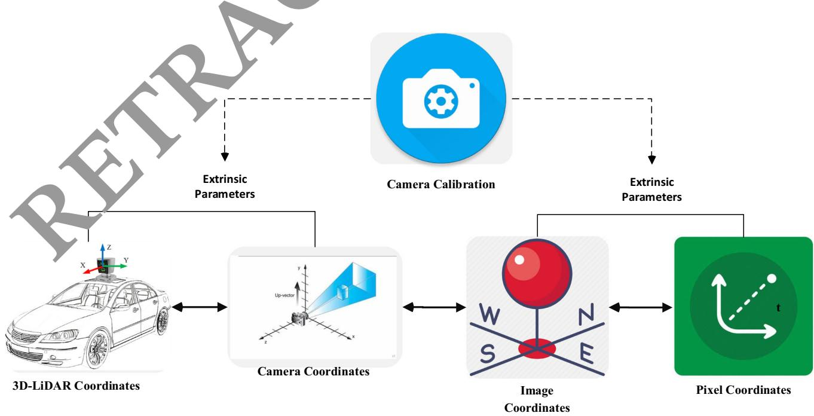  
Fig. 1 Conversion of coordinates between the camera and 3D-LiDAR

## 3.2 Translation estimation

The LiDAR and camera calibration were established in the same three-axis orientation. Therefore the estimation of translation change is much more important than the estimation of rotational difference. Using Eq. (1) and supposing rotation invariance the equation can be modified as

$$
M _ { p r o j } = \left[ \begin{array} { c c c c } { { f } } & { { 0 } } & { { a _ { 0 } } } & { { 0 } } \\ { { 0 } } & { { f } } & { { b _ { 0 } } } & { { 0 } } \\ { { 0 } } & { { 0 } } & { { 0 } } & { { 1 } } \end{array} \right] \times \left[ \begin{array} { c c c c } { { 1 } } & { { 0 } } & { { 0 } } & { { t _ { x } } } \\ { { 0 } } & { { 1 } } & { { 0 } } & { { t _ { y } } } \\ { { 0 } } & { { 0 } } & { { 1 } } & { { t _ { z } } } \\ { { 0 } } & { { 0 } } & { { 0 } } & { { 1 } } \end{array} \right]\tag{ð5Þ}
$$

whereas, $\left( t _ { x } , t _ { y } , t _ { z } \right)$ is the translation vector with unknown components. Before calculating the elements of the translational vector $t _ { x } , t _ { y } , t _ { z }$ is calculated using $f ,$ the radius r of the camera image, and the radius R computed from the point cloud, respectively. The distance di can be computed as:

$$
\scriptstyle d i = f \times { \frac { R } { r } }\tag{ð6Þ}
$$

Using the distance from LiDAR to object and from the camera to object obtained by Eq. (5), the element $t _ { z }$ of the translation vector is computed as follows:

$$
t _ { z } = d i _ { 1 } - d i _ { 2 }\tag{ð7Þ}
$$

Based on the value of $t _ { z } ,$ the other components tx and t can be computed as given in Eq. (8) and (9), respectively.

$$
t _ { x } = \frac { ( t _ { z } + z ) . ( x - o _ { x } ) } { f }\tag{ð8Þ}
$$

$$
t _ { y } = \frac { ( t _ { z } + z ) . ( y - o _ { y } ) } { f }\tag{ð9Þ}
$$

## 3.3 Rotation estimatio

Rotation parameters are computed to improve the accuracy of the calibration parameters. To compute the rotation, we employed the widely used least-square best-fitting rigid body transformation. The edges in the 3D-LiDAR point $\mathrm { c l c } \mathcal { A } \mathrm { a r }$ computed using the RANSAC algorithm. In the RANSAC algorithm, first a small sample is selected to compute the fitting model. Next all the components that fit the model are taken as inliers and others are taken as outliers. All the possible solutions are tested and the solution are repeated to find the minimal set of correspondence. Using the boundary features $( b n d _ { k } ^ { l } )$ of the LiDAR the function for the rotation matrix can be minimized as:

$$
( R , t ) = \arg ( \operatorname* { m i n } \left( \sum _ { k = 1 } ^ { z } \omega _ { k } \big | b n d _ { k } ^ { l } + t \big | \right) ^ { 2 }\tag{ð10Þ}
$$

Next, we compute the covariance matrix $C M = X \omega Y ^ { T }$ where X and Y are the $r \ \times \ c$ matrices of weighted cantered vectors and $\omega = d i a g o n a l ( \omega _ { 1 } , \omega _ { 2 } , \omega _ { 3 } . . . . . . . \omega _ { n } )$ . Applyingtion can be the singular value decomposition on CM rot obtained as

$$
c _ { j } \left( \begin{array} { l } { A } \\ { B } \\ { 1 } \end{array} \right) = \left[ \begin{array} { l l l l } { p _ { 1 1 } } & { p _ { 1 2 } } & { p _ { 1 3 } } & { t _ { x } } \\ { p _ { 2 1 } } & { p _ { 2 2 } } & { p _ { 2 3 } } & { t _ { y } } \\ { p _ { 3 1 } } & { p _ { 3 2 } } & { p _ { 3 3 } } & { t _ { z } } \\ { 0 } & { 0 } & { 0 } & { 0 } \end{array} \right] \quad \widehat { D _ { j } } \left( \begin{array} { l } { Y } \\ { Z } \\ { 1 } \end{array} \right)\tag{ð11Þ}
$$

## 3.4 Region-based feature extraction and classification system for object detection

The proposed RFF-Faster RCNN object detection system is comprised two units. The first unit is a deep convolu-(RPN) and is applied to extract different regions of interest (ROI) in images and the second module is an object detector called Fast R-CNN that employs the different egions to detect multiple objects in AVs. The framework of the proposed system is presented in Fig. 2. The first module is actually a neural network with an attention mechanism that uses image input and generates output as a set of rectangular object proposals. To produce region proposals, a $m \ \times \ m$ spatial window slides over the convolutional feature map output of the last layer. Transformation is performed for each window into a lowerdimensional feature space. We employed $\mathbf { m } = 3 .$ , because the effective receptive field of the images is very large. Next to the convolution layers, there are the box regression layer and box classification layer. To more accurately estimate the ground-truth bounding boxes of the objects, a great number of regions in the input image are sampled and used to determine whether these regions include items of interest, and then modified the boundaries of the region. Different models may employ various region sampling techniques.

Multiple bounding boxes called anchors are generated with several scales and aspect ratios centred on each pixel. The loss function of the RPN can be computed as:

$$
\begin{array} { c l c r } { { { \displaystyle { \cal L } ( \{ x _ { i } \} \{ y _ { i } \} ) = \frac { 1 } { J _ { C l a s s } } \sum _ { i } K _ { c l a s s } ( x _ { i } , x _ { i } ^ { * } ) } } } \\ { { + \theta \frac { 1 } { J _ { r e g } } \sum _ { i } x _ { i } ^ { * } K _ { r e g } ( y _ { i } , y _ { i } ^ { * } ) } } \end{array}\tag{ð12Þ}
$$

where i is the index and $x _ { i }$ is the probability of anchor, $x _ { i } ^ { * }$ is the ground truth label,yi is a vector that represents the coordinate of the bounding box. $. K _ { c l a s s } , K _ { r e g }$ shows the classification and regression loss, respectively.

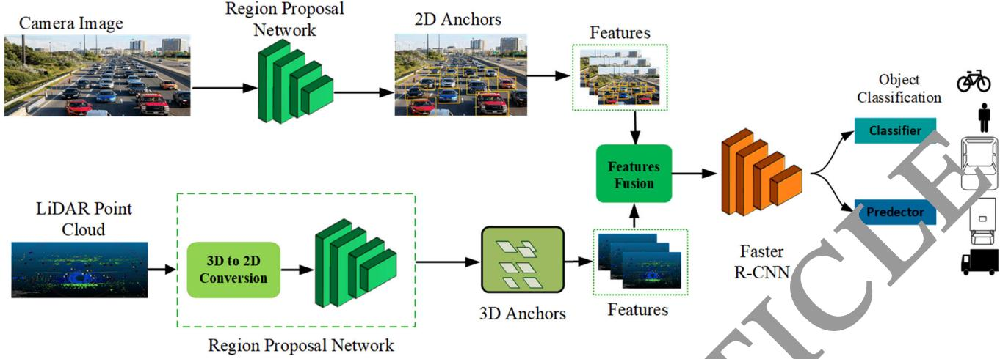  
Fig. 2 Architecture of region-based feature extraction and classification system for object detection

During the sliding window process, multiple regions proposals are generated for each sliding window position. So the regression box layer has multiple outputs that encode the coordinates of different boxes, and the classification layer has various scores that are used to estimate

For generation eral anchor boxes, several aspect ratios and scales can be used. Therefore this study generated anchor with different shapes centred on each pixel of the image. We employed 3 scales and 3 aspect ratios, obtaining a total of 9 anchors at each sliding position. Table 1 shows the pseudo-code for the proposed Faster R-CNN model.

Pseudo code 1. Estimation of the  undr box

1. Initialize the parame. :rs

In alize confidence threshold α , mask $\beta$ and weights ω.

2. Initialize th video stream ν

3. Process ac. me

Load video stream

Read each frame and return the coordinates. Create 4D blob from frame

E t oct the oounding box each object

For i=1 to number of detections

Update box and mask $\beta$

Determine the left, right, top and bottom of bounding box.

Return the bounding box

5. End

End for

the probability of objects and not objects for each of the proposals. For an input image with height $h ,$ anchor boxes can be generated with variable shapes. For scale $S \varepsilon ( 0 , 1 )$ and aspect ratio $( r > 0 )$ the height and width of the anchor box can be computed as

$$
w = w s \sqrt { r }
$$

$$
h = h s { \sqrt { r } }
$$

## 3.5 Feature-level fusion of 3D-LiDAR and camera images for object detection

ð12Þ

ð13Þ

Multimodal data fusion can be performed at multiple layers including data, feature, and decision layers. In the data layer fusion, the RGB image and the depth image are transformed into tensors and then combined in the depth dimension for fusion. Tensors are data structures used in machine learning algorithms for storing and representing different types of data. The tensors are comprised of large amount of data which causes a high computation burden for graphics processing units. The decision-layer fusion is the last level of fusion for information fusion. The RGB image and depth image are used as input to two individual convolutional neural networks (RPNs) with ResNet50 feature extractor for object detection and the final output are obtained by mixing the two results. In this case, the detection results generated may be mutually exclusive, resulting in low performance. However, the feature-layer fusion approach combines the features of the LiDAR and camera. The volume of the features is much smaller than the volume of the data layer and decision layer fusion, which can save processing time. It makes connections at multiple convolutional depths between two branches to support the correlation of modality data and improve the data fusion level. In this study, the feature-layer fusion method is employed, and a cross-feature fusion block is made to reduce the volume of multimodal data and enhance the processing speed of object detection. Figure 3 shows the sliding window technique for feature extraction.

% and IoU[ 0.5 for all o Table1Performanceanalysisoftheobjectdetectionratewith
<table><tr><td>Sensor</td><td>Method</td><td>FPS</td><td colspan="2"></td><td colspan="4">Van</td><td colspan="3">Truck</td><td colspan="3">Pedestrian</td><td colspan="4">Cyclist</td></tr><tr><td></td><td></td><td></td><td>E</td><td></td><td>H</td><td>E</td><td>M</td><td>H</td><td>E</td><td>M</td><td>H</td><td>E</td><td>M</td><td>H</td><td>E</td><td>M</td><td>H</td><td>mAP(%)</td></tr><tr><td>Camera</td><td>Mono 3D (Li. Yuxuan, Y. Yixuan, and M. Liu. , 2021)</td><td>33.33</td><td>93.54</td><td>90.0</td><td>83</td><td>47.64</td><td>36.95</td><td>32.87</td><td>56.78</td><td>42.29</td><td>36.54</td><td>59.18</td><td>44.25</td><td>39.44</td><td>58.18</td><td>47.29</td><td>37.78</td><td>53.73</td></tr><tr><td></td><td>3DOP (Huang and Zhang 2021)</td><td>8.30</td><td>91.44</td><td>86.10</td><td>6.52</td><td></td><td>59.80</td><td>57.03</td><td>70.13</td><td>58.68</td><td>52.35</td><td>73.23</td><td>59.60</td><td>53.65</td><td>71.34</td><td>59.68</td><td>57.15</td><td>66.64</td></tr><tr><td></td><td>Mv3D (Shi and Rajkumar 2020)</td><td>2.81</td><td>71.29</td><td>62.68</td><td>56..</td><td>68.32</td><td>80</td><td>52.67</td><td>66.72</td><td>71.70</td><td>60.63</td><td>68.79</td><td>72.74</td><td>62.53</td><td>67.34</td><td>65.72</td><td>63.13</td><td>64.71</td></tr><tr><td></td><td>KDA3D (Ku et al. Dec. 2018)</td><td>7.72</td><td>88.45</td><td>78.85</td><td>78.46</td><td>83</td><td>72</td><td>71.44</td><td>83.49</td><td>72.43</td><td>70.21</td><td>85.19</td><td>74.44</td><td>73.22</td><td>86.78</td><td>82.45</td><td>75.11</td><td>78.42</td></tr><tr><td></td><td>Proposed</td><td>15.4</td><td>94.04</td><td>91.2</td><td>83.27</td><td>8456</td><td>73.</td><td>23</td><td>84.02</td><td>72.98</td><td>71.23</td><td>87.12</td><td>76.01</td><td>74.12</td><td>87.12</td><td>82.99</td><td>79.13</td><td>80.74</td></tr><tr><td>3D-LiDAR</td><td>Point Pillar (Wang et al. 2019)</td><td>62.00</td><td>93.84</td><td>90.70</td><td>87.47</td><td>57.77</td><td></td><td></td><td>83.79</td><td>68.54</td><td>61.70</td><td>84.55</td><td>72.51</td><td>67.90</td><td>85.99</td><td>72.89</td><td>67.71</td><td>72.59</td></tr><tr><td></td><td>Part-AA (Wang et al. 2019)</td><td>12.50</td><td>95.00</td><td>91.72</td><td>88.84</td><td>63.51</td><td></td><td>48.</td><td>.60</td><td>77.52</td><td>70.2</td><td>90.16</td><td>79.12</td><td>72.23</td><td>89.70</td><td>79.12</td><td>72.23</td><td>77.22</td></tr><tr><td></td><td>Point RCNN (Yang et al. 2018)</td><td>10.00</td><td>95.91</td><td>91.76</td><td>86.91</td><td>57.13</td><td>47.34</td><td>6</td><td>8 32</td><td>72.13</td><td>67.12</td><td>86.12</td><td>78.63</td><td>70.18</td><td>87.32</td><td>78.43</td><td>74.42</td><td>74.82</td></tr><tr><td></td><td>Point GNN (Chen and Bai 2020)</td><td>1.67</td><td>38.12</td><td>37.23</td><td>36.14</td><td>39.23</td><td>31.21</td><td>45</td><td>23</td><td>32.43</td><td>29.78</td><td>38.13</td><td>39.43</td><td>34..78</td><td>37.23</td><td>34.43</td><td>30.17</td><td>32.55</td></tr><tr><td></td><td>Proposed</td><td>15.4</td><td>97.89</td><td>93.65</td><td>89.43</td><td>64.43</td><td>53.65</td><td>54.23</td><td>89.39</td><td>74.65</td><td>71.25</td><td>90.19</td><td>78.65</td><td>75.32</td><td>89.19</td><td>73.15</td><td>72.51</td><td>77.84</td></tr><tr><td>Camera + 3D- LiDAR</td><td>AVOD (Nobis et al. 2021)</td><td>12.50</td><td>94.56</td><td>89.12</td><td>82.12</td><td>42.34</td><td>32.21</td><td>29.37</td><td>64.21</td><td></td><td>45.21</td><td>67.11</td><td>54.23</td><td>46.25</td><td>68.21</td><td>53.13</td><td>44.67</td><td>57.60</td></tr><tr><td></td><td>Frustum ConvNet (Nabati and Qi 2021)</td><td>2.13</td><td>95.12</td><td>91.23</td><td>79.12</td><td>75.49</td><td>63.23</td><td>58.28</td><td>86.54</td><td></td><td>66.</td><td>87.14</td><td>78.15</td><td>69.41</td><td>87.14</td><td>78.15</td><td>69.22</td><td>77.39</td></tr><tr><td></td><td>Point Painting (Lim et al. 2023)</td><td>2.50</td><td>98.13</td><td>92.34</td><td>89.43</td><td>59.23</td><td>50.21</td><td>46.21</td><td>87.43</td><td>76.43</td><td></td><td>38.53</td><td>79.13</td><td>69.63</td><td>88.48</td><td>77.93</td><td>69.13</td><td>76.02</td></tr><tr><td></td><td>KDA3D (Ku et al. Dec. 2018)</td><td>8.3</td><td>88.32</td><td>78.23</td><td>78.77</td><td>63.21</td><td>60.23</td><td>64.12</td><td>77.12</td><td>57.14</td><td>8</td><td>70.22</td><td>59.94</td><td>56.78</td><td>78.12</td><td>59.14</td><td>59.98</td><td>67.57</td></tr><tr><td>Proposed</td><td></td><td>15.4</td><td>94.96</td><td>95.32</td><td>93.49</td><td>87.24</td><td>82.80</td><td>77.45</td><td>89.31</td><td>77.20</td><td>7228</td><td>92</td><td>7.28</td><td>75.77</td><td>92.90</td><td>88.21</td><td>77.88</td><td>85.67</td></tr></table>

asy, M = Moderate, H =

## 3.6 Performance evaluation

To assess the performance of the proposed metho d in object-region generation, we used the RFF-Faster R-C architecture to acquire the features of images and evaluat them in terms of object detection rate (ODR), detection speed (DS), mean average precision (mAP) and running time (RT) and intersection over union (IoU). The object detection rate is defined as:

$$
O D R = \frac { T o t a l c o r r e c t o b j e c t s } { T o t a l o b j e c t i n t h e s c e n c e } \times 1 0 0\tag{ð14Þ}
$$

The detection speed is computed in terms of number of frames per second. It can be defined as

$$
D S = \frac { F } { t } \ \times \ 1 0 0\tag{ð15Þ}
$$

where, F is the number of frames and t is the total time in seconds.

The mAP is defined as:

$$
m A P = \frac { 1 } { r } \sum _ { q = 1 } ^ { r } A P _ { r }\tag{ð16Þ}
$$

Where r shows the total number of object classes.

The running of an object detection system is the total time requ run as a function. The running time depends upon the number of inputs required for the operations of system to detect the objects. An object running time to complete.

IoU represents the overlap between the bounding box around a predicted object and the bounding box around e ground reference data. It can be defined as:

$$
\mathop { i o U } = \frac { O \nu e r l a p e a r e a } { A r e a o f u n i o n }\tag{ð17Þ}
$$

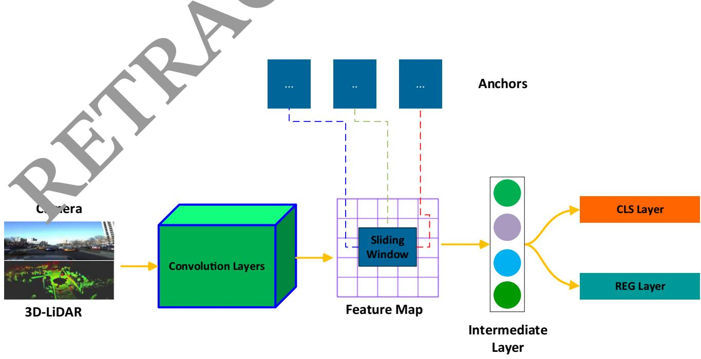  
Fig. 3 Sliding window technique for feature extraction

## 4 Experimental results and analysis

## 4.1 Dataset

We conducted different experiments on the publically available KITTI object detection benchmark dataset [32]. The dataset is comprised of 7480 frames for training and 7518 frames for testing the model. We divided the training data into training set and testing set in the ration of 80:20. The training data contains labels for different classes of pedestrian, cars, cyclist, truck, sitting person, tram, miscellaneous and do not care with a variety of road scenes. In the training phase, we used only five classes i.e., cars, van, truck, pedestrian and cyclists. In addition, we separated the object samples in the KITTI benchmark based on the size of the bounding box in image space and the occlusion conditions into three levels of difficulty: easy, moderate and hard. Additionally, we used data augmentation to generate images rainy, snowy, and stormy and night-time images. Figure 4 shows an example of images where different cars are detected.

Advance intelligent transportation systems and communication equipment are affected by various domains. With the emergence and expansion of artificial intelligence, machine learning methods are employed for object detection and control in AVs. Majority of the AVs commonly use three types of sensors, including radar, 3D-LiDAR and camera. These sensors can be combined to provide more accurate detection of surrounding objects. Tables provide and 2 a comparison of the object detection rates (ODR) of the proposed method and other state-of-the-art approaches. The results are mostly compared with image- based methods, LiDAR 3D point cloud-based methods, and sensors e the object detection rates of all methods for the de tection of car, van, truck, pedestrian and cyclist in three hardness levels: easy, moderate and hard. The proposed method achieves comompared to other methods. The proposed method a overall mean average precession m(AP) of 80.74% 77.84% and 85.67% (Table 1) and 94.59%,82.5 %, 79.60%,85.31%,86.33% average precision (AP) for the features of three different modalities including camera, 3D LiDAR point cloud and camera 3D-LiDAR, respectively. In the case of using only the features of the camera, the proposed method competes ith KDA3D with 78.42% mean AP. When the features of 3D-LiDAR point clouds are used as input the Part-AA method showed the second highest performance with

## 4.2 Performance analysis of the object detection rate

Accurate prediction of surrounding objects and pedestrian is critical for self-driving vehicles to avoid collisions.

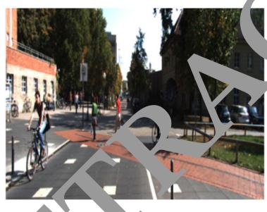

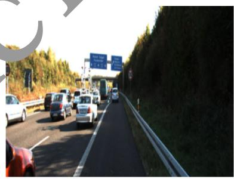

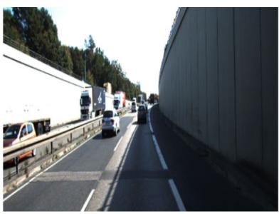

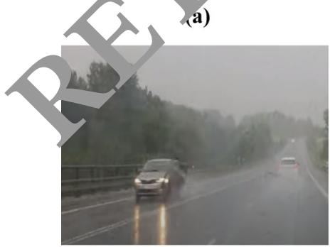  
(d)

(b)  
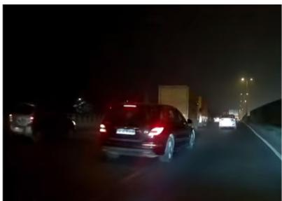  
(e)

(c)  
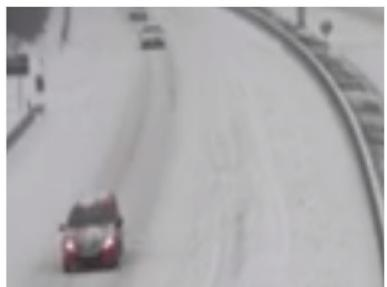  
(f)  
Fig. 4 Some examples of the normal and augmented images from the KITTI dataset for object detection in AVs (a) Pedestrian and cyclist crossing the road (b) Vehicles passing through the highway  
(c) Vehicles on a street road (d) Vehicle on the highway on rainy weather (e) Night time traffic (f) Vehicle in snowy weather

Table 2 Performance analysis of the object detection rate with average precision (AP%) for car, van, truck, pedestrian, and cyclist with IoU [ 0.5
<table><tr><td>Sensor</td><td>Method</td><td>Car</td><td>Van</td><td>Truck</td><td>Pedestrian</td><td>Cyclist</td></tr><tr><td>Camera + 3D-LiDAR</td><td>AVOD (Nobis et al. 2021)</td><td>88.60</td><td>34.64</td><td>53.55</td><td>55.86</td><td>55.33</td></tr><tr><td></td><td>Frustum ConvNet</td><td>88.49</td><td>65.67</td><td>76.40</td><td>78.12</td><td>78.43</td></tr><tr><td></td><td>Point painting</td><td>93.30</td><td>51.88</td><td>77.33</td><td>79.19</td><td>78.51</td></tr><tr><td></td><td>KDA3D</td><td>81.77</td><td>62.52</td><td>62.81</td><td>64.98</td><td>65.74</td></tr><tr><td></td><td>Proposed</td><td>94.59</td><td>82.50</td><td>79.60</td><td>85.31 0</td><td>86.33</td></tr></table>

77.22% mAP. For the camera ? 3DLiDAR features, the proposed method outperformed the Frustum ConvNet method which has achieved 77.39% mAP. This shows that the combination of features from the camera and 3D LiDAR point cloud has significantly enhanced the performance of the proposed method.

## 4.3 Analysis of the training time of different sensors modalities

The processing time of an object detection system is an important metric for AVs. Missing an important frame may impact the next perception and control decision, irrespective of the object being a car, van, truck, pedestrian and cyclist. When the object detection system cannot handle information in real-time, delay will occur affecting recognition system was first trained with different numb of iteration (e.g., 50, 100, 200, 5000, 1000, 2000, 3000,4000,5000,6000,7000,8000,9000 and 10,000). Next, we randomly selected 500 images for testing. The testing process was repeated 15 times and the results were averaged. Figure 5 shows the average FPS of th trained model under different iterations using ra, 3D-LiDAR, and camera ? 3Di-LiDAR. Average FPS of the trained model constantly drops and becomes stable after 3000 iterations. However, these values sig change and drop up to 90 FPS using the proposed method as opposed to the camera, and 3D-LiDAR point clouds method where these values can drop up to 100 FPS and 110 FPS, respectively. parallel proce   
posed model.

## 4.4 Convergence of the object detection system

To show the performance of the feature fusion method on the training and testing sets, we carried out different experiments as shown in Fig. 6. The accuracy and average loss are compared using on training and validation set with 10,000 iterations. The training set was comprised of 4400 images: 1200 cars, 1100 van, 700 truck, 900 pedestrian and 600 cyclist. The validation set included of 900 images: 225 cars, 170 van 100 truck, 250 pedestrians and 155 cyclists. We increased the number of iterations from 100 to 15,000. The results in Fig. 6a show that the accuracy of the training set becomes stable after approximately 3000 iterations and reaches up to 97.02%. Similarly, the validation accuracy reached up to 95.13% . This shows that the proposed method constantly performs better, particularly when training with a small set of camera and 3D-LiDAR inputs.

The confusion matrix of proposed Faster- RCNN is shown in Fig. which demonstrates the classification accuracy of each class of objects. It is evident that the class est recognition accuracy. This is due to the fact the features of the car can be easily extracted.

## 4.5 Analysis of the object detection performance at different feature extraction methods

To evaluate the performance of the proposed method, different experiments are conducted using sate of the art feature extraction methods including Resnet101, ResNet-18, ResNet-34, RestNet-110, Mobilenet, Alexnet, and inception\_VI. These methods are generally used in object detection for AVs to provide high detection performance. The performance of these methods are evaluated under different environmental condition using sunny, rainy, nighttime, snowy and stormy evnivironment. Table 3 shows that, the proposed method can obtain 95.02% accuracy in different weather conditions as compared to the other methods. The classification performance of all these methods is high during sunny daytime. However, the accuracy decreased obviously in rainy, stormy and nighttime evniroment. This is because these methods are unable to extract the features during rainy, stormy, snowy and nighttime environments. The proposed method shows relatively high performance even during various environmental conditions.

## 4.6 Analysis of the object detection performance at different features fusion levels

A single sensor does not work well in all object detection conditions and tasks. It is essential to combine multiple sensors for accurate object detections in self-driving vehicles. The redundant inputs from different sensors are vital

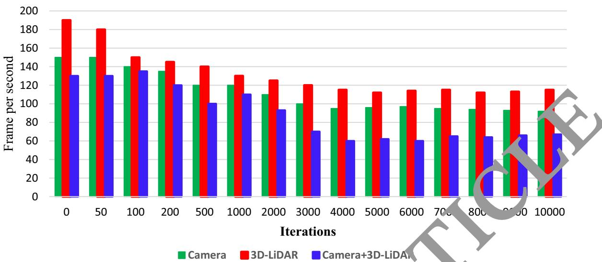  
Fig. 5 Analysis of the Training Time using camera, 3D-LiDAR, and Camera ? 3D-LiDAR  
Fig. 6 Accuracy and loss of the proposed Faster-RCNN (a) Training set (b) Validation set

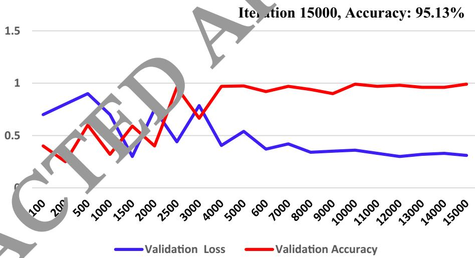  
(a)

Iteration 15000, Accuracy: 95.13%  
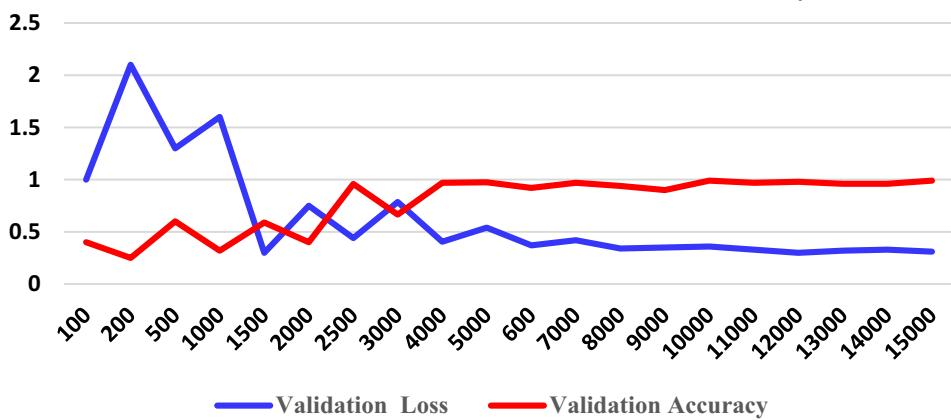  
(b)

Fig. 7 Confusion matrix for the proposed object detection method on testing test
<table><tr><td rowspan=1 colspan=1>213</td><td rowspan=1 colspan=1>7</td><td rowspan=1 colspan=1>3</td><td rowspan=1 colspan=1>0</td><td rowspan=1 colspan=1>0</td></tr><tr><td rowspan=1 colspan=1>11</td><td rowspan=1 colspan=1>144</td><td rowspan=1 colspan=1>15</td><td rowspan=1 colspan=1>0</td><td rowspan=1 colspan=1></td></tr><tr><td rowspan=1 colspan=1>2</td><td rowspan=1 colspan=1>14</td><td rowspan=1 colspan=1>84</td><td rowspan=1 colspan=1>0</td><td rowspan=1 colspan=1>V</td></tr><tr><td rowspan=1 colspan=1>0</td><td rowspan=1 colspan=1>0</td><td rowspan=1 colspan=1>0</td><td rowspan=1 colspan=1></td><td rowspan=1 colspan=1>23</td></tr><tr><td rowspan=1 colspan=1>0</td><td rowspan=1 colspan=1>0</td><td rowspan=1 colspan=1>0</td><td rowspan=1 colspan=1>6</td><td rowspan=1 colspan=1>136</td></tr></table>

Table 3 Performance analysis o different deep networks
<table><tr><td>Feature Extraction Method</td><td>Sunny</td><td>Rainy</td><td></td><td>Storn.</td><td>Snowy</td><td>Average Accuracy(%)</td></tr><tr><td>ResNet101 (Li et al. 2021)</td><td>83.44</td><td>69.25</td><td></td><td>.54</td><td>62.34</td><td>67.57</td></tr><tr><td>ResNet-18 (Huang and Zhang 2021)</td><td>72.45</td><td>67.23</td><td>60</td><td>55.23</td><td>59.75</td><td>62.97</td></tr><tr><td>ResNet-34 (Chen et al. 2020)</td><td>75.34</td><td></td><td>6323</td><td>59.13</td><td>63.78</td><td>66.34</td></tr><tr><td>ResNet-110 (Choi et al. 2023)</td><td>76.45</td><td></td><td>05.65</td><td>63.24</td><td>66.34</td><td>68.80</td></tr><tr><td>MobilenNet (Li et al. 2022)</td><td>05.48</td><td>72</td><td>70.98</td><td>63.32</td><td>67.45</td><td>73.90</td></tr><tr><td>AlexNet (Wang et al. 2023)</td><td>94</td><td>77.60</td><td>74.56</td><td>70.45</td><td>72.54</td><td>78.04</td></tr><tr><td>Inception_VI (Uribe et al. 2022)</td><td>93.5</td><td>78.56</td><td>73.21</td><td>71.65</td><td>70.43</td><td>77.48</td></tr><tr><td>ResNet50(Proposed)</td><td>.03</td><td>96.14</td><td>94.04</td><td>93.93</td><td>93.87</td><td>95.02</td></tr></table>

to evade possible failure caused by bad weather conditions or inadequate sensor information. However, sensor fusion systems generally produce more data, and require high computational power for processing. Sensors fusion is generally performed at three different layers including the data layer, feature layer and decision layer. In the data layer fusion, the high volume of data are stored in tensors which causes a high   
processing units. In the ecision-layer fusion, the RGB image and depth image are used as input to two individual convolutional neural networks resulting in the generation of mutually exclusive results and low classification performance. Therefore, it is essential to assess the possible risk   
approach combines the feature from the LiDAR and camera, extracting only distinct features which not only reduce the amount data for storage as well as reduces the computation burden. Table 4 provides an evaluation of the widely used fusion methods. The methods are compared on the basis of training, dataset, fusion method, and mean average precision (mAP). Only a few methods used a combination of RGB image and LiDAR data. A detection was considered successful only with a 50% (IoU = 0.50) overlap of the bounding box with the ground truth. The proposed method showed high performance with

97.13%mAP as compared to other methods. The second highest performance is shown by the method of Fusion Net with 73%mAP. However, this method combines the data of the camera and radar and performs fusion at the data layer which causes a high computation burden. It is evident that the worst performance is shown by the work of Mayer et al. (2019) which performs the sensor fusion at the decision layer. This confirms that the feature layer fusion is the best candidate for real-time implementation of the object detection systems in AVs. Figure 8 shows example images of the proposed method detecting car, van, truck, pedestrian and cyclist.

## 4.7 Analysis of the orientation detection accuracy of different classes of objects

Figure 9 shows the orientation detection accuracy of the different classes of objects. During prediction, the orientation of the cars are easily predicted than other objects such as pedestrians and cycles. For orientation prediction, the cycle class ranks second and pedestrian is the hardest class to predict. There are two possible factors that can affect the estimation of the orientation of cyclists and pedestrians. The first factor that affects the estimation is the dimensions of the object. An object with a larger size is easy to extract features and can be easily detected. Since a car is larger than a human and cycle size is in the middle which math their prediction accuracies. The second possible factor is the structure of the object, therefore flat objects with larger horizontal lines and features are easy to estimate their orientation. The proposed model outperformed other models in estimating the correction orientation of different objects. The proposed method showed orientation accuracies of 95.6%, 84.43%, 88.34%, 85.5%, and 86.7% for orientation estimation of car, van, truck, pedestrian and cyclist as compared to other methods.

Table 4 Performance comparison of system fusion features at data, feature and decision layers
<table><tr><td>Method</td><td>Dataset</td><td>Sensors</td><td>Fusion type</td><td>mAP</td></tr><tr><td>MV3D (Shi and Rajkumar 2020)</td><td>KITTI</td><td>Camera + 3D LiDAR</td><td>Data layer, feature layer, decision layer</td><td>70.00%</td></tr><tr><td>Point fusion (Yang et al. 2018)</td><td>KITTI</td><td>Camera + 3D LiDAR</td><td>Data layer</td><td>72.30%</td></tr><tr><td>AVOD-FPN (Nobis et al. 2021)</td><td>KITTI</td><td>Camera + 3D LiDAR</td><td>Feature layer</td><td>52.34%</td></tr><tr><td>SAANET (Meyer and Kuschk 2019)</td><td>KITTI</td><td>Camera + 3D LiDAR</td><td>Feature layer</td><td>55.23%</td></tr><tr><td>RVF Net [48]</td><td>nuScenes</td><td>Camera + radar + LiDAR</td><td>Data layer</td><td>%</td></tr><tr><td>Center fusion (Sun et al. 2020)</td><td>nuScenes</td><td>Camera + radar</td><td>Feature layer</td><td>0.21%</td></tr><tr><td>Fusion Net (Chandra et al. 2020)</td><td>Custom</td><td>Camera + radar</td><td>Data layer</td><td>73.50%</td></tr><tr><td>Mayer et al. (2019)</td><td>Astyx</td><td>Camera + radar</td><td>Decision layer</td><td>38.23% CLE</td></tr><tr><td>Proposed</td><td>KITTI</td><td>Camera + 3D LiDAR</td><td>Feature layer</td><td>85.67%</td></tr></table>

## 4.8 Performance analysis under different environmental conditions

We examined the performance of different models including YoLo5, general Faster RCNN, SSD,SPP-Net, and R-CNN, and RFF-Faster RC NN under different environmental conditions. In the proposed model, the task of the RFF- Faster RCNN is to car, van, truck, pedestrian and nts. All six models were used Table 5 shows the comparative detection results of ll these methods. It is evident that the RCNN-based methods have higher detection than YOLOv5 and other methods (Cai et al. 2021), which is the basic reason why e proposed model is based on Faster RCNN for the regional feature extraction. The RFF-Faster RCNN achie .89% in cease in mAP as opposed to other methods. On a rainy day, the detection of the RFF- Faster RCNN increases by 1.21% as compared to general Faster RCNN, where the outcomes are more noticeable. This shows that the introduction of a regional feature fusion in the Faster RCNN can mine the local features more proficiently. Figure 10 shows some examples of object detection during different environmental conditions. Figure 11 is the visualization of the distribution of different features under different environmental conditions.

## 4.9 Performance analysis on different object detection datasets

To test the robustness of the proposed model, we evaluated its performan on six other object detections datasets other than the KITTI dataset that was originally employed training and testing of the proposed model. The six new datasets were tested. In addition to the first three datasets, the first widely used dataset nuScene is a large-scale AV’s dataset. The dataset has a total of 40,130 samples for training, testing and validation. The second dataset Waymo consists of high-resolution sensor data of 103,354 segments each containing 20 s recordings. The third dataset the Lyft Level 5 includes over 55,000 annotated frames, data from 7 cameras and up to 3 LiDARs. Table 6 shows the performance of the proposed model under different datasets. It can be observed that in all the cases, mAP, orientation accuracy and running time remain in a close range regardless of the traffic flow data of each dataset. The mAP for the last four datasets i.e. KITTI, nuScence, Waymo, and Lyft Level 5 are 85.56%, 58.53%, 76.85%, 69.04%, respectively. Similarly, the running time of the proposed model on nuScence, Waymo, and Lyft Level 5, and KITTI datasets is 80 ms, 95 ms, 77 ms, and 70 ms, respectively. Moreover, the values of orientation accuracies show that the proposed model can provide reliable object predictions on all three datasets. The smaller differences might be the cause of different environmental conditions and data collection environments.

## 5 Discussion

Object detection is an essential task that needs to be robust and correct in self-driving environment. Perceiving the surrounding environment is a requirement for obstacle avoidance and object detection in AVs. However, multiple b Fig. 8 Object detection results in different road, highway, and street scenes for car, van, truck, pedestrian and cyclist in a sunny environment

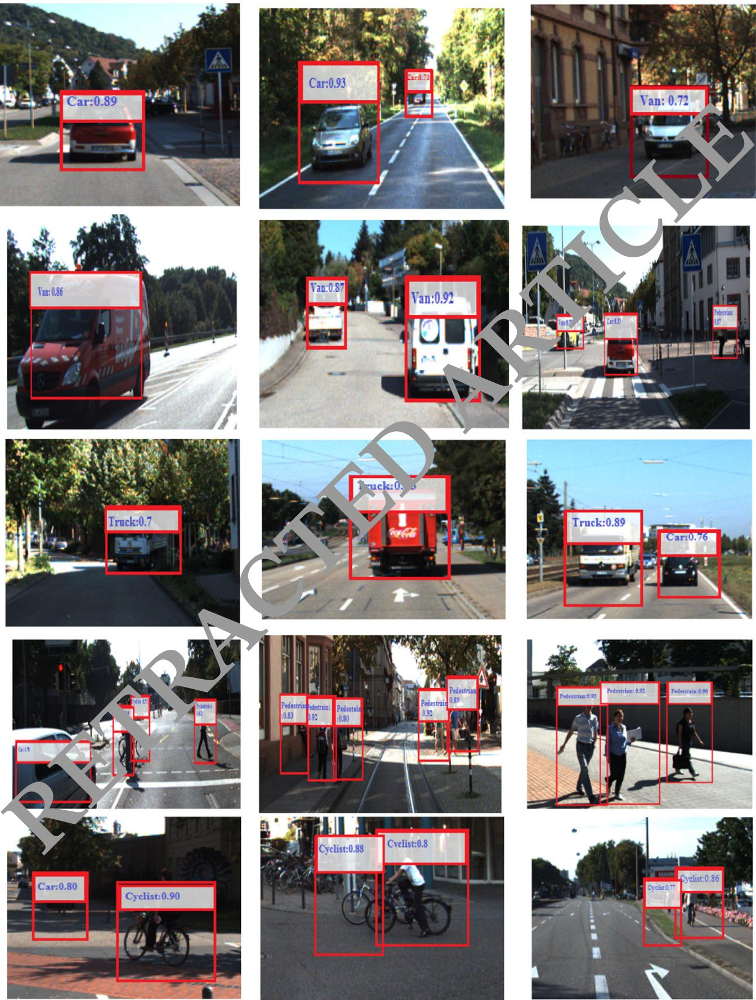

factors can affect the environmental perception of AVs. For example, extreme weather conditions such as fog, sunlight or rain can affect the performance of the perception system. The perception system may misunderstand the cyclist as a free road region and lead to accidents. Moreover, the size of input data may be very large, which can make it very difficult to provide on-time and fast objection detection for AVs. Therefore, it is crucial for autonomous driving to conduct further research and acquire reliable and real-time object detection.

Recently, RGB cameras and 3D-LiDAR are the extensively used for object detection AVs. The RGB camera can provide fast capture rates and rich texture of objects. However, detecting the shape and location of objects is very challenging. Camera is a passive sensor and can be easily influenced by changes in the amplitude and frequency of light waves. These problems affect the conversion of environmental data into images. A reliable detection device should be resistant to fluctuations in light intensity to provide accurate detections. The 3D-LiDAR uses lasers for object detection, which are less affected by the lighting conditions of surrounding regions than the RGB camera. As a result, it is possible to precisely measure the size and shape of objects. Although the 3D-LiDAR can provide high-resolution images, the point clouds are incredibly sparse in comparison to the rich features of an RGB image. Therefore, it is crucial to figure out how to combine detail-rich RGB features with sparse LiDAR point cloud depth information.

The features of RGB camera and 3D-LiDAR can be combined at several layers including the data, feature and at final decision layers. In the early fusion at the raw data layer, data of sensors is converted tensors which causes a high computation burden for graphics processing units. At the decision layer, the camera image and depth image are used as input to two separate CNN for object detection and obtained by combining the two results. However, the re erated may be mutually exclusive, compared ferent feature fusion methods based on the type of inputs used for training and evaluation, type of dataset, fusion technique types, and mAP. A detection was accepted for a bounding box with IoU = 0.50 overlap. Our method showed high performance with 85.68%mAP as

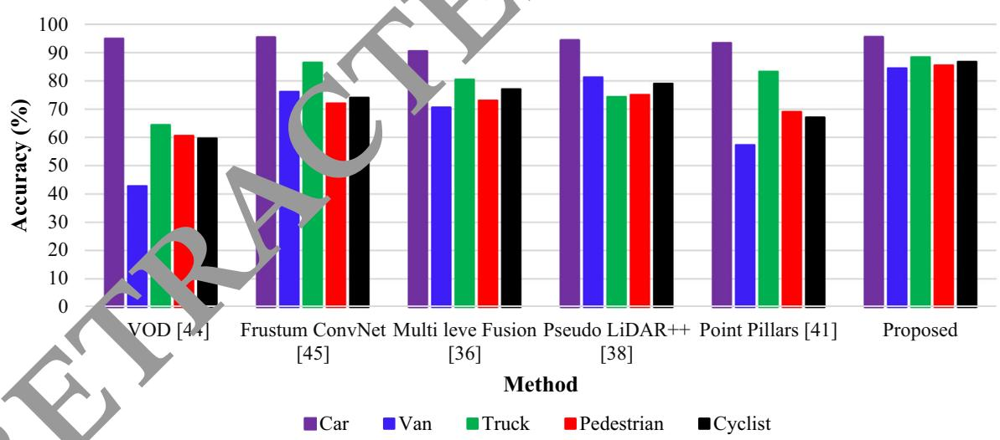

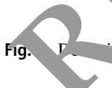  
on of the orientation of different classes of car, pedestrian and cyclist

Table 5 Performance comparison (mAP%) of the regional feature extraction under different environmental conditions
<table><tr><td rowspan="2">Model</td><td colspan="5">Environment</td></tr><tr><td>Sunny</td><td>Rainy</td><td>Night</td><td>Stormy</td><td>Snowy</td></tr><tr><td>Yolo5 (Cai et al. 2021)</td><td>70.34</td><td>75.34</td><td>61.04</td><td>60.56</td><td>72.54</td></tr><tr><td>SSD (Jamuna et al. 2022)</td><td>78.23</td><td>75.32</td><td>79.23</td><td>70.45</td><td>71.23</td></tr><tr><td>SPP-Net (Daniel et al. 2023)</td><td>76.34</td><td>73.45</td><td>77.34</td><td>72.45</td><td>73.23</td></tr><tr><td>R-CNN (Ennajar et al. 2021)</td><td>80.23</td><td>79.23</td><td>80.43</td><td>67.45</td><td>75.23</td></tr><tr><td>Fast R-CNN (Rani et al. 2022)</td><td>82.67</td><td>81.24</td><td>78.34</td><td>76.54</td><td>79.56</td></tr><tr><td>RFF-Faster R-CNN</td><td>85.67</td><td>82.45</td><td>80.57</td><td>79.54</td><td>81.45</td></tr></table>

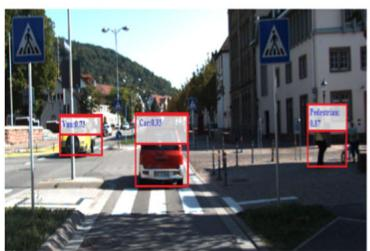  
(a)

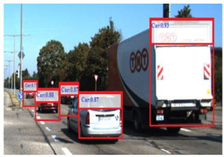

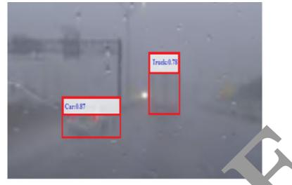  
(b)

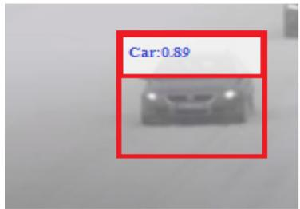  
(d)

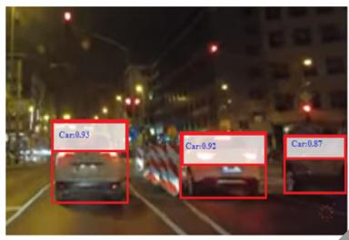  
(e)

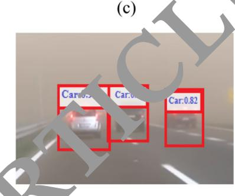  
(f)  
environment (e) night time and (f) during storm  
(b) early morning (c) rainy weather (d) snowy

Fig. 11 Visualization results of the feature distribution (a) clear environment (b) rainy weather (c) snowy weather (d) stormy environment

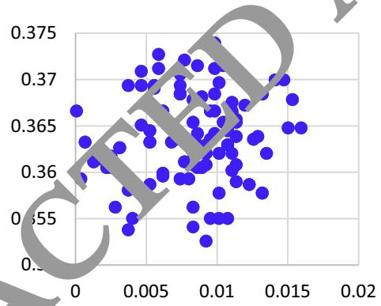

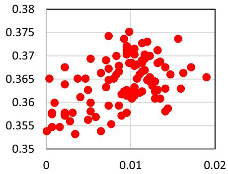  
(a)  
(b)

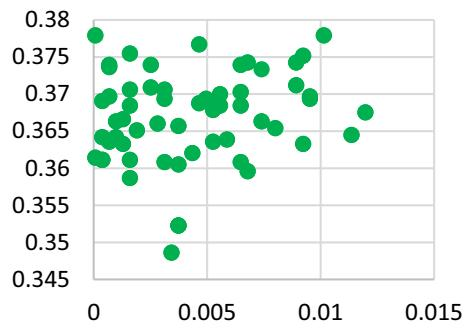  
(c)

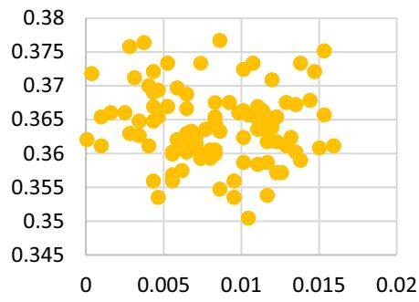  
(d)

compared to other methods. The second highest performance was obtained by the method of Fusion Net with 73%mAP which performs fusion early at the data layer and requires more computation. This shows that feature layer fusion can significantly increase the real-time implementation of object detection systems in AVs.

Environmental conditions considerably affect the accuracy of object detection. We evaluated the proposed method under various environmental conditions including as sunny, rainy, night, stormy and snowy weathers. The proposed object detection scheme achieved 85.56%, 82.45%, 80.57% 79.54%, and 81.45% for sunny, rainy night, stormy and snowy environments, respectively. Although there is usually strong intervention from headlight during the night and rainy environmental conditions, there is only a small degradation in the prediction precision of the proposed model which confirms that the featurelevel feature fusion can significantly enhance object detection in all environmental conditions. We also evalu ated the model on a different dataset, to estimate how the to other datasets i.e. nuScene [48], Waymo (Sun et a 2020) and Lyft Level 5 (Chandra et al. 2020). The mAP for the three datasets are 58.53%, 76.85%, and 69.04%. Similarly, the proposed model obtained 87.14%, 83.12%, and 85.34% orientation detection accuracie for the three datasets, respectively. Likewi our feature fusion approached achieved 80 ms, 95 ms on the three datasets and 70 ms on the ITTI dataset. Although, there object detection method on these datasets, which might be due to different environmental conditions and data collection environments. It is concluded that the model is robust to predict cars, pedestrians and cyclists for AVs as compared to other contemporary models.

Table 6 Analysis of the mAP(%), average orientation accuracy and running time on different object detection datasets
<table><tr><td>Dataset</td><td>mAP(%)</td><td>Average orientation accuracy (%)</td><td>Running Time (ms)</td></tr><tr><td>Berkeley DeepDrive (Rani et al. 2022)</td><td>73.09</td><td>83.34</td><td>90</td></tr><tr><td>CityScapes (Nabati and Qi 2021)</td><td>76.13</td><td>84.34</td><td>88</td></tr><tr><td>nuScene [48]</td><td>58.53</td><td>87.14</td><td>80</td></tr><tr><td>Waymo (Sun et al. 2020)</td><td>76.85</td><td>83.12</td><td>79</td></tr><tr><td>Lyft Level 5 (Chandra et al. 2020)</td><td>69.04</td><td>85.34</td><td>77</td></tr><tr><td>Level 5 Open (Wang et al. Feb. 2023)</td><td>80.23</td><td>83.23</td><td>E</td></tr><tr><td>KITTI (Proposed)</td><td>85.67</td><td>89.45</td><td></td></tr></table>

## 6 Conclusion

AVs will significantly improve the safety of the driving population and will reduce the environmental impact of vehicles. The perception system, which allows the vehicle to know the driving setting, including the location, orientation, and category of the surrounding object, is an essential component in the development of such a vehicle. Sensors such as 3D-LiDAR and camera have been used to perceive the driving environment for AVs. In this paper,

we proposed an object detection method that integrates the information of 3D-LiDAR and RGB camera to accurately detect objects for AVs. The 3D-LiDAR data was projected was employed generate convolutional features. The features of the 3D-LiDAR were fused with the regional features obtai ed from camera images and used as input to the Faster-RCNN network for the detection of objects. The ethod was extensively evaluated on different object detection datasets and achieved average precision of 94.59%, 82.50%, 79.60% 85.31%, and 86.33%, respecely, for car, van, truck pedestrian and cyclists on the KITTI dataset which is better than most of the previous methods. Due to the fusion of LiDAR and camera features, the proposed method is highly reliable for self-driving applications which require reliable and robust tracking and real-time performance.

Funding No funding was provided for the completion of this study.

Data availability The data that support the findings of this study are available from the corresponding author, upon reasonable request.

## Declarations

Conflict of interest The authors have no relevant financial or nonfinancial interests to disclose. The authors declare that they have no conflict of interest.

Ethical approval This article does not contain any study with human participants or animals performed by the authors.

## References

Bashir F, Porikli F (2006) Performance evaluation of object detection and tracking systems. In: Proceedings 9th IEEE International Workshop on PETS pp 7–14

Cai Y, Luan T, Gao H et al. (2021) YOLOv4–5D: an effective and efficient object detector for autonomous driving, In: IEEE Transactions on Instrumentation and Measurement, vol. 70

Cao Z, Liu J, Zhou W, Jiao X, Yang D (2021) LiDAR-based object detection failure tolerated autonomous driving planning system, In: 2021 IEEE Intelligent Vehicles Symposium (IV), Nagoya, Japan, pp 122–128

Carranza-Garcı´a M, Lara-Benı´tez P, Garcı´a-Gutie´rrez J, Riquelme JC (2021) ‘‘Enhancing object detection for autonomous driving by optimizing anchor generation and addressing class imbalance. Neurocomputing 449:229–244

Chandra R et al (2020) Forecasting Trajectory and behavior of roadagents using spectral clustering in graph-LSTMs. IEEE Robot Auto Lett 5(3):4882–4890

Chen J, Bai T (2020) Saanet: Spatial adaptive alignment network for object detection in automatic driving. Image vis Comput 94:103873

Chen X, Kundu K, Zhu Y, Ma H, Fidler S, Urtasun R (2018) 3D object proposals using stereo imagery for accurate object class detection. IEEE Trans Pattern Anal Mach Intell 40(5):1259–1272

Chen LC, Hermans A, Papandreou C, Schroff F, Wang P, Adam H (2018) Masklab: Instance segmentation by refining object detection with semantic and direction features. In: Proceedings of the IEEE conference on computer vision and pattern recognition pp 4013–4022.

Chen K et al. MVLidarNet: real-time multi-class scene understanding for autonomous driving using multiple views. In: 2020 IEEE/ RSJ International Conference on Intelligent Robots and Systems (IROS), Las Vegas, NV, USA, 2020, pp. 2288–2294,2020.

Choi JD, Kim MY (2023) A sensor fusion system with thermal infrared camera and LiDAR for autonomous vehicles and deep learning based object detection. ICT Express, 9(2): 222–227

Daniel A, Chandru Vignesh J, Muthu C (2023) Fully convolutiona neural networks for LIDAR–camera fusion for pede detection in autonomous vehicle. Multimed Tools Applica 82(25107–25130)

Ennajar A, Khouja N, Boutteau R, Tlili F (2021) Deep multi-modal object detection for autonomous driving. In: 2021 18th International Multi-Conference on Systems, Signals & Devices (SSD) (pp 7–11). IEEE 1

https://www.nuscenes.org/

http://www.cvlibs.net/datasets/kitti

Huang Y, Zhang H, A safety vehicle detecti echanism based on YOLOv5. In: 2021 IEEE 6th International Conference on Smart Cloud (SmartCloud) (pp 1–6). IEEE, November, 2021

Islam MM, Newaz AA (202 n detection for autonomous cars: occlusion handling y classifying body parts, In: 2020 IEEE Internatio l Conferenc on Systems, Man, and Cybernetics (SMC) IEEE, 2020, pp 1433–1438

Jamuna S, Murthy Gm, Lai SC, Parameshachari BD, Sujata N, Patil KL, Hemalatha (2022) ObjectDetect: a real-time object detection framewor for dvanced driver assistant systems using Ov5, ireless Communications and Mobile Computing, 2022, 9444360, 1–10.

Kaican L et al. Coda: a real-world road corner case dataset for object detection in autonomous driving.In: European Conference on Computer Vision. Cham: Springer Nature Switzerland, pp.406–423 2022.

Kiran BR, Saboh I, Talpeart V, Sallab A (2022) Deep reinforcement learning for autonomous driving: a survey. IEEE Trans Intell Transp Syst 23(6):4909–4926

Ku J, Mozifian M, Lee J, Harakeh A, Waslander SL (2018) Joint 3D proposal generation and object detection from view aggregation. IEEE Int Conf Intell Robot Syst 5750–5757:2018

Kumar VR, Eising C, Witt C, Yogamani SK (2023) Surround-view fisheye camera perception for automated driving: overview, survey & challenges. IEEE Trans Intell Transp Syst 24(4):3638–3659

Li G, Fan W, Xie H, Qu X (2022) Detection of road objects based on camera sensors for autonomous driving in various traffic situations, In: IEEE Sensors Journal, 22(24): 24253–24263

Li G, Ji Z, Qu X, Rui Z, and Cao D (2022) Cross-domain object detection for autonomous driving: A stepwise domain adaptative YOLO approach. IEEE Transactions on Intelligent Vehicles 7(3): 603–615.

Li P, Zhao H (2021) Monocular 3D object detection using dual quadric for autonomous driving. Neurocomputing 441:151–160

Lim T-Y, Ansari A, Major B, Fontijne D, Hamilton M, Gowaikar R, Subramanian S Radar and camera early fusion for vehicle detection in advanced driver assistance systems. In: Machine learning for autonomous driving workshop at the 33rd conference on neural information processing systems, vol. 2, 2019

Luo C, Xiaodong C, Alan Yuille YQ (2021) Exploring Simple 3D Multi-Object Tracking for Autonomous Driving. In: 2021 IEEE/ CVF International Conference on Computer Vision (ICCV), pp. 10468–10477

Meyer M, Kuschk G (2019) Deep learning based 3d object detection for automotive radar and camera, In: 2019 16th European Radar Conference (EuRAD). IEEE, 2019, pp. 133–136,https://www. nuscenes.org

Muhammad K, Ullah A, Lloret J, Ser JD, de Albuquerque VHC (2021) Deep learn ng for safe autonomous driving: current challenge nd future directions. IEEE Trans Intell Transp Syst 22(7):4316–4336

Nabati R, Qi H Center fusion: Center-based radar and camera fusion for 3d object detection. In: Proceedings of the IEEE/CVF winter nference on applications of computer vision, 2021,

i J, Shen K, Chen Y, Cao W, Yang SX (2022) An improved deep network-based scene classification method for self-driving cars. IEEE Trans Instrum Meas 71:1–14

Ni J, Shen K, Chen Y, Cao W, Yang SX An improved deep networkbased scene classification method for self-driving cars, In: IEEE Transactions on Instrumentation and Measurement, 71, pp 1–14.,2022.

Niranjan DR, VinayKarthik BC, Mohana (2021) Deep learning based object detection model for autonomous driving research using CARLA simulator. In: 2021 2nd International Conference on Smart Electronics and Communication (ICOSEC), Trichy, India, 2021, pp 1251–1258

Nobis F, Shafiei E, Karle P, Betz J, Lienkamp M (2021) Radar voxel fusion for 3d object detection. Appl Sci 11(12):5598

Peng L, Wang H, Li J (2021) ‘‘Uncertainty evaluation of object detection algorithms for autonomous vehicles. Automotive Innovation 4(3):241–252

Rani S, Ghai D, Kumar SS Object detection and recognition using contour based edge detection and fast R-CNN. Multimedia Tools Applications 81(42183–42207) 2022.

Ruchay A, Dorofeev K, Kober A (2018) 3D object reconstruction using multiple Kinect sensors and initial estimation of sensor parameters. In: Applications of Digital Image Processing XLI (Vol. 10752, pp. 639–646). SPIE

Shi S, Wang X, Li H (2019) PointRCNN: 3D object proposal generation and detection from point cloud. In: Proceedings of the IEEE computer society conference on computer vision and pattern recognition, 2019, pp. 770–779

Shi W, Rajkumar R (2020) Point-GNN: graph neural network for 3D object detection in a point cloud. Proc IEEE Comput Soc Conf Comput vis Pattern Recognit 2020:1708–1716

Sun P, Kretzschmar H, Dotiwalla X, Chouard A, Patnaik V, Tsui P, Guo J, Zhou Y, Chai Y, Caine B et al. (2020) Scalability in perception for autonomous driving: Waymo open dataset, In: Proceedings of the IEEE/CVF conference on computer vision and pattern recognition

Uribe C,, Me´ndez-Monroy AA (2022) U19-Net: a deep learning approach for obstacle detection in self-driving cars. Soft Comput 26: 5195–5207. http://www.cvlibs.net/datasets/kitti

Wang R, Wang Z, Xu Z, Wang C, Li Q, Zhang Y, Li H (2021) A realtime object detector for autonomous vehicles based on YOLOv4. Comput Intell Neurosci 2021(9218137):1–11

Wang L et al (2023) Global perception-based robust parking space detection using a low-cost camera. IEEE Trans Intell Vehicles 8(2):1439–1448

Wang Z, Jia K, and Frustum (2019) ConvNet: sliding frustums to aggregate local point-wise features for amodal, IEEE Int. Conf. Intell. Robot. Syst. (Mar. 2019) 1742–1749

Wang Y, Mao Q, Zhu H, Deng J, Zhang Y (2023) Multi-modal 3d object detection in autonomous driving: a survey. Int J Comput Vis pp 1–31

Wen L-H, Jo K-H (2021) Fast and accurate 3D object detection for lidar-camera-based autonomous vehicles using one shared voxelbased backbone. IEEE Access 9:22080–22089

Yang B, Luo W, and Urtasun (2018) Pixor: Real-time 3d object detection from point clouds. In: Proceedings of the IEEE conference on computer vision and pattern recognition (pp 7652–7660)

Yuxuan L, Yixuan Y, Liu M (2021) Ground-aware monocular 3d object detection for autonomous driving. In: IEEE Robotics and Automation Letters 6(2):919–926

Yuan Z, Song X, Bai L, Wang Z, Ouyang W (2022) Temporalchannel transformer for 3D lidar-based video object detection for autonomous driving. IEEE Trans Circuits Syst Video Technol 32(4):2068–2078

Zhao X, Sun P, Xu Z, Min H, Yu H (2020) Fusion of 3D LIDAR and camera data for object detection in autonomous vehicle applications. In: IEEE Sensors Journal, 20(9): 4901–4913

Publisher’s Note Springer Nature remains neutral with regard to jurisdictional claims in published maps and institut l affiliations.

Springer Nature or its licensor (e.g. a society or other partner) holds exclusive rights to this article under g agreement with the author(s) or other rightsholder(s); author self-archiving of the accepted manuscript version of this article is solely governed by the terms of such publishing agreement and applicable law.