# SLICT: Multi-Input Multi-Scale Surfel-Based Lidar-Inertial Continuous-Time Odometry and Mapping

Thien-Minh Nguyen , Member, IEEE, Daniel Duberg , Member, IEEE, Patric Jensfelt , Member, IEEE, Shenghai Yuan, and Lihua Xie , Fellow, IEEE

Abstract—While feature association to a global map has significant benefits, to keep the computations from growing exponentially, most lidar-based odometry and mapping methods opt to associate features with local maps at one voxel scale. Taking advantage of the fact that surfels (surface elements) at different voxel scales can be organized in a tree-like structure, we propose an octree-based global map of multi-scale surfels that can be updated incrementally. This alleviates the need for recalculating, for example, a k-d tree of the whole map repeatedly. The system can also take input from a single or a number of sensors, reinforcing the robustness in degenerate cases. We also propose a point-to-surfel (PTS) association scheme, continuous-time optimization on PTS and IMU preintegration factors, along with loop closure and bundle adjustment, making a complete framework for Lidar-Inertial continuous-time odometry and mapping. Experiments on public and in-house datasets demonstrate the advantages of our system compared to other state-of-the-art methods.

Index Terms—Localization, mapping, sensor fusion.

## I. INTRODUCTION

tonomous systems in recent years, motivating many new advanced algorithms. In this letter, we are concerned with two main aspects of a lidar-inertial odometry and mapping (LIOM) system, namely feature extraction-association, and mapping.

For feature extraction-association (also termed the frontend [1]), existing methods can be grouped into three main categories. In the first one, planar and corner features are extracted based on the smoothness value, then associated with k-nearest neighbours to construct the corresponding cost factors. This method was proposed in [2] and is still widely adopted in many recent works [3], [4], [5], [6], [7]. One issue of this method is that the smoothness calculation is specialized for the lidar scans with horizontally separated rings, in environments with man-made structure. To overcome this issue, in FAST-LIO [8], [9], Xu et al. propose the direct method, where lidar points are directly associated with a neighborhood in the map. The method can work well with both the common spinning lidars (Ouster/Velodyne) and prism-based box-shaped lidar (Livox). We find that direct methods combined with the filter-based update scheme achieves quite good results ([8], [9], [10], [11]) for a smaller computation footprint compared to more computationally demanding iterative gradient-based optimization.

In another approach, high-abstraction features such as planes or lines [12], [13] can be extracted and treated as landmarks. The landmarks’ coefficients will also be jointly estimated with the robot states, in similar fashion with visual-inertial odometry (VIO) systems. This approach has the benefit of dealing with a smaller amount of features. However, the feature extraction process is more complex and may not be able to detect planes or lines in cluttered or unstructured environments such as forests or mines.

In this work, we propose the use of surfel-based features at different resolutions for the frontend task. Different from geometric features such as planes or edges, surfels are characterized by ellipsoidal fitting parameters [14], with complexity between that of the direct method and high-abstraction features. Importantly, when surfels of one scale at the farther area of the map are still sparse, we can attempt association of the lidar points with the map at a higher scale. This allows us to balance the number of lidar factors at both close and far distance, which can reduce long-term drift. Instead of associating surfel to surfel like previous works [14], [15], [16], which requires complicated processes that involve surfelizing the input scans, then associating up-to-scale surfels using k-NN search based on high dimensional descriptors, and rejecting some associations based on timestamps and velocities [15], we propose a simpler strategy that directly matches the lidar points to surfels at all possible scales, and admit the surfel at smallest scale that satisfies all of the conditions (Section III-D) to construct the cost factor. Moreover, we also propose a continuous-time Maximum-A-Posteriori (MAP) optimization strategy, which allows us to directly use the raw pointcloud instead of deskewed points, which may contain error from the propagation process on top of the measurement noise.

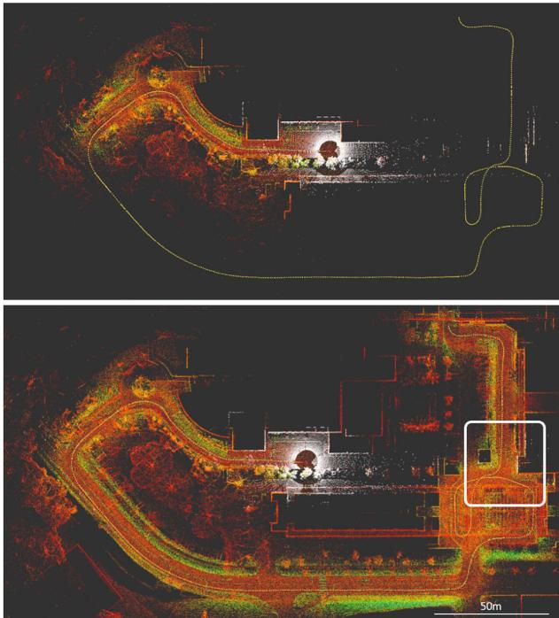  
Fig. 1. While a local map (top) helps keep computation bounded, it limits the association only to recent marginalized features, which gives chance to estimation drift relative to the initial state. In contrast, with a global map, we can achieve early association with the earliest features (white box) and reinforce global consistency.

On the mapping side, the update and query processes require special attention. In most conventional systems, a k-d tree structure is built to accelerate the k-NN querying process. However, as the map grows, recomputing the k-d tree on the global map is intractable. One strategy to avoid this issue is to organize the maps into keyframes and build a local map with bounded size from a finite number of nearest keyframes [3], [4], [5], [7], [14]. However this strategy is sub-optimal since there are cases where the local map misses important prior observations that were captured in previous keyframes (an example is given in Fig. 1).

To maintain efficient queries on a single global map, in [9], Xu et al. proposes the ikd-Tree framework, which can incrementally update the k-d tree of the map without recomputing the distances from scratch. Hence, Bai et al. proposed a new structure called iVox [17] that can achieve 5 ms map update time with 32-channel lidar pointcloud input. In [18], Yuan et al. proposed a structure called VoxelMap that contains coarse-to-fine voxels adaptively created based on the statistics of the points inside. We note that the aforementioned map structures are still based on a point-centric paradigm. In contrast, in this letter we propose a generalized incremental tree of surfels, based on the UFOMap framework [19].

The contributions in our work can be listed as follows:

\- A full-fledged Lidar-Inertial Odometry and Mapping framework with frontend odometry, loop closure and global pose-graph optimization, capable of integrating multiple lidar inputs.

\- A multi-scale point-to-surfel (PTS) association strategy and contiuous-time optimization of PTS and IMU preintegration factors on a sliding window.

\- An implementation of a hierarchical multi-scale surfel map based on the UFOMap framework, enabling incremental update and efficient query of the global map.

\- Extensive experiments on public and in-house datasets to validate the results and effects of the multi-scale surfel association strategy.

\- We release the source code and the datasets for the benefit of the community.

Henceforth, we refer to our method as SLICT (Surfel-based Lidar-Inertial Continous-Time Odometry and Mapping) for short. The remaining of the letter is as follows: Section II provides some preliminary definitions for our problems, where Section II-D details the surfel tree and its implementation on the UFOMap. Section III describes in details the operation of the main blocks in our system. Section IV describes our experiments on public and in-house datasets. Section V concludes our work and provides comments for future extension.

## II. PRELIMINARY

## A. Notation

In this letter for a vector $ { \mathbf { p } } \in \mathbb { R } ^ { 3 } ,  { \mathbf { p } } ^ { \top }$ denotes its transpose, and $\lfloor \mathbf { p } \rfloor _ { \times }$ denotes the skew-symmetric matrix of p. For a physical quantity p, we use the hat notation pˆ to denote the optimizationbased estimate of p. Similarly, the breve notation p˘ is used to refer to an IMU-propogated estimate of p. To avoid convoluting definitions, we may refer to pˆ, p˘ without first formally defining p.

The robot orientation can be represented by the rotation matrix, denoted as R, or quaternion q. The two representations can be used interchangeably as the conversion between them is well defined.

We reserve the left superscript for the coordinate frames of a quantity. For example, Bts f denotes a vector f whose coordinates are referenced in the robot’s body at time $t _ { s }$ . For convenience we may also write $B _ { t s } { \bf \vec { f } } \ \mathrm { a s \ } ^ { t _ { s } } { \bf f }$

## B. State Estimate

We define a sliding window spanning a time period $[ t _ { w } , t _ { k } ] .$ with M time instances $( t _ { w } , t _ { k }$ included). Each $t _ { m }$ is associated with a state estimate $\hat { \mathcal { X } } _ { m }$ defined as follows:

$$
\begin{array} { r } { \hat { \mathscr X } _ { m } = ( \hat { \mathbf { R } } _ { m } , \hat { \mathbf { p } } _ { m } , \hat { \mathbf { v } } _ { m } , \hat { \mathbf { b } } _ { g m } , \hat { \mathbf { b } } _ { a m } ) \in \mathrm { S O } ( 3 ) \times { \mathbb R } ^ { 1 2 } , } \end{array}\tag{1}
$$

where $\hat { \mathbf { R } } _ { m } \in \mathrm { S O } ( 3 ) , \hat { \mathbf { p } } _ { m } , \hat { \mathbf { v } } _ { m } \in \mathbb { R } ^ { 3 }$ are respectively the state estimates of the rotation matrix, position and velocity of the robot, and $\hat { \mathbf { b } } _ { g m } \in \mathbb { R } ^ { 3 } , \hat { \mathbf { b } } _ { a m } \in \mathbb { R } ^ { 3 }$ are the IMU gyroscope and accelerometer biases.

## C. Continuous-Time MAP Optimization

The core of our system lies in solving the MAP optimization problem with the following cost function:

$$
\begin{array} { l } { \displaystyle f ( \hat { \boldsymbol { \mathcal { X } } } ) = \sum _ { m = w } ^ { k - 1 } \left\| r _ { \mathcal { Z } } ( \mathcal { Z } _ { m } , \hat { \mathcal { X } } _ { m } , \hat { \mathcal { X } } _ { m + 1 } ) \right\| _ { \Sigma _ { \boldsymbol { \mathcal { T } } } } ^ { 2 } } \\ { \displaystyle \quad + \sum _ { m = w } ^ { k - 1 } \sum _ { \boldsymbol { \mathcal { L } } \in A _ { m } } \left\| r _ { \mathcal { L } } ( \mathcal { L } ( { \boldsymbol { \mathcal { L } } } ^ { ( B _ { t s } } \mathbf { f } , \mathbf { n } , { \boldsymbol { \mu } } , s ) , \hat { \mathcal { X } } _ { m } , \hat { \mathcal { X } } _ { m + 1 } ) \right\| _ { \Sigma _ { \boldsymbol { \mathcal { L } } } } ^ { 2 } , } \end{array}\tag{2}
$$

where:

$r _ { \mathcal { T } }$ is the cost factor of the preintegration $\mathcal { I } _ { m }$ constructed from the IMU samples in the interval $[ t _ { m } , t _ { m + 1 } ]$ , and $\Sigma _ { \mathcal { T } }$ is the corresponding covariance matrix;

$r _ { \mathcal { L } }$ denotes a lidar PTS factor based on a tuple of PTS association coefficients $\mathcal { L } ( ^ { B _ { t s } } \mathbf { f } , \mathbf { n } , \mu , s )$ , and $\Sigma _ { \mathcal { L } } .$ , a covariance, which is scalar in this case;

$\mathbf { n } , \mu$ are the normal and mean of the underlying associated surfel (Section II-D1), and s is the normalized time stamp of raw lidar point $B _ { t _ { s } } \mathbf { f }$ , which is defined in (3).

\- Finally $A _ { m }$ denotes the set of successful PTS associations in $[ t _ { m } , t _ { m + 1 } ]$ (more details are given in III-D).

It should be noted that each point $\breve { B } _ { t s } \mathbf { f }$ can be associated with multiple surfels at different scales, as long as the surfel satisfies the association predicates in Section III-D.

We refer to our method as continuous-time LIOM based on the use ofcontinuous-time factor $r _ { \mathcal { L } } ( \mathcal { L } ( ^ { B _ { t s } } { \bf f } ) , \hat { \mathcal { X } } _ { m } , \hat { \mathcal { X } } _ { m + 1 } )$ , which is based on raw lidar point $B _ { t s } \mathbf { f } .$ . Specifically, the observation $B _ { t s } \mathbf { f }$ is coupled with an intermediary state $\hat { \mathcal { X } } _ { t _ { s } } \triangleq ( \hat { \mathbf { R } } _ { t _ { s } } , \hat { \mathbf { p } } _ { t _ { s } } )$ defined as a linear interpolation of $\hat { \mathcal { X } } _ { m } , \hat { \mathcal { X } } _ { m + 1 } ;$

$$
\begin{array} { r l } & { \hat { \bf R } _ { s } = \hat { \bf R } _ { m } \mathrm { E x p } \left( s \hat { \phi } _ { m } \right) , \hat { \bf p } _ { s } = ( 1 - s ) \hat { \bf p } _ { m } + s \hat { \bf p } _ { m + 1 } , } \\ & { \hat { \phi } _ { m } \triangleq \mathrm { L o g } ( \hat { \bf R } _ { m } ^ { - 1 } \hat { \bf R } _ { m + 1 } ) , s \triangleq \frac { t _ { s } - t _ { m } } { t _ { m + 1 } - t _ { m } } . } \end{array}\tag{3}
$$

This categorization of continuous-time LIOM based on raw pointcloud is consistent with previous works, which may use linear interpolation [20], [21], or B-Spline interpolation [7], [14]. In contrast, discrete-time methods use the deskewed point $\bar { B } _ { t _ { m } } \mathbf { \bar { f } }$ based on IMU-propagated states [3], [4], [22].

## D. Surfel and UFOMap

1) Surfel’s Attributes: A node i in the octree-based UFOMap corresponds to a voxel, and the node’s depth indicates the voxel’s scale. For leaf nodes, they are assigned depth 0, its parent has depth 1, and so forth. Fig. 2 illustrates the hierarchical relationship of the surfels/voxels on an octree at different scales. A surfel at node i in the UFOMap is defined by the set of points contained within the voxel, denoted as $\mathcal { V } _ { i } = \{ \mathbf { f } _ { 1 } , \dots \mathbf { f } _ { N _ { i } } \}$ , and has the following attributes:

$$
N _ { i } = | \mathcal { V } _ { i } | , \ \mathbf { S } _ { i } \triangleq \sum _ { k = 1 } ^ { N _ { i } } \mathbf { f } _ { k } , \ \mathbf { C } _ { i } \triangleq \sum _ { k = 1 } ^ { N _ { i } } \mathbf { f } _ { k } \mathbf { f } _ { k } ^ { \intercal } - \frac { 1 } { N _ { i } } \mathbf { S } _ { i } \mathbf { S } _ { i } ^ { \intercal } .\tag{4}
$$

Each surfel in UFOMap stores the values $N _ { i } , \mathbf { S } _ { i } , \mathbf { C } _ { i }$ . Given these attributes, we can quickly compute the mean $\mu _ { i }$ and

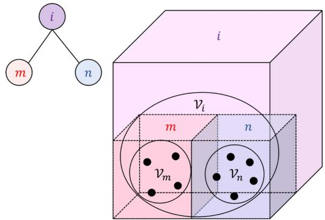  
Fig. 2. Illustration of surfel and the tree-like structure: A voxel i contains a set of points $\nu _ { i } .$ , which (in this example) contains two subsets $\nu _ { m } , \nu _ { n }$ , encapsulating the points in the voxels m, n at smaller scales. Each of the sets $\nu _ { i } , \nu _ { m } , \bar { \nu } _ { n }$ define a surfel whose attributes are described in Section II-D1. As $\mathcal { V } _ { m } \subset \mathcal { V } _ { i } , \mathcal { V } _ { n } \subset \mathcal { V } _ { i } .$ there is a hierarchical relationship between the surfels, which we propose to organize in an octree implemented by the UFOMap framework.

covariance $\Gamma _ { i }$ of $\nu _ { i } .$ , along with other quantities as follows:

$$
\begin{array} { r l } & { \mu _ { i } \triangleq \cfrac { 1 } { N _ { i } } \mathbf { S } _ { i } , \Gamma _ { i } \triangleq \cfrac { 1 } { N _ { i } - 1 } \mathbf { C } _ { i } , \lambda _ { 0 } \leq \lambda _ { 1 } \leq \lambda _ { 2 } , } \\ & { \rho _ { i } = 2 \cfrac { \lambda _ { 1 } - \lambda _ { 0 } } { \lambda _ { 0 } + \lambda _ { 1 } + \lambda _ { 2 } } , \mathbf { n } _ { i } \triangleq \nu _ { 0 } , c _ { i } \triangleq - \nu _ { 0 } ^ { \top } \mu _ { i } . } \end{array}
$$

where $\mu _ { i }$ is the mean, $\Gamma _ { i }$ is the covariance with the eigenvalues $\lambda _ { 0 } , \lambda _ { 1 } , \lambda _ { 2 }$ and $\mathbf { n } _ { i } = \nu _ { 0 }$ is the normalized eigenvector associated with $\lambda _ { 0 } ; \rho _ { i }$ is the so-calledplanarity value, i.e. the plane-likeness metric of the surfel.

Besides the aforementioned attributes, the depth and scale of the voxel node are also frequently queried. To initialize a surfel map in the UFOMap framework, we assign a leaf node size, denoted $\ell ,$ for the voxels at the smallest scale, i.e., at depth 0. The scale of a voxel at depth D is therefore $2 ^ { D } \ell$

2) Surfel Addition: Assuming that a parent node i has two children m and $n ,$ , the surfel attributes of i can be calculated via Welford’s formula [23]:

$$
\begin{array} { r l } & { \alpha : = 1 / \left[ N _ { m } N _ { n } ( N _ { m } + N _ { n } ) \right] , \ : \beta : = N _ { n } \mathbf { S } _ { m } - N _ { m } \mathbf { S } _ { n } , } \\ & { \mathbf { C } _ { i } \gets \mathbf { C } _ { m } + \mathbf { C } _ { n } + \alpha \beta \boldsymbol { \beta } ^ { \top } , } \\ & { N _ { i } \gets N _ { m } + N _ { n } , \ : \mathbf { S } _ { i } \gets \mathbf { S } _ { m } + \mathbf { S } _ { n } , } \end{array}\tag{5}
$$

The above can be iterated for parent nodes with more than two children.

For single point update, i.e. the update at the leaf nodes when new pointcloud is added to the UFOMap, we can still use (5) by noticing that when ${ \cal N } _ { n } = 1 , { \bf C } _ { n } = 0$

## III. SYSTEM DESCRIPTION

Fig. 3 provides an overview of our system. In the next subsections we describe in details each numbered block.

## A. Synchronization

Synchronization is a prerequisite to optimization based estimation methods. In this section we will describe our synchronization scheme in details. To better understand the method, please refer to Fig. 4 for the illustrations of the concepts introduced in this section.

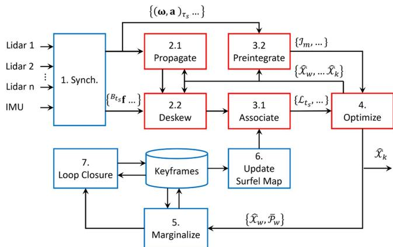  
Fig. 3. The general workflow of the system. More details are given in Sections III-A–III-I.

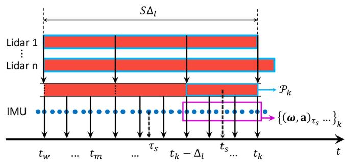  
Fig. 4. Synchronization scheme on the sliding window. Detailed description is given in Section III-A.

The sliding window’s progression is based on the end time of lidar messages from a so-called primary lidar. Thus, the end time $t _ { k }$ of the sliding window is also the end time of the latest scan from the primary lidar. Given $\Delta _ { l }$ as the sweeping period of the primary lidar (typically 0.1 s), we create a so-called window size parameter, denoted S, for the number of lidar scans that the sliding window spans across. Hence, $t _ { k } - t _ { w } = S \Delta _ { l }$ , where $[ t _ { w } , t _ { k } ]$ is the time period of the sliding window introduced in Section II-B.

The messages from each lidar are stored in an ordered buffer such that data from each lidar can be treated as a continuous stream. As the window shifts from period $[ t _ { w } - \Delta _ { l } , t _ { k } - \Delta _ { l } ]$ to $[ t _ { w } , t _ { k } ]$ , we extract data points from all the lidar streams in the period $\left[ t _ { k } - \Delta _ { l } , t _ { k } \right)$ and merge them into a unified pointcloud $\mathcal { P } _ { k }$ . When a new lidar pointcloud is admitted to the sliding window, we also add one or more state estimates to the sliding window. Thus the number of pointclouds can be smaller than the number of state estimates, which is different from our previous work MILIOM [4]. The addition ofmore than one state estimates per newly added pointcloud is to better capture the dynamics of the motion during the scan period $\Delta _ { l }$ [24]. In practice we add 2 to 8 new state estimates to the sliding window, depending on the frequency of the IMU.

Similar to lidar, IMU samples are also stored in a buffer, and when the window slides forward for $\Delta _ { l }$ seconds, the IMU samples in the periods $[ t _ { k } - \Delta _ { l } , t _ { k } ]$ are also extracted and put onto the sliding window. Note that two interpolated IMU samples at the ends of each closed interval $[ t _ { m } , t _ { m + 1 } ]$ are also included. These IMU samples are used for propagation and preintegration processes in Sections III-B and III-E.

## B. IMU Propagation

Given the IMU samples $\{ ( \omega , \mathbf { a } ) _ { \tau _ { i } } , \dots \} , \tau _ { i } \in [ t _ { m } , t _ { m + 1 } ]$ , and the starting state $\hat { \mathscr { X } } _ { m } : = \breve { \mathscr { X } } _ { m } :$ , we can forward propagate the robot state to $\breve { \mathscr { X } } _ { m + 1 } .$ or backward propagate from $\hat { \mathcal { X } } _ { m + 1 }$ to $\breve { \mathscr { X } } _ { m } . \mathrm { A }$ fter this process we have a sequence of IMU-propagated states $\{ \breve { \mathcal { X } } _ { \tau _ { i } } \cdot \cdot \cdot \} , \tau _ { i } \in [ t _ { m } , t _ { m + 1 } ]$ ]. This sequence can be used to initialize the new state estimate added to the sliding window, or to reduce the motion-induced distortion of the pointcloud. We explain this so-called deskew process in the next part.

## C. Deskew (Motion Compensation)

For each lidar point $B _ { t s } \mathbf { f } , t _ { s } \in [ t _ { m } , t _ { m + 1 } ]$ we seek to transform its coordinate to the body frame at time $t _ { m + 1 }$ . To this end, we search for the two IMU-propagated poses closest to $t _ { s }$ , i.e. $\breve { \mathbf { T } } _ { \tau _ { a } } , \breve { \mathbf { T } } _ { \tau _ { b } }$ , where $\tau _ { a } \le t _ { s } \le \tau _ { b }$ , and find the linearly interpolated pose $\breve { \mathbf { T } } _ { t _ { s } }$

$$
\check { \mathbf { T } } _ { t _ { s } } = \left[ \begin{array} { c c } { \mathrm { s l e r p } ( \check { \mathbf { R } } _ { \tau _ { a } } , \check { \mathbf { R } } _ { \tau _ { b } } , u ) } & { ( 1 - u ) \mathbf { p } _ { \tau _ { a } } + u \mathbf { p } _ { \tau _ { b } } } \\ { 0 } & { 1 } \end{array} \right] ,\tag{6}
$$

where $u \triangleq ( t _ { s } - \tau _ { a } ) / ( \tau _ { b } - \tau _ { a } )$ and slerp() denotes the spherical linear interpolation operation on $\mathrm { S O ( 3 ) }$

Given $\breve { \mathbf { T } } _ { t _ { s } }$ , we can transform $B _ { t s } \mathbf { f }$ to the world frame by $\begin{array} { r } { { \cal W } } \mathbf { f } = \breve { { \mathbf { R } } } _ { t _ { s } } B _ { t _ { s } } \mathbf { f } + \hat { { \mathbf { p } } } _ { t _ { s } }  \end{array}$ . Hence we proceed to associating these lidar points with the surfel map.

## D. Point-to-Surfel Association

The association consists of two stages. In the first stage, for each deskewed lidar point $W _ { \mathbf { f } }$ we find all the nodes $\nu _ { i }$ matching the following predicates in the surfel map:

\- The voxel depth is between 1 and $D _ { \mathrm { m a x } }$ (the leaf nodes are ignored as the input pointcloud is downsampled with a spatial spacing of ).

$N _ { i } \geq N _ { \operatorname* { m i n } }$ and $\rho _ { i } > \rho _ { \mathrm { m i n } }$ , i.e. $\nu _ { i }$ should have at least $N _ { \mathrm { m i n } }$ points and the planarity is sufficiently large.

\- The voxel’s cube intersects with a sphere of radius $r > 0$ centered at $W \mathbf { f }$ , where r is a user-defined parameter.

If a surfel $\nu _ { i }$ passes all of the aforementioned predicates, we can associate it with the point $W _ { \mathbf { f } }$ . The associated surfels are organized into groups by their depths. For each point $W _ { \mathbf { f } } .$ starting from the group with smallest depth (smallest scale), we find the surfel $\nu _ { i }$ with the shortest distance to $W \mathbf { f }$ in that group, i.e. $d _ { i } = \mathbf { n } _ { i } ^ { \top } ( ^ { W } \mathbf { f } - \mu _ { i } )$ ). If $d _ { i } < d _ { \operatorname* { m a x } }$ , a tuple of PTS coefficients $\mathcal { L } = ( ^ { t _ { s } } \mathbf { f } , \mathbf { n } _ { i } , \mu _ { i } , s )$ (s defined in (3)) will be added to the set of successful association $A _ { m }$ (defined in (2)), and the surfels at higher scales are ignored. If no suitable surfel is found at one scale, we proceed to check on the next scale. Note that the association is done on the deskewed point $W \mathbf { f } .$ , but the factor is based on the original raw point $t _ { s } \mathbf { f } .$ Given ${ \mathcal { L } } ,$ the cost factor $r _ { \mathcal { L } }$ in (2) can be constructed using the point-to-plane relationship:

$$
r _ { \mathcal { L } } = \mathbf { n } ^ { \top } ( \hat { \mathbf { R } } _ { t _ { s } } { } ^ { t _ { s } } \mathbf { f } + \hat { \mathbf { p } } _ { t _ { s } } - \boldsymbol { \mu } ) ,\tag{7}
$$

where $( \hat { \mathbf { R } } _ { t _ { s } } , \hat { \mathbf { p } } _ { t _ { s } } )$ is the linearly interpolated pose in (3).

## E. IMU Preintegration

We refer to our previous work [4], [25] for the detailed formulation of the IMU-preintegration observation $\mathcal { I } _ { m }$ , the factors $r _ { \mathcal { T } }$ and its Jacobian in optimization-based estimation.

## F. Optimization

Once all of the PTS coefficients and IMU preintegrations have been prepared, we proceed to construct and optimize the cost function (2) using the ceres solver [26]. It should be noted that the steps described in Sections III-B to III-F (red boxes in Fig. 3) can be done iteratively.

## G. Marginalization

After each optimization step, we check if the earliest pose estimate $\hat { \mathbf { T } } _ { w }$ can be marginalized to become a keyframe. To this end, we search for five nearest neighbours of $\hat { \mathbf { T } } _ { w }$ among the existing keyframes. If the Euclidean distance or rotational distance of $\hat { \mathbf { T } } _ { w }$ to all of its neighbours exceeds a threshold, its associated deskewed pointcloud will be inserted to the surfel map. We also marginalize $\hat { \mathbf { T } } _ { w }$ and store its deskewed pointcloud in the buffer to be reused in case of loop closure.

## H. Updating the Surfel Map

When a new keyframe is admitted to the buffer, we also update the surfel map using the procedure that was introduced in Section II-D2.

## I. Loop Closure

When a new keyframe $\hat { \mathbf { T } } _ { c }$ is admitted to the buffer, we will find $K$ nearest keyframes of $\hat { \mathbf { T } } _ { c } .$ If the time stamp of one keyframe $\hat { \mathbf { T } } _ { p }$ and $\hat { \mathbf { T } } _ { m }$ differs by a certain amount, it signals the return to a previously explored area. We use the ICP to calculate the relative pose ${ } ^ { p } \bar { \mathbf { T } } _ { c }$ between the two keyframes and store this in a buffer T . When a new loop is admitted, we optimize the pose graph with this loop prior:

$$
\begin{array} { r } { \displaystyle \operatorname* { m i n } _ { \hat { \mathbf { T } } _ { 0 } , . . . \hat { \mathbf { T } } _ { c } } \sum _ { k = 0 } ^ { K - 1 } \left\| r _ { 1 } \left( { } ^ { k } \bar { \mathbf { T } } _ { k + 1 } , \hat { \mathbf { T } } _ { k } ^ { - 1 } \hat { \mathbf { T } } _ { k + 1 } \right) \right\| _ { \Sigma _ { 1 } } ^ { 2 } } \\ { + \sum _ { p \bar { \mathbf { T } } _ { c } \in \mathcal { T } } \left\| r _ { 2 } \left( { } ^ { p } \bar { \mathbf { T } } _ { c } , \hat { \mathbf { T } } _ { p } ^ { - 1 } \hat { \mathbf { T } } _ { c } \right) \right\| _ { \Sigma _ { 2 } } ^ { 2 } , } \end{array}\tag{8}
$$

where ${ } ^ { k } \bar { \mathbf T } _ { k + 1 } , { } ^ { p } \bar { \mathbf T } _ { * }$ are the relative pose priors, and $\tau$ is the set of relative poses detected. After the pose graph optimization, the global map will be recomputed.

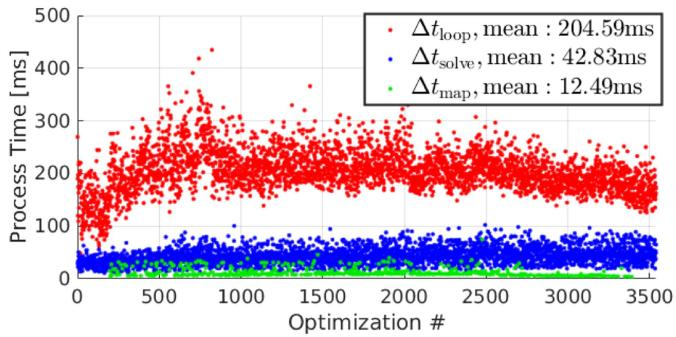  
Fig. 5. Process time of SLICT in NTU VIRAL rtp\_03.

## IV. EXPERIMENTS

We demonstrate the performance of SLICT via three data suites: NTU VIRAL [27], Newer College [28] and our in-house datasets, which respectively capture operations at different scales. We compare our methods with four other state-of-the-art (SOTA) methods. First is MARS [14], which stands for Multi-Adaptive-Resolution-Surfel with B-spline-based continuoustime optimization. Second is LIO-SAM [3], which uses conventional plane-edge feature and IMU preintegration factors, optimized by the Georgia Tech Smoothing and Mapping framework [29]. Third is VoxelMap [18], which features a probabilistic adaptive voxel mapping strategy. Fourth is FAST-LIO2, which uses the direct method for feature association and the ikd-Tree global mapping scheme. Video recording of some experiments can be viewed at the github page of SLICT.

## A. NTU VIRAL Datasets

The NTU VIRAL is a multi-lidar dataset collected from an Unmanned Aerial Vehicle (UAV), with ground truth of centimeter-level accuracy obtained from a laser-tracker total station. The environments consist of indoor and outdoor spaces within a volume of 50 m radius.

For all experiments, we merge the data from the so-called horizontal and vertical lidars in the NTU VIRAL dataset and use them as the input of all methods. All experiments are run on the same computer with a Core i7-12700KF CPU. The metric used in this case is the Absolute Trajectory Error (ATE).

In these experiments we do not enable the loop closure function of SLICT and only compare the odometry result. We set sensor’s parameters such as number of lines, minimum distance, IMU noises, etc, according to the dataset’s meta data, while other parameters are kept as default. For SLICT, we choose a sliding window of 400 ms with 16 intervals, which encompass 4 pointclouds with 4 state estimates each.

Table I reports the result of our experiments. SLICT has the highest accuracy in the most experiments, and FAST-LIO2 has the most second best results. MARS, LIO-SAM and VoxelMap diverge in some of the experiments.

We analyze the computational load of SLICT in the NTU VIRAL rtp\_02 sequence in Fig. 5. On average, it takes 205 ms to complete one cycle of the algorithm $( \Delta t _ { \mathrm { l o o p } } .$ , defined as the time from one optimization operation to another), in which solving the optimization problem takes about 43 ms $( \Delta t _ { \mathrm { s o l v e } } )$ , and the rest is for deskew, association, and keyframe marginalization. When a new keyframe is created, the time to update the global map $( \Delta t _ { \mathrm { m a p } } )$ is 13 ms on average. Since lidar input is acquired at 100 ms, currently real-time performance is not guaranteed by SLICT. Because we associate the points with surfels at five scales (from $2 ^ { 1 } \ell$ to $2 ^ { 5 } \ell ,$ where $\ell = 0 . 1 m )$ , the computation load for association is at least a multitude that of direct method, which uses only one voxel scale. However, we think it is justifiable considering that SLICT gives higher accuracy, and real-time performance can be achieved by using a CPU that supports more threads.

TABLE I  
ATE OF SLICT COMPARED WITH OTHER METHODS ON NTU VIRAL DATASETS (UNIT [M]). THE BEST RESULTS ARE IN BOLD, SECOND BEST ARE UNDERLINED. ‘X’ DENOTES DIVERGENCE
<table><tr><td>Dataset</td><td>MARS</td><td>LIO- SAM</td><td>Voxel- Map</td><td>FAST- LIO2</td><td>SLICT</td></tr><tr><td>eee_01</td><td>0.2471</td><td>0.0624</td><td>0.0699</td><td>0.0585</td><td>0.0316</td></tr><tr><td>eee_02</td><td>0.1033</td><td>0.0457</td><td>0.0506</td><td>0.0318</td><td>0.0249</td></tr><tr><td>eee_03</td><td>0.0927</td><td>0.0403</td><td>0.0631</td><td>0.0351</td><td>0.0275</td></tr><tr><td>nya_01</td><td>0.0555</td><td>2.0960</td><td>0.0508</td><td>0.0305</td><td>0.0229</td></tr><tr><td>nya_02</td><td>0.0624</td><td>X</td><td>0.0425</td><td>0.0286</td><td>0.0227</td></tr><tr><td>nya_03</td><td>0.0831</td><td>0.0468</td><td>0.0494</td><td>0.0315</td><td>0.0260</td></tr><tr><td>sbs_01</td><td>0.1370</td><td>0.0444</td><td>0.0535</td><td>0.0324</td><td>0.0298</td></tr><tr><td>sbs_02</td><td>0.1256</td><td>0.0461</td><td>0.0525</td><td>0.0322</td><td>0.0291</td></tr><tr><td>sbs_03</td><td>0.1588</td><td>0.0494</td><td>0.0498</td><td>0.0428</td><td>0.0335</td></tr><tr><td>rtp_01</td><td>X</td><td>0.2571</td><td>9.7416</td><td>0.0494</td><td>0.0447</td></tr><tr><td>rtp_02</td><td>0.2329</td><td>0.1091</td><td>2.4479</td><td>0.1151</td><td>0.0466</td></tr><tr><td>rtp_03</td><td>0.1377</td><td>0.0576</td><td>0.0792</td><td>0.0543</td><td>0.0501</td></tr><tr><td>tnp_01</td><td>0.0734</td><td>X</td><td>0.0326</td><td>0.0432</td><td>0.0287</td></tr><tr><td>tnp_02</td><td>0.0681</td><td>0.0330</td><td>0.0247</td><td>0.0590</td><td>0.0201</td></tr><tr><td>tnp_03</td><td>0.0665</td><td>0.0283</td><td>0.0331</td><td>0.0468</td><td>0.0383</td></tr><tr><td>spms_01</td><td>X</td><td>0.1620</td><td>11.3792</td><td>0.0686</td><td>0.0610</td></tr><tr><td>spms_02</td><td>X</td><td>0.6641</td><td>X</td><td>0.0821</td><td>0.1000</td></tr><tr><td>spms_03</td><td>19.8650</td><td>1.0071</td><td>X</td><td>0.0603</td><td>0.0661</td></tr></table>

## B. Newer College Dataset

The Newer College Dataset consists of five sequences collected at New College, Oxford, featuring an Ouster lidar with 64 channels, 90-degree vertical field-of-view, and a built-in 100 Hz IMU. The ground truth is obtained from ICP-based registration of lidar scan with a centimeter-resolution map captured by a 3D scanner. The environment captured in the dataset features two open squares and an open park over an area of roughly 200 m × 100 m, which is several times larger than those in NTU VIRAL sequences, thus localization drift can be observed more easily.

The settings are similar to that in the NTU VIRAL dataset, however for SLICT we assign 2 state estimates for each interval since the built-in IMU of the Ouster lidar has a frequency of only 100 Hz. Note that LIO-SAM does not work in this case as it requires orientation estimate from the IMU.

In Table II, we report the ATE of the results. Again, it shows that SLICT has the best results in the most experiments, followed closely by FAST-LIO2. MARS’s ATE in sequence 01, 02, 05 is similar to the reported result in [14]. As the Newer College sequences 01, 02 and 07 traverse a significantly larger area than the NTU VIRAL dataset, the ATE increases more visibly compared to the NTU VIRAL experiments. Fig. 6 shows the localization error over time of different methods in sequence 01.

TABLE II  
ATE OF SLICT AND OTHER METHODS ON NEWER COLLEGE DATASET (UNIT [M]). THE BEST RESULTS ARE IN BOLD, SECOND BEST ARE UNDERLINED. ‘X DEMOTES A DIVERGENT EXPERIMENT
<table><tr><td>Dataset</td><td>MARS</td><td>LIO- SAM</td><td>Voxel- Map</td><td>FAST- LIO2</td><td>SLICT</td></tr><tr><td>01_short_exp</td><td>2.1521</td><td>=</td><td>X</td><td>0.3883</td><td>0.3843</td></tr><tr><td>02_long_exp</td><td>6.0030</td><td></td><td>X</td><td>0.3659</td><td>0.3496</td></tr><tr><td>05_quad_dynamics</td><td>0.3729</td><td></td><td>17.0007</td><td>0.3443</td><td>0.1155</td></tr><tr><td>06_dynamic_spin</td><td>X</td><td></td><td>19.9993</td><td>0.0800</td><td>0.0844</td></tr><tr><td>07_parkland</td><td>X</td><td></td><td>X</td><td>0.1356</td><td>0.1290</td></tr></table>

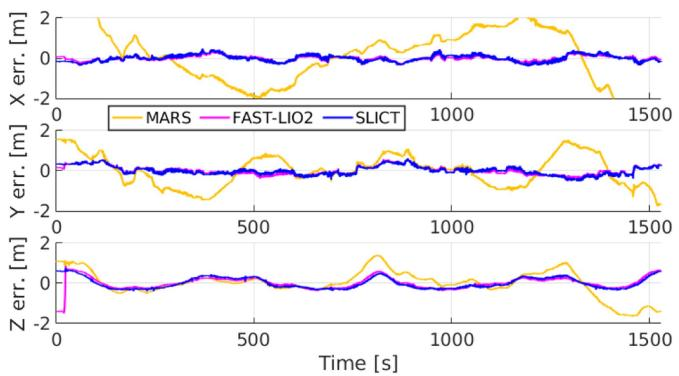  
Fig. 6. Estimation error over time ofthe methods in the Newer College Dataset, sequence 01. We find that the error is most significant in the z direction due to the subtle changes in elevation of the area.

## C. In-House Dataset

The in-house datasets are collected from a sensor suite consisting of an OS1-128 Lidar, an Livox Mid-70, together with a VectorNav100 IMU. The sensors are mounted on an All-Terrain-Vehicle (ATV) that travels around 1.5 km loop at the southern part of Nanyang Technical University (NTU) Campus. This covers an area of about 400 m × 200 m, which is about four times the area of the Newer College dataset. At this scale, the effect of a loop closure module can become more appreciable, thus we add new experiments of SLICT with loop closure and pose-graph optimization functions.

The ground truth of the dataset is constructed in a similar manner to the Newer College Dataset. Specifically, we first build a static map of the environment using the survey scanner Leica RTC360 with centimeter accuracy. We then register the ouster lidar scans with this static map to obtain the ground truth pose at the lidar frequency.

Three sequences are captured. In sequence 1, we traverse the main routes of the environments. In sequence 2, we increase the traversed distance by revisiting some ofthe routes. In sequence 3, we travel back and forth on the Nanyang Link route to maximize the loop closure incidents. Fig. 7 provides an overview of the routes taken.

Similar to previous experiments, we directly merge the lidar sensors into a single input and use it for all methods. Table III presents the ATE of the tested methods. Due to the high-speed of the ATV (up to 30 km/h), MARS diverges in all three experiments, hence is not included in Table III, and LIO SAM diverges in the last experiment. Without loop closure, SLICT still has the best accuracy, and the loop closure improves the accuracy even further. We also added result of LIO-SAM with loop closure for comparison.

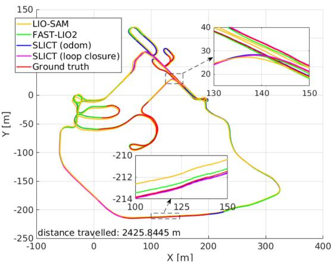  
(a) Sequence 2

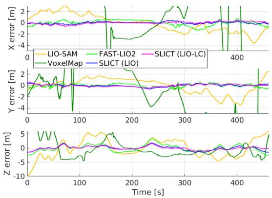  
(b) Localization error in sequence 2  
Fig. 7. Localization estimates and its error in sequence 2 of the in-house dataset. The zoomed-in plots show the narrow path in the dense-vegetation section (sequences 01 and 02), and the main junction (sequence 03). The elevation difference between these two points are about 13 m.

TABLE III  
ATE OF SLICT AND OTHER METHODS ON IN-HOUSE DATASET (UNIT [M]). THE BEST RESULTS ARE IN BOLD, SECOND BEST ARE UNDERLINED. ‘X DEMOTES A DIVERGENT EXPERIMENT. LC DENOTES EXPERIMENTS WITH LOOP-CLOSURE AND POSE-GRAPH OPTIMIZATION
<table><tr><td>Dataset</td><td>LIO- SAM</td><td>Voxel- Map</td><td>FAST- LIO2</td><td>SLICT</td><td>LIO- SAM (LC)</td><td>SLICT (LC)</td></tr><tr><td>seq_01</td><td>4.0678</td><td>7.8550</td><td>1.7658</td><td>1.0778</td><td>1.2931</td><td>0.7437</td></tr><tr><td>seq_02</td><td>3.8518</td><td>X</td><td>1.2244</td><td>0.7372</td><td>0.9685</td><td>0.5401</td></tr><tr><td>seq_03</td><td>X</td><td>9.5255</td><td>1.1653</td><td>0.5789</td><td>X</td><td>0.6226</td></tr></table>

Since the change in elevation of the environment is significant (up to 15 m between the highest and lowest points) the localization error is also significant, most visibly in the z dimension (Fig. 7(b)). Compared to the Newer College dataset in Fig. 6, we can see that the error in z direction is now almost doubled, which is the main contribution to the ATE in Table III. In Fig. 8, we present some views of the global map built by SLICT in sequence 2.

## D. Effect of the Maximum Association Depth

To better study the effect of the multi-scale association, we run SLICT with the in-house datasets at different maximum surfel depth $D _ { \mathrm { m a x } }$ (Section III-D). Fig. 9 reports the ATE of these experiments with $D _ { \mathrm { m a x } }$ ranging from 2 to 9. It can be seen that the ATE decreases until $D _ { \mathrm { m a x } } = 5$ and varies little for $D _ { \mathrm { m a x } } > 5$ As $\ell = 0 . 0 5 \mathrm { m }$ , this means that the maximum voxel scale that can be associated is about $2 ^ { D _ { \mathrm { m a x } } } \ell = 1 . 6 \mathrm { m }$ . This confirms the benefit of a multi-scale association approach.

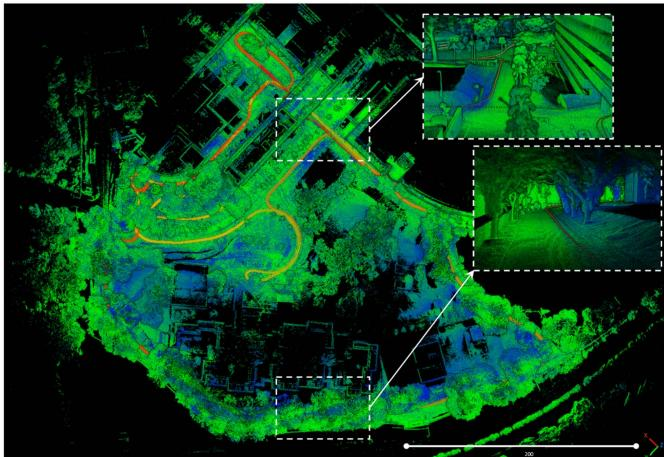

Fig. 8. The global map built by SLICT from one experiment. The zoom-in figures show the junction and area with dense vegetation in Fig. 7.  
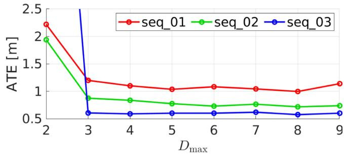  
Fig. 9. Change in ATE ofSLICT on the in-house datasets across the maximum depth settings.

## E. Effect of the Number of State Estimates

We also study the effect of the number of state estimates per scan. Fig. 10 shows the ATE of SLICT on the in-house datasets with the number of state estimates per scan. We find that the optimal number of states for each $\Delta _ { l }$ period is around 3 or 4 for the 400 Hz IMU (VectorNav100). However 4 is a sufficiently good choice for both the NTU VIRAL and in-house datasets. This confirms the benefits of having more than one state estimates for each lidar scan.

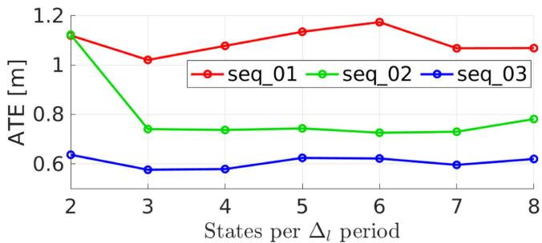  
Fig. 10. Change in ATE of SLICT on the in-house datasets across different choices for number of states per scan.

## V. CONCLUSION

In this letter we propose a full-fledged multi-input Lidar-Inertial Odometry and Mapping system called SLICT. SLICT features a multi-scale global map of surfels that can be updated incrementally using the UFOMap framework. We also propose a method to associate lidar point to surfel (PTS), and a continuoustime MAP optimization of PTS and IMU-preintegration factors. We demonstrate competitive performance on public datasets even without loop closure. To achieve a complete system, we added a simple yet effective loop closure mechanism and demonstrate its usefulness with our new datasets. The source code is released for the benefit of the community.

There remain many possibilities for extension of SLICT. For one, the PTS association still uses simple predicates, which can be made more efficient by some adaptive strategy. Moreover, the UFOMap framework allows one to integrate semantic information to the surfel, which has the potential to improve the association process. For the small drift, a basic loop closure mechanism sufficed, but more advanced methods can also be integrated in the future.

## REFERENCES

[1] C. Cadena et al., “Past, present, and future of simultaneous localization and mapping: Toward the robust-perception age,” IEEE Trans. Robot., vol. 32, no. 6, pp. 1309–1332, Dec. 2016.

[2] J. Zhang and S. Singh, “LOAM: Lidar odometry and mapping in real-time,” Robot.: Sci. Syst., vol. 2, no. 9, pp. 1–9, 2014.

[3] T. Shan, B. Englot, D. Meyers, W. Wang, C. Ratti, and R. Daniela, “LIO-SAM: Tightly-coupled Lidar inertial odometry via smoothing and mapping,” in Proc. IEEE/RSJ Int. Conf. Intell. Robots Syst., 2020, pp. 5135–5142.

[4] T.-M. Nguyen, S. Yuan, M. Cao, Y. Lyu, T. H. Nguyen, and L. Xie, “MILIOM: Tightly coupled multi-input Lidar-inertia odometry and mapping,” IEEE Robot. Automat. Lett., vol. 6, no. 3, pp. 5573–5580, Jul. 2021.

[5] P. Chen, W. Shi, S. Bao, M. Wang, W. Fan, and H. Xiang, “Low-drift odometry, mapping and ground segmentation using a backpack LiDAR system,” IEEE Robot. Automat. Lett., vol. 6, no. 4, pp. 7285–7292, Oct. 2021.

[6] H. Wang, C. Wang, C.-L. Chen, and L. Xie, “F-LOAM: Fast LiDAR odometry and mapping,” in Proc. IEEE/RSJ Int. Conf. Intell. Robots Syst., 2021, pp. 4390–4396.

[7] J. Lv, K. Hu, J. Xu, Y. Liu, X. Ma, and X. Zuo, “CLINS: Continuous-time trajectory estimation for LiDAR-inertial system,” in Proc. IEEE/RSJ Int. Conf. Intell. Robots Syst., 2021, pp. 6657–6663.

[8] W. Xu and F. Zhang, “FAST-LIO: A fast, robust LiDAR-inertial odometry package by tightly-coupled iterated Kalman filter,” IEEE Robot. Automat. Lett., vol. 6, no. 2, pp. 3317–3324, Apr. 2021.

[9] W. Xu, Y. Cai, D. He, J. Lin, and F. Zhang, “FAST-LIO2: Fast direct LiDAR-inertial odometry,” IEEE Trans. Robot., vol. 38, no. 4, pp. 2053–2073, Aug. 2022.

[10] J. Lin, C. Zheng, W. Xu, and F. Zhang, “R2 LIVE: A robust, real-time, LiDAR-inertial-visual tightly-coupled state estimator and mapping,” IEEE Robot. Automat. Lett., vol. 6, no. 4, pp. 7469–7476, Oct. 2021.

[11] J. Lin and F. Zhang, “R3 LIVE: A robust, real-time, RGB-colored, LiDARinertial-visual tightly-coupled state estimation and mapping package,” in Proc. Int. Conf. Robot. Automat., 2022, pp. 10672–10678.

[12] D. Wisth, M. Camurri, S. Das, and M. Fallon, “Unified multi-modal landmark tracking for tightly coupled LiDAR-visual-inertial odometry,” IEEE Robot. Automat. Lett., vol. 6, no. 2, pp. 1004–1011, Apr. 2021.

[13] D. Wisth, M. Camurri, and M. Fallon, “VILENS: Visual, inertial, LiDAR, and leg odometry for all-terrain legged robots,” IEEE Trans. Robot., vol. 39, no. 1, pp. 309–326, Feb. 2023.

[14] J. Quenzel and S. Behnke, “Real-time multi-adaptive-resolution-surfel 6D LiDAR odometry using continuous-time trajectory optimization,” in Proc. IEEE/RSJ Int. Conf. Intell. Robots Syst., 2021, pp. 5499–5506.

[15] M. Bosse, R. Zlot, and P. Flick, “Zebedee: Design of a spring-mounted 3-D range sensor with application to mobile mapping,” IEEE Trans. Robot., vol. 28, no. 5, pp. 1104–1119, Oct. 2012.

[16] M. Bosse and R. Zlot, “Continuous 3D scan-matching with a spinning 2D laser,” in Proc. IEEE Int. Conf. Robot. Automat., 2009, pp. 4312–4319.

[17] C. Bai, T. Xiao, Y. Chen, H. Wang, F. Zhang, and X. Gao, “Faster-LIO: Lightweight tightly coupled LiDAR-inertial odometry using parallel sparse incremental voxels,” IEEE Robot. Automat. Lett., vol. 7, no. 2, pp. 4861–4868, Apr. 2022.

[18] C. Yuan, W. Xu, X. Liu, X. Hong, and F. Zhang, “Efficient and probabilistic adaptive voxel mapping for accurate online lidar odometry,” IEEE Robot. Automat. Lett., vol. 7, no. 3, pp. 8518–8525, Jul. 2022.

[19] D. Duberg and P. Jensfelt, “UFOMap: An efficient probabilistic 3D mapping framework that embraces the unknown,” IEEE Robot. Automat. Lett., vol. 5, no. 4, pp. 6411–6418, Oct. 2020.

[20] C. Park, P. Moghadam, S. Kim, A. Elfes, C. Fookes, and S. Sridharan, “Elastic LiDAR fusion: Dense map-centric continuous-time SLAM,” in Proc. IEEE Int. Conf. Robot. Automat., 2018, pp. 1206–1213.

[21] P. Dellenbach, J.-E. Deschaud, B. Jacquet, and F. Goulette, “CT-ICP: Realtime elastic LiDAR odometry with loop closure,” in Proc. Int. Conf. Robot. Automat., 2022, pp. 5580–5586.

[22] H. Ye, Y. Chen, and M. Liu, “Tightly coupled 3D LiDAR inertial odometry and mapping,” in Proc. Int. Conf. Robot. Automat., 2019, pp. 3144–3150.

[23] B. Welford, “Note on a method for calculating corrected sums of squares and products,” Technometrics, vol. 4, no. 3, pp. 419–420, 1962.

[24] D. Droeschel and S. Behnke, “Efficient continuous-time SLAM for 3D LiDAR-based online mapping,” in Proc. IEEE Int. Conf. Robot. Automat., 2018, pp. 5000–5007.

[25] T.-M. Nguyen, M. Cao, S. Yuan, Y. Lyu, T. H. Nguyen, and L. Xie, “Viralfusion: A visual-inertial-ranging-LiDAR sensor fusion approach,” IEEE Trans. Robot., vol. 38, no. 2, pp. 958–977, Apr. 2022.

[26] S. Agarwal and K. Mierle, “Ceres solver: Tutorial & reference,” [Online]. Available: http://ceres-solver.org/

[27] T.-M. Nguyen, S. Yuan, M. Cao, Y. Lyu, T. H. Nguyen, and L. Xie, “NTU viral: A visual-inertial-ranging-LiDAR dataset, from an aerial vehicle viewpoint,” Int. J. Robot. Res., vol. 41, no. 3, pp. 270–280, 2022.

[28] M. Ramezani, Y. Wang, M. Camurri, D. Wisth, M. Mattamala, and M. Fallon, “The newer college dataset: Handheld LiDAR, inertial and vision with ground truth,” in Proc. IEEE/RSJ Int. Conf. Intell. Robots Syst., 2020, pp. 4353–4360.

[29] F. Dellaert, “Factor graphs and GTSAM: A hands-on introduction,” Georgia Inst. Technol., Atlanta, GA, USA, Tech. Rep. GT-RIM-CP&R-2012- 002, 2012.