# Segment Anything

Alexander Kirillov1,2,4 Eric Mintun2 Nikhila Ravi1,2 Hanzi Mao2 Chloe Rolland3 Laura Gustafson3   
Tete Xiao3 Spencer Whitehead Alexander C. Berg Wan-Yen Lo Piotr Dollar´ 4 Ross Girshick4 1project lead 2joint first author 3equal contribution 4directional lead Meta AI Research, FAIR

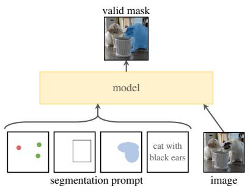

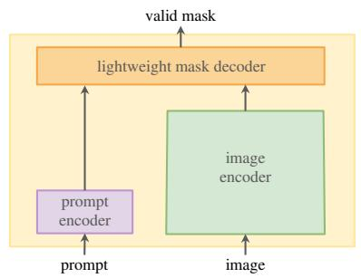

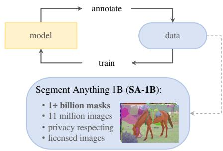  
Figure 1: We aim to build a foundation model for segmentation by introducing three interconnected components: a promptable segmentation task, a segmentation model (SAM) that powers data annotation and enables zero-shot transfer to a range of tasks via prompt engineering, and a data engine for collecting SA-1B, our dataset of over 1 billion masks.

## Abstract

We introduce the Segment Anything (SA) project: a new task, model, and datasetfor image segmentation. Using our efficient model in a data collection loop, we built the largest segmentation dataset to date (by far), with over 1 billion masks on 11M licensed and privacy respecting images. The model is designed and trained to be promptable, so it can transfer zero-shot to new image distributions and tasks. We evaluate its capabilities on numerous tasks and find that its zero-shot performance is impressive – often competitive with or even superior to prior fully supervised results. We are releasing the Segment Anything Model (SAM) and corresponding dataset (SA-1B) of 1B masks and 11M images at segment-anything.com to foster research into foundation models for computer vision. We recommend reading the full paper at: arxiv.org/abs/2304.02643.

## 1. Introduction

Large language models pre-trained on web-scale datasets are revolutionizing NLP with strong zero-shot and few-shot generalization [10]. These “foundation models” [8] can generalize to tasks and data distributions beyond those seen during training. This capability is often implemented with prompt engineering in which hand-crafted text is used to prompt the language model to generate a valid textual response for the task at hand. When scaled and trained with abundant text corpora from the web, these models’ zero and few-shot performance compares surprisingly well to (even matching in some cases) fine-tuned models [10, 20]. Empirical trends show this behavior improving with model scale, dataset size, and total training compute [54, 10, 20, 49].

Foundation models have also been explored in computer vision, albeit to a lesser extent. Perhaps the most prominent illustration aligns paired text and images from the web. For example, CLIP [80] and ALIGN [53] use contrastive learning to train text and image encoders that align the two modalities. Once trained, engineered text prompts enable zero-shot generalization to novel visual concepts and data distributions. Such encoders also compose effectively with other modules to enable downstream tasks, such as image generation (e.g., DALL·E [81]). While much progress has been made on vision and language encoders, computer vision includes a wide range of problems beyond this scope, and for many of these, abundant training data does not exist.

In this work, our goal is to build afoundation modelfor image segmentation. That is, we seek to develop a promptable model and pre-train it on a broad dataset using a task that enables powerful generalization. With this model, we aim to solve a range of downstream segmentation problems on new data distributions using prompt engineering.

The success of this plan hinges on three components: task, model, and data. To develop them, we address the following questions about image segmentation:

1. What task will enable zero-shot generalization?

2. What is the corresponding model architecture?

3. What data can power this task and model?

These questions are entangled and require a comprehensive solution. We start by defining a promptable segmentation task that is general enough to provide a powerful pretraining objective and to enable a wide range of downstream applications. This task requires a model that supports flexible prompting and can output segmentation masks in realtime when prompted to allow for interactive use. To train our model, we need a diverse, large-scale source of data. Unfortunately, there is no web-scale data source for segmentation; to address this, we build a “data engine”, i.e., we iterate between using our efficient model to assist in data collection and using the newly collected data to improve the model. We introduce each interconnected component next, followed by the dataset we created and the experiments that demonstrate the effectiveness of our approach.

Task (§2). In NLP and more recently computer vision, foundation models are a promising development that can perform zero-shot and few-shot learning for new datasets and tasks often by using “prompting” techniques. Inspired by this line of work, we propose the promptable segmentation task, where the goal is to return a valid segmentation mask given any segmentation prompt (see Fig. 1a). A prompt simply specifies what to segment in an image, e.g., a prompt can include spatial or text information identifying an object. The requirement of a valid output mask means that even when a prompt is ambiguous and could refer to multiple objects (for example, a point on a shirt may indicate either the shirt or the person wearing it), the output should be a reasonable mask for at least one of those objects. We use the promptable segmentation task as both a pre-training objective and to solve general downstream segmentation tasks via prompt engineering.

Model (§3). The promptable segmentation task and the goal of real-world use impose constraints on the model architecture. In particular, the model must supportflexible prompts, needs to compute masks in amortized real-time to allow interactive use, and must be ambiguity-aware. Surprisingly, we find that a simple design satisfies all three constraints: a powerful image encoder computes an image embedding, a prompt encoder embeds prompts, and then the two information sources are combined in a lightweight mask decoder that predicts segmentation masks. We refer to this model as the Segment Anything Model, or SAM (see Fig. 1b). By separating SAM into an image encoder and a fast prompt encoder / mask decoder, the same image embedding can be reused (and its cost amortized) with different prompts. Given an image embedding, the prompt encoder and mask decoder predict a mask from a prompt in 50ms in a web browser. We focus on point, box, and mask prompts, and also present initial results with free-form text prompts. To make SAM ambiguity-aware, we design it to predict multiple masks for a single prompt allowing SAM to naturally handle ambiguity, such as the shirt vs. person example.

Data engine (§4). To achieve strong generalization to new data distributions, we found it necessary to train SAM on a large and diverse set of masks, beyond any segmentation dataset that already exists. While a typical approach for foundation models is to obtain data online [80], masks are not naturally abundant and thus we need an alternative strategy. Our solution is to build a “data engine”, i.e., we co-develop our model with model-in-the-loop dataset annotation (see Fig. 1c). Our data engine has three stages: assisted-manual, semi-automatic, and fully automatic. In the first stage, SAM assists annotators in annotating masks, similar to a classic interactive segmentation setup. In the second stage, SAM can automatically generate masks for a subset of objects by prompting it with likely object locations and annotators focus on annotating the remaining objects, helping increase mask diversity. In the final stage, we prompt SAM with a regular grid of foreground points, yielding on average 100 high-quality masks per image.

Dataset (§5). Our final dataset, SA-1B, includes more than 1B masks from 11M licensed and privacy-preserving images (see Fig. 2). SA-1B, collected fully automatically using the final stage of our data engine, has 400 more masks than any existing segmentation dataset [64, 43, 115, 58], and as we verify extensively, the masks are of high quality and diversity. Beyond its use in training SAM to be robust and general, we hope SA-1B becomes a valuable resource for research aiming to build new foundation models.

Experiments (§6). We extensively evaluate SAM. First, using a diverse new suite of 23 segmentation datasets, we find that SAM produces high-quality masks from a single foreground point, often only slightly below that of the manually annotated ground truth. Second, we find consistently strong quantitative and qualitative results on a variety of downstream tasks under a zero-shot transfer protocol using prompt engineering, including edge detection, object proposal generation, instance segmentation, and a preliminary exploration of text-to-mask prediction. These results sug gest that SAM can be used out-of-the-box with prompt engineering to solve a variety of tasks involving object and image distributions beyond SAM’s training data. Nevertheless, room for improvement remains, as we discuss in §7.

Responsible AI. We provide model/dataset cards and report on potential fairness concerns and biases when using SA-1B and SAM in the supplement. Images in SA-1B span a geographically and economically diverse set of regions and we found that SAM performs similarly across different groups of people. Together, we hope this will make our work more equitable for real-world use cases.

Release. We are releasing the SA-1B dataset for research purposes and making SAM available under a permissive open license (Apache 2.0) at https://segment-anything.com. We also showcase SAM’s capabilities with an online demo.

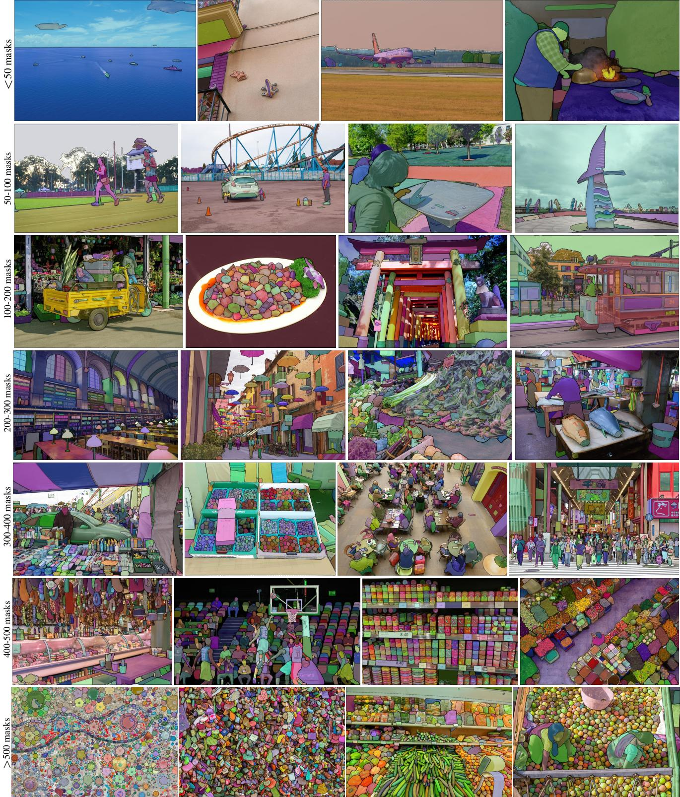  
Figure 2: Example images with overlaid masks from our newly introduced dataset, SA-1B. SA-1B contains 11M diverse, high-resolution, licensed, and privacy protecting images and 1.1B high-quality segmentation masks. These masks were annotatedfully automatically by SAM, and as we verify by human ratings and numerous experiments, are of high quality and diversity. We group images by number of masks per image for visualization (there are 100 masks per image on average).

## 2. Segment Anything Task

We take inspiration from NLP, where the next token prediction task is used for foundation model pre-training and to solve diverse downstream tasks via prompt engineering [10]. To build a foundation model for segmentation, we aim to define a task with analogous capabilities.

Task. We start by translating the idea of a prompt from NLP to segmentation, where a prompt can be a set of foreground / background points, a rough box or mask, free-form text, or, in general, any information indicating what to segment in an image. The promptable segmentation task, then, is to return a valid segmentation mask given any prompt. The requirement of a “valid” mask simply means that even when a prompt is ambiguous and could refer to multiple objects (e.g., recall the shirt vs. person example, and see Fig. 3), the output should be a reasonable mask for at least one of those objects. This requirement is similar to expecting a language model to output a coherent response to an ambiguous prompt. We choose this task because it leads to a natural pre-training algorithm and a general method for zero-shot transfer to downstream segmentation tasks via prompting.

Pre-training. The promptable segmentation task suggests a natural pre-training algorithm that simulates a sequence of prompts (e.g., points, boxes, masks) for each training sample and compares the model’s mask predictions against the ground truth. We adapt this method from interactive segmentation [107, 68], although unlike interactive segmentation whose aim is to eventually predict a valid mask after enough user input, our aim is to always predict a valid mask for any prompt even when the prompt is ambiguous. This ensures that a pre-trained model is effective in use cases that involve ambiguity, including automatic annotation as required by our data engine §4. We note that performing well at this task is challenging and requires specialized modeling and training loss choices, which we discuss in §3.

Zero-shot transfer. Intuitively, our pre-training task endows the model with the ability to respond appropriately to any prompt at inference time, and thus downstream tasks can be solved by engineering appropriate prompts. For example, if one has a bounding box detector for cats, cat instance segmentation can be solved by providing the detector’s box output as a prompt to our model. In general, a wide array of practical segmentation tasks can be cast as prompting. In addition to automatic dataset labeling, we explore five diverse example tasks in our experiments in §6.

Related tasks. Segmentation is a broad field: there’s interactive segmentation [55, 107], edge detection [3], super pixelization [83], object proposal generation [2], foreground segmentation [92], semantic segmentation [88], instance segmentation [64], panoptic segmentation [57], etc. The goal of our promptable segmentation task is to produce a broadly capable model that can adapt to many (though not all) existing and new segmentation tasks via prompt engineering. This capability is a form of task generalization [25]. Note that this is different than previous work on multi-task segmentation systems. In a multi-task system, a single model performs a fixed set of tasks, e.g., joint semantic, instance, and panoptic segmentation [112, 18, 52], but the training and test tasks are the same. An important distinction in our work is that a model trained for promptable segmentation can perform a new, different task at inference time by acting as a component in a larger system, e.g., to perform instance segmentation, a promptable segmentation model is combined with an existing object detector.

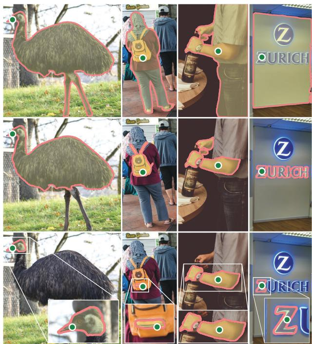  
Figure 3: Each column shows 3 valid masks generated by SAM from a single ambiguous point prompt (green circle).

Discussion. Prompting and composition are powerful tools that enable a single model to be used in extensible ways, potentially to accomplish tasks unknown at the time of model design. This approach is analogous to how other foundation models are used, e.g., how CLIP [80] is the text-image alignment component of the DALL E [81] image generation system. We anticipate that composable system design, powered by techniques such as prompt engineering, will enable a wider variety of applications than systems trained specifically for a fixed set of tasks. It’s also interesting to compare promptable and interactive segmentation through the lens of composition: while interactive segmentation models are designed with human users in mind, a model trained for promptable segmentation can also be composed into a larger algorithmic system as we will demonstrate.

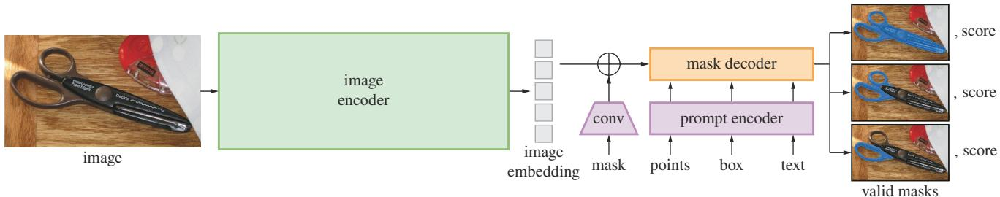  
Figure 4: Segment Anything Model (SAM) overview. A heavyweight image encoder outputs an image embedding that can then be efficiently queried by a variety of input prompts to produce object masks at amortized real-time speed. For ambiguous prompts corresponding to more than one object, SAM can output multiple valid masks and associated confidence scores.

## 3. Segment Anything Model

We next describe the Segment Anything Model (SAM) for promptable segmentation. SAM has three components, illustrated in Fig. 4: an image encoder, a flexible prompt encoder, and a fast mask decoder. We build on Transformer vision models [13, 32, 19, 60] with specific tradeoffs for (amortized) real-time performance. We describe these components at a high-level here, with details in §B.

Image encoder. Motivated by scalability and powerful pretraining methods, we use an MAE [46] pre-trained Vision Transformer (ViT) [32] minimally adapted to process high resolution inputs [60]. The image encoder runs once per image and can be applied prior to prompting the model.

Prompt encoder. We consider two sets of prompts: sparse (points, boxes, text) and dense (masks). We represent points and boxes by positional encodings [93] summed with learned embeddings for each prompt type and free-form text with an off-the-shelf text encoder from CLIP [80]. Dense prompts (i.e., masks) are embedded using convolutions and summed element-wise with the image embedding.

Mask decoder. The mask decoder efficiently maps the image embedding, prompt embeddings, and an output token to a mask. This design, inspired by [13, 19], employs a modification of a Transformer decoder block [101] followed by a dynamic mask prediction head. Our modified decoder block uses prompt self-attention and cross-attention in two directions (prompt-to-image embedding and vice-versa) to update all embeddings. After running two blocks, we upsample the image embedding and an MLP maps the output token to a dynamic linear classifier, which then computes the mask foreground probability at each image location.

Resolving ambiguity. With one output, the model will average multiple valid masks if given an ambiguous prompt. To address this, we modify the model to predict multiple output masks for a single prompt (see Fig. 3). We found 3 mask outputs is sufficient to address most common cases (nested masks are often at most three deep: whole, part, and subpart). During training, we backprop only the minimum loss [14, 44, 62] over masks. To rank masks, the model predicts a confidence score (i.e., estimated IoU) for each mask.

Efficiency. The overall model design is largely motivated by efficiency. Given a precomputed image embedding, the prompt encoder and mask decoder run in a web browser, on CPU, in ⇠50ms. This runtime performance enables seamless, real-time interactive prompting of our model.

Losses and training. We supervise mask prediction with the linear combination of focal loss [63] and dice loss [71] used in [13]. We train for the promptable segmentation task using a mixture of geometric prompts (for text prompts see §6.2). Following [90, 36], we simulate an interactive setup by randomly sampling prompts in 11 rounds per mask, allowing SAM to integrate seamlessly into our data engine.

## 4. Segment Anything Data Engine

As segmentation masks are not abundant on the internet, we built a data engine to enable the collection of our 1.1B mask dataset, SA-1B. The data engine has three stages: (1) a model-assisted manual annotation stage, (2) a semi-automatic stage with a mix of automatically predicted masks and model-assisted annotation, and (3) a fully automatic stage in which our model generates masks without annotator input. We go into details of each next.

Assisted-manual stage. In the first stage, resembling classic interactive segmentation, a team of professional annotators labeled masks by clicking foreground / background object points using a browser-based interactive segmentation tool powered by SAM. Masks could be refined using pixelprecise “brush” and “eraser” tools. Our model-assisted annotation runs in real-time directly inside a browser (using precomputed image embeddings) enabling a truly interactive experience. We did not impose semantic constraints for labeling objects, and annotators freely labeled both “stuff” and “things” [1]. We suggested annotators label objects they could name or describe, but did not collect these names or descriptions. Annotators were asked to label objects in order of prominence and were encouraged to proceed to the next image once a mask took over 30 seconds to annotate.

At the start of this stage, SAM was trained using common public segmentation datasets. After sufficient data annotation, SAM was retrained using only newly annotated masks. As more masks were collected, the image encoder was scaled from ViT-B to ViT-H and other architectural details evolved; in total we retrained our model 6 times. Average annotation time per mask decreased from 34 to 14 seconds as the model improved. We note that 14 seconds is 6.5 faster than mask annotation for COCO [64] and only 2 slower than bounding-box labeling with extreme points [74, 69]. As SAM improved, the average number of masks per image increased from 20 to 44 masks. Overall, we collected 4.3M masks from 120k images in this stage.

Semi-automatic stage. In this stage, we aimed to increase the diversity of masks in order to improve our model’s ability to segment anything. To focus annotators on less prominent objects, we first automatically detected confident masks. Then we presented annotators with images prefilled with these masks and asked them to annotate any additional unannotated objects. To detect confident masks, we trained a bounding box detector [82] on all first stage masks using a generic “object” category. During this stage we collected an additional 5.9M masks in 180k images (for a total of 10.2M masks). As in the first stage, we periodically retrained our model on newly collected data (5 times). Average annotation time per mask went back up to 34 seconds (excluding the automatic masks) as these objects were more challenging to label. The average number of masks per image went from 44 to 72 masks (including the automatic masks).

Fully automatic stage. In the final stage, annotation was fully automatic. This was feasible due to two major enhancements to our model. First, at the start of this stage, we had collected enough masks to greatly improve the model, including the diverse masks from the previous stage. Second, by this stage we had developed the ambiguity-aware model, which allowed us to predict valid masks even in ambiguous cases. Specifically, we prompted the model with a 32 32 regular grid of points and for each point predicted a set of masks that may correspond to valid objects. With the ambiguity-aware model, if a point lies on a part or subpart, our model will return the subpart, part, and whole object. The IoU prediction module of our model is used to select confident masks; moreover, we identified and selected only stable masks (we consider a mask stable if thresholding the probability map at 0.5  and 0.5 +  results in similar masks). Finally, after selecting the confident and stable masks, we applied non-maximal suppression (NMS) to filter duplicates. To further improve the quality of smaller masks, we also processed multiple overlapping zoomed-in image crops. For further details of this stage, see §C. We applied fully automatic mask generation to all 11M images in our dataset, producing a total of 1.1B high-quality masks. We describe and analyze the resulting dataset, SA-1B, next.

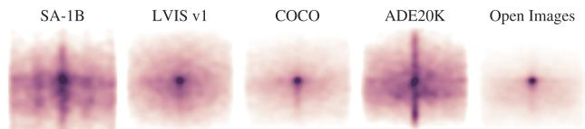  
Figure 5: Image-size normalized mask center distributions.

## 5. Segment Anything Dataset

Our dataset, SA-1B, consists of 11M diverse, highresolution, licensed, and privacy protecting images and 1.1B high-quality segmentation masks collected with our data engine. We compare SA-1B with existing datasets and analyze mask quality and properties. We are releasing SA-1B to aid future development of foundation models for computer vision. We note that SA-1B will be released under a favorable license agreement for certain research uses and with protections for researchers.

Images. We licensed a new set of 11M images from a provider that works directly with photographers. These images are high resolution (3300 4950 pixels on average), and the resulting data size can present accessibility and storage challenges. Therefore, we are releasing downsampled images with their shortest side set to 1500 pixels. Even after downsampling, our images are significantly higher resolution than many existing vision datasets (e.g., COCO [64] images are 480 640 pixels). Note that most models today operate on much lower resolution inputs. Faces and vehicle license plates have been blurred in the released images.

Masks. Our data engine produced 1.1B masks, 99.1% of which were generated fully automatically. Therefore, the quality of the automatic masks is centrally important. We compare them directly to professional annotations and look at how various mask properties compare to prominent segmentation datasets. Our main conclusion, as borne out in the analysis below and the experiments in §6, is that our automatic masks are high quality and effective for training models. Motivated by these findings, SA-1B only includes automatically generated masks.

Mask quality. To estimate mask quality, we randomly sampled 500 images ( 50k masks) and asked our professional annotators to improve the quality of all masks in these images. Annotators did so using our model and pixel-precise “brush” and “eraser” editing tools. This procedure resulted in pairs of automatically predicted and professionally corrected masks. We computed IoU between each pair and found that 94% of pairs have greater than 90% IoU (and 97% of pairs have greater than 75% IoU). For comparison, prior work estimates inter-annotator consistency at 85-91% IoU [43, 58]. Our experiments in §6 confirm by human ratings that mask quality is high relative to a variety of datasets and that training our model on automatic masks is nearly as good as using all masks produced by the data engine.

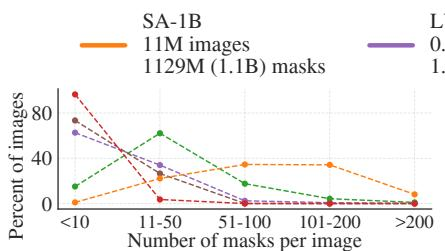

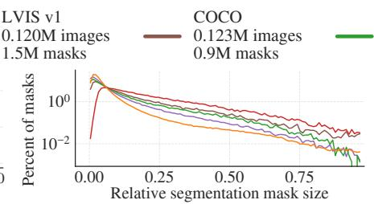

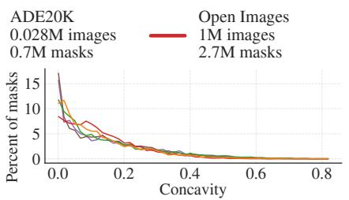  
Figure 6: Dataset mask properties. The legend references the number of images and masks in each dataset. Note, that SA-1B has 11 more images and 400 more masks than the largest existing segmentation dataset Open Images [58].

Mask properties. In Fig. 5 we plot the spatial distribution of object centers in SA-1B compared to the largest existing segmentation datasets. Common photographer biases are present in all datasets. We observe that SA-1B has greater coverage of image corners compared to LVIS v1 [43] and ADE20K [115], the two most similarly distributed datasets, while COCO [64] and Open Images V5 [58] have a more prominent center bias. In Fig. 6 (legend) we compare these datasets by size. SA-1B has 11 more images and 400 more masks than the second largest, Open Images. On average, it has 36 more masks per image than Open Images. The closest dataset in this respect, ADE20K, still has 3.5 fewer masks per image. Fig. 6 (left) plots the masks-perimage distribution. Next, we look at image-relative mask size (square root of the mask area divided by image area) in Fig. 6 (middle). As expected, since our dataset has more masks per image, it also tends to include a greater percentage of small and medium relative-size masks. Finally, to analyze shape complexity, we look at mask concavity (1 minus mask area divided by area of mask’s convex hull) in Fig. 6 (right). Since shape complexity is correlated with mask size, we control for the datasets’ mask size distributions by first performing stratified sampling from binned mask sizes. We observe that the concavity distribution of our masks is broadly similar to that of other datasets.

## 6. Zero-Shot Transfer Experiments

In this section, we present zero-shot transfer experiments with SAM, the Segment Anything Model. We consider five tasks, four of which differ significantly from the promptable segmentation task used to train SAM. These experiments evaluate SAM on datasets and tasks that were not seen during training (our usage of “zero-shot transfer” follows its usage in CLIP [80]). The datasets may include novel image distributions, such as underwater or ego-centric images that, to our knowledge, do not appear in SA-1B.

Our experiments begin by testing the core goal of promptable segmentation: producing a valid mask from any prompt. We emphasize the challenging scenario of a single foreground point prompt, since it is more likely to be ambiguous than other more specific prompts. Next, we present a sequence of experiments that traverse low, mid, and highlevel image understanding and roughly parallel the historical development of the field. Specifically, we prompt SAM to (1) perform edge detection, (2) segment everything, i.e. object proposal generation, (3) segment detected objects, i.e. instance segmentation, and (4), as a proof-of-concept, to segment objects from free-form text. These four tasks differ significantly from the promptable segmentation task that SAM was trained on and are implemented via prompt engineering. We report zero-shot single point valid mask evaluation and zero-shot text to mask proof-of-concept in the main text. We refer readers to the supplement for our experiments with zero-shot edge detection, object proposal, and instance segmentation. In addition, we report a set of ablations in the supplement. We analyze SAM performance with respect to the size and composition of its training data as well as the image encoder architecture.

Implementation. Unless otherwise specified: (1) SAM uses an MAE [46] pre-trained ViT-H [32] image encoder and (2) SAM was trained on SA-1B, noting that this dataset includes only automatically generated masks from the final stage of our data engine. For all other model and training details, such as hyperparameters, refer to §B.

## 6.1. Zero-Shot Single Point Valid Mask Evaluation

Task. We evaluate segmenting an object from a single foreground point. This task is ill-posed as one point can refer to multiple objects. Ground truth masks in most datasets do not enumerate all possible masks, which can make automatic metrics unreliable. Therefore, we supplement the standard mIoU metric (i.e., the mean of all IoUs between predicted and ground truth masks) with a human study in which annotators rate mask quality from 1 (nonsense) to 10 (pixel-perfect). See §E.1, §F, and §H for additional details.

By default, we sample points from the “center” of ground truth masks (at a maximal value of the mask’s interior distance transform), following the standard evaluation protocol in interactive segmentation [90]. Since SAM is capable of predicting multiple masks, we evaluate only the model’s most confident mask by default. The baselines are all single-mask methods. We compare mainly to RITM [90], a strong interactive segmenter that performs best on our benchmark compared to other strong baselines [65, 17].

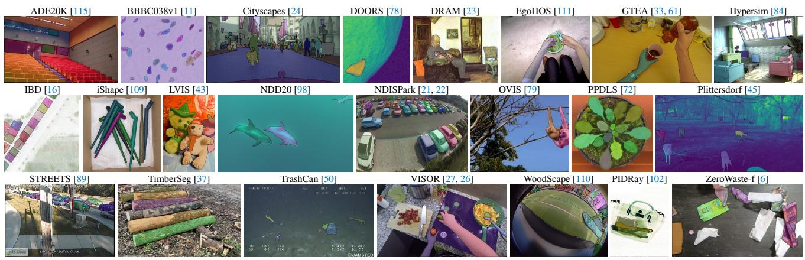  
(a) Samples from the 23 diverse segmentation datasets used to evaluate SAM’s zero-shot transfer capabilities

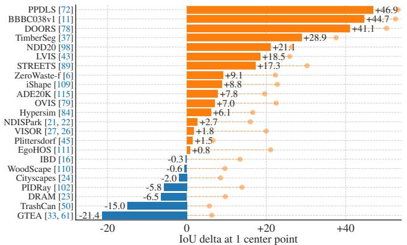  
(b) SAM vs. RITM [90] on 23 datasets

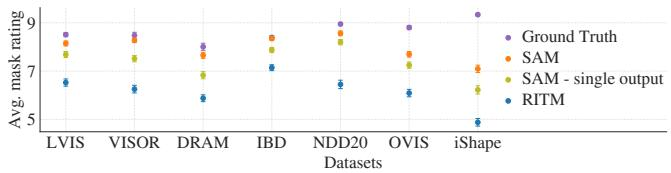  
(c) Mask quality ratings by human annotators

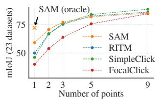  
(d) Center points (default)

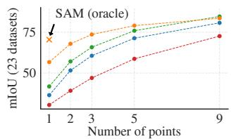  
(e) Random points  
Figure 7: Point to mask evaluation on 23 datasets. (a) Dataset samples. (b) Mean IoU of SAM and the strongest single point segmenter, RITM [90]. Due to ambiguity, a single mask may not match ground truth; circles show “oracle” results of the most relevant of SAM’s 3 predictions. (c) Per-dataset comparison of mask quality ratings by annotators from 1 (worst) to 10 (best). Mask center is used as the prompt. (d, e) mIoU with varying number of points. SAM significantly outperforms prior interactive segmenters with 1 point and is on par with more points. Low absolute mIoU at 1 point is the result of ambiguity.

Datasets. We use a newly compiled suite of 23 datasets with diverse image distributions, see appendix Table 4 for more details. We use all 23 datasets for mIoU evaluation. For the human study, we use the subset listed in Fig. 7c (due to the resource requirements of such studies). This subset includes both datasets for which SAM outperforms and underperforms RITM according to automatic metrics.

Results. First, we look at automatic evaluation on the full suite of 23 datasets using mIoU. We compare per-dataset results in Fig. 7b against RITM. SAM yields higher results on 16 of the 23 datasets, by as much as 47 IoU. We also present an “oracle” result, in which the most relevant of SAM’s 3 masks is selected by comparing them to the ground truth, rather than selecting the most confident mask. This reveals the impact of ambiguity on automatic evaluation. In particular, with the oracle to perform ambiguity resolution, SAM outperforms RITM on all datasets.

Results of the human study are presented in Fig. 7c. Error bars are 95% confidence intervals (all differences are significant; see §F for details). We observe that the annotators consistently rate the quality of SAM’s masks substantially higher than the strongest baseline, RITM. An ablated, “ambiguity-unaware” version of SAM with a single output mask has consistently lower ratings. SAM’s mean ratings fall between 7 and 9, which corresponds to the qualitative rating guideline: “A high score (7-9): The object is identifiable and errors are small and rare (e.g., missing a small, heavily obscured disconnected component, ...).” These results indicate that SAM has learned to segment valid masks from a single point. Note that for datasets like DRAM and IBD, where SAM is worse on automatic metrics, it receives consistently higher ratings in the human study.

Fig. 7d shows additional baselines, SimpleClick [65] and FocalClick [17]. As the number of points increases from 1 to 9, we observe that the gap between methods decreases. This is expected as the task becomes easier; also, SAM is not optimized for the very high IoU regime. Finally, in Fig. 7e we replace the default center point sampling with random point sampling. We observe that the gap between SAM and the baselines grows and SAM is able to achieve comparable results under either sampling method.

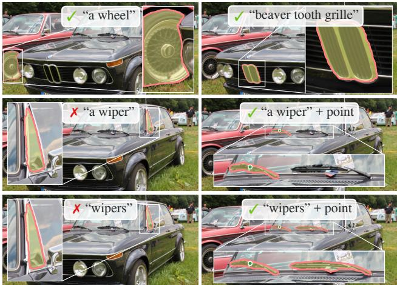  
Figure 8: Zero-shot text-to-mask. SAM can work with simple and nuanced text prompts. When SAM fails to make a correct prediction, an additional point prompt can help.

## 6.2. Zero-Shot Text-to-Mask

Approach. This experiment is a proof-of-concept of SAM’s ability to segment objects from free-form text prompts. While we used the exact same SAM in all prior experiments, for this one SAM’s training procedure is modified to make it text-aware, but in a way that does not require new text annotations. Specifically, for each manually collected mask with area larger than 1002 we extract the CLIP image embedding. Then, during training, we prompt SAM with the extracted CLIP image embeddings as its first interaction. The key observation here is that because CLIP’s image embeddings are trained to align with its text embeddings, we can train with image embeddings, but use text embeddings for inference. That is, at inference time we run text through CLIP’s text encoder and then give the resulting text embedding as a prompt to SAM (see §E.5 for details).

Results. We show qualitative results in Fig. 8. SAM can segment objects based on simple text prompts like “a wheel” as well as phrases like “beaver tooth grille”. When SAM fails to pick the right object from a text prompt only, an additional point often fixes the prediction, similar to [30].

## 7. Discussion

Foundation models. Pre-trained models have been adapted to downstream tasks since the early days of machine learning [97]. This paradigm has become increasingly important in recent years with a growing emphasis on scale, and such models have recently been (re-)branded as “foundation models”: i.e. models that are “trained on broad data at scale and are adaptable to a wide range of downstream tasks” [8]. Our work correlates well with this definition, though we note that a foundation model for image segmentation is an inherently limited scope, since it represents an important, yet fractional, subset of computer vision. We also contrast one aspect of our approach with [8], which emphasizes the role of self-supervised learning in foundation models. While our model is initialized with a selfsupervised technique (MAE [46]), the vast majority of its capabilities come from large-scale supervised training. In cases where data engines can scale available annotations, like ours, supervised training provides an effective solution.

Compositionality. Pre-trained models can power new capabilities even beyond ones imagined at the moment of training. One prominent example is how CLIP [80] is used as a component in larger systems, such as DALL E [81]. Our goal is to make this kind of composition straightforward with SAM. We aim to achieve this by requiring SAM to predict a valid mask for a wide range of segmentation prompts. The effect is to create a reliable interface between SAM and other components. For example, MCC [104] can easily use SAM to segment an object of interest and achieve strong generalization to unseen objects for 3D reconstruction from a single RGB-D image. In another example, SAM can be prompted with gaze points detected by a wearable device, enabling new applications. Thanks to SAM’s ability to generalize to new domains like ego-centric images, such systems work without need for additional training.

Limitations. While SAM performs well in general, it is not perfect. It can miss fine structures, hallucinates small disconnected components at times, and does not produce boundaries as crisply as more computationally intensive methods that “zoom-in”, e.g. [17]. In general, we expect dedicated interactive segmentation methods to outperform SAM when many points are provided, e.g. [65]. Unlike these methods, SAM is designed for generality and breadth of use rather than high IoU interactive segmentation. Moreover, SAM can process prompts in real-time, but nevertheless SAM’s overall performance is not real-time when using a heavy image encoder. Our foray into the text-to-mask task is exploratory and not entirely robust, although we believe it can be improved with more effort. While SAM can perform many tasks, it is unclear how to design simple prompts that implement semantic and panoptic segmentation. Finally, there are domain-specific tools, such as [7], that we expect to outperform SAM in their respective domains.

Conclusion. The Segment Anything project is an attempt to lift image segmentation into the era of foundation models. Our principal contributions are a new task (promptable segmentation), model (SAM), and dataset (SA-1B) that make this leap possible. Whether SAM achieves the status of a foundation model remains to be seen by how it is used in the community, but regardless we expect the perspective of this work, the release of over 1B masks, and our promptable segmentation model will help pave the path ahead.

## References

[1] Edward H Adelson. On seeing stuff: the perception of materials by humans and machines. Human vision and electronic imaging VI, 2001. 5

[2] Bogdan Alexe, Thomas Deselaers, and Vittorio Ferrari. What is an object? CVPR, 2010. 4, 19

[3] Pablo Arbelaez, Michael Maire, Charless Fowlkes, and Jitendra´ Malik. Contour detection and hierarchical image segmentation. TPAMI, 2010. 4, 19, 28

[4] Jimmy Lei Ba, Jamie Ryan Kiros, and Geoffrey E Hinton. Layer normalization. arXiv:1607.06450, 2016. 13

[5] Hangbo Bao, Li Dong, and Furu Wei. BEiT: BERT pre-training of image transformers. arXiv:2106.08254, 2021. 15

[6] Dina Bashkirova, Mohamed Abdelfattah, Ziliang Zhu, James Akl, Fadi Alladkani, Ping Hu, Vitaly Ablavsky, Berk Calli, Sarah Adel Bargal, and Kate Saenko. ZeroWaste dataset: Towards deformable object segmentation in cluttered scenes. CVPR, 2022. 8, 18

[7] Stuart Berg, Dominik Kutra, Thorben Kroeger, Christoph N. Straehle, Bernhard X. Kausler, Carsten Haubold, Martin Schiegg, Janez Ales, Thorsten Beier, Markus Rudy, Kemal Eren, Jaime I. Cervantes, Buote Xu, Fynn Beuttenmueller, Adrian Wolny, Chong Zhang, Ullrich Koethe, Fred A. Hamprecht, and Anna Kreshuk. ilastik: interactive machine learning for (bio)image analysis. Nature Methods, 2019. 9

[8] Rishi Bommasani, Drew A Hudson, Ehsan Adeli, Russ Altman, Simran Arora, Sydney von Arx, Michael S Bernstein, Jeannette Bohg, Antoine Bosselut, Emma Brunskill, et al. On the opportunities and risks of foundation models. arXiv:2108.07258, 2021. 1, 9

[9] Gustav Bredell, Christine Tanner, and Ender Konukoglu. Iterative interaction training for segmentation editing networks. MICCAI, 2018. 15

[10] Tom Brown, Benjamin Mann, Nick Ryder, Melanie Subbiah, Jared D Kaplan, Prafulla Dhariwal, Arvind Neelakantan, Pranav Shyam, Girish Sastry, Amanda Askell, Sandhini Agarwal, Ariel Herbert-Voss, Gretchen Krueger, Tom Henighan, Rewon Child, Aditya Ramesh, Daniel Ziegler, Jeffrey Wu, Clemens Winter, Chris Hesse, Mark Chen, Eric Sigler, Mateusz Litwin, Scott Gray, Benjamin Chess, Jack Clark, Christopher Berner, Sam McCandlish, Alec Radford, Ilya Sutskever, and Dario Amodei. Language models are few-shot learners. NeurIPS, 2020. 1, 4

[11] Juan C. Caicedo, Allen Goodman, Kyle W. Karhohs, Beth A. Cimini, Jeanelle Ackerman, Marzieh Haghighi, CherKeng Heng, Tim Becker, Minh Doan, Claire McQuin, Mohammad Rohban, Shantanu Singh, and Anne E. Carpenter. Nucleus segmentation across imaging experiments: the 2018 data science bowl. Nature Methods, 2019. 8, 17, 18

[12] John Canny. A computational approach to edge detection. TPAMI, 1986. 19

[13] Nicolas Carion, Francisco Massa, Gabriel Synnaeve, Nicolas Usunier, Alexander Kirillov, and Sergey Zagoruyko. End-to-end object detection with Transformers. ECCV, 2020. 5, 13, 14

[14] Guillaume Charpiat, Matthias Hofmann, and Bernhard Scholkopf.¨ Automatic image colorization via multimodal predictions. ECCV, 2008. 5, 14

[15] Neelima Chavali, Harsh Agrawal, Aroma Mahendru, and Dhruv Batra. Object-proposal evaluation protocol is’ gameable’. CVPR, 2016. 19, 20

[16] Jiazhou Chen, Yanghui Xu, Shufang Lu, Ronghua Liang, and Liangliang Nan. 3D instance segmentation of MVS buildings. IEEE Transactions on Geoscience and Remote Sensing, 2022. 8, 17, 18, 22, 23, 24

[17] Xi Chen, Zhiyan Zhao, Yilei Zhang, Manni Duan, Donglian Qi, and Hengshuang Zhao. FocalClick: towards practical interactive image segmentation. CVPR, 2022. 7, 8, 9, 17, 19

[18] Bowen Cheng, Ishan Misra, Alexander G Schwing, Alexander Kirillov, and Rohit Girdhar. Masked-attention mask transformer for universal image segmentation. CVPR, 2022. 4

[19] Bowen Cheng, Alex Schwing, and Alexander Kirillov. Perpixel classification is not all you need for semantic segmentation. NeurIPS, 2021. 5, 13, 14

[20] Aakanksha Chowdhery, Sharan Narang, Jacob Devlin, Maarten Bosma, Gaurav Mishra, Adam Roberts, Paul Barham, Hyung Won Chung, Charles Sutton, Sebastian Gehrmann, et al. PaLM: Scaling language modeling with pathways. arXiv:2204.02311, 2022. 1

[21] Luca Ciampi, Carlos Santiago, Joao Costeira, Claudio Gennaro, and Giuseppe Amato. Domain adaptation for traffic density estimation. International Joint Conference on Computer Vision, Imaging and Computer Graphics Theory and Applications, 2021. 8, 18

[22] Luca Ciampi, Carlos Santiago, Joao Costeira, Claudio Gennaro, and Giuseppe Amato. Night and day instance segmented park (NDIS-Park) dataset: a collection of images taken by day and by night for vehicle detection, segmentation and counting in parking areas. Zenodo, 2022. 8, 18

[23] Nadav Cohen, Yael Newman, and Ariel Shamir. Semantic segmentation in art paintings. Computer Graphics Forum, 2022. 8, 17, 18, 22, 23, 24

[24] Marius Cordts, Mohamed Omran, Sebastian Ramos, Timo Rehfeld, Markus Enzweiler, Rodrigo Benenson, Uwe Franke, Stefan Roth, and Bernt Schiele. The Cityscapes dataset for semantic urban scene understanding. CVPR, 2016. 8, 17, 18

[25] Bruno da Silva, George Konidaris, and Andrew Barto. Learning parameterized skills. ICML, 2012. 4

[26] Dima Damen, Hazel Doughty, Giovanni Maria Farinella, Antonino Furnari, Jian Ma, Evangelos Kazakos, Davide Moltisanti, Jonathan Munro, Toby Perrett, Will Price, and Michael Wray. Rescaling egocentric vision: Collection, pipeline and challenges for EPIC-KITCHENS-100. IJCV, 2022. 8, 18, 22, 23, 24

[27] Ahmad Darkhalil, Dandan Shan, Bin Zhu, Jian Ma, Amlan Kar, Richard Higgins, Sanja Fidler, David Fouhey, and Dima Damen. EPIC-KITCHENS VISOR benchmark: Video segmentations and object relations. NeurIPS, 2022. 8, 17, 18, 22, 23, 24

[28] Terrance De Vries, Ishan Misra, Changhan Wang, and Laurens Van der Maaten. Does object recognition work for everyone? CVPR workshops, 2019. 16

[29] Mark D´ıaz, Ian Kivlichan, Rachel Rosen, Dylan Baker, Razvan Amironesei, Vinodkumar Prabhakaran, and Emily Denton. Crowd-WorkSheets: Accounting for individual and collective identities underlying crowdsourced dataset annotation. ACM Conference on Fairness, Accountability, and Transparency, 2022. 24

[30] Henghui Ding, Scott Cohen, Brian Price, and Xudong Jiang. PhraseClick: toward achieving flexible interactive segmentation by phrase and click. ECCV, 2020. 9

[31] Piotr Dollar and C Lawrence Zitnick. Fast edge detection using´ structured forests. TPAMI, 2014. 19

[32] Alexey Dosovitskiy, Lucas Beyer, Alexander Kolesnikov, Dirk Weissenborn, Xiaohua Zhai, Thomas Unterthiner, Mostafa Dehghani, Matthias Minderer, Georg Heigold, Sylvain Gelly, Jakob Uszkoreit, and Neil Houlsby. An image is worth 16x16 words: Transformers for image recognition at scale. ICLR, 2021. 5, 7, 13

[33] Alireza Fathi, Xiaofeng Ren, and James M. Rehg. Learning to recognize objects in egocentric activities. CVPR, 2011. 8, 17, 18

[34] Pedro F Felzenszwalb and Daniel P Huttenlocher. Efficient graphbased image segmentation. IJCV, 2004. 19

[35] Thomas B. Fitzpatrick. The validity and practicality of sun-reactive skin types i through vi. Archives ofDermatology, 1988. 17

[36] Marco Forte, Brian Price, Scott Cohen, Ning Xu, and Franc¸ois Pitie. Getting to 99% accuracy in interactive segmentation.´ arXiv:2003.07932, 2020. 5, 14, 15

[37] Jean-Michel Fortin, Olivier Gamache, Vincent Grondin, Franc¸ois Pomerleau, and Philippe Giguere. Instance segmentation for au- \` tonomous log grasping in forestry operations. IROS, 2022. 8, 18

[38] Timnit Gebru, Jamie Morgenstern, Briana Vecchione, Jennifer Wortman Vaughan, Hanna Wallach, Hal Daume Iii, and Kate´

Crawford. Datasheets for datasets. Communications of the ACM, 2021. 24

[39] Golnaz Ghiasi, Yin Cui, Aravind Srinivas, Rui Qian, Tsung-Yi Lin, Ekin D Cubuk, Quoc V Le, and Barret Zoph. Simple copy-paste is a strong data augmentation method for instance segmentation. CVPR, 2021. 13, 15, 21

[40] Ross Girshick, Jeff Donahue, Trevor Darrell, and Jitendra Malik. Rich feature hierarchies for accurate object detection and semantic segmentation. CVPR, 2014. 19

[41] Priya Goyal, Piotr Dollar, Ross Girshick, Pieter Noordhuis, Lukasz´ Wesolowski, Aapo Kyrola, Andrew Tulloch, Yangqing Jia, and Kaiming He. Accurate, large minibatch SGD: Training ImageNet in 1 hour. arXiv:1706.02677, 2017. 15

[42] Kristen Grauman, Andrew Westbury, Eugene Byrne, Zachary Chavis, Antonino Furnari, Rohit Girdhar, Jackson Hamburger, Hao Jiang, Miao Liu, Xingyu Liu, Miguel Martin, Tushar Nagarajan, Ilija Radosavovic, Santhosh Kumar Ramakrishnan, Fiona Ryan, Jayant Sharma, Michael Wray, Mengmeng Xu, Eric Zhongcong Xu, Chen Zhao, Siddhant Bansal, Dhruv Batra, Vincent Cartillier, Sean Crane, Tien Do, Morrie Doulaty, Akshay Erapalli, Christoph Feichtenhofer, Adriano Fragomeni, Qichen Fu, Christian Fuegen, Abrham Gebreselasie, Cristina Gonzalez, James Hillis, Xuhua Huang, Yifei Huang, Wenqi Jia, Weslie Khoo, Jachym Kolar, Satwik Kottur, Anurag Kumar, Federico Landini, Chao Li, Yanghao Li, Zhenqiang Li, Karttikeya Mangalam, Raghava Modhugu, Jonathan Munro, Tullie Murrell, Takumi Nishiyasu, Will Price, Paola Ruiz Puentes, Merey Ramazanova, Leda Sari, Kiran Somasundaram, Audrey Southerland, Yusuke Sugano, Ruijie Tao, Minh Vo, Yuchen Wang, Xindi Wu, Takuma Yagi, Yunyi Zhu, Pablo Arbelaez, David Crandall, Dima Damen, Giovanni Maria Farinella, Bernard Ghanem, Vamsi Krishna Ithapu, C. V. Jawahar, Hanbyul Joo, Kris Kitani, Haizhou Li, Richard Newcombe, Aude Oliva, Hyun Soo Park, James M. Rehg, Yoichi Sato, Jianbo Shi, Mike Zheng Shou, Antonio Torralba, Lorenzo Torresani, Mingfei Yan, and Jitendra Malik. Ego4D: Around the World in 3,000 Hours of Egocentric Video. CVPR, 2022. 18

[43] Agrim Gupta, Piotr Dollar, and Ross Girshick. LVIS: A dataset for large vocabulary instance segmentation. CVPR, 2019. 2, 6, 7, 8, 17, 18, 19, 21, 23

[44] Abner Guzman-Rivera, Dhruv Batra, and Pushmeet Kohli. Multiple choice learning: Learning to produce multiple structured outputs. NeurIPS, 2012. 5, 14

[45] Timm Haucke, Hjalmar S. Kuhl, and Volker Steinhage. ¨ SOCRATES: Introducing depth in visual wildlife monitoring using stereo vision. Sensors, 2022. 8, 18

[46] Kaiming He, Xinlei Chen, Saining Xie, Yanghao Li, Piotr Dollar,´ and Ross Girshick. Masked autoencoders are scalable vision learners. CVPR, 2022. 5, 7, 9, 13, 15

[47] Kaiming He, Xiangyu Zhang, Shaoqing Ren, and Jian Sun. Deep residual learning for image recognition. CVPR, 2016. 14

[48] Dan Hendrycks and Kevin Gimpel. Gaussian error linear units (gelus). arXiv:1606.08415, 2016. 13

[49] Jordan Hoffmann, Sebastian Borgeaud, Arthur Mensch, Elena Buchatskaya, Trevor Cai, Eliza Rutherford, Diego de Las Casas, Lisa Anne Hendricks, Johannes Welbl, Aidan Clark, et al. Training compute-optimal large language models. arXiv:2203.15556, 2022. 1

[50] Jungseok Hong, Michael Fulton, and Junaed Sattar. TrashCan: A semantically-segmented dataset towards visual detection of marine debris. arXiv:2007.08097, 2020. 8, 17, 18

[51] Gao Huang, Yu Sun, Zhuang Liu, Daniel Sedra, and Kilian Q Wein berger. Deep networks with stochastic depth. ECCV, 2016. 15

[52] Jitesh Jain, Jiachen Li, MangTik Chiu, Ali Hassani, Nikita Orlov, and Humphrey Shi. Oneformer: One transformer to rule universal image segmentation. arXiv:2211.06220, 2022. 4

[53] Chao Jia, Yinfei Yang, Ye Xia, Yi-Ting Chen, Zarana Parekh, Hieu Pham, Quoc Le, Yun-Hsuan Sung, Zhen Li, and Tom Duerig.

Scaling up visual and vision-language representation learning with noisy text supervision. ICML, 2021. 1

[54] Jared Kaplan, Sam McCandlish, Tom Henighan, Tom B Brown, Benjamin Chess, Rewon Child, Scott Gray, Alec Radford, Jeffrey Wu, and Dario Amodei. Scaling laws for neural language models. arXiv:2001.08361, 2020. 1

[55] Michael Kass, Andrew Witkin, and Demetri Terzopoulos. Snakes: Active contour models. IJCV, 1988. 4

[56] Dahun Kim, Tsung-Yi Lin, Anelia Angelova, In So Kweon, and Weicheng Kuo. Learning open-world object proposals without learning to classify. IEEE Robotics and Automation Letters, 2022. 19

[57] Alexander Kirillov, Kaiming He, Ross Girshick, Carsten Rother, and Piotr Dollar. Panoptic segmentation.´ CVPR, 2019. 4

[58] Alina Kuznetsova, Hassan Rom, Neil Alldrin, Jasper Uijlings, Ivan Krasin, Jordi Pont-Tuset, Shahab Kamali, Stefan Popov, Matteo Malloci, Alexander Kolesnikov, Tom Duerig, and Vittorio Ferrari. The open images dataset v4: Unified image classification, object detection, and visual relationship detection at scale. IJCV, 2020. 2, 6, 7, 16

[59] Alexandre Lacoste, Alexandra Luccioni, Victor Schmidt, and Thomas Dandres. Quantifying the carbon emissions of machine learning. arXiv:1910.09700, 2019. 28

[60] Yanghao Li, Hanzi Mao, Ross Girshick, and Kaiming He. Exploring plain vision transformer backbones for object detection. ECCV, 2022. 5, 13, 19, 21, 22, 23

[61] Yin Li, Zhefan Ye, and James M. Rehg. Delving into egocentric actions. CVPR, 2015. 8, 18

[62] Zhuwen Li, Qifeng Chen, and Vladlen Koltun. Interactive image segmentation with latent diversity. CVPR, 2018. 5, 14, 17

[63] Tsung-Yi Lin, Priya Goyal, Ross Girshick, Kaiming He, and Piotr Dollar. Focal loss for dense object detection.´ ICCV, 2017. 5, 14

[64] Tsung-Yi Lin, Michael Maire, Serge Belongie, James Hays, Pietro Perona, Deva Ramanan, Piotr Dollar, and C Lawrence Zitnick. Mi-´ crosoft COCO: Common objects in context. ECCV, 2014. 2, 4, 6, 7, 16, 17, 18, 21

[65] Qin Liu, Zhenlin Xu, Gedas Bertasius, and Marc Niethammer. SimpleClick: Interactive image segmentation with simple vision transformers. arXiv:2210.11006, 2022. 7, 8, 9, 17

[66] Ilya Loshchilov and Frank Hutter. Decoupled weight decay regularization. ICLR, 2019. 15

[67] Cathy H Lucas, Daniel OB Jones, Catherine J Hollyhead, Robert H Condon, Carlos M Duarte, William M Graham, Kelly L Robinson, Kylie A Pitt, Mark Schildhauer, and Jim Regetz. Gelatinous zooplankton biomass in the global oceans: geographic variation and environmental drivers. Global Ecology and Biogeography, 2014. 18

[68] Sabarinath Mahadevan, Paul Voigtlaender, and Bastian Leibe. Iteratively trained interactive segmentation. BMVC, 2018. 4, 15

[69] Kevis-Kokitsi Maninis, Sergi Caelles, Jordi Pont-Tuset, and Luc Van Gool. Deep extreme cut: From extreme points to object segmentation. CVPR, 2018. 6

[70] David Martin, Charless Fowlkes, Doron Tal, and Jitendra Malik. A database of human segmented natural images and its application to evaluating segmentation algorithms and measuring ecological statistics. ICCV, 2001. 19, 28

[71] Fausto Milletari, Nassir Navab, and Seyed-Ahmad Ahmadi. V-Net: Fully convolutional neural networks for volumetric medical image segmentation. 3DV, 2016. 5, 14

[72] Massimo Minervini, Andreas Fischbach, Hanno Scharr, and Sotirios A. Tsaftaris. Finely-grained annotated datasets for imagebased plant phenotyping. Pattern Recognition Letters, 2016. 8, 18

[73] Margaret Mitchell, Simone Wu, Andrew Zaldivar, Parker Barnes, Lucy Vasserman, Ben Hutchinson, Elena Spitzer, Inioluwa Deborah Raji, and Timnit Gebru. Model cards for model reporting. Proceedings of the conference on fairness, accountability, and transparency, 2019. 24, 28

[74] Dim P Papadopoulos, Jasper RR Uijlings, Frank Keller, and Vittorio Ferrari. Extreme clicking for efficient object annotation. ICCV, 2017. 6

[75] David Patterson, Joseph Gonzalez, Quoc Le, Chen Liang, Lluis-Miquel Munguia, Daniel Rothchild, David So, Maud Texier, and Jeff Dean. Carbon emissions and large neural network training. arXiv:2104.10350, 2021. 28

[76] Matthew E Peters, Waleed Ammar, Chandra Bhagavatula, and Russell Power. Semi-supervised sequence tagging with bidirectional language models. Proceedings of the 55th Annual Meeting of the Associationfor Computational Linguistics, 2017. 16

[77] Mengyang Pu, Yaping Huang, Yuming Liu, Qingji Guan, and Haibin Ling. EDTER: Edge detection with transformer. CVPR, 2022. 19

[78] Mattia Pugliatti and Francesco Topputo. DOORS: Dataset fOr bOuldeRs Segmentation. Zenodo, 2022. 8, 18

[79] Jiyang Qi, Yan Gao, Yao Hu, Xinggang Wang, Xiaoyu Liu, Xiang Bai, Serge Belongie, Alan Yuille, Philip Torr, and Song Bai. Occluded video instance segmentation: A benchmark. IJCV, 2022. 8, 18, 22, 23, 24

[80] Alec Radford, Jong Wook Kim, Chris Hallacy, Aditya Ramesh, Gabriel Goh, Sandhini Agarwal, Girish Sastry, Amanda Askell, Pamela Mishkin, Jack Clark, et al. Learning transferable visual models from natural language supervision. ICML, 2021. 1, 2, 4, 5, 7, 9, 13, 21

[81] Aditya Ramesh, Mikhail Pavlov, Gabriel Goh, Scott Gray, Chelsea Voss, Alec Radford, Mark Chen, and Ilya Sutskever. Zero-shot textto-image generation. ICML, 2021. 1, 4, 9

[82] Shaoqing Ren, Kaiming He, Ross Girshick, and Jian Sun. Faster R-CNN: Towards real-time object detection with region proposal networks. NeurIPS, 2015. 6, 19

[83] Xiaofeng Ren and Jitendra Malik. Learning a classification model for segmentation. ICCV, 2003. 4

[84] Mike Roberts, Jason Ramapuram, Anurag Ranjan, Atulit Kumar, Miguel Angel Bautista, Nathan Paczan, Russ Webb, and Joshua M. Susskind. Hypersim: A photorealistic synthetic dataset for holistic indoor scene understanding. ICCV, 2021. 8, 17, 18

[85] Candice Schumann, Susanna Ricco, Utsav Prabhu, Vittorio Ferrari, and Caroline Pantofaru. A step toward more inclusive people annotations for fairness. Proceedings ofthe 2021 AAAI/ACM Conference on AI, Ethics, and Society, 2021. 16

[86] Sefik Ilkin Serengil and Alper Ozpinar. LightFace: A hybrid deep face recognition framework. ASYU, 2020. 26

[87] Sefik Ilkin Serengil and Alper Ozpinar. HyperExtended LightFace: A facial attribute analysis framework. ICEET, 2021. 26

[88] Jamie Shotton, John Winn, Carsten Rother, and Antonio Criminisi. TextonBoost: Joint appearance, shape and context modeling for mulit-class object recognition and segmentation. ECCV, 2006. 4

[89] Corey Snyder and Minh Do. STREETS: A novel camera network dataset for traffic flow. NeurIPS, 2019. 8, 18

[90] Konstantin Sofiiuk, Ilya A Petrov, and Anton Konushin. Reviving iterative training with mask guidance for interactive segmentation. ICIP, 2022. 5, 7, 8, 14, 15, 17, 22, 23, 28

[91] Nitish Srivastava, Geoffrey Hinton, Alex Krizhevsky, Ilya Sutskever, and Ruslan Salakhutdinov. Dropout: A simple way to prevent neural networks from overfitting. The Journal of Machine Learning Research, 2014. 14

[92] Chris Stauffer and W Eric L Grimson. Adaptive background mixture models for real-time tracking. CVPR, 1999. 4

[93] Matthew Tancik, Pratul Srinivasan, Ben Mildenhall, Sara Fridovich-Keil, Nithin Raghavan, Utkarsh Singhal, Ravi Ramamoorthi, Jonathan Barron, and Ren Ng. Fourier features let net works learn high frequency functions in low dimensional domains. NeurIPS, 2020. 5, 13

[94] Yansong Tang, Yi Tian, Jiwen Lu, Jianjiang Feng, and Jie Zhou. Action recognition in RGB-D egocentric videos. ICIP, 2017. 18

[95] Yansong Tang, Zian Wang, Jiwen Lu, Jianjiang Feng, and Jie Zhou. Multi-stream deep neural networks for RGB-D egocentric action recognition. IEEE Transactions on Circuits and Systems for Video Technology, 2019. 18

[96] The World Bank. The world by income and regions, 2022. https://datatopics.worldbank.org/world-developmentindicators/the-world-by-income-and-region.html. 16

[97] Sebastian Thrun. Is learning the n-th thing any easier than learning the first? NeurIPS, 1995. 9

[98] Cameron Trotter, Georgia Atkinson, Matt Sharpe, Kirsten Richardson, A. Stephen McGough, Nick Wright, Ben Burville, and Per Berggren. NDD20: A large-scale few-shot dolphin dataset for coarse and fine-grained categorisation. arXiv:2005.13359, 2020. 8, 17, 18, 22, 23, 24

[99] United States Environmental Protection Agency. Greenhouse Gas Equivalencies Calculator. https://www.epa.gov/energy/greenhousegas-equivalencies-calculator, 2022. 28

[100] Koen EA van de Sande, Jasper RR Uijlings, Theo Gevers, and Arnold WM Smeulders. Segmentation as selective search for object recognition. ICCV, 2011. 19

[101] Ashish Vaswani, Noam Shazeer, Niki Parmar, Jakob Uszkoreit, Llion Jones, Aidan N Gomez, Lukasz Kaiser, and Illia Polosukhin. Attention is all you need. NeurIPS, 2017. 5, 13

[102] Boying Wang, Libo Zhang, Longyin Wen, Xianglong Liu, and Yanjun Wu. Towards real-world prohibited item detection: A largescale x-ray benchmark. CVPR, 2021. 8, 17, 18

[103] Weiyao Wang, Matt Feiszli, Heng Wang, Jitendra Malik, and Du Tran. Open-world instance segmentation: Exploiting pseudo ground truth from learned pairwise affinity. CVPR, 2022. 19

[104] Chao-Yuan Wu, Justin Johnson, Jitendra Malik, Christoph Feichtenhofer, and Georgia Gkioxari. Multiview compressive coding for 3D reconstruction. CVPR, 2023. 9

[105] Jianxiong Xiao, James Hays, Krista Ehinger, Aude Oliva, and Antonio Torralba. SUN database: Large-scale scene recognition from abbey to zoo. CVPR, 2010. 18

[106] Saining Xie and Zhuowen Tu. Holistically-nested edge detection. ICCV, 2015. 19

[107] Ning Xu, Brian Price, Scott Cohen, Jimei Yang, and Thomas S Huang. Deep interactive object selection. CVPR, 2016. 4, 17

[108] Kaiyu Yang, Klint Qinami, Li Fei-Fei, Jia Deng, and Olga Russakovsky. Towards fairer datasets: Filtering and balancing the distribution of the people subtree in the imagenet hierarchy. Proceedings of the 2020 conference on fairness, accountability, and transparency, 2020. 17

[109] Lei Yang, Yan Zi Wei, Yisheng HE, Wei Sun, Zhenhang Huang, Haibin Huang, and Haoqiang Fan. iShape: A first step towards irregular shape instance segmentation. arXiv:2109.15068, 2021. 8, 18, 22, 23, 24

[110] Senthil Yogamani, Ciaran Hughes, Jonathan Horgan, Ganesh Sistu,´ Padraig Varley, Derek O’Dea, Michal Uricar, Stefan Milz, Mar-´ tin Simon, Karl Amende, et al. WoodScape: A multi-task, multicamera fisheye dataset for autonomous driving. ICCV, 2019. 8, 18

[111] Lingzhi Zhang, Shenghao Zhou, Simon Stent, and Jianbo Shi. Finegrained egocentric hand-object segmentation: Dataset, model, and applications. ECCV, 2022. 8, 17, 18

[112] Wenwei Zhang, Jiangmiao Pang, Kai Chen, and Chen Change Loy. K-Net: Towards unified image segmentation. NeurIPS, 2021. 4

[113] Jieyu Zhao, Tianlu Wang, Mark Yatskar, Vicente Ordonez, and Kai-Wei Chang. Men also like shopping: Reducing gender bias amplification using corpus-level constraints. arXiv:1707.09457, 2017. 16

[114] Bolei Zhou, Agata Lapedriza, Aditya Khosla, Aude Oliva, and Antonio Torralba. Places: A 10 million image database for scene recognition. TPAMI, 2017. 18

[115] Bolei Zhou, Hang Zhao, Xavier Puig, Tete Xiao, Sanja Fidler, Adela Barriuso, and Antonio Torralba. Semantic understanding of scenes through the ADE20K dataset. IJCV, 2019. 2, 7, 8, 18