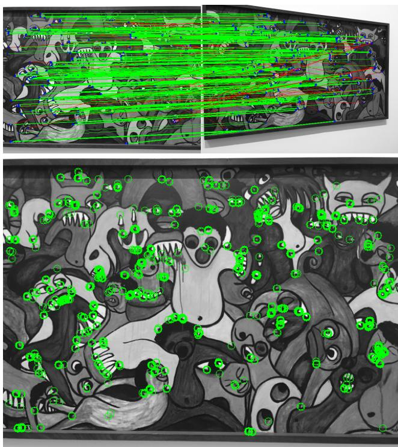
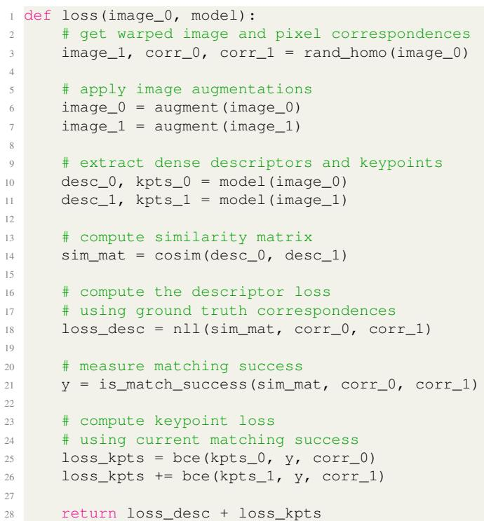
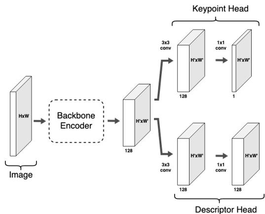
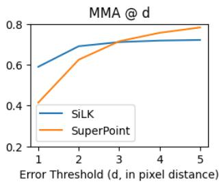
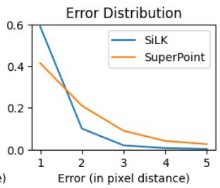

# SiLK: Simple Learned Keypoints

Pierre Gleize gleize@meta.com

Weiyao Wang weiyaowang@meta.com

Matt Feiszli mdf@meta.com

Meta AI https://github.com/facebookresearch/silk

## Abstract

Keypoint detection & descriptors are foundational technologies for computer vision tasks like image matching, 3D reconstruction and visual odometry. Hand-engineered methods like Harris corners, SIFT, and HOG descriptors have been used for decades; more recently, there has been a trend to introduce learning in an attempt to improve keypoint detectors. On inspection however, the results are difficult to interpret; recent learning-based methods employ a vast diversity of experimental setups and design choices: empirical results are often reported using different backbones, protocols, datasets, types of supervisions or tasks. Since these differences are often coupled together, it raises a natural question on what makes a good learned keypoint detector. In this work, we revisit the design ofexisting keypoint detectors by deconstructing their methodologies and identifying the key components. We re-design each component fromfirst-principle and propose Simple Learned Keypoints (SiLK) that is fully-differentiable, lightweight, and flexible. Despite its simplicity, SiLK advances new state-of-theart on Detection Repeatability and Homography Estimation tasks on HPatches and 3D Point-Cloud Registration task on ScanNet, and achieves competitive performance to state-ofthe-art on camera pose estimation in 2022 Image Matching Challenge and ScanNet.

## 1. Introduction

Keypoint detection and matching is a foundational computer vision technique to obtain a sparse yet informative representation of an image. Image stitching [7, 1], SLAM [14, 34], SfM [44], camera calibrations, tracking [37], and object detection [30] are important tasks built on keypoint correspondences [32]. A good keypoint model should be able to select a subset of points useful and informative to a specific task. One typically also wants robustness of the descriptor to some set of transformations (e.g. scale, viewpoint, or lighting variation).

  
Figure 1. The top image is an example of keypoint matching under viewpoint change; correct matches are green, incorrect ones are red. The bottom image shows keypoints which are cycleconsistent by SiLK. As can be observed, SiLK has learned to find distinctive geometric features (corners, curves, intersections,..); from single non-annotated images.

Existing keypoint methods come in multiple forms and flavors (Tab. 1). However, those differences are often coupled together and not controlled for, which make it challenging to identify the source of gain. Our quest to finding the key-components of good keypoint detectors led to an in-depth review of alternative approaches, as well as the design, from first principle, of SiLK (Simple Learned Keypoints) : A simple self-supervised approach to learn distinctive and robust keypoints from arbitrary image data in a traditional “detect-and-describe” framework. Despite its simplicity, SiLK is competitive or surpasses SOTA in most settings.

Additionally, leveraging SiLK’s simple one-stage training protocol and modular architecture, we are able to ablate various dimensions of detector performance for different tasks. In particular, with an eye toward real-time performance, we identify tasks where extremely lightweight backbone architectures are sufficient.

## 2. Related Work

Early work focused on carefully engineered methods to identify distinctive keypoints with descriptors which are robust to changes such as viewpoint and illumination. Hand-crafted techniques like Harris-corners[20], SIFT[31], ORB[41] and others [40, 8, 26, 2, 5, 13] have used explicit geometric notions like corners, gradients, and scale-space extrema to achieve results which remain both efficient and competitive to date [44, 34].

More recent work like SuperPoint[16] chose to learn to find corners; they generate a large set of synthetic shapes with annotated corners and train a model with this ground truth. While providing compelling evidence for learned methods, their training procedure is quite complex: it contains multiple training phases, a synthetic dataset, and employs a homography adaptation trick that can be difficult to tune (see our reproduced results in Tab. 2).

In the same spirit as more recent work [17, 39, 50, 49, 21, 11, 48], SiLK aims to learn keypoints in simple end-to-end fashion, without explicitly defining them as corners.

Several attempts have been made to learn keypoints implicitly; either by the careful design of the loss [17, 39, 11, 48]; or by directly predicting the matching success of descriptors [50, 21, 49]. SiLK falls in the second category, but with slight twist (cf. Sec. 3.4).

To learn descriptors, contrastive losses are commonly used. Similar to [50, 47], SiLK adopts a probabilistic approach by modeling the matching probabilities in a doublesoftmax, cycle-consistency setting and optimizes the log likelihood. The probabilistic formulation, similar to InfoNCE [35], gives us a clean way to reason about matching, and the abundant supply of hard negative examples (from pixels in the same image) makes it an attractive choice.

Context aggregation (CA) is a recent addition to the toolkit. Initiated by SuperGlue[42], CA aims to refine or transform descriptors from a pair of images before matching them. Implemented as a GNN[43] in [42], or as a Transformer[51] in [47], CA’s predictions are conditional on all descriptors from the pair of images. In other words, for an image, the descriptors will be different when matching against different images. As a result, CA needs to run on every pair of images prior to matching, as opposed to running on single images. The run-time implications render CA prohibitively expensive in some applications (quadratic versus linear complexity). SiLK does not use CA, but outperforms [42] and performs competitively with [47]. Incorporating CA is optional for future works if performance is paramount and computation cost is less of a concern.

As a postprocessing after CA, SuperGlue[42] introduced the concept of differentiable optimal transport (OT) to improve matching, using the Sinkhorn algorithm[46]. LoFTR [47] leveraged OT as well, but found little difference between OT and the simpler approach of mutual nearest neighbor (MNN) in some benchmarks.

## 3. Methodology

SiLK’s contribution is simplicity and flexibility. Our solution is built on the traditional approach of identifying distinctive pixels via robust local descriptors. We use modern but established techniques to learn to localize and describe keypoints given an arbitrary source of unlabeled images. Unlike classical methods, our descriptors and invariances are learned, and unlike some modern methods, there is no particular complexity in the matching process (SiLK employs only cosine distances and mutual nearest neighbor); this leaves few structural hyperparameters to tune. The simple backbone+heads design is backbone-agnostic, allowing experimentation. The annotation-free SSL approach means SiLK can be trained on any image or video dataset. Finally, a simple, one-stage training pipeline allows us to easily train and ablate different architectures, datasets, and hyperparameters for different tasks.

SiLK is trained to identify keypoints from single grayscale images. It provides both keypoint detections (location) and keypoint descriptors (for matching). Cycle consistency is employed for descriptor learning and a binary classifier identifies distinctive keypoints at pixel-level.

To learn descriptors, we take a source image and a transformed copy, extract descriptors for each point, and use descriptor similarity to define transition probabilities from a source location to each transformed location (and viceversa). We optimize the descriptors to maximize cycleconsistency; i.e. we maximize the probability of a roundtrip from the source to its transformed location and back.

To locate good keypoints, we train a binary classifier to identify points which will satisfy a matching criterion. A point and its transformed copy are positives when they are mutual nearest neighbors in the sense of transition probabilities, and they are negatives otherwise. We train both the cycle-consistency and classification losses jointly.

We provide simple pseudo-code in Fig. 2.

## 3.1. Architecture

The SiLK architecture (Fig. 3) follows the ”detect-anddescribe” architecture originally proposed by SuperPoint [16]. A dense feature map is first extracted by feeding an image to an encoder backbone. The shared feature map is then fed to two heads : The keypoint head extracts the logits (used to calculate the dense keypoint probabilities), while the descriptor head extracts a dense descriptor map (used to calculate keypoint similarities). The model is backboneagnostic and can easily be swapped.

<table><tr><td></td><td colspan="5">Keypoint Detection</td><td colspan="3">Descriptors &amp; Matching</td><td colspan="4">Model &amp; Training</td></tr><tr><td></td><td>Learned</td><td>Sparse</td><td>Cell-based NMS</td><td></td><td>Supervision</td><td>CA</td><td>Matcher</td><td>Supervision</td><td>Input Backbone</td><td></td><td>Data</td><td>E2E</td></tr><tr><td>SIFT</td><td>No</td><td>√</td><td>No</td><td>√</td><td></td><td>No</td><td>MNN</td><td></td><td>=</td><td>=</td><td>=</td><td>=</td></tr><tr><td>SuperPoint</td><td>√</td><td>√</td><td>√</td><td>√</td><td>Homo. Adapt.</td><td>No</td><td>MNN</td><td>Rand. Homo.</td><td>Grey</td><td>VGG</td><td>COCO</td><td>No</td></tr><tr><td>SuperGlue</td><td></td><td>√</td><td></td><td></td><td></td><td>GraphNN</td><td>OT</td><td>SfM</td><td>Grey</td><td>VGG</td><td>Oxford &amp; Paris</td><td>No</td></tr><tr><td>GLAMPoints</td><td>√</td><td>√</td><td>No</td><td>5</td><td>Matching Succ.</td><td>No</td><td>MNN</td><td></td><td>Grey</td><td>UNet</td><td>SlitLamp</td><td>√</td></tr><tr><td>D2-Net</td><td>√</td><td>√</td><td>√</td><td>√</td><td>Triplet Ranking</td><td>No</td><td>MNN</td><td>SfM</td><td>RGB</td><td>VGG</td><td>MegaDepth</td><td>√</td></tr><tr><td>R2D2</td><td>√</td><td>√</td><td>√</td><td>√</td><td>Matching AP</td><td>No</td><td>MNN</td><td>SfM</td><td>RGB</td><td>L2-Net</td><td>Aachen</td><td></td></tr><tr><td>DISK</td><td>√</td><td>√</td><td>√</td><td>√</td><td>Matching Succ.</td><td>No</td><td>MNN</td><td>SfM</td><td>RGB</td><td>UNet</td><td>MegaDepth</td><td>V</td></tr><tr><td>URR</td><td></td><td>No</td><td></td><td></td><td></td><td></td><td>MNN</td><td>3D Rendering</td><td>RGB</td><td>ResNet</td><td>ScanNet</td><td>√</td></tr><tr><td>LoFTR</td><td>=</td><td>No</td><td>=</td><td></td><td></td><td>Transformer MNN,OT</td><td></td><td>SfM</td><td>Grey</td><td>FPN</td><td>ScanNet,MegaDepth</td><td>√</td></tr><tr><td>SiLK</td><td>√</td><td>Optional</td><td>No</td><td>No</td><td>Matching Succ.</td><td>No</td><td>MNN</td><td>Rand. Homo.</td><td>Grey</td><td>Generic</td><td>Any Image Set</td><td>V</td></tr></table>

Table 1. Non-exhaustive deconstruction of keypoint detectors along different dimensions. On each, SiLK adopts the simplest choice or is flexible to different choices. In particular, SiLK does not depend strongly on backbone type or training data (Tab. 7 & Tab. 9).

  
Figure 2. Pseudo-code: learning keypoints from a single image.

## 3.2. High Matching Probability Defines Keypoints

As mentioned above, the keypoint probability estimate predicts the probability that a pixel will be correctly matched (i.e. survive a round-trip). Points with the highest likelihood of matching correctly are exactly those which we select as keypoints.

  
Figure 3. Architecture for SiLK

A common approach [16, 50, 39, 17] for obtaining keypoint probabilities is to use a softmax cell-based approach. A cell is a N × N patch in which the probability of each cell position is determined by a local softmax. The softmax operates on N ×N +1 bins; +1 being the dustbin, handling the case of cells devoid of keypoints.

SiLK’s approach is equivalent to a cell-based approach with a cell size of N = 1. This has several consequences. First, the softmax formulation becomes a sigmoid σ(x) = $\frac { 1 } { 1 + e ^ { - x } }$ . Second, it removes the sparsity constraint that keypoints are exclusive events inside a cell. And third, this removes a free parameter (the cell size N) that we do not have to later tune.

In the same spirit, SiLK does not use NMS during inference. Even though NMS is an established pruning technique that aims to spread out keypoints [16], we find SiLK doesn’t need NMS to perform (cf. Tab. 2).

## 3.3. Descriptors Define Matching Probability

Similar to [47, 50], we model the cycle matching probability using a double softmax (i.e. the probability of matching i to j, and back).

$$
P _ { i  j } = P _ { i  j } P _ { i  j }
$$

where $P _ { i } {  } { j }$ is the directional probability of matching the ith descriptor from image I to the jth descriptor in image $I ^ { \prime } .$ $P _ { i  j }$ is similar, but in the reverse direction. Both forward and backward probabilities are modeled as a softmax with temperature over descriptor cosine similarities. For fixed i, $P _ { i \to j }$ is a softmax over the i-th row of the descriptor similarity matrix, and $P _ { i  j }$ takes softmax over column j.

## 3.4. Training

Self-Supervision. Pixel-accurate correspondences are required during training. Similar to SuperPoint [16], we obtain image-pair correspondences by applying a random transformation (homography) to an image. However, the homography is a linear mapping that gives correspondences at a subpixel level.

To obtain pixel correspondences, we apply the sampled homography to all the pixel positions of image $I ;$ positions being the center of pixels (e.g. the top-left pixel has position (0.5, 0.5)). This first step establishes dense directional correspondences from I to $I ^ { \prime } .$ . We then run the same process from $I ^ { \prime }$ to I (using the inverse homography this time). Once both directional correspondences are obtained, the resulting positions are discretized; out-of-bound and non-bijective correspondences are discarded.

Image Augmentations. As done in [16, 42], we employ image augmentation to improve robustness; augmentations include random brightness, contrast, gaussian noise, speckle noise and motion blur. We refer to supplementary materials for details.

Negative and Positive Selection. One defining property of a keypoint is distinctiveness – the point can be reliably distinguished from its peers. In our case this means the point can be reliably identified in a matching algorithm, similar to [49, 50]. With that in mind, we adopt a similar supervision technique as [49]. Keypoints that are correctly matched (using the currently trained descriptors) are labelled as positive; otherwise negative.

Descriptor and Keypoint Losses. Similar to [47, 50], the descriptor loss is the negative log-likelihood loss applied to the matching probabilities for the positive round-trips (i.e. paths from point i to its location $i ^ { \prime }$ in the transformed image and back again).

$$
\mathcal { L } _ { d e s c } = - ( \log P _ { i \to i ^ { \prime } } + \log P _ { i  i ^ { \prime } } )
$$

This implicitly penalizes non-positive paths via softmax. One might notice $\mathcal { L } _ { d e s c }$ requires the computation of a large matrix (size $H W \times H W )$ . To handle potential GPU out-ofmemory, we provide a simple, yet efficient implementation which computes the similarity matrix in a block-wise fashion, and recomputes block dot products instead of storing them for backpropagation (in the same vein as [36, 25]).

The keypoint loss $\mathcal { L } _ { k e y }$ is a simple binary cross-entropy loss applied to a logistic sigmoid, in contrast to [49]. It is trained to identify keypoints with successful round-trip matches (defined by mutual-nearest-neighbor) among all others (unsuccessful).

## 4. Experiments

In this section, we empirically evaluate SiLK together with representative baselines and state-of-the-art methods. On HPatches we evaluate two complementary keypoint quality metrics (Repeatability, Mean Matching Accuracy [33]) and planar stereo estimation capabilities (Homography Estimation). In addition, we benchmark on three real-world stereo tasks: outdoor camera pose estimation on Image Matching Challenge (IMC) 2022, and both indoor camera pose estimation and 3D point-cloud registration on ScanNet. In these experiments, we study the following:

(1) Many methods employ complex strategies to learn and predict good keypoints and descriptors, including elements like multi-stage training, cell-based priors, complicated post-processing, context aggregation, and groundtruth 3D pose supervision (see Tab. 1), in various combinations. What machinery is necessary? SiLK contains no such machinery, and can be viewed as a reduction from these methods. However, SiLK either achieves new SOTA or compares very favorably. This questions the need for complex schemes for the evaluated tasks.

(2) We observed rather strong performance from engineered features (e.g. SIFT in Tab. 2&Tab. 6) vs learned methods. This motivates us to revisit design choices in a learned keypoint detector: What makes a good keypoint detector? We ablate each component (data, backbone, etc.) and test generalization performance under various conditions (e.g. input size, test data, task, etc). SiLK proves very robust to these choices (Sec. 4.6). In particular, a very lightweight version of SiLK (two 3x3 convolution layers) is competitive to SOTA on homography estimation, camera pose estimation and point cloud registration (Tab. 7&Tab. 8).

We hope these results can serve the community and help adapt keypoint models to their tasks and needs. For example, labeling tasks (e.g. self-training [37], object pose [38]) might focus on high accuracy (i.e. larger backbone and denser keypoint selection), while tasks requiring speed (e.g. SLAM [34]) might find our lightweight backbone attractive.

## 4.1. Implementation Details

Our own training pipeline has been used for all experiments with SiLK, as well as our reproduced SuperPoint (Tab. 2) results. Training time is ˜5 hours on 2 Tesla V100-SXM2 GPUs using our default setup.

Default Setup. Unless specified otherwise, all results use the following setup. Trained on COCO [29] images (randomly sampled), with Adam [24] optimizer with learning rate $1 e ^ { - 4 }$ and betas (0.9, 0.999); trained for 100k iterations; batch size of 1 per GPU; dense descriptor map is $1 4 6 \times 1 4 6$ for all architectures and input resolutions; cosine similarities scaled by temperature $2 0 ^ { - 1 }$ ; VGGnp-4 backbone (VGG architecture with max-pooling removed, details in Sec. 4.6); sparse keypoints obtained with top-k $( k \ : = \ : 1 0 0 0 0 )$ ; detection head is 1 3x3 convolution (128- dims), and 1 1x1 convolution; descriptor head is 1 3x3 convolution (128-dims), and 1 1x1 convolution (128-dims out); no padding in convolutions; ReLU and batchnorm used as non-linearity and normalization (see supplementary).

## 4.2. HPatches Homography Estimation

Following [16, 42, 39, 47], we evaluate homography estimation on HPatches [3]. HPatches contains 57 scenes (of 6 images) with significant illumination changes and 59 scenes with large viewpoint variations. Images in each scene are related by groundtruth homographies. We follow LoFTR [47], (currently SOTA on HPatches), and scale the shorter image edge to 480 at inference time.

Evaluation Protocol. For every image pairs, the model detects a set of keypoints. These are desired to be distinctive and thus repeatably detected across views. We use Repeatability to evaluate detection performance as in [16]. To test invariance of keypoint descriptors, each model’s preferred matching algorithm establishes correspondence across images to obtain a subset of keypoints. We distinguish this subset as post-matching and the entire set as pre-matching. The accuracy of each correspondence is evaluated by Mean Matching Accuracy as in [17, 39, 50]. Finally, we use OpenCV RANSAC algorithm to estimate homography from matched keypoints, and evaluate Homography Estimation Accuracy [16] and Homography Estimation AUC [42, 47]. Baselines. We compare SiLK against both sparse detectorbased methods and dense detector-free methods. The sparse detector-based methods generally follow “detect then match”: the model first detects a sparse set of distinctive points, then matches features. We include SIFT [31] as well as learned detectors SuperPoint [16] (both official release and our repro), R2D2 [39] and DISK [50]. On the other hand, dense detector-free perform “detection by matching”: the model first extracts features, then applies a learned prematching CA module (e.g. GNN [42] or transformer [47]) to adapt the features to a specific pair of images, and then finds matches. While SiLK does not employ CA, we still include comparisons to the SOTA detector-free LoFTR [47]. Results. Despite its simplicity, SiLK outperforms all methods on repeatability, homography accuracy and homography estimation (Tab. 2). In particular, SiLK has a strong margin when the error threshold is small (ϵ = 1). This validates our pixel-accurate keypoint localization. SiLK lags only on the MMA@3 metric. This is caused by the pixelaccurate contrastive loss (Fig. 4). Consequently, SiLK does not benefit from increasing error threshold in MMA. In addition, even vs LoFTR (which uses dense features and CA)

in Tab. 3, SiLK shows strong performance on Homography Estimation AUC and competitive performance on Homography accuracy. This questions the necessity of CA for these particular tasks; this may be valuable in applications which are particularly sensitive to runtime performance.

  
Figure 4. The pixel-accurate contrastive loss results in very discriminative local features, thus reshaping the error distribution to make fewer local errors (MMA@1). This differs from interpolated, cell-based descriptors used in SuperPoint, which produces less accurate keypoints (MMA@3+).

## 4.3. IMC 2022 outdoor pose estimation

The Image Matching Challenge (IMC 2022) [22] provides pairs of outdoor images from different viewpoints; participants are required to estimate the fundamental matrix. Camera pose accuracy is then computed for ten thresholds of rotation and translation error (ranging from (1◦, 20cm) to (10◦, 5m)). Mean average accuracy (mAA) is reported by averaging across thresholds and scenes.

Evaluation Protocol. Sparse methods (DISK, SiLK) detect keypoints in individual images; mutual nearest neighbor is used to select matches from each pair. Methods with CA (SuperGlue, LoFTR) directly identify matches from each image pair. In either case, the fundamental matrix is estimated using MAGSAC [4]. The challenge allows different image sizes and tuning MAGSAC parameters [22]. We use 30k keypoints and MAGSAC threshold .25.

Baselines. We consider the best leaderboard results from three baselines. (i) DISK is the winner of IMC 2020 and is SOTA among sparse methods. 2022 DISK results are from the IMC team (submission). We also take the best version of (ii) SuperGlue (submission) and (iii) LoFTR (submission) provided by the community.

Results. We coarsely tune SiLK for this task for 30 trials (compared to LoFTR’s 200 trials). SiLK again performs competitively (c.f. Tab. 4), outperforming DISK by a significant margin (+0.19/+0.18 mAA). SiLK also performs favorably compared to SuperGlue, which uses context aggregation and optimal transport matching.

## 4.4. ScanNet: Indoor Pose & Point Clouds

ScanNet [12] is a large-scale dataset of 1513 indoor scenes of RGB-D images and ground-truth camera poses.

<table><tr><td></td><td colspan="2">Repeatability</td><td colspan="2">Hom. Est. Acc.</td><td colspan="2">Hom. Est. AUC</td><td colspan="2">MMA</td><td colspan="2"># of keypoints</td></tr><tr><td></td><td> $\overline { { \epsilon = 1 } }$ </td><td> $\overline { { \epsilon = 3 } }$ </td><td> $\overline { { \epsilon = 1 } }$ </td><td> $\overline { { \epsilon = 3 } }$ </td><td> $\overline { { \epsilon = 1 } }$ </td><td> $\overline { { \epsilon = 3 } }$ </td><td> $\overline { { \epsilon = 1 } }$ </td><td> $\overline { { \epsilon = 3 } }$ </td><td>pre-match</td><td>post-match</td></tr><tr><td>SuperPoint (MagicLeap)</td><td>0.34</td><td>0.61</td><td>0.43</td><td>0.8</td><td>0.2</td><td>0.51</td><td>0.41</td><td>0.72</td><td>847</td><td>499</td></tr><tr><td>SuperPoint (Ours)</td><td>0.33</td><td>0.52</td><td>0.48</td><td>0.75</td><td>0.26</td><td>0.52</td><td>0.38</td><td>0.53</td><td>1143</td><td>474</td></tr><tr><td>SIFT</td><td>0.31</td><td>0.52</td><td>0.6</td><td>0.84</td><td>0.34</td><td>0.61</td><td>0.41</td><td>0.55</td><td>2189</td><td>910</td></tr><tr><td>R2D2</td><td>0.36</td><td>0.72</td><td>0.45</td><td>0.79</td><td>0.2</td><td>0.5</td><td>0.34</td><td>0.75</td><td>6088</td><td>1967</td></tr><tr><td>DISK</td><td>0.38</td><td>0.69</td><td>0.45</td><td>0.8</td><td>0.22</td><td>0.52</td><td>0.52</td><td>0.84</td><td>3349</td><td>1794</td></tr><tr><td>SiLK (top-10k)</td><td>0.62</td><td>0.81</td><td>0.62</td><td>0.87</td><td>0.4</td><td>0.66</td><td>0.59</td><td>0.71</td><td>10000</td><td>4283</td></tr><tr><td>SiLK (top-5k)</td><td>0.56</td><td>0.76</td><td>0.6</td><td>0.85</td><td>0.39</td><td>0.64</td><td>0.57</td><td>0.69</td><td>5000</td><td>2074</td></tr><tr><td>SiLK (top-1k)</td><td>0.43</td><td>0.61</td><td>0.53</td><td>0.81</td><td>0.32</td><td>0.58</td><td>0.52</td><td>0.63</td><td>1000</td><td>389</td></tr></table>

Table 2. SiLK achieves new SOTA on HPatches compared to other methods with sparse keypoints and features. Despite its simplicity, SiLK achieves higher performance on all metrics except MMA@3. We include the # of keypoints to ensure a fair comparison.
<table><tr><td></td><td colspan="2">Hom. Est. Acc.</td><td colspan="2">Hom. Est. AUC</td><td colspan="2">MMA</td></tr><tr><td>LoFTR (MegaDepth)</td><td>€ = 1 0.65</td><td> $\epsilon = 3$  0.87</td><td> $\epsilon = 1$  0.37 0.65</td><td> $\epsilon = 3$ </td><td>€ = 1 0.64</td><td> $\epsilon = 3$  0.91</td></tr><tr><td>LoFTR (ScanNet)</td><td>0.24</td><td>0.57</td><td>0.07</td><td>0.33</td><td>0.36</td><td>0.76</td></tr><tr><td>SiLK (top-10k) SiLK (top-5k)</td><td>0.62 0.60</td><td>0.87 0.85</td><td>0.4 0.39</td><td>0.66 0.64</td><td>0.59 0.57</td><td>0.71 0.69</td></tr></table>

Table 3. SiLK achieves competitive performance to SOTA LoFTR on HPatches, despite not using context aggregation. The top-5k SiLK has similar number of matches compared to outdoor LoFTR. We remark that LoFTR has large generalization gap when training on different types of dataset (indoor vs. outdoor).

<table><tr><td></td><td>private mAA</td><td>public mAA</td></tr><tr><td>Sparse Features</td><td></td><td></td></tr><tr><td>DISK</td><td>0.491</td><td>0.502</td></tr><tr><td>SuperGlue</td><td>0.676</td><td>0.678</td></tr><tr><td>SiLK</td><td>0.685</td><td>0.684</td></tr><tr><td>Dense Features</td><td></td><td></td></tr><tr><td>LoFTR (MegaDepth)</td><td>0.735</td><td>0.721</td></tr></table>

Table 4. SiLK achieves new SOTA for sparse methods on IMC2022 and performs competitively to dense methods with context aggregation.

Using the official train/test split we evaluate both relative camera pose estimation and point-cloud registration. Relative camera pose estimation has been used in multiple previous works [52, 53, 6, 42, 47]. The task is to estimate the essential matrix with RANSAC from point matches in a pair of images. We report pose error AUC at thresholds (5◦,10◦,20◦) using 20k keypoints and inlier threshold .5.

This protocol measures translation error in degrees and is known to suffer from scale ambiguity [52]. Angular translation error may be unstable, in particular if the underlying translation (in meters) is small. In response, recent works [19, 18] have introduced a 3D point-cloud registration task, using the ground-truth depth provided in ScanNet. A pair of images 20 frames apart is first sampled. Given this pair, a model predicts point matches. After matching, relative camera pose is estimated. Different from the previous protocol, ground-truth depth and camera intrinsics are now used to align matches in 3D. In addition to relative pose errors (reported separately for translation (cm) and rotation (degree)), the Chamfer distance (in cm) is measured between the registered point cloud and the groundtruth point cloud. We refer to the original papers [19, 18] for details on the evaluation setup and metrics.

<table><tr><td rowspan=1 colspan=3>Pose Estimation AUC</td><td rowspan=1 colspan=1>@5°</td><td rowspan=1 colspan=1>@10°</td><td rowspan=1 colspan=1>@20°</td></tr><tr><td rowspan=6 colspan=3>Sparse FeaturesD2-Net [17] + MNNSuperPoint [16] + MNNSuperPoint + PointCN [52]SuperPoint + OANet [53]SuperPoint + SuperGlue [42]SiLK + MNN</td><td rowspan=1 colspan=1></td><td rowspan=1 colspan=1></td><td rowspan=1 colspan=1></td></tr><tr><td rowspan=1 colspan=1>5.3</td><td rowspan=1 colspan=1>14.5</td><td rowspan=1 colspan=1>28.0</td></tr><tr><td rowspan=1 colspan=2>NN</td><td rowspan=1 colspan=1>9.4</td><td rowspan=1 colspan=1>21.5</td><td rowspan=1 colspan=1>36.4</td></tr><tr><td rowspan=1 colspan=1>2]</td><td rowspan=1 colspan=1>11.4</td><td rowspan=1 colspan=1>25.5</td><td rowspan=1 colspan=1>41.4</td></tr><tr><td rowspan=1 colspan=1>11.8</td><td rowspan=1 colspan=1>26.9</td><td rowspan=1 colspan=1>43.9</td></tr><tr><td rowspan=1 colspan=1>16.218.0</td><td rowspan=1 colspan=1>33.834.4</td><td rowspan=1 colspan=1>51.850.4</td></tr><tr><td rowspan=2 colspan=3>Dense FeaturesDRC-Net [27]LoFTR (MegaDepth)LoFTR (ScanNet)</td><td rowspan=1 colspan=1></td><td rowspan=1 colspan=1></td><td rowspan=2 colspan=1>30.550.657.6</td></tr><tr><td rowspan=1 colspan=1>7.716.921.5</td><td rowspan=1 colspan=1>17.933.640.8</td></tr></table>

Table 5. SiLK advances SOTA on relative pose estimation among sparse methods on ScanNet and performs competitively against dense method LoFTR.

## 4.4.1 Relative pose estimation

Baselines. We compare SiLK with both sparse detectorbased methods and dense detector-free methods. For the sparse methods, we consider local feature descriptors (R2D2, SuperPoint) with mutual nearest neighbor (MNN) for matching. SiLK falls into this category. In addition, we consider multiple learned context aggregation methods for matching that operates on SuperPoint, including PointCN [52], OANet [53] and SuperGlue. For detector-free dense methods, we consider DRC-Net [27] and LoFTR. We include two versions of LoFTR: one trained on MegaDepth with optimal transport post-processing and one trained on ScanNet.

Results. As summarized in Tab. 5, SiLK significantly outperforms D2-Net (+12.7) and SuperPoint (+8.6) when using mutual nearest neighbor matching. In addition, SiLK outperforms the previous SOTA sparse method SuperGlue, despite its simpler design without context aggregation. SiLK performs similarly to LoFTR trained with MegaDepth. SiLK is only outperformed by LoFTR trained on ScanNet, the same as evaluation data.

## 4.4.2 Pairwise 3D point-cloud registration

Baselines. We consider three main types of baselines. (i) Sparse Features + RANSAC We extract sparse keypoints and their features from off-the-shelf models, and use RANSAC to estimate alignment. This includes SIFT and SuperPoint, and 3D geometry model FCGF [10]. (ii) Dense Feature Matching We follow the [18] and select high-quality corresponding pairs using the ratio test, and then solve a weighted Procustes problem [9, 23] to produce alignment. We add a dense version of SuperPoint by discarding the keypoint prediction. We include the current state-of-the-art URR [18] that learns invariant point descriptors through cross-view synthesis. By ignoring the keypoint scoring prediction, SiLK also belongs to this category. The goal is to evaluate the quality of the dense point features. (iii) Pose/Geometry Supervised We consider methods that use groundtruth poses to supervise, which are not required in (i) and (ii). These include LoFTR, DGR [9] and 3D MV Registration [19]. For LoFTR, we include only the MegaDepth model, since it performed better in this task.

Results. As shown in Tab. 6, SiLK achieves new SOTA across all metrics (except rotation accuracy at 45◦). In particular, SiLK achieves very high accuracy at small thresholds (5◦ angular, 5cm translation and 1cm for chamfer), validating SiLK’s pixel-level precision. Comparing with DGR, 3D MV Reg and LoFTR that use groundtruth camera poses during training, SiLK significantly outperforms, indicating that groundtruth 3D supervision is not necessary to train good keypoint features. We did not include the chamfer results for LoFTR as the provided positions do not match the required resolution for correct chamfer evaluation. SiLK also achieves superior performance vs previous SOTA URR. We note that URR requires two different frames sampled from the same scene during training, and is supervised by a differentiable cross-view rendering process. In contrast, SiLK only requires a single 2D image and is trained with a simple point matching loss. Finally, we observe that SuperPoint performs competitively when evaluated in this dense fashion; this is an important difference from the results reported in URR using sparse features.

## 4.5. Discussion. What makes SiLK perform ?

Multiple factors contribute to SiLK’s performance. In particular, the cycle-consistent loss and the dense predictions. First, the cycle-consistent loss (Fig. 2, supplementary) enforces the natural properties of keypoints: distinctiveness & robustness to viewpoint / photometric changes, while existing methods rely on proxy objectives or additional complexity (i.e. ”corners” in SuperPoint[16] / SuperGlue[42], ”peakiness” in R2D2[39], ”keypoint weighting scheme” in D2-Net[17], ”RL cycle-consistent reward” in DISK[50]). Removing unnecessary complexity helps the model focus its learning on the essentials, and is supported by consistent, strong results across benchmarks and metrics (Tab. 2, Tab. 3, Tab. 4, Tab. 5, Tab. 6). Second, SiLK produces dense, pixel-accurate keypoints, while all existing methods have structural constraints (downsampling layers, cell-based schemes, and NMS, c.f. Tab. 1). This leads to more robust contrastive learning (i.e. more negative pairs), allows producing more keypoints matches and boosts results in the accurate regime (ϵ = 1 in Tab. 2).

## 4.6. What makes good keypoint detectors?

Leveraging SiLK’s flexibility (Sec. 3), we comprehensively ablate a large pool of design choices such as model architecture and image resolution. Surprisingly, we found that reducing architecture size, compute cost, and training input size only mildly impact model performance on homography estimation, camera pose estimation and point cloud registration. This benefits many important applications, such as on-device inference.

Here we discuss the key findings. We use the metrics Repeatability@1 (R), Homography Estimation Accuracy@1 (HA), Mean Matching Accuracy@1 (MMA) for HPatches, and Rotation Accuracy@5◦ (RA), Translation Accuracy@5cm (TA) and Chamfer@1 (C) for ScanNet, all at lowest error thresholds. Additional results and analysis are included in supplementary.

Agnostic to backbone. Existing methods use various backbones (Tab. 1); the effects on keypoint models are not well understood. We consider FPN from LoFTR and UNet from DISK; both are modern compared to SiLK’s VGGnp [45] backbone. We find no empirical performance gain despite far greater parameter counts (Tab. 7). This questions the need for high-capacity models for these keypoint problems.

Next we reduce the complexity of the original Super-Point backbone VGG-4. Max-pooling and up-sampling layers are removed. Our VGGnp-4 contains four convolution blocks, each with two convolution layers followed by ReLU. We discard convolution blocks from VGGnp-4 to obtain VGGnp-3, VGGnp-2 and VGGnp-1. On top of VGGnp-1, we reduce channel and descriptor sizes to 64 and 32 respectively and obtain an ultra-lightweight model, VGGnp-µ. Results on all metrics (except MMA) only drop mildly as we shrink the model. In particular, SiLK (VGGnp-µ in Tab. 7) achieves very competitive performance (Tab. 2&Tab. 6). On the other hand, matching scores (MMA) drop signficantly. We suggest two possible reasons: first, pointwise matching may benefit from the larger receptive field of deeper models. Second, homography estimation aggregates numerous pointwise measurements; homographies will improve if the noises cancel out, or if the outliers are removed by RANSAC.

Fast training on tiny images. By default, SiLK uses 146x146 descriptor map resolution during training. Higher resolution provides more points, which benefits the contrastive loss with more negatives, but also increases training time and GPU memory usage. Surprisingly, performance changes very little when varying resolution during training (Tab. 8), especially on ScanNet. Tiny feature maps (82x82) remain competitive on both HPatches and ScanNet, and trains in 1.7 hours on two GPUs. This enables applications like test-time finetuning, on-device finetuning, and rapid experimental iteration.

<table><tr><td></td><td colspan="4">Rotation</td><td colspan="4"></td><td colspan="4"></td><td colspan="4">Chamfer</td></tr><tr><td></td><td colspan="2">Accuracy ↑</td><td colspan="2"></td><td colspan="2">Error ↓</td><td colspan="2">Accuracy ↑</td><td colspan="2">Error ↓</td><td colspan="2"></td><td colspan="2">Accuracy ↑</td><td colspan="2">Error ↓</td></tr><tr><td></td><td>5°</td><td>10°</td><td>45°</td><td>Mean</td><td>Med.</td><td>5</td><td>10</td><td>25</td><td>Mean</td><td>Med.</td><td>1</td><td>5</td><td>10</td><td>Mean</td><td></td><td>Med.</td></tr><tr><td>Sparse Features + RANSAC</td><td></td><td></td><td></td><td></td><td></td><td></td><td></td><td></td><td></td><td></td><td></td><td></td><td></td><td></td><td></td><td></td></tr><tr><td>SIFT [31]</td><td>55.2</td><td>75.7</td><td>89.2</td><td>18.6</td><td>4.3</td><td>17.7</td><td>44.5</td><td>79.8</td><td>26.5</td><td>11.2</td><td>38.1</td><td></td><td>70.6</td><td>78.3</td><td>42.6</td><td>1.7</td></tr><tr><td>SuperPoint [16]</td><td>65.5 70.2</td><td>86.9</td><td>96.6</td><td>8.9</td><td>3.6</td><td>21.2</td><td>51.7</td><td>88.0</td><td>16.1</td><td>9.7</td><td>45.7</td><td>81.1</td><td></td><td>88.2</td><td>19.2</td><td>1.2</td></tr><tr><td>FCGF [10]</td><td></td><td>87.7</td><td>96.2</td><td>9.5</td><td>3.3</td><td>27.5</td><td>58.3</td><td>82.9</td><td>23.6</td><td>8.3</td><td>52.0</td><td>78.0</td><td>83.7</td><td></td><td>24.4</td><td>0.9</td></tr><tr><td>Pose/Geometry Supervised</td><td></td><td></td><td></td><td></td><td></td><td></td><td></td><td></td><td></td><td></td><td></td><td></td><td></td><td></td><td></td><td></td></tr><tr><td>DGR [9]</td><td>81.1</td><td>89.3</td><td>94.8</td><td>9.4</td><td>1.8</td><td>54.5</td><td>76.2</td><td>88.7</td><td>18.4</td><td>4.5</td><td></td><td>70.5</td><td>85.5</td><td>89.0</td><td>13.7</td><td>0.4</td></tr><tr><td>3D MV Reg [19]</td><td>87.7</td><td>93.2</td><td>97.0</td><td>6.0</td><td>1.2</td><td>69.0</td><td>83.1</td><td>91.8</td><td>11.7</td><td>2.9</td><td>78.9</td><td></td><td>89.2</td><td>91.8</td><td>10.2</td><td>0.2</td></tr><tr><td>LoFTR(MegaDepth) [47]</td><td>91.7</td><td>96.8</td><td>99.4</td><td>2.8</td><td>1.2</td><td>65.9</td><td>85.2</td><td>97.1</td><td>6.0</td><td>3.3</td><td></td><td></td><td></td><td>=</td><td>=</td><td>-</td></tr><tr><td>Dense feature matching</td><td></td><td></td><td></td><td></td><td></td><td></td><td></td><td></td><td></td><td></td><td></td><td></td><td></td><td></td><td></td><td></td></tr><tr><td>SuperPoint [16]</td><td>93.0</td><td>98.4</td><td>99.8</td><td>2.5</td><td>1.6</td><td>56.8</td><td>84.7</td><td>98.2</td><td>6.5</td><td>4.3</td><td></td><td>77.3</td><td>96.1</td><td>98.4</td><td>4.5</td><td>0.3</td></tr><tr><td>URR [18]</td><td>92.7</td><td>95.8</td><td>98.5 99.6</td><td>3.4</td><td>0.8</td><td>77.2</td><td>89.6</td><td>96.1</td><td>7.3</td><td>2.3</td><td></td><td>86.0</td><td>94.6</td><td>96.1</td><td>5.9</td><td>0.1</td></tr><tr><td>SiLK (VGGnp-4)</td><td>98.1</td><td>99.0</td><td></td><td>1.7</td><td>0.8</td><td>82.9</td><td>94.8</td><td>99.0</td><td>4.1</td><td>2.1</td><td></td><td>92.8</td><td>98.3</td><td>99.1</td><td>4.3</td><td>0.1</td></tr></table>

Table 6. SiLK achieves state-of-the-art on camera pose estimation and point cloud registration on ScanNet.

<table><tr><td rowspan="2"></td><td colspan="3">HPatches</td><td colspan="2">ScanNet</td><td colspan="3">Model</td></tr><tr><td>R</td><td></td><td>HAc MMA</td><td>RA TA</td><td>C</td><td>Param</td><td>FPS</td><td>GFLOP</td></tr><tr><td>VGGnp-4</td><td>0.62</td><td>0.62</td><td>0.59</td><td>98.1</td><td>82.9 92.8</td><td>942k</td><td>12.2</td><td>370</td></tr><tr><td>VGGnp-3</td><td>0.63</td><td>0.61</td><td>0.58</td><td>98.0</td><td>84.2 93.5</td><td>868k</td><td>12.5</td><td>330</td></tr><tr><td>VGGnp-2</td><td>0.63</td><td>0.57</td><td>0.55</td><td>97.3</td><td>83.5 92.4</td><td>757k</td><td>14.3</td><td>268</td></tr><tr><td>VGGnp-1</td><td>0.63 0.57</td><td></td><td>0.44</td><td>94.6</td><td>82.1 90.0</td><td>461k</td><td>18.9</td><td>90</td></tr><tr><td>VGGnp-μ</td><td>0.64</td><td>0.56</td><td>0.40</td><td>93.5</td><td>81.1 89.0</td><td>76k</td><td>36.5</td><td>23</td></tr><tr><td>FPN [47]</td><td>0.58</td><td>0.55</td><td>0.52</td><td>= =</td><td>-</td><td>6.6M</td><td>17.5</td><td>298</td></tr><tr><td>UNet [50]</td><td>0.60</td><td>0.41</td><td>0.58</td><td>=</td><td>1</td><td>1.3M</td><td>25.9</td><td>198</td></tr></table>

Table 7. SiLK is backbone agnostic. Backbones from existing methods are trained and evaluated. Low-capacity model perform well on all metrics except MMA. FPS and GFLOPs measured on 480×640 images with NVIDIA Quadro GP100 GPU.

<table><tr><td colspan="2"></td><td colspan="3">HPatches</td><td colspan="3">ScanNet</td></tr><tr><td>Size</td><td>Time</td><td>R</td><td>HAc</td><td>MMA</td><td>RA</td><td>TA</td><td>C</td></tr><tr><td rowspan="3">822  $1 1 4 ^ { 2 }$   $1 4 6 ^ { 2 }$ </td><td>1.7h</td><td>0.60</td><td>0.58</td><td>0.56</td><td>98.1</td><td>83.5</td><td>92.5</td></tr><tr><td>2.7h</td><td>0.62</td><td>0.62</td><td>0.59</td><td>98.1</td><td>82.9</td><td>92.8</td></tr><tr><td>5h</td><td>0.63</td><td>0.59</td><td>0.59</td><td>98.2</td><td>83.3</td><td>92.9</td></tr><tr><td> $1 7 8 ^ { 2 }$   $2 1 0 ^ { 2 }$ </td><td>9.5h 18h</td><td>0.63 0.63</td><td>0.62 0.61</td><td>0.59 0.60</td><td>98.1 98.1</td><td>83.5 83.4</td><td>92.9 92.8</td></tr></table>

Table 8. Decreasing training image size has minimal impact. SiLK can be trained under 3h, with little performance drop.

Robustness to training data. Existing methods use various training sets (Tab. 1); empirically we observe cases of poor generalization across datasets. For example, LoFTR[47], trained on indoor ScanNet data, drops significantly vs LoFTR trained on outdoor MegaDepth data (Tab. 3) and vice-versa (Tab. 5). This overfitting may be exacerbated by the high-capacity machinery used by these methods, e.g. LoFTR’s Transformer contexualizer. We measure SiLK’s robustness on training data choices, by using different images from COCO[29], ImageNet[15], MegaDepth[28] and ScanNet[12]. We also combine them to formulate a diversified set of training data.

SiLK is quite robust to change in training set, with the exception of ScanNet (Tab. 9). We hypothesize this is due to the significant amount of uniform surfaces (e.g. walls, doors) present in ScanNet. These featureless areas contain few keypoints to learn from. SiLK’s drop agrees directionally with LoFTR’s drop observed in Tab. 3, but the magnitude is smaller. This may be because SiLK’s VGGnp backbone has lower capacity than LoFTR (FPN+Transformer), and hence is less susceptible to overfitting. Finally, we remark that SiLK trained with COCO is used for comparisons in Sec. 4.2, Sec. 4.3 and Sec. 4.4 for HPatches, IMC and ScanNet, whereas LoFTR requires different training data (MegaDepth or ScanNet) to achieve strong performance.

<table><tr><td rowspan="2"></td><td colspan="3">HPatches</td><td colspan="3">ScanNet</td></tr><tr><td>R</td><td>HAc</td><td>MMA</td><td>RA</td><td>TA</td><td>C</td></tr><tr><td>COCO</td><td>0.62</td><td>0.62</td><td>0.59</td><td>98.1</td><td>82.9</td><td>92.8</td></tr><tr><td>ImageNet</td><td>0.63</td><td>0.6</td><td>0.59</td><td>98.1</td><td>83.5</td><td>93.0</td></tr><tr><td>MegaDep.</td><td>0.62</td><td>0.61</td><td>0.57</td><td>97.9</td><td>83.5</td><td>92.9</td></tr><tr><td>ScanNet</td><td>0.60</td><td>0.55</td><td>0.48</td><td>97.6</td><td>82.8</td><td>92.7</td></tr><tr><td>C+I+M+S C+I+M</td><td>0.61 0.64</td><td>0.59 0.6</td><td>0.54 0.59</td><td>97.7 98.0</td><td>83.0 82.9</td><td>92.6 92.8</td></tr></table>

Table 9. SiLK is robust to different training sets. A noticeable drop is observed only when training on ScanNet.

## 5. Conclusion

This paper presents SiLK, a simple and flexible framework for keypoint detection and descriptors. SiLK is designed from the principles of distinctiveness and invariance, and achieves or advances SOTA on key low-level tasks for 3D visual perception. SiLK’s simplicity questions the need for complex machinery for good keypoint detection in lowlevel applications. In addition, extensive ablations reveal SiLK’s robustness to backbone, training data and training input size. These findings lead to a tiny version of SiLK that is lightweight, accurate, and trains quickly. We view this “tiny and learned” regime as very promising for applications where runtime and/or power consumption is critical. We hope SiLK can draw attention to the field and facilitate stronger solutions.

## References

[1] Ebtsam Adel, Mohammed Elmogy, and Hazem Elbakry. Image stitching based on feature extraction techniques: a survey. International Journal of Computer Applications, 99(6):1–8, 2014.

[2] Alexandre Alahi, Raphael Ortiz, and Pierre Vandergheynst. Freak: Fast retina keypoint. In 2012 IEEE conference on computer vision and pattern recognition, pages 510–517. Ieee, 2012.

[3] Vassileios Balntas, Karel Lenc, Andrea Vedaldi, and Krystian Mikolajczyk. Hpatches: A benchmark and evaluation of handcrafted and learned local descriptors. In Proceedings of the IEEE conference on computer vision and pattern recognition, pages 5173–5182, 2017.

[4] Daniel Barath, Jiri Matas, and Jana Noskova. MAGSAC: marginalizing sample consensus. In Conference on Computer Vision and Pattern Recognition, 2019.

[5] Herbert Bay, Andreas Ess, Tinne Tuytelaars, and Luc Van Gool. Speeded-up robust features (surf). Computer vision and image understanding, 110(3):346–359, 2008.

[6] Eric Brachmann and Carsten Rother. Neural-guided ransac: Learning where to sample model hypotheses. In 2019 IEEE/CVF International Conference on Computer Vision (ICCV), pages 4321–4330, 2019.

[7] Matthew A. Brown and David G. Lowe. Automatic panoramic image stitching using invariant features. International Journal of Computer Vision, 74:59–73, 2006.

[8] Michael Calonder, Vincent Lepetit, Christoph Strecha, and Pascal Fua. Brief: Binary robust independent elementary features. In European conference on computer vision, pages 778–792. Springer, 2010.

[9] Christopher Choy, Wei Dong, and Vladlen Koltun. Deep global registration. In CVPR, 2020.

[10] Christopher Choy, Jaesik Park, and Vladlen Koltun. Fully convolutional geometric features. In 2019 IEEE/CVF International Conference on Computer Vision (ICCV), pages 8957–8965, 2019.

[11] Peter Hviid Christiansen, Mikkel Fly Kragh, Yury Brodskiy, and Henrik Karstoft. Unsuperpoint: End-to-end unsupervised interest point detector and descriptor. arXiv preprint arXiv:1907.04011, 2019.

[12] Angela Dai, Angel X Chang, Manolis Savva, Maciej Halber, Thomas Funkhouser, and Matthias Nießner. Scannet: Richly-annotated 3d reconstructions of indoor scenes. In Proceedings of the IEEE conference on computer vision and pattern recognition, pages 5828–5839, 2017.

[13] Navneet Dalal and Bill Triggs. Histograms of oriented gradients for human detection. In 2005 IEEE computer society conference on computer vision and pattern recognition (CVPR’05), volume 1, pages 886–893. Ieee, 2005.

[14] Andrew J. Davison, Ian D. Reid, Nicholas Molton, and Olivier Stasse. Monoslam: Real-time single camera slam. IEEE Transactions on Pattern Analysis and Machine Intelligence, 29:1052–1067, 2007.

[15] Jia Deng, Wei Dong, Richard Socher, Li-Jia Li, Kai Li, and Li Fei-Fei. Imagenet: A large-scale hierarchical image

database. In 2009 IEEE conference on computer vision and pattern recognition, pages 248–255. Ieee, 2009.

[16] Daniel DeTone, Tomasz Malisiewicz, and Andrew Rabinovich. Superpoint: Self-supervised interest point detection and description. In Proceedings of the IEEE conference on computer vision and pattern recognition workshops, pages 224–236, 2018.

[17] Mihai Dusmanu, Ignacio Rocco, Tomas Pajdla, Marc Pollefeys, Josef Sivic, Akihiko Torii, and Torsten Sattler. D2-net: A trainable cnn for joint detection and description of local features. arXiv preprint arXiv:1905.03561, 2019.

[18] Mohamed El Banani, Luya Gao, and Justin Johnson. Unsupervisedr&r: Unsupervised point cloud registration via differentiable rendering. In Proceedings of the IEEE/CVF Conference on Computer Vision and Pattern Recognition, pages 7129–7139, 2021.

[19] Z. Gojcic, C. Zhou, J. D. Wegner, L. J. Guibas, and T. Birdal. Learning multiview 3d point cloud registration. In 2020 IEEE/CVF Conference on Computer Vision and Pattern Recognition (CVPR), pages 1756–1766, Los Alamitos, CA, USA, jun 2020. IEEE Computer Society.

[20] Chris Harris, Mike Stephens, et al. A combined corner and edge detector. In Alvey vision conference, volume 15, pages 10–5244. Manchester, UK, 1988.

[21] Wilfried Hartmann, Michal Havlena, and Konrad Schindler. Predicting matchability. In Proceedings of the IEEE conference on computer vision and pattern recognition, pages 9–16, 2014.

[22] Yuhe Jin, Dmytro Mishkin, Anastasiia Mishchuk, Jiri Matas, Pascal Fua, Kwang Moo Yi, and Eduard Trulls. Image Matching across Wide Baselines: From Paper to Practice. International Journal of Computer Vision, 2020.

[23] W. Kabsch. A solution for the best rotation to relate two sets of vectors. Acta Crystallographica Section A, 32(5):922– 923, Sep 1976.

[24] Diederik P. Kingma and Jimmy Ba. Adam: A method for stochastic optimization. CoRR, abs/1412.6980, 2015.

[25] Benjamin Lefaudeux, Francisco Massa, Diana Liskovich, Wenhan Xiong, Vittorio Caggiano, Sean Naren, Min Xu, Jieru Hu, Marta Tintore, Susan Zhang, Patrick Labatut, and Daniel Haziza. xformers: A modular and hackable transformer modelling library. https://github.com/ facebookresearch/xformers, 2022.

[26] Stefan Leutenegger, Margarita Chli, and Roland Y Siegwart. Brisk: Binary robust invariant scalable keypoints. In 2011 International conference on computer vision, pages 2548– 2555. Ieee, 2011.

[27] Xinghui Li, Kai Han, Shuda Li, and Victor Prisacariu. Dual-resolution correspondence networks. In Conference on Neural Information Processing Systems (NeurIPS), 2020.

[28] Zhengqi Li and Noah Snavely. Megadepth: Learning singleview depth prediction from internet photos. In Proceedings of the IEEE conference on computer vision and pattern recognition, pages 2041–2050, 2018.

[29] Tsung-Yi Lin, Michael Maire, Serge Belongie, James Hays, Pietro Perona, Deva Ramanan, Piotr Dollar, and C Lawrence´ Zitnick. Microsoft coco: Common objects in context. In

European conference on computer vision, pages 740–755. Springer, 2014.

[30] Wei Liu, Dragomir Anguelov, Dumitru Erhan, Christian Szegedy, Scott Reed, Cheng-Yang Fu, and Alexander C. Berg. Ssd: Single shot multibox detector. In Bastian Leibe, Jiri Matas, Nicu Sebe, and Max Welling, editors, Computer Vision – ECCV 2016, pages 21–37, Cham, 2016. Springer International Publishing.

[31] David G Lowe. Distinctive image features from scaleinvariant keypoints. International journal of computer vision, 60(2):91–110, 2004.

[32] Jiayi Ma, Xingyu Jiang, Aoxiang Fan, Junjun Jiang, and Junchi Yan. Image matching from handcrafted to deep features: A survey. International Journal of Computer Vision, 129(1):23–79, 2021.

[33] K. Mikolajczyk and C. Schmid. A performance evaluation of local descriptors. IEEE Transactions on Pattern Analysis and Machine Intelligence, 27(10):1615–1630, 2005.

[34] Raul Mur-Artal, J. M. M. Montiel, and Juan D. Tardos. Orb-´ slam: A versatile and accurate monocular slam system. IEEE Transactions on Robotics, 31:1147–1163, 2015.

[35] Aaron van den Oord, Yazhe Li, and Oriol Vinyals. Representation learning with contrastive predictive coding. arXiv preprint arXiv:1807.03748, 2018.

[36] Markus N Rabe and Charles Staats. Self-attention does not need $o ( n ^ { 2 } )$ memory. arXiv preprint arXiv:2112.05682, 2021.

[37] Umer Rafi, Andreas Doering, Bastian Leibe, and Juergen Gall. Self-supervised keypoint correspondences for multiperson pose estimation and tracking in videos. In Computer Vision – ECCV 2020: 16th European Conference, Glasgow, UK, August 23–28, 2020, Proceedings, Part XX, page 36–52, Berlin, Heidelberg, 2020. Springer-Verlag.

[38] Jeremy Reizenstein, Roman Shapovalov, Philipp Henzler, Luca Sbordone, Patrick Labatut, and David Novotny. Com-´ mon objects in 3d: Large-scale learning and evaluation of real-life 3d category reconstruction. 2021 IEEE/CVF International Conference on Computer Vision (ICCV), pages 10881–10891, 2021.

[39] Jerome Revaud, Philippe Weinzaepfel, Cesar De Souza, Noe´ Pion, Gabriela Csurka, Yohann Cabon, and Martin Humenberger. R2d2: repeatable and reliable detector and descriptor. arXiv preprint arXiv:1906.06195, 2019.

[40] Edward Rosten and Tom Drummond. Machine learning for high-speed corner detection. In European conference on computer vision, pages 430–443. Springer, 2006.

[41] Ethan Rublee, Vincent Rabaud, Kurt Konolige, and Gary Bradski. Orb: An efficient alternative to sift or surf. In 2011 International conference on computer vision, pages 2564– 2571. Ieee, 2011.

[42] Paul-Edouard Sarlin, Daniel DeTone, Tomasz Malisiewicz, and Andrew Rabinovich. Superglue: Learning feature matching with graph neural networks. In Proceedings of the IEEE/CVF conference on computer vision and pattern recognition, pages 4938–4947, 2020.

[43] Franco Scarselli, Marco Gori, Ah Chung Tsoi, Markus Hagenbuchner, and Gabriele Monfardini. The graph neural

network model. IEEE transactions on neural networks, 20(1):61–80, 2008.

[44] Johannes L Schonberger and Jan-Michael Frahm. Structurefrom-motion revisited. In Proceedings of the IEEE conference on computer vision and pattern recognition, pages 4104–4113, 2016.

[45] Karen Simonyan and Andrew Zisserman. Very deep convolutional networks for large-scale image recognition. CoRR, abs/1409.1556, 2015.

[46] Richard Sinkhorn and Paul Knopp. Concerning nonnegative matrices and doubly stochastic matrices. Pacific Journal of Mathematics, 21(2):343–348, 1967.

[47] Jiaming Sun, Zehong Shen, Yuang Wang, Hujun Bao, and Xiaowei Zhou. Loftr: Detector-free local feature matching with transformers. In Proceedings of the IEEE/CVF conference on computer vision and pattern recognition, pages 8922–8931, 2021.

[48] Jiexiong Tang, Hanme Kim, Vitor Guizilini, Sudeep Pillai, and Rares Ambrus. Neural outlier rejection for self-supervised keypoint learning. arXiv preprint arXiv:1912.10615, 2019.

[49] Prune Truong, Stefanos Apostolopoulos, Agata Mosinska, Samuel Stucky, Carlos Ciller, and Sandro De Zanet. Glampoints: Greedily learned accurate match points. In Proceedings of the IEEE/CVF International Conference on Computer Vision, pages 10732–10741, 2019.

[50] Michał Tyszkiewicz, Pascal Fua, and Eduard Trulls. Disk: Learning local features with policy gradient. Advances in Neural Information Processing Systems, 33:14254–14265, 2020.

[51] Ashish Vaswani, Noam Shazeer, Niki Parmar, Jakob Uszkoreit, Llion Jones, Aidan N Gomez, Łukasz Kaiser, and Illia Polosukhin. Attention is all you need. Advances in neural information processing systems, 30, 2017.

[52] Kwang Moo Yi, Eduard Trulls, Yuki Ono, Vincent Lepetit, Mathieu Salzmann, and Pascal V. Fua. Learning to find good correspondences. 2018 IEEE/CVF Conference on Computer Vision and Pattern Recognition, pages 2666–2674, 2017.

[53] Jiahui Zhang, Dawei Sun, Zixin Luo, Anbang Yao, Lei Zhou, Tianwei Shen, Yurong Chen, Long Quan, and Hongen Liao. Learning two-view correspondences and geometry using order-aware network. International Conference on Computer Vision (ICCV), 2019.