# Visual SLAM Integration With Semantic Segmentation and Deep Learning: A Review

Huayan Pu , Jun Luo , Gang Wang , Tao Huang, Hongliang Liu, and Jun Luo

Abstract—Simultaneous localization and mapping (SLAM) technology is essential for robots to navigate unfamiliar environments. It utilizes the sensors the robot carries to answer the question “Where am I?” Of the available sensors, cameras are commonly used. Compared to other sensors like light detection and ranging (LiDARs), the method based on cameras, known as visual SLAM, has been extensively explored by researchers due to the affordability and rich image data cameras provide. Although conventional visual SLAM algorithms have been able to accurately build a map

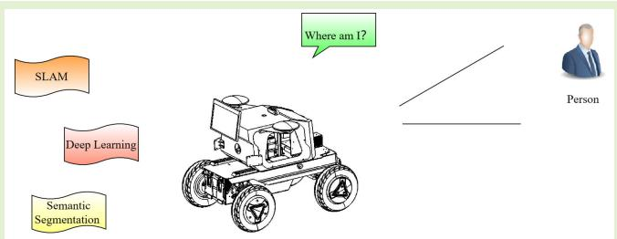

in static environments, dynamic environments present a significant challenge for visual SLAM in practical robotics scenarios. While efforts have been made to address this issue, such as adding semantic segmentation to conventional algorithms, a comprehensive literature review is still lacking. This article discusses the challenges and approaches of visual SLAM with a focus on dynamic objects and their impact on feature extraction and mapping accuracy. First, two classical approaches of conventional visual SLAM are reviewed; then, this article explores the application of deep learning in the front-end and back-end of visual SLAM. Next, visual SLAM in dynamic environments is analyzed and summarized, and insights into future developments are elaborated upon. This article provides effective inspiration for researchers on how to combine deep learning and semantic segmentation with visual SLAM to promote its development.

Index Terms— Deep learning, robots, semantic segmentation, simultaneous localization and mapping (SLAM).

## I. INTRODUCTION

IMULTANEOUS localization and mapping (SLAM) is a S concept that was initially proposed by Smith and Cheeseman [1]. It implies that a robot can leverage multisensor data to perceive its surrounding environment and state, mapping of the environment while simultaneously locating itself [2]. The sensors that are deployed generally consist of cameras, light detection and ranging (LiDARs), inertial measurement unit (IMU), and other sensors. The SLAM system comprises five components: data reading, front-end odometry, back-end optimization, loop detection, and mapping. Every component works together to enable precise localization and mapping to be undertaken by the robot [8], [9], [20].

SLAM can be categorized into laser SLAM [10], [11] and visual SLAM [12], [13], depending on the type of utilized sensors. LiDARs are the main sensors used in laser SLAM. After undergoing an extended period of development, laser SLAM technology has become considerably more mature. However, LiDARs are expensive, which limits their wide application [14]. Cameras are the primary sensor for visual SLAM, and they tend to be more sensitive to the textures and colors prevalent in the environment [17], [18], [19]. Furthermore, cameras are relatively inexpensive, which facilitates the wide application of visual SLAM.

Visual SLAM conventionally relies on geometric features, such as points, lines, and surfaces, to achieve localization and mapping [4]. In recent times, novel methodologies, such as oriented FAST and rotated BRIEF (ORB)-SLAM-VI [26], Vins-mono [28], delayed marginalization visual-inertial odometry (DM-VIO) [29], and ORB-SLAM3 [27], have emerged. They integrate IMU information to assist in multisensor fusion. The combination of visual SLAM systems with IMU data results in an increase in data diversity, which overcomes the limitation of depending solely on the camera as the only sensor. However, due to the growth in intelligent requirements for robots, the current technology can no longer meet the demands for autonomous navigation and interactive operations in complicated human–robot interaction scenarios.

In the present research, how robots can understand the rich semantic information in the environment like humans in complex human–robot interaction scenarios is the focus and difficulty. Meanwhile, allowing robots to make anthropomorphic navigation and interaction decisions is an inevitable development trend. To empower robots with a deep understanding and cognition of their surroundings, implementing artificial intelligence algorithms, such as deep learning into the front-end, back-end, and mapping processes of visual SLAM, is an achievable solution. In recent years, artificial intelligence technology has flourished, and computer vision (CV) has become a crucial area of deep learning. Compared to the traditional methods, deep learning can extract deep-level feature information from images, which can solve the problems of low dimensionality of traditional geometric features. Specifically, it improves the robustness of keyframe feature matching in visual SLAM, while solving problems such as large estimation errors between frames and the failure of bit pose solution.

Meanwhile, sensing and comprehending the semantic information of the environment and target can help the robot to achieve more intelligent decision-making in the navigation process and handling autonomous navigation as well as interactive operation tasks within sophisticated scenes [5], [7]. Therefore, combining deep learning with SLAM is currently a popular research topic and is deemed a critical research direction for SLAM in the future.

## II. RELATED WORK

Early reviews of visual SLAM, including those in [3], [12], and [13], presented the most advanced systems available at that time. Nevertheless, recent technological advancements, such as in deep learning, have propelled the development of visual SLAM to even greater levels. While a review of the application of deep learning in visual SLAM has already been published [2], technological advancements occur rapidly requiring a more current, comprehensive overview of current state-of-the-art technologies, such as the combined use of semantic segmentation, object detection, and visual SLAM.

Li et al. [4] and Chen et al. [6], [7] reviewed some semantic segmentation applications in visual SLAM and demonstrated their use within the field, but they failed to provide detailed information on the scenarios, where the algorithms were implemented. Unlike [4], [6], and [7], Barros et al. [15] focused on explaining the visual SLAM algorithm in general and did not delve into the details of deep learning’s application. Mokssit et al. [16] systematically summarized the application of deep learning methods in visual SLAM using the latest deep learning technologies; however, it omitted a summary of semantic segmentation’s application in the field.

It is beyond doubt that the perception of semantic information about the environment is crucial to robots. However, the existing review articles on SLAM have not given a comprehensive introduction on the topic “semantic segmentation and deep learning in visual SLAM.” To fill this gap, this article systematically organizes and introduces the application of deep learning (especially semantic segmentation) in visual SLAM. The main contributions of this article are as follows.

1) Evaluated the contribution of deep learning to visual SLAM.

2) Systematically collated, compared, and described the status and future directions of the existing research on deep learning applied to the front-end and back-end of visual SLAM.

3) Systematically collated, compared, and summarized the status and potential directions of research on semantic SLAM. 4) Examined the viability of combining current visual SLAM methods with new technologies, such as vision transformer (ViT) [126], NeRF [135], and so on, and made some recommendations.

In Fig. 1, the main structure of this article is depicted. Section III introduces some traditional and established SLAM techniques. Section IV briefly discusses various deep learning applications in SLAM, while Section V emphasizes the use of semantic segmentation in visual SLAM. Last, Section VI provides a summary of the existing deep learning in SLAM and predicts the prospective of visual SLAM. At the end of this article, a summary is made of the challenges that semantic segmentation faces in its application to visual SLAM, and the entire article is summarized.

## III. TRADITIONAL VISUAL SLAM

## A. Early Research on Visual SLAM

Visual SLAM’s essential tasks involve using the multiview geometry to estimate the camera’s pose and rebuild the environment’s map [17], [19]. Initially, a filter-based approach was used to track and optimize the camera’s pose, which worked adequately for short distances. However, it resulted in significant drift when the camera moves over a long distance, lending to a lack of system optimization. Bundle adjustment (BA) optimization has been gradually adopted in the last decade. BA does not rely on prior knowledge of motion models or sensor information, unlike filter-based methods. It considers all observation constraints and has global consistency, leading to more accurate optimization results. Besides, BA has greater efficacy in optimizing common nonlinear noise models. Natural to the method, BA optimization yields more accurate results, albeit requiring more computing resources. While it can escalate computation time and cost, such a tradeoff is often acceptable in many practical scenarios. Parallel tracking and mapping (PTAM) [20] and MonoSLAM [21] are the typical examples of the above two optimization methods, and some of their concepts still apply today. PTAM constructs a visual SLAM framework based on the feature points. When it runs, tracking and optimization are divided into two separate threads. This mindset is now prevalent in visual SLAM based on the feature points. Despite the conventional multiview geometry-based method’s poor performance in certain dynamic situations with minimal texture, this method is irreplaceable for visual SLAM’s general development.

With the development of conventional visual SLAM, its framework is basically unchanged in most cases. It is mainly divided into five major parts, and its structure is shown in Fig. 2. The analysis of Fig. 2 shows that conventional visual SLAM consists of five parts: data read-in, visual odometry, back-end optimization, loop detection, and mapping, respectively.

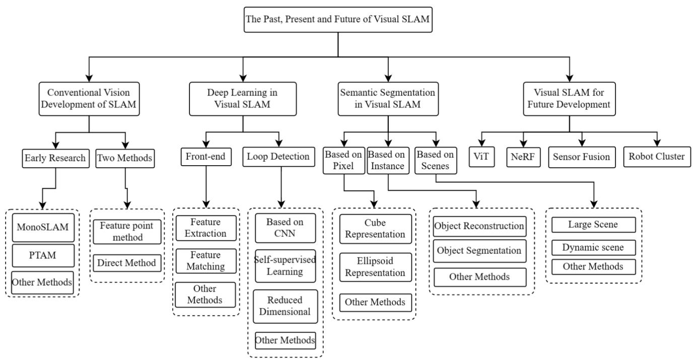

Fig. 1. Article overall framework diagram. This article is mainly divided into four main parts; each part describes the application of some different methods in visual SLAM.  
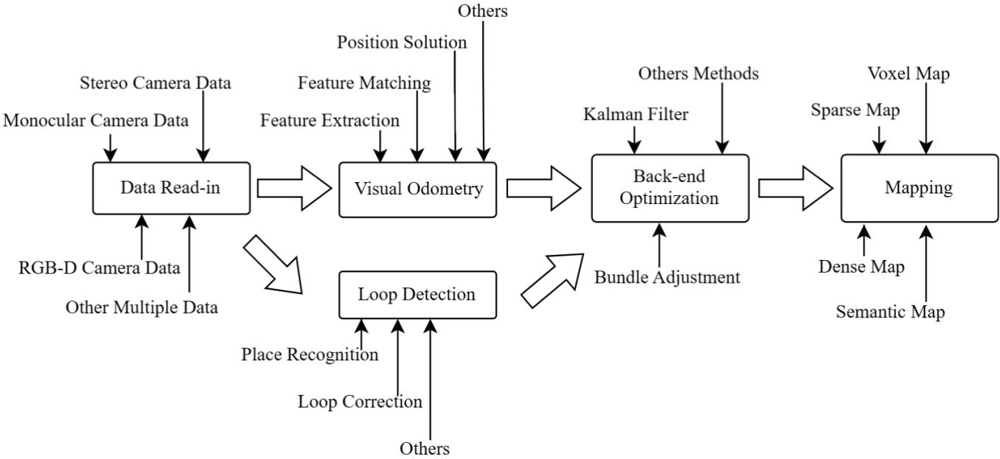  
Fig. 2. Traditional visual SLAM components and the main steps and methods for each component.

Visual odometry employs diverse methods to process various image data (monocular or RGB with depth map (RGB-D) format, etc.). For example, the 2-D–2-D case uses a pair-polar geometry algorithm, the 3-D–2-D case uses a p-n-p algorithm, and the 3-D–3-D case uses a iterative closest point (ICP) algorithm to estimate and track the camera’s position [23]. The term “2-D” commonly refers to feature points extracted from a camera’s image, such as corners, edges, and other relevant features. In contrast, “3-D” coordinates usually represent points in the 3-D space captured by the same camera. The visual odometry is also called frond-end.

Back-end optimization refers to the optimization of the transformation matrix derived from the visual odometry. It mainly employs nonlinear optimization libraries, such as Ceres solver, G2O, and Georgia Tech Smoothing and Mapping (GTSAM), to achieve globally consistent results [22].

Loop detection determines whether the robot has returned to a previous position. Good loop detection can solve the problem of front-end drift. In the conventional visual SLAM, bag-of-words (BoW) is utilized to collect the features in each keyframe, which serves as a dictionary to be queried upon detecting a loop. The mapping process commences immediately upon system startup. After the acquisition of results from the backend optimization, the mapping process systematically improves the overall accuracy of the map [22].

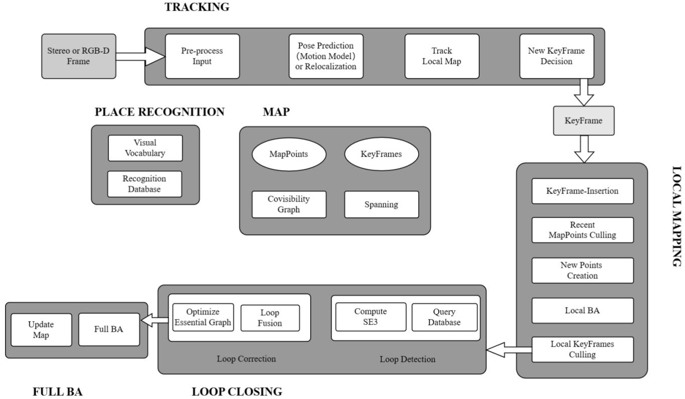  
Fig. 3. ORB-SLAM2 system framework diagram. It contains three main threads, they are tracking, local mapping, and loop closing. All of those threads serve the module in the middle.

The conventional visual SLAM can be categorized into two divisions, including feature-based and direct methods [20].

Feature-based SLAM depends on the extraction of image features, whereas direct SLAM relies on the pixel information in the image. The advantage of the feature-based methods is that the extracted features remain stable irrespective of the changes in illumination. Thus, substituting images with features reduces the computational burden. However, featurebased methods fail to extract image features in environments with weak textures and large variations in light, resulting in nonfunctional posture tracking and the failure of entire SLAM system. The direct method avoids the complex process of extracting feature points and can calculate at the pixel level to obtain better results. Moreover, it does not suffer from inconsistencies that arise from feature points or different descriptors. Additionally, it is not reliant on feature stability and effectively performs in conditions of weak texture or complex lighting, but the direct method needs to meet a strong hypothetical assumption called “grayscale invariance assumption,” which is difficult to guarantee at all the time during the actual operation [3].

## B. Two Classical Approaches to Visual SLAM

PTAM [20] is the first real-time monocular visual SLAM system based on keyframes and BA. The system utilizes features from accelerated segment test (FAST) corner point features to match keyframes and optimize mapping using BA. ORB-SLAM [24], which is first proposed in 2015 by Mur-Artal R, improves upon the PTAM framework and enhances the overall performance of monocular SLAM.

The author of ORB-SLAM-VI [26] integrated IMU information into the original framework to enhance the system’s robustness when dealing with fast movements and rotation by utilizing both inertial and visual information simultaneously. ORB-SLAM2 [25] is the first visual SLAM framework that can use either monocular or stereo or RGB-D images as an input, and it can provide reliable performance in both indoor and outdoor environments. Moreover, ORB-SLAM3 [27] adds a comprehensive range of IMU support, allowing for various types of camera inputs, including fisheye and pinhole cameras. The main contribution of this work is proposed the concept of submaps, which makes the ORB-SLAM series more complete. In the following, we will briefly introduce ORB-SLAM2, which has been extensively studied by researchers and students because of its comprehensiveness of application and extreme extensibility. The system framework of ORB-SLAM2 is shown in Fig. 3. The framework consists of three threads: tracking, local mapping, and loop closing. These threads are parallel, and data flow between them based on keyframes. The framework’s flexible selection process results in redundant keyframes. The local mapping thread discards redundant keyframes to ensure robust mapping.

The tracking thread preprocesses sensors data, extracting ORB features to estimate the camera poses and determine keyframe insertion. The local mapping thread screens recent feature points in keyframes, reconstructing map points in the new local map using previous tracking operations. It also decides whether to delete keyframes to reduce the data volume. The loop closing thread performs loop detection and correction. During loop detection, the keyframe database is queried and the transformation matrix will be calculated to match the detected loop. Next, the previously maintained maps and the detected loop are fused to optimize pose maps, perform global BA optimization, and finally update the map.

ORB-SLAM2 contains additional modules, with place recognition being the most important since it serves as the foundation of loop detection. Place recognition is accomplished using a visual BoWs approach and querying the features database. Mapping and tracking occur in a local co-visual area by utilizing a co-visual relationship map. All of these make the map’s structure more compact.

The other side to the feature-based method is the direct pixel-based method.

Large-scale direct SLAM (LSD-SLAM) [31] and semidirect monocular visual odometry (SVO) [32] are the two classic visual SLAM works of the direct methods. Complementary works on these frameworks include direct sparse odometry (DSO) [30] and DM-VIO [29], with the latter being the state of the art in direct methods. LSD-SLAM is a method for building semi-dense maps using monocular cameras. It uses only the depth information of points with large gradients for mapping. However, it still relies on a feature-based method in loop detection, thus not being a fully direct method in mapping. DSO, developed by the same authors as LSD-SLAM, is a module for generating a dense point cloud map at high speed. However, it only performs well in scenes with good image quality and initial poses.

The LSD-SLAM framework comprises three main threads, namely, tracking, depth map estimation, and map optimization. These threads have a rigorous sequence that guarantees the precision of the computed poses and the consistency of mapping.

The tracking thread uses the direct method to estimate the camera poses between the current frame and its reference frame. The depth estimation thread determines whether the current image will serve as a keyframe and if the camera has moved more than a threshold. The keyframe will be selected to update the depth map if this is the case. The map optimization thread reduces the scale drift of the map through loop detection and global optimization. Loop detection is performed by a twoway Sim3 evaluation between each candidate frame and the tested loop keyframe. If the similarity between them is high enough, the loop is considered successful, and the constraints are added to the bitmap. Global optimization is performed in the end.

ORB-SLAM and LSD-SLAM are considered to be two of the most representative works of recent visual SLAM. These two outstanding pieces of work construct sparse and semi-dense maps through global optimization and loop detection based on the feature-based method and the direct method. Respectively, using the rms and KITTI [34] 00-10 dataset in a computer with a CPU of i7-4790 and 16-GB RAM, both works were evaluated. The translational positional errors of ORB-SLAM2 are less than that of LSD-SLAM for all sequences except for sequences 00 and 04 [25].

Benefiting from many researches on feature-based methods and direct methods, conventional visual SLAM has achieved very good performance in static, rigid environments, where lighting changes are not obvious and there is no human–robot intervention. However, in more complex application scenarios with human–robot interaction, such as dynamic scenarios, conventional visual SLAM methods are inadequate. With the advances in artificial intelligence, deep learning offers a novel approach to enable robots to better perceive semantic information in the scene [33]. Deep learning methods can help in achieving loop detection and feature matching by learning advanced features in images. Hence, the merger of visual SLAM with deep learning leads to significant advancements in visual SLAM’s development.

In other word, deep learning allows robots to efficiently comprehend the semantics of images, furnishing valuable information for visual SLAM to better perceive difficult scenes and accurately make decisions. Consequently, the integration of deep learning with visual SLAM is currently a popular research topic and is expected to have a more extensive application in the future.

## IV. DEEP LEARNING IN VISUAL SLAM

Compared to conventional visual SLAM, deep learning processes have the following advantages: insensitivity to illumination changes, the ability to learn deeper features, and the ability to distinguish dynamic objects in the environment [37], [38]. In the current research, deep learning is generally replacing certain modules of visual SLAM, such as front-end (interframe estimation or image’s feature match) and loop detection [39], [40], [41]. Excitingly, the replacement of some modules with deep learning has resulted in overall improvements in mapping and localization accuracy. It indicates the effectiveness of the combination between deep learning and visual SLAM.

## A. Deep Learning in Front-End

The front-end of visual SLAM primarily focuses on preprocessing incoming data and calculating the transformation matrix between frames. Currently, the application of deep learning in the front-end is generally focused on the visual odometry. The visual odometry based on deep learning utilizes two specific approaches. The first approach involves extracting and matching feature points in images using deep learning or outputting corresponding optical flow results, and then, the mature pose transformation matrix calculation method is used to perform the calculation [53]. The second approach is to directly design an end-to-end framework. This framework takes the original image as an input, recovers the depth information of the scene, and outputs the pose transformation matrix.

In the interframe estimation of SLAM system, the selection of feature points and evaluation metrics directly impacts the system’s accuracy. Deep learning enhances the system’s efficiency, in part, by eliminating the need for conventional image feature extraction and matching during operation. For example, Tang et al. [42], Dusmanu et al. [43], Tang et al. [44], Li et al. [57], and others have designed binary descriptors similar to ORB-SLAM2 or developed alternative descriptors to replace ORB features, resulting in improved results. DeepVO [45] and TartanVO [46] proposed new methods that combine deep learning and visual SLAM. The method primarily uses raw image data to capture the pose transformation matrix from ego-motion. The proposed neural network by Zhou et al. [47] and Eigen and Fergus [48] can directly obtain the pose transformation matrix between ego-motion from the collected images and extract scene depth information. These methods utilize an end-to-end framework for acquiring visual odometry by taking raw image data as an input and producing output. The approach avoids the complexities of feature extraction and matching on the images.

Kang et al. [49] and Li et al. [50] proposed DF-SLAM and visual SLAM system with deep features (DXSLAM) in 2019 and 2020, respectively. Both approaches utilize deep learning-based method to enhance the accuracy of visual SLAM. They improve the efficiency of the system by utilizing learned region feature descriptors. This method significantly improves the accuracy of the system. DXSLAM applies deep learning to extract features and employs open visual inference neural network optimization (Open-VINO) and fast bag of words (FBoW) to estimate the camera’s poses and perform place recognition. It is also the first feature-based method’s SLAM system that can achieve real-time mapping without GPU support.

Bruno and Colombini [53] proposed a monocular VSLAM based on deep learning features, called learned invariant feature transform (LIFT)-SLAM. This framework reconstructs a sparse map between the graph and the keyframe, enabling the use of BA to adjust the camera pose. The LIFT [54], which is a supervised end-to-end method used to extract the image’s features, is used for feature extraction. Similar to ORB-SLAM, the LIFT-SLAM framework includes tracking, mapping, relocalization, and loop closure, but real-time mapping is not possible. Pan and Yang [55] employ transfer learning to fine-tune the neural network in each task, so that the performance of the system on crossover datasets has improved. An adaptive approach [56] based on migration learning to eliminate fixed matching thresholds is proposed, which can be applied to avoid fine-tuning reliable parameters on the dataset while improving the system performance.

Li et al. [57] proposed a real-time visual SLAM system that is based on the image’s feature. The framework employs a multitask feature extraction network, which achieves a balance between efficiency and accuracy. A simplified multitask CNN is utilized to accomplish feature detection and output the same descriptor format as ORB features to conserve system resources. Its absolute trajectory error (ATE) on fr1/floor is 0.026 m smaller than that of ORB-SLAM2, at 0.036 m, according to an evaluation of the accuracy using the TUM-RGBD [52] dataset.

DeTone et al. [58] proposed a method that employs fully convolutional neural networks to accomplish image feature matching, which is named SuperPoint. Additionally, this method can detect and describe interest points simultaneously in a single forward pass, without requiring additional calculations. This work trained the model using the self-supervised domain adaptation framework homographic adaptation to transfer the model trained on synthetic datasets to real-world images. The estimated pose transformation matrix of the model enhances the robustness of visual odometry. This work is based on the previously proposed MagicPoint and MagicWrap by DeTone et al. [59], where MagicPoint uses deep learning to extract feature points from images, and MagicWrap is used to estimate the pose transformation matrix between adjacent frames.

Sarlin et al. [60] proposed a network named SuperGlue that can simultaneously perform feature matching and filter out outliers based on [58]. The construction of the loss function depends on a graph neural network (GNN). The network solves the feature-matching problem by solving the optimal transport problem in a differentiable manner. To enhance the perception of potential 3-D scenes and achieve feature matching, this article proposes a flexible content aggregation mechanism based on the attention mechanism, thus enabling SuperGlue to perform both tasks simultaneously.

DeTone et al. [59] propose UnDeepVO, a new monocular visual odometry system, inspired by [43]. The use of unsupervised deep learning enables the system to recover absolute scale. This method predicts the pose transformation matrix between adjacent frames directly from a sequence of images. At the time of its proposal, UnDeepVO achieved comparable accuracy to the traditional methods. Sarlin et al. [60] introduced the DytanVO based on [44], which is a deep learning-based solution for dynamic visual odometry and was designed to handle camera motion estimation problems in dynamic environments. DytanVO differs from UnDeepVO in that it utilizes a matching network to estimate dense optical flow between the subsequent frames. It further employs the estimated optical flow fields to facilitate motion segmentation and pose estimation.

Taking the directness of end-to-end frameworks into consideration, several attempts have been made to use a neural network to directly produce information on the depth of the scene and the transformation matrix of the camera from a monocular video. Zhou et al. [47] proposed an unsupervised learning framework that estimates monocular depth and camera motion. This method can be trained without the use of any labeled data and it demonstrates excellent performance on the KITTI dataset. Furthermore, Bian et al. [63] introduced a deep-learning-based unsupervised self-motion estimation method that completes dynamic object detection and achieves scale consistency and dynamic scene processing through geometric consistency constraints and spontaneously discovered weight masks.

By observing the results in Fig. 4, it becomes clear that the number of robust features collected by geometric methods is significantly smaller than that collected by neural networks. For example, in the upper right corner of the image (keyboard area), the features extracted by the neural network are signif icantly richer than those extracted by the geometric features, which further indicates that the neural network can extract deep information about the image.

The current research mainly focuses on the implementation of deep learning in the feature extraction and tracking parts of the front-end. Additionally, there is a focus on designing an end-to-end framework for predicting the scale of the scene eptember 16,2026 at 03:37:51 UTC from IEEE Xplore. Restrictions apply.

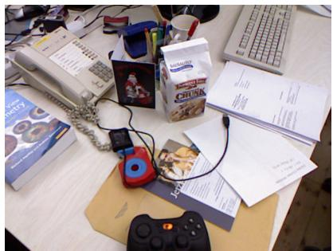  
(a)

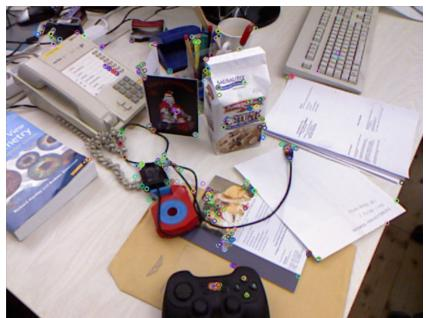  
(b)

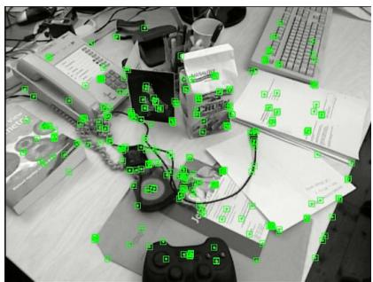  
(c)

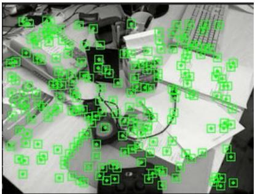  
(d)

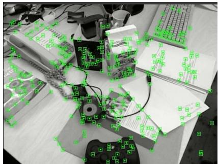  
(e)

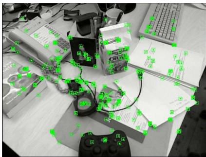  
(f)

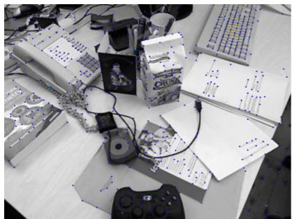  
(h)

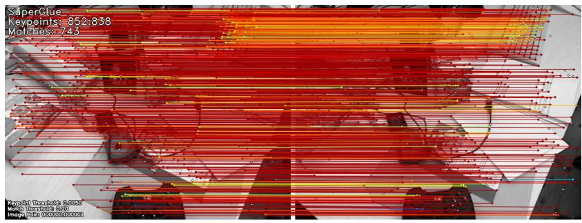  
(i)  
Fig. 4. Some examples of feature extraction in visual odometry. (a) Original image from TUM [52], (b)–(h) are some feature extraction operations performed on image. The result of ORB feature extraction on the image is shown in (b) and (c) is the result by using ORB-SLAM2 [25]. The image features extracted using GCNv2 are shown in (d) [42], and (e) is the result of DXSLAM [50]. ORB-SLAM3’s [27] result of feature extracting is showing in (f). (h) and (i), respectively, represent the results of image feature extraction and feature matching using SuperPoint [58] and SuperGlue [60].

and transformation matrix of the camera’s pose. A summary of the above algorithms is shown in Table I. End-to-end neural networks promote speedy image data processing and bypass the need for complex feature design, while simultaneously providing richer and deeper image features.

After conducting research and analysis, it has been proven that the utilization of deep learning can enhance the accuracy of visual odometry. However, visual SLAM must be applied to practical projects. While deep learning may supply high-quality visual odometry in the front-end, it also has the disadvantage of demanding significant computing resources, which is the foremost drawback of end-to-end’s visual odometry. Moreover, optimization and mapping threads are present in a comprehensive visual SLAM that requires computing resources. Therefore, if the complete system consumes excessive computing resources, the hardware cost would dramatically increase in achieving real-time visual SLAM applications, which would impede its extensive utilization in daily life.

We propose two approaches to rectify this problem. The first method pertains to seeking image features that do not require deep learning, such as traditional image features resembling

ORB or FAST. Alternatively, the method encompasses altering the method of image representations to diminish computational resource depletion. It could enhance feature robustness or decrease the impact of various factors, including lighting changes. Second, developing lightweight neural network structures, such as simplifying network layering and enhancing the feature attention of the network structure, is also an effective method. In general, the calculation of the camera pose transformation matrix only necessitates eight points. As indicated by studies [58], deep learning can obtain a substantial number of feature points, causing some data redundancy. While conceding some feature points may impact the accuracy of the camera’s pose transformation matrix, this is still acceptable as long as it remains within an acceptable range.

## B. Deep Learning in Loop Detection

The main goal of loop detection in visual SLAM is to determine whether the robot has returned to a place it originally reached. This aims to reduce drift in the robot’s trajectory caused by visual odometry during its motion.

The BoWs method is typically used in conventional methods for loop detection. Initially developed for natural language processing (NLP) [64], the BoW method generates “words” to represent a group of features of objects (such as chairs, flowers, etc.) present in keyframes and determines the overlap of “words” in multiple adjacent images. The extent of overlap between the “words” in adjacent photographs is used to determine whether the robot has returned to the previous place.

TABLE I  
COMPARISON OF APPLICATION METHODS OF DEEP LEARNING IN VISUAL SLAM FRONT-END
<table><tr><td>Methods</td><td>Time</td><td>Inputa</td><td>Indoor</td><td>Outdoor</td><td>Large scenes</td><td>Reconstruction</td><td>Dynamic scenes</td><td>Real-timeb</td></tr><tr><td>Zhou [47]</td><td>2017</td><td>1</td><td>√</td><td>√</td><td>–</td><td></td><td></td><td>2</td></tr><tr><td>SuperPoint</td><td>2018</td><td>1</td><td>√</td><td>√</td><td>√</td><td></td><td></td><td>2</td></tr><tr><td>GCNv2</td><td>2019</td><td>3</td><td>√</td><td></td><td></td><td>√</td><td></td><td>2</td></tr><tr><td>DF-SLAM</td><td>2019</td><td>1,2,3</td><td>√</td><td>√</td><td>√</td><td></td><td></td><td>2</td></tr><tr><td>SuperGlue</td><td>2020</td><td>1</td><td>√</td><td>√</td><td>√</td><td></td><td>√</td><td>2</td></tr><tr><td>DXSLAM</td><td>2020</td><td>1,2,3</td><td>√</td><td></td><td></td><td></td><td>√</td><td>1</td></tr><tr><td>LIFT-SLAM</td><td>2021</td><td>1</td><td>–</td><td>√</td><td>√</td><td></td><td></td><td>一</td></tr><tr><td>Li G [57]</td><td>2021</td><td>3</td><td>√</td><td></td><td></td><td></td><td></td><td>2</td></tr></table>

aInput unit represents different sensors. 1= monocular camera, 2= stereo camera, 3=RGB-D camera; bReal-time unit represents different support, 1=CPU real-time. 2=GPU real-time

The accuracy of the BoW method is impressive, but it comes at the cost of losing the rich visual texture qualities and color information. In order to cluster features, K-means [65] and several modified K-means algorithms [66], [67] (spherical k-means [SKM], approximate k-means [AKM], etc.) are typically utilized. Despite their usage, none of these methods can explore the intricate relationships between features. The approach of deep learning overcomes this flaw effectively. By leveraging the features extracted by deep learning, the accuracy of closed-loop detection significantly increases.

The use of CNN neural network in place recognition has replaced the BoW method for place relocation. Chen et al. [68], Zhang et al. [69], and Bai et al. [70] proposed frameworks that employ CNNs for scene relocation. Krizhevsky et al. [71] first proposed the complete framework in 2014, which predominantly leverages AlexNet to extract intermediate-level features that outperform final features. These intermediate-level features are combined with spatial sequence filtering techniques to enhance place recognition performance. AlexNet’s findings exhibit that the features extracted from large training sets are superior to scale invariant feature transform (SIFT), ORB, and so on. Milford and Wyeth [72] and Cummins’s [73] framework achieved a recall of 85.7% when tested on the Eynsham dataset (total distance of 70 km and 9575 keyframes) and outperformed SeqSLAM (51%) and FAB-MAP (49%). Zhang et al. [69] also employed CNNs for loop detection. Its main contribution is using a pretrained CNN to create a complete image-level representation for loop detection. The method performs principal component analysis (PCA) and vernacular steps on the CNN to project high-dimensional features into a low-dimensional space, making the detection more efficient and accurate.

Bai et al. [70] proposed SeqCNN SLAM, which utilizes both CNN descriptors and sequence matching to improve loop detection in the presence of conditional transformations, enhancing the algorithm’s ability to handle large-scale data. Sequential information is used to limit the matching range, which not only reduces computational complexity but also handling of noisy data. The model parameters are set to be dynamically adjusted online, providing adaptability to different environments. In addition, local CNN features are patched to enhance feature extraction performance.

The entire goal of DXSLAM [50] is to apply the features extracted from the front-end to loop detection and place recognition. It integrates the features extracted by using hierarchical feature network (HF-Net) [51] in ORB-SLAM2. This framework extracts the key points as well as the local descriptors and the global descriptors in images, respectively. The features retrieved in the front-end are used for loop detection and place recognition. This work suggests that global descriptor-based place recognition method is more effective than the conventional BoW. It requires less computation time and utilizes more features compared with DF-SLAM [49]. The sensitivity and reliability of closed-loop detection are increased by creating a local visual feature bag, which integrates the local feature descriptors and global feature descriptors of images. Evaluated on the RGBD-TUM dataset using both the mse and ORB-SLAM2, the root mean square error (RMSE) of DXSLAM is smaller than that of ORB-SLAM2 on both fr3 sequences.

Gao and Zhang [74], [75] proposed an unsupervised training process, using a stacked denoising autoencoder (SDA) network to generate features for loop detection. The SDA network was used to address the problem of BoW being insensitive to scene changes, such as illumination and change in viewpoint, which result in missed loop closures. The SDA network generates features to compare the similarity between two frames and form a similarity matrix for the loop detection process. The experiments conducted on this proposed method achieved an accuracy rate of 70% and a recall rate of 50%.

An et al. [76] proposed the fast incremental loop detection (FILD++) method to quickly and accurately detect loop closures. This method reduces feature extraction time by using a single neural network to extract both global and local features separately through two forward passes. An exhaustive algorithm is then employed to rearrange the local feature in low-dimensional space. The experimental results show that FILD++ achieves optimality for accuracy on the KITTI00 and 05 sequences and is similarly optimal (within a 3% accuracy difference) when compared to other state-of-the-art methods, such as FILD [77], iBoW-loop closure detection (LCD) [78], and place recognition with unified sequence visual words (PREVIeW) [79].

TABLE II  
COMPARISON OF DEEP LEARNING AND TRADITIONAL SLAM MODULES
<table><tr><td>Name</td><td>Deep learning</td><td>Traditional SLAM</td></tr><tr><td>Robustness</td><td>Stronger</td><td>Weaker</td></tr><tr><td>Accuracy</td><td>Stronger</td><td>Weaker</td></tr><tr><td>Data volume</td><td>Larger</td><td>Smaller</td></tr><tr><td>Application Scenarios</td><td>Static or dynamic</td><td>Static</td></tr><tr><td>Real-time</td><td>Weaker</td><td>Stronger</td></tr><tr><td>Model Visibility</td><td>Weaker</td><td>Stronger</td></tr></table>

Dai et al. [80] proposed a method that combines Kernel PCA (KPCA) and CNN. The method leverages a ResNet34 pretrained model for feature extraction, which is then followed by KPCA to reduce the dimensionality of the extracted features. Compared to the general combined CNN-PCA detection method, this method achieves higher accuracy due to the use of a restricted range strategy to resolve the mismatch problem caused by the large similarity of adjacent frames during loop detection matching.

Table II illustrates a comparison between SLAM with deep learning and conventional SLAM. The results depict that deep learning can produce superior outcomes in terms of critical indicators of the model, including robustness and accuracy. However, the amount of corresponding data is substantial, and the model’s real-time behavior is still relatively subpar due to the excessive consumption of computational resources. Although there are some methods available to mitigate this problem, for example, reducing the system’s parameters and modifying the extract feature neural network [81], it remains hard to make the robots meet the real-time requirement with SLAM.

Compared with conventional loop detection methods, deep learning can obtain high-dimensional image features. It shows that the effects of lighting and seasonal changes have little impact on feature extraction, which is conducive to completing loop detection. The use of deep learning techniques for extracting environmental features from images can aid in the development of a lifelong map, which is a map that remains constant over time and facilitates subsequent map maintenance. Despite the high computational cost of deep learning, effective attention modules and simplistic network structures can be employed to tag objects in specific scenes, minimize the consumption of computational resources, and enable loop detection. Generating numerous features for a scene is suboptimal for a slam system. How to reduce the dimensionality and meet real-time requirements under the condition of ensuring rich features is an important issue in the future.

## V. SEMANTIC SEGMENTATION IN VISUAL SLAM

Semantic segmentation [33] is a typical task in CV [33] that aims to segment objects within the perceptual range following the specific rules. Mapping accuracy is greatly influenced by dynamic objects. In practical engineering applications of visual SLAM, complex environments and various dynamic objects, including people and vehicles, are encountered. Visual SLAM has been relatively mature in static scenes, so the current research direction aims to eliminate dynamic objects through certain methods and obtain accurate static scenes. To solve these problems, two routes have been proposed by the researcher. The first is dynamic object recognition based on traditional geometric features. Although this method can quickly and accurately identify dynamic objects, it often struggles to accurately locate them in the scene. The second method is dynamic object recognition based on deep learning, which utilizes semantic segmentation to remove dynamic objects from the scene. Despite accurately segmenting dynamic object edges, this method necessitates significant training data and computational resources. There is no doubt that incorporating semantic segmentation into visual SLAM can enhance the robot’s perception and understanding of objects, thereby improving its decision-making and planning processes. Fig. 5 shows the development timeline of semantic SLAM, and Fig. 6 shows the difference between semantic segmentation and instance segmentation.

Moreover, different tasks necessitate distinct types of maps. For instance, 2-D grid maps are essential for navigating, while dense point cloud maps are indispensable for environmental reconstruction. Constructing stable and multifunctional maps in dynamic environments remains a crucial area of research. Combining SLAM with semantic segmentation, a relatively new and straightforward method, promotes the development of semantic segmentation through the engineering of SLAM and, in turn, enhances the accuracy of SLAM mapping and the robustness of the overall framework. Notably, as the robot gains a better understanding of semantic information, its operability and versatility considerably improve.

## A. Visual SLAM Based on Pixel Segmentation

Pixel-based semantic segmentation classifies objects in an image by labeling each pixel based on its object category. Previously, semantic segmentation is done by converting raw data into regions of interest and assigning identity documents (IDs) to the corresponding pixel-level objects [35], [36]. In the context of the SLAM system in a dynamic environment, a static semantic map that removes dynamic objects can be obtained using this method. The application of this semantic segmentation method can enhance the robot’s environmental perception [4].

Long et al. [36] introduced fully convolutional neural networks for semantic segmentation. They employed AlexNet [71] and VGG16 [82] as the backbone and performed upsampling in the final step to reduce the feature map to the original image size, allowing for the successful completion of a pixel-level semantic segmentation task. Their study is considered a significant contribution to the progress of semantic segmentation using deep learning.

McCormac et al. [83] and Rünz and Agapito [84] proposed SemanticFusion and co-fusion, respectively, which expand upon ElasticFusion [85], [86]. ElasticFusion creates maps by using 3-D data from stored point elements, allowing for the inclusion of higher dimensional semantic information. Unlike other SLAM frameworks that optimize keyframes, Elastic-Fusion directly optimizes the constructed environment map. SemanticFusion applies CNN to process the image data and return the probability value of each pixel. It updates the label probability distribution of each pixel using the data association provided by the SLAM system. Based on the assumption that the pixel with similar characteristics should belong to the same classes, it employs a fully connected conditional random field (CRF) to perform incremental updates to the probability distribution, enabling loop detection. While successful in achieving highly accurate indoor semantic mapping, the enormous computational demands of this method make it challenging to run the robot in real time. On the other hand, co-fusion leverages motion and semantic cues to achieve s pixel-level object segmentation. This system is capable of segmenting scenes into multiple objects online in real time and has demonstrated strong performance in dynamic, changing environments.

Yang and Scherer [87] demonstrated for the first time in CubeSLAM that semantic object (SO) detection and geometric SLAM can mutually benefit from each other in a unified framework. This work is based on 2-D images acquired by a monocular camera and uses the vanish points approach to recover the 3-D cubic structure of the object. The YOLO [88] detector is used for target detection, which enables fast and accurate object detection of the images. Instead of removing the dynamic objects, the camera’s poses are further optimized by using the motion of dynamic objects as constraints.

Nicholson et al. [89] proposed QuadricSLAM, which uses YOLOv3 [90] to obtain the 2-D detection frame of objects. The detected shape of objects is generated as an ellipsoid, directly in the dyadic space. Ellipsoid can carry more semantic information (size, position, and orientation) about the object. Calculating and solving the ellipsoid constraints lead to the Jacobi matrices, which can determine more precise poses. However, the semantic constraints of the quadratic surface are limited, which hinders its ability to improve the accuracy of location.

Yu et al. [91] proposed deep shape (DS)-SLAM based on ORB-SLAM2, which includes additional parallel threads for semantic segmentation and octree-building. The semantic segmentation thread utilizes the SegNet [92] framework and motion consistency to detect dynamic points and reject them if they are detected. The octree map thread is responsible for constructing a dense semantic 3-D octree map to reduce the computational burden. DS-SLAM outperforms ORB-SLAM2 in fast motion scenes, but in low dynamic scenes, DS-SLAM’s improvement is not significant as ORB-SLAM2 is good enough. The model considers people as fixed dynamic objects and can only recognize 20 dynamic object classes, making the general robustness of the model is relatively weak.

Wu et al. [93] and Qian et al. [94] proposed different semantic data association methods that were extended to ORB-SLAM2, which yielded satisfactory results in their respective systems. Wu et al. proposed an efficient and integrated data association strategy as the most significant contribution of ensemble data association (EAO)-SLAM. The method effectively integrates camera measurements in different poses to enhance the correlation accuracy of distinct frames following object semantic segmentation. Qian et al. utilize an ellipsoidal representation of objects and take the lead in accomplishing data association of SOs through the BoW technique. Their approach can achieve over 90% data association accuracy and advance the initialization accuracy by utilizing a new object initialization method. Meanwhile, they can fulfill the real-time requirements by constructing semantic keyframes instead of typical keyframes in mapping based on ORB-SLAM2.

Strecke and Stueckler [95] proposed EM-Fusion, which was inspired by Fusion++ [98], to address the SLAM problem in dynamic environments by utilizing the expectation maximization method. The framework proposes a probabilistic association method of semantic information on the pixel level, which calculates the probability of each pixel belonging to a certain object and performs the association likelihood. By utilizing depth images and objects alignment, it calculates the bit pose of each background to fully associate the object and its semantic information. Nevertheless, this method does not differentiate dynamic objects from static objects, which leads to excessive computational resource consumption to track numerous static objects.

Chen et al. [96] proposed a two-level strategy for hierarchical objects in semantic information association to prevent the mismatching of similar objects within the same class. The proposed approach enhances the accuracy of object data association following semantic segmentation. The authors developed a method for object association for short-term and global object association. The proposed method generates highly precise positional information, further refining the accuracy of trajectories and reinforcing the robustness of fuzzy target association.

Sharma et al. [97] proposed and employed a hybrid object association method that combines geometric and semantic cues to create a real-time open-source vision system with a minimized memory footprint. By utilizing a semantic data association method and voxel grids, the proposed system outperforms other object-based SLAM systems.

The pixel-level semantic segmentation of dynamic objects has been achieved to a significant extent, facilitating the segmentation of dynamic objects from the static environment during motion. As this semantic segmentation is based on the pixel level, it can improve the detail of perception results and further enhance the accuracy of mapping and estimating camera trajectories. In addition, it can expand the autonomous application of robots in different scenarios, such as interacting with objects in the scene, thus reducing the possibility of misjudgment and misidentification.

However, the majority of map construction algorithms used for semantic segmentation eliminate dynamic objects, resulting in the loss of some features. Furthermore, most network structures can only recognize a limited number of categories and are unable to handle complex and evolving real-world scenarios effectively. The occurrence of multiple dynamic objects in the scene can commonly lead to misidentification. The additional computation of semantic segmentation greatly increases the consumption of computational resources, which imposes high demands on the computing power of certain mobile devices.

The current research focuses on building and representing dynamic objects in dynamic environments using only a CPU for real-time semantic segmentation. To improve performance, both hardware and algorithm aspects are considered. For hardware, field-programmable gate array (FPGA) acceleration at a lower level could be utilized. For algorithms, it is recommended to employ a lightweight neural network along with expanding the coverage of the training dataset to enhance detection precision.

## B. Visual SLAM Based on Instance Segmentation

Object-based semantic segmentation, also referred to as instance segmentation, is a method that emphasizes the robot’s ability to interact with objects in the perceptual environment. For example, a classic use case of instance segmentation is enabling a robot to locate a specific book from a stack of books. Instance segmentation enhances the robot’s capacity to recognize dynamic objects in the environment, enabling effective obstacle avoidance and object manipulation. Moreover, it also enhances the robot’s capacity to respond to unforeseen situations in dynamic environments.

The proposals of Fusion++ [98] and MaskFusion [99] represent new possibilities for instance segmentation in visual SLAM applications. Both approaches utilize the mask regions with CNN features (RCNN) [100] as an initial preprocessing module to perform sophisticated instance segmentation on incoming data streams. Fusion++ is capable of 3-D reconstruction of an indoor static environment at a frequency of 4–8 Hz. By segmenting the detected objects through neural networks and focusing solely on reconstructing the 3-D model of the objects, rather than the entire environment, a highly efficient solution is achieved Conversely, MaskFusion extends the work of co-fusion by Rünz, which harnesses the ICP error of projective geometry and the photometric error to synchronously track the camera and dynamic object’s poses. MaskFusion proposes a method that maintains the association of object face elements with dynamic objects, taking into account both geometric inconsistency and contact with highly dynamic objects. The method can track 20 Hz for up to three objects, but performance is heavily impacted in more complex and occluded scenes with multiple objects.

Huang et al. [101] proposed a novel technique called ClusterVO. This approach builds upon the ClusterSLAM [102] and is a general dynamic SLAM that does not require prior information, while integrating 2-D semantic information. An optimized state is estimated simultaneously using the proposed framework. ClusterVO initially clusters dynamic features by combining both semantic and spatial motion. Then, it associates low-level features with landmarks and high-level features through clustering. Furthermore, an improved error function is introduced by including marginalization error and a priori motion information error terms, allowing semantic segmentation at the instance level. Although this approach has demonstrated notable improvements in terms of speed and accuracy, the limitations of the data association method should be acknowledged: it can only target a single object and the 3-D boundary segmentation of the object may not be well-defined.

Sucar et al. [103] focus on the reconstruction of 3-D objects using semantic segmentation, a technique that has been applied in the field of grasping robots and augmented reality (AR). The whole framework is called NodeSLAM, a framework that primarily utilizes volumetric probabilistic rendering functions to jointly optimize real-world images in real time. NodeSLAM enables multiobject semantic SLAM with camera input. The model is lightweight due to a less parametric design and the use of a single self-coding neural network, allowing it to infer the pose of objects. Joint optimization of the model on the image data with added Gaussian noise results in decoupling the link between real pose and tracking data. This technique can achieve a 90% accurate segmentation reconstruction rate on real-time frames for specific object classes.

Wang et al. [104] proposed DSP-SLAM, an object-level real-time system based on [25], [98], and [103] that uses image data as the primary input and point cloud data as supplementary information. This framework integrates real-time image data and semantic segmentation results. Dynamic objects poses and shapes are initialized by class-specific depth shapes as a priori information. Finally, a new second-order optimization approach is utilized to optimize the camera’s poses and object’s shapes concurrently. The map constructed in this method includes a dense object model after semantic segmentation and sparse punctuation. This framework is designed to focus on dense objects in the mapping using an automatic labeling of categories. Consequently, it improves DSP-SLAM’s sparse map capabilities and reduces the consumption of computational resources.

Liao et al. [105] proposed the SO-SLAM based on multiple works, such as [24], [87], [89], and [99]. The aim of this research is to address the issues of occlusion and observability in instance-level SLAM applied indoors. Some spatial constraints, including scale, symmetric texture, and planar support, were introduced to enhance the optimization precision. These techniques enable solving the mentioned issues via the utilization of robust object initialization and direction refinement methods. As a result of using these two methods of initialization and optimization, semantic data captured by the monocular camera can be obtained in a more sophisticated fashion.

The current trend in research related to semantic segmentation involves the instance-level segmentation of objects in the environment, with a focus on utilizing 3-D reconstruction to restore the shape of dynamic objects that have become partially occluded or invisible. By achieving this, the robot can gain a more precise understanding of its environment and tasks during motion. Accurate instance segmentation in multiobject scenes helps to model different objects, while precise 3-D object reconstruction improves the performance of visual SLAM.

The objective of instance-level semantic segmentation has evolved from basic instance segmentation to more sophisticated semantic data applications and increased accuracy in instance reconstruction. There are potential issues with the reliability of depth information provided by stereo and RGB-D cameras. However, in specific scenarios, depth information obtained solely through neural networks may only be relatively reliable during the training phase. Suboptimal depth information has a detrimental effect on instance segmentation accuracy and the fidelity of reconstructed objects, which can lead to system malfunction. Furthermore, there are challenges when storing semantic information of objects under limited capacity representation methods. For example, to construct an environmental map, certain details, such as size and state, may be excluded. However, when circumventing barriers, precise measurements of obstacles’ size and speed are necessary. Achieving an optimal tradeoff between the efficiency and usability of complex networks can be a challenging task when addressing difficult problems. So, deploying such networks onto specific robots proves to be an even greater challenge due to the constraints of computational resources, resulting in a significant increase in the overall cost of developing highperception robots. Nevertheless, as algorithms and hardware continue to iterate, it is expected that these methods will ultimately become more widely adopted in the public domain.

## C. Visual SLAM Based on Dynamic Scene Segmentation

The ultimate objective of semantic SLAM is to equip robots with the capability to detect and engage with constantly changing objects in an ever-changing environment, such as collision-free navigation. Dynamic scene segmentation aims to segment the environment in real time in dynamic scenes. The key challenge lies in measuring the real-time requirement and segmentation accuracy based on the aforementioned two sections. In contrast to the previous section that emphasized object reconstruction, this section centers on the creation of the environment’s map, excluding dynamic objects.

Bescós et al. [106] proposed Dyna-SLAM based on [25] and [100], an innovative approach that combines multiview geometry and instance segmentation to address the limitations of each individual method. For example, in [52], multiview geometry may struggle to detect objects at greater distances, while instance segmentation may not detect potential dynamic objects (such as a book held by a person). Following the segmentation of dynamic objects, the observed keyframes restore the background, improving the accuracy of the camera pose estimation. In Dyna-SLAM II [107], a novel featurematching approach for dynamic objects is proposed, jointly optimizing dynamic objects, cameras, and feature points. This approach reaches the same conclusion as [88], showing that estimating camera pose is beneficial for tracking multitarget dynamic objects. However, the study also indicates that some 3-D objects exhibit relatively weak bounding box detection and low-texture feature object detection.

Bârsan et al. [108] focused on the perceptual performance of outdoor robots in large, real-world scenes and performed high-quality object segmentation. Unlike other sparse methods, this work remains robust in dense stereo reconstruction, even in dynamic environments. It tracks dynamic objects to improve the subsequent reconstruction accuracy. A multitask network is used for semantic segmentation, tracked by both previous and succeeding frames. To improve reconstruction quality and reduce the system’s computational resources consumption, the author proposes a reconstruction pruning technique. However, this method falls short of real-time performance, operating at a maximum frequency of only 2.5 Hz.

Kim et al. [109] proposed a thread consisting of visual odometry, object segmentation, and instance segmentation. The visual network architecture, SimVODIS++, is based on [100] and [110]. It utilizes three consecutive frames of images during a dynamic environmental motion to evaluate interframe poses, depths, object frames, and instance segmentation masks simultaneously. Unlike previous works [84], [91], [98] that started a separate thread for CNN, integrating CNN directly into one framework can simplify the overall architecture and reduce computational time. SimVODIS++ employs a self-attentive module in the data preprocessing for semantic segmentation, which enables the framework to remove dynamic objects and select regions with significant features in a self-supervised way. However, the framework may encounter issues with depth accuracy for extremely distant objects.

Wang et al. [111] introduced time as a novel factor in the evaluation of rigid dynamic objects and proposed Dym-SLAM, a 4-D dynamic SLAM system. The system is capable of segmenting unknown moving targets based on geometric motion segmentation, without relying on a priori semantic information. Rather than removing dynamic objects as outliers, the framework obtains six degrees of freedom (DoFs) and 3-D models of the moving targets, on which the dense static environment map is reconstructed. Multiple objects are segmented by different scenes and motion models. A 3-D-to-2-D image conversion projection is used to refine segmentation boundaries. Although the proposed method works well in the actual robot motion process, real-time performance cannot be guaranteed.

Ji et al. [112] proposed a dynamic semantic segmentation SLAM system that combines a semantic segmentation module and a geometric segmentation module. This approach was inspired by [25] and [106], which involve the semantic segmentation of keyframes in a separate thread and the clustering of depth map using a multiview geometry method. This study found that objects with a priori information could be accurately extracted using a neural network for semantic information. Moreover, the study removed dynamic objects without a priori information with a multiview geometry method. This is the first semantic SLAM capable of real-time operation on an embedded system. Compared to [104], this framework not only reduces general running time but also achieves comparable results and outperforms DS-SLAM.

Gonzalez et al. [113] proposed the TwistSLAM framework that utilizes the concept of “joints” to physically limit the movement of dynamic objects and static objects. This concept arises from the fact that many dynamic objects in the real world have fewer than six DoFs. A normal car on the road, for example, has only three DoFs. In some cases, semantic information is utilized to cluster objects in the environment, where the camera’s pose is estimated using static clusters, such as roads or houses, while dynamic objects are tracked with dynamic clusters. Incompatible DoFs constraints are utilized to create generic dynamic clustering constraints. Conversely, Gonzalez et al. [114] included LiDAR data to facilitate multimodal fusion, where their original 3-D object detection network estimated the poses of potentially dynamic objects. The data are used to perform ICP algorithms to accurately calculate the relative poses, further constraining the motion of the objects and finally obtaining the exact 3-D geometry of the objects.

Liu and Miura [115] proposed RDS-SLAM by incorporating a semantic segmentation thread and an optimization thread into ORB-SLAM3 [27]. Unlike previous models such as [84], [91], and [99], the semantic segmentation thread in this model runs in parallel with the tracking and other threads without impeding future processing, despite its long processing time. This study proposes a keyframe selection strategy for semantic segmentation that utilized movement probability updates to propagate semantic information and analyzes data correlation between different frames to detect and remove outliers. Similar to [27], in terms of, the system can achieve real-time motion frequencies up to 30 Hz, although it has not yet been deployed on a physical robot.

Rauch et al. [116] successfully applied a semantic segmentation model in a robot grasping task based on Co-Fusion [84]. The combined dense and sparse vision method enables stable tracking and dense reconstruction of objects without prior information. For similar and repetitive models, prereconstructed objects are directly used to reduce the system’s runtime. Unlike [106], [107], [111], and [112], in dynamic object segmentation, geometric differences are discarded and only semantic features are used to segment the region of interest. The input frames undergo four consecutive processes: estimation, segmentation, modeling, and detection. Sparse points, similar to DSP-SLAM [104] and TwistSLAM [113], represent road signs and perform dense object reconstruction, thereby reducing the total number of stores.

Yang et al. [117] proposed multi-classes and motion properties for concurrent (MCV)-SLAM and made a thorough application of semantic information by classifying it into five categories based on motion type in dynamic environments. Different weights are assigned based on the motion type. To address multiple dynamic objects and a lack of feature points, an adaptive solution with strong robustness is proposed.

A summary of the semantic segmentation applications in visual SLAM mentioned above is presented in Table III. The table reveals that scene-based semantic SLAM enhances the robot’s capability to interact with the environment and meet more accurate requirements based on highly accurate mapping. The accuracy of scene segmentation is closely linked to the underlying method, which arguably limits the algorithm’s practical deployment. Although the semantic segmentation method is highly accurate, the computation time is lengthy. On the other hand, the geometric method cannot provide better segmentation for some potential dynamic objects. Presently, researchers are focusing on coordinating the two algorithms to use them in practical civilian life.

In the current research, the combination of semantic segmentation and visual SLAM is presently the most popular research direction. Pixel-level semantic segmentation captures detailed information on object edges, contours, and shapes in a scene. Instance-level segmentation recognizes and tracks multiple objects simultaneously. Dynamic scene-based segmentation captures 3-D information about a scene. Therefore, semantic segmentation improves scene perception in visual SLAM map construction, and accurate segmentation results lead to better semantic information perception in a robot’s environment.

## VI. OUTLOOK

## A. Application of ViTin Visual SLAM

ViT [126], or visual transformer, is an important application of transformer in the domain of image processing. It converts image data into sequential data suitable for processing by the model. The transformer can achieve superior results over CNNs due to its attention mechanism and larger perceptual field in the sequence context. In particular, when ample data are available, ViT-based approaches can achieve better accuracy in commonly used visual tasks, such as object detection and semantic segmentation, even in some extremely complex environments, such as low light or blurry images.

In visual SLAM, employing a superior network can refine the segmentation of dynamic objects for semantic SLAM. In both the front-end visual odometry and back-end loop detection, ViT can enhance the precision of the camera’s bitpose matching and loop detection. So far, many scholars have tried to integrate various parts of ViT and visual SLAM. Li et al. [127], Françani and Maximo [128], and Rao et al. [129] achieved excellent results in visual odometry and stereo matching by utilizing the transformer, which performed well in certain unsupervised learning models. They designed an endto-end framework that leverages ViT’s superior performance to directly output visual odometry or stereo matching results. In the context of feature point extraction and tracking in images, Jiang et al. [130] and Sun et al. [131] exhibit a more comprehensive feature profile in contrast to [58] and [42]. Moreover, this superiority transcends that of both deep learning and traditional image feature extractions. In back-end loop detection, the advantage of ViT in handling cyclic data makes it excel in LCD. Fan et al. [132] show ViT performed well in large-scale loop detection. The outstanding performance exhibited by [133] and [134] highlights the potential of ViT-based visual SLAM with the image’s feature in LCD.

Given ViT’s numerous performance advantages, it could be applied to combine various parts of visual SLAM, like global trajectory optimization. Global trajectory optimization focuses on the optimization of the already constructed map, requiring prior information utilization. The benefits of ViT can meet this prerequisite. In addition, one can integrate the attention mechanism into front-end feature matching and tracking simultaneously or incorporate global and local information into ViT to boost the generalization ability of the model. Besides, examining ViT integrated with visual SLAM in multitask learning frameworks is supposed to enhance the applicability of the method to the field of visual SLAM. Therefore, we have reasons to believe that ViT can greatly facilitate the development of visual SLAM.

## B. Application ofNeRF in Visual SLAM

NeRF [135] or neural radiance fields is mainly used for reconstructing the environment. Unlike conventional visual SLAM, NeRF-based visual SLAM is an end-to-end framework eptember 16,2026 at 03:37:51 UTC from IEEE Xplore. Restrictions apply.

TABLE III  
COMPARISON OF SOME APPLICATIONS OF SEMANTIC SEGMENTATION IN VISUAL SLAM
<table><tr><td>Methods</td><td>Time</td><td>Inputa</td><td>Indoor</td><td>Outdoor</td><td>Large scenes</td><td>Dynamic scenes</td><td>FPS</td><td>Real-timeb</td></tr><tr><td>ElasticFusion</td><td>2016</td><td>3</td><td>√</td><td></td><td></td><td></td><td>22</td><td>2</td></tr><tr><td>SemanticFusion</td><td>2017</td><td>3</td><td>√</td><td></td><td></td><td></td><td>15</td><td></td></tr><tr><td>Co-Fusion</td><td>2017</td><td>3</td><td>√</td><td></td><td></td><td></td><td></td><td>2</td></tr><tr><td>DS-SLAM</td><td>2018</td><td>3</td><td>√</td><td></td><td></td><td></td><td>■</td><td>2</td></tr><tr><td>Fusion++</td><td>2018</td><td>3</td><td>√</td><td></td><td></td><td></td><td>6</td><td>2</td></tr><tr><td>MaskFusion</td><td>2018</td><td>3</td><td>√</td><td></td><td></td><td></td><td>20</td><td>2</td></tr><tr><td>Bârsan I A [108]</td><td>2018</td><td>2</td><td></td><td></td><td></td><td></td><td>2.5</td><td>2</td></tr><tr><td>Dyna-SLAM</td><td>2018</td><td>1,2,3</td><td>√</td><td></td><td></td><td>√</td><td></td><td>2</td></tr><tr><td>CubeSLAM</td><td>2019</td><td>1</td><td>√</td><td></td><td>√</td><td></td><td>15</td><td>2</td></tr><tr><td>EM-Fusion</td><td>2019</td><td>3</td><td>√</td><td></td><td></td><td></td><td></td><td>2</td></tr><tr><td>ClusterSLAM</td><td>2019</td><td>2</td><td></td><td></td><td>V</td><td></td><td>7</td><td>2</td></tr><tr><td>QuadricsSLAM</td><td>2019</td><td>1</td><td>√</td><td></td><td>V</td><td></td><td></td><td>2</td></tr><tr><td>EAO-SLAM</td><td>2020</td><td>1</td><td>√</td><td></td><td></td><td></td><td></td><td></td></tr><tr><td>NodeSLAM</td><td>2020</td><td>3</td><td>√</td><td></td><td></td><td></td><td></td><td>2</td></tr><tr><td>SimVODIS</td><td>2020</td><td>1</td><td>√</td><td></td><td></td><td></td><td>15</td><td>2</td></tr><tr><td>ClusterVO</td><td>2020</td><td>2</td><td></td><td></td><td></td><td></td><td>8</td><td>2</td></tr><tr><td>Dym-SLAM</td><td>2021</td><td>2</td><td>√</td><td></td><td></td><td></td><td>■</td><td></td></tr><tr><td>Qian Z [94]</td><td>2021</td><td>3</td><td>√</td><td></td><td></td><td></td><td>30</td><td>2</td></tr><tr><td>Sharma A [97]</td><td>2021</td><td>3</td><td>√</td><td></td><td></td><td></td><td>■</td><td>2</td></tr><tr><td>DSP-SLAM</td><td>2021</td><td>1,2,3</td><td></td><td></td><td></td><td></td><td>15</td><td>2</td></tr><tr><td>Dyna-SLAM II</td><td>2021</td><td>2,3</td><td>√</td><td></td><td></td><td></td><td>11</td><td>2</td></tr><tr><td>RDS-SLAM</td><td>2021</td><td>3</td><td>√</td><td></td><td></td><td></td><td>30</td><td>2</td></tr><tr><td>MCV-SLAM</td><td>2021</td><td>3</td><td>√</td><td></td><td></td><td></td><td>8</td><td>2</td></tr><tr><td>Ji T [112]</td><td>2021</td><td>3</td><td>√</td><td></td><td></td><td></td><td>6</td><td>1</td></tr><tr><td>Chen K [94]</td><td>2022</td><td>1,3</td><td></td><td>V</td><td></td><td></td><td></td><td>2</td></tr><tr><td>SO-SLAM</td><td>2022</td><td>1</td><td>√</td><td></td><td>V</td><td></td><td></td><td>2</td></tr><tr><td>TwistSLAM</td><td>2022</td><td>2</td><td></td><td></td><td></td><td></td><td></td><td>2</td></tr><tr><td>TwistSLAM++</td><td>2022</td><td>2,4</td><td></td><td></td><td></td><td></td><td></td><td>2</td></tr><tr><td>SimVODIS++</td><td>2022</td><td>1</td><td></td><td></td><td></td><td></td><td></td><td>2</td></tr><tr><td>C. Rauch [116]</td><td>2022</td><td>3</td><td>V</td><td></td><td></td><td></td><td>8</td><td>2</td></tr></table>

aInput unit represents different sensors. 1= monocular camera, 2= stereo camera, 3=RGB-D camera, 4=LiDAR data; bReal-time unit represents different support, 1=CPU real-time, 2= GPU real-time.

that does not focus on the features of an image but on the pixels themselves. The primary application of NeRF is to render static scenes. By training a neural network with a large amount of data, NeRF models the color and density of each point in the scene. This approach yields excellent results in the representation of the environment. The pixel-level refinement can be achieved for specific objects in the scene.

The field is still under rapid development, and [136], [137], [138], and [139] are some specific applications of NeRF in SLAM, combining corresponding aspects, such as the construction of the model and the optimization of the network structure, respectively. Zhu et al. [139] proposed a framework named Nice-slam, which provides a hierarchical representation of the scene. It has different MLPs for different application scenes (outdoor, indoor, etc.) to achieve local updates. Based on this, Lisus et al. [140] improve the accuracy and robustness of NICE-SLAM by considering the uncertainty of depth measurements and using IMU measurements. Additionally, Lisus et al. [140] propose a model for representing distant backgrounds. Kim et al. [141] optimize NeRF by incorporating prior knowledge useful for optimizing camera pose and 3-D scene representation, enhancing the accuracy and stability of view synthesis. Rosinol et al. [142] combine dense monocular SLAM [143] with layered volume NeRF to construct accurate radiation fields in real time. Reference [144] is similar to NeRF and suitable for incremental surface and color reconstruction with fewer training data. Additionally, it enables the reconstruction and rendering of dynamic scenes.

NeRF has been found to be applicable in SLAM for environment modeling, pose estimation, and sparse point cloud reconstruction by scholars. The implicit neural representation method of NeRF suggests that it can be combined with SLAM in the future to better adapt to the irregular geometries of scenes and predict unobserved situations. It is also essential to explore how to recover lost scenes, manage transformations of future scenes, and achieve reconstruction in complex or challenging scenes. The accurate reconstruction of a scene can lead to a more robust pose estimation as NeRF highlights specific features of the static environment, thereby providing high-quality sparse point cloud reconstruction and map construction for high dynamic SLAM. However, fine-grained reconstruction of the environment comes at the cost of high computational resource consumption, which may compromise the system’s real-time performance.

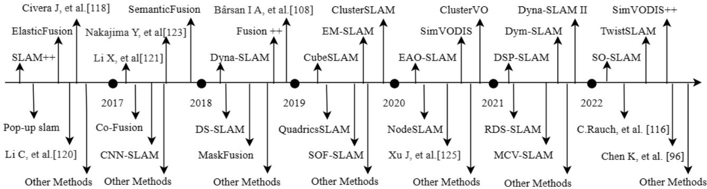  
Fig. 5. Recent developments in semantic SLAM. The figure is expanded as a time line. At each time node, some classic works on semantic segmentation and SLAM are presented, such as SLAM++, DS-SLAM, DSPSLAM, and so on.

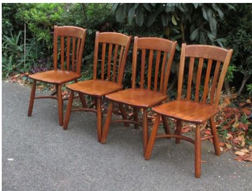  
(a)

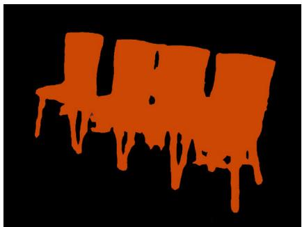  
(b)

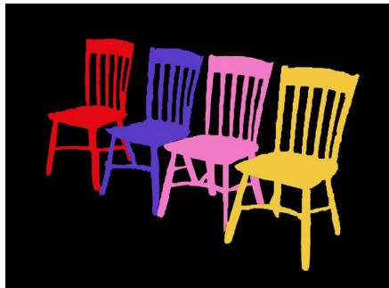  
(c)  
Fig. 6. Some presentation of segmentation results. (a) Original picture. (b) Semantic segmentation result of (a) after fully convolutional network (FCN). (c) Result of instance segmentation. It can clearly see that instance segmentation can distinguish between individuals in the same class of objects.

## C. Multisensor Fusion

Each sensor has its own distinct characteristics; for example, images have rich texture features, LiDAR can display 3-D structures, and IMU can satisfy stability in various environments. Multisensor fusion can mitigate the systematic error and uncertainty attributed to unstable or noisy data from a single sensor. Moreover, it enables the system to cope with intricate circumstances, such as situations involving inadequate lighting, which may cause a shortage of features in the image, but will not affect the point cloud information. Due to the divergence in data dimensions, multisensor fusion enriches the system with a variety of perspectives and information. In summary, multisensor fusion elevates the system’s dependability, precision, and resilience.

IMU is a common type of sensor, which is widely used. There are currently several combinations of camera and IMU, such as Vins-mono [28], DM-VIO [29], SelfVIO [146], and external memory attention (EMA)-VIO [147], all of which involve both a camera and an IMU. The IMU primarily improves the precision of the pose transformation matrix computed from the image’s features. Similar to [94], image data are used as primary data, and LiDAR data are used as secondary data to construct 3-D shapes. Since 3-D point clouds are too computationally intensive, a common multisensor fusion method is to filter and extract features from point cloud data [148] and then generate 2-D depth images before applying them in visual SLAM. Currently, several methods exist for fusing LiDAR data and camera data for constructing environment maps. Typical practices, such as [149], [150], [151], and [152], usually treat LiDAR as the primary sensor and a camera as a secondary sensor that provides limited ancillary data such as color. Therefore, these methods are not within the scope of this article. The use of image features in detecting loops is highly sensitive. However, in certain vertical drop scenarios, such as elevator rides, neither LiDAR nor images can work, and IMU provides a reliable output [145].

Therefore, the generalization of the model can be improved since the application in different scenarios can be satisfied by using the characteristics of different sensors. Additional sensors or data can be integrated into the current system in future developments. For example, force sensors can detect surface differences, such as soil or concrete, while environmental sounds can be analyzed [153]. However, not all situations require multiple sensors, as each sensor’s accuracy varies. The overall cost must be considered when deciding whether to use a multisensor system, as SLAM systems are intended for practical applications.

## D. Multirobot Clusters

Multirobot clusters refer to the coordinated efforts of multiple robots working together to achieve objectives. This approach finds use in various scenarios, such as military, national defense, postdisaster search and rescue, and warehousing logistics, among others. Multirobot clustering systems can be classified into two types: distributed and centralized systems. Distributed systems offer scalability, high availability, and faster processing speed, whereas centralized systems are simpler to maintain and have higher security. Currently, research is focused on using a single robot to create a comprehensive local map and then performing loop detection and data fusion between robots.

Tian et al. [154] illustrate a full multirobot clustering scheme that can reconstruct a 3-D semantic environment in real time. A distributed architecture is employed to construct a globally consistent map, where each robot has its complete system framework. Each robot provides the processing center with current local build and real-time positional information independently and applies different processing and optimizing techniques based on different data types. Similar work also includes [155]. Unmanned vehicles, as the carriers of multirobot clusters, are restricted by terrain and have less accuracy compared to unmanned aerial vehicles. As a result, multirobot clustering is more extensively used in unmanned aerial vehicle applications. Schmuck and Chli [156] demonstrated the application of drones in distributed mapping and fusion. Xu et al. [157], Lajoie et al. [158], and Zhou et al. [159] showed the work of using drones in self-positioning, effective data processing, and exploration of complex environments. Zhou et al. [160] have effectively implemented a cluster working method in complex scenarios, such as forests, making it the world’s first highly autonomous drone demonstration.

Despite remarkable progress in drone clusters, their application on the ground is still a major challenge. A distributed framework’s drawbacks involve an increase in system complexity due to communication among nodes, a significant delay in the network, and concerns about the security of transmitted information between robots. Despite its limitations in scalability and susceptibility to single-point failures, a centralized framework remains a practical priority. The future trend for applications is to combine multiple robots for exploring unknown environments using active SLAM. Current development concerns include communication mechanisms, real-time localization of relative poses, map fusion, and backend optimization. Nevertheless, multirobot collaboration is a significant application scenario for SLAM in the future.

## VII. CURRENT CHALLENGES

The integration of semantic segmentation and visual SLAM is a critical step for robots to perceive the environment and enable intelligent interactions with humans. Nevertheless, there are several challenges that need to be addressed in this integration, which can be categorized into three main parts.

## A. Stability ofthe System in Complex Environments

A complex environment refers to scenarios that contain a significant amount of dynamic objects, such as human and vehicular movement; a significant amount of obstacles and similar objects, such as forests and urban roads; a significant amount of reflection and refraction, such as water surfaces and glass buildings; as well as fluctuations in lighting, such as indoor–outdoor transitions, sunrise, and sunset at the same location. Ensuring the algorithm operates normally in these scenarios presents a significant challenge.

## B. Model With Strong Generalization Ability

The implementation of an end-to-end network framework has enabled the avoidance of specific SLAM design steps, thereby alleviating the complexities of the process. Nevertheless, the challenge at present is to develop a comprehensive SLAM system capable of addressing all possible scenarios (the most ideal outcome). For example, it should not be necessary to care about the intrinsic and extrinsic parameters of the camera or to consider the problem of encountering untrained objects in the semantic segmentation network during system operation.

## C. Reduce the Consumption of Computing Resources

Although the remarkable performance of neural networks is exhilarating, it demands a significant amount of computational resources. SLAM is systematic engineering, and its wide-range application necessitates minimizing the consumption of neural network computation resources. Moreover, lowering computation resource utilization at the algorithmic level is a more penurious strategy, compared to awaiting technological development to reduce hardware costs.

## VIII. CONCLUSION

Deep learning is a sophisticated network architecture that leverages computers to simulate the intricacies of the human brain and to enable computers to reason like humans. Incorporating deep learning has advanced visual SLAM to new heights, allowing robotic perception to advance toward scenarios requiring deeper perception. During the front-end feature extraction and back-end loop detection, deep learning models have surpassed the traditional methods in the accuracy and robustness of the results. Incorporating deep learning mitigates limitations in conventional visual SLAM applications while increasing the robot’s comprehension of semantic information in the scene. Integrating deep learning into visual SLAM allows robots to interact with the environment.

Deep learning has typical characteristics that make it challenging to deploy robots in real time due to its computational resources’ consumption. Furthermore, the learning process is always “uninterpretable,” and researchers require a rich knowledge base to adjust certain parameters, resulting in limited applicability. However, the future development of visual SLAM and deep learning is undoubtedly closely linked. The theoretical development of deep learning enhances the accuracy of visual SLAM mapping and segmentation, while the practical demand for visual SLAM propels deep learning forward rapidly toward robotic application.

## REFERENCES

[1] R. C. Smith and P. Cheeseman, “On the representation and estimation of spatial uncertainty,” Int. J. Robot. Res., vol. 5, no. 4, pp. 56–68, Dec. 1986.

[2] Y. Zhao, G. Liu, and G. Tian, “A survey of visual SLAM based on deep learning,” Robot, vol. 39, no. 6, pp. 889–896, 2017.

[3] C. Cadena et al., “Past, present, and future of simultaneous localization and mapping: Toward the robust-perception age,” IEEE Trans. Robot., vol. 32, no. 6, pp. 1309–1332, Dec. 2016.

[4] X. Q. Li, W. He, S. Q. Zhu, H. Y. L. Yu, and T. Xie, “Survey of simultaneous localization and mapping based on environmental semantic information,” Chin. J. Eng. Des., vol. 43, no. 6, pp. 754– 767, 2021.

[5] A. Nuchter and J. Hertzberg, “Towards semantic maps for mobile robots,” Robot. Auto. Syst., vol. 56, no. 11, pp. 915–926, Nov. 2008.

[6] W. Chen et al., “An overview on visual SLAM: From tradition to semantic,” Remote Sens., vol. 14, no. 13, p. 3010, Jun. 2022.

[7] K. Chen, J. Zhang, J. Liu, Q. Tong, R. Liu, and S. Chen, “Semantic visual simultaneous localization and mapping: A survey,” 2022, arXiv:2209.06428.

[8] T. Bailey, J. Nieto, J. Guivant, M. Stevens, and E. Nebot, “Consistency of the EKF-SLAM algorithm,” in Proc. IEEE/RSJ Int. Conf. Intell. Robots Syst., Oct. 2006, pp. 3562–3568.

[9] M. J. Liang, H. H. Yan, and R. H. Luo, “Overview of simultaneous positioning and map creation based on graph optimization,” Robot, vol. 35, no. 4, pp. 500–512, 2013.

[10] J. A. Christian and S. Cryan, “A survey of LiDAR technology and its use in spacecraft relative navigation,” in Proc. AIAA Guid., Navigat., Control (GNC) Conf., Aug. 2013, p. 4641.

[11] M. U. Khan, S. A. A. Zaidi, A. Ishtiaq, S. U. R. Bukhari, S. Samer, and A. Farman, “A comparative survey of LiDAR-SLAM and LiDAR based sensor technologies,” in Proc. Mohammad Ali Jinnah Univ. Int. Conf. Comput. (MAJICC), Jul. 2021, pp. 1–8.

[12] J. Fuentes-Pacheco, J. Ruiz-Ascencio, and J. M. Rendón-Mancha, “Visual simultaneous localization and mapping: A survey,” Artif. Intell. Rev., vol. 43, no. 1, pp. 55–81, Jan. 2015.

[13] H. M. Liu, G. F. Zhen, and H. J. Bi, “A survey of monocular simultaneous localization and mapping,” J. Comput.-Aided Des. Comput. Graph., vol. 28, no. 6, pp. 855–868, 2016.

[14] X. Liu et al., “Fast eye-in-hand 3-D scanner-robot calibration for low stitching errors,” IEEE Trans. Ind. Electron., vol. 68, no. 9, pp. 8422– 8432, Sep. 2021.

[15] A. M. Barros, M. Michel, Y. Moline, G. Corre, and F. Carrel, “A comprehensive survey of visual SLAM algorithms,” Robotics, vol. 11, no. 1, p. 24, Feb. 2022.

[16] S. Mokssit, D. B. Licea, B. Guermah, and M. Ghogho, “Deep learning techniques for visual SLAM: A survey,” IEEE Access, vol. 11, pp. 20026–20050, 2023.

[17] Y. Chen, Y. Zhou, Q. Lv, and K. K. Deveerasetty, “A review of V-SLAM,” in Proc. IEEE Int. Conf. Inf. Autom. (ICIA), Aug. 2018, pp. 603–608.

[18] X. Liu, W. Chen, H. Madhusudanan, L. Du, and Y. Sun, “Camera orientation optimization in stereo vision systems for low measurement error,” IEEE/ASME Trans. Mechatronics, vol. 26, no. 2, pp. 1178–1182, Apr. 2021.

[19] J. Boal, Á. Sánchez-Miralles, and Á. Arranz, “Topological simultaneous localization and mapping: A survey,” Robotica, vol. 32, no. 5, pp. 803–821, Aug. 2014.

[20] G. Klein and D. Murray, “Parallel tracking and mapping for small AR workspaces,” in Proc. 6th IEEE ACM Int. Symp. Mixed Augmented Reality, Nov. 2007, pp. 225–234.

[21] A. J. Davison, I. D. Reid, N. D. Molton, and O. Stasse, “MonoSLAM: Real-time single camera SLAM,” IEEE Trans. Pattern Anal. Mach. Intell., vol. 29, no. 6, pp. 1052–1067, Jun. 2007.

[22] X. Gao, T. Zhang, Y. Liu, and Q. Yan, 14 Lectures on Visual SLAM: From Theory to Practice. Beijing, China: House, 2017, pp. 164–182.

[23] R. Hartley and A. Zisserman, Multiple View Geometry in Computer Vision. Cambridge, U.K.: Cambridge Univ. Press, 2003, pp. 25–167.

[24] R. Mur-Artal, J. M. M. Montiel, and J. D. Tardós, “ORB-SLAM: A versatile and accurate monocular SLAM system,” IEEE Trans. Robot., vol. 31, no. 5, pp. 1147–1163, Oct. 2015.

[25] R. Mur-Artal and J. D. Tardós, “ORB-SLAM2: An open-source SLAM system for monocular, stereo, and RGB-D cameras,” IEEE Trans. Robot., vol. 33, no. 5, pp. 1255–1262, Oct. 2017.

[26] R. Mur-Artal and J. D. Tardós, “Visual-inertial monocular SLAM with map reuse,” IEEE Robot. Autom. Lett., vol. 2, no. 2, pp. 796–803, Apr. 2017.

[27] C. Campos, R. Elvira, J. J. G. Rodríguez, J. M. M. Montiel, and J. D. Tardós, “ORB-SLAM3: An accurate open-source library for visual, visual-inertial, and multimap SLAM,” IEEE Trans. Robot., vol. 37, no. 6, pp. 1874–1890, Dec. 2021.

[28] T. Qin, P. Li, and S. Shen, “VINS-mono: A robust and versatile monocular visual-inertial state estimator,” IEEE Trans. Robot., vol. 34, no. 4, pp. 1004–1020, Aug. 2018.

[29] L. V. Stumberg and D. Cremers, “DM-VIO: Delayed marginalization visual-inertial odometry,” IEEE Robot. Autom. Lett., vol. 7, no. 2, pp. 1408–1415, Apr. 2022.

[30] J. Engel, V. Koltun, and D. Cremers, “Direct sparse odometry,” IEEE Trans. Pattern Anal. Mach. Intell., vol. 40, no. 3, pp. 611–625, Mar. 2018.

[31] J. Engel, J. Stückler, and D. Cremers, “Large-scale direct SLAM with stereo cameras,” in Proc. IEEE/RSJ Int. Conf. Intell. Robots Syst. (IROS), Sep. 2015, pp. 1935–1942.

[32] C. Forster, M. Pizzoli, and D. Scaramuzza, “SVO: Fast semi-direct monocular visual odometry,” in Proc. IEEE Int. Conf. Robot. Autom. (ICRA), May 2014, pp. 15–22.

[33] T. O. Binford and J. M. Tenenbaum, “Computer vision,” Computer, vol. 6, no. 5, pp. 19–24, May 1973.

[34] A. Geiger, P. Lenz, C. Stiller, and R. Urtasun, “Vision meets robotics: The KITTI dataset,” Int. J. Robot. Res., vol. 32, no. 11, pp. 1231–1237, Sep. 2013.

[35] B. Zhao, J. Feng, X. Wu, and S. Yan, “A survey on deep learningbased fine-grained object classification and semantic segmentation,” Int. J. Autom. Comput., vol. 14, no. 2, pp. 119–135, Apr. 2017.

[36] J. Long, E. Shelhamer, and T. Darrell, “Fully convolutional networks for semantic segmentation,” in Proc. IEEE Conf. Comput. Vis. Pattern Recognit. (CVPR), Jun. 2015, pp. 3431–3440.

[37] D. Lai, Y. Zhang, and C. Li, “A survey of deep learning application in dynamic visual SLAM,” in Proc. Int. Conf. Big Data Artif. Intell. Softw. Eng. (ICBASE), Oct. 2020, pp. 279–283.

[38] S. Milz, G. Arbeiter, C. Witt, B. Abdallah, and S. Yogamani, “Visual SLAM for automated driving: Exploring the applications of deep learning,” in Proc. IEEE/CVF Conf. Comput. Vis. Pattern Recognit. Workshops (CVPRW), Jun. 2018, pp. 247–257.

[39] R. Li, S. Wang, and D. Gu, “Ongoing evolution of visual SLAM from geometry to deep learning: Challenges and opportunities,” Cognit. Comput., vol. 10, no. 6, pp. 875–889, Dec. 2018.

[40] Y. Xia, J. Li, L. Qi, H. Yu, and J. Dong, “An evaluation of deep learning in loop closure detection for visual SLAM,” in Proc. IEEE Int. Conf. Internet Things (iThings), IEEE Green Comput. Commun. (GreenCom), IEEE Cyber, Phys. Social Comput. (CPSCom), IEEE Smart Data (SmartData), Jun. 2017, pp. 85–91.

[41] C. Duan, S. Junginger, J. Huang, K. Jin, and K. Thurow, “Deep learning for visual SLAM in transportation robotics: A review,” Transp. Saf. Environ., vol. 1, no. 3, pp. 177–184, Dec. 2019.

[42] J. Tang, L. Ericson, J. Folkesson, and P. Jensfelt, “GCNv2: Efficient correspondence prediction for real-time SLAM,” IEEE Robot. Autom. Lett., vol. 4, no. 4, pp. 3505–3512, Oct. 2019.

[43] M. Dusmanu et al., “D2-Net: A trainable CNN for joint detection and description of local features,” 2019, arXiv:1905.03561.

[44] J. Tang, J. Folkesson, and P. Jensfelt, “Geometric correspondence network for camera motion estimation,” IEEE Robot. Autom. Lett., vol. 3, no. 2, pp. 1010–1017, Apr. 2018.

[45] S. Wang, R. Clark, H. Wen, and N. Trigoni, “DeepVO: Towards end-to-end visual odometry with deep recurrent convolutional neural networks,” in Proc. IEEE Int. Conf. Robot. Autom. (ICRA), May 2017, pp. 2043–2050.

[46] W. Wang, Y. Hu, and S. Scherer, “TartanVO: A generalizable learningbased VO,” in Proc. Conf. Rob. Learn., 2020, pp. 1761–1772.

[47] T. Zhou, M. Brown, N. Snavely, and D. G. Lowe, “Unsupervised learning of depth and ego-motion from video,” in Proc. IEEE Conf. Comput. Vis. Pattern Recognit. (CVPR), Jul. 2017, pp. 6612–6619.

[48] D. Eigen and R. Fergus, “Predicting depth, surface normals and semantic labels with a common multi-scale convolutional architecture,” in Proc. IEEE Int. Conf. Comput. Vis. (ICCV), Dec. 2015, pp. 2650–2658.

[49] R. Kang, J. Shi, X. Li, Y. Liu, and X. Liu, “DF-SLAM: A deeplearning enhanced visual SLAM system based on deep local features,” 2019, arXiv:1901.07223.

[50] D. Li et al., “DXSLAM: A robust and efficient visual SLAM system with deep features,” in Proc. IEEE/RSJ Int. Conf. Intell. Robots Syst. (IROS), Oct. 2020, pp. 4958–4965.

[51] P.-E. Sarlin, C. Cadena, R. Siegwart, and M. Dymczyk, “From coarse to fine: Robust hierarchical localization at large scale,” in Proc. IEEE/CVF Conf. Comput. Vis. Pattern Recognit. (CVPR), Jun. 2019, pp. 12708–12717.

[52] J. Sturm, N. Engelhard, F. Endres, W. Burgard, and D. Cremers, “A benchmark for the evaluation of RGB-D SLAM systems,” in Proc. IEEE/RSJ Int. Conf. Intell. Robots Syst., Oct. 2012, pp. 573–580.

[53] H. M. S. Bruno and E. L. Colombini, “LIFT-SLAM: A deep-learning feature-based monocular visual SLAM method,” Neurocomputing, vol. 455, pp. 97–110, Sep. 2021.

[54] K. M. Yi, E. Trulls, V. Lepetit, and P. Fua, “LIFT: Learned invariant feature transform,” in Proc. Eur. Conf. Comput. Vis. (ECCV), 2016, pp. 467–483.

[55] S. Pan and Q. Yang, “A survey on transfer learning,” IEEE Trans. Knowl. Data Eng., vol. 22, pp. 1345–1359, Nov. 2010.

[56] Y. Guo, H. Shi, A. Kumar, K. Grauman, T. Rosing, and R. Feris, “SpotTune: Transfer learning through adaptive fine-tuning,” in Proc. IEEE/CVF Conf. Comput. Vis. Pattern Recognit. (CVPR), Jun. 2019, pp. 4800–4809.

[57] G. Li, L. Yu, and S. Fei, “A deep-learning real-time visual SLAM system based on multi-task feature extraction network and self-supervised feature points,” Measurement, vol. 168, Jan. 2021, Art. no. 108403.

[58] D. DeTone, T. Malisiewicz, and A. Rabinovich, “SuperPoint: Selfsupervised interest point detection and description,” in Proc. IEEE/CVF Conf. Comput. Vis. Pattern Recognit. Workshops (CVPRW), Jun. 2018, pp. 224–236.

[59] D. DeTone, T. Malisiewicz, and A. Rabinovich, “Toward geometric deep SLAM,” 2017, arXiv:1707.07410.

[60] P.-E. Sarlin, D. DeTone, T. Malisiewicz, and A. Rabinovich, “Super-Glue: Learning feature matching with graph neural networks,” in Proc. IEEE/CVF Conf. Comput. Vis. Pattern Recognit. (CVPR), Jun. 2020, pp. 4937–4946.

[61] R. Li, S. Wang, Z. Long, and D. Gu, “UnDeepVO: Monocular visual odometry through unsupervised deep learning,” in Proc. IEEE Int. Conf. Robot. Autom. (ICRA), May 2018, pp. 7286–7291.

[62] S. Shen, Y. Cai, W. Wang, and S. Scherer, “DytanVO: Joint refinement of visual odometry and motion segmentation in dynamic environments,” 2022, arXiv:2209.08430.

[63] J.-W. Bian et al., “Unsupervised scale-consistent depth and ego-motion learning from monocular video,” in Proc. NIPS, 2019, pp. 1–11.

[64] G. G. Chowdhury, “Natural language processing,” Annu. Rev. Inf. Sci. Technol., vol. 37, no. 1, pp. 51–89, 2003.

[65] J. A. Hartigan and M. A. Wong, “Algorithm AS 136: A kmeans clustering algorithm,” J. Roy. Stat. Soc. C, vol. 28, no. 1, pp. 100–108, 1979.

[66] S. Zhong, “Efficient online spherical k-means clustering,” in Proc. Int. Joint Conf. Neural Netw., 2005, pp. 3180–3185.

[67] J. Wang, J. Wang, Q. Ke, G. Zeng, and S. Li, “Fast approximate kmeans via cluster closures,” in Proc. IEEE Conf. Comput. Vis. Pattern Recognit., Jun. 2012, pp. 3037–3044.

[68] Z. Chen, O. Lam, A. Jacobson, and M. Milford, “Convolutional neural network-based place recognition,” in Proc. Australas. Conf. Robot. Autom., 2014, pp. 1–8.

[69] X. Zhang, Y. Su, and X. Zhu, “Loop closure detection for visual SLAM systems using convolutional neural network,” in Proc. 23rd Int. Conf. Autom. Comput. (ICAC), Sep. 2017, pp. 1–6.

[70] D. Bai, C. Wang, B. Zhang, X. Yi, and X. Yang, “CNN feature boosted SeqSLAM for real-time loop closure detection,” Chin. J. Electron., vol. 27, no. 3, pp. 488–499, May 2018.

[71] A. Krizhevsky, I. Sutskever, and G. E. Hinton, “ImageNet classification with deep convolutional neural networks,” in Proc. 25th Int. Conf. Neural Inf. Process. Syst., 2013, pp. 1097–1105.

[72] M. J. Milford and Gordon. F. Wyeth, “SeqSLAM: Visual routebased navigation for sunny summer days and stormy winter nights,” in Proc. IEEE Int. Conf. Robot. Autom., May 2012, pp. 1643–1649.

[73] M. Cummins, Probabilistic Localization and Mapping in Appearance Space. U.K.: Oxford Univ. Press, 2009, pp. 1–18.

[74] X. Gao and T. Zhang, “Loop closure detection for visual SLAM systems using deep neural networks,” in Proc. 34th Chin. Control Conf. (CCC), Jul. 2015, pp. 5851–5856.

[75] X. Gao and T. Zhang, “Unsupervised learning to detect loops using deep neural networks for visual SLAM system,” Auto. Robots, vol. 41, no. 1, pp. 1–18, Jan. 2017.

[76] S. An, H. Zhu, D. Wei, K. A. Tsintotas, and A. Gasteratos, “Fast and incremental loop closure detection with deep features and proximity graphs,” J. Field Robot., vol. 39, no. 4, pp. 473–493, Jun. 2022.

[77] S. An, G. Che, F. Zhou, X. Liu, X. Ma, and Y. Chen, “Fast and incremental loop closure detection using proximity graphs,” in Proc. IEEE/RSJ Int. Conf. Intell. Robots Syst. (IROS), Nov. 2019, pp. 378–385.

[78] E. Garcia-Fidalgo and A. Ortiz, “IBoW-LCD: An appearance-based loop-closure detection approach using incremental bags of binary words,” IEEE Robot. Autom. Lett., vol. 3, no. 4, pp. 3051–3057, Oct. 2018.

[79] L. Bampis, A. Amanatiadis, and A. Gasteratos, “Fast loop-closure detection using visual-word-vectors from image sequences,” Int. J. Robot. Res., vol. 37, no. 1, pp. 62–82, Jan. 2018.

[80] K. Dai, L. Cheng, R. Yang, and G. Yan, “Loop closure detection using KPCA and CNN for visual SLAM,” in Proc. 40th Chin. Control Conf. (CCC), Jul. 2021, pp. 8088–8093.

[81] B. Ferrarini, M. J. Milford, K. D. McDonald-Maier, and S. Ehsan, “Binary neural networks for memory-efficient and effective visual place recognition in changing environments,” IEEE Trans. Robot., vol. 38, no. 4, pp. 2617–2631, Aug. 2022.

[82] K. Simonyan and A. Zisserman, “Very deep convolutional networks for large-scale image recognition,” in Proc. Int. Conf. Learn. Represent., 2015, pp. 1–14.

[83] J. McCormac, A. Handa, A. Davison, and S. Leutenegger, “SemanticFusion: Dense 3D semantic mapping with convolutional neural networks,” in Proc. IEEE Int. Conf. Robot. Autom. (ICRA), May 2017, pp. 4628–4635.

[84] M. Rünz and L. Agapito, “Co-fusion: Real-time segmentation, tracking and fusion of multiple objects,” in Proc. IEEE Int. Conf. Robot. Autom. (ICRA), May 2017, pp. 4471–4478.

[85] T. Whelan, S. Leutenegger, R. S. Moreno, B. Glocker, and A. Davison, “ElasticFusion: Dense SLAM without a pose graph,” in Proc. Robot., Sci. Syst. Conf., Jul. 2015, pp. 1–9.

[86] T. Whelan, R. F. Salas-Moreno, B. Glocker, A. J. Davison, and S. Leutenegger, “ElasticFusion: Real-time dense SLAM and light source estimation,” Int. J. Robot. Res., vol. 35, no. 14, pp. 1697–1716, Dec. 2016.

[87] S. Yang and S. Scherer, “CubeSLAM: Monocular 3-D object SLAM,” IEEE Trans. Robot., vol. 35, no. 4, pp. 925–938, Aug. 2019.

[88] J. Redmon and A. Farhadi, “YOLO9000: Better, faster, stronger,” in Proc. IEEE Conf. Comput. Vis. Pattern Recognit. (CVPR), Jul. 2017, pp. 6517–6525.

[89] L. Nicholson, M. Milford, and N. Sünderhauf, “QuadricSLAM: Dual quadrics from object detections as landmarks in object-oriented SLAM,” IEEE Robot. Autom. Lett., vol. 4, no. 1, pp. 1–8, Jan. 2019.

[90] J. Redmon and A. Farhadi, “YOLOv3: An incremental improvement,” 2018, arXiv:1804.02767.

[91] C. Yu et al., “DS-SLAM: A semantic visual SLAM towards dynamic environments,” in Proc. IEEE/RSJ Int. Conf. Intell. Robots Syst. (IROS), Oct. 2018, pp. 1168–1174.

[92] V. Badrinarayanan, A. Kendall, and R. Cipolla, “SegNet: A deep convolutional encoder–decoder architecture for image segmentation,” IEEE Trans. Pattern Anal. Mach. Intell., vol. 39, no. 12, pp. 2481–2495, Dec. 2017.

[93] Y. Wu, Y. Zhang, D. Zhu, Y. Feng, S. Coleman, and D. Kerr, “EAO-SLAM: Monocular semi-dense object SLAM based on ensemble data association,” in Proc. IEEE/RSJ Int. Conf. Intell. Robots Syst. (IROS), Oct. 2020, pp. 4966–4973.

[94] Z. Qian, K. Patath, J. Fu, and J. Xiao, “Semantic slam with autonomous object-level data association,” in Proc. IEEE Int. Conf. Robot. Autom. (ICRA)., 2021, pp. 11203–11209.

[95] M. Strecke and J. Stueckler, “EM-fusion: Dynamic object-level SLAM with probabilistic data association,” in Proc. IEEE/CVF Int. Conf. Comput. Vis. (ICCV), Oct. 2019, pp. 5864–5873.

[96] K. Chen, J. Liu, Q. Chen, Z. Wang, and J. Zhang, “Accurate object association and pose updating for semantic SLAM,” IEEE Trans. Intell. Transp. Syst., vol. 23, no. 12, pp. 25169–25179, Dec. 2022.

[97] A. Sharma, W. Dong, and M. Kaess, “Compositional and scalable object SLAM,” in Proc. IEEE Int. Conf. Robot. Autom. (ICRA), May 2021, pp. 11626–11632.

[98] J. Mccormac, R. Clark, M. Bloesch, A. Davison, and S. Leutenegger, “Fusion++: Volumetric object-level SLAM,” in Proc. Int. Conf. 3D Vis. (3DV), Sep. 2018, pp. 32–41.

[99] M. Runz, M. Buffier, and L. Agapito, “MaskFusion: Real-time recognition, tracking and reconstruction of multiple moving objects,” in Proc. IEEE Int. Symp. Mixed Augmented Reality (ISMAR), Oct. 2018, pp. 10–20.

[100] K. He, G. Gkioxari, P. Dollár, and R. Girshick, “Mask R-CNN,” in Proc. IEEE Int. Conf. Comput. Vis. (ICCV), Oct. 2017, pp. 2980–2988.

[101] J. Huang, S. Yang, T.-J. Mu, and S.-M. Hu, “ClusterVO: Clustering moving instances and estimating visual odometry for self and surroundings,” in Proc. IEEE/CVF Conf. Comput. Vis. Pattern Recognit. (CVPR), Jun. 2020, pp. 2165–2174.

[102] J. Huang, S. Yang, Z. Zhao, Y.-K. Lai, and S. Hu, “ClusterSLAM: A SLAM backend for simultaneous rigid body clustering and motion estimation,” in Proc. IEEE/CVF Int. Conf. Comput. Vis. (ICCV), Oct. 2019, pp. 5874–5883.

[103] E. Sucar, K. Wada, and A. Davison, “NodeSLAM: Neural object descriptors for multi-view shape reconstruction,” in Proc. Int. Conf. 3D Vis. (3DV), Nov. 2020, pp. 949–958.

[104] J. Wang, M. Rünz, and L. Agapito, “DSP-SLAM: Object oriented SLAM with deep shape priors,” in Proc. Int. Conf. 3D Vis. (3DV), Dec. 2021, pp. 1362–1371.

[105] Z. Liao, Y. Hu, J. Zhang, X. Qi, X. Zhang, and W. Wang, “SO-SLAM: Semantic object SLAM with scale proportional and symmetrical texture constraints,” IEEE Robot. Autom. Lett., vol. 7, no. 2, pp. 4008–4015, Apr. 2022.

[106] B. Bescos, J. M. Fácil, J. Civera, and J. Neira, “DynaSLAM: Tracking, mapping, and inpainting in dynamic scenes,” IEEE Robot. Autom. Lett., vol. 3, no. 4, pp. 4076–4083, Oct. 2018.

[107] B. Bescos, C. Campos, J. D. Tardos, and J. Neira, “DynaSLAM II: Tightly-coupled multi-object tracking and SLAM,” IEEE Robot. Autom. Lett., vol. 6, no. 3, pp. 5191–5198, Jul. 2021.

[108] I. A. Bârsan, P. Liu, M. Pollefeys, and A. Geiger, “Robust dense mapping for large-scale dynamic environments,” in Proc. IEEE Int. Conf. Robot. Autom. (ICRA), May 2018, pp. 7510–7517.

[109] U.-H. Kim, S.-H. Kim, and J.-H. Kim, “SimVODIS++: Neural semantic visual odometry in dynamic environments,” IEEE Robot. Autom. Lett., vol. 7, no. 2, pp. 4244–4251, Apr. 2022.

[110] U.-H. Kim, S.-H. Kim, and J.-H. Kim, “SimVODIS: Simultaneous visual odometry, object detection, and instance segmentation,” IEEE Trans. Pattern Anal. Mach. Intell., vol. 44, no. 1, pp. 428–441, Jan. 2022.

[111] C. Wang et al., “DymSLAM: 4D dynamic scene reconstruction based on geometrical motion segmentation,” IEEE Robot. Autom. Lett., vol. 6, no. 2, pp. 550–557, Apr. 2021.

[112] T. Ji, C. Wang, and L. Xie, “Towards real-time semantic RGB-D SLAM in dynamic environments,” in Proc. IEEE Int. Conf. Robot. Autom. (ICRA), May 2021, pp. 11175–11181.

[113] M. Gonzalez, E. Marchand, A. Kacete, and J. Royan, “TwistSLAM: Constrained SLAM in dynamic environment,” IEEE Robot. Autom. Lett., vol. 7, no. 3, pp. 6846–6853, Jul. 2022.

[114] M. Gonzalez, E. Marchand, A. Kacete, and J. Royan, “TwistSLAM++: Fusing multiple modalities for accurate dynamic semantic SLAM,” 2022, arXiv:2209.07888.

[115] Y. Liu and J. Miura, “RDS-SLAM: Real-time dynamic SLAM using semantic segmentation methods,” IEEE Access, vol. 9, pp. 23772–23785, 2021.

[116] C. Rauch, R. Long, V. Ivan, and S. Vijayakumar, “Sparse-dense motion modelling and tracking for manipulation without prior object models,” IEEE Robot. Autom. Lett., vol. 7, no. 4, pp. 11394–11401, Oct. 2022.

[117] B. Yang, W. Ran, L. Wang, H. Lu, and Y. P. Chen, “Multi-classes and motion properties for concurrent visual SLAM in dynamic environments,” IEEE Trans. Multimedia, vol. 24, pp. 3947–3960, 2022.

[118] J. Civera, D. Gálvez-López, L. Riazuelo, J. D. Tardós, and J. M. M. Montiel, “Towards semantic SLAM using a monocular camera,” in Proc. IEEE/RSJ Int. Conf. Intell. Robots Syst., Sep. 2011, pp. 1277–1284.

[119] S. Yang, Y. Song, M. Kaess, and S. Scherer, “Pop-up SLAM: Semantic monocular plane SLAM for low-texture environments,” in Proc. IEEE/RSJ Int. Conf. Intell. Robots Syst. (IROS), Oct. 2016, pp. 1222–1229.

[120] C. Li, H. Xiao, K. Tateno, F. Tombari, N. Navab, and G. D. Hager, “Incremental scene understanding on dense SLAM,” in Proc. IEEE/RSJ Int. Conf. Intell. Robots Syst. (IROS), Oct. 2016, pp. 574–581.

[121] X. Li, H. Ao, R. Belaroussi, and D. Gruyer, “Fast semi-dense 3D semantic mapping with monocular visual SLAM,” in Proc. IEEE 20th Int. Conf. Intell. Transp. Syst. (ITSC), Oct. 2017, pp. 385–390.

[122] K. Tateno, F. Tombari, I. Laina, and N. Navab, “CNN-SLAM: Realtime dense monocular SLAM with learned depth prediction,” in Proc. IEEE Conf. Comput. Vis. Pattern Recognit. (CVPR), Jul. 2017, pp. 6565–6574.

[123] Y. Nakajima, S. Mori, and H. Saito, “Semantic object selection and detection for diminished reality based on SLAM with viewpoint class,” in Proc. IEEE Int. Symp. Mixed Augmented Reality (ISMAR-Adjunct), Oct. 2017, pp. 338–343.

[124] L. Cui and C. Ma, “SOF-SLAM: A semantic visual SLAM for dynamic environments,” IEEE Access, vol. 7, pp. 166528–166539, 2019.

[125] J. Xu et al., “Edge assisted mobile semantic visual SLAM,” in Proc. IEEE INFOCOM Conf. Comput. Commun., Jul. 2020, pp. 1828–1837.

[126] A. Dosovitskiy et al., “An image is worth 16×16 words: Transformers for image recognition at scale,” 2020, arXiv:2010.11929.

[127] X. Li, Y. Hou, P. Wang, Z. Gao, M. Xu, and W. Li, “Transformer guided geometry model for flow-based unsupervised visual odometry,” Neural Comput. Appl., vol. 33, no. 13, pp. 8031–8042, Jul. 2021.

[128] A. O. Françani and M. R. O. A. Maximo, “Dense prediction transformer for scale estimation in monocular visual odometry,” 2022, arXiv:2210.01723.

[129] Z. Rao, M. He, Y. Dai, and Z. Shen, “Sliding space-disparity transformer for stereo matching,” Neural Comput. Appl., vol. 34, no. 24, pp. 21863–21876, Dec. 2022.

[130] W. Jiang, E. Trulls, J. Hosang, A. Tagliasacchi, and K. M. Yi, “COTR: Correspondence transformer for matching across images,” in Proc. IEEE/CVF Int. Conf. Comput. Vis. (ICCV), Oct. 2021, pp. 6187–6197.

[131] J. Sun, Z. Shen, Y. Wang, H. Bao, and X. Zhou, “LoFTR: Detector-free local feature matching with transformers,” in Proc. IEEE/CVF Conf. Comput. Vis. Pattern Recognit. (CVPR), Jun. 2021, pp. 8918–8927.

[132] Z. Fan, Z. Song, H. Liu, Z. Lu, J. He, and X. Du, “SVT-Net: Super light-weight sparse voxel transformer for large scale place recognition,” in Proc. AAAI, 2022, pp. 551–560.

[133] Z. Zhu, X. Xu, X. Liu, and Y. Jiang, “LFM: A lightweight LCD algorithm based on feature matching between similar key frames,” Sensors, vol. 21, no. 13, pp. 4467–4499, 2021.

[134] C. Li et al., “TLCD: A transformer based loop closure detection for robotic visual SLAM,” in Proc. Int. Conf. Adv. Robot. Mechatronics (ICARM), Jul. 2022, pp. 261–267.

[135] B. Mildenhall, P. P. Srinivasan, M. Tancik, J. T. Barron, R. Ramamoorthi, and R. Ng, “NeRF: Representing scenes as neural radiance fields for view synthesis,” Commun. ACM, vol. 65, no. 1, pp. 99–106, Jan. 2022.

[136] E. Sucar, S. Liu, J. Ortiz, and A. J. Davison, “IMAP: Implicit mapping and positioning in real-time,” in Proc. IEEE/CVF Int. Conf. Comput. Vis. (ICCV), Oct. 2021, pp. 6209–6218.

[137] M. Masuda, Y. Sekikawa, R. Fujii, and H. Saito, “Neural implicit event generator for motion tracking,” in Proc. Int. Conf. Robot. Autom. (ICRA), May 2022, pp. 2200–2206.

[138] G. Avraham et al., “Nerfels: Renderable neural codes for improved camera pose estimation,” in Proc. IEEE/CVF Conf. Comput. Vis. Pattern Recognit. Workshops (CVPRW), Jun. 2022, pp. 5057–5066.

[139] Z. Zhu et al., “NICE-SLAM: Neural implicit scalable encoding for SLAM,” in Proc. IEEE/CVF Conf. Comput. Vis. Pattern Recognit. (CVPR), Jun. 2022, pp. 12786–12796.

[140] D. Lisus, C. Holmes, and S. Waslander, “Towards open world NeRFbased SLAM,” 2023, arXiv:2301.03102.

[141] H. Kim, M. Song, D. Lee, and P. Kim, “Visual-inertial odometry priors for bundle-adjusting neural radiance fields,” in Proc. 22nd Int. Conf. Control, Autom. Syst. (ICCAS), Nov. 2022, pp. 1131–1136.

[142] A. Rosinol, J. J. Leonard, and L. Carlone, “NeRF-SLAM: Realtime dense monocular SLAM with neural radiance fields,” 2022, arXiv:2210.13641.

[143] Z. Teed and J. Deng, “DROID-SLAM: Deep visual SLAM for monocular stereo and RGB-D cameras,” in Proc. Adv. Neural Inf. Process. Syst., vol. 34, 2021, pp. 16558–16569.

[144] Y. Yuan and A. Nuechter, “Uni-fusion: Universal continuous mapping,” 2023, arXiv:2303.12678.

[145] J. Huai, Y. Lin, Y. Zhuang, C. K. Toth, and D. Chen, “Observability analysis and keyframe-based filtering for visual inertial odometry with full self-calibration,” IEEE Trans. Robot., vol. 38, no. 5, pp. 3219–3237, Oct. 2022.

[146] Y. Almalioglu, M. Turan, M. R. U. Saputra, P. P. B. de Gusmão, A. Markham, and N. Trigoni, “SelfVIO: Self-supervised deep monocular visual-inertial odometry and depth estimation,” Neural Netw., vol. 150, pp. 119–136, Jun. 2022.

[147] Z. Tu, C. Chen, X. Pan, R. Liu, J. Cui, and J. Mao, “EMA-VIO: Deep visual-inertial odometry with external memory attention,” IEEE Sensors J., vol. 22, no. 21, pp. 20877–20885, Nov. 2022.

[148] C. H. Tong, S. Anderson, H. Dong, and T. D. Barfoot, “Pose interpolation for laser-based visual odometry,” J. Field Robot., vol. 31, no. 5, pp. 731–757, Sep. 2014.

[149] J. Lin and F. Zhang, “R3LIVE: A robust, real-time, RGB-colored, LiDAR-inertial-visual tightly-coupled state estimation and mapping package,” in Proc. Int. Conf. Robot. Autom. (ICRA), May 2022, pp. 10672–10678.

[150] T. Shan, B. Englot, C. Ratti, and D. Rus, “LVI-SAM: Tightly-coupled LiDAR-visual-inertial odometry via smoothing and mapping,” in Proc. IEEE Int. Conf. Robot. Autom. (ICRA), May 2021, pp. 5692–5698.

[151] W. Shao, S. Vijayarangan, C. Li, and G. Kantor, “Stereo visual inertial LiDAR simultaneous localization and mapping,” in Proc. IEEE/RSJ Int. Conf. Intell. Robots Syst. (IROS), Nov. 2019, pp. 370–377.

[152] C.-C. Chou and C.-F. Chou, “Efficient and accurate tightly-coupled visual-LiDAR SLAM,” IEEE Trans. Intell. Transp. Syst., vol. 23, no. 9, pp. 14509–14523, Sep. 2022.

[153] J. Zürn, W. Burgard, and A. Valada, “Self-supervised visual terrain classification from unsupervised acoustic feature learning,” IEEE Trans. Robot., vol. 37, no. 2, pp. 466–481, Apr. 2021.

[154] Y. Tian, Y. Chang, F. Herrera Arias, C. Nieto-Granda, J. P. How, and L. Carlone, “Kimera-multi: Robust, distributed, dense metric-semantic SLAM for multi-robot systems,” IEEE Trans. Robot., vol. 38, no. 4, pp. 2022–2038, Aug. 2022.

[155] P. Yin, A. Abuduweili, S. Zhao, C. Liu, and S. Scherer, “BioSLAM: A bio-inspired lifelong memory system for general place recognition,” 2022, arXiv:2208.14543.

[156] P. Schmuck and M. Chli, “CCM-SLAM: Robust and efficient centralized collaborative monocular simultaneous localization and mapping for robotic teams,” J. Field Robot., vol. 36, no. 4, pp. 763–781, Jun. 2019.

[157] H. Xu et al., “Omni-swarm: A decentralized omnidirectional visualinertial-UWB state estimation system for aerial swarms,” IEEE Trans. Robot., vol. 38, no. 6, pp. 3374–3394, Dec. 2022.

[158] P.-Y. Lajoie, B. Ramtoula, Y. Chang, L. Carlone, and G. Beltrame, “DOOR-SLAM: Distributed, online, and outlier resilient SLAM for robotic teams,” IEEE Robot. Autom. Lett., vol. 5, no. 2, pp. 1656–1663, Apr. 2020.

[159] B. Zhou, H. Xu, and S. Shen, “RACER: Rapid collaborative exploration with a decentralized multi-UAV system,” IEEE Trans. Robot., vol. 39, no. 3, pp. 1816–1835, Jun. 2023, doi: 10.1109/TRO.2023.3236945.

[160] X. Zhou et al., “Swarm of micro flying robots in the wild,” Sci. Robot., vol. 7, no. 66, May 2022, Art. no. eabm5954.

Tao Huang received the B.S. degree from the China University of Mining and Technology, Xuzhou, China, in 2022. He is currently pursuing the master’s degree with the State Key Laboratory of Mechanical Transmissions, Chongqing University, Chongqing, China.

His research interests include unmanned ground vehicle and artificial intelligence.

Huayan Pu received the M.Sc. and Ph.D. degrees in mechatronics engineering from the Huazhong University of Science and Technology, Wuhan, China, in 2007 and 2011, respectively.

  
She is currently a Professor with Chongqing University, Chongqing, China. Her current research interests include sensing technology, vibration controlling, and robotics.

He is currently an Assistant Researcher at Chongqing University. His current research interests include 3-D vision and robotics.

Gang Wang received the B.S. degree in mechanical engineering from Chongqing University, Chongqing, China, in 2015, and the Ph.D. degree in mechatronic engineering from the Huazhong University of Science and Technology (HUST), Wuhan, China, in 2021.

  
Jun Luo received the B.S. degree from Yan Shan University, Qinhuangdao, China, in 2022. He is currently pursuing the master’s degree with Chongqing University, Chongqing, China.  
His research interests include visual simultaneous localization and mapping (SLAM), semantic segmentation, unmanned ground vehicle, and robotics.

Hongliang Liu received the B.S. degree in automation from the North China Institute of Aerospace Engineering, Langfang, China, in 2013. He is currently pursuing the Ph.D. degree in intelligent robot with Chongqing University, Chongqing, China.

He is currently an Assistant Researcher at Chongqing University. His current research interests include 3-D vision and robotic perception.

Jun Luo received the B.S. and M.S. degrees in mechanical engineering from Henan Polytechnic University, Jiaozuo, China, in 1994 and 1997, respectively, and the Ph.D. degree in mechanical engineering from the Research Institute of Robotic, Shanghai Jiao Tong University, Shanghai, China, in 2000.

He is currently a Professor with the State Key Laboratory of Mechanical Transmissions, Chongqing University, Chongqing, China. His research interests include artificial intelligence,

sensing technology, and special robotics.