# A Survey on Global LiDAR Localization: Challenges, Advances and Open Problems

Huan Yin1 Xuecheng Xu2 Sha Lu2 Xieyuanli Chen3 Rong Xiong2 Shaojie Shen1 Cyrill Stachniss4 Yue Wang2

Received: 19 April 2023 / Accepted: 27 January 2024 / Published online: 6 March 2024   
© The Author(s), under exclusive licence to Springer Science+Business Media, LLC, part of Springer Nature 2024

## Abstract

Knowledge about the own pose is key for all mobile robot applications. Thus pose estimation is part of the core functionalities of mobile robots. Over the last two decades, LiDAR scanners have become the standard sensor for robot localization and mapping. This article aims to provide an overview of recent progress and advancements in LiDAR-based global localization. We begin by formulating the problem and exploring the application scope. We then present a review of the methodology, including recent advancements in several topics, such as maps, descriptor extraction, and cross-robot localization. The contents ofthe article are organized under three themes. The first theme concerns the combination ofglobal place retrieval and local pose estimation. The second theme is upgrading single-shot measurements to sequential ones for sequential global localization. Finally, the third theme focuses on extending single-robot global localization to cross-robot localization in multi-robot systems. We conclude the survey with a discussion of open challenges and promising directions in global LiDAR localization. To our best knowledge, this is the first comprehensive survey on global LiDAR localization for mobile robots.

Keywords LiDAR point cloud Global localization Place recognition Pose estimation

Communicated by Kong Hui.

## Contents

1 Introduction 3140   
1.1 Problem Formulation and Paper Organization 3140   
1.2 Typical Situations 3142   
1.2.1 Loop Closure Detection 3142   
1.2.2 Re-localization 3142   
1.2.3 Cross-Robot Localization 3143   
1.3 Relationship to Previous Surveys 3143   
2 Maps for Global Localization 3143   
2.1 Keyframe-Based Submap 3143   
2.2 Global Feature Map 3144   
2.3 Global Metric Map 3144   
3 Single-Shot Global Localization: Place Recognition and Pose   
Estimation 3144   
3.1 Place Recognition Only 3145   
3.1.1 Dense Points or Voxels-Based 3145   
3.1.2 Sparse Segments-Based 3147   
3.1.3 Projection-Based 3147   
3.2 Place Recognition Followed by Local Pose Estimation 3148   
3.2.1 Correspondence-Based 3148   
3.2.2 Correspondence-Free . 3150   
3.3 Pose Estimation-Coupled Place Recognition 3150   
3.3.1 3-DoF Pose Estimation 3151   
3.3.2 6-DoF Pose Estimation 3152   
3.4 One-Stage Global Pose Estimation 3153   
3.4.1 Feature-Based Matching 3153   
3.4.2 Deep Regression 3153   
4 Sequential Global Localization 3154   
4.1 Sequential Place Matching 3154   
4.2 Sequential Metric Localization 3155   
LiDAR-Aided Cross-Robot Localization 3156   
5.1 LiDAR-Aided Multi-robot System 3156   
5.2 Cross-Robot Back-end 3157   
6 Open Problems . 3158   
6.1 Evaluation Difference 3158   
6.2 Multiple Modalities 3161   
6.3 Less Overlap . 3162   
6.4 Unbalanced Matching 3162   
6.5 Efficiency and Scalability 3162   
6.6 Generalization Ability 3163   
7 Conclusion 3163   
References . 3164

## 1 Introduction

Autonomous navigation is essential for a wide range of mobile robot applications, including self-driving vehicles on roads (Liu et al., 2021) and agricultural robots in farming (Pretto et al., 2020). To achieve this, robot localization plays an indispensable role in virtually any navigation system. Today’s tasks of mobile robots require these systems to operate in large-scale and constantly changing environments, posing potential challenges to robot localization and mapping.

The Global Navigation Satellite System (GNSS) is a widely used facility for robot navigation outdoors. GNSS facilitates robot localization primarily in two aspects. First, GNSS-fused methods can track the robot’s local motion continuously with limited error, such as GNSS-aided simultaneous localization and mapping (SLAM) (Cao et al., 2022). The other underlying aspect is that GNSS can provide information on global position. This information can help the robot initialize its position on Earth and recover its position if robot localization fails. In fact, both aspects are related to the two typical localization problems: pose tracking and global localization, which are introduced in the well-known Probabilistic Robotics (Thrun et al., 2005). Unlike the pose tracking problem, global localization requires a robot to globally localize itself on a given map from scratch. Thus, the pose space is generally larger than that in the pose tracking problem, resulting in a challenging problem to solve.

GNSS heavily relies on the quality of data sent from satellites, making it impractical in GNSS-unfriendly areas, such as indoors, dense urban environments, or forests. In such environments, ultra-wideband (UWB) and other signal emitters (Ito et al., 2014) can be deployed for global localization. External markers and tags (Olson, 2011) can also provide global position and orientation information for visual-aided localization. These methods rely on the distribution of external infrastructures, and modifying the environment is often not desirable. Hence, using onboard sensors without environment modification is a more general solution for mobile robots. Visual images are informationrich and easily obtained from cameras. Early approaches use cameras to achieve global visual localization (Lowry et al., 2015), which is a topic of significant relevance and has attracted lots of research interest (Garg et al., 2021).

Light detection and ranging (LiDAR) sensors have seen significant development in the last 25 years. Early laser scanners only provided 2D laser points with low resolution and range (Thrun et al., 2005). The development of sensor technology has propelled LiDAR sensing from 2D to 3D and from sparse to relatively dense point clouds. In the 2007 DARPA Urban Challenge, the Velodyne HDL-64E sensor was mounted on five of the six automated vehicles that completed the race (Buehler et al., 2009). LiDAR sensors are now becoming standard equipment in the robotics community. LiDAR sensors directly provide distance measurements by emitting and receiving light. Compared to visual images from cameras, these long-range measurements are more robust to illumination and appearance changes, making global LiDAR localization more practical in largescale and constantly changing environments. This motivates us to provide a comprehensive review of global localization using LiDAR sensors.

## 1.1 Problem Formulation and Paper Organization

Given a prior map M and input data D, the estimation of robot states (poses) X can be formulated as follows using the Bayes rule,

$$
{ \hat { \mathbf { X } } } = { \underset { \mathbb { X } } { \operatorname { a r g m a x } } } \ p ( \mathbf { X } \mid \mathbf { D } , \mathbf { M } ) = { \underset { \mathbb { X } } { \operatorname { a r g m a x } } } \ p ( \mathbf { D } \mid \mathbf { X } , \mathbf { M } ) p ( \mathbf { X } \mid \mathbf { M } )\tag{1}
$$

in which $p ( \mathbf { X } \mid \mathbf { D } , \mathbf { M } )$ is the likelihood of given poses and map; $p ( \mathbf { X } \mid \mathbf { M } )$ is the prior information of X. The map M is a critical factor for robot localization, and classical localization-oriented LiDAR maps are introduced in Sect. 2 before surveying concrete localization methods. Specifically, the LiDAR maps are categorized into three types: keyframebased submap in Sect. 2.1, global feature map in Sect. 2.2 and global metric map in Sect. 2.3.

For local pose tracking, the prior distribution $p ( \mathbf { X } \mid \mathbf { M } )$ generally follows a specific unimodal distribution such as $p ( \mathbf { X } ) \sim { \mathcal { N } } ( \cdot )$ . However, for global localization, the robot lacks knowledge of where it is, and the pose error can not be bounded. In the classical Probabilistic Robotics (Thrun et al., 2005), the probability $p ( \mathbf { X } \mid \mathbf { M } )$ typically follows a uniform distribution without prior on the robot pose, i.e., $\begin{array} { r } { p ( \mathbf { X } \mid \mathbf { M } ) = \frac { 1 } { | \mathbb { X } | } } \end{array}$ . The resulting estimation problem is given by:

$$
\hat { \mathbf { X } } = \mathop { \arg \operatorname* { m a x } } _ { \mathbb { X } } p ( \mathbf { D } \mid \mathbf { X } , \mathbf { M } )\tag{2}
$$

which is a general formulation ofthe global localization problem on a given map. The solution space is actually much larger than the local pose tracking problem, making it more challenging.

We start this problem with a single input and a single output. If D is a single LiDAR point cloud $\mathbf { z } _ { t }$ at timestamp $t ,$ the problem is to estimate one global pose $\mathbf { X } _ { t } .$ . This problem is referred to as a single-shot global localization problem and is comprehensively reviewed in Sect. 3 of this survey. The single-shot global localization problem can be formulated as a Maximum Likelihood Estimation (MLE) problem as follows:

$$
\hat { \mathbf { x } } _ { t } = \underset { \mathbb { X } } { \arg \operatorname* { m a x } } p ( \mathbf { z } _ { t } \mid \mathbf { x } _ { t } , \mathbf { M } )\tag{3}
$$

In Sect. 3, we further classify single-shot methods based on the coupling degree of two different approaches: place recognition and pose estimation, which are two main categories ofmethods ofthis survey. Intuitively, place recognition achieves global localization in a retrieval manner while pose estimation provides a fine-grained metric pose. The coupling degree increases sequentially in Sects. 3.1, 3.2, 3.3, and 3.4. The processing of LiDAR measurement $\mathbf { z } _ { t }$ and the form of the global map M also vary accordingly in these subsections. A detailed illustration is presented in Fig. 3 and Sect. 3.

It is worth noting that the measurement $\mathbf { z } _ { t }$ could be one collected LiDAR scan at one timestamp (Chen et al., 2020) or one accumulated LiDAR submap while the robot moves (Dube et al., 2020). Both of them are described as LiDAR point clouds and can be considered as one measurement for a single-shot global localization system. We do not differentiate between these two measurements, although single-shot global localization with a sparse LiDAR scan is more challenging than with a dense LiDAR submap.

Typically, the size of a LiDAR map is much larger than that of a single LiDAR point cloud, i.e., $| \mathbf { M } | > | \mathbf { z } _ { t } |$ , making the single-shot problem hard to solve. To improve the performance of global localization, one direct approach is to use a continuous stream ofscans or submaps as measurements, i.e., $\mathbf { D } = \mathbf { Z } _ { t } \triangleq \{ \mathbf { z } _ { k = 1 } , \cdot \cdot \cdot \mathbf { z } _ { t } \}$ . Then the original problem is converted to a sequential global localization problem, which will be discussed in Sect. 4 of this survey paper. The sequential global localization can be formulated as follows to estimate $\mathbf { X } _ { t }$

$$
\hat { \mathbf { X } } _ { t } = \underset { \mathbb { X } } { \arg \operatorname* { m a x } } \prod _ { k = 1 } ^ { t } p ( \mathbf { z } _ { k } \mid \mathbf { x } _ { k } , \mathbf { M } ) p ( \mathbf { X } _ { t } )\tag{4}
$$

in which $p ( \mathbf { X } _ { t } )$ contains the prior information, representing the connections of sequential $\mathbf { X } _ { t }$ . The estimation problem could be solved by fusing a sequence of single-shot global localization results in a batch processing manner, similar to SeqSLAM (Milford & Wyeth, 2012) for global visual localization. By solving this, global localization can provide a trajectory of robot poses relative to the map. Note that additional odometry information could help improve the sequential global localization by constraining the pose space (Pepperell et al., 2014), and the input data is denoted as $\mathbf { D } = \{ \mathbf { Z } _ { t } , \mathbf { U } _ { t - 1 } \}$ , where U denotes the odometry input of mobile robots.

However, in many practical applications, we may only be interested in the final global pose $\mathbf { X } _ { t }$ with sequential input, for example, $\mathbf { X } _ { t }$ as the initial guess for local pose tracking. On the other hand, the single-shot global localization result may not be so accurate and a back-end is desired to track multiple hypotheses. In this context, sequential global localization can be seen as a Markovian process to estimate $\mathbf { X } _ { t } .$ , formulated as follows:

$$
\hat { \mathbf { x } } _ { t } \propto \underbrace { p ( \mathbf { z } _ { t } \mid \mathbf { x } _ { t } , \mathbf { M } ) } _ { \mathrm { M e a s u r e m e n t } } \underbrace { p ( \mathbf { x } _ { t } \mid \mathbf { x } _ { t - 1 } , \mathbf { u } _ { t - 1 } ) } _ { \mathrm { M o t i o n } } \underbrace { p ( \mathbf { X } _ { t - 1 } ) } _ { \mathrm { P r i o r } }\tag{5}
$$

in which the measurement model and motion model are related to $\mathbf { z } _ { t }$ and $\mathbf { u } _ { t - 1 }$ , and the prior $p ( \mathbf { X } _ { t - 1 } )$ is determined by previous recursive inference. This formulation is also known as recursive filtering for localization, and one representative work is Monte Carlo localization (MCL) (Dellaert et al., 1999). Both batch processing and recursive filtering here are the two main branches for robotic state estimation (Barfoot, 2017).

As observed from the above equations, single-shot $p ( \mathbf { z } _ { t }$ $\mathbf { x } _ { t } , \mathbf { M } )$ still plays a key role in the sequential global localization problem. From another perspective, we can also categorize sequential global localization based on the use of place recognition and pose estimation, thus bridging the gap between Sects. 3 and 4. We will introduce sequential place matching methods and sequential metric methods in Sects. 4.1 and 4.2, respectively. The former mainly fuses sequential place recognition results and the latter focuses on estimating metric poses. Meanwhile, we also keep the discussion on the line of batch processing and recursive filtering in these two subsections.

Sections 3 and 4 survey the mainstream methods for global LiDAR localization. In practical situations, global localization methods could not work very well in extreme conditions, such as localizing on an outdated map or localizing a robot on another robot’s map. In Sect. 5, we provide a review of several popular methods that could improve performance in such conditions, particularly focusing on multi-robot situations. Finally yet importantly, in Sect. 6, open problems of global LiDAR localization are discussed as a conclusion for future study.

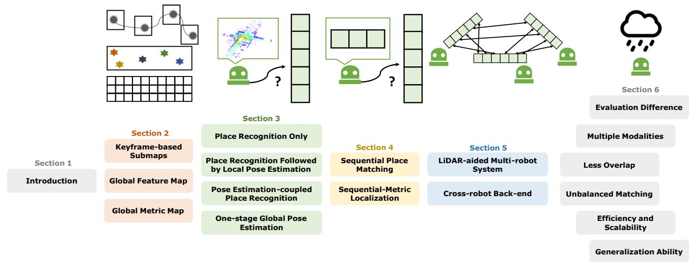  
Fig. 1 Fish-shaped paper structure. This survey starts the problem formulation and related introduction at the fish head. Then the fish body part contains the main subtopics of the global LiDAR localization problem: map framework, single-shot and sequential global localization, and  
cross-robot localization. Finally, an extended discussion on open problems is presented at the fish tail. We also present graphical illustrations above each section title

In summary, our paper structure is similar to a fish, as illustrated in Fig. 1. Section 1 details the global localization problem and the scope of this survey. We then present three types ofmap frameworks in Sect. 2. Sections 3 and 4 then provide an overview of existing methods based on the number of measurements: single-shot or sequential. The former focuses on matching a single LiDAR point cloud on a given map, while the latter takes sequential measurements to approximate the ground truth pose. Then in Sect. 5, we extend the global localization problem to the cross-robot localization problem for multi-robot applications. Finally, Sect. 6 provides discussions about open challenges and emerging issues of global LiDAR localization. A brief conclusion of this survey is presented in Sect. 7.

## 1.2 Typical Situations

The concrete global localization method varies according to actual situations in robot mapping and localization. Three typical situations are illustrated as follows.

## 1.2.1 Loop Closure Detection

In a SLAM framework, loop closure detection (LCD) is a method used to determine whether a robot has returned to a previously visited location or place. However, simply recognizing revisited locations is insufficient for performing loop closure in SLAM. Typically, the relative transformation between the current and previous locations is also required, as is the case for graph-based consistent mapping methods (Kümmerle et al., 2011; Dellaert, 2012). In this paper, we use the terms LCD and loop closing interchangeably, as both involve detecting revisited locations and estimating relative transformations. LCD is generally regarded as an intra-sequence problem. The intra-sequence refers to scenarios where the measurements and map are derived from the same sequence, maintaining the continuity of the robot’s journey. Conversely, the inter-sequence refers to the instance where the measurements and map are sourced from distinct data sequences, which could occur under varying time frames. These two terms were also introduced in the Wild-Places dataset (Knights et al., 2023).

## 1.2.2 Re-localization

Re-localization serves to assist a robot in recovering when there is a failure in pose tracking or when the robot has been kidnapped. Additionally, it can be used to activate the robot at the beginning of navigation. The fundamental distinction between loop closure detection (LCD) and re-localization lies in the data sequence used: re-localization is classified as an inter-sequence problem, wherein the measurements and map are obtained from different data sequences. It is noteworthy that re-localization can pose significant challenges in the case of long-term multi-session sequences, such as attempting to re-localize a LiDAR scan on an outdated point cloud map. Additionally, the pose space X of re-localization can be larger than that of LCD in some instances since there is no prior information available in re-localization, while LCD may employ odometry information as a crude initial estimate, thereby reducing the pose space to a smaller size.

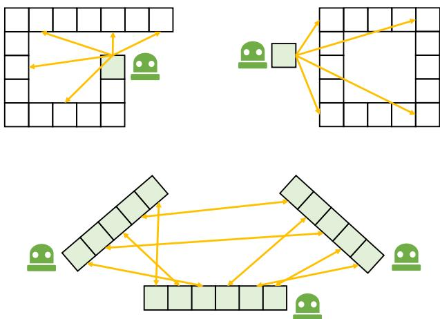  
Fig. 2 Three typical situations. From top to down: single-robot intra-sequence LCD (loop closing); single-robot inter-sequence relocalization; cross-robot inter-sequence localization. Blue-filled boxes indicate measurements (LiDAR scan or submap). Orange lines are possible relative transformations for global localization problems (Color figure online)

## 1.2.3 Cross-Robot Localization

Multiple online maps can be generated from multiple robots using incremental SLAM or other mapping techniques. These maps might be with partial overlap but are under their own coordinate. Cross-robot localization, or multiple-robot mapping, aims to localize a robot globally on another robot’s map. More concretely, D and M come from different robots and all robots’ poses are required to be estimated. Theoretically, the cross-robot localization problem is identical to the single-robot re-localization (Thrun et al., 2005) but in a multirobot scenario. Relevant techniques can also be employed to offline map merging applications. For instance, cross-robot localization is performed on multiple sessions collected by a single robot for long-term use, while the challenge is that perspective changes may occur under long-term conditions.

Figure 2 illustrates three common scenarios in which a robot needs to estimate relative transformations between its current measurements and its own or another robot’s map. This ability is commonly referred to as global localization, and it can be achieved with various sensors and fused sensor modalities. This survey specifically focuses on the global LiDAR localization problem and the techniques and open problems relevant to it.

## 1.3 Relationship to Previous Surveys

Lowry et al. (2015) provide a thorough review on visual place recognition in 2015. They start by discussing the “place” definition and introduce related techniques for visual place recognition. A general place recognition survey (Yin et al., 2022) reviews the place recognition topic from multiple perspectives, including sensor modalities, challenges and datasets. However, place recognition determines whether a robot revisits a previous place by retrieval, which is not equal to the concept of global localization. Toft et al. (2020) review the long-term visual localization and make evaluations on state-of-the-art approaches, such as visual place recognition (image-retrieval)-based and structure-based camera pose estimation. Elhousni and Huang (2020) presents a LiDAR localization survey, focusing on LiDAR-aided pose tracking for autonomous vehicles. LiDAR place recognition and pose estimation are not reviewed explicitly in these survey papers (Lowry et al., 2015; Yin et al., 2022; Toft et al., 2020; Elhousni & Huang, 2020). From the view of global LiDAR localization, we present a complete survey that covers relevant topics, like the ones (Lowry et al., 2015; Toft et al., 2020) on vision.

Cadena et al. (2016) present a history of SLAM and promising research directions in 2016. SLAM has supported various robotic applications. A recent article by Ebadi et al. (2022) surveys recent progress on challenging underground SLAM. Specifically, SLAM aims to incrementally estimate pose and construct maps, while global localization estimates a global pose on a prior map. These two problems have a certain relevance. More concretely, LCD is a key characteristic ofmodern-day SLAM algorithms, as introduced in the Handbook of Robotics (Stachniss etal, 2016). The absence of loop closing or place recognition will reduce SLAM to odometry (Cadena et al., 2016). We believe this survey paper will help users make LiDAR SLAM systems more robust and accurate.

## 2 Maps for Global Localization

Before delving into the methodology section, it is essential to introduce maps M for robot localization. This section primarily focuses on maps that support global localization and classifies general-use maps into three primary clusters: keyframe-based submap, global feature map, and global metric map. We list three widely-used maps and discuss the map structure and representations inside.

## 2.1 Keyframe-Based Submap

The keyframe-based submap is a highly popular map structure for robot localization, particularly in large-scale environments. It consists of a set of keyframes, each containing a robot pose and an aligned submap, as well as additional information in the form of topological or geometrical connections between keyframes (Lowry et al., 2015). Keyframe-based submaps are easy to maintain and well-suited for downstream navigation tasks (Tang et al., 2019). The keyframe-based map

can be represented as:

$$
\mathbf { M } _ { \mathrm { s u b } } = \{ \mathbf { m } _ { 1 } , \cdot \cdot \cdot , \mathbf { m } _ { s } \}\tag{6}
$$

where s represents the number of submaps. In other words, s corresponds to the size of X if we only retrieve places in the keyframe database.

A keyframe-based map effectively discretizes the entire pose space, reducing the complexity of the problem. This discrete map structure is particularly well-suited for place retrieval, as each keyframe can be considered a distinct "place" for the mobile robot. The submap contained within each keyframe can serve as a global descriptor for retrieval or can be augmented with additional metric grids or points for geometric registration. Notably, the distance between keyframe poses is a critical factor in practice. For example, if this distance is large or the keyframe resolution is low, fewer keyframes (i.e., a smaller s) may be needed for lightweight robot navigation, but at the cost of increased risk of localization failure. The content in each submap could be sparse features or dense metrics that will be introduced in the following sections. Additionally, it should be noted that keyframe-based maps may not be suitable for global localization in certain environments, such as indoor or forested areas where many local environments are similar. In such cases, a global map may be preferred.

## 2.2 Global Feature Map

A global feature map keeps sparse local feature points to describe the environments. Early SLAM systems extract landmarks from laser data to support mapping and localization, like tree trunks in the Victoria Park dataset (Guivant & Nebot, 2001). These landmarks are essentially lowdimensional feature points. Nowadays, LiDAR feature points are generally with high-dimensional information (Dubé et al., 2017). Hence, feature correspondence-based matching can be directly used for relative transformation estimation. More importantly, local features are sparse and easy to manage, making the navigation system more lightweight.

The main challenge of applying such maps is generating and maintaining stable feature points. For instance, a high-definition map (HD map) is a typical global feature map for self-driving vehicles. HD-map construction involves multiple onboard sensors and high-performance computation, and maintaining a global HD map is costly. As for the LiDAR-only global feature map, a powerful front-end feature extractor is necessary to ensure the map quality.

## 2.3 Global Metric Map

A global metric map is a single map with dense metric representations describing a working environment. Generally, metric and explicit representations include 2D/3D points (Lee et al., 2022), grids (Hess et al., 2016), voxels (Wurm et al., 2010), and meshes (Chen et al., 2021). The global metric map is easy to use and can provide highprecision geometric information.

But localization, whether pose tracking or global localization, is only one block in common autonomous navigation systems. In large-scale environments, the global metric map can be a burden for resource-constrained mobile robots. One might suggest that we could downsample or compress dense points while keeping the main geometric property (Labussière et al., 2020; Yin et al., 2020). But as pointed out by Chang et al. (2021), localization performances drop as the map size budget decreases using raw points. There are two solutions to tackle this problem: one is to use sparse local features rather than dense representations, i.e., the global feature map; another is to split the map space into submaps, i.e., keyframe-based submaps. The map framework and contents inside should be designed according to the application scenarios.

It is worth noting that implicit map representations are becoming highly popular, including non-learning (Saarinen et al., 2013; Wolcott et al., 2016) and learning-based ones (Kuang et al., 2023; Deng et al., 2023). One famous work is normal distribution transform (NDT), which uses probability density functions as representations. Current learning-based implicit representations (Kuang et al., 2023; Deng et al., 2023) exploit techniques derived from neural radiance fields (NeRF) (Mildenhall et al., 2021), which use fewer parameters compared with explicit ones (Lee et al., 2022; Hess et al., 2016; Wurm et al., 2010; Chen et al., 2021) and have the potential to achieve higher accuracy owing to their continuous representations. Map representation is a basic but critical topic for SLAM and other navigationrelated applications. We recommend reading a review by Rosen et al. (2021) for readers interested in this topic.

In summary, three types of maps are introduced in this section. These map structures and their representations inside are the foundations that can support global LiDAR localization in the following Sects. 3 and 4. For instance, if place recognition technique is involved, like methods in Sects. 3.1, 3.2 and 3.3, space discretization is indispensable to obtain keyframe-based submaps for retrieval.

## 3 Single-Shot Global Localization: Place Recognition and Pose Estimation

Single-shot global localization methods solve pose estimation using a single LiDAR point cloud only. Place recognition is the core backbone to achieve this. Generally, place recognition is a discriminative model based on keyframe-based submaps, in which every keyframe generally consists of a global descriptor and a robot pose. The basic idea of place recognition is to retrieve the highest-probability place based on global descriptors and measured similarities between $\mathbf { z } _ { t }$ and $\mathbf { M } _ { \mathrm { s u b } }$ . More specifically, these global descriptors should have a certain discriminativeness: be discriminative for different places but keep similar for places close to each other.

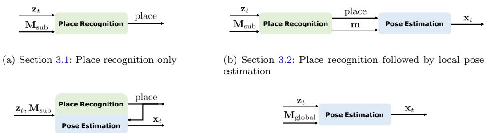  
(c) Section 3.3: Pose estimation-coupled place recognition  
Fig. 3 Four types of single-shot global localization. The term $\mathbf { z } _ { t }$ indicates the input LiDAR point cloud; $\mathbf { M } _ { \mathrm { s u b } }$ and $\mathbf { M } _ { \mathrm { g l o b a l } }$ represent keyframe-based submaps and a global feature map; place and m are the retrieved place and submap; $\mathbf { X } _ { t }$ is the estimated pose. In Sect. 3.1, place recognition-only approaches provide a retrieved place (keyframe) as the estimated pose. In Sect. 3.2, place recognition first provides a prior  
(d) Section 3.4: One-stage global pose estimation

However, place recognition can only provide a coarse place as the estimated “pose”, while local pose estimation is still needed via precise feature matching or similar techniques. In this section, we categorize all single-shot approaches considering their degree of place recognition and relative pose estimation, as follows:

– Section 3.1: Place Recognition Only approaches retrieve the most similar place using descriptors.

– Section 3.2: Place Recognition Followed by Local Pose Estimation first achieves place recognition and then estimates the robot pose via a customized pose estimator.

– Section 3.3: Pose Estimation-coupled Place Recognition tightly couple the two stages together.

– Section 3.4: One-stage Global Pose Estimation directly estimates the global pose on a global map using pose estimation.

Figure 3 presents four types of combinations between the place recognition module and the pose estimation module. We also list several representative works of single-shot global LiDAR localization in Table 1. From the perspective of maps, in Sects. 3.1, 3.2 and 3.3, methods generally rely on keyframe-based submaps. While in Sect. 3.4, global localization is generally based on a global feature map (or also with a metric map). Note that methods introduced in Sect. 3.2 focus on local pose estimation, and are applied when given place priors from methods in Sect. 3.1.

place then the pose is estimated via an individual pose estimation part. In Sect. 3.3, place recognition and pose estimation are coupled together and benefit from shared representations. Methods in Sect. 3.4 achieve global pose estimation on a global map where place retrieval is not involved

The boundaries are not so clear for some global localization methods. For instance, there are no global descriptors in several place recognition approaches (Bosse & Zlot, 2009), and local feature-based pose estimation plays an important role. We consider they lie in the boundary of Sects. 3.3 and 3.4, and will list them in Sect. 3.3 for clearance.

## 3.1 Place Recognition Only

Place recognition-only approaches solve the global localization problem by retrieving places in a pre-built keyframebased map. Figure 4 presents a place recognition-only approach for better understanding. The most challenging part of LiDAR place recognition is the global descriptor extraction. Compared to visual images, raw point clouds from LiDAR are textureless and in an irregular format, sometimes with an uneven density. From the perspective of data processing, global descriptor extraction is a kind of compression method for point clouds, while maintaining the distinctiveness of different places. We categorize place recognition based on how to handle LiDAR data pre-processing.

## 3.1.1 Dense Points or Voxels-Based

Dense points and dense voxels-based works refer to those that generate global descriptors directly on dense representations. Early laser scanners can only provide 2D laser points for robotic localization. Granström et al. (2009) design a global descriptor that consists of 20 features in a 2D laser scan, such as a covered area and a number of clusters in range data. Then handcrafted descriptors and labels are fed into a weak classifier Adaboost (Freund & Schapire, 1997) for training. The learning-based approach is extended to 3D laser features in Granström et al. (2011). Instead of extracting features, Fast Histogram (Röhling et al., 2015) encodes the range distribution of 3D points into a one-dimensional histogram for place retrieval. Earth Mover’s distance is employed to measure the similarity of different histograms, which differs from Euclidean distance or Cosine distance in most place recognition methods. Inspired by Röhlinget al. (2015), Yin et al. (2017) build a 2D image-like representation based on divisions of altitude and range in a 3D LiDAR scan. Then the problem can be converted to an image classification problem that can be solved by training a 2D convolutional neural network with a basic contrastive loss (Hadsell et al., 2006). Aside from using the range information of LiDAR scanners, DELIGHT (Cop et al., 2018) utilizes the histograms of LiDAR intensity as the descriptor for place recognition followed by geometry verification.

Table 1 Representative studies in Sects. 3.1, 3.2, 3.3 and 3.4
<table><tr><td>Name</td><td>Place prior</td><td>Pose</td><td>Pre-processing</td><td>Pipeline/backbone/highlight/descriptor</td></tr><tr><td>Fast Histogram (Röhling et al., 2015)</td><td></td><td>Place</td><td>Points</td><td>Range Histogram-based</td></tr><tr><td>PointNetVLAD (Uy &amp; Lee, 2018)</td><td></td><td>Place</td><td>Points</td><td>3D PointNet + NetVLAD</td></tr><tr><td>Minkloc3d (Komorowski, 2021)</td><td></td><td>Place</td><td>Points</td><td>3D Feature Pyramid Network + Generalized-mean</td></tr><tr><td>Kong et al. (2020)</td><td></td><td>Place</td><td>Segments</td><td>Semantic Graph + Graph Similarity Network</td></tr><tr><td>M2DP (He et al., 2016)</td><td></td><td>Place</td><td>Projection</td><td>Multiple planes, Density Signature</td></tr><tr><td>Yin et al. (2022)</td><td>一</td><td>Place</td><td>Projection</td><td>Spherical Projection + VLAD Layer</td></tr><tr><td>FLIRT (Yang et al., 2013)</td><td>√</td><td>3-DoF</td><td>Points</td><td>Curvature-based Detector + β-grid Descriptor</td></tr><tr><td>TEASER (Yang et al., 2021)</td><td>√</td><td>6-DoF</td><td>Points</td><td>Invariant Measurements + Robust Estimation</td></tr><tr><td>PHASER (Bernreiter et al., 2021)</td><td>√</td><td>6-DoF</td><td>Points</td><td>Spherical FT + Spatial FT + Correlations</td></tr><tr><td>DPCN++ (Bernreiter et al., 2021)</td><td>√</td><td>6-DoF</td><td>Points</td><td>Differentiable Feature + FTs + Correlations</td></tr><tr><td>Scan Context (Kim &amp; Kim, 2018)</td><td></td><td>Place + 3-DoF</td><td>Projection</td><td>2D Ring Key, Scan Context</td></tr><tr><td>DiSCO (Xuecheng et al., 2021)</td><td></td><td>Place + 3-DoF</td><td>Projection</td><td>Multi-layer Scan Context + CNN + Fast FT</td></tr><tr><td>OverlapNet (Chen et al., 2020)</td><td></td><td>Place + 3-DoF</td><td>Projection</td><td>Multi-layer Range Image + CNN + Correlation</td></tr><tr><td>Shan et al. (2021)</td><td></td><td>Place + 6-DoF</td><td>Projection</td><td>Range Image + DBoW + Matching</td></tr><tr><td>LCDNet (Cattaneo et al., 2022)</td><td></td><td>Place + 6-DoF</td><td>Points</td><td>PV-RCNN + BEV Feature Map</td></tr><tr><td>STD (Yuan et al., 2023)</td><td></td><td>Place + 6-DoF</td><td>Points</td><td>Stable Triangle Descriptor, Hash Key</td></tr><tr><td>SegMatch (Dubé et al., 2017)</td><td></td><td>6-DoF</td><td>Segments</td><td>Features + Random Forest + RANSAC</td></tr><tr><td>PointLoc (Wang et al., 2021)</td><td></td><td>6-DoF</td><td>Points</td><td>PointNet-style + Self-Attention</td></tr></table>

CNN convolutional neural network, FT Fourier transform

All the methods above design handcrafted 2D or 1D histograms for LiDAR-based place recognition. This is because deep learning for 3D point clouds was not so mature then. In 2017, Qi et al. (2017) propose the PointNet, which can learn local and global features for 3D deep learning tasks. Novel encoders also boost the performance of point cloud processing, like KPconv (Thomas et al., 2019) for point convolution. PointNetVLAD (Uy & Lee, 2018) utilizes PointNet to extract features of 3D point clouds and aggregates them into a global descriptor via NetVLAD (Arandjelovic et al., 2016). But limited by PointNet, PointNetVLAD ignores the local geometry distribution in 3D point clouds. To address this problem, LPDNet (Liu et al., 2019) designs an adaptive local feature extraction module based on ten handcrafted local features, and a graph-based neighborhood aggregation module to generate a global descriptor. With the appearance of Transformer (Vaswani et al., 2017) in diverse tasks to achieve long-range dependencies, the attention mechanism has been increasingly used to select significant local features for place recognition. PCAN (Zhang & Xiao, 2019) takes local features into account and computes an attention map to determine each feature’s significance. SOE-Net by Xia et al. (2021) uses a point orientation encoding module to generate point-wise local features and feeds them into a self-attention network aggregating them to a global descriptor. Nevertheless, these methods cannot fully extract the point-wise local features around the neighbors. Hui et al. propose a pyramid point cloud transformer network named PPT-Net (Hui et al., 2021). PPT-Net could learn the local features at different scales and aggregate them to a descriptive global representation by a pyramid VLAD. Recent work (Lin et al., 2022) utilizes SE(3)-equivariant networks to learn global descriptors, making place recognition more robust to the rotation and translation changes. Despite the network structure design, a local consistency loss is proposed in Vidanapathirana et al. (2022) to guarantee the consistency of local features extracted from point clouds at the same place. To save memory and improve transmission efficiency, Wiesmann et al. (2022) propose a compressed point cloud representation aggregated by an attention mechanism for place recognition. Authors also design a novel architecture for more efficient training and inference in Wiesmann et al. (2022).

Another popular pipeline is to voxelize the 3D point clouds first, and then extract global descriptors for place recognition. The voxeling process can make the raw 3D point clouds more regular. This makes 3D point clouds close to 3D image-like representations, i.e., each grid (2D) or cube (3D) can be regarded as one image patch. Magnusson et al. (2009a, b) classify local cells into planes, lines and spheres, and then aggregate them all into a vector as a global descriptor for place recognition. The classification criteria are based on the local distributed probability density function, i.e., NDT. In the deep learning age, Zhou et al. (2021) propose NDT-Transformer, which transforms the raw point cloud into NDT cells and uses the attention module to enhance the discrimination. VBRL proposed by Siva et al. (2020) introduces a voxel-based 3D representation that combines multi-modal features in a regularized optimization formulation. Oertel et al. proposes AugNet (Oertel et al., 2020), an augmented image-based place recognition method that combines appearance and structure features. Komorowski et al. introduce MinkLoc3D (Komorowski, 2021), which extracts local features on a sparse voxelized point cloud by feature pyramid network and aggregates them into a global descriptor by pooling operations. After that, they propose MinkLoc3Dv2 (Komorowski, 2022) as the enhancement of MinkLoc3D (Komorowski, 2021), which leverages deeper and wider network architecture with an improved training process.

## 3.1.2 Sparse Segments-Based

Segmentation-based approaches refer to works that perform place recognition based on point segments, which leverage the advantages of both local and global representations. Seed (Fan et al., 2020) segments the raw point cloud to segmented objects and encodes the topological information of these objects into the descriptor. SGPR (Kong et al., 2020) exploits both semantic and topological information of the raw point cloud and uses a graph neural network to generate the semantic graph representation. Locus (Vidanapathirana et al., 2021) encodes the temporal and topological information to a global descriptor as a discriminative scene representation. Gong et al. (2021) utilize spatial relations of segments in both high-level descriptors search and low-level geometric search. Overall, segmentation-based approaches are close to what our human beings think about place recognition, i.e, using high-level representations rather than low-level geometry. On the other hand, these methods heavily rely on the segmentation quality and other additional semantic information. 3D point cloud segmentation approaches have typically been time-consuming and resource intensive.

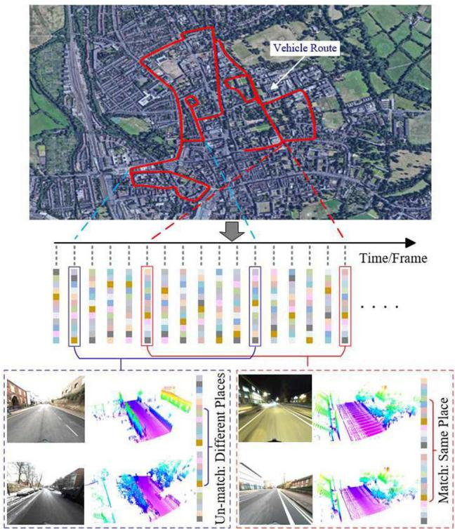  
Fig. 4 LPD-Net is a place recognition-only approach for global LiDAR localization. Global descriptors are extracted as place descriptions for place retrieval . (Source: LPDNet (Liu et al., 2019), used with permission.)

## 3.1.3 Projection-Based

Projection-based methods, in contrast to the aforementioned two categories, do not generate the descriptor directly on 3D point clouds or segments; instead, these methods project a 3D point cloud to 2D planes first and then achieve global descriptor extraction. He et al. (2016) propose M2DP that projects the raw point cloud into multiple 2D planes, constructing the signature with descriptors from different planes. LiDAR Iris (Wang et al., 2020) encodes the height information of a 3D point cloud into a binary LiDAR-Iris image and converts it into a Fourier domain to achieve rotation invariance. RINet proposed by Li et al. (2022) converts a point cloud to a scan context image encoded by semantic information first and designs a rotation-invariant network for learning a rotation-invariant representation. Yin et al. (2022) design a multi-layer spherical projection via discrete 3D space. Then VLAD layer (Arandjelovic et al., 2016) and spherical convolutions (Cohen et al., 2018) are integrated as SphereVLAD based on spherical projections. SphereVLAD could learn a viewpoint-invariant global descriptor for place recognition.

Summary. Early approaches in Sects. 3.1.1 and 3.1.3 tried to design handcrafted global descriptors from a traditional data processing viewpoint. With the development of neural network techniques, data-driven descriptors are becoming more and more popular, resulting in high performance on place recognition [(>95% on Recall@1 in Tian-Xing et al. (2023), Komorowski (2022)]. Several approaches have achieved fully rotation-invariant descriptors for place retrieval, like handcrafted Fast Histogram in Röhlinget al. (2015) and learning-based SphereVLAD in Yin et al. (2022). We can conclude that global descriptor extraction of 3D LiDAR point clouds has reached a level of success. However, there still remain several challenges and issues, e.g., generalization ability, that will discuss in Sect. 6.6.

All the methods in this subsection only provide retrieved places as output. The global localization performance is evaluated under machine learning metrics, like precision-recall curves and F1 score. We will discuss the evaluation metrics in Sect. 6.1. In this context, the translation precision of pose (place) is decided by the resolution of keyframes (25 m for evaluation on RobotCar Dataset Maddern et al. 2017); the precision of rotation estimation is not considered or evaluated. In practice, this actually can not meet the demand of most high-precision global localization tasks, e.g., building a consistent global map with relative transformations, or waking the robot up with a precise location and orientation.

From another point of view, global descriptors are highly compressed representations of raw LiDAR data, and there exists information loss in the compression process, especially for those end-to-end deep learning methods. This kind of representation is naturally suitable for nearest neighbor search in place retrieval but can not be used in geometric pose estimation. In the following section, we present a review of the local transformation estimation that metric representation involves.

## 3.2 Place Recognition Followed by Local Pose Estimation

This section reviews local pose estimation methods for highprecision transformation estimation. Note that this local pose estimation is independent of place recognition in this subsection. These two components are seen as separated and the global localization is achieved in a coarse-to-fine manner: first achieve place retrieval on keyframe-based submaps, then apply local pose estimation via matching input LiDAR to map data attached on the retrieved keyframe. Hence, for this group of approaches, the keyframe includes not only global descriptors for nearest neighbor search (place retrieval), but also metric representations for local pose estimation. Conventionally, the local pose estimation is achieved by precise point cloud registration.

Point cloud registration, or named scan matching, is a popular topic in robotics and computer vision. It aims at estimating the optimal transformation by minimizing the error

function as follows:

$$
\mathbf { T } = \underset { \mathbf { T } \in \mathrm { S E } ( 3 ) } { \arg \operatorname* { m i n } } \left( e \left( \mathcal { M } , \mathbf { T } \mathcal { P } \right) \right) ,\tag{7}
$$

in which T is the relative transformation (pose) to be estimated; $\mathcal { P }$ and are the source points (input LiDAR measurement ${ \bf z } _ { t } )$ and target points (prior map in the retrieved keyframe m) respectively; $e \left( \cdot \right)$ is an error function to minimize. Specifically, point cloud registration approaches can be categorized into two types based on whether they use explicit correspondences in space for pose estimation, i.e., correspondence-based and correspondence-free approaches. This subsection mainly focuses on the global point cloud registration, i.e., align two LiDAR point clouds without initial guess.

## 3.2.1 Correspondence-Based

If correspondences (data associations) between query measurements and map are known, the registration problem can be solved in a closed form (Horn, 1987; Somani Arun et al., 1987). Unfortunately, the initial correspondences are unknown in practice. The most well-known algorithm to scan registration is Iterative Closest Point (ICP) (Besl & McKay, 1992), which considers a basic point-to-point correspondence search and finds the optimal solution at each iteration. The ICP family follows an expectationmaximization framework that alternates between finding correspondence and optimizing pose. Despite its widespread use in point cloud registration, the quality of the registration result is limited by the presence of noise and outliers. An effective real-time registration system based on ICP is KISS-ICP (Vizzo et al., 2023). To improve the original ICP algorithm, many variants have been designed. Probabilistic methods Generalized-ICP (Segal et al., 2009) and NDT (Biber & Straßser 2003) define Gaussian models for points or voxels and perform registration in a distributionto-distribution manner, therefore reducing the influence of noise. We recommend interested readers consider a registration review for mobile robotics (Pomerleau et al., 2015).

However, ICP and its variants might fall into local minima, making it inapplicable for global registration. Go-ICP by Yang et al. (2013) provides a global solution to the registration problem defined by ICP in 3D using branch-andbound (BnB) theory. Go-ICP, however, is time-consuming on resource-constrained platforms, especially when the pose space is large for BnB search. If the transformation is in a limited space, BnB-based scan matching is more efficient to use, like LCD in Cartographer (Hess et al., 2016) and vehicular pose tracking on a Gaussian mixture maps (Wolcott et al., 2016).

For ICP and its variants, the local minima are caused by the assumption ofnearest-neighbor correspondence in Euclidean space. Local feature-based approaches have emerged to extract robust features for correspondence search in a feature space. With the correspondence determined, the transformation can be calculated in the closed form, or with an additional outlier filter. But compared to 2D image descriptors like SIFT (Lowe, 1999) or ORB (Rublee et al., 2011), the study on LiDAR feature extraction and description is less extensive. The nature ofrange data is different from image data. Extracting and describing repeatable features in LiDAR scans is still an open problem. The less accurate correspondences provided by feature matching will cause a much higher outlier rate than their 2D counterparts. To address these issues, there are mainly two lines of research in recent years: one is to study the effective LiDAR features; the other is to configure a robust estimator that can handle high outlier rates. We will address these two lines as follows.

The feature extraction of 2D laser scans follows the pipeline in computer vision: first detect interest points (keypoints), and then compute a distinctive signature for each of them (local descriptors) (Nielsen & Hendeby, 2022). Tipaldi and Arras (Tipaldi & Arras, 2010) propose a fast laser interest region transform (FLIRT) fo feature extraction, which adopts the theory in SIFT (Lowe, 1999). FALKO (Kallasi et al., 2016) is also an effective keypoint detection that specialized in 2D range data. BID by Usman et al. (2019) uses B-spline to fit the data along keypoints that are detected by FALKO (Kallasi et al., 2016). Then the spline is formulated into the descriptors for feature matching. As for 3D range data, early approaches to extract 3D features are mainly handcrafted (Guo et al., 2016), such as FPFH (Rusu et al., 2009), NARF (Steder et al., 2010) and SHOT (Salti et al., 2014). These methods are designed for dense point clouds obtained by RGBD cameras, which lack generalization and robustness against noise. Deep learning has drawn much attention in recent years, and many learning-based features have been proposed. 3DMatch (Zeng et al., 2017) takes 3D local patches around arbitrary interest points and extracts 3D features using a 3D convolutional neural network. PPFnet (Deng et al., 2018) utilizes PointNet (Qi et al., 2017) to extract local patch features and further fuse the global context into this feature. FCGF (Choy et al., 2019) utilizes a fully convolutional network to capture global information. It also adopts sparse convolution to efficiently extract local features in point clouds.

These methods focus on the local feature extraction from interest points; however, interest point or keypoint detection is also important. The stable keypoints that are highly repeatable on 3D point clouds under arbitrary transformation are essential for the registration task. There is a comprehensive review of 3D keypoint detection that evaluates most handcrafted 3D keypoints (Tombari et al., 2013). The common trait of these methods is their reliance on local geometric information, which discards the important global context. To address these problems, USIP (Li & Lee, 2019) proposes an unsupervised framework to detect keypoints. SKD (Tinchev et al., 2021) uses saliency estimation to determine the keypoints. Some works (Yew & Lee, 2018; Bai et al., 2020) also jointly learn the keypoint detector and local descriptor.

The limitation of correspondence-based methods is the robustness of the estimator with respect to outliers and low overlaps. Then we shift from the “3D features” line to the “robust estimator” line. Several research works tried to address this problem from different perspectives. Random sample consensus (RANSAC) (Fischler & Bolles, 1981) is a widely used robust estimator for outlier pruning. FGR (Zhou et al., 2016) regards this problem as an optimization problem. FGR implements a Geman-McClure cost function and leverages second-order optimization to reach global registration of high accuracy. Different robust kernels are considered for point cloud registration. An elegant formulation based on Barron’s kernel family (Barron, 2019) has been proposed in the work by Chebrolu et al. (2021). TEASER by Yang et al. (2021) is the first certifiable registration algorithm that can achieve acceptable results with a large percentage of outliers. A powerful maximum clique finder (Eppstein et al., 2010) is an important module for handling outliers in TEASER. With pruned correspondences, graduated nonconvexity (Yang et al., 2020) is then used for robust pose estimation. The maximum clique problem can also be formulated as a graph-theoretic optimization problem. Lusk et al. (2021) present CLIPPER to solve this optimization by continuous relaxation. As for learning-based approaches, DGR (Choy et al., 2020) proposes a differentiable scheme for closed-form pose estimation and a robust gradient-based SE(3) optimizer for refinement. PointDSC (Bai et al., 2021) utilizes a spatial-consistency guided nonlocal module for feature learning and proposes a differentiable neural spectral matching for outlier removal.

For global LiDAR registration, the robust estimation framework like TEASER (Yang et al., 2021) has inspired several methods recently. These works generally leverage practical considerations into the pose estimation framework. In the Quatro proposed by Lim et al. (2022), the Atlanta world assumption is used to filter outlier correspondences in urban environments, and only one single correspondence is enough for pose estimation under the assumption. In the extension version Lim et al. (2023), authors introduce ground segmentation into the registration framework for better LCD. G3Reg by Qiao et al. (2023) builds local Gaussians to model point cloud clusters at the front end. At the back end, G3Reg solves multiple maximum cliques for final pose estmiation by considering the probability degrees of Gaussians. Figure 5 shows the registration process of G3Reg.

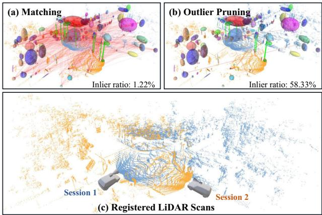  
Fig. 5 a Front-end Gaussian modeling and correspondence building. b Back-end outlier pruning. The correspondence inlier ratio increases. c A challenging global registration result at a road intersection, in which the two LiDAR point clouds are with low overlap and a large view difference . (Source: adapted from G3Reg (Qiao et al., 2023), used with permission.)

Instead of applying an off-the-shelf robust estimator after descriptors, some works convert the entire pose estimation into the end-to-end training pipeline. Deep Closest Point (DCP) (Wang & Solomon, 2019) revises the original ICP pipeline to a differentiable one that can learn from data. DeepGMR (Yuan et al., 2020) is a learning-based method that leverages point-to-distribution correspondences for registration. Recently, the attention mechanism is also adopted to replace the role of feature matching and outlier filtering and thus can be used in end-to-end frameworks (Huang et al., 2021; Shi et al., 2021; Yew & Lee, 2022). This data-driven works (Wang & Solomon, 2019; Yuan et al., 2020; Huang et al., 2021; Shi et al., 2021; Yew & Lee, 2022) are trained and validated on public point cloud datasets. More data are necessary to ensure the robustness and generalization ability needed by global localization on mobile robotics.

## 3.2.2 Correspondence-Free

The main idea of correspondence-free methods is to register point clouds based on feature similarity. With the convergence considered, existing methods can be divided into locally convergent and globally convergent methods. The locally convergent methods stem from the optical flow in the image domain. Instead of using 3D coordinates, Point-NetLK (Aoki et al., 2019) uses PointNet (Qi et al., 2017) to learn the local feature of each point and then iteratively align the learned features, which requires no costly computation of point correspondences in space. There also exist improved versions of PointNetLK framework (Li et al., 2021; Huang et al., 2020). One disadvantage of this class of approaches is the iterative solver, which is sensitive to initialization and may mislead the feature learning.

Globally convergent approaches are mainly based on the idea of correlation. Like the image registration pipeline, Bülow and Birk (2018) utilize 3D Fourier-Mellin transform to achieve globally convergent 3D registration. PHASER (Bern reiter et al., 2021) generates spherical frequency spectrum using Fourier transform and Laplace fusion and registers point cloud by calculating correlation. Zhu et al. (2022) propose to learn an embedding for each point cloud in a feature space that preserves the SO(3)-equivariance property. The global convergence mostly contributed to the correlation, an inherently exhaustive search that can be evaluated effectively by spectrum decoupling. Recent work DPCN++ (Chen et al., 2023) designs a differentiable phase correlation scheme with trainable networks, which could handle both 2D/3D homogeneous and heterogeneous measurements, like registering a LiDAR submap to a satellite map.

Summary. Point cloud registration is a popular topic but there still remain some issues for mobile robotic applications, e.g., generalization ability under an end-to-end framework and global registration with low overlap. In certain applications, only local registration could also provide global localization results, e.g., LiDAR LCD with local convergence-based ICP when the current pose is close to the previously stored pose. However, in such cases, global registration can provide more reliable local poses between measurements and retrieved places. Overall, if we combine approaches introduced in Sects. 3.1 and 3.2, a complete global localization framework can be obtained in a coarseto-fine manner: first global place recognition then followed by local pose estimation.

Compared to place recognition-only approaches, the coarse-to-fine framework can provide precise poses for global localization tasks. The cost is that the map needs to include both global descriptors for retrieval and local metric points for state estimation. This makes the framework impracticable in large-scale environments, e.g., self-driving cars in city-scale environments for commercial use. Additionally, if place recognition fails, local pose estimation will suffer from this failure. We will introduce pose estimationcoupled place recognition to address these problems.

## 3.3 Pose Estimation-Coupled Place Recognition

For the approaches explained in Sect. 3.2, two separate steps are needed to handle place recognition and local pose estimation. One upgrade direction is to design a shared feature embedding or representation that place recognition and pose estimation can benefit from it. Thus, place recognition and pose estimation could share the same processing pipeline, making the map more concise and the pipeline tighter. We name this kind of approach as pose estimation-coupled place recognition, or coupled methods for clearance in the following sections.

Note that many methods in this section use the same preprocessing techniques in Sect. 3.1: dense points/voxel-based, sparse segments-based and projection-based. In this section, we mainly group these methods based on the dimension of output poses for easier understanding.

## 3.3.1 3-DoF Pose Estimation

For mobile robots working on planar surfaces, pose estimation mainly focuses on three degrees of freedom (3-DoF): position and orientation/heading (yaw angle). One of the well-known methods is scan context (Kim & Kim, 2018). The 3D point clouds are divided into azimuthal and radial bins, in which the value is assigned to the maximum height of the points in it. The similarity is the sum of cosine distances between all the column vectors at the same indexes. As the column would shift when the viewpoint of the LiDAR changes, the authors propose a rotation-invariant descriptor extracted from scan context for top-k retrieval during place recognition, then further calculate the similarity and azimuth by column shift. The rotation here is the yaw angle or the heading for mobile robots moving on planar.

Some following methods are designed to improve the discriminability and invariance of the original scan context (Wang et al., 2020; Li et al., 2021; Kim et al., 2019; Wang et al., 2020; Xuecheng et al., 2021; Zhou et al., 2022). For example, Li et al. (2021) introduce the semantic labels of the point clouds. Besides feature extraction, other methods improve the efficiency of the similarity calculation process by taking advantage of the circular cross-correlation property in scan context representation. Wang et al. (2020) utilize the Fourier transform to estimate the translation shift along the azimuth-related axis. Xuecheng et al. (2021) propose the DiSCO, a differentiable scan context method which trains the place recognition (position) and pose estimation (orientation) in an end-to-end manner. Figure 6 shows the pipeline and representations of DiSCO for global localization.

Though scan context and its family obtain rotationinvariant descriptors for retrieval, they cannot achieve translation invariance due to the egocentric modeling process (Ding et al., 2022). Few of these methods are able to calculate the translation drift between the query and retrieved point clouds. To relieve these limitations, scan context (Kim & Kim, 2018) augments the query point cloud with root-shifted point clouds. And later in scan context++ (Kim et al., 2021), Kim et al. propose the Cartesian bird’ s-eye view (BEV)- based descriptor for translation estimation. RING by Lu et al. (2022) design a non-egocentric descriptor with both rotational and translational invariance. Besides place recognition and azimuth estimation, translation can also be estimated with this unified descriptor.

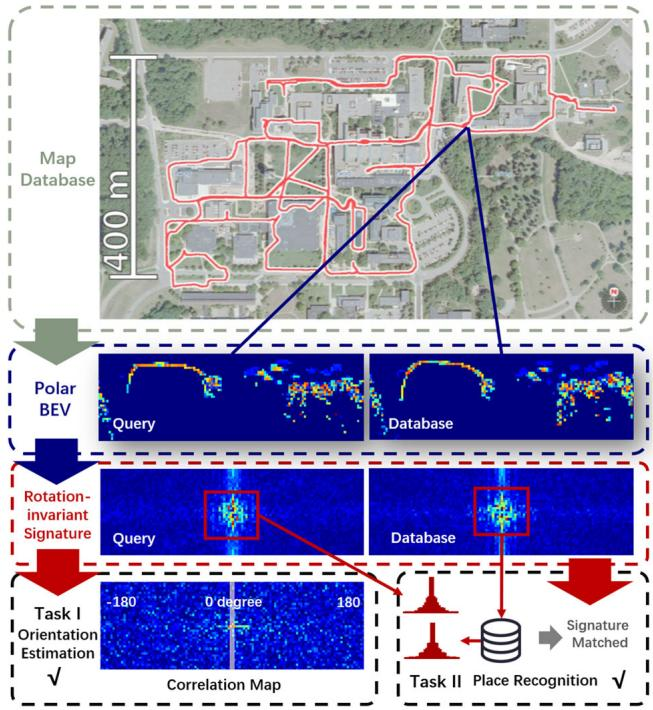  
Fig. 6 DiSCO, differentiable scan context, jointly performs place retrieval and relative orientation estimation. The representations are polar BEV and learned rotation-invariant descriptors . (Source: DiSCO (Xuecheng et al., 2021), used with permission.)

Cartesian BEV image is an easily implementable choice for global LiDAR localization. Visual descriptors and matching techniques can be applied to the 2D LiDAR BEV images for 3-DoF pose estimation in Luo et al. (2021). Contour Context (Jiang & Shen, 2023) extracts BEV-based contours that encode local information for both place recognition and pose estimation. Despite the BEV projection, the spherical projection model also transforms 3D point clouds to 2D range images for processing. OREOS (Schaupp et al., 2019) utilizes a convolutional neural network to extract features on the range images and generates two vectors for place recognition and azimuth estimation simultaneously. OverlapNet (Chen et al., 2020) estimates the overlap between two range images by calculating all possible differences for each pixel and calculating the azimuth taking advantage of the circular cross-correlation. An improved version, OverlapTransformer (Ma et al., 2022) is also proposed with a rotation-invariant representation and faster inference. The advantage of OverlapTransformer is the missing ability to provide yaw angle estimation. It is worth mentioning that the OverlapNet family uses the overlap of range images for loss function construction, which is different from the locationbased loss in other learning-based methods, like contrastive loss in Yin et al. (2017), triplet and quadruplet loss in Uy and Lee (2018).

## 3.3.2 6-DoF Pose Estimation

Many visual global localization frameworks extract local descriptors on images for both place recognition and the following pose estimation. Generally, the local features are aggregated into a global descriptor using methods such as bag-of-words (BoW) (Gálvez-López & Tardos, 2012), VLAD (Jégou et al., 2010), or ASMK (Tolias et al., 2013). Meanwhile, 6-DoF poses are often extracted from visual data from using Perspective-n-Point (PnP) algorithms (Lepetit et al., 2009) based on the matched local features. Inspired by visual image matching, Shan et al. (2021) utilize the traditional BoW algorithm in visual place recognition for LiDAR-based global localization. Specifically, they transform the intensity of the high-resolution lidar point cloud into images and extract features based on Oriented FAST and ORB (Rublee et al., 2011). The visual matching technique is also tested on (Di Giammarino et al., 2021). However, works by Shan et al. (2021) and Di Giammarino et al. (2021) require a high-resolution LiDAR scanner (64 and 128 rings) to guarantee the extraction and description of local features.

Visual-inspired matching needs a projection to reduce the dimensionality of 3D point clouds. Some researchers propose to design discriminative 3D features for both global descriptor encoding and local matching, thus achieving place retrieval and 6-DoF pose estimation for global LiDAR localization. It is becoming a new research trend in the last three years (2019-2022). DH3D by Du et al. (2020) uses flex convolution and squeeze-and-excitation block as the feature encoder and applies a saliency map for keypoint detection. Then the local features were aggregated into a global descriptor for place recognition. EgoNN by Komorowski et al. (2021) transforms the point clouds into a cylindrical occupancy map, and develops a 3D convolutional architecture based on MinkLoc3D (Komorowski, 2021) for keypoint regression and description. Cattaneo et al. (2022) propose an end-to-end LCDNet that can achieve both place recognition and pose estimation. LCDNet modifies PV-RCNN (Shi et al., 2020) for local feature extraction and builds a differentiable unbalanced optimal transport (Chizat et al., 2018) for feature matching. BoW3D (Cui et al., 2022a) utilizes 3D point cloud feature LinK3D (Cui et al., 2022) for feature extraction and adapted BoW for global localization. Instead of point-level features, GOSMatch (Zhu et al., 2020) extracts high-level semantic objects for global localization. The authors propose a histogram-based graph descriptor and vertex descriptor taking advantage of the spatial locations of semantic objects for place recognition and local feature matching. Similarly, Box-Graph (Pramatarov et al., 2022) encodes a semantic object and its shape of a 3D point cloud into a vertex of a fully connected graph. The graph is used for both similarity measure and pose estimation. Yuan et al. (2023) propose a novel triangle-based global descriptor, stable triangle descriptor (STD) for place recognition and relative pose estimation. STD keeps a hash table as the global descriptor and place recognition is achieved by voting of triangles in the table.

All the methods above achieve place recognition by nearest neighbor search or exhaustive comparisons on global descriptors. Several works only use local keypoints or features to build coupled methods, and there are no global descriptors for place retrieval. Bosse and Zlot (2009, 2013) extract and describe keypoints for both place candidate voting and 6-DoF pose estimation. Inspired by the work of Bosse and Zlot (2013), Guo et al. (2019) design an intensityintegrated keypoint and also propose a probabilistic voting strategy. Steder et al. (2020) propose to match point features on range images and score potential transformations for final pose estimation. Instead of extracting features on point clouds, Millane et al. (2019) introduce a SIFTinspired (Lowe, 1999) local feature based on the distance function map of 2D LiDAR submaps. Experiments validate that using free space for submap matching performs better compared with using occupied grids.

Summary. Pose estimation-coupled place recognition provides not only the retrieved place but also a 3-DoF (or with only a 1-DoF yaw angle) or a full 6-DoF pose. Common evaluation metrics include both precision-recall for retrieval and quantitative errors compared to ground truth orientation or position.

One might ask about the advantages of using such methods compared to the previous two-step pipeline using place retrieval (Sect. 3.1) followed by precise pose estimation (Sect. 3.2). The potential advantages are three folds:

– Lightweight map. Dense point maps limit mobile robotic applications in large-scale environments, especially for resource-constrained vehicles. If place recognition and pose estimation share the same feature or representation, fewer data and sparser keyframes could support global localization in such conditions, making the entire map more lightweight to use.

– Geometric verification. For place recognition methods, a key issue is to verify whether a retrieved place is correct. Pose estimation results can be used as geometric verification to filter incorrect places. This filtering strategy has been applied in several coupled methods (Zhu et al., 2020; Yuan et al., 2023).

– Initial guess for refinement. If an accurate pose is required, a local point cloud registration (Sect. 3.2) is necessary for pose refinement. Coupled approaches can provide an initial guess for such local registration modules, thus improving the accuracy and efficiency of pose estimation. As reported in LCDNet (Cattaneo et al., 2022), the initial guess by LCDNet significantly reduces runtime and metric errors when applying ICP registration.

Overall, the pose estimation and place recognition are coupled in this subsection, but keyframes or places are still needed in a pre-built map database. The one-stage approaches will be introduced in the following subsection, which only requires a global map for global localization.

## 3.4 One-Stage Global Pose Estimation

The two-stage methods using place recognition and pose estimation techniques have shown successful operations in various datasets and applications. Thus a natural question is raised: can we achieve global localization by directly matching on a global map without separating the place? The answer is yes and some approaches can achieve one-stage global pose estimation. The majority of these approaches can be classified into two categories based on how to estimate the pose: in a traditional closed form or in an end-to-end manner.

## 3.4.1 Feature-Based Matching

One representative work is SegMatch proposed by Dubé et al. (2017) in 2017, with results shown in Fig. 7. Seg-Match first segments dense LiDAR map points to clusters with ground removal and then extracts features based on eigenvalues and shapes of segments. Random forest classifier is trained and applied to boost feature matching. Finally, matched candidates are fed into RANSAC for 6-DoF pose estimation. The handcrafted descriptors were extended to data-driven SegMap (Dubé et al., 2018) with the help of deep neural networks. In Cramariuc et al. (2021), Sem-SegMap is proposed by integrating visual information into point cloud segmentation and feature extraction. SegMatch and its “family members” are validated in urban and disaster environments.

Inspired by SegMatch scheme, Tinchev et al. (2018) propose Natural Segmentation and Matching (NSM) for global localization in a more natural environment. The insight is a novel hybrid descriptor and is more robust to different points of view than the baseline SegMatch. Similarly, NSM has also been extended to a deep learning version in Tinchev et al. (2019). In these feature-based global matching methods (Dubé et al., 2017, 2018; Cramariuc et al., 2021; Tinchev et al., 2018, 2019), point cloud segments are aligned with low-dimensional and distinctive descriptors for global matching. The global segment-based maps can support not only loop closing for consistent mapping but also pose tracking for online localization.

In addition to the SegMatch and NSM schemes, recent works also propose to achieve one-shot global localization with semantic objects. Ankenbauer et al. (2023) et al. design a re-localization scheme that leverages the graph-theoretic knowledge. The scheme could register the observed semantic objects to the prior object map and is validated on both a planetary rover dataset and the KITTI dataset. The graphtheoretic matching is also leveraged in the single-shot method proposed by Matsuzaki et al. (2023). First, semantic information bridges the modality gap between visual images and LiDAR maps with correspondences; and then outliter pruning is achieved by maximum clique solver for robust pose estimation.

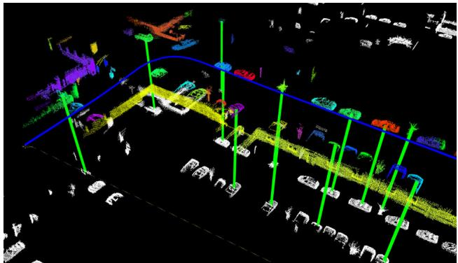  
Fig. 7 SegMatch achieves global localization at the level of segment features rather than conventional keypoints. Different colors represent the segmentation results. Segment matches are indicated with green lines . (Source: SegMatch (Dubé et al., 2017), used with permission.) (Color figure online)

Generally, these segment matching-based approaches rely on the segmentation results, as mentioned in Sect. 3.1.2. A robot traveling is a good choice to accumulate dense 3D point clouds first, and then segmentation and segment matching are performed. Hence, these methods are less efficient compared to two-stage approaches for some specific tasks, like fast relocalization with sparse scans. Additionally, the reliance on segments could make these methods easily fail in challenging scenes, e.g., in a featureless flat field or a man-made environment with too many repetitive structures.

## 3.4.2 Deep Regression

With the popularity of deep learning, several researchers propose to regress global robot pose directly in an end-toend fashion, just like PoseNet (Kendall et al., 2015) for visual re-localization. Similarly, Wang et al. (2021) propose a learning-based PointLoc for LiDAR global pose estimation. The backbone is an attention-aided PointNetstyle architecture (Qi et al., 2017) for 6-DoF pose regression. This end-to-end manner is completely data-driven without conventional pose estimation processing. Lee et al. (2022) convert the global localization as an unbalanced point registration problem, and propose a hierarchical framework UPPNet to solve this problem. Specifically, UPPNet first searches the potential subregion in a large point map and then achieves pose estimation via local feature matching in this subregion. UPPNet can also be trained in an end-to-end fashion.

Summary. Feature-based one-stage approaches do not use discrete places or locations for place recognition. They are suitable for loop closure detection in a small area, i.e., the solution space X is reduced to a smaller size in Eq. 3. However, the downside is that it is challenging to re-localize a robot from scratch using partial local features in a large feature map.

As for one-stage deep regression approaches, though LiDAR scanner provides rich structural information, the metric estimation is not competitive (Wang et al., 2021; Lee et al., 2022) compared to conventional two-stage methods in Sect. 3.2 and 3.3. We consider one-stage pose regression is a promising research direction in the era of big data, but still remain many issues to solve, e.g., how to improve the interpretability and generalization ability of these end-to-end methods.

## 4 Sequential Global Localization

Section 3 reviews related single-shot global localization approaches that take a single LiDAR point cloud as the input. As previously analyzed in Sect. 1.1, the map size M is generally much larger than the size of single point cloud $\left| { { \bf { z } } _ { t } } \right|$ , while the single-shot global localization methods can not guarantee the localization success in challenging scenes. On the other hand, LiDAR sensor provides high-frequency point measurements, and sequential point clouds can be obtained when the robot travels a distance. Thus taking multiple measurements $\mathbf Z _ { t } \triangleq \{ \mathbf z _ { k = 1 } , \cdot \cdot \cdot \mathbf z _ { t } \}$ could enhance the global localization performance choice with robot moving. This section reviews methods that use sequential LiDAR inputs for global pose estimation. Note that place retrieval methods in Sect. 3 can be integrated as a front-end matching in frameworks of this section.

Sequential global localization can be divided into two categories determined by its map and the use of place recognition and pose estimation. One is sequential place matching on keyframe-based submaps and the other is sequential metric global localization on metric maps. The former provides a retrieved place as a localization result and is performed on keyframe-based submaps. The latter estimates an accurate pose on a metric map and is generally based on a global metric map. In addition, sequential metric localization generally requires a state estimator at the back end to track non-global localization results. A graphical illustration is presented in Fig. 8.

As analyzed in Sect. 1.1, we consider that sequential-based approaches can also be classified into two categories: batch processing and recursive filtering. The difference is how to handle sequential information for global pose estimation:

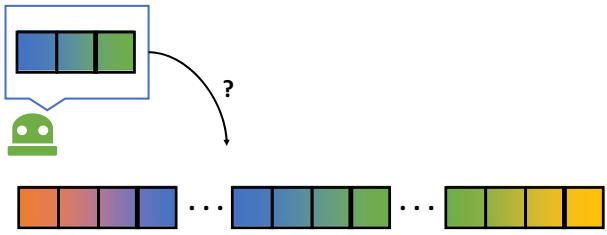  
(a) Sequential place matching

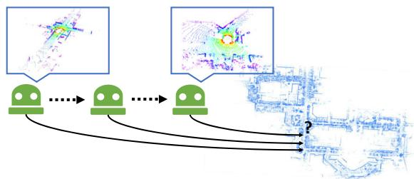  
(b) Sequential metric localization  
Fig. 8 Graphical illustration of two categories of sequential global localization using LiDAR. Sequential place matching fuses the multiple single-shot global localization results using sequence information. Sequential metric localization fuses the multiple non-global measurements thus a back-end is required for multi-hypotheses filtering. The maps are also different for these two types of approaches

batch methods handle a batch of information to estimate the entire robot trajectory via retrieval or optimization (Eq. 4); filtering methods estimate the pose under Bayesian filtering or similar techniques (Eq. 5). We will also talk about this taxonomy as an underlying theme in the following two subsections. We present several representative works in Table 2.

## 4.1 Sequential Place Matching

Probabilistic or sequential matching can help improve the visual localization success rate, which has been validated in several classical visual systems: FAB-MAP (Cummins & Newman, 2008), SeqSLAM (Milford & Wyeth, 2012; Milford et al., 2015), the work of Naseer et al. (2018), and Vysotska and Stachniss (2019). FAB-MAP first builds an appearance-based BoW for single image retrieval and then formulates recursive Bayesian filtering for global localization. An extended version FAB-MAP 3D (Paul & Newman, 2010) also models spatial information to improve the robustness of the framework. The filtering technique of FAB-MAP family could handle sequential measurements, but will easily crash when single-shot place recognition fails in challenging scenes. In SeqSLAM (Milford & Wyeth, 2012), a sequence-to-sequence matching strategy is proposed to find the location candidates in an image similarity matrix. SeqSLAM processes a batch of images compared to filteringbased methods, making the whole system more robust. The SeqSLAM family has demonstrated its success in both handcrafted features (Milford & Wyeth, 2012) and data-driven features (Milford et al., 2015). Naseer et al. (2018) propose to use a network flow to handle batch image matching and maintain multiple route hypotheses in parallel. Global visual matching method is also proposed in Vysotska and Stachniss (2019) for re-localization, in which the map database contains multiple sequences for graph-based search.

Table 2 Representative studies of sequential global LiDAR localization
<table><tr><td>Name</td><td>Pose</td><td>Handling</td><td>Backbone</td></tr><tr><td>SeqLPD (Liu et al., 2019)</td><td>Place</td><td>Batch Processing</td><td>LPDNet (Liu et al., 2019) + Sequence Matching</td></tr><tr><td>Yin et al. (2022)</td><td>Place</td><td>Recursive Filtering</td><td>SphereVLAD + Hierarchical Particle Filter</td></tr><tr><td>SeqOT (Ma et al., 2022)</td><td>Place</td><td>Batch Processing</td><td>Multi-scan Transformer + GeM Pooling</td></tr><tr><td>Dellaert et al. (1999)</td><td>3-DoF</td><td>Recursive Filtering</td><td>Monte Carlo Localization (MCL)</td></tr><tr><td>Jonschkowskiet al. (2018)</td><td>3-DoF</td><td>Recursive Filtering</td><td>Differentiable Particle Filter (Differentiable MCL)</td></tr><tr><td>Chen et al. (2021)</td><td>3-DoF</td><td>Recursive Filtering</td><td>Deep Samplable Observation Model + Adaptive Mixture MCL</td></tr><tr><td>Gao et al. (2019)</td><td>3-DoF</td><td>Recursive Filtering</td><td>Feature Matching + Odometry + Multiple Hypothesis Tracking</td></tr><tr><td>GLFP (Wang et al., 2019)</td><td>6-DoF</td><td>Batch Processing</td><td>Landmark Association + Odometry + Factor Graph</td></tr></table>

The LiDAR-based sequential matching has been inspired by visual methods in recent years. Liu et al. (2019) propose to use LPD-Net (Liu et al., 2019) for front-end place recognition, and design a coarse-to-fine sequence matching strategy for global localization. The designed strategy improves the place retrieval performance compared with single-shot LPD-Net. Yin et al. (2022) present a particleaided fast matching scheme in large-scale environments based on sequential place recognition results, which is generated by SphereVLAD in Sect. 3.1.3. From the viewpoint of state estimation, (Liu et al., 2019) handles batch information while (Yin et al., 2022) recursively estimates the locations. Recent work SeqOT (Ma et al., 2022) generates one global descriptor for a sequence of range images, rather than multiple descriptors in its previous version (Ma et al., 2022). Specifically, a novel end-to-end transformer is built to handle spatial and temporal information fusion.

All these methods above, visual- or LiDAR-based, aim at estimating the most likely (highest probability) match on topological keyframe-based submaps (Sect. 2.1). The evaluation of these methods is the same with place recognition-only approaches in Sect. 3.1.

## 4.2 Sequential Metric Localization

If the map has a geometric representation, like occupancy grids and landmarks, it can enable metric pose estimation for mobile robots, making sequential global localization more practical.

Particle filter localization, also known as sequential Monte Carlo Localization (MCL) in the robotics community, is a widely used recursive state estimation back-end (Dellaert et al., 1999). Unlike the Kalman filters family, MCL is non-parametric Bayesian filtering without assuming the distributions of robot states. More specifically, it uses a group of samples to represent the robot state, which is naturally suitable for global localization tasks especially when the robot pose has a multi-modal distribution. Researchers have proposed multiple extended versions to improve the robustness and efficiency of the original MCL. Maintaining a large set of particles is computationally expensive. Adaptive MCL (Fox, 2001) is able to sample particles in an adaptive manner using the Kullback–Leibler divergence. In Stachniss and Burgard (2005), segmented patch maps are integrated into MCL framework, making it applicable in indoor non-static environments. Most LiDAR sensors can also intensity information as reflection properties of surfaces. Bennewitz et al. (2009) use these reflection properties to improve the observation model of MCL, and it achieves faster convergence for re-localization. Recent work (Zimmerman et al., 2022) also integrates human-readable text information into MCL for localization, making it more robust to structural changes in buildings. Due to its simplicity and effectiveness, MCL is also used in various low-dimensional navigation tasks beyond global localization, such as robotic pose tracking (Yin et al., 2022) and exploration tasks (Stachniss et al., 2005).

Currently, MCL is one of the gold standards in multiple robot navigation toolkits (Montemerlo et al., 2003; Zheng, 2021). Indoor LiDAR MCL is well studied and has been widely deployed for commercial use, e.g., applying to a home cleaning robot. A recent trend of indoor LiDAR localization is to use building architectures as maps, e.g., structural computer-aided design (CAD) (Boniardi et al., 2017; Zimmerman et al., 2023) and semantic building information modeling (BIM) (Yin et al., 2023; Hendrikx et al., 2021). These maps are easy to obtain and keep sparse but critical information of environments, like walls and columns. The use of such maps makes the localization free of pre-mapping for long-term operations. MCL can also be used for localization on floor plan maps (Boniardi et al., 2017; Zimmerman et al., 2023). Experiments show that such cheap maps can also support indoor robot localization.

Modern MCL methods integrate discrete place recognition techniques into the filtering framework, making MCL applicable in large-scale outdoor environments. Yin et al. (2018) propose to use the Gaussian mixture model to fuse multiple place recognition results, and then integrate it into the MCL system as a measurement model. With the convergence of MCL, a coarse pose can be generated as an initial guess for accurate ICP refinement. The observability of orientation is also proofed in its extended version (Yin et al., 2019). Similarly, Chen et al. (2020) use their OverlapNet (Chen et al., 2020) to extract features of submaps in a global map and propose a new observation model for MCL by comparing the similarity between the current feature and the stored features to achieve global LiDAR localization. Sun et al. (2020) and Akai et al. (2020) propose to fuse deep pose regression and MCL to build a hybrid global localization, in which deep pose regression could provide a 3-DoF or 6-DoF from an end-toend neural network. The methods above (Yin et al., 2019; Chen et al., 2020; Sun et al., 2020; Akai et al., 2020) typically discrete the pose and map space for fast convergence of MCL in large-scale environments. A deep learning-aided samplable observation model was proposed in Chen et al. (2021), named DSOM. Given a 2D laser scan and a global indoor map, DSOM can provide a probability distribution for MCL on the global map, thus making particle sampling focus on high-likelihood regions.

The advancements caused by deep learning methods also affect the back-end state estimator of the MCL system. Jonschkowskiet al. (2018) design a differentiable particle filter (DPF) scheme for robot pose tracking and global localization. The whole DPF pipeline includes differentiable motion and measurement models, and a belief update model for particles, making the DPF trainable in an end-to-end manner. In Differentiable SLAM-net proposed by Karkus et al. (2021), DPF is encoded into a trainable visual SLAM for indoor localization. LiDAR-based particle filter is quite mature and there is no LiDAR-based DPF currently. But we consider differentiable state estimator could be a promising direction in this era of big data.

We also notice that there exist other frameworks that can achieve sequential metric global localization. Multiple hypotheses tracking (MHT) (Thrun et al., 2005) is a possible solution to the global localization problem. An improved MHT framework is proposed in Gao et al. (2019), and authors design a new structural unit encoding scheme to weight hypotheses. Hendrikx et al. (2022) propose to build a hypotheses tree for indoor global localization. A global feature map is required for this method and explicit data associations are used to check the hypotheses. Wang et al. (2019) present a factor graph-based global localization from a floor plan map (GLFP). GLFP integrates odometry information and landmark matching into a factor graph when the robot travels. Compared to the filtering family (MCL and MHT), GLFP handles a batch of information for global pose estimation, which is similar to SeqSLAM in Sect. 4.1. The landmark matching in Wang et al. (2019) provides global position information for factor graph optimization. In the works of Wilbers et al. (2019), researchers employ graph-based sliding window approaches to fuse outdoor landmark matching and odometry information. Some other sensor information could also provide global positions for mobile robots. Merfels and Stachniss (2016) fuse global poses from GNSS and odometry information to achieve self-localization for autonomous driving. Lastly, in this subsection, the evaluation typically contains metric pose estimation on the map, e.g., using Root Mean Square Error (RMSE), which differs from approaches in Sect. 4.1.

## 5 LiDAR-Aided Cross-Robot Localization

The review in Sects. 3 and 4 mainly focuses on single robotbased global LiDAR localization. Global localization can also be deployed into multi-robot systems for cross-robot localization, which is a new trend in the robotics community. More concretely, one robot performs mapping and another robot globally estimates its pose on this map, and vice versa.

## 5.1 LiDAR-Aided Multi-robot System

In practice, the multi-robot system is a broad topic that involves many subproblems that are not the main concerns of this paper, such as communication bandwidth and computation efficiency. As for system architecture, both distributed multi-robot systems and centralized servers (Bernreiter et al., 2022; Cramariuc et al., 2022) could work well in different scenarios. We also note that customized scan matching is proposed for point cloud map fusion and collaborative robots (Yue et al., 2022). These localization methods are based on offline map appearance, while this section mainly focuses on incremental keyframe-based cross-robot localization. Several representative works are listed in Table 3.

Over the last two decades, there has been a growing demand for autonomous exploration and mapping of various environments, ranging from outdoor cluttered and underground environments to complex cave networks. Due to this, multi-robot SLAM, a critical solution for navigation in GNSS-denied areas where prior maps are unavailable, is receiving more attention. The recent DARPA Subterranean (SubT) Challenge, a three-year global competition that ended in 2021, aimed to demonstrate and advance the state-of-theart in mapping, localization, and exploration of complex underground settings and has been particularly important in improving multi-robot SLAM. The multi-robot SLAM architectures adopted by the six SubT teams are summarized in the survey by Ebadi et al. (2022). Although many loop closure methods were proposed then, most of the teams detected loop closure candidates simply by calculating the distance between the current keyframe and another keyframe in the factor graph. This LCD strategy is the same as DARE-SLAM (Ebadi et al., 2021) and LAMP (Chang et al., 2022; Denniston et al., 2022). The simple but effective LCD used in these methods mainly relies on the setting that all robots start to move in the same starting region. In this context, with a high-precision LiDAR odometry (Zhang & Singh, 2014; Zhao et al., 2021) at the front end, the distance-based LCD can work well in a relatively small (< 5 km) area. There is no need to customize a complex place retrieval module in the robotic system (Ebadi et al., 2022).

Table 3 Representative studies of cross-robot localization
<table><tr><td>Name</td><td>Environment</td><td>Robot team</td><td>Backbone and highlight</td></tr><tr><td>DARE-SLAM (Ebadi et al., 2021)</td><td>Subterranean</td><td>Heterogeneous</td><td>LCD by Feature Matching + Degeneracy-aware LiDAR SLAM</td></tr><tr><td>LAMP 2.0 (Chang et al., 2022)</td><td>Subterranean</td><td>Heterogeneous</td><td>LCD by GICP + Outlier-robust PGO</td></tr><tr><td>DiSCo-SLAM (Huang et al., 2021)</td><td>Park</td><td>Wheeled</td><td>LCD by Scan Context (Kim &amp; Kim, 2018) + PCM + PGO</td></tr><tr><td>DCL-SLAM (Zhong et al., 2022)</td><td>Campus</td><td>Wheeled</td><td>LCD by LiDAR Iris (Wang et al., 2020) + PCM + PGO</td></tr><tr><td>RING++ (Xu et al., 2023)</td><td>Campus</td><td>Legged</td><td>LCD by roto-invariant RING (Lu et al., 2022) + ICP + PGO</td></tr></table>

PGO pose graph optimization, PCM pairwise consistent measurement set maximization

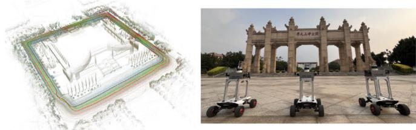  
(a) LiDAR map and wheeled robots team [207]

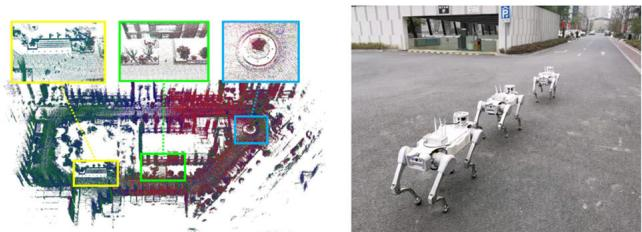  
(b) LiDAR map and legged robots team [208]  
Fig. 9 Qualitative results from DCL SLAM (Zhong et al., 2022) and RING++ (Xu et al., 2023) (used with permission). Different colors represent LiDAR maps and trajectories generated from different mobile robots: wheeled robots in DCL SLAM and legged robots in RING++

Despite the underground exploration, robots might not always be able to begin a task at the same location, as in largescale search and rescue tasks. As a result, place recognition that does not rely solely on initials is necessary. In an aerialground collaborative manner, He et al. (2020) extract obstacle outlines from submap point clouds and generate thumbnail images. The thumbnail images are converted into compact place descriptors by applying NetVLAD (Arandjelovic et al., 2016). DiSCo-SLAM (Huang et al., 2021) firstly adopts LiDAR-based global descriptor, scan context (Kim & Kim, 2018), to perform place recognition in a distributed manner. The lightweight scan context descriptor makes the real-time application possible, although there are no field experiments with multi-robots in this paper. RDC-SLAM (Xie et al., 2021) utilizes a place-recognition-only global descriptor, called DELIGHT (Cop et al., 2018), to reduce time consumption.

In the relative pose estimation part, eigenvalue-based segment descriptors are proposed to achieve feature matching. DCL-SLAM (Zhong et al., 2022) assesses the performance of LiDAR-Iris (Wang et al., 2020), M2DP (He et al., 2016) and scan context (Kim & Kim, 2018) and finally uses the effective and rotation-invariant LiDAR-Iris for loop closure detection. Unlike the system-oriented research mentioned above, RING++ (Xu et al., 2023) presents a general nonlearning framework to achieve roto-translation invariance with various local features while estimating the relative 3- DoF pose. The roto-translation invariant property and the robust pose estimator allow the multi-robot system to sample places along a long distance while being computationally and memory efficient. Figure 9 shows the real-world experimental results using DCL SLAM (Zhong et al., 2022) and RING++ (Xu et al., 2023).

## 5.2 Cross-Robot Back-end

From the systems above (He et al., 2020; Huang et al., 2021; Xie et al., 2021; Zhong et al., 2022; Xu et al., 2023), it can be concluded that inter-robot LCD methods enable crossrobot localization in large-scale environments. However, no LiDAR LCD method can provide perfect loop closures without false positives. The false positives are outliers that make estimation systems unstable and inaccurate. More specifically, almost all cross-robot localization systems are built on graph optimization frameworks (Kümmerle et al., 2011; Dellaert, 2012). These false positives provide inconsistent links between pose nodes. The optimization may not converge to a correct solution in such conditions. This problem exists not only in LiDAR-aided cross-localization but also in other SLAM-related problems with different sensors.

There exist mainly two ways to handle this problem: one is to build an outlier rejection module or similar techniques before the optimization; the other is to design robust kernels or functions that could reduce the impacts of outliers during the graph optimization. These two types of approaches aim at improving the robustness of graph optimization with inconsistent edges generated from LCD methods. Outlier rejection modules are independent of back-end estimators. RANSAC (Fischler & Bolles, 1981) is a popular method for outlier rejection, which iteratively estimates a model from sampled data (loop closures). Olson et al. (2005) propose a graph theory-based outlier rejection method, named singlecluster graph partitioning (SCGP). Note that the graph is generated from the adjacency matrix of pose nodes and not the pose graph for SLAM. SCGP estimates a pairwise consistency set as the final result via clustering in this graph. SCGP shows competitive performance with RANSAC. Similarly, the outlier rejection is formulated as a maximum set estimation problem in the work by Carlone et al. (2014).

In 2018, Enqvist et al. present a pairwise consistency maximization (PCM) (Mangelson et al., 2018) for consistent mapping with loop closures. PCM first builds a binary consistency graph by checking all loop closures ofeach other. The criteria of consistency check are formulated based on the transformation from odometry modules and loop closures. PCM aims at estimating the maximum pairwise internally consistent set, which is the maximum clique problem in graph theory (the same problem mentioned in TEASER (Yang et al., 2021), see Sect. 3.2). A fast clique solver by Bharath Pattabiraman et al. (2015) is adopted in PCM (Mangelson et al., 2018). PCM has been validated in aforementioned LiDARaided cross-robot localization systems (Huang et al., 2021; Zhong et al., 2022), and other robot localization and mapping systems in recent years (Xu et al., 2022; Tian et al., 2022).

Despite the outlier rejection, the other way is to reduce the impacts of false loops during the pose graph optimization. Sünderhauf and Protzel (2012) formulate switchable constraints in the optimization. The added constraints follow different outlier rejection policies, and they can turn on or off loop closures. An iterative approach RRR is designed in Latif et al. (2013) and it identifies true positives via clustering consistent loop closures. These robust functions are typically integrated into pose graph optimization frameworks to improve the robustness (Kümmerle et al., 2011; Dellaert, 2012). In addition to identifying loop edges, researchers also design and use robust kernels in the optimization, such as Gemen-McClure kernel (Zhang, 1997), Huber kernel (Zhang, 1997), and Max-Mixture kernel (Olson & Agarwal, 2013). In 2023, McGann et al. (2023) present the riSAM which leverages graduated nonconvexity techniques (Yang et al., 2020) in the pose graph optimization.

riSAM achieves better performances compared with other robust estimation techniques. In real-world applications, we consider a combination use of outlier rejection and robust estimator could be a practical choice to handle false positive loop closures.

In summary, cross-robot localization is becoming a promising direction for future study. It involves multiple topics of robotics, such as odometry, LCD and the back-end robust estimator. The cross-robot localization topic is closely related to crowd-sourced mapping (Herb et al., 2019) for selfdriving cars, which involves other important topics that are beyond the scope of this survey.

## 6 Open Problems

We begin the discussion section with a question: which is the best global LiDAR localization method? We consider that it is decided by many key factors: environments, maps and required pose accuracy, etc. There is no single best method to handle all applications and scenarios. Users need to customize the global localization system according to what they actually need. For example, particle filter family (Dellaert et al., 1999) is widely used to handle 3-DoF re-localization on wheeled robots. For vehicle localization in urban environments, scan context family (Kim & Kim, 2018) could be a good choice for loop closure detection due to its simplicity and learning-free scheme. For local pose estimation in SLAM, we kindly take MULLS (Pan et al., 2021) as an example. MULLS extracts feature points and uses TEASER (Yang et al., 2021) for global feature registration in its loop closure module. Overall, modern global LiDAR localization techniques have enabled several important functionalities for mobile robots. However, there are still open problems and worthy topics for future study. We will discuss these problems and conclude several promising directions for global LiDAR localization.

## 6.1 Evaluation Difference

Experimental validation and evaluation are critical for research papers. We notice that related papers evaluate their methods with different metrics and datasets. In the following subsections, we first list the commonly used metrics and then discuss the evaluations.

Place Recognition Metrics. One branch of metrics is for evaluating the place retrieval performance. Any place recognition methods evaluate the global localization performance under machine learning metrics, like Recall@1% (Uy & Lee, 2018), precision-recall curves (Kong et al., 2020) and localization probability (Dubé et al., 2017; Yin et al., 2019) etc. In this context, a robot is localized successfully if the retrieved place is close to the ground truth position (< d m). The threshold d is a user-defined parameter and related to the resolution of topological keyframe-based submaps, like 25 m in Uy and Lee (2018) and 3 m in Kong et al. (2020). Popular metrics are illustrated as follows.

Table4PublicdatasetsforglobalLiDARlocalization
<table><tr><td>Dataset</td><td>Scenarios</td><td>Total distance (km)</td><td>Challenges</td><td>Viewpoint diversity</td><td>Dynamic objects</td><td>Multi-session</td><td>Sensor (# fov)</td></tr><tr><td>KITTI (Geiger et al., 2013)</td><td>Urban</td><td>~44</td><td></td><td>★</td><td>★</td><td>X</td><td>Full</td></tr><tr><td>NCLT (Carlevaris-Bianco et al., 2016)</td><td>Campus</td><td>~147</td><td>Viewpoint Change</td><td>★★★</td><td>★</td><td>√</td><td>Full</td></tr><tr><td>Oxford RobotCar (Maddern et al., 2017)</td><td>Urban + Suburban</td><td>~1000</td><td>Occlusions</td><td>★★</td><td>★★★</td><td>√</td><td>Full</td></tr><tr><td>Apollo-SouthBay (Lu et al., 2019)</td><td>Urban</td><td>~381</td><td></td><td>★</td><td>★★</td><td>V</td><td>Full</td></tr><tr><td>Oxford Radar RobotCar (Barnes et al., 2020)</td><td>Urban + Suburban</td><td>~280</td><td>Occlusion Cross Modality</td><td>★★</td><td>★★★</td><td>√</td><td>Full</td></tr><tr><td>MulRan (Kim et al., 2020)</td><td>Urban + Campus</td><td>~123</td><td>Less Overlap Cross Modality</td><td>★★</td><td>★★</td><td>√</td><td>270°</td></tr><tr><td>Newer College (Ramezani et al., 2020)</td><td>Campus</td><td>~7</td><td>Viewpoint Change</td><td>★★★</td><td>★</td><td>X</td><td>Full</td></tr><tr><td>KITTI360 (Liao et al., 2022)</td><td>Urban + Suburban ~74</td><td></td><td></td><td>★</td><td>★</td><td>X</td><td>Full</td></tr><tr><td>ALITA (Yin et al., 2022)</td><td>Urban + Campus</td><td>~60/120</td><td>一</td><td>★★</td><td>★★</td><td>X</td><td>Full</td></tr><tr><td>Wild-Places (Knights et al., 2023)</td><td>Forest</td><td>~33</td><td>Viewpoint Change</td><td>★★★</td><td>N/A</td><td>√</td><td>Full</td></tr><tr><td>Boreas (Burnett et al., 2023)</td><td>Urban</td><td>~350</td><td>Occlusion Cross Modality</td><td>★</td><td>★★★</td><td>√</td><td>Full</td></tr><tr><td>HeLiPR (Jung et al., 2023)</td><td>Urban</td><td>~145</td><td>Less Overlap</td><td>★★</td><td>★★★</td><td>√</td><td>70°/120°/Full</td></tr></table>

1. True Positives TP, False Positives FP, and False Negatives FN

– True Positives TP is the number of actually matched places that are recognized as matched places.

– False Positive FP is the number of actually not matched places that are recognized as matched places.

– False Negatives FN is the number ofactually matched places that are recognized as not matched places.

## 2. Precision and Recall

Precision and Recall are defined based on TP, FP and FN. Precision represents the ratio of true positives to total queries, calculated as

$$
P r e c i s i o n = \frac { T P } { T P + F P }\tag{8}
$$

Recall represents the ratio of true positives to total positives, formulated as

$$
R e c a l l = { \frac { T P } { T P + F N } }\tag{9}
$$

## 3. Precision-recall Curve

Instead of using a single threshold for evaluation, Precision-recall Curve depicts Precision as a function of Recall Precision f(Recall) at different thresholds.

## 4. F1 Score and AUC

F1 Score is a combined metric of Precision and Recall, which is the harmonic mean them, expressed as

$$
F 1 ~ S c o r e = \frac { 2 \times P r e c i s i o n \times R e c a l l } { P r e c i s i o n + R e c a l l }\tag{10}
$$

AUC is the area under Precision-recall Curve, compressing Precision-recall Curve into a single value.

## 5. Recall@N and Recall@1%

As the first step of global localization, place recognition algorithms usually retrieve the top-N matched places in the database for each query for further geometric verification, where Recall@N and Recall@1% are more suitable for performance evaluation, formulated as

$$
R e c a l l @ N = \frac { T P _ { t o p N } } { T P _ { t o p N } + F N _ { t o p N } } ,\tag{11}
$$

$$
R e c a l l @ 1 \% = \frac { T P _ { t o p 1 \% } } { T P _ { t o p 1 \% } + F N _ { t o p 1 \% } }\tag{12}
$$

where Recall@N equals to Recall@1% if N equals one percent of the total number of places in the database.

Pose Estimation Metrics. The other evaluation metrics are designed for pose estimation. Conventional LiDAR SLAM and map-based localization evaluate the performance based on rotation and translation errors. These errors are obtained by comparing the estimated global pose with the ground truth pose quantitatively. Several global localization approaches follow these metrics (Kim et al., 2021; Cattaneo et al., 2022).

1. Translation Error TE and Rotation Error RE TE is the error between the estimated translation and the ground-truth translation, which is calculated by

$$
T E = \| \hat { d } - d \|\tag{13}
$$

RE is the error between the estimated rotation and the ground-truth rotation, whose mathematical formula is

$$
R E = \operatorname { a r c c o s } { ( ( t r a c e ( \hat { R } ^ { T } R ) - 1 ) / 2 ) }\tag{14}
$$

where $\hat { d }$ and $\hat { R }$ are the estimated translation vector and rotation matrix. d and R are the ground-truth translation vector and rotation matrix.

## 2. Successful Rate

Successful Rate shows the ratio of successfully localized cases to total cases. Regarding the localization results with $T E < \tau _ { T E }$ and $R E < \tau _ { R E }$ as success, Successful Rate is defined with

$$
S u c c e s s f u l ~ R a t e = \frac { T P _ { T E < \tau _ { T E } } \& \ R E < \tau _ { R E } } { T P + F P }\tag{15}
$$

where $\tau _ { T E }$ and $\tau _ { R E }$ are the thresholds of TE and RE.

Metric Difference. For place recognition, one might ask which metric is the best choice to evaluate the place recognition performance. We consider this depends on the task in practical situations, as we discussed in Sect. 1.2. For instance, the LCD provides the edges for the pose graph optimization, and a false positive may ruin the back-end optimization. Consequently, a high level of Precision might be desired for certain LCD tasks. In terms of re-localization, the Recall can show how well the system can localize a robot from an initial state.

On the other hand, LiDAR sensors provide precise and stable range measurements compared to other onboard sensors. More importantly, in a classical scheme of autonomous navigation (Siegwart, 2011), an accurate pose state is desired from downstream planning and control modules. Hence, we argue that place retrieval is not the ultimate goal for the global LiDAR localization problem, and pose estimation metrics are more meaningful. As presented in the previous review (Toft et al., 2020), visual localization methods are evaluated and discussed with 6-DoF poses. Currently, there is no lidar localization evaluated in the same pose estimation metric as the one in Toft et al. (2020), and it could be a future direction for the study on global LiDAR localization. Despite the discussion above, we want to emphasize that the pose estimation should be task-dependent. For a planar moving robot, 3-DoF pose estimation could be enough for LCD and re-localization, or it could be an initial guess for 6-DoF estimation if needed. We recommend readers evaluate global localization based on practical situations in the real world.

Long-Term Evaluation. Another important and meaningful topic is the evaluation of long-term global localization. Studies and findings have been reported in both visual and LiDAR place recognition papers (Alijani et al., 2022; Peltomäki et al., 2021). For place-recognition-based approaches, we consider conventional metrics may not be sufficient for performance evaluation as they mainly focus on short-term retrieval performance. Pioneering works (Cui & Chen, 2023; Knights et al., 2022) have proposed solutions for continual learning in LiDAR-based place recognition across diverse seasons and cities. They introduce a new “Forgetting” score, quantifying the extent to which the model forgets past learnings after being trained on data from new environments. However, the "Forgetting" score is derived from precisionrecall results provided by place recognition, which may not be suitable for evaluating metric global localization methods. Designing novel evaluation metrics for long-term global localization remains an open challenge.

Public Datasets. Lastly, Table 4 is listed to help researchers grasp representative datasets for global LiDAR localization. We summarized and evaluated these datasets from multiple perspectives, such as scenarios, challenges and viewpoint diversity. The challenges and relevant conditions in the table will be introduced in the following sections. Generally, different datasets cover experimental conditions and challenges, for example, Boreas (Burnett et al., 2023) was collected in multi-session urban environments and it includes both LiDAR and radar as range sensings. Thus Boreas is an ideal dataset to evaluate long-term and cross-modality global localization in urban scenes. We recommend users select suitable datasets for performance evaluation.

## 6.2 Multiple Modalities

Modern mobile robots are equipped with multiple sensors for self-localization (Jiao et al., 2022). In recent years, multimodal sensing has been a hot topic in the community and has attracted much research interest. Different modalities bring direct challenges for cross-modality global localization. But on the other hand, each sensor modality has its pros and cons, and sensor modalityfusion can potentially improve the reliability and robustness of localization. Despite the sensor modalities at the front end, recent learning techniques enable modality study to higher-level tasks, and we will also introduce high-level semantics in the LiDAR global localization problem.

Cross Modality. When offline mapping and online localization use different sensor modalities, we name it crossmodality localization. Cattaneo et al. (2020) train 2D images and 3D point place recognition jointly. To achieve this, a deep neural network is built, integrating classical 2D convolution layers and 3D PointNet. Similarly, in Yin et al. (2021), radar and LiDAR are mixed together for BEV-based place recognition. Overhead satellite imagery is a cheap source for outdoor localization that does not require lidar mapping beforehand. Metric global LiDAR localization on 2D satellite imagery is proposed and validated in Tang et al. (2021). OpenStreetMap (OSM) is also an alternative map that includes structural road and building information. In Cho et al. (2022), handcrafted LiDAR descriptors are matched to OSM descriptors to achieve place recognition. For metric localization, a 4-bit representation is proposed in Yan et al. (2019) that can measure the hamming distance between laser scans and OSM. Then the distances are used to formulate the observation model of MCL. Overall, the research insight of these works (Cattaneo et al., 2020; Yin et al., 2021; Tang et al., 2021; Cho et al., 2022; Yan et al., 2019) is to build a shared low-dimensional representation that can connect different data modalities. Learning techniques are needed to extract the shared feature embeddings in most of these existing approaches. We consider precise and global crossmodality global localization is still a challenging problem, e.g., matching a 2D image on a 3D point map globally.

Modality Fusion. Another direction is to build sensor fusion modules based on multiple modalities. A LiDAR-Vision segment descriptor achieves better performance for place recognition tasks than a LiDAR-only descriptor, as validated in Ratz et al. (2020). Inspired by this, Coral (Pan et al., 2021) designs a bi-modal place recognition by fusing colorful visual features and structural LiDAR elevation maps. AdaFusion (Lai et al., 2022) uses an attention scheme to weight visual and LiDAR modalities for place recognition. In Bernreiter et al. (2021), a spherical projection enables the fusion of visual and LiDAR at the front end without losing information. From these works above (Ratz et al., 2020; Pan et al., 2021; Lai et al., 2022; Bernreiter et al., 2021), we can conclude that modality fusion can help improve the place recognition performance, but extra learning techniques or training data are needed to fuse different modalities.

High-Level Semantics As mentioned in Sect. 3.1, raw LiDAR point clouds are textureless and in an irregular format compared to visual images. This constrains high-level robotics applications, such as scene understanding and moving object detection. Behley et al. (2021) released a large semantic LiDAR dataset in 2019, named SemanticKITTI. SemanticKITTI contains point-wise annotated LiDAR scans, and multiple semantic-related benchmarks for on-road autonomous navigation. A backbone network RangeNet++ (Milioto et al., 2019) and a semantic LiDAR SLAM SuMa++ (Chen et al., 2019) are also released publicly trained on semantic information provided by SemanticKITTI. The SemanticKITTI focuses on on-road robotic perception tasks, and we also note that there exists an off-road semantic LiDAR dataset, named RELLIS-3D (Jiang et al., 2021). RELLIS-3D also provides a full stack of multimodal sensor data for field robotics research. The semantic information of LiDAR benefits both place recognition and pose estimation for global localization. In Kong et al. (2020); Vidanapathirana et al. (2021); Pramatarov et al. (2022), semantics are used to construct a semantic-spatial graph for global descriptor extraction. It is validated that using semantic information can improve place recognition performance under this graph representation. Semantic information is also used to improve the performance of LiDAR odometry (Chen et al., 2019) and global point cloud registration (Li et al., 2021; Yin et al., 2023). Beyond the point-level semantics, recent study (Xia et al., 2023) also integrates natural language descriptors into the LiDAR place recognition, making the robot semantically understand the environments.

## 6.3 Less Overlap

Though the LiDAR scanner is powerful for environmental sensing, there exists a potential challenge when applying global LiDAR localization in practice: the overlap between two LiDAR point clouds might be very small in certain cases. For the global localization problem, the point clouds could be two scans or submaps for place retrieval, or point cloud registration for pose estimation. Less overlap will make place recognition or pose estimation techniques much more challenging, where there emerge some works try to tackle it in recent two years (Liu et al., 2023; Qiao et al., 2023). To better understand this challenge, we list three typical cases as follows.

Occlusions by Dynamics. LiDAR scans will be partially blocked by dynamics in a high-dynamical environment, like pedestrians and vehicles around the robot. More specifically, for a spinning LiDAR sensor, the block area is decided by mainly two factors: the distance between dynamics and sensor, and the size of this dynamic. By far, dynamics removal in LiDAR scans effectively and efficiently is still quite difficult (Lim et al., 2021). Compared to 360-degree rotating lidar sensors, some other range sensors can provide range data that are not easily blocked, like imaging radar (Kramer et al., 2022), and spinning radar (Kim et al., 2020).

Large Translation. For sparse keyframe-based submaps, a large translation between the retrieved keyframe and ground truth pose could result in a small overlap between the current LiDAR scan and the submaps stored in the keyframe. A powerful global point cloud registration is required to overcome this challenge.

Viewpoint Change. Generally, for wheeled robots on roads, pose estimation is constrained in a 3-DoF space (x, y and yaw). But for flying drones in the wild, it is a complete 6-DoF pose estimation problem. When using global LiDAR localization on drones, LiDAR point clouds collected by drones might have less overlap at the same place. This is mainly due to two reasons: the 6-DoF motions of drones and the limited field-of-view (FoV) of LiDAR sensors.

## 6.4 Unbalanced Matching

Most global LiDAR localization methods are validated using relatively good data quality. In other words, the input point cloud and point cloud map have similar distributions and the same representations. However, in practical situations, the input and the map are usually unbalanced. We list three typical considerations as follows.

Scan to Submap. Keyframe-based map is a popular map organization in large-scale scenes, as introduced in Sect. 2.1. Matching a single scan to a submap globally is a crucial step to re-localize a mobile robot when localization fails. However, LiDAR point cloud submaps are generally with larger scales compared to single LiDAR scans, and also with a density variance. Traditional matching methods need tuned parameters and thresholds to handle these cases. For learning-based approaches, unbalanced point matching (Lee et al., 2022) is still hard to solve since local features are quite different (Chang et al., 2021) in such conditions.

Representation Difference. There exist other metric map representations beyond point clouds, aforementioned in Sect. 2.3. Generally, multiple representations are integrated into the navigation paradigm, e.g., localization in point cloud maps and planning on grid maps. To simplify the map use, one potential direction is to build a unified representation for navigation and unbalanced matching is needed to overcome the representation difference.

Noisy LiDAR. LiDAR sensors will be affected in challenging conditions, like rainy and snowy days (Pitropov et al., 2021) and even strong lights on roads (Carballo et al., 2020), resulting in noises in raw LiDAR data. These noises directly bring hazards for robot perception and state estimation. Dealing with the noises is important to guarantee the safety and robustness of the navigation system.

## 6.5 Efficiency and Scalability

Efficiency and scalability are significant considerations in LiDAR-based localization tasks, as quick and accurate processing of incoming LiDAR data is essential for timely decision-making in applications like autonomous vehicles. However, current approaches have not efficiently tackled

LiDAR-based localization in large-scale environments, especially on incrementally enlarged city-scale maps. One reason is the inherent characteristics of LiDAR data, which is often large and high-dimensional. Processing it in real-time can be computationally demanding, and handling large-scale environments with high-density point clouds requires efficient algorithms and hardware. On the other hand, the generation and real-time updating of accurate maps from LiDAR data for localization purposes are complex, particularly in dynamically changing large-scale environments. A widely adopted tool for organizing databases in key-frame-based methods and facilitating the location retrieval process has been introduced by Facebook Research named Faiss (Johnson et al., 2019). Faiss is built around an index type that stores a set of keyframe descriptors and provides a function to search in them efficiently using the fast k-means with GPU. Although Faiss is effective for descriptor-based approaches, achieving efficient global localization for other map-type-based methods remains an open challenge.

Compressing the point cloud (Wiesmann et al., 2021) could be a promising way to reduce the demand on LiDAR map storage of large-scale environments. However, the current approach (Wiesmann et al., 2022) needs an extra decompression step when using such compressed maps for 6-DoF localization, making it a trade-off between storage and speed.

## 6.6 Generalization Ability

For learning-free methods, less parameter tuning is desired to ensure the generalization to new environments (Vizzo et al., 2023). As for learning-based methods, generalization ability is a big challenge that has to face, especially when there is less training to support these data-driven methods. We mainly list four basic problems when deploying existing global localization methods.

Sensor Configuration. Currently, there are dozens ofLiDAR types, and each type has its unique sensor parameters. The generalization from one LiDAR sensor to another could be a problem, e.g., training on Velodyne HDL-64E scans while testing on Ouster OS1-128 scans. Another potential problem is the displacement of LiDAR sensors. If roll or pitch angle changes, laser point density and distribution will change respectively, resulting in global localization failure even using state-of-the-art methods. However, if the global localization is conducted on accumulated submaps, sensor configuration could be a minor problem.

Unseen Environments. The generalization in the unseen scenario is an old but still hard problem in the learning community. Cross-city and Cross-environments generalization remains underexposed for global LiDAR localization methods. For instance, Knights et al. (2023) release a challenging dataset Wild-Places for LiDAR place recognition in natural environments. There is a performance drop for advanced methods (Kim & Kim, 2018; Tian-Xing et al., 2023; Komorowski, 2022) compared to tests in urban environments. It could be concluded that there is a domain gap between structural urban environments and unstructured natural environments. To enable continuous learning in new scenes, incremental learning (Li & Hoiem, 2017) is a good choice that does not require retraining from scratch. Recent work InCloud (Knights et al., 2022) achieves incremental learning for point cloud place recognition and it overcomes catastrophic forgetting caused by learning in new domains.

Trigger of Global Localization. In a complete localization system, pose tracking takes most of the computation while global localization is only activated when it is needed. Thus, a natural question is raised: when to trigger global localization? For LCD and cross-robot localization, the trigger of global localization could be one or multiple pre-defined criteria, like similarity threshold of descriptors or an adaptive distance in Denniston et al. (2022). As for re-localization applications, a robot might believe it knows where it is while it does, and it is actually the classic kidnapped robot problem in Thrun et al. (2005). In this context, detected localization failure could be a trigger condition for global re-localization. The LiDAR localization failure detection problem is identical to the point cloud registration quality evaluation at the front end. Researchers propose to design multiple metrics and train classifiers to learn how to score this registration quality (Yin et al., 2019; Adolfsson et al., 2022). While at the back-end, features of state estimator can be used for failure detection (Fujii et al., 2015). Localization failure prediction and avoidance is also a worthwhile studied topic for longterm autonomy (Nobili et al., 2018).

## 7 Conclusion

The field of global localization has attracted significant attention from researchers in recent years, due to its pivotal role in mobile robot applications. The increasing number of innovative studies with LiDAR sensors has motivated us to organize a comprehensive survey on the global LiDAR localization problem. The aim of this survey is to aggregate existing advanced knowledge, while simultaneously identifying problems for future research.

Our review starts with the problem formulation from a probabilistic view. Then we consider typical situations in real-world applications: loop closure detection, re-localization, and cross-robot localization. This initial analysis provides a foundation for understanding the problem and positions the various methodologies within their appropriate application scopes. Then the structure of the contents is organized into three themes. The first theme delves into global place retrieval and local pose estimation, exploring how these two concepts interact within the broader context of global localization. The subsequent theme presents an evolution from single-shot measurements to sequential ones, emphasizing how this progression enhances sequential global localization. The final theme broadens the scope to consider the extension of single-robot global localization to cross-robot localization in multi-robot systems, highlighting the complexities and opportunities in this emerging area.

One might ask whether this problem is solved or not. We consider there are still many promising research directions, as we discussed in Sect. 6. In addition to the problem itself, the integration of global localization into the navigation system also represents a valuable research topic. This involves examining the system architecture and its operating environments. Given that robotics is often a case-specific study, we recommend users tailor the global localization to their requirements.

Acknowledgements We would like to thank Dr. Xiaqing Ding for her constructive suggestions.

## References

Adolfsson, D., Castellano-Quero, M., Magnusson, M., Lilienthal, A. J., & Andreasson, H. (2022). Coral: Introspection for robust radar and lidar perception in diverse environments using differential entropy. Robotics and Autonomous Systems, 155, 104136.

Akai, N., Hirayama, T., & Murase, H. (2020). Hybrid localization using model-and learning-based methods: Fusion of Monte Carlo and e2e localizations via importance sampling. In Proceedings under IEEE international conference on robotics and automation (pp. 6469–6475).

Alijani, F., Peltomäki, J., Puura, J., Huttunen, H., Kämäräinen, J.-K., & Rahtu, E. (2022). Long-term visual place recognition. In 2022 26th international conference on pattern recognition (ICPR) (pp. 3422–3428). IEEE.

Ankenbauer, J., Lusk, P. C., & How, J. P. (2023). Global localization in unstructured environments using semantic object maps built from various viewpoints. In 2023 IEEE/RSJ international conference on intelligent robots and systems (IROS).

Aoki, Y., Goforth, H., Srivatsan, R. A., & Lucey, S. (2019). Pointnetlk: Robust & efficient point cloud registration using pointnet. In Proceedings of the IEEE conference on computer vision and pattern recognition (pp. 7163–7172).

Arandjelovic, ., Gronat, P., Torii, A., Pajdla, T., & Sivic, J. (2016). Netvlad: Cnn architecture for weakly supervised place recognition. In Proceedings of the IEEE conference on computer vision and pattern recognition, (pp. 5297–5307).

Bai, X., Luo, Z., Zhou, L., Chen, H., Li, L., Hu, Z., Fu, H., & Tai, C.-L. (2021). Pointdsc: Robust point cloud registration using deep spatial consistency. In Proceedings of the IEEE conference on computer vision and pattern recognition (pp. 15859–15869).

Bai, X., Luo, Z., Zhou, L., Fu, H., Quan, L., & Tai, C.-L. (2020). D3feat: Joint learning of dense detection and description of 3d local features. In Proceedings of the IEEE conference on computer vision and pattern recognition (pp. 6359–6367).

Barfoot, T. D. (2017). State estimation for robotics. Cambridge: Cambridge University Press.

Barnes, D., Gadd, M., Murcutt, P., Newman, P., & Posner, I. (2020). The oxford radar robotcar dataset: A radar extension to the oxford

robotcar dataset. In Proceedings of international conference on robotics and automation (pp. 6433–6438).

Barron, J. T. (2019). A general and adaptive robust loss function. In Proceedings of the IEEE conference on computer vision and pattern recognition (pp. 4331–4339).

Behley, J., Garbade, M., Milioto, A., Quenzel, J., Behnke, S., Gall, J., & Stachniss, C. (2021). Towards 3d lidar-based semantic scene understanding of 3d point cloud sequences: The semantickitti dataset. International Journal ofRobotics Research, 40(8–9), 959– 967.

Bennewitz, M., Stachniss, C., Behnke, S., & Burgard, W. (2009). Utilizing reflection properties of surfaces to improve mobile robot localization. In Proceedings of international conference on robotics and automation, (pp. 4287–4292).

Bernreiter, L., Khattak, S., Ott, L., Siegwart, R., Hutter, M., & Cadena, C. (2022). Collaborative robot mapping using spectral graph analysis. In 2022 international conference on robotics and automation (ICRA) (pp. 3662–3668). IEEE.

Bernreiter, L., Ott, L., Nieto, J., Siegwart, R., & Cadena, C. (2021). Spherical multi-modal place recognition for heterogeneous sensor systems. In Proceedings of International Conference on Robotics and Automation (pp. 1743–1750).

Bernreiter, L., Ott, L., Nieto, J., Siegwart, R., & Cadena, C. (2021). Phaser: A robust and correspondence-free global pointcloud registration. IEEE Robotics and Automation Letters, 6(2), 855–862.

Besl, P. J., & McKay, N. D. (1992). Method for registration of 3-d shapes. In Sensorfusion IV: Controlparadigms and data structures (Vol. 1611, pp. 586–606). Spie.

Bharath Pattabiraman, Md., Patwary, M. A., Gebremedhin, A. H., Liao, W., & Choudhary, A. (2015). Fast algorithms for the maximum clique problem on massive graphs with applications to overlapping community detection. Internet Mathematics, 11(4–5), 421–448.

Biber, P., & Straßer, W. (2003). The normal distributions transform: A new approach to laser scan matching. In Proceedings of the IEEE/RSJ international conference on intelligent robots and systems (Vol. 3, pp. 2743–2748).

Boniardi, F., Caselitz, T., Kümmerle, R., & Burgard, W. (2017). Robust lidar-based localization in architectural floor plans. In Proceedings ofthe IEEE/RSJ international conference on intelligent robots and systems (pp. 3318–3324).

Bosse, M., & Zlot, R. (2013). Place recognition using keypoint voting in large 3d lidar datasets. In Proceedings ofinternational conference on robotics and automation (pp. 2677–2684).

Bosse, M., & Zlot, R. (2009). Keypoint design and evaluation for place recognition in 2d lidar maps. Robotics and Autonomous Systems, 57(12), 1211–1224.

Buehler, M., Iagnemma, K., & Singh, S. (2009). The DARPA urban challenge: Autonomous vehicles in city traffic (Vol. 56). New York: Springer.

Bülow, H., & Birk, A. (2018). Scale-free registrations in 3d: 7 degrees of freedom with Fourier Mellin soft transforms. International Journal of Computer Vision, 126(7), 731–750.

Burnett, K., Yoon, D. J., Yuchen, W., Li, A. Z., Zhang, H., Shichen, L., Qian, J., Tseng, W.-K., Lambert, A., Leung, K. Y. K., Schoellig, A. P., & Barfoot, T. D. (2023). Boreas: A multi-season autonomous driving dataset. The International Journal of Robotics Research, 42(1–2), 33–42.

Cadena, C., Carlone, L., Carrillo, H., Latif, Y., Scaramuzza, D., Neira, J., Reid, I., & Leonard, J. J. (2016). Past, present, and future of simultaneous localization and mapping: Toward the robust-perception age. IEEE Transactions on Robotics, 32(6), 1309–1332.

Cao, S., Lu, X., & Shen, S. (2022). GVINS: Tightly coupled GNSS– visual–inertial fusion for smooth and consistent state estimation. IEEE Transactions on Robotics, 38, 2004–2021.

Carballo, A., Lambert, J., Monrroy, A., Wong, D., Narksri, P., Kitsukawa, Y., Takeuchi, E., Kato, S., & Takeda, K. (2020). Libre:

The multiple 3d lidar dataset. In Proceedings of the IEEE intelligent vehicles symposium (pp. 1094–1101). IEEE.

Carlevaris-Bianco, N., Ushani, A. K., & Eustice, R. M. (2016). University of Michigan north campus long-term vision and lidar dataset. The International Journal of Robotics Research, 35(9), 1023– 1035.

Carlone, L., Censi, A., & Dellaert, F. (2014). Selecting good measurements via l1 relaxation: A convex approach for robust estimation over graphs. In Proceedings ofthe IEEE/RSJ international conference on intelligent robots and systems (pp. 2667–2674).

Cattaneo, D., Vaghi, M., Fontana, S., Ballardini, A. L., & Sorrenti, D. G. (2020). Global visual localization in lidar-maps through shared 2d-3d embedding space. In Proceedings of international conference on robotics and automation, (pp. 4365–4371).

Cattaneo, D., Vaghi, M., & Valada, A. (2022). Lcdnet: Deep loop closure detection and point cloud registration for lidar slam. IEEE Transactions on Robotics, 38, 2074–2093.

Chang, M.-F., Dong, W., Mangelson, J., Kaess, M., & Lucey, S. (2021). Map compressibility assessment for lidar registration. In Proceedings of the IEEE/RSJ international conference on intelligent robots and systems (pp. 5560–5567).

Chang, Y., Ebadi, K., Denniston, C. E., Ginting, M. F., Rosinol, A., Reinke, A., Palieri, M., Shi, J., Chatterjee, A., Morrell, B., et al. (2022). Lamp 2.0: A robust multi-robot slam system for operation in challenging large-scale underground environments. IEEE Robotics and Automation Letters, 7(4), 9175–9182.

Chebrolu, N., Läbe, T., Vysotska, O., Behley, J., & Stachniss, C. (2021). Adaptive robust kernels for non-linear least squares problems. IEEE Robotics and Automation Letters, 6(2), 2240–2247.

Chen, X., Läbe, T., Milioto, A., Röhling, T., Vysotska, O., Haag, A., Behley, J., & Stachniss, C. (2020). Overlapnet: Loop closing for lidar-based slam. In Proceedings ofrobotics: Science and systems conference.

Chen, X., Läbe, T., Nardi, L., Behley, J., & Stachniss, C. (2020). Learning an overlap-based observation model for 3D LiDAR localization. In Proceedings ofthe IEEE/RSJ international conference on intelligent robots and systems.

Chen, X., Milioto, A., Palazzolo, E., Giguère, P., Behley, J., & Stachniss, C. (2019). SuMa++: Efficient LiDAR-based Semantic SLAM. In Proceedings of the IEEE/RSJ international conference on intelligent robots and systems.

Chen, X., Vizzo, I., Läbe, T., Behley, J., & Stachniss, C. (2021). Range image-based LiDAR localization for autonomous vehicles. In Proceedings of international conference on robotics and automation.

Chen, Z. Liao, Y., Du, H., Zhang, H., Xu, X., Lu, H., Xiong, R., & Wang, Y. (2023). Dpcn++: Differentiable phase correlation network for versatile pose registration. IEEE Transactions on Pattern Analysis and Machine Intelligence, 45, 14366–14384.

Chen, R., Yin, H., Jiao, Y., Dissanayake, G., Wang, Y., & Xiong, R. (2021). Deep samplable observation model for global localization and kidnapping. IEEE Robotics and Automation Letters, 6(2), 2296–2303.

Chizat, L., Peyré, G., Schmitzer, B., & Vialard, F.-X. (2018). Scaling algorithms for unbalanced optimal transport problems. Mathematics ofComputation, 87(314), 2563–2609.

Cho, Y., Kim, G., Lee, S., & Ryu, J.-H. (2022). Openstreetmap-based lidar global localization in urban environment without a prior lidar map. IEEE Robotics and Automation Letters, 7(2), 4999–5006.

Choy, C., Dong, W., & Koltun, V. (2020). Deep global registration. In Proceedings of the IEEE conference on computer vision and pattern recognition (pp. 2514–2523).

Choy, C., Park, J., & Koltun, Vladlen (2019). Fully convolutional geometric features. In Proceedings ofthe IEEE conference on computer vision and pattern recognition (pp. 8958–8966).

Cohen, T. S., Geiger, M., Köhler, J., & Welling, M. (2018). Spherical cnns. In International conference on learning representations.

Cop, K. P., Borges, P. V. K., & Dubé, R. (2018). Delight: An efficient descriptor for global localisation using lidar intensities. In Proceedings of international conference on robotics and automation (pp. 3653–3660).

Cramariuc, A., Tschopp, F., Alatur, N., Benz, S., Falck, T., Brühlmeier, M., et al. (2021). Semsegmap–3d segment-based semantic localization. In Proceedings ofthe IEEE/RSJ international conference on intelligent robots and systems (pp. 1183–1190).

Cramariuc, A., Bernreiter, L., Tschopp, F., Fehr, M., Reijgwart, V., Nieto, J., Siegwart, R., & Cadena, C. (2022). maplab 2.0–A modular and multi-modal mapping framework. IEEE Robotics and Automation Letters, 8, 520–527.

Cui, Yunge, Chen, Xieyuanli, Zhang, Yinlong, Dong, Jiahua, Wu, Qingxiao, & Zhu, Feng. (2022). Bow3d: Bag of words for realtime loop closing in 3d lidar slam. IEEE Robotics and Automation Letters, 8, 2828–2835.

Cui, J., & Chen, X. (2023). Ccl: Continual contrastive learning for lidar place recognition. IEEE Robotics and Automation Letters, 8, 4433–4440.

Cui, Y., Zhang, Y., Dong, J., Sun, H., & Zhu, F. (2022). Link3d: Linear keypoints representation for 3d lidar point cloud. arXiv preprintarXiv:2206.05927.

Cummins, M., & Newman, P. (2008). Fab-map: Probabilistic localization and mapping in the space of appearance. International Journal ofRobotics Research, 27(6), 647–665.

Dellaert, F. (2012). Factor graphs and gtsam: A hands-on introduction. Technical report, Georgia Institute of Technology.

Dellaert, F., Fox, D., Burgard, W., & Thrun, S. (1999). Monte Carlo localization for mobile robots. In Proceedings of IEEE international conference on robotics and automation (Vol. 2, pp. 1322–1328).

Deng, H., Birdal, T., & Ilic, S. (2018). Ppfnet: Global context aware local features for robust 3d point matching. In Proceedings of the IEEE conference on computer vision and pattern recognition (pp. 195–205).

Deng, J., Wu, Q., Chen, X., Xia, S., Sun, Z., Liu, G., Yu, W., & Pei, L. (2023). Nerf-loam: Neural implicit representation for large-scale incremental lidar odometry and mapping. In Proceedings of the IEEE international conference on computer vision.

Denniston, C. E., Chang, Y., Reinke, A., Ebadi, K., Sukhatme, G. S., Carlone, L., Morrell, B., & Agha-mohammadi, A. (2022). Loop closure prioritization for efficient and scalable multi-robot slam. IEEE Robotics and Automation Letters, 7(4), 9651–9658.

Di G., Luca, Aloise, I., Stachniss, C., & Grisetti, G. (2021). Visual place recognition using lidar intensity information. In Proceedings of the IEEE/RSJ international conference on intelligent robots and systems (pp. 4382–4389).

Ding, X., Xu, X., Lu, S., Jiao, Y., Tan, M., Xiong, R., Deng, H., Li, M., & Wang, Y. (2022). Translation invariant global estimation of heading angle using sinogram of lidar point cloud. In Proceedings of international conference on robotics and automation, (pp. 2207– 2214).

Du, J., Wang, R., & Cremers, D. (2020). Dh3d: Deep hierarchical 3d descriptors for robust large-scale 6dof relocalization. In Proceedings of the European conference on computer vision. Glasgow, UK.

Dubé, R., Cramariuc, A., Dugas, D., Nieto, J., Siegwart, R., & Cadena, C. (2018). Segmap: 3d segment mapping using datadriven descriptors. arXiv preprint arXiv:1804.09557.

Dubé, R., Dugas, D., Stumm, E., Nieto, J., Siegwart, R., & Cadena, C. (2017). Segmatch: Segment based place recognition in 3d point clouds. In Proceedings ofinternational conference on robotics and automation (pp. 5266–5272).

Dube, R., Cramariuc, A., Dugas, D., Sommer, H., Dymczyk, M., Nieto, J., Siegwart, R., & Cadena, C. (2020). Segmap: Segment-based

mapping and localization using data-driven descriptors. International Journal ofRobotics Research, 39(2–3), 339–355.

Ebadi, K., Bernreiter, L., Biggie, H., Catt, G., Chang, Y., Chatterjee, A., et al. (2022). Present and future of slam in extreme underground environments. arXiv preprint arXiv:2208.01787.

Ebadi, K., Palieri, M., Wood, S., Padgett, C., & Agha-mohammadi, A. (2021). Dare-slam: Degeneracy-aware and resilient loop closing in perceptually-degraded environments. Journal of Intelligent & Robotic Systems, 102(1), 1–25.

Elhousni, M., & Huang, X. (2020). A survey on 3d lidar localization for autonomous vehicles. In Proceedings ofIEEE intelligent vehicles symposium (pp. 1879–1884). IEEE.

Eppstein, D., Löffler, M., & Strash, D. (2010). Listing all maximal cliques in sparse graphs in near-optimal time. In International symposium on algorithms and computation (pp. 403–414). Springer.

Fan, Y., He, Y., & Tan, U.-X. (2020). Seed: A segmentation-based egocentric 3d point cloud descriptor for loop closure detection. In Proceedings of the IEEE/RSJ international conference on intelligent robots and systems (pp. 5158–5163).

Fischler, M. A., & Bolles, R. C. (1981). Random sample consensus: A paradigm for model fitting with applications to image analysis and automated cartography. Communications of the ACM, 24(6), 381–395.

Fox, D. (2001). Kld-sampling: Adaptive particle filters. Proceedings of Advances in Neural Information Processing Systems, 14, 713– 720.

Freund, Y., & Schapire, R. E. (1997). A decision-theoretic generalization of on-line learning and an application to boosting. Journal of Computer and System Sciences, 55(1), 119–139.

Fujii, A., Tanaka, M., Yabushita, H., Mori, T., & Odashima, T. (2015). Detection of localization failure using logistic regression. In Proceedings of the IEEE/RSJ international conference on intelligent robots and systems (pp. 4313–4318).

Gálvez-López, D., & Tardos, J. D. (2012). Bags of binary words for fast place recognition in image sequences. IEEE Transactions on Robotics, 28(5), 1188–1197.

Gao, H., Zhang, X., Yuan, J., Song, J., & Fang, Y. (2019). A novel global localization approach based on structural unit encoding and multiple hypothesis tracking. IEEE Transactions on Instrumentation and Measurement, 68(11), 4427–4442.

Garg, S., Fischer, T., & Milford, M. (2021). Where is your place, visual place recognition? arXiv preprint arXiv:2103.06443.

Geiger, A., Lenz, P., Stiller, C., & Urtasun, R. (2013). Vision meets robotics: The kitti dataset. The International Journal of Robotics Research, 32(11), 1231–1237.

Gong, Y., Sun, F., Yuan, J., Zhu, W., & Sun, Q. (2021). A two-level framework for place recognition with 3d lidar based on spatial relation graph. Pattern Recognition, 120, 108171.

Granström, K., Callmer, J., Ramos, F., & Nieto, J. (2009). Learning to detect loop closure from range data. In Proceedings of international conference on robotics and automation (pp. 15–22).

Granström, K., Schön, T. B., Nieto, J. I., & Ramos, F. T. (2011). Learning to close loops from range data. International Journal of Robotics Research, 30(14), 1728–1754.

Guivant, J. E., & Nebot, E. M. (2001). Optimization of the simultaneous localization and map-building algorithm for real-time implementation. IEEE Transactions on Robotics and Automation, 17(3), 242–257.

Guo, Y., Bennamoun, M., Sohel, F., Min, L., Wan, J., & Kwok, N. M. (2016). A comprehensive performance evaluation of 3d local feature descriptors. International Journal ofComputer Vision, 116(1), 66–89.

Guo, J., Borges, P. V. K., Park, C., & Gawel, A. (2019). Local descriptor for robust place recognition using lidar intensity. IEEE Robotics and Automation Letters, 4(2), 1470–1477.

Hadsell, R., Chopra, S., & LeCun, Y. (2006). Dimensionality reduction by learning an invariant mapping. In 2006 IEEE computer society conference on computer vision andpattern recognition (CVPR’06) (Vol. 2, pp. 1735–1742).

He, L., Wang, X., & Zhang, H. (2016). M2dp: A novel 3d point cloud descriptor and its application in loop closure detection. In Proceedings of the IEEE/RSJ international conference on intelligent robots and systems (pp. 231–237).

Hendrikx, R. W. M., Bruyninckx, H. P. J., Elfring, J., & Van De Molengraft, M. J. G. (2022). Local-to-global hypotheses for robust robot localization. Frontiers in Robotics and AI, 171, 887261.

Hendrikx, R. W. M., Pauwels, P., Torta, E., Bruyninckx, H. P. J., & van de Molengraft, M. J. G. (2021). Connecting semantic building information models and robotics: An application to 2d lidarbased localization. In Proceedings ofinternational conference on robotics and automation (pp. 11654–11660).

Herb, M., Weiherer, T., Navab, N., & Tombari, F. (2019). Crowdsourced semantic edge mapping for autonomous vehicles. In Proceedings of the IEEE/RSJ international conference on intelligent robots and systems (pp. 7047–7053).

Hess, W., Kohler, D., Rapp, H., & Andor, D. (2016). Real-time loop closure in 2d lidar slam. In Proceedings of international conference on robotics and automation (pp. 1271–1278).

He, J., Zhou, Y., Huang, L., Kong, Y., & Cheng, H. (2020). Ground and aerial collaborative mapping in urban environments. IEEE Robotics and Automation Letters, 6(1), 95–102.

Horn, B. K. P. (1987). Closed-form solution of absolute orientation using unit quaternions. Josa a, 4(4), 629–642.

Huang, S., Gojcic, Z., Usvyatsov, M., Wieser, A., & Schindler, K. (2021). Predator: Registration of 3d point clouds with low overlap. In 2021 IEEE/CVF conference on computer vision andpattern recognition (CVPR) (pp. 4265–4274).

Huang, X., Mei, G., & Zhang, J. (2020). Feature-metric registration: A fast semi-supervised approach for robust point cloud registration without correspondences. In Proceedings of the IEEE conference on computer vision and pattern recognition (pp. 11366–11374).

Huang, Y., Shan, T., Chen, F., & Englot, B. (2021). Disco-slam: Distributed scan context-enabled multi-robot lidar slam with two-stage global-local graph optimization. IEEE Robotics and Automation Letters, 7(2), 1150–1157.

Hui, L., Yang, H., Cheng, M., Xie, J., & Yang, Jian (2021). Pyramid point cloud transformer for large-scale place recognition. In Proceedings of the IEEE conference on computer vision and pattern recognition (pp. 6098–6107).

Ito, S., Endres, F., Kuderer, M., Tipaldi, G.D., Stachniss, C., & Burgard, W.(2014). W-rgb-d: Floor-plan-based indoor global localization using a depth camera and wifi. In Proceedings of IEEE international conference on robotics and automation (pp. 417–422).

Jégou, H., Douze, M., Schmid, C., & Pérez, P. (2010). Aggregating local descriptors into a compact image representation. In 2010 IEEE computer society conference on computer vision andpattern recognition (pp. 3304–3311).

Jiang, B., & Shen, S. (2023). Contour context: Abstract structural distribution for 3d lidar loop detection and metric pose estimation. In 2023 IEEE international conference on robotics and automation (ICRA).

Jiang, P., Osteen, P., Wigness, M., & Saripalli, S. (2021). Rellis-3d dataset: Data, benchmarks and analysis. In Proceedings of international conference on robotics and automation (pp. 1110–1116).

Jiao, J., Wei, H., Hu, T., Hu, X., Zhu, Y., He, Z., Wu, et al. (2022) Fusionportable: A multi-sensor campus-scene dataset for evaluation of localization and mapping accuracy on diverse platforms. In 2022 IEEE/RSJ international conference on intelligent robots and systems (IROS) (pp, 3851–3856). IEEE.

Johnson, J., Douze, M., & Jégou, H. (2019). Billion-scale similarity search with GPUs. IEEE Transactions on Big Data, 7(3), 535– 547.

Jonschkowski, R., Rastogi, D., & Brock, O. (2018). Differentiable particle filters: End-to-end learning with algorithmic priors. arXiv preprint arXiv:1805.11122.

Jung, M., Yang, W., Lee, D., Gil, H., Kim, G., & Kim, A. (2023). Helipr: Heterogeneous lidar dataset for inter-lidar place recognition under spatial and temporal variations. arXiv preprint arXiv:2309.14590.

Kallasi, F., Rizzini, D. L., & Caselli, S. (2016). Fast keypoint features from laser scanner for robot localization and mapping. IEEE Robotics and Automation Letters, 1(1), 176–183.

Karkus, P., Cai, S., & Hsu, D. (2021). Differentiable slam-net: Learning particle slam for visual navigation. In Proceedings of the IEEE conference on computer vision andpattern recognition (pp. 2815– 2825).

Kendall, A., Grimes, M., & Cipolla, R. (2015). Posenet: A convolutional network for real-time 6-dof camera relocalization. In Proceedings ofthe IEEE international conference on computer vision (pp. 2938–2946).

Kim, G., & Kim, A. (2018). Scan context: Egocentric spatial descriptor for place recognition within 3d point cloud map. In Proceedings of the IEEE/RSJ international conference on intelligent robots and systems (pp. 4802–4809).

Kim, G., Choi, S., & Kim, A. (2021). Scan context++: Structural place recognition robust to rotation and lateral variations in urban environments. IEEE Transactions on Robotics, 38, 1856–1874.

Kim, G., Park, Y. S., Cho, Y., Jeong, J., & Kim, A. (2020). Mulran: Multimodal range dataset for urban place recognition. In Proceedings of international conference on robotics and automation (pp. 6246–6253).

Kim, G., Park, B., & Kim, A. (2019). 1-day learning, 1-year localization: Long-term lidar localization using scan context image. IEEE Robotics and Automation Letters, 4(2), 1948–1955.

Knights, J., Moghadam, P., Ramezani, M., Sridharan, S., & Fookes, C. (2022). Incloud: Incremental learning for point cloud place recognition. In 2022 IEEE/RSJ International Conference on Intelligent Robots and Systems (IROS), (pp. 8559–8566). IEEE.

Knights, J., Vidanapathirana, K., Ramezani, M., Sridharan, S., Fookes, C., & Moghadam, P. (2023). Wild-places: A large-scale dataset for lidar place recognition in unstructured natural environments. In 2023 IEEE international conference on robotics and automation (ICRA) (pp. 11322–11328). IEEE.

Komorowski, J. (2021). Minkloc3d: Point cloud based large-scale place recognition. In Proceedings of the IEEE/CVF winter conference on applications of computer vision (pp. 1790–1799).

Komorowski, J. (2022). Improving point cloud based place recognition with ranking-based loss and large batch training. In 2022 26th international conference on pattern recognition (ICPR) (pp. 3699– 3705). IEEE.

Komorowski, J., Wysoczanska, M., & Trzcinski, T. (2021). Egonn: Egocentric neural network for point cloud based 6dof relocalization at the city scale. IEEE Robotics and Automation Letters, 7(2), 722– 729.

Kong, X., Yang, X., Zhai, G., Zhao, X., Zeng, X., Wang, M., Liu, Yo., Li, W., & Wen, F. (2020). Semantic graph based place recognition for 3d point clouds. In Proceedings ofthe IEEE/RSJ international conference on intelligent robots and systems (pp. 8216–8223).

Kramer, A., Harlow, K., Williams, C., & Heckman, C. (2022). Coloradar: The direct 3d millimeter wave radar dataset. International Journal ofRobotics Research, 41(4), 351–360.

Kuang, H., Chen, X., Guadagnino, T., Zimmerman, N., Behley, J., & Stachniss, C. (2023). Ir-mcl: Implicit representation-based online global localization. IEEE Robotics and Automation Letters, 8(3), 1627–1634.

Kümmerle, R., Grisetti, G., Strasdat, H., Konolige, K., & Burgard, W. (2011). g 2 o: A general framework for graph optimization. In Proceedings of IEEE international conference on robotics and automation (pp. 3607–3613).

Labussière, M., Laconte, J., & Pomerleau, F. (2020). Geometry preserving sampling method based on spectral decomposition for large-scale environments. Frontiers in Robotics and AI, 7, 572054.

Lai, H., Yin, P., & Scherer, S. (2022). Adafusion: Visual-lidar fusion with adaptive weights for place recognition. IEEE Robotics and Automation Letters, 38, 1856–1874.

Latif, Y., Cadena, C., & Neira, J. (2013). Robust loop closing over time for pose graph slam. International Journal ofRobotics Research, 32(14), 1611–1626.

Lee, K., Lee, J., & Park, J. (2022). Learning to register unbalanced point pairs. arXiv preprint arXiv:2207.04221.

Lepetit, V., Moreno-Noguer, F., & Fua, P. (2009). Epnp: An accurate o(n) solution to the pnp problem. International Journal of Computer Vision, 81, 155–166.

Li, J., & Lee, G. H. (2019). Usip: Unsupervised stable interest point detection from 3d point clouds. In Proceedings of the IEEE conference on computer vision and pattern Recognition (pp. 361–370).

Li, L., Kong, X., Zhao, X., Huang, Tianxin, L., Wanlong, W., Feng, Z., Hongbo, & Liu, Y. (2021). Ssc: Semantic scan context for large-scale place recognition. In Proceedings of the IEEE/RSJ international conference on intelligent robots and systems (pp. 2092–2099).

Li, X., Pontes, J. K., & Lucey, S. (2021). Pointnetlk revisited. In Proceedings of the IEEE conference on computer vision and pattern recognition (pp. 12763–12772).

Liao, Y., Xie, J., & Geiger, A. (2022). Kitti-360: A novel dataset and benchmarks for urban scene understanding in 2d and 3d. IEEE Transactions on Pattern Analysis and Machine Intelligence, 45(3), 3292–3310.

Li, Z., & Hoiem, D. (2017). Learning without forgetting. IEEE Transactions on Pattern Analysis and Machine Intelligence, 40(12), 2935–2947.

Li, L., Kong, X., Zhao, X., Huang, T., Li, W., Wen, F., Zhang, H., & Liu, Y. (2022). Rinet: Efficient 3d lidar-based place recognition using rotation invariant neural network. IEEE Robotics and Automation Letters, 7(2), 4321–4328.

Lim, H., Kim, B., Kim, D., Mason Lee, E., & Myung, Hyun (2023). Quatro++: Robust global registration exploiting ground segmentation for loop closing in lidar slam. The International Journal of Robotics Research, 02783649231207654.

Lim, H., Yeon, S., Ryu, S., Lee, Y., Kim, Y., Yun, J., Jung, E., Lee, D., & Myung, H. (2022). A single correspondence is enough: Robust global registration to avoid degeneracy in urban environments. In 2022 international conference on robotics and automation (ICRA) (pp. 8010–8017). IEEE.

Lim, H., Hwang, S., & Myung, H. (2021). Erasor: Egocentric ratio of pseudo occupancy-based dynamic object removal for static 3d point cloud map building. IEEE Robotics and Automation Letters, 6(2), 2272–2279.

Lin, C. E., Song, J., Zhang, R., Zhu, M., & Ghaffari, M. (2022). Se (3)-equivariant point cloud-based place recognition. In 6th annual conference on robot learning.

Liu, Z., Suo, C., Zhou, S., Xu, F., Wei, H., Chen, W., Wang, H., Liang, X., & Liu, Y.H. (2019). Seqlpd: Sequence matching enhanced loop-closure detection based on large-scale point cloud description for self-driving vehicles. In Proceedings of the IEEE/RSJ international conference on intelligent robots and systems (pp. 1218–1223).

Liu, J., Wang, G., Liu, Z., Jiang, C., Pollefeys, M., & Wang, H. (2023). Regformer: An efficient projection-aware transformer network for large-scale point cloud registration. In 2023 International Conference on Computer Vision.

Liu, Z., Zhou, S., Suo, C., Yin, P., Chen, W., et al. (2019). Lpd-net: 3d point cloud learning for large-scale place recognition and environment analysis. In Proceedings of the IEEE conference on computer vision and pattern recognition (pp. 2831–2840). Seoul, Korea.

Liu, T., Liao, Q., Gan, L., Ma, F., Cheng, J., Xie, X., Wang, Z., Chen, Y., Zhu, Y., Zhang, S., et al. (2021). The role of the hercules autonomous vehicle during the covid-19 pandemic: An autonomous logistic vehicle for contactless goods transportation. IEEE Robotics and Automation Magazine, 28(1), 48–58.

Lowe, D. G. (1999). Object recognition from local scale-invariant features. In Proceedings of the IEEE international conference on computer vision (Vol. 2, pp. 1150–1157).

Lowry, S., Sünderhauf, N., Newman, P., Leonard, J. J., Cox, D., Corke, P., & Milford, M. J. (2015). Visual place recognition: A survey. IEEE Transactions on Robotics, 32(1), 1–19.

Lu, S., Xu, X., Yin, H., Chen, Z., Xiong, R., & Wang, Y. (2022). One ring to rule them all: Radon sinogram for place recognition, orientation and translation estimation. In 2022 IEEE/RSJ international conference on intelligent robots and systems (IROS) (pp. 2778–2785). IEEE.

Lu, W., Zhou, Y., Wan, G., Hou, S., & Song, S. (2019). L3-net: Towards learning based lidar localization for autonomous driving. In Proceedings of the IEEE/CVF conference on computer vision and pattern recognition (pp. 6389–6398).

Luo, L., Cao, S.-Y., Han, B., Shen, H.-L., & Li, J. (2021). Bvmatch: Lidar-based place recognition using bird’s-eye view images. IEEE Robotics and Automation Letters, 6(3), 6076–6083.

Lusk, P. C., Fathian, K., & How, J. P. (2021). Clipper: A graph-theoretic framework for robust data association. In Proceedings ofinternational conference on robotics and automation (pp. 13828–13834).

Ma, J., Chen, X., Jingyi, X., & Xiong, G. (2022). Seqot: A spatialtemporal transformer network for place recognition using sequential lidar data. IEEE Transactions on Industrial Electronics, 70(8), 8225–8234.

Maddern, W., Pascoe, G., Linegar, C., & Newman, P. (2017). 1 year, 1000 km: The oxford Robotcar dataset. International Journal of Robotics Research, 36(1), 3–15.

Magnusson, M., Andreasson, H., Nuchter, A., & Lilienthal, A. J. (2009a). Appearance-based loop detection from 3d laser data using the normal distributions transform. In Proceedings ofinternational conference on robotics and automation (pp. 23–28).

Magnusson, M., Andreasson, H., Nüchter, A., & Lilienthal, A. J. (2009b). Automatic appearance-based loop detection from threedimensional laser data using the normal distributions transform. Journal ofField Robotics, 26(11–12), 892–914.

Mangelson, J. G., Dominic, D., Eustice, R. M., & Vasudevan, R. (2018). Pairwise consistent measurement set maximization for robust multi-robot map merging. In Proceedings of international conference on robotics and automation (pp. 2916–2923).

Matsuzaki, S., Koide, K., Oishi, S., Yokozuka, M., & Banno, A. (2023). Single-shot global localization via graph-theoretic correspondence matching. arXiv preprint arXiv:2306.03641.

Ma, J., Zhang, J., Jintao, X., Ai, R., Weihao, G., & Chen, X. (2022). Overlaptransformer: An efficient and yaw-angle-invariant transformer network for lidar-based place recognition. IEEE Robotics and Automation Letters, 7(3), 6958–6965.

McGann, D., Rogers, J. G., & Kaess, M. (2023). Robust incremental smoothing and mapping (RISAM). In 2023 IEEE international conference on robotics and automation (ICRA) (pp. 4157–4163). IEEE.

Merfels, C., & Stachniss, C. (2016). Pose fusion with chain pose graphs for automated driving. In Proceedings of the IEEE/RSJ international conference on intelligent robots and systems (pp. 3116–3123).

Mildenhall, B., Srinivasan, P. P., Tancik, M., Barron, J. T., Ramamoorthi, R., & Ng, R. (2021). Nerf: Representing scenes as neural radiance

fields for view synthesis. Communications of the ACM, 65(1), 99– 106.

Milford, Mi. J., & Wyeth, G. F. (2012). Seqslam: Visual route-based navigation for sunny summer days and stormy winter nights. In Proceedings of IEEE International Conference on Robotics and Automation (pp. 1643–1649).

Milford, M., Shen, C., Lowry, S., Suenderhauf, N., Shirazi, S., Lin, G., et al. (2015) Sequence searching with deep-learnt depth for condition-and viewpoint-invariant route-based place recognition. In CVPR workshop (pp. 18–250).

Milioto, A., Vizzo, I., Behley, J., & Stachniss, C. (2019). Rangenet++: Fast and accurate lidar semantic segmentation. In Proceedings of the IEEE/RSJ international conference on intelligent robots and systems (pp. 4213–4220).

Millane, A., Oleynikova, H., Nieto, J., Siegwart, R., & Cadena, C. (2019). Free-space features: Global localization in 2d laser slam using distance function maps. In Proceedings of the IEEE/RSJ international conference on intelligent robots and systems (pp. 1271–1277).

Montemerlo, M., Roy, N., & Thrun, S. (2003). Perspectives on standardization in mobile robot programming: The Carnegie Mellon navigation (carmen) toolkit. In Proceedings of the IEEE/RSJ international conference on intelligent robots and systems (Vol. 3, pp. 2436–2441).

Naseer, T., Burgard, W., & Stachniss, C. (2018). Robust visual localization across seasons. IEEE Transactions on Robotics, 34(2), 289–302.

Nielsen, K., & Hendeby, G. (2022). Survey on 2d lidar feature extraction for underground mine usage. IEEE Transactions on Automation Science and Engineering, 20, 981–994.

Nobili, S., Tinchev, G., & Fallon, M. (2018). Predicting alignment risk to prevent localization failure. In Proceedings ofinternational conference on robotics and automation (pp. 1003–1010).

Oertel, A., Cieslewski, T., & Scaramuzza, D. (2020). Augmenting visual place recognition with structural cues. IEEE Robotics andAutomation Letters, 5(4), 5534–5541.

Olson, E. (2011). Apriltag: A robust and flexible visual fiducial system. In Proceedings of the IEEE international conference on robotics and automation (pp. 3400–3407).

Olson, E., Walter, M. R., Teller, S. J., & Leonard, J. J. (2005). Singlecluster spectral graph partitioning for robotics applications. In Proceedings of the robotics: Science and systems conference (pp. 265–272).

Olson, E., & Agarwal, P. (2013). Inference on networks of mixtures for robust robot mapping. The International Journal of Robotics Research, 32(7), 826–840.

Pan, Y., Xiao, P., He, Y., Shao, Z., & Li, Z. (2021). Mulls: Versatile lidar slam via multi-metric linear least square. In Proceedings of international conference on robotics and automation (pp. 11633– 11640).

Pan, Y., Xu, X., Li, W., Cui, Y., Wang, Y., & Xiong, R. (2021). Coral: Colored structural representation for bi-modal place recognition. In Proceedings of the IEEE/RSJ international conference on intelligent robots and systems (pp. 2084–2091).

Paul, R., & Newman, P. (2010). Fab-map 3d: Topological mapping with spatial and visual appearance. In Proceedings ofinternational conference on robotics and automation (pp. 2649–2656).

Peltomäki, J., Alijani, F., Puura, J., Huttunen, H., Rahtu, E., & Kämäräinen, J.-K. (2021). Evaluation of long-term lidar place recognition. In 2021 IEEE/RSJ international conference on intelligent robots and systems (IROS) (pp. 4487–4492). IEEE.

Pepperell, E., Corke, P. I., & Milford, M. J. (2014). All-environment visual place recognition with smart. In Proceedings of IEEE International Conference on Robotics and Automation (pp. 1612– 1618). IEEE.

Pitropov, M., Garcia, D. E., Rebello, J., Smart, M., Wang, C., Czarnecki, K., & Waslander, S. (2021). Canadian adverse driving conditions dataset. International Journal ofRobotics Research, 40(4–5), 681– 690.

Pomerleau, F., Colas, F., Siegwart, R., et al. (2015). A review of point cloud registration algorithms for mobile robotics. Foundations and Trends® in Robotics, 4(1), 1–104.

Pramatarov, G., De Martini, D., Gadd, M., & Newman, P. (2022). Boxgraph: Semantic place recognition and pose estimation from 3d lidar. In 2022 IEEE/RSJ international conference on intelligent robots and systems (IROS) (pp. 7004–7011). IEEE.

Pretto, A., Aravecchia, S., Burgard, W., Chebrolu, N., Dornhege, C., Falck, T., Fleckenstein, F., Fontenla, A., Imperoli, M., Khanna, R., et al. (2020). Building an aerial-ground robotics system for precision farming: An adaptable solution. IEEE Robotics and Automation Magazine, 28(3), 29–49.

Qi, C. R., Su, H., Mo, K., & Guibas, L. J. (2017). Pointnet: Deep learning on point sets for 3d classification and segmentation. In Proceedings of the IEEE conference on computer vision and pattern recognition (pp. 652–660).

Qiao, Z., Yu, Z., Jiang, B., Yin, H., & Shen, S. (2023). G3reg: Pyramid graph-based global registration using gaussian ellipsoid model. arXiv preprint arXiv:2308.11573.

Ramezani, M., Wang, Y., Camurri, M., Wisth, D., Mattamala, M., & Fallon, M. (2020). The newer college dataset: Handheld lidar, inertial and vision with ground truth. In 2020 IEEE/RSJ international conference on intelligent robots and systems (IROS) (pp. 4353–4360). IEEE.

Ratz, S., Dymczyk, M., Siegwart, R., & Dubé, R. (2020). Oneshot global localization: Instant lidar-visual pose estimation. In Proc. IEEE Int. Conf. Robot. Autom., pages 5415–5421.

Röhling, T., Mack, J., & Schulz, D. (2015). A fast histogram-based similarity measure for detecting loop closures in 3-d lidar data. In Proceedings of the IEEE/RSJ international conference on intelligent robots and systems (pp. 736–741).

Rosen, D. M., Doherty, K. J., Espinoza, A. T., & Leonard, J. J. (2021). Advances in inference and representation for simultaneous localization and mapping. Annual Review of Control, Robotics, and Autonomous Systems, 4, 215–242.

Rublee, E., Rabaud, V., Konolige, K., & Bradski, G. (2011). Orb: An efficient alternative to sift or surf. In 2011 International conference on computer vision (pp. 2564–2571).

Rusu, R. B., Blodow, N., & Beetz, M. (2009). Fast point feature histograms (fpfh) for 3d registration. In Proceedings of international conference on robotics and automation (pp. 3212–3217). Kobe, Japan.

Saarinen, J., Andreasson, H., Stoyanov, T., & Lilienthal, A. J. (2013). Normal distributions transform Monte-Carlo localization (NDT-MCL). In Proceedings of the IEEE/RSJ international conference on intelligent robots and systems (pp. 382–389).

Salti, S., Tombari, F., & Di Stefano, L. (2014). Shot: Unique signatures of histograms for surface and texture description. Computer Vision and Image Understanding, 125, 251–264.

Schaupp, L., Bürki, M., Dubé, R., Siegwart, R., & Cadena, C. (2019). Oreos: Oriented recognition of 3d point clouds in outdoor scenarios. In Proceedings 1999 IEEE/RSJ international conference on intelligent robots and systems (pp. 3255–3261).

Segal, A., Haehnel, D., & Thrun, S. (2009). Generalized-icp. In Proceedings of the robotics science and systems conference, (Vol. 2, pp. 435). Seattle, WA, USA.

Shan, T., Englot, B., Duarte, F., Ratti, C. & Rus, D. (2021). Robust place recognition using an imaging lidar. In Proceedings ofinternational conference on robotics and automation (pp. 5469–5475).

Shi, S., Guo, C., Jiang, L., Wang, Z., Shi, J., Wang, X., & Li, H. (2020). Pv-rcnn: Point-voxel feature set abstraction for 3d object detection.

In Proceedings of the IEEE conference on computer vision and pattern recognition (pp. 10529–10538).

Shi, C., Chen, X., Huang, K., Xiao, J., Lu, H., & Stachniss, C. (2021). Keypoint matching for point cloud registration using multiplex dynamic graph attention networks. IEEE Robotics andAutomation Letters, 6, 8221–8228.

Siegwart, R., Nourbakhsh, I. R., & Scaramuzza, D. (2011). Introduction to Autonomous Mobile Robots. Cambridge: MIT Press.

Siva, S., Nahman, Z., & Zhang, H. (2020). Voxel-based representation learning for place recognition based on 3d point clouds. In Proceedings of the IEEE/RSJ international conference on intelligent robots and systems (pp. 8351–8357).

Somani Arun, K., Huang, T. S., & Blostein, S. D. (1987). Least-squares fitting oftwo 3-d point sets. IEEE Transactions on PatternAnalysis and Machine Intelligence, 5, 698–700.

Stachniss, C., & Burgard, W. (2005). Mobile robot mapping and localization in non-static environments. In aaai (pp. 1324–1329).

Stachniss, C., Grisetti, G., & Burgard, W. (2005). Information gainbased exploration using rao-blackwellized particle filters. In Proceedings of the Robotics: Science and Systems conference (Vol. 2, pp. 65–72.

Stachniss, C., Leonard, J. J., & Thrun, S. (2016). Simultaneous localization and mapping. Springer Handbook of Robotics (pp. 1153–1176).

Steder, B., Grisetti, G., & Burgard, W. (2010). Robust place recognition for 3d range data based on point features. In Proceedings ofinternational conference on robotics and automation (pp. 1400–1405).

Steder, B., Rusu, R. B., Konolige, K., & Burgard, W. (2010). Narf: 3d range image features for object recognition. In IROS 2010 workshop: Defining and solving realistic perception problems in personal robotics (Vol. 44, p. 2).

Sun, L., Adolfsson, D., Magnusson, M., Andreasson, H., Posner, I., & Duckett, T. (2020). Localising faster: Efficient and precise lidar-based robot localisation in large-scale environments. In Proceedings of international conference on robotics and automation (pp. 4386–4392).

Sünderhauf, N., & Protzel, P. (2012). Switchable constraints for robust pose graph slam. In Proceedings of the IEEE/RSJ international conference on intelligent robots and systems (pp. 1879–1884).

Tang, T. Y., De Martini, D., & Newman, P. (2021). Get to the point: Learning lidar place recognition and metric localisation using overhead imagery. In Proceedings of Robotics: Science and Systems, 2021.

Tang, L., Wang, Y., Ding, X., Yin, H., Xiong, R., & Huang, S. (2019). Topological local-metric framework for mobile robots navigation: A long term perspective. Autonomous Robots, 43(1), 197–211.

Thomas, H., Qi, C. R., Deschaud, J.-E., Marcotegui, B., Goulette, F., & Guibas, L. J. (2019). Kpconv: Flexible and deformable convolution for point clouds. In Proceedings of the IEEE conference on computer vision and pattern recognition (pp. 6411–6420).

Thrun, S., Burgard, W., & Fox, D. (2005). Probabilistic robotics. Cambridge: MIT Press.

Tian, Y., Chang, Y., Arias, F. H., Nieto-Granda, C., How, J. P., & Carlone, Luca. (2022). Kimera-multi: robust, distributed, dense metric-semantic slam for multi-robot systems. IEEE Transactions on Robotics, 38, 2022–2038.

Tian-Xing, X., Guo, Y.-C., Li, Z., Ge, Yu., Lai, Y.-K., & Zhang, S.-H. (2023). Transloc3d: Point cloud based large-scale place recognition using adaptive receptive fields. Communications in Information and Systems, 23(1), 57–83.

Tinchev, G., Nobili, S., & Fallon, M. (2018). Seeing the wood for the trees: Reliable localization in urban and natural environments. In Proceedings of the IEEE/RSJ international conference on intelligent robots and systems (pp. 8239–8246).

Tinchev, G., Penate-Sanchez, A., & Fallon, M. (2019). Learning to see the wood for the trees: Deep laser localization in urban and natural

environments on a CPU. IEEE Robotics and Automation Letters, 4(2), 1327–1334.

Tinchev, G., Penate-Sanchez, A., & Fallon, M. (2021). Skd: Keypoint detection for point clouds using saliency estimation. IEEE Robotics and Automation Letters, 6(2), 3785–3792.

Tipaldi, G. D., & Arras, K. O. (2010). Flirt-interest regions for 2d range data. In Proceedings of international conference on robotics and automation (pp. 3616–3622).

Toft, C., Maddern, W., Torii, A., Hammarstrand, L., Stenborg, E., Safari, D., Okutomi, M., Pollefeys, M., Sivic, J., Pajdla, T., et al. (2020). Long-term visual localization revisited. IEEE Transactions on Pattern Analysis and Machine Intelligence, 44(4), 2074–2088.

Tolias, G., Avrithis, Y., & Jégou, H. (2013). To aggregate or not to aggregate: Selective match kernels for image search. In Proceedings of the IEEE international conference on computer vision (pp. 1401–1408).

Tombari, F., Salti, S., & Di Stefano, L. (2013). Performance evaluation of 3d keypoint detectors. International Journal of Computer Vision, 102(1), 198–220.

Usman, M., Khan, A. M., Ali, A., Yaqub, S., Zuhaib, K. M., Lee, J. Y., & Han, C.-S. (2019). An extensive approach to features detection and description for 2-d range data using active b-splines. IEEE Robotics and Automation Letters, 4(3), 2934–2941.

Uy, M. A., & Lee, G. H. (2018). Pointnetvlad: Deep point cloud based retrieval for large-scale place recognition. In Proceedings of IEEE conference on computer vision and pattern recognition (pp. 4470– 4479).

Vaswani, A., Shazeer, N., Parmar, N., Uszkoreit, J., Jones, L., Gomez, A. N., Kaiser, Łukasz, & Polosukhin, I. (2017). Attention is all you need. Advances in neural information processing systems, 30, 5998–6008.

Vidanapathirana, K., Moghadam, P., Harwood, B., Zhao, M., Sridharan, S., & Fookes, C. (2021). Locus: Lidar-based place recognition using spatiotemporal higher-order pooling. In Proceedings of international conference on robotics and automation (pp. 5075– 5081).

Vidanapathirana, K., Ramezani, M., Moghadam, P., Sridharan, S., & Fookes, C. (2022). Logg3d-net: Locally guided global descriptor learning for 3d place recognition. In Proceedings ofinternational conference on robotics and automation (pp. 2215–2221).

Vizzo, I., Guadagnino, T., Mersch, B., Wiesmann, L., Behley, J., & Stachniss, C. (2023). Kiss-icp: In defense of point-to-point icpsimple, accurate, and robust registration if done the right way. IEEE Robotics and Automation Letters, 8(2), 1029–1036.

Vysotska, O., & Stachniss, C. (2019). Effective visual place recognition using multi-sequence maps. IEEE Robotics and Automation Letters, 4(2), 1730–1736.

Wang, Y., & Solomon, J. M. (2019). Deep closest point: Learning representations for point cloud registration. In Proceedings of the IEEE conference on computer vision and pattern recognition (pp. 3523– 3532).

Wang, X., Marcotte, R. J., & Olson, E. (2019). Glfp: Global localization from a floor plan. In Proceedings of the IEEE/RSJ international conference on intelligent robots and systems (pp. 1627–1632).

Wang, Y., Sun, Z., Xu, C.-Z., Sarma, S. E., Yang, J., & Kong, H. (2020). Lidar iris for loop-closure detection. In Proceedings of the IEEE/RSJ international conference on intelligent robots and systems (pp. 5769–5775).

Wang, Y., Sun, Z., Xu, C.-Z., Sarma, S. E., Yang, J., & Kong, H. (2020). Lidar iris for loop-closure detection. In Proceedings of the IEEE/RSJ international conference on intelligent robots and systems (pp. 5769–5775).

Wang, H., Wang, C., & Xie, L. (2020). Intensity scan context: Coding intensity and geometry relations for loop closure detection. In Proceedings of international conference on robotics and automation (pp. 2095–2101).

Wang, W., Wang, B., Zhao, P., Chen, C., Clark, R., Yang, B., Markham, A., & Trigoni, N. (2021). Pointloc: Deep pose regressor for lidar point cloud localization. IEEE Sensors Journal, 22(1), 959–968.

Wiesmann, L., Marcuzzi, R., Stachniss, C., & Behley, J. (2022). Retriever: Point cloud retrieval in compressed 3d maps. In Proceedings of international conference on robotics and automation (pp. 10925–10932).

Wiesmann, L., Milioto, A., Chen, X., Stachniss, C., & Behley, J. (2021). Deep Compression for Dense Point Cloud Maps. IEEE Robotics and Automation Letters, 6, 2060–2067.

Wiesmann, L., Nunes, L., Behley, J., & Stachniss, C. (2022). Kppr: Exploiting momentum contrast for point cloud-based place recognition. IEEE Robotics and Automation Letters, 8(2), 592–599.

Wilbers, D., Rumberg, L., & Stachniss, C. (2019). Approximating marginalization with sparse global priors for sliding window slamgraphs. In Proceedings of the IEEE international conference on robotics and automation (pp. 25–31).

Wolcott, R. W., & Eustice, R. M. (2015). Fast lidar localization using multiresolution Gaussian mixture maps. In Proceedings of international conference on robotics and automation (pp. 2814–2821).

Wurm, K. M., Hornung, A., Bennewitz, M., Stachniss, C., & Burgard, W. (2010). Octomap: A probabilistic, flexible, and compact 3d map representation for robotic systems. In ICRA 2010 workshop: Best practice in 3D perception and modeling for mobile manipulation (Vol. 2).

Xia, Y., Shi, L., Ding, Z., Henriques, J., & Cremers, D. (2023). Text2loc: 3d point cloud localization from natural language. arXiv preprint arXiv:2311.15977.

Xia, Y., Xu, Y., Li, S., Wang, R., Du, J., Cremers, D., & Stilla, U. (2021). Soe-net: A self-attention and orientation encoding network for point cloud based place recognition. In Proceedings of the IEEE conference on computer vision and pattern recognition (pp. 11348–11357).

Xie, Y., Zhang, Y., Chen, L., Cheng, H., Tu, W., Cao, D., & Li, Q. (2021). Rdc-slam: A real-time distributed cooperative slam system based on 3d lidar. IEEE Transactions on Intelligent Transportation Systems, 23, 14721–14730.

Xu, X., Lu, S., Wu, J., Lu, H., Zhu, Q., Liao, Y., Xiong, R., & Wang, Y. (2023). Ring++: Roto-translation-invariant gram for global localization on a sparse scan map. IEEE Transactions on Robotics, 39, 4616–4635.

Xuecheng, X., Yin, H., Chen, Z., Li, Y., Wang, Y., & Xiong, R. (2021). Disco: Differentiable scan context with orientation. IEEE Robotics and Automation Letters, 6(2), 2791–2798.

Xu, H., Zhang, Y., Zhou, B., Wang, L., Yao, X., Meng, G., & Shen, S. (2022). Omni-swarm: A decentralized omnidirectional visualinertial-uwb state estimation system for aerial swarms. IEEE Transactions on Robotics, 38, 3374–3394.

Yan, F., Vysotska, O., & Stachniss, C. (2019). Global localization on openstreetmap using 4-bit semantic descriptors. In Proceedings of the 4th European conference on mobile robots (pp. 1–7).

Yang, J., Li, H., & Jia, Y. (2013). Go-icp: Solving 3d registration efficiently and globally optimally. In Proceedings of the IEEE International Conference on Computer Vision (pp. 1457–1464). Sydney, NSW, Australia.

Yang, H., Antonante, P., Tzoumas, V., & Carlone, L. (2020). Graduated non-convexity for robust spatial perception: From non-minimal solvers to global outlier rejection. IEEE Robotics and Automation Letters, 5(2), 1127–1134.

Yang, H., Shi, J., & Carlone, L. (2021). Teaser: Fast and certifiable point cloud registration. IEEE Transactions on Robotics, 37(2), 314–333.

Yew, Z. J., & Lee, G. H. (2018). 3dfeat-net: Weakly supervised local 3d features for point cloud registration. In Proceedings of the European conference on computer vision (pp. 607–623).

Yew, Z. J., & Lee, G. H. (2022). Regtr: End-to-end point cloud correspondences with transformers. In Proceedings of the IEEE conference on computer vision andpattern recognition (pp. 6677– 6686).

Yin, H., Ding, X., Tang, L., Wang, Y., & Xiong, R. (2017). Efficient 3d lidar based loop closing using deep neural network. In Proceedings of IEEE international conference on robotics and biomimetics (pp. 481–486).

Yin, H., Tang, L., Ding, X., Wang, Y., & Xiong, R. (2018). Locnet: Global localization in 3d point clouds for mobile vehicles. In Proceedings ofthe IEEE intelligent vehicles symposium (pp. 728– 733).

Yin, H., Tang, L., Ding, X., Wang, Y., & Xiong, R. (2019). A failure detection method for 3d lidar based localization. In Proceedings ofthe Chinese automation congress (pp. 4559–4563).

Yin, P., Yuan, S., Cao, H., Ji, X., Zhang, S., & Xie, L. (2023). Segregator: Global point cloud registration with semantic and geometric cues. In 2023 IEEE/RSJ International Conference on Intelligent Robots and Systems (IROS).

Yin, P., Zhao, S., Cisneros, I., Abuduweili, A., Huang, G., Milford, M., et al. (2022). General place recognition survey: Towards the real-world autonomy age. arXiv preprint arXiv:2209.04497.

Yin, P., Zhao, S., Ge, R., Cisneros, I., Fu, R., Zhang, J., Choset, H., & Scherer, S. (2022). Alita: A large-scale incremental dataset for long-term autonomy. arXiv preprint arXiv:2205.10737.

Yin, H., Lin, Z., & Yeoh, J. K. W. (2023). Semantic localization on BIM-generated maps using a 3D LiDAR sensor. Automation in Construction, 146, 104641.

Yin, H., Wang, Y., Ding, X., Tang, L., Huang, S., & Xiong, R. (2019). 3d lidar-based global localization using Siamese neural network. IEEE Transactions on Intelligent Transportation Systems, 21(4), 1380–1392.

Yin, P., Wang, F., Egorov, A., Hou, J., Jia, Z., & Han, J. (2022). Fast sequence-matching enhanced viewpoint-invariant 3-d place recognition. IEEE Transactions on Industrial Electronics, 69(2), 2127–2135.

Yin, H., Wang, Y., Tang, L., Ding, X., Huang, S., & Xiong, R. (2020). 3d lidar map compression for efficient localization on resource constrained vehicles. IEEE Transactions on Intelligent Transportation Systems, 22(2), 837–852.

Yin, H., Wang, Y., Wu, J., & Xiong, R. (2022). Radar style transfer for metric robot localisation on lidar maps. CAAI Transactions on Intelligence Technology, 8, 139–148.

Yin, H., Xuecheng, X., Wang, Y., & Xiong, R. (2021). Radar-to-lidar: Heterogeneous place recognition via joint learning. Frontiers in Robotics and AI, 8, 661199.

Yuan, W., Eckart, B., Kim, K., Jampani, V., Fox, D., & Kautz, J. (2020). Deepgmr: Learning latent gaussian mixture models for registration. In Proceedings of the IEEE conference on computer vision (pp. 733–750). Springer.

Yuan, C., Lin, J., Zou, Z., Hong, X., & Zhang, F. (2023). Std: Stable triangle descriptor for 3d place recognition. In 2023 IEEE international conference on robotics and automation (ICRA) (pp. 1897–1903). IEEE.

Yue, Y., Zhao, C., Wang, Y., Yang, Y., & Wang, D. (2022). Aerial-ground robots collaborative 3d mapping in gnss-denied environments. In Proceedings ofinternational conference on robotics and automation (pp. 10041–10047).

Zeng, A., Song, S., Nießner, M., Fisher, M., Xiao, J., & Funkhouser, T. (2017). 3dmatch: Learning local geometric descriptors from rgb-d reconstructions. In Proceedings of the IEEE conference on computer vision and pattern recognition, (pp. 1802–1811).

Zhang, J., & Singh, S. (2014). Loam: Lidar odometry and mapping in real-time. In Proceedings of the robotics: Science and systems conference (Vol. 2, pp. 1–9). Berkeley, CA.

Zhang, W., & Xiao, C. (2019). Pcan: 3d attention map learning using contextual information for point cloud based retrieval. In Proceedings of the IEEE conference on computer vision and pattern recognition (pp. 12436–12445).

Zhang, Z. (1997). Parameter estimation techniques: A tutorial with application to conic fitting. Image and Vision Computing, 15(1), 59–76.

Zhao, S., Zhang, H., Wang, P., Nogueira, L., & Scherer, S. (2021). Super odometry: Imu-centric lidar-visual-inertial estimator for challenging environments. In Proceedings of the IEEE/RSJ international conference on intelligent robots and systems (pp. 8729–8736).

Zheng, K. (2021). Ros navigation tuning guide. In Robot operating system (ROS) (pp. 197–226). Springer.

Zhong, S., Qi, Y., Chen, Z., Wu, J., Chen, H., & Liu, M. (2022). Dcl-slam: A distributed collaborative lidar slam framework for a robotic swarm. arXiv preprint arXiv:2210.11978.

Zhou, R., He, L., Zhang, H., Lin, X., & Guan, Y. (2022). Ndd: A 3d point cloud descriptor based on normal distribution for loop closure detection. In 2022 IEEE/RSJ international conference on intelligent robots and systems (IROS) (pp. 1328–1335). IEEE.

Zhou, Q.-Y., Park, J., & Koltun, V. (2016). Fast global registration. In Proceedings of the European Conference on Computer Visio (pp. 766–782), Amsterdam, The Netherlands. Springer.

Zhou, Z., Zhao, C., Adolfsson, D., Su, S., Gao, Y., Duckett, T., & Sun, L. (2021). Ndt-transformer: Large-scale 3d point cloud localisation using the normal distribution transform representation. In Proceedings of international conference on robotics and automation (pp. 5654–5660).

Zhu, M., Ghaffari, M., & Peng, H. (2022). Correspondence-free point cloud registration with so (3)-equivariant implicit shape representations. In Conference on robot learning (pp. 1412–1422). PMLR.

Zhu, Y., Ma, Y., Chen, L., Liu, C., Ye, M., & Li, L. (2020). Gosmatch: Graph-of-semantics matching for detecting loop closures in 3d lidar data. In Proceedings of the IEEE/RSJ international conference on intelligent robots and systems (pp. 5151–5157).

Zimmerman, N., Wiesmann, L., Guadagnino, T., Läbe, T., Behley, J.,& Stachniss, C. (2022). Robust onboard localization in changing environments exploiting text spotting. In 2022 IEEE/RSJ international conference on intelligent robots and systems (IROS) (pp. 917–924). IEEE.

Zimmerman, N., Guadagnino, T., Chen, X., Behley, J., & Stachniss, C. (2023). Long-term localization using Semantic Cues in floor plan maps. IEEE Robotics and Automation Letters, 8(1), 176–183.

Publisher’s Note Springer Nature remains neutral with regard to jurisdictional claims in published maps and institutional affiliations.

Springer Nature or its licensor (e.g. a society or other partner) holds exclusive rights to this article under a publishing agreement with the author(s) or other rightsholder(s); author self-archiving of the accepted manuscript version of this article is solely governed by the terms of such publishing agreement and applicable law.