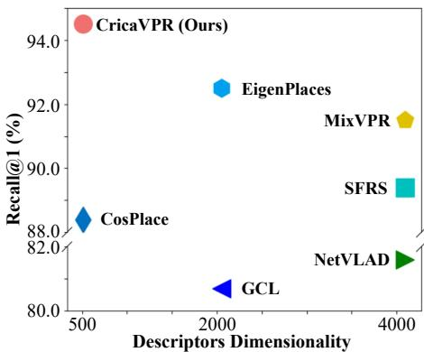
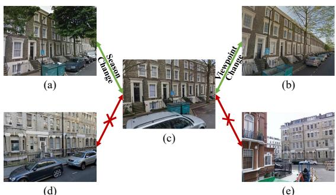
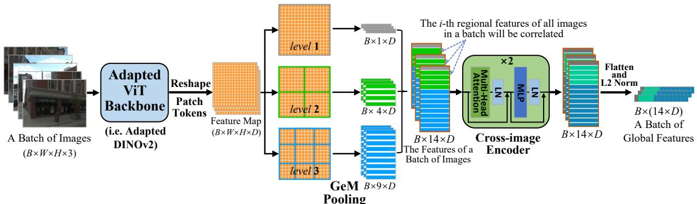
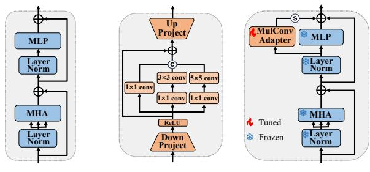
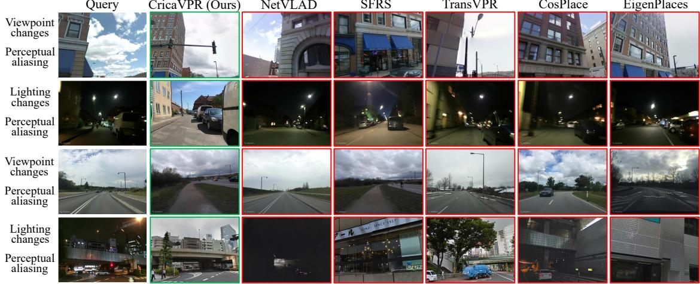
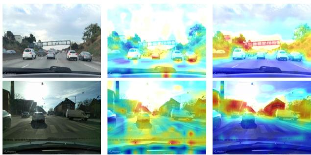

# CricaVPR: Cross-image Correlation-aware Representation Learning for Visual Place Recognition

Feng Lu1,2, Xiangyuan Lan2∗, Lijun Zhang3, Dongmei Jiang2, Yaowei Wang2, Chun Yuan1\* 1Tsinghua Shenzhen International Graduate School, Tsinghua University 2Peng Cheng Laboratory 3University of Chinese Academy of Sciences {lf22@mails,yuanc@sz}.tsinghua.edu.cn lanxy@pcl.ac.cn

## Abstract

Over the past decade, most methods in visual place recognition (VPR) have used neural networks to produce feature representations. These networks typically produce a global representation of a place image using only this image itself and neglect the cross-image variations (e.g. viewpoint and illumination), which limits their robustness in challenging scenes. In this paper, we propose a robust global representation method with cross-image correlation awareness for VPR, named CricaVPR. Our method uses the attention mechanism to correlate multiple images within a batch. These images can be taken in the same place with different conditions or viewpoints, or even capturedfrom different places. Therefore, our method can utilize the cross-image variations as a cue to guide the representation learning, which ensures more robust features are produced. To further facilitate the robustness, we propose a multi-scale convolution-enhanced adaptation method to adaptpre-trained visualfoundation models to the VPR task, which introduces the multi-scale local information to further enhance the cross-image correlation-aware representation. Experimental results show that our method outperforms state-of-the-art methods by a large margin with significantly less training time. The code is released at https://github.com/Lu-Feng/CricaVPR.

## 1. Introduction

Visual place recognition (VPR), also known as visual geolocalization [8, 9], aims at getting the coarse geographical location of an input query image by retrieving the most similar place image from a geo-tagged database. VPR has wide applications in augmented reality [45], mobile robot localization [64], and so on. However, there are three key challenges in VPR: condition (e.g., lighting, weather, and season) variations, viewpoint variations, and perceptual aliasing [40] (difficult to distinguish highly similar images taken from different places). Addressing these challenges at the same time is a hard nut to crack, especially for methods that use only global features.

  
Figure 1. The Recall@1 and descriptors dimensionality comparison of different methods on Pitts30k. The GCL, NetVLAD, SFRS, and CricaVPR (Ours) all use PCA for dimensionality reduction. Our method can achieve significantly higher Recall@1 than other methods with 512-dim compact global features.

VPR is typically addressed as an image retrieval problem [12]. The place images are represented using global features and the similarity search is implemented in this feature space to return the matched place image. The global features are usually derived through the aggregation (pooling) of local features, employing methods such as NetVLAD [5] or GeM [52] pooling. Such compact features are suitable for large-scale VPR. However, they lack robustness in challenging environments and are often susceptible to perceptual aliasing. A way to improve robustness is to perform re-ranking by matching local features [26, 59], which incurs huge overhead in runtime and memory footprint, making it difficult to achieve large-scale VPR. One problem that has been neglected is that existing methods produce the feature of an image only using this image itself (without cross-image interaction), which does not explicitly consider cross-image variations. To address this, our method attempts to use the cross-image variations as a cue to guide the representation learning and harvest useful information from other images when producing the feature of an image, making the output feature condition-invariant, viewpointinvariant, and capable of addressing perceptual aliasing.

Moreover, the recent visual foundation models [48, 53, 69] have achieved powerful performance. However, due to the particularity of the VPR task, directly using the pre-trained foundation model will encounter some problems. For example, the image features produced using pretrained models tend to ignore some discriminative backgrounds, and are susceptible to interference from dynamic foregrounds (see Fig. 6 in experiments). Fine-tuning the model on VPR datasets can address this but tends to hurt the previously learned ability, i.e., catastrophic forgetting [19]. A promising way is to exploit parameter-efficient transfer learning (PETL) [28, 29]. However, the discriminative landmarks that need attention in VPR often occupy local regions of uncertain size in images, and most existing PETL methods use language-oriented adaptation modules to adapt the transformer model and lack the image-related (multi-scale) local priors for visual tasks (especially for VPR). This raises the need to develop a new adaptation method to introduce multi-scale local priors to the foundation model for VPR.

In this paper, we propose a novel method to learn Crossimage correlation-aware representation for VPR, abbreviated as CricaVPR. Our method first uses a backbone with a pooling module to yield initial feature representations. Then we use a cross-image encoder equipped with the attention to calculate the correlation between multiple image representations within a batch to get final features. The images in a batch can be taken in the same place under different conditions (e.g. lighting) or from different viewpoints, or even captured from different places. This process allows each feature to enhance itself with useful information from others, thus producing condition-robust, viewpoint-robust, and discriminative representations. Meanwhile, we use the visual foundation model as the backbone in our architecture, and design a multi-scale convolution-enhanced adaptation method, in which we freeze the pre-trained foundation models and insert a few trainable lightweight adapters, to introduce the multi-scale local prior knowledge and adapt the foundation model for the VPR task.

Our work brings the following contributions: 1) We propose a cross-image correlation-aware representation method, which uses the attention mechanism to model the correlation between multiple image representations within a batch and make each feature more robust. 2) We design a parameter-efficient adaptation method to adapt pre-trained models for VPR, in which the proposed multi-scale convolution adapter is used to introduce multi-scale local information to boost performance. 3) Extensive experiments on the benchmark datasets show that our method can outperform the state-of-the-art (SOTA) methods by a large margin with less training time. The results on Pitts30k that best reflect the advantages of our method are shown in Fig. 1.

## 2. Related Work

Visual Place Recognition: The early VPR approaches typically represent place images by global features that are computed using aggregation algorithms, such as Bag of Words [3] and Vector of Locally Aggregated Descriptors (VLAD) [4, 30, 35, 39, 57], to aggregate the hand-crafted descriptors like SURF [6, 16]. Then these methods perform a nearest neighbor search in the global feature space over the database to get the most similar images. With the significant success of deep learning on various computer vision tasks, most recently VPR methods [1, 2, 5, 8, 10, 14, 15, 21– 23, 32, 38, 47, 54, 63, 68] have employed a variety of deep features to represent place images for boosting performance. Likewise, the aggregation algorithm has also been changed into a differentiable module to embed neural networks for end-to-end training [5, 27, 51]. However, most of the global-retrieval-based methods lack robustness in challenging environments and are prone to perceptual aliasing.

Two typical ways to alleviate this issue are to impose temporal consistency constraints and spatial consistency constraints. The former performs image sequence matching (i.e. utilize temporal continuity) [17, 20, 24, 41, 46] to realize robust VPR in challenging environments. The latter is often developed as a two-stage VPR system [7, 25, 26, 42– 44, 59, 70], which searches for top-k candidate images over the database using global features, then performs spatial consistency matching using local features to re-rank candidates. Different from these methods bringing additional constraints, runtime, and memory overhead, our model learns highly robust global representation via cross-image correlation awareness for global-retrieval-based VPR.

Parameter-efficient Transfer Learning: Some recent studies [48, 53, 60, 69] trained the large transformer-based foundation models on huge quantities of data. These models are capable of producing well-generalized feature representation and performing admirably on some common visual tasks. A promising technique for adapting these foundation models to more diverse downstream tasks with only finetuning a few (extra) parameters is PETL [28, 29, 37], which is initially proposed in natural language processing to address the catastrophic forgetting issue [19] and reduce training costs. Training the inserted task-specific adapters [28] while keeping the pre-trained foundation models frozen is one of the commonly used PETL methods, and we follow it in our work. There are multiple adapter-based methods [13, 31, 34, 49, 50, 65, 66] have been proposed to address a wide range of visual tasks. A closely related work to ours is Convpass [31], which used convolutional bypasses in ViT as adaptation modules to introduce image-related local inductive biases and avoid performance degradation in downstream fine-tuning. However, our work designs a multi-scale convolution adapter to learn more proper local information to improve the performance on the VPR task.

## 3. Methodology

Our method involves the Vision Transformer (ViT) and the attention mechanism used in it. So we first briefly review them in this section. Then we propose the cross-image correlation-aware representation method to describe place images. Finally, we present the multi-scale convolutionenhanced adaptation method to adapt the foundation model for VPR and the training strategy for fine-tuning.

## 3.1. Preliminary

The ViT model [18] and its variants have been applied for many computer vision tasks including VPR mainly due to its superior performance in modeling long-range dependencies. To process an input image with ViT, the image is initially divided into N non-overlapping patches, which are then linearly projected into D-dim patch embeddings $\boldsymbol { x } _ { p } \in \mathcal { R } ^ { N \times D }$ . Meanwhile, a learnable [class] token is prepended to $x _ { p }$ to form $x _ { 0 } = [ x _ { c l a s s } ; x _ { p } ] \in \mathcal { R } ^ { ( N + 1 ) \times D }$ To preserve the original positional information of each patch token, the corresponding positional embeddings are added to $x _ { 0 }$ to get $z _ { \mathrm { 0 } } ,$ which is fed into a series of transformer encoder layers to yield the feature representation. A transformer encoder layer consists of three main components: the multi-head attention (MHA) layer, the MLP layer, and the LayerNormalization (LN) layer. The forward process of input $z _ { l - 1 }$ passing through a transformer encoder layer to yield the output $z _ { l }$ can be formulated as

$$
\begin{array} { r l } & { z _ { l } ^ { \prime } = \mathbf { M H A } \left( \mathrm { L N } \left( z _ { l - 1 } \right) \right) + z _ { l - 1 } , } \\ & { z _ { l } = \mathbf { M L P } \left( \mathrm { L N } \left( z _ { l } ^ { \prime } \right) \right) + z _ { l } ^ { \prime } . } \end{array}\tag{1}
$$

The MLP layer is made up of two fully connected layers, which are mainly used for feature nonlinearization and dimension conversion. Here we briefly overview the process of calculating the correlation and attention in the MHA layer. The input sequence is first linearly transformed to produce the queries $Q ,$ , keys K, and values V. Then the attention among Q, K and V is computed using the Scaled Dot-Product Attention [58], denoted as

$$
A t t n ( Q , K , V ) = S o f t m a x \left( Q K ^ { \top } / \sqrt { d } \right) V .\tag{2}
$$

The MHA utilizes different learnable linear projections to generate the queries, keys, and values h times and performs attention for each set of projections in parallel. Specifically, we first compute the attention scores between each query and all keys, establishing the correlations between them. These scores are then multiplied with the corresponding values to model dependencies among these tokens. Finally, the outputs of h attention heads are concatenated (and once again projected). All tokens/elements in the input sequence are correlated in this process. In the next section, we will also use this attention mechanism to compute the acrossimage correlation.

  
Figure 2. The example of partial images in a batch. (a), (b), and (c) are taken from the same place with different conditions (seasons) and viewpoints. (d), (e), and (c) are captured from different places, but (d) is similar to (c). When the model produces the features of (c), it can harvest relevant information from other images to yield a better representation.

There are two ways to yield global representations of places using the output of ViT. The first is to directly use the output class token as a global feature. The second is to reshape the output patch tokens as a feature map (similar to the output of CNN) to restore the spatial position, and use the aggregation/pooling method (e.g. GeM [52]) to process it as a global feature. Both the class token and GeM pooling are used to produce the place representation in our work.

## 3.2. Cross-image Correlation-aware Place Representation

The methods based on neural networks have dominated the VPR area over the past decade. These methods commonly produce the deep feature representation of an image with only this image itself. Such features often lack robustness in challenging environments and are incapable of addressing the perceptual aliasing issue. In this work, we present a simple and effective solution to this problem. We attempt to correlate the features of place images in a batch, so that each image representation can harvest useful information from the other image representations to enhance its own robustness. More specifically, there may be images from the same place but taken from different viewpoints or under different conditions, or images from different places that look similar (or not) in a batch, as shown in Fig. 2. On the one hand, image representations from the same place with different perspectives and conditions can improve the viewpoint invariance and condition invariance of each other after the correlated encoding. On the other hand, image representations from different places also promote each other to produce discriminative features. As a result, our method can provide highly robust global representations to deal with viewpoint changes, condition changes, and perceptual aliasing.

We design the pipeline to produce desired global features as shown in Fig. 3. The output patch tokens of a batch of images from the ViT backbone are reshaped as the $B \times W \times$ $H \times D$ -dim (i.e., batch size × weight × height × token dimension) feature maps. We first use the spatial pyramid [36] to produce initial feature representations. The feature maps are split at three levels (1×1, 2×2, and 3×3). Then we use GeM pooling to process local (patch) features within the divided regions and get a total of 14 regional features of each image. Since the first level is a global aggregation, we directly use the class token to replace the GeM feature in this level for better performance. Next is the most critical step. We treat the i-th regional features of all images in a batch as a sequence of embedding vectors $f _ { i } ,$ that is

  
Figure 3. The pipeline to produce the proposed cross-image correlation-aware representation. The cross-image encoder is the core component for modeling correlations between different image features in a batch. Note that we are correlating the i-th regional features of all images in a batch, not all regional features of an image. Besides, the cross-image encoder consists of 2 stacked vanilla transformer encoder layers [58] with the LN layer behind the MHA/MLP layer, which is different from that in ViT [18] (LN is before MHA/MLP).

$$
f _ { i } = \{ f _ { i } ^ { 1 } , f _ { i } ^ { 2 } , . . . , f _ { i } ^ { B } \} \quad i \in \{ 1 , 2 , . . . , 1 4 \} ,\tag{3}
$$

and feed the 14 sequences of embedding vectors into a cross-image encoder to model the correlation between the i-th regional features of all images in a batch. That is, we apply the cross-image encoder to process each $f _ { i }$ to correlate images in a batch. Instead of directly using the attention (MHA) layer, the cross-image encoder is structured using two (vanilla) transformer encoder layers [58] that also include the MLP layer, LN layer, and skip connection for stable training and better performance. The 14 output regional features of each image are sequentially concatenated (i.e., flattened) and L2-normalized as the final global representation of the image.

It should be noted that the retrieval process of our method is the same as the common global-retrieval-based method. That is, it uses the global feature of a single image for retrieval. Besides, we choose the spatial pyramid to produce the initial feature in order to subsequently correlate images at different scales, and the final sequential concatenation of regional features also introduces spatial position information to the global representations. In fact, our method can also use other aggregation methods to yield initial features, and boost the performance of these methods.

## 3.3. Multi-scale Convolution-enhanced Adaptation

Our work adapts the distilled DINOv2 [48] as the backbone (i.e. the adapted DINOv2/ViT backbone in Fig. 3), which is based on ViT-B/14. The DINOv2 work trains the ViT model on the large-scale curated LVD-142M dataset with the selfsupervised strategy, and can provide powerful visual features to achieve promising performance on some common tasks without any fine-tuning. AnyLoc [33] is a VPR work that uses pre-trained DINOv2 without fine-tuning. However, there exists a gap between the tasks of model pretraining and VPR due to the inherent difference in training objectives and data. Directly using such a pre-trained model in VPR cannot fully unleash its powerful capability.

The adapter-based parameter-efficient transfer learning [28] provides an effective way to adapt foundation models for downstream tasks, which freezes the pre-trained model and only fine-tunes the added lightweight adapter. The vanilla adapter is a bottleneck module consisting of a downprojection (fully connection) layer, an up-projection layer, and a non-linearity (activation) layer in the middle. The Convpass work [31] applies convolution layers to introduce image-related local inductive biases into models. However, we found that improper local priors provided by Convpass risk reducing performance in VPR. Inspired by the inception module in GoogLeNet [55], we design our multi-scale convolution (MulConv) adapter as shown in Fig. 4 (b).

Different from the vanilla adapter, our MulConv adapter adds a MulConv module between the (ReLU) activation layer and the up-projection layer. This module consists of three parallel convolutional paths of different scales (1×1, $3 \times 3 , 5 \times 5 )$ The 1×1 convolution is also used before the 3×3 and $5 \times 5$ convolutions to reduce channel dimension. This design and the bottleneck structure of the adapter make our MulConv adapter still lightweight. The outputs of the three convolutional paths are concatenated to form the output of the MulConv module. Besides, there is a skip connection in parallel to the MulConv module. Finally, the Mul-Conv adapter is added in parallel to the MLP layer (multiplied by a scaling factor s) in each transformer block (i.e. transformer encoder layer) of the ViT backbone to achieve multi-scale convolution-enhanced adaptation, which can introduce proper (multi-scale) local priors to the model and improve performance for VPR. So the computation of each adapted transformer block can be denoted as

  
Figure 4. Illustration of our multi-scale convolution-enhanced adaptation. (a) is a transformer block in ViT. (b) is the MulConv adapter. We add the MulConv adapter in parallel to the MLP layer in each transformer block to achieve our adaptation as in (c).

$$
\begin{array} { r l } & { z _ { l } ^ { \prime } = \mathbf { M H A } \left( \mathbf { L N } \left( z _ { l - 1 } \right) \right) + z _ { l - 1 } , } \\ & { z _ { l } = \mathbf { M L P } \left( \mathbf { L N } \left( z _ { l } ^ { \prime } \right) \right) + s \cdot \mathbf { A d a p t e r } \left( \mathbf { L N } \left( z _ { l } ^ { \prime } \right) \right) + z _ { l } ^ { \prime } . } \end{array}\tag{4}
$$

## 3.4. Training Strategy

We train our model on the GSV-Cities [1] dataset with full supervision. This dataset contains 560k images captured at 67k places with highly accurate labels. We follow the standard framework of this dataset and use the multi-similarity (MS) loss [61] with online hard mining strategy for training. The MS loss is computed as

$$
\begin{array} { r } { \mathcal { L } _ { M S } = \displaystyle \frac { 1 } { B } \sum _ { q = 1 } ^ { B } \Bigg \{ \frac { 1 } { \alpha } \mathrm { l o g } \left[ 1 + \sum _ { p \in \mathcal { P } _ { q } } e ^ { - \alpha \left( S _ { q p } - \lambda \right) } \right] } \\ { + \displaystyle \frac { 1 } { \beta } \mathrm { l o g } \left[ 1 + \sum _ { n \in \mathcal { N } _ { q } } e ^ { \beta \left( S _ { q n } - \lambda \right) } \right] \Bigg \} , } \end{array}\tag{5}
$$

where for each query (anchor) image $I _ { q }$ in a batch, $\mathcal { P } _ { q }$ is the set of indices $\{ p \}$ that correspond to the positive samples for $I _ { q } ,$ and $\textstyle { \mathcal { N } } _ { q }$ is the set of indices $\{ n \}$ that correspond to the negative samples for $I _ { q } . \ S _ { q p }$ and $S _ { q n }$ are the cosine similarities of a positive pair $\{ I _ { q } , I _ { p } \}$ and a negative pair $\{ I _ { q } , I _ { n } \}$ α, β and λ are three set constants (hyperparameters).

## 4. Experiments

## 4.1. Datasets and Performance Evaluation

The experiments are conducted on several VPR benchmark datasets. These datasets exhibit viewpoint changes, condition changes, and the perceptual aliasing issue. Table 1 summarizes the key information of them. Pitts30k [56] mainly shows large viewpoint changes. MSLS [62] consists of images captured in urban, suburban, and natural scenes over 7 years, and covers various visual changes. Tokyo24/7 [57] exhibits severe illumination (day/night) changes. We also use three challenging datasets: Nordland (with seasonal changes) [10], SVOX (cross-domain dataset) [11], and AmsterTime (with very long-term changes) [67]. More details are in Supplementary (Suppl.) Material.

<table><tr><td rowspan="2">Dataset</td><td rowspan="2">Description</td><td colspan="2">Number</td></tr><tr><td>Database</td><td>Queries</td></tr><tr><td>Pitts30k</td><td>urban, panorama</td><td>10,000</td><td>6,816</td></tr><tr><td>MSLS-val</td><td>urban, suburban</td><td>18,871</td><td>740</td></tr><tr><td>MSLS-challenge</td><td>long-term</td><td>38,770</td><td>27,092</td></tr><tr><td>Tokyo24/7</td><td>urban, day/night</td><td>75,984</td><td>315</td></tr><tr><td>Nordland</td><td>natural, seasonal</td><td>27,592</td><td>27,592</td></tr><tr><td>SVOX</td><td>cross-domain</td><td>17,166</td><td>4,356</td></tr><tr><td>AmsterTime</td><td>very long-term</td><td>1,231</td><td>1,231</td></tr></table>

Table 1. Summary of the test datasets in experiments.

The Recall@N (R@N) metric is used in our experiments to evaluate recognition performance. It is the percentage of queries for which at least one of the N retrieved database images is taken within a threshold of ground truth. We set the threshold to 25 meters and $4 0 ^ { \circ }$ for MSLS, 25 meters for Pitts30k, Tokyo24/7, and SVOX, ±10 frames for Nordland, unique counterpart for AmsterTime, following common evaluation procedures [56, 57, 62].

## 4.2. Implementation Details

We fine-tune our model on two NVIDIA GeForce RTX 3090 GPUs using PyTorch. The resolution of the input image is 224×224 and the token dimension of the backbone (ViT-B/14) is 768. Our model outputs the 14×768-dim original global features, and we use PCA for dimensionality reduction. The bottleneck ratio of our adapters is set to 0.5, so the input dimension of the three convolutional paths is 384. The 1×1 convolution before the 3×3 and 5×5 convolution reduces the channels to 24. The output dimensions of the three convolutional paths are 192, 96, and 96. The scaling factor s in Eq. 4 is set to 0.2. We set the hyperparameters $\alpha = 1 , \beta = 5 0 , \lambda = 0$ in Eq. 5 and margin = 0.1 in online mining, as in GSV-Cities [1]. We fine-tune the model using the Adam optimizer with the initial learning rate set as 0.0001 and multiplied by 0.5 after every 3 epochs. A training batch contains 72 places with 4 images each (i.e. 288 images). Training is implemented until the R@5 on Pitts30k does not improve for 3 epochs. An inference batch contains 8 images for Pitts30k and 16 images for others.

## 4.3. Comparison with State-of-the-Art Methods

In this section, we compare our CricaVPR with several SOTA VPR methods, mainly including six global-retrievalbased methods: NetVLAD [5], SFRS [23], CosPlace [8], GCL [38], MixVPR [2] and EigenPlaces [10]. Note that our work uses the same training dataset as MixVPR, i.e., GSV-Cities. Meanwhile, CosPlace and EigenPlaces are trained on individually constructed extra large-scale datasets, i.e., SF-XL. Both MixVPR and EigenPlaces are the latest works and represent the SOTA performance of the VPR methods based on global feature retrieval. Additionally, we also compare our approach with two excellent two-stage VPR methods (Patch-NetVLAD [26] and TransVPR [59]), which require time-consuming re-ranking using local features. The details of these methods are in Suppl. Material. Table 2 shows the quantitative results on Pitts30k, Tokyo24/7, and MSLS. Our CricaVPR uses PCA to reduce the feature dimensionality to 4096-dim (in this subsection), and achieves the best R@1/R@5/R@10 on all datasets.

NetVLAD
<table><tr><td rowspan="2">Method</td><td rowspan="2">Dim</td><td colspan="3">Pitts30k</td><td colspan="3">Tokyo24/7</td><td colspan="3">MSLS-val</td><td colspan="3">MSLS-challenge</td></tr><tr><td>R@1</td><td>R@5</td><td>R@10</td><td>R@1</td><td>R@5</td><td>R@10</td><td>R@1</td><td>R@5</td><td>R@10</td><td>R@1</td><td>R@5</td><td>R@10</td></tr><tr><td>NetVLAD [5]</td><td>32768</td><td>81.9</td><td>91.2</td><td>93.7</td><td>60.6</td><td>68.9</td><td>74.6</td><td>53.1</td><td>66.5</td><td>71.1</td><td>35.1</td><td>47.4</td><td>51.7</td></tr><tr><td>SFRS [23]</td><td>4096</td><td>89.4</td><td>94.7</td><td>95.9</td><td>81.0</td><td>88.3</td><td>92.4</td><td>69.2</td><td>80.3</td><td>83.1</td><td>41.6</td><td>52.0</td><td>56.3</td></tr><tr><td>Patch-NetVLAD [26]</td><td>1</td><td>88.7</td><td>94.5</td><td>95.9</td><td>86.0</td><td>88.6</td><td>90.5</td><td>79.5</td><td>86.2</td><td>87.7</td><td>48.1</td><td>57.6</td><td>60.5</td></tr><tr><td>TransVPR [59]</td><td>1</td><td>89.0</td><td>94.9</td><td>96.2</td><td>79.0</td><td>82.2</td><td>85.1</td><td>86.8</td><td>91.2</td><td>92.4</td><td>63.9</td><td>74.0</td><td>77.5</td></tr><tr><td>CosPlace [8]</td><td>512</td><td>88.4</td><td>94.5</td><td>95.7</td><td>81.9</td><td>90.2</td><td>92.7</td><td>82.8</td><td>89.7</td><td>92.0</td><td>61.4</td><td>72.0</td><td>76.6</td></tr><tr><td>GCL [38]</td><td>2048</td><td>80.7</td><td>91.5</td><td>93.9</td><td>69.5</td><td>81.0</td><td>85.1</td><td>79.5</td><td>88.1</td><td>90.1</td><td>57.9</td><td>70.7</td><td>75.7</td></tr><tr><td>MixVPR [2]</td><td>4096</td><td>91.5</td><td>95.5</td><td>96.3</td><td>85.1</td><td>91.7</td><td>94.3</td><td>88.0</td><td>92.7</td><td>94.6</td><td>64.0</td><td>75.9</td><td>80.6</td></tr><tr><td>EigenPlaces [10]</td><td>2048</td><td>92.5</td><td>96.8</td><td>97.6</td><td>93.0</td><td>96.2</td><td>97.5</td><td>89.1</td><td>93.8</td><td>95.0</td><td>67.4</td><td>77.1</td><td>81.7</td></tr><tr><td>CricaVPR (ours)</td><td>4096</td><td>94.9</td><td>97.3</td><td>98.2</td><td>93.0</td><td>97.5</td><td>98.1</td><td>90.0</td><td>95.4</td><td>96.4</td><td>69.0</td><td>82.1</td><td>85.7</td></tr></table>

Table 2. Comparison to state-of-the-art methods on benchmark datasets. The best is highlighted in bold and the second is underlined.

SFRS  
TransVPR  
CosPlace  
EigenPlaces  
  
Figure 5. Qualitative results. These four challenging examples show severe viewpoint changes and condition changes. The proposed CricaVPR successfully yields the right results, while other methods return incorrect images. In each example, there are methods to return similar images from different places (i.e., incorrect) due to perceptual aliasing. In the second example, the query image is taken at night, causing all the other methods to return night images but from different places (i.e. wrong). However, our method returns an image taken during the day at the same place (i.e. correct).

<table><tr><td>Method</td><td>Nordland</td><td>Amster Time</td><td>SVOX -Night</td><td>SVOX -Rain</td></tr><tr><td>SFRS [23]</td><td>16.0</td><td>29.7</td><td>28.6</td><td>69.7</td></tr><tr><td>CosPlace [8]</td><td>58.5</td><td>38.7</td><td>44.8</td><td>85.2</td></tr><tr><td>MixVPR [2]</td><td>76.2</td><td>40.2</td><td>64.4</td><td>91.5</td></tr><tr><td>EigenPlaces [10]</td><td>71.2</td><td>48.9</td><td>58.9</td><td>90.0</td></tr><tr><td>CricaVPR (ours)</td><td>90.7</td><td>64.7</td><td>85.1</td><td>95.0</td></tr></table>

Table 3. Comparison (R@1) to SOTA methods on more challenging datasets. More results are in Suppl. Material.

MixVPR, EigenPlaces, and our CricaVPR all achieve excellent performance on these datasets. Especially on Pitts30k, which shows significant viewpoint changes but no drastic condition changes, EigenPlaces achieves 92.5% R@1. This indicates that the challenge posed by viewpoint changes has been effectively addressed by existing methods (i.e., EigenPlaces and MixVPR). However, our method continues to improve performance on Pitts30k, achieving an impressive 94.9% R@1. This improvement primarily stems from the powerful ability of our method to produce more discriminative global representations to differentiate similar images from different places, i.e., address perceptual aliasing. The MSLS dataset is more challenging as it shows severe condition variations and includes some suburban or natural scene images lacking landmarks and prone to perceptual aliasing. Nevertheless, our method achieves 95.4% R@5 on MSLS-val and 82.1% R@5 on MSLS-challenge, showing significant advantages over other global-retrievalbased methods and two-stage methods.

Fig. 5 qualitatively demonstrates the superior performance of our method in some extreme environments. These challenging examples include drastic condition changes, viewpoint changes, or only small regions in the images showing discriminative objects. In these examples, other methods either get similar images but from different places (i.e. suffer from perceptual aliasing), or retrieve places that are close in geographical distance but still out of the set threshold, that is, they fail to retrieve the correct results. Our approach shows high robustness against these challenges.

<table><tr><td rowspan=2 colspan=1>Ablated versions</td><td rowspan=1 colspan=1>Pitts30k</td><td rowspan=1 colspan=1>Tokyo24/7</td><td rowspan=1 colspan=1>MSLS-val</td></tr><tr><td rowspan=1 colspan=1>R@1R@5</td><td rowspan=1 colspan=1>R@1 R@5</td><td rowspan=1 colspan=1>R@1R@5</td></tr><tr><td rowspan=1 colspan=1>FrozenDINOv2-SPM</td><td rowspan=1 colspan=1>74.8 90.1</td><td rowspan=1 colspan=1>49.8 67.0</td><td rowspan=1 colspan=1>45.4 60.7</td></tr><tr><td rowspan=1 colspan=1>AdaptGeMAdaptSPMGAdaptSPM</td><td rowspan=1 colspan=1>87.1 94.087.8 94.190.6 95.9</td><td rowspan=1 colspan=1>70.2 85.472.1 85.185.1 93.3</td><td rowspan=1 colspan=1>78.4 87.878.0 88.485.5 93.2</td></tr><tr><td rowspan=2 colspan=1>AdaptGeM+CricaAdaptSPMG+CricaAdaptSPM+Crica</td><td rowspan=2 colspan=1>93.9 97.294.3 97.394.8 97.4</td><td rowspan=1 colspan=1>87.6 93.3</td><td rowspan=1 colspan=1>86.1 93.4</td></tr><tr><td rowspan=1 colspan=1>93.7 96.593.0 97.1</td><td rowspan=1 colspan=1>89.7 95.389.9 95.4</td></tr></table>

Table 4. Ablation on cross-image awareness. The “+Crica” represents the addition of our cross-image correlation awareness to get the final global feature. The “SPM” represents our spatial pyramid model representation, while “SPMG” is the spatial pyramid model solely based on GeM. Except for the FrozenDINOv2-SPM that directly uses an untuned backbone (as baseline), all other versions use our adaptation method for fine-tuning.

To further evaluate the performance of our method in extreme scenarios, we conduct experiments on three challenging datasets: Nordland, which exhibits seasonal changes; AmsterTime, which spans a very long time period; and SVOX, which shows extreme illumination and weather variations. The results, as shown in Table 3, demonstrate the significant superiority of our method compared to other SOTA methods. Our CricaVPR outperforms all other SOTA methods with 14.5%, 15.8%, and 20.7% absolute R@1 improvements on Nordland, AmsterTime, and SVOX-Night, respectively. This further highlights that the global image representation of our method is highly robust.

## 4.4. Ablation Study

We perform a series of ablation experiments to validate the effectiveness of the proposed components in our method. All ablated methods no longer use PCA for dimensionality reduction by default. We will conduct separate experiments to show the impact of feature dimensions on the results.

Ablation on cross-image correlation awareness. The cross-image correlation awareness achieved by the crossimage encoder after the backbone is the most important module in our method. We compare the performance of the three kinds of global features with or without across-image awareness. These features are GeM, the spatial pyramid model representation solely based on GeM (SPMG), and our spatial pyramid model representation (SPM) which uses both class token and GeM. The results are shown in Table 4. After incorporating the proposed cross-image correlation awareness (Crica), all three features achieve significant performance improvements. Due to the already impressive performance of the SPM feature after our model adaptation (AdaptSPM), the improvement provided by Crica on this feature is not as pronounced as on the GeM and SPMG features. Nevertheless, AdaptSPM+Crica still resulted in 4.2%, 7.9%, and 4.4% absolute R@1 improvements over the AdaptSPM feature on Pitts30k, Tokyo24/7, and MSLS-val, respectively. Moreover, AdaptGeM+Crica achieves an impressive 17.4% absolute R@1 improvement over AdaptGeM on Tokyo24/7. With the combined effect of our Crica and model adaptation, our method achieves nearly 2× higher R@1 on Tokyo24/7 and MSLS-val compared to the direct use of frozen DINOv2 with the SPM representation (FrozenDINOv2-SPM).

  
(a) Input image (b) Result of pre-trained DINOv2 (c) Result of adapted DINOv2  
Figure 6. The output feature map (attention) visualizations of pre-trained DINOv2 and adapted DINOv2. The regions attended to by pre-trained DINOv2 have no relevance to place recognition. However, adapted DINOv2 focuses on discriminative areas for VPR. Buildings that remain relatively unchanged over time receive the highest attention. Vegetation that is not expected to change in the short term receives moderate attention. Non-discriminative elements such as the sky, ground, and dynamic vehicles, are ignored.

Ablation on adaptation. We first use only the GeM features alone (without cross-image awareness) to demonstrate the performance improvement achieved by our adaptation method. As shown in Table 5, MulConvAdapter-GeM using our adaptation achieves a significant improvement over FrozenDINOv2-GeM. Especially on MSLS-val, which has more dynamic interference, our adaptation achieves nearly 2× higher R@1. Fig. 6 vividly illustrates the underlying reasons. The adapted DINOv2, in contrast to the pre-trained DINOv2, exhibits a stronger ability to focus on objects related to place recognition, with more attention given to more important objects. Table 5 also shows the performance of different fine-tuning methods when using the proposed global features (i.e. the SPM feature with cross-image correlation awareness). The FullTunedDINOv2 achieves a notable improvement over FrozenDINOv2 on Pitts30k and MSLS-val. However, because our training data has no night images like those in Tokyo24/7, FullTunedDI-NOv2 performs worse than FrozenDINOv2 on Tokyo24/7, i.e., it suffers from catastrophic forgetting. This indicates the necessity of parameter-efficient fine-tuning (using an adapter). Besides, ConvAdapter (as in Convpass [31]) uses 3×3 convolution to introduce local inductive biases into the model. However, it brings inappropriate local priors for VPR and results in performance degradation compared to VanillaAdapter. Our method (MulConvAdapter) uses multiscale convolution to introduce more proper local information and thus achieves the best performance.

<table><tr><td rowspan=2 colspan=1>Ablated versions</td><td rowspan=1 colspan=1>Pitts30k</td><td rowspan=1 colspan=1>Tokyo24/7</td><td rowspan=1 colspan=1>MSLS-val</td></tr><tr><td rowspan=1 colspan=1>R@1R@5</td><td rowspan=1 colspan=1>R@1R@5</td><td rowspan=1 colspan=1>R@1R@5</td></tr><tr><td rowspan=1 colspan=1>FrozenDINOv2-GeMMulConvAdapter-GeM</td><td rowspan=1 colspan=1>79.290.187.194.0</td><td rowspan=1 colspan=1>65.483.870.285.4</td><td rowspan=1 colspan=1>40.851.578.487.8</td></tr><tr><td rowspan=4 colspan=1>FrozenDINOv2FullTunedDINOv2VanillaAdapterConvAdapterMulConvAdapter</td><td rowspan=4 colspan=1>79.290.194.196.694.697.493.896.994.897.4</td><td rowspan=1 colspan=1>80.089.8</td><td rowspan=1 colspan=1>58.871.2</td></tr><tr><td rowspan=1 colspan=1>76.888.392.796.5</td><td rowspan=3 colspan=1>86.293.289.295.588.094.289.995.4</td></tr><tr><td rowspan=1 colspan=1>92.795.9</td></tr><tr><td rowspan=1 colspan=1>93.097.1</td></tr></table>

Table 5. Ablation on adaptation. Except for the versions with the ”-GeM” suffix, which utilize GeM features, all other versions use our spatial pyramid representation with the proposed crossimage awareness to yield global features. FrozenDINOv2 and FullTunedDINOv2 represent the use of frozen and fully fine-tuned DINOv2 as backbones, respectively. VanillaAdapter, ConvAdapter, and MulConvAdapter represent the use of a vanilla adapter, 3x3 convolution adapter, and our proposed multi-scale convolution adapter to adapt DINOv2 as the backbone, respectively.
<table><tr><td rowspan=3 colspan=1>Dim</td><td></td><td></td><td></td><td></td></tr><tr><td rowspan=1 colspan=1>Pitts30k</td><td rowspan=1 colspan=2>Tokyo24/7</td><td rowspan=1 colspan=1>MSLS-val</td></tr><tr><td rowspan=1 colspan=1>R@1R@5R@10</td><td rowspan=1 colspan=2>R@1R@5R@10</td><td rowspan=1 colspan=1>R@1R@5R@10</td></tr><tr><td rowspan=1 colspan=1>512</td><td rowspan=1 colspan=1>94.5 97.1 98.0</td><td rowspan=1 colspan=2>84.4 93.7 95.9</td><td rowspan=1 colspan=1>85.3 93.4 94.5</td></tr><tr><td rowspan=4 colspan=1>10242048409610752</td><td rowspan=3 colspan=1>94.8 97.3 98.194.8 97.4 98.294.9 97.3 98.2</td><td rowspan=3 colspan=2>91.4 96.8 97.892.4 96.8 97.893.0 97.5 98.1</td><td rowspan=3 colspan=1>87.7 94.3 95.389.2 95.1 96.190.0 95.4 96.4</td></tr><tr><td rowspan=2 colspan=1>20.097.01</td></tr><tr><td rowspan=1 colspan=1>7.598.1</td></tr><tr><td rowspan=1 colspan=1>94.8 97.4 98.1</td><td rowspan=1 colspan=2>93.097.197.8</td><td rowspan=1 colspan=1>89.9 95.4 96.2</td></tr></table>

Table 6. Ablation on dimensions of our descriptor. The original output dimension is 10752.

Impact of descriptor dimensionality. In this subsection, we analyze the impact of descriptor dimensionality, and the results are shown in Table 6. Our method gets the best performance when using PCA to reduce the descriptor dimension to 4096-dim, so it is the default dimensionality we recommend. Furthermore, we continue to reduce the dimensionality to observe the point at which performance starts to noticeably decline on each dataset. For Pitts30k, the 512-dim descriptor still achieves an impressive 94.5% R@1, with no significant decrease compared to the 4096- dim descriptor. However, using the 512-dim descriptor on the other two datasets results in an obvious performance drop. This is mainly due to the drastic condition changes and the perceptual aliasing issue in these datasets, requiring higher-dimensional descriptors to provide sufficient information to distinguish places. When there is a pressing need for low-dimensional descriptors, we suggest using the 1024-dim or 2048-dim descriptor for the place images with obvious condition changes (e.g., Tokyo24/7 and MSLS), the

<table><tr><td rowspan=2 colspan=1>Epoch</td><td rowspan=2 colspan=1>Trainingtime (h)</td><td rowspan=1 colspan=1>Pitts30k</td><td rowspan=1 colspan=1>Tokyo24/7</td><td rowspan=1 colspan=1>MSLS-val</td></tr><tr><td rowspan=1 colspan=1>R@1R@5</td><td rowspan=1 colspan=1>R@1i R@5</td><td rowspan=1 colspan=1>R@1 R@5</td></tr><tr><td rowspan=1 colspan=1>10</td><td rowspan=1 colspan=1>3.5</td><td rowspan=1 colspan=1>94.8 97.4</td><td rowspan=1 colspan=1>93.0 97.1</td><td rowspan=1 colspan=1>89.9 95.4</td></tr><tr><td rowspan=1 colspan=1>5</td><td rowspan=1 colspan=1>1.8</td><td rowspan=1 colspan=1>94.0 97.2</td><td rowspan=1 colspan=1>93.3 96.2</td><td rowspan=2 colspan=1>89.1 95.385.4 93.8</td></tr><tr><td rowspan=2 colspan=1>10.1</td><td rowspan=1 colspan=1>0.36</td><td rowspan=1 colspan=1>93.3 96.7</td><td rowspan=1 colspan=1>92.7 95.9</td></tr><tr><td rowspan=1 colspan=1>0.038</td><td rowspan=1 colspan=1>92.5 96.5</td><td rowspan=1 colspan=1>88.9 96.2</td><td rowspan=1 colspan=1>79.1 88.4</td></tr></table>

Table 7. The results of CricaVPR with different training epochs. 512-dim descriptor for images like those in Pitts30k.

Training time and data efficiency. Our model only costs 3.5 hours for training, which is significantly less than the full-day time used by CosPlace/EigenPlaces. The training epochs of ours (10 epochs) are also less than MixVPR (30 epochs) using the same dataset. To further investigate the training time and data efficiency of our method, we reduce the training epoch and training data, and the yielded results are shown in Table 7. When the model is trained with only 10% of the training data for 1 epoch (i.e., 0.1 epoch), our method achieves better performance than previous methods (except EigenPlaces) on Pitts30k and Tokyo24/7. The training time used is only 0.038h (i.e., 2.3 min). The advantages of our method in data efficiency are mainly due to the fact that the adapter-based method maintains the powerful representation ability of the pretrained foundation model, while our proposed cross-image encoder is an easy-to-train module.

## 5. Conclusions

In this paper, we presented CricaVPR, a robust global representation method with cross-image correlation awareness for VPR. Our method leverages the cross-image encoder equipped with the attention to establish the correlation among multiple images within a batch, enabling the model to harvest useful information from other images while generating the feature representation of an image. This makes the produced global features conditioninvariant, viewpoint-invariant, and capable of addressing perceptual aliasing. Furthermore, we proposed a multiscale convolution-enhanced adaptation method to introduce proper local information and effectively unleash the capability of the pre-trained foundation model for VPR. Experimental results on several VPR benchmark datasets demonstrate that our CricaVPR can provide a robust global representation to address various challenges in VPR and outperforms SOTA methods by a significant margin.

## Acknowledgments

This work was supported by the National Key R&D Program of China (2022YFB4701400/4701402), SSTIC Grant (KJZD20230923115106012), Shenzhen Key Laboratory (ZDSYS20210623092001004), Beijing Key Lab of Networked Multimedia, and the Project of Peng Cheng Laboratory (PCL2023A08).

## References

[1] Amar Ali-bey, Brahim Chaib-draa, and Philippe Giguere.\` Gsv-cities: Toward appropriate supervised visual place recognition. Neurocomputing, 513:194–203, 2022. 2, 5

[2] Amar Ali-Bey, Brahim Chaib-Draa, and Philippe Giguere. Mixvpr: Feature mixing for visual place recognition. In Proceedings of the IEEE/CVF Winter Conference on Applications ofComputer Vision, pages 2998–3007, 2023. 2, 5, 6

[3] Adrien Angeli, David Filliat, Stephane Doncieux, and Jean-´ Arcady Meyer. Fast and incremental method for loop-closure detection using bags of visual words. IEEE transactions on robotics, 24(5):1027–1037, 2008. 2

[4] Relja Arandjelovic and Andrew Zisserman. All about vlad. In Proceedings of the IEEE conference on Computer Vision and Pattern Recognition, pages 1578–1585, 2013. 2

[5] Relja Arandjelovic, Petr Gronat, Akihiko Torii, Tomas Pajdla, and Josef Sivic. Netvlad: Cnn architecture for weakly supervised place recognition. In Proceedings of the IEEE conference on computer vision and pattern recognition, pages 5297–5307, 2016. 1, 2, 5, 6

[6] Herbert Bay, Andreas Ess, Tinne Tuytelaars, and Luc Van Gool. Speeded-up robust features (surf). Computer vision and image understanding, 110(3):346–359, 2008. 2

[7] Gabriele Berton, Carlo Masone, Valerio Paolicelli, and Barbara Caputo. Viewpoint invariant dense matching for visual geolocalization. In IEEE/CVF International Conference on Computer Vision, pages 12169–12178, 2021. 2

[8] Gabriele Berton, Carlo Masone, and Barbara Caputo. Rethinking visual geo-localization for large-scale applications. In IEEE/CVF Conference on Computer Vision and Pattern Recognition, pages 4878–4888, 2022. 1, 2, 5, 6

[9] Gabriele Berton, Riccardo Mereu, Gabriele Trivigno, Carlo Masone, Gabriela Csurka, Torsten Sattler, and Barbara Caputo. Deep visual geo-localization benchmark. In Proceedings of the IEEE/CVF Conference on Computer Vision and Pattern Recognition, pages 5396–5407, 2022. 1

[10] Gabriele Berton, Gabriele Trivigno, Barbara Caputo, and Carlo Masone. Eigenplaces: Training viewpoint robust models for visual place recognition. In Proceedings of the IEEE/CVF International Conference on Computer Vision, pages 11080–11090, 2023. 2, 5, 6

[11] Gabriele Moreno Berton, Valerio Paolicelli, Carlo Masone, and Barbara Caputo. Adaptive-attentive geolocalization from few queries: A hybrid approach. In Proceedings of the IEEE/CVF Winter Conference on Applications of Computer Vision, pages 2918–2927, 2021. 5

[12] Bingyi Cao, Andre Araujo, and Jack Sim. Unifying deep local and global features for image search. In European Conference on Computer Vision, pages 726–743. Springer, 2020. 1

[13] Shoufa Chen, Chongjian Ge, Zhan Tong, Jiangliu Wang, Yibing Song, Jue Wang, and Ping Luo. Adaptformer: Adapting vision transformers for scalable visual recognition. Advances in Neural Information Processing Systems, 35:16664–16678, 2022. 2

[14] Zetao Chen, Adam Jacobson, Niko Sunderhauf, Ben Up-¨ croft, Lingqiao Liu, Chunhua Shen, Ian Reid, and Michael

Milford. Deep learning features at scale for visual place recognition. In 2017 IEEE international conference on robotics and automation, pages 3223–3230. IEEE, 2017. 2

[15] Zetao Chen, Fabiola Maffra, Inkyu Sa, and Margarita Chli. Only look once, mining distinctive landmarks from convnet for visual place recognition. In 2017 IEEE/RSJ International Conference on Intelligent Robots and Systems (IROS), pages 9–16. IEEE, 2017. 2

[16] Mark Cummins and Paul Newman. Fab-map: Probabilistic localization and mapping in the space of appearance. The International Journal ofRobotics Research, 27(6):647–665, 2008. 2

[17] Anh-Dzung Doan, Yasir Latif, Tat-Jun Chin, Yu Liu, Thanh-Toan Do, and Ian Reid. Scalable place recognition under appearance change for autonomous driving. In Proceedings of the IEEE/CVF International Conference on Computer Vision, pages 9319–9328, 2019. 2

[18] Alexey Dosovitskiy, Lucas Beyer, Alexander Kolesnikov, Dirk Weissenborn, Xiaohua Zhai, Thomas Unterthiner, Mostafa Dehghani, Matthias Minderer, Georg Heigold, Sylvain Gelly, et al. An image is worth 16x16 words: Transformers for image recognition at scale. In International Conference on Learning Representations, 2020. 3, 4

[19] Robert M French. Catastrophic forgetting in connectionist networks. Trends in cognitive sciences, 3(4):128–135, 1999. 2

[20] Sourav Garg and Michael Milford. Seqnet: Learning descriptors for sequence-based hierarchical place recognition. IEEE Robotics and Automation Letters, 6(3):4305–4312, 2021. 2

[21] Sourav Garg, Adam Jacobson, Swagat Kumar, and Michael Milford. Improving condition-and environment-invariant place recognition with semantic place categorization. In 2017 IEEE/RSJ International Conference on Intelligent Robots and Systems, pages 6863–6870. IEEE, 2017. 2

[22] Sourav Garg, Niko Suenderhauf, and Michael Milford. Don’t look back: Robustifying place categorization for viewpoint-and condition-invariant place recognition. In 2018 IEEE International Conference on Robotics and Automation (ICRA), pages 3645–3652, 2018.

[23] Yixiao Ge, Haibo Wang, Feng Zhu, Rui Zhao, and Hongsheng Li. Self-supervising fine-grained region similarities for large-scale image localization. In European conference on computer vision, pages 369–386. Springer, 2020. 2, 5, 6

[24] Peter Hansen and Brett Browning. Visual place recognition using hmm sequence matching. In 2014 IEEE/RSJ International Conference on Intelligent Robots and Systems, pages 4549–4555. IEEE, 2014. 2

[25] Stephen Hausler and Michael Milford. Hierarchical multiprocess fusion for visual place recognition. In 2020 IEEE International Conference on Robotics and Automation (ICRA), pages 3327–3333. IEEE, 2020. 2

[26] Stephen Hausler, Sourav Garg, Ming Xu, Michael Milford, and Tobias Fischer. Patch-netvlad: Multi-scale fusion of locally-global descriptors for place recognition. In Proceedings of the IEEE/CVF Conference on Computer Vision and Pattern Recognition, pages 14141–14152, 2021. 1, 2, 6

[27] Yi Hou, Hong Zhang, and Shilin Zhou. Bocnf: efficient image matching with bag of convnet features for scalable and robust visual place recognition. Autonomous Robots, 42(6): 1169–1185, 2018. 2

[28] Neil Houlsby, Andrei Giurgiu, Stanislaw Jastrzebski, Bruna Morrone, Quentin De Laroussilhe, Andrea Gesmundo, Mona Attariyan, and Sylvain Gelly. Parameter-efficient transfer learning for nlp. In International Conference on Machine Learning, pages 2790–2799. PMLR, 2019. 2, 4

[29] Edward J Hu, Yelong Shen, Phillip Wallis, Zeyuan Allen-Zhu, Yuanzhi Li, Shean Wang, Lu Wang, and Weizhu Chen. Lora: Low-rank adaptation of large language models. arXiv preprint arXiv:2106.09685, 2021. 2

[30] Herve J´ egou, Matthijs Douze, Cordelia Schmid, and Patrick´ Perez. Aggregating local descriptors into a compact image´ representation. In 2010 IEEE computer society conference on computer vision and pattern recognition, pages 3304– 3311. IEEE, 2010. 2

[31] Shibo Jie and Zhi-Hong Deng. Convolutional bypasses are better vision transformer adapters. arXiv preprint arXiv:2207.07039, 2022. 2, 4, 8

[32] Hyo Jin Kim, Enrique Dunn, and Jan-Michael Frahm. Learned contextual feature reweighting for image geolocalization. In Proceedings of the IEEE Conference on Computer Vision and Pattern Recognition, pages 2136– 2145, 2017. 2

[33] Nikhil Keetha, Avneesh Mishra, Jay Karhade, Krishna Murthy Jatavallabhula, Sebastian Scherer, Madhava Krishna, and Sourav Garg. Anyloc: Towards universal visual place recognition. arXiv preprint arXiv:2308.00688, 2023. 4

[34] Zaid Khan and Yun Fu. Contrastive alignment of vision to language through parameter-efficient transfer learning. In The Eleventh International Conference on Learning Representations, 2023. 2

[35] Hyo Jin Kim, Enrique Dunn, and Jan-Michael Frahm. Predicting good features for image geo-localization using perbundle vlad. In Proceedings ofthe IEEE International Conference on Computer Vision, pages 1170–1178, 2015. 2

[36] Svetlana Lazebnik, Cordelia Schmid, and Jean Ponce. Beyond bags of features: Spatial pyramid matching for recognizing natural scene categories. In 2006 IEEE computer society conference on computer vision and pattern recognition (CVPR’06), pages 2169–2178. IEEE, 2006. 4

[37] Brian Lester, Rami Al-Rfou, and Noah Constant. The power of scale for parameter-efficient prompt tuning. arXiv preprint arXiv:2104.08691, 2021. 2

[38] Mar´ıa Leyva-Vallina, Nicola Strisciuglio, and Nicolai Petkov. Data-efficient large scale place recognition with graded similarity supervision. In Proceedings of the IEEE/CVF Conference on Computer Vision and Pattern Recognition, pages 23487–23496, 2023. 2, 5, 6

[39] Stephanie Lowry and Henrik Andreasson. Lightweight, viewpoint-invariant visual place recognition in changing environments. IEEE Robotics and Automation Letters, 3(2): 957–964, 2018. 2

[40] Stephanie Lowry, Niko Sunderhauf, Paul Newman, John J¨ Leonard, David Cox, Peter Corke, and Michael J Milford.

Visual place recognition: A survey. ieee transactions on robotics, 32(1):1–19, 2015. 1

[41] Feng Lu, Baifan Chen, Xiang-Dong Zhou, and Dezhen Song. Sta-vpr: Spatio-temporal alignment for visual place recognition. IEEE Robotics and Automation Letters, 6(3):4297– 4304, 2021. 2

[42] Feng Lu, Lijun Zhang, Shuting Dong, Baifan Chen, and Chun Yuan. Aanet: Aggregation and alignment network with semi-hard positive sample mining for hierarchical place recognition. In IEEE International Conference on Robotics and Automation, pages 11771–11778, 2023. 2

[43] Feng Lu, Shuting Dong, Lijun Zhang, Bingxi Liu, Xiangyuan Lan, Dongmei Jiang, and Chun Yuan. Deep homography estimation for visual place recognition. In Proceedings of the AAAI Conference on Artificial Intelligence, pages 10341–10349, 2024.

[44] Feng Lu, Lijun Zhang, Xiangyuan Lan, Shuting Dong, Yaowei Wang, and Chun Yuan. Towards seamless adaptation of pre-trained models for visual place recognition. In The Twelfth International Conference on Learning Representations, 2024. 2

[45] Sven Middelberg, Torsten Sattler, Ole Untzelmann, and Leif Kobbelt. Scalable 6-dof localization on mobile devices. In Computer Vision–ECCV 2014: 13th European Conference, Zurich, Switzerland, September 6-12, 2014, Proceedings, Part II 13, pages 268–283. Springer, 2014. 1

[46] Michael J Milford and Gordon F Wyeth. Seqslam: Visual route-based navigation for sunny summer days and stormy winter nights. In 2012 IEEE international conference on robotics and automation, pages 1643–1649. IEEE, 2012. 2

[47] Tayyab Naseer, Gabriel L Oliveira, Thomas Brox, and Wolfram Burgard. Semantics-aware visual localization under challenging perceptual conditions. In 2017 IEEE International Conference on Robotics and Automation (ICRA), pages 2614–2620. IEEE, 2017. 2

[48] Maxime Oquab, Timothee Darcet, Th´ eo Moutakanni, Huy´ Vo, Marc Szafraniec, Vasil Khalidov, Pierre Fernandez, Daniel Haziza, Francisco Massa, Alaaeldin El-Nouby, et al. Dinov2: Learning robust visual features without supervision. arXiv preprint arXiv:2304.07193, 2023. 2, 4

[49] Junting Pan, Ziyi Lin, Xiatian Zhu, Jing Shao, and Hongsheng Li. St-adapter: Parameter-efficient image-to-video transfer learning. Advances in Neural Information Processing Systems, 35:26462–26477, 2022. 2

[50] Jungin Park, Jiyoung Lee, and Kwanghoon Sohn. Dual-path adaptation from image to video transformers. In Proceedings of the IEEE/CVF Conference on Computer Vision and Pattern Recognition, pages 2203–2213, 2023. 2

[51] Guohao Peng, Jun Zhang, Heshan Li, and Danwei Wang. Attentional pyramid pooling of salient visual residuals for place recognition. In Proceedings of the IEEE/CVF International Conference on Computer Vision, pages 885–894, 2021. 2

[52] Filip Radenovic, Giorgos Tolias, and Ond´ ˇrej Chum. Finetuning cnn image retrieval with no human annotation. IEEE transactions on pattern analysis and machine intelligence, 41(7):1655–1668, 2018. 1, 3

[53] Alec Radford, Jong Wook Kim, Chris Hallacy, Aditya Ramesh, Gabriel Goh, Sandhini Agarwal, Girish Sastry,

Amanda Askell, Pamela Mishkin, Jack Clark, et al. Learning transferable visual models from natural language supervision. In International conference on machine learning, pages 8748–8763. PMLR, 2021. 2

[54] Niko Sunderhauf, Sareh Shirazi, Feras Dayoub, Ben Up-¨ croft, and Michael Milford. On the performance of convnet features for place recognition. In 2015 IEEE/RSJ international conference on intelligent robots and systems (IROS), pages 4297–4304. IEEE, 2015. 2

[55] Christian Szegedy, Wei Liu, Yangqing Jia, Pierre Sermanet, Scott Reed, Dragomir Anguelov, Dumitru Erhan, Vincent Vanhoucke, and Andrew Rabinovich. Going deeper with convolutions. In IEEE conference on computer vision and pattern recognition, pages 1–9, 2015. 4

[56] Akihiko Torii, Josef Sivic, Tomas Pajdla, and Masatoshi Okutomi. Visual place recognition with repetitive structures. In Proceedings of the IEEE conference on computer vision and pattern recognition, pages 883–890, 2013. 5

[57] Akihiko Torii, Relja Arandjelovic, Josef Sivic, Masatoshi Okutomi, and Tomas Pajdla. 24/7 place recognition by view synthesis. In IEEE conference on computer vision and pattern recognition, pages 1808–1817, 2015. 2, 5

[58] Ashish Vaswani, Noam Shazeer, Niki Parmar, Jakob Uszkoreit, Llion Jones, Aidan N Gomez, Łukasz Kaiser, and Illia Polosukhin. Attention is all you need. Advances in neural information processing systems, 30, 2017. 3, 4

[59] Ruotong Wang, Yanqing Shen, Weiliang Zuo, Sanping Zhou, and Nanning Zheng. Transvpr: Transformer-based place recognition with multi-level attention aggregation. In Proceedings of the IEEE/CVF Conference on Computer Vision and Pattern Recognition, pages 13648–13657, 2022. 1, 2, 6

[60] Wenhui Wang, Hangbo Bao, Li Dong, Johan Bjorck, Zhiliang Peng, Qiang Liu, Kriti Aggarwal, Owais Khan Mohammed, Saksham Singhal, Subhojit Som, et al. Image as a foreign language: Beit pretraining for all vision and visionlanguage tasks. arXiv preprint arXiv:2208.10442, 2022. 2

[61] Xun Wang, Xintong Han, Weilin Huang, Dengke Dong, and Matthew R Scott. Multi-similarity loss with general pair weighting for deep metric learning. In Proceedings of the IEEE/CVF conference on computer vision and pattern recognition, pages 5022–5030, 2019. 5

[62] Frederik Warburg, Soren Hauberg, Manuel Lopez-Antequera, Pau Gargallo, Yubin Kuang, and Javier Civera. Mapillary street-level sequences: A dataset for lifelong place recognition. In Proceedings of the IEEE/CVF conference on computer vision and pattern recognition, pages 2626–2635, 2020. 5

[63] Zhe Xin, Yinghao Cai, Tao Lu, Xiaoxia Xing, Shaojun Cai, Jixiang Zhang, Yiping Yang, and Yanqing Wang. Localizing discriminative visual landmarks for place recognition. In 2019 International conference on robotics and automation (ICRA), pages 5979–5985. IEEE, 2019. 2

[64] Ming Xu, Niko Snderhauf, and Michael Milford. Probabilistic visual place recognition for hierarchical localization. IEEE Robotics and Automation Letters, 6(2):311–318, 2020. 1

[65] Mengde Xu, Zheng Zhang, Fangyun Wei, Han Hu, and Xiang Bai. Side adapter network for open-vocabulary semantic

segmentation. In IEEE/CVF Conference on Computer Vision and Pattern Recognition, pages 2945–2954, 2023. 2

[66] Taojiannan Yang, Yi Zhu, Yusheng Xie, Aston Zhang, Chen Chen, and Mu Li. Aim: Adapting image models for efficient video action recognition. 2023. 2

[67] Burak Yildiz, Seyran Khademi, Ronald Maria Siebes, and Jan Van Gemert. Amstertime: A visual place recognition benchmark dataset for severe domain shift. In 2022 26th International Conference on Pattern Recognition (ICPR), pages 2749–2755. IEEE, 2022. 5

[68] Peng Yin, Lingyun Xu, Xueqian Li, Chen Yin, Yingli Li, Rangaprasad Arun Srivatsan, Lu Li, Jianmin Ji, and Yuqing He. A multi-domain feature learning method for visual place recognition. In 2019 International Conference on Robotics and Automation (ICRA), pages 319–324. IEEE, 2019. 2

[69] Lu Yuan, Dongdong Chen, Yi-Ling Chen, Noel Codella, Xiyang Dai, Jianfeng Gao, Houdong Hu, Xuedong Huang, Boxin Li, Chunyuan Li, et al. Florence: A new foundation model for computer vision. arXiv preprint arXiv:2111.11432, 2021. 2

[70] Sijie Zhu, Linjie Yang, Chen Chen, Mubarak Shah, Xiaohui Shen, and Heng Wang. R2former: Unified retrieval and reranking transformer for place recognition. In Proceedings of the IEEE/CVF Conference on Computer Vision and Pattern Recognition, pages 19370–19380, 2023. 2