# Present and Future of SLAM in Extreme Environments: The DARPA SubT Challenge

Kamak Ebadi , Lukas Bernreiter , Member, IEEE, Harel Biggie , Student Member, IEEE, Gavin Catt   
Yun Chang , Student Member, IEEE, Arghya Chatterjee , Student Member, IEEE, Christopher E. Denniston Simon-Pierre Deschênes , Kyle Harlow , Shehryar Khattak , Lucas Nogueira , Matteo Palieri , Pavel Petráˇcek , Member, IEEE, Matˇej Petrlík , Andrzej Reinke , Vít Krátký , Member, IEEE, Shibo Zhao, Student Member, IEEE, Ali-akbar Agha-mohammadi , Kostas Alexis , Christoffer Heckman , Senior Member, IEEE, Kasra Khosoussi , Member, IEEE,   
Navinda Kottege , Senior Member, IEEE, Benjamin Morrell , Member, IEEE, Marco Hutter , Member, IEEE, Fred Pauling , François Pomerleau , Senior Member, IEEE, Martin Saska , Member, IEEE, Sebastian Scherer , Senior Member, IEEE, Roland Siegwart , Fellow, IEEE, Jason L. Williams , Senior Member, IEEE, and Luca Carlone , Senior Member, IEEE

Abstract—This article surveys recent progress and discusses future opportunities for simultaneous localization and mapping (SLAM) in extreme underground environments. SLAM in subterranean environments, from tunnels, caves, and man-made underground structures on Earth, to lava tubes on Mars, is a key enabler for a range of applications, such as planetary exploration, search and rescue, disaster response, and automated mining, among others. SLAM in underground environments has recently received substantial attention, thanks to the DARPA Subterranean (SubT) Challenge, a global robotics competition aimed at assessing and pushing the state of the art in autonomous robotic exploration and mapping in complex underground environments. This article reports on the state of the art in underground SLAM by discussing different SLAM strategies and results across six teams that participated in the three-year-long SubT competition. In particular, the article has four main goals. First, we review the algorithms, architectures, and systems adopted by the teams; particular emphasis is put on light detection and ranging (LIDAR)-centric SLAM solutions (the go-to approach for virtually all teams in the competition), heterogeneous multirobot operation (including both aerial and ground robots), and real-world underground operation (from the presence ofobscurants to the need to handle tight computational constraints). We do not shy away from discussing the “dirty details” behind the different SubT SLAM systems, which are often omitted from technical papers. Second, we discuss the maturity of the field by highlighting what is possible with the current SLAM systems and what we believe is within reach with some good systems engineering. Third, we outline what we believe are fundamental open problems,

Manuscript received 14 July 2023; accepted 4 September 2023. Date of publication 16 October 2023; date of current version 8 January 2024. This paper was recommended for publication by Associate Editor Ayoung Kim and Editor Javier Civera upon evaluation of the reviewers’ comments. This work was supported in part by the Jet Propulsion Laboratory—California Institute of Technology, under a contract with the National Aeronautics and Space Administration, in part by the Defense Advanced Research Projects Agency (DARPA) under Grant HR00111820045, in part by the GACR Agency under Grant 23-07517S, and in part by the Office of Naval Research RAPID program. (Corresponding author: Kamak Ebadi.)

Please see the Acknowledgment section of this article for the author affiliations.

which are likely to require further research to break through. Finally, we provide a list of open-source SLAM implementations and datasets that have been produced during the SubT challenge and related efforts and constitute a useful resource for researchers and practitioners.

Index Terms—Autonomous robots, localization and mapping, multi-robot systems, simultaneous localization and mapping (SLAM).

## I. INTRODUCTION

IMULTANEOUS localization and mapping (SLAM) remains at the center stage of robotics research, after more than 30 years since its inception. SLAM is, without a doubt, a mature field of research, and the advances over the last three decades keep steadily transitioning into industrial applications, from domestic robotics [1], [2], [3] to self-driving cars [4] and virtual and augmented reality goggles [5], [6]. At the same time, its pervasive nature and its blurry boundaries as a robotics subfield still leave space for exciting research progress. While previous survey efforts have targeted SLAM in general [7], SLAM is also actively investigated in specific subdomains, from deployment on nanodrones [8] to city-scale mapping [9] and to deployment in perceptually challenging conditions. This article surveys algorithms and systems for LIDAR-centric SLAM in extreme underground environments.

## A. Present and Future of SLAM in Underground Worlds

The past two decades have seen a growing demand for autonomous exploration and mapping of diverse subterranean environments, from tunnels and urban underground environments to complex cave networks. This has led to increasing attention toward SLAM, which is a key enabler for navigation in GPS-denied underground environments where a-priori maps are unavailable. Mature SLAM systems for subterranean mapping have the potential to enable a range of terrestrial and planetary applications, from surveying, search and rescue, disaster response, and automated mining, to exploration of planetary caverns that could hold clues about the evolution and habitability of the early solar system.

Progress in underground SLAM has been particularly catalyzed by the recent Defense Advanced Research Projects Agency (DARPA) Subterranean (SubT) Challenge [10], [11], a three-year-long global competition that ended in 2021, and having the goal of demonstrating and advancing the state of the art in mapping and exploration of complex underground environments. The competition had a systems track and a virtual track and included three main events: 1) the tunnel circuit event, 2) the urban circuit event, and 3) the finals. The teams competing in the systems track had the goal of deploying a team of robots to map a sequence of large-scale, unknown underground environments (including caves, tunnels, and subways), detect artifacts (i.e., objects of interest, including survivors, mobile phones, fire extinguishers, etc.), and report their locations with stringent performance requirements (i.e., within 5 m errors, in underground networks branching for hundreds ofmeters to kilometers). While the team of robots was supervised by a single human operator, communication constraints as well as the fast-pace of the competition (the robots had to complete the exploration in under 1 h) pushed the teams to develop robust and highly autonomous solutions that required minimal human intervention.

## B. Technical Challengesfor Underground SLAM

Robots exploring underground environments typically do not have access to sources of absolute positioning (e.g., global navigation satellite system (GNSS)) and rarely have access to prior maps of the environment. While in many cases (e.g., search and rescue) building a map is not the goal of the deployment, mapping remains a crucial prerequisite for successful operation. Mapping these environments is challenging. Poor lighting conditions make it challenging to deploy visual and visual–inertial SLAM solutions; while the lack of illumination can be partially compensated by onboard light sources, the resulting illumination is either tenuous or creates specular reflections that interfere with visual feature tracking. Beyond cameras, the potential presence of dense obscurants, such as fog, whirling dust clouds, and smoke, challenges the use of LIDARs while the use of fast-moving platforms on rough terrains induces noise in inertial sensors, due to the aggressive 6-DoF motion and high-frequency vibrations.

At the algorithmic level, environments lacking perceptual features, such as long corridors and large open spaces, can lead to failures in LIDAR odometry approaches. Additionally, the presence of self-similar areas can induce false positives in loop closure detection methods; even without perceptual aliasing, loop closures might be infrequent in long tunnel systems, thus leading to increased localization errors.

The challenging and ambiguous terrain topography is further complicated by sudden changes in the scale of the environment, such as a small tunnel leading to a large cave, which conflicts with potential scenario-dependent parameter tuning in SLAM algorithms.

The challenges of underground SLAM extend to system engineering. SLAM algorithms must operate onboard under computational constraints, which are particularly stringent on aerial platforms, and also require careful parameter tuning and code optimizations on wheeled and legged robots. Moreover, these SLAM systems are required to withstand intermittent and faulty sensor measurements, as well as unexpected motions and shocks due to potential robot falls and collisions. Finally, the communication difficulties inherent to harsh and complex subterranean environments present a critical obstacle to SLAM systems, in particular for the case when collaborative multirobot mapping solutions are adopted.

## C. Related Surveys

Progress in SLAM research has been reviewed by Durrant-Whyte and Bailey [12], [13] and more recently by Cadena et al. [7]. Other relevant surveys have recently focused on multirobot SLAM and related applications. Kegeleirs et al. [14] and Dorigo et al. [15] provide an overview of challenges in SLAM with robotic swarms and their application for gathering, sharing, and retrieving information. Halsted et al. [16] survey distributed optimization algorithms for multirobot applications. Parker et al. [17] examine multirobot SLAM architectures with a focus on communication issues and their impact on multirobot teams. Lajoie et al. [18] provide a literature review of collaborative SLAM with a focus on robustness, communication, and resource management. Zhou et al. [19] review algorithmic developments in making multirobot systems robust to environmental uncertainties, failures, and adversarial attacks. Prorok et al. [20] discuss resilience in multirobot systems. None of these surveys focus on SLAM in underground environments.

## D. Contribution

This article reports on the state of the art and state of practice in underground SLAM by discussing different SLAM strategies across six teams that participated in the three-year-long SubT challenge and evaluating the effectiveness of the adopted SLAM architectures against the manually surveyed DARPA ground truth maps. In particular, the article has four main goals. First, we provide a broad review of related work (see Section II) and then delve into the single- and multirobot SLAM architectures adopted by six teams that participated in the systems track of the DARPA SubT challenge (see Section III); with particular emphasis is put on multimodal LIDAR-centric SLAM solutions, heterogeneous multirobot operation, and real-world underground operation. We also discuss the “dirty details” behind the different SubT SLAM systems, which are often omitted from technical papers. Second, we discuss the maturity of the field by highlighting what is possible with the current SLAM systems and what we believe is within reach with some good system engineering (see Section IV). Third, we outline what we believe are fundamental open problems, which are likely to require further research to break through (see Section V). Also, we provide a list of open-source SLAM implementations and datasets that have been produced during the SubT challenge and related efforts and constitute a useful resource for researchers and practitioners. These are summarized in Table I. Finally, Section VI concludes this article.

TABLE I  
OPEN-SOURCE DATASETS AND CODE RELEASED BY THE SUBT TEAMS
<table><tr><td rowspan=1 colspan=1>Team</td><td rowspan=1 colspan=1>Code</td><td rowspan=1 colspan=1>Dataset</td></tr><tr><td rowspan=1 colspan=1>CERBERUS</td><td rowspan=1 colspan=2>https://www.subt-cerberus.org/code--data.html</td></tr><tr><td rowspan=1 colspan=1>CoSTAR</td><td rowspan=1 colspan=2>https://github.com/NeBula-Autonomy</td></tr><tr><td rowspan=1 colspan=1>CTU-CRAS-Norlab</td><td rowspan=1 colspan=1>https://github.com/ctu-mrs/aloamhttps://github.com/ctu-mrs/octomap_mapping_planninghttps://github.com/ctu-mrs/mrs_uav_systemhttps://github.com/norlab-ulaval/norlab_icp_mapperhttps://github.com/norlab-ulaval/norlab_icp_mapper_roshttps://github.com/ethz-asl/libpointmatcherhttps://github.com/norlab-ulaval/libpointmatcher_roshttps://github.com/ethz-asl/libnabo</td><td rowspan=1 colspan=1>https://github.com/ctu-mrs/slam_datasets</td></tr><tr><td rowspan=1 colspan=1>Explorer</td><td rowspan=1 colspan=1>https://www.superodometry.com/https://theairlab.org/research/2022/05/02/subt_code/</td><td rowspan=1 colspan=1>https://theairlab.org/dataset/interestingnesshttps://www.superodometry.com/datasets</td></tr><tr><td rowspan=1 colspan=1>MARBLE</td><td rowspan=1 colspan=1>https://github.com/arpg/marble_mappinghttps://github.com/arpg/LIO-SAM</td><td rowspan=1 colspan=1>https://arpg.github.io/coloradarhttps://arpg.github.io/oivio</td></tr></table>

## II. OVERVIEW OF RELATED WORK

This section provides a brief overview of related work on SLAM systems for subterranean environments and multirobot teams, before delving into the details of modern systems in Section III.

Traditionally, underground surveying has relied on humans, with established surveying instruments, such as theodolites and total stations [21], [22], and later 3-D LIDARs, being the goto solution for positioning and mapping. These instruments, while effective and still commonly used in practice, require extensive human labor. Early efforts on SLAM in subterranean environments trace back to the work of Thrun et al. [23] and Nuchter et al. [24], which highlighted the importance of underground mapping and introduced early solutions involving a cart pushed by a human operator, or teleoperated robots equipped with laser range finders to acquire volumetric maps of underground mines. Tardioli et al. [25], [26] present a SLAM system for the exploration of underground tunnels using a team of robots. The system comprised of a navigation control module, a feature-based robot localization module, a communication module, and a supervisor module for multirobot collaborative exploration in a tunnel. Zlot et al. [27] propose a 3-D SLAM system consisting of a 2-D spinning LIDAR and an industrialgrade MEMS IMU to map over 17 km of an underground mine. Kohlbrecher et al. [28] present Hector SLAM, a flexible and scalable SLAM system with full 3-D motion estimation developed specifically for urban search and rescue. The system consists of a navigation filter that uses an IMU for attitude estimation and a 2-D SLAM system for position and heading estimation within the ground plane.

Despite LIDARs being commonly used for underground SLAM, their measurements can be impacted by factors such as smoke, dust, or fire, as laser beams cannot penetrate through dense obscurants. On the other hand, radars are more resilient to such conditions, making them a suitable option for ensuring robust localization in various scenarios [29], [30].

Lajoie et al. [31] present DOOR-SLAM, a multirobot SLAM system, which consists of two key modules: 1) a pose graph optimizer (combined with a distributed pairwise consistent measurement set maximization algorithm to reject spurious inter-robot loop closures), and 2) a distributed SLAM front-end that detects interrobot loop closures without exchanging raw sensor data.

The authors in [32] and [33] present Kimera-Multi, a distributed multirobot system for dense metric-semantic SLAM. Each robot builds a local trajectory estimate and a 3-D mesh. When robots are within communication range, they initiate a distributed place recognition and robust pose graph optimization protocol based on graduated nonconvexity.

Autonomous exploration of extreme underground environments has received significant attention in the context of the DARPA SubT Challenge. The competition gave rise to and inspired breakthrough technologies and capabilities in the field of underground SLAM [34], [35], [36], [37], [38], [39], [40], [41], [42], [43], [44], [45], [46], [47], [48], [49], [50], [51], [52], [53], [54], [55], [56], [57], [58], [59]. We review the details of key (multirobot) SLAM systems developed in the context of the DARPA SubT challenge in the next section.

## III. STATE OF THE ART IN UNDERGROUND SLAM

This section examines the SLAM architectures adopted by six of the teams that participated in the systems track of the DARPA SubT Challenge and highlights the important design choices, differences, and common themes that emerged from the teams’ approaches. Moreover, this section provides a table of open-source implementations and datasets that are made publicly available by each team. In particular, Section III-A reviews the standard architecture of a multirobot SLAM system and provides basic terminology. Sections III-B–III-G describe the specific SLAM architectures adopted by the six SubT teams and highlight key design choices and “dirty details.” Section III-H discusses common themes and includes a table of open-source implementations and datasets (see Table I).

## A. Anatomy of Single- and Multirobot SLAM Systems

The architecture of a SLAM system typically includes two main components: 1) the front-end and 2) back-end [7].

The SLAM front-end is in charge of abstracting the raw sensor data into more compact intermediate representations (e.g., odometry, loop closures, and landmark observations). For instance, a LIDAR-based SLAM front-end may process LIDAR scans into odometry estimates either by registering salient features extracted from consecutive LIDAR scans—an approach adopted by teams CERBERUS (see Section III-B) and

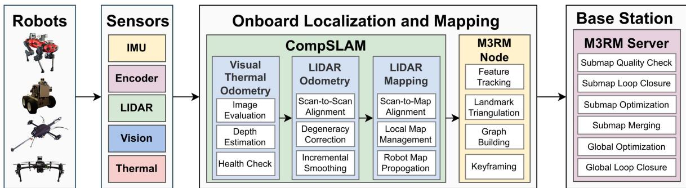  
Fig. 1. Overview of team CERBERUS’ SLAM architecture. Each robot estimates and operates on its own individual map. Periodically, these maps are sent to the mapping server on the base station for accumulation and for global multirobot optimization.

Explorer (see Section III-F)—or by dense registration of LIDAR point clouds (or surfels) using iterative closest points algorithm (ICP) or its variants—as adopted by teams CoSTAR (see Section III-C), CSIRO (see Section III-D), CTU-CRAS-Norlab (see Section III-E), and MARBLE (see Section III-G).

The SLAM back-end is in charge of building robot trajectory and map estimates by fusing the intermediate representations produced by the front-end. The back-end typically includes a nonlinear estimator, with the de-facto standard approach being maximum a-posteriori estimation via factor graph optimization [7]; this, indeed, has been adopted by virtually all teams below. A popular instance of factor graph optimization is pose graph optimization, where one optimizes the robot trajectory using relative pose measurements. The SLAM back-end can perform tightly-coupled and loosely-coupled sensor fusion, where the former fuses fine-grained measurements by different sensors (e.g., 2-D image features and inertial data) while the latter fuses intermediate estimates (e.g., relative poses produced by a LIDAR and camera). Tightly-coupled approaches are generally more accurate, as they rely on more precise models of the sensor data and its noise. Loosely-coupled approaches are easier to implement (i.e., they are more modular) and often more convenient (e.g., they give access to standard tools for outlier-rejection and health monitoring [60], [61]), but at the cost of decreased accuracy.

Multirobot SLAM systems are characterized by the fact that sensor data are simultaneously collected by multiple robots, which are in charge of building a consistent map of the environment. Multirobot SLAM architectures can be centralized, decentralized, or distributed. In centralized architectures, a base station collects data from all the robots (e.g., raw sensor data or intermediate representations from the single-robot front-ends) and then computes optimal trajectory and map estimates for the entire team. Each robot typically runs a local SLAM frontend (and possibly a local back-end) to preprocess the sensor data—this reduces the amount of data to be transmitted and the subsequent computation at the base station; then, the base station may implement a multirobot front-end, which is in charge of detecting interrobot loop closures, and a multirobot back-end, which estimates the robots’ trajectories and map. In this article, we call a multirobot architecture decentralized if each robot is treated as a base station: It collects all the data from the other robots and performs joint estimation of the trajectory and global map of the entire team. Finally, we call an architecture distributed if each robot only exchanges partial information with its neighbors and only estimates its own map by relying on distributed interrobot loop closure detection and distributed optimization protocols [33], [62], [63], [64], [65]. The following sections describe the SLAM architectures for each SubT team.

## B. Team CERBERUS

Team CERBERUS won the Final event of the DARPA SubT Challenge; their SLAM architecture is given in Fig. 1. The architecture is powered by CompSLAM [51], a complementary multimodal odometry and local mapping approach running at each (walking, flying, or roving) robot, and M3RM, a multimodal, multirobot mapping server running at the base station.

1) Onboard Odometry and Mapping via CompSLAM: CompSLAM [51] is a loosely-coupled approach that allows hierarchical fusion of a set of sensor-specific pose estimators as each estimate is refined by the next estimator. This enables operating in parallel into a single odometry estimate while performing data- and process-level health checks [66]. In particular, Comp-SLAM performs a coarse-to-fine fusion of independent pose estimates including visual, thermal, depth, inertial, and possibly kinematic odometry sources. This loosely-coupled methodology provides redundancy and ensures robustness against perceptually degraded conditions, including self-similar geometries, low-light and low-texture scenes, and obscurants-filled environments (e.g., fog, dust, smoke), assuming that each condition only affects a subset of sensors.

The visual- and thermal–inertial fusion (VTIO) components of CompSLAM build upon the work [67] and extend it to exploit 16-b raw data from LongWave InfraRed cameras [68], [69] and depth from LIDAR. Furthermore, the depth data from the LIDAR is utilized to initialize or improve depth estimates of features tracked in visual and thermal imagery, providing robustness for scale estimation without the need for computationally expensive stereomatching.

The LIDAR Odometry And Mapping component of Comp-SLAM develops on top of LOAM [70]. This component, along with VTIO priors, utilizes LIDAR point clouds to perform a LIDAR Odometry (LO) scan-to-scan matching and scan-tosubmap matching LIDAR mapping (LM) step. Accordingly, the robot estimates its pose on the map and simultaneously constructs a local map of the environment. Following the hierarchical fusion approach, the estimates of the LO module are utilized and refined upon by the LM module. To assess the quality at each iterative optimization step, the system utilizes a threshold on the eigenvalues of the underlying approximate Hessian [36], [71], to identify the degrees of freedom that are possibly ill-conditioned due to geometric self-similarity. In case certain directions are determined to be ill-conditioned, the pose estimates from the previous estimator in the hierarchy (e.g., visual–inertial odometry) are propagated forward, skipping the ill-conditioned module.

Finally, to produce smooth and consistent pose estimates, CompSLAM uses a factor-graph-based fixed-lag smoother, implemented as part of the LO module, with a smoothing horizon of 3 s. The factor graph is implemented using GTSAM [72] and integrates relative LO estimates with IMU preintegration factors [73].

To reduce pose drift and improve IMU bias estimation, zerovelocity factors are added when more than one sensing modality reports no motion for 0.5 (consecutive) s. Moreover, during periods of no motion, roll and pitch estimates—calculated directly from bias-compensated IMU measurements—are added as prior factors.

2) MultirobotMapping andOptimization (M3RM): The core component of the CERBERUS multimodal and multirobot mapping (M3RM) approach is a centralized mapping server that utilizes multiple modalities such as LIDAR, vision, IMU, wheel encoders, etc., in a single factor graph optimization. The deployed M3RM approach is based on the existing framework maplab [74] and can generally be subdivided into two components, namely the M3RM node and server.

The M3RM node runs onboard each robot and is in charge of creating a local factor graph capturing multisensor data collected and preprocessed by the robot, e.g., odometry factors from CompSLAM. The node also tracks BRISK [75] features and triangulates the features to a visual map using the Comp-SLAM pose estimates. Additionally, the LIDAR scans (as well as the corresponding timestamps and extrinsic calibration) are attached to the factor graph. The factor graph is broken into submaps. To reduce bandwidth, each LIDAR scan is compressed using DRACO [76] before transmission, reaching a total size of approximately 2 MB per submap. When robots establish a connection to the base station, the M3RM node transmits the completed submaps to the M3RM server. A synchronization logic ensures that only a completed submap transmission will be integrated into the multirobot map.

The M3RM server runs at the base station and is in-charge of keeping track of all individual submaps for each robot and integrating them into a globally consistent multirobot map. During the mission, the M3RM server allows a human operator to visualize the individual maps as well as the globally optimized multirobot map, which enables mission planning. Moreover, the server has certain management functions such as removal of maps, performance profiles, and allows switching between CompSLAM and M3RM map per robot. The CompSLAM maps are not attached to the global multirobot map but can be visualized using an overlay. To integrate the individual robot submaps into a single multirobot map, the M3RM server first processes each incoming submap using a set of operations, namely 1) visual landmark quality check, 2) visual loop closure detection, 3) LIDAR registrations, and 4) submap optimization. Since each submap’s processing is independent of the processing of other submaps, the mapping server can process up to four submaps in parallel. For visual loop closure detection, the method presented in [77] is performed using the tracked BRISK features and an inverted multi-index. Correctly identified visual loop closures within a submap are implemented by merging the corresponding landmarks and are then integrated during the submap optimization. Moreover, additional LIDAR constraints are added to the factor graph by aligning consecutive scans within a submap using ICP. Since the onboard odometry and mapping pipeline already provides an estimate of the poses, a prior transformation is readily available for each registration. However, if the resulting transformation differs significantly from the prior, it is rejected for robustness reasons as we expect that the drift between consecutive nodes is relatively small.

After individual submaps processing, they are merged into the global multirobot map, which is continuously optimized by the M3RM server. A predefined set of operations is executed in an endless loop on the global multirobot map, i.e., 1) multirobot visual loop closure detection, 2) multirobot LIDAR registrations, and 3) factor graph optimization. In this case, these operations are performed on the entire multirobot map and have the goal of detecting intra- and interrobot loop closures and performing joint optimization.

Due to the challenging nature of wireless communication in subterranean environments, CERBERUS implemented a mesh communication architecture, with ground robots serving as vertices and “breadcrumb” droppable nodes acting as access points for flying robots. The team utilized 5.8 GHz WiFi communications, specifically the Rajant DX2 radios on board the ground robots and nodes.

The ground station integrated a Rajant ES1 module, which directly meshed with the DX2s. The breadcrumb nodes were equipped with a battery pack lasting 2 h and had a patch antenna installed on a compliant part that was released at deployment time to enhance the antenna positioning. The team used robot operating system (ROS) to network the robots, with each system running its own onboard rosmaster and a rosmaster running on the base station. The Nimbro network was employed to facilitate this architecture. To optimize data transmission, telemetry and health messages were persistently sent while nonessential topics such as camera frames were selectively sent based on the human supervisor’s decisions.

3) Dirty Details. Parameter Tuning: As for many other systems reviewed in this article, the top performance of team CERBERUS’ SLAM solution requires a careful fine-tuning of all available parameters. For example, the degeneracy detection relies on a hand-tuned set of parameters and is robot-dependent. The tuning is performed by using a grid search over several clusters of parameters and measuring their performance across relevant environments. To complicate things further, the configurable parameters for the M3RM server have to be consistently applied to all robots in the multirobot map, making fine-tuning for specific robot types (e.g., flying and legged systems) as well as sensors (e.g., various camera and LIDAR systems) difficult at the stage of global mapping.

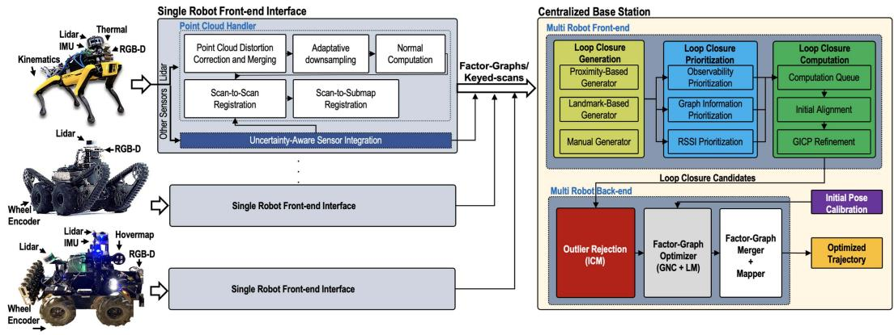  
Fig. 2. Overview of team CoSTAR’s SLAM architecture (LAMP). Each robot runs a local front-end and communicates to the base station, which runs a multirobot front-end (for loop closure detection) and back-end (for pose graph optimization).

Covariances: While it is desirable to dynamically adjust the covariances in the factor graphs depending on the quality of the sensor data, it proved challenging to balance the uncertainty of the visual and LIDAR factors; therefore, the system relied on static (manually tuned) covariances for the latter.

Loop closures: None of the deployed robots performed onboard loop closure detection. Thus, in scenarios where robots stay out of range from the base station for a considerable time, the CompSLAM errors may accumulate, making it harder for the M3RM server to correct the estimates. Moreover, an incorrect robot map can “break” the whole global multirobot map, which is why a human operator is needed to monitor and possibly remove specific robots from the multirobot map.

## C. Team CoSTAR

Team CoSTAR won the Urban event of the DARPA SubT Challenge. An overview of team CoSTAR’s SLAM system, namely, Large-scale Autonomous Mapping and Positioning (LAMP), is provided in Fig. 2. LAMP is a key component of NeBula [78], team CoSTAR’s overall autonomy solution. LAMP relies on data from different odometry sources (i.e., LIDAR, visual–inertial, wheel-inertial, and IMU) to estimate the robot trajectories, as well as a point cloud map of the environment. The system consists of 1) a single-robotfront-end interface that runs locally onboard each robot to produce an estimated robot trajectory and a point cloud map of the environment explored by each robot, 2) a multirobot front-end, running on the base station, which receives the robots’ local odometry and maps and performs multirobot loop closure detection, and 3) a multirobot back-end, which uses odometry (from all robots) and intraand interrobot loop closures from the multirobot front-end to perform ajoint pose graph optimization; the multirobot back-end runs on the base station and simultaneously optimizes all the robot trajectories.

1) Single-Robot Front-EndInterface: LAMP relies on a multisensor front-end interface that enables the use of robots with different sensor configurations and odometry sources, including LOCUS [79] and Hovermap [80]. The front-end produces an odometric estimate of each robot’s trajectory and stores the corresponding information in a factor graph, where each node corresponds to an estimated pose while an edge connecting two nodes encodes the relative motion between the corresponding timestamps. Each odometry node is associated with a keyedscan, a preprocessed point cloud obtained at the corresponding timestamp. The keyed scan is used for loop closure detection and to form a 3D map of the environment.

Within the single-robot front-end, LOCUS [79] is CoSTAR’s LIDAR-centric odometry estimator. LOCUS starts with a preprocessing step, where —after removing motion-induced distortions in point clouds— scans from multiple onboard LIDARs are merged into a unified point cloud given the extrinsic calibration between LIDARs. An adaptive voxelization filter is then applied to ensure a constant number of points are retained independent ofthe environment geometry, point cloud density, and number of onboard LIDARs. This helps reduce the computation, memory usage, and communication bandwidth associated with the subsequent processing. Odometric estimates are obtained using a twostage scan-to-scan and scan-to-submap registration process; the registration relies on a fast implementation ofpoint-to-plane ICP, initialized using IMU measurements or other odometry sources.

2) Scalable Multirobot Front-End: The multirobot front-end is in charge of intra- and interrobot loop closure detection by leveraging a three-step process: 1) loop closure generation, 2) prioritization, and 3) computation as outlined ahead.

The Loop Closure Generation module relies on a modular design, where loop closure candidates can be identified using different methods and environment representations (i.e., Bag-ofvisual-words [81], junctions extracted from 2-D occupancy grid maps [36]). The go-to loop closure generation approach within SubT has been based on LIDAR point clouds. In particular, loop closure candidates are simply identified from nodes in the factor graph that lie within a certain Euclidean distance from the current node; the distance is dynamically adjusted to account for the odometry drift between nodes.

The Loop Closure Prioritization module [82] selects the most promising loop closures for processing. While loop closures are crucial for map merging and drift reduction in the estimated robot trajectory, it is equally crucial to avoid closing loops in ambiguous areas with a high degree of geometric degeneracy [36], as it could lead to spurious loop closure detections. Furthermore, loop closure detection in large-scale environments, and with a large number of robots, becomes increasingly more computationally expensive as the density of nodes in the pose graph, and subsequently, the number of loop closure candidates increases. The purpose of this module is to prioritize loop closure candidates inserted in the computation queue by evaluating their likelihood of improving the trajectory estimate. This is achieved through a three-step process of 1) observability prioritization, where similar to the works presented in [36], [83], and [84], eigenvalue analysis is performed to detect degenerate scan geometries, in order to prioritize loop closures in feature-rich areas, 2) graph information prioritization, where a graph neural network (GNN) [85] based on a Gaussian mixture model layer is used to predict the impact of a loop closure on pose graph optimization, and 3) receiver signal strength indication (RSSI) prioritization to prioritize loop closures based on known locations indicated by RSSI beacons—whenever a robot is within range of an RSSI beacon. The prioritized loop closure candidates are inserted into a queue for the computation step in a round-robin fashion.

The Loop Closure Computation module estimates the relative pose between a pair of loop closure candidate nodes in the queue using a two-stage process. First, an initial estimate of the relative pose is computed using TEASER++ [86] or SAmple Consensus Initial Alignment (SAC-IA) [87]. Then, the generalized iterative closest point (GICP) algorithm [88] is initialized with the obtained solution to refine the relative pose and evaluate the quality of the LIDAR scan alignment.

3) Robust Multirobot Back-End: LAMP uses a centralized multirobot architecture, where a central base station receives the odometry measurements and keyed scans from each robot, along with loop closures from the multirobot front-end, and performs pose graph optimization to obtain the optimized trajectory for the entire team. The optimized map is then generated by transforming the keyed scans to the global frame using the optimized trajectory. To safeguard against erroneous loop closures, the multirobot back-end includes two outlier rejection options: Incremental consistency maximization (ICM) [34], which checks detected loop closures for consistency with each other and the odometry before they are added to the pose graph, and graduated nonconvexity (GNC) [60], which is used in conjunction with the Levenberg–Marquardt solver to perform an outlier-robust pose graph optimization and obtain both the trajectory estimates and inlier/outlier decisions on the loop closure not discarded by ICM. Pose graph optimization and GNC are implemented using GTSAM [72].

Team CoSTAR utilized a commercial mesh communication system from Silvus systems and a communications data management system [89] to track data transmission between agents and the base station. The system prioritized messages based on their content and ensured data was sent without relay/storage on interim agents. To manage data rate, the robots exchanged sparse pose-graph information, where each pose in the pose graph was attached a combined and down-sampled version of the nearby 3-D scans. Communication data rates typically spiked when a robot tried to send stored information after being out of communication range for an extended period of time, which also required LAMP to handle large amounts of potentially out-of-order data, including missing data. We addressed this challenge through engineering and our loop closure prioritization algorithm, as well as multithreading to process loop closure candidates quickly [82].

4) Dirty Details. Parameter tuning: While LAMP provides a robust localization and mapping framework, it is difficult to find a set of parameters for the front-end and back-end modules that leads to nominal performance consistently across environments with different topography and geometry. In order to have a more systematic approach to parameter tuning, CoSTAR curated 12 SLAM datasets across multiple challenging underground environments for evaluation and benchmarking, with the goal of obtaining a set of parameters that gave the best performance across all domains. The parameter tuning was mostly manual and was restricted to a small subset of parameters, which had a higher impact on the system’s performance. One area where parameter tuning was successful was LIDAR-based loop closure detection. Here, the dataset consisted of pairs of point clouds from a variety of environments, with 80% of the pairs being true loop closures, with known relative poses, and the rest being outliers.

## D. Team CSIRO

Team CSIRO Data61 tied for the top score and won second place at the Final event of the DARPA SubT challenge after the tiebreaker rules were invoked. The team also won the single most accurate artifact report award in the Urban and Final events. An overview of Wildcat [90], [91], CSIROs LIDAR-inertial decentralized multirobot SLAM system, is given in Fig. 3. We first review CSIROs distinctive sensing strategy and then introduce the key modules in the Wildcat architecture: surfel generation, LIDAR-inertial odometry, frame generation and sharing, and pose graph optimization.

1) Sensing Pack: The ground robots carried a CatPack sensing payload designed by CSIRO. The CatPack uses an IMU and a Velodyne VLP-16 LIDAR that is mounted at 45◦ offhorizontally and spins about the vertical axis ofthe CatPack. The CatPack also has four RGB cameras, which were used for artifact detection, but not for SLAM. The Emesent Hovermap [92] payload used on the aerial robots is a similar sensing pack with a spinning Velodyne VLP-16. Both the CatPack and Hovermap run the Wildcat SLAM system onboard, on their NVIDIA Jetson AGX Xavier and Intel NUC computers, respectively.

The spinning LIDAR configuration ofCatPack provides dense depth measurements with an effective 120◦ vertical field of view. This played a major role in making CSIRO’s SLAM system robust in subterranean environments, e.g., by providing improved visibility of the floor and roof of narrow tunnels. It also enabled the use of surfel features, which exploit the dense depth measurements to provide a stable, robust feature set that is effective in a wide range of environments.

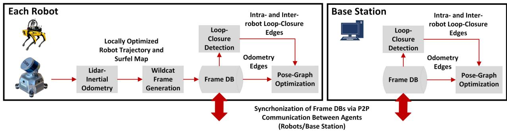  
Fig. 3. Overview of CSIROs decentralized multirobot SLAM system in SubT. Each robot runs its own Wildcat’s LIDAR-inertial odometry module independently The resulting locally-optimized odometry estimate and surfel submaps are used to generate Wildcat frames. These frames are stored in a database and are shared with other robots and the base station. Robots and the base station then use their collection of frames to independently build and optimize a pose graph.

2) Surfel Generation: Wildcat uses planar surface elements (surfels) as dense features for estimating robot trajectory. Surfels are created every 0.5 s by spatial and temporal clustering of new LIDAR points. Specifically, the space is voxelized at multiple resolutions and points are clustered depending on their timestamp and the voxel they fall in. Clusters smaller than a predefined threshold (in terms of number of points) are discarded. An ellipsoid is then fit to each remaining cluster by computing the first two moments of its 3-D points. The centroid (mean) of an ellipsoid specifies the position of the corresponding surfel while its covariance matrix determines its shape. A planarity score [93, eq. 4] is computed based on the spectrum of the covariance, and only sufficiently planar surfels are kept.

3) LIDAR-Inertial Odometry: Wildcat’s LIDAR-inertial odometry module processes surfels and IMU data in a sliding window. Within a time window, the processing alternates between 1) matching active surfel pairs and 2) optimizing robot trajectory, for a predetermined number of times or until satisfying a convergence criterion. Surfel correspondences are established through k-nearest (reciprocal) neighbor search in the descriptor space comprising the estimated surfel’s position, normal vector, and voxel size. The estimate of the segment of the robot trajectory within the current time window is then updated by minimizing a cost function mainly composed of residual error functions associated to matched surfel pairs and IMU measurements in the current time window. The cost function is made robust to outliers (e.g., incorrect surfel correspondences) by using the Cauchy M-estimator.

4) Frame Generation and Sharing: A Wildcat frame comprises a six-second portion of the surfel map and odometry produced by each robot’s LIDAR-inertial odometry. Each robot generates frames periodically and stores them in a database. A frame is discarded if its surfel submap has a very high overlap with that of the previous frame. During the DARPA SubT Challenge, Team CSIRO Data61’s UGVs deployed wireless communication nodes through the course to build a mesh network; see [91] and [94] for details. As shown in Fig. 3, Wildcat leverages CSIRO’s peer-to-peer ROSbased data sharing system, Mule [91, Sec. 4.3], to synchronize robots’ frame databases every time two agents (robot– robot or robot–base station) are within communication range. Mule acts as a bridge, enabling robots and the base station to share messages (i.e., Wildcat frames) between their respective ROS systems. Periods of disconnection would inevitably lead to temporary inconsistencies in SLAM results between the agents (base station and the robots), thus necessitating periodic rendezvous.

5) Pose Graph Optimization: Each robot uses its collection of Wildcat frames—including those generated and shared by other robots—to independently build and optimize the team’s collective pose graph. Frames represent nodes of the pose graph. Each robot’s odometry estimate is used to create odometry edges (i.e., relative pose measurements) between the robot’s consecutive frames. Additionally, intra- and interrobot loop-closure edges are created by aligning frames’ surfel maps. This is done using ICP for nearby frames (for which a good initial guess is available from odometry) and global registration methods for distant ones. Pose graph nodes with significant overlap in their local maps are merged together. As a result, the computational complexity of the solver grows with the size of the explored environment rather than the mission duration. The solver is made robust to outliers using the Cauchy M-estimator. The collective pose graph built and optimized by each robot is used to render a surfel map of the environment.

6) Dirty Details. Parameter Tuning: CSIROs solution uses a single set of parameters tuned to perform across a wide range of environments. However, ground robots and drones use different parameters due to the independent tuning processes.

Calibration: CatPacks undergo extensive calibration on production, comprising both LIDAR-IMU and LIDAR-camera calibration. The incorporation of the cameras in the CatPack successfully avoided the need for subsequent calibration, even when packs are switched between platforms.

Loop closures: Complex LIDAR-based place recognition techniques were rarely found to be necessary at the scale of SubT environments; therefore, team CSIRO found loop closure candidates by searching for past poses within a Mahalanobis distance from the current robot pose. In SubT, the first interrobot loop closures were created upon startup based on joint observation of the same starting region. This process at startup was imperfect, but difficulties could be addressed procedurally, e.g., by restarting the affected agent. Since each agent also solves independently for its own multirobot solution, it was necessary to ensure that these interrobot loop closures are successfully detected not only on the base but also on each robot. After difficulties in the urban event of the competition, user interface elements were introduced to prominently report the connectivity status of the collective pose graph to detect anomalies. By the final event, these failures were rare.

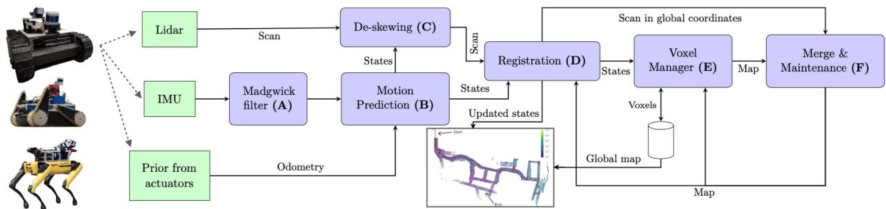  
Fig. 4. CTU-CRAS-Norlab UGV SLAM architecture (Norlab ICP Mapper). Green boxes correspond to the inputs, and the purple ones represent submodules of the SLAM architecture.

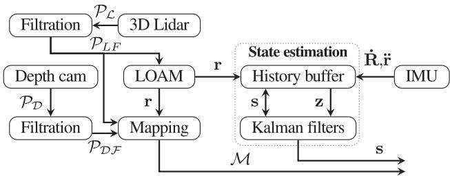  
Fig. 5. CTU-CRAS-Norlab UAV SLAM architecture. and $\mathcal { P } _ { \mathcal { L } }$ are the depth camera and 3-D LIDAR point clouds. $\mathcal { P } _ { \mathcal { D } \mathcal { F } }$ and $\mathcal { P } _ { \mathcal { L } \mathcal { F } }$ are the respective point clouds after filtration. The outputs are the map and the state s, which consists of position r, orientation R, and their first derivatives r˙ and R˙ . The Kalman filter corrections z consist of r, R˙ , and ¨r.

Hardware robustness: While hardware robustness is seldom discussed in the SLAM literature, it is a significant feature of the CSIRO system’s maturity. On the rare occasions when Wildcat diverged in testing, almost all occurrences were found to coincide with sensor dropouts caused by significant kinetic impacts of the platform, or hardware failures, which typically start with intermittent errors.

## E. Team CTU-CRAS-Norlab

The CTU-CRAS-Norlab team employed two separate SLAM systems for their unmanned ground vehicles (UGVs) and unmanned aerial vehicles (UAVs). The corresponding architectures are given in Figs. 4 and 5, respectively.

1) UGV SLAM: The UGV SLAM architecture relies exclusively on a LIDAR odometry system, Norlab ICP Mapper, which focuses on reducing drift at the front-end level. The mapper operates as follows: (A) First, the robot orientations during a LIDAR scan are estimated by passing the IMU measurements through a Madgwick filter [95]. (B) Then, this orientation information is fused with translation estimates from wheel odometry to estimate the robot’s motion during the scan. (C) The motion estimate allows us to deskew the current LIDAR scan (i.e., motion correction). (D) Once deskewed, the LIDAR scan is registered in the local map using ICP, taking the robot pose as prior. A modified version of point-to-plane ICP [96] is used, where only four degrees of freedom (3-D position and yaw angle of the scan) are optimized while roll and pitch angles are directly obtained from the IMU. (E) The robot pose found using registration is used by the voxel manager to load and unload voxels of the local map to ensure it stays centered on the robot. (F) Finally, the registered cloud is merged into the local map and maintenance operations are performed. These maintenance operations include identifying and removing points belonging to dynamic objects using the technique described in [97]. The resulting map is then set as the new local map. These steps are performed in different threads to allow the system to localize at a higher rate than the rate at which the map is updated.

2) UAV SLAM: The UAV SLAM architecture relies on a LIDAR sensor that is complemented by an IMU for precise roll-and-pitch orientation estimation. While not necessary for localization, which utilizes only LIDAR and IMU measurements, data from upward- and downward-facing depth cameras are integrated into a dense metric map to cover the blind spots of the LIDAR field of view. The output of the system is a state estimate (i.e., robot poses in a gravity-aligned reference frame and their derivatives), and a volumetric occupancy map.

The UAV SLAM pipeline (see Fig. 5) starts with preprocessing of LIDAR scans. First, a range-clip filter is applied to the raw scans to filter out the robot frame and distant measurements. Second, a local intensity-threshold filter is applied to the data, which proved to be a highly robust method for filtration of dust even in the harshest conditions. Due to computational constraints, this preprocessing does not involve LIDAR scan deskewing; while this negatively impacts the SLAM performance, it reduces the delay incurred by the pose estimate. The processed data are passed to LOAM [70], which optimizes the alignment of geometric features extracted from the data in a two-step odometry process—fast scan-to-scan and slow scan-to-map matching in the feature space. The team has adapted the advanced implementation of LOAM (A-LOAM1) to be suitable for UAVs by extending the method with platform-optimized parallelization. The state estimation module (based on [40]) takes the LOAM pose estimate and fuses it with the IMU measurements using a linear Kalman filter to obtain a high-rate delay-compensated state estimate that is suitable for the control system feedback loop [98]. The nonconstant delay introduced by LOAM negatively impacts the controller performance and, most importantly, the control error. The idea of the delay-compensation method [99] is to recompute the current state if a measurement with a past timestamp arrives. When a delayed measurement arrives, it is applied to the state in a circular buffer with the nearest timestamp. The corrected state is then propagated to the current time using the system model and other relevant updates.

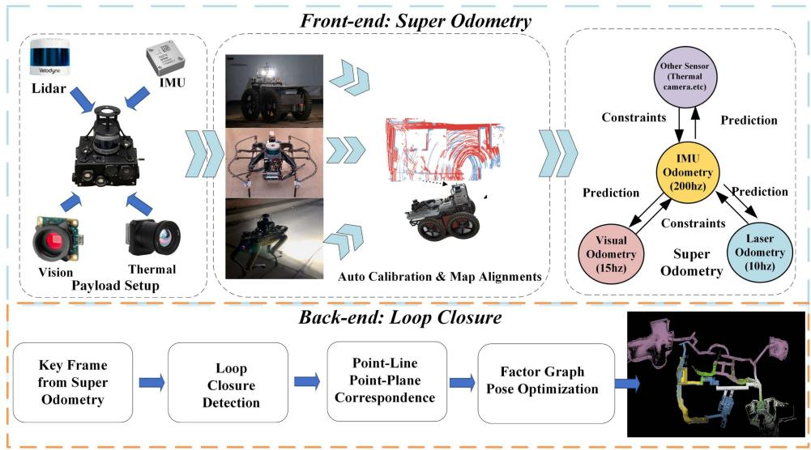  
Fig. 6. Overview of team Explorer’s SLAM architecture. Each robot estimates and operates on its own individual map.

The robots communicate using a fully-decentralized mesh network created using commercially available 2.3 GHz Mobilicom radios and 868 MHz or 915 MHz custom-made motes for redundancy. A bandwidth of 1 MB/s is available in the Mobilicom network for sharing all data, including maps and images. Each robot is equipped with a mote, and UGVs drop deployable range-extending battery-powered modules to build the communication mesh network. To share data efficiently, a lightweight topological-volumetric map (LTVMap) is used to carry missionrelated information; see [100] for details. To allow multirobot cooperation, the UAVs reference frames are initially aligned by one of the following procedures. The reference frames are either given in advance (e.g., from a total station) or their alignment is estimated with respect to a leader-robot by scan matching using LIDAR data shared among all the UAVs before takeoff.

3) Dirty Details: The only tunable parameter of the UAV SLAM method is the resolution of the feature map. For both SLAM systems, it was found empirically that one set of parameters worked well in a majority of scenarios; any changes to the parameters led to degraded state estimation quality or slower-than-real-time performance. Not adapting the parameters dynamically also ensured the static assignment of computational resources, which helped to predict and optimize the system behavior.

Loop closures: Neither the UGV nor the UAV SLAM systems detect loop closures; therefore, no pose graph optimization is used to refine the odometric trajectories.

Computation prioritization: When the CPU is fully loaded, critical components such as control and SLAM might have to wait for CPU resources shared with nonflight-critical software such as object detectors, which results in triggering failsafe recovery behaviors. Prioritizing the critical modules at the process level by reducing CPU affinity and using negative nice [101] values for noncritical processes resulted in lower computation times, lowerjitter, and smoother flights. Additional performance was gained by running the algorithms that process large amounts of data as nodelets under a common ROS nodelet manager. This avoids the overhead of copying large data structures by simply passing pointers instead.

## F. Team Explorer

Team Explorer won the tunnel event of the DARPA SubT Challenge. Team Explorer’s SLAM architecture is given in Fig. 6. The architecture relies on super odometry (SO) [102] to fuse outputs of multiple odometry sources including visual or thermal fusion [103] using a probabilistic factor graph optimization, and a loop-closing back-end.

1) LIDAR-Inertial Localization Module for Odometry Estimation: The LIDAR-inertial localization module relies on SO [102]. In SO, a factor graph optimization performs estimation over a sliding window of recent states by combining IMU preintegration factors with point-to-point, point-to-line, and point-to-plane LIDAR factors. SO strikes a balance between loosely- and tightly-coupled estimation methods. The IMUcentric sensor fusion architecture does not combine all sensor data into a full-blown factor graph. Instead, it breaks it down into several “subfactor-graphs,” with each one receiving the prediction from an IMU preintegration factor. The motion from each odometry factor is recovered in a coarse-to-fine manner and in parallel, which significantly improves real-time performance. SO enables achieving high accuracy and operates with a low failure rate, since the IMU sensor is environment-independent, and the architecture is highly redundant. As long as other sensors can provide relative pose information to constrain the IMU preintegration results, these sensors will be fused into the system successfully.

2) Loop-Closing Back-End: While SO is a low-drift odometry algorithm, it is still important for the SLAM system to be able to correct long-term drift. This is especially true when the traversed distance is high. Considering that Explorer’s ground robots moved at $0 . 5 \ : \mathrm { m } \cdot \mathrm { s ^ { - 1 } }$ and had an aggressive exploration style, it was not uncommon to observe traversed distances larger than 1 km in a single test. Team Explorer’s solution reduces the drift by detecting loop closures and performing pose graph optimization. In particular, the back-end filters the poses and point clouds generated by the front-end. It applies a heuristic method to accumulate these results into a keyframe, which is composed of a key pose and a key cloud, which is the point cloud generated by accumulating all the point clouds generated since the last keyframe, and downsampling to maintain a fixed size. The heuristic used is distance-based: a new keyframe is created after the robot moves by 0.2 m. Search for loop closures is performed using a radius-search among the nearest poses or by querying a database of sensor data to find matches with previously visited places.

3) Autocalibration: To achieve a common task, multiple robots need to be able to establish and operate in a common frame of reference. Toward this goal, team Explorer used Autocalibration, a process in which a total station is used to obtain the pose of one robot with respect to the fiducial markers with known positions in the world frame set by DARPA. This robot shares its pose with respect to its own map frame and the latest three keyframes it created. All the following robots will then be placed near the calibration location of the first robot; they receive the reference information from the base station and use GICP [88] to align their current keyframes to establish their initial pose in the world frame.

Team Explorer’s communication subsystem played a crucial role in the final challenge by facilitating artifact delivery to the base station and human–robot coordination. However, it had a limited impact on the SLAM module since the team did not rely on a multirobot SLAM solution. The map-sharing that occurred between the robots and the base station only affected the SLAM result during the initial extrinsic autocalibration, and key-pose maps were shared between robots for planning and object detection. In the SubT challenge, the team faced intermittent networking coverage and a wide range of bandwidths, making it a challenge to leverage intermittent and varying connectivity for their autonomy system.

4) Dirty Details. Loop Closures: The most important parameters tuned during testing were those related to the downsampling of the point clouds before the scan-to-map registration. This downsampling affected the number and the quality of features available to SO. In particular, a key parameter is the voxel size used in the PCL library voxel grid filter. When the robot traverses a narrow urban corridor, it is desirable to use a smaller voxel size, to avoid decimating important details in the point cloud. In contrast, in a large cave, a larger voxel size is required; otherwise, the processing becomes too slow due to a large number of features. To solve this problem, we created a heuristic method to switch voxel sizes in real time. The method consists of calculating, for each 3-D axis separately, the average distance to the points in the current point cloud. Then, we multiplied the three values together to obtain an “average volume.” This volume was thresholded to create three different modes, each associated with a predefined voxel size.

Dust Filters: Team Explorer had a strong focus on UAVs. These platforms bring their own unique challenges to the SLAM problem. One that was particularly important for SubT was being able to handle the dust that arises due to the robot’s propellers. The simple solution that was implemented was to test if there was a minimum number of features farther than 3 m from the robot. If true, all the other points inside this radius were ignored when performing pose estimation. This solution was based on the assumption that dust would usually accumulate circularly around the robot, but usually, there are still other distant features in the environment that allow the robot to solve the optimization correctly. If the robot were capable of performing estimation and continuing operation, it would usually escape the dusty area in the environment. Otherwise, dust would eventually cover the robot from all sides and a catastrophic failure would occur.

Robot-specific computational budget: Analysis of empirical results showed that after a certain number, having more LIDAR features does not necessarily translate to substantial accuracy gains. Therefore, a threshold on the number of surface features is used. If the current scan frame contains more than the threshold, the list of features is sampled uniformly such that the number of features does not exceed the threshold.

## G. Team MARBLE

Team MARBLE’s SLAM architecture is given in Fig. 7. The core of MARBLE’s LIDAR-centric solution2 is the open-source LIO-SAM [106] package, which performs tightly-coupled fusion of IMU data and LOAM-based LIDAR features [70]. The localization results are then passed to MARBLE mapping, which creates a voxel map.

1) LIDAR Localization via LIO-SAM: Each robot in the MARBLE system was responsible for its own localization, from input (i.e., LIDAR scans at 20 Hz and IMU data at 500 Hz) to optimization. The localization process includes multiple subcomponents (see Fig. 7). In order to be processed by LIO-SAM, each point in the LIDAR point cloud required two extra data fields in addition to the standard x, y, z position: 1) a timestamp, and 2) a ring number to provide their relative position in the vertical scan. These additional data are used to deskew the point clouds. While many automotive-grade LIDARs now provide this information by default, this is and has not always been the case, and care must be taken to ensure sensor drivers enable the conveying of this information. In particular, timestamps were added to each vertical angle of arrival, and rings were designated by their elevation angle.

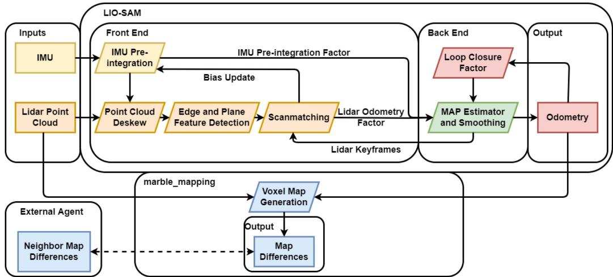  
Fig. 7. Overview of team MARBLE’s SLAM architecture.

Localization via LIO-SAM is based on factor graph optimization and involves three types of factors. The first type consists of IMU preintegration factors [73]. The second type includes LIDAR odometry factors; in particular, once the LIDAR has been deskewed, LIO-SAM extracts key features along lines and edges (as in LOAM [70]). These features are then compared and scan-matched along a subset of local key frames in a sliding window filter. Finally, loop closure factors are determined by a naive Euclidean distance metric. Each time a new factor is added to the graph, the iSAM2 solver [107] is applied to optimize the graph using GTSAM [72]. After generating an odometry estimate, LIO-SAM then estimates the IMU bias with the updated odometry.

2) Multirobot Mapping via Octomap: LIO-SAM outputs robot pose estimates. A voxel-based map can also be queried via a ROS service call; however, MARBLE relied on a separate custom package, MARBLE mapping, a fork of Octomap [108], which allowed creating the voxel grid map differences with low data transfer requirements. In particular, MARBLE mapping uses the latest LIO-SAM pose estimate and the corresponding LIDAR scan to update the log-odds probability (occupancy) value inside an Octomap with a voxel size of 0.15 m. When enough voxels have been added or have changed state, or if enough time or distance has been traversed, a new map difference is created by the robot with the changed voxels.

Map differences are then shared between robots in a peerto-peer fusion. Each robot tracks differences in a sequence tied to its own identifier and that of its neighbors. Then, when two robots connect to each other or the base station via a deployed mesh network, they request any differences not contained with their own maps and pass on any differences they had generated to the neighboring agent. To minimize overhead, maps were transmitted in their binary state, after thresholding the occupancy probability to an occupied/unoccupied state. Team MARBLE deployed a dynamic mesh network using custom beacons equipped with 2.4-GHz radios on their UGVs. The mesh nodes were linked together using a mesh routing algorithm that prioritizes fast reconnection times, provided by Meshmerize GmBH [109]. To enable the prioritization of data, a custom UDP transport package (udp\_mesh) [110] was developed. However, map differences were given the lowest priority in the network, as the LIO-SAM-based SLAM solution followed a decentralized architecture, and map differences were only used in downstream planning and navigation tasks. We refer the reader to the work in [111] for further details.

As each robot only optimized its own trajectory and map, any significant drift or misalignment between robots could cause potential downstream issues with multiagent planning algorithms. To mitigate this issue, each robot prioritizes its own map, specifically during the merging process, where free voxels in the parent robot were kept free and the occupied voxels were merged together. The base station operator also had the ability to remove or stop merging differences from specific agents if significant tracking errors occurred.

3) Dirty Details. Parameter Tuning and IMU: The IMU covariance was found to have a substantial impact on the roll, pitch, and yaw estimation. In constrained passage ways, rotation accuracy significantly decreased as a result of a significant number ofLIDAR points falling below a minimum range threshold. Relying more heavily on the IMU during these maneuvers improved rotation accuracy substantially (although it did not fully eliminate the problem). In this regard, using a good IMU is paramount: The LORD Microstrain 3DM-GX5-15 provides exceptionally high accuracy pitch and roll estimates of 0.4◦, along with a 0.3◦/ h gyro estimate [112], which allowed the MARBLE system to rely on IMU-only measurements for extended periods of time.

A second key parameter in the system was the key-frame search radius for loop closures. Given the localization maintained qualitatively good accuracy, the Euclidean search distance was continually reduced, resulting in a final distance of 2 m for loop closure constraints. As loop closure optimizations were computationally expensive, this saved on CPU cycles and additionally helped avoid spurious loop closure between different elevations of tunnels or floors in a building.

Hardware design: Team MARBLE relied on precision machining to obtain (and preserve) an accurate extrinsic calibration between LIDAR and IMU. Further calibration may have benefited the final solution—specifically, improved IMU noise and bias estimation. It was found that certain IMUs did not perform as well as others in the qualitative analysis of two robots traversing roughly the same trajectories. The team opted to swap hardware over further exploration of the cause of these errors. The chosen hardware likely had the closest noise parameters to those provided by the IMU manufacturer.

LIO-SAM enhancements: Team MARBLE also made two minor adjustments to LIO-SAM. During initialization, the team chose to ignore measurements from the IMU until a point cloud had been received since the IMU was not a full AHRS unit and did not have a heading compass. The second adjustment was to the IMU timestamps, prior to integration. As a result of the (ACM-based) USB driver used by the IMU, the measurements did not have guaranteed priority on the kernel. This meant the timestamps generated by the system were not always consistent, which often caused negative timestamp values in the IMU preintegration, leading to instabilities. To avoid this issue, the MARBLE implementation replaced the timestamps (using the nominal IMU frequency) if they were outside an acceptable range. While this method was less precise than a full hardware clock sync, it was fairly easy to implement given the available onboard connections (a full hardware sync would have required an extra RS232 port). In practice, we noticed that the back-end optimizer was able to mitigate the impact of minor timestamp mismatches.

## H. Common Themes on the Path to Robustness

Despite the unique features that distinguish the architectures adopted by the SubT teams, the previous sections reveal a substantial convergence of technical approaches across teams. This convergence is a testament of the maturity of multirobot LIDAR-centric SLAM, at least for small robot teams, (e.g., 5–10 robots). We discuss commonalities across systems in the following.

1) Sensing: Most teams relied on LIDAR and IMU as the dominant sensing modalities; IMUs are not sensitive to perceptual aliasing (i.e., the case where different places have the same appearance/sensor footprint) and environmental disturbances; LIDARs afford accurate and long-range depth measurements even in the absence of external illumination. At the same time, visual, thermal, and wheel/kinematic odometry remain an important addition to LIDAR, especially in the presence of obscurants and to increase redundancy. Many teams (e.g., CSIRO, Explorer, MARBLE, and CoSTAR) adopted a common sensor payload to be mounted on the different robots. This modular design allows standardizing calibration and testing procedures and partially decouples the development of the SLAM system from other hardware choices.

2) SLAM Front-End and Back-End: All teams relied on local (single-robot) front-ends to preprocess the LIDAR data. Such preprocessing reduces the data volume communicated to the base station or to the other robots. Moreover, it allows splitting computation across the robots, improving scalability. Most solutions perform extensive point cloud pre-processing, including deskewing and voxel grid filtering. The front-ends then process the LIDAR scans using feature-based (akin to LOAM [70]) or dense (e.g., ICP-based) matching. Regarding the SLAM back-end, virtually all teams relied on factor graph or pose graph optimization (except for the Kalman-filter-based odometry from CTU-CRAS-Norlab). Several teams decided not to detect loop closures (e.g., CTU-CRAS-Norlab and partially CERBERUS), based on considerations about the scale of the environment and the computational constraints of the robots. Finally, most teams built on top ofopen-source libraries for the LIDAR front-end and back-end, including GTSAM [72], maplab [74], LOAM [70], LIO-SAM [106], Octomap [108], and libpointmatcher [113].

3) Loosely-Coupled Versus Tightly-Coupled Architectures: Most teams resorted to loosely-coupled sensor fusion techniques, where estimates from multiple sensors are first fused into pose estimates and then combined together. Loosely-coupled approaches enable a more modular software design and make the implementation of health checks for each data source and intermediate pose estimate easier. This has been shown to largely increase robustness to hardware and software failures, e.g., [35], [51], [102]. In addition, tightly-coupled fusion leads to larger optimization problems, which prevents scaling the multirobot back-ends to large teams.

4) Centralized and Decentralized Architectures: CER-BERUS and CoSTAR adopted centralized architectures, where the base station performs joint optimization over the entire robot team. All the other teams adopted a decentralized approach, where each robot mostly operated on its own, with the occasional exchange of the mapping results (see CTU-CRAS-Norlab, Explorer, and MARBLE) or with a multirobot pose graph optimization executed at each robot (CSIRO). No team adopted a distributed architecture, which is still the subject of active research [33] and was less amenable to the rules of the SubT competition, which required collecting data at a base station for visualization and scoring purposes.

## IV. STATE OF PRACTICE AND MATURITY OF UNDERGROUND SLAM

The previous section discussed state-of-the-art approaches for SLAM in underground environments across six SubT teams. This section reports on the practical performance that can be achieved by these approaches, which provides useful data points to assess the maturity of LIDAR-centric SLAM in underground worlds. We focus on 3D—odometry, loop closures, and multirobot mapping—and for each, we discuss performance and key aspects impacting it. While the goal of this section is to show what can be achieved across a variety of tests performed by the teams and across different aspects of their SLAM systems, the reader is referred to the work in [115] for the results of the DARPA competition, which reports a metric to measure the quality of the SLAM maps of the different teams with respect to a manually surveyed map during the SubT final event.

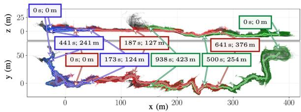

(a)  
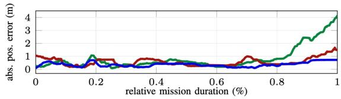  
(b)  
Fig. 8. CTU-CRAS-Norlab’s odometry accuracy for three single-UAV deployments in the Bull Rock Cave system [114]. (a) Trajectories of the three separate flights and the onboard maps. (b) Localization accuracy during the three exploration deployments colored with respect to (a).

## A. Odometry Estimation Accuracy

This section shows that modern LIDAR-centric odometry estimators can achieve a very low drift (0.1%–0.5% of the trajectory traveled) in challenging underground environments. This enables impressive localization performance over long distances. For instance, Fig. 8 shows results from team CTU-CRAS-Norlab’s unmanned aerial vehicles, achieving localization error under 1 m in the Bull Rock cave system with flights reaching trajectory lengths of 600 m and maximum velocities up to $2 \mathrm { m } / \mathrm { s } ^ { - 1 }$

Multimodality: Multimodal sensing enhances robustness in challenging environmental conditions (e.g., darkness, fog, smoke, dust, or feature-less scenes), as well as in the presence of hardware and software failures. Fig. 9 shows the map obtained by the multimodal, onboard CompSLAM approach by team CER-BERUS; CompSLAM achieves a low-drift trajectory estimate in extreme conditions with significant dust and obscurants. Although primarily driven by LIDAR, CompSLAM also uses other modalities (e.g., kinematic odometry or thermal) that are less sensitive to dense obscurants. This is still achieved on a modest computational budget: CompSLAM has been deployed on both ANYmal C robots that are equipped with powerful processors (i7-class systems), and on the RMF-Owl aerial robot [116], which relies on a single-board computer.

LIDAR preprocessing: LIDAR data preprocessing is a key ingredient for accurate odometry estimation. Fig. 10 shows an ablation study conducted by team CTU-CRAS-NORLAB on an unmanned ground vehicle, which highlights the impact of de-skewing the LIDAR scans, as well as the impact of constraining the roll and pitch of the platform using IMU data during ICP (see Section III-E). The path consists of a robot traveling through an unknown environment up to 150 m (the “exploration” phase), to which point it turned around to come back to the base station (the “exploitation” phase). Although CTU-CRAS-Norlab’s SLAM solution does not use loop closures, it assumes low odometry drift and can reuse its global map for scan-to-map matching when revisiting known environments. All curves in Fig. 10(a) exhibit increasing errors (drift) during exploration but the de-skewing and roll-and-pitch-constrained optimization lead to reduced errors. The result is confirmed by the localization error box plots in Fig. 10(b). LIDAR preprocessing (e.g., point down sampling via voxel grid filtering) is also crucial to reduce the computational burden, see the analysis in [79].

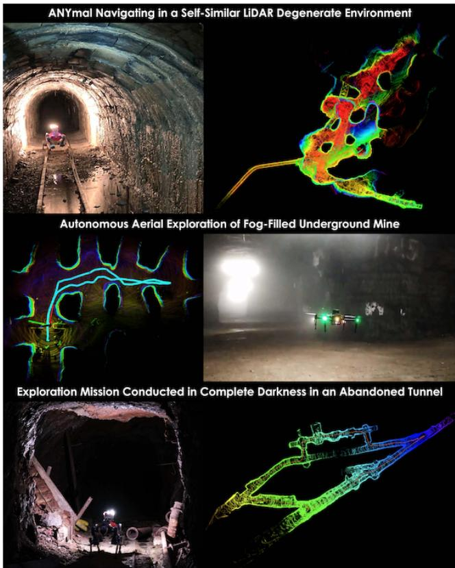  
Fig. 9. (Top) Autonomous exploration of a self-similar environment making LIDAR only localization unreliable. (Middle) Aerial exploration in a fog-filled environment using CompSLAM and exploiting thermal vision. (Bottom) Underground tunnel environment exploration in conditions of darkness and subject to reflections due to mud/water puddles.

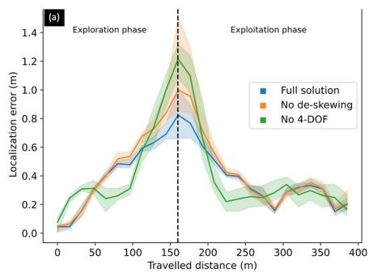

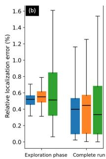  
Fig. 10. Localization error as a function of distance traveled. The solid lines are the median error, and the colored areas represent the first and third error quartiles. The dashed line delimits the exploration phase, during which the robot explores new areas, before returning to previously visited areas. Statistics are computed over 10 experiments.

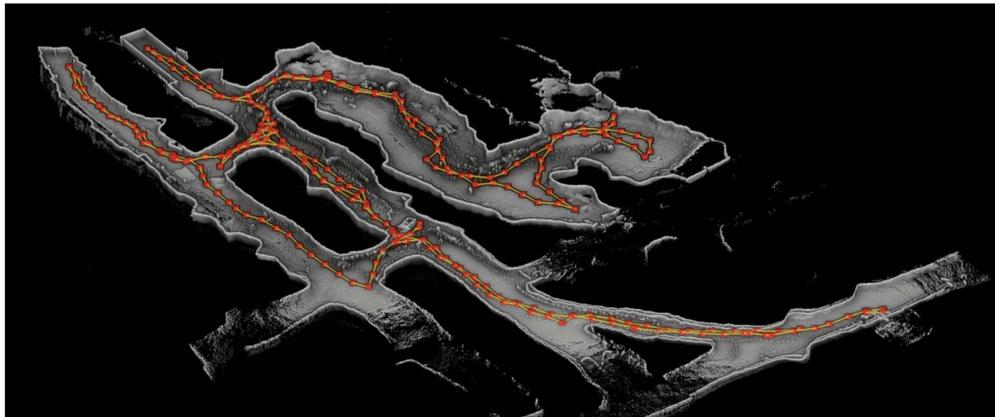  
Fig. 11. Team Explorer mapping results in Brady’s Bend cave near Pittsburgh, PA, on a wheeled ground robot. The red dots represent the key poses and the yellow edges show potential loop closure edges.

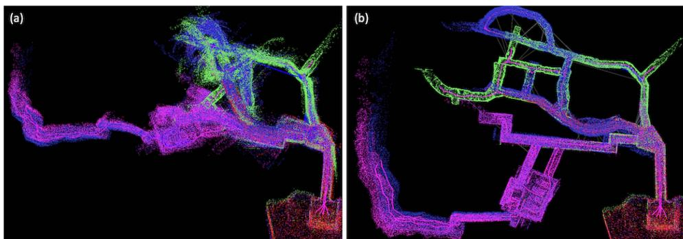  
Fig. 12. CoSTAR’s SLAM results (a) without and (b) with the outlier rejection module during the preliminary run of the SubT Finals. Each color represents the map of a different robot (four in total), blue lines represent accepted loop closures, and gray lines represent rejected loop closures. GNC is able to successfully reject numerous false loop closures [gray lines in (b)].

## B. Importance of Loop Closures

While LIDAR-centric solutions compute low-drift odometric trajectories, such trajectory estimates keep accumulating errors over time. With a 0.5% odometry drift, a robot would have a 5-m error after a 1-km traverse. This stresses the importance of detecting and enforcing loop closures to keep the localization error bounded. Fig. 11 provides an example of accurate localization and mapping results by team Explorer, achieved by successful detection of loop closures. The figure shows mapping results in Brady’s Bend cave near Pittsburgh, PA, on a wheeled ground robot. According to DARPA, team Explorer’s SLAM system achieved a deviation of 6% in the grand finale of the DARPA SubT challenge, a performance that is the second best among all competing teams, behind CSIRO’s Wildcat.3

Robustness to outliers: LIDAR-based loop closure detection is quite challenging in underground scenarios due to perceptual aliasing. At larger scales, and with more robots, the chances of false positive loop closures increase, especially in environments with self-similar locations. False loop closures, if not rejected, can have a negative impact on localization performance and lead to dramatic distortions in the map. Fig. 12 shows CoSTAR’s SLAM results (a) without and (b) with outlier rejection. CoSTAR’s GNC-enabled [60] approach has been shown to produce accurate maps and reject up to 90% outlier loop closures during the Final event of the DARPA SubT challenge [117]. As depicted in Fig. 13, CoSTAR’s outlier-robust loop closure detection enables creating high-precision 3-D maps from multilevel urban environments with a combination of large rooms and small spaces, to complex weaving lava tubes, to mines that are massive in scale, and finally, the narrow passages found in the SubT Final event.

Heterogeneous environments: Other examples of highprecision localization and mapping in a large-scale and longduration exploration are shown in Figs. 14 and 15 for the LIO-SAM system adopted by team MARBLE. In these experiments, a robot is teleoped from within the University of Colorado-Boulder Engineering Center through all three levels of a parking garage before returning to its approximate original location in an hour-long operation. The test spans heterogeneous environment types, from tight urban indoor environments (with sharp turns, featureless and narrow corridors, and staircases) to wide-open outdoor environments. The SLAM system accurately maintains elevation estimation through multiple levels of the parking garage with a high level of geometric self-similarity while relying on only the OS1 LIDAR and IMU. The 2.2 km long trajectory shows a position difference of 0.31 m from the start to the final position, which is equivalent to an error (after loop closures) of just 0.014%.

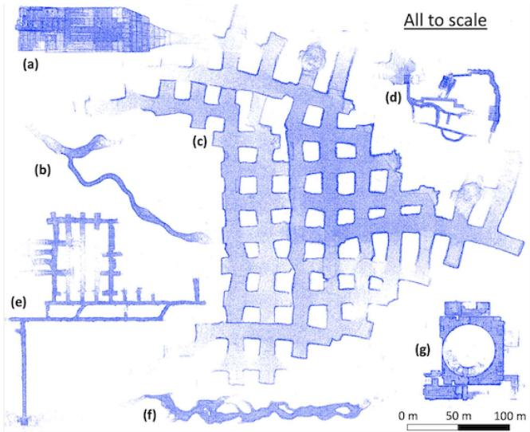  
Fig. 13. To-scale representation of the robot-produced maps across a variety of environments team CoSTAR tested in. (a) 3-level abandoned subway in Los Angeles. (b) Lava tube in Lava Beds National Monument. (c) Part of Kentucky Underground. (d) DARPA-created SubT Finals course. (e) Bruceton Research Mine (SubT Tunnel Competition). (f) Valentine cave (a lava tube) in Lava Beds National Monument. (g) Satsop power plant (SubT Urban Competition). All maps are the best runs from a single robot.

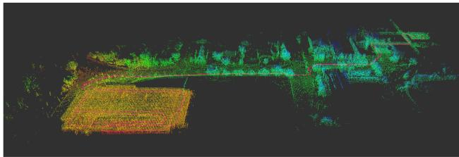  
Fig. 14. LIO-SAM map generated by MARBLE’s Spot robot traversing from the University ofColorado-Boulder Engineering Center to the bottom ofa nearby parking garage and back. The trajectory is marked in pink, and the point cloud is colored by elevation from red low to blue high.

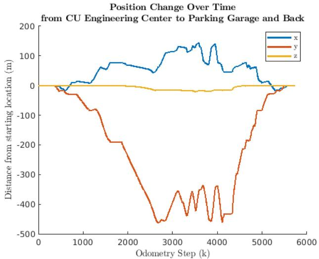  
Fig. 15. Position x, y, z trajectory data of path in Fig. 14. The final position offset from the initial starting location was, 0.31 m with a total trajectory length of 2.2 km.

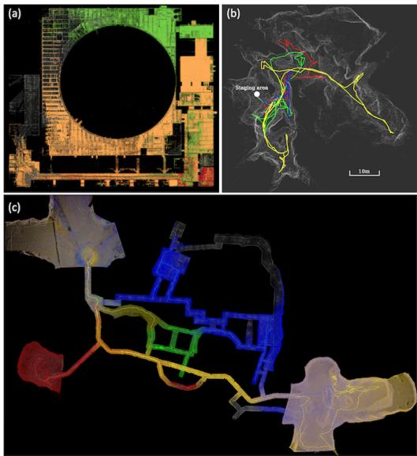  
Fig. 16. CSIRO’s Wildcat results. (a) Point cloud map produced by three ground robots in the Beta Course of the Urban Event; the estimated map is color-coded by agent while DARPA reference point cloud is shown in gray. (b) Map produced during cave testing at Capentaria Caves, Chillagoe, QLD; the merged agent-collected map is shown in gray, with agent trajectories in colors (drone colored as yellow). (c) Merged point cloud map from the Final Event, color-coded by agent, with DARPA reference cloud in gray.

## C. Importance of Multirobot Operation

Multirobot SLAM allows mapping larger areas while simultaneously reducing the localization and mapping errors thanks to interrobot loop closures. Fig. 16 shows the maps produced by CSIRO’s Wildcat decentralized multirobot SLAM system in two SubT events (Urban and Final) and in a cave in Australia. The map in Fig. 16(a) is built by three ground robots while the maps in Fig. 16(b)–(c) are created by four robots (including a UAV, in the cave case). According to DARPA, in the Final SubT event, Wildcat produced the top map with less than 1% deviation from the ground truth where they defined deviation as the percentage of points in the submitted point cloud that are farther than 1 m from the points in the surveyed point cloud map. Wildcat also produced the single most accurate reports in the Urban and Final events with 22-cm and 4.8-cm errors, respectively. We refer the reader to the work in [90] for a more extensive experimental evaluation. Additional qualitative results produced by Wildcat in perceptually challenging environments are also available on the websites of two commercial partners of CSIRO, Emesent [92], and Automap [118].

Interrobot loop closures: Fig. 17 shows the dramatic reduction of the absolute pose error (APE) in team CoSTAR’s SLAM architecture due to interrobot loop closures and multirobot pose graph optimization. As in the single-robot case, capitalizing on interrobot loop closures requires a good strategy for outlier rejection, since many interrobot loop closure detections will be incorrect due to perceptual aliasing.

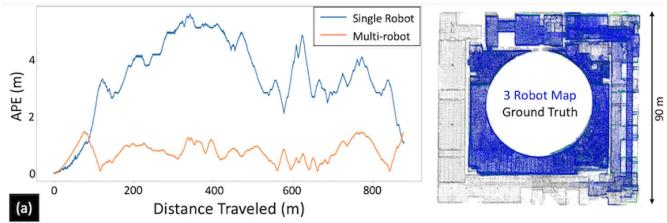

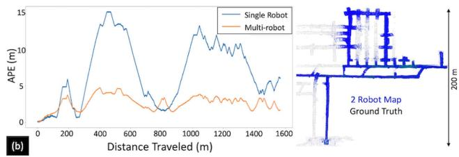  
Fig. 17. CoSTAR results: improvement in APE due to interrobot loop closures and multirobot pose graph optimization, with the resulting multirobot map on the right. (a) Test with three robots in the Satsop power plant. (b) Test with two robots in the Bruceton Research Mine.

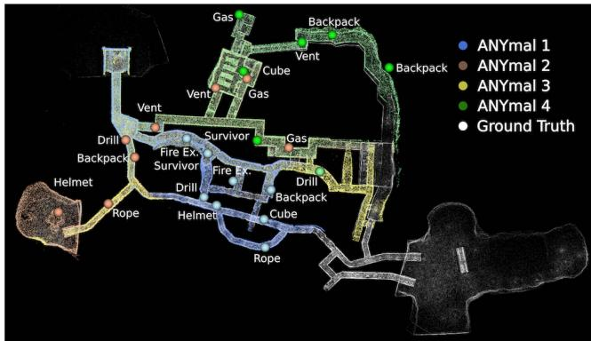  
Fig. 18. CERBERUS results: Onboard maps for all deployed robots generated using CompSLAM are overlaid on top of the DARPA provided ground truth for the final event of the DARPA SubT Challenge. The scored artifacts are shown and colored to correspond with the reporting robot.

In the DARPA SubT finals event, team CERBERUS deployed four ANYmal quadrupedal robots to autonomously navigate a total distance of 1.75 km. The maps generated by the onboard solution, CompSLAM, along with scoring artifacts, are qualitatively compared against the DARPA-provided ground truth map in Fig. 18. The individual robot results are made globally consistent by M3RM by exploiting interrobot loop closures; a quantitative comparison between the onboard and global mapping approaches is presented in Table II.

Heterogeneous teams: We already commented on the benefit of having heterogeneous sensing capabilities. Here, we discuss the advantages of using heterogeneous platforms for the exploration. Indeed, most of the SubT teams used a combination of wheeled and legged ground robots and UAVs. Fig. 19(c) shows Explorer’s mapping result in the Urban Challenge Alpha Course reconstructed by multiple robots (UGV1, UAV1, and UAV2) operating in a dark and foggy environment with a vertical shaft. Green, orange, and red lines are the estimated trajectories of UGV1, UAV1, and UAV2 respectively. Fig. 19(a) shows the mapping result in the SubT Finals by a heterogeneous fleet. The blue, green, and red lines are the estimated trajectories of UGV1, UGV2, and UGV3, respectively. The travel distance of UGV1, UGV2, and UGV3 are 445.2 m, 499.8 m, and 596.6 m, respectively. Explorer’s SLAM solution achieved accurate localization and mapping despite the challenging environmental conditions, including low light, long corridors, heavy dust/fog, and even dynamic scenes. Heterogeneity enables mapping a broader variety of environments (e.g., UAVs enable exploring vertical shafts) and allows richer exploration strategies (e.g., using UAVs for fast exploration, and UGVs for more accurate mapping).

TABLE II  
COMPARISON OF THE MEAN AND STANDARD DEVIATION OF THE APE FOR CERBERUS’ COMPSLAM (EACH ROBOT) AND M3RM (ALL ROBOTS CONSIDERED TOGETHER) APPROACHES FOR THE DARPA SUBT CHALLENGE FINAL EVENT
<table><tr><td>Robot</td><td>CompSLAM (Onboard)</td><td></td><td>M3RM (Server)</td></tr><tr><td></td><td>Rotation [°]</td><td>Translation [m] 0.72 (0.41)</td><td>Rotation [°] Translation [m]</td></tr><tr><td>ANYmal 1</td><td>2.45 (0.67)</td><td>1.59 (0.46)</td><td>0.25 (0.13)</td></tr><tr><td>ANYmal 2</td><td>3.97 (0.40)</td><td>1.29 (0.90) 0.96 (0.30)</td><td>0.36 (0.28)</td></tr><tr><td>ANYmal 3</td><td>0.89 (0.50)</td><td>0.23 (0.43) 2.30 (1.02)</td><td>0.20 (0.34)</td></tr><tr><td>ANYmal 4</td><td>2.22 (0.79)</td><td>1.00 (0.71) 2.16 (0.55)</td><td>0.24(0.17)</td></tr></table>

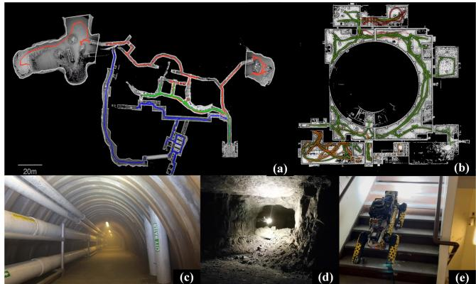  
Fig. 19. Testing sites and results of Explorer’s SLAM system. (a) UAV, UGV, and legged robot exploration in the final circuit of SubT, including urban, cave, and tunnel environments. (b) UAV and UGV exploration in the urban circuit of SubT. (c) Tunnel environments, test site with smoke. (d) Cave environment UAV test site. (e) Urban environment with legged robot.

## V. FUTURE RESEARCH DIRECTIONS AND OPEN PROBLEMS

In the light of the results in Section IV and the outcome of the DARPA SubT competition, this section provides a summary of which problems in underground SLAM can be considered solved or can be solved with some good engineering and what are still open problems that will likely require more fundamental research.

LIDAR-centric SLAM solutions have become increasingly robust to challenging environments. Feature detection or scan preprocessing enables real-time point cloud alignment. Tight coupling with inertial data enables more robust motion estimation, by allowing deskewing the LIDAR scans, bootstrapping ICP-based scan matching, and potentially eliminating roll and pitch drift. Keyframe-based or submap-based approaches, combined with a factor graph framework, allow sparsifying the trajectory into a reduced set of poses and enable online operation in large-scale, long-term, multirobot explorations with reduced computational complexity. The addition of other sensing modalities further increases robustness.

Looking across the six solutions examined in Sections III and IV, there is a reason to believe that the underground SLAM problem, with high-quality multimodal sensing suites, is a solved problem. Yet only solved with sufficient qualifications of the environment, the scale, the sensors, the parameter tuning, and the computation power. We believe that in the context of extreme subterranean environments, the majority of open problems defined in [7] still apply. In the rest of this section, we highlight current challenges and open problems in underground localization and mapping.

## A. Robust and Resilient Perception

One of the common failure modes observed across most of the presented architectures is localization failure due to falls, drops, or collisions [119] when traversing rough terrains in unstructured underground environments. These high-frequency motions are not entirely captured by the onboard perception system, e.g., due to the lower sampling frequency of structuredlight sensors [120]. This could lead to poor motion estimates and eventually localization failure. With robotic systems that can withstand a fall and continue to operate (e.g., Boston Dynamics Spot, Flyability drones, BIA5 Titan, ANYmal, RMF-Owl), a relatively underexplored area is reliable state estimation under unexpected collisions and temporary interruptions of the sensor streams. Although early work on localization subject to collision shows promising results [121], better exploring the limitations of different systems and algorithms in “crash tests” scenarios would help improve all-round real-world robustness. Furthermore, engineering work in incorporating velocity-based sensors (e.g., event-based cameras [122]) which might maintain ego-motion tracking without saturation during adverse events could greatly benefit SLAM systems.

At a more fundamental level, underground operation requires redundancy and resourcefulness, but this needs to be achieved beyondjust “adding more sensors.” The SLAM literature is lacking fundamental research in resilient algorithms and systems. While robust systems are designed to withstand (often small) disturbances (e.g., degraded sensing or environmental changes), resilient methods dynamically reconfigure to regain performance in the face of changing environmental stressors [20]. Moreover, a resilient system would dynamically change its parameters (or even its algorithmic components) depending on the scenario, contrarily to the current SLAM systems, which are “rigid” and heavily rely on manual parameter tuning; see the comments about parameter tuning in the dirty details sections in Section III, as well as the discussion about the “curse of parameter tuning”

in [7]. Along these lines, active SLAM remains a topic of interest to adapt to changes in the environment, such as visibility conditions, with the aim of improving the SLAM algorithm’s accuracy and efficiency; see [123] for a broader survey.

## B. Beyond Traditional SLAM Sensors

Achieving robustness under perceptual aliasing, dense obscurants, and severe environment degradation remains a challenge and can benefit from incorporating non-traditional sensing modalities and designing methods for failure detection and recovery. Thermal vision allows penetrating conditions of visual degradation, where cameras and LIDARs fail due to the presence of obscurants. Similarly, radar is able to maintain localization [29], [30] despite the presence of fog, as the wavelengths in commercial automotive millimeter-wave radars are large enough to bypass particulates such as fog and dust that causes spurious reflections that render LIDAR point clouds unusable for localization and mapping purposes. While research into millimeter-wave radar-based localization [124], [125], [126], [127], [128] and the creation of radar factors for SLAM applications is ongoing, including the release of public datasets such as in [129] and [130], the integration of these sensors is not as established as other sensing modalities, due to complexity of the corresponding sensor models and data association. Multimodal SLAM systems could also be pushed further by developing failure detection and recovery methods. Autonomous exploration of subterranean settings requires dynamically adaptive algorithmic architectures to achieve solution resourcefulness. Still related to resilient operation, it would be desirable to design approaches that can detect failures of a sensing modality and reconfigure the system accordingly. The importance of degeneracy detection in multi-modal sensing is discussed in [36] while fault detection in perception systems is investigated in [131].

## C. Scaling Up: Centralized Versus Distributed Systems

Multirobot LIDAR-centric SLAM is a mature research area. This article showed that centralized approaches can achieve accurate and real-time performance for moderate team sizes (5–10 robots); moreover, decentralized approaches attain small errors even without relying on interrobot loop closures in moderate-scale scenarios (e.g., <1 km traversal). However, scaling up SLAM solutions to very large teams (e.g., >100 robots) and very large-scale scenarios (e.g., city-scale [9] and forestscale [132]) is likely to require a more distributed approach. In centralized approaches, large team sizes would quickly reach a bottleneck in terms of communication as well as processing at the base station.4 Therefore, distributed architectures are likely to be needed to scale up operations. For large fleets covering large-scale geographic areas, it will be necessary to consider 1) resource-aware collaborative interrobot loop closure detection techniques [62], [63], [64] that intelligently utilize limited mission-critical resources available onboard (e.g., compute, battery, and bandwidth) and 2) distributed factor-graph and pose-graph optimization methods [32], [33], [65], [133], both of which are active research areas. We also believe that hierarchical map representations (e.g., [134]) will be needed for large-scale environments where point-cloud or voxel-based representations would clash with memory constraints.

In terms of engineering, it would be desirable to develop and release open-source implementations of multirobot SLAM systems. As we observed, SLAM progress in SubT was also enabled by the availability of high-quality open-source implementation for SLAM components (e.g., the back-end provided by GTSAM) or entire systems (e.g., LIO-SAM). Therefore, the development of distributed SLAM systems will benefit from a similar open-source infrastructure.

## D. Scaling Down: Miniaturization and Low-Cost Sensing

All solutions examined in this article leverage one or multiple LIDARs and powerful embedded computers. More work is required to enable the capabilities presented in this article but with low-cost components that might be suitable for smaller, cheaper, expendable systems. For instance, it would be desirable to deploy a large number of expendable robots for high-risk missions (e.g., search and rescue, planetary exploration), or to design more affordable robots to increase adoption by first responders. These platforms would ideally have a small form factor to enable exploration of narrow passages (e.g., pipes) while being easy to transport by human operators. Achieving this goal entails both engineering efforts (e.g., development of novel sensors or specialized ASICs for on-chip SLAM [8]) and more research on vision-based SLAM in degraded perceptual conditions (e.g., dust or fog).

## VI. CONCLUSION

While progress in SLAM research has been reviewed in prior works, none of the previous surveys focus on underground SLAM. Given the astonishing progress over the past several years, this article provided a survey of the state of the art, and the state of the practice in SLAM in extreme subterranean environments and reports on what can be considered solved problems, what can be solved with some good systems engineering, and what is yet to be solved and likely requires further research. We reviewed algorithms, architectures, and systems adopted by six teams that participated in the DARPA Subterranean (SubT) Challenge, with particular emphasis on LIDAR-centric SLAM solutions, heterogeneous multirobot operation (including both aerial and ground robots), and real-world underground operation (from the presence of obscurants to the need to handle tight computational constraints). Furthermore, we provided a table of open-source SLAM implementations and datasets that have been produced during the SubT challenge and related efforts, and constitute a useful resource for researchers and practitioners.

## ACKNOWLEDGMENT

The presented content and ideas are solely those of the authors.

## Authors’ Affiliations

Kamak Ebadi is with the Department of Mobility and Robotic Systems, NASA Jet Propulsion Laboratory, Pasadena, CA 91109 USA (e-mail: kamak.ebadi@jpl.nasa.gov).

Lukas Bernreiter is with the Department of Mechanical Engineering, ETH Zürich, Autonomous Systems Lab, 8051 Zürich, Switzerland (e-mail: berlukas@ethz.ch).

Harel Biggie is with the Department of Computer Science, University of Colorado Boulder, Boulder, CO 80303 USA (e-mail: harel.biggie@colorado.edu).

Gavin Catt is with the Robotics and Autonomous Systems Group, CSIRO, Pullenvale, QLD 4069, Australia (e-mail: gavin.catt@csiro.au).

Yun Chang is with the Department of Aeronautics and Astronautics, MIT, Cambridge, MA 02139 USA (e-mail: yunchang@mit.edu).

Arghya Chatterjee is with the Department of Mechanical Engineering, Bangladesh University of Engineering and Technology, Dhaka 1205, Bangladesh (e-mail: arghyame20buet@gmail.com).

Christopher E. Denniston is with the Robotics Embedded Systems Lab, University of Southern California, Los Angeles, CA 90007 USA (e-mail: cdennist@usc.edu).

Simon-Pierre Deschênes is with the Department of Computer Science and Software Engineering, Laval University, Québec, QC G1V 0A6, Canada (e-mail: simon-pierre.deschenes.1@ulaval.ca).

Kyle Harlow is with the Department of Computer Science, University of Colorado Boulder, Boulder, CO 80503 USA (e-mail: windowskeh@gmail.com).

Shehryar Khattak is with the Department of Mechanical and Process Engineering, ETH Zürich, 8092 Zürich, Switzerland (e-mail: shehryar. masaud@gmail.com).

Lucas Nogueira is with the Carnegie Mellon University, Pittsburgh, PA 15213 USA (e-mail: lucasnogueira@cmu.edu).

Matteo Palieri is with the 347J, NASA Jet Propulsion Laboratory, Pasadena, CA 91105 USA (e-mail: palierimatteo@gmail.com).

Pavel Petráˇcek is with the Faculty of Electrical Engineering, Department of Cybernetics, Multi-Robot Systems Group, Czech Technical University in Prague, 55102 Prague, Czech Republic (e-mail: petrapa6@fel.cvut.cz).

Matˇej Petrlík is with the Department of Cybernetics, Czech Technical University in Prague, 37006 Ceske Budejovice, Czech Republic, and also with the Faculty of Electrical Engineering, Czech Technical University in Prague, 37006 Ceske Budejovice, Czech Republic (e-mail: petrlmat@fel.cvut.cz).

Andrzej Reinke is with the Agricultural Faculty, University of Bonn, 53117 Bonn, Germany (e-mail: andreinkfemust@gmail.com).

Vít Krátký is with the Department of Cybernetics, Czech Technical University in Prague, 12000 Prague, Czech Republic (e-mail: kratkvit@fel.cvut.cz).

Shibo Zhao is with the Robotics Institute, Carnegie Mellon University, Pittsburgh, PA 15213 USA (e-mail: shiboz@andrew.cmu.edu).

Ali-akbar Agha-mohammadi is with the Robotics NASA-JPL, Caltech, Pasadena, CA 91109 USA (e-mail: aliagha4@gmail.com).

Kostas Alexis is with the Department of Engineering Cybernetics, NTNU - Norwegian University of Science and Technology, 7034 Trondheim, Norway (e-mail: konstantinos.alexis@ntnu.no).

Christoffer Heckman is with the Department of Computer Science, University of Colorado Boulder, Boulder, CO 80309 USA (e-mail: christoffer.heckman@colorado.edu).

Kasra Khosoussi is with the Data61, Commonwealth Scientific and Industrial Research, Pullenvale, QLD 02142, Australia (e-mail: kasra.mail@gmail.com).

Navinda Kottege is with the Robotics and Autonomous Systems Group, CSIRO, Pullenvale, QLD 4069, Australia (e-mail: navinda@ieee.org).

Benjamin Morrell is with the Department of Mobility and Robotic Systems, Jet Propulsion Laboratory, California Institute of Technology, Pasadena, CA 91001 USA (e-mail: benjamin.morrell@jpl.nasa.gov).

Marco Hutter is with the Institute of Robotics and Intelligent Systems, ETH Zurich, 8092 Zurich, Switzerland (e-mail: mahutter@ethz.ch).

Fred Pauling is with the Department of Robotics, CSIRO Robotics and Autonomous Systems, Pullenvale, QLD 4069, Australia (e-mail: fred.pauling@csiro.au).

François Pomerleau is with the Department of Computer Science and Software Engineering, Université Laval, Quebec City G1V 0A6, Canada (e-mail: francois.pomerleau@ift.ulaval.ca).

Martin Saska is with the Department of Cybernetics, Czech Technical University in Prague, 16627 Prague 6, Czech Republic (e-mail: saska@labe.felk.cvut.cz).

Sebastian Scherer is with the Robotics Institute, Carnegie Mellon University, Pittsburgh, PA 15213 USA (e-mail: basti@andrew.cmu.edu).

Roland Siegwart is with the Autonomous Systems Lab, ETH Zürich, 8092 Zürich, Switzerland (e-mail: rsiegwart@ethz.ch).

Jason L. Williams is with the Robotics and Autonomous Systems Group, CSIRO, Kenmore, QLD 4069, Australia (e-mail: jason.williams@csiro.au).

Luca Carlone is with the Laboratory for Information and Decision Systems, Massachusetts Institute of Technology, Cambridge, MA 02139 USA (e-mail: lucacarlone1@gmail.com).

## REFERENCES

[1] J. Forlizzi and C. DiSalvo, “Service robots in the domestic environment: A study of the Roomba vacuum in the home,” in Proc. 1st ACM SIGCHI/SIGART Conf. Human-Robot Interact., 2006, pp. 258–265.

[2] S. Capy, E. Coronado, P. Osorio, S. Hagane, D. Deuff, and G. Venture, “Integration of a presence robot in a smart home,” in Proc. 3rd Int. Conf. Comput., Control Robot., 2023, pp. 192–197.

[3] M. Keynes and G. Blackman, “Vision cleans up: Dyson robot vacuum navigates with imaging,” Imag. Mach. Vis. Eur., vol. 81, pp. 28–29, 2017.

[4] G. Bresson, Z. Alsayed, L. Yu, and S. Glaser, “Simultaneous localization and mapping: A survey of current trends in autonomous driving,” IEEE Trans. Intell. Veh., vol. 2, no. 3, pp. 194–220, Sep. 2017.

[5] S. Karthika, P. Praveena, and M. GokilaMani, “Hololens,” Int. J. Comput. Sci. Mobile Comput., vol. 6, no. 2, pp. 41–50, 2017.

[6] P. R. Desai, P. N. Desai, K. D. Ajmera, and K. Mehta, “A review paper on Oculus Rift—A virtual reality headset,” 2014, arXiv:1408.1173.

[7] C. Cadena et al., “Past, present, and future of simultaneous localization and mapping: Toward the robust-perception age,” IEEE Trans. Robot., vol. 32, no. 6, pp. 1309–1332, Dec. 2016.

[8] A. Suleiman, Z. Zhang, L. Carlone, S. Karaman, and V. Sze, “Navion: A 2-mW fully integrated real-time visual-inertial odometry accelerator for autonomous navigation of nano drones,” IEEE J. Solid-State Circuits, vol. 54, no. 4, pp. 1106–1119, Apr. 2019.

[9] M. Yin and S. Scherer, “Automerge: A framework for map assembling and smoothing in city-scale environments.” Accessed: May 9, 2022. [Online]. Available: https://github.com/MetaSLAM/AutoMerge\_Server

[10] DARPA, “DARPA subterranean challenge.” Accessed: Mar. 8, 2022. [Online]. Available: https://www.subtchallenge.com

[11] V. L. Orekhov and T. H. Chung, “The DARPA subterranean challenge: A synopsis of the circuits stage,” Field Robot., vol. 2, pp. 735–747, 2022.

[12] H. F. Durrant-Whyte and T. Bailey, “Simultaneous localisation and mapping (SLAM): Part I,” IEEE Robot. Autom. Mag., vol. 13, no. 2, pp. 99–110, Jun. 2006.

[13] T. Bailey and H. F. Durrant-Whyte, “Simultaneous localisation and mapping (SLAM): Part II,” IEEE Robot. Autom. Mag., vol. 13, no. 3, pp. 108–117, Sep. 2006.

[14] M. Kegeleirs, G. Grisetti, and M. Birattari, “Swarm SLAM: Challenges and perspectives,” Front. Robot. AI, vol. 8, 2021, Art. no. 23.

[15] M. Dorigo, G. Theraulaz, and V. Trianni, “Swarm robotics: Past, present, and future [point of view],” Proc. IEEE, vol. 109, no. 7, pp. 1152–1165, Jul. 2021.

[16] T. Halsted, O. Shorinwa, J. Yu, and M. Schwager, “A survey of distributed optimization methods for multi-robot systems,” 2021, arXiv:2103.12840.

[17] L. E. Parker, D. Rus, and G. S. Sukhatme, “Multiple mobile robot systems,” in Springer Handbook ofRobotics. Berlin, Germany: Springer, 2016, pp. 1335–1379.

[18] P. Y. Lajoie, B. Ramtoula, F. Wu, and G. Beltrame, “Towards collaborative simultaneous localization and mapping: A survey of the current research landscape,” 2021, arXiv:2108.08325.

[19] L. Zhou and P. Tokekar, “Multi-robot coordination and planning in uncertain and adversarial environments,” 2021, arXiv:2108.08325.

[20] A. Prorok, M. Malencia, L. Carlone, G. S. Sukhatme, B. M. Sadler, and V. Kumar, “Beyond robustness: A taxonomy ofapproaches towards resilient multi-robot systems,” 2021, arXiv:2109.12343.

[21] T. B. Afeni and F. T. Cawood, “Slope monitoring using total station: What are the challenges and how should these be mitigated?,” South Afr. J. Geomatics, vol. 2, no. 1, pp. 41–53, 2013.

[22] N. Brown, S. Kaloustian, and M. Roeckle, “Monitoring of open pit mines using combined GNSS satellite receivers and robotic total stations,” in Proc. Int. Symp. Rock Slope Stability Open Pit Mining Civil Eng., 2007, pp. 417–429.

[23] S. Thrun et al., “A system for volumetric robotic mapping of abandoned mines,” in Proc. IEEE Int. Conf. Robot. Automat., 2003, vol. 3, pp. 4270–4275.

[24] A. Nuchter, H. Surmann, K. Lingemann, J. Hertzberg, and S. Thrun, “6D SLAM with an application in autonomous mine mapping,” in Proc. IEEE Int. Conf. Robot. Automat., 2004, pp. 1998–2003.

[25] D. Tardioli, D. Sicignano, L. Riazuelo, J. Villarroel, and L. Montano, “Robot teams for exploration in underground environments,” in Proc. Workshop Robot.: Robotica Exp., 2012, pp. 205–212.

[26] D. Tardioli et al., “A robotized dumper for debris removal in tunnels under construction,” in Proc. Iberian Robot. Conf., 2017, pp. 126–139.

[27] R. Zlot and M. Bosse, “Efficient large-scale 3D mobile mapping and surface reconstruction of an underground mine,” in Field and Service Robotics. Berlin, Germany: Springer, 2014, pp. 479–493.

[28] S. Kohlbrecher, O. Von Stryk, J. Meyer, and U. Klingauf, “A flexible and scalable SLAM system with full 3D motion estimation,” in Proc. IEEE Int. Symp. Saf., Secur., Rescue Robot., 2011, pp. 155–160.

[29] D. Adolfsson, M. Magnusson, A. Alhashimi, A. J. Lilienthal, and H. Andreasson, “Lidar-level localization with radar? The CFEAR approach to accurate, fast, and robust large-scale radar odometry in diverse environments,” IEEE Trans. Robot., vol. 39, no. 2, pp. 1476–1495, Apr. 2023.

[30] M. Mielle, M. Magnusson, and A. J. Lilienthal, “A comparative analysis of radar and Lidar sensing for localization and mapping,” in Proc. IEEE Eur. Conf. Mobile Robots, 2019, pp. 1–6.

[31] P.-Y. Lajoie, B. Ramtoula, Y. Chang, L. Carlone, and G. Beltrame, “Door-SLAM: Distributed, online, and outlier resilient SLAM for robotic teams,” IEEE Robot. Autom. Lett., vol. 5, no. 2, pp. 1656–1663, Apr. 2020.

[32] Y. Chang, Y. Tian, J. P. How, and L. Carlone, “Kimera-multi: A system for distributed multi-robot metric-semantic simultaneous localization and mapping,” in Proc. IEEE Int. Conf. Robot. Automat., 2021, pp. 11210–11218.

[33] Y. Tian, Y. Chang, F. H. Arias, C. Nieto-Granda, J. How, and L. Carlone, “Kimera-multi: Robust, distributed, dense metric-semantic SLAM for multi-robot systems,” IEEE Trans. Robot., vol. 38, no. 4, pp. 2022–2038, Aug. 2022.

[34] K. Ebadi et al., “LAMP: Large-scale autonomous mapping and positioning for exploration of perceptually-degraded subterranean environments,” in Proc. IEEE Int. Conf. Robot. Automat., 2020, pp. 80–86.

[35] M. Palieri et al., “LOCUS: A multi-sensor Lidar-centric solution for highprecision odometry and 3D mapping in real-time,” IEEE Robot. Automat. Lett., vol. 6, no. 2, pp. 421–428, Apr. 2021.

[36] K. Ebadi, M. Palieri, S. Wood, C. Padgett, and A. Agha-mohammadi, “DARE-SLAM: Degeneracy-aware and resilient loop closing in perceptually-degraded environments,” J. Intell. Robot. Syst., vol. 102, no. 1, pp. 1–25, 2021.

[37] B. Morrell, M. Palieri, N. Funabiki, A. Thakur, J. G. Blank, and A. Aghamohammadi, “Robotic localization and multi-sensor, semantic 3D mapping for exploration of subsurface voids,” in Proc. AGU Fall Meeting Abstr., 2020, pp. P057–03.

[38] J. G. Blank et al., “Autonomous mapping and characterization of terrestrial lava caves using quadruped robots: Preparing for a mission to a planetary cave,” in Proc. Workshop Terr. Analogs Planet. Exploration, Ser. LPI Contributions, 2021, vol. 2595, Art. no. 8122.

[39] T. Rouˇcek et al., “DARPA subterranean challenge: Multi-robotic exploration of underground environments,” in Proc. Int. Conf. Model. Simul. Auton. Syst., 2019, pp. 274–290.

[40] M. Petrlík, T. Báˇca, D. Heˇrt, M. Vrba, T. Krajník, and M. Saska, “A robust UAV system for operations in a constrained environment,” IEEE Robot. Autom. Lett., vol. 5, no. 2, pp. 2169–2176, Apr. 2020.

[41] A. Bouman et al., “Autonomous spot: Long-range autonomous exploration of extreme environments with legged locomotion,” in Proc. IEEE/RSJ Int. Conf. Intell. Robots Syst., 2020, pp. 2518–2525.

[42] J. Williams et al., “Online 3D frontier-based UGV and UAV exploration using direct point cloud visibility,” in Proc. IEEE Int. Conf. Multisensor Fusion Integration Intell. Syst., 2020, pp. 263–270.

[43] A. Kramer, M. Kasper, and C. Heckman, “Vi-SLAM for subterranean environments,” in Field and Service Robotics. Berlin, Germany: Springer, 2021, pp. 159–172.

[44] H. Azpúrna, M. F. Campos, and D. G. Macharet, “Three-dimensional terrain aware autonomous exploration for subterranean and confined spaces,” in Proc. IEEE Int. Conf. Robot. Automat., 2021, pp. 2443–2449.

[45] V. Krátk\`y, P. Petráˇcek, T. Báˇca, and M. Saska, “An autonomous unmanned aerial vehicle system for fast exploration of large complex indoor environments,” J. Field Robot., vol. 38, no. 8, pp. 1036–1058, 2021.

[46] I. D. Miller et al., “Mine tunnel exploration using multiple quadrupedal robots,” IEEE Robot. Autom. Lett., vol. 5, no. 2, pp. 2840–2847, Apr. 2020.

[47] M. F. Ginting, K. Otsu, J. A. Edlund, J. Gao, and A.-A. Agha-Mohammadi, “CHORD: Distributed data-sharing via hybrid ROS 1 and 2 for multi-robot exploration of large-scale complex environments,” IEEE Robot. Autom. Lett., vol. 6, no. 3, pp. 5064–5071, Jul. 2021.

[48] H. Azpúrua et al., “Towards semi-autonomous robotic inspection and mapping in confined spaces with the Espeleorobô,” J. Intell. Robot. Syst., vol. 101, no. 4, pp. 1–27, 2021.

[49] T. Dang et al., “Autonomous search for underground mine rescue using aerial robots,” in Proc. IEEE Aerosp. Conf., 2020, pp. 1–8.

[50] D. Wisth, M. Camurri, S. Das, and M. Fallon, “Unified multimodal landmark tracking for tightly coupled Lidar-visual-inertial odometry,” IEEE Robot. Autom. Lett., vol. 6, no. 2, pp. 1004–1011, Apr. 2021.

[51] S. Khattak, H. Nguyen, F. Mascarich, T. Dang, and K. Alexis, “Complementary multi-modal sensor fusion for resilient robot pose estimation in subterranean environments,” in Proc. Int. Conf. Unmanned Aircr. Syst., 2020, pp. 1024–1029.

[52] J. P. Queralta et al., “Collaborative multi-robot search and rescue: Planning, coordination, perception, and active vision,” IEEE Access, vol. 8, pp. 191617–191643, 2020.

[53] J. Gross et al., “Field-testing of a UAV-UGV team for GNSS-denied navigation in subterranean environments,” in Proc. 32nd Int. Tech. Meeting Satell. Division Inst. Navigation, 2019, pp. 2112–2124.

[54] M. T. Ohradzansky et al., “Multi-agent autonomy: Advancements and challenges in subterranean exploration,” 2021, arXiv:2110.04390.

[55] J. Bayer and J. Faigl, “Speeded up elevation map for exploration of large-scale subterranean environments,” in Proc. Int. Conf. Model. Simul. Auton. Syst., 2019, pp. 190–202.

[56] B. Tidd, A. Cosgun, J. Leitner, and N. Hudson, “Passing through narrow gaps with deep reinforcement learning,” in Proc. IEEE/RSJ Int. Conf. Intell. Robots Syst., 2021, pp. 3492–3498.

[57] B. Lindqvist, C. Kanellakis, S. S. Mansouri, A.-A. Agha-mohammadi, and G. Nikolakopoulos, “COMPRA: A compact reactive autonomy framework for subterranean MAV based search-and-rescue operations,” 2021, arXiv:2108.13105.

[58] J. G. Rogers, J. M. Gregory, J. Fink, and E. Stump, “Test your SLAM! The SubT-tunnel dataset and metric for mapping,” in Proc. IEEE Int. Conf. Robot. Automat., 2020, pp. 955–961.

[59] J. Carter, J. Fink, and E. Stump, “The DARPA SubT urban circuit mapping dataset and evaluation metric,” in Proc. Exp. Robotics: 17th Int. Symp., 2021, vol. 19, Art. no. 391.

[60] H. Yang, P. Antonante, V. Tzoumas, and L. Carlone, “Graduated nonconvexity for robust spatial perception: From non-minimal solvers to global outlier rejection,” IEEE Robot. Autom. Lett., vol. 5, no. 2, pp. 1127–1134, Apr. 2020.

[61] A. Santamaria-Navarro, R. Thakker, D. D. Fan, B. Morrell, and A. A. Agha-Mohammadi, “Towards resilient autonomous navigation of drones,” in Proc. Int. Symp. Robot. Res., 2019, pp. 922–937.

[62] Y. Tian, K. Khosoussi, and J. P. How, “A resource-aware approach to collaborative loop-closure detection with provable performance guarantees,” Int. J. Robot. Res., vol. 40, no. 10/11, pp. 1212–1233, 2021.

[63] M. Giamou, K. Khosoussi, and J. P. How, “Talk resource-efficiently to me: Optimal communication planning for distributed loop closure detection,” in Proc. IEEE Int. Conf. Robot. Automat., 2018, pp. 3841–3848.

[64] Y. Tian, K. Khosoussi, M. Giamou, J. How, and J. Kelly, “Near-optimal budgeted data exchange for distributed loop closure detection,” in Proc. Robot.: Sci. Syst., Jun. 2018, doi: 10.15607/RSS.2018.XIV.071.

[65] Y. Tian, K. Khosoussi, D. M. Rosen, and J. P. How, “Distributed certifiably correct pose-graph optimization,” IEEE Trans. Robot., vol. 37, no. 6, pp. 2137–2156, Dec. 2021.

[66] S. Khattak, C. Papachristos, and K. Alexis, “Visual-thermal landmarks and inertial fusion for navigation in degraded visual environments,” in Proc. IEEE Aerosp. Conf., 2019, pp. 1–9.

[67] M. Bloesch, S. Omari, M. Hutter, and R. Siegwart, “Robust visual inertial odometry using a direct EKF-based approach,” in Proc. IEEE/RSJ Int. Conf. Intell. Robots Syst., 2015, pp. 298–304.

[68] S. Khattak, F. Mascarich, T. Dang, C. Papachristos, and K. Alexis, “Robust thermal-inertial localization for aerial robots: A case for direct methods,” in Proc. Int. Conf. Unmanned Aircr. Syst., 2019, pp. 1061–1068.

[69] S. Khattak, C. Papachristos, and K. Alexis, “Keyframe-based thermal– inertial odometry,” J. Field Robot., vol. 37, no. 4, pp. 552–579, 2020.

[70] J. Zhang and S. Singh, “LOAM: Lidar odometry and mapping in realtime,” Robot.: Sci. Syst., vol. 2, no. 9, pp. 1–9, 2014.

[71] F. Dellaert et al., “Factor graphs for robot perception,” Found. Trends Robot., vol. 6, no. 1/2, pp. 1–139, 2017.

[72] F. Dellaert, “Factor graphs and GTSAM: A hands-on introduction,” Georgia Inst. Technol., Atlanta, GA, USA, Tech. Rep. 2, 2012.

[73] C. Forster, L. Carlone, F. Dellaert, and D. Scaramuzza, “On-manifold preintegration for real-time visual-inertial odometry,” IEEE Trans. Robot., vol. 33, no. 1, pp. 1–21, Feb. 2017.

[74] T. Schneider et al., “mapLab: An open framework for research in visualinertial mapping and localization,” IEEE Robot. Automat. Lett., vol. 3, no. 3, pp. 1418–1425, Jul. 2018.

[75] S. Leutenegger, M. Chli, and R. Y. Siegwart, “BRISK: Binary robust invariant scalable keypoints,” in Proc. Int. Conf. Comput. Vis., 2011, pp. 2548–2555.

[76] Google, “DRACO: 3D data compression.” Accessed: Jul. 26, 2022. [Online]. Available: https://google.github.io/draco/

[77] S. Lynen, T. Sattler, M. Bosse, J. A. Hesch, M. Pollefeys, and R. Siegwart, “Get out of my lab: Large-scale, real-time visual-inertial localization,” in Proc. Int. Conf. Robot.: Sci. Syst., 2015, vol. 1, Art. no. 1.

[78] A. Agha et al., “Nebula: Quest for robotic autonomy in challenging environments; team COSTAR at the DARPA subterranean challenge,” 2021, arXiv:2103.11470.

[79] A. Reinke et al., “LOCUS 2.0: Robust and computationally efficient lidar odometry for real-time underground 3D mapping,” in Proc. IEEE/RSJ Int. Conf. Intell. Robots Syst., vol. 7, no. 4, pp. 9043–9050, Oct. 2022.

[80] E. Jones, J. Sofonia, C. Canales, S. Hrabar, and F. Kendoul, “Applications for the hovermap autonomous drone system in underground mining operations,” J. Southern Afr. Inst. Mining Metall., vol. 120, no. 1, pp. 49–56, 2020.

[81] D. Gálvez-López and J. D. Tardos, “Bags of binary words for fast place recognition in image sequences,” IEEE Trans. Robot., vol. 28, no. 5, pp. 1188–1197, Oct. 2012.

[82] C. Denniston et al., “Loop closure prioritization for efficient and scalable multi-robot SLAM,” IEEE Robot. Autom. Lett., vol. 7, no. 4, pp. 9651–9658, Oct. 2022.

[83] A. Tagliabue et al., “Lion: Lidar-inertial observability-aware navigator for vision-denied environments,” in Proc. Int. Symp. Exp. Robot., 2020, pp. 380–390.

[84] J. Zhang, M. Kaess, and S. Singh, “On degeneracy of optimization-based state estimation problems,” in Proc. IEEE Int. Conf. Robot. Automat., 2016, pp. 809–816.

[85] J. Zhou et al., “Graph neural networks: A review of methods and applications,” AI Open, vol. 1, pp. 57–81, 2020.

[86] H. Yang, J. Shi, and L. Carlone, “TEASER: Fast and certifiable point cloud registration,” IEEE Trans. Robot., vol. 37, no. 2, pp. 314–333, Apr. 2021.

[87] R. B. Rusu, N. Blodow, and M. Beetz, “Fast point feature histograms (FPFH) for 3D registration,” in Proc. IEEE Int. Conf. Robot. Automat., 2009, pp. 3212–3217.

[88] A. Segal, D. Haehnel, and S. Thrun, “Generalized-ICP,” in Proc. Int. Conf. Robot.: Sci. Syst., 2009, vol. 2, Art. no. 435.

[89] M. F. Ginting, K. Otsu, J. Edlund, J. Gao, and A.-A. Agha-Mohammadi, “CHORD: Distributed data-sharing via hybrid ROS 1 and 2 for multirobot exploration of large-scale complex environments,” IEEE Robot. Autom. Lett., vol. 6, no. 3, pp. 5064–5071, Jul. 2021.

[90] M. Ramezani et al., “Wildcat: Online Continuous-time 3D lidar-inertial SLAM,” 2022, arXiv:2205.12595.

[91] N. Hudson et al., “Heterogeneous ground and air platforms, homogeneous sensing: Team CSIRO Data61’s approach to the DARPA subterranean challenge,” J. Field Robot., vol. 2, pp. 595–636, 2022.

[92] EMESENT, “Emesent—Autonomy technology for industrial drones.” Accessed: Feb. 22, 2022. [Online]. Available: https://emesent.io

[93] M. Bosse and R. Zlot, “Continuous 3D scan-matching with a spinning 2D laser,” in Proc. IEEE Int. Conf. Robot. Automat., 2009, pp. 4312–4319.

[94] N. Kottege et al., “Heterogeneous robot teams with unified perception and autonomy: How team CSIRO Data61 tied for the top score at the DARPA subterranean challenge,” 2023, arXiv:2302.13230.

[95] S. O. Madgwick, A. J. Harrison, and R. Vaidyanathan, “Estimation of IMU and Marg orientation using a gradient descent algorithm,” in Proc. IEEE Int. Conf. Rehabil. Robot., 2011, pp. 1–7.

[96] V. Kubelka, M. Vaidis, and F. Pomerleau, “Gravity-constrained point cloud registration,” in Proc. IEEE Int. Conf. Intell. Robots Syst., 2022, pp. 4873–4879.

[97] F. Pomerleau, P. Krüsi, F. Colas, P. Furgale, and R. Siegwart, “Long-term 3D map maintenance in dynamic environments,” in Proc. IEEE Int. Conf. Robot. Automat., 2014, pp. 3712–3719.

[98] T. Baca et al., “The MRS UAV system: Pushing the frontiers of reproducible research, real-world deployment, and education with autonomous unmanned aerial vehicles,” J. Intell. Robot. Syst., vol. 102, no. 1, pp. 1–28, 2021.

[99] V. Pritzl, M. Vrba, C. Tortorici, R. Ashour, and M. Saska, “Adaptive estimation of UAV altitude in complex indoor environments using degraded and time-delayed measurements with time-varying uncertainties,” Robot. Auton. Syst., vol. 160, 2023, Art. no. 104315.

[100] T. Roucek et al., “DARPA subterranean challenge: Multi-robotic exploration of underground environments,” in Proc. 6th Int. Conf. Model. Simul. Auton. Syst., 2020, pp. 274–290.

[101] Wikipedia, “nice (Unix).” Accessed: Jul. 26, 2022. [Online]. Available: https://en.wikipedia.org/wiki/Nice\_(Unix)

[102] S. Zhao, H. Zhang, P. Wang, L. Nogueira, and S. Scherer, “Super odometry: IMU-centric Lidar-visual-inertial estimator for challenging environments,” in IEEE/RSJ Int. Conf. Intell. Robots Syst., 2021, pp. 8729–8736.

[103] S. Zhao, P. Wang, H. Zhang, Z. Fang, and S. Scherer, “TP-TIO: A robust thermal-inertial odometry with deep thermalpoint,” in Proc. IEEE/RSJ Int. Conf. Intell. Robots Syst., 2020, pp. 4505–4512.

[104] F. Nobre, C. R. Heckman, and G. T. Sibley, “Multi-sensor SLAM with online self-calibration and change detection,” in Proc. Int. Symp. Exp. Robot., 2016, pp. 764–774.

[105] M. Kasper, S. McGuire, and C. Heckman, “A benchmark for visualinertial odometry systems employing onboard illumination,” in Proc. IEEE/RSJ Int. Conf. Intell. Robots Syst., 2019, pp. 5256–5263.

[106] T. Shan, B. Englot, D. Meyers, W. Wang, C. Ratti, and D. Rus, “LIO-SAM: Tightly-coupled Lidar inertial odometry via smoothing and mapping,” in Proc. IEEE/RSJ Int. Conf. Intell. Robots Syst., 2020, pp. 5135–5142.

[107] M. Kaess, H. Johannsson, R. Roberts, V. Ila, J. J. Leonard, and F. Dellaert, “iSAM2: Incremental smoothing and mapping using the Bayes tree,” Int. J. Robot. Res., vol. 31, no. 2, pp. 216–235, 2012.

[108] A. Hornung, K. M. Wurm, M. Bennewitz, C. Stachniss, and W. Burgard, “OctoMap: An efficient probabilistic 3D mapping framework based on octrees,” Auton. Robots, vol. 34, no. 3, pp. 189–206, 2013.

[109] S. Pandi, F. Gabriel, O. Zhdanenko, S. Wunderlich, and F. H. P. Fitzek, “MESHMERIZE: An interactive demo of resilient mesh networks in drones,” in Proc. IEEE 16th Annu. Consum. Commun. Netw. Conf., 2019, pp. 1–2.

[110] H. Biggie and S. McGuire, “Heterogeneous ground-air autonomous vehicle networking in austere environments: Practical implementation of a mesh network in the DARPA subterranean challenge,” in Proc. 18th Int. Conf. Distrib. Comput. Sensor Syst., 2022, pp. 261–268.

[111] H. Biggie et al., “Flexible supervised autonomy for exploration in subterranean environments,” Field Robot., vol. 3, pp. 125–189, 2023.

[112] Lord, “Lord microstrain 3DM-GX5-VRU datasheet.” Accessed: Feb. 15, 2022. [Online]. Available: https://www.microstrain.com/sites/ default/files/3dm-gx5-15\_datasheet\_8400-0094\_rev\_o.pdf

[113] F. Pomerleau, F. Colas, R. Siegwart, and S. Magnenat, “Comparing ICP variants on real-world data sets: Open-source library and experimental protocol,” Auton. Robots, vol. 34, no. 3, pp. 133–148, 2013.

[114] P. Petracek, V. Kratky, M. Petrlik, T. Baca, R. Kratochvil, and M. Saska, “Large-scale exploration of cave environments by unmanned aerial vehicles,” IEEE Robot. Autom. Lett., vol. 6, no. 4, pp. 7596–7603, Oct. 2021.

[115] DARPA, “SUBT challenge finals results.” Accessed: Jul. 14, 2023. [Online]. Available: https://www.subtchallenge.com/results.html

[116] P. De Petris et al., “RMF-OWL: A collision-tolerant flying robot for autonomous subterranean exploration,” 2022, arXiv:2202.11055.

[117] Y. Chang et al., “LAMP 2.0: A robust multi-robot SLAM system for operation in challenging large-scale underground environments,” IEEE Robot. Autom. Lett., vol. 7, no. 4, pp. 9175–9182, Oct. 2022.

[118] AUTOMAP, “Automap: The future starts with an accurate map.” Accessed: Feb. 22, 2022. [Online]. Available: https://automap.io

[119] B. Nisar, P. Foehn, D. Falanga, and D. Scaramuzza, “VIMO: Simultaneous visual inertial model-based odometry and force estimation,” IEEE Robot. Autom. Lett., vol. 4, no. 3, pp. 2785–2792, Jul. 2019.

[120] M. Khader and S. Cherian, “An introduction to automotive Lidar,” Texas Instruments, 2020.

[121] S.-P. Deschênes, D. Baril, V. Kubelka, P. Giguère, and F. Pomerleau, “Lidar scan registration robust to extreme motions,” in Proc. IEEE 18th Conf. Robots Vis., 2021, pp. 17–24.

[122] G. Gallego et al., “Event-based vision: A survey,” IEEE Trans. Pattern Anal. Mach. Intell, vol. 44, no. 1, pp. 154–180, Jan. 2022.

[123] J. Placed et al., “A survey on active simultaneous localization and mapping: State of the art and new frontiers,” IEEE Trans. Robot., vol. 39, no. 3, pp. 1686–1705, Jun. 2023.

[124] A. Kramer, C. Stahoviak, A. Santamaria-Navarro, A.-A. Agha-Mohammadi, and C. Heckman, “Radar-inertial ego-velocity estimation for visually degraded environments,” in Proc. IEEE Int. Conf. Robot. Automat., 2020, pp. 5739–5746.

[125] C. X. Lu et al., “See through smoke: Robust indoor mapping with low-cost mmWave radar,” in Proc. 18th Int. Conf. Mobile Syst., Appl., Serv., 2020, pp. 14–27.

[126] A. Kramer and C. Heckman, “Radar-inertial state estimation and obstacle detection for micro-aerial vehicles in dense fog,” in Proc. Int. Symp. Exp. Robot., 2020, pp. 3–16.

[127] C. X. Lu et al., “milliEgo: Single-chip mmWave radar aided egomotion estimation via deep sensor fusion,” in Proc. 18th Conf. Embedded Netw. Sensor Syst., 2020, pp. 109–122.

[128] K. Harlow, H. Jang, T. D. Barfoot, A. Kim, and C. Heckman, “A new wave in robotics: Survey on recent mmWave radar applications in robotics,” 2023, arXiv:2305.01135.

[129] A. Kramer, K. Harlow, C. Williams, and C. Heckman, “Coloradar: The direct 3D millimeter wave radar dataset,” 2021, arXiv:2103.04510.

[130] G. Kim, Y. S. Park, Y. Cho, J. Jeong, and A. Kim, “MulRan: Multimodal range dataset for urban place recognition,” in Proc. IEEE Int. Conf. Robot. Automat., 2020, pp. 6246–6253.

[131] P. Antonante, H. Nilsen, and L. Carlone, “Monitoring of perception systems: Deterministic, probabilistic, and learning-based fault detection and identification,” 2022, arXiv: 2205.10906.

[132] D. Baril et al., “Kilometer-scale autonomous navigation in subarctic forests: Challenges and lessons learned,” in Proc. Field Robot., 2022, pp. 1626–1660.

[133] A. Davison and J. Ortiz, “FutureMapping 2: Gaussian belief propagation for spatial AI,” 2019, arXiv:1910.14139.

[134] N. Hughes, Y. Chang, and L. Carlone, “Hydra: A real-time spatial perception engine for 3D scene graph construction and optimization,” in Proc. Robot.: Sci. Syst., 2022.

Kamak Ebadi received the Ph.D. degree in robotics from the Department of Electrical and Computer Engineering, Santa Clara University, Santa Clara, CA, USA, in 2020.

He is currently a Robotics Technologist with NASA Jet Propulsion Laboratory, Pasadena, CA, USA.

Lukas Bernreiter (Member, IEEE) received the Ph.D. degree in multi-robot mapping and localization from Autonomous Systems Lab, ETH Zurich, Zurich, Switzerland, in 2023.

He is currently a Researcher with Autonomous Systems Lab, ETH Zurich, Zürich, Switzerland.

Harel Biggie (Student Member, IEEE) is currently working toward the Ph.D. degree in computer science with the University of Colorado Boulder, Boulder, CO, USA.

Gavin Catt University received the Bachelor of Multimedia, Interactive Entertainment, and Games Programming degree and the B.IT degree in software development from Griffith University, Brisbane, QLD, Australia, in 2014. He is currently a Senior Software Engineer with CSIRO, Pullenvale, QLD, Australia.

Yun Chang (Student Member, IEEE) is currently working toward the Ph.D. degree in mechatronics with Massachusetts Institute of Technology, Cambridge, MA, USA.

Arghya Chatterjee (Student Member, IEEE) is currently working toward the Ph.D. degree with University of West Florida, Pensacola, FL, USA.

Christopher E. Denniston received the Doctor of Philosophy degree in computer science from the University of Southern California, Los Angeles, CA, USA, in 2023.

He is currently a Lead Multirobot SLAM Engineer with OffWorld, Inc., Altadena, CA, USA.

Simon-Pierre Deschênes is currently working toward the Ph.D. degree in computer science with Universit Laval, Quebec, QC, Canada.

Kyle Harlow is currently working toward the Ph.D. degree in computer science with the University of Colorado Boulder, Boulder, CO, USA.

He is currently a Research Assistant with the University of Colorado Boulder, Boulder, CO, USA.

Shehryar Khattak received the B.S. degree in mechanical engineering from Ghulam Ishaq Khan Institute of Engineering Sciences and Technology, Khyber Pakhtunkhwa, Pakistan, in 2009, the M.S. degree in aerospace engineering from Korea Advanced Institute of Science & Technology, Daejeon, South Korea, in 2012, and the M.S. and Ph.D. degrees in computer science from the University of Nevada, Reno, Reno, NV, USA, in 2017 and 2019, respectively.

He is currently a Robotics Technologist within the Perception Systems Group at the NASA Jet Propulsion Laboratory. Prior to joining JPL, he was a Postdoctoral Researcher with ETH Zurich, Zurich, Switzerland.

Lucas Nogueira received the master’s degree in robotics from CMU, Pittsburgh, CA, USA, in 2023.

He is currently the Head of SLAM for Team Explorer.

Matteo Palieri received the Ph.D. degree in multirobot systems from the Polytechnic University ofBari, Bari, Italy, in 2022. He is currently a Postdoctoral Researcher with NASA Jet Propulsion Laboratory, Pasadena, CA, USA.

Pavel Petráˇcek (Member, IEEE) received the Ing. (M.Sc.) degree in cybernetics and robotics in 2019 from Czech Technical University, Prague, Czech Republic, where he is currently working toward the Ph.D. degree with Multi-Robot Systems Group.

Matˇej Petrlík received the Ing. (M.Sc.) degree in cybernetics and robotics in 2018 from Czech Technical University, Prague, Czech Republic, where he is currently working toward the Ph.D. degree with Multi-Robot Systems Group.

Andrzej Reinke is currently the Software & Perception Lead with Field AI.

Vít Krátký (Member, IEEE) received the Ing. (M.Sc.) degree in cybernetics and robotics in 2019 from Czech Technical University, Prague, Czech Republic, where he is currently working toward the doctoral degree with Multi-Robot Systems Group.

Shibo Zhao (Student Member, IEEE) is currently working toward the Ph.D. degree with Robotics Institute, School of Computer Science, Carnegie Mellon University, Pittsburgh, PA, USA.

He is currently a CMU Explorer Team and a SLAM Researcher. His research interests include SLAM and 3-D reconstruction in challenging environments.

Ali-akbar Agha-mohammadi received the Ph.D. degree in computer science and engineering from Texas A&M, College Station, TX, USA, in 2014. He is currently a Robotics Technologist with NASA Jet Propulsion Laboratory, Pasadena, CA, USA.

Kostas Alexis received the Ph.D. degree in electrical and computer engineering from the University of Patras, Patras, Greece, in 2011.

He is currently a Full Professor with the Norwegian University of Science and Technology, Trondheim, Norway.

Christoffer Heckman (Senior Member, IEEE) received the Ph.D. degree in theoretical and applied mechanics Cornell University, Ithaca, NY, USA, in 2012.

He is currently an Associate Professor with the University of Colorado Boulder, Boulder, CO, USA.

Kasra Khosoussi (Member, IEEE) received the B.Sc. degree in computer engineering from the K. N. Toosi University of Technology, Tehran, Iran, in 2011, and the Ph.D. degree in robotics from the University of Technology Sydney, Sydney, NSW, Australia, in 2017.

He is currently a Team Leader and a Senior Research Scientist with CSIRO, Pullenvale, QLD, Australia.

Navinda Kottege (Senior Member, IEEE) received the B.Sc. (Hons.) degree in engineering physics and the B.IT degree in computer science from the University of Colombo, Colombo, Sri Lanka, in 2011 and 2004, respectively, and the Ph.D. degree in engineering from The Australian National University, Canberra ACT, Australia, in 2009. He is currently the Research Director for Robotics, Computer Vision and Distributed Sensing Systems, Australia’s National Science Agency, CSIRO, Pullenvale, QLD, Australia.

Benjamin Morrell (Member, IEEE) received the Ph.D. degree in engineering from The University of Sydney, Sydney, NSW, Australia, in 2019.

He is currently a Robotics Technologist with NASA JPL, Pasadena, CA, USA.

Marco Hutter (Member, IEEE) received the M.Sc. and Ph.D. degrees from ETH Zurich, Zurich, Switzerland, in 2009 and 2013, respectively. He is currently a Professor in robotics with ETH Zürich.

Fred Pauling received the B.Sc. degree in mathematics and computer science from Northern Territory University, Katherine, NT, Australia, in 1999, and the B.E. (Hons.) degree in mechatronic engineering from The University of Queensland, Brisbane, QLD, Canada, in 2009. He is currently with CSIRO, Pullenvale, QLD, Australia.

François Pomerleau (Senior Member, IEEE) received the Ph.D. degree in robotics from ETH Zurich, Zurich, Switzerland, in 2013.

He is currently a P.Ing., the Director of Norlab, and an Associate Professor with Université Laval, Quebec, QC, Canada.

Martin Saska (Member, IEEE) received the Dr.rer.nat. (Ph.D.) degree in identification, optimization and control with applications in modern technologies from Julius Maximilians Universität Würzburg, Würzburg, Germany, in 2010.

He is currently the Head of the Multi-robot Systems Lab, Czech Technical University in Prague, Prague, Czech Republic.

Sebastian Scherer (Senior Member, IEEE) received the Ph.D. degree in robotics Carnegie Mellon University, Pittsburgh, PA, USA, in 2010. He is currently an Associate Research Professor and leads the Air Lab, Carnegie Mellon University.

Roland Siegwart (Fellow, IEEE) received the Ph.D. degree in mechatronics from ETH Zurich, Zurich, Switzerland, in 1989.

He is currently a Professor and the Lab Director in robotics with ETH Zürich, Zürich, Switzerland.

Jason L. Williams (Senior Member, IEEE) received the B.E. (Hons.) degree in electronics and the B.IT degree from the Queensland University of Technology, Brisbane, QLD, Canada, in 1999, the M.Sc. degree in electrical engineering from the Wright-Patterson AFB, OH, Canada, in 2003, and the Ph.D. degree in electrical engineering and computer science from The Australian National University, Canberra, ACT, Australia, in 2007.

He is currently a Principal Research Scientist with Robotic Perception and Autonomy Group, CSIRO Data61, Kenmore, QLD, Australia.

Luca Carlone (Senior Member, IEEE) received the B.S. and S.M. degrees in mechatronics, and the Ph.D. degree in robotics from the Polytechnic University of Turin, Turin, Italy, in 2006, 2008, and 2012, respectively, and the S.M. degree in automation engineering from the Polytechnic University of Milan, Milan, Italy, in 2008.

He is currently the Boeing Career Development Associate Professor with the Department of Aeronautics and Astronautics, Massachusetts Institute of Technology (MIT), Cambridge, MA, USA, and a Principal Investigator with the Laboratory for Information & Decision Systems, MIT.