results show that DCL-SLAM achieves higher accuracy and lower bandwidth than other state-of-the-art multirobot LiDAR SLAM systems. The source code and video demonstration are available at https://github.com/PengYu-Team/DCL-SLAM.

# DCL-SLAM: A Distributed Collaborative LiDAR SLAM Framework for a Robotic Swarm

Shipeng Zhong , Yuhua Qi , Zhiqiang Chen , Jin Wu , Member, IEEE, Hongbo Chen , and Ming Liu , Senior Member, IEEE

Abstract—To execute collaborative tasks in unknown environments, a robotic swarm must establish a global reference frame and locate itself in a shared understanding of the environment. However, it faces many challenges in realworld scenarios, such as the prior information about the environment being absent and poor communication among the team members. This work presents DCL-SLAM, a frontend agnostic fully distributed collaborative Light Detection And Ranging (LiDAR) SLAM framework to co-localize in an unknown environment with low information exchange. Based on peer-to-peer communication, DCL-SLAM adopts the lightweight LiDAR-Iris descriptor for place recognition and does not require full team connectivity. DCL-SLAM includes three main parts: a replaceable single-robot front-end LiDAR odometry, a distributed loop closure module that detects overlaps between robots, and a distributed back-end module that adapts distributed pose graph optimizer combined with rejecting spurious loop measurements. We integrate the proposed framework with diverse open-source LiDAR odometry to show its versatility. The proposed system is extensively evaluated on benchmarking datasets and field experiments over various scales and environments. The experimental

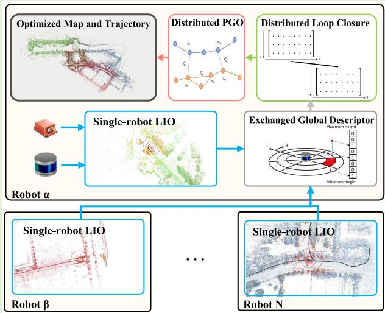

Index Terms— Collaborative localization, distributed framework, place recognition, range sensor.

## I. INTRODUCTION

IMULTANEOUS localization and mapping (SLAM) is a S fundamental capability in robot navigation, especially in unknown and GPS-denied environments, and there is a substantial body of literature dedicated to advanced single-robot SLAM methods [1], [2], [3], [4], [5]. However, compared to a single-robot system, the multirobot system has a more remarkable ability and work efficiency in time-sensitive applications such as factory automation, exploration of unsafe areas, intelligent transportation, and search-and-rescue in military and civilian endeavors. Hence, various collaborative SLAM (C-SLAM) methods for robotic swarms have been studied in the last decade based on single-robot SLAM [6]. C-SLAM aims to combine data from each robot, establish relative pose transformations, and create a global map between robots.

For the real-world application of robotic swarms, however, C-SLAM remains an open problem and faces several challenges currently being researched since communication among the robots may be slow (bandwidth constraints) or infeasible (limited communication range). Due to the various advantages of Light Detection And Ranging (LiDAR), such as high-resolution point cloud and robustness to a wide range of weather and lighting conditions, many LiDAR C-SLAM methods have been proposed [7], [8], [9], [10], [11]. However, most systems [9], [10], [11] do not apply to a robotic swarm but a robotic team, especially in a large-scale scenario with communication constraints. In addition, many C-SLAM works [9], [11] evaluate their system by splitting a dataset into multiple parts, which cannot represent the actual cooperation of robotic swarms. Therefore, gathering synthetic data from multiple platforms [12] in real scenarios for system evaluation is necessary. C-SLAM is still a relatively young research field in the research community, albeit very promising.

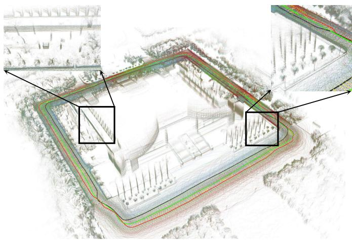  
Fig. 1. Reconstructed maps and trajectories derived by the DCL-SLAM framework with LIO-SAM as front end using three UGVs, shown in green, red, and blue, at Sun Yat-sen University’s eastern campus library.

In this spirit, we present DCL-SLAM, a fully distributed collaborative LiDAR SLAM framework for robotic swarms. DCL-SLAM focuses on data-efficient and resilient inter-robot communication, reaching a consistent trajectory estimate with partial pose measurements and indirect data association. The framework is compatible with various LiDAR odometry based on the requirements and the scenario with no additional effort. Each robot performs single-robot front end independently and co-localizes when teammates are within communication range. To satisfy the communication constraints, a lightweight global descriptor, LiDAR-Iris [13], is integrated to describe laser scans and detect loop closures without exchanging extra raw data. What is more, we design a three-stage data-efficient distributed loop closure approach to obtain relative pose transformations between robots. After that, outlier rejection based on [14] is performed to remove spurious inter-robot loop closures for robustness. Finally, all collected measurements are optimized together by a two-stage distributed Gauss–Seidel (DGS) approach [15], which requires minimal information exchange. Our framework is evaluated using several multirobot datasets, including public datasets (KITTI) and campus datasets gathered with three unmanned ground vehicles (UGVs). Fig. 1 visually presents the trajectories and reconstructed maps of these UGVs. Furthermore, online field tests and scalability experiments are also presented.

To summarize, the contributions of this work are as follows.

1) A front-end agnostic, fully distributed collaborative LiDAR SLAM framework for the robotic swarm is presented, which supports rapid migration to different LiDAR sensors, platforms, and scenarios.

2) A highly integrated data-efficient inter-robot loop closure detection approach is proposed to achieve high accuracy and robustness with a three-stage communication pipeline.

3) Extensive experimental evaluation, including performance, scalability, and real-world field tests, is conducted to validate the proposed system. The proposed system’s custom datasets and source code are open to the public.

The rest of this article is organized as follows. After reviewing the relevant inter-robot loop closure, outlier rejection, and multirobot pose graph optimization (PGO) background literature in Section II, a framework for the proposed DCL-SLAM system is presented in Section III. Experimental results, including performance, accuracy, and communication, are given in Section IV, with conclusions in Section V.

## II. RELATED WORK

## A. Multirobot Loop Closure

Estimating the relative pose between the robots by detecting inter-robot loop closures is an efficient way to merge the trajectories of the robots in a common frame without external positioning infrastructure. What is more, it is also critical to compensate for the drift of the front-end odometry and improve the accuracy of trajectory estimates. The first issue is how to detect inter-robot loop closures effectively In [16], the robots in the team estimate relative transformation using extended Kalman filter (EKF) with pairwise range and bearing, which need extra sensors. In [7], [8], and [17], the local laser maps produced by each robot were directly transmitted to a server for centralized map fusion, which requires high computation resources on the server and reliable communication performance. Many feature-based visual C-SLAM, such as CVI-SLAM [18], CCM-SLAM [19], DOOR-SLAM [20], Kimera-Multi [21], Omni-Swram [22], and COVINS [23], shared the binary descriptor [e.g., Oriented Fast and Rotated BRIEF (ORB) and Binary Robust Independent Elementary Features (BRIEF)] of the keyframes and used a bag-of-words (BoW) approach to find multirobot loop closures. In addition, Shan et al. [24] used projected LiDAR intensity image to extract ORB features for place recognition using the BoW method. Introducing the keyframe global descriptor with BoWs enables fast and robust searching for loop closures. Moreover, it reduces the system’s bandwidth and the computation at the back-end optimization, which has a certain reference significance for LiDAR C-SLAM. Generally, descriptor extraction on the point cloud can be divided into local, global, and learningbased descriptors. Local descriptor [25], [26] was extracted from the local neighborhood of the keypoint in the point cloud. Although local descriptor methods are unsuitable for inter-robot loop closure detection scenarios due to the lack of descriptive power, they could be used to validate putative loop closures and estimate relative pose in geometric verification. Extracting global descriptors from the entire set of points can mitigate the problem of lack of descriptive power, such as GRSD [27], M2DP [28], Scan-Context [29], DELIGHT [30], CoSPAIR [31], and LiDAR-Iris [13]. DiSCo SLAM [11] introduced Scan-Context [29] for inter-robot loop closure and proposed a two-stage local and global distributed optimization framework. Swarm-SLAM [32], a recent opensource multirobot SLAM system, adeptly integrates both visual and LiDAR sensors, leveraging Scan-Context and BoWs for efficient loop closure. This system mitigates communication demands through a decentralized architecture and pose graph sparsification, but sparsification might inadvertently omit critical information crucial for localization. Compared

Fodom : Odometry Measurement Fintra : Intra-robot Loop Measurement Finter : Inter-robot Loop Measurement KF : LiDAR Keyframe KP : Keypose KFD : Keyframe Descriptor

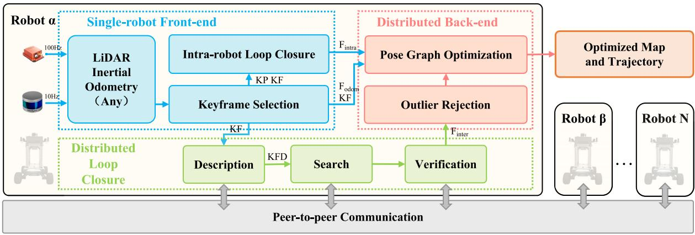  
Fig. 2. Proposed fully distributed collaborative LiDAR SLAM, DCL-SLAM, consists of a replaceable single-robot front-end module to produce odometry factor and intra-robot loop factor, a distributed loop closure module for detecting inter-robot loop closures, a distributed PGO module to estimate the global trajectories for the robotic swarm combined with rejecting spurious loop measurements, and a peer-to-peer communication module to exchange necessary data (descriptors, measurements, pose estimates, and so on).

to DiSCo-SLAM, considering bandwidth limitation and communication range, our method proposes a distributed loop closure framework with a three-stage communication pipeline, which avoids exchanging all raw or feature clouds. Second, we conduct extensive and comprehensive experiments to validate the proposed system and apply our system in a large-scale team with nine robots while only three are in DiSCo-SLAM. Recently, convolutional neural networks have been used to train feature descriptors [33], [34], [35]. SegMap [9] proposed a data-driven descriptor for LiDAR to extract meaningful features that can be used for loop detection and map reconstruction. FPET-Net [36] introduced a feature point extraction module to reduce the size of the point cloud and preserve the data features and a point transformer module to extract the global descriptors. However, these learning-based approaches require tremendous amounts of training data. In our work, we adopted a lightweight global descriptor LiDAR-Iris for fast and robust distributed loop closure detection. It encodes the height information of each bin, extracts discriminative features without any pretraining, and is rotation-invariant without brute-force matching.

Obtaining the relative pose of loop closure is the second issue. The 3-D–3-D matching approach is usually adopted in LiDAR SLAM, such as ICP [37] and GICP [38]. How to exchange the descriptors on each robot is a critical problem due to the communication range and bandwidth limitation in the distributed system. Cieslewski and Scaramuzza [39] preassigned words of the vocabulary to each robot and sent the entire query to the candidate robot to detect loop closures. Cieslewski et al. [40] performed efficient data association for distributed loop closure with NetVLAD descriptor in a fully connected team. These approaches require a smaller amount of data exchange and scale well with the number of robots in the team but are designed for the fullconnected system. Lajoie et al. [20], Choudhary et al. [41], and Wang et al. [42] efficiently exchange data during robots rendezvous, accounting for the available communication and computation resources. These approaches are more suitable for robotic swarms, especially in large-scale scenarios with limited communication range.

## B. Outlier Rejection

Outlier rejection is critical to robust PGO since incorrect measurements may be caused by perceptual aliasing. The random sample consensus (RANSAC) algorithm [43], which is widely used in both LiDAR and visual SLAM, is robust to a large portion of outliers. However, it distinguishes inliers and outliers based on a given model. Do et al. [44] rejected inaccurate loop closures by considering the data similarity in the measurement and the consistency between loop closures. Graduated nonconvexity (GNC) [45] has been proposed to optimize a sequence of increasingly nonconvex surrogate cost functions. Mangelson et al. [14] proposed pairwise consistent measurement (PCM) set maximization to check the consistency of each pair of inter-robot loop closures to merge multirobot map robustly, which several multirobot SLAM systems have adopted [11], [20], [21], [22] for outlier rejection. This work combines RANSAC and PCM to make the system more robust.

## C. Multirobot PGO

PGO is one of the popular and effective methods to optimize poses in the back end. Centralized PGO approaches [17], [46] collect all information at a server or robot and estimate the trajectory for all the robots on a global pose graph. Still, the distributed approach [15], [47] is more suitable for a multirobot system under poor communication due to the bandwidth constraints and limited communication range. DDF-SAM [47] proposed a landmark-based distributed trajectory optimization method based on Gaussian elimination. Tron et al. [48] proposed a multistage distributed Riemannian consensus protocol for distributed execution of Riemannian gradient descent. Choudhary et al. [15] proposed a two-stage DGS method and avoided the complex bookkeeping and double counting. Fan and Murphey [49] proposed a majorization–minimization approach to solve distributed PGO. Tian et al. [50] proposed Riemannian block-coordinate descent (RBCD) to solve a rank-restricted relaxation of the PGO problem and reach a better performance than DGS with a local network. Distributed C-SLAM solutions [20], [40] have adopted [15] since their applicability to limited communication resources. In this work, we also use the DGS method as a back end.

## III. DCL-SLAM FRAMEWORK

Our proposed framework relies on peer-to-peer communication with the ad hoc wireless network. When two robots rendezvous, they share the understanding of the environment information to establish a global reference frame and perform distributed SLAM. Moreover, each robot performs single-robot SLAM when there is no teammate within the communication range to ensure the independence of each robot.

In some existing C-SLAM systems [9], the front- and back-end modules are tightly entangled, making it difficult to replace or update one improved module (e.g., odometry and inter-robot loop closure) at a low cost. Therefore, our framework is modularized into three main parts: a single-robot front end, distributed loop closure, and distributed back end. Fig. 2 gives an overview of our proposed DCL-SLAM framework. Each robot collects raw data from a LiDAR and an inertial measurement unit (IMU) and locally runs a single-robot front-end module (Section III-A) to produce an estimate of its trajectory. In the distributed loop closure module (Section III-B), a keyframe scan is selected from odometry pose and then described as a global descriptor (LiDAR-Iris [13]) for performing place recognition among the robots. Each robot communicates to other robots within the communication range with the descriptor for performing inter-robot loop closure detection. The output loop closure candidates are then verified using either the raw point cloud or the features point cloud with the ICP method and RANSAC algorithm to get inter-robot loop closure measurements. After that, the distributed back-end module (Section III-C) collects all odometry measurements, intra-robot loop measurements, and inter-robot loop measurements to compute the maximal set of PCMs [14] and filters out the outliers. The optimal trajectory estimation of the robotic swarm is solved using a two-stage DGS method proposed in [15] for reaching an agreement on the pose graph configuration.

## A. Single-Robot Front End

The DCL-SLAM framework supports an interface with single-robot front ends with various LiDAR odometry. It is compatible with different LiDAR configurations (e.g., solidstate and mechanical LiDAR), platforms (e.g., ground and aerial vehicles), and scenarios (e.g., indoor and outdoor environments). In our implementation, LIO-SAM [2] is adopted as a typical example of odometry for ground vehicles, FAST-LIO2 [4] for aerial vehicles, and other LiDAR odometry is an alternative. Once the odometry estimate is refined, the LiDAR odometry factor $F _ { \mathrm { o d o m } } ^ { r } ( r \in \{ \alpha , \beta , \gamma , . . . \} )$ can be constructed and sent to the distributed back-end module. The correlative point cloud scan is used for intra-robot and inter-robot loop closure.

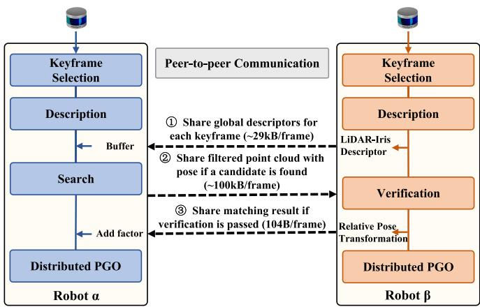  
Fig. 3. Illustration of the distributed loop closure module from robot α’s perspective (using VLP-16).

To improve the accuracy of the single-robot front-end module, an intra-robot loop closure submodule to eliminate the odometry drift is necessary. In some existing LiDAR odometry (e.g., LIO-SAM), the intra-loop closure submodule is included. Therefore, it is easy to extract the results to construct the intra-robot loop closure factor $F _ { \mathrm { i n t r a } } ^ { r }$ for the pose distributed graph optimization. In addition, we also provide a built-in intra-robot loop closure submodule for only odometry systems (e.g., FAST-LIO2) familiar with the following inter-robot loop closure module without communication with other robots.

## B. Distributed Loop Closure

In our framework, the distributed loop closure module performs place recognition among robotic swarms to generate the relative poses transformation and is shown in Fig. 3. Moreover, detecting overlapping parts between local maps created by itself or other robots in the swarm is crucial to reduce its accumulated drift and fuse all robots into a consistent global map. Our distributed loop closure module consists of four steps: keyframe selection, description, search, and verification. To improve the computation and communication efficiency, we first select keyframes when the position and rotation change compared to the previous exceeds a threshold. In our work, the position and rotation change thresholds are 1 m and 0.2 rad, respectively. Furthermore, we perform a three-stage distributed loop closure detection approach, including sharing global descriptors for each keyframe, sharing filtered point cloud with pose if a candidate is found, and sharing matching result if verification passes. It can permit data-efficient communication and does not require full connectivity among the robotic swarm.

1) Description: LiDAR-Iris [13], a state-of-the-art global LiDAR descriptor, is adopted for multirobot place recognition. As shown in Fig. 4, laser scan S is projected to its bird-eye view and divides into $N _ { r }$ (radial direction) $\times \textit { N } _ { a }$ (angular direction) bins according to the angular and radial resolution, defined by $S = \bigcup S _ { i j } , i \in [ 1 , 2 , \dotsc , N _ { r } ] , j \in [ 1 , 2 , \dotsc , N _ { a } ]$ Each bin $S _ { i j }$ encodes height information into an 8-bit binary code $c _ { i j }$ as the pixel intensity of the image I

$$
I = ( c _ { i j } ) \in \mathbb { R } ^ { N _ { r } \times N _ { a } } .\tag{1}
$$

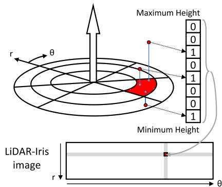  
Fig. 4. Demonstration of encoding the laser scan into the globa descriptor.

Four 1-D LoG-Gabor filters are exploited to convolve each row of image I to extract the image features. The 1-D LoG-Gabor filter has the following form in the frequency domain:

$$
G ( \omega ) = \exp \left( - \frac { \ln ^ { 2 } ( \omega / \omega _ { 0 } ) } { 2 \ln ^ { 2 } ( \sigma / \omega _ { 0 } ) } \right)\tag{2}
$$

where $\omega _ { 0 }$ is the filter’s center frequency and σ is the parameter of the filter bandwidth. A discriminative binary feature image is obtained by applying a simple thresholding operation on convolutional responses. This description procedure does not require counting the points in each bin and pretrain model.

In this article, for Velodyne HDL-64E (KITTI dataset) and VLP-16 (our dataset), $N _ { r }$ is 80 and $N _ { a }$ is 360. In each robot, the scan will be locally described as a binary feature image. As shown in Fig. 3, once robot $\beta$ is in the communication range of robot $\alpha ,$ the binary feature images of robot $\beta$ are sent to robot α alone with row keys (about 29 kB per keyframe). Therefore, robot α can obtain a history database of binary feature images for all robots.

2) Search: The recipient robot (robot α) searches for neighbors of the shared binary feature images. To deal with the viewpoint changes (e.g., revisit in the opposite direction), a Fourier transformation is adopted to estimate the rotation between two images. Suppose that the images $I _ { \alpha }$ and $I _ { \beta }$ have a shift $( \Delta m , \Delta n )$ , then its Fourier transformation $F _ { \alpha } ( u , v )$ has the following properties:

$$
\begin{array} { r c l } { F _ { \alpha } ( u , v ) = F \{ I _ { \alpha } ( m , n ) ) \} } \\ { = F \{ I _ { \beta } ( m - \Delta m , n - \Delta n ) ) \} } \\ { = \exp ( - i ( u \Delta x + v \Delta y ) F _ { \beta } ( u , v ) } \end{array}\tag{3}
$$

which means

$$
\begin{array} { c l } { ( \Delta m , \Delta n ) = \underset { m , n } { \mathrm { a r g m a x } } ~ \exp ( - i ( u \Delta m + v \Delta n ) } \\ { ~ } & { ~ } \\ { = \underset { m , n } { \mathrm { a r g m a x } } \frac { F _ { \beta } ( u , v ) } { F _ { \alpha } ( u , v ) } . } \end{array}\tag{4}
$$

Since the distance calculation on all binary feature images in the history database is heavy, we use a hierarchical nearest search by introducing a row key to achieve a fast search. Each robot further reduces the image to an $N _ { r } \times 1$ vector as query row key K by encoding each image row into a single value

via an $L _ { 2 }$ norm

$$
\begin{array} { l } { \displaystyle { K = ( k _ { i } ) \in \mathbb { R } ^ { N _ { r } } } } \\ { \displaystyle { k _ { i } = \left( \sum _ { j = 1 } ^ { N _ { a } } \mid c _ { i j } \mid ^ { 2 } \right) ^ { \frac { 1 } { 2 } } } } \end{array}\tag{5}
$$

where $c _ { i j } \in I .$ The row key K is rotation-invariant because the encoding function is independent of the viewpoint. In the search stage, a row key kd-tree is built for loop closure candidate search, and the neighbors’ binary feature images are compared against the query binary feature image using the Hamming distance

$$
d = \sum ^ { N _ { r } } \sum ^ { N _ { a } } b _ { i j } ^ { \alpha } \oplus b _ { i j } ^ { \beta } < \eta\tag{6}
$$

where $b _ { i j } ^ { \alpha }$ is the binary feature of $c _ { i j } ^ { \alpha } \in I ^ { \alpha }$ , η is the distance threshold, and $\oplus$ is the XOR operation. In the experiments, η is 0.4. The closest candidate to the query satisfying an acceptance threshold is regarded as a loop closure candidate and shared with robot $\beta .$ Robot α also transmitted the features cloud or deskewed cloud of the recognized place to robot $\beta$ for verification (about 100 kB/frame). This stage provides a loop closure candidate without exchanging the raw data and does not require full connectivity.

3) Verification: In the verification stage, the candidate matching items are then verified by a scan-to-map matching performed on the filtered scan of robot α and the surrounding submap of robot $\beta$ using the RANSAC algorithm. If the set of inliers is sufficiently large, it considers the corresponding loop closure successful. The relative pose transformation of the loop closure candidate is evaluated using the ICP method. After that, robot $\beta$ feeds back the relative pose transformation of the inter-robot loop closure to robot α (about 104B per keyframe). Once the inter-robot loop factor $F _ { \mathrm { i n t e r } } ^ { r }$ is found and shared, both robots initiate the distributed PGO described in Section III-C.

## C. Distributed Back End

In our DCL-SLAM framework, the distributed back-end module includes two submodules. The first submodule, outlier rejection, removes spurious inter-robot loop closures. The second submodule, PGO, constructs a global pose graph with all factors to estimate the global trajectories for the robotic swarm. Three types of factors are considered in back-end PGO, including odometry factor $F _ { \mathrm { o d o m } } ^ { r } ,$ , intra-robot loop factor $F _ { \mathrm { i n t r a } } ^ { r } .$ and inter-robot loop factor $F _ { \mathrm { i n t e r } } ^ { r } . \ \mathrm { A }$ general likelihood item for these factors is

$$
\phi ( x ) = \psi ( z _ { \alpha _ { i } \beta _ { j } } \mid x )\tag{7}
$$

where ${ \boldsymbol x } = [ x _ { \alpha } , x _ { \beta } , x _ { \gamma } , \ldots ]$ is a set of poses of trajectories of robots and $\boldsymbol { \mathcal { Z } } _ { \alpha _ { i } \beta _ { j } }$ is a general measurement model related to the pose transformation of robot α at time i and that of robot $\beta$ at time $j .$

1) Outlier Rejection: The distributed outlier rejection submodule rejects false-positive inter-robot loop closures caused by only matching features in the loop finding procedure. This perceptual aliasing may cause a considerable drift in the robot trajectory estimation. Therefore, PCMs set maximization in [14] is introduced for outlier rejection and implemented as a distributed approach. PCM checks the consistency of pairs of inter-robot loop closure measurements $z _ { \alpha _ { j } \beta _ { m } }$ and ${ \mathcal { Z } } _ { \alpha _ { i } \beta _ { n } }$ by the following metric:

Algorithm 1 Distributed Collaborative Localization   
Input:   
LIO odometry of current robot α: $F _ { o d o m } ^ { \alpha }$   
Intra-robot loop closure of current robot α: $F _ { i n t r a } ^ { \alpha }$   
Inter-robot loop closure of all robot: $F _ { a l l . }$ \_inter   
Output:   
Trajectory of current robot α: $x ^ { \alpha }$   
1: while connected\_robot is empty do   
2: sleep();   
3: connected\_robot ← compute\_opt\_order $F _ { a l l \_ i n t e r } ) ;$   
4: end while   
5: neighbor\_robot←check\_communication(connected\_robot)   
6: $F _ { i n t e r }  \varnothing$   
7: for $r \_ \in$ neighbor\_robot do   
8: $F _ { i n t e r } \gets F _ { i n t e r } \bigcup F _ { a l l \_ i n t e r } ^ { \alpha r } ;$   
9: end for   
10: $G $ create\_pose\_graph( $F _ { o d o m } ^ { \alpha } ,$ , Fi nter , $F _ { i n t r a } ^ { \alpha } ) ;$   
11: send\_start\_flag\_and\_initialization();   
12: share\_correlative\_odom( $F _ { o d o m } ^ { \alpha } ) ;$   
13: G ← outlier\_rejection(G, $F _ { o d o m } ^ { n e i g h b o r \_ r o b o t } ) ;$   
14: if !all\_robot\_start\_optimization then   
15: abort\_optimization();   
16: end if   
17: for i = 1 to optimization\_iteration\_time do   
18: share\_correlative\_rotation\_estimate $R ^ { \alpha } ) ;$   
19: $R ^ { \alpha }$ ← estimate\_rotation(G, Rneighbor\_robot) $) ;$   
20: if !all\_robot\_finish\_rotation\_estimation then   
21: abort\_optimization();   
22: end if   
23: share\_correlative\_pose\_estimate $( x ^ { \alpha } ) ;$   
24: $x ^ { \alpha }$ ← estimate\_pose(G, xneighbor\_robot);   
25: if !all\_robot\_finish\_pose\_estimation then   
26: abort\_optimization();   
27: end if   
28: end for   
29: return $x ^ { \alpha }$

$$
\left\| ( z _ { \alpha _ { i } \alpha _ { j } } \cdot z _ { \alpha _ { j } \beta _ { m } } \cdot z _ { \beta _ { m } \beta _ { n } } ) \cdot z _ { \alpha _ { i } \beta _ { n } } ^ { - 1 } \right\| _ { 2 } ^ { 2 } < \epsilon\tag{8}
$$

where ${ Z _ { \alpha _ { i } \alpha _ { j } } }$ is a intra-robot pose transformation related to time i and j in robot $\alpha _ { i } , z _ { \alpha _ { j } \beta _ { m } }$ is a inter-robot pose transformation related to time $j$ in robot α and m in robot $\beta ,$ and ϵ is the likelihood threshold. In the experiments, ϵ is 5.348. After the pairwise consistency checks are performed, it finds the largest set of PCMs by finding a maximum clique. Finally, the loop closures in the largest set are passed to the distributed PGO for further joint optimization.

2) Pose Graph Optimization: The PGO submodule uses the odometry measurements and the loop closure measurements (intra-robot and inter-robot) to estimate the trajectories of the robots by solving a maximum likelihood problem

$$
x ^ { * } = \arg \operatorname* { m a x } _ { x } \prod \phi ( x ) .\tag{9}
$$

In our implementation, the method [15] is adopted, in which each robot solves its pose graph using a two-stage DGS.

The distributed collaborative localization process is summarized in Algorithm 1, which executes periodically within each robot. Each robot computes its optimization order according to the connectivity of the pose graph (based on the number of inter-robot loop closures) and identifies the connected robot and the neighbor robot within the communication range (Lines 1–5). Then, all the neighbor robots synchronously initialize the PGO (Lines 6–11), followed by outlier rejection to remove false-positive loop closures (Lines 12 and 13). Optimization is aborted if a robot leaves midway or an optimization error occurs (Lines 14–16, 20–22, and 25–27). In each iteration of the two-stage DGS method, the necessary rotation and pose estimates will be transmitted to the specified connected robot; then, each robot will optimize in turn according to the optimization order (Lines 18, 19, 23, and 24). With the DGS method, the robots in the swarm can exchange minimal information to avoid complex bookkeeping and double counting and reach a consensus on the optimal trajectory estimate.

## IV. EXPERIMENT

This section showcases the performance, accuracy, and communication of DCL-SLAM evaluated in several scenarios and provides experimental results compared to other state-ofthe-art C-SLAM and single-robot systems.

## A. Experimental Setup

1) Single-Robot SLAM and C-SLAM Systems: The proposed DCL-SLAM system results from the combination of many frameworks and libraries. The system uses the robot operating system (ROS) to interface with the attached sensors and handles information of different modules exchanged between robots. All methods are implemented in C++ and executed using ROS in Ubuntu 18.04 LTS. To show the extensibility of our framework, we integrate existing open-source LiDAR odometry methods, including LIO-SAM and FAST-LIO2. Moreover, we adopt the C++ implementation of LiDAR-Iris with default parameters (the descriptor size is 80 × 360) and exchange descriptors among the robotic team. Furthermore, the distributed closure candidates are found by searching the row key of the descriptor with the k-nearest neighbor algorithm implemented in the libnabo library. As for backend optimization, we refer to the distributed estimation method in [15] to implement the distributed PGO using the Georgia Tech smoothing and mapping (GTSAM) library.

2) Hardware Setup: As shown in Fig. 5(a), the UGVs used in our tests are Agilex SCOUT MINI, equipped with a Velodyne VLP-16 Puck LiDAR, an Xsens MTi-30 IMU, two HikRobot MV-CS050-10GC cameras, and an onboard computer NUC11TNKv7 (Intel i7-1165G7 CPU, 16-GB DDR4 RAM). The UGV relies on communication radio NexFi MF1400, creating an ad hoc wireless network to provide peerto-peer communication between robots.

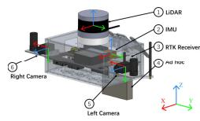  
(a)

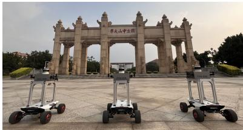  
(b)  
Fig. 5. (a) Sensor configuration for our own datasets collected at Sun Yat-sen University’s eastern campus. Note that the attached cameras are not used in the following experiments. (b) Robotic team of Agilex SCOUT MINI.

TABLE I  
DETAILS OF PUBLIC AND OUR CAMPUS DATASETS
<table><tr><td colspan="2">Datasets</td><td>Environment</td><td colspan="3">Trajectory Length [m] Robot α</td></tr><tr><td rowspan="3">KITI</td><td></td><td></td><td></td><td>Robotβ</td><td>Robot γ</td></tr><tr><td>Seq. 05</td><td>urban</td><td>424.9 1252.8</td><td>599.9</td><td>1066.7</td></tr><tr><td>Seq. 08 Seq. 09</td><td>urban urban</td><td>557.4</td><td>1991.6 733.2</td><td>544.4</td></tr><tr><td rowspan="5">SYuU CpUS</td><td>Square_1</td><td>campus</td><td>455.6</td><td>454.4</td><td>458.2</td></tr><tr><td>Square_2</td><td>campus</td><td>250.6</td><td>246.4</td><td></td></tr><tr><td>Library</td><td>campus</td><td>507.6</td><td>517.2</td><td>498.9</td></tr><tr><td>Playground</td><td>campus</td><td>407.7</td><td>425.6</td><td>445.5</td></tr><tr><td>Dormitory</td><td>campus</td><td>727.0</td><td>719.3</td><td>721.9</td></tr><tr><td rowspan="4"></td><td>College</td><td>campus</td><td>920.5</td><td>995.9</td><td>1072.3</td></tr><tr><td>Teaching_Building</td><td>indoor</td><td>617.2</td><td>734.4</td><td>643.4</td></tr><tr><td></td><td></td><td></td><td></td><td></td></tr></table>

Time synchronization and calibration are essential to achieve high multisensor localization and mapping performance. For time synchronization, a field-programmable gate array (FPGA) board (Altera EP4CE10) is used as the external trigger to generate a pulse periodically to synchronize the LiDAR, cameras, and IMU. The LiDAR is configured to have a 10-Hz update rate and refreshes its internal timer after receiving the 1-Hz trigger pulse. At the same time, the cameras/IMU collects and returns the data immediately after receiving a 10- /100-Hz trigger pulse. We use standard chessboard detection to estimate the camera’s intrinsic parameters for intrinsic calibration, while the IMU intrinsic calibration was conducted using the Kalibr [51] toolbox. Moreover, LiDAR’s proprietary calibration model is applied to correct the data directly during capture. The stereo camera joint and LiDAR–camera joint calibration [52], [53] is performed for extrinsic calibration. Moreover, the camera–IMU joint calibration is conducted using the Allan standard deviation [54]. Note that the cameras participate in the multisensor calibration but are not used in the experiments.

3) Datasets: All experimental results in this article are obtained by comparing performance on three KITTI odometry sequences (HDL-64) and seven collected on SYSU’s eastern campus (VLP-16). For KITTI odometry sequences, we especially adopt sequences 05, 08, and 09 among 11 sequences, as they have a variety of loop closure types, including the same and opposite viewpoints. Furthermore, we split sequences 05 and 09 into three parts and sequence 08 into two to simulate multirobot scenarios. The sequences from KITTI provide GNSS ground-truth data for experimental evaluation.

In addition, six outdoor sequences and one indoor sequence are collected with a robotic team in different scenarios at Sun Yat-sen University’s eastern campus, as shown in Fig. 5(b). The indoor sequence is an online experiment specifically for outlier rejection. Real-time kinematic (RTK) provides the ground-truth data in the outdoor sequences. Table I recaps the main characteristics for all sequences used in the following experiments. Evaluating all robots with a single alignment obtained by aligning the prior owner robot with the ground truth, we used the evo [55] toolbox to compute the absolute translation error (ATE) and absolute rotation error (ARE) of the estimated trajectory of C-SLAM algorithms for KITTI and our campus sequences, as shown in Tables II and III. The trajectories of single-robot SLAM are directly aligned with the ground truth for comparison.

## B. Performance ofDistributed Loop Closure

To compare the end-to-end distributed loop closure detection performance and obtain the best threshold of matching distance, we used the original laser scan from the KITTI sequences to benchmark all global descriptor methods and assumed that all robots start simultaneously. The closest candidate produced by matching the current query with the history database is regarded as an inter-robot loop closure candidate and further verified against the ground truth. If the groundtruth distance between the current query and the closest match is less than 4 m, the loop closure candidate is regarded as a successful loop closure. Note that the 4-m distance is set as default according to [29], and default parameters are set for LiDAR-Iris, Scan-Context, and M2DP.

Different methods’ precision–recall (PR) curves are shown in Fig. 6. Precision is the percentage of successful loop closures, and recall rate is the reported loop closures against total loop closures. Based on the PR curves, the maximum recall rate is 0.61, 0.45, and 0.90 for LiDAR-Iris on Seq. 05, Seq. 08, and Seq. 09; 0.073, 0.059, and 0.84 for M2DP; and 0.56, 0.26, and 0.87 for Scan-Context to reach a 100% precision. Furthermore, these descriptors are applied to detect the loop closure in the SLAM system with the same parameter for verification and optimization. The distance thresholds are set to 0.3, 0.35, and 0.3 for LiDAR-Iris, Scan-Context, and M2DP according to the PR curves, respectively. The average ATE of the trajectories is 0.59, 4.90, and 1.11 m for LiDAR-Iri on Seq. 05, Seq. 08, and Seq. 09; 0.76, 5.01, and 1.18 m for Scan-Context; and 0.80, 9.96, and 2.23 m for M2DP. The ATE results show that the performance of the loop closure will significantly affect the system’s accuracy. In addition, from our observation of experiments and PR curves, M2DP only reported high precision with a lower recall rate and high accuracy on Seq. 09, which shows that M2DP can detect simple interloops correctly. Compared to M2DP, Scan-Context can achieve promising results on all three sequences. In contrast, LiDAR-Iris demonstrates very competitive performance on all three sequences and achieves the best performance, which shows its advanced performance in detecting various inter-robot loop closures. Regarding computational complexity, the average matching time of LiDAR-Iris on Seq. 08 is 24.57 ns, the time of Scan-Context is 6.71 ns, and the time of M2DP is 0.01 ns.

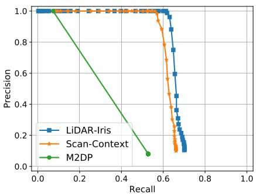  
(a)

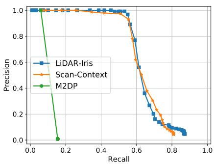  
(b)

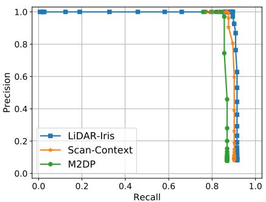  
(c)

Fig. 6. PR curves of different methods on different KITTI sequences. (a) Seq. 05. (b) Seq. 08. (c) Seq. 09.  
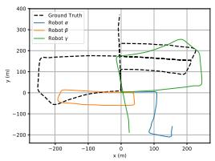  
(a)

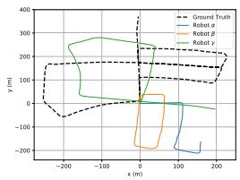  
(b)

  
(c)

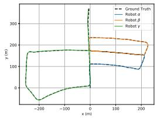  
(d)

  
(e)

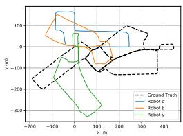  
(f)

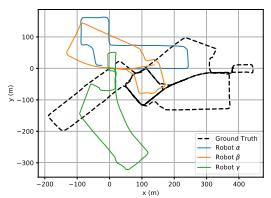  
(g)

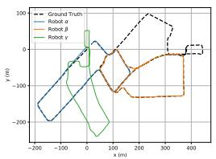  
(h)

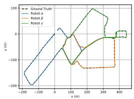  
(i)

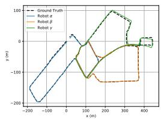  
(j)  
Fig. 7. Trajectories result over the KITTI Seq. 05 [from (a) to (e)] and our College [from (f) to (j)], with different methods. The trajectories that failed to merge with the other trajectory are aligned only with the origin of the ground truth. (a) LIO-SAM. (b) FAST-LIO2. (c) DiSCo-SLAM. (d) DCL-LIO-SAM. (e) DCL-FAST-LIO2. (f) LIO-SAM. (g) FAST-LIO2. (h) DiSCo-SLAM. (i) DCL-LIO-SAM. (j) DCL-FAST-LIO2.

TABLE II  
ATE OF THE SYSU’S EASTERN CAMPUS DATASETS
<table><tr><td></td><td>Datasets</td><td colspan="2">Square_1</td><td colspan="2"></td><td colspan="2">Square_2</td><td colspan="2">Library</td><td colspan="2">Playground</td><td colspan="2"></td><td colspan="2">Dormitory</td><td colspan="2">College</td><td colspan="2">Robot γ</td></tr><tr><td>Configure</td><td></td><td>Robot α</td><td>Robot β</td><td>Robot γ</td><td>Robot α</td><td>Robot β</td><td>Robot α</td><td>Robot β</td><td>Robot γ</td><td></td><td>Robot α Robot β</td><td>Robot γ</td><td>Robot α</td><td>Robot β</td><td></td><td>Robot γ</td><td>Robot α</td><td>Robot β</td></tr><tr><td>Swarm-SLAM</td><td></td><td>1.26 1.13</td><td>0.68</td><td></td><td>0.55</td><td>0.30</td><td>1.31</td><td>1.59</td><td>1.16</td><td>0.30</td><td>0.77</td><td>0.48</td><td>0.55</td><td>1.43</td><td>0.84</td><td>1.81</td><td>4.15</td><td>1.39</td></tr><tr><td>DiSCo-SLAM</td><td></td><td>Failed</td><td></td><td></td><td>Failed</td><td></td><td>0.74</td><td>1.33</td><td>1.27</td><td>0.27</td><td>0.37</td><td>0.38</td><td>0.54</td><td>1.47</td><td>Failed</td><td>2.21</td><td>1.35</td><td>Failed</td></tr><tr><td>only LIO-SAM</td><td>1.23</td><td>0.92</td><td>0.69</td><td></td><td>0.46 0.27</td><td></td><td>1.03</td><td>1.74</td><td>1.30</td><td>0.35</td><td>0.72</td><td>0.45</td><td>0.82</td><td>1.71</td><td>0.70</td><td>2.35</td><td>4.58</td><td>1.41</td></tr><tr><td>our DCL-LIO-SAM</td><td>1.23</td><td>0.86</td><td>0.66</td><td></td><td>0.50</td><td>0.26</td><td>0.58</td><td>1.26</td><td>1.17</td><td>0.33</td><td>0.40</td><td>0.32</td><td>0.52</td><td>1.37</td><td>0.51</td><td>1.51</td><td>1.48</td><td>1.87</td></tr><tr><td>LIO-SAM+CGN</td><td>1.23</td><td>0.87</td><td>0.66</td><td></td><td>0.48</td><td>0.27</td><td>0.58</td><td>1.26</td><td>1.18</td><td>0.33</td><td>0.31</td><td>0.41</td><td>0.46</td><td>1.28</td><td>0.64</td><td>1.48</td><td>1.47</td><td>1.60</td></tr><tr><td>only FAST-LIO2</td><td>1.58</td><td>2.87</td><td>0.72</td><td></td><td>1.47 0.60</td><td></td><td>1.53</td><td>2.29</td><td>1.10</td><td>0.48</td><td>0.76</td><td>0.77</td><td>9.30</td><td>6.28</td><td>2.39</td><td>3.63</td><td>5.69</td><td>12.88</td></tr><tr><td>our DCL-FAST-LIO2</td><td></td><td>1.56 2.87</td><td></td><td>0.72</td><td>1.45</td><td>0.60</td><td>1.30</td><td>1.38</td><td>1.07</td><td>0.58</td><td>0.68</td><td>0.40</td><td>6.91</td><td>5.64</td><td>2.33</td><td>6.13</td><td>3.27</td><td>3.30</td></tr></table>

In summary, the performance of the C-SLAM relies on the performance and efficiency in detecting loop closures.

## C. System Evaluation

To evaluate the accuracy and the robustness of the whole SLAM system, we compared the proposed method to DiSCo-SLAM and single-robot SLAM systems on KITTI odometry datasets, and the result ATE and ARE are shown in Table III. Note that the trajectories of single-robot SLAM are directly aligned with the ground truth. In contrast, the trajectories of multirobot SLAM are jointly aligned with the ground truth, so we mark it as failed when there are trajectories that are not merged with other trajectories. In addition, Fig. 7(a)–(e) presents the trajectory result of different methods on Seq. 05. As shown in Table III, the performance of DCL-SLAM with different odometry, including LIO-SAM (named DCL-LIO-SAM) and FAST-LIO2 (named DCL-FAST-LIO2), is always better than that of only odometry. The reason is that DCL-SLAM introduces more loop closure measurements between robots for co-localization. Table III also shows that DCL-SLAM successfully merges all submaps in Seq. 05 and Seq. 09 when DiSCo-SLAM failed because the inter-robot loop closures were not detected. In Seq. 08 of successful collaborative mapping, our DCL-SLAM has a smaller ATE and a similar ARE than DiSCo-SLAM. What is more, our DCL-SLAM reaches the best in Seq. 05 and Seq. 09. These illustrate that DCL-SLAM has higher accuracy and good robustness in divided public KITTI odometry sequences.

TABLE III  
ATE AND ARE OF THE KITTI ODOMETRY SEQUENCES
<table><tr><td rowspan="2">Seq.</td><td rowspan="2">Configure</td><td colspan="3">ATE [m]</td><td colspan="3">ARE [deg]</td></tr><tr><td>Robot α</td><td>Robot β</td><td>Robot γ</td><td>Robot α</td><td></td><td>Robot β Robot γ</td></tr><tr><td rowspan="5">Seq. 09</td><td>DiSCo-SLAM</td><td></td><td>Failed</td><td></td><td></td><td>Failed</td><td></td></tr><tr><td>only LIO-SAM</td><td>1.04</td><td>1.70</td><td>0.90</td><td>1.50</td><td>2.82</td><td>2.28</td></tr><tr><td>our DCL-LIO-SAM</td><td>1.07</td><td>1.40</td><td>0.85</td><td>1.46</td><td>2.64</td><td>2.20</td></tr><tr><td>only FAST-LIO2</td><td>1.08</td><td>4.14</td><td>0.77</td><td>2.91</td><td>15.51</td><td>1.97</td></tr><tr><td>our DCL-FAST-LIO2</td><td>0.95</td><td>2.46</td><td>0.70</td><td>2.83</td><td>8.77</td><td>1.73</td></tr><tr><td rowspan="5">Seq. 08</td><td>DiSCo-SLAM only LIO-SAM</td><td>5.16</td><td>5.73</td><td></td><td>6.12</td><td>5.47</td><td></td></tr><tr><td></td><td>5.57</td><td>5.53</td><td></td><td>6.46</td><td>5.71</td><td></td></tr><tr><td>our DCL-LIO-SAM</td><td>4.92</td><td>4.87</td><td></td><td>6.25</td><td>5.69</td><td></td></tr><tr><td>only FAST-LIO2</td><td>5.29</td><td>4.98</td><td></td><td>5.58</td><td>6.25</td><td></td></tr><tr><td>our DCL-FAST-LIO2</td><td>4.58</td><td>4.54</td><td></td><td>5.15</td><td>6.04</td><td></td></tr><tr><td rowspan="5">Seq. 05</td><td>DiSCo-SLAM</td><td></td><td>Failed</td><td></td><td></td><td>Failed</td><td></td></tr><tr><td>only LIO-SAM</td><td>0.30</td><td>1.21</td><td>2.80</td><td>1.47</td><td>1.48</td><td>11.34</td></tr><tr><td>our DCL-LIO-SAM</td><td>0.25</td><td>0.44</td><td>1.08</td><td>1.43</td><td>1.14</td><td>1.12</td></tr><tr><td>only FAST-LIO2</td><td>0.46</td><td>0.90</td><td>2.30</td><td>2.51</td><td>2.25</td><td>2.25</td></tr><tr><td>our DCL-FAST-LIO2</td><td>0.55</td><td>1.05</td><td>1.34</td><td>1.93</td><td>2.00</td><td>1.82</td></tr></table>

In order to further evaluate the accuracy and robustness of the proposed system and overcome the reality gap, we deployed UGVs on our campus for field tests and dataset recording, as shown in Section IV-A. Similar to the above public datasets evaluation, we conducted a comparative analysis of the proposed DCL-SLAM with DiSCo-SLAM, Swarm-SLAM (LIO-SAM as front end), single-robot SLAM systems, and a locally centralized method (DCL-LIO-SAM with centralized Gauss–Newton method instead of the DGS method, referred to as LIO-SAM + CGN) using our campus datasets. The ATE result is shown in Table II. In addition, Fig. 7(f)–(j) shows the trajectory results of different methods on sequence College. Furthermore, Fig. 1 showcases the trajectories and reconstructed maps of the UGVs on sequence Library performed by DLC-LIO-SAM. These findings reveal that DiSCo-SLAM performed well in certain sequences but struggled to merge all submaps in most cases, potentially due to inadequately designed loop closures searching and matching modules or the incorrect default parameter setting. Unlike DiSCo-SLAM, Swarm-SLAM, which replaces the RTAB-Map front end with LIO-SAM for efficiency, successfully completed all sequences. However, the processing speed of loop closure detection remains a bottleneck for real-time co-localization. Conversely, our DCL-LIO-SAM approach demonstrates very competitive real-time performance across most sequences. Compared to single-robot odometry, DCL-SLAM improves the performance by over 20% on the Library, Playground, Dormitory, and College sequences and reports similar performance on two Square sequences in which all robots move forward and converge at certain places. The distributed loop closure module can only successfully detect simple loop closures during specific encounters and fails to detect challenging loop closures in other encounters. Consequently, the proposed framework can solely merge the trajectories but cannot eliminate the odometry drift. In addition, the ATE results of LIO-SAM + CGN and DCL-LIO-SAM show that DCL-SLAM could save bandwidth with similar accuracy compared with the locally centralized method. According to the observation in the experiment, FAST-LIO2 has a large deviation in elevation on Dormitory and College sequences, leading to correct the odometry’s drift in DLC-FAST-LIO2 hardly. It also inspired us that although collaborative SLAM can further improve the accuracy of single-robot odometry with extra inter-robot measurements, it is heavily dependent on the accuracy of single-robot odometry. In general, DCL-SLAM has high accuracy, robustness, and broad applicability in our campus sequences.

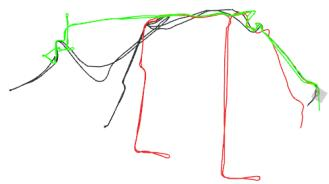  
(a)

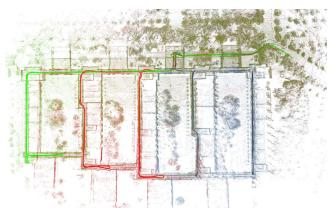  
(b)  
Fig. 8. Trajectories result of DCL-LIO-SAM with and without outlier rejection on an environment with severe perceptual aliasing, where robot α/β/γ is represented by green/red/blue, respectively. (a) Without outlier rejection. (b) With outlier rejection.

TABLE IV  
NETWORK TRAFFIC OF EACH ROBOT AVERAGED OVER KITTI AND CAMPUS SEQUENCES
<table><tr><td rowspan="2">Datasets</td><td colspan="3">Avg. Transmit Data [kB/s] Communication</td><td rowspan="2">Time [s]</td></tr><tr><td></td><td>Robot α Robot β</td><td>Robot γ</td></tr><tr><td rowspan="4">KITI</td><td>Seq. 09</td><td>92.93</td><td>177.30</td><td>91.14</td><td>101.24</td></tr><tr><td>Seq. 08</td><td>161.78</td><td>160.93</td><td></td><td>191.86</td></tr><tr><td>Seq. 05</td><td>81.08</td><td>143.41</td><td>187.73</td><td>251.70</td></tr><tr><td>Avg. (3 Seq.)</td><td></td><td>164.67</td><td></td><td>181.60</td></tr><tr><td rowspan="5">Capus</td><td>Library</td><td>34.43</td><td>60.51</td><td>43.92</td><td>1014.44</td></tr><tr><td>College</td><td>66.98</td><td>67.48</td><td>57.98</td><td>1188.84</td></tr><tr><td>Square_1</td><td>41.75</td><td>40.68</td><td>37.89</td><td>538.99</td></tr><tr><td>Avg. (3 Seq.)</td><td></td><td>53.55</td><td></td><td>914.09</td></tr></table>

TABLE V  
DATA SIZE OF MESSAGES SENT ON CAMPUS SEQUENCES
<table><tr><td colspan="2">Information of Message Sent</td><td>Avg.Size [kB] ± Std.</td></tr><tr><td rowspan="2">Keyframe</td><td>Global Descriptor</td><td> $2 9 . 1 2 \pm 0 . 0 0$ </td></tr><tr><td>Feature Cloud*</td><td> $1 6 0 . 2 4 \pm 1 6 . 0 0$ </td></tr><tr><td rowspan="3">Inter-robot Match</td><td>Loop Closure Measurement</td><td> $0 . 1 1 \pm 0 . 0 0$ </td></tr><tr><td>Verification Point Cloud</td><td> $9 9 . 9 2 \pm 1 3 . 9 6$ </td></tr><tr><td>Raw Point Cloud*</td><td> $3 8 4 . 7 6 \pm 3 0 . 7 6$ </td></tr><tr><td>Distributed PGO</td><td>Pose Estimate</td><td> $0 . 1 0 \pm 0 . 0 0$ </td></tr></table>

\* The messages sent in case the robots were to directly transmit raw data.

## D. Field Test With Outlier Rejection

We also experimented with the proposed DLC-SLAM framework in a teaching building on our campus, an environment with severe perceptual aliasing, with a likelihood threshold of 5.348 for PCM and an inlier threshold of 0.3 for geometric verification using the RANSAC algorithm. Fig. 8 reports the trajectories and mapping results of DCL-LIO-SAM with and without the PCM. The estimated trajectories of the robotic swarm with the PCM method in Fig. 8(b) are more consistent with the surrounding environment than that in Fig. 8(a), which explains the necessity of introducing an outlier rejection module.

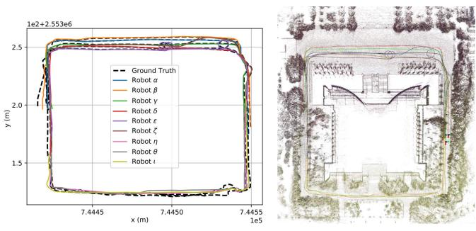  
(a)  
(b)  
Fig. 9. Trajectories and maps result of DCL-LIO-SAM on a large-scale experiment simulated with nine robots, where the map of robot α/β/γ/δ/ϵ/ζ/η/θ/ι is represented by green/red/black/brown/purple/blue/dark green/orange/dark yellow, respectively. (a) Trajectories. (b) Maps.

## E. Communication

To quantify the bandwidth requirements of the proposed DCL-SLAM system, we also counted the network traffic on public (HDL-64) and our campus datasets (VLP-16), and the mean bandwidth is shown in Table IV. In this experiment, we assume that there are no communication range constraints in the robotic swarm so that messages can be exchanged at any time. For Library sequence, the distributed PGO module needs to transfer 3.46 MB of data, while the centralized one requires 10.06 MB to transmit the whole pose graph.

Furthermore, we counted the sizes of messages sent among swarm on our datasets, as shown in Table V. In DCL-SLAM, the transmitted data can be grouped into keyframe, inter-robot match, and distributed PGO. The keyframe message in DCL-SLAM is the global descriptor extracted from the keyframe 3-D point cloud. While a single laser scan from VLP-16 and HDL-64 is 1 and 2 MB, respectively, the message size needed for the DiSCo-SLAM method for each LiDAR keyframe is around 200 kB for VLP-16 while transmitting the keyframe feature cloud. On the contrary, in DCL-SLAM, the size of the global descriptors of each frame is 29.12 kB, with sending filtered raw point cloud for verification (99.92 kB/frame for VLP-16) in the loop closure message if necessary. The inter-robot match messages are mainly the loop measurement and verification laser point cloud. The last distributed PGO message mainly includes optimization states, the rotation, and pose estimates from the neighbor. In summary, our proposed DCL-SLAM will significantly reduce the communication burden without sharing raw data.

## F. Large-Scare C-SLAM With Nine Robots

In this experiment, we evaluate the applicability of the proposed DCL-SLAM with LIO-SAM as front-end odometry to a scenario with a large team of UGVs. Similar to the operation on public datasets, we split two sequences collected on Sun Yat-sen University’s eastern campus library with three UGVs to simulate a nine UGVs dataset, which provides RTK as ground truth. As shown in Fig. 9(a), it comprises nine U-shaped trajectories of over 250 m, covering the whole library building, and Fig. 9(b) shows the collaborative mapping generated by DCL-LIO-SAM. Note that the outlier rejection module is not enabled in this experiment, and it is assumed that the network is full-connected. An illustration of the experiment is shown in the accompanying video. The quantization results are as follows: the average ATE of all trajectories is 1.83 m and the average bandwidth of transmitted data is 34.36 kB/s. The average bandwidth positively correlates with the number of UGVs because of the end-toend information sharing. The experimental results show that the proposed framework can be extended to large-scale robotic swarms.

## V. CONCLUSION

This letter proposes a front-end agnostic fully distributed collaborative LiDAR SLAM framework, namely, DCL-SLAM, to complete a collaborative mapping task in an unknown environment with a robotic swarm. The proposed system is divided into three submodules: a flexible single-robot front end, a data-efficient distributed loop closure, and a robust back end with minimal information exchange. Experimental results on public and our campus datasets show the proposed framework’s precision, robustness, and scalability. In future work, we plan to explore the performance of distributed closure modules, for example, exchange data more effectively and test the system with the solid-state LiDAR more.

## REFERENCES

[1] C. Cadena et al., “Past, present, and future of simultaneous localization and mapping: Toward the robust-perception age,” IEEE Trans. Robot., vol. 32, no. 6, pp. 1309–1332, Dec. 2016.

[2] T. Shan, B. Englot, D. Meyers, W. Wang, C. Ratti, and D. Rus, “LIO-SAM: Tightly-coupled LiDAR inertial odometry via smoothing and mapping,” in Proc. IEEE/RSJ Int. Conf. Intell. Robots Syst. (IROS), Oct. 2020, pp. 5135–5142.

[3] W. Ali, P. Liu, R. Ying, and Z. Gong, “A feature based laser SLAM using rasterized images of 3D point cloud,” IEEE Sensors J., vol. 21, no. 21, pp. 24422–24430, Nov. 2021.

[4] W. Xu, Y. Cai, D. He, J. Lin, and F. Zhang, “FAST-LIO2: Fast direct LiDAR-inertial odometry,” IEEE Trans. Robot., vol. 38, no. 4, pp. 2053–2073, Aug. 2022.

[5] B. Zhou, C. Li, S. Chen, D. Xie, M. Yu, and Q. Li, “ASL-SLAM: A LiDAR SLAM with activity semantics-based loop closure,” IEEE Sensors J., vol. 23, no. 12, pp. 13499–13510, Jun. 2023.

[6] P.-Y. Lajoie, B. Ramtoula, F. Wu, and G. Beltrame, “Towards collaborative simultaneous localization and mapping: A survey of the current research landscape,” Field Robot., vol. 2, no. 1, pp. 971–1000, Mar. 2022.

[7] K. Ebadi et al., “LAMP: Large-scale autonomous mapping and positioning for exploration of perceptually-degraded subterranean environments,” in Proc. IEEE Int. Conf. Robot. Autom. (ICRA), May 2020, pp. 80–86.

[8] Y. Chang et al., “LAMP 2.0: A robust multi-robot SLAM system for operation in challenging large-scale underground environments,” IEEE Robot. Autom. Lett., vol. 7, no. 4, pp. 9175–9182, Oct. 2022.

[9] R. Dubé et al., “SegMap: Segment-based mapping and localization using data-driven descriptors,” Int. J. Robot. Res., vol. 39, nos. 2–3, pp. 339–355, Mar. 2020.

[10] H. Zhou, Z. Yao, Z. Zhang, P. Liu, and M. Lu, “An online multi-robot SLAM system based on LiDAR/UWB fusion,” IEEE Sensors J., vol. 22, no. 3, pp. 2530–2542, Feb. 2022.

[11] Y. Huang, T. Shan, F. Chen, and B. Englot, “DiSCo-SLAM: Distributed scan context-enabled multi-robot LiDAR SLAM with two-stage global– local graph optimization,” IEEE Robot. Autom. Lett., vol. 7, no. 2, pp. 1150–1157, Apr. 2022.

[12] K. Y. Leung, Y. Halpern, T. D. Barfoot, and H. H. Liu, “The UTIAS multi-robot cooperative localization and mapping dataset,” Int. J. Robot. Res., vol. 30, no. 8, pp. 969–974, Jul. 2011.

[13] Y. Wang, Z. Sun, C.-Z. Xu, S. E. Sarma, J. Yang, and H. Kong, “LiDAR iris for loop-closure detection,” in Proc. IEEE/RSJ Int. Conf. Intell. Robots Syst. (IROS), Oct. 2020, pp. 5769–5775.

[14] J. G. Mangelson, D. Dominic, R. M. Eustice, and R. Vasudevan, “Pairwise consistent measurement set maximization for robust multirobot map merging,” in Proc. IEEE Int. Conf. Robot. Autom. (ICRA), May 2018, pp. 2916–2923.

[15] S. Choudhary, L. Carlone, C. Nieto, J. Rogers, H. I. Christensen, and F. Dellaert, “Distributed trajectory estimation with privacy and communication constraints: A two-stage distributed Gauss–Seidel approach,” in Proc. IEEE Int. Conf. Robot. Autom. (ICRA), May 2016, pp. 5261–5268.

[16] O. De Silva, G. K. I. Mann, and R. G. Gosine, “An ultrasonic and vision-based relative positioning sensor for multirobot localization,” IEEE Sensors J., vol. 15, no. 3, pp. 1716–1726, Mar. 2015.

[17] R. Dubé, A. Gawel, H. Sommer, J. Nieto, R. Siegwart, and C. Cadena, “An online multi-robot SLAM system for 3D LiDARs,” in Proc. IEEE/RSJ Int. Conf. Intell. Robots Syst. (IROS), Sep. 2017, pp. 1004–1011.

[18] M. Karrer, P. Schmuck, and M. Chli, “CVI-SLAM—Collaborative visual-inertial SLAM,” IEEE Robot. Autom. Lett., vol. 3, no. 4, pp. 2762–2769, Oct. 2018.

[19] P. Schmuck and M. Chli, “CCM-SLAM: Robust and efficient centralized collaborative monocular simultaneous localization and mapping for robotic teams,” J. Field Robot., vol. 36, no. 4, pp. 763–781, Jun. 2019.

[20] P.-Y. Lajoie, B. Ramtoula, Y. Chang, L. Carlone, and G. Beltrame, “DOOR-SLAM: Distributed, online, and outlier resilient SLAM for robotic teams,” IEEE Robot. Autom. Lett., vol. 5, no. 2, pp. 1656–1663, Apr. 2020.

[21] Y. Chang, Y. Tian, J. P. How, and L. Carlone, “Kimera-multi: A system for distributed multi-robot metric-semantic simultaneous localization and mapping,” in Proc. IEEE Int. Conf. Robot. Autom. (ICRA), May 2021, pp. 11210–11218.

[22] M. Ouyang et al., “A collaborative visual SLAM framework for service robots,” in Proc. IEEE/RSJ Int. Conf. Intell. Robots Syst. (IROS), Sep. 2021, pp. 8679–8685.

[23] P. Schmuck, T. Ziegler, M. Karrer, J. Perraudin, and M. Chli, “COVINS: Visual-inertial SLAM for centralized collaboration,” in Proc. IEEE Int. Symp. Mixed Augmented Reality Adjunct (ISMAR-Adjunct), Oct. 2021, pp. 171–176.

[24] T. Shan, B. Englot, F. Duarte, C. Ratti, and D. Rus, “Robust place recognition using an imaging LiDAR,” in Proc. IEEE Int. Conf. Robot. Autom. (ICRA), May 2021, pp. 5469–5475.

[25] J. Knopp, M. Prasad, G. Willems, R. Timofte, and L. Van Gool, “Hough transform and 3D SURF for robust three dimensional classification,” in Proc. 11th Eur. Conf. Comput. Vis. (ECCV), Crete, Greece. Berlin, Germany: Springer, Sep. 2010, pp. 589–602.

[26] S. M. Prakhya, B. Liu, and W. Lin, “B-SHOT: A binary feature descriptor for fast and efficient keypoint matching on 3D point clouds,” in Proc. IEEE/RSJ Int. Conf. Intell. Robots Syst. (IROS), Sep. 2015, pp. 1929–1934.

[27] Z.-C. Marton, D. Pangercic, R. B. Rusu, A. Holzbach, and M. Beetz, “Hierarchical object geometric categorization and appearance classification for mobile manipulation,” in Proc. 10th IEEE-RAS Int. Conf. Humanoid Robots, Dec. 2010, pp. 365–370.

[28] L. He, X. Wang, and H. Zhang, “M2DP: A novel 3D point cloud descriptor and its application in loop closure detection,” in Proc. IEEE/RSJ Int. Conf. Intell. Robots Syst. (IROS), Oct. 2016, pp. 231–237.

[29] G. Kim and A. Kim, “Scan context: Egocentric spatial descriptor for place recognition within 3D point cloud map,” in Proc. IEEE/RSJ Int. Conf. Intell. Robots Syst. (IROS), Oct. 2018, pp. 4802–4809.

[30] K. P. Cop, P. V. K. Borges, and R. Dubé, “Delight: An efficient descriptor for global localisation using LiDAR intensities,” in Proc. IEEE Int. Conf. Robot. Autom. (ICRA), May 2018, pp. 3653–3660.

[31] K. B. Logoglu, S. Kalkan, and A. Temizel, “CoSPAIR: Colored histograms of spatial concentric surflet-pairs for 3D object recognition,” Robot. Auto. Syst., vol. 75, pp. 558–570, Jan. 2016.

[32] P.-Y. Lajoie and G. Beltrame, “Swarm-SLAM: Sparse decentralized collaborative simultaneous localization and mapping framework for multi-robot systems,” IEEE Robot. Autom. Lett., vol. 9, no. 1, pp. 475–482, Jan. 2024.

[33] R. Q. Charles, H. Su, M. Kaichun, and L. J. Guibas, “PointNet: Deep learning on point sets for 3D classification and segmentation,” in Proc. IEEE Conf. Comput. Vis. Pattern Recognit. (CVPR), Jul. 2017, pp. 77–85.

[34] Z. J. Yew and G. H. Lee, “3DFeat-Net: Weakly supervised local 3D features for point cloud registration,” in Proc. Eur. Conf. Comput. Vis. (ECCV), 2018, pp. 607–623.

[35] K. Fischer, M. Simon, F. Ölsner, S. Milz, H.-M. Groß, and P. Mäder, “StickyPillars: Robust and efficient feature matching on point clouds using graph neural networks,” in Proc. IEEE/CVF Conf. Comput. Vis. Pattern Recognit. (CVPR), Jun. 2021, pp. 313–323.

[36] T. Ye, X. Yan, S. Wang, Y. Li, and F. Zhou, “An efficient 3-D point cloud place recognition approach based on feature point extraction and transformer,” IEEE Trans. Instrum. Meas., vol. 71, pp. 1–9, 2022.

[37] P. J. Besl and N. D. McKay, “Method for registration of 3-D shapes,” Proc. SPIE, vol. 1611, pp. 586–606, Apr. 1992.

[38] K. Koide, M. Yokozuka, S. Oishi, and A. Banno, “Voxelized GICP for fast and accurate 3D point cloud registration,” in Proc. IEEE Int. Conf. Robot. Autom. (ICRA), May 2021, pp. 11054–11059.

[39] T. Cieslewski and D. Scaramuzza, “Efficient decentralized visual place recognition using a distributed inverted index,” IEEE Robot. Autom. Lett., vol. 2, no. 2, pp. 640–647, Apr. 2017.

[40] T. Cieslewski, S. Choudhary, and D. Scaramuzza, “Data-efficient decentralized visual SLAM,” in Proc. IEEE Int. Conf. Robot. Autom. (ICRA), May 2018, pp. 2466–2473.

[41] S. Choudhary, L. Carlone, C. Nieto, J. Rogers, H. I. Christensen, and F. Dellaert, “Distributed mapping with privacy and communication constraints: Lightweight algorithms and object-based models,” Int. J. Robot. Res., vol. 36, no. 12, pp. 1286–1311, Oct. 2017.

[42] W. Wang, N. Jadhav, P. Vohs, N. Hughes, M. Mazumder, and S. Gil, “ActiveRendezvous for multi-robot pose graph optimization using sensing over Wi-Fi,” in Proc. Int. Symp. Robot. Res. Cham, Switzerland: Springer, 2019, pp. 832–849.

[43] M. A. Fischler and R. Bolles, “Random sample consensus: A paradigm for model fitting with applications to image analysis and automated cartography,” Commun. ACM, vol. 24, no. 6, pp. 381–395, 1981.

[44] H. Do, S. Hong, and J. Kim, “Robust loop closure method for multirobot map fusion by integration of consistency and data similarity,” IEEE Robot. Autom. Lett., vol. 5, no. 4, pp. 5701–5708, Oct. 2020.

[45] H. Yang, P. Antonante, V. Tzoumas, and L. Carlone, “Graduated nonconvexity for robust spatial perception: From non-minimal solvers to global outlier rejection,” IEEE Robot. Autom. Lett., vol. 5, no. 2, pp. 1127–1134, Apr. 2020.

[46] D. M. Rosen, L. Carlone, A. S. Bandeira, and J. J. Leonard, “SE-Sync: A certifiably correct algorithm for synchronization over the special Euclidean group,” Int. J. Robot. Res., vol. 38, nos. 2–3, pp. 95–125, Mar. 2019.

[47] A. Cunningham, V. Indelman, and F. Dellaert, “DDF-SAM 2.0: Consistent distributed smoothing and mapping,” in Proc. IEEE Int. Conf. Robot. Autom., May 2013, pp. 5220–5227.

[48] R. Tron, J. Thomas, G. Loianno, K. Daniilidis, and V. Kumar, “A distributed optimization framework for localization and formation control: Applications to vision-based measurements,” IEEE Control Syst. Mag., vol. 36, no. 4, pp. 22–44, Aug. 2016.

[49] T. Fan and T. Murphey, “Majorization minimization methods for distributed pose graph optimization with convergence guarantees,” in Proc. IEEE/RSJ Int. Conf. Intell. Robots Syst. (IROS), Oct. 2020, pp. 5058–5065.

[50] Y. Tian, K. Khosoussi, D. M. Rosen, and J. P. How, “Distributed certifiably correct pose-graph optimization,” IEEE Trans. Robot., vol. 37, no. 6, pp. 2137–2156, Dec. 2021.

[51] J. Maye, P. Furgale, and R. Siegwart, “Self-supervised calibration for robotic systems,” in Proc. IEEE Intell. Vehicles Symp. (IV), Jun. 2013, pp. 473–480.

[52] Z. Zhang, “A flexible new technique for camera calibration,” IEEE Trans. Pattern Anal. Mach. Intell., vol. 22, no. 11, pp. 1330–1334, 2000.

[53] L. Zhou, Z. Li, and M. Kaess, “Automatic extrinsic calibration of a camera and a 3D LiDAR using line and plane correspondences,” in Proc. IEEE/RSJ Int. Conf. Intell. Robots Syst. (IROS), Oct. 2018, pp. 5562–5569.

[54] P. Furgale, J. Rehder, and R. Siegwart, “Unified temporal and spatial calibration for multi-sensor systems,” in Proc. IEEE/RSJ Int. Conf. Intell. Robots Syst., Nov. 2013, pp. 1280–1286.

[55] Michael Grupp. (2017). evo: Python Package for the Evaluation of Odometry and SLAM. [Online]. Available: https://github .com/MichaelGrupp/evo

Shipeng Zhong received the B.E. degree from the School of Computer Science and Engineering, Sun Yat-sen University, Guangzhou, China, in 2020, where he is currently pursuing the Ph.D. degree with the School of Systems Science and Engineering, under the supervision of Prof. Hongbo Chen.

His research interests are in the areas of autonomous unmanned systems and cooperative mapping.

Yuhua Qi received the B.S. and Ph.D. degrees in aerospace engineering from the Beijing Institute of Technology, Beijing, China, in 2020.

He is currently a Postdoctoral Researcher at the School of Systems Science and Engineering, Sun Yat-sen University, Guangzhou, China. His research interests include multirobot simultaneous localization and mapping (SLAM), cooperative control, and autonomous unmanned systems.

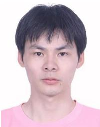

Zhiqiang Chen received the B.E. degree from Sun Yat-sen University, Guangzhou, China, in 2021, where he is currently pursuing the bachelor’s degree in engineering majoring information engineering with the School of Systems Science and Engineering.

His research interests include light detection and ranging (LiDAR) simultaneous localization and mapping (SLAM) and sensor fusion.

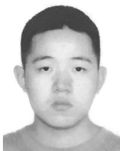

Jin Wu (Member, IEEE) was born in Zhenjiang, Jiangsu, China, in 1994. He received the B.S. degree from the University of Electronic Science and Technology of China, Chengdu, China, in 2016. He is currently pursuing the Ph.D. degree with RAM-LAB, The Hong Kong University of Science and Technology (HKUST), Hong Kong, under the supervision of Prof. Ming Liu.

In 2013, he was a Visiting Student at the Groep T, Katholieke Universiteit Leuven, Leuven, Belgium. From 2019 to 2020, he was with Tencent Robotics X, Shenzhen, China. He is currently studying pose estimation in robotics.

Hongbo Chen received the degree from the School of Astronautics, Harbin Institute of Technology, Harbin, China, and the Ph.D. degree in aircraft design and engineering Harbin Institute of Technology in 2007.

He started his career at the First Research Institute, China Aerospace Science and Technology Corporation (CASC), Beijing, China, in 2007. In 2018, he was transferred to the School of Systems Science and Engineering, Sun Yat-sen University, Guangzhou, China.

He has abundant work experience in the core positions of the aerospace industry. As the main author, he has been granted 26 patents, including 11 inventions. As the first author or main author, he has published more than 30 academic articles and two books. He has been engaged in the pre-research and innovation work of major national projects for years. His innovative research and system engineering practices concentrate in the fields of aerospace transportation systems and aerospace unmanned systems, and many key technical problems have been conquered by him and his team.

Ming Liu (Senior Member, IEEE) received the B.A. degree in automation from Tongji University, Shanghai, China, in 2005, the master’s degree from Tongji University, in 2008, and the Ph.D. degree from the Department of Mechanical and Process Engineering, ETH Zürich, Zürich, Switzerland, in 2013, under the supervision of Prof. Roland Siegwart.

During his master’s degree, he stayed one year with the University of Erlangen–Nunberg, Erlangen, Germany, and the Fraunhofer Institute

IISB, Erlangen, as a Master Visiting Scholar. He is currently with the Electronic and Computer Engineering, Computer Science and Engineering Department, Robotics Institute, The Hong Kong University of Science and Technology (HKUST), Hong Kong, China, as an Associate Professor. He is also a Founding Member at Shanghai Swing Automation Company Ltd., Shanghai. He is currently the Chairperson of Shenzhen Unity Drive Inc., Shenzhen, China. He is coordinating and involved in NSF projects and National 863-Hi-TechPlan Projects in China. He has published many popular articles in top robotics journals, including IEEE TRANSACTIONS ON ROBOTICS, International Journal of Robotics Research, and IEEE Robotics and Automation Magazine. His research interests include dynamic environment modeling, deep learning for robotics, 3-D mapping, machine learning, and visual control.

Dr. Liu is a Program Member of Robotics: Science and Systems (RSS) in 2021. He was a recipient of the European Micro Aerial Vehicle Competition (EMAV’09) (Second Place) and two awards from the International Aerial Robot Competition (IARC’14) as a Team Member, the Best Student Paper Award as first author for the IEEE International Conference on Multisensor Fusion and Information Integration (MFI 2012), the Best Paper Award in Information for the IEEE International Conference on Information and Automation (ICIA 2013) as first author, the Best Paper Award Finalists as coauthor, the Best RoboCup Paper Award for the IEEE/RSJ International Conference on Intelligent Robots and Systems (IROS 2013), the Best Conference Paper Award for IEEE International Conference on CYBER Technology in Automation, Control, and Intelligent Systems (CYBER) 2015, the Best Student Paper Finalist for the IEEE International Conference on Real-Time Computing and Robotics (RCAR 2015), the Best Student Paper Finalist for IEEE International Conference on Robotics and Biomimetics (ROBIO) 2015, the Best Student Paper for IEEE ROBIO 2019, the Best Student Paper Award for IEEE International Conference on Advanced Robotics (ICAR) 2017, the Best Paper in Automation Award for IEEE ICIA 2017, twice the innovation contest Chunhui Cup Winning Award in 2012 and 2013, and the Wu Wenjun AI Award in 2016. He was the Program Chair of IEEE RCAR 2016 and the Program Chair of the International Robotics Conference in Foshan 2017. He was the Conference Chair of International Conference on Computer Vision Systems (ICVS) 2017. He is also an Associate Editor of IEEE ROBOTICS AND AUTOMATION LETTERS, International Journal of Robotics and Automation, IET Cyber-Systems and Robotics, and IEEE IROS Conference 2018, 2019, and 2020. He served as a Guest Editor for the Special Issues of IEEE TRANSACTIONS ON AUTOMATION SCIENCE AND ENGINEERING.