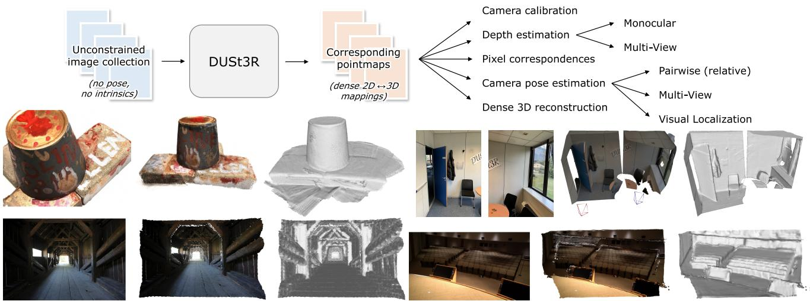
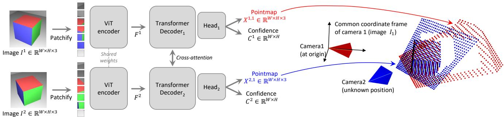
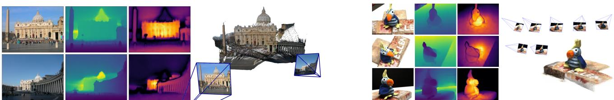

# DUSt3R: Geometric 3D Vision Made Easy

Shuzhe Wang∗, Vincent Leroy†, Yohann Cabon†, Boris Chidlovskii† and Jerome Revaud† ∗Aalto University †Naver Labs Europe shuzhe.wang@aalto.fi firstname.lastname@naverlabs.com

  
Figure 1. Top: DUSt3R takes as input an unconstrained collection of images and outputs pointmaps, from which various geometric quantities can be straightforwardly derived. Bottom: Fully-consistent 3D reconstructions without input camera poses nor intrinsics. From left to right: input image, colored point-cloud, rendered with shading. DUSt3R can also reconstruct scenes without any visual overlap (top-right).

## Abstract

Multi-view stereo reconstruction (MVS) in the wild requires to first estimate the camera intrinsic and extrinsic parameters. These are usually tedious and cumbersome to obtain, yet they are mandatory to triangulate corresponding pixels in 3D space, which is at the core ofall best performing MVS algorithms. In this work, we take an opposite stance and introduce DUSt3R, a radically novel paradigm for Dense and Unconstrained Stereo 3D Reconstruction of arbitrary image collections, operating without prior information about camera calibration nor viewpoint poses. We cast the pairwise reconstruction problem as a regression of pointmaps, relaxing the hard constraints ofusual projective camera models. We show that this formulation smoothly unifies the monocular and binocular reconstruction cases. In the case where more than two images are provided, wefurther propose a simple yet effective global alignment strategy that expresses all pairwise pointmaps in a common referenceframe. We base our network architecture on standard Transformer encoders and decoders, allowing us to leverage powerful pretrained models. Ourformulation directly provides a 3D model of the scene as well as depth information, but interestingly, we can seamlessly recover from it, pixel matches,focal lengths, relative and absolute cameras. Exten-

sive experiments on all these tasks showcase how DUSt3R effectively unifies various 3D vision tasks, setting new performance records on monocular & multi-view depth estimation as well as relative pose estimation. In summary, DUSt3R makes many geometric 3D vision tasks easy. Code and models at https://github.com/naver/dust3r.

## 1. Introduction

Unconstrained dense 3D reconstruction from multiple RGB images is one long-researched end-goal of computer vision [21, 58, 72]. In a nutshell, it is the task of estimating the 3D geometry and camera parameters of a particular scene, given a set of photographs of this scene. Not only does it have numerous applications like mapping [12, 59], navigation [13], archaeology [70, 99], cultural heritage preservation [37], robotics [63], but perhaps more importantly, it holds a fundamentally special place among all the tasks from the 3D vision research field. Indeed, it subsumes nearly all geometric 3D vision tasks, and modern approaches for 3D reconstruction thus consists in a sequential succession of many components, such as keypoint detection [23, 26, 53, 77] and matching [9, 51, 81, 92], robust estimation [3, 9, 137], Structure-from-Motion (SfM) and Bundle Adjustment (BA) [18, 50, 83], dense Multi-

View Stereo (MVS) [84, 103, 119, 134], etc. This rather complex chain is of course a viable solution in some settings [30, 57, 61, 106, 110, 112, 123], yet we argue it is quite unsatisfactory: each task is not solved perfectly and adds noise to the next step, increasing the complexity and the engineering effort required for the pipeline to work as a whole. The absence of communication between each component is also quite telling: it would seem more reasonable if they helped each other, i.e. dense reconstruction should naturally benefit from the sparse scene that was built to recover camera poses, and vice-versa. On top of that, key steps in this pipeline are brittle and prone to break in many cases [50]. For instance, the crucial stage of SfM that serves to estimate all camera parameters is typically known to fail in many common situations, e.g. when the number of scene views is low [85], for objects with non-Lambertian surfaces [14], in case of insufficient or overly large camera motion [12], etc.

In this paper, we present DUSt3R, a radically novel approach for Dense Unconstrained Stereo 3D Reconstruction from un-calibrated and un-posed cameras. The main component is a network that can regress a dense and accurate scene representation solely from a pair of images, without prior information regarding the scene nor the cameras (not even the intrinsic parameters). The resulting scene representation is based on 3D pointmaps with rich properties: they simultaneously encapsulate (a) the scene geometry, (b) the relation between pixels and scene points and (c) the relation between the two viewpoints. From this output alone, practically all scene parameters (i.e. cameras and scene geometry) can be straightforwardly recovered. This is possible because the network jointly processes the input images and the resulting 3D pointmaps, thus learning to associate 2D patterns with 3D shapes and having the opportunities of solving multiple tasks simultaneously, enabling internal ‘collaboration between them.

Our model is trained in a fully-supervised manner using a simple regression loss, leveraging large public datasets for which ground-truth annotations are either synthetically generated [56, 82], reconstructed from SfM softwares [47, 122] or captured using dedicated sensors [22, 75, 94, 126]. We drift away from the trend of integrating task-specific modules [125], and instead adopt a fully data-driven strategy based on a generic transformer architecture, not enforcing any geometric constraints at inference, but being able to benefit from powerful pretraining schemes [114]. The network learns strong geometric and shape priors, which is reminiscent of those commonly leveraged in MVS, like shape from texture, shading or contours [87].

To fuse predictions from multiple images pairs, we revisit bundle adjustment (BA) for the case of pointmaps, hereby achieving full-scale MVS. We introduce a global alignment procedure that, contrary to BA, does not involve minimiz ing reprojection errors. Instead, we optimize the camera poses and the scene geometry directly in 3D space, which is fast and shows excellent convergence in practice. Our experiments show that the reconstructions are accurate and consistent between views in real-life scenarios with various unknown sensors. We further demonstrate that the same architecture can handle real-life monocular and multi-view reconstruction scenarios seamlessly. Examples of reconstruc tions are shown in Fig. 1 and in the accompanying video.

In summary, our contributions are fourfold. First, we present the first holistic end-to-end 3D reconstruction pipeline from un-calibrated and un-posed images, that unifies monocular and binocular 3D reconstruction. Second, we introduce the pointmap representation for MVS applications, that enables the network to predict the 3D shape in a canonical frame, while preserving the implicit relationship between pixels and the scene. This effectively drops many constraints of the usual perspective camera formulation. Third, we introduce an optimization procedure to globally align pointmaps in the context of multi-view 3D reconstruction. Our procedure can extract effortlessly all usual intermediary outputs of the classical SfM and MVS pipelines. In a sense, our approach unifies all 3D vision tasks and considerably simplifies over the traditional reconstruction pipeline, making DUSt3R seem simple and easy in comparison. Fourth, we demonstrate promising performance on a range of 3D vision tasks In particular, our all-in-one model achieves state-of-the-art results on monocular and multi-view depth benchmarks, as well as multi-view camera pose estimation.

## 2. Related Work

For the sake of space, we summarize here the most related works in 3D vision, and refer the reader to Sec. B of the supplementary for a more comprehensive review.

Structure-from-Motion (SfM) [18, 19, 40, 42, 83] aims at reconstructing sparse 3D maps while jointly determining camera parameters from a set of images. The traditional pipeline starts from pixel correspondences obtained from keypoint matching [4, 5, 39, 53, 80] between multiple images to determine geometric relationships, followed by bundle adjustment to optimize 3D coordinates and camera parameters jointly. Recently, the SfM pipeline has undergone substantial enhancements, particularly with the incorporation of learning-based techniques into its subprocesses. These improvements encompass advanced feature description [23, 26, 77, 101, 127], more accurate image matching [3, 15, 27, 28, 51, 65, 81, 92, 96, 107], featuremetric refinement [50], and neural bundle adjustment [49, 116]. Despite these advancements, the sequential structure of the SfM pipeline persists, making it vulnerable to noise and errors in each individual component.

MultiView Stereo (MVS) is the task of densely reconstructing visible surfaces, which is achieved via triangulation between multiple viewpoints. In the classical formulation of

MVS, all camera parameters are supposed to be provided as inputs. The fully handcrafted [31, 33, 84, 111, 133], the more recent scene optimization based [30, 57, 60, 61, 106, 110, 112, 123], or learning based [45, 55, 69, 121, 124, 136] approaches all depend on camera parameter estimates obtained via complex calibration procedures, either during the data acquisition [1, 20, 85, 126] or using Structure-from-Motion approaches [42, 83] for in-the-wild reconstructions. Yet, in real-life scenarios, the inaccuracy of pre-estimated camera parameters can be detrimental for these algorithms to work properly [78]. In this work, we propose instead to directly predict the geometry of visible surfaces without any explicit knowledge of the camera parameters.

Direct RGB-to-3D. Recently, some approaches aiming at directly predicting 3D geometry from one or two RGB images have been proposed. Since the problem is by nature ill-posed without introducing additional assumptions, these methods leverage neural networks that learn strong 3D priors from large datasets to solve for ambiguities. These methods can be classified into two groups. The first group leverages classlevel object priors [66–68] or diffusion models to generate novel views for object-centric reconstruction [52]. A sec ond group of works, closest to our method, focuses instead on general scenes. When starting from a single image, an extensive usage of monocular depth estimation networks is made [6, 73, 129, 131]. Depthmaps indeed encode a form of 3D information and, combined with camera intrinsics, can straightforwardly yield pixel-aligned 3D point-clouds. SynSin [115], for example, performs new viewpoint syn thesis from a single image by rendering feature-augmented depthmaps knowing all camera parameters. If unknown, camera intrinsics can be recovered by exploiting temporal consistency in video frames [35, 90, 117] or regressed by a specialized network [128, 130]. All these methods are, however, intrinsically limited by the quality of depth esti mates, which arguably is ill-posed for monocular settings. To solve this issue, multi-view networks for direct 3D recon struction like DeMon and DeepV2D have been proposed in the past [98, 102, 139]. They are essentially based on the idea of building a differentiable SfM pipeline, replicating the traditional pipeline but training it end-to-end. As before, however, ground-truth camera intrinsics are required as in put, and the output is generally a depthmap and a relative camera pose [102, 139]. In contrast, our network outputs pointmaps, i.e. dense 2D fields of 3D points, which handle camera poses implicitly without requiring any camera intrinsic parameters.

Pointmaps. Using a collection of pointmaps as shape representation is quite counter-intuitive for MVS, but its usage is widespread for Visual Localization tasks, either in scenedependent optimization approaches [7, 8, 10, 24, 46, 108, 109] or scene-agnostic inference methods [76, 95, 120]. Similarly, view-wise modeling is a common theme in monocular

3D reconstruction works [48, 88, 97, 105] and in view synthesis works [115], the idea being to store the canonical 3D shape in multiple canonical views to work in image space. These approaches usually leverage explicit perspective camera geometry, via rendering of the canonical representation.

## 3. Method

Before delving into the details of our method, we introduce below some essential concepts.

Pointmap. In the following, we denote a dense 2D field of 3D points as a pointmap $\mathbf { \bar { \boldsymbol { X } } } \in \mathbb { R } ^ { W \times H \times 3 }$ . In association with its corresponding RGB image I of resolution $W \times H ,$ X forms a one-to-one mapping between image pixels and 3D scene points, i.e. $I _ { i , j }  X _ { i , j }$ , for all pixel coordinates $( i , j ) \in \{ 1 \ldots W \} \times \{ 1 \ldots H \}$ . We assume here that each camera ray hits a single 3D point, i.e. ignoring the case of translucent surfaces.

Cameras and scene. Given camera intrinsics $\boldsymbol { K } \in \mathbb { R } ^ { 3 \times 3 }$ the pointmap X of the observed scene can be straightforwardly obtained from the ground-truth depthmap $D \in$ $\mathbb { R } ^ { W \times H }$ as $X _ { i , j } = K ^ { - 1 } D _ { i , j } \left[ i , j , 1 \right] ^ { \top }$ . Here, X is expressed in the camera coordinate frame. In the following, we denote as $X ^ { n , m }$ the pointmap $X ^ { n }$ from camera n expressed in camera m’s coordinate frame:

$$
X ^ { n , m } = P _ { m } P _ { n } ^ { - 1 } h \left( X ^ { n } \right)\tag{1}
$$

where $P _ { m } , P _ { n } \in \mathbb { R } ^ { 3 \times 4 }$ are the world-to-camera poses for images m and $n ,$ and $h \ : \ ( x , y , z ) \ \to \ ( x , y , z , 1 )$ is the homogeneous mapping.

## 3.1. Overview

We wish to build a network that solves the 3D reconstruction task for the generalized stereo case through direct regression. To that aim, we train a network f that takes as input two RGB images I1, $I ^ { 2 } \in \mathbb { R } ^ { W \times H \times 3 }$ and outputs two corresponding pointmaps $X ^ { 1 , 1 } , X ^ { 2 , 1 } \ \in \ \mathbb { R } ^ { W \times H \times \mathbf { \dot { 3 } } }$ with associated confi dence maps $C ^ { 1 , 1 } , C ^ { 2 , 1 } \in \mathbb { R } ^ { W \times H }$ . Note that both pointmaps are expressed in the same coordinate frame of $I ^ { 1 }$ , which radically differs from existing approaches but offers key advantages (see Secs. 1, 2, 3.3 and 3.4). For the sake of clarity and without loss of generalization, we assume here that both images have the same resolution of $W \times H$ , but naturally in practice their resolution can differ.

Network architecture. The architecture of our network f is inspired by CroCo [114], making it straightforward to heavily benefit from CroCo pretraining [113]. As shown in Fig. 2, it is composed of two identical branches (one for each image) comprising each an image encoder, a decoder and a regression head. The two input images are first encoded in a Siamese manner by the same weight-sharing ViT encoder [25], yielding two token representations $F ^ { \overline { { 1 } } }$ and $F ^ { 2 }$

$$
F ^ { 1 } = \operatorname { E n c o d e r } ( I ^ { 1 } ) , F ^ { 2 } = \operatorname { E n c o d e r } ( I ^ { 2 } ) .
$$

  
Figure 2. Architecture of the network. Two views of a scene $( I ^ { 1 } , I ^ { 2 } )$ are first encoded in a Siamese manner with a shared ViT encoder. The resulting token representations $F ^ { 1 }$ and $F ^ { 2 }$ are then passed to two transformer decoders that constantly exchange information via cross-attention. Finally, two regression heads output the two corresponding pointmaps and associated confidence maps. Importantly, the two pointmaps are expressed in the same coordinate frame of the first image $\bar { I } ^ { 1 }$ . The network is trained using a simple regression loss (Eq. (4))

The network then reasons over both of them jointly in the decoder. Similarly to CroCo [114], the decoder is a generic transformer network equipped with cross attention. Each decoder block thus sequentially performs self-attention (each token of a view attends to tokens of the same view), then cross-attention (each token of a view attends to all other tokens of the other view), and finally feeds tokens to a MLP. Importantly, information is constantly shared between the two branches during the decoder pass. This is crucial in order to output properly aligned pointmaps. Namely, each decoder block attends to tokens from the other branch:

$$
\begin{array} { r } { G _ { i } ^ { 1 } = \mathrm { D e c o d e r B l o c k } _ { i } ^ { 1 } \left( G _ { i - 1 } ^ { 1 } , G _ { i - 1 } ^ { 2 } \right) , } \\ { G _ { i } ^ { 2 } = \mathrm { D e c o d e r B l o c k } _ { i } ^ { 2 } \left( G _ { i - 1 } ^ { 2 } , G _ { i - 1 } ^ { 1 } \right) , } \end{array}
$$

for $i = 1 , \ldots , B$ for a decoder with B blocks and initialized with encoder tokens $G _ { 0 } ^ { 1 } : = F ^ { 1 }$ and $G _ { 0 } ^ { 2 } : = F ^ { 2 }$ . Here, DecoderBlock $^ { \prime } ( G ^ { 1 } , G ^ { 2 } )$ denotes the i-th block in branch $v \in \{ 1 , 2 \} , \bar { G } ^ { 1 }$ and $G ^ { 2 }$ are the input tokens, with $G ^ { 2 }$ the tokens from the other branch. Finally, in each branch a separate regression head takes the set of decoder tokens and outputs a pointmap and an associated confidence map:

$$
\begin{array} { r } { X ^ { 1 , 1 } , \dot { C } ^ { 1 , 1 } = \operatorname { H e a d } ^ { 1 } \left( G _ { 0 } ^ { 1 } , \dots , G _ { B } ^ { 1 } \right) , } \\ { X ^ { 2 , 1 } , C ^ { 2 , 1 } = \operatorname { H e a d } ^ { 2 } \left( G _ { 0 } ^ { 2 } , \dots , G _ { B } ^ { 2 } \right) . } \end{array}
$$

Discussion. The output pointmaps $X ^ { 1 , 1 }$ and $X ^ { 2 , 1 }$ are regressed up to an unknown scale factor. It should be noted that our generic architecture never explicitly enforces any geometrical constraints. Hence, pointmaps do not necessarily correspond to any physically plausible camera model (but they closely fit in practice, see Sec. E in the supplementary). Rather, we let the network learn all relevant priors present from the train set, which only contains geometrically consistent pointmaps. Using a generic architecture allows to leverage strong pretraining technique, ultimately surpassing what existing task-specific architectures can achieve. We detail the learning process in the next section.

## 3.2. Training Objective

3D Regression loss. Our sole training objective is based on regression in the 3D space. Let us denote the groundtruth pointmaps as $\bar { X } ^ { 1 , 1 }$ and $\bar { X } ^ { 2 , 1 }$ , obtained from $\operatorname { E q . } \left( 1 \right)$ along with two corresponding sets of valid pixels $\mathcal { D } ^ { 1 } , \mathcal { D } ^ { 2 } \subseteq$ $\{ 1 \ldots W \} \times \{ 1 \ldots H \bar { \} }$ for which the ground-truth is defined. The regression loss for a valid pixel $i \in \mathcal { D } ^ { v }$ in view $v \in$ $\{ 1 , 2 \}$ is simply defined as the Euclidean distance:

$$
\ell _ { \mathrm { r e g r } } ( v , i ) = \left\| \frac { 1 } { z } X _ { i } ^ { v , 1 } - \frac { 1 } { \bar { z } } \bar { X } _ { i } ^ { v , 1 } \right\| .\tag{2}
$$

To handle the scale ambiguity between prediction and ground-truth, we normalize the predicted and ground-truth pointmaps by scaling factors $\overset { \cdot } { \boldsymbol { z } } \ = \ \mathrm { n o r m } ( X ^ { 1 , \bar { 1 } } , X ^ { 2 , 1 } )$ and $\bar { z } = \mathsf { n o r m } ( \bar { X } ^ { 1 , 1 } , \bar { X } ^ { 2 , 1 } )$ , respectively, which simply represent the average distance of all valid points to the origin:

$$
\mathrm { n o r m } ( X ^ { 1 } , X ^ { 2 } ) = \frac { 1 } { | \mathcal { D } ^ { 1 } | + | \mathcal { D } ^ { 2 } | } \sum _ { v \in \{ 1 , 2 \} } \sum _ { i \in \mathcal { D } ^ { v } } \| X _ { i } ^ { v } \| .\tag{3}
$$

Confidence-aware loss. In reality, and contrary to our assumption, there are ill-defined 3D points, $e . g .$ . in the sky or on translucent objects. More generally, some parts in the image are typically harder to predict than others. We thus jointly learn to predict a score for each pixel which represents the confidence that the network has about this particular pixel. The final training objective is the confidence-weighted regression loss from Eq. (2) over all valid pixels:

$$
\mathcal { L } _ { \mathrm { c o n f } } = \sum _ { v \in \{ 1 , 2 \} } \sum _ { i \in \mathcal { D } ^ { v } } C _ { i } ^ { v , 1 } \ell _ { \mathrm { r e g r } } ( v , i ) - \alpha \log C _ { i } ^ { v , 1 } ,\tag{4}
$$

where $C _ { i } ^ { v , 1 }$ is the confidence score for pixel i, and α is a hyper-parameter controlling the regularization term [17]. To ensure a strictly positive confidence, we typically define $C _ { i } ^ { v , 1 } = 1 + \exp { c _ { i } ^ { v , 1 } } \gg 0$ , with $c _ { i } ^ { v , 1 } \in \mathbb { R } .$ This has the effect of forcing the network to extrapolate in harder areas, $e . g .$ . those ones covered by a single view. Training network $f$ with this objective allows to estimate confidence scores without an explicit supervision. Examples of input image pairs with their corresponding outputs are shown in Fig. 3 and in the supplementary in Figs. 1, 2 and 5.

  
Figure 3. Reconstruction examples on two scenes never seen during training. From left to right: RGB, depth map, confidence map, reconstruction. The left scene shows the raw result output from $f ( I ^ { 1 } , I ^ { 2 } )$ . The right scene shows the outcome of global alignment (Sec. 3.4).

## 3.3. Downstream Applications

The rich properties of the output pointmaps allows us to perform various convenient operations with relative ease. Point matching. Establishing correspondences between pixels of two images can be trivially achieved by nearest neighbor (NN) search in the 3D pointmap space. To minimize errors, we typically retain reciprocal (mutual) correspondences $\mathcal { M } _ { 1 , 2 }$ between images $I ^ { \bar { 1 } }$ and $I ^ { 2 }$ , i.e. we have:

$$
\begin{array} { r l r } & { } & { \mathcal { M } _ { 1 , 2 } = \{ ( a , b ) ~ | ~ a = \mathrm { N N } ^ { 1 , 2 } ( b ) ~ \mathrm { a n d } ~ b = \mathrm { N N } ^ { 2 , 1 } ( a ) \} } \\ & { } & { \mathrm { w i t h } ~ \mathrm { N N } ^ { n , m } ( a ) = \underset { b \in \{ 0 , . . . , W H \} } { \arg \operatorname* { m i n } } \left\| X _ { b } ^ { n , 1 } - X _ { a } ^ { m , 1 } \right\| . } \end{array}
$$

Recovering intrinsics. By definition, the pointmap $X ^ { 1 , 1 }$ is expressed in $I ^ { 1 } { } ^ { , } \mathrm { s }$ coordinate frame. It is therefore possible to estimate the camera intrinsic parameters by solving a simple optimization problem. In this work, we assume that the principal point is approximately centered and pixels are squares, hence only the focal $f _ { 1 } ^ { * }$ remains to be estimated:

$$
f _ { 1 } ^ { * } = \underset { f _ { 1 } } { \arg \operatorname* { m i n } } \sum _ { i = 0 } ^ { W } { \sum _ { j = 0 } ^ { H } { C _ { i , j } ^ { 1 , 1 } } } \left| \left| ( i ^ { \prime } , j ^ { \prime } ) - f _ { 1 } \frac { ( X _ { i , j , 0 } ^ { 1 , 1 } , X _ { i , j , 1 } ^ { 1 , 1 } ) } { X _ { i , j , 2 } ^ { 1 , 1 } } \right| \right| ,
$$

with $\begin{array} { r } { i ^ { \prime } = i - \frac { W } { 2 } } \end{array}$ and $\begin{array} { r } { j ^ { \prime } = j - \frac { \cal H } { 2 } } \end{array}$ . Fast iterative solvers, $e . g .$ based on the Weiszfeld algorithm [71], can find the optimal $f _ { 1 } ^ { * }$ in a few iterations. For the focal $f _ { 2 } ^ { * }$ of the second camera, the simplest option is to perform the inference for the pair $( I ^ { 2 } , I ^ { 1 } )$ and use above formula with $X ^ { 2 , 2 }$ instead of $X ^ { 1 , 1 }$ Relative pose estimation can be achieved in several fashions. One way is to perform 2D matching and recover intrinsics as described above, then estimate the Epipolar matrix and recover the relative pose [40]. Another, more direct way is to compare the pointmaps $X ^ { 1 , 1 }  X ^ { 1 , 2 }$ (or, equivalently, $X ^ { 2 , 2 } \overset { \cdot } {  } X ^ { 1 , 2 } )$ using Procrustes alignment [54] to get the scaled relative pose $P ^ { * } = \sigma ^ { * } [ R ^ { * } | t ^ { * } ]$

$$
P ^ { * } = \underset { \sigma , R , t } { \arg \operatorname* { m i n } } \sum _ { i } C _ { i } ^ { 1 , 1 } C _ { i } ^ { 1 , 2 } \left\| \sigma ( R X _ { i } ^ { 1 , 1 } + t ) - X _ { i } ^ { 1 , 2 } \right\| ^ { 2 } ,
$$

which can be achieved in closed-form. Procrustes alignment is, unfortunately, sensitive to noise and outliers. A more robust solution is to rely on RANSAC [29] with PnP [40, 44]. Absolute pose estimation, also termed visual localization, can likewise be achieved in several different ways. Let $I ^ { Q }$ denote the query image and $I ^ { B }$ the reference image for which 2D-3D correspondences are available. First, intrinsics for $I ^ { Q }$ can be estimated from $X ^ { Q , Q }$ as explained above. Then, one possibility is to run PnP-RANSAC [29, 44] from 2D pixel correspondences obtained between $I ^ { Q }$ and some $I ^ { B }$ , which in turn yields 2D-3D correspondences for $I ^ { Q }$ Another solution is to get the relative pose between $I ^ { Q }$ and $I ^ { B }$ as described previously. Then, we convert this pose to world coordinate by scaling it appropriately, according to the scale between $X ^ { B , B }$ and the ground-truth pointmap for $I ^ { B }$

## 3.4. Global Alignment

The network f presented so far can only handle a pair of images. We now present a fast and simple post-processing optimization for larger scenes. It enables the alignment of pointmaps predicted from multiple images into a joint 3D space. This is possible thanks to the rich content of our pointmaps, which encompasses by design two aligned point clouds and their corresponding pixel-to-3D mapping. Pairwise graph. Given a set of images $\{ I ^ { 1 } , \bar { I ^ { 2 } } , \ldots , I ^ { N } \}$ for a given scene, we first construct a connectivity graph $\mathcal { G } = ( \nu , \mathcal { E } )$ where N images form vertices V and each edge $e ~ = ~ ( n , m ) ~ \in { \mathcal { E } }$ indicates that images $I ^ { n }$ and $I ^ { m }$ share some visual content. To that aim, we either use existing off-the-shelf image retrieval methods, or we pass all pairs through network f (inference takes ≈25ms on a H100 GPU) to measure their overlap from the average confidence in both pairs, and then filter out low-confidence pairs.

Global optimization. We use the connectivity graph G to recover globally aligned pointmaps $\{ \chi ^ { n } \in \bar { \mathbb { R } } ^ { \bar { W } \times \bar { H } \times 3 } \}$ for all cameras $n = 1 \ldots N .$ To that aim, we first predict, for each image pair $e ~ = ~ ( n , m ) ~ \in ~ { \mathcal { E } } .$ , the pairwise pointmaps $X ^ { n , n } , X ^ { m , n }$ and their associated confidence maps $C ^ { n , n } , C ^ { m , n }$ For the sake of clarity, let us define $X ^ { n , e } : = X ^ { n , n }$ and $X ^ { m , e } : = X ^ { m , n }$ . Since our goal involves to express all pairwise predictions in a common coordinate frame, we introduce a pairwise pose $P _ { e } \in \mathbb { R } ^ { 3 \times 4 }$ and scaling $\sigma _ { e } > 0$ associated to each pair $e \in { \mathcal { E } }$ . We then formulate the following optimization problem:

$$
\boldsymbol { \chi } ^ { * } = \underset { \boldsymbol { \chi } , P , \boldsymbol { \sigma } } { \arg \operatorname* { m i n } } \sum _ { e \in \mathcal { E } } \sum _ { v \in e } \sum _ { i = 1 } ^ { H W } C _ { i } ^ { v , e } \parallel \boldsymbol { \chi } _ { i } ^ { v } - \sigma _ { e } P _ { e } \boldsymbol { X } _ { i } ^ { v , e } \parallel .\tag{5}
$$

Here, with some abuse of notation, we write $v \in e$ for $v \in$ $\{ n , m \} { \mathrm { i f } } e = ( n , m )$ . The idea is that, for a given pair $e ,$ the same rigid transformation $P _ { e }$ should align both pointmaps

$X ^ { n , e }$ and $X ^ { m , e }$ with the world-coordinate pointmaps $\chi ^ { n }$ and $\chi ^ { m }$ , since $X ^ { n , e }$ and $X ^ { m , e }$ are by definition both expressed in the same coordinate frame. To avoid the trivial optimum where $\sigma _ { e } = 0 , \forall e \in \mathcal { E }$ , we enforce that $\textstyle \prod _ { e } \sigma _ { e } = 1$

Recovering camera parameters. A straightforward extension to this framework enables to recover all cameras parameters. By simply replacing $\chi _ { i , j } ^ { n } : = P _ { n } ^ { - 1 } h ( K _ { n } ^ { - 1 } D _ { i , j } ^ { n } [ i , j , 1 ] ^ { \top } )$ (i.e. enforcing a standard camera pinhole model as in Eq. (1)), we can thus estimate all camera poses $\{ P _ { n } \}$ , associated intrinsics $\{ K _ { n } \}$ and depthmaps $\{ D ^ { n } \}$ for $n = 1 \ldots N$ . To accelerate convergence, we initialize all parameters using pairwise relative pose estimates propagated along a maximum spanning tree of ${ \mathcal { G } } .$ , see Sec. G of the supplementary. Discussion. We point out that, contrary to traditional bundle adjustment, this global optimization is fast and simple to perform in practice. Indeed, we are not minimizing 2D reprojection errors, as bundle adjustment normally does, but 3D projection errors. The optimization is carried out using standard gradient descent and typically converges after a few hundred steps, requiring mere seconds on a standard GPU.

## 4. Experiments with DUSt3R

Training data. We train our network with a mixture of eight datasets: Habitat [82], MegaDepth [47], ARKitScenes [22], Static Scenes 3D [56], Blended MVS [122], ScanNet++ [126], CO3D-v2 [75] and Waymo [94]. These datasets feature diverse scene types: indoor, outdoor, landmarks, synthetic, real-world, object-centric, etc. When image pairs are not directly provided with the dataset, we extract them based on the method described in [113]. Specifically, we utilize off-the-shelf image retrieval and point matching algorithms to match and verify image pairs. All in all, we extract 8.5M pairs in total.

Training details. During each epoch, we randomly sample an equal number of pairs from each dataset to compensate disparities in dataset sizes. We wish to feed relatively high-resolution images to our network, say 512 pixels in the largest dimension. To mitigate the high cost associated with such input, we train our network sequentially, first on 224×224 images and then on larger 512-pixel images. We randomly select the image aspect ratios for each batch (e.g. 16/9, 4/3, etc), so that at test time our network is familiar with different image shapes. We crop images to the desired aspect-ratio, and resize the largest dimension to 512 pixels.

We use standard data augmentation techniques and training set-up overall. Our network architecture comprises a ViT-Large for the encoder [25], a ViT-Base for the decoder, both with patches of 16×16 pixels, and a DPT head [73]. We refer to the supplementary in Sec. H for more details on the training and architecture. Before training, we initialize our network with the weights of an off-the-shelf CroCo pretrained model [114]. Cross-View completion (CroCo) is a recently proposed pretraining paradigm inspired by MAE [41] that has been shown to excel on various downstream 3D vision tasks [113], and is thus particularly suited to our framework. Evaluation. In the remainder of this section, we benchmark DUSt3R on a representative set of classical 3D vision tasks, each time specifying datasets, metrics and comparing performance with existing state-of-the-art approaches. We emphasize that all results are obtained with the same DUSt3R model (our default model is denoted as ‘DUSt3R 512’, other DUSt3R models serve for the ablations in Sec. F of the suppl.), i.e. we never finetune our model on a particular downstream task (zero-shot settings). During test, all images are rescaled to 512 pixels while preserving their as pect ratio. Since there may exist different ‘routes’ to extract task-specific outputs from DUSt3R, as described in Sec. 3.3 and Sec. 3.4, we precise each time the employed method.

Recovering intrinsics with DUSt3R is possible in monocular and binocular settings, see Sec. E of the supplementary. Qualitative results. As shown in Fig. 1, DUSt3R yields high-quality dense 3D reconstructions even in challenging situations. It can even reconstruct scenes for which images share no visual overlap (top-right office example). We refer the reader to the supplementary in Sec. A for more visualizations of pairwise and multi-view reconstructions.

## 4.1. Map-free Visual Localization

Dataset. We experiment with the Map-free relocalization benchmark [2], an extremely challenging test-bed were the goal is to localize the camera in metric space given a single reference image (i.e. without any map). The benchmark comprises a training set which we do not use at all, 65 validation and 130 test scenes. For each scene, the pose of every frame in a video clip must be independently estimated w.r.t. a single reference image. The video clip is captured with a different device at a different moment (possibly months before or after the reference image), and the ground-truth is privately held-out, making the benchmark as fair as possible. Protocol. The evaluation returns absolute camera pose accuracy (localization thresholds of 5◦, 25cm) and Virtual Correspondence Reprojection Error (VCRE) measured as the average Euclidean distance of the reprojection errors of virtual 3D points projected according to ground truth and estimated camera poses. To evaluate DUSt3R, we first extract pixel correspondences as described in Section 3.3 of the main paper, then we estimate the relative camera pose using RANSAC via the essential matrix using the provided benchmark code. To find the metric scale of the scene, we leverage metric depth from an off-the-shelf DPT-KITTI again using the provided code, similarly to most other methods like RoMa [28], LoFTR [92] and SuperPoint-SuperGlue [23, 81]. Results. Comparisons with the state of the art on the privately held-out test set are reported in Tab. 1. Overall, DUSt3R outperforms all state-of-the-art approaches, sometimes by a large margin, achieving less than 1 meter of median translation error, whereas other approaches usually achieve between 1.5 and 2.5 meters in median translation error. In terms of reprojection error, DUSt3R achieves more than 50% precision at 90 pixel threshold and almost 70% in AUC, which is again far better than most other approaches, including RoMa [28] which relies on the powerful DINOv2 pretraining [62]. It thus appears that correspondences output by DUSt3R are more robust than ones byexisting matching methods, even though these methods are explicitly designed and trained for matching, whereas DUSt3R is not. Indeed, we point out that pixel correspondences are only one of many by-products of our proposed reconstruction framework.

<table><tr><td rowspan="2"></td><td rowspan="2">depth</td><td colspan="3">VCRE (&lt; 90px)</td><td colspan="4">Pose Error (&lt; 25cm and 5°)</td></tr><tr><td>Reproj. ↓</td><td>Prec. ↑</td><td>AUC↑</td><td>Median Error↓</td><td></td><td>Precision ↑AUC ↑</td><td></td></tr><tr><td>RPR [2]</td><td>DPT</td><td>147.1 px</td><td>40.2%</td><td>0.402</td><td>1.68m</td><td>22.5°</td><td>6.0%</td><td>0.060</td></tr><tr><td>SIFT [53]</td><td>DPT</td><td>222.8 px</td><td>25.0%</td><td>0.504</td><td>2.93m</td><td></td><td>61.4°10.3%</td><td>0.252</td></tr><tr><td>SP+SG [81]</td><td>DPT</td><td>160.3 px</td><td>36.1%</td><td>0.602</td><td>1.88m</td><td></td><td>25.4° 16.8%</td><td>0.346</td></tr><tr><td>LoFTR [92]</td><td>DPT</td><td>166.7 px</td><td>33.4%</td><td>0.618</td><td>2.31m</td><td>39.4°</td><td>9.8%</td><td>0.269</td></tr><tr><td>LoFTR [92]</td><td>KBR</td><td>165.0 px</td><td>34.3%</td><td>0.634</td><td>2.23m</td><td>37.8°</td><td>11.0%</td><td>0.295</td></tr><tr><td>RoMa [28]</td><td>DPT</td><td>128.8 px</td><td>45.6%</td><td>0.669</td><td>1.23m</td><td></td><td>11.1°22.8%</td><td>0.407</td></tr><tr><td>FAR [79]</td><td>(auto)</td><td>137.0 px</td><td>44.2%</td><td>0.680</td><td>1.48m</td><td>17.2°</td><td>17.7%</td><td>0.392</td></tr><tr><td>DUSt3R</td><td>DPT</td><td>115.8 px</td><td>50.3%</td><td>0.697</td><td>0.98m</td><td>7.1°</td><td>21.4%</td><td>0.393</td></tr></table>

Table 1. Comparison with the state of the art on the test set of the Map-free benchmark [2]. Methods are ranked by VCRE AUC.

## 4.2. Multi-view Pose Estimation

We evaluate DUSt3R for the task of multi-view relative pose estimation, with and without global alignment (Sec. 3.4). Datasets. Following [104], we use two multi-view datasets, CO3Dv2 [75] and RealEstate10k [140] for the evaluation. CO3Dv2 contains 6 million frames extracted from approximately 37k videos, covering 51 MS-COCO categories. The ground-truth camera poses are annotated using COLMAP from 200 frames in each video. RealEstate10k is an indoor/outdoor dataset with 10 million frames from about 80K video clips on YouTube, the camera poses being obtained by SLAM with bundle adjustment. We follow the protocol introduced in [104] to evaluate DUSt3R on 41 categories from CO3Dv2 and 1.8K video clips from the test set of RealEstate10k. For each sequence, we random select 10 frames and feed all possible 45 pairs to DUSt3R.

Baselines and metrics. We compare DUSt3R pose estimation results, obtained either from PnP-RANSAC or global alignment, against the learning-based RelPose [135], PoseReg [104] and PoseDiffusion [104], and structure-based PixSFM [50], COLMAP+SPSG (COLMAP [84] extended with SuperPoint [23] and SuperGlue [81]). Similar to [104], we report the Relative Rotation Accuracy (RRA) and Relative Translation Accuracy (RTA) for each image pair to evaluate the relative pose error and select a threshold τ = 15 to report RTA@15 and RRA@15. Additionally, we calculate the mean Average Accuracy (mAA)@30, defined as the area under the curve accuracy of the angular differences at min(RRA@30, RTA@30).

Results. As shown in Table 2, DUSt3R with global alignment (GA) achieves the best overall performance on the two datasets and significantly outperforms the state-of-theart PoseDiffusion [104]. Moreover, DUSt3R with PnP also demonstrates superior performance over both learning and structure-based existing methods. It is worth noting that RealEstate10K results reported for PoseDiffusion are from the model trained on CO3Dv2. Nevertheless, we assert that our comparison is justified considering that RealEstate10K is not used either during DUSt3R’s training. We also report performance with less input views (between 3 and 10) in the supplementary (Sec. C), in which case DUSt3R also yields excellent performance on both benchmarks.

## 4.3. Monocular Depth

For this monocular task, we simply feed the same input image I to the network as f(I, I). By design, depth prediction is simply the z coordinate in the predicted 3D pointmap. Datasets and metrics. We benchmark DUSt3R on two outdoor (DDAD [38], KITTI [34]) and three indoor (NYUv2 [89], BONN [64], TUM [91]) datasets. We compare DUSt3R ’s performance to state-of-the-art methods categorized in supervised, self-supervised and zero-shot set tings, this last category corresponding to DUSt3R. We use two metrics commonly used for monocular depth evaluations [6, 90]: the absolute relative error AbsRel between target y and prediction yˆ, $A b s R e l = | y - \hat { y } | / y ,$ and the prediction threshold accuracy, $\delta _ { 1 . 2 5 } = \operatorname* { m a x } ( \hat { y } / y , y / \hat { y } ) < 1 . 2 5$ Results. In zero-shot setting, the state of the art is represented by the recent SlowTv [90]. This approach collected a large mixture of curated datasets with urban, natural, synthetic and indoor scenes, and trained one common model. For every dataset in the mixture, camera parameters are known or estimated with COLMAP. As Table 2 shows, DUSt3R adapts well to outdoor and indoor environments. It outperforms the self-supervised baselines [6, 36, 93] and performs on-par with SoTA supervised baselines [73, 132].

## 4.4. Multi-view Depth

We evaluate DUSt3R for the task of multi-view stereo depth estimation. Likewise, we extract depthmaps as the z-coordinate of predicted pointmaps. In the case where mul tiple depthmaps are available for the same image, we rescale all predictions to align them together and aggregate all predictions via a simple averaging weighted by the confidence. Datasets and metrics. Following [86], we evaluate it on the DTU [1], ETH3D [85], Tanks and Temples [43], and ScanNet [20] datasets. We report the Absolute Relative Error (rel) and Inlier Ratio (τ ) with a threshold of 1.03 on each test set, and the averages across all test sets. Note that we do not leverage the ground-truth camera parameters and poses nor the ground-truth depth ranges, so our predictions are only valid up to a scale factor. In order to perform quantitative measurements, we thus normalize predictions using the medians of the predicted depths and the groundtruth ones, as advocated in [86].

<table><tr><td rowspan="3">Methods</td><td rowspan="3">Train</td><td colspan="4">Outdoor</td><td colspan="6">Indoor</td></tr><tr><td colspan="2">DDAD[38]</td><td colspan="2">KITTI [34]</td><td colspan="2">BONN [64]</td><td colspan="2">NYUD-v2 [89]</td><td colspan="2">TUM [91]</td></tr><tr><td>Rel.↓</td><td>δ1.25 ↑</td><td>Rel.↓</td><td>δ1.25 ↑</td><td>Rel↓</td><td>δ1.25 ↑</td><td>Rel↓</td><td>δ1.25 ↑</td><td>Rel ↓</td><td>δ1.25 ↑</td></tr><tr><td>DPT-BEiT[73]</td><td>D</td><td>10.70</td><td>84.63</td><td>9.45</td><td>89.27</td><td>-</td><td>-</td><td>5.40</td><td>96.54</td><td>10.45</td><td>89.68</td></tr><tr><td>NeWCRFs[132]</td><td>D</td><td>9.59</td><td>82.92</td><td>5.43</td><td>91.54</td><td>，</td><td>-</td><td>6.22</td><td>95.58</td><td>14.63</td><td>82.95</td></tr><tr><td>Monodepth2 [36]</td><td>SS</td><td>23.91</td><td>75.22</td><td>11.42</td><td>86.90</td><td>56.49</td><td>35.18</td><td>16.19</td><td>74.50</td><td>31.20</td><td>47.42</td></tr><tr><td>SC-SfM-Learners [6]</td><td>SS</td><td>16.92</td><td>77.28</td><td>11.83</td><td>86.61</td><td>21.11</td><td>71.40</td><td>13.79</td><td>79.57</td><td>22.29</td><td>64.30</td></tr><tr><td>SC-DepthV3 [93]</td><td>SS</td><td>14.20</td><td>81.27</td><td>11.79</td><td>86.39</td><td>12.58</td><td>88.92</td><td>12.34</td><td>84.80</td><td>16.28</td><td>79.67</td></tr><tr><td>MonoViT[138]</td><td>SS</td><td></td><td>-</td><td>09.92</td><td>90.01</td><td></td><td>-</td><td>-</td><td>-</td><td>-</td><td></td></tr><tr><td>RobustMIX [74]</td><td>T</td><td></td><td>4</td><td>18.25</td><td>76.95</td><td>-</td><td>-</td><td>11.77</td><td>90.45</td><td>15.65</td><td>86.59</td></tr><tr><td>SlowTv [90]</td><td>T</td><td>12.63</td><td>79.34</td><td>(6.84)</td><td>(56.17)</td><td></td><td></td><td>11.59</td><td>87.23</td><td>15.02</td><td>80.86</td></tr><tr><td>DUSt3R 224-NoCroCo</td><td>T</td><td>19.63</td><td>70.03</td><td>20.10</td><td>71.21</td><td>14.44</td><td>86.00</td><td>14.51</td><td>81.06</td><td>22.14</td><td>66.26</td></tr><tr><td>DUSt3R 224</td><td>T</td><td>16.32</td><td>77.58</td><td>16.97</td><td>77.89</td><td>11.05</td><td>89.95</td><td>10.28</td><td>88.92</td><td>17.61</td><td>75.44</td></tr><tr><td>DUSt3R 512</td><td>T</td><td>13.88</td><td>81.17</td><td>10.74</td><td>86.60</td><td>8.08</td><td>93.56</td><td>6.50</td><td>94.09</td><td>14.17</td><td>79.89</td></tr></table>

<table><tr><td rowspan="2">Methods</td><td colspan="3">Co3Dv2</td><td>RealEstate10K</td></tr><tr><td>RRA@15</td><td>RTA@15</td><td>mAA(30)</td><td>mAA(30)</td></tr><tr><td>RelPose [135]</td><td>57.1</td><td>-</td><td>-</td><td>-</td></tr><tr><td>Colmap+SPSG [23, 81]</td><td>36.1</td><td>27.3</td><td>25.3</td><td>45.2</td></tr><tr><td>PixSfM [50]</td><td>33.7</td><td>32.9</td><td>30.1</td><td>49.4</td></tr><tr><td>PosReg [104]</td><td>53.2</td><td>49.1</td><td>45.0</td><td>-</td></tr><tr><td>PoseDiffusion [104]</td><td>80.5</td><td>79.8</td><td>66.5</td><td>48.0</td></tr><tr><td>DUSt3R 512 (w/ PnP)</td><td>94.3</td><td>88.4</td><td>77.2</td><td>61.2</td></tr><tr><td>DUSt3R 512 (w/ GA)</td><td>96.2</td><td>86.8</td><td>76.7</td><td>67.7</td></tr></table>

Table 2. Left: Monocular depth estimation on multiple benchmarks. D-Supervised, SS-Self-supervised, T-transfer (zero-shot). (Parentheses) refers to training on the same set. Right: Multi-view pose regression on the CO3Dv2 [75] and RealEst10K [140] with 10 random frames.
<table><tr><td rowspan="2">Methods</td><td rowspan="2">GT Pose Range Intrinsics</td><td rowspan="2">GT</td><td rowspan="2">GT</td><td rowspan="2">Align</td><td colspan="2">KITTI</td><td colspan="2">ScanNet</td><td colspan="2">ETH3D</td><td colspan="2">DTU</td><td colspan="2">T&amp;T</td><td colspan="2">Average</td><td colspan="2"></td></tr><tr><td>rel ↓</td><td>τ ↑</td><td>rel ↓</td><td>τ ↑</td><td></td><td>rel ↓ τ ↑</td><td></td><td>rel ↓</td><td>τ ↑</td><td>rel.↓ τ ↑</td><td></td><td>rel↓</td><td></td><td>τ ↑ time (s)↓</td></tr><tr><td>COLMAP [83, 84]</td><td>√</td><td>X</td><td>√</td><td>X</td><td>12.0</td><td>58.2</td><td>14.6</td><td></td><td>34.2</td><td>16.4 55.1</td><td></td><td>0.7</td><td>96.5</td><td>2.7</td><td>95.0</td><td>9.3</td><td></td><td>67.8 ≈ 200</td></tr><tr><td>(a) COLMAP Dense [83, 84]</td><td>V</td><td>X</td><td>√</td><td>X</td><td>26.9</td><td>52.7</td><td>38.0</td><td></td><td>22.5</td><td>89.8 23.2</td><td></td><td>20.8</td><td>69.3</td><td>25.7</td><td>76.4</td><td>40.2</td><td></td><td>48.8 ≈ 200</td></tr><tr><td>MVSNet [121]</td><td>√</td><td>√</td><td>√</td><td>×</td><td>22.7</td><td>36.1</td><td>24.6</td><td>20.4</td><td>35.4</td><td>31.4</td><td></td><td>(1.8)</td><td>(86.0)</td><td>8.3</td><td>73.0</td><td>18.6</td><td>49.4</td><td>0.07</td></tr><tr><td>(b) MVSNet Inv. Depth [121]</td><td>√</td><td>√</td><td>V</td><td>X</td><td>18.6</td><td>30.7</td><td>22.7</td><td>20.9</td><td>21.6</td><td>35.6</td><td></td><td>(1.8) (86.7)</td><td></td><td>6.5</td><td>74.6</td><td>14.2</td><td>49.7</td><td>0.32</td></tr><tr><td>Vis-MVSSNet [134]</td><td>√</td><td>√</td><td></td><td>×</td><td>9.5</td><td>55.4</td><td>8.9</td><td></td><td>33.5</td><td>10.8 43.3</td><td></td><td>(1.8)</td><td>(87.4)</td><td>4.1</td><td>87.2</td><td>7.0</td><td>61.4</td><td>0.70</td></tr><tr><td>DeMon [102]</td><td>V</td><td>X</td><td></td><td>×</td><td>16.7</td><td>13.4</td><td>75.0</td><td></td><td>0.0 19.0</td><td>16.2</td><td></td><td>23.7</td><td>11.5</td><td>17.6</td><td>18.3</td><td>30.4</td><td>11.9</td><td>0.08</td></tr><tr><td>DeepV2D KITTI [98]</td><td>√</td><td>×</td><td>√</td><td>X</td><td>(20.4) (16.3)</td><td></td><td>25.8</td><td></td><td>8.1</td><td>30.1</td><td>9.4</td><td>24.6</td><td>8.2</td><td>38.5</td><td>9.6</td><td>27.9</td><td>10.3</td><td>1.43</td></tr><tr><td>DeepV2D ScanNet [98]</td><td>√</td><td>X</td><td>V</td><td>X</td><td>61.9</td><td>5.2</td><td>(3.8)</td><td>(60.2)</td><td></td><td>18.7 28.7</td><td></td><td>9.2</td><td>27.4</td><td>33.5</td><td>38.0</td><td>25.4</td><td>31.9</td><td>2.15</td></tr><tr><td>(c) MVSNet [121]</td><td>V</td><td>×</td><td>1</td><td>X</td><td>14.0</td><td></td><td>35.8 1568.0</td><td></td><td>5.7 507.7</td><td></td><td>8.3 (4429.1)</td><td></td><td>(0.1) 118.2</td><td></td><td></td><td>50.7 1327.4</td><td>20.1</td><td>0.15</td></tr><tr><td>MVSNet Inv. Depth [121]</td><td>√</td><td>×</td><td>」</td><td>X</td><td>29.6</td><td>8.1</td><td>65.2</td><td></td><td>28.5 60.3</td><td></td><td>5.8</td><td>(28.7)</td><td>(48.9)</td><td>51.4</td><td>14.6</td><td>47.0</td><td>21.2</td><td>0.28</td></tr><tr><td>Vis-MVSNet [134]</td><td>√</td><td>X</td><td>」</td><td>X</td><td>10.3</td><td>54.4</td><td>84.9</td><td></td><td>15.6 651.5</td><td>17.4</td><td>(374.2)</td><td></td><td>(1.7)</td><td>21.1</td><td>65.6</td><td>108.4</td><td>31.0</td><td>0.82</td></tr><tr><td>Robust MVD Baseline [86]</td><td>√</td><td>×</td><td>√</td><td>X</td><td>7.1</td><td>41.9</td><td>7.4</td><td></td><td>38.4</td><td>9.0 42.6</td><td></td><td>2.7</td><td>82.0</td><td>5.0</td><td>75.1</td><td>6.3</td><td>56.0</td><td>0.06</td></tr><tr><td>DeMoN [102]</td><td>X</td><td>X</td><td>√</td><td>||t||</td><td>15.5</td><td>15.2</td><td>12.0</td><td></td><td>21.0</td><td>17.4 15.4</td><td></td><td>21.8</td><td>16.6</td><td>13.0</td><td>23.2</td><td>16.0</td><td>18.3</td><td>0.08</td></tr><tr><td>DeepV2D KITTI [98]</td><td>X</td><td>X</td><td>√</td><td>med</td><td></td><td>(3.1) (74.9)</td><td>23.7</td><td></td><td>11.1</td><td>27.1 10.1</td><td></td><td>24.8</td><td>8.1</td><td>34.1</td><td>9.1</td><td>22.6</td><td>22.7</td><td>2.07</td></tr><tr><td>DeepV2D ScanNet [98]</td><td>X</td><td>X</td><td>√</td><td>med</td><td>10.0</td><td>36.2</td><td>(4.4)</td><td>(54.8)</td><td></td><td>11.8 29.3</td><td></td><td>7.7</td><td>33.0</td><td>8.9</td><td>46.4</td><td>8.6</td><td>39.9</td><td>3.57</td></tr><tr><td>(d) DUSt3R 224-NoCroCo</td><td>X</td><td>X</td><td>X</td><td>med</td><td></td><td>15.14 21.16</td><td>7.54</td><td>40.00</td><td></td><td>9.51 40.07</td><td></td><td>3.56</td><td></td><td>62.83 11.12 37.90</td><td></td><td>9.37 40.39</td><td></td><td>0.05</td></tr><tr><td>DUSt3R 224</td><td>X</td><td>X</td><td>X</td><td>med</td><td></td><td>15.39 26.69</td><td></td><td>(5.86) (50.84)</td><td></td><td>4.71 61.74</td><td></td><td>2.76</td><td>77.32</td><td>5.54 56.38</td><td></td><td>6.85 54.59</td><td></td><td>0.05</td></tr><tr><td>DUSt3R 512</td><td>X</td><td>X</td><td>X</td><td>med</td><td></td><td>9.11 39.49</td><td></td><td>(4.93) (60.20)</td><td></td><td>2.91 76.91</td><td></td><td>3.52</td><td>69.33</td><td>3.17 76.68</td><td></td><td>4.73 64.52</td><td></td><td>0.13</td></tr></table>

<table><tr><td></td><td>Methods</td><td>GT cams</td><td>Acc.↓</td><td>Comp.↓</td><td>Overall↓</td></tr><tr><td rowspan="5">(a)</td><td>Camp [11]</td><td>√</td><td>0.835</td><td>0.554</td><td>0.695</td></tr><tr><td>Furu [32]</td><td>√</td><td>0.613</td><td>0.941</td><td>0.777</td></tr><tr><td>Tola [100]</td><td>√</td><td>0.342</td><td>1.190</td><td>0.766</td></tr><tr><td>Gipuma [33]</td><td>√</td><td>0.283</td><td>0.873</td><td>0.578</td></tr><tr><td>MVSNet [121]</td><td>√</td><td>0.396</td><td>0.527</td><td>0.462</td></tr><tr><td rowspan="6">(b)</td><td>CVP-MVSNet [119]</td><td>√</td><td>0.296</td><td>0.406</td><td>0.351</td></tr><tr><td>UCS-Net [16]</td><td>√</td><td>0.338</td><td>0.349</td><td>0.344</td></tr><tr><td>CER-MVS [55]</td><td>√</td><td>0.359</td><td>0.305</td><td>0.332</td></tr><tr><td>CIDER [118]</td><td>√</td><td>0.417</td><td>0.437</td><td>0.427</td></tr><tr><td>PatchmatchNet [103]</td><td>√</td><td>0.427</td><td>0.277</td><td>0.352</td></tr><tr><td>GeoMVSNet [136]</td><td>√</td><td>0.331</td><td>0.259</td><td>0.295</td></tr><tr><td colspan="2">DUSt3R 512</td><td>X</td><td>2.677</td><td>0.805</td><td>1.741</td></tr></table>

Table 3. Left: Multi-view depth evaluation with different settings: a) Classical approaches; b) with poses and depth range, without alignment; c) absolute scale evaluation with poses, without depth range and alignment; d) without poses and depth range, but with alignment. (Parentheses) denote training on data from the same domain. The best results for each setting are in bold. Right: MVS results on the DTU dataset, in mm. Traditional handcrafted methods (a) have been overcome by learning-based approaches (b) that train on this specific domain.

Results. We observe in Tab. 3 (left) that DUSt3R achieves state-of-the-art accuracy on ETH-3D and outperforms most recent state-of-the-art methods overall, even those using ground-truth camera poses. Time-wise, our approach is also much faster than the traditional COLMAP pipeline [83, 84]. This showcases the applicability of our method on a large variety of domains, either indoors, outdoors, small scale or large scale scenes, while not having been trained on the test domains, except for the ScanNet test set, since the train split is part of our Habitat dataset. We additionally provide the comparison with other baselines in Tab. 7 of supplementary.

## 4.5. 3D Reconstruction

Finally, we measure the quality of our full reconstructions obtained after the global alignment procedure described in Sec. 3.4. We again emphasize that our method is the first one to enable global unconstrained MVS, in the sense that we have no prior knowledge regarding the camera parameters. In order to quantify the quality of our reconstructions, we simply align the predictions to the ground-truth coordinate system. This is done by fixing the parameters as constants in Eq. (5). This leads to consistent 3D reconstructions expressed in the coordinate system of the ground-truth.

Datasets and metrics. We evaluate our predictions on the

DTU [1] dataset. We apply our network in a zero-shot setting, i.e. we do not finetune on the DTU train set and apply our model as is. In Tab. 3 (right) we report the averaged accuracy, averaged completeness and overall averaged error metrics as provided by the authors of the benchmarks. The accuracy for a point of the reconstructed shape is defined as the smallest Euclidean distance to the ground-truth, and the completeness of a point of the ground-truth as the smallest Euclidean distance to the reconstructed shape. The overall is simply the mean of both previous metrics.

Results. Our method does not reach the accuracy levels of the best methods. In our defense, these methods all leverage GT poses and train specifically on the DTU train set whenever applicable. Furthermore, best results on this task are usually obtained via sub-pixel accurate triangulation, requiring the use of explicit camera parameters, whereas our approach relies on regression, which is known to be less accurate. Yet, without prior knowledge about the cameras, we reach an average accuracy of 2.7mm, with a completeness of 0.8mm, for an overall average distance of 1.7mm. We believe this level of accuracy to be of great use in practice, considering the plug-and-play nature of our approach.

## 5. Conclusion

We presented a novel paradigm to solve not only 3D reconstruction in-the-wild without prior information about scene nor cameras, but a whole variety of 3D vision tasks as well.

## References

[1] Henrik Aanæs, Rasmus Ramsbøl Jensen, George Vogiatzis, Engin Tola, and Anders Bjorholm Dahl. Large-scale data for multiple-view stereopsis. IJCV, 2016. 3, 7, 8

[2] Eduardo Arnold, Jamie Wynn, Sara Vicente, Guillermo Garcia-Hernando, Aron Monszpart, Victor Adrian´ Prisacariu, Daniyar Turmukhambetov, and Eric Brachmann. Map-free visual relocalization: Metric pose relative to a single image. In ECCV, 2022. 6, 7

[3] Daniel Barath, Dmytro Mishkin, Luca Cavalli, Paul-Edouard Sarlin, Petr Hruby, and Marc Pollefeys. Affineglue: Joint matching and robust estimation, 2023. 1, 2

[4] Axel Barroso-Laguna, Edgar Riba, Daniel Ponsa, and Krystian Mikolajczyk. Key. net: Keypoint detection by handcrafted and learned cnn filters. In ICCV, pages 5836–5844, 2019. 2

[5] Herbert Bay, Tinne Tuytelaars, and Luc Van Gool. Surf: Speeded up robust features. In ECCV, pages 404–417. Springer, 2006. 2

[6] Jia-Wang Bian, Huangying Zhan, Naiyan Wang, Tat-Jun Chin, Chunhua Shen, and Ian D. Reid. Auto-rectify network for unsupervised indoor depth estimation. IEEE Trans. Pattern Anal. Mach. Intell., 44(12):9802–9813, 2022. 3, 7, 8

[7] Eric Brachmann, Alexander Krull, Sebastian Nowozin, Jamie Shotton, Frank Michel, Stefan Gumhold, and Carsten Rother. DSAC - differentiable RANSAC for camera localization. In CVPR, 2017. 3

[8] Eric Brachmann and Carsten Rother. Learning less is more - 6d camera localization via 3d surface regression. In CVPR, 2018. 3

[9] Eric Brachmann and Carsten Rother. Neural-guided RANSAC: learning where to sample model hypotheses. In ICCV, pages 4321–4330. IEEE, 2019. 1

[10] Eric Brachmann and Carsten Rother. Visual camera relocalization from RGB and RGB-D images using DSAC. PAMI, 2022. 3

[11] Neill D. F. Campbell, George Vogiatzis, Carlos Hernandez,´ and Roberto Cipolla. Using multiple hypotheses to improve depth-maps for multi-view stereo. In ECCV, 2008. 8

[12] Carlos Campos, Richard Elvira, Juan J. Gomez Rodr ´ ´ıguez, Jose M. M. Montiel, and Juan D. Tard´ os. Orb-slam3: An´ accurate open-source library for visual, visual–inertial, and multimap slam. IEEE Transactions on Robotics, 2021. 1, 2

[13] Devendra Singh Chaplot, Dhiraj Gandhi, Saurabh Gupta, Abhinav Gupta, and Ruslan Salakhutdinov. Learning to explore using active neural slam. arXiv preprint arXiv:2004.05155, 2020. 1

[14] Guanying Chen, Kai Han, Boxin Shi, Yasuyuki Matsushita, and Kwan-Yee K. Wong. Deep photometric stereo for nonlambertian surfaces. PAMI, 2022. 2

[15] Hongkai Chen, Zixin Luo, Lei Zhou, Yurun Tian, Mingmin Zhen, Tian Fang, David McKinnon, Yanghai Tsin, and Long Quan. Aspanformer: Detector-free image matching with adaptive span transformer. ECCV, 2022. 2

[16] Shuo Cheng, Zexiang Xu, Shilin Zhu, Zhuwen Li, Li Erran Li, Ravi Ramamoorthi, and Hao Su. Deep stereo using adaptive thin volume representation with uncertainty awareness. In CVPR, 2020. 8

[17] Roberto Cipolla, Yarin Gal, and Alex Kendall. Multi-task

Learning Using Uncertainty to Weigh Losses for Scene Geometry and Semantics. In CVPR, 2018. 4

[18] David Crandall, Andrew Owens, Noah Snavely, and Daniel Huttenlocher. SfM with MRFs: Discrete-continuous optimization for large-scale structure from motion. PAMI, 2013. 1, 2

[19] Hainan Cui, Xiang Gao, Shuhan Shen, and Zhanyi Hu. Hsfm: Hybrid structure-from-motion. In Proceedings of the IEEE conference on computer vision and pattern recognition, 2017. 2

[20] Angela Dai, Angel X. Chang, Manolis Savva, Maciej Halber, Thomas Funkhouser, and Matthias Nießner. Scannet: Richlyannotated 3d reconstructions of indoor scenes. In CVPR, 2017. 3, 7

[21] Amaury Dame, Victor A Prisacariu, Carl Y Ren, and Ian Reid. Dense reconstruction using 3d object shape priors. In CVPR, pages 1288–1295, 2013. 1

[22] Afshin Dehghan, Gilad Baruch, Zhuoyuan Chen, Yuri Feigin, Peter Fu, Thomas Gebauer, Daniel Kurz, Tal Dimry, Brandon Joffe, Arik Schwartz, and Elad Shulman. ARK itScenes: A diverse real-world dataset for 3d indoor scene understanding using mobile RGB-D data. In NeurIPS Datasets and Benchmarks, 2021. 2, 6

[23] Daniel DeTone, Tomasz Malisiewicz, and Andrew Rabinovich. Superpoint: Self-supervised interest point detection and description. In CVPR Workshops, pages 224–236, 2018. 1, 2, 6, 7, 8

[24] Siyan Dong, Shuzhe Wang, Yixin Zhuang, Juho Kannala, Marc Pollefeys, and Baoquan Chen. Visual localization via few-shot scene region classification. In 2022 International Conference on 3D Vision (3DV), pages 393–402. IEEE, 2022. 3

[25] Alexey Dosovitskiy, Lucas Beyer, Alexander Kolesnikov, Dirk Weissenborn, Xiaohua Zhai, Thomas Unterthiner, Mostafa Dehghani, Matthias Minderer, Georg Heigold, Sylvain Gelly, Jakob Uszkoreit, and Neil Houlsby. An image is worth 16x16 words: Transformers for image recognition at scale. ICLR, 2021. 3, 6

[26] Mihai Dusmanu, Ignacio Rocco, Tomas Pajdla, Marc Polle-´ feys, Josef Sivic, Akihiko Torii, and Torsten Sattler. D2-net: A trainable CNN for joint description and detection of local features. In CVPR, pages 8092–8101, 2019. 1, 2

[27] Johan Edstedt, Ioannis Athanasiadis, Marten Wadenb˚ ack,¨ and Michael Felsberg. DKM: Dense Kernelized Feature Matching for Geometry Estimation. In CVPR, 2023. 2

[28] Johan Edstedt, Qiyu Sun, Georg Bokman, M¨ arten˚ Wadenback, and Michael Felsberg. RoMa: Robust Dense¨ Feature Matching. In CVPR, 2024. 2, 6, 7

[29] Martin A. Fischler and Robert C. Bolles. Random sample consensus: a paradigm for model fitting with applications to image analysis and automated cartography. Communications ofthe ACM, 1981. 5

[30] Qiancheng Fu, Qingshan Xu, Yew Soon Ong, and Wenbing Tao. Geo-neus: Geometry-consistent neural implicit surfaces learning for multi-view reconstruction. In NeurIPS, 2022. 2, 3

[31] Yasutaka Furukawa and Carlos Hernandez. Multi-view´ stereo: A tutorial. Found. Trends Comput. Graph. Vis., 2015. 3

[32] Yasutaka Furukawa and Jean Ponce. Accurate, dense, and robust multiview stereopsis. PAMI, 2010. 8

[33] Silvano Galliani, Katrin Lasinger, and Konrad Schindler. Massively parallel multiview stereopsis by surface normal diffusion. In ICCV, June 2015. 3, 8

[34] Andreas Geiger, Philip Lenz, Christoph Stiller, and Raquel Urtasun. Vision meets robotics: The KITTI dataset. Int. J. Robotics Res., 32(11):1231–1237, 2013. 7, 8

[35] Clement Godard, Oisin Mac Aodha, and Gabriel J. Brostow.´ Unsupervised monocular depth estimation with left-right consistency. In CVPR, 2017. 3

[36] Clement Godard, Oisin Mac Aodha, Michael Firman, and´ Gabriel J. Brostow. Digging into self-supervised monocular depth estimation. In ICCV, pages 3827–3837. IEEE, 2019. 7, 8

[37] Leonardo Gomes, Olga Regina Pereira Bellon, and Luciano Silva. 3d reconstruction methods for digital preservation of cultural heritage: A survey. Pattern Recognit. Lett., 2014. 1

[38] Vitor Guizilini, Rares Ambrus, Sudeep Pillai, Allan Raventos, and Adrien Gaidon. 3d packing for self-supervised monocular depth estimation. In CVPR, pages 2482–2491, 2020. 7, 8

[39] Chris Harris, Mike Stephens, et al. A combined corner and edge detector. In Alvey vision conference, volume 15, pages 10–5244. Citeseer, 1988. 2

[40] Richard Hartley and Andrew Zisserman. Multiple View Geometry in Computer Vision. Cambridge University Press, 2004. 2, 5

[41] Kaiming He, Xinlei Chen, Saining Xie, Yanghao Li, Piotr Dollar, and Ross B. Girshick. Masked autoencoders are´ scalable vision learners. In CVPR, 2022. 6

[42] Nianjuan Jiang, Zhaopeng Cui, and Ping Tan. A global linear method for camera pose registration. In ICCV, 2013. 2, 3

[43] Arno Knapitsch, Jaesik Park, Qian-Yi Zhou, and Vladlen Koltun. Tanks and temples: Benchmarking large-scale scene reconstruction. ACM Transactions on Graphics, 36(4), 2017. 7

[44] Vincent Lepetit, Francesc Moreno-Noguer, and Pascal Fua. Epnp: An accurate O(n) solution to the pnp problem. IJCV, 2009. 5

[45] Vincent Leroy, Jean-Sebastien Franco, and Edmond Boyer.´ Volume sweeping: Learning photoconsistency for multiview shape reconstruction. IJCV, 2021. 3

[46] Xiaotian Li, Shuzhe Wang, Yi Zhao, Jakob Verbeek, and Juho Kannala. Hierarchical scene coordinate classification and regression for visual localization. In CVPR, 2020. 3

[47] Zhengqi Li and Noah Snavely. Megadepth: Learning singleview depth prediction from internet photos. In CVPR, pages 2041–2050, 2018. 2, 6

[48] Chen-Hsuan Lin, Chen Kong, and Simon Lucey. Learning efficient point cloud generation for dense 3d object reconstruction. In AAAI, 2018. 3

[49] Chen-Hsuan Lin, Wei-Chiu Ma, Antonio Torralba, and Simon Lucey. BARF: bundle-adjusting neural radiance fields. In ICCV, 2021. 2

[50] Philipp Lindenberger, Paul-Edouard Sarlin, Viktor Larsson, and Marc Pollefeys. Pixel-perfect structure-from-motion with featuremetric refinement. In ICCV, 2021. 1, 2, 7, 8

[51] Philipp Lindenberger, Paul-Edouard Sarlin, and Marc Polle-

feys. Lightglue: Local feature matching at light speed. In ICCV, 2023. 1, 2

[52] Ruoshi Liu, Rundi Wu, Basile Van Hoorick, Pavel Tokmakov, Sergey Zakharov, and Carl Vondrick. Zero-1-to-3: Zero-shot One Image to 3D Object. In CVPR, 2023. 3

[53] David G. Lowe. Distinctive image features from scaleinvariant keypoints. IJCV, 2004. 1, 2, 7

[54] Bin Luo and Edwin R. Hancock. Procrustes alignment with the EM algorithm. In Computer Analysis of Images and Patterns, CAIP, volume 1689 of Lecture Notes in Computer Science, pages 623–631. Springer, 1999. 5

[55] Zeyu Ma, Zachary Teed, and Jia Deng. Multiview stereo with cascaded epipolar raft. In ECCV, 2022. 3, 8

[56] N. Mayer, E. Ilg, P. Hausser, P. Fischer, D. Cremers, A.¨ Dosovitskiy, and T. Brox. A large dataset to train convolutional networks for disparity, optical flow, and scene flow estimation. In CVPR, 2016. 2, 6

[57] Xiaoxu Meng, Weikai Chen, and Bo Yang. Neat: Learning neural implicit surfaces with arbitrary topologies from multiview images. In CVPR, 2023. 2, 3

[58] Ben Mildenhall, Pratul P. Srinivasan, Matthew Tancik, Jonathan T. Barron, Ravi Ramamoorthi, and Ren Ng. Nerf: Representing scenes as neural radiance fields for view synthesis. In ECCV, 2020. 1

[59] Raul Mur-Artal, Jose Maria Martinez Montiel, and Juan D Tardos. Orb-slam: a versatile and accurate monocular slam system. IEEE transactions on robotics, 2015. 1

[60] Michael Niemeyer, Lars M. Mescheder, Michael Oechsle, and Andreas Geiger. Differentiable volumetric rendering: Learning implicit 3d representations without 3d supervision. In CVPR, 2020. 3

[61] Michael Oechsle, Songyou Peng, and Andreas Geiger. UNISURF: unifying neural implicit surfaces and radiance fields for multi-view reconstruction. In ICCV, 2021. 2, 3

[62] Maxime Oquab, Timothee Darcet, Th´ eo Moutakanni, Huy´ Vo, Marc Szafraniec, Vasil Khalidov, Pierre Fernandez, Daniel Haziza, Francisco Massa, Alaaeldin El-Nouby, Mahmoud Assran, Nicolas Ballas, Wojciech Galuba, Russell Howes, Po-Yao Huang, Shang-Wen Li, Ishan Misra, Michael G. Rabbat, Vasu Sharma, Gabriel Synnaeve, Hu Xu, Herve J ´ egou, Julien Mairal, Patrick Labatut, Armand Joulin,´ and Piotr Bojanowski. Dinov2: Learning robust visual features without supervision. arXiv preprint arXiv:2304.07193, 2023. 7

[63] Onur Ozye ¨ s¸il, Vladislav Voroninski, Ronen Basri, and Amit Singer. A survey of structure from motion\*. Acta Numerica, 26:305–364, 2017. 1

[64] Emanuele Palazzolo, Jens Behley, Philipp Lottes, Philippe Giguere, and Cyrill Stachniss. Refusion: 3d reconstruction\` in dynamic environments for RGB-D cameras exploiting residuals. In 2IEEE/RSJ International Conference on Intelligent Robots and Systems (IROS), pages 7855–7862, 2019. 7, 8

[65] Remi Pautrat, Iago Su´ arez, Yifan Yu, Marc Pollefeys, and´ Viktor Larsson. GlueStick: Robust image matching by sticking points and lines together. In ICCV, 2023. 2

[66] Dario Pavllo, Jonas Kohler, Thomas Hofmann, and Aurelien´ Lucchi. Learning generative models of textured 3d meshes from real-world images. In ICCV, 2021. 3

[67] Dario Pavllo, Graham Spinks, Thomas Hofmann, Marie-Francine Moens, and Aurelien Lucchi. Convolutional gener-´ ation of textured 3d meshes. In NeurIPS, 2020.

[68] Dario Pavllo, David Joseph Tan, Marie-Julie Rakotosaona, and Federico Tombari. Shape, pose, and appearance from a single image via bootstrapped radiance field inversion. In CVPR, 2023. 3

[69] Rui Peng, Rongjie Wang, Zhenyu Wang, Yawen Lai, and Ronggang Wang. Rethinking depth estimation for multi view stereo: A unified representation. In CVPR, 2022. 3

[70] MV Peppa, JP Mills, KD Fieber, I Haynes, S Turner, A Turner, M Douglas, and PG Bryan. Archaeological feature detection from archive aerial photography with a sfm-mvs and image enhancement pipeline. The International Archives of the Photogrammetry, Remote Sensing and Spatial Information Sciences, 42:869–875, 2018. 1

[71] Frank Plastria. The Weiszfeld Algorithm: Proof, Amendments, and Extensions, pages 357–389. Springer US, 2011. 5

[72] Charles Ruizhongtai Qi, Hao Su, Kaichun Mo, and Leonidas J. Guibas. Pointnet: Deep learning on point sets for 3d classification and segmentation. In CVPR, pages 77–85, 2017. 1

[73] Rene Ranftl, Alexey Bochkovskiy, and Vladlen Koltun. Vi-´ sion transformers for dense prediction. In ICCV, 2021. 3, 6, 7, 8

[74] Rene Ranftl, Katrin Lasinger, David Hafner, Konrad´ Schindler, and Vladlen Koltun. Towards robust monocular depth estimation: Mixing datasets for zero-shot cross-dataset transfer. CoRR, 1907.01341/abs, 2020. 8

[75] Jeremy Reizenstein, Roman Shapovalov, Philipp Henzler, Luca Sbordone, Patrick Labatut, and David Novotny. Com-´ mon objects in 3d: Large-scale learning and evaluation of real-life 3d category reconstruction. In ICCV, pages 10881– 10891, 2021. 2, 6, 7, 8

[76] Jerome Revaud, Yohann Cabon, Romain Bregier, Jong-´ Min Lee, and Philippe Weinzaepfel. SACReg: Sceneagnostic coordinate regression for visual localization. CoRR, abs/2307.11702, 2023. 3

[77] Jer´ ome Revaud, Cˆ esar Roberto de Souza, Martin Humen-´ berger, and Philippe Weinzaepfel. R2D2: reliable and repeatable detector and descriptor. In Neurips, pages 12405–12415, 2019. 1, 2

[78] Carlos Ricolfe-Viala and Alicia Esparza. The Influence of Autofocus Lenses in the Camera Calibration Process, 2024. 3

[79] Chris Rockwell, Nilesh Kulkarni, Linyi Jin, Jeong Joon Park, Justin Johnson, and David F. Fouhey. Far: Flexible, accurate and robust 6dof relative camera pose estimation, 2024. 7

[80] Edward Rosten and Tom Drummond. Machine learning for high-speed corner detection. In ECCV. Springer, 2006. 2

[81] Paul-Edouard Sarlin, Daniel DeTone, Tomasz Malisiewicz, and Andrew Rabinovich. Superglue: Learning feature match ing with graph neural networks. In CVPR, pages 4937–4946, 2020. 1, 2, 6, 7, 8

[82] Manolis Savva, Abhishek Kadian, Oleksandr Maksymets, Yili Zhao, Erik Wijmans, Bhavana Jain, Julian Straub, Jia Liu, Vladlen Koltun, Jitendra Malik, Devi Parikh, and Dhruv Batra. Habitat: A platform for embodied ai research. In

ICCV, 2019. 2, 6

[83] Johannes Lutz Schonberger and Jan-Michael Frahm.¨ Structure-from-motion revisited. In Conference on Computer Vision and Pattern Recognition (CVPR), 2016. 1, 2, 3, 8

[84] Johannes Lutz Schonberger, Enliang Zheng, Marc Polle-¨ feys, and Jan-Michael Frahm. Pixelwise view selection for unstructured multi-view stereo. In ECCV, 2016. 2, 3, 7, 8

[85] Thomas Schops, Johannes L. Sch¨ onberger, Silvano Gal-¨ liani, Torsten Sattler, Konrad Schindler, Marc Pollefeys, and Andreas Geiger. A multi-view stereo benchmark with high resolution images and multi-camera videos. In CVPR, 2017. 2, 3, 7

[86] Philipp Schroppel, Jan Bechtold, Artemij Amiranashvili,¨ and Thomas Brox. A benchmark and a baseline for robust multi-view depth estimation. In 3DV, pages 637–645, 2022. 7, 8

[87] Qi Shan, Brian Curless, Yasutaka Furukawa, Carlos Hernandez, and Steven M Seitz. Occluding contours for multi-view stereo. In CVPR, pages 4002–4009, 2014. 2

[88] Daeyun Shin, Charless C. Fowlkes, and Derek Hoiem. Pixels, voxels, and views: A study of shape representations for single view 3d object shape prediction. In CVPR, 2018. 3

[89] Nathan Silberman, Derek Hoiem, Pushmeet Kohli, and Rob Fergus. Indoor segmentation and support inference from RGBD images. In ECCV, pages 746–760, 2012. 7, 8

[90] Jaime Spencer, Chris Russell, Simon Hadfield, and Richard Bowden. Kick back & relax: Learning to reconstruct the world by watching slowtv. In ICCV, 2023. 3, 7, 8

[91] Jurgen Sturm, Nikolas Engelhard, Felix Endres, Wolfram¨ Burgard, and Daniel Cremers. A benchmark for the evaluation of RGB-D SLAM systems. In IEEE/RSJ International Conference on Intelligent Robots and Systems (IROS), pages 573–580. IEEE, 2012. 7, 8

[92] Jiaming Sun, Zehong Shen, Yuang Wang, Hujun Bao, and Xiaowei Zhou. LoFTR: Detector-free local feature matching with transformers. CVPR, 2021. 1, 2, 6, 7

[93] Libo Sun, Jia-Wang Bian, Huangying Zhan, Wei Yin, Ian Reid, and Chunhua Shen. Sc-depthv3: Robust selfsupervised monocular depth estimation for dynamic scenes. CoRR, 2211.03660, 2022. 7, 8

[94] Pei Sun, Henrik Kretzschmar, Xerxes Dotiwalla, Aurelien Chouard, Vijaysai Patnaik, Paul Tsui, James Guo, Yin Zhou, Yuning Chai, Benjamin Caine, Vijay Vasudevan, Wei Han, Jiquan Ngiam, Hang Zhao, Aleksei Timofeev, Scott Ettinger, Maxim Krivokon, Amy Gao, Aditya Joshi, Yu Zhang, Jonathon Shlens, Zhifeng Chen, and Dragomir Anguelov. Scalability in perception for autonomous driving: Waymo open dataset. In CVPR, June 2020. 2, 6

[95] Shitao Tang, Chengzhou Tang, Rui Huang, Siyu Zhu, and Ping Tan. Learning camera localization via dense scene matching. In CVPR, 2021. 3

[96] Shitao Tang, Jiahui Zhang, Siyu Zhu, and Ping Tan. Quadtree attention for vision transformers. ICLR, 2022. 2

[97] Maxim Tatarchenko, Alexey Dosovitskiy, and Thomas Brox. Multi-view 3d models from single images with a convolutional network. In ECCV, 2016. 3

[98] Zachary Teed and Jia Deng. Deepv2d: Video to depth with

differentiable structure from motion. In ICLR, 2020. 3, 8

[99] Sebastian Thrun. Probabilistic robotics. Communications of the ACM, 45(3):52–57, 2002. 1

[100] Engin Tola, Christoph Strecha, and Pascal Fua. Efficient large-scale multi-view stereo for ultra high-resolution image sets. Mach. Vis. Appl., 2012. 8

[101] Michał Tyszkiewicz, Pascal Fua, and Eduard Trulls. Disk: Learning local features with policy gradient. Advances in Neural Information Processing Systems, 33:14254–14265, 2020. 2

[102] Benjamin Ummenhofer, Huizhong Zhou, Jonas Uhrig, Nikolaus Mayer, Eddy Ilg, Alexey Dosovitskiy, and Thomas Brox. DeMoN: Depth and motion network for learning monocular stereo. In CVPR, pages 5622–5631, 2017. 3, 8

[103] Fangjinhua Wang, Silvano Galliani, Christoph Vogel, Pablo Speciale, and Marc Pollefeys. Patchmatchnet: Learned multi-view patchmatch stereo. In CVPR, pages 14194– 14203, 2021. 2, 8

[104] Jianyuan Wang, Christian Rupprecht, and David Novotny.´ Posediffusion: Solving pose estimation via diffusion-aided bundle adjustment. In ICCV, 2023. 7, 8

[105] Jinglu Wang, Bo Sun, and Yan Lu. Mvpnet: Multi-view point regression networks for 3d object reconstruction from A single image. In AAAI, 2019. 3

[106] Peng Wang, Lingjie Liu, Yuan Liu, Christian Theobalt, Taku Komura, and Wenping Wang. Neus: Learning neural implicit surfaces by volume rendering for multi-view reconstruction. In NeurIPS, 2021. 2, 3

[107] Shuzhe Wang, Juho Kannala, Marc Pollefeys, and Daniel Barath. Guiding local feature matching with surface curvature. In Proceedings of the IEEE/CVF International Conference on Computer Vision (ICCV), pages 17981–17991, October 2023. 2

[108] Shuzhe Wang, Zakaria Laskar, Iaroslav Melekhov, Xiaotian Li, and Juho Kannala. Continual learning for image-based camera localization. In ICCV, pages 3252–3262, 2021. 3

[109] Shuzhe Wang, Zakaria Laskar, Iaroslav Melekhov, Xiaotian Li, Yi Zhao, Giorgos Tolias, and Juho Kannala. Hscnet++: Hierarchical scene coordinate classification and regression for visual localization with transformer. International Journal ofComputer Vision, pages 1–21, 2024. 3

[110] Yiqun Wang, Ivan Skorokhodov, and Peter Wonka. Hfneus: Improved surface reconstruction using high-frequency details. In NeurIPS, 2022. 2, 3

[111] Yuesong Wang, Zhaojie Zeng, Tao Guan, Wei Yang, Zhuo Chen, Wenkai Liu, Luoyuan Xu, and Yawei Luo. Adaptive patch deformation for textureless-resilient multi-view stereo. In CVPR, 2023. 3

[112] Yi Wei, Shaohui Liu, Yongming Rao, Wang Zhao, Jiwen Lu, and Jie Zhou. Nerfingmvs: Guided optimization of neural radiance fields for indoor multi-view stereo. In ICCV, 2021. 2, 3

[113] Philippe Weinzaepfel, Thomas Lucas, Vincent Leroy, Yohann Cabon, Vaibhav Arora, Romain Bregier, Gabriela´ Csurka, Leonid Antsfeld, Boris Chidlovskii, and Jer´ omeˆ Revaud. CroCo v2: Improved Cross-view Completion Pretraining for Stereo Matching and Optical Flow. In ICCV, 2023. 3, 6

[114] Weinzaepfel, Philippe and Leroy, Vincent and Lucas,

Thomas and Bregier, Romain and Cabon, Yohann and´ Arora, Vaibhav and Antsfeld, Leonid and Chidlovskii, Boris and Csurka, Gabriela and Revaud Jer´ ome. CroCo: Self-ˆ Supervised Pre-training for 3D Vision Tasks by Cross-View Completion. In NeurIPS, 2022. 2, 3, 4, 6

[115] Olivia Wiles, Georgia Gkioxari, Richard Szeliski, and Justin Johnson. Synsin: End-to-end view synthesis from a single image. In CVPR, 2020. 3

[116] Yuxi Xiao, Nan Xue, Tianfu Wu, and Gui-Song Xia. Level-S2fM: Structure From Motion on Neural Level Set of Implicit Surfaces. In Proceedings of the IEEE/CVF Conference on Computer Vision and Pattern Recognition, 2023. 2

[117] Guangkai Xu, Wei Yin, Hao Chen, Chunhua Shen, Kai Cheng, and Feng Zhao. Frozenrecon: Pose-free 3d scene reconstruction with frozen depth models. In ICCV, 2023. 3

[118] Qingshan Xu and Wenbing Tao. Learning inverse depth regression for multi-view stereo with correlation cost volume. In AAAI, 2020. 8

[119] Jiayu Yang, Wei Mao, Jose M.´ Alvarez, and Miaomiao Liu.´ Cost volume pyramid based depth inference for multi-view stereo. In CVPR, pages 4876–4885, 2020. 2, 8

[120] Luwei Yang, Ziqian Bai, Chengzhou Tang, Honghua Li, Yasutaka Furukawa, and Ping Tan. Sanet: Scene agnostic network for camera localization. In ICCV, 2019. 3

[121] Yao Yao, Zixin Luo, Shiwei Li, Tian Fang, and Long Quan. Mvsnet: Depth inference for unstructured multi-view stereo. In ECCV, 2018. 3, 8

[122] Yao Yao, Zixin Luo, Shiwei Li, Jingyang Zhang, Yufan Ren, Lei Zhou, Tian Fang, and Long Quan. Blendedmvs: A largescale dataset for generalized multi-view stereo networks. In CVPR, pages 1787–1796, 2020. 2, 6

[123] Lior Yariv, Yoni Kasten, Dror Moran, Meirav Galun, Matan Atzmon, Ronen Basri, and Yaron Lipman. Multiview neural surface reconstruction by disentangling geometry and appearance. In NeurIPS, 2020. 2, 3

[124] Xinyi Ye, Weiyue Zhao, Tianqi Liu, Zihao Huang, Zhiguo Cao, and Xin Li. Constraining depth map geometry for multiview stereo: A dual-depth approach with saddle-shaped depth cells. ICCV, 2023. 3

[125] Zhichao Ye, Chong Bao, Xin Zhou, Haomin Liu, Hujun Bao, and Guofeng Zhang. Ec-sfm: Efficient covisibility-based structure-from-motion for both sequential and unordered images. CoRR, abs/2302.10544, 2023. 2

[126] Chandan Yeshwanth, Yueh-Cheng Liu, Matthias Nießner, and Angela Dai. Scannet++: A high-fidelity dataset of 3d indoor scenes. In Proceedings ofthe International Conference on Computer Vision (ICCV), 2023. 2, 3, 6

[127] Kwang Moo Yi, Eduard Trulls, Vincent Lepetit, and Pascal Fua. Lift: Learned invariant feature transform. In Computer Vision–ECCV 2016: 14th European Conference, Amsterdam, The Netherlands, October 11-14, 2016, Proceedings, Part VI 14, pages 467–483. Springer, 2016. 2

[128] Wei Yin, Chi Zhang, Hao Chen, Zhipeng Cai, Gang Yu, Kaixuan Wang, Xiaozhi Chen, and Chunhua Shen. Metric3d: Towards zero-shot metric 3d prediction from a single image. In ICCV, 2023. 3

[129] Wei Yin, Jianming Zhang, Oliver Wang, Simon Niklaus, Simon Chen, Yifan Liu, and Chunhua Shen. Towards accurate reconstruction of 3d scene shape from a single monocular

image, 2022. 3

[130] Wei Yin, Jianming Zhang, Oliver Wang, Simon Niklaus, Simon Chen, Yifan Liu, and Chunhua Shen. Towards accurate reconstruction of 3d scene shape from a single monocular image. IEEE Transactions on Pattern Analysis and Machine Intelligence (TPAMI), 2022. 3

[131] Wei Yin, Jianming Zhang, Oliver Wang, Simon Niklaus, Long Mai, Simon Chen, and Chunhua Shen. Learning to recover 3d scene shape from a single image. In CVPR, 2020. 3

[132] Weihao Yuan, Xiaodong Gu, Zuozhuo Dai, Siyu Zhu, and Ping Tan. Neural window fully-connected crfs for monocular depth estimation. In CVPR, pages 3906–3915, 2022. 7, 8

[133] Zhaojie Zeng. OpenMVS. https://github.com/ cdcseacave/openMVS, 2015. [Online; accessed 19- October-2023]. 3

[134] Jingyang Zhang, Shiwei Li, Zixin Luo, Tian Fang, and Yao Yao. Vis-mvsnet: Visibility-aware multi-view stereo network. Int. J. Comput. Vis., 131(1):199–214, 2023. 2, 8

[135] Jason Y. Zhang, Deva Ramanan, and Shubham Tulsiani. Relpose: Predicting probabilistic relative rotation for single objects in the wild. In Shai Avidan, Gabriel J. Brostow, Moustapha Cisse, Giovanni Maria Farinella, and Tal Hassner,´ editors, ECCV, pages 592–611, 2022. 7, 8

[136] Zhe Zhang, Rui Peng, Yuxi Hu, and Ronggang Wang. Geomvsnet: Learning multi-view stereo with geometry perception. In CVPR, 2023. 3, 8

[137] Chen Zhao, Yixiao Ge, Feng Zhu, Rui Zhao, Hongsheng Li, and Mathieu Salzmann. Progressive correspondence pruning by consensus learning. In ICCV, 2021. 1

[138] Chaoqiang Zhao, Youmin Zhang, Matteo Poggi, Fabio Tosi, Xianda Guo, Zheng Zhu, Guan Huang, Yang Tang, and Stefano Mattoccia. MonoViT: Self-supervised monocular depth estimation with a vision transformer. In International Conference on 3D Vision (3DV), sep 2022. 8

[139] Huizhong Zhou, Benjamin Ummenhofer, and Thomas Brox. DeepTAM: Deep tracking and mapping with convolutional neural networks. Int. J. Comput. Vis., 128(3):756–769, 2020. 3

[140] Tinghui Zhou, Richard Tucker, John Flynn, Graham Fyffe, and Noah Snavely. Stereo magnification: Learning view synthesis using multiplane images. ACM Trans. Graph. (Proc. SIGGRAPH), 37, 2018. 7, 8