# Fast and Accurate Deep Loop Closing and Relocalization for Reliable LiDAR SLAM

Chenghao Shi , Xieyuanli Chen , Junhao Xiao , Senior Member, IEEE, Bin Dai , and Huimin Lu

Abstract—Loop closing and relocalization are crucial techniques to establish reliable and robust long-term SLAM by addressing pose estimation drift and degeneration. This article begins by formulating loop closing and relocalization within a unified framework. Then, we propose a novel multihead network, LCR-Net, to tackle both tasks effectively. It exploits novel feature extraction and a pose-aware attention mechanism to precisely estimate similarities and 6-DoF poses between pairs of LiDAR scans. In the end, we integrate our LCR-Net into a SLAM system and achieve robust and accurate online LiDAR SLAM in outdoor driving environments. We thoroughly evaluate our LCR-Net through three setups derived from loop closing and relocalization, including candidate retrieval, closed-loop point cloud registration, and continuous relocalization using multiple datasets. The results demonstrate that LCR-Net excels in all three tasks, surpassing the state-of-the-art methods and exhibiting a remarkable generalization ability. Notably, our LCR-Net outperforms baseline methods without using a timeconsuming robust pose estimator, rendering it suitable for online SLAM applications. To the best of the authors’ knowledge, the integration of LCR-Net yields the first LiDAR SLAM with the capability of deep loop closing and relocalization.

Index Terms—3-D registration, autonomous driving, deep learning, loop closing, relocalization.

## I. INTRODUCTION

IMULTANEOUS localization and mapping (SLAM), plays S a fundamental role across domains such as autonomous driving, robotics, and computer vision. Ensuring the reliability and stability of a SLAM system is crucial for practical applications. External sensors such as global positioning system (GPS)

and inertial measurement unit (IMU) are commonly employed to enhance SLAM in real-world scenarios, but challenges arise when they are inaccessible or unreliable. Hence, attaining enduring reliability in LiDAR-only SLAM becomes important yet challenging. Relocalization and loop closing are pivotal techniques within this context. Relocalization refers to recovering the relative 6 degrees of freedom (DoF) transformation between the current sensor frame to the global coordinate system (previously generated map), especially when local tracking failures, whereas loop closing involves identifying previously visited locations to correct the drift in pose estimation. Despite different objectives, both techniques share similar underlying concepts. They both first coarsely locate the most similar candidate in the map relative to the current scan, followed by a fine relative pose estimation. More specifically, existing methods [1], [2], [3] achieve full 6-DoF LiDAR loop closing using bag-of-words (BoW) [4]. Such methods extract local features to construct BoW models for loop closure detection. The poses are then obtained by matching the local features and then registering.

Since deep neural networks have shown great advances in perception tasks, recent studies have also employed deep learning approaches [5], [6], [7] for LiDAR loop closing. They follow a similar structure as BoW, albeit using learning-based approaches instead of hand-crafted local features extraction and BoW model. These techniques face a dilemma: obtaining a comprehensive representation of environmental features often requires a deeper encoder. However, a deeper encoder diminishes the number of local features, potentially hindering accurate localization. In addition, improving registration performance often involves integrating more complex designs into local feature extraction, thereby, substantially reducing global description efficiency. This dilemma is particularly critical in relocalization, where accurate localization and rapid global description are needed. Therefore, despite loop closing and relocalization sharing similar underlying techniques, few works have specifically been proposed for LiDAR relocalization. To the best of the authors’ knowledge, no prior research has addressed both LiDAR loop closing and relocalization simultaneously. In this article, we introduce LCR-Net, a novel multihead network tackling both LiDAR loop closing and relocalization using a joint framework (as in Fig. 1), offering four main contributions:

First, we revisit the challenges of addressing LiDAR loop closing and relocalization separately. We identify limitations within the current paradigm and propose a new framework for solving loop closing and relocalization simultaneously (Section III). Our framework leverages the shared techniques underlying these two tasks, integrating them within a coherent coarse-to-fine framework. This framework concurrently addresses both tasks, beginning with generating global descriptors for an initial coarse global candidate search. Subsequently, the framework generates dense local features to facilitate precise 6-DoF pose estimation. Through such a framework, we circumvent dilemmas arising from the requirements of these two tasks, providing a solid foundation for improved candidate retrieval and registration performance.

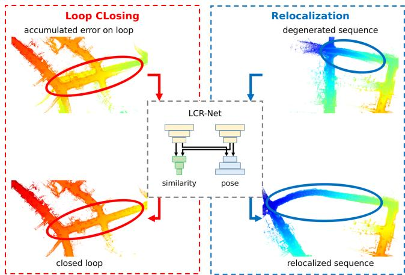  
Fig. 1. Our proposed LCR-Net for loop closing and relocalization. LCR-Net solves both tasks by first retrieving the most similar frame from the map and then estimating the 6-DoF pose.

Following our framework, we introduce a novel multihead network LCR-Net (Section IV). It employs a shared backbone to encode the point cloud into three types of sparse features. These features are then processed separately in two distinct heads. One head generates a lightweight global descriptor for each scan, enabling fast candidate retrieving. The other head establishes dense matches in a sparse-to-dense manner for accurate registration. Unlike existing methods using only sparse features, our approach exploits dense feature matching based on the neighborhood consistency, achieving accurate and fast pose estimation for online applications without requiring costly robust estimator or iterative pose refinements. To effectively train the multihead network, we also introduce novel losses with a specific training strategy, which leads to state-of-the-art (SOTA) performance surpassing all existing baselines.

To enhance the performance on both tasks, we present the third contribution as the novel keypoint detection module comprising two novel submodules, 3D-RoFormer++ and VoteEncoder (Section IV-A). The keypoint detection module offers three types of features, enabling fast global description and reliable dense matching. Initially, it rapidly samples and encodes uniform features across the point cloud for overall representation of the environment. Subsequently, to enhance the features and make them salient and discriminative for improving registration, we introduce 3D-RoFormer++ and VoteEncoder. 3D-RoFormer++ enhances the representation capability of local features with contextual and structural information by enabling the information exchange between the two point clouds. The other module, VoteEncoder effectively downsamples the points while identifying keypoints lying on geometrically significant regions and subsequently aggregating the features from their neighbors. The VoteEncoder can significantly enhance registration robustness and accuracy by improving the coverage of matching points over the overlapping area of point clouds. The superior improvement brought by VoteEncoder highlights the importance of the match distribution OVER inlier ratio (IR), offering valuable insights (Section VI-H) for future research on point cloud registration.

The fourth contribution is a novel LiDAR SLAM system with the capability ofdeep learning-based loop closing and relocalization (Section V). We build a full LiDAR SLAM system based on our proposed deep loop closing and relocalization method. The system effectively tackles the local pose tracking, loop closing, and relocalization in parallel. A thorough evaluation of our SLAM system in diverse environments showcases the effectiveness and robustness after integrating LCR-Net.

We extensively evaluate our approach on three setups derived from loop closing and relocalization: candidate retrieval, closedloop point cloud registration, and continuous relocalization. The results demonstrate the following.

1) Our approach outperforms respective baselines and dominates the SOTA in all three tasks, in particular;

2) our approach achieves the best candidate retrieval performance with a simple architecture benefiting from the feature representation capability of the backbone;

3) our approach boosts the baseline by a large margin in registration tasks, even outperforms the baseline method refined by iterative closest point (ICP) [8]; and

4) the SOTA registration performance can be achieved efficiently without requiring for a costly random sample and consensus (RANSAC) estimator.

We also conduct tests on multiple sequences to assess the performance of our SLAM system integrating LCR-Net. The results depict that our SLAM system is capable of addressing the relocalization and loop closing challenges. In the loop closing task, our approach outperforms the most commonly employed loop closing approach, Scan Context [9] combined with ICP. In addition, we provide detailed ablation studies to demonstrate the effectiveness of our design.

## II. RELATED WORK

While various studies have been conducted for the foundational techniques underlying loop closing and relocalization, including candidate retrieval and point cloud registration, few works can simultaneously address both tasks. Therefore, we first introduce the underlying techniques and then explore the recent advancements in loop closing and relocalization.

Candidate retrieval, also known as place recognition or loop closure detection, compares the current sensor observation with prebuilt maps to determine the approximate location of the robot within the map. LiDAR-based loop closure detection approach can be categorized into local descriptor-based methods and global descriptor-based methods.

Local feature-based methods typically extract local sparse features from point clouds [10], [11] and organize them using a BoW model for place recognition [2], [3]. These methods are capable for 6-DoF pose estimation based on local feature correspondences. However, extracting stable and reliable local features from 3-D LiDAR scan is a challenging task, which limits the performance of such methods. The first work employing deep learning for point cloud retrieval, PointNetVLAD [12], extracts local features using PointNet [13] and then aggregates them into global descriptors using NetVLAD [14]. There are also methods [15], [16], [17], which exploit sparse 3-D convolution for local feature extraction, but use different pooling strategy for global descriptor generation, i.e., generalized-mean pooling [18] for MinkLoc3D [15], [16] and second-order pooling for LoGG3D-Net. Transformer [19] is also explored in generating global descriptors [20], [21]. Recently, LCDNet [5] employed PVRCNN [22] for robust feature extraction and then utilized NetVLAD for global descriptor generation. FinderNet [23] circumvents the challenge of feature extraction from point clouds by converting them into digital elevation maps (DEMs) and leveraging a CNN network to extract local features and global descriptors. However, converting point clouds to DEM makes it challenging to estimate 6-DoF poses. In contrast, our method operates directly on point clouds, bypassing the challenge of estimating pose on sparse local features while possessing both loop closure detection and accurate 6-DoF pose estimation capability.

Global descriptor-based methods, such as Scan Context [9], represent point clouds as overhead views and encode different segmented spaces to construct global descriptors. Wang et al. [24] extracted descriptors using LoG-Gabor threshold filtering and measure similarity using Hamming distance. OverlapNet [25] introduces a deep learning-based method, which estimates the overlap and relative yaw angles of a set of point clouds for place recognition and initial pose estimation. Ma et al. [26], [27], [28] combined OverlapNet with Transformer to propose a rotation-invariant global descriptor. While the global descriptor-based methods can identify loop closures, they lack the ability to estimate the 6-DoF pose between the current scan and the loop candidate.

Point cloud registration refers to determine the relative spatial transformation that aligns two point clouds. Extracting accurate correspondence is the most challenging aspect. Once correspondences are established, the transformation can be solved using either a direct solver or a robust estimator [29]. The ICP algorithm [8] and its various variants [30], [31] are known and applied methods. These methods establish correspondences iteratively using nearest neighbor search or other heuristics. However, the common drawback among ICP-like methods is that they heavily rely on good initial estimates for the transformation.

To release the requirement of initial estimates, other methods opt to establish correspondences on local features [11], [32] to achieve global registration. Due to the powerful feature representation capabilities exhibited by deep learning, massive learning-based methods for feature extraction have been proposed. Deng et al. [33], [34] proposed PPFNet and PPF-FoldNet, which combine point pair features (PPF) with PointNet [13] to generate local patch representations for matching. In contrast to PPFNet and PPF-FoldNet, which establish correspondences on uniformly sampled points, keypoint-based techniques sample points based on predefined [11] or learned saliency [35], [36], [37], [38] to achieve better repeatability. Due to the inherent errors introduced by individual matches, establishing matches on sparse keypoints generated either through uniform sampling or keypoint detection can limit registration accuracy. Recently, some studies [39], [40], [41] employed a coarse-to-fine mechanism that initially seeks correspondences on sparse keypoints and then extends them to dense ones, showing potential in registration. To enhance the reliability of sparse keypoint correspondences, CoFiNet [39] exploits Transformer for contextual information aggregation and GeoTransformer [40] introduces geometric transformer to incorporate relative geometric information. RDMNet [41] introduces 3D-RoFormer for fast and lightweight relative geometric information encoding and the voting scheme for keypoint detection. HRegNet [42] extracts multilevel features and refines the transformation hierarchically. Despite the rapid advancements in global registration methods, these studies have remained disconnected from the challenges of loop closing and relocalization, lacking the ability of similarity evaluation.

Loop Closing and Relocalization both need to first find a coarse location and then estimate the fine 6-DoF pose. Though the individual techniques are widely explored, as discussed in the previous review, few works can address both tasks simultaneously. OverlapNet [43] and FinderNet [23] are capable of estimating 1-DoF or 3-DoF poses while implementing loop closure detection. These methods have also shown success in achieving 6-DoF loop correction when combined with other local registration techniques. However, in more challenging scenarios involving large pose drift or relocalization, non-6-DoF pose estimation is insufficient. There are both traditional [3] and learning-based [5], [44], [45] methods that achieve loop closure detection and 6-DoF pose estimation by extracting local features. Nevertheless, the accuracy ofsparse local feature-based registration is constrained, requiring additional refinement through local registration techniques such as ICP. Therefore, these methods are evidently unsuitable for relocalization tasks where local registration has already failed and rapid online pose recovery is required.

To address system degeneration, most methods integrate additional sensors such as camera [46], IMU [47], or ultrawideband [48], and switch between different tracking modalities, whereas some methods [49], [50] fall back from frame-to-map to frame-to-frame pose estimation to avoid errors caused by distorted maps. However, to the best of the authors’ knowledge, no piror LiDAR-only method has been proposed to achieve relocalization handling system degeneracy. This can be attributed to the challenge in achieving accurate LiDAR-based global registration when local pose tracking has already failed.

In the field of visual SLAM, however, due to the success in visual feature extraction, loop closing and relocalization have been well-explored. Oriented fast and rotated BRIEF (ORB)- SLAM [51] extracts ORB features to form a BoW model for loop closing. When local tracking fails, ORB-SLAM switches from frame-to-frame alignment to frame-to-map alignment to find more potential landmark matches for relocalization. Object aided (OA)-SLAM [52] achieves more robust relocalization by relocalizing with reconstructed objects instead of local landmarks. Our approach, however, seeks to generate global descriptors to achieve rapid similarity evaluation for candidate detection in loop closing and relocalization. In addition, a robust and accurate enough global registration method is employed to achieve 6-DoF pose estimation.

## III. PROBLEM DEFINITION

We aim to address the challenges of loop closing and relocalization for LiDAR-based SLAM in outdoor driving environments. The underlying techniques of relocalization and loop closing are similar: both tasks involve the identification of the most similar candidate scan from the existing map and subsequently determining the 6-DoF pose. This commonality provides a foundation for addressing both tasks within a unified framework. However, the technical focus of the two tasks is quite different. First, in loop closing, the main challenge lies in rapidly and accurately identifying loop closures within a large database. In most cases, loop closures are identified when there is a substantial overlap between the current and candidate scans, simplifying the subsequent registration process once the loop closure has been correctly identified. Conversely, selecting the candidate scan for relocalization is relatively straightforward. In many autonomous driving situations, simply opting for the most recent scans can be sufficient. Instead, the primary challenge of relocalization lies in achieving precise and robust global registration, as local pose tracking, even with prior information, has failed in such situations. This typically occurs in challenging scenarios that involve low overlap, extensive occlusions, or degraded scene features, posing significant challenges for point cloud registration. Second, loop closing can be executed at a relatively low frequency as a few correctly closed loops are sufficient to eliminate accumulated error. However, relocalization needs to be fast as it directly affects online localization. A prolonged relocalization process reduces the overlap between the current scan and the map, diminishing the success rate. While numerous works have focused on loop closing, the demanding requirements of robustness, accuracy, and speed in registration explain the limited attention given to relocalization. To address this issue, we aim to initially study the framework to support the requirements of both tasks.

A commonly employed framework for simultaneously similarity evaluation and registration is shown in Fig. 2(a). For an incoming LiDAR scan $\mathcal { P } = \{ p _ { i } \in \mathbb { R } ^ { 3 } \} _ { i = 1 } ^ { N }$ , it initially downsamples and encodes the point cloud into local features $[ \hat { \mathcal { P } } | \hat { \mathbf { F } } ] = f _ { \mathrm { b a c k b o n e } } ( \mathcal { P } )$ , and then generate a global descriptor $V = f _ { \mathrm { E n c o d e r } } ( \hat { \mathcal { P } } , \hat { \mathbf { F } } )$ based on these local features. The global descriptor V is exploited to exhibit similarity for candidate frame retrieving and the local features $[ \hat { \mathcal { P } } | \hat { \mathbf { F } } ]$ are matched for pose estimation. Such a framework faces a dilemma: A deeper backbone is often needed to ensure reliable global feature representations. However, this can result in a reduced number of local features, which could harm registration performance. On the other hand, incorporating more complex designs into the backbone to enhance registration performance can often result in reduced global description efficiency. This is a crucial consideration in candidate retrieval tasks. Based on this insight, we propose the framework shown in Fig. 2(b). We leave the workflow of global descriptor generation untouched but incorporate a decoder with skip connections for denser local feature generation $\mathbf { F } = f _ { \mathrm { D e c o d e r } } ( { \hat { \mathcal { P } } } | { \hat { \mathbf { F } } } )$ . Introducing a decoder for feature generation is not new technically. Existing methods [17], [45] employ an encoder/decoder structure in the backbone for extracting local features. However, these frameworks still follow or closely resemble the one shown in Fig. 2(a), which directly utilizes or further aggregates these local features for feature matching. In contrast, our approach utilizes an additional decoder specifically for registration. Though simple, this resolves the conflict between the requirements of the two tasks. The incorporation of dense local features has the potential to enhance registration performance by establishing more correct matches, while maintaining the efficient generation of global descriptors. However, ensuring the match quality in an increased search space can be difficult and time-consuming. We thereby have implemented a sparse-to-dense matching approach for reliable and fast registration. By exploiting different types of features and a multihead network, we concurrently address the disparities between loop closing and relocalization tasks while leveraging their shared characteristics to unify them within a single framework. More detailed description of the proposed network following our framework is introduced in the next section.

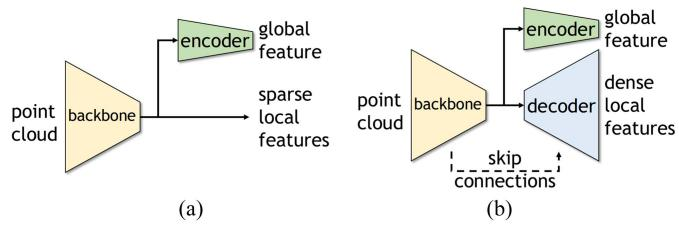  
Fig. 2. Comparison of common frameworks and our framework for similarity evaluation and registration tasks. Our framework introduces a decoder to generate denser local features for registration task. (a) Common framework. (b) Our framework.

## IV. LOOP CLOSING AND RELOCALIZATION NETWORK

To realize our proposed framework, we design a novel multihead network, named LCR-Net. As shown in Fig. 3, it consists of a keypoint detection module (Section IV-A) to extract keypoints from the raw point cloud, a global description head (Section IV-B) for global descriptor generation, and a dense point matching head (Section IV-C) for local feature generation and matching. The devised loss function and the training strategy of our approach are detailed in Section IV-D and Section IV-E, respectively.

## A. Keypoint Detection Module

The keypoint detection module aims to downsample the point cloud into sparse keypoints for further processing in two heads.

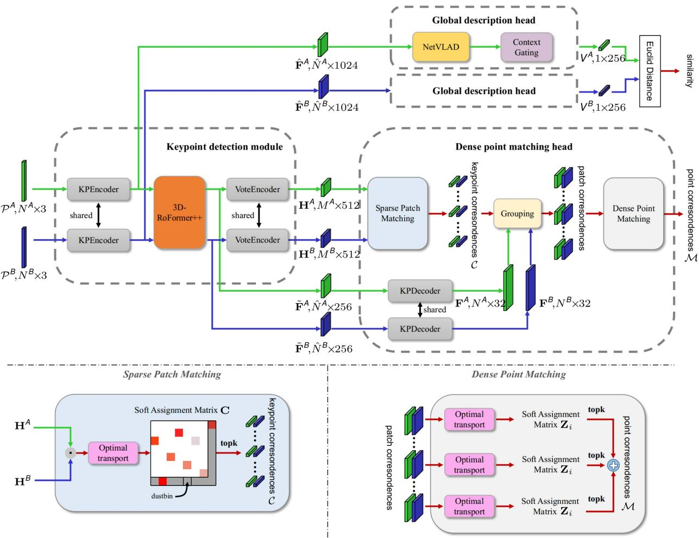  
Fig. 3. Pipeline overview. LCR-Net consists of three main components: A keypoint detection module, a global description head, and a dense point matching head. The keypoint detection module extracts three types of features for further processing in two heads. The global description head generates a global descriptor for fast candidate retrieval. The dense point matching head exploits a sparse-to-fine approach to establish dense point matching for 6-DoF pose estimation.

In this work, we utilize KPEncoder [53] as the starting point for extracting the features. KPEncoder comprises a series of downsampling and kernel point-based convolution (KPConv) blocks, enabling hierarchical encoding ofthe point cloud into the uniformly distributed keypoints with descriptors $\big [ \hat { \mathcal { P } } \big | \hat { \mathbf { F } } \big ]$ . These features provide sufficient information about the overall structure ofthe point cloud and are well-suited for input into the global description head. However, they suffer from a lack of information exchange between two scans. Moreover, the uniformly sampled keypoints can not satisfy the demand for accurate registration due to their limited repeatability and saliency. To address these limitations, we introduce the 3D-RoFormer++ to reason about contextual information in both point clouds, and the VoteEncoder that generates new keypoints nearby significant regions based on the enhanced features. Each component is detailed below.

3D-RoFormer++: Our previous work introduced the 3D-RoFormer [41] for lightweight relative pose-aware contextual aggregation. In this article, we have brought it to maturity and present the 3D-RoFormer++ by providing valuable translational invariance and enhanced feature representation performance. The 3D-RoFormer is built upon the vanilla Transformer [19].

For a point $p _ { i } ^ { Q }$ with its feature $h _ { i } ^ { Q }$ in the query point cloud Q and all the points in the source point cloud S, the Transformer computes the query $\mathbf { } q _ { i } ,$ key $k _ { j } ,$ and value $\boldsymbol { v } _ { j }$ feature maps with linear projections. In addition to the contextual features, 3D-RoFormer encodes the position $\hat { \pmb { p } } _ { i } \in \mathbb { R } ^ { 3 }$ into the rotary embedding $\Theta _ { i } = [ \theta _ { 1 } , \theta _ { 2 } , \ldots , \theta _ { d / 2 } ] \in \mathbb { R } ^ { \frac { d } { 2 } }$ defined as follows:

$$
\Theta _ { i } = f _ { \mathrm { r o t } } ( \hat { p } _ { i } ^ { } ) ) = 2 \pi \cdot \mathrm { s i g m o i d } ( \mathrm { M L P } ( \hat { p } _ { i } ^ { } ) ) .\tag{1}
$$

By treating each element in $\Theta _ { i }$ as a rotation in a 2-D plane, it can be converted to a rotation matrix $R _ { \Theta _ { i } } \in \mathbb { R } ^ { d \times d }$ given by

$$
\begin{array} { r } { R _ { \Theta _ { i } } = \left[ \begin{array} { c c c c c c } { \cos \theta _ { 1 } } & { - \sin \theta _ { 1 } } & { \cdots } & { 0 } & { 0 } \\ { \sin \theta _ { 1 } } & { \cos \theta _ { 1 } } & { \cdots } & { 0 } & { 0 } \\ { \vdots } & { \vdots } & { \ddots } & { \vdots } & { \vdots } \\ { 0 } & { 0 } & { \cdots } & { \cos \theta _ { \frac { d } { 2 } } } & { - \sin \theta _ { \frac { d } { 2 } } } \\ { 0 } & { 0 } & { \cdots } & { \sin \theta _ { \frac { d } { 2 } } } & { \cos \theta _ { \frac { d } { 2 } } } \end{array} \right] } \end{array}\tag{2}
$$

Applying $\scriptstyle R _ { \Theta _ { i } }$ i and $R _ { \Theta _ { \chi } }$ to query $\pmb q _ { i }$ and key $k _ { j }$ , respectively, in self-attention operation, the rotary self-attention in

3D-RoFormer can be written as follows:

$$
\alpha _ { i j } ^ { \prime \prime } = \mathrm { s o f t m a x } ( ( R _ { \Theta _ { i } } \pmb { q } _ { i } ) ^ { \top } R _ { \Theta _ { j } } k _ { j } )\tag{3}
$$

$$
\widetilde { \pmb f } _ { i } = \sum _ { j = 1 } ^ { | \hat { \mathcal P } | } \alpha _ { i j } ^ { \prime \prime } { \pmb v } _ { j } .\tag{4}
$$

Equation (3) can be further written as follows:

$$
\alpha _ { i j } ^ { \prime \prime } = \mathrm { s o f t m a x } \left( q _ { i } ^ { \top } R _ { \Theta _ { i } } ^ { \top } R _ { \Theta _ { j } } k _ { j } \right) = \mathrm { s o f t m a x } ( q _ { i } ^ { \top } R _ { \Theta _ { j } - \Theta _ { i } } k _ { j } ) .\tag{5}
$$

The important advantage of 3D-RoFormer is that it explicitly encodes the relative geometric information neatly without requiring extra-large storage memory for relative position embedding. As in (5), relative “rotation $\because \Theta _ { j } - \Theta _ { i }$ is naturally incorporated into the calculation and then fused with the output feature $\tilde { \pmb { f } } _ { i }$ in (4). Furthermore, if the mapping function $f _ { \mathrm { r o t } }$ is linear, we can further derive the difference in rotational embeddings by the following:

$$
\Theta _ { j } - \Theta _ { i } = f _ { \mathrm { r o t } } ( { \hat { p } } _ { j } - { \hat { p } } _ { i } ) .\tag{6}
$$

This leads to a very important property for keypoint detection, which is translation-invariance. However, designing a $f _ { \mathrm { r o t } }$ that provides good rotary feature representation while maintaining linearity is challenging. To ensure the ability of rotary representation, the rotary embedding in the original 3D-RoFormer, as shown in (1), sacrifices linearity for rotary representation, leading to reduced generalization performance.

Based on this insight, we improve our 3D-RoFormer by adopting a learning-based linear mapping function defined as follows:

$$
\Theta _ { i } = \mathrm { L i n e a r } ( \hat { p } _ { i } )\tag{7}
$$

with a boundary penalty loss (Section IV-D) as an auxiliary loss to supervise the network actively learning effective rotary representations. With this, 3D-RoFormer++ largely enhances the output features $\tilde { \mathbf { F } } ^ { A }$ and $\tilde { \mathbf { F } } ^ { B }$ for point matching by interleaving the rotary self-attention and cross-attention for l times.

The enhanced features $\tilde { \mathbf { F } }$ possess geometric and contextual information between two point clouds, which is then extended to dense features for further processing in dense point matching head, as detailed in Section IV-C. Nevertheless, the uniform sampling nature makes these features less salient and discriminative. We, therefore, propose the VoteEncoder.

VoteEncoder: To steer the evenly sampled features $[ \hat { \mathcal { P } } | \tilde { \mathbf { F } } ]$ toward nearby salient areas and obtain more meaningful features conducive to registration tasks, we introduce the VoteEncoder for additional feature shifting and encoding.

We use a voting module [41], [54] to estimate the geometric offset from the uniformly sampled keypoints to the proposal keypoints S, i.e., $\Delta \mathbf { P } = \mathrm { \bar { V } o t e } ( \bar { \tilde { \mathbf { F } } } )$ and $\pmb { S } = \hat { \mathcal { P } } + \Delta \mathbf { P }$ . The voting module comprises a collection of multilayer perceptrons (MLPs). Despite its simplicity, this module produces meaningful offsets (see Fig. 4), utilizing the features from our 3D-RoFormer++. After voting, multiple proposals emerge clustered within salient areas of the point cloud. In our previous work [41], we randomly select a single proposal from each cluster as the final keypoints, which might be unstable and result in substantial information loss. In this work, we adopt a more rational and effective approach. We estimate the centroids of each cluster as the keypoints and subsequently aggregate information from each cluster to generate new features that serve as descriptors for the keypoints. The process of predicting centroids is straightforward yet efficient, without the need for additional sampling strategies. It clusters all the proposals into various patches and predicts the centers, detailed in Algorithm 1. To aggregate the descriptors H for each center point ${ \hat { S } } ,$ we employ a KPConv module that performs kernel-based convolution after finding nearest neighbors of $\hat { S }$ in [P|ˆ F˜ ]. We use a larger search range than that used in Algorithm 1 to incorporate more related context near the keypoints.

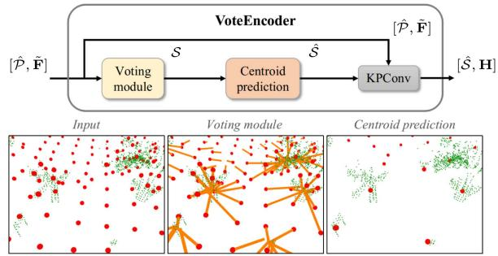  
Fig. 4. VoteEncoder takes sparse features as input and generates offset from each keypoint to its nearest significant region. The final keypoints are estimated using centroid prediction algorithm, and their features are aggregated by KP-Conv. The ground points are removed from the visualization for clarity.

Algorithm 1: Centroid Prediction.   
Input: proposal set $s ,$ nearest neighbor search range d   
Output: center point set $\hat { S }$   
1: for all $\mathbf { \boldsymbol { s } } _ { i } \in \mathcal { S }$ do   
2: if ISLABEL $\operatorname { E D } ( s _ { i } )$ is False then   
3: $\mathcal { N } _ { i }  \mathrm { N E }$ ARESTNEIGHBOR $( s _ { i } , S , d )$   
4: $\hat { \mathbf { \mathrm { \mathbf { s } } } } _ { i } \gets \mathrm { M E A N } ( \mathcal { N } _ { i } )$ - Get centroid point   
5: Sˆ.APPEND $( \hat { \pmb { s } } _ { i } )$   
6: for all $\mathbf { \boldsymbol { s } } _ { j } \in \mathcal { N } _ { i }$ do   
7: ISLABELED $( s _ { j } ) \gets$ True   
8: return $\hat { S }$

Unlike the object detection [54], [55], where the object center can serve as a well-defined reference for supervising point shifts, our case lacks a readily available ground truth center for the significant areas, primarily due to the challenge in precisely defining the significance. Therefore, we train the matched keypoints to move closer to each other instead, which indirectly accomplishes our objective. In practice, the offset ΔP is limited to a certain range to maintain an even distribution of keypoints throughout the point cloud. This prevents the keypoints from being only concentrated in significant areas while also avoiding potential degeneracy.

In sum, our keypoint detection module offers various options for the sparse features, including uniformly sampled features Fˆ from KPEncoder [53], enhanced features F˜ from

3D-RoFormer++ and voted features H from VoteEncoder. Uniformly sampled features $\hat { \mathbf { F } }$ are distributed evenly throughout the entire point cloud, enabling fast extraction and the capacity to represent the entire point cloud comprehensively. These features are utilized for the global description head, as detailed in Section IV-B. On the other hand, enhanced features F˜ , built upon the uniformly sampled features Fˆ , incorporate geometric information and the correlation between two scans. These features will be decoded into dense features, propagating the aforementioned advantages to them. Finally, voted features H exhibit sensitivity and expressive capability for local salient regions while maintaining good coverage. These features will be employed for initial sparse matching, which will then be extended to dense matching for accurate registration. Both enhanced features and voted features will be employed for the dense point matching head detailed in Section IV-C.

## B. Global Description Head

The objective of the global description head is to condense sparse features into a single global feature for fast candidate retrieval. We adopt the features derived from the KPEncoder as the input to our global description head. We choose a widely applied simple method NetVLAD [14] to compress the features. It uses k-means clustering and aggregates all the features into K cluster features $\mathbf { F } \mathbf { R } \in \mathbb { R } ^ { K \times \hat { d } }$ . Then, a simple MLP compresses FR into a single descriptor $\boldsymbol { X } \in \mathbb { R } ^ { G }$

Based on NetVLAD, we use the context gating module [5] to re-evaluate the weights of each channel of feature X based on the self-attention mechanism and further enhances it to obtain the final global descriptor $V \in \mathbb { R } ^ { G }$ , given as follows:

$$
V = \operatorname { C G } ( X ) = \sigma ( W X + b ) \otimes X\tag{8}
$$

where $\sigma$ is the sigmoid activation function, ⊗ is elementwise multiplication, and W and b are learnable weights and offsets.

The design of the global description head is straightforward yet remarkably effective, surpassing all baseline methods in our experiments. Its simplicity is also particularly important because LiDAR SLAM requires quick and accurate retrieval for real-time canditate retrieval, which narrows down the computational scope for subsequent fine 6-DoF pose estimation.

## C. Dense Point Matching Head

Once identifying the candidates, we leverage the dense point matching head to establish correspondences and subsequently recover precise 6-DoF pose estimation. The features obtained from our keypoint detection module [S|ˆ H] are sufficient for ensuring dependable point cloud registration. However, there are two factors that impact the accuracy of the final 6-DoF pose estimation. First, despite VoteEncoder improving keypoint locations, there might still be noticeable distances between matched sparse features. These gaps can lead to errors that restrict the overall accuracy. Second, due to the sparse characteristics of these features, there might not be adequate feature matches to fully rectify errors arising from mismatches. Considering these limitations, we employ a two-step matching approach [39], [40]. Initially, we identify sparse yet dependable keypoint matches, and then we extend these point-to-point matches to patch-topatch matches. By utilizing neighbor consistency, we enhance these patch matches into dense point matches, ensuring more precise and reliable registration.

Sparse keypoint matching: We conduct sparse matching between $[ \hat { S } ^ { \hat { A } } | \mathbf { H } ^ { A } ]$ and $[ \hat { S } ^ { B } | \mathbf { H } ^ { B } ]$ . We compute a matching score matrix $\mathbf { C } \in \mathbb { R } ^ { | \hat { S } ^ { A } | \times | \hat { S } ^ { B } | }$ between $\mathbf { H } ^ { A }$ and $\mathbf { H } ^ { B }$ as $\mathbf { C } =$ $\mathbf { H } ^ { A } ( \mathbf { H } ^ { B } ) ^ { \top } / \sqrt { d _ { c } }$ , where $d _ { c }$ refers to the feature dimension of H. To handle nonmatched points, we append a “dustbin” [56] row and column for C filled with a learnable parameter $\alpha \in \mathbb { R }$ The Sinkhorn algorithm [57] is then used to solve the soft assignment matrix. It iteratively performs normalization along rows and columns. At the t iteration, the score matrix is updated as follows:

$$
{ } ^ { ( t ) } \mathbf { C } _ { i j } ^ { \prime } = { } ^ { ( t ) } \mathbf { C } _ { i j } - \log \sum _ { j } e ^ { ( t ) } \mathbf { C } _ { i j }\tag{9}
$$

$$
{ \bf \Pi } ^ { ( t + 1 ) } { \bf C } _ { i j } = { \bf \Pi } ^ { ( t ) } { \bf C } _ { i j } ^ { \prime } - \log \sum _ { i } e ^ { ( t ) } { \bf C } _ { i j } ^ { \prime } .\tag{10}
$$

After $T$ iterations, we use the solution as the soft assignment matrix ${ \hat { \mathbf { C } } } = { } ^ { ( T ) } { \mathbf { C } }$ . We choose the largest $N _ { c }$ entries as the keypoint correspondences as follows:

$$
\mathcal { C } = \left\{ \left( \hat { \mathbf { s } } _ { x _ { i } } ^ { A } , \hat { \mathbf { s } } _ { y _ { i } } ^ { B } \right) | \left( x _ { i } , y _ { i } \right) \in \mathrm { T o p - k } _ { x , y } \left( \hat { \mathbf { C } } \right) \right\} .\tag{11}
$$

Patch grouping: To achieve dense point matches from sparse keypoint matches, we expand correspondences between keypoints to encompass overlaps between their respective neighborhood patches and subsequently leverage these patches to identify more point matches.

For each keypoint ${ \hat { \mathbf { } } } _ { i } ,$ we construct a local patch $\mathcal { G } _ { i }$ using a point-to-node strategy [36], where each point is assigned to its nearest keypoint. Based on the grouped point patch, we can now extend each keypoint match $( \hat { \pmb { s } } _ { x _ { i } } ^ { \breve { A } } , \hat { \pmb { s } } _ { y _ { i } } ^ { \breve { B } } )$ to its corresponding patch match $( \mathcal { G } _ { x _ { i } } ^ { A } , \mathcal { G } _ { y _ { i } } ^ { B } )$

Dense point matching: We then generate more point matches from the sparse patch matches. We leverage the KPDecoder [53] to recover point-level descriptors F from enhanced keypoint features $[ \hat { \mathcal { P } } | \tilde { \mathbf { F } } ]$ . For each keypoint correspondence $( \hat { \boldsymbol { s } } _ { x _ { i } } ^ { A } , \hat { \boldsymbol { s } } _ { y _ { i } } ^ { B } )$ , we compute a match score matrix $\mathbf { O } _ { i } \in \mathbb { R } ^ { \left| \mathcal { G } _ { x _ { i } } ^ { A } \right| \times \left| \mathcal { G } _ { y _ { i } } ^ { B } \right| }$ of their corresponding patches $\mathcal { G } _ { x _ { i } } ^ { A }$ and $\mathcal { G } _ { y _ { i } } ^ { B } \mathrm { : }$ , given by $\mathbf { O } _ { i } =$ $\mathbf { F } _ { x _ { i } } ^ { A } ( \mathbf { F } _ { y _ { i } } ^ { B } ) ^ { \mathsf { T } } / \sqrt { d _ { f } }$ , where $d _ { f }$ refers to the feature dimension of F. Same with our sparse keypoint matching module, we append a learnable “dustbin” row and column for $\mathbf { O } _ { i }$ to handle nonmatched points and use the Sinkhorn algorithm to solve the soft assignment matrix $\mathbf { Z } _ { i } \in \mathbb { R } ^ { ( | \mathcal { G } _ { x _ { i } } ^ { A } | + 1 ) \times \left( | \mathcal { G } _ { y _ { i } } ^ { B } | + 1 \right) }$ . Unlike works [39], [40] that drop the dustbin and recover the assignment by comparing the soft assignment score with a handtuned threshold, we directly find the largest entry both row and columnwise on $\mathbf { Z } _ { i }$ to recover the assignment $\mathcal { M } _ { i }$ given as follows:

$$
\begin{array} { r l } & { \mathcal { M } _ { i } = \Big \{ \big ( \mathcal { G } _ { x _ { i } } ^ { A } ( m ) , \mathcal { G } _ { y _ { i } } ^ { B } ( n ) | ( m , n ) \big . \Big . } \\ & { \qquad \Big . \Big . \in \mathrm { t o p r o w } _ { m , n } \left( \mathbf { Z } _ { 1 : M _ { i } , 1 : ( N _ { i } + 1 ) } ^ { i } \right) \Big \} } \end{array}
$$

$$
\begin{array} { r l } & { \cup \Big \{ \big ( \mathcal { G } _ { x _ { i } } ^ { A } ( m ) , \mathcal { G } _ { y _ { i } } ^ { B } ( n ) | ( m , n ) \big ) } \\ & { \qquad \in \mathrm { t o p c o l u m n } _ { m , n } \left( \mathbf { Z } _ { 1 : ( M _ { i } + 1 ) , 1 : N _ { i } } ^ { i } \right) \Big \} } \end{array}\tag{12}
$$

where toprow $_ { m , n } ( \ u )$ and topcolum $\mathsf { I } _ { m , n } ( )$ return the index of the top value rowwise and columnwise, respectively. A point is either assigned to points in the matched patch or to the dustbin. By doing this, we do not need manual tuning but require a discriminative assignment matrix, which can be obtained by using our proposed loss function as detailed in Section IV-D. Note that a point is not strictly assigned to a single point in our approach, as the strict one-to-one point correspondences do not hold in practice due to the sparsity nature of the LiDAR scans. Instead, we trust and keep the assignment results from both sides, i.e., matches from query to source and vice versa. This results in extensively more point matches while maintaining a high IR, which benefits the transformation estimation. The final correspondences are the combination of points matches from all patches as follows:

$$
\mathcal { M } = \bigcup _ { i = 1 } ^ { N _ { c } } \mathcal { M } _ { i } .\tag{13}
$$

Local-to-global registration: We employ local-to-global registration (LGR) proposed in [40] for fast pose estimation. It is a hypothesize-and-verify approach specifically proposed for matching methods following a sparse-to-dense manner. For each matched patch, LGR solves a transformation $\{ R _ { i } , t _ { i } \}$ based on its dense point matches using weighted singular value decomposition (SVD) [8], where the soft assignment value in $\mathbf { Z } ^ { i }$ serves as the weight. After obtaining the transformations for all matched patches, LGR selects the transformation that has the most inliers among all dense point matches, calculated as follows:

$$
R , t = \operatorname* { m a x } _ { R _ { i } , t _ { i } } \sum _ { ( { p _ { x _ { j } } ^ { A } } , { p _ { y _ { j } } ^ { B } } ) \in \mathcal { M } } \left[ \| R _ { i } \cdot { p _ { x _ { j } } ^ { A } } + t _ { i } - { p _ { y _ { j } } ^ { B } } \| _ { 2 } ^ { 2 } < \tau _ { a } \right]\tag{14}
$$

where [[•]] is an indicator function for which the statement is true. Finally, it solves the final transformation R, t by solving another weighted SVD on surviving inliers for $N _ { r }$ times.

LGR significantly reduces the number of iterations compared with RANSAC [29], achieving a substantial speed advantage with about 30 times faster in our experiments. However, the performance of LGR, particularly its robustness, can be heavily influenced by the quality of sparse patch matching. We significantly improve the matching quality of sparse patches through the powerful feature aggregation module 3D-RoFormer++ and the feature detection module VoteEncoder, achieving performance comparable with or surpassing RANSAC’s accuracy and robustness.

## D. Loss Function

To effectively guide our network in accomplishing various tasks, we construct our loss function with five components: the keypoint detection loss $L _ { \mathrm { s } } ,$ the boundary penalty loss for keypoint detection module, the triplet loss $L _ { \mathrm { t } }$ for global description head, the sparse match loss $L _ { \mathrm { c } } .$ , and the dense match loss $L _ { \mathrm { f } }$ for dense point matching head.

Keypoint detection loss: The keypoint detection loss consists of two parts $L _ { s } = L _ { s 1 } + L _ { s 2 }$ . The first part $L _ { s 1 }$ is designed to guide the corresponding keypoints from two point clouds close to each other lying within the significant region

$$
L _ { \mathrm { s 1 } } = \sum _ { i = 1 } ^ { | { \cal S } ^ { A } | } \operatorname* { m i n } _ { s _ { j } ^ { B } \in { \cal S } ^ { B } } \| s _ { i } ^ { A } - s _ { j } ^ { B } \| _ { 2 } ^ { 2 } + \sum _ { i = 1 } ^ { | { \cal S } ^ { B } | } \operatorname* { m i n } _ { s _ { j } ^ { A } \in { \cal S } ^ { A } } \| s _ { i } ^ { B } - s _ { j } ^ { A } \| _ { 2 } ^ { 2 } .\tag{15}
$$

Supervised by $L _ { \mathrm { s 1 } }$ , we find that the keypoints tend to move to their nearest significant regions to indirectly minimize the distance between keypoint pairs.

The second part $L _ { s 2 }$ is designed to make the keypoints close to the real measurement points. It minimizes the distance between the keypoint with its closest point as follows:

$$
L _ { s 2 } = \sum _ { i = 1 } ^ { | S ^ { A } | } \operatorname* { m i n } _ { \pmb { p } _ { j } ^ { A } \in \mathcal { P } ^ { A } } \| \pmb { s } _ { i } ^ { A } - \pmb { p } _ { j } ^ { A } \| _ { 2 } ^ { 2 } + \sum _ { i = 1 } ^ { | S ^ { B } | } \operatorname* { m i n } _ { \pmb { p } _ { j } ^ { B } \in \mathcal { P } ^ { B } } \| \pmb { s } _ { i } ^ { B } - \pmb { p } _ { j } ^ { B } \| _ { 2 } ^ { 2 } .\tag{16}
$$

Boundary penalty loss: To guide the 3D-RoFormer++ learn a general rotary embedding representation, we add a boundary penalty loss to force the value of the rotary embedding Θ to lie between $[ - \pi , \pi ]$ as follows:

$$
L _ { \mathrm { p } } ^ { i } = \frac { 1 } { M _ { i } } \sum _ { m = 1 } ^ { M _ { i } } [ \mathrm { a b s } ( \Theta ) - \pi ] _ { + } , [ \bullet ] _ { + } = \mathrm { m a x } ( \bullet , 0 ) .\tag{17}
$$

Triplet loss: We use the triplet loss [58] to train the global description head. Following [25], [26], and [27], we use overlap to define positive and negative samples for each scan, where positive samples have overlaps larger than 0.3 and otherwise defined as negatives. For each triplet, we use one query scan, $N _ { p } = 6$ positive scans and $N _ { n } = 6$ negative scans. The triplet loss is calculated as follows:

$$
\begin{array} { r l } & { L _ { \mathrm { t } } \left( V _ { q } , \{ V _ { p } \} , \{ V _ { n } \} \right) } \\ & { \quad = N _ { p } \left[ \alpha + \underset { p } { \operatorname* { m a x } } \left( d ( V _ { q } , V _ { p } ) \right) - \frac { 1 } { N _ { n } } \underset { N _ { n } } { \sum } ( d ( V _ { q } , V _ { n } ) ) \right] _ { + } . } \end{array}\tag{18}
$$

Sparse match loss: We utilize a gap loss [38] to learn a discriminative soft assignment matrix C for sparse keypoint matching. The ground truth of assignment matrix $\mathbf { \bar { P } } \in \{ 0 , \overset { \cdot } { 1 } \} ^ { ( M + 1 ) \times ( N + \overset { \cdot } { 1 } ) }$ is generated based on the overlap ratio between the patches, where $M = | \hat { S } ^ { A } |$ and $N = | \hat { S } ^ { B } |$ are the number of keypoints. Two patches are matched when they share at least 10% overlap. A patch is assigned to the dustbin when it has no match pair. We also generate a negative assignment matrix $\bar { \mathbf { P } } \in$ $\dot { \{ - \operatorname { i n f } , 1 \} } ^ { ( M + 1 ) \times ( N + 1 ) }$ , where 1 represents two patches are not overlapped and inf represents the value will not be involved in the calculation ofloss. Then, the gap loss is calculated as follows:

$$
\begin{array} { l } { { \displaystyle { \cal L } _ { \mathrm { c } } = f _ { \mathrm { g a p } } ( { \bf C } , { \bf P } , \bar { \bf P } ) } \ ~ } \\ { { \displaystyle ~ = \frac { 1 } { M } \sum _ { m = 1 } ^ { M } \log \left( \sum _ { n = 1 } ^ { N + 1 } ( - r _ { m } + { \bf C } _ { m , n } \bar { \bf P } _ { m , n } + \eta ) _ { + } + 1 \right) } \ ~ } \end{array}
$$

$$
+ \frac { 1 } { N } \sum _ { n = 1 } ^ { N } \log \left( \sum _ { m = 1 } ^ { M + 1 } ( - c _ { n } + { \bf C } _ { m , n } \bar { \bf P } _ { m , n } + \eta ) _ { + } + 1 \right)\tag{19}
$$

where $r _ { m } = \operatorname* { m a x } _ { m } ( \mathbf { C } _ { m , n } \mathbf { P } _ { m , n } )$ and $c _ { n } = \operatorname* { m a x } _ { n } ( \mathbf { C } _ { m , n } \mathbf { P } _ { m , n } )$ refer to the soft assignment value for the hardest true match of mth keypoint in $\hat { S } ^ { A }$ and nth keypoint in ${ \hat { S } } ^ { B } .$ , respectively, and $( \bullet ) _ { + } = \operatorname* { m a x } ( \bullet , 0 )$

Dense match loss: The dense match loss is calculated over all the matched patches. For each matched patch pair $\{ \mathcal { G } _ { x _ { i } } ^ { A } , \mathcal { G } _ { y _ { i } } ^ { B } \}$ , we generate its ground truth positive correspondences matrix $\mathbf { M } ^ { i } \in \{ 0 , 1 \} ^ { ( M _ { i } + 1 ) \times ( N _ { i } + 1 ) }$ and negative matrix $\bar { \mathbf { M } } ^ { i } \in \{ 1 0 ^ { 1 2 } , 1 \} ^ { ( M _ { i } ^ { \setminus } + 1 ) \times ( N _ { i } + 1 ) }$ with a distance threshold τ, where $M _ { i } = | \mathcal { G } _ { x _ { i } } ^ { A }$ | and $N _ { i } = | \mathcal { G } _ { x _ { i } } ^ { B } | .$ A point pair is positive when the distance is below τ and is negative when it exceeds 2τ. To learn a discriminative soft assignment matrix, we also calculate a gap loss ${ \cal L } _ { \mathrm { f } } ^ { i } = f _ { \mathrm { g a p } } ( { \bf Z } ^ { i } , { \bf M } ^ { i } , \bar { \bf M } ^ { i } )$ for patch correspondence’s soft assignment matrix Zi. The final fine match loss is the average over all the matched patch pairs $\begin{array} { r } { L _ { \mathrm { f } } = \frac { 1 } { 2 | \mathcal { M } | } \sum _ { i = 1 } ^ { | \mathcal { M } | } L _ { \mathrm { f } } ^ { i } } \end{array}$

## E. Training Strategy

We seek a training strategy to stimulate the potential of each head with limited computing resources. As a result, a two-stage training strategy is employed. We first train the keypoint detection module and the dense point matching head for registration. Then, we exclusively train the global description head for candidate retrieval for the following reasons. First, the input for the training of two heads differs. The training of the global description head requires a minimum of three scans: an anchor, a positive, and a negative. Conversely, training the dense point matching head only requires two overlapped scans. Including additional input does not benefit the training of the dense point-matching head but consumes a significant amount of memory. Second, for candidate retrieval, a higher batch size typically results in better performance. By freezing the keypoint detection module and dense point matching head, we can use the preextracted features for input, thereby preserving substantial memory for expanding the batch size.

However, using preextracted features prevents the implementation of data augmentation techniques, thereby limiting performance. To address this problem, we utilize a training strategy, which we refer to as semionline. In this approach, we utilize offline preextracted features for both positive and negative samples while generating features for the anchor online. This allows for applying data augmentation on the anchor. Since the anchor participates in loss calculations with all positive and negative samples, this can be the most efficient way to implement data augmentation.

In sum, our two-stage training strategy first trains the network in the registration task, and then exclusively trains the global description head semionline for the candidate retrieval task. This strategy offers several advantages. First, it allows us to utilize larger batch sizes and sample quantities during training for the candidate retrieval task. Second, the semionline approach enables applying data augmentation techniques. Lastly, this strategy provides great convenience in training as we only need to select the best model in the registration task for the second-stage training, followed by selecting the best model in the candidate retrieval task. These advantages contribute to the noteworthy enhanced performance.

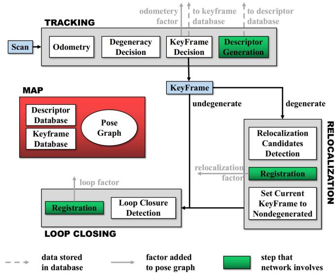  
Fig. 5. Overview of the laser SLAM system integrated with LCR-Net, showing key steps executed by the tracking, relocalization and loop closing threads. LCR-Net serves for relocalization and loop closing.

We train our LCR-Net on 4 NVIDIA RTX 3090 GPUs. The network is trained using the Adam optimizer [59] with an initial learning rate as $1 0 ^ { - 4 } .$ , which undergoes exponential decay by 0.05 every 4 epochs. When training the dense point matching head, we use a batch size of one. When training the global description head, we set the batch size to six. We also apply the same data augmentation techniques as in [5].

## V. LCR-NET BASED LIDAR SLAM SYSTEM

We integrate our LCR-Net into a SLAM system for relocalization and loop closing. We use an incremental smoothing and mapping (iSAM2) [60] based pose-graph optimization (PGO) framework to manage and optimize the global pose graph. The system comprises three threads that run in parallel: tracking, relocalization, and loop closing, as shown in Fig. 5.

## A. Tracking

The tracking thread is responsible for tracking the LiDAR pose of every scan, i.e., odometry. It also decides whether the current odometry estimation is degenerated and when to insert a new keyframe. The process of odometry can be formulated as a state estimation problem, given as follows:

$$
\operatorname { a r g m i n } _ { \mathbf { x } } f ^ { 2 } ( { \pmb x } )\tag{20}
$$

where ${ \boldsymbol { x } } = [ R , t ]$ is the state vector. Given an initial guess of x, most nonlinear optimization methods solve the function by computing the Jacobian matrix of f w.r.t x as follows:

$$
J = \delta f ( \pmb { x } ) / \delta \pmb { x }\tag{21}
$$

and iteratively adjust x utilizing J until convergence. The tracking thread can be implemented through LiDAR odometry, such as LiDAR odometry and mapping (LOAM) [61]. For degeneracy evaluation, we adopt the criterion proposed in [46], which considers the problem degenerates if the smallest eigenvalue of matrix $j ^ { \intercal } j$ falls below a certain threshold. In practice, the threshold is conservatively set to ensure that all degeneracy can be detected. Though this leads to increased computational load, it is necessary since even a single instance of severe degeneracy could inflict significant damage on the system.

LiDAR scans are keyframes if the robot has moved beyond a predefined threshold from the last saved keyframe. However, when odometry performance deteriorates, relying solely on the previous travel distance to establish keyframes becomes unreliable. To address this, we introduce additional scans as keyframes based on specific conditions as follows.

1) The first degenerated scan follows nondegenerated scans.

2) The first nondegenerated scan follows a degenerated scan, provided the degenerated scan is not chosen as a keyframe.

3) Every t-second scan within a continuous sequence of degenerated scans.

The keyframes selected according to these conditions are categorized as “degenerated,” as poses estimated between these keyframes may include degenerated ones. Finally, for each keyframe, we use LCR-Net to generate a global descriptor. The similarity between our generated global descriptors is evaluated based on the Euclidean distance in the feature space. For fast retrieving, we utilize the FAISS library [62] for descriptor database management and search.

## B. Relocalization

The relocalization processes every “degenerated” keyframe, generating more accurate pose estimation to replace the unreliable odometry output. We select the most recent “nondegenerated” keyframe for each degenerated keyframe as the candidate and match it with the current keyframe using LCR-Net. For realtime efficiency, we utilize the rapid estimator LGR for pose estimation. Our experimental results show that when working with LCR-Net, LGR offers a significantly faster processing speed of nearly 30 times than RANSAC, while producing comparable accuracy and robustness in registration. To assess whether the relocalization is successful, we calculate a current pose estimation reliability score by averaging the assignment score of all the found correspondences. The relocalization succeeds if the reliability score surpasses a threshold $\rho _ { r }$ . Once the calculated pose is included in the graph optimization, the label assigned to the current keyframe is updated to “nondegenerated.” In most cases, this allows for recovery of the pose tracking. Otherwise, we retrieve the most similar candidate with descriptor distance below a threshold $\rho _ { s }$ from the database and attempt relocalization.

## C. Loop Closing

The loop closing thread functions by searching the loop candidate and subsequently estimating pose as a new node added to the pose graph. Specifically, we retrieve the candidate from the database that has the most similar descriptor for each new keyframe while excluding the 100 most recent keyframes. If the distance is below a threshold $\rho _ { s }$ , we set the retrieved keyframe as the loop and estimate the relative pose using LCR-Net with LGR. Finally, the iSAM2-based PGO is performed to achieve global consistency.

## VI. EXPERIMENTAL EVALUATION

We conduct experiments to demonstrate the efficacy of our proposed LCR-Net in addressing loop closing and relocalization for online LiDAR SLAM. We derive three setups from these challenges: candidate retrieval, closed-loop point cloud registration, and continuous relocalization. In candidate retrieval experiments (Section VI-B), we examine the capability of LCR-Net in accurately retrieving the appropriate candidates from the previous map. In closed-loop point cloud registration (Section VI-C) and continuous relocalization experiments (Section VI-D), we assess the ability of LCR-Net in successfully registering point clouds during loop situations as well as continuous scenarios with low overlap. We also evaluate the runtime of our approach for candidate retrieving and point cloud registration (Section VI-E). We then evaluate our LCR-Net enhanced SLAM in multiple real-world scenes (Section VI-F). Finally, we conduct ablation studies on the network design (Section VI-G) and provide valuable insights (Section VI-H).

## A. Experimental Setup

We evaluate LCR-Net and compare it with the SOTA methods on multiple publicly available datasets, including KITTI odometry [63], KITTI-360 [64], Apollo-SouthBay [65], Ford Campus [66], and Mulran [67] datasets. These datasets provide LiDAR scans collected in various environments in multiple countries with the corresponding ground-truth poses.

We use the two-stage training strategy described in Section IV-E: Pretrain the network with dense point matching head in the registration task, and then linear probe the global description head for training in the candidate retrieval task. For a fair comparison, we have trained two models denoted as LCR-Net† and LCR-Net	, using different dataset splittings that follow the existing baselines for specific tasks: LCR-Net† is pretrained in closed-loop point cloud registration task, whereas LCR-Net	 is pretrained in continuous relocalization task. Both models are then trained in the candidate retrieval task.

Aiming to address all three tasks in a single model, we have also trained another model denoted as LCR-Net. In particular, we divide the KITTI odometry dataset into the following: sequences 01 and 03–07 for training, sequence 02 for validation, and sequences 00, 08–10 for testing. The other datasets are all used to test the models’ generalization capabilities. For the registration task pretrain, we select point cloud pairs with a mix ofcontinuous point cloud pairs with the distance varying from 0–10 m and closed-loop point cloud pairs with an overlap ratio exceeding 0.3 [25]. In the candidate retrieval task training, we use all point cloud pairs with an overlap ratio exceeding 0.3. We evaluate

LCR-Net on all subsequent tasks. As the model is trained on a different training set, we gray out the result of LCR-Net. This model is also used for the integration with our SLAM system.

## B. Candidate Retrieval Performance

To validate the candidate retrieval performance, we follow Chen et al. [25], [26] and test our approach on the KITTI odometry and Ford Campus dataset. For a fair comparison, we follow the setup of Chen et al. [25], [26] and train LCR-Net† on KITTI odometry sequences 03–10 and validate it on KITTI odometry sequence 02. We also follow [25], [26], and [27] to calculate the overlap between scans. Ifthe overlap value between two scans is larger than 0.3, they are selected as positive candidates; otherwise, they are considered negative. We also evaluate the LCR-Net trained on our dataset splittings as described in Section VI-A.

Metrics: We use four metrics to evaluate the performance of candidate retrieval as follows.

1) The area enclosed by the receiver operating characteristic curve and the coordinate axes.

2) Maximum F1 score (F1max), which is the highest F1 score at different threshold values.

3) Recall@1, which measures the recall when only the most similar candidate frame is selected.

4) Recall@1%, which measures the recall when the top 1% of the most similar candidate frames are selected.

Results: The baseline methods used in this experiment are SOTA place recognition methods. For Histogram [68], Scan Context [9], LiDAR-Iris [24], OverlapNet [25], Point-NetVLAD [12], MinkLoc3D [15], and OverlapTranformer [26], we use the results reported in [26]. For LCDNet [5], MinkLoc3Dv2 [16], and LoGG3D-Net [17] we utilize its official implementation. As shown in Table I, LCR-Net and LCD-Net achieve cutting-edge performance compared with current advanced methods. However, our method further boosts the baseline by a significant margin for the F1max metric while maintaining a leading position in Recall@1, Recall@1%, and area under the curve (AUC). It is worth noting that our global description head does not employ complex designs. The leading performance can be attributed to two key factors. First, the exceptional feature representation capabilities of our backbone play a fundamental role. Although the major part of the network is not directly involved in the calculation of the global descriptor, it still significantly influences the learning process of the backbone. A well-designed network facilitates better local feature representation, which, in turn, benefits the global description task, as can be seen from our ablation experiments. Second, our training strategy greatly contributes to the final performance. We employ a two-step training strategy that allows for a larger batch size, while still enabling the use of data augmentation techniques during the training of the global description head.

## C. Closed-Loop Point Cloud Registration Performance

We validate the registration performance of our method for closing the loop. We follow Cattaneo et al. [5] and test our method on KITTI odometry sequences 00 and 08 and KITTI-360 sequences 02 and 09. For a fair comparison, we follow [5] to train the LCR-Net† on the KITTI sequences 05–07 and 09, validating it on KITTI sequence 02. The point cloud pairs with ground truth pose distances less than 4 m and time intervals greater than 50 s are chosen as loop closure samples. We also evaluate the LCR-Net trained on our dataset splittings as described in Section VI-A.

TABLE I  
CANDIDATE RETRIEVAL RESULTS ON KITTI AND FORD CAMPUS
<table><tr><td>Dataset</td><td>Method</td><td>AUC</td><td>F1max</td><td>Recall @1</td><td>Recall @1%</td></tr><tr><td rowspan="9">KITTI</td><td>Histogram [68]</td><td>0.826 0.836</td><td>0.825 0.835</td><td>0.738 0.820</td><td>0.871 0.869</td></tr><tr><td>Scan Context [9] LiDAR-Iris [24]</td><td>0.843</td><td>0.848</td><td>0.835</td><td>0.877</td></tr><tr><td>PointNetVLAD [12]</td><td>0.856</td><td>0.846</td><td>0.776</td><td>0.845</td></tr><tr><td>OverlapNet [25]</td><td>0.867</td><td>0.865</td><td>0.816</td><td>0.908</td></tr><tr><td>MinkLoc3D [15]</td><td>0.894</td><td>0.869</td><td>0.876</td><td>0.920</td></tr><tr><td>MinkLoc3Dv2 [16] LoGG3D-Net [17]]</td><td>0.905</td><td>0.869</td><td>0.828</td><td>0.910</td></tr><tr><td>OverlapTransformer [26]</td><td>0.896 0.907</td><td>0.854 0.877</td><td>0.891</td><td>0.974</td></tr><tr><td>0.933</td><td></td><td>0.883</td><td>0.906 0.915</td><td>0.964</td></tr><tr><td>0.945</td><td>0.907</td><td></td><td>0.926</td><td>0.974 0.980</td></tr><tr><td rowspan="9">Ford Campus</td><td>LCR-Net Histogram [68]</td><td>0.958 0.841</td><td>0.922 0.800</td><td>0.937</td><td>0.993</td></tr><tr><td>Scan Context [9] LiDAR-Iris [24]</td><td>0.903</td><td>0.842</td><td>0.812 0.878</td><td>0.897</td></tr><tr><td></td><td></td><td></td><td></td><td>0.958</td></tr><tr><td>PointNetVLAD [12]</td><td>0.907 0.872</td><td>0.842 0.830</td><td>0.849 0.862</td><td>0.937</td></tr><tr><td>OverlapNet [25]</td><td>0.854</td><td>0.843</td><td>0.857</td><td>0.938</td></tr><tr><td>MinkLoc3D [15]</td><td>0.871</td><td>0.851</td><td>0.878</td><td>0.932</td></tr><tr><td>MinkLoc3Dv2 [16]</td><td></td><td></td><td></td><td>0.942</td></tr><tr><td></td><td>0.931</td><td>0.854</td><td>0.923</td><td>0.976</td></tr><tr><td>LoGG3D-Net [17] OverlapTransformer [26]</td><td>0.924</td><td>0.867</td><td>0.906</td><td>0.962</td></tr><tr><td></td><td>0.923</td><td>0.856</td><td>0.914</td><td>0.954</td></tr><tr><td>LCDNet [5]</td><td>0.961</td><td>0.908</td><td>0.949</td><td>0.984</td></tr><tr><td>LCR-Net†</td><td>0.974</td><td>0.929</td><td>0.951</td><td>0.985</td></tr><tr><td></td><td></td><td></td><td></td><td></td></tr><tr><td>LCR-Net</td><td>0.972</td><td>0.920</td><td>0.932</td><td>0.987</td></tr></table>

LCR-Net† is trained on the same sets with baselines and LCR-Net is trained on our training sets.

Metrics: In line with [5], we employ three metrics to evaluate the registration performance at loop closure as follows:

1) relative translation error (RTE), which measures the Euclidean distance between estimated and ground-truth translation vectors;

2) relative yaw error (RYE), which is the average difference between estimated and ground-truth yaw angle; and

3) registration recall (RR), representing the fraction of scan pairs with RYE and RTE below certain thresholds, e.g., 5◦ and 2 m.

Results: The baseline methods in this experiment include advanced traditional registration methods, such as ICP [8] and RANSAC [29] with fast persistent feature histograms (FPFH) features [32]. Besides traditional methods, SOTA deep learning approaches are also included, such as RPMNet [72], FCGF [69], DGR [71], Predator [70], CofiNet [39], GeoTransformer [40], RDMNet [41] and LCDNet [5]. Furthermore, we also include results from advanced place recognition methods that can output yaw angles, including Scan Context [9], LiDAR-Iris [24], and OverlapNet [25]. For the hand-crafted method, we use the results reported in [5]. For all deep neural network (DNN)-based approaches, we use its official implementation along with open-source models trained on KITTI odometry datasets. We also report the results of GeoTransformer and

TABLE II  
POINT CLOUD REGISTRATION RESULTS ON CLOSED LOOP OF KITTI ODOMETRY DATASET
<table><tr><td colspan="8">Closed loop with distance below 4 m</td></tr><tr><td></td><td></td><td colspan="3">Seq. 00</td><td colspan="3">Seq. 08</td></tr><tr><td></td><td></td><td>RR(%)</td><td>RTE(m)[succ./all]</td><td>RYE(°)[succ./all]</td><td>RR</td><td>RTE(m)[succ./all]</td><td>RYE(°)[succ./all]</td></tr><tr><td></td><td>RANSAC [29]</td><td>33.95</td><td>0.98/2.75</td><td>1.37/12.01</td><td>15.61</td><td>1.33/4.57</td><td>1.79/37.31</td></tr><tr><td></td><td>FCGF [69]</td><td>47.31</td><td>1.05/2.07</td><td>0.60/1.88</td><td>27.80</td><td>1.28/2.42</td><td>2.38/159.48</td></tr><tr><td></td><td>Predator [70]</td><td>98.93</td><td>0.07/0.13</td><td>0.11/0.45</td><td>99.70</td><td>0.10/0.11</td><td>0.34/0.53</td></tr><tr><td>RAN-bsed</td><td>CofiNet [39]</td><td>100</td><td>0.07/0.07</td><td>0.10/0.10</td><td>100</td><td>0.10/0.10</td><td>0.33/0.33</td></tr><tr><td></td><td>Geotransformer [40]</td><td>98.11</td><td>0.09/0.28</td><td>0.11/0.13</td><td>99.12</td><td>0.11/0.18</td><td>0.35/1.76</td></tr><tr><td></td><td>RDMNet [41]</td><td>98.36</td><td>0.07/0.27</td><td>0.11/0.28</td><td>99.80</td><td>0.10/0.14</td><td>0.34/0.49</td></tr><tr><td></td><td>LCDNet [5]</td><td>100</td><td>0.11/0.11</td><td>0.12/0.12</td><td>100</td><td>0.15/0.15</td><td>0.34/0.34</td></tr><tr><td></td><td>LCR-Net†</td><td>100</td><td>0.04/0.04</td><td>0.09/0.09</td><td>100</td><td>0.08/0.08</td><td>0.33/0.33</td></tr><tr><td>Scan Context* [9]</td><td>LCR-Net</td><td>100</td><td>0.04/0.04</td><td>0.09/0.09</td><td>100</td><td>0.08/0.08</td><td>0.33/0.33</td></tr><tr><td colspan="2"></td><td>97.66</td><td>-/-</td><td>1.34/1.92</td><td>98.21</td><td>-1-</td><td>1.71/3.11</td></tr><tr><td></td><td>LiDAR-Iris* [24]</td><td>98.83</td><td>-/-</td><td>0.65/1.69</td><td>99.29</td><td>-1-</td><td>0.93/1.84</td></tr><tr><td></td><td>OverlapNet* [25]</td><td>83.86</td><td>-1-</td><td>1.28/3.89</td><td>0.10</td><td>-1-</td><td>2.03/65.45</td></tr><tr><td>RA-e</td><td>ICP [8]</td><td>35.57</td><td>0.97/2.08</td><td>1.36/8.98</td><td>0</td><td>-/2.43</td><td>-/160.46</td></tr><tr><td></td><td>DGR [71]</td><td>95.11</td><td>0.57/0.74</td><td>0.41/2.70</td><td>2.42</td><td>1.13/7.72</td><td>3.13/135.53</td></tr><tr><td></td><td>RPMNet [72]</td><td>47.31</td><td>1.05/2.07</td><td>0.60/1.88</td><td>27.80</td><td>1.28/2.42</td><td>1.77/13.13</td></tr><tr><td></td><td>LCDNet (fast) [5]</td><td>93.03</td><td>0.65/0.77</td><td>0.86/1.07</td><td>60.71</td><td>1.02/1.62</td><td>1.65/3.13</td></tr><tr><td></td><td>Geotransformer (LGR) [40]</td><td>96.72</td><td>0.10/0.41</td><td>0.12/0.99</td><td>97.06</td><td>0.16/0.35</td><td>0.46/2.85</td></tr><tr><td></td><td>RDMNet (LGR) [41]</td><td>97.57</td><td>0.06/0.37</td><td>0.12/0.64</td><td>99.36</td><td>0.10/0.22</td><td>0.34/0.59</td></tr><tr><td></td><td>LCR-Net† (LGR)</td><td>100</td><td>0.04/0.04</td><td>0.09/0.09</td><td>100</td><td>0.08/0.08</td><td>0.33/0.33</td></tr><tr><td></td><td>LCR-Net (LGR)</td><td>100</td><td>0.04/0.04</td><td>0.09/0.09</td><td>100</td><td>0.07/0.07</td><td>0.33/0.33</td></tr><tr><td></td><td></td><td></td><td></td><td></td><td></td><td></td><td></td></tr><tr><td></td><td>LCDNet+ICP [5]</td><td>100</td><td>0.04/0.04</td><td>0.09/0.09</td><td>100</td><td>0.09/0.09</td><td>0.33/0.33</td></tr><tr><td colspan="8">Closed loop with overlap beyond 0.3</td></tr><tr><td></td><td colspan="4">Seq. 00</td><td colspan="3">Seq. 08</td></tr><tr><td>Predator [70]</td><td></td><td>RR(%)</td><td>RTE(m)[succ./all]</td><td>RYE(°)[succ./all]</td><td>RR</td><td>RTE(m)[succ./all]</td><td>RYE(°)[succ./all]</td></tr><tr><td></td><td></td><td>80.52</td><td>0.10/2.13</td><td>0.14/13.29</td><td>81.98</td><td>0.15/1.93</td><td>0.37/23.05</td></tr><tr><td></td><td>CofiNet [39]</td><td>98.21</td><td>0.09/0.29</td><td>0.13/1.13</td><td>99.05</td><td>0.13/0.24</td><td>0.35/1.49</td></tr><tr><td></td><td>Geotransformer [40]</td><td>82.07</td><td>0.10/3.04</td><td>0.13/4.53</td><td>92.69</td><td>0.15/0.97</td><td>0.41/10.29</td></tr><tr><td>RA-ssed</td><td>RDMNet [41]</td><td>71.36</td><td>0.13/4.53</td><td>0.23/7.81</td><td>92.94</td><td>0.16/1.37</td><td>0.46/6.09</td></tr><tr><td></td><td>LCDNet [5]</td><td>94.86</td><td>0.23/0.89</td><td>0.24/3.93</td><td>96.87</td><td>0.31/0.62</td><td>0.51/1.74</td></tr><tr><td></td><td>LCR-Net†</td><td>100</td><td>0.05/0.05</td><td>0.10/0.10</td><td>100</td><td>0.08/0.08</td><td>0.34/0.34</td></tr><tr><td></td><td>LCR-Net</td><td>100</td><td>0.05/0.05</td><td>0.10/0.10</td><td>100</td><td>0.08/0.08</td><td>0.34/0.34</td></tr><tr><td></td><td></td><td></td><td></td><td></td><td></td><td></td><td></td></tr><tr><td></td><td>LCDNet (fast) [5]</td><td>66.82</td><td>0.56/2.02</td><td>0.68/6.12</td><td>47.29</td><td>0.88/3.00</td><td>1.06/5.28</td></tr><tr><td></td><td>Geotransformer (LGR) [40]</td><td>80.43</td><td>0.11/3.33</td><td>0.16/7.91</td><td>87.85</td><td>0.20/1.47</td><td>0.56/12.78</td></tr><tr><td></td><td>RDMNet (LGR) [41]</td><td>70.19</td><td>0.13/5.06</td><td>0.23/11.14</td><td>91.62</td><td>0.15/1.98</td><td>0.48/7.16</td></tr><tr><td>RA-FFire</td><td>LCR-Net† (LGR)</td><td>100</td><td>0.04/0.04</td><td>0.10/0.10</td><td>100</td><td>0.08/0.08</td><td>0.33/0.33</td></tr><tr><td></td><td>LCR-Net (LGR)</td><td>100</td><td>0.04/0.04</td><td>0.10/0.10</td><td>100</td><td>0.08/0.08</td><td>0.34/0.34</td></tr><tr><td></td><td>LCDNet+ICP [5]</td><td>94.98</td><td>0.11/0.77</td><td>0.14/3.84</td><td>96.98</td><td>0.18/0.48</td><td>0.43/1.68</td></tr></table>

Superscript \* means the approaches only estimate yaw angle. LCR-Net† is trained on the same sets with baselines and LCR-Net is trained on our sets.

RDMNet using LGR. LCDNet also provides a fast version using weighted SVD. We denote it as LCDNet (fast) and report the results.

Table II shows the results on KITTI odometry sequences 00 and 08. As can be seen, our LCR-Net achieves the best performance across both sequences. LCR-Net is superior in pose estimation, benefiting from dense, reliable matching. We highlight that its pose estimation accuracy exceeds baselines by a large margin and is comparable with LCDNet refined by ICP. As illustrated, the RR for several baselines has reached saturation, reaching 100% in the dataset of the closed loop distance below 4 m. To better showcase the superiority of our approach, we have constructed a new test set comprising point cloud pairs with an overlap ratio exceeding 0.3. The overlap ratio is computed following [25]. These test sets are more challenging, including point cloud pairs with a distance of up to 15 m. We present the results of several competing baselines in former tests.

As can be seen, our LCR-Net further amplifies its advantages, being the only method which maintains 100% RR and high pose estimation accuracy, whereas others have all declined.

We highlight that the pose estimation accuracy of LCR-Net surpasses even LCDNet refined by ICP. Especially regarding translation estimation, LCR-Net reduces the error by 64% on sequence 00 and by 16% on sequence 08. This result is encouraging, as current global registration methods typically exhibit inferior registration accuracy compared with geometry-based local registration approaches based on a fine initial guess. As a result, they are commonly employed as initial estimations for methods such as the ICP algorithm in practical applications. In this experiment, LCR-Net demonstrates a noteworthy advancement in registration accuracy compared with the SOTA global registration methods refined by ICP. This significant outcome profoundly underscores the practical advantage of our proposed method in real-world applications.

TABLE III  
POINT CLOUD REGISTRATION RESULTS ON CLOSED LOOP OF KITTI360
<table><tr><td rowspan="2"></td><td rowspan="2"></td><td colspan="3">Seq. 02</td><td colspan="3">Seq. 09</td></tr><tr><td>RR(%)</td><td>RTE(m)[succ./all]</td><td>RYE(°)[succ./all]</td><td>RR</td><td>RTE(m)[succ./all]</td><td>RYE(°)[succ./all]</td></tr><tr><td></td><td>RANSAC [29]</td><td>24.78</td><td>1.24/3.67</td><td>1.83/32.22</td><td>29.69</td><td>1.12/3.14</td><td>1.48/23.42</td></tr><tr><td>RA-sed</td><td>FCGF [69]</td><td>12.43</td><td>0.56/11.32</td><td>0.62/146.77</td><td>62.40</td><td>0.47/5.06</td><td>0.44/60.64</td></tr><tr><td></td><td>Predator [70]</td><td>97.56</td><td>0.22/0.34</td><td>0.28/1.19</td><td>98.44</td><td>0.14/0.22</td><td>0.18/0.66</td></tr><tr><td></td><td>CofiNet [39]</td><td>98.56</td><td>0.25/0.30</td><td>0.30/0.35</td><td>100</td><td>0.15/0.15</td><td>0.19/0.19</td></tr><tr><td></td><td>Geotransformer [40]</td><td>92.32</td><td>0.26/0.84</td><td>0.49/9.71</td><td>96.24</td><td>0.16/0.50</td><td>0.25/1.84</td></tr><tr><td></td><td>RDMNet [41]</td><td>94.98</td><td>0.23/0.66</td><td>0.38/0.97</td><td>83.27</td><td>0.19/2.24</td><td>0.31/3.04</td></tr><tr><td></td><td>LCDNet [5]</td><td>98.62</td><td>0.28/0.32</td><td>0.32/0.35</td><td>100</td><td>0.18/0.18</td><td>0.20/0.20</td></tr><tr><td></td><td>LCR-Net†</td><td>98.63</td><td>0.21/0.26</td><td>0.27/0.30</td><td>100</td><td>0.11/0.11</td><td>0.16/0.16</td></tr><tr><td></td><td>LCR-Net</td><td>98.64</td><td>0.21/0.26</td><td>0.27/0.30</td><td>100</td><td>0.11/0.11</td><td>0.16/0.16</td></tr><tr><td rowspan="12">RAN-e</td><td>Scan Context* [9]</td><td>92.31</td><td>-1-</td><td>1.60/5.49</td><td>95.29</td><td>-/-</td><td>1.40/6.80</td></tr><tr><td>LiDAR-Iris* [24]</td><td>96.54</td><td>-1-</td><td>1.71/3.44</td><td>86.26</td><td>-1-</td><td>1.51/7.08</td></tr><tr><td>OverlapNet* [25]</td><td>11.42</td><td>-1-</td><td>1.79/76.74</td><td>54.33</td><td>-1-</td><td>1.38/33.62</td></tr><tr><td>ICP [8]</td><td>4.19</td><td>1.10/2.26</td><td>1.74/149.76</td><td>21.24</td><td>1.06/2.22</td><td>1.34/66.34</td></tr><tr><td>DGR [71]</td><td>14.26</td><td>0.66/6.68</td><td>0.72/126.81</td><td>63.51</td><td>0.50/3.14</td><td>0.38/53.83</td></tr><tr><td>RPMNet [72]</td><td>37.99</td><td>1.18/2.26</td><td>1.30/5.97</td><td>41.42</td><td>1.13/2.21</td><td>1.02/3.95</td></tr><tr><td>LCDNet (fast) [5]</td><td>82.92</td><td>0.84/1.10</td><td>1.28/1.67</td><td>89.49</td><td>0.76/0.94</td><td>0.99/1.19</td></tr><tr><td>Geotransformer (LGR) [40]</td><td>91.24</td><td>0.25/1.01</td><td>0.61/7.90</td><td>94.23</td><td>0.17/0.70</td><td>0.29/2.70</td></tr><tr><td>RDMNet (LGR) [41]</td><td>94.44</td><td>0.19/0.72</td><td>0.36/1.43</td><td>80.36</td><td>0.18/2.82</td><td>0.31/5.64</td></tr><tr><td>LCR-Net† (LGR)</td><td>98.63</td><td>0.16/0.21</td><td>0.24/0.27</td><td>100</td><td>0.10/0.10</td><td>0.14/0.14</td></tr><tr><td>LCR-Net (LGR)</td><td>98.59</td><td>0.16/0.21</td><td>0.23/0.26</td><td>100</td><td>0.09/0.09</td><td>0.14/0.14</td></tr><tr><td>LCDNet+ICP [5]</td><td>98.51</td><td>0.20/0.25</td><td>0.24/0.27</td><td>100</td><td>0.10/0.10</td><td>0.15/0.15</td></tr></table>

Superscript \* means the approaches only estimate yaw angle. LCR-Net† is trained on the same sets with baselines and LCR-Net is trained on our sets

Table III presents the results on the KITTI-360 datasets. As can be seen, the advantages of our method are still maintained. Two baselines, i.e., CofiNet and LCDNet, demonstrate comparable RR to LCR-Net. However, both methods fall short compared with LCR-Net regarding registration accuracy. In addition, both Cofinet and LCDNet require RANSAC for pose estimation, and LCDNet requires additional ground point filtering.

From the tests, we have observed that RANSAC-based methods generally outperform RANSAC-free methods. However, RANSAC is computationally intensive and can account for more than half of the entire registration process, as evident from our runtime experiments as in Section VI-E. Nevertheless, our proposed method attains the best performance without relying on RANSAC. By employing a fast solver, LGR, LCR-Net attains comparable registration performance to that of RANSAC and even surpasses it in terms of translation estimation accuracy. This characteristic offers a significant advantage for integrating our approach within real-time systems.

In sum, our LCR-Net achieves SOTA performance in closedloop point cloud registration. It exhibits significant advantages over the baseline methods, offering i) the highest level of registration robustness; ii) Exceptional registration accuracy compared with baseline methods, surpassing even the results obtained by baseline with ICP refinement; and iii) the ability to achieve best performance without relying on RANSAC.

## D. Continuous Relocalization Performance

To evaluate the relocalization performance, we use LiDAR pairs at most 10 m apart as samples, which may cause odometry degeneration. We test our approach on KITTI odometry sequences 08–10, KITTI-360, Apollo-SouthBay, Ford Campus, and Mulran datasets. For a fair comparison, we follow [40], [70], and [73] and train the model LCR-Net	 on KITTI odometry sequences 00–05 and validate it on KITTI odometry sequence 06 and 07. We also evaluate the LCR-Net trained on our dataset splittings as described in Section VI-A.

Metrics: We use three metrics to evaluate the registration performance as follows: i) RTE, which measures the Euclidean distance between estimated and ground-truth translation vectors, ii) relative rotation error (RRE), which measures the geodesic distance between estimated and ground-truth rotation matrices, and iii) RR, which represents the fraction of scan pairs with RRE and RTE below certain thresholds, e.g., 5◦ and 2 m.

Results: We compare the results of our method with the recent RANSAC-based SOTA methods: Predator [70], CofiNet [39], NgeNet [73], GeoTransformer [40], and RDMNet [41]. We also compare our method using LGR with SOTA RANSACfree methods: HRegNet [42], GeoTransformer [40] and RDM-Net [41]. The results are shown in Table IV.

As can be seen, when using RANSAC, our LCR-Net outperforms all the baselines on all the datasets. We highlight the results on the Mulran dataset, where LCR-Net shows remarkable performance by boosting baselines with a large margin for all three metrics, i.e., increasing RR by 10%, reducing rotation error by 43%, and reducing translation error by 20%. The Mulran dataset poses significant challenges for generalization, as it loses approximately 70◦ field of view (FOV). Besides, when using LGR, LCR-Net attains remarkable results for translation estimation and achieves an average reduction of 35% in translation error compared with the best results attained through RANSAC-based methods across all datasets.

We conduct a qualitative comparison of registration using LCR-Net and LCDNet shown in Fig. 6. We also present ICP alignment by using the LCDNet prediction as an initial guess to demonstrate the accuracy of LCR-Net. The first two columns depict the successful cases of both methods. Our LCR-Net achieves better alignment than LCDNet and LCDNet refined by

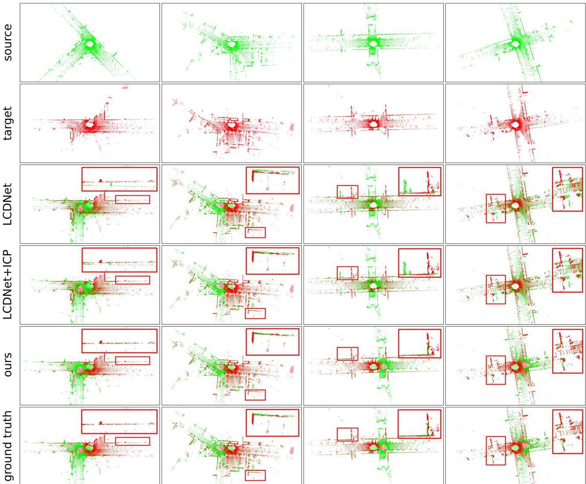  
Fig. 6. Qualitative comparison of registration using LCDNet as an initial guess and refined with ICP, and LCR-Net. The first two columns depict the successful cases of both methods, where LCR-Net achieves better alignment. The last two columns show the failure cases of LCDNet, yet LCR-Net still perfectly aligns the two point clouds.

ICP. The last two columns show the failure cases of LCDNet, whereas LCR-Net keeps achieving good alignment.

To provide more insights into the proposed LCR-Net, we visualize the correspondent points founded by LCR-Net as in Fig. 7. The points are aligned using LCR-Net based on LGR. We observe that there are five following characteristics of the regions that the LCR-Net focuses on:

1) it effectively captures overlapping regions of two point clouds;

2) it finds matches over all overlapping regions of two point clouds rather than being limited to a relatively small range, allowing for a wider baseline important for accurate registration;

3) it neglects the majority of ground points;

4) it focuses more on isolated landmarks such as tree trunks, signage, etc.; and

5) it prioritizes important geometric structures such as corners and sloping surfaces.

## E. Study on Runtime

We report the runtime of LCR-Net compared with existing SOTA baselines on a system with an Intel i9-10920X CPU and an NVIDIA GTX 3090 GPU. All the methods are evaluated on KITTI sequence 00 with the official implementation. We present the runtime of point cloud registration in Table V. The descriptor extraction time also includes the preprocessing required by the respective method. Pairwise Reg. refers to pair registration using RANSAC as default. As depicted, our LCR-Net using LGR is the fastest method among DNN-based approaches. More commendably, it is also the most robust and accurate one, as shown in Section VI-D and Section VI-C.

In Table V(b), the runtime of loop detection is evaluated. We emphasize that LCR-Net exhibits significantly faster descriptor extraction in candidate retrieval than in point cloud registration. This efficiency is achieved due to our framework, which only activates the KPEncoder and the global description head during inference, eliminating the need for complex point-level descriptor generation. Regarding map querying, we report the runtime for searching a descriptor in all its previous scans. For the pairwise comparison, both LiDAR-Iris and OverlapNet employ an ad-hoc comparison function that is hard to optimize in runtime, whereas LCR-Net and LCDNet use the Euclidean distance. Therefore, we can use the FAISS library [62] for fast searching in LCR-Net and LCDNet. We report the querying time of Scan Context using the ring key descriptor for fast searching. As depicted, our LCR-Net demonstrates exceptional efficiency in loop retrieval with the support of FAISS.

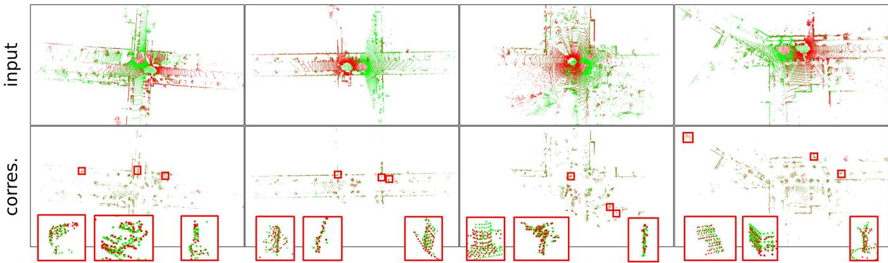  
Fig. 7. We visualize the correspondent points found by LCR-Net. For better visualization, we align the input point clouds and the founded correspondent points using LCR-Net based on LGR. For each cases, we zoom in on three representative regions for closer examination. Our LCR-Net effectively finds correspondences covering overall overlapping region and focuses on geometrically significant region.

TABLE IV  
CONTINUOUS REGISTRATION RESULTS ON MULTIPLE DATASETS
<table><tr><td></td><td></td><td>KITTI KITTI-360</td><td></td><td>Apollo</td><td>Ford</td><td>Mulran</td></tr><tr><td colspan="7">RR (%)</td></tr><tr><td>Predator [70]</td><td></td><td>99.82</td><td>99.50</td><td>99.27</td><td>99.32</td><td></td><td>53.02</td></tr><tr><td></td><td>CofiNet [39]</td><td>99.82</td><td>99.62</td><td>100</td><td></td><td>99.32</td><td>80.79</td></tr><tr><td></td><td>NgeNet [73]</td><td>99.82</td><td>99.94</td><td>100</td><td></td><td>100</td><td>82.96</td></tr><tr><td></td><td>Geotransformer [40]</td><td>99.82</td><td>99.86</td><td></td><td>100</td><td>100</td><td>75.68</td></tr><tr><td>RAN-Abaased</td><td>RDMNet [41]</td><td>99.82</td><td>99.89</td><td></td><td>100</td><td>100</td><td>87.09</td></tr><tr><td></td><td>LCR-Net</td><td>99.82</td><td>99.94</td><td></td><td>100</td><td>100</td><td>97.89</td></tr><tr><td></td><td>LCR-Net</td><td>99.82</td><td>99.94</td><td></td><td>100</td><td>100</td><td>98.22</td></tr><tr><td></td><td>HRegNet [42]</td><td>96.76</td><td>20.39</td><td></td><td>9.39</td><td>90.48</td><td></td></tr><tr><td></td><td>Geotransformer (LGR) [40]</td><td>99.82</td><td>99.86</td><td></td><td>100</td><td>98.64</td><td>72.91</td></tr><tr><td>RAN-ie</td><td>RDMNet (LGR) [41]</td><td>99.82</td><td>99.90</td><td></td><td>100</td><td>100</td><td>83.68</td></tr><tr><td></td><td>LCR-Net (LGR)</td><td>99.82</td><td>99.94</td><td></td><td>100</td><td>100</td><td>96.76</td></tr><tr><td></td><td>LCR-Net (LGR)</td><td>99.82</td><td>99.94</td><td></td><td>100</td><td>100</td><td>97.53</td></tr><tr><td colspan="8">RRE (°)</td></tr><tr><td></td><td>Predator [70]</td><td>0.25</td><td>0.29</td><td>0.21</td><td></td><td>0.38</td><td>1.03</td></tr><tr><td>RA-ssed</td><td>CofiNet [39] NgeNet [73]</td><td>0.37</td><td>0.44</td><td>0.18</td><td></td><td>0.37</td><td>0.52</td></tr><tr><td></td><td></td><td>0.26</td><td>0.30</td><td>0.18</td><td></td><td>0.26</td><td>0.35</td></tr><tr><td></td><td>Geotransformer [40]</td><td>0.22</td><td>0.28</td><td></td><td>0.28</td><td>0.28</td><td>0.30</td></tr><tr><td></td><td>RDMNet [41]</td><td>0.18</td><td>0.25</td><td></td><td>0.10</td><td>0.21</td><td>0.45</td></tr><tr><td></td><td>LCR-Net</td><td>0.17</td><td>0.22</td><td>0.10</td><td></td><td>0.18</td><td>0.17</td></tr><tr><td></td><td>LCR-Net</td><td>0.19</td><td>0.24</td><td></td><td>0.09</td><td>0.16</td><td>0.17</td></tr><tr><td></td><td>HRegNet [42]</td><td>1.04</td><td>2.18</td><td></td><td>2.14</td><td>0.91</td><td></td></tr><tr><td></td><td>Geotransformer (LGR) [40]</td><td>0.31</td><td>0.36</td><td></td><td>0.29</td><td>0.50</td><td>0.49</td></tr><tr><td></td><td>RDMNet (LGR) [41]</td><td>0.27</td><td>0.35</td><td></td><td>0.29</td><td>0.39</td><td>0.48</td></tr><tr><td>RAN-Fire</td><td>LCR-Net (LGR)</td><td>0.33</td><td>0.36</td><td></td><td>0.30</td><td>0.42</td><td>0.45</td></tr><tr><td></td><td>LCR-Net (LGR)</td><td>0.35</td><td>0.36</td><td></td><td>0.29</td><td>0.34</td><td>0.43</td></tr><tr><td colspan="8">RTE (cm)</td></tr><tr><td></td><td>Predator [70]</td><td>5.8</td><td>7.2</td><td>7.8</td><td></td><td>11.7</td><td>30.04</td></tr><tr><td></td><td>CofiNet [39]</td><td>8.2</td><td>10.1</td><td>6.7</td><td></td><td>11.6</td><td>17.3</td></tr><tr><td></td><td>NgeNet [73]</td><td>6.1</td><td>7.5</td><td>5.9</td><td></td><td>7.9</td><td>9.2</td></tr><tr><td></td><td>Geotransformer [40]</td><td>6.7</td><td>8.1</td><td>6.1</td><td></td><td>10.6</td><td>12.0</td></tr><tr><td></td><td>RDMNet [41]</td><td>5.3</td><td>7.0</td><td></td><td>4.6</td><td>7.6</td><td>14.4</td></tr><tr><td>RAN-bsed</td><td>LCR-Net</td><td>3.9</td><td>5.7</td><td></td><td>3.6</td><td>7.1</td><td>7.5</td></tr><tr><td></td><td>LCR-Net</td><td>3.9</td><td>5.8</td><td></td><td>3.4</td><td>6.6</td><td>7.4</td></tr><tr><td></td><td>HRegNet [42]</td><td>6.7</td><td>112.8</td><td></td><td>116.7</td><td>16.5</td><td>=</td></tr><tr><td></td><td>Geotransformer (LGR) [40]</td><td>5.5</td><td>6.9</td><td></td><td>5.1</td><td>12.2</td><td>9.7</td></tr><tr><td></td><td>RDMNet (LGR) [41]</td><td>3.9</td><td>5.9</td><td></td><td>3.5</td><td>6.1</td><td>9.3</td></tr><tr><td>RANFie</td><td>LCR-Net (LGR)</td><td>2.9</td><td>5.0</td><td></td><td>2.5</td><td>6.1</td><td>6.2</td></tr><tr><td></td><td>LCR-Net (LGR)</td><td>2.8</td><td>5.4</td><td></td><td>2.5</td><td>6.5</td><td>6.2</td></tr></table>

LCR-Net is trained on the same sets with baselines and LCR-Net is trained on our sets.

TABLE V  
(a) Inference time for point cloud registration.
<table><tr><td>Model</td><td>Descriptor Extraction (ms) Reg. (ms)</td><td>Pairwise</td><td>Total (ms)</td></tr><tr><td>Haad RANSAC</td><td>135</td><td>156</td><td>291</td></tr><tr><td>FGR</td><td>135</td><td>246</td><td>381</td></tr><tr><td>Predator</td><td>173</td><td>244</td><td>417</td></tr><tr><td>DNN-ed CofiNet</td><td>377</td><td>257</td><td>634</td></tr><tr><td>LCDNet</td><td>235</td><td>431</td><td>666</td></tr><tr><td>LCDNet+ICP</td><td>235</td><td>566</td><td>801</td></tr><tr><td>LCR-Net</td><td>293</td><td>390</td><td>683</td></tr><tr><td>LCR-Net (LGR)</td><td>293</td><td>13</td><td>306</td></tr></table>

(b) Inference time for candidate retrieval.
<table><tr><td>Model</td><td>Descriptor Extraction (ms)</td><td>Pairwise Comp. (ms) querying (ms)</td><td>Map</td></tr><tr><td>Haadd Scan Context LiDAR-Iris</td><td>1 10</td><td>0.09 9</td><td>6 42037</td></tr><tr><td rowspan="4">DNN OverlapNet LCDNet LCR-Net</td><td>15</td><td>6</td><td>26634</td></tr><tr><td>182</td><td>0.01</td><td>5</td></tr><tr><td></td><td>0.01</td><td>5</td></tr><tr><td>50</td><td></td><td></td></tr></table>

In summary, LCR-Net exhibits high efficiency in both registration and candidate retrieval tasks, rendering it well-suited for online SLAM applications.

## F. Evaluation of Complete SLAM System

In the previous experiments, we have demonstrated the superior performance and high efficiency of the proposed LCR-Net in specific subtasks of loop closing and relocalization. We have also verified that the model trained on our dataset splittings, LCR-Net, can achieve comparable SOTA performance with the models specifically trained for each task, LCR-Net† and LCR-Net	. In this section, we will evaluate the performance of our network in solving loop closing and relocalization challenges when integrated with a SLAM system. We use the SLAM system with A-LOAM as the front-end odometry. We demonstrate the gradual improvement of SLAM results by integrating our LCR-Net using the LGR estimator for relocalization and loop closing, as depicted in Fig. 8. The relocalization operates at a frequency of 2.5 Hz, whereas loop closing is configured to operate at a frequency of 1 Hz.

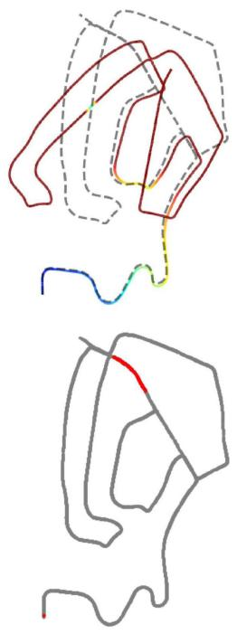  
(a)

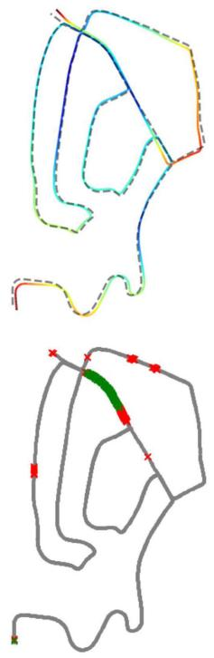  
(b)

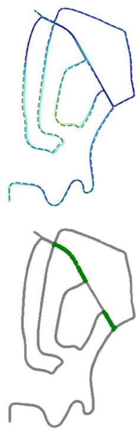  
(c)

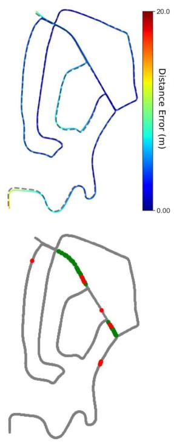  
(d)  
Fig. 8. Performance of A-LOAM with integrating LCR-Net compared with integrating Scan Context on KITTI sequence 02. We present the results. (a) Original A-LOAM (top) and degenerated keyframes colored in red (bottom). (b) A-LOAM with relocalization using LCR-Net (top) and the detected degenerated keyframes (bottom, green crosses × are true positive and red crosses × are false positive detections). (c) A-LOAM with relocalization and loop closing using LCR-Net (top) and the detected loop closures (bottom, green dots • are true positive detections). (d) A-LOAM with relocalization using LCR-Net and loop closing using Scan Context and ICP (top) and the detected loop closures (bottom, green dots • are true positive detections and red dots • are false positive).

The top row of Fig. 8(a) shows the original results of A-LOAM. As seen, A-LOAM suffers severe degeneration and fails to provide satisfactory results. We determine a keyframe’s ground truth degeneration flag by comparing the relative pose estimation error to a predefined threshold. When the pose error exceeds 1 m, the current keyframe is considered degenerated. The bottom row of Fig. 8(a) highlights the degenerated keyframes on the ground-truth trajectory in red.

The bottom row of Fig. 8(b) shows the degenerated keyframes detected by our approach. Our approach effectively detects all the degenerations. Although the introduction of numerous false positives results in a slight increase in the number of calls made to the relocalization module, it effectively prevents system degradation, making it an acceptable tradeoff for practical applications. The SLAM results are significantly improved by enabling the relocalization module, as in the top row of Fig. 8(b). The trajectory is colored with the distance error between our estimations and ground-truth poses.

The bottom row of Fig. 8(c) shows the loop detected and closed by our approach. As in the top row of Fig. 8(c), by enabling both relocalization and loop closing module, the results are further refined compared with Fig. 8(b).

As the code of LCDNet with SLAM is currently unavailable, we compare the results with the most commonly employed loop closing approach, which exploits Scan Context for loop detection and ICP for registration, as in Fig. 8(d). The bottom row of Fig. 8(d) shows the loop detected and closed by Scan Context. As depicted, it introduces several false positives, whereas our approach successfully avoids them. Compared with our approach, using Scan Context and ICP produces a significant deviation at the starting position (bottom-left), resulting in a higher absolute position error (APE) of 4.9 m, which is 4.2 m for our approach.

We assess different systems’ APE on KITTI odometry sequences 00 and 08 as well as on NCLT [74] sequence 2013-01-10 acquired at Michigan University using a Velodyne HDL32. This dataset presents a notable complexity with the high-frequency motion profile, stemming from the inherent instability of the platform-a two-wheeled Segway, which poses a significant challenge for ICP-based odometry methods [47], [75]. The results of our system and the system employing Scan Context and ICP (SC+ICP) as the loop closing pipeline are presented in Fig. 9. By leveraging the flexible structure of the

TABLE VI  
ABLATION STUDIES OF INDIVIDUAL MODULES  
(a) Rotary embedding in 3D-RoFormer++. Linear embedding is effective.  
(b) VoteEncoder. The full VoteEncoder performs the best.
<table><tr><td rowspan="2">case</td><td colspan="2">Mulran</td><td colspan="4">KITTI-loop</td><td rowspan="2"></td><td colspan="4">Mulran</td><td colspan="4">KITTI-loop</td></tr><tr><td>RR(%) RRE(°) RTE(cm) RR(%) RRE(°) RTE(cm)</td><td></td><td></td><td></td><td></td><td></td><td>case</td><td>RR(%) RRE(°) RTE(cm) RR(%) RRE(°) RTE(cm)</td><td></td><td></td><td></td><td></td><td></td><td></td></tr><tr><td>3D-RoFormer</td><td>94.97</td><td>0.18</td><td>8.1</td><td>99.86</td><td>0.29</td><td></td><td>5.9</td><td>full</td><td>98.22</td><td>0.17</td><td></td><td>7.4</td><td>100</td><td>0.21</td><td>4.3</td></tr><tr><td>3D-RoFormer++</td><td>98.22</td><td>0.17</td><td>7.4</td><td>100</td><td>0.21</td><td>4.3</td><td></td><td>w/o KPConv</td><td>93.40</td><td>0.18</td><td>8.0</td><td></td><td>99.97</td><td>0.26</td><td>5.0</td></tr><tr><td>3D-RoFormer++*</td><td>94.29</td><td>0.18</td><td>7.5</td><td>100</td><td></td><td>0.23</td><td>4.3</td><td>w/o central prediction 92.80</td><td></td><td>0.19</td><td></td><td>8.0</td><td>99.99</td><td>0.24</td><td>4.5</td></tr></table>

(c) Overall structure. Both VoteEncoder and 3D-RoFormer++ contribute to enhance the registration robustness and accuracy.
<table><tr><td></td><td colspan="6">Registration</td><td colspan="7">Candidate retrieval</td></tr><tr><td>case</td><td colspan="3">Mulran</td><td colspan="3">KITTI-loop</td><td colspan="3">KITTI</td><td colspan="3">Campus</td></tr><tr><td></td><td></td><td></td><td></td><td></td><td></td><td></td><td></td><td></td><td></td><td></td><td></td><td>RR(%) RRE(°) RTE(cm) RR(%) RRE(°) RTE (cm) AUC F1max Recall@1 Recall@1% AUC F1max Recall@1 Recall@1%</td></tr><tr><td>full</td><td>98.22</td><td>0.17</td><td>7.4</td><td>100</td><td>0.21</td><td>4.3</td><td>0.958 0.922</td><td>0.937</td><td>0.993</td><td>0.972 0.920</td><td></td><td>0.932 0.987</td></tr><tr><td>w/o VoteEncoder</td><td>85.46</td><td>0.41</td><td>20.1</td><td>99.99 0.24</td><td>6.6</td><td>0.975</td><td>0.940</td><td>0.948</td><td>0.990</td><td>0.973 0.917</td><td>0.927</td><td>0.981</td></tr><tr><td>w/o 3D-RoFormer++</td><td>93.67</td><td>0.22</td><td>10.1</td><td>100 0.26</td><td>4.8</td><td>0.950</td><td>0.919</td><td>0.920</td><td>0.962</td><td>0.951 0.871</td><td>0.939</td><td>0.994</td></tr></table>

(d) Training strategy. Linear probe ensures the best registration performance while allowing for enhanced candidate retrieval performance
<table><tr><td rowspan="3">case</td><td rowspan="3">b p n</td><td colspan="6">Registration</td><td colspan="8">Candidate retrieval</td></tr><tr><td colspan="3">Mulran</td><td colspan="3">KITTI-loop</td><td colspan="4">KITTI</td><td colspan="3">Campus</td></tr><tr><td>RR(%) RRE(°) RTE(cm) RR(%) RRE(°) RTE (cm)</td><td></td><td></td><td></td><td></td><td></td><td></td><td></td><td></td><td></td><td></td><td></td><td>AUC F1max Recall@1 Recall@1% AUC F1max Recall@1 Recall@1%</td></tr><tr><td>linear probe 666</td><td></td><td>98.22</td><td>0.17</td><td>7.4</td><td>100</td><td>0.21</td><td>4.3</td><td>0.958</td><td>0.922</td><td>0.937</td><td>0.993</td><td>0.972 0.920</td><td>0.932</td><td>0.987</td></tr><tr><td>fine-tune</td><td>1 1 1</td><td>90.13</td><td>0.18</td><td>8.1</td><td>100</td><td>0.21</td><td>4.5</td><td>0.900</td><td>0.834 0.911</td><td>0.975</td><td>0.883</td><td>0.818</td><td>0.877</td><td>0.971</td></tr><tr><td>end-to-end</td><td>1 1 1</td><td>85.70</td><td>0.21</td><td>9.6</td><td>100</td><td>0.22</td><td>4.7</td><td>0.868</td><td>0.808</td><td>0.872</td><td>0.966</td><td>0.834 0.782</td><td>0.871</td><td>0.979</td></tr></table>

Default structure are marked in gray and the best results are highlighted in bold

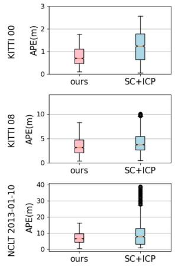  
(a)

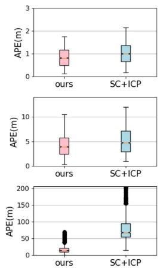  
(b)  
Fig. 9. Comparison of SLAM systems with different front-end odometry approaches on different sequences. (a) Front end: A-LOAM. (b) Front end: F-LOAM.

PGO framework, we also substitute the front-end odometry with F-LOAM [76], thereby demonstrating the capability of our method to integrate diverse odometry systems. As depicted in Fig. 9, regardless of the chosen odometry front-end, our approach consistently yields more precise localization results than systems utilizing Scan Context and ICP. Moreover, our approach exhibits smaller errors and enhanced stability. Our system demonstrates a notable superiority, particularly evident in handling the challenging NCLT dataset. When employing F-LOAM as the front-end, the system suffers from severe degeneracy and subsequent localization failure. Our method expertly overcomes such system failures and considerably reduces APEs. In conclusion, our experiments demonstrate the significance of our method, particularly in highly challenging scenarios where it serves as a crucial safeguard against critical degeneracy.

## G. Ablation Study

We conduct ablation studies to better understand the effectiveness of each module in our proposed LCR-Net, as in Table VI. Table VI(a) and (b) study specific designs of 3D-RoFormer++ and VoteEncoder in continuous registration tasks using Mulran dataset and closed-loop registration task using KITTI dataset (loop with distance below 4 m). Table VI(c) and Table VI(d) study overall structure and training strategy in registration task and candidate retrieval task using KITTI and Ford Campus datasets. We use the model trained on our dataset splittings, LCR-Net, as the default model. The registration performance is evaluated using the RANSAC estimator.

Rotary embedding: Table VI(a) studies the influence of different rotary position embedding used in 3D-RoFormer++, where i) 3D-RoFormer uses nonlinear embedding as in (1); ii) 3D-RoFormer++ uses the linear embedding as in (7); and iii) 3D-RoFormer++∗ refers to the 3D-RoFormer++ trained without penalty loss. Using a linear rotary position embedding improves registration robustness and accuracy. The reason could be attributed to the network’s ability to consistently represent relative positions through a linear embedding, thus enhancing the registration performance. Using the penalty loss can further help the position embedding learning.

VoteEncoder: Table VI(b) studies the designs of VoteEncoder. Leveraging the central prediction algorithm, VoteEncoder acquires a more robust estimation for the center of the interested region, thus enhancing registration accuracy. The incorporation of feature aggregation capability via KPConv improves both robustness and accuracy.

Overall structure: Table VI(c) studies the impact of our VoteEncoder and 3D-RoFormer++. As can be seen, VoteEncoder significantly enhances the registration performance. The underlying factors contributing to this improvement are examined in Section VI-H. We study the 3D-RoFormer++ by replacing it with a vanilla Transformer using an absolute position encoder [38]. As depicted, 3D-RoFormer++ exhibits superior advantages in registration compared with the vanilla Transformer.

Though 3D-RoFormer++ does not directly contributes to global descriptor generation, it still impacts performance. As illustrated, 3D-RoFormer++ is beneficial in enhancing the generalization of the global descriptor, which suggests that 3D-RoFormer++ is more effective in improving the backbone’s feature learning than vanilla Transformer. On the other hand, using the VoteEncoder does not have a significant impact. The performance tradeoff is justified by the substantial improvement in registration brought by VoteEncoder.

Training strategy: In Table VI(d), we study the influence of training strategy. We compare the training strategy used in this article, linear probe, with two alternative strategies. The first strategy is fine-tuning, where we also pretrain the model in the registration task but subsequently fine-tune the model in the candidate retrieval task. The second strategy is end-to-end, which trains the whole network from scratch. With the principle of maximizing computational resource utilization, we have set the batch size (b) to 1, with $N _ { p } = 1$ positive scan (p) and $N _ { n } = 1$ negative scan (n) for these two strategies. As can be seen, we are constrained to much smaller batch sizes and fewer positive/negative scans in these two strategies than in the linear probe strategy, which largely constrains the candidate retrieval performance. Note that all the strategies use the same batch size as 1 when trained on registration, yet the linear probe still achieves the best registration performance. This can be attributed to the linear probe strategy not facing the tradeoff between global descriptor capacity and registration capability during training.

## H. Insights on How VoteEncoder Contributes to Registration

In our ablation study, we observe significant registration performance enhancement brought about by our VoteEncoder. To understand how VoteEncoder contributes to registration, we further conduct insight experiments on six additional metrics as follows:

1) IR, the ratio of correct correspondences with residuals below a certain threshold, e.g., 0.6 m, after applying the ground-truth transformation;

2) match recall (MR), the ratio of true point matches found among all the true matches;

3) hit ratio (HR), the fraction of true points that have matches among all points that have matches;

4) patch inlier ratio (PIR);

TABLE VII  
COMPREHENSIVE EVALUATION OF VOTEENCODER ON CONTINUOUS REGISTRATION TASK USING THE KITTI DATASET
<table><tr><td rowspan="2">Model</td><td colspan="3">Direct metrics</td><td colspan="3">Indirect metrics</td></tr><tr><td></td><td>RR(%) RRE(°) RTE(cm)</td><td></td><td>IR</td><td>MR HR PIR PMR PHR</td></tr><tr><td>full</td><td>99.82</td><td>0.17</td><td>3.9</td><td>78.2</td><td>9.2 69.2 80.9 62.8</td></tr><tr><td>w/o VoteEncoder</td><td>99.82</td><td>0.22</td><td>6.4</td><td>84.5</td><td>86.3 35.1 97.0 15.7 43.2</td></tr><tr><td>5KPEncoder</td><td>99.82</td><td>0.20</td><td>4.6</td><td></td><td>3.7 81.2 6.3 51.0 88.6 39.4 77.5</td></tr></table>

The best results are highlighted in bold.

5) patch match recall (PMR);

6) patch hit ratio (PHR) are with the same meaning with IR, MR, and HR, respectively, but at sparse matching level.

The true patch match represents that patch pairs have actual overlap. MR and PMR evaluate the coverage ratio of found matches among all true matches, whereas HR and PHR better assess the match distribution over the overlapping region since a point/patch may possesses multiple matches.

We present the results of LCR-Net and LCR-Net without VoteEncoder in Table VII. To evaluate the efficacy ofthe VoteEncoder in contrast to an alternative downsampling and aggregation approach, we also present a variant, denoted as 5KPEncoder, that replaces VoteEncoder with another KPEncoder. As can be seen, using VoteEncoder has shown decreased IR and PIR but notably increased PMR and HR. The rationale behind this can be explained as follows: the VoteEncoder can be seen as a downsampler that filters redundant points and aggregates them into new keypoints. After filtering massive points with similar neighbors, it becomes more difficult to find true matches in sparser candidates (as observed by decreased PIR). However, this also allows LCR-Net to focus on searching different geometrically salient regions over the point cloud rather than repeatedly sampling the same salient region (as observed by increased PMR and HR). Moreover, this also leads to a more reasonable point patch grouping, making it easier to match an object as a whole and simplifying the subsequent dense matching process (see the decrease in PIR by 17.9%, whereas IR only decreases by 6.3%). As depicted, the significant improvement in PMR and HR brought by VoteEncoder, allowing for wider baselines and more dimensional constraints in registration, greatly reduces registration errors (see the decrease in RRE by 23% and RTE by 39%). Comparison between 5KPEncoder and full LCR-Net demonstrates that the VoteEncoder achieves more effective downsampling and better registration than a KPEncoder.

We provide qualitative comparisons of matching points in Fig. 10. As depicted, matching points obtained by full LCR-Net offer enhanced coverage of overlapping regions within the point clouds. We zoom in and examine four specific local areas within both scenes. It is evident that the full LCR-Net effectively groups and matches points of local areas.

Insights: The above results lead us to rethink which indirect metrics are more important in point cloud registration. Apart from the final performance evaluated by direct metrics of RR, RRE, and RTE, most prior works [33], [34], [35], [36], [37], [39], [40], [41], [69], [70], [73] focus only on the keypoint salience evaluated by indirect metric IR, also referred to as precision. However, higher IR does not guarantee higher robustness or accuracy, as observed in Table VII. Conversely, the coverage ratio of found matches among all true matches, as evaluated by metrics MR and HR, should be a crucial factor to consider. These metrics provide insights into the distribution of matching points and can guide the design of new keypoint detection methods by considering this distribution.

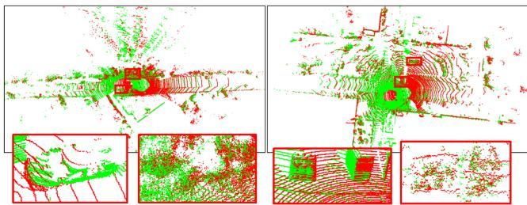

(a)  
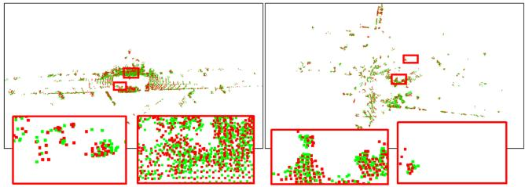

(b)  
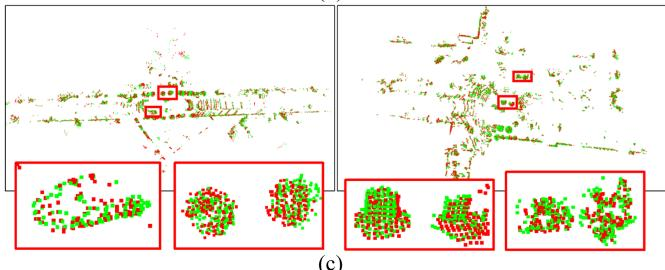  
(c)  
Fig. 10. We visualize the matching points identified by LCR-Net to demonstrate the focus of our LCR-Net. The matching points obtained by LCR-Net after ablating VoteEncoder is also visualized for comparison. For better visualization, we align the points in two scans using the pose estimated by LCR-Net based on LGR. In each case, we zoom in on three representative regions for closer examination. (a) Input point clouds. (b) Matching points found by LCR-Net ablating VoteEncoder. (c) Matching points found by LCR-Net.

Indeed, numerous existing keypoint detection and matching methods [36], [37] have proposed to prevent keypoints from being excessively concentrated in local areas. Early work for LiDAR odometry, LOAM [61] and its variants [76], [77] also propose to extract keypoints uniformly from all LiDAR scan lines. However, they have not provided a clear explanation for the underlying reasons. We are the first to specifically propose this insight and validate it through experimental cases by providing quantitative metrics.

## VII. CONCLUSION

This article analyzes the challenges and commonalities between loop closing and relocalization tasks and proposes a unified framework to address both. Within this framework, we present LCR-Net, a novel multihead network for candidate retrieving and point cloud registration. LCR-Net incorporates a novel keypoint detection module, offering three types of features to meet different requirements for distinct postprocessing. Two novel submodules, 3D-RoFormer++ and VoteEncoder, are proposed for feature generation. 3D-RoFormer++ learns contextual information between two point clouds and leverages a novel translation-invariant rotary position embedding for geometric information aggregation. VoteEncoder, on the other hand, learns to detect keypoints from distinct objects while maintaining a uniform and nonrepeating distribution. We demonstrate the SOTA performance of our LCR-Net in three subtasks related to loop closing and relocalization. Given the notable improvement in registration performance brought by VoteEncoder, we conduct experiments to analyze the underlying reasons and obtain an important insight that point matching should consider distribution rather than solely focusing on precision. Finally, we integrate our network as the loop closing and relocalization module into a complete SLAM system and verify its capability to address loop closing and relocalization tasks. In this article, we employ spectral analysis of the Jacobian matrix as the criterion for detecting degeneracy. However, this approach introduces numerous false detections, which do not influence the localization results yet bring extra computational costs. In future work, we will explore techniques for more efficient degeneracy detection to enhance the performance of our system.

## REFERENCES

[1] B. Steder, M. Ruhnke, S. Grzonka, and W. Burgard, “Place recognition in 3D scans using a combination of bag of words and point feature based relative pose estimation,” in Proc. IEEE/RSJ Int. Conf. Intell. Robots Syst., 2011, pp. 1249–1255.

[2] M. Bosse and R. Zlot, “Place recognition using keypoint voting in large 3D LiDAR datasets,” in Proc. IEEE Int. Conf. Robot. Autom., 2013, pp. 2677–2684.

[3] Y. Cui, X. Chen, Y. Zhang, J. Dong, Q. Wu, and F. Zhu, “BoW3D: Bag of words for real-time loop closing in 3D LiDAR SLAM,” IEEE Robot. Autom. Lett., vol. 8, no. 5, pp. 2828–2835, May 2023.

[4] J. Sivic and A. Zisserman, “Video Google: A text retrieval approach to object matching in videos,” in Proc. IEEE Int. Conf. Comput. Vis., 2003, pp. 1470–1477.

[5] D. Cattaneo, M. Vaghi, and A. Valada, “LCDNet: Deep loop closure detection and point cloud registration for LiDAR SLAM,” IEEE Trans. Robot., vol. 38, no. 4, pp. 2074–2093, Aug. 2022.

[6] J. Arce, N. Vodisch, D. Cattaneo, W. Burgard, and A. Valada, “PADLOC: LiDAR-based deep loop closure detection and registration using panoptic attention,” IEEE Robot. Autom. Lett., vol. 8, no. 3, pp. 1319–1326, Mar. 2023.

[7] K. Vidanapathirana, P. Moghadam, S. Sridharan, and C. Fookes, “Spectral geometric verification: Re-ranking point cloud retrieval for metric localization,” IEEE Robot. Autom. Lett., vol. 8, no. 5, pp. 2494–2501, May 2023.

[8] P. J. Besl and N. D. McKay, “A method for registration of 3D shapes,” IEEE Trans. Pattern Anal. Mach. Intell., vol. 14, no. 2, pp. 239–256, Feb. 1992.

[9] G. Kim and A. Kim, “Scan context: Egocentric spatial descriptor for place recognition within 3D point cloud map,” in Proc. IEEE/RSJ Int. Conf. Intell. Robots Syst., 2018, pp. 4802–4809.

[10] J. Knopp, J. Sivic, and T. Pajdla, “Avoiding confusing features in place recognition,” in Proc. 11th Eur. Conf. Comput. Vis., 2010, pp. 748–761.

[11] Y. Zhong, “Intrinsic shape signatures: A shape descriptor for 3D object recognition,” in Proc. 12th Int. Conf. Comput. Vis. Workshops, 2009, pp. 689–696.

[12] A. Uy and G. Lee, “PointNetVLAD: Deep point cloud based retrieval for large-scale place recognition,” in Proc. IEEE Conf. Comput. Vis. Pattern Recognit., 2018, pp. 4470–4479.

[13] C. Qi, H. Su, K. Mo, and L. Guibas, “PointNet: Deep learning on point sets for 3D classification and segmentation,” in Proc. IEEE Conf. Comput. Vis. Pattern Recognit., 2017, pp. 652–660.

[14] R. Arandjelovic, P. Gronat, A. Torii, T. Pajdla, and J. Sivic, “NetVLAD: CNN architecture for weakly supervised place recognition,” IEEE Trans. Pattern Anal. Mach. Intell., vol. 40, no. 6, pp. 1437–1451, Jun. 2018.

[15] J. Komorowski, “MinkLoc3D: Point cloud based large-scale place recognition,” in Proc. IEEEWinterConf.Appl. Comput. Vis., 2020, pp. 1790–1799.

[16] J. Komorowski, “Improving point cloud based place recognition with ranking-based loss and large batch training,” in Proc. Int. Conf. Pattern Recognit., 2022, pp. 3699–3705.

[17] K. Vidanapathirana, M. Ramezani, P. Moghadam, S. Sridharan, and C. Fookes, “Logg3D-Net: Locally guided global descriptor learning for 3D place recognition,” in Proc. IEEE Int. Conf. Robot. Automat., 2022, pp. 2215–2221.

[18] F. Radenovic, G. Tolias, and O. Chum, “Fine-tuning CNN image retrieval with no human annotation,” IEEE Trans. Pattern Anal. Mach. Intell., vol. 41, no. 7, pp. 1655–1668, Jul. 2019.

[19] A. Vaswani et al., “Attention is all you need,” in Proc. Adv. Neural Inf. Process. Syst., 2017, pp. 6000–6010.

[20] L. Hui, H. Yang, M. Cheng, J. Xie, and J. Yang, “Pyramid point cloud transformer for large-scale place recognition,” in Proc. IEEE/CVF Int. Conf. Comput. Vis., 2021, pp. 6098–6107.

[21] Y. Xia et al., “SOE-Net: A self-attention and orientation encoding network for point cloud based place recognition,” in Proc. IEEE/CVF Conf. Comput. Vis. Pattern Recognit., 2020, pp. 11348–11357.

[22] S. Shi et al., “PV-RCNN: Point-voxel feature set abstraction for 3D object detection,” in Proc. IEEE/CVFConf. Comput. Vis. Pattern Recognit., 2019, pp. 10529–10538.

[23] S. S. Harithas et al., “FinderNet: A data augmentation free canonicalization aided loop detection and closure technique for point clouds in 6-DOF separation,” in Proc. IEEE/CVF Winter Conf. Appl. Comput. Vis., 2024, pp. 8384–8393.

[24] Y. Wang, Z. Sun, J. Yang, and H. Kong, “LiDAR IRIS for loop-closure detection,” in Proc. IEEE/RSJ Int. Conf. Intell. Robots Syst., 2019, pp. 5769–5775.

[25] X. Chen et al., “OverlapNet: Loop closing for LiDAR-based SLAM,” in Proc. Robot.: Sci. Syst., 2020.

[26] J. Ma, J. Zhang, J. Xu, R. Ai, W. Gu, and X. Chen, “Overlaptransformer: An efficient and yaw-angle-invariant transformer network for lidar-based place recognition,” IEEE Robot.Autom. Lett., vol. 7, no. 3, pp. 6958–6965, Jul. 2022.

[27] J. Ma, X. Chen, J. Xu, and G. Xiong, “SEQOT: A spatial–temporal transformer network for place recognition using sequential LiDAR data,” IEEE Trans. Ind. Electron., vol. 70, no. 8, pp. 8225–8234, Aug. 2023.

[28] J. Ma, G. Xiong, J. Xu, and X. Chen, “CVTNet: A cross-view transformer network for LiDAR-Based place recognition in autonomous driving environments,” IEEE Trans. Ind. Inform., vol. 20, no. 3, pp. 4039–4048, Mar. 2024.

[29] M. Fischler and R. Bolles, “Random sample consensus: A paradigm for model fitting with applications to image analysis and automated cartography,” Commun. ACM, vol. 24, no. 6, pp. 381–395, 1981.

[30] Z. Zhang, “Iterative point matching for registration of free-form curves and surfaces,” Int. J. Comput. Vis., vol. 13, no. 2, pp. 119–152, 1994.

[31] A. Segal, D. Haehnel, and S. Thrun, “Generalized-ICP,” in Proc. Robot. Sci. Syst., 2009, pp. 1–7.

[32] R. B. Rusu, N. Blodow, and M. Beetz, “Fast point feature histograms (FPFH) for 3D registration,” in Proc. IEEE Int. Conf. Robot. Autom., 2009, pp. 3212–3217.

[33] H. Deng, T. Birdal, and S. Ilic, “PPFNet: Global context aware local features for robust 3D point matching,” in Proc. IEEE Conf. Comput. Vis. Pattern Recognit., 2018, pp. 195–205.

[34] H. Deng, T. Birdal, and S. Ilic, “PPF-Foldnet: Unsupervised learning of rotation invariant 3D local descriptors,” in Proc. Eur. Conf. Comput. Vis., 2018, pp. 602–618.

[35] Z. J. Yew and G. H. Lee, “3DFEAT-NET: Weakly supervised local 3D features for point cloud registration,” in Proc. Eur. Conf. Comput. Vis., 2018, pp. 607–623.

[36] J. Li and G. H. Lee, “USIP: Unsupervised stable interest point detection from 3D point clouds,” in Proc. IEEE/CVF Int. Conf. Comput. Vis., 2019, pp. 361–370.

[37] X. Bai, Z. Luo, L. Zhou, H. Fu, L. Quan, and C.-L. Tai, “D3feat: Joint learning of dense detection and description of 3D local features,” in Proc. IEEE/CVF Conf. Comput. Vis. Pattern Recognit., 2020, pp. 6359–6367.

[38] C. Shi, X. Chen, K. Huang, J. Xiao, H. Lu, and C. Stachniss, “Keypoint matching for point cloud registration using multiplex dynamic graph attention networks,” IEEE Robot. Autom. Lett., vol. 6, no. 4, pp. 8221–8228, Oct. 2021.

[39] H. Yu, F. Li, M. Saleh, B. Busam, and S. Ilic, “Cofinet: Reliable coarseto-fine correspondences for robust pointcloud registration,” in Proc. Adv. Neural Inf. Process. Syst., 2021, pp. 23872–23884.

[40] Z. Qin, H. Yu, C. Wang, Y. Guo, Y. Peng, and K. Xu, “Geometric transformer for fast and robust point cloud registration,” in Proc. IEEE/CVF Conf. Comput. Vis. Pattern Recognit., 2022, pp. 11143–11152.

[41] C. Shi, X. Chen, H. Lu, W. Deng, J. Xiao, and B. Dai, “RDMNET: Reliable dense matching based point cloud registration for autonomous driving,” IEEE Trans. Intell. Transp. Syst., vol. 24, no. 10, pp. 11372–11383, Oct. 2023.

[42] F. Lu et al., “HREGNET: A hierarchical network for large-scale outdoor LiDAR point cloud registration,” in Proc. IEEE Int. Conf. Comput. Vis., 2021, pp. 16014–16023.

[43] X. Chen, T. Läbe, A. Milioto, T. Röhling, J. Behley, and C. Stachniss, “OverlapNet: A Siamese network for computing LiDAR scan similarity with applications to loop closing and localization,” Auton. Robots, vol. 46, pp. 61–81, 2021.

[44] J. Du, R. Wang, and D. Cremers, “DH3D: Deep hierarchical 3D descriptors for robust large-scale 6dofrelocalization,” in Proc. Eur. Conf. Comput. Vis., 2020, pp. 744–762.

[45] J. Komorowski, M. Wysoczanska, and T. Trzci´nski, “EGONN: Egocentric neural network for point cloud based 6dof relocalization at the city scale,” IEEE Robot. Autom. Lett., vol. 7, no. 2, pp. 722–729, Apr. 2022.

[46] J. Zhang, M. Kaess, and S. Singh, “On degeneracy of optimization-based state estimation problems,” in Proc. IEEE Int. Conf. Robot. Autom., 2016, pp. 809–816.

[47] W. Xu and F. Zhang, “Fast-LIO: A fast, robust LiDAR-inertial odometry package by tightly-coupled iterated Kalman filter,” IEEE Robot. Autom. Lett., vol. 6, no. 2, pp. 3317–3324, Apr. 2021.

[48] H. Zhou, Z. Yao, and M. Lu, “Lidar/UWB fusion based SLAM with anti-degeneration capability,” IEEE Trans. Veh. Technol., vol. 70, no. 1, pp. 820–830, Jan. 2021.

[49] J. Behley and C. Stachniss, “Efficient surfel-based SLAM using 3D laser range data in urban environments,” in Proc. Robot.: Sci. Syst., 2018, pp. 1–9.

[50] X. Chen, A. Milioto, E. Palazzolo, P. Giguère, J. Behley, and C. Stachniss, “SuMa : Efficient LiDAR-based semantic SLAM,” in Proc. IEEE/RSJ Int. Conf. Intell. Robots Syst., 2019, pp. 4530–4537.

[51] C. Campos, R. Elvira, J. J. G. Rodriguez, J. M. M. Montiel, and J. D. Tardós, “ORB-SLAM3: An accurate open-source library for visual, visual–inertial, and multimap SLAM,” IEEE Trans. Robot., vol. 37, no. 6, pp. 1874–1890, Dec. 2021.

[52] M. Zins, G. Simon, and M.-O. Berger, “OA-SLAM: Leveraging objects for camera relocalization in visual SLAM,” in Proc. Int. Symp. Mixed Augmented Reality, 2022, pp. 720–728.

[53] H. Thomas, C. Qi, J. Deschaud, B. Marcotegui, F. Goulette, and L. Guibas, “KPConv: Flexible and deformable convolution for point clouds,” in Proc. IEEE/CVF Int. Conf. Comput. Vis., 2019, pp. 6411–6420.

[54] C. R. Qi, O. Litany, K. He, and L. J. Guibas, “Deep hough voting for 3D object detection in point clouds,” in Proc. IEEE/CVF Int. Conf. Comput. Vis., 2019, pp. 9277–9286.

[55] Y. Zhang, Q. Hu, G. Xu, Y. Ma, J.-H. Wan, and Y. Guo, “Not all points are equal: Learning highly efficient point-based detectors for 3D LiDAR point clouds,” in Proc. IEEE/CVF Conf. Comput. Vis. Pattern Recognit., 2022, pp. 18953–18962.

[56] P.-E. Sarlin, D. DeTone, T. Malisiewicz, and A. Rabinovich, “Superglue: Learning feature matching with graph neural networks,” in Proc. IEEE/CVF Conf. Comput. Vis. Pattern Recognit., 2019, pp. 4938–4947.

[57] R. Sinkhorn, “A relationship between arbitrary positive matrices and doubly stochastic matrices,” Ann. Math. Statist., vol. 35, pp. 876–879, 1964.

[58] F. Schroff, D. Kalenichenko, and J. Philbin, “Facenet: A unified embedding for face recognition and clustering,” in Proc. IEEE Conf. Comput. Vis. Pattern Recognit., 2015, pp. 815–823.

[59] P. K. Diederik and J. Ba, “Adam: A method for stochastic optimization,” in Proc. 3rd Int. Conf. Learn. Representations, Y. Bengio and Y. LeCun, Eds. San Diego, CA, USA, May 7–9, 2015.

[60] M. Kaess, H. Johannsson, R. Roberts, V. Ila, J. J. Leonard, and F. Dellaert, “iSAM2: Incremental smoothing and mapping using the Bayes tree,” Int. J. Robot. Res., vol. 31, pp. 216–235, 2012.

[61] J. Zhang and S. Singh, “LOAM: LiDAR odometry and mapping in realtime,” in Proc. Robot.: Sci. Syst., 2014, pp. 1–9.

[62] J. Johnson, M. Douze, and H. Jégou, “Billion-scale similarity search with GPUs,” IEEE Trans. Big Data, vol. 7, no. 3, pp. 535–547, Jul. 2021.

[63] A. Geiger, P. Lenz, and R. Urtasun, “Are we ready for autonomous driving? the KITTI vision benchmark suite,” in Proc. IEEE Conf. Comput. Vis. Pattern Recognit., 2012, pp. 3354–3361.

[64] Y. Liao, J. Xie, and A. Geiger, “Kitti-360: A novel dataset and benchmarks for urban scene understanding in 2D and 3D,” IEEE Trans. Pattern Anal. Mach. Intell., vol. 45, no. 3, pp. 3292–3310, Mar. 2023.

[65] W. Lu, Y. Zhou, G. Wan, S. Hou, and S. Song, “L3-Net: Towards learning based LiDAR localization for autonomous driving,” in Proc. IEEE/CVF Conf. Comput. Vis. Pattern Recognit., 2019, pp. 6389–6398.

[66] D. Barnes, M. Gadd, P. Murcutt, P. Newman, and I. Posner, “The oxford radar robotcar dataset: A radar extension to the oxford robotcar dataset,” in Proc. IEEE Int. Conf. Robot. Automat., 2019, pp. 6433–6438.

[67] X. Zhang, L. Wang, and Y. Su, “Visual place recognition: A survey from deep learning perspective,” Pattern Recognit., vol. 113, 2021, Art. no. 107760.

[68] T. Röhling, J. Mack, and D. Schulz, “A fast histogram-based similarity measure for detecting loop closures in 3-D LIDAR data,” in Proc. IEEE/RSJ Int. Conf. Intell. Robots Syst., 2015, pp. 736–741.

[69] C. B. Choy, J. Park, and V. Koltun, “Fully convolutional geometric features,” in Proc. IEEE Int. Conf. Comput. Vis., 2019, pp. 8958–8966.

[70] S. Huang, Z. Gojcic, M. Usvyatsov, A. Wieser, and K. Schindler, “Predator: Registration of 3D point clouds with low overlap,” in Proc. IEEE/CVF Conf. Comput. Vis. Pattern Recognit., 2021, pp. 4267–4276.

[71] C. B. Choy, W. Dong, and V. Koltun, “Deep global registration,” in Proc. IEEE/CVF Conf. Comput. Vis. Pattern Recognit., 2020, pp. 2514–2523.

[72] Z. J. Yew and G. H. Lee, “RPM-Net: Robust point matching using learned features,” in Proc. IEEE/CVF Conf. Comput. Vis. Pattern Recognit., 2020, pp. 11824–11833.

[73] L. Zhu, H. Guan, C. Lin, and R. Han, “Neighborhood-aware geometric encoding network for point cloud registration,” 2022, arXiv:2201.12094.

[74] N. C.-Bianco, A. K. Ushani, and R. M. Eustice, “University of Michigan North Campus long-term vision and LiDAR dataset,” Int. J. Robot. Res., vol. 35, pp. 1023–1035, 2016.

[75] P. Dellenbach, J.-E. Deschaud, B. Jacquet, and F. Goulette, “CT-ICP: Realtime elastic LiDAR odometry with loop closure,” in Proc. IEEE Int. Conf. Robot. Automat., 2021, pp. 5580–5586.

[76] H. Wang, C. Wang, C.-L. Chen, and L. Xie, “F-LOAM: Fast LiDAR odometry and mapping,” in Proc. IEEE/RSJ Int. Conf. Intell. Robots Syst., 2021, pp. 4390–4396.

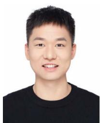

[77] T. Shan and B. Englot, “Lego-LOAM: Lightweight and ground-optimized LiDAR odometry and mapping on variable terrain,” in Proc. IEEE/RSJ Int. Conf. Intell. Robots Syst., 2018, pp. 4758–4765.

planning.

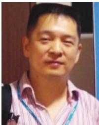

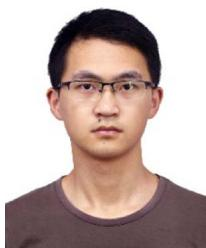  
Chenghao Shi received the bachelor’s of engineering degree in detecting guidance and control technology from the Nanjing University of Aeronautics and Astronautics (NUAA), Nanjing, China, in 2017, the master’s degree in control science and engineering in 2019 from the National University of Defense Technology, Changsa, China, where he is working toward the Ph.D. degree in control science and engineering.

Xieyuanli Chen received the bachelor’s degree in electrical engineering and automation from Hunan University, Changsha, China, in 2015, the master’s degree in robotics from the National University of Defense Technology (NUDT), Changsha, in 2017, and the Ph.D. degree in engineering from Photogrammetry and Robotics Laboratory, the University of Bonn, Bonn, Germany, in 2022.

In 2023, he joined the College of Intelligence Science and Technology, NUDT, where he is now an Associate Professor.

His research interests include localization and mobile robots.

Junhao Xiao (Senior Member, IEEE) received the B.E. degree in automation from the National University of Defense Technology, Changsha, China, in 2007, and the Ph.D. degree in computer science from the Institute of Technical Aspects of Multimodal Systems (TAMS), Department of Informatics, University of Hamburg, Hamburg, Germany. In 2013, he joined the College of Intelligence Science and Technology, NUDT, where he is currently an Associate Professor since 2017. His research interest focuses on mobile robotics, especially localization, mapping, and path

Huimin Lu received the B.E. degree in automation, the M.E. and Ph.D. degrees in control science and engineering from the National University of Defense Technology (NUDT), Changsha, China, in 2003, 2005, and 2010, respectively.

Bin Dai received the Ph.D. degree in control science and engineering from National University of Defense Technology, Changsha, China, in 1998.

In 2006, he was a Visiting Scholar with the Intelligent Process Control and Robotics Laboratory, Karlsruhe Institute of Technology. He is currently a Professor with the Unmanned Systems Research Center, National Innovation Institution of Defense Technology, Beijing, China. His research interests include computer vision and intelligent vehicles.

In 2010, he joined the College of Intelligence Science and Technology, NUDT, where he is currently a Professor. His research interests include mobile robotics, mainly robot vision, multirobot coordination, and human-robot interaction.