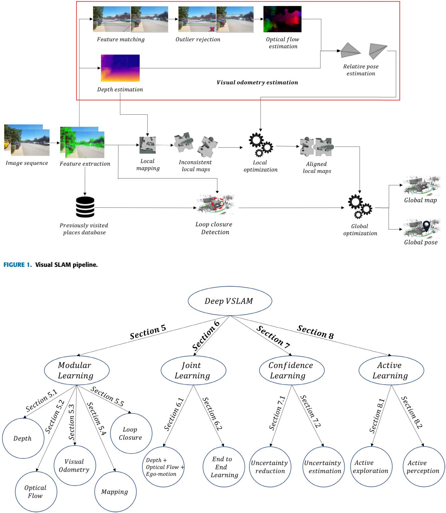
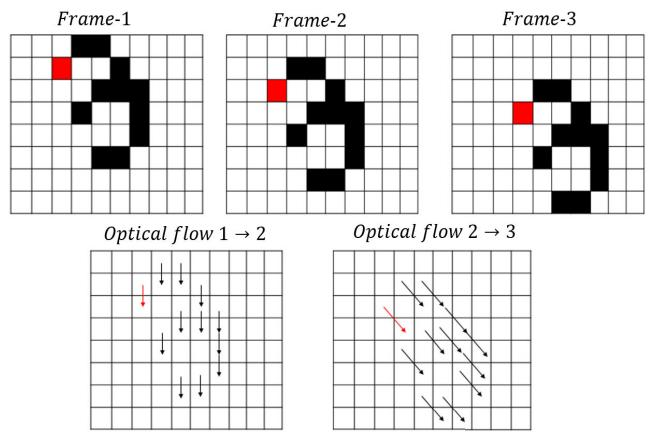
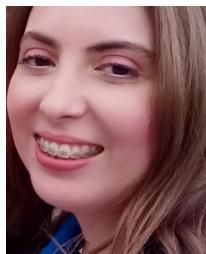
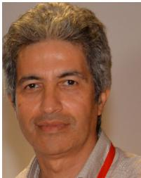

Received 5 February 2023, accepted 17 February 2023, date of publication 27 February 2023, date of current version 2 March 2023. Digital Object Identifier 10.1109/ACCESS.2023.3249661

# Deep Learning Techniques for Visual SLAM: A Survey

SAAD MOKSSIT 1, DANIEL BONILLA LICEA2, BASSMA GUERMAH1, AND MOUNIR GHOGHO 1,3, (Fellow, IEEE)

1TICLab, College of Engineering and Architecture, International University of Rabat, Rabat 11103, Morocco 2Multi-Robot Systems Group (MRS), Faculty of Electrical Engineering, Czech Technical University in Prague, 121 35 Prague, Czech Republic 3Faculty of Engineering, University of Leeds, LS2 9JT Leeds, U.K.

Corresponding author: Saad Mokssit (saad.mokssit@uir.ac.ma)

The work of Daniel Bonilla Licea was supported in part by the European Union’s Horizon 2020 Research and Innovation Program AERIAL COgnitive Integrated Multi-Task Robotic System with Extended Operation Range and Safety (AERIAL-CORE) under Agreement 871479.

ABSTRACT Visual Simultaneous Localization and Mapping (VSLAM) has attracted considerable attention in recent years. This task involves using visual sensors to localize a robot while simultaneously constructing an internal representation of its environment. Traditional VSLAM methods involve the laborious hand-crafted design of visual features and complex geometric models. As a result, they are generally limited to simple environments with easily identifiable textures. Recent years, however, have witnessed the development of deep learning techniques for VSLAM. This is primarily due to their capability of modeling complex features of the environment in a completely data-driven manner. In this paper, we present a survey of relevant deep learning-based VSLAM methods and suggest a new taxonomy for the subject. We also discuss some of the current challenges and possible directions for this field of study.

INDEX TERMS Visual SLAM, deep learning, joint learning, active learning, survey.

## I. INTRODUCTION

Simultaneous localization and mapping (SLAM) is a technique for localizing a mobile agent with respect to an unknown environment while at the same time building a map of that environment. SLAM methods can be roughly classified into two major categories: range-based [1], [2] and visual-based methods [3].

Range-based SLAM uses range finders like laser scanners [4], [5], radar [6], and/or sonars [7] to scan the surroundings and build a point cloud representation of the environment. It has demonstrated good performance in a variety of applications [8], [9], [10], but it is costly and operates badly in adverse weather conditions such as rain and snow.

Visual SLAM (VSLAM) uses on-board cameras to capture frames and construct a representation of the environment. It has a wide range of applications like autonomous driving [11], augmented reality [12], planetary exploration [13] and military planning [14]. VSLAM has several advantages over range-based SLAM. These include its inexpensive cost, low power consumption and rich data collection.

Traditional approaches to solving the VSLAM problem [15], [16] rely on tracking salient and transformationinvariant features, such as SIFT (Scale-Invariant Feature Transform) [17] and ORB (Oriented Fast and Rotated BRIEF) [18] between successive image frames, to estimate the relative motion of the camera. They then reconstruct the 3D map of the environment through multi-view geometry theory [19]. This yields a pipeline structure composed of several hand-crafted modular units, each of which performs a well defined task such as feature extraction, visual odometry, depth estimation, and mapping; see Fig. 1

SIFT and ORB features are widely used in the VSLAM field thanks to their robustness, distinctiveness, and fast processing properties. Nevertheless, their utilization results in poor performance in difficult environments (e.g. featureless environments, dynamic environments, severe changes in illumination, etc.). Further, when VSLAM is used to accomplish a higher level task such as search and rescue, autonomous driving, or finding a fire extinguisher to put out a fire in a burning structure, the agent in these applications requires semantic knowledge about the environment. Thus, the geometric information embedded in SIFT and ORB features is not always sufficient.

An alternative approach is the use of deep learning techniques which have been shown to automatically learn complex features from visual inputs. This characteristic has been leveraged to develop highly accurate image classification and object recognition models, which have been successfully applied to VSLAM for camera pose estimation [20], place recognition [21], loop closure detection [22], semantic mapping [23], among other tasks.

To the best of our knowledge, existing VSLAM surveys are limited to methods that learn specific pipeline components in isolation from one another. Recent techniques based on jointly optimising the various VSLAM components have been shown to achieve better performance. In this survey, we provide a comprehensive review of VSLAM methods including these recent techniques.

Our main contributions are listed below:

• We propose a novel taxonomy for deep learning techniques applied to VSLAM;

• We present a comprehensive review of the most important deep learning methods applied to VSLAM;

• We explore deep learning-based VSLAM from a holistic standpoint rather than focusing on individual VSLAM components;

• We discuss the strengths and weaknesses of the different deep learning-based approaches to VSLAM;

• We discuss some current challenges and future directions for deep learning-based VSLAM

The remainder of the paper is organised as follows. In section II, we review existing surveys on VSLAM. We then, briefly present the general framework of a VSLAM system in section III. Section IV describes the proposed taxonomy. Sections V, VI, VII and VIII discuss existing works on deep learning based VSLAM. Open problems and suggestions for future research directions are presented in section IX. Finally, conclusions are drawn in section X.

## II. RELATED WORK

Many surveys and tutorials deal with different aspects of SLAM without focusing on VSLAM. For instance, the probabilistic SLAM formulation is well explained in [1], [24], and [2]. The authors of [25] give a thorough discussion on the SLAM development and briefly illustrate the application of deep learning to SLAM. In [26], the deep learning approaches used in SLAM are reviewed in details.

A few surveys focus on VSLAM. Model-based approaches to VSLAM are surveyed in [27] and [28]. The authors of [29] provide an overview of deep learning methods for VSLAM, focusing on visual odometry and loop closure detection.

Other survey papers cover individual aspects of VSLAM such as depth estimation [30], [31], optical flow estimation [32], [33], visual odometry estimation [34], or loop closure detection [22].

Table 1 summarizes existing surveys on VSLAM. A quick analysis of the table reveals the need for a survey to encompass the recent advancements in deep learning based approaches for VSLAM.

## III. VSLAM GENERAL FRAMEWORK

Classical VSLAM techniques can be divided into two categories: feature-based approaches [15], [16], [35] and dense approaches [36], [37], [38]. In the feature-based approach, input frames are first preprocessed to extract salient, robust, and transformation-invariant keypoints. On the other hand, in dense methods, frames are directly processed. In what follows, we will describe a unified architecture that is applicable to both categories, see Fig. 1; in the case of dense approaches, the feature extractor is the identity function.

The visual odometry module [39], [40] first examines the features, and then uses feature matching and outlier rejection techniques to find reliable pixel-pair correspondences in consecutive frames. These correspondences are further exploited to estimate the optical flow. Simultaneously, the visual odometry module estimates the depth of various points. Finally, by combining the depth and optical flow estimations, the visual odometry module generates a relative pose estimate.

The local mapping module creates a local representation of the agent’s surroundings by projecting the scene elements onto an internal local coordinate frame, annotated with their corresponding estimated depth. Afterwards, local maps are fused into a global map with the help of relative pose estimation.

Each local map that has been added to the global map is then fed to the local optimizer, which tries to minimize short-term error accumulation that may come from inaccurate measurements and/or estimations. Basically, it iteratively refines map and pose estimates to enforce alignment between consecutive local maps, resulting in a more consistent local representation of the environment.

Generally, since the local optimizer is based on the relative alignment of consecutive local maps, errors in one map may cause successive maps to align to the wrong direction. While these errors may seem insignificant in the short term, they continuously accumulate over time and become significant in the long run, thus negatively impacting the maps and poses global consistency.

The global optimization module solves this issue by relying on loop events detected by the loop closure detection module. At each time step, this module tries to check if the current scene has been previously visited by comparing the current frame with a stored database of previously visited places. In the case of a loop detection event, the current frame is projected back onto the previously constructed map. The global optimizer then corrects for the disparity between the current frame and its earlier representation in the internal map, yielding globally consistent maps and poses.

TABLE 1. Summary of available surveys on VSLAM.
<table><tr><td rowspan=1 colspan=1>Paper</td><td rowspan=1 colspan=1>Year</td><td rowspan=1 colspan=1>DeepLearning</td><td rowspan=1 colspan=1>Depth</td><td rowspan=1 colspan=1>OpticalFlow</td><td rowspan=1 colspan=1>Visualodometry</td><td rowspan=1 colspan=1>Mapping</td><td rowspan=1 colspan=1>Loopclosure</td><td rowspan=1 colspan=1>Jointlearning</td><td rowspan=1 colspan=1>Confidencelearning</td><td rowspan=1 colspan=1>Activelearning</td><td rowspan=1 colspan=1>Contributions andlimitations</td></tr><tr><td rowspan=1 colspan=1>[1],[2]</td><td rowspan=1 colspan=1>2006</td><td rowspan=1 colspan=1>X</td><td rowspan=1 colspan=1>X</td><td rowspan=1 colspan=1>X</td><td rowspan=1 colspan=1>V</td><td rowspan=1 colspan=1>7</td><td rowspan=1 colspan=1>X</td><td rowspan=1 colspan=1>X</td><td rowspan=1 colspan=1>×</td><td rowspan=1 colspan=1>×</td><td rowspan=1 colspan=1>Describes theclassical methodsfor solving theSLAM problem</td></tr><tr><td rowspan=1 colspan=1>[25]</td><td rowspan=1 colspan=1>2016</td><td rowspan=1 colspan=1>X</td><td rowspan=1 colspan=1>X</td><td rowspan=1 colspan=1>X</td><td rowspan=1 colspan=1>X</td><td rowspan=1 colspan=1>L</td><td rowspan=1 colspan=1>L</td><td rowspan=1 colspan=1>X</td><td rowspan=1 colspan=1>X</td><td rowspan=1 colspan=1>V</td><td rowspan=1 colspan=1>Presents acomprehensiveoverview of theSLAM developmentover the past yearsand brieflyintroduces theapplication of deeplearning to theSLAM problem</td></tr><tr><td rowspan=1 colspan=1>[26]</td><td rowspan=1 colspan=1>2020</td><td rowspan=1 colspan=1>V</td><td rowspan=1 colspan=1>X</td><td rowspan=1 colspan=1>X</td><td rowspan=1 colspan=1>1</td><td rowspan=1 colspan=1>L</td><td rowspan=1 colspan=1>L</td><td rowspan=1 colspan=1>X</td><td rowspan=1 colspan=1>L</td><td rowspan=1 colspan=1>X</td><td rowspan=1 colspan=1>Reviews existingwork on deeplearning applied tothe SLAM problem</td></tr><tr><td rowspan=1 colspan=1>[27]</td><td rowspan=1 colspan=1>2017</td><td rowspan=1 colspan=1>X</td><td rowspan=1 colspan=1>X</td><td rowspan=1 colspan=1>X</td><td rowspan=1 colspan=1>L</td><td rowspan=1 colspan=1>L</td><td rowspan=1 colspan=1>V</td><td rowspan=1 colspan=1>X</td><td rowspan=1 colspan=1>X</td><td rowspan=1 colspan=1>X</td><td rowspan=1 colspan=1>Surveys existingmodel-basedVSLAM algorithms</td></tr><tr><td rowspan=1 colspan=1>[28]</td><td rowspan=1 colspan=1>2021</td><td rowspan=1 colspan=1>X</td><td rowspan=1 colspan=1>X</td><td rowspan=1 colspan=1>X</td><td rowspan=1 colspan=1>V</td><td rowspan=1 colspan=1>L</td><td rowspan=1 colspan=1>L</td><td rowspan=1 colspan=1>X</td><td rowspan=1 colspan=1>X</td><td rowspan=1 colspan=1>X</td><td rowspan=1 colspan=1>Reviews existingVSLAM methodsand experimentallyassess theirperformance onpublic datasets</td></tr><tr><td rowspan=1 colspan=1>[29]</td><td rowspan=1 colspan=1>2019</td><td rowspan=1 colspan=1>V</td><td rowspan=1 colspan=1>X</td><td rowspan=1 colspan=1>X</td><td rowspan=1 colspan=1>L</td><td rowspan=1 colspan=1>X</td><td rowspan=1 colspan=1>7</td><td rowspan=1 colspan=1>X</td><td rowspan=1 colspan=1>×</td><td rowspan=1 colspan=1>X</td><td rowspan=1 colspan=1>Reviews existingdeep learningmethods for visualodometry and loopclosure detection</td></tr><tr><td rowspan=1 colspan=1>[30]</td><td rowspan=1 colspan=1>2020</td><td rowspan=1 colspan=1>V</td><td rowspan=1 colspan=1>V</td><td rowspan=1 colspan=1>X</td><td rowspan=1 colspan=1>X</td><td rowspan=1 colspan=1>×</td><td rowspan=1 colspan=1>X</td><td rowspan=1 colspan=1>X</td><td rowspan=1 colspan=1>X</td><td rowspan=1 colspan=1>X</td><td rowspan=1 colspan=1>Surveys deeplearning approachesfor monocular depthestimation</td></tr><tr><td rowspan=1 colspan=1>[31]</td><td rowspan=1 colspan=1>2020</td><td rowspan=1 colspan=1>V</td><td rowspan=1 colspan=1>7</td><td rowspan=1 colspan=1>X</td><td rowspan=1 colspan=1>X</td><td rowspan=1 colspan=1>X</td><td rowspan=1 colspan=1>×</td><td rowspan=1 colspan=1>X</td><td rowspan=1 colspan=1>×</td><td rowspan=1 colspan=1>X</td><td rowspan=1 colspan=1>Surveys deeplearning approachesfor stereo depthestimation</td></tr><tr><td rowspan=1 colspan=1>[32],[33]</td><td rowspan=1 colspan=1>2020</td><td rowspan=1 colspan=1>L</td><td rowspan=1 colspan=1>X</td><td rowspan=1 colspan=1>V</td><td rowspan=1 colspan=1>X</td><td rowspan=1 colspan=1>X</td><td rowspan=1 colspan=1>X</td><td rowspan=1 colspan=1>X</td><td rowspan=1 colspan=1>X</td><td rowspan=1 colspan=1>X</td><td rowspan=1 colspan=1>Surveys deeplearning techniquesfor optical flowestimation</td></tr><tr><td rowspan=1 colspan=1>Ours</td><td rowspan=1 colspan=1>2023</td><td rowspan=1 colspan=1>7</td><td rowspan=1 colspan=1>V</td><td rowspan=1 colspan=1>7</td><td rowspan=1 colspan=1>7</td><td rowspan=1 colspan=1>了</td><td rowspan=1 colspan=1>√</td><td rowspan=1 colspan=1>7</td><td rowspan=1 colspan=1>7</td><td rowspan=1 colspan=1>V</td><td rowspan=1 colspan=1>Surveys deeplearning techniquesfor VSLAM from aholistic standpoint</td></tr></table>

## IV. DEEP VISUAL SLAM TAXONOMY

The proposed taxonomy (fig 2) divides deep learning techniques for VSLAM into four categories: modular learning, joint learning, confidence learning, and active learning.

Modular learning encapsulates methods that learn individual modules within the classical VSLAM pipeline in isolation from the others. Despite the high performance of individually learned VSLAM modules, their efficient fusion within the system requires additional effort, and, usually, the overall VSLAM performance may be as high as that of the individual modules.

Joint learning methods, on the other hand, aim to mitigate the above-mentioned issue by either jointly optimizing various modules at once or by learning the full VSLAM pipeline. Generally, these methods exhibit better overall performance, but require significant effort in the training phase.

  
FIGURE 2. Deep learning-based VSLAM taxonomy.

Confidence learning techniques are another alternative. They account for the uncertainty of the whole process either by estimating it or by reducing it. Hence, by leveraging probabilistic reasoning capabilities, VSLAM can be made more resilient to the different hazards it may encounter.

Finally, active learning is an emerging type of deep learning-based VSLAM techniques that actively controls the agent motion and sensors to gain information about the environment and improve the system’s performance.

## V. MODULAR LEARNING

In this section, we discuss deep learning methods dedicated to the following VSLAM modules: depth estimation, optical flow, visual odometry, mapping, and loop closure detection.

For each module, we first briefly describe the classical approach to designing it, as well as the corresponding shortcomings. We next describe how deep learning addresses these shortcomings, covering both supervised learning, where deep neural networks are trained on specified ground truth examples, and self-supervised learning, where the supervisory signal is not provided before hand but other auxiliary cues are used instead.

## A. LEARNING DEPTH

Initially, depth estimation was tackled in the context of stereo vision, as the perceived images from different view points implicitly disambiguate the scale problem intrinsically present in single-view images.

Classic geometry-based approaches [31] generally formulate the stereo depth estimation problem as an energy minimization task of the form:

$$
E ( D ) = \sum _ { x } C ( x , d _ { x } ) + \sum _ { x } \sum _ { y \in N _ { x } } E _ { s } ( d _ { x } , d _ { y } )\tag{1}
$$

where x and y denote image pixels, $N _ { x }$ is the set of pixels centered at a local patch around $x , d _ { x }$ is the disparity (depth inverse) at pixel x, D is the disparity map we want to optimise, $C ( x , d _ { x } )$ denotes a cost metric that evaluates the similarity between pixel $\begin{array} { r l r } { x } & { { } = } & { ( i , j ) } \end{array}$ from the left image with pixel $\boldsymbol { y } ~ = ~ ( i , j - d _ { x } )$ from the right image, and $E _ { s } ( d _ { x } , d _ { y } )$ is a regularization term that imposes some constraints such as smoothness and right left matching consistency.

Classical stereo-vision depth estimation algorithms produce very accurate results when external conditions of the environment are appropriate (i.e., textures are easily distinguishable, good lighting conditions, etc. . . ). However, the significant computing burden of the iterative refinement process required to minimize the disparity energy loss E(D) is their principal shortcoming.

Deep learning methods, on the other hand, directly learn to adapt to the various situations seen during training. Thus, they can adapt to cases where classical methods struggle. Besides, all the optimization processes occur during training, and once the depth estimation model is trained, inference is straightforward, requiring only a single pass of the model during testing. This makes deep learning approaches faster and more computationally efficient than classical ones.

## 1) SUPERVISED LEARNING

One of the earliest instances of applying deep learning to stereo-based depth reconstruction was based on a hierarchical design [41]. First, a CNN was used to determine patch similarities between the left and right images. Then, those similarities were loaded into a decision network which estimates a cost metric that is essential to compute depth using Eq. (1).

Since then, many other works have attempted to improve the aforementioned architecture by employing residual networks [42], taking into account larger receptive fields [43], or incorporating features from multiple scales [44]. However, those methods are noise-sensitive and their performance is strongly impacted by external conditions such as occlusions and periodic patterns. This is primarily owing to the fact that each patch is processed separately, with global spatial aggregation occurring later in the post-processing stage.

As an alternative, other researchers opted to directly train the deep learning architecture to regress the disparity map from the left and right stereo images in an end-to-end manner [45]. One advantage of such an approach is that it does not necessitate explicit image pair matching, hence decreasing processing time. It does, however, require a vast amount of data to train the deep learning model on.

Despite their great accuracy on depth estimation, stereo cameras come with an increased cost and weight compared to monocular ones. They may thus be impractical in situations where on-board resources are limited.

When monocular cameras are used, depth is estimated by looking at only one view of the scene. The lack of a second perspective makes depth estimation from single images inherently ambiguous, since an infinite number of 3D scenes can generate the same 2D image. The depth estimation task is hence more challenging than when using stereo cameras.

Initial attempts to solve monocular camera-based depth estimation oversimplified the real world by categorizing each element observed as follows: sky, ground, or object [46]. Then, after classifying pixels, hand-crafted cues were employed to infer the depth map, making the assumption that all objects are stacked vertically to the ground. Even though this method showed good potential in estimating depth from single images, the resulting maps often missed a lot of details and showed weak generalisation capabilities.

One of the first deep architectures for monocular depth estimation [47] uses CNNs thanks to their outstanding performance in image processing. In its most basic form, supervised monocular depth learning is a regression problem in which the system is given ground truth depth maps and the goal is to minimize the error between predicted and ground truth depth maps.

However, this simple formulation makes the system unable to differentiate between the impacts caused by scale ambiguity and those due to the prediction errors. Also, the use of CNN in its basic form generates low resolution feature maps as we proceed deeper in the network. This is mainly caused by the presence of pooling operations which eliminate many features from the inference process. In some circumstances however, when parts of the scene is ambiguous or under hard environmental conditions for example, more than one local feature may be required to ensure accurate predictions.

To tackle the first issue, scale invariant loss functions have been proposed. For instance, [47], [48] used the relative distance between pixel pairs as a supervisory signal, hence overcoming scale ambiguity that is generally produced when relying solely on ground truth global depth maps. Furthermore, the authors of [47] proposed to divide the problem into two learning phases. In the first one, they learn a coarse depth map, using a sequence of 2D convolutions followed by fully connected layers. The objective of the coarse predictions is to exploit global cues to infer the global scale of the scene. In the second phase, the coarse predictions are refined using a Fine network composed only of 2D convolutions that takes the input image in addition to the coarse depth map and outputs refined per pixel depths. We argue that one important implementation detail that contributes to the success of this architecture relates to the field of view allowed for each output unit of the two networks. In the Coarse network, each output pixel can see the hole input frame thanks to the last fully connected layer, while in the Fine network, each output unit can only examine a local patch of the input image.

For the second problem, some researchers developed new architectures that consider features at different scales. In this regard, the authors of [49] improved their previous ‘‘Coarse to Fine’’ network [47] to progressively refine coarse predictions to higher resolutions. Their new architecture is based on a three-stage refinement process. In a first step, they predict a coarse depth map, using an architecture similar to their previous coarse network. Their refinement procedure is however slightly different. First, instead of using the coarse depth output map, they pass the multi-channel feature map of the coarse network. Hence, providing their model with more contextual information that can be further exploited by the refining network. Second, the refining process is done in a progressive manner (2 steps in their experiments), where at each scale, they incorporate a more detailed but narrower view of the image, using convolutions with finer strides at higher resolution. The same architecture was also tested on other tasks such as surface normal estimation and semantic labeling and achieved high performance on those tasks as well. This may indicate that the progressive refinement used by this architecture can serve as an important building block of incoming research on deep visual based scene understanding.

However, in the above architectures, the depth estimation errors are weighted the same regardless of the object’s proximity to the camera. In [50], the authors devised a spacing-discretization (SID) strategy that allows for larger estimation errors when predicting deeper depths and recasts depth estimation as an ordinal regression problem. This is motivated by the fact that, in real life, humans find it easier to estimate the depth of closer objects than faraway ones.

Another difficulty is that most of the proposed solutions are unable to generalize to various types of cameras. To solve this issue, [51] adds a camera model to the depth prediction network, which allows it to estimate appropriate camera-related projections and transformations. This makes the network able to predict the depth seen by different kinds of cameras as it explicitly includes entries for their specific parameters.

## 2) SELF SUPERVISED LEARNING

The process of manually annotating each input image to create suitable datasets for supervised learning is time-consuming and error-prone. Instead, researchers concentrated their efforts on the automatic extraction of auxiliary supervisory signals from the raw data itself.

A common approach consists of using video inter-frame geometric constraints. In this setting, each pixel in the subsequent frame is projected back onto the preceding one, and pixel differences between the real and reconstructed frames are used as a supervisory signal. However, standard deep learning architectures cannot directly learn this projection operation since it requires knowledge of depth maps and inter-frame transformations as well.

In this context, [52] used a multitask architecture that seeks to predict both depth maps and relative poses between frame sequences, then aggregates those predictions to train the model based on novel view synthesis. The proposed framework also estimates an explainability mask which tries to down-weight regions where the model believes it may fail, hence neglecting their associated errors in the training loss function. In [53], the authors demonstrated that strategies relying on pose network estimation do not properly solve the scale ambiguity problem as they overlook geometric correlations between depth and poses. They proposed a differentiable implementation of the commonly used direct visual odometry algorithm to estimate camera poses instead. This leads to better performance as relative poses are more accurately computed.

It is well established that stereo-based approaches give better results compared to their monocular counterparts. Inspired by this consideration, many researchers tried to exploit known relative poses between left and right stereo pairs to train their models on stereo cameras first, while performing testing on monocular cameras. A simple approach [54] consists of estimating disparity maps, which are then used to synthesize a warped image from the original (right) image. The difference between the warped and original (left) images is then used as a supervisory signal to train the network. The authors also introduced a smoothness loss to guide the training toward continuous disparity estimation. The authors of [55] then improved left-right disparity consistency by extending this design to include both left and right reconstruction losses.

  
FIGURE 3. Optical flow between consecutive frames.

## B. LEARNING OPTICAL FLOW

Optical flow refers to a vector field that captures the local displacement of each pixel in a sequence of images caused by the motion of the camera or the objects within the scene. Determining the optical flow requires finding pixel correspondences between consecutive image frames (the red pixel in fig 3) then measuring the displacement vector in the 2D image plane of each tracked pixel.

Classical hand-crafted methods [56] rely on two primary assumptions. The first is that each pixel maintains its intensity value as it moves between frames, while the second considers each pixel displacement by a local translation.

A major drawback of such assumptions is that they implicitly force the calculated optical flow to apply only to small displacements, as longer ones will inevitably incur significant brightness changes in the pixels.

On the other hand, deep learning’s ability to extract more complex features without imposing any hard constraints on the data has enticed many researchers to build upon deep architectures new solutions for optical flow estimation.

## 1) SUPERVISED LEARNING

The difficulty of learning to estimate optical flow lies in the fact that it not only involves powerful image feature extraction, but it also requires learning to track feature correspondences as they move in consecutive frames.

Classical deep learning architectures merely meet the first requirement. They are only able to extract meaningful patterns from the inputs, lacking a mechanism to learn to track the movement of those features. As a result, these architectures needed to be changed to accommodate this additional requirement.

The pioneering work of [61] proposed two different architectural designs: FlowNetSimple and FlowNetCorr. Although both architectures rely on an encoder-decoder design, their implementations differ. They use the same decoder architecture but differ in the encoder. FlowNetSimple stacks two successive image frames together and conducts successive convolutions and pooling operations on the stacked vector, while FlowNetCorr extracts features from each image separately using two similar branches. Then, the two branches are merged together via a correlation layer that mimics stereo matching techniques that are widely used in the literature.

As one progresses deeper into the network, the feature maps created by the contractive part of the network lose their resolution. To regain the lost resolution, the authors proposed using upconvolution operations on the entire coarse feature maps in the decoder component.

Another difficulty was the lack of large enough datasets labeled with ground truth optical flow at the time of publishing their paper. Therefore, they created ‘‘Flying Chairs’’, a 2D synthetic dataset with random backgrounds. It is composed of unrealistic flying chair planar movements that were exploited to demonstrate that supervised learning of optical flow is possible.

However, [62] pointed out that both FlowNetSimple and FlowNetCorr still may not perform well in the case of small displacements and more sophisticated non-planar motions. Moreover, the generated optical flow maps are overly smoothed. A novel architechture, ‘‘FlowNet2’’ was then proposed in [62]. Most state-of-the-art optical flow estimation algorithms rely on iterative refinement. The latter was also used by FlowNet2. The model takes advantage of the strong similarity between consecutive image pairs and processes them using FlowNetCorr’s siamese architecture. It first extracts a rough optical flow estimate, uses it to apply warping to the input images, and then feeds both the rough estimate and the warped input images to successive FlowNetSimple stacks to iteratively refine the estimates. Finally, a specialized network trained exclusively on a small displacement dataset was used along with a hybrid loss function to make the model applicable to both large and small motions.

In addition, the authors of [62] also introduced a more complex dataset, FlyingThings3D, which incorporates 3D motion of objects over a static background.

Surprisingly, training FlowNet2 on the complex dataset alone gives worse results than when trained on FlyingChairs dataset. So, the authors of [62] trained the model on various dataset schedules and found that training on the simple Flying Chair dataset first, then fine-tuning on the more complex ‘‘FlyingThings3D’’ yields a performance improvement of about 30%. This suggests that the simple dataset allows the network to learn some critical intermediary representations that are necessary to learn optical flow in more realistic situations.

FlowNet2 performs on par with many state-of-the-art algorithms. However, compared to the original FlowNet architecture, this comes at the expense of a larger model (over 160M parameters) and higher computational cost, making FlowNet2 difficult to use in mobile and embedded systems with limited resources.

To overcome this limitation, [63] proposed a Spatial Pyramid Network (SPyNet) which estimates optical flow using a coarse-to-fine approach. Their method is based on sequential learning of convolutional filters for predicting flows at different pyramid scales, then minimizing flow residuals between each predicted flow and the warped flow from the previous pyramid level. Generally, the residual motion between successive pyramid levels is small, and it can be approximated with a small network. As a result, SPyNet is simpler and 96% smaller than FlowNet. Nevertheless, despite its computational efficiency, it does not perform as well as FlowNet2.

TABLE 2. Depth estimation summary.
<table><tr><td rowspan=1 colspan=1>Method</td><td rowspan=1 colspan=1>Input</td><td rowspan=1 colspan=1>Learning</td><td rowspan=1 colspan=1>Architectures</td><td rowspan=1 colspan=1>Advantages</td><td rowspan=1 colspan=1>Drawbacks</td><td rowspan=1 colspan=1>Experiments</td></tr><tr><td rowspan=1 colspan=1>Patchcomparison[41], [42],[43], [44]</td><td rowspan=1 colspan=1>Stereo</td><td rowspan=1 colspan=1>Sup.</td><td rowspan=1 colspan=1>• CNN [41],[43], [44]• Highwaynetwork [42]</td><td rowspan=1 colspan=1>Betterperformance thanmanuallydesigneddescriptors</td><td rowspan=1 colspan=1>• Noise sensitive• Relies on environmentstructure• Requirepost-processing• Time consuming</td><td rowspan=1 colspan=1>Real datasets(e.g. Middlebury[57], KITTI [58]]</td></tr><tr><td rowspan=1 colspan=1>End to Endregression[45]</td><td rowspan=1 colspan=1>Stereo</td><td rowspan=1 colspan=1>Sup.</td><td rowspan=1 colspan=1>CNN</td><td rowspan=1 colspan=1>• Does notrequire explicitmatching• Time efficient</td><td rowspan=1 colspan=1>Requires lot of data</td><td rowspan=1 colspan=1>Syntheticdatasets (e.g.FlyingThings3D,Monkaa,Driving) [45]</td></tr><tr><td rowspan=1 colspan=1>Scaleinvariantregression[47], [48]</td><td rowspan=1 colspan=1>• Mono [47]• RGB-D +relativedepthannotations[48]</td><td rowspan=1 colspan=1>Sup.</td><td rowspan=1 colspan=1>• Coarse to fineCNN [47]• Hourglassnetwork [48]</td><td rowspan=1 colspan=1>Scale consistent</td><td rowspan=1 colspan=1>Over smooth boundaries</td><td rowspan=1 colspan=1>• Real indoordataset: NYUDepth v2 [59]• Real outdoordatasets:Make3D [60],KITTI</td></tr><tr><td rowspan=1 colspan=1>Video framereconstruc-tion [52],[53]</td><td rowspan=1 colspan=1>Monocularimage seq.</td><td rowspan=1 colspan=1>Self sup.</td><td rowspan=1 colspan=1>• Depth CNN +Pose CNN [52]• Pose CNN +DifferentiableDirect VO [53]</td><td rowspan=1 colspan=1>Able to learngeometrictransforamationsbetween frames</td><td rowspan=1 colspan=1>Static environmentassumption</td><td rowspan=1 colspan=1>Real outdoordatasets(Make3D,KITTI)</td></tr><tr><td rowspan=1 colspan=1>Stereotraining /monoculartesting [54],[55]</td><td rowspan=1 colspan=1>• Stereoimage seq.(training)• Monoimage seq.(testing)</td><td rowspan=1 colspan=1>Self sup.</td><td rowspan=1 colspan=1>• CNN [54]• Autoencoder[55]</td><td rowspan=1 colspan=1>Recover globalscale</td><td rowspan=1 colspan=1>Inconsistent depth atocclusion boudaries</td><td rowspan=1 colspan=1>Real outdoordatasets (e.g.KITTI, Make3D)</td></tr></table>

One reason could be the use of pyramidal processing directly on the raw image frames. Most state-of-the-art classical approaches first extract lighting invariant features in a preprocessing stage before estimating optical flow with more discriminative representations such as cost volume. Inspired by this observation, [64] learns to extract feature pyramids from the raw images and then leverages optical flow upsampled from subsequent pyramid layers to warp the feature representation of two consecutive frames against each other at each pyramid level. Finally, a cost volume between the feature pyramids is computed, which is then utilized to estimate the actual optical flow. And, since warping operation and cost volume construction do not require any learnable parameters, the result is a lighter network that is 17 times smaller and performs better than FlowNet2.

Nevertheless, estimating optical flow at low resolution first and then refining at higher resolutions presents some difficulties. For example, errors at coarse resolution are hardly recovered, and small fast-moving objects are often missed. In RAFT [65], the authors maintain and update a single high-resolution optical flow by building multi-scale 4D correlation volumes of all pairs of pixels to capture frame similarity. They then use recurrent units to iteratively update optical flow estimates, thus achieving the best performance on all public optical flow benchmarks.

## 2) SELF SUPERVISED LEARNING

A typical method for learning optical flow in an unsupervised manner is by using warping operations on input frames [66]. In this context, the optical flow between two frames can be estimated and then used to synthesize one frame from the other. If the estimate was accurate, the result should be a synthetic image that is identical to the original. The model can then be trained to adjust using the observed discrepancies by comparing pixels brightness differences between the two images and pushing some regularization such as smoothness on the flow estimate, hence indirectly producing accurate optical flows.

Based on the brightness constancy assumption, [67] leveraged the prominent accuracy of classical approaches to train a CNN model for estimating optical flow. It uses proxy ground truth optical flow, derived by traditional methods, as a supervisory signal. In addition, an image reconstruction loss is introduced to the learning scheme to prevent the model from learning classical approaches’ failure situations.

Yet, relying solely on photometric loss can be problematic in areas with important illumination variations, repetitive textures, and occlusions. Some researchers attempted to solve the occlusion problem by learning occlusion masks and training their models to reconstruct only the non-occluded portions of consecutive frames [68], [69]. This may however, simply remove outliers from the training sample, leaving the optical flow near occlusion regions uncertain.

To overcome this challenge, [70] introduced global epipolar constraints to the training process. The presented method differs from classical photometric matching approaches by considering the two frames as belonging to different views of the same scene, and since each pixel of one view is related to a pixel of the other view by the same fundamental matrix, optical flow estimation can be reduced to estimating this fundamental matrix. Then, the optical flow is iteratively refined to comply with this estimate.

Finally, to address difficulties with illumination variations, [71] first adjusts the input frames to similar illumination conditions before estimating optical flow. More specifically, it leverages the structure from motion technique to extract relative camera pose between successive frames and uses it as a supervisory signal for learning light-invariant optical flow. In recent work, some researchers have tried to estimate optical flow under hard illumination conditions such as lowlight environments [72] or foggy scenes [73].

## C. VISUAL ODOMETRY

Visual odometry deals with the task of estimating the relative motion of the camera by analyzing pixels’ displacement in consecutive frames. In other words, the vision system tracks visual features to estimate the vehicle’s relative rotation and translation between two time steps. The global trajectory can then be recovered by integrating the relative movements along the travel period.

The main challenge here lies in the fact that we want to estimate 3D motion from 2D images. 2D images generally represent 2D projections of the 3D real world, captured at various time intervals. Hence, the dimension corresponding to the depth information is lacking in the projected images.

The classical pipeline for visual odometry estimation tries therefore to recover this missing dimension. To this effect, it first extracts persistent visual features from the consecutive frames (i.e., features that can be re-extracted from different view points, under different illuminations, scales, and various geometric transformations of the scene that may result from the vehicle motion). Then, it exploits the one-to-one feature correspondence between successive image pairs provided by the optical flow computation to estimate the best transformation (in the 3D world) that explains the planar displacement of pixels in the two consecutive frames (in the 2D image plane). In other words, it uses various optimization techniques to estimate how the camera should move to observe the induced feature displacements between frames.

Compared to traditional approaches, deep learning based visual odometry does not require feature extraction, feature matching, or complex geometric operations, leading to more direct solutions.

## 1) SUPERVISED LEARNING

Early applications of deep learning to computer vision were limited to object recognition and classification. These objects had to be recognized regardless of their position and orientation within an image. Hence, convolutional neural networks were found appropriate for this task as they inherently extract translation and rotation invariant features from a given image. Learning relative motion, however, necessitates to extract temporal features in addition to spatial ones and keep track of the geometrical transformations that occur between frames. As a result, learning visual odometry requires a different architectural design.

First attempts to learn visual odometry focused on learning specific parts of the classical pipeline. For instance, [75], [76] learn to extract keypoints, [77], [78] learn keypoint descriptors and [79] learns to match between visual features. However, those approaches proved inefficient in the full odometry estimation problem as they need to be embedded in a more general pipeline with several modules. Over time, errors within each module accumulate, leading to a degradation in the performance of the odometry system. One of the first works that directly predicts relative motion from consecutive image frames was [80]. It formulates visual odometry as a classification problem. The proposed architecture takes as input five stacked consecutive left and right frames, process independently each individual frame in the early layers of a CNN network, then aggregates the learned representations in the last layer to learn discrete changes in direction and velocity on the stacked inputs. This can be viewed as trying to learn, for each individual frame, spatial features that are relevant for inferring temporal dependencies between frames. However, this method suffers from high error accumulation due to the discretization process. Moreover, the temporal features that are extracted rely on a high level of abstraction of the initial frames since they are learned until the last layers of the neural network, and some of the inter-frame dependencies that are easily accessible at low levels of abstraction are ignored by the proposed model. Alternatively, the authors of [81] proposed two different architectures for learning spatio-temporal features from consecutive frames. Their first network ‘‘Early fusion’’ tries to extract the main temporal features since the first layer, using a CNN network where the temporal dimension is collapsed in the first layer and subsequent layers just build upon those main features to learn interactions between them. Their second network, ‘‘Slow Fusion’’, slowly reduces the temporal dimension of the input frames until it completely vanishes. It processes the input frames using a sequence of 3D convolutions and max pooling operators which reduce the temporal dimension by two at each step. Then, when the temporal dimension is completely consumed, standard 2D convolutions are used to extract more complex features. Hence, the progressive reduction of the temporal dimension can be seen as learning at each time step temporal features at varying levels of abstrarction. The two architectures were tested on the KITTI odometry benchemark and the authors showed that the ‘‘Slow Fusion’’ network slightly outperforms ‘‘Early Fusion’’ on translational and rotational errors. Moreover the number of training epochs used by the ‘‘Slow Fusion’’ architecture is considerably smaller than the ‘‘Early Fusion’’ one (350 for ‘‘Slow Fusion’’ compared to 1000 for ‘‘Early Fusion). This may indicate that learning inter-frame dependencies in a progressive manner can be more beneficial for the visual odometry task.

TABLE 3. Optical Flow estimation summary.
<table><tr><td rowspan=1 colspan=1>Method</td><td rowspan=1 colspan=1>Learning</td><td rowspan=1 colspan=1>Architectures</td><td rowspan=1 colspan=1>Advantages</td><td rowspan=1 colspan=1>Drawbacks</td><td rowspan=1 colspan=1>Experiments</td></tr><tr><td rowspan=1 colspan=1>Coarse tofine [61],[62]</td><td rowspan=1 colspan=1>Sup.</td><td rowspan=1 colspan=1>• FlowNetS: 2 Stacked Frames +CNN Unet [61], [62]• FlowNetC: 2 identical branches +Correlation [61], [62]• FlowNet-SD : trained on smalldisplacement [62]</td><td rowspan=1 colspan=1>• Baselinearchitecture• Used asbuildingblocks forotherarchitectures</td><td rowspan=1 colspan=1>• Oversmoothed flow• Sensitive toocclusions• Highcomplexity• Slow training</td><td rowspan=1 colspan=1>Synthetic dataset (e.g.Flying chairs [61], MPISintel [74])</td></tr><tr><td rowspan=1 colspan=1>SequentialPyramidallearning[63], [64]</td><td rowspan=1 colspan=1>Sup.</td><td rowspan=1 colspan=1>• SPyNet [63]• PWC-Net [64]</td><td rowspan=1 colspan=1>• Light network</td><td rowspan=1 colspan=1>• Cannot detectsmall fastmovingobjects• Cannotrecover fromearly mistakes</td><td rowspan=1 colspan=1>• Synthetic + realdatasets (Indoor +Outdoor) [63]Synthetic + realdatasets (Outdoor) [64]</td></tr><tr><td rowspan=1 colspan=1>Per pixelcorrelationvolume [65]</td><td rowspan=1 colspan=1>Sup.</td><td rowspan=1 colspan=1>• Feature encoder + Correlationlayer + Recurrent GRU</td><td rowspan=1 colspan=1>• State of the artaccuracy• Stronggeneralization• Highefficiency• Fast training• Light network</td><td rowspan=1 colspan=1>• Requiresground truthoptical flow attraining</td><td rowspan=1 colspan=1>• Synthetic dataset: MPISintel• Real outdoor dataset:KITTI</td></tr><tr><td rowspan=1 colspan=1>Warpingagainstpreviousframe [66],[67]</td><td rowspan=1 colspan=1>Self sup.</td><td rowspan=1 colspan=1>• FlowNet + Warping [66]• Autoencoder [67]</td><td rowspan=1 colspan=1>• Closerperformanceto supervisedlearning• Capturegeometrictransforma-tions</td><td rowspan=1 colspan=1>• Brightnessconstancyassumption• Poorperformancein repetitivetextureregions• Ambiguousestimate nearocclusions</td><td rowspan=1 colspan=1>• Synthetic dataset: MPISintel, Flying chairs• Real outdoor dataset:KITTI</td></tr><tr><td rowspan=1 colspan=1>Occlusionawareestimation[68], [69],[70]</td><td rowspan=1 colspan=1>Self sup.</td><td rowspan=1 colspan=1>• 2 streams : (FlowNetS + Forwardwarping / FlowNetS + Backwardwarping + Occlusion mask) [68]• Feature and Image Pyramids +Past and future flow decoder +occlusion decoder [69]• CNN + Epipolar regularization[70]</td><td rowspan=1 colspan=1>• Competitiveperformancewithsupervisedmethods• Geometricallyconsistent</td><td rowspan=1 colspan=1>Performancedegradation inthe presence ofdynamicocclusions</td><td rowspan=1 colspan=1>• Synthetic + realdatasets (Outdoor)[68], [69]• Synthetic + realdatasets (Indoor +Outdoor) [70]</td></tr></table>

One key observation in the use of 3D convolutions in the above architectures is that they try to simultaneously extract spatial and temporal features and learn interactions between both of them at the same time. We also want to point out that since each 3D convolution examines only pixels (or data points in a feature map) that are close in space and time, only short range dependencies are considered at each layer to generate the features of the next layer. Hence, some of the long range interactions that may be easily identifiable in the first layers may be hard to learn by these architectures.

DeepVO [82] solves the visual odometry problem by adding a recurrent neural network (RNN) on top of CNN. In the proposed framework, appearance features are first extracted from the current frame using CNN. They are then fed to an RNN network, which tracks temporal appearance changes across frames to infer relative odometry. The architecture also incorporates prior odometery knowledge to perform estimation, which potentially prevents the model from overfitting to the training dataset. It implements CNN as a FlowNet architecture, which is specialized in extracting optical flow data from image sequences.

DeepVO showed impressive performance on the KiTTI dataset [83] even in previously unseen scenarios, competing in terms of localization error with state-of-the-art monocular visual odometry algorithms and establishing DeepVO as a baseline architecture for end-to-end VO learning.

We can argue that the great performance of DeepVO is mainly related to the decoupling of learning spatial and temporal features. Since each input frame is by itself representative of its spatial features, it may be easier for the CNN network to look at each frame individually to extract spatial features that are relevant for the visual odometry task. Then, the role of RNN would be to try to find out short and long-range non-linear dependencies between those extracted features in the time domain. Another benefit is that supervised visual odometry learning naturally makes pose predictions from monocular images with the global scale maintained. This is thanks to deep learning networks’ ability to implicitly encode scale related features from a large collection of images.

## 2) SELF SUPERVISED LEARNING

To solve odometry estimation without manual supervision, [52] proposed using novel view synthesis as a supervisory signal. Their architecture is composed of two networks: DepthNet and PoseNet. The depth network is based on an auto-encoder design and implemented as a DispNet Network. It takes a single image as input and generates its corresponding depth map. The pose network, which consists of a convnet architechture, estimates the relative transformation between a source and a target view. The two estimations are then used to construct a synthetic image from a source image. If the depth and relative motion were accurately estimated, the estimated synthesized target should match the ground truth one. For this purpose, the authors trained their network on matching pixels’ brightness.

Initially, two major difficulties remained unsolved. First, the generated pose estimate is scale ambiguous, which limits its usage in practical scenarios. Second, relying on photometric error implicitly assumes that the scene is static and free of occlusions. While the authors of [52] tried to mitigate this by introducing an explainability mask, their approach does not fully address the problem.

To fix those issues, a large body of work followed. To solve the global scale challenge, the authors of [84] trained their network on stereo image pairs and performed testing on monocular ones. As the geometrical transformation between left and right views is fixed and known during the whole training, an additional left-right photometric consistency is introduced to the model. As a result, their network benefits from the stereo view’s capacity to capture scale information. In [85], the authors introduced a 3D geometrical loss to the training process by enforcing consistency between the predicted depth map and a reconstructed one. More specifically, the network predicts the depth map of both the source and target images, as well as their relative transformation. The predicted depth is then projected onto 3D space, and the estimated relative transformation is used to align the two depths (predicted and reconstructed), thus yielding consistent scale of the predictions.

## D. LEARN TO MAP

Recent years have seen a surge in algorithms and techniques to model the three-dimensional physical world and perform efficient reasoning on the generated representations.

3D object modeling was first studied in this context in the field of computer graphics, where practitioners devote laborious efforts to redesigning complex objects in CAD systems. Mapping is another technique used in robotics to represent the perceived real world. It designates the mobile agent’s capacity to build a consistent representation of the scenes it perceives during operation. Mapping differs from 3D object modeling in that it does not require human intervention. Instead, it relies solely on external sensory information such as visual inputs, range data and some internal processing to represent the perceived scene as a hole rather than individually modeling each object within the scene.

When creating a representation of the real world environment, many factors must be considered. Perhaps the oldest and most widely used method seeks to determine whether or not specific regions of the search space are occupied, with the goal of achieving safe and collision-free navigation. This yields space-free map representation. A second consideration consists of answering the question of what the world looks like. This results in a geometrical representation that describes the layout and shape of the perceived scene. Finally, knowing what each part of the search space relates to, recognizing the seen items, and dividing them into well-defined classes can all be useful. This gives rise to a semantic representation of the environment. In the following, we will describe each map representation in more detail.

TABLE 4. Visual Odometry estimation summary.
<table><tr><td rowspan=1 colspan=1>Method</td><td rowspan=1 colspan=1>Input</td><td rowspan=1 colspan=1>Learning</td><td rowspan=1 colspan=1>Architectures</td><td rowspan=1 colspan=1>Advantages</td><td rowspan=1 colspan=1>Drawbacks</td><td rowspan=1 colspan=1>Experiments</td></tr><tr><td rowspan=1 colspan=1>Synchronydetection[80]</td><td rowspan=1 colspan=1>Stereo</td><td rowspan=1 colspan=1>Sup.</td><td rowspan=1 colspan=1>Synchrony / Depth autoencoder +CNN</td><td rowspan=1 colspan=1>Computationallyefficient</td><td rowspan=1 colspan=1>Poor regressionperformance</td><td rowspan=1 colspan=1>RealOutdoordataset:KITTI</td></tr><tr><td rowspan=1 colspan=1>Examinerelativechanges[82]</td><td rowspan=1 colspan=1>Imagesequence</td><td rowspan=1 colspan=1>Sup.</td><td rowspan=1 colspan=1>CNN + RNN</td><td rowspan=1 colspan=1>• Good gener-alizationcapability• Implicitlyencode theglobal scale</td><td rowspan=1 colspan=1>Less accurate thanclassical geometricalapproaches</td><td rowspan=1 colspan=1>Realoutdoordataset:KITTI</td></tr><tr><td rowspan=1 colspan=1>Novelviewsynthesis[52]</td><td rowspan=1 colspan=1>Imagesequence</td><td rowspan=1 colspan=1>Selfsup.</td><td rowspan=1 colspan=1>Depth CNN + Pose CNN</td><td rowspan=1 colspan=1>Consistentanalysis of thescenegeometry</td><td rowspan=1 colspan=1>• Scale ambiguous• Brightnessconstancyassumption• Assume staticscene and noocclusions</td><td rowspan=1 colspan=1>Realoutdoordatasets:KITTI,Make3D</td></tr><tr><td rowspan=1 colspan=1>Scaleawareestimation[84], [85]</td><td rowspan=1 colspan=1>Imagesequence</td><td rowspan=1 colspan=1>Selfsup.</td><td rowspan=1 colspan=1>• Depth (Auto-encoder) + Pose(CNN) [84]• Depth Net + Pose Net + Warpinglayer + 3D projection layer [85]</td><td rowspan=1 colspan=1>• Recoverglobal scale• Ensuregeometryconsistency</td><td rowspan=1 colspan=1>Does not correct driftaccumulation errors</td><td rowspan=1 colspan=1>Realoutdoordatasets:KITTI</td></tr></table>

## 1) SPACE-FREE MAPS

To describe an environment in terms of space-free regions, two major paradigms have been extensively used in the literature: grid-based and topological [86].

Grid-based approaches produce accurate metric maps that represent the environment through evenly-spaced grids. However, exploiting those maps suffer from high temporal and spatial complexity. Topological maps, on the other hand, use a graph structure to describe the environment, with nodes denoting recognizable places and edges designating direct collision-free paths between them. This results in a more efficient and compact map, though the burden of maintainability increases when the environment becomes larger.

Metric and topological maps are orthogonal by nature, with the weaknesses of one remedied by the strengths of the other, and choosing between the two requires a trade-off between accuracy and efficiency. In practice, both maps are coupled to each other [87], with grid maps being used first to provide an accurate estimate of the obstacles’ location and disentangle similarly looking places, followed by topological representations for more efficient planning and navigation.

## 2) GEOMETRIC MAPS

The physical layout and structure of the environment can be represented in a variety of ways. The most prevalent ones are depth maps, pointclouds, meshes and volumetric voxel representations. In the depth map representation, the depth of every pixel in the perceived scene is estimated. This corresponds to predicting the distances separating the camera from each pixel in the image, which gives rise to a dense depth view of the surroundings.

As was previously stated, there is a plethora of ways for learning depth maps from visual inputs in the literature, varying essentially in the type of input used in training and testing (either monocular or stereo), the architectural design and the supervisory signals used during the learning process.

Point clouds, on the other hand [88], consider only a subsample of the image pixels to build a 3D model of the perceived scene. More accurately, it samples pixels from the viewed images and projects them back into the 3D space. The benefit is an easier understanding and manipulation of the representation. However, the same geometry can be represented by different point clouds, and inversely, the same point cloud can model different geometries, which may lead to ambiguity.

Mesh encoding [89] is another representation alternative where objects are modeled by encoding their salient features such as edges and surfaces.

Last, the volumetric voxel representation [90], [91] describes a given scene by populating a uniform grid with elementary volumetric units that constitute parts of solid objects in the scene.

It is worth mentioning that mesh and volumetric representations can endow visual systems with great expressive power, as they explicitly encode the structure and shape of the perceived elements. However, the high maintainability costs they incur hinder their wide application in practice. Therefore, most visual SLAM systems prefer using depth and point cloud representations instead.

## 3) SEMANTIC MAPS

Knowing the scene layout can only allow the robot to navigate safely within its environment, hindering any task of the form ‘‘Search for a fire-extinguisher to put out a fire that had started in the living room’’. This wastes the rich and valuable visual information offered by the robot’s cameras.

We humans, on the other hand, can quickly discern the differences between each object and place, even if seen for the first time.

Similarly, knowing what the world means, recognizing and classifying each object within the scene and comprehending key differences between objects and places can elevate mobile agents to a level closer to human perception. This is known in the literature as semantic mapping.

Semantic mapping [92] refers to the task of building semantically labeled maps of the environment (i.e., attaching semantic information to spatial entities), allowing a wider range of applications and capabilities beyond simple navigation and avoiding obstacles.

Initially, learning semantics from visual inputs was performed in the context of single 2D image classification [93] and object recognition [94]. However, those methods were limited to single-frame interpretation and could not extend adequately to 3D semantics.

Early semantic mapping approaches [95] relied on hand-crafted designs and only allowed for basic semantic extraction like categorizing the perceived pixels as belonging to the ground, ceiling, or wall surface. The main difficulty lies in the fact that the semantic information extracted in successive frames is interdependent. Furthermore, learning robust 3D semantics entails not only understanding each frame, but also linking past frames with current ones and incrementally and precisely inserting each new piece of information into a global 3D representation of the scene; all this while preserving the environment’s spatial and temporal consistencies and resolving conflicting interpretations in different frames due, for example, to ambiguous view points or other environmental effects.

With the advance of deep learning approaches, conducting more complex semantic interpretation of the scene was possible. SemanticFusion [96] was the first deep architechture to semantically label the maps generated by a visual SLAM system. It uses long-term dense correspondences between frames given by ElasticFusion [97], a classical visual SLAM system to probabilistically fuse predictions from various view points provided by a convolutional neural network. Consequently, easy-to-predict views help to mitigate the influence of ambiguous frames.

However, SemanticFusion relies on RGB-D data for inferring semantics and therefore can be applied only to indoor environments. Moreover, it could not differentiate multiple instances of the same class; its semantic labels were limited to already seen examples and the environment was presumed to be static.

Perhaps one of the reasons SemanticFusion is unable to differentiate between object instances is the map representation it uses, specifically the surfel-based representation, which, while efficient in modeling the environment surfaces, fails to explicitly represent surface connectivity information, which is required to separate between classes.

In contrast, purely geometric-based approaches [98], [99] have proven their capability to recognize objects at the instance level without requiring any pre-stored object database. This suggests that combining semantic segmentation with geometric cues can lead to more accurate 3D semantic maps. Some recent works [100], [101], [102] incorporated this idea by first identifying separate objects in the scene using geometrical cues, then classifying each detected object by maintaining confidence scores of the plausible classes in a probabilistic framework. This led to an object level description of the environment and achieved a remarkable segmentation accuracy improvement over existing methods on publicly available datasets. Nevertheless, those approaches work under the assumption of a static environment, which limits their applicability to realistic everyday tasks.

Visual SLAM methods for dealing with dynamic environments have recently been proposed. In general, they first segment the perceived scenes into static and dynamic parts. Then, they recreate environment maps while taking into account the scene’s dynamic nature. Two major paradigms for reconstructing the environment map have been used: dynamic region rejection and static background inpainting.

Dynamic region rejection methods only consider static portions of the scene to infer the camera pose and the environment map while treating dynamic segments as outliers [103], [104]. However, it can only manage low-dynamic environments since, if the environment gets too crowded with dynamic items, the static component of the map will quickly turn dynamic once a moving object reaches it. Therefore, tracking the same static segment of the scene becomes impractical.

The static background inpainting technique [105], on the other hand, tries to address this issue by reconstructing the occluded background of the perceived scene. This is accomplished by projecting the static parts of the most recent frame onto the occluded sections of the current one.

## E. LOOP CLOSURE DETECTION

Generally, the constructed maps and pose estimates suffer from irreversible error accumulation. This is due to various sources of uncertainty, including malfunctioning of the cameras, occlusion, texture-less landscapes, and erratic movement of the robot on uneven terrain. This drift in the estimates needs to be corrected to preserve the maps and pose consistency.

A common strategy for drift compensation is through loop closure detection, which tries to identify if the current scene has been previously visited. In the event of closing a loop, more accurate maps and poses can be obtained by correcting the mismatch between the current observation and the built estimates. Nonetheless, visual aliasing and perceptual variability make it challenging to recognize visited locations. Perceptual aliasing (false positive) refers to a high degree of similarity between different places that leads to incorrect loop detection. Conversely, perceptual variability (false negative) designates the change in the appearance of the same scene caused by factors such as changing arrangements of movable objects within the scene, which may prevent loop closure identification.

TABLE 5. Semantic mapping summary.
<table><tr><td rowspan=1 colspan=1>Method</td><td rowspan=1 colspan=1>Input</td><td rowspan=1 colspan=1>Representation</td><td rowspan=1 colspan=1>Architectures</td><td rowspan=1 colspan=1>Advantages</td><td rowspan=1 colspan=1>Drawbacks</td><td rowspan=1 colspan=1>Experiments</td></tr><tr><td rowspan=1 colspan=1>Multi-viewprobabilisticfusion [96]</td><td rowspan=1 colspan=1>RGB-Dvideo</td><td rowspan=1 colspan=1>Surfel</td><td rowspan=1 colspan=1>CNN</td><td rowspan=1 colspan=1>• Improvement over singleframe semanticsegmentation• Real time</td><td rowspan=1 colspan=1>• Assumes world isstatic• Struggles withunknown classes• Unaware ofmultiple instances</td><td rowspan=1 colspan=1>Real indoordataset:NYU Depth $\mathbf { v } 2$ </td></tr><tr><td rowspan=1 colspan=1>Instancesegmentation[100], [102]</td><td rowspan=1 colspan=1>RGB-Dvideo</td><td rowspan=1 colspan=1>Depth map</td><td rowspan=1 colspan=1>• CNN + 3Dsegmentation[100]• Mask R-CNN[102]</td><td rowspan=1 colspan=1>• Object level descriptionof the environment• Improved segmentationaccuracy</td><td rowspan=1 colspan=1>Static environmentassumption</td><td rowspan=1 colspan=1>Real worldexperiments(Indoor)</td></tr><tr><td rowspan=1 colspan=1>High orderCRF [101]</td><td rowspan=1 colspan=1>Stereo</td><td rowspan=1 colspan=1>3D gridmapping</td><td rowspan=1 colspan=1>CNN + CRF</td><td rowspan=1 colspan=1>• Large scale mapping• Near real time</td><td rowspan=1 colspan=1>Static worldassumption</td><td rowspan=1 colspan=1>Realoutdoordataset:KITTI</td></tr><tr><td rowspan=1 colspan=1>Dynamicregionrejection[103], [104]</td><td rowspan=1 colspan=1>RGB-Dvideo</td><td rowspan=1 colspan=1>Geometricclusters +Motionsegmentation</td><td rowspan=1 colspan=1>K-means +warping +residualthresholding</td><td rowspan=1 colspan=1>• Separate the cameramotion from the restmotion of the scene• Time efficient</td><td rowspan=1 colspan=1>• Low dynamicenvironment• Generated mapoccluded</td><td rowspan=1 colspan=1>Real indoordataset:TUMRGB-D[106]</td></tr><tr><td rowspan=1 colspan=1>Staticbackgroundinpainting[105]</td><td rowspan=1 colspan=1>RGB-Dvideo</td><td rowspan=1 colspan=1>Octree map</td><td rowspan=1 colspan=1>DUnet +Multi-viewgeometry +Backgroundinpainting</td><td rowspan=1 colspan=1>• Can estimate occludedbackground• Detects moving +movable objects</td><td rowspan=1 colspan=1>Indoor environment</td><td rowspan=1 colspan=1>Real indoordataset:TUMRGB-D</td></tr></table>

Traditional methods for loop closure detection usually build a database of the perceived images expressed in a hand crafted feature space. They use an image description technique such as Bag-of-Words [107], Fisher kernels [108], or vectors of locally aggregated descriptors [109], [110], and compare each recently observed image with every entry in the database using a similarity distance like the cosine distance. This results in a visual similarity matrix where loop closures are spotted in off-diagonals with high similarity scores [111]. However, this approach rapidly becomes intractable as the environment becomes larger due to the many image pairs that need to be compared. Alternatively, [112] proposed an incremental implementation of the problem by casting loop closure detection in a Bayesian framework, resulting in a real-time scene recognition method. However, their solution needs a fine design of a probabilistic transition model that strongly depends on the environment and robot motion.

On the other hand, recent advances in deep learning have shown superior performance in image classification tasks [113], suggesting that the features extracted by deep neural networks are more convenient for visual tasks. In [114], the authors compared the performance of the features learned from various layers of a CNN network with SIFT descriptors on a descriptor matching benchmark; deep features from different layers were shown to consistently outperform SIFT. More intriguingly, the CNN network was trained on a classification challenge rather than a descriptor matching task. This implies that the learnt deep CNN features intelligently encompass relevant visual features that can be applied to various visual tasks. Many academics were inspired to develop new deep learning algorithms to tackle the loop closure problem as a result of this.

## 1) SUPERVISED LEARNING

Several researchers tried to use supervised methods for loop closure detection. For instance, [115] combined features extracted from a pretrained CNN network with spatio-temporal filtering to perform place recognition. The proposed method produces for each layer of the deep network a corresponding confusion matrix $M _ { k } , k = 1 , \ldots , 2 1$ where each element $M _ { k } ( i , j )$ indicates the Euclidean distance between the feature vector responses to the $i ^ { t h }$ training image and the $j ^ { t h }$ testing image and candidate loop closures occur in minima locations. Then, these hypotheses are further validated through spatial and temporal filters, with the spatial filter enforcing the spatial proximity of the plausible closures and the temporal filter verifying their temporal closeness; a precision of 100% and a recall rate improvement of 75% was achieved on the measured data set.

The authors of [116] evaluated the performance of image representations generated by a pretrained CNN model at intermediate layers in terms of their ability to detect loop closures. Two key findings were the ability of deep features to surpass their state-of-the-art competitors in the presence of significant lighting changes and the fast feature extraction capability of deep learning methods compared to handcrafted ones.

Similarly, [117] compares the performance of four popular deep learning architectures (PCANet [118], AlexNet [113], CaffeNet [119] and GoogLeNet [120]) to two hand-crafted techniques, one based on local BoW features [107] and the other on global GIST descriptors [121], in the problem of loop closure detection. In their approach, the authors used the learned last layer features for each deep network as image descriptors. Then, each pair of image descriptors (from the same network) is concatenated into a single vector, together with a ground truth label that indicates whether the two images close a loop. Finally, a Support Vector Machine (SVM) classifier is trained on the constructed dataset for loop closure detection.

This procedure was carried out for each deep learning and hand-crafted method, and the results demonstrated a significant gain in accuracy and processing time in deep learning approaches.

## 2) SELF SUPERVISED LEARNING

Other researchers were interested in learning a loop closure detector without explicit supervision. Reference [122] presented a self-supervised method for learning loop closure detection. With the goal of building a more resilient network, the proposed approach relies on a stacked auto-encoder trained to automatically recover input patches that were randomly and intentionally affected by noise in the form of pixel dropout. The encoder part of the network was then used as an image descriptor, and additional weight was assigned to each output unit response according to its discriminatory property to penalize redundant features. The effects of corruption were then evaluated by experiments.

further, based on an auto-encoder architecture, the method in [123] alters the input data with random projective transformations to enforce viewpoint invariance in the learnt description. The neural network is then trained on recovering HOG features [124] rather than original images to take advantage from their robustness to changes in illumination. This resulted in an appearance invariant image descriptor, which is more suitable for measuring places similarity.

## VI. JOINT LEARNING

It has been widely established that many visual SLAM modules are linked together by various geometric constraints.

Hence, learning representations that take those interdependencies into account can lead to more accurate models. This is the essence of joint learning, in which the learning architecture is made up of several sub-networks, each of which is responsible for learning a specific sub-task. However, the individual sub-tasks are not explicitly learned. Rather, they are jointly optimised to perform a more general objective, in the sense that learning the global task will be possible only if each individual sub-task has been correctly, though implicitly, learnt. The benefit is a more reliable model as it must use a solid theoretical prior for connecting between the sub-networks to make implicit learning of the sub-tasks possible.

As opposed to modular learning, joint learning can exploit the full relationship between the different modules, albeit at the expense of a more complex architecture. To the best of our knowledge, only depth, optical flow, and ego-motion have been jointly optimized in the context of a deep learning framework due to their well established interdependencies. Other newly proposed approaches use a single end-to-end deep learning architecture to directly optimize the entire visual SLAM pipeline. In the following, we will go through each of these approaches in further depth.

## A. DEPTH, OPTICAL FLOW, AND EGO-MOTION

As mentioned earlier, depth and ego-motion are related by well-known geometric constraints. However, when considering optical flow as well, a stronger relationship has been established in recent works, resulting in models that better describe the motion perceived within the scene and overcome the limitations of using depth and ego-motion alone when applied to dynamic regions.

Sfm-Net [125] is, to the best of our knowledge, the first architecture that combine depth, ego-motion and optical flow in a unified framework. The method is based on two autoencoders, one for estimating scene structure and the other for estimating motion. It dedicates a separate channel to each source of motion (camera and moving objects). Then, object masks are generated to assign each pixel to its corresponding motion channel. Finally, a warping technique based on optical flow computation is used to assess the consistency of the learnt estimates. However, Sfm-Net needs to know a priori how many moving objects are within the scene (in the experiments conducted in [125], only 3 dynamic objects were considered), limiting its application to only environments with a few dynamic elements.

Perhaps another limitation of Sfm-Net relates to the nature of learning object motion. The latter is modeled from scratch, neglecting the fact that the apparent movement of pixels is both the result of object motion and ego-motion. Geo-Net [126] tries to address this issue by using a two-stage learning scheme.The core idea consists of separating the motion of objects within the scene from that resulting solely from the movement of the camera. More precisely, the source image’s pixel-wise 3D locations $P _ { s }$ are first computed by projecting each pixel $p _ { s }$ into 3D space using the predicted depth map $D _ { s } ( p _ { s } )$ and camera intrinsic parameters $K ;$ see Eq. (2). The camera’s estimated relative motion $T _ { s  t }$ is then used to track, in 3D space, each computed 3D point; see Eq. (3). Following that, each 3D target $P _ { t }$ is reprojected back to the image plane; see Eq. (4). The discrepancy between the pixel source and pixel target coordinates results in the rigid flow produced by the camera motion alone; see Eq. (5). Finally, this rigid flow is iteratively refined using a ResNet network to match the motion of each dynamic object within the scene.

$$
P _ { s } = D _ { s } ( p _ { s } ) K ^ { - 1 } p _ { s }\tag{2}
$$

$$
P _ { t } = T _ { s  t } P _ { s }\tag{3}
$$

$$
p _ { t } = K P _ { t }\tag{4}
$$

$$
f _ { s  t } ^ { r i g } = p _ { t } - p _ { s }\tag{5}
$$

We observe that one major benefit of such an approach is that it explicitly separates between features common to all scenes representing camera intrinsic motion and those specific to each scene resulting from the motion of dynamic objects. This results in disentangled representations that may generalize better to unseen environments. Similarly, [127] employs residual flow estimation in the case of stereo video. However, residual flow can only correct for small errors and generally tends to fail in the case of large pixel displacements. To improve performance, [128] introduced cross-task learning into optical flow estimation. The main idea is to enforce matches between warped scenes coming from residual flow and those produced by a dedicated optical flow network, under the insight that simultaneous learning of the same task under diverse cues provides more consistent supervisory signals. Nonetheless, the aforementioned approaches handle dynamic objects in an implicit manner by correcting for inconsistent estimates.

Other works suggest leveraging semantic segmentation instead for a more robust estimation. For instance, in [129] and [130], the authors propose modeling the motion in the dynamic area as well. They first segment the image into static and dynamic parts. Then, for each moving object that has been detected, they apply a separate network to estimate its 3D rigid transformation. Finally, they populate the warped scene resulting from ego-motion solely with that generated by dynamic object motion using the expression in Eq. (6), where $\tilde { T } ^ { o b j }$ refers to an object’s rigid motion (the only difference between pixel correspondance from source to target in static and dynamic setups is the introduction of $\hat { T } ^ { o b j } )$ . The network is then trained to match the original frame with the warped one.

$$
p _ { t } = K T _ { s  t } \hat { T } ^ { o b j } D _ { s } ( p _ { s } ) K ^ { - 1 } p _ { s }\tag{6}
$$

Another interesting direction was proposed in [131], which casts depth, ego-motion, optical flow, and motion segmentation as a game problem. In this setting, the network modules are assimilated into players who compete and collaborate to reduce warping losses. The key idea consists of training the network in two phases: competing and collaborating.

In the competing phase, static scene reconstructor and moving region reconstructor networks compete against each other to minimize losses only in their assigned region given by the motion segmentation network. Then, in the collaborating phase, those two networks form a consensus to improve the segmentation network’s pixel assignment. The benefit is that more robust segmentation can be used for improved structure and motion estimation.

## B. END-TO-END LEARNING

End-to-end learning is a very promising direction to solve the VSLAM problem as it directly optimises all VSLAM modules at once. As a consequence, it provides models that are more resilient to noise and uncertainties. Yet, building an endto-end learning architecture is not simple as it involves careful handling of all inter-module dependencies in a differentiable manner to make learning through backpropagation possible.

The recent introduction of a differentiable implementation of the particle filter [132], a widely used algorithm in classical VSLAM approaches, has made end-to-end learning of VSLAM possible.

For instance, [133] has introduced DMN, a differentiable mapping network that uses a differentiable particle filter to learn a view embedding map of the environment that is specifically optimized for visual localization. However, since the map’s representation is abstract (not easily interpretable), it cannot be used for other tasks other than localization.

DeepSLAM [134], on the other hand, jointly learns both the robot’s pose and the environment’s 3D map in an end-toend unsupervised manner. It combines an autoencoder-based mapping network to regress a depth map of the environment together with an RCNN-based tracking network to estimate the 6 DoF pose of the robot. Then, using a pretrained loop closure detector together with a graph optimization procedure, it enables global consistency of the generated 3D map and pose of the robot. More specifically, at training time, DeepSLAM jointly minimizes stereo warping loss between left and right stereo pairs together with temporal warping loss between consecutive frames. Several supervisory signals are employed during the training phase, including stereo photometric warping loss, consistency between right and left estimated poses, novel view synthesis, and 3D geometric registration. Thus, it allows for a more consistent estimate of the map and the pose of the robot. Another clear advantage of DeepSLAM is that it uses only RGB input at test time, which makes it suitable both for indoor and outdoor scenarios. Yet, despite including a module for processing error maps between consecutive estimations, the uncertainty handling is only directed towards outlier rejection rather than tracking the true confidence in the various predictions.

More recently, SLAM-net [135] proposes a differentiable implementation of the particle filter-based FastSLAM algorithm [136] to learn transition and observation models, which are subsequently used to perform mapping and localization in a probabilistically consistent manner. Nevertheless, it assumes planar motion of the robot, restricting its application in more complex environments.

## VII. CONFIDENCE LEARNING

SLAM is essentially a state estimation problem where uncertainty is inherently present. Most existing work in the literature use a fixed model for describing camera noise distribution [137]. However, this might not always be the case in real-world applications due to many unpredictable factors such as occlusions, the sudden appearance of obstacles, and texture-less environments. In SLAM, each current prediction serves as input to the next estimate. Thus, even if the estimation errors are small, as it is the case when using Deep Learning, they may accumulate over time and lead, in the long term, to inconsistent maps and poses. As a result, keeping track of those uncertainties is of utmost importance for building more accurate and reliable SLAM solutions. This motivated many researchers to explore deep learning potential for handling SLAM uncertainty. In this context, we find two different approaches: those that try to directly reduce uncertainty without explicit estimation, and others that directly estimate the different uncertainty values.

## A. UNCERTAINTY REDUCTION

Most deep unsupervised approaches for learning VSLAM rely on the brightness constancy assumption, which stipulates that pixels of different frames that correspond to the same scene coordinate (in 3D) must share the same color.

This assumption is generally violated in real-world circumstances due to illumination variations, non-Lambertian surfaces, and the presence of dynamic objects [138]. Initial attempts to reduce the uncertainty associated with this assumption were made in the context of depth and ego-motion estimation by training an explainability mask, which outputs the model’s belief of where it might succeed. This results in a per-pixel soft mask that down-weights predictions in regions of high uncertainty [52], leading to an implicit uncertainty reduction.However we observe that this method only acts as a filter that prevents ambiguous features from being considered during the training phase. This means that unmodeled artefacts that had not been seen during training may still mislead the model predictions.

Other authors have proposed specialized networks for error correction. For instance, the authors in [139] designed DPC-Net, a deep neural network for pose correction that can be added to an existing pose estimator to fuse small pose adjustments to the original estimates. The network takes as input two successive stereo pairs and learns geometric transformations to be applied to the original estimate by means of a convolutional neural network. It parameterizes the predictive corrections using Lie algebra formulation [140] to take into account the correlation between the translational and rotational errors, and demonstrates an accuracy improvement even in situations of poorly calibrated lens distortions. Similarly, the authors of [141] explored the use of a stacked LSTM network to correct visual SLAM pose estimation errors. The deep network takes as input the trajectory generated by a conventional semantic SLAM algorithm. It then identifies and corrects probable pose estimation errors under a variety of uncertainties, including measurement errors, sensor failures, and data processing faults.

Other studies investigated how uncertainty in scene understanding could help SLAM systems, in addition to motion uncertainty. In this regard, [142] proposed an information-theoretic strategy to reduce uncertainty in selected map keypoints. Their approach is based on careful feature selection of points that provide the highest reduction of Shanon entropy. Consequently, a sparse map of features that can be reliably detected over long distances was produced.

## B. UNCERTAINTY ESTIMATION

A common deep learning architecture for estimating uncertainty is the Bayesian neural network [143]. A variant which is well-suited to visual tasks is called the Bayesian convolutional neural network [144], and has been widely used in computer vision.

In the visual SLAM context, [145] uses a bayesian convolutional neural network to regress camera 6-DOF poses directly from raw RGB images. Their model was able to measure camera relocalization errors, which were then exploited to improve the estimates further, obtaining 2m and 6◦ of accuracy for large-scale outdoor environments and 0.5m and 10◦ of accuracy indoors. Similarly, [146] leveraged convolutional bayesian network to incorporate global orientation from the sun into the visual odometry estimation. On the other hand, the authors of [147] introduced a novel monocular depth estimation network trained without supervision on stereo videos. Their method is based on modeling the pixel photometric uncertainty, and to avoid wrong data association that may come from left and right image illumination variations, they first align both images to the same brightness conditions using predicted brightness transformation parameters. This makes their uncertainty modeling more resilient to other non trivial artefacts such as non-Lambertian surfaces, featureless areas and moving obstacles, achieving state of the art performance on KITTI [83] and EuRoC MAV [148] datasets.

In addition, mapping uncertainty was also investigated in [149] and [150]. The authors of [149] introduced CMP, a probabilistic mapper and planner which incrementally updates its belief about the map’s free space and occupied regions. It warps previous beliefs (from past frames) with current egomotion to predict how the map will change as a result of motion. Then, it aligns its updated belief with current observation, and a deep model is trained end-to-end to optimize selected actions to achieve a high-level planning task. The benefit of such an approach is that the generated maps are task-oriented. For instance, the authors show that CMP can predict free space in regions that have not yet been fully observed and that leads to a location of interest. To the best of our knowledge, this was the first successful implementation of a deep visual SLAM system under classical SLAM principles (Bayesian updates of beliefs). Yet, despite focusing only on mapping (ego-motion is assumed to be provided to the system), CMP can serve as an important guide to shrink the gap between deep learning and classical approaches. Another limitation of CMP concerns its static scene assumption.

The authors of [150] developed a deep learning architecture to probabilistically capture the trajectory of dynamic vehicles on highways. Their approach involves integrating the attention mechanism with LSTM to create a dynamic occupancy grid map that represents the new vehicle locations after a fixed time. This is motivated by the insight that some vehicles influence the behavior of other vehicles more than others, and capturing temporal features of those elements of interest may ease the learning process.

However, the previous methods treat VSLAM uncertainty estimate as unimodal estimation, which goes against the inherent interdependence between the various SLAM modules (uncertainty of one module strongly affects the uncertainty of others). Very recently, [135] proposed a differentiable implementation of FastSLAM, a classical SLAM system, and was able to encode a deep learning model capable of tracking the various uncertainties of mapping and localization and adjusting its beliefs accordingly in a probabilistically consistent framework.

## VIII. ACTIVE LEARNING

Active SLAM refers to the robot’s ability to intelligently explore its environment and take optimal decisions and actions to improve its localization, map, and perception of the environment. It can be addressed from two different perspectives: exploration and perception. Active exploration [152] focuses on controlling the robot motion to reduce pose and map uncertainty, while active perception [153], [154] is defined as the process of ingeniously controlling robot sensors to obtain relevant information about the environment and reduce sensing errors.

Aside from traditional methods, such as model predictive control [155], frontier-based methods [156] and random tree strategies [157], the problem of selecting the most convenient action during robot navigation has been recently addressed by deep learning methods.

## A. ACTIVE EXPLORATION

Initially, any SLAM system is completely unaware of the map of its environment. At each time step it can only build a local description of its surroundings, limited by the range of its on-board sensors. Those local maps are then integrated in a subsequent step to form an overall estimate of the global map.

Ideally, a SLAM system needs to visit each area of its environment at least once to build a full description of the global map. However, in most cases a single pass through an area is not sufficient. This is mainly due to errors in the estimation model or the sensors. In theory, revisiting the same area multiple times during the robot exploration phase may reduce the map and pose uncertainties. However, constantly looping around a single location may be a waste of time and resources. Moreover not all locations and views of the environment are equally informative and some areas may even mislead the estimates due to factors such as poor lighting and clutter. Hence, a VSLAM system needs an appropriate exploration strategy to achieve more accurate map and pose estimates.

In practice, most work on VSLAM uses a human operator in the exploration phase to initiate the robot internal map representation by ensuring maximal coverage of the area of interest. However, this soon becomes impractical and laborious as the environment grows in size. On the other hand, some recent techniques have been proposed to make VSLAM systems able to learn how to efficiently explore the environment in an active manner without human intervention.

Active exploration involves appropriate reaction to the various events that a robot may encounter during navigation. In VSLAM, active exploration uses the information gained from the past views of the environment to decide the next action the vehicle should take to gain in performance or visit new interesting areas of the environment. In this regard, deep reinforcement learning has attracted many researchers thanks to its capability of learning through interactions. It was initially used in the context of collision-free navigation, in which a mobile robot uses simple extrinsic rewards to encourage obstacle avoidance [158].

However, efficient navigation in the context of VSLAM entails more than just avoiding obstacles; it also requires optimal selection of actions to gain in performance or reduce uncertainty in mapping the environment and localizing the robot. In this context, the authors of [159] used deep reinforcement learning to directly map robot observations to the actions needed to effectively explore new environments in an end to end manner. To this effect, they designed a new intrinsic reward that favor discovering unexplored areas by computing at each step the difference in coverage between the current estimated map and the built-in map from the previous time step. Any increase in coverage is then rewarded positively. The model was also pretrained using imitation learning by mimicking expert demonstrations to overcome the challenge of sparse rewards in complex real 3D environments. This helped in accelerating the learning process.

However, [160] pointed out that directly learning the low level actions end to end can suffer from sample inefficiency due to the high complexity of real world environments and the many scenarios that need to be explored. Instead, they proposed a hierarchical approach, consisting of three learnable modules. First, a neural SLAM module uses supervised learning to predict maps and robot poses from incoming RGB images and sensors reading. Those maps and poses are then consumed by the Global policy module to produce long-term goals using reinforcement learning with a training scheme that favor high coverage of the area to explore similar to [159]. The long-term goal is then converted to a short-term goal using an analytical method. Finally, a local policy network is trained using imitation learning to map the short-term goal to the action the robot needs to execute. This hierarchical decomposition made their model able to generalize better to unseen environments and outperform previous methods on the exploration task.

TABLE 6. Confidence learning summary.
<table><tr><td rowspan=1 colspan=1>Method</td><td rowspan=1 colspan=1>Task</td><td rowspan=1 colspan=1>Architectures</td><td rowspan=1 colspan=1>Advantages</td><td rowspan=1 colspan=1>Drawbacks</td><td rowspan=1 colspan=1>Experiments</td></tr><tr><td rowspan=1 colspan=1>Learn explainabilitymask [52]</td><td rowspan=1 colspan=1>VisualOdometry</td><td rowspan=1 colspan=1>CNN</td><td rowspan=1 colspan=1>Capable of modeling themodel limitations</td><td rowspan=1 colspan=1>Staticenvironment</td><td rowspan=1 colspan=1>Real outdoor datasets:KITTI, Make3D</td></tr><tr><td rowspan=1 colspan=1>Specialized network forerror correction [139],[141]</td><td rowspan=1 colspan=1>VisualOdometry</td><td rowspan=1 colspan=1>• CNN [139]• LSTM [141]</td><td rowspan=1 colspan=1>Explicitly learn tocorrect estimation errors</td><td rowspan=1 colspan=1>Complexarchitecture</td><td rowspan=1 colspan=1>• Real dataset(Outdoor) [139]• Simulation + realdataset (Indoor) [141]</td></tr><tr><td rowspan=1 colspan=1>Information-theoreticapproach [142]</td><td rowspan=1 colspan=1>Featureselection</td><td rowspan=1 colspan=1>Bayesian neuralnetwork</td><td rowspan=1 colspan=1>• Facilitates long-termlocalization• High confidencelocalization</td><td rowspan=1 colspan=1>Sparse map</td><td rowspan=1 colspan=1>Real outdoor datasets:Cityscapes [151], KITTI</td></tr><tr><td rowspan=1 colspan=1>Pose uncertaintyestimation [145], [146]</td><td rowspan=1 colspan=1>VisualOdometry</td><td rowspan=1 colspan=1>Bayesian CNN</td><td rowspan=1 colspan=1>Track localizationuncertainty</td><td rowspan=1 colspan=1>Lowaccuracy</td><td rowspan=1 colspan=1>• Real datasets (Indoor+ Outdoor) [145]• Real dataset(Outdoor) [146]</td></tr><tr><td rowspan=1 colspan=1>Map uncertaintyestimation [149], [150]</td><td rowspan=1 colspan=1>Mapping</td><td rowspan=1 colspan=1>• Autoencoder[149]• Autoencoder +Attention [150]</td><td rowspan=1 colspan=1>Track map uncertainty</td><td rowspan=1 colspan=1>Need groundtruth pose</td><td rowspan=1 colspan=1>• Simulation + realexperiments (Indoor)[149]• Real datasets(Outdoor) [150]</td></tr></table>

Other interesting lines of research focused on favoring actions that maximize robot’s knowledge of the environment either by steering the robot towards areas that are hard to predict [161], or using information theory to maximize the environment’s entropy reduction [162]. From a SLAM standpoint, this has numerous advantages as it explicitly reduces the uncertainty of the environment, resulting in more accurate estimates.

## B. ACTIVE PERCEPTION

Active perception can be defined as an intelligent data acquisition process that guides a robot’s decisions in situations of partial observability. It makes incremental beliefs about the state of the environment based on successive observations and directs the robot’s motion and perception toward locations that will improve its understanding of the environment. In other words, it is the robot that decides how to perceive the world based on its current and past observations.

In theory, complete certainty of what we observe is only achieved if all possible views of the scene are explored. Yet, as the environment grows in complexity, an extensive exploration of the environment becomes laborious and timeconsuming. However, in practice, not every part and view of the environment is equally informative. For example, not each part of an object needs to be fully observed in order to recognize the object [163]. Hence, many approaches to learning how to efficiently acquire informative visual observations exist in the literature.

Initial attempts targeted active recognition. The objective was to learn which action to take to remove ambiguity from perceived objects. For instance, [164] trained a recurent neural network on learning motion policies that improve internal representation of the environment conditioned on all past views. Similarly, [165] learned visual feature representations conditioned by driving inputs to predict the action that leads to the next best view for more accurate recognition.

In the context of visual SLAM, active perception is more concerned about reducing the uncertainty in the estimates. To this effect, [166] used reinforcement learning to train an agent on selecting actions that reduce its uncertainty on the unobserved part of the environment. The proposed method was able to understand 3D shapes from very few viewpoints.

## IX. CHALLENGES AND FUTURE OPPORTUNITIES

Although deep learning has shown astonishing success in solving the visual SLAM problem, there are still many open challenges that need careful attention.

## A. VSLAM WITH HIGH LEVEL SEMANTIC MAPS

Most of the work that has been carried out in VSLAM is limited to representing the appearance and geometrical structure of the environment. Although there have lately been some attempts to equip VSLAM systems with semantic understanding, the extracted semantic information is generally confined to segmenting the different entity classes present in the environment. However, a true comprehension of the real world should go beyond merely recognizing what is present in the surroundings. It also needs the knowledge of what is happening, what each entity is doing, whether a place is safe or risky, how each element interacts with others, and the context in which the actions are taking place. All of these issues should be addressed in order to create more meaningful semantic maps that will strongly harness system performance on other downstream tasks. In our opinion, one major challenge that requires attention to enhance the significance of semantic maps is maintaining consistency among semantic classes across consecutive frames. Presently, the majority of studies in this field only focus on extracting semantics from the current frame, neglecting the linking of previously found semantics. However, it is often the case that consecutive frames contain numerous shared elements, and instances of the same object should not deviate greatly from their location in both frames. As such, it is imperative to investigate new approaches that can evaluate both spatial and temporal consistency among discovered semantics, in order to generate more accurate and meaningful semantic maps.

## B. EFFICIENCY

Despite the great accuracy of many deep learning VSLAM methods, there has been little effort to improve the computation and energy consumption of the proposed solutions, which are both critical for real-time tasks and long-term autonomy. Most of the proposed VSLAM solutions were tested under constrained environmental conditions, primarily within indoor settings and with few dynamic elements, thereby reducing the computational demands of such systems. However, many real world applications such as oceanic exploration, search and rescue operations or space exploration need to operate for extended periods of time over large scale and constantly changing dynamic environments. For these applications, the internal map and trajectory representations entail substantial memory usage as a result of the ongoing exploration of new areas and the need to track and distinguish multiple dynamic elements from the static surroundings simultaneously. This may be unsuitable for deployment on low-resource devices or when the environment becomes very large. An idea to address this issue is to construct maps that include merely elements of the scene that are relevant for the task at hand. Although some recent works proposed compact representations based on learning map embedding [167], [168], [169], [170], they were only tested in static environments with simple illumination variations. It would therefore be very interesting if such representations could be extended to more challenging contexts.

## C. INTERPRETABILITY

Deep learning techniques have known a tremendous success in solving the VSLAM problem. However, the proposed models are often regarded as a black box and most of the underlying mechanisms are kept hidden. In most real-life scenarios, it is strongly desired to comprehend why the deep model produces a given prediction. This may enforce people’s trust of deep learning based solutions and help with their wide real world adoption. Without intermediary guidance to solve a learning task, the predictions of a deep learning model generally rely on complex features of the inputs. For instance, it has been shown in [171] that in a traditional CNN, a high level filter may represent a mixture of patterns. A simple task as identifying cats in an image may examine simultaneously the head and the leg parts of a cat to produce its predictions. This lead to entangled representations that are hard to interpret. Most of the research to address deep learning interpretability have been carried out in a post processing stage. The main objective is to detect the most important features the model pays attention to when trained on a learning task. For instance, the authors of [172] presented Network Dissection, a general framework for interpreting the latent representations learned by a CNN model at different layers. In [173], a new method has been introduced to analyse the most critical frames and spatial features that a 3D CNN and Convolutional LSTM attend to when solving a video classification task. However, in our opinion, those approaches are only able to explain representations that are easily interpretable and most of the complex features may be ignored. Few authors tried to force their network to attend to interpretable features of the input at the learning stage. An interesting approach was presented in [171] to increase CNN interpretability. The authors suggested to add an additional loss on each high level filter that encourages their activation only in regions that are close in space, and therefore forcing them to describe a single part of the object. However, the field of interpretable deep learning is still in its infancy stage and its application to VSLAM is very little studied.

## D. GENERALIZATION

In general, deep learning based VSLAM solutions are trained on specific scenarios and the validity of the model is ensured by testing on unseen parts of the dataset with some of the configurations changed. However, nothing guaranties that all the situations that may arise in a real deployment have been covered at the training stage. We argue that the lack of generalization capability in deep learning based VSLAM methods is mainly due to the difficulty in constructing a dataset that encompasses all potential scenarios that a vehicle may encounter. The existing datasets primarily consist of data gathered under typical conditions, such as favorable weather, normal traffic flow, and sound road infrastructure. Nevertheless, when deployed, a VSLAM system may be subject to adverse weather conditions such as heavy rain or snow. This can add visibility concerns that if not already handled at the training stage may lead to impaired performance. Additionally, unexpected events, such as animal crossings, temporary constructions, road damage, or anomalous driver behavior, may have significant impact if not detected by the model. Therefore, it is of utmost importance to consider such edge cases in the construction of the dataset. Furthermore, the collected data may be biased towards more prevalent examples, such as straight driving. As a result, balancing the dataset and ensuring its diversity is another crucial factor that must be addressed to achieve generalization in the trained models. Last, the authors of [174] found a way to apply imperceptible changes to the input images to completely mislead the predictions of previously correctly classified inputs. This indicates that merely testing on unseen dataset is not sufficient to endow the deep model with robust generalization capabilities. Designing new methods for proving the generalization of deep learning models is thus necessary. Perhaps a good direction may be to assess deep learning performance on stress conditions with aggressive driving behaviours or by introducing meaningful perturbations on parts of the input.

## E. PROBALISTIC 3D VSLAM

The majority of deep learning-based VSLAM architectures approach the problem by means of deterministic map and robot pose predictions, neglecting its inherent probabilistic nature and leading in most situations to sub-optimal solutions. Recent efforts have shown that it is possible to learn VSLAM in an end-to-end fashion by encoding the probabilistic dependence between its underlying components in a differentiable manner. However, the proposed uncertainty-aware methods were only applied to simple 2D static environments. It would be very interesting to extend such approaches to more challenging 3D and dynamic environments.

## F. REAL WORLD DEPLOYMENT

In the context of VSLAM, prediction accuracy is generally regarded as the gold standard by which to evaluate the proposed methods, neglecting other important factors that may impact their practical deployment in the real world. For example, system analysis in failure situations is little studied in the literature. Many sources of failure may be encountered during deployment, including measurement inaccuracies, hardware malfunctions, and incorrect predictions. Most of the proposed approaches blindly perform the robot pose and map prediction without any assessment mechanism. However, it is well known that deep learning predictions are not immune to errors. Moreover, in VSLAM, the error at a single stage can accumulate, leading to subsequent mispredictions. This raises safety concerns about the use of VSLAM solutions in the real world.

Besides, most proposed methods are evaluated using datasets with unchanging environmental characteristics (e.g., same layout, weather, illumination properties, etc.). This may pose an issue if the system is deployed for a long period of time, especially when drastic changes in the environment happen.

Lastly, robustness to unexpected events has not been well researched in the literature. For example, robot motion on uneven terrain, push action by a moving obstacle or hard vision due to insufficient lighting, rain, snow or fog may induce perturbations both in localization and perception. Hence, assessing robustness to those kinds of uncertainties is of utmost importance for reliable and safe real-world deployment.

## X. CONCLUSION

This work provides a comprehensive overview of deep learning methods to solve the visual SLAM problem. It proposes a novel taxonomy, covering the subject from various perspectives. Applying learning strategies to tackle robots’ localization and perception remarkably boosts the VSLAM performance. It allows robots to benefit from deep learning architectures’ tremendous capacities to capture complex, hard-to-model features of the environment and easily cope with the various uncertainties of visual sensory inputs. As a result, more robust solutions for real-world applications are available. In addition, deep learning methods can be easily optimised for the task of interest in a purely data-driven and human-intervention-free manner. This makes them a compelling alternative to classical hand-crafted solutions. Although deep learning based VSLAM is still in its infancy stage, it has outperformed classical state-of-the-art methods in many challenging scenarios, including environments with variable illuminations, few or repetitive textures, occlusions, and dynamic elements. This suggests that deep learning methods are the way to go for making robots able to perceive, understand, and act in our real world.

## REFERENCES

[1] H. Durrant-Whyte and T. Bailey, ‘‘Simultaneous localization and map ping: Part I,’’ IEEE Robot. Autom. Mag., vol. 13, no. 2, pp. 99–110, Jun. 2006.

[2] T. Bailey and H. Durrant-Whyte, ‘‘Simultaneous localization and map ping (SLAM): Part II,’’ IEEE Robot. Autom. Mag., vol. 13, no. 3, pp. 108–117, Sep. 2006.

[3] F. Zeng, C. Wang, and S. S. Ge, ‘‘A survey on visual navigation for artificial agents with deep reinforcement learning,’’ IEEE Access, vol. 8, pp. 135426–135442, 2020.

[4] J. A. M. Rodriguez, Laser Scanner Technology. Norderstedt, Germany: Books on Demand, 2012.

[5] T. Neff, The Laser That’s Changing the World. Amherst, MA, USA: Prometheus Books, 2018.

[6] G. R. Curry, Radar Essentials: A Concise Handbook for Radar Design and Performance Analysis, vol. 2. Edison, NJ, USA: IET, 2011.

[7] N. Kolev, Sonar Systems. Norderstedt, Germany: Books on Demand, 2011.

[8] X. Zhang, J. Lai, D. Xu, H. Li, and M. Fu, ‘‘2D LiDAR-based SLAM and path planning for indoor rescue using mobile robots,’’ J. Adv. Transp., vol. 2020, pp. 1–14, Nov. 2020.

[9] D. Droeschel and S. Behnke, ‘‘Efficient continuous-time SLAM for 3D LiDAR-based online mapping,’’ in Proc. IEEE Int. Conf. Robot. Autom. (ICRA), May 2018, pp. 5000–5007.

[10] J. Ruan, B. Li, Y. Wang, and Z. Fang, ‘‘GP-SLAM+: Real-time 3D LiDAR SLAM based on improved regionalized Gaussian process map reconstruction,’’ in Proc. IEEE/RSJ Int. Conf. Intell. Robots Syst. (IROS), Oct. 2020, pp. 5171–5178.

[11] G. Ros, A. Sappa, D. Ponsa, and A. M. Lopez, ‘‘Visual slam for driverless cars: A brief survey,’’ in Proc. Intell. Vehicles Symp. (IV) Workshops, vol. 2, 2012, pp. 1–6.

[12] B. Tang and S. Cao, ‘‘A review of VSLAM technology applied in augmented reality,’’ IOP Conf. Ser., Mater. Sci. Eng., vol. 782, no. 4, Mar. 2020, Art. no. 042014.

[13] Y. Cheng, M. Maimone, and L. Matthies, ‘‘Visual odometry on the Mars exploration rovers,’’ in Proc. IEEE Int. Conf. Syst., Man Cybern., vol. 1, Oct. 2005, pp. 903–910.

[14] L. Ruotsalainen, S. Gröhn, M. Kirkko-Jaakkola, L. Chen, R. Guinness, and H. Kuusniemi, ‘‘Monocular visual SLAM for tactical situational awareness,’’ in Proc. Int. Conf. Indoor Positioning Indoor Navigat. (IPIN), Oct. 2015, pp. 1–9.

[15] A. J. Davison, I. D. Reid, N. D. Molton, and O. Stasse, ‘‘MonoSLAM: Real-time single camera SLAM,’’ IEEE Trans. Pattern Anal. Mach. Intell., vol. 29, no. 6, pp. 1052–1067, Jun. 2007.

[16] R. Mur-Artal, J. M. M. Montiel, and J. D. Tardós, ‘‘ORB-SLAM: A versatile and accurate monocular SLAM system,’’ IEEE Trans. Robot., vol. 31, no. 5, pp. 1147–1163, Oct. 2015.

[17] D. G. Lowe, ‘‘Distinctive image features from scale-invariant keypoints,’ Int. J. Comput. Vis., vol. 60, no. 2, pp. 91–110, Dec. 2004.

[18] E. Karami, S. Prasad, and M. Shehata, ‘‘Image matching using SIFT, SURF, BRIEF and ORB: Performance comparison for distorted images,’ 2017, arXiv:1710.02726.

[19] A. M. Andrew, Multiple View Geometry in Computer Vision, R. Hartley and A. Zisserman, Eds. Cambridge, U.K.: Cambridge Univ. Press, 2000, p. 607.

[20] Y. Shavit and R. Ferens, ‘‘Introduction to camera pose estimation with deep learning,’’ 2019, arXiv:1907.05272.

[21] X. Zhang, L. Wang, and Y. Su, ‘‘Visual place recognition: A survey from deep learning perspective,’’ Pattern Recognit., vol. 113, May 2021, Art. no. 107760.

[22] S. Arshad and G.-W. Kim, ‘‘Role of deep learning in loop closure detection for visual and LiDAR SLAM: A survey,’’ Sensors, vol. 21, no. 4, p. 1243, Feb. 2021.

[23] F. Martín, F. González, J. M. Guerrero, M. Fernández, and J. Ginés, ‘‘Semantic 3D mapping from deep image segmentation,’’ Appl. Sci., vol. 11, no. 4, p. 1953, Feb. 2021.

[24] S. Thrun, ‘‘Probabilistic algorithms in robotics,’’ AI Mag., vol. 21, no. 4, p. 93, 2000.

[25] C. Cadena, L. Carlone, H. Carrillo, Y. Latif, D. Scaramuzza, J. Neira, I. Reid, and J. J. Leonard, ‘‘Past, present, and future of simultaneous localization and mapping: Toward the robust-perception age,’’ IEEE Trans. Robot., vol. 32, no. 6, pp. 1309–1332, Dec. 2016.

[26] C. Chen, B. Wang, C. X. Lu, N. Trigoni, and A. Markham, ‘‘A survey on deep learning for localization and mapping: Towards the age of spatial machine intelligence,’’ 2020, arXiv:2006.12567.

[27] T. Taketomi, H. Uchiyama, and S. Ikeda, ‘‘Visual SLAM algorithms: A survey from 2010 to 2016,’’ IPSJ Trans. Comput. Vis. Appl., vol. 9, no. 1, pp. 1–11, Dec. 2017.

[28] M. Servières, V. Renaudin, A. Dupuis, and N. Antigny, ‘‘Visual and visual-inertial SLAM: State of the art, classification, and experimental benchmarking,’’ J. Sensors, vol. 2021, pp. 1–26, Feb. 2021.

[29] C. Duan, S. Junginger, J. Huang, K. Jin, and K. Thurow, ‘‘Deep learning for visual SLAM in transportation robotics: A review,’’ Transp. Saf. Environ., vol. 1, no. 3, pp. 177–184, Dec. 2019.

[30] C. Zhao, Q. Sun, C. Zhang, Y. Tang, and F. Qian, ‘‘Monocular depth estimation based on deep learning: An overview,’’ Sci. China Technol. Sci., vol. 63, pp. 1612–1627, Jun. 2020.

[31] H. Laga, L. V. Jospin, F. Boussaid, and M. Bennamoun, ‘‘A survey on deep learning techniques for stereo-based depth estimation,’’ IEEE Trans. Pattern Anal. Mach. Intell., vol. 44, no. 4, pp. 1738–1764, Apr. 2022.

[32] S. Savian, M. Elahi, and T. Tillo, ‘‘Optical flow estimation with deep learning, a survey on recent advances,’’ in Deep Biometrics. USA: Springer, 2020, pp. 257–287.

[33] J. Hur and S. Roth, ‘‘Optical flow estimation in the deep learning age,’ in Modelling Human Motion. USA: Springer, 2020, pp. 119–140.

[34] K. Wang, S. Ma, J. Chen, F. Ren, and J. Lu, ‘‘Approaches, challenges, and applications for deep visual odometry: Toward complicated and emerging areas,’’ IEEE Trans. Cogn. Develop. Syst., vol. 14, no. 1, pp. 35–49, Mar. 2022.

[35] G. Klein and D. Murray, ‘‘Parallel tracking and mapping for small AR workspaces,’’ in Proc. 6th IEEE ACM Int. Symp. Mixed Augmented Reality, Nov. 2007, pp. 225–234.

[36] R. A. Newcombe, S. J. Lovegrove, and A. J. Davison, ‘‘DTAM: Dense tracking and mapping in real-time,’’ in Proc. Int. Conf. Comput. Vis., Nov. 2011, pp. 2320–2327.

[37] J. Engel, T. Schöps, and D. Cremers, ‘‘LSD-SLAM: Large-scale direct monocular SLAM,’’ in Proc. Eur. Conf. Comput. Vis. USA: Springer, 2014, pp. 834–849.

[38] J. Engel, V. Koltun, and D. Cremers, ‘‘Direct sparse odometry,’’ IEEE Trans. Pattern Anal. Mach. Intell., vol. 40, no. 3, pp. 611–625, Mar. 2017.

[39] D. Scaramuzza and F. Fraundorfer, ‘‘Visual odometry [tutorial],’’ IEEE Robot. Autom. Mag., vol. 18, no. 4, pp. 80–92, Dec. 2011.

[40] F. Fraundorfer and D. Scaramuzza, ‘‘Visual odometry: Part II: Matching, robustness, optimization, and applications,’’ IEEE Robot. Autom. Mag., vol. 19, no. 2, pp. 78–90, Jun. 2012.

[41] S. Zagoruyko and N. Komodakis, ‘‘Learning to compare image patches via convolutional neural networks,’’ in Proc. IEEE Conf. Comput. Vis. Pattern Recognit. (CVPR), Jun. 2015, pp. 4353–4361.

[42] A. Shaked and L. Wolf, ‘‘Improved stereo matching with constant highway networks and reflective confidence learning,’’ in Proc. IEEE Conf. Comput. Vis. Pattern Recognit. (CVPR), Jul. 2017, pp. 4641–4650.

[43] H. Park and K. M. Lee, ‘‘Look wider to match image patches with convolutional neural networks,’’ IEEE Signal Process. Lett., vol. 24, no. 12, pp. 1788–1792, Dec. 2017.

[44] Z. Chen, X. Sun, L. Wang, Y. Yu, and C. Huang, ‘‘A deep visual correspondence embedding model for stereo matching costs,’’ in Proc. IEEE Int. Conf. Comput. Vis. (ICCV), Dec. 2015, pp. 972–980.

[45] N. Mayer, E. Ilg, P. Hausser, P. Fischer, D. Cremers, A. Dosovitskiy, and T. Brox, ‘‘A large dataset to train convolutional networks for disparity, optical flow, and scene flow estimation,’’ in Proc. IEEE Conf. Comput. Vis. Pattern Recognit. (CVPR), Jun. 2016, pp. 4040–4048.

[46] D. Hoiem, A. A. Efros, and M. Hebert, ‘‘Automatic photo pop-up,’’ in Proc. ACM SIGGRAPH Papers, Jul. 2005, pp. 577–584.

[47] D. Eigen, C. Puhrsch, and R. Fergus, ‘‘Depth map prediction from a single image using a multi-scale deep network,’’ in Proc. Adv. Neural Inf. Process. Syst., vol. 27, 2014, pp. 1–9.

[48] W. Chen, Z. Fu, D. Yang, and J. Deng, ‘‘Single-image depth perception in the wild,’’ 2016, arXiv:1604.03901.

[49] D. Eigen and R. Fergus, ‘‘Predicting depth, surface normals and semantic labels with a common multi-scale convolutional architecture,’’ in Proc. IEEE Int. Conf. Comput. Vis. (ICCV), Dec. 2015, pp. 2650–2658.

[50] H. Fu, M. Gong, C. Wang, K. Batmanghelich, and D. Tao, ‘‘Deep ordinal regression network for monocular depth estimation,’’ in Proc. IEEE/CVF Conf. Comput. Vis. Pattern Recognit., Jun. 2018, pp. 2002–2011.

[51] J. M. Facil, B. Ummenhofer, H. Zhou, L. Montesano, T. Brox, and J. Civera, ‘‘CAM-convs: Camera-aware multi-scale convolutions for single-view depth,’’ in Proc. IEEE/CVF Conf. Comput. Vis. Pattern Recognit. (CVPR), Jun. 2019, pp. 11826–11835.

[52] T. Zhou, M. Brown, N. Snavely, and D. G. Lowe, ‘‘Unsupervised learning of depth and ego-motion from video,’’ in Proc. IEEE Conf. Comput. Vis. Pattern Recognit. (CVPR), Jul. 2017, pp. 1851–1858.

[53] C. Wang, J. M. Buenaposada, R. Zhu, and S. Lucey, ‘‘Learning depth from monocular videos using direct methods,’’ in Proc. IEEE/CVF Conf. Comput. Vis. Pattern Recognit., Jun. 2018, pp. 2022–2030.

[54] R. Garg, V. K. Bg, G. Carneiro, and I. Reid, ‘‘Unsupervised CNN for single view depth estimation: Geometry to the rescue,’’ in Proc. Eur. Conf. Comput. Vis. USA: Springer, 2016, pp. 740–756.

[55] C. Godard, O. M. Aodha, and G. J. Brostow, ‘‘Unsupervised monocular depth estimation with left-right consistency,’’ in Proc. IEEE Conf. Com put. Vis. Pattern Recognit. (CVPR), Jul. 2017, pp. 270–279.

[56] D. Fortun, P. Bouthemy, and C. Kervrann, ‘‘Optical flow modeling and computation: A survey,’’ Comput. Vis. Image Understand., vol. 134, pp. 1–21, May 2015.

[57] D. Scharstein, H. Hirschmüller, Y. Kitajima, G. Krathwohl, N. Nešić, X. Wang, and P. Westling, ‘‘High-resolution stereo datasets with subpixel-accurate ground truth,’’ in Pattern Recognition. Münster, Germany: Springer, Sep. 2014, pp. 31–42.

[58] M. Menze and A. Geiger, ‘‘Object scene flow for autonomous vehicles,’’ in Proc. IEEE Conf. Comput. Vis. Pattern Recognit. (CVPR), Jun. 2015, pp. 3061–3070.

[59] N. Silberman, D. Hoiem, P. Kohli, and R. Fergus, ‘‘Indoor segmentation and support inference from RGBD images,’’ in Proc. ECCV, vol. 7576, 2012, pp. 746–760.

[60] A. Saxena, M. Sun, and A. Y. Ng, ‘‘Make3D: Learning 3D scene structure from a single still image,’’ IEEE Trans. Pattern Anal. Mach. Intell., vol. 31, no. 5, pp. 824–840, May 2008.

[61] A. Dosovitskiy, P. Fischer, E. Ilg, P. Hausser, C. Hazirbas, V. Golkov, P. Van Der Smagt, D. Cremers, and T. Brox, ‘‘FlowNet: Learning optical flow with convolutional networks,’’ in Proc. IEEE Int. Conf. Comput. Vis. (ICCV), Dec. 2015, pp. 2758–2766

[62] E. Ilg, N. Mayer, T. Saikia, M. Keuper, A. Dosovitskiy, and T. Brox, ‘‘FlowNet 2.0: Evolution of optical flow estimation with deep networks,’’ in Proc. IEEE Conf. Comput. Vis. Pattern Recognit. (CVPR), Jul. 2017, pp. 2462–2470.

[63] A. Ranjan and M. J. Black, ‘‘Optical flow estimation using a spatial pyramid network,’’ in Proc. IEEE Conf. Comput. Vis. Pattern Recognit. (CVPR), Jul. 2017, pp. 4161–4170.

[64] D. Sun, X. Yang, M.-Y. Liu, and J. Kautz, ‘‘PWC-Net: CNNs for optical flow using pyramid, warping, and cost volume,’’ in Proc. IEEE/CVF Conf. Comput. Vis. Pattern Recognit., Jun. 2018, pp. 8934–8943.

[65] Z. Teed and J. Deng, ‘‘RAFT: Recurrent all-pairs field transforms for optical flow,’’ in Proc. Eur. Conf. Comput. Vis. USA: Springer, 2020, pp. 402–419.

[66] Z. Ren, J. Yan, B. Ni, B. Liu, X. Yang, and H. Zha, ‘‘Unsupervised deep learning for optical flow estimation,’’ in Proc. AAAI Conf. Artif. Intell., vol. 31, 2017, pp. 1–7.

[67] Y. Zhu, Z. Lan, S. Newsam, and A. G. Hauptmann, ‘‘Guided optical flow learning,’’ 2017, arXiv:1702.02295.

[68] Y. Wang, Y. Yang, Z. Yang, L. Zhao, P. Wang, and W. Xu, ‘‘Occlusion aware unsupervised learning of optical flow,’’ in Proc. IEEE/CVF Conf. Comput. Vis. Pattern Recognit., Jun. 2018, pp. 4884–4893.

[69] J. Janai, F. Guney, A. Ranjan, M. Black, and A. Geiger, ‘‘Unsupervised learning of multi-frame optical flow with occlusions,’’ in Proc. Eur. Conf. Comput. Vis. (ECCV), 2018, pp. 690–706.

[70] Y. Zhong, P. Ji, J. Wang, Y. Dai, and H. Li, ‘‘Unsupervised deep epipolar flow for stationary or dynamic scenes,’’ in Proc. IEEE/CVF Conf. Com put. Vis. Pattern Recognit. (CVPR), Jun. 2019, pp. 12095–12104.

[71] B. Liao, J. Hu, and R. O. Gilmore, ‘‘Optical flow estimation combining with illumination adjustment and edge refinement in livestock UAV videos,’’ Comput. Electron. Agricult., vol. 180, Jan. 2021, Art. no. 105910.

[72] Y. Zheng, M. Zhang, and F. Lu, ‘‘Optical flow in the dark,’’ in Proc. IEEE/CVF Conf. Comput. Vis. Pattern Recognit. (CVPR), Jun. 2020, pp. 6749–6757.

[73] W. Yan, A. Sharma, and R. T. Tan, ‘‘Optical flow in dense foggy scenes using semi-supervised learning,’’ in Proc. IEEE/CVF Conf. Comput. Vis. Pattern Recognit. (CVPR), Jun. 2020, pp. 13259–13268.

[74] D. J. Butler, J. Wulff, G. B. Stanley, and M. J. Black, ‘‘A naturalistic open source movie for optical flow evaluation,’’ in Computer Vision—ECCV 2012. Florence, Italy: Springer, Oct. 2012, pp. 611–625.

[75] W. Hartmann, M. Havlena, and K. Schindler, ‘‘Predicting matchability,’ in Proc. IEEE Conf. Comput. Vis. Pattern Recognit., Jun. 2014, pp. 9–16.

[76] Y. Verdie, K. M. Yi, P. Fua, and V. Lepetit, ‘‘TILDE: A temporally invariant learned DEtector,’’ in Proc. IEEE Conf. Comput. Vis. Pattern Recognit. (CVPR), Jun. 2015, pp. 5279–5288.

[77] M. Brown, G. Hua, and S. Winder, ‘‘Discriminative learning of local image descriptors,’’ IEEE Trans. Pattern Anal. Mach. Intell., vol. 33, no. 1, pp. 43–57, Jan. 2011.

[78] K. Simonyan, A. Vedaldi, and A. Zisserman, ‘‘Learning local feature descriptors using convex optimisation,’’ IEEE Trans. Pattern Anal. Mach. Intell., vol. 36, no. 8, pp. 1573–1585, Aug. 2014.

[79] C. Liu, J. Yuen, and A. Torralba, ‘‘Sift flow: Dense correspondence across scenes and its applications,’’ IEEE Trans. Pattern Anal. Mach. Intell., vol. 33, no. 5, pp. 978–994, Aug. 2011.

[80] K. Konda and R. Memisevic, ‘‘Learning visual odometry with a convolu tional network,’’ in Proc. VISAPP, 2015, pp. 486–490.

[81] M. Weber, C. Rist, and J. M. Zöllner, ‘‘Learning temporal features with CNNs for monocular visual ego motion estimation,’’ in Proc. IEEE 20th Int. Conf. Intell. Transp. Syst. (ITSC), Oct. 2017, pp. 1–6.

[82] S. Wang, R. Clark, H. Wen, and N. Trigoni, ‘‘DeepVO: Towards endto-end visual odometry with deep recurrent convolutional neural networks,’’ in Proc. IEEE Int. Conf. Robot. Autom. (ICRA), May 2017, pp. 2043–2050.

[83] A. Geiger, P. Lenz, and R. Urtasun, ‘‘Are we ready for autonomous driving? The KITTI vision benchmark suite,’’ in Proc. IEEE Conf. Comput. Vis. Pattern Recognit., Jun. 2012, pp. 3354–3361.

[84] R. Li, S. Wang, Z. Long, and D. Gu, ‘‘UnDeepVO: Monocular visual odometry through unsupervised deep learning,’’ in Proc. IEEE Int. Conf. Robot. Autom. (ICRA), May 2018, pp. 7286–7291.

[85] J.-W. Bian, Z. Li, N. Wang, H. Zhan, C. Shen, M.-M. Cheng, and I. Reid, ‘‘Unsupervised scale-consistent depth and ego-motion learning from monocular video,’’ 2019, arXiv:1908.10553.

[86] S. Thrun, ‘‘Learning metric-topological maps for indoor mobile robot navigation,’’ Artif. Intell., vol. 99, no. 1, pp. 21–71, Feb. 1998.

[87] G. L. Oliveira, N. Radwan, W. Burgard, and T. Brox, ‘‘Topometric localization with deep learning,’’ in Robotics Research. USA: Springer, 2020, pp. 505–520.

[88] R. Q. Charles, H. Su, M. Kaichun, and L. J. Guibas, ‘‘PointNet: Deep learning on point sets for 3D classification and segmentation,’’ in Proc. IEEE Conf. Comput. Vis. Pattern Recognit. (CVPR), Jul. 2017, pp. 652–660.

[89] Y. Zhou, C. Wu, Z. Li, C. Cao, Y. Ye, J. Saragih, H. Li, and Y. Sheikh, ‘‘Fully convolutional mesh autoencoder using efficient spatially varying kernels,’’ 2020, arXiv:2006.04325.

[90] M. Muglikar, Z. Zhang, and D. Scaramuzza, ‘‘Voxel map for visual SLAM,’’ in Proc. IEEE Int. Conf. Robot. Autom. (ICRA), May 2020, pp. 4181–4187.

[91] J. Malik, I. Abdelaziz, A. Elhayek, S. Shimada, S. A. Ali, V. Golyanik, C. Theobalt, and D. Stricker, ‘‘HandVoxNet: Deep voxel-based network for 3D hand shape and pose estimation from a single depth map,’’ in Proc. IEEE/CVF Conf. Comput. Vis. Pattern Recognit. (CVPR), Jun. 2020, pp. 7113–7122.

[92] X. Han, S. Li, X. Wang, and W. Zhou, ‘‘Semantic mapping for mobile robots in indoor scenes: A survey,’’ Information, vol. 12, no. 2, p. 92, Feb. 2021.

[93] D. Lu and Q. Weng, ‘‘A survey of image classification methods and techniques for improving classification performance,’’ Int. J. Remote Sens., vol. 28, no. 5, pp. 823–870, 2007.

[94] L. Liu, W. Ouyang, X. Wang, P. Fieguth, J. Chen, X. Liu, and M. Pietikäinen, ‘‘Deep learning for generic object detection: A survey,’ Int. J. Comput. Vis., vol. 128, no. 2, pp. 261–318, Oct. 2020.

[95] L. Guo, ‘‘Indoor scene reconstruction using the Manhattan assumption,’ Ph.D. thesis, Tianjin Univ., China, 2015.

[96] J. McCormac, A. Handa, A. Davison, and S. Leutenegger, ‘‘SemanticFusion: Dense 3D semantic mapping with convolutional neural networks,’’ in Proc. IEEE Int. Conf. Robot. Autom. (ICRA), May 2017, pp. 4628–4635.

[97] T. Whelan, S. Leutenegger, R. S. Moreno, B. Glocker, and A. Davison, ‘‘ElasticFusion: Dense SLAM without a pose graph,’’ in Proc. Robot., Sci. Syst. XI, Jul. 2015, pp. 1–9.

[98] F. Furrer, T. Novkovic, M. Fehr, A. Gawel, M. Grinvald, T. Sattler, R. Siegwart, and J. Nieto, ‘‘Incremental object database: Building 3D models from multiple partial observations,’’ in Proc. IEEE/RSJ Int. Conf. Intell. Robots Syst. (IROS), Oct. 2018, pp. 6835–6842.

[99] K. Tateno, F. Tombari, and N. Navab, ‘‘Real-time and scalable incremen tal segmentation on dense SLAM,’’ in Proc. IEEE/RSJ Int. Conf. Intell. Robots Syst. (IROS), Sep. 2015, pp. 4465–4472.

[100] N. Sünderhauf, T. T. Pham, Y. Latif, M. Milford, and I. Reid, ‘‘Meaningful maps with object-oriented semantic mapping,’’ in Proc. IEEE/RSJ Int. Conf. Intell. Robots Syst. (IROS), Sep. 2017, pp. 5079–5085.

[101] S. Yang, Y. Huang, and S. Scherer, ‘‘Semantic 3D occupancy mapping through efficient high order CRFs,’’ in Proc. IEEE/RSJ Int. Conf. Intell. Robots Syst. (IROS), Sep. 2017, pp. 590–597.

[102] M. Grinvald, F. Furrer, T. Novkovic, J. J. Chung, C. Cadena, R. Siegwart, and J. Nieto, ‘‘Volumetric instance-aware semantic mapping and 3D object discovery,’’ IEEE Robot. Autom. Lett., vol. 4, no. 3, pp. 3037–3044, Jul. 2019.

[103] M. Jaimez, C. Kerl, J. Gonzalez-Jimenez, and D. Cremers, ‘‘Fast odom etry and scene flow from RGB-D cameras based on geometric clustering,’’ in Proc. IEEE Int. Conf. Robot. Autom. (ICRA), May 2017, pp. 3992–3999.

[104] R. Scona, M. Jaimez, Y. R. Petillot, M. Fallon, and D. Cremers, ‘‘StaticFusion: Background reconstruction for dense RGB-D SLAM in dynamic environments,’’ in Proc. IEEE Int. Conf. Robot. Autom. (ICRA), May 2018, pp. 3849–3856.

[105] Y. Ai, T. Rui, M. Lu, L. Fu, S. Liu, and S. Wang, ‘‘DDL-SLAM: A robust RGB-D SLAM in dynamic environments combined with deep learning,’ IEEE Access, vol. 8, pp. 162335–162342, 2020.

[106] J. Sturm, N. Engelhard, F. Endres, W. Burgard, and D. Cremers, ‘‘A benchmark for the evaluation of RGB-D SLAM systems,’’ in Proc. IEEE/RSJ Int. Conf. Intell. Robots Syst., Oct. 2012, pp. 573–580.

[107] G. Csurka, C. Dance, L. Fan, J. Willamowski, and C. Bray, ‘‘Visual categorization with bags of keypoints,’’ in Proc. Workshop Stat. Learn. Comput. Vis. (ECCV), vol. 1, Prague, Czech Republic, 2004, pp. 1–2.

[108] F. Perronnin and C. Dance, ‘‘Fisher kernels on visual vocabularies for image categorization,’’ in Proc. IEEE Conf. Comput. Vis. Pattern Recog nit., Jun. 2007, pp. 1–8.

[109] H. Jégou, M. Douze, C. Schmid, and P. Pérez, ‘‘Aggregating local descrip tors into a compact image representation,’’ in Proc. IEEE Comput. Soc. Conf. Comput. Vis. Pattern Recognit., Jun. 2010, pp. 3304–3311.

[110] R. Arandjelovic and A. Zisserman, ‘‘All about VLAD,’’ in Proc. IEEE Conf. Comput. Vis. Pattern Recognit., Jun. 2013, pp. 1578–1585.

[111] K. L. Ho and P. Newman, ‘‘Detecting loop closure with scene sequences,’ Int. J. Comput. Vis., vol. 74, no. 3, pp. 261–286, Sep. 2007.

[112] A. Angeli, S. Doncieux, J.-A. Meyer, and D. Filliat, ‘‘Real-time visual loop-closure detection,’’ in Proc. IEEE Int. Conf. Robot. Autom., May 2008, pp. 1842–1847.

[113] A. Krizhevsky, I. Sutskever, and G. E. Hinton, ‘‘ImageNet classification with deep convolutional neural networks,’’ in Proc. Adv. Neural Inf. Process. Syst., vol. 25, 2012, pp. 1097–1105.

[114] P. Fischer, A. Dosovitskiy, and T. Brox, ‘‘Descriptor matching with convolutional neural networks: A comparison to SIFT,’’ 2014, arXiv:1405.5769.

[115] Z. Chen, O. Lam, A. Jacobson, and M. Milford, ‘‘Convolutional neural network-based place recognition,’’ 2014, arXiv:1411.1509.

[116] Y. Hou, H. Zhang, and S. Zhou, ‘‘Convolutional neural network-based image representation for visual loop closure detection,’’ in Proc. IEEE Int. Conf. Inf. Autom., Aug. 2015, pp. 2238–2245.

[117] Y. Xia, J. Li, L. Qi, H. Yu, and J. Dong, ‘‘An evaluation of deep learning in loop closure detection for visual SLAM,’’ in Proc. IEEE Int. Conf. Internet Things (iThings) IEEE Green Comput. Commun. (GreenCom) IEEE Cyber, Phys. Social Comput. (CPSCom) IEEE Smart Data (SmartData), Jun. 2017, pp. 85–91.

[118] T.-H. Chan, K. Jia, S. Gao, J. Lu, Z. Zeng, and Y. Ma, ‘‘PCANet: A simple deep learning baseline for image classification?’’ IEEE Trans. Image Process, vol. 24, no. 12, pp. 5017–5032, Dec. 2015.

[119] Y. Jia, E. Shelhamer, J. Donahue, S. Karayev, J. Long, R. Girshick, S. Guadarrama, and T. Darrell, ‘‘Caffe: Convolutional architecture for fast feature embedding,’’ in Proc. 22nd ACM Int. Conf. Multimedia, Nov. 2014, pp. 675–678.

[120] C. Szegedy, W. Liu, Y. Jia, P. Sermanet, S. Reed, D. Anguelov, D. Erhan, V. Vanhoucke, and A. Rabinovich, ‘‘Going deeper with convolutions,’ in Proc. IEEE Conf. Comput. Vis. Pattern Recognit. (CVPR), Jun. 2015, pp. 1–9.

[121] A. Oliva and A. Torralba, ‘‘Modeling the shape of the scene: A holistic representation of the spatial envelope,’’ Int. J. Comput. Vis., vol. 42, no. 3, pp. 145–175, 2001.

[122] X. Gao and T. Zhang, ‘‘Loop closure detection for visual SLAM systems using deep neural networks,’’ in Proc. 34th Chin. Control Conf. (CCC), Jul. 2015, pp. 5851–5856.

[123] N. Merrill and G. Huang, ‘‘Lightweight unsupervised deep loop closure,’ 2018, arXiv:1805.07703.

[124] N. Dalal and B. Triggs, ‘‘Histograms of oriented gradients for human detection,’’ in Proc. IEEE Comput. Soc. Conf. Comput. Vis. Pattern Recognit. (CVPR), vol. 1, Jun. 2005, pp. 886–893.

[125] S. Vijayanarasimhan, S. Ricco, C. Schmid, R. Sukthankar, and K. Fragkiadaki, ‘‘SfM-Net: Learning of structure and motion from video,’’ 2017, arXiv:1704.07804.

[126] Z. Yin and J. Shi, ‘‘GeoNet: Unsupervised learning of dense depth, optical flow and camera pose,’’ in Proc. IEEE/CVF Conf. Comput. Vis. Pattern Recognit., Jun. 2018, pp. 1983–1992.

[127] S. Lee, S. Im, S. Lin, and I. S. Kweon, ‘‘Learning residual flow as dynamic motion from stereo videos,’’ in Proc. IEEE/RSJ Int. Conf. Intell. Robots Syst. (IROS), Nov. 2019, pp. 1180–1186.

[128] Y. Zou, Z. Luo, and J.-B. Huang, ‘‘DF-Net: Unsupervised joint learning of depth and flow using cross-task consistency,’’ in Proc. Eur. Conf. Comput. Vis. (ECCV), 2018, pp. 36–53.

[129] Q. Dai, V. Patii, S. Hecker, D. Dai, L. Van Gool, and K. Schindler, ‘‘Self supervised object motion and depth estimation from video,’’ in Proc. IEEE/CVF Conf. Comput. Vis. Pattern Recognit. Workshops (CVPRW), Jun. 2020, pp. 1004–1005.

[130] V. Casser, S. Pirk, R. Mahjourian, and A. Angelova, ‘‘Unsupervised monocular depth and ego-motion learning with structure and semantics,’’ in Proc. IEEE/CVF Conf. Comput. Vis. Pattern Recognit. Workshops (CVPRW), Jun. 2019, pp. 1–8.

[131] A. Ranjan, V. Jampani, L. Balles, K. Kim, D. Sun, J. Wulff, and M. J. Black, ‘‘Competitive collaboration: Joint unsupervised learning of depth, camera motion, optical flow and motion segmentation,’’ in Proc. IEEE/CVF Conf. Comput. Vis. Pattern Recognit. (CVPR), Jun. 2019, pp. 12240–12249.

[132] R. Jonschkowski, D. Rastogi, and O. Brock, ‘‘Differentiable particle filters: End-to-end learning with algorithmic priors,’’ 2018, arXiv:1805.11122.

[133] P. Karkus, A. Angelova, V. Vanhoucke, and R. Jonschkowski, ‘‘Differentiable mapping networks: Learning structured map representations for sparse visual localization,’’ in Proc. IEEE Int. Conf. Robot. Autom. (ICRA), May 2020, pp. 4753–4759.

[134] R. Li, S. Wang, and D. Gu, ‘‘DeepSLAM: A robust monocular SLAM system with unsupervised deep learning,’’ IEEE Trans. Ind. Electron., vol. 68, no. 4, pp. 3577–3587, Apr. 2021.

[135] P. Karkus, S. Cai, and D. Hsu, ‘‘Differentiable SLAM-Net: Learning particle SLAM for visual navigation,’’ in Proc. IEEE/CVF Conf. Comput. Vis. Pattern Recognit. (CVPR), Jun. 2021, pp. 2815–2825.

[136] M. Montemerlo, S. Thrun, D. Koller, and B. Wegbreit, ‘‘FastSLAM: A factored solution to the simultaneous localization and mapping problem,’ in Proc. AAAI/IAAI, 2002, pp. 593–598.

[137] J. Wu and H. Zhang, ‘‘Camera sensor model for visual SLAM,’’ in Proc. 4th Can. Conf. Comput. Robot Vis. (CRV), May 2007, pp. 149–156.

[138] M. Klodt and A. Vedaldi, ‘‘Supervising the new with the old: Learning SFM from SFM,’’ in Proc. Eur. Conf. Comput. Vis. (ECCV), 2018, pp. 698–713.

[139] V. Peretroukhin and J. Kelly, ‘‘DPC-Net: Deep pose correction for visual localization,’’ IEEE Robot. Autom. Lett., vol. 3, no. 3, pp. 2424–2431, Jul. 2018.

[140] T. Drummond and R. Cipolla, ‘‘Visual tracking and control using lie alge bras,’’ in Proc. IEEE Comput. Soc. Conf. Comput. Vis. Pattern Recognit., vol. 2, Jun. 1999, pp. 652–657.

[141] R. Azzam, Y. Alkendi, T. Taha, S. Huang, and Y. Zweiri, ‘‘A stacked LSTM-based approach for reducing semantic pose estimation error,’ IEEE Trans. Instrum. Meas., vol. 70, pp. 1–14, 2021.

[142] P. Ganti and S. L. Waslander, ‘‘Network uncertainty informed semantic feature selection for visual SLAM,’’ in Proc. 16th Conf. Comput. Robot Vis. (CRV), May 2019, pp. 121–128.

[143] E. Goan and C. Fookes, ‘‘Bayesian neural networks: An introduction and survey,’’ in Case Studies in Applied Bayesian Data Science. USA: Springer, 2020, pp. 45–87.

[144] Y. Gal and Z. Ghahramani, ‘‘Bayesian convolutional neural networks with Bernoulli approximate variational inference,’’ 2015, arXiv:1506.02158.

[145] A. Kendall and R. Cipolla, ‘‘Modelling uncertainty in deep learning for camera relocalization,’’ in Proc. IEEE Int. Conf. Robot. Autom. (ICRA), May 2016, pp. 4762–4769.

[146] V. Peretroukhin, L. Clement, and J. Kelly, ‘‘Reducing drift in visual odometry by inferring sun direction using a Bayesian convolutional neural network,’’ in Proc. IEEE Int. Conf. Robot. Autom. (ICRA), May 2017, pp. 2035–2042.

[147] N. Yang, L. von Stumberg, R. Wang, and D. Cremers, ‘‘D3VO: Deep depth, deep pose and deep uncertainty for monocular visual odometry,’’ in Proc. IEEE/CVF Conf. Comput. Vis. Pattern Recognit. (CVPR), Jun. 2020, pp. 1281–1292.

[148] M. Burri, J. Nikolic, P. Gohl, T. Schneider, J. Rehder, S. Omari, M. W. Achtelik, and R. Siegwart, ‘‘The EuRoC micro aerial vehicle datasets,’’ Int. J. Robot. Res., vol. 35, no. 10, pp. 1157–1163, 2016.

[149] S. Gupta, J. Davidson, S. Levine, R. Sukthankar, and J. Malik, ‘‘Cogni tive mapping and planning for visual navigation,’’ in Proc. IEEE Conf. Comput. Vis. Pattern Recognit. (CVPR), Jul. 2017, pp. 2616–2625.

[150] K. Messaoud, I. Yahiaoui, A. Verroust-Blondet, and F. Nashashibi, ‘‘Attention based vehicle trajectory prediction,’’ IEEE Trans. Intell. Vehi cles, vol. 6, no. 1, pp. 175–185, Mar. 2021.

[151] M. Cordts, M. Omran, S. Ramos, T. Rehfeld, M. Enzweiler, R. Benenson, U. Franke, S. Roth, and B. Schiele, ‘‘The cityscapes dataset for semantic urban scene understanding,’’ in Proc. IEEE Conf. Comput. Vis. Pattern Recognit. (CVPR), Jun. 2016, pp. 3213–3223.

[152] L. Carlone, J. Du, M. K. Ng, B. Bona, and M. Indri, ‘‘Active SLAM and exploration with particle filters using Kullback–Leibler divergence,’ J. Intell. Robot. Syst., vol. 75, no. 2, pp. 291–311, Aug. 2014.

[153] Q. V. Le, A. Saxena, and A. Y. Ng, ‘‘Active perception: Interactive manipulation for improving object detection,’’ Standford Univ. J., 2008.

[154] R. Bajcsy, Y. Aloimonos, and J. Tsotsos, ‘‘Revisiting active perception,’ Auto. Robots, vol. 42, no. 2, pp. 177–196, May 2018.

[155] C. Leung, S. Huang, and G. Dissanayake, ‘‘Active SLAM using model predictive control and attractor based exploration,’’ in Proc. IEEE/RSJ Int. Conf. Intell. Robots Syst., Oct. 2006, pp. 5026–5031.

[156] B. Yamauchi, ‘‘A frontier-based approach for autonomous exploration,’’ in Proc. IEEE Int. Symp. Comput. Intell. Robot. Autom. (CIRA) Towards New Comput. Princ. Robot. Autom., Jul. 1997, pp. 146–151.

[157] S. Rodriguez, X. Tang, J.-M. Lien, and N. M. Amato, ‘‘An obstacle-based rapidly-exploring random tree,’’ in Proc. IEEE Int. Conf. Robot. Autom. (ICRA), May 2006, pp. 895–900.

[158] L. Tai and M. Liu, ‘‘Mobile robots exploration through CNN-based reinforcement learning,’’ Robot. Biomimetics, vol. 3, no. 1, pp. 1–8, Dec. 2016.

[159] T. Chen, S. Gupta, and A. Gupta, ‘‘Learning exploration policies for navigation,’’ 2019, arXiv:1903.01959.

[160] D. S. Chaplot, D. Gandhi, S. Gupta, A. Gupta, and R. Salakhutdinov, ‘‘Learning to explore using active neural SLAM,’’ 2020, arXiv:2004.05155.

[161] O. Zhelo, J. Zhang, L. Tai, M. Liu, and W. Burgard, ‘‘Curiosity-driven exploration for mapless navigation with deep reinforcement learning,’’ 2018, arXiv:1804.00456.

[162] F. Chen, S. Bai, T. Shan, and B. Englot, ‘‘Self-learning exploration and mapping for mobile robots via deep reinforcement learning,’’ in Proc. AIAA Scitech Forum, Jan. 2019, p. 396.

[163] K. C. Soska and S. P. Johnson, ‘‘Development of three-dimensional object completion in infancy,’’ Child Develop., vol. 79, no. 5, pp. 1230–1236, Sep. 2008.

[164] D. Jayaraman and K. Grauman, ‘‘Look-ahead before you leap: End-toend active recognition by forecasting the effect of motion,’’ in Proc. Eur. Conf. Comput. Vis. USA: Springer, 2016, pp. 489–505.

[165] D. Jayaraman and K. Grauman, ‘‘Learning image representations tied to ego-motion,’’ in Proc. IEEE Int. Conf. Comput. Vis. (ICCV), Dec. 2015, pp. 1413–1421.

[166] D. Jayaraman and K. Grauman, ‘‘Learning to look around: Intelligently exploring unseen environments for unknown tasks,’’ in Proc. IEEE/CVF Conf. Comput. Vis. Pattern Recognit., Jun. 2018, pp. 1238–1247.

[167] J. Zhang, L. Tai, M. Liu, J. Boedecker, and W. Burgard, ‘‘Neural SLAM: Learning to explore with external memory,’’ 2017, arXiv:1706.09520.

[168] M. Zhang, K. T. Ma, S.-C. Yen, J. H. Lim, Q. Zhao, and J. Feng, ‘‘Egocentric spatial memory,’’ in Proc. IEEE/RSJ Int. Conf. Intell. Robots Syst. (IROS), Oct. 2018, pp. 137–144.

[169] M. Bloesch, J. Czarnowski, R. Clark, S. Leutenegger, and A. J. Davison, ‘‘CodeSLAM—Learning a compact, optimisable representation for dense visual SLAM,’’ in Proc. IEEE/CVF Conf. Comput. Vis. Pattern Recognit., Jun. 2018, pp. 2560–2568.

[170] S. Zhi, M. Bloesch, S. Leutenegger, and A. J. Davison, ‘‘SceneCode: Monocular dense semantic reconstruction using learned encoded scene representations,’’ in Proc. IEEE/CVF Conf. Comput. Vis. Pattern Recognit. (CVPR), Jun. 2019, pp. 11776–11785.

[171] Q. Zhang, Y. N. Wu, and S.-C. Zhu, ‘‘Interpretable convolutional neural networks,’’ in Proc. IEEE/CVF Conf. Comput. Vis. Pattern Recognit., Jun. 2018, pp. 8827–8836.

[172] D. Bau, B. Zhou, A. Khosla, A. Oliva, and A. Torralba, ‘‘Network dissection: Quantifying interpretability of deep visual representations,’ in Proc. IEEE Conf. Comput. Vis. Pattern Recognit. (CVPR), Jul. 2017, pp. 6541–6549.

[173] J. Manttari, S. Broomé, J. Folkesson, and H. Kjellstrom, ‘‘Interpreting video features: A comparison of 3D convolutional networks and con volutional LSTM networks,’’ in Proc. Asian Conf. Comput. Vis., 2020, pp. 1–16.

[174] C. Szegedy, W. Zaremba, I. Sutskever, J. Bruna, D. Erhan, I. Goodfellow, and R. Fergus, ‘‘Intriguing properties of neural networks,’’ 2013, arXiv:1312.6199.

  
SAAD MOKSSIT received the Engineering degree in embedded and mobile systems engineering (major of promotion) from the l’Ecole Nationale Supérieure d’Informatique et d’Analyse des Systèmes (ENSIAS), in 2018. He is currently pursuing the Ph.D. degree with the International University of Rabat (UIR). He is also a member of TICLab. His research interests include machine learning/deep learning, robotics, autonomous driving, and computer vision.

DANIEL BONILLA LICEA received the M.Sc. degree from the Centro de Investigación y Estudios Avanzados (CINVESTAV), Mexico City, in 2011, and the Ph.D. degree from the University of Leeds, U.K, in 2016. From May 2011 to June 2012, he was an Intern with the Signal Processing Team, Intel Labs, Guadalajara, Mexico. In 2016, he was invited for a Short Research Visit with the Centre de Recherche en Automatique de Nancy (CRAN), France. In 2017, he has collaborated in a research

project with the Centro de Investigación en Computacion (CIC), Mexico. From 2017 to 2020, he held a postdoctoral position with the International University of Rabat, Morocco. Currently, he holds a postdoctoral position with the Czech Technical University in Prague, Czech Republic. His research interests include signal processing and communications-aware robotics.

BASSMA GUERMAH received the Engineering degree in software engineering (major of promotion) from the National Institute of Statistics and Applied Economics (INSEA), in 2014, and the Ph.D. degree in computer science and telecommunications from the National Institute of Posts and Telecommunications (INPT), in 2018. She is currently a Professor with the Computer Science Engineering School, International University of Rabat (UIR) and a member of TICLab. Her

research interests include machine learning/deep learning (artificial intelligence), signal processing, robotics, context-aware service-oriented computing, ontologies, and semantic web.

MOUNIR GHOGHO (Fellow, IEEE) received the M.Sc. and Ph.D. degrees from the National Polytechnic Institute of Toulouse, France, in 1993 and 1997, respectively. He was an EPSRC Research Fellow with the University of Strathclyde (Scotland), from September 1997 to November 2001. In December 2001, he joined the School of Electronic and Electrical Engineering, University of Leeds, U.K., where he was promoted to a Full Professor, in 2008. He is still affiliated with the

University of Leeds. In 2010, he joined the International University of Rabat, where he is currently the Dean of the College of Doctoral Studies and the Director of the ICT Research Laboratory (TICLab). He has coordinated around 20 research projects and supervised over 30 Ph.D. students in the U.K. and Morocco. He is the Co-Founder and the Co-Director of the CNRS-associated with the International Research Laboratory DataNet in the field of big data and artificial intelligence. His research interests include machine learning, signal processing, and wireless communication. He is a fellow of the Asia–Pacific AI Association (AAIA). He was a recipient of the 2013 IBM Faculty Award and the 2000 U.K. Royal Academy of Engineering Research Fellowship. He served as an Associate Editor for many journals, including the IEEE Signal Processing Magazine and the IEEE TRANSACTIONS ON SIGNAL PROCESSING.