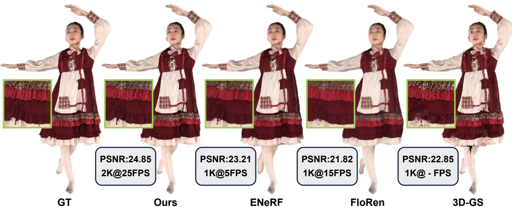
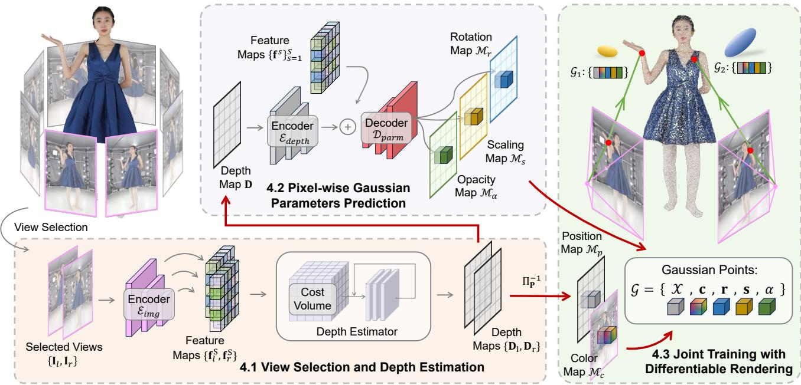
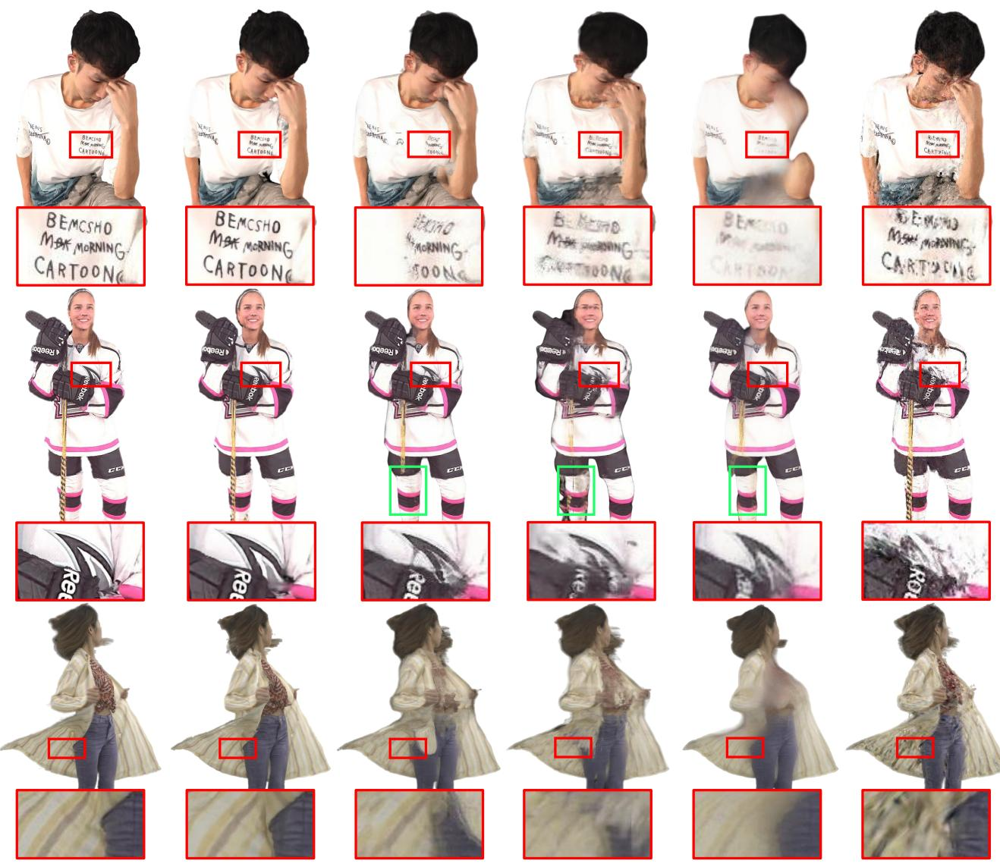
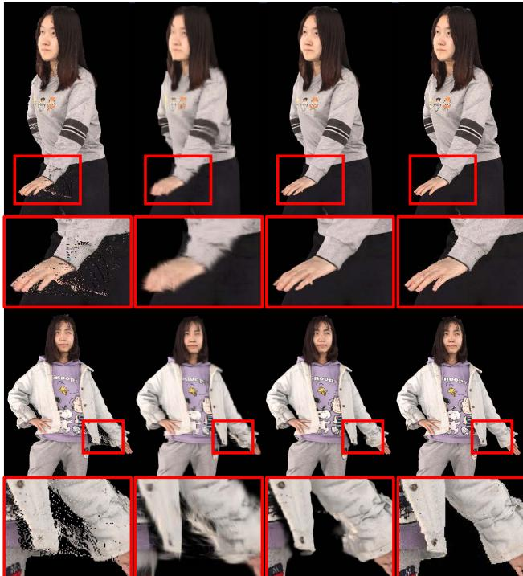

# GPS-Gaussian: Generalizable Pixel-wise 3D Gaussian Splatting for Real-time Human Novel View Synthesis

Shunyuan Zheng†,1, Boyao Zhou2, Ruizhi Shao2, Boning Liu2, Shengping Zhang∗,1,3, Liqiang Nie1, Yebin Liu2

1Harbin Institute of Technology 2Tsinghua University 3Peng Cheng Laboratory

{sawyer0503, s.zhang}@hit.edu.cn, nieliqiang@gmail.com

{bzhou22, liuboning, liuyebin}@mail.tsinghua.edu.cn, shaorz20@mails.tsinghua.edu.cn

  
Figure 1. High-fidelity and real-time novel view synthesis (NVS). Our proposed method synthesizes 2K-resolution novel views of unseen human performers in real-time without any fine-tuning or optimization. The performance outperforms the state-of-the-art feedforward NVS methods ENeRF [19], FloRen [47] and 3D-GS [12], which are representative approaches in implicit neural human rendering, image-based human rendering and per-subject optimization, respectively. We only mark the running efficiency for feed-forward methods.

## Abstract

We present a new approach, termed GPS-Gaussian, for synthesizing novel views of a character in a real-time manner. The proposed method enables 2K-resolution rendering under a sparse-view camera setting. Unlike the original Gaussian Splatting or neural implicit rendering methods that necessitate per-subject optimizations, we introduce Gaussian parameter maps defined on the source views and regress directly Gaussian Splatting properties for instant novel view synthesis without any fine-tuning or optimization. To this end, we train our Gaussian parameter regression module on a large amount of human scan data, jointly with a depth estimation module to lift 2D parameter maps to 3D space. The proposedframework isfully differentiable and experiments on several datasets demonstrate that our

method outperforms state-of-the-art methods while achieving an exceeding rendering speed. The code is available at https://github.com/aipixel/GPS-Gaussian.

## 1. Introduction

Novel view synthesis (NVS) is a critical task that aims to produce photo-realistic images at novel viewpoints from source images captured by multi-view camera systems. Human NVS, as its subfield, could contribute to 3D/4D immersive scene capture of sports broadcasting, stage performance and holographic communication, which demands real-time efficiency and 3D consistent appearances. Previous attempts [5, 36] synthesize novel views through a weighted blending mechanism [61], but they typically rely on dense input views or precise proxy geometry. Under sparse-view camera settings, it remains a formidable challenge to render high-fidelity images for NVS.

Recently, implicit representations [40, 45, 56], especially Neural Radiance Fields (NeRF) [32], have demonstrated remarkable success in numerous NVS tasks. NeRF utilizes MLPs to represent the radiance field of the scene which jointly predicts the density and color of each sampling point. To render a specific pixel, the differentiable volume rendering technique is then implemented by aggregating a series of queried points along the ray direction. The following efforts [40, 49] in human free-view rendering immensely ease the burden of viewpoint quantities while maintaining high qualities. Despite the progress of accelerating techniques [6, 33], NVS methods with implicit representations are time-consuming in general for their dense points querying in scene space.

On the other hand, explicit representations [34, 39], particularly point clouds [15, 16, 62, 77], have drawn longlasting attention due to their high-speed, and even realtime, rendering performance. Once integrated with neural networks, point-based graphics [1, 42] realize a promising explicit representation with comparable realism and extremely superior efficiency in human NVS task [1, 42], compared with NeRF. More recently, 3D Gaussian Splatting (3D-GS) [12] introduces a new representation that the point clouds are formulated as 3D Gaussians with a series of learnable properties including 3D position, color, opacity and anisotropic covariance. By applying α-blending [13], 3D-GS provides not only a more reasonable and accurate mechanism for back-propagating the gradients but also a real-time rendering efficiency for complex scenes. Despite realizing a real-time inference, Gaussian Splatting relies on a per-subject [12] or per-frame [26] parameter optimization for several minutes. It is therefore impractical in interactive scenarios as it necessitates the re-optimization of Gaussian parameters once the scene or character changes.

In this paper, we delve into a generalizable 3D Gaussian Splatting method that directly regresses Gaussian parameters in a feed-forward manner instead of per-subject optimization. Inspired by the success of learning-based human reconstruction, PIFu-like methods [45, 46], we aim to learn the regression of human Gaussian representations from massive 3D human scans with diverse human topologies, clothing styles and pose-dependent deformations. Deploying these learned human priors, our method enables instantaneous human appearance rendering using a generalizable Gaussian representation.

Specifically, we introduce 2D Gaussian parameter (position, color, scaling, rotation, opacity) maps which are defined on source view image planes, instead of unstructured point clouds. These Gaussian parameter maps allow us to represent a character with pixel-wise parameters, i.e. each foreground pixel corresponding to a specific Gaussian point. Additionally, it enables the application of efficient 2D convolution networks rather than expensive 3D operators. To lift 2D parameter maps to 3D Gaussian points, depth maps are estimated for both source views via binocular stereo [21] as a learnable unprojection operation. Such unprojected Gaussian points from both source views constitute the representation of character and novel view images can be ren dered with splatting technique [12].

However, the existing cascaded cost volume methods [19, 51] struggle to tackle the aforementioned depth estimation issue due to the severe self-occlusions in human characters. Therefore, we propose to learn an iterative stereo-matching [21] based depth estimation along with our Gaussian parameter regression, and jointly train the two modules on large-scale data. Optimal depth estimation contributes to enhanced precision in determining the 3D Gaussian position, while concurrently minimizing rendering loss of Gaussian module rectifies the potential artifacts arising from the depth estimation. Such a joint training strategy benefits each component and improves the overall stability of the training process.

In practice, we are able to synthesize 2K-resolution novel views exceeding 25 FPS on a single modern graphics card. Leveraging the rapid rendering capabilities and broad generalizability inherent in our proposed method, an unseen character can be instantly rendered without necessitating any fine-tuning or optimization, as illustrated in Fig. 1. In summary, our contributions can be summarized as follows:

• We introduce a generalizable 3D Gaussian Splatting methodology that employs pixel-wise Gaussian parameter maps defined on 2D source image planes to formulate 3D Gaussians in a feed-forward manner.

• We propose a fully differentiable framework composed of an iterative depth estimation module and a Gaussian parameter regression module. The intermediate predicted depth map bridges the two components and allows them to benefit from joint training.

• We develop a real-time NVS system that achieves 2Kresolution rendering by directly regressing Gaussian parameter maps.

## 2. Related Work

Neural Implicit Human Representation. Neural implicit function has recently aroused a surge of interest to represent complicated scenes, in form of occupancy fields [9, 29, 45, 46], neural radiance fields [7, 32, 40, 60, 72] and neural signed distance functions [38, 49, 56, 58, 76]. Implicit representation shows the advantage in memory efficiency and topological flexibility for human reconstruction task [9, 63, 74], especially in a pixel-aligned feature query manner [45, 46]. However, each queried point is processed through the full network, which dramatically increases computational complexity. More recently, numerous methods have extended Neural Radiance Fields (NeRF) [32] to static human modeling [4, 48] and dynamic human modeling from sparse multi-view cameras [40, 49, 72] or a monocular camera [7, 11, 60]. However, these methods typically require a per-subject optimization process and it is non-trivial to generalize these methods to unseen subjects. Previous attempts, e.g., PixelNeRF [68], IBRNet [57], MVSNeRF [3] and ENeRF [19] resort to image-based features as potent prior cues for feed-forward scene modeling. The large variation in pose and clothing makes generalizable NeRF for human rendering a more challenging task, thus recent work simplifies the problem by leveraging human priors. For example, NHP [14], GM-NeRF [4] and TransHuman [37] employ parametric human body model (SMPL [24]), KeypointNeRF [31] uses 3D skeleton keypoints to encode spatial information. These additional processes increase computational cost and an inaccurate prior estimation would mislead the final result. On the other hand, despite the great progress in accelerating the scenespecific NeRF [6, 17, 33, 67], efficient generalizable NeRF for interactive scenarios remains to be further elucidated.

Deep Image-based Rendering. Image-based rendering, or IBR in short, synthesizes novel views from a set of multiview images with a weighted blending mechanism, which is typically computed from a geometry proxy. [43, 44] deploy multi-view stereo from dense input views to produce mesh surfaces as a proxy for image warping. DNR [54] directly produces learnable features on the surface of mesh proxies for neural rendering. Obtaining these proxies is not straightforward since high-quality multi-view stereo and surface reconstruction requires dense input views. MonoFVV [8], LookinGood [28] and Function4D [69] implement RGBD fusion to attain real-time human rendering. Point clouds from SfM [30, 41] or depth sensors [35] can also be engaged as geometry proxies. These methods highly depend on the performance of 3D reconstruction algorithms or the quality of depth sensors. FWD [2] designs a network to refine depth estimations, then explicitly warps pixels from source views to novel views with the refined depth maps. FloRen [47] utilizes a coarse human mesh reconstructed by PIFu [45] to render initialized depth maps for novel views. Arguably most related to ours is FloRen [47], as it also realizes $3 6 0 ^ { \circ }$ free view human performance rendering in real-time. However, the appearance flow in FloRen merely works in 2D domains, where the rich geometry cues and multi-view geometric constraints only serve as 2D supervisions. The difference is that our approach lifts 2D priors into 3D space and utilizes the point representation to synthesize novel views in a fully differentiable manner.

Point-based Graphics. Point-based representation has shown great efficiency and simplicity for various 3D human tasks [20, 23, 27, 70, 73, 75]. Previous attempts integrate point cloud representation with 2D neural rendering [1, 42] or NeRF-like volume rendering [52, 64]. Still, such a hybrid architecture does not exploit rendering capability of point cloud and takes a long time to optimize on different scenes. Then differentiable point-based [62] and spherebased [15] rendering have been developed, which demonstrates promising rendering qualities, especially attaching them to a conventional network pipeline [2, 35]. In addition, isotropic points can be substituted by a more reasonable Gaussian point modeling [12, 26] to realize a rapid differentiable rendering framework with a splatting technique. This advanced representation has showcased prominent performance in concurrent 3D human work [10, 18, 22, 50, 65]. However, a per-scene or per-subject optimization strategy limits its real-world application. In this paper, we go further to generalize 3D Gaussians across diverse subjects while maintaining its fast and high-quality rendering properties.

## 3. Preliminary

Since the proposed GPS-Gaussian harnesses the power of 3D-GS [12], we give a brief introduction in this section.

3D-GS models a static 3D scene explicitly with point primitives, each of which is parameterized as a scaled Gaussian with 3D covariance matrix Σ and mean $\mu$

$$
G ( { \mathcal { X } } ) = e ^ { - { \frac { 1 } { 2 } } ( { \mathcal { X } } - { \boldsymbol { \mu } } ) ^ { T } \Sigma ^ { - 1 } ( { \mathcal { X } } - { \boldsymbol { \mu } } ) }\tag{1}
$$

In order to be effectively optimized by gradient descent, the covariance matrix Σ can be decomposed into a scaling matrix S and a rotation matrix R as

$$
\pmb { \Sigma } = \mathbf { R } \mathbf { S } \mathbf { S } ^ { T } \mathbf { R } ^ { T }\tag{2}
$$

Following [78], the projection of Gaussians from 3D space to a 2D image plane is implemented by a view transformation W and the Jacobian of the affine approximation of the projective transformation J. The covariance matrix Σ′ in 2D space can be computed as

$$
\begin{array} { r } { \pmb { \Sigma ^ { \prime } } = \mathbf { J } \mathbf { W } \pmb { \Sigma } \mathbf { W } ^ { T } \mathbf { J } ^ { T } } \end{array}\tag{3}
$$

followed by a point-based alpha-blend rendering which bears similarities to that used in NeRF [32], formulated as

$$
\mathbf { C } _ { c o l o r } = \sum _ { i \in N } \mathbf { c } _ { i } \alpha _ { i } \prod _ { j = 1 } ^ { i - 1 } ( 1 - \alpha _ { i } )\tag{4}
$$

where $\mathbf { c } _ { i }$ is the color of each point, and density $\alpha _ { i }$ is reasoned by the multiplication of a 2D Gaussian with covariance $\Sigma ^ { \prime }$ and a learned per-point opacity [66]. The color is defined by spherical harmonics (SH) coefficients in [12].

To summarize, the original 3D Gaussians methodology characterizes each Gaussian point by the following attributes: (1) a 3D position of each point $\mathcal { X } \in \mathbb { R } ^ { 3 }$ , (2) a color defined by SH $\mathbf { c } \in \mathbb { R } ^ { k }$ (where k is the freedom of SH basis), (3) a rotation parameterized by a quaternion $\mathbf { r } \in \mathbb { R } ^ { 4 }$ , (4) a scaling factor $\mathbf { s } \in \mathbb { R } _ { + } ^ { 3 }$ , and (5) an opacity $\alpha \in [ 0 , 1 ]$

  
Figure 2. Overview of GPS-Gaussian. Given RGB images of a human-centered scene with sparse camera views and a target novel viewpoint, we select the adjacent two views on which to formulate our Gaussian representation. We extract the image features followed by conducting an iterative depth estimation. For each source view, the depth map and the RGB image serve as a 3D position map and a color map, respectively, to formulate the Gaussian representation while the other parameters of 3D Gaussians are predicted in a pixel-wise manner. The Gaussian parameter maps defined on 2D image planes of both views are further unprojected to 3D space and aggregated for novel view rendering. The fully differentiable framework enables a joint training mechanism for all networks.

## 4. Method

The overview of our method is illustrated in Fig. 2. Given the RGB images of a human-centered scene with sparse camera views, our method aims to generate high-quality free-viewpoint renderings of the performer in real-time. Once given a target novel viewpoint, we select the two neighboring views and extract the image features using a shared image encoder. Following this, a binocular depth estimator takes the extracted features as input to predict the depth maps for both source views (Sec. 4.1). The depth values and the RGB values in foreground regions of the source view determine the 3D position and color of each Gaussian point, respectively, while the other parameters of 3D Gaussians are predicted in a pixel-wise manner (Sec. 4.2). Combined with the depth map and source RGB image, these parameter maps formulate the Gaussian representation in 2D image planes and are further unprojected to 3D space. The unprojected Gaussians from both views are aggregated and rendered to the target viewpoint in a differentiable way, which allows for end-to-end training (Sec. 4.3).

## 4.1. View Selection and Depth Estimation

View Selection. Unlike the original 3D Gaussians that optimize the characteristics of each Gaussian point on all source views, we synthesize the desired novel view with two adjacent source views. Given N input images $\{ { \bf I } _ { n } \} _ { n = 1 } ^ { N }$ , with their camera position $\{ C _ { n } \} _ { n = 1 } ^ { N }$ , source views can be represented by $\mathbf { V _ { n } } = C _ { n } - O$ , where O is the center of the scene. Similarly, the target novel view rendering can be defined as $I _ { t a r }$ with camera position $C _ { t a r }$ and view $\mathbf { V _ { t a r } } = C _ { t a r } - O$ By conducting a dot product of all input views vectors and the novel view vector, the nearest two views $( v _ { l } , v _ { r } )$ can be selected as the ‘working set’ of binocular stereo, where l and r stand for ‘left’ and ‘right’ view, respectively.

The rectified source images $\mathbf { I } _ { l } , \mathbf { I } _ { r } \in \mathbf { \Omega } [ 0 , 1 ] ^ { H \times W \times 3 }$ are fed to a shared image encoder $\mathcal { E } _ { i m g }$ with several residual blocks and downsampling layers to extract dense feature maps $\mathbf { f } ^ { s } \in \mathbb { R } ^ { H / 2 ^ { s } \times \star } \bar { W } / 2 ^ { s } \times D _ { s }$ where $D _ { s }$ is the dimension at the s-th feature scale

$$
\left. \left\{ \mathbf { f } _ { l } ^ { s } \right\} _ { s = 1 } ^ { S } , \left\{ \mathbf { f } _ { r } ^ { s } \right\} _ { s = 1 } ^ { S } \right. = \mathcal { E } _ { i m g } ( \mathbf { I } _ { l } , \mathbf { I } _ { r } )\tag{5}
$$

where we set $S = 3$ in our experiments.

Depth Estimation. The depth map is the key component of our framework bridging the 2D image planes and 3D Gaussian representation. Note that, depth estimation in binocular stereo is equivalent to disparity estimation. For each pixel $( u , v )$ in one view, disparity estimation $\phi _ { d i s p }$ aims to find its corresponding coordinate $( u + \phi _ { d i s p } ( u ) , v )$ in another view, considering the displacement of each pixel is constrained to a horizontal line in rectified stereo. Since the predicted disparity maps can be easily converted to depth maps given camera parameters, we do not distinguish them in the following sections. In theory, any alternative depth estimation methods can be adapted to our framework. We implement this module in an iterative manner inspired by [21] mainly because it avoids using prohibitively slow 3D convolutions to filter the cost volume.

Given the feature maps $\mathbf { f } _ { l } ^ { S } , \mathbf { f } _ { r } ^ { S } \in \mathbb { R } ^ { H / 2 ^ { S } \times W / 2 ^ { S } \times D _ { S } }$ , we compute a 3D correlation volume $\mathbf { C } \in \mathbb { R } ^ { H / 2 ^ { S } \times W / 2 ^ { S } \times W / 2 ^ { S } }$ using a matrix multiplication

$$
\mathbf { C } ( \mathbf { f } _ { l } ^ { S } , \mathbf { f } _ { r } ^ { S } ) , \quad C _ { i j k } = \sum _ { h } ( \mathbf { f } _ { l } ^ { S } ) _ { i j h } \cdot ( \mathbf { f } _ { r } ^ { S } ) _ { i k h }\tag{6}
$$

Then, an iterative update mechanism predicts a sequence of depth estimations $\{ \mathbf { d } _ { l } ^ { t } \} _ { t = 1 } ^ { T }$ and $\{ \mathbf { d } _ { r } ^ { t } \} _ { t = 1 } ^ { T }$ by looking up in volume C, where T is the update iterations. For more details about the update operators, please refer to [53]. The outputs of final iterations $( \mathbf { d } _ { l } ^ { T } , \bar { \mathbf { d } _ { r } ^ { T } } )$ are upsampled to full image resolution via a convex upsampling. The depth estimation module $\Phi _ { d e p t h }$ can be formulated as

$$
\langle { \bf D } _ { l } , { \bf D } _ { r } \rangle = \Phi _ { d e p t h } ( { \bf f } _ { l } ^ { S } , { \bf f } _ { r } ^ { S } , K _ { l } , K _ { r } )\tag{7}
$$

where $K _ { l }$ and $K _ { r }$ are the camera parameters, $\mathbf { D } _ { l } , \mathbf { D } _ { r } \in$ $\mathbb { R } ^ { H \times W \times \mathrm { i } }$ are the depth estimations. The classic binocular stereo methods estimate the depth for ‘reference views’ only, while we pursue depth maps of both inputs to formulate the Gaussian representation, which makes our implementation highly symmetrical. By leveraging this nature, we realize a compact and highly parallelized module that results in a decent efficiency increase. Detailed designs of this module can be seen in our supplementary material.

## 4.2. Pixel-wise Gaussian Parameters Prediction

Each Gaussian point in 3D space is characterized by attributes $\mathcal { G } = \{ \mathcal { X } , \mathbf { c } , \mathbf { r } , \mathbf { s } , \alpha \}$ , which represent 3D position, color, rotation, scaling and opacity, respectively. In this section, we introduce a pixel-wise manner to formulate 3D Gaussians in 2D image planes. Specifically, the proposed Gaussian maps G are defined as

$$
\mathbf { G } ( x ) = \{ \mathcal { M } _ { p } ( x ) , \mathcal { M } _ { c } ( x ) , \mathcal { M } _ { r } ( x ) , \mathcal { M } _ { s } ( x ) , \mathcal { M } _ { \alpha } ( x ) \}\tag{8}
$$

where x is the coordinate of a foreground pixel in an image plane, $\mathcal { M } _ { p } , \mathcal { M } _ { c } , \mathcal { M } _ { r } , \mathcal { M } _ { s } , \mathcal { M } _ { \alpha }$ represents Gaussian parameter maps of position, color, rotation, scaling and opacity, respectively. Given the predicted depth map D, a pixel located at x can be immediately unprojected from image planes to 3D space using projection matrix $\mathbf { P } \in \mathbb { R } ^ { 3 \times 4 }$ structure with camera parameters K

$$
\mathcal { M } _ { p } ( x ) = \Pi _ { \mathbf { P } } ^ { - 1 } ( x , \mathbf { D } ( x ) )\tag{9}
$$

Thus the learnable unprojection in Eq. 9 bridges 2D feature space and 3D Gaussian representation. Considering our

human-centered scenario is predominantly characterized by diffuse reflection, instead of predicting the SH coefficients, we directly use the source RGB image as the color map

$$
\mathcal { M } _ { c } ( x ) = \mathbf { I } ( x )\tag{10}
$$

We argue that the remaining three Gaussian parameters are generally related to (1) pixel level local features, (2) the global context of human bodies, and (3) detailed spatial structures. Image features $\{ \mathbf { f } ^ { s } \} _ { s = 1 } ^ { S }$ from encoder $\mathcal { E } _ { i m g }$ have already derived strong cues of (1) and (2). Hence, we construct an additional encoder $\mathcal { E } _ { d e p t h }$ , which takes the depth map D as input, to complement the geometric awareness for each pixel. The image features and the spatial features are fused by a U-Net like decoder $\mathcal { D } _ { p a r m }$ to regress pixel-wise Gaussian features in full image resolution

$$
\mathbf { r } = \mathscr { D } _ { p a r m } ( \mathcal { E } _ { i m g } ( \mathbf { I } ) \oplus \mathcal { E } _ { d e p t h } ( \mathbf { D } ) )\tag{11}
$$

where $\mathbf { T } \in \mathbb { R } ^ { H \times W \times D _ { G } }$ is Gaussian features, ⊕ stands for concatenations at all feature levels. The prediction heads, each composed of 2 convolution layers, are adapted to Gaussian features for specific Gaussian parameter map regression. Before being used to formulate Gaussian representations, the rotation map should be normalized since it represents a quaternion

$$
\mathcal { M } _ { r } ( x ) = N o r m ( h _ { r } ( \mathbf { r } ( x ) ) )\tag{12}
$$

where $h _ { r }$ is the rotation head. The scaling map and the opacity map need activations to satisfy their range

$$
\begin{array} { r } { \mathcal { M } _ { s } ( x ) = S o f t p l u s ( h _ { s } ( \Gamma ( x ) ) ) } \\ { \mathcal { M } _ { \alpha } ( x ) = S i g m o i d ( h _ { \alpha } ( \Gamma ( x ) ) ) } \end{array}\tag{13}
$$

where $h _ { s }$ and $h _ { \alpha }$ represent the scaling head and opacity head, respectively. The detailed network architecture in this section is provided in our supplementary material.

## 4.3. Joint Training with Differentiable Rendering

The pixel-wise Gaussian parameter maps defined on both source views are then lifted to 3D space and aggregated to render photo-realistic novel view images using the Gaussian Splatting technique in Sec. 3.

Joint Training Mechanism. The fully differentiable rendering framework simultaneously enables joint training from two perspectives: (1) The depth estimations of both source views. (2) The depth estimation module and the Gaussian parameter prediction module. As for the former, the independent training of depth estimators on two source views makes the 3D representation inconsistent due to the mismatch of the source views. As for the latter, the classic stereo-matching based depth estimation is fundamentally a 2D task that aims at densely finding the correspondence between pixels from two images. The differentiable rendering integrates auxiliary 3D awareness. On the other hand, optimal depth estimation contributes to enhanced precision in determining the 3D Gaussian parameters.

Table 1. Quantitative comparison on THuman2.0 [69], Twindom [55] and our collected real-world data. All methods are evaluated on an RTX 3090 GPU to report the speed of synthesizing one novel view with two 1024 × 1024 source images. Our method and FloRen [47] use TensorRT for fast inference. † 3D-GS [12] requires per-subject optimization, while the other methods perform feed-forward inferences.
<table><tr><td rowspan="2">Method</td><td colspan="3">THuman2.0 [69]</td><td colspan="3">Twindom [55]</td><td colspan="3">Real-world Data</td><td rowspan="2">FPS</td></tr><tr><td>PSNR↑</td><td>SSIM↑</td><td>LPIPS↓</td><td>PSNR↑</td><td>SSIM↑</td><td>LPIPS↓</td><td>PSNR↑</td><td>SSIM↑</td><td>LPIPS↓</td></tr><tr><td>3D-GS [12]†</td><td>24.18</td><td>0.821</td><td>0.144</td><td>22.77</td><td>0.785</td><td>0.153</td><td>22.97</td><td>0.839</td><td>0.125</td><td>1</td></tr><tr><td>FloRen [47]</td><td>23.26</td><td>0.812</td><td>0.184</td><td>22.96</td><td>0.838</td><td>0.165</td><td>22.80</td><td>0.872</td><td>0.136</td><td>15</td></tr><tr><td>IBRNet [57]</td><td>23.38</td><td>0.836</td><td>0.212</td><td>22.92</td><td>0.803</td><td>0.238</td><td>22.63</td><td>0.852</td><td>0.177</td><td>0.25</td></tr><tr><td>ENeRF [19]</td><td>24.10</td><td>0.869</td><td>0.126</td><td>23.64</td><td>0.847</td><td>0.134</td><td>23.26</td><td>0.893</td><td>0.118</td><td>5</td></tr><tr><td>Ours</td><td>25.57</td><td>0.898</td><td>0.112</td><td>24.79</td><td>0.880</td><td>0.125</td><td>24.64</td><td>0.917</td><td>0.088</td><td>25</td></tr></table>

Loss Functions. We use L1 loss and SSIM loss [59], denoted as $\mathcal { L } _ { m a e }$ and $\mathcal { L } _ { s s i m }$ respectively, to measure the difference between the rendered and ground truth image

$$
\mathcal { L } _ { r e n d e r } = \beta L _ { m a e } + \gamma \mathcal { L } _ { s s i m }\tag{14}
$$

where we set $\beta \ : = \ : 0 . 8$ and $\gamma = 0 . 2$ in our experiments. Similar to [21], we supervise on the L1 distance between the predicted and ground truth depth over the full sequence of predictions $\{ \mathbf { d } ^ { t } \} _ { t = 1 } ^ { T }$ with exponentially increasing weights. Given ground truth depth $\mathbf { d } _ { g t }$ , the loss is defined as

$$
\mathcal { L } _ { d i s p } = \sum _ { t = 1 } ^ { T } \boldsymbol { \mu } ^ { T - t } \| \mathbf { d } _ { g t } - \mathbf { d } ^ { t } \| _ { 1 }\tag{15}
$$

where we set $\mu = 0 . 9$ in our experiments. Our final loss function is $\mathscr { L } = \mathcal { L } _ { { r e n d e r } } + \mathcal { L } _ { { d i s p } }$

## 5. Experiments

## 5.1. Implementation Details

Our GPS-Gaussian is trained on a single RTX3090 graphics card using AdamW [25] optimizer with an initial learning rate of $2 e ^ { - 4 }$ . Since the unstable depth estimation in the very first training steps can have a strong impact on Gaussian parameter regression, we pre-train the depth estimation module for 40k iterations. Then we jointly train two modules for 100k iterations with a batch size of 2 and the overall training process takes around 15 hours.

## 5.2. Datasets and Metrics

To learn human priors from a large amount of data, we collect 1700 and 526 human scans from Twindom [55] and THuman2.0 [69], respectively. We randomly select 200 and 100 scans as validation data from Twindom and THuman2.0, respectively. As shown in Fig. 2, we uniformly position 8 cameras in a cycle, thus the angle between two neighboring cameras is about 45◦. We render synthetic human scans to these camera positions as source view images while randomly choosing 3 viewpoints to render novel view images, which are positioned on the intersection arc between each two adjacent input views. To test the robustness in real-world scenarios, we capture real data of 4 characters in the same 8-camera setup and prepare 8 additional camera views for evaluation. Similar to ENeRF [19], we evaluate PSNR, SSIM [59] and LPIPS [71] as metrics for the rendering results in foreground regions determined by the bounding box of humans.

## 5.3. Comparisons with State-of-the-art Methods

Baselines. Considering that our goal is instant novel view synthesis, we compare our GPS-Gaussian against three generalizable methods including implicit method ENeRF [19], image-based rendering method FloRen [47] and hybrid method IBRNet [57]. All baseline methods are trained from scratch on the same dataset as ours and take two source views as input for synthesizing the targeted novel view. Note that, our method and FloRen use ground truth depths for supervision. We further prepare the comparison with the original 3D-GS [12] which is optimized on all 8 input views using the default strategies in the released code.

Comparison Results. The comparisons on both synthetic and real-world data are listed in Table 1. Our GPS-Gaussian outperforms all methods on all metrics and achieves a much faster rendering speed. Qualitative rendering results in Fig. 3 show that our method can synthesize fine-grained novel view images with more detailed appearances. Once occlusion happens, some target regions under the novel view are invisible in one or both of the source views. The resulting depth ambiguity between input views causes ENeRF and IBRNet to render unreasonable results since these methods are confused when conducting the feature aggregation. The unreliable geometric proxy in these cases also makes FloRen produce blurred outputs even if it employs the depth and flow refining networks. In our method, the human priors learned from massive human images help to alleviate the adverse effects caused by occlusion. In addition, 3D-GS takes several minutes for optimization and produces noisy rendering results of novel views in such a sparse camera setup. Also, most of the compared methods have

THuman2.0

Twindom

  
Real-world Data  
Ground Truth  
Ours  
ENeRF  
IBRNet  
FloRen  
3D-GS

Figure 3. Qualitative comparison on THuman2.0 [69], Twindom [55] and our collected real-world data. Our method produces more detailed human appearances and can recover more reasonable geometry.

difficulty in handling thin structures such as hockey sticks and robes in Fig. 3. We further prepare the sensitivity analysis of camera view sparsity in Table 2. For 6-camera results, we use the same models trained under 8-camera setup without any fine-tuning. Among baselines, our method degrades reasonably and holds robustness when decreasing cameras. We ignore 3D-GS here because it takes several minutes for per-subject optimization and produces noisy rendering results, as shown in Fig. 3, even in 8-camera setup.

## 5.4. Ablation Studies

We evaluate the effectiveness of our designs in more detail through ablation experiments. Other than rendering metrics, we follow [21] to evaluate depth (identical to disparity) estimation with the end-point-error (EPE) and the ratio of pixel error in 1 pix level. All ablations are trained and tested on the aforementioned synthetic data.

Table 2. Sensibility to camera sparsity. We use the model trained under 8-camera setup to perform inference on a 6-camera setup.
<table><tr><td rowspan="2">Model</td><td colspan="2">8-camera setup</td><td colspan="2">6-camera setup</td></tr><tr><td>PSNR↑ SSIM↑</td><td>LPIPS↓</td><td>PSNR↑</td><td>SSIM↑ LPIPS↓</td></tr><tr><td>FloRen [47]</td><td>23.26 0.812</td><td>0.184</td><td>18.72 0.770</td><td>0.267</td></tr><tr><td>IBRNet [57]</td><td>23.38 0.836</td><td>0.212</td><td>21.08 0.790</td><td>0.263</td></tr><tr><td>ENeRF [19]</td><td>24.10 0.869</td><td>0.126</td><td>21.78 0.831</td><td>0.181</td></tr><tr><td>Ours</td><td>25.57 0.898</td><td>0.112</td><td>23.03 0.884</td><td>0.168</td></tr></table>

w/o Joint Train. w/o Depth Enc. Full Model Ground Truth

Table 3. Quantitative ablation study on synthetic data. We report PSNR, SSIM and LPIPS metrics for evaluating the rendering quality, while the end-point-error (EPE) and the ratio of pixel error in 1 pix level for measuring depth accuracy.
<table><tr><td rowspan="2">Model</td><td colspan="3">Rendering</td><td colspan="2">Depth</td></tr><tr><td>PSNR↑</td><td>SSIM↑</td><td>LPIPS↓</td><td>EPE↓ 1 pix ↑</td><td></td></tr><tr><td>Full model w/o Joint Train. w/o Depth Enc.</td><td>25.05 23.97</td><td>0.886 0.862</td><td>0.121 0.115</td><td>1.494 1.587</td><td>65.94 63.71</td></tr></table>

  
Figure 4. Qualitative ablation study on synthetic data. We show the effectiveness of the joint training and the depth encoder in the full pipeline. The proposed designs make the rendering results more visually appealing with fewer artifacts and less blurry.

Effects of Joint Training Mechanism. We design a model without the differentiable Gaussian rendering by substituting it with point cloud rendering at a fixed radius. Thus the model degenerates into a depth estimation network and an undifferentiable depth warping based rendering. The rendering quality is merely based on the accuracy of depth estimation while the rendering loss could not conversely promote the depth estimator. We train the ablated model for the same iterations as the full model for fair comparison. The rendering results in Fig. 4 witness obvious noise due to the depth ambiguity in the margin area of the source views where the depth value changes drastically. The rendering noise causes a degradation in PSNR and SSIM as manifested in Table 3, while it cannot be reflected in the perception metric LPIPS. The joint regression with Gaussian parameters precisely recognizes these outliers and compensates for these artifacts by predicting an extremely low opacity for the Gaussian points centered at these positions. Please refer to the supplementary material for the visualization of opacity maps. Meanwhile, the independent training of the depth estimation module interrupts the interaction of two source views, resulting in an inconsistent geometry. As illustrated in Table 3, joint training makes a more robust depth estimator with a 5% improvement in EPE.

Effects of Depth Encoder. We claim that merely using image features is insufficient for predicting Gaussian parameters. Herein, we ablate the depth encoder from our full model, thus the Gaussian parameter decoder only takes as input the image features to predict $\mathcal { M } _ { r } , \mathcal { M } _ { s } , \mathcal { M } _ { \alpha }$ simultaneously. As shown in Fig. 4, the ablated model fails to recover the details of human appearance, leading to blurred rendering results. The scale of Gaussian points is impacted by comprehensive factors including depth, texture and surface roughness. The absence of spatial awareness degrades the regression of scaling map $\mathcal { M } _ { s } ,$ which deteriorates the visual perception reflected on LPIPS, even with a comparable depth estimation accuracy, as shown in Table 3. Please see supplementary material for the visualization of scaling maps and the shape of the predicted Gaussian points.

## 6. Discussion

Conclusion. By directly regressing pixel-wise Gaussian parameter maps defined on source view image planes, our GPS-Gaussian takes a significant step towards a real-time photo-realistic human novel view synthesis system under sparse-view camera settings. The proposed pipeline is fully differentiable and carefully designed. We demonstrate that our method notably improves both quantitative and qualitative results compared with baseline methods and achieves a much faster rendering speed on a single RTX 3090 GPU.

Limitations. Although the proposed GPS-Gaussian synthesizes high-quality images, some elements still impact the effectiveness of our method. For example, accurate foreground matting is necessary as a preprocessing step since we mainly focus on synthesizing the novel views of human performers. Therefore, it is not straightforward to generalize our method to more general tasks. Besides, the ground truth depths are required for supervision, increasing the difficulty of training data acquisition. We believe that collecting massive high-quality synthetic data covering variant scenarios is conducive to alleviating these problems.

Acknowledgement. This paper is supported by National Key R&D Program of China (2022YFF0902200), the NSFC project (Nos. 62272134, 62236003, 62072141, 62125107 and 62301298), Shenzhen College Stability Support Plan (Grant No. GXWD20220817144428005) and the Major Key Project of PCL (PCL2023A10-2).

## References

[1] Kara-Ali Aliev, Artem Sevastopolsky, Maria Kolos, Dmitry Ulyanov, and Victor Lempitsky. Neural point-based graphics. In ECCV, pages 696–712, 2020. 2, 3

[2] Ang Cao, Chris Rockwell, and Justin Johnson. Fwd: Realtime novel view synthesis with forward warping and depth. In CVPR, pages 15713–15724, 2022. 3

[3] Anpei Chen, Zexiang Xu, Fuqiang Zhao, Xiaoshuai Zhang, Fanbo Xiang, Jingyi Yu, and Hao Su. Mvsnerf: Fast generalizable radiance field reconstruction from multi-view stereo. In ICCV, pages 14124–14133, 2021. 3

[4] Jianchuan Chen, Wentao Yi, Liqian Ma, Xu Jia, and Huchuan Lu. Gm-nerf: Learning generalizable model-based neural radiance fields from multi-view images. In CVPR, pages 20648–20658, 2023. 2, 3

[5] Shenchang Eric Chen and Lance Williams. View interpolation for image synthesis. In SIGGRAPH, pages 279–288, 1993. 1

[6] Sara Fridovich-Keil, Alex Yu, Matthew Tancik, Qinhong Chen, Benjamin Recht, and Angjoo Kanazawa. Plenoxels: Radiance fields without neural networks. In CVPR, pages 5501–5510, 2022. 2, 3

[7] Chen Guo, Tianjian Jiang, Xu Chen, Jie Song, and Otmar Hilliges. Vid2avatar: 3d avatar reconstruction from videos in the wild via self-supervised scene decomposition. In CVPR, pages 12858–12868, 2023. 2, 3

[8] Kaiwen Guo, Feng Xu, Tao Yu, Xiaoyang Liu, Qionghai Dai, and Yebin Liu. Real-time geometry, albedo, and motion reconstruction using a single rgb-d camera. ACM TOG, 36(3): 1–13, 2017. 3

[9] Yang Hong, Juyong Zhang, Boyi Jiang, Yudong Guo, Ligang Liu, and Hujun Bao. Stereopifu: Depth aware clothed human digitization via stereo vision. In CVPR, pages 535– 545, 2021. 2

[10] Liangxiao Hu, Hongwen Zhang, Yuxiang Zhang, Boyao Zhou, Boning Liu, Shengping Zhang, and Liqiang Nie. Gaussianavatar: Towards realistic human avatar modeling from a single video via animatable 3d gaussians. In CVPR, 2024. 3

[11] Wei Jiang, Kwang Moo Yi, Golnoosh Samei, Oncel Tuzel, and Anurag Ranjan. Neuman: Neural human radiance field from a single video. In ECCV, pages 402–418, 2022. 3

[12] Bernhard Kerbl, Georgios Kopanas, Thomas Leimkuhler,¨ and George Drettakis. 3d gaussian splatting for real-time radiance field rendering. ACM TOG, 42(4):1–14, 2023. 1, 2, 3, 6

[13] Georgios Kopanas, Thomas Leimkuhler, Gilles Rainer,¨ Clement Jambon, and George Drettakis. Neural point cat-´ acaustics for novel-view synthesis of reflections. ACM TOG, 41(6):1–15, 2022. 2

[14] Youngjoong Kwon, Dahun Kim, Duygu Ceylan, and Henry Fuchs. Neural human performer: Learning generalizable radiance fields for human performance rendering. NeurIPS, 34:24741–24752, 2021. 3

[15] Christoph Lassner and Michael Zollhofer. Pulsar: Efficient sphere-based neural rendering. In CVPR, pages 1440–1449, 2021. 2, 3

[16] Marc Levoy and Turner Whitted. The use of points as a display primitive. 1985. 2

[17] Ruilong Li, Hang Gao, Matthew Tancik, and Angjoo Kanazawa. Nerfacc: Efficient sampling accelerates nerfs. In ICCV, pages 18537–18546, 2023. 3

[18] Zhe Li, Zerong Zheng, Lizhen Wang, and Yebin Liu. Animatable gaussians: Learning pose-dependent gaussian maps for high-fidelity human avatar modeling. In CVPR, 2024. 3

[19] Haotong Lin, Sida Peng, Zhen Xu, Yunzhi Yan, Qing Shuai, Hujun Bao, and Xiaowei Zhou. Efficient neural radiance fields for interactive free-viewpoint video. In SIGGRAPH Asia, pages 1–9, 2022. 1, 2, 3, 6, 7

[20] Siyou Lin, Hongwen Zhang, Zerong Zheng, Ruizhi Shao, and Yebin Liu. Learning implicit templates for point-based clothed human modeling. In ECCV, pages 210–228, 2022. 3

[21] Lahav Lipson, Zachary Teed, and Jia Deng. Raft-stereo: Multilevel recurrent field transforms for stereo matching. In 3DV, pages 218–227, 2021. 2, 5, 6, 7

[22] Xian Liu, Xiaohang Zhan, Jiaxiang Tang, Ying Shan, Gang Zeng, Dahua Lin, Xihui Liu, and Ziwei Liu. Humangaussian: Text-driven 3d human generation with gaussian splatting. In CVPR, 2024. 3

[23] Yebin Liu, Qionghai Dai, and Wenli Xu. A point-cloudbased multiview stereo algorithm for free-viewpoint video. IEEE TVCG, 16(3):407–418, 2009. 3

[24] Matthew Loper, Naureen Mahmood, Javier Romero, Gerard Pons-Moll, and Michael J Black. Smpl: A skinned multiperson linear model. ACM TOG, 34(6):1–16, 2015. 3

[25] Ilya Loshchilov and Frank Hutter. Decoupled weight decay regularization. In ICLR, 2018. 6

[26] Jonathon Luiten, Georgios Kopanas, Bastian Leibe, and Deva Ramanan. Dynamic 3d gaussians: Tracking by persistent dynamic view synthesis. In 3DV, 2024. 2, 3

[27] Qianli Ma, Jinlong Yang, Siyu Tang, and Michael J Black. The power of points for modeling humans in clothing. In ICCV, pages 10974–10984, 2021. 3

[28] Ricardo Martin-Brualla, Rohit Pandey, Shuoran Yang, Pavel Pidlypenskyi, Jonathan Taylor, Julien Valentin, Sameh Khamis, Philip Davidson, Anastasia Tkach, Peter Lincoln, et al. Lookingood: enhancing performance capture with realtime neural re-rendering. ACM TOG, 37(6):1–14, 2018. 3

[29] Lars Mescheder, Michael Oechsle, Michael Niemeyer, Sebastian Nowozin, and Andreas Geiger. Occupancy networks: Learning 3d reconstruction in function space. In CVPR, pages 4460–4470, 2019. 2

[30] Moustafa Meshry, Dan B Goldman, Sameh Khamis, Hugues Hoppe, Rohit Pandey, Noah Snavely, and Ricardo Martin-Brualla. Neural rerendering in the wild. In CVPR, pages 6878–6887, 2019. 3

[31] Marko Mihajlovic, Aayush Bansal, Michael Zollhoefer, Siyu Tang, and Shunsuke Saito. Keypointnerf: Generalizing image-based volumetric avatars using relative spatial encoding of keypoints. In ECCV, pages 179–197, 2022. 3

[32] Ben Mildenhall, Pratul P Srinivasan, Matthew Tancik, Jonathan T Barron, Ravi Ramamoorthi, and Ren Ng. Nerf: Representing scenes as neural radiance fields for view synthesis. In ECCV, pages 405–421, 2020. 2, 3

[33] Thomas Muller, Alex Evans, Christoph Schied, and Alexan-¨ der Keller. Instant neural graphics primitives with a multiresolution hash encoding. ACM TOG, 41(4):1–15, 2022. 2, 3

[34] Jacob Munkberg, Jon Hasselgren, Tianchang Shen, Jun Gao, Wenzheng Chen, Alex Evans, Thomas Muller, and Sanja Fi-¨ dler. Extracting triangular 3d models, materials, and lighting from images. In CVPR, pages 8280–8290, 2022. 2

[35] Phong Nguyen-Ha, Nikolaos Sarafianos, Christoph Lassner, Janne Heikkila, and Tony Tung. Free-viewpoint rgb-d human¨ performance capture and rendering. In ECCV, pages 473– 491, 2022. 3

[36] Byong Mok Oh, Max Chen, Julie Dorsey, and Fredo Durand.´ Image-based modeling and photo editing. In SIGGRAPH, pages 433–442, 2001. 1

[37] Xiao Pan, Zongxin Yang, Jianxin Ma, Chang Zhou, and Yi Yang. Transhuman: A transformer-based human representation for generalizable neural human rendering. In ICCV, pages 3544–3555, 2023. 3

[38] Jeong Joon Park, Peter Florence, Julian Straub, Richard Newcombe, and Steven Lovegrove. Deepsdf: Learning continuous signed distance functions for shape representation. In CVPR, pages 165–174, 2019. 2

[39] Songyou Peng, Chiyu Jiang, Yiyi Liao, Michael Niemeyer, Marc Pollefeys, and Andreas Geiger. Shape as points: A differentiable poisson solver. NeurIPS, 34:13032–13044, 2021. 2

[40] Sida Peng, Yuanqing Zhang, Yinghao Xu, Qianqian Wang, Qing Shuai, Hujun Bao, and Xiaowei Zhou. Neural body: Implicit neural representations with structured latent codes for novel view synthesis of dynamic humans. In CVPR, pages 9054–9063, 2021. 2, 3

[41] Francesco Pittaluga, Sanjeev J Koppal, Sing Bing Kang, and Sudipta N Sinha. Revealing scenes by inverting structure from motion reconstructions. In CVPR, pages 145–154, 2019. 3

[42] Ruslan Rakhimov, Andrei-Timotei Ardelean, Victor Lempitsky, and Evgeny Burnaev. Npbg++: Accelerating neural point-based graphics. In CVPR, pages 15969–15979, 2022. 2, 3

[43] Gernot Riegler and Vladlen Koltun. Free view synthesis. In ECCV, pages 623–640, 2020. 3

[44] Gernot Riegler and Vladlen Koltun. Stable view synthesis. In CVPR, pages 12216–12225, 2021. 3

[45] Shunsuke Saito, Zeng Huang, Ryota Natsume, Shigeo Morishima, Angjoo Kanazawa, and Hao Li. Pifu: Pixel-aligned implicit function for high-resolution clothed human digitization. In ICCV, pages 2304–2314, 2019. 2, 3

[46] Shunsuke Saito, Tomas Simon, Jason Saragih, and Hanbyul Joo. Pifuhd: Multi-level pixel-aligned implicit function for high-resolution 3d human digitization. In CVPR, pages 84– 93, 2020. 2

[47] Ruizhi Shao, Liliang Chen, Zerong Zheng, Hongwen Zhang, Yuxiang Zhang, Han Huang, Yandong Guo, and Yebin Liu. Floren: Real-time high-quality human performance rendering via appearance flow using sparse rgb cameras. In SIG-GRAPH Asia, pages 1–10, 2022. 1, 3, 6, 7, 2

[48] Ruizhi Shao, Hongwen Zhang, He Zhang, Mingjia Chen, Yan-Pei Cao, Tao Yu, and Yebin Liu. Doublefield: Bridging the neural surface and radiance fields for high-fidelity human reconstruction and rendering. In CVPR, pages 15872–15882, 2022. 2

[49] Ruizhi Shao, Zerong Zheng, Hanzhang Tu, Boning Liu, Hongwen Zhang, and Yebin Liu. Tensor4d: Efficient neural 4d decomposition for high-fidelity dynamic reconstruction and rendering. In CVPR, pages 16632–16642, 2023. 2, 3

[50] Ruizhi Shao, Jingxiang Sun, Cheng Peng, Zerong Zheng, Boyao Zhou, Hongwen Zhang, and Yebin Liu. Control4d: Dynamic portrait editing by learning 4d gan from 2d diffusion-based editor. In CVPR, 2024. 3

[51] Zhelun Shen, Yuchao Dai, and Zhibo Rao. Cfnet: Cascade and fused cost volume for robust stereo matching. In CVPR, pages 13906–13915, 2021. 2

[52] Shih-Yang Su, Timur Bagautdinov, and Helge Rhodin. Npc: Neural point characters from video. In ICCV, pages 14795– 14805, 2023. 3

[53] Zachary Teed and Jia Deng. Raft: Recurrent all-pairs field transforms for optical flow. In ECCV, pages 402–419, 2020. 5

[54] Justus Thies, Michael Zollhofer, and Matthias Nießner. De-¨ ferred neural rendering: Image synthesis using neural textures. ACM TOG, 38(4):1–12, 2019. 3

[55] Twindom, 2020. https://web.twindom.com. 6, 7

[56] Peng Wang, Lingjie Liu, Yuan Liu, Christian Theobalt, Taku Komura, and Wenping Wang. Neus: Learning neural implicit surfaces by volume rendering for multi-view reconstruction. NeurIPS, 34:27171–27183, 2021. 2

[57] Qianqian Wang, Zhicheng Wang, Kyle Genova, Pratul P Srinivasan, Howard Zhou, Jonathan T Barron, Ricardo Martin-Brualla, Noah Snavely, and Thomas Funkhouser. Ibrnet: Learning multi-view image-based rendering. In CVPR, pages 4690–4699, 2021. 3, 6, 7, 2

[58] Yiming Wang, Qin Han, Marc Habermann, Kostas Daniilidis, Christian Theobalt, and Lingjie Liu. Neus2: Fast learning of neural implicit surfaces for multi-view reconstruction. In ICCV, pages 3295–3306, 2023. 2

[59] Zhou Wang, Alan C Bovik, Hamid R Sheikh, and Eero P Simoncelli. Image quality assessment: from error visibility to structural similarity. IEEE TIP, 13(4):600–612, 2004. 6

[60] Chung-Yi Weng, Brian Curless, Pratul P Srinivasan, Jonathan T Barron, and Ira Kemelmacher-Shlizerman. Humannerf: Free-viewpoint rendering of moving people from monocular video. In CVPR, pages 16210–16220, 2022. 2, 3

[61] Bennett Wilburn, Neel Joshi, Vaibhav Vaish, Eino-Ville Talvala, Emilio Antunez, Adam Barth, Andrew Adams, Mark Horowitz, and Marc Levoy. High performance imaging using large camera arrays. ACM TOG, 24(3):765–776, 2005. 1

[62] Olivia Wiles, Georgia Gkioxari, Richard Szeliski, and Justin Johnson. Synsin: End-to-end view synthesis from a single image. In CVPR, pages 7467–7477, 2020. 2, 3

[63] Yuliang Xiu, Jinlong Yang, Dimitrios Tzionas, and Michael J Black. Icon: Implicit clothed humans obtained from normals. In CVPR, pages 13286–13296, 2022. 2

[64] Qiangeng Xu, Zexiang Xu, Julien Philip, Sai Bi, Zhixin Shu, Kalyan Sunkavalli, and Ulrich Neumann. Point-nerf: Pointbased neural radiance fields. In CVPR, pages 5438–5448, 2022. 3

[65] Yuelang Xu, Benwang Chen, Zhe Li, Hongwen Zhang, Lizhen Wang, Zerong Zheng, and Yebin Liu. Gaussian head avatar: Ultra high-fidelity head avatar via dynamic gaussians. In CVPR, 2024. 3

[66] Wang Yifan, Felice Serena, Shihao Wu, Cengiz Oztireli, and¨ Olga Sorkine-Hornung. Differentiable surface splatting for point-based geometry processing. ACM TOG, 38(6):1–14, 2019. 3

[67] Alex Yu, Ruilong Li, Matthew Tancik, Hao Li, Ren Ng, and Angjoo Kanazawa. Plenoctrees for real-time rendering of neural radiance fields. In ICCV, pages 5752–5761, 2021. 3

[68] Alex Yu, Vickie Ye, Matthew Tancik, and Angjoo Kanazawa. pixelnerf: Neural radiance fields from one or few images. In CVPR, pages 4578–4587, 2021. 3

[69] Tao Yu, Zerong Zheng, Kaiwen Guo, Pengpeng Liu, Qionghai Dai, and Yebin Liu. Function4d: Real-time human volumetric capture from very sparse consumer rgbd sensors. In CVPR, pages 5746–5756, 2021. 3, 6, 7

[70] Hongwen Zhang, Siyou Lin, Ruizhi Shao, Yuxiang Zhang, Zerong Zheng, Han Huang, Yandong Guo, and Yebin Liu. Closet: Modeling clothed humans on continuous surface with explicit template decomposition. In CVPR, pages 501– 511, 2023. 3

[71] Richard Zhang, Phillip Isola, Alexei A Efros, Eli Shechtman, and Oliver Wang. The unreasonable effectiveness of deep features as a perceptual metric. In CVPR, pages 586–595, 2018. 6

[72] Fuqiang Zhao, Wei Yang, Jiakai Zhang, Pei Lin, Yingliang Zhang, Jingyi Yu, and Lan Xu. Humannerf: Efficiently generated human radiance field from sparse inputs. In CVPR, pages 7743–7753, 2022. 2, 3

[73] Yufeng Zheng, Wang Yifan, Gordon Wetzstein, Michael J Black, and Otmar Hilliges. Pointavatar: Deformable pointbased head avatars from videos. In CVPR, pages 21057– 21067, 2023. 3

[74] Zerong Zheng, Tao Yu, Yebin Liu, and Qionghai Dai. Pamir: Parametric model-conditioned implicit representation for image-based human reconstruction. IEEE TPAMI, 44(6):3170–3184, 2021. 2

[75] Boyao Zhou, Jean-Sebastien Franco, Federica Bogo, Bu-´ gra Tekin, and Edmond Boyer. Reconstructing human body mesh from point clouds by adversarial gp network. In ACCV, 2020. 3

[76] Boyao Zhou, Di Meng, Jean-Sebastien Franco, and Edmond´ Boyer. Human body shape completion with implicit shape and flow learning. In CVPR, pages 12901–12911, 2023. 2

[77] Matthias Zwicker, Hanspeter Pfister, Jeroen Van Baar, and Markus Gross. Surface splatting. In SIGGRAPH, pages 371– 378, 2001. 2

[78] Matthias Zwicker, Hanspeter Pfister, Jeroen Van Baar, and Markus Gross. Ewa splatting. IEEE TVCG, 8(3):223–238, 2002. 3