# GS-IR: 3D Gaussian Splatting for Inverse Rendering

Zhihao Liang1,\*, Qi Zhang2,\*, Ying Feng2, Ying Shan2, Kui Jia3,†

1South China University of Technology, 2 Tencent AI Lab,

3 School of Data Science, The Chinese University of Hong Kong, Shenzhen

eezhihaoliang@mail.scut.edu.cn, nwpuqzhang@gmail.com, vonyfeng@gmail.com, yingsshan@tencent.com, kuijia@cuhk.edu.cn

## Abstract

We propose GS-IR, a novel inverse rendering approach based on 3D Gaussian Splatting (3DGS) that leveragesforward mapping volume rendering to achieve photorealistic novel view synthesis and relighting results. Unlike previous works that use implicit neural representations and volume rendering (e.g. NeRF), which suffer from low expressive power and high computational complexity, we extend 3DGS, a top-performance representation for novel view synthesis, to estimate scene geometry, surface material, and environment illumination from multi-view images captured under unknown lighting conditions. There are two main problems when introducing 3DGS to inverse rendering: 1) 3DGS does not support producing plausible normal natively; 2)forward mapping (e.g. rasterization and splatting) cannot trace the occlusion like backward mapping (e.g. ray tracing). To address these challenges, our GS-IR proposes an efficient optimization scheme incorporating a depthderivation-based regularization for normal estimation and a baking-based occlusion to model indirect lighting. The flexible and expressive 3DGS representation allows us to achievefast and compact geometry reconstruction, photorealistic novel view synthesis, and effective physically-based rendering. We demonstrate the superiority of our method over baseline methods through qualitative and quantitative evaluations of various challenging scenes. The source code is available at https://github.com/lzhnb/GS-IR.

## 1. Introduction

Inverse rendering is a long-standing task, seeking to answer the question: “How can we deduce physical attributes (e.g. geometry, material, and lighting) of a 3D scene from multiview images?”. This problem is inherently challenging and ill-posed, particularly when input images are captured in uncontrolled environments with unknown illumination. Recent research [9, 10, 35, 46] has sought to address this issue by employing implicit neural representations akin to NeRF [30] that utilizes multi-layer perceptrons (MLPs). However, current methods incorporating MLP face challenges in terms of their low expressive capacity and high computational demands, which significantly limits the effectiveness and efficiency of inverse rendering, especially when it cannot be rendered at interactive rates.

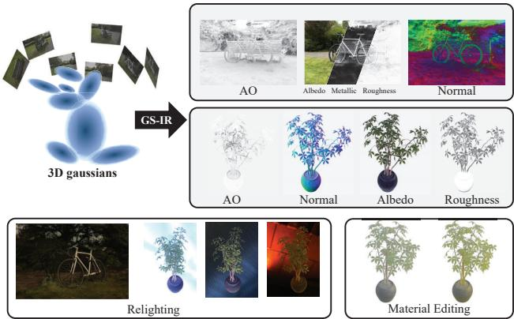  
Figure 1. Given multi-view captured images of a complex scene, we propose GS-IR (3D Gaussian Splatting for Inverse Rendering), which utilizes 3D Gaussian and forward mapping splatting to recover high-quality physical properties (e.g., normal, material, illumination). This enables us to perform relighting and material editing, resulting in outstanding inverse rendering results. Better viewed on screen with zoom in, especially the remarkable material decomposition and normal reconstruction of bicycle axle.

3D Gaussian Splatting (3DGS) [24] has recently emerged as a promising technique to model 3D static scenes and significantly boost the rendering speed to a real-time level. It makes the scene representation more compact and achieves fast and top performance for novel view synthesis. Introducing it to the inverse rendering pipeline is natural and essential, including geometry reconstruction, materials decomposition, and illumination estimation. Unlike ray tracing in NeRF, 3DGS produces a set of 3D Gaussians around sparse points. During the 3DGS optimization, the adaptive control of the Gaussian density may lead to loose geometry, making it difficult to estimate accurate scene’s normal. Consequently, it is necessary to introduce a well-designed strategy to regularize 3DGS’s normal estimation.

Our goal is to use 3D Gaussians as the scene representation for inverse rendering from multi-view images captured under unknown lighting conditions. However, capturing observations under natural illumination often shows complex effects such as soft shadows and interreflections. TensoIR [22] leverages the ray tracing of NeRF to directly model occlusion and indirect illumination. In contrast, 3DGS replaces the ray tracing in the NeRF with differentiable forward mapping volume rendering, which directly projects 3D Gaussians onto the 2D plane. This strategy improves the rendering efficiency but makes it difficult to calculate occlusion. Inspired by the “Indirect Lighting Cache” used in real-time rendering [4], we attempt to bake the occlusion into volumes for caching.

In this paper, we present a novel 3D Gaussian-based inverse rendering framework called GS-IR (3D Gaussian Splatting for Inverse Rendering) that leverages forward mapping splatting to deduce the physical attributes of a complex scene. To the best of our knowledge, our method is the first work to introduce the 3DGS technique for inverse rendering, which can simultaneously estimate scene geometry, materials, and illumination from multi-view images. Our GS-IR addresses two main issues when using 3DGS for inverse rendering. Firstly, we develop an intuitive and well-designed regularization to estimate the scene’s normal. Secondly, we use a baking-based method embedded in GS-IR to cache occlusions, obtaining an efficient indirect illumination model. As shown in Fig. 1, our approach can reconstruct high-fidelity geometry and materials of a complex real scene under unknown natural illumination, enabling state-of-the-art rendering of novel view synthesis and additional applications like relighting. Our technical contributions are summarized as follows:

• We present GS-IR that models a scene as a set of 3D Gaussians to achieve physically-based rendering and state-ofthe-art decomposition results for both objects and scenes;

• We propose an efficient optimization scheme with regularization to concentrate depth gradient around 3DGS and produce reliable normals for GS-IR;

• We develop a baking-based method embedded in GS-IR to handle the occlusion in modeling indirect lighting;

We demonstrate the superiority of our method to baseline methods qualitatively and quantitatively on various challenging scenes, including the TensoIR synthesis dataset [22] and Mip-NeRF 360 real dataset [5].

## 2. Related Works

Neural Representation Recently, neural rendering techniques, exemplified by Neural Radiance Field (NeRF) [30], have achieved impressive success in addressing visual computing problems, giving rise to numerous neural representations [14, 21, 31, 36, 39, 40] tailored for different tasks [11–13, 18, 27, 28, 34, 43]. The vanilla NeRF models a continuous radiance field implicitly in MLPs, which requires massive repeated queries during training and inference. To address the computational inefficiencies, many neural scene representations are proposed with more discretized geometry proxies such as voxel grids [17, 20, 36], hash grids [31], tri-planes [14] or points [39]. Neural features are stored in a structured manner, allowing for efficient storage and retrieval. The computational cost can thus be significantly reduced by introducing interpolation techniques, however, with an inevitable loss in image quality. 3D Guassians are introduced as an unstructured scene representation to strike a balance between efficiency and quality [24]. With the specially designed tile-based rasterizer for Guassian splats, this method achieves real-time rendering with high quality for novel-view synthesis. In this work, 3D Gaussian representation is combined with the physical-based rendering (PBR) model for inverse rendering.

Inverse Rendering Inverse rendering aims to decompose the image’s appearance into the geometry, material, and lighting conditions. Considering the inherent ambiguity between observed images and underlying properties, many methods are proposed with different constrained settings, such as capturing images with fixed lighting and rotating object [16, 38], capturing with moving camera and colocated lighting [7, 8, 29, 33]. Combined with neural representations, inverse rendering models the scene simulating how the light interacts with the neural volume with various material properties, and estimates the lighting and material parameters during optimization [6, 9, 10, 19, 22, 35, 42, 44, 46, 47]. Neural Reflectance Fields [6] assumes a known point light source and represents the scene as a field of volume density, surface normals, and bi-directional reflectance distribution functions(BRDFs) with one bounce direct illumination. NeRV [35] and InvRender [47] extend to arbitrary known lighting conditions and train an additional MLP to model the light visibility. PhySG [42] assumes full light source visibility without shadow simulation, and represents the lighting and scene BRDFs with spherical Guassians for acceleration. TensoIR [22] adopts the efficient TensoRF [14] representation which enables the computation of visibility and indirect lighting by raytracing, while limited to object-level. For modeling surface geometry using point clouds, Fuzzy Metaballs (FMs) [25, 26] offers a great way to render depth from 3D Gaussian using Order Independent Transparency (OIT) and approximate intersection. However, it requires silhouettes as input and struggles to handle intricate geometry (e.g. Lego and Ficus) let alone complex scenes. In this work, we propose a 3DGS-based pipeline to recover the geometry, material, and lighting that is available for both objects and unbounded scenes.

## 3. Preliminary

In this section, we give the technical backgrounds and math symbols that are necessary for the presentation of our proposed method in subsequent sections.

3D Gaussian Splatting (3DGS) [24] is an explicit 3D scene representation in the form of point clouds. Each point is represented as a Gaussian function $g$ that approximates the shape of a bell curve, which is defined as,

$$
g ( { \pmb x } | { \pmb \mu } , { \pmb \Sigma } ) = e ^ { - \frac { 1 } { 2 } ( { \pmb x } - { \pmb \mu } ) ^ { T } { \pmb \Sigma } ^ { - 1 } ( { \pmb x } - { \pmb \mu } ) } ,\tag{1}
$$

where $\pmb { \mu } \in \mathbb { R } ^ { 3 }$ is its mean vector, and $ { \Sigma } \in \mathbb { R } ^ { 3 \times 3 }$ is an anisotropic covariance matrix. The mean vector $\pmb { \mu }$ of a 3D Gaussian is parameterized as $\pmb { \mu } = ( \mu _ { x } , \mu _ { y } , \mu _ { z } )$ , and the covariance matrix Σ is factorized into a scaling matrix $_ { s }$ and a rotation matrix R as $\Sigma = R S S ^ { \top } R ^ { \top }$ . S and R refer to a diagonal matrix diag $\cdot ( s _ { x } , s _ { y } , s _ { z } )$ and a rotation matrix constructed from a unit quaternion q. Given a viewing transformation with extrinsic matrix $_ { \mathbf { T } }$ and intrinsic matrix K, the mean vector µ and covariance matrix $\Sigma ^ { \prime }$ from the 3D point x to 2D pixel u is defined as,

$$
\pmb { \mu } ^ { \prime } = \pmb { K } \pmb { T } [ \pmb { \mu } , 1 ] ^ { \top } , \pmb { \Sigma } ^ { \prime } = \pmb { J } \pmb { T } \pmb { \Sigma } \pmb { T } ^ { \top } \pmb { J } ^ { \top } ,\tag{2}
$$

where J is the Jacobian matrix of the affine approximation of the perspective projection. Besides, each Gaussian represents the view-dependent color $\mathbf { c } _ { i }$ via a set of coefficients of spherical harmonics (SH), which is then multiplied by opacity α for volume rendering. We finally obtain the color Cˆ at pixel u based on Eq. (1) and Eq. (2),

$$
\hat { C } = \sum _ { i \in N } T _ { i } g _ { i } ( u | \mu ^ { \prime } , \Sigma ^ { \prime } ) \alpha _ { i } c _ { i } , T _ { i } = \prod _ { j = 1 } ^ { i - 1 } ( 1 - g _ { j } ( u | \mu ^ { \prime } , \Sigma ^ { \prime } ) \alpha _ { j } ) ,\tag{3}
$$

where accumulated transmittance $T _ { i }$ quantifies the probability density of i-th Gaussian at pixel u.

The Rendering Equation In GS-IR, we leverage the classic rendering equation to formulate the outgoing radiance of a surface point x with normal n:

$$
L _ { o } ( \pmb { x } , \pmb { v } ) = \int _ { \Omega } L _ { i } ( \pmb { x } , \pmb { l } ) f _ { r } ( \pmb { l } , \pmb { v } ) ( \pmb { l } \cdot \pmb { n } ) d \pmb { l } ,\tag{4}
$$

Ω denotes the upper hemisphere centered at $^ { \mathbf { \delta x } , }$ l and v denote incident and view directions respectively. $L _ { i } ( { \pmb x } , l )$ denotes the radiance received at x from l. Notably, we follow Cook-Torrance microfacet model [15, 37] and formulate the bidirectional reflectance distribution function (BRDF) $f _ { r }$ as a function of albedo $\pmb { a } \in [ 0 , 1 ] ^ { 3 }$ , metallic $m \in [ 0 , 1 ]$ , and roughness $\rho \in [ 0 , 1 ]$

$$
f _ { r } ( l , { \pmb v } ) = \underbrace { ( 1 - m ) \frac { \pmb a } { \pi } } _ { \mathrm { d i f f u s e } } + \underbrace { \frac { D F G } { 4 ( \pmb n \cdot l ) ( \pmb n \cdot { \pmb v } ) } } _ { \mathrm { s p e c u l a r } } ,\tag{5}
$$

where microfacet distribution function D, Fresnel reflection $F ,$ and geometric shadowing factor G are related to the surface roughness $\rho .$ We use 3D Gaussians to store these material properties in GS-IR.

## 4. Method

Given a set of calibrated RGB images $\{ I _ { m } \} _ { m = 1 } ^ { M }$ of a target scene captured from multiple views under static, yet unknown illumination, inverse rendering aims to decompose the scene’s intrinsic properties, including normal, materials, and illumination. This decomposition facilitates the recovery and subsequent edition of the target scene. Motivated by the remarkable performance in quality and speed of 3DGS [24], we present a novel framework GS-IR consisting of three well-designed stage strategies, as shown in Fig. 2. In the initial stage, we leverage differentiable splatting to optimize 3D Gaussians. Concurrently, we utilize the gradient derived from the rendered depth map to supervise the normal stored in 3D Gaussians (cf. Sec. 4.1). In the second stage, we precompute the occlusion based on the learned geometric information (i.e. depth and normal) and store it in an efficient spherical harmonics-based architecture to model indirect illumination (cf. Sec. 4.2). In the final stage, we combine a differentiable splatting with the physical-based rendering (PBR) pipeline to optimize illumination and material-aware 3D Gaussians (cf. Sec. 4.3).

## 4.1. Normal Reconstruction

During the initial stage, we optimize 3D Gaussians for geometry reconstruction from observed images, denoted as ${ \mathcal { G } } .$ The optimized $\mathcal { G }$ functions as a geometric proxy for surface points and their corresponding normals n, which are crucial for successful inverse rendering. As highlighted in Sec. 1, generating reasonable normals within the 3DGSbased framework poses a significant challenge. To address this obstacle, we introduce an intuitive strategy that improves depth $\hat { D }$ and leverages the depth gradient to derive pseudo normals $\hat { \pmb { n } } _ { \hat { D } } = \nabla _ { \mathbf { u } \mathbf { v } } \hat { D }$ . These pseudo normals then guide the optimization of normals within the 3D Gaussians. Depth Generation Given a pretrained 3D Gaussians $\mathcal { G }$ and a view designated for rendering, the pixel’s shading results in that view can be obtained by Eq. (3). Consequently, it is reasonable to utilize the same volumetric accumulation to compute the depth $\begin{array} { r } { \hat { D } \ = \ \sum _ { i = 1 } ^ { N } T _ { i } \alpha _ { i } d _ { i } } \end{array}$ , where $d _ { i }$ denotes the distance from the corresponding 3D Gaussian to the image plane. However, we observed the floating problem during volumetric accumulation, unlike the backward mapping volume rendering used in NeRF. During the 3DGS optimization, the adaptive control of the Gaussian density may result in the depth falling in front of the 3D Gaussians, thereby posing challenges in accurately predicting the depth. Specifically, the backward mapping methods can obtain an accurate depth by considering only peak samples, that is $\hat { D } = d _ { i ^ { * } }$ , where $i ^ { * } = \arg \operatorname* { m a x } _ { i } T _ { i } \alpha _ { i }$ . However, for 3DGS, a typical forward mapping method, the peak selection results in disc aliasing within 3DGS. To overcome this limitation, we consider that depth Dˆ must be between the minimum and maximum distance of 3D Gaussians to the image plane, as illustrated in Fig. 3. We then treat the depth as a linear interpolation of the distances from 3D Gaussians to the image plane:

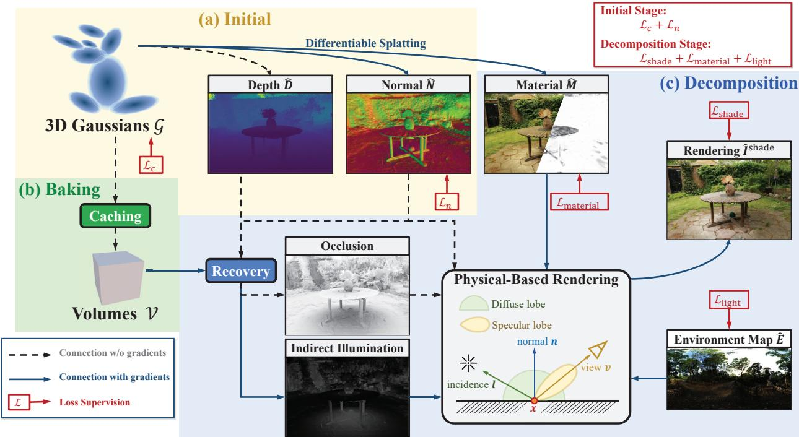

Figure 2. GS-IR Pipeline. We propose a novel GS-based inverse rendering framework, called GS-IR, to reconstruct scene geometry, materials, and unknown natural illumination from multi-view captured images. Our GS-IR consists of three well-designed stage strategie using 3D Gaussian and differentiable forward mapping splatting to achieve physical-based rendering. In our approach, the Gaussian stores not only the basic 3DGS information but also the normal and material properties, enhancing its capabilities for inverse rendering tasks.  
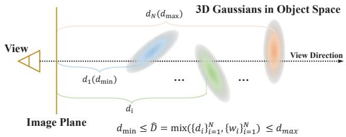  
Figure 3. Depth Illustration. By considering the depth as a linear interpolation of the distances from 3D Gaussians to the image plane, and ensuring it lies between the minimum and maximum distance, our method could produce accurate depth.

$$
\hat { D } = \sum _ { i = 1 } ^ { N } \hat { w } _ { i } d _ { i } , \quad \hat { w } _ { i } = \frac { T _ { i } \alpha _ { i } } { \sum _ { i = 1 } ^ { N } T _ { i } \alpha _ { i } } .\tag{6}
$$

Normal Derivation While the accurate prediction of depth within Gaussians provides better guidance for the normal reconstruction, directly using depth gradient to produce normals has two limitations that still cannot meet the requirement for effective inverse rendering. First, the depth gradient estimation is highly sensitive to noise, making the predicted normal often extremely noisy; Second, the normals derived individually from each view’s depth map do not satisfy multi-view consistency. To address these issues, we use Gaussian G as a proxy for normal estimation instead of directly from the depth gradient. Benefiting from the efficiency of 3DGS, we obtain the depth $\hat { D }$ and normals nˆ of the observed view after performing a single rendering pass. We then tie these predicted pseudo normal to the underlying depth gradient normal $\hat { \pmb { n } } _ { \hat { D } }$ using a simple penalty:

$$
\mathcal { L } _ { n - p } = \| \hat { \pmb { n } } - \hat { \pmb { n } } _ { \hat { D } } \| ,\tag{7}
$$

where $\begin{array} { r } { \hat { \pmb { n } } = \sum _ { i = 1 } ^ { N } T _ { i } \alpha _ { i } \pmb { n } _ { i } } \end{array}$ , and $\mathbf { \nabla } n _ { i }$ is the normal stored in the 3D Gaussian. Secondly, unlike the MLP-based normal estimation [22] acting MLP as a low-pass filter, the predicted normal of Gaussian G is rough, so smoothness regularization should be included. We introduce the TV term $T V _ { \mathrm { n o r m a l } }$ to smooth the predicted normal nˆ. For more details, please refer to the supplement.

In optimization of the first stage, we optimize 3D Gaussians $\mathcal { G }$ (storing SH coefficients for view-dependent color $^ { c , }$ opacity $\alpha ,$ and normal nˆ) by using the color reconstruction loss $\mathcal { L } _ { c } ,$ , which is the same as 3DGS [24], and the proposed normal loss ${ \mathcal { L } } _ { n }$ ,

$$
\begin{array} { r } { \mathscr { L } _ { n } = \mathscr { L } _ { n - p } + \lambda _ { n - T V } T V _ { \mathrm { n o r m a l } } . } \end{array}\tag{8}
$$

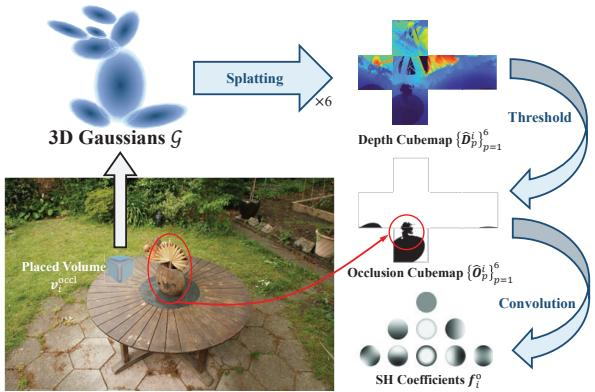  
Figure 4. Baking. We employ the spherical harmonics (SH) architecture to bake occlusion volumes for modeling indirect illumination. For each grid of occlusion volumes, we initially use 3D Gaussians to compute the depth cubemap by performing six forward mapping splatting passes. Next, we convert the depth cubemap into a binary occlusion cubemap based on a distance threshold. Finally, the occlusion cubemap is baked as SH coefficients, enabling efficient interpolation of the occlusion cubemap at any point within the scene.

## 4.2. Indirect Illumination Modeling

Drawing inspiration from the successful implementation of precomputation techniques in the video game industry (e.g. Irradiance Volume in Blender [3], Lightmass Volume in Unreal [1], and Light Probes in Unity [2]), we introduce spherical harmonics (SH) architectures to store occlusion information and model indirect illumination.

Given the optimized 3D Gaussians $\mathcal { G }$ from one stage $( c f .$ Sec. 4.1), we freeze G and regularly place occlusion volumes $\mathcal { V } ^ { \mathrm { o c c l } }$ in the 3D space. For each volume $v _ { i } ^ { \mathrm { o c c l } } \subset \mathcal { V } ^ { \mathrm { o c c l } }$ we then cache the occlusion in the form of SH coefficients $\mathbf { \mathcal { f } } _ { i } ^ { \mathrm { o } }$ . Consequently, the formula of the occlusion $O ( \cdot )$ of $\pmb { v } _ { i } ^ { \mathrm { o c c l } }$ with respect to the direction (θ, ϕ) is expressed as:

$$
O ( \theta , \phi ) = \sum _ { l = 0 } ^ { d e g } \sum _ { m = - l } ^ { l } { \bf f } _ { i ( l m ) } ^ { 0 } Y _ { l m } ( \theta , \phi ) ,\tag{9}
$$

where deg denotes the degree of SH, and $\{ Y _ { l m } ( \cdot ) \}$ is a set of real basis of SH.

As discussed in Sec. 4.1, the 3DGS technique employs a forward mapping approach that projects 3D points to the 2D plane, in contrast to the backward mapping volume rendering utilized in NeRF, which means it cannot use ray marching to calculate occlusions. To precompute the SH coefficients $\mathbf { \mathcal { f } } _ { i } ^ { \mathrm { o } }$ of occlusion volume $\pmb { v } _ { i } ^ { \mathrm { o c c l } }$ , we obtain the depth cubemap $\{ \hat { D } _ { p } ^ { i } \} _ { p = 1 } ^ { 6 }$ by performing six times rendering passes, once for each face of the cubemap. We then convert it into a binary occlusion cubemap $\{ \hat { O } _ { p } ^ { i } \} _ { p = 1 } ^ { 6 }$ based on a manually set distance threshold.

Finally, we convolve the the occlusion cubemap

$\{ \hat { O } _ { p } ^ { i } \} _ { p = 1 } ^ { 6 }$ using SH bases and get the SH coefficients $f _ { i } ^ { \mathrm { o } }$

$$
\begin{array} { l } { \displaystyle \pmb { f } _ { i ( l m ) } ^ { \mathrm { o } } = \int _ { S ^ { 2 } } \hat { O } ( \omega ) Y _ { l m } ( \omega ) d \omega } \\ { \displaystyle = \int _ { 0 } ^ { 2 \pi } \int _ { 0 } ^ { \pi } \sin \theta \hat { O } ( \theta , \phi ) Y _ { l m } ( \theta , \phi ) d \theta d \phi , } \end{array}\tag{10}
$$

where $S ^ { 2 }$ denotes the unit sphere, and $\hat { O } ( \theta , \phi )$ denotes the occlusion query from the occlusion cubemap $\{ \hat { O } _ { p } ^ { i } \} _ { p = 1 } ^ { 6 } .$ Note that we numerically calculate the convolution in Eq. (10) in parallel. The caching process is shown in Fig. 4.

To handle the indirect illumination in occlusion regions, we also maintain illumination volumes $\mathcal { V } ^ { \mathrm { i l l u } }$ to cache the indirect illumination. Similar to the caching process of occlusion volumes, the caching target of illumination volumes changes from the occlusion cubemap $\{ \hat { O } _ { p } ^ { i } \} _ { p = 1 } ^ { 6 }$ to the captured environment cubemap $\{ \hat { I } _ { p } ^ { i } \} _ { p = 1 } ^ { 6 }$ . These cubemaps can be obtained simultaneously by conducting six rendering passes. For more details, please refer to the supplement.

## 4.3. Intrinsic Decomposition

In the final stage, we employ differentiable splatting in conjunction with a PBR pipeline to accomplish the intrinsic decomposition. According to Eq. (5), the rendering equation Eq. (4) is rewritten as diffuse $L _ { \mathrm { d } }$ and specular $L _ { \mathrm { s } }$ components:

$$
\begin{array} { l } { { \displaystyle { \cal L } _ { o } ( { \pmb x } , { \pmb v } ) = \int _ { \Omega } \left[ ( 1 - m ) \frac { { \pmb a } } { \pi } + \frac { D F G } { 4 ( { \pmb n } \cdot { \pmb l } ) ( { \pmb n } \cdot { \pmb v } ) } \right] { \cal L } _ { i } ( { \pmb x } , { \pmb l } ) ( { \pmb l } \cdot { \pmb n } ) d { \pmb l } } } \\ { { { \cal L } _ { \mathrm { d } } = ( 1 - m ) \frac { { \pmb a } } { \pi } \int _ { \Omega } { \cal L } _ { i } ( { \pmb x } , { \pmb l } ) ( { \pmb l } \cdot { \pmb n } ) d { \pmb l } } } \\ { { { \cal L } _ { \mathrm { s } } = \displaystyle \int _ { \Omega } \frac { D F G } { 4 ( { \pmb n } \cdot { \pmb l } ) ( { \pmb n } \cdot { \pmb v } ) } { \cal L } _ { i } ( { \pmb x } , { \pmb l } ) ( { \pmb l } \cdot { \pmb n } ) d { \pmb l } . } } \end{array}\tag{11}
$$

In GS-IR, we adopt an image-based lighting (IBL) model and split-sum approximation [23] to tackle the intractable integral. To calculate the diffuse component $L _ { \mathrm { d } } .$ , the illumination $I _ { \mathrm { d } }$ is defined as:

$$
\begin{array} { l } { { \displaystyle I _ { \mathrm { d } } ( { \pmb x } ) = \int _ { \Omega } L _ { i } ( { \pmb x } , { \boldsymbol l } ) ( { \boldsymbol l } \cdot { \pmb n } ) d { \boldsymbol l } } \ ~ } \\ { { \displaystyle ~ = \int _ { \Omega _ { \mathrm { V i s } } } L _ { i } ^ { \mathrm { d i r } } ( { \pmb x } , { \boldsymbol l } ) ( { \boldsymbol l } \cdot { \pmb n } ) d { \boldsymbol l } + \int _ { \Omega _ { \mathrm { O c l } } } L _ { i } ^ { \mathrm { i n d i r } } ( { \pmb x } , { \boldsymbol l } ) ( { \boldsymbol l } \cdot { \pmb n } ) d { \boldsymbol l } } \ ~ } \\ { { \displaystyle ~ \approx \left( 1 - { \bf O } ( { \pmb x } ) \right) I _ { \mathrm { d } } ^ { \mathrm { d i r } } ( { \pmb x } ) + { \bf O } ( { \pmb x } ) I _ { \mathrm { d } } ^ { \mathrm { i n d i r } } ( { \pmb x } ) } , } \end{array}\tag{12}
$$

where the first component indicates direct illumination and the second is indirect illumination. Notably, our bakingbased indirect illumination model enables us to calculate the occlusion and illumination online. This means that our GS-IR achieves intrinsic decomposition while maintaining realtime rendering performance. For the specular component $L _ { \mathrm { s } } ,$ , we follow split-sum approximation and treat the integral as two separate integrals:

$$
\begin{array} { r l r } {  { L _ { \mathrm { s } } = \int _ { \Omega } \frac { D F G } { 4  \pmb { n } \cdot \pmb { l }   \pmb { n } \cdot \pmb { v }  } L _ { i } ( \pmb { l } )  \pmb { l } \cdot \pmb { n }  d \pmb { l } } } \\ & { } & { \approx \underbrace { \int _ { \Omega } \frac { D F G } { 4  \pmb { n } \cdot \pmb { l }   \pmb { n } \cdot \pmb { v }  }  \pmb { l } \cdot \pmb { n }  d \pmb { l } } _ { \mathrm { E n i r o n m e n t ~ B R D F - R } } \underbrace { \int _ { \Omega } D \ L _ { i } ( \pmb { l } )  \pmb { l } \cdot \pmb { n }  d \pmb { l } } _ { \mathrm { P r e - F i l e r e d ~ E n v i r o n m e n t M a p - \pmb { l } \mathrm { s } } } , } \end{array}\tag{13}
$$

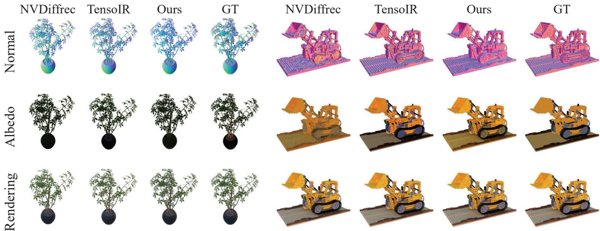  
Figure 5. Qualitative comparison on TensoIR Synthetic. We visualize the estimated normal, albedo, and rendering results of our GS IR and baseline methods on two scenes. By utilizing the efficient 3D Gaussian representation and a robust tile-based rasterizer, GS-IR achieves rapid convergence and supports real-time rendering. This performance advantage underscores the effectiveness of our method in addressing complex inverse rendering tasks, thereby surpassing existing state-of-the-art approaches. (For albedo reconstruction results, we follow NeRFactor [46] and scale each RGB channel by a global scalar.)

where both $R$ and $I _ { \mathrm { s } }$ can be precomputed in advance and stored in look-up tables. With Eq. (12) and Eq. (13), the rendering results of Eq. (11) can be represented as:

$$
\begin{array} { l } { { \displaystyle L _ { o } ( { \pmb x } , { \pmb v } ) = L _ { \mathrm { d } } + L _ { \mathrm { s } } } } \\ { { \displaystyle \approx ( 1 - m ) \frac { { \pmb a } } { \pi } \left[ ( 1 - { \bf O } ( { \pmb x } ) ) I _ { \mathrm { d } } ^ { \mathrm { d i r } } ( { \pmb x } ) + { \bf O } ( { \pmb x } ) I _ { \mathrm { d } } ^ { \mathrm { i n d i r } } ( { \pmb x } ) \right] + R I _ { \mathrm { s . } } } } \end{array}\tag{14}
$$

For intrinsic decomposition, we optimize the material $\hat { M } \left( i . e \right.$ . albedo $^ { a , }$ metallic value $m$ , and roughness $\rho )$ stored in 3D Gaussians ${ \mathcal { G } } ,$ environment map $\hat { E } .$ , and illumination volumes $\mathcal { V } ^ { \mathrm { i l l u } }$ by minimizing the decomposition loss $\mathcal { L } _ { d } \mathrm { : }$

$$
\mathcal { L } _ { d } = \underbrace { \left| \left| I - \hat { I } ^ { \mathrm { s h a d e } } ( \hat { M } , \hat { E } , \mathcal { V } ^ { \mathrm { i l l u } } ) \right| \right| } _ { \mathcal { L } _ { \mathrm { s h a d e } } } + \underbrace { \lambda _ { M } ~ T V _ { \mathrm { m a t } } } _ { \mathcal { L } _ { \mathrm { m a t e r i a l } } } + \underbrace { \lambda _ { E } ~ T V _ { \mathrm { l i g h t } } } _ { \mathcal { L } _ { \mathrm { l i g h t } } } ,\tag{15}
$$

where $\mathcal { L } _ { \mathrm { s h a d e } }$ indicate the shade loss. $\hat { I } ^ { \mathrm { s h a d e } } ( \hat { M } , \hat { E } , \mathcal { V } ^ { \mathrm { i l l u } } )$ is the recovered image that uses the PBR pipeline defined by Eq. (14).Please refer to the supplment for more details about the material TV loss ${ \mathcal { L } } _ { \mathrm { m a t e r i a l } }$ and lighting TV loss $\mathcal { L } _ { \mathrm { l i g h t } }$

## 5. Experiments

Dataset & Metrics We conduct expermients using benchmark datasets of TensoIR Synthetic [22] and Mip-NeRF 360 [5] for decompositing both objects and scenes. They contain 4 objects with reference materials and 7 publicly available scenes, respectively. To verify the efficacy of our normal reconstruction, we evaluate the normal quality on the TensoIR Synthetic [22] dataset using mean angular error (MAE). We further assess our reconstructed albedo quality on this synthetic dataset. More generally, we evaluate the synthesized novel view on both datasets in terms of Peak

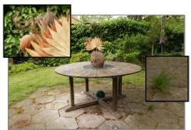

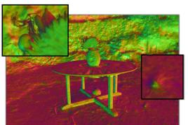

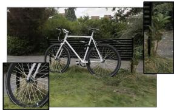

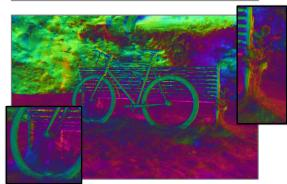  
Figure 6. Novel view synthesis results on Mip-NeRF 360. GS-IR can reconstruct scene details including geometric normals and high-frequency appearance, rendering high-fidelity appearance and recovering fine geometric details such as those on leaves and bicycle axles. Better viewed on screen with zoom in.

Signal-to-Noise Ratio (PSNR), Structural Similarity Index Measure (SSIM), and Learned Perceptual Image Patch Similarity (LPIPS) [45]. Note that albedo quality assessment uses the same metrics as novel view synthesis.

## 5.1. Comparisons

We conduct a comprehensive comparison against state-ofthe-art neural field-based inverse rendering methods on the public TensoIR Synthetic dataset [22]. All the methods utilize multi-view images captured under unknown lighting conditions. Our evaluation encompasses normal quality (measured by MAE), novel view synthesis, albedo fidelity, relighting effects (measured by PSNR, SSIM, and LPIPS), and efficiency. Tab. 1 summarizes the quantitative comparisons on the synthesis dataset. Our method achieves superior performance in novel view synthesis and albedo quality compared to the baseline methods, demonstrating the effectiveness of material decomposition and PBR rendering, particularly given that our normal reconstruction is slightly inferior to TensoIR. Our relighting performance ranks second, only behind TensoIR. Notably, the average training time of our GS-IR is accelerated by a factor of 5x, making its performance acceptable and demonstrating the effectiveness of our approach in handling complex inverse rendering tasks. We also include qualitative comparisons in Fig. 5, which show that our GS-IR produces reasonable albedo and photorealistic renderings that are closer to the ground truth than most methods.

<table><tr><td rowspan="2">Method</td><td rowspan="2">Normal MAE</td><td colspan="3">Novel View Synthesis</td><td colspan="3">Albedo</td><td colspan="3">Relight</td><td rowspan="2">Runtime</td></tr><tr><td>PSNR ↑</td><td>SSIM↑</td><td>LPIPS↓</td><td>PSNR ↑</td><td>SSIM ↑</td><td>LPIPS ↓</td><td>PSNR ↑</td><td>SSIM ↑</td><td>LPIPS ↓</td></tr><tr><td>NeRFactor [46]</td><td>6.314</td><td>24.679</td><td>0.922</td><td>0.120</td><td>25.125</td><td>0.940</td><td>0.109</td><td>23.383</td><td>0.908</td><td>0.131</td><td>&gt; 100 hrs</td></tr><tr><td>InvRender [47]</td><td>5.074</td><td>27.367</td><td>0.934</td><td>0.089</td><td>27.341</td><td>0.933</td><td>0.100</td><td>23.973</td><td>0.901</td><td>0.101</td><td>15 hrs</td></tr><tr><td>NVDiffrec [32]</td><td>6.078</td><td>30.696</td><td>0.962</td><td>0.052</td><td>29.174</td><td>0.908</td><td>0.115</td><td>19.880</td><td>0.879</td><td>0.104</td><td>&lt; 1 hr</td></tr><tr><td>TensoIR [22]</td><td>4.100</td><td>35.088</td><td>0.976</td><td>0.040</td><td>29.275</td><td>0.950</td><td>0.085</td><td>28.580</td><td>0.944</td><td>0.081</td><td>5 hrs</td></tr><tr><td>Ours</td><td>4.948</td><td>35.333</td><td>0.974</td><td>0.039</td><td>30.286</td><td>0.941</td><td>0.084</td><td>24.374</td><td>0.885</td><td>0.096</td><td>&lt; 1 hr</td></tr></table>

Table 1. Quantatitive Comparison on TensoIR Synthetic dataset. Our method outperforms baseline methods in terms of novel view synthesis and albedo quality, showcasing the effectiveness of material decomposition and PBR rendering. This is particularly noteworthy considering that our normal reconstruction is slightly inferior to TensoIR. In terms of relighting performance, we rank second, trailing only behind TensoIR. Importantly, the average training time of our GS-IR is accelerated by a factor of 5x, making its performance acceptable and further demonstrating the effectiveness of our approach in handling complex inverse rendering tasks

<table><tr><td>Method</td><td>PSNR ↑</td><td>SSIM↑</td><td>LPIPS↓</td><td>Runtime ↓</td></tr><tr><td>NeRF++ [41]</td><td>25.112</td><td>0.696</td><td>0.375</td><td>≈20h</td></tr><tr><td>Plenoxels [17]</td><td>23.079</td><td>0.625</td><td>0.462</td><td>≈30m</td></tr><tr><td>INGP-Base [31]</td><td>25.303</td><td>0.671</td><td>0.371</td><td>≈5m</td></tr><tr><td>INGP-Big [31]</td><td>25.587</td><td>0.699</td><td>0.331</td><td>≈8m</td></tr><tr><td>Mip-NeRF 360 [31]</td><td>27.569</td><td>0.793</td><td>0.234</td><td>≈48h</td></tr><tr><td>3DGS [24]</td><td>27.21</td><td>0.815</td><td>0.214</td><td>≈ 35m</td></tr><tr><td>Ours</td><td>25.381</td><td>0.757</td><td>0.267</td><td>≈45m</td></tr></table>

Table 2. Quantatitive Comparison on Mip-NeRF 360. The results show that our inverse rendering approach even surpasses some NeRF variants dedicated to novel view synthesis.

Meanwhile, owing to our more efficient and compact representation with powerful expressiveness, our method showcases remarkable performance on complex real unbounded scenes [5]. Tab. 2 presents the quantitative comparisons on the real dataset. Fig. 6 demonstrates the normal reconstruction and novel view synthesis on the real dataset. Our method renders a high-fidelity appearance and recovers fine geometric details, such as those on the leaves and bicycle axil. In summary, by leveraging the efficient 3D Gaussian representation and a powerful tile-based rasterizer, GS-IR achieves fast convergence and supports real-time rendering. This performance advantage highlights the effectiveness of our method in handling complex inverse rendering tasks, outperforming existing state-of-the-art approaches.

<table><tr><td rowspan="2">Method</td><td colspan="4">TensoIR Synthetic [22]</td><td colspan="3">Mip-NeRF 360 [5]</td></tr><tr><td>Normal MAE</td><td>PSNR ↑</td><td>SSIM↑</td><td>LPIPS ↓</td><td>PSNR ↑</td><td>SSIM ↑</td><td>LPIPS ↓</td></tr><tr><td>Vol. Accum.</td><td>16.347</td><td>25.756</td><td>0.855</td><td>0.131</td><td>22.052</td><td>0.610</td><td>0.394</td></tr><tr><td>Peak Selec.</td><td>9.466</td><td>28.750</td><td>0.927</td><td>0.084</td><td>23.093</td><td>0.719</td><td>0.317</td></tr><tr><td>Linear Interp.</td><td>6.218</td><td>28.983</td><td>0.939</td><td>0.066</td><td>23.119</td><td>0.707</td><td>0.319</td></tr><tr><td>Vol. Accum.†</td><td>9.315</td><td>30.091</td><td>0.940</td><td>0.071</td><td>24.664</td><td>0.747</td><td>0.277</td></tr><tr><td>Peak Selec.†</td><td>7.986</td><td>31.064</td><td>0.950</td><td>0.060</td><td>25.143</td><td>0.753</td><td>0.281</td></tr><tr><td>Linear Interp.†</td><td>4.948</td><td>35.333</td><td>0.974</td><td>0.039</td><td>25.381</td><td>0.757</td><td>0.267</td></tr></table>

Table 3. Analyses on the impact of different depth generation strategies on normals. Methods without † marks directly use the normals derived from the depth map; Methods marked with † use depth derivation to optimize the normals stored in 3D Gaussians.

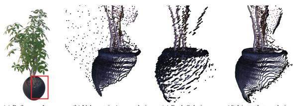

Figure 7. Visual comparison of depth produced by different strategies. The linear interpolation adopted in GS-IR overcomes the floating problem and disc aliasing.
<table><tr><td rowspan="2">Method</td><td colspan="2">TensoIR Synthetic [22]</td><td rowspan="2">PSNR↑</td><td colspan="2">Mip-NeRF 360 [5]</td></tr><tr><td>PSNR↑ SSIM ↑</td><td>LPIPS↓</td><td>SSIM ↑</td><td>LPIPS ↓</td></tr><tr><td>w/o occlusion</td><td>34.997</td><td>0.962 0.041</td><td>25.060</td><td>0.753</td><td>0.270</td></tr><tr><td>w/o indirect illum.</td><td>35.186</td><td>0.965 0.044</td><td>24.898</td><td>0.749</td><td>0.272</td></tr><tr><td>Ours</td><td>35.333</td><td>0.974 0.039</td><td>25.381</td><td>0.757</td><td>0.267</td></tr></table>

Table 4. Analyses on the occlusion and indirect illumination. Physically modeling indirect illumination improves the inverse rendering of objects and scenes.

## 5.2. Ablation Studies

We initially introduce the 3DGS technique for inverse rendering in GS-IR and propose depth-derivation-based normal regularization and a baking-based method to address the challenges encountered during the process. To evaluate the efficacy of our proposed schemes, we design elaborate experiments on both TensoIR Synthetic [22] and Mip-NeRF 360 [5] datasets, providing comprehensive insights into the effectiveness of our approach in handling complex inverse rendering tasks. Below is the detailed ablation study on Normal Regularization and Indirect Illumination.

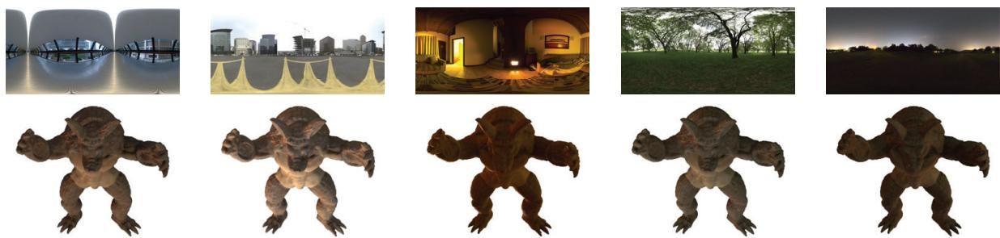  
Figure 8. Relighting Visualization. We perform relighting experiments on both synthetic and real scenes using the recovered geometry, material, and illumination properties from our GS-IR method. We test our method under different lighting conditions and directions.

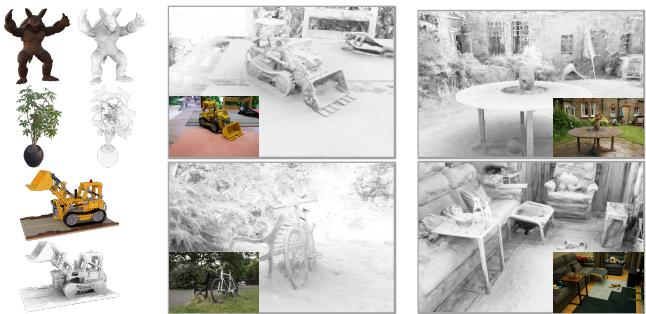  
Figure 9. Ambient Occlusion Visualization. The visualization highlights the intricate shadowing and occlusion details captured by our GS-IR method, emphasizing the performance of our approach in modeling indirect illumination.

Analysis on the Normal Regularization Reliable normal estimation is critical for conducting inverse rendering. To this end, we present depth-derivation-based regularization to facilitate 3D Gaussian-based normal estimation as stated in Sec. 4.1. In this section, we explore the impact of different acquisition schemes on the final normal quality and inverse rendering results. The quantitative results shown in Tab. 3 demonstrate that using 3D Gaussians as a normal proxy and adopting the linear interpolation strategy significantly improves the normal estimation and inverse rendering results. In addition, Fig. 7 qualitatively shows that conducting volumetric accumulation results in the floating problem (cf. Fig. 7 (b)). Despite peak selection overcomes this problem, it introduces disc aliasing (cf. Fig. 7 (c)). Compared with them, the linear interpolation adopted in GS-IR robustly produces accurate depth (cf. Fig. 7 (d)).

Analysis on the Indirect Illumination To demonstrate the effectiveness of our indirect illumination model, we compare our method with two variants: a model without occlusion volume (w/o occlusion) and a model without indirect illumination (w/o indirect illum.). The quantitative comparisons in Tab. 4 indicate that each component is crucial for estimating accurate material decomposition and generating photorealistic rendering results. Additionally, Fig. 9 showcases the ambient occlusion visualization in both synthetic and real scenes. The visualization highlights the intricate shadowing and occlusion details captured by our GS-IR method, emphasizing the performance of our approach in modeling indirect illumination. This analysis further supports the effectiveness of using occlusion volume and introducing indirect illumination in enhancing the decomposition capabilities of our GS-IR.

## 5.3. Application

We perform relighting experiments using the recovered geometry, material, and illumination from our GS-IR method. We test GS-IR under different lighting conditions and directions, observing how the reconstructed scene responds to the changes in lighting. The results of these experiments demonstrate that our GS-IR method can effectively handle relighting applications, producing photorealistic renderings under various lighting conditions. More results can be found in the supplement.

## 6. Conclusion

We present GS-IR, a novel inverse rendering approach based on 3D Gaussian Splatting (3DGS), which employs forward mapping volume rendering to achieve photoreal istic novel view synthesis and relighting results. Our GS-IR proposes an optimization scheme with depth-derivationbased regularization for normal estimation and a bakingbased occlusion to model indirect lighting. These components are eventually employed to decompose material and illumination. Our extensive experiments demonstrate the effectiveness of GS-IR in achieving state-of-the-art inverse rendering results, surpassing previous neural methods in terms of both reconstruction quality and efficiency.

Limitation Spherical Harmonics (SH) is only suitable for representing low-frequency, and we only use the occlusion represented by SH to model the diffuse term of indirect illumination. Modeling the specular term of indirect illumination remains a limitation of GS-IR, and has been a challenging problem in computer graphics. We believe it would be valuable to address this limitation in future work and suggest screen space global illumination (SSGI) techniques.

## References

[1] Unreal engine. https://www.unrealengine.com/. 5

[2] Unity. https://unity.com/. 5

[3] Blender. https://www.blender.org/. 5

[4] Tomas Akenine-Mo, Eric Haines, Naty Hoffman, et al. Realtime rendering. 2018. 2

[5] Jonathan T Barron, Ben Mildenhall, Dor Verbin, Pratul P Srinivasan, and Peter Hedman. Mip-nerf 360: Unbounded anti-aliased neural radiance fields. In Proceedings of the IEEE/CVF Conference on Computer Vision and Pattern Recognition, pages 5470–5479, 2022. 2, 6, 7

[6] Sai Bi, Zexiang Xu, Pratul Srinivasan, Ben Mildenhall, Kalyan Sunkavalli, Milos Haˇ san, Yannick Hold-Geoffroy,ˇ David Kriegman, and Ravi Ramamoorthi. Neural reflectance fields for appearance acquisition. arXiv preprint arXiv:2008.03824, 2020. 2

[7] Sai Bi, Zexiang Xu, Kalyan Sunkavalli, Milos Haˇ san, Yan-ˇ nick Hold-Geoffroy, David Kriegman, and Ravi Ramamoorthi. Deep reflectance volumes: Relightable reconstructions from multi-view photometric images. In Computer Vision– ECCV 2020: 16th European Conference, Glasgow, UK, August 23–28, 2020, Proceedings, Part III 16, pages 294–311. Springer, 2020. 2

[8] Sai Bi, Zexiang Xu, Kalyan Sunkavalli, David Kriegman, and Ravi Ramamoorthi. Deep 3d capture: Geometry and reflectance from sparse multi-view images. In Proceedings of the IEEE/CVF conference on computer vision and pattern recognition, pages 5960–5969, 2020. 2

[9] Mark Boss, Raphael Braun, Varun Jampani, Jonathan T Barron, Ce Liu, and Hendrik Lensch. Nerd: Neural reflectance decomposition from image collections. In Proceedings of the IEEE/CVF International Conference on Computer Vision, pages 12684–12694, 2021. 1, 2

[10] Mark Boss, Varun Jampani, Raphael Braun, Ce Liu, Jonathan Barron, and Hendrik Lensch. Neural-pil: Neural pre-integrated lighting for reflectance decomposition. Advances in Neural Information Processing Systems, 34: 10691–10704, 2021. 1, 2

[11] Ang Cao and Justin Johnson. Hexplane: A fast representation for dynamic scenes. In Proceedings of the IEEE/CVF Conference on Computer Vision and Pattern Recognition, pages 130–141, 2023. 2

[12] Eric R Chan, Marco Monteiro, Petr Kellnhofer, Jiajun Wu, and Gordon Wetzstein. pi-gan: Periodic implicit generative adversarial networks for 3d-aware image synthesis. In Proceedings of the IEEE/CVF conference on computer vision and pattern recognition, pages 5799–5809, 2021.

[13] Eric R Chan, Connor Z Lin, Matthew A Chan, Koki Nagano, Boxiao Pan, Shalini De Mello, Orazio Gallo, Leonidas J Guibas, Jonathan Tremblay, Sameh Khamis, et al. Efficient geometry-aware 3d generative adversarial networks. In Proceedings of the IEEE/CVF Conference on Computer Vision and Pattern Recognition, pages 16123–16133, 2022. 2

[14] Anpei Chen, Zexiang Xu, Andreas Geiger, Jingyi Yu, and Hao Su. Tensorf: Tensorial radiance fields. In European

Conference on Computer Vision, pages 333–350. Springer, 2022. 2

[15] Robert L Cook and Kenneth E. Torrance. A reflectance model for computer graphics. ACM Transactions on Graphics (ToG), 1(1):7–24, 1982. 3

[16] Yue Dong, Guojun Chen, Pieter Peers, Jiawan Zhang, and Xin Tong. Appearance-from-motion: Recovering spatially varying surface reflectance under unknown lighting. ACM Transactions on Graphics (TOG), 33(6):1–12, 2014. 2

[17] Sara Fridovich-Keil, Alex Yu, Matthew Tancik, Qinhong Chen, Benjamin Recht, and Angjoo Kanazawa. Plenoxels: Radiance fields without neural networks. In Proceedings of the IEEE/CVF Conference on Computer Vision and Pattern Recognition, pages 5501–5510, 2022. 2, 7

[18] Sara Fridovich-Keil, Giacomo Meanti, Frederik Rahbæk Warburg, Benjamin Recht, and Angjoo Kanazawa. K-planes: Explicit radiance fields in space, time, and appearance. In Proceedings of the IEEE/CVF Conference on Computer Vision and Pattern Recognition, pages 12479–12488, 2023. 2

[19] Jon Hasselgren, Nikolai Hofmann, and Jacob Munkberg. Shape, light, and material decomposition from images using monte carlo rendering and denoising. Advances in Neural Information Processing Systems, 35:22856–22869, 2022. 2

[20] Peter Hedman, Pratul P Srinivasan, Ben Mildenhall, Jonathan T Barron, and Paul Debevec. Baking neural radiance fields for real-time view synthesis. In Proceedings ofthe IEEE/CVF International Conference on Computer Vision, pages 5875–5884, 2021. 2

[21] Zhangjin Huang, Zhihao Liang, Haojie Zhang, Yangkai Lin, and Kui Jia. Sur2f: A hybrid representation for high-quality and efficient surface reconstruction from multi-view images. arXiv preprint arXiv:2401.03704, 2024. 2

[22] Haian Jin, Isabella Liu, Peijia Xu, Xiaoshuai Zhang, Songfang Han, Sai Bi, Xiaowei Zhou, Zexiang Xu, and Hao Su. Tensoir: Tensorial inverse rendering. In Proceedings of the IEEE/CVF Conference on Computer Vision and Pattern Recognition, pages 165–174, 2023. 2, 4, 6, 7

[23] Brian Karis and Epic Games. Real shading in unreal engine 4. Proc. Physically Based Shading Theory Practice, 4(3):1, 2013. 5

[24] Bernhard Kerbl, Georgios Kopanas, Thomas Leimkuhler,¨ and George Drettakis. 3d gaussian splatting for real-time radiance field rendering. ACM Transactions on Graphics (ToG), 42(4):1–14, 2023. 1, 2, 3, 4, 7

[25] Leonid Keselman and Martial Hebert. Approximate differentiable rendering with algebraic surfaces. In European Conference on Computer Vision, pages 596–614. Springer, 2022. 2

[26] Leonid Keselman and Martial Hebert. Flexible techniques for differentiable rendering with 3d gaussians. arXiv preprint arXiv:2308.14737, 2023. 2

[27] Zhengqi Li, Simon Niklaus, Noah Snavely, and Oliver Wang. Neural scene flow fields for space-time view synthesis of dynamic scenes. In Proceedings of the IEEE/CVF Conference on Computer Vision and Pattern Recognition, pages 6498– 6508, 2021. 2

[28] Zhihao Liang, Zhangjin Huang, Changxing Ding, and Kui Jia. Helixsurf: A robust and efficient neural implicit surface learning of indoor scenes with iterative intertwined regularization. In Proceedings of the IEEE/CVF Conference on Computer Vision and Pattern Recognition, pages 13165– 13174, 2023. 2

[29] Fujun Luan, Shuang Zhao, Kavita Bala, and Zhao Dong. Unified shape and svbrdf recovery using differentiable monte carlo rendering. In Computer Graphics Forum, pages 101– 113. Wiley Online Library, 2021. 2

[30] Ben Mildenhall, Pratul P Srinivasan, Matthew Tancik, Jonathan T Barron, Ravi Ramamoorthi, and Ren Ng. Nerf: Representing scenes as neural radiance fields for view synthesis. In European Conference on Computer Vision, pages 405–421, 2020. 1, 2

[31] Thomas Muller, Alex Evans, Christoph Schied, and Alexan-¨ der Keller. Instant neural graphics primitives with a multiresolution hash encoding. ACM Transactions on Graphics (ToG), 41(4):1–15, 2022. 2, 7

[32] Jacob Munkberg, Jon Hasselgren, Tianchang Shen, Jun Gao, Wenzheng Chen, Alex Evans, Thomas Muller, and Sanja Fi-¨ dler. Extracting triangular 3d models, materials, and lighting from images. In Proceedings of the IEEE/CVF Conference on Computer Vision and Pattern Recognition, pages 8280– 8290, 2022. 7

[33] Giljoo Nam, Joo Ho Lee, Diego Gutierrez, and Min H Kim. Practical svbrdf acquisition of 3d objects with unstructured flash photography. ACM Transactions on Graphics (TOG), 37(6):1–12, 2018. 2

[34] Keunhong Park, Utkarsh Sinha, Jonathan T Barron, Sofien Bouaziz, Dan B Goldman, Steven M Seitz, and Ricardo Martin-Brualla. Nerfies: Deformable neural radiance fields. In Proceedings of the IEEE/CVF International Conference on Computer Vision, pages 5865–5874, 2021. 2

[35] Pratul P Srinivasan, Boyang Deng, Xiuming Zhang, Matthew Tancik, Ben Mildenhall, and Jonathan T Barron. Nerv: Neural reflectance and visibility fields for relighting and view synthesis. In Proceedings of the IEEE/CVF Conference on Computer Vision and Pattern Recognition, pages 7495–7504, 2021. 1, 2

[36] Cheng Sun, Min Sun, and Hwann-Tzong Chen. Direct voxel grid optimization: Super-fast convergence for radiance fields reconstruction. In Proceedings of the IEEE/CVF Conference on Computer Vision and Pattern Recognition, pages 5459– 5469, 2022. 2

[37] Bruce Walter, Stephen R Marschner, Hongsong Li, and Kenneth E Torrance. Microfacet models for refraction through rough surfaces. In Proceedings of the 18th Eurographics conference on Rendering Techniques, pages 195–206, 2007. 3

[38] Rui Xia, Yue Dong, Pieter Peers, and Xin Tong. Recovering shape and spatially-varying surface reflectance under unknown illumination. ACM Transactions on Graphics (TOG), 35(6):1–12, 2016. 2

[39] Qiangeng Xu, Zexiang Xu, Julien Philip, Sai Bi, Zhixin Shu, Kalyan Sunkavalli, and Ulrich Neumann. Point-nerf: Point-based neural radiance fields. In Proceedings of the

IEEE/CVF Conference on Computer Vision and Pattern Recognition, pages 5438–5448, 2022. 2

[40] Lior Yariv, Yoni Kasten, Dror Moran, Meirav Galun, Matan Atzmon, Basri Ronen, and Yaron Lipman. Multiview neural surface reconstruction by disentangling geometry and appearance. Advances in Neural Information Processing Systems, 33:2492–2502, 2020. 2

[41] Kai Zhang, Gernot Riegler, Noah Snavely, and Vladlen Koltun. Nerf++: Analyzing and improving neural radiance fields. arXiv preprint arXiv:2010.07492, 2020. 7

[42] Kai Zhang, Fujun Luan, Qianqian Wang, Kavita Bala, and Noah Snavely. Physg: Inverse rendering with spherical gaussians for physics-based material editing and relighting. In Proceedings of the IEEE/CVF Conference on Computer Vision and Pattern Recognition, pages 5453–5462, 2021. 2

[43] Kai Zhang, Nick Kolkin, Sai Bi, Fujun Luan, Zexiang Xu, Eli Shechtman, and Noah Snavely. Arf: Artistic radiance fields. In European Conference on Computer Vision, pages 717–733. Springer, 2022. 2

[44] Kai Zhang, Fujun Luan, Zhengqi Li, and Noah Snavely. Iron: Inverse rendering by optimizing neural sdfs and materials from photometric images. In Proceedings of the IEEE/CVF Conference on Computer Vision and Pattern Recognition, pages 5565–5574, 2022. 2

[45] Richard Zhang, Phillip Isola, Alexei A Efros, Eli Shechtman, and Oliver Wang. The unreasonable effectiveness of deep features as a perceptual metric. In Proceedings of the IEEE conference on computer vision and pattern recognition, pages 586–595, 2018. 6

[46] Xiuming Zhang, Pratul P Srinivasan, Boyang Deng, Paul Debevec, William T Freeman, and Jonathan T Barron. Nerfactor: Neural factorization of shape and reflectance under an unknown illumination. ACM Transactions on Graphics (ToG), 40(6):1–18, 2021. 1, 2, 6, 7

[47] Yuanqing Zhang, Jiaming Sun, Xingyi He, Huan Fu, Rongfei Jia, and Xiaowei Zhou. Modeling indirect illumination for inverse rendering. In Proceedings of the IEEE/CVF Conference on Computer Vision and Pattern Recognition, pages 18643–18652, 2022. 2, 7