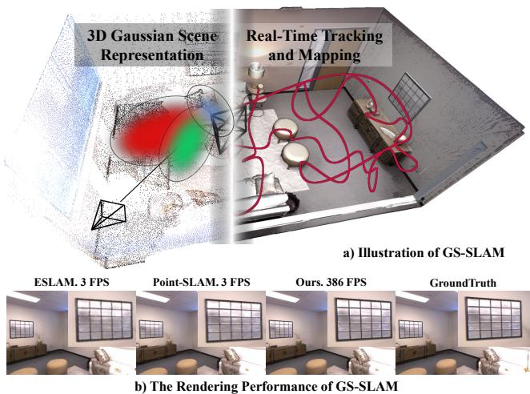
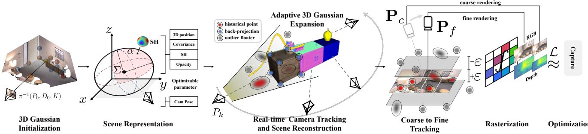
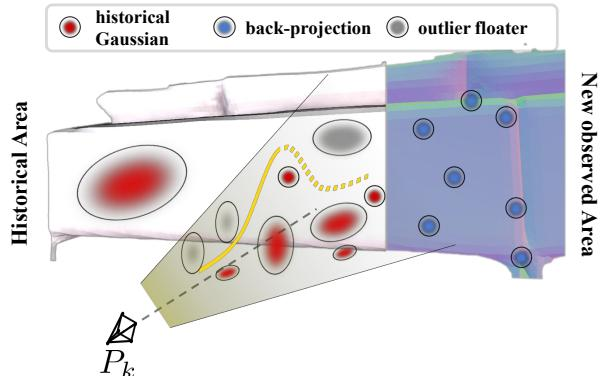
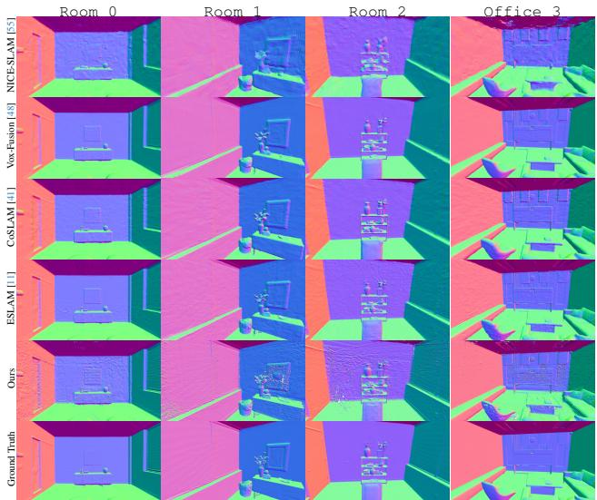
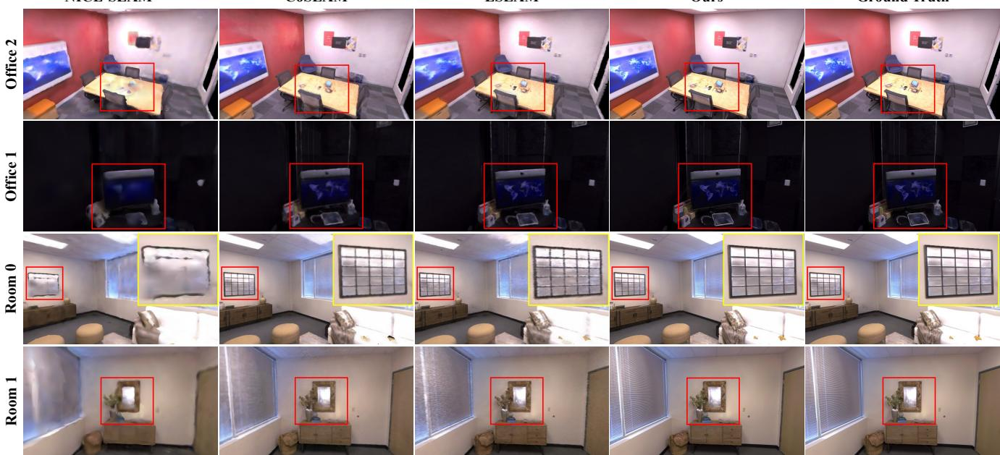
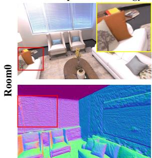
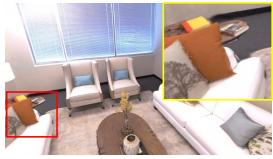
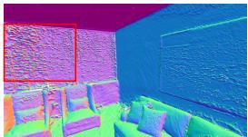
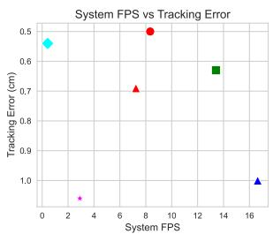
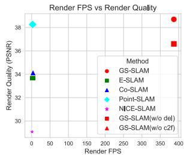

# GS-SLAM: Dense Visual SLAM with 3D Gaussian Splatting

Chi Yan1,3\* Delin Qu1,2\* Dan Xu3 Bin Zhao1,4 Zhigang Wang1 Dong Wang1† Xuelong Li1,5 1Shanghai AI Laboratory 2Fudan University 3Hong Kong University of Science and Technology 4Northwestern Polytechnical University 5TeleAI, China Telecom Corp Ltd

## Abstract

In this paper, we introduce GS-SLAM that first utilizes 3D Gaussian representation in the Simultaneous Localization and Mapping (SLAM) system. Itfacilitates a better balance between efficiency and accuracy. Compared to recent SLAM methods employing neural implicit representations, our method utilizes a real-time differentiable splatting rendering pipeline that offers significant speedup to map optimization and RGB-D rendering. Specifically, we propose an adaptive expansion strategy that adds new or deletes noisy 3D Gaussians in order to efficiently reconstruct new observed scene geometry and improve the mapping of previously observed areas. This strategy is essential to extend 3D Gaussian representation to reconstruct the whole scene rather than synthesize a static object in existing methods. Moreover, in the pose tracking process, an effective coarse-to-fine technique is designed to select reliable 3D Gaussian representations to optimize camera pose, resulting in runtime reduction and robust estimation. Our method achieves competitive performance compared with existing state-of-the-art real-time methods on the Replica, TUM-RGBD datasets. Project page: https://gs-slam.github.io/.

## 1. Introduction

Simultaneous localization and mapping (SLAM) has emerged as a pivotal technology in fields such as robotics [6], virtual reality [10], and augmented reality [25, 39]. The goal of SLAM is to construct a dense/sparse map of an unknown environment while simultaneously tracking the camera pose. Traditional SLAM methods employ point/surfel clouds [20, 32, 42, 46], mesh representations [26], voxel hashing [12, 18, 23] or voxel grids [21] as scene representations to construct dense mapping, and have made considerable progress on localization accuracy. However, these methods face serious challenges in obtaining fine-grained dense maps.

  
Figure 1. The illustration of the proposed GS-SLAM. It first utilizes the 3D Gaussian representation and differentiable splatting rasterization pipeline in SLAM, achieving real-time tracking and mapping performance on GPU. Besides, benefiting from the splatting rasterization pipeline, GS-SLAM achieves a 100 faster rendering FPS and more high-quality full image results than the other SOTA methods.

Recently, Neural Radiance Fields (NeRF) [19] have been explored to enhance SLAM methodologies and exhibit strengths in generating high-quality, dense maps with low memory consumption [35]. In particular, iMAP [35] uses a single multi-layer perceptron (MLP) to represent the entire scene, which is updated globally with the loss between volume-rendered RGB-D image and ground-truth observations. NICE-SLAM [55] utilizes a hierarchical neural implicit grid as scene map representation to allow local updates for reconstructing large scenes. Moreover, ES-LAM [11], CoSLAM [41] and EN-SLAM [24] utilize axisaligned feature planes and joint coordinate-parametric encoding to improve the capability of scene representation, achieving efficient and high-quality surface map reconstruction. In practical mapping and tracking steps, these methods only render a small set of pixels to reduce optimization time, which leads to the reconstructed dense maps lacking the richness and intricacy of details. In essence, it is a tradeoff for the efficiency and accuracy of NeRF-based SLAM since obtaining high-resolution images with the ray-based volume rendering technique is time-consuming and unacceptable.

Fortunately, recent work [13, 17, 47] with 3D Gaussian representation and tile-based splatting techniques has shown great superiority in the efficiency of high-resolution image rendering. It is applied to synthesize novel view RGB images of static objects, achieving state-of-the-art visual quality for 1080p resolution at real-time speed. Inspired by this, we extend the rendering superiority of 3D Gaussian scene representation and real-time differentiable splatting rendering pipeline for the task of dense RGB-D SLAM and manage to jointly promote the speed and accuracy of NeRFbased dense SLAM, as shown in Fig. 1.

To this end, we propose GS-SLAM, the first RGB-D dense SLAM system that first utilizes 3D Gaussian scene representation coupled with the splatting rendering technique to better balance speed and accuracy. Our system optimizes camera tracking and mapping with a novel RGB-D rendering approach that processes 3D Gaussians quickly and accurately through sorting and ↵-blending. We enhance scene reconstruction by introducing an adaptive strategy for managing 3D Gaussian elements, which optimizes mapping by focusing on current observations and minimizes errors in dense maps and images. Moreover, we propose a coarseto-fine approach, starting with low-resolution image analysis for initial pose estimation and refining it with highresolution rendering using select 3D Gaussians, to boost speed and accuracy. We perform extensive evaluations on a selection of indoor RGB-D datasets and demonstrate stateof-the-art performance on dense neural RGB-D SLAM in terms of tracking, rendering, and mapping. Overall, our contributions include:

• We propose GS-SLAM, the first 3D Gaussian Splatting(3DGS)-based dense RGB-D SLAM approach, which takes advantage of the fast splatting rendering technique to boost the mapping optimizing and pose tracking, achieving real-time and photo-realistic reconstruction performance.

• We present an adaptive 3D Gaussian expansion strategy to efficiently reconstruct new observed scene geometry and develop a coarse-to-fine technique to select reliable 3D Gaussians to improve camera pose estimation.

• Our approach achieves competitive performance on Replica and TUM-RGBD datasets in terms of tracking, and mapping and runs at 8.43 FPS, resulting in a better balance between efficiency and accuracy.

## 2. Related Work

Dense Visual SLAM. The existing real-time dense visual SLAM systems are typically based on discrete handcrafted features or deep-learning embeddings, and follow the mapping and tracking architecture in [16]. DTAM [22] first introduces a dense SLAM system that uses photometric consistency to track a handheld camera and represent the scene as a cost volume. KinectFusion [44] performs camera tracking by iterative-closest-point and updates the scene via TSDF-Fusion. BAD-SLAM [29] proposes to jointly optimize the keyframe poses and 3D scene geometry via a direct bundle adjustment (BA) technique. In contrast, recent works integrate deep learning with the traditional geometry framework for more accurate and robust camera tracking and mapping, such as DROID-SLAM [37], CodeSLAM [1], SceneCode [54], and NodeSLAM [34], have made significant advances in the field, achieving more accurate and robust camera tracking and mapping performance.

Neural Implict Radiance Field based SLAM. For NeRFbased SLAM, existing methods can be divided into three main types: MLP-based methods, Hybrid representation methods, and Explicit methods. MLP-based method iMAP [35] offers scalable and memory-efficient map representations but faces challenges with catastrophic forgetting in larger scenes. Hybrid representation methods combine the advantages of implicit MLPs and structure features, significantly enhancing the scene scalability and precision. For example, NICE-SLAM [55] integrates MLPs with multiresolution voxel grids, enabling large scene reconstruction, and Vox-Fusion [48] employs octree expansion for dynamic map scalability, while ESLAM [11] and Point-SLAM [27] utilize tri-planes and neural point clouds respectively to improve the mapping capability. As for the explicit method proposed in [38], it stores map features in voxel directly, without any MLPs, enabling faster optimization. Instead of representing maps with implicit features, GS-SLAM utilizes the 3D Gaussian representation, efficiently renders images using splatting-based rasterization, and optimizes parameters directly with backward propagation.

3D Gaussian Representation. Several recent approaches have use 3D Gaussians for shape reconstruction, such as Fuzzy Metaballs [14, 15], VoGE [40], 3DGS [13]. Notably, 3DGS [13] demonstrates great superiorities in highquality real-time novel-view synthesis. This work represents the scene with 3D Gaussians and develops a NeRFstyle fast rendering algorithm to support anisotropic splatting, achieving SOTA visual quality and fast high-resolution rendering performance. Beyond the rendering superiorities, Gaussian splatting holds an explicit geometry scene structure and appearance, benefiting from the exact modeling of scenes representation [50]. This promising technology has been rapidly applied in several fields, including 3D generation [3, 36, 51], dynamic scene modeling [17][47][49], and photorealistic drivable avatars [56]. However, currently, there is no research addressing camera pose estimation or real-time mapping using 3D Gaussian models due to the inherent limitations of the prime pipeline [13], i.e., prerequisites of initialized point clouds or camera pose inputs [28]. In contrast, we derive the analytical derivative equations for pose estimation in the Gaussian representation and implement efficient CUDA optimization.

  
Figure 2. Overview of the proposed method. We aim to use 3D Gaussians to represent the scene and use the rendered RGB-D image for inverse camera tracking. GS-SLAM proposes a novel Gaussian expansion strategy to make the 3D Gaussian feasible to reconstruct the whole scene and can achieve real-time tracking, mapping, and rendering performance on GPU.

## 3. Methodology

Fig. 2 shows the overview of the proposed GS-SLAM. We aim to estimate the camera poses $\{ \bar { \mathbf { P } _ { i } } \} _ { i = 1 } ^ { N }$ of every frame and simultaneously reconstruct a dense scene map by giving an input sequential RGB-D stream $\{ { \bf I } _ { i } , { \bf D } _ { i } \} _ { i = 1 } ^ { M }$ with known camera intrinsic $\mathbf { K } \in \mathbb { R } ^ { 3 \times 3 }$ . In Sec. 3.1, we first introduce 3D Gaussian as the scene representation S and the RGB-D render by differentiable splatting rasterization. With the estimated camera pose of the keyframe, in Sec. 3.2, an adaptive expansion strategy is proposed to add new or delete noisy 3D Gaussians to efficiently reconstruct new observed scene geometry while improving the mapping of the previously observed areas. For camera tracking of every input frame, we derive an analytical formula for backward optimization with rendering RGB-D loss. We further introduce an effective coarse-to-fine technique to minimize rendering losses to achieve efficient and accurate pose estimation in Sec. 3.3.

## 3.1. 3D Gaussian Scene Representation

Our goal is to optimize a scene representation that captures the geometry and appearance of the scene, resulting in a detailed dense map and high-quality novel view synthesis. To do this, we model the scene as a set of 3D Gaussians coupled with opacity and spherical harmonics

$$
\mathbf { G } = \{ G _ { i } : ( \mathbf { X } _ { i } , \pmb { \Sigma } _ { i } , \pmb { \Lambda } _ { i } , \pmb { Y } _ { i } ) | i = 1 , . . . , N \} .\tag{1}
$$

Each 3D Gaussian scene representation $G _ { i }$ is defined by position $\mathbf { X } _ { i } \in \mathbb { R } ^ { 3 }$ , 3D covariance matrix $\pmb { \Sigma } _ { i } \in \mathbb { R } ^ { 3 \times 3 }$ , opacity $\Lambda _ { i } ~ \in ~ \mathbb { R }$ and 1-degree spherical harmonics (Y) per color channel, a total of 12 coefficients for $\boldsymbol { Y } _ { i } \in \mathbb { R } ^ { 1 2 }$ . To reduce the learning difficulty of the 3D Gaussians [57], we parameterize the 3D Gaussian’s covariance as:

$$
\begin{array} { r } { \pmb { \Sigma } = \mathbf { R } \mathbf { S } \mathbf { S } ^ { T } \mathbf { R } ^ { T } , } \end{array}\tag{2}
$$

where $\mathbf { S } \in \mathbb { R } ^ { 3 }$ is a 3D scale vector, $\mathbf { R } \in \mathbb { R } ^ { 3 \times 3 }$ is the rotation matrix, storing as a 4D quaternion.

Color and depth splatting rendering. With the optimized 3D Gaussian scene representation parameters, given the camera pose $\mathbf { P } = \{ \mathbf { R } , \mathbf { t } \}$ , the 3D Gaussians G are projected into 2D image plane for rendering with:

$$
\begin{array} { r } { \pmb { \Sigma } ^ { \prime } = \mathbf { J } \mathbf { P } ^ { - 1 } \pmb { \Sigma } \mathbf { P } ^ { - T } \mathbf { J } ^ { T } , } \end{array}\tag{3}
$$

where J is the Jacobian of the affine approximation of the projective function. After projecting 3D Gaussians to the image plane, the color of one pixel is rendered by sorting the Gaussians in depth order and performing front-to-back ↵-blending rendering as follows:

$$
\hat { \mathbf { C } } = \sum _ { i \in N } \mathbf { c } _ { i } \alpha _ { i } \prod _ { j = 1 } ^ { i - 1 } \left( 1 - \alpha _ { j } \right) ,\tag{4}
$$

where $\mathbf { c } _ { i }$ represents the color of the i-th 3D Gaussian obtained by learned spherical harmonics coefficients $\mathbf { Y } , \alpha _ { i }$ is the density computed by learned opacity $\Lambda _ { i }$ and 2D Gaussian with covariance $\dot { \Sigma ^ { \prime } }$ . Similarly, the depth is rendered by

$$
\hat { D } = \sum _ { i \in N } d _ { i } \alpha _ { i } \prod _ { j = 1 } ^ { i - 1 } \left( 1 - \alpha _ { j } \right) ,\tag{5}
$$

where $d _ { i }$ denotes the depth of the center of the i-th 3D Gaussian, which is obtained by projecting to z-axis in the camera coordinate.

## 3.2. Adaptive 3D Gaussian Expanding Mapping

The 3D Gaussian scene representations are updated and optimized on each selected keyframe for stable mapping. Given the estimated pose of each selected keyframe, we first apply the proposed adaptive expansion strategy to add new or delete noisy 3D Gaussians from the whole scene representations to render RGB-D images with resolution $H \times W$ and then the updated 3D Gaussian scene representations are optimized by minimizing the geometric depth loss $\mathcal { L } _ { d }$ and the photometric color loss $\mathcal { L } _ { \mathbf { c } }$ to the sensor observation depth D and color C,

$$
\mathcal { L } _ { \mathbf { c } } = \sum _ { m = 1 } ^ { H W } \left| \mathbf { C } _ { m } - \hat { \mathbf { C } } _ { m } \right| , \ \mathcal { L } _ { d } = \sum _ { m = 1 } ^ { H W } \left| D _ { m } - \hat { D } _ { m } \right| .\tag{6}
$$

The loss optimizes the parameters of all 3D Gaussians that contribute to the rendering of these keyframe images.

Adaptive 3D Gaussian Expansion Strategy. At the first frame of the RGB-D sequence, we first uniformly sample half pixels from a whole image with $H \times W$ resolution and back-projecting them into 3D points X with corresponding depth observation D. The 3D Gaussian scene representations are created by setting position as X and initializing zero degree Spherical Harmonics coefficients with RGB color $\mathbf { C } _ { i }$ . The opacities are set to pre-defined values, and the covariance is set depending on the spatial point density, i.e.,

$$
\{ G _ { i } = ( { \bf P } _ { i } , { \bf \Sigma } _ { i n i t } , \Lambda _ { i n i t } , { \bf C } _ { i } ) | i = 1 , . . . , M \} ,\tag{7}
$$

where M equals to $H W / 2$ . The 3D Gaussians are initialized and then optimized using the first RGB-D image with rendering loss. Note that only half of the pixels are used to initialize the scene, leaving space to conduct adaptive density control of Gaussians that splits large points into smaller ones and clones them with different directions to capture missing geometric details.

Adding step: To obtain a complete map of the environment, the 3D Gaussian scene representations should be able to model the geometry and appearance of newly observed areas. Specifically, at every keyframe, we add first rendered RGB-D images using historical 3D Gaussians and calculate cumulative opacity $\begin{array} { r } { T = \sum _ { i \in N } \alpha _ { i } \prod _ { j = 1 } ^ { i - 1 } \left( 1 - \alpha _ { j } \right) } \end{array}$ for each pixel. We label one pixel as un-reliable $x ^ { u n }$ if its cumulative opacity $T$ is too low or its rendered depth $\hat { D }$ is far away from observed depth D, i.e.,

$$
T < \tau _ { T } \mathrm { o r } | D - { \hat { D } } | > \tau _ { D } .\tag{8}
$$

These selected un-reliable pixels mostly capture new observed areas. Then we back-project these un-reliable pixels to 3D points $\mathbf { P } ^ { u n }$ , and a set of new 3D Gaussians at Pun initialized as Eq. 7 are added into scene representations to model the new observed areas.

Deleting step: As shown in Fig. 3, there are some floating 3D Gaussians due to the unstable adaptive control of Gaussians after optimization with Eq. 6. These floating 3D Gaussians will result in a low-quality dense map and a rendered image containing lots of artifacts. To address this issue, after adding new 3D Gaussians, we check all visible 3D Gaussians in the current camera frustum and significantly decrease opacity $\Lambda _ { i }$ of 3D Gaussians whose position is not near the scene surfaces. Formally, for each visible 3D Gaussian, we draw a ray r(t) from camera origin o and its position ${ \bf X } _ { i } = ( x _ { i } , y _ { i } , z _ { i } ) , i . e . , { \bf r } ( t ) = { \bf o } + t ( { \bf X } _ { i } - { \bf o } )$ Then, we can find a pixel with coordinate $( u , v )$ where this ray intersects the image plane and corresponding depth observation D. The 3D Gaussians are deleted by degenerating its opacity as follows:

  
Figure 3. Illustration of the proposed adaptive 3D Gaussian expansion strategy. GS-SLAM inhibits the low-quality 3D Gaussian floaters in the current frustum according to depth.

$$
G _ { i } : \Lambda _ { i } \Rightarrow G _ { i } : \eta \Lambda _ { i } , \mathrm { ~ i f ~ } D - d i s t ( { \bf X } _ { i } , { \bf P } _ { u v } ) > \gamma ,\tag{9}
$$

where $P _ { u v }$ is the world coordinates of the intersected pixel calculated with the camera intrinsic and extrinsic. $d i s t ( \cdot , \cdot )$ is the Euclidean distance, and ⌘ (much smaller than 1) and $\gamma$ are the hyper-parameters. Note that we decrease the opacity of floating 3D Gaussians in front of the scene surfaces to make our newly added 3D Gaussians well-optimized.

## 3.3. Tracking and Bundle Adjustment

In the parallel camera tracking phase of our work, we first employ a common straightforward constant velocity assumption to initialize new poses. This assumption transforms the last known pose based on the relative transformation between the second-to-last pose and the last pose. Then, the accurate camera pose P is optimized by minimizing rendered color loss, i.e.,

$$
\mathcal { L } _ { t r a c k } = \sum _ { m = 1 } ^ { M } \Big | \mathbf { C } _ { m } - \hat { \mathbf { C } } _ { m } \Big | _ { 1 } , \operatorname* { m i n } _ { \mathbf { R } , \mathbf { t } } \big ( \mathcal { L } _ { t r a c k } \big ) ,\tag{10}
$$

where M is the number of sampled pixels for rendering. Differentiable pose estimation. According to Eqs. (3) and (4), we observe that the gradient of the camera pose P is related to three intermediate variables: $\Sigma ^ { \prime } , { \bf c } _ { i }$ , and the projected coordinate $\mathbf { m } _ { i }$ of Gaussian $G _ { i }$ . By applying the chain rule of derivation, we obtain the analytical formula-

tion of camera pose $\mathbf { P } \mathrm { i }$

$$
\begin{array} { r l } & { \frac { \partial \mathcal { L } _ { \mathbf { c } } } { \partial \mathbf { P } } = \frac { \partial \mathcal { L } _ { \mathbf { c } } } { \partial \mathbf { C } } \frac { \partial \mathbf { C } } { \partial \mathbf { P } } = \frac { \partial \mathcal { L } _ { \mathbf { c } } } { \partial \mathbf { C } } \left( \frac { \partial \mathbf { C } } { \partial \mathbf { c } _ { i } } \frac { \partial \mathbf { c } _ { i } } { \partial \mathbf { P } } + \frac { \partial \mathbf { C } } { \partial \alpha _ { i } } \frac { \partial \alpha _ { i } } { \partial \mathbf { P } } \right) } \\ & { \qquad = \frac { \partial \mathcal { L } _ { \mathbf { c } } } { \partial \mathbf { C } } \frac { \partial \mathbf { C } } { \partial \alpha _ { i } } \left( \frac { \partial \alpha _ { i } } { \partial \Sigma ^ { \prime } } \frac { \partial \Sigma ^ { \prime } } { \partial \mathbf { P } } + \frac { \partial \alpha _ { i } } { \partial \mathbf { m } _ { \mathrm { i } } } \frac { \partial \mathbf { m } _ { \mathrm { i } } } { \partial \mathbf { P } } \right) } \\ & { \qquad = \frac { \partial \mathcal { L } _ { \mathbf { c } } } { \partial \mathbf { C } } \frac { \partial \mathbf { C } } { \partial \alpha _ { i } } \left( \frac { \partial \alpha _ { i } } { \partial \Sigma ^ { \prime } } \frac { \partial ( \mathbf { J } \mathbf { P } ^ { - 1 } \Sigma \mathbf { P } ^ { - T } \mathbf { J } ^ { T } ) } { \partial \mathbf { P } } + \frac { \partial \alpha _ { i } } { \partial \mathbf { m } _ { \mathrm { i } } } \frac { \partial ( \mathbf { K } \mathbf { P } \mathbf { X } _ { i } ) } { \partial \mathbf { P } d _ { i } } \right) } \end{array}\tag{11}
$$

where $d _ { i }$ denotes the z-axis coordinate of projection $\mathbf { m } _ { i }$ The item $\frac { \partial \mathbf { C } } { \partial \mathbf { c } _ { i } } \frac { \partial \mathbf { c } _ { i } } { \partial \mathbf { P } }$ can be eliminated because we are only concerned about the view-independent color in our tracking implementation. In addition, we find that the intermediate gradient $\frac { \partial ( \mathbf { K P X } _ { i } ) } { \partial \mathbf { P } d _ { i } }$ is the deterministic component for the camera pose P. So we simply ignore the backpropagation of $\frac { \partial \mathbf { \hat { ( } } \mathbf { J } \mathbf { P } ^ { - 1 } \pmb { \Sigma } \mathbf { P } ^ { - T } \mathbf { J } ^ { T } ) } { \partial \mathbf { P } }$ for efficiency. More details can be found in the supplemental materials.

Coarse-to-fine camera tracking. It would be problematic to optimize the camera pose with all image pixels since artifacts in images can cause drifted camera tracking. To address this issue, as shown in Fig. 2, in the differentiable pose estimation step for each frame, we first take advantage of image regularity to render only a sparse set of pixels and optimize tracking loss to obtain a coarse camera pose. This coarse optimization step significantly eases the influence of detailed artifacts. Further, we use this coarse camera pose and depth observation to select reliable 3D Gaussians, which guides GS-SLAM to render informative areas with clear geometric structures to refine coarse camera pose via further optimizing tracking loss on new rendering pixels.

Specifically, in the coarse stage, we first render a coarse image $\hat { \mathbf { I } } _ { c }$ with resolution $H / 2 \times W / 2$ at uniformly sampled image coordinates and optimize tracking loss in Eq. 10 for $T _ { c }$ iterations, and the obtained camera pose is denoted as $\mathbf { P } _ { c } .$ . In the fine stage, we use a similar technique with adaptive 3D Gaussian expansion strategy in Section 3.2 to select reliable 3D Gaussian to render full-resolution images while ignoring noisy 3D Gaussians that cause artifacts. In detail, we check all visible 3D Gaussians under coarse camera pose $\mathbf { P } _ { c } ,$ and remove 3D Gaussians whose position is far away from the scene surface. Formally, for each visible 3D Gaussians $G _ { i }$ with position $\mathbf { X } _ { i } .$ , we project it to the camera plane using coarse camera pose $\mathbf { P } _ { c }$ and camera intrinsic. Given the projected pixel’s depth observation $D _ { i }$ and the distance $d _ { i }$ that is between 3D Gaussians $G _ { i }$ and the camera image plane, the reliable 3D Gaussians are selected as follows:

$$
\begin{array} { r l } & { \mathbf { G } _ { s e l e c t e d } = \{ G _ { i } | G _ { i } \in \mathbf { G } \mathrm { ~ a n d ~ } a b s ( D _ { i } - d _ { i } ) \leq \varepsilon \} , } \\ & { \qquad \hat { \mathbf { I } } _ { f } = \mathcal { F } ( u , v , \mathbf { G } _ { s e l e c t e d } ) , } \end{array}\tag{12}
$$

where we use the selected reliable 3D Gaussians to render full-resolution images $\hat { \mathbf { I } } _ { f }$ . u, v denote the pixel coordinates in $\hat { \mathbf { I } } _ { f }$ , and $\mathcal { F }$ represents the color splatting rendering function. The final camera pose P is obtained by optimizing tracking loss in Eq. 10 with $\hat { \mathbf { I } } _ { f }$ for other $T _ { f }$ iterations. Note that $\hat { \mathbf { I } } _ { c }$ and $\hat { \mathbf { I } } _ { f }$ are only rendered at previously observed areas, avoiding rendering areas where 3D scene representations have not been optimized in the mapping process. Also, we add keyframes based on the proportion of the currently observed image’s reliable region to the overall image. At the same time, when the current tracking frame and most recent keyframe differ by more than a threshold value $\mu _ { k }$ this frame will be inserted as a keyframe.

Bundle adjustment. In the bundle adjustment (BA) phase, we optimize the camera poses P and the 3D Gaussian scene representation S jointly. We randomly select K keyframes from the keyframe database for optimization, using the loss function similar to the mapping part. For pose optimization stability, we only optimize the scene representation S in the first half of the iterations. In the other half of the iterations, we simultaneously optimize the map and the poses. Then, the accurate camera pose P is optimized by minimizing rendering color loss, i.e.,

$$
\mathcal { L } _ { b a } = \frac { 1 } { K } \sum _ { k = 1 } ^ { K } \sum _ { m = 1 } ^ { H W } \left| D _ { m } - \hat { D } _ { m } \right| _ { 1 } + \lambda _ { m } \left| \mathbf { C } _ { m } - \hat { \mathbf { C } } _ { m } \right| _ { 1 } , \operatorname* { m i n } _ { \mathbf { R } , \mathbf { t } , \mathbf { S } } ( \mathcal { L } _ { b a } ) .\tag{13}
$$

## 4. Experiment

## 4.1. Experimental Setup

Dataset. To evaluate the performance of GS-SLAM, we conduct experiments on the Replica [31], and TUM-RGBD [33]. Following [11, 27, 41, 48, 55], we use 8 scenes from the Replica dataset for localization, mesh reconstruction, and rendering quality comparison. The selected three subsets of TUM-RGBD datasets are used for localization.

Baselines. We compare our method with existing SOTA NeRF-based dense visual SLAM: NICE-SLAM [55], Vox-Fusion [48], CoSLAM [41], ESLAM [11] and Point-SLAM [27]. The rendering performance of CoSLAM [41] and ESLAM [11] is conducted from the open source code with the same configuration in [27].

Metric. For mesh reconstruction, we use the 2D Depth L1 (cm) [55], the Precision (P, %), Recall (R, %), and F-score with a threshold of 1 cm to measure the scene geometry. For localization, we use the absolute trajectory (ATE, cm) error [33] to measure the accuracy of the estimated camera poses. We further evaluate the rendering performance using the peak signal-to-noise ratio (PSNR), SSIM [43], and LPIPS [52] by following [27]. To be fair, we run all the methods on a dataset 10 times and report the average results. More details can be found in the supplemental materials.

Implementation details. GS-SLAM is implemented in Python using the PyTorch framework, incorporating CUDA code for Gaussian splatting and trained on a desktop PC with a 5.50GHz Intel Core i9-13900K CPU and NVIDIA RTX 4090 GPU. We extended the existing code for differentiable Gaussian splatting rasterization with additional functionality for handling depth, pose, and cumulative opacity during both forward and backward propagation. More details can be found in the supplemental materials.

## 4.2. Evaluation of Localization and Mapping

Evaluation on Replica. Tracking ATE: Tab. 1 illustrates the tracking performance of our method and the stateof-the-art methods on the Replica dataset. Our method achieves the best or second performance in 7 of 8 scenes and outperforms the second-best method Point-SLAM [27] by 0.4 cm on average at 8.34 FPS. It is noticeable that the second best method, Point-SLAM [27] runs at 0.42 FPS, which is 20 slower than our method, indicating that GS-SLAM achieves a better trade-off between the tracking accuracy and the runtime efficiency. Mapping ACC: Tab. 3 report the mapping evaluation results of our method with other current state-of-the-art visual SLAM methods. GS-SLAM achieves the best performance in Depth L1 (1.16cm) and Precision (74.0%) metrics on average. For Recall and F1 scores, GS-SLAM performs comparably to the second best method CoSLAM [41]. The visualization results in Fig. 4 show that GS-SLAM achieves satisfying construction mesh with clear boundaries and details.

Evaluation on TUM-RGBD. Tab. 2 compares GS-SLAM with the other SLAM systems in TUM-RGBD dataset. Our method surpasses iMAP [35], NICE-SLAM [55] and Voxfusion [48], and achieves a comparable performance, average 3.7 cm ATE RSME, with the SOTA methods. A gap to traditional methods still exists between the neural vSLAM and the traditional SLAM systems, which employ more sophisticated tracking schemes [27].

Table 1. Tracking comparison (ATE RMSE [cm]) of the proposed method vs. the SOTA methods on the Replica dataset. The running speed of methods in the upper part is lower than 5 FPS, ⇤ denotes the reproduced results by running officially released code.
<table><tr><td>Method</td><td>Rm0</td><td>Rm1</td><td>Rm2</td><td>Off0</td><td>Off1</td><td>Off2</td><td>0ff3</td><td>Off4</td><td>avg</td></tr><tr><td>Point-SLAM [27]</td><td>0.56</td><td>0.47</td><td>0.30</td><td>0.35</td><td>0.62</td><td>0.55</td><td>0.72</td><td>0.73</td><td>0.54</td></tr><tr><td>NICE-SLAM [55]</td><td>0.97</td><td>1.31</td><td>1.07</td><td>0.88</td><td>1.00</td><td>1.06</td><td>1.10</td><td>1.13</td><td>1.06</td></tr><tr><td>Vox-Fusion* [48]</td><td>1.37</td><td>4.70</td><td>1.47</td><td>8.48</td><td>2.04</td><td>2.58</td><td>1.11</td><td>2.94</td><td>3.09</td></tr><tr><td>ESLAM [11]</td><td>0.71</td><td>0.70</td><td>0.52</td><td>0.57</td><td>0.55</td><td>0.58</td><td>0.72</td><td>0.63</td><td>0.63</td></tr><tr><td>CoSLAM [41]</td><td>0.70</td><td>0.95</td><td>1.35</td><td>0.59</td><td>0.55</td><td>2.03</td><td>1.56</td><td>0.72</td><td>1.00</td></tr><tr><td>Ours</td><td>0.48</td><td>0.53</td><td>0.33</td><td>0.52</td><td>0.41</td><td>0.59</td><td>0.46</td><td>0.7</td><td>0.50</td></tr></table>

Table 2. Tracking ATE [cm] on TUM-RGBD [33]. Our method achieves a comparable performance among the neural vSLAMs. denotes the reproduced results by running officially released code.
<table><tr><td>Method</td><td>frl_desk fr2-xyz</td><td></td><td>fr3-off Avg.</td><td>Method</td><td></td><td>frl_desk fr2_xyz</td><td></td><td>fr3_off Avg.</td><td></td></tr><tr><td>DI-Fusion [9]</td><td>4.4</td><td>2.0</td><td>5.8</td><td>4.1</td><td>NICE-SLAM [55]</td><td>4.3</td><td>31.7</td><td>3.9</td><td>13.3</td></tr><tr><td>ElasticFusion [46]</td><td>2.5</td><td>1.2</td><td>2.5</td><td>2.1</td><td>Vox-Fusion* [48]</td><td>3.5</td><td>1.5</td><td>26.0</td><td>10.3</td></tr><tr><td>BAD-SLAM [30]</td><td>1.7</td><td>1.1</td><td>1.7</td><td>1.5</td><td>CoSLAM [41]</td><td>2.7</td><td>1.9</td><td>2.6</td><td>2.4</td></tr><tr><td>Kintinuous [45]</td><td>3.7</td><td>2.9</td><td>3.0</td><td>3.2</td><td>ESLAM [11]</td><td>2.3</td><td>1.1</td><td>2.4</td><td>2.0</td></tr><tr><td>ORB-SLAM2 [20]</td><td>1.6</td><td>0.4</td><td>1.0</td><td>1.0</td><td>Point-SLAM</td><td>2.6</td><td>1.3</td><td>3.2</td><td>2.4</td></tr><tr><td>iMAP* [35]</td><td>7.2</td><td>2.1</td><td>9.0</td><td>6.1</td><td>Ours</td><td>3.3</td><td>1.3</td><td>6.6</td><td>3.7</td></tr></table>

## 4.3. Rendering Evaluation

We compare the rendering performance of the proposed GS-SLAM with the neural visual SLAM methods in Tab. 6. The results show that GS-SLAM achieves the best performance in all the metrics. Our method significantly outperforms the second-best methods CoSLAM [41], ESLAM [11] and NICE-SLAM [55] by 1.52 dB in PSNR, 0.027 in SSIM and 0.12 in LPIPS, respectively. It is noticeable that GS-SLAM achieves 386 FPS rendering speed on average, which is 100 faster than the second-best method Vox-Fusion [48]. This excellent rendering performance is attributed to the efficient 3D Gaussian rendering pipeline and can be further applied to real-time downstream tasks, such as VR [5], robot navigation [7] and autonomous driving [2]. The visualization results in Fig. 5 show that GS-SLAM can generate much more high-quality and realistic images than the other methods, especially in edge areas with detailed structures. While NICE-SLAM [55] causes severe artifacts and blurs, CoSLAM [41] and ESLAM [11] generate blur around the image boundaries.

Table 3. Reconstruction comparison of the proposed method vs. the SOTA methods on Replica dataset.
<table><tr><td>Method</td><td>Metric</td><td>Rm 0</td><td>Rm 1 Rm 2</td><td>Off 0</td><td>Off1</td><td></td><td>Off 2Off 3</td><td>Off4</td><td>Avg.</td></tr><tr><td rowspan="4">NICESL AM [55]</td><td>Depth L1↓</td><td>1.81</td><td>1.44</td><td>2.04</td><td>1.39</td><td>1.76 8.33</td><td>4.99</td><td>2.01</td><td>2.97</td></tr><tr><td>Precision ↑</td><td>45.8643.76 44.38</td><td></td><td>51.40</td><td>50.80</td><td>38.37</td><td>40.85</td><td></td><td>37.35 44.10</td></tr><tr><td>Recall↑</td><td>44.1046.1242.78</td><td></td><td></td><td>48.66</td><td>53.08 39.98</td><td>39.04</td><td></td><td>35.77 43.69</td></tr><tr><td>F1↑</td><td>44.96</td><td>644.8443.56</td><td>49.99</td><td>51.91</td><td>39.16</td><td>39.92</td><td></td><td>36.54 43.86</td></tr><tr><td rowspan="4">VoxFus ion [48]</td><td>Depth L1↓</td><td>1.09</td><td>1.90 2.21</td><td>2.32</td><td>3.40</td><td>4.19</td><td>2.96</td><td>1.61</td><td>2.46</td></tr><tr><td>Precision↑</td><td>75.83</td><td>35.8863.10</td><td>48.51</td><td>43.50</td><td>54.48</td><td>69.11</td><td></td><td>55.4055.73</td></tr><tr><td>Recall↑</td><td>64.89</td><td>33.0756.62</td><td>44.76</td><td>38.44</td><td>47.85</td><td>60.61</td><td></td><td>46.7949.13</td></tr><tr><td>F1↑</td><td>69.93</td><td>34.3859.67</td><td>46.54</td><td>40.81</td><td>50.95</td><td>64.56</td><td></td><td>50.72 52.20</td></tr><tr><td rowspan="4">CoSLA M[41]</td><td>Depth L1↓</td><td>0.99</td><td>0.82 2.28</td><td>1.24</td><td>1.61</td><td>7.70</td><td>4.65</td><td>1.43</td><td>2.59</td></tr><tr><td>Precision↑</td><td>81.71</td><td>77.95 73.30</td><td>79.41</td><td>80.67</td><td>55.64</td><td>57.63</td><td>79.76</td><td>73.26</td></tr><tr><td>Recall↑</td><td>74.03 70.79 65.73</td><td></td><td>71.46</td><td>70.35</td><td>52.96</td><td>56.06</td><td>71.22</td><td>66.58</td></tr><tr><td>F1↑</td><td>77.6874.2069.31</td><td></td><td>75.23</td><td>75.16</td><td>54.27</td><td>56.83</td><td>75.25</td><td>69.74</td></tr><tr><td rowspan="4">ESL AM [11]</td><td>Depth L1↓</td><td>0.63</td><td>0.62 0.98</td><td>0.57</td><td>1.66</td><td>7.32</td><td>3.94</td><td>0.88</td><td>2.08</td></tr><tr><td>Precision↑</td><td>74.33 75.9482.48</td><td></td><td>72.20</td><td>65.74</td><td>70.73</td><td>72.48</td><td></td><td>72.24 73.27</td></tr><tr><td>Recall↑</td><td>87.37</td><td>87.01 84.99</td><td>88.36</td><td>84.38</td><td>81.92</td><td>79.18</td><td>80.63 84.23</td><td></td></tr><tr><td>F1↑</td><td>80.32</td><td>81.10 83.72</td><td>79.47</td><td>73.90</td><td>75.92</td><td>75.68</td><td>76.21</td><td>78.29</td></tr><tr><td rowspan="4">Ours</td><td>Depth L1↓</td><td>1.31</td><td>0.82 1.26</td><td>0.81</td><td>0.96</td><td>1.41</td><td>1.53</td><td>1.08</td><td>1.16</td></tr><tr><td>Precision↑</td><td>64.58</td><td>83.1170.13</td><td></td><td>83.43 87.77</td><td>70.91</td><td>63.18</td><td>68.88</td><td>74.00</td></tr><tr><td>Recall↑</td><td>61.29</td><td>76.83 63.84</td><td></td><td>76.9076.15</td><td>61.63</td><td>62.91</td><td>61.50</td><td>67.63</td></tr><tr><td>F1↑</td><td>62.89</td><td>79.8566.84</td><td></td><td>80.03 81.55</td><td>65.95</td><td>59.17</td><td></td><td>64.9870.15</td></tr></table>

  
Figure 4. Reconstruction performance comparation of the proposed GS-SLAM and SOTA methods on the Replica dataset.

  
Figure 5. The render visualization results on the Replica dataset of the proposed GS-SLAM and SOTA methods. GS-SLAM can generate much more high-quality and realistic images than the other methods, especially around the object boundaries.

## 4.4. Runtime Analysis

Tab. 4 and Tab. 5 illustrate the runtime and memory usage of GS-SLAM and the state-of-the-art methods on the Replica and TUM-RGBD, respectively. We report the parameters of the neural networks and the memory usage of the scene representation. Note that Point-SLAM uses extra memory dynamic radius to improve performance (mark as †). The results show that GS-SLAM achieves a competitive running speed with 8.34 FPS compared to the other Radiance Fieldsbased vSLAMs. Note that we do not use any neural network decoder in our system, which results in the zero learnable parameter. However, the 3D Gaussian scene representations of GS-SLAM consume 198.04 MB memory, 4 larger than the second large method NICE-SLAM [55]. Memory usage is mainly caused by spherical harmonic coefficients in training, which is a common constraint among Gaussian splatting-based reconstruction methods. Despite this, we still achieve a 20 faster FPS compared to the similar point-based method Point-SLAM [27]. Besides, we also provide a light version of GS-SLAM with zero-order spherical harmonic coefficients, significantly reducing memory usage while maintaining stable performance.

## 4.5. Ablation Study

We perform the ablation of GS-SLAM on the Replica dataset #Room0 subset to evaluate the effectiveness of coarse-to-fine tracking, and expansion mapping strategy. Effect of our expansion strategy for mapping. Tab. 7 shows the ablation of our proposed expansion strategy for mapping. The results illustrate that the expansion strategy can significantly improve the tracking and mapping performance. The implementation w/o adding means that we only initialize 3D Gaussians in the first frame and optimize the scene without adding new points. However, this strategy completely crashes because the density control in [13] can not handle real-time mapping tasks without an accurate point cloud input. Besides, the implementation w/o deletion suffers from a large number of redundant and noisy 3D Gaussian, which causes undesirable supervision. In contrast, the proposed expansion strategy effectively improves the tracking and mapping performance by 0.1 in ATE and 11.97 in Recall by adding more accurate constraints for the optimization. According to the visualization results in Fig. 6, our full implementation achieves more high-quality and detailed rendering and reconstruction results than the w/o delete strategy.

Table 4. Runtime and memory usage on Replica #Room0. The decoder parameters and embedding denote the parameter number of MLPs and the memory usage of the scene representation.
<table><tr><td>Method</td><td>Tracking [ms×it] ↓</td><td>Mapping [ms×it] ↓</td><td>System FPS ↑</td><td>Decoder param ↓</td><td>Scene Embedding↓</td></tr><tr><td>Point-SLAM [27]</td><td> $0 . 0 6 \times 4 0$ </td><td> $3 4 . 8 1 \times 3 0 0$ </td><td>0.42</td><td>0.127 M</td><td>55.42 (+12453.2)†MB</td></tr><tr><td>NICE-SLAM [55]</td><td> $6 . 6 4 \times 1 0$ </td><td> $2 8 . 6 3 \times 6 0$ </td><td>2.91</td><td>0.06 M</td><td>48.48 MB</td></tr><tr><td>Vox-Fusion [48]</td><td> $0 . 0 3 \times 3 0$ </td><td> $6 6 . 5 3 \times 1 0$ </td><td>1.28</td><td>0.054 M</td><td>1.49 MB</td></tr><tr><td>CoSLAM [55]</td><td> $6 . 0 1 \times 1 0$ </td><td> $1 3 . 1 8 \times 1 0$ </td><td>16.64</td><td>1.671 M</td><td></td></tr><tr><td>ESLAM [11]</td><td> $6 . 8 5 \times 8$ </td><td> $1 9 . 8 7 \times 1 5$ </td><td>13.42</td><td>0.003 M</td><td>27.12 MB</td></tr><tr><td>GS-SLAM</td><td> $1 1 . 9 \times 1 0$ </td><td> $1 2 . 8 \times 1 0 0$ </td><td>8.34</td><td>0M</td><td>198.04 MB</td></tr></table>

Table 5. Runtime and memory usage on TUM-RGBD dataset #fr1 desk and #fr2 xyz.
<table><tr><td rowspan="2">Method</td><td colspan="2">#fr1_desk</td><td colspan="2">#fr2-xyz</td></tr><tr><td>FPS ↑</td><td>Memory ↓</td><td>FPS ↑</td><td>Memory ↓</td></tr><tr><td>Point-SLAM</td><td>0.10</td><td>18.3 (+160.7)†MB</td><td>0.12</td><td>14.2 (+7687.4)†MB</td></tr><tr><td>NICE-SLAM [55]</td><td>0.11</td><td>178.8MB</td><td>0.12</td><td>484.0MB</td></tr><tr><td>ESLAM [11]</td><td>0.31</td><td>27.2MB</td><td>0.31</td><td>51.6MB</td></tr><tr><td>GS-SLAM</td><td> $1 . 8 3 ( \mathrm { A T E } ; 3 . 3 )$ </td><td>40.8MB</td><td>1.51(ATE:1.3)</td><td>48.4MB</td></tr><tr><td>GS-SLAM (light)</td><td> $1 . 9 2 ( \mathrm { A T E } { : } 4 . 3 )$ </td><td>18.8MB</td><td> $1 . 6 8 \mathrm { ( A T E : } 2 . 7 )$ </td><td>22.3MB</td></tr></table>

Table 6. Rendering performance on Replica dataset. We outperform existing dense neural RGB-D methods on the commonly reported rendering metrics. Note that GS-SLAM achieves 386 FPS on average, benefiting from the efficient Gaussian scene representation.
<table><tr><td>Method</td><td>Metric</td><td>Room 0</td><td>Room 1</td><td>Room 2</td><td>Office 0</td><td>Office 1</td><td>Office</td><td>2 Office</td><td>3 Office 4</td><td>Avg.</td><td>FPS.</td></tr><tr><td rowspan="3">NICE-SLAM [55]</td><td>PSNR [dB] ↑</td><td>22.12</td><td>22.47</td><td>24.52</td><td>29.07</td><td>30.34</td><td>19.66</td><td>22.23</td><td>24.94</td><td>24.42</td><td rowspan="3">0.30</td></tr><tr><td>SSIM↑</td><td>0.689</td><td>0.757</td><td>0.814</td><td>0.874</td><td>0.886</td><td>0.797</td><td>0.801</td><td>0.856</td><td>0.809</td></tr><tr><td>LPIPS↓</td><td>0.330</td><td>0.271</td><td>0.208</td><td>0.229</td><td>0.181</td><td>0.235</td><td>0.209</td><td>0.198</td><td>0.233</td></tr><tr><td rowspan="3">Vox-Fusion* [48]</td><td>PSNR [dB] ↑</td><td>22.39</td><td>22.36</td><td>23.92</td><td>27.79</td><td>29.83</td><td>20.33</td><td>23.47</td><td>25.21</td><td>24.41</td><td rowspan="3">3.88</td></tr><tr><td>SSIM↑</td><td>0.683</td><td>0.751</td><td>0.798</td><td>0.857</td><td>0.876</td><td>0.794</td><td>0.803</td><td>0.847</td><td>0.801</td></tr><tr><td>LPIPS↓</td><td>0.303</td><td>0.269</td><td>0.234</td><td>0.241</td><td>0.184</td><td>0.243</td><td>0.213</td><td>0.199</td><td>0.236</td></tr><tr><td rowspan="3">CoSLAM [41]</td><td>PSNR [dB] ↑</td><td>27.27</td><td>28.45</td><td>29.06</td><td>34.14</td><td>34.87</td><td>28.43</td><td>28.76</td><td>30.91</td><td>30.24</td><td rowspan="3">3.68</td></tr><tr><td>SSIM↑</td><td>0.910</td><td>0.909</td><td>0.932</td><td>0.961</td><td>0.969</td><td>0.938</td><td>0.941</td><td>0.955</td><td>0.939</td></tr><tr><td>LPIPS↓</td><td>0.324</td><td>0.294</td><td>0.266</td><td>0.209</td><td>0.196</td><td>0.258</td><td>0.229</td><td>0.236</td><td>0.252</td></tr><tr><td rowspan="3">ESLAM [11]</td><td>PSNR [dB] ↑</td><td>25.32</td><td>27.77</td><td>29.08</td><td>33.71</td><td>30.20</td><td>28.09</td><td>28.77</td><td>29.71</td><td>29.08</td><td rowspan="3">2.82</td></tr><tr><td>SSIM↑</td><td>0.875</td><td>0.902</td><td>0.932</td><td>0.960</td><td>0.923</td><td>0.943</td><td>0.948</td><td>0.945</td><td>0.929</td></tr><tr><td>LPIPS ↓</td><td>0.313</td><td>0.298</td><td>0.248</td><td>0.184</td><td>0.228</td><td>0.241</td><td>0.196</td><td>0.204</td><td>0.336</td></tr><tr><td rowspan="3">Ours</td><td>PSNR [dB]↑</td><td>31.56</td><td>32.86</td><td>32.59</td><td>38.70</td><td>41.17</td><td>32.36</td><td>32.03</td><td>32.92</td><td>34.27</td><td rowspan="3">386.91</td></tr><tr><td>SSIM↑</td><td>0.968</td><td>0.973</td><td>0.971</td><td>0.986</td><td>0.993</td><td>0.978</td><td>0.970</td><td>0.968</td><td>0.975</td></tr><tr><td>LPIPS↓</td><td>0.094</td><td>0.075</td><td>0.093</td><td>0.050</td><td>0.033</td><td>0.094</td><td>0.110</td><td>0.112</td><td>0.082</td></tr></table>

Table 7. Ablation of the adaptive 3D Gaussian expansion strategy on Replica #Room0.
<table><tr><td rowspan="2">Setting</td><td colspan="8">#Room0</td></tr><tr><td></td><td>ATE↓ Depth L1↓</td><td>Precision↑ Recall ↑</td><td></td><td>F1↑</td><td>PSNR↑</td><td></td><td>SSIM↑ LPIPS↓</td></tr><tr><td>w/o add w/o delete</td><td>x 0.58</td><td>x</td><td>x</td><td>x</td><td>x</td><td>x</td><td>x</td><td>x</td></tr><tr><td>w/ add &amp; delete</td><td>0.48</td><td>1.68 1.31</td><td>53.55 64.58</td><td>49.32 61.29</td><td>51.35 62.89</td><td>31.22 31.56</td><td>0.967 0.968</td><td>0.094 0.094</td></tr></table>

Table 8. Ablation of the coarse-to-fine tracking strategy on Replica #Room0.
<table><tr><td rowspan="2">Setting</td><td colspan="8">#Room0</td></tr><tr><td></td><td>ATE↓ Depth L1↓ Precision↑</td><td></td><td>Recall ↑</td><td>F1↑</td><td>PSNR↑</td><td>SSIM↑</td><td>LPIPS↓</td></tr><tr><td>Coarse</td><td>0.91</td><td>1.48</td><td>59.68</td><td>57.54</td><td>56.50</td><td>29.13</td><td>0.954</td><td>0.120</td></tr><tr><td>Fine</td><td>0.49</td><td>1.39</td><td>62.61</td><td>59.18</td><td>61.29</td><td>30.84</td><td>0.964</td><td>0.096</td></tr><tr><td>Coarse-to-fine</td><td>0.48</td><td>1.31</td><td>64.58</td><td>61.29</td><td>62.89</td><td>31.56</td><td>0.968</td><td>0.094</td></tr></table>

Effect of coarse-to-fine tracking. According to the results in Tab. 8, the proposed coarse-to-fine tracking strategy performs best in all tracking, mapping, and rendering metrics. Compared with fine tracking, the coarse-to-fine tracking strategy significantly improves the performance by 0.01 in tracking ATE, 2.11 in Recall, and 0.72 in PSNR. Although the fine strategy surpasses the coarse strategy in precision, it suffers from the artifacts and noise in the reconstructed scene, leading to a fluctuation optimization. The coarseto-fine strategy effectively avoids noise reconstruction and improves accuracy and robustness.

## 4.6. Efficiency-to-accuracy trade-off.

3DGS-based SLAM trade-off focuses not only on the efficiency of tracking and mapping but also emphasizes highquality ultra-real-time rendering. As shown in Fig. 7b, GS-SLAM achieves  400 FPS ultra-fast speed and highest PSNR in map rendering. At the same time, our method remains a competitive system FPS and lowest tracking ATE in Fig. 7a. Moreover, GS-SLAM shows great potential in memory reduction in Tab. 5, and comparable in mesh reconstruction. Note that baselines directly use 3DGS in Fig. 7, resulting in inferior performances.

## 5. Conclusion and Limitations

We introduced GS-SLAM, a novel dense visual SLAM method leveraging 3D Gaussian Splatting for efficient mapping and accurate camera pose estimation, striking a better speed-accuracy balance. However, its reliance on highquality depth data may limit performance in certain conditions. Additionally, the approach’s high memory requirements for large scenes suggest future improvements could focus on optimizing memory use, potentially via techniques such as quantization and clustering. We believe GS-SLAM has the potential to extend to larger scale with some improvements and will explore this in future work.

Our Expansion Strategy  

w/o Delete Strategy  

  
Figure 6. Rendering and mesh visualization of the adaptive 3D Gaussian expansion ablation on Replica #Room0.

  
(a) Tracking performance

  
(b) Render performance  
Figure 7. Bi-criteria figure of tracking/render performance and system FPS on Replica #Office0.

Acknowledgements. This work is supported by the Shanghai AI Laboratory, National Key R&D Program of China (2022ZD0160101), the National Natural Science Foundation of China (62376222), Young Elite Scientists Sponsorship Program by CAST (2023QNRC001) and the Early Career Scheme of the Research Grants Council (RGC) of the Hong Kong SAR under grant No. 26202321.

## References

[1] Michael Bloesch, Jan Czarnowski, Ronald Clark, Stefan Leutenegger, and Andrew J. Davison. Codeslam - learning a compact, optimisable representation for dense visual slam. CVPR, pages 2560–2568, 2018. 2

[2] Guillaume Bresson, Zayed Alsayed, Li Yu, and Sebastien´ Glaser. Simultaneous localization and mapping: A survey of current trends in autonomous driving. TIV, 2:194–220, 2017. 6

[3] Zilong Chen, Feng Wang, and Huaping Liu. Text-to-3d using gaussian splatting. ArXiv, abs/2309.16585, 2023. 2

[4] Brian Curless and Marc Levoy. Volumetric method for building complex models from range images. In SIGGRAPH. ACM, 1996. 4

[5] Parth Rajesh Desai, Pooja Nikhil Desai, Komal Deepak Ajmera, and Khushbu Mehta. A review paper on oculus rift-a virtual reality headset. ArXiv, abs/1408.1173, 2014. 6

[6] Hugh F. Durrant-Whyte and Tim Bailey. Simultaneous localization and mapping: part i. RAM, 13:99–110, 2006. 1

[7] Christian Hane, Christopher Zach, Jongwoo Lim, Ananth ¨ Ranganathan, and Marc Pollefeys. Stereo depth map fusion for robot navigation. IROS, pages 1618–1625, 2011. 6

[8] Caner Hazirbas, Andreas Wiedemann, Robert Maier, Laura Leal-Taixe, and Daniel Cremers. Tum rgb-d scribble-based ´ segmentation benchmark. https://github.com/ tum-vision/rgbd\_scribble\_benchmark, 2018. 6

[9] Jiahui Huang, Shi-Sheng Huang, Haoxuan Song, and Shi-Min Hu. Di-fusion: Online implicit 3d reconstruction with deep priors. In CVPR, pages 8932–8941, 2021. 6

[10] Xudong Jiang, Lifeng Zhu, Jia Liu, and Aiguo Song. A slambased 6dof controller with smooth auto-calibration for virtual reality. TVC, 39:3873 – 3886, 2022. 1

[11] Mohammad Mahdi Johari, Camilla Carta, and Franccois Fleuret. Eslam: Efficient dense slam system based on hybrid representation of signed distance fields. CVPR, 2023. 1, 2, 5, 6, 7, 8, 4

[12] Olaf Kahler, Victor Adrian Prisacariu, Julien P. C. Valentin,¨ and David William Murray. Hierarchical voxel block hashing for efficient integration of depth images. RAL, 1:192–197, 2016. 1

[13] Bernhard Kerbl, Georgios Kopanas, Thomas Leimkuhler,¨ and George Drettakis. 3d gaussian splatting for real-time radiance field rendering. TOG, 42(4), 2023. 2, 3, 7, 4

[14] Leonid Keselman and Martial Hebert. Approximate differentiable rendering with algebraic surfaces. In ECCV, 2022. 2

[15] Leonid Keselman and Martial Hebert. Flexible techniques for differentiable rendering with 3d gaussians. arXiv preprint arXiv:2308.14737, 2023. 2

[16] Georg S. W. Klein and David William Murray. Parallel tracking and mapping on a camera phone. ISMAR, pages 83–86, 2009. 2

[17] Jonathon Luiten, Georgios Kopanas, Bastian Leibe, and Deva Ramanan. Dynamic 3d gaussians: Tracking by persistent dynamic view synthesis. ArXiv, abs/2308.09713, 2023. 2

[18] Robert Maier, Raphael Schaller, and Daniel Cremers. Efficient online surface correction for real-time large-scale 3d reconstruction. ArXiv, abs/1709.03763, 2017. 1

[19] Ben Mildenhall, Pratul P. Srinivasan, Matthew Tancik, Jonathan T. Barron, Ravi Ramamoorthi, and Ren Ng. Nerf: Representing scenes as neural radiance fields for view synthesis. In ECCV, 2020. 1

[20] Raul Mur-Artal and Juan D. Tardos. Orb-slam2: An open-´ source slam system for monocular, stereo, and rgb-d cameras. TRO, 33:1255–1262, 2016. 1, 6

[21] Richard A. Newcombe, Shahram Izadi, Otmar Hilliges, David Molyneaux, David Kim, Andrew J. Davison, Pushmeet Kohli, Jamie Shotton, Steve Hodges, and Andrew William Fitzgibbon. Kinectfusion: Real-time dense surface mapping and tracking. ISMAR, pages 127–136, 2011. 1

[22] Richard A. Newcombe, S. Lovegrove, and Andrew J. Davison. Dtam: Dense tracking and mapping in real-time. ICCV, pages 2320–2327, 2011. 2

[23] Matthias Nießner, Michael Zollhofer, Shahram Izadi, and¨ Marc Stamminger. Real-time 3d reconstruction at scale using voxel hashing. TOG, 32:1 – 11, 2013. 1

[24] Delin Qu, Chi Yan, Dong Wang, Jie Yin, Dan Xu, Bin Zhao, and Xuelong Li. Implicit event-rgbd neural slam. CVPR, 2024. 1

[25] Gerhard Reitmayr, Tobias Langlotz, Daniel Wagner, Alessandro Mulloni, Gerhard Schall, Dieter Schmalstieg, and Qi Pan. Simultaneous localization and mapping for augmented reality. ISUVR, pages 5–8, 2010. 1

[26] Fabio Ruetz, Emili Hernandez, Mark Pfeiffer, Helen´ Oleynikova, Mark Cox, Thomas Lowe, and Paulo Vinicius Koerich Borges. Ovpc mesh: 3d free-space representation for local ground vehicle navigation. ICRA, pages 8648– 8654, 2018. 1

[27] Erik Sandstrom, Yue Li, Luc Van Gool, and Martin R. Os- ¨ wald. Point-slam: Dense neural point cloud-based slam. In ICCV, 2023. 2, 5, 6, 7, 4

[28] Johannes Lutz Schonberger and Jan-Michael Frahm.¨ Structure-from-motion revisited. In CVPR, 2016. 3

[29] Thomas Schops, Torsten Sattler, and Marc Pollefeys. Bad¨ slam: Bundle adjusted direct rgb-d slam. CVPR, pages 134– 144, 2019. 2

[30] Thomas Schops, Torsten Sattler, and Marc Pollefeys. BAD SLAM: Bundle adjusted direct RGB-D SLAM. In CVPR, 2019. 6

[31] Julian Straub, Thomas Whelan, Lingni Ma, Yufan Chen, Erik Wijmans, Simon Green, Jakob J. Engel, Raul Mur-Artal, Carl Yuheng Ren, Shobhit Verma, Anton Clarkson, Ming Yan, Brian Budge, Yajie Yan, Xiaqing Pan, June Yon, Yuyang Zou, Kimberly Leon, Nigel Carter, Jesus Briales, Tyler Gillingham, Elias Mueggler, Luis Pesqueira, Manolis Savva, Dhruv Batra, Hauke Malte Strasdat, Renzo De Nardi, Michael Goesele, S. Lovegrove, and Richard A. Newcombe. The replica dataset: A digital replica of indoor spaces. ArXiv, abs/1906.05797, 2019. 5, 3, 4

[32] J. Stuckler and Sven Behnke. Multi-resolution surfel maps ¨ for efficient dense 3d modeling and tracking. JVCIR, 25: 137–147, 2014. 1

[33] Jurgen Sturm, Nikolas Engelhard, Felix Endres, Wolfram¨ Burgard, and Daniel Cremers. A benchmark for the evaluation of RGB-D SLAM systems. In IROS. IEEE/RSJ, 2012. 5, 6

[34] Edgar Sucar, Kentaro Wada, and Andrew J. Davison. Nodeslam: Neural object descriptors for multi-view shape reconstruction. 3DV, pages 949–958, 2020. 2

[35] Edgar Sucar, Shikun Liu, Joseph Ortiz, and Andrew J. Davison. imap: Implicit mapping and positioning in real-time. ICCV, 2021. 1, 2, 6

[36] Jiaxiang Tang, Jiawei Ren, Hang Zhou, Ziwei Liu, and Gang Zeng. Dreamgaussian: Generative gaussian splatting for efficient 3d content creation. ArXiv, abs/2309.16653, 2023. 2, 5

[37] Zachary Teed and Jia Deng. Droid-slam: Deep visual slam for monocular, stereo, and rgb-d cameras. In NIPS, 2021. 2

[38] Andreas Langeland Teigen, Yeonsoo Park, Annette Stahl, and Rudolf Mester. Rgb-d mapping and tracking in a plenoxel radiance field. ArXiv, abs/2307.03404, 2023. 2

[39] Charalambos Theodorou, Vladan Velisavljevic, Vladimir Dyo, and Fredi Nonyelu. Visual slam algorithms and their application for ar, mapping, localization and wayfinding. Array, 15:100222, 2022. 1

[40] Angtian Wang, Peng Wang, Jian Sun, Adam Kortylewski, and Alan Yuille. Voge: a differentiable volume renderer using gaussian ellipsoids for analysis-by-synthesis. arXiv preprint arXiv:2205.15401, 2022. 2

[41] Hengyi Wang, Jingwen Wang, and Lourdes de Agapito. Coslam: Joint coordinate and sparse parametric encodings for neural real-time slam. CVPR, 2023. 1, 5, 6, 8, 2, 4

[42] Kaixuan Wang, Fei Gao, and Shaojie Shen. Real-time scalable dense surfel mapping. ICRA, pages 6919–6925, 2019. 1

[43] Zhou Wang, Alan C Bovik, Hamid R Sheikh, and Eero P Simoncelli. Image quality assessment: from error visibility to structural similarity. TIP, 13(4):600–612, 2004. 5

[44] Thomas Whelan, Michael Kaess, Maurice F. Fallon, Hordur Johannsson, John J. Leonard, and John B. McDonald. Kintinuous: Spatially extended kinectfusion. In AAAI, 2012. 2

[45] Thomas Whelan, John McDonald, Michael Kaess, Maurice Fallon, Hordur Johannsson, and John J. Leonard. Kintinuous: Spatially extended kinectfusion. In RSS Workshop on RGB-D, 2012. 6

[46] Thomas Whelan, Stefan Leutenegger, Renato Salas-Moreno, Ben Glocker, and Andrew Davison. Elasticfusion: Dense slam without a pose graph. In RSS, 2015. 1, 6

[47] Guanjun Wu, Taoran Yi, Jiemin Fang, Lingxi Xie, Xiaopeng Zhang, Wei Wei, Wenyu Liu, Qi Tian, and Xinggang Wang. 4d gaussian splatting for real-time dynamic scene rendering. ArXiv, abs/2310.08528, 2023. 2

[48] Xingrui Yang, Hai Li, Hongjia Zhai, Yuhang Ming, Yuqian Liu, and Guofeng Zhang. Vox-fusion: Dense tracking and mapping with voxel-based neural implicit representation. IS-MAR, pages 499–507, 2022. 2, 5, 6, 7, 8

[49] Ziyi Yang, Xinyu Gao, Wenming Zhou, Shaohui Jiao, Yuqing Zhang, and Xiaogang Jin. Deformable 3d gaussians

for high-fidelity monocular dynamic scene reconstruction. ArXiv, abs/2309.13101, 2023. 2

[50] Zeyu Yang, Hongye Yang, Zijie Pan, Xiatian Zhu, and Li Zhang. Real-time photorealistic dynamic scene representation and rendering with 4d gaussian splatting. ArXiv, abs/2310.10642, 2023. 2

[51] Taoran Yi, Jiemin Fang, Guanjun Wu, Lingxi Xie, Xiaopeng Zhang, Wenyu Liu, Qi Tian, and Xinggang Wang. Gaussiandreamer: Fast generation from text to 3d gaussian splatting with point cloud priors. ArXiv, abs/2310.08529, 2023. 2

[52] Richard Zhang, Phillip Isola, Alexei A Efros, Eli Shechtman, and Oliver Wang. The unreasonable effectiveness of deep features as a perceptual metric. In CVPR, pages 586–595, 2018. 5

[53] Youmin Zhang, Fabio Tosi, Stefano Mattoccia, and Matteo Poggi. Go-slam: Global optimization for consistent 3d instant reconstruction. In ICCV, 2023. 2

[54] Shuaifeng Zhi, Michael Bloesch, Stefan Leutenegger, and Andrew J. Davison. Scenecode: Monocular dense semantic reconstruction using learned encoded scene representations. CVPR, pages 11768–11777, 2019. 2

[55] Zihan Zhu, Songyou Peng, Viktor Larsson, Weiwei Xu, Hujun Bao, Zhaopeng Cui, Martin R. Oswald, and Marc Pollefeys. Nice-slam: Neural implicit scalable encoding for slam. CVPR, 2021. 1, 2, 5, 6, 7, 8

[56] Wojciech Zielonka, Timur M. Bagautdinov, Shunsuke Saito, Michael Zollhofer, Justus Thies, and Javier Romero. Drivable 3d gaussian avatars. 2023. 2

[57] Matthias Zwicker, Hanspeter Pfister, Jeroen van Baar, and Markus H. Gross. Ewa volume splatting. Proceedings Visualization, 2001. VIS ’01., pages 29–538, 2001. 3