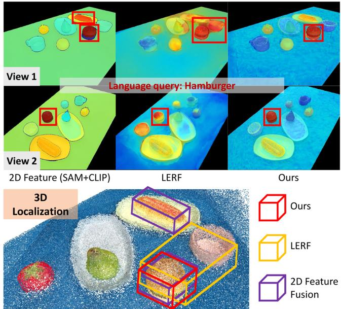
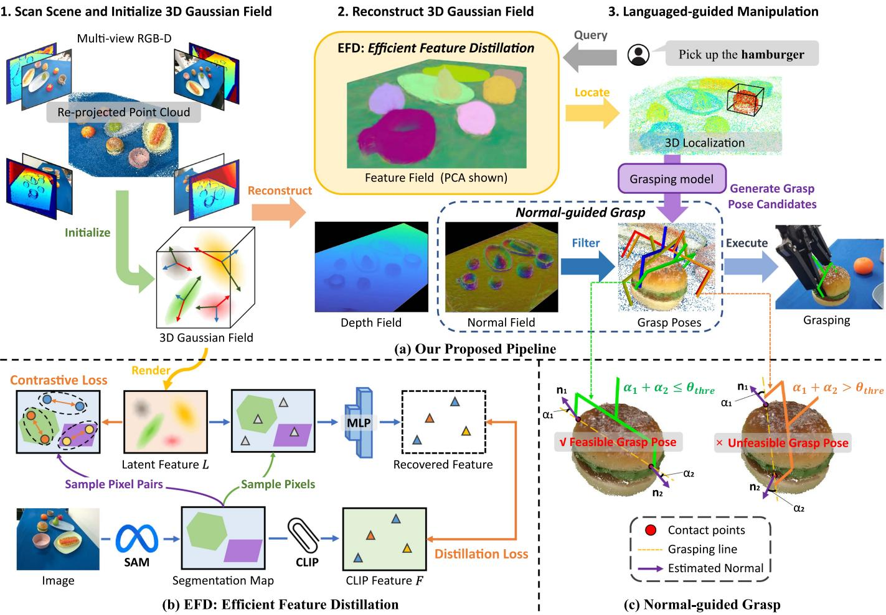
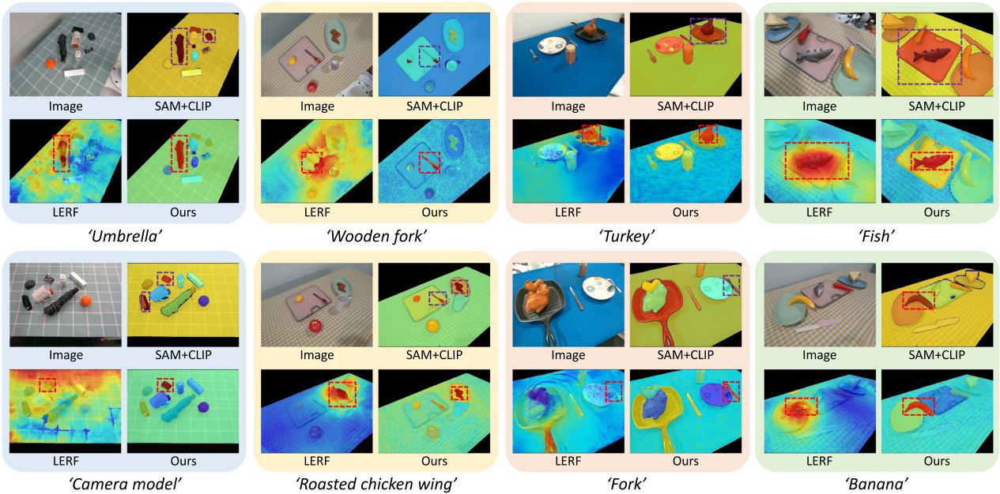
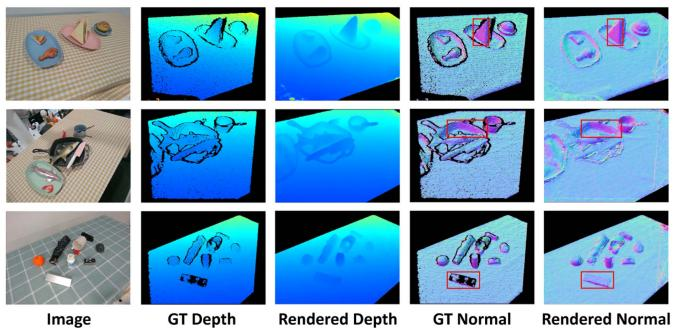
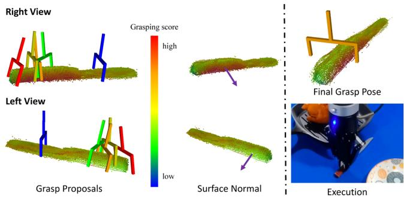
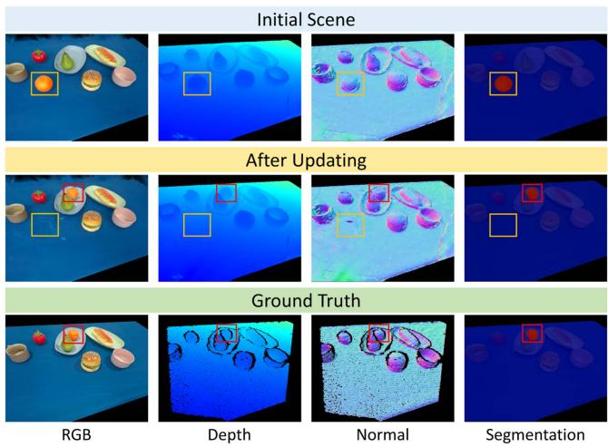

# GaussianGrasper: 3D Language Gaussian Splatting for Open-Vocabulary Robotic Grasping

Yuhang Zheng , Xiangyu Chen , Student Member, IEEE, Yupeng Zheng , Songen Gu, Runyi Yang, Bu Jin , Pengfei Li , Chengliang Zhong , Zengmao Wang , Lina Liu , Chao Yang , Dawei Wang , Zhen Chen , Xiaoxiao Long , and Meiqing Wang

Abstract—Constructing a 3D scene capable of accommodating open-ended language queries, is a pivotal pursuit in the domain of robotics, which facilitates robots in executing object manipulations based on human language directives. To achieve this, some research efforts have been dedicated to the development of language-embedded implicit fields. However, implicit fields (e.g. NeRF) encounter limitations due to the necessity of taking images from a larger number of viewpoints for reconstruction, coupled with their inherent inefficiencies in inference. Furthermore, these methods directly distill patch-level 2D features, leading to ambiguous segmentation boundaries. Thus, we present the Gaussian-Grasper, which uses 3D Gaussian Splatting (3DGS) to explicitly represent the scene as a set of Gaussian primitives and is capable of real-time rendering. Our approach takes RGB-D images from limited viewpoints as input and uses an Efficient Feature Distillation (EFD) module that employs contrastive learning to efficiently distill 2D language embeddings and constraint consistency of feature embeddings. With the reconstructed geometry of the Gaussian field, our method enables the pre-trained grasping model to generate collision-free grasp pose candidates. Furthermore, we propose a normal-guided grasp module to select the best grasp pose. Through comprehensive real-world experiments, we demonstrate that GaussianGrasper enables robots to accurately locate and grasp objects according to language instructions, providing a new solution for language-guided grasping tasks.

Index Terms—Language-guided robotic manipulation, 3D Gaussian splatting, language feature field.

Manuscript received 16 March 2024; accepted 5 July 2024. Date of publication 23 July 2024; date of current version 31 July 2024. This article was recommended for publication by Associate Editor C. Choi and Editor J. Borras Sol upon evaluation ofthe reviewers’ comments. This work was supported by the National Natural Science Foundation of China (NSFC) under Grant 52375478. (Corresponding authors: Xiaoxiao Long; Meiqing Wang.)

## I. INTRODUCTION

R ECENTLY, there has been an increasing scholarly focus onlanguage-guided robotic manipulation due to its vast potential in facilitating human-robot interaction, enabling robotic home services, and enhancing flexible manufacturing. Imagine that a robot is asked to pick up the water cup in a cluttered, unstructured environment, it needs to (1) locate the water cup via responding to language description; (2) be aware ofthe geometry to execute a stable grasp. In this process, understanding the diverse objects with different shapes and material properties in the open world is the pivotal challenge.

Although many works have proposed various solutions, existing capabilities of scene understanding are insufficient to afford language-guided manipulation. Most existing works are based on 2D images [1], [2], [3], [4] which are efficient but have limitations for robotic manipulation as robots can not easily infer visual occlusion and spatial relation from multi-view misaligned images.

To obtain precise 3D positions for robotic manipulation, recent works have focused on 3D representations. A straightforward approach is leveraging 2D visual models [5], [6], [7] to extract semantics and then fuse the 2D semantics into 3D. However, this fusion strategy suffers from semantic inconsistency in 3D, as the visual model’s semantic features are inconsistent across multi-views.

Other methods [8], [9], [10], [11], [12], [13] that use 3D backbone to extract features and are supervised by 3D annotation or manipulation feedback can effectively enhance the 3D scene understanding and skill learning. However, these methods encounter challenges in data acquisition and annotation. Recently, distilled feature fields (DFFs) [14], [15], [16] which reconstruct 3D feature fields from 2D images via implicit representation were introduced. Based on 2D-to-3D distillation, recent works [17], [18] have made impressive progress in improving 3D scene understanding and enabling robots to interact with the physical world according to language instructions. However, DFFs can not be inflexibly applied for robotics manipulation as most of these methods suffer from (1) imprecise localization as these methods extract patch-level features, resulting in ambiguous boundaries; (2) high costs of collecting dense training views (e.g. 50 views in F3RM [17]); (3) slow inference speed, hindering robots from responding to language instructions in time and (4) weak ability to cope with scene changes caused by manipulation.

To tackle problems, we introduce GaussianGrasper, an open-world robotic manipulation method based on 3D Gaussian Splatting (3DGS) [19], which models the 3D scene as a set of

  
Fig. 1. We present a comparison between our method, 2D feature (extracted by SAM and CLIP) fusion, and LERF. When given the language query “hamburger”, the features extracted by SAM and CLIP exhibit inconsistencies between the two viewpoints, and LERF lacks clear segmentation boundaries. Consequently, they both suffer from imprecise 3D localization, as depicted by the yellow and purple 3D bounding boxes. In contrast, our method reconstructs a consistent feature field and achieves more precise 3D localization.

3D Gaussian primitives. As an explicit representation, 3DGS has faster rendering, speeding up the response to language instructions. Besides, it’s easier and faster to edit the scene via operating Gaussian primitives, enabling the scene the ability to update dynamically after each manipulation. Our insight is that we (1) reconstruct 3D feature fields via feature distillation to support language-guided localization; (2) render depth and surface normal to provide detailed 3D geometry, enabling the generation of feasible grasping poses; (3) operate Gaussian primitives and fine-tune 3DGS to update the changed scene. Fig. 1 shows the performance comparison between other methods and our proposed method.

More specifically, our method enables language-guided manipulation via the following steps: (1) Initialization: we scan RGB-D images of a few viewpoints to initialize the 3DGS, reducing the cost of data collection. (2) Feature field reconstruction: we propose an efficient feature distillation (EFD) module that employs SAM [5] and CLIP [6] to extract dense and shape-aware 2D descriptors and leverage contrastive learning to efficiently optimize the distilled features. (3) Localization and grasp: we use open-vocabulary querying to locate the target object and use a pre-trained grasping model to provide a set of grasp pose candidates where rendered normal is used to select the most feasible grasp pose based on Force-closure theory. (4) Scene updating: After manipulation, we update the scene by operating corresponding Gaussian primitives and fine-tuning 3DGS with images from fewer views.

In summary, the contributions of this letter are as follows:

\- We introduce GaussianGrasper, a robot manipulation system implemented by a 3D Gaussian field endowed with consistent open-vocabulary semantics and accurate geometry to support open-world manipulation tasks guided by language instructions.

\- We propose EFD that leverages contrastive learning to efficiently distill CLIP features and augment feature fields with SAM segmentation prior, addressing computational expense and boundary ambiguity challenges.

\- We propose a normal-guided grasp module that uses rendered normal to select the best grasp pose from generated grasp pose candidates.

\- We demonstrate GaussianGrasper’s capability of language-guided manipulation tasks in multiple real-world tabletop scenes and common objects.

## II. RELATED WORK

## A. Grasp Pose Detection

Grasp pose detection is the pivotal part of robot grasping, which plays a critical role in enabling the robot to interact with objects in the physical world. Previous 3-DoF Grasping methods treated the grasping task as 2D pose detection [20], [21], [22], [23], [24]. They define the grasp pose as a fixed-height oriented rectangle and predict the orientation and the width of the rectangle. However, their predicted grasp poses are limited to 3-DoF due to the lack of 3D geometry. To allow robots to plan higher dexterous grasps, extensive works focus on 6-DoF grasping which uses depth to augment the grasp pose detection [25], [26] or leverage point cloud as input to provide local geometry [27], [28], [29], [30], [31]. These methods exhibit a high success rate when the depth is accurate but suffer from performance drops when encountering photometrically challenging objects such as transparent objects. To further improve the performance, some work fuses RGB with depth [32], [33], [34] as RGB can alleviate the depth-missing problem.

In this letter, we use the RGB-D based method to generate grasp poses. To achieve stable grasp, we further explicitly utilize Force-closure theory [35] to enhance grasp pose detection where estimated normal is used to filter out unfeasible grasp poses (more details in Normal-guided grasp of Section III-C3).

## B. 3D Positioning for Robotic Grasping

A number ofrecent work integrate 2D foundation models with 3D feature fields to obtain 3D open-vocabulary feature representation via re-projection [36], [37] or feature distillation [14], [16], [38], [39], [40]. Based on the 3D feature representation, these methods achieve 3D positioning by responding to language instructions.

For robotic grasping, recent works like F3RM [17] and LERF-TOGO [18] leverage feature distillation via neural rendering to reconstruct the 3D feature field as the 3D feature representation. Then, the grasping poses are generated after localization. However, these methods need images from many viewpoints as input. As an explicit representation, SparseDFF [41] reprojects 2D features to 3D and leverages fusion strategy to optimize the 3D feature representation, leading to a significant reduction in usage of the number of viewpoints. However, explicit representation is not efficient for carrying high-dimension language features due to memory usage and computation time.

In our pipeline, we achieve 3D positioning by querying the 3D feature field. Different from the methods above, we propose an efficient feature distillation module based on explicit 3D Gaussians representation which uses segmentation priors provided by SAM to speed up feature field reconstruction and reduce the usage of memory (more details in Section III-B).

  
Fig. 2. The architecture of our proposed method. (a) Is our proposed pipeline where we scan multi-view RGBD images for initialization and reconstruct 3D Gaussian field via feature distillation and geometry reconstruction. Subsequently, given a language instruction, we locate the target object via open-vocabulary querying. Grasp pose candidates for grasping the target object are then generated by a pre-trained grasping model. Finally, a normal-guided module that uses surface normal to filter out unfeasible candidates is proposed to select the best grasp pose. (b) Elaborates on EFD where we leverage contrastive learning to constrain rendered latent feature L and only sample a few pixels to recover features to the CLIP space via an MLP. Then, the recovered features are used to calculate distillation loss with the CLIP features. (c) Shows the normal-guided grasp that utilizes Force-closure theory to filter out unfeasible grasp poses.

## III. METHODOLOGY

Problem Formulation: Given a natural language instruction from the human, the goal of our method is to locate the target object accurately and pick it up stably based on a collection of multi-view RGB-D images input.

Pipeline: The proposed pipeline is shown in Fig. 2(a) where our method (1) collects multi-view RGB-D images as input to initialize 3D Gaussian field; (2) reconstructs 3D feature field via efficient feature distillation module and (3) achieves language-guided manipulation. Specifically, we first introduce how to initialize 3DGS and the differentiable rasterizer of 3DGS in Section III-A. Next, we elaborate on the EFD module in Section III-B. Finally, we introduce how to achieve language-guided manipulation in detail in Section III-C.

## A. Preliminaries: 3D Gaussian Splatting

1) Gaussian Primitive Initialization: 3DGS uses the sparse point cloud obtained by Structure from Motion (SfM) [42] as initialization. In our pipeline, to reduce the viewpoints and speed up, we employ multi-view depth to re-project RGB images into 3D points and use camera extrinsics to convert all points to the world coordinate to initialize the Gaussian field.

2) Differentiable Rasterizer for 3D Gaussians: 3DGS renders the Gaussian primitives into images in a differentiable manner to optimize the parameters. Given a set of 3D Gaussian primitives $\mathcal { G } = \{ g _ { i } \ \bar { | } \ i = 1 , 2 , 3 , . . , n \}$ , each 3D Gaussian primitive $g _ { i }$ is first projected onto the corresponding 2D plane and is then sorted based on its depth $d _ { i }$ from the viewpoint plane. The RGB image is rendered by the following formula:

$$
C ( u ) = \sum _ { i } c _ { i } \alpha _ { i } \prod _ { j = 1 } ^ { i - 1 } ( 1 - \alpha _ { j } )\tag{1}
$$

where $c _ { i }$ is a feature vector represented by spherical harmonics (SH) and $\alpha _ { i }$ is obtained by multiplying Gaussian weight with opacity α associated to Gaussian primitives. j represents the $j ^ { t h }$ Gaussian primitive among the i-1 Gaussian primitives with a depth smaller than the $i ^ { t h }$ Gaussian primitive.

## B. Efficient Feature Distillation

We reconstruct 3D open-vocabulary feature field via extracting dense CLIP features and efficiently distilling them into 3D, based on 3DGS. The open-vocabulary reconstruction enables the scene to respond to natural language instructions.

1) Instance-Level Segmentation Prior and Open-Vocabulary Features: To extract dense and shape-aware open-vocabulary features, we first use SAM to produce a set of instance-level masks. Then, we leverage CLIP to obtain open-vocabulary features for each mask. Concretely, we process the input images through SAM to obtain a set of mask proposals and corresponding scores. Based on these scores, a non-maximum suppression strategy [43] is then implemented to filter superfluous masks. The resultant filtered set of masks constitutes a segmentation map of the image, representing instance-level priors. After filtration, we process each valid mask-aligned image region into the CLIP model to extract open-vocabulary features. Finally, we incorporate CLIP features of all masks into a feature map, referred to as F.

2) Open-Vocabulary Feature Distillation: We propose a novel and efficient open-vocabulary feature distillation method that starts with enhancing each 3D Gaussian primitive with embedded open-vocabulary feature. As an explicit representation, a 3D Gaussian field can be composed of millions of primitives. Directly incorporating high-dimensional CLIP features (over 500 dimensions) into all primitives will result in unacceptable memory costs and computation time. Therefore, instead of equipping Gaussian primitives with high-dimension CLIP features, we initialize all Gaussian primitives with low-dimension latent feature embedding l. Then, we employ a feature rasterizer to render the feature map L:

$$
L ( u ) = \sum _ { i } l _ { i } \alpha _ { i } \prod _ { j = 1 } ^ { i - 1 } ( 1 - \alpha _ { j } )\tag{2}
$$

where $l _ { i }$ is the latent feature embedding of $i ^ { t h }$ 3D gaussian primitives and $L ( u )$ represents the rendered latent feature embedding at pixel u.

To distill the 2D open-vocabulary feature to 3D field, we need to (1) recover the dimension of $L$ to that of $F$ and (2) minimize the feature distance between the recovered L and the $F .$ However, high-dimensional vector computation for dense feature maps leads to a catastrophic increase in computation time and memory usage. To tackle this problem, we propose a contrastive-learning-based distillation strategy, as shown in Fig. 2(b). Specifically, having instance-level segmentation masks extracted by SAM, we impose constraints for the consistency of each pixel’s rendered feature within the same mask. To ensure efficiency, we randomly sample some pixel pairs within each mask and minimize the distance of latent features between pixels in each pair. The number of pairs for each mask is proportion to the mask’s area and the number of total pairs n is fixed. We use the average feature distances between all pairs as contrastive loss, written as:

$$
{ \mathcal { L } } _ { c o n t r . } = 1 - { \frac { 1 } { n } } \sum _ { i = 1 } ^ { n } L ( u _ { i } ) \cdot L ( v _ { i } )\tag{3}
$$

where $u _ { i }$ and $v _ { i }$ are pixels in the $i ^ { t h }$ sampled pair and $L ( u _ { i } )$ and $L ( v _ { i } )$ are the rendered feature embedding of pixel $u _ { i }$ and $v _ { i } . \mathrm { A s }$ the contrastive loss homogenizes the features within each mask, we only need to recover latent features of per mask to the CLIP space and subsequently minimize the distance between the recovered feature and the CLIP feature. In practice, we randomly sample the same number of pixels within each mask, whose latent features are then recovered via a trainable decoder Ψ composed of two fully connected layers. We calculate the distillation loss between the recovered feature and the CLIP feature of all sampled k pixels, defined as:

$$
\mathcal { L } _ { d i s t i l l } = 1 - \frac { 1 } { k } \sum _ { i = 1 } ^ { k } \Psi ( L ( i ) ) \cdot F ( i )\tag{4}
$$

By enhancing the low-dimension latent feature of the 3D Gaussian primitives and using contrastive learning which leverages the segmentation prior derived from SAM, our method provides a powerful and efficient solution for reconstructing 3D open-vocabulary representation.

## C. Language-Guided Robotic Manipulation

We use the reconstructed feature field to conduct robotic manipulation. Given a language instruction, our method begins with employing open-vocabulary queries to locate the target object. Subsequently, we render the depth and normals of 3D Gaussian primitives to obtain the object’s detailed geometry. Then, a point cloud-based grasping module is used to generate grasp poses and the rendered normal is used to filter out unfeasible ones. After manipulating objects, we quickly update the scene using observations from fewer viewpoints.

1) Open-Vocabulary Querying: As our reconstructed feature field is aligned with natural language, we can locate the object described by language instructions via open-vocabulary querying. We first follow the approach of LERF [16] to compute the relevance score s for each textual query:

$$
s = \operatorname* { m i n } _ { i } { \frac { \exp ( \Psi ( L ) \cdot T ^ { q u e r y } ) } { \exp ( \Psi ( L ) \cdot T ^ { q u e r y } ) + \exp ( \Psi ( L ) \cdot T _ { i } ^ { c a n o n } ) } }\tag{5}
$$

where $T ^ { q u e r y }$ is the CLIP embedding of the text query and $T _ { i } ^ { c a n o n }$ is the CLIP embeddings of a pre-defined canonical phrase chosen from “object”, “things”, “stuff”, and “texture”.

As a result, for each textual query, we obtain a relevance heatmap where the points with relevance scores below a predetermined threshold will be filtered out. Thus, the remaining region forms a mask for predicting the queried object.

2) Geometry Restruction: To obtain dense point cloud representations of objects and surface normal which is closely related to robotic grasping, we render depth and surface normal to multiple viewpoints.

Depth rendering: Similar to the rendering of RGB, we compute the depth value for each pixel using the rasterizer:

$$
D ( u ) = \sum _ { i } d _ { i } \alpha _ { i } \prod _ { j = 1 } ^ { i - 1 } ( 1 - \alpha _ { j } )\tag{6}
$$

where $D ( u )$ indicates the rendered depth map at pixel u.

We use the depth map obtained from the depth camera for the corresponding viewpoint to supervise the rendered depth map where we calculate the L1 loss:

$$
\mathcal { L } _ { d e p t h } = \frac { 1 } { m } \sum _ { i = 1 } ^ { m } \mathinner { | { \hat { D } ( i ) - D ( i ) } | }\tag{7}
$$

where $\hat { D }$ is the depth map obtained from the depth camera and m is the number of pixels with valid depth value.

Normal rendering: As surface normals are directional vectors that should exhibit rotational equivariance, normals cannot be rendered as semantic features. Therefore, we follow [44], [45] that use the shortest axis direction of the 3D Gaussian primitives to serve as surface normal. As a result, the normals are geometric properties of Gaussian primitives, related to their orientations. We render the normal map by using the rasterizer:

$$
\mathbf { N } ( u ) = \sum _ { i } \mathbf { n } _ { i } \alpha _ { i } \prod _ { j = 1 } ^ { i - 1 } ( 1 - \alpha _ { j } )\tag{8}
$$

where $\mathbf { N } ( u )$ indicates the rendered surface normal map at pixel u and ${ \bf n } _ { i }$ is the normal of the $i ^ { t h }$ 3D Gaussian primitive.

The rendered normal map represents the per-pixel surface normal in the robot base coordinate. We use a Sobel-like operator to compute the normals for each pixel in the acquired depth map and transform the calculated normals from the camera coordinate to the robot base coordinate. After normalizing all normal maps to unit vectors, we supervise the rendered normals within the valid depth region:

$$
\mathcal { L } _ { n o r m a l } = \frac { 1 } { m } \sum _ { i = 1 } ^ { m } \left( \left( \hat { \mathbf { N } } ( i ) - \mathbf { N } ( i ) \right) ^ { 2 } + 1 - \hat { \mathbf { N } } ( i ) \cdot \mathbf { N } ( i ) \right)\tag{9}
$$

3) Feasible Grasp Pose Generation: After obtaining the localization and geometry of the object, we (1) employ a grasp detection method to propose initial grasp poses and (2) utilize our rendered normal to augment the grasp pose proposals according to the force closure theory.

Grasp pose generation: In our work, we employ the Any-Grasp [34], the state-of-the-art grasping model, which takes colorful point cloud as input and generates a set of collision-free grasp proposals for parallel two-finger grippers. Each grasp proposal is represented by grasp position, width, height, depth and a grasping score. We generate the grasp-pose candidates with the following steps: (1) Given a language instruction, we get segmentation maps of the target object by open-vocabulary querying. (2) Use rendered depth to re-project the segmentation map of the queried object from each viewpoint to produce a dense point cloud representation. (3) Locate the object with a bounding box and convex hull. (4) Combine the object’s point cloud with the centers of all 3D Gaussian primitives because these centers of primitives have the spatial information of the whole scene, which is beneficial for generating collision-free grasp poses. (5) Employ AnyGrasp to generate grasp poses, which are restricted in the aforementioned bounding box.

Normal-guided grasp: Although AnyGrasp provides a “grasping score” for each grasp proposal, the grasp pose with the highest score may not be the suitable one for stable grasp. Thus, we explicitly utilize the force closure theory as a screening mechanism. For each grasp pose proposal with two contact points, we calculate the angle between the grasping line and the surface normal of each contact point and get the sum of two angles. If the sum of the two angles is less than or equal to a pre-defined threshold $\theta _ { t h r e }$ , we regard the grasp pose as a feasible proposal, otherwise it is unfeasible, as shown in Fig. 2(c). We choose the pose with the highest “grasping score” in feasible proposals as the final grasp pose.

4) Gaussian Field Updating: After moving the object from an initial place to a target place, the initial place will be empty as a lack of Gaussian primitives due to the occlusion during the reconstruction. Thus, the Gaussian field need to be fine-tuned. The process of the scene update is: (1) getting all Gaussian primitives within this object’s convex hull; (2) getting the transformation of the object, recorded as a rotation matrix R and a translation matrix $t ,$ which can be calculated from the change of the end-effector’s pose from the start to the end of the manipulation; (3) operating all Gaussian primitives of the object with the same rotation R and translation $t ; ( 4 )$ collecting RGB-D images of the new scene from fewer viewpoints and use them to fine-tune 3D Gaussian field. The fine-tuning of the field only occurs in the initial place and the target place.

## IV. EXPERIMENT

In this section, we first introduce the experimental setup. Next, we conduct experiments to validate our proposed EFD module where we report both quantitative results and qualitative results. Subsequently, we show the results of geometry reconstruction and conduct experiments to demonstrate the effectiveness of the normal-guided grasp module. Finally, we conduct grasp-updategrasp experiments to prove the effectiveness and efficiency of our scene update module.

Please note that the bold values in the following tables represent the best results under the specific evaluation metric.

## A. Experimental Setup

1) Scenes, Objects and Devices: We build a $1 4 0 \times 7 0 \times$ 30cm3 desktop scene with common objects in daily life including various food, tableware and office supplies. A UR5 robot arm equipped with a ROBOTIQ gripper is used to execute robotic manipulation. We set up our system in 10 open desktop scenes with a total of 44 objects (40 are graspable) and we execute language-guided manipulation 120 times. An NVIDIA RTX-3090 GPU is used to process collected data and to reconstruct the 3D Gaussian field.

2) Data Collection and Processing: We first use the robot arm equipped with a Realsense D455 to scan the desktop scene from 16 viewpoints to get multi-view RGB-D images. At the same time, we also record the camera extrinsic parameters, calculated through the transformation between the end effector and robot base. After obtaining RGB-D maps, we re-project the images to 3D and convert each view’s point cloud from its camera coordinate to the base coordinate to form a point cloud. We downsample the point cloud to about 300 k points to initialize the 3D Gaussian primitives. The collected images are then processed by SAM and CLIP to generate segmentation maps and open-vocabulary feature maps. To get the semantic ground truth of the collected images, we utilized SAM as an auxiliary tool to manually annotate all objects in the images.

## B. Results of Efficient Feature Distillation

We show both qualitative results and quantitative results to demonstrate the effectiveness and efficiency of our proposed EFD module. Our baselines are Lseg [46] and LERF [16] (All mention of LERF in our experiments includes an extra depth supervision to ensure a fair comparison with our method.)

In qualitative results, we compare our method with SAM + CLIP (our 2D feature fusion labels) and LERF and show the relevance map of each given language instruction. As shown in Fig. 3, the purple boxes demonstrate that the features extracted from SAM and CLIP are not accurate such as the wooden fork in ‘Wooden fork’ and the pot and Turkey with similar semantic features in ‘Turkey’. In comparison, the results of our method are more accurate, proving that our reconstructed feature field solves the problem of feature inconsistency across multiple views. Besides, compared with LERF, our method exhibits better segmentation boundaries, proved by the ‘Fish’ and the ‘Roasted chicken wing’. That is because we take advantage of the segmentation prior of SAM.

  
Fig. 3. Relevance map of the given language instructions. Our method exhibits clearer segmentation boundaries compared to LERF, which can be used to obtain more accurate localization. Compared with SAM + CLIP, our approach exhibits more consistent open-vocabulary features across multi-views. For instance, in ‘Roasted chicken wing’, the response of SAM + CLIP is the chicken wing and the fork while our method makes the correct response.

TABLE I  
QUANTITATIVE COMPARISONS OF SEMANTIC SEGMENTATION, LOCALIZATION ACCURACY AND EFFICIENCY ON OUR SCENARIOS
<table><tr><td>Method</td><td>mIoU(%) ↑</td><td>Acc(%) ↑</td><td>T-S(s) ↓</td><td>Q-S(s) ↓</td><td>Mem(GB) ↓</td></tr><tr><td rowspan="3">LSeg[46] LERF*[16] Ours</td><td>26.4</td><td>40.6</td><td></td><td></td><td>=</td></tr><tr><td>41.3</td><td>65.1</td><td>0.24</td><td>40.27</td><td>15</td></tr><tr><td>58.2</td><td>87.5</td><td>0.19</td><td>0.22</td><td>6</td></tr><tr><td rowspan="2">w/o  ${ \overline { { { \mathcal { L } } _ { c o n t r . } } } }$  w/o EFD</td><td>54.3</td><td>84.7</td><td>0.21</td><td>0.22</td><td>14</td></tr><tr><td>48.8</td><td>75.6</td><td>0.82</td><td>0.31</td><td>57</td></tr></table>

"\*" represents LERF with an extra depth supervision

We report the quantitative results of two tasks: segmentation and localization, evaluated by mIoU and accuracy respectively. In the segmentation task, as described in Section III-C1, we filter out the region whose relevance score is below 0.85 to form a predicted segmentation map. We calculate the mIoU between predicted segmentation maps and our manually annotated ground truth. In the localization task, following LERF, given a language instruction, ifthe point with the highest relevance score is in the target object, it is a successful localization. We calculate the average accuracy of all responses as the metrics. The results of segmentation and localization are shown in Table I where our method significantly outperforms other baselines.

Besides, we validate the efficiency of our method. Training speed (T-S), represented as the time cost per training step is used to evaluate the reconstruction efficiency and query speed (Q-S), represented as the time cost per text query is used to evaluate the inference efficiency. We also compare the memory usage (Mem) during training. As shown in Table I, our method achieves an approximate 180 query speedup over LERF and takes the least memory usage and training time.

## C. Ablation Studies of Proposed Modules

We conducted experiments to validate the effectiveness of the contrastive loss $\mathcal { L } _ { c o n t r }$ . and the EFD module. The settings of the experiments are as follows: (1) In the w/o EFD setting, we extract dense features by using the MaskCLIP [47] reparameterization trick. Then, we directly distill 2D features into 3D Gaussian fields. (2) In the w/o $\mathcal { L } _ { c o n t r }$ . setting, we don’t supervise the latent feature and increase the number of the sampling pixels used in calculating the distillation loss $\mathcal { L } _ { d i s t i l l }$ . As shown in Table I, the EFD module significantly increases the performance and efficiency. Besides, utilizing contrastive loss also improves the numerical results.

## D. Results of Geometry Reconstruction

We show the visualization of our rendered depth and normal compared with ground truth (scanned by D455 camera), as shown in Fig. 4. The black region represents the invalid value of ground truth. It can be seen that the surface normal we rendered is smoother than the ground truth, as shown in red boxes. Furthermore, even in areas where the ground truth is invalid, we can still render accurate depth and surface normal, as proved by the silver eyeglass case in the third row.

## E. Results of Language-Guided Manipulation

In this subsection, we show the result of languaged-guided grasping where we tested 120 times on 40 objects. We compare our method with (1) Lseg+AnyGrasp and (2) LERF+AnyGrasp.

  
Fig. 4. Compared with scanned depth and surface normal, our rendered depth and surface normal is smoother. Our method renders accurate depth and surface normal even in areas where the ground truth is invalid.

TABLE II  
GRASPING RESULTS: WE COMPARE OUR METHOD WITH OTHER TWO BASELINES AND OUR METHOD W/O NORMAL FILTER
<table><tr><td>Method</td><td>Grasping Success Rate (%)</td></tr><tr><td>LSeg + AnyGrasp LERF + AnyGrasp</td><td>26.7 55.8</td></tr><tr><td>Ours</td><td>85.0</td></tr><tr><td>Ours w/o Normal Filter</td><td>78.3</td></tr></table>

  
Fig. 5. Effectiveness of our proposed normal-guided grasp. The left column shows the top 5 grasp pose candidates and the color bar which represents the grasping score. The middle column displays the surface normal of the object, with purple arrows indicating the normal of the contact points. The right column shows the successful execution of grasping the knife utilizing the selected final grasp pose.

To obtain the 3D point cloud, we use the rendered depth to re-project the segmentation masks of LERF and use scanned depth to re-project the segmentation masks of LSeg. A successful grasp is defined as grasping the correct object and raising it to a height of 10 cm over 3 seconds. As shown in Table II, our method far exceeds other methods in success rate.

## F. Effectiveness of Normal-Guided Grasp

In this subsection, we aim to validate the effectiveness of our proposed normal-guided grasp. We first give the qualitative result to validate that the surface normal can filter out unfeasible grasp poses. As shown in Fig. 5, the original top-ranked proposal (red) is filtered out as the angles between its grasping line and surface normal of contact points are too large. In contrast, the original second-ranked proposal is feasible. Thus, we execute a grasp based on this pose. We also report the quantitative results of the grasping success rate with and without the normal filter, as shown in Table II. Leveraging the normal filter increases the success rate by 7.7%, further demonstrating the effectiveness of our proposed normal-guided grasp.

  
Fig. 6. Results of scene update. We show the RGB, depth, normal, and segmentation before and after the scene update based on the language query “orange”. As indicated by the yellow boxes, our scene updating successfully moves the orange to the plate and restores the region that was previously obscured by the orange. As indicated by the red boxes, the updated orange still maintains accurate geometry and semantic features.

TABLE III  
EFFIECIENCY COMPARISON BETWEEN LERF AND OUR METHOD
<table><tr><td>Method</td><td>Viewpoints↓</td><td>Memory (GB) ↓</td><td>Time (min) ↓</td></tr><tr><td>LERF [16]</td><td>16</td><td>15</td><td>30</td></tr><tr><td>Ours</td><td>5</td><td>4</td><td>1</td></tr></table>

## G. Validation of Scene Updating

We validate the effectiveness of our proposed scene updating via continuous language-guided picking and placing. We execute an experiment whose process is (1) picking up the object and placing it to the target position according to the language instruction; (2) capturing RGB-D images from 5 viewpoints to update the scene; (3) executing another manipulation on this object. As shown in Fig. 6, our updated scene retains high-quality RGB, geometry, and semantic features, proving the effectiveness of the scene update module. Besides, we also compare the efficiency between LERF and ours including viewpoint numbers, memory usage and reconstruction time for updating, as shown in Table III. Our scene update capability enables the reconstructed scene to handle continuous grasping.

## V. LIMITATION AND FUTURE WORK

Limitation: Our method can’t reconstruct the transparent and highly reflective objects’ geometry with high quality. Besides, our method fails to completely reconstruct the feature field and geometry of the seriously occluded objects in cluttered scenes.

Future work: It is encouraging to explore a physics-aware method that can adapt the grasp force according to the friction coefficient and mass of the object. Additionally, incorporating scene flow estimation and 3D scene editing technology to make the reconstructed field dynamic will make the feature field reconstruction widely used in robotics.

## VI. CONCLUSION

This letter introduces GaussianGrasper, a novel approach for open-world robotic grasping guided by natural language instructions. Taking multi-view RGB-D images as input, our method efficiently reconstructs consistent feature fields through our proposed EFD module. The feature field enables robots to understand the open world and make precise localization based on language instructions. Besides, we estimate the geometry and propose the normal-guided grasp to augment the robotic grasping. Furthermore, our scene can also be quickly updated to support continuous grasping.

## REFERENCES

[1] C. Lynch and P. Sermanet, “Language conditioned imitation learning over unstructured data,” in Proc. Robot.: Sci. Syst., 2021.

[2] M. Shridhar, L. Manuelli, and D. Fox, “Cliport: What and where pathways for robotic manipulation,” in Proc. Conf. Robot Learn., 2022, pp. 894–906.

[3] X. Lin, J. So, S. Mahalingam, F. Liu, and P. Abbeel, “SpawnNet: Learning generalizable visuomotor skills from pre-trained networks,” 2023, arXiv:2307.03567.

[4] P.-L. Guhur, S. Chen, R. G. Pinel, M. Tapaswi, I. Laptev, and C. Schmid, “Instruction-driven history-aware policies for robotic manipulations,” in Proc. Conf. Robot Learn., 2023, pp. 175–187.

[5] A. Kirillov et al., “Segment anything,” in Proc. IEEE/CVF Int. Conf. Comput. Vis. (ICCV), 2023, pp. 3992–4003.

[6] A. Radford et al., “Learning transferable visual models from natural language supervision,” in Proc. Int. Conf. Mach. Learn., 2021, pp. 8748–8763.

[7] M. Caron et al., “Emerging properties in self-supervised vision transformers,” in Proc. IEEE/CVF Int. Conf. Comput. Vis. (ICCV), 2021, pp. 9630–9640.

[8] D. Z. Chen, A. X. Chang, and M. Nießner, “ScanRefer: 3D object localization in RGB-D scans using natural language,” in Proc. Eur. Conf. Comput. Vis., 2020, pp. 202–221.

[9] Z. Jiang, Y. Zhu, M. Svetlik, K. Fang, and Y. Zhu, “Synergies between affordance and geometry: 6-DoF grasp detection via implicit representations,” in Proc. Robot.: Sci. Syst., 2021.

[10] S. Chen, R. G. Pinel, C. Schmid, and I. Laptev, “PolarNet: 3D point clouds for language-guided robotic manipulation,” in Proc. Conf. Robot Learn., 2023, pp. 1761–1781.

[11] M. Shridhar, L. Manuelli, and D. Fox, “Perceiver-actor: A multi-task transformer for robotic manipulation,” in Proc. Conf. Robot Learn., 2023, pp. 785–799.

[12] Y. Ze et al., “GNFactor: Multi-task real robot learning with generalizable neural feature fields,” in Proc. Conf. Robot Learn., 2023, pp. 284–301.

[13] C. Zhong et al., “3D implicit transporter for temporally consistent keypoint discovery,” in Proc. IEEE/CVF Int. Conf. Comput. Vis. (ICCV), 2023, pp. 3846–3857.

[14] S. Kobayashi, E. Matsumoto, and V. Sitzmann, “Decomposing nerf for editing via feature field distillation,” in Proc. Annu. Conf. Neural Inf. Proccess. Syst., 2022, pp. 23311–23330.

[15] V. Tschernezki, I. Laina, D. Larlus, and A. Vedaldi, “Neural feature fusion fields: 3D distillation of self-supervised 2D image representations,” in Proc. Int. Conf. 3D Vis. (3DV), 2022, pp. 443–453.

[16] J. Kerr, C. M. Kim, K. Goldberg, A. Kanazawa, and M. Tancik, “LERF: Language embedded radiance fields,” in Proc. IEEE/CVF Int. Conf. Comput. Vis. (ICCV), 2023, pp. 19672–19682.

[17] W. Shen, G. Yang, A. Yu, J. Wong, L. P. Kaelbling, and P. Isola, “Distilled feature fields enable few-shot language-guided manipulation,” in Proc. Conf. Robot Learn., 2023, pp. 405–424.

[18] A. Rashid et al., “Language embedded radiance fields for zero-shot taskoriented grasping,” in Proc. Conf. Robot Learn., 2023, pp. 178–200.

[19] B. Kerbl, G. Kopanas, T. Leimkühler, and G. Drettakis, “3D Gaussian splatting for real-time radiance field rendering,” ACM Trans. Graph., vol. 42, pp. 1–14, 2023.

[20] J. Redmon and A. Angelova, “Real-time grasp detection using convolutional neural networks,” in Proc. IEEE Int. Conf. Robot. Automat. (ICRA), 2015, pp. 1316–1322.

[21] J. Mahler et al., “Dex-Net 2.0: Deep learning to plan robust grasps with synthetic point clouds and analytic grasp metrics,” in Proc. Robot.: Sci. Syst., 2017.

[22] D. Guo, F. Sun, H. Liu, T. Kong, B. Fang, and N. Xi, “A hybrid deep architecture for robotic grasp detection,” in Proc. IEEE Int. Conf. Robot. Automat. (ICRA), 2017, pp. 1609–1614.

[23] X. Zhou, X. Lan, H. Zhang, Z. Tian, Y. Zhang, and N. Zheng, “Fully convolutional grasp detection network with oriented anchor box,” in Proc. IEEE/RSJ Int. Conf. Intell. Robots Syst. (IROS), 2018, pp. 7223–7230.

[24] Y. Zheng, Q. Wang, C. Zhong, H. Liang, Z. Han, and Y. Zheng, “Enhancing daily life through an interactive desktop robotics system,” in Proc. Artif. Intell., 2023, pp. 81–86.

[25] X. Zhu, L. Sun, Y. Fan, and M. Tomizuka, “6-DoF contrastive grasp proposal network,” in Proc. IEEE Int. Conf. Robot.Automat. (ICRA), 2021, pp. 6371–6377.

[26] G. Zhai et al., “MonoGraspNet: 6-DoF grasping with a single RGB image,” in Proc. IEEE Int. Conf. Robot. Automat. (ICRA), 2023, pp. 1708–1714.

[27] H. Liang et al., “PointNetGPD: Detecting grasp configurations from point sets,” in Proc. IEEE Int. Conf. Robot. Automat. (ICRA), 2019, pp. 3629– 3635.

[28] C. Wu et al., “Grasp proposal networks: An end-to-end solution for visual learning of robotic grasps,” in Proc. Annu. Conf. Neural Inf. Proccess. Syst., 2020, pp. 13174–13184.

[29] M. Sundermeyer, A. Mousavian, R. Triebel, and D. Fox, “Contact-GraspNet: Efficient 6-DoF grasp generation in cluttered scenes,” in Proc. IEEE Int. Conf. Robot. Automat. (ICRA), 2021, pp. 13438–13444.

[30] B. Zhao, H. Zhang, X. Lan, H. Wang, Z. Tian, and N. Zheng, “REG-Net: REgion-based grasp network for end-to-end grasp detection in point clouds,” in Proc. IEEE Int. Conf. Robot. Automat. (ICRA), 2021, pp. 13474–13480.

[31] A. Alliegro, M. Rudorfer, F. Frattin, A. Leonardis, and T. Tommasi, “End-to-end learning to grasp via sampling from object point clouds,” IEEE Robot. Automat. Lett., vol. 7, no. 4, pp. 9865–9872, Oct. 2022.

[32] H.-S. Fang, C. Wang, M. Gou, and C. Lu, “GraspNet-1Billion: A largescale benchmark for general object grasping,” in Proc. IEEE/CVF Conf. Comput. Vis. Pattern Recognit. (CVPR), 2020, pp. 11441–11450.

[33] H. Fang, H.-S. Fang, S. Xu, and C. Lu, “TransCG: A large-scale realworld dataset for transparent object depth completion and a grasping baseline,” IEEE Robot. Automat. Lett., vol. 7, no. 3, pp. 7383–7390, Jul. 2022.

[34] H.-S. Fang et al., “AnyGrasp: Robust and efficient grasp perception in spatial and temporal domains,” IEEE Trans. Robot., vol. 39, no. 5, pp. 3929–3945, Oct. 2023.

[35] A. T. Pas and R. Platt, “Using geometry to detect grasp poses in 3D point clouds,” in ISRR, 2015, pp. 307–324.

[36] H.-Y. F. Tung, R. Cheng, and K. Fragkiadaki, “Learning spatial common sense with geometry-aware recurrent networks,” in Proc. IEEE/CVF Conf. Comput. Vis. Pattern Recognit. (CVPR), 2019, pp. 2590–2598.

[37] H.-Y. F. Tung, Z. Xian, M. Prabhudesai, S. Lal, and K. Fragkiadaki, “3D-OES: Viewpoint-invariant object-factorized environment simulators,” in Proc. Conf. Robot Learn., 2020, pp. 1669–1683.

[38] C. Wang, M. Chai, M. He, D. Chen, and J. Liao, “CLIP-NeRF: Text-andimage driven manipulation of neural radiance fields,” in Proc. IEEE/CVF Conf. Comput. Vis. Pattern Recognit., 2022, pp. 3825–3834.

[39] S. Peng, K. Genova, C. Jiang, A. Tagliasacchi, M. Pollefeys, and T. Funkhouser, “OpenScene: 3D scene understanding with open vocabularies,” in Proc. IEEE/CVF Conf. Comput. Vis. Pattern Recognit. (CVPR), 2023, pp. 815–824.

[40] M. Qin, W. Li, J. Zhou, H. Wang, and H. Pfister, “LangSplat: 3D language Gaussian splatting,” in Proc. IEEE/CVF Conf. Comput. Vis. Pattern Recognit. (CVPR), 2024, pp. 20051–20060.

[41] Q. Wang et al., “SparseDFF: Sparse-view feature distillation for one-shot dexterous manipulation,” in Proc. Int. Conf. Learn. Representations, 2023.

[42] J. L. Schonberger and J.-M. Frahm, “Structure-from-motion revisited,” in Proc. IEEE/CVF Conf. Comput. Vis. Pattern Recognit. (CVPR), 2016, pp. 4104–4113.

[43] A. Neubeck and L. V. Gool, “Efficient non-maximum suppression,” in Proc. IEEE 18th Int. Conf. Pattern Recognit. (ICPR’06), 2006, pp. 850– 855.

[44] Y. Jiang et al., “GaussianShader: 3D Gaussian splatting with shading functions for reflective surfaces,” in Proc. IEEE/CVF Conf. Comput. Vis. Pattern Recognit., 2024, pp. 5322–5332.

[45] X. Long et al., “Adaptive surface normal constraint for geometric estimation from monocular images,” IEEE Trans. Pattern Anal. Mach. Intell., early access, Mar. 27, 2024, doi: 10.1109/TPAMI.2024.3381710.

[46] B. Li, K. Q. Weinberger, S. Belongie, V. Koltun, and R. Ranftl, “Languagedriven semantic segmentation,” in Proc. Int. Conf. Learn. Representations, 2022.

[47] X. Dong et al., “MaskCLIP: Masked self-distillation advances contrastive language-image pretraining,” in Proc. IEEE/CVF Conf. Comput. Vis. Pattern Recognit. (CVPR), 2023, pp. 10995–11005.