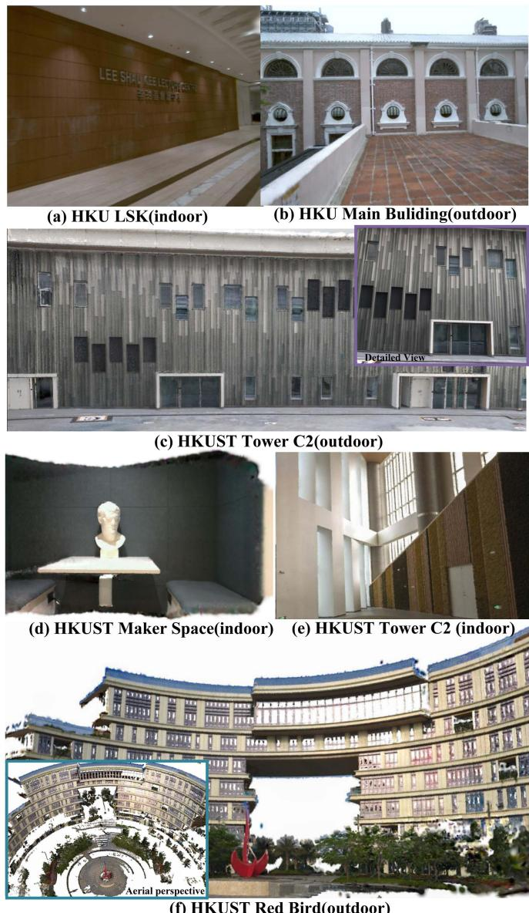
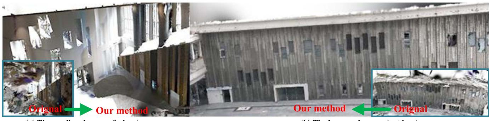
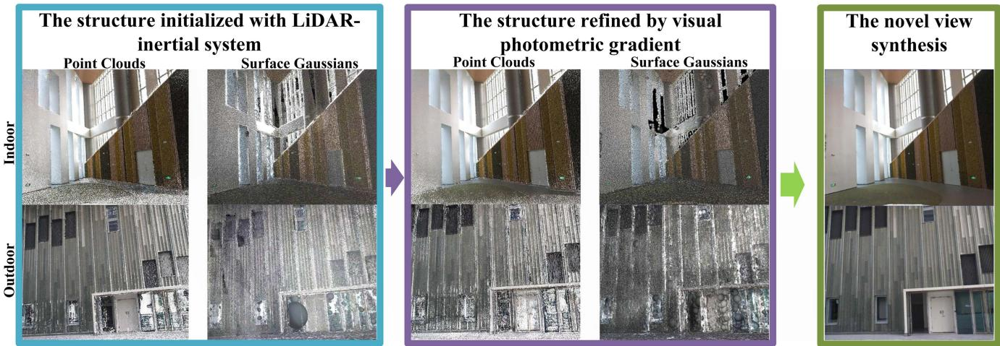
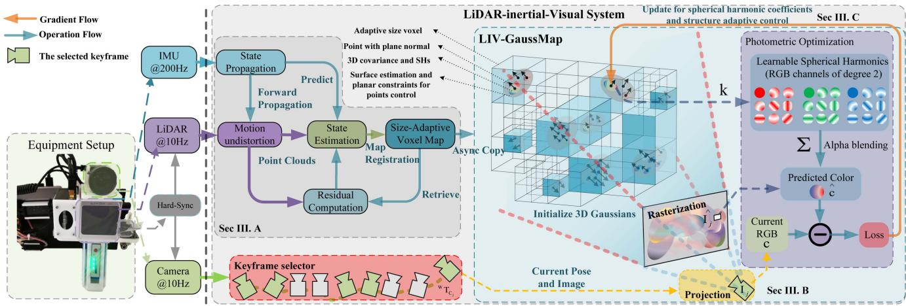
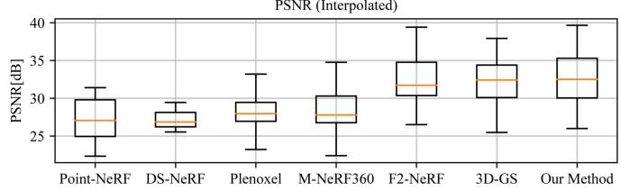
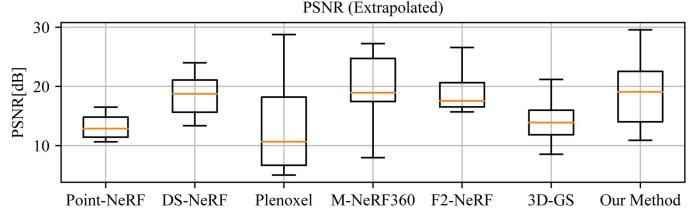
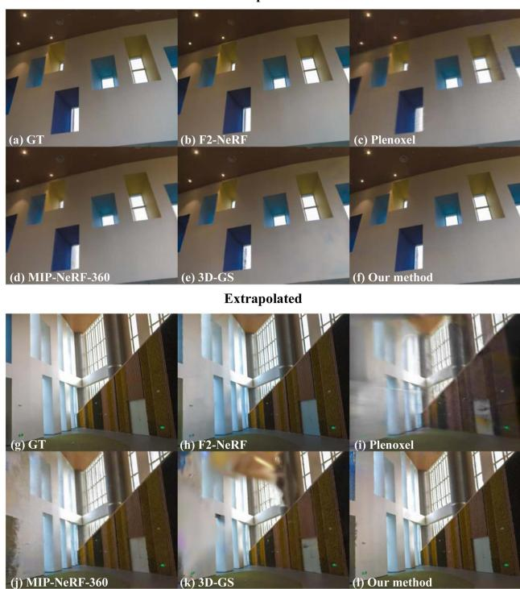

# LIV-GaussMap: LiDAR-Inertial-Visual Fusion for Real-Time 3D Radiance Field Map Rendering

Sheng Hong , Junjie He , Xinhu Zheng , and Chunran Zheng

Abstract—We introduce an integrated precise LiDAR, Inertial, and Visual (LIV) multimodal sensor fused mapping system that builds on the differentiable Gaussians to improve the mapping fidelity, quality, and structural accuracy. Notably, this is also a novel form of tightly coupled map for LiDAR-visual-inertial sensor fusion. This system leverages the complementary characteristics of LiDAR and visual data to capture the geometric structures oflargescale 3D scenes and restore their visual surface information with high fidelity. The initialization for the scene’s surface Gaussians and the sensor’s poses of each frame are obtained using a LiDARinertial system with the feature ofsize-adaptive voxels. Then, we optimized and refined the Gaussians using visual-derived photometric gradients to optimize their quality and density. Our method is compatible with various types of LiDAR, including solid-state and mechanical LiDAR, supporting both repetitive and non-repetitive scanning modes. Bolstering structure construction through LiDAR and facilitating real-time generation of photorealistic renderings across diverse LIV datasets. It showcases notable resilience and versatility in generating real-time photorealistic scenes potentially for digital twins and virtual reality, while also holding potential applicability in real-time SLAM and robotics domains. We release our software and hardware and self-collected datasets on Github to benefit the community.

Index Terms—LiDAR, multi-sensor fusion, mapping, radiance field, 3D gaussian splatting.

## I. INTRODUCTION

IMULTANEOUS localization and mapping (SLAM), essential for autonomous navigation, combines map construction of unknown environments with tracking an agent’s location [2]. Traditional SLAM systems, limited by single sensors, such as cameras or LiDAR, face challenges such as light sensitivity or depth perception issues. The multimodal fusion of sensors in SLAM addresses these by integrating data from cameras, LiDAR, and IMU, improving the precision and robustness of the map [3], [4], [5], [6], [7], [8].

However, existing LiDAR-inertial visual systems are predominantly designed for scenarios with Lambertian surfaces based on the assumption that the environment exhibits isotropic photometric properties across different viewing directions. Visual information within these systems is typically represented as 3D points associated with image patches [8] or colored pixels [7]. Tracking and mapping in environments with non-Lambertian surfaces like glass or reflective metal are challenging due to their varying reflective properties. Overcoming this requires specialized sensors or algorithms. Recent advances in novel view synthesis have shown the ability to generate impressive photorealistic images from new perspectives. These methods employ implicit representations such as neural radiation fields (NeRF) [9] or explicit representations such as meshes and signed distance functions, including the emerging technique of 3D Gaussian splatting [1]. By reconstructing the scene’s geometric structures while preserving visual integrity with harmonic spherical function, these approaches enable the creation of highly realistic images.

However, in the field of novel view synthesis, the focus on high PSNR often neglects the map structure, leading to poor extrapolation performance, which is crucial for robotics. Techniques such as COLMAP and SfM [10] are limited in low-texture scenes. Multimodal sensor fusion improves this, enhancing geometric accuracy and enabling more dense and precise maps.

Overall, the primary contributions of this work can be summarized as follows:

We propose constructing a dense and precise map of the scene by utilizing the Gaussians measurement from the LiDAR-inertial system. This measurement allows us to accurately represent the characteristics of the scene’s surface and create a detailed map.

We propose building up the LiDAR-visual map with differentiable Gaussians with spherical harmonic coefficients, which implies the visual measurement information from different viewing directions. This approach enables realtime rendering with photorealistic performance, enhancing the accuracy and realism of the map.

We propose further optimizing the structure of the map by incorporating differentiable ellipsoidal surface Gaussians in order to mitigate the issue ofan unreasonable distribution of point clouds caused by the critical inject-angle during scanning, addressing the challenges ofunevenly distributed or inaccurately measured point clouds.

  
Fig. 1. The real-world experiments were performed in both public datasets and private datasets, including both small-scale indoor environments and large-scale outdoor settings. The image shows our radiance field map ofHKU LSK (a), HKU Main Building (b), HKUST GZ Tower C2 outdoor (c) and indoor (e), HKUST GZ Makerspace (d), HKUST GZ Red Bird (f).

\- All related software and hardware packages and selfcollecting datasets will be publicly available to benefit the community.

To our knowledge, this study is the first to utilize multimodal sensor fusion to build a precise and photorealistic Gaussian map. By combining the accurate map from the LiDAR-inertial system with visual photometric measurements, we achieve a comprehensive and detailed representation of the environment.

Our proposed method has undergone rigorous testing and validation on diverse public real-world datasets, including different types of LiDAR, such as the mechanical Ouster OS1-128, semi-mechanical Livox Avia, and solid-state Realsense L515. The evaluation datasets covered both indoor (bounded scene) and outdoor (unbounded scene). The experimental results confirm the effectiveness of our algorithm in efficiently capturing and storing image information from multiple viewpoints. This capability enables the rendering of novel views with improved performance.

## II. RELATED WORKS

## A. Related Work About Mapping With Multi-Modal Sensor

In the realm of robotics, multi-modal sensor fusion for localization, such as LiDAR-inertial visual odometry(LIVO), is being extensively researched. LiDAR can deliver accurate geometric measurements of real-world environments, while cameras provide detailed 2D imagery of textures and appearances of the environment. Meanwhile, inertial navigation systems provide high-frequency motion measurements. The integration of these sensors is considered ideal for robotic applications.

The trend of multisensor fusion is developing from loose to tightly coupled, exhibiting increased robustness in complex environments. Notably, frameworks such as Zuo et al.’s LICfusion [3] and its successor, LIC-Fusion 2.0, have achieved significant improvements in accuracy and robustness by tightly integrating IMU, visual, and LiDAR data. This integration is facilitated by the novel tracking of plane features, which is a key innovation that contributes to the enhanced performance of the system. Parallelly, LVI-SAM [5] and R2LIVE [6] have further advanced the state-of-the-art by tightly combining LiDAR, visual, and inertial data, guaranteeing the robustness ofthe systems even when encountering sensor malfunctions and in challenging circumstances. Among them, R3LIVE uses the photometric error of the RGB-colored point clouds for observation, while FAST-LIVO uses the map in the form of points attached with image patches from various viewpoints, similar to SVO [11]. These approaches highlight the real-time performance and accuracy of multimodal sensor fusion in robotics, generating colorized point clouds of the scene for visualization. However, these point clouds are not hole-free and lack photometric realism. Moreover, for anisotropic, non-Lambertian surfaces like glass and metal, the appearance can vary across different viewpoints, leading to blurred colorized point clouds.

In the work of [12], an efficient LiDAR-inertial odometry (LIO) method called VoxelMap is proposed. It maps scenes using adaptive voxels that incorporate plane features, such as normal vectors and covariances. This probabilistic representation of the surface allows for the accurate registration of new LiDAR scans. In the realm of voxel-based mapping and odometry techniques, [7] and [8] maintain a map with voxels of constant size, while [12] utilize a method in which the voxel size is dynamically adjusted. Both these LIO and LIVO represent the structure of the world using an ellipsoidal Gaussian distribution, which resembles surface Gaussians [1], [13], [14] used for novel view synthesis in computer graphics and 3D visualization.

## B. Related Work About Novel View Synthesis

The representation of a map can be explicit, such as meshes, point clouds, and signed distance fields (SDF), or implicit, such as neural radiation fields (NeRF) [9]. Implicit representation for novel view synthesis has seen advances in the modeling of scenes as continuous radiance fields. These methods, which differ from traditional SLAM systems modeling scenes with discrete point clouds, create more photorealistic images by treating scenes as continuous, viewpoint-dependent functions. Instant-NGP [15] improves this procedure by using a multiresolution hash grid to encode spatial information and spherical harmonics to encode angular information. This reasonable positional encoding solution facilitates a more streamlined neural network, allowing real-time rendering and faster training. Mip-NeRF 360 [16] addresses unbounded scenes and sampling issues with nonlinear parameterization and new regularizers. Despite implicit representations using neural networks for high-fidelity, low-memory synthesis, they remain computationally intensive. Recent efforts have focused on explicit map representations, such as using spherical harmonics for voxel-based volumetric density.

  
Fig. 2. The figure shows the aerial perspective of the indoor and outdoor scenes of HKUST GZ Tower C1. In contrast to the vision build-up structure by 3D-GS [1], our approach yields a more refined structure with few artifacts.

  
Fig. 3. The construction process of the map is illustrated in the above figure. (1) Initially, the Gaussians of the scene are derived from a Kalman-filtered LiDAR-inertial system. The surfaces of the scene are estimated using LiDAR measurements and are further developed into ellipsoidal surface Gaussians. (2) We further optimize the Gaussians by using photometric gradients. This optimized map allows us to synthesize new views with precise photometry and generate a hole-free map.

PlenOctrees, introduced by Yu et al. [17], utilize volumetric rendering with spherical harmonics (SHs) to model rays from various directions, offering a compact and efficient way to represent complex 3D scenes. Plenoxels, proposed by Fridovich-Keil et al. [18], represent scenes as sparse 3D grids using SHs, optimized through gradient methods without the need for neural networks, significantly reducing computational requirements, and achieving real-time rendering speeds 100 times faster than NeRF. The concept of splatting-based rendering originated from

Zwicker et al. Surface splatting [14] has evolved through differentiable surface splatting for point-based geometry by Wang et al. [19], and further advancements in optimizing gradients for SH coefficients in Gaussians by Zhang et al. [13]. Most recently, Kerbl et al. [1] have developed a method to

simulate the surfaces of spatial objects as anisotropic Gaussians, allowing the synthesis of images from novel viewpoints.

## III. METHODOLOGY

Our system, illustrated in Fig. 4, integrates with hardware and software components. Hardware-wise, it features a hardwaresynchronized LiDAR-inertial sensor paired with a camera, ensuring precise synchronization of LiDAR point clouds and image captures for accurate data alignment and fusion.

Software-wise, the process starts with LiDAR-inertial odometry [12] for localization, using a map with size-adaptive voxels to represent planar surfaces. LiDAR point clouds are segmented into voxels as shown in Fig. 3, where the covariance of the plane is computed for the initialization for Gaussians (Section III-A). The next step involves optimizing the spherical harmonic coefficients and refining the LiDAR Gaussian structures with images captured from various perspectives using photometric gradients(Sec III-B and Section III-C). This approach produces a photometrically accurate LiDAR-visual map, enhancing mapping precision and visual realism.

  
Fig. 4. The overview of our proposed system: The left side illustrates the sensory inputs and the configuration of the data acquisition equipment. The right side details the software pipeline, showcasing the sequence of processing steps.

## A. Initialization ofGaussians With LiDAR Measurement

Initially, we used size-adaptive voxels to partition the LiDAR point cloud, drawing inspiration from the octree approach discussed in [12].

Our adaptiveness of the voxel partition is determined on the basis of evaluating a certain parameter η, which serves as an indicator to judge whether a voxel has a surface with planar characteristics inside. To obtain a more precise map with a normal vector of surface Gaussian, we allow for smaller voxels and further subdivision into finer levels. If the voxel is sufficiently divided through multiple subdivisions, even curved surfaces can be approximated.

The voxel can be characterized by its average position p, the normal vector n, and the covariance matrix $\Sigma _ { \mathbf { n } , \overline { { \mathbf { p } } } }$ within the voxel.

$$
\overline { { \mathbf { p } } } = \frac { 1 } { N } \sum _ { i = 1 } ^ { N } { \boldsymbol { w } _ { \mathbf { p } } } _ { i }\tag{1}
$$

The covariance ofthe voxel $\Sigma _ { \mathbf { n } , \overline { { \mathbf { p } } } }$ can be calculated as follows, which indicates the distribution of the points ${ \bf \omega } ^ { w } { \bf p } _ { i }$

$$
\Sigma _ { \mathbf { n } , \overline { { \mathbf { p } } } } = \frac { 1 } { N } \sum _ { i = 1 } ^ { N } \left( { } ^ { w } \mathbf { p } _ { i } - \overline { { \mathbf { p } } } \right) \left( { } ^ { w } \mathbf { p } _ { i } - \overline { { \mathbf { p } } } \right) ^ { T }\tag{2}
$$

We denote the eigenvector n, which is considered the normal vector of the planar surface, for the covariance $\Sigma _ { \mathbf { n } , \overline { { \mathbf { p } } } }$ of this hypothetical Gaussian plane [12]. The corresponding eigenvalues λ represent the distribution of this Gaussian plane in each direction. Ifthe η, which indicates that the thickness ofthe planar surface is still significant, a further subdivision is performed.

$$
\eta = \frac { \lambda _ { \mathrm { m i n } } } { \sqrt { { \lambda _ { \mathrm { m i d } } } ^ { 2 } + { \lambda _ { \mathrm { m i n } } ^ { 2 } } + { \lambda _ { \mathrm { m a x } } } ^ { 2 } } }\tag{3}
$$

The distribution matrix $\Sigma _ { \mathbf { n } , \overline { { \mathbf { p } } } }$ is calculated to determine the approximate shape and pose of the point cloud, which contains the pose of the Gaussians.

We introduce a scaling factor $\alpha _ { i }$ for each point, which is determined by the density of the points within the voxels.

This scaling factor $\alpha _ { i }$ is used to rescale the planar Gaussians.

$$
\pmb { \Sigma } \mathbf { w } _ { \mathbf { p } _ { i } } = \alpha _ { i } \pmb { \Sigma } _ { \mathbf { n } , \overline { { \mathbf { p } } } }\tag{4}
$$

The impact of a LiDAR point cloud on the radiance field can be determined by the following equation:

$$
G _ { i } ^ { \mathrm { 3 D } } \left( { } ^ { w } \mathbf { p } \right) = e ^ { - \frac { 1 } { 2 } \left( { } ^ { w } \mathbf { p } - { } ^ { w } \mathbf { p } _ { i } \right) ^ { T } \Sigma \mathbf { w _ { p } } _ { \mathbf { i } } ^ { - 1 } \left( { } ^ { w } \mathbf { p } - { } ^ { w } \mathbf { p } _ { i } \right) }\tag{5}
$$

## B. Spherical Harmonic Coefficient Optimization and Map Structure Refinement With Photometric Gradients

We utilize second-degree spherical harmonics (SHs) [20], which require a total of 27 harmonic coefficients for each Gaussian, allowing the rendering of non-Lambertian surfaces.

The point in the world frame is ${ } ^ { w } { \bf p } _ { i }$ , and the pose of the LIV system is $ { w } _ { \mathbf { T } _ { C _ { n } } }$ . The viewing direction for the point ${ } ^ { w } { \bf p } _ { i }$ from the pose $\mathbf { \Delta } ^ { w } \mathbf { T } _ { C _ { n } }$ can be calculated as

$$
C _ { n }  { { \bf { v } } _ { i } } = \frac { { { { w } } } { { \bf { T } } _ { { C _ { n } } } ^ { - 1 } } \mathrm { ~ . ~ } { { w } _ { { D } } } _ { i } } { { { \left\| { { { w } } { { \bf { T } } } _ { { C _ { n } } } ^ { - 1 } } \mathrm { ~ . ~ } { { w } _ { { { \bf { p } } } } } _ { i } \right\} | } }\tag{6}
$$

$$
\theta = \operatorname { a r c c o s } \left( \frac { { C _ { n } } { \bf { v } } _ { i z } } { \sqrt { { C _ { n } } { { \bf { v } } _ { i x } } ^ { 2 } + { C _ { n } } { { \bf { v } } _ { i y } } ^ { 2 } + { C _ { n } } { { \bf { v } } _ { i z } } ^ { 2 } } } \right)\tag{7}
$$

$$
\phi = \arctan 2 \bigl ( \mathbf { \sp { C _ { n } } v } _ { i y } , \mathbf { \sp { C _ { n } } v } _ { i x } \bigr )\tag{8}
$$

The spherical harmonics function is sensitive to the viewing direction.

$$
c ( \theta , \phi ) = \sum _ { \ell = 0 } ^ { \infty } \sum _ { m = - \ell } ^ { \ell } k _ { \ell } ^ { m } \sqrt { \frac { 2 \ell + 1 } { 4 \pi } \frac { ( \ell - m ) ! } { ( \ell + m ) ! } } P _ { \ell } ^ { m } ( \cos \theta ) e ^ { i m \phi }\tag{9}
$$

TABLE I  
SPECIFICATIONS OF LIDAR-INERTIAL-VISUAL SYSTEM IN TESTED DATASETS
<table><tr><td></td><td>Dataset</td><td>FAST-LIVO [8]</td><td>FusionPortable [21]</td><td>Our Device I</td><td>Our Device II</td></tr><tr><td rowspan="5">LiDAR</td><td>Device name Points per second</td><td>Livox Avia 240,000</td><td>Ouster OS1-128 2,621,440</td><td>RealSense L515 23,000,000</td><td>Livox Avia 240,000</td></tr><tr><td>Scanning mechanism</td><td>Mechanical, non-repetitive</td><td>Mechanical, repetitive</td><td>Solid-state</td><td>Mechanical, non-repetitive</td></tr><tr><td></td><td></td><td></td><td></td><td></td></tr><tr><td>Range</td><td> $3 \mathrm { ~ m ~ } - 4 5 0 \mathrm { ~ m ~ }$ </td><td> $1 \textrm { m } - 1 2 0 \textrm { m }$ </td><td> $\mathrm { 9 ~ m - 2 5 ~ m }$ </td><td> $3 \ \mathrm { m } - 4 5 0 \ \mathrm { m }$ </td></tr><tr><td>Field of View</td><td> $7 0 . 4 ^ { \circ } \times 7 7 . 2 ^ { \circ }$ </td><td> $4 5 ^ { \circ } \times 3 6 0 ^ { \circ }$ </td><td> $7 0 ^ { \circ } \times 5 5 ^ { \circ }$ </td><td> $7 0 . 4 ^ { \circ } \times 7 7 . 2 ^ { \circ }$ </td></tr><tr><td rowspan="5">Camera</td><td>IMU Device name</td><td>BM1088  $\mathrm { \overline { { M V  – C A 0 1 3 – 2 1 0 C } } }$ </td><td>ICM20948</td><td>BMI085 RealSense L515</td><td>BMI088</td></tr><tr><td></td><td></td><td>FILR BFS-U3-31S4C</td><td></td><td> $\mathrm { \overline { { M V { - } C A 0 1 3 { - } 2 1 } U C } }$ </td></tr><tr><td>Shutter mode</td><td>Global shutter</td><td>Global shutter</td><td>Rolling shutter</td><td>Global shutter</td></tr><tr><td>Resolution</td><td> $1 2 8 0 \times 1 0 2 4$ </td><td> $1 0 2 4 \times 7 6 8$ </td><td> $1 9 2 0 \times 1 0 8 0$ </td><td> $1 2 8 0 \times 1 0 2 4$ </td></tr><tr><td>Field of View</td><td> $7 2 ^ { \circ } \times 6 0 ^ { \circ }$ </td><td> $6 6 . 5 ^ { \circ } \times 8 2 . 9 ^ { \circ }$ </td><td> $7 0 ^ { \circ } \times 4 3 ^ { \circ }$ </td><td> $7 2 ^ { \circ } \times 6 0 ^ { \circ }$ </td></tr><tr><td colspan="2">Synchronization</td><td>√</td><td>√</td><td>√</td><td>√</td></tr><tr><td colspan="2">Grouth Truth of Structure</td><td>×</td><td>√</td><td>√</td><td>√</td></tr><tr><td colspan="2">Dataset Sequence</td><td>HKU_LSK(indoor) HKUMB(outdoor)</td><td>HKUST_indoor</td><td>UST RBMS</td><td>UST_C2_indoor</td></tr></table>

where $P _ { \ell } ^ { m } ( \cos \theta ) e ^ { i m \phi }$ represents the Legendre polynomials. $k _ { \ell } ^ { m }$ is the coefficients of the spherical harmonics in each LiDAR point.

As Fig. 4 shows, the LIV system initially generates a dense point cloud populated with 3D Gaussians, each characterized by a position ${ } ^ { w } { \bf p } _ { i } .$ , a covariance matrix $\pmb { \Sigma } _ { w } _ { \mathbf { p } _ { i } }$ , and the spherical harmonic coefficients $k _ { \ell } ^ { m }$

Each frame of the LiDAR-inertial sensor and the camera is synchronized through the trigger signal. Consequently, the projection of a LiDAR point cloud from the world frame to the camera frame $C _ { n }$ on the image plane $C _ { n } { _ { \mathbf { q } _ { i } } }$ can be written as follows:

$$
{ { \mathbf { } } ^ { C _ { n } } } { \mathbf { q } } _ { i } = \pi \left( { { } ^ { w } } { \mathbf { T } } _ { C _ { n } } ^ { - 1 } \cdot { { } ^ { w } } { \mathbf { p } } _ { i } \right)\tag{10}
$$

To train a model that predicts the image $I _ { n }$ . We employ the loss function as below to optimize the structure and the spherical harmonic coefficients of point clouds, that is

$$
\mathcal { L } = ( 1 - \lambda ) \sum _ { n = 1 } ^ { N } \sum _ { \mathbf { q } \in \mathcal { R } } \Big \Vert I _ { n } ( \mathbf { q } ) - \hat { I } _ { n } \left( \mathbf { q } \right) \Big \Vert + \lambda \mathcal { L } _ { \mathbf { D } - \mathbf { S S I M } }\tag{11}
$$

where λ is a weighting coefficient that balances the contribution of MSE and D-SSIM losses. To effectively refine the structure of the Gaussians and their spherical harmonic coefficients, we employ the Adam optimizer for the optimization of the loss function.

The novel view of the image $\hat { I } _ { j } ( u )$ can be synthesized through alpha blending using the following equation:

$$
\hat { I } _ { n } ( \mathbf { q } ) = \sum _ { i = 1 } ^ { M } \left[ c _ { i } \sigma _ { i } G _ { i } ^ { \mathrm { 2 D } } ( \mathbf { q } ) \prod _ { j = 1 } ^ { i - 1 } \big ( 1 - \sigma _ { j } G _ { j } ^ { \mathrm { 2 D } } ( \mathbf { q } ) \big ) \right]\tag{12}
$$

where $G _ { i } ^ { \mathrm { 2 D } } ( u )$ is the 2D Gaussian derived from $G _ { i } ^ { \mathrm { 3 D } } ( x )$ through the local affine transformation conducted in [14], $\sigma _ { i } \in [ 0 , 1 ]$ is the opacity of Gaussians. M is the number of Gaussians that influence the pixel.

## C. Structure Adaptive Control of 3D Gaussian Map

The structure derived from the LiDAR-inertial system is not flawless. It may encounter difficulties in accurately measuring surfaces made of glass or areas that have been scanned either excessively or insufficiently. To address these concerns, we employ structure refinement to address under-reconstruction and over-dense scenarios.

  
Fig. 5. This box plot illustrates the comparative performance of the leading method and our approach in terms of interpolation and extrapolation across datasets by PSNR values.

In situations where geometric features are not yet well reconstructed (under-reconstruction), noticeable positional gradients can arise within the view space. In our experiments, we establish a predefined threshold value to identify regions that require densification. We replicate the neighboring Gaussians and then employ the photometric gradient to optimize its position for structural completion. In cases where repetitive scanning results in an overdense point cloud, we regularly evaluate its opacity, and eliminate excessively non-essential regions with low opacity. This effectively reduces redundant points on the map and improves optimization efficiency.

## IV. REAL-WORLD EXPERIMENTS

As shown in Table I, the detailed device configurations for the four evaluation datasets are presented. To thoroughly evaluate the effectiveness of our algorithm, we purposely conducted tests on two publicly accessible datasets and two proprietary datasets that encompass a wide range of LiDAR modalities. Specifically, we used the FusionPortable dataset [21], which features repetitive scanning LiDAR, and the FAST-LIVO dataset [8], which includes non-repetitive LiDAR data from public sources.

Interpolated  
TABLE II  
QUANTITATIVE EVALUATION OF OUR METHOD WITH PREVIOUS WORK
<table><tr><td></td><td>PSNR[dB]↑</td><td>SSIM↑ (Interpolate)</td><td>LPIPS↓</td><td>PSNR↑</td><td>SSIM↑</td><td>LPIPS↓</td><td>Cost</td><td>FPS</td></tr><tr><td>Point-NeRF* [2]</td><td>(Interpolate) 27.331</td><td>0.872</td><td>(Interpolate) 0.457</td><td>(Extrapolate)</td><td>(Extrapolate) 0.631</td><td>(Extrapolate) 0.610</td><td>Time 30m20s</td><td>0.06</td></tr><tr><td>DS-NeRF* [24]</td><td>27.178</td><td>0.831</td><td>0.428</td><td>13.117 18.534</td><td>0.712</td><td>0.533</td><td>4h</td><td>0.06</td></tr><tr><td>3D-GS*</td><td>31.900</td><td></td><td></td><td>15.112</td><td></td><td>0.503</td><td>14m10s</td><td>47</td></tr><tr><td>[1]</td><td></td><td>0.913</td><td>0.241</td><td></td><td>0.647</td><td></td><td></td><td>6.12</td></tr><tr><td>Plenoxel [18]</td><td>26.744 28.446</td><td>0.844</td><td>0.452</td><td>12.916</td><td>0.628</td><td>0.575 0.526</td><td>25m38s 8h</td><td>0.05</td></tr><tr><td>M-NeRF360 [16] F2-NeRF [25]</td><td>32.556</td><td>0.820 0.941</td><td>0.444 0.193</td><td>19.213</td><td>0.726 0.764</td><td>0.387</td><td>28m34s</td><td>13.9</td></tr><tr><td>3D-GS [1]</td><td>31.899</td><td>0.913</td><td>0.240</td><td>19.100 15.111</td><td>0.647</td><td>0.502</td><td>8m11s</td><td>131</td></tr><tr><td>Our method</td><td>32.787</td><td>0.926</td><td>0.190</td><td>19.220</td><td>0.803</td><td>0.331</td><td>14m25s</td><td>43</td></tr></table>

  
Fig. 6. We present a comprehensive comparison between our proposed method and the state-of-the-art technique, showcasing the results of both interpolation and extrapolation for synthesizing novel viewpoints. The upper row exhibits interpolated views, while the bottom row demonstrates extrapolated viewpoint synthesis.

Compared to existing datasets, ours offers a comprehensive array of LiDAR modalities captured in both indoor and outdoor environments, ensuring robust hardware synchronization and accurate calibration of intrinsic [22] and extrinsic [23] parameters. In addition, we provide ground-truth structures in the form of point clouds to facilitate structure accuracy evaluation. For the execution of our mapping system, we employ a high-performance desktop computer powered by an Intel Core i9 12900 K 3.50 GHz processor and a single NVIDIA GeForce RTX 4090.

## A. Evaluationfor Novel View Synthesis With Previous Work

In our study, we evaluated the performance of our mapping system on a real-world dataset, comparing it against other state-of-the-art frameworks, such as Plenoxel [18], F2-NeRF [2], DS-NeRF [24], Point-NeRF [2], and 3D Gaussian splatting [1], as shown in Fig. 6. Note that the methods marked with an asterisk (\*) in Table II were enhanced using dense LiDAR point clouds.

As depicted in Fig. 5, the top row presents interpolated views, while the bottom row elucidates the synthesis of extrapolated viewpoints.

Our algorithm demonstrates competitive performance in the peak signal-to-noise ratio (PSNR) compared to other state-ofthe-art (SOTA) algorithms, such as 3DGS, in particular in the extrapolated perspective. This can be attributed to the inherent advantage of our LiDAR system, which provides relatively precise structural observations.

Furthermore, we compared our method with other latest implicit representation approaches, such as F2NeRF and MIP-NeRF360, and found that our results are still competitive. In particular, our training and rendering speeds are faster, highlighting the efficiency of our approach.

## B. Ablation Study for Rendering Performance With LiDAR Structure

To validate the effectiveness of our algorithm, we progressively integrated our optimized methods and monitored the corresponding changes in PSNR. We designed several comparative experiments as the following cases for ablation analysis (Table III).

Case I: Implemented 3D-GS as a baseline. Case II: LiDAR initialization for Gaussians, showing map reconstruction without visual optimizations for Gaussian structure. Case III: Enhanced Case II with photometric gradients to optimize the Gaussian position. Case IV: Further refinement using photometric gradients for Gaussian pose optimization.

By comparing Case I and Case II, the performance varies with the complexity of the scene. In complex structures like “HKU\_MB\_(outdoor)”, LiDAR’s accuracy decreases, potentially lowering PSNR. In simpler scenes like “UST\_C2\_outdoor”, LiDAR achieves precise estimations, enhancing PSNR, especially in extrapolation tasks. In Case III, optimizing point-cloud distribution speeds up the process but may reduce PSNR.

Ultimately, our method (Case IV) enhances PSNR by refining the map structure, consistently outperforming 3D-GS across all scenes in both interpolation and extrapolation. We also evaluated our method with solid-state LiDAR (RealSense L515). Given its restricted measurement range, we only conducted experiments in indoor scenes. The results demonstrate that our approach consistently maintains a superior level of PSNR.

TABLE III  
ABLATION STUDY FOR MAP STRUCTURE OPTIMIZATION
<table><tr><td>Metric</td><td>Method</td><td>HKU_MB(outdoor)HKU_LSK(indoor) UST_C2_outdoor UST_C2_indoor</td><td></td><td></td><td></td><td>UST_RBMS</td><td>Avg.</td></tr><tr><td rowspan="4">PSNR[db]↑ (Interpolated)</td><td>Case I</td><td>24.390</td><td>31.222</td><td>31.843</td><td>31.721</td><td>31.663</td><td>30.168</td></tr><tr><td>Case II</td><td>24.341</td><td>25.964</td><td>31.983</td><td>29.625</td><td>30.211</td><td>28.425</td></tr><tr><td>Case III</td><td>24.240</td><td>31.045</td><td>33.229</td><td>31.975</td><td>31.047</td><td>30.307</td></tr><tr><td>Case IV</td><td>25.140</td><td>31.597</td><td>33.644</td><td>32.726</td><td>31.277</td><td>30.877</td></tr><tr><td rowspan="4">SSIM↑ (Interpolated)</td><td>Case I</td><td>0.793</td><td>0.798</td><td>0.897</td><td>0.916</td><td>0.872</td><td>0.856</td></tr><tr><td>Case II</td><td>0.814</td><td>0.780</td><td>0.895</td><td>0.891</td><td>0.864</td><td>0.849</td></tr><tr><td>Case III</td><td>0.809</td><td>0.804</td><td>0.909</td><td>0.918</td><td>0.868</td><td>0.862</td></tr><tr><td>Case IV</td><td>0.825</td><td>0.805</td><td>0.916</td><td>0.926</td><td>0.870</td><td>0.868</td></tr><tr><td rowspan="4">LPIPS↓ (Interpolated)</td><td>Case I</td><td>0.316</td><td>0.277</td><td>0.115</td><td>0.219</td><td>0.338</td><td>0.253</td></tr><tr><td>Case II</td><td>0.304</td><td>0.292</td><td>0.147</td><td>0.219</td><td>0.358</td><td>0.264</td></tr><tr><td>Case III</td><td>0.301</td><td>0.273</td><td>0.101</td><td>0.195</td><td>0.349</td><td>0.244</td></tr><tr><td>Case IV</td><td>0.296</td><td>0.259</td><td>0.094</td><td>0.190</td><td>0.341</td><td>0.236</td></tr><tr><td rowspan="4">PSNR[db]↑ (Extrapolate)</td><td>Case I</td><td>15.144</td><td>23.831</td><td>24.426</td><td>18.657</td><td>23.868</td><td>21.185</td></tr><tr><td>Case II</td><td>16.503</td><td>22.400</td><td>25.653</td><td>20.511</td><td>23.792</td><td>21.772</td></tr><tr><td>Case III</td><td>16.178</td><td>24.821</td><td>25.047</td><td>18.964</td><td>24.879</td><td>21.978</td></tr><tr><td>Case IV</td><td>16.530</td><td>24.808</td><td>25.912</td><td>19.220</td><td>25.545</td><td>22.403</td></tr><tr><td rowspan="4">SSIM↑ (Extrapolate)</td><td>Case I</td><td>0.403</td><td>0.680</td><td>0.570</td><td>0.766</td><td>0.849</td><td>0.654</td></tr><tr><td>Case II</td><td>0.441</td><td>0.657</td><td>0.674</td><td>0.771</td><td></td><td>0.679</td></tr><tr><td>Case III</td><td>0.451</td><td>0.686</td><td>0.612</td><td>0.775</td><td>0.847</td><td></td></tr><tr><td>Case IV</td><td>0.470</td><td>0.684</td><td>0.648</td><td>0.801</td><td>0.848</td><td>0.675</td></tr><tr><td rowspan="4">LPIPS↓ (Extrapolate)</td><td>Case I</td><td>0.530</td><td>0.402</td><td>0.307</td><td>0.370</td><td>0.851</td><td>0.691</td></tr><tr><td>Case II</td><td>0.494</td><td>0.355</td><td>0.302</td><td>0.314</td><td>0.389</td><td>0.399</td></tr><tr><td>Case III</td><td>0.482</td><td>0.356</td><td>0.314</td><td></td><td>0.393</td><td>0.372</td></tr><tr><td>Case IV</td><td>0.479</td><td>0.348</td><td>0.275</td><td>0.341</td><td>0.382</td><td>0.375</td></tr><tr><td rowspan="4">Cost time[min].</td><td>Case I</td><td>26m9s</td><td>16m58s</td><td>24m16s</td><td>0.336 14m15s</td><td>0.371</td><td>0.362</td></tr><tr><td>Case II</td><td>34m14s</td><td>17m3s</td><td>25m55s</td><td>17m38s</td><td>20m43s 24m5s</td><td>20m28s 23m47s</td></tr><tr><td>Case III</td><td>19m37s</td><td>14m19s</td><td>16m26s</td><td>12m20s</td><td>18m54s</td><td>16m19s</td></tr><tr><td>Case IV</td><td>18m19s</td><td>13m41s</td><td>16m33s</td><td>13m4s</td><td>18m46s</td><td>16m5s</td></tr></table>

TABLE IV

ABLATION STUDY OF DIFFERENT DESIGN CHOICES ON FUSIONPORTABLE DATASET [21]
<table><tr><td rowspan=1 colspan=1></td><td rowspan=1 colspan=1>CD [2</td><td rowspan=1 colspan=1>6]</td><td rowspan=1 colspan=2>↓      EMD [2</td><td rowspan=1 colspan=2>7]↓   F-score</td><td rowspan=1 colspan=1>[28]↑</td></tr><tr><td rowspan=4 colspan=1>Case ICase IICase IIICase IV</td><td rowspan=1 colspan=5>0.149          0.698</td><td rowspan=1 colspan=2>0.544</td></tr><tr><td rowspan=1 colspan=3>0.114</td><td rowspan=1 colspan=2>0.553</td><td rowspan=1 colspan=2>0.807</td></tr><tr><td rowspan=1 colspan=3>0.109</td><td rowspan=1 colspan=2>0.614</td><td rowspan=1 colspan=2>0.682</td></tr><tr><td rowspan=1 colspan=5>0.107          0.435</td><td rowspan=1 colspan=2>0.751</td></tr></table>

## C. Structure Reconstruction Evaluation

Our study presented qualitative and quantitative results, highlighting the effectiveness of using LiDAR for initial structure optimization (see Figs. 1 and 2). Quantitatively, we evaluated our approach using CD (Chamfer Discrepancy) [26], EMD (Earth Mover Distance) [27], and F-score [28]（Table IV）, finding significant improvements in these metrics with LiDAR-based initialization. Although the use of photometric optimization for the Gaussian structure slightly reduced structural quality, the introduction of Gaussian pose refinement showed mixed results: it improved CD and EMD but negatively impacted the F-score. Despite some trade-offs in structural integrity for better PSNR, our method overall demonstrated superior structural metrics compared to purely visual approaches.

## V. CONCLUSION

We propose a 3D radiance field mapping system that capitalizes on the fusion of LiDAR-inertial visual multimodal sensors, offering high-quality and real-time rendering capabilities.

Our method utilizes the accurate surface measurement features of LiDAR, along with the inherent adaptive voxel characteristic of the LiDAR-inertial system, to enable quick acquisition of the initial scene structure. Additionally, we utilized visual observations to further optimize the LiDAR structure by photometric gradient, enhancing PSNR performance. Even though the training and rendering speeds are slower than the 3D-GS due to the dense LiDAR points, our method still shows real-time rendering performance.

Through extensive real-world experiments, our approach has proven its ability to achieve superior geometric structures and high rendering quality, both extrapolated and interpolated, compared to other leading visual-based techniques.

## REFERENCES

[1] B. Kerbl, G. Kopanas, T. Leimkühler, and G. Drettakis, “3D Gaussian splatting for real-time radiance field rendering,” ACM Trans. Graph., vol. 42, no. 4, pp. 1–14, 2023.

[2] Q. Xu et al., “Point-NeRF: Point-based neural radiance fields,” in Proc. IEEE/CVF Conf. Comput. Vis. Pattern Recognit., 2022, pp. 5438–5448.

[3] X. Zuo, P. Geneva, W. Lee, Y. Liu, and G. Huang, “LIC-Fusion: LiDARinertial-camera odometry,” in Proc. IEEE/RSJ Int. Conf. Intell. Robots Syst., 2019, pp. 5848–5854.

[4] Y. Zhu, C. Zheng, C. Yuan, X. Huang, and X. Hong, “CamVox: A low-cost and accurate lidar-assisted visual SLAM system,” in Proc. IEEE Int. Conf. Robot. Automat., 2021, pp. 5049–5055.

[5] T. Shan, B. Englot, C. Ratti, and D. Rus, “LVI-SAM: Tightly-coupled lidar-visual-inertial odometry via smoothing and mapping,” in Proc. IEEE Int. Conf. Robot. Automat., 2021, pp. 5692–5698.

[6] J. Lin, C. Zheng, W. Xu, and F. Zhang, “R2 LIVE: A. robust, real-time, LiDAR-inertial-visual tightly-coupled state estimator and mapping,” IEEE Robot. Automat. Lett., vol. 6, no. 4, pp. 7469–7476, Oct. 2021.

[7] J. Lin and F. Zhang, “R3live: A robust, real-time, RGB-colored, LiDARinertial-visual tightly-coupled state estimation and mapping package,” in Proc. IEEE Int. Conf. Robot. Automat., 2022, pp. 10672–10678.

[8] C. Zheng, Q. Zhu, W. Xu, X. Liu, Q. Guo, and F. Zhang, “FAST-LIVO: Fast and tightly-coupled sparse-direct LiDAR-inertial-visual odometry,” in Proc. IEEE/RSJ Int. Conf. Intell. Robots Syst., 2022, pp. 4003–4009.

[9] B. Mildenhall, P.P. Srinivasan, M. Tancik, J. T. Barron, R. Ramamoorthi, and R. Ng, “NeRF: Representing scenes as neural radiance fields for view synthesis,” Commun. ACM, vol. 65, no. 1, pp. 99–106, 2021.

[10] J. L. Schonberger and J.-M. Frahm, “Structure-from-motion revisited,” in Proc. IEEE Conf. Comput. Vis. Pattern Recognit., 2016, pp. 4104–4113.

[11] C. Forster, Z. Zhang, M. Gassner, M. Werlberger, and D. Scaramuzza, “SVO: Semidirect visual odometry for monocular and multicamera systems,” IEEE Trans. Robot., vol. 33, no. 2, pp. 249–265, Apr. 2017.

[12] C. Yuan, W. Xu, X. Liu, X. Hong, and F. Zhang, “Efficient and probabilistic adaptive voxel mapping for accurate online LiDAR odometry,” IEEE Robot. Automat. Lett., vol. 7, no. 3, pp. 8518–8525, Jul. 2022.

[13] Q. Zhang, S.-H. Baek, S. Rusinkiewicz, and F. Heide, “Differentiable point-based radiance fields for efficient view synthesis,” in Proc. SIG-GRAPH Asia Conf. Papers, 2022, pp. 1–12.

[14] M. Zwicker, H. Pfister, J. Van Baar, and M. Gross, “Surface splatting,” in Proc. 28th Annu. Conf. Comput. Graph. Interactive Techn., 2001, pp. 371–378.

[15] T. Müller, A. Evans, C. Schied, and A. Keller, “Instant neural graphics primitives with a multiresolution hash encoding,” ACM Trans. Graph., vol. 41, no. 4, pp. 1–15, 2022.

[16] J. T. Barron, B. Mildenhall, D. Verbin, P.P. Srinivasan, and P. Hedman, “Mip-NeRF 360: Unbounded anti-aliased neural radiance fields,” in Proc. IEEE/CVF Conf. Comput. Vis. Pattern Recognit., 2022, pp. 5470–5479.

[17] A. Yu, R. Li, M. Tancik, H. Li, R. Ng, and A. Kanazawa, “PlenOctrees for real-time rendering of neural radiance fields,” in Proc. IEEE/CVF Int. Conf. Comput. Vis., 2021, pp. 5752–5761.

[18] S. Fridovich-Keil, A. Yu, M. Tancik, Q. Chen, B. Recht, and A. Kanazawa, “Plenoxels: Radiance fields without neural networks,” in Proc. IEEE/CVF Conf. Comput. Vis. Pattern Recognit., 2022, pp. 5501–5510.

[19] W. Yifan, F. Serena, S. Wu, C. Öztireli, and O. Sorkine-Hornung, “Differentiable surface splatting for point-based geometry processing,” ACM Trans. Graph., vol. 38, no. 6, pp. 1–14, 2019.

[20] B. Cabral, N. Max, and R. Springmeyer, “Bidirectional reflection functions from surface bump maps,” in Proc. 14th Annu. Conf. Comput. Graph. Interactive Techn., 1987, pp. 273–281.

[21] J. Jiao et al., “Fusionportable: A multi-sensor campus-scene dataset for evaluation of localization and mapping accuracy on diverse platforms,” in Proc. IEEE/RSJ Int. Conf. Intell. Robots Syst. 2022, pp. 3851–3856.

[22] P. Furgale, J. Rehder, and R. Siegwart, “Unified temporal and spatial calibration for multi-sensor systems,” in Proc. IEEE/RSJ Int. Conf. Intell. Robots Syst., 2013, pp. 1280–1286.

[23] C. Yuan, X. Liu, X. Hong, and F. Zhang, “Pixel-level extrinsic self calibration of high resolution LiDAR and camera in targetless environments,” IEEE Robot. Automat. Lett., vol. 6, no. 4, pp. 7517–7524, Oct. 2021.

[24] K. Deng, A. Liu, J.-Y. Zhu, and D. Ramanan, “Depth-supervised NeRF: Fewer views and faster training for free,” in Proc. IEEE/CVF Conf. Comput. Vis. Pattern Recognit., 2022, pp. 12882–12891.

[25] P. Wang et al., “F2-NeRF: Fast neural radiance field training with free camera trajectories,” in Proc. IEEE/CVF Conf. Comput. Vis. Pattern Recognit., 2023, pp. 4150–4159.

[26] T. Nguyen, Q.-H. Pham, T. Le, T. Pham, N. Ho, and B.-S. Hua, “Pointset distances for learning representations of 3D point clouds,” in Proc. IEEE/CVF Int. Conf. Comput. Vis., 2021, pp. 10478–10487.

[27] H. Fan, H. Su, and L. J. Guibas, “A point set generation network for 3D object reconstruction from a single image,” in Proc. IEEE Conf. Comput. Vis. Pattern Recognit., 2017, pp. 605–613.

[28] M. Sokolova, N. Japkowicz, and S. Szpakowicz, “Beyond accuracy, Fscore and ROC: A family of discriminant measures for performance evaluation,” in Proc. Australas. Joint Conf. Artif. Intell., 2006, pp. 1015–1021.