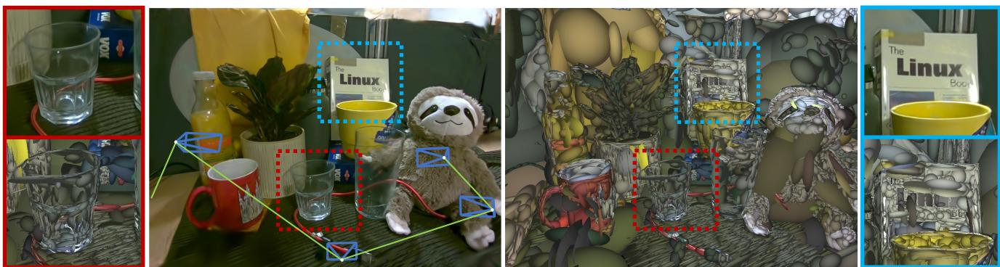
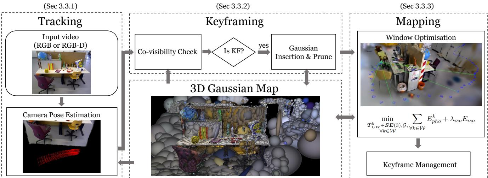
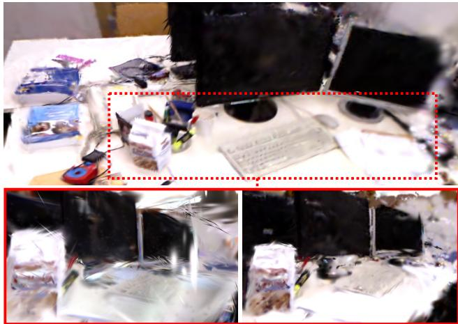
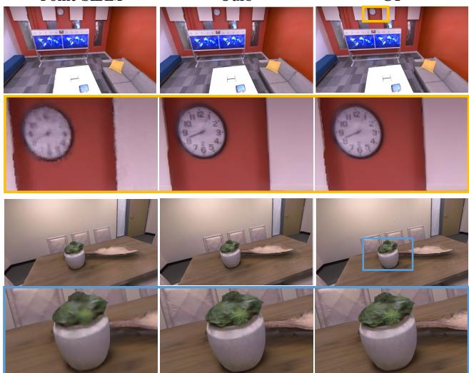
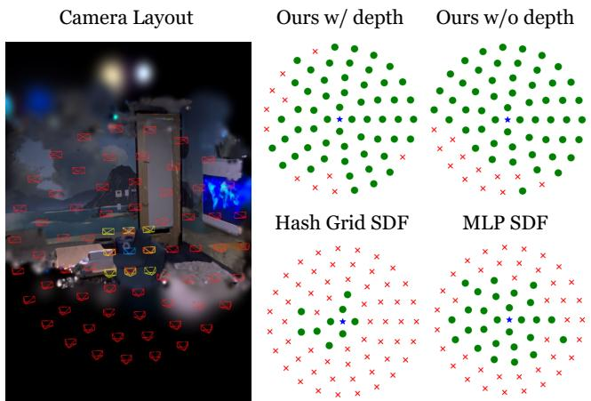
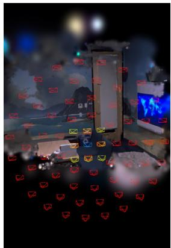
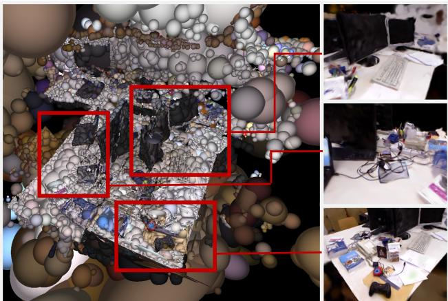
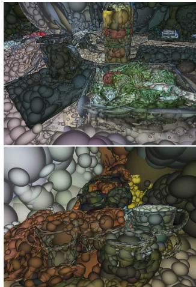
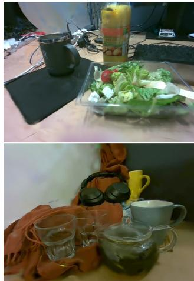

# Gaussian Splatting SLAM

Hidenobu Matsuki1∗

Riku Murai2∗

Paul H. J. Kelly2

Andrew J. Davison1

1Dyson Robotics Laboratory, Imperial College London 2Software Performance Optimisation Group, Imperial College London {h.matsuki20, riku.murai15, p.kelly, a.davison}@imperial.ac.uk

  
Figure 1. From a single monocular camera, we reconstruct a high fidelity 3D scene live at 3fps. For every incoming RGB frame, 3D Gaussians are incrementally formed and optimised together with the camera poses. We show both the rasterised Gaussians (left) and Gaussians shaded to highlight the geometry (right). Notice the details and the complex material properties (e.g. transparency) captured. Thin structures such as wires are accurately represented by numerous small, elongated Gaussians, and transparent objects are effectively represented by placing the Gaussians along the rim. Our system significantly advances the fidelity a live monocular SLAM system can capture.

## Abstract

We present the first application of 3D Gaussian Splatting in monocular SLAM, the mostfundamental but the hardest setupfor Visual SLAM. Our method, which runs live at 3fps, utilises Gaussians as the only 3D representation, unifying the required representation for accurate, efficient tracking, mapping, and high-quality rendering. Designed for challenging monocular settings, our approach is seamlessly extendable to RGB-D SLAM when an external depth sensor is available. Several innovations are required to continuously reconstruct 3D scenes with highfidelityfrom a live camera. First, to move beyond the original 3DGS algorithm, which requires accurate poses from an offline Structure from Motion (SfM) system, weformulate camera trackingfor 3DGS using direct optimisation against the 3D Gaussians, and show that this enables fast and robust tracking with a wide basin of convergence. Second, by utilising the explicit nature of the Gaussians, we introduce geometric verification

and regularisation to handle the ambiguities occurring in incremental 3D dense reconstruction. Finally, we introduce a full SLAM system which not only achieves state-of-the-art results in novel view synthesis and trajectory estimation but also reconstruction of tiny and even transparent objects.

## 1. Introduction

A long-term goal of online reconstruction with a single moving camera is near-photorealistic fidelity, which will surely allow new levels of performance in many areas of Spatial AI and robotics as well as opening up a whole range of new applications. While we increasingly see the benefit of applying powerful pre-trained priors to 3D reconstruction, a key avenue for progress is still the invention and development of core 3D representations with advantageous properties. Many “layered” SLAM methods exist which tackle the SLAM problem by integrating multiple different 3D representations or existing SLAM components; however, the most interesting advances are when a new unified dense representation can be used for all aspects of a system’s operation: local representation of detail, largescale geometric mapping and also camera tracking by direct alignment.

In this paper, we present the first online visual SLAM system based solely on the 3D Gaussian Splatting (3DGS) representation [10] recently making a big impact in offline scene reconstruction. In 3DGS a scene is represented by a large number of Gaussian blobs with orientation, elongation, colour and opacity. Other previous world/map-centric scene representations used for visual SLAM include occupancy or Signed Distance Function (SDF) voxel grids [23]; meshes [28]; point or surfel clouds [9, 29]; and recently neural fields [33]. Each of these has disadvantages: grids use significant memory and have bounded resolution, and even if octrees or hashing allow more efficiency they cannot be flexibly warped for large corrections [25, 37]; meshes require difficult, irregular topology to fuse new information; surfel clouds are discontinuous and difficult to fuse and optimise; and neural fields require expensive per-pixel raycasting to render. We show that 3DGS has none of these weaknesses. As a SLAM representation, it is most similar to point and surfel clouds, and inherits their efficiency, locality and ability to be easily warped or modified. However, it also represents geometry in a smooth, continuously differentiable way: a dense cloud of Gaussians merge together and jointly define a continuous volumetric function. And crucially, the design of modern graphics cards means that a large number of Gaussians can be efficiently rendered via “splatting” rasterisation, up to 200fps at 1080p. This rapid, differentiable rendering is integral to the tracking and map optimisation loops in our system.

The 3DGS representation has up until now only been used in offline systems for 3D reconstruction with known camera poses, and we present several innovations to enable online SLAM. We first derive the analytic Jacobian on Lie group of camera pose with respect to a 3D Gaussians map, and show that this can be seamlessly integrated into the existing differentiable rasterisation pipeline to enable camera poses to be optimised alongside scene geometry. Second, we introduce a novel Gaussian isotropic shape regularisation, to ensure geometric consistency, which we have found is important for incremental reconstruction. Third, we propose a novel Gaussian resource allocation and pruning method to keep the geometry clean and enable accurate camera tracking. Our experimental results demonstrate photorealistic online local scene reconstruction, as well as state-of-the-art camera trajectory estimation and mapping for larger scenes compared to other rendering-based SLAM methods. We further show the uniqueness of the Gaussianbased SLAM method such as an extremely large camera pose convergence basin, which can also be useful for mapbased camera localisation. Our method works with only monocular input, one of the most challenging scenarios in

SLAM. To highlight the intrinsic capability of 3D Gaussian for camera localisation, our method does not use any pretrained monocular depth predictor or other existing tracking modules, but relies solely on RGB image inputs in line with the original 3DGS. Since this is one of the most challenging SLAM scenario, we also show our method can easily be extended to RGB-D SLAM when depth measurements are available.

In summary, our contributions are as follows:

• The first near real-time SLAM system which works with a 3DGS as the only underlying scene representation, which can handle monocular only inputs.

• Novel techniques within the SLAM framework, including the analytic Jacobian on Lie group for direct camera pose estimation, isotropic regularisation of the Gaussian shape, and geometric verification.

• Extensive evaluations on a variety of datasets both for monocular and RGB-D settings, demonstrating competitive performance, particularly in real-world scenarios.

## 2. Related Work

Dense SLAM: Dense visual SLAM focuses on reconstructing detailed 3D maps, unlike sparse SLAM methods which excel in pose estimation [4, 5, 21] but typically yield maps useful mainly for localisation. In contrast, dense SLAM creates interactive maps beneficial for broader applications, including AR and robotics. Dense SLAM methods are generally divided into two primary categories: Frame-centric and Map-centric. Frame-centric SLAM minimises photometric error across consecutive frames, jointly estimating per-frame depth and frame-to-frame camera motion. Frame-centric approaches [1, 36] are efficient, as individual frames host local rather than global geometry (e.g. depth maps), and are attractive for long-session SLAM, but if a dense global map is needed, it must be constructed on demand by assembling all of these parts which are not necessarily fully consistent. In contrast, Map-centric SLAM uses a unified 3D representation across the SLAM pipeline, enabling a compact and streamlined system. Compared to purely local frame-to-frame tracking, a map-centric approach leverages global information by tracking against the reconstructed 3D consistent map. Classical map-centric approaches often use voxel grids [2, 23, 26, 40] or points [9, 29, 41] as the underlying 3D representation. While voxels enable a fast look-up of features in 3D, the representation is expensive, and the fixed voxel resolution and distribution are problematic when the spatial characteristics of the environment are not known in advance. On the other hand, a point-based map representation, such as surfel clouds, enables adaptive changes in resolution and spatial distribution by dynamic allocation of point primitives in the 3D space. Such flexibility benefits online applications such as SLAM with deformation-based loop closure [29, 41]. However, optimising the representation to capture high fidelity is challenging due to the lack of correlation among the primitives. Recently, in addition to classical graphic primitives, neural network-based map representations are a promising alternative. iMAP [33] demonstrated the interesting properties of neural representation, such as sensible hole filling of unobserved geometry. Many recent approaches combine the classical and neural representations to capture finer details [8, 27, 46, 47]; however, the large amount of computation required for neural rendering makes the live operation of such systems challenging.

Differentiable Rendering: The classical method for creating a 3D representation was to unproject 2D observations into 3D space and to fuse them via weighted averaging [16, 23]. Such an averaging scheme suffers from over-smooth representation and lacks the expressiveness to capture high-quality details. To capture a scene with photorealistic quality, differentiable volumetric rendering [24] has recently been popularised with Neural Radiance Fields (NeRF) [17]. Using a single Multi-Layer Perceptron (MLP) as a scene representation, NeRF performs volume rendering by marching along pixel rays, querying the MLP for opacity and colour. Since volume rendering is naturally differentiable, the MLP representation is optimised to minimise the rendering loss using multiview information to achieve high-quality novel view synthesis. The main weakness of NeRF is its training speed. Recent developments have introduced explicit volume structures such as multi-resolution voxel grids [6, 14, 34] or hash functions [19] to improve performance. Interestingly, these projects demonstrate that the main contributor to high-quality novel view synthesis is not the neural network but rather differentiable volumetric rendering, and that it is possible to avoid the use of an MLP and yet achieve comparable rendering quality to NeRF [6]. However, even in these systems, per-pixel ray marching remains a significant bottleneck for rendering speed. This issue is particularly critical in SLAM, where immediate interaction with the map is essential for tracking. In contrast to NeRF, 3DGS performs differentiable rasterisation. Similar to regular graphics rasterisations, by iterating over the primitives to be rasterised rather than marching along rays, 3DGS leverages the natural sparsity of a 3D scene and achieves a representation which is expressive to capture high-fidelity 3D scenes while offering significantly faster rendering. Several works have applied 3D Gaussians and differentiable rendering to static scene capture [11, 38], and in particular more recent works utilise 3DGS and demonstrate superior results in vision tasks such as dynamic scene capture [15, 42, 44] and 3D generation [35, 45]. Our method adopts a Map-centric approach, utilising 3D Gaussians as the only SLAM representation. Similar to surfel-based SLAM, we dynamically allocate the 3D Gaussians, enabling us to model an arbitrary spatial distribution in the scene. Unlike other methods such as Elastic-Fusion [41] and PointFusion [9], however, by using differentiable rasterisation, our SLAM system can capture highfidelity scene details and represent challenging object properties by direct optimisation against information from every pixel.

## 3. Method

## 3.1. Gaussian Splatting

Our SLAM representation is 3DGS, mapping the scene with a set of anisotropic Gaussians G. Each Gaussian $\mathcal { G } ^ { i }$ contains optical properties: colour $c ^ { i }$ and opacity $\alpha ^ { i } .$ . For continuous 3D representation, the mean $\mu _ { W } ^ { i }$ and covariance $\pmb { \Sigma } _ { W } ^ { i }$ , defined in the world coordinate, represent the Gaussian’s position and its ellipsoidal shape. For simplicity and speed, in our work we omit the spherical harmonics representing view-dependent radiance. Since 3DGS uses volume rendering, explicit extraction of the surface is not required. Instead, by splatting and blending N Gaussians, a pixel colour $\mathcal { C } _ { p }$ is synthesised:

$$
\mathcal { C } _ { p } = \sum _ { i \in \mathcal { N } } c _ { i } \alpha _ { i } \prod _ { j = 1 } ^ { i - 1 } ( 1 - \alpha _ { j } ) .\tag{1}
$$

3DGS performs rasterisation, iterating over the Gaussians rather than marching along the camera rays, and hence, free spaces are ignored during rendering. During rasterisation, the contributions of α are decayed via a Gaussian function, based on the 2D Gaussian formed by splatting a 3D Gaussian. The 3D Gaussians $\mathcal { N } ( \mu _ { W } , \Sigma _ { W } )$ in world coordinates are related to the 2D Gaussians $\mathcal { N } ( \mu _ { I } , \Sigma _ { I } )$ on the image plane through a projective transformation:

$$
{ \pmb \mu } _ { I } = \pi ( { \pmb T } _ { C W } \cdot { \pmb \mu } _ { W } ) , \pmb \Sigma _ { I } = { \bf J } { \bf W } \pmb \Sigma _ { W } { \bf W } ^ { T } { \bf J } ^ { T } ,\tag{2}
$$

where $\pi$ is the projection operation and $T _ { C W } \in S E { ( 3 ) }$ is the camera pose of the viewpoint. J is the Jacobian of the linear approximation of the projective transformation and W is the rotational component of ${ \pmb T } _ { C W }$ . This formulation enables the 3D Gaussians to be differentiable and the blending operation provides gradient flow to the Gaussians. Using first-order gradient descent [12], Gaussians gradually refines both their optic and geometric parameters to represent the captured scene with high fidelity.

## 3.2. Camera Pose Optimisation

To achieve accurate tracking, we typically require at least 50 iterations of gradient descent per frame. This requirement emphasises the necessity of a representation with computationally efficient view synthesis and gradient computation, making the choice of 3D representation a crucial part of designing a SLAM system.

  
Figure 2. SLAM System Overview: Our SLAM system uses 3D Gaussians as the only representation, unifying all components of SLAM, including tracking, mapping, keyframe management, and novel view synthesis.

In order to avoid the overhead of automatic differentiation, 3DGS implements rasterisation with CUDA with derivatives for all parameters calculated explicitly. Since rasterisation is performance critical, we similarly derive the camera Jacobians explicitly.

To the best of our knowledge, we provide the first analytical Jacobian of SE(3) camera pose with respect to the 3D Gaussians used in EWA splatting [48] and 3DGS. This opens up new applications of 3DGS beyond SLAM.

We use Lie algebra to derive the minimal Jacobians, ensuring that the dimensionality of the Jacobians matches the degrees of freedom, eliminating any redundant computations. The terms of Eq. (2) are differentiable with respect to the camera pose ${ \bf { \mathit { T } } } _ { \mathit { C W } }$ ; using the chain rule:

$$
\begin{array} { r l } & { \displaystyle \frac { \partial \pmb { \mu } _ { I } } { \partial \pmb { T } _ { C W } } = \frac { \partial \pmb { \mu } _ { I } } { \partial \pmb { \mu } _ { C } } \frac { \mathcal { D } \pmb { \mu } _ { C } } { \mathcal { D } \pmb { T } _ { C W } } , } \\ & { \displaystyle \frac { \partial \pmb { \Sigma } _ { I } } { \partial \pmb { T } _ { C W } } = \frac { \partial \pmb { \Sigma } _ { I } } { \partial \pmb { \ J } } \frac { \partial \pmb { \ J } } { \partial \pmb { \mu } _ { C } } \frac { \mathcal { D } \pmb { \mu } _ { C } } { \mathcal { D } \pmb { T } _ { C W } } + \frac { \partial \pmb { \Sigma } _ { I } } { \partial \mathbf { W } } \frac { \mathcal { D } \pmb { \mathbf { W } } } { \mathcal { D } \pmb { T } _ { C W } } . } \end{array}\tag{3}
$$

(4)

where ${ \pmb T } _ { C W }$ represents the 3D position of Gaussian in the camera coordinate. We take the derivatives on the manifold to derive minimal parameterisation. Borrowing the notation from [30], let $T \in S E { ( 3 ) }$ and $\tau \in { \mathfrak { s e } } ( 3 )$ We define the partial derivative on the manifold as:

$$
\frac { \mathscr { D } f ( \pmb { T } ) } { \mathscr { D } \pmb { T } } \triangleq \operatorname* { l i m } _ { \tau  0 } \frac { \mathrm { L o g } ( f ( \mathrm { E x p } ( \tau ) \circ \pmb { T } ) \circ f ( \pmb { T } ) ^ { - 1 } ) } { \tau } ,\tag{5}
$$

where ◦ is a group composition, and Exp, Log are the exponential and logarithmic mappings between Lie algebra and Lie Group. With this, we derive the following:

$$
\frac { \mathcal { D } \pmb { \mu } _ { C } } { \mathcal { D } \pmb { T } _ { C W } } = \left[ \pmb { I } _ { \pmb { \tau } } - \pmb { \mu } _ { C } ^ { \times } \right] , \frac { \mathcal { D } \mathbf { W } } { \mathcal { D } \pmb { T } _ { C W } } = \left[ \mathbf { 0 } _ { \pmb { \tau } } - \mathbf { W } _ { : , 2 } ^ { \times } \right] ,\tag{6}
$$

where × denotes the skew symmetric matrix of a 3D vector, and $\mathbf { W } _ { : , i }$ refers to the ith column of the matrix.

## 3.3. SLAM

In this section, we present details of full SLAM framework. The overview of the system is summarised in Fig. 2. Please refer to the supplementary material for the further parameter details.

## 3.3.1 Tracking

In tracking only the current camera pose is optimised, without updates to the map representation. In the monocular case, we minimise the following photometric residual:

$$
E _ { p h o } = \left\| I ( \mathcal { G } , T _ { C W } ) - \bar { I } \right\| _ { 1 } ,\tag{7}
$$

where $I ( \mathcal { G } , \pmb { T } _ { C W } )$ renders the Gaussians $\mathcal { G }$ from ${ \pmb T } _ { C W }$ , and ¯I is an observed image.

We further optimise affine brightness parameters for varying exposure. When depth observations are available, we define the geometric residual as:

$$
E _ { g e o } = \left\| D ( \mathcal { G } , \pmb { T } _ { C W } ) - \bar { D } \right\| _ { 1 } ,\tag{8}
$$

where $D ( \mathcal { G } , \pmb { T } _ { C W } )$ is depth rasterisation and $\bar { D }$ is the observed depth. Rather than simply using the depth measurements to initialise the Gaussians, we minimise both photometric and geometric residuals: $\lambda _ { p h o } E _ { p h o } + ( 1 - \lambda _ { p h o } ) E _ { g e o } ,$ where $\lambda _ { p h o }$ is a hyperparameter.

As in Eq. (1), per-pixel depth is rasterised by alphablending:

$$
{ \mathcal { D } } _ { p } = \sum _ { i \in { \mathcal { N } } } z _ { i } \alpha _ { i } \prod _ { j = 1 } ^ { i - 1 } ( 1 - \alpha _ { j } ) \ ,\tag{9}
$$

where $z _ { i }$ is the distance to the mean $\pmb { \mu } _ { W }$ of Gaussian i along the camera ray. We derive analytical Jacobians for the camera pose optimisation in a similar manner to Eq. (3), (4).

## 3.3.2 Keyframing

Since using all the images from a video stream to jointly optimise the Gaussians and camera poses online is infeasible, we maintain a small window $\mathcal { W } _ { k }$ consisting of carefully selected keyframes based on inter-frame covisibility. Ideal keyframe management will select non-redundant keyframes observing the same area, spanning a wide baseline to provide better multiview constraints. The parameters are detailed in supplementary.

Selection and Management Every tracked frame is checked for keyframe registration based on our simple yet effective criteria. We measure the covisibility by measuring the intersection over union of the observed Gaussians between the current frame i and the last keyframe $j .$ If the covisibility drops below a threshold, or if the relative translation $t _ { i j }$ is large with respect to the median depth, frame i is registered as a keyframe. For efficiency, we maintain only a small number of keyframes in the current window W following the keyframe management heuristics of DSO [4]. The main difference is that a keyframe is removed from the current window if the overlap coefficient with the latest keyframe drops below a threshold.

Gaussian Covisibility An accurate estimate of covisibility simplifies keyframe selection and management. 3DGS respects visibility ordering since the 3D Gaussians are sorted along the camera ray. This property is desirable for covisibility estimation as occlusions are handled by design. A Gaussian is marked to be visible from a view if used in the rasterisation and if the ray’s accumulated α has not yet reached 0.5. This enables our estimated covisibility to handle occlusions without requiring additional heuristics.

Gaussian Insertion and Pruning At every keyframe, new Gaussians are inserted into the scene to capture newly visible scene elements and to refine the fine details. When depth measurements are available, Gaussian means $\pmb { \mu } _ { W }$ are initialised by back-projecting the depth. In the monocular case, we render the depth at the current frame. For pixels with depth estimates, $\pmb { \mu } _ { W }$ are initialised around those depths with low variance; for pixels without the depth estimates, we initialise $\pmb { \mu } _ { W }$ around the median depth of the rendered image with high variance.

In the monocular case, the positions of many newly inserted Gaussians are incorrect. While the majority will quickly vanish during optimisation as they violate multiview consistency, we further prune the excess Gaussians by checking the visibility amongst the current window $\mathcal { W } _ { k }$ . If the Gaussians inserted within the last 3 keyframes are unobserved by at least 3 other frames, we prune them out as they are geometrically unstable.

## 3.3.3 Mapping

The purpose of mapping is to maintain a coherent 3D structure and to optimise the newly inserted Gaussians. During mapping, the keyframes in $\mathcal { W } _ { k }$ are used to reconstruct currently visible regions. Additionally, two random past keyframes $\mathcal { W } _ { r }$ are selected per iteration to avoid forgetting the global map. Rasterisation of 3DGS imposes no constraint on the Gaussians along the viewing ray direction, even with a depth observation. This is not a problem when sufficient carefully selected viewpoints are provided (e.g. in the novel view synthesis case); however, in continuous SLAM this causes many artefacts, making tracking challenging. We therefore introduce an isotropic regularisation:

$$
E _ { i s o } = \sum _ { i = 1 } ^ { | \mathcal { G } | } \| \mathbf { s } _ { i } - \tilde { \mathbf { s } _ { i } } \cdot \mathbf { 1 } \| _ { 1 }\tag{10}
$$

to penalise the scaling parameters $\mathbf { s } _ { i }$ (i.e. stretch of the ellipsoid) by its difference to the mean $\tilde { \mathbf { s } _ { i } }$ . As shown in Fig 3, this encourages sphericality, and avoids the problem of Gaussians which are highly elongated along the viewing direction creating artefacts. Let the union of the keyframes in the current window and the randomly selected one be $\smash { \mathcal { W } = \mathcal { W } _ { k } \cup \mathcal { W } _ { r } }$ . For mapping, we solve the following problem:

$$
\operatorname* { m i n } _ { \substack { \pmb { T } _ { C W } ^ { k } \in { \pmb { S } } E ( 3 ) , \mathcal { G } , \forall k \in \mathcal { W } } } E _ { p h o } ^ { k } + \lambda _ { i s o } E _ { i s o } .\tag{11}
$$

If depth observations are available, as in tracking, geometric residuals Eq. (8) are added to the optimisation problem.

## 4. Evaluation

We conduct a comprehensive evaluation of our system across a range of both real and synthetic datasets. Additionally, we perform an ablation study to justify our design choices. Finally, we present qualitative results of our system operating live using a monocular camera, illustrating its practicality and high fidelity reconstruction.

## 4.1. Experimental Setup

Datasets For our quantitative analysis, we evaluate our method on the TUM RGB-D dataset [32] (3 sequences) and the Replica dataset [31] (8 sequences), following the evaluation in [33]. For qualitative results, we use self-captured real-world sequences recorded by Intel Realsense d455. Since the Replica dataset is designed for RGB-D SLAM evaluation, it contains challenging purely rotational camera motions. We hence use the Replica dataset for RGB-D evaluation only. The TUM RGB-D dataset is used for both monocular and RGB-D evaluation.

  
w/o λ w/ λFigure 3. Effect of isotropic regularisation: Top: Rendering close to a training view (looking at the keyboard). Bottom: Rendering 3D Gaussians far from the training views (view from a side of the keyboard) without (left) and with (right) the isotropic loss. When the photometric constraints are insufficient, the Gaussians tend to elongate along the viewing direction, creating artefacts in the novel views, and affecting the camera tracking.

Implementation Details We run our SLAM on a desktop with Intel Core i9 12900K 3.50GHz and a single NVIDIA GeForce RTX 4090. We present results from our multiprocess implementation aimed at real-time applications. For a fair comparison with other methods on Replica, we additionally report result for single-process implementation which performs more mapping iterations. As with 3DGS, time-critical rasterisation and gradient computation are implemented using CUDA. The rest of the SLAM pipeline is developed with PyTorch. Details of hyperparameters are provided in the supplementary material.

Metrics For camera tracking accuracy, we report the Root Mean Square Error (RMSE) of the Absolute Trajectory Error (ATE) of the keyframes. To evaluate map quality, we report standard photometric rendering quality metrics (PSNR, SSIM and LPIPS) following the evaluation protocol used in [27]. To evaluate the map quality, on every fifth frame, rendering metrics are computed. We exclude the keyframes (training views). We report the average across three runs for all our evaluations. In the tables, the best result is in bold, and the second best is underlined.

Baseline Methods We primarily benchmark our SLAM method against other approaches that, like ours, do not have explicit loop closure. In monocular settings, we compare with state-of-the-art classical and learning-based direct visual odometry (VO) methods. Specifically, we compare DSO [4], DepthCov [3], and DROID-SLAM [36] in VO configurations. These methods are selected based on their public reporting of results on the benchmark (TUM dataset) or the availability of their source code for getting the benchmark result. Since one of our focuses is the online scale estimation under monocular scale ambiguity, the method which uses ground truth poses for the system initialisation such as [13] is not considered for the comparison. In the RGB-D case, we compare against neural-implicit SLAM methods [7, 8, 27, 33, 39, 43, 46] which are also map-centric, rendering-based and do not perform loop closure.

## 4.2. Quantitative Evaluation

Camera Tracking Accuracy Table 1 shows the tracking results on the TUM RGB-D dataset. In the monocular setting, our method surpasses other baselines without requiring any deep priors. Furthermore, our performance is comparable to systems which perform explicit loop closure. This clearly highlights that there still remains potential for enhancing the tracking of monocular SLAM by exploring fundamental SLAM representations.

Our RGB-D method shows better performance than any other baseline method. Notably, our system surpasses ORB-SLAM in the fr1 sequences, narrowing the gap between Map-centric SLAM and the state-of-the-art sparse frame-centric methods. Table 2 reports results on the synthetic Replica dataset. Our single-process implementation shows competitive performance and achieves the best result in 4 out of 8 sequences. Our multi-process implementation which performs fewer mapping iterations still performs comparably. In contrast to other methods, our system demonstrates higher performance on real-world data, by optimising the Gaussian positions to compensate for the sensor noise.

Novel View Rendering Table 5 summarises the novel view rendering performance of our method with RGB-D input. We consistently show the best performance across most sequences and is least second best. Our rendering FPS is hundreds of times faster than other methods, offering a significant advantage for applications which require real-time map interaction. While Point-SLAM is competitive, that method focuses on view synthesis rather than novel-view synthesis. Their view synthesis is conditional on the availability of depth due to the depth-guided raysampling, making novel-view synthesis challenging. On the other hand, our rasterisation-based approach does not require depth guidance and achieves efficient, high-quality, novel view synthesis. Fig. 4 provides a qualitative comparison of the rendering of ours and Point-SLAM (with depth guidance).

<table><tr><td rowspan="2">Input</td><td rowspan="2">Loop- closure</td><td rowspan="2">Method</td><td rowspan="2">fr1/desk</td><td rowspan="2">fr2/xyz</td><td rowspan="2">fr3/office</td><td rowspan="2">Avg.</td></tr><tr><td></td></tr><tr><td rowspan="6">Mocuular</td><td rowspan="5">w/o</td><td>DSO [4]</td><td>22.4</td><td>1.10</td><td>9.50</td><td>11.0</td></tr><tr><td>DROID-VO [36]</td><td>5.20</td><td>10.7</td><td>7.30</td><td>7.73</td></tr><tr><td>DepthCov-VO [3]</td><td>5.60</td><td>1.20</td><td>68.8</td><td>25.2</td></tr><tr><td>Ours</td><td>3.78</td><td>4.60</td><td>3.50</td><td>3.96</td></tr><tr><td>DROID-SLAM [36]</td><td>1.80</td><td>0.50</td><td>2.80</td><td>1.70</td></tr><tr><td rowspan="10">w/o RGGB-D</td><td>ORB-SLAM2 [20] iMAP [33]</td><td>1.90 4.90</td><td>0.60 2.00</td><td>2.40</td><td>1.60</td></tr><tr><td>NICE-SLAM [46]</td><td></td><td></td><td>5.80</td><td>4.23</td></tr><tr><td>DI-Fusion [7]</td><td>4.26</td><td>6.19</td><td>3.87</td><td>4.77</td></tr><tr><td>Vox-Fusion [43]</td><td>4.40 3.52</td><td>2.00</td><td>5.80</td><td>4.07</td></tr><tr><td>ESLAM [8]</td><td>2.47</td><td>1.49 1.11</td><td>26.01</td><td>10.34</td></tr><tr><td>Co-SLAM [39]</td><td>2.40</td><td>1.70</td><td>2.42</td><td>2.00</td></tr><tr><td></td><td></td><td></td><td>2.40</td><td>2.17</td></tr><tr><td>Point-SLAM [27]</td><td>4.34</td><td>1.31</td><td>3.48</td><td>3.04</td></tr><tr><td>Ours</td><td>1.50</td><td>1.44</td><td>1.49</td><td>1.47</td></tr><tr><td rowspan="3">w/</td><td>BAD-SLAM [29]</td><td>1.70</td><td>1.10</td><td>1.70</td><td>1.50</td></tr><tr><td>Kintinous [40]</td><td>3.70</td><td>2.90</td><td>3.00</td><td>3.20</td></tr><tr><td>ORB-SLAM2 [20]</td><td>1.60</td><td>0.40</td><td>1.00</td><td>1.00</td></tr></table>

Table 1. Camera tracking result on TUM for monocular and RGB-D. ATE RMSE in cm is reported. In both monocular and RGB-D cases, we achieve state-of-the-art performance. In particular, in the monocular case, not only do we outperform systems which use deep prior, but we achieve comparable performance with many of the RGB-D systems.
<table><tr><td>Method</td><td>r0</td><td>r1</td><td>r2</td><td>00</td><td>01</td><td>02</td><td>03</td><td>04</td><td>Avg.</td></tr><tr><td>iMAP [33]</td><td>3.12</td><td>2.54</td><td>2.31</td><td>1.69</td><td>1.03</td><td>3.99</td><td>4.05</td><td>1.93</td><td>2.58</td></tr><tr><td>NICE-SLAM</td><td>0.97</td><td>1.31</td><td>1.07</td><td>0.88</td><td>1.00</td><td>1.06</td><td>1.10</td><td>1.13</td><td>1.07</td></tr><tr><td>Vox-Fusion [43]</td><td>1.37</td><td>4.70</td><td>1.47</td><td>8.48</td><td>2.04</td><td>2.58</td><td>1.11</td><td>2.94</td><td>3.09</td></tr><tr><td>ESLAM [8]</td><td>0.71</td><td>0.70</td><td>0.52</td><td>0.57</td><td>0.55</td><td>0.58</td><td>0.72</td><td>0.63</td><td>0.63</td></tr><tr><td>Point-SLAM [27]</td><td>0.61</td><td>0.41</td><td>0.37</td><td>0.38</td><td>0.48</td><td>0.54</td><td>0.69</td><td>0.72</td><td>0.53</td></tr><tr><td>Ours</td><td>0.44</td><td>0.32</td><td>0.31</td><td>0.44</td><td>0.52</td><td>0.23</td><td>0.17</td><td>2.25</td><td>0.58</td></tr><tr><td>Ours (sp)</td><td>0.33</td><td>0.22</td><td>0.29</td><td>0.36</td><td>0.19</td><td>0.25</td><td>0.12</td><td>0.81</td><td>0.32</td></tr></table>

Table 2. Camera tracking result on Replica for RGB-D SLAM. ATE RMSE in cm is reported. We achieve best performance across most sequences. Here, Ours is our multi-process implementation and Ours (sp) is the single-process implementation which ensures a certain amount of mapping iteration similar to other works.
<table><tr><td>Input</td><td>Method</td><td>fr1/desk</td><td>fr2/xyz</td><td>fr3/office</td><td>Avg.</td></tr><tr><td rowspan="3">Mono</td><td> $\overline { { { \bf { w } } / { \bf { o } } { \bf { \Theta } } E _ { i s o } } }$ </td><td>4.16</td><td>4.66</td><td>5.73</td><td>4.83</td></tr><tr><td>w/o kf selection</td><td>13.2</td><td>4.36</td><td>8.65</td><td>8.73</td></tr><tr><td>Ours</td><td>3.78</td><td>4.60</td><td>3.50</td><td>3.96</td></tr><tr><td>RGG-D</td><td> $\overline { { \mathrm { ~ w ~ } / \mathrm { ~ o ~ } E _ { g e o } } }$ </td><td>2.39</td><td>0.62</td><td>4.98</td><td>2.66</td></tr><tr><td rowspan="2"></td><td>w/o kf selection</td><td>1.64</td><td>1.49</td><td>2.60</td><td>1.90</td></tr><tr><td>Ours</td><td>1.50</td><td>1.44</td><td>1.49</td><td>1.47</td></tr></table>

Table 3. Ablation Study on TUM RGB-D dataset. We analyse the usefulness of isotropic regularisation, geometric residual, and keyframe selection to our SLAM system. Further isotropic regularisation ablation is available in supplementary.
<table><tr><td colspan="5">Memory Usage [MB]</td></tr><tr><td>iMAP [33]</td><td>NICE-SLAM [46]</td><td>Co-SLAM [39]</td><td>Ours (Mono)</td><td>Ours (RGB-D)</td></tr><tr><td>0.8MB</td><td>40.3.4MB</td><td>6.4MB</td><td>2.6MB</td><td>3.97MB</td></tr></table>

Table 4. Memory Analysis on TUM RGB-D dataset. The baseline numbers are computed from the parameter numbers in [39]

Ablative Analysis In Table 3, we perform ablation to confirm our design choices. Isotropic regularisation and geometric residual improve the tracking of monocular and RGB-D SLAM respectively, as they aid in constraining the geometry when photometric signals are weak. For both cases, keyframe selection significantly improves systems performance, as it automatically chooses suitable keyframes based on our occlusion-aware keyframe selection and management. We further compare the memory usage of different 3D representations in Table 4. MLP-based iMAP is clearly more memory efficient, but it struggles to express high-fidelity 3D scenes due to the limited capacity of small MLP. Compared with a voxel grid of features used in NICE-SLAM, our method uses significantly less memory.

<table><tr><td>Method</td><td>PSNR[db]↑</td><td>SSIM↑</td><td>LPIPS↓</td><td>Rendering FPS</td></tr><tr><td>NICE-SLAM[46]</td><td>24.42</td><td>0.809</td><td>0.233</td><td>0.54</td></tr><tr><td>Vox-Fusion[43]</td><td>24.41</td><td>0.801</td><td>0.236</td><td>2.17</td></tr><tr><td>Point-SLAM [27]</td><td>35.17</td><td>0.975</td><td>0.124</td><td>1.33</td></tr><tr><td>ours</td><td>38.94</td><td>0.968</td><td>0.070</td><td>769</td></tr></table>

Table 5. Average rendering performance on Replica (RGB-D). Our method outperforms most of the rendering metrics compared to existing methods. Note that Point-SLAM uses ground-truth depth to guide sampling along rays. The full detail is available in supplementary.

Ours  
Point-SLAM  
GT  
  
Figure 4. Rendering examples on Replica. Point-SLAM struggle with rendering fine details due to the stochastic ray sampling.

<table><tr><td>Method</td><td>seq1</td><td>seq2</td><td>seq3</td><td>Avg.</td></tr><tr><td>Neural SDF (Hash Grid)</td><td>0.13</td><td>0.15</td><td>0.16</td><td>0.14</td></tr><tr><td>Neural SDF (MLP)</td><td>0.40</td><td>0.38</td><td>0.22</td><td>0.33</td></tr><tr><td>Ours w/o depth</td><td>0.82</td><td>0.91</td><td>0.65</td><td>0.79</td></tr><tr><td>Ours w/ depth</td><td>0.83</td><td>1.0</td><td>0.65</td><td>0.82</td></tr></table>

Table 6. Camera convergence analysis. We report the ratio of successful camera convergence for the different sequences, across different differentiable 3D representations.

Convergence Basin Analysis In our SLAM experiments, we discovered that 3D Gaussian maps have a notably large convergence basin for camera localisation. To investigate further, we conducted a convergence funnel analysis, an evaluation methodology proposed in [18] and used in [22]. Here, we train a 3D representation (e.g. 3DGS) using 9 fixed views arranged in a square. We set the viewpoint in the middle of the square to be the target view. As shown in Fig 5, we uniformly sample a position, creating a funnel.

  
Figure 5. Convergence basin analysis: Left: 3D Gaussian map from training views (Yellow) and visualisation of the test poses (Red) and target pose (Blue). Right: Convergence basin of our method. The green marks success, and the red marks failure.

  
Figure 6. Monocular SLAM result on fr1/desk sequence: We show the reconstructed 3D Gaussian maps (Left) and novel view synthesis result (Right).

From the sampled position, given the RGB image of the target view, we perform camera pose optimisation for 1000 iterations. The optimisation is successful if it converges to within 1cm of the target view within the fixed iterations. We compare our Gaussian approach with Co-SLAM [39]’s network (Hash Grid SDF) and iMAP’s [33] network with Co-SLAM’s SDF loss for further geometric accuracy (MLP Neural SDF). We render the training views using a synthetic Replica dataset and create three sequences for testing (seq1, seq2 and seq3). The width of the square formed by the training view is 0.5m, and the test cameras are distributed with radii ranging from 0.2m to 1.2m, covering a larger area than the training view. When training the map, the three methods— Ours w/depth, Hash Grid SDF, and MLP SDF—use RGB-D images, whereas Ours w/o depth utilises only colour images. Fig. 5 shows the qualitative results and Table 6 reports the success rate. For both with and without depth for training, our method shows better convergence.

  
Figure 7. Self-captured Scenes: Challenging scenes and objects, for example, transparent glasses and crinkled texture of salad are captured by our monocular SLAM running live.

Unlike hashing and positional encoding which can lead to signal conflict, anisotropic Gaussians form a smooth gradient in 3D space, increasing the convergence basin. Further experimental details are available in supplementary ??.

## 4.3. Qualitative Results

We report both the 3D reconstruction of the SLAM dataset and self-captured sequences. In Fig. 6, we visualise the monocular SLAM reconstruction of fr1/desk. The placements of the Gaussians are geometrically sensible and are 3D coherent, and our rendering from the different viewpoints highlights the quality of our systems’ novel view synthesis. In Fig. 7, we self-capture challenging scenes for monocular SLAM. By not explicitly modelling a surface, our system naturally handles transparent objects which is challenging for many other SLAM systems.

## 5. Conclusion

We have proposed the first SLAM method using 3D Gaussians as a SLAM representation. Via efficient volume rendering, our system significantly advances the fidelity and diversity of object materials a live SLAM system can capture. Our system achieves state-of-the-art performance across benchmarks for both monocular and RGB-D cases. Interesting directions for future research are the integration of loop closure for handling large-scale scenes and extraction of geometry such as surface normal as Gaussians do not explicitly represent the surface.

## Acknowledgements

Research presented in this paper has been supported by Dyson Technology Ltd. We are very grateful to Eric Dexheimer, Kirill Mazur, Xin Kong, Marwan Taher, Ignacio Alzugaray, Gwangbin Bae, Aalok Patwardhan, and members of the Dyson Robotics Lab for insightful discussions.

## References

[1] J. Czarnowski, T. Laidlow, R. Clark, and A. J. Davison. Deepfactors: Real-time probabilistic dense monocular SLAM. IEEE Robotics and Automation Letters (RAL), 5(2): 721–728, 2020.

[2] Angela Dai, Matthias Nießner, Michael Zollhofer, Shahram¨ Izadi, and Christian Theobalt. BundleFusion: Real-time Globally Consistent 3D Reconstruction using On-the-fly Surface Re-integration. ACM Transactions on Graphics (TOG), 36(3):24:1–24:18, 2017.

[3] Eric Dexheimer and Andrew J. Davison. Learning a Depth Covariance Function. In Proceedings of the IEEE Conference on Computer Vision and Pattern Recognition (CVPR), 2023.

[4] J. Engel, V. Koltun, and D. Cremers. Direct sparse odometry. IEEE Transactions on Pattern Analysis and Machine Intelligence (PAMI), 2017.

[5] C. Forster, M. Pizzoli, and D. Scaramuzza. SVO: Fast Semi-Direct Monocular Visual Odometry. In Proceedings of the IEEE International Conference on Robotics and Automation (ICRA), 2014.

[6] Sara Fridovich-Keil, Alex Yu, Matthew Tancik, Qinhong Chen, Benjamin Recht, and Angjoo Kanazawa. Plenoxels: Radiance fields without neural networks. In Proceedings of the IEEE Conference on Computer Vision and Pattern Recognition (CVPR), 2022.

[7] Jiahui Huang, Shi-Sheng Huang, Haoxuan Song, and Shi-Min Hu. Di-fusion: Online implicit 3d reconstruction with deep priors. In Proceedings ofthe IEEE Conference on Computer Vision and Pattern Recognition (CVPR), 2021.

[8] M. M. Johari, C. Carta, and F. Fleuret. ESLAM: Efficient dense slam system based on hybrid representation of signed distance fields. In Proceedings of the IEEE Conference on Computer Vision and Pattern Recognition (CVPR), 2023.

[9] M. Keller, D. Lefloch, M. Lambers, S. Izadi, T. Weyrich, and A. Kolb. Real-time 3D Reconstruction in Dynamic Scenes using Point-based Fusion. In Proc. of Joint 3DIM/3DPVT Conference (3DV), 2013.

[10] Bernhard Kerbl, Georgios Kopanas, Thomas Leimkuhler,¨ and George Drettakis. 3D gaussian splatting for real-time radiance field rendering. ACM Transactions on Graphics (TOG), 2023.

[11] Leonid Keselman and Martial Hebert. Approximate differentiable rendering with algebraic surfaces. In Proceedings of the European Conference on Computer Vision (ECCV), 2022.

[12] Diederik P. Kingma and Jimmy Ba. Adam: A method for stochastic optimization. In Proceedings of the International Conference on Learning Representations (ICLR), 2015.

[13] Heng Li, Xiaodong Gu, Weihao Yuan, Luwei Yang, Zilong Dong, and Ping Tan. Dense rgb slam with neural implicit maps. In Proceedings of the International Conference on Learning Representations (ICLR), 2023.

[14] Lingjie Liu, Jiatao Gu, Kyaw Zaw Lin, Tat-Seng Chua, and Christian Theobalt. Neural sparse voxel fields. NeurIPS, 2020.

[15] Jonathon Luiten, Georgios Kopanas, Bastian Leibe, and Deva Ramanan. Dynamic 3d gaussians: Tracking by persistent dynamic view synthesis. 3DV, 2024.

[16] J. McCormac, A. Handa, A. J. Davison, and S. Leutenegger. SemanticFusion: Dense 3D semantic mapping with convolutional neural networks. In Proceedings of the IEEE International Conference on Robotics and Automation (ICRA), 2017.

[17] Ben Mildenhall, Pratul P Srinivasan, Matthew Tancik, Jonathan T Barron, Ravi Ramamoorthi, and Ren Ng. Nerf: Representing scenes as neural radiance fields for view synthesis. In Proceedings ofthe European Conference on Computer Vision (ECCV), 2020.

[18] N. J. Mitra, N. Gelfand, H. Pottmann, and L. J. Guibas. Registration of Point Cloud Data from a Geometric Optimization Perspective. In Proceedings of the Symposium on Geometry Processing, 2004.

[19] Thomas Muller, Alex Evans, Christoph Schied, and Alexan-¨ der Keller. Instant neural graphics primitives with a multiresolution hash encoding. ACM Transactions on Graphics (TOG), 2022.

[20] R. Mur-Artal and J. D. Tardos. ORB-SLAM2: An Open-´ Source SLAM System for Monocular, Stereo, and RGB-D Cameras. IEEE Transactions on Robotics (T-RO), 33(5): 1255–1262, 2017.

[21] R. Mur-Artal, J. M. M Montiel, and J. D. Tardos. ORB-´ SLAM: a Versatile and Accurate Monocular SLAM System. IEEE Transactions on Robotics (T-RO), 31(5):1147–1163, 2015.

[22] R. A. Newcombe. Dense Visual SLAM. PhD thesis, Imperial College London, 2012.

[23] R. A. Newcombe, S. Izadi, O. Hilliges, D. Molyneaux, D. Kim, A. J. Davison, P. Kohli, J. Shotton, S. Hodges, and A. Fitzgibbon. KinectFusion: Real-Time Dense Surface Mapping and Tracking. In Proceedings of the International Symposium on Mixed and Augmented Reality (ISMAR), 2011.

[24] Michael Niemeyer, Lars Mescheder, Michael Oechsle, and Andreas Geiger. Differentiable volumetric rendering: Learning implicit 3d representations without 3d supervision. In Proceedings of the IEEE Conference on Computer Vision and Pattern Recognition (CVPR), 2020.

[25] M. Nießner, M. Zollhofer, S. Izadi, and M. Stamminger.¨ Real-time 3D Reconstruction at Scale using Voxel Hashing. In Proceedings ofSIGGRAPH, 2013.

[26] Victor Adrian Prisacariu, Olaf Kahler, Ming-Ming Cheng,¨ Carl Yuheng Ren, Julien P. C. Valentin, Philip H. S. Torr, Ian D. Reid, and David W. Murray. A framework for the volumetric integration of depth images. CoRR, abs/1410.0925, 2014.

[27] Erik Sandstrom, Yue Li, Luc Van Gool, and Martin R. Os-¨ wald. Point-slam: Dense neural point cloud-based slam. In Proceedings of the International Conference on Computer Vision (ICCV), 2023.

[28] Thomas Schops, Torsten Sattler, and Marc Pollefeys. Sur-¨ felmeshing: Online surfel-based mesh reconstruction. IEEE Transactions on Pattern Analysis and Machine Intelligence (PAMI), 2020.

[29] Thomas Schops, Torsten Sattler, and Marc Pollefeys. Bad¨ slam: Bundle adjusted direct rgb-d slam. In Proceedings of the IEEE Conference on Computer Vision and Pattern Recognition (CVPR), 2019.

[30] J. Sola, J. Deray, and D. Atchuthan. A micro Lie theory for\` state estimation in robotics. arXiv:1812.01537, 2018.

[31] Julian Straub, Thomas Whelan, Lingni Ma, Yufan Chen, Erik Wijmans, Simon Green, Jakob J. Engel, Raul Mur-Artal, Carl Ren, Shobhit Verma, Anton Clarkson, Mingfei Yan, Brian Budge, Yajie Yan, Xiaqing Pan, June Yon, Yuyang Zou, Kimberly Leon, Nigel Carter, Jesus Briales, Tyler Gillingham, Elias Mueggler, Luis Pesqueira, Manolis Savva, Dhruv Batra, Hauke M. Strasdat, Renzo De Nardi, Michael Goesele, Steven Lovegrove, and Richard Newcombe. The Replica dataset: A digital replica of indoor spaces. arXiv preprint arXiv:1906.05797, 2019.

[32] J. Sturm, N. Engelhard, F. Endres, W. Burgard, and D. Cremers. A Benchmark for the Evaluation of RGB-D SLAM Systems. In Proceedings ofthe IEEE/RSJ Conference on Intelligent Robots and Systems (IROS), 2012.

[33] E. Sucar, S. Liu, J. Ortiz, and A. J. Davison. iMAP: Implicit mapping and positioning in real-time. In Proceedings of the International Conference on Computer Vision (ICCV), 2021.

[34] Cheng Sun, Min Sun, and Hwann-Tzong Chen. Direct voxel grid optimization: Super-fast convergence for radiance fields reconstruction. In Proceedings of the IEEE Conference on Computer Vision and Pattern Recognition (CVPR), 2022.

[35] Jiaxiang Tang, Jiawei Ren, Hang Zhou, Ziwei Liu, and Gang Zeng. Dreamgaussian: Generative gaussian splatting for efficient 3d content creation. Proceedings of the International Conference on Learning Representations (ICLR), 2024.

[36] Zachary Teed and Jia Deng. DROID-SLAM: Deep Visual SLAM for Monocular, Stereo, and RGB-D Cameras. In Neural Information Processing Systems (NIPS), 2021.

[37] Emanuele Vespa, Nikolay Nikolov, Marius Grimm, Luig Nardi, Paul HJ Kelly, and Stefan Leutenegger. Efficient octree-based volumetric SLAM supporting signed-distance and occupancy mapping. IEEE Robotics and Automation Letters (RAL), 2018.

[38] Angtian Wang, Peng Wang, Jian Sun, Adam Kortylewski, and Alan Yuille. Voge: a differentiable volume renderer using gaussian ellipsoids for analysis-by-synthesis. 2022.

[39] Hengyi Wang, Jingwen Wang, and Lourdes Agapito. Coslam: Joint coordinate and sparse parametric encodings for neural real-time slam. Proceedings of the IEEE Conference on Computer Vision and Pattern Recognition (CVPR), 2023.

[40] T. Whelan, M. Kaess, H. Johannsson, M. F. Fallon, J. J. Leonard, and J. B. McDonald. Real-time large scale dense RGB-D SLAM with volumetric fusion. International Journal ofRobotics Research (IJRR), 34(4-5):598–626, 2015.

[41] T. Whelan, S. Leutenegger, R. F. Salas-Moreno, B. Glocker, and A. J. Davison. ElasticFusion: Dense SLAM without a pose graph. In Proceedings of Robotics: Science and Systems (RSS), 2015.

[42] Guanjun Wu, Taoran Yi, Jiemin Fang, Lingxi Xie, Xiaopeng Zhang, Wei Wei, Wenyu Liu, Qi Tian, and Xinggang Wang. 4d gaussian splatting for real-time dynamic scene rendering.

Proceedings of the IEEE Conference on Computer Vision and Pattern Recognition (CVPR), 2024.

[43] Xingrui Yang, Hai Li, Hongjia Zhai, Yuhang Ming, Yuqian Liu, and Guofeng Zhang. Vox-fusion: Dense tracking and mapping with voxel-based neural implicit representation. In Proceedings of the International Symposium on Mixed and Augmented Reality (ISMAR), 2022.

[44] Zeyu Yang, Hongye Yang, Zijie Pan, Xiatian Zhu, and Li Zhang. Real-time photorealistic dynamic scene representation and rendering with 4d gaussian splatting. Proceedings of the International Conference on Learning Representations (ICLR), 2024.

[45] Taoran Yi, Jiemin Fang, Guanjun Wu, Lingxi Xie, Xiaopeng Zhang, Wenyu Liu, Qi Tian, and Xinggang Wang. Gaussiandreamer: Fast generation from text to 3d gaussian splatting with point cloud priors. Proceedings of the IEEE Conference on Computer Vision and Pattern Recognition (CVPR), 2024.

[46] Zihan Zhu, Songyou Peng, Viktor Larsson, Weiwei Xu, Hujun Bao, Zhaopeng Cui, Martin R. Oswald, and Marc Pollefeys. Nice-slam: Neural implicit scalable encoding for slam. In Proceedings of the IEEE Conference on Computer Vision and Pattern Recognition (CVPR), 2022.

[47] Zihan Zhu, Songyou Peng, Viktor Larsson, Zhaopeng Cui, Martin R Oswald, Andreas Geiger, and Marc Pollefeys. Nicer-slam: Neural implicit scene encoding for rgb slam. International Conference on 3D Vision (3DV), 2024.

[48] M. Zwicker, H. Pfister, J. van Baar, and M. Gross. Ewa splatting. IEEE Transactions on Visualization and Computer Graphics, 8(3):223–238, 2002.