# NICER-SLAM: Neural Implicit Scene Encoding for RGB SLAM

Zihan Zhu1∗ Songyou Peng1,2\* Viktor Larsson3 Zhaopeng Cui4 Martin R. Oswald1,5 Andreas Geiger6 Marc Pollefeys1,7

1ETH Zurich ¨ 2MPI for Intelligent Systems, Tubingen ¨ 3Lund University 4State Key Lab of CAD&CG, Zhejiang University 5University of Amsterdam 6University of Tubingen, T ¨ ubingen AI Center ¨ 7Microsoft

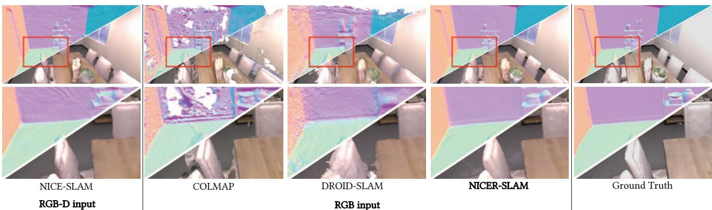  
Figure 1. 3D Dense Reconstruction and Rendering from Different SLAM Systems. On the Replica dataset [49], we compare to dense RGB-D SLAM method NICE-SLAM [74], and monocular SLAM approaches COLMAP [46], DROID-SLAM [57], and our proposed NICER-SLAM.

## Abstract

Neural implicit representations have recently become popular in simultaneous localization and mapping (SLAM), especially in dense visual SLAM. However, existing works either rely on RGB-D sensors or require a separate monocular SLAM approach for camera tracking, and fail to produce high-fidelity 3D dense reconstructions. To address these shortcomings, we present NICER-SLAM, a dense RGB SLAM system that simultaneously optimizes for camera poses and a hierarchical neural implicit map representation, which also allows for high-quality novel view synthesis. To facilitate the optimization process for mapping, we integrate additional supervision signals including easy-to-obtain monocular geometric cues and optical flow, and also introduce a simple warping loss to further enforce geometric consistency. Moreover, to further boost performance in complex large-scale scenes, we also propose a local adaptive transformation from signed distance functions (SDFs) to density in the volume rendering equation. On multiple challenging indoor and outdoor datasets, NICER-SLAM demonstrates strong performance in dense mapping, novel view synthesis, and tracking, even competitive with recent RGB-D SLAM systems. Project page: https://nicer-slam.github.io/.

## 1. Introduction

Simultaneous localization and mapping (SLAM) is a fundamental computer vision problem with wide applications in autonomous driving, robotics, mixed reality, and more. Numerous dense visual SLAM methods have been developed over the years [34, 35, 47, 61, 62], offering real-time dense reconstructions of indoor scenes. However, most of these approaches rely on RGB-D sensors and fail on outdoor scenes or when depth sensors are not available. Moreover, these systems struggle with estimating plausible geometry in unobserved regions. A handful of dense monocular SLAM systems [2, 9, 72] have emerged in the deep learning era, taking sorely RGB sequences as input. They leverage their monocular depth prediction networks to somewhat fill in unobserved regions. Nevertheless, these systems are typically only applicable to small indoor scenes with limited camera movements.

The rapid advancements in neural implicit representations or neural fields [64] have demonstrated powerful performance in end-to-end differentiable dense visual SLAM. iMAP [52] first shows the potential of neural implicit representations in dense RGB-D SLAM, but it is only limited to room-size datasets. NICE-SLAM [74] introduces a hierarchical implicit encoding to perform mapping and camera tracking in much larger indoor scenes. Although follow-up works [19, 22, 26, 30, 39, 66] build upon NICE-SLAM and iMAP from different angles, these methods still rely heavily on the depth input from RGB-D sensors, limiting their applicability to outdoor scenes.

Very recently, a handful of concurrent works (available as pre-prints) attempt to apply neural implicit representations for RGB-only SLAM [7, 45]. However, their tracking and mapping pipelines are independent of each other as they rely on different scene representations for these tasks. Both approaches directly depend on the state-of-the-art visual odometry methods [32, 57] for camera tracking, while using neural radiance fields (NeRFs) only for mapping. Moreover, they both only output and evaluate the rendered depth maps and color images, so no dense 3D model of a scene is produced. This raises an interesting research question:

## Can we build a unified dense SLAM system with a neural implicit scene representationfor both tracking and mappingfrom a monocular RGB video?

Compared to RGB-D SLAM, RGB-only SLAM is more challenging for multiple reasons. 1) Depth ambiguity: Often multiple potential correspondences align well with the color observations, especially in textureless regions. Hence, stronger geometric priors are required for both mapping and tracking optimizations. 2) Harder 3D reconstruction: The presence of ambiguity causes surface estimation to be less localized, leading to harder optimization and increased sampling efforts. 3) Optimization convergence: The optimization is less constrained and more complex - resulting in slower convergence.

To tackle these challenges, we introduce NICER-SLAM, an implicit-based RGB SLAM system that is end-to-end optimizable for both accurate dense reconstruction and tracking in both indoor and outdoor environments. Additionally, our system also excels in novel view synthesis, but unlike NeRF, no camera poses (e.g., from separate SfM/SLAM systems like COLMAP) are required. Our key ideas are outlined as follows. First, we present coarse-to-fine hierarchical feature grids with small MLPs to model SDFs and colors, which yields detailed 3D reconstructions and highfidelity renderings. Second, to facilitate the optimization of neural implicit map representations, we integrate additional supervision signals, including easy-to-obtain monocular geometric cues and optical flow. We also introduce a simple warping loss to further enhance geometry consistency. We observe that these regularizations significantly disambiguate optimization, enabling our framework to work robustly with only RGB input. Third, to better fit the sequential input for large-scale scenes, we propose a locally adaptive transformation from SDF to density.

In summary, we make the following contributions:

• We present NICER-SLAM, one of the first dense RGBonly SLAM that is end-to-end optimizable for both dense mapping and tracking, and also allows for high-quality novel view synthesis.

• We introduce a hierarchical neural implicit encoding for SDF representations, various geometric and motion regularizations, along with a locally adaptive SDF to volume density transformation. We demonstrate strong performances in mapping, and novel view synthesis and tracking on both indoor and outdoor datasets, even competitive with recent RGB-D SLAM methods.

## 2. Related Work

Dense Visual SLAM. SLAM is an active field in both industry and academia, especially in the past two decades. While sparse visual SLAM algorithms [13, 20, 32, 33] estimate accurate camera poses and only have sparse point clouds as the map representation, dense visual SLAM approaches focus on recovering a dense map of a scene. In general, dense map representations are categorized as either view-centric or world-centric. The first often represents 3D geometry as depth maps for keyframes, including the seminal work DTAM [35], and many followups [2, 9, 21, 51, 55–58, 72, 73]. On the other hand, worldcentric maps anchor the 3D geometry of a full scene in uniform world coordinates and represent as surfels [47, 62] or occupancies/TSDF values in the voxel grids [3, 10, 34, 37]. Our work also uses a world-centric map representation, but instead of explicitly representing surfaces, we store latent codes in multi-resolution voxel grids. This allows us to not only obtain high-quality geometry at low grid resolutions, but also attain plausible geometry estimation for unobserved regions.

Neural Implicit-based SLAM. Neural implicit representations [64] have delivered impressive results in numerous tasks, including reconstruction [4, 17, 27, 28, 36, 40, 42, 67], scene completion [18, 25, 41], novel view synthesis [29, 31, 44, 63, 71], etc. Regarding SLAM-related applications, some works [1, 6, 8, 24, 60, 69] attempt to jointly optimize a NeRF and camera poses, but they are limited to small objects or minor camera movements. A series of recent works [7, 45] relax such constraints, but rely on stateof-the-art SLAM systems like ORB-SLAM and DROID-SLAM to obtain camera poses, primarily focusing on novel view synthesis without producing 3D dense reconstruction.

iMAP [52] and NICE-SLAM [74] are the first two unified SLAM pipelines using neural implicit representations for both mapping and camera tracking. iMAP’s application is limited to small scenes due to a single MLP as the scene representation, whereas NICE-SLAM handles much larger indoor environments using hierarchical feature grids and tiny MLPs. Many follow-up works improve upon these two works from various perspectives, including efficient scene representation [19, 22], fast optimziation [66], add IMU measurements [26], or different shape representations [30, 39]. However, all of them require RGB-D inputs, limiting their outdoor applications or when only RGB sensors are accessible. In contrast, given only RGB sequences as input, our system provides high-quality 3D reconstruction and accurate camera poses simultaneously.

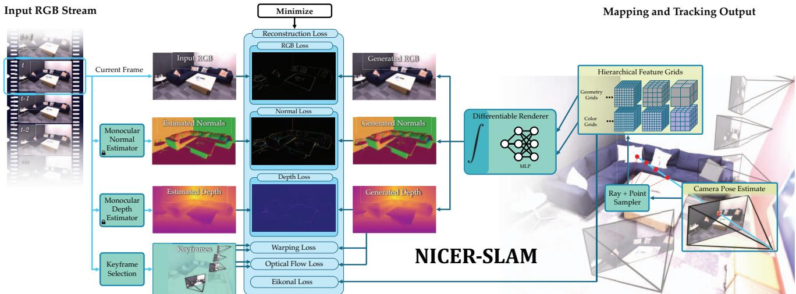  
Figure 2. System Overview. Our method takes only an RGB stream as input and outputs both the camera poses as well as a learned hierarchical scene representation for geometry and colors. To realize an end-to-end joint mapping and tracking, we render predicted colors, depths, normals and optimize wrt. the input RGB and monocular cues. Moreover, we further enforce the geometric consistency with an RGB warping loss and an optical flow loss.

A concurrent work DIM-SLAM [23] presents a neural implicit-based RGB SLAM system in a similar spirit to ours. However, their use of simple color and warping losses leads to less robust results, requiring per-dataset parameter tuning and repeated experiment runs to achieve satisfactory results. In contrast, NICER-SLAM facilitates optimization by incorporating additional supervision signals, eliminating the need for any tuning across different datasets. In addition, this enhancement also enables us to achieve superior 3D reconstruction and novel view synthesis results.

## 3. Method

We provide an overview of the NICER-SLAM pipeline in Fig. 2. Taking an RGB video as input, we simultaneously estimate accurate 3D scene geometry and colors, as well as camera tracking all through an end-to-end optimization process. The scene geometry and appearance are represented using hierarchical neural implicit representations (Sec. 3.1). Leveraging the NeRF-like differentiable volume rendering, we render color, depth, and normal values for every pixel (Sec. 3.2), they facilitate end-to-end joint optimization for camera pose, scene geometry, and color (Sec. 3.3).

## 3.1. Hierarchical Neural Implicit Representations

Coarse-level Geometric Representation. The design of the coarse-level geometric representation is to efficiently model the coarse scene geometry (objects without geometric details) and the scene layout (e.g. walls, floors), even under partial observations. To achieve this, we represent the normalized scene as a dense voxel grid with a $3 2 \times 3 2 \times 3 2$ resolution, and maintain an optimizable 32-dim feature in each voxel. Given a 3D point $\mathbf { x } \in \mathbb { R } ^ { 3 }$ in the space, we use a small MLP fcoarse with a single 64-dim hidden layer to determine its base SDF value $s ^ { \mathrm { c o a r s e } } \in \mathbb { R }$ and a geometric feature $\mathbf { z } ^ { \mathrm { c o a r s e } } \in \mathbb { R } ^ { 3 2 }$ as:

$$
s ^ { \mathrm { c o a r s e } } , \ { \mathbf z } ^ { \mathrm { c o a r s e } } = f ^ { \mathrm { c o a r s e } } ( \gamma ( { \mathbf x } ) , \Phi ^ { \mathrm { c o a r s e } } ( { \mathbf x } ) ) ,\tag{1}
$$

where $\gamma$ is a fixed positional encoding [29, 54] that maps the coordinate to higher dimension. Following [67, 68, 70], we set the level for positional encoding to 6. Φcoarse(x) represents the feature grid Φcoarse tri-linearly interpolated at the point x.

Fine-level Geometric Representation. Moving beyond the coarse-level representation, capturing the highfrequency geometric details of a scene is vital. We model these details as residual SDF values, utilizing multiresolution feature grids and an MLP decoder [5, 31, 53, 74]. Specifically, we apply multi-resolution dense feature grids $\{ \Phi _ { l } ^ { \mathrm { f i n e } } \} _ { 1 } ^ { L }$ with respective resolutions $R _ { l } .$ , as detailed in Eq. (2). These resolutions are sampled in geometric space [31] to combine features at different frequencies:

$$
R _ { l } : = \lfloor R _ { \mathrm { m i n } } b ^ { l } \rfloor , \ : \ : b : = \ : \exp \left( \frac { \ln R _ { \mathrm { m a x } } - \ln R _ { \mathrm { m i n } } } { L - 1 } \right)\tag{2}
$$

where $R _ { \operatorname* { m i n } } , R _ { \operatorname* { m a x } }$ correspond to the lowest and highest resolution, respectively. Here we consider $R _ { \mathrm { m i n } } = 3 2 , R _ { \mathrm { m a x } } =$ 128, in total $L = 8$ levels, with a feature dimension of 4 at each level.

Now, to model the residual SDF values for a point $\mathbf { x } ,$ we extract and concatenate the tri-linearly interpolated features at each level, and input them to an ML $\mathrm { ~ P ~ } f ^ { \mathrm { f i n e } }$ with 3 hidden layers of size 64:

$$
\left( \Delta s , \mathrm { \bf ~ z } ^ { \mathrm { f i n e } } \right) = f ^ { \mathrm { f i n e } } \left( \gamma ( { \bf x } ) , \mathrm { \bf ~ \{ \Phi \Phi \Phi ^ { \mathrm { f i n e } } ( { \bf x } ) \} } \right) \ ,\tag{3}
$$

where $\mathbf { z } ^ { \mathrm { f i n e } } \in \mathbb { R } ^ { 3 2 }$ is the geometric feature for x at the fine level. The final predicted SDF value sˆ for x is obtained by adding the coarse-level base SDF value $s ^ { \mathrm { c o a r s e } }$ to the finelevel residual SDF $\Delta s$

$$
\hat { s } = s ^ { \mathrm { c o a r s e } } + \Delta s .\tag{4}
$$

Color Representation. Besides 3D geometry, we also predict color values such that our mapping and camera tracking can be optimized also with color losses. Moreover, as an additional application, we can also render images from novel views. Inspired by [31], we encode colors with another multi-resolution feature grid $\{ \Phi _ { l } ^ { \mathrm { c o l o r } } \} _ { 1 } ^ { L }$ and a decoder $f ^ { \mathrm { c o l o r } }$ parameterized with a 2-layer MLP of size 64. The number of feature grid levels is now $L = 1 6 ,$ , with a feature dimension of 2 at each level. We adjust the minimum and maximum resolution to $R _ { \operatorname* { m i n } } = 1 6$ and $R _ { \mathrm { m a x } } = 2 0 4 8$ . The per-point color value is modelled as:

$$
\hat { \mathbf { c } } = f ^ { \mathrm { c o l o r } } \big ( \mathbf { x } , \hat { \mathbf { n } } , \gamma ( \mathbf { v } ) , \mathbf { z } ^ { \mathrm { c o a r s e } } , \mathbf { z } ^ { \mathrm { f i n e } } , \{ \Phi _ { l } ^ { \mathrm { c o l o r } } ( \mathbf { x } ) \} \big ) \enspace .\tag{5}
$$

where nˆ refers to the normal at point x calculated from $\hat { s }$ in Eq. (4) and $\gamma ( \mathbf { v } )$ is the viewing direction with positional encoding with a level of 4, following [68, 70].

## 3.2. Volume Rendering

Following recent works on implicit-based 3D reconstruction [38, 59, 68] and dense visual SLAM [52, 74], we optimize our scene representation from Sec. 3.1 using differentiable volume rendering. For rendering a pixel, we cast a ray r from the camera center o through the pixel along its normalized view direction v. N points are then sampled along the ray, denoted as $\mathbf x _ { i } = \mathbf o + t _ { i } \mathbf v$ , and their predicted SDFs and color values are $\hat { s } _ { i }$ and $\hat { \mathbf { c } } _ { i }$ . We transform the SDFs $\hat { s } _ { i }$ to density values $\sigma _ { i }$ as in [68]:

$$
\begin{array} { r } { \sigma _ { \beta } ( s ) = \left\{ \begin{array} { l l } { \frac { 1 } { 2 \beta } \exp \big ( \frac { s } { \beta } \big ) } & { \mathrm { i f ~ } s \leq 0 } \\ { \frac { 1 } { \beta } \Big ( 1 - \frac { 1 } { 2 } \exp \big ( - \frac { s } { \beta } \big ) \Big ) } & { \mathrm { i f ~ } s > 0 \ , } \end{array} \right. } \end{array}\tag{6}
$$

where $\beta \in \mathbb { R }$ is a learnable parameter. As in [29], we calculate the color $\hat { C }$ for the current ray r as:

$$
\begin{array} { c } { { \displaystyle \hat { C } = \sum _ { i = 1 } ^ { N } T _ { i } \alpha _ { i } \hat { \mathbf { c } } _ { i } ~ T _ { i } = \prod _ { j = 1 } ^ { i - 1 } ( 1 - \alpha _ { j } ) } } \\ { { \displaystyle \alpha _ { i } = 1 - \exp \left( - \sigma _ { i } \delta _ { i } \right) ~ , } } \end{array}\tag{7}
$$

where $T _ { i }$ and $\alpha _ { i }$ correspond to transmittance and alpha value of sample point i along ray $\mathbf { r } ,$ and $\delta _ { i }$ is the distance between neighboring sample points. In a similar manner, we also compute the depth $\hat { D }$ and normal $\hat { N }$ of the surface intersecting the ray as:

$$
\hat { D } = \sum _ { i = 1 } ^ { N } T _ { i } \alpha _ { i } t _ { i } \qquad \hat { N } = \sum _ { i = 1 } ^ { N } T _ { i } \alpha _ { i } \hat { { \bf n } } _ { i } .\tag{8}
$$

Locally Adaptive Transformation. The parameter $\beta$ in Eq. (6) serves as a modifier of the smoothing amount around an object’s surface during the volume rendering process. $\mathrm { A s }$ the network gains certainty about the objec $\mathrm { \Omega ^ { \circ } s }$ surface, the value of $\beta$ gradually decreases, leading to sharper and faster reconstructions. VolSDF [68] models $\beta$ as a global parameter for small object-level scenes. However, for our application involving sequential input within complex indoor and outdoor scenes, a globally optimizable $\beta$ proves to be sub-optimal (ablation study in supplementary).

Instead, we propose to assign $\beta$ values locally to model locally adaptive transformation in Eq. (6). More specifically, we partition the scene into a voxel grid and maintain a counter to track the number of point samples in it during mapping. We set the grid size to $6 4 ^ { 3 }$ (see ablation in supplementary). Next, we employ a heuristic approach to convert the local point counter $T _ { p }$ into the $\beta$ value:

$$
\beta = c _ { 0 } \cdot \exp ( - c _ { 1 } \cdot T _ { p } ) + c _ { 2 } .\tag{9}
$$

This transformation was derived by correlating the decreasing trend of $\beta$ wrt. the voxel count under the setting of global input as in [68, 70], and fitting an exponential curve. The curve fitting results are illustrated in the supplemental.

## 3.3. End-to-End Joint Mapping and Tracking

From purely sequential RGB input, end-to-end joint mapping and tracking present significant challenges. This is due to the high degrees of ambiguity particularly in large complex scenes with many textureless and sparsely covered regions. To enable this process under our neural scene representation, we propose to constrain the optimization with the following losses.

RGB Rendering Loss. Eq. (7) connects the 3D neural scene representation with 2D observations, allowing us to optimize the scene representation with a simple RGB reconstruction loss:

$$
\mathcal { L } _ { \mathrm { r g b } } = \sum _ { \mathbf { r } \in \mathcal { R } } \| \hat { C } ( \mathbf { r } ) - C ( \mathbf { r } ) \| _ { 1 } ~ ,\tag{10}
$$

are randomly sampled pixels, and C is the pixel color.

RGB Warping Loss. To enforce geometry consistency from only color inputs, we utilize a simple per-pixel warping loss. For any pixel in frame $m$ , denoted as $\mathbf { r } _ { m } ,$ we first render its depth value using Eq. (8) and unproject it to 3D. We then project it to the nearby keyframe n using intrinsics and extrinsics of frame n. The projected pixel in frame n is denoted as $\mathbf { r } _ { m  n }$ . The warping loss is defined as:

$$
\mathcal { L } _ { \mathrm { w a r p } } = \sum _ { \mathbf { r } _ { m } \in \mathcal { R } } \sum _ { n \in \mathcal { K } _ { m } } \| C ( \mathbf { r } _ { m } ) - C ( \mathbf { r } _ { m  n } ) \| _ { 1 } \ ,\tag{11}
$$

where $\kappa _ { m }$ denotes the keyframe list for the current frame $m ,$ excluding frame m itself. We mask out the pixels that are projected outside the image boundary of frame n. Note that unlike [11] that optimize neural implicit surfaces with patch warping, we observe that simply performing warping on randomly sampled pixels is more efficient without performance drop.

Optical Flow Loss. The RGB rendering and warping loss are only point-wise terms that are prone to local minima. Therefore, we incorporate regional smoothness priors via optical flow estimates. Suppose the sample pixel in frame m as $\mathbf { r } _ { m }$ and the projected pixel as ${ \bf r } _ { n }$ , the loss will be:

$$
\mathcal { L } _ { \mathrm { f l o w } } = \sum _ { \mathbf { r } _ { m } \in \mathcal { R } } \sum _ { n \in \mathcal { K } _ { m } } \Vert ( \mathbf { r } _ { m } - \mathbf { r } _ { n } ) - \mathbf { G } \mathbf { M } ( \mathbf { r } _ { m  n } ) \Vert _ { 1 } \ .\tag{12}
$$

${ \mathrm { G M } } ( \mathbf { r } _ { m  n } )$ denotes the estimated optical flow from [65].

Monocular Depth Loss. Given RGB input, one can easily obtain geometric cues (such as depths or normals) via an off-the-shelf monocular predictor [12]. Inspired by [70], we also include this information in the optimization to guide the neural implicit surface reconstruction. More specifically, to enforce depth consistency between our rendered expected depths $\hat { D }$ and the monocular depths ${ \bar { D } } ,$ we use the loss [43]:

$$
\mathcal { L } _ { \mathrm { d e p t h } } = \sum _ { \mathbf { r } \in \mathcal { R } } \left. \left( w \hat { D } ( \mathbf { r } ) + q \right) - \bar { D } ( \mathbf { r } ) \right. ^ { 2 } \ ,\tag{13}
$$

where $w , q \in \mathbb { R }$ are the scale and shift used to align $\hat { D }$ and ${ \bar { D } } ,$ since $\bar { D }$ is only known up to an unknown scale. We solve for w and q per image with least squares, which has a closed-form solution.

Monocular Normal Loss. Another geometric cue that is complementary to the monocular depth is surface normal, a local cue that captures more geometric details. Similar to [70], we impose consistency on the volume-rendered normal $\hat { N }$ and the monocular normals $\bar { N }$ from [12]:

$$
\begin{array} { r } { \mathcal { L } _ { \mathrm { n o r m a l } } = \displaystyle \sum _ { \mathbf { r } \in \mathcal { R } } \| \hat { N } ( \mathbf { r } ) - \bar { N } ( \mathbf { r } ) \| _ { 1 } } \\ { + \| 1 - \hat { N } ( \mathbf { r } ) ^ { \top } \bar { N } ( \mathbf { r } ) \| _ { 1 } \enspace . } \end{array}\tag{14}
$$

Eikonal Loss. In addition, we add the Eikonal loss [15] to regularize the output SDF values sˆ:

$$
\mathcal { L } _ { \mathrm { e i k o n a l } } = \sum _ { \mathbf { x } \in \mathcal { X } } ( \| \nabla \hat { s } ( \mathbf { x } ) \| _ { 2 } - 1 ) ^ { 2 } ,\tag{15}
$$

where $\mathcal { X }$ represents a set of uniformly sampled near-surface points.

Optimization Scheme. We provide details on how to optimize the scene geometry and appearance in the form of our hierarchical representation, and also the camera poses.

Mapping: To optimize the scene representation mentioned in Sec. 3.1, we uniformly sample M pixels/rays in total from the current frame and selected keyframes. The optimization is performed in a 3-stage process similar to [74] but employs the following loss:

$$
\begin{array} { r l } & { \mathcal { L } \mathrm { = } \mathcal { L } _ { \mathrm { r g b } } + 0 . 5 \mathcal { L } _ { \mathrm { w a r p } } + 0 . 0 0 1 \mathcal { L } _ { \mathrm { f l o w } } } \\ & { \qquad + 0 . 1 \mathcal { L } _ { \mathrm { d e p t h } } + 0 . 0 5 \mathcal { L } _ { \mathrm { n o r m a l } } + 0 . 1 \mathcal { L } _ { \mathrm { e i k o n a l } } } \end{array}\tag{16}
$$

At the first stage, we treat the coarse-level base SDF value $s ^ { \mathrm { c o a r s e } }$ in Eq. (1) as the final SDF value ${ \hat { s } } ,$ and optimize the coarse feature grid $\Phi ^ { \mathrm { c o a r s e } }$ , coarse MLP parameters of $f ^ { \mathrm { c o a r s e } }$ , and color MLP parameters of $f ^ { \mathrm { c o l o r } }$ with Eq. (16). Upon reaching 25% of the total number of iterations, we switch to using Eq. (4) as the final SDF value, soenabling the joint optimization of the fine-level feature grids $\{ \Phi _ { l } ^ { \mathrm { f i n e } } \}$ and fine-level ML $\mathrm { ~ P ~ } f ^ { \mathrm { f i n e } }$ . At 75% mark, we conduct a local bundle adjustment (BA) with Eq. (16), extending the optimization to color feature grids $\{ \Phi _ { l } ^ { \mathrm { c o l o r } } \}$ and the extrinsic parameters of K selected mapping frames.

Camera Tracking: In parallel to mapping, we optimize the camera pose (rotation and translation) of the current frame, while keeping the hierarchical scene representation fixed. This is achieved by sampling $M _ { t }$ pixels from the current frame and use purely the RGB rendering loss in Eq. (10) for 100 iterations.

## 4. Experiments

We evaluate qualitative and quantitative comparisons against state-of-the-art (SOTA) SLAM frameworks on both synthetic and real-world datasets in Sec. 4.1. A comprehensive ablation study supporting our design choices is provided in the supplementary material.

Datasets. We evaluate on the synthetic Replica dataset [49], where RGB-(D) images are rendered with the official renderer. To assess the performance in real-world indoor/outdoor scenarios, we also compare on the challenging dataset 7-Scenes [48] known for its low-resolution images with severe motion blur, and a self-captured outdoor (SCO) dataset, captured with Azure Kinect, comprising 6 diverse scenes, ranging from 800 to 2700 frames. COLMAP is used to obtain intrinsic parameters for the 7-Scenes and SCO datasets. For comparisons and discussions on ScanNet and TUM RGB-D dataset, see the supplementary material.

Baselines. We compare NICER-SLAM with 10 methods. (a) SOTA neural implicit RGB-D SLAM system

<table><tr><td rowspan=1 colspan=14>rm-0 rm-1 rm-2 off-0 off-1 off-2 off-3 off-4 Avg.</td></tr><tr><td rowspan=1 colspan=14>RGB-D input</td></tr><tr><td rowspan=1 colspan=5>Acc.[cm]↓</td><td rowspan=1 colspan=1>3.53</td><td rowspan=1 colspan=1>3.60</td><td rowspan=1 colspan=1>3.03</td><td rowspan=1 colspan=1>5.56</td><td rowspan=1 colspan=1>3.35</td><td rowspan=1 colspan=1>4.71</td><td rowspan=1 colspan=1>3.84</td><td rowspan=1 colspan=1>3.35</td><td rowspan=1 colspan=1>3.87</td></tr><tr><td rowspan=1 colspan=5>Comp.[cm]↓</td><td rowspan=1 colspan=1>3.40</td><td rowspan=1 colspan=1>3.62</td><td rowspan=1 colspan=1>3.27</td><td rowspan=1 colspan=1>4.55</td><td rowspan=1 colspan=1>4.03</td><td rowspan=1 colspan=1>3.94</td><td rowspan=1 colspan=1>3.99</td><td rowspan=1 colspan=1>4.15</td><td rowspan=1 colspan=1>3.87</td></tr><tr><td rowspan=1 colspan=5>Comp.Rat.[&lt; 5cm %]↑</td><td rowspan=1 colspan=1>86.05</td><td rowspan=1 colspan=1>80.75</td><td rowspan=1 colspan=1>87.23</td><td rowspan=1 colspan=1>79.34</td><td rowspan=1 colspan=1>82.13</td><td rowspan=1 colspan=1>80.35</td><td rowspan=1 colspan=1>80.55</td><td rowspan=1 colspan=1>82.88</td><td rowspan=1 colspan=1>82.41</td></tr><tr><td rowspan=1 colspan=5>NNormal Cons.[%]↑</td><td rowspan=1 colspan=2>91.92 91.36</td><td rowspan=1 colspan=1>90.79</td><td rowspan=1 colspan=2>89.3088.79</td><td rowspan=1 colspan=1>88.97</td><td rowspan=1 colspan=1>87.18</td><td rowspan=1 colspan=1>91.17</td><td rowspan=1 colspan=1>89.93</td></tr><tr><td rowspan=1 colspan=5>Acc.[cm]↓</td><td rowspan=1 colspan=2>2.531.69</td><td rowspan=1 colspan=1>3.33</td><td rowspan=1 colspan=1>2.20</td><td rowspan=1 colspan=1>2.21</td><td rowspan=1 colspan=1>2.72</td><td rowspan=1 colspan=1>4.16</td><td rowspan=1 colspan=1>2.48</td><td rowspan=1 colspan=1>2.67</td></tr><tr><td rowspan=1 colspan=5>Comp.[cm]↓</td><td rowspan=1 colspan=1>2.81</td><td rowspan=1 colspan=1>2.51</td><td rowspan=1 colspan=1>4.03</td><td rowspan=1 colspan=1>8.75</td><td rowspan=1 colspan=1>7.36</td><td rowspan=1 colspan=1>4.19</td><td rowspan=1 colspan=1>3.26</td><td rowspan=1 colspan=1>3.49</td><td rowspan=1 colspan=1>4.55</td></tr><tr><td rowspan=1 colspan=5>Comp.Rat.[&lt; 5cm %]↑</td><td rowspan=1 colspan=1>91.52</td><td rowspan=1 colspan=1>91.34</td><td rowspan=1 colspan=1>86.78</td><td rowspan=1 colspan=1>81.99</td><td rowspan=1 colspan=1>82.03</td><td rowspan=1 colspan=1>85.45</td><td rowspan=1 colspan=1>87.13</td><td rowspan=1 colspan=1>86.5</td><td rowspan=1 colspan=1>86.593</td></tr><tr><td rowspan=1 colspan=5>Normal Cons.[%]↑</td><td rowspan=1 colspan=2>94.14 93.28</td><td rowspan=1 colspan=1>91.71</td><td rowspan=1 colspan=1>90.52</td><td rowspan=1 colspan=1>88.95</td><td rowspan=1 colspan=1>91.54</td><td rowspan=1 colspan=1>91.03</td><td rowspan=1 colspan=1>92.67</td><td rowspan=1 colspan=1>91.73</td></tr><tr><td rowspan=1 colspan=5>RGB input</td><td rowspan=1 colspan=2></td><td rowspan=1 colspan=1></td><td rowspan=1 colspan=1></td><td rowspan=1 colspan=1></td><td rowspan=1 colspan=1></td><td rowspan=1 colspan=1></td><td rowspan=1 colspan=1></td><td rowspan=1 colspan=1></td></tr><tr><td rowspan=1 colspan=5>Acc.[cm]↓</td><td rowspan=1 colspan=1>3.87</td><td rowspan=1 colspan=1>27.29</td><td rowspan=1 colspan=1>5.41</td><td rowspan=1 colspan=1>5.21</td><td rowspan=1 colspan=1>12.69</td><td rowspan=1 colspan=1>4.28</td><td rowspan=1 colspan=1>5.29</td><td rowspan=1 colspan=1>5.45</td><td rowspan=1 colspan=1>8.69</td></tr><tr><td rowspan=3 colspan=5>COLMMAPComp.[cm]↓Comp.Rat.[&lt; 5cm %]↑Normal Cons.[%]↑</td><td rowspan=1 colspan=1>4.78</td><td rowspan=1 colspan=1>23.90</td><td rowspan=1 colspan=1>17.42</td><td rowspan=1 colspan=1>12.98</td><td rowspan=1 colspan=1>12.35</td><td rowspan=1 colspan=1>4.96</td><td rowspan=1 colspan=1>16.17</td><td rowspan=1 colspan=1>4.41</td><td rowspan=1 colspan=1>12.12</td></tr><tr><td rowspan=1 colspan=1>83.08</td><td rowspan=1 colspan=1>22.89</td><td rowspan=1 colspan=1>64.47</td><td rowspan=1 colspan=1>72.59</td><td rowspan=1 colspan=1>69.52</td><td rowspan=1 colspan=1>81.12</td><td rowspan=1 colspan=1>64.38</td><td rowspan=1 colspan=1>82.92</td><td rowspan=1 colspan=1>67.62</td></tr><tr><td rowspan=1 colspan=2>72.49 60.10</td><td rowspan=1 colspan=1>69.42</td><td rowspan=1 colspan=1>69.91</td><td rowspan=1 colspan=1>74.04</td><td rowspan=1 colspan=1>71.84</td><td rowspan=1 colspan=1>71.49</td><td rowspan=1 colspan=1>71.757</td><td rowspan=1 colspan=1>0.13</td></tr><tr><td rowspan=1 colspan=5>Acc.[cm]↓</td><td rowspan=1 colspan=2>6.767.81</td><td rowspan=1 colspan=1>5.60</td><td rowspan=1 colspan=1>5.00</td><td rowspan=1 colspan=1>4.66</td><td rowspan=1 colspan=1>10.68</td><td rowspan=1 colspan=1>7.34</td><td rowspan=1 colspan=1>6.97</td><td rowspan=1 colspan=1>6.85</td></tr><tr><td rowspan=3 colspan=5>TANDEMComp.[cm]↓Comp.Rat.[&lt; 5cm %]↑Normal Cons.[%]↑</td><td rowspan=1 colspan=1>9.00</td><td rowspan=1 colspan=1>7.99</td><td rowspan=1 colspan=1>12.27</td><td rowspan=1 colspan=1>15.30</td><td rowspan=1 colspan=1>14.46</td><td rowspan=1 colspan=1>12.63</td><td rowspan=1 colspan=1>10.50</td><td rowspan=1 colspan=1>10.38</td><td rowspan=1 colspan=1>11.57</td></tr><tr><td rowspan=1 colspan=1>52.81</td><td rowspan=1 colspan=1>56.58</td><td rowspan=1 colspan=1>55.71</td><td rowspan=1 colspan=1>57.88</td><td rowspan=1 colspan=1>54.18</td><td rowspan=1 colspan=1>49.19</td><td rowspan=1 colspan=1>44.82</td><td rowspan=1 colspan=1>47.605</td><td rowspan=1 colspan=1>2.35</td></tr><tr><td rowspan=1 colspan=2>78.2677.7</td><td rowspan=1 colspan=1>82.063</td><td rowspan=1 colspan=1>82.14</td><td rowspan=1 colspan=1>79.48</td><td rowspan=1 colspan=1>79.73</td><td rowspan=1 colspan=1>79.68</td><td rowspan=1 colspan=1>82.808</td><td rowspan=1 colspan=1>0.24</td></tr><tr><td rowspan=1 colspan=5>Acc.[cm]↓</td><td rowspan=1 colspan=1>11.84</td><td rowspan=1 colspan=1>10.62</td><td rowspan=1 colspan=1>11.86</td><td rowspan=1 colspan=1>9.32</td><td rowspan=1 colspan=1>14.40</td><td rowspan=1 colspan=1>11.54</td><td rowspan=1 colspan=1>16.31</td><td rowspan=1 colspan=1>11.11</td><td rowspan=1 colspan=1>12.13</td></tr><tr><td rowspan=1 colspan=3>Comp</td><td rowspan=3 colspan=3>NER-AMComp.[cm]↓Comp.Rat.[&lt; 5cm %]↑Normal Cons.[%]↑</td><td rowspan=1 colspan=1>mp.[c</td><td rowspan=1 colspan=2></td><td rowspan=1 colspan=1>5.63</td><td rowspan=1 colspan=1>5.88</td><td rowspan=1 colspan=1>9.22</td><td rowspan=1 colspan=1>13.29</td><td rowspan=1 colspan=1>10.17</td></tr><tr><td></td><td></td><td></td><td rowspan=1 colspan=1>.[< 5cm %]1</td><td rowspan=1 colspan=1>61.13</td><td rowspan=1 colspan=1>68.19</td><td rowspan=1 colspan=1>47.85</td><td rowspan=1 colspan=1>37.64</td><td rowspan=1 colspan=1>56.17</td><td rowspan=1 colspan=1>66.20</td><td rowspan=1 colspan=1>55.67</td><td rowspan=1 colspan=1>61.86</td><td rowspan=1 colspan=1>56.84</td></tr><tr><td></td><td></td><td></td><td rowspan=1 colspan=1>63.39</td><td rowspan=1 colspan=1>53.31</td><td rowspan=1 colspan=1>57.52</td><td rowspan=1 colspan=1>64.09</td><td rowspan=1 colspan=1>57.13</td><td rowspan=1 colspan=1>57.06</td><td rowspan=1 colspan=1>59.73</td><td rowspan=1 colspan=1>58.59</td><td rowspan=1 colspan=1>58.85</td></tr><tr><td rowspan=1 colspan=5>Acc.[cm]↓</td><td rowspan=1 colspan=1>14.1</td><td rowspan=1 colspan=1>9.569</td><td rowspan=1 colspan=1>8.41</td><td rowspan=1 colspan=1>10.16</td><td rowspan=1 colspan=1>7.86</td><td rowspan=1 colspan=1>16.50</td><td rowspan=1 colspan=1>13.01</td><td rowspan=1 colspan=1>13.08</td><td rowspan=1 colspan=1>11.60</td></tr><tr><td rowspan=1 colspan=5>Comp.[cm]↓</td><td rowspan=1 colspan=1>6.24</td><td rowspan=1 colspan=1>6.45</td><td rowspan=1 colspan=1>12.17</td><td rowspan=1 colspan=1>5.95</td><td rowspan=1 colspan=1>8.33</td><td rowspan=1 colspan=1>8.28</td><td rowspan=1 colspan=1>6.77</td><td rowspan=1 colspan=1>8.62</td><td rowspan=1 colspan=1>7.85</td></tr><tr><td rowspan=2 colspan=5>Comp.Rat.[&lt; 5cm %]↑Normal Cons.[%]↑</td><td rowspan=1 colspan=1>69.77</td><td rowspan=1 colspan=1>66.305</td><td rowspan=1 colspan=1>1.21</td><td rowspan=1 colspan=1>74.16</td><td rowspan=1 colspan=1>62.10</td><td rowspan=1 colspan=1>54.92</td><td rowspan=1 colspan=1>63.88</td><td rowspan=1 colspan=1>55.4</td><td rowspan=1 colspan=1>62.223</td></tr><tr><td rowspan=1 colspan=1>77.69</td><td rowspan=1 colspan=1>82.16</td><td rowspan=1 colspan=1>78.89</td><td rowspan=1 colspan=1>81.44</td><td rowspan=1 colspan=1>79.41</td><td rowspan=1 colspan=1>73.68</td><td rowspan=1 colspan=1>77.09</td><td rowspan=1 colspan=1>78.05</td><td rowspan=1 colspan=1>78.55</td></tr><tr><td rowspan=1 colspan=5>Acc.[cm]↓</td><td rowspan=1 colspan=2>12.188.35</td><td rowspan=1 colspan=1>3.26</td><td rowspan=1 colspan=1>3.01</td><td rowspan=1 colspan=1>2.39</td><td rowspan=1 colspan=1>5.66</td><td rowspan=1 colspan=1>4.49</td><td rowspan=1 colspan=2>4.655.50</td></tr><tr><td rowspan=1 colspan=5>Comp.[cm]↓</td><td rowspan=1 colspan=1>8.96</td><td rowspan=1 colspan=1>6.07</td><td rowspan=1 colspan=1>16.01</td><td rowspan=1 colspan=1>16.19</td><td rowspan=1 colspan=1>16.20</td><td rowspan=1 colspan=1>15.56</td><td rowspan=1 colspan=1>9.73</td><td rowspan=1 colspan=1>9.63</td><td rowspan=1 colspan=1>12.29</td></tr><tr><td rowspan=1 colspan=5>Comp.Rat.[&lt; 5cm %]↑</td><td rowspan=1 colspan=1>60.077</td><td rowspan=1 colspan=1>6.20</td><td rowspan=1 colspan=1>61.62</td><td rowspan=1 colspan=1>64.19</td><td rowspan=1 colspan=1>60.63</td><td rowspan=1 colspan=1>56.78</td><td rowspan=1 colspan=1>61.95</td><td rowspan=1 colspan=1>67.51</td><td rowspan=1 colspan=1>63.62</td></tr><tr><td rowspan=1 colspan=5>Normal Cons.[%]↑</td><td rowspan=1 colspan=2>72.81 74.71</td><td rowspan=1 colspan=1>79.21</td><td rowspan=1 colspan=1>77.53</td><td rowspan=1 colspan=1>78.57</td><td rowspan=1 colspan=1>75.79</td><td rowspan=1 colspan=1>77.69</td><td rowspan=1 colspan=1>76.38</td><td rowspan=1 colspan=1>76.59</td></tr><tr><td rowspan=1 colspan=5>Acc.[cm]↓</td><td rowspan=1 colspan=1>2.53</td><td rowspan=1 colspan=1>3.93</td><td rowspan=1 colspan=1>3.40</td><td rowspan=1 colspan=1>5.49</td><td rowspan=1 colspan=1>3.45</td><td rowspan=1 colspan=1>4.02</td><td rowspan=1 colspan=1>3.34</td><td rowspan=1 colspan=1>3.03</td><td rowspan=1 colspan=1>3.65</td></tr><tr><td rowspan=1 colspan=5>Comp.[cm]↓</td><td rowspan=1 colspan=1>3.04</td><td rowspan=1 colspan=1>4.10</td><td rowspan=1 colspan=1>3.42</td><td rowspan=1 colspan=1>6.09</td><td rowspan=1 colspan=1>4.42</td><td rowspan=1 colspan=1>4.29</td><td rowspan=1 colspan=1>4.03</td><td rowspan=1 colspan=1>3.87</td><td rowspan=1 colspan=1>4.16</td></tr><tr><td rowspan=1 colspan=5>Comp.Rat.[&lt; 5cm %]↑</td><td rowspan=1 colspan=1>88.75</td><td rowspan=1 colspan=1>76.61</td><td rowspan=1 colspan=1>86.10</td><td rowspan=1 colspan=1>65.19</td><td rowspan=1 colspan=1>77.84</td><td rowspan=1 colspan=1>74.51</td><td rowspan=1 colspan=1>82.01</td><td rowspan=1 colspan=1>83.98</td><td rowspan=1 colspan=1>79.37</td></tr><tr><td rowspan=1 colspan=5>Normal Cons.[%]↑</td><td rowspan=1 colspan=2>93.00 91.52</td><td rowspan=1 colspan=1>92.38</td><td rowspan=1 colspan=1>87.11</td><td rowspan=1 colspan=1>86.79</td><td rowspan=1 colspan=1>90.19</td><td rowspan=1 colspan=1>90.10</td><td rowspan=1 colspan=1>90.96</td><td rowspan=1 colspan=1>90.27</td></tr></table>

Table 1. Reconstruction Results on the Replica dataset. Best results are highlighted as first , second , and third . NICER-SLAM performs the best among RGB SLAM methods, and is on par with RGB-D methods. DIM-SLAM\* indicates our reimplementation. Note that we do not report the numbers from DIM-SLAM paper because they cull meshes differently. Please refer to the supp. mat. for discussion.

NICE-SLAM [74] and Vox-Fusion [66], (b) concurrent neural implicit RGB SLAM system DIM-SLAM [23]/DIM-SLAM\*1, NeRF-SLAM [45] and Orbeez-SLAM [7], (c) classic SLAM methods COLMAP [46] and DSO [13], and (d) SOTA dense monocular SLAM systems DROID-SLAM [57] and TANDEM [21]. For camera tracking evaluation, we also compare with DROID-SLAM∗, which does not perform the final global bundle adjustment and loop closure (identical to our NICER-SLAM setting). For DROID-SLAM’s 3D reconstruction, we run TSDF fusion with their predicted depths of keyframes.

Metrics. For camera tracking, we follow the conventional monocular SLAM evaluation pipeline where the estimated trajectory is aligned to the GT using evo [16], and then evaluate (ATE RMSE) [50]. To evaluate scene geometry, we use Accuracy, Completion, Completion Ratio, and Normal Consistency. The reconstructed meshes from monocular SLAM systems are aligned to the GT mesh using the ICP tool from [14]. We also use PSNR, SSIM and LPIPS for novel view synthesis evaluation.

<table><tr><td rowspan=1 colspan=10>rm-0rm-1rm-2off-0off-1off-2off-3off-4Avg.</td></tr><tr><td rowspan=1 colspan=10>RGB-D input</td></tr><tr><td rowspan=2 colspan=1>E-xtta-poatePSNR ↑SSIM↑</td><td rowspan=1 colspan=5>23.8322.6121.9725.78 25.30</td><td rowspan=1 colspan=2>18.50 22.82</td><td rowspan=1 colspan=2>25.2623.26</td></tr><tr><td rowspan=1 colspan=3>0.7880.8130.858</td><td rowspan=1 colspan=1>0.887</td><td rowspan=1 colspan=1>0.842</td><td rowspan=1 colspan=2>0.826 0.862</td><td rowspan=1 colspan=1>0.875</td><td rowspan=1 colspan=1>0.844</td></tr><tr><td rowspan=1 colspan=1>LPIPS ↓</td><td rowspan=1 colspan=3>0.2840.2490.218</td><td rowspan=1 colspan=1>0.209</td><td rowspan=1 colspan=1>0.145</td><td rowspan=1 colspan=2>0.242 0.190</td><td rowspan=1 colspan=1>0.191</td><td rowspan=1 colspan=1>0.216</td></tr><tr><td rowspan=3 colspan=6>PSNR ↑22.1222.4724.52I-ntr-polaeSSIM↑0.6890.7570.814       0.886LPIPS↓0.3300.2710.2080.2290.181</td><td rowspan=1 colspan=2>29.07 30.34</td><td rowspan=1 colspan=2>19.66 22.23</td></tr><tr><td rowspan=1 colspan=2>0.874 0.886</td><td rowspan=1 colspan=2>0.797 0.801</td><td rowspan=1 colspan=2>0.8560.809</td></tr><tr><td rowspan=1 colspan=4>0.235 0.209 0.1980.233</td></tr><tr><td rowspan=2 colspan=2>E-Xxtta-  PSNR ↑poate23.45SSIM↑0.765</td><td rowspan=1 colspan=4>20.8318.3823.28 24.48</td><td rowspan=1 colspan=4>17.50 23.06 24.8421.98</td></tr><tr><td rowspan=1 colspan=1>0.765</td><td rowspan=1 colspan=1>0.773</td><td rowspan=1 colspan=1>0.747</td><td rowspan=1 colspan=1>0.751</td><td rowspan=1 colspan=1>0.762</td><td rowspan=1 colspan=1>0.727</td><td rowspan=1 colspan=1>0.824</td><td rowspan=1 colspan=2>0.8510.775</td></tr><tr><td rowspan=1 colspan=1>LPIPS↓</td><td rowspan=1 colspan=1>0.280</td><td rowspan=1 colspan=1>0.272</td><td rowspan=1 colspan=1>0.282</td><td rowspan=1 colspan=1>0.235</td><td rowspan=1 colspan=1>0.169</td><td rowspan=1 colspan=1>0.292</td><td rowspan=1 colspan=1>0.232</td><td rowspan=1 colspan=1>0.212</td><td rowspan=1 colspan=1>0.247</td></tr><tr><td rowspan=3 colspan=2>polatePSNR ↑I-nttr-SSIM↑0.683LPIPS↓0.303</td><td rowspan=1 colspan=1>22.39</td><td rowspan=1 colspan=1>22.36</td><td rowspan=1 colspan=1>23.92</td><td rowspan=1 colspan=1>27.79</td><td rowspan=1 colspan=1>29.83</td><td rowspan=1 colspan=1>20.33</td><td rowspan=1 colspan=1>23.47</td><td rowspan=1 colspan=1>25.21</td></tr><tr><td rowspan=1 colspan=1>0.683</td><td rowspan=1 colspan=1>0.751</td><td rowspan=1 colspan=1>0.798</td><td rowspan=1 colspan=1>0.857</td><td rowspan=1 colspan=1>0.876</td><td rowspan=1 colspan=1>0.794</td><td rowspan=1 colspan=1>0.803</td><td rowspan=1 colspan=1>0.847</td><td rowspan=1 colspan=1>0.801</td></tr><tr><td rowspan=1 colspan=3>0.2690.2340.241</td><td rowspan=1 colspan=1>0.184</td><td rowspan=1 colspan=2>0.243 0.213</td><td rowspan=1 colspan=2>0.1990.236</td></tr><tr><td rowspan=1 colspan=2>RGB input</td><td rowspan=1 colspan=4></td><td rowspan=1 colspan=2></td><td rowspan=1 colspan=2></td></tr><tr><td rowspan=2 colspan=1>E-Xxtta-polatePSNR ↑SSIM↑</td><td rowspan=1 colspan=1>17.34</td><td rowspan=1 colspan=1>19.00</td><td rowspan=1 colspan=2>15.1817.50</td><td rowspan=1 colspan=1>19.59</td><td rowspan=1 colspan=1>12.79</td><td rowspan=1 colspan=1>13.97</td><td rowspan=1 colspan=2>17.6616.63</td></tr><tr><td rowspan=1 colspan=1>0.699</td><td rowspan=1 colspan=1>0.738</td><td rowspan=1 colspan=1>0.642</td><td rowspan=1 colspan=1>0.704</td><td rowspan=1 colspan=1>0.672</td><td rowspan=1 colspan=1>0.639</td><td rowspan=1 colspan=1>0.718</td><td rowspan=1 colspan=1>0.787</td><td rowspan=1 colspan=1>0.700</td></tr><tr><td rowspan=1 colspan=1>LPIPS↓</td><td rowspan=1 colspan=1>0.301</td><td rowspan=1 colspan=1>0.228</td><td rowspan=1 colspan=1>0.242</td><td rowspan=1 colspan=1>0.289</td><td rowspan=1 colspan=1>0.187</td><td rowspan=1 colspan=1>0.295</td><td rowspan=1 colspan=1>0.298</td><td rowspan=1 colspan=1>0.254</td><td rowspan=1 colspan=1>0.262</td></tr><tr><td rowspan=3 colspan=1>I-ntr-polatePSNR↑SSIM↑LPIPS</td><td rowspan=1 colspan=1>16.45</td><td rowspan=1 colspan=1>19.62</td><td rowspan=1 colspan=1>21.17</td><td rowspan=1 colspan=1>21.44</td><td rowspan=1 colspan=1>20.86</td><td rowspan=1 colspan=1>15.49</td><td rowspan=1 colspan=1>15.11</td><td rowspan=1 colspan=1>18.96</td><td rowspan=1 colspan=1>18.64</td></tr><tr><td rowspan=1 colspan=1>0.576</td><td rowspan=1 colspan=1>0.700</td><td rowspan=1 colspan=1>0.754</td><td rowspan=1 colspan=1>0.773</td><td rowspan=1 colspan=1>0.747</td><td rowspan=1 colspan=1>0.731</td><td rowspan=1 colspan=1>0.688</td><td rowspan=1 colspan=1>0.790</td><td rowspan=1 colspan=1>0.720</td></tr><tr><td rowspan=1 colspan=1>0.330</td><td rowspan=1 colspan=1>0.177</td><td rowspan=1 colspan=1>0.170</td><td rowspan=1 colspan=1>0.335</td><td rowspan=1 colspan=1>0.229</td><td rowspan=1 colspan=1>0.251</td><td rowspan=1 colspan=1>0.282</td><td rowspan=1 colspan=2>0.2410.252</td></tr><tr><td rowspan=2 colspan=1>E-Extta-polaePSNR↑SSIM↑</td><td rowspan=1 colspan=1>21.03</td><td rowspan=1 colspan=1>21.38</td><td rowspan=1 colspan=1>17.38</td><td rowspan=1 colspan=1>24.82</td><td rowspan=1 colspan=1>24.96</td><td rowspan=1 colspan=1>17.34</td><td rowspan=1 colspan=1>19.54</td><td rowspan=1 colspan=2>21.4320.99</td></tr><tr><td rowspan=1 colspan=1>0.702</td><td rowspan=1 colspan=1>0.768</td><td rowspan=1 colspan=1>0.698</td><td rowspan=1 colspan=1>0.822</td><td rowspan=1 colspan=1>0.803</td><td rowspan=1 colspan=1>0.680</td><td rowspan=1 colspan=1>0.752</td><td rowspan=1 colspan=1>0.783</td><td rowspan=1 colspan=1>0.751</td></tr><tr><td rowspan=1 colspan=1>LPIPS★</td><td rowspan=1 colspan=1>0.372</td><td rowspan=1 colspan=1>0.303</td><td rowspan=1 colspan=1>0.344</td><td rowspan=1 colspan=1>0.251</td><td rowspan=1 colspan=1>0.182</td><td rowspan=1 colspan=1>0.362</td><td rowspan=1 colspan=1>0.311</td><td rowspan=1 colspan=1>0.295</td><td rowspan=1 colspan=1>0.303</td></tr><tr><td rowspan=1 colspan=1>PSNR ↑</td><td rowspan=1 colspan=1>18.48</td><td rowspan=1 colspan=1>26.19</td><td rowspan=1 colspan=1>24.95</td><td rowspan=1 colspan=1>30.16</td><td rowspan=1 colspan=1>31.75</td><td rowspan=1 colspan=1>21.36</td><td rowspan=1 colspan=1>21.22</td><td rowspan=1 colspan=1>23.65</td><td rowspan=1 colspan=1>24.72</td></tr><tr><td rowspan=2 colspan=1>I-ntrpoateSSIM↑LPIPSX</td><td rowspan=2 colspan=1>0.6220.422</td><td rowspan=1 colspan=1>0.765</td><td rowspan=1 colspan=1>0.788</td><td rowspan=1 colspan=1>0.856</td><td rowspan=1 colspan=1>0.882</td><td rowspan=1 colspan=1>0.744</td><td rowspan=1 colspan=1>0.751</td><td rowspan=1 colspan=1>0.797</td><td rowspan=1 colspan=1>0.776</td></tr><tr><td rowspan=1 colspan=1>0.283</td><td rowspan=1 colspan=1>0.291</td><td rowspan=1 colspan=1>0.234</td><td rowspan=1 colspan=1>0.185</td><td rowspan=1 colspan=1>0.304</td><td rowspan=1 colspan=1>0.293</td><td rowspan=1 colspan=1>0.256</td><td rowspan=1 colspan=1>0.284</td></tr><tr><td rowspan=3 colspan=1>DRL-AME-xta-poatePSNR↑SSIM↑LPIPS↓</td><td rowspan=1 colspan=1>18.25</td><td rowspan=1 colspan=1>18.65</td><td rowspan=1 colspan=1>13.49</td><td rowspan=1 colspan=1>16.13</td><td rowspan=1 colspan=1>10.31</td><td rowspan=1 colspan=1>14.78</td><td rowspan=1 colspan=1>15.53</td><td rowspan=1 colspan=1>15.71</td><td rowspan=1 colspan=1>15.36</td></tr><tr><td rowspan=1 colspan=1>0.737</td><td rowspan=1 colspan=1>0.793</td><td rowspan=1 colspan=1>0.786</td><td rowspan=1 colspan=1>0.760</td><td rowspan=1 colspan=1>0.650</td><td rowspan=1 colspan=1>0.800</td><td rowspan=1 colspan=1>0.797</td><td rowspan=1 colspan=1>0.800</td><td rowspan=1 colspan=1>0.765</td></tr><tr><td rowspan=1 colspan=1>0.352</td><td rowspan=1 colspan=1>0.283</td><td rowspan=1 colspan=1>0.299</td><td rowspan=1 colspan=1>0.298</td><td rowspan=1 colspan=1>0.286</td><td rowspan=1 colspan=1>0.300</td><td rowspan=1 colspan=1>0.302</td><td rowspan=1 colspan=1>0.311</td><td rowspan=1 colspan=1>0.304</td></tr><tr><td rowspan=3 colspan=1>I-ntrpoaePSNR↑SSIM↑LPIPS↓</td><td rowspan=1 colspan=1>21.41</td><td rowspan=1 colspan=1>24.04</td><td rowspan=1 colspan=1>22.08</td><td rowspan=1 colspan=1>23.59</td><td rowspan=1 colspan=1>21.29</td><td rowspan=1 colspan=1>20.64</td><td rowspan=1 colspan=1>20.22</td><td rowspan=1 colspan=1>20.22</td><td rowspan=1 colspan=1>21.69</td></tr><tr><td rowspan=1 colspan=1>0.693</td><td rowspan=1 colspan=1>0.786</td><td rowspan=1 colspan=1>0.826</td><td rowspan=1 colspan=1>0.868</td><td rowspan=1 colspan=1>0.863</td><td rowspan=1 colspan=1>0.828</td><td rowspan=1 colspan=1>0.808</td><td rowspan=1 colspan=1>0.819</td><td rowspan=1 colspan=1>0.812</td></tr><tr><td rowspan=1 colspan=1>0.329</td><td rowspan=1 colspan=1>0.2700</td><td rowspan=1 colspan=1>.228</td><td rowspan=1 colspan=1>0.232</td><td rowspan=1 colspan=1>0.207</td><td rowspan=1 colspan=1>0.231</td><td rowspan=1 colspan=1>0.234</td><td rowspan=1 colspan=1>0.237</td><td rowspan=1 colspan=1>0.246</td></tr><tr><td rowspan=2 colspan=1>E-Xxta-poatePSNR ↑SSIM↑</td><td rowspan=1 colspan=1>25.64</td><td rowspan=1 colspan=1>23.69</td><td rowspan=1 colspan=1>22.62</td><td rowspan=1 colspan=1>25.88</td><td rowspan=1 colspan=1>22.56</td><td rowspan=1 colspan=1>21.46</td><td rowspan=1 colspan=1>24.42</td><td rowspan=1 colspan=1>25.15</td><td rowspan=1 colspan=1>23.93</td></tr><tr><td rowspan=1 colspan=1>0.810</td><td rowspan=1 colspan=1>0.820</td><td rowspan=1 colspan=1>0.871</td><td rowspan=1 colspan=1>0.885</td><td rowspan=1 colspan=1>0.828</td><td rowspan=1 colspan=1>0.863</td><td rowspan=1 colspan=1>0.888</td><td rowspan=1 colspan=1>0.887</td><td rowspan=1 colspan=1>0.857</td></tr><tr><td rowspan=1 colspan=1>LPIPS↓</td><td rowspan=1 colspan=1>0.254</td><td rowspan=1 colspan=1>0.233</td><td rowspan=1 colspan=1>0.200</td><td rowspan=1 colspan=1>0.193</td><td rowspan=1 colspan=1>0.160</td><td rowspan=1 colspan=1>0.203</td><td rowspan=1 colspan=1>0.175</td><td rowspan=1 colspan=1>0.192</td><td rowspan=1 colspan=1>0.201</td></tr><tr><td rowspan=1 colspan=1>PSNR ↑</td><td rowspan=1 colspan=1>25.33</td><td rowspan=1 colspan=1>23.92</td><td rowspan=1 colspan=1>26.12</td><td rowspan=1 colspan=1>28.54</td><td rowspan=1 colspan=1>25.86</td><td rowspan=1 colspan=1>21.95</td><td rowspan=1 colspan=1>26.13</td><td rowspan=1 colspan=1>25.47</td><td rowspan=1 colspan=1>25.41</td></tr><tr><td rowspan=2 colspan=1>I-ntr-polateSSIM↑LPIPS ↓</td><td rowspan=1 colspan=1>0.751</td><td rowspan=1 colspan=1>0.771</td><td rowspan=1 colspan=1>0.831</td><td rowspan=1 colspan=1>0.866</td><td rowspan=1 colspan=1>0.852</td><td rowspan=1 colspan=1>0.820</td><td rowspan=1 colspan=1>0.856</td><td rowspan=1 colspan=2>0.8650.827</td></tr><tr><td rowspan=1 colspan=1>0.250</td><td rowspan=1 colspan=1>0.215</td><td rowspan=1 colspan=2>0.1760.172</td><td rowspan=1 colspan=1>0.178</td><td rowspan=1 colspan=4>0.195 0.162 0.1770.191</td></tr></table>

Table 2. Novel View Synthesis Evaluation on the Replica dataset. Best results are shown as first , second , and third . We outperform all baselines, including those utilizing depth inputs. Note that while NeRF-SLAM reported excellent rendering performance on training views, its large tracking errors lead to its less impressive performance in test views.

## 4.1. Mapping, Tracking and Rendering Evaluations

Evaluation on Replica [49]. In evaluating scene geometry on Replica (see Table 1), our method surpasses all RGB-only methods by a noticeable margin, and even shows competitive results against RGB-D SLAM approaches like NICE-SLAM and Vox-Fusion. Note that the recent works NeRF-SLAM/Orbeez-SLAM/TANDEM use DROID-SLAM/ORB-SLAM2/DSO as tracking frontends to obtain more accurate camera poses, but our system still yields better reconstructions even with our simple end-toend tracking. Fig. 3 shows that NICER-SLAM can produce the most visually appealing reconstructions. Note that for DIM-SLAM, due to their use of simple warping loss, they reconstruct those textureless regions wrongly. Moreover, their use of occupancy also creates floaters, requiring postprocessing before evaluation (see supp. mat.).

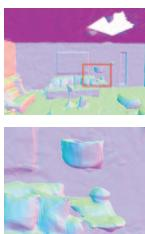  
NICE-SLAM

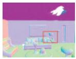

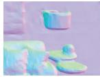  
RGB-D input  
Vox-Fusion

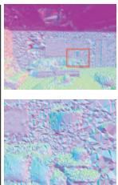  
COLMAP

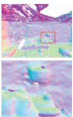  
TANDEM

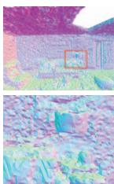  
NeRF-SLAM

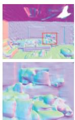  
DIM-SLAM∗  
RGB input

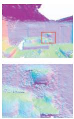  
DROID-SLAM NICER-SLAM

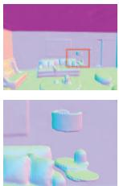

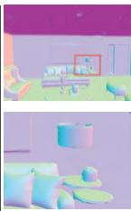  
GT

Figure 3. 3D Reconstruction Results on the Replica Dataset [49]. The second row shows zoom-in views for better comparison.  
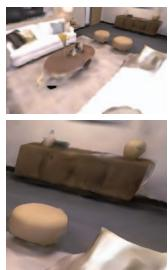  
NICE-SLAM

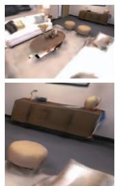  
RGB-D input  
Vox-Fusion

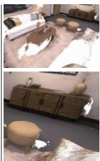  
TANDEM

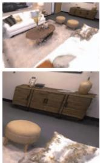  
NeRF-SLAM

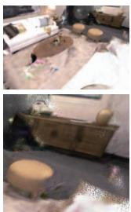  
DIM-SLAM∗ RGB input

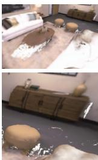  
DROID-SLAM

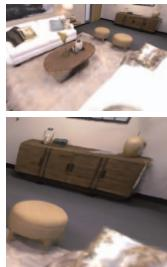  
NICER-SLAM

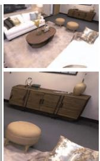  
GT

Figure 4. Novel View Synthesis Results on the Replica the Dataset [49]. The second row shows zoom-in renderings for better comparison. Note that we selected novel viewpoints far from the training views (extrapolation).  
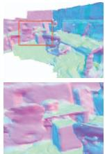  
NICE-SLAM

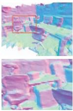  
RGB-D input  
Vox-Fusion

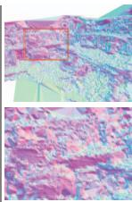  
COLMAP

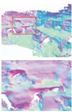  
TANDEM

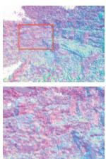  
Orbeez-SLAM

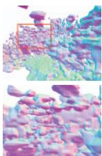  
RGB input  
DIM-SLAM∗

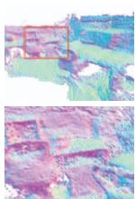  
DROID-SLAM

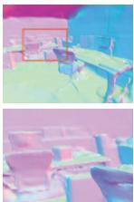  
NICER-SLAM

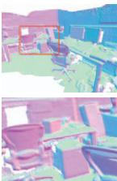  
GT  
Figure 5. 3D Reconstruction Results on the 7-Scenes Dataset [48]. The second row shows zoomed-in normal maps. It is apparent tha the quality of the scene representation is substantially worse for the other RGB-based methods despite their better tracking accuracy.

For camera tracking, we can see from Table 3 that SLAM systems designed for tracking (e.g. DROID-SLAM and DSO) outperform all other methods. Nevertheless, even though tracking is not the focus of our method, we are still on par with NICE-SLAM (1.88 vs 1.95 cm on average), while no depth information is used as additional input.

Even with the less accurate camera poses from our simple tracking pipeline, NICER-SLAM still produces visually more compelling and complete novel-view rendering results than baseline methods, even those using depth inputs, see Fig. 4, Fig. 1 and Table 2. Classic methods like COLMAP and DROID-SLAM cannot render missing regions. Neural-implicit approaches like NICE-SLAM, Vox-Fusion and DIM-SLAM fill in missing areas but their ren-

<table><tr><td></td><td>rm-0</td><td>rm-1</td><td>rm-2</td><td>off-0</td><td>off-1</td><td>off-2</td><td>off-3</td><td>off-4</td><td>Avg.</td></tr><tr><td>RGB-D input</td><td></td><td></td><td></td><td></td><td></td><td></td><td></td><td></td><td></td></tr><tr><td>NICE-SLAM</td><td>1.69</td><td>2.04</td><td>1.55</td><td>0.99</td><td>0.90</td><td>1.39</td><td>3.97</td><td>3.08</td><td>1.95</td></tr><tr><td>Vox-Fusion</td><td>0.27</td><td>1.33</td><td>0.47</td><td>0.70</td><td>1.11</td><td>0.46</td><td>0.26</td><td>0.58</td><td>0.65</td></tr><tr><td>RGB input</td><td></td><td></td><td></td><td></td><td></td><td></td><td></td><td></td><td></td></tr><tr><td>COLMAP</td><td>0.62</td><td>23.7</td><td>0.39</td><td>0.33</td><td>0.24</td><td>0.79</td><td>0.14</td><td>1.73</td><td>3.49</td></tr><tr><td>TANDEM</td><td>0.54</td><td>0.43</td><td>0.47</td><td>0.61</td><td>0.33</td><td>5.42</td><td>0.68</td><td>0.75</td><td>1.15</td></tr><tr><td>DSO</td><td>0.26</td><td>0.25</td><td>0.19</td><td>0.38</td><td>0.20</td><td>2.53</td><td>0.22</td><td>0.38</td><td>0.55</td></tr><tr><td>Orbeez-SLAM</td><td>0.34</td><td>0.41</td><td>0.27</td><td>0.36</td><td>F</td><td>F</td><td>0.294</td><td>2.89</td><td>0.76</td></tr><tr><td>NeRF-SLAM</td><td>17.26</td><td>11.94</td><td>15.76</td><td>12.75</td><td>10.34</td><td>14.52</td><td>20.32</td><td>14.96</td><td>14.73</td></tr><tr><td>DIM-SLAM</td><td>0.48</td><td>0.78</td><td>0.35</td><td>0.67</td><td>0.37</td><td>0.36</td><td>0.33</td><td>0.36</td><td>0.46</td></tr><tr><td>DIM-SLAM*</td><td>1.06</td><td>0.49</td><td>0.32</td><td>0.43</td><td>0.26</td><td>0.65</td><td>0.55</td><td>3.69</td><td>0.93</td></tr><tr><td>DROID-SLAM</td><td>0.34</td><td>0.13</td><td>0.27</td><td>0.25</td><td>0.42</td><td>0.32</td><td>0.52</td><td>0.40</td><td>0.33</td></tr><tr><td>DROID-SLAM*</td><td>0.58</td><td>0.58</td><td>0.38</td><td>1.06</td><td>0.40</td><td>0.70</td><td>0.53</td><td>1.33</td><td>0.70</td></tr><tr><td>NICER-SLAM</td><td>1.36</td><td>1.60</td><td>1.14</td><td>2.12</td><td>3.23</td><td>2.12</td><td>1.42</td><td>2.01</td><td>1.88</td></tr></table>

Table 3. Camera Tracking Results on the Replica Dataset. ATE RMSE [cm] ( ) is the evaluation metric. DIM-SLAM\* is our reimplementation, and DROID-SLAM\* has no global BA and loop closure. “F” denotes program failure or final trajectory unable to align with GT (SVD decomposition error).

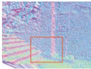

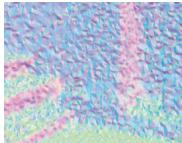  
COLMAP

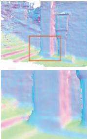  
TANDEM

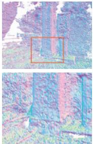  
NeRF-SLAM

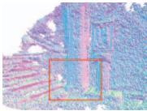

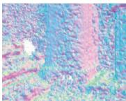  
Orbeez-SLAM

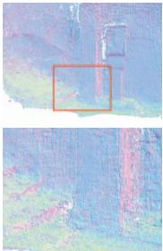  
DROID-SLAM

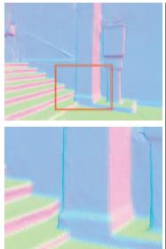  
NICER-SLAM

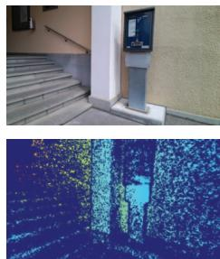  
Sensor RGB + Un-used Depth

Figure 6. 3D Reconstruction Results on the Self-Captured Outdoor (SCO) Dataset. The second row shows zoomed-in normal map for better comparison. Note that only RGB images are used as input, while the depth image is only for visualization, showing the captured depth is unable to provide reliable readings in outdoor environments.  
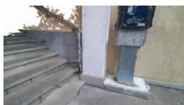  
COLMAP

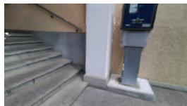  
TANDEM

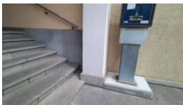  
NeRF-SLAM

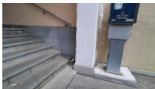  
DROID-SLAM

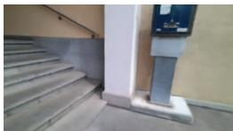  
NICER-SLAM

Figure 7. Novel View Synthesis Results on our Self-captured Outdoor Dataset. We can obtain visually compelling and more complete results than other SLAM methods, and perform similarly to NeRF-SLAM, which primarily focuses on novel view synthesis and relies on DROID-SLAM for camera tracking.

derings are normally over-smooth. We can faithfully render high-fidelity novel views even when those views are far from the training views. It is worth noting that our renderings are visually on par with NeRF-SLAM, a system primarily dedicated to novel view synthesis. NICER-SLAM also achieves higher metrics due to lower tracking errors.

Evaluation on 7-Scenes [48]. We also evaluate the challenging real-world dataset 7-Scenes to benchmark the robustness of different methods when the input images are of low resolutions and have severe motion blurs. For geometry illustrated in Fig. 5, NICER-SLAM produces sharper and more detailed geometry over all baselines. For tracking, please check the supplementary material.

Evaluation on Self-Captured Outdoor Dataset. We further extend the evaluation to outdoor scenarios with a selfcaptured outdoor dataset, where an Azure Kinect camera is used to capture diverse outdoor scenes. Note that the captured depths are unable to provide reliable readings in the outdoor environment (see Fig. 6), so we only compare among monocular SLAM approaches. DIM-SLAM struggles even at the initialization stage, due to its simple warping loss’s inability to effectively handle large textureless regions. As can be seen Fig. 6, except for TANDEM, all other baseline methods cannot reconstruct detailed geometry due to the lack of textures in the scene. NICER-SLAM can not only handle textureless regions and reconstruct flat surfaces like walls, but also captures small details, e.g. the handrail. Fig. 7 shows novel view synthesis results. NICER-SLAM produces compelling and more complete renderings than other methods. We also perform similarly to the dedicated view synthesis system, NeRF-SLAM, but without the need of leveraging DROID-SLAM for tracking.

## 5. Conclusions

We present NICER-SLAM, a novel dense RGB SLAM system that enables highly accurate 3D reconstruction with realistic appearances. In contrast to vanilla NeRF, it doesn’t require camera poses as input and instead jointly optimizes poses and neural implicit maps in an end-to-end manner. Extensive experiments in both indoor and outdoor scenes demonstrate the effectiveness of NICER-SLAM, especially in surface reconstruction and novel view synthesis.

Limitations. Although we show benefits over SLAM methods using traditional scene representations in terms of mapping and novel view synthesis, our pipeline is currently not yet optimized for real-time operations. Implementing Instant-NGP [31]-like CUDA solutions and performing onthe-fly empty space skipping are straightforward strategies for potential optimization. Moreover, we currently do not perform loop closure, which will yield further improvements in tracking performance.

Acknowledgements. This project is partially supported by the SONY Research Award Program and a research grant by FIFA. The authors thank the Max Planck ETH Center for Learning Systems (CLS) for supporting Songyou Peng and the strategic research project ELLIIT for supporting Viktor Larsson. We thank Zehao Yu, Yiming Zhao, Weicai Ye, Boyang Sun, Jianhao Zheng, and Heng Li for helpful discussions.

## References

[1] Wenjing Bian, Zirui Wang, Kejie Li, Jia-Wang Bian, and Victor Adrian Prisacariu. Nope-nerf: Optimising neural radiance field with no pose prior. arXiv preprint arXiv:2212.07388, 2022. 2

[2] Michael Bloesch, Jan Czarnowski, Ronald Clark, Stefan Leutenegger, and Andrew J. Davison. Codeslam - learning a compact, optimisable representation for dense visual SLAM. In Proc. IEEE Conf. on Computer Vision and Pattern Recognition (CVPR), pages 2560–2568, Salt Lake City, UT, USA, 2018. Computer Vision Foundation / IEEE Computer Society. 1, 2

[3] Erik Bylow, Jurgen Sturm, Christian Kerl, Fredrik Kahl, and¨ Daniel Cremers. Real-time camera tracking and 3d reconstruction using signed distance functions. In Robotics: Science and Systems (RSS), page 2, 2013. 2

[4] Zhiqin Chen and Hao Zhang. Learning implicit fields for generative shape modeling. In Proc. IEEE Conf. on Computer Vision and Pattern Recognition (CVPR), pages 5939– 5948, 2019. 2

[5] Julian Chibane, Thiemo Alldieck, and Gerard Pons-Moll. Implicit functions in feature space for 3d shape reconstruction and completion. In Proc. IEEE Conf. on Computer Vision and Pattern Recognition (CVPR), pages 6970–6981, 2020. 3

[6] Shin-Fang Chng, Sameera Ramasinghe, Jamie Sherrah, and Simon Lucey. Gaussian activated neural radiance fields for high fidelity reconstruction and pose estimation. In Proc. of the European Conf. on Computer Vision (ECCV), pages 264–280. Springer, 2022. 2

[7] Chi-Ming Chung, Yang-Che Tseng, Ya-Ching Hsu, Xiang-Qian Shi, Yun-Hung Hua, Jia-Fong Yeh, Wen-Chin Chen, Yi-Ting Chen, and Winston H Hsu. Orbeez-slam: A realtime monocular visual slam with orb features and nerfrealized mapping. In 2023 IEEE International Conference on Robotics and Automation (ICRA), pages 9400–9406. IEEE, 2023. 2, 6

[8] Ronald Clark. Volumetric bundle adjustment for online photorealistic scene capture. In Proc. IEEE Conf. on Computer Vision and Pattern Recognition (CVPR), pages 6124–6132, 2022. 2

[9] Jan Czarnowski, Tristan Laidlow, Ronald Clark, and Andrew J Davison. Deepfactors: Real-time probabilistic dense monocular slam. IEEE Robotics and Automation Letters, 5 (2):721–728, 2020. 1, 2

[10] Angela Dai, Matthias Nießner, Michael Zollhofer, Shahram¨ Izadi, and Christian Theobalt. Bundlefusion: Real-time globally consistent 3d reconstruction using on-the-fly surface reintegration. ACM Trans. on Graphics, 36(4):1, 2017. 2

[11] Franc¸ois Darmon, Ben´ edicte Bascle, Jean-Cl´ ement Devaux,´ Pascal Monasse, and Mathieu Aubry. Improving neural implicit surfaces geometry with patch warping. In Proc. IEEE Conf. on Computer Vision and Pattern Recognition (CVPR), pages 6260–6269, 2022. 5

[12] Ainaz Eftekhar, Alexander Sax, Jitendra Malik, and Amir Zamir. Omnidata: A scalable pipeline for making multitask mid-level vision datasets from 3d scans. In Proc. of the

IEEE International Conf. on Computer Vision (ICCV), pages 10786–10796, 2021. 5

[13] Jakob Engel, Vladlen Koltun, and Daniel Cremers. Direct sparse odometry. IEEE Trans. on Pattern Analysis and Machine Intelligence (PAMI), 40(3):611–625, 2017. 2, 6

[14] Daniel Girardeau-Montaut. Cloudcompare. France: EDF R&D Telecom ParisTech, 11, 2016. 6

[15] Amos Gropp, Lior Yariv, Niv Haim, Matan Atzmon, and Yaron Lipman. Implicit geometric regularization for learning shapes. arXiv preprint arXiv:2002.10099, 2020. 5

[16] Michael Grupp. evo: Python package for the evaluation of odometry and slam. https://github.com/MichaelGrupp/evo, 2017. 6

[17] Haoyu Guo, Sida Peng, Haotong Lin, Qianqian Wang, Guofeng Zhang, Hujun Bao, and Xiaowei Zhou. Neural 3d scene reconstruction with the manhattan-world assumption. In Proceedings of the IEEE/CVF Conference on Computer Vision and Pattern Recognition, pages 5511–5520, 2022. 2

[18] Chiyu Jiang, Avneesh Sud, Ameesh Makadia, Jingwei Huang, Matthias Nießner, and Thomas Funkhouser. Local implicit grid representations for 3d scenes. In Proc. IEEE Conf. on Computer Vision and Pattern Recognition (CVPR), pages 6001–6010, 2020. 2

[19] Mohammad Mahdi Johari, Camilla Carta, and Franc¸ois Fleuret. Eslam: Efficient dense slam system based on hybrid representation of signed distance fields. arXiv preprint arXiv:2211.11704, 2022. 2, 3

[20] Georg Klein and David Murray. Parallel tracking and mapping for small ar workspaces. In IEEE International Symposium on Mixed and Augmented Reality (ISMAR), pages 225– 234. IEEE, 2007. 2

[21] Lukas Koestler, Nan Yang, Niclas Zeller, and Daniel Cremers. Tandem: Tracking and dense mapping in real-time using deep multi-view stereo. In Proc. Conf. on Robot Learning (CoRL), pages 34–45. PMLR, 2022. 2, 6

[22] Evgenii Kruzhkov, Alena Savinykh, Pavel Karpyshev, Mikhail Kurenkov, Evgeny Yudin, Andrei Potapov, and Dzmitry Tsetserukou. Meslam: Memory efficient slam based on neural fields. In 2022 IEEE International Conference on Systems, Man, and Cybernetics (SMC), pages 430–435. IEEE, 2022. 2, 3

[23] Heng Li, Xiaodong Gu, Weihao Yuan, Luwei Yang, Zilong Dong, and Ping Tan. Dense rgb slam with neural implicit maps. In Proc. of the International Conf. on Learning Representations (ICLR), 2023. 3, 6

[24] C. Lin, W. Ma, A. Torralba, and S. Lucey. Barf: Bundleadjusting neural radiance fields. In Proc. of the IEEE International Conf. on Computer Vision (ICCV), 2021. 2

[25] Stefan Lionar, Daniil Emtsev, Dusan Svilarkovic, and Songyou Peng. Dynamic plane convolutional occupancy networks. In Proc. of the IEEE Winter Conference on Applications of Computer Vision (WACV), pages 1829–1838, 2021. 2

[26] Daniil Lisus and Connor Holmes. Towards open world nerfbased slam. arXiv preprint arXiv:2301.03102, 2023. 2, 3

[27] Shaohui Liu, Yinda Zhang, Songyou Peng, Boxin Shi, Marc Pollefeys, and Zhaopeng Cui. Dist: Rendering deep implicit

signed distance function with differentiable sphere tracing. In Proc. IEEE Conf. on Computer Vision and Pattern Recognition (CVPR), pages 2019–2028, 2020. 2

[28] Lars Mescheder, Michael Oechsle, Michael Niemeyer, Sebastian Nowozin, and Andreas Geiger. Occupancy networks: Learning 3d reconstruction in function space. In Proc. IEEE Conf. on Computer Vision and Pattern Recognition (CVPR), pages 4460–4470, 2019. 2

[29] Ben Mildenhall, Pratul P Srinivasan, Matthew Tancik, Jonathan T Barron, Ravi Ramamoorthi, and Ren Ng. Nerf: Representing scenes as neural radiance fields for view synthesis. In Proc. of the European Conf. on Computer Vision (ECCV), 2020. 2, 3, 4

[30] Yuhang Ming, Weicai Ye, and Andrew Calway. idf-slam: End-to-end rgb-d slam with neural implicit mapping and deep feature tracking. arXiv preprint arXiv:2209.07919, 2022. 2, 3

[31] Thomas Muller, Alex Evans, Christoph Schied, and Alexan-¨ der Keller. Instant neural graphics primitives with a multiresolution hash encoding. ACM Trans. on Graphics, 41(4), 2022. 2, 3, 4, 8

[32] Raul Mur-Artal and Juan D Tardos. Orb-slam2: An open-´ source slam system for monocular, stereo, and rgb-d cameras. IEEE transactions on robotics, 33(5):1255–1262, 2017. 2

[33] Raul Mur-Artal, Jose Maria Martinez Montiel, and Juan D Tardos. Orb-slam: a versatile and accurate monocular slam system. IEEE transactions on robotics, 31(5):1147–1163, 2015. 2

[34] R. A. Newcombe, S. Izadi, O. Hilliges, D. Molyneaux, D. Kim, A. J. Davison, P. Kohi, J. Shotton, S. Hodges, and A. Fitzgibbon. Kinectfusion: Real-time dense surface mapping and tracking. In IEEE International Symposium on Mixed and Augmented Reality (ISMAR), 2011. 1, 2

[35] Richard A Newcombe, Steven J Lovegrove, and Andrew J Davison. Dtam: Dense tracking and mapping in real-time. In Proc. of the IEEE International Conf. on Computer Vision (ICCV), pages 2320–2327. IEEE, 2011. 1, 2

[36] M. Niemeyer, L. Mescheder, M. Oechsle, and A. Geiger. Differentiable volumetric rendering: Learning implicit 3D representations without 3D supervision. In Proc. IEEE Conf. on Computer Vision and Pattern Recognition (CVPR), 2019. 2

[37] Matthias Nießner, Michael Zollhofer, Shahram Izadi, and¨ Marc Stamminger. Real-time 3d reconstruction at scale using voxel hashing. ACM Trans. on Graphics, 32(6):1–11, 2013. 2

[38] Michael Oechsle, Songyou Peng, and Andreas Geiger. Unisurf: Unifying neural implicit surfaces and radiance fields for multi-view reconstruction. In Proc. of the IEEE International Conf. on Computer Vision (ICCV), pages 5589– 5599, 2021. 4

[39] Joseph Ortiz, Alexander Clegg, Jing Dong, Edgar Sucar, David Novotny, Michael Zollhoefer, and Mustafa Mukadam. isdf: Real-time neural signed distance fields for robot perception. In Robotics: Science and Systems (RSS), 2022. 2, 3

[40] Jeong Joon Park, Peter Florence, Julian Straub, Richard Newcombe, and Steven Lovegrove. Deepsdf: Learning continuous signed distance functions for shape representation. In Proc. IEEE Conf. on Computer Vision and Pattern Recognition (CVPR), pages 165–174, 2019. 2

[41] Songyou Peng, Michael Niemeyer, Lars Mescheder, Marc Pollefeys, and Andreas Geiger. Convolutional occupancy networks. In Proc. of the European Conf. on Computer Vision (ECCV), pages 523–540. Springer, 2020. 2

[42] Songyou Peng, Chiyu Jiang, Yiyi Liao, Michael Niemeyer, Marc Pollefeys, and Andreas Geiger. Shape as points: A differentiable poisson solver. Advances in Neural Information Processing Systems (NeurIPS), 34:13032–13044, 2021. 2

[43] Rene Ranftl, Katrin Lasinger, David Hafner, Konrad´ Schindler, and Vladlen Koltun. Towards robust monocular depth estimation: Mixing datasets for zero-shot cross-dataset transfer. IEEE Trans. on Pattern Analysis and Machine Intelligence (PAMI), 2020. 5

[44] Christian Reiser, Songyou Peng, Yiyi Liao, and Andreas Geiger. Kilonerf: Speeding up neural radiance fields with thousands of tiny mlps. In Proc. of the IEEE International Conf. on Computer Vision (ICCV), pages 14335–14345, 2021. 2

[45] Antoni Rosinol, John J Leonard, and Luca Carlone. Nerfslam: Real-time dense monocular slam with neural radiance fields. arXiv preprint arXiv:2210.13641, 2022. 2, 6

[46] J. L. Schonberger and J. M. Frahm. Structure-from-motion¨ revisited. In Proc. IEEE Conf. on Computer Vision and Pattern Recognition (CVPR), 2016. 1, 6

[47] Thomas Schops, Torsten Sattler, and Marc Pollefeys. BAD¨ SLAM: bundle adjusted direct RGB-D SLAM. In Proc. IEEE Conf. on Computer Vision and Pattern Recognition (CVPR), pages 134–144, 2019. 1, 2

[48] Jamie Shotton, Ben Glocker, Christopher Zach, Shahram Izadi, Antonio Criminisi, and Andrew Fitzgibbon. Scene coordinate regression forests for camera relocalization in rgb-d images. In Proceedings of the IEEE conference on computer vision and pattern recognition, pages 2930–2937, 2013. 5, 7, 8

[49] J. Straub, T. Whelan, L. Ma, Y. Chen, E. Wijmans, S. Green, J. J. Engel, R. Mur-Artal, C. R., S. Verma, A. Clarkson, M. Yan, B. Budge, Y. Yan, X. Pan, J. Yon, Y. Zou, K. Leon, N. Carter, J. Briales, T. Gillingham, E. Mueggler, L. Pesqueira, M. Savva, D. Batra, H. M. Strasdat, R. D. Nardi, M. Goesele, S. Lovegrove, and R. Newcombe. The Replica dataset: A digital replica of indoor spaces. arXiv preprint arXiv:1906.05797, 2019. 1, 5, 6, 7

[50] Jurgen Sturm, Nikolas Engelhard, Felix Endres, Wolfram¨ Burgard, and Daniel Cremers. A benchmark for the evaluation of rgb-d slam systems. In Proc. IEEE International Conf. on Intelligent Robots and Systems (IROS), 2012. 6

[51] Edgar Sucar, Kentaro Wada, and Andrew Davison. Nodeslam: Neural object descriptors for multi-view shape reconstruction. In Proc. of the International Conf. on 3D Vision (3DV), pages 949–958. IEEE, 2020. 2

[52] Edgar Sucar, Shikun Liu, Joseph Ortiz, and Andrew J Davison. imap: Implicit mapping and positioning in real-time.

In Proc. of the IEEE International Conf. on Computer Vision (ICCV), pages 6229–6238, 2021. 1, 2, 4

[53] Towaki Takikawa, Joey Litalien, Kangxue Yin, Karsten Kreis, Charles Loop, Derek Nowrouzezahrai, Alec Jacobson, Morgan McGuire, and Sanja Fidler. Neural geometric level of detail: Real-time rendering with implicit 3d shapes. In Proc. IEEE Conf. on Computer Vision and Pattern Recognition (CVPR), pages 11358–11367, 2021. 3

[54] Matthew Tancik, Pratul Srinivasan, Ben Mildenhall, Sara Fridovich-Keil, Nithin Raghavan, Utkarsh Singhal, Ravi Ramamoorthi, Jonathan Barron, and Ren Ng. Fourier features let networks learn high frequency functions in low dimensional domains. In Advances in Neural Information Processing Systems (NeurIPS), 2020. 3

[55] Chengzhou Tang and Ping Tan. Ba-net: Dense bundle adjustment network. In Proc. of the International Conf. on Learning Representations (ICLR), 2019. 2

[56] Zachary Teed and Jia Deng. Deepv2d: Video to depth with differentiable structure from motion. In Proc. ofthe International Conf. on Learning Representations (ICLR), 2020.

[57] Zachary Teed and Jia Deng. Droid-slam: Deep visual slam for monocular, stereo, and rgb-d cameras. In Advances in Neural Information Processing Systems, pages 16558– 16569, 2021. 1, 2, 6

[58] Benjamin Ummenhofer, Huizhong Zhou, Jonas Uhrig, Nikolaus Mayer, Eddy Ilg, Alexey Dosovitskiy, and Thomas Brox. Demon: Depth and motion network for learning monocular stereo. In Proc. IEEE Conf. on Computer Vision and Pattern Recognition (CVPR), pages 5038–5047, 2017. 2

[59] Peng Wang, Lingjie Liu, Yuan Liu, Christian Theobalt, Taku Komura, and Wenping Wang. Neus: Learning neural implicit surfaces by volume rendering for multi-view reconstruction. arXiv preprint arXiv:2106.10689, 2021. 4

[60] Z. Wang, S. Wu, W. Xie, M. Chen, and V. A. Prisacariu. Nerf–: Neural radiance fields without known camera parameters. arXiv preprint arXiv:2102.07064, 2021. 2

[61] Thomas Whelan, Michael Kaess, Maurice Fallon, Hordur Johannsson, John Leonard, and John McDonald. Kintinuous: Spatially extended kinectfusion. In RSS ’12 Workshop on RGB-D: Advanced Reasoning with Depth Cameras, 2012. 1

[62] Thomas Whelan, Stefan Leutenegger, Renato Salas-Moreno, Ben Glocker, and Andrew Davison. Elasticfusion: Dense slam without a pose graph. In Robotics: Science and Systems (RSS), 2015. 1, 2

[63] Xiuchao Wu, Jiamin Xu, Zihan Zhu, Hujun Bao, Qixing Huang, James Tompkin, and Weiwei Xu. Scalable neural indoor scene rendering. ACM Transactions on Graphics (TOG), 41(4):1–16, 2022. 2

[64] Yiheng Xie, Towaki Takikawa, Shunsuke Saito, Or Litany, Shiqin Yan, Numair Khan, Federico Tombari, James Tompkin, Vincent Sitzmann, and Srinath Sridhar. Neural fields in visual computing and beyond. In Computer Graphics Forum, pages 641–676. Wiley Online Library, 2022. 1, 2

[65] Haofei Xu, Jing Zhang, Jianfei Cai, Hamid Rezatofighi, and Dacheng Tao. Gmflow: Learning optical flow via global matching. In Proc. IEEE Conf. on Computer Vision and Pattern Recognition (CVPR), pages 8121–8130, 2022. 5

[66] Xingrui Yang, Hai Li, Hongjia Zhai, Yuhang Ming, Yuqian Liu, and Guofeng Zhang. Vox-fusion: Dense tracking and mapping with voxel-based neural implicit representation. In IEEE International Symposium on Mixed and Augmented Reality (ISMAR), pages 499–507. IEEE, 2022. 2, 3, 6

[67] Lior Yariv, Yoni Kasten, Dror Moran, Meirav Galun, Matan Atzmon, Basri Ronen, and Yaron Lipman. Multiview neural surface reconstruction by disentangling geometry and appearance. In Advances in Neural Information Processing Systems (NeurIPS), pages 2492–2502, 2020. 2, 3

[68] Lior Yariv, Jiatao Gu, Yoni Kasten, and Yaron Lipman. Volume rendering of neural implicit surfaces. In Advances in Neural Information Processing Systems (NeurIPS), pages 4805–4815, 2021. 3, 4

[69] L. Yen-Chen, P. Florence, J. T. Barron, A. Rodriguez, P. Isola, and T. Lin. iNeRF: Inverting neural radiance fields for pose estimation. In IEEE/RSJ International Conference on Intelligent Robots and Systems (IROS), 2021. 2

[70] Zehao Yu, Songyou Peng, Michael Niemeyer, Torsten Sattler, and Andreas Geiger. Monosdf: Exploring monocular geometric cues for neural implicit surface reconstruction. Advances in Neural Information Processing Systems (NeurIPS), 2022. 3, 4, 5

[71] K. Zhang, G. Riegler, N. Snavely, and V. Koltun. NERF++: Analyzing and improving neural radiance fields. arXiv preprint arXiv:2010.07492, 2020. 2

[72] Shuaifeng Zhi, Michael Bloesch, Stefan Leutenegger, and Andrew J Davison. Scenecode: Monocular dense semantic reconstruction using learned encoded scene representations. In Proc. IEEE Conf. on Computer Vision and Pattern Recognition (CVPR), pages 11776–11785, 2019. 1, 2

[73] Huizhong Zhou, Benjamin Ummenhofer, and Thomas Brox. Deeptam: Deep tracking and mapping. In Proc. of the European Conf. on Computer Vision (ECCV), pages 822–838, 2018. 2

[74] Zihan Zhu, Songyou Peng, Viktor Larsson, Weiwei Xu, Hujun Bao, Zhaopeng Cui, Martin R. Oswald, and Marc Pollefeys. Nice-slam: Neural implicit scalable encoding for slam. In Proc. IEEE Conf. on Computer Vision and Pattern Recognition (CVPR), pages 12786–12796, 2022. 1, 2, 3, 4, 5, 6