# Photo-SLAM: Real-time Simultaneous Localization and Photorealistic Mapping for Monocular, Stereo, and RGB-D Cameras

Huajian Huang1 Longwei Li2 Hui Cheng2 Sai-Kit Yeung1

1The Hong Kong University of Science and Technology 2Sun Yat-sen University

hhuangbg@connect.ust.hk, lilw23@mail2.sysu.edu.cn, chengh9@mail.sysu.edu.cn, saikit@ust.hk

## Abstract

The integration of neural rendering and the SLAM system recently showed promising results in joint localization and photorealistic view reconstruction. However, existing methods, fully relying on implicit representations, are so resource-hungry that they cannot run on portable devices, which deviates from the original intention of SLAM. In this paper, we present Photo-SLAM, a novel SLAM framework with a hyper primitives map. Specifically, we simultaneously exploit explicit geometricfeaturesfor localization and learn implicit photometric features to represent the texture information of the observed environment. In addition to actively densifying hyper primitives based on geometric features, we further introduce a Gaussian-Pyramid-based training method to progressively learn multi-level features, enhancing photorealistic mapping performance. The extensive experiments with monocular, stereo, and RGB-D datasets prove that our proposed system Photo-SLAM significantly outperforms current state-of-the-art SLAM systems for online photorealistic mapping, e.g., PSNR is 30% higher and rendering speed is hundreds of times faster in the Replica dataset. Moreover, the Photo-SLAM can run at real-time speed using an embedded platform such as Jetson AGX Orin, showing the potential of robotics applications. Project Page and code: https://huajianup. github.io/research/Photo-SLAM/.

## 1. Introduction

Simultaneous Localization and Mapping (SLAM) using cameras is a fundamental problem in both computer vision and robotics, seeking to enable autonomous systems to navigate and comprehend their surroundings. Traditional SLAM systems [7–9, 24] primarily focus on geometric mapping, providing accurate but visually simplistic representations of the environment. However, recent developments in neural rendering [35, 40] have demonstrated the potential of integrating photorealistic view reconstruction into the SLAM pipeline, enhancing the perception capabilities of robotic systems.

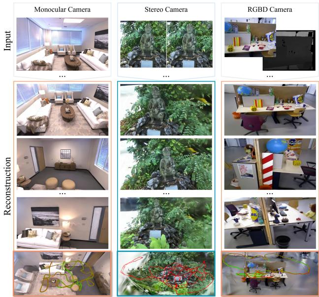  
Figure 1. Rendering and trajectory results. Photo-SLAM can reconstruct high-fidelity views of scenes using monocular, stereo, and RGB-D cameras while render speed is up to 1000 FPS.

Despite the promising results achieved through the integration of neural rendering and SLAM, existing methods simply and heavily rely on implicit representations, making them computationally intensive and unsuitable for deployment on resource-constrained devices. For example, Nice-SLAM [46] leverages a hierarchical grid [42] to store learnable features representing the environment while ESLAM [16] utilizes multi-scale compact tensor components [3]. They then jointly estimate the camera poses and optimize features by minimizing the reconstruction loss of a batch of ray sampling [21]. Such an optimization process is time-consuming. Consequently, it is indispensable for them to incorporate corresponding depth information obtained from various sources such as RGB-D cameras, dense optical flow estimators [33], or monocular depth estimators [12] to ensure efficient convergence. Additionally, since the implicit features are decoded by the multi-layer perceptrons (MLPs), it is typically necessary to carefully define a bounding area to normalize ray sampling for optimal performance, as discussed in [14]. It essentially limits the scalability of the system. These limitations imply that they cannot provide real-time exploration and mapping capabilities in the unknown environment using portable platforms, which is one of the main objectives of SLAM.

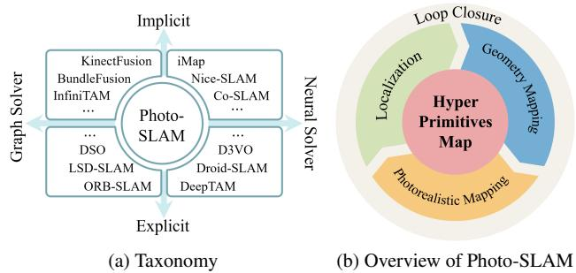

In this paper, we propose Photo-SLAM, an innovative framework that addresses the scalability and computational resource constraints of existing methods, while achieving precise localization and online photorealistic mapping. We maintain a hyper primitives map which is composed of point clouds storing ORB features [26], rotation, scaling, density, and spherical harmonic (SH) coefficients [10, 38]. The hyper primitives map allows the system to efficiently optimize tracking using a factor graph solver and learn the corresponding mapping by backpropagating the loss between the original images and rendering images. The images are rendered by 3D Gaussian splatting [18] rather than ray sampling. Although the introduction of a 3D Gaussian splatting renderer can reduce view reconstruction costs, it does not enable the generation of high-fidelity rendering for online incremental mapping, in particular in monocular scenarios. To achieve high-quality mapping without reliance on dense depth information, we further propose a geometrybased densification strategy and a Gaussian-Pyramid-based (GP) learning method. Importantly, GP learning facilitates the progressive acquisition of multi-level features which effectively enhances the mapping performance of our system.

To evaluate the efficacy of our proposed approach, we conduct extensive experiments employing diverse datasets captured by monocular, stereo, and RGB-D cameras. These experiment results unequivocally demonstrate that Photo-SLAM attains state-of-the-art performance in terms of localization efficiency, photorealistic mapping quality, and rendering speed. Furthermore, the real-time execution of the Photo-SLAM system on the embedded devices showcases its potential for practical robotics applications. The schematic overview of Photo-SLAM is demonstrated in Fig. 1 and Fig. 2b.

In summary, the main contributions of this work include: • We developed the first simultaneous localization and photorealistic mapping system based on hyper primitives map. The novel framework supports monocular, stereo, and RGB-D cameras in indoor and outdoor environments.

• We proposed Gaussian-Pyramid-based learning allowing the model to efficiently and effectively learn multi-level features realizing high-fidelity mapping.

• The system, fully implemented in C++ and CUDA, achieves start-of-the-art performance and can run at realtime speed even on embedded platforms.

Figure 2. The Photo-SLAM contains four main components, including localization, explicit geometry mapping, implicit photorealistic mapping, and loop closure components, while maintaining a map with hyper primitives.

## 2. Related Work

Visual localization and mapping is a problem that aims to build a proper representation of an unknown environment via cameras while estimating their poses within that environment. In contrast to SfM techniques, visual SLAM techniques typically pursue a better trade-off between accuracy and real-time performance. In this section, we focus on visual SLAM and conduct a brief review.

Graph Solver vs Neural Solver. Classical SLAM methods widely adopt factor graphs to model complex optimization problems between variables (i.e., poses and landmarks) and measurements (i.e., observations and constraints). To achieve real-time performance, SLAM methods incrementally propagate their pose estimations while avoiding expensive operations. For example, ORB-SLAM series methods [2, 23, 24] rely on extracting and tracking lightweight geometric features across consecutive frames, which perform bundle adjustment locally instead of globally. Moreover, direct SLAMs like LSD-SLAM [7] and DSO [8] operate on raw image intensities, without the cost of geometric feature extractions. They maintain a sparse or semidense map represented by point clouds online, even on the resource-constraint system. Benefiting from the success of deep-learning models, learnable parameters and models are introduced into SLAM making the pipeline differentiable. Some methods such as DeepTAM [45] predict camera poses by the neural network [17] end-to-end, while the accuracy is limited. To enhance performance, some methods, e.g., D3VO [41] and Droid-SLAM [34], introduce monocular depth estimation [12] or dense optical flow estimation [33] models into the SLAM pipeline as supervision signals. Therefore, they can generate depth maps that explicitly represent the scene geometry. With the large-scale synthetic SLAM dataset, TartanAir [37], available for training, Droid-SLAM building upon RAFT [33] achieves stateof-the-art performance. However, the pure neural-based solver is computationally expensive and their performance would significantly degrade on the unseen scenes.

Explicit Representation vs Implicit Representation. In order to obtain dense reconstruction, some methods including KinectFusion [15], BundleFusion [6], and Infini-TAM [25] utilize the implicit representation, Truncated Signed Distance Function (TSDF) [5], to integrate the incoming RGB-D images and reconstruct a continuous surface, which can run in real time on GPU. Although they can obtain dense reconstruction, view rendering quality is limited. Recently, neural rendering techniques represented by neural radiance field (NeRF) [21] have achieved breathtaking novel view synthesis. Given camera poses, NeRF implicitly models the scene geometry and color by multilayer perceptrons (MLP). The MLP is optimized by minimizing the loss of rendering images and training views. iMAP [30] then adapts NeRF for incremental mapping, optimizing not only MLP but also camera poses. The following work Nice-SLAM [46] introduces multi-resolution grids [42] to store features reducing the cost of deep MLP query. Co-SLAM [36] and ESLAM [16] explore Instant-NGP [22] and TensoRF [3] respectively to further accelerate the mapping speed. However, implicitly joint optimization of camera poses and geometry representation is still illconditioned. Inevitably, they rely on explicit depth information from RGB-D cameras or additional model predictions for fast convergence of the radiance field.

Our proposed Photo-SLAM seeks to recover a concise representation of the observed environment for immersive exploration rather than reconstructing a dense mesh. It maintains a map with hyper primitives online which capitalizes on explicit geometric feature points for accurate and efficient localization while leveraging implicit representations to capture and model the texture information. Please refer to Fig. 2a for the taxonomy of existing systems. Since Photo-SLAM achieves high-quality mapping without reliance on dense depth information, it can support RGB-D cameras as well as monocular and stereo cameras.

## 3. Photo-SLAM

Photo-SLAM contains four main components, including localization, geometry mapping, photorealistic mapping, and loop closure, shown in Fig. 2b. Each component runs in a parallel thread and jointly maintains a hyper primitives map.

## 3.1. Hyper Primitives Map

In our system, hyper primitives are defined as a set of point clouds $\textbf { P } \in \ \mathbb { R } ^ { 3 }$ associated with ORB features [26] ${ \textbf { O } } \in$ $\mathbb { R } ^ { 2 5 6 }$ , rotation $\mathbf { r } \in S O ( 3 )$ , scaling $\mathbf { s } \in \mathbb { R } ^ { 3 }$ , density $\sigma \in \mathbb { R } ^ { 1 }$ and spherical harmonic coefficients SH $\in \mathbb { R } ^ { 1 6 }$ . ORB features extracted from image frames take responsibility for establishing 2D-to-2D and 2D-to-3D correspondences. Once the system successfully estimates the transformation matrix based on sufficient 2D-to-2D correspondences between adjacent frames, the hyper primitives map is initialized via triangulation, and pose tracking gets started. During tracking, the localization component processes the incoming images and makes use of 2D-to-3D correspondence to calculate current camera poses. In addition, the geometry mapping component will incrementally create and initialize sparse hyper primitives. Finally, the photorealistic component progressively optimizes and densifies hyper primitives.

## 3.2. Localization and Geometry Mapping

The localization and geometry mapping components provide not only efficient 6-DoF camera pose estimations of the input images, but also sparse 3D points. The optimization problem is formulated as a factor graph solved by the Levenberg–Marquardt (LM) algorithm.

In the localization thread, we use a motion-only bundle adjustment to optimize the camera orientation $\mathbf { R } \in S O ( 3 )$ and position $\textbf { t } \in \ \mathbb { R } ^ { 3 }$ in order to minimize the reprojection error between matched 2D geometric keypoint $\mathbf { p } _ { i }$ of the frame and 3D point $\mathbf { P } _ { i }$ . Let $i \in \mathcal { X }$ be the index of set of matches $x ,$ what we are trying to optimize with LM is

$$
\{ \mathbf { R } , \mathbf { t } \} = \underset { \mathbf { R } , \mathbf { t } } { \arg \operatorname* { m i n } } \sum _ { i \in \mathcal { X } } \rho \left( \| \mathbf { p } _ { i } - \pi ( \mathbf { R } \mathbf { P } _ { i } + \mathbf { t } ) \| _ { \Sigma _ { g } } ^ { 2 } \right) ,\tag{1}
$$

where $\Sigma _ { g }$ is the scale-associated covariance matrix of the keypoint, $\pi ( \cdot )$ is the 3D-to-2D projection function, and $\rho$ denotes the robust Huber cost function.

In the geometry mapping thread, we perform a local bundle adjustment on a set of covisible points $\mathcal { P } _ { L }$ and keyframes $\displaystyle \kappa _ { L }$ . The keyframes are selected frames from the input camera sequence and provide good visual information. We construct a factor graph where each keyframe is a node, and the edges represent constraints between keyframes and matched 3D points. We iteratively minimize the reprojection residual by refining the keyframe poses and 3D points using the first-order derivatives of the error function. We fix the poses of keyframes $\ = \kappa _ { \ / F }$ which are also observing $\mathcal { P } _ { L }$ but not in $\kappa _ { L }$ . Let ${ \mathcal { K } } = { \mathcal { K } } _ { L } \cup { \mathcal { K } } _ { F }$ , and $\mathcal { X } _ { k }$ be the set of matches between 2D keypoints in a keyframe k and 3D points in $\mathcal { P } _ { L }$ . The optimization process aims to reduce the geometric inconsistency between $\kappa$ and $\mathcal { P } _ { L }$ , and is defined as

$$
\{ \mathbf { P } _ { i } , \mathbf { R } _ { l } , \mathbf { t } _ { l } | i \in \mathcal { P } _ { L } , l \in \mathcal { K } _ { L } \} = \underset { \mathbf { P } _ { i } , \mathbf { R } _ { l } , \mathbf { t } _ { l } } { \arg \operatorname* { m i n } } \sum _ { k \in \mathcal { K } } \sum _ { j \in \mathcal { K } _ { k } } \rho ( E ( k , j ) ) ,\tag{2}
$$

with reprojection residual

$$
E ( k , j ) = \| \mathbf { p } _ { j } - \pi ( \mathbf { R } _ { k } \mathbf { P } _ { j } + \mathbf { t } _ { k } ) \| _ { \Sigma _ { g } } ^ { 2 } .
$$

## 3.3. Photorealisitc Mapping

The photorealistic mapping thread is responsible for optimizing hyper primitives that are incrementally created by the geometry mapping thread. The hyper primitives can be

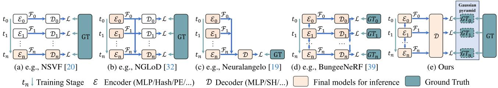  
Figure 3. Comparison of different progressive training methods. The encoder $\mathcal { E } _ { n }$ here represents a structure to regress features ${ \mathcal { F } } _ { n }$ which can be an MLP, voxel grid, hash table, positional encoding, etc. The decoder $\mathcal { D } _ { n }$ here represents a structure converting ${ \mathcal { F } } _ { n }$ into density, color, or other information. We proposed a new method based on the Gaussian pyramid to efficiently learn multi-level features.

rasterized by a tile-based renderer to synthesize corresponding images with keyframe poses. The rendering process is formulated as

$$
C ( \mathbf { R , t } ) = \sum _ { i \in N } \mathbf { c } _ { i } \alpha _ { i } \prod _ { j = 1 } ^ { i - 1 } ( 1 - \alpha _ { i } ) ,\tag{3}
$$

where N is the number of hyper primitives, $\mathbf { c } _ { i }$ denotes the color converted from $\mathbf { S H } \mathbf { \bar { \Sigma } } \in \mathbf { \mathbb { R } } ^ { \bar { 1 } 6 }$ , and $\alpha _ { i }$ is equal to $\sigma _ { i } \cdot \mathcal { G } ( \mathbf { R } , \mathbf { t } , \mathbf { P } _ { i } , \mathbf { r } _ { i } , \mathbf { s } _ { i } )$ , G denotes 3D Gaussian splatting algorithm [18]. The optimization in terms of position $\mathbf { P } _ { \mathrm { : } }$ , rotation r, scaling s, density $\sigma ,$ and spherical harmonic coefficients SH is performed by minimizing the photometric loss L between rendering image $I _ { \mathrm { r } }$ and ground truth image $I _ { \mathrm { { g t } } }$ denoted as

$$
\mathcal { L } = ( 1 - \lambda ) \left| I _ { \mathrm { r } } - I _ { \mathrm { g t } } \right| _ { 1 } + \lambda ( 1 - \mathrm { S S I M } ( I _ { \mathrm { r } } , I _ { \mathrm { g t } } ) ) ,\tag{4}
$$

where $\mathrm { S S I M } ( I _ { \mathrm { r } } , I _ { \mathrm { g t } } )$ denotes structural similarity between two images and λ is a weight factor for balance.

## 3.3.1 Geometry-based Densification

If we consider photorealistic mapping as a regression model of the scene, denser hyper primitives, i.e., more parameters, generally can better model the complexity of the scene for higher rendering quality. To meet the demand for realtime mapping, the geometry mapping component only establishes sparse hyper primitives. Therefore, the coarse hyper primitives created by the geometry mapping need to be densified during the optimization of photorealistic mapping. Apart from splitting or cloning hyper primitives with large loss gradients similar to [18], we introduce an additional geometry-based densification strategy.

Experimentally, less than 30% of 2D geometric feature points of frames are active and have corresponding 3D points, especially for non-RGB-D scenarios, as shown in Fig. 4. We argue that 2D geometric feature points spatially distributed in the frames essentially represent the region with a complex texture that requires more hyper primitives. Therefore, we actively create additional temporary hyper primitives based on the inactive 2D feature points once the keyframe is created for photorealistic mapping. When we use RGB-D cameras, we can directly project the inactive 2D feature points with depth to create temporary hyper primitives. As for monocular scenarios, we estimate the depth of inactive 2D feature points by interpreting the depth of their nearest neighborhood’s active 2D feature points. In stereo scenarios, we rely on a stereo-matching algorithm to estimate the depth of inactive 2D feature points.

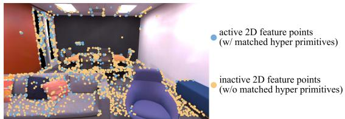  
Figure 4. We make use of initial geometric information to densify hyper primitives.

## 3.4. Gaussian-Pyramid-Based Learning

Progressive training is a widely used technology in neural rendering to accelerate the optimization process. Some methods have been proposed to reduce training time while achieving better rendering quality. A basic method is to progressively increase the structure resolution and the number of model parameters. For example, NSVF [20] and DVGO [31] progressively increase the feature grid resolution during training which significantly improves training efficiency compared to previous work. The lowerresolution model is used to initialize the higher-resolution model but is not retained for final inference, as shown in Fig. 3a. To enhance performance with multi-resolution features, NGLoD [32] progressively trains multiple MLPs as encoders and decoders, while only retaining the final decoder to decode integrated multi-resolution features, as shown in Fig. 3b. Furthermore, Neuralangelo [19] only maintains a single MLP during training, as shown in Fig. 3c. It progressively activates different levels of hash tables [22] achieving better performance in large-scale scene reconstruction. Similarly, 3D Gaussian Splatting [18] progressively densifies 3D Gaussian achieving top performance on radiance field rendering. Training different level models in these methods is supervised by the same training images. Conversely, the fourth method (Fig. 3d) used in BungeeNeRF [39] is to apply different models to tackle different-resolution images. BungeeNeRF demonstrates the efficiency of explicitly grouping multi-resolution training images for models to learn multi-level features. However, such a method is not universal since multi-resolution images are not available for most scenarios.

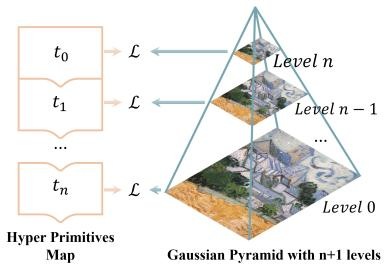  
Figure 5. Training process based on the Gaussian pyramid.

To make full use of various merits, we propose Gaussian-Pyramid-based (GP) learning (Fig. 3e), a new progressive training method. As illustrated in Fig. 5, a Gaussian pyramid is a multi-scale representation of an image containing different levels of detail. It is constructed by repeatedly applying Gaussian smoothing and downsampling operations to the original image. At the beginning training step, the hyper primitives are supervised by the highest level of the pyramid, i.e. level n. As training iteration increases, we not only densify hyper primitives as described in Sec. 3.3.1 but also reduce the pyramid level and obtain a new ground truth until reaching the bottom of the Gaussian pyramid. The optimization process using a Gaussian pyramid with n+1 levels can be denoted as

$$
\begin{array} { r l } & { t _ { 0 } : \arg \operatorname* { m i n } \mathcal { L } \left( I _ { \mathrm { r } } ^ { n } , \mathrm { G P } ^ { n } ( I _ { \mathrm { g t } } ) \right) , } \\ & { t _ { 1 } : \arg \operatorname* { m i n } \mathcal { L } \left( I _ { \mathrm { r } } ^ { n - 1 } , \mathrm { G P } ^ { n - 1 } ( I _ { \mathrm { g t } } ) \right) , } \\ & { \quad \cdot \cdot } \\ & { t _ { n } : \arg \operatorname* { m i n } \mathcal { L } \left( I _ { \mathrm { r } } ^ { 0 } , \mathrm { G P } ^ { 0 } ( I _ { \mathrm { g t } } ) \right) , } \end{array}\tag{5}
$$

where $\mathcal { L } ( I _ { \mathrm { r } } , \mathbf { G P } ( I _ { \mathrm { g t } } ) )$ is Eq. 4, while $\mathrm { { G P } } ^ { n } ( I _ { \mathrm { { g t } } } )$ denotes the ground image in the level n of the Gaussian pyramid. In the experiment, we prove that GP learning significantly improves the performance of photorealistic mapping particularly for monocular cameras.

## 3.5. Loop Closure

Loop Closure [11] is crucial in SLAM because it helps address the problem of accumulated errors and drift that can occur during the localization and geometry mapping process. After detecting a closing loop, we can correct local keyframes and hyper primitives by similarity transformation. With corrected camera poses, the photorealistic mapping component can further get rid of the ghosting caused by odometry drifts and improve the mapping quality.

## 4. Experiment

In this section, we compare Photo-SLAM to other state-ofthe-art (SOTA) SLAM and real-time 3D reconstruction systems in various scenarios encapsulating monocular, stereo, RGB-D cameras, and indoor and outdoor environments. In addition, we evaluate Photo-SLAM performance on various hardware configurations to demonstrate its efficiency. Finally, we conduct an ablation study to verify the effectiveness of the proposed algorithms.

## 4.1. Implementation and Experiment Setup

We implemented Photo-SLAM fully in C++ and CUDA, making use of ORB-SLAM3 [2], 3D Gaussian splatting [18], and the LibTorch framework. The optimization of photorealistic mapping is performed with the Stochastic Gradient Descent algorithm while we use a fixed learning rate and $\lambda = 0 . 2$ . Considering image resolution of the testing dataset, the level of the Gaussian pyramid is set to three, i.e. $n = 2$ by default. The compared baseline includes a SOTA classical SLAM system ORB-SLAM3 [2], a real-time RGB-D dense reconstruction system BundleFusion [6], a deep-learning based system DROID-SLAM [34], and recent SLAM systems supporting view synthesis, i.e. Nice-SLAM [46], Orbeez-SLAM [4], ESLAM [16], Co-SLAM [36], and Point-SLAM [27] and Go-SLAM [44].

Hardware. We ran Photo-SLAM and all compared methods using their official code in a desktop with an NVIDIA RTX 4090 24 GB GPU, an Intel Core i9-13900K CPU, and 64 GB RAM. We further tested Photo-SLAM on a laptop and a Jetson AGX Orin Developer Kit. The laptop is equipped with an NVIDIA RTX 3080ti 16 GB Laptop GPU, an Intel Core i9-12900HX, and 32 GB RAM.

Datasets and Metrics. We performed tests for monocular and RGB-D sensor types on the well-known RGB-D datasets: the Replica dataset [28, 30] and the TUM RGB-D dataset [29]. As for stereo tests, we used the EuRoC MAV dataset [1]. Besides indoor scenes, we utilize a ZED 2 stereo camera to collect outdoor scenes for extra evaluation.

Following the convention, we used the Absolute Trajectory Error (ATE) metric [13] to estimate the accuracy of localization, while the RMSE and STD of ATE are reported. Quantitative measurements in terms of PSNR, SSIM, and LPIPS [43] are adopted to analyze the performance of photorealistic mapping. We also report the requirement of computing resources by showing the tracking FPS, rendering FPS, and GPU memory usage. The evaluation regarding mesh reconstruction is out of the range of this work. Moreover, to lower the effect of the nondeterministic nature of multi-threading and machine-learning systems, we ran each sequence five times and reported the average results for each metric. Please refer to the supplementary for details.

<table><tr><td colspan="2">On Replica Dataset</td><td colspan="2">Localization (cm)</td><td colspan="3">Mapping</td><td colspan="5">Resources</td></tr><tr><td>Cam</td><td>Method</td><td>RMSE↓</td><td>STD↓</td><td>PSNR ↑</td><td>SSIM↑</td><td>LPIPS ↓</td><td>Operation Time ↓</td><td>Tracking FPS ↑</td><td>Rendering FPS ↑</td><td>GPU Memory Usage ↓</td></tr><tr><td rowspan="9">Mono</td><td>ORB-SLAM3 [2]</td><td>3.942</td><td>3.115</td><td></td><td></td><td></td><td>&lt;1 mins</td><td>58.749</td><td></td><td>0</td></tr><tr><td>DROID-SLAM [34]</td><td>0.725</td><td>0.308</td><td></td><td></td><td></td><td>&lt;2 mins</td><td>35.473</td><td></td><td>11 GB</td></tr><tr><td>Nice-SLAM* [46]</td><td>99.9415</td><td>35.336</td><td>16.311</td><td>0.720</td><td>0.439</td><td>&gt;10 mins</td><td>2.384</td><td>0.944</td><td>12 GB</td></tr><tr><td>Orbeez-SLAM [4]</td><td></td><td></td><td>23.246</td><td>0.790</td><td>0.336</td><td>&lt;5 mins</td><td>49.200</td><td>1.030</td><td>6 GB</td></tr><tr><td>Go-SLAM [44]</td><td>71.054</td><td>24.593</td><td>21.172</td><td>0.703</td><td>0.421</td><td>&lt;5 mins</td><td>25.366</td><td>0.821</td><td>22 GB</td></tr><tr><td>Ours (Jetson)</td><td>1.235</td><td>0.756</td><td>29.284</td><td>0.883</td><td>0.139</td><td>&lt;5 mins</td><td>18.315</td><td>95.057</td><td>4 GB</td></tr><tr><td>Ours (Laptop)</td><td>0.713</td><td>0.524</td><td>33.049</td><td>0.926</td><td>0.086</td><td>&lt;5 mins</td><td>19.974</td><td>353.504</td><td>4 GB</td></tr><tr><td>Ours</td><td>1.091</td><td>0.892</td><td>33.302</td><td>0.926</td><td>0.078</td><td>&lt;2 mins</td><td>41.646</td><td>911.262</td><td>6 GB</td></tr><tr><td>ORB-SLAM3 [2]</td><td>1.833</td><td>1.478</td><td></td><td></td><td></td><td>&lt;1 mins</td><td>52.209</td><td></td><td>0</td></tr><tr><td rowspan="10">RGG-D</td><td>DROID-SLAM [34]</td><td>0.634</td><td>0.248</td><td></td><td></td><td></td><td>&lt;2 mins</td><td>36.452</td><td></td><td>11 GB</td></tr><tr><td>BundleFusion [6]</td><td>1.606</td><td>0.969</td><td>23.839</td><td>0.822</td><td>0.197</td><td>&lt;5 mins</td><td>8.630</td><td></td><td>5 GB</td></tr><tr><td>Nice-SLAM [46]</td><td>2.350</td><td>1.590</td><td>26.158</td><td>0.832</td><td>0.232</td><td>&gt;10 mins</td><td>2.331</td><td>0.611</td><td>12 GB</td></tr><tr><td>Orbeez-SLAM [4]</td><td>0.888</td><td>0.562</td><td>32.516</td><td>0.916</td><td>0.112</td><td>&lt;5 mins</td><td>41.333</td><td>1.401</td><td></td></tr><tr><td></td><td>0.568</td><td>0.274</td><td>30.594</td><td>0.866</td><td>0.162</td><td>&lt;5 mins</td><td>6.687</td><td>2.626</td><td>6 GB</td></tr><tr><td>ESLAM [16] Co-SLAM [36]</td><td>1.158</td><td>0.602</td><td>30.246</td><td>0.864</td><td>0.175</td><td>&lt;5 mins</td><td>14.575</td><td>3.745</td><td>21 GB 4 GB</td></tr><tr><td>Go-SLAM [44]</td><td>0.571</td><td>0.218</td><td>24.158</td><td>0.766</td><td>0.352</td><td>&lt;5 mins</td><td>19.437</td><td>0.444</td><td>24 GB</td></tr><tr><td>Point-SLAM [27]</td><td>0.596</td><td>0.249</td><td>34.632</td><td>0.927</td><td>0.083</td><td>&gt;2 hrs</td><td>0.345</td><td>0.510</td><td>24 GB</td></tr><tr><td>Ours (Jetson)</td><td>0.581</td><td>0.289</td><td>31.978</td><td>0.916</td><td>0.101</td><td>&lt;5 mins</td><td>17.926</td><td>116.395</td><td>4 GB</td></tr><tr><td>Ours (Laptop)</td><td>0.590</td><td>0.289</td><td>34.853</td><td>0.944</td><td>0.062</td><td>&lt;5 mins</td><td>20.597</td><td>396.082</td><td>4 GB</td></tr><tr><td></td><td>Ours</td><td>0.604</td><td>0.298</td><td>34.958</td><td>0.942</td><td>0.059</td><td>&lt;2 mins</td><td>42.485</td><td>1084.017</td><td>5 GB</td></tr></table>

Table 1. Quantitative results on the Replica dataset. We mark the best two results with first and second . Nice-SLAM\* means the depth supervision is disabled. “-” denotes the system does not support view rendering or fails to track camera poses. The results of Photo-SLAM running on the laptop and Jetson platform are denoted as “Ours (Laptop)” and “Ours (Jetson)” respectively.

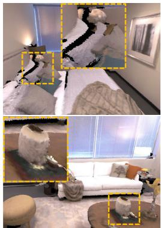  
(a) BundleFusion [6]

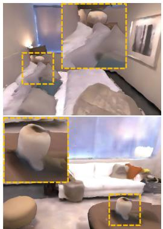  
(b) Nice-SLAM [46]

(c) ESLAM [16]  

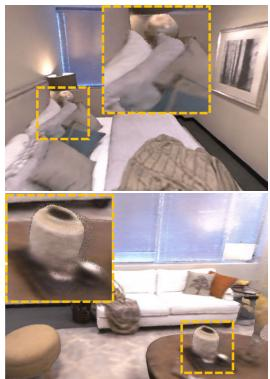  
(d) Co-SLAM [36]

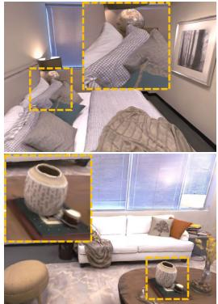  
(e) Ours  
Figure 6. Qualitative comparison of diverse systems using RGB-D images from dataset Replica. Photo-SLAM can reconstruct high-fidelity scenes while others are over-smooth and have obvious artifacts. Zoom in for better views.

## 4.2. Results and Evaluation

On Replica. As quantitative comparison demonstrated in Table 1, Photo-SLAM achieves top performance in terms of mapping quality. With competitive localization accuracy, Photo-SLAM can track the camera poses in real time. Moreover, Photo-SLAM renders hundreds of photorealistic views in a resolution of 1200×680 per second with less GPU memory usage. Even on the embedded platform, the rendering speed of Photo-SLAM is about 100 FPS.

In monocular scenarios, Photo-SLAM significantly suppresses other methods. When we disabled the depth supervision of Nice-SLAM [46], its accuracy of localization dramatically decreased while the mapping was of 16.311 PSNR. We conduct a qualitative comparison in Fig. 7. The mapping results of Photo-SLAM are photorealistic.

In RGB-D scenarios, we ran BundleFusion [6] with

RGB-D sequences and then extracted textured mesh. And then we used a mesh render to render corresponding images for comparison. As shown in Fig. 6, the mesh reconstructed by the classical method is likely to be aliasing and hollow. ESLAM [16] and Go-SLAM [44] have the best localization accuracy, but the mapping lacks high-frequency details. By contrast, Photo-SLAM can render high-fidelity images and the rendering speed is about three hundred times faster.

On TUM. We provide quantitative analyses on the three sequences of the TUM dataset in Table 2. Compared to learning-based methods, e.g., DROID-SLAM [34] and Go-SLAM [44], ORB-SLAM3 runs faster without the requirement of GPU and has higher accuracy regarding localization. It is shown that the classical method still has advantages in terms of robustness and generalization. Fig. 8 is a gallery of Photo-SLAM mapping.

On Stereo. Stereo cameras can provide more robust tracking but have hardly been supported by former real-time dense SLAM systems. However, Photo-SLAM has been designed to be compatible with stereo cameras. We provide quantitative results on the EuRoC dataset in Table 3 and qualitative results in supplementary. The results show that our system could still perform decently in stereo scenes. Further, we used a hand-held stereo camera to collect some outdoor scenes, and the mapping results of Photo-SLAM are illustrated in Fig. 9.

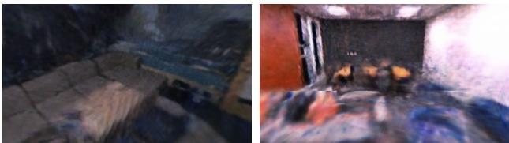  
(a) Ground Truth

<table><tr><td colspan="2">On TUM Dataset</td><td colspan="4">fr1-desk</td><td colspan="4">fr2-xyz</td><td colspan="4">fr3-office</td></tr><tr><td>Cam</td><td>Method</td><td>RMSE (cm) ↓</td><td>PSNR ↑</td><td>SSIM ↑ LPIPS ↓</td><td></td><td>RMSE (cm) ↓</td><td></td><td>PSNR ↑ SSIM ↑ LPIPS ↓</td><td></td><td>RMSE (cm) ↓</td><td></td><td>PSNR ↑ SSIM ↑ LPIPS ↓</td><td></td></tr><tr><td rowspan="6">Mono</td><td>ORB-SLAM3 [2]</td><td>1.534</td><td></td><td></td><td></td><td>0.720</td><td></td><td></td><td></td><td>1.400</td><td></td><td></td><td></td></tr><tr><td>DROID-SLAM [34]</td><td>78.245</td><td></td><td></td><td></td><td>36.050</td><td></td><td></td><td></td><td>154.383</td><td></td><td></td><td></td></tr><tr><td>Go-SLAM [44]</td><td>33.122</td><td>11.705</td><td>0.406</td><td>0.614</td><td>28.584</td><td>14.807</td><td>0.443</td><td>0.572</td><td>105.755</td><td>13.572</td><td>0.480</td><td>0.643</td></tr><tr><td>Ours (Jetson)</td><td>1.757</td><td>18.811</td><td>0.681</td><td>0.329</td><td>0.558</td><td>21.347</td><td>0.727</td><td>0.187</td><td>1.687</td><td>18.884</td><td>0.672</td><td>0.289</td></tr><tr><td>Ours (Laptop)</td><td>1.549</td><td>20.515</td><td>0.733</td><td>0.241</td><td>0.852</td><td>21.575</td><td>0.739</td><td>0.157</td><td>1.542</td><td>19.138</td><td>0.680</td><td>0.259</td></tr><tr><td>Ours</td><td>1.539</td><td>20.972</td><td>0.743</td><td>0.228</td><td>0.984</td><td>21.072</td><td>0.726</td><td>0.166</td><td>1.257</td><td>19.591</td><td>0.692</td><td>0.239</td></tr><tr><td rowspan="9">RGG-D</td><td>ORB-SLAM3 [2]</td><td>1.724</td><td></td><td></td><td></td><td>0.385</td><td></td><td></td><td></td><td>1.698</td><td></td><td></td><td></td></tr><tr><td>DROID-SLAM [34]</td><td>91.985</td><td></td><td></td><td></td><td>41.833</td><td></td><td></td><td></td><td>160.141</td><td></td><td></td><td></td></tr><tr><td>Nice-SLAM [46]</td><td>19.317</td><td>12.003</td><td>0.417</td><td>0.510</td><td>36.103</td><td>18.200</td><td>0.603</td><td>0.313</td><td>25.309</td><td>16.341</td><td>0.548</td><td>0.386</td></tr><tr><td>ESLAM [16]</td><td>3.359</td><td>17.497</td><td>0.561</td><td>0.484</td><td>31.448</td><td>22.225</td><td>0.727</td><td>0.233</td><td>25.808</td><td>19.113</td><td>0.616</td><td>0.359</td></tr><tr><td>Co-SLAM [36]</td><td>3.094</td><td>16.419</td><td>0.482</td><td>0.591</td><td>31.347</td><td>19.176</td><td>0.595</td><td>0.374</td><td>25.374</td><td>17.863</td><td>0.547</td><td>0.452</td></tr><tr><td>Go-SLAM [44]</td><td>2.119</td><td>15.794</td><td>0.531</td><td>0.538</td><td>31.788</td><td>16.118</td><td>0.534</td><td>0.419</td><td>26.802</td><td>16.499</td><td>0.566</td><td>0.569</td></tr><tr><td>Ours (Jetson)</td><td>4.571</td><td>18.273</td><td>0.663</td><td>0.338</td><td>0.360</td><td>23.127</td><td>0.780</td><td>0.149</td><td>1.874</td><td>19.781</td><td>0.701</td><td>0.235</td></tr><tr><td>Ours (Laptop)</td><td>1.891</td><td>20.403</td><td>0.728</td><td>0.251</td><td>0.361</td><td>22.570</td><td>0.777</td><td>0.158</td><td>1.315</td><td>21.569</td><td>0.749</td><td>0.184</td></tr><tr><td>Ours</td><td>2.603</td><td>20.870</td><td>0.743</td><td>0.239</td><td>0.346</td><td>22.094</td><td>0.765</td><td>0.169</td><td>1.001</td><td>22.744</td><td>0.780</td><td>0.154</td></tr></table>

Table 2. Quantitative results on the TUM RGB-D dataset. We mark the best two results with first and second .

(a) Go-SLAM [44]  
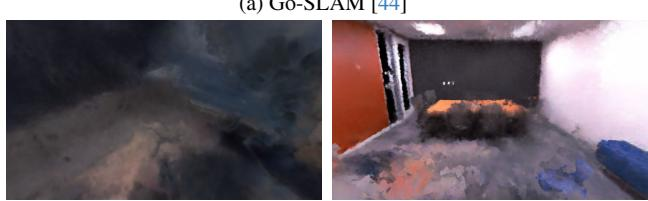  
(b) Orbeez-SLAM [4]

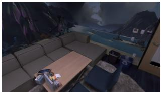

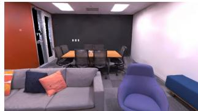  
(c) Ours  
Figure 7. Mapping comparison with other monocular camera systems on Replica office3 scene.

## 4.3. Ablation Study

We proposed geometry-based densification (Geo) and Gaussian-Pyramid-based (GP) learning to boost the system performance of real-time photorealistic mapping. In this section, we constructed an ablation study to measure the efficacy of each algorithm, which can be quantified by PSNR, rendering speed (FPS), and final model size in megabytes (MB). The quantitative results are demonstrated in Table 4.

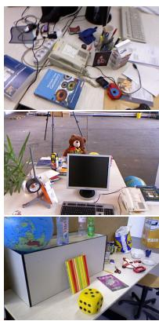

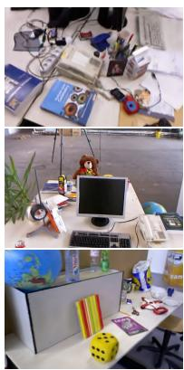  
(b) Ours (Mono)

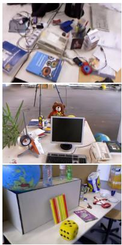  
(c) Ours (RGB-D)

Figure 8. Qualitative results of Photo-SLAM on dataset TUM.
<table><tr><td colspan="2">On Euroc Stereo</td><td colspan="2">ORB- SLAM3</td><td colspan="2">DROID- Ours SLAM (Jetson)</td><td colspan="2">Ours Ours (Laptop)</td></tr><tr><td rowspan="4">MH-01</td><td>RMSE (cm) ↓</td><td>4.379</td><td>39.514</td><td>4.207</td><td>4.049</td><td>4.109</td></tr><tr><td>PSNR ↑</td><td></td><td>=</td><td>13.979</td><td>13.962</td><td>13.952</td></tr><tr><td>SSIM↑</td><td></td><td>=</td><td>0.426</td><td>0.421</td><td>0.420</td></tr><tr><td>LPIPS ↓</td><td>=</td><td>=</td><td>0.428</td><td>0.378</td><td>0.366</td></tr><tr><td rowspan="4">MH-02</td><td>RMSE (cm)↓</td><td>4.525</td><td>39.265</td><td>4.193</td><td>4.731</td><td>4.441</td></tr><tr><td>PSNR ↑</td><td></td><td></td><td>14.210</td><td>14.254</td><td>14.201</td></tr><tr><td>SSIM↑</td><td></td><td>=</td><td>0.436</td><td>0.436</td><td>0.430</td></tr><tr><td>LPIPS ↓</td><td></td><td></td><td>0.447</td><td>0.373</td><td>0.356</td></tr><tr><td rowspan="4">V1-01</td><td>RMSE (cm) ↓</td><td>8.940</td><td>21.646</td><td>8.830</td><td>8.836</td><td>8.821</td></tr><tr><td>PSNR↑</td><td></td><td>=</td><td>16.933</td><td>17.025</td><td>17.069</td></tr><tr><td>SSIM↑</td><td></td><td>=</td><td>0.626</td><td>0.622</td><td>0.618</td></tr><tr><td>LPIPS↓</td><td></td><td></td><td>0.321</td><td>0.284</td><td>0.266</td></tr><tr><td rowspan="4">V2-01</td><td>RMSE (cm) ↓</td><td>26.904</td><td>15.344</td><td>26.643</td><td>26.736</td><td>26.609</td></tr><tr><td>PSNR ↑</td><td></td><td></td><td>16.038</td><td>16.052</td><td>15.677</td></tr><tr><td>SSIM↑</td><td></td><td>1</td><td>0.643</td><td>0.635</td><td>0.622</td></tr><tr><td>LPIPS↓</td><td></td><td></td><td>0.347</td><td>0.314</td><td>0.323</td></tr></table>

Table 3. Quantitative results on the EuRoC MAV dataset, using stereo inputs. Our Photo-SLAM is the first system to support online photorealistic mapping with stereo cameras.

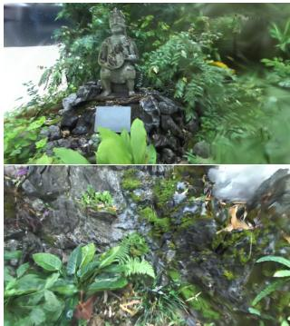

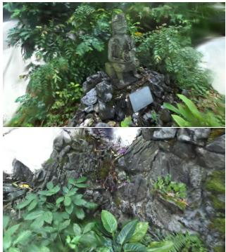  
Figure 9. Mapping results of Photo-SLAM using a hand-held stereo camera in an outdoor unbounding scene.

<table><tr><td colspan="3">On Replica</td><td colspan="3">Mono</td><td colspan="3">RGB-D</td></tr><tr><td>#</td><td>Geo</td><td>GP</td><td></td><td>PSNR ↑ FPS ↑</td><td>MB</td><td>PSNR ↑</td><td>FPS ↑</td><td>MB</td></tr><tr><td>(1)</td><td></td><td>w/o n = 2|</td><td>31.274</td><td>994.2</td><td>10.742</td><td>33.296</td><td>923.0</td><td>18.199</td></tr><tr><td>(2)</td><td>w/</td><td>w/o</td><td>20.002</td><td>353.2</td><td>44.100</td><td>33.696</td><td>860.0</td><td>31.856</td></tr><tr><td>(3)</td><td>w/o</td><td>w/o</td><td>22.913</td><td>645.0</td><td>5.782</td><td>32.551</td><td>1010.8</td><td>13.901</td></tr><tr><td>(4)</td><td>w/</td><td>n = 1</td><td></td><td>30.903 803.8</td><td>21.819</td><td>34.634</td><td>953.7</td><td>31.552</td></tr><tr><td>(5)</td><td>w/</td><td></td><td>n = 3</td><td>31.563 877.6</td><td>22.510</td><td>33.305</td><td>946.2</td><td>31.039</td></tr><tr><td>default</td><td></td><td>w/</td><td>n = 2</td><td>33.302 911.3</td><td>31.419</td><td>34.958</td><td>1084.035.211</td><td></td></tr></table>

Table 4. Ablation study on the effect of geometry-based densification (Geo) and Gaussian-Pyramid-based (GP) learning.

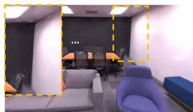  
(a) w/o Geo

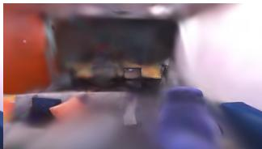  
(b) w/o GP  
Figure 10. Mapping results of different ablated systems on the monocular Replica scene.

The relationship is tangled between rendering quality or speed, and the number of hyper primitives represented by the model size. The models are typically small without actively densifying hyper primitives based on the inactive 2D geometric features (Geo). However, without Geo, PSNR suffers degradation by 2.028 and 1.662 on monocular and RGB-D scenarios respectively, as indicated in Table 4(1). Compared to Fig. 7c, the rendering image without Geo (Fig. 10a) exhibits artifacts, such as on the ceiling. In RGB-D scenarios, more hyper primitives can get higher PSNR. However, without Gaussian-Pyramid-based learning, more hyper primitives are densified by Geo, and thus lead to a decrease in mapping quality and rendering speed especially in monocular scenarios, as visualized in Fig. 10b and reported in Table 4(2) and (3). This is because densified hyper primitives without precise depth information have inaccurate positions. Without thorough optimization, inaccurate hyper primitives become encumbrances. It is noticeable that the systems with GP learning can generally perform better, highlighting the effectiveness of GP learning. Additionally, increasing the Gaussian pyramid levels improves mapping quality, and our Photo-SLAM with default 3-level GP learning achieves the best results. However, we found that the results of using a Gaussian pyramid with 4 levels deteriorated, as shown in Table 4(5), possibly due to overfitting low-level features during incremental mapping. Since the image is rendered by splatting hyper primitives, the rendering speed theoretically is correlated to the number of visible hyper primitives in the current view rather than the model size of the whole scene. Although a smaller model does not necessarily imply a higher average rendering speed, a precise reconstructed model should accurately capture its essential details while using concise parameters, which is the premise for high-speed rendering. Moreover, reducing the time required for rendering enables the optimization of hyper primitives with more iterations during online mapping, ultimately leading to improved accuracy and quality.

In conclusion, the ablation study verifies that the geometry-based densification strategy allows the system to obtain sufficient hyper primitives while the Gaussian-Pyramid-based learning guarantees hyper primitives optimized thoroughly, enhancing online photorealistic mapping performance. There is no doubt that the default Photo-SLAM can reconstruct a map with more appropriate hyper primitives, and achieve better rendering quality and high rendering speed than ablated systems.

## 5. Conclusion

In this paper, we have proposed a novel SLAM framework called Photo-SLAM for simultaneous localization and photorealistic mapping. Instead of highly relying on resourceintensive implicit representations and neural solvers, we introduced a hyper primitives map. It enables our system to leverage explicit geometric features for localization and implicitly capture the texture information of the scenes. In addition to geometry-based densification, we proposed Gaussian-Pyramid-based learning, a new progressive training method, to further enhance mapping performance. Extensive experiments have demonstrated that Photo-SLAM significantly outperforms existing SOTA SLAMs for online photorealistic mapping. Furthermore, our system verifies its practicality by achieving real-time performance on an embedded platform, highlighting its potential for advanced robotics applications in real-world scenarios.

Acknowledgements: This work is partially supported by the Innovation and Technology Support Programme of the Innovation and Technology Fund (Ref: ITS/200/20FP), the Marine Conservation Enhancement Fund (MCEF20107 & MCEF23EG01), and an internal grant from HKUST (R9429).

## References

[1] Michael Burri, Janosch Nikolic, Pascal Gohl, Thomas Schneider, Joern Rehder, Sammy Omari, Markus W Achtelik, and Roland Siegwart. The euroc micro aerial vehicle datasets. The International Journal of Robotics Research, 2016. 5

[2] Carlos Campos, Richard Elvira, Juan J Gomez Rodr ´ ´ıguez, Jose MM Montiel, and Juan D Tard´ os. Orb-slam3: An accu-´ rate open-source library for visual, visual–inertial, and multimap slam. IEEE Transactions on Robotics, 37(6):1874– 1890, 2021. 2, 5, 6, 7

[3] Anpei Chen, Zexiang Xu, Andreas Geiger, Jingyi Yu, and Hao Su. Tensorf: Tensorial radiance fields. In European Conference on Computer Vision (ECCV), 2022. 1, 3

[4] Chi-Ming Chung, Yang-Che Tseng, Ya-Ching Hsu, Xiang-Qian Shi, Yun-Hung Hua, Jia-Fong Yeh, Wen-Chin Chen, Yi-Ting Chen, and Winston H Hsu. Orbeez-slam: A realtime monocular visual slam with orb features and nerfrealized mapping. In 2023 IEEE International Conference on Robotics and Automation (ICRA), pages 9400–9406. IEEE, 2023. 5, 6, 7

[5] Brian Curless and Marc Levoy. A volumetric method for building complex models from range images. In Proceedings of the 23rd annual conference on Computer graphics and interactive techniques, pages 303–312, 1996. 3

[6] Angela Dai, Matthias Nießner, Michael Zollhofer, Shahram¨ Izadi, and Christian Theobalt. Bundlefusion: Real-time globally consistent 3d reconstruction using on-the-fly surface reintegration. ACM Transactions on Graphics (ToG), 36(4): 1, 2017. 3, 5, 6

[7] Jakob Engel, Thomas Schops, and Daniel Cremers. Lsd-¨ slam: Large-scale direct monocular slam. In European conference on computer vision, pages 834–849. Springer, 2014. 1, 2

[8] Jakob Engel, Vladlen Koltun, and Daniel Cremers. Direct sparse odometry. IEEE transactions on pattern analysis and machine intelligence, 40(3):611–625, 2017. 2

[9] Christian Forster, Matia Pizzoli, and Davide Scaramuzza. Svo: Fast semi-direct monocular visual odometry. In 2014 IEEE international conference on robotics and automation (ICRA), pages 15–22. IEEE, 2014. 1

[10] Sara Fridovich-Keil, Alex Yu, Matthew Tancik, Qinhong Chen, Benjamin Recht, and Angjoo Kanazawa. Plenoxels: Radiance fields without neural networks. In Proceedings of the IEEE/CVF Conference on Computer Vision and Pattern Recognition, pages 5501–5510, 2022. 2

[11] Dorian Galvez-L´ opez and J. D. Tard´ os. Bags of binary words´ for fast place recognition in image sequences. IEEE Transactions on Robotics, 28(5):1188–1197, 2012. 5

[12] Clement Godard, Oisin Mac Aodha, and Gabriel J Bros-´ tow. Unsupervised monocular depth estimation with leftright consistency. In Proceedings of the IEEE conference on computer vision and pattern recognition, pages 270–279, 2017. 2

[13] Michael Grupp. evo: Python package for the evaluation of odometry and slam. https://github.com/ MichaelGrupp/evo, 2017. 5

[14] Huajian Huang, Yingshu Chen, Tianjian Zhang, and Sai-Kit Yeung. 360roam: Real-time indoor roaming using geometry-aware 360◦ radiance fields. arXiv preprint arXiv:2208.02705, 2022. 2

[15] Shahram Izadi, David Kim, Otmar Hilliges, David Molyneaux, Richard Newcombe, Pushmeet Kohli, Jamie Shotton, Steve Hodges, Dustin Freeman, Andrew Davison, et al. Kinectfusion: real-time 3d reconstruction and interaction using a moving depth camera. In Proceedings of the 24th annual ACM symposium on User interface software and technology, pages 559–568, 2011. 3

[16] Mohammad Mahdi Johari, Camilla Carta, and Franc¸ois Fleuret. Eslam: Efficient dense slam system based on hybrid representation of signed distance fields. In Proceedings of the IEEE/CVF Conference on Computer Vision and Pattern Recognition, pages 17408–17419, 2023. 1, 3, 5, 6, 7

[17] Alex Kendall, Matthew Grimes, and Roberto Cipolla. Posenet: A convolutional network for real-time 6-dof camera relocalization. In Proceedings of the IEEE international conference on computer vision, pages 2938–2946, 2015. 2

[18] Bernhard Kerbl, Georgios Kopanas, Thomas Leimkuhler,¨ and George Drettakis. 3d gaussian splatting for real-time radiance field rendering. ACM Transactions on Graphics (ToG), 42(4):1–14, 2023. 2, 4, 5

[19] Zhaoshuo Li, Thomas Muller, Alex Evans, Russell H Tay-¨ lor, Mathias Unberath, Ming-Yu Liu, and Chen-Hsuan Lin. Neuralangelo: High-fidelity neural surface reconstruction. In Proceedings of the IEEE/CVF Conference on Computer Vision and Pattern Recognition, pages 8456–8465, 2023. 4

[20] Lingjie Liu, Jiatao Gu, Kyaw Zaw Lin, Tat-Seng Chua, and Christian Theobalt. Neural sparse voxel fields. Advances in Neural Information Processing Systems, 33:15651–15663, 2020. 4

[21] Ben Mildenhall, Pratul P Srinivasan, Matthew Tancik, Jonathan T Barron, Ravi Ramamoorthi, and Ren Ng. Nerf: Representing scenes as neural radiance fields for view synthesis. In European conference on computer vision, pages 405–421. Springer, 2020. 1, 3

[22] Thomas Muller, Alex Evans, Christoph Schied, and Alexan-¨ der Keller. Instant neural graphics primitives with a multiresolution hash encoding. ACM Transactions on Graphics (ToG), 41(4):1–15, 2022. 3, 4

[23] Raul Mur-Artal and Juan D Tardos. Orb-slam2: An open-´ source slam system for monocular, stereo, and rgb-d cameras. IEEE transactions on robotics, 33(5):1255–1262, 2017. 2

[24] Raul Mur-Artal, Jose Maria Martinez Montiel, and Juan D Tardos. Orb-slam: a versatile and accurate monocular slam system. IEEE transactions on robotics, 31(5):1147–1163, 2015. 1, 2

[25] V. A. Prisacariu, O. Kahler, M. M. Cheng, C. Y. Ren, J. Valentin, P. H. S. Torr, I. D. Reid, and D. W. Murray. A Framework for the Volumetric Integration of Depth Images. ArXiv e-prints, 2014. 3

[26] E. Rublee, V. Rabaud, K. Konolige, and G. Bradski. Orb: An efficient alternative to sift or surf. IEEE International Conference on Computer Vision, 58(11):2564–2571, 2011. 2, 3

[27] Erik Sandstrom, Yue Li, Luc Van Gool, and Martin R. Os-¨ wald. Point-slam: Dense neural point cloud-based slam. In Proceedings of the IEEE/CVF International Conference on Computer Vision (ICCV), 2023. 5, 6

[28] Julian Straub, Thomas Whelan, Lingni Ma, Yufan Chen, Erik Wijmans, Simon Green, Jakob J. Engel, Raul Mur-Artal, Carl Ren, Shobhit Verma, Anton Clarkson, Mingfei Yan, Brian Budge, Yajie Yan, Xiaqing Pan, June Yon, Yuyang Zou, Kimberly Leon, Nigel Carter, Jesus Briales, Tyler Gillingham, Elias Mueggler, Luis Pesqueira, Manolis Savva, Dhruv Batra, Hauke M. Strasdat, Renzo De Nardi, Michael Goesele, Steven Lovegrove, and Richard Newcombe. The Replica dataset: A digital replica of indoor spaces. arXiv preprint arXiv:1906.05797, 2019. 5

[29] J. Sturm, N. Engelhard, F. Endres, W. Burgard, and D. Cremers. A benchmark for the evaluation of rgb-d slam systems. In Proc. ofthe International Conference on Intelligent Robot Systems (IROS), 2012. 5

[30] Edgar Sucar, Shikun Liu, Joseph Ortiz, and Andrew J Davison. imap: Implicit mapping and positioning in real-time. In Proceedings of the IEEE/CVF International Conference on Computer Vision, pages 6229–6238, 2021. 3, 5

[31] Cheng Sun, Min Sun, and Hwann-Tzong Chen. Direct voxel grid optimization: Super-fast convergence for radiance fields reconstruction. In Proceedings ofthe IEEE/CVF Conference on Computer Vision and Pattern Recognition, pages 5459– 5469, 2022. 4

[32] Towaki Takikawa, Joey Litalien, Kangxue Yin, Karsten Kreis, Charles Loop, Derek Nowrouzezahrai, Alec Jacobson, Morgan McGuire, and Sanja Fidler. Neural geometric level of detail: Real-time rendering with implicit 3d shapes. In Proceedings of the IEEE/CVF Conference on Computer Vision and Pattern Recognition, pages 11358–11367, 2021. 4

[33] Zachary Teed and Jia Deng. Raft: Recurrent all-pairs field transforms for optical flow. In Computer Vision–ECCV 2020: 16th European Conference, Glasgow, UK, August 23– 28, 2020, Proceedings, Part II 16, pages 402–419. Springer, 2020. 1, 2

[34] Zachary Teed and Jia Deng. Droid-slam: Deep visual slam for monocular, stereo, and rgb-d cameras. Advances in neural information processing systems, 34:16558–16569, 2021. 2, 5, 6, 7

[35] Ayush Tewari, Justus Thies, Ben Mildenhall, Pratul Srinivasan, Edgar Tretschk, Wang Yifan, Christoph Lassner, Vincent Sitzmann, Ricardo Martin-Brualla, Stephen Lombardi, et al. Advances in neural rendering. In Computer Graphics Forum, pages 703–735. Wiley Online Library, 2022. 1

[36] Hengyi Wang, Jingwen Wang, and Lourdes Agapito. Coslam: Joint coordinate and sparse parametric encodings for neural real-time slam. In Proceedings ofthe IEEE/CVF Conference on Computer Vision and Pattern Recognition, pages 13293–13302, 2023. 3, 5, 6, 7

[37] Wenshan Wang, Delong Zhu, Xiangwei Wang, Yaoyu Hu, Yuheng Qiu, Chen Wang, Yafei Hu, Ashish Kapoor, and Sebastian Scherer. Tartanair: A dataset to push the limits of visual slam. In 2020 IEEE/RSJ International Conference on Intelligent Robots and Systems (IROS), pages 4909–4916. IEEE, 2020. 2

[38] Suttisak Wizadwongsa, Pakkapon Phongthawee, Jiraphon Yenphraphai, and Supasorn Suwajanakorn. Nex: Real-time view synthesis with neural basis expansion. In Proceedings of the IEEE/CVF Conference on Computer Vision and Pattern Recognition, pages 8534–8543, 2021. 2

[39] Yuanbo Xiangli, Linning Xu, Xingang Pan, Nanxuan Zhao, Anyi Rao, Christian Theobalt, Bo Dai, and Dahua Lin. Bungeenerf: Progressive neural radiance field for extreme multi-scale scene rendering. In European conference on computer vision, pages 106–122. Springer, 2022. 4, 5

[40] Yiheng Xie, Towaki Takikawa, Shunsuke Saito, Or Litany, Shiqin Yan, Numair Khan, Federico Tombari, James Tompkin, Vincent Sitzmann, and Srinath Sridhar. Neural fields in visual computing and beyond. In Computer Graphics Forum, pages 641–676. Wiley Online Library, 2022. 1

[41] Nan Yang, Lukas von Stumberg, Rui Wang, and Daniel Cremers. D3vo: Deep depth, deep pose and deep uncertainty for monocular visual odometry. In Proceedings of the IEEE/CVF conference on computer vision and pattern recognition, pages 1281–1292, 2020. 2

[42] Alex Yu, Ruilong Li, Matthew Tancik, Hao Li, Ren Ng, and Angjoo Kanazawa. Plenoctrees for real-time rendering of neural radiance fields. In Proceedings of the IEEE/CVF International Conference on Computer Vision, pages 5752– 5761, 2021. 1, 3

[43] Richard Zhang, Phillip Isola, Alexei A Efros, Eli Shechtman, and Oliver Wang. The unreasonable effectiveness of deep features as a perceptual metric. In Proceedings of the IEEE conference on computer vision and pattern recognition, pages 586–595, 2018. 5

[44] Youmin Zhang, Fabio Tosi, Stefano Mattoccia, and Matteo Poggi. Go-slam: Global optimization for consistent 3d instant reconstruction. In Proceedings ofthe IEEE/CVF International Conference on Computer Vision, pages 3727–3737, 2023. 5, 6, 7

[45] Huizhong Zhou, Benjamin Ummenhofer, and Thomas Brox. Deeptam: Deep tracking and mapping. In Proceedings of the European conference on computer vision (ECCV), pages 822–838, 2018. 2

[46] Zihan Zhu, Songyou Peng, Viktor Larsson, Weiwei Xu, Hujun Bao, Zhaopeng Cui, Martin R Oswald, and Marc Pollefeys. Nice-slam: Neural implicit scalable encoding for slam. In Proceedings of the IEEE/CVF Conference on Computer Vision and Pattern Recognition, pages 12786–12796, 2022. 1, 3, 5, 6, 7