# RLD-SLAM: A Robust Lightweight VI-SLAM for Dynamic Environments Leveraging Semantics and Motion Information

Zengrui Zheng , Shifeng Lin , and Chenguang Yang , Fellow, IEEE

Abstract—Existing mainstream dynamic simultaneous localization and mapping (SLAM) can be categorized into image segmentation-based and object detection-based methods. The former achieves high accuracy but suffers a heavy computational burden, while the latter operates at higher speeds but with lower accuracy. In this article, we propose robust lightweight dynamic SLAM (RLD-SLAM), a robust lightweight visual-inertial SLAM for dynamic environments, leveraging semantics, and motion information. Our novel approach combines object detection and Bayesian filtering to maintain high accuracy while quickly acquiring static feature points. In addition, to address the challenge of semantic-based dynamic SLAM in highly dynamic scenes, RLD-SLAM leverages motion information from the inertial measurement unit to assist in tracking dynamic objects and maximizes the utilization of static feature in the environment. We conduct experiments applying our proposed method on indoor, outdoor datasets, and unmanned ground vehicles. The experimental results demonstrate that our method surpasses the current state-of-theart algorithms, particularly in highly dynamic environments.

Index Terms—Mobile robot, multisensor fusion, robot state estimation, simultaneous localization and mapping (SLAM).

## I. INTRODUCTION

unknown environments, intelligent robots need two essential capabilities: 1) real-time perception of the surrounding environment and 2) precise self-state estimation. Simultaneous localization and mapping (SLAM) serves as a fundamental technology in robot perception, facilitating the realization of these capabilities. Researchers have discovered that using cameras as perception devices in SLAM systems not only reduces costs but also provides richer environmental information. Furthermore, inertial measurement unit (IMU) can provide supplementary information to visual SLAM, thereby enhancing its accuracy and robustness. In the 21st century, visual and visual-inertial SLAM (VI-SLAM) gradually matured, giving rise to excellent open-source algorithms like DTAM [1], LSD-SLAM [2], ORB-SLAM3 [3], MSCKF [4], VINS-mono [5], etc. The majority of visual and visual-inertial SLAM methods are built upon the assumption of a static environment.

However, in the real world, there are many dynamic objects such as cars on the road or people in the office. These dynamic objects can introduce significant interference to feature recognition and data association in SLAM, thus, greatly reducing the localization accuracy of the system [6]. Traditional dynamic SLAM methods employed geometric constraints or additional sensors to address this issue. However, these methods have limited effectiveness in solving this problem. With the development of deep learning and computer vision technologies, dynamic SLAM methods based on semantic understanding are gradually becoming mainstream. Some of these methods incorporate image segmentation in visual SLAM, represented by DynaSLAM [7] and DS-SLAM [8]. They offer pixel-level semantic segmentation on input images, leading to high recognition accuracy of dynamic feature points in environment. However, the drawback of these methods is the high computational demands for robots. Another class of dynamic SLAM methods use object detection instead of image segmentation to reduce the computational burden [9], [10]. But object detection bounding boxes generally contain large background regions, significantly reducing the accuracy of dynamic feature point recognition. This results in the removal of a considerable number of static feature points, consequently decreasing the stability of the SLAM system. Some approaches in this category, represented by Dynamic-VINS [11], further improve the classification accuracy by segmenting depth images. But these methods are limited to situations where RGB-D cameras are used as input.

Moreover, semantic-based dynamic SLAM eliminates all features with dynamic semantic labels without considering whether these objects are actually in motion. In order to enhance the effectiveness of dynamic object recognition, DynaSLAMII [12], VDO-SLAM [13], and [14] incorporate simultaneous tracking of these objects [15], [16]. However, these methods impose significant additional computational burden on the system. Currently, such SLAM algorithms are far from meeting the requirements of real-time operation.

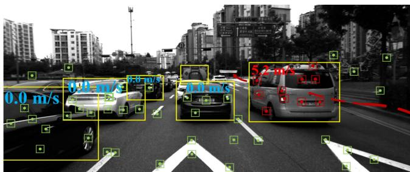  
Fig. 1. SLAM and object tracking using RLD-SLAM.

In response to the aforementioned problem, we propose RLD-SLAM, a robust lightweight visual-inertial SLAM algorithm for dynamic environments. This algorithm combines object detection and Bayesian filtering to accurately distinguish dynamic and static feature points in the environment. RLD-SLAM does not rely on image depth for dynamic feature recognition, making it suitable for various input scenarios. In addition, RLD-SLAM can utilize preintegration of IMU measurements to aid in tracking objects in highly dynamic environments, as shown in Fig. 1. This enhances the stability of the SLAM system and provides more perception information for obstacle avoidance and path planning tasks. The main contributions of this work are summarized as follows.

1) We propose a novel approach that combines object detection and Bayesian filtering to rapidly acquire static feature points in the dynamic environment.

2) We propose an efficient method that utilizes the information from the IMU to track dynamic objects and enhance the robustness ofSLAM in highly dynamic environments.

3) We design the framework of a robust lightweight visualinertial SLAM system leveraging semantics and motion information. The system is capable of accommodating various inputs and dynamic scenarios. Experiments on datasets and real-world environments are conducted to validate the accuracy, robustness, and efficiency of the RLD-SLAM system.

## II. RELATED WORKS

## A. Based on Traditional SLAM Framework

Dynamic SLAM based on the traditional SLAM framework typically uses geometric constraints or data from other sensors to remove outliers. Wang [17] adopted a method based on mathematical models and geometric constraints. By utilizing depth and color information between consecutive frames, this method can effectively detect and identify moving objects in dynamic scenes. Kim [18] introduced a visual odometry algorithm that fuses RGB-D sensor and IMU data to generate 3-D feature points with consistent rotation in highly dynamic environments. Fu [19] also proposed a monocular visual-inertial SLAM method for dynamic environments based on similar principles. BaMVO [20] and [21] utilized an RGB-D sensor and a robust background model to accurately estimate ego-motion by considering moving objects based on energy-based dense visual odometry.

## B. Combining With the Deep Neural Network

In recent years, the development of deep neural networks has significantly enhanced robots’ ability to semantically understand their environment. Some researchers incorporate image segmentation into visual SLAM. The authors in [22] discussed the relationship between semantic information and SLAM, asserting that they can mutually benefit each other. DS-SLAM [8] combines semantic segmentation networks and motion consistency check to effectively address the impact of dynamic objects on localization accuracy and generate dense semantic octomap. DynaSLAM [7] proposed by Bescos integrates dynamic object detection and background inpainting with ORB-SLAM2 to handle dynamic scenes in real-world environments and outperforms standard visual SLAM baselines. By integrating semantic and geometric information from masks, RGB, and depth images, Blitz-SLAM [23] innovatively eliminates noise chunks from local point clouds and generates a clean global point cloud map. In addition, SOF-SLAM [24] and RDS-SLAM [25] are also image segmentation-based dynamic SLAM algorithms. However, these methods have high computational requirements on the platform. YOLO-SLAM [26] is a semantic SLAM system that combines a lightweight object detection network with geometric constraint filtering, enabling efficient localization and mapping in dynamic environments. OVD-SLAM [27], Dynamic-VINS [11], [28], and [29] also adopted a similar approach, incorporating depth image and depth threshold to exclude background regions. Pan et al. [30] introduced a robust dynamic feature segmentation SLAM algorithm, leveraging optimized epipolar geometry and Mask R-CNN based image segmentation for dynamic outlier removal.

Over the past few years, to enhance the effectiveness of dynamic object recognition, some SLAM algorithms combine simultaneous tracking of these objects. The authors in [31] and [32] analyzed the benefits of estimating the motion state of dynamic objects in SLAM and utilized their rigidity for velocity estimation in the absence of 3-D prior model. DynaSLAMII [12] and VDO-SLAM [13] integrate dynamic and static structures to achieve accurate pose and spatiotemporal map estimation while utilizing pose transformations of moving objects to assist navigation. However, these methods introduce significant additional computational burden to the system due to their optimization-based approaches for eliminating tracking and self-positioning errors. Currently, these SLAM algorithms are far from meeting the requirements ofreal-time operation, greatly limiting their potential applications. Furthermore, as the motion of dynamic objects is not regular or constant, such methods may introduce additional errors. In contrast, RLD-SLAM initially uses a Kalman filter to track dynamic objects, estimating the object’s motion velocity, and then integrates stationary objects into tightly coupled optimization. This approach helps to avoid the aforementioned limitations.

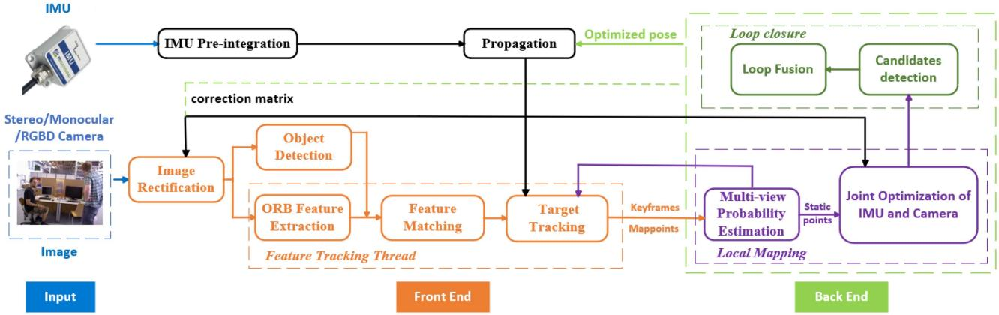  
Fig. 2. Overall framework of RLD-SLAM. The front end of RLD-SLAM involves extracting image feature points and tracking dynamic objects in 2D. The back end assists the front end in classifying dynamic and static feature points by identifying keyframes with a co-visibility relationship to the current frame. The optimized back-end data is combined with new IMU measurements to predict the robot’s pose. This predicted pose can be used for image orientation correction, aiding the system in 3D tracking of dynamic objects and tightly coupled optimization in the back end. RLD-SLAM is designed for flexibility and can operate without IMU input, albeit with reduced functionalit.

## III. SYSTEM INTRODUCTION

## A. Overall Framework

RLD-SLAM consists of the following four threads, as shown in Fig. 2:

1) object detection thread;

2) feature tracking thread;

3) local mapping thread;

4) loop closure detection thread.

RLD-SLAM supports stereo/monocular/RGB-D cameras as visual input. The IMU data during a certain time period is preintegrated to obtain the pose transformation T . T combined with the optimized pose from the previous time period provides the prior pose estimation for the current moment. This pose prior is extensively leveraged in our system. First, it is used to rectify the images for improved object detection, which will be explained in detail later. While performing object detection, we simultaneously extract ORB features and perform interframe feature matching. Subsequently, using deepsort network, we track the objects in 2-D based on the feature matching relationships. The pose prior provided by the IMU helps in better tracking of objects in 3-D world, especially when more than half of the features are semantically dynamic. The keyframes and map points obtained by the front end are then input into the back end for further optimization. In the back end, the multiview probabilistic estimation module updates the state of map points using decaying Bayesian filtering on historical data. When the back end accumulates enough covisible keyframes, it can also assist the front end in detecting and tracking dynamic feature points. It is worth noting that during this process, when a moving object becomes stationary, the system adaptively adds these features as landmarks for optimization. This allows for better utilization of visual features in the environment, such as parked cars on the roadside, to improve the system’s robustness.

To enhance the fault tolerance of the system, RLD-SLAM is designed to operate effectively even when IMU fails. In this case, the image rectification matrix is provided by a reference keyframe obtained through back-end optimization. Target tracking is limited to 2-D object tracking. Although the overall performance may decrease to a certain extent, RLD-SLAM can still maintain operation.

## B. Image Rectification and Object Detection

In RLD-SLAM, we use YOLOv5 to detect semantic objects in input images and obtain their labels. This semantic information helps us efficiently distinguish dynamic feature points. However, one challenge in dynamic SLAM based on object detection is the decreased accuracy when the camera rotates. In the first scenario, YOLOv5 is capable of detecting dynamic objects, but the detected objects appear skewed in the frame. This leads to bounding boxes containing a significant portion of static background. Losing a large number of static landmarks can result in tracking failures of the SLAM system. In the second scenario, YOLOv5 fails to recognize objects effectively due to excessive skewness. Without the assistance of semantic information, the system incorporates feature points from dynamic objects into optimization, leading to a significant decrease in localization accuracy. To address this issue, we utilize supplementary information from an IMU to obtain a rectification matrix. An IMU typically consists of two components: 1) a gyroscope and 2) an accelerometer. The accelerometer measures linear acceleration, including gravitational acceleration ${ \vec { g } } .$ First, we calculate the angle between the gravitational acceleration and the y-axis of the image

$$
\theta = \mathrm { a c o s } \left( { \frac { { \vec { g } } \cdot { \vec { y } } } { | | { \vec { g } } | | | | { \vec { y } } | | } } \right) .\tag{1}
$$

Next, we rotate the image by a certain angle, θ

$$
\mathrm { p } _ { \mathrm { r } } = \mathrm { R } * \mathrm { p } _ { 0 } = \left[ { \begin{array} { c c c } { \cos \left( - \theta \right) } & { - \sin \left( - \theta \right) } & { 0 } \\ { \sin \left( - \theta \right) } & { \cos \left( - \theta \right) } & { 0 } \\ { 0 } & { 0 } & { 1 } \end{array} } \right] * \mathrm { p } _ { 0 } .\tag{2}
$$

When IMU data are not available as input, we utilize the pose of a reference keyframe from the back end to provide a rectification matrix. Despite slight deviations between the pose of the

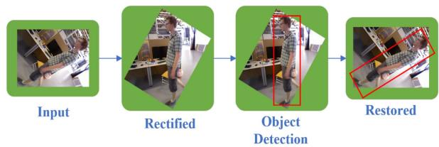  
Fig. 3. Image rectification based on robot pose.

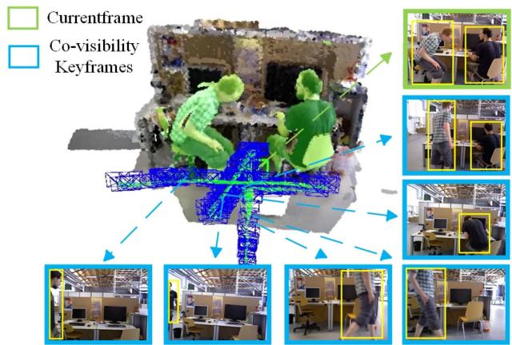  
Fig. 4. Separating dynamic objects from background through integration of object detection and Bayesian filtering.

reference keyframe and the current frame, YOLOv5 does not require precise correction of the image. Assuming the pose of the keyframe to be $R _ { k }$ , then

$$
\begin{array} { r } { \mathrm { p } _ { \mathrm { r } } = \mathrm { R } _ { k } ^ { - 1 } * \mathrm { p } _ { 0 } . } \end{array}\tag{3}
$$

Although the processing method in this step is not complex, as shown in Fig. 3, it significantly improves the accuracy of classifying dynamic and static feature points when the camera is rotated at large angles. This initial processing not only avoids tracking failures but also lays a solid foundation for subsequent localization and object tracking.

## C. Multiview Probability Estimation and Weighted Optimization

Object detection bounding boxes generally contain large background regions, significantly reducing the accuracy of dynamic feature recognition. To maintain high accuracy of dynamic SLAM in real-time operation, we design a multiview probability estimation algorithm based on Bayesian filtering to classify dynamic and static feature points, as illustrated in Fig. 4. We calculate the dynamic probability of specific feature points by utilizing N keyframes with the highest covisibility rate with the current keyframe. The update of semantic probabilities can be expressed as the following Bayesian filtering problem:

$$
{ \begin{array} { r l } & { \operatorname { b e l } \left( x _ { i } \right) = p \left( x _ { i } \mid z _ { 1 : i } , x _ { 0 } \right) } \\ & { \qquad = { \frac { p \left( z _ { i } \mid x _ { i } , z _ { 1 : i - 1 } , x _ { 0 } \right) p \left( x _ { i } \mid z _ { 1 : i - 1 } , x _ { 0 } \right) } { p \left( z _ { i } \mid z _ { 1 : i - 1 } , x _ { 0 } \right) } } } \\ & { \qquad = \eta p \left( z _ { i } \mid x _ { i } \right) p \left( x _ { i } \mid z _ { 1 : i - 1 } , x _ { 0 } \right) } \end{array} }
$$

$$
= \eta p \left( \boldsymbol { z } _ { i } \mid \boldsymbol { x } _ { i } \right) \overline { { b e l } } \left( \boldsymbol { x } _ { i } \right) .\tag{4}
$$

Here $\eta$ is a normalization constant that ensures the sum of the probabilities that the feature is stationary or dynamic goes to unity. The current observation $z _ { i }$ depends solely on the current state $x _ { i }$ , and the probability distribution $p ( z _ { i } \mid x _ { i } )$ can be obtained from the confidence of semantic detection.

Assuming a first-order Markov process, we can obtain

$$
\begin{array} { l } { { \displaystyle \overline { { \mathrm { b e l } } } \left( x _ { i } \right) = \int p \left( x _ { i } \mid x _ { i - 1 } , z _ { 1 : i - 1 } \right) p \left( x _ { i - 1 } \mid z _ { 1 : i - 1 } \right) d x _ { i - 1 } } } \\ { { \displaystyle \qquad = \int p \left( x _ { i } \mid x _ { i - 1 } \right) \mathrm { b e l } \left( x _ { i - 1 } \right) d x _ { i - 1 } } . } \end{array}\tag{5}
$$

In RLD-SLAM, factors such as time distance, spatial distance, and the number of feature points tracked by the front end are used to determine whether to include back-end optimization. Therefore, the time interval between keyframes is uncertain. As the motion state of objects in dynamic environment changes over time, it is natural to assume that the correlation of the motion state of the same object between different keyframes will decrease over time. After incorporating a decay factor, the prediction of the probability of feature points being dynamic can be calculated as follows:

$$
{ \begin{array} { r l } & { { \overline { { \mathsf { b e l } } } } \left( x _ { i } = d \right) } \\ & { = \exp \left( - \alpha \left( t _ { i } - t _ { i - 1 } \right) \right) ( \mathsf { b e l } \left( x _ { i - 1 } = d \right) - 0 . 5 ) + 0 . 5 . } \end{array} }\tag{6}
$$

Our method differs from other approaches that employ interframe dynamic probability propagation by effectively leveraging the correlated keyframes in history. When each keyframe reaches the back end, the system backtracks its covisibility keyframes within a certain time window. Then, these keyframes are traversed in chronological order. During the traversal process, each feature point of the current keyframe is updated based on the observation probabilities at different time. The use of Bayesian filtering with a decay factor allows the algorithm to place more emphasis on recent observations. This is beneficial for the system to quickly identify feature points that transition from motion to static. Then, these feature points will be reintroduced as landmarks for optimization. We have set a relatively low probability threshold, 0.85, to determine static points, as the probability of static points will be weighted in back-end optimization. Points with lower probabilities have a relatively lower influence on the overall optimization process. The formula for the back-end optimization of RLD-SLAM after incorporating static probability weights is as follows:

$$
\underset { \mathcal { X } } { \operatorname* { m i n } } \left( \sum _ { j = 0 } ^ { l - 1 } \sum _ { i \in \mathcal { Z } ^ { j } } \rho _ { \mathrm { k e r n e l } } \left( \left. \mathbf { r } _ { i j } \right. _ { \Lambda _ { i j } } \right) \right)\tag{7}
$$

$$
\mathbf { r } _ { i j } = \mathbf { u } _ { i j } - \Omega \left( \mathbf { T } _ { \mathrm { C B } } \mathbf { T } _ { i } ^ { - 1 } \oplus \mathbf { x } _ { j } \right)\tag{8}
$$

$$
A _ { i j } = { \frac { 1 } { \mathrm { s c a l e f a c t o r } ^ { \mathrm { l e v e l } } } } \cdot P _ { \mathrm { s t a t i c } ~ i j }\tag{9}
$$

where $\mathcal { Z } ^ { j }$ contains the 3-D landmarks observed by each keyframe. $\chi \doteq \{ x _ { 0 } . . . x _ { l - 1 } \}$ stands for the state of the keyframes. A Robust kernels $\rho _ { \mathrm { k e r n e l } }$ can significantly reduce the impact of feature point mismatches in system optimization. $\mathbf { r } _ { i j }$ represents the reprojection errors of visual odometry. Ω converts landmark points to pixel coordinates, the specific form depends on the camera model. $\mathbf { u } _ { i j }$ is the observation of point j at image $i . \ A _ { i j }$ represents the information matrix in the optimization process. $P _ { \mathrm { s t a t i c } ~ i j }$ is the static probability of the jth feature point after filtering for the ith observation.

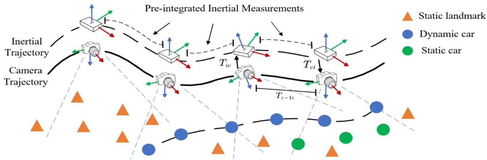  
Fig. 5. RLD-SLAM track dynamic object with IMU measurement. Generally, there are a sufficient number of static landmarks (orange points) in the environment to enable the robust operation of the tracking and mapping modules. Under these circumstances, the estimated camera pose is accurate, so the dynamic objects (blue points) observed by the camera can obtain their coordinates in the world coordinate system based on it. When the visual odometry fails to track enough landmarks, we combine optimized historical data with IMU preintegration to approximate the current camera pose. This also allows the estimation of the motion state of dynamic objects. Subsequently, the system will utilize feature points on static cars (green points) to compensate for insufficient static landmark in highly dynamic environments.

## D. Dynamic Object Tracking With IMU Measurement

While semantic information can efficiently assist SLAM systems in recognizing dynamic objects, it also has limitations. For example, SLAM systems that rely solely on semantic label may mistakenly consider feature points on stationary cars as outliers. This reduces the robustness of the SLAM system, especially in highly dynamic environments. Some dynamic SLAM approaches have attempted to address this issue by incorporating object tracking, but they typically incur significant computational overhead. RLD-SLAM leverages the fusion of IMU data and visual odometry to perform 3-D tracking of dynamic objects and update their velocity and motion states in real time. Based on the obtained motion states of objects, the system can autonomously decide whether to incorporate specific feature into optimization.

We will use the example of an autonomous driving scenario to illustrate the process, as shown in Fig. 5. When a dynamic object comes into view of the onboard camera, the system utilizes Kalman filtering to filter the observations. First, we assume that the observed vehicle undergoes uniformly accelerated motion. The following vector is used to represent the initial state:

$$
\begin{array} { c } { X _ { 0 } = \left( p _ { x } , p _ { y } , p _ { z } , v _ { x } , v _ { y } , v _ { z } , a _ { x } , a _ { y } , a _ { z } \right) ^ { \mathrm { T } } } \\ { = \left( x _ { 0 } , y _ { 0 } , z _ { 0 } , 0 , 0 , 0 , 0 , 0 , 0 \right) ^ { \mathrm { T } } . } \end{array}\tag{10}
$$

Afterward, we predict the next state of the dynamic object vehicle

$$
\check { x } _ { k + 1 } = A \hat { x } _ { k } + B u _ { k }
$$

$$
\check { P } _ { k + 1 } = A \hat { P } _ { k } A ^ { T } + Q .\tag{11}
$$

When obtaining the next observation, we update the state accordingly

$$
\begin{array} { r } { \begin{array} { c } { K = \check { P } _ { k + 1 } H ^ { T } \left( H \check { P } _ { k + 1 } H ^ { T } + R \right) ^ { - 1 } } \\ { { \widehat { x } _ { k + 1 } } = \check { x } _ { k + 1 } + K \left( z _ { k + 1 } - H \check { x } _ { k + 1 } \right) } \\ { { \widehat { \mathrm { P } } _ { k + 1 } } = \left( I - K H \right) \check { P } _ { k + 1 } . } \end{array} } \end{array}\tag{12}
$$

The key point of the algorithm lies in obtaining the observations in a dynamic environment. When VI-SLAM can acquire a sufficient number of static feature points in the environment, visual odometry works properly. Under this circumstance, the world coordinates of the dynamic object in the ith frame can be obtained based on camera observation and self-localization

$$
P _ { w } ^ { i } = T _ { \mathrm { w c } } ^ { i } \cdot P _ { c } ^ { i } .\tag{13}
$$

However, when a large number of objects in the environment are classified as dynamic by the target detection neural network, semantic-based dynamic SLAM often struggles to find enough landmarks for localization. In this case, the method based on the above equation cannot determine $T _ { \mathrm { w c } } ^ { i } ,$ resulting in the inability to obtain the world coordinates of the observed vehicle. Thus, the vehicle’s velocity and other state information cannot be calculated. To address this issue, we utilize measurements from an IMU to enhance the robustness of the SLAM system in such scenarios. The IMU is an intrinsic sensor that is not affected by dynamic objects. However, it is prone to significant drift over long-term operation due to error accumulation. Here, we perform preintegration of short-term IMU measurements between keyframes. Assume that the (i − 1)th and the ith keyframes correspond to the jth and the nth IMU data, respectively. The process is as follows:

$$
\begin{array} { l } { \Delta \tilde { \mathbf { R } } _ { j n } \triangleq \mathbf { R } _ { j } ^ { T } \mathbf { R } _ { n } } \\ { \qquad = \displaystyle \prod _ { k = j } ^ { n - 1 } \mathrm { E x p } \left( \left( \tilde { \omega } _ { k } - \mathbf { b } _ { j } ^ { g } \right) \cdot \Delta t \right) } \end{array}\tag{14}
$$

$$
\begin{array} { r l r } {  { \Delta \tilde { \mathbf { v } } _ { j n } \triangleq \mathbf { R } _ { j } ^ { T } ( \mathbf { v } _ { n } - \mathbf { v } _ { j } - \mathbf { g } \cdot \Delta t _ { j n } ) } } \\ & { } & { = \sum _ { k = j } ^ { n - 1 } \Delta \tilde { \mathbf { R } } _ { j k } \cdot ( \tilde { \mathbf { f } } _ { k } - \mathbf { b } _ { j } ^ { a } ) \cdot \Delta t } \\ & { } & { \overset { } { \underset { k = j } { \sum } } \Delta \mathbf { \tilde { R } } _ { j } \triangleq \mathbf { R } _ { j } ^ { T } ( \mathbf { p } _ { n } - \mathbf { p } _ { j } - \mathbf { v } _ { j } \cdot \Delta t _ { j n } - \frac { 1 } { 2 } \mathbf { g } \cdot \Delta t _ { j n } ^ { 2 } ) } \\ & { } & { \qquad \quad = \sum _ { k = j } ^ { n - 1 } [ \Delta \tilde { \mathbf { v } } _ { j k } \cdot \Delta t + \frac { 1 } { 2 } \Delta \tilde { \mathbf { R } } _ { j k } \cdot ( \tilde { \mathbf { f } } _ { k } - \mathbf { b } _ { j } ^ { a } ) \cdot \Delta t ^ { 2 } ] . } \end{array}\tag{5}
$$

(16)

The biases of gyroscope $\mathbf { b } _ { j } ^ { g }$ and accelerometer ${ \bf b } _ { j } ^ { a }$ are approximated by the most recently optimized biases from the back end. The influence of noise will be applied through the information matrix. Considering the small time interval between keyframes (usually less than 1 s), we assume that the integration process for the IMU measurements has a negligible error. With the pose transformation obtained from preintegration, we can calculate the vehicle’s pose using the following equation:

$$
{ \bf p } _ { j n } = { \bf R } _ { j } \Delta \tilde { { \bf p } } _ { j n } + { \bf v } _ { j } \cdot \Delta t _ { j n } + \frac { 1 } { 2 } { \bf g } \cdot \Delta t _ { j n } ^ { 2 }\tag{17}
$$

$$
P _ { w } ^ { i } = T _ { w c } ^ { i - 1 } \cdot T _ { c I } \left( \Delta \tilde { \mathbf { R } } _ { j n } \cdot P _ { I } ^ { i - 1 } + \mathbf { p } _ { j n } \right)\tag{18}
$$

$$
P _ { I } ^ { i - 1 } = T _ { I c } \cdot P _ { c } ^ { i - 1 } .\tag{19}
$$

By incorporating the new observation results into the update step of the Kalman filter, we can estimate the motion velocity of the observed object. Objects that are classified as dynamic based on semantic information but actually have a speed of zero will provide more landmarks for visual odometry. This will enhance the accuracy and robustness of the SLAM system. The recovered visual odometry is further optimized in a tightly coupled manner with IMU measurements as follows to mitigate IMU drift:

$$
\underset { \overline { { S _ { k } } } , \mathcal { X } } { \mathop { \operatorname* { m i n } } } \left( \sum _ { i = 1 } ^ { k } \left. \mathbf { r } _ { \mathcal { T } _ { i - 1 , i } } \right. _ { \Lambda _ { \mathcal { T } _ { i , i + 1 } } } ^ { 2 } + \sum _ { j = 0 } ^ { l - 1 } \sum _ { i \in \mathcal { Z } ^ { j } } \rho _ { \mathrm { k e r n e l } } \left( \left. \mathbf { r } _ { i j } \right. _ { \Lambda _ { i j } } \right) \right)\tag{20}
$$

${ \bar { S } } _ { k } \doteq \{ S _ { 0 } . . . S _ { k } \}$ stands for the state of the IMU. The first term of the optimization equation $\mathbf { r } _ { { \mathcal { T } } _ { i - 1 , i } }$ represents the inertial residual [3]. Specifically

$$
\begin{array} { r l } & { \mathbf { r } _ { { \bar { Z } } _ { i , i + 1 } } = \left[ \mathbf { r } _ { \Delta \mathbf { R } _ { i , i + 1 } } , \mathbf { r } _ { \Delta \mathbf { v } _ { i , i + 1 } } , \mathbf { r } _ { \Delta \mathbf { p } _ { i , i + 1 } } \right] } \\ & { \mathbf { r } _ { \Delta \mathbf { R } _ { i , i + 1 } } = \log \left( \Delta \mathbf { R } _ { i , i + 1 } ^ { \mathrm { T } } \mathbf { R } _ { i } ^ { \mathrm { T } } \mathbf { R } _ { i + 1 } \right) } \\ & { \mathbf { r } _ { \Delta \mathbf { v } _ { i , i + 1 } } = \mathbf { R } _ { i } ^ { \mathrm { T } } \left( \mathbf { v } _ { i + 1 } - \mathbf { v } _ { i } - \mathbf { g } \Delta t _ { i , i + 1 } \right) - \Delta \mathbf { v } _ { i , i + 1 } } \\ & { \mathbf { r } _ { \Delta \mathbf { p } _ { i , i + 1 } } = \mathbf { R } _ { i } ^ { \mathrm { T } } \left( \mathbf { p } _ { j } - \mathbf { p } _ { i } - \mathbf { v } _ { i } \Delta t - \frac { 1 } { 2 } \mathbf { g } \Delta t ^ { 2 } \right) - \Delta \mathbf { p } _ { i , i + 1 } . } \end{array}\tag{21}
$$

In summary, RLD-SLAM utilize short-term integration of IMU measurements to recover visual odometry, and it further performs joint optimization of visual odometry and IMU measurements to eliminate IMU errors and mitigate drift, addressing its shortcomings in long-term operation. By strategically leveraging the strengths of IMU and camera sensors, we enhance the robustness of the SLAM system in highly dynamic environments.

## IV. EXPERIMENTAL RESULTS

To evaluate the performance of our algorithm in dynamic environments, we tested RLD-SLAM on indoor and outdoor datasets as well as on a mobile robot. The absolute trajectory error (ATE) and relative pose error (RPE) are used to evaluate the accuracy of the SLAM algorithm. The best results of all algorithms in each sequence are highlighted in bold. We use the root mean square error (RMSE) to calculate ATE. A smaller RMSE indicates a smaller difference between the estimated trajectory and the known trajectory, indicating a more precise mapping result. The calculation formula is as follows [33]:

$$
{ \mathrm { A T E } } _ { \mathrm { a l l } } = { \sqrt { { \frac { 1 } { N } } \sum _ { i = 1 } ^ { N } \left\| \log \left( T _ { \mathrm { g t } , i } ^ { - 1 } T _ { \mathrm { e s t i } , i } \right) ^ { \vee } \right\| _ { 2 } ^ { 2 } } } .\tag{22}
$$

The relative error is calculated using the following formula shown at the bottom of the next page: Considering the uncertainties in target detection and feature point extraction of the SLAM algorithm, we conducted ten experiments for each algorithm in every sequence and subsequently took the median value. All algorithms with open-sourced code are experimented on a computer equipped with Ubuntu 18.04 operating system, Intel i7 CPU, NVIDIA GeForce GTX 1050 Ti GPU, and 8 GB of memory.

## A. Evaluation on the TUM RGB-D Dataset

TUM dynamic dataset [34] uses a Kinect depth camera to capture RGB-D images. These images are captured in various indoor scenes. The motion capture system tracks the precise location of the camera to obtain ground truth. We selected sequences from the dataset where people move at high speeds for testing. This article compares the proposed algorithm with ORB-SLAM3 and other algorithms used with RGBD as input. These algorithms are considered to have the best performance in dynamic indoor environments. DS-SLAM and the work of Ji et al. [35] are image segmentation-based methods, whereas Dynamic-VINS and our method are object detection-based methods. It is worth mentioning that the work of Ji et al. [35] and Dynamic-VINS can only work in the presence of depth information. It can be observed from Tables I and II that ORB-SLAM3 exhibits poor accuracy in dynamic environments. And our method effectively mitigates the interference caused by dynamic objects, as depicted in Fig. 6 and Fig. 7. Compared to Dynamic-VINS and YOLO-SLAM, and other object detectionbased methods, our approach significantly outperforms them. In comparison to image segmentation-based algorithms, RLD-SLAM achieves higher localization accuracy while maintaining real-time performance. The real-time performance of RLD-SLAM will be analyzed in Section IV-E.

## B. Evaluation on the KITTI Dataset

RLD-SLAM not only exhibits excellent performance with RGB-D as input. It can also accommodate dynamic scenarios with other modalities as inputs. We validate the performance of RLD-SLAM in outdoor scenarios using the KITTI dataset [36]. In outdoor environments, it is challenging for RGB-D cameras to acquire long-range distance information. Therefore, stereo cameras are commonly used. The tracking dataset within the KITTI dataset records driving scenarios with a significant presence of dynamic objects, and it is widely used for evaluating the outdoor performance of dynamic SLAM algorithms.

TABLE I  
RESULT OF RMSE OF ATE [M] ON TUM RGB-D DATASET
<table><tr><td>Sequence</td><td>ORB-SLAM3</td><td>DS-SLAM</td><td>Ji et al.</td><td>Dynamic-VINS</td><td>YOLO-SLAM</td><td>Ours</td></tr><tr><td>walking_xyz</td><td>0.5212</td><td>0.0247</td><td>0.0194</td><td>0.0486</td><td>0.0195</td><td>0.0167</td></tr><tr><td>walking_static</td><td>0.0277</td><td>0.0081</td><td>0.0111</td><td>0.0077</td><td>0.0094</td><td>0.0075</td></tr><tr><td>walking_rpy</td><td>0.9902</td><td>0.4442</td><td>0.0371</td><td>0.0629</td><td>0.0933</td><td>0.0318</td></tr><tr><td>walking_half</td><td>0.6418</td><td>0.0303</td><td>0.029</td><td>0.0608</td><td>0.0268</td><td>0.0263</td></tr></table>

TABLE II

RESULT OF RMSE OF T.RPE [M/S] AND R.RPE [◦] ON TUM RGB-D DATASET
<table><tr><td>Sequence</td><td colspan="2">ORB-SLAM3</td><td colspan="2">DS-SLAM</td><td colspan="2">Ji et al.</td><td colspan="2">Dynamic-VINS</td><td colspan="2">YOLO-SLAM</td><td colspan="2">Ours</td></tr><tr><td></td><td>T.RPE</td><td>R.RPE</td><td>T.RPE</td><td>R.RPE</td><td>T.RPE</td><td>R.RPE</td><td>T.RPE</td><td>R.RPE</td><td>T.RPE</td><td>R.RPE</td><td>T.RPE</td><td>R.RPE</td></tr><tr><td>walking_xyz</td><td>0.3075</td><td>5.9536</td><td>0.0333</td><td>0.8266</td><td>0.0234</td><td>0.6368</td><td>0.0578</td><td>1.6932</td><td>0.0595</td><td>1.7212</td><td>0.0248</td><td>0.5556</td></tr><tr><td>walking_static</td><td>0.0386</td><td>0.6658</td><td>0.0102</td><td>0.269</td><td>0.0117</td><td>0.2872</td><td>0.0095</td><td>0.4581</td><td>0.0253</td><td>0.3241</td><td>0.0097</td><td>0.261</td></tr><tr><td>walking_rpy</td><td>1.487</td><td>28.528</td><td>0.1503</td><td>3.0042</td><td>0.0471</td><td>1.0587</td><td>0.0595</td><td>5.0839</td><td>0.1723</td><td>1.4267</td><td>0.0426</td><td>0.8638</td></tr><tr><td>walking_half</td><td>0.2605</td><td>1.0621</td><td>0.0297</td><td>0.8142</td><td>0.0423</td><td>0.965</td><td>0.0665</td><td>5.2116</td><td>0.0775</td><td>3.5921</td><td>0.0268</td><td>0.7291</td></tr></table>

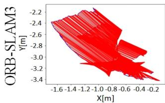

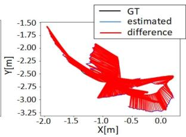

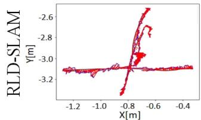  
F3/w/xyz

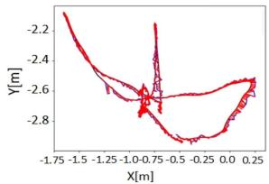  
F3/w/half  
Fig. 6. ATE [m] for ORB-SLAM3 and RLD-SLAM on TUM RGB-D dataset.

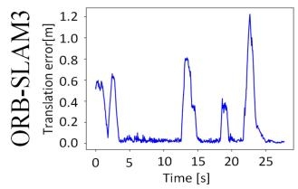

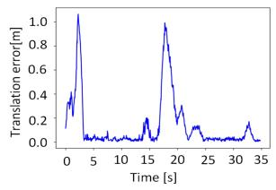

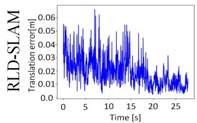  
F3/w/xyz

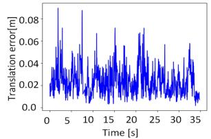  
F3/w/half  
Fig. 7. RPE for ORB-SLAM3 and RLD-SLAM on TUM RGB-D dataset.

We compare RLD-SLAM with the state-of-the-art dynamic SLAM algorithms, DynaSLAM and DynaSLAMII. DynaSLAM utilizes a computationally intensive Seg-Net for semantic segmentation and incorporates geometric constraints to achieve high localization accuracy. DynaSLAMII is an improved version based on DynaSLAM. It enables simultaneous optimization and tracking of dynamic object states through tight coupling. It also demonstrates the benefits of tracking dynamic objects for SLAM. DynaSLAM and DynaSLAMII are both highly accurate but computationally intensive algorithms. According to the experimental results on the KITTI tracking dataset, as shown in Table III, RLD-SLAM outperforms both DynaSLAM and DynaSLAMII in terms of localization accuracy in 15 out of 17 sequences.

The KITTI tracking dataset consists of 21 sequences with various dynamic scenes and objects. Some sequences, such as sequences 0001–0004 shown in Fig. 8(a), represent suburban scenes where both the robot itself and the surrounding dynamic objects have relatively low motion speeds. Therefore, RLD-SLAM exhibits small positioning errors in these sequences, and our method shows only modest improvements compared to other methods. Sequences 0013 and 0019 represent urban scenes, where various dynamic objects like bicycles, pedestrians, and cars are present, as depicted in Fig. 8(b). For irregular and relatively small objects like bicycles and pedestrians, we believe it is unnecessary to extract landmarks from them. Sequences 0008 and 0020 depict highway scenes as shown in Fig. 8(c),

$$
\mathrm { R P E } _ { \mathrm { a l l } } = \sqrt { \frac { 1 } { N - \Delta t } { \sum _ { i = 1 } ^ { N - \Delta t } \Vert \log ( ( T _ { \mathrm { g t } , i } ^ { - 1 } T _ { \mathrm { g t } , i + \Delta t } ) ) ^ { - 1 } ( T _ { \mathrm { e s t i } , i } ^ { - 1 } T _ { \mathrm { e s t i } , i + \Delta t } ) } ) ^ { V } \Vert _ { 2 } ^ { 2 } } .\tag{23}
$$

TABLE III  
RESULT OF RMSE OF ATE [M] ON KITTI DATASET
<table><tr><td>Sequence</td><td>ORB-SLAM3</td><td>DynaSLAM</td><td>DynaSLAMII</td><td>Ours</td></tr><tr><td>0000</td><td>1.43</td><td>1.35</td><td>1.29</td><td>1.16</td></tr><tr><td>0001</td><td>1.98</td><td>2.42</td><td>2.31</td><td>0.9</td></tr><tr><td>0002</td><td>0.92</td><td>1.04</td><td>0.91</td><td>0.7</td></tr><tr><td>0003</td><td>0.89</td><td>0.78</td><td>0.69</td><td>0.46</td></tr><tr><td>0004</td><td>1.65</td><td>1.52</td><td>1.42</td><td>1.28</td></tr><tr><td>0005</td><td>1.26</td><td>1.22</td><td>1.34</td><td>1.5</td></tr><tr><td>0006</td><td>0.19</td><td>0.19</td><td>0.19</td><td>0.168</td></tr><tr><td>0007</td><td>2.56</td><td>2.69</td><td>3.1</td><td>2.34</td></tr><tr><td>0008</td><td>1.95</td><td>1.29</td><td>1.68</td><td>1.01</td></tr><tr><td>0009</td><td>4.36</td><td>3.55</td><td>5.02</td><td>1.49</td></tr><tr><td>0010</td><td>1.75</td><td>1.84</td><td>1.3</td><td>0.74</td></tr><tr><td>0011</td><td>0.96</td><td>1.05</td><td>1.03</td><td>0.55</td></tr><tr><td>0013</td><td>1.26</td><td>1.18</td><td>1.1</td><td>0.61</td></tr><tr><td>0014</td><td>0.13</td><td>0.13</td><td>0.12</td><td>0.299</td></tr><tr><td>0018</td><td>0.91</td><td>1.00</td><td>1.09</td><td>1.05</td></tr><tr><td>0019</td><td>2.34</td><td>2.35</td><td>2.25</td><td>2.06</td></tr><tr><td>0020</td><td>16.77</td><td>1.10</td><td>1.36</td><td>0.72</td></tr><tr><td>Mean</td><td>2.43</td><td>1.45</td><td>1.54</td><td>1.06</td></tr></table>

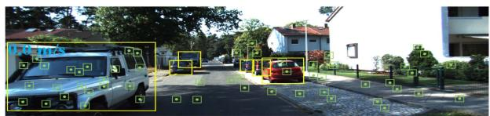

(a)  
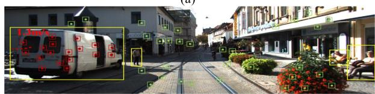

(b)  
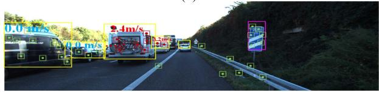  
(c)  
Fig. 8. Valuation on KITTI tracking dataset.

characterized by a large number of fast-moving dynamic objects, posing challenges for localization and target tracking. In such cases, RLD-SLAM outperforms other methods significantly. This is due to the clever utilization of historical visual information and IMU motion priors in RLD-SLAM. The use of Kalman filtering for loosely coupled state estimation of dynamic objects significantly reduces the computational burden as well. Numerous experiments on this dataset have also demonstrated the robustness of our method, which is applicable to a variety of scenarios.

## C. Ablation Experiment on the KAISTDataset

RLD-SLAM is an improvement based on ORB-SLAM3. We added different modules on the basis of ORB-SLAM3 to verify their effectiveness. The KAIST urban dataset [37] collects data from various sensors on autonomous driving vehicles in dense urban areas over a long time span. It poses significant challenges for SLAM systems in terms of precise localization and stability. From the first two columns of Table IV, it can be observed that the multiview module significantly improves the localization accuracy of the system in dynamic environments. From Fig. 9, the green trajectory visually demonstrates that the SLAM system without the multiview module is severely affected by dynamic objects, resulting in significant drift in the trajectory. Based on the comparison of localization accuracy in the last two columns of Table IV, it appears that the performance improvement from the 3-D tracking module is not significant for the system. Observing Fig. 9, we can find that the 3-D tracking module is more focused on improving the system’s robustness in highly dynamic environments. When RLD-SLAM encounters environments like the one shown in Fig. 1, the 3-D tracking module will help the system to utilize static feature points to maintain the operation of visual odometry. Therefore, the SLAM system with the inclusion of the 3-D tracking module exhibits a more complete running trajectory in the KAIST urban dataset.

TABLE IV  
RESULT OF ATE [M] ON KAIST DATASET
<table><tr><td>Sequence</td><td>ORB-SLAM3</td><td>Multiview</td><td>Multiview+3-D tracking</td></tr><tr><td>Mean</td><td>175.95</td><td>32.6</td><td>28.53</td></tr><tr><td>Median</td><td>146.26</td><td>34.71</td><td>27.21</td></tr><tr><td>RMSE</td><td>212.75</td><td>35.32</td><td>34.38</td></tr><tr><td>STD</td><td>119.6</td><td>16.87</td><td>19.18</td></tr></table>

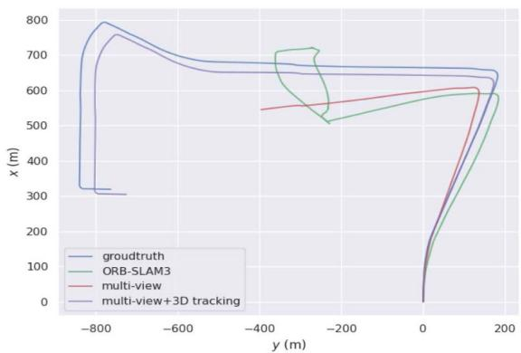  
Fig. 9. Trajectory of ablation experiment.

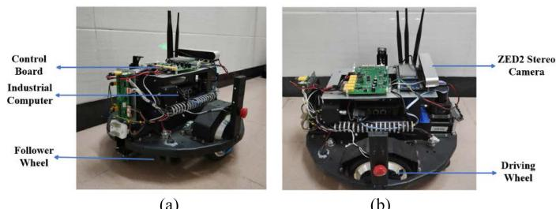  
(a)  
(b)  
Fig. 10. UGV with a stereo camera.

## D. Evaluation Using Our Collected Dataset

To better validate the performance of RLD-SLAM in challenging and complex dynamic scenes, we apply RLD-SLAM to an unmanned ground vehicle (UGV) as depicted in Fig. 10. The UGV is equipped with a ZED2 stereo camera and a control board (including IMU). It uses RLD-SLAM to perform real-time localization and mapping in dynamic campus environments, as shown in Fig. 11. In addition, we collect the sensor data during the experiment to create a dataset for comparison with other algorithms. For each frame of input images, we first extract 1500 ORB feature points and then retain the higher quality ones. The image pyramid consists of eight levels with a scale factor of 1.2. The gyroscope noise error coefficient for the IMU is set to 0.00015, with the random walk error coefficient of 0.00032. The accelerometer noise error coefficient for the IMU is set to 0.0026, with a random walk error coefficient of 0.00082.

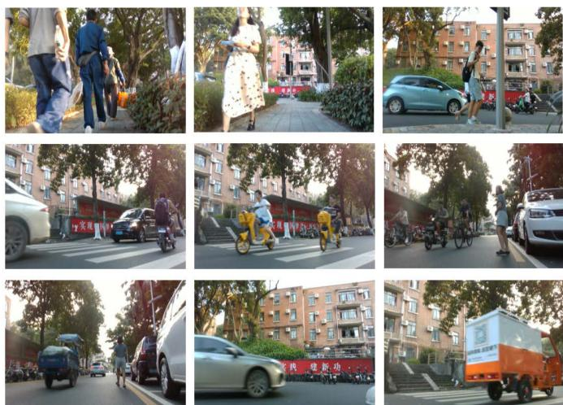  
Fig. 11. Several examples of our collected dataset.

To make the collected dataset more representative, the first half of the experiment is on pavement, where the primary dynamic objects are pedestrians. The uneven stones on the road cause irregular vibrations in the robot’s motion, and the relatively narrow sidewalks make it easier for the camera to be obstructed. In the latter half of the experiment, the mobile robot travels onto the main road. There are a greater variety of dynamic objects, including pedestrians, moving cars, electric scooters, trucks, and stationary vehicles, among others. The range of movement speeds for these objects is quite wide. During the experiment, we control the mobile robot to move at speeds ranging from 1 to 3 m/s along the lakeside. Simultaneously, a camera mounted on the robot with a 30° upward angle is used to observe and record static and dynamic features in the environment. In addition, an inertial sensor is used to record the robot’s motion states at different times. We evaluate ORB-SLAM3, DynaSLAM, and RLD-SLAM using the collected campus dataset. We adopt GPS localization data as ground truth for comparison. To ensure the accuracy of the experimental data, we perform ten trials for each algorithm and calculate the average results. The results are shown in Table V and Fig. 13.

From Table V, we can see that our RLD-SLAM achieves the smallest trajectory error in the highly dynamic campus environment. From Figs. 13 and 12, we can observe that DynaSLAM has poor robustness in highly dynamic environments and is unable to complete the entire dataset. It fails to continue localization at 72.1 s. Although ORB-SLAM3 is able to complete the entire dataset, its error is significantly larger. On the other hand, RLD-SLAM not only maintains operation throughout the entire process but also achieves the smallest trajectory error. This indicates that RLD-SLAM has advantages in both accuracy and robustness compared to other SLAM algorithms.

TABLE V  
RESULT OF ATE [M] ON CAMPUS DATASET
<table><tr><td>Sequence</td><td>ORB-SLAM3</td><td>DynaSLAM</td><td>Ours</td></tr><tr><td>Mean</td><td>1.06</td><td>0.389</td><td>0.145</td></tr><tr><td>Median</td><td>0.328</td><td>0.282</td><td>0.103</td></tr><tr><td>RMSE</td><td>2.55</td><td>0.487</td><td>0.223</td></tr><tr><td>STD</td><td>2.31</td><td>0.294</td><td>0.169</td></tr></table>

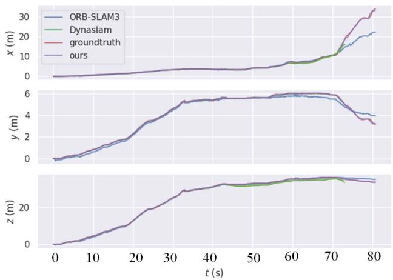  
Fig. 12. Estimated trajectory of the campus environment in x, y, and z perspectives.

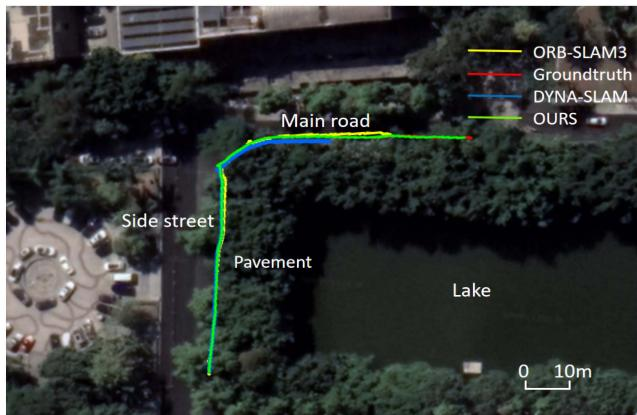  
Fig. 13. Estimated trajectory of the campus environment aligned with Google map.

## E. Comparison ofRuntime

The design philosophy of RLD-SLAM aims to be flexible and applicable to various scenarios. Therefore, we place strict control over its computational requirements to ensure efficiency. We conduct runtime analysis of the added object detection, multiview probability estimation, and 3-D tracking modules, as shown in Table VI. The tracking thread involves object detection that requires neural network inference, thus resulting in the longest runtime, and the multiview and 3-D tracking processes in RLD-SLAM are only performed on keyframes. In addition, other threads of the system run simultaneously with the tracking thread. So the processing time for each frame in RLD-SLAM depends on the tracking thread. We convert the trained object detection network to the ONNX format, and then utilize the OpenCV4 and ONNX Runtime modules in a C++ environment to invoke CUDA interfaces for GPU-accelerated neural network inference. As a result, RLD-SLAM achieves a processing time of 29.5 ms per frame.

TABLE VI  
TIME EVALUTION [MS] OF RLD-SLAM
<table><tr><td>Sequence</td><td>Object detection</td><td>Multiview</td><td>3-D tracking</td><td>Track</td></tr><tr><td>w_xyz</td><td>23.3</td><td>10.38</td><td>4.36</td><td>29.5</td></tr></table>

TABLE VII

TRACKING TIME PER FRAME [MS]
<table><tr><td>Sequence</td><td>ORB-SLAM3</td><td>DS-SLAM</td><td>DynaSLAM</td><td>Dynamic-VINS</td><td>Ours</td></tr><tr><td>w_xyz</td><td>13.9</td><td>59.4</td><td>350</td><td>26.7</td><td>29.5</td></tr></table>

The time taken to process each frame by ORB-SLAM3, DS-SLAM, Dynamic-VINS, and RLD-SLAM is shown in Table VII. It can be observed that although RLD-SLAM is not the fastest algorithm, its computational speed is significantly higher compared to the image segmentation-based algorithms like DS-SLAM and DynaSLAM. While RLD-SLAM’s processing speed is slightly slower than Dynamic-VINS, it still ensures real-time operation.

## V. CONCLUSION

This article proposed a robust lightweight dynamic SLAM algorithm called RLD-SLAM. The algorithm was based on object detection and multiview dynamic probability estimation. Therefore, RLD-SLAM did not rely on depth information and could be applied to various inputs. We also incorporated the motion prior from the IMU to rectify the input images, which greatly mitigated the drawback of object detection-based dynamic SLAM algorithms in tracking camera rotations. The information from the IMU was used to aid the robot in obtaining static feature points in highly dynamic scenes, thereby maintaining the operation of visual odometry. The recovered visual odometry was then jointly optimized with IMU information to eliminate IMU error accumulation. This processing approach fully leveraged the advantages of both sensors. We also conducted comparative experiments between RLD-SLAM and other state-of-the-art SLAM algorithms in indoor and outdoor scenes. The results demonstrated that our method exhibits stronger robustness and higher accuracy. Ablation experiments also validated the contributions of different modules to the system. In the future, we will improve RLD-SLAM by integrating data from a LiDAR sensor to expand its applicability range.

## REFERENCES

[1] R. A. Newcombe, S. J. Lovegrove, and A. J. Davison, “DTAM: Dense tracking and mapping in real-time,” in Proc. Int. Conf. Comput. Vis., 2011, pp. 2320–2327.

[2] J. Engel, T. Schöps, and D. Cremers, “LSD-SLAM: Large-scale direct monocular SLAM,” in Proc. Eur. Conf. Comput. Vis., Springer, 2014, pp. 834–849.

[3] C. Campos, R. Elvira, J. J. G. Rodriguez, J. M. M. Montiel, and J. D. Tardos, “ORB-SLAM3: An accurate open-source library for visual, visual-inertial, and multimap SLAM,” IEEE Trans. Robot., vol. 37, no. 6, pp. 1874–1890, Dec. 2021.

[4] M. Bloesch, S. Omari, M. Hutter, and R. Siegwart, “Robust visual inertial odometry using a direct EKF-based approach,” in Proc. IEEE/RSJ Int. Conf. Intell. Robots Syst., 2015, pp. 298–304.

[5] T. Qin, P. Li, and S. Shen, “VINS-Mono: A robust and versatile monocular visual-inertial state estimator,” IEEE Trans. Robot., vol. 34, no. 4, pp. 1004–1020, Aug. 2018.

[6] Q. Ul Islam, H. Ibrahim, P. K. Chin, K. Lim, and M. Z. Abdullah, “FADM-SLAM: A fast and accurate dynamic intelligent motion SLAM for autonomous robot exploration involving movable objects,” Robotic Intell. Automat., vol. 43, no. 3, pp. 254–266, 2023.

[7] B. Bescos, J. Fuentes-Pacheco, and J. Civera, “DynaSLAM: Tracking, mapping, and inpainting in dynamic scenes,” IEEE Robot. Automat. Lett., vol. 3, no. 4, pp. 4076–4083, Oct. 2018.

[8] C. Yu, D. Wang, Z. Cao, Y. Zhang, and J. Zhang, “DS-SLAM: A semantic visual SLAM towards dynamic environments,” in Proc. IEEE/RSJ Int. Conf. Intell. Robots Syst., 2018, pp. 1–8.

[9] F. Zhong, S. Wang, Z. Zhang, C. Chen, and Y. Wang, “Detect-SLAM: Making object detection and slam mutually beneficial,” in Proc. IEEE Winter Conf. Appl. Comput. Vis., 2018, pp. 1001–1010.

[10] H. Guan, C. Qian, T. Wu, X. Hu, F. Duan, and X. Ye, “A dynamic scene vision SLAM method incorporating object detection and object characterization,” Sustainability, vol. 15, no. 4, 2023, Art. no. 3048, doi: 10.3390/su15043048.

[11] J. Liu, X. Li, Y. Liu, and H. Chen, “RGB-D inertial odometry for a resourcerestricted robot in dynamic environments,” IEEE Robot. Automat. Lett., vol. 7, no. 4, pp. 9573–9580, Oct. 2022.

[12] B. Bescos, J. Fuentes-Pacheco, and J. Civera, “Dynaslam ii: Tightlycoupled multi-object tracking and slam,” IEEE Robot. Automat. Lett., vol. 6, no. 3, pp. 5191–5198, Jul. 2021.

[13] J. Zhang, M. Henein, R. Mahony, and V. Ila, “VDO-SLAM: A. visual dynamic object-aware slam system,” 2020.

[14] H. Zhang, D. Wang, and J. Huo, “A visual-inertial dynamic object tracking slam tightly coupled system,” IEEE Sensors J., vol. 23, no. 17, pp. 19905–19917, Sep. 2023.

[15] Y. Zhou, L. Wang, Y. Lai, and X. Wang, “The general method of the tanker car mouth pose measurement,” Robotic Intell. Automat., vol. 43, no. 6, pp. 625–636, 2023.

[16] P.-X. Cao, W.-X. Li, and W.-P. Ma, “Tracking registration algorithm for augmented reality based on template tracking,” Int. J. Automat. Comput., vol. 17, pp. 257–266, 2020.

[17] “A new RGB-D SLAM method with moving object detection for dynamic indoor scenes,” Remote Sens., vol. 11, no. 10, 2019, Art. no. 1143.

[18] D. Kim, S.-H. Han, and J.-H. Kim, Visual Odometry Algorithm Using an RGB-D Sensor and IMU in a Highly Dynamic Environment, pp. 11–26. Cham, Switzerland: Springer International Publishing, 2015.

[19] D. Fu, H. Xia, and Y. Qiao, “Monocular visual-inertial navigation for dynamic environment,” Remote Sens., vol. 13, no. 7, pp. 1–16, 2021.

[20] D. Kim and J. Kim, “Effective background model-based RGB-D dense visual odometry in a dynamic environment,” IEEE Trans. Robot., vol. 32, no. 6, pp. 1565–1573, Dec. 2016.

[21] S. Li and D. Lee, “RGB-D SLAM in dynamic environments using static point weighting,” IEEE Robot. Automat. Lett., vol. 2, no. 4, pp. 2263–2270, Oct. 2017.

[22] K. Wang et al., “A unified framework for mutual improvement of SLAM and semantic segmentation,” in Proc. Int. Conf. Robot. Automat., 2019, pp. 5224–5230.

[23] Y. Fan, Q. Zhang, Y. Tang, S. Liu, and H. Han, “Blitz-SLAM: A semantic SLAM in dynamic environments,” Pattern Recognit., vol. 121, 2022, Art. no. 108225.

[24] L. Cui and C. Ma, “SOF-SLAM: A semantic visual SLAM for dynamic environments,” IEEE Access, vol. 7, pp. 166528–166539, 2019.

[25] Y. Liu and J. Miura, “RDS-SLAM: Real-time dynamic SLAM using semantic segmentation methods,” IEEE Access, vol. 9, pp. 23772–23785, 2021.

[26] “YOLO-SLAM: A semantic SLAM system towards dynamic environment with geometric constraint,” Neural Comput. Appl., vol. 34, no. 8, pp. 6011–6026, 2022.

[27] J. He, M. Li, Y. Wang, and H. Wang, “OVD-SLAM: An online visual slam for dynamic environments,” IEEE Sensors J., vol. 23, no. 12, pp. 13210–13219, Jun. 2023.

[28] “Dynamic-SLAM: Semantic monocular visual localization and mapping based on deep learning in dynamic environment,” Robot. Auton. Syst., vol. 117, pp. 1–16, 2019.

[29] X. Chen, Y. Li, Y. Wang, Y. Zhang, and J. Li, Using Detection, Tracking and Prediction in Visual SLAM to Achieve Real-Time, pp. 11–26. Cham, Switzerland: Springer International Publishing, 2022.

[30] Z. Pan, J. Hou, and L. Yu, “Optimization RGB-D 3-D reconstruction algorithm based on dynamic SLAM,” IEEE Trans. Instrum. Meas., vol. 72, pp. 1–13, 2023.

[31] M. Henein, J. Zhang, R. Mahony, and V. Ila, “Dynamic SLAM: The need for speed,” in Proc. IEEE Int. Conf. Robot. Automat., 2020, pp. 2123–2129.

[32] C. Liu, X.-F. Chen, C.-J. Bo, and D. Wang, “Long-term visual tracking: Review and experimental comparison,” Mach. Intell. Res., vol. 19, no. 6, pp. 512–530, 2022.

[33] J. Sturm, N. Engelhard, F. Endres, W. Burgard, and D. Cremers, “A benchmark for the evaluation of RGB-D slam systems,” in Proc. IEEE/RSJ Int. Conf. Intell. Robots Syst., 2012, pp. 573–580.

[34] H. Yin, S. Li, Y. Tao, J. Guo, and B. Huang, “Dynam-SLAM: An accurate, robust stereo visual-inertial SLAM method in dynamic environments,” IEEE Trans. Robot., vol. 39, no. 1, pp. 289–308, Feb. 2023.

[35] T. Ji, C. Wang, and L. Xie, “Towards real-time semantic RGB slam in dynamic environments,” in Proc. IEEE Int. Conf. Robot. Automat., 2021, pp. 11175–11181.

[36] A. Geiger, P. Lenz, C. Stiller, and R. Urtasun, “Vision meets robotics: The kitti dataset,” Int. J. Robot. Res., vol. 32, no. 11, pp. 1231–1237, 2013.

[37] J. Jeong, Y. Cho, Y.-S. Shin, H. Roh, and A. Kim, “Complex urban dataset with multi-level sensors from highly diverse urban environments,” Int. J. Robot. Res., vol. 38, no. 6, pp. 642–657, 2019.

  
Zengrui Zheng received the B.S. degree in mechatronics engineering from the South China University of Technology, Guangzhou, China, in 2022, where he is currently working toward the master’s degree in electronic and information engineering.  
His research interests include mobile robots and simultaneous localization and mapping.

Shifeng Lin received the B.S. degree in material forming and control engineering from the South China University of Technology, Guangzhou, China, in 2019, where he is currently working toward the Ph.D. degree in pattern recognition.

His current research interests include computer vision, object pose estimation, and robotics manipulation.

Chenguang Yang (Fellow, IEEE) received the B.Eng. degree in measurement and control from Northwestern Polytechnical University, Xian, China, in 2005, and the Ph.D. degree in control engineering from the National University of Singapore, Singapore, in 2010.

From 2009 to 2010, he performed postdoctoral studies in human robotics at the Imperial College London, London, U.K from 2009 to 2010. He is Chair in Robotics with Department of Computer Science, University of Liverpool,

U.K. His research interests include human–robot interaction and intelligent system design.

Dr. Yang was the recipient of the U.K. EPSRC UKRI Innovation Fellowship and individual EU Marie Curie International Incoming Fellowship. As the lead author, he won the IEEE TRANSACTIONS ON ROBOTICS Best Paper Award (2012) and IEEE TRANSACTIONS ON NEURAL NETWORKS and Learning Systems Outstanding Paper Award (2022). He is the Corresponding Co-Chair of IEEE Technical Committee on Collaborative Automation for Flexible Manufacturing.