# R3LIVE++: A Robust, Real-Time, Radiance Reconstruction Package With a Tightly-Coupled LiDAR-Inertial-Visual State Estimator

Jiarong Lin , Member, IEEE, and Fu Zhang , Member, IEEE

Abstract—This work proposed a LiDAR-inertial-visual fusion framework termed R3LIVE++ to achieve robust and accurate state estimation while simultaneously reconstructing the radiance map on the fly. R3LIVE++ consists of a LiDAR-inertial odometry (LIO) and a visual-inertial odometry (VIO), both running in real-time. The LIO subsystem utilizes the measurements from a LiDAR for reconstructing the geometric structure, while the VIO subsystem simultaneously recovers the radiance information of the geometric structure from the input images. R3LIVE++ is developed based on R3LIVE and further improves the accuracy in localization and mapping by accounting for the camera photometric calibration and the online estimation of camera exposure time. We conduct more extensive experiments on public and self-collected datasets to compare our proposed system against other state-of-the-art SLAM systems. Quantitative and qualitative results show that R3LIVE++ has significant improvements over others in both accuracy and robustness. Moreover, to demonstrate the extendability of R3LIVE++, we developed several applications based on our reconstructed maps, such as high dynamic range (HDR) imaging, virtual environment exploration, and 3D video gaming.

Index Terms—3D reconstruction, SLAM, sensor fusion, state estimation.

## I. INTRODUCTION

IMULTANEOUS localization and mapping (SLAM) is a technology that utilizes a sequence of sensor (e.g., camera, LiDAR, IMU, etc.) data to estimate the sensor poses and simultaneously reconstruct the 3D map of surrounding environments. Since SLAM can estimate poses in real-time, it has been widely applied in localization and feedback control for autonomous robots (e.g., unmanned aerial vehicles [1], [2], automated ground vehicles [3], [4], [5], and self-driving cars [6], [7], [8]). Meanwhile, with the capacity to reconstruct the map in real-time, SLAM is also crucial in various robot navigation, virtual and augmented reality (VR/AR), surveying, and mapping applications. Different applications usually require a different level of mapping details: sparse feature map, 3D dense point cloud map, and 3D radiance map (i.e., a 3D point cloud map with radiance information). For example, the sparse visual feature map is suitable and has been widely used for camera-based localization, where the sparse features observed in images can be used for calculating the camera’s pose [9], [10]. The 3D dense point cloud can capture the geometrical structure of the environment even for tiny objects. Hence it is widely used in robot navigation and obstacle avoidance [2], [11]. Finally, radiance maps containing both geometry and radiance information are used in mobile mapping, AR/VR, video gaming, 3D simulation, and surveying. These applications require both geometric structures and textures to provide virtual environments alike the real world [12], [13].

Existing SLAM systems can be mainly categorized into two classes based on the used sensor: visual SLAM and LiDAR SLAM. Visual SLAM is based on low-cost and SWaP (size, weight, and power)-efficient camera sensors and has achieved satisfactory results in localization accuracy. The rich colorful information measured by cameras also makes the reconstructed map suitable for human interpretation. However, due to the lack of direct accurate depth measurements, the mapping accuracy and resolution of visual SLAM are usually lower than LiDAR SLAM. To be more specific, visual SLAM maps the environments by triangulating disparities from multi-view images (e.g., structure from motion for mono-camera, stereo-vision for stereo-camera), an extremely computationally expensive process that often requires hardware acceleration or server clusters. Moreover, limited by the measurement noises and the baseline of multi-view images, the computed depth accuracy drops quadratically with the measurement distance, making visual SLAM difficult to reconstruct large-scale outdoor scenes. Furthermore, visual SLAM can only work in scenarios with good illuminations and will degenerate in high-occlusion or texture-less environments.

On the other hand, LiDAR SLAM is based on LiDAR sensors. Benefiting from the high measurement accuracy (a few centimeters) and the long measurement range (hundreds ofmeters) ofLi-DAR sensors, LiDAR SLAM can achieve much higher accuracy and efficiency on both localization and map reconstruction than visual SLAM. However, LiDAR SLAM easily fails in scenarios with insufficient geometry features, such as in long tunnel-like corridors, facing a single big wall, etc. Moreover, LiDAR SLAM can only reconstruct the geometric structure of the environment, but lacks color information.

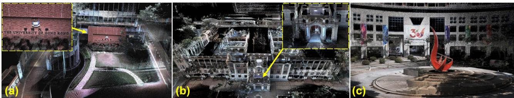  
Fig. 1. The radiance map of HKU (a and b) and HKUST campuses (c) reconstructed by R3LIVE++ in real-time (see our accompanying video on YouTube: https://youtu.be/kZ8\_7k3HpIk).

Fusing both LiDAR and camera measurements in the SLAM could overcome the degeneration issues of each sensor in localization and produce an accurate, textured, and high-resolution 3D map that suffices the needs of various mapping applications. Motivated by this, we propose R3LIVE++, which has the following features:

\- It is a LiDAR-Inertial-Visual fusion framework that tightly couples two subsystems: the LiDAR-inertial odometry (LIO) subsystem and the visual-inertial odometry (VIO) subsystem. The two subsystems jointly and incrementally build a 3D radiance map of the environment in real-time. In particular, the LIO subsystem reconstructs the geometric structure by registering new points in each LiDAR scan to the map, and the VIO subsystem recovers the radiance information by rendering pixel colors in each image to points in the map.

\- It has a novel VIO design, which tracks the camera pose (and estimates other system states) by minimizing the radiance difference between points from the radiance map and a sparse set of pixels in the current image. The frame-to-map alignment effectively lowers the odometry drift, and the direct photometric error on a sparse set of individual pixels effectively constrains the computation load. Moreover, based on the photometric errors, the VIO is able to estimate the camera exposure time online, which enables the recovery of environment’s true radiance information.

\- It is extensively validated in real-world experiments in terms of localization accuracy, robustness, and radiance map reconstruction accuracy. Benchmark results on 25 sequences from an open dataset (the NCLT-dataset) show that R3LIVE++ achieves the highest overall accuracy among all other state-of-the-art SLAM systems (e.g., LVI-SAM, LIO-SAM, FAST-LIO2, etc.) under comparison. The evaluations on R3LIVE-dataset (self-collected) show that our proposed framework is robust to extremely challenging scenarios that LiDAR and/or camera measurements degenerate (e.g., when the device is facing a single texture-less wall). Finally, compared with other counterparts, R3LIVE++ estimates the camera exposure time more accurately and reconstructs the true radiance information of the environment with significantly smaller errors when - It is, to our best knowledge, the first radiance map reconstruction framework that can achieve real-time performance on a PC equipped with a standard CPU without any hardware or GPU accelerations. The system is completely open-sourced to ease the reproduction of this work and benefit the follow-up research. Based on a set of offline utilities for mesh reconstruction and texturing further developed, the system shows high potential in a variety of real-world applications, such as 3D HDR imaging, physics simulation, and video gaming.

## II. RELATED WORKS

In this chapter, we review existing works related to our method or system, including LiDAR SLAM, visual SLAM, and LiDARvisual fused SLAM. Due to the large number of existing works, any attempts to give a full review would be incomplete. Hence, we only select the most relevant ones of each branch for review. For a comprehensive review of the SLAM literature, please refer to the work in [14].

## A. LiDAR(-Inertial) Odometry

In recent years, the rapid development of LiDAR technologies has greatly improved the reliability and performance of LiDAR sensors while significantly reducing the cost. This progress has drawn increasing research attention to LiDAR SLAM [15]. Zhang et al. proposed a real-time LiDAR odometry and mapping framework, LOAM [16], which achieved localization through scan-to-scan point registration and mapping through scan-tomap registration. In both registrations, only edge and plane feature points were considered to lower the computation load. To enable the algorithm to run in real-time on computation-limited platforms, Shan et al. [17] proposed a lightweight and groundoptimized LOAM (LeGO-LOAM), which discarded unreliable features in the step of ground plane segmentation. Chanoh et al. in [18] presented a novel map-centric SLAM framework for improving map quality for 3D LiDAR SLAM, which is achieved with a continuous-time trajectory representation and novel loop closure methods. These works [16], [17], [18] were mainly based on multi-line spinning LiDARs. For emerging solid-state LiDARs with irregular scanning and very small FoV, our previous works [15] used direct scan-to-map registration to achieve localization and mapping.

To further improve the accuracy and robustness of LiDAR odometry, many frameworks that fused LiDAR measurements with inertial sensors were proposed. In LOAM [16], an IMU could be used to de-skew the LiDAR scan and provide a motion prior for the scan-to-scan registration. It was a looselycoupled method since the IMU bias (and the full state vector) was not involved in the scan registration process. Compared with loosely-coupled methods, tightly-coupled methods showed higher robustness and accuracy, thus drawn increasing research interest recently. Authors in [19] proposed LIOM, which used a graph optimization based on priors from LiDAR-Inertial odometry and a rotation-constrained refinement method. Compared with the former algorithms, LIO-SAM [20] optimized a sliding window of keyframe poses in a factor graph to achieve higher accuracy. Similarly, Li et al. proposed LiLi-OM [21] for both multi-line and solid-state LiDARs based on a sliding window optimization technique. LINS [22] was the first tightly-coupled LIO that solved the 6 DOF ego-motion via iterated Kalman filtering. To lower the high computation load in calculating the Kalman gain, FAST-LIO [23] proposed a new formula for the Kalman gain computation. The resultant computation complexity depended on the state dimension instead of the measurement dimension. Its successor FAST-LIO2 [24] further improved the computation efficiency by proposing an incremental k-d tree. Such a data structure could significantly reduce the time cost of nearest points search and allow the registration of raw points (instead of feature points, such as planes and edges, in past works). The method using raw points was termed as a ”direct” method and could exploit subtle features in the environment, thus increasing the localization accuracy and robustness.

The LIO subsystem of $\mathrm { R ^ { 3 } L I V E { + + } }$ is largely based on FAST-LIO2 [24] since it achieves the best overall performance among its counterparts in terms of accuracy, efficiency, and robustness. Moreover, to address the LiDAR degeneration problem and further improve the localization accuracy, we fuse the LIO subsystem with our VIO subsystem in a tightly-coupled manner.

## B. Visual(-Inertial) Odometry

Depending on how a camera measurement is formulated, we review the works of visual odometry by categorizing them into two branches based on the criteria proposed in [25]: indirect and direct. These two types of methods have very different pipelines: the former one (indirect method) includes feature extraction, data association, and minimization of feature re-projection error. In contrast, the latter one (direct method) directly minimizes the photometric error (or intensity discrepancy) between consecutive images.

Indirect visual odometry is also called the feature-based method, which had a quite long history. MonoSLAM [26] proposed by Davison et al. was the first monocular visual odometry, which recovered the 3D trajectory of a camera in real-time by creating a sparse but persistent map of natural landmarks within a probabilistic framework. PTAM [27] proposed by Klein and Murray split the tracking and mapping in parallel threads. Visual landmarks in the map were selected from only a few frames to allow efficient bundle-adjustment (BA) optimization that estimated the camera pose and landmark position. Following this idea, a more complete and reliable framework ORB-SLAM [28] was proposed. ORB-SLAM utilized the same feature (i.e., ORB feature) for all the involved tasks, including tracking, mapping, relocalization, and loop closing. Its further work ORB-SLAM2 [29] improved the accuracy by utilizing the metric scale provided by stereo or RGB-D cameras. The scale issue in pure visual SLAM could also be addressed by fusing inertial sensor data, as demonstrated by VINS-Mono [30], Kimera [31], and ORB-SLAM3 [32], which achieve high-accuracy localization by fusing IMU measurements and image features in a sliding window bundle adjustment optimization.

Direct visual odometry is also called photometric-based method, which minimized the intensity differences rather than a geometric error. It was successfully applied in 2D sparse feature tracking (e.g., Lucas–Kanade optical flow [33]) and then extended to visual odometry. LSD-SLAM [34], proposed by Engel et al. was a direct monocular odometry algorithm with both tracking and mapping directly operating on image intensities. It incrementally tracked the camera pose using direct image alignment and simultaneously performed a pose graph optimization to keep the entire camera trajectory globally consistent. In DSO [25], authors proposed a fully direct probabilistic model that integrated a full photometric calibration. By incorporating a photometric bundle adjustment, the system outperformed other state-of-the-art works in terms of both accuracy and robustness. To achieve real-time performance on a standard CPU, the authors also exploited the sparsity structures of the corresponding Hessian matrix. While the photometric model provided accurate pose estimation over short-term tracking without data association, the geometric model gave robustness for a large baseline. Hybrid approaches that used both photometric and geometric errors were proposed, with the most representative work SVO [35], proposed by Forster et al. where the short-term tracking was solved by minimizing the photometric error, while the long-term drift was constrained by a windowed bundle adjustment on visual landmarks.

There have been many discussions in the literature to answer the question: Which is better? While it is difficult to answer this question now, it is true that the direct method often shows better short-term performance in low-textured environments [25], [32]. Besides, the direct method is often more computationally efficient due to the removal of feature extraction [35]. To leverage these advantages, $\mathrm { R ^ { 3 } L I V E { + + } }$ uses a photometric-based VIO subsystem. Unlike the pure visual (or visual-inertial) direct odometry systems, which perform bundle adjustment on photometric errors [25] or feature reprojection errors [35] to restrain long-term drift, the VIO in R3LIVE++ makes full use of the geometry structure reconstructed from LiDAR point cloud by minimizing the radiance errors between map points and image pixels. Such a frame-to-map alignment effectively lowers the odometry drift at a low computation cost. Moreover, pure visual (or visual-inertial) direct methods construct photometric errors on dense images [34] or a sparse set of image patches [25], [35], while the photometric errors of R3LIVE++ VIO subsystem are on a sparse set of individual pixels. Furthermore, the VIO in $\mathrm { R ^ { 3 } L I V E { + + } }$ accounts for the camera photometric calibration (e.g., non-linear response function and lens vignetting) and estimates the camera exposure time online, which helps improve the odometry accuracy and recovers the true radiance information of the environment.

## C. LiDAR-Visual Fused Odometry

On the basis of LiDAR-inertial methods, LiDAR-inertialvisual odometry incorporating measurements from visual sensors shows higher robustness and accuracy. Zhang and Singh in [36] proposed a LiDAR-inertial-visual system that used a loosely-coupled VIO as the motion model to initialize the Li-DAR mapping subsystem. Similarly, Shao et al. in [37] proposed a stereo visual-inertial LiDAR SLAM that incorporated the tightly-coupled stereo VIO with LiDAR mapping and LiDARenhanced visual loop closure. The overall system was still a loosely-coupled fusion since the LiDAR data were not jointly optimized along with the visual-inertial measurements.

There are also some RGB-D-inertial odometry, such as [37], [38]. Designed for RGB-D cameras, these methods are difficult to be applied on LiDARs due to the significant differences in the measurement pattern, range, and density between RGB-D cameras and LiDAR sensors. In [39], LiDAR measurements were used to provide depth information for camera images at each frame, forming a system similar to RGB-D camera and hence being able to leverage existing visual SLAM works such as ORB-SLAM2 [29]. This was also a loosely-coupled method as it ignored the direct constraints imposed by LiDAR measurements.

For the works mentioned above, the measurement of LiDAR and camera was fused in a loosely-coupled manner. To achieve higher accuracy and robustness, frameworks that fused sensor data in a tightly-coupled way were proposed in recent years. Zuo et al. [40] proposed a LIC-fusion framework combining IMU measurements, sparse visual features, and LiDAR plane and edge features with online spatial and temporal calibration based on the MSCKF framework. The system exhibited higher accuracy and robustness than other state-of-the-art methods in their experiment results. Later on, their further work termed LIC-Fusion 2.0 [41] refined a novel plane-feature tracking algorithm across multiple LiDAR scans within a sliding window to make LiDAR scan matching more robust. David et al. in [42] proposed a multi-sensor fusion framework named VILENS that tightly-coupled fuse the visual, inertial, legged, and LiDAR sensor data using a novel factor graph. The fusion of four different sensor modalities makes the system achieve better accuracy in localization and makes it robust to challenging scenarios in which individual sensors would produce degenerated estimates. Shan et al. in [43] proposed LVI-SAM that fused the LiDAR, visual, and inertial sensors in a tightly-coupled smooth and mapping framework, which was built atop a factor graph. The LiDAR-inertial and visual-inertial subsystems of LVI-SAM could function independently when failure was detected in one of them, or jointly when enough features were detected. A similar tightly-coupled system was our previous work R2LIVE [44], which fused the LiDAR and camera measurements in an onmanifold iterated Kalman filter. $\mathrm { R ^ { 2 } L I V E }$ could run in various challenging scenarios even with small LiDAR FoV, aggressive motions, sensor failures, and narrow tunnel-like environments with moving objects.

The above LiDAR-inertial-visual systems all used featurebased methods in both LIO and VIO. In contrast, R3LIVE++ uses direct methods in both LIO and VIO to best exploit any subtle features in the environments even in case of extreme scenarios (e.g., structure-less and/or texture-less environments). Moreover, the above LiDAR-inertial-visual systems mainly focused on the localization part and has very limited consideration on the mapping efficiency and accuracy. Hence, their visual and LiDAR subsystem often maintains two separate maps for the LIO and VIO, preventing the data fusion at a deeper level and the reconstruction of high-accuracy colored 3D maps. ${ \mathrm { R } } ^ { \mathrm { 3 } } { \mathrm { L I V E } } + +$ is designed to perform both localization and radiance map reconstruction in real-time. The central of these two tasks is a single radiance map shared among and maintained by both LIO and VIO. In particular, the LIO subsystem reconstructs the geometric structure of the map and the VIO subsystem recovers the radiance information of the map.

TABLE I NOMENCLATURE
<table><tr><td rowspan=1 colspan=1>Notation                 Explanation</td></tr><tr><td rowspan=1 colspan=1>Expressions</td></tr><tr><td rowspan=1 colspan=1>/The encapsulated &quot;boxplus&quot; and&quot;boxminus&quot; operations on manifold [46] $G _ { \left( \cdot \right) }$  The value of (·) expressed in global frame $^ { C } ( \cdot )$  The value of (·) expressed in camera frame $\mathtt { E x p } ( \cdot ) / \mathtt { L o g } ( \cdot )$  The Rodrigues&#x27; transformation between therotation matrix and rotation vector $\delta \left( \cdot \right)$ The estimated error of (·) parameterizedin tangent space. $\pmb { \Sigma } _ { ( \cdot ) }$  The covariance matrix of vector (·)</td></tr><tr><td rowspan=1 colspan=1>Variables</td></tr><tr><td rowspan=1 colspan=1> $\mathbf { b } _ { \mathbf { g } } , \mathbf { b } _ { \mathbf { a } }$  The bias of gyroscope and accelerometer in an IMU $G _ { \mathbf { g } }$ The gravitational acceleration in global frame $G _ { \mathbf { V } } ^ { - }$ The linear velocity in global frame $( ^ { G } { \mathbf { R } } _ { I } , ^ { G } { \mathbf { p } } _ { I } )$  The IMU attitude and position w.r.t. global frame $( { { ^ I } { \bf R } _ { C } } , { ^ I } { \bf p } _ { C } )$  The extrinsic between camera and IMUx The ground-true statex The prior estimation of xx The current estimate of x in each ESIKF iteration $\delta \check { \mathbf { x } } _ { k } ^ { * }$  The optimal delta step of x in each iteration</td></tr></table>

This paper is an extension of the previously published work R3LIVE [45]. The extended works of this paper include 1) a full incorporation of the camera photometric calibration, which corrects the camera nonlinear response function and lens vignetting effect; 2) an online estimation of the camera exposure time. The estimated exposure time and the camera photometric calibration enables the system to recover the true radiance information ofthe environment; 3) a more comprehensive evaluation of the system on both open and self-collected dataset in terms of localization accuracy, robustness and radiance map reconstruction accuracy; and 4) release of the system codes, associated dataset, and the in-house designed hardware devices for collecting this dataset.

## III. BASIC MODELS

## A. Notations

In this paper, we use notations shown in Table I.

## B. System Overview

To simultaneously estimate the sensor pose and reconstruct the environment radiance map, we design a tightly-coupled LiDAR-inertial-visual sensor fusion framework, as shown in

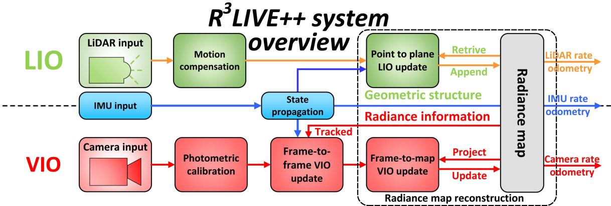  
Fig. 2. The overview of our proposed system.

Fig. 2. The proposed framework contains two subsystems: the LIO subsystem (upper part) and the VIO subsystem (lower part). The LIO subsystem constructs the geometric structure of the radiance map by registering point cloud measurements of each input LiDAR scan. The VIO subsystem recovers the radiance information of the map in two steps: the frame-toframe VIO update estimates the system state by minimizing the frame-to-frame PnP reprojection error, while the frame-tomap VIO update minimizes the radiance error between map points and the current image. The two subsystems are tightly coupled within an on-manifold error-state iterated Kalman filter framework (ESIKF) [46], where the LiDAR and camera visual measurements are fused to the same system state (Section III-D) at their respective data reception time (Sections IV and V).

1) Point: Our radiance map is composed of map points in the global frame, in which each point P is a structure as below:

$$
\mathbf { P } = \left[ ^ { G } \mathbf { p } _ { x } , ^ { G } \mathbf { p } _ { y } , ^ { G } \mathbf { p } _ { z } , \gamma _ { r } , \gamma _ { g } , \gamma _ { b } \right] ^ { T } = \left[ ^ { G } \mathbf { p } ^ { T } , \gamma ^ { T } \right] ^ { T } \in \mathbb { R } ^ { 6 }\tag{1}
$$

where the head sub-vector ${ \mathbf { \xi } } ^ { G } \mathbf { p } = [ { \mathbf { \overset { G } { p } } } _ { x } , { \mathbf { \overset { G } { p } } } _ { y } , { \mathbf { \overset { G } { p } } } _ { z } ] ^ { T } \in \mathbb { R } ^ { 3 }$ denotes the point 3D position, and the tail sub-vector $\gamma =$ $[ \gamma _ { r } , \gamma _ { g } , \gamma _ { b } ] ^ { T } \in \mathbb { R } ^ { 3 }$ is the point radiance consisting of three independent channels (i.e., red, green, and blue channel) accounting for the camera photometric calibration (see Section III-C). Besides, we also record other necessary information of this point, such as the $3 \times 3$ matrix $\Sigma _ { \mathbf { p } }$ and $\Sigma _ { \gamma }$ , which denote the covariance of the estimation errors of $G _ { \mathbf { p } }$ and $\gamma _ { : }$ , respectively, and the timestamps when this point was created and updated.

2) Voxel: For fast and efficient retrieving of points in the radiance map, such as for VIO update in Section V-C and map point radiance recovery in Section V-D, we organize map points inside the fixed-size voxels (e.g., with dimensions of 0.1m $\times$ $0 . 1 \mathrm { { m } \times 0 . 1 \mathrm { { m } ) } }$ . If a voxel has points appended recently (e.g., in recent 1 s), we mark this voxel as activated. Otherwise, this voxel is marked as deactivated.

## C. Color Camera Photometric Model

A camera observes the radiance of the real world in the form of images that consists of 2D arrays of pixel intensities. In our work, we model the image formation process of a camera based on [47] and further extend the gray camera model to a color camera. As shown in Fig. 3, for a point P in the world, it reflects the incoming lights emitted from a light source (e.g., the sun). The reflected lights then pass through the camera lens and finally arrive at the CMOS sensor, which records the intensity of the reflected lights and creates a pixel channel in the output image. The recorded intensity is determined by the radiance, a measure of the power reflected at the point P.

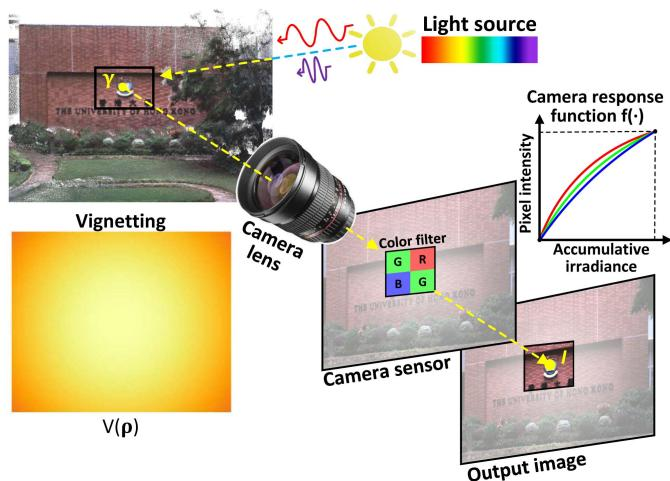  
Fig. 3. The image formation process of a color camera.

To model the above imaging process, we denote γ the radiance at point P. Since a color camera has three channels in its CMOS sensor: red, green, and blue, the radiance $\gamma$ has three components: $\gamma _ { r } , \gamma _ { g } , \gamma _ { b }$ , respectively. For each channel i, the lights passing through the camera lens have power $\mathbf { O } _ { i } ( \pmb { \rho } )$ as:

$$
\mathbf { O } _ { i } ( \pmb { \rho } ) = V ( \pmb { \rho } ) \gamma _ { i }\tag{2}
$$

where $V ( \pmb { \rho } ) \in [ 0 , 1 ]$ is called the vignetting factor accounting for the lens vignetting effect. Since the vignetting effect is different at different areas of the lens, the vignetting factor $V ( \rho )$ is a function of the pixel location $\rho .$

$\mathbf { O } _ { i } ( \rho )$ is the amount of power that can be received by the sensor and is called the irradiance. When taking an image, the captured irradiance $\mathbf { O } ( \rho )$ is integrated over time (i.e., the exposure time τ). The accumulated irradiance $\pmb \theta _ { i } = \tau V ( \pmb \rho ) \gamma _ { i }$ is then converted as the output of pixel intensity $\mathbf { I } _ { i } ( \rho )$ via the camera response function (CRF) $\mathbf { f } _ { i } ( \cdot )$ :

$$
\mathbf { I } _ { i } ( \pmb { \rho } ) = \mathbf { f } _ { i } ( \tau V ( \pmb { \rho } ) \gamma _ { i } ) , \ \mathbf { I } _ { i } \in [ 0 , 2 5 5 ] .\tag{3}
$$

Since a real camera sensor has a limited dynamic range and the physical scale of the radiance $\gamma$ can not be recovered anyway, the pixel intensities can be normalized within [0, 1] without loss of generality.

As noted in $( 3 ) ,$ different channels often have different nonlinear response functions (CRF) $\mathbf { f } _ { i } ( \cdot )$ and they can be calibrated offline along with the vignetting factor $V ( \rho )$ based on the method in [47]. The exposure time $\tau$ is estimated online in our work. With the calibration and estimation results, the radiance of point P from the observed pixel value $\mathbf { I } ( \rho )$ can be computed as:

$$
\gamma _ { i } = \frac { \mathbf { f } _ { i } ^ { - 1 } ( \mathbf { I } _ { i } ( \pmb { \rho } ) ) } { \tau V ( \pmb { \rho } ) } .\tag{4}
$$

Remark: Under the assumption of constant continuous light sources and a Lambertian reflection model, the radiance at point $\mathbf { P }$ is a constant physical value that is invariant to the camera pose. Such invariance to time and camera pose enables us to infer the camera ego-motion from the radiance difference between the map and the current image (with photometric calibration), as detailed in Section V-C.

## D. State

In our work, we define the full state x as:

$$
\mathbf { x } = \left( ^ { G } \mathbf { R } _ { I } , ^ { G } \mathbf { p } _ { I } , ^ { G } \mathbf { v } , \mathbf { b } _ { \mathbf { g } } , \mathbf { b } _ { \mathbf { a } } , ^ { G } \mathbf { g } , ^ { I } \mathbf { R } _ { C } , ^ { I } \mathbf { p } _ { C } , \epsilon , ^ { I } t _ { C } , \phi \right)\tag{5}
$$

where the notations ${ ^ { G } \mathbf { R } } _ { I } , { ^ { G } \mathbf { p } } _ { I } , { ^ { G } \mathbf { v } } , \mathbf { b } _ { \mathbf { g } } , \mathbf { b } _ { \mathbf { a } } , { ^ { G } \mathbf { g } } , { ^ { I } \mathbf { R } } _ { C } , { ^ { I } \mathbf { p } } _ { C }$ are explained in Table $\mathrm { I } , \ ^ { I } t _ { C }$ is the time-offset between IMU and camera while LiDAR is assumed to be synced with the IMU already, $\epsilon = 1 / \tau$ is the inverse camera exposure time, $\phi = [ f _ { x } , f _ { y } , c _ { x } , c _ { y } ] ^ { T }$ are the camera intrinsics, where $( f _ { x } , f _ { y } )$ denote the camera focal length and $( c _ { x } , c _ { y } )$ the offsets of the principal point from the top-left corner of the image plane. The camera extrinsic $( { ^ { I } { \bf R } _ { C } } , { ^ { I } { \bf \bar { p } } _ { C } } )$ , intrinsic $\phi$ and time-offset $^ I t _ { C }$ would usually have their rough values available (e.g., offline calibration, CAD model, manufacturer’s manual). To cope with the possible calibration errors (e.g., extrinsic $( { ^ { I } { \bf R } _ { C } } , { ^ { I } { \bf p } _ { C } } )$ and intrinsic φ) or online drifting (e.g., time-offset $^ I t _ { C } )$ , we also include them in the state x such that they will be estimated online. Besides, we also estimate the camera exposure time online in order to recover the true radiance value of each map point.

In R3LIVE++, our LiDAR-Inertial odometry (LIO) and visual-Inertial odometry (VIO) take advantage of the measurements data from LiDAR, IMU, and camera sensors, continuously update the full state x for achieving that goal of optimal state estimation.

## IV. LIDAR-INERTIAL ODOMETRY (LIO)

Our LIO subsystem reconstructs the geometry structure of the environment by registering each new LiDAR scan to the global map. We use the generalized-iterative closest point (GICP) method [48] to iteratively estimate the LiDAR pose (and other system states) by minimizing the distance of each point in the scan to a plane fitted from the corresponding points in the map. The estimated state estimate is then used to append the new points to the map.

## A. LiDAR Point-to-Plane Residual

As shown in Fig. 2, our LIO subsystem constructs the geometric structure of the global map.

For the k-th input LiDAR scan, we first compensate the inframe motion with an IMU backward propagation introduced in [23]. Let $\pmb { \mathcal { L } } _ { k } = \{ ^ { L } \mathbf { p } _ { 1 } , . . . , ^ { L } \mathbf { p } _ { m } \}$ be the set ofm LiDAR points after motion compensation, we compute the residual of each raw point (or a downsampled subset) of ${ \boldsymbol { \mathbf { \mathit { L } } } } _ { \mathbf { \mathit { p } } _ { s } } \in { \mathcal { L } } _ { k }$ where s is the index of point and the superscript L denotes that the point is represented in the LiDAR-reference frame.

With $\check { \mathbf { x } } _ { k }$ being the estimate of $\mathbf { x } _ { k }$ at the current iteration, we transform ${ \cal L } _ { \mathbf { p } _ { s } }$ from LiDAR frame to the global frame:

$$
{ { ^ G } \bf p } _ { s } = { ^ G } { \breve { \bf R } } _ { I _ { k } } ( { ^ I } { \bf R } _ { L } { ^ L } { \bf p } _ { s } + { ^ I } { \bf p } _ { L } ) + { ^ G } { \breve { \bf p } } _ { I _ { k } }\tag{6}
$$

To register the point to the global map, we search for the nearest five points in the map. To accelerate the nearest neighbor search, map points are organized into an incremental k-d tree (see [24]). If the euclidean distance between ${ { \bf \Pi } ^ { G } } _ { { \bf { p } } _ { s } }$ and the searched five nearest neighbor points is smaller than a threshold (e.g., 0.4 m), these found nearest neighbor points are used to fit a plane with normal $\mathbf { u } _ { s }$ and centroid $\mathbf { q } _ { s }$ . Then, the LiDAR measurement residual $\mathbf { r } _ { l } ( \check { \mathbf { x } } k , { } ^ { L } \mathbf { p } s )$ is:

$$
\mathbf { r } _ { l } ( \check { \mathbf { x } } _ { k } , \mathbf { \xi } ^ { L } \mathbf { p } _ { s } ) = \mathbf { u } _ { s } ^ { T } \left( { } ^ { G } \mathbf { p } _ { s } - \mathbf { q } _ { s } \right) .\tag{7}
$$

## B. LIO ESIKF Update

The residual in (7) should be zero ideally. However, due to the estimation error in $\check { \mathbf { x } } _ { k }$ and the LiDAR measurement noise, this residual is often not zero and can be used to refine the state estimate $\check { \mathbf { x } } _ { k }$ . Specifically, let $\mathbf { n } _ { s }$ be the measurement noise of the point ${ \cal L } _ { \mathbf { p } _ { s } }$ , we have the relation between the true point location $\dot { \mathbf { \xi } } _ { \mathbf { p } _ { s } ^ { \mathrm { g t } } } ^ { \mathrm { g t } }$ and the measured one ${ \cal L } _ { \mathbf { p } _ { s } }$ as below:

$$
{ \bf \nabla } ^ { L } { \bf p } _ { s } = { \bf \nabla } ^ { L } { \bf p } _ { s } ^ { \mathrm { g t } } + { \bf n } _ { s } , { \bf n } _ { s } \sim { \mathcal { N } } ( { \bf 0 } , { \bf \Sigma } { \bf \Sigma } _ { { \bf n } _ { s } } ) .\tag{8}
$$

This true point location together with the true state $\mathbf { x } _ { k }$ should lead to zero residual in (7), i.e.,

$$
\begin{array} { r } { \mathbf { 0 } = \mathbf { r } _ { l } ( \mathbf { x } _ { k } , \mathbf { \omega } ^ { L } \mathbf { p } _ { s } ^ { \mathbf { g t } } ) \approx \mathbf { r } _ { l } ( \check { \mathbf { x } } _ { k } , \mathbf { \omega } ^ { L } \mathbf { p } _ { s } ) + \mathbf { H } _ { s } ^ { l } \delta \check { \mathbf { x } } _ { k } + \boldsymbol { \alpha } _ { s } } \end{array}\tag{9}
$$

where $\mathbf { x } _ { k }$ is parameterized by its error $\delta \check { \mathbf { x } } _ { k }$ in the tangent space of $\check { \mathbf { x } } _ { k } \ ( \mathrm { i . e . , ~ } \mathbf { x } _ { k } = \check { \mathbf { x } } _ { k } \boxplus \delta \check { \mathbf { x } } _ { k } ) , \alpha _ { s } \sim \mathcal { N } ( \mathbf { 0 } , \boldsymbol \Sigma _ { \alpha _ { s } } )$ is the lumped noise due to $\mathbf { n } _ { s }$ , and $\mathbf { H } _ { s } ^ { l }$ is the Jacobian of the residual w.r.t. $\delta \check { \mathbf { x } } _ { k }$

Equation (9) constitutes an observation distribution for $\mathbf { x } _ { k }$ (or equivalently $\delta \check { \mathbf { x } } _ { k } \triangleq \mathbf { x } _ { k } \boxed { \ v { x } } \check { \mathbf { x } } _ { k } )$ , which is combined with the prior distribution from the IMU propagation:

$$
\begin{array} { l } { \displaystyle \underset { \delta \mathbf { \check { x } } _ { k } } { \operatorname* { m i n } } \left( \| ( \boldsymbol { \check { \mathbf { x } } } _ { k } \boxplus \delta \boldsymbol { \check { \mathbf { x } } } _ { k } ) \boxplus \hat { \mathbf { x } } _ { k } \| _ { \Sigma _ { \delta \hat { \mathbf { x } } _ { k } } } ^ { 2 } \right. } \\ { \displaystyle \left. + \sum _ { s = 1 } ^ { m } \big \| \mathbf { r } _ { l } ( \boldsymbol { \check { \mathbf { x } } } _ { k } , { } ^ { L } \mathbf { p } _ { s } ) + \mathbf { H } _ { s } ^ { l } \delta \boldsymbol { \check { \mathbf { x } } } _ { k } \big \| _ { \Sigma _ { \alpha _ { s } } } ^ { 2 } \right) } \end{array}\tag{10}
$$

where $\| \mathbf { x } \| _ { \Sigma } ^ { 2 } = \mathbf { x } ^ { T } \Sigma ^ { - 1 } \mathbf { x }$ is the squared Mahalanobis distance with covariance $\Sigma , \hat { \mathbf { x } } _ { k }$ is the IMU propagated state estimate, $\pmb { \Sigma } _ { \delta \hat { \mathbf { x } } _ { k } }$ is the IMU propagated state covariance. The first item essentially represents $\| \mathbf { x } \ominus \hat { \mathbf { x } } _ { k } \| _ { \Sigma _ { \delta \hat { \mathbf { x } } _ { k } } } ^ { 2 }$ , which incorporates the prior information from the IMU propagation.

Solving (10) leads to the Maximum A-Posteriori (MAP) estimate of $\delta \check { \mathbf { x } } _ { k } ^ { * }$ which is then added to $\check { \mathbf { x } } _ { k }$ as below:

$$
\check { \mathbf { x } } _ { k } \gets \check { \mathbf { x } } _ { k } \boxplus \delta \check { \mathbf { x } } _ { k } ^ { * }\tag{11}
$$

The above iteration process is iterated until convergence $( \mathrm { i . e . }$ the update $\delta \check { \mathbf { x } } _ { k } ^ { o }$ is smaller than a given threshold). The converged state estimate $\check { \mathbf { x } } _ { k }$ is then used as the starting point of the IMU propagation until the reception ofthe next LiDAR scan or camera image. Furthermore, the converged estimate $\check { \mathbf { x } } _ { k }$ is used to append points in the current LiDAR scan to the global map as follows. For the s-th point ${ \boldsymbol { \mathbf { \mathit { L } } } } _ { \mathbf { \mathit { p } } _ { s } } \in { \mathcal { L } } _ { k }$ , its position in global frame ${ \displaystyle { \cal G } _ { \mathbf { p } _ { i } } }$ is first obtained by (6). If ${ { \bf \Pi } ^ { G } } _ { { \bf { p } } _ { s } }$ has nearby points in the map with distance 1 cm (see Section III-B-1), $\dot { G _ { \mathbf { p } _ { s } } }$ will be discarded to maintain a spatial resolution of 1cm. Otherwise, a new point structure ${ \bf P } _ { s }$ will be created in the map with:

$$
\mathbf { P } _ { s } = \left[ ^ { G } \mathbf { p } _ { s } ^ { T } , \boldsymbol { \gamma } _ { s } ^ { T } \right] ^ { T } = \left[ ^ { G } \mathbf { p } _ { s } , \mathbf { 0 } \right] ^ { T }\tag{12}
$$

where the radiance vector $\gamma _ { s }$ is set as zero and will be initialized at the first time it is observed in forthcoming images (see Section V-D). Finally, we mark the voxel containing ${ { \bf \Pi } ^ { G } } _ { { \bf { p } } _ { s } }$ as activated such that the radiance of points in this voxel can be updated by the forthcoming images (see Section V-D). This is because, in most LiDAR-camera platforms, such as those used in LVI-SAM [43], FAST-LIVO [49], and our system, LiDAR, and cameras are typically installed closely to achieve a larger field of view overlap. This configuration results in the points within “activated” voxels being unobscured to the current camera. Consequently, we can efficiently identify and retrieve the points that are unoccluded to the current camera since such points would also appear in current LiDAR measurements (hence labeled as “activated” for visual fusion).

## V. VISUAL-INERTIAL ODOMETRY (VIO)

While our LIO subsystem reconstructs the geometric structure of the environment, our VIO subsystem recovers the radiance information from the input color images. To be more specific, our VIO subsystem projects a certain number of points (i.e., tracked points) from the global map to the current image, then it iteratively estimates the camera pose (and other system states) by minimizing the radiance error of these points. Only a sparse set of tracked map points is used for the sake of computation efficiency.

Our proposed framework is different from previous photometric-based methods [35], [50], which constitute the residual of a point by considering the photometric error over all its neighborhood pixels (i.e., a patch). These patch-based methods achieve stronger robustness and faster convergence speed than those without. However, the patch-based method is not invariant to either translation or rotation, which requires estimating the relative transform when aligning one patch to another. Plus, the calculation of the residual is not completely precise by assuming the depths of all pixels in the patch are the same as the mid-point. On the other hand, our VIO is operated at an individual pixel, which utilizes the radiance of a single map point to compute the residual. The radiance, which is updated simultaneously in the VIO, is an inherent property of a point in the world and is invariant to both camera translation and rotation. To ensure a robust and fast convergence, we design a two-step pipeline shown in Fig. 2. Specifically, in the first step (i.e., frame-to-frame VIO update), we leverage a frame-to-frame optical flow to track map points observed in the last frame and obtain a rough estimate of the system’s state by minimizing the Perspective-n-Point (PnP) reprojection error of the tracked points (Section V-B). Then, in the second step (i.e., frame-to-map VIO), the state estimate is further refined by minimizing the difference between the radiance of map points and the pixel intensities at their projected location in the current image (Section V-C). With the converged state estimate and the raw input image, we finally update the map points radiance according to the current image measurement (Section V-D).

## A. Photometric Correction

For each incoming image I, we first correct the image nonlinear CRF $\mathbf { f } _ { i } ( \cdot )$ and the vignetting factor $V ( \cdot )$ , which are calibrated in advance (see Section III-C), to obtain the photometrically corrected image Γ, whose i-th channel at pixel location $\rho$ is:

$$
\Gamma _ { i } ( \boldsymbol { \rho } ) = \frac { \mathbf { f } _ { i } ^ { - 1 } ( \mathbf { I } _ { i } ( \boldsymbol { \rho } ) ) } { V ( \boldsymbol { \rho } ) } .\tag{13}
$$

The photometrically corrected image Γ is then used in the following VIO pipelines including the frame-to-frame VIO, frame-to-map VIO and radiance recovery.

## B. Frame-to-Frame Visual-Inertial Odometry

As depicted in Fig. 4, we leverage Lucas − Kanade optical flow for tracking a certain number (e.g., 400) of map points (i.e., tracked points). These tracked points are initially created by projecting map points onto the first camera images while maintaining a minimum distance (e.g., 50 pixels) between adjacent points. These tracked map points are then employed in both the frame-to-frame and frame-to-map VIO update processes. Following the VIO update, the tracked points are updated accordingly, as will be introduced in Section V-E.

1) Perspective-N-Point Reprojection Error: Assume we have tracked m map points $\pmb { \mathcal { P } } = \{ \mathbf { P } _ { 1 } , . . . , \mathbf { P } _ { m } \}$ in the last image frame ${ \bf { I } } _ { k - 1 }$ with their projected location in ${ \bf { I } } _ { k - 1 }$ being $\{ \rho _ { 1 _ { k - 1 } } , . . . , \rho _ { m _ { k - 1 } } \}$ , we leverage the Lucas − Kanade optical flow to find out their corresponding location in the current image $\mathbf { I } _ { k } .$ , denoted as $\{ \rho _ { 1 _ { k } } , . . . , \rho _ { m _ { k } } \}$ . Then, we iteratively minimize the reprojection errors of to obtain a rough estimate of the state (see Fig. 5). Specifically, taking the s-th point $\mathbf { P } _ { s } =$ $[ { ^ { G } \mathbf { p } _ { s } ^ { T } } , \gamma _ { s } ^ { T } ] ^ { T } \in \mathcal { P }$ as an example, let $\check { \mathbf { x } } _ { k }$ be the state estimate at the current iteration, the projection error $\mathbf { r } _ { c } ( \check { \mathbf { x } } _ { k } , \pmb { \rho } _ { s _ { k } } , \pmb { \sigma } _ { \mathbf { p } _ { s } } )$ is

$$
\mathbf { r } _ { c } \left( \check { \mathbf { x } } _ { k } , \pmb { \rho } _ { s _ { k } } , \mathbf { \Pi } ^ { G } \mathbf { p } _ { s } \right) = \pmb { \rho } _ { s _ { k } } - \boldsymbol { \pi } ( \mathbf { \check { \Delta } } ^ { G } \mathbf { p } _ { s } , \check { \mathbf { x } } _ { k } )\tag{14}
$$

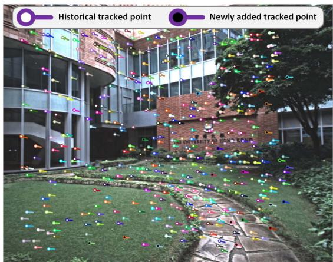

Fig. 4. The colored “tadpole”-shaped dots represent the tracked points $\mathcal { P }$ that are used for VIO updates, which are tracked using the Lucas − Kanade optical flow. The head position of each map point corresponds to its location in the current image frame $\mathbf { I } _ { k } ,$ , while the tail position corresponds to its location in the previous image frame ${ \bf { I } } _ { k - 1 }$ . Among these tracked points, the solid white dots represent historical tracked points that have been tracked in several previous frames, while the solid black dots represent the new points that were added in the last image frame ${ \bf { I } } _ { k - 1 }$  
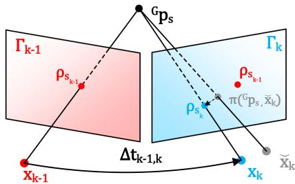  
Fig. 5. Frame-to-frame VIO estimates the system’s state by minimizing the PnP reprojection error of map points observed in the last frame.

where $\pmb { \pi } ( ^ { G } \mathbf { p } _ { s } , \breve { \mathbf { x } } _ { k } ) \in \mathbb { R } ^ { 2 }$ is the predicted pixel location computed as below:

$$
\pi ( { ^ { G } \mathbf { p } } _ { s } , \check { \mathbf { x } } _ { k } ) = \pi _ { \mathrm { p h } } ( { ^ { G } \mathbf { p } } _ { s } , \check { \mathbf { x } } _ { k } ) + { ^ { I } \check { t } } _ { C _ { k } } \cdot \frac { ( \boldsymbol { \rho } _ { s _ { k } } - \boldsymbol { \rho } _ { s _ { k - 1 } } ) } { \Delta t _ { k - 1 , k } }\tag{15}
$$

where the first term $\pi _ { \mathrm { p h } } ( { \cal G } _ { \mathbf { p } _ { s } , \check { \mathbf { x } } _ { k } } )$ is the standard camera pinhole model, the second one is the temporal correction factor [51], and $\Delta t _ { k - 1 , k }$ is the time interval between the last and current image. Since $\Delta t _ { k - 1 , k }$ is small $( \mathrm { e . g . , < 5 0 m s ) }$ , we estimated the value of $^ { I } \check { t } _ { C _ { k } }$ by assuming that the projected position of $G _ { \mathbf { p } _ { s } }$ moves at a constant velocity of $( \rho _ { s _ { k } } - \rho _ { s _ { k - 1 } } ) / { \Delta t _ { k - 1 , k } }$ on image plane during the interval between two consecutive frames.

2) Frame-to-Frame VIO Update: Similar to the LIO update, the state estimation error in $\check { \mathbf { x } } _ { k }$ and the camera measurement noise will lead to a certain residual in (14), from which we can update the state estimate $\check { \mathbf { x } } _ { k }$ as follows. First, the measurement noise in the residual (14) consists of two sources: one is the pixel tracking error in $\rho _ { s _ { k } }$ and the other lies in the map point location error ${ { \bf \Pi } ^ { G } } { \bf { p } } _ { s }$ ,

$$
{ { \bf \mathrm { \Lambda } } ^ { G } } { \bf p } _ { s } = { \bf \mathrm { \Lambda } } ^ { G } { \bf p } _ { s } ^ { \mathrm { g t } } + { \bf n _ { p } } _ { s } , { \bf n _ { p _ { s } } } \sim \mathcal { N } ( { \bf 0 } , { \bf \Sigma } _ { { \bf n _ { p } } _ { s } } )\tag{16}
$$

$$
\pmb { \rho } _ { s _ { k } } = \pmb { \rho } _ { s _ { k } } ^ { \mathrm { g t } } + \mathbf { n } _ { \pmb { \rho } _ { s _ { k } } } , \mathbf { n } _ { \pmb { \rho } _ { s _ { k } } } \sim \mathcal { N } ( \mathbf { 0 } , \pmb { \Sigma } _ { \mathbf { n } _ { \pmb { \rho } _ { s _ { k } } } } )\tag{17}
$$

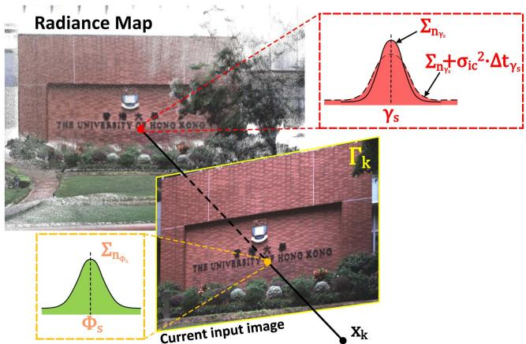  
Fig. 6. Frame-to-map VIO refines the state estimate by minimizing the radiance error between the map point and the observed radiance in the current image.

where ${ G } _ { \mathbf { p } _ { s } ^ { \mathrm { g t } } }$ and $\rho _ { s _ { k } } ^ { \tt g t }$ are the true values of $G _ { \mathbf { p } _ { s } }$ and $\rho _ { s _ { k } }$ respectively. Then, correcting such noises and using the true system state should lead to zero residual, i.e.,

$$
\mathbf { 0 } = \mathbf { r } _ { c } ( \mathbf { x } _ { k } , \rho _ { s _ { k } } ^ { \mathrm { g t } } , \mathbf { \Lambda } _ { } ^ { G } \mathbf { p } _ { s } ^ { \mathrm { g t } } ) \approx \mathbf { r } _ { c } \left( \breve { \mathbf { x } } _ { k } , \rho _ { s _ { k } } , \mathbf { \Lambda } _ { } ^ { G } \mathbf { p } _ { s } \right) + \mathbf { H } _ { s } ^ { r } \delta \breve { \mathbf { x } } _ { k } + \boldsymbol { \beta } \mathbf { \mathbb { 1 } } 8 )
$$

where $\mathbf { H } _ { s } ^ { r }$ is the Jacobian of the residual w.r.t. $\delta \check { \mathbf { x } } _ { k }$ and $\beta _ { s } \sim$ $\mathcal { N } ( \mathbf { 0 } , \pmb { \Sigma } _ { \beta _ { s } } )$ is the lumped noise due to $\mathbf { n _ { p _ { s } } }$ and $\mathbf { n } _ { \rho _ { s } }$

Equation (18) constitutes an observation distribution for $\mathbf { x } _ { k } .$ which is combined with the IMU propagation to obtain the MAP estimate of the state in the same way as the LIO update detailed in Section IV-B. The converged state estimate is then refined in the frame-to-map VIO in the next section.

Remark: Since the camera pin-hole model $\pi _ { \mathrm { p h } } ( { \cal G } _ { \mathbf { p } _ { s } , { \mathbf { x } } _ { k } } )$ in (15) is related to camera pose (consisting of the IMU pose $( ^ { G } { \mathbf { R } } _ { I } , ^ { G } { \mathbf { p } } _ { I } )$ and camera extrinsic $( ^ { I } { \bf R } _ { C } , ^ { \bar { I } } { \bf p } _ { C } ) )$ and intrinsic $\phi ,$ , so the projection model $\pi ( { \cal G } _ { \mathbf { p } _ { s } , \mathbf { x } _ { k } } )$ is also related to these state components. In addition, $\pi ( { \cal G } _ { \mathbf { p } _ { s } , \mathbf { x } _ { k } } )$ is also related to the temporal offset $^ I t _ { C }$ due to the temporal correction factor. This will cause Hr to contain nonzero elements corresponding to the IMU pose $( { \bar { \mathbf { \Gamma } } } ^ { \bar { G } } \mathbf { R } _ { I } , { \bar { \mathbf { \Gamma } } } ^ { G } \mathbf { p } _ { I } )$ , camera extrinsic $( ^ { I } { \bf R } _ { C } , ^ { I } { \bf p } _ { C } )$ , intrinsic φ, and temporal offset $^ I t _ { C }$ , and hence an update of them in the state estimation.

## C. Frame-to-Map Visual-Inertial Odometry

1) Frame-to-Map Radiance Error: The frame-to-frame VIO update can provide a good state estimate $\check { \mathbf { x } } _ { k }$ , which is further refined by the frame-to-map VIO update by minimizing the radiance error ofthe tracked map points . Let $\mathbf { { { T } } } _ { k }$ the photometrically calibrated image at the k-th step (see (13)). With the state estimate at the current iteration, $\check { \mathbf { x } } _ { k } .$ , which contains the estimated camera pose, extrinsic, intrinsic, and exposure time, we project a tracked map point $\mathbf { P } _ { s } \in \mathcal { P }$ to the image plane to obtain its pixel location $\breve { \pmb { \rho } } _ { s _ { k } } = \pi ( { } ^ { G } { \bf p } _ { s } , \breve { \bf x } _ { k } )$ (see (15) and Fig. 6). Then, the observed radiance denoted by $\Phi _ { s }$ can be computed from the exposure time component $\check { \epsilon } _ { k }$ in xˇk as: $\Phi _ { s } = \check { \epsilon } _ { k } \Gamma _ { k } ( \check { \rho } _ { s _ { k } } )$ . Finally, the frame-to-map radiance error is the difference between the radiance component $\gamma _ { s }$ of the point ${ \bf P } _ { s }$ and the observed value

Φs:

$$
\begin{array} { r } { \mathbf { r } _ { c } ( \check { \mathbf { x } } _ { k } , { } ^ { G } \mathbf { p } _ { s } , \gamma _ { s } ) = \Phi _ { s } - \gamma _ { s } , \Phi _ { s } = \check { \epsilon } _ { k } \mathbf { r } _ { k } ( \check { \rho } _ { s _ { k } } ) , } \end{array}\tag{19}
$$

where $\Phi _ { s } , \mathbf { T } _ { k } ( \check { \rho } _ { s _ { k } } )$ and $\gamma _ { s }$ both contain three channels: red, green, and blue.

2) Frame-to-Map VIO Update: The measurement noise in (19) come from both the component $\gamma _ { s }$ and $\Phi _ { s } .$ . For the component $\gamma _ { s } .$ , we model it as:

$$
\begin{array} { r } { \gamma _ { s } = \gamma _ { s } ^ { g t } + \mathbf { n } _ { \gamma _ { s } } + \mathbf { n } _ { \mathrm { i c } } , \mathbf { n } _ { \gamma _ { s } } \sim \mathcal { N } ( \mathbf { 0 } , \boldsymbol { \Sigma } _ { \mathbf { n } _ { \gamma _ { s } } } ) } \\ { \mathbf { n } _ { \mathrm { i c } } \sim \mathcal { N } ( \mathbf { 0 } , \sigma _ { \mathrm { i c } } ^ { 2 } \cdot \Delta t _ { \gamma _ { s } } ) ~ } \end{array}\tag{20}
$$

where $\gamma _ { s } ^ { g t }$ represents the ground-truth value of $\gamma s$ . The terms $\mathbf { n } _ { \gamma _ { s } }$ originate from the radiance estimation error as detailed in Section ${ \mathrm { V - D } } ,$ and $\mathbf { n } _ { \mathrm { i c } }$ arises from radiance temporal changes due to variations in illumination. Given that illumination changes usually occur gradually over time, we model this process as a random walk [52], whose covariance is linear to the time interval $\Delta t _ { \gamma _ { s } }$ between current time and last update time of ${ \bf P } _ { s }$ . Since $\mathbf { n } _ { \gamma _ { s } }$ and $\mathbf { n } _ { \mathrm { i c } }$ are indeed two independent noise, we have the Gaussian distribution of $\gamma _ { s }$ as $\gamma _ { s } \sim \mathcal { N } ( \gamma _ { s } ^ { g t } , \pmb { \Sigma _ { n _ { \gamma _ { s } } } } + \pmb { \sigma } _ { \mathrm { i c } } ^ { 2 } \cdot \Delta t _ { \gamma _ { s } } )$

For the second component $\Phi _ { s }$ in (19), it is computed from the state estimate $\check { \mathbf { x } } _ { k }$ and the current image $\mathbf { { { T } } } _ { k }$ as $\Phi _ { s } = $ $\check { \epsilon } _ { k } \Gamma _ { k } ( \pi ( ^ { G } \mathbf { p } _ { s } , \check { \mathbf { x } } _ { k } ) )$ , hence its noise consists of two sources: one is the state estimation error (from $\check { \mathbf { x } } _ { k } )$ and the other is the image measurement noise (from $\mathbf { { { T } } } _ { k } )$ :

$$
\Phi _ { s } = \Phi _ { s } ^ { g t } + \mathbf { n } _ { \Phi _ { s } } , \mathbf { n } _ { \Phi _ { s } } \sim \mathcal { N } ( \mathbf { 0 } , { \boldsymbol { \Sigma } } _ { \mathbf { n } _ { \Phi _ { s } } } )\tag{21}
$$

where $\Sigma _ { \mathbf { n } _ { \Phi , s } }$ denotes the covariance due to these two noise sources.

Combining (19), (20) and (21), we obtain the first order Taylor expansion of the true zero residual $\mathbf { r } _ { c } ( \mathbf { x } _ { k } , ^ { G } \mathbf { p } _ { s } ^ { g t } , \gamma _ { s } ^ { g t } )$ :

$$
{ \bf 0 } = { \bf r } _ { c } ( { \bf x } _ { k } , { } ^ { G } { \bf p } _ { s } ^ { g t } , \gamma _ { s } ^ { g t } ) \approx { \bf r } _ { c } ( \breve { \bf x } _ { k } , { } ^ { G } { \bf p } _ { s } , { \bf c } _ { s } ) + { \bf H } _ { s } ^ { c } \delta \breve { \bf x } _ { k } + \zeta _ { s }\tag{22}
$$

where $\mathbf { H } _ { s } ^ { r }$ is the Jacobian of the residual w.r.t. $\delta \check { \mathbf { x } } _ { k }$ and $\zeta _ { s } \sim$ $\mathcal { N } ( \mathbf { 0 } , \pmb { \Sigma } _ { \zeta _ { s } } )$ is the lumped noise due to noises in $\gamma _ { s }$ and $\Phi _ { s }$

Similar as before, (22) constitutes an observation distribution for state $\mathbf { x } _ { k }$ , which is combined with the IMU propagation to obtain the MAP estimate of the state.

Remark: Since the $\Phi _ { s }$ in (19) is related to camera exposure time $\epsilon ,$ it will cause ${ \bf { H } } _ { s } ^ { c }$ to contain nonzero elements corresponding to the exposure time and hence an update of them in the state estimation.

## D. Recovery of Radiance Information

After the frame-to-map VIO update, we have the precise pose of the current image. Then, we perform the Bayesian update to determine the optimal radiance of all map points such that the average radiance error between each point and its viewed images is minimal.

First of all, we retrieve all the points in all activated voxels (activated in Section IV-B). Assume the retrieved point set is $\boldsymbol { \mathcal { Q } } = \{ \mathbf { P } _ { 1 } , . . . , \mathbf { P } _ { n } \}$ . For the s-th point $\mathbf { P } _ { s } = [ ^ { G } \mathbf { p } _ { s } ^ { T } , \boldsymbol { \gamma } _ { s } ^ { T } ] ^ { T } \in \mathcal { Q }$ falling in the current image FoV, we first can obtain the observed radiance vector $\Phi _ { s }$ by (19) and its covariance $\Sigma _ { \mathbf { n } _ { \Phi _ { s } } }$ by (21). To prevent the underestimation of the radiance vector caused by underexposure or overexposure, we exclude points in $\mathfrak { Q }$ from the update process if their pixel values in any RGB channel are the minimum or maximum value (i.e., 0 or 255).

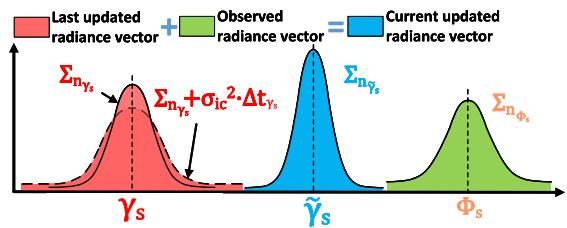  
Fig. 7. We update the radiance $\gamma _ { s }$ of a map point via Bayesian update.

If ${ \bf P } _ { s }$ is a new point appended by the LIO subsystem (see Section IV-B) with $\gamma _ { s } = \mathbf { 0 } .$ , we set:

$$
\gamma _ { s } = \Phi _ { s } , \Sigma _ { \mathbf { n } _ { \gamma _ { s } } } = \Sigma _ { \mathbf { n } _ { \Phi _ { s } } }\tag{23}
$$

Otherwise, the radiance vector $\gamma _ { s }$ saved in the map (see (20)) is fused with newly observed radiance vector $\Phi _ { s }$ with covariance $\Sigma _ { \mathbf { n } _ { \Phi , s } }$ via Bayesian update (see Fig. 7):

$$
\begin{array} { r } { \pmb { \Sigma _ { \mathbf { n } _ { \tilde { \gamma } _ { s } } } } = \left( \left( \pmb { \Sigma _ { \mathbf { n } _ { \tilde { \gamma } _ { s } } } } + \pmb { \sigma } _ { \mathrm { i c } } ^ { 2 } \cdot \Delta t _ { \gamma _ { s } } \right) ^ { - 1 } + \pmb { \Sigma _ { \mathbf { n } _ { \Phi _ { s } } } ^ { - 1 } } \right) ^ { - 1 } } \end{array}\tag{24}
$$

$$
\begin{array} { r } { \tilde { \gamma } _ { s } = \left( \left( \Sigma _ { \mathbf { n } _ { \gamma _ { s } } } + \sigma _ { \mathrm { i c } } ^ { 2 } \cdot \Delta t _ { \gamma _ { s } } \right) ^ { - 1 } \gamma _ { s } + \Sigma _ { \mathbf { n } _ { \Phi _ { s } } } ^ { - 1 } \Phi _ { s } \right) ^ { - 1 } \Sigma _ { \mathbf { n } _ { \tilde { \gamma } _ { s } } } } \end{array}\tag{25}
$$

$$
\gamma _ { s } = \tilde { \gamma } _ { s } , \ \Sigma _ { \mathbf { n } _ { \tilde { \gamma } _ { s } } } = \Sigma _ { \mathbf { n } _ { \tilde { \gamma } _ { s } } }\tag{26}
$$

## E. Update of the Tracking Points

After the recovery of radiance information, we update the tracked point set $\mathcal { P }$ for the next frame of image use. First, we remove points from current if their projection error in (14) or radiance error in (19) are too large, and also remove the points which do not fall into the current image FoV. Second, we project each point in  to the current image and add it to $\mathcal { P }$ if no other tracked points already existed in a neighborhood of 50 pixels.

## VI. EXPERIMENTS

In this chapter, we conduct extensive experiments to validate the advantages of our proposed system against other counterparts in threefold: 1) To verify the accuracy in localization, we quantitatively compare our system against existing state-ofthe-art SLAM systems on a public dataset (NCLT-dataset). 2) To validate the robustness of our framework, we test it under various challenging scenarios where camera and LiDAR sensor degeneration occurs. 3) To evaluate the accuracy of our system in reconstructing the radiance map, we compare it against existing baselines in estimating the camera exposure time and calculating the average photometric error w.r.t. each image. In the experiments, two datasets are used for evaluation: the NCLT-dataset and the R3LIVE-dataset.

## A. NCLT-Dataset

To compare the accuracy of our proposed method against other state-of-the-art SLAM systems, we perform quantitative evaluations on NCLT-dataset [53]. NCLT-dataset is a largescale, long-term autonomy dataset for robotics research that was collected on the University of Michigan’s North Campus. The dataset is comprised of 27 sequences that are collected by exploring the campus, both indoors and outdoors, on varying paths, and at different times of the day across all four seasons. Each sequence includes data from the omnidirectional camera, 3D LiDAR, planar LiDAR, GPS, and wheel encoders on a Segway robot.

We chose NCLT-dataset for three reasons: 1) NCLT-dataset is currently the largest public dataset with ground-truth trajectories of high quality. 2) NCLT-dataset provides all raw data sampled by the sensors, which meets our requirement for the input data. 3) NCLT-dataset has many challenging scenarios, such as moving obstacles (e.g., pedestrians, bicyclists, and cars), illumination changes, varying viewpoints, seasonal and weather changes (e.g., falling leaves and snow), and long-term structural changes caused by construction projects. For details of challenging input data from both LiDAR and camera sensors, please refer to Section 1 of our Supplementary Material [54].

In the experiments, the front-facing camera data (one of five) and the 3D LiDAR data are used for all systems under evaluation. Moreover, we notice some time synchronization errors in two sequences (i.e., 2012-03-17 and 2012-08-04), where the LiDAR timestamp is 100 ms delayed from the IMU timestamp (about one LiDAR-frame). Therefore, we exclude these two sequences from the evaluation. As a result, 25 sequences are evaluated with total traveling length up to 138 km and duration up to 33h:34m.

## B. Self-Collected Dataset: R3LIVE-Dataset

While the large-scale NCLT-dataset is suitable for evaluating the localization accuracy, it didn’t cover any scenarios with sensor degeneration, preventing us from evaluating the system robustness, which is one of the major motivations of this work. Moreover, the camera photometric calibration and the groundtrue exposure time are not available in the NCLT-dataset, which are essential for the reconstruction of the radiance maps and the evaluation of the online exposure time estimation. To fill this gap, we designed a handheld data collection device and made a new dataset named R3LIVE-dataset. The dataset and hardware device are released along with the codes of this work to facilitate the reproduction of our work.

1) Handheld Devicefor Data Collection: Our handheld device for data collection is shown in Fig. 8(a), which includes a power supply unit, an onboard computer DJI manifold-2c (equipped with an Intel i7-8550u CPU and 8GB RAM), a FLIR Blackfly BFS-u3-13y3c global shutter camera, and a LiVOXAVIA 3D LiDAR. The camera FoV is $8 2 . 9 ^ { \circ } \times 6 6 . 5 ^ { \circ }$ and the LiDAR FoV is $7 0 . 4 ^ { \circ } \times 7 7 . 2 ^ { \circ }$ . To quantitatively evaluate the accuracy of our algorithm (Section VI-E) even in GPS-denied environments, we use an ArUco marker [55] as a reference to calculate the sensor pose when returns to the starting point, which enables to evaluate the localization drift. All the mechanical components of this device are designed for compatibility with fused deposition modeling (FDM) 3D printing technology. Their design schematics are open-sourced along with the codes too [56].

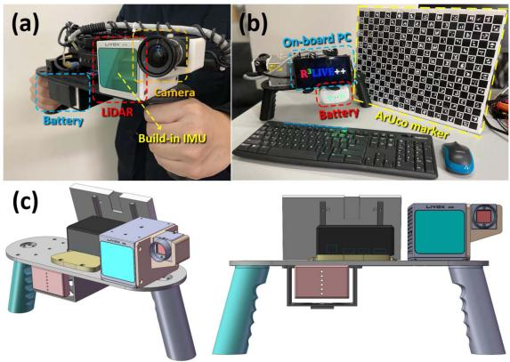

Fig. 8. (a) shows our handheld device for data collection. (b) shows the ArUco marker board to provide the ground-truth for evaluating the system accuracy. (c) shows our open-source schematics model.  
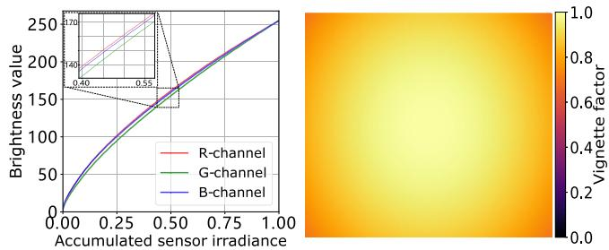  
Fig. 9. The left figure shows the calibrated nonlinear response function in three channels (red, green, and blue). The right one plots the calibrated vignetting factors at each image pixel.

To correct the camera’s nonlinear response function and the vignette effect, we perform photometric calibration on the camera based on the method in [47]. The calibrated results are shown in Fig. 9, which are also released on our GitHub repository [56].

2) The R3LIVE-Dataset: The R3LIVE-dataset was collected within the campuses of the University of Hong Kong (HKU) and the Hong Kong University of Science and Technology (HKUST). As summarized in Table II, the dataset includes 13 sequences that are collected by exploring both indoor and outdoor environments, in various scenes (e.g., walkway, park, forest, etc) at different time in a day (i.e., morning, noon, and evening). This allows the dataset to capture both structured urban buildings and cluttered field environments with different lighting conditions. The dataset also includes three sequences (degenerate\_seq\_00/01/02) where the LiDAR or camera (or both) degenerate by occasionally facing the device to a single and/or texture-less plane (e.g., wall, the ground) or visually. The total traveling length reaches 8.4 km, duration reaching 2.4h. More details of each sequence will be provided in sequel when it is used.

## C. System Configurations

For the sake of fair comparison, in the evaluation of our systems and their counterparts, each system uses the same parameters for all sequences in the same dataset. For the counterpart systems (e.g., LIO-SAM [20], LVI-SAM [43], FAST-LIVO [49], FAST-LIO2 [24], etc.), we use their default configurations on their GitHub repository except for some necessary adjustments to match the hardware setup. For our system, we also make its configuration available on our GitHub repository [56], “https://github.com/hkumars/r3live/blob/master/config/r3live\_config.yaml” for NCLTdataset and “https://github.com/hku-mars/r3live/blob/master/ config/r3live\_config.yaml” for R3LIVE-dataset.

TABLE II  
OVERVIEW OF THE R3LIVE-DATASET
<table><tr><td>Sequence</td><td>Duration (s)</td><td>Traveling Length (m)</td><td>Sensor Degeneration</td><td>Return to origin1</td><td>ArUco marker²</td><td>Camera exposure time³</td><td>Scenarios</td></tr><tr><td>degenerate_seq_00</td><td>101</td><td>74.9</td><td>Camera, LiDAR</td><td>√</td><td></td><td></td><td>Indoor</td></tr><tr><td>degenerate_seq_01</td><td>86</td><td>53.3</td><td>LiDAR</td><td>V</td><td></td><td></td><td>Outdoor</td></tr><tr><td>degenerate_seq_02</td><td>85</td><td>75.2</td><td>LiDAR</td><td>√</td><td></td><td></td><td>Outdoor</td></tr><tr><td>hku_campus_seq_00</td><td>202</td><td>190.6</td><td></td><td>√</td><td></td><td></td><td>Indoor</td></tr><tr><td>hku_campus_seq_01</td><td>304</td><td>374.6</td><td></td><td></td><td></td><td></td><td>Outdoor</td></tr><tr><td>hku_campus_seq_02</td><td>323</td><td>354.3</td><td></td><td>V</td><td></td><td>√</td><td>Indoor, Outdoor</td></tr><tr><td>hku_campus_seq_03</td><td>173</td><td>181.2</td><td></td><td>L</td><td></td><td>√</td><td>Indoor, Outdoor</td></tr><tr><td>hku_main_building</td><td>1170</td><td>1036.9</td><td></td><td>V</td><td></td><td>V</td><td>Indoor, Outdoor</td></tr><tr><td>hku_park_00</td><td>351</td><td>401.8</td><td></td><td>V</td><td>√</td><td></td><td>Outdoor, Cluttered</td></tr><tr><td>hku_park_01</td><td>228</td><td>247.3</td><td></td><td></td><td>√</td><td></td><td>Outdoor, Cluttered</td></tr><tr><td>hkust_campus_00</td><td>1073</td><td>1317.2</td><td></td><td>V</td><td>√</td><td></td><td>Indoor, Outdoor</td></tr><tr><td>hkust_campus_01</td><td>1162</td><td>1524.3</td><td></td><td></td><td>√</td><td></td><td>Indoor, Outdoor</td></tr><tr><td>hkust_campus_02</td><td>478</td><td>503.8</td><td></td><td></td><td></td><td></td><td>Indoor, Outdoor</td></tr><tr><td>hkust_campus_03</td><td>1618</td><td>2112.2</td><td></td><td></td><td></td><td>√</td><td>Outdoor</td></tr><tr><td>Total</td><td>7354</td><td>8447.6</td><td></td><td></td><td></td><td></td><td></td></tr></table>

1 Sequences are collected by traveling a loop, with starting from and ending with the same position  
2 Sequences with ArUco marker [55] for providing the ground-truth relative pose.  
3 Sequences with ground-truth camera exposure time read from camera's API.

## D. Experiment-1: Evaluation of Localization Accuracy

In this experiment, we benchmark the localization accuracy of our systems against other state-of-the-art odometry, including LIO-SAM [20], LVI-SAM [43], FAST-LIVO [49], FAST-LIO2 [24], and our previous work R2LIVE [44], on the NCLTdataset [53]. LIO-SAM and FAST-LIO2 are LiDAR-inertial systems without fusing image data (Section II-A), while LVI-SAM, FAST-LIVO, and R2LIVE are three other state-of-the-art LiDARinertial-visual systems. Since our work is a state estimator without any loop detection and correction, we deactivated the loop closure of LIO-SAM and LVI-SAM for the sake of fair comparison. Due to the unavailability of camera photometric calibration for the NCLT dataset, we disable the photometric calibration modules of our VIO-subsystem by using V (·) = 1 and fi(·) = 1.

Table III shows the absolute position error (APE) [57] of these methods, where Our-LIO is the LIO subsystem of our system. LIO-SAM and LVI-SAM failed in some sequences, and these sequences are excluded from the computation of the average APE. Since our method (see Fig. 2) and R2LIVE [44] output three types of odometry, one at LiDAR input, one at camera input, and one at the IMU input, while the other tested methods (e.g., LIO-SAM, FAST-LIO) outputs odometry only at LiDAR input. To ensure fairness, we compute the APE all using the odometry output at LiDAR input, even for our method and R2LIVE [44]. - As can be seen from this table, with the average APE only 8.51m, our proposed system achieves the best overall performance than other LiDAR-inertial-visual systems FAST-LIVO, R2LIVE, and LVI-SAM. The performance improvement mainly comes from the direct method used in the LIO subsystem and the tight-coupling of the LIO and VIO subsystems, the former can be seen by comparing the direct method FAST-LIO2 to the feature-based method LIO-SAM in Table III (and also detailed in [24]), the latter improves the accuracy of the VIO subsystem (hence the complete system) by leveraging the high-accuracy geometry structure reconstructed from the LiDAR. Furthermore, the overall APE of our system is lower than its LIO subsystem Our-LIO and the other LIO systems (i.e., FAST-LIO2 and LIO-SAM), which confirms the effectiveness of fusing camera data. Indeed, we found that in some evaluated sequences, the LiDAR sensor may occasionally face the sun. This can lead to the generation of noisy LiDAR points due to Sunlight contamination [58] as shown in Fig. 1 of our Supplementary Material [54], which adversely affects the accuracy of the LIO. This is due to the input images that are under-exposure (a ∼ d), over-exposure, as well as the presence of moving objects, as detailed in Fig. 2 of our Supplementary Material [54], which may adversely affect the VIO (hence the overall system). In Fig. 11, we overlay all the 25 ground-true trajectories (in the left figure) and ours (the right one). As can be seen, the overlaid trajectories estimated by our system agree with the ground-truth well and each trajectory can still be clearly distinguished without noticeable errors. Note that these 25 trajectories are collected on the same campus area across different times in a day and seasons in a year, still our system can produce consistent and reliable trajectory estimation with these illumination and scene changes, demonstrating the robustness of our system.

Given the fact that the photometric calibration of NCLTdataset is unavailable, to assess the impact of photometric calibration on localization accuracy of our method, we compared its performance with and without photometric calibration using the R3LIVE-dataset, referred to as “Our” and “Our w/o PC” in Table IV, respectively. We calculated the end-point positioning errors by comparing our results with the ground-truth estimated from an ArUco marker [55]. As shown in Table IV, photometric calibration has a minor impact on our localization outcomes on 5 sequence we tested, where the observations from our LIO and frame-to-frame VIO update primarily contribute to localization accuracy. Yet, photometric calibration is necessary for recovering the accurate radiance map of the environment, as will be illustrated in Section VI-F.

TABLE III  
THE COMPARISON OF ABSOLUTE POSITION ERRORS (APE, IN METER) AND THEIR STANDARD DEVIATIONS (STD) AMONG DIFFERENCE METHODS TESTED ON NCLT-DATASET (APE ± STD)
<table><tr><td>Sequence (date)</td><td>Length (m)</td><td>Duration (hr:min:sec)</td><td>Our</td><td> $\mathbf { R } ^ { 2 } \mathbf { L I V E }$ </td><td></td><td>LVI-SAM FAST-LIVO</td><td>Our_LIO</td><td></td><td>Fast-LIO2 LIO-SAM</td><td></td></tr><tr><td>2012-01-08</td><td>6495.7</td><td>01:25:35</td><td> ${ \bf 1 0 . 8 \pm 2 . 7 }$ </td><td> $2 2 . 4 \pm 3 . 5$ </td><td> $2 3 . 4 \pm 3 . 7$ </td><td> $1 3 . 4 \pm 2 . 9$ </td><td> $2 0 . 1 \pm 3 . 3$ </td><td></td><td> $1 8 . 5 \pm 3 . 3$ </td><td> $2 1 . 7 \pm 3 . 6$ </td></tr><tr><td>2012-01-15</td><td>7499.8</td><td>01:52:19</td><td> $6 . 6 \pm 1 . 8$ </td><td> $5 . 1 \pm 1 . 5$ </td><td> $-$ </td><td> $8 . 5 \pm 2 . 5$ </td><td> $6 . 2 \pm 2 . 0$ </td><td></td><td> $4 . 8 \pm 1 . 5$ </td><td></td></tr><tr><td>2012-01-22</td><td>6183.1</td><td>01:27:22</td><td> $9 . 2 \pm 2 . 5$ </td><td> $1 2 . 6 \pm 2 . 7$ </td><td> $8 . 3 \pm 2 . 8$ </td><td> $1 4 . 1 \pm 3 . 0$ </td><td> $1 2 . 4 \pm 2 . 6$ </td><td></td><td> ${ \bf 7 . 1 \pm 1 . 9 }$ </td><td> $9 . 0 \pm 2 . 6$ </td></tr><tr><td>2012-02-02</td><td>6315.8</td><td>01:38:36</td><td> $5 . 3 \pm 1 . 7$ </td><td> $6 . 1 \pm 2 . 0$ </td><td> $1 8 . 1 \pm 2 . 4$ </td><td> $1 2 . 0 \pm 2 . 5$ </td><td> $7 . 4 \pm 2 . 2$ </td><td></td><td> $9 . 1 \pm 2 . 3$ </td><td> $1 5 . 6 \pm 2 . 6$ </td></tr><tr><td>2012-02-04</td><td>5641.0</td><td>01:18:30</td><td> ${ \bf 5 . 6 \pm 1 . 8 }$ </td><td> $8 . 4 \pm 2 . 2$ </td><td> $9 . 6 \pm 5 . 0$ </td><td> $6 . 2 \pm 1 . 8$ </td><td> $7 . 8 \pm 2 . 1$ </td><td> $7 . 2 \pm 1 . 8$ </td><td></td><td> $1 0 . 8 \pm 5 . 3$ </td></tr><tr><td>2012-02-05</td><td>6649.3</td><td>01:34:17</td><td> $8 . 5 \pm 2 . 1$ </td><td> $7 . 6 \pm 2 . 0$ </td><td></td><td> $8 . 2 \pm 2 . 2$ </td><td> $7 . 7 \pm 2 . 5$ </td><td></td><td> $7 . 8 \pm 2 . 4$ </td><td></td></tr><tr><td>2012-02-12</td><td>5829.1</td><td>01:25:35</td><td> $4 . 5 \pm 1 . 6$ </td><td> $6 . 5 \pm 2 . 2$ </td><td> $4 0 . 0 \pm 2 . 9$ </td><td> $1 6 . 4 \pm 3 . 4$ </td><td> $1 0 . 5 \pm 2 . 8$ </td><td></td><td> $8 . 3 \pm 2 . 6$ </td><td> $4 5 . 0 \pm 2 . 8$ </td></tr><tr><td>2012-02-18</td><td>6249.2</td><td>01:29:55</td><td> $4 0 . 5 \pm 3 . 9$ </td><td> $5 9 . 3 \pm 4 . 8$ </td><td></td><td> $4 3 . 0 \pm 4 . 1$ </td><td> $5 3 . 5 \pm 4 . 5$ </td><td></td><td> $5 7 . 0 \pm 4 . 6$ </td><td></td></tr><tr><td>2012-02-19</td><td>6232.7</td><td>01:29:11</td><td> $8 . 5 \pm 2 . 0$ </td><td> $6 . 6 \pm 1 . 6$ </td><td> $8 . 9 \pm 1 . 9$ </td><td> $8 . 6 \pm 2 . 1$ </td><td> $6 . 2 \pm 1 . 4$ </td><td></td><td> ${ \bf 6 . 0 \pm 1 . 3 }$ </td><td> $9 . 6 \pm 1 . 8$ </td></tr><tr><td>2012-03-17</td><td>5907.2</td><td>01:22:53</td><td> $4 . 8 \pm 1 . 8$ </td><td> $5 . 9 \pm 2 . 0$ </td><td> $1 2 . 6 \pm 1 . 8$ </td><td> $5 . 3 \pm 1 . 9$ </td><td> $6 . 8 \pm 2 . 2$ </td><td></td><td> $4 . 7 \pm 1 . 8$ </td><td> $1 1 . 8 \pm { 1 . 8 }$ </td></tr><tr><td>2012-03-31</td><td>6073.7</td><td>01:27:53</td><td> $4 . 9 \pm 1 . 9$ </td><td> $1 0 . 0 \pm 2 . 5$ </td><td> $1 9 . 0 \pm 3 . 2$ </td><td> $5 . 2 \pm 2 . 0$ </td><td> $9 . 3 \pm 2 . 4$ </td><td></td><td> $7 . 3 \pm 2 . 3$ </td><td> $1 8 . 3 \pm 3 . 2$ </td></tr><tr><td>2012-04-29</td><td>3183.1</td><td>00:43:18</td><td> $6 . 3 \pm 2 . 2$ </td><td> $6 . 4 \pm 2 . 0$ </td><td> $5 . 9 \pm 2 . 6$ </td><td> $7 . 7 \pm 2 . 2$ </td><td> $6 . 3 \pm 2 . 2$ </td><td></td><td> $6 . 4 \pm 2 . 0$ </td><td> $5 . 7 \pm 2 . 2$ </td></tr><tr><td>2012-05-11</td><td>6116.7</td><td>01:25:05</td><td> $3 . 7 \pm 1 . 6$ </td><td> $3 . 8 \pm 1 . 6$ </td><td> $4 . 2 \pm 2 . 9$ </td><td> $4 . 9 \pm 1 . 9$ </td><td> $4 . 2 \pm 1 . 7$ </td><td></td><td> $4 . 1 \pm 1 . 7$ </td><td> $4 . 2 \pm 2 . 9$ </td></tr><tr><td>2012-05-26</td><td>6340.7</td><td>01:28:34</td><td> $4 . 6 \pm 1 . 6$ </td><td> $6 . 3 \pm 1 . 9$ </td><td> $1 8 . 3 \pm 4 . 4$ </td><td> $7 . 4 \pm 2 . 1$ </td><td> $6 . 1 \pm 1 . 9$ </td><td></td><td> $6 . 4 \pm 1 . 9$ </td><td> $1 8 . 4 \pm 4 . 5$ </td></tr><tr><td>2012-06-15</td><td>4085.9</td><td>00:55:10</td><td> $7 . 7 \pm 2 . 1$ </td><td> $6 . 3 \pm 1 . 8$ </td><td></td><td> $7 . 9 \pm 2 . 1$ </td><td> $5 . 7 \pm 1 . 4$ </td><td></td><td> $5 . 3 \pm 1 . 4$ </td><td></td></tr><tr><td>2012-08-04</td><td>5492.1</td><td>01:20:32</td><td> $3 . 9 \pm 1 . 4$ </td><td> $3 . 7 \pm 1 . 4$ </td><td> $1 1 . 0 \pm 3 . 6$ </td><td> $5 . 0 \pm 1 . 5$ </td><td> $4 . 5 \pm 1 . 5$ </td><td></td><td> $7 . 0 \pm 2 . 1$ </td><td> $1 2 . 7 \pm 3 . 8$ </td></tr><tr><td>2012-08-20</td><td>6014.5</td><td>01:23:48</td><td> $4 . 5 \pm 1 . 8$ </td><td> $4 . 5 \pm 1 . 8$ </td><td> $1 1 . 2 \pm { 1 . 8 }$ </td><td> $5 . 0 \pm 1 . 9$ </td><td> $4 . 2 \pm 1 . 7$ </td><td></td><td> $6 . 0 \pm 1 . 8$ </td><td> $1 1 . 4 \pm { 1 . 8 }$ </td></tr><tr><td>2012-09-28</td><td>5574.4</td><td>01:17:59</td><td> $7 . 9 \pm 1 . 8$ </td><td> ${ 6 . 6 \pm 1 . 7 }$ </td><td> $3 4 . 4 \pm 1 . 7$ </td><td> $8 . 6 \pm 1 . 6$ </td><td> $6 . 8 \pm 1 . 9$ </td><td></td><td> $1 0 . 4 \pm 2 . 4$ </td><td> $3 6 . 7 \pm { 1 . 8 }$ </td></tr><tr><td>2012-10-28</td><td>5682.1</td><td>01:26:10</td><td> $7 . 7 \pm 2 . 0$ </td><td> $8 . 0 \pm 2 . 0$ </td><td></td><td> $8 . 0 \pm 2 . 0$ </td><td> $8 . 6 \pm 2 . 0$ </td><td></td><td> $7 . 7 \pm 2 . 0$ </td><td></td></tr><tr><td>2012-11-04</td><td>4788.3</td><td>01:20:39</td><td> $7 . 5 \pm 2 . 7$ </td><td> $9 . 3 \pm 3 . 0$ </td><td> $3 . 4 \pm 3 . 0$ </td><td> $8 . 1 \pm 2 . 8$ </td><td> $1 2 . 6 \pm 3 . 5$ </td><td></td><td> $3 . 3 \pm 1 . 5$ </td><td> $3 . 4 \pm 2 . 8$ </td></tr><tr><td>2012-11-17</td><td>5751.9</td><td>01:29:44</td><td> $8 . 7 \pm 2 . 1$ </td><td> $6 . 5 \pm 1 . 7$ </td><td> $2 1 . 9 \pm 1 . 7$ </td><td> $8 . 2 \pm 2 . 4$ </td><td> $6 . 1 \pm 1 . 6$ </td><td></td><td> ${ \bf 5 . 8 \pm 1 . 6 }$ </td><td> $2 4 . 2 \pm 2 . 4$ </td></tr><tr><td>2012-12-01</td><td>4991.9</td><td>01:16:48</td><td> $1 1 . 3 \pm 2 . 2$ </td><td> $1 4 . 2 \pm 2 . 4$ </td><td> $6 . 9 \pm 3 . 1$ </td><td> $1 1 . 8 \pm 2 . 2$ </td><td> $1 7 . 0 \pm 2 . 7$ </td><td></td><td> $7 . 4 \pm 1 . 9$ </td><td> $7 . 2 \pm 2 . 7$ </td></tr><tr><td>2013-01-10</td><td>1137.3</td><td>00:17:04</td><td> ${ \bf 3 . 4 \pm 1 . 6 }$ </td><td> $4 . 6 \pm 1 . 9$ </td><td> $4 . 9 \pm 1 . 8$ </td><td> $3 . 7 \pm 1 . 7$ </td><td> $5 . 3 \pm 2 . 0$ </td><td></td><td> $3 . 5 \pm 1 . 6$ </td><td> $5 . 1 \pm 1 . 9$ </td></tr><tr><td>2013-02-23</td><td>5235.3</td><td>01:20:08</td><td> ${ \bf 1 1 . 6 \pm 1 . 9 }$ </td><td> $1 3 . 4 \pm 2 . 1$ </td><td> $1 2 . 6 \pm 2 . 0$ </td><td> $1 2 . 2 \pm 2 . 0$ </td><td> $1 3 . 8 \pm 2 . 1$ </td><td></td><td> $1 1 . 9 \pm 2 . 1$ </td><td> $1 2 . 2 \pm 3 . 4$ </td></tr><tr><td>2013-04-05</td><td>4523.7</td><td>01:09:27</td><td> $8 . 8 \pm 2 . 2$ </td><td> $1 1 . 9 \pm 2 . 6$ </td><td> $9 . 8 \pm 2 . 5$ </td><td> $1 0 . 4 \pm 2 . 4$ </td><td> $1 1 . 6 \pm 2 . 5$ </td><td></td><td> $6 . 4 \pm 2 . 2$ </td><td> $9 . 0 \pm 2 . 5$ </td></tr><tr><td>Total:</td><td>137994.5</td><td>33:34:52</td><td></td><td></td><td></td><td></td><td></td><td></td><td></td><td></td></tr><tr><td>Average</td><td></td><td></td><td> $8 . 5 \pm 2 . 1$ </td><td> $1 0 . 6 \pm 2 . 3$ </td><td> $1 5 . 0 \pm 2 . 9$ </td><td> $1 0 . 3 \pm 2 . 4$ </td><td> $1 0 . 8 \pm 2 . 4$ </td><td></td><td> $9 . 6 \pm 2 . 2$ </td><td> $1 5 . 4 \pm 3 . 0$ </td></tr></table>

1 Some systems fail in midway in some sequences and are marked as $^ { \prime \prime } { - } ^ { \prime \prime } .$  
TABLE IV

THE COMPARISONS OF END-POINT POSITIONING ERROR OF $\mathrm { R ^ { 3 } L I V E { + } }$ WITH (“OUR”) AND WITHOUT PHOTOMETRIC CALIBRATION (“OUR W/O PC”) ON R3LIVE-DATASET
<table><tr><td>Sequence</td><td></td><td></td><td></td><td></td><td>degenerate_seq_02 hku_park_00 hku_park_01 hkust_campus_00 hkust_campus_01</td></tr><tr><td>Traveling Length (m)</td><td> $\overline { { 7 5 . 2 } }$ </td><td> $\overline { { 4 0 1 . 8 } }$ </td><td> $\overline { { 2 4 7 . 3 } }$ </td><td> $\overline { { 1 3 1 7 . 2 } }$ </td><td> $\overline { { 1 5 2 4 . 3 } }$ </td></tr><tr><td>Our (deg / m)</td><td>0.037  / 2.12</td><td> $0 . 1 2 0 ~ / ~ 3 . 8 2$ </td><td> $\mathbf { 0 . 1 2 2 } / \mathbf { 1 . 9 7 }$ </td><td> $2 . 1 2 \ : / \ : 6 . 0 2$ </td><td> $1 . 5 3 \ / \ 5 . 3 2$ </td></tr><tr><td>Our w/o PC (deg / m)</td><td>0.036  /  2.12</td><td> $\mathbf { 0 . 1 1 8 } \ / \ 3 . 8 3$ </td><td> $0 . 1 2 8 \mathrm { ~ / ~ } 2 . 0 5$ </td><td> $2 . 2 3 \ : / \ : 6 . 2 2$ </td><td> $\mathbf { 1 . 4 7 } / 5 . 2 6$ </td></tr></table>

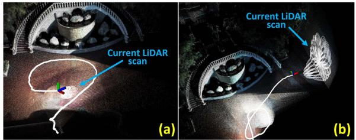

## E. Experiment-2: Evaluation of Robustness

Besides illumination and scene change, we also test the robustness of our system to extreme scenarios where sensor degeneration occurs. We use the R3LIVE-dataset, which contains such extreme scenarios.

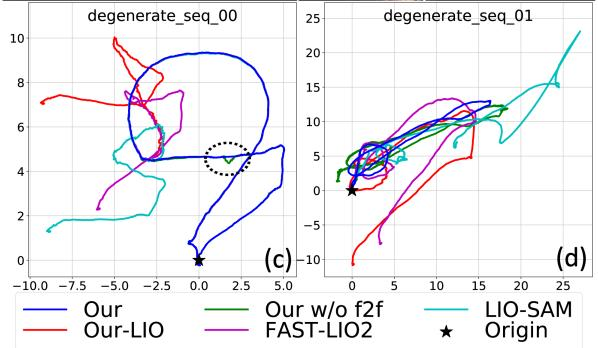

1) Evaluation ofRobustness in LiDAR Degenerated Scenarios: In this experiment, we evaluate the robustness of our proposed system by testing our system on the sequence “degenerate\_seq\_00” and “degenerate\_seq $_ { - } 0 1 ^ { \dag }$ of R3LIVE-dataset (see Section VI-B2). These two sequences were collected in front ofa stairway with the LiDAR occasionally facing against the ground and a side wall (see Fig. 10(a) and (b)). When facing a wall, the LiDAR only observes a single plane, which is insufficient to determine the LiDAR pose, causing LiDAR degeneration. The device starts from and ends at the same location, enabling the

Fig. 10. Robustness evaluation in LiDAR degenerated environments.

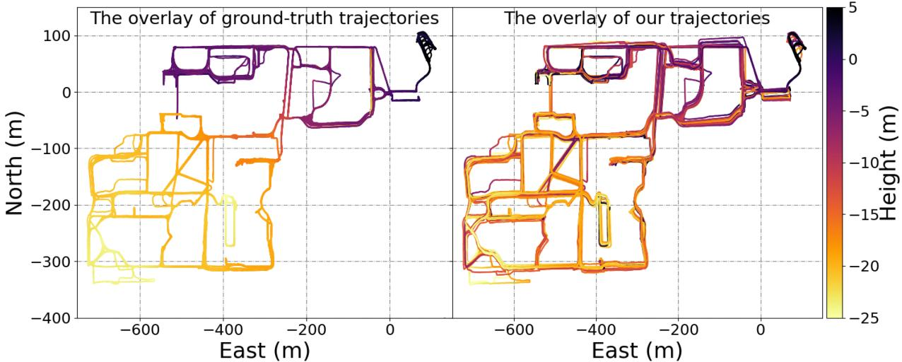  
Fig. 11. The overlay of ground-truth trajectory and ours on NCLT-dataset. The accompanying video of R3LIVE++ in reconstructing the large-scale radiance map of a sequence from the NCLT dataset is available on YouTube: https://youtu.be/kZ8\_7k3HpIk?t=309.

evaluation of localization drift. The estimated trajectories of our proposed system, our LIO-subsystem Our-LIO, and another two LIO systems, FAST-LIO2 and LIO-SAM, are shown in Fig. 10(c) and (d). In addition, to further investigate the effectiveness of our frame-to-frame VIO update (in Section V-B), we conducted experiments by testing our system without the frame-to-frame VIO update, as referred to as “Our w/o $f 2 f '$ in Fig. 10 (c) and (d).

As can be seen, due to the LiDAR degeneration when facing a single plane, all three LiDAR-inertial odometry systems failed and did not return to the starting point. In contrast, by exploiting clues from the visual images, our proposed system works well in these two sequences and successfully returns to the starting point with drift down to 4.1 cm and 4.6 cm on sequences “degenerate\_seq\_00” and “degenerate\_seq\_01”, respectively. When the frame-to-frame VIO update is disabled, the estimated trajectory of “Our w/o f2f” appears to have sudden ”jumps” as the LiDAR data degrades (inside ellipse framebox of 10(c)), or even fail to return back to the origin (in Fig. 10(d)).

To obtain a more intuitive comprehension of the LiDAR degenerated scenarios, we recommend our readers to watch the accompanying video on YouTube: https://youtu.be/kZ8\_ 7k3HpIk?t=370.

2) Evaluate of Robustness in Simultaneously LiDAR Degenerated and Visual Texture-Less Environments: In this experiment, we challenge one of the most difficult scenarios in SLAM, where both LiDAR and camera degenerate. We use sequence “degenerate\_seq ${ } _ { - } 0 2 ^ { \dag }$ of the R3LIVE-dataset, where the sensor device passes through a narrow “T”-shape passage (see Fig. 12) while occasionally facing against the side walls, causing LiDAR degeneration. Moreover, the visual texture on the white walls is very limited (Fig. 12(a) and Fig. 12(c)), especially for the wall-1, which has only changes in illumination. The absence of available LiDAR and visual features makes such scenarios rather challenging for both LiDAR-based and visual-based SLAM methods.

Taking advantage of the raw pixel color information and tightly fusing it with the LiDAR point cloud measurements, our proposed algorithm can “survive” in such extremely difficult scenarios. Fig. 13 shows our estimated pose, with the phases of passing through “wall-1” and “wall-2” shaded with purple and yellow, respectively. The estimated covariance is also shown in Fig. 13, which is bounded over the entire estimated trajectory, indicating that our estimation quality is stable over the entire process. The sensor is moved to the starting point, where an ArUco marker board is used to obtain the ground-true relative pose between the starting and end poses. Compared with the groundtrue end pose, our algorithm drifts 1.62◦ in rotation and 4.57 cm in translation. We recommend the readers to the accompanying video on YouTube ( https://youtu.be/kZ8\_7k3HpIk?t=440) for better visualization of the experiment.

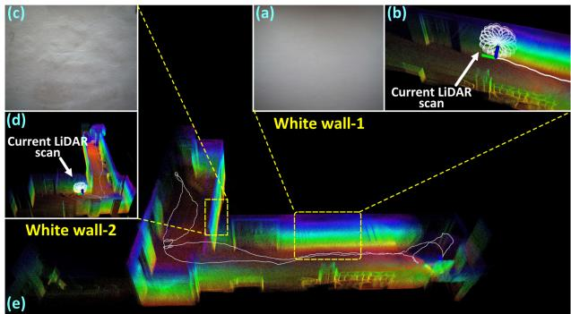  
Fig. 12. Tests in simultaneously LiDAR degenerated and visual texture-less environments.

## F. Experiment-3: Evaluation of Radiance Map Reconstruction

In this experiment, we evaluate the accuracy of our proposed algorithm in reconstructing the radiance map. Since the ground-true radiance map of the environment can not be measured, we evaluate the accuracy based on two indicators: one is the estimation quality of the camera exposure time and the other is the average photometric error between the reconstructed radiance map and the measured images.

1) Evaluation of Exposure Time Estimation: In this experiment, we evaluate the accuracy ofthe estimated camera exposure time by comparing it with the ground-true value read from the camera’s API. We use four sequences (see Fig. 18) of the R3LIVE-dataset, where the data were collected by traveling through both interior and exterior of a complex building to ensure significant changes in lighting conditions. We compare our estimated results with Tum-cali [47] and DSO [25], which are two existing state-of-the-art baselines that can estimate the camera’s exposure time. All of these methods are initialized by assuming the exposure time of the first image frame is at a default value of 1ms.

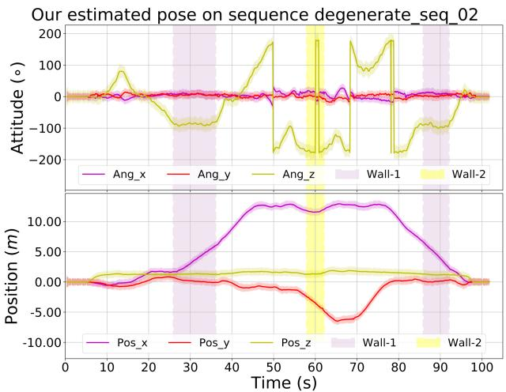  
Fig. 13. The estimated poses and their 3-σ bound with 5 times amplification for better visualization (the light-colored area around the trajectory) of the test in simultaneously LiDAR degenerated and visual texture-less environments. The shaded areas in purple and yellow are the phases of the sensors facing against the white “wall-1” and “wall-2”, respectively.

TABLE V  
THE COMPARISON OF ESTIMATION ERROR OF EXPOSURE TIME OVER 5 SEQUENCES
<table><tr><td>Sequence</td><td>Our Mean/Max (ms)</td><td>Tum_cali Mean/Max (ms)</td><td>DSO Mean/Max (ms)</td></tr><tr><td>hku_campus_seq_02</td><td>3.460 / 20.311</td><td>7.082 / 36.175</td><td>7.605 / 43.194</td></tr><tr><td>hku_campus_seq_03</td><td>1.460 / 10.653</td><td>6.400  / 37.126</td><td>6.553 / 41.014</td></tr><tr><td>hku_main_building</td><td>2.572 / 16.855</td><td>5.196 / 26.775</td><td>5.550  / 30.281</td></tr><tr><td>hkust_campus_seq_02</td><td>0.189 / 1.185</td><td>0.341  / 1.451</td><td>2.428 / 17.719</td></tr><tr><td>hkust_campus_seq_03</td><td>0.302 / 3.514</td><td>5.225 / 13.361</td><td>0.381  /  2.040</td></tr></table>

The results are shown in Fig. 18, where the estimated exposure time of our method, Tum-cali [47], and DSO [25] are re-scaled to match with the ground-truth for better visualization. The average and maximum error of estimated exposure time w.r.t. the ground-truth is listed in Table V. As shown in Fig. 18 and Table V, our proposed method shows significantly lower estimation error than [47] and [25]. This is mainly because our method estimates the exposure time by minimizing the scan-to-map radiance error, while [47] and [25] recovers the exposure times from consecutive frames. The consequence is that our method can better utilize longer-term temporal intensity changes to restrain the drift of the exposure time estimation.

2) Evaluation ofRadiance Map: In this experiment, we evaluate the accuracy of our proposed algorithm in reconstructing the radiance map. Currently, LiDAR point cloud colorization remains one of the most challenging problems in the field of 3D reconstruction. The most common way is using the most recent image frame in time to give the color of each LiDAR frame [39], [49]. The preliminary implementation of our system R3LIVE published previously [45] colorized the point cloud by minimizing the photometric error similar to our current system but does not consider any exposure time estimation or photometric calibration. In this experiment, we compare our system against the previous implementation R3LIVE [45] to show the effectiveness of the exposure time estimation and photometric calibration and against the current baseline [39], [49] to show the advantage of the overall system.

TABLE VI  
THE AVERAGE PHOTOMETRIC ERROR AMONG ALL SEQUENCES OF R3LIVE-DATASET
<table><tr><td>Sequence</td><td>Frames</td><td>baseline</td><td>R3LIVE</td><td>R³LIVE++</td></tr><tr><td>degenerate_seq_00</td><td>3315</td><td>30.58</td><td>21.36</td><td>16.19</td></tr><tr><td>degenerate_seq_01</td><td>1715</td><td>34.24</td><td>21.28</td><td>16.55</td></tr><tr><td>degenerate_seq_02</td><td>1694</td><td>27.14</td><td>20.30</td><td>15.97</td></tr><tr><td>hku_campus_seq_00</td><td>3016</td><td>34.78</td><td>22.56</td><td>14.57</td></tr><tr><td>hku_campus_seq_01</td><td>4502</td><td>34.97</td><td>22.47</td><td>16.30</td></tr><tr><td>hku_campus_seq_02</td><td>10409</td><td>39.01</td><td>23.73</td><td>16.85</td></tr><tr><td>hku_campus_seq_03</td><td>5557</td><td>42.95</td><td>24.78</td><td>16.93</td></tr><tr><td>hku_main_building</td><td>12157</td><td>43.12</td><td>22.26</td><td>19.04</td></tr><tr><td>hku_park_00</td><td>3410</td><td>43.29</td><td>25.17</td><td>19.02</td></tr><tr><td>hku_park_01</td><td>5251</td><td>43.86</td><td>27.01</td><td>20.07</td></tr><tr><td>hkust_campus_seq_00</td><td>16075</td><td>37.64</td><td>24.19</td><td>18.00</td></tr><tr><td>hkust_campus_seq_01</td><td>17426</td><td>39.09</td><td>24.67</td><td>18.53</td></tr><tr><td>hkust_campus_seq_02</td><td>15232</td><td>35.60</td><td>22.37</td><td>18.65</td></tr><tr><td>hkust_campus_seq_03</td><td>4031</td><td>41.74</td><td>23.77</td><td>18.92</td></tr><tr><td>Average</td><td>7413.57</td><td>38.60</td><td>23.58</td><td>18.01</td></tr></table>

To assess the radiance reconstruction error, after the map reconstruction, we re-project all points in the map with radiance information to each image frame with the estimated camera pose and calibrated photometric parameters. Then, we calculate the photometric error between the map point color and the RGB values of the image at the projected pixel location. The average photometric error of each image frame is calculated to evaluate the accuracy of the reconstructed radiance map. We perform the evaluation on all R3LIVE-dataset sequences, with the results of each sequence are given in Fig. 14, and the average photometric of each sequence is listed in Table VI. As can be seen, our system has consistently achieved the lowest photometric errors in all sequences and the next best is R3LIVE. Fig. 15 shows a few closeups of the reconstructed radiance map, from which we can clearly tell the words on objects. Moreover, in Fig. 16, we present the reconstructed radiance map of the sequence “hku\_main\_building” in R3LIVE-dataset, in which we collect the data in both interior and exterior of the main building of HKU. As shown in Fig. 16, both the indoor and outdoor details (e.g., marks on the road) are very clear, demonstrating that our proposed algorithm is of high accuracy. What worth mentioning is, this 3D radiance map is reconstructed on the fly as the data is being acquired (see the accompanying video on YouTube: https://youtu.be/kZ8\_7k3HpIk?t=48). For more qualitative results of other sequences, we refer our readers to Section 3 of our Supplementary Material [54].

## G. Run Time Analysis

In this section, we investigate the average time consumption of our proposed system on a CPU-Only PC (equipped with an Intel i7-9700K CPU and 64 GB RAM). Table VII listed the mean, maximum, and minimum of sequences’ average time consumption on both datasets (i.e., the NCLT-dataset and R3LIVE-dataset). For a detailed breakdown of the time consumption of each sequence, please refer to Section 3 of our Supplementary Material [54]. For the NCLT-dataset, each Li-DAR scan takes an average of 34.3 ms and each camera image takes an average of 16.6ms processing time. Since the data rate of the LiDAR and camera sensors are 10 Hz and 5 Hz, the total processing time per second is 426 ms, comprising of the time for processing 10 LiDAR scans (i.e., 343 ms) and 5 images (83 ms). For R3LIVE-dataset, each LiDAR scan takes an average of 22.7 ms and each camera image takes an average of 16.2 ms processing time. Since the data rate of the LiDAR and camera sensors are 10 Hz and 15 Hz, the total processing time per second is 470 ms, comprising ofthe time for processing 10 LiDAR scans (i.e., 235 ms) and 15 images (244 ms). In both cases, the processing time required per second is below half a second, indicating that our system runs in real-time (even two times faster than realtime) in both pose estimation and radiance map reconstruction. In addition, the processing time per image is similar across the two datasets while that for each LiDAR scan is quite different. The reason is that the LiDAR in R3LIVE-dataset has a much lower data rate than that of the NCLT-dataset (240k versus 695k points per second) while the cameras have similar resolution.

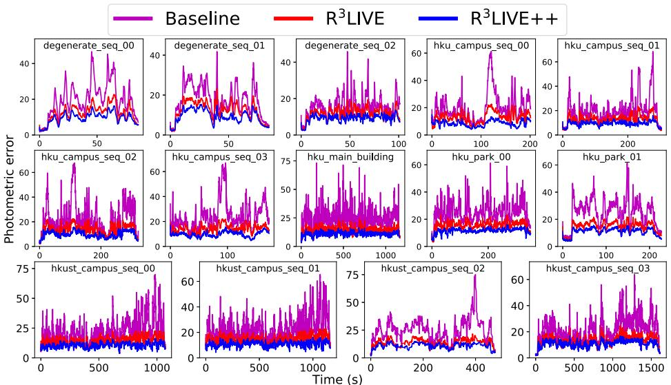

Fig. 14. Photometric errors between the reconstructed radiance map and image pixels.  
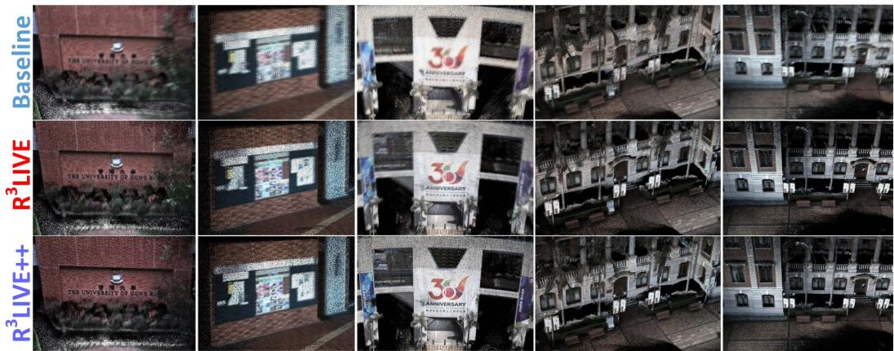

Fig. 15. Closeup of a few scenes in the radiance map reconstructed by the baseline, R3LIVE and R3LIVE++.  
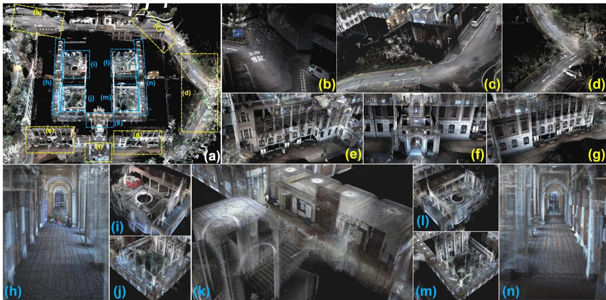  
Fig. 16. Our reconstructed radiance map of the main building of HKU. (a) The bird’s view of the map, with its details shown in $( \mathbf { b } \sim \mathbf { n } ) .$ . (b ∼ g) closeup of outdoor scenarios and (h∼ n) closeup of indoor scenarios. To see the real-time reconstruction process of the map, please refer to the video on YouTube: https://youtu.be/kZ8\_7k3HpIk?t=48.

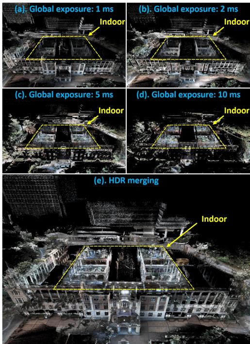  
Fig. 17. (a ∼ d) Images rendered from the reconstructed radiance map at different exposure time: 1 ms, 2 ms, 5 ms and 10 ms. (e) The HDR image merged from (a∼ d). Notice that for the sake of better visualization, those points that are overexposured are not displayed.

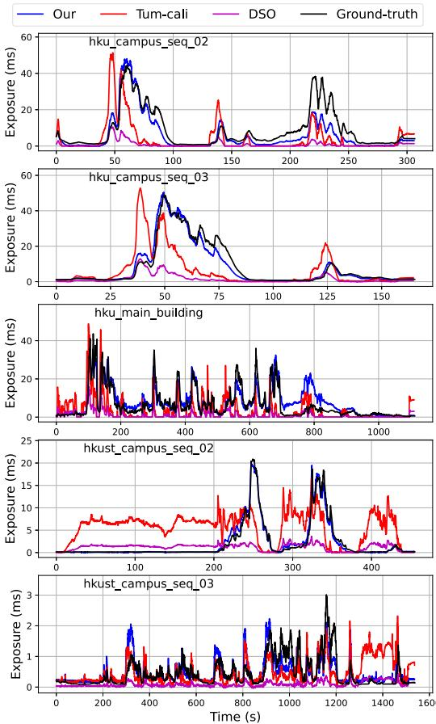  
Fig. 18. Estimation of camera exposure time.

TABLE VII  
THE MEAN, MAXIMUM, AND MINIMUM OF THE SEQUENCE’S AVERAGE TIME CONSUMPTION OF R3LIVE++ ON TWO DATASETS
<table><tr><td>NCLT-dataset</td><td> $\mathbf { M e a n } \pm \mathbf { S T D }$ </td><td> $\mathbf { M a x i m u m } \pm \mathbf { S T D }$ </td><td>Minimum ± STD</td></tr><tr><td>LiDAR frame (ms)</td><td> $\overline { { 3 4 . 2 7 1 \pm 1 0 . 5 5 1 } }$ </td><td> $\overline { { 3 8 . 1 5 3 \pm 9 . 1 8 7 } }$ </td><td> $2 9 . 0 7 0 \pm 8 . 8 0 7$ </td></tr><tr><td>Camera frame (ms)</td><td> $1 6 . 6 0 0 \pm 4 . 1 6 8$ </td><td> $1 7 . 6 1 3 \pm 4 . 2 7 5$ </td><td> $1 5 . 0 9 0 \pm 4 . 1 6 4$ </td></tr><tr><td>R³LIVE-dataset</td><td> $\mathbf { M e a n } \pm \mathbf { S T D }$ </td><td> $\mathbf { M a x i m u m \pm S T D }$ </td><td>Minimum ± STD</td></tr><tr><td>LiDAR frame (ms)</td><td> $2 3 . 4 5 3 \pm 7 . 4 3 1$ </td><td> $\overline { { 3 0 . 7 5 7 \pm 5 . 1 0 9 } }$ </td><td> $\overline { { 8 . 1 1 1 \pm 3 . 6 2 2 } }$ </td></tr><tr><td>Camera frame (ms)</td><td> $1 6 . 2 4 4 \pm 2 . 7 0 5$ </td><td> $1 8 . 8 2 9 \pm 3 . 7 1 9$ </td><td> $1 2 . 1 1 1 \pm 2 . 5 0 2$ </td></tr></table>

## VII. APPLICATIONS WITH R3LIVE

## A. High Dynamic Range (HDR) Imaging

After the reconstruction of the radiance map, we are able to render an image by projecting the map to an image plane with a given pose and exposure time with (3). Taking the sequence “hku\_main\_building” as an example, Fig. 17(a), (b), (c) and (d) are the rendered images with global exposure time of 1 ms, 2 ms, 5 ms and 10 ms, respectively. These images rendered at different exposure times can be merged into an HDR image shown in Fig. 17(e).

## B. R3LIVE++ for Various 3D Applications

While R3LIVE++ reconstructs the colored 3D map in realtime, we also develop software utilities to mesh and texture the reconstructed map offline, which are also publicly available on our GitHub repository [56]. With these developed utilities, we can export the reconstructed 3D maps to Unreal Engine [59] for enabling a series of 3D applications such as video games and vehicle simulators. For detailed showcases of our developed applications, we refer our reader to Section 4 of our Supplementary Material [54].

## VIII. CONCLUSIONS AND FUTURE WORKS

## A. Conclusion

In this paper, we proposed a novel LiDAR-inertial-visual fusion framework termed R3LIVE++ to achieve robust and accurate state estimation while simultaneously reconstructing the radiance map on the fly. This framework consists of two subsystems (i.e., the LIO and the VIO) that jointly and incrementally build a 3D radiance map of the environment in real-time. By tightly fusing the measurement of three different types of sensors, $\mathrm { R ^ { 3 } L I V E { + + } }$ can achieve higher localization accuracy while being robust enough to scenarios with sensor degenerations.

In our experiments, we extensively validated our proposed algorithm with real-world experiments in terms of localization accuracy, robustness, and radiance map reconstruction accuracy. The benchmark results on 25 sequences from an open dataset (the NCLT-dataset) showed that ${ \mathrm { R } } ^ { \mathrm { 3 } } { \mathrm { L I V E } } + +$ achieved the highest overall accuracy among all other state-of-the-art SLAM systems under comparison. The evaluation on R3LIVE-dataset (self-collected) showed that the proposed framework was robust to extremely challenging scenarios that LiDAR and/or camera measurements degenerate (e.g., when the device is facing a single texture-less wall). Finally, compared with other counterparts, $\mathrm { R ^ { 3 } L I V E { + + } }$ estimates the camera exposure time more accurately and reconstructs the true radiance information of the environment with significantly smaller errors when compared to the measured values in images.

To demonstrate the extendability of our work, we developed several applications based on our reconstructed radiance maps, such as high dynamic range (HDR) imaging, virtual environment exploration, and 3D video gaming. Finally, to share our findings and make contributions to the community, we made our codes, hardware design, and dataset publicly available on our GitHub repository [56].

## B. Future Works

Due to the absence of a loop correction mechanism in $\mathrm { R ^ { 3 } L I V E { + + } }$ , there is a possibility of gradual drift caused by the accumulation of localization errors when revisiting the same place. This can potentially result in inconsistent reconstructed outcomes upon revisits. In our forthcoming research, we aim to overcome this limitation by integrating our recent advancements in loop detection, as presented in [60], which is based on LiDAR point clouds. By employing this loop detection mechanism, we could identify loops in real-time and subsequently apply loop corrections to minimize drift and enhance the consistency of the reconstructed results.

Besides, the radiance map in $\mathrm { R ^ { 3 } L I V E { + + } }$ is reconstructed with 3D points that contain radiance information, which prevents us from rendering high-resolution images from the radiance map due to the limited point cloud density of the radiance map (1 cm in our current implementation). While further increasing this point cloud density is possible, it will further increase the processing time. This point density is also limited by the density of the raw points measured by LiDAR sensors. Noticing that images often have much higher resolution, in the future, we could explore how to make full use of such high-resolution images in the fusion framework.

## ACKNOWLEDGMENTS

The authors would like to thank DJI Company, Ltd.1 for providing devices and research funds.

## REFERENCES

[1] F. Gao, W. Wu, W. Gao, and S. Shen, “Flying on point clouds: Online trajectory generation and autonomous navigation for quadrotors in cluttered environments,” J. Field Robot., vol. 36, no. 4, pp. 710–733, 2019.

[2] F. Kong, W. Xu, Y. Cai, and F. Zhang, “Avoiding dynamic small obstacles with onboard sensing and computation on aerial robots,” IEEE Robot. Automat. Lett., vol. 6, no. 4, pp. 7869–7876, Oct. 2021.

[3] H. Lategahn, A. Geiger, and B. Kitt, “Visual SLAM for autonomous ground vehicles,” in Proc. IEEE Int. Conf. Robot. Automat., 2011, pp. 1732–1737.

[4] P. Beinschob and C. Reinke, “Graph slam based mapping for AGV localization in large-scale warehouses,” in Proc. IEEE Int. Conf. Intell. Comput. Commun. Process., 2015, pp. 245–248.

[5] J. Lin, X. Liu, and F. Zhang, “A decentralized framework for simultaneous calibration, localization and mapping with multiple LiDARs,” in Proc. IEEE/RSJ Int. Conf. Intell. Robots Syst., 2020, pp. 4870–4877.

[6] J. Levinson et al., “Towards fully autonomous driving: Systems and algorithms,” in Proc. IEEE Intell. Veh. Symp., 2011, pp. 163–168.

[7] G. Ros, A. Sappa, D. Ponsa, and A. M. Lopez, “Visual slam for driverless cars: A brief survey,” in Proc. Intell. Veh. Symp. Workshops, 2012, pp. 1–6.

[8] A. Singandhupe and H. M. La, “A review of slam techniques and security in autonomous driving,” in Proc. 3rd IEEE Int. Conf. Robotic Comput., 2019, pp. 602–607.

[9] O. Pink, “Visual map matching and localization using a global feature map,” in Proc. IEEE Comput. Soc. Conf. Comput. Vis. Pattern Recognit. Workshops, 2008, pp. 1–7.

[10] M. Bürki, M. Dymczyk, I. Gilitschenski, C. Cadena, R. Siegwart, and J. Nieto, “Map management for efficient long-term visual localization in outdoor environments,” in Proc. IEEE Intell. Veh. Symp., 2018, pp. 682– 688.

[11] B. Nagy and C. Benedek, “Real-time point cloud alignment for vehicle localization in a high resolution 3D map,” in Proc. Eur. Conf. Comput. Vis. Workshops, 2018, pp. 226–239.

[12] W. Li et al., “AADS: Augmented autonomous driving simulation using data-driven algorithms,” Sci. Robot., vol. 4, no. 28, 2019, Art. no. eaaw0863.

[13] Z. Bao, S. Hossain, H. Lang, and X. Lin, “A review of high-definition map creation methods for autonomous driving,” Eng. Appl. Artif. Intell., vol. 122, 2023, Art. no. 106125.

[14] C. Cadena et al., “Past, present, and future of simultaneous localization and mapping: Toward the robust-perception age,” IEEE Trans. Robot., vol. 32, no. 6, pp. 1309–1332, Dec. 2016.

[15] J. Lin and F. Zhang, “Loam\_livox: A fast, robust, high-precision LiDAR odometry and mapping package for LiDARs of small FoV,” in Proc. IEEE Int. Conf. Robot. Automat., 2020, pp. 3126–3131.

[16] J. Zhang and S. Singh, “LOAM: Lidar odometry and mapping in real-time,” in Proc. Robot.: Sci. Syst. Conf., vol. 2, no. 9, 2014, pp. 1–9.

[17] T. Shan and B. Englot, “LeGO-LOAM: Lightweight and ground-optimized LiDAR odometry and mapping on variable terrain,” in Proc. IEEE/RSJInt. Conf. Intell. Robots Syst., 2018, pp. 4758–4765.

[18] C. Park, P. Moghadam, J. L. Williams, S. Kim, S. Sridharan, and C. Fookes, “Elasticity meets continuous-time: Map-centric dense 3D LiDAR SLAM,” IEEE Trans. Robot., vol. 38, no. 2, pp. 978–997, Apr. 2022.

[19] H. Ye, Y. Chen, and M. Liu, “Tightly coupled 3D LiDAR inertial odometry and mapping,” in Proc. Int. Conf. Robot. Automat., 2019, pp. 3144–3150.

[20] T. Shan, B. Englot, D. Meyers, W. Wang, C. Ratti, and D. Rus, “LIO-SAM: Tightly-coupled LiDAR inertial odometry via smoothing and mapping,” in Proc. IEEE/RSJ Int. Conf. Intell. Robots Syst., 2020, pp. 5135–5142.

[21] K. Li, M. Li, and U. D. Hanebeck, “Towards high-performance solidstate-LiDAR-inertial odometry and mapping,” IEEE Robot. Automat. Lett., vol. 6, no. 3, pp. 5167–5174, Jul. 2021.

[22] C. Qin, H. Ye, C. E. Pranata, J. Han, S. Zhang, and M. Liu, “LINS: A lidar-inertial state estimator for robust and efficient navigation,” in :Proc. IEEE Int. Conf. Robot. Automat., 2020, pp. 8899–8906.

[23] W. Xu and F. Zhang, “FAST-LIO: A fast, robust LiDAR-inertial odometry package by tightly-coupled iterated kalman filter,” IEEE Robot. Automat. Lett., vol. 6, no. 2, pp. 3317–3324, Apr. 2021.

[24] W. Xu, Y. Cai, D. He, J. Lin, and F. Zhang, “FAST-LIO2: Fast direct LiDAR-inertial odometry,” IEEE Trans. Robot., vol. 38, no. 4, pp. 2053– 2073, Aug. 2022.

[25] J. Engel, V. Koltun, and D. Cremers, “Direct sparse odometry,” IEEE Trans. Pattern Anal. Mach. Intell., vol. 40, no. 3, pp. 611–625, Mar. 2018.

[26] A. J. Davison, I. D. Reid, N. D. Molton, and O. Stasse, “MonoSLAM: Real-time single camera SLAM,” IEEE Trans. Pattern Anal. Mach. Intell., vol. 29, no. 6, pp. 1052–1067, Jun. 2007.

[27] G. Klein and D. Murray, “Parallel tracking and mapping for small ar workspaces,” in Proc. 6th IEEE ACM Int. Symp. Mixed Augmented Reality, 2007, pp. 225–234.

[28] R. Mur-Artal, J. M. M. Montiel, and J. D. Tardos, “ORB-SLAM: A versatile and accurate monocular slam system,” IEEE Trans. Robot., vol. 31, no. 5, pp. 1147–1163, Oct. 2015.

[29] R. Mur-Artal and J. D. Tardós, “ORB-SLAM2: An open-source slam system for monocular, stereo, and RGB-D cameras,” IEEE Trans. Robot., vol. 33, no. 5, pp. 1255–1262, Oct. 2017.

[30] T. Qin, P. Li, and S. Shen, “VINS-Mono: A robust and versatile monocular visual-inertial state estimator,” IEEE Trans. Robot., vol. 34, no. 4, pp. 1004–1020, Aug. 2018.

[31] A. Rosinol, M. Abate, Y. Chang, and L. Carlone, “Kimera: An open-source library for real-time metric-semantic localization and mapping,” in Proc. IEEE Int. Conf. Robot. Automat., 2020, pp. 1689–1696.

[32] C. Campos, R. Elvira, J. J. G. Rodríguez, J. M. Montiel, and J. D. Tardós, “ORB-SLAM3: An accurate open-source library for visual, visual–inertial, and multimap SLAM,” IEEE Trans. Robot., vol. 37, no. 6, pp. 1874–1890, Dec. 2021.

[33] B. D. Lucas et al., “An iterative image registration technique with an application to stereo vision,” in Proc. 7th Int. Joint Conf. Artif. Intell., Vancouver, 1981, pp. 674–679.

[34] J. Engel, T. Schöps, and D. Cremers, “LSD-SLAM: Large-scale direct monocular SLAM,” in Proc. Eur. Conf. Comput. Vis., Springer, 2014, pp. 834–849.

[35] C. Forster, M. Pizzoli, and D. Scaramuzza, “SVO: Fast semi-direct monocular visual odometry,” in Proc. IEEE Int. Conf. Robot. Automat., 2014, pp. 15–22.

[36] J. Zhang and S. Singh, “Laser–visual–inertial odometry and mapping with high robustness and low drift,” J. Field Robot., vol. 35, no. 8, pp. 1242– 1264, 2018.

[37] W. Shao, S. Vijayarangan, C. Li, and G. Kantor, “Stereo visual inertial LiDAR simultaneous localization and mapping,” in Proc. IEEE/RSJ Int. Conf. Intell. Robots Syst., 2019, pp. 370–377.

[38] T. Laidlow, M. Bloesch, W. Li, and S. Leutenegger, “Dense RGB-D-inertial slam with map deformations,” in Proc. IEEE/RSJ Int. Conf. Intell. Robots Syst., 2017, pp. 6741–6748.

[39] Y. Zhu, C. Zheng, C. Yuan, X. Huang, and X. Hong, “CamVox: A low-cost and accurate lidar-assisted visual SLAM system,” in Proc. IEEE Int. Conf. Robot. Automat., 2021, pp. 5049–5055.

[40] X. Zuo, P. Geneva, W. Lee, Y. Liu, and G. Huang, “LIC-Fusion: LiDARinertial-camera odometry,” in Proc. IEEE/RSJ Int. Conf. Intell. Robots Syst., 2019, pp. 5848–5854.

[41] X. Zuo, Y. Yang, J. Lv, Y. Liu, G. Huang, and M. Pollefeys, “Lic-fusion 2.0: Lidar-inertial-camera odometry with sliding-window plane-feature tracking,” in Proc. Int. Conf. Intell. Robots Syst., 2020, pp. 5112–5119.

[42] D. Wisth, M. Camurri, and M. Fallon, “VILENS: Visual, inertial, lidar, and leg odometry for all-terrain legged robots,” IEEE Trans. Robot., vol. 39, no. 1, pp. 309–326, Feb. 2023.

[43] T. Shan, B. Englot, C. Ratti, and D. Rus, “LVI-SAM: Tightly-coupled lidar-visual-inertial odometry via smoothing and mapping,” in Proc. IEEE Int. Conf. Robot. Automat., 2021, pp. 5692–5698.

[44] J. Lin, C. Zheng, W. Xu, and F. Zhang, “R2LIVE: A robust, real-time, LiDAR-inertial-visual tightly-coupled state estimator and mapping,” IEEE Robot. Automat. Lett., vol. 6, no. 4, pp. 7469–7476, Oct. 2021.

[45] J. Lin and F. Zhang, “R3LIVE: A robust, real-time, RGB-colored, LiDARinertial-visual tightly-coupled state estimation and mapping package,” in Proc. Int. Conf. Robot. Automat., 2022, pp. 10672–10678.

[46] D. He, W. Xu, and F. Zhang, “Symbolic representation and toolkit development of iterated error-state extended kalman filters on manifolds,” IEEE Trans. Ind. Electron., vol. 70, no. 12, pp. 12533–12544, Dec. 2023.

[47] P. Bergmann, R. Wang, and D. Cremers, “Online photometric calibration of auto exposure video for realtime visual odometry and SLAM,” IEEE Robot. Automat. Lett., vol. 3, no. 2, pp. 627–634, Apr. 2018.

[48] A. Segal, D. Haehnel, and S. Thrun, “Generalized-ICP,” in Proc. Robot.: Sci. Syst., Seattle, WA, 2009, Art. no. 435.

[49] C. Zheng, Q. Zhu, W. Xu, X. Liu, Q. Guo, and F. Zhang, “FAST-LIVO: Fast and tightly-coupled sparse-direct LiDAR-inertial-visual odometry,” in Proc. IEEE/RSJ Int. Conf. Intell. Robots Syst., 2022, pp. 4003–4009.

[50] R. Wang, M. Schworer, and D. Cremers, “Stereo DSO: Large-scale direct sparse visual odometry with stereo cameras,” in Proc. IEEE Int. Conf. Comput. Vis., 2017, pp. 3903–3911.

[51] T. Qin and S. Shen, “Online temporal calibration for monocular visualinertial systems,” in Proc. IEEE/RSJ Int. Conf. Intell. Robots Syst., 2018, pp. 3662–3669.

[52] G. Grimmett and D. Stirzaker, Probability and Random Processes. London, U.K.: Oxford Univ. Press, 2020.

[53] N. Carlevaris-Bianco, A. K. Ushani, and R. M. Eustice, “University of michigan north campus long-term vision and lidar dataset,” Int. J. Robot. Res., vol. 35, no. 9, pp. 1023–1035, 2016.

[54] J. Lin and F. Zhang, “Supplementary material for R3LIVE,” 2024. [Online]. Available: https://github.com/ziv-lin/r3live\_dataset/raw/main/ supply/r3live\_plus\_plus\_supplementary\_material.pdf

[55] S. Garrido-Jurado, R. Muñoz-Salinas, F. J. Madrid-Cuevas, and M. J. Marín-Jiménez, “Automatic generation and detection of highly reliable fiducial markers under occlusion,” Pattern Recognit., vol. 47, no. 6, pp. 2280–2292, 2014.

[56] J. Lin and F. Zhang, “Github repository for R3LIVE,” 2024. [Online]. Available: https://github.com/hku-mars/r3live

[57] Z. Zhang and D. Scaramuzza, “A tutorial on quantitative trajectory evaluation for visual (-inertial) odometry,” in Proc. IEEE/RSJ Int. Conf. Intell. Robots Syst., 2018, pp. 7244–7251.

[58] W. Sun, Y. Hu, D. G. MacDonnell, C. Weimer, and R. R. Baize, “Technique to separate lidar signal and sunlight,” Opt. Exp., vol. 24, no. 12, pp. 12949– 12954, 2016.

[59] Epic Games, “Unreal Engine,” 1998. [Online]. Available: https://www. unrealengine.com

[60] C. Yuan, J. Lin, Z. Zou, X. Hong, and F. Zhang, “STD: Stable triangle descriptor for 3D place recognition,” in Proc. IEEE Int. Conf. Robot. Automat., 2023, pp. 1897–1903.

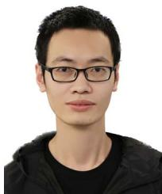  
Jiarong Lin (Member, IEEE) received the BS degree in optical information science and technology from the University of Electronic Science and Technology of China (UESTC), in 2015. He is currently working toward the PhD degree with the Department of Mechanical Engineering, the University of Hong Kong (HKU), Hong Kong, China. His research interests include light detection and ranging (LiDAR) mapping and sensor fusion.

Fu Zhang (Member, IEEE) received the BE degree in automation from the University of Science and Technology of China (USTC), Hefei, Anhui, China, in 2011, and the PhD degree in controls from the University of California at Berkeley, Berkeley, CA, USA, in 2015. He joined the Department of Mechanical Engineering, The University of Hong Kong (HKU), Hong Kong, as an assistant professor, in August 2018. His current research interests are on robotics and controls, with a focus on unmanned aerial vehicle (UAV) design, navigation, control, and light detection and ranging (LiDAR)-based simultaneous localization and mapping (SLAM).