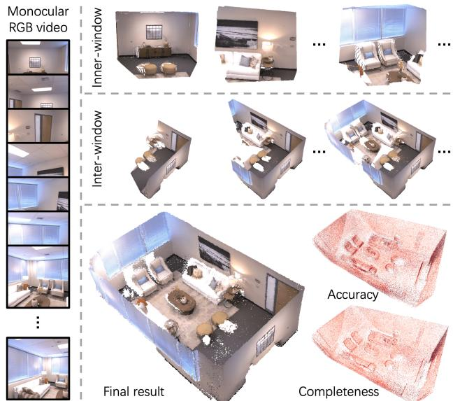
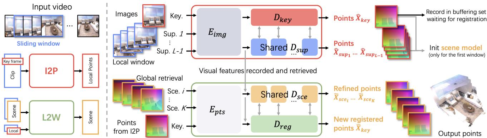
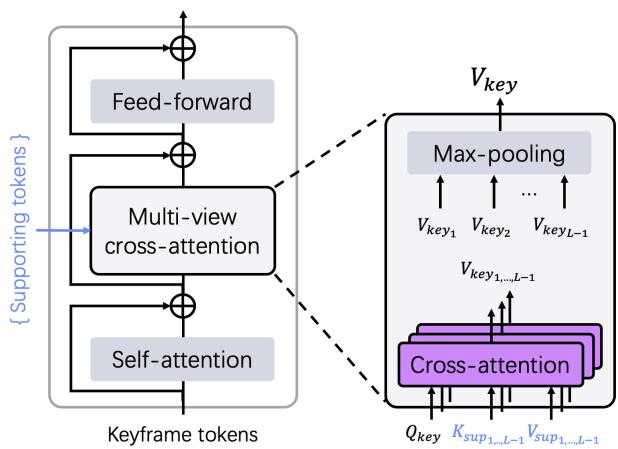
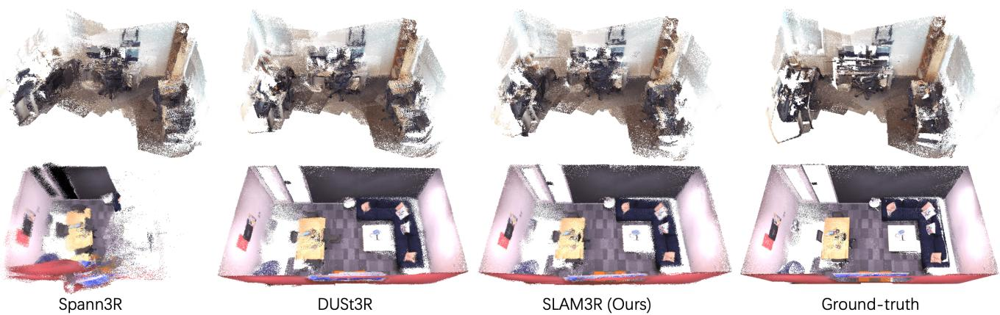
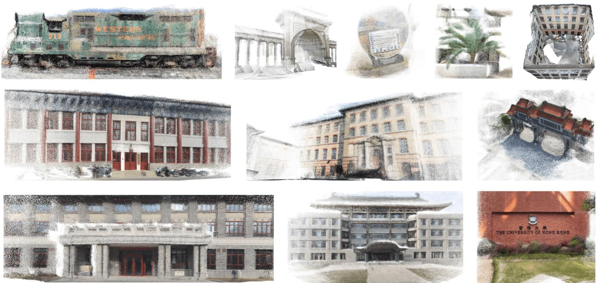

# SLAM3R: Real-Time Dense Scene Reconstruction from Monocular RGB Videos

Yuzheng Liu1\* Siyan Dong2\*† Shuzhe Wang3 Yingda Yin1

Yanchao Yang2† Qingnan Fan4 Baoquan Chen1†

1Peking University 2The University of Hong Kong 3Aalto University 4VIVO

## Abstract

In this paper, we introduce SLAM3R, a novel and effective system for real-time, high-quality, dense 3D reconstruction using RGB videos. SLAM3R provides an endto-end solution by seamlessly integrating local 3D reconstruction and global coordinate registration through feedforward neural networks. Given an input video, the system first converts it into overlapping clips using a sliding window mechanism. Unlike traditional pose optimizationbased methods, SLAM3R directly regresses 3D pointmaps from RGB images in each window and progressively aligns and deforms these local pointmaps to create a globally consistent scene reconstruction - all without explicitly solving any camera parameters. Experiments across datasets consistently show that SLAM3R achieves state-of-the-art reconstruction accuracy and completeness while maintaining real-time performance at 20+ FPS. Code available at: https://github.com/PKU-VCL-3DV/SLAM3R.

## 1. Introduction

Dense 3D reconstruction, a long-standing challenge in computer vision, aims to capture and reconstruct the detailed geometry of real-world scenes. Traditional approaches have largely relied on multi-stage pipelines. These typically begin with sparse Simultaneous Localization and Mapping (SLAM) [7, 16, 25, 37, 38] or Structure-from-Motion (SfM) [31, 33, 47, 53, 66] algorithms to estimate camera parameters, followed by Multi-View Stereo (MVS) [18, 48, 60, 68] techniques to fill in scene details. While these methods offer high-quality reconstructions, they often require offline processing to produce a complete model, which limits their applicability in real-world scenarios.

In the literature, dense SLAM approaches [5, 9, 10, 17, 22, 39, 42, 55, 56, 76, 78] have been developed to address dense scene reconstruction as a complete system. However, these approaches often fall short in terms of reconstruction accuracy or completeness, or they rely heavily on depth sensors. Recently, several monocular SLAM systems [29, 46, 73, 75, 77, 79] have been proposed to tackle dense scene reconstruction from RGB videos. By incorporating advanced scene representations [24, 36, 40, 57, 62], these systems produce accurate and complete scene reconstructions. However, this comes at the cost of reduced running efficiency. For example, NICER-SLAM [79] operates at a speed significantly below 1 FPS. Therefore, current approaches struggle with at least one of three key criteria: reconstruction accuracy, completeness, or efficiency.

  
Figure 1. We introduce a novel dense reconstruction system - SLAM3R. It takes a monocular RGB video as input and reconstructs the scene as a dense pointcloud. The video is converted into short clips for local reconstruction (denoted as inner-window), which are then incrementally registered together (inter-window) to create a global scene model. This process runs in real-time, producing a reconstruction that is both accurate and complete.

While monocular dense SLAM systems encounter the limitations mentioned earlier, recent advances in two-view geometry have shown promising potential. DUSt3R [64] introduces a purely end-to-end approach for learning dense reconstruction. Trained on large-scale datasets, its network is capable of producing high-quality dense reconstructions from paired images in real-time. However, for multiple views, a global optimization step is required to align these image pairs, which significantly hampers its efficiency. A concurrent work, Spann3R [61], extends DUSt3R to multiview (video) scenarios through an incremental pipeline with spatial memory. While this method accelerates the reconstruction process, it unfortunately results in noticeable accumulated drift and reduced reconstruction quality.

To address these challenges, we present SLAM3R (pronounced “slæm@r”), a real-time dense 3D reconstruction system using RGB-only videos as input. Unlike traditional SLAM problems, SLAM3R performs implicit camera localization and focuses more on dense scene mapping, where 3R stands for 3D Reconstruction. SLAM3R comprises a two-hierarchy framework. First, it reconstructs local 3D geometry from a sliding window that processes short clips from the input video. Then, it progressively registers these local reconstructions to build a globally consistent 3D scene. Both modules are developed with simple yet effective feed-forward models, enabling end-to-end and efficient scene reconstruction. Specifically, the two modules are the Image-to-Points (I2P) network and the Localto-World (L2W) network. The I2P module, inspired by DUSt3R, selects a keyframe in a local window as the coordinate system reference. It directly predicts the dense 3D point map supported by the remaining frames within that window. The L2W module incrementally fuses locally reconstructed points into a coherent global coordinate system. Both processes reconstruct the 3D points without explicitly estimating any camera parameters.

Through extensive experiments, we demonstrate that SLAM3R provides high-quality scene reconstructions with minimal drift, outperforming existing dense SLAM systems across various benchmarks. Furthermore, SLAM3R achieves these results at 20+ FPS, bridging the gap between quality and efficiency in RGB-only dense scene reconstruction. Our contributions are summarized below:

• We present a novel real-time end-to-end dense 3D reconstruction system that uses RGB videos to directly predict 3D pointmaps in a unified coordinate system through feed-forward neural networks.

• Through careful design, our Image-to-Points module can process an arbitrary number of images simultaneously, effectively extending DUSt3R to handle multiple views and produce higher-quality predictions.

• The proposed Local-to-World module directly aligns predicted local 3D pointmaps into a unified global coordinate system. This eliminates the need for explicit camera parameter estimation and costly global optimization.

• We evaluate our method on multiple public benchmarks. It achieves state-of-the-art reconstruction quality in terms of both accuracy and completeness at real-time speeds.

## 2. Related Work

Traditional offline approaches. Dense 3D pointcloud reconstruction is a long-standing problem in computer vision. Classical approaches to this problem first determine camera parameters using Structure from Motion (SfM) [31, 33, 47, 53, 66], followed by dense 3D points triangulation with Multi-View Stereo (MVS) [1, 18, 48, 60, 68]. In recent years, neural implicit [8, 30, 36, 62, 65] and 3D Gaussian [12, 19, 20] representations have been applied to further enhance the quality of dense reconstruction. While these methods deliver high-quality results, they have a significant limitation: the requirement for offline processing to generate the final 3D model, which restricts their applicability in real-time scenarios. In this paper, we focus on online dense reconstruction in the context of Simultaneous Localization and Mapping (SLAM).

Dense SLAM. Early works on SLAM [4, 7, 15, 16, 25, 37, 38] focused on reconstructing the structure of unknown environments while simultaneously localizing camera poses. These approaches prioritize real-time performance but produce only sparse structures of the scene. Dense SLAM approaches [5, 9–11, 17, 22, 27, 39, 42, 55, 56, 76, 78] incorporate detailed scene geometry information to improve pose estimation. DROID-SLAM [56] introduces recurrent iterative updates of camera poses and pixel-wise depth estimates, while TANDEM [27] proposes an online MVS module for depth prediction. These systems enable real-time dense scene reconstruction. However, their focus on camera trajectory accuracy often results in incomplete and noisy 3D reconstruction. Neural implicit and Gaussian representations have also been integrated with dense SLAM systems [9, 21–23, 32, 34, 42, 42, 44, 45, 55, 67, 72, 78]. However, these approaches often rely on additional depth sensors or focus primarily on novel view synthesis rather than producing detailed geometric reconstruction.

More recently, several monocular dense SLAM systems [29, 46, 73, 75, 77, 79] have been developed to produce dense scene geometry reconstruction. A notable limitation of these systems is their slow runtime. Among these systems, GO-SLAM [75] achieves a speed of ∼8 FPS, which still falls short of real-time capability. Furthermore, these methods all share a common strategy: they alternate between solving for camera poses and estimating the scene representation. In contrast, this paper presents a novel approach to dense scene reconstruction that eliminates the need for explicitly solving camera parameters, offering a more efficient and streamlined solution.

End-to-end dense 3D reconstruction. DUSt3R [64] introduces the first purely end-to-end dense 3D reconstruction pipeline without relying on camera parameters. Recently, several works have adopted a similar approach for singleview reconstruction [63], feature matching [28], novel view synthesis [52, 70], and dynamics reconstruction [74]. These successes demonstrate the effectiveness of end-to-end dense point prediction, inspiring us to develop a dense reconstruction system with a similar methodology.

While DUSt3R operates in real-time for two-view predictions, its extension to multiple views involves exhaustive pairing images and performing an additional global optimization step. This process significantly increases computational time, thereby hindering its real-time performance. MASt3R [28] enhances the matching capability of DUSt3R by adding a match head, achieving more accurate keypoint correspondences for 3D reconstruction [14], but at the cost of increased computational time. More recently, the concurrent work Spann3R [61] extends DUSt3R with spatial memory. It takes a video as input and performs incremental scene reconstruction in a unified coordinate system without requiring global optimization. While this approach significantly improves runtime efficiency, the incremental reconstruction pipeline frame by frame leads to noticeable accumulated drift. Unlike Spann3R, our networks at each hierarchy take multiple frames as input to minimize drift. Additionally, we propose a self-contained retrieval module that, when registering a new frame, this module selects not only its previous few frames but also other similar frames from long-term history for more global scene reference.

## 3. Method

Problem statement. Given a monocular video consisting of a sequence of RGB image frames $\{ I _ { i } \in \mathbb { R } ^ { H \times W \times 3 } \} _ { i = 1 } ^ { N }$ that captures a static scene, the goal is to reconstruct its dense 3D poincloud $P \in \mathbb { R } ^ { M \times 3 }$ , where M is the number of 3D points. Our work focuses on three key objectives: maximizing 3D points recovery for reconstruction completeness, improving the accuracy of each recovered point, and achieving these goals while preserving real-time performance.

System overview. Figure 2 illustrates an overview of the proposed dense reconstruction system. It consists of two main components: an Image-to-Points (I2P) network that recovers local 3D points from video clips, and a Local-to-World (L2W) network that registers local reconstructions into a global scene coordinate system. During the reconstruction of the dense point cloud, the system does not explicitly solve any camera parameters. Instead, it directly predicts 3D point maps in unified coordinate systems.

The system starts by applying a sliding window mechanism of length L to convert the input video into short clips $\{ \mathcal { W } _ { i } \ \in \ \mathbb { R } ^ { \tilde { L } \times H \times W \times 3 } \}$ The I2P network then processes each window Wi to recover local 3D pointmaps. Within each window, the system selects a keyframe to define a reference coordinate system for point reconstruction, as detailed in Sec. 3.1. By default, the stride of the sliding window is set to $^ { 1 , }$ ensuring each input frame in the video is selected at least once as a keyframe. For global scene reconstruction, we initialize the world coordinate system with the first window and use the reconstructed frames (image and local point map produced by the I2P) as input for the L2W model. The L2W model incrementally register these local reconstructions into a unified global 3D coordinate system. To ensure both accuracy and efficiency during this process, the system maintains a limited reservoir of registered frames, called scene frames. Whenever the L2W model registers a new keyframe, we retrieve the best-correlated scene frames as a reference. The details are introduced in Sec. 3.2.

## 3.1. Inner-Window Local Reconstruction

The Image-to-Points (I2P) model aims to infer dense 3D pointmaps for every pixel of a keyframe in a given video clip. By default, the middle image of a window W is chosen as the keyframe $I _ { k e y }$ to define the local coordinate system, as it is most likely to have the largest overlap with other frames. The remaining images $\{ I _ { s u p _ { i } } \} _ { i = 1 } ^ { L - 1 }$ serve as supporting frames. Note that the 3D pointmaps of supporting frames can also be reconstructed through I2P.

The I2P network draws inspiration from DUSt3R [64], originally designed for stereo 3D reconstruction. We introduce several simple yet effective modifications to extend it for multi-view scenarios. The I2P model uses a multibranch Vision Transformer (ViT) [13] as its backbone. It consists of a shared encoder $E _ { i m g } .$ , two separate decoders $D _ { k e y }$ and $D _ { s u p }$ , and a point regression head for final prediction. These components are detailed below.

Image encoder. For a given video clip, the image encoder $E _ { i m g }$ encodes each frame $I _ { i }$ to obtain token representations $F _ { i } ~ \in ~ \mathbb { R } ^ { T \times d }$ , where T is the number of tokens and d is the token dimension. The encoder $E _ { i m g }$ comprises m ViT encoder blocks, each containing self-attention and feed-forward layers. The encoding process is denoted as

$$
\boldsymbol { F } _ { i } ^ { ( T \times d ) } = E _ { i m g } ( I _ { i } ^ { ( H \times W \times 3 ) } ) , i = 1 , . . . , L .
$$

The frames are processed independently and in parallel, with the output divided into two parts: $F _ { k e y }$ for the keyframe and $\{ F _ { s u p _ { i } } \} _ { i = 1 } ^ { L - 1 }$ for the supporting frames.

Keyframe decoder. The keyframe decoder $D _ { k e y }$ consists of n ViT decoder blocks, each containing self-attention, cross-attention, and feed-forward layers. Unlike DUSt3R which uses the standard cross-attention, we introduce a novel multi-view cross-attention to combine information from different supporting frames. Given the feature tokens $F _ { k e y }$ and $\{ F _ { s u p _ { i } } \} _ { i = 1 } ^ { L - 1 }$ , the keyframe decoder $D _ { k e y }$ takes $F _ { k e y }$ as input for self-attention and performs cross-attention between $F _ { k e y }$ and $\{ F _ { s u p _ { i } } \} _ { i = 1 } ^ { L - 1 }$ . A decoder block is illustrated in Figure 3. For each cross-attention layer, queries are taken from $F _ { k e y }$ , while keys and values are extracted from the supporting tokens $F _ { s u p _ { i } }$ . These $L - 1$ cross-attention layers are independent of each other, allowing for parallel processing. A max-pooling layer is then employed to aggregate features after cross-attention. We obtain decoded

  
Figure 2. System overview. Given an input monocular RGB video, we apply a sliding window mechanism to convert it into overlapping clips (referred to as windows). Each window is fed into an Image-to-Points (I2P) network to recover 3D points in a local coordinate system. Next, the local points are incrementally fed into a Local-to-World (L2W) network to create a globally consistent scene model. The proposed I2P and L2W networks elegantly share similar architectures. In the I2P step (Sec. 3.1), we select a keyframe as a reference to se up a local coordinate system and use the remaining frames in the window to estimate the 3D geometry captured within it. The points from the first window are used to establish the world coordinate system. We then incrementally fuse the following windows in the L2W step (Sec. 3.2). This process involves retrieving the most relevant already-registered keyframes as a reference, and integrating new keyframes. Through this iterative process, we eventually obtain the full scene reconstruction.

keyframe tokens $G _ { k e y }$ as:

$$
G _ { k e y } = D _ { k e y } ( F _ { k e y } , F _ { s u p 1 } , . . . , F _ { s u p _ { L - 1 } } ) .
$$

  
Figure 3. Illustration of a decoder block in the proposed keyframe decoder $D _ { k e y }$ . We present a minimalist modification to integrate information from different supporting images. Our approach traverses each of them, selects its token keys and values, and uses the keyframe queries to interact with them separately across the supporting images. This multi-view information is then aggregated through max-pooling. The registration decoder $D _ { r e g }$ and scene decoder $D _ { s c e }$ (described in Sec. 3.2) share the same architecture.

Supporting decoder. The supporting decoder $D _ { s u p }$ is designed to complement the keyframe decoder. It inherits the decoder architecture used in DUSt3R, consisting of n standard ViT decoder blocks. The cross-attention mechanism is applied only to exchange information with the keyframe.

Note that all supporting frames share the same $D _ { s u p }$ . This process is denoted as

$$
G _ { s u p _ { i } } = D _ { s u p } ( F _ { s u p _ { i } } , F _ { k e y } ) , i = 1 , . . . , L - 1 .
$$

Points reconstruction. Similar to DUSt3R, we apply a linear head [64] to regress dense 3D pointmaps in the unified coordinate system from decoded tokens. In addition to the pointmaps, we also predict the confidence maps for all frames to evaluate their reliability. The final predictions are:

$$
\begin{array} { r } { \hat { X } _ { i } ^ { ( H \times W \times 3 ) } , \hat { C } _ { i } ^ { ( H \times W \times 1 ) } = \mathsf { H } ( G _ { i } ^ { ( T \times d ) } ) , i = 1 , . . . , L . } \end{array}
$$

Training loss. Following DUSt3R, the I2P network is trained end-to-end using ground-truth scene points $\{ X _ { i } \} _ { i = 1 } ^ { L }$ . Both the ground truth and predicted point maps are normalized to a canonical scale, determined by the average distance of all valid points within the window to the origin. The confidence-aware training loss is:

$$
\mathcal { L } _ { I 2 P } = \sum _ { i = 1 } ^ { L } M _ { i } \cdot ( \hat { C } _ { i } \cdot \mathbf { L } \mathbf { 1 } ( \frac { 1 } { \hat { z } } \hat { X } _ { i } , \frac { 1 } { z } X _ { i } ) - \alpha \log \hat { C } _ { i } ) ,
$$

where $M _ { i }$ represents a mask of valid points that have ground-truth values in $X _ { i } , z$ and zˆ are the scale factor, $\hat { C } _ { i }$ is the confidence map, the operator · denotes the elementwise matrix multiplication, L1(·) denotes the point-wise Euclidean distance, and α is a hyper-parameter to control the regularization term. We will detail the process in Sec 4.

## 3.2. Inter-Window Global Registration

After obtaining the 3D pointmap $\{ \hat { X } _ { k e y } \}$ from the I2P network, we use the inter-window Local-to-World (L2W)

model to incrementally register the newly generated pointmap into a global 3D coordinate system. Similar to the I2P network, the L2W model also relies on some frames to serve as a reference for the scene coordinate system. Furthermore, it can leverage multiple registered keyframes as a global reference. These registered keyframes are referred to as scene frames and they are maintained in a buffering set through a sampling mechanism.

The buffering set is designed for scalability in handling long videos. We apply a reservoir strategy [59] that maintains a maximum of $B$ registered frames in the buffering set. When a new keyframe is inferred from I2P and ready for fusion, we retrieve the top-K best-correlated scene frames from the buffering set as its support for global registration.

Scene initialization. The first window is used to initialize the scene model. It’s crucial to ensure this initialization is as accurate as possible. To achieve this, we execute the I2P network L times, attempting to traverse and designate each frame within the window as the keyframe. We then select the result with the highest total confidence score for scene model initialization. This process results in a scene pointcloud along with a set of registered frames. All these frames are regarded as scene frames, and they are used to initialize the buffering set.

Reservoir and retrieval. Each scene frame $I _ { s c e , }$ is recorded with its latent feature $F _ { s c e _ { i } }$ and pointmaps $X _ { s c e _ { i } } .$ For efficiency, we apply reservoir sampling to allow storing an unbiased subset of an empirical distribution in a bounded amount of memory. The first $B$ registered frames chosen are directly inserted into the buffering set. For each subsequent frame with $i d > B$ , the probability of inserting it is $B / i d .$ . If chosen for insertion, it will randomly replace one of the current scene frames in the buffering set.

Given a new keyframe $I _ { k e y }$ to be registered, we feed its feature $F _ { k e y }$ and the features from the buffering set into a retrieval module,

$$
{ \mathrm { R e t r i e v a l } } ( F _ { k e y } ^ { ( T \times d ) } , \{ F _ { s c e _ { i } } ^ { ( T \times d ) } \} ) ,
$$

to obtain a list of correlation scores, measuring both the visual similarity and baseline suitability between the keyframe and the scene frames in the buffering set. The retrieval module uses the first r decoder blocks from the I2P module as its backbone. A linear projection and an averagepooling layer follow, together producing an image-wise correlation score. We then select the top-K scene frames as a global reference to fuse the current keyframe. As a result, we have K scene frames and one keyframe as the input for the following L2W model.

Points embedding. The 3D pointmaps reconstructed by the I2P model are encoded into the L2W model using a patch embedding method similar to image patchification in the ViT encoder $E _ { i m g }$ . We process the new keyframe and $K$ retrieved scene frames in parallel as:

$$
\mathcal { P } _ { i } ^ { ( T \times d ) } = E _ { p t s } ( \hat { X } _ { i } ^ { ( H \times W \times 3 ) } ) , i = 1 , . . . , K + 1 .
$$

The encoded geometric tokens are combined with their corresponding visual tokens by

$$
\mathcal { F } _ { i } ^ { ( T \times d ) } = F _ { i } ^ { ( T \times d ) } + \mathcal { P } _ { i } ^ { ( T \times d ) } , i = 1 , . . . , K + 1 .
$$

This resulting a token set $\{ \mathcal { F } _ { k e y } , \{ \mathcal { F } _ { s c e _ { i } } \} _ { i = 1 } ^ { K } \}$ contains joint features of image patch appearance and 3D geometry for the keyframe and retrieved scene frames. In the following decoders, $\{ \mathcal P \}$ are further accumulated to $\{ \mathcal { F } \}$ between adjacent blocks to enhance the geometric representation.

Registration decoder. The registration decoder $D _ { r e g }$ takes feature tokens $\{ \mathcal { F } _ { k e y } , \{ \mathcal { F } _ { s c e _ { i } } \} _ { i = 1 } ^ { K } \}$ as input and aims to transform the local reconstruction of the keyframe to the scene coordinate system. It takes the same network architecture of the keyframe decoder $D _ { k e y }$ . This decoding process is denoted by

$$
\mathcal { G } _ { k e y } = D _ { r e g } ( \mathcal { F } _ { k e y } , \mathcal { F } _ { s c e _ { 1 } } , . . . , \mathcal { F } _ { s c e _ { K } } ) .
$$

Scene decoder. The scene decoder $D _ { s c e }$ takes the token set $\{ \mathcal { F } _ { k e y } , \{ \mathcal { F } _ { s c e _ { i } } \} _ { i = 1 } ^ { K } \}$ as input to refine the scene geometry without coordinate system changes. It uses the same network architecture as the keyframe decoder $D _ { k e y } ,$ allowing us to extend to multi-keyframe co-registration (see supplementary material for details). By default, we register one keyframe each time. Each of the $\mathcal { F } _ { s c e _ { i } }$ has information exchange only with the $\mathcal { F } _ { k e y }$ . This decoding process is denoted by

$$
\mathcal { G } _ { s c e _ { i } } = D _ { s c e } ( \mathcal { F } _ { s c e _ { i } } , \mathcal { F } _ { k e y } ) , i = 1 , . . . , K .
$$

Points reconstruction and training loss. We apply the same head design as that of the I2P network to predict all the pointmaps $\bar { \tilde { X } } _ { i }$ in the global scene coordinate system:

$$
\tilde { X } _ { i } ^ { ( H \times W \times 3 ) } , \tilde { C } _ { i } ^ { ( H \times W \times 1 ) } = \mathbf { H } ( \mathcal { G } _ { i } ^ { ( T \times d ) } ) , i = 1 , . . . , K + 1 .
$$

We train the L2W network using a similar loss function as the I2P network. Differently, no normalization is applied to the predicted point map, as the output scale must align with the scene frames in the input. This alignment ensures that the output can be directly integrated into the existing reconstruction. The training loss of the L2W network is:

$$
\mathcal { L } _ { L 2 W } = \sum _ { i = 1 } ^ { L } M _ { i } \cdot ( \tilde { C } _ { i } \cdot \mathrm { L } 1 ( \tilde { X } _ { i } , X _ { i } ) - \alpha \log \tilde { C } _ { i } ) .
$$

The following section provides a detailed discussion of the training process and its implementation details.

<table><tr><td>Method</td><td>Chess Acc. / Comp.</td><td>Fire Acc. / Comp.</td><td>Heads Acc. / Comp.</td><td>Office Acc. / Comp.</td><td>Pumpkin Acc. / Comp.</td><td>RedKitchen Acc. / Comp.</td><td>Stairs Acc. / Comp.</td><td>Average Acc. / Comp.</td><td>FPS</td></tr><tr><td>DUSt3R [64]</td><td>2.26 / 2.13</td><td>1.04 / 1.50</td><td>1.66 / 0.98</td><td>4.62 / 4.74</td><td>1.73 / 2.43</td><td>1.95 / 2.36</td><td>3.37 / 10.75</td><td>2.19 / 3.24</td><td>&lt;1</td></tr><tr><td>MASt3R [28]</td><td>2.08 / 2.12</td><td>1.54 / 1.43</td><td>1.06 / 1.04</td><td>3.23 / 3.19</td><td>5.68/ 3.07</td><td>3.50/ 3.37</td><td>2.36 / 13.16</td><td>3.04 / 3.90</td><td>《1</td></tr><tr><td>Spann3R [61]</td><td>2.23 / 1.68</td><td>0.88 / 0.92</td><td>2.67 / 0.98</td><td>5.86 / 3.54</td><td>2.25 / 1.85</td><td>2.68 / 1.80</td><td>5.65 / 5.15</td><td>3.42 / 2.41</td><td>&gt;50</td></tr><tr><td>SLAM3R-NoConf (Ours)</td><td>2.12 /1.21</td><td>0.95 / 0.80</td><td>3.23 / 1.67</td><td>2.59 / 2.21</td><td>1.99 / 2.04</td><td>2.09 / 1.88</td><td>4.54 / 6.38</td><td>2.40 / 2.24</td><td>~25</td></tr><tr><td>SLAM3R (Ours)</td><td>1.63 / 1.31</td><td>0.84 / 0.83</td><td>2.95 / 1.22</td><td>2.32 / 2.26</td><td>1.81 / 2.05</td><td>1.84 / 1.94</td><td>4.19 / 6.91</td><td>2.13 / 2.34</td><td>~25</td></tr></table>

Table 1. Reconstruction results on 7 Scenes [51] dataset. The average numbers are computed over all test sequences. The methods are categorized into two groups based on whether their FPS is above or below 1. The best results within each category are shown in bold. We report accuracy and completeness in centimeters. The color gradient shifts from red through yellow to green to show increasing FPS
<table><tr><td>Method</td><td>Room 0 Acc. / Comp.</td><td>Room 1 Acc. / Comp.</td><td>Room 2 Acc. / Comp.</td><td>Office 0 Acc. / Comp.</td><td>Office 1 Acc. / Comp.</td><td>Office 2 Acc. / Comp.</td><td>Office 3 Acc. / Comp.</td><td>Office 4 Acc. / Comp.</td><td>Average Acc. / Comp.</td><td>FPS</td></tr><tr><td>DUSt3R [64]</td><td>3.47 / 2.50</td><td>2.53 / 1.86</td><td>2.95 / 1.76</td><td>4.92 /3.51</td><td>3.09 / 2.21</td><td>4.01 / 3.10</td><td>3.27 / 2.25</td><td>3.66 / 2.61</td><td>3.49 / 2.48</td><td>&lt;1</td></tr><tr><td>MASt3R [28]</td><td>4.01 / 4.10</td><td>3.61 / 3.25</td><td>3.13 /2.15</td><td>2.57 /1.63</td><td>12.85 / 8.13</td><td>3.13 / 1.99</td><td>4.67 / 3.15</td><td>3.69 / 2.47</td><td>4.71 / 3.36</td><td>《1</td></tr><tr><td>NICER-SLAM [79]*</td><td>2.53 / 3.04</td><td>3.93 / 4.10</td><td>3.40/3.42</td><td>5.49 /6.09</td><td>3.45 / 4.42</td><td>4.02 / 4.29</td><td>3.34 / 4.03</td><td>3.03 / 3.87</td><td>3.65 /4.16</td><td>1</td></tr><tr><td>DROID-SLAM [56]*</td><td>12.18 / 8.96</td><td>8.35 / 6.07</td><td>3.26 / 16.01</td><td>3.01 / 16.19</td><td>2.39 / 16.20</td><td>5.66 / 15.56</td><td>4.49 / 9.73</td><td>4.65 / 9.63</td><td>5.50 / 12.29</td><td>~20</td></tr><tr><td>DIM-SLAM [29]*</td><td>14.19 / 6.24</td><td>9.56 / 6.45</td><td>8.41 / 12.17</td><td>10.16/ 5.95</td><td>7.86 / 8.33</td><td>16.50 / 8.28</td><td>13.01 / 6.77</td><td>13.08 / 8.62</td><td>11.60 / 7.85</td><td>~3</td></tr><tr><td>GO-SLAM [75]</td><td></td><td></td><td></td><td></td><td></td><td></td><td></td><td></td><td>3.81 / 4.79</td><td>~8</td></tr><tr><td>Spann3R [61]</td><td>9.75 / 12.94</td><td>15.51 / 12.94</td><td>7.28 / 8.50</td><td>5.46 / 18.75</td><td>5.24 / 16.64</td><td>9.33 / 11.80</td><td>16.00 / 9.03</td><td>13.97 / 16.02</td><td>10.32 / 13.33</td><td>&gt;50</td></tr><tr><td>SLAM3R-NoConf (Ours)</td><td>3.37 / 2.40</td><td>3.22 / 2.33</td><td>3.15 / 2.00</td><td>4.43 / 2.59</td><td>3.18 / 2.34</td><td>3.95 / 2.78</td><td>4.20 / 3.15</td><td>4.57 / 3.38</td><td>3.76 / 2.62</td><td>~24</td></tr><tr><td>SLAM3R (Ours)</td><td>3.19 / 2.40</td><td>3.12 / 2.34</td><td>2.72 / 2.00</td><td>4.28 / 2.60</td><td>3.17 / 2.34</td><td>3.84 / 2.78</td><td>3.90/ 3.16</td><td>4.32 / 3.36</td><td>3.57 / 2.62</td><td>~24</td></tr></table>

Table 2. Reconstruction results on Replica [54] dataset. \* denotes the results reported in NICER-SLAM.
<table><tr><td></td><td>DUSt3R [64]</td><td>MASt3R [28]</td><td>NICER-SLAM [79]*</td><td>DROID-SLAM [56]*</td><td>DIM-SLAM [29]</td><td>GO-SLAM [75]</td><td>Spann3R [61]</td><td>SLAM3R-NoConf (Ours)</td><td>SLAM3R (Ours)</td></tr><tr><td>7 Scenes</td><td>8.02</td><td>6.28</td><td>8.55</td><td>5.66</td><td></td><td></td><td>11.70</td><td>8.44</td><td>8.41</td></tr><tr><td>Replica</td><td>4.76</td><td>1.67</td><td>1.88</td><td>0.33</td><td>0.46</td><td>0.39</td><td>32.79</td><td>6.61</td><td>6.61</td></tr></table>

Table 3. Camera pose results evaluated by ATE-RMSE (cm) on 7 Scenes [51] and Replica [54] datasets.

  
Figure 4. We visualize the reconstruction results on two scenes: Office-09 and Office 2 from the 7-Scenes [51] and Replica [54] datasets. Our method runs in real-time and achieves high-quality reconstruction comparable to the offline method DUSt3R [64].

## 4. Experiments

Datasets. For both the Image-to-Points (I2P) and Localto-World (L2W) models, we perform training with a mixture of three datasets: ScanNet++ [71], Aria Synthetic En vironments [3] and CO3D-v2 [41]. These datasets vary from scene-level to object-centric, and contain both real world and synthetic scenes. Since they are all recorded sequentially, we can easily extract video clips with a slidingwindow mechanism as our training data. We select about

850K clips for training in total. To validate our reconstruction quality, we conduct quantitative evaluations on two unseen datasets: 7 Scenes [51], a real-world dataset of partial scenes, and Replica [54], a synthetic dataset of complete scenes. We also demonstrate visual reconstruction results across diverse datasets and in-the-wild captured videos to showcase the generalization ability of SLAM3R.

Implementation details. Both the I2P and L2W models build upon the architecture of DUSt3R [64] with minimal but effective modifications, making it natural for them to initialize their weights from the DUSt3R pre-trained model. We initialize our weights using the DUSt3R model trained on 224×224 resolution images with m = 24 encoder blocks, n = 12 decoder blocks with linear heads. All images are center-cropped to 224×224 pixels before feeding into SLAM3R. Our training is conducted on 8 NVIDIA 4090D GPUs, each with 24 GB of memory. It takes about one day. At test time, we set the initial window length to L = 5 to ensure high-quality reconstruction of all frames within the window. For subsequent incremental windows, we use L = 11 to provide more supporting views for better keyframe reconstruction. Please refer to our supplementary material for more implementation details.

  
Figure 5. Qualitative examples. We show our reconstruction results on Tanks and Temples [26], BlendedMVS [69], Map-free Reloc [2], LLFF [35], and ETH3D [49, 50] datasets, as well as in-the-wild captured videos, to demonstrate SLAM3R’s generalization ability.

## 4.1. Comparisons

Evaluation metrics. Following NICER-SLAM [79] and Spann3R [61], we build a ground-truth point cloud model for each test sequence by back-projecting pixels to the world using ground-truth depths and camera parameters. The reconstructed point clouds are aligned to ground truths using Umeyama [58] and ICP [43] algorithms. We quantify reconstruction quality through accuracy and completeness metrics. To demonstrate computational efficiency, we report frames per second (FPS) on a single NVIDIA 4090D GPU. We also evaluate camera poses using absolute trajectory error (ATE-RMSE). For detailed formulations of the metrics, please refer to the supplementary material.

Reconstruction results on the 7 Scenes [51] dataset. The numerical results of scene reconstruction quality are reported in Table 1. Following Spann3R [61]’s setting, we uniformly sample one-twentieth of the frames in each test sequence as input video. Each video is regarded as an individual scene. We evaluate SLAM3R using two settings: integrating the full pointmaps predicted for all input frames to create reconstruction results (denoted by SLAM3R-NoConf), and filtering pointmaps with a confidence threshold of 3 before creating reconstruction results (SLAM3R). We compare our method with optimizationbased reconstruction DUSt3R [64], triangulation-based MASt3R [28], and online incremental reconstruction Spann3R. Our method outperforms all baselines in both accuracy and completeness while maintaining real-time performance. As shown in the Office-09 scene (the top row in Figure 4), our approach demonstrates much less drift compared to the concurrent work Spann3R [61].

Reconstruction results on the Replica [54] dataset. Besides the baselines mentioned in 7 Scene datasets, we also compare the SLAM-based reconstruction approaches NICER-SLAM [79], DROID-SLAM [56], DIM-SLAM [29] and GO-SLAM [75] on the Replica [54] dataset. The numerical results on full scene reconstruction are reported in Table 2. Due to the memory constraint, DUSt3R [64] and MASt3R [28] process only onetwentieth of the frames for reconstruction. As is shown in the table, our method surpasses all baselines with FPS greater than 1. Notably, without any optimization procedure, our method achieves reconstruction quality comparable to optimization-based methods such as NICER-

<table><tr><td>Method</td><td># Frames</td><td>Acc.</td><td>Comp.</td><td>FPS</td></tr><tr><td>DUSt3R [64]</td><td>2</td><td>3.16</td><td>2.89</td><td>42.55</td></tr><tr><td>I2P</td><td>2</td><td>3.39</td><td>3.04</td><td>42.55</td></tr><tr><td>I2P</td><td>5</td><td>2.62</td><td>2.28</td><td>40.82</td></tr><tr><td>I2P (Default)</td><td>11</td><td>2.38</td><td>2.03</td><td>40.11</td></tr><tr><td>I2P</td><td>15</td><td>2.27</td><td>1.94</td><td>35.51</td></tr><tr><td>I2P</td><td>51</td><td>2.23</td><td>1.86</td><td>11.97</td></tr></table>

Table 4. Inner-window keyframe reconstruction results with various window lengths. By default, we use 11-frame windows for incremental reconstruction to balance quality and efficiency.

SLAM [79] and DUSt3R [64]. Example of the Office 2 (the bottom row in Figure 4) also illustrates the global consistency of our reconstruction result.

Camera pose estimation on 7 Scenes [51] and Replica [54]. Our method is designed in a new paradigm that reconstructs 3D points end-to-end without explicitly solving camera parameters. Following DUSt3R [64], We also derive camera poses from the predicted scene points using PnP-RANSAC solver in OpenCV [6] with ground truth camera intrinsics of each frame. The results are reported in Table 3. We can observe that camera poses and scene reconstruction results are not fully positively correlated. This discrepancy between pose and reconstruction errors indicates that effective end-to-end 3D reconstruction is possible and promising without first obtaining precise camera poses.

For more details on the comparisons in this section, please refer to our supplementary material.

## 4.2. Analyses

Effectiveness of the I2P model. To highlight the advantages of our multi-view I2P model over the original twoview DUSt3R [64], we evaluate the reconstruction quality of keyframes with varying numbers of supporting views. We conduct experiments on the Replica [54] dataset, where input views are sampled using a sliding window of different sizes, and the reconstruction accuracy and completeness of the keyframes are computed. The results are reported in Table 4. As the number of supporting views increases, our approach progressively improves reconstruction quality. Notably, the efficiency of our method remains stable until the window size exceeds 11, demonstrating the effectiveness of our parallel design. However, the results also show diminishing returns as the number of views increases, which we detail in the supplementary material. Visual results of I2P reconstruction can be found in Figure 1.

Advantages of the L2W model. The effectiveness of the L2W model is evaluated through ablation studies on the Replica [54] dataset. Per-window reconstructions are first generated with a window size of 11 using the I2P model. Local points are then aligned to a unified coordinate frame using different methods: global optimization from DUSt3R [64] (I2P-GA), traditional approaches such as Umeyama [58] and ICP [43] (I2P+UI), and our L2W model (I2P+L2W+Re). For consistency, we set the window size for global optimization to 10, which is equal to the number of views used to align new frames in other methods. Results in Table 5 show that our full method achieves superior alignment accuracy and computational efficiency compared to the alternatives.

<table><tr><td>Method</td><td>Acc.</td><td>Comp.</td><td>FPS</td></tr><tr><td>I2P+GA</td><td>4.87</td><td>3.00</td><td>~3</td></tr><tr><td>I2P+UI</td><td>7.47</td><td>3.86</td><td>~1</td></tr><tr><td>I2P+L2W</td><td>6.19</td><td>3.54</td><td>~92</td></tr><tr><td>I2P+L2W+Re (Full)</td><td>3.62</td><td>2.70</td><td>~43</td></tr></table>

Table 5. Reconstruction results using various point alignment methods and scene frame selection strategies. The FPS reported only accounts for the overhead of the alignment operation.

Analysis of the retrieval module. We propose a lightweight retrieval module that selects historical scene frames from the reservoir. This approach effectively performs implicit re-localization. We compare our retrieval method with a baseline approach that selects the ten nearest previous frames, named I2P+L2W. The results in Table 5 indicate a significant performance improvement with our retrieval strategy, demonstrating its effectiveness.

In-the-wild scene reconstruction. We have tested our method on a diverse range of unseen datasets and found that SLAM3R shows strong generalization capabilities. Figure 5 shows our reconstruction results on Tanks and Temples [26], BlendedMVS [69], Map-free Reloc [2], LLFF [35], and ETH3D [49, 50] datasets, as well as inthe-wild videos we captured. These results show that our method performs reliably across different scales and scenes. We also provide additional numerical results on sampled scenes from these datasets in the supplementary material.

## 5. Conclusion

In this paper, we present SLAM3R, a novel and effective system that performs real-time, high-quality, dense 3D scene reconstruction using RGB videos. It employs a twohierarchy neural network framework to perform end-to-end 3D reconstruction through streamlined feed-forward processes, eliminating the need to explicitly solve any camera parameters. Experiments demonstrate its state-of-the-art reconstruction quality and real-time efficiency (20+ FPS).

Limitations and future work. The elimination of camera parameter prediction prevents us from performing global bundle adjustment. Additionally, the poses derived from our scene point cloud prediction still fall short of SLAM systems that specialize in camera localization. Addressing these limitations will be the focus of our future work.

## 6. Acknowledgments

This work is supported by the National Key R&D Program of China (2022ZD0160800). This work is also supported by the Early Career Scheme of the Research Grants Council (grant # 27207224), the HKU-100 Award, a donation from the Musketeers Foundation, and in part by the JC STEM Lab of Robotics for Soft Materials funded by The Hong Kong Jockey Club Charities Trust. We thank the reviewers for their valuable feedback, as well as Zihan Zhu and Songyou Peng for their help with our experiments. Siyan Dong would also like to thank the support from HKU School of Computing and Data Science.

## References

[1] Henrik Aanæs, Rasmus Ramsbøl Jensen, George Vogiatzis, Engin Tola, and Anders Bjorholm Dahl. Large-scale data for multiple-view stereopsis. International Journal of Computer Vision, 120:153–168, 2016. 2

[2] Eduardo Arnold, Jamie Wynn, Sara Vicente, Guillermo Garcia-Hernando, Aron Monszpart, Victor Prisacariu, Daniyar Turmukhambetov, and Eric Brachmann. Map-free visual relocalization: Metric pose relative to a single image. In European Conference on Computer Vision, pages 690–708. Springer, 2022. 7, 8

[3] Armen Avetisyan, Christopher Xie, Henry Howard-Jenkins, Tsun-Yi Yang, Samir Aroudj, Suvam Patra, Fuyang Zhang, Duncan Frost, Luke Holland, Campbell Orme, et al. Scenescript: Reconstructing scenes with an autoregressive structured language model. arXiv preprint arXiv:2403.13064, 2024. 6

[4] Tim Bailey and Hugh Durrant-Whyte. Simultaneous localization and mapping (slam): Part ii. IEEE robotics & automation magazine, 13(3):108–117, 2006. 2

[5] Michael Bloesch, Jan Czarnowski, Ronald Clark, Stefan Leutenegger, and Andrew J Davison. Codeslam—learning a compact, optimisable representation for dense visual slam. In Proceedings of the IEEE conference on computer vision and pattern recognition, pages 2560–2568, 2018. 1, 2

[6] G Bradski. The opencv library. Dr. Dobb’s Journal of Software Tools, 2000. 8

[7] Carlos Campos, Richard Elvira, Juan J Gomez Rodr ´ ´ıguez, Jose MM Montiel, and Juan D Tard´ os. Orb-slam3: An accu-´ rate open-source library for visual, visual–inertial, and multimap slam. IEEE Transactions on Robotics, 37(6):1874– 1890, 2021. 1, 2

[8] Yiyang Chen, Siyan Dong, Xulong Wang, Lulu Cai, Youyi Zheng, and Yanchao Yang. Sg-nerf: Neural surface reconstruction with scene graph optimization. arXiv preprint arXiv:2407.12667, 2024. 2

[9] Chi-Ming Chung, Yang-Che Tseng, Ya-Ching Hsu, Xiang-Qian Shi, Yun-Hung Hua, Jia-Fong Yeh, Wen-Chin Chen, Yi-Ting Chen, and Winston H Hsu. Orbeez-slam: A realtime monocular visual slam with orb features and nerfrealized mapping. In 2023 IEEE International Conference on Robotics and Automation (ICRA), pages 9400–9406. IEEE, 2023. 1, 2

[10] Jan Czarnowski, Tristan Laidlow, Ronald Clark, and Andrew J Davison. Deepfactors: Real-time probabilistic dense monocular slam. IEEE Robotics and Automation Letters, 5 (2):721–728, 2020. 1

[11] Angela Dai, Angel X Chang, Manolis Savva, Maciej Halber, Thomas Funkhouser, and Matthias Nießner. Scannet: Richly-annotated 3d reconstructions of indoor scenes. In Proceedings ofthe IEEE conference on computer vision and pattern recognition, pages 5828–5839, 2017. 2

[12] Pinxuan Dai, Jiamin Xu, Wenxiang Xie, Xinguo Liu, Huamin Wang, and Weiwei Xu. High-quality surface recon struction using gaussian surfels. In ACM SIGGRAPH 2024 Conference Papers, pages 1–11, 2024. 2

[13] Alexey Dosovitskiy. An image is worth 16x16 words: Transformers for image recognition at scale. arXiv preprint arXiv:2010.11929, 2020. 3

[14] Bardienus Duisterhof, Lojze Zust, Philippe Weinzaepfel, Vincent Leroy, Yohann Cabon, and Jerome Revaud. Mast3rsfm: a fully-integrated solution for unconstrained structurefrom-motion. arXiv preprint arXiv:2409.19152, 2024. 3

[15] Hugh Durrant-Whyte and Tim Bailey. Simultaneous localization and mapping: part i. IEEE robotics & automation magazine, 13(2):99–110, 2006. 2

[16] Jakob Engel, Thomas Schops, and Daniel Cremers. Lsd-¨ slam: Large-scale direct monocular slam. In European conference on computer vision, pages 834–849. Springer, 2014. 1, 2

[17] Jakob Engel, Vladlen Koltun, and Daniel Cremers. Direct sparse odometry. IEEE transactions on pattern analysis and machine intelligence, 40(3):611–625, 2017. 1, 2

[18] Yasutaka Furukawa, Carlos Hernandez, et al. Multi-view´ stereo: A tutorial. Foundations and Trends® in Computer Graphics and Vision, 9(1-2):1–148, 2015. 1, 2

[19] Antoine Guedon and Vincent Lepetit. Sugar: Surface-´ aligned gaussian splatting for efficient 3d mesh reconstruction and high-quality mesh rendering. In Proceedings of the IEEE/CVF Conference on Computer Vision and Pattern Recognition, pages 5354–5363, 2024. 2

[20] Binbin Huang, Zehao Yu, Anpei Chen, Andreas Geiger, and Shenghua Gao. 2d gaussian splatting for geometrically accurate radiance fields. In ACM SIGGRAPH 2024 Conference Papers, pages 1–11, 2024. 2

[21] Huajian Huang, Longwei Li, Hui Cheng, and Sai-Kit Yeung. Photo-slam: Real-time simultaneous localization and photorealistic mapping for monocular stereo and rgb-d cameras. In Proceedings of the IEEE/CVF Conference on Computer Vision and Pattern Recognition, pages 21584–21593, 2024. 2

[22] Jiahui Huang, Shi-Sheng Huang, Haoxuan Song, and Shi-Min Hu. Di-fusion: Online implicit 3d reconstruction with deep priors. In Proceedings of the IEEE/CVF Conference on Computer Vision and Pattern Recognition, pages 8932– 8941, 2021. 1, 2

[23] Nikhil Keetha, Jay Karhade, Krishna Murthy Jatavallabhula, Gengshan Yang, Sebastian Scherer, Deva Ramanan, and Jonathon Luiten. Splatam: Splat track & map 3d gaussians for dense rgb-d slam. In Proceedings ofthe IEEE/CVF Con

ference on Computer Vision and Pattern Recognition, pages 21357–21366, 2024. 2

[24] Bernhard Kerbl, Georgios Kopanas, Thomas Leimkuhler,¨ and George Drettakis. 3d gaussian splatting for real-time radiance field rendering. ACM Trans. Graph., 42(4):139–1, 2023. 1

[25] Georg Klein and David Murray. Parallel tracking and mapping on a camera phone. In 2009 8th IEEE International Symposium on Mixed and Augmented Reality, pages 83–86. IEEE, 2009. 1, 2

[26] Arno Knapitsch, Jaesik Park, Qian-Yi Zhou, and Vladlen Koltun. Tanks and temples: Benchmarking large-scale scene reconstruction. ACM Transactions on Graphics (ToG), 36 (4):1–13, 2017. 7, 8

[27] Lukas Koestler, Nan Yang, Niclas Zeller, and Daniel Cremers. Tandem: Tracking and dense mapping in real-time using deep multi-view stereo. In Conference on Robot Learning, pages 34–45. PMLR, 2022. 2

[28] Vincent Leroy, Yohann Cabon, and Jer´ ome Revaud. Ground-ˆ ing image matching in 3d with mast3r. arXiv preprint arXiv:2406.09756, 2024. 2, 3, 6, 7

[29] Heng Li, Xiaodong Gu, Weihao Yuan, Luwei Yang, Zilong Dong, and Ping Tan. Dense rgb slam with neural implicit maps. In Proceedings of the International Conference on Learning Representations, 2023. 1, 2, 6, 7

[30] Zhaoshuo Li, Thomas Muller, Alex Evans, Russell H Tay-¨ lor, Mathias Unberath, Ming-Yu Liu, and Chen-Hsuan Lin. Neuralangelo: High-fidelity neural surface reconstruction. In Proceedings of the IEEE/CVF Conference on Computer Vision and Pattern Recognition, pages 8456–8465, 2023. 2

[31] Philipp Lindenberger, Paul-Edouard Sarlin, Viktor Larsson, and Marc Pollefeys. Pixel-perfect structure-frommotion with featuremetric refinement. In Proceedings of the IEEE/CVF international conference on computer vision, pages 5987–5997, 2021. 1, 2

[32] Lorenzo Liso, Erik Sandstrom, Vladimir Yugay, Luc¨ Van Gool, and Martin R Oswald. Loopy-slam: Dense neural slam with loop closures. In Proceedings of the IEEE/CVF Conference on Computer Vision and Pattern Recognition, pages 20363–20373, 2024. 2

[33] Shaohui Liu, Yifan Yu, Remi Pautrat, Marc Pollefeys, and´ Viktor Larsson. 3d line mapping revisited. In Proceedings of the IEEE/CVF Conference on Computer Vision and Pattern Recognition, pages 21445–21455, 2023. 1, 2

[34] Hidenobu Matsuki, Riku Murai, Paul HJ Kelly, and Andrew J Davison. Gaussian splatting slam. In Proceedings of the IEEE/CVF Conference on Computer Vision and Pattern Recognition, pages 18039–18048, 2024. 2

[35] Ben Mildenhall, Pratul P Srinivasan, Rodrigo Ortiz-Cayon, Nima Khademi Kalantari, Ravi Ramamoorthi, Ren Ng, and Abhishek Kar. Local light field fusion: Practical view synthesis with prescriptive sampling guidelines. ACM Transactions on Graphics (ToG), 38(4):1–14, 2019. 7, 8

[36] Ben Mildenhall, Pratul P Srinivasan, Matthew Tancik, Jonathan T Barron, Ravi Ramamoorthi, and Ren Ng. Nerf: Representing scenes as neural radiance fields for view synthesis. Communications ofthe ACM, 65(1):99–106, 2021. 1, 2

[37] Raul Mur-Artal and Juan D Tardos. Orb-slam2: An open-´ source slam system for monocular, stereo, and rgb-d cam eras. IEEE transactions on robotics, 33(5):1255–1262, 2017. 1, 2

[38] Raul Mur-Artal, Jose Maria Martinez Montiel, and Juan D Tardos. Orb-slam: a versatile and accurate monocular slam system. IEEE transactions on robotics, 31(5):1147–1163, 2015. 1, 2

[39] Richard A Newcombe, Steven J Lovegrove, and Andrew J Davison. Dtam: Dense tracking and mapping in real-time. In 2011 international conference on computer vision, pages 2320–2327. IEEE, 2011. 1, 2

[40] Songyou Peng, Michael Niemeyer, Lars Mescheder, Marc Pollefeys, and Andreas Geiger. Convolutional occupancy networks. In Computer Vision–ECCV 2020: 16th European Conference, Glasgow, UK, August 23–28, 2020, Proceed ings, Part III 16, pages 523–540. Springer, 2020. 1

[41] Jeremy Reizenstein, Roman Shapovalov, Philipp Henzler, Luca Sbordone, Patrick Labatut, and David Novotny. Common objects in 3d: Large-scale learning and evaluation of real-life 3d category reconstruction. In Proceedings of the IEEE/CVF international conference on computer vision, pages 10901–10911, 2021. 6

[42] Antoni Rosinol, John J Leonard, and Luca Carlone. Nerfslam: Real-time dense monocular slam with neural radiance fields. In 2023 IEEE/RSJ International Conference on Intelligent Robots and Systems (IROS), pages 3437–3444. IEEE, 2023. 1, 2

[43] Szymon Rusinkiewicz and Marc Levoy. Efficient variants of the icp algorithm. In Proceedings third international confer ence on 3-D digital imaging and modeling, pages 145–152. IEEE, 2001. 7, 8

[44] Erik Sandstrom, Yue Li, Luc Van Gool, and Martin R Os-¨ wald. Point-slam: Dense neural point cloud-based slam. In Proceedings of the IEEE/CVF International Conference on Computer Vision, pages 18433–18444, 2023. 2

[45] Erik Sandstrom, Kevin Ta, Luc Van Gool, and Martin R Os-¨ wald. Uncle-slam: Uncertainty learning for dense neural slam. In Proceedings of the IEEE/CVF International Conference on Computer Vision, pages 4537–4548, 2023. 2

[46] Erik Sandstrom, Keisuke Tateno, Michael Oechsle, Michael¨ Niemeyer, Luc Van Gool, Martin R Oswald, and Federico Tombari. Splat-slam: Globally optimized rgb-only slam with 3d gaussians. arXiv preprint arXiv:2405.16544, 2024. 1, 2

[47] Johannes L Schonberger and Jan-Michael Frahm. Structurefrom-motion revisited. In Proceedings of the IEEE conference on computer vision and pattern recognition, pages 4104–4113, 2016. 1, 2

[48] Johannes L Schonberger, Enliang Zheng, Jan-Michael¨ Frahm, and Marc Pollefeys. Pixelwise view selection for unstructured multi-view stereo. In Computer Vision–ECCV 2016: 14th European Conference, Amsterdam, The Nether lands, October 11-14, 2016, Proceedings, Part III 14, pages 501–518. Springer, 2016. 1, 2

[49] Thomas Schops, Johannes L Schonberger, Silvano Galliani, Torsten Sattler, Konrad Schindler, Marc Pollefeys, and Andreas Geiger. A multi-view stereo benchmark with high

resolution images and multi-camera videos. In Proceedings ofthe IEEE conference on computer vision and pattern recognition, pages 3260–3269, 2017. 7, 8

[50] Thomas Schops, Torsten Sattler, and Marc Pollefeys. Bad slam: Bundle adjusted direct rgb-d slam. In Proceedings of the IEEE/CVF Conference on Computer Vision and Pattern Recognition, pages 134–144, 2019. 7, 8

[51] Jamie Shotton, Ben Glocker, Christopher Zach, Shahram Izadi, Antonio Criminisi, and Andrew Fitzgibbon. Scene coordinate regression forests for camera relocalization in rgb-d images. In Proceedings of the IEEE conference on computer vision and pattern recognition, pages 2930–2937, 2013. 6, 7, 8

[52] Brandon Smart, Chuanxia Zheng, Iro Laina, and Victor Adrian Prisacariu. Splatt3r: Zero-shot gaussian splatting from uncalibarated image pairs. arXiv preprint arXiv:2408.13912, 2024. 2

[53] Noah Snavely, Steven M Seitz, and Richard Szeliski. Photo tourism: exploring photo collections in 3d. In ACM siggraph 2006 papers, pages 835–846. 2006. 1, 2

[54] Julian Straub, Thomas Whelan, Lingni Ma, Yufan Chen, Erik Wijmans, Simon Green, Jakob J. Engel, Raul Mur-Artal, Carl Ren, Shobhit Verma, Anton Clarkson, Mingfei Yan, Brian Budge, Yajie Yan, Xiaqing Pan, June Yon, Yuyang Zou, Kimberly Leon, Nigel Carter, Jesus Briales, Tyler Gillingham, Elias Mueggler, Luis Pesqueira, Manolis Savva, Dhruv Batra, Hauke M. Strasdat, Renzo De Nardi, Michael Goesele, Steven Lovegrove, and Richard Newcombe. The Replica dataset: A digital replica of indoor spaces. arXiv preprint arXiv:1906.05797, 2019. 6, 7, 8

[55] Edgar Sucar, Shikun Liu, Joseph Ortiz, and Andrew J Davison. imap: Implicit mapping and positioning in real-time. In Proceedings of the IEEE/CVF international conference on computer vision, pages 6229–6238, 2021. 1, 2

[56] Zachary Teed and Jia Deng. Droid-slam: Deep visual slam for monocular, stereo, and rgb-d cameras. Advances in neural information processing systems, 34:16558–16569, 2021. 1, 2, 6, 7

[57] Fabio Tosi, Youmin Zhang, Ziren Gong, Erik Sandstrom,¨ Stefano Mattoccia, Martin R Oswald, and Matteo Poggi. How nerfs and 3d gaussian splatting are reshaping slam: a survey. arXiv preprint arXiv:2402.13255, 4, 2024. 1

[58] Shinji Umeyama. Least-squares estimation of transformation parameters between two point patterns. IEEE Transactions on Pattern Analysis & Machine Intelligence, 13(04): 376–380, 1991. 7, 8

[59] Jeffrey S Vitter. Random sampling with a reservoir. ACM Transactions on Mathematical Software (TOMS), 11(1):37– 57, 1985. 5

[60] Fangjinhua Wang, Silvano Galliani, Christoph Vogel, and Marc Pollefeys. Itermvs: Iterative probability estimation for efficient multi-view stereo. In Proceedings ofthe IEEE/CVF conference on computer vision and pattern recognition, pages 8606–8615, 2022. 1, 2

[61] Hengyi Wang and Lourdes Agapito. 3d reconstruction with spatial memory. arXiv preprint arXiv:2408.16061, 2024. 2, 3, 6, 7

[62] Peng Wang, Lingjie Liu, Yuan Liu, Christian Theobalt, Taku Komura, and Wenping Wang. Neus: Learning neural implicit surfaces by volume rendering for multi-view reconstruction. arXiv preprint arXiv:2106.10689, 2021. 1, 2

[63] Ruicheng Wang, Sicheng Xu, Cassie Dai, Jianfeng Xiang, Yu Deng, Xin Tong, and Jiaolong Yang. Moge: Unlocking accurate monocular geometry estimation for open-domain images with optimal training supervision. arXiv preprint arXiv:2410.19115, 2024. 2

[64] Shuzhe Wang, Vincent Leroy, Yohann Cabon, Boris Chidlovskii, and Jerome Revaud. Dust3r: Geometric 3d vision made easy. In Proceedings ofthe IEEE/CVF Conference on Computer Vision and Pattern Recognition, pages 20697– 20709, 2024. 1, 2, 3, 4, 6, 7, 8

[65] Yiming Wang, Qin Han, Marc Habermann, Kostas Daniilidis, Christian Theobalt, and Lingjie Liu. Neus2: Fast learning of neural implicit surfaces for multi-view recon struction. In Proceedings of the IEEE/CVF International Conference on Computer Vision, pages 3295–3306, 2023. 2

[66] Changchang Wu. Visualsfm: A visual structure from motion system. http://www. cs. washington. edu/homes/ccwu/vsfm, 2011. 1, 2

[67] Chi Yan, Delin Qu, Dan Xu, Bin Zhao, Zhigang Wang, Dong Wang, and Xuelong Li. Gs-slam: Dense visual slam with 3d gaussian splatting. In Proceedings of the IEEE/CVF Conference on Computer Vision and Pattern Recognition, pages 19595–19604, 2024. 2

[68] Yao Yao, Zixin Luo, Shiwei Li, Tian Fang, and Long Quan. Mvsnet: Depth inference for unstructured multi-view stereo. In Proceedings of the European conference on computer vi sion (ECCV), pages 767–783, 2018. 1, 2

[69] Yao Yao, Zixin Luo, Shiwei Li, Jingyang Zhang, Yufan Ren, Lei Zhou, Tian Fang, and Long Quan. Blendedmvs: A largescale dataset for generalized multi-view stereo networks. In Proceedings of the IEEE/CVF conference on computer vision and pattern recognition, pages 1790–1799, 2020. 7, 8

[70] Botao Ye, Sifei Liu, Haofei Xu, Xueting Li, Marc Pollefeys, Ming-Hsuan Yang, and Songyou Peng. No pose, no problem: Surprisingly simple 3d gaussian splats from sparse unposed images. arXiv preprint arXiv:2410.24207, 2024. 2

[71] Chandan Yeshwanth, Yueh-Cheng Liu, Matthias Nießner, and Angela Dai. Scannet++: A high-fidelity dataset of 3d indoor scenes. In Proceedings of the IEEE/CVF International Conference on Computer Vision, pages 12–22, 2023. 6

[72] Vladimir Yugay, Yue Li, Theo Gevers, and Martin R Oswald. Gaussian-slam: Photo-realistic dense slam with gaussian splatting. arXiv preprint arXiv:2312.10070, 2023. 2

[73] Ganlin Zhang, Erik Sandstrom, Youmin Zhang, Manthan Pa-¨ tel, Luc Van Gool, and Martin R Oswald. Glorie-slam: Globally optimized rgb-only implicit encoding point cloud slam. arXiv preprint arXiv:2403.19549, 2024. 1, 2

[74] Junyi Zhang, Charles Herrmann, Junhwa Hur, Varun Jampani, Trevor Darrell, Forrester Cole, Deqing Sun, and Ming Hsuan Yang. Monst3r: A simple approach for estimating geometry in the presence of motion. arXiv preprint arXiv:2410.03825, 2024. 2

[75] Youmin Zhang, Fabio Tosi, Stefano Mattoccia, and Matteo Poggi. Go-slam: Global optimization for consistent 3d instant reconstruction. In Proceedings ofthe IEEE/CVF International Conference on Computer Vision, pages 3727–3737, 2023. 1, 2, 6, 7

[76] Huizhong Zhou, Benjamin Ummenhofer, and Thomas Brox. Deeptam: Deep tracking and mapping. In Proceedings of the European conference on computer vision (ECCV), pages 822–838, 2018. 1, 2

[77] Heng Zhou, Zhetao Guo, Shuhong Liu, Lechen Zhang, Qihao Wang, Yuxiang Ren, and Mingrui Li. Mod-slam: Monocular dense mapping for unbounded 3d scene reconstruction. arXiv preprint arXiv:2402.03762, 2024. 1, 2

[78] Zihan Zhu, Songyou Peng, Viktor Larsson, Weiwei Xu, Hujun Bao, Zhaopeng Cui, Martin R Oswald, and Marc Pollefeys. Nice-slam: Neural implicit scalable encoding for slam. In Proceedings of the IEEE/CVF conference on computer vision and pattern recognition, pages 12786–12796, 2022. 1, 2

[79] Zihan Zhu, Songyou Peng, Viktor Larsson, Zhaopeng Cui, Martin R Oswald, Andreas Geiger, and Marc Pollefeys. Nicer-slam: Neural implicit scene encoding for rgb slam. In 2024 International Conference on 3D Vision (3DV), pages 42–52. IEEE, 2024. 1, 2, 6, 7, 8